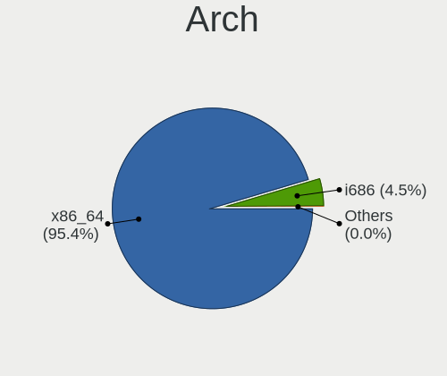
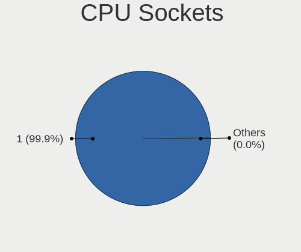
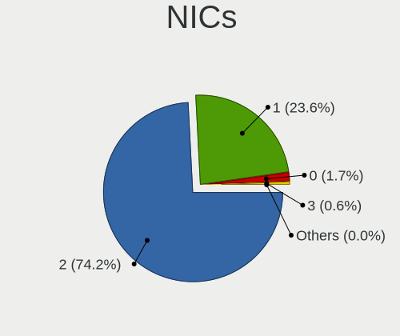

Linux - Tested Hardware & Statistics (Notebooks)
------------------------------------------------

A project to collect tested hardware configurations for Linux.

Anyone can contribute to this report by the [hw-probe](https://github.com/linuxhw/hw-probe) tool:

    sudo -E hw-probe -all -upload

Please contribute! Especially if your hardware is rare.

This report is for real hardware. Report for virtual hardware: [TestDays_VE](https://github.com/linuxhw/TestDays_VE)

Contents
--------

* [ Test Cases ](#test-cases)

* [ System ](#system)
  - [ OS                       ](#os)
  - [ OS Family                ](#os-family)
  - [ Kernel                   ](#kernel)
  - [ Kernel Family            ](#kernel-family)
  - [ Kernel Major Ver.        ](#kernel-major-ver)
  - [ Arch                     ](#arch)
  - [ DE                       ](#de)
  - [ Display Server           ](#display-server)
  - [ Display Manager          ](#display-manager)
  - [ OS Lang                  ](#os-lang)
  - [ Boot Mode                ](#boot-mode)
  - [ Filesystem               ](#filesystem)
  - [ Part. scheme             ](#part-scheme)
  - [ Dual Boot with Linux/BSD ](#dual-boot-with-linuxbsd)
  - [ Dual Boot (Win)          ](#dual-boot-win)

* [ Board ](#board)
  - [ Vendor                   ](#vendor)
  - [ Model                    ](#model)
  - [ Model Family             ](#model-family)
  - [ MFG Year                 ](#mfg-year)
  - [ Form Factor              ](#form-factor)
  - [ Secure Boot              ](#secure-boot)
  - [ Coreboot                 ](#coreboot)
  - [ RAM Size                 ](#ram-size)
  - [ RAM Used                 ](#ram-used)
  - [ Total Drives             ](#total-drives)
  - [ Has CD-ROM               ](#has-cd-rom)
  - [ Has Ethernet             ](#has-ethernet)
  - [ Has WiFi                 ](#has-wifi)
  - [ Has Bluetooth            ](#has-bluetooth)

* [ Location ](#location)
  - [ Country                  ](#country)
  - [ City                     ](#city)

* [ Drives ](#drives)
  - [ Drive Vendor             ](#drive-vendor)
  - [ Drive Model              ](#drive-model)
  - [ HDD Vendor               ](#hdd-vendor)
  - [ SSD Vendor               ](#ssd-vendor)
  - [ Drive Kind               ](#drive-kind)
  - [ Drive Connector          ](#drive-connector)
  - [ Drive Size               ](#drive-size)
  - [ Space Total              ](#space-total)
  - [ Space Used               ](#space-used)
  - [ Malfunc. Drives          ](#malfunc-drives)
  - [ Malfunc. Drive Vendor    ](#malfunc-drive-vendor)
  - [ Malfunc. HDD Vendor      ](#malfunc-hdd-vendor)
  - [ Malfunc. Drive Kind      ](#malfunc-drive-kind)
  - [ Failed Drives            ](#failed-drives)
  - [ Failed Drive Vendor      ](#failed-drive-vendor)
  - [ Drive Status             ](#drive-status)

* [ Storage controller ](#storage-controller)
  - [ Storage Vendor           ](#storage-vendor)
  - [ Storage Model            ](#storage-model)
  - [ Storage Kind             ](#storage-kind)

* [ Processor ](#processor)
  - [ CPU Vendor               ](#cpu-vendor)
  - [ CPU Model                ](#cpu-model)
  - [ CPU Model Family         ](#cpu-model-family)
  - [ CPU Cores                ](#cpu-cores)
  - [ CPU Sockets              ](#cpu-sockets)
  - [ CPU Threads              ](#cpu-threads)
  - [ CPU Op-Modes             ](#cpu-op-modes)
  - [ CPU Microcode            ](#cpu-microcode)
  - [ CPU Microarch            ](#cpu-microarch)

* [ Graphics ](#graphics)
  - [ GPU Vendor               ](#gpu-vendor)
  - [ GPU Model                ](#gpu-model)
  - [ GPU Combo                ](#gpu-combo)
  - [ GPU Driver               ](#gpu-driver)
  - [ GPU Memory               ](#gpu-memory)

* [ Monitor ](#monitor)
  - [ Monitor Vendor           ](#monitor-vendor)
  - [ Monitor Model            ](#monitor-model)
  - [ Monitor Resolution       ](#monitor-resolution)
  - [ Monitor Diagonal         ](#monitor-diagonal)
  - [ Monitor Width            ](#monitor-width)
  - [ Aspect Ratio             ](#aspect-ratio)
  - [ Monitor Area             ](#monitor-area)
  - [ Pixel Density            ](#pixel-density)
  - [ Multiple Monitors        ](#multiple-monitors)

* [ Network ](#network)
  - [ Net Controller Vendor    ](#net-controller-vendor)
  - [ Net Controller Model     ](#net-controller-model)
  - [ Wireless Vendor          ](#wireless-vendor)
  - [ Wireless Model           ](#wireless-model)
  - [ Ethernet Vendor          ](#ethernet-vendor)
  - [ Ethernet Model           ](#ethernet-model)
  - [ Net Controller Kind      ](#net-controller-kind)
  - [ Used Controller          ](#used-controller)
  - [ NICs                     ](#nics)
  - [ IPv6                     ](#ipv6)

* [ Bluetooth ](#bluetooth)
  - [ Bluetooth Vendor         ](#bluetooth-vendor)
  - [ Bluetooth Model          ](#bluetooth-model)

* [ Sound ](#sound)
  - [ Sound Vendor             ](#sound-vendor)
  - [ Sound Model              ](#sound-model)

* [ Memory ](#memory)
  - [ Memory Vendor            ](#memory-vendor)
  - [ Memory Model             ](#memory-model)
  - [ Memory Kind              ](#memory-kind)
  - [ Memory Form Factor       ](#memory-form-factor)
  - [ Memory Size              ](#memory-size)
  - [ Memory Speed             ](#memory-speed)

* [ Printers & scanners ](#printers--scanners)
  - [ Printer Vendor           ](#printer-vendor)
  - [ Printer Model            ](#printer-model)
  - [ Scanner Vendor           ](#scanner-vendor)
  - [ Scanner Model            ](#scanner-model)

* [ Camera ](#camera)
  - [ Camera Vendor            ](#camera-vendor)
  - [ Camera Model             ](#camera-model)

* [ Security ](#security)
  - [ Fingerprint Vendor       ](#fingerprint-vendor)
  - [ Fingerprint Model        ](#fingerprint-model)
  - [ Chipcard Vendor          ](#chipcard-vendor)
  - [ Chipcard Model           ](#chipcard-model)

* [ Unsupported ](#unsupported)
  - [ Unsupported Devices      ](#unsupported-devices)
  - [ Unsupported Device Types ](#unsupported-device-types)

Test Cases
----------

Total: 183153

| Vendor        | Model                       | Probe                                                      | Date         |
|---------------|-----------------------------|------------------------------------------------------------|--------------|
| HP            | EliteBook 8460p             | [cc6b66c576](https://linux-hardware.org/?probe=cc6b66c576) | Nov 06, 2023 |
| Lenovo        | ThinkPad E15 20RD0011IX     | [88cc97d0be](https://linux-hardware.org/?probe=88cc97d0be) | Nov 06, 2023 |
| Apple         | MacBookPro11,3              | [0009d8a468](https://linux-hardware.org/?probe=0009d8a468) | Nov 06, 2023 |
| Aquarius      | NS585                       | [ddc8256647](https://linux-hardware.org/?probe=ddc8256647) | Nov 06, 2023 |
| Acer          | TMP645-M                    | [a062c55357](https://linux-hardware.org/?probe=a062c55357) | Nov 06, 2023 |
| Lenovo        | ThinkPad T480s 20L7002HU... | [f09ace6b9d](https://linux-hardware.org/?probe=f09ace6b9d) | Nov 06, 2023 |
| Dell          | Inspiron 15 3511            | [27381bdf35](https://linux-hardware.org/?probe=27381bdf35) | Nov 06, 2023 |
| HP            | G61                         | [65f7664fe3](https://linux-hardware.org/?probe=65f7664fe3) | Nov 06, 2023 |
| Dell          | Latitude E6420              | [9fd076e986](https://linux-hardware.org/?probe=9fd076e986) | Nov 06, 2023 |
| Lenovo        | ThinkPad E14 20RA002UHV     | [79a037e80b](https://linux-hardware.org/?probe=79a037e80b) | Nov 06, 2023 |
| Valve         | Jupiter                     | [aef9c84cf7](https://linux-hardware.org/?probe=aef9c84cf7) | Nov 06, 2023 |
| Aquarius      | NS585                       | [2f4e49837d](https://linux-hardware.org/?probe=2f4e49837d) | Nov 06, 2023 |
| Lenovo        | IdeaPad 530S-14IKB 81EU     | [985ed440bf](https://linux-hardware.org/?probe=985ed440bf) | Nov 06, 2023 |
| HP            | EliteBook 840 G5            | [279ac4ed92](https://linux-hardware.org/?probe=279ac4ed92) | Nov 06, 2023 |
| HP            | Laptop 15s-eq2xxx           | [b63a038c08](https://linux-hardware.org/?probe=b63a038c08) | Nov 06, 2023 |
| Valve         | Jupiter                     | [d8ac880948](https://linux-hardware.org/?probe=d8ac880948) | Nov 06, 2023 |
| ASUSTek       | X751MA                      | [d5e1758d4e](https://linux-hardware.org/?probe=d5e1758d4e) | Nov 06, 2023 |
| Aquarius      | NS585                       | [4fea63336a](https://linux-hardware.org/?probe=4fea63336a) | Nov 06, 2023 |
| HP            | Pavilion Gaming Laptop 1... | [231b5b8ef8](https://linux-hardware.org/?probe=231b5b8ef8) | Nov 06, 2023 |
| Dell          | Venue 11 Pro 5130           | [5d63a1487d](https://linux-hardware.org/?probe=5d63a1487d) | Nov 06, 2023 |
| HP            | Pavilion dv8000 (ET839UA... | [ad7dc81954](https://linux-hardware.org/?probe=ad7dc81954) | Nov 06, 2023 |
| Lenovo        | IdeaPad 1 15ADA7 82R1       | [b88b3757af](https://linux-hardware.org/?probe=b88b3757af) | Nov 06, 2023 |
| Toshiba       | Satellite C855-10N          | [7afd607141](https://linux-hardware.org/?probe=7afd607141) | Nov 06, 2023 |
| ASUSTek       | VivoBook 14_ASUS Laptop ... | [b5e4afb8e9](https://linux-hardware.org/?probe=b5e4afb8e9) | Nov 06, 2023 |
| HP            | 255 G7 Notebook PC          | [216faa6f5d](https://linux-hardware.org/?probe=216faa6f5d) | Nov 06, 2023 |
| MSI           | GL65 9SD                    | [d831c2e78e](https://linux-hardware.org/?probe=d831c2e78e) | Nov 06, 2023 |
| HP            | Laptop 15-bw0xx             | [bd3e108e8a](https://linux-hardware.org/?probe=bd3e108e8a) | Nov 06, 2023 |
| HP            | ENVY 15                     | [5f301610ee](https://linux-hardware.org/?probe=5f301610ee) | Nov 06, 2023 |
| Acer          | Aspire A515-51              | [5fafb134cf](https://linux-hardware.org/?probe=5fafb134cf) | Nov 06, 2023 |
| HP            | ENVY 15                     | [150ca6a1a0](https://linux-hardware.org/?probe=150ca6a1a0) | Nov 06, 2023 |
| HP            | ProBook 450 15.6 inch G9... | [37d32a1fd5](https://linux-hardware.org/?probe=37d32a1fd5) | Nov 06, 2023 |
| Lenovo        | G505 20240                  | [ef019ff242](https://linux-hardware.org/?probe=ef019ff242) | Nov 06, 2023 |
| Samsung       | 550P5C/550P7C               | [f87e3a97c4](https://linux-hardware.org/?probe=f87e3a97c4) | Nov 06, 2023 |
| Dell          | Inspiron 15-3567            | [b42102e397](https://linux-hardware.org/?probe=b42102e397) | Nov 06, 2023 |
| Lenovo        | IdeaPad 320-15ABR 80XS      | [b3e37dd334](https://linux-hardware.org/?probe=b3e37dd334) | Nov 06, 2023 |
| Dell          | Precision M4800             | [e67352eb0f](https://linux-hardware.org/?probe=e67352eb0f) | Nov 06, 2023 |
| Apple         | MacBookPro11,1              | [2d84377719](https://linux-hardware.org/?probe=2d84377719) | Nov 06, 2023 |
| Lenovo        | IdeaPad 320-15ABR 80XS      | [f5a032555f](https://linux-hardware.org/?probe=f5a032555f) | Nov 06, 2023 |
| Acer          | Aspire A315-53              | [3daa9909b3](https://linux-hardware.org/?probe=3daa9909b3) | Nov 06, 2023 |
| HP            | Pavilion Plus Laptop 14-... | [5cfef4c0b7](https://linux-hardware.org/?probe=5cfef4c0b7) | Nov 06, 2023 |
| HP            | Pavilion Plus Laptop 14-... | [f1d9fe0bb7](https://linux-hardware.org/?probe=f1d9fe0bb7) | Nov 06, 2023 |
| HP            | OMEN by Laptop 15-dc1xxx    | [6aaef57f51](https://linux-hardware.org/?probe=6aaef57f51) | Nov 06, 2023 |
| HP            | ProBook 650 G1              | [e56fc59b28](https://linux-hardware.org/?probe=e56fc59b28) | Nov 06, 2023 |
| ASUSTek       | VivoBook_ASUS Laptop E41... | [62b6928793](https://linux-hardware.org/?probe=62b6928793) | Nov 06, 2023 |
| Positivo      | C41TF                       | [4bb5f6150c](https://linux-hardware.org/?probe=4bb5f6150c) | Nov 06, 2023 |
| Lenovo        | ThinkPad Edge E431 62771... | [8d789a3937](https://linux-hardware.org/?probe=8d789a3937) | Nov 06, 2023 |
| TUXEDO        | Pulse 15 Gen2               | [10f2785958](https://linux-hardware.org/?probe=10f2785958) | Nov 06, 2023 |
| Notebook      | NJx0MU                      | [24a052bf0c](https://linux-hardware.org/?probe=24a052bf0c) | Nov 06, 2023 |
| HP            | 245 G8                      | [e9c1cc78b8](https://linux-hardware.org/?probe=e9c1cc78b8) | Nov 06, 2023 |
| Lenovo        | ThinkPad T440s 20ARS0HB0... | [95376bfed1](https://linux-hardware.org/?probe=95376bfed1) | Nov 06, 2023 |
| Dell          | Venue 11 Pro 5130           | [d643312744](https://linux-hardware.org/?probe=d643312744) | Nov 06, 2023 |
| Lenovo        | Legion Y540-15IRH 81SX      | [1da691596b](https://linux-hardware.org/?probe=1da691596b) | Nov 06, 2023 |
| HP            | Pavilion Gaming Laptop 1... | [ac8533d263](https://linux-hardware.org/?probe=ac8533d263) | Nov 06, 2023 |
| Lenovo        | Legion Y540-15IRH 81SX      | [d385d4714c](https://linux-hardware.org/?probe=d385d4714c) | Nov 06, 2023 |
| GPU Compan... | GWNR71517                   | [7676ff267d](https://linux-hardware.org/?probe=7676ff267d) | Nov 06, 2023 |
| Acer          | Aspire ES1-521              | [8447756322](https://linux-hardware.org/?probe=8447756322) | Nov 06, 2023 |
| Lenovo        | Y720-15IKB 80VR             | [7cc876dcfa](https://linux-hardware.org/?probe=7cc876dcfa) | Nov 06, 2023 |
| Lenovo        | IdeaPad 320-15ABR 80XS      | [290be8911e](https://linux-hardware.org/?probe=290be8911e) | Nov 06, 2023 |
| Acer          | Aspire ES1-521              | [af12dd22ba](https://linux-hardware.org/?probe=af12dd22ba) | Nov 06, 2023 |
| ASUSTek       | X555LN                      | [7971055e99](https://linux-hardware.org/?probe=7971055e99) | Nov 06, 2023 |
| Dell          | Vostro 1015                 | [c4d9d2cd13](https://linux-hardware.org/?probe=c4d9d2cd13) | Nov 06, 2023 |
| Lenovo        | ThinkPad T420 4180FB5       | [5abc3caec3](https://linux-hardware.org/?probe=5abc3caec3) | Nov 06, 2023 |
| Dell          | Latitude E6440              | [ad28c1e239](https://linux-hardware.org/?probe=ad28c1e239) | Nov 06, 2023 |
| HP            | 250 G7 Notebook PC          | [a2ad36d26c](https://linux-hardware.org/?probe=a2ad36d26c) | Nov 06, 2023 |
| MSI           | Bravo 17 C7VF               | [5982277b4b](https://linux-hardware.org/?probe=5982277b4b) | Nov 06, 2023 |
| Lenovo        | ThinkPad P50 20EQS42M00     | [f4761a87e1](https://linux-hardware.org/?probe=f4761a87e1) | Nov 06, 2023 |
| Lenovo        | ThinkPad T14s Gen 1 20UJ... | [d61e270082](https://linux-hardware.org/?probe=d61e270082) | Nov 06, 2023 |
| Dell          | Latitude E6410              | [b6ac4a50b7](https://linux-hardware.org/?probe=b6ac4a50b7) | Nov 06, 2023 |
| HP            | EliteBook 830 G5            | [07ef51bd31](https://linux-hardware.org/?probe=07ef51bd31) | Nov 05, 2023 |
| Lenovo        | ThinkPad T480 20L6S5VP3U    | [ea70f0e597](https://linux-hardware.org/?probe=ea70f0e597) | Nov 05, 2023 |
| Dell          | Latitude E6410              | [ebdd852a85](https://linux-hardware.org/?probe=ebdd852a85) | Nov 05, 2023 |
| Lenovo        | ThinkPad T460s 20FAS2430... | [658d6f150e](https://linux-hardware.org/?probe=658d6f150e) | Nov 05, 2023 |
| Lenovo        | IdeaPad S340-15IWL 81N8     | [d40cc6e0a4](https://linux-hardware.org/?probe=d40cc6e0a4) | Nov 05, 2023 |
| Dell          | Latitude 5590               | [913308d97b](https://linux-hardware.org/?probe=913308d97b) | Nov 05, 2023 |
| Dell          | Latitude D520               | [99c85f2153](https://linux-hardware.org/?probe=99c85f2153) | Nov 05, 2023 |
| HP            | Victus by Laptop 16-d1xx... | [1cf99ffe12](https://linux-hardware.org/?probe=1cf99ffe12) | Nov 05, 2023 |
| ASUSTek       | ASUS TUF Gaming A15 FA50... | [60ec029256](https://linux-hardware.org/?probe=60ec029256) | Nov 05, 2023 |
| Dell          | Venue 11 Pro 5130           | [0facd311dc](https://linux-hardware.org/?probe=0facd311dc) | Nov 05, 2023 |
| Dell          | Latitude D520               | [d56819f452](https://linux-hardware.org/?probe=d56819f452) | Nov 05, 2023 |
| Dell          | Inspiron 5459               | [fc242f51bf](https://linux-hardware.org/?probe=fc242f51bf) | Nov 05, 2023 |
| Acer          | Aspire 5750G                | [a782c6c087](https://linux-hardware.org/?probe=a782c6c087) | Nov 05, 2023 |
| Apple         | MacBookPro11,4              | [45dfbee68a](https://linux-hardware.org/?probe=45dfbee68a) | Nov 05, 2023 |
| HP            | ProBook 640 G1              | [1cc495d15b](https://linux-hardware.org/?probe=1cc495d15b) | Nov 05, 2023 |
| HP            | Spectre Pro G1              | [78bce56071](https://linux-hardware.org/?probe=78bce56071) | Nov 05, 2023 |
| Lenovo        | ThinkPad T520 4243RU3       | [5095529d19](https://linux-hardware.org/?probe=5095529d19) | Nov 05, 2023 |
| Lenovo        | IdeaPad 5 Pro 14ARH7 82S... | [4bfe797838](https://linux-hardware.org/?probe=4bfe797838) | Nov 05, 2023 |
| Dell          | Latitude 7280               | [3f1419b0ea](https://linux-hardware.org/?probe=3f1419b0ea) | Nov 05, 2023 |
| Toshiba       | PORTEGE Z10t-A              | [600445b726](https://linux-hardware.org/?probe=600445b726) | Nov 05, 2023 |
| HP            | ProBook 450 G5              | [6407166dd5](https://linux-hardware.org/?probe=6407166dd5) | Nov 05, 2023 |
| Toshiba       | TECRA R950                  | [864877692e](https://linux-hardware.org/?probe=864877692e) | Nov 05, 2023 |
| HP            | Laptop 15-db1xxx            | [3a69031984](https://linux-hardware.org/?probe=3a69031984) | Nov 05, 2023 |
| ASUSTek       | VivoBook_ASUSLaptop X712... | [254a87d641](https://linux-hardware.org/?probe=254a87d641) | Nov 05, 2023 |
| HP            | Victus by Laptop 16-d1xx... | [cf8911c5e0](https://linux-hardware.org/?probe=cf8911c5e0) | Nov 05, 2023 |
| Lenovo        | IdeaPad 1 11IGL05 81VT      | [27923cd021](https://linux-hardware.org/?probe=27923cd021) | Nov 05, 2023 |
| Lenovo        | IdeaPad 330-17ICH 81FL      | [e25bb48957](https://linux-hardware.org/?probe=e25bb48957) | Nov 05, 2023 |
| TUXEDO        | Pulse 15 Gen1               | [4a5e89566c](https://linux-hardware.org/?probe=4a5e89566c) | Nov 05, 2023 |
| Dell          | XPS 17 9720                 | [39e8a692ae](https://linux-hardware.org/?probe=39e8a692ae) | Nov 05, 2023 |
| ASUSTek       | X550WA                      | [8c15da796b](https://linux-hardware.org/?probe=8c15da796b) | Nov 05, 2023 |
| ASUSTek       | VivoBook_ASUSLaptop X515... | [8e3e7668cf](https://linux-hardware.org/?probe=8e3e7668cf) | Nov 05, 2023 |
| MECHREVO      | Code 01 Series PF5NU1G      | [767c3ff7fa](https://linux-hardware.org/?probe=767c3ff7fa) | Nov 05, 2023 |
| Lenovo        | ThinkPad T480s 20L7002HU... | [92ef56cc92](https://linux-hardware.org/?probe=92ef56cc92) | Nov 05, 2023 |
| Lenovo        | IdeaPad 320-15ABR 80XS      | [c64e4d8a0b](https://linux-hardware.org/?probe=c64e4d8a0b) | Nov 05, 2023 |
| Dell          | Inspiron 3521               | [00f864bd9e](https://linux-hardware.org/?probe=00f864bd9e) | Nov 05, 2023 |
| Inter Sale... | NID-11125DE                 | [aca3d534de](https://linux-hardware.org/?probe=aca3d534de) | Nov 05, 2023 |
| Sony          | VGN-N21S_W                  | [6ff4658440](https://linux-hardware.org/?probe=6ff4658440) | Nov 05, 2023 |
| Acer          | Swift SF113-31              | [a6fbe4af41](https://linux-hardware.org/?probe=a6fbe4af41) | Nov 05, 2023 |
| Sony          | VGN-N21S_W                  | [266bedfdc3](https://linux-hardware.org/?probe=266bedfdc3) | Nov 05, 2023 |
| Acer          | Predator PT516-52s          | [30b7a47643](https://linux-hardware.org/?probe=30b7a47643) | Nov 05, 2023 |
| Lenovo        | IdeaPad S410p 20296         | [61828bc39f](https://linux-hardware.org/?probe=61828bc39f) | Nov 05, 2023 |
| HUAWEI        | NBLK-WAX9X                  | [cff5d02cde](https://linux-hardware.org/?probe=cff5d02cde) | Nov 05, 2023 |
| Dell          | Venue 11 Pro 5130           | [27740d5118](https://linux-hardware.org/?probe=27740d5118) | Nov 05, 2023 |
| ASUSTek       | K401UB                      | [3bc894aa34](https://linux-hardware.org/?probe=3bc894aa34) | Nov 05, 2023 |
| Lenovo        | XiaoXinPro 14 IRH8 83AL     | [de5461c78b](https://linux-hardware.org/?probe=de5461c78b) | Nov 05, 2023 |
| HP            | Unknown                     | [c8cff9e339](https://linux-hardware.org/?probe=c8cff9e339) | Nov 05, 2023 |
| Dell          | Latitude E7450              | [71fe592aa3](https://linux-hardware.org/?probe=71fe592aa3) | Nov 05, 2023 |
| Lenovo        | ThinkPad T14 Gen 1 20S1S... | [4bf4b470a0](https://linux-hardware.org/?probe=4bf4b470a0) | Nov 05, 2023 |
| Acer          | Aspire A515-51              | [a0450fee29](https://linux-hardware.org/?probe=a0450fee29) | Nov 05, 2023 |
| ASUSTek       | X541NA                      | [f0399efc08](https://linux-hardware.org/?probe=f0399efc08) | Nov 05, 2023 |
| HP            | ProBook 6470b               | [50c1d43281](https://linux-hardware.org/?probe=50c1d43281) | Nov 05, 2023 |
| HP            | ProBook 440 G7              | [1d1311204e](https://linux-hardware.org/?probe=1d1311204e) | Nov 05, 2023 |
| HP            | Pavilion 17                 | [50a9cf65b3](https://linux-hardware.org/?probe=50a9cf65b3) | Nov 05, 2023 |
| Lenovo        | ThinkPad T580 20LAS62M07    | [56d9dc4a36](https://linux-hardware.org/?probe=56d9dc4a36) | Nov 05, 2023 |
| Unknown       | Unknown                     | [2c2d291f54](https://linux-hardware.org/?probe=2c2d291f54) | Nov 05, 2023 |
| HP            | Compaq 6710b                | [7a0b2fd29b](https://linux-hardware.org/?probe=7a0b2fd29b) | Nov 05, 2023 |
| Valve         | Jupiter                     | [2e74968a1e](https://linux-hardware.org/?probe=2e74968a1e) | Nov 05, 2023 |
| MSI           | Cyborg 15 A12VF             | [be39067306](https://linux-hardware.org/?probe=be39067306) | Nov 05, 2023 |
| Valve         | Jupiter                     | [edb0760b00](https://linux-hardware.org/?probe=edb0760b00) | Nov 05, 2023 |
| Dell          | Latitude E6400              | [c5f0762ae5](https://linux-hardware.org/?probe=c5f0762ae5) | Nov 05, 2023 |
| HP            | ProBook 430 G1              | [451abee058](https://linux-hardware.org/?probe=451abee058) | Nov 05, 2023 |
| MSI           | Bravo 15 B5DD               | [72b02cceec](https://linux-hardware.org/?probe=72b02cceec) | Nov 05, 2023 |
| HP            | HPPavilionLaptop15-eh0xx... | [436064bfba](https://linux-hardware.org/?probe=436064bfba) | Nov 05, 2023 |
| HP            | 650                         | [5b72d0e471](https://linux-hardware.org/?probe=5b72d0e471) | Nov 05, 2023 |
| MSI           | Bravo 15 B5DD               | [8a35411be4](https://linux-hardware.org/?probe=8a35411be4) | Nov 05, 2023 |
| ASUSTek       | ROG Strix G713PI_G713PI     | [8b3f431a00](https://linux-hardware.org/?probe=8b3f431a00) | Nov 05, 2023 |
| Notebook      | N85_N87,HJ,HJ1,HK1          | [53f5c381aa](https://linux-hardware.org/?probe=53f5c381aa) | Nov 05, 2023 |
| HP            | ProBook 4740s               | [2efc1092dd](https://linux-hardware.org/?probe=2efc1092dd) | Nov 05, 2023 |
| HP            | ProBook 4740s               | [0351f35099](https://linux-hardware.org/?probe=0351f35099) | Nov 05, 2023 |
| HP            | ProBook 6545b               | [a81427fffa](https://linux-hardware.org/?probe=a81427fffa) | Nov 05, 2023 |
| Apple         | MacBookPro9,2               | [1801a9c841](https://linux-hardware.org/?probe=1801a9c841) | Nov 05, 2023 |
| HP            | Laptop 17t-by000            | [b23b606118](https://linux-hardware.org/?probe=b23b606118) | Nov 05, 2023 |
| HP            | Pavilion dm4                | [ed4309477f](https://linux-hardware.org/?probe=ed4309477f) | Nov 05, 2023 |
| Lenovo        | Legion 5 17ITH6H 82JM       | [7bde99341f](https://linux-hardware.org/?probe=7bde99341f) | Nov 05, 2023 |
| Lenovo        | G50-45 80E3                 | [2ac9878b30](https://linux-hardware.org/?probe=2ac9878b30) | Nov 05, 2023 |
| Lenovo        | ThinkPad T490 20N2000LSP    | [55e3cdf0cc](https://linux-hardware.org/?probe=55e3cdf0cc) | Nov 05, 2023 |
| ASUSTek       | G53SX                       | [7834b537a1](https://linux-hardware.org/?probe=7834b537a1) | Nov 05, 2023 |
| HP            | 530                         | [710ba89827](https://linux-hardware.org/?probe=710ba89827) | Nov 05, 2023 |
| Acer          | Aspire ES1-311              | [d06185f74c](https://linux-hardware.org/?probe=d06185f74c) | Nov 05, 2023 |
| HP            | 250 G5 Notebook PC          | [7b281cb925](https://linux-hardware.org/?probe=7b281cb925) | Nov 05, 2023 |
| ASUSTek       | G75VW                       | [94bc809d57](https://linux-hardware.org/?probe=94bc809d57) | Nov 05, 2023 |
| Dell          | Inspiron 7559               | [da97d12548](https://linux-hardware.org/?probe=da97d12548) | Nov 05, 2023 |
| Medion        | E7220                       | [a8643a8082](https://linux-hardware.org/?probe=a8643a8082) | Nov 05, 2023 |
| HP            | Pavilion dv6                | [60ff7a74af](https://linux-hardware.org/?probe=60ff7a74af) | Nov 05, 2023 |
| Google        | Phaser360                   | [dbd0db9b7e](https://linux-hardware.org/?probe=dbd0db9b7e) | Nov 05, 2023 |
| HP            | Pavilion Gaming Laptop 1... | [b1c2db4297](https://linux-hardware.org/?probe=b1c2db4297) | Nov 05, 2023 |
| Acer          | Aspire 5349                 | [b1ca6f597c](https://linux-hardware.org/?probe=b1ca6f597c) | Nov 05, 2023 |
| AMI           | Unknown                     | [2512404fd7](https://linux-hardware.org/?probe=2512404fd7) | Nov 05, 2023 |
| Medion        | E7220                       | [f093abab73](https://linux-hardware.org/?probe=f093abab73) | Nov 05, 2023 |
| Lenovo        | ThinkPad T470s W10DG 20J... | [f1d00fbb93](https://linux-hardware.org/?probe=f1d00fbb93) | Nov 05, 2023 |
| ASUSTek       | VivoBook_ASUSLaptop X140... | [92ed6d25c3](https://linux-hardware.org/?probe=92ed6d25c3) | Nov 05, 2023 |
| Lenovo        | IdeaPad S145-15IWL 81S9     | [f0b35f0acb](https://linux-hardware.org/?probe=f0b35f0acb) | Nov 05, 2023 |
| Lenovo        | IdeaPad 100-15IBY 80MJ      | [f782cf5541](https://linux-hardware.org/?probe=f782cf5541) | Nov 05, 2023 |
| Lenovo        | ThinkPad T470s W10DG 20J... | [ae9fcece31](https://linux-hardware.org/?probe=ae9fcece31) | Nov 05, 2023 |
| Lenovo        | IdeaPad S145-15IWL 81S9     | [7060a82ed0](https://linux-hardware.org/?probe=7060a82ed0) | Nov 05, 2023 |
| HP            | Notebook                    | [8eea1901f7](https://linux-hardware.org/?probe=8eea1901f7) | Nov 05, 2023 |
| HP            | Pavilion dv5                | [6a122b29a9](https://linux-hardware.org/?probe=6a122b29a9) | Nov 05, 2023 |
| ASUSTek       | K55VJ                       | [47851a05e9](https://linux-hardware.org/?probe=47851a05e9) | Nov 05, 2023 |
| MSI           | Alpha 17 C7VG               | [fd9594de89](https://linux-hardware.org/?probe=fd9594de89) | Nov 05, 2023 |
| Google        | Pyro                        | [2fd8f11a53](https://linux-hardware.org/?probe=2fd8f11a53) | Nov 05, 2023 |
| Unknown       | Unknown                     | [f90d872043](https://linux-hardware.org/?probe=f90d872043) | Nov 05, 2023 |
| ASUSTek       | X756UVK                     | [3ba2cc1e0c](https://linux-hardware.org/?probe=3ba2cc1e0c) | Nov 05, 2023 |
| Apple         | MacBookAir7,1               | [23e52fc4f5](https://linux-hardware.org/?probe=23e52fc4f5) | Nov 05, 2023 |
| Lenovo        | ThinkPad X250 20CM001UUK    | [b0fd9fa3c0](https://linux-hardware.org/?probe=b0fd9fa3c0) | Nov 05, 2023 |
| ASUSTek       | VivoBook_ASUSLaptop X521... | [a3a6205085](https://linux-hardware.org/?probe=a3a6205085) | Nov 05, 2023 |
| ASUSTek       | VivoBook_ASUSLaptop X521... | [1d56b84bdd](https://linux-hardware.org/?probe=1d56b84bdd) | Nov 05, 2023 |
| Lenovo        | ThinkPad E580 20KS003QUS    | [6bccd355f7](https://linux-hardware.org/?probe=6bccd355f7) | Nov 05, 2023 |
| Lenovo        | ThinkPad T470 W10DG 20JN... | [263a417420](https://linux-hardware.org/?probe=263a417420) | Nov 05, 2023 |
| Medion        | E6417 MD99252               | [8660ae1c16](https://linux-hardware.org/?probe=8660ae1c16) | Nov 05, 2023 |
| Toshiba       | Satellite L750              | [f4cbcd5ba1](https://linux-hardware.org/?probe=f4cbcd5ba1) | Nov 05, 2023 |
| Dell          | XPS 15 7590                 | [63e30986f6](https://linux-hardware.org/?probe=63e30986f6) | Nov 05, 2023 |
| Toshiba       | Satellite L750              | [34a347877f](https://linux-hardware.org/?probe=34a347877f) | Nov 05, 2023 |
| Samsung       | 305E4A/305E5A/305E7A        | [257e40f6bd](https://linux-hardware.org/?probe=257e40f6bd) | Nov 05, 2023 |
| HP            | Mini 210-3000               | [8b55a876a9](https://linux-hardware.org/?probe=8b55a876a9) | Nov 05, 2023 |
| Valve         | Jupiter                     | [555d9146a4](https://linux-hardware.org/?probe=555d9146a4) | Nov 05, 2023 |
| Acer          | Aspire E1-571G              | [fac63c4d5c](https://linux-hardware.org/?probe=fac63c4d5c) | Nov 05, 2023 |
| MSI           | Alpha 17 C7VG               | [a5a8cf5c09](https://linux-hardware.org/?probe=a5a8cf5c09) | Nov 05, 2023 |
| Google        | Nami                        | [19c94b9484](https://linux-hardware.org/?probe=19c94b9484) | Nov 05, 2023 |
| HP            | ProBook 4330s               | [b22a07c92b](https://linux-hardware.org/?probe=b22a07c92b) | Nov 05, 2023 |
| ASUSTek       | VivoBook_ASUSLaptop X512... | [b2cfb39c04](https://linux-hardware.org/?probe=b2cfb39c04) | Nov 05, 2023 |
| MSI           | Alpha 17 C7VG               | [74099b3a6e](https://linux-hardware.org/?probe=74099b3a6e) | Nov 05, 2023 |
| MSI           | Alpha 17 C7VG               | [bdad71bf99](https://linux-hardware.org/?probe=bdad71bf99) | Nov 05, 2023 |
| HP            | EliteBook 8470p             | [f154c5979f](https://linux-hardware.org/?probe=f154c5979f) | Nov 05, 2023 |
| Lenovo        | IdeaPad Gaming 3 15IAH7 ... | [1db5fee13c](https://linux-hardware.org/?probe=1db5fee13c) | Nov 05, 2023 |
| Dell          | Latitude 5520               | [46be4f4eec](https://linux-hardware.org/?probe=46be4f4eec) | Nov 05, 2023 |
| HP            | 250 G8 Notebook PC          | [a2fbd58a8c](https://linux-hardware.org/?probe=a2fbd58a8c) | Nov 05, 2023 |
| Toshiba       | Satellite L515              | [70a66852db](https://linux-hardware.org/?probe=70a66852db) | Nov 05, 2023 |
| Lenovo        | ThinkPad T470s W10DG 20J... | [50306c96e2](https://linux-hardware.org/?probe=50306c96e2) | Nov 05, 2023 |
| Valve         | Jupiter                     | [4ece1b1597](https://linux-hardware.org/?probe=4ece1b1597) | Nov 05, 2023 |
| Toshiba       | IS 1412                     | [486d28dfeb](https://linux-hardware.org/?probe=486d28dfeb) | Nov 05, 2023 |
| Toshiba       | Satellite L845              | [4dc7e8931e](https://linux-hardware.org/?probe=4dc7e8931e) | Nov 05, 2023 |
| Google        | Taeko                       | [d148b001d9](https://linux-hardware.org/?probe=d148b001d9) | Nov 05, 2023 |
| HUAWEI        | RLEF-XX                     | [21b415bccc](https://linux-hardware.org/?probe=21b415bccc) | Nov 05, 2023 |
| Acer          | Aspire A315-58              | [95f3002643](https://linux-hardware.org/?probe=95f3002643) | Nov 05, 2023 |
| Framework     | Laptop 13 (AMD Ryzen 704... | [3f295082ce](https://linux-hardware.org/?probe=3f295082ce) | Nov 05, 2023 |
| Valve         | Jupiter                     | [28e2c2aa38](https://linux-hardware.org/?probe=28e2c2aa38) | Nov 05, 2023 |
| Fujitsu       | LIFEBOOK E736               | [a2b93486a9](https://linux-hardware.org/?probe=a2b93486a9) | Nov 05, 2023 |
| Notebook      | NL5xRU                      | [6dd04cca75](https://linux-hardware.org/?probe=6dd04cca75) | Nov 05, 2023 |
| HP            | 255 G7 Notebook PC          | [bdd24f60d2](https://linux-hardware.org/?probe=bdd24f60d2) | Nov 05, 2023 |
| ASUSTek       | VivoBook 15_ASUS Laptop ... | [5541e01522](https://linux-hardware.org/?probe=5541e01522) | Nov 05, 2023 |
| Toshiba       | QOSMIO X505                 | [e5e5eb9254](https://linux-hardware.org/?probe=e5e5eb9254) | Nov 05, 2023 |
| Acer          | Aspire A515-57              | [532db79d07](https://linux-hardware.org/?probe=532db79d07) | Nov 05, 2023 |
| Lenovo        | ThinkPad T14s Gen 3 21CQ... | [c235d90592](https://linux-hardware.org/?probe=c235d90592) | Nov 05, 2023 |
| Digibras      | NH4CU53                     | [2c274cbad8](https://linux-hardware.org/?probe=2c274cbad8) | Nov 05, 2023 |
| HP            | Pavilion Laptop 15-eh0xx... | [7a8597dd50](https://linux-hardware.org/?probe=7a8597dd50) | Nov 05, 2023 |
| Dell          | Inspiron 14 5401            | [124c666940](https://linux-hardware.org/?probe=124c666940) | Nov 05, 2023 |
| Google        | Akemi                       | [350f53d84a](https://linux-hardware.org/?probe=350f53d84a) | Nov 05, 2023 |
| Dell          | Latitude E7440              | [5a151e929f](https://linux-hardware.org/?probe=5a151e929f) | Nov 05, 2023 |
| Dell          | Inspiron 14 5401            | [9eeeda059e](https://linux-hardware.org/?probe=9eeeda059e) | Nov 05, 2023 |
| Lenovo        | V15 G2 ALC 82KD             | [fc01ceb47b](https://linux-hardware.org/?probe=fc01ceb47b) | Nov 05, 2023 |
| HP            | Pavilion Laptop 15-cw0xx... | [279f1b8b4f](https://linux-hardware.org/?probe=279f1b8b4f) | Nov 05, 2023 |
| Dell          | Inspiron 7501               | [0926c7cdad](https://linux-hardware.org/?probe=0926c7cdad) | Nov 05, 2023 |
| HP            | Laptop 15-bw0xx             | [7d9395e4a7](https://linux-hardware.org/?probe=7d9395e4a7) | Nov 05, 2023 |
| Lenovo        | ThinkPad W541 20EGS0QG1Z    | [ae8881b2b2](https://linux-hardware.org/?probe=ae8881b2b2) | Nov 04, 2023 |
| HP            | EliteBook 840 G3            | [1bb894cf19](https://linux-hardware.org/?probe=1bb894cf19) | Nov 04, 2023 |
| Lenovo        | ThinkPad W541 20EGS0QG1Z    | [a3d91609e9](https://linux-hardware.org/?probe=a3d91609e9) | Nov 04, 2023 |
| System76      | Lemur Pro                   | [dacc229f22](https://linux-hardware.org/?probe=dacc229f22) | Nov 04, 2023 |
| Lenovo        | ThinkPad T470 20HD0000BM    | [3e379ff6e8](https://linux-hardware.org/?probe=3e379ff6e8) | Nov 04, 2023 |
| Acer          | Aspire A517-51G             | [11f85eb258](https://linux-hardware.org/?probe=11f85eb258) | Nov 04, 2023 |
| Acer          | Aspire 7750G                | [ddf88ff37c](https://linux-hardware.org/?probe=ddf88ff37c) | Nov 04, 2023 |
| Dell          | Vostro 3500                 | [08d79042a7](https://linux-hardware.org/?probe=08d79042a7) | Nov 04, 2023 |
| Apple         | MacBookPro10,1              | [8efb96e5d7](https://linux-hardware.org/?probe=8efb96e5d7) | Nov 04, 2023 |
| HP            | Pavilion 15                 | [dd81ed04ea](https://linux-hardware.org/?probe=dd81ed04ea) | Nov 04, 2023 |
| Lenovo        | IdeaPad 5 15ITL05 82FG      | [cfdf343144](https://linux-hardware.org/?probe=cfdf343144) | Nov 04, 2023 |
| Acer          | Aspire 5100                 | [62b63704e9](https://linux-hardware.org/?probe=62b63704e9) | Nov 04, 2023 |
| Lenovo        | S145-15IWL 81MV             | [d38fdaf0eb](https://linux-hardware.org/?probe=d38fdaf0eb) | Nov 04, 2023 |
| Lenovo        | IdeaPad 5 15ITL05 82FG      | [237bd5cfb2](https://linux-hardware.org/?probe=237bd5cfb2) | Nov 04, 2023 |
| Lenovo        | ThinkPad W550s 20E2000PM... | [1294d54c1a](https://linux-hardware.org/?probe=1294d54c1a) | Nov 04, 2023 |
| Toshiba       | IS 1412                     | [d423a5c34a](https://linux-hardware.org/?probe=d423a5c34a) | Nov 04, 2023 |
| Apple         | MacBookPro10,1              | [e6459bb42f](https://linux-hardware.org/?probe=e6459bb42f) | Nov 04, 2023 |
| Acer          | Aspire 5100                 | [c4d628cb50](https://linux-hardware.org/?probe=c4d628cb50) | Nov 04, 2023 |
| HP            | Pavilion 11 x360 PC         | [399dda92eb](https://linux-hardware.org/?probe=399dda92eb) | Nov 04, 2023 |
| HP            | 650                         | [c472e54502](https://linux-hardware.org/?probe=c472e54502) | Nov 04, 2023 |
| HP            | ProBook 430 G1              | [14dc35a1b9](https://linux-hardware.org/?probe=14dc35a1b9) | Nov 04, 2023 |
| Lenovo        | ThinkPad E15 20RD0011UK     | [dc13d6012b](https://linux-hardware.org/?probe=dc13d6012b) | Nov 04, 2023 |
| Lenovo        | ThinkPad T460 20FMS3YT01    | [89b8df73c1](https://linux-hardware.org/?probe=89b8df73c1) | Nov 04, 2023 |
| MSI           | Modern 15 B7M               | [b4a588e60e](https://linux-hardware.org/?probe=b4a588e60e) | Nov 04, 2023 |
| System76      | Lemur Pro                   | [80b1ef75d6](https://linux-hardware.org/?probe=80b1ef75d6) | Nov 04, 2023 |
| HP            | Pavilion dv7                | [6a44cc2c3c](https://linux-hardware.org/?probe=6a44cc2c3c) | Nov 04, 2023 |
| ASUSTek       | ROG Strix G733QR_G733QR     | [5b7dc65a39](https://linux-hardware.org/?probe=5b7dc65a39) | Nov 04, 2023 |
| Acer          | TravelMate B118-M           | [051346666e](https://linux-hardware.org/?probe=051346666e) | Nov 04, 2023 |
| System76      | Oryx Pro                    | [ea89273272](https://linux-hardware.org/?probe=ea89273272) | Nov 04, 2023 |
| ASUSTek       | K53U                        | [eb44961984](https://linux-hardware.org/?probe=eb44961984) | Nov 04, 2023 |
| Dell          | Latitude E6430              | [6a724d5aa8](https://linux-hardware.org/?probe=6a724d5aa8) | Nov 04, 2023 |
| Lenovo        | ThinkPad T14s Gen 3 21CQ... | [6ea9e5b141](https://linux-hardware.org/?probe=6ea9e5b141) | Nov 04, 2023 |
| Timi          | Redmi Book Pro 15 2022      | [2084300c18](https://linux-hardware.org/?probe=2084300c18) | Nov 04, 2023 |
| ASUSTek       | UX31A                       | [013a7815c3](https://linux-hardware.org/?probe=013a7815c3) | Nov 04, 2023 |
| HP            | EliteBook 850 G2            | [36646aca12](https://linux-hardware.org/?probe=36646aca12) | Nov 04, 2023 |
| HP            | 655                         | [8cf9aa61c7](https://linux-hardware.org/?probe=8cf9aa61c7) | Nov 04, 2023 |
| Medion        | E6214                       | [776be82bf6](https://linux-hardware.org/?probe=776be82bf6) | Nov 04, 2023 |
| Lenovo        | ThinkPad X1 Carbon Gen 9... | [e95c10c89d](https://linux-hardware.org/?probe=e95c10c89d) | Nov 04, 2023 |
| Acer          | Aspire 5750                 | [3ba4126936](https://linux-hardware.org/?probe=3ba4126936) | Nov 04, 2023 |
| HP            | ProBook 430 G8 Notebook ... | [5d8cae0407](https://linux-hardware.org/?probe=5d8cae0407) | Nov 04, 2023 |
| HUAWEI        | BOD-WXX9                    | [30a0e0602f](https://linux-hardware.org/?probe=30a0e0602f) | Nov 04, 2023 |
| Lenovo        | IdeaPad L340-15IRH Gamin... | [b390f8cd05](https://linux-hardware.org/?probe=b390f8cd05) | Nov 04, 2023 |
| Acer          | Aspire E5-573G              | [c74051abb7](https://linux-hardware.org/?probe=c74051abb7) | Nov 04, 2023 |
| Acer          | TravelMate P215-54          | [5688b7940d](https://linux-hardware.org/?probe=5688b7940d) | Nov 04, 2023 |
| Lenovo        | ThinkPad X1 Carbon Gen 8... | [38df9f5382](https://linux-hardware.org/?probe=38df9f5382) | Nov 04, 2023 |
| Dell          | Inspiron 15 3511            | [4c97723997](https://linux-hardware.org/?probe=4c97723997) | Nov 04, 2023 |
| Notebook      | N141CU                      | [8f817eeabf](https://linux-hardware.org/?probe=8f817eeabf) | Nov 04, 2023 |
| HP            | Laptop 15s-eq2xxx           | [6fcd2a768b](https://linux-hardware.org/?probe=6fcd2a768b) | Nov 04, 2023 |
| HP            | Notebook                    | [f8cf975d3c](https://linux-hardware.org/?probe=f8cf975d3c) | Nov 04, 2023 |
| Apple         | MacBookAir6,2               | [f8507f333d](https://linux-hardware.org/?probe=f8507f333d) | Nov 04, 2023 |
| Lenovo        | ThinkPad T550 20CJS07P01    | [52157a4ee8](https://linux-hardware.org/?probe=52157a4ee8) | Nov 04, 2023 |
| MSI           | Bravo 15 C7VE               | [5db0e7314a](https://linux-hardware.org/?probe=5db0e7314a) | Nov 04, 2023 |
| Acer          | AO532h                      | [0b3d66b04a](https://linux-hardware.org/?probe=0b3d66b04a) | Nov 04, 2023 |
| ASUSTek       | X550LC                      | [bd59b07dbf](https://linux-hardware.org/?probe=bd59b07dbf) | Nov 04, 2023 |
| Samsung       | 750XEE                      | [fd74ae52f8](https://linux-hardware.org/?probe=fd74ae52f8) | Nov 04, 2023 |
| ASUSTek       | ROG Zephyrus G14 GA401QM... | [b0487db7bf](https://linux-hardware.org/?probe=b0487db7bf) | Nov 04, 2023 |
| Acer          | TravelMate P215-54          | [f051dc617c](https://linux-hardware.org/?probe=f051dc617c) | Nov 04, 2023 |
| ASUSTek       | X550LC                      | [b7fa2bbb0b](https://linux-hardware.org/?probe=b7fa2bbb0b) | Nov 04, 2023 |
| HP            | Pavilion Laptop 15-eh2xx... | [49c91b6782](https://linux-hardware.org/?probe=49c91b6782) | Nov 04, 2023 |
| Apple         | MacBook5,2                  | [1d8dad6600](https://linux-hardware.org/?probe=1d8dad6600) | Nov 04, 2023 |
| Lenovo        | IdeaPad 330-15IGM 81D1      | [157f4d1006](https://linux-hardware.org/?probe=157f4d1006) | Nov 04, 2023 |
| Lenovo        | ThinkPad T460s 20FAS1NF0... | [8528f9946b](https://linux-hardware.org/?probe=8528f9946b) | Nov 04, 2023 |
| HP            | Presario C500 (GF849EA#A... | [a4965dff09](https://linux-hardware.org/?probe=a4965dff09) | Nov 04, 2023 |
| ASUSTek       | VivoBook_ASUSLaptop X515... | [80d949b057](https://linux-hardware.org/?probe=80d949b057) | Nov 04, 2023 |
| Lenovo        | IdeaPad 320-15IKB 80XL      | [812ceefef6](https://linux-hardware.org/?probe=812ceefef6) | Nov 04, 2023 |
| ASUSTek       | VivoBook_ASUSLaptop M650... | [5e5e97717a](https://linux-hardware.org/?probe=5e5e97717a) | Nov 04, 2023 |
| Lenovo        | ThinkPad T480s 20L8S2N80... | [87abd90a63](https://linux-hardware.org/?probe=87abd90a63) | Nov 04, 2023 |
| HP            | EliteBook 850 G5            | [a7f0f43604](https://linux-hardware.org/?probe=a7f0f43604) | Nov 04, 2023 |
| Lenovo        | IdeaPad 3 14ABA7 82RM       | [a8bb556bfe](https://linux-hardware.org/?probe=a8bb556bfe) | Nov 04, 2023 |
| Sony          | VPCEH3J1E                   | [e0ae745034](https://linux-hardware.org/?probe=e0ae745034) | Nov 04, 2023 |
| HP            | Pavilion Laptop 15-eh2xx... | [c39cd7480d](https://linux-hardware.org/?probe=c39cd7480d) | Nov 04, 2023 |
| Dell          | XPS 13 9310                 | [5ff7f9b284](https://linux-hardware.org/?probe=5ff7f9b284) | Nov 04, 2023 |
| Toshiba       | Satellite L70-A             | [bf7be11ced](https://linux-hardware.org/?probe=bf7be11ced) | Nov 04, 2023 |
| ASUSTek       | VivoBook_ASUSLaptop X513... | [34e4bd156f](https://linux-hardware.org/?probe=34e4bd156f) | Nov 04, 2023 |
| Lenovo        | IdeaPad 3 17ABA7 82RQ       | [12b6cd2d09](https://linux-hardware.org/?probe=12b6cd2d09) | Nov 04, 2023 |
| TrekStor      | Surfbook W2                 | [cfee0c0363](https://linux-hardware.org/?probe=cfee0c0363) | Nov 04, 2023 |
| ASUSTek       | VivoBook_ASUSLaptop X415... | [aba7da7a37](https://linux-hardware.org/?probe=aba7da7a37) | Nov 04, 2023 |
| Packard Be... | EasyNote TE69KB             | [440d52f445](https://linux-hardware.org/?probe=440d52f445) | Nov 04, 2023 |
| HP            | 250 G8 Notebook PC          | [7a24e5115a](https://linux-hardware.org/?probe=7a24e5115a) | Nov 04, 2023 |
| ASUSTek       | VivoBook_ASUSLaptop X415... | [972ef88623](https://linux-hardware.org/?probe=972ef88623) | Nov 04, 2023 |
| HP            | 15                          | [5d5fb36764](https://linux-hardware.org/?probe=5d5fb36764) | Nov 04, 2023 |
| ASUSTek       | VivoBook_ASUSLaptop X415... | [927b50091e](https://linux-hardware.org/?probe=927b50091e) | Nov 04, 2023 |
| Dell          | Inspiron 16 5620            | [04d425d450](https://linux-hardware.org/?probe=04d425d450) | Nov 04, 2023 |
| Lenovo        | 80SY                        | [7c7a6ba82f](https://linux-hardware.org/?probe=7c7a6ba82f) | Nov 04, 2023 |
| Timi          | TM1612                      | [f4284a928a](https://linux-hardware.org/?probe=f4284a928a) | Nov 04, 2023 |
| Lenovo        | ThinkPad P16v Gen 1 21FE... | [d0d84fed9a](https://linux-hardware.org/?probe=d0d84fed9a) | Nov 04, 2023 |
| Medion        | E6214                       | [65976063e7](https://linux-hardware.org/?probe=65976063e7) | Nov 04, 2023 |
| Lenovo        | ThinkPad T14 Gen 4 21K4S... | [60187ba0be](https://linux-hardware.org/?probe=60187ba0be) | Nov 04, 2023 |
| HP            | Compaq Presario CQ40        | [ede0c05f18](https://linux-hardware.org/?probe=ede0c05f18) | Nov 04, 2023 |
| Dell          | Latitude E6420              | [6bd73f2b0e](https://linux-hardware.org/?probe=6bd73f2b0e) | Nov 04, 2023 |
| HP            | ZBook 17 G3                 | [7d38ea5f87](https://linux-hardware.org/?probe=7d38ea5f87) | Nov 04, 2023 |
| HP            | EliteBook 840 G6            | [d4b22ac16a](https://linux-hardware.org/?probe=d4b22ac16a) | Nov 04, 2023 |
| Lenovo        | IdeaPad Gaming 3 15ARH05... | [3922b02290](https://linux-hardware.org/?probe=3922b02290) | Nov 04, 2023 |
| HP            | Pavilion Gaming Laptop 1... | [669430e32e](https://linux-hardware.org/?probe=669430e32e) | Nov 04, 2023 |
| HP            | Pavilion 17                 | [54cf91ddc7](https://linux-hardware.org/?probe=54cf91ddc7) | Nov 04, 2023 |
| HP            | ZBook Studio G3             | [1fcf1ef0b5](https://linux-hardware.org/?probe=1fcf1ef0b5) | Nov 04, 2023 |
| HP            | 255 G8 Notebook PC          | [2d1116cd1b](https://linux-hardware.org/?probe=2d1116cd1b) | Nov 04, 2023 |
| Acer          | Aspire A514-55              | [b9ad0e270f](https://linux-hardware.org/?probe=b9ad0e270f) | Nov 04, 2023 |
| Lenovo        | V15 G2 ITL 82KB             | [85e528f1bf](https://linux-hardware.org/?probe=85e528f1bf) | Nov 04, 2023 |
| Lenovo        | ThinkPad L570 W10DG 20JR... | [ebf86ce161](https://linux-hardware.org/?probe=ebf86ce161) | Nov 04, 2023 |
| Google        | Bluebird                    | [55dbc11653](https://linux-hardware.org/?probe=55dbc11653) | Nov 04, 2023 |
| Sony          | SVE15137CGW                 | [5d2a4746af](https://linux-hardware.org/?probe=5d2a4746af) | Nov 04, 2023 |
| Lenovo        | ThinkPad L570 W10DG 20JR... | [5eada91f48](https://linux-hardware.org/?probe=5eada91f48) | Nov 04, 2023 |
| Acidanther... | MacBookPro15,2              | [ae60650070](https://linux-hardware.org/?probe=ae60650070) | Nov 04, 2023 |
| MSI           | MS-1759                     | [2dd46c2a71](https://linux-hardware.org/?probe=2dd46c2a71) | Nov 04, 2023 |
| Toshiba       | Satellite C55-C             | [07e66cf3c5](https://linux-hardware.org/?probe=07e66cf3c5) | Nov 04, 2023 |
| Unknown       | Unknown                     | [9999b9fa3d](https://linux-hardware.org/?probe=9999b9fa3d) | Nov 04, 2023 |
| HP            | EliteBook 840 G4            | [5abff2e87a](https://linux-hardware.org/?probe=5abff2e87a) | Nov 04, 2023 |
| Unknown       | Unknown                     | [662c88776a](https://linux-hardware.org/?probe=662c88776a) | Nov 04, 2023 |
| Lenovo        | Legion Y545 81Q6            | [c2fa613f00](https://linux-hardware.org/?probe=c2fa613f00) | Nov 04, 2023 |
| Google        | Bluebird                    | [9e12130a28](https://linux-hardware.org/?probe=9e12130a28) | Nov 04, 2023 |
| HP            | Laptop 14-bw0xx             | [aea5699bb8](https://linux-hardware.org/?probe=aea5699bb8) | Nov 04, 2023 |
| AVITA         | NS14A2                      | [738e0008ce](https://linux-hardware.org/?probe=738e0008ce) | Nov 04, 2023 |
| Lenovo        | ThinkPad T61 6460D6G        | [1d51aba71e](https://linux-hardware.org/?probe=1d51aba71e) | Nov 04, 2023 |
| Lenovo        | Legion 5 15ARH05H 82B1      | [3d8056e30e](https://linux-hardware.org/?probe=3d8056e30e) | Nov 04, 2023 |
| HP            | ZBook Studio G3             | [eb90a23afa](https://linux-hardware.org/?probe=eb90a23afa) | Nov 04, 2023 |
| Lenovo        | ThinkPad T61 6460D6G        | [585906fa27](https://linux-hardware.org/?probe=585906fa27) | Nov 04, 2023 |
| Dell          | Inspiron 15 3511            | [8c23fbf7d1](https://linux-hardware.org/?probe=8c23fbf7d1) | Nov 04, 2023 |
| American M... | A6                          | [4ff43d7d31](https://linux-hardware.org/?probe=4ff43d7d31) | Nov 04, 2023 |
| HP            | Pavilion Laptop 15-eh1xx... | [d0f3cf43b7](https://linux-hardware.org/?probe=d0f3cf43b7) | Nov 04, 2023 |
| Lenovo        | ThinkPad P43s 20RH0021MX    | [082adbf921](https://linux-hardware.org/?probe=082adbf921) | Nov 04, 2023 |
| Dell          | Latitude E7450              | [e7effc42ed](https://linux-hardware.org/?probe=e7effc42ed) | Nov 04, 2023 |
| HP            | OMEN by Laptop 17-ck1xxx    | [bea6a6babf](https://linux-hardware.org/?probe=bea6a6babf) | Nov 04, 2023 |
| Lenovo        | ThinkPad T530 2429F27       | [0767db36fe](https://linux-hardware.org/?probe=0767db36fe) | Nov 04, 2023 |
| Lenovo        | Legion 5 15ARH05H 82B1      | [546178d07d](https://linux-hardware.org/?probe=546178d07d) | Nov 04, 2023 |
| Acer          | Aspire A314-23P             | [1e3cdf0bf2](https://linux-hardware.org/?probe=1e3cdf0bf2) | Nov 04, 2023 |
| POV           | I102A                       | [955f97d47e](https://linux-hardware.org/?probe=955f97d47e) | Nov 04, 2023 |
| Valve         | Jupiter                     | [af20418f73](https://linux-hardware.org/?probe=af20418f73) | Nov 04, 2023 |
| Dell          | Latitude E5450              | [1f23c5fd7c](https://linux-hardware.org/?probe=1f23c5fd7c) | Nov 04, 2023 |
| Lenovo        | ThinkPad T14s Gen 4 21F8... | [97e043115e](https://linux-hardware.org/?probe=97e043115e) | Nov 04, 2023 |
| Lenovo        | IdeaPad 330-15IGM 81D1      | [afbfce6e52](https://linux-hardware.org/?probe=afbfce6e52) | Nov 04, 2023 |
| MSI           | GV62 7RE                    | [a6ce21c9de](https://linux-hardware.org/?probe=a6ce21c9de) | Nov 04, 2023 |
| ASUSTek       | UX32VD                      | [7c4eefbe35](https://linux-hardware.org/?probe=7c4eefbe35) | Nov 04, 2023 |
| Valve         | Jupiter                     | [28f8f3e3cd](https://linux-hardware.org/?probe=28f8f3e3cd) | Nov 04, 2023 |
| Dell          | Inspiron M5110              | [20e338fb21](https://linux-hardware.org/?probe=20e338fb21) | Nov 04, 2023 |
| Dell          | Inspiron 3542               | [f36f4e888c](https://linux-hardware.org/?probe=f36f4e888c) | Nov 04, 2023 |
| ASUSTek       | VivoBook 14_ASUS Laptop ... | [0ce0a4d87a](https://linux-hardware.org/?probe=0ce0a4d87a) | Nov 04, 2023 |
| Toshiba       | TECRA W50-A                 | [ad6c61de24](https://linux-hardware.org/?probe=ad6c61de24) | Nov 04, 2023 |
| Lenovo        | G450 2949                   | [3f631dfb6e](https://linux-hardware.org/?probe=3f631dfb6e) | Nov 04, 2023 |
| Lenovo        | IdeaPad 1 15AMN7 82VG       | [d2a9171090](https://linux-hardware.org/?probe=d2a9171090) | Nov 04, 2023 |
| Lenovo        | IdeaPad Gaming 3 15ARH05... | [bb7622a7ba](https://linux-hardware.org/?probe=bb7622a7ba) | Nov 04, 2023 |
| Lenovo        | Y520-15IKBN 80WK            | [c07d28d9bc](https://linux-hardware.org/?probe=c07d28d9bc) | Nov 04, 2023 |
| Lenovo        | IdeaPad 710S Plus-13ISK ... | [f143d09ba7](https://linux-hardware.org/?probe=f143d09ba7) | Nov 04, 2023 |
| Lenovo        | Y520-15IKBN 80WK            | [00cab2c4d1](https://linux-hardware.org/?probe=00cab2c4d1) | Nov 04, 2023 |
| Dell          | XPS 15 7590                 | [8685e384af](https://linux-hardware.org/?probe=8685e384af) | Nov 04, 2023 |
| Dell          | Precision 7560              | [54a8deb305](https://linux-hardware.org/?probe=54a8deb305) | Nov 04, 2023 |
| Lenovo        | ThinkPad T14s Gen 3 21CQ... | [d17e6059bb](https://linux-hardware.org/?probe=d17e6059bb) | Nov 03, 2023 |
| ASUSTek       | VivoBook 15_ASUS Laptop ... | [86d2394935](https://linux-hardware.org/?probe=86d2394935) | Nov 03, 2023 |
| HP            | 246 G6 Notebook PC          | [cd997e5a97](https://linux-hardware.org/?probe=cd997e5a97) | Nov 03, 2023 |
| Dell          | Inspiron N4010              | [f8aed4abab](https://linux-hardware.org/?probe=f8aed4abab) | Nov 03, 2023 |
| Lenovo        | IdeaPad 100-15IBY 80MJ      | [abe3da8a30](https://linux-hardware.org/?probe=abe3da8a30) | Nov 03, 2023 |
| ASUSTek       | ROG Flow X13 GV301QH_GV3... | [de4c3bfe46](https://linux-hardware.org/?probe=de4c3bfe46) | Nov 03, 2023 |
| Lenovo        | ThinkPad X220 4293A25       | [95a5125a73](https://linux-hardware.org/?probe=95a5125a73) | Nov 03, 2023 |
| HP            | OMEN by Laptop 17-ck2xxx    | [e34a0ab109](https://linux-hardware.org/?probe=e34a0ab109) | Nov 03, 2023 |
| HP            | EliteBook 6930p             | [300c72bf93](https://linux-hardware.org/?probe=300c72bf93) | Nov 03, 2023 |
| Dell          | Latitude E6420              | [1f2c5ea57b](https://linux-hardware.org/?probe=1f2c5ea57b) | Nov 03, 2023 |
| Lenovo        | IdeaPad 100-15IBY 80MJ      | [e7ccaf83d7](https://linux-hardware.org/?probe=e7ccaf83d7) | Nov 03, 2023 |
| Irbis         | NB211                       | [694ca0f127](https://linux-hardware.org/?probe=694ca0f127) | Nov 03, 2023 |
| ASUSTek       | ROG Strix G513QY_G513QY     | [85a38e7906](https://linux-hardware.org/?probe=85a38e7906) | Nov 03, 2023 |
| System76      | Oryx Pro                    | [1704acc89b](https://linux-hardware.org/?probe=1704acc89b) | Nov 03, 2023 |
| HUAWEI        | KLVL-WXX9                   | [61342b31ea](https://linux-hardware.org/?probe=61342b31ea) | Nov 03, 2023 |
| Acer          | Aspire E5-551G              | [f8e737dbde](https://linux-hardware.org/?probe=f8e737dbde) | Nov 03, 2023 |
| Lenovo        | ThinkPad T460p 20FXS0960... | [10407542ab](https://linux-hardware.org/?probe=10407542ab) | Nov 03, 2023 |
| Thomson       | N14C4WH64                   | [51c94bc00f](https://linux-hardware.org/?probe=51c94bc00f) | Nov 03, 2023 |
| Dell          | Latitude 3420               | [9211e0f588](https://linux-hardware.org/?probe=9211e0f588) | Nov 03, 2023 |
| Lenovo        | G580 2189                   | [29a529e02c](https://linux-hardware.org/?probe=29a529e02c) | Nov 03, 2023 |
| ASUSTek       | X551CA                      | [20bee22e0a](https://linux-hardware.org/?probe=20bee22e0a) | Nov 03, 2023 |
| Lenovo        | ThinkPad P14s Gen 4 21K5... | [7b64212148](https://linux-hardware.org/?probe=7b64212148) | Nov 03, 2023 |
| Unknown       | Unknown                     | [d27cd12013](https://linux-hardware.org/?probe=d27cd12013) | Nov 03, 2023 |
| Lenovo        | ThinkPad E15 Gen 4 21EDC... | [b4d28df125](https://linux-hardware.org/?probe=b4d28df125) | Nov 03, 2023 |
| Packard Be... | EasyNote TK87               | [3ff2e66179](https://linux-hardware.org/?probe=3ff2e66179) | Nov 03, 2023 |
| HP            | Laptop 15-dy2xxx            | [f4bae2d5b5](https://linux-hardware.org/?probe=f4bae2d5b5) | Nov 03, 2023 |
| HP            | 255 G6 Notebook PC          | [b73e7cf536](https://linux-hardware.org/?probe=b73e7cf536) | Nov 03, 2023 |
| Lenovo        | Legion 5 Pro 16ACH6H 82J... | [db71fb65bf](https://linux-hardware.org/?probe=db71fb65bf) | Nov 03, 2023 |
| Acer          | Aspire 5920                 | [02fa7cf5bb](https://linux-hardware.org/?probe=02fa7cf5bb) | Nov 03, 2023 |
| Lenovo        | B560 433028U                | [37a6693c3d](https://linux-hardware.org/?probe=37a6693c3d) | Nov 03, 2023 |
| DEXP          | Aquilon C14                 | [b91d7803a2](https://linux-hardware.org/?probe=b91d7803a2) | Nov 03, 2023 |
| Lenovo        | G50-45 80E3                 | [a816b34b9e](https://linux-hardware.org/?probe=a816b34b9e) | Nov 03, 2023 |
| Lenovo        | IdeaPad 1 15AMN7 82VG       | [6c0dc28b9f](https://linux-hardware.org/?probe=6c0dc28b9f) | Nov 03, 2023 |
| VALE          | Notebook Classic C140       | [fd52185cf0](https://linux-hardware.org/?probe=fd52185cf0) | Nov 03, 2023 |
| Google        | Phaser360                   | [9915a1a3be](https://linux-hardware.org/?probe=9915a1a3be) | Nov 03, 2023 |
| ASUSTek       | ROG Strix G513RM_G513RM     | [ded1d73643](https://linux-hardware.org/?probe=ded1d73643) | Nov 03, 2023 |
| Timi          | A35S                        | [d62fbb6f83](https://linux-hardware.org/?probe=d62fbb6f83) | Nov 03, 2023 |
| Lenovo        | ThinkPad P14s Gen 4 21K5... | [0e71b912ec](https://linux-hardware.org/?probe=0e71b912ec) | Nov 03, 2023 |
| HUAWEI        | MRGFG-XX                    | [5117a849b3](https://linux-hardware.org/?probe=5117a849b3) | Nov 03, 2023 |
| ASUSTek       | ASUS TUF Gaming A15 FA50... | [ff0d013246](https://linux-hardware.org/?probe=ff0d013246) | Nov 03, 2023 |
| HUAWEI        | HLYL-WXX9                   | [993a2b9f3e](https://linux-hardware.org/?probe=993a2b9f3e) | Nov 03, 2023 |
| Dell          | Latitude E6420              | [43ccf36bf0](https://linux-hardware.org/?probe=43ccf36bf0) | Nov 03, 2023 |
| HONOR         | NMH-WDX9                    | [11e32e2482](https://linux-hardware.org/?probe=11e32e2482) | Nov 03, 2023 |
| Google        | Enguarde                    | [bc6a541eb9](https://linux-hardware.org/?probe=bc6a541eb9) | Nov 03, 2023 |
| Timi          | A35                         | [1baa5932cc](https://linux-hardware.org/?probe=1baa5932cc) | Nov 03, 2023 |
| HP            | Pavilion dv6                | [bf6361ff84](https://linux-hardware.org/?probe=bf6361ff84) | Nov 03, 2023 |
| Multilaser    | PC13X                       | [1c6a314055](https://linux-hardware.org/?probe=1c6a314055) | Nov 03, 2023 |
| Dell          | Latitude 7280               | [b795f0157b](https://linux-hardware.org/?probe=b795f0157b) | Nov 03, 2023 |
| ASUSTek       | VivoBook_ASUSLaptop X160... | [a0c7507d6d](https://linux-hardware.org/?probe=a0c7507d6d) | Nov 03, 2023 |
| Lenovo        | ThinkPad T14 Gen 2a 20XK... | [594257aca2](https://linux-hardware.org/?probe=594257aca2) | Nov 03, 2023 |
| MSI           | GF75 Thin 9SC               | [2aceaf7016](https://linux-hardware.org/?probe=2aceaf7016) | Nov 03, 2023 |
| Dell          | Precision 5550              | [033e294199](https://linux-hardware.org/?probe=033e294199) | Nov 03, 2023 |
| HP            | Compaq 6730s                | [073756d958](https://linux-hardware.org/?probe=073756d958) | Nov 03, 2023 |
| Toshiba       | Satellite C660D             | [de50c92d6c](https://linux-hardware.org/?probe=de50c92d6c) | Nov 03, 2023 |
| Lenovo        | ThinkPad E14 Gen 2 20TA0... | [0b00fd801c](https://linux-hardware.org/?probe=0b00fd801c) | Nov 03, 2023 |
| Lenovo        | ThinkPad E14 Gen 5 21JR0... | [d1d65399a0](https://linux-hardware.org/?probe=d1d65399a0) | Nov 03, 2023 |
| Medion        | ERAZER X7855 MD60892        | [b34c69b29d](https://linux-hardware.org/?probe=b34c69b29d) | Nov 03, 2023 |
| Lenovo        | ThinkPad T420s 417032U      | [76247c39f4](https://linux-hardware.org/?probe=76247c39f4) | Nov 03, 2023 |
| ASUSTek       | X550VQ                      | [b6d6ff10aa](https://linux-hardware.org/?probe=b6d6ff10aa) | Nov 03, 2023 |
| Dell          | XPS 13 9380                 | [ee12470303](https://linux-hardware.org/?probe=ee12470303) | Nov 03, 2023 |
| Lenovo        | ThinkPad X1 Carbon 5th 2... | [2ac0d5a547](https://linux-hardware.org/?probe=2ac0d5a547) | Nov 03, 2023 |
| Lenovo        | IdeaPad 5 14ARE05 81YM      | [4ccd2ef567](https://linux-hardware.org/?probe=4ccd2ef567) | Nov 03, 2023 |
| Acer          | Nitro AN515-54              | [ce98faee85](https://linux-hardware.org/?probe=ce98faee85) | Nov 03, 2023 |
| Lenovo        | ThinkBook 14 G3 ACL 21A2    | [8b855ce4f4](https://linux-hardware.org/?probe=8b855ce4f4) | Nov 03, 2023 |
| Acer          | Aspire 5750                 | [429b14ee32](https://linux-hardware.org/?probe=429b14ee32) | Nov 03, 2023 |
| Lenovo        | IdeaPad 3 15IML05 81WB      | [f9bdbf6371](https://linux-hardware.org/?probe=f9bdbf6371) | Nov 03, 2023 |
| HUAWEI        | BOM-WXX9                    | [bc3b3daf33](https://linux-hardware.org/?probe=bc3b3daf33) | Nov 03, 2023 |
| Valve         | Jupiter                     | [b526accbcd](https://linux-hardware.org/?probe=b526accbcd) | Nov 03, 2023 |
| Dell          | Latitude E5570              | [a4617a2ea3](https://linux-hardware.org/?probe=a4617a2ea3) | Nov 03, 2023 |
| ASUSTek       | VivoBook_ASUSLaptop X571... | [b592d36d74](https://linux-hardware.org/?probe=b592d36d74) | Nov 03, 2023 |
| Dell          | Precision 5750              | [00e8468779](https://linux-hardware.org/?probe=00e8468779) | Nov 03, 2023 |
| Dell          | Latitude E5570              | [82d66aaaf1](https://linux-hardware.org/?probe=82d66aaaf1) | Nov 03, 2023 |
| ASUSTek       | VivoBook_ASUSLaptop X571... | [da695062ba](https://linux-hardware.org/?probe=da695062ba) | Nov 03, 2023 |
| Dell          | Inspiron 16 5625            | [157f3bd86a](https://linux-hardware.org/?probe=157f3bd86a) | Nov 03, 2023 |
| Lenovo        | ThinkPad 11e 5th Gen 20L... | [fca8401d97](https://linux-hardware.org/?probe=fca8401d97) | Nov 03, 2023 |
| Lenovo        | IdeaPad 3 15ALC6 82KU       | [bcea72b22f](https://linux-hardware.org/?probe=bcea72b22f) | Nov 03, 2023 |
| HP            | EliteBook 845 14 inch G9... | [5ff77430fa](https://linux-hardware.org/?probe=5ff77430fa) | Nov 03, 2023 |
| Dell          | Latitude E7470              | [343fdc858a](https://linux-hardware.org/?probe=343fdc858a) | Nov 03, 2023 |
| Lenovo        | IdeaPad Pro 5 14APH8 83A... | [0845a0ec43](https://linux-hardware.org/?probe=0845a0ec43) | Nov 03, 2023 |
| ASUSTek       | X510URR                     | [645fbe9fc3](https://linux-hardware.org/?probe=645fbe9fc3) | Nov 03, 2023 |
| Lenovo        | ThinkPad T470s 20HF0047U... | [00a8b74f46](https://linux-hardware.org/?probe=00a8b74f46) | Nov 03, 2023 |
| Lenovo        | G500s 20245                 | [c4aa915297](https://linux-hardware.org/?probe=c4aa915297) | Nov 03, 2023 |
| Lenovo        | ThinkPad Z13 Gen 1 21D3S... | [6a2591b5e9](https://linux-hardware.org/?probe=6a2591b5e9) | Nov 03, 2023 |
| Toshiba       | Satellite C650              | [6844fc4fcf](https://linux-hardware.org/?probe=6844fc4fcf) | Nov 03, 2023 |
| Dell          | Vostro 3525                 | [48103e7e91](https://linux-hardware.org/?probe=48103e7e91) | Nov 03, 2023 |
| HP            | ProBook 445 G7              | [400a0e689f](https://linux-hardware.org/?probe=400a0e689f) | Nov 03, 2023 |
| ASUSTek       | VivoBook_ASUSLaptop X515... | [1bdfa38b3e](https://linux-hardware.org/?probe=1bdfa38b3e) | Nov 03, 2023 |
| Lenovo        | ThinkBook Plus G3 IAP 21... | [a6fabd1a6d](https://linux-hardware.org/?probe=a6fabd1a6d) | Nov 03, 2023 |
| Lenovo        | IdeaPad Y500 20193          | [f96f6e6127](https://linux-hardware.org/?probe=f96f6e6127) | Nov 03, 2023 |
| Lenovo        | IdeaPad C340-14API 81N6     | [3a8d337535](https://linux-hardware.org/?probe=3a8d337535) | Nov 03, 2023 |
| HP            | ProBook 4330s               | [046f30b044](https://linux-hardware.org/?probe=046f30b044) | Nov 03, 2023 |
| HP            | Laptop 15-dy2xxx            | [28990f206a](https://linux-hardware.org/?probe=28990f206a) | Nov 03, 2023 |
| Dell          | Inspiron 15-7568            | [70b564a0db](https://linux-hardware.org/?probe=70b564a0db) | Nov 03, 2023 |
| HP            | OMEN by Laptop 15-dc1xxx    | [0be20c3fe3](https://linux-hardware.org/?probe=0be20c3fe3) | Nov 03, 2023 |
| ASUSTek       | X205TA                      | [b29e9ebfbe](https://linux-hardware.org/?probe=b29e9ebfbe) | Nov 03, 2023 |
| Lenovo        | ThinkPad E14 Gen 2 20TB0... | [6987861086](https://linux-hardware.org/?probe=6987861086) | Nov 03, 2023 |
| Acer          | Aspire V5-571P              | [36d10f86c0](https://linux-hardware.org/?probe=36d10f86c0) | Nov 03, 2023 |
| HP            | ZBook Power G7 Mobile Wo... | [044aa1f9b5](https://linux-hardware.org/?probe=044aa1f9b5) | Nov 03, 2023 |
| ASUSTek       | K53SD                       | [e26ed8b740](https://linux-hardware.org/?probe=e26ed8b740) | Nov 03, 2023 |
| Irbis         | NB211                       | [3ebca4338a](https://linux-hardware.org/?probe=3ebca4338a) | Nov 03, 2023 |
| HP            | Pavilion Notebook           | [f23e44229f](https://linux-hardware.org/?probe=f23e44229f) | Nov 03, 2023 |
| Schenker      | XMG CORE (REN/E21)          | [9edac2c8ee](https://linux-hardware.org/?probe=9edac2c8ee) | Nov 03, 2023 |
| ASUSTek       | VivoBook_ASUSLaptop N740... | [7fd71a723a](https://linux-hardware.org/?probe=7fd71a723a) | Nov 03, 2023 |
| HP            | Stream Laptop 11-ah1XX      | [94cdd979b2](https://linux-hardware.org/?probe=94cdd979b2) | Nov 03, 2023 |
| Fujitsu       | LIFEBOOK S937               | [e4e8acb8db](https://linux-hardware.org/?probe=e4e8acb8db) | Nov 03, 2023 |
| Fujitsu       | LIFEBOOK A3510              | [0929326be0](https://linux-hardware.org/?probe=0929326be0) | Nov 03, 2023 |
| Acer          | Swift SF114-32              | [2314e30b70](https://linux-hardware.org/?probe=2314e30b70) | Nov 03, 2023 |
| HP            | Stream Laptop 11-ah1XX      | [5149df3a58](https://linux-hardware.org/?probe=5149df3a58) | Nov 03, 2023 |
| Dell          | Latitude E5530 non-vPro     | [491aa458cc](https://linux-hardware.org/?probe=491aa458cc) | Nov 03, 2023 |
| Lenovo        | IdeaPad 110-15ISK 80UD      | [de293a4621](https://linux-hardware.org/?probe=de293a4621) | Nov 03, 2023 |
| Fujitsu       | LIFEBOOK S710               | [b0ee1e5f32](https://linux-hardware.org/?probe=b0ee1e5f32) | Nov 03, 2023 |
| Acer          | Swift SF114-32              | [ad12644dff](https://linux-hardware.org/?probe=ad12644dff) | Nov 03, 2023 |
| HP            | 250 G7 Notebook PC          | [1889111d8a](https://linux-hardware.org/?probe=1889111d8a) | Nov 03, 2023 |
| Lenovo        | IdeaPad 330-15IGM 81FN      | [5d06dbbe5f](https://linux-hardware.org/?probe=5d06dbbe5f) | Nov 03, 2023 |
| Dell          | Latitude 5511               | [66a8176344](https://linux-hardware.org/?probe=66a8176344) | Nov 03, 2023 |
| Lenovo        | Legion Pro 5 16ARX8 82WM    | [9ea1c674f9](https://linux-hardware.org/?probe=9ea1c674f9) | Nov 03, 2023 |
| Acer          | Aspire VN7-591G             | [f446da83f1](https://linux-hardware.org/?probe=f446da83f1) | Nov 03, 2023 |
| Dell          | Inspiron 5547               | [e14eb66450](https://linux-hardware.org/?probe=e14eb66450) | Nov 03, 2023 |
| Acer          | Aspire V3-771               | [3a0023b4ba](https://linux-hardware.org/?probe=3a0023b4ba) | Nov 03, 2023 |
| Hampoo        | I2W6_AP135 Reserved         | [cf0c02a17a](https://linux-hardware.org/?probe=cf0c02a17a) | Nov 03, 2023 |
| Framework     | Laptop 13 (AMD Ryzen 704... | [1b43feda1f](https://linux-hardware.org/?probe=1b43feda1f) | Nov 03, 2023 |
| Acer          | Nitro AN515-54              | [3ddccb994b](https://linux-hardware.org/?probe=3ddccb994b) | Nov 03, 2023 |
| Apple         | MacBookAir7,1               | [50cb167f37](https://linux-hardware.org/?probe=50cb167f37) | Nov 03, 2023 |
| Lenovo        | ThinkPad P15s Gen 2i 20W... | [212105774f](https://linux-hardware.org/?probe=212105774f) | Nov 02, 2023 |
| Hampoo        | I2W6_AP135 Reserved         | [fdb464fed7](https://linux-hardware.org/?probe=fdb464fed7) | Nov 02, 2023 |
| Star Labs     | StarBook                    | [288fdf6f55](https://linux-hardware.org/?probe=288fdf6f55) | Nov 02, 2023 |
| Notebook      | NJ50_70CU                   | [9cabd6fd2c](https://linux-hardware.org/?probe=9cabd6fd2c) | Nov 02, 2023 |
| Lenovo        | Legion 5 Pro 16ARH7H 82R... | [26bc5f025c](https://linux-hardware.org/?probe=26bc5f025c) | Nov 02, 2023 |
| Notebook      | NJ50_70CU                   | [3414d178f2](https://linux-hardware.org/?probe=3414d178f2) | Nov 02, 2023 |
| Valve         | Jupiter                     | [14de2c4b3a](https://linux-hardware.org/?probe=14de2c4b3a) | Nov 02, 2023 |
| Lenovo        | ThinkPad L560 20F2S0DA00    | [3030ad2bc8](https://linux-hardware.org/?probe=3030ad2bc8) | Nov 02, 2023 |
| ASUSTek       | VivoBook_ASUSLaptop M150... | [4b04b9ef25](https://linux-hardware.org/?probe=4b04b9ef25) | Nov 02, 2023 |
| Lenovo        | ThinkPad T480s 20L8S35G0... | [14074a05b9](https://linux-hardware.org/?probe=14074a05b9) | Nov 02, 2023 |
| Lenovo        | IdeaPad 330-15IGM 81FN      | [9552d5f729](https://linux-hardware.org/?probe=9552d5f729) | Nov 02, 2023 |
| ASUSTek       | X580VD                      | [5bb358c66e](https://linux-hardware.org/?probe=5bb358c66e) | Nov 02, 2023 |
| Dell          | Vostro 5590                 | [aa355fcc89](https://linux-hardware.org/?probe=aa355fcc89) | Nov 02, 2023 |
| Toshiba       | Satellite Pro L770-12Q      | [bd3567b828](https://linux-hardware.org/?probe=bd3567b828) | Nov 02, 2023 |
| HP            | ProBook 6450b               | [75ad2cf5f8](https://linux-hardware.org/?probe=75ad2cf5f8) | Nov 02, 2023 |
| Dell          | Latitude E6520              | [a0e05f5040](https://linux-hardware.org/?probe=a0e05f5040) | Nov 02, 2023 |
| Acer          | Predator PH717-71           | [a72ab29450](https://linux-hardware.org/?probe=a72ab29450) | Nov 02, 2023 |
| ASUSTek       | X551MA                      | [43a85c50bf](https://linux-hardware.org/?probe=43a85c50bf) | Nov 02, 2023 |
| ASUSTek       | G750JX                      | [9493bec7e6](https://linux-hardware.org/?probe=9493bec7e6) | Nov 02, 2023 |
| Lenovo        | IdeaPad S340-15API 81NC     | [741bcd1343](https://linux-hardware.org/?probe=741bcd1343) | Nov 02, 2023 |
| Acer          | AO722                       | [3464dc7b3c](https://linux-hardware.org/?probe=3464dc7b3c) | Nov 02, 2023 |
| HP            | ProBook 4330s               | [0d3ba579b4](https://linux-hardware.org/?probe=0d3ba579b4) | Nov 02, 2023 |
| HUAWEI        | KPL-W0X                     | [9cdd815382](https://linux-hardware.org/?probe=9cdd815382) | Nov 02, 2023 |
| Lenovo        | ThinkPad T400 2768BB1       | [56bbf7c0bb](https://linux-hardware.org/?probe=56bbf7c0bb) | Nov 02, 2023 |
| Framework     | Laptop (12th Gen Intel C... | [7c06ac2664](https://linux-hardware.org/?probe=7c06ac2664) | Nov 02, 2023 |
| Lenovo        | Unknown                     | [3b5aa652dc](https://linux-hardware.org/?probe=3b5aa652dc) | Nov 02, 2023 |
| Lenovo        | Unknown                     | [da6aff8db2](https://linux-hardware.org/?probe=da6aff8db2) | Nov 02, 2023 |
| Lenovo        | G580                        | [d137c3bc30](https://linux-hardware.org/?probe=d137c3bc30) | Nov 02, 2023 |
| Dell          | Vostro 14-3468              | [33a984f9f8](https://linux-hardware.org/?probe=33a984f9f8) | Nov 02, 2023 |
| Lenovo        | IdeaPad 3 15ITL6 82H8       | [b724ede64d](https://linux-hardware.org/?probe=b724ede64d) | Nov 02, 2023 |
| Dell          | Precision 7740              | [71b262696a](https://linux-hardware.org/?probe=71b262696a) | Nov 02, 2023 |
| Lenovo        | ThinkPad L540 20AUS0YU00    | [16b302d74a](https://linux-hardware.org/?probe=16b302d74a) | Nov 02, 2023 |
| MSI           | Prestige 14Evo A11M         | [12414485a5](https://linux-hardware.org/?probe=12414485a5) | Nov 02, 2023 |
| ASUSTek       | T100TAF                     | [ea9f809740](https://linux-hardware.org/?probe=ea9f809740) | Nov 02, 2023 |
| HP            | ProBook 6450b               | [a63f28d2be](https://linux-hardware.org/?probe=a63f28d2be) | Nov 02, 2023 |
| HP            | EliteBook 830 G5            | [8ab22982cc](https://linux-hardware.org/?probe=8ab22982cc) | Nov 02, 2023 |
| Apple         | MacBookPro6,2               | [8ee912a147](https://linux-hardware.org/?probe=8ee912a147) | Nov 02, 2023 |
| Dell          | Inspiron 5567               | [97348209dd](https://linux-hardware.org/?probe=97348209dd) | Nov 02, 2023 |
| Valve         | Jupiter                     | [26b7407b02](https://linux-hardware.org/?probe=26b7407b02) | Nov 02, 2023 |
| Dell          | Inspiron 1750               | [0250d0fe82](https://linux-hardware.org/?probe=0250d0fe82) | Nov 02, 2023 |
| 3Logic Gro... | Graviton N15i               | [555d634638](https://linux-hardware.org/?probe=555d634638) | Nov 02, 2023 |
| ASUSTek       | ZenBook UX434DA_UM433DA     | [68dd4f08d9](https://linux-hardware.org/?probe=68dd4f08d9) | Nov 02, 2023 |
| Apple         | MacBookPro14,1              | [7d93bb6f25](https://linux-hardware.org/?probe=7d93bb6f25) | Nov 02, 2023 |
| Dell          | Inspiron 1750               | [39bb893e18](https://linux-hardware.org/?probe=39bb893e18) | Nov 02, 2023 |
| Dell          | Latitude E6530              | [878bc8ec66](https://linux-hardware.org/?probe=878bc8ec66) | Nov 02, 2023 |
| ASUSTek       | VivoBook_ASUSLaptop X509... | [b0c996ac38](https://linux-hardware.org/?probe=b0c996ac38) | Nov 02, 2023 |
| Google        | Akemi                       | [20ec65943c](https://linux-hardware.org/?probe=20ec65943c) | Nov 02, 2023 |
| HP            | ProBook 450 G5              | [b012e30cb6](https://linux-hardware.org/?probe=b012e30cb6) | Nov 02, 2023 |
| Lenovo        | ThinkPad T440 20B7A0CYMH    | [4d3101d9f8](https://linux-hardware.org/?probe=4d3101d9f8) | Nov 02, 2023 |
| Acer          | Aspire A515-43              | [6aa1f3a294](https://linux-hardware.org/?probe=6aa1f3a294) | Nov 02, 2023 |
| ASUSTek       | ASUS TUF Gaming A17 FA70... | [d17a8bc08a](https://linux-hardware.org/?probe=d17a8bc08a) | Nov 02, 2023 |
| Acer          | Aspire A515-43              | [3e65346dfd](https://linux-hardware.org/?probe=3e65346dfd) | Nov 02, 2023 |
| HP            | EliteBook 840 G5            | [a42017f05d](https://linux-hardware.org/?probe=a42017f05d) | Nov 02, 2023 |
| Wortmann      | 1220777_1400328             | [778b1abc73](https://linux-hardware.org/?probe=778b1abc73) | Nov 02, 2023 |
| HP            | Laptop 15-bw0xx             | [589f0a0dfb](https://linux-hardware.org/?probe=589f0a0dfb) | Nov 02, 2023 |
| ASUSTek       | VivoBook_ASUSLaptop M140... | [f1b74562ae](https://linux-hardware.org/?probe=f1b74562ae) | Nov 02, 2023 |
| Dell          | Latitude E6330              | [b31f60152f](https://linux-hardware.org/?probe=b31f60152f) | Nov 02, 2023 |
| HP            | 250 G6 Notebook PC          | [7184f1aadf](https://linux-hardware.org/?probe=7184f1aadf) | Nov 02, 2023 |
| HP            | EliteBook 860 16 inch G9... | [5c564324e2](https://linux-hardware.org/?probe=5c564324e2) | Nov 02, 2023 |
| MSI           | Prestige 14 A11SCS          | [e114e8ae5b](https://linux-hardware.org/?probe=e114e8ae5b) | Nov 02, 2023 |
| Samsung       | 750XDA                      | [130a1273e5](https://linux-hardware.org/?probe=130a1273e5) | Nov 02, 2023 |
| Fujitsu       | LIFEBOOK A532               | [b596813aeb](https://linux-hardware.org/?probe=b596813aeb) | Nov 02, 2023 |
| KVADRA        | U15W                        | [1c1f562cf5](https://linux-hardware.org/?probe=1c1f562cf5) | Nov 02, 2023 |
| ASUSTek       | VivoBook_ASUSLaptop X411... | [8ac5fd2789](https://linux-hardware.org/?probe=8ac5fd2789) | Nov 02, 2023 |
| Valve         | Jupiter                     | [3ee2512ba0](https://linux-hardware.org/?probe=3ee2512ba0) | Nov 02, 2023 |
| Valve         | Jupiter                     | [2c454d7632](https://linux-hardware.org/?probe=2c454d7632) | Nov 02, 2023 |
| Lenovo        | ThinkPad X1 Carbon Gen 9... | [3c92af97b9](https://linux-hardware.org/?probe=3c92af97b9) | Nov 02, 2023 |
| Lenovo        | ThinkPad T430 23493V2       | [6fc33e3528](https://linux-hardware.org/?probe=6fc33e3528) | Nov 02, 2023 |
| HP            | EliteBook Folio 1040 G2     | [5c4a8fa3ed](https://linux-hardware.org/?probe=5c4a8fa3ed) | Nov 02, 2023 |
| Acer          | Predator PH315-53           | [476a922e2f](https://linux-hardware.org/?probe=476a922e2f) | Nov 02, 2023 |
| ASUSTek       | ASUS TUF Dash F15 FX517Z... | [c7d2d860fb](https://linux-hardware.org/?probe=c7d2d860fb) | Nov 02, 2023 |
| HUAWEI        | BOHK-WAX9X                  | [4372a2d9eb](https://linux-hardware.org/?probe=4372a2d9eb) | Nov 02, 2023 |
| HP            | Laptop 15-dw3xxx            | [d371b7299d](https://linux-hardware.org/?probe=d371b7299d) | Nov 02, 2023 |
| Lenovo        | Legion 5 Pro 16ACH6H 82J... | [2d1120d99a](https://linux-hardware.org/?probe=2d1120d99a) | Nov 02, 2023 |
| ASUSTek       | VivoBook_ASUSLaptop K350... | [bb1da2575d](https://linux-hardware.org/?probe=bb1da2575d) | Nov 02, 2023 |
| HP            | Pavilion g7                 | [b3dc228560](https://linux-hardware.org/?probe=b3dc228560) | Nov 02, 2023 |
| Lenovo        | ThinkPad X1 Carbon Gen 1... | [75a224b797](https://linux-hardware.org/?probe=75a224b797) | Nov 02, 2023 |
| HP            | Laptop 17-cp0xxx            | [c7760958c8](https://linux-hardware.org/?probe=c7760958c8) | Nov 02, 2023 |
| HP            | Laptop 15-gw0xxx            | [35f5c2edc0](https://linux-hardware.org/?probe=35f5c2edc0) | Nov 02, 2023 |
| Lenovo        | ThinkPad E14 20RAS13J00     | [ebfdc934b7](https://linux-hardware.org/?probe=ebfdc934b7) | Nov 02, 2023 |
| Dell          | XPS 13 9300                 | [9690e7a65f](https://linux-hardware.org/?probe=9690e7a65f) | Nov 02, 2023 |
| Digma         | Pro Fortis M DN15P5-8CXN... | [7bb9e8e743](https://linux-hardware.org/?probe=7bb9e8e743) | Nov 02, 2023 |
| Lenovo        | ThinkPad X250 20CLS45J00    | [c03ae6e6b0](https://linux-hardware.org/?probe=c03ae6e6b0) | Nov 02, 2023 |
| Lenovo        | IdeaPad 3 14ITL6 82H7       | [fb7f16d298](https://linux-hardware.org/?probe=fb7f16d298) | Nov 02, 2023 |
| Acer          | Swift SF314-55G             | [fee0e3c809](https://linux-hardware.org/?probe=fee0e3c809) | Nov 02, 2023 |
| Lenovo        | ThinkPad T15 Gen 2i 20W4... | [37dc32cd03](https://linux-hardware.org/?probe=37dc32cd03) | Nov 02, 2023 |
| Dell          | XPS 15 9570                 | [2efa290a39](https://linux-hardware.org/?probe=2efa290a39) | Nov 02, 2023 |
| Lenovo        | ThinkPad P53 20QN000FIX     | [40de43c266](https://linux-hardware.org/?probe=40de43c266) | Nov 02, 2023 |
| ASUSTek       | U36SD                       | [e2045d61a5](https://linux-hardware.org/?probe=e2045d61a5) | Nov 02, 2023 |
| ASUSTek       | ZenBook UX325EA_UX325EA     | [027a0a96da](https://linux-hardware.org/?probe=027a0a96da) | Nov 02, 2023 |
| Lenovo        | IdeaPad Y700-17ISK 80Q0     | [59d963de5b](https://linux-hardware.org/?probe=59d963de5b) | Nov 02, 2023 |
| Lenovo        | ThinkPad T480 20L60017UK    | [e8b030e97f](https://linux-hardware.org/?probe=e8b030e97f) | Nov 02, 2023 |
| Gigabyte      | AORUS 17G KD                | [ac471f8580](https://linux-hardware.org/?probe=ac471f8580) | Nov 02, 2023 |
| ASUSTek       | ROG Strix G634JZ            | [62ed235c2f](https://linux-hardware.org/?probe=62ed235c2f) | Nov 02, 2023 |
| Schenker      | XMG FUSION 15 (XFU15M22)    | [4ba182f0d5](https://linux-hardware.org/?probe=4ba182f0d5) | Nov 02, 2023 |
| Apple         | MacBookPro16,1              | [9cdf3db89d](https://linux-hardware.org/?probe=9cdf3db89d) | Nov 02, 2023 |
| ASUSTek       | X555LAB                     | [b9532c1f86](https://linux-hardware.org/?probe=b9532c1f86) | Nov 02, 2023 |
| Intel         | powered classmate PC        | [122f9662f5](https://linux-hardware.org/?probe=122f9662f5) | Nov 02, 2023 |
| ASUSTek       | X456UR                      | [9a0a4dfd02](https://linux-hardware.org/?probe=9a0a4dfd02) | Nov 02, 2023 |
| Samsung       | 350V5C/351V5C/3540VC/344... | [10b531fcd1](https://linux-hardware.org/?probe=10b531fcd1) | Nov 02, 2023 |
| Lenovo        | ThinkBook Plus G3 IAP 21... | [c6634f090f](https://linux-hardware.org/?probe=c6634f090f) | Nov 02, 2023 |
| HUAWEI        | RLEF-XX                     | [e87403e608](https://linux-hardware.org/?probe=e87403e608) | Nov 02, 2023 |
| Google        | Nightfury                   | [ccee94a0ec](https://linux-hardware.org/?probe=ccee94a0ec) | Nov 02, 2023 |
| HP            | Pavilion g6                 | [8c9de8be4f](https://linux-hardware.org/?probe=8c9de8be4f) | Nov 02, 2023 |
| Lenovo        | G40-45 80E1                 | [fffa5fb420](https://linux-hardware.org/?probe=fffa5fb420) | Nov 02, 2023 |
| HP            | ZHAN 66 Pro A 14 G3         | [249f2a954a](https://linux-hardware.org/?probe=249f2a954a) | Nov 02, 2023 |
| HP            | Pavilion g6                 | [c35f9a55aa](https://linux-hardware.org/?probe=c35f9a55aa) | Nov 02, 2023 |
| Dell          | Latitude 3440               | [b50ed47992](https://linux-hardware.org/?probe=b50ed47992) | Nov 02, 2023 |
| Google        | Nasher360                   | [0d1cc1b584](https://linux-hardware.org/?probe=0d1cc1b584) | Nov 02, 2023 |
| Acer          | Aspire A715-41G             | [664191098d](https://linux-hardware.org/?probe=664191098d) | Nov 02, 2023 |
| HUAWEI        | BOM-WXX9                    | [97ca7a0bfd](https://linux-hardware.org/?probe=97ca7a0bfd) | Nov 02, 2023 |
| Lenovo        | Slim 7 16IAH7 82VB          | [0e5f976d6b](https://linux-hardware.org/?probe=0e5f976d6b) | Nov 02, 2023 |
| Dell          | Latitude 3440               | [9426910684](https://linux-hardware.org/?probe=9426910684) | Nov 02, 2023 |
| ASUSTek       | VivoBook 15_ASUS Laptop ... | [e5b852ff3e](https://linux-hardware.org/?probe=e5b852ff3e) | Nov 02, 2023 |
| HP            | ZBook 17 G5                 | [4377844e75](https://linux-hardware.org/?probe=4377844e75) | Nov 02, 2023 |
| ASUSTek       | ASUS TUF Gaming A15 FA50... | [0c83d1e765](https://linux-hardware.org/?probe=0c83d1e765) | Nov 02, 2023 |
| Dell          | Latitude E6420              | [cdef3b5f1c](https://linux-hardware.org/?probe=cdef3b5f1c) | Nov 02, 2023 |
| HP            | Pavilion g6                 | [e6f697f0c0](https://linux-hardware.org/?probe=e6f697f0c0) | Nov 02, 2023 |
| Acer          | One S1002                   | [a00e6d78a6](https://linux-hardware.org/?probe=a00e6d78a6) | Nov 02, 2023 |
| ASUSTek       | ROG Strix G713PI_G713PI     | [ef9bc3cc1e](https://linux-hardware.org/?probe=ef9bc3cc1e) | Nov 02, 2023 |
| ASUSTek       | N550JV                      | [200e3255d9](https://linux-hardware.org/?probe=200e3255d9) | Nov 02, 2023 |
| Dell          | Latitude 7490               | [4859e397e4](https://linux-hardware.org/?probe=4859e397e4) | Nov 02, 2023 |
| Lenovo        | Yoga Slim 9 14IAP7 82T0     | [11e373f762](https://linux-hardware.org/?probe=11e373f762) | Nov 02, 2023 |
| Google        | Galtic                      | [8945661ada](https://linux-hardware.org/?probe=8945661ada) | Nov 02, 2023 |
| Lenovo        | ThinkPad L460 20FVS12A00    | [fab360eece](https://linux-hardware.org/?probe=fab360eece) | Nov 02, 2023 |
| Apple         | MacBookPro16,1              | [3c2964c23f](https://linux-hardware.org/?probe=3c2964c23f) | Nov 02, 2023 |
| Lenovo        | Legion 5 Pro 16ITH6H 82J... | [137dba2261](https://linux-hardware.org/?probe=137dba2261) | Nov 02, 2023 |
| Dell          | Latitude 5480               | [a88b4082b9](https://linux-hardware.org/?probe=a88b4082b9) | Nov 02, 2023 |
| HONOR         | BRN-FXX                     | [e4b4501211](https://linux-hardware.org/?probe=e4b4501211) | Nov 02, 2023 |
| Dell          | XPS L521X                   | [d3df01b854](https://linux-hardware.org/?probe=d3df01b854) | Nov 02, 2023 |
| Lenovo        | ThinkPad T410 2537NT8       | [2d1404f4ae](https://linux-hardware.org/?probe=2d1404f4ae) | Nov 02, 2023 |
| Lenovo        | ThinkPad X240 20AMS2EC00    | [820620d5c4](https://linux-hardware.org/?probe=820620d5c4) | Nov 01, 2023 |
| Panasonic     | CF-54-1                     | [b7d7cde99a](https://linux-hardware.org/?probe=b7d7cde99a) | Nov 01, 2023 |
| Chuwi         | CoreBook Pro                | [ac0f4a1ea9](https://linux-hardware.org/?probe=ac0f4a1ea9) | Nov 01, 2023 |
| Dell          | Inspiron N5110              | [ad0e3ec9ea](https://linux-hardware.org/?probe=ad0e3ec9ea) | Nov 01, 2023 |
| HP            | ProBook 650 G1              | [60c6e3a5d2](https://linux-hardware.org/?probe=60c6e3a5d2) | Nov 01, 2023 |
| Google        | Falco                       | [0ea6d932bf](https://linux-hardware.org/?probe=0ea6d932bf) | Nov 01, 2023 |
| Lenovo        | IdeaPad 320-15IKB 81BG      | [99992393e4](https://linux-hardware.org/?probe=99992393e4) | Nov 01, 2023 |
| ASUSTek       | N550JV                      | [43a84b57f0](https://linux-hardware.org/?probe=43a84b57f0) | Nov 01, 2023 |
| Novatech      | C141EK5-CI5TX               | [ee65041e06](https://linux-hardware.org/?probe=ee65041e06) | Nov 01, 2023 |
| HP            | EliteBook Folio 9480m       | [3d5b8068af](https://linux-hardware.org/?probe=3d5b8068af) | Nov 01, 2023 |
| Framework     | Laptop (13th Gen Intel C... | [df4f43ca44](https://linux-hardware.org/?probe=df4f43ca44) | Nov 01, 2023 |
| Lenovo        | ThinkPad 13 2nd Gen 20J1... | [bb5bbc3e51](https://linux-hardware.org/?probe=bb5bbc3e51) | Nov 01, 2023 |
| Acer          | Aspire A315-56              | [2de4949247](https://linux-hardware.org/?probe=2de4949247) | Nov 01, 2023 |
| HP            | Pavilion Gaming Laptop 1... | [54516fba78](https://linux-hardware.org/?probe=54516fba78) | Nov 01, 2023 |
| Dell          | G3 3579                     | [0b33f63284](https://linux-hardware.org/?probe=0b33f63284) | Nov 01, 2023 |
| HP            | Compaq Presario CQ40        | [59e202bef7](https://linux-hardware.org/?probe=59e202bef7) | Nov 01, 2023 |
| MSI           | GT73VR 6RF                  | [3930a59e72](https://linux-hardware.org/?probe=3930a59e72) | Nov 01, 2023 |
| HP            | Notebook                    | [3e766ed947](https://linux-hardware.org/?probe=3e766ed947) | Nov 01, 2023 |
| Lenovo        | IdeaPad 3 15ABA7 82RN       | [11c06a97d7](https://linux-hardware.org/?probe=11c06a97d7) | Nov 01, 2023 |
| HP            | EliteBook Folio 9480m       | [135443bd2d](https://linux-hardware.org/?probe=135443bd2d) | Nov 01, 2023 |
| Sony          | VGN-CS21S_R                 | [a7eb8de9f5](https://linux-hardware.org/?probe=a7eb8de9f5) | Nov 01, 2023 |
| Lenovo        | ThinkPad T480 20L6S68T00    | [dba91e5612](https://linux-hardware.org/?probe=dba91e5612) | Nov 01, 2023 |
| Lenovo        | ThinkPad E560 20EVA02SSP    | [165be504bf](https://linux-hardware.org/?probe=165be504bf) | Nov 01, 2023 |
| ASUSTek       | UX430UNR                    | [47abbeb9c1](https://linux-hardware.org/?probe=47abbeb9c1) | Nov 01, 2023 |
| ASUSTek       | VivoBook E14 E402YA_E402... | [a7f47546e5](https://linux-hardware.org/?probe=a7f47546e5) | Nov 01, 2023 |
| HP            | ZBook 15u G6                | [b74e35da2b](https://linux-hardware.org/?probe=b74e35da2b) | Nov 01, 2023 |
| ASUSTek       | VivoBook_ASUSLaptop M650... | [0c8b2cd660](https://linux-hardware.org/?probe=0c8b2cd660) | Nov 01, 2023 |
| Alienware     | 14                          | [3d3be9ce75](https://linux-hardware.org/?probe=3d3be9ce75) | Nov 01, 2023 |
| ASUSTek       | Zenbook UM3402YA_UM3402Y... | [d64009bcc1](https://linux-hardware.org/?probe=d64009bcc1) | Nov 01, 2023 |
| ASUSTek       | VivoBook E14 E402YA_E402... | [8901bca741](https://linux-hardware.org/?probe=8901bca741) | Nov 01, 2023 |
| ASUSTek       | Zenbook UM3402YA_UM3402Y... | [f5d0c4d34a](https://linux-hardware.org/?probe=f5d0c4d34a) | Nov 01, 2023 |
| HP            | Notebook                    | [47c0e83dcc](https://linux-hardware.org/?probe=47c0e83dcc) | Nov 01, 2023 |
| Acer          | TravelMate P215-52          | [b9c3643e62](https://linux-hardware.org/?probe=b9c3643e62) | Nov 01, 2023 |
| Acer          | TravelMate P259-MG          | [ba3faece8c](https://linux-hardware.org/?probe=ba3faece8c) | Nov 01, 2023 |
| Dell          | Latitude 3410               | [4ffdc962bf](https://linux-hardware.org/?probe=4ffdc962bf) | Nov 01, 2023 |
| Lenovo        | ThinkBook 14p Gen 3 21EJ    | [cde7923bf2](https://linux-hardware.org/?probe=cde7923bf2) | Nov 01, 2023 |
| HP            | Pavilion Gaming Laptop 1... | [f72ba9e16b](https://linux-hardware.org/?probe=f72ba9e16b) | Nov 01, 2023 |
| ASUSTek       | K56CB                       | [9fff1dc94c](https://linux-hardware.org/?probe=9fff1dc94c) | Nov 01, 2023 |
| HP            | ENVY 15                     | [74dae44745](https://linux-hardware.org/?probe=74dae44745) | Nov 01, 2023 |
| HP            | Pavilion dv6                | [e57ba14bc9](https://linux-hardware.org/?probe=e57ba14bc9) | Nov 01, 2023 |
| Lenovo        | B71-80 80RJ                 | [93507b3ead](https://linux-hardware.org/?probe=93507b3ead) | Nov 01, 2023 |
| Apple         | MacBookPro8,1               | [f1387b3bd9](https://linux-hardware.org/?probe=f1387b3bd9) | Nov 01, 2023 |
| HP            | 630                         | [634f46006b](https://linux-hardware.org/?probe=634f46006b) | Nov 01, 2023 |
| Lenovo        | ThinkPad L15 Gen 2 20X4S... | [ac563e5542](https://linux-hardware.org/?probe=ac563e5542) | Nov 01, 2023 |
| HP            | Laptop 17-ca0xxx            | [888ed977bc](https://linux-hardware.org/?probe=888ed977bc) | Nov 01, 2023 |
| Lenovo        | ThinkPad T400 6475JR8       | [82b16f0e20](https://linux-hardware.org/?probe=82b16f0e20) | Nov 01, 2023 |
| Lenovo        | IdeaPad S340-15API 81NC     | [af59fd3af9](https://linux-hardware.org/?probe=af59fd3af9) | Nov 01, 2023 |
| Lenovo        | ThinkPad X260 20F5A28AUK    | [c1e44a55c8](https://linux-hardware.org/?probe=c1e44a55c8) | Nov 01, 2023 |
| Dell          | Latitude 7370               | [b16724db59](https://linux-hardware.org/?probe=b16724db59) | Nov 01, 2023 |
| Lenovo        | ThinkPad X260 20F5A28AUK    | [84ca0a285d](https://linux-hardware.org/?probe=84ca0a285d) | Nov 01, 2023 |
| HP            | OMEN Laptop 15-en0xxx       | [45d3b00840](https://linux-hardware.org/?probe=45d3b00840) | Nov 01, 2023 |
| Google        | Akemi                       | [75082d5cf9](https://linux-hardware.org/?probe=75082d5cf9) | Nov 01, 2023 |
| HP            | Laptop 15s-eq2xxx           | [685b1b18eb](https://linux-hardware.org/?probe=685b1b18eb) | Nov 01, 2023 |
| Apple         | MacBookPro11,5              | [99e5155c24](https://linux-hardware.org/?probe=99e5155c24) | Nov 01, 2023 |
| Acer          | Nitro AN515-52              | [829c16d044](https://linux-hardware.org/?probe=829c16d044) | Nov 01, 2023 |
| MSI           | Titan GT77HX 13VI           | [1fb8b0ccb3](https://linux-hardware.org/?probe=1fb8b0ccb3) | Nov 01, 2023 |
| HP            | Laptop 15s-eq2xxx           | [3c04d0213b](https://linux-hardware.org/?probe=3c04d0213b) | Nov 01, 2023 |
| Apple         | MacBook7,1                  | [60edf3f76c](https://linux-hardware.org/?probe=60edf3f76c) | Nov 01, 2023 |
| Lenovo        | Legion Pro 5 16IRX8 82WK    | [0bb2079f0d](https://linux-hardware.org/?probe=0bb2079f0d) | Nov 01, 2023 |
| Toshiba       | Satellite A215              | [de8e05d9e3](https://linux-hardware.org/?probe=de8e05d9e3) | Nov 01, 2023 |
| Toshiba       | Satellite A215              | [4c2cc71fc2](https://linux-hardware.org/?probe=4c2cc71fc2) | Nov 01, 2023 |
| ASUSTek       | ZenBook UX325EA_UX325EA     | [6afebfd732](https://linux-hardware.org/?probe=6afebfd732) | Nov 01, 2023 |
| HP            | Laptop 15s-eq1xxx           | [075049b538](https://linux-hardware.org/?probe=075049b538) | Nov 01, 2023 |
| Razer         | Blade                       | [e9ad529ed4](https://linux-hardware.org/?probe=e9ad529ed4) | Nov 01, 2023 |
| Lenovo        | Legion 5 Pro 16ACH6H 82J... | [826dc000ff](https://linux-hardware.org/?probe=826dc000ff) | Nov 01, 2023 |
| ASUSTek       | ASUS EXPERTBOOK B9450FA_... | [ed95443390](https://linux-hardware.org/?probe=ed95443390) | Nov 01, 2023 |
| Acer          | Aspire A514-55              | [985bf8e919](https://linux-hardware.org/?probe=985bf8e919) | Nov 01, 2023 |
| Dell          | Latitude E7450              | [5e39e2bc88](https://linux-hardware.org/?probe=5e39e2bc88) | Nov 01, 2023 |
| ASUSTek       | G53JW                       | [fcc18f3b68](https://linux-hardware.org/?probe=fcc18f3b68) | Nov 01, 2023 |
| Acer          | Aspire 5736Z                | [9fff8956bb](https://linux-hardware.org/?probe=9fff8956bb) | Nov 01, 2023 |
| Dell          | Precision M4700             | [1d7e76c1d9](https://linux-hardware.org/?probe=1d7e76c1d9) | Nov 01, 2023 |
| Apple         | MacBookPro16,2              | [37b53d54e8](https://linux-hardware.org/?probe=37b53d54e8) | Nov 01, 2023 |
| VALE          | Notebook Classic C140       | [5be309c18b](https://linux-hardware.org/?probe=5be309c18b) | Nov 01, 2023 |
| HP            | Presario CQ57               | [4874030c75](https://linux-hardware.org/?probe=4874030c75) | Nov 01, 2023 |
| Samsung       | 730QCJ/730QCR               | [67863a015a](https://linux-hardware.org/?probe=67863a015a) | Nov 01, 2023 |
| ASUSTek       | VivoBook_ASUSLaptop M140... | [0a7341e5e0](https://linux-hardware.org/?probe=0a7341e5e0) | Nov 01, 2023 |
| ASUSTek       | VivoBook_ASUSLaptop X509... | [7c297acb1f](https://linux-hardware.org/?probe=7c297acb1f) | Nov 01, 2023 |
| Apple         | MacBookPro3,1               | [73a395f017](https://linux-hardware.org/?probe=73a395f017) | Nov 01, 2023 |
| Samsung       | 960XFH                      | [6076e144ac](https://linux-hardware.org/?probe=6076e144ac) | Nov 01, 2023 |
| Notebook      | P65_P67SA                   | [a8bf179e25](https://linux-hardware.org/?probe=a8bf179e25) | Nov 01, 2023 |
| Acer          | Nitro AN515-56              | [7c88fdcaa3](https://linux-hardware.org/?probe=7c88fdcaa3) | Nov 01, 2023 |
| Acer          | Aspire E1-572G              | [d347dc93b5](https://linux-hardware.org/?probe=d347dc93b5) | Nov 01, 2023 |
| ASUSTek       | X553SA                      | [0eba32de41](https://linux-hardware.org/?probe=0eba32de41) | Nov 01, 2023 |
| ONE-NETBOO... | ONE XPLAYER 1002-C          | [b89ceef38d](https://linux-hardware.org/?probe=b89ceef38d) | Nov 01, 2023 |
| Dell          | Precision 5550              | [87a9861125](https://linux-hardware.org/?probe=87a9861125) | Nov 01, 2023 |
| Lenovo        | ThinkPad P16s Gen 2 21K9... | [317aadad91](https://linux-hardware.org/?probe=317aadad91) | Nov 01, 2023 |
| MSI           | GV62 8RD                    | [d85cb220a0](https://linux-hardware.org/?probe=d85cb220a0) | Nov 01, 2023 |
| HP            | EliteBook 8470w             | [d4b6365e3f](https://linux-hardware.org/?probe=d4b6365e3f) | Nov 01, 2023 |
| Lenovo        | ThinkPad T14 Gen 3 21AJS... | [a2a8295797](https://linux-hardware.org/?probe=a2a8295797) | Nov 01, 2023 |
| Lenovo        | ThinkPad T14 Gen 3 21AJS... | [0d49a75fe1](https://linux-hardware.org/?probe=0d49a75fe1) | Nov 01, 2023 |
| ASUSTek       | VivoBook_ASUSLaptop X513... | [19d017bb7d](https://linux-hardware.org/?probe=19d017bb7d) | Nov 01, 2023 |
| Lenovo        | ThinkPad T14 Gen 3 21AH0... | [cbe947aefc](https://linux-hardware.org/?probe=cbe947aefc) | Nov 01, 2023 |
| HP            | ProBook 4530s               | [eac8e65d32](https://linux-hardware.org/?probe=eac8e65d32) | Nov 01, 2023 |
| Lenovo        | ThinkPad T480s 20L8S1R50... | [bbf2002cea](https://linux-hardware.org/?probe=bbf2002cea) | Nov 01, 2023 |
| Lenovo        | ThinkPad T14s Gen 4 21F8... | [865e6764f2](https://linux-hardware.org/?probe=865e6764f2) | Nov 01, 2023 |
| Lenovo        | ThinkPad T480s 20L8S2SX0... | [d5fee530ee](https://linux-hardware.org/?probe=d5fee530ee) | Nov 01, 2023 |
| Dell          | Latitude 5480               | [567a2774f8](https://linux-hardware.org/?probe=567a2774f8) | Nov 01, 2023 |
| Lenovo        | ThinkPad T14s Gen 3 21BR... | [9422d2efb5](https://linux-hardware.org/?probe=9422d2efb5) | Nov 01, 2023 |
| Lenovo        | ThinkPad T14s Gen 4 21F8... | [bf87ba6b55](https://linux-hardware.org/?probe=bf87ba6b55) | Nov 01, 2023 |
| Dell          | XPS 15 9520                 | [6b6da0ca4a](https://linux-hardware.org/?probe=6b6da0ca4a) | Nov 01, 2023 |
| Lenovo        | V15-ADA 82C7                | [0c38487bcf](https://linux-hardware.org/?probe=0c38487bcf) | Nov 01, 2023 |
| Lenovo        | ThinkPad T420 42369U7       | [8de4ad6ae1](https://linux-hardware.org/?probe=8de4ad6ae1) | Nov 01, 2023 |
| Lenovo        | ThinkPad T430 23493V2       | [0d5b87b380](https://linux-hardware.org/?probe=0d5b87b380) | Nov 01, 2023 |
| HP            | Pavilion Gaming Laptop 1... | [f8a1a5a5fa](https://linux-hardware.org/?probe=f8a1a5a5fa) | Nov 01, 2023 |
| Lenovo        | ThinkPad P16s Gen 1 21BT... | [5d58dd522f](https://linux-hardware.org/?probe=5d58dd522f) | Nov 01, 2023 |
| Dell          | Latitude 5421               | [670d635ddc](https://linux-hardware.org/?probe=670d635ddc) | Nov 01, 2023 |
| Acer          | Aspire A517-52G             | [f65225d50a](https://linux-hardware.org/?probe=f65225d50a) | Nov 01, 2023 |
| HP            | Laptop 15-bs1xx             | [1bd48815fe](https://linux-hardware.org/?probe=1bd48815fe) | Nov 01, 2023 |
| Samsung       | P29/28/26                   | [15d449da5d](https://linux-hardware.org/?probe=15d449da5d) | Nov 01, 2023 |
| Lenovo        | ThinkPad T14 Gen 1 20S00... | [5acc8f68a0](https://linux-hardware.org/?probe=5acc8f68a0) | Nov 01, 2023 |
| Acer          | Aspire A517-52G             | [69f7a5ebed](https://linux-hardware.org/?probe=69f7a5ebed) | Nov 01, 2023 |
| Sony          | VPCSA3J1E                   | [99b0d275ec](https://linux-hardware.org/?probe=99b0d275ec) | Nov 01, 2023 |
| ASUSTek       | VivoBook_ASUSLaptop X150... | [8c2a216d7b](https://linux-hardware.org/?probe=8c2a216d7b) | Nov 01, 2023 |
| Teclast       | F6 Pro                      | [27dd740e4c](https://linux-hardware.org/?probe=27dd740e4c) | Nov 01, 2023 |
| Dell          | Precision M4700             | [ab52e67d9d](https://linux-hardware.org/?probe=ab52e67d9d) | Nov 01, 2023 |
| Lenovo        | ThinkPad L15 Gen 2 20X30... | [6cce294b99](https://linux-hardware.org/?probe=6cce294b99) | Nov 01, 2023 |
| Lenovo        | ThinkPad X1 Carbon Gen 1... | [7dd972fb0d](https://linux-hardware.org/?probe=7dd972fb0d) | Nov 01, 2023 |
| Acer          | Aspire A715-41G             | [63fa5e90b2](https://linux-hardware.org/?probe=63fa5e90b2) | Nov 01, 2023 |
| Lenovo        | ThinkPad L15 Gen 2 20X30... | [c985fdb0b7](https://linux-hardware.org/?probe=c985fdb0b7) | Nov 01, 2023 |
| HUAWEI        | MACH-WX9                    | [f557533925](https://linux-hardware.org/?probe=f557533925) | Nov 01, 2023 |
| Apple         | MacBookPro15,2              | [b724e20965](https://linux-hardware.org/?probe=b724e20965) | Nov 01, 2023 |
| Lenovo        | IdeaPad 1 15AMN7 82VG       | [639a14d08d](https://linux-hardware.org/?probe=639a14d08d) | Nov 01, 2023 |
| Microtech     | CoreBookLite                | [1833fd5f0c](https://linux-hardware.org/?probe=1833fd5f0c) | Nov 01, 2023 |
| ASUSTek       | X541UAK                     | [d4630a5c8b](https://linux-hardware.org/?probe=d4630a5c8b) | Nov 01, 2023 |
| HUAWEI        | MACH-WX9                    | [50880de513](https://linux-hardware.org/?probe=50880de513) | Nov 01, 2023 |
| HP            | Laptop 15-dw3xxx            | [3479b99099](https://linux-hardware.org/?probe=3479b99099) | Nov 01, 2023 |
| HP            | Pavilion g7                 | [157c592b3a](https://linux-hardware.org/?probe=157c592b3a) | Nov 01, 2023 |
| Dell          | Vostro 5590                 | [300630cf8c](https://linux-hardware.org/?probe=300630cf8c) | Nov 01, 2023 |
| HP            | Laptop 15q-bu0xx            | [9031850aa0](https://linux-hardware.org/?probe=9031850aa0) | Nov 01, 2023 |
| ANCOMP        | Learnmate A15-501           | [da0c777960](https://linux-hardware.org/?probe=da0c777960) | Nov 01, 2023 |
| Lenovo        | ThinkPad L460 20FVS12A00    | [a2273dea0e](https://linux-hardware.org/?probe=a2273dea0e) | Nov 01, 2023 |
| Medion        | E6417 MD99252               | [56fcf238a1](https://linux-hardware.org/?probe=56fcf238a1) | Nov 01, 2023 |
| Dell          | Inspiron 13-5368            | [6d00cda16c](https://linux-hardware.org/?probe=6d00cda16c) | Nov 01, 2023 |
| HP            | Pavilion dv6                | [031a3670bd](https://linux-hardware.org/?probe=031a3670bd) | Nov 01, 2023 |
| ASUSTek       | VivoBook_ASUSLaptop X415... | [8a2a3561ab](https://linux-hardware.org/?probe=8a2a3561ab) | Nov 01, 2023 |
| ASUSTek       | ROG Flow X13 GV301QH_GV3... | [6efacfa5c8](https://linux-hardware.org/?probe=6efacfa5c8) | Nov 01, 2023 |
| Framework     | Laptop                      | [eb0a6abacc](https://linux-hardware.org/?probe=eb0a6abacc) | Nov 01, 2023 |
| Lenovo        | IdeaPad 320-17ABR 80YN      | [96bda876c8](https://linux-hardware.org/?probe=96bda876c8) | Nov 01, 2023 |
| HP            | 2000                        | [f586263d64](https://linux-hardware.org/?probe=f586263d64) | Nov 01, 2023 |
| Dell          | Latitude E6420              | [e5581c3920](https://linux-hardware.org/?probe=e5581c3920) | Nov 01, 2023 |
| System76      | Lemur Pro                   | [847ae1ea8d](https://linux-hardware.org/?probe=847ae1ea8d) | Nov 01, 2023 |
| Apple         | MacBookPro8,1               | [b03928bc33](https://linux-hardware.org/?probe=b03928bc33) | Nov 01, 2023 |
| Dell          | G15 5510                    | [60ea93226d](https://linux-hardware.org/?probe=60ea93226d) | Nov 01, 2023 |
| Valve         | Jupiter                     | [088df44ddf](https://linux-hardware.org/?probe=088df44ddf) | Nov 01, 2023 |
| Lenovo        | V17 G2 ITL 82NX             | [d267711f7e](https://linux-hardware.org/?probe=d267711f7e) | Nov 01, 2023 |
| Dell          | Inspiron 5502               | [a1d2f7988e](https://linux-hardware.org/?probe=a1d2f7988e) | Nov 01, 2023 |
| ASUSTek       | VivoBook_ASUSLaptop X512... | [3d00034c4e](https://linux-hardware.org/?probe=3d00034c4e) | Nov 01, 2023 |
| Lenovo        | Legion Y740-17IRHg 81UJ     | [c06d2e60fc](https://linux-hardware.org/?probe=c06d2e60fc) | Nov 01, 2023 |
| Dell          | Latitude 5480               | [1bf5aeba87](https://linux-hardware.org/?probe=1bf5aeba87) | Nov 01, 2023 |
| Dell          | System Inspiron N4110       | [a9f2040800](https://linux-hardware.org/?probe=a9f2040800) | Nov 01, 2023 |
| ASUSTek       | X550LD                      | [2d0fae2241](https://linux-hardware.org/?probe=2d0fae2241) | Nov 01, 2023 |
| HP            | Laptop 15-fc0xxx            | [d0be3aec4e](https://linux-hardware.org/?probe=d0be3aec4e) | Nov 01, 2023 |
| Lenovo        | ThinkPad L380 20M6S11800    | [06fd1ea497](https://linux-hardware.org/?probe=06fd1ea497) | Nov 01, 2023 |
| Lenovo        | ThinkPad L380 20M6S11800    | [ded89ffc10](https://linux-hardware.org/?probe=ded89ffc10) | Nov 01, 2023 |
| Lenovo        | Legion Y740-17IRHg 81UJ     | [cd9e941307](https://linux-hardware.org/?probe=cd9e941307) | Nov 01, 2023 |
| Notebook      | N150CU                      | [a345496524](https://linux-hardware.org/?probe=a345496524) | Nov 01, 2023 |
| Dell          | Inspiron 3542               | [87ec116ea6](https://linux-hardware.org/?probe=87ec116ea6) | Nov 01, 2023 |
| Lenovo        | IdeaPad 320-14IKB 80YF      | [643c7ccd9b](https://linux-hardware.org/?probe=643c7ccd9b) | Nov 01, 2023 |
| Acer          | Predator PH18-71            | [a0393f21c9](https://linux-hardware.org/?probe=a0393f21c9) | Nov 01, 2023 |
| HP            | 15                          | [9bafa55125](https://linux-hardware.org/?probe=9bafa55125) | Nov 01, 2023 |
| HP            | Pavilion Laptop 15-cw0xx... | [d7b08bbbab](https://linux-hardware.org/?probe=d7b08bbbab) | Nov 01, 2023 |
| Lenovo        | ThinkPad Edge 030244U       | [bf7045fe69](https://linux-hardware.org/?probe=bf7045fe69) | Nov 01, 2023 |
| Apple         | MacBook9,1                  | [44cec57d44](https://linux-hardware.org/?probe=44cec57d44) | Nov 01, 2023 |
| TUXEDO        | Aura 15 Gen2                | [ca743b4e40](https://linux-hardware.org/?probe=ca743b4e40) | Nov 01, 2023 |
| HP            | EliteBook 840 G3            | [a09d649781](https://linux-hardware.org/?probe=a09d649781) | Nov 01, 2023 |
| Dell          | Inspiron 7520               | [460c9255bd](https://linux-hardware.org/?probe=460c9255bd) | Nov 01, 2023 |
| Lenovo        | ThinkPad T460p 20FXS0FS0... | [0b21a4419d](https://linux-hardware.org/?probe=0b21a4419d) | Nov 01, 2023 |
| Lenovo        | ThinkPad T420 4236WR1       | [2abdc4603a](https://linux-hardware.org/?probe=2abdc4603a) | Nov 01, 2023 |
| Lenovo        | IdeaPad 5 14ALC05 82LM      | [f08e4e21a0](https://linux-hardware.org/?probe=f08e4e21a0) | Nov 01, 2023 |
| ASUSTek       | UX430UA                     | [d99926d970](https://linux-hardware.org/?probe=d99926d970) | Nov 01, 2023 |
| Lenovo        | ThinkPad T460p 20FXS0FS0... | [757199e3cf](https://linux-hardware.org/?probe=757199e3cf) | Nov 01, 2023 |
| ASUSTek       | X555QG                      | [f047c1d264](https://linux-hardware.org/?probe=f047c1d264) | Nov 01, 2023 |
| HP            | Pavilion Notebook           | [c0617fe23d](https://linux-hardware.org/?probe=c0617fe23d) | Nov 01, 2023 |
| Toshiba       | Satellite L845              | [90e266bd8e](https://linux-hardware.org/?probe=90e266bd8e) | Oct 31, 2023 |
| Lenovo        | ThinkPad T14 Gen 4 21HDC... | [0d9316dbcf](https://linux-hardware.org/?probe=0d9316dbcf) | Oct 31, 2023 |
| HUAWEI        | BOHB-WAX9                   | [5da84da52f](https://linux-hardware.org/?probe=5da84da52f) | Oct 31, 2023 |
| Lenovo        | ThinkPad P14s Gen 4 21K5... | [2bdd27dc18](https://linux-hardware.org/?probe=2bdd27dc18) | Oct 31, 2023 |
| Valve         | Jupiter                     | [b5bd58d350](https://linux-hardware.org/?probe=b5bd58d350) | Oct 31, 2023 |
| Lenovo        | ThinkPad P14s Gen 4 21K5... | [cb35a8d8f6](https://linux-hardware.org/?probe=cb35a8d8f6) | Oct 31, 2023 |
| HP            | EliteBook 850 G8 Noteboo... | [7c07fc9bbe](https://linux-hardware.org/?probe=7c07fc9bbe) | Oct 31, 2023 |
| Lenovo        | ThinkPad T480s 20L7CTO1W... | [e5158e3f58](https://linux-hardware.org/?probe=e5158e3f58) | Oct 31, 2023 |
| Google        | Akemi                       | [a5cea3a369](https://linux-hardware.org/?probe=a5cea3a369) | Oct 31, 2023 |
| HP            | 250 G5 Notebook PC          | [803bc8d1ed](https://linux-hardware.org/?probe=803bc8d1ed) | Oct 31, 2023 |
| Apple         | MacBookAir5,1               | [d7b563a839](https://linux-hardware.org/?probe=d7b563a839) | Oct 31, 2023 |
| Lenovo        | IdeaPad S300 9803           | [543dfc0b4e](https://linux-hardware.org/?probe=543dfc0b4e) | Oct 31, 2023 |
| HP            | 255 G8 Notebook PC          | [b9d1b13098](https://linux-hardware.org/?probe=b9d1b13098) | Oct 31, 2023 |
| HP            | Notebook                    | [b1491b73ae](https://linux-hardware.org/?probe=b1491b73ae) | Oct 31, 2023 |
| ASUSTek       | ROG Strix G513RC_G513RC     | [70e4b3b007](https://linux-hardware.org/?probe=70e4b3b007) | Oct 31, 2023 |
| Lenovo        | Unknown                     | [70268d88a4](https://linux-hardware.org/?probe=70268d88a4) | Oct 31, 2023 |
| Lenovo        | ThinkPad 13 2nd Gen 20J1... | [4ebd30711e](https://linux-hardware.org/?probe=4ebd30711e) | Oct 31, 2023 |
| ASUSTek       | ROG Strix G513RC_G513RC     | [352bf34e3b](https://linux-hardware.org/?probe=352bf34e3b) | Oct 31, 2023 |
| Lenovo        | IdeaPad S145-15IWL 81S9     | [446efaf1bb](https://linux-hardware.org/?probe=446efaf1bb) | Oct 31, 2023 |
| MSI           | Prestige 14Evo A12M         | [98e32e98bf](https://linux-hardware.org/?probe=98e32e98bf) | Oct 31, 2023 |
| ASUSTek       | N56VB                       | [9775caad00](https://linux-hardware.org/?probe=9775caad00) | Oct 31, 2023 |
| Lenovo        | ThinkPad P1 Gen 5 21DDS0... | [ce44ee3f62](https://linux-hardware.org/?probe=ce44ee3f62) | Oct 31, 2023 |
| HP            | 246 G6 Notebook PC          | [60a551c8f4](https://linux-hardware.org/?probe=60a551c8f4) | Oct 31, 2023 |
| ASUSTek       | ASUS TUF Gaming A15 FA50... | [6c1c4ea069](https://linux-hardware.org/?probe=6c1c4ea069) | Oct 31, 2023 |
| HP            | Laptop 15-bw0xx             | [517f8861a6](https://linux-hardware.org/?probe=517f8861a6) | Oct 31, 2023 |
| Lenovo        | ThinkPad 13 2nd Gen 20J1... | [a664733aaf](https://linux-hardware.org/?probe=a664733aaf) | Oct 31, 2023 |
| HP            | Laptop 15s-fq5xxx           | [18398fe53c](https://linux-hardware.org/?probe=18398fe53c) | Oct 31, 2023 |
| HUAWEI        | CREF-XX                     | [a10aa3c3e5](https://linux-hardware.org/?probe=a10aa3c3e5) | Oct 31, 2023 |
| ASUSTek       | F5N                         | [8da324b4fa](https://linux-hardware.org/?probe=8da324b4fa) | Oct 31, 2023 |
| Dell          | Inspiron N5050              | [2ec8097b67](https://linux-hardware.org/?probe=2ec8097b67) | Oct 31, 2023 |
| HP            | G56                         | [db44e7df47](https://linux-hardware.org/?probe=db44e7df47) | Oct 31, 2023 |
| Dell          | XPS 15 9570                 | [341114c78a](https://linux-hardware.org/?probe=341114c78a) | Oct 31, 2023 |
| ASUSTek       | N56VB                       | [45280b44d0](https://linux-hardware.org/?probe=45280b44d0) | Oct 31, 2023 |
| Lenovo        | IdeaPad 5 15ARE05 81YQ      | [aef3dccca0](https://linux-hardware.org/?probe=aef3dccca0) | Oct 31, 2023 |
| Dell          | Latitude 5490               | [fcee866d9a](https://linux-hardware.org/?probe=fcee866d9a) | Oct 31, 2023 |
| Lenovo        | ThinkPad T530 24296JG       | [b443eebcad](https://linux-hardware.org/?probe=b443eebcad) | Oct 31, 2023 |
| Alienware     | 14                          | [e88b7c0ac6](https://linux-hardware.org/?probe=e88b7c0ac6) | Oct 31, 2023 |
| ASUSTek       | VivoBook_ASUSLaptop X430... | [2e35f866e3](https://linux-hardware.org/?probe=2e35f866e3) | Oct 31, 2023 |
| Lenovo        | Legion Pro 7 16IRX8 82WR    | [f6929f0d98](https://linux-hardware.org/?probe=f6929f0d98) | Oct 31, 2023 |
| HP            | ProBook 4530s               | [44160e2dc0](https://linux-hardware.org/?probe=44160e2dc0) | Oct 31, 2023 |
| ASUSTek       | G53JW                       | [6795430efa](https://linux-hardware.org/?probe=6795430efa) | Oct 31, 2023 |
| ION Comput... | LAPBC510                    | [24a1cafad9](https://linux-hardware.org/?probe=24a1cafad9) | Oct 31, 2023 |
| Dell          | Latitude E5470              | [b1be043dc0](https://linux-hardware.org/?probe=b1be043dc0) | Oct 31, 2023 |
| Lenovo        | ThinkPad 13 2nd Gen 20J2... | [72131fb5de](https://linux-hardware.org/?probe=72131fb5de) | Oct 31, 2023 |
| HP            | Pavilion Laptop 15-cs3xx... | [1107919053](https://linux-hardware.org/?probe=1107919053) | Oct 31, 2023 |
| HP            | ProBook 450 15.6 inch G9... | [ea29ba4b58](https://linux-hardware.org/?probe=ea29ba4b58) | Oct 31, 2023 |
| VANT          | MOOVE3-15                   | [5fc04a6d0a](https://linux-hardware.org/?probe=5fc04a6d0a) | Oct 31, 2023 |
| Lenovo        | ThinkPad T495 20NJCTO1WW    | [8e86103e06](https://linux-hardware.org/?probe=8e86103e06) | Oct 31, 2023 |
| Dell          | Latitude 3190               | [dc68dc55c9](https://linux-hardware.org/?probe=dc68dc55c9) | Oct 31, 2023 |
| HP            | 255 15.6 inch G9 Noteboo... | [3446eef35d](https://linux-hardware.org/?probe=3446eef35d) | Oct 31, 2023 |
| Samsung       | 750XED                      | [9dab50e37e](https://linux-hardware.org/?probe=9dab50e37e) | Oct 31, 2023 |
| Toshiba       | Satellite C55-C             | [859d23eed0](https://linux-hardware.org/?probe=859d23eed0) | Oct 31, 2023 |
| Lenovo        | V15 G2 ITL 82KB             | [4f6d9ac7b5](https://linux-hardware.org/?probe=4f6d9ac7b5) | Oct 31, 2023 |
| MSI           | Creator 15 A11UE            | [e8b0c2a2b5](https://linux-hardware.org/?probe=e8b0c2a2b5) | Oct 31, 2023 |
| Dell          | G15 5510                    | [12bd3f99da](https://linux-hardware.org/?probe=12bd3f99da) | Oct 31, 2023 |
| Framework     | Laptop 13 (AMD Ryzen 704... | [bb36320af3](https://linux-hardware.org/?probe=bb36320af3) | Oct 31, 2023 |
| Apple         | MacBookPro8,1               | [27c6a9540f](https://linux-hardware.org/?probe=27c6a9540f) | Oct 31, 2023 |
| HONOR         | BMH-WDX9                    | [a1962fef8a](https://linux-hardware.org/?probe=a1962fef8a) | Oct 31, 2023 |
| Valve         | Jupiter                     | [ea0f1bf927](https://linux-hardware.org/?probe=ea0f1bf927) | Oct 31, 2023 |
| Dell          | Latitude 7290               | [b7170343fb](https://linux-hardware.org/?probe=b7170343fb) | Oct 31, 2023 |
| ASUSTek       | VivoBook_ASUSLaptop X515... | [97ae72d7b7](https://linux-hardware.org/?probe=97ae72d7b7) | Oct 31, 2023 |
| Lenovo        | ThinkPad E14 Gen 3 20YD0... | [5b8af0fd77](https://linux-hardware.org/?probe=5b8af0fd77) | Oct 31, 2023 |
| ASUSTek       | ROG Strix G531GT_G531GT     | [98d01105c7](https://linux-hardware.org/?probe=98d01105c7) | Oct 31, 2023 |
| Lenovo        | ThinkPad X230 2325T55       | [bb4d04c61d](https://linux-hardware.org/?probe=bb4d04c61d) | Oct 31, 2023 |
| ASUSTek       | X507UA                      | [c52aa98c38](https://linux-hardware.org/?probe=c52aa98c38) | Oct 31, 2023 |
| Dell          | XPS 15 9510                 | [d370c488e4](https://linux-hardware.org/?probe=d370c488e4) | Oct 31, 2023 |
| HP            | Presario C500 (GF849EA#A... | [580f4bdb18](https://linux-hardware.org/?probe=580f4bdb18) | Oct 31, 2023 |
| Lenovo        | ThinkPad T490 20N3000FRT    | [14710d3709](https://linux-hardware.org/?probe=14710d3709) | Oct 31, 2023 |
| Apple         | MacBookPro9,1               | [8f7c5b801b](https://linux-hardware.org/?probe=8f7c5b801b) | Oct 31, 2023 |
| Fujitsu       | LIFEBOOK S710               | [a8ae4206d4](https://linux-hardware.org/?probe=a8ae4206d4) | Oct 31, 2023 |
| Samsung       | 930XDB/931XDB/930XDY        | [421368e431](https://linux-hardware.org/?probe=421368e431) | Oct 31, 2023 |
| Apple         | MacBookPro9,1               | [4e15275faa](https://linux-hardware.org/?probe=4e15275faa) | Oct 31, 2023 |
| Dell          | G15 5515                    | [c59e97ba9e](https://linux-hardware.org/?probe=c59e97ba9e) | Oct 31, 2023 |
| Lenovo        | ThinkPad X1 Carbon 6th 2... | [ded975e57f](https://linux-hardware.org/?probe=ded975e57f) | Oct 31, 2023 |
| Lenovo        | ThinkPad X1 Carbon 6th 2... | [c90a14fcf5](https://linux-hardware.org/?probe=c90a14fcf5) | Oct 31, 2023 |
| Fujitsu       | LIFEBOOK U7510              | [e25f9a6add](https://linux-hardware.org/?probe=e25f9a6add) | Oct 31, 2023 |
| Acer          | Aspire A315-35              | [c26ec81fab](https://linux-hardware.org/?probe=c26ec81fab) | Oct 31, 2023 |
| Dell          | XPS 15 9530                 | [148857cc51](https://linux-hardware.org/?probe=148857cc51) | Oct 31, 2023 |
| Dell          | Vostro 3549                 | [259c646ecb](https://linux-hardware.org/?probe=259c646ecb) | Oct 31, 2023 |
| Lenovo        | ThinkPad T480 20L6SH3L2D    | [db3f0ac717](https://linux-hardware.org/?probe=db3f0ac717) | Oct 31, 2023 |
| Dell          | Precision 5570              | [fb83199260](https://linux-hardware.org/?probe=fb83199260) | Oct 31, 2023 |
| Lenovo        | IdeaPad 5 15ABA7 82SG       | [b553bb2a36](https://linux-hardware.org/?probe=b553bb2a36) | Oct 31, 2023 |
| ASUSTek       | ROG Zephyrus G15 GA503RS... | [af854a07c5](https://linux-hardware.org/?probe=af854a07c5) | Oct 31, 2023 |
| Fujitsu       | LIFEBOOK E5511              | [c4dbce515a](https://linux-hardware.org/?probe=c4dbce515a) | Oct 31, 2023 |
| ASUSTek       | ROG Zephyrus G15 GA503RS... | [fadc897ee2](https://linux-hardware.org/?probe=fadc897ee2) | Oct 31, 2023 |
| Samsung       | RC420/RC520/RC720           | [1e3f228931](https://linux-hardware.org/?probe=1e3f228931) | Oct 31, 2023 |
| Samsung       | RC420/RC520/RC720           | [10382e8ed6](https://linux-hardware.org/?probe=10382e8ed6) | Oct 31, 2023 |
| Lenovo        | ThinkPad E14 20RAS13J00     | [91a0aacae9](https://linux-hardware.org/?probe=91a0aacae9) | Oct 31, 2023 |
| AMI           | Intel                       | [98d35ad708](https://linux-hardware.org/?probe=98d35ad708) | Oct 31, 2023 |
| Lenovo        | ThinkPad P15 Gen 1 20SUA... | [701a08bdb6](https://linux-hardware.org/?probe=701a08bdb6) | Oct 31, 2023 |
| Acer          | Extensa 215-22              | [5fd05270e7](https://linux-hardware.org/?probe=5fd05270e7) | Oct 31, 2023 |
| Lenovo        | ThinkPad E14 Gen 4 21E3S... | [ebec8d6fd1](https://linux-hardware.org/?probe=ebec8d6fd1) | Oct 31, 2023 |
| Dell          | Latitude 7430               | [3e9717ffe0](https://linux-hardware.org/?probe=3e9717ffe0) | Oct 31, 2023 |
| Google        | Candy                       | [800a001d89](https://linux-hardware.org/?probe=800a001d89) | Oct 31, 2023 |
| HP            | Laptop 15-db0xxx            | [cf7f0c142e](https://linux-hardware.org/?probe=cf7f0c142e) | Oct 31, 2023 |
| HP            | EliteBook 820 G3            | [e131dccf11](https://linux-hardware.org/?probe=e131dccf11) | Oct 31, 2023 |
| Lenovo        | Legion Pro 7 16IRX8 82WR    | [794c56fb64](https://linux-hardware.org/?probe=794c56fb64) | Oct 31, 2023 |
| Toshiba       | TECRA S11                   | [e2a669bf1a](https://linux-hardware.org/?probe=e2a669bf1a) | Oct 31, 2023 |
| Lenovo        | ThinkPad L450 20DSS26200    | [ebcacada49](https://linux-hardware.org/?probe=ebcacada49) | Oct 31, 2023 |
| Lenovo        | ThinkBook 15p Gen 2 21B1    | [a0da22e928](https://linux-hardware.org/?probe=a0da22e928) | Oct 31, 2023 |
| ASUSTek       | X550EP                      | [81fdd48960](https://linux-hardware.org/?probe=81fdd48960) | Oct 31, 2023 |
| Lenovo        | ThinkPad L450 20DSS26200    | [d8658ea415](https://linux-hardware.org/?probe=d8658ea415) | Oct 31, 2023 |
| Lenovo        | ThinkPad P14s Gen 2a 21A... | [ed27ef3491](https://linux-hardware.org/?probe=ed27ef3491) | Oct 31, 2023 |
| Alienware     | 13 R3                       | [726415f251](https://linux-hardware.org/?probe=726415f251) | Oct 31, 2023 |
| Dell          | XPS 15 9530                 | [683545565a](https://linux-hardware.org/?probe=683545565a) | Oct 31, 2023 |
| ASUSTek       | VivoBook_ASUSLaptop K650... | [0a990e1165](https://linux-hardware.org/?probe=0a990e1165) | Oct 31, 2023 |
| Lenovo        | V145-15AST 81MT             | [6bd7131347](https://linux-hardware.org/?probe=6bd7131347) | Oct 31, 2023 |
| Synology      | DS1621+                     | [2c7bfbff4a](https://linux-hardware.org/?probe=2c7bfbff4a) | Oct 31, 2023 |
| HP            | Victus by Gaming Laptop ... | [0f4fa9169b](https://linux-hardware.org/?probe=0f4fa9169b) | Oct 31, 2023 |
| ASUSTek       | Zenbook UM3402YA_UM3402Y... | [e25974d32d](https://linux-hardware.org/?probe=e25974d32d) | Oct 31, 2023 |
| MSI           | GP66 Leopard 11UG           | [cb013304f5](https://linux-hardware.org/?probe=cb013304f5) | Oct 31, 2023 |
| Acer          | One 14 Z8-415               | [e3b7fce5f3](https://linux-hardware.org/?probe=e3b7fce5f3) | Oct 31, 2023 |
| MSI           | GP66 Leopard 11UG           | [d6ac483e43](https://linux-hardware.org/?probe=d6ac483e43) | Oct 31, 2023 |
| Acer          | Aspire AV15-51              | [84064baf19](https://linux-hardware.org/?probe=84064baf19) | Oct 31, 2023 |
| Lenovo        | IdeaPad S145-15IIL 81W8     | [9dd62a1bb2](https://linux-hardware.org/?probe=9dd62a1bb2) | Oct 31, 2023 |
| Apple         | MacBookAir6,2               | [edd3006f12](https://linux-hardware.org/?probe=edd3006f12) | Oct 31, 2023 |
| Apple         | MacBookPro8,1               | [0ea1a71a53](https://linux-hardware.org/?probe=0ea1a71a53) | Oct 31, 2023 |
| HP            | Laptop 15s-eq0xxx           | [1323e3ad04](https://linux-hardware.org/?probe=1323e3ad04) | Oct 31, 2023 |
| ASUSTek       | K53E                        | [8b7c83e9d7](https://linux-hardware.org/?probe=8b7c83e9d7) | Oct 31, 2023 |
| Lenovo        | G500 20236                  | [6779e74408](https://linux-hardware.org/?probe=6779e74408) | Oct 31, 2023 |
| Lenovo        | ThinkPad T490 20N2S0QE00    | [9785ae64c0](https://linux-hardware.org/?probe=9785ae64c0) | Oct 31, 2023 |
| Dell          | Inspiron 3521               | [cdda6b5094](https://linux-hardware.org/?probe=cdda6b5094) | Oct 31, 2023 |
| HP            | Pavilion Laptop 15-eh2xx... | [2a589a5505](https://linux-hardware.org/?probe=2a589a5505) | Oct 31, 2023 |
| ASUSTek       | VivoBook_ASUSLaptop X571... | [53cd13281b](https://linux-hardware.org/?probe=53cd13281b) | Oct 31, 2023 |
| HP            | Pavilion Laptop 15-eh2xx... | [daa299c314](https://linux-hardware.org/?probe=daa299c314) | Oct 31, 2023 |
| Dell          | Latitude 5520               | [3803e551f1](https://linux-hardware.org/?probe=3803e551f1) | Oct 31, 2023 |
| Apple         | MacBook7,1                  | [11ada26a4c](https://linux-hardware.org/?probe=11ada26a4c) | Oct 31, 2023 |
| ASUSTek       | VivoBook_ASUSLaptop K350... | [40ae523147](https://linux-hardware.org/?probe=40ae523147) | Oct 31, 2023 |
| Acer          | Aspire V3-771               | [00ffbda72d](https://linux-hardware.org/?probe=00ffbda72d) | Oct 31, 2023 |
| Dell          | Inspiron 3521               | [5bec5815bb](https://linux-hardware.org/?probe=5bec5815bb) | Oct 31, 2023 |
| Dell          | Inspiron 7580               | [fc223b91ed](https://linux-hardware.org/?probe=fc223b91ed) | Oct 31, 2023 |
| Lenovo        | ThinkPad E470 20H1006KIX    | [d84959fadc](https://linux-hardware.org/?probe=d84959fadc) | Oct 31, 2023 |
| Lenovo        | V15-ADA 82C7                | [e8ea93da6d](https://linux-hardware.org/?probe=e8ea93da6d) | Oct 31, 2023 |
| Lenovo        | G50-80 80E5                 | [ee528fce07](https://linux-hardware.org/?probe=ee528fce07) | Oct 31, 2023 |
| Dell          | Inspiron 5558               | [a6c79e3211](https://linux-hardware.org/?probe=a6c79e3211) | Oct 31, 2023 |
| Lenovo        | ThinkPad P50 20EQS4QL11     | [9fd9ad0312](https://linux-hardware.org/?probe=9fd9ad0312) | Oct 31, 2023 |
| HP            | ProBook 645 G1              | [b637cedab4](https://linux-hardware.org/?probe=b637cedab4) | Oct 31, 2023 |
| Lenovo        | G50-80 80E5                 | [4e0042e20c](https://linux-hardware.org/?probe=4e0042e20c) | Oct 31, 2023 |
| Valve         | Jupiter                     | [9749e20de1](https://linux-hardware.org/?probe=9749e20de1) | Oct 31, 2023 |
| Dell          | Inspiron 5558               | [2327e785db](https://linux-hardware.org/?probe=2327e785db) | Oct 31, 2023 |
| HP            | 250 G6 Notebook PC          | [c1d956674a](https://linux-hardware.org/?probe=c1d956674a) | Oct 31, 2023 |
| Lenovo        | ThinkPad L14 Gen 3 21C10... | [2f63bfb399](https://linux-hardware.org/?probe=2f63bfb399) | Oct 31, 2023 |
| Dell          | Inspiron 5590               | [7634c564d0](https://linux-hardware.org/?probe=7634c564d0) | Oct 31, 2023 |
| ASUSTek       | ASUS TUF Gaming A15 FA50... | [54a64f0a7e](https://linux-hardware.org/?probe=54a64f0a7e) | Oct 31, 2023 |
| Dell          | Precision M6800             | [72c51649f1](https://linux-hardware.org/?probe=72c51649f1) | Oct 31, 2023 |
| Lenovo        | Yoga 900-13ISK 80MK         | [38b70999b9](https://linux-hardware.org/?probe=38b70999b9) | Oct 31, 2023 |
| ASUSTek       | VivoBook_ASUSLaptop X515... | [2eaf76ce92](https://linux-hardware.org/?probe=2eaf76ce92) | Oct 31, 2023 |
| Dell          | Latitude 5414               | [fd7b086e1b](https://linux-hardware.org/?probe=fd7b086e1b) | Oct 31, 2023 |
| Dell          | Latitude E5520              | [445903fc05](https://linux-hardware.org/?probe=445903fc05) | Oct 31, 2023 |
| VANT          | MOOVE3-15                   | [7e12621e6d](https://linux-hardware.org/?probe=7e12621e6d) | Oct 31, 2023 |
| Timi          | RedmiBook Pro 15            | [2cad75b0fc](https://linux-hardware.org/?probe=2cad75b0fc) | Oct 31, 2023 |
| Dell          | Latitude 5420               | [c2f4052fb4](https://linux-hardware.org/?probe=c2f4052fb4) | Oct 31, 2023 |
| Lenovo        | IdeaPad Gaming 3 15ACH6 ... | [0eae5ed294](https://linux-hardware.org/?probe=0eae5ed294) | Oct 31, 2023 |
| Lenovo        | ThinkPad X13 Gen 1 20T3S... | [487222ef3e](https://linux-hardware.org/?probe=487222ef3e) | Oct 31, 2023 |
| Acer          | Aspire E5-553G              | [7c76f143a4](https://linux-hardware.org/?probe=7c76f143a4) | Oct 31, 2023 |
| Acer          | Swift SF314-41              | [1bdd8f14ad](https://linux-hardware.org/?probe=1bdd8f14ad) | Oct 31, 2023 |
| Toshiba       | Satellite C660D             | [26479d99b9](https://linux-hardware.org/?probe=26479d99b9) | Oct 31, 2023 |
| HP            | Laptop 15-dw0xxx            | [55f41faf27](https://linux-hardware.org/?probe=55f41faf27) | Oct 31, 2023 |
| Lenovo        | Z50-70 20354                | [8d764a9632](https://linux-hardware.org/?probe=8d764a9632) | Oct 31, 2023 |
| Lenovo        | ThinkPad T60 1952WUV        | [4ecf9f7f50](https://linux-hardware.org/?probe=4ecf9f7f50) | Oct 30, 2023 |
| Lenovo        | ThinkPad T16 Gen 1 21CHC... | [924f7f81ce](https://linux-hardware.org/?probe=924f7f81ce) | Oct 30, 2023 |
| AMI           | Intel                       | [42ebe1755f](https://linux-hardware.org/?probe=42ebe1755f) | Oct 30, 2023 |
| MSI           | Thin GF63 12VE              | [1776ca1088](https://linux-hardware.org/?probe=1776ca1088) | Oct 30, 2023 |
| Dell          | Inspiron 5590               | [d339ee4dbc](https://linux-hardware.org/?probe=d339ee4dbc) | Oct 30, 2023 |
| OFF GLOBAL    | Nokia PureBook Pro 17       | [5bc799ab5a](https://linux-hardware.org/?probe=5bc799ab5a) | Oct 30, 2023 |
| HP            | Pavilion Gaming Laptop 1... | [43772c58a4](https://linux-hardware.org/?probe=43772c58a4) | Oct 30, 2023 |
| Lenovo        | G500 20236                  | [000230db12](https://linux-hardware.org/?probe=000230db12) | Oct 30, 2023 |
| Lenovo        | IdeaPad 5 14ALC05 82LM      | [32d642cc3b](https://linux-hardware.org/?probe=32d642cc3b) | Oct 30, 2023 |
| ASUSTek       | X555LP                      | [1f57f57452](https://linux-hardware.org/?probe=1f57f57452) | Oct 30, 2023 |
| Timi          | RedmiBook Pro 14S           | [780e721e24](https://linux-hardware.org/?probe=780e721e24) | Oct 30, 2023 |
| MSI           | Modern 15 A11M              | [43161bd5f4](https://linux-hardware.org/?probe=43161bd5f4) | Oct 30, 2023 |
| Lenovo        | ThinkPad T560 20FJS44L0B    | [12c0c78dc8](https://linux-hardware.org/?probe=12c0c78dc8) | Oct 30, 2023 |
| Lenovo        | ThinkPad L540 20AV005GIX    | [ca59c544ef](https://linux-hardware.org/?probe=ca59c544ef) | Oct 30, 2023 |
| Acer          | Aspire A515-45              | [b367027f2a](https://linux-hardware.org/?probe=b367027f2a) | Oct 30, 2023 |
| HP            | Victus by Laptop 16-e0xx... | [309695dc7e](https://linux-hardware.org/?probe=309695dc7e) | Oct 30, 2023 |
| Lenovo        | ThinkPad X260 VB6R77903H    | [c4baf8a67b](https://linux-hardware.org/?probe=c4baf8a67b) | Oct 30, 2023 |
| Lenovo        | IdeaPad Gaming 3 15ACH6 ... | [ab5cef69c3](https://linux-hardware.org/?probe=ab5cef69c3) | Oct 30, 2023 |
| Dell          | Latitude 7320               | [efc40122bf](https://linux-hardware.org/?probe=efc40122bf) | Oct 30, 2023 |
| THUNDEROBO... | 911AirD                     | [698adeeba7](https://linux-hardware.org/?probe=698adeeba7) | Oct 30, 2023 |
| HP            | ZBook Studio G3             | [173639f83c](https://linux-hardware.org/?probe=173639f83c) | Oct 30, 2023 |
| Dell          | XPS 15 9520                 | [0fb7ced892](https://linux-hardware.org/?probe=0fb7ced892) | Oct 30, 2023 |
| Apple         | MacBookPro11,4              | [4d6c2166c8](https://linux-hardware.org/?probe=4d6c2166c8) | Oct 30, 2023 |
| Lenovo        | ThinkPad X220 4286CTO       | [237d2ca8b5](https://linux-hardware.org/?probe=237d2ca8b5) | Oct 30, 2023 |
| Lenovo        | IdeaPad 5 14ARE05 81YM      | [055e34b095](https://linux-hardware.org/?probe=055e34b095) | Oct 30, 2023 |
| Dell          | Inspiron 5559               | [5a8a67bb6b](https://linux-hardware.org/?probe=5a8a67bb6b) | Oct 30, 2023 |
| HP            | Pavilion Gaming Notebook    | [17dd2ce988](https://linux-hardware.org/?probe=17dd2ce988) | Oct 30, 2023 |
| Medion        | E16402                      | [4a79a1b81a](https://linux-hardware.org/?probe=4a79a1b81a) | Oct 30, 2023 |
| Acer          | Aspire A515-45              | [25431e9c91](https://linux-hardware.org/?probe=25431e9c91) | Oct 30, 2023 |
| HP            | ProBook 650 G1              | [508c244637](https://linux-hardware.org/?probe=508c244637) | Oct 30, 2023 |
| Apple         | MacBookAir6,2               | [b1a709477b](https://linux-hardware.org/?probe=b1a709477b) | Oct 30, 2023 |
| Lenovo        | Yoga Slim 7 ProX 14ARH7 ... | [5f8cf197d5](https://linux-hardware.org/?probe=5f8cf197d5) | Oct 30, 2023 |
| Lenovo        | ThinkPad T530 23924FJ       | [c8b87fb249](https://linux-hardware.org/?probe=c8b87fb249) | Oct 30, 2023 |
| ASUSTek       | X555UJ                      | [de6e2775a4](https://linux-hardware.org/?probe=de6e2775a4) | Oct 30, 2023 |
| Lenovo        | Flex 2 Pro-15               | [ff5f14115e](https://linux-hardware.org/?probe=ff5f14115e) | Oct 30, 2023 |
| ASUSTek       | ZenBook UX325EA_UX325EA     | [dd2e706549](https://linux-hardware.org/?probe=dd2e706549) | Oct 30, 2023 |
| Google        | Blooguard                   | [cd817fb666](https://linux-hardware.org/?probe=cd817fb666) | Oct 30, 2023 |
| TECNO         | MEGABOOK T1                 | [2bab6515f4](https://linux-hardware.org/?probe=2bab6515f4) | Oct 30, 2023 |
| Lenovo        | ThinkPad T530 23924FJ       | [b64508402a](https://linux-hardware.org/?probe=b64508402a) | Oct 30, 2023 |
| Sony          | SVS15116GAB                 | [03634a7731](https://linux-hardware.org/?probe=03634a7731) | Oct 30, 2023 |
| Acer          | Aspire E5-576G              | [c0626d553b](https://linux-hardware.org/?probe=c0626d553b) | Oct 30, 2023 |
| Dell          | Precision 3541              | [6857b35adc](https://linux-hardware.org/?probe=6857b35adc) | Oct 30, 2023 |
| HP            | 255 G8 Notebook PC          | [941ca289ce](https://linux-hardware.org/?probe=941ca289ce) | Oct 30, 2023 |
| Lenovo        | ThinkPad T14 Gen 1 20UDC... | [1a7844f56d](https://linux-hardware.org/?probe=1a7844f56d) | Oct 30, 2023 |
| MSI           | Delta 15 A5EFK              | [185b65ebc1](https://linux-hardware.org/?probe=185b65ebc1) | Oct 30, 2023 |
| ASUSTek       | Zenbook UX5401ZAS_UX5401... | [0e14e6c7dc](https://linux-hardware.org/?probe=0e14e6c7dc) | Oct 30, 2023 |
| Lenovo        | ThinkPad T440 20B7S03Q00    | [de24032ac7](https://linux-hardware.org/?probe=de24032ac7) | Oct 30, 2023 |
| Unknown       | Unknown                     | [43e6db0023](https://linux-hardware.org/?probe=43e6db0023) | Oct 30, 2023 |

...

System
------

OS
--

Installed operating systems

| Name              | Notebooks | Percent |
|-------------------|-----------|---------|
| Ubuntu 20.04      | 13903     | 10.64%  |
| Ubuntu 18.04      | 6964      | 5.33%   |
| Ubuntu 22.04      | 6870      | 5.26%   |
| Debian 11         | 3392      | 2.59%   |
| Arch Rolling      | 2275      | 1.74%   |
| OpenMandriva 4.2  | 2210      | 1.69%   |
| OpenMandriva 4.3  | 2165      | 1.66%   |
| ROSA R10          | 2145      | 1.64%   |
| Pop!_OS 22.04     | 2068      | 1.58%   |
| Zorin 16          | 1991      | 1.52%   |
| ROSA R11          | 1941      | 1.48%   |
| Linux Mint 20.3   | 1745      | 1.33%   |
| Arch              | 1744      | 1.33%   |
| ROSA R8           | 1704      | 1.3%    |
| ROSA R6           | 1686      | 1.29%   |
| Fedora 38         | 1677      | 1.28%   |
| Manjaro           | 1619      | 1.24%   |
| BlackPanther 18.1 | 1569      | 1.2%    |
| ROSA R7           | 1566      | 1.2%    |
| KDE neon 20.04    | 1561      | 1.19%   |
| Linux Mint 21.1   | 1492      | 1.14%   |
| Linux Mint 20.2   | 1354      | 1.04%   |
| ROSA R8.1         | 1350      | 1.03%   |
| Linux Mint 19.3   | 1243      | 0.95%   |
| Fedora 36         | 1238      | 0.95%   |
| Linux Mint 20.1   | 1235      | 0.94%   |
| Fedora 37         | 1228      | 0.94%   |
| ROSA R9           | 1218      | 0.93%   |
| Ubuntu 19.10      | 1159      | 0.89%   |
| Pop!_OS 20.04     | 1153      | 0.88%   |
| Linux Mint 20     | 1145      | 0.88%   |
| Ubuntu 21.10      | 1122      | 0.86%   |
| Ubuntu 20.10      | 1092      | 0.84%   |
| ROSA R11.1        | 1090      | 0.83%   |
| ArcoLinux Rolling | 1077      | 0.82%   |
| Ubuntu 19.04      | 1037      | 0.79%   |
| Xubuntu 20.04     | 1031      | 0.79%   |
| Zorin 15          | 1014      | 0.78%   |
| Fedora 35         | 971       | 0.74%   |
| Pop!_OS 21.04     | 960       | 0.73%   |

OS Family
---------

OS without a version

| Name          | Notebooks | Percent |
|---------------|-----------|---------|
| Ubuntu        | 34103     | 28.03%  |
| ROSA          | 12649     | 10.39%  |
| Linux Mint    | 10256     | 8.43%   |
| Fedora        | 7642      | 6.28%   |
| OpenMandriva  | 7267      | 5.97%   |
| Debian        | 5761      | 4.73%   |
| Pop!_OS       | 5421      | 4.45%   |
| Manjaro       | 3928      | 3.23%   |
| Arch          | 3913      | 3.22%   |
| Zorin         | 3108      | 2.55%   |
| Endless       | 2660      | 2.19%   |
| Kubuntu       | 2349      | 1.93%   |
| Xubuntu       | 2313      | 1.9%    |
| KDE neon      | 2263      | 1.86%   |
| BlackPanther  | 1733      | 1.42%   |
| Kali          | 1254      | 1.03%   |
| openSUSE      | 1250      | 1.03%   |
| ArcoLinux     | 1178      | 0.97%   |
| Elementary    | 1067      | 0.88%   |
| SteamOS       | 1047      | 0.86%   |
| Lubuntu       | 840       | 0.69%   |
| Gentoo        | 744       | 0.61%   |
| Ubuntu MATE   | 727       | 0.6%    |
| EndeavourOS   | 691       | 0.57%   |
| Ubuntu Unity  | 626       | 0.51%   |
| LMDE          | 536       | 0.44%   |
| Clear Linux   | 460       | 0.38%   |
| Ubuntu Budgie | 417       | 0.34%   |
| MX            | 413       | 0.34%   |
| Parrot        | 368       | 0.3%    |
| Garuda Linux  | 294       | 0.24%   |
| ALT Linux     | 272       | 0.22%   |
| Nobara        | 270       | 0.22%   |
| CentOS        | 220       | 0.18%   |
| Xero          | 203       | 0.17%   |
| Peppermint    | 194       | 0.16%   |
| RHEL          | 155       | 0.13%   |
| Artix         | 146       | 0.12%   |
| Deepin        | 137       | 0.11%   |
| NixOS         | 124       | 0.1%    |

Kernel
------

Version of the Linux kernel

| Version                            | Notebooks | Percent |
|------------------------------------|-----------|---------|
| 5.4.0-42-generic                   | 2208      | 1.54%   |
| 5.10.14-desktop-1omv4002           | 2124      | 1.49%   |
| 5.16.7-desktop-1omv4003            | 2033      | 1.42%   |
| 5.15.0-56-generic                  | 1217      | 0.85%   |
| 4.18.16-desktop-1bP                | 1153      | 0.81%   |
| 4.9.60-nrj-desktop-1rosa-x86_64    | 955       | 0.67%   |
| 5.4.0-58-generic                   | 950       | 0.66%   |
| 6.2.6-desktop-1omv2390             | 915       | 0.64%   |
| 3.14.44-nrj-desktop-2rosa-x86_64   | 891       | 0.62%   |
| 6.1.1-desktop-1omv2290             | 883       | 0.62%   |
| 4.9.20-nrj-desktop-1rosa-x86_64    | 854       | 0.6%    |
| 4.15.0-desktop-45.1rosa-x86_64     | 847       | 0.59%   |
| 5.15.0-58-generic                  | 845       | 0.59%   |
| 5.4.0-48-generic                   | 826       | 0.58%   |
| 5.15.0-52-generic                  | 823       | 0.58%   |
| 5.4.0-52-generic                   | 800       | 0.56%   |
| 5.10.74-generic-2rosa2021.1-x86_64 | 799       | 0.56%   |
| 5.4.0-26-generic                   | 733       | 0.51%   |
| 4.1.25-nrj-desktop-1rosa-x86_64    | 725       | 0.51%   |
| 5.3.0-28-generic                   | 702       | 0.49%   |
| 5.15.0-46-generic                  | 685       | 0.48%   |
| 5.4.0-29-generic                   | 646       | 0.45%   |
| 5.11.0-27-generic                  | 633       | 0.44%   |
| 5.8.0-14-generic                   | 631       | 0.44%   |
| 4.1.15-nrj-desktop-1rosa-x86_64    | 621       | 0.43%   |
| 5.4.0-40-generic                   | 607       | 0.42%   |
| 5.3.0-40-generic                   | 603       | 0.42%   |
| 5.10.0-8-amd64                     | 602       | 0.42%   |
| 5.15.0-48-generic                  | 594       | 0.42%   |
| 5.3.0-46-generic                   | 588       | 0.41%   |
| 5.11.0-38-generic                  | 547       | 0.38%   |
| 5.4.0-91-generic                   | 542       | 0.38%   |
| 6.2.0-26-generic                   | 537       | 0.38%   |
| 5.11.0-37-generic                  | 537       | 0.38%   |
| 5.8.0-43-generic                   | 527       | 0.37%   |
| 5.0.0-37-generic                   | 516       | 0.36%   |
| 5.15.0-41-generic                  | 513       | 0.36%   |
| 5.19.0-35-generic                  | 511       | 0.36%   |
| 5.4.0-65-generic                   | 506       | 0.35%   |
| 5.4.0-47-generic                   | 500       | 0.35%   |

Kernel Family
-------------

Linux kernel without a distro release

| Version | Notebooks | Percent |
|---------|-----------|---------|
| 5.4.0   | 18105     | 13.37%  |
| 5.15.0  | 10607     | 7.83%   |
| 4.15.0  | 7231      | 5.34%   |
| 5.11.0  | 5880      | 4.34%   |
| 5.8.0   | 5833      | 4.31%   |
| 5.13.0  | 5536      | 4.09%   |
| 5.3.0   | 4640      | 3.43%   |
| 5.10.0  | 4243      | 3.13%   |
| 5.19.0  | 3966      | 2.93%   |
| 5.0.0   | 3012      | 2.22%   |
| 6.2.0   | 2743      | 2.02%   |
| 4.18.0  | 2177      | 1.61%   |
| 5.10.14 | 2147      | 1.58%   |
| 5.16.7  | 2073      | 1.53%   |
| 6.1.0   | 1490      | 1.1%    |
| 6.2.6   | 1452      | 1.07%   |
| 4.9.20  | 1288      | 0.95%   |
| 3.14.44 | 1284      | 0.95%   |
| 4.9.60  | 1239      | 0.91%   |
| 4.18.16 | 1181      | 0.87%   |
| 4.19.0  | 1067      | 0.79%   |
| 6.1.1   | 1026      | 0.76%   |
| 4.1.25  | 995       | 0.73%   |
| 4.1.15  | 852       | 0.63%   |
| 5.10.74 | 840       | 0.62%   |
| 4.1.34  | 645       | 0.48%   |
| 5.14.0  | 592       | 0.44%   |
| 5.6.14  | 543       | 0.4%    |
| 6.4.11  | 532       | 0.39%   |
| 4.1.38  | 508       | 0.38%   |
| 4.9.124 | 490       | 0.36%   |
| 4.9.9   | 481       | 0.36%   |
| 5.17.5  | 480       | 0.35%   |
| 6.0.0   | 476       | 0.35%   |
| 6.0.12  | 423       | 0.31%   |
| 5.18.0  | 348       | 0.26%   |
| 6.5.0   | 347       | 0.26%   |
| 6.5.5   | 329       | 0.24%   |
| 6.2.9   | 327       | 0.24%   |
| 4.4.0   | 313       | 0.23%   |

Kernel Major Ver.
-----------------

Linux kernel major version

| Version | Notebooks | Percent |
|---------|-----------|---------|
| 5.4     | 19794     | 14.97%  |
| 5.15    | 13747     | 10.39%  |
| 5.10    | 9185      | 6.95%   |
| 4.15    | 7257      | 5.49%   |
| 5.8     | 6988      | 5.28%   |
| 5.11    | 6861      | 5.19%   |
| 5.13    | 6429      | 4.86%   |
| 6.2     | 5687      | 4.3%    |
| 5.3     | 5176      | 3.91%   |
| 5.19    | 5100      | 3.86%   |
| 6.1     | 4845      | 3.66%   |
| 4.9     | 4464      | 3.38%   |
| 5.16    | 3715      | 2.81%   |
| 4.1     | 3569      | 2.7%    |
| 4.18    | 3412      | 2.58%   |
| 5.0     | 3168      | 2.4%    |
| 6.0     | 2420      | 1.83%   |
| 6.4     | 2133      | 1.61%   |
| 3.14    | 1740      | 1.32%   |
| 5.14    | 1675      | 1.27%   |
| 5.17    | 1656      | 1.25%   |
| 6.5     | 1577      | 1.19%   |
| 5.18    | 1567      | 1.18%   |
| 5.6     | 1491      | 1.13%   |
| 6.3     | 1430      | 1.08%   |
| 4.19    | 1366      | 1.03%   |
| 5.9     | 1280      | 0.97%   |
| 5.12    | 970       | 0.73%   |
| 5.7     | 848       | 0.64%   |
| 5.5     | 566       | 0.43%   |
| 4.4     | 422       | 0.32%   |
| 4.13    | 257       | 0.19%   |
| 5.1     | 228       | 0.17%   |
| 5.2     | 203       | 0.15%   |
| 3.10    | 158       | 0.12%   |
| 4.16    | 124       | 0.09%   |
| 4.14    | 92        | 0.07%   |
| 4.12    | 89        | 0.07%   |
| 4.10    | 88        | 0.07%   |
| 4.8     | 65        | 0.05%   |

Arch
----

OS architecture (x86_64, i586, etc.)

| Name    | Notebooks | Percent |
|---------|-----------|---------|
| x86_64  | 111590    | 94.99%  |
| i686    | 5790      | 4.93%   |
| aarch64 | 56        | 0.05%   |
| armv7l  | 27        | 0.02%   |
| ppc     | 4         | 0.003%  |
| Unknown | 4         | 0.003%  |
| i586    | 3         | 0.003%  |

DE
--

Desktop Environment

| Name             | Notebooks | Percent |
|------------------|-----------|---------|
| GNOME            | 49687     | 40.38%  |
| KDE5             | 22883     | 18.59%  |
| Unknown          | 11844     | 9.62%   |
| KDE4             | 8725      | 7.09%   |
| XFCE             | 8319      | 6.76%   |
| X-Cinnamon       | 7593      | 6.17%   |
| MATE             | 3030      | 2.46%   |
| KDE              | 2348      | 1.91%   |
| LXQt             | 1607      | 1.31%   |
| Cinnamon         | 1489      | 1.21%   |
| Pantheon         | 1019      | 0.83%   |
| i3               | 691       | 0.56%   |
| Unity            | 647       | 0.53%   |
| Budgie           | 623       | 0.51%   |
| LXDE             | 620       | 0.5%    |
| GNOME Flashback  | 331       | 0.27%   |
| Deepin           | 275       | 0.22%   |
| sway             | 151       | 0.12%   |
| awesome          | 136       | 0.11%   |
| GNOME Classic    | 119       | 0.1%    |
| Hyprland         | 110       | 0.09%   |
| bspwm            | 90        | 0.07%   |
| DWM              | 76        | 0.06%   |
| openbox          | 72        | 0.06%   |
| lightdm-xsession | 67        | 0.05%   |
| qtile            | 66        | 0.05%   |
| xmonad           | 46        | 0.04%   |
| Enlightenment    | 46        | 0.04%   |
| icewm            | 43        | 0.03%   |
| Trinity          | 42        | 0.03%   |
| BunsenLabs       | 24        | 0.02%   |
| LeftWM           | 23        | 0.02%   |
| fluxbox          | 17        | 0.01%   |
| i3-with-shmlog   | 16        | 0.01%   |
| fly              | 11        | 0.01%   |
| Herbstluftwm     | 10        | 0.01%   |
| UKUI             | 9         | 0.01%   |
| GNUstep          | 9         | 0.01%   |
| Cutefish         | 9         | 0.01%   |
| chadwm           | 9         | 0.01%   |

Display Server
--------------

X11 or Wayland

| Name        | Notebooks | Percent |
|-------------|-----------|---------|
| X11         | 91778     | 75.96%  |
| Wayland     | 20990     | 17.37%  |
| Unknown     | 6852      | 5.67%   |
| Tty         | 1194      | 0.99%   |
| Unspecified | 6         | 0.005%  |
| Web         | 2         | 0.002%  |
| Xcb         | 1         | 0.001%  |

Display Manager
---------------

SDDM, LightDM, etc.

| Name    | Notebooks | Percent |
|---------|-----------|---------|
| Unknown | 52503     | 42.84%  |
| SDDM    | 20244     | 16.52%  |
| GDM     | 13825     | 11.28%  |
| GDM3    | 12539     | 10.23%  |
| LightDM | 10706     | 8.74%   |
| KDM     | 8778      | 7.16%   |
| TDM     | 3372      | 2.75%   |
| XDM     | 201       | 0.16%   |
| SLiM    | 116       | 0.09%   |
| LXDM    | 100       | 0.08%   |
| Ly      | 56        | 0.05%   |
| MDM     | 43        | 0.04%   |
| GREETD  | 33        | 0.03%   |
| NODM    | 16        | 0.01%   |
| LY-DM   | 9         | 0.01%   |
| SLIMSKI | 6         | 0.005%  |
| FLY-DM  | 5         | 0.004%  |
| EMPTTY  | 5         | 0.004%  |
| LDM     | 2         | 0.002%  |
| WDM     | 1         | 0.001%  |
| SU      | 1         | 0.001%  |
| LEMURS  | 1         | 0.001%  |
| CDM     | 1         | 0.001%  |

OS Lang
-------

Language

| Lang    | Notebooks | Percent |
|---------|-----------|---------|
| en_US   | 42297     | 35.15%  |
| Unknown | 21860     | 18.16%  |
| de_DE   | 7415      | 6.16%   |
| ru_RU   | 6719      | 5.58%   |
| pt_BR   | 5495      | 4.57%   |
| en_GB   | 5026      | 4.18%   |
| fr_FR   | 4455      | 3.7%    |
| it_IT   | 2974      | 2.47%   |
| es_ES   | 2353      | 1.96%   |
| en_IN   | 2161      | 1.8%    |
| pl_PL   | 1845      | 1.53%   |
| C       | 1721      | 1.43%   |
| en_CA   | 1615      | 1.34%   |
| en_AU   | 1171      | 0.97%   |
| es_MX   | 917       | 0.76%   |
| cs_CZ   | 730       | 0.61%   |
| nl_NL   | 667       | 0.55%   |
| hu_HU   | 601       | 0.5%    |
| es_AR   | 567       | 0.47%   |
| zh_CN   | 529       | 0.44%   |
| pt_PT   | 515       | 0.43%   |
| tr_TR   | 514       | 0.43%   |
| en_ZA   | 444       | 0.37%   |
| de_AT   | 391       | 0.32%   |
| es_CL   | 363       | 0.3%    |
| es_CO   | 342       | 0.28%   |
| sv_SE   | 326       | 0.27%   |
| ru_UA   | 301       | 0.25%   |
| de_CH   | 277       | 0.23%   |
| en_IE   | 256       | 0.21%   |
| fi_FI   | 250       | 0.21%   |
| en_NZ   | 247       | 0.21%   |
| ja_JP   | 235       | 0.2%    |
| ro_RO   | 231       | 0.19%   |
| fr_CA   | 206       | 0.17%   |
| fr_BE   | 202       | 0.17%   |
| el_GR   | 190       | 0.16%   |
| en_PH   | 172       | 0.14%   |
| da_DK   | 172       | 0.14%   |
| nl_BE   | 162       | 0.13%   |

Boot Mode
---------

EFI or BIOS

| Mode | Notebooks | Percent |
|------|-----------|---------|
| EFI  | 60756     | 50.63%  |
| BIOS | 59233     | 49.37%  |

Filesystem
----------

Type of filesystem

| Type                | Notebooks | Percent |
|---------------------|-----------|---------|
| Ext4                | 84751     | 69.99%  |
| Btrfs               | 11137     | 9.2%    |
| Unknown             | 10668     | 8.81%   |
| Overlay             | 9503      | 7.85%   |
| Tmpfs               | 2392      | 1.98%   |
| Xfs                 | 1253      | 1.03%   |
| Zfs                 | 708       | 0.58%   |
| Ext2                | 253       | 0.21%   |
| Ext3                | 164       | 0.14%   |
| F2fs                | 139       | 0.11%   |
| Aufs                | 45        | 0.04%   |
| Reiserfs            | 16        | 0.01%   |
| XXXXXXX             | 12        | 0.01%   |
| Jfs                 | 12        | 0.01%   |
| Rootfs              | 11        | 0.01%   |
| XXXXX               | 5         | 0.004%  |
| XXX4                | 3         | 0.002%  |
| Fuse.fuse-overlayfs | 3         | 0.002%  |
| XXXfs               | 1         | 0.001%  |
| Ufs                 | 1         | 0.001%  |
| SquasXfs            | 1         | 0.001%  |
| OveXlay             | 1         | 0.001%  |
| Ntfs                | 1         | 0.001%  |
| Nfs                 | 1         | 0.001%  |
| ExX4                | 1         | 0.001%  |
| Bcachefs            | 1         | 0.001%  |
| 20G                 | 1         | 0.001%  |
| 12G                 | 1         | 0.001%  |

Part. scheme
------------

Scheme of partitioning

| Type    | Notebooks | Percent |
|---------|-----------|---------|
| Unknown | 56667     | 46.87%  |
| GPT     | 45285     | 37.45%  |
| MBR     | 18959     | 15.68%  |

Dual Boot with Linux/BSD
------------------------

Hosting more than one Linux/BSD

| Dual boot | Notebooks | Percent |
|-----------|-----------|---------|
| No        | 105464    | 88.29%  |
| Yes       | 13989     | 11.71%  |

Dual Boot (Win)
---------------

Hosting Linux and Windows

| Dual boot | Notebooks | Percent |
|-----------|-----------|---------|
| No        | 87718     | 73.41%  |
| Yes       | 31775     | 26.59%  |

Board
-----

Vendor
------

Motherboard manufacturer

| Name                   | Notebooks | Percent |
|------------------------|-----------|---------|
| Lenovo                 | 23474     | 20.05%  |
| Hewlett-Packard        | 20202     | 17.25%  |
| Dell                   | 17858     | 15.25%  |
| ASUSTek Computer       | 13971     | 11.93%  |
| Acer                   | 11298     | 9.65%   |
| Toshiba                | 3423      | 2.92%   |
| Apple                  | 3391      | 2.9%    |
| Samsung Electronics    | 2912      | 2.49%   |
| MSI                    | 2415      | 2.06%   |
| Sony                   | 1762      | 1.5%    |
| HUAWEI                 | 1239      | 1.06%   |
| Valve                  | 992       | 0.85%   |
| Google                 | 850       | 0.73%   |
| Fujitsu                | 799       | 0.68%   |
| Notebook               | 742       | 0.63%   |
| Unknown                | 709       | 0.61%   |
| Packard Bell           | 703       | 0.6%    |
| Positivo               | 545       | 0.47%   |
| Medion                 | 533       | 0.46%   |
| Timi                   | 438       | 0.37%   |
| Fujitsu Siemens        | 391       | 0.33%   |
| Alienware              | 391       | 0.33%   |
| TUXEDO                 | 377       | 0.32%   |
| System76               | 362       | 0.31%   |
| eMachines              | 347       | 0.3%    |
| Clevo                  | 327       | 0.28%   |
| LG Electronics         | 279       | 0.24%   |
| Gigabyte Technology    | 242       | 0.21%   |
| Chuwi                  | 222       | 0.19%   |
| Intel                  | 221       | 0.19%   |
| Razer                  | 207       | 0.18%   |
| Panasonic              | 196       | 0.17%   |
| Gateway                | 190       | 0.16%   |
| Framework              | 151       | 0.13%   |
| GPU Company            | 133       | 0.11%   |
| Pegatron               | 119       | 0.1%    |
| HONOR                  | 118       | 0.1%    |
| Schenker               | 113       | 0.1%    |
| PC Specialist          | 106       | 0.09%   |
| Avell High Performance | 91        | 0.08%   |

Model
-----

Motherboard model

| Name                  | Notebooks | Percent |
|-----------------------|-----------|---------|
| Unknown               | 1298      | 1.11%   |
| Valve Jupiter         | 992       | 0.85%   |
| HP Notebook           | 791       | 0.68%   |
| HP Pavilion g6        | 544       | 0.46%   |
| HP Pavilion dv6       | 523       | 0.45%   |
| Apple MacBook5,2      | 384       | 0.33%   |
| HP Pavilion 15        | 332       | 0.28%   |
| HP Pavilion dv7       | 331       | 0.28%   |
| HP Pavilion Notebook  | 310       | 0.26%   |
| Dell Latitude E6420   | 265       | 0.23%   |
| Apple MacBookPro9,2   | 262       | 0.22%   |
| HP 15                 | 244       | 0.21%   |
| Apple MacBookAir7,2   | 240       | 0.2%    |
| Dell Latitude E6430   | 235       | 0.2%    |
| Apple MacBookPro8,1   | 233       | 0.2%    |
| Dell Latitude E6410   | 230       | 0.2%    |
| Acer Nitro AN515-54   | 214       | 0.18%   |
| Dell XPS 15 7590      | 209       | 0.18%   |
| Dell XPS 15 9570      | 206       | 0.18%   |
| Dell Inspiron 15-3567 | 201       | 0.17%   |
| HP Laptop 15-bw0xx    | 196       | 0.17%   |
| Dell Latitude E6400   | 196       | 0.17%   |
| HP Pavilion g7        | 194       | 0.17%   |
| HP EliteBook 840 G3   | 193       | 0.16%   |
| Dell Inspiron N5110   | 180       | 0.15%   |
| Dell Inspiron 1545    | 174       | 0.15%   |
| HP Laptop 15-db0xxx   | 172       | 0.15%   |
| Dell XPS 15 9500      | 171       | 0.15%   |
| HP EliteBook 8460p    | 167       | 0.14%   |
| Dell Inspiron 5570    | 167       | 0.14%   |
| HP EliteBook 8470p    | 163       | 0.14%   |
| HP Laptop 15-bs0xx    | 159       | 0.14%   |
| Dell Inspiron 3542    | 159       | 0.14%   |
| Dell XPS 13 9370      | 156       | 0.13%   |
| HP Pavilion 17        | 154       | 0.13%   |
| HP Laptop 15-da0xxx   | 153       | 0.13%   |
| Dell XPS 13 9360      | 152       | 0.13%   |
| Dell XPS 15 9560      | 150       | 0.13%   |
| Dell Inspiron 3521    | 150       | 0.13%   |
| Lenovo G50-45 80E3    | 149       | 0.13%   |

Model Family
------------

Motherboard model prefix

| Name                  | Notebooks | Percent |
|-----------------------|-----------|---------|
| Lenovo ThinkPad       | 11417     | 9.75%   |
| Acer Aspire           | 7664      | 6.54%   |
| Dell Latitude         | 6073      | 5.19%   |
| Dell Inspiron         | 5710      | 4.88%   |
| Lenovo IdeaPad        | 5634      | 4.81%   |
| HP Pavilion           | 4622      | 3.95%   |
| HP EliteBook          | 3173      | 2.71%   |
| Toshiba Satellite     | 2879      | 2.46%   |
| HP Laptop             | 2645      | 2.26%   |
| ASUS VivoBook         | 2606      | 2.23%   |
| HP ProBook            | 2600      | 2.22%   |
| Dell XPS              | 2292      | 1.96%   |
| Dell Precision        | 1318      | 1.13%   |
| Unknown               | 1298      | 1.11%   |
| Dell Vostro           | 1211      | 1.03%   |
| Valve Jupiter         | 992       | 0.85%   |
| Acer Nitro            | 973       | 0.83%   |
| HP Compaq             | 963       | 0.82%   |
| Lenovo Legion         | 917       | 0.78%   |
| ASUS ROG              | 838       | 0.72%   |
| HP Notebook           | 794       | 0.68%   |
| Acer Swift            | 732       | 0.63%   |
| ASUS ZenBook          | 682       | 0.58%   |
| Fujitsu LIFEBOOK      | 675       | 0.58%   |
| HP ENVY               | 639       | 0.55%   |
| HP ZBook              | 628       | 0.54%   |
| Packard Bell EasyNote | 619       | 0.53%   |
| Lenovo ThinkBook      | 574       | 0.49%   |
| ASUS ASUS             | 567       | 0.48%   |
| HP 250                | 561       | 0.48%   |
| Acer TravelMate       | 513       | 0.44%   |
| Apple MacBook5        | 452       | 0.39%   |
| Acer Extensa          | 446       | 0.38%   |
| Lenovo Yoga           | 440       | 0.38%   |
| HP OMEN               | 423       | 0.36%   |
| ASUS TUF              | 401       | 0.34%   |
| HP 255                | 368       | 0.31%   |
| Apple MacBookPro8     | 355       | 0.3%    |
| Apple MacBookAir7     | 340       | 0.29%   |
| HP 15                 | 325       | 0.28%   |

MFG Year
--------

Motherboard manufacture year

| Year    | Notebooks | Percent |
|---------|-----------|---------|
| 2019    | 10291     | 8.79%   |
| 2011    | 9786      | 8.36%   |
| 2012    | 9607      | 8.2%    |
| 2020    | 9432      | 8.05%   |
| 2018    | 9128      | 7.8%    |
| 2021    | 8243      | 7.04%   |
| 2013    | 8145      | 6.96%   |
| 2017    | 7199      | 6.15%   |
| 2010    | 6627      | 5.66%   |
| 2014    | 6566      | 5.61%   |
| 2015    | 6315      | 5.39%   |
| 2016    | 6079      | 5.19%   |
| 2008    | 4929      | 4.21%   |
| 2022    | 4612      | 3.94%   |
| 2009    | 4452      | 3.8%    |
| 2007    | 2868      | 2.45%   |
| 2006    | 1116      | 0.95%   |
| 2023    | 1031      | 0.88%   |
| 2005    | 344       | 0.29%   |
| Unknown | 196       | 0.17%   |
| 2004    | 80        | 0.07%   |
| 2003    | 38        | 0.03%   |
| 2002    | 9         | 0.01%   |
| 1999    | 3         | 0.003%  |
| 2001    | 2         | 0.002%  |
| 2000    | 1         | 0.001%  |

Form Factor
-----------

Physical design of the computer

| Name     | Notebooks | Percent |
|----------|-----------|---------|
| Notebook | 117099    | 100%    |

Secure Boot
-----------

Enabled or disabled

| State    | Notebooks | Percent |
|----------|-----------|---------|
| Disabled | 106921    | 90.46%  |
| Enabled  | 11282     | 9.54%   |

Coreboot
--------

Have coreboot on board

| Used | Notebooks | Percent |
|------|-----------|---------|
| No   | 115886    | 98.96%  |
| Yes  | 1220      | 1.04%   |

RAM Size
--------

Total RAM memory

| Size in GB      | Notebooks | Percent |
|-----------------|-----------|---------|
| 4.01-8.0        | 32678     | 27.39%  |
| 3.01-4.0        | 27690     | 23.21%  |
| 8.01-16.0       | 19874     | 16.66%  |
| 16.01-24.0      | 17877     | 14.98%  |
| 1.01-2.0        | 7285      | 6.11%   |
| 32.01-64.0      | 6693      | 5.61%   |
| 2.01-3.0        | 3316      | 2.78%   |
| 24.01-32.0      | 1216      | 1.02%   |
| 0.51-1.0        | 1204      | 1.01%   |
| 64.01-256.0     | 1156      | 0.97%   |
| Unknown         | 234       | 0.2%    |
| 0.01-0.5        | 77        | 0.06%   |
| More than 256.0 | 1         | 0.001%  |

RAM Used
--------

Used RAM memory

| Used GB    | Notebooks | Percent |
|------------|-----------|---------|
| 1.01-2.0   | 46467     | 35.46%  |
| 2.01-3.0   | 31164     | 23.78%  |
| 4.01-8.0   | 16691     | 12.74%  |
| 3.01-4.0   | 15824     | 12.08%  |
| 0.51-1.0   | 13946     | 10.64%  |
| 8.01-16.0  | 4293      | 3.28%   |
| 0.01-0.5   | 1721      | 1.31%   |
| 16.01-24.0 | 437       | 0.33%   |
| Unknown    | 295       | 0.23%   |
| 24.01-32.0 | 144       | 0.11%   |
| 32.01-64.0 | 44        | 0.03%   |
| 0          | 3         | 0.002%  |

Total Drives
------------

Number of drives on board

| Drives  | Notebooks | Percent |
|---------|-----------|---------|
| 1       | 88730     | 73.92%  |
| 2       | 26809     | 22.33%  |
| 3       | 3009      | 2.51%   |
| 0       | 995       | 0.83%   |
| 4       | 365       | 0.3%    |
| 5       | 79        | 0.07%   |
| 6       | 24        | 0.02%   |
| 7       | 16        | 0.01%   |
| 8       | 5         | 0.004%  |
| 9       | 2         | 0.002%  |
| Unknown | 2         | 0.002%  |
| 10      | 1         | 0.001%  |

Has CD-ROM
----------

Has CD-ROM on board

| Presented | Notebooks | Percent |
|-----------|-----------|---------|
| No        | 72111     | 61.15%  |
| Yes       | 45806     | 38.85%  |

Has Ethernet
------------

Has Ethernet on board

| Presented | Notebooks | Percent |
|-----------|-----------|---------|
| Yes       | 96290     | 81.9%   |
| No        | 21279     | 18.1%   |

Has WiFi
--------

Has WiFi module

| Presented | Notebooks | Percent |
|-----------|-----------|---------|
| Yes       | 115054    | 98.14%  |
| No        | 2180      | 1.86%   |

Has Bluetooth
-------------

Has Bluetooth module

| Presented | Notebooks | Percent |
|-----------|-----------|---------|
| Yes       | 89323     | 75.24%  |
| No        | 29390     | 24.76%  |

Location
--------

Country
-------

Geographic location (country)

| Country      | Notebooks | Percent |
|--------------|-----------|---------|
| USA          | 17145     | 14.45%  |
| Russia       | 12714     | 10.72%  |
| Germany      | 10693     | 9.01%   |
| Brazil       | 7887      | 6.65%   |
| France       | 5541      | 4.67%   |
| Italy        | 4478      | 3.78%   |
| UK           | 4060      | 3.42%   |
| Unknown      | 3890      | 3.28%   |
| India        | 3392      | 2.86%   |
| Spain        | 3165      | 2.67%   |
| Poland       | 3061      | 2.58%   |
| Canada       | 2778      | 2.34%   |
| Netherlands  | 2235      | 1.88%   |
| Hungary      | 2212      | 1.86%   |
| Ukraine      | 1823      | 1.54%   |
| Mexico       | 1580      | 1.33%   |
| Australia    | 1490      | 1.26%   |
| Turkey       | 1319      | 1.11%   |
| Czechia      | 1313      | 1.11%   |
| Romania      | 1187      | 1%      |
| Sweden       | 1126      | 0.95%   |
| Portugal     | 1075      | 0.91%   |
| Belgium      | 1053      | 0.89%   |
| Switzerland  | 1034      | 0.87%   |
| Argentina    | 1034      | 0.87%   |
| Austria      | 1026      | 0.86%   |
| Indonesia    | 913       | 0.77%   |
| China        | 843       | 0.71%   |
| Finland      | 767       | 0.65%   |
| Greece       | 723       | 0.61%   |
| Colombia     | 697       | 0.59%   |
| Chile        | 650       | 0.55%   |
| Belarus      | 638       | 0.54%   |
| Bulgaria     | 624       | 0.53%   |
| South Africa | 622       | 0.52%   |
| Japan        | 617       | 0.52%   |
| Norway       | 606       | 0.51%   |
| Denmark      | 557       | 0.47%   |
| Slovakia     | 446       | 0.38%   |
| Iran         | 445       | 0.38%   |

City
----

Geographic location (city)

| City              | Notebooks | Percent |
|-------------------|-----------|---------|
| Unknown           | 3913      | 3.07%   |
| Moscow            | 2892      | 2.27%   |
| St Petersburg     | 1246      | 0.98%   |
| Berlin            | 1037      | 0.81%   |
| Sao Paulo         | 955       | 0.75%   |
| Budapest          | 937       | 0.73%   |
| Paris             | 934       | 0.73%   |
| Warsaw            | 741       | 0.58%   |
| Milan             | 690       | 0.54%   |
| Bangor            | 675       | 0.53%   |
| Vienna            | 640       | 0.5%    |
| Prague            | 560       | 0.44%   |
| Madrid            | 550       | 0.43%   |
| Munich            | 545       | 0.43%   |
| Rome              | 520       | 0.41%   |
| Istanbul          | 497       | 0.39%   |
| Kyiv              | 482       | 0.38%   |
| Amsterdam         | 441       | 0.35%   |
| Rio de Janeiro    | 439       | 0.34%   |
| Hamburg           | 434       | 0.34%   |
| Bengaluru         | 431       | 0.34%   |
| Sydney            | 411       | 0.32%   |
| Novosibirsk       | 410       | 0.32%   |
| Krasnodar         | 408       | 0.32%   |
| Barcelona         | 390       | 0.31%   |
| Bucharest         | 387       | 0.3%    |
| Athens            | 386       | 0.3%    |
| Helsinki          | 379       | 0.3%    |
| Voronezh          | 363       | 0.28%   |
| Melbourne         | 363       | 0.28%   |
| Yekaterinburg     | 354       | 0.28%   |
| Sofia             | 345       | 0.27%   |
| Frankfurt am Main | 345       | 0.27%   |
| Mexico City       | 344       | 0.27%   |
| Pecherskoye       | 337       | 0.26%   |
| Minsk             | 317       | 0.25%   |
| London            | 317       | 0.25%   |
| Toronto           | 281       | 0.22%   |
| Bogot           | 280       | 0.22%   |
| Montreal          | 278       | 0.22%   |

Drives
------

Drive Vendor
------------

Hard drive vendors

| Vendor                      | Notebooks | Drives | Percent |
|-----------------------------|-----------|--------|---------|
| Samsung Electronics         | 20757     | 28356  | 14.33%  |
| WDC                         | 18278     | 23507  | 12.62%  |
| Seagate                     | 17062     | 22081  | 11.78%  |
| Toshiba                     | 12355     | 15548  | 8.53%   |
| SanDisk                     | 8292      | 10685  | 5.72%   |
| Unknown                     | 8044      | 10578  | 5.55%   |
| Kingston                    | 7410      | 9314   | 5.11%   |
| Hitachi                     | 5512      | 6894   | 3.8%    |
| SK hynix                    | 5398      | 6747   | 3.73%   |
| HGST                        | 4362      | 5702   | 3.01%   |
| Intel                       | 4317      | 5724   | 2.98%   |
| Crucial                     | 3961      | 5201   | 2.73%   |
| Micron Technology           | 3244      | 3966   | 2.24%   |
| A-DATA Technology           | 1947      | 2528   | 1.34%   |
| Apple                       | 1583      | 2051   | 1.09%   |
| KIOXIA                      | 1389      | 1736   | 0.96%   |
| Fujitsu                     | 1366      | 1601   | 0.94%   |
| China                       | 1203      | 1517   | 0.83%   |
| LITEON                      | 841       | 1025   | 0.58%   |
| Phison                      | 782       | 945    | 0.54%   |
| SPCC                        | 695       | 901    | 0.48%   |
| Unknown                     | 632       | 722    | 0.44%   |
| Transcend                   | 608       | 750    | 0.42%   |
| PNY                         | 588       | 737    | 0.41%   |
| Phison Electronics          | 575       | 680    | 0.4%    |
| Silicon Motion              | 561       | 701    | 0.39%   |
| Intenso                     | 522       | 658    | 0.36%   |
| Kingston Technology Company | 516       | 590    | 0.36%   |
| LITEONIT                    | 481       | 628    | 0.33%   |
| JMicron Technology          | 448       | 498    | 0.31%   |
| Patriot                     | 418       | 516    | 0.29%   |
| Micron/Crucial Technology   | 398       | 487    | 0.27%   |
| GOODRAM                     | 387       | 484    | 0.27%   |
| OCZ                         | 374       | 463    | 0.26%   |
| KingSpec                    | 335       | 423    | 0.23%   |
| Netac                       | 324       | 401    | 0.22%   |
| ADATA Technology            | 320       | 377    | 0.22%   |
| Apacer                      | 269       | 338    | 0.19%   |
| Team                        | 239       | 293    | 0.16%   |
| Plextor                     | 238       | 314    | 0.16%   |

Drive Model
-----------

Hard drive models

| Model                                              | Notebooks | Percent |
|----------------------------------------------------|-----------|---------|
| Seagate ST1000LM035-1RK172 1TB                     | 2286      | 1.52%   |
| Seagate ST1000LM024 HN-M101MBB 1TB                 | 1815      | 1.21%   |
| Toshiba MQ01ABD100 1TB                             | 1638      | 1.09%   |
| Toshiba MQ01ABF050 500GB                           | 1465      | 0.97%   |
| Kingston SA400S37240G 240GB SSD                    | 1443      | 0.96%   |
| Seagate ST500LT012-1DG142 500GB                    | 1402      | 0.93%   |
| Unknown MMC Card  32GB                             | 1380      | 0.92%   |
| Toshiba MQ04ABF100 1TB                             | 1250      | 0.83%   |
| Seagate ST9500325AS 500GB                          | 1076      | 0.72%   |
| HGST HTS721010A9E630 1TB                           | 1074      | 0.71%   |
| Unknown MMC Card  64GB                             | 1045      | 0.7%    |
| Samsung NVMe SSD Controller SM981/PM981/PM983 1TB  | 939       | 0.62%   |
| Samsung NVMe SSD Drive 512GB                       | 861       | 0.57%   |
| Kingston SA400S37480G 480GB SSD                    | 798       | 0.53%   |
| Samsung SSD 860 EVO 500GB                          | 797       | 0.53%   |
| WDC WD10SPZX-21Z10T0 1TB                           | 794       | 0.53%   |
| SanDisk NVMe SSD Drive 512GB                       | 789       | 0.52%   |
| HGST HTS545050A7E680 500GB                         | 761       | 0.51%   |
| Kingston SA400S37120G 120GB SSD                    | 752       | 0.5%    |
| HGST HTS541010A9E680 1TB                           | 681       | 0.45%   |
| Samsung PM963 2.5" NVMe PCIe SSD 256GB             | 663       | 0.44%   |
| Seagate ST500LM012 HN-M500MBB 500GB                | 647       | 0.43%   |
| Samsung SSD 850 EVO 250GB                          | 632       | 0.42%   |
| Unknown                                            | 632       | 0.42%   |
| Intel NVMe SSD Drive 512GB                         | 607       | 0.4%    |
| Unknown MMC Card  128GB                            | 597       | 0.4%    |
| WDC WD10JPVX-22JC3T0 1TB                           | 593       | 0.39%   |
| Samsung SSD 850 EVO 500GB                          | 565       | 0.38%   |
| Crucial CT500MX500SSD1 500GB                       | 556       | 0.37%   |
| Samsung NVMe SSD Controller PM9A1/PM9A3/980PRO 1TB | 555       | 0.37%   |
| Seagate ST500LT012-9WS142 500GB                    | 540       | 0.36%   |
| Crucial CT240BX500SSD1 240GB                       | 520       | 0.35%   |
| SK hynix NVMe SSD Drive 512GB                      | 517       | 0.34%   |
| HGST HTS725050A7E630 500GB                         | 516       | 0.34%   |
| Seagate ST9320325AS 320GB                          | 502       | 0.33%   |
| Kingston SV300S37A120G 120GB SSD                   | 502       | 0.33%   |
| SanDisk NVMe SSD Drive 256GB                       | 470       | 0.31%   |
| Unknown MMC Card  16GB                             | 454       | 0.3%    |
| WDC WD5000LPVX-22V0TT0 500GB                       | 440       | 0.29%   |
| Seagate ST1000LM048-2E7172 1TB                     | 438       | 0.29%   |

HDD Vendor
----------

Hard disk drive vendors

| Vendor              | Notebooks | Drives | Percent |
|---------------------|-----------|--------|---------|
| Seagate             | 16736     | 21569  | 31.39%  |
| WDC                 | 13489     | 17199  | 25.3%   |
| Toshiba             | 9369      | 11649  | 17.57%  |
| Hitachi             | 5511      | 6893   | 10.34%  |
| HGST                | 4361      | 5701   | 8.18%   |
| Samsung Electronics | 1377      | 1676   | 2.58%   |
| Fujitsu             | 1358      | 1588   | 2.55%   |
| Unknown             | 404       | 517    | 0.76%   |
| Apple               | 172       | 201    | 0.32%   |
| External            | 72        | 98     | 0.14%   |
| IBM/Hitachi         | 53        | 61     | 0.1%    |
| USB3.0              | 44        | 50     | 0.08%   |
| Intenso             | 44        | 56     | 0.08%   |
| ASMT                | 39        | 80     | 0.07%   |
| HGST HTS            | 34        | 45     | 0.06%   |
| SSK                 | 26        | 28     | 0.05%   |
| JMicron Technology  | 24        | 40     | 0.05%   |
| USB                 | 20        | 22     | 0.04%   |
| LaCie               | 19        | 24     | 0.04%   |
| SAGE                | 15        | 20     | 0.03%   |
| StoreJet            | 9         | 10     | 0.02%   |
| Pioneer             | 9         | 18     | 0.02%   |
| MARSHAL             | 9         | 11     | 0.02%   |
| KESU                | 9         | 9      | 0.02%   |
| SABRENT             | 8         | 11     | 0.02%   |
| Maxone              | 8         | 8      | 0.02%   |
| Initio              | 7         | 8      | 0.01%   |
| Hewlett-Packard     | 7         | 8      | 0.01%   |
| Apricorn            | 6         | 9      | 0.01%   |
| SILICONMOTION       | 5         | 6      | 0.01%   |
| Generic-            | 5         | 6      | 0.01%   |
| ACASIS              | 5         | 5      | 0.01%   |
| ASMedia             | 4         | 4      | 0.01%   |
| Unknown             | 4         | 4      | 0.01%   |
| QNAP                | 3         | 7      | 0.01%   |
| IBM                 | 3         | 4      | 0.01%   |
| DAS                 | 3         | 13     | 0.01%   |
| WD MediaMax         | 2         | 3      | 0.004%  |
| RSH-339             | 2         | 2      | 0.004%  |
| QC-FT-D             | 2         | 2      | 0.004%  |

SSD Vendor
----------

Solid state drive vendors

| Vendor              | Notebooks | Drives | Percent |
|---------------------|-----------|--------|---------|
| Samsung Electronics | 9245      | 12411  | 20.98%  |
| Kingston            | 5840      | 7342   | 13.25%  |
| SanDisk             | 4554      | 5937   | 10.34%  |
| Crucial             | 3620      | 4796   | 8.22%   |
| WDC                 | 2297      | 2951   | 5.21%   |
| A-DATA Technology   | 1504      | 1971   | 3.41%   |
| Intel               | 1244      | 1584   | 2.82%   |
| Micron Technology   | 1192      | 1489   | 2.71%   |
| China               | 1189      | 1497   | 2.7%    |
| SK hynix            | 1162      | 1448   | 2.64%   |
| Apple               | 1002      | 1160   | 2.27%   |
| Toshiba             | 966       | 1239   | 2.19%   |
| LITEON              | 759       | 932    | 1.72%   |
| SPCC                | 626       | 823    | 1.42%   |
| Transcend           | 570       | 703    | 1.29%   |
| PNY                 | 552       | 694    | 1.25%   |
| LITEONIT            | 481       | 628    | 1.09%   |
| Patriot             | 403       | 497    | 0.91%   |
| Intenso             | 403       | 506    | 0.91%   |
| GOODRAM             | 374       | 471    | 0.85%   |
| OCZ                 | 373       | 462    | 0.85%   |
| KingSpec            | 324       | 409    | 0.74%   |
| Netac               | 283       | 351    | 0.64%   |
| Apacer              | 242       | 308    | 0.55%   |
| Plextor             | 229       | 304    | 0.52%   |
| Team                | 208       | 259    | 0.47%   |
| Corsair             | 181       | 224    | 0.41%   |
| Hewlett-Packard     | 169       | 227    | 0.38%   |
| SABRENT             | 154       | 174    | 0.35%   |
| Unknown             | 154       | 173    | 0.35%   |
| Lexar               | 149       | 182    | 0.34%   |
| Gigabyte Technology | 134       | 175    | 0.3%    |
| Seagate             | 119       | 148    | 0.27%   |
| KingDian            | 118       | 160    | 0.27%   |
| ASMT                | 113       | 132    | 0.26%   |
| Smartbuy            | 111       | 130    | 0.25%   |
| FORESEE             | 102       | 122    | 0.23%   |
| BHT                 | 89        | 111    | 0.2%    |
| Dogfish             | 86        | 110    | 0.2%    |
| TO Exter            | 84        | 106    | 0.19%   |

Drive Kind
----------

HDD or SSD

| Kind    | Notebooks | Drives | Percent |
|---------|-----------|--------|---------|
| HDD     | 51561     | 67719  | 37.39%  |
| SSD     | 40929     | 56644  | 29.68%  |
| NVMe    | 35645     | 49237  | 25.85%  |
| MMC     | 7774      | 10299  | 5.64%   |
| Unknown | 1995      | 2405   | 1.45%   |

Drive Connector
---------------

SATA, SAS, NVMe, etc.

| Type | Notebooks | Drives | Percent |
|------|-----------|--------|---------|
| SATA | 82865     | 120815 | 63.26%  |
| NVMe | 35437     | 48769  | 27.05%  |
| MMC  | 7774      | 10299  | 5.94%   |
| SAS  | 4909      | 6421   | 3.75%   |

Drive Size
----------

Size of hard drive

| Size in TB | Notebooks | Drives | Percent |
|------------|-----------|--------|---------|
| 0.01-0.5   | 63078     | 87021  | 69.33%  |
| 0.51-1.0   | 25215     | 33556  | 27.71%  |
| 1.01-2.0   | 2127      | 2962   | 2.34%   |
| 3.01-4.0   | 215       | 335    | 0.24%   |
| 4.01-10.0  | 179       | 255    | 0.2%    |
| 2.01-3.0   | 148       | 203    | 0.16%   |
| 10.01-20.0 | 23        | 27     | 0.03%   |
| 0          | 3         | 4      | 0.003%  |

Space Total
-----------

Amount of disk space available on the file system

| Size in GB     | Notebooks | Percent |
|----------------|-----------|---------|
| 101-250        | 35312     | 28.15%  |
| 251-500        | 31575     | 25.17%  |
| 501-1000       | 17994     | 14.35%  |
| 1-20           | 10594     | 8.45%   |
| 51-100         | 9119      | 7.27%   |
| 1001-2000      | 6628      | 5.28%   |
| 21-50          | 6095      | 4.86%   |
| Unknown        | 4534      | 3.61%   |
| More than 3000 | 1973      | 1.57%   |
| 2001-3000      | 1601      | 1.28%   |
| 0              | 1         | 0.001%  |

Space Used
----------

Amount of used disk space

| Used GB        | Notebooks | Percent |
|----------------|-----------|---------|
| 1-20           | 55185     | 42.42%  |
| 21-50          | 23469     | 18.04%  |
| 101-250        | 15954     | 12.26%  |
| 51-100         | 15010     | 11.54%  |
| 251-500        | 8716      | 6.7%    |
| 501-1000       | 4655      | 3.58%   |
| Unknown        | 4534      | 3.49%   |
| 1001-2000      | 1696      | 1.3%    |
| More than 3000 | 442       | 0.34%   |
| 2001-3000      | 408       | 0.31%   |
| 0              | 28        | 0.02%   |

Malfunc. Drives
---------------

Drive models with a malfunction

| Model                               | Notebooks | Drives | Percent |
|-------------------------------------|-----------|--------|---------|
| Seagate ST9500325AS 500GB           | 400       | 516    | 3.28%   |
| Seagate ST500LT012-9WS142 500GB     | 284       | 361    | 2.33%   |
| Seagate ST1000LM024 HN-M101MBB 1TB  | 283       | 351    | 2.32%   |
| HGST HTS545050A7E680 500GB          | 239       | 317    | 1.96%   |
| Seagate ST500LT012-1DG142 500GB     | 227       | 274    | 1.86%   |
| Seagate ST9320325AS 320GB           | 210       | 263    | 1.72%   |
| Seagate ST1000LM035-1RK172 1TB      | 179       | 196    | 1.47%   |
| Toshiba MQ01ABD100 1TB              | 176       | 210    | 1.44%   |
| HGST HTS541010A9E680 1TB            | 159       | 197    | 1.3%    |
| Seagate ST9250315AS 250GB           | 142       | 173    | 1.16%   |
| Toshiba MQ01ABF050 500GB            | 139       | 184    | 1.14%   |
| SanDisk SSD U100 256GB              | 128       | 129    | 1.05%   |
| HGST HTS721010A9E630 1TB            | 128       | 152    | 1.05%   |
| HGST HTS545050A7E380 500GB          | 127       | 177    | 1.04%   |
| Hitachi HTS543232A7A384 320GB       | 123       | 147    | 1.01%   |
| HGST HTS725050A7E630 500GB          | 115       | 133    | 0.94%   |
| Hitachi HTS547575A9E384 752GB       | 107       | 135    | 0.88%   |
| Hitachi HTS545050A7E380 500GB       | 106       | 129    | 0.87%   |
| Seagate ST9500420AS 500GB           | 102       | 128    | 0.84%   |
| Seagate ST320LT020-9YG142 320GB     | 102       | 148    | 0.84%   |
| Toshiba MQ01ABD050 500GB            | 98        | 117    | 0.8%    |
| Hitachi HTS547550A9E384 500GB       | 93        | 128    | 0.76%   |
| Seagate ST500LM012 HN-M500MBB 500GB | 90        | 105    | 0.74%   |
| Hitachi HTS545050B9A300 500GB       | 89        | 115    | 0.73%   |
| Hitachi HTS545025B9A300 250GB       | 85        | 106    | 0.7%    |
| Hitachi HTS545032B9A300 320GB       | 76        | 89     | 0.62%   |
| Toshiba MQ01ABD075 752GB            | 75        | 89     | 0.61%   |
| Seagate ST500LM021-1KJ152 500GB     | 72        | 80     | 0.59%   |
| Samsung Electronics HM160HI 160GB   | 72        | 91     | 0.59%   |
| Seagate ST320LT012-9WS14C 320GB     | 66        | 90     | 0.54%   |
| Hitachi HTS541612J9SA00 120GB       | 62        | 76     | 0.51%   |
| Toshiba MK3265GSX 320GB             | 60        | 74     | 0.49%   |
| Seagate ST320LT007-9ZV142 320GB     | 59        | 71     | 0.48%   |
| Hitachi HTS542516K9SA00 160GB       | 57        | 77     | 0.47%   |
| Hitachi HTS541680J9SA00 80GB        | 56        | 68     | 0.46%   |
| WDC WD10JPVX-22JC3T0 1TB            | 55        | 66     | 0.45%   |
| Hitachi HTS723232A7A364 320GB       | 54        | 65     | 0.44%   |
| Hitachi HTS542512K9SA00 120GB       | 54        | 67     | 0.44%   |
| WDC WD5000LPVX-22V0TT0 500GB        | 51        | 59     | 0.42%   |
| Toshiba MQ04ABF100 1TB              | 50        | 53     | 0.41%   |

Malfunc. Drive Vendor
---------------------

Vendors of faulty drives

| Vendor              | Notebooks | Drives | Percent |
|---------------------|-----------|--------|---------|
| Seagate             | 3221      | 3971   | 26.53%  |
| Hitachi             | 1720      | 2118   | 14.17%  |
| Toshiba             | 1677      | 2053   | 13.81%  |
| WDC                 | 1643      | 1991   | 13.53%  |
| HGST                | 937       | 1192   | 7.72%   |
| Samsung Electronics | 543       | 666    | 4.47%   |
| SanDisk             | 363       | 398    | 2.99%   |
| SK hynix            | 260       | 302    | 2.14%   |
| Kingston            | 258       | 304    | 2.13%   |
| Fujitsu             | 246       | 295    | 2.03%   |
| Intel               | 209       | 253    | 1.72%   |
| Crucial             | 168       | 210    | 1.38%   |
| Micron Technology   | 128       | 148    | 1.05%   |
| A-DATA Technology   | 113       | 137    | 0.93%   |
| China               | 61        | 74     | 0.5%    |
| LITEON              | 56        | 65     | 0.46%   |
| OCZ                 | 38        | 48     | 0.31%   |
| Apple               | 38        | 44     | 0.31%   |
| LITEONIT            | 37        | 51     | 0.3%    |
| SPCC                | 30        | 31     | 0.25%   |
| KingSpec            | 29        | 40     | 0.24%   |
| Corsair             | 23        | 25     | 0.19%   |
| IBM/Hitachi         | 19        | 19     | 0.16%   |
| Netac               | 17        | 19     | 0.14%   |
| Plextor             | 15        | 17     | 0.12%   |
| Transcend           | 14        | 17     | 0.12%   |
| Unknown             | 14        | 15     | 0.12%   |
| SSSTC               | 13        | 15     | 0.11%   |
| Intenso             | 9         | 9      | 0.07%   |
| Mushkin             | 8         | 8      | 0.07%   |
| Kingmax             | 8         | 8      | 0.07%   |
| Team                | 7         | 8      | 0.06%   |
| JMicron Technology  | 7         | 7      | 0.06%   |
| ASMT                | 7         | 8      | 0.06%   |
| AMD                 | 7         | 9      | 0.06%   |
| PNY                 | 6         | 12     | 0.05%   |
| Lenovo              | 6         | 7      | 0.05%   |
| HGST HTS            | 6         | 8      | 0.05%   |
| Hewlett-Packard     | 6         | 6      | 0.05%   |
| Patriot             | 5         | 7      | 0.04%   |

Malfunc. HDD Vendor
-------------------

Vendors of faulty HDD drives

| Vendor              | Notebooks | Drives | Percent |
|---------------------|-----------|--------|---------|
| Seagate             | 3220      | 3970   | 33.35%  |
| Hitachi             | 1720      | 2118   | 17.81%  |
| Toshiba             | 1619      | 1980   | 16.77%  |
| WDC                 | 1536      | 1879   | 15.91%  |
| HGST                | 937       | 1192   | 9.7%    |
| Samsung Electronics | 315       | 392    | 3.26%   |
| Fujitsu             | 246       | 295    | 2.55%   |
| IBM/Hitachi         | 19        | 19     | 0.2%    |
| Apple               | 17        | 19     | 0.18%   |
| HGST HTS            | 6         | 8      | 0.06%   |
| MARSHAL             | 5         | 6      | 0.05%   |
| Unknown             | 2         | 2      | 0.02%   |
| ASMT                | 2         | 2      | 0.02%   |
| USB3.0              | 1         | 2      | 0.01%   |
| USB                 | 1         | 1      | 0.01%   |
| SAGE                | 1         | 1      | 0.01%   |
| Magnetic Data       | 1         | 1      | 0.01%   |
| LaCie               | 1         | 1      | 0.01%   |
| JMicron Technology  | 1         | 1      | 0.01%   |
| Initio              | 1         | 2      | 0.01%   |
| IBM                 | 1         | 1      | 0.01%   |
| External            | 1         | 1      | 0.01%   |
| CSD                 | 1         | 2      | 0.01%   |
| ASMedia             | 1         | 1      | 0.01%   |
| Apricorn            | 1         | 1      | 0.01%   |

Malfunc. Drive Kind
-------------------

Kinds of faulty drives

| Kind    | Notebooks | Drives | Percent |
|---------|-----------|--------|---------|
| HDD     | 9518      | 11897  | 79.41%  |
| SSD     | 2169      | 2564   | 18.1%   |
| NVMe    | 295       | 348    | 2.46%   |
| Unknown | 4         | 4      | 0.03%   |

Failed Drives
-------------

Failed drive models

| Model                               | Notebooks | Drives | Percent |
|-------------------------------------|-----------|--------|---------|
| Seagate ST500LT012-1DG142 500GB     | 8         | 8      | 2.65%   |
| Seagate ST9500325AS 500GB           | 7         | 9      | 2.32%   |
| Samsung Electronics HM321HI 320GB   | 7         | 8      | 2.32%   |
| HGST HTS721010A9E630 1TB            | 7         | 8      | 2.32%   |
| Seagate ST9320325AS 320GB           | 6         | 6      | 1.99%   |
| Seagate ST1000LM024 HN-M101MBB 1TB  | 6         | 6      | 1.99%   |
| Hitachi HTS545050A7E380 500GB       | 6         | 7      | 1.99%   |
| HGST HTS545050A7E680 500GB          | 6         | 6      | 1.99%   |
| WDC WD3200BEVT-22ZCT0 320GB         | 5         | 6      | 1.66%   |
| WDC WD1600BEVT-22ZCT0 160GB         | 5         | 6      | 1.66%   |
| Toshiba MQ01ABD100 1TB              | 5         | 5      | 1.66%   |
| WDC WD5000BEVT-22A0RT0 500GB        | 4         | 10     | 1.32%   |
| Toshiba MK6465GSX 640GB             | 4         | 6      | 1.32%   |
| Toshiba MK3265GSX 320GB             | 4         | 4      | 1.32%   |
| Hitachi HTS547550A9E384 500GB       | 4         | 4      | 1.32%   |
| HGST HTS541010A9E680 1TB            | 4         | 4      | 1.32%   |
| WDC WD7500BPVT-22HXZT1 752GB        | 3         | 4      | 0.99%   |
| WDC WD5000BEVT-22ZAT0 500GB         | 3         | 3      | 0.99%   |
| WDC WD3200BPVT-22JJ5T0 320GB        | 3         | 3      | 0.99%   |
| WDC WD2500BEVT-22A23T0 250GB        | 3         | 4      | 0.99%   |
| WDC WD10SPZX-21Z10T0 1TB            | 3         | 3      | 0.99%   |
| Toshiba MQ01ABD050 500GB            | 3         | 3      | 0.99%   |
| Toshiba MK6475GSX 640GB             | 3         | 3      | 0.99%   |
| Toshiba MK5065GSXN 500GB            | 3         | 3      | 0.99%   |
| Toshiba MK3259GSXP 320GB            | 3         | 4      | 0.99%   |
| Seagate ST500LM012 HN-M500MBB 500GB | 3         | 3      | 0.99%   |
| Samsung Electronics SSD 980 1TB     | 3         | 3      | 0.99%   |
| Samsung Electronics HM160HI 160GB   | 3         | 3      | 0.99%   |
| Hitachi HTS547575A9E384 752GB       | 3         | 4      | 0.99%   |
| Hitachi HTS543232A7A384 320GB       | 3         | 3      | 0.99%   |
| Crucial CT500P2SSD8 500GB           | 3         | 3      | 0.99%   |
| WDC WD5000LPVX-80V0TT0 500GB        | 2         | 2      | 0.66%   |
| WDC WD3200BPVT-24JJ5T0 320GB        | 2         | 2      | 0.66%   |
| WDC WD3200BEVT-11ZCT0 320GB         | 2         | 2      | 0.66%   |
| WDC WD2500LPCX-24C6HT0 250GB        | 2         | 2      | 0.66%   |
| WDC WD2500BEVS-22UST0 250GB         | 2         | 2      | 0.66%   |
| WDC WD1600BEVS-22RST0 160GB         | 2         | 2      | 0.66%   |
| Toshiba MK3275GSX 320GB             | 2         | 2      | 0.66%   |
| Toshiba MK3265GSXN 320GB            | 2         | 2      | 0.66%   |
| Toshiba MK2565GSX 250GB             | 2         | 2      | 0.66%   |

Failed Drive Vendor
-------------------

Failed drive vendors

| Vendor                  | Notebooks | Drives | Percent |
|-------------------------|-----------|--------|---------|
| WDC                     | 82        | 94     | 27.15%  |
| Toshiba                 | 55        | 63     | 18.21%  |
| Seagate                 | 48        | 54     | 15.89%  |
| Samsung Electronics     | 41        | 46     | 13.58%  |
| Hitachi                 | 29        | 32     | 9.6%    |
| HGST                    | 22        | 24     | 7.28%   |
| Intel                   | 4         | 4      | 1.32%   |
| Crucial                 | 4         | 4      | 1.32%   |
| SK hynix                | 3         | 3      | 0.99%   |
| Fujitsu                 | 2         | 2      | 0.66%   |
| Apple                   | 2         | 3      | 0.66%   |
| Union Memory (Shenzhen) | 1         | 1      | 0.33%   |
| SanDisk                 | 1         | 1      | 0.33%   |
| Phison                  | 1         | 1      | 0.33%   |
| Micron Technology       | 1         | 1      | 0.33%   |
| Maxtor                  | 1         | 1      | 0.33%   |
| LITEON                  | 1         | 2      | 0.33%   |
| Kingston                | 1         | 1      | 0.33%   |
| Intenso                 | 1         | 1      | 0.33%   |
| Acer                    | 1         | 1      | 0.33%   |
| A-DATA Technology       | 1         | 1      | 0.33%   |

Drive Status
------------

Number of failed and malfunc. drives

| Status   | Notebooks | Drives | Percent |
|----------|-----------|--------|---------|
| Detected | 64428     | 101344 | 51.44%  |
| Works    | 48676     | 69799  | 38.86%  |
| Malfunc  | 11836     | 14813  | 9.45%   |
| Failed   | 302       | 340    | 0.24%   |
| Fixed    | 4         | 4      | 0.003%  |
| Limited  | 4         | 4      | 0.003%  |

Storage controller
------------------

Storage Vendor
--------------

Storage controller vendors

| Vendor                                  | Notebooks | Percent |
|-----------------------------------------|-----------|---------|
| Intel                                   | 82016     | 61.08%  |
| AMD                                     | 14401     | 10.73%  |
| Samsung Electronics                     | 11343     | 8.45%   |
| SanDisk                                 | 5978      | 4.45%   |
| SK hynix                                | 4104      | 3.06%   |
| Toshiba America Info Systems            | 2121      | 1.58%   |
| Micron Technology                       | 2066      | 1.54%   |
| Kingston Technology Company             | 2063      | 1.54%   |
| Phison Electronics                      | 1512      | 1.13%   |
| KIOXIA                                  | 1432      | 1.07%   |
| Nvidia                                  | 1413      | 1.05%   |
| ADATA Technology                        | 776       | 0.58%   |
| Silicon Motion                          | 726       | 0.54%   |
| Micron/Crucial Technology               | 715       | 0.53%   |
| Silicon Integrated Systems [SiS]        | 439       | 0.33%   |
| Union Memory (Shenzhen)                 | 419       | 0.31%   |
| Solid State Storage Technology          | 417       | 0.31%   |
| Apple                                   | 388       | 0.29%   |
| Realtek Semiconductor                   | 249       | 0.19%   |
| Lite-On Technology                      | 198       | 0.15%   |
| Marvell Technology Group                | 168       | 0.13%   |
| Lenovo                                  | 162       | 0.12%   |
| O2 Micro                                | 148       | 0.11%   |
| JMicron Technology                      | 131       | 0.1%    |
| Shenzhen Longsys Electronics            | 129       | 0.1%    |
| VIA Technologies                        | 127       | 0.09%   |
| MAXIO Technology (Hangzhou)             | 120       | 0.09%   |
| Yangtze Memory Technologies             | 99        | 0.07%   |
| INNOGRIT                                | 70        | 0.05%   |
| Seagate Technology                      | 68        | 0.05%   |
| ASMedia Technology                      | 53        | 0.04%   |
| Biwin Storage Technology                | 46        | 0.03%   |
| Silicon Image                           | 44        | 0.03%   |
| Netac Technology                        | 26        | 0.02%   |
| Transcend                               | 18        | 0.01%   |
| Shenzhen Unionmemory Information System | 17        | 0.01%   |
| Unknown                                 | 13        | 0.01%   |
| Solidigm                                | 12        | 0.01%   |
| ULi Electronics                         | 10        | 0.01%   |
| Zhaoxin                                 | 6         | 0.004%  |

Storage Model
-------------

Storage controller models

| Model                                                                            | Notebooks | Percent |
|----------------------------------------------------------------------------------|-----------|---------|
| AMD FCH SATA Controller [AHCI mode]                                              | 11440     | 7.88%   |
| Intel 7 Series Chipset Family 6-port SATA Controller [AHCI mode]                 | 9629      | 6.63%   |
| Intel Sunrise Point-LP SATA Controller [AHCI mode]                               | 9066      | 6.24%   |
| Intel 6 Series/C200 Series Chipset Family 6 port Mobile SATA AHCI Controller     | 7010      | 4.83%   |
| Intel 82801 Mobile SATA Controller [RAID mode]                                   | 6724      | 4.63%   |
| Samsung NVMe SSD Controller SM981/PM981/PM983                                    | 5068      | 3.49%   |
| Intel 82801IBM/IEM (ICH9M/ICH9M-E) 4 port SATA Controller [AHCI mode]            | 4370      | 3.01%   |
| Intel 8 Series SATA Controller 1 [AHCI mode]                                     | 4280      | 2.95%   |
| Intel 5 Series/3400 Series Chipset 4 port SATA AHCI Controller                   | 3257      | 2.24%   |
| Intel Wildcat Point-LP SATA Controller [AHCI Mode]                               | 3195      | 2.2%    |
| Intel Volume Management Device NVMe RAID Controller                              | 3098      | 2.13%   |
| Intel Cannon Lake Mobile PCH SATA AHCI Controller                                | 2971      | 2.05%   |
| Intel 8 Series/C220 Series Chipset Family 6-port SATA Controller 1 [AHCI mode]   | 2938      | 2.02%   |
| Samsung NVMe SSD Controller 980 (DRAM-less)                                      | 2875      | 1.98%   |
| Intel 82801HM/HEM (ICH8M/ICH8M-E) IDE Controller                                 | 2653      | 1.83%   |
| Intel 82801HM/HEM (ICH8M/ICH8M-E) SATA Controller [AHCI mode]                    | 2238      | 1.54%   |
| Intel HM170/QM170 Chipset SATA Controller [AHCI Mode]                            | 2018      | 1.39%   |
| AMD SB7x0/SB8x0/SB9x0 SATA Controller [AHCI mode]                                | 1938      | 1.33%   |
| Intel Celeron/Pentium Silver Processor SATA Controller                           | 1777      | 1.22%   |
| Intel 5 Series/3400 Series Chipset 6 port SATA AHCI Controller                   | 1653      | 1.14%   |
| Intel Atom Processor E3800 Series SATA AHCI Controller                           | 1615      | 1.11%   |
| SK hynix Gold P31/BC711/PC711 NVMe Solid State Drive                             | 1468      | 1.01%   |
| SanDisk Extreme Pro / WD Black SN750 / PC SN730 / Red SN700 NVMe SSD             | 1462      | 1.01%   |
| Intel Tiger Lake-LP SATA Controller                                              | 1461      | 1.01%   |
| Intel Comet Lake SATA AHCI Controller                                            | 1428      | 0.98%   |
| Samsung NVMe SSD Controller PM9A1/PM9A3/980PRO                                   | 1425      | 0.98%   |
| SanDisk Ultra 3D / WD Blue SN550 NVMe SSD                                        | 1358      | 0.94%   |
| Intel Cannon Point-LP SATA Controller [AHCI Mode]                                | 1353      | 0.93%   |
| Intel SSD 660P Series                                                            | 1251      | 0.86%   |
| Intel NM10/ICH7 Family SATA Controller [AHCI mode]                               | 1222      | 0.84%   |
| Intel Atom/Celeron/Pentium Processor x5-E8000/J3xxx/N3xxx Series SATA Controller | 1181      | 0.81%   |
| KIOXIA NVMe SSD Controller BG4 (DRAM-less)                                       | 1137      | 0.78%   |
| Samsung NVMe SSD Controller SM961/PM961/SM963                                    | 1087      | 0.75%   |
| Intel Celeron N3350/Pentium N4200/Atom E3900 Series SATA AHCI Controller         | 984       | 0.68%   |
| Intel 82801GBM/GHM (ICH7-M Family) SATA Controller [IDE mode]                    | 953       | 0.66%   |
| Toshiba America Info Systems XG6 NVMe SSD Controller                             | 865       | 0.6%    |
| Nvidia MCP79 AHCI Controller                                                     | 833       | 0.57%   |
| Intel 82801G (ICH7 Family) IDE Controller                                        | 826       | 0.57%   |
| Intel 400 Series Chipset Family SATA AHCI Controller                             | 821       | 0.57%   |
| SK hynix BC501 NVMe Solid State Drive                                            | 788       | 0.54%   |

Storage Kind
------------

Kind of storage controller (IDE, SATA, NVMe, SAS, ...)

| Kind | Notebooks | Percent |
|------|-----------|---------|
| SATA | 83875     | 60.19%  |
| NVMe | 35645     | 25.58%  |
| RAID | 9998      | 7.17%   |
| IDE  | 9834      | 7.06%   |
| SCSI | 1         | 0.001%  |

Processor
---------

CPU Vendor
----------

Processor vendors

| Vendor       | Notebooks | Percent |
|--------------|-----------|---------|
| Intel        | 95911     | 81.9%   |
| AMD          | 21068     | 17.99%  |
| ARM          | 60        | 0.05%   |
| CentaurHauls | 35        | 0.03%   |
| Unknown      | 18        | 0.02%   |
| Phytium      | 6         | 0.01%   |
| Qualcomm     | 4         | 0.003%  |
| PowerBook5,6 | 2         | 0.002%  |
| PowerBook5,4 | 1         | 0.001%  |
| PowerBook3,4 | 1         | 0.001%  |
| GenuineTMx86 | 1         | 0.001%  |

CPU Model
---------

Processor models

| Model                                         | Notebooks | Percent |
|-----------------------------------------------|-----------|---------|
| Intel Core i5-8250U CPU @ 1.60GHz             | 1821      | 1.55%   |
| Intel Core i5-7200U CPU @ 2.50GHz             | 1598      | 1.36%   |
| Intel 11th Gen Core i5-1135G7 @ 2.40GHz       | 1535      | 1.31%   |
| Intel Core i7-8550U CPU @ 1.80GHz             | 1499      | 1.28%   |
| Intel 11th Gen Core i7-1165G7 @ 2.80GHz       | 1332      | 1.14%   |
| Intel Core i5-8265U CPU @ 1.60GHz             | 1269      | 1.08%   |
| Intel Core i7-9750H CPU @ 2.60GHz             | 1259      | 1.07%   |
| Intel Core i7-8750H CPU @ 2.20GHz             | 1229      | 1.05%   |
| Intel Core i7-8565U CPU @ 1.80GHz             | 1215      | 1.04%   |
| Intel Core i5-3210M CPU @ 2.50GHz             | 1210      | 1.03%   |
| AMD Ryzen 5 3500U with Radeon Vega Mobile Gfx | 1197      | 1.02%   |
| Intel Core i5-6200U CPU @ 2.30GHz             | 1149      | 0.98%   |
| Intel Core i7-7700HQ CPU @ 2.80GHz            | 1106      | 0.94%   |
| Intel Core i5-2520M CPU @ 2.50GHz             | 1082      | 0.92%   |
| Intel Core i5-10210U CPU @ 1.60GHz            | 1014      | 0.86%   |
| Intel Core i5-5200U CPU @ 2.20GHz             | 996       | 0.85%   |
| AMD Custom APU 0405                           | 992       | 0.85%   |
| Intel Core i7-10510U CPU @ 1.80GHz            | 982       | 0.84%   |
| Intel Core i5-3320M CPU @ 2.60GHz             | 970       | 0.83%   |
| Intel Core i7-7500U CPU @ 2.70GHz             | 880       | 0.75%   |
| Intel Core i5-3230M CPU @ 2.60GHz             | 841       | 0.72%   |
| Intel Core i5-4210U CPU @ 1.70GHz             | 835       | 0.71%   |
| Intel Core i5-6300U CPU @ 2.40GHz             | 821       | 0.7%    |
| Intel Core i7-10750H CPU @ 2.60GHz            | 816       | 0.7%    |
| Intel Core i7-6700HQ CPU @ 2.60GHz            | 810       | 0.69%   |
| Intel Celeron CPU N2840 @ 2.16GHz             | 781       | 0.67%   |
| Intel Core i5-2410M CPU @ 2.30GHz             | 753       | 0.64%   |
| Intel Core i5-2450M CPU @ 2.50GHz             | 741       | 0.63%   |
| Intel Celeron CPU N3060 @ 1.60GHz             | 719       | 0.61%   |
| AMD Ryzen 5 5500U with Radeon Graphics        | 719       | 0.61%   |
| Intel Core i3-6006U CPU @ 2.00GHz             | 715       | 0.61%   |
| Intel Core i5-4200U CPU @ 1.60GHz             | 695       | 0.59%   |
| AMD Ryzen 7 4800H with Radeon Graphics        | 664       | 0.57%   |
| AMD Ryzen 7 5800H with Radeon Graphics        | 655       | 0.56%   |
| Intel Core i5-1035G1 CPU @ 1.00GHz            | 644       | 0.55%   |
| Intel Core i3-3110M CPU @ 2.40GHz             | 636       | 0.54%   |
| Intel Core i7-6500U CPU @ 2.50GHz             | 620       | 0.53%   |
| Intel Core i3-5005U CPU @ 2.00GHz             | 617       | 0.53%   |
| Intel Core i5 CPU M 520 @ 2.40GHz             | 600       | 0.51%   |
| Intel Celeron N4020 CPU @ 1.10GHz             | 598       | 0.51%   |

CPU Model Family
----------------

Processor model prefix

| Model                   | Notebooks | Percent |
|-------------------------|-----------|---------|
| Intel Core i5           | 27581     | 23.53%  |
| Intel Core i7           | 23591     | 20.13%  |
| Intel Core i3           | 10421     | 8.89%   |
| Other                   | 9369      | 7.99%   |
| Intel Celeron           | 7281      | 6.21%   |
| Intel Core 2 Duo        | 6280      | 5.36%   |
| AMD Ryzen 5             | 4352      | 3.71%   |
| AMD Ryzen 7             | 3748      | 3.2%    |
| Intel Pentium           | 3684      | 3.14%   |
| Intel Atom              | 3205      | 2.73%   |
| AMD A6                  | 1358      | 1.16%   |
| Intel Pentium Dual-Core | 1291      | 1.1%    |
| AMD A8                  | 938       | 0.8%    |
| AMD Ryzen 3             | 925       | 0.79%   |
| AMD A4                  | 917       | 0.78%   |
| AMD E                   | 766       | 0.65%   |
| Intel Pentium Dual      | 759       | 0.65%   |
| AMD A10                 | 747       | 0.64%   |
| Intel Core 2            | 738       | 0.63%   |
| Intel Genuine           | 710       | 0.61%   |
| AMD Ryzen 7 PRO         | 690       | 0.59%   |
| AMD Ryzen 9             | 667       | 0.57%   |
| AMD E1                  | 666       | 0.57%   |
| AMD E2                  | 519       | 0.44%   |
| Intel Pentium Silver    | 458       | 0.39%   |
| Intel Core i9           | 444       | 0.38%   |
| AMD Turion 64 X2 Mobile | 362       | 0.31%   |
| Intel Celeron M         | 335       | 0.29%   |
| Intel Pentium M         | 320       | 0.27%   |
| Intel Celeron Dual-Core | 292       | 0.25%   |
| AMD Athlon              | 272       | 0.23%   |
| AMD Ryzen 5 PRO         | 264       | 0.23%   |
| AMD Athlon II           | 240       | 0.2%    |
| Intel Xeon              | 203       | 0.17%   |
| AMD Phenom II           | 187       | 0.16%   |
| AMD C-60                | 185       | 0.16%   |
| AMD A12                 | 166       | 0.14%   |
| Intel Core m3           | 156       | 0.13%   |
| AMD Athlon X2           | 153       | 0.13%   |
| AMD Athlon 64 X2        | 127       | 0.11%   |

CPU Cores
---------

Number of processor cores

| Number  | Notebooks | Percent |
|---------|-----------|---------|
| 2       | 62974     | 53.66%  |
| 4       | 34950     | 29.78%  |
| 6       | 6998      | 5.96%   |
| 8       | 5847      | 4.98%   |
| 1       | 3630      | 3.09%   |
| 14      | 848       | 0.72%   |
| 10      | 651       | 0.55%   |
| 12      | 631       | 0.54%   |
| Unknown | 601       | 0.51%   |
| 16      | 87        | 0.07%   |
| 3       | 76        | 0.06%   |
| 24      | 49        | 0.04%   |
| 5       | 14        | 0.01%   |
| 192     | 2         | 0.002%  |
| 20      | 2         | 0.002%  |
| 9       | 1         | 0.001%  |
| 7       | 1         | 0.001%  |

CPU Sockets
-----------

Number of sockets

| Number  | Notebooks | Percent |
|---------|-----------|---------|
| 1       | 117003    | 99.89%  |
| Unknown | 93        | 0.08%   |
| 2       | 33        | 0.03%   |
| 4       | 6         | 0.01%   |
| 3       | 2         | 0.002%  |

CPU Threads
-----------

Threads per core (Hyper-Threading)

| Number  | Notebooks | Percent |
|---------|-----------|---------|
| 2       | 83309     | 70.92%  |
| 1       | 33512     | 28.53%  |
| Unknown | 601       | 0.51%   |
| 4       | 23        | 0.02%   |
| 8       | 18        | 0.02%   |
| 12      | 2         | 0.002%  |
| 16      | 1         | 0.001%  |

CPU Op-Modes
------------

CPU Operation Modes (32-bit, 64-bit)

| Op mode        | Notebooks | Percent |
|----------------|-----------|---------|
| 32-bit, 64-bit | 113439    | 96.51%  |
| Unknown        | 2166      | 1.84%   |
| 32-bit         | 1823      | 1.55%   |
| 64-bit         | 110       | 0.09%   |

CPU Microcode
-------------

Microcode number

| Number     | Notebooks | Percent |
|------------|-----------|---------|
| Unknown    | 29824     | 24.51%  |
| 0x206a7    | 7981      | 6.56%   |
| 0x306a9    | 7302      | 6%      |
| 0x1067a    | 4131      | 3.4%    |
| 0x40651    | 3783      | 3.11%   |
| 0x806ea    | 3546      | 2.91%   |
| 0x806ec    | 3512      | 2.89%   |
| 0x406e3    | 3257      | 2.68%   |
| 0x20655    | 3108      | 2.55%   |
| 0x306d4    | 3022      | 2.48%   |
| 0x806c1    | 2987      | 2.46%   |
| 0x806e9    | 2954      | 2.43%   |
| 0x906ea    | 2829      | 2.33%   |
| 0x306c3    | 2540      | 2.09%   |
| 0x6fd      | 2053      | 1.69%   |
| 0x30678    | 1789      | 1.47%   |
| 0x0a50000c | 1368      | 1.12%   |
| 0x08108109 | 1335      | 1.1%    |
| 0x406c4    | 1322      | 1.09%   |
| 0xa0652    | 1296      | 1.07%   |
| 0x906e9    | 1251      | 1.03%   |
| 0x10676    | 1245      | 1.02%   |
| 0x706e5    | 1157      | 0.95%   |
| 0x20652    | 1152      | 0.95%   |
| 0x08108102 | 1098      | 0.9%    |
| 0x506e3    | 1028      | 0.84%   |
| 0x08600106 | 1009      | 0.83%   |
| 0x106ca    | 968       | 0.8%    |
| 0x806eb    | 930       | 0.76%   |
| 0x06006705 | 887       | 0.73%   |
| 0x08608103 | 861       | 0.71%   |
| 0x706a1    | 848       | 0.7%    |
| 0x506c9    | 809       | 0.66%   |
| 0x05000119 | 803       | 0.66%   |
| 0x906a3    | 772       | 0.63%   |
| 0x406c3    | 758       | 0.62%   |
| 0x07030105 | 754       | 0.62%   |
| 0x706a8    | 661       | 0.54%   |
| 0x06001119 | 649       | 0.53%   |
| 0x806d1    | 624       | 0.51%   |

CPU Microarch
-------------

Microarchitecture

| Name              | Notebooks | Percent |
|-------------------|-----------|---------|
| KabyLake          | 20489     | 17.47%  |
| SandyBridge       | 9664      | 8.24%   |
| IvyBridge         | 9106      | 7.76%   |
| Haswell           | 8361      | 7.13%   |
| Penryn            | 6269      | 5.35%   |
| Skylake           | 5809      | 4.95%   |
| Westmere          | 5117      | 4.36%   |
| Silvermont        | 4821      | 4.11%   |
| Unknown           | 4485      | 3.82%   |
| TigerLake         | 4416      | 3.77%   |
| Core              | 4134      | 3.53%   |
| Broadwell         | 3964      | 3.38%   |
| Zen+              | 2960      | 2.52%   |
| Zen 2             | 2695      | 2.3%    |
| Zen 3             | 2285      | 1.95%   |
| IceLake           | 2262      | 1.93%   |
| CometLake         | 2069      | 1.76%   |
| Goldmont plus     | 1998      | 1.7%    |
| Excavator         | 1979      | 1.69%   |
| Bonnell           | 1890      | 1.61%   |
| Alderlake Hybrid  | 1726      | 1.47%   |
| Bobcat            | 1474      | 1.26%   |
| Puma              | 1212      | 1.03%   |
| P6                | 1064      | 0.91%   |
| Goldmont          | 1063      | 0.91%   |
| Piledriver        | 918       | 0.78%   |
| Zen               | 880       | 0.75%   |
| K8 Hammer         | 795       | 0.68%   |
| K10               | 794       | 0.68%   |
| Jaguar            | 706       | 0.6%    |
| K10 Llano         | 604       | 0.52%   |
| Nehalem           | 427       | 0.36%   |
| K8 & K10 hybrid   | 397       | 0.34%   |
| Steamroller       | 187       | 0.16%   |
| Tremont           | 175       | 0.15%   |
| NetBurst          | 67        | 0.06%   |
| Gracemont         | 7         | 0.01%   |
| K6                | 3         | 0.003%  |
| Meteorlake Hybrid | 1         | 0.001%  |

Graphics
--------

GPU Vendor
----------

Vendors of graphics cards

| Vendor                           | Notebooks | Percent |
|----------------------------------|-----------|---------|
| Intel                            | 86186     | 58.18%  |
| Nvidia                           | 32643     | 22.03%  |
| AMD                              | 28852     | 19.47%  |
| Silicon Integrated Systems [SiS] | 314       | 0.21%   |
| VIA Technologies                 | 110       | 0.07%   |
| Zhaoxin                          | 13        | 0.01%   |
| ATI Technologies                 | 11        | 0.01%   |
| S3 Graphics                      | 7         | 0.005%  |
| Neomagic                         | 5         | 0.003%  |
| ASPEED Technology                | 4         | 0.003%  |
| Silicon Motion                   | 2         | 0.001%  |
| Trident Microsystems             | 1         | 0.001%  |
| Nanjing Ruixinview Technology    | 1         | 0.001%  |

GPU Model
---------

Graphics card models

| Model                                                                                    | Notebooks | Percent |
|------------------------------------------------------------------------------------------|-----------|---------|
| Intel 2nd Generation Core Processor Family Integrated Graphics Controller                | 8790      | 5.71%   |
| Intel 3rd Gen Core processor Graphics Controller                                         | 8607      | 5.59%   |
| Intel Haswell-ULT Integrated Graphics Controller                                         | 4758      | 3.09%   |
| Intel UHD Graphics 620                                                                   | 4359      | 2.83%   |
| Intel TigerLake-LP GT2 [Iris Xe Graphics]                                                | 3845      | 2.5%    |
| Intel CoffeeLake-H GT2 [UHD Graphics 630]                                                | 3844      | 2.5%    |
| Intel Skylake GT2 [HD Graphics 520]                                                      | 3838      | 2.49%   |
| Intel HD Graphics 620                                                                    | 3665      | 2.38%   |
| Intel Core Processor Integrated Graphics Controller                                      | 3600      | 2.34%   |
| Intel Mobile 4 Series Chipset Integrated Graphics Controller                             | 3568      | 2.32%   |
| Intel HD Graphics 5500                                                                   | 3181      | 2.07%   |
| Intel WhiskeyLake-U GT2 [UHD Graphics 620]                                               | 3143      | 2.04%   |
| AMD Picasso/Raven 2 [Radeon Vega Series / Radeon Vega Mobile Series]                     | 3050      | 1.98%   |
| Intel 4th Gen Core Processor Integrated Graphics Controller                              | 3045      | 1.98%   |
| AMD Renoir [Radeon RX Vega 6 (Ryzen 4000/5000 Mobile Series)]                            | 2592      | 1.68%   |
| Intel Atom/Celeron/Pentium Processor x5-E8000/J3xxx/N3xxx Integrated Graphics Controller | 2482      | 1.61%   |
| Intel CometLake-U GT2 [UHD Graphics]                                                     | 2444      | 1.59%   |
| Intel Atom Processor Z36xxx/Z37xxx Series Graphics & Display                             | 2338      | 1.52%   |
| Nvidia TU117M [GeForce GTX 1650 Mobile / Max-Q]                                          | 2036      | 1.32%   |
| Intel Mobile GM965/GL960 Integrated Graphics Controller (secondary)                      | 1826      | 1.19%   |
| Intel Mobile GM965/GL960 Integrated Graphics Controller (primary)                        | 1826      | 1.19%   |
| AMD Cezanne [Radeon Vega Series / Radeon Vega Mobile Series]                             | 1782      | 1.16%   |
| Intel CometLake-H GT2 [UHD Graphics]                                                     | 1690      | 1.1%    |
| Intel GeminiLake [UHD Graphics 600]                                                      | 1630      | 1.06%   |
| Intel HD Graphics 630                                                                    | 1485      | 0.96%   |
| Nvidia GF117M [GeForce 610M/710M/810M/820M / GT 620M/625M/630M/720M]                     | 1402      | 0.91%   |
| AMD Stoney [Radeon R2/R3/R4/R5 Graphics]                                                 | 1379      | 0.9%    |
| AMD Lucienne                                                                             | 1363      | 0.89%   |
| Intel Mobile 945GM/GMS/GME, 943/940GML Express Integrated Graphics Controller            | 1315      | 0.85%   |
| Nvidia GP107M [GeForce GTX 1050 Mobile]                                                  | 1285      | 0.83%   |
| Intel HD Graphics 530                                                                    | 1224      | 0.8%    |
| AMD Topaz XT [Radeon R7 M260/M265 / M340/M360 / M440/M445 / 530/535 / 620/625 Mobile]    | 1147      | 0.75%   |
| Intel Alder Lake-P GT2 [Iris Xe Graphics]                                                | 1118      | 0.73%   |
| AMD Sun XT [Radeon HD 8670A/8670M/8690M / R5 M330 / M430 / Radeon 520 Mobile]            | 1049      | 0.68%   |
| Intel Iris Plus Graphics G1 (Ice Lake)                                                   | 1024      | 0.67%   |
| Intel Atom Processor D4xx/D5xx/N4xx/N5xx Integrated Graphics Controller                  | 1003      | 0.65%   |
| AMD VanGogh [AMD Custom GPU 0405]                                                        | 992       | 0.64%   |
| AMD Seymour [Radeon HD 6400M/7400M Series]                                               | 968       | 0.63%   |
| Intel TigerLake-H GT1 [UHD Graphics]                                                     | 946       | 0.61%   |
| Nvidia GP107M [GeForce GTX 1050 Ti Mobile]                                               | 944       | 0.61%   |

GPU Combo
---------

Combinations of graphics cards

| Name                              | Notebooks | Percent |
|-----------------------------------|-----------|---------|
| 1 x Intel                         | 57320     | 48.78%  |
| Intel + Nvidia                    | 23528     | 20.02%  |
| 1 x AMD                           | 19032     | 16.2%   |
| 1 x Nvidia                        | 6633      | 5.64%   |
| Intel + AMD                       | 4989      | 4.25%   |
| 2 x AMD                           | 2441      | 2.08%   |
| AMD + Nvidia                      | 2431      | 2.07%   |
| 2 x Intel                         | 341       | 0.29%   |
| 1 x SiS                           | 314       | 0.27%   |
| Other                             | 216       | 0.18%   |
| 1 x VIA                           | 110       | 0.09%   |
| 2 x Nvidia                        | 95        | 0.08%   |
| Intel + 2 x Nvidia                | 16        | 0.01%   |
| 1 x Zhaoxin                       | 13        | 0.01%   |
| 1 x S3 Graphics                   | 7         | 0.01%   |
| 1 x Neomagic                      | 5         | 0.004%  |
| Intel + AMD + 1 x Nvidia          | 5         | 0.004%  |
| 1 x Silicon Motion                | 2         | 0.002%  |
| Nvidia + ASPEED                   | 2         | 0.002%  |
| 1 x Trident Microsystems          | 1         | 0.001%  |
| 1 x Nanjing Ruixinview Technology | 1         | 0.001%  |
| Intel + ASPEED                    | 1         | 0.001%  |
| 1 x ASPEED                        | 1         | 0.001%  |
| AMD + 2 x Nvidia                  | 1         | 0.001%  |

GPU Driver
----------

Free vs proprietary

| Driver      | Notebooks | Percent |
|-------------|-----------|---------|
| Free        | 100419    | 84.42%  |
| Proprietary | 15071     | 12.67%  |
| Unknown     | 3457      | 2.91%   |

GPU Memory
----------

Total video memory

| Size in GB     | Notebooks | Percent |
|----------------|-----------|---------|
| Unknown        | 72038     | 59.75%  |
| 1.01-2.0       | 16616     | 13.78%  |
| 0.01-0.5       | 16594     | 13.76%  |
| 0.51-1.0       | 6372      | 5.28%   |
| 3.01-4.0       | 6118      | 5.07%   |
| 5.01-6.0       | 1461      | 1.21%   |
| 7.01-8.0       | 910       | 0.75%   |
| 2.01-3.0       | 311       | 0.26%   |
| 8.01-16.0      | 146       | 0.12%   |
| 16.01-24.0     | 4         | 0.003%  |
| More than 64.0 | 1         | 0.001%  |
| 0              | 1         | 0.001%  |

Monitor
-------

Monitor Vendor
--------------

Monitor vendors

| Vendor                  | Notebooks | Percent |
|-------------------------|-----------|---------|
| AU Optronics            | 24738     | 19.1%   |
| LG Display              | 18963     | 14.64%  |
| Chimei Innolux          | 16531     | 12.76%  |
| BOE                     | 16429     | 12.68%  |
| Samsung Electronics     | 13996     | 10.8%   |
| Chi Mei Optoelectronics | 3926      | 3.03%   |
| Apple                   | 3354      | 2.59%   |
| Sharp                   | 3104      | 2.4%    |
| Dell                    | 3091      | 2.39%   |
| Lenovo                  | 2560      | 1.98%   |
| Goldstar                | 2493      | 1.92%   |
| PANDA                   | 1858      | 1.43%   |
| LG Philips              | 1455      | 1.12%   |
| Hewlett-Packard         | 1390      | 1.07%   |
| InfoVision              | 1224      | 0.94%   |
| Acer                    | 1099      | 0.85%   |
| AOC                     | 920       | 0.71%   |
| Philips                 | 900       | 0.69%   |
| BenQ                    | 897       | 0.69%   |
| CPT                     | 690       | 0.53%   |
| Valve                   | 663       | 0.51%   |
| HannStar                | 663       | 0.51%   |
| Ancor Communications    | 646       | 0.5%    |
| CSO                     | 620       | 0.48%   |
| Sony                    | 561       | 0.43%   |
| Iiyama                  | 451       | 0.35%   |
| ViewSonic               | 362       | 0.28%   |
| ASUSTek Computer        | 350       | 0.27%   |
| Toshiba                 | 293       | 0.23%   |
| InnoLux Display         | 255       | 0.2%    |
| Panasonic               | 249       | 0.19%   |
| LGD                     | 214       | 0.17%   |
| TMX                     | 213       | 0.16%   |
| Quanta Display          | 185       | 0.14%   |
| Eizo                    | 185       | 0.14%   |
| Analogix                | 173       | 0.13%   |
| Unknown                 | 162       | 0.13%   |
| Seiko/Epson             | 148       | 0.11%   |
| Vizio                   | 135       | 0.1%    |
| MSI                     | 128       | 0.1%    |

Monitor Model
-------------

Monitor models

| Model                                                                    | Notebooks | Percent |
|--------------------------------------------------------------------------|-----------|---------|
| AU Optronics LCD Monitor AUO38ED 1920x1080 344x193mm 15.5-inch           | 1053      | 0.8%    |
| LG Display LCD Monitor LGD02DC 1366x768 344x194mm 15.5-inch              | 984       | 0.75%   |
| Samsung Electronics LCD Monitor SEC5441 1366x768 309x174mm 14.0-inch     | 939       | 0.72%   |
| AU Optronics LCD Monitor AUO22EC 1366x768 344x193mm 15.5-inch            | 866       | 0.66%   |
| AU Optronics LCD Monitor AUO21ED 1920x1080 344x194mm 15.5-inch           | 848       | 0.65%   |
| Chimei Innolux LCD Monitor CMN15DB 1366x768 344x193mm 15.5-inch          | 846       | 0.65%   |
| Chimei Innolux LCD Monitor CMN14D4 1920x1080 309x173mm 13.9-inch         | 829       | 0.63%   |
| Chimei Innolux LCD Monitor CMN15F5 1920x1080 344x193mm 15.5-inch         | 777       | 0.59%   |
| Valve ANX7530 U VLV3001 800x1280 100x150mm 7.1-inch                      | 661       | 0.5%    |
| AU Optronics LCD Monitor AUO26EC 1366x768 344x193mm 15.5-inch            | 651       | 0.5%    |
| Chi Mei Optoelectronics LCD Monitor CMO15A7 1366x768 344x193mm 15.5-inch | 644       | 0.49%   |
| LG Display LCD Monitor LGD033A 1366x768 344x194mm 15.5-inch              | 524       | 0.4%    |
| AU Optronics LCD Monitor AUO71EC 1366x768 344x193mm 15.5-inch            | 471       | 0.36%   |
| AU Optronics LCD Monitor AUO403D 1920x1080 309x173mm 13.9-inch           | 454       | 0.35%   |
| BOE LCD Monitor BOE06A5 1366x768 344x194mm 15.5-inch                     | 447       | 0.34%   |
| Chimei Innolux LCD Monitor CMN15E7 1920x1080 344x193mm 15.5-inch         | 443       | 0.34%   |
| AU Optronics LCD Monitor AUO45EC 1366x768 344x193mm 15.5-inch            | 407       | 0.31%   |
| Chimei Innolux LCD Monitor CMN15E6 1366x768 344x193mm 15.5-inch          | 400       | 0.31%   |
| PANDA LCD Monitor NCP004D 1920x1080 344x194mm 15.5-inch                  | 390       | 0.3%    |
| Chimei Innolux LCD Monitor CMN15D5 1920x1080 344x193mm 15.5-inch         | 372       | 0.28%   |
| BOE LCD Monitor BOE06A4 1366x768 344x194mm 15.5-inch                     | 363       | 0.28%   |
| AU Optronics LCD Monitor AUO20EC 1366x768 344x193mm 15.5-inch            | 352       | 0.27%   |
| AU Optronics LCD Monitor AUO106C 1366x768 276x155mm 12.5-inch            | 348       | 0.27%   |
| AU Optronics LCD Monitor AUO21EC 1366x768 344x193mm 15.5-inch            | 344       | 0.26%   |
| Chimei Innolux LCD Monitor CMN15DC 1366x768 344x193mm 15.5-inch          | 336       | 0.26%   |
| Chimei Innolux LCD Monitor CMN15CA 1366x768 344x193mm 15.5-inch          | 336       | 0.26%   |
| LG Display LCD Monitor LGD046F 1920x1080 345x194mm 15.6-inch             | 334       | 0.25%   |
| AU Optronics LCD Monitor AUO10EC 1366x768 344x193mm 15.5-inch            | 333       | 0.25%   |
| Chi Mei Optoelectronics LCD Monitor CMO1592 1366x768 344x193mm 15.5-inch | 324       | 0.25%   |
| Chimei Innolux LCD Monitor CMN1521 1920x1080 344x193mm 15.5-inch         | 322       | 0.25%   |
| BOE LCD Monitor BOE0687 1920x1080 344x193mm 15.5-inch                    | 322       | 0.25%   |
| Chimei Innolux LCD Monitor CMN14D5 1920x1080 309x173mm 13.9-inch         | 319       | 0.24%   |
| AU Optronics LCD Monitor AUO70EC 1366x768 344x193mm 15.5-inch            | 311       | 0.24%   |
| Chimei Innolux LCD Monitor CMN15E8 1920x1080 344x193mm 15.5-inch         | 310       | 0.24%   |
| BOE LCD Monitor BOE0812 1920x1080 344x194mm 15.5-inch                    | 310       | 0.24%   |
| Apple LCD Monitor APP9C5F 1280x800 286x179mm 13.3-inch                   | 305       | 0.23%   |
| Samsung Electronics LCD Monitor SEC544B 1600x900 382x214mm 17.2-inch     | 304       | 0.23%   |
| BOE LCD Monitor BOE0672 1366x768 344x194mm 15.5-inch                     | 302       | 0.23%   |
| Samsung Electronics LCD Monitor SEC3245 1366x768 344x194mm 15.5-inch     | 297       | 0.23%   |
| LG Display LCD Monitor LGD039F 1366x768 345x194mm 15.6-inch              | 297       | 0.23%   |

Monitor Resolution
------------------

Monitor screen resolution

| Resolution         | Notebooks | Percent |
|--------------------|-----------|---------|
| 1920x1080 (FHD)    | 46265     | 37.55%  |
| 1366x768 (WXGA)    | 40999     | 33.28%  |
| 1600x900 (HD+)     | 7015      | 5.69%   |
| 1280x800 (WXGA)    | 6224      | 5.05%   |
| 3840x2160 (4K)     | 4069      | 3.3%    |
| 2560x1440 (QHD)    | 2648      | 2.15%   |
| 1440x900 (WXGA+)   | 2438      | 1.98%   |
| 1920x1200 (WUXGA)  | 2200      | 1.79%   |
| 1024x600           | 1308      | 1.06%   |
| 2560x1600          | 1263      | 1.03%   |
| 1680x1050 (WSXGA+) | 1062      | 0.86%   |
| 800x1280           | 816       | 0.66%   |
| 2880x1800          | 796       | 0.65%   |
| 1280x1024 (SXGA)   | 743       | 0.6%    |
| 2560x1080          | 545       | 0.44%   |
| 3440x1440          | 496       | 0.4%    |
| 3840x2400          | 493       | 0.4%    |
| 1360x768           | 402       | 0.33%   |
| 2160x1440          | 395       | 0.32%   |
| 3200x1800 (QHD+)   | 330       | 0.27%   |
| 1024x768 (XGA)     | 293       | 0.24%   |
| Unknown            | 220       | 0.18%   |
| 2256x1504          | 188       | 0.15%   |
| 1920x540           | 185       | 0.15%   |
| 3840x1080          | 123       | 0.1%    |
| 3000x2000          | 120       | 0.1%    |
| 3072x1920          | 112       | 0.09%   |
| 3200x2000          | 110       | 0.09%   |
| 1680x945           | 104       | 0.08%   |
| 2288x1287          | 100       | 0.08%   |
| 3456x2160          | 97        | 0.08%   |
| 1280x720 (HD)      | 82        | 0.07%   |
| 1400x1050          | 80        | 0.06%   |
| 2240x1400          | 74        | 0.06%   |
| 1920x1280          | 74        | 0.06%   |
| 1600x1200          | 74        | 0.06%   |
| 2520x1680          | 58        | 0.05%   |
| 3840x1600          | 48        | 0.04%   |
| 2880x1620          | 40        | 0.03%   |
| 2304x1440          | 38        | 0.03%   |

Monitor Diagonal
----------------

Diagonal size in inches

| Inches  | Notebooks | Percent |
|---------|-----------|---------|
| 15      | 56162     | 43.37%  |
| 13      | 17310     | 13.37%  |
| 14      | 15237     | 11.77%  |
| 17      | 9722      | 7.51%   |
| 24      | 3523      | 2.72%   |
| 27      | 3345      | 2.58%   |
| 12      | 3132      | 2.42%   |
| 23      | 2786      | 2.15%   |
| 11      | 2660      | 2.05%   |
| 21      | 2267      | 1.75%   |
| 16      | 1553      | 1.2%    |
| 10      | 1473      | 1.14%   |
| Unknown | 1466      | 1.13%   |
| 18      | 1114      | 0.86%   |
| 31      | 1046      | 0.81%   |
| 34      | 923       | 0.71%   |
| 19      | 763       | 0.59%   |
| 7       | 663       | 0.51%   |
| 22      | 507       | 0.39%   |
| 20      | 443       | 0.34%   |
| 84      | 352       | 0.27%   |
| 40      | 326       | 0.25%   |
| 72      | 294       | 0.23%   |
| 54      | 273       | 0.21%   |
| 32      | 261       | 0.2%    |
| 25      | 186       | 0.14%   |
| 3       | 174       | 0.13%   |
| 26      | 133       | 0.1%    |
| 8       | 127       | 0.1%    |
| 52      | 108       | 0.08%   |
| 28      | 106       | 0.08%   |
| 48      | 97        | 0.07%   |
| 37      | 86        | 0.07%   |
| 29      | 78        | 0.06%   |
| 46      | 65        | 0.05%   |
| 86      | 63        | 0.05%   |
| 49      | 60        | 0.05%   |
| 65      | 58        | 0.04%   |
| 142     | 55        | 0.04%   |
| 35      | 51        | 0.04%   |

Monitor Width
-------------

Physical width

| Width in mm    | Notebooks | Percent |
|----------------|-----------|---------|
| 301-350        | 79863     | 62.14%  |
| 201-300        | 15668     | 12.19%  |
| 351-400        | 11750     | 9.14%   |
| 501-600        | 9060      | 7.05%   |
| 401-500        | 4658      | 3.62%   |
| 601-700        | 1603      | 1.25%   |
| Unknown        | 1466      | 1.14%   |
| 701-800        | 1256      | 0.98%   |
| 1001-1500      | 842       | 0.66%   |
| 1-100          | 819       | 0.64%   |
| 1501-2000      | 706       | 0.55%   |
| 801-900        | 522       | 0.41%   |
| 101-200        | 138       | 0.11%   |
| 901-1000       | 107       | 0.08%   |
| More than 2000 | 57        | 0.04%   |

Aspect Ratio
------------

Proportional relationship between the width and the height

| Ratio   | Notebooks | Percent |
|---------|-----------|---------|
| 16/9    | 95698     | 82.3%   |
| 16/10   | 14719     | 12.66%  |
| 3/2     | 1179      | 1.01%   |
| 21/9    | 1078      | 0.93%   |
| Unknown | 1057      | 0.91%   |
| 5/4     | 724       | 0.62%   |
| 0.67    | 661       | 0.57%   |
| 4/3     | 558       | 0.48%   |
| 6/5     | 216       | 0.19%   |
| 32/9    | 121       | 0.1%    |
| 0.56    | 68        | 0.06%   |
| 1.00    | 58        | 0.05%   |
| 3.40    | 32        | 0.03%   |
| 0.62    | 30        | 0.03%   |
| 3.73    | 16        | 0.01%   |
| 1.96    | 14        | 0.01%   |
| 2.65    | 13        | 0.01%   |
| 3.20    | 10        | 0.01%   |
| 0.89    | 4         | 0.003%  |
| 0.63    | 4         | 0.003%  |
| 2.00    | 3         | 0.003%  |
| 3.33    | 2         | 0.002%  |
| 2.12    | 2         | 0.002%  |
| 0.65    | 2         | 0.002%  |
| 3.88    | 1         | 0.001%  |
| 2.50    | 1         | 0.001%  |
| 2.21    | 1         | 0.001%  |
| 2.01    | 1         | 0.001%  |
| 1.03    | 1         | 0.001%  |
| 0.58    | 1         | 0.001%  |
| 0.00    | 1         | 0.001%  |

Monitor Area
------------

Area in inch

| Area in inch | Notebooks | Percent |
|----------------|-----------|---------|
| 101-110        | 56018     | 43.34%  |
| 81-90          | 26307     | 20.35%  |
| 121-130        | 8033      | 6.22%   |
| 201-250        | 7401      | 5.73%   |
| 71-80          | 6043      | 4.68%   |
| 301-350        | 3444      | 2.66%   |
| 61-70          | 3006      | 2.33%   |
| 51-60          | 2700      | 2.09%   |
| 351-500        | 2392      | 1.85%   |
| 151-200        | 1806      | 1.4%    |
| 131-140        | 1501      | 1.16%   |
| 41-50          | 1475      | 1.14%   |
| Unknown        | 1467      | 1.14%   |
| More than 1000 | 1432      | 1.11%   |
| 141-150        | 1344      | 1.04%   |
| 111-120        | 1309      | 1.01%   |
| 251-300        | 1259      | 0.97%   |
| 1-40           | 953       | 0.74%   |
| 501-1000       | 784       | 0.61%   |
| 91-100         | 569       | 0.44%   |

Pixel Density
-------------

Pixels per inch

| Density       | Notebooks | Percent |
|---------------|-----------|---------|
| 121-160       | 46432     | 36.57%  |
| 101-120       | 45146     | 35.56%  |
| 51-100        | 20565     | 16.2%   |
| 161-240       | 8369      | 6.59%   |
| More than 240 | 3566      | 2.81%   |
| Unknown       | 1466      | 1.15%   |
| 1-50          | 1428      | 1.12%   |

Multiple Monitors
-----------------

Total monitors connected

| Total | Notebooks | Percent |
|-------|-----------|---------|
| 1     | 98356     | 81.9%   |
| 2     | 16748     | 13.95%  |
| 0     | 3145      | 2.62%   |
| 3     | 1722      | 1.43%   |
| 4     | 114       | 0.09%   |
| 5     | 10        | 0.01%   |
| 6     | 2         | 0.002%  |

Network
-------

Net Controller Vendor
---------------------

Controller vendors

| Vendor                            | Notebooks | Percent |
|-----------------------------------|-----------|---------|
| Realtek Semiconductor             | 62616     | 33.07%  |
| Intel                             | 55890     | 29.52%  |
| Qualcomm Atheros                  | 30784     | 16.26%  |
| Broadcom                          | 13915     | 7.35%   |
| Broadcom Limited                  | 3591      | 1.9%    |
| Marvell Technology Group          | 2677      | 1.41%   |
| MediaTek                          | 2403      | 1.27%   |
| Ralink                            | 2101      | 1.11%   |
| ASIX Electronics                  | 1111      | 0.59%   |
| Nvidia                            | 1108      | 0.59%   |
| TP-Link                           | 1042      | 0.55%   |
| Ralink Technology                 | 1011      | 0.53%   |
| Samsung Electronics               | 867       | 0.46%   |
| Huawei Technologies               | 777       | 0.41%   |
| Dell                              | 750       | 0.4%    |
| JMicron Technology                | 667       | 0.35%   |
| Sierra Wireless                   | 630       | 0.33%   |
| Ericsson Business Mobile Networks | 604       | 0.32%   |
| Lenovo                            | 546       | 0.29%   |
| Xiaomi                            | 543       | 0.29%   |
| DisplayLink                       | 482       | 0.25%   |
| Hewlett-Packard                   | 460       | 0.24%   |
| Qualcomm                          | 451       | 0.24%   |
| Silicon Integrated Systems [SiS]  | 366       | 0.19%   |
| Qualcomm Atheros Communications   | 288       | 0.15%   |
| Attansic Technology               | 274       | 0.14%   |
| ASUSTek Computer                  | 220       | 0.12%   |
| NetGear                           | 215       | 0.11%   |
| D-Link                            | 204       | 0.11%   |
| Motorola PCS                      | 152       | 0.08%   |
| Fibocom                           | 147       | 0.08%   |
| OPPO Electronics                  | 142       | 0.08%   |
| Apple                             | 140       | 0.07%   |
| Google                            | 138       | 0.07%   |
| Edimax Technology                 | 123       | 0.06%   |
| ZTE WCDMA Technologies MSM        | 120       | 0.06%   |
| ICS Advent                        | 101       | 0.05%   |
| VIA Technologies                  | 99        | 0.05%   |
| Linksys                           | 88        | 0.05%   |
| D-Link System                     | 85        | 0.04%   |

Net Controller Model
--------------------

Controller models

| Model                                                                   | Notebooks | Percent |
|-------------------------------------------------------------------------|-----------|---------|
| Realtek RTL8111/8168/8411 PCI Express Gigabit Ethernet Controller       | 36406     | 16.14%  |
| Realtek RTL810xE PCI Express Fast Ethernet controller                   | 13111     | 5.81%   |
| Qualcomm Atheros AR9285 Wireless Network Adapter (PCI-Express)          | 5274      | 2.34%   |
| Qualcomm Atheros QCA9377 802.11ac Wireless Network Adapter              | 4935      | 2.19%   |
| Qualcomm Atheros QCA9565 / AR9565 Wireless Network Adapter              | 4607      | 2.04%   |
| Qualcomm Atheros AR9485 Wireless Network Adapter                        | 4473      | 1.98%   |
| Intel Wi-Fi 6 AX200                                                     | 4425      | 1.96%   |
| Intel Wireless 8265 / 8275                                              | 4179      | 1.85%   |
| Intel 82579LM Gigabit Network Connection (Lewisville)                   | 4167      | 1.85%   |
| Realtek RTL8153 Gigabit Ethernet Adapter                                | 3625      | 1.61%   |
| Realtek RTL8822CE 802.11ac PCIe Wireless Network Adapter                | 3460      | 1.53%   |
| Intel Wireless 7260                                                     | 3374      | 1.5%    |
| Realtek RTL8821CE 802.11ac PCIe Wireless Network Adapter                | 3305      | 1.47%   |
| Intel Wireless 7265                                                     | 3288      | 1.46%   |
| Intel Wi-Fi 6 AX201                                                     | 3240      | 1.44%   |
| Broadcom BCM4313 802.11bgn Wireless Network Adapter                     | 2863      | 1.27%   |
| Intel Centrino Advanced-N 6205 [Taylor Peak]                            | 2785      | 1.23%   |
| Qualcomm Atheros QCA6174 802.11ac Wireless Network Adapter              | 2548      | 1.13%   |
| Intel Wireless 8260                                                     | 2500      | 1.11%   |
| Realtek RTL8723BE PCIe Wireless Network Adapter                         | 2276      | 1.01%   |
| Intel Cannon Lake PCH CNVi WiFi                                         | 2191      | 0.97%   |
| Intel Comet Lake PCH-LP CNVi WiFi                                       | 2017      | 0.89%   |
| Broadcom BCM43142 802.11b/g/n                                           | 1913      | 0.85%   |
| Intel Wireless 3165                                                     | 1820      | 0.81%   |
| Intel Cannon Point-LP CNVi [Wireless-AC]                                | 1802      | 0.8%    |
| Intel PRO/Wireless 3945ABG [Golan] Network Connection                   | 1588      | 0.7%    |
| Intel Comet Lake PCH CNVi WiFi                                          | 1582      | 0.7%    |
| Qualcomm Atheros AR242x / AR542x Wireless Network Adapter (PCI-Express) | 1579      | 0.7%    |
| Intel Alder Lake-P PCH CNVi WiFi                                        | 1546      | 0.69%   |
| Qualcomm Atheros AR8151 v2.0 Gigabit Ethernet                           | 1395      | 0.62%   |
| MediaTek MT7921 802.11ax PCI Express Wireless Network Adapter           | 1389      | 0.62%   |
| Intel Ethernet Connection (4) I219-LM                                   | 1360      | 0.6%    |
| Realtek RTL8188CE 802.11b/g/n WiFi Adapter                              | 1340      | 0.59%   |
| Intel 82577LM Gigabit Network Connection                                | 1312      | 0.58%   |
| Intel Wireless 3160                                                     | 1300      | 0.58%   |
| Intel Ethernet Connection I219-LM                                       | 1174      | 0.52%   |
| Qualcomm Atheros AR9462 Wireless Network Adapter                        | 1162      | 0.52%   |
| Intel Ethernet Connection I218-LM                                       | 1146      | 0.51%   |
| Intel WiFi Link 5100                                                    | 1142      | 0.51%   |
| Intel Centrino Ultimate-N 6300                                          | 1136      | 0.5%    |

Wireless Vendor
---------------

Wireless vendors

| Vendor                                | Notebooks | Percent |
|---------------------------------------|-----------|---------|
| Intel                                 | 53345     | 44.07%  |
| Qualcomm Atheros                      | 26523     | 21.91%  |
| Realtek Semiconductor                 | 18726     | 15.47%  |
| Broadcom                              | 10617     | 8.77%   |
| Broadcom Limited                      | 2341      | 1.93%   |
| MediaTek                              | 2224      | 1.84%   |
| Ralink                                | 2101      | 1.74%   |
| Ralink Technology                     | 1011      | 0.84%   |
| TP-Link                               | 816       | 0.67%   |
| Sierra Wireless                       | 630       | 0.52%   |
| Dell                                  | 456       | 0.38%   |
| Qualcomm                              | 297       | 0.25%   |
| Qualcomm Atheros Communications       | 288       | 0.24%   |
| NetGear                               | 201       | 0.17%   |
| ASUSTek Computer                      | 199       | 0.16%   |
| D-Link                                | 171       | 0.14%   |
| Fibocom                               | 147       | 0.12%   |
| Ericsson Business Mobile Networks     | 124       | 0.1%    |
| Edimax Technology                     | 123       | 0.1%    |
| Hewlett-Packard                       | 109       | 0.09%   |
| D-Link System                         | 85        | 0.07%   |
| Linksys                               | 73        | 0.06%   |
| Belkin Components                     | 61        | 0.05%   |
| Microsoft                             | 45        | 0.04%   |
| AVM                                   | 25        | 0.02%   |
| Micro Star International              | 24        | 0.02%   |
| 802.11g Adapter [Linksys WUSB54GC v3] | 20        | 0.02%   |
| ZyDAS                                 | 19        | 0.02%   |
| ZyXEL Communications                  | 18        | 0.01%   |
| Sitecom Europe                        | 17        | 0.01%   |
| Quectel Wireless Solutions            | 15        | 0.01%   |
| BUFFALO                               | 13        | 0.01%   |
| Fujitsu Siemens Computers             | 12        | 0.01%   |
| Xiaomi                                | 9         | 0.01%   |
| TRENDnet                              | 9         | 0.01%   |
| Qcom                                  | 9         | 0.01%   |
| Mercucys                              | 9         | 0.01%   |
| Marvell Technology Group              | 9         | 0.01%   |
| Qualcomm Technologies                 | 8         | 0.01%   |
| Unknown                               | 8         | 0.01%   |

Wireless Model
--------------

Wireless models

| Model                                                                   | Notebooks | Percent |
|-------------------------------------------------------------------------|-----------|---------|
| Qualcomm Atheros AR9285 Wireless Network Adapter (PCI-Express)          | 5274      | 4.33%   |
| Qualcomm Atheros QCA9377 802.11ac Wireless Network Adapter              | 4935      | 4.05%   |
| Qualcomm Atheros QCA9565 / AR9565 Wireless Network Adapter              | 4607      | 3.78%   |
| Qualcomm Atheros AR9485 Wireless Network Adapter                        | 4473      | 3.67%   |
| Intel Wi-Fi 6 AX200                                                     | 4425      | 3.63%   |
| Intel Wireless 8265 / 8275                                              | 4179      | 3.43%   |
| Realtek RTL8822CE 802.11ac PCIe Wireless Network Adapter                | 3460      | 2.84%   |
| Intel Wireless 7260                                                     | 3374      | 2.77%   |
| Realtek RTL8821CE 802.11ac PCIe Wireless Network Adapter                | 3305      | 2.71%   |
| Intel Wireless 7265                                                     | 3288      | 2.7%    |
| Intel Wi-Fi 6 AX201                                                     | 3240      | 2.66%   |
| Broadcom BCM4313 802.11bgn Wireless Network Adapter                     | 2863      | 2.35%   |
| Intel Centrino Advanced-N 6205 [Taylor Peak]                            | 2785      | 2.29%   |
| Qualcomm Atheros QCA6174 802.11ac Wireless Network Adapter              | 2548      | 2.09%   |
| Intel Wireless 8260                                                     | 2500      | 2.05%   |
| Realtek RTL8723BE PCIe Wireless Network Adapter                         | 2276      | 1.87%   |
| Intel Cannon Lake PCH CNVi WiFi                                         | 2191      | 1.8%    |
| Intel Comet Lake PCH-LP CNVi WiFi                                       | 2017      | 1.66%   |
| Broadcom BCM43142 802.11b/g/n                                           | 1913      | 1.57%   |
| Intel Wireless 3165                                                     | 1820      | 1.49%   |
| Intel Cannon Point-LP CNVi [Wireless-AC]                                | 1802      | 1.48%   |
| Intel PRO/Wireless 3945ABG [Golan] Network Connection                   | 1588      | 1.3%    |
| Intel Comet Lake PCH CNVi WiFi                                          | 1582      | 1.3%    |
| Qualcomm Atheros AR242x / AR542x Wireless Network Adapter (PCI-Express) | 1579      | 1.3%    |
| Intel Alder Lake-P PCH CNVi WiFi                                        | 1520      | 1.25%   |
| MediaTek MT7921 802.11ax PCI Express Wireless Network Adapter           | 1389      | 1.14%   |
| Realtek RTL8188CE 802.11b/g/n WiFi Adapter                              | 1340      | 1.1%    |
| Intel Wireless 3160                                                     | 1300      | 1.07%   |
| Qualcomm Atheros AR9462 Wireless Network Adapter                        | 1162      | 0.95%   |
| Intel WiFi Link 5100                                                    | 1142      | 0.94%   |
| Intel Centrino Ultimate-N 6300                                          | 1136      | 0.93%   |
| Ralink RT3290 Wireless 802.11n 1T/1R PCIe                               | 1043      | 0.86%   |
| Intel Dual Band Wireless-AC 3165 Plus Bluetooth                         | 1039      | 0.85%   |
| Realtek RTL8822BE 802.11a/b/g/n/ac WiFi adapter                         | 1036      | 0.85%   |
| Intel Centrino Advanced-N 6200                                          | 995       | 0.82%   |
| Realtek RTL8723DE Wireless Network Adapter                              | 935       | 0.77%   |
| Intel Dual Band Wireless-AC 3168NGW [Stone Peak]                        | 920       | 0.76%   |
| Intel Centrino Advanced-N 6235                                          | 919       | 0.75%   |
| Intel Wireless-AC 9260                                                  | 909       | 0.75%   |
| Broadcom BCM4322 802.11a/b/g/n Wireless LAN Controller                  | 893       | 0.73%   |

Ethernet Vendor
---------------

Ethernet vendors

| Vendor                                 | Notebooks | Percent |
|----------------------------------------|-----------|---------|
| Realtek Semiconductor                  | 54904     | 54.66%  |
| Intel                                  | 19949     | 19.86%  |
| Qualcomm Atheros                       | 8064      | 8.03%   |
| Broadcom                               | 5168      | 5.14%   |
| Marvell Technology Group               | 2668      | 2.66%   |
| Broadcom Limited                       | 1328      | 1.32%   |
| ASIX Electronics                       | 1111      | 1.11%   |
| Nvidia                                 | 1101      | 1.1%    |
| Samsung Electronics                    | 850       | 0.85%   |
| JMicron Technology                     | 667       | 0.66%   |
| Lenovo                                 | 535       | 0.53%   |
| Xiaomi                                 | 533       | 0.53%   |
| DisplayLink                            | 482       | 0.48%   |
| Huawei Technologies                    | 377       | 0.38%   |
| Silicon Integrated Systems [SiS]       | 355       | 0.35%   |
| Attansic Technology                    | 274       | 0.27%   |
| TP-Link                                | 228       | 0.23%   |
| MediaTek                               | 168       | 0.17%   |
| Qualcomm                               | 152       | 0.15%   |
| OPPO Electronics                       | 142       | 0.14%   |
| Apple                                  | 137       | 0.14%   |
| Google                                 | 133       | 0.13%   |
| Hewlett-Packard                        | 114       | 0.11%   |
| Motorola PCS                           | 109       | 0.11%   |
| ZTE WCDMA Technologies MSM             | 108       | 0.11%   |
| ICS Advent                             | 101       | 0.1%    |
| VIA Technologies                       | 98        | 0.1%    |
| OnePlus Technology (Shenzhen)          | 57        | 0.06%   |
| T & A Mobile Phones                    | 38        | 0.04%   |
| HTC (High Tech Computer)               | 35        | 0.03%   |
| D-Link                                 | 33        | 0.03%   |
| Gemtek                                 | 32        | 0.03%   |
| LG Electronics                         | 31        | 0.03%   |
| Microchip Technology                   | 30        | 0.03%   |
| Spreadtrum Communications              | 28        | 0.03%   |
| HMD Global                             | 26        | 0.03%   |
| Cypress Semiconductor                  | 26        | 0.03%   |
| ASUSTek Computer                       | 21        | 0.02%   |
| Aquantia                               | 18        | 0.02%   |
| Sony Ericsson Mobile Communications AB | 17        | 0.02%   |

Ethernet Model
--------------

Ethernet models

| Model                                                             | Notebooks | Percent |
|-------------------------------------------------------------------|-----------|---------|
| Realtek RTL8111/8168/8411 PCI Express Gigabit Ethernet Controller | 36406     | 35.91%  |
| Realtek RTL810xE PCI Express Fast Ethernet controller             | 13111     | 12.93%  |
| Intel 82579LM Gigabit Network Connection (Lewisville)             | 4167      | 4.11%   |
| Realtek RTL8153 Gigabit Ethernet Adapter                          | 3625      | 3.58%   |
| Qualcomm Atheros AR8151 v2.0 Gigabit Ethernet                     | 1395      | 1.38%   |
| Intel Ethernet Connection (4) I219-LM                             | 1360      | 1.34%   |
| Intel 82577LM Gigabit Network Connection                          | 1312      | 1.29%   |
| Intel Ethernet Connection I219-LM                                 | 1174      | 1.16%   |
| Intel Ethernet Connection I218-LM                                 | 1146      | 1.13%   |
| Broadcom NetLink BCM57785 Gigabit Ethernet PCIe                   | 1029      | 1.01%   |
| Intel Ethernet Connection I217-LM                                 | 995       | 0.98%   |
| Intel Ethernet Connection (3) I218-LM                             | 972       | 0.96%   |
| ASIX AX88179 Gigabit Ethernet                                     | 940       | 0.93%   |
| Intel 82567LM Gigabit Network Connection                          | 923       | 0.91%   |
| Marvell Group 88E8040 PCI-E Fast Ethernet Controller              | 815       | 0.8%    |
| Intel Ethernet Connection (4) I219-V                              | 804       | 0.79%   |
| Qualcomm Atheros AR8131 Gigabit Ethernet                          | 741       | 0.73%   |
| Nvidia MCP79 Ethernet                                             | 739       | 0.73%   |
| Qualcomm Atheros AR8161 Gigabit Ethernet                          | 683       | 0.67%   |
| Qualcomm Atheros AR8132 Fast Ethernet                             | 677       | 0.67%   |
| Qualcomm Atheros AR8152 v2.0 Fast Ethernet                        | 672       | 0.66%   |
| Broadcom NetXtreme BCM57765 Gigabit Ethernet PCIe                 | 657       | 0.65%   |
| Qualcomm Atheros AR8162 Fast Ethernet                             | 628       | 0.62%   |
| Broadcom NetLink BCM57780 Gigabit Ethernet PCIe                   | 616       | 0.61%   |
| Realtek RTL-8100/8101L/8139 PCI Fast Ethernet Adapter             | 604       | 0.6%    |
| Samsung Galaxy series, misc. (tethering mode)                     | 599       | 0.59%   |
| Qualcomm Atheros QCA8172 Fast Ethernet                            | 593       | 0.58%   |
| Intel Ethernet Connection (6) I219-V                              | 560       | 0.55%   |
| Qualcomm Atheros QCA8171 Gigabit Ethernet                         | 549       | 0.54%   |
| JMicron JMC250 PCI Express Gigabit Ethernet Controller            | 545       | 0.54%   |
| Realtek RTL8125 2.5GbE Controller                                 | 485       | 0.48%   |
| Realtek Killer E2600 Gigabit Ethernet Controller                  | 481       | 0.47%   |
| Realtek RTL8152 Fast Ethernet Adapter                             | 479       | 0.47%   |
| Intel Ethernet Connection (7) I219-LM                             | 472       | 0.47%   |
| Intel Ethernet Connection I219-V                                  | 470       | 0.46%   |
| Marvell Group 88E8055 PCI-E Gigabit Ethernet Controller           | 439       | 0.43%   |
| Broadcom NetLink BCM5787M Gigabit Ethernet PCI Express            | 422       | 0.42%   |
| Intel Ethernet Connection (2) I219-LM                             | 419       | 0.41%   |
| Intel 82579V Gigabit Network Connection                           | 417       | 0.41%   |
| Qualcomm Atheros Killer E2500 Gigabit Ethernet Controller         | 412       | 0.41%   |

Net Controller Kind
-------------------

Ethernet, WiFi or modem

| Kind     | Notebooks | Percent |
|----------|-----------|---------|
| WiFi     | 115036    | 53.87%  |
| Ethernet | 96086     | 45%     |
| Modem    | 2195      | 1.03%   |
| Unknown  | 207       | 0.1%    |

Used Controller
---------------

Currently used network controller

| Kind     | Notebooks | Percent |
|----------|-----------|---------|
| WiFi     | 95840     | 77.64%  |
| Ethernet | 27571     | 22.34%  |
| Unknown  | 19        | 0.02%   |
| Modem    | 12        | 0.01%   |

NICs
----

Total network controllers on board

| Total | Notebooks | Percent |
|-------|-----------|---------|
| 2     | 88367     | 75.32%  |
| 1     | 26298     | 22.42%  |
| 0     | 1943      | 1.66%   |
| 3     | 691       | 0.59%   |
| 4     | 14        | 0.01%   |
| 7     | 2         | 0.002%  |
| 5     | 2         | 0.002%  |
| 10    | 1         | 0.001%  |
| 8     | 1         | 0.001%  |
| 6     | 1         | 0.001%  |

IPv6
----

IPv6 vs IPv4

| Used    | Notebooks | Percent |
|---------|-----------|---------|
| No      | 95226     | 79.27%  |
| Yes     | 21009     | 17.49%  |
| Unknown | 3889      | 3.24%   |

Bluetooth
---------

Bluetooth Vendor
----------------

Controller vendors

| Vendor                          | Notebooks | Percent |
|---------------------------------|-----------|---------|
| Intel                           | 39534     | 43.88%  |
| Qualcomm Atheros Communications | 9316      | 10.34%  |
| Realtek Semiconductor           | 9230      | 10.25%  |
| IMC Networks                    | 5599      | 6.21%   |
| Broadcom                        | 5444      | 6.04%   |
| Lite-On Technology              | 4461      | 4.95%   |
| Foxconn / Hon Hai               | 3612      | 4.01%   |
| Apple                           | 3030      | 3.36%   |
| Dell                            | 1736      | 1.93%   |
| Hewlett-Packard                 | 1409      | 1.56%   |
| Cambridge Silicon Radio         | 1188      | 1.32%   |
| Toshiba                         | 1064      | 1.18%   |
| Ralink                          | 1043      | 1.16%   |
| Realtek                         | 683       | 0.76%   |
| ASUSTek Computer                | 678       | 0.75%   |
| Foxconn International           | 478       | 0.53%   |
| Alps Electric                   | 354       | 0.39%   |
| Ralink Technology               | 249       | 0.28%   |
| MediaTek                        | 179       | 0.2%    |
| Askey Computer                  | 113       | 0.13%   |
| USI                             | 101       | 0.11%   |
| Chicony Electronics             | 94        | 0.1%    |
| Taiyo Yuden                     | 79        | 0.09%   |
| Opticis                         | 67        | 0.07%   |
| Qcom                            | 50        | 0.06%   |
| Smart Modular Technologies      | 45        | 0.05%   |
| Micro Star International        | 43        | 0.05%   |
| Fujitsu                         | 29        | 0.03%   |
| TP-Link                         | 28        | 0.03%   |
| Integrated System Solution      | 22        | 0.02%   |
| Edimax Technology               | 21        | 0.02%   |
| Dynex                           | 16        | 0.02%   |
| Belkin Components               | 14        | 0.02%   |
| Unknown                         | 11        | 0.01%   |
| Syntek                          | 10        | 0.01%   |
| SINO WEALTH                     | 7         | 0.01%   |
| ISSC                            | 5         | 0.01%   |
| Actions                         | 5         | 0.01%   |
| Sitecom Europe                  | 4         | 0.004%  |
| Marvell Semiconductor           | 4         | 0.004%  |

Bluetooth Model
---------------

Controller models

| Model                                               | Notebooks | Percent |
|-----------------------------------------------------|-----------|---------|
| Intel Bluetooth wireless interface                  | 15978     | 17.72%  |
| Intel AX201 Bluetooth                               | 6910      | 7.66%   |
| Intel Bluetooth 9460/9560 Jefferson Peak (JfP)      | 5983      | 6.64%   |
| Realtek Bluetooth Radio                             | 5585      | 6.19%   |
| Intel AX200 Bluetooth                               | 4300      | 4.77%   |
| Qualcomm Atheros  Bluetooth Device                  | 4230      | 4.69%   |
| IMC Networks Bluetooth Radio                        | 2438      | 2.7%    |
| Realtek  Bluetooth 4.2 Adapter                      | 2319      | 2.57%   |
| Intel Bluetooth Device                              | 2219      | 2.46%   |
| Intel Centrino Bluetooth Wireless Transceiver       | 1686      | 1.87%   |
| Lite-On Qualcomm Atheros QCA9377 Bluetooth          | 1528      | 1.69%   |
| Qualcomm Atheros AR3012 Bluetooth 4.0               | 1522      | 1.69%   |
| Qualcomm Atheros AR3011 Bluetooth                   | 1495      | 1.66%   |
| Apple Bluetooth Host Controller                     | 1386      | 1.54%   |
| Foxconn / Hon Hai Bluetooth Device                  | 1219      | 1.35%   |
| Cambridge Silicon Radio Bluetooth Dongle (HCI mode) | 1188      | 1.32%   |
| IMC Networks Bluetooth Device                       | 1183      | 1.31%   |
| Lite-On Bluetooth Device                            | 1052      | 1.17%   |
| Ralink RT3290 Bluetooth                             | 1043      | 1.16%   |
| Qualcomm Atheros QCA61x4 Bluetooth 4.0              | 891       | 0.99%   |
| Intel Wireless-AC 3168 Bluetooth                    | 887       | 0.98%   |
| Broadcom BCM2045B (BDC-2.1)                         | 877       | 0.97%   |
| Lite-On Atheros AR3012 Bluetooth                    | 857       | 0.95%   |
| Apple Bluetooth USB Host Controller                 | 857       | 0.95%   |
| IMC Networks Wireless_Device                        | 843       | 0.93%   |
| Intel Wireless-AC 9260 Bluetooth Adapter            | 812       | 0.9%    |
| Intel AX210 Bluetooth                               | 808       | 0.9%    |
| HP Broadcom 2070 Bluetooth Combo                    | 757       | 0.84%   |
| Realtek Bluetooth Radio                             | 683       | 0.76%   |
| Foxconn / Hon Hai Wireless_Device                   | 668       | 0.74%   |
| Broadcom BCM20702 Bluetooth 4.0 [ThinkPad]          | 640       | 0.71%   |
| Dell DW375 Bluetooth Module                         | 595       | 0.66%   |
| HP Bluetooth 2.0 Interface [Broadcom BCM2045]       | 589       | 0.65%   |
| Qualcomm Atheros AR9462 Bluetooth                   | 548       | 0.61%   |
| IMC Networks Atheros AR3012 Bluetooth 4.0 Adapter   | 527       | 0.58%   |
| Realtek RTL8723B Bluetooth                          | 506       | 0.56%   |
| Apple Built-in Bluetooth 2.0+EDR HCI                | 502       | 0.56%   |
| Foxconn International BCM43142A0 Bluetooth module   | 476       | 0.53%   |
| Broadcom BCM2070 Bluetooth 2.1 + EDR                | 458       | 0.51%   |
| Broadcom HP Portable SoftSailing                    | 404       | 0.45%   |

Sound
-----

Sound Vendor
------------

Sound card vendors

| Vendor                           | Notebooks | Percent |
|----------------------------------|-----------|---------|
| Intel                            | 92778     | 66.08%  |
| AMD                              | 23844     | 16.98%  |
| Nvidia                           | 15902     | 11.33%  |
| C-Media Electronics              | 892       | 0.64%   |
| Realtek Semiconductor            | 623       | 0.44%   |
| Logitech                         | 602       | 0.43%   |
| Lenovo                           | 556       | 0.4%    |
| GN Netcom                        | 469       | 0.33%   |
| Silicon Integrated Systems [SiS] | 438       | 0.31%   |
| Plantronics                      | 299       | 0.21%   |
| JMTek                            | 275       | 0.2%    |
| Generalplus Technology           | 233       | 0.17%   |
| Texas Instruments                | 230       | 0.16%   |
| Apple                            | 209       | 0.15%   |
| Hewlett-Packard                  | 207       | 0.15%   |
| Kingston Technology              | 176       | 0.13%   |
| Creative Technology              | 159       | 0.11%   |
| VIA Technologies                 | 128       | 0.09%   |
| Razer USA                        | 113       | 0.08%   |
| Focusrite-Novation               | 111       | 0.08%   |
| SteelSeries ApS                  | 100       | 0.07%   |
| Corsair                          | 98        | 0.07%   |
| ASUSTek Computer                 | 96        | 0.07%   |
| Sony                             | 85        | 0.06%   |
| Sennheiser Communications        | 72        | 0.05%   |
| Conexant Systems                 | 59        | 0.04%   |
| Dell                             | 55        | 0.04%   |
| Samson Technologies              | 46        | 0.03%   |
| Microsoft                        | 44        | 0.03%   |
| Blue Microphones                 | 44        | 0.03%   |
| BEHRINGER International          | 44        | 0.03%   |
| No brand                         | 43        | 0.03%   |
| RODE Microphones                 | 40        | 0.03%   |
| M-Audio                          | 39        | 0.03%   |
| GYROCOM C&C                      | 38        | 0.03%   |
| DSEA A/S                         | 38        | 0.03%   |
| Tenx Technology                  | 35        | 0.02%   |
| Samsung Electronics              | 35        | 0.02%   |
| Yamaha                           | 32        | 0.02%   |
| CMX Systems                      | 29        | 0.02%   |

Sound Model
-----------

Sound card models

| Model                                                                                             | Notebooks | Percent |
|---------------------------------------------------------------------------------------------------|-----------|---------|
| Intel Sunrise Point-LP HD Audio                                                                   | 12808     | 7.55%   |
| Intel 7 Series/C216 Chipset Family High Definition Audio Controller                               | 10955     | 6.45%   |
| AMD Family 17h/19h HD Audio Controller                                                            | 10596     | 6.24%   |
| Intel 6 Series/C200 Series Chipset Family High Definition Audio Controller                        | 7793      | 4.59%   |
| Intel 5 Series/3400 Series Chipset High Definition Audio                                          | 5535      | 3.26%   |
| AMD Renoir Radeon High Definition Audio Controller                                                | 5218      | 3.07%   |
| Intel 82801I (ICH9 Family) HD Audio Controller                                                    | 5154      | 3.04%   |
| Intel 8 Series HD Audio Controller                                                                | 4820      | 2.84%   |
| Intel Haswell-ULT HD Audio Controller                                                             | 4800      | 2.83%   |
| Intel Tiger Lake-LP Smart Sound Technology Audio Controller                                       | 4412      | 2.6%    |
| Intel Cannon Lake PCH cAVS                                                                        | 4311      | 2.54%   |
| AMD FCH Azalia Controller                                                                         | 4167      | 2.46%   |
| Intel Broadwell-U Audio Controller                                                                | 3961      | 2.33%   |
| Intel Wildcat Point-LP High Definition Audio Controller                                           | 3902      | 2.3%    |
| AMD Raven/Raven2/Fenghuang HDMI/DP Audio Controller                                               | 3554      | 2.09%   |
| Intel 8 Series/C220 Series Chipset High Definition Audio Controller                               | 3544      | 2.09%   |
| Intel Cannon Point-LP High Definition Audio Controller                                            | 3356      | 1.98%   |
| Intel NM10/ICH7 Family High Definition Audio Controller                                           | 3144      | 1.85%   |
| Intel Xeon E3-1200 v3/4th Gen Core Processor HD Audio Controller                                  | 2965      | 1.75%   |
| Intel 82801H (ICH8 Family) HD Audio Controller                                                    | 2888      | 1.7%    |
| Intel Comet Lake PCH-LP cAVS                                                                      | 2683      | 1.58%   |
| AMD SBx00 Azalia (Intel HDA)                                                                      | 2539      | 1.5%    |
| AMD Kabini HDMI/DP Audio                                                                          | 2526      | 1.49%   |
| Intel Celeron/Pentium Silver Processor High Definition Audio                                      | 1994      | 1.17%   |
| Nvidia TU107 GeForce GTX 1650 High Definition Audio Controller                                    | 1955      | 1.15%   |
| AMD Family 15h (Models 60h-6fh) Audio Controller                                                  | 1939      | 1.14%   |
| Intel Atom Processor Z36xxx/Z37xxx Series High Definition Audio Controller                        | 1916      | 1.13%   |
| Intel Comet Lake PCH cAVS                                                                         | 1871      | 1.1%    |
| Intel Alder Lake PCH-P High Definition Audio Controller                                           | 1857      | 1.09%   |
| Intel CM238 HD Audio Controller                                                                   | 1729      | 1.02%   |
| Intel Atom/Celeron/Pentium Processor x5-E8000/J3xxx/N3xxx Series High Definition Audio Controller | 1678      | 0.99%   |
| AMD Rembrandt Radeon High Definition Audio Controller                                             | 1645      | 0.97%   |
| Nvidia GF108 High Definition Audio Controller                                                     | 1574      | 0.93%   |
| Intel Ice Lake-LP Smart Sound Technology Audio Controller                                         | 1496      | 0.88%   |
| Intel 100 Series/C230 Series Chipset Family HD Audio Controller                                   | 1433      | 0.84%   |
| AMD High Definition Audio Controller                                                              | 1378      | 0.81%   |
| Nvidia GP107GL High Definition Audio Controller                                                   | 1295      | 0.76%   |
| AMD Wrestler HDMI Audio                                                                           | 1189      | 0.7%    |
| Intel Celeron N3350/Pentium N4200/Atom E3900 Series Audio Cluster                                 | 1062      | 0.63%   |
| Nvidia TU106 High Definition Audio Controller                                                     | 1055      | 0.62%   |

Memory
------

Memory Vendor
-------------

Memory module vendors

| Vendor              | Notebooks | Percent |
|---------------------|-----------|---------|
| Samsung Electronics | 22365     | 27.58%  |
| SK hynix            | 18022     | 22.22%  |
| Micron Technology   | 9157      | 11.29%  |
| Kingston            | 7080      | 8.73%   |
| Unknown             | 6414      | 7.91%   |
| Crucial             | 3225      | 3.98%   |
| Elpida              | 2145      | 2.64%   |
| Ramaxel Technology  | 1998      | 2.46%   |
| A-DATA Technology   | 1808      | 2.23%   |
| Nanya Technology    | 1417      | 1.75%   |
| Corsair             | 877       | 1.08%   |
| Unknown (ABCD)      | 724       | 0.89%   |
| Smart               | 631       | 0.78%   |
| G.Skill             | 406       | 0.5%    |
| Unknown             | 377       | 0.46%   |
| Transcend           | 303       | 0.37%   |
| ASint Technology    | 297       | 0.37%   |
| Team                | 257       | 0.32%   |
| Patriot             | 254       | 0.31%   |
| GOODRAM             | 225       | 0.28%   |
| Goldkey             | 193       | 0.24%   |
| 48spaces            | 180       | 0.22%   |
| Teikon              | 175       | 0.22%   |
| AMD                 | 175       | 0.22%   |
| Apacer              | 169       | 0.21%   |
| Smart Brazil        | 126       | 0.16%   |
| Qimonda             | 125       | 0.15%   |
| SHARETRONIC         | 123       | 0.15%   |
| Avant               | 82        | 0.1%    |
| Toshiba             | 76        | 0.09%   |
| PNY                 | 73        | 0.09%   |
| Silicon Power       | 72        | 0.09%   |
| High Bridge         | 70        | 0.09%   |
| Timetec             | 58        | 0.07%   |
| Neo Forza           | 58        | 0.07%   |
| CSX                 | 55        | 0.07%   |
| Kllisre             | 54        | 0.07%   |
| Foxline             | 52        | 0.06%   |
| Kingmax             | 50        | 0.06%   |
| ACPI Digital        | 43        | 0.05%   |

Memory Model
------------

Memory module models

| Model                                                            | Notebooks | Percent |
|------------------------------------------------------------------|-----------|---------|
| Samsung RAM M471B5273DH0-CH9 4GB SODIMM DDR3 1334MT/s            | 994       | 1.15%   |
| SK hynix RAM HMA81GS6AFR8N-UH 8GB SODIMM DDR4 2667MT/s           | 951       | 1.1%    |
| Samsung RAM M471A5244CB0-CTD 4GB SODIMM DDR4 3266MT/s            | 929       | 1.07%   |
| Samsung RAM M471B5173DB0-YK0 4GB SODIMM DDR3 1600MT/s            | 857       | 0.99%   |
| SK hynix RAM HMT351S6CFR8C-PB 4GB SODIMM DDR3 1600MT/s           | 833       | 0.96%   |
| SK hynix RAM HMT451S6BFR8A-PB 4GB SODIMM DDR3 1600MT/s           | 808       | 0.93%   |
| Samsung RAM M471B5173QH0-YK0 4GB SODIMM DDR3 1600MT/s            | 788       | 0.91%   |
| Samsung RAM M471A1G44AB0-CWE 8GB SODIMM DDR4 3200MT/s            | 776       | 0.9%    |
| Samsung RAM M471B5273CH0-CH9 4GB SODIMM DDR3 1334MT/s            | 693       | 0.8%    |
| Samsung RAM M471B5173EB0-YK0 4GB SODIMM DDR3 1600MT/s            | 672       | 0.78%   |
| Unknown (ABCD) RAM 123456789012345678 2GB SODIMM LPDDR4 2400MT/s | 659       | 0.76%   |
| Samsung RAM M471A5244CB0-CRC 4GB SODIMM DDR4 2667MT/s            | 636       | 0.73%   |
| Samsung RAM M471A1K43DB1-CWE 8GB SODIMM DDR4 3200MT/s            | 576       | 0.66%   |
| Samsung RAM M471A1K43CB1-CRC 8GB SODIMM DDR4 2667MT/s            | 541       | 0.62%   |
| Samsung RAM M471A1K43CB1-CTD 8GB SODIMM DDR4 2667MT/s            | 515       | 0.59%   |
| Samsung RAM M471B1G73DB0-YK0 8GB SODIMM DDR3 1600MT/s            | 501       | 0.58%   |
| Samsung RAM M471B5773CHS-CH9 2GB SODIMM 4199MT/s                 | 500       | 0.58%   |
| SK hynix RAM HMAA1GS6CJR6N-XN 8GB SODIMM DDR4 3200MT/s           | 496       | 0.57%   |
| Samsung RAM M471A1K43DB1-CTD 8GB SODIMM DDR4 2667MT/s            | 483       | 0.56%   |
| Samsung RAM M471B5273DH0-CK0 4GB SODIMM DDR3 1600MT/s            | 475       | 0.55%   |
| Samsung RAM M471B5773DH0-CH9 2048MB SODIMM DDR3 1600MT/s         | 470       | 0.54%   |
| SK hynix RAM HMT41GS6BFR8A-PB 8192MB SODIMM DDR3 1600MT/s        | 462       | 0.53%   |
| SK hynix RAM HMT451S6AFR8A-PB 4GB SODIMM DDR3 1600MT/s           | 460       | 0.53%   |
| SK hynix RAM HMA81GS6DJR8N-XN 8GB SODIMM DDR4 3200MT/s           | 460       | 0.53%   |
| Samsung RAM M471B1G73QH0-YK0 8GB SODIMM DDR3 1867MT/s            | 448       | 0.52%   |
| Micron RAM 4ATF51264HZ-2G6E1 4GB SODIMM DDR4 2667MT/s            | 443       | 0.51%   |
| Samsung RAM M471A1K43EB1-CWE 8GB SODIMM DDR4 3200MT/s            | 438       | 0.51%   |
| SK hynix RAM HMA81GS6JJR8N-VK 8GB SODIMM DDR4 2667MT/s           | 431       | 0.5%    |
| Samsung RAM M471A5244CB0-CWE 4GB SODIMM DDR4 3200MT/s            | 407       | 0.47%   |
| SK hynix RAM HMA851S6AFR6N-UH 4GB SODIMM DDR4 2667MT/s           | 402       | 0.46%   |
| SK hynix RAM HMA81GS6CJR8N-VK 8GB SODIMM DDR4 2667MT/s           | 400       | 0.46%   |
| Unknown                                                          | 377       | 0.44%   |
| Unknown RAM Module 2048MB SODIMM DDR2 667MT/s                    | 375       | 0.43%   |
| Samsung RAM M471A1K43BB1-CRC 8GB SODIMM DDR4 2667MT/s            | 365       | 0.42%   |
| Unknown RAM Module 2GB SODIMM DDR2 667MT/s                       | 341       | 0.39%   |
| Micron RAM 4ATF1G64HZ-3G2E1 8GB SODIMM DDR4 3200MT/s             | 341       | 0.39%   |
| SK hynix RAM HMA851S6CJR6N-VK 4GB SODIMM DDR4 2667MT/s           | 334       | 0.39%   |
| Samsung RAM M471B1G73EB0-YK0 8GB SODIMM DDR3 1600MT/s            | 329       | 0.38%   |
| Samsung RAM M471A1G44AB0-CWE 8GB Row Of Chips DDR4 3200MT/s      | 324       | 0.37%   |
| Elpida RAM EBJ41UF8BCS0-DJ-F 4GB SODIMM DDR3 1334MT/s            | 322       | 0.37%   |

Memory Kind
-----------

Memory module kinds

| Kind    | Notebooks | Percent |
|---------|-----------|---------|
| DDR3    | 26950     | 39.47%  |
| DDR4    | 26884     | 39.38%  |
| DDR2    | 4783      | 7.01%   |
| LPDDR4  | 2886      | 4.23%   |
| SDRAM   | 1992      | 2.92%   |
| LPDDR3  | 1888      | 2.77%   |
| DDR5    | 826       | 1.21%   |
| LPDDR5  | 682       | 1%      |
| Unknown | 536       | 0.79%   |
| DDR     | 516       | 0.76%   |
| DRAM    | 326       | 0.48%   |
| RAM     | 4         | 0.01%   |
| SRAM    | 1         | 0.001%  |

Memory Form Factor
------------------

Physical design of the memory module

| Name            | Notebooks | Percent |
|-----------------|-----------|---------|
| SODIMM          | 61446     | 90.43%  |
| Row Of Chips    | 5284      | 7.78%   |
| Chip            | 440       | 0.65%   |
| Unknown         | 408       | 0.6%    |
| DIMM            | 364       | 0.54%   |
| Proprietary Car | 4         | 0.01%   |

Memory Size
-----------

Memory module size

| Size    | Notebooks | Percent |
|---------|-----------|---------|
| 8192    | 25062     | 32.9%   |
| 4096    | 23804     | 31.25%  |
| 2048    | 12699     | 16.67%  |
| 16384   | 8401      | 11.03%  |
| 1024    | 3917      | 5.14%   |
| 32768   | 1688      | 2.22%   |
| 512     | 470       | 0.62%   |
| 256     | 74        | 0.1%    |
| Unknown | 16        | 0.02%   |
| 1536    | 10        | 0.01%   |
| 12288   | 6         | 0.01%   |
| 128     | 6         | 0.01%   |
| 6144    | 4         | 0.01%   |
| 3072    | 4         | 0.01%   |
| 64      | 4         | 0.01%   |
| 65536   | 2         | 0.003%  |
| 131072  | 1         | 0.001%  |
| 49152   | 1         | 0.001%  |
| 8072    | 1         | 0.001%  |
| 384     | 1         | 0.001%  |
| 232     | 1         | 0.001%  |
| 8       | 1         | 0.001%  |

Memory Speed
------------

Memory module speed

| Speed   | Notebooks | Percent |
|---------|-----------|---------|
| 1600    | 17815     | 23.93%  |
| 2667    | 12643     | 16.99%  |
| 3200    | 11062     | 14.86%  |
| 1334    | 5180      | 6.96%   |
| 2400    | 4628      | 6.22%   |
| 1333    | 3483      | 4.68%   |
| 2133    | 3045      | 4.09%   |
| 667     | 2586      | 3.47%   |
| Unknown | 2184      | 2.93%   |
| 1067    | 1434      | 1.93%   |
| 800     | 1396      | 1.88%   |
| 4199    | 1063      | 1.43%   |
| 4267    | 1002      | 1.35%   |
| 3266    | 930       | 1.25%   |
| 1867    | 849       | 1.14%   |
| 4800    | 791       | 1.06%   |
| 6400    | 641       | 0.86%   |
| 2048    | 561       | 0.75%   |
| 1066    | 550       | 0.74%   |
| 533     | 529       | 0.71%   |
| 975     | 437       | 0.59%   |
| 8400    | 319       | 0.43%   |
| 4266    | 296       | 0.4%    |
| 3733    | 169       | 0.23%   |
| 333     | 152       | 0.2%    |
| 1866    | 89        | 0.12%   |
| 400     | 87        | 0.12%   |
| 1639    | 84        | 0.11%   |
| 2933    | 83        | 0.11%   |
| 5600    | 82        | 0.11%   |
| 266     | 28        | 0.04%   |
| 3000    | 24        | 0.03%   |
| 1776    | 22        | 0.03%   |
| 5500    | 18        | 0.02%   |
| 2666    | 15        | 0.02%   |
| 1200    | 15        | 0.02%   |
| 666     | 13        | 0.02%   |
| 7467    | 12        | 0.02%   |
| 2267    | 11        | 0.01%   |
| 933     | 11        | 0.01%   |

Printers & scanners
-------------------

Printer Vendor
--------------

Printer device vendors

| Vendor                          | Notebooks | Percent |
|---------------------------------|-----------|---------|
| Hewlett-Packard                 | 451       | 32.97%  |
| Canon                           | 267       | 19.52%  |
| Samsung Electronics             | 167       | 12.21%  |
| Brother Industries              | 167       | 12.21%  |
| Seiko Epson                     | 138       | 10.09%  |
| Xerox                           | 30        | 2.19%   |
| Prolific Technology             | 20        | 1.46%   |
| Panasonic (Matsushita)          | 16        | 1.17%   |
| Pantum                          | 15        | 1.1%    |
| Lexmark International           | 15        | 1.1%    |
| Kyocera                         | 14        | 1.02%   |
| Ricoh                           | 12        | 0.88%   |
| STMicroelectronics              | 10        | 0.73%   |
| QinHeng Electronics             | 8         | 0.58%   |
| Dymo-CoStar                     | 5         | 0.37%   |
| Xiaomi                          | 4         | 0.29%   |
| MiiiW                           | 4         | 0.29%   |
| Dell                            | 4         | 0.29%   |
| Zebra                           | 3         | 0.22%   |
| Oki Data                        | 3         | 0.22%   |
| TSC Auto ID Technology          | 2         | 0.15%   |
| Konica Minolta                  | 2         | 0.15%   |
| BIXOLON                         | 2         | 0.15%   |
| Samsung Info. Systems America   | 1         | 0.07%   |
| Sagem                           | 1         | 0.07%   |
| NXP Semiconductors              | 1         | 0.07%   |
| KODAK                           | 1         | 0.07%   |
| iDPRT                           | 1         | 0.07%   |
| ICS Advent                      | 1         | 0.07%   |
| cab Produkttechnik GmbH & Co KG | 1         | 0.07%   |
| Apple                           | 1         | 0.07%   |
| Unknown                         | 1         | 0.07%   |

Printer Model
-------------

Printer device models

| Model                                                     | Notebooks | Percent |
|-----------------------------------------------------------|-----------|---------|
| HP LaserJet 1020                                          | 30        | 2.16%   |
| Samsung M2020 Series                                      | 25        | 1.8%    |
| HP LaserJet 1018                                          | 23        | 1.66%   |
| HP LaserJet P1102                                         | 22        | 1.58%   |
| Canon PIXMA MG2500 Series                                 | 22        | 1.58%   |
| Prolific PL2305 Parallel Port                             | 20        | 1.44%   |
| HP DeskJet 2700 series                                    | 18        | 1.3%    |
| Samsung M2070 Series                                      | 16        | 1.15%   |
| HP DeskJet 2130 series                                    | 15        | 1.08%   |
| HP DeskJet 2600 series                                    | 14        | 1.01%   |
| Samsung SCX-4200 series                                   | 12        | 0.86%   |
| Canon PIXMA MG3600 Series                                 | 12        | 0.86%   |
| Seiko Epson ET-2710 Series                                | 11        | 0.79%   |
| HP LaserJet 3050                                          | 11        | 0.79%   |
| HP DeskJet 2300 series                                    | 11        | 0.79%   |
| Canon LBP6020                                             | 11        | 0.79%   |
| Canon LBP2900                                             | 11        | 0.79%   |
| Brother HL-1110 series                                    | 11        | 0.79%   |
| Samsung SCX-3400 Series                                   | 10        | 0.72%   |
| Samsung SCX-3200 Series                                   | 10        | 0.72%   |
| HP ENVY 4520 series                                       | 10        | 0.72%   |
| HP Deskjet 2050 J510                                      | 10        | 0.72%   |
| Seiko Epson L360 Series                                   | 9         | 0.65%   |
| Panasonic (Matsushita) KX-MB1500RU                        | 9         | 0.65%   |
| HP OfficeJet 3830 series                                  | 9         | 0.65%   |
| HP LaserJet Professional P1102w                           | 9         | 0.65%   |
| HP LaserJet P1005                                         | 9         | 0.65%   |
| HP Deskjet 2540 series                                    | 9         | 0.65%   |
| Seiko Epson Printer                                       | 8         | 0.58%   |
| QinHeng CH340S                                            | 8         | 0.58%   |
| Canon PIXMA MX920 Series                                  | 8         | 0.58%   |
| STMicroelectronics LED badge -- mini LED display -- 11x44 | 7         | 0.5%    |
| Seiko Epson L3110 Series                                  | 7         | 0.5%    |
| Seiko Epson L210 Series                                   | 7         | 0.5%    |
| Samsung ML-1640 Series Laser Printer                      | 7         | 0.5%    |
| HP LaserJet 1200                                          | 7         | 0.5%    |
| HP DeskJet 3630 series                                    | 7         | 0.5%    |
| HP Deskjet 1050 J410                                      | 7         | 0.5%    |
| Brother HL-2030 Laser Printer                             | 7         | 0.5%    |
| Seiko Epson L355 Series                                   | 6         | 0.43%   |

Scanner Vendor
--------------

Scanner device vendors

| Vendor                                         | Notebooks | Percent |
|------------------------------------------------|-----------|---------|
| Canon                                          | 127       | 50.2%   |
| Seiko Epson                                    | 55        | 21.74%  |
| Hewlett-Packard                                | 27        | 10.67%  |
| Mustek Systems                                 | 18        | 7.11%   |
| Ultima Electronics                             | 6         | 2.37%   |
| Acer Peripherals (now BenQ)                    | 4         | 1.58%   |
| Plustek                                        | 3         | 1.19%   |
| KYE Systems (Mouse Systems)                    | 3         | 1.19%   |
| Siemens Information and Communication Products | 2         | 0.79%   |
| Microtek International                         | 2         | 0.79%   |
| AGFA-Gevaert NV                                | 2         | 0.79%   |
| Visioneer                                      | 1         | 0.4%    |
| Papillon Systems                               | 1         | 0.4%    |
| Fujitsu                                        | 1         | 0.4%    |
| Canon Electronics                              | 1         | 0.4%    |

Scanner Model
-------------

Scanner device models

| Model                                                                                 | Notebooks | Percent |
|---------------------------------------------------------------------------------------|-----------|---------|
| Canon CanoScan LiDE 110                                                               | 23        | 9.06%   |
| Canon CanoScan N670U/N676U/LiDE 20                                                    | 16        | 6.3%    |
| Canon CanoScan LiDE 220                                                               | 14        | 5.51%   |
| Canon CanoScan LIDE 25                                                                | 11        | 4.33%   |
| Canon CanoScan LiDE 120                                                               | 10        | 3.94%   |
| Canon CanoScan LiDE 210                                                               | 8         | 3.15%   |
| Seiko Epson GT-F730 [GT-S630/Perfection V33/V330 Photo]                               | 7         | 2.76%   |
| HP ScanJet 2400c                                                                      | 6         | 2.36%   |
| Canon CanoScan LiDE 100                                                               | 6         | 2.36%   |
| Canon CanoScan 4400F                                                                  | 6         | 2.36%   |
| Ultima Artec Ultima 2000 (GT6801 based)/Lifetec LT9385/ScanMagic 1200 UB Plus Scanner | 5         | 1.97%   |
| Seiko Epson GT-F650 [GT-S600/Perfection V10/V100]                                     | 5         | 1.97%   |
| Seiko Epson GT-F500/GT-F550 [Perfection 2480/2580 PHOTO]                              | 5         | 1.97%   |
| Mustek Systems SNAPSCAN e22                                                           | 5         | 1.97%   |
| Mustek Systems BearPaw 1200 CU Plus                                                   | 5         | 1.97%   |
| Canon CanoScan N1240U/LiDE 30                                                         | 5         | 1.97%   |
| HP Scanjet 200                                                                        | 4         | 1.57%   |
| Seiko Epson GT-X900 [Perfection V700/V750 Photo]                                      | 3         | 1.18%   |
| Seiko Epson GT-X820 [Perfection V600 Photo]                                           | 3         | 1.18%   |
| Seiko Epson GT-F520/GT-F570 [Perfection 3590 PHOTO]                                   | 3         | 1.18%   |
| Seiko Epson GT-7300U [Perfection 1260/1260 PHOTO]                                     | 3         | 1.18%   |
| Canon CanoScan N650U/N656U                                                            | 3         | 1.18%   |
| Canon CanoScan LiDE 600F                                                              | 3         | 1.18%   |
| Canon CanoScan LiDE 500F                                                              | 3         | 1.18%   |
| Canon CanoScan LiDE 200                                                               | 3         | 1.18%   |
| Canon CanoScan 4200F                                                                  | 3         | 1.18%   |
| Siemens Information and Communication Products ID-Mouse with Fingerprint Reader       | 2         | 0.79%   |
| Seiko Epson Scanner                                                                   | 2         | 0.79%   |
| Seiko Epson GT-X800 [Perfection 4990 PHOTO]                                           | 2         | 0.79%   |
| Seiko Epson GT-X770 [Perfection V500]                                                 | 2         | 0.79%   |
| Seiko Epson GT-X750 [Perfection 4490 Photo]                                           | 2         | 0.79%   |
| Seiko Epson GT-F720 [GT-S620/Perfection V30/V300 Photo]                               | 2         | 0.79%   |
| Seiko Epson GT-F670 [Perfection V200 Photo]                                           | 2         | 0.79%   |
| Seiko Epson GT-9300UF [Perfection 2400 PHOTO]                                         | 2         | 0.79%   |
| Plustek OpticSlim 1200 Scanner                                                        | 2         | 0.79%   |
| Mustek Systems BearPaw 2448 CU Pro                                                    | 2         | 0.79%   |
| Mustek Systems BearPaw 2400 CU Plus                                                   | 2         | 0.79%   |
| Mustek Systems BearPaw 1200 TA/CS                                                     | 2         | 0.79%   |
| HP ScanJet 5590                                                                       | 2         | 0.79%   |
| HP ScanJet 3770                                                                       | 2         | 0.79%   |

Camera
------

Camera Vendor
-------------

Camera device vendors

| Vendor                                 | Notebooks | Percent |
|----------------------------------------|-----------|---------|
| Chicony Electronics                    | 25268     | 24.66%  |
| IMC Networks                           | 10706     | 10.45%  |
| Microdia                               | 8757      | 8.54%   |
| Realtek Semiconductor                  | 8290      | 8.09%   |
| Bison Electronics                      | 6484      | 6.33%   |
| Sunplus Innovation Technology          | 5832      | 5.69%   |
| Quanta                                 | 5308      | 5.18%   |
| Suyin                                  | 4295      | 4.19%   |
| Cheng Uei Precision Industry (Foxlink) | 4100      | 4%      |
| Syntek                                 | 2609      | 2.55%   |
| Apple                                  | 2244      | 2.19%   |
| Lite-On Technology                     | 2161      | 2.11%   |
| Acer                                   | 2151      | 2.1%    |
| Silicon Motion                         | 2147      | 2.09%   |
| Alcor Micro                            | 1517      | 1.48%   |
| Luxvisions Innotech Limited            | 1310      | 1.28%   |
| Logitech                               | 1190      | 1.16%   |
| Ricoh                                  | 1099      | 1.07%   |
| Lenovo                                 | 650       | 0.63%   |
| Samsung Electronics                    | 631       | 0.62%   |
| Z-Star Microelectronics                | 527       | 0.51%   |
| Sonix Technology                       | 527       | 0.51%   |
| ALi                                    | 516       | 0.5%    |
| Importek                               | 460       | 0.45%   |
| Primax Electronics                     | 408       | 0.4%    |
| DigiTech                               | 279       | 0.27%   |
| SunplusIT                              | 228       | 0.22%   |
| OmniVision Technologies                | 207       | 0.2%    |
| icSpring                               | 181       | 0.18%   |
| Microsoft                              | 149       | 0.15%   |
| Sunplus Technology                     | 118       | 0.12%   |
| Intel                                  | 111       | 0.11%   |
| Y Media                                | 99        | 0.1%    |
| GEMBIRD                                | 98        | 0.1%    |
| Generalplus Technology                 | 96        | 0.09%   |
| Genesys Logic                          | 90        | 0.09%   |
| LG Electronics                         | 64        | 0.06%   |
| Shenzhen Kingcome Optoelectronic       | 53        | 0.05%   |
| 8SSC20F27114V1SR0BK1X4S                | 53        | 0.05%   |
| Pixart Imaging                         | 50        | 0.05%   |

Camera Model
------------

Camera device models

| Model                                   | Notebooks | Percent |
|-----------------------------------------|-----------|---------|
| Chicony Integrated Camera               | 4421      | 4.3%    |
| Microdia Integrated_Webcam_HD           | 3712      | 3.61%   |
| Realtek Integrated_Webcam_HD            | 2636      | 2.56%   |
| IMC Networks USB2.0 HD UVC WebCam       | 2488      | 2.42%   |
| IMC Networks Integrated Camera          | 2436      | 2.37%   |
| Chicony HD Webcam                       | 2372      | 2.31%   |
| Sunplus Integrated_Webcam_HD            | 1666      | 1.62%   |
| IMC Networks USB2.0 VGA UVC WebCam      | 1651      | 1.6%    |
| Syntek Integrated Camera                | 1220      | 1.19%   |
| Bison Integrated Camera                 | 1196      | 1.16%   |
| Sunplus HD WebCam                       | 1007      | 0.98%   |
| Quanta HD User Facing                   | 981       | 0.95%   |
| Microdia Integrated Webcam              | 881       | 0.86%   |
| Chicony HP HD Camera                    | 878       | 0.85%   |
| Bison Lenovo EasyCamera                 | 856       | 0.83%   |
| Chicony Lenovo EasyCamera               | 829       | 0.81%   |
| Chicony HP TrueVision HD                | 826       | 0.8%    |
| Chicony USB2.0 HD UVC WebCam            | 813       | 0.79%   |
| Lite-On Integrated Camera               | 797       | 0.77%   |
| Acer Integrated Camera                  | 777       | 0.76%   |
| Chicony HD User Facing                  | 762       | 0.74%   |
| Chicony USB2.0 VGA UVC WebCam           | 754       | 0.73%   |
| Chicony HP TrueVision HD Camera         | 744       | 0.72%   |
| Bison HD Webcam                         | 741       | 0.72%   |
| Realtek USB Camera                      | 734       | 0.71%   |
| Chicony USB 2.0 Camera                  | 729       | 0.71%   |
| Chicony USB2.0 Camera                   | 709       | 0.69%   |
| Quanta VGA WebCam                       | 702       | 0.68%   |
| Bison Lenovo Integrated Webcam          | 697       | 0.68%   |
| Quanta HP TrueVision HD Camera          | 679       | 0.66%   |
| Chicony TOSHIBA Web Camera - HD         | 673       | 0.65%   |
| Apple iPhone 5/5C/5S/6/SE/7/8/X         | 650       | 0.63%   |
| Chicony VGA WebCam                      | 639       | 0.62%   |
| Apple FaceTime HD Camera                | 639       | 0.62%   |
| Samsung Galaxy series, misc. (MTP mode) | 620       | 0.6%    |
| Chicony EasyCamera                      | 610       | 0.59%   |
| Syntek Lenovo EasyCamera                | 574       | 0.56%   |
| Bison SunplusIT Integrated Camera       | 560       | 0.54%   |
| Chicony Integrated Camera (1280x720@30) | 557       | 0.54%   |
| Realtek Integrated Webcam               | 556       | 0.54%   |

Security
--------

Fingerprint Vendor
------------------

Fingerprint sensor vendors

| Vendor                             | Notebooks | Percent |
|------------------------------------|-----------|---------|
| Validity Sensors                   | 6927      | 36.21%  |
| Synaptics                          | 4379      | 22.89%  |
| Shenzhen Goodix Technology         | 2634      | 13.77%  |
| AuthenTec                          | 1457      | 7.62%   |
| Upek                               | 1204      | 6.29%   |
| Elan Microelectronics              | 1087      | 5.68%   |
| LighTuning Technology              | 824       | 4.31%   |
| STMicroelectronics                 | 354       | 1.85%   |
| Realtek USB2.0 Finger Print Bridge | 90        | 0.47%   |
| Focal-systems.Corp                 | 84        | 0.44%   |
| Samsung Electronics                | 52        | 0.27%   |
| HOLTEK                             | 18        | 0.09%   |
| DigitalPersona                     | 8         | 0.04%   |
| Microsoft                          | 3         | 0.02%   |
| GDMicroelectronics                 | 3         | 0.02%   |
| Next Biometrics                    | 2         | 0.01%   |
| FocalTech                          | 2         | 0.01%   |
| Dell                               | 2         | 0.01%   |
| Suprema                            | 1         | 0.01%   |
| Futronic Technology                | 1         | 0.01%   |

Fingerprint Model
-----------------

Fingerprint sensor models

| Model                                                                      | Notebooks | Percent |
|----------------------------------------------------------------------------|-----------|---------|
| Shenzhen Goodix  FingerPrint Device                                        | 1601      | 8.37%   |
| Validity Sensors VFS495 Fingerprint Reader                                 | 1532      | 8.01%   |
| Synaptics Prometheus MIS Touch Fingerprint Reader                          | 1520      | 7.94%   |
| Upek Biometric Touchchip/Touchstrip Fingerprint Sensor                     | 1114      | 5.82%   |
| Validity Sensors VFS 5011 fingerprint sensor                               | 822       | 4.3%    |
| Validity Sensors VFS5011 Fingerprint Reader                                | 759       | 3.97%   |
| Synaptics Metallica MIS Touch Fingerprint Reader                           | 745       | 3.89%   |
| Elan ELAN:Fingerprint                                                      | 617       | 3.22%   |
| Shenzhen Goodix Fingerprint Reader                                         | 548       | 2.86%   |
| Validity Sensors VFS491                                                    | 498       | 2.6%    |
| Validity Sensors Fingerprint scanner                                       | 493       | 2.58%   |
| Validity Sensors VFS471 Fingerprint Reader                                 | 485       | 2.53%   |
| Shenzhen Goodix FingerPrint                                                | 485       | 2.53%   |
| Validity Sensors Synaptics WBDI                                            | 468       | 2.45%   |
| AuthenTec AES2810                                                          | 460       | 2.4%    |
| Elan ELAN:ARM-M4                                                           | 456       | 2.38%   |
| LighTuning EgisTec Touch Fingerprint Sensor                                | 432       | 2.26%   |
| AuthenTec AES2501 Fingerprint Sensor                                       | 378       | 1.98%   |
| Validity Sensors VFS451 Fingerprint Reader                                 | 352       | 1.84%   |
| STMicroelectronics Fingerprint Reader                                      | 352       | 1.84%   |
| Validity Sensors VFS7500 Touch Fingerprint Sensor                          | 307       | 1.6%    |
| Synaptics Fingerprint reader [HP G6]                                       | 307       | 1.6%    |
| Validity Sensors Synaptics VFS7552 Touch Fingerprint Sensor with PurePrint | 296       | 1.55%   |
| Validity Sensors Swipe Fingerprint Sensor                                  | 289       | 1.51%   |
| Synaptics Metallica MOH Touch Fingerprint Reader                           | 278       | 1.45%   |
| Synaptics  FS7604 Touch Fingerprint Sensor with PurePrint                  | 254       | 1.33%   |
| Synaptics FS7604 Touch Fingerprint Sensor with PurePrint                   | 247       | 1.29%   |
| LighTuning ES603 Swipe Fingerprint Sensor                                  | 246       | 1.29%   |
| AuthenTec AES1600                                                          | 232       | 1.21%   |
| Synaptics WBDI Fingerprint Reader USB 086                                  | 211       | 1.1%    |
| AuthenTec Fingerprint Sensor                                               | 203       | 1.06%   |
| Synaptics  WBDI                                                            | 188       | 0.98%   |
| Validity Sensors VFS301 Fingerprint Reader                                 | 184       | 0.96%   |
| Synaptics UWP WBDI Device                                                  | 155       | 0.81%   |
| Validity Sensors VFS101 Fingerprint Reader                                 | 149       | 0.78%   |
| LighTuning Fingerprint Reader                                              | 141       | 0.74%   |
| Validity Sensors VFS Fingerprint sensor                                    | 118       | 0.62%   |
| Synaptics WBDI                                                             | 113       | 0.59%   |
| AuthenTec AES1660 Fingerprint Sensor                                       | 99        | 0.52%   |
| Unknown                                                                    | 99        | 0.52%   |

Chipcard Vendor
---------------

Chipcard module vendors

| Vendor                            | Notebooks | Percent |
|-----------------------------------|-----------|---------|
| Broadcom                          | 3965      | 48.69%  |
| Alcor Micro                       | 2210      | 27.14%  |
| O2 Micro                          | 649       | 7.97%   |
| Upek                              | 509       | 6.25%   |
| Lenovo                            | 450       | 5.53%   |
| Gemalto (was Gemplus)             | 79        | 0.97%   |
| SCM Microsystems                  | 48        | 0.59%   |
| Yubico.com                        | 38        | 0.47%   |
| OmniKey                           | 26        | 0.32%   |
| Advanced Card Systems             | 24        | 0.29%   |
| Aladdin Knowledge Systems         | 23        | 0.28%   |
| Realtek Semiconductor             | 19        | 0.23%   |
| Clay Logic                        | 15        | 0.18%   |
| Cherry                            | 11        | 0.14%   |
| Giesecke & Devrient               | 9         | 0.11%   |
| Bit4id                            | 7         | 0.09%   |
| VASCO Data Security International | 6         | 0.07%   |
| Hewlett-Packard                   | 6         | 0.07%   |
| Chicony Electronics               | 6         | 0.07%   |
| Watchdata                         | 5         | 0.06%   |
| Reiner SCT Kartensysteme          | 5         | 0.06%   |
| Aladdin R.D.                      | 5         | 0.06%   |
| Purism, SPC                       | 4         | 0.05%   |
| C3PO                              | 4         | 0.05%   |
| Aktiv                             | 4         | 0.05%   |
| NXP Semiconductors                | 3         | 0.04%   |
| In Focus Systems                  | 3         | 0.04%   |
| Fujitsu Siemens Computers         | 3         | 0.04%   |
| Microchip Technology              | 2         | 0.02%   |
| Athena Smartcard Solutions        | 2         | 0.02%   |
| SpringCard                        | 1         | 0.01%   |
| MagTek                            | 1         | 0.01%   |
| Kobil Systems                     | 1         | 0.01%   |
| Integrated Technology Express     | 1         | 0.01%   |

Chipcard Model
--------------

Chipcard module models

| Model                                                                        | Notebooks | Percent |
|------------------------------------------------------------------------------|-----------|---------|
| Alcor Micro AU9540 Smartcard Reader                                          | 2195      | 26.94%  |
| Broadcom BCM5880 Secure Applications Processor                               | 1484      | 18.21%  |
| Broadcom 5880                                                                | 938       | 11.51%  |
| Broadcom 58200                                                               | 763       | 9.36%   |
| Broadcom BCM5880 Secure Applications Processor with fingerprint swipe sensor | 747       | 9.17%   |
| O2 Micro OZ776 CCID Smartcard Reader                                         | 556       | 6.82%   |
| Upek TouchChip Fingerprint Coprocessor (WBF advanced mode)                   | 509       | 6.25%   |
| Lenovo Integrated Smart Card Reader                                          | 448       | 5.5%    |
| O2 Micro Oz776 SmartCard Reader                                              | 93        | 1.14%   |
| Gemalto (was Gemplus) Compact Smart Card Reader Writer                       | 43        | 0.53%   |
| Broadcom BCM5880 Secure Applications Processor with fingerprint touch sensor | 37        | 0.45%   |
| Gemalto (was Gemplus) GemPC Twin SmartCard Reader                            | 29        | 0.36%   |
| Yubico.com Yubikey 4/5 U2F+CCID                                              | 28        | 0.34%   |
| Aladdin Knowledge Systems Token JC                                           | 23        | 0.28%   |
| SCM Microsystems SCR3340 - ExpressCard54 Smart Card Reader                   | 19        | 0.23%   |
| Realtek Semiconductor Smart Card Reader Interface                            | 19        | 0.23%   |
| SCM Microsystems SCR331-LC1 / SCR3310 SmartCard Reader                       | 13        | 0.16%   |
| Alcor Micro Watchdata W 1981                                                 | 12        | 0.15%   |
| OmniKey CardMan 4321                                                         | 11        | 0.14%   |
| Clay Logic Nitrokey Pro                                                      | 11        | 0.14%   |
| Yubico.com Yubikey NEO(-N) OTP+CCID                                          | 9         | 0.11%   |
| Advanced Card Systems ACR38 SmartCard Reader                                 | 9         | 0.11%   |
| Advanced Card Systems ACR122U                                                | 9         | 0.11%   |
| Cherry SmartCard Reader Keyboard KC 1000 SC                                  | 8         | 0.1%    |
| Bit4id miniLector EVO                                                        | 7         | 0.09%   |
| SCM Microsystems SCR35xx Smart Card Reader                                   | 6         | 0.07%   |
| Hewlett-Packard SC Keyboard - Apollo (Liteon)                                | 6         | 0.07%   |
| Giesecke & Devrient StarSign CUT                                             | 6         | 0.07%   |
| Chicony Electronics HP Skylab USB Smartcard Keyboard                         | 6         | 0.07%   |
| Watchdata USB Key                                                            | 5         | 0.06%   |
| OmniKey CardMan 3021 / 3121                                                  | 5         | 0.06%   |
| Gemalto (was Gemplus) GemPC Key SmartCard Reader                             | 5         | 0.06%   |
| Aladdin R.D. JaCarta                                                         | 5         | 0.06%   |
| Advanced Card Systems ACR39U                                                 | 5         | 0.06%   |
| VASCO Data Security International DIGIPASS 870                               | 4         | 0.05%   |
| Reiner SCT Kartensysteme cyberJack RFID basis contactless smartcard reader   | 4         | 0.05%   |
| Purism, SPC Librem Key                                                       | 4         | 0.05%   |
| OmniKey CardMan 1021                                                         | 4         | 0.05%   |
| Aktiv Rutoken lite                                                           | 4         | 0.05%   |
| OmniKey 3x21 Smart Card Reader                                               | 3         | 0.04%   |

Unsupported
-----------

Unsupported Devices
-------------------

Total unsupported devices on board

| Total | Notebooks | Percent |
|-------|-----------|---------|
| 0     | 75259     | 62.29%  |
| 1     | 36025     | 29.82%  |
| 2     | 7899      | 6.54%   |
| 3     | 1178      | 0.98%   |
| 4     | 247       | 0.2%    |
| 5     | 101       | 0.08%   |
| 6     | 48        | 0.04%   |
| 7     | 30        | 0.02%   |
| 8     | 17        | 0.01%   |
| 9     | 6         | 0.005%  |
| 10    | 5         | 0.004%  |

Unsupported Device Types
------------------------

Types of unsupported devices

| Type                     | Notebooks | Percent |
|--------------------------|-----------|---------|
| Fingerprint reader       | 18904     | 34.45%  |
| Graphics card            | 12187     | 22.21%  |
| Chipcard                 | 7268      | 13.25%  |
| Net/wireless             | 5135      | 9.36%   |
| Multimedia controller    | 3192      | 5.82%   |
| Bluetooth                | 1854      | 3.38%   |
| Camera                   | 1641      | 2.99%   |
| Storage                  | 1131      | 2.06%   |
| Communication controller | 1053      | 1.92%   |
| Card reader              | 559       | 1.02%   |
| Sound                    | 547       | 1%      |
| Net/ethernet             | 436       | 0.79%   |
| Modem                    | 295       | 0.54%   |
| Flash memory             | 266       | 0.48%   |
| Network                  | 179       | 0.33%   |
| Firewire controller      | 49        | 0.09%   |
| Dvb card                 | 37        | 0.07%   |
| Storage/ide              | 30        | 0.05%   |
| Unassigned class         | 23        | 0.04%   |
| Storage/nvme             | 23        | 0.04%   |
| Wireless                 | 15        | 0.03%   |
| Storage/ata              | 14        | 0.03%   |
| Storage/raid             | 12        | 0.02%   |
| Tv card                  | 10        | 0.02%   |
| Unclassified device      | 7         | 0.01%   |
| Video                    | 5         | 0.01%   |

