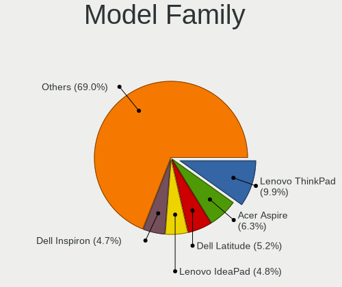
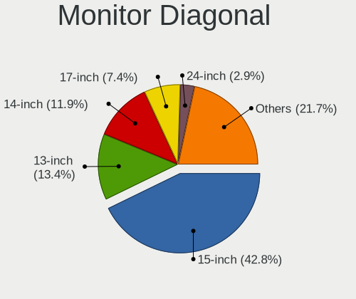
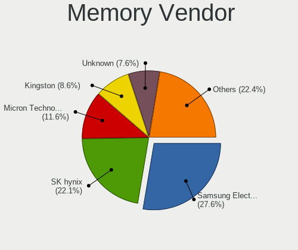

Linux - Tested Hardware & Statistics (Notebooks)
------------------------------------------------

A project to collect tested hardware configurations for Linux.

Anyone can contribute to this report by the [hw-probe](https://github.com/linuxhw/hw-probe) tool:

    sudo -E hw-probe -all -upload

Please contribute! Especially if your hardware is rare.

This report is for real hardware. Report for virtual hardware: [TestCoverage_VE](https://github.com/linuxhw/TestCoverage_VE)

Contents
--------

* [ Test Cases ](#test-cases)

* [ System ](#system)
  - [ OS                       ](#os)
  - [ OS Family                ](#os-family)
  - [ Kernel                   ](#kernel)
  - [ Kernel Family            ](#kernel-family)
  - [ Kernel Major Ver.        ](#kernel-major-ver)
  - [ Arch                     ](#arch)
  - [ DE                       ](#de)
  - [ Display Server           ](#display-server)
  - [ Display Manager          ](#display-manager)
  - [ OS Lang                  ](#os-lang)
  - [ Boot Mode                ](#boot-mode)
  - [ Filesystem               ](#filesystem)
  - [ Part. scheme             ](#part-scheme)
  - [ Dual Boot with Linux/BSD ](#dual-boot-with-linuxbsd)
  - [ Dual Boot (Win)          ](#dual-boot-win)

* [ Board ](#board)
  - [ Vendor                   ](#vendor)
  - [ Model                    ](#model)
  - [ Model Family             ](#model-family)
  - [ MFG Year                 ](#mfg-year)
  - [ Form Factor              ](#form-factor)
  - [ Secure Boot              ](#secure-boot)
  - [ Coreboot                 ](#coreboot)
  - [ RAM Size                 ](#ram-size)
  - [ RAM Used                 ](#ram-used)
  - [ Total Drives             ](#total-drives)
  - [ Has CD-ROM               ](#has-cd-rom)
  - [ Has Ethernet             ](#has-ethernet)
  - [ Has WiFi                 ](#has-wifi)
  - [ Has Bluetooth            ](#has-bluetooth)

* [ Location ](#location)
  - [ Country                  ](#country)
  - [ City                     ](#city)

* [ Drives ](#drives)
  - [ Drive Vendor             ](#drive-vendor)
  - [ Drive Model              ](#drive-model)
  - [ HDD Vendor               ](#hdd-vendor)
  - [ SSD Vendor               ](#ssd-vendor)
  - [ Drive Kind               ](#drive-kind)
  - [ Drive Connector          ](#drive-connector)
  - [ Drive Size               ](#drive-size)
  - [ Space Total              ](#space-total)
  - [ Space Used               ](#space-used)
  - [ Malfunc. Drives          ](#malfunc-drives)
  - [ Malfunc. Drive Vendor    ](#malfunc-drive-vendor)
  - [ Malfunc. HDD Vendor      ](#malfunc-hdd-vendor)
  - [ Malfunc. Drive Kind      ](#malfunc-drive-kind)
  - [ Failed Drives            ](#failed-drives)
  - [ Failed Drive Vendor      ](#failed-drive-vendor)
  - [ Drive Status             ](#drive-status)

* [ Storage controller ](#storage-controller)
  - [ Storage Vendor           ](#storage-vendor)
  - [ Storage Model            ](#storage-model)
  - [ Storage Kind             ](#storage-kind)

* [ Processor ](#processor)
  - [ CPU Vendor               ](#cpu-vendor)
  - [ CPU Model                ](#cpu-model)
  - [ CPU Model Family         ](#cpu-model-family)
  - [ CPU Cores                ](#cpu-cores)
  - [ CPU Sockets              ](#cpu-sockets)
  - [ CPU Threads              ](#cpu-threads)
  - [ CPU Op-Modes             ](#cpu-op-modes)
  - [ CPU Microcode            ](#cpu-microcode)
  - [ CPU Microarch            ](#cpu-microarch)

* [ Graphics ](#graphics)
  - [ GPU Vendor               ](#gpu-vendor)
  - [ GPU Model                ](#gpu-model)
  - [ GPU Combo                ](#gpu-combo)
  - [ GPU Driver               ](#gpu-driver)
  - [ GPU Memory               ](#gpu-memory)

* [ Monitor ](#monitor)
  - [ Monitor Vendor           ](#monitor-vendor)
  - [ Monitor Model            ](#monitor-model)
  - [ Monitor Resolution       ](#monitor-resolution)
  - [ Monitor Diagonal         ](#monitor-diagonal)
  - [ Monitor Width            ](#monitor-width)
  - [ Aspect Ratio             ](#aspect-ratio)
  - [ Monitor Area             ](#monitor-area)
  - [ Pixel Density            ](#pixel-density)
  - [ Multiple Monitors        ](#multiple-monitors)

* [ Network ](#network)
  - [ Net Controller Vendor    ](#net-controller-vendor)
  - [ Net Controller Model     ](#net-controller-model)
  - [ Wireless Vendor          ](#wireless-vendor)
  - [ Wireless Model           ](#wireless-model)
  - [ Ethernet Vendor          ](#ethernet-vendor)
  - [ Ethernet Model           ](#ethernet-model)
  - [ Net Controller Kind      ](#net-controller-kind)
  - [ Used Controller          ](#used-controller)
  - [ NICs                     ](#nics)
  - [ IPv6                     ](#ipv6)

* [ Bluetooth ](#bluetooth)
  - [ Bluetooth Vendor         ](#bluetooth-vendor)
  - [ Bluetooth Model          ](#bluetooth-model)

* [ Sound ](#sound)
  - [ Sound Vendor             ](#sound-vendor)
  - [ Sound Model              ](#sound-model)

* [ Memory ](#memory)
  - [ Memory Vendor            ](#memory-vendor)
  - [ Memory Model             ](#memory-model)
  - [ Memory Kind              ](#memory-kind)
  - [ Memory Form Factor       ](#memory-form-factor)
  - [ Memory Size              ](#memory-size)
  - [ Memory Speed             ](#memory-speed)

* [ Printers & scanners ](#printers--scanners)
  - [ Printer Vendor           ](#printer-vendor)
  - [ Printer Model            ](#printer-model)
  - [ Scanner Vendor           ](#scanner-vendor)
  - [ Scanner Model            ](#scanner-model)

* [ Camera ](#camera)
  - [ Camera Vendor            ](#camera-vendor)
  - [ Camera Model             ](#camera-model)

* [ Security ](#security)
  - [ Fingerprint Vendor       ](#fingerprint-vendor)
  - [ Fingerprint Model        ](#fingerprint-model)
  - [ Chipcard Vendor          ](#chipcard-vendor)
  - [ Chipcard Model           ](#chipcard-model)

* [ Unsupported ](#unsupported)
  - [ Unsupported Devices      ](#unsupported-devices)
  - [ Unsupported Device Types ](#unsupported-device-types)

Test Cases
----------

Total: 132254

| Vendor        | Model                       | Probe                                                      | Date         |
|---------------|-----------------------------|------------------------------------------------------------|--------------|
| Acer          | Aspire 5742G                | [051893f147](https://linux-hardware.org/?probe=051893f147) | Sep 13, 2022 |
| IPASON        | MaxBook P1X                 | [18d0740712](https://linux-hardware.org/?probe=18d0740712) | Sep 13, 2022 |
| ASUSTek       | VivoBook_ASUS Laptop E21... | [2ac6776181](https://linux-hardware.org/?probe=2ac6776181) | Sep 13, 2022 |
| ASUSTek       | VivoBook_ASUSLaptop X515... | [fa652e45e1](https://linux-hardware.org/?probe=fa652e45e1) | Sep 13, 2022 |
| HUAWEI        | HVY-WXX9                    | [d574f5da9b](https://linux-hardware.org/?probe=d574f5da9b) | Sep 13, 2022 |
| HP            | EliteBook 840 G5            | [6b6e4efdfc](https://linux-hardware.org/?probe=6b6e4efdfc) | Sep 13, 2022 |
| Dell          | Precision 5550              | [82eebd67fd](https://linux-hardware.org/?probe=82eebd67fd) | Sep 13, 2022 |
| Acer          | Aspire 5742                 | [9c37d390a7](https://linux-hardware.org/?probe=9c37d390a7) | Sep 13, 2022 |
| Valve         | Jupiter                     | [0925a55100](https://linux-hardware.org/?probe=0925a55100) | Sep 13, 2022 |
| ASUSTek       | X550VXK                     | [df5d5b4f0d](https://linux-hardware.org/?probe=df5d5b4f0d) | Sep 13, 2022 |
| Samsung       | 305V4A/305V5A               | [ba2ad7bf06](https://linux-hardware.org/?probe=ba2ad7bf06) | Sep 13, 2022 |
| HP            | Notebook                    | [963af7e07b](https://linux-hardware.org/?probe=963af7e07b) | Sep 13, 2022 |
| Lenovo        | IdeaPad 3 15ADA6 82KR       | [676dbc76db](https://linux-hardware.org/?probe=676dbc76db) | Sep 13, 2022 |
| ASUSTek       | ASUS EXPERTBOOK P5440FA_... | [d441c68f40](https://linux-hardware.org/?probe=d441c68f40) | Sep 13, 2022 |
| Google        | Terra                       | [a7150f06c7](https://linux-hardware.org/?probe=a7150f06c7) | Sep 13, 2022 |
| Dell          | Precision M4800             | [fae4dbff63](https://linux-hardware.org/?probe=fae4dbff63) | Sep 13, 2022 |
| HUAWEI        | HVY-WXX9                    | [d1b95841a4](https://linux-hardware.org/?probe=d1b95841a4) | Sep 13, 2022 |
| Sony          | SVE1712L1EW                 | [18400c7a0d](https://linux-hardware.org/?probe=18400c7a0d) | Sep 13, 2022 |
| Dell          | Inspiron 5567               | [1ca8786a47](https://linux-hardware.org/?probe=1ca8786a47) | Sep 13, 2022 |
| Dell          | Precision 5540              | [229337f709](https://linux-hardware.org/?probe=229337f709) | Sep 13, 2022 |
| HP            | Laptop 15-dy1xxx            | [bb0112b6ba](https://linux-hardware.org/?probe=bb0112b6ba) | Sep 13, 2022 |
| Lenovo        | IdeaPad S340-14API 81NB     | [423008d102](https://linux-hardware.org/?probe=423008d102) | Sep 13, 2022 |
| Dell          | Inspiron N5050              | [c0f9d7bf4a](https://linux-hardware.org/?probe=c0f9d7bf4a) | Sep 13, 2022 |
| Dell          | Inspiron 5567               | [22e62266a2](https://linux-hardware.org/?probe=22e62266a2) | Sep 13, 2022 |
| Samsung       | 950XED                      | [f8a15210f0](https://linux-hardware.org/?probe=f8a15210f0) | Sep 13, 2022 |
| ASUSTek       | ASUS TUF Gaming F15 FX50... | [7326474aae](https://linux-hardware.org/?probe=7326474aae) | Sep 13, 2022 |
| Sony          | SVE15127CAW                 | [3f21f2c6af](https://linux-hardware.org/?probe=3f21f2c6af) | Sep 13, 2022 |
| Lenovo        | Legion 5 15ACH6 82JW        | [c9df1f2514](https://linux-hardware.org/?probe=c9df1f2514) | Sep 13, 2022 |
| Lenovo        | ThinkPad P53 MFG_IN_GO     | [aa0553a310](https://linux-hardware.org/?probe=aa0553a310) | Sep 13, 2022 |
| Lenovo        | Legion 5 15ACH6 82JW        | [b62bd233c2](https://linux-hardware.org/?probe=b62bd233c2) | Sep 13, 2022 |
| MSI           | Prestige 14Evo A11M         | [5a69611620](https://linux-hardware.org/?probe=5a69611620) | Sep 13, 2022 |
| Lenovo        | ThinkPad T460 20FMA0APAR    | [89339e48f1](https://linux-hardware.org/?probe=89339e48f1) | Sep 13, 2022 |
| HP            | 1000                        | [65024f3d7a](https://linux-hardware.org/?probe=65024f3d7a) | Sep 13, 2022 |
| Dell          | Latitude 5480               | [59bcf57d5b](https://linux-hardware.org/?probe=59bcf57d5b) | Sep 13, 2022 |
| Lenovo        | ThinkPad T460 20FMA0APAR    | [d39dcbc8ed](https://linux-hardware.org/?probe=d39dcbc8ed) | Sep 13, 2022 |
| MSI           | Prestige 14Evo A11M         | [4c5dc2ec7d](https://linux-hardware.org/?probe=4c5dc2ec7d) | Sep 13, 2022 |
| Apple         | MacBookPro5,3               | [3e00c86066](https://linux-hardware.org/?probe=3e00c86066) | Sep 13, 2022 |
| Lenovo        | ThinkPad X1 Carbon 2nd 2... | [1cf1136fb8](https://linux-hardware.org/?probe=1cf1136fb8) | Sep 13, 2022 |
| Dell          | Latitude 7420               | [84f0ebcfea](https://linux-hardware.org/?probe=84f0ebcfea) | Sep 13, 2022 |
| HP            | EliteBook 840 G6            | [3c13816886](https://linux-hardware.org/?probe=3c13816886) | Sep 13, 2022 |
| Aquarius      | NS585                       | [f76497447f](https://linux-hardware.org/?probe=f76497447f) | Sep 13, 2022 |
| Lenovo        | ThinkPad E15 Gen 2 20TD0... | [aa9d57c27e](https://linux-hardware.org/?probe=aa9d57c27e) | Sep 13, 2022 |
| Lenovo        | ThinkBook 14 G2 ITL 20VD    | [c07c5b31f6](https://linux-hardware.org/?probe=c07c5b31f6) | Sep 13, 2022 |
| HUAWEI        | HVY-WXX9                    | [999cbe4e8f](https://linux-hardware.org/?probe=999cbe4e8f) | Sep 13, 2022 |
| Aquarius      | NS585                       | [0adf35b80f](https://linux-hardware.org/?probe=0adf35b80f) | Sep 13, 2022 |
| Aquarius      | NS585                       | [042a81998b](https://linux-hardware.org/?probe=042a81998b) | Sep 13, 2022 |
| Aquarius      | NS585                       | [e5078cd5f4](https://linux-hardware.org/?probe=e5078cd5f4) | Sep 13, 2022 |
| HP            | Laptop 15-db0xxx            | [5240fca99f](https://linux-hardware.org/?probe=5240fca99f) | Sep 13, 2022 |
| Toshiba       | Satellite C855D             | [bae94a45be](https://linux-hardware.org/?probe=bae94a45be) | Sep 13, 2022 |
| ASUSTek       | X555LJ                      | [5d27ea49aa](https://linux-hardware.org/?probe=5d27ea49aa) | Sep 13, 2022 |
| MSI           | Prestige 14 A11SCX          | [0c0264943f](https://linux-hardware.org/?probe=0c0264943f) | Sep 13, 2022 |
| Acer          | TravelMate 5744Z            | [f9846e0165](https://linux-hardware.org/?probe=f9846e0165) | Sep 13, 2022 |
| Apple         | MacBookPro5,3               | [9211f5de76](https://linux-hardware.org/?probe=9211f5de76) | Sep 13, 2022 |
| Dell          | XPS 15 9510                 | [44be9b9134](https://linux-hardware.org/?probe=44be9b9134) | Sep 13, 2022 |
| Dell          | Vostro 15 5510              | [e63dd14c21](https://linux-hardware.org/?probe=e63dd14c21) | Sep 13, 2022 |
| Dell          | Vostro 15 5510              | [16942cfd78](https://linux-hardware.org/?probe=16942cfd78) | Sep 13, 2022 |
| Aquarius      | NS585                       | [adb7dadad9](https://linux-hardware.org/?probe=adb7dadad9) | Sep 13, 2022 |
| Lenovo        | ThinkPad T14 Gen 1 20S1S... | [d4fb6aa0ae](https://linux-hardware.org/?probe=d4fb6aa0ae) | Sep 13, 2022 |
| Apple         | MacBookAir7,2               | [03ba2808d7](https://linux-hardware.org/?probe=03ba2808d7) | Sep 13, 2022 |
| Lenovo        | B40-70 80F30005BR           | [b899f1b7da](https://linux-hardware.org/?probe=b899f1b7da) | Sep 13, 2022 |
| ASUSTek       | ZenBook UX425EA_UX425EA     | [b6b3f2dce1](https://linux-hardware.org/?probe=b6b3f2dce1) | Sep 13, 2022 |
| Lenovo        | G50-70 20351                | [4105fc929e](https://linux-hardware.org/?probe=4105fc929e) | Sep 13, 2022 |
| Lenovo        | B40-70 80F30005BR           | [99be4451df](https://linux-hardware.org/?probe=99be4451df) | Sep 13, 2022 |
| Acer          | Aspire A315-42              | [6121dfd67d](https://linux-hardware.org/?probe=6121dfd67d) | Sep 13, 2022 |
| ASUSTek       | X200LA                      | [e0947fe5c7](https://linux-hardware.org/?probe=e0947fe5c7) | Sep 13, 2022 |
| HP            | ENVY 15                     | [fdb07294df](https://linux-hardware.org/?probe=fdb07294df) | Sep 13, 2022 |
| Lenovo        | ThinkBook 13x ITG 20WJ      | [2e6e759434](https://linux-hardware.org/?probe=2e6e759434) | Sep 13, 2022 |
| HP            | EliteBook 850 G6            | [b284db5ac4](https://linux-hardware.org/?probe=b284db5ac4) | Sep 13, 2022 |
| HP            | Pavilion Laptop 14-dv0xx... | [3e5c80e004](https://linux-hardware.org/?probe=3e5c80e004) | Sep 13, 2022 |
| HUAWEI        | MACH-WX9                    | [f90bed17e2](https://linux-hardware.org/?probe=f90bed17e2) | Sep 13, 2022 |
| Acer          | Aspire ES1-311              | [ee2f9a766c](https://linux-hardware.org/?probe=ee2f9a766c) | Sep 13, 2022 |
| MECHREVO      | Code01 Ver2.0               | [2de3999743](https://linux-hardware.org/?probe=2de3999743) | Sep 13, 2022 |
| Schenker      | VISION 15 (SVS15E21)        | [dee9d6b81f](https://linux-hardware.org/?probe=dee9d6b81f) | Sep 13, 2022 |
| Dell          | Precision 5560              | [78809c82c2](https://linux-hardware.org/?probe=78809c82c2) | Sep 13, 2022 |
| HP            | ProBook 440 G8 Notebook ... | [4aa1954c0c](https://linux-hardware.org/?probe=4aa1954c0c) | Sep 13, 2022 |
| Chuwi         | HeroBook Pro                | [aa99b0558b](https://linux-hardware.org/?probe=aa99b0558b) | Sep 13, 2022 |
| Dell          | Inspiron 3451               | [f06aa45765](https://linux-hardware.org/?probe=f06aa45765) | Sep 13, 2022 |
| Lenovo        | Flex 2-14 20404             | [a27c60fbde](https://linux-hardware.org/?probe=a27c60fbde) | Sep 13, 2022 |
| HUAWEI        | HBB-WX9                     | [30b6cc18c5](https://linux-hardware.org/?probe=30b6cc18c5) | Sep 13, 2022 |
| ASUSTek       | VivoBook_ASUSLaptop X412... | [0e6413e94b](https://linux-hardware.org/?probe=0e6413e94b) | Sep 13, 2022 |
| ASUSTek       | ROG Zephyrus G15 GA503RS... | [81b9b18da4](https://linux-hardware.org/?probe=81b9b18da4) | Sep 13, 2022 |
| ASUSTek       | X550CC                      | [cb36241a3b](https://linux-hardware.org/?probe=cb36241a3b) | Sep 13, 2022 |
| Lenovo        | ThinkPad X1 Carbon Gen 1... | [224ecd9fa7](https://linux-hardware.org/?probe=224ecd9fa7) | Sep 13, 2022 |
| Dell          | Latitude 5521               | [cb134441f2](https://linux-hardware.org/?probe=cb134441f2) | Sep 13, 2022 |
| Acer          | Aspire 5349                 | [39f83f7692](https://linux-hardware.org/?probe=39f83f7692) | Sep 13, 2022 |
| ASUSTek       | X541UJ                      | [9745e99a08](https://linux-hardware.org/?probe=9745e99a08) | Sep 13, 2022 |
| Timi          | Mi Laptop Air 12.5          | [d666daaeb2](https://linux-hardware.org/?probe=d666daaeb2) | Sep 13, 2022 |
| ASUSTek       | ROG Zephyrus G15 GA503RM... | [82b9d1247e](https://linux-hardware.org/?probe=82b9d1247e) | Sep 13, 2022 |
| Lenovo        | ThinkPad E15 Gen 2 20TDS... | [2b12cc11f2](https://linux-hardware.org/?probe=2b12cc11f2) | Sep 13, 2022 |
| Dell          | Inspiron 13-7378            | [689047aef1](https://linux-hardware.org/?probe=689047aef1) | Sep 13, 2022 |
| ASUSTek       | VivoBook_ASUSLaptop X515... | [16cf967fc8](https://linux-hardware.org/?probe=16cf967fc8) | Sep 13, 2022 |
| Apple         | MacBookPro15,2              | [5160feeaf2](https://linux-hardware.org/?probe=5160feeaf2) | Sep 13, 2022 |
| Samsung       | 800G5M/800G5W               | [ad3cd5381f](https://linux-hardware.org/?probe=ad3cd5381f) | Sep 13, 2022 |
| HP            | EliteBook 745 G6            | [61da5fee97](https://linux-hardware.org/?probe=61da5fee97) | Sep 13, 2022 |
| Apple         | MacBookPro15,2              | [876e87c7b6](https://linux-hardware.org/?probe=876e87c7b6) | Sep 13, 2022 |
| Lenovo        | IdeaPad 1 14ADA05 82GW      | [e558fd5212](https://linux-hardware.org/?probe=e558fd5212) | Sep 13, 2022 |
| Acer          | Aspire 5050                 | [1961d1c468](https://linux-hardware.org/?probe=1961d1c468) | Sep 13, 2022 |
| HP            | ProBook 4540s               | [c1bf52b653](https://linux-hardware.org/?probe=c1bf52b653) | Sep 13, 2022 |
| ASUSTek       | VivoBook_ASUSLaptop X513... | [b502b7938d](https://linux-hardware.org/?probe=b502b7938d) | Sep 13, 2022 |
| Notebook      | NJx0MU                      | [a72ef6cb0b](https://linux-hardware.org/?probe=a72ef6cb0b) | Sep 13, 2022 |
| Dell          | Venue 11 Pro 7140           | [d6fed8866c](https://linux-hardware.org/?probe=d6fed8866c) | Sep 13, 2022 |
| HP            | ProBook 4540s               | [320e270f44](https://linux-hardware.org/?probe=320e270f44) | Sep 13, 2022 |
| HP            | ENVY 15                     | [e3a2a0d5d7](https://linux-hardware.org/?probe=e3a2a0d5d7) | Sep 13, 2022 |
| Medion        | E4251 MD61227               | [8b3475f65b](https://linux-hardware.org/?probe=8b3475f65b) | Sep 13, 2022 |
| HUAWEI        | KLVL-WXXW                   | [de37b9cf96](https://linux-hardware.org/?probe=de37b9cf96) | Sep 13, 2022 |
| Dell          | XPS 17 9700                 | [24eaecfdd8](https://linux-hardware.org/?probe=24eaecfdd8) | Sep 13, 2022 |
| Toshiba       | Satellite A500              | [0d96df6375](https://linux-hardware.org/?probe=0d96df6375) | Sep 13, 2022 |
| Acer          | Nitro AN515-54              | [552b310540](https://linux-hardware.org/?probe=552b310540) | Sep 13, 2022 |
| Acer          | Aspire 7741                 | [a1375d3bb4](https://linux-hardware.org/?probe=a1375d3bb4) | Sep 13, 2022 |
| HP            | EliteBook 840 G5            | [2709daf415](https://linux-hardware.org/?probe=2709daf415) | Sep 13, 2022 |
| HP            | EliteBook Folio 9470m       | [c03777782c](https://linux-hardware.org/?probe=c03777782c) | Sep 13, 2022 |
| Dell          | Latitude 7420               | [211c7ab44c](https://linux-hardware.org/?probe=211c7ab44c) | Sep 12, 2022 |
| Lenovo        | ThinkPad T540p 20BF002CM... | [3343da6005](https://linux-hardware.org/?probe=3343da6005) | Sep 12, 2022 |
| Compal        | NCL60/61                    | [f1f5499af8](https://linux-hardware.org/?probe=f1f5499af8) | Sep 12, 2022 |
| Alienware     | M14xR1                      | [a4064c0342](https://linux-hardware.org/?probe=a4064c0342) | Sep 12, 2022 |
| HP            | Laptop 15-dy1xxx            | [e7b2ee5d70](https://linux-hardware.org/?probe=e7b2ee5d70) | Sep 12, 2022 |
| ASUSTek       | ROG Zephyrus M16 GU603ZW... | [472668e67b](https://linux-hardware.org/?probe=472668e67b) | Sep 12, 2022 |
| Dell          | Inspiron 3542               | [2c5a122ce9](https://linux-hardware.org/?probe=2c5a122ce9) | Sep 12, 2022 |
| Lanix         | AL V9                       | [e03f9aecc3](https://linux-hardware.org/?probe=e03f9aecc3) | Sep 12, 2022 |
| Toshiba       | Satellite L50D-B            | [2d09796251](https://linux-hardware.org/?probe=2d09796251) | Sep 12, 2022 |
| HUAWEI        | KLVL-WXX9                   | [7bc7cbca76](https://linux-hardware.org/?probe=7bc7cbca76) | Sep 12, 2022 |
| Alienware     | M14xR1                      | [b8a40ec999](https://linux-hardware.org/?probe=b8a40ec999) | Sep 12, 2022 |
| HP            | Laptop 17-cp0xxx            | [78068a1338](https://linux-hardware.org/?probe=78068a1338) | Sep 12, 2022 |
| Dell          | Latitude 5495               | [23586ab4ef](https://linux-hardware.org/?probe=23586ab4ef) | Sep 12, 2022 |
| Lenovo        | ThinkPad P1 20MD0014RT      | [4935debbce](https://linux-hardware.org/?probe=4935debbce) | Sep 12, 2022 |
| Lenovo        | ThinkPad 13 2nd Gen 20J1... | [7acd0e62aa](https://linux-hardware.org/?probe=7acd0e62aa) | Sep 12, 2022 |
| Lenovo        | ThinkPad E595 20NF001PTX    | [a901769629](https://linux-hardware.org/?probe=a901769629) | Sep 12, 2022 |
| Dell          | Inspiron 15-3567            | [f062dd3ff8](https://linux-hardware.org/?probe=f062dd3ff8) | Sep 12, 2022 |
| Dell          | Vostro 3491                 | [24d4349627](https://linux-hardware.org/?probe=24d4349627) | Sep 12, 2022 |
| Dell          | Inspiron 5458               | [bd26475724](https://linux-hardware.org/?probe=bd26475724) | Sep 12, 2022 |
| Google        | Terra                       | [6b591d8c39](https://linux-hardware.org/?probe=6b591d8c39) | Sep 12, 2022 |
| Dell          | Inspiron 15 7000 Gaming     | [ca9a099cf6](https://linux-hardware.org/?probe=ca9a099cf6) | Sep 12, 2022 |
| Dell          | Vostro 7620                 | [dc7d444958](https://linux-hardware.org/?probe=dc7d444958) | Sep 12, 2022 |
| Acer          | Aspire 6930G                | [cb054f2964](https://linux-hardware.org/?probe=cb054f2964) | Sep 12, 2022 |
| Google        | Terra                       | [b3993f460f](https://linux-hardware.org/?probe=b3993f460f) | Sep 12, 2022 |
| Lenovo        | Yoga Slim 7 Pro 14IAP7 8... | [b7eb07ec8d](https://linux-hardware.org/?probe=b7eb07ec8d) | Sep 12, 2022 |
| Dell          | Studio 1555                 | [0d0f3de3b4](https://linux-hardware.org/?probe=0d0f3de3b4) | Sep 12, 2022 |
| Shanghai Z... | ZXE CRB                     | [9f244f4236](https://linux-hardware.org/?probe=9f244f4236) | Sep 12, 2022 |
| ASUSTek       | 1005HA                      | [93ee340172](https://linux-hardware.org/?probe=93ee340172) | Sep 12, 2022 |
| Samsung       | RV415/RV515                 | [bc83707f72](https://linux-hardware.org/?probe=bc83707f72) | Sep 12, 2022 |
| Dell          | Latitude E6540              | [e23aacd364](https://linux-hardware.org/?probe=e23aacd364) | Sep 12, 2022 |
| Aquarius      | win10 HOME rs10             | [988e1b3035](https://linux-hardware.org/?probe=988e1b3035) | Sep 12, 2022 |
| Dell          | Inspiron 3542               | [ef3098c81a](https://linux-hardware.org/?probe=ef3098c81a) | Sep 12, 2022 |
| Toshiba       | Satellite C655              | [16a4aa3cd8](https://linux-hardware.org/?probe=16a4aa3cd8) | Sep 12, 2022 |
| Lenovo        | IdeaPad 100-14IBY 80MH      | [0d14398a88](https://linux-hardware.org/?probe=0d14398a88) | Sep 12, 2022 |
| HP            | Pavilion dm1                | [eec30e7c48](https://linux-hardware.org/?probe=eec30e7c48) | Sep 12, 2022 |
| AZW           | SEi                         | [3a4d2086b0](https://linux-hardware.org/?probe=3a4d2086b0) | Sep 12, 2022 |
| Apple         | MacBook5,1                  | [8bdaf4361b](https://linux-hardware.org/?probe=8bdaf4361b) | Sep 12, 2022 |
| Toshiba       | Satellite U845W             | [030a371841](https://linux-hardware.org/?probe=030a371841) | Sep 12, 2022 |
| Lenovo        | Legion R7000 2020 82B6      | [1d95c5b6ef](https://linux-hardware.org/?probe=1d95c5b6ef) | Sep 12, 2022 |
| Dell          | XPS 9315                    | [77ecec9e58](https://linux-hardware.org/?probe=77ecec9e58) | Sep 12, 2022 |
| HP            | 470 G7 Notebook PC          | [f1c4e72e54](https://linux-hardware.org/?probe=f1c4e72e54) | Sep 12, 2022 |
| HP            | EliteBook 2530p             | [4bae06f3d0](https://linux-hardware.org/?probe=4bae06f3d0) | Sep 12, 2022 |
| Dell          | XPS 9315                    | [cfaae58ffa](https://linux-hardware.org/?probe=cfaae58ffa) | Sep 12, 2022 |
| HP            | Compaq Presario CQ40        | [3162a68bf5](https://linux-hardware.org/?probe=3162a68bf5) | Sep 12, 2022 |
| Lenovo        | B570e 521524G               | [c08fe13d14](https://linux-hardware.org/?probe=c08fe13d14) | Sep 12, 2022 |
| Toshiba       | PORTEGE Z30-B               | [6b1829aad1](https://linux-hardware.org/?probe=6b1829aad1) | Sep 12, 2022 |
| HP            | Laptop 15-bw0xx             | [644ad9d55f](https://linux-hardware.org/?probe=644ad9d55f) | Sep 12, 2022 |
| Lenovo        | ThinkPad P53 MFG_IN_GO     | [0c3d0800eb](https://linux-hardware.org/?probe=0c3d0800eb) | Sep 12, 2022 |
| Lenovo        | ThinkPad T440 20B7A1P700    | [5be9f89a6f](https://linux-hardware.org/?probe=5be9f89a6f) | Sep 12, 2022 |
| Samsung       | 600B4B/600B5B               | [25c2b764a6](https://linux-hardware.org/?probe=25c2b764a6) | Sep 12, 2022 |
| Samsung       | R530/R730/R540              | [9149fde5c5](https://linux-hardware.org/?probe=9149fde5c5) | Sep 12, 2022 |
| Lenovo        | ThinkPad T430 2347AT2       | [703c55185d](https://linux-hardware.org/?probe=703c55185d) | Sep 12, 2022 |
| System76      | Darter Pro                  | [d93179bdb4](https://linux-hardware.org/?probe=d93179bdb4) | Sep 12, 2022 |
| HP            | Compaq Presario CQ40        | [d764e72d74](https://linux-hardware.org/?probe=d764e72d74) | Sep 12, 2022 |
| Toshiba       | PORTEGE Z30-B               | [9ef29f2258](https://linux-hardware.org/?probe=9ef29f2258) | Sep 12, 2022 |
| ASUSTek       | X455LD                      | [c31dc64978](https://linux-hardware.org/?probe=c31dc64978) | Sep 12, 2022 |
| Google        | Reks                        | [28f0932e1a](https://linux-hardware.org/?probe=28f0932e1a) | Sep 12, 2022 |
| Dell          | XPS 15 9530                 | [fbb3c09289](https://linux-hardware.org/?probe=fbb3c09289) | Sep 12, 2022 |
| Lenovo        | ThinkBook 15 G2 ITL 20VE    | [4a54854cd7](https://linux-hardware.org/?probe=4a54854cd7) | Sep 12, 2022 |
| Dell          | XPS 15 9530                 | [fccf3eb345](https://linux-hardware.org/?probe=fccf3eb345) | Sep 12, 2022 |
| ASUSTek       | F5N                         | [343f77754d](https://linux-hardware.org/?probe=343f77754d) | Sep 12, 2022 |
| Lenovo        | ThinkPad T14 Gen 3 21CF0... | [5bbf96fe23](https://linux-hardware.org/?probe=5bbf96fe23) | Sep 12, 2022 |
| ASUSTek       | UX32VD                      | [6a6e7e4207](https://linux-hardware.org/?probe=6a6e7e4207) | Sep 12, 2022 |
| Acer          | Aspire E5-575G              | [d5a0bdc1a9](https://linux-hardware.org/?probe=d5a0bdc1a9) | Sep 12, 2022 |
| Entroware     | Orion                       | [d96888edf9](https://linux-hardware.org/?probe=d96888edf9) | Sep 12, 2022 |
| Gigabyte      | AERO 15-X9                  | [d6d8f577e0](https://linux-hardware.org/?probe=d6d8f577e0) | Sep 12, 2022 |
| HP            | ENVY 15                     | [97caacee16](https://linux-hardware.org/?probe=97caacee16) | Sep 12, 2022 |
| HP            | Laptop 17-cp0xxx            | [4005fc56a4](https://linux-hardware.org/?probe=4005fc56a4) | Sep 12, 2022 |
| Entroware     | Orion                       | [c06e53ad80](https://linux-hardware.org/?probe=c06e53ad80) | Sep 12, 2022 |
| Chuwi         | HeroBook Air                | [f944581a0f](https://linux-hardware.org/?probe=f944581a0f) | Sep 12, 2022 |
| Lenovo        | ThinkPad X240 20AL00ETGE    | [95a3df06c9](https://linux-hardware.org/?probe=95a3df06c9) | Sep 12, 2022 |
| Dell          | Inspiron 3537               | [afd2b6555e](https://linux-hardware.org/?probe=afd2b6555e) | Sep 12, 2022 |
| Lenovo        | ThinkPad X1 Carbon 6th 2... | [efc31007ac](https://linux-hardware.org/?probe=efc31007ac) | Sep 12, 2022 |
| Unknown       | Unknown                     | [b686d4f2b7](https://linux-hardware.org/?probe=b686d4f2b7) | Sep 12, 2022 |
| Unknown       | Unknown                     | [5b6bbb71d1](https://linux-hardware.org/?probe=5b6bbb71d1) | Sep 12, 2022 |
| MSI           | GP73 Leopard 8RE            | [21744558cb](https://linux-hardware.org/?probe=21744558cb) | Sep 12, 2022 |
| Dell          | Inspiron 5548               | [341b48f953](https://linux-hardware.org/?probe=341b48f953) | Sep 12, 2022 |
| HP            | ENVY Laptop 13-ba1xxx       | [326ab7b00a](https://linux-hardware.org/?probe=326ab7b00a) | Sep 12, 2022 |
| Dell          | Vostro 5620                 | [6c88032385](https://linux-hardware.org/?probe=6c88032385) | Sep 12, 2022 |
| Dell          | Latitude 7290               | [b05f177ae5](https://linux-hardware.org/?probe=b05f177ae5) | Sep 12, 2022 |
| Gigabyte      | AORUS 15G XC                | [4b0e97e947](https://linux-hardware.org/?probe=4b0e97e947) | Sep 12, 2022 |
| Lenovo        | IdeaPad 5 15ARE05 81YQ      | [e1d128b56a](https://linux-hardware.org/?probe=e1d128b56a) | Sep 12, 2022 |
| HP            | Pavilion g6                 | [92770cf76e](https://linux-hardware.org/?probe=92770cf76e) | Sep 12, 2022 |
| HP            | ProBook 4540s               | [1f46e342f0](https://linux-hardware.org/?probe=1f46e342f0) | Sep 12, 2022 |
| Dell          | Inspiron 13-7378            | [4e7d1fc8a7](https://linux-hardware.org/?probe=4e7d1fc8a7) | Sep 12, 2022 |
| ASUSTek       | ROG STRIX Z590-E GAMING ... | [1889334e1f](https://linux-hardware.org/?probe=1889334e1f) | Sep 12, 2022 |
| MSI           | Modern 15 A11M              | [bfc50a32ba](https://linux-hardware.org/?probe=bfc50a32ba) | Sep 12, 2022 |
| MSI           | GS60 2PE                    | [0164cbee91](https://linux-hardware.org/?probe=0164cbee91) | Sep 12, 2022 |
| Sony          | SVE1712L1EW                 | [6a797dc1cf](https://linux-hardware.org/?probe=6a797dc1cf) | Sep 12, 2022 |
| Dell          | XPS 17 9710                 | [4b728bc447](https://linux-hardware.org/?probe=4b728bc447) | Sep 12, 2022 |
| ASUSTek       | K56CB                       | [8718c2bb09](https://linux-hardware.org/?probe=8718c2bb09) | Sep 12, 2022 |
| Dell          | Precision 5560              | [3120c2b781](https://linux-hardware.org/?probe=3120c2b781) | Sep 12, 2022 |
| ASUSTek       | ROG Zephyrus G14 GA402RK... | [fcf2ccb1d2](https://linux-hardware.org/?probe=fcf2ccb1d2) | Sep 12, 2022 |
| ASUSTek       | ROG Strix G713QR_G713QR     | [d05595b19e](https://linux-hardware.org/?probe=d05595b19e) | Sep 12, 2022 |
| HP            | ProBook 440 G1              | [58b48039ce](https://linux-hardware.org/?probe=58b48039ce) | Sep 12, 2022 |
| Avell High... | B.ON                        | [f30bca74ab](https://linux-hardware.org/?probe=f30bca74ab) | Sep 12, 2022 |
| Apple         | MacBookPro10,2              | [49a84739a7](https://linux-hardware.org/?probe=49a84739a7) | Sep 12, 2022 |
| ASUSTek       | X453SA                      | [1446eda5e9](https://linux-hardware.org/?probe=1446eda5e9) | Sep 12, 2022 |
| Valve         | Jupiter                     | [b2b312e843](https://linux-hardware.org/?probe=b2b312e843) | Sep 12, 2022 |
| Razer         | Blade 14 - RZ09-0370        | [47b15d6b6c](https://linux-hardware.org/?probe=47b15d6b6c) | Sep 12, 2022 |
| ASUSTek       | VivoBook_ASUS Laptop E40... | [2fdf233a71](https://linux-hardware.org/?probe=2fdf233a71) | Sep 12, 2022 |
| ASUSTek       | X550LC                      | [124bce938e](https://linux-hardware.org/?probe=124bce938e) | Sep 12, 2022 |
| HP            | OMEN by Gaming Laptop 16... | [60d15f4f46](https://linux-hardware.org/?probe=60d15f4f46) | Sep 12, 2022 |
| ASUSTek       | VivoBook_ASUSLaptop X712... | [64b8914cb2](https://linux-hardware.org/?probe=64b8914cb2) | Sep 12, 2022 |
| Dell          | Latitude 3190               | [3c0abb17a9](https://linux-hardware.org/?probe=3c0abb17a9) | Sep 12, 2022 |
| Acer          | Aspire A515-55              | [5a114e6867](https://linux-hardware.org/?probe=5a114e6867) | Sep 12, 2022 |
| Apple         | MacBook5,1                  | [be66df4eb9](https://linux-hardware.org/?probe=be66df4eb9) | Sep 12, 2022 |
| ASUSTek       | VivoBook_ASUSLaptop X512... | [edb2842417](https://linux-hardware.org/?probe=edb2842417) | Sep 12, 2022 |
| Apple         | MacBookAir7,2               | [d562164e67](https://linux-hardware.org/?probe=d562164e67) | Sep 12, 2022 |
| Dell          | XPS 13 9350                 | [e137564f6b](https://linux-hardware.org/?probe=e137564f6b) | Sep 12, 2022 |
| ASUSTek       | ROG Zephyrus G15 GA503RM... | [3d1d8301c3](https://linux-hardware.org/?probe=3d1d8301c3) | Sep 12, 2022 |
| AXDIA Inte... | MYBOOK 14 PRO               | [3a6e62d846](https://linux-hardware.org/?probe=3a6e62d846) | Sep 12, 2022 |
| Lenovo        | ThinkPad X1 Carbon Gen 9... | [410b905321](https://linux-hardware.org/?probe=410b905321) | Sep 11, 2022 |
| Sony          | SVE1512J6EW                 | [69e2400606](https://linux-hardware.org/?probe=69e2400606) | Sep 11, 2022 |
| ASUSTek       | ROG Zephyrus G15 GA503RS... | [f9add8f93d](https://linux-hardware.org/?probe=f9add8f93d) | Sep 11, 2022 |
| HP            | EliteBook 840 G5            | [4083f9d2c9](https://linux-hardware.org/?probe=4083f9d2c9) | Sep 11, 2022 |
| Dell          | Inspiron N5050              | [131f5046db](https://linux-hardware.org/?probe=131f5046db) | Sep 11, 2022 |
| HP            | EliteBook 8470p             | [52f6655891](https://linux-hardware.org/?probe=52f6655891) | Sep 11, 2022 |
| ASUSTek       | Zenbook UX535QE_UM535QE     | [c18f89b2bb](https://linux-hardware.org/?probe=c18f89b2bb) | Sep 11, 2022 |
| Lenovo        | ThinkPad T470p 20J7S0CF0... | [e916989486](https://linux-hardware.org/?probe=e916989486) | Sep 11, 2022 |
| Lenovo        | ThinkPad W540 20BG0016US    | [9f0543edc4](https://linux-hardware.org/?probe=9f0543edc4) | Sep 11, 2022 |
| ASUSTek       | X553MA                      | [32c5b56788](https://linux-hardware.org/?probe=32c5b56788) | Sep 11, 2022 |
| Apple         | MacBookPro8,2               | [a30032ef92](https://linux-hardware.org/?probe=a30032ef92) | Sep 11, 2022 |
| Lenovo        | IdeaPad 100S-14IBR 80R9     | [c6df51fa3b](https://linux-hardware.org/?probe=c6df51fa3b) | Sep 11, 2022 |
| Lenovo        | IdeaPad S145-15AST 81N3     | [017c9c9f8f](https://linux-hardware.org/?probe=017c9c9f8f) | Sep 11, 2022 |
| Lenovo        | Yoga 700-11ISK 80QE         | [e0bb471561](https://linux-hardware.org/?probe=e0bb471561) | Sep 11, 2022 |
| Lenovo        | ThinkPad T440 20B7S1C600    | [88d8697b4f](https://linux-hardware.org/?probe=88d8697b4f) | Sep 11, 2022 |
| Apple         | MacBookPro8,2               | [0645f03606](https://linux-hardware.org/?probe=0645f03606) | Sep 11, 2022 |
| ASUSTek       | N56VJ                       | [a67b781113](https://linux-hardware.org/?probe=a67b781113) | Sep 11, 2022 |
| Dell          | Vostro 3400                 | [06c0b65315](https://linux-hardware.org/?probe=06c0b65315) | Sep 11, 2022 |
| Dell          | Vostro 3400                 | [59d8ed6557](https://linux-hardware.org/?probe=59d8ed6557) | Sep 11, 2022 |
| ASUSTek       | Zenbook UX535QE_UM535QE     | [cd49377ddf](https://linux-hardware.org/?probe=cd49377ddf) | Sep 11, 2022 |
| HP            | Laptop 15-dy2xxx            | [5523f4050c](https://linux-hardware.org/?probe=5523f4050c) | Sep 11, 2022 |
| HP            | ProBook 645 G3              | [0bd9070bee](https://linux-hardware.org/?probe=0bd9070bee) | Sep 11, 2022 |
| HP            | Stream Notebook PC 14       | [4618d27b09](https://linux-hardware.org/?probe=4618d27b09) | Sep 11, 2022 |
| Valve         | Jupiter                     | [694e9a60ad](https://linux-hardware.org/?probe=694e9a60ad) | Sep 11, 2022 |
| Lenovo        | ThinkPad X1 Carbon Gen 8... | [276e6547f9](https://linux-hardware.org/?probe=276e6547f9) | Sep 11, 2022 |
| MECHREVO      | Code01 Ver2.0               | [c55fd8d477](https://linux-hardware.org/?probe=c55fd8d477) | Sep 11, 2022 |
| Valve         | Jupiter                     | [438ec3fe41](https://linux-hardware.org/?probe=438ec3fe41) | Sep 11, 2022 |
| ASUSTek       | N56VJ                       | [c384cac71a](https://linux-hardware.org/?probe=c384cac71a) | Sep 11, 2022 |
| Dell          | Latitude 3190               | [14d836c020](https://linux-hardware.org/?probe=14d836c020) | Sep 11, 2022 |
| HP            | Pavilion Laptop 15-ck0xx    | [390223e073](https://linux-hardware.org/?probe=390223e073) | Sep 11, 2022 |
| Chuwi         | CoreBook X                  | [4f29128588](https://linux-hardware.org/?probe=4f29128588) | Sep 11, 2022 |
| MSI           | Alpha 15 B5EEK              | [c59ebfd9e8](https://linux-hardware.org/?probe=c59ebfd9e8) | Sep 11, 2022 |
| Dell          | Latitude E7240              | [72a8c650c5](https://linux-hardware.org/?probe=72a8c650c5) | Sep 11, 2022 |
| HP            | G42                         | [092b9e2c38](https://linux-hardware.org/?probe=092b9e2c38) | Sep 11, 2022 |
| Gigabyte      | AORUS 17 KE4                | [d22756fbc1](https://linux-hardware.org/?probe=d22756fbc1) | Sep 11, 2022 |
| Lenovo        | IdeaPad 110-15ISK 80UD      | [6f309073f2](https://linux-hardware.org/?probe=6f309073f2) | Sep 11, 2022 |
| HP            | Laptop 15-da0xxx            | [00b90695a8](https://linux-hardware.org/?probe=00b90695a8) | Sep 11, 2022 |
| Lenovo        | Legion 5 15ACH6H 82JU       | [46c51b7097](https://linux-hardware.org/?probe=46c51b7097) | Sep 11, 2022 |
| HP            | Pavilion g6                 | [15a646b1af](https://linux-hardware.org/?probe=15a646b1af) | Sep 11, 2022 |
| Valve         | Jupiter                     | [17ddfcd578](https://linux-hardware.org/?probe=17ddfcd578) | Sep 11, 2022 |
| Lenovo        | ThinkPad L15 Gen 2 20X30... | [c1c2e05a86](https://linux-hardware.org/?probe=c1c2e05a86) | Sep 11, 2022 |
| Hampoo        | Cherry Trail CR Hampoo_r... | [8d76919c1a](https://linux-hardware.org/?probe=8d76919c1a) | Sep 11, 2022 |
| Dell          | Latitude 7424 Rugged Ext... | [0e5e98a9e2](https://linux-hardware.org/?probe=0e5e98a9e2) | Sep 11, 2022 |
| HP            | ENVY m6                     | [b9de3b6e35](https://linux-hardware.org/?probe=b9de3b6e35) | Sep 11, 2022 |
| ASUSTek       | UX31E                       | [910cdee832](https://linux-hardware.org/?probe=910cdee832) | Sep 11, 2022 |
| Lenovo        | ThinkPad X220 4291WSH       | [7064ea27f5](https://linux-hardware.org/?probe=7064ea27f5) | Sep 11, 2022 |
| HP            | 255 G8 Notebook PC          | [d2c057ed6e](https://linux-hardware.org/?probe=d2c057ed6e) | Sep 11, 2022 |
| Lenovo        | ThinkPad R61 8933W4F        | [c55fef18c3](https://linux-hardware.org/?probe=c55fef18c3) | Sep 11, 2022 |
| Lenovo        | Legion Y540-17IRH 81UJ      | [404a01ee53](https://linux-hardware.org/?probe=404a01ee53) | Sep 11, 2022 |
| Acer          | Aspire 6530                 | [89af5e8adb](https://linux-hardware.org/?probe=89af5e8adb) | Sep 11, 2022 |
| HP            | Pavilion g6                 | [abeefb9863](https://linux-hardware.org/?probe=abeefb9863) | Sep 11, 2022 |
| Acer          | Aspire 6530                 | [1798b7751a](https://linux-hardware.org/?probe=1798b7751a) | Sep 11, 2022 |
| HP            | Notebook                    | [2984aef090](https://linux-hardware.org/?probe=2984aef090) | Sep 11, 2022 |
| HP            | Laptop 15-da0xxx            | [5cccc7ac33](https://linux-hardware.org/?probe=5cccc7ac33) | Sep 11, 2022 |
| Timi          | RedmiBook Pro 15S           | [20b9167fee](https://linux-hardware.org/?probe=20b9167fee) | Sep 11, 2022 |
| Lenovo        | ZHAOYANG E47                | [7f1fab5ff0](https://linux-hardware.org/?probe=7f1fab5ff0) | Sep 11, 2022 |
| Lenovo        | IdeaPad 3 15ITL05 81X8      | [4ff88a6670](https://linux-hardware.org/?probe=4ff88a6670) | Sep 11, 2022 |
| Lenovo        | IdeaPad 5 15ARE05 81YQ      | [805f6366dc](https://linux-hardware.org/?probe=805f6366dc) | Sep 11, 2022 |
| Lenovo        | IdeaPad Y510                | [460d140033](https://linux-hardware.org/?probe=460d140033) | Sep 11, 2022 |
| HP            | Presario CQ56               | [ccc7d97678](https://linux-hardware.org/?probe=ccc7d97678) | Sep 11, 2022 |
| ASUSTek       | TUF Gaming FX504GM_FX80G... | [0d1c08d02b](https://linux-hardware.org/?probe=0d1c08d02b) | Sep 11, 2022 |
| Dell          | Latitude 7400               | [ac1b75dc80](https://linux-hardware.org/?probe=ac1b75dc80) | Sep 11, 2022 |
| Acer          | Aspire V3-771               | [044ee57b31](https://linux-hardware.org/?probe=044ee57b31) | Sep 11, 2022 |
| Gigabyte      | P64V7                       | [b9d2c998be](https://linux-hardware.org/?probe=b9d2c998be) | Sep 11, 2022 |
| HP            | EliteBook 830 G6            | [697d152bcc](https://linux-hardware.org/?probe=697d152bcc) | Sep 11, 2022 |
| Lenovo        | ThinkPad T430 23444ZG       | [d83eee9752](https://linux-hardware.org/?probe=d83eee9752) | Sep 11, 2022 |
| Apple         | MacBookPro13,1              | [4b7f579852](https://linux-hardware.org/?probe=4b7f579852) | Sep 11, 2022 |
| UMAX          | VisionBook N14G Plus        | [6d05deca49](https://linux-hardware.org/?probe=6d05deca49) | Sep 11, 2022 |
| HP            | Pavilion Gaming Laptop 1... | [1ecadc5740](https://linux-hardware.org/?probe=1ecadc5740) | Sep 11, 2022 |
| MSI           | Modern 14 C12M              | [e523452a96](https://linux-hardware.org/?probe=e523452a96) | Sep 11, 2022 |
| HP            | 255 G8 Notebook PC          | [cca78f4488](https://linux-hardware.org/?probe=cca78f4488) | Sep 11, 2022 |
| Lenovo        | Slim 7 ProX 14ARH7 82V2     | [d85e0f5222](https://linux-hardware.org/?probe=d85e0f5222) | Sep 11, 2022 |
| Dell          | XPS 15 9500                 | [a400135c2f](https://linux-hardware.org/?probe=a400135c2f) | Sep 11, 2022 |
| HP            | 245 G6                      | [9abb7c255d](https://linux-hardware.org/?probe=9abb7c255d) | Sep 11, 2022 |
| Samsung       | 305E4A/305E5A/305E7A        | [f8be9f1680](https://linux-hardware.org/?probe=f8be9f1680) | Sep 11, 2022 |
| HP            | EliteBook 8470p             | [a27d14af07](https://linux-hardware.org/?probe=a27d14af07) | Sep 11, 2022 |
| MSI           | Modern 15 A11M              | [931f4d2ca7](https://linux-hardware.org/?probe=931f4d2ca7) | Sep 11, 2022 |
| HP            | Pavilion dv6000 (RP986EA... | [f20de20683](https://linux-hardware.org/?probe=f20de20683) | Sep 11, 2022 |
| Acer          | Aspire ES1-411              | [064b2bd5f2](https://linux-hardware.org/?probe=064b2bd5f2) | Sep 11, 2022 |
| Acer          | Nitro AN515-58              | [49fe1c56a3](https://linux-hardware.org/?probe=49fe1c56a3) | Sep 11, 2022 |
| Acer          | Aspire A315-42G             | [34964d8e2d](https://linux-hardware.org/?probe=34964d8e2d) | Sep 11, 2022 |
| HP            | EliteBook 830 G7 Noteboo... | [2933ca56f3](https://linux-hardware.org/?probe=2933ca56f3) | Sep 11, 2022 |
| Lenovo        | ThinkPad X1 Carbon Gen 8... | [a7a06f548f](https://linux-hardware.org/?probe=a7a06f548f) | Sep 11, 2022 |
| Dell          | Inspiron 15 7000 Gaming     | [4c6d525103](https://linux-hardware.org/?probe=4c6d525103) | Sep 11, 2022 |
| HP            | Laptop 15s-eq1xxx           | [f8de7730b6](https://linux-hardware.org/?probe=f8de7730b6) | Sep 11, 2022 |
| Acer          | Aspire E5-576G              | [ee2635dbc8](https://linux-hardware.org/?probe=ee2635dbc8) | Sep 11, 2022 |
| Acer          | Aspire A315-42              | [820c1e2ac6](https://linux-hardware.org/?probe=820c1e2ac6) | Sep 11, 2022 |
| Acer          | Swift SF314-52              | [51857d9758](https://linux-hardware.org/?probe=51857d9758) | Sep 11, 2022 |
| HP            | EliteBook 840 G5            | [0f40490437](https://linux-hardware.org/?probe=0f40490437) | Sep 11, 2022 |
| Dell          | Precision 3510              | [4337a8e018](https://linux-hardware.org/?probe=4337a8e018) | Sep 11, 2022 |
| HP            | Laptop 17-bs0xx             | [512a6bd927](https://linux-hardware.org/?probe=512a6bd927) | Sep 11, 2022 |
| Dell          | Latitude E6500              | [b80cc8553b](https://linux-hardware.org/?probe=b80cc8553b) | Sep 11, 2022 |
| ASUSTek       | K46CA                       | [9e730cbd6a](https://linux-hardware.org/?probe=9e730cbd6a) | Sep 11, 2022 |
| HP            | Pavilion 15                 | [1e6331a36b](https://linux-hardware.org/?probe=1e6331a36b) | Sep 11, 2022 |
| UMAX          | VisionBook N15G Plus        | [d17fb4f8f9](https://linux-hardware.org/?probe=d17fb4f8f9) | Sep 11, 2022 |
| ASUSTek       | S551LB                      | [85974f31bb](https://linux-hardware.org/?probe=85974f31bb) | Sep 11, 2022 |
| Lenovo        | ThinkPad L460 20FVS1BC0S    | [e668edf31d](https://linux-hardware.org/?probe=e668edf31d) | Sep 11, 2022 |
| Packard Be... | EasyNote LE69KB             | [a008db4da9](https://linux-hardware.org/?probe=a008db4da9) | Sep 11, 2022 |
| HUAWEI        | KPL-W0X                     | [eff4400b7d](https://linux-hardware.org/?probe=eff4400b7d) | Sep 10, 2022 |
| Samsung       | 750XED                      | [ea68f0910d](https://linux-hardware.org/?probe=ea68f0910d) | Sep 10, 2022 |
| Lenovo        | IdeaPad S12 20021,2959      | [d26f8478cf](https://linux-hardware.org/?probe=d26f8478cf) | Sep 10, 2022 |
| MSI           | Alpha 15 B5EEK              | [cf9447ce8c](https://linux-hardware.org/?probe=cf9447ce8c) | Sep 10, 2022 |
| Lenovo        | ThinkPad T430 2350A26       | [7374ee44fa](https://linux-hardware.org/?probe=7374ee44fa) | Sep 10, 2022 |
| Samsung       | 750XED                      | [475088329e](https://linux-hardware.org/?probe=475088329e) | Sep 10, 2022 |
| MSI           | Modern 15 A11M              | [4f1849370d](https://linux-hardware.org/?probe=4f1849370d) | Sep 10, 2022 |
| Lenovo        | ThinkBook 15 G2 ITL 20VE    | [099ffbf0bc](https://linux-hardware.org/?probe=099ffbf0bc) | Sep 10, 2022 |
| Toshiba       | IS 1413G                    | [fab48b6c15](https://linux-hardware.org/?probe=fab48b6c15) | Sep 10, 2022 |
| Lenovo        | ThinkPad W510 4391W3V       | [cae551826b](https://linux-hardware.org/?probe=cae551826b) | Sep 10, 2022 |
| Acer          | Aspire ES1-411              | [6bbebcbcb1](https://linux-hardware.org/?probe=6bbebcbcb1) | Sep 10, 2022 |
| GPU Compan... | GWTN141-10                  | [8380b841fd](https://linux-hardware.org/?probe=8380b841fd) | Sep 10, 2022 |
| Dell          | Inspiron 3793               | [66f5acc518](https://linux-hardware.org/?probe=66f5acc518) | Sep 10, 2022 |
| HP            | ProBook 6570b               | [998630e822](https://linux-hardware.org/?probe=998630e822) | Sep 10, 2022 |
| Framework     | Laptop                      | [b0b7801b11](https://linux-hardware.org/?probe=b0b7801b11) | Sep 10, 2022 |
| ASUSTek       | X441NA                      | [40f5cb1550](https://linux-hardware.org/?probe=40f5cb1550) | Sep 10, 2022 |
| Chuwi         | UBook XPro                  | [b695b65d86](https://linux-hardware.org/?probe=b695b65d86) | Sep 10, 2022 |
| Lenovo        | ThinkPad X230 23252QG       | [4146ff55f9](https://linux-hardware.org/?probe=4146ff55f9) | Sep 10, 2022 |
| Apple         | MacBookPro12,1              | [4bb5badf61](https://linux-hardware.org/?probe=4bb5badf61) | Sep 10, 2022 |
| MSI           | GF75 Thin 10SC              | [be99178497](https://linux-hardware.org/?probe=be99178497) | Sep 10, 2022 |
| HUAWEI        | MACHD-WXX9                  | [ba1f911067](https://linux-hardware.org/?probe=ba1f911067) | Sep 10, 2022 |
| ASUSTek       | VivoBook_ASUSLaptop X509... | [3c214d75b2](https://linux-hardware.org/?probe=3c214d75b2) | Sep 10, 2022 |
| Lenovo        | ThinkPad X1 Carbon 2nd 2... | [f19e04efc1](https://linux-hardware.org/?probe=f19e04efc1) | Sep 10, 2022 |
| Dell          | Latitude E7240              | [2976e9106e](https://linux-hardware.org/?probe=2976e9106e) | Sep 10, 2022 |
| Lenovo        | ThinkPad L380 20M6S48000    | [74102b95cb](https://linux-hardware.org/?probe=74102b95cb) | Sep 10, 2022 |
| Unknown       | Unknown                     | [6fb2f6034c](https://linux-hardware.org/?probe=6fb2f6034c) | Sep 10, 2022 |
| ASUSTek       | K53E                        | [d39f35f5d9](https://linux-hardware.org/?probe=d39f35f5d9) | Sep 10, 2022 |
| Acer          | Nitro AN517-55              | [5cd8a55e0f](https://linux-hardware.org/?probe=5cd8a55e0f) | Sep 10, 2022 |
| HP            | EliteBook 840 G1            | [e72b842ab6](https://linux-hardware.org/?probe=e72b842ab6) | Sep 10, 2022 |
| Lenovo        | ThinkPad X1 Carbon 7th 2... | [5a7c8dfacf](https://linux-hardware.org/?probe=5a7c8dfacf) | Sep 10, 2022 |
| ASUSTek       | X705UQ                      | [8afcde5edb](https://linux-hardware.org/?probe=8afcde5edb) | Sep 10, 2022 |
| System76      | Oryx Pro                    | [d84de42ab6](https://linux-hardware.org/?probe=d84de42ab6) | Sep 10, 2022 |
| Lenovo        | ThinkPad X1 Carbon Gen 1... | [ab939db2c0](https://linux-hardware.org/?probe=ab939db2c0) | Sep 10, 2022 |
| ASUSTek       | ZenBook UX533FD_UX533FD     | [f9604390e8](https://linux-hardware.org/?probe=f9604390e8) | Sep 10, 2022 |
| ASUSTek       | E402BA                      | [e672656164](https://linux-hardware.org/?probe=e672656164) | Sep 10, 2022 |
| ASUSTek       | ROG Zephyrus G15 GA503RM... | [8df1767beb](https://linux-hardware.org/?probe=8df1767beb) | Sep 10, 2022 |
| ASUSTek       | UX310UQK                    | [dc650f1d77](https://linux-hardware.org/?probe=dc650f1d77) | Sep 10, 2022 |
| Dell          | Inspiron 15 7000 Gaming     | [c027a7cf99](https://linux-hardware.org/?probe=c027a7cf99) | Sep 10, 2022 |
| Lenovo        | Unknown                     | [b5842ca017](https://linux-hardware.org/?probe=b5842ca017) | Sep 10, 2022 |
| Toshiba       | Satellite C55-A-1JL         | [906f27f221](https://linux-hardware.org/?probe=906f27f221) | Sep 10, 2022 |
| Dell          | Venue 11 Pro 7140           | [a4ea248b39](https://linux-hardware.org/?probe=a4ea248b39) | Sep 10, 2022 |
| SLIMBOOK      | PROX-AMD5                   | [f64398226e](https://linux-hardware.org/?probe=f64398226e) | Sep 10, 2022 |
| HP            | Pavilion dv6700             | [4e96c157b7](https://linux-hardware.org/?probe=4e96c157b7) | Sep 10, 2022 |
| HP            | Presario CQ56               | [9ab1ac3d7d](https://linux-hardware.org/?probe=9ab1ac3d7d) | Sep 10, 2022 |
| Samsung       | R530/R730/R540              | [72aea277e6](https://linux-hardware.org/?probe=72aea277e6) | Sep 10, 2022 |
| Valve         | Jupiter                     | [1dc4620833](https://linux-hardware.org/?probe=1dc4620833) | Sep 10, 2022 |
| Lenovo        | Legion S7 15ACH6 82K8       | [d477c1084d](https://linux-hardware.org/?probe=d477c1084d) | Sep 10, 2022 |
| HP            | Laptop 15s-eq2xxx           | [c0adc468b3](https://linux-hardware.org/?probe=c0adc468b3) | Sep 10, 2022 |
| HP            | Unknown                     | [5cf262a728](https://linux-hardware.org/?probe=5cf262a728) | Sep 10, 2022 |
| ASUSTek       | ZenBook UX325EA_UX325EA     | [f145a7915c](https://linux-hardware.org/?probe=f145a7915c) | Sep 10, 2022 |
| ASUSTek       | N61Vn                       | [788cf883c5](https://linux-hardware.org/?probe=788cf883c5) | Sep 10, 2022 |
| Lenovo        | ThinkPad T460 20FMS271BR    | [f2f2786b99](https://linux-hardware.org/?probe=f2f2786b99) | Sep 10, 2022 |
| Dell          | Inspiron 16 5625            | [5ae1f0d923](https://linux-hardware.org/?probe=5ae1f0d923) | Sep 10, 2022 |
| Lenovo        | ThinkPad L420 7829H86       | [406535e915](https://linux-hardware.org/?probe=406535e915) | Sep 10, 2022 |
| Acer          | Aspire E3-112               | [bfa4cc7ddc](https://linux-hardware.org/?probe=bfa4cc7ddc) | Sep 10, 2022 |
| Lenovo        | IdeaPad S340-14IIL 81VV     | [6c1c4c8712](https://linux-hardware.org/?probe=6c1c4c8712) | Sep 10, 2022 |
| Packard Be... | EasyNote MH36               | [32025f0e69](https://linux-hardware.org/?probe=32025f0e69) | Sep 10, 2022 |
| HP            | OMEN Notebook PC 15         | [3ba69d2a5b](https://linux-hardware.org/?probe=3ba69d2a5b) | Sep 10, 2022 |
| Google        | Treeya                      | [d7a00caa63](https://linux-hardware.org/?probe=d7a00caa63) | Sep 10, 2022 |
| Acer          | Nitro AN517-55              | [16fa00177a](https://linux-hardware.org/?probe=16fa00177a) | Sep 10, 2022 |
| Dell          | Inspiron 3543               | [bb1af3736f](https://linux-hardware.org/?probe=bb1af3736f) | Sep 10, 2022 |
| HP            | Pavilion g6                 | [0774a3c97d](https://linux-hardware.org/?probe=0774a3c97d) | Sep 10, 2022 |
| Dell          | Inspiron 3543               | [40ad505314](https://linux-hardware.org/?probe=40ad505314) | Sep 10, 2022 |
| HP            | Pavilion 15                 | [f4a4a6a12a](https://linux-hardware.org/?probe=f4a4a6a12a) | Sep 10, 2022 |
| Dell          | G15 5511                    | [b971c27fae](https://linux-hardware.org/?probe=b971c27fae) | Sep 10, 2022 |
| ASUSTek       | VivoBook_ASUSLaptop X421... | [c8ffb4c23b](https://linux-hardware.org/?probe=c8ffb4c23b) | Sep 10, 2022 |
| ASUSTek       | VivoBook_ASUSLaptop X513... | [894e7133b8](https://linux-hardware.org/?probe=894e7133b8) | Sep 10, 2022 |
| Alienware     | M14xR1                      | [ea2adf914b](https://linux-hardware.org/?probe=ea2adf914b) | Sep 10, 2022 |
| ASUSTek       | ZenBook UX534FTC_UX534FT    | [8fb4287325](https://linux-hardware.org/?probe=8fb4287325) | Sep 10, 2022 |
| Dell          | Latitude 5520               | [909fc06073](https://linux-hardware.org/?probe=909fc06073) | Sep 10, 2022 |
| Dell          | Venue 11 Pro 7140           | [08aadcd875](https://linux-hardware.org/?probe=08aadcd875) | Sep 10, 2022 |
| Dell          | G7 7790                     | [abeaeaad10](https://linux-hardware.org/?probe=abeaeaad10) | Sep 10, 2022 |
| Lenovo        | G50-45 80E3                 | [2f4b4e4203](https://linux-hardware.org/?probe=2f4b4e4203) | Sep 10, 2022 |
| HP            | Dev One Notebook PC         | [bb72f0c2f4](https://linux-hardware.org/?probe=bb72f0c2f4) | Sep 10, 2022 |
| ASUSTek       | P2540UA                     | [14f57350fb](https://linux-hardware.org/?probe=14f57350fb) | Sep 10, 2022 |
| Acer          | Nitro AN515-44              | [9f5bc258b6](https://linux-hardware.org/?probe=9f5bc258b6) | Sep 10, 2022 |
| Valve         | Jupiter                     | [2c95ed7c92](https://linux-hardware.org/?probe=2c95ed7c92) | Sep 10, 2022 |
| Dell          | Inspiron 5515               | [e0a7bbacb9](https://linux-hardware.org/?probe=e0a7bbacb9) | Sep 10, 2022 |
| Notebook      | NJx0MU                      | [8c6f7ca8a0](https://linux-hardware.org/?probe=8c6f7ca8a0) | Sep 10, 2022 |
| Dell          | Precision 3550              | [e29e0944e6](https://linux-hardware.org/?probe=e29e0944e6) | Sep 10, 2022 |
| Toshiba       | Satellite A200              | [ce084887f1](https://linux-hardware.org/?probe=ce084887f1) | Sep 10, 2022 |
| LG Electro... | U560-G.BG31P1               | [741c3eddbe](https://linux-hardware.org/?probe=741c3eddbe) | Sep 10, 2022 |
| Acer          | Aspire A314-22G             | [b6f9c0a0e7](https://linux-hardware.org/?probe=b6f9c0a0e7) | Sep 10, 2022 |
| Dell          | Vostro 3550                 | [2e9e331465](https://linux-hardware.org/?probe=2e9e331465) | Sep 10, 2022 |
| Acer          | Aspire V3-472P              | [632117c524](https://linux-hardware.org/?probe=632117c524) | Sep 10, 2022 |
| HP            | ZBook 15 G5                 | [fe1d0da2fc](https://linux-hardware.org/?probe=fe1d0da2fc) | Sep 10, 2022 |
| Lenovo        | ThinkPad L14 Gen 1 20U6S... | [823dbe2390](https://linux-hardware.org/?probe=823dbe2390) | Sep 10, 2022 |
| AZW           | Z83-V                       | [70e8dba2ef](https://linux-hardware.org/?probe=70e8dba2ef) | Sep 10, 2022 |
| Lenovo        | ThinkPad S1 Yoga 12 20DK... | [576eec419f](https://linux-hardware.org/?probe=576eec419f) | Sep 10, 2022 |
| AZW           | Z83-V                       | [622725ab19](https://linux-hardware.org/?probe=622725ab19) | Sep 10, 2022 |
| Acer          | Aspire 7745G                | [a41158c2cc](https://linux-hardware.org/?probe=a41158c2cc) | Sep 10, 2022 |
| Toshiba       | Satellite C55-C             | [c9b78bb640](https://linux-hardware.org/?probe=c9b78bb640) | Sep 10, 2022 |
| ASUSTek       | VivoBook_ASUSLaptop X509... | [7d63a02b7a](https://linux-hardware.org/?probe=7d63a02b7a) | Sep 09, 2022 |
| ASUSTek       | X401A1                      | [8da7efe143](https://linux-hardware.org/?probe=8da7efe143) | Sep 09, 2022 |
| Lenovo        | IdeaPad 5 15ALC05 82LN      | [4911a898bd](https://linux-hardware.org/?probe=4911a898bd) | Sep 09, 2022 |
| Gigabyte      | AERO 15-SA                  | [5ec761c633](https://linux-hardware.org/?probe=5ec761c633) | Sep 09, 2022 |
| Samsung       | SX60P                       | [1e0ea8e787](https://linux-hardware.org/?probe=1e0ea8e787) | Sep 09, 2022 |
| ASUSTek       | X200CA                      | [70c2613095](https://linux-hardware.org/?probe=70c2613095) | Sep 09, 2022 |
| Acer          | AO532h                      | [3ea8a4ba38](https://linux-hardware.org/?probe=3ea8a4ba38) | Sep 09, 2022 |
| Dell          | Latitude E6430              | [323203ec1c](https://linux-hardware.org/?probe=323203ec1c) | Sep 09, 2022 |
| Toshiba       | Satellite C70D-A            | [41e71a8271](https://linux-hardware.org/?probe=41e71a8271) | Sep 09, 2022 |
| Lenovo        | ThinkPad S1 Yoga 20CDCTO... | [0a7b65b735](https://linux-hardware.org/?probe=0a7b65b735) | Sep 09, 2022 |
| Sony          | SVE14A2V1EW                 | [5123cfd3cd](https://linux-hardware.org/?probe=5123cfd3cd) | Sep 09, 2022 |
| Toshiba       | Satellite L40               | [ef6556670c](https://linux-hardware.org/?probe=ef6556670c) | Sep 09, 2022 |
| Acer          | Aspire E1-572               | [1cfbfd9b91](https://linux-hardware.org/?probe=1cfbfd9b91) | Sep 09, 2022 |
| Valve         | Jupiter                     | [17eea2b641](https://linux-hardware.org/?probe=17eea2b641) | Sep 09, 2022 |
| Toshiba       | Satellite P200              | [c49fec0796](https://linux-hardware.org/?probe=c49fec0796) | Sep 09, 2022 |
| Dell          | Inspiron 3543               | [7fc528e246](https://linux-hardware.org/?probe=7fc528e246) | Sep 09, 2022 |
| HP            | ProBook 640 G1              | [e6c0d3de61](https://linux-hardware.org/?probe=e6c0d3de61) | Sep 09, 2022 |
| Tactus        | GeoBook 110                 | [d13211f478](https://linux-hardware.org/?probe=d13211f478) | Sep 09, 2022 |
| Valve         | Jupiter                     | [49694d92f6](https://linux-hardware.org/?probe=49694d92f6) | Sep 09, 2022 |
| Lenovo        | G50-70 20351                | [633c0eae94](https://linux-hardware.org/?probe=633c0eae94) | Sep 09, 2022 |
| ASUSTek       | X55A                        | [3164e4194b](https://linux-hardware.org/?probe=3164e4194b) | Sep 09, 2022 |
| Dell          | Inspiron 1720               | [27de3ede0c](https://linux-hardware.org/?probe=27de3ede0c) | Sep 09, 2022 |
| Apple         | MacBookPro9,2               | [228136508c](https://linux-hardware.org/?probe=228136508c) | Sep 09, 2022 |
| Lenovo        | ThinkPad T430 2347AT2       | [50f39d7738](https://linux-hardware.org/?probe=50f39d7738) | Sep 09, 2022 |
| Star Labs     | Lite                        | [c08b209f09](https://linux-hardware.org/?probe=c08b209f09) | Sep 09, 2022 |
| Lenovo        | ThinkPad T540p 20BFA05FU... | [e953e3c331](https://linux-hardware.org/?probe=e953e3c331) | Sep 09, 2022 |
| Lenovo        | Legion 5 15ACH6H 82JU       | [5811e17863](https://linux-hardware.org/?probe=5811e17863) | Sep 09, 2022 |
| ASUSTek       | 1225C                       | [91f049c977](https://linux-hardware.org/?probe=91f049c977) | Sep 09, 2022 |
| ASUSTek       | K53U                        | [cea2c047b6](https://linux-hardware.org/?probe=cea2c047b6) | Sep 09, 2022 |
| Gateway       | NE56R                       | [c928861fb0](https://linux-hardware.org/?probe=c928861fb0) | Sep 09, 2022 |
| Acer          | Aspire A315-22              | [82058771f7](https://linux-hardware.org/?probe=82058771f7) | Sep 09, 2022 |
| ASUSTek       | ASUS TUF Gaming A15 FA50... | [1f2be56ed4](https://linux-hardware.org/?probe=1f2be56ed4) | Sep 09, 2022 |
| ASUSTek       | ASUS TUF Gaming A15 FA50... | [31717bdcb1](https://linux-hardware.org/?probe=31717bdcb1) | Sep 09, 2022 |
| Dell          | Latitude 5531               | [66eac260ef](https://linux-hardware.org/?probe=66eac260ef) | Sep 09, 2022 |
| Medion        | Akoya E1318T                | [749a12fd63](https://linux-hardware.org/?probe=749a12fd63) | Sep 09, 2022 |
| Valve         | Jupiter                     | [48df4850fe](https://linux-hardware.org/?probe=48df4850fe) | Sep 09, 2022 |
| Avell High... | A70 MOB                     | [1cc84e9a0d](https://linux-hardware.org/?probe=1cc84e9a0d) | Sep 09, 2022 |
| ASUSTek       | ZenBook UX333FN_UX333FN     | [498a2244e4](https://linux-hardware.org/?probe=498a2244e4) | Sep 09, 2022 |
| Apple         | MacBookPro11,2              | [47708e7772](https://linux-hardware.org/?probe=47708e7772) | Sep 09, 2022 |
| Apple         | MacBookPro11,4              | [c5d5b88740](https://linux-hardware.org/?probe=c5d5b88740) | Sep 09, 2022 |
| ASUSTek       | ASUS TUF Dash F15 FX517Z... | [f5c538e2c7](https://linux-hardware.org/?probe=f5c538e2c7) | Sep 09, 2022 |
| ASUSTek       | VivoBook 15_ASUS Laptop ... | [d946b5e886](https://linux-hardware.org/?probe=d946b5e886) | Sep 09, 2022 |
| AXDIA Inte... | WINPAD V10                  | [b3e5abaf4b](https://linux-hardware.org/?probe=b3e5abaf4b) | Sep 09, 2022 |
| Dell          | Precision 5560              | [f70da50728](https://linux-hardware.org/?probe=f70da50728) | Sep 09, 2022 |
| Acer          | TravelMate P449-G3-MG       | [25d82e82b7](https://linux-hardware.org/?probe=25d82e82b7) | Sep 09, 2022 |
| Acer          | Aspire V3-571G              | [33c08b8aef](https://linux-hardware.org/?probe=33c08b8aef) | Sep 09, 2022 |
| Dell          | Latitude 7430               | [b1cdbef6b2](https://linux-hardware.org/?probe=b1cdbef6b2) | Sep 09, 2022 |
| ASUSTek       | ZenBook UX325JA_UX325JA     | [2f23958df0](https://linux-hardware.org/?probe=2f23958df0) | Sep 09, 2022 |
| ASUSTek       | ASUS TUF Gaming A15 FA50... | [f752846656](https://linux-hardware.org/?probe=f752846656) | Sep 09, 2022 |
| Dell          | Latitude 7490               | [189b1d9ab2](https://linux-hardware.org/?probe=189b1d9ab2) | Sep 09, 2022 |
| Fujitsu       | LIFEBOOK S760               | [d805aa67b2](https://linux-hardware.org/?probe=d805aa67b2) | Sep 09, 2022 |
| Valve         | Jupiter                     | [c63b3ff391](https://linux-hardware.org/?probe=c63b3ff391) | Sep 09, 2022 |
| ASUSTek       | ASUS TUF Gaming A15 FA50... | [4d3543d03f](https://linux-hardware.org/?probe=4d3543d03f) | Sep 09, 2022 |
| Dell          | Latitude E6230              | [30d4c452fe](https://linux-hardware.org/?probe=30d4c452fe) | Sep 09, 2022 |
| Lenovo        | Legion Y7000P-1060 81LF     | [b018911117](https://linux-hardware.org/?probe=b018911117) | Sep 09, 2022 |
| Dell          | Vostro 3500                 | [3397f75941](https://linux-hardware.org/?probe=3397f75941) | Sep 09, 2022 |
| Acer          | Aspire 5820                 | [1820ffa037](https://linux-hardware.org/?probe=1820ffa037) | Sep 09, 2022 |
| HP            | ProBook 450 G6              | [be18103b06](https://linux-hardware.org/?probe=be18103b06) | Sep 09, 2022 |
| Acer          | Aspire A515-54              | [745c098d8a](https://linux-hardware.org/?probe=745c098d8a) | Sep 09, 2022 |
| Dell          | System XPS L702X            | [fa770ba044](https://linux-hardware.org/?probe=fa770ba044) | Sep 09, 2022 |
| Dell          | Precision 7560              | [3e2d1a120c](https://linux-hardware.org/?probe=3e2d1a120c) | Sep 09, 2022 |
| Lenovo        | ThinkPad P14s Gen 2a 21A... | [603514ef84](https://linux-hardware.org/?probe=603514ef84) | Sep 09, 2022 |
| Dell          | Latitude E4300              | [634c1467f8](https://linux-hardware.org/?probe=634c1467f8) | Sep 09, 2022 |
| Dell          | Precision 3551              | [78f7c77b35](https://linux-hardware.org/?probe=78f7c77b35) | Sep 09, 2022 |
| Dell          | XPS 15 9570                 | [a54dae9e4b](https://linux-hardware.org/?probe=a54dae9e4b) | Sep 09, 2022 |
| Valve         | Jupiter                     | [cb5ede9c6f](https://linux-hardware.org/?probe=cb5ede9c6f) | Sep 09, 2022 |
| Lenovo        | ThinkBook 15p 20V3          | [e42f779622](https://linux-hardware.org/?probe=e42f779622) | Sep 09, 2022 |
| Lenovo        | IdeaPad L340-15API 81LW     | [713797403a](https://linux-hardware.org/?probe=713797403a) | Sep 09, 2022 |
| Lenovo        | ThinkPad X1 Carbon Gen 9... | [cada1ee58d](https://linux-hardware.org/?probe=cada1ee58d) | Sep 09, 2022 |
| Acer          | Aspire 5820                 | [3f0d8d8ff5](https://linux-hardware.org/?probe=3f0d8d8ff5) | Sep 09, 2022 |
| Acer          | Aspire 5715Z                | [614ae0addd](https://linux-hardware.org/?probe=614ae0addd) | Sep 09, 2022 |
| Lenovo        | ThinkPad T470 20HES3370A    | [5beda28487](https://linux-hardware.org/?probe=5beda28487) | Sep 09, 2022 |
| Apple         | MacBookPro9,2               | [9f2534b22e](https://linux-hardware.org/?probe=9f2534b22e) | Sep 09, 2022 |
| Acer          | Aspire A315-58              | [5af4c5d3e1](https://linux-hardware.org/?probe=5af4c5d3e1) | Sep 09, 2022 |
| HP            | ProBook 445 G7              | [0bff612c28](https://linux-hardware.org/?probe=0bff612c28) | Sep 09, 2022 |
| Dell          | Inspiron N5110              | [6743b005a2](https://linux-hardware.org/?probe=6743b005a2) | Sep 09, 2022 |
| Gateway       | NE56R                       | [3167a59b9b](https://linux-hardware.org/?probe=3167a59b9b) | Sep 09, 2022 |
| Notebook      | W230SS                      | [9ea483f3dd](https://linux-hardware.org/?probe=9ea483f3dd) | Sep 09, 2022 |
| ASUSTek       | VivoBook_ASUSLaptop X515... | [cc0a825c8e](https://linux-hardware.org/?probe=cc0a825c8e) | Sep 09, 2022 |
| ASUSTek       | GL703VM                     | [8d4de04116](https://linux-hardware.org/?probe=8d4de04116) | Sep 09, 2022 |
| Dell          | Latitude E6330              | [9f2183ce75](https://linux-hardware.org/?probe=9f2183ce75) | Sep 09, 2022 |
| Lenovo        | ThinkPad X1 Carbon Gen 8... | [7492f8d01a](https://linux-hardware.org/?probe=7492f8d01a) | Sep 09, 2022 |
| ASUSTek       | X555LAB                     | [7d108d27ee](https://linux-hardware.org/?probe=7d108d27ee) | Sep 09, 2022 |
| ASUSTek       | ZenBook UX331FA_UX331FA     | [a877bbf17d](https://linux-hardware.org/?probe=a877bbf17d) | Sep 09, 2022 |
| Acer          | Aspire 5738                 | [5c21c2acc6](https://linux-hardware.org/?probe=5c21c2acc6) | Sep 09, 2022 |
| Dell          | Inspiron 5566               | [7d9ebaa4f8](https://linux-hardware.org/?probe=7d9ebaa4f8) | Sep 09, 2022 |
| ASUSTek       | VivoBook_ASUSLaptop X412... | [628d805267](https://linux-hardware.org/?probe=628d805267) | Sep 09, 2022 |
| System76      | Galago Pro                  | [8d52d900f2](https://linux-hardware.org/?probe=8d52d900f2) | Sep 09, 2022 |
| Dell          | Latitude 3320               | [1ab9888966](https://linux-hardware.org/?probe=1ab9888966) | Sep 09, 2022 |
| Valve         | Jupiter                     | [9fce9d23c8](https://linux-hardware.org/?probe=9fce9d23c8) | Sep 09, 2022 |
| Dell          | Vostro 3500                 | [92ae6811fa](https://linux-hardware.org/?probe=92ae6811fa) | Sep 09, 2022 |
| Positivo      | H14BT58                     | [669a466b1c](https://linux-hardware.org/?probe=669a466b1c) | Sep 09, 2022 |
| Lenovo        | IdeaPad 110S-11IBR          | [b1c1a2e4e0](https://linux-hardware.org/?probe=b1c1a2e4e0) | Sep 09, 2022 |
| MSI           | Modern 14 B5M               | [b11b5bcba5](https://linux-hardware.org/?probe=b11b5bcba5) | Sep 09, 2022 |
| HP            | Compaq 8510w                | [a720eb1f63](https://linux-hardware.org/?probe=a720eb1f63) | Sep 09, 2022 |
| Dell          | Inspiron 14 5410            | [315af016c7](https://linux-hardware.org/?probe=315af016c7) | Sep 09, 2022 |
| Dell          | Latitude E6420              | [3ea84baba3](https://linux-hardware.org/?probe=3ea84baba3) | Sep 09, 2022 |
| Dell          | Latitude E6420              | [78fd24b713](https://linux-hardware.org/?probe=78fd24b713) | Sep 09, 2022 |
| Lenovo        | G710 20252                  | [8afd29a71f](https://linux-hardware.org/?probe=8afd29a71f) | Sep 09, 2022 |
| ASUSTek       | GL702VSK                    | [5001a76a0e](https://linux-hardware.org/?probe=5001a76a0e) | Sep 09, 2022 |
| Notebook      | PD5x_7xPNP_PNN_PNT          | [b4e36a92c7](https://linux-hardware.org/?probe=b4e36a92c7) | Sep 08, 2022 |
| Lenovo        | IdeaPad S400 20195          | [6bd3292f42](https://linux-hardware.org/?probe=6bd3292f42) | Sep 08, 2022 |
| Dell          | Vostro 3500                 | [d37b0f4483](https://linux-hardware.org/?probe=d37b0f4483) | Sep 08, 2022 |
| Dell          | Precision 5570              | [e12db7f794](https://linux-hardware.org/?probe=e12db7f794) | Sep 08, 2022 |
| HP            | ProBook 4540s               | [9769570360](https://linux-hardware.org/?probe=9769570360) | Sep 08, 2022 |
| Valve         | Jupiter                     | [7d45c49609](https://linux-hardware.org/?probe=7d45c49609) | Sep 08, 2022 |
| HP            | ProBook 4540s               | [b99a74ee67](https://linux-hardware.org/?probe=b99a74ee67) | Sep 08, 2022 |
| HP            | Laptop 15-bw0xx             | [2154b21ff3](https://linux-hardware.org/?probe=2154b21ff3) | Sep 08, 2022 |
| Medion        | S4216                       | [1f1e6b24bf](https://linux-hardware.org/?probe=1f1e6b24bf) | Sep 08, 2022 |
| Dell          | Latitude 7350               | [4a30d9431e](https://linux-hardware.org/?probe=4a30d9431e) | Sep 08, 2022 |
| Acer          | Aspire 5742G                | [64789ba939](https://linux-hardware.org/?probe=64789ba939) | Sep 08, 2022 |
| Dell          | Inspiron 5457               | [e44e9d3a85](https://linux-hardware.org/?probe=e44e9d3a85) | Sep 08, 2022 |
| HP            | Pavilion Laptop 15-cs0xx... | [10829f6091](https://linux-hardware.org/?probe=10829f6091) | Sep 08, 2022 |
| HP            | Pavilion 17                 | [3268c62c26](https://linux-hardware.org/?probe=3268c62c26) | Sep 08, 2022 |
| Lenovo        | ThinkPad T440p 20AWS1QQ0... | [242fae3988](https://linux-hardware.org/?probe=242fae3988) | Sep 08, 2022 |
| Dell          | Vostro 3550                 | [f04353bb0e](https://linux-hardware.org/?probe=f04353bb0e) | Sep 08, 2022 |
| ASUSTek       | K46CB                       | [9449630b6a](https://linux-hardware.org/?probe=9449630b6a) | Sep 08, 2022 |
| LG Electro... | 17Z990-R.AAS8U1             | [2df5aeabed](https://linux-hardware.org/?probe=2df5aeabed) | Sep 08, 2022 |
| HP            | OMEN Laptop 15-en1xxx       | [02df23c9c4](https://linux-hardware.org/?probe=02df23c9c4) | Sep 08, 2022 |
| Samsung       | 300E5M/300E5L               | [1d73ebcfb8](https://linux-hardware.org/?probe=1d73ebcfb8) | Sep 08, 2022 |
| Acer          | Aspire ES1-411              | [d3df9a2592](https://linux-hardware.org/?probe=d3df9a2592) | Sep 08, 2022 |
| HP            | EliteBook 860 16 inch G9... | [080ffe37b9](https://linux-hardware.org/?probe=080ffe37b9) | Sep 08, 2022 |
| Digibras      | US41II1                     | [890a4894cf](https://linux-hardware.org/?probe=890a4894cf) | Sep 08, 2022 |
| Lenovo        | G510 20238                  | [c99cb578f4](https://linux-hardware.org/?probe=c99cb578f4) | Sep 08, 2022 |
| Lenovo        | ThinkBook 15 G3 ACL 21A4    | [8242cc3cab](https://linux-hardware.org/?probe=8242cc3cab) | Sep 08, 2022 |
| AZW           | SEi                         | [d3531738fa](https://linux-hardware.org/?probe=d3531738fa) | Sep 08, 2022 |
| HP            | EliteBook 840 G8 Noteboo... | [c8f2e1da45](https://linux-hardware.org/?probe=c8f2e1da45) | Sep 08, 2022 |
| Dell          | XPS 15 7590                 | [57cbaefc6e](https://linux-hardware.org/?probe=57cbaefc6e) | Sep 08, 2022 |
| ASUSTek       | ROG Strix G533QS_G533QS     | [c2f25bcea8](https://linux-hardware.org/?probe=c2f25bcea8) | Sep 08, 2022 |
| Lenovo        | ThinkPad T460 20FN003LGE    | [6108c677a2](https://linux-hardware.org/?probe=6108c677a2) | Sep 08, 2022 |
| Lenovo        | ThinkPad X1 Carbon 6th 2... | [4562797ebc](https://linux-hardware.org/?probe=4562797ebc) | Sep 08, 2022 |
| Acer          | Aspire 5736Z                | [820b817bff](https://linux-hardware.org/?probe=820b817bff) | Sep 08, 2022 |
| Samsung       | 300E5M/300E5L               | [de1ddd77dd](https://linux-hardware.org/?probe=de1ddd77dd) | Sep 08, 2022 |
| Toshiba       | Satellite C55-A-1JL         | [d229fa96f3](https://linux-hardware.org/?probe=d229fa96f3) | Sep 08, 2022 |
| Dell          | XPS M1330                   | [57614a255b](https://linux-hardware.org/?probe=57614a255b) | Sep 08, 2022 |
| ASUSTek       | VivoBook_ASUSLaptop E410... | [30488e19df](https://linux-hardware.org/?probe=30488e19df) | Sep 08, 2022 |
| Lenovo        | Legion R7000 2020 82B6      | [87580733cb](https://linux-hardware.org/?probe=87580733cb) | Sep 08, 2022 |
| Dell          | Precision M6500             | [0600261684](https://linux-hardware.org/?probe=0600261684) | Sep 08, 2022 |
| Lenovo        | B570e HuronRiver Platfor... | [c803fe67f3](https://linux-hardware.org/?probe=c803fe67f3) | Sep 08, 2022 |
| HP            | ZBook 15                    | [89a1ed226b](https://linux-hardware.org/?probe=89a1ed226b) | Sep 08, 2022 |
| Lenovo        | IdeaPad S130-11IGM 81J1     | [7c3cdfba24](https://linux-hardware.org/?probe=7c3cdfba24) | Sep 08, 2022 |
| Lenovo        | ThinkPad T460 20FN003LGE    | [0f8da1f0c8](https://linux-hardware.org/?probe=0f8da1f0c8) | Sep 08, 2022 |
| Acer          | Aspire 5920G                | [7dd567a644](https://linux-hardware.org/?probe=7dd567a644) | Sep 08, 2022 |
| Lenovo        | IdeaPad 320-15IKB 80XL      | [65ef8d235d](https://linux-hardware.org/?probe=65ef8d235d) | Sep 08, 2022 |
| SKIKK         | Standard                    | [3d7a0b8762](https://linux-hardware.org/?probe=3d7a0b8762) | Sep 08, 2022 |
| Google        | Reks                        | [a171b11595](https://linux-hardware.org/?probe=a171b11595) | Sep 08, 2022 |
| Timi          | TM1703                      | [5c30ece6ff](https://linux-hardware.org/?probe=5c30ece6ff) | Sep 08, 2022 |
| HP            | Laptop 15-ef1xxx            | [c01403937e](https://linux-hardware.org/?probe=c01403937e) | Sep 08, 2022 |
| ASUSTek       | N750JV                      | [7bbdd18024](https://linux-hardware.org/?probe=7bbdd18024) | Sep 08, 2022 |
| Notebook      | N350DW                      | [673f2961a0](https://linux-hardware.org/?probe=673f2961a0) | Sep 08, 2022 |
| Acer          | Aspire 7530G                | [c60f3942b7](https://linux-hardware.org/?probe=c60f3942b7) | Sep 08, 2022 |
| Lenovo        | Legion R7000 2020 82B6      | [32ab96441e](https://linux-hardware.org/?probe=32ab96441e) | Sep 08, 2022 |
| Dell          | Inspiron 5537               | [871de5472c](https://linux-hardware.org/?probe=871de5472c) | Sep 08, 2022 |
| HP            | Pavilion dv4000 (PX306UA... | [7f7d86b36e](https://linux-hardware.org/?probe=7f7d86b36e) | Sep 08, 2022 |
| ASUSTek       | UX430UAR                    | [478d0564a6](https://linux-hardware.org/?probe=478d0564a6) | Sep 08, 2022 |
| Dell          | Latitude E5450              | [305ef21301](https://linux-hardware.org/?probe=305ef21301) | Sep 08, 2022 |
| Dell          | Inspiron 5537               | [fad1689295](https://linux-hardware.org/?probe=fad1689295) | Sep 08, 2022 |
| Gigabyte      | AORUS 15G XC                | [ea131dfe2c](https://linux-hardware.org/?probe=ea131dfe2c) | Sep 08, 2022 |
| Dell          | Latitude 5420               | [511ef8a105](https://linux-hardware.org/?probe=511ef8a105) | Sep 08, 2022 |
| HP            | Pavilion Laptop 15-cw0xx... | [e11963681c](https://linux-hardware.org/?probe=e11963681c) | Sep 08, 2022 |
| Dell          | Latitude 5420               | [48db2c3954](https://linux-hardware.org/?probe=48db2c3954) | Sep 08, 2022 |
| Google        | Rabbid                      | [636b8205ae](https://linux-hardware.org/?probe=636b8205ae) | Sep 08, 2022 |
| Dell          | XPS 15 9510                 | [db80996c7a](https://linux-hardware.org/?probe=db80996c7a) | Sep 08, 2022 |
| Dell          | Inspiron 3521               | [684eb65731](https://linux-hardware.org/?probe=684eb65731) | Sep 08, 2022 |
| Dell          | Latitude E6540              | [5700f37281](https://linux-hardware.org/?probe=5700f37281) | Sep 08, 2022 |
| HP            | ProBook 440 G7              | [082bf17ff0](https://linux-hardware.org/?probe=082bf17ff0) | Sep 08, 2022 |
| HP            | ProBook 450 G0              | [07dfc865cf](https://linux-hardware.org/?probe=07dfc865cf) | Sep 08, 2022 |
| HP            | Laptop 17-bs0xx             | [ebf0bfea05](https://linux-hardware.org/?probe=ebf0bfea05) | Sep 08, 2022 |
| Lenovo        | ThinkBook 14-IIL 20SL       | [6812b52b92](https://linux-hardware.org/?probe=6812b52b92) | Sep 08, 2022 |
| ASUSTek       | X553MA                      | [32edc5cfad](https://linux-hardware.org/?probe=32edc5cfad) | Sep 08, 2022 |
| Dell          | Latitude E5420              | [b80d26540d](https://linux-hardware.org/?probe=b80d26540d) | Sep 08, 2022 |
| Aquarius      | win10 HOME rs10             | [6d31915653](https://linux-hardware.org/?probe=6d31915653) | Sep 08, 2022 |
| ASUSTek       | K53U                        | [d13ff70895](https://linux-hardware.org/?probe=d13ff70895) | Sep 08, 2022 |
| Lenovo        | IdeaPad 320-15IKB 80XL      | [74be767838](https://linux-hardware.org/?probe=74be767838) | Sep 08, 2022 |
| Lenovo        | ThinkBook 14-IML 20RV       | [e3976254ee](https://linux-hardware.org/?probe=e3976254ee) | Sep 08, 2022 |
| Dell          | Latitude E7470              | [4a2f647549](https://linux-hardware.org/?probe=4a2f647549) | Sep 08, 2022 |
| Google        | Rabbid                      | [f33074ee09](https://linux-hardware.org/?probe=f33074ee09) | Sep 08, 2022 |
| ASUSTek       | VivoBook_ASUS Laptop E21... | [5002f53142](https://linux-hardware.org/?probe=5002f53142) | Sep 08, 2022 |
| Dell          | Inspiron 3541               | [2cc868e8f0](https://linux-hardware.org/?probe=2cc868e8f0) | Sep 08, 2022 |
| ASUSTek       | X441NA                      | [05b7b3b122](https://linux-hardware.org/?probe=05b7b3b122) | Sep 08, 2022 |
| HP            | 255 G7 Notebook PC          | [f826db042c](https://linux-hardware.org/?probe=f826db042c) | Sep 08, 2022 |
| Acer          | Aspire R3-471T              | [05edd6d4ae](https://linux-hardware.org/?probe=05edd6d4ae) | Sep 08, 2022 |
| Acer          | Predator G3-571             | [553cf2f33f](https://linux-hardware.org/?probe=553cf2f33f) | Sep 08, 2022 |
| HP            | ENVY Laptop 17-cr0xxx       | [0bcf279fb8](https://linux-hardware.org/?probe=0bcf279fb8) | Sep 08, 2022 |
| HP            | Compaq Presario CQ60        | [f6981692e0](https://linux-hardware.org/?probe=f6981692e0) | Sep 08, 2022 |
| Lenovo        | ThinkPad E480 20KQ000EBR    | [09e8283762](https://linux-hardware.org/?probe=09e8283762) | Sep 08, 2022 |
| ASUSTek       | UX331UA                     | [e1e0acfdf3](https://linux-hardware.org/?probe=e1e0acfdf3) | Sep 08, 2022 |
| Dell          | Precision 5770              | [41e44b27f4](https://linux-hardware.org/?probe=41e44b27f4) | Sep 08, 2022 |
| Dell          | G5 5505                     | [e26e58afac](https://linux-hardware.org/?probe=e26e58afac) | Sep 08, 2022 |
| ASUSTek       | ROG Zephyrus S17 GX703HS... | [041c6dac05](https://linux-hardware.org/?probe=041c6dac05) | Sep 08, 2022 |
| Valve         | Jupiter                     | [3c4865fc8c](https://linux-hardware.org/?probe=3c4865fc8c) | Sep 08, 2022 |
| Dell          | Vostro 3700                 | [40e150eb3b](https://linux-hardware.org/?probe=40e150eb3b) | Sep 08, 2022 |
| Lenovo        | ThinkPad Edge E540 20C60... | [7cf6479781](https://linux-hardware.org/?probe=7cf6479781) | Sep 08, 2022 |
| Lenovo        | IdeaPad S540-15IWL GTX 8... | [6ee5358914](https://linux-hardware.org/?probe=6ee5358914) | Sep 08, 2022 |
| HP            | Laptop 15s-eq1xxx           | [efc8c6b2e7](https://linux-hardware.org/?probe=efc8c6b2e7) | Sep 08, 2022 |
| LG Electro... | 17Z90P-G.AA86D              | [1f304e9792](https://linux-hardware.org/?probe=1f304e9792) | Sep 07, 2022 |
| Acer          | Aspire 5738                 | [141712c674](https://linux-hardware.org/?probe=141712c674) | Sep 07, 2022 |
| Google        | Akemi                       | [459c9226ed](https://linux-hardware.org/?probe=459c9226ed) | Sep 07, 2022 |
| System76      | Lemur                       | [5993c130bc](https://linux-hardware.org/?probe=5993c130bc) | Sep 07, 2022 |
| HP            | Stream Laptop 14-cb0XX      | [c2a7407550](https://linux-hardware.org/?probe=c2a7407550) | Sep 07, 2022 |
| MSI           | GS65 Stealth 9SF            | [b7c0e9f507](https://linux-hardware.org/?probe=b7c0e9f507) | Sep 07, 2022 |
| MSI           | GS65 Stealth 9SF            | [d86e74ff07](https://linux-hardware.org/?probe=d86e74ff07) | Sep 07, 2022 |
| CyberPower... | FANG Pro                    | [4bb2815c31](https://linux-hardware.org/?probe=4bb2815c31) | Sep 07, 2022 |
| HP            | 15 Notebook PC              | [c67ce341c3](https://linux-hardware.org/?probe=c67ce341c3) | Sep 07, 2022 |
| HP            | ZBook Fury 15.6 inch G8 ... | [1d387a1216](https://linux-hardware.org/?probe=1d387a1216) | Sep 07, 2022 |
| HP            | 15 Notebook PC              | [bf046aa33d](https://linux-hardware.org/?probe=bf046aa33d) | Sep 07, 2022 |
| ASUSTek       | N750JV                      | [8f80278357](https://linux-hardware.org/?probe=8f80278357) | Sep 07, 2022 |
| HP            | 245 G6                      | [054d226709](https://linux-hardware.org/?probe=054d226709) | Sep 07, 2022 |
| Dell          | Latitude E4300              | [5d3a9edf5d](https://linux-hardware.org/?probe=5d3a9edf5d) | Sep 07, 2022 |
| HP            | Pavilion dv6700             | [6f32b647ec](https://linux-hardware.org/?probe=6f32b647ec) | Sep 07, 2022 |
| Lenovo        | B5400 20278                 | [1c9d752f91](https://linux-hardware.org/?probe=1c9d752f91) | Sep 07, 2022 |
| Notebook      | PD5x_7xPNP_PNN_PNT          | [ac71ea732f](https://linux-hardware.org/?probe=ac71ea732f) | Sep 07, 2022 |
| Acer          | Aspire 5920G                | [713102f9c1](https://linux-hardware.org/?probe=713102f9c1) | Sep 07, 2022 |
| HP            | 255 G8 Notebook PC          | [fd2f08b8dd](https://linux-hardware.org/?probe=fd2f08b8dd) | Sep 07, 2022 |
| Lenovo        | ThinkPad E480 20KQ000EBR    | [e73c83b5c7](https://linux-hardware.org/?probe=e73c83b5c7) | Sep 07, 2022 |
| HP            | Pavilion dv7                | [4a39ae67d5](https://linux-hardware.org/?probe=4a39ae67d5) | Sep 07, 2022 |
| HP            | Victus by Gaming Laptop ... | [1a8681a1f5](https://linux-hardware.org/?probe=1a8681a1f5) | Sep 07, 2022 |
| HP            | Pavilion Laptop 15-eh2xx... | [4d677cc03a](https://linux-hardware.org/?probe=4d677cc03a) | Sep 07, 2022 |
| Dell          | Vostro 7620                 | [9f745ee182](https://linux-hardware.org/?probe=9f745ee182) | Sep 07, 2022 |
| Lenovo        | ThinkPad E14 Gen 3 20Y70... | [a5fdc97073](https://linux-hardware.org/?probe=a5fdc97073) | Sep 07, 2022 |
| Lenovo        | ThinkPad T14 Gen 1 20S00... | [ea53dc8c02](https://linux-hardware.org/?probe=ea53dc8c02) | Sep 07, 2022 |
| ASUSTek       | ROG Zephyrus M16 GU603HR... | [63524aa492](https://linux-hardware.org/?probe=63524aa492) | Sep 07, 2022 |
| Dell          | XPS 13 9305                 | [bc21b4b2a8](https://linux-hardware.org/?probe=bc21b4b2a8) | Sep 07, 2022 |
| Lenovo        | G580                        | [922ede2a50](https://linux-hardware.org/?probe=922ede2a50) | Sep 07, 2022 |
| Dell          | XPS 13 7390                 | [f91eeba2bd](https://linux-hardware.org/?probe=f91eeba2bd) | Sep 07, 2022 |
| ASUSTek       | X541UJ                      | [471a57d688](https://linux-hardware.org/?probe=471a57d688) | Sep 07, 2022 |
| ASUSTek       | ROG Zephyrus G15 GA503RM... | [dce2728dad](https://linux-hardware.org/?probe=dce2728dad) | Sep 07, 2022 |
| Lenovo        | B570e 521524G               | [1926ba3c2f](https://linux-hardware.org/?probe=1926ba3c2f) | Sep 07, 2022 |
| HP            | EliteBook 8440p             | [5cf26fac4d](https://linux-hardware.org/?probe=5cf26fac4d) | Sep 07, 2022 |
| Valve         | Jupiter                     | [1669287cbb](https://linux-hardware.org/?probe=1669287cbb) | Sep 07, 2022 |
| ASUSTek       | X541UJ                      | [84b26ca406](https://linux-hardware.org/?probe=84b26ca406) | Sep 07, 2022 |
| Notebook      | NV4XMB,ME,MZ                | [0efc3cb183](https://linux-hardware.org/?probe=0efc3cb183) | Sep 07, 2022 |
| SLIMBOOK      | PROX-AMD5                   | [492849d42d](https://linux-hardware.org/?probe=492849d42d) | Sep 07, 2022 |
| Lenovo        | IdeaPad 3 15IIL05 81WE      | [22171cc2a6](https://linux-hardware.org/?probe=22171cc2a6) | Sep 07, 2022 |
| Valve         | Jupiter                     | [47baad2eed](https://linux-hardware.org/?probe=47baad2eed) | Sep 07, 2022 |
| Dell          | Inspiron 3593               | [fd6ab0c9e5](https://linux-hardware.org/?probe=fd6ab0c9e5) | Sep 07, 2022 |
| HP            | Laptop 17-ca0xxx            | [c65eb0b5c8](https://linux-hardware.org/?probe=c65eb0b5c8) | Sep 07, 2022 |
| Dell          | Precision M4800             | [280ca4dce2](https://linux-hardware.org/?probe=280ca4dce2) | Sep 07, 2022 |
| Lenovo        | IdeaPad 3 15ITL05 81X8      | [3932661b8e](https://linux-hardware.org/?probe=3932661b8e) | Sep 07, 2022 |
| Lenovo        | ThinkPad T16 Gen 1 21BVC... | [044bee5e0c](https://linux-hardware.org/?probe=044bee5e0c) | Sep 07, 2022 |
| HP            | Laptop 15-dw0xxx            | [90908282f2](https://linux-hardware.org/?probe=90908282f2) | Sep 07, 2022 |
| Apple         | MacBookPro11,5              | [305905e674](https://linux-hardware.org/?probe=305905e674) | Sep 07, 2022 |
| Apple         | MacBook4,1                  | [dcc65ebdf1](https://linux-hardware.org/?probe=dcc65ebdf1) | Sep 07, 2022 |
| Dell          | Precision 5530              | [d588e96ddc](https://linux-hardware.org/?probe=d588e96ddc) | Sep 07, 2022 |
| HP            | EliteBook 840 G5            | [a870f2cf25](https://linux-hardware.org/?probe=a870f2cf25) | Sep 07, 2022 |
| Dell          | Inspiron 5584               | [3691775658](https://linux-hardware.org/?probe=3691775658) | Sep 07, 2022 |
| Lenovo        | IdeaPad L340-15IRH Gamin... | [14f91e3a08](https://linux-hardware.org/?probe=14f91e3a08) | Sep 07, 2022 |
| HP            | EliteBook 840 G5            | [bd15d55792](https://linux-hardware.org/?probe=bd15d55792) | Sep 07, 2022 |
| Samsung       | RC420/RC520/RC720           | [a6b07acfe5](https://linux-hardware.org/?probe=a6b07acfe5) | Sep 07, 2022 |
| ASUSTek       | VivoBook 15_ASUS Laptop ... | [c22457dc35](https://linux-hardware.org/?probe=c22457dc35) | Sep 07, 2022 |
| Dell          | Studio 1747                 | [42ae5d9dbe](https://linux-hardware.org/?probe=42ae5d9dbe) | Sep 07, 2022 |
| HP            | Pavilion Gaming Laptop 1... | [e88363a341](https://linux-hardware.org/?probe=e88363a341) | Sep 07, 2022 |
| Dell          | Latitude E6420              | [8885f409d8](https://linux-hardware.org/?probe=8885f409d8) | Sep 07, 2022 |
| Toshiba       | Satellite C660              | [e7ad5166eb](https://linux-hardware.org/?probe=e7ad5166eb) | Sep 07, 2022 |
| Dell          | XPS 17 9720                 | [b85068c001](https://linux-hardware.org/?probe=b85068c001) | Sep 07, 2022 |
| HUAWEI        | KLVL-WXXW                   | [a90b385c8e](https://linux-hardware.org/?probe=a90b385c8e) | Sep 07, 2022 |
| HP            | Pavilion Notebook           | [062f15a645](https://linux-hardware.org/?probe=062f15a645) | Sep 07, 2022 |
| TUXEDO        | InfinityBook S 15/17 Gen... | [e1a78657ba](https://linux-hardware.org/?probe=e1a78657ba) | Sep 07, 2022 |
| Lenovo        | ThinkPad T480 20L5A00PCD    | [d0ddfb5815](https://linux-hardware.org/?probe=d0ddfb5815) | Sep 07, 2022 |
| Lenovo        | G500 20236                  | [fc210ff2c2](https://linux-hardware.org/?probe=fc210ff2c2) | Sep 07, 2022 |
| HP            | EliteBook 840 G6            | [132a8e025a](https://linux-hardware.org/?probe=132a8e025a) | Sep 07, 2022 |
| Dell          | Precision M4800             | [9d494c5486](https://linux-hardware.org/?probe=9d494c5486) | Sep 07, 2022 |
| HUAWEI        | KLVL-WXXW                   | [7a3494a230](https://linux-hardware.org/?probe=7a3494a230) | Sep 07, 2022 |
| Lenovo        | ThinkBook 15-IIL 20SM       | [72ba31c33a](https://linux-hardware.org/?probe=72ba31c33a) | Sep 07, 2022 |
| HP            | Pavilion Gaming Laptop 1... | [af2641c077](https://linux-hardware.org/?probe=af2641c077) | Sep 07, 2022 |
| Dell          | Latitude E6230              | [41c1130440](https://linux-hardware.org/?probe=41c1130440) | Sep 07, 2022 |
| ASUSTek       | VivoBook 15_ASUS Laptop ... | [2959121934](https://linux-hardware.org/?probe=2959121934) | Sep 07, 2022 |
| Dell          | Latitude E6230              | [5e0436a64a](https://linux-hardware.org/?probe=5e0436a64a) | Sep 07, 2022 |
| Lenovo        | IdeaPad 5 Pro 16ACH6 82L... | [308047a7cb](https://linux-hardware.org/?probe=308047a7cb) | Sep 07, 2022 |
| ASUSTek       | ProArt StudioBook H7600H... | [2817268e91](https://linux-hardware.org/?probe=2817268e91) | Sep 07, 2022 |
| HP            | ProBook 430 G6              | [99de13d37c](https://linux-hardware.org/?probe=99de13d37c) | Sep 07, 2022 |
| Lenovo        | ThinkPad Edge E531 6885D... | [673c26165e](https://linux-hardware.org/?probe=673c26165e) | Sep 07, 2022 |
| Samsung       | 3570R/370R/470R/450R/510... | [cf398ae303](https://linux-hardware.org/?probe=cf398ae303) | Sep 07, 2022 |
| ASUSTek       | GL703VM                     | [ceb2bea906](https://linux-hardware.org/?probe=ceb2bea906) | Sep 07, 2022 |
| HP            | Pavilion dv6                | [5877abaab3](https://linux-hardware.org/?probe=5877abaab3) | Sep 07, 2022 |
| Acer          | Aspire A315-22              | [49d54ac5c5](https://linux-hardware.org/?probe=49d54ac5c5) | Sep 07, 2022 |
| HUAWEI        | KLVL-WXXW                   | [60ebd510a4](https://linux-hardware.org/?probe=60ebd510a4) | Sep 07, 2022 |
| Lenovo        | Legion 5 15ARH05 82B5       | [c98348c9a3](https://linux-hardware.org/?probe=c98348c9a3) | Sep 07, 2022 |
| ASUSTek       | Zenbook UM5302TA_UM5302T... | [65d158746d](https://linux-hardware.org/?probe=65d158746d) | Sep 07, 2022 |
| Valve         | Jupiter                     | [eb15307366](https://linux-hardware.org/?probe=eb15307366) | Sep 07, 2022 |
| Lenovo        | ThinkPad E570 20H50047US    | [70b198055e](https://linux-hardware.org/?probe=70b198055e) | Sep 07, 2022 |
| HP            | ProBook 430 G1              | [cca59cbb3c](https://linux-hardware.org/?probe=cca59cbb3c) | Sep 07, 2022 |
| HP            | Compaq 620                  | [3aefe9f980](https://linux-hardware.org/?probe=3aefe9f980) | Sep 07, 2022 |
| Dell          | Inspiron 15-3567            | [acb723634e](https://linux-hardware.org/?probe=acb723634e) | Sep 07, 2022 |
| HP            | ProBook 6560b               | [5654698cb9](https://linux-hardware.org/?probe=5654698cb9) | Sep 07, 2022 |
| Lenovo        | Slim 7 ProX 14ARH7 82V2     | [ec22409311](https://linux-hardware.org/?probe=ec22409311) | Sep 07, 2022 |
| HP            | 255 G7 Notebook PC          | [818e44087d](https://linux-hardware.org/?probe=818e44087d) | Sep 07, 2022 |
| Positivo      | Mobile                      | [1378222b07](https://linux-hardware.org/?probe=1378222b07) | Sep 07, 2022 |
| Toshiba       | Satellite L635              | [6d0bbfb576](https://linux-hardware.org/?probe=6d0bbfb576) | Sep 07, 2022 |
| Samsung       | 300E4A/300E5A/300E7A        | [35ead5350d](https://linux-hardware.org/?probe=35ead5350d) | Sep 07, 2022 |
| Lenovo        | ThinkPad T400 2767E53       | [104331cf4c](https://linux-hardware.org/?probe=104331cf4c) | Sep 07, 2022 |
| Valve         | Jupiter                     | [8cd669599d](https://linux-hardware.org/?probe=8cd669599d) | Sep 07, 2022 |
| Valve         | Jupiter                     | [090d406ac3](https://linux-hardware.org/?probe=090d406ac3) | Sep 07, 2022 |
| Acer          | Aspire S3                   | [cb62300974](https://linux-hardware.org/?probe=cb62300974) | Sep 07, 2022 |
| Lenovo        | ThinkPad T410 2516CTO       | [d3d092e789](https://linux-hardware.org/?probe=d3d092e789) | Sep 07, 2022 |
| HP            | Pavilion Gaming Laptop 1... | [c905c86c47](https://linux-hardware.org/?probe=c905c86c47) | Sep 07, 2022 |
| Positivo      | Smash                       | [0051f458c6](https://linux-hardware.org/?probe=0051f458c6) | Sep 07, 2022 |
| Lenovo        | ThinkPad T410 2516CTO       | [424adc035f](https://linux-hardware.org/?probe=424adc035f) | Sep 07, 2022 |
| Alienware     | x15 R2                      | [28e491fc3f](https://linux-hardware.org/?probe=28e491fc3f) | Sep 07, 2022 |
| Lenovo        | ThinkPad X1 Carbon Gen 9... | [2d00daa9f6](https://linux-hardware.org/?probe=2d00daa9f6) | Sep 07, 2022 |
| Lenovo        | ThinkPad T470s 20HGA039U... | [43c002ad40](https://linux-hardware.org/?probe=43c002ad40) | Sep 07, 2022 |
| Alienware     | x15 R2                      | [8acf26b5a3](https://linux-hardware.org/?probe=8acf26b5a3) | Sep 06, 2022 |
| Lenovo        | ThinkPad L14 Gen 1 20U6S... | [c0e98bf9e5](https://linux-hardware.org/?probe=c0e98bf9e5) | Sep 06, 2022 |
| LG Electro... | A530-T.BE76P1               | [46161b573f](https://linux-hardware.org/?probe=46161b573f) | Sep 06, 2022 |
| MSI           | Modern 14 B11MOL            | [1ce0bfd512](https://linux-hardware.org/?probe=1ce0bfd512) | Sep 06, 2022 |
| Lenovo        | IdeaPad 110-15ISK 80UD      | [32715c6eb9](https://linux-hardware.org/?probe=32715c6eb9) | Sep 06, 2022 |
| Lenovo        | IdeaPad 110-15ISK 80UD      | [cbc35f08cb](https://linux-hardware.org/?probe=cbc35f08cb) | Sep 06, 2022 |
| Lenovo        | ThinkPad Edge E531 68856... | [498682ac13](https://linux-hardware.org/?probe=498682ac13) | Sep 06, 2022 |
| Toshiba       | Satellite NB10t-A-101       | [b824e1e3d5](https://linux-hardware.org/?probe=b824e1e3d5) | Sep 06, 2022 |
| Toshiba       | Satellite Pro L630          | [9f20969845](https://linux-hardware.org/?probe=9f20969845) | Sep 06, 2022 |
| ASUSTek       | ROG Strix G533QS_G533QS     | [4adadf9e6a](https://linux-hardware.org/?probe=4adadf9e6a) | Sep 06, 2022 |
| HP            | ProBook 430 G3              | [f1b171fc10](https://linux-hardware.org/?probe=f1b171fc10) | Sep 06, 2022 |
| Lenovo        | V15 G2 ALC 82KD             | [7479eb6186](https://linux-hardware.org/?probe=7479eb6186) | Sep 06, 2022 |
| Sony          | VPCSB3X9E                   | [03bd901e4f](https://linux-hardware.org/?probe=03bd901e4f) | Sep 06, 2022 |
| HP            | ZBook 15u G6                | [af658eb920](https://linux-hardware.org/?probe=af658eb920) | Sep 06, 2022 |
| Acer          | TravelMate B118-M           | [614d44ff70](https://linux-hardware.org/?probe=614d44ff70) | Sep 06, 2022 |
| Samsung       | RV420/RV520/RV720/E3530/... | [bbc86fb274](https://linux-hardware.org/?probe=bbc86fb274) | Sep 06, 2022 |
| IP3 Techno... | ACN30                       | [af9694cea8](https://linux-hardware.org/?probe=af9694cea8) | Sep 06, 2022 |
| HP            | Laptop 15-dy1xxx            | [b5aa9dbddc](https://linux-hardware.org/?probe=b5aa9dbddc) | Sep 06, 2022 |
| ASUSTek       | K53U                        | [14ba87da73](https://linux-hardware.org/?probe=14ba87da73) | Sep 06, 2022 |
| Lenovo        | ThinkPad T420 4236PNP       | [7c3dc0af20](https://linux-hardware.org/?probe=7c3dc0af20) | Sep 06, 2022 |
| Toshiba       | Satellite C75D-B            | [78e0cb1ca2](https://linux-hardware.org/?probe=78e0cb1ca2) | Sep 06, 2022 |
| Lenovo        | ThinkPad 13 2nd Gen 20J1... | [e3d0a2c84c](https://linux-hardware.org/?probe=e3d0a2c84c) | Sep 06, 2022 |
| Lenovo        | ThinkPad 11e 3rd Gen 20G... | [a3cd19321c](https://linux-hardware.org/?probe=a3cd19321c) | Sep 06, 2022 |
| Toshiba       | Satellite P200              | [583489891f](https://linux-hardware.org/?probe=583489891f) | Sep 06, 2022 |
| Lenovo        | Legion 5 15ARH05 82B5       | [2850ddb81f](https://linux-hardware.org/?probe=2850ddb81f) | Sep 06, 2022 |
| Dell          | Inspiron N5010              | [b12a6d2146](https://linux-hardware.org/?probe=b12a6d2146) | Sep 06, 2022 |
| HP            | 15                          | [c02361a2ff](https://linux-hardware.org/?probe=c02361a2ff) | Sep 06, 2022 |
| System76      | Oryx Pro                    | [66f701b53f](https://linux-hardware.org/?probe=66f701b53f) | Sep 06, 2022 |
| Dell          | Latitude 3340               | [ec720c63b1](https://linux-hardware.org/?probe=ec720c63b1) | Sep 06, 2022 |
| Aquarius      | NS585                       | [74e50c07d8](https://linux-hardware.org/?probe=74e50c07d8) | Sep 06, 2022 |
| ASUSTek       | VivoBook_ASUSLaptop M340... | [aa4d4912e2](https://linux-hardware.org/?probe=aa4d4912e2) | Sep 06, 2022 |
| Acer          | Aspire 5745                 | [39bc7728ac](https://linux-hardware.org/?probe=39bc7728ac) | Sep 06, 2022 |
| Dell          | Latitude 9520               | [04188fb6c2](https://linux-hardware.org/?probe=04188fb6c2) | Sep 06, 2022 |
| Dell          | Latitude E4300              | [4589ef4489](https://linux-hardware.org/?probe=4589ef4489) | Sep 06, 2022 |
| Samsung       | 755XDA                      | [58091d8a85](https://linux-hardware.org/?probe=58091d8a85) | Sep 06, 2022 |
| Dell          | Latitude E6520              | [8d45b1f987](https://linux-hardware.org/?probe=8d45b1f987) | Sep 06, 2022 |
| ASUSTek       | X550CC                      | [ef103b9abb](https://linux-hardware.org/?probe=ef103b9abb) | Sep 06, 2022 |
| Toshiba       | Satellite A660              | [8a76871325](https://linux-hardware.org/?probe=8a76871325) | Sep 06, 2022 |
| Lenovo        | V145-15AST 81MT             | [90d59bf651](https://linux-hardware.org/?probe=90d59bf651) | Sep 06, 2022 |
| HP            | Pavilion Laptop 15-cs3xx... | [ff127ee255](https://linux-hardware.org/?probe=ff127ee255) | Sep 06, 2022 |
| HP            | EliteBook 850 G6            | [7c202a088d](https://linux-hardware.org/?probe=7c202a088d) | Sep 06, 2022 |
| Acer          | Aspire A315-34              | [893afb133c](https://linux-hardware.org/?probe=893afb133c) | Sep 06, 2022 |
| ASUSTek       | P751JF                      | [6f3898fe12](https://linux-hardware.org/?probe=6f3898fe12) | Sep 06, 2022 |
| Lenovo        | ThinkPad T15 Gen 2i 20W4... | [cc40453955](https://linux-hardware.org/?probe=cc40453955) | Sep 06, 2022 |
| Dell          | Inspiron N5010              | [48a1236943](https://linux-hardware.org/?probe=48a1236943) | Sep 06, 2022 |
| Lenovo        | IdeaPad 3 15ITL05 81X8      | [826deb0c55](https://linux-hardware.org/?probe=826deb0c55) | Sep 06, 2022 |
| Lenovo        | ThinkPad X1 Carbon 7th 2... | [bffe658238](https://linux-hardware.org/?probe=bffe658238) | Sep 06, 2022 |
| Lenovo        | IdeaPad 5 Pro 16ACH6 82L... | [f0ce37ab5a](https://linux-hardware.org/?probe=f0ce37ab5a) | Sep 06, 2022 |
| Timi          | TM1703                      | [fb7386017f](https://linux-hardware.org/?probe=fb7386017f) | Sep 06, 2022 |
| HP            | ENVY 17                     | [63411dc061](https://linux-hardware.org/?probe=63411dc061) | Sep 06, 2022 |
| ASUSTek       | ASUS TUF Gaming F15 FX50... | [11b9de78b5](https://linux-hardware.org/?probe=11b9de78b5) | Sep 06, 2022 |
| Lenovo        | 14w 81MQ00AVCL              | [c1a16c7963](https://linux-hardware.org/?probe=c1a16c7963) | Sep 06, 2022 |
| Lenovo        | ThinkPad P51s 20HB000URT    | [8214e1ba30](https://linux-hardware.org/?probe=8214e1ba30) | Sep 06, 2022 |
| HP            | ZBook Power 15.6 inch G9... | [f4a0990d22](https://linux-hardware.org/?probe=f4a0990d22) | Sep 06, 2022 |
| Lenovo        | 14w 81MQ00AVCL              | [2ae4968612](https://linux-hardware.org/?probe=2ae4968612) | Sep 06, 2022 |
| Acer          | Extensa 5230                | [a5546cc97c](https://linux-hardware.org/?probe=a5546cc97c) | Sep 06, 2022 |
| Lenovo        | ThinkPad T480 20L50004GE    | [fefa3f4935](https://linux-hardware.org/?probe=fefa3f4935) | Sep 06, 2022 |
| Samsung       | 755XDA                      | [a2013be10e](https://linux-hardware.org/?probe=a2013be10e) | Sep 06, 2022 |
| Lenovo        | Legion 5 15ARH05H 82B1      | [4615004e85](https://linux-hardware.org/?probe=4615004e85) | Sep 06, 2022 |
| Lenovo        | ThinkPad Edge E530c 3366... | [d20b550fd6](https://linux-hardware.org/?probe=d20b550fd6) | Sep 06, 2022 |
| HP            | Pavilion Laptop 15-eg0xx... | [76c716061a](https://linux-hardware.org/?probe=76c716061a) | Sep 06, 2022 |
| Lenovo        | Yoga 2 11 20332             | [9b6635c1db](https://linux-hardware.org/?probe=9b6635c1db) | Sep 06, 2022 |
| HP            | EliteBook 840 G1            | [1796a51c0c](https://linux-hardware.org/?probe=1796a51c0c) | Sep 06, 2022 |
| ASUSTek       | ASUS EXPERTBOOK L1500CDA... | [58e55d314a](https://linux-hardware.org/?probe=58e55d314a) | Sep 06, 2022 |
| Lenovo        | ThinkPad T480s 20L8SC160... | [b860019cf4](https://linux-hardware.org/?probe=b860019cf4) | Sep 06, 2022 |
| Lenovo        | B71-80 80RJ                 | [c16dc3a768](https://linux-hardware.org/?probe=c16dc3a768) | Sep 06, 2022 |
| ASUSTek       | X550CC                      | [264006f609](https://linux-hardware.org/?probe=264006f609) | Sep 06, 2022 |
| Dell          | Inspiron 3543               | [60a94af2ef](https://linux-hardware.org/?probe=60a94af2ef) | Sep 06, 2022 |
| Lenovo        | ThinkPad L440 20ASS11T00    | [526d97c730](https://linux-hardware.org/?probe=526d97c730) | Sep 06, 2022 |
| Dell          | XPS 15 9500                 | [0d66bc1b42](https://linux-hardware.org/?probe=0d66bc1b42) | Sep 06, 2022 |
| Samsung       | 350V5C/351V5C/3540VC/344... | [c0933e083b](https://linux-hardware.org/?probe=c0933e083b) | Sep 06, 2022 |
| ASUSTek       | VivoBook_ASUSLaptop X515... | [b8200b36d4](https://linux-hardware.org/?probe=b8200b36d4) | Sep 06, 2022 |
| Toshiba       | Satellite L875D             | [3967661ea3](https://linux-hardware.org/?probe=3967661ea3) | Sep 06, 2022 |
| Acer          | Aspire A515-44G             | [a4f8e52425](https://linux-hardware.org/?probe=a4f8e52425) | Sep 06, 2022 |
| HP            | ProBook 640 G4              | [b76e5a62e8](https://linux-hardware.org/?probe=b76e5a62e8) | Sep 06, 2022 |
| HP            | Pavilion g6                 | [fe038c57a9](https://linux-hardware.org/?probe=fe038c57a9) | Sep 06, 2022 |
| Aquarius      | NS685U R11                  | [e4b0733994](https://linux-hardware.org/?probe=e4b0733994) | Sep 06, 2022 |
| Lenovo        | G400s VILG1                 | [44c27d1083](https://linux-hardware.org/?probe=44c27d1083) | Sep 06, 2022 |
| Lenovo        | G400s VILG1                 | [ec3283d49b](https://linux-hardware.org/?probe=ec3283d49b) | Sep 06, 2022 |
| HP            | 255 G8 Notebook PC          | [5c53e30fe6](https://linux-hardware.org/?probe=5c53e30fe6) | Sep 06, 2022 |
| ASUSTek       | K55VD                       | [c1ca471555](https://linux-hardware.org/?probe=c1ca471555) | Sep 06, 2022 |
| HUAWEI        | BOHK-WAX9X                  | [983d14d741](https://linux-hardware.org/?probe=983d14d741) | Sep 06, 2022 |
| Apple         | MacBookPro10,1              | [e9e7867de9](https://linux-hardware.org/?probe=e9e7867de9) | Sep 06, 2022 |
| Apple         | MacBookPro10,1              | [bbd84689a3](https://linux-hardware.org/?probe=bbd84689a3) | Sep 06, 2022 |
| Acer          | Nitro AN517-55              | [a9da4ec109](https://linux-hardware.org/?probe=a9da4ec109) | Sep 06, 2022 |
| Notebook      | NJx0MU                      | [4ac227c8fe](https://linux-hardware.org/?probe=4ac227c8fe) | Sep 06, 2022 |
| ASUSTek       | VivoBook_ASUSLaptop X512... | [5d61bcd114](https://linux-hardware.org/?probe=5d61bcd114) | Sep 06, 2022 |
| HP            | Stream Laptop 14-cb0XX      | [6f848cd309](https://linux-hardware.org/?probe=6f848cd309) | Sep 06, 2022 |
| Dell          | Inspiron 16 5620            | [5a1fe06c62](https://linux-hardware.org/?probe=5a1fe06c62) | Sep 06, 2022 |
| Valve         | Jupiter                     | [3f0eb4cd71](https://linux-hardware.org/?probe=3f0eb4cd71) | Sep 06, 2022 |
| Dell          | XPS 9320                    | [54c8e046a1](https://linux-hardware.org/?probe=54c8e046a1) | Sep 06, 2022 |
| Dell          | Latitude 5530               | [4a2fb0c4c2](https://linux-hardware.org/?probe=4a2fb0c4c2) | Sep 06, 2022 |
| Lenovo        | Y520-15IKBN 80WK            | [3ce6c0f44c](https://linux-hardware.org/?probe=3ce6c0f44c) | Sep 06, 2022 |
| Dell          | Latitude 5530               | [a0896a063c](https://linux-hardware.org/?probe=a0896a063c) | Sep 06, 2022 |
| Lenovo        | IdeaPad 330-15AST 81D6      | [edd9555b23](https://linux-hardware.org/?probe=edd9555b23) | Sep 06, 2022 |
| Apple         | MacBook4,1                  | [500d050ad6](https://linux-hardware.org/?probe=500d050ad6) | Sep 06, 2022 |
| Dell          | Vostro 14-5480              | [fb3ae25db8](https://linux-hardware.org/?probe=fb3ae25db8) | Sep 06, 2022 |
| ASUSTek       | X555LAB                     | [b10937286d](https://linux-hardware.org/?probe=b10937286d) | Sep 06, 2022 |
| Lenovo        | IdeaPad 5 14ABA7 82SE       | [bcd73bee62](https://linux-hardware.org/?probe=bcd73bee62) | Sep 06, 2022 |
| Acer          | Aspire A515-44G             | [0daca2662d](https://linux-hardware.org/?probe=0daca2662d) | Sep 06, 2022 |
| Lenovo        | Legion 5 15ARH05 82B5       | [c1cc348ec8](https://linux-hardware.org/?probe=c1cc348ec8) | Sep 06, 2022 |
| Acer          | Aspire 5920G                | [af0e5553e9](https://linux-hardware.org/?probe=af0e5553e9) | Sep 05, 2022 |
| Dell          | Precision M4700             | [1762d6d7b8](https://linux-hardware.org/?probe=1762d6d7b8) | Sep 05, 2022 |
| Dell          | Latitude E6400              | [1de889aa64](https://linux-hardware.org/?probe=1de889aa64) | Sep 05, 2022 |
| Lenovo        | IdeaPad 700-15ISK 80RU      | [5263a99ed8](https://linux-hardware.org/?probe=5263a99ed8) | Sep 05, 2022 |
| Lenovo        | ThinkPad X230 23252UU       | [0853f0ca45](https://linux-hardware.org/?probe=0853f0ca45) | Sep 05, 2022 |
| Dell          | Latitude E6530              | [9e0c4566c5](https://linux-hardware.org/?probe=9e0c4566c5) | Sep 05, 2022 |
| HP            | Pavilion g6                 | [770b1a8154](https://linux-hardware.org/?probe=770b1a8154) | Sep 05, 2022 |
| Dell          | Latitude E6540              | [cdc8e8c4b1](https://linux-hardware.org/?probe=cdc8e8c4b1) | Sep 05, 2022 |
| MSI           | Katana GF66 11UE            | [36b2cba297](https://linux-hardware.org/?probe=36b2cba297) | Sep 05, 2022 |
| HP            | ZBook Firefly 15.6 inch ... | [40d6a47565](https://linux-hardware.org/?probe=40d6a47565) | Sep 05, 2022 |
| Acer          | Swift SF314-43              | [57235f1260](https://linux-hardware.org/?probe=57235f1260) | Sep 05, 2022 |
| ASUSTek       | VivoBook_ASUSLaptop X512... | [b327372b50](https://linux-hardware.org/?probe=b327372b50) | Sep 05, 2022 |
| Acer          | Swift SF314-43              | [7d505ec2d3](https://linux-hardware.org/?probe=7d505ec2d3) | Sep 05, 2022 |
| Lenovo        | ThinkPad X1 Carbon Gen 9... | [d55d359a3e](https://linux-hardware.org/?probe=d55d359a3e) | Sep 05, 2022 |
| MSI           | Prestige 15 A10SC           | [adbe97d2f1](https://linux-hardware.org/?probe=adbe97d2f1) | Sep 05, 2022 |
| Samsung       | RV420/RV520/RV720/E3530/... | [70081c6ec8](https://linux-hardware.org/?probe=70081c6ec8) | Sep 05, 2022 |
| Positivo B... | VJFE52F11X-B0611H           | [93d596fc4f](https://linux-hardware.org/?probe=93d596fc4f) | Sep 05, 2022 |
| Lenovo        | ThinkPad X1 Carbon 6th 2... | [dd3b771e55](https://linux-hardware.org/?probe=dd3b771e55) | Sep 05, 2022 |
| Lenovo        | B50-10 80QR                 | [983c62f244](https://linux-hardware.org/?probe=983c62f244) | Sep 05, 2022 |
| HP            | ProBook 440 G8 Notebook ... | [3c578ac6c8](https://linux-hardware.org/?probe=3c578ac6c8) | Sep 05, 2022 |
| HUAWEI        | KLVL-WXXW                   | [6c104bd56f](https://linux-hardware.org/?probe=6c104bd56f) | Sep 05, 2022 |
| Gateway       | NS30                        | [2ade42aacf](https://linux-hardware.org/?probe=2ade42aacf) | Sep 05, 2022 |
| ASUSTek       | Zenbook UX535QE_UM535QE     | [6bd37547d3](https://linux-hardware.org/?probe=6bd37547d3) | Sep 05, 2022 |
| ASUSTek       | VivoBook_ASUSLaptop X421... | [b1edd48233](https://linux-hardware.org/?probe=b1edd48233) | Sep 05, 2022 |
| Lenovo        | ThinkPad X201 Tablet 298... | [cfaa6480e5](https://linux-hardware.org/?probe=cfaa6480e5) | Sep 05, 2022 |
| HP            | EliteBook 8460p             | [12abaecf7e](https://linux-hardware.org/?probe=12abaecf7e) | Sep 05, 2022 |
| Lenovo        | G580 20150                  | [e0bb6ae251](https://linux-hardware.org/?probe=e0bb6ae251) | Sep 05, 2022 |
| Lenovo        | IdeaPad 110S-11IBR          | [4b6000493a](https://linux-hardware.org/?probe=4b6000493a) | Sep 05, 2022 |
| ASUSTek       | Zenbook UX535QE_UM535QE     | [5df6bc21c7](https://linux-hardware.org/?probe=5df6bc21c7) | Sep 05, 2022 |
| ASUSTek       | ZenBook UX325EA_UX325EA     | [3969240177](https://linux-hardware.org/?probe=3969240177) | Sep 05, 2022 |
| Dell          | Latitude E6220              | [af87786838](https://linux-hardware.org/?probe=af87786838) | Sep 05, 2022 |
| Lenovo        | ThinkPad T530 2429W4Y       | [572b46f025](https://linux-hardware.org/?probe=572b46f025) | Sep 05, 2022 |
| HP            | Pavilion g7                 | [5ed29a7629](https://linux-hardware.org/?probe=5ed29a7629) | Sep 05, 2022 |
| Lenovo        | ThinkPad T470 20HD005GUS    | [af984a6d00](https://linux-hardware.org/?probe=af984a6d00) | Sep 05, 2022 |
| HP            | ProBook 650 G8 Notebook ... | [4c68e17f1a](https://linux-hardware.org/?probe=4c68e17f1a) | Sep 05, 2022 |
| ASUSTek       | K53BY                       | [efbc2be1a7](https://linux-hardware.org/?probe=efbc2be1a7) | Sep 05, 2022 |
| Toshiba       | Satellite C50-B             | [00e103f0a0](https://linux-hardware.org/?probe=00e103f0a0) | Sep 05, 2022 |
| HP            | ProBook 450 G1              | [d9a3103936](https://linux-hardware.org/?probe=d9a3103936) | Sep 05, 2022 |
| Dell          | Latitude D410               | [6782e0a28f](https://linux-hardware.org/?probe=6782e0a28f) | Sep 05, 2022 |
| Dell          | Latitude 5531               | [dff44a5e24](https://linux-hardware.org/?probe=dff44a5e24) | Sep 05, 2022 |
| ASUSTek       | VivoBook_ASUSLaptop X580... | [ef9be6aaac](https://linux-hardware.org/?probe=ef9be6aaac) | Sep 05, 2022 |
| HP            | ProBook 440 G8 Notebook ... | [e6117fb016](https://linux-hardware.org/?probe=e6117fb016) | Sep 05, 2022 |
| Dell          | Vostro 15 5510              | [beb1aeb4ad](https://linux-hardware.org/?probe=beb1aeb4ad) | Sep 05, 2022 |
| HP            | ProBook 440 G8 Notebook ... | [e8887916fa](https://linux-hardware.org/?probe=e8887916fa) | Sep 05, 2022 |
| Panasonic     | CF-D1DVA06F3                | [e3cc43135a](https://linux-hardware.org/?probe=e3cc43135a) | Sep 05, 2022 |
| HP            | ZHAN 66 Pro A 14 G3         | [c34e343671](https://linux-hardware.org/?probe=c34e343671) | Sep 05, 2022 |
| Dell          | Inspiron 16 5625            | [d38282759b](https://linux-hardware.org/?probe=d38282759b) | Sep 05, 2022 |
| Alienware     | m15 R7                      | [c9d5bcb40f](https://linux-hardware.org/?probe=c9d5bcb40f) | Sep 05, 2022 |
| HP            | OMEN by Laptop 15-ce0xx     | [865455aae7](https://linux-hardware.org/?probe=865455aae7) | Sep 05, 2022 |
| Dell          | Latitude E6520              | [e37ba07a92](https://linux-hardware.org/?probe=e37ba07a92) | Sep 05, 2022 |
| Acer          | Aspire A517-52G             | [c1709e40b7](https://linux-hardware.org/?probe=c1709e40b7) | Sep 05, 2022 |
| Toshiba       | Satellite C55-A-157         | [483a0f4f49](https://linux-hardware.org/?probe=483a0f4f49) | Sep 05, 2022 |
| Fujitsu       | LIFEBOOK AH531              | [a783dcd3ca](https://linux-hardware.org/?probe=a783dcd3ca) | Sep 05, 2022 |
| Lenovo        | IdeaPad 330-15IKB 81DE      | [cb809c935a](https://linux-hardware.org/?probe=cb809c935a) | Sep 05, 2022 |
| HP            | 250 G8 Notebook PC          | [312e65fd07](https://linux-hardware.org/?probe=312e65fd07) | Sep 05, 2022 |
| Samsung       | 270E5G/270E5U               | [0300dd1a2d](https://linux-hardware.org/?probe=0300dd1a2d) | Sep 05, 2022 |
| Notebook      | NJ5x_NJ7xLU                 | [1cadc455a1](https://linux-hardware.org/?probe=1cadc455a1) | Sep 05, 2022 |
| HP            | Laptop 15s-eq2xxx           | [92b56566ae](https://linux-hardware.org/?probe=92b56566ae) | Sep 05, 2022 |
| Lenovo        | IdeaPad 3 15ARE05 81W4      | [999dde8580](https://linux-hardware.org/?probe=999dde8580) | Sep 05, 2022 |
| Lenovo        | ThinkPad T480 20L50004MZ    | [7702adff5d](https://linux-hardware.org/?probe=7702adff5d) | Sep 05, 2022 |
| Dell          | Vostro 7620                 | [a75fed8b3f](https://linux-hardware.org/?probe=a75fed8b3f) | Sep 05, 2022 |
| Dell          | Latitude 7490               | [4a59725d2d](https://linux-hardware.org/?probe=4a59725d2d) | Sep 05, 2022 |
| Dell          | Vostro 7620                 | [cd613ebcd2](https://linux-hardware.org/?probe=cd613ebcd2) | Sep 05, 2022 |
| HP            | Laptop 15s-eq2xxx           | [11eddd9f6d](https://linux-hardware.org/?probe=11eddd9f6d) | Sep 05, 2022 |
| TrekStor      | Notebook Slim S130          | [abd3c1ccf8](https://linux-hardware.org/?probe=abd3c1ccf8) | Sep 05, 2022 |
| Clevo         | P65_P67SE                   | [9a38027b73](https://linux-hardware.org/?probe=9a38027b73) | Sep 05, 2022 |
| Lenovo        | Yoga Slim 7 14ARE05 82A2    | [11bdade1e5](https://linux-hardware.org/?probe=11bdade1e5) | Sep 05, 2022 |
| HP            | OMEN by Laptop 17-cb1xxx    | [f0a6826f9d](https://linux-hardware.org/?probe=f0a6826f9d) | Sep 05, 2022 |
| HUAWEI        | BOD-WXX9                    | [8391d18411](https://linux-hardware.org/?probe=8391d18411) | Sep 05, 2022 |
| HUAWEI        | KLVL-WXXW                   | [093ecc4108](https://linux-hardware.org/?probe=093ecc4108) | Sep 05, 2022 |
| Apple         | MacBook5,1                  | [88c4e0664a](https://linux-hardware.org/?probe=88c4e0664a) | Sep 05, 2022 |
| Lenovo        | ThinkPad T14s Gen 2a 20X... | [7eba2962c6](https://linux-hardware.org/?probe=7eba2962c6) | Sep 05, 2022 |
| ASUSTek       | VivoBook_ASUSLaptop X515... | [3aa5926982](https://linux-hardware.org/?probe=3aa5926982) | Sep 05, 2022 |
| Acer          | Aspire S5-371               | [ed31a97b57](https://linux-hardware.org/?probe=ed31a97b57) | Sep 05, 2022 |
| Lenovo        | ThinkPad T14s Gen 2a 20X... | [92d04feeca](https://linux-hardware.org/?probe=92d04feeca) | Sep 05, 2022 |
| HP            | ProBook 4730s               | [5d0a59d50b](https://linux-hardware.org/?probe=5d0a59d50b) | Sep 05, 2022 |
| Lenovo        | Legion 5 15ARH05 82B5       | [cb787086fa](https://linux-hardware.org/?probe=cb787086fa) | Sep 05, 2022 |
| HUAWEI        | BOD-WXX9                    | [aee6f1bdbb](https://linux-hardware.org/?probe=aee6f1bdbb) | Sep 05, 2022 |
| IP3 Techno... | ACN30                       | [03f14a115d](https://linux-hardware.org/?probe=03f14a115d) | Sep 05, 2022 |
| Dell          | Inspiron N4050              | [343b6df180](https://linux-hardware.org/?probe=343b6df180) | Sep 05, 2022 |
| MSI           | GP60 2OD                    | [edfcc5eb89](https://linux-hardware.org/?probe=edfcc5eb89) | Sep 05, 2022 |
| Acer          | Swift SF113-31              | [3c29601232](https://linux-hardware.org/?probe=3c29601232) | Sep 05, 2022 |
| ASUSTek       | VivoBook 15_ASUS Laptop ... | [0356a8d7a1](https://linux-hardware.org/?probe=0356a8d7a1) | Sep 05, 2022 |
| Toshiba       | Satellite Pro L450          | [8cc36d7338](https://linux-hardware.org/?probe=8cc36d7338) | Sep 05, 2022 |
| Acer          | Aspire V5-123               | [5b142e0a38](https://linux-hardware.org/?probe=5b142e0a38) | Sep 05, 2022 |
| HP            | 255 G7 Notebook PC          | [99be9d8928](https://linux-hardware.org/?probe=99be9d8928) | Sep 05, 2022 |
| HP            | G62                         | [a3f84f3bf8](https://linux-hardware.org/?probe=a3f84f3bf8) | Sep 05, 2022 |
| Dell          | Precision 3571              | [d9939fbfd4](https://linux-hardware.org/?probe=d9939fbfd4) | Sep 05, 2022 |
| Lenovo        | ThinkPad P15 Gen 2i 20YQ... | [459e11c8ba](https://linux-hardware.org/?probe=459e11c8ba) | Sep 05, 2022 |
| Dell          | Latitude E6430              | [b8b0464d70](https://linux-hardware.org/?probe=b8b0464d70) | Sep 05, 2022 |
| Valve         | Jupiter                     | [04c7e44198](https://linux-hardware.org/?probe=04c7e44198) | Sep 05, 2022 |
| Acer          | Swift SF314-42              | [12fbd247f5](https://linux-hardware.org/?probe=12fbd247f5) | Sep 05, 2022 |
| Lenovo        | ThinkPad T470 20HES3370A    | [3a466cef0a](https://linux-hardware.org/?probe=3a466cef0a) | Sep 05, 2022 |
| Lenovo        | ThinkPad T470 W10DG 20JM... | [7dced340c5](https://linux-hardware.org/?probe=7dced340c5) | Sep 05, 2022 |
| Lenovo        | ThinkPad T470 W10DG 20JM... | [d496e01f0e](https://linux-hardware.org/?probe=d496e01f0e) | Sep 05, 2022 |
| Dell          | Precision 7760              | [e920197599](https://linux-hardware.org/?probe=e920197599) | Sep 05, 2022 |
| HP            | Stream Laptop 14-cb0XX      | [e5584e9501](https://linux-hardware.org/?probe=e5584e9501) | Sep 05, 2022 |
| Unknown       | Unknown                     | [efb1e9883d](https://linux-hardware.org/?probe=efb1e9883d) | Sep 05, 2022 |
| Valve         | Jupiter                     | [584ea1ade0](https://linux-hardware.org/?probe=584ea1ade0) | Sep 05, 2022 |
| Acer          | Nitro AN515-54              | [5b76bade7e](https://linux-hardware.org/?probe=5b76bade7e) | Sep 05, 2022 |
| Unknown       | Unknown                     | [20178af23f](https://linux-hardware.org/?probe=20178af23f) | Sep 05, 2022 |
| Lenovo        | ThinkPad X1 Carbon 34601... | [00e7f83f25](https://linux-hardware.org/?probe=00e7f83f25) | Sep 05, 2022 |
| Lenovo        | Legion 5 Pro 16ITH6H 82J... | [85798fb011](https://linux-hardware.org/?probe=85798fb011) | Sep 05, 2022 |
| HP            | Pavilion dv6500             | [c37bace401](https://linux-hardware.org/?probe=c37bace401) | Sep 05, 2022 |
| Samsung       | 550P5C/550P7C               | [9d9451305b](https://linux-hardware.org/?probe=9d9451305b) | Sep 05, 2022 |
| MSI           | Pulse GL66 11UGK            | [db7f9099f2](https://linux-hardware.org/?probe=db7f9099f2) | Sep 05, 2022 |
| ASUSTek       | X45C                        | [7267b251b6](https://linux-hardware.org/?probe=7267b251b6) | Sep 05, 2022 |
| Lenovo        | G580 20150                  | [8dba025148](https://linux-hardware.org/?probe=8dba025148) | Sep 05, 2022 |
| Notebook      | NJx0MU                      | [928ba60e7e](https://linux-hardware.org/?probe=928ba60e7e) | Sep 05, 2022 |
| Apple         | MacBookAir7,2               | [2efecd6c36](https://linux-hardware.org/?probe=2efecd6c36) | Sep 05, 2022 |
| HP            | 255 G7 Notebook PC          | [dd775ffe8f](https://linux-hardware.org/?probe=dd775ffe8f) | Sep 05, 2022 |
| Acer          | Swift SF113-31              | [f3753d28fb](https://linux-hardware.org/?probe=f3753d28fb) | Sep 05, 2022 |
| Dell          | Latitude 3190               | [25c70ea2f3](https://linux-hardware.org/?probe=25c70ea2f3) | Sep 05, 2022 |
| Google        | Coral                       | [af898f9be4](https://linux-hardware.org/?probe=af898f9be4) | Sep 05, 2022 |
| Positivo B... | VJFE52F11X-B0611H           | [0e3fd8d374](https://linux-hardware.org/?probe=0e3fd8d374) | Sep 05, 2022 |
| Lenovo        | ThinkBook 15-IIL 20SM       | [4641fe397a](https://linux-hardware.org/?probe=4641fe397a) | Sep 05, 2022 |
| Acer          | Aspire 5750G                | [d0ec4eb9cc](https://linux-hardware.org/?probe=d0ec4eb9cc) | Sep 05, 2022 |
| Toshiba       | Satellite C50-B             | [a7708366c2](https://linux-hardware.org/?probe=a7708366c2) | Sep 05, 2022 |
| ASUSTek       | ROG Strix G713QM_G713QM     | [27d4905678](https://linux-hardware.org/?probe=27d4905678) | Sep 04, 2022 |
| ASUSTek       | Zenbook UX535QE_UM535QE     | [f85aa66b33](https://linux-hardware.org/?probe=f85aa66b33) | Sep 04, 2022 |
| Acer          | Aspire A515-45              | [89baeb107f](https://linux-hardware.org/?probe=89baeb107f) | Sep 04, 2022 |
| Acer          | Aspire 5750G                | [e7061e11ff](https://linux-hardware.org/?probe=e7061e11ff) | Sep 04, 2022 |
| Dell          | Latitude 5511               | [3193c29c67](https://linux-hardware.org/?probe=3193c29c67) | Sep 04, 2022 |
| Google        | Akemi                       | [5f47a081e3](https://linux-hardware.org/?probe=5f47a081e3) | Sep 04, 2022 |
| Acer          | Aspire V5-552               | [031439a681](https://linux-hardware.org/?probe=031439a681) | Sep 04, 2022 |
| Toshiba       | Satellite L50-B             | [1aedf1fdc1](https://linux-hardware.org/?probe=1aedf1fdc1) | Sep 04, 2022 |
| Dell          | Inspiron 15 3525            | [0ec2aca595](https://linux-hardware.org/?probe=0ec2aca595) | Sep 04, 2022 |
| Lenovo        | ThinkPad T14 Gen 3 21AH0... | [88392a79f5](https://linux-hardware.org/?probe=88392a79f5) | Sep 04, 2022 |
| Lenovo        | G40-80 80JE                 | [c876beae17](https://linux-hardware.org/?probe=c876beae17) | Sep 04, 2022 |
| Valve         | Jupiter                     | [bf34e42b02](https://linux-hardware.org/?probe=bf34e42b02) | Sep 04, 2022 |
| Samsung       | X420/X520                   | [a8ca7bb005](https://linux-hardware.org/?probe=a8ca7bb005) | Sep 04, 2022 |
| Lenovo        | G560 20042                  | [c661e65b46](https://linux-hardware.org/?probe=c661e65b46) | Sep 04, 2022 |
| Lenovo        | IdeaPad 1 15ALC7 82R4       | [ce623f1d8d](https://linux-hardware.org/?probe=ce623f1d8d) | Sep 04, 2022 |
| Mediacom      | GTZS                        | [d62a43f91e](https://linux-hardware.org/?probe=d62a43f91e) | Sep 04, 2022 |
| Lenovo        | ThinkPad T500 2241WH7       | [1e14648d27](https://linux-hardware.org/?probe=1e14648d27) | Sep 04, 2022 |
| Chuwi         | Hi10 Go                     | [f0d55e8aea](https://linux-hardware.org/?probe=f0d55e8aea) | Sep 04, 2022 |
| Lenovo        | G560 20042                  | [ad86775475](https://linux-hardware.org/?probe=ad86775475) | Sep 04, 2022 |
| Lenovo        | IdeaPad 320-15IKB 81BG      | [d802875fec](https://linux-hardware.org/?probe=d802875fec) | Sep 04, 2022 |
| ASUSTek       | UX51VZA                     | [46aa1dbafa](https://linux-hardware.org/?probe=46aa1dbafa) | Sep 04, 2022 |
| Dell          | Latitude 3150               | [6bc88c696c](https://linux-hardware.org/?probe=6bc88c696c) | Sep 04, 2022 |
| Lenovo        | ThinkPad X201 3680IJ9       | [a4fcabd03d](https://linux-hardware.org/?probe=a4fcabd03d) | Sep 04, 2022 |
| Lenovo        | IdeaPad 3 14ADA05 81W0      | [cc43cdda9a](https://linux-hardware.org/?probe=cc43cdda9a) | Sep 04, 2022 |
| Dell          | XPS L322X                   | [bd4b0713a8](https://linux-hardware.org/?probe=bd4b0713a8) | Sep 04, 2022 |
| HP            | EliteBook 8440p             | [3474424d64](https://linux-hardware.org/?probe=3474424d64) | Sep 04, 2022 |
| Valve         | Jupiter                     | [f9942c8a6b](https://linux-hardware.org/?probe=f9942c8a6b) | Sep 04, 2022 |
| HP            | Pavilion 15                 | [194bb33f3d](https://linux-hardware.org/?probe=194bb33f3d) | Sep 04, 2022 |
| Lenovo        | IdeaPad 320-15IKB 80XL      | [90f0d2a48d](https://linux-hardware.org/?probe=90f0d2a48d) | Sep 04, 2022 |
| ASUSTek       | Zenbook UX5400EA_UX5400E... | [6ce8accfb1](https://linux-hardware.org/?probe=6ce8accfb1) | Sep 04, 2022 |
| HP            | 650                         | [526b86a559](https://linux-hardware.org/?probe=526b86a559) | Sep 04, 2022 |
| Apple         | MacBookPro8,1               | [113f737135](https://linux-hardware.org/?probe=113f737135) | Sep 04, 2022 |
| Dell          | Inspiron 15-3573            | [47b54fb058](https://linux-hardware.org/?probe=47b54fb058) | Sep 04, 2022 |
| Lenovo        | IdeaPad S540-14IML 81NF     | [57f8a4e96b](https://linux-hardware.org/?probe=57f8a4e96b) | Sep 04, 2022 |
| Dell          | Latitude E5430 non-vPro     | [96d17dc188](https://linux-hardware.org/?probe=96d17dc188) | Sep 04, 2022 |
| Dell          | Latitude E6330              | [e4dcf51a84](https://linux-hardware.org/?probe=e4dcf51a84) | Sep 04, 2022 |
| Lenovo        | IdeaPad Z510 20287          | [f0bcadac2f](https://linux-hardware.org/?probe=f0bcadac2f) | Sep 04, 2022 |
| Apple         | MacBookPro5,1               | [beec88b95c](https://linux-hardware.org/?probe=beec88b95c) | Sep 04, 2022 |
| System76      | Oryx Pro                    | [78adcc218f](https://linux-hardware.org/?probe=78adcc218f) | Sep 04, 2022 |
| HP            | Pavilion dv6500             | [eec792ef79](https://linux-hardware.org/?probe=eec792ef79) | Sep 04, 2022 |
| Acer          | Swift SF314-41              | [aa90cb0d30](https://linux-hardware.org/?probe=aa90cb0d30) | Sep 04, 2022 |
| Lenovo        | ThinkPad X230 2320HPU       | [a8ba64ec12](https://linux-hardware.org/?probe=a8ba64ec12) | Sep 04, 2022 |
| HP            | Laptop 15-dw0xxx            | [1bd6f2ba6f](https://linux-hardware.org/?probe=1bd6f2ba6f) | Sep 04, 2022 |
| System76      | Oryx Pro                    | [0113a2a928](https://linux-hardware.org/?probe=0113a2a928) | Sep 04, 2022 |
| Lenovo        | E31-80 80MX                 | [0eecb590e6](https://linux-hardware.org/?probe=0eecb590e6) | Sep 04, 2022 |
| HP            | Pavilion dv9700             | [9543920c45](https://linux-hardware.org/?probe=9543920c45) | Sep 04, 2022 |
| Google        | Banon                       | [a54fd2e29b](https://linux-hardware.org/?probe=a54fd2e29b) | Sep 04, 2022 |
| HP            | Laptop 15-bw0xx             | [68406339d5](https://linux-hardware.org/?probe=68406339d5) | Sep 04, 2022 |
| Google        | Auron_Paine                 | [19a461dd93](https://linux-hardware.org/?probe=19a461dd93) | Sep 04, 2022 |
| HP            | Pavilion dv9700             | [b6d4d6bca2](https://linux-hardware.org/?probe=b6d4d6bca2) | Sep 04, 2022 |
| HUAWEI        | KLVD-WXX9                   | [cc383de755](https://linux-hardware.org/?probe=cc383de755) | Sep 04, 2022 |
| Apple         | MacBookPro8,3               | [934feeca3d](https://linux-hardware.org/?probe=934feeca3d) | Sep 04, 2022 |
| Lenovo        | IdeaPad 330S-15IKB 81F5     | [61e1164988](https://linux-hardware.org/?probe=61e1164988) | Sep 04, 2022 |
| Lenovo        | IdeaPad 330-15AST 81D6      | [b6fb5f7cf3](https://linux-hardware.org/?probe=b6fb5f7cf3) | Sep 04, 2022 |
| ASUSTek       | X302LA                      | [bc5ccb7df4](https://linux-hardware.org/?probe=bc5ccb7df4) | Sep 04, 2022 |
| HUAWEI        | NBLB-WAX9N                  | [0e4f12b377](https://linux-hardware.org/?probe=0e4f12b377) | Sep 04, 2022 |
| ASUSTek       | VivoBook_ASUS Laptop E21... | [3fd0d4c291](https://linux-hardware.org/?probe=3fd0d4c291) | Sep 04, 2022 |
| Lenovo        | IdeaPad 330-15IKB 81DE      | [68b6da5fe1](https://linux-hardware.org/?probe=68b6da5fe1) | Sep 04, 2022 |
| Lenovo        | ThinkPad E560 20EV000RGE    | [5b69ce9986](https://linux-hardware.org/?probe=5b69ce9986) | Sep 04, 2022 |
| HP            | ProBook 455 G5              | [c8e73af546](https://linux-hardware.org/?probe=c8e73af546) | Sep 04, 2022 |
| Acer          | AS VN7-571G                 | [1c14fbaf96](https://linux-hardware.org/?probe=1c14fbaf96) | Sep 04, 2022 |
| ASUSTek       | VivoBook_ASUSLaptop X415... | [35e98b0a2a](https://linux-hardware.org/?probe=35e98b0a2a) | Sep 04, 2022 |
| Lenovo        | G710 20252                  | [f43077f02f](https://linux-hardware.org/?probe=f43077f02f) | Sep 04, 2022 |
| ASUSTek       | VivoBook_ASUSLaptop X415... | [985872733c](https://linux-hardware.org/?probe=985872733c) | Sep 04, 2022 |
| ASUSTek       | X540LA                      | [3ba0635033](https://linux-hardware.org/?probe=3ba0635033) | Sep 04, 2022 |
| HP            | Pavilion dv6500             | [0751d35153](https://linux-hardware.org/?probe=0751d35153) | Sep 04, 2022 |
| Panasonic     | CFSV9-1                     | [c21f59dee9](https://linux-hardware.org/?probe=c21f59dee9) | Sep 04, 2022 |
| Lenovo        | ThinkPad E15 Gen 3 20YGC... | [e61768b292](https://linux-hardware.org/?probe=e61768b292) | Sep 04, 2022 |
| HUAWEI        | BOHK-WAX9X                  | [c2cd1091cd](https://linux-hardware.org/?probe=c2cd1091cd) | Sep 04, 2022 |
| ASUSTek       | ROG Strix G713QM_G713QM     | [874553b1fd](https://linux-hardware.org/?probe=874553b1fd) | Sep 04, 2022 |
| HP            | Pavilion 15                 | [ed8a48954e](https://linux-hardware.org/?probe=ed8a48954e) | Sep 04, 2022 |
| Lenovo        | ThinkPad T470s W10DG 20J... | [0a309ba168](https://linux-hardware.org/?probe=0a309ba168) | Sep 04, 2022 |
| Packard Be... | EasyNote LJ65               | [cd0ee92e1c](https://linux-hardware.org/?probe=cd0ee92e1c) | Sep 04, 2022 |
| ASUSTek       | ASUS EXPERTBOOK P2451FA_... | [ea93dfd855](https://linux-hardware.org/?probe=ea93dfd855) | Sep 04, 2022 |
| Dell          | XPS 15 9500                 | [ea5f9662d7](https://linux-hardware.org/?probe=ea5f9662d7) | Sep 04, 2022 |
| Valve         | Jupiter                     | [93771f5a6b](https://linux-hardware.org/?probe=93771f5a6b) | Sep 04, 2022 |
| Apple         | MacBookPro8,2               | [b37d844ab3](https://linux-hardware.org/?probe=b37d844ab3) | Sep 04, 2022 |
| Dell          | Latitude E7250              | [2af321a880](https://linux-hardware.org/?probe=2af321a880) | Sep 04, 2022 |
| Lenovo        | ThinkPad T470s W10DG 20J... | [0a4fea005a](https://linux-hardware.org/?probe=0a4fea005a) | Sep 04, 2022 |
| Valve         | Jupiter                     | [08728d3dc1](https://linux-hardware.org/?probe=08728d3dc1) | Sep 04, 2022 |
| Dell          | Latitude 5420               | [b236b791c1](https://linux-hardware.org/?probe=b236b791c1) | Sep 04, 2022 |
| HP            | 650                         | [6f184e96df](https://linux-hardware.org/?probe=6f184e96df) | Sep 04, 2022 |
| Timi          | TM1709                      | [2fb5436031](https://linux-hardware.org/?probe=2fb5436031) | Sep 04, 2022 |
| Lenovo        | ThinkPad T440p 20AWS17N0... | [0a729ebdd9](https://linux-hardware.org/?probe=0a729ebdd9) | Sep 04, 2022 |
| HP            | EliteBook 840 G8 Noteboo... | [ecaa040ba1](https://linux-hardware.org/?probe=ecaa040ba1) | Sep 04, 2022 |
| Lenovo        | 3000 N200 0769BAG           | [33fcb3e2b3](https://linux-hardware.org/?probe=33fcb3e2b3) | Sep 04, 2022 |
| TUXEDO        | Book XP14 Gen12             | [cfb0fb9451](https://linux-hardware.org/?probe=cfb0fb9451) | Sep 04, 2022 |
| Acer          | TravelMate P253             | [828da93c00](https://linux-hardware.org/?probe=828da93c00) | Sep 04, 2022 |
| ASUSTek       | ZenBook UX325EA_UX325EA     | [c4db289b99](https://linux-hardware.org/?probe=c4db289b99) | Sep 04, 2022 |
| MSI           | MS-168B                     | [a0a6645eef](https://linux-hardware.org/?probe=a0a6645eef) | Sep 04, 2022 |
| HP            | Presario CQ61               | [5ef0184c8e](https://linux-hardware.org/?probe=5ef0184c8e) | Sep 04, 2022 |
| Jumper        | EZbook                      | [d67fae436c](https://linux-hardware.org/?probe=d67fae436c) | Sep 04, 2022 |
| Dell          | Inspiron 3576               | [8f5998a9e4](https://linux-hardware.org/?probe=8f5998a9e4) | Sep 04, 2022 |
| ASUSTek       | ASUSPRO P3540FA_P3540FA     | [f8f2a6263a](https://linux-hardware.org/?probe=f8f2a6263a) | Sep 04, 2022 |
| Notebook      | N141CU                      | [9a03ce91af](https://linux-hardware.org/?probe=9a03ce91af) | Sep 04, 2022 |
| Lenovo        | IdeaPad 730S-13IWL 81JB     | [6503b9f3ba](https://linux-hardware.org/?probe=6503b9f3ba) | Sep 04, 2022 |
| Lenovo        | G40-80 80JE                 | [e6fa43e12e](https://linux-hardware.org/?probe=e6fa43e12e) | Sep 04, 2022 |
| Lenovo        | ThinkPad T14s Gen 1 20UH... | [a0b2975bf7](https://linux-hardware.org/?probe=a0b2975bf7) | Sep 04, 2022 |
| win elemen... | MoreFine S500+              | [d02a951b89](https://linux-hardware.org/?probe=d02a951b89) | Sep 04, 2022 |
| Lenovo        | IdeaPad 3 15ALC6 82MF       | [920bfdae34](https://linux-hardware.org/?probe=920bfdae34) | Sep 04, 2022 |
| Apple         | MacBook4,1                  | [01b8531ddf](https://linux-hardware.org/?probe=01b8531ddf) | Sep 04, 2022 |
| Lenovo        | IdeaPad 110-15ISK 80UD      | [c9d51bfae8](https://linux-hardware.org/?probe=c9d51bfae8) | Sep 04, 2022 |
| Apple         | MacBookPro11,3              | [c40b757ca3](https://linux-hardware.org/?probe=c40b757ca3) | Sep 04, 2022 |
| Apple         | MacBook4,1                  | [9e4c1bc292](https://linux-hardware.org/?probe=9e4c1bc292) | Sep 04, 2022 |
| Google        | Kip                         | [e92d971d5e](https://linux-hardware.org/?probe=e92d971d5e) | Sep 04, 2022 |
| Dell          | Latitude 7200 2-in-1        | [67de9b81be](https://linux-hardware.org/?probe=67de9b81be) | Sep 04, 2022 |
| Lenovo        | ThinkPad X230 232438J       | [dca0e2fa77](https://linux-hardware.org/?probe=dca0e2fa77) | Sep 04, 2022 |
| MSI           | GP72 7RDX                   | [5d4efc6589](https://linux-hardware.org/?probe=5d4efc6589) | Sep 04, 2022 |
| Lenovo        | ThinkPad E450 20DCA087CD    | [26928f83da](https://linux-hardware.org/?probe=26928f83da) | Sep 04, 2022 |
| Lenovo        | IdeaPad 1 14ADA05 82GW      | [66724351c4](https://linux-hardware.org/?probe=66724351c4) | Sep 04, 2022 |
| Timi          | TM1701                      | [e766bf8915](https://linux-hardware.org/?probe=e766bf8915) | Sep 04, 2022 |
| Lenovo        | ThinkPad E14 Gen 2 20TAC... | [6bfcf13e01](https://linux-hardware.org/?probe=6bfcf13e01) | Sep 04, 2022 |
| ASUSTek       | VivoBook_ASUSLaptop X515... | [d7c3304983](https://linux-hardware.org/?probe=d7c3304983) | Sep 04, 2022 |
| Acer          | Aspire R3-471T              | [eeedafee37](https://linux-hardware.org/?probe=eeedafee37) | Sep 04, 2022 |
| Lenovo        | IdeaPad Slim 1-14AST-05 ... | [8d611bed12](https://linux-hardware.org/?probe=8d611bed12) | Sep 04, 2022 |
| Toshiba       | dynabook T653/46JR          | [adfeeb4193](https://linux-hardware.org/?probe=adfeeb4193) | Sep 04, 2022 |
| HUAWEI        | KLVL-WXXW                   | [e47c8e6967](https://linux-hardware.org/?probe=e47c8e6967) | Sep 04, 2022 |
| HUAWEI        | KLVL-WXXW                   | [3f805d59b5](https://linux-hardware.org/?probe=3f805d59b5) | Sep 04, 2022 |
| Acer          | Aspire V3-571G              | [3f17eeffec](https://linux-hardware.org/?probe=3f17eeffec) | Sep 03, 2022 |
| Dell          | Latitude 7300               | [30994e1857](https://linux-hardware.org/?probe=30994e1857) | Sep 03, 2022 |
| Apple         | MacBookPro5,5               | [5f36c97ec4](https://linux-hardware.org/?probe=5f36c97ec4) | Sep 03, 2022 |
| Dell          | Inspiron 5558               | [5b344b7d80](https://linux-hardware.org/?probe=5b344b7d80) | Sep 03, 2022 |
| Toshiba       | Satellite Pro C660          | [4e2e6fe4ea](https://linux-hardware.org/?probe=4e2e6fe4ea) | Sep 03, 2022 |
| Timi          | TM1701                      | [f23c551375](https://linux-hardware.org/?probe=f23c551375) | Sep 03, 2022 |
| Lenovo        | ThinkPad X200T 7449G6G      | [2667cd1609](https://linux-hardware.org/?probe=2667cd1609) | Sep 03, 2022 |
| Apple         | MacBookPro5,5               | [70de682c06](https://linux-hardware.org/?probe=70de682c06) | Sep 03, 2022 |
| Lenovo        | ThinkPad T460s 20FAS30D0... | [b75636bf8b](https://linux-hardware.org/?probe=b75636bf8b) | Sep 03, 2022 |
| HP            | EliteBook 8460p             | [8aac8566b3](https://linux-hardware.org/?probe=8aac8566b3) | Sep 03, 2022 |
| HP            | ENVY 14                     | [2691452f22](https://linux-hardware.org/?probe=2691452f22) | Sep 03, 2022 |
| Dell          | Inspiron 13-7378            | [0ab8b4e169](https://linux-hardware.org/?probe=0ab8b4e169) | Sep 03, 2022 |
| ASUSTek       | K61IC                       | [d85b0c9b4f](https://linux-hardware.org/?probe=d85b0c9b4f) | Sep 03, 2022 |
| Acer          | Swift SF314-41              | [1394aca8b2](https://linux-hardware.org/?probe=1394aca8b2) | Sep 03, 2022 |
| Dell          | XPS 15 9520                 | [9736522a27](https://linux-hardware.org/?probe=9736522a27) | Sep 03, 2022 |
| MSI           | MS-N051                     | [a7ae139021](https://linux-hardware.org/?probe=a7ae139021) | Sep 03, 2022 |
| Dell          | XPS 15 9520                 | [39e1d43301](https://linux-hardware.org/?probe=39e1d43301) | Sep 03, 2022 |
| Lenovo        | IdeaPad S145-15API 81V7     | [db5a53a31c](https://linux-hardware.org/?probe=db5a53a31c) | Sep 03, 2022 |
| Dell          | Inspiron N5110              | [5201cd643e](https://linux-hardware.org/?probe=5201cd643e) | Sep 03, 2022 |
| MSI           | FX610                       | [a822818a58](https://linux-hardware.org/?probe=a822818a58) | Sep 03, 2022 |
| ASUSTek       | X551MA                      | [84339ff991](https://linux-hardware.org/?probe=84339ff991) | Sep 03, 2022 |
| Timi          | TM1701                      | [740d59830a](https://linux-hardware.org/?probe=740d59830a) | Sep 03, 2022 |
| Lenovo        | ThinkPad X1 Extreme 2nd ... | [e30f86bc30](https://linux-hardware.org/?probe=e30f86bc30) | Sep 03, 2022 |
| TUXEDO        | Pulse 15 Gen1               | [dc3fd2d992](https://linux-hardware.org/?probe=dc3fd2d992) | Sep 03, 2022 |
| ASUSTek       | U24E                        | [2b872b7fa8](https://linux-hardware.org/?probe=2b872b7fa8) | Sep 03, 2022 |
| Apple         | MacBookAir7,2               | [079d33f9b2](https://linux-hardware.org/?probe=079d33f9b2) | Sep 03, 2022 |
| Dell          | Latitude 7350               | [f52406cbf2](https://linux-hardware.org/?probe=f52406cbf2) | Sep 03, 2022 |
| HP            | EliteBook 8470p             | [109d233976](https://linux-hardware.org/?probe=109d233976) | Sep 03, 2022 |
| Acer          | Swift SF314-52              | [dfcde87ea3](https://linux-hardware.org/?probe=dfcde87ea3) | Sep 03, 2022 |
| Samsung       | 300E5M/300E5L               | [3d542c8484](https://linux-hardware.org/?probe=3d542c8484) | Sep 03, 2022 |
| Acer          | Aspire E5-553               | [de2cfb43d7](https://linux-hardware.org/?probe=de2cfb43d7) | Sep 03, 2022 |
| Samsung       | 550P5C/550P7C               | [6aac0a8c6c](https://linux-hardware.org/?probe=6aac0a8c6c) | Sep 03, 2022 |
| Dell          | Vostro 1320                 | [e66853cc37](https://linux-hardware.org/?probe=e66853cc37) | Sep 03, 2022 |
| Toshiba       | Satellite C70D-A            | [32fa823faa](https://linux-hardware.org/?probe=32fa823faa) | Sep 03, 2022 |
| Dell          | XPS 15 9570                 | [b313706909](https://linux-hardware.org/?probe=b313706909) | Sep 03, 2022 |
| Sony          | VGN-FZ31Z                   | [b99831e9f4](https://linux-hardware.org/?probe=b99831e9f4) | Sep 03, 2022 |
| HP            | Pavilion Gaming Laptop 1... | [8eec266b41](https://linux-hardware.org/?probe=8eec266b41) | Sep 03, 2022 |
| Lenovo        | ThinkPad Edge E540 20C60... | [758f8d2184](https://linux-hardware.org/?probe=758f8d2184) | Sep 03, 2022 |
| HP            | Compaq 8510w                | [a49dcb1261](https://linux-hardware.org/?probe=a49dcb1261) | Sep 03, 2022 |
| Lenovo        | ThinkPad T430 2347G2U       | [8d7c5df586](https://linux-hardware.org/?probe=8d7c5df586) | Sep 03, 2022 |
| HUAWEI        | KPL-W0X                     | [cfb4e75518](https://linux-hardware.org/?probe=cfb4e75518) | Sep 03, 2022 |
| Lenovo        | IdeaPad 5 14ARE05 81YM      | [05221c6c18](https://linux-hardware.org/?probe=05221c6c18) | Sep 03, 2022 |
| ASUSTek       | UX310UQK                    | [ed392e6b79](https://linux-hardware.org/?probe=ed392e6b79) | Sep 03, 2022 |
| HUAWEI        | VLT-WX0                     | [f9881e0b9b](https://linux-hardware.org/?probe=f9881e0b9b) | Sep 03, 2022 |
| Valve         | Jupiter                     | [a8038907ed](https://linux-hardware.org/?probe=a8038907ed) | Sep 03, 2022 |
| Dell          | Latitude 3510               | [9477575b26](https://linux-hardware.org/?probe=9477575b26) | Sep 03, 2022 |
| Apple         | MacBookPro9,2               | [c78ad07fa6](https://linux-hardware.org/?probe=c78ad07fa6) | Sep 03, 2022 |
| HP            | ProBook 455 G5              | [bb8be69e14](https://linux-hardware.org/?probe=bb8be69e14) | Sep 03, 2022 |
| ASUSTek       | K50IJ                       | [8fd7454abf](https://linux-hardware.org/?probe=8fd7454abf) | Sep 03, 2022 |
| PC Special... | 14 Fusion IV                | [dd9ed93b55](https://linux-hardware.org/?probe=dd9ed93b55) | Sep 03, 2022 |
| HP            | Laptop 15-da0xxx            | [5c11f5477e](https://linux-hardware.org/?probe=5c11f5477e) | Sep 03, 2022 |
| Schenker      | XMG NEO (CZN/E21)           | [0b6cccf796](https://linux-hardware.org/?probe=0b6cccf796) | Sep 03, 2022 |
| Acer          | TravelMate P653-M           | [c0fcc47188](https://linux-hardware.org/?probe=c0fcc47188) | Sep 03, 2022 |
| TUXEDO        | Book_XA1510                 | [e379f966da](https://linux-hardware.org/?probe=e379f966da) | Sep 03, 2022 |
| Apple         | MacBook5,1                  | [0f5aab705f](https://linux-hardware.org/?probe=0f5aab705f) | Sep 03, 2022 |
| BESSTAR Te... | X400                        | [8eb69c0ad6](https://linux-hardware.org/?probe=8eb69c0ad6) | Sep 03, 2022 |
| ASUSTek       | GL503VM                     | [43cbef1764](https://linux-hardware.org/?probe=43cbef1764) | Sep 03, 2022 |
| HP            | 620                         | [096486e01d](https://linux-hardware.org/?probe=096486e01d) | Sep 03, 2022 |
| Acer          | Aspire 5930                 | [db2b212059](https://linux-hardware.org/?probe=db2b212059) | Sep 03, 2022 |
| HP            | Compaq 6910p                | [0165c7d3c6](https://linux-hardware.org/?probe=0165c7d3c6) | Sep 03, 2022 |
| Acer          | Aspire V5-561G              | [eddf0455cb](https://linux-hardware.org/?probe=eddf0455cb) | Sep 03, 2022 |
| Lenovo        | IdeaPad 120S-14IAP 81A5     | [059bb72ff2](https://linux-hardware.org/?probe=059bb72ff2) | Sep 03, 2022 |
| Acer          | Aspire V5-561G              | [83c69a491a](https://linux-hardware.org/?probe=83c69a491a) | Sep 03, 2022 |
| Acer          | Aspire 5750G                | [a881cc280a](https://linux-hardware.org/?probe=a881cc280a) | Sep 03, 2022 |
| MSI           | GP72MVR 7RFX                | [f370d7bbc3](https://linux-hardware.org/?probe=f370d7bbc3) | Sep 03, 2022 |
| Google        | Reks                        | [d88eecb32d](https://linux-hardware.org/?probe=d88eecb32d) | Sep 03, 2022 |
| Dell          | XPS 15 9570                 | [b73e153667](https://linux-hardware.org/?probe=b73e153667) | Sep 03, 2022 |
| Timi          | RedmiBook Pro 15S           | [74c07405db](https://linux-hardware.org/?probe=74c07405db) | Sep 03, 2022 |
| HP            | Stream Notebook PC 13       | [d6c9e33a55](https://linux-hardware.org/?probe=d6c9e33a55) | Sep 03, 2022 |
| Lenovo        | IdeaPad 5 15ARE05 81YQ      | [5472c45d04](https://linux-hardware.org/?probe=5472c45d04) | Sep 03, 2022 |
| MSI           | Modern 14 B11MOL            | [92d3e81be7](https://linux-hardware.org/?probe=92d3e81be7) | Sep 03, 2022 |
| Toshiba       | Satellite L645              | [642a6f7602](https://linux-hardware.org/?probe=642a6f7602) | Sep 03, 2022 |
| Dell          | XPS 15 9510                 | [3e057c7bbb](https://linux-hardware.org/?probe=3e057c7bbb) | Sep 03, 2022 |
| ASUSTek       | ROG Zephyrus G15 GA503QS... | [cec0b91aa9](https://linux-hardware.org/?probe=cec0b91aa9) | Sep 03, 2022 |
| Dell          | XPS 13 9350                 | [eb732461f4](https://linux-hardware.org/?probe=eb732461f4) | Sep 03, 2022 |
| Dell          | Precision M6800             | [67d98f2139](https://linux-hardware.org/?probe=67d98f2139) | Sep 03, 2022 |
| Dell          | XPS 13 9350                 | [72ae2ba843](https://linux-hardware.org/?probe=72ae2ba843) | Sep 03, 2022 |
| Toshiba       | Satellite C850-C5K          | [51dbca1f4d](https://linux-hardware.org/?probe=51dbca1f4d) | Sep 03, 2022 |
| TUXEDO        | N8xEJEK                     | [e1042ef0ff](https://linux-hardware.org/?probe=e1042ef0ff) | Sep 03, 2022 |
| HP            | Notebook                    | [a3b180cbb5](https://linux-hardware.org/?probe=a3b180cbb5) | Sep 03, 2022 |
| HP            | Compaq nx7300 (RU373ES#A... | [e32e503c04](https://linux-hardware.org/?probe=e32e503c04) | Sep 03, 2022 |
| Dell          | Inspiron 7720               | [0749c352d0](https://linux-hardware.org/?probe=0749c352d0) | Sep 03, 2022 |
| Itautec       | Infoway                     | [d207af3252](https://linux-hardware.org/?probe=d207af3252) | Sep 03, 2022 |
| ASUSTek       | VivoBook 15_ASUS Laptop ... | [6b62abaaaf](https://linux-hardware.org/?probe=6b62abaaaf) | Sep 03, 2022 |
| Chuwi         | LarkBook                    | [351478ee65](https://linux-hardware.org/?probe=351478ee65) | Sep 03, 2022 |
| Itautec       | Infoway                     | [737122a0d1](https://linux-hardware.org/?probe=737122a0d1) | Sep 03, 2022 |
| HP            | Laptop 15s-eq0xxx           | [85e96b2d25](https://linux-hardware.org/?probe=85e96b2d25) | Sep 03, 2022 |
| Acer          | Extensa 5635ZG              | [f79a7aaa6f](https://linux-hardware.org/?probe=f79a7aaa6f) | Sep 03, 2022 |
| ASUSTek       | VivoBook_ASUSLaptop X415... | [6a91fe77a0](https://linux-hardware.org/?probe=6a91fe77a0) | Sep 03, 2022 |
| ASUSTek       | VivoBook 15_ASUS Laptop ... | [ec466abbf7](https://linux-hardware.org/?probe=ec466abbf7) | Sep 03, 2022 |
| Dell          | Inspiron 5570               | [6ab0a9ea7e](https://linux-hardware.org/?probe=6ab0a9ea7e) | Sep 03, 2022 |
| TUXEDO        | InfinityBook S 15/17 Gen... | [1ce3a883a0](https://linux-hardware.org/?probe=1ce3a883a0) | Sep 03, 2022 |
| Lenovo        | IdeaPad Y700-17ISK 80Q0     | [fdc3c39ae8](https://linux-hardware.org/?probe=fdc3c39ae8) | Sep 03, 2022 |
| Acer          | Nitro AN515-54              | [5b5cc6b013](https://linux-hardware.org/?probe=5b5cc6b013) | Sep 03, 2022 |
| Lenovo        | ThinkPad E14 20RA001JIX     | [30eb9dcb39](https://linux-hardware.org/?probe=30eb9dcb39) | Sep 03, 2022 |
| ASUSTek       | X550CL                      | [6e45ea1408](https://linux-hardware.org/?probe=6e45ea1408) | Sep 03, 2022 |
| HP            | EliteBook 2570p             | [506f9da93b](https://linux-hardware.org/?probe=506f9da93b) | Sep 03, 2022 |
| Acer          | Aspire E5-573G              | [cfb1abc54b](https://linux-hardware.org/?probe=cfb1abc54b) | Sep 03, 2022 |
| HP            | 15                          | [48493c0282](https://linux-hardware.org/?probe=48493c0282) | Sep 03, 2022 |
| ASUSTek       | X580VN                      | [fe8f1a7e6f](https://linux-hardware.org/?probe=fe8f1a7e6f) | Sep 03, 2022 |
| HP            | ProBook 6460b               | [6dead72b3a](https://linux-hardware.org/?probe=6dead72b3a) | Sep 03, 2022 |
| Acer          | Extensa 2520                | [842de450ec](https://linux-hardware.org/?probe=842de450ec) | Sep 03, 2022 |
| ASUSTek       | X510UNR                     | [ca761f1ee7](https://linux-hardware.org/?probe=ca761f1ee7) | Sep 03, 2022 |
| Lenovo        | IdeaPad Gaming 3 15IMH05... | [c073d9fb9f](https://linux-hardware.org/?probe=c073d9fb9f) | Sep 03, 2022 |
| Valve         | Jupiter                     | [f35ef3a2e1](https://linux-hardware.org/?probe=f35ef3a2e1) | Sep 03, 2022 |
| Lenovo        | IdeaPad 5 Pro 16ARH7 82S... | [6d1fcccbb8](https://linux-hardware.org/?probe=6d1fcccbb8) | Sep 03, 2022 |
| Aquarius      | NS585                       | [b11a34556d](https://linux-hardware.org/?probe=b11a34556d) | Sep 03, 2022 |
| Dell          | Latitude E6420              | [98a628a92a](https://linux-hardware.org/?probe=98a628a92a) | Sep 03, 2022 |
| Dell          | Latitude E6330              | [626c1e28b1](https://linux-hardware.org/?probe=626c1e28b1) | Sep 03, 2022 |
| Dell          | Latitude E6420              | [e9c43bd2ab](https://linux-hardware.org/?probe=e9c43bd2ab) | Sep 03, 2022 |
| Dell          | Latitude E6330              | [6c7adba5b6](https://linux-hardware.org/?probe=6c7adba5b6) | Sep 03, 2022 |
| Dell          | Vostro 3480                 | [65c846d249](https://linux-hardware.org/?probe=65c846d249) | Sep 03, 2022 |
| Acer          | Nitro AN515-42              | [74cdbd53f7](https://linux-hardware.org/?probe=74cdbd53f7) | Sep 03, 2022 |
| ASUSTek       | TUF Gaming FX505DT_FX505... | [2199481d0a](https://linux-hardware.org/?probe=2199481d0a) | Sep 03, 2022 |
| Alienware     | 14                          | [f30f3ddf3d](https://linux-hardware.org/?probe=f30f3ddf3d) | Sep 03, 2022 |
| Lenovo        | ThinkPad L390 20NSS11E00    | [d5dbbd658f](https://linux-hardware.org/?probe=d5dbbd658f) | Sep 03, 2022 |
| Lenovo        | ThinkPad X220 4286CTO       | [6f2658db8b](https://linux-hardware.org/?probe=6f2658db8b) | Sep 03, 2022 |
| Acer          | Aspire A315-31              | [6237e48607](https://linux-hardware.org/?probe=6237e48607) | Sep 03, 2022 |
| Dell          | G15 5510                    | [fbcdd4d274](https://linux-hardware.org/?probe=fbcdd4d274) | Sep 03, 2022 |
| Valve         | Jupiter                     | [e12248df34](https://linux-hardware.org/?probe=e12248df34) | Sep 03, 2022 |
| Dell          | Latitude E7450              | [de66677d3d](https://linux-hardware.org/?probe=de66677d3d) | Sep 03, 2022 |
| Dell          | Inspiron 5566               | [3c2359f16d](https://linux-hardware.org/?probe=3c2359f16d) | Sep 03, 2022 |
| ASUSTek       | N501VW                      | [e7e5ddf474](https://linux-hardware.org/?probe=e7e5ddf474) | Sep 03, 2022 |
| Dell          | Inspiron 5558               | [2d4eeaf028](https://linux-hardware.org/?probe=2d4eeaf028) | Sep 03, 2022 |
| Acer          | Aspire E1-531               | [601c1eea92](https://linux-hardware.org/?probe=601c1eea92) | Sep 03, 2022 |
| HP            | OMEN by Laptop 16z-c000     | [edc4a4ce85](https://linux-hardware.org/?probe=edc4a4ce85) | Sep 03, 2022 |
| Daten Tecn... | DT02-M4                     | [b697980a15](https://linux-hardware.org/?probe=b697980a15) | Sep 03, 2022 |
| Acer          | Aspire F5-573G              | [98812c04d7](https://linux-hardware.org/?probe=98812c04d7) | Sep 03, 2022 |
| ASUSTek       | X553MA                      | [9567e25730](https://linux-hardware.org/?probe=9567e25730) | Sep 03, 2022 |
| Acer          | Aspire F5-573G              | [6fe42dd16d](https://linux-hardware.org/?probe=6fe42dd16d) | Sep 03, 2022 |
| Acer          | Aspire A315-23G             | [9a2200f8f8](https://linux-hardware.org/?probe=9a2200f8f8) | Sep 03, 2022 |
| MSI           | GF65 Thin 10SER             | [9438d3a4fe](https://linux-hardware.org/?probe=9438d3a4fe) | Sep 03, 2022 |
| HP            | Compaq Presario CQ60        | [c2251f33ef](https://linux-hardware.org/?probe=c2251f33ef) | Sep 03, 2022 |
| MSI           | GF65 Thin 10SER             | [5344528fa4](https://linux-hardware.org/?probe=5344528fa4) | Sep 03, 2022 |
| Dell          | Latitude E6540              | [76dd708578](https://linux-hardware.org/?probe=76dd708578) | Sep 03, 2022 |
| Lenovo        | G780 20138                  | [4a452f0874](https://linux-hardware.org/?probe=4a452f0874) | Sep 03, 2022 |
| Lenovo        | ThinkPad P52 20MAS07F04     | [fe662b0bd6](https://linux-hardware.org/?probe=fe662b0bd6) | Sep 03, 2022 |
| Lenovo        | ThinkPad X1 Carbon 4th 2... | [ae224152de](https://linux-hardware.org/?probe=ae224152de) | Sep 03, 2022 |
| Dell          | Latitude E6540              | [223af58b88](https://linux-hardware.org/?probe=223af58b88) | Sep 03, 2022 |
| HP            | EliteBook 8470p             | [33ae7d4c4b](https://linux-hardware.org/?probe=33ae7d4c4b) | Sep 03, 2022 |
| Lenovo        | ThinkBook 15 G2 ITL 20VE    | [4c07e27fb2](https://linux-hardware.org/?probe=4c07e27fb2) | Sep 03, 2022 |
| Valve         | Jupiter                     | [b5c7b2be02](https://linux-hardware.org/?probe=b5c7b2be02) | Sep 03, 2022 |
| Lenovo        | ThinkPad E14 20RBS25S00     | [a4290c0678](https://linux-hardware.org/?probe=a4290c0678) | Sep 03, 2022 |
| Dell          | Latitude E5570              | [20350411cf](https://linux-hardware.org/?probe=20350411cf) | Sep 03, 2022 |
| Lenovo        | Legion 5 15IAH7H 82RB       | [1822ab5853](https://linux-hardware.org/?probe=1822ab5853) | Sep 02, 2022 |
| HP            | 620                         | [34002dc814](https://linux-hardware.org/?probe=34002dc814) | Sep 02, 2022 |
| Lenovo        | V15 G2 ALC 82KD             | [6109fc3fa8](https://linux-hardware.org/?probe=6109fc3fa8) | Sep 02, 2022 |
| Lenovo        | ThinkPad E15 Gen 3 20YG0... | [6669ffa68e](https://linux-hardware.org/?probe=6669ffa68e) | Sep 02, 2022 |
| Apple         | MacBookPro16,1              | [8add31fdfe](https://linux-hardware.org/?probe=8add31fdfe) | Sep 02, 2022 |
| Lenovo        | Legion 5 15IAH7H 82RB       | [2c5c9d2233](https://linux-hardware.org/?probe=2c5c9d2233) | Sep 02, 2022 |
| Acer          | Swift SF315-41              | [634777751a](https://linux-hardware.org/?probe=634777751a) | Sep 02, 2022 |
| Lenovo        | V15 G2 ALC 82KD             | [9f98c80601](https://linux-hardware.org/?probe=9f98c80601) | Sep 02, 2022 |
| Lenovo        | IdeaPad 510-15ISK 80SR      | [006c26eaa0](https://linux-hardware.org/?probe=006c26eaa0) | Sep 02, 2022 |
| Acer          | Swift SF315-41              | [dd250df1ef](https://linux-hardware.org/?probe=dd250df1ef) | Sep 02, 2022 |
| Dell          | Latitude E6220              | [e249853663](https://linux-hardware.org/?probe=e249853663) | Sep 02, 2022 |
| ASUSTek       | X756UAM                     | [23f0391963](https://linux-hardware.org/?probe=23f0391963) | Sep 02, 2022 |
| HUAWEI        | KPL-W0X                     | [2e3f16bc80](https://linux-hardware.org/?probe=2e3f16bc80) | Sep 02, 2022 |
| Acer          | AOA150                      | [9b48d7a0b0](https://linux-hardware.org/?probe=9b48d7a0b0) | Sep 02, 2022 |
| Acer          | AOA150                      | [3146707963](https://linux-hardware.org/?probe=3146707963) | Sep 02, 2022 |
| Lenovo        | ThinkPad E15 Gen 2 20TD0... | [aa9a637495](https://linux-hardware.org/?probe=aa9a637495) | Sep 02, 2022 |
| MECHREVO      | Code01 Ver2.0               | [a20f64b93b](https://linux-hardware.org/?probe=a20f64b93b) | Sep 02, 2022 |
| Lenovo        | V14-ADA 82C6                | [5e98ea70fb](https://linux-hardware.org/?probe=5e98ea70fb) | Sep 02, 2022 |
| Lenovo        | ThinkPad E15 Gen 2 20T80... | [8320ded55c](https://linux-hardware.org/?probe=8320ded55c) | Sep 02, 2022 |
| ASUSTek       | UX31E                       | [21183dcf00](https://linux-hardware.org/?probe=21183dcf00) | Sep 02, 2022 |
| Lenovo        | ThinkBook 14 G2 ARE 20VF    | [4aa935356c](https://linux-hardware.org/?probe=4aa935356c) | Sep 02, 2022 |
| HUAWEI        | KLVD-WXX9                   | [ede97805ec](https://linux-hardware.org/?probe=ede97805ec) | Sep 02, 2022 |
| Apple         | MacBookPro8,2               | [c74752a0d2](https://linux-hardware.org/?probe=c74752a0d2) | Sep 02, 2022 |
| HP            | Pavilion 14                 | [7a2b6c5f4b](https://linux-hardware.org/?probe=7a2b6c5f4b) | Sep 02, 2022 |
| HP            | Laptop 15s-eq0xxx           | [da3adfc2ce](https://linux-hardware.org/?probe=da3adfc2ce) | Sep 02, 2022 |
| Lenovo        | IdeaPad 5 Pro 16ARH7 82S... | [088dad5cba](https://linux-hardware.org/?probe=088dad5cba) | Sep 02, 2022 |
| Intel Clie... | LAPQC71A                    | [9bc39724f8](https://linux-hardware.org/?probe=9bc39724f8) | Sep 02, 2022 |
| Unknown       | Unknown                     | [44c4961820](https://linux-hardware.org/?probe=44c4961820) | Sep 02, 2022 |
| Acer          | Aspire V3-772               | [bc1bcb3b13](https://linux-hardware.org/?probe=bc1bcb3b13) | Sep 02, 2022 |
| ASUSTek       | VivoBook_ASUSLaptop X515... | [f3dcbfead7](https://linux-hardware.org/?probe=f3dcbfead7) | Sep 02, 2022 |
| Lenovo        | ThinkPad T480 20L6S80G00    | [bd599c876c](https://linux-hardware.org/?probe=bd599c876c) | Sep 02, 2022 |
| Lenovo        | ThinkPad P14s Gen 2a 21A... | [7c04c344cb](https://linux-hardware.org/?probe=7c04c344cb) | Sep 02, 2022 |
| Valve         | Jupiter                     | [ad3ce497e7](https://linux-hardware.org/?probe=ad3ce497e7) | Sep 02, 2022 |
| Dell          | Inspiron 5577               | [b06eacf424](https://linux-hardware.org/?probe=b06eacf424) | Sep 02, 2022 |
| Samsung       | 300E4C/300E5C/300E7C        | [a74d79fc0b](https://linux-hardware.org/?probe=a74d79fc0b) | Sep 02, 2022 |
| UMAX          | VisionBook 14Wr Plus        | [6a2cb26049](https://linux-hardware.org/?probe=6a2cb26049) | Sep 02, 2022 |
| Lenovo        | ThinkPad T410 2518F5U       | [9b61c2fbcc](https://linux-hardware.org/?probe=9b61c2fbcc) | Sep 02, 2022 |
| Lenovo        | ThinkPad P14s Gen 2a 21A... | [cd935b0146](https://linux-hardware.org/?probe=cd935b0146) | Sep 02, 2022 |
| MSI           | Delta 15 A5EFK              | [b7de6bff83](https://linux-hardware.org/?probe=b7de6bff83) | Sep 02, 2022 |
| ASUSTek       | ROG Strix G512LV_G512LV     | [b91c67af87](https://linux-hardware.org/?probe=b91c67af87) | Sep 02, 2022 |
| Lenovo        | Legion Y530-15ICH 81FV      | [d8505e212b](https://linux-hardware.org/?probe=d8505e212b) | Sep 02, 2022 |
| Dell          | Inspiron 5559               | [7da5af06fb](https://linux-hardware.org/?probe=7da5af06fb) | Sep 02, 2022 |
| Dell          | XPS 15 9520                 | [f1cfdb5e32](https://linux-hardware.org/?probe=f1cfdb5e32) | Sep 02, 2022 |
| ASUSTek       | ASUS TUF Gaming A17 FA70... | [be1fece9bd](https://linux-hardware.org/?probe=be1fece9bd) | Sep 02, 2022 |
| ASUSTek       | ASUS TUF Gaming A17 FA70... | [8e1f677318](https://linux-hardware.org/?probe=8e1f677318) | Sep 02, 2022 |
| Lenovo        | ThinkPad T470 20HES3370A    | [ae1d14117b](https://linux-hardware.org/?probe=ae1d14117b) | Sep 02, 2022 |
| ASUSTek       | N552VX                      | [a54e425409](https://linux-hardware.org/?probe=a54e425409) | Sep 02, 2022 |
| Getac         | B300-X                      | [927b99c2e0](https://linux-hardware.org/?probe=927b99c2e0) | Sep 02, 2022 |
| Lenovo        | G50-45 80E3                 | [a8e1884f32](https://linux-hardware.org/?probe=a8e1884f32) | Sep 02, 2022 |
| TUXEDO        | Pulse 15 Gen2               | [9b42566191](https://linux-hardware.org/?probe=9b42566191) | Sep 02, 2022 |
| ASUSTek       | VivoBook_ASUSLaptop X515... | [87fac1a064](https://linux-hardware.org/?probe=87fac1a064) | Sep 02, 2022 |
| Lenovo        | ThinkBook 13s G4 ARB 21A... | [1f0f793a37](https://linux-hardware.org/?probe=1f0f793a37) | Sep 02, 2022 |
| Dell          | Inspiron 3531               | [929b1f8bf4](https://linux-hardware.org/?probe=929b1f8bf4) | Sep 02, 2022 |
| ASUSTek       | VivoBook 15_ASUS Laptop ... | [93980a32fc](https://linux-hardware.org/?probe=93980a32fc) | Sep 02, 2022 |
| Acer          | Aspire A315-34              | [35cbd90c30](https://linux-hardware.org/?probe=35cbd90c30) | Sep 02, 2022 |
| Lenovo        | IdeaPad 320-15IKB 81BG      | [4fdb057f33](https://linux-hardware.org/?probe=4fdb057f33) | Sep 02, 2022 |
| Lenovo        | Legion Y530-15ICH 81FV      | [8e366d7e21](https://linux-hardware.org/?probe=8e366d7e21) | Sep 02, 2022 |
| Lenovo        | IdeaPad 130-15IKB 81H7      | [319d526423](https://linux-hardware.org/?probe=319d526423) | Sep 02, 2022 |
| Dell          | Precision 5530              | [0151d15e28](https://linux-hardware.org/?probe=0151d15e28) | Sep 02, 2022 |
| Apple         | MacBookPro5,1               | [e9c17c2743](https://linux-hardware.org/?probe=e9c17c2743) | Sep 02, 2022 |
| ASUSTek       | X201EP                      | [1bfbfd28f4](https://linux-hardware.org/?probe=1bfbfd28f4) | Sep 02, 2022 |
| ASUSTek       | UX51VZA                     | [e93c1732ec](https://linux-hardware.org/?probe=e93c1732ec) | Sep 02, 2022 |
| MSI           | Creator Z17 A12UHST         | [3071865e76](https://linux-hardware.org/?probe=3071865e76) | Sep 02, 2022 |
| Lenovo        | IdeaPad 5 15ARE05 81YQ      | [b6e6d0a261](https://linux-hardware.org/?probe=b6e6d0a261) | Sep 02, 2022 |
| Valve         | Jupiter                     | [c0094f39c5](https://linux-hardware.org/?probe=c0094f39c5) | Sep 02, 2022 |
| Toshiba       | Satellite C660              | [448c7a24e2](https://linux-hardware.org/?probe=448c7a24e2) | Sep 02, 2022 |
| Lenovo        | IdeaPad 5 14ITL05 82FE      | [60b4add0a0](https://linux-hardware.org/?probe=60b4add0a0) | Sep 02, 2022 |
| Samsung       | 670Z5E                      | [0e65ce891e](https://linux-hardware.org/?probe=0e65ce891e) | Sep 02, 2022 |
| HP            | EliteBook 855 G8 Noteboo... | [c8bf09dd8d](https://linux-hardware.org/?probe=c8bf09dd8d) | Sep 02, 2022 |
| Samsung       | 670Z5E                      | [595f13e0b9](https://linux-hardware.org/?probe=595f13e0b9) | Sep 02, 2022 |
| Dell          | Latitude 3120               | [8716f564d8](https://linux-hardware.org/?probe=8716f564d8) | Sep 02, 2022 |
| Acer          | Aspire 5942                 | [c2c893f2c2](https://linux-hardware.org/?probe=c2c893f2c2) | Sep 02, 2022 |
| Acer          | Aspire 5942                 | [4dbb8891ef](https://linux-hardware.org/?probe=4dbb8891ef) | Sep 02, 2022 |
| Acer          | Aspire 5742                 | [fadbc676b4](https://linux-hardware.org/?probe=fadbc676b4) | Sep 02, 2022 |
| Toshiba       | Satellite C55D-B            | [4f9267de27](https://linux-hardware.org/?probe=4f9267de27) | Sep 02, 2022 |
| HP            | Compaq 620                  | [d0ed6d2c92](https://linux-hardware.org/?probe=d0ed6d2c92) | Sep 02, 2022 |
| Lenovo        | ThinkPad T14 Gen 1 20S1S... | [e5ae0e72ca](https://linux-hardware.org/?probe=e5ae0e72ca) | Sep 02, 2022 |
| HP            | Victus by Laptop 16-d0xx... | [5730a9015f](https://linux-hardware.org/?probe=5730a9015f) | Sep 02, 2022 |
| ASUSTek       | X75VC                       | [3cd89c5ac3](https://linux-hardware.org/?probe=3cd89c5ac3) | Sep 02, 2022 |
| Dell          | Inspiron 5558               | [203baa4d7f](https://linux-hardware.org/?probe=203baa4d7f) | Sep 02, 2022 |
| Dell          | Inspiron 15-3552            | [3c52ba169a](https://linux-hardware.org/?probe=3c52ba169a) | Sep 02, 2022 |
| HP            | Compaq 620                  | [4591d61632](https://linux-hardware.org/?probe=4591d61632) | Sep 02, 2022 |
| Aquarius      | NS585                       | [86de3c4954](https://linux-hardware.org/?probe=86de3c4954) | Sep 02, 2022 |
| MECHREVO      | Code01 Ver2.0               | [6456a1b04f](https://linux-hardware.org/?probe=6456a1b04f) | Sep 02, 2022 |
| Samsung       | 550XBE/350XBE               | [0104e26464](https://linux-hardware.org/?probe=0104e26464) | Sep 02, 2022 |
| Lenovo        | ThinkPad P53 MWS 15.6 (Q... | [dad5b2c8b8](https://linux-hardware.org/?probe=dad5b2c8b8) | Sep 02, 2022 |
| ASUSTek       | VivoBook_ASUSLaptop X421... | [dea9852124](https://linux-hardware.org/?probe=dea9852124) | Sep 02, 2022 |
| Dell          | Latitude E6400              | [c781ec4733](https://linux-hardware.org/?probe=c781ec4733) | Sep 02, 2022 |
| HP            | Pavilion Gaming Laptop 1... | [cbab6ab08c](https://linux-hardware.org/?probe=cbab6ab08c) | Sep 02, 2022 |
| Chuwi         | HeroBook Air                | [1ac18273da](https://linux-hardware.org/?probe=1ac18273da) | Sep 02, 2022 |
| Acer          | Aspire 4349                 | [1918459ea4](https://linux-hardware.org/?probe=1918459ea4) | Sep 02, 2022 |
| HP            | Pavilion Notebook           | [afb266b7e6](https://linux-hardware.org/?probe=afb266b7e6) | Sep 02, 2022 |
| Lenovo        | ThinkBook 14 G2 ITL 20VD    | [a15c233224](https://linux-hardware.org/?probe=a15c233224) | Sep 02, 2022 |
| ASUSTek       | X553MA                      | [18756268eb](https://linux-hardware.org/?probe=18756268eb) | Sep 02, 2022 |
| Dell          | Inspiron 1545               | [6cd44f1137](https://linux-hardware.org/?probe=6cd44f1137) | Sep 02, 2022 |
| Valve         | Jupiter                     | [b3b1ffd7ff](https://linux-hardware.org/?probe=b3b1ffd7ff) | Sep 02, 2022 |
| ASUSTek       | T100TA                      | [fb4d9c8521](https://linux-hardware.org/?probe=fb4d9c8521) | Sep 02, 2022 |
| Lenovo        | G50-45 80E3                 | [8e05735fc7](https://linux-hardware.org/?probe=8e05735fc7) | Sep 02, 2022 |
| Dell          | Latitude E6220              | [99c8b865ad](https://linux-hardware.org/?probe=99c8b865ad) | Sep 02, 2022 |
| Dell          | Latitude E6520              | [8f097a1a3f](https://linux-hardware.org/?probe=8f097a1a3f) | Sep 02, 2022 |
| Dell          | XPS 13 9350                 | [dc37712dfc](https://linux-hardware.org/?probe=dc37712dfc) | Sep 02, 2022 |
| ASUSTek       | VivoBook_ASUSLaptop X350... | [2a3eb4b772](https://linux-hardware.org/?probe=2a3eb4b772) | Sep 02, 2022 |
| HP            | 250 G7 Notebook PC          | [45ff2a4622](https://linux-hardware.org/?probe=45ff2a4622) | Sep 02, 2022 |
| Lenovo        | ThinkPad T410 2518F5U       | [95e8dcce67](https://linux-hardware.org/?probe=95e8dcce67) | Sep 02, 2022 |
| Lenovo        | IdeaPad 1 14IGL05 81VU      | [e8b9bc90f3](https://linux-hardware.org/?probe=e8b9bc90f3) | Sep 02, 2022 |
| Notebook      | NJx0MU                      | [fd02bdd474](https://linux-hardware.org/?probe=fd02bdd474) | Sep 02, 2022 |
| Lenovo        | IdeaPad 320-15IKB 81BG      | [659506d72f](https://linux-hardware.org/?probe=659506d72f) | Sep 02, 2022 |
| HP            | Compaq Presario CQ60        | [a2c489f43b](https://linux-hardware.org/?probe=a2c489f43b) | Sep 02, 2022 |
| Acer          | Aspire A315-31              | [21d3a4bd56](https://linux-hardware.org/?probe=21d3a4bd56) | Sep 02, 2022 |
| Lenovo        | ThinkPad P53 MWS 15.6 (Q... | [6946f868d5](https://linux-hardware.org/?probe=6946f868d5) | Sep 02, 2022 |
| BESSTAR Te... | X400                        | [2a6969af70](https://linux-hardware.org/?probe=2a6969af70) | Sep 02, 2022 |
| Valve         | Jupiter                     | [3fdc8df5b2](https://linux-hardware.org/?probe=3fdc8df5b2) | Sep 02, 2022 |
| HP            | Laptop 17-by4xxx            | [b9502cc4a9](https://linux-hardware.org/?probe=b9502cc4a9) | Sep 02, 2022 |
| Samsung       | 270E5G/270E5U               | [7ef3570396](https://linux-hardware.org/?probe=7ef3570396) | Sep 02, 2022 |
| Dell          | Inspiron 5490               | [3ef6519b6d](https://linux-hardware.org/?probe=3ef6519b6d) | Sep 01, 2022 |
| Dell          | XPS 13 9305                 | [1746053c5b](https://linux-hardware.org/?probe=1746053c5b) | Sep 01, 2022 |
| Google        | Enguarde                    | [50369de0be](https://linux-hardware.org/?probe=50369de0be) | Sep 01, 2022 |
| Dell          | Latitude E6330              | [179123f301](https://linux-hardware.org/?probe=179123f301) | Sep 01, 2022 |
| ASUSTek       | X455LJ                      | [b635e1c2ba](https://linux-hardware.org/?probe=b635e1c2ba) | Sep 01, 2022 |
| Dell          | G15 5510                    | [78f2f5c95a](https://linux-hardware.org/?probe=78f2f5c95a) | Sep 01, 2022 |
| MSI           | Katana GF66 12UC            | [270a50ac4c](https://linux-hardware.org/?probe=270a50ac4c) | Sep 01, 2022 |
| Google        | Enguarde                    | [b59a9615cd](https://linux-hardware.org/?probe=b59a9615cd) | Sep 01, 2022 |
| ASUSTek       | ZenBook UX425IA_UM425IA     | [f25f0f5499](https://linux-hardware.org/?probe=f25f0f5499) | Sep 01, 2022 |
| HP            | Laptop 15-ef1xxx            | [d27c20dcf9](https://linux-hardware.org/?probe=d27c20dcf9) | Sep 01, 2022 |
| Dell          | Inspiron 5559               | [c7b43caa52](https://linux-hardware.org/?probe=c7b43caa52) | Sep 01, 2022 |
| Google        | Enguarde                    | [7acc7436b0](https://linux-hardware.org/?probe=7acc7436b0) | Sep 01, 2022 |
| Lenovo        | ThinkPad X1 Extreme Gen ... | [d34c9cb705](https://linux-hardware.org/?probe=d34c9cb705) | Sep 01, 2022 |
| Google        | Enguarde                    | [671a062f6e](https://linux-hardware.org/?probe=671a062f6e) | Sep 01, 2022 |
| HP            | OMEN Laptop 15-en0xxx       | [e4a4630b4e](https://linux-hardware.org/?probe=e4a4630b4e) | Sep 01, 2022 |
| Lenovo        | ThinkPad E15 Gen 2 20T80... | [21392e76a8](https://linux-hardware.org/?probe=21392e76a8) | Sep 01, 2022 |
| Google        | Enguarde                    | [baabafd42b](https://linux-hardware.org/?probe=baabafd42b) | Sep 01, 2022 |
| Google        | Enguarde                    | [4c1595c83e](https://linux-hardware.org/?probe=4c1595c83e) | Sep 01, 2022 |
| Google        | Enguarde                    | [bb6b28b279](https://linux-hardware.org/?probe=bb6b28b279) | Sep 01, 2022 |
| Google        | Terra                       | [b7940ab738](https://linux-hardware.org/?probe=b7940ab738) | Sep 01, 2022 |
| Google        | Enguarde                    | [0cbe57b975](https://linux-hardware.org/?probe=0cbe57b975) | Sep 01, 2022 |
| Google        | Enguarde                    | [9f20842cc5](https://linux-hardware.org/?probe=9f20842cc5) | Sep 01, 2022 |
| Schenker      | XMG FUSION 15 (XFU15M22)    | [3a8cfc8781](https://linux-hardware.org/?probe=3a8cfc8781) | Sep 01, 2022 |
| Lenovo        | ThinkPad T14 Gen 2i 20W1... | [12abd434b5](https://linux-hardware.org/?probe=12abd434b5) | Sep 01, 2022 |
| Apple         | MacBookAir7,2               | [73b50385f0](https://linux-hardware.org/?probe=73b50385f0) | Sep 01, 2022 |
| HP            | Laptop 15-db1xxx            | [51b19bb74b](https://linux-hardware.org/?probe=51b19bb74b) | Sep 01, 2022 |
| Packard Be... | DOT S                       | [b5b03f1cf7](https://linux-hardware.org/?probe=b5b03f1cf7) | Sep 01, 2022 |
| Lenovo        | ThinkPad E15 Gen 2 20T80... | [e16313490d](https://linux-hardware.org/?probe=e16313490d) | Sep 01, 2022 |
| Acer          | Aspire 5742G                | [1ed15181cb](https://linux-hardware.org/?probe=1ed15181cb) | Sep 01, 2022 |
| Lenovo        | IdeaPad 5 Pro 16ARH7 82S... | [46e67b2b16](https://linux-hardware.org/?probe=46e67b2b16) | Sep 01, 2022 |
| Google        | Enguarde                    | [06969489cc](https://linux-hardware.org/?probe=06969489cc) | Sep 01, 2022 |
| Google        | Enguarde                    | [2b4231258e](https://linux-hardware.org/?probe=2b4231258e) | Sep 01, 2022 |
| HP            | Pavilion 14                 | [b35151af0c](https://linux-hardware.org/?probe=b35151af0c) | Sep 01, 2022 |
| Google        | Enguarde                    | [1a0596c60d](https://linux-hardware.org/?probe=1a0596c60d) | Sep 01, 2022 |
| Google        | Enguarde                    | [4dfdb5e364](https://linux-hardware.org/?probe=4dfdb5e364) | Sep 01, 2022 |
| Google        | Enguarde                    | [c6db81251c](https://linux-hardware.org/?probe=c6db81251c) | Sep 01, 2022 |
| Lenovo        | B570e HuronRiver Platfor... | [23e052db95](https://linux-hardware.org/?probe=23e052db95) | Sep 01, 2022 |
| Lenovo        | G50-80 80E5                 | [ec5bb450ff](https://linux-hardware.org/?probe=ec5bb450ff) | Sep 01, 2022 |
| Lenovo        | Y520-15IKBN 80WK            | [7b6028e52d](https://linux-hardware.org/?probe=7b6028e52d) | Sep 01, 2022 |
| Google        | Enguarde                    | [05f112ddb7](https://linux-hardware.org/?probe=05f112ddb7) | Sep 01, 2022 |
| Dell          | G3 3590                     | [cbe6c26276](https://linux-hardware.org/?probe=cbe6c26276) | Sep 01, 2022 |
| Dell          | Vostro 15 5510              | [1c58d69316](https://linux-hardware.org/?probe=1c58d69316) | Sep 01, 2022 |
| Dell          | Vostro 15 5510              | [e14cc69370](https://linux-hardware.org/?probe=e14cc69370) | Sep 01, 2022 |
| ASUSTek       | TUF Gaming FX505DY_FX505... | [9cabeefea8](https://linux-hardware.org/?probe=9cabeefea8) | Sep 01, 2022 |
| Acer          | Aspire 5715Z                | [82086ce1c6](https://linux-hardware.org/?probe=82086ce1c6) | Sep 01, 2022 |
| Lenovo        | ThinkPad T430 2342A19       | [1fee695aec](https://linux-hardware.org/?probe=1fee695aec) | Sep 01, 2022 |
| Lenovo        | ThinkPad T460 20FMS08U00    | [d7457fd32a](https://linux-hardware.org/?probe=d7457fd32a) | Sep 01, 2022 |
| ASUSTek       | N552VW                      | [99d4a9be86](https://linux-hardware.org/?probe=99d4a9be86) | Sep 01, 2022 |
| Lenovo        | IdeaPad S410p 20296         | [dac943f23a](https://linux-hardware.org/?probe=dac943f23a) | Sep 01, 2022 |
| Dell          | Latitude 5521               | [dcf7869cf6](https://linux-hardware.org/?probe=dcf7869cf6) | Sep 01, 2022 |
| Lenovo        | ThinkPad X1 Carbon 2nd 2... | [f7189849b4](https://linux-hardware.org/?probe=f7189849b4) | Sep 01, 2022 |
| Lenovo        | ThinkBook 14 G2 ITL 20VD    | [02ec70b604](https://linux-hardware.org/?probe=02ec70b604) | Sep 01, 2022 |
| HP            | Compaq 620                  | [6c8cd94a98](https://linux-hardware.org/?probe=6c8cd94a98) | Sep 01, 2022 |
| Dell          | Inspiron 15-3567            | [5b1f25ca62](https://linux-hardware.org/?probe=5b1f25ca62) | Sep 01, 2022 |
| Positivo      | C14CR01                     | [ff4d1d45b7](https://linux-hardware.org/?probe=ff4d1d45b7) | Sep 01, 2022 |
| HP            | Pavilion dv6                | [25e9e892e7](https://linux-hardware.org/?probe=25e9e892e7) | Sep 01, 2022 |
| Lenovo        | ThinkPad T400 6474W7T       | [f9a9b12b37](https://linux-hardware.org/?probe=f9a9b12b37) | Sep 01, 2022 |
| HP            | Laptop 15-db0xxx            | [de848d928c](https://linux-hardware.org/?probe=de848d928c) | Sep 01, 2022 |
| Lenovo        | ThinkPad P15 Gen 1 20STC... | [0a5a3fa67e](https://linux-hardware.org/?probe=0a5a3fa67e) | Sep 01, 2022 |
| Acer          | Aspire V5-431               | [5ac694007d](https://linux-hardware.org/?probe=5ac694007d) | Sep 01, 2022 |
| Positivo      | C14CR01                     | [d1fc217886](https://linux-hardware.org/?probe=d1fc217886) | Sep 01, 2022 |
| Panasonic     | CF-191HACHFG                | [c1f0177dcb](https://linux-hardware.org/?probe=c1f0177dcb) | Sep 01, 2022 |
| Lenovo        | IdeaPad Slim 1-14AST-05 ... | [c83430605e](https://linux-hardware.org/?probe=c83430605e) | Sep 01, 2022 |
| HP            | Pavilion m6                 | [83b6eb0119](https://linux-hardware.org/?probe=83b6eb0119) | Sep 01, 2022 |
| Casper        | NIRVANA NOTEBOOK            | [7a5978071e](https://linux-hardware.org/?probe=7a5978071e) | Sep 01, 2022 |
| Avell High... | C62 MOB                     | [ab93c1f314](https://linux-hardware.org/?probe=ab93c1f314) | Sep 01, 2022 |
| HP            | ZBook 17 G2                 | [e2fc506c38](https://linux-hardware.org/?probe=e2fc506c38) | Sep 01, 2022 |
| Lenovo        | IdeaPad 1 14ADA05 82GW      | [8a7e7ce8ea](https://linux-hardware.org/?probe=8a7e7ce8ea) | Sep 01, 2022 |
| Valve         | Jupiter                     | [6e9790c5e7](https://linux-hardware.org/?probe=6e9790c5e7) | Sep 01, 2022 |
| Notebook      | NL40_50CU                   | [af0da080ec](https://linux-hardware.org/?probe=af0da080ec) | Sep 01, 2022 |
| Dell          | Latitude 3340               | [d64525742a](https://linux-hardware.org/?probe=d64525742a) | Sep 01, 2022 |
| Dell          | Latitude 3340               | [b9d472b965](https://linux-hardware.org/?probe=b9d472b965) | Sep 01, 2022 |
| Lenovo        | IdeaPad 3 15ITL6 82H8       | [5ad5d3809b](https://linux-hardware.org/?probe=5ad5d3809b) | Sep 01, 2022 |
| ASUSTek       | ZenBook UX431DA_UM431DA     | [cc30fbdce2](https://linux-hardware.org/?probe=cc30fbdce2) | Sep 01, 2022 |
| Dell          | Precision 5530              | [298ce27830](https://linux-hardware.org/?probe=298ce27830) | Sep 01, 2022 |
| LG Electro... | 14Z990-V.AP72B              | [8c67c188a1](https://linux-hardware.org/?probe=8c67c188a1) | Sep 01, 2022 |
| HP            | ProBook 4540s               | [b5e6fa5a71](https://linux-hardware.org/?probe=b5e6fa5a71) | Sep 01, 2022 |
| Dell          | XPS 9320                    | [525a1bd6b6](https://linux-hardware.org/?probe=525a1bd6b6) | Sep 01, 2022 |
| HP            | EliteBook 830 G8 Noteboo... | [814c094769](https://linux-hardware.org/?probe=814c094769) | Sep 01, 2022 |
| MECHREVO      | Code01 Ver2.0               | [f88772c4dc](https://linux-hardware.org/?probe=f88772c4dc) | Sep 01, 2022 |
| ASUSTek       | VivoBook_ASUS Laptop X50... | [9da6412308](https://linux-hardware.org/?probe=9da6412308) | Sep 01, 2022 |
| Lenovo        | ThinkPad T440p 20AWS1200... | [55073b08dc](https://linux-hardware.org/?probe=55073b08dc) | Sep 01, 2022 |
| Dell          | Latitude 3190               | [d30269b33c](https://linux-hardware.org/?probe=d30269b33c) | Sep 01, 2022 |
| MECHREVO      | Code01 Ver2.0               | [0cb5fbde81](https://linux-hardware.org/?probe=0cb5fbde81) | Sep 01, 2022 |
| Valve         | Jupiter                     | [c89533e9a2](https://linux-hardware.org/?probe=c89533e9a2) | Sep 01, 2022 |
| Lenovo        | ThinkPad T400 6474W7T       | [b52974ac00](https://linux-hardware.org/?probe=b52974ac00) | Sep 01, 2022 |
| Notebook      | W65_67SB                    | [38393a5559](https://linux-hardware.org/?probe=38393a5559) | Sep 01, 2022 |
| HP            | Laptop 15-da0xxx            | [2c79168e77](https://linux-hardware.org/?probe=2c79168e77) | Sep 01, 2022 |
| ASUSTek       | K50IJ                       | [10dd5d1e15](https://linux-hardware.org/?probe=10dd5d1e15) | Sep 01, 2022 |
| Purism        | Librem 14                   | [54d6cbb49d](https://linux-hardware.org/?probe=54d6cbb49d) | Sep 01, 2022 |
| ASUSTek       | ZenBook UX425QA_UM425QA     | [c48154f5f4](https://linux-hardware.org/?probe=c48154f5f4) | Sep 01, 2022 |
| Lenovo        | G50-45 80E3                 | [3080895149](https://linux-hardware.org/?probe=3080895149) | Sep 01, 2022 |
| Medion        | E6227                       | [e6ca2257e7](https://linux-hardware.org/?probe=e6ca2257e7) | Sep 01, 2022 |
| HP            | Laptop 15-da0xxx            | [40482ce9a3](https://linux-hardware.org/?probe=40482ce9a3) | Sep 01, 2022 |
| Dell          | Inspiron 13 5310            | [b6b7c6dc62](https://linux-hardware.org/?probe=b6b7c6dc62) | Sep 01, 2022 |
| Dell          | Inspiron 15-3552            | [2eb780855d](https://linux-hardware.org/?probe=2eb780855d) | Sep 01, 2022 |
| Dell          | Inspiron 13 5310            | [6b3c188071](https://linux-hardware.org/?probe=6b3c188071) | Sep 01, 2022 |
| Dell          | Inspiron 13 5310            | [b0d6660da8](https://linux-hardware.org/?probe=b0d6660da8) | Sep 01, 2022 |
| Dell          | Latitude 5591               | [b860997149](https://linux-hardware.org/?probe=b860997149) | Sep 01, 2022 |
| HP            | ProBook 6460b               | [a0e3db2eed](https://linux-hardware.org/?probe=a0e3db2eed) | Sep 01, 2022 |
| Samsung       | 950XEE                      | [454b67dd88](https://linux-hardware.org/?probe=454b67dd88) | Sep 01, 2022 |
| Lenovo        | Z50-70 20354                | [8ac8531142](https://linux-hardware.org/?probe=8ac8531142) | Sep 01, 2022 |
| Lenovo        | IdeaPad 3 14ARE05 81W3      | [b8c22aafab](https://linux-hardware.org/?probe=b8c22aafab) | Sep 01, 2022 |
| Toshiba       | Satellite C850              | [6cf6d8fca8](https://linux-hardware.org/?probe=6cf6d8fca8) | Sep 01, 2022 |
| Dell          | Inspiron 15-3552            | [a5e4d22ccd](https://linux-hardware.org/?probe=a5e4d22ccd) | Sep 01, 2022 |
| Apple         | MacBookAir9,1               | [51c4002c97](https://linux-hardware.org/?probe=51c4002c97) | Sep 01, 2022 |
| ASUSTek       | VivoBook_ASUSLaptop X515... | [6566bc7d09](https://linux-hardware.org/?probe=6566bc7d09) | Sep 01, 2022 |
| Lenovo        | Legion S7 15ACH6 82K8       | [d96b24b7f3](https://linux-hardware.org/?probe=d96b24b7f3) | Sep 01, 2022 |
| Daten Tecn... | DT02-M4                     | [6e337cb132](https://linux-hardware.org/?probe=6e337cb132) | Sep 01, 2022 |
| Alienware     | m15 R4                      | [267e4bb2dd](https://linux-hardware.org/?probe=267e4bb2dd) | Sep 01, 2022 |
| Daten Tecn... | DT02-M4                     | [cdac9cafaf](https://linux-hardware.org/?probe=cdac9cafaf) | Sep 01, 2022 |
| Dell          | Inspiron 3542               | [945ec7d987](https://linux-hardware.org/?probe=945ec7d987) | Sep 01, 2022 |
| Lenovo        | Legion S7 15ACH6 82K8       | [67eb62450a](https://linux-hardware.org/?probe=67eb62450a) | Sep 01, 2022 |
| ASUSTek       | TUF Gaming FX505DT_FX505... | [c9841acd77](https://linux-hardware.org/?probe=c9841acd77) | Sep 01, 2022 |
| Acer          | Aspire E5-571               | [7759e41b1d](https://linux-hardware.org/?probe=7759e41b1d) | Sep 01, 2022 |
| ASUSTek       | X550CC                      | [21f3eb8b1d](https://linux-hardware.org/?probe=21f3eb8b1d) | Sep 01, 2022 |
| Dell          | Latitude 5490               | [a3f76e546f](https://linux-hardware.org/?probe=a3f76e546f) | Sep 01, 2022 |
| HP            | EliteBook 840 G7 Noteboo... | [b50b1adb0f](https://linux-hardware.org/?probe=b50b1adb0f) | Sep 01, 2022 |
| ASUSTek       | X550ZE                      | [187a6feadf](https://linux-hardware.org/?probe=187a6feadf) | Sep 01, 2022 |
| Apple         | MacBookPro5,1               | [4c90105342](https://linux-hardware.org/?probe=4c90105342) | Sep 01, 2022 |
| HP            | OMEN by Laptop 15-ce0xx     | [85d4f11486](https://linux-hardware.org/?probe=85d4f11486) | Sep 01, 2022 |
| HP            | EliteBook 840 G2            | [4da3485e34](https://linux-hardware.org/?probe=4da3485e34) | Sep 01, 2022 |
| Dell          | Inspiron 1545               | [611306b3c0](https://linux-hardware.org/?probe=611306b3c0) | Sep 01, 2022 |
| HP            | ENVY Laptop 13-ba1xxx       | [5a4e2225a8](https://linux-hardware.org/?probe=5a4e2225a8) | Sep 01, 2022 |
| Lenovo        | ThinkPad X220 4291WSH       | [c86e73aed6](https://linux-hardware.org/?probe=c86e73aed6) | Sep 01, 2022 |
| Lenovo        | IdeaPad 330-15AST 81D6      | [972c4cb608](https://linux-hardware.org/?probe=972c4cb608) | Sep 01, 2022 |
| ASUSTek       | VivoBook 15_ASUS Laptop ... | [57d535de2e](https://linux-hardware.org/?probe=57d535de2e) | Sep 01, 2022 |
| Valve         | Jupiter                     | [c348c06118](https://linux-hardware.org/?probe=c348c06118) | Sep 01, 2022 |
| Lenovo        | Legion Y530-15ICH 81FV      | [c9fcbe9935](https://linux-hardware.org/?probe=c9fcbe9935) | Sep 01, 2022 |
| HP            | G42                         | [a79b07fcd0](https://linux-hardware.org/?probe=a79b07fcd0) | Sep 01, 2022 |
| Lenovo        | IdeaPad S145-15API 81V7     | [838e09c9cf](https://linux-hardware.org/?probe=838e09c9cf) | Sep 01, 2022 |
| Lenovo        | Z50-70 20354                | [6e245e4c63](https://linux-hardware.org/?probe=6e245e4c63) | Sep 01, 2022 |
| Lenovo        | Legion Y530-15ICH 81FV      | [52efef286f](https://linux-hardware.org/?probe=52efef286f) | Sep 01, 2022 |
| HUAWEI        | HKD-WXX                     | [7ff88a93c2](https://linux-hardware.org/?probe=7ff88a93c2) | Sep 01, 2022 |
| Acer          | Aspire 5810T                | [6f807b1a84](https://linux-hardware.org/?probe=6f807b1a84) | Sep 01, 2022 |
| HP            | ENVY Laptop 15-ep0xxx       | [93ff04a07b](https://linux-hardware.org/?probe=93ff04a07b) | Sep 01, 2022 |
| ASUSTek       | UX550VD                     | [a43d53b3b7](https://linux-hardware.org/?probe=a43d53b3b7) | Sep 01, 2022 |
| HP            | Laptop 14s-fq1xxx           | [1a173c5ea0](https://linux-hardware.org/?probe=1a173c5ea0) | Sep 01, 2022 |
| Valve         | Jupiter                     | [60db4bfa03](https://linux-hardware.org/?probe=60db4bfa03) | Aug 31, 2022 |
| HP            | EliteBook 840 G8 Noteboo... | [7277e72eb4](https://linux-hardware.org/?probe=7277e72eb4) | Aug 31, 2022 |
| Lenovo        | IdeaPad 320-15IAP 80XR      | [6aba706c0c](https://linux-hardware.org/?probe=6aba706c0c) | Aug 31, 2022 |
| Valve         | Jupiter                     | [5a2483051c](https://linux-hardware.org/?probe=5a2483051c) | Aug 31, 2022 |
| Dell          | Latitude 7390               | [571b195a12](https://linux-hardware.org/?probe=571b195a12) | Aug 31, 2022 |
| Dell          | Latitude 7390               | [3c3f6114f6](https://linux-hardware.org/?probe=3c3f6114f6) | Aug 31, 2022 |
| HP            | Laptop 15-db0xxx            | [42879ce5cf](https://linux-hardware.org/?probe=42879ce5cf) | Aug 31, 2022 |
| HP            | Laptop 15-db0xxx            | [3c7e97b769](https://linux-hardware.org/?probe=3c7e97b769) | Aug 31, 2022 |
| Toshiba       | PORTEGE M800                | [547ef88897](https://linux-hardware.org/?probe=547ef88897) | Aug 31, 2022 |
| ASUSTek       | ASUS TUF Gaming F15 FX50... | [0ca693e2dd](https://linux-hardware.org/?probe=0ca693e2dd) | Aug 31, 2022 |
| Lenovo        | G710 20252                  | [37b1f6e81c](https://linux-hardware.org/?probe=37b1f6e81c) | Aug 31, 2022 |
| Acer          | Aspire V3-571G              | [8f4a2b603a](https://linux-hardware.org/?probe=8f4a2b603a) | Aug 31, 2022 |
| Toshiba       | PORTEGE M800                | [355cc5a1ec](https://linux-hardware.org/?probe=355cc5a1ec) | Aug 31, 2022 |
| Dell          | Inspiron 15-3552            | [5a342673f5](https://linux-hardware.org/?probe=5a342673f5) | Aug 31, 2022 |
| Samsung       | 340XAA/350XAA/550XAA        | [c1d60c7b0b](https://linux-hardware.org/?probe=c1d60c7b0b) | Aug 31, 2022 |
| Samsung       | 340XAA/350XAA/550XAA        | [dafd789095](https://linux-hardware.org/?probe=dafd789095) | Aug 31, 2022 |
| Google        | Enguarde                    | [4a240c438e](https://linux-hardware.org/?probe=4a240c438e) | Aug 31, 2022 |
| HP            | Pavilion g6                 | [cc725d880c](https://linux-hardware.org/?probe=cc725d880c) | Aug 31, 2022 |
| MECHREVO      | Code01 Ver2.0               | [c63c5e6700](https://linux-hardware.org/?probe=c63c5e6700) | Aug 31, 2022 |
| MECHREVO      | Code01 Ver2.0               | [bbe5fe0eac](https://linux-hardware.org/?probe=bbe5fe0eac) | Aug 31, 2022 |
| Lenovo        | ThinkPad T580 20L9CTO1WW    | [d6e9455a63](https://linux-hardware.org/?probe=d6e9455a63) | Aug 31, 2022 |
| Apple         | MacBookPro9,2               | [3662302886](https://linux-hardware.org/?probe=3662302886) | Aug 31, 2022 |
| Valve         | Jupiter                     | [0b928ad313](https://linux-hardware.org/?probe=0b928ad313) | Aug 31, 2022 |
| HP            | Notebook                    | [573d359faf](https://linux-hardware.org/?probe=573d359faf) | Aug 31, 2022 |
| Toshiba       | Satellite Pro L500          | [7f523718cf](https://linux-hardware.org/?probe=7f523718cf) | Aug 31, 2022 |
| Dell          | Inspiron 15-3552            | [60317668ae](https://linux-hardware.org/?probe=60317668ae) | Aug 31, 2022 |
| Dell          | Latitude 7280               | [e71e9350b4](https://linux-hardware.org/?probe=e71e9350b4) | Aug 31, 2022 |
| ASUSTek       | K46CM                       | [742d7047ea](https://linux-hardware.org/?probe=742d7047ea) | Aug 31, 2022 |
| ASUSTek       | Zenbook UX535QE_UM535QE     | [0c62d097f0](https://linux-hardware.org/?probe=0c62d097f0) | Aug 31, 2022 |
| HP            | EliteBook 840 G8 Noteboo... | [4808984401](https://linux-hardware.org/?probe=4808984401) | Aug 31, 2022 |
| Intel         | powered classmate PC        | [ed36baccf9](https://linux-hardware.org/?probe=ed36baccf9) | Aug 31, 2022 |
| ASUSTek       | Zenbook UX535QE_UM535QE     | [7931f65300](https://linux-hardware.org/?probe=7931f65300) | Aug 31, 2022 |
| HP            | Elite x2 1012 G1            | [10455cfe0d](https://linux-hardware.org/?probe=10455cfe0d) | Aug 31, 2022 |
| HP            | 15 Notebook PC              | [1109650747](https://linux-hardware.org/?probe=1109650747) | Aug 31, 2022 |
| Lenovo        | ThinkPad L14 Gen 1 20U5S... | [eb79e6b28e](https://linux-hardware.org/?probe=eb79e6b28e) | Aug 31, 2022 |
| Dell          | Inspiron 7720               | [97883c54a3](https://linux-hardware.org/?probe=97883c54a3) | Aug 31, 2022 |
| Lenovo        | IdeaPad Slim 1-14AST-05 ... | [ad6c7ea5ab](https://linux-hardware.org/?probe=ad6c7ea5ab) | Aug 31, 2022 |
| HP            | Pavilion 15                 | [19c7cae23c](https://linux-hardware.org/?probe=19c7cae23c) | Aug 31, 2022 |
| Dell          | Latitude E6330              | [b5766d41fa](https://linux-hardware.org/?probe=b5766d41fa) | Aug 31, 2022 |
| Dell          | Inspiron 13-7378            | [42666a5460](https://linux-hardware.org/?probe=42666a5460) | Aug 31, 2022 |
| Unknown       | Unknown                     | [cba954794c](https://linux-hardware.org/?probe=cba954794c) | Aug 31, 2022 |
| Toshiba       | Satellite C850D-118         | [1950f0aeac](https://linux-hardware.org/?probe=1950f0aeac) | Aug 31, 2022 |
| Notebook      | N24_25JU                    | [50f570f3d9](https://linux-hardware.org/?probe=50f570f3d9) | Aug 31, 2022 |
| Toshiba       | TECRA S5                    | [121c8e110b](https://linux-hardware.org/?probe=121c8e110b) | Aug 31, 2022 |
| ASUSTek       | X541UJ                      | [0cd33aa36a](https://linux-hardware.org/?probe=0cd33aa36a) | Aug 31, 2022 |
| HP            | Notebook                    | [ee135c3930](https://linux-hardware.org/?probe=ee135c3930) | Aug 31, 2022 |
| Toshiba       | TECRA S5                    | [6ec2bd9539](https://linux-hardware.org/?probe=6ec2bd9539) | Aug 31, 2022 |
| Dell          | Precision 3551              | [c9ffa625ad](https://linux-hardware.org/?probe=c9ffa625ad) | Aug 31, 2022 |
| Dell          | Latitude 7430               | [8876fb0448](https://linux-hardware.org/?probe=8876fb0448) | Aug 31, 2022 |
| Eluktronic... | MAG-15 2070                 | [d7fb373622](https://linux-hardware.org/?probe=d7fb373622) | Aug 31, 2022 |
| HUAWEI        | HVY-WXX9                    | [193310218d](https://linux-hardware.org/?probe=193310218d) | Aug 31, 2022 |
| Notebook      | NLx0MU                      | [90c9b01136](https://linux-hardware.org/?probe=90c9b01136) | Aug 31, 2022 |
| Notebook      | NLx0MU                      | [77d4b4ff99](https://linux-hardware.org/?probe=77d4b4ff99) | Aug 31, 2022 |
| Dell          | Inspiron 15-3552            | [8e2cd928f3](https://linux-hardware.org/?probe=8e2cd928f3) | Aug 31, 2022 |
| Dell          | Inspiron 15-3567            | [710d1e9a9b](https://linux-hardware.org/?probe=710d1e9a9b) | Aug 31, 2022 |
| Samsung       | RV410/RV510/S3510/E3510     | [d36b7bb077](https://linux-hardware.org/?probe=d36b7bb077) | Aug 31, 2022 |
| Valve         | Jupiter                     | [dbc549504c](https://linux-hardware.org/?probe=dbc549504c) | Aug 31, 2022 |
| HUAWEI        | CREF-XX                     | [4ea2674cd8](https://linux-hardware.org/?probe=4ea2674cd8) | Aug 31, 2022 |
| Toshiba       | Satellite C850              | [d9505cea0a](https://linux-hardware.org/?probe=d9505cea0a) | Aug 31, 2022 |
| Lenovo        | ThinkPad P43s 20RJS0D100    | [afbf0f6021](https://linux-hardware.org/?probe=afbf0f6021) | Aug 31, 2022 |
| Samsung       | 305E4A/305E5A/305E7A        | [6eeadaf886](https://linux-hardware.org/?probe=6eeadaf886) | Aug 31, 2022 |
| ASUSTek       | K401UQK                     | [4f026584d7](https://linux-hardware.org/?probe=4f026584d7) | Aug 31, 2022 |
| ASUSTek       | VivoBook_ASUS Laptop E51... | [b895a2ae7c](https://linux-hardware.org/?probe=b895a2ae7c) | Aug 31, 2022 |
| Samsung       | 305E4A/305E5A/305E7A        | [56e8f54a3e](https://linux-hardware.org/?probe=56e8f54a3e) | Aug 31, 2022 |
| HP            | Pavilion Gaming Laptop      | [8382b4123e](https://linux-hardware.org/?probe=8382b4123e) | Aug 31, 2022 |
| HP            | 250 G8 Notebook PC          | [c0a39342c3](https://linux-hardware.org/?probe=c0a39342c3) | Aug 31, 2022 |
| The Wareho... | E2037                       | [e9599d1061](https://linux-hardware.org/?probe=e9599d1061) | Aug 31, 2022 |
| Notebook      | NJx0MU                      | [169efa4465](https://linux-hardware.org/?probe=169efa4465) | Aug 31, 2022 |
| Notebook      | NH5xAx                      | [e8487cd15f](https://linux-hardware.org/?probe=e8487cd15f) | Aug 31, 2022 |
| Dell          | Latitude E5570              | [91513d0ee3](https://linux-hardware.org/?probe=91513d0ee3) | Aug 31, 2022 |
| Acer          | Aspire R3-471T              | [01b021f810](https://linux-hardware.org/?probe=01b021f810) | Aug 31, 2022 |
| Acer          | Aspire E1-571               | [4db54180a8](https://linux-hardware.org/?probe=4db54180a8) | Aug 31, 2022 |
| Lenovo        | IdeaPad 320-15IKB 81BT      | [ef34b3c3aa](https://linux-hardware.org/?probe=ef34b3c3aa) | Aug 31, 2022 |
| HP            | Presario F500 (GM639LA#A... | [7323caa631](https://linux-hardware.org/?probe=7323caa631) | Aug 31, 2022 |
| Dell          | Vostro 3550                 | [c26bf23cdd](https://linux-hardware.org/?probe=c26bf23cdd) | Aug 31, 2022 |
| HP            | Laptop 15-dy1xxx            | [836644c18b](https://linux-hardware.org/?probe=836644c18b) | Aug 31, 2022 |
| Samsung       | 670Z5E                      | [c72797ddaa](https://linux-hardware.org/?probe=c72797ddaa) | Aug 31, 2022 |
| HP            | EliteBook 820 G3            | [a0bc059a35](https://linux-hardware.org/?probe=a0bc059a35) | Aug 31, 2022 |
| HP            | EliteBook 820 G3            | [0c275e0aaa](https://linux-hardware.org/?probe=0c275e0aaa) | Aug 31, 2022 |
| HP            | Notebook                    | [2ca7fbbfa9](https://linux-hardware.org/?probe=2ca7fbbfa9) | Aug 31, 2022 |
| Lenovo        | IdeaPad 5 15IIL05 81YK      | [6d04d534fa](https://linux-hardware.org/?probe=6d04d534fa) | Aug 31, 2022 |
| Lenovo        | ThinkPad T400 2767E53       | [454c7382bd](https://linux-hardware.org/?probe=454c7382bd) | Aug 31, 2022 |
| Notebook      | NJx0MU                      | [81d8e17fed](https://linux-hardware.org/?probe=81d8e17fed) | Aug 31, 2022 |
| Lenovo        | IdeaPad S145-15API 81V7     | [988032b933](https://linux-hardware.org/?probe=988032b933) | Aug 31, 2022 |
| Dell          | Inspiron 3543               | [a557da948a](https://linux-hardware.org/?probe=a557da948a) | Aug 31, 2022 |
| Toshiba       | Satellite C850              | [5d7cb36794](https://linux-hardware.org/?probe=5d7cb36794) | Aug 31, 2022 |
| Lenovo        | ThinkPad X1 Carbon Gen 8... | [646afc5f72](https://linux-hardware.org/?probe=646afc5f72) | Aug 31, 2022 |
| HP            | EliteBook 840 G5            | [e4b0cb981a](https://linux-hardware.org/?probe=e4b0cb981a) | Aug 31, 2022 |
| Dell          | Inspiron 5502               | [1bb776feab](https://linux-hardware.org/?probe=1bb776feab) | Aug 31, 2022 |
| Dell          | Inspiron 3493               | [dc23941a16](https://linux-hardware.org/?probe=dc23941a16) | Aug 31, 2022 |
| Acer          | Aspire E5-521               | [9ce49fc3a3](https://linux-hardware.org/?probe=9ce49fc3a3) | Aug 31, 2022 |
| Acer          | Aspire E5-521               | [b9d306c31b](https://linux-hardware.org/?probe=b9d306c31b) | Aug 31, 2022 |
| Lenovo        | IdeaPad 330-15AST 81D6      | [f3877acbd2](https://linux-hardware.org/?probe=f3877acbd2) | Aug 31, 2022 |
| ASUSTek       | ROG Zephyrus G14 GA402RK... | [c2d66050b5](https://linux-hardware.org/?probe=c2d66050b5) | Aug 30, 2022 |
| Positivo      | W942SW_SW1                  | [bec76a1474](https://linux-hardware.org/?probe=bec76a1474) | Aug 30, 2022 |
| Lenovo        | ThinkPad L540 20AUA06000    | [e2fd79b86e](https://linux-hardware.org/?probe=e2fd79b86e) | Aug 30, 2022 |
| ASUSTek       | VivoBook_ASUSLaptop X512... | [3d7c0ee13d](https://linux-hardware.org/?probe=3d7c0ee13d) | Aug 30, 2022 |
| HP            | Compaq 8510w                | [f7e1515654](https://linux-hardware.org/?probe=f7e1515654) | Aug 30, 2022 |
| Google        | Enguarde                    | [7aa44db561](https://linux-hardware.org/?probe=7aa44db561) | Aug 30, 2022 |
| Apple         | MacBookPro8,1               | [f65d685d05](https://linux-hardware.org/?probe=f65d685d05) | Aug 30, 2022 |
| ASUSTek       | G75VX                       | [e249508d61](https://linux-hardware.org/?probe=e249508d61) | Aug 30, 2022 |
| Lenovo        | V15-IIL 82C5                | [2a9e478284](https://linux-hardware.org/?probe=2a9e478284) | Aug 30, 2022 |
| ASUSTek       | VivoBook 15_ASUS Laptop ... | [9da97f5dea](https://linux-hardware.org/?probe=9da97f5dea) | Aug 30, 2022 |
| HP            | Compaq 6830s (FR883LA#AB... | [bceac5a658](https://linux-hardware.org/?probe=bceac5a658) | Aug 30, 2022 |
| Lenovo        | ThinkPad Edge E530 62724... | [87cad1c0b0](https://linux-hardware.org/?probe=87cad1c0b0) | Aug 30, 2022 |
| ASUSTek       | E202SA                      | [393cb25da2](https://linux-hardware.org/?probe=393cb25da2) | Aug 30, 2022 |
| Acer          | TMP453-MG                   | [63efab9aef](https://linux-hardware.org/?probe=63efab9aef) | Aug 30, 2022 |
| HP            | Compaq nc6400 (RU626ET#A... | [e94cb8e943](https://linux-hardware.org/?probe=e94cb8e943) | Aug 30, 2022 |
| Dell          | Inspiron N5110              | [9fe8c04ec6](https://linux-hardware.org/?probe=9fe8c04ec6) | Aug 30, 2022 |
| Lenovo        | ThinkPad L15 Gen 1 20U70... | [71cd60f1b9](https://linux-hardware.org/?probe=71cd60f1b9) | Aug 30, 2022 |
| HP            | Laptop 15s-eq2xxx           | [d927e47d1f](https://linux-hardware.org/?probe=d927e47d1f) | Aug 30, 2022 |
| HP            | ProBook 450 G6              | [7763040d56](https://linux-hardware.org/?probe=7763040d56) | Aug 30, 2022 |
| HP            | ZBook 17                    | [98e643f5af](https://linux-hardware.org/?probe=98e643f5af) | Aug 30, 2022 |
| Dell          | Vostro 15 5510              | [c89b1e69f4](https://linux-hardware.org/?probe=c89b1e69f4) | Aug 30, 2022 |
| Avell High... | B.ON                        | [dbc18dad43](https://linux-hardware.org/?probe=dbc18dad43) | Aug 30, 2022 |
| HP            | Pavilion Gaming Laptop 1... | [20da9d42a4](https://linux-hardware.org/?probe=20da9d42a4) | Aug 30, 2022 |
| Medion        | P7649 MD60817               | [3a703e2be0](https://linux-hardware.org/?probe=3a703e2be0) | Aug 30, 2022 |
| Lenovo        | IdeaPad S340-14API 81NB     | [aa35aacc70](https://linux-hardware.org/?probe=aa35aacc70) | Aug 30, 2022 |
| Valve         | Jupiter                     | [1b38f48059](https://linux-hardware.org/?probe=1b38f48059) | Aug 30, 2022 |
| HP            | ProBook 6470b               | [2cbe458c94](https://linux-hardware.org/?probe=2cbe458c94) | Aug 30, 2022 |
| Lenovo        | ThinkPad L512 259756M       | [3990fcfeed](https://linux-hardware.org/?probe=3990fcfeed) | Aug 30, 2022 |
| Dell          | XPS 15 9570                 | [6c35aeda10](https://linux-hardware.org/?probe=6c35aeda10) | Aug 30, 2022 |
| Dell          | Inspiron 15-3567            | [39ae8218f6](https://linux-hardware.org/?probe=39ae8218f6) | Aug 30, 2022 |
| Lenovo        | ThinkPad T490s 20NYS4HL0... | [273e5229a4](https://linux-hardware.org/?probe=273e5229a4) | Aug 30, 2022 |
| Google        | Reks                        | [71f6228c3d](https://linux-hardware.org/?probe=71f6228c3d) | Aug 30, 2022 |
| Lenovo        | Y520-15IKBN 80WK            | [8036c3df64](https://linux-hardware.org/?probe=8036c3df64) | Aug 30, 2022 |
| Lenovo        | ThinkPad T470 W10DG 20JM... | [9b23c4b82c](https://linux-hardware.org/?probe=9b23c4b82c) | Aug 30, 2022 |
| HP            | Pavilion Laptop 15-eh1xx... | [748558225a](https://linux-hardware.org/?probe=748558225a) | Aug 30, 2022 |
| Google        | Reks                        | [48174b01b3](https://linux-hardware.org/?probe=48174b01b3) | Aug 30, 2022 |
| HP            | Pavilion Gaming Laptop 1... | [11efd3dbe0](https://linux-hardware.org/?probe=11efd3dbe0) | Aug 30, 2022 |
| Lenovo        | IdeaPad 3 15ITL6 82H8       | [30457b898c](https://linux-hardware.org/?probe=30457b898c) | Aug 30, 2022 |
| Lenovo        | ThinkPad Edge E535 3260E... | [05141be4a5](https://linux-hardware.org/?probe=05141be4a5) | Aug 30, 2022 |
| HP            | ENVY Laptop 13-ad1xx        | [7399a32997](https://linux-hardware.org/?probe=7399a32997) | Aug 30, 2022 |
| ASUSTek       | X550CC                      | [f9a9be3a35](https://linux-hardware.org/?probe=f9a9be3a35) | Aug 30, 2022 |
| ASUSTek       | F3F                         | [57c5732aaa](https://linux-hardware.org/?probe=57c5732aaa) | Aug 30, 2022 |
| HP            | Laptop 17-cp0xxx            | [62c06b8d9c](https://linux-hardware.org/?probe=62c06b8d9c) | Aug 30, 2022 |
| Toshiba       | Satellite C850D-118         | [07000e4194](https://linux-hardware.org/?probe=07000e4194) | Aug 30, 2022 |
| HP            | EliteBook 840 G2            | [5ba91d8167](https://linux-hardware.org/?probe=5ba91d8167) | Aug 30, 2022 |
| HP            | EliteBook 840 G1            | [23d73aa95c](https://linux-hardware.org/?probe=23d73aa95c) | Aug 30, 2022 |
| Google        | Terra                       | [25f50ae6d9](https://linux-hardware.org/?probe=25f50ae6d9) | Aug 30, 2022 |
| Google        | Reks                        | [e768a1940e](https://linux-hardware.org/?probe=e768a1940e) | Aug 30, 2022 |
| ASUSTek       | ZenBook UX334FAC_UX333FA... | [ae84021e13](https://linux-hardware.org/?probe=ae84021e13) | Aug 30, 2022 |
| HP            | Notebook                    | [b0b97c0ea3](https://linux-hardware.org/?probe=b0b97c0ea3) | Aug 30, 2022 |
| Dell          | G3 3579                     | [fd78a1cf65](https://linux-hardware.org/?probe=fd78a1cf65) | Aug 30, 2022 |
| Acer          | Aspire 5680                 | [e58163df64](https://linux-hardware.org/?probe=e58163df64) | Aug 30, 2022 |
| Packard Be... | EasyNote LM85               | [4294f9bdaf](https://linux-hardware.org/?probe=4294f9bdaf) | Aug 30, 2022 |
| Lenovo        | ThinkPad L15 Gen 2a 20X8... | [df33320d10](https://linux-hardware.org/?probe=df33320d10) | Aug 30, 2022 |
| Apple         | MacBook5,1                  | [436d2b29aa](https://linux-hardware.org/?probe=436d2b29aa) | Aug 30, 2022 |
| ASUSTek       | GL552JX                     | [d477c2cd47](https://linux-hardware.org/?probe=d477c2cd47) | Aug 30, 2022 |
| Toshiba       | Satellite A300              | [f90886ae85](https://linux-hardware.org/?probe=f90886ae85) | Aug 30, 2022 |
| Dell          | Latitude E5530 non-vPro     | [7e839a0ef4](https://linux-hardware.org/?probe=7e839a0ef4) | Aug 30, 2022 |
| Lenovo        | IdeaPad 5 Pro 14ACN6 82L... | [b4a9d1fecc](https://linux-hardware.org/?probe=b4a9d1fecc) | Aug 30, 2022 |
| HP            | EliteBook 840 G2            | [bed3be5142](https://linux-hardware.org/?probe=bed3be5142) | Aug 30, 2022 |
| HP            | EliteBook 840 G2            | [b588415d06](https://linux-hardware.org/?probe=b588415d06) | Aug 30, 2022 |
| Lenovo        | ThinkPad T470 20HES3370A    | [3b1630e4bc](https://linux-hardware.org/?probe=3b1630e4bc) | Aug 30, 2022 |
| Lenovo        | ThinkPad L490 20Q5001YPB    | [daae538154](https://linux-hardware.org/?probe=daae538154) | Aug 30, 2022 |
| ASUSTek       | ROG Zephyrus G15 GA502IV... | [777f18537c](https://linux-hardware.org/?probe=777f18537c) | Aug 30, 2022 |
| Lenovo        | ThinkPad E15 Gen 3 20YG0... | [6393abc859](https://linux-hardware.org/?probe=6393abc859) | Aug 30, 2022 |
| Dell          | Precision M6400             | [3cf32e24fa](https://linux-hardware.org/?probe=3cf32e24fa) | Aug 30, 2022 |
| Dell          | Latitude E5270              | [d61a2cd74a](https://linux-hardware.org/?probe=d61a2cd74a) | Aug 30, 2022 |
| HP            | 255 G8 Notebook PC          | [c96e8a8254](https://linux-hardware.org/?probe=c96e8a8254) | Aug 30, 2022 |
| Lenovo        | IdeaPad S340-14API 81NB     | [4d2ce353d4](https://linux-hardware.org/?probe=4d2ce353d4) | Aug 30, 2022 |
| Dell          | Latitude 5520               | [26434099b3](https://linux-hardware.org/?probe=26434099b3) | Aug 30, 2022 |
| Apple         | MacBookPro5,1               | [468eeca88b](https://linux-hardware.org/?probe=468eeca88b) | Aug 30, 2022 |
| Lenovo        | V330 81AX                   | [1457fc2903](https://linux-hardware.org/?probe=1457fc2903) | Aug 30, 2022 |
| Dell          | XPS 9320                    | [7fe70d3907](https://linux-hardware.org/?probe=7fe70d3907) | Aug 30, 2022 |
| Lenovo        | V330 81AX                   | [0699372547](https://linux-hardware.org/?probe=0699372547) | Aug 30, 2022 |
| HP            | EliteBook 830 G6            | [897046248f](https://linux-hardware.org/?probe=897046248f) | Aug 30, 2022 |
| Dell          | G3 3579                     | [a3fc82fe9a](https://linux-hardware.org/?probe=a3fc82fe9a) | Aug 30, 2022 |
| HUAWEI        | NBD-WXX9                    | [899d0fc360](https://linux-hardware.org/?probe=899d0fc360) | Aug 30, 2022 |
| Dell          | Inspiron 5502               | [28a1dd084e](https://linux-hardware.org/?probe=28a1dd084e) | Aug 30, 2022 |
| Lenovo        | ThinkPad P50 20EQS33R0J     | [72f6962ac8](https://linux-hardware.org/?probe=72f6962ac8) | Aug 30, 2022 |
| ASUSTek       | Zenbook UX535QE_UM535QE     | [ca01260ab8](https://linux-hardware.org/?probe=ca01260ab8) | Aug 30, 2022 |
| Dell          | Inspiron 5502               | [df0098010e](https://linux-hardware.org/?probe=df0098010e) | Aug 30, 2022 |
| Apple         | MacBookAir7,2               | [a96a893eac](https://linux-hardware.org/?probe=a96a893eac) | Aug 30, 2022 |
| ASUSTek       | VivoBook_ASUS Laptop E51... | [a2940c76f5](https://linux-hardware.org/?probe=a2940c76f5) | Aug 30, 2022 |
| HP            | EliteBook 820 G3            | [4ea311ca8e](https://linux-hardware.org/?probe=4ea311ca8e) | Aug 30, 2022 |
| HP            | Laptop 14-fq1xxx            | [8ea91d6b4b](https://linux-hardware.org/?probe=8ea91d6b4b) | Aug 30, 2022 |
| HP            | ProBook 4540s               | [0509af43f4](https://linux-hardware.org/?probe=0509af43f4) | Aug 30, 2022 |
| HP            | 2000                        | [106a330325](https://linux-hardware.org/?probe=106a330325) | Aug 30, 2022 |
| Acer          | Aspire E5-771G              | [76803c2532](https://linux-hardware.org/?probe=76803c2532) | Aug 30, 2022 |
| Notebook      | NJx0MU                      | [5103a6fa3d](https://linux-hardware.org/?probe=5103a6fa3d) | Aug 30, 2022 |
| HP            | ENVY 14                     | [4dd324c355](https://linux-hardware.org/?probe=4dd324c355) | Aug 30, 2022 |
| Lenovo        | ThinkPad X1 Carbon Gen 8... | [adcfb8a267](https://linux-hardware.org/?probe=adcfb8a267) | Aug 30, 2022 |
| Lenovo        | IdeaPad 330-15IKB 81DE      | [339b12ba13](https://linux-hardware.org/?probe=339b12ba13) | Aug 30, 2022 |
| Positivo      | W942SW_SW1                  | [b74260aeaf](https://linux-hardware.org/?probe=b74260aeaf) | Aug 30, 2022 |
| Valve         | Jupiter                     | [40b9dd39a6](https://linux-hardware.org/?probe=40b9dd39a6) | Aug 30, 2022 |
| HP            | Compaq 620                  | [21b2482a38](https://linux-hardware.org/?probe=21b2482a38) | Aug 30, 2022 |
| Lenovo        | IdeaPad 330-15IKB 81DE      | [e5545fc36a](https://linux-hardware.org/?probe=e5545fc36a) | Aug 30, 2022 |
| HP            | 250 G7 Notebook PC          | [96a56c7cb9](https://linux-hardware.org/?probe=96a56c7cb9) | Aug 30, 2022 |
| Chuwi         | GemiBook Pro                | [b85d2b0ec5](https://linux-hardware.org/?probe=b85d2b0ec5) | Aug 30, 2022 |
| Chuwi         | GemiBook                    | [abca00f582](https://linux-hardware.org/?probe=abca00f582) | Aug 30, 2022 |
| Valve         | Jupiter                     | [ea6506cc93](https://linux-hardware.org/?probe=ea6506cc93) | Aug 30, 2022 |
| Lenovo        | IdeaPad 330-15AST 81D6      | [3236ef3b00](https://linux-hardware.org/?probe=3236ef3b00) | Aug 30, 2022 |
| Ematic        | EWT118                      | [3fa43d450e](https://linux-hardware.org/?probe=3fa43d450e) | Aug 30, 2022 |
| HP            | Compaq 620                  | [1313543116](https://linux-hardware.org/?probe=1313543116) | Aug 30, 2022 |
| Samsung       | 870Z5E/880Z5E/680Z5E        | [0166c06969](https://linux-hardware.org/?probe=0166c06969) | Aug 30, 2022 |
| Acer          | Aspire V3-731               | [19d7285e0f](https://linux-hardware.org/?probe=19d7285e0f) | Aug 30, 2022 |
| Acer          | Aspire SW5-271              | [3446f93f1d](https://linux-hardware.org/?probe=3446f93f1d) | Aug 29, 2022 |
| Lenovo        | ThinkBook 15 G2 ITL 20VE    | [52f02ff7f1](https://linux-hardware.org/?probe=52f02ff7f1) | Aug 29, 2022 |
| Dell          | Inspiron 15 5510            | [346eda373e](https://linux-hardware.org/?probe=346eda373e) | Aug 29, 2022 |
| ASUSTek       | K501LX                      | [993e5d9848](https://linux-hardware.org/?probe=993e5d9848) | Aug 29, 2022 |
| Toshiba       | Satellite C845              | [58d3152512](https://linux-hardware.org/?probe=58d3152512) | Aug 29, 2022 |
| HP            | EliteBook 8440p             | [1f0f196305](https://linux-hardware.org/?probe=1f0f196305) | Aug 29, 2022 |
| Google        | Rammus                      | [cd31fc11aa](https://linux-hardware.org/?probe=cd31fc11aa) | Aug 29, 2022 |
| Dell          | Inspiron 15 5510            | [ecdb2875da](https://linux-hardware.org/?probe=ecdb2875da) | Aug 29, 2022 |
| Samsung       | 300E5M/300E5L               | [6f920f9002](https://linux-hardware.org/?probe=6f920f9002) | Aug 29, 2022 |
| Microtech     | CoreBook                    | [08c3ccbce4](https://linux-hardware.org/?probe=08c3ccbce4) | Aug 29, 2022 |
| HP            | EliteBook 650 15.6 inch ... | [918418e0fc](https://linux-hardware.org/?probe=918418e0fc) | Aug 29, 2022 |
| Dell          | Inspiron 5721               | [d483434965](https://linux-hardware.org/?probe=d483434965) | Aug 29, 2022 |
| Acer          | Aspire E1-571G              | [414795a69b](https://linux-hardware.org/?probe=414795a69b) | Aug 29, 2022 |
| Apple         | MacBookPro7,1               | [a879fb8249](https://linux-hardware.org/?probe=a879fb8249) | Aug 29, 2022 |
| Timi          | Redmi Book Pro 15 2022      | [473daa5ce3](https://linux-hardware.org/?probe=473daa5ce3) | Aug 29, 2022 |
| HP            | 2000                        | [9705fe4434](https://linux-hardware.org/?probe=9705fe4434) | Aug 29, 2022 |
| Lenovo        | ThinkPad 13 2nd Gen 20J1... | [30b240a3fe](https://linux-hardware.org/?probe=30b240a3fe) | Aug 29, 2022 |
| ASUSTek       | VivoBook_ASUSLaptop X512... | [fc5f863965](https://linux-hardware.org/?probe=fc5f863965) | Aug 29, 2022 |
| Dell          | Latitude E6330              | [eb89774723](https://linux-hardware.org/?probe=eb89774723) | Aug 29, 2022 |
| Sony          | VPCSB1V9R                   | [b54e74887f](https://linux-hardware.org/?probe=b54e74887f) | Aug 29, 2022 |
| ASUSTek       | N550JV                      | [059ab7e21e](https://linux-hardware.org/?probe=059ab7e21e) | Aug 29, 2022 |
| HP            | ProBook 6550b               | [662065bfe2](https://linux-hardware.org/?probe=662065bfe2) | Aug 29, 2022 |
| Lenovo        | IdeaPad Gaming 3 15ACH6 ... | [c407e3a17c](https://linux-hardware.org/?probe=c407e3a17c) | Aug 29, 2022 |
| MSI           | Prestige 14Evo A11MO        | [22cf60f50b](https://linux-hardware.org/?probe=22cf60f50b) | Aug 29, 2022 |
| Dell          | Latitude 3440               | [3e3f5ac9ab](https://linux-hardware.org/?probe=3e3f5ac9ab) | Aug 29, 2022 |
| HP            | EliteBook 8570w             | [907d5f36e6](https://linux-hardware.org/?probe=907d5f36e6) | Aug 29, 2022 |
| Acer          | Aspire E5-771G              | [52cc79c6d9](https://linux-hardware.org/?probe=52cc79c6d9) | Aug 29, 2022 |
| HP            | Pavilion g6                 | [d127560ff3](https://linux-hardware.org/?probe=d127560ff3) | Aug 29, 2022 |
| Apple         | MacBookPro5,2               | [7f66ca2cc7](https://linux-hardware.org/?probe=7f66ca2cc7) | Aug 29, 2022 |
| Lenovo        | IdeaPad Gaming 3 15ACH6 ... | [844a0c00e2](https://linux-hardware.org/?probe=844a0c00e2) | Aug 29, 2022 |
| win elemen... | MoreFine S500+              | [5a51c31ac9](https://linux-hardware.org/?probe=5a51c31ac9) | Aug 29, 2022 |
| Dell          | XPS 15 9510                 | [45bba02b35](https://linux-hardware.org/?probe=45bba02b35) | Aug 29, 2022 |
| HP            | ProBook 450 G7              | [5fa4bf5fc8](https://linux-hardware.org/?probe=5fa4bf5fc8) | Aug 29, 2022 |
| Lenovo        | ThinkPad X1 Carbon 6th 2... | [636a7f710c](https://linux-hardware.org/?probe=636a7f710c) | Aug 29, 2022 |
| ASUSTek       | Zenbook UX535QE_UM535QE     | [ddc175428b](https://linux-hardware.org/?probe=ddc175428b) | Aug 29, 2022 |
| Positivo B... | VJFE52F11X-B0611H           | [eedd8fa1eb](https://linux-hardware.org/?probe=eedd8fa1eb) | Aug 29, 2022 |
| Infinix       | INBOOK X2                   | [02ae752ba2](https://linux-hardware.org/?probe=02ae752ba2) | Aug 29, 2022 |
| Dell          | Latitude 3300               | [bea8e53929](https://linux-hardware.org/?probe=bea8e53929) | Aug 29, 2022 |
| Dell          | Vostro 14 5410              | [2d4b907d84](https://linux-hardware.org/?probe=2d4b907d84) | Aug 29, 2022 |
| Apple         | MacBookPro5,5               | [97fdbc4a5b](https://linux-hardware.org/?probe=97fdbc4a5b) | Aug 29, 2022 |
| Dell          | Latitude 5590               | [e06f40dae9](https://linux-hardware.org/?probe=e06f40dae9) | Aug 29, 2022 |
| Eluktronic... | MAX-17                      | [627ecbeb36](https://linux-hardware.org/?probe=627ecbeb36) | Aug 29, 2022 |
| TUXEDO        | Polaris AMD Gen2 (REN)      | [df1e70349c](https://linux-hardware.org/?probe=df1e70349c) | Aug 29, 2022 |
| ASUSTek       | ROG Zephyrus G14 GA401QE... | [4b56f15871](https://linux-hardware.org/?probe=4b56f15871) | Aug 29, 2022 |
| Dell          | Latitude E5450              | [9dad9e784f](https://linux-hardware.org/?probe=9dad9e784f) | Aug 29, 2022 |
| Lenovo        | ThinkPad P1 20MDS0FC00      | [dcdde00f17](https://linux-hardware.org/?probe=dcdde00f17) | Aug 29, 2022 |
| Standard      | Unknown                     | [62e0164e5b](https://linux-hardware.org/?probe=62e0164e5b) | Aug 29, 2022 |
| Dell          | G15 5515                    | [708ef41c02](https://linux-hardware.org/?probe=708ef41c02) | Aug 29, 2022 |
| HP            | OMEN Laptop 15-en0xxx       | [f921aef61e](https://linux-hardware.org/?probe=f921aef61e) | Aug 29, 2022 |
| ASUSTek       | M70Vn                       | [236d8cb74e](https://linux-hardware.org/?probe=236d8cb74e) | Aug 29, 2022 |
| Dell          | Latitude E5440              | [b0d92d186f](https://linux-hardware.org/?probe=b0d92d186f) | Aug 29, 2022 |
| ASUSTek       | X550LC                      | [3507f6f2ba](https://linux-hardware.org/?probe=3507f6f2ba) | Aug 29, 2022 |
| Lenovo        | ThinkPad P14s Gen 2a 21A... | [b3c97eb801](https://linux-hardware.org/?probe=b3c97eb801) | Aug 29, 2022 |
| Plaisio       | Turbo X                     | [ae92ead1ca](https://linux-hardware.org/?probe=ae92ead1ca) | Aug 29, 2022 |
| Monster       | Huma H5 V3.2                | [ea050f24db](https://linux-hardware.org/?probe=ea050f24db) | Aug 29, 2022 |
| Acer          | TravelMate P215-53          | [4ba2e9fbba](https://linux-hardware.org/?probe=4ba2e9fbba) | Aug 29, 2022 |
| Fujitsu       | LIFEBOOK E746               | [5b0eba15c2](https://linux-hardware.org/?probe=5b0eba15c2) | Aug 29, 2022 |
| Lenovo        | ThinkPad P14s Gen 2a 21A... | [748d6f1523](https://linux-hardware.org/?probe=748d6f1523) | Aug 29, 2022 |
| Lenovo        | V14-ADA 82C6                | [ce25a77e25](https://linux-hardware.org/?probe=ce25a77e25) | Aug 29, 2022 |
| HP            | EW7-I7D22875GR1             | [307b75624e](https://linux-hardware.org/?probe=307b75624e) | Aug 29, 2022 |
| Dell          | Latitude 3190               | [0998f7a5d1](https://linux-hardware.org/?probe=0998f7a5d1) | Aug 29, 2022 |
| Lenovo        | V145-15AST 81MT             | [40b9d37c2a](https://linux-hardware.org/?probe=40b9d37c2a) | Aug 29, 2022 |
| Dell          | Precision 3570              | [7f7a44c923](https://linux-hardware.org/?probe=7f7a44c923) | Aug 29, 2022 |
| HP            | EliteBook 8560w             | [0ea43b9010](https://linux-hardware.org/?probe=0ea43b9010) | Aug 29, 2022 |
| Dell          | Latitude 9420               | [0b8d883170](https://linux-hardware.org/?probe=0b8d883170) | Aug 29, 2022 |
| ASUSTek       | X751LJC                     | [36c35406c9](https://linux-hardware.org/?probe=36c35406c9) | Aug 29, 2022 |
| HP            | Pavilion Laptop 17-ar0xx    | [9336d821f8](https://linux-hardware.org/?probe=9336d821f8) | Aug 29, 2022 |
| Timi          | A35                         | [df50ea1876](https://linux-hardware.org/?probe=df50ea1876) | Aug 29, 2022 |
| Apple         | MacBookPro11,4              | [dc1f806296](https://linux-hardware.org/?probe=dc1f806296) | Aug 29, 2022 |
| HP            | ProBook 440 14 inch G9 N... | [0a08f13779](https://linux-hardware.org/?probe=0a08f13779) | Aug 29, 2022 |
| ASUSTek       | K55VM                       | [ec5806d544](https://linux-hardware.org/?probe=ec5806d544) | Aug 29, 2022 |
| Dell          | Vostro 1014                 | [bf43d87a11](https://linux-hardware.org/?probe=bf43d87a11) | Aug 29, 2022 |
| System76      | Galago Pro                  | [df2c4ae77c](https://linux-hardware.org/?probe=df2c4ae77c) | Aug 29, 2022 |
| Valve         | Jupiter                     | [830c22afde](https://linux-hardware.org/?probe=830c22afde) | Aug 29, 2022 |
| HP            | Notebook                    | [e00cfcb387](https://linux-hardware.org/?probe=e00cfcb387) | Aug 29, 2022 |
| ASUSTek       | ROG Strix G513RW_G513RW     | [aa5f4a0207](https://linux-hardware.org/?probe=aa5f4a0207) | Aug 29, 2022 |
| Lenovo        | IdeaPad 1 14ADA05 82GW      | [3b26a2ffe2](https://linux-hardware.org/?probe=3b26a2ffe2) | Aug 29, 2022 |
| Samsung       | 670Z5E                      | [59959102e0](https://linux-hardware.org/?probe=59959102e0) | Aug 29, 2022 |
| Lenovo        | Legion 5 15ARH05 82B5       | [c44a50e117](https://linux-hardware.org/?probe=c44a50e117) | Aug 29, 2022 |
| Toshiba       | Satellite L850              | [fe1480794c](https://linux-hardware.org/?probe=fe1480794c) | Aug 29, 2022 |
| ASUSTek       | X553MA                      | [108e0c7803](https://linux-hardware.org/?probe=108e0c7803) | Aug 29, 2022 |
| Positivo      | W942SW_SW1                  | [62dcad10f0](https://linux-hardware.org/?probe=62dcad10f0) | Aug 29, 2022 |
| Dell          | XPS 13 9360                 | [1763ee1dd0](https://linux-hardware.org/?probe=1763ee1dd0) | Aug 29, 2022 |
| Sony          | VPCEB36GM                   | [4495872308](https://linux-hardware.org/?probe=4495872308) | Aug 29, 2022 |
| Lenovo        | IdeaPad Gaming 3 15ACH6 ... | [6f169db96b](https://linux-hardware.org/?probe=6f169db96b) | Aug 29, 2022 |
| HP            | ENVY Laptop 15-ep1xxx       | [d82227c6d3](https://linux-hardware.org/?probe=d82227c6d3) | Aug 29, 2022 |
| ASUSTek       | VivoBook_ASUSLaptop X350... | [bddbedffed](https://linux-hardware.org/?probe=bddbedffed) | Aug 29, 2022 |
| Lenovo        | Legion 5 15ARH05 82B5       | [e3e8a26940](https://linux-hardware.org/?probe=e3e8a26940) | Aug 29, 2022 |
| Lenovo        | ThinkPad T400 2767E53       | [ee3156dfc5](https://linux-hardware.org/?probe=ee3156dfc5) | Aug 29, 2022 |
| Lenovo        | Legion 5 Pro 16ARH7H 82R... | [065da8ca1e](https://linux-hardware.org/?probe=065da8ca1e) | Aug 29, 2022 |
| Valve         | Jupiter                     | [43ec7fb445](https://linux-hardware.org/?probe=43ec7fb445) | Aug 29, 2022 |
| HP            | ZBook 15u G4                | [39f4830019](https://linux-hardware.org/?probe=39f4830019) | Aug 28, 2022 |
| Lenovo        | G50-45 80E3                 | [239e5612ee](https://linux-hardware.org/?probe=239e5612ee) | Aug 28, 2022 |
| Dell          | Precision 5750              | [2ee41b471e](https://linux-hardware.org/?probe=2ee41b471e) | Aug 28, 2022 |
| Lenovo        | G70-80 80FF                 | [8ac571d297](https://linux-hardware.org/?probe=8ac571d297) | Aug 28, 2022 |
| ASUSTek       | K55A                        | [5d11054a36](https://linux-hardware.org/?probe=5d11054a36) | Aug 28, 2022 |
| Apple         | MacBook5,2                  | [780e5cbb44](https://linux-hardware.org/?probe=780e5cbb44) | Aug 28, 2022 |
| eMachines     | E725                        | [3e5c01d133](https://linux-hardware.org/?probe=3e5c01d133) | Aug 28, 2022 |
| Lenovo        | G70-80 80FF                 | [3f2eb2720b](https://linux-hardware.org/?probe=3f2eb2720b) | Aug 28, 2022 |
| MSI           | Modern 14 B10MW             | [c107217cf8](https://linux-hardware.org/?probe=c107217cf8) | Aug 28, 2022 |
| Lenovo        | ThinkPad X1 Carbon 6th 2... | [a8acbb8d0b](https://linux-hardware.org/?probe=a8acbb8d0b) | Aug 28, 2022 |
| ASUSTek       | F3E                         | [1314dc63b6](https://linux-hardware.org/?probe=1314dc63b6) | Aug 28, 2022 |
| HUAWEI        | KLVL-WXXW                   | [829a45ed6f](https://linux-hardware.org/?probe=829a45ed6f) | Aug 28, 2022 |
| Notebook      | NL4x_NL5xLU                 | [df4630db27](https://linux-hardware.org/?probe=df4630db27) | Aug 28, 2022 |
| Dell          | Inspiron 7570               | [087341ccba](https://linux-hardware.org/?probe=087341ccba) | Aug 28, 2022 |
| Lenovo        | ThinkPad L440 20ASA1V8BP    | [64f71278c7](https://linux-hardware.org/?probe=64f71278c7) | Aug 28, 2022 |
| Dell          | Inspiron 7570               | [157b282e20](https://linux-hardware.org/?probe=157b282e20) | Aug 28, 2022 |
| ASUSTek       | VivoBook_ASUSLaptop M350... | [7ed4b144d7](https://linux-hardware.org/?probe=7ed4b144d7) | Aug 28, 2022 |
| Panasonic     | CF-30KTPAZAE                | [61a8f4a768](https://linux-hardware.org/?probe=61a8f4a768) | Aug 28, 2022 |
| Google        | Eve                         | [4c83027c9a](https://linux-hardware.org/?probe=4c83027c9a) | Aug 28, 2022 |
| Apple         | MacBookPro14,1              | [31d4a8fc43](https://linux-hardware.org/?probe=31d4a8fc43) | Aug 28, 2022 |
| Dell          | Inspiron N5010              | [3239a22fc0](https://linux-hardware.org/?probe=3239a22fc0) | Aug 28, 2022 |
| Dell          | Precision 5750              | [af9992756f](https://linux-hardware.org/?probe=af9992756f) | Aug 28, 2022 |
| Dell          | XPS 13 9305                 | [d8bd3d6fc6](https://linux-hardware.org/?probe=d8bd3d6fc6) | Aug 28, 2022 |
| Lenovo        | IdeaPad 320-14ISK 80XG      | [8fac02d016](https://linux-hardware.org/?probe=8fac02d016) | Aug 28, 2022 |
| HP            | ZBook 15u G4                | [2115d02bfd](https://linux-hardware.org/?probe=2115d02bfd) | Aug 28, 2022 |
| Lenovo        | V15-IGL 82C3                | [9efc7bc8ee](https://linux-hardware.org/?probe=9efc7bc8ee) | Aug 28, 2022 |
| Dell          | Inspiron MM061              | [7d69c012fb](https://linux-hardware.org/?probe=7d69c012fb) | Aug 28, 2022 |
| HP            | Laptop 15-db0xxx            | [d67f262815](https://linux-hardware.org/?probe=d67f262815) | Aug 28, 2022 |
| ASUSTek       | X542UA                      | [0bf776cdc1](https://linux-hardware.org/?probe=0bf776cdc1) | Aug 28, 2022 |
| ASUSTek       | ROG Strix G733QS_G733QS     | [589154a65e](https://linux-hardware.org/?probe=589154a65e) | Aug 28, 2022 |
| ASUSTek       | VivoBook_ASUSLaptop X509... | [dd415db306](https://linux-hardware.org/?probe=dd415db306) | Aug 28, 2022 |
| Dell          | Inspiron N5010              | [e4cdaf6b35](https://linux-hardware.org/?probe=e4cdaf6b35) | Aug 28, 2022 |
| Lenovo        | IdeaPad 320-14ISK 80XG      | [d281087322](https://linux-hardware.org/?probe=d281087322) | Aug 28, 2022 |
| Lenovo        | IdeaPad 1 14ADA05 82GW      | [98ac365e3c](https://linux-hardware.org/?probe=98ac365e3c) | Aug 28, 2022 |
| Acer          | Nitro AN515-54              | [211edd7b18](https://linux-hardware.org/?probe=211edd7b18) | Aug 28, 2022 |
| Samsung       | R580/R590                   | [cb30537ee4](https://linux-hardware.org/?probe=cb30537ee4) | Aug 28, 2022 |
| ASUSTek       | ROG Strix G733QS_G733QS     | [8d17bfec23](https://linux-hardware.org/?probe=8d17bfec23) | Aug 28, 2022 |
| Acer          | Aspire A315-53              | [6ba36ee616](https://linux-hardware.org/?probe=6ba36ee616) | Aug 28, 2022 |
| ASUSTek       | N71Jv                       | [b30a3030ae](https://linux-hardware.org/?probe=b30a3030ae) | Aug 28, 2022 |
| Google        | Eldrid                      | [ae53120bac](https://linux-hardware.org/?probe=ae53120bac) | Aug 28, 2022 |
| Dell          | Studio 1735                 | [912f409b37](https://linux-hardware.org/?probe=912f409b37) | Aug 28, 2022 |
| Framework     | Laptop                      | [71c896cd39](https://linux-hardware.org/?probe=71c896cd39) | Aug 28, 2022 |
| Samsung       | 670Z5E                      | [8d86f689b4](https://linux-hardware.org/?probe=8d86f689b4) | Aug 28, 2022 |
| TUXEDO        | InfinityBook Pro 14 v4      | [cc583599ef](https://linux-hardware.org/?probe=cc583599ef) | Aug 28, 2022 |
| Dell          | Inspiron 5577               | [b40621d5f6](https://linux-hardware.org/?probe=b40621d5f6) | Aug 28, 2022 |
| Lenovo        | IdeaPad C340-14API 81N6     | [c8c04ce5db](https://linux-hardware.org/?probe=c8c04ce5db) | Aug 28, 2022 |
| Acer          | Nitro AN515-42              | [a82d7c03b0](https://linux-hardware.org/?probe=a82d7c03b0) | Aug 28, 2022 |
| Lenovo        | Legion 5 Pro 16ACH6H 82J... | [6cd83991d9](https://linux-hardware.org/?probe=6cd83991d9) | Aug 28, 2022 |
| Fujitsu Si... | ESPRIMO Mobile U9210        | [1d29556c76](https://linux-hardware.org/?probe=1d29556c76) | Aug 28, 2022 |
| Lenovo        | ThinkPad T61 7661CV7        | [bc62619f59](https://linux-hardware.org/?probe=bc62619f59) | Aug 28, 2022 |
| HP            | Pavilion dv6700             | [8fae050683](https://linux-hardware.org/?probe=8fae050683) | Aug 28, 2022 |
| Dell          | XPS 15 7590                 | [9158baf2c0](https://linux-hardware.org/?probe=9158baf2c0) | Aug 28, 2022 |
| Dell          | Latitude E7470              | [568c9bfd40](https://linux-hardware.org/?probe=568c9bfd40) | Aug 28, 2022 |
| Dell          | Inspiron 1525               | [148c6dd35a](https://linux-hardware.org/?probe=148c6dd35a) | Aug 28, 2022 |
| Dell          | Latitude 7290               | [2c017f3533](https://linux-hardware.org/?probe=2c017f3533) | Aug 28, 2022 |
| Dell          | Inspiron 3543               | [68d1385b7e](https://linux-hardware.org/?probe=68d1385b7e) | Aug 28, 2022 |
| HP            | Pavilion Laptop 14-ec0xx... | [73db272ecb](https://linux-hardware.org/?probe=73db272ecb) | Aug 28, 2022 |
| Acer          | Aspire A315-23              | [4c16a58579](https://linux-hardware.org/?probe=4c16a58579) | Aug 28, 2022 |
| Dell          | Latitude 5420               | [0d5e8a9703](https://linux-hardware.org/?probe=0d5e8a9703) | Aug 28, 2022 |
| Dell          | Latitude E6400              | [666ba32534](https://linux-hardware.org/?probe=666ba32534) | Aug 28, 2022 |
| Valve         | Jupiter                     | [3848655fce](https://linux-hardware.org/?probe=3848655fce) | Aug 28, 2022 |
| HP            | Pavilion g6                 | [709d3e19e8](https://linux-hardware.org/?probe=709d3e19e8) | Aug 28, 2022 |
| Microtech     | CoreBook                    | [7507a104b7](https://linux-hardware.org/?probe=7507a104b7) | Aug 28, 2022 |
| ASUSTek       | VivoBook_ASUSLaptop X509... | [be59676867](https://linux-hardware.org/?probe=be59676867) | Aug 28, 2022 |
| Dell          | Inspiron 1545               | [ff02214b7f](https://linux-hardware.org/?probe=ff02214b7f) | Aug 28, 2022 |
| Fujitsu       | FMVNQ8P6                    | [5e34698f14](https://linux-hardware.org/?probe=5e34698f14) | Aug 28, 2022 |
| HP            | Pavilion Laptop 15-eg0xx... | [d056fbc982](https://linux-hardware.org/?probe=d056fbc982) | Aug 28, 2022 |
| Lenovo        | ThinkPad W520 4270CTO       | [c4be3fe1b6](https://linux-hardware.org/?probe=c4be3fe1b6) | Aug 28, 2022 |
| BBEN          | G16                         | [6b0b170e1c](https://linux-hardware.org/?probe=6b0b170e1c) | Aug 28, 2022 |
| Dell          | Inspiron N5010              | [1a76248bf8](https://linux-hardware.org/?probe=1a76248bf8) | Aug 28, 2022 |
| Notebook      | N2x0WU                      | [c7065dc0c9](https://linux-hardware.org/?probe=c7065dc0c9) | Aug 28, 2022 |
| Lenovo        | IdeaPad 3 15ITL05 81X8      | [8b4125a88a](https://linux-hardware.org/?probe=8b4125a88a) | Aug 28, 2022 |
| HP            | Pavilion Laptop 14-ec0xx... | [04aec7a28a](https://linux-hardware.org/?probe=04aec7a28a) | Aug 28, 2022 |
| ASUSTek       | ZenBook UX333FA_UX333FA     | [a66f7c7a3a](https://linux-hardware.org/?probe=a66f7c7a3a) | Aug 28, 2022 |
| Lenovo        | Legion 5 Pro 16ARH7H 82R... | [af00be0ff8](https://linux-hardware.org/?probe=af00be0ff8) | Aug 28, 2022 |
| Lenovo        | ThinkPad W520 4270CTO       | [568802fb43](https://linux-hardware.org/?probe=568802fb43) | Aug 28, 2022 |
| Dell          | Inspiron 5567               | [09d8066f44](https://linux-hardware.org/?probe=09d8066f44) | Aug 28, 2022 |
| HP            | Pavilion Gaming Laptop 1... | [20bea980d2](https://linux-hardware.org/?probe=20bea980d2) | Aug 28, 2022 |
| IT Channel... | NH5xAx                      | [66573b4b48](https://linux-hardware.org/?probe=66573b4b48) | Aug 28, 2022 |
| HP            | 620                         | [b16c60f4cf](https://linux-hardware.org/?probe=b16c60f4cf) | Aug 28, 2022 |
| BBEN          | G16                         | [66fc9bd46b](https://linux-hardware.org/?probe=66fc9bd46b) | Aug 28, 2022 |
| HP            | ProBook 650 G1              | [7738c266d6](https://linux-hardware.org/?probe=7738c266d6) | Aug 28, 2022 |
| Acer          | Predator PT516-51s          | [5739f0b1a0](https://linux-hardware.org/?probe=5739f0b1a0) | Aug 28, 2022 |
| Apple         | MacBookPro8,1               | [5efa863ca3](https://linux-hardware.org/?probe=5efa863ca3) | Aug 28, 2022 |
| Acer          | V3-771                      | [3efe8f2f41](https://linux-hardware.org/?probe=3efe8f2f41) | Aug 28, 2022 |
| ASUSTek       | N552VX                      | [b464c050cc](https://linux-hardware.org/?probe=b464c050cc) | Aug 28, 2022 |
| Acer          | Aspire E5-521               | [a94da62004](https://linux-hardware.org/?probe=a94da62004) | Aug 28, 2022 |
| Acer          | Aspire E5-521               | [64cefbec58](https://linux-hardware.org/?probe=64cefbec58) | Aug 28, 2022 |
| BANGHO        | AERO X2 I1002               | [f24ddb9619](https://linux-hardware.org/?probe=f24ddb9619) | Aug 28, 2022 |
| HP            | Pavilion Laptop 15-eg0xx... | [aa84c700c6](https://linux-hardware.org/?probe=aa84c700c6) | Aug 28, 2022 |
| Packard Be... | EasyNote_MX37-U-017         | [abc3dbdaec](https://linux-hardware.org/?probe=abc3dbdaec) | Aug 28, 2022 |
| Acer          | AO722                       | [377ad8686f](https://linux-hardware.org/?probe=377ad8686f) | Aug 28, 2022 |
| Lenovo        | G700 20251                  | [25e0f764b5](https://linux-hardware.org/?probe=25e0f764b5) | Aug 28, 2022 |
| Dell          | Inspiron 3505               | [32f22bef7f](https://linux-hardware.org/?probe=32f22bef7f) | Aug 28, 2022 |
| HP            | ENVY dv7                    | [cbd3824347](https://linux-hardware.org/?probe=cbd3824347) | Aug 28, 2022 |
| Google        | Butterfly                   | [df8fafaf3b](https://linux-hardware.org/?probe=df8fafaf3b) | Aug 28, 2022 |
| Dell          | Latitude E5510              | [50831b94bf](https://linux-hardware.org/?probe=50831b94bf) | Aug 28, 2022 |
| Alienware     | 15                          | [f85646920a](https://linux-hardware.org/?probe=f85646920a) | Aug 28, 2022 |
| ASUSTek       | TP500LA                     | [de395dddd8](https://linux-hardware.org/?probe=de395dddd8) | Aug 28, 2022 |
| Acer          | Aspire E5-573G              | [70ea653c9c](https://linux-hardware.org/?probe=70ea653c9c) | Aug 28, 2022 |
| ASUSTek       | VivoBook_ASUSLaptop X515... | [82fa6fbefa](https://linux-hardware.org/?probe=82fa6fbefa) | Aug 27, 2022 |
| Lenovo        | IdeaPad 5 15ALC05 82LN      | [70b2e9f836](https://linux-hardware.org/?probe=70b2e9f836) | Aug 27, 2022 |
| Dell          | Inspiron 3442               | [46a68b981e](https://linux-hardware.org/?probe=46a68b981e) | Aug 27, 2022 |
| Lenovo        | ThinkPad L440 20ASS3A300    | [fbf3d4a87a](https://linux-hardware.org/?probe=fbf3d4a87a) | Aug 27, 2022 |
| Lenovo        | B590 20208                  | [7eaabdb9ca](https://linux-hardware.org/?probe=7eaabdb9ca) | Aug 27, 2022 |
| Apple         | MacBookAir6,2               | [0454b1e087](https://linux-hardware.org/?probe=0454b1e087) | Aug 27, 2022 |
| Lenovo        | IdeaPad 320-15ABR 80XS      | [2e085a419b](https://linux-hardware.org/?probe=2e085a419b) | Aug 27, 2022 |
| Lenovo        | ThinkBook 13s-IWL 20R9      | [98bb5817f6](https://linux-hardware.org/?probe=98bb5817f6) | Aug 27, 2022 |
| Lenovo        | IdeaPad 1 14ADA05 82GW      | [ee07c7a93a](https://linux-hardware.org/?probe=ee07c7a93a) | Aug 27, 2022 |
| Lenovo        | IdeaPad 320-15ABR 80XS      | [c47cd7c7ed](https://linux-hardware.org/?probe=c47cd7c7ed) | Aug 27, 2022 |
| HP            | Laptop 15-bw0xx             | [90fa9c15ec](https://linux-hardware.org/?probe=90fa9c15ec) | Aug 27, 2022 |
| Lenovo        | V14-ADA 82C6                | [1d3dfbba56](https://linux-hardware.org/?probe=1d3dfbba56) | Aug 27, 2022 |
| Lenovo        | ThinkPad T430 2349DG5       | [740898521d](https://linux-hardware.org/?probe=740898521d) | Aug 27, 2022 |
| Lenovo        | IdeaPad 110-15ISK 80UD      | [1dd156b433](https://linux-hardware.org/?probe=1dd156b433) | Aug 27, 2022 |
| Acidanther... | MacBookPro12,1              | [9e48c5e245](https://linux-hardware.org/?probe=9e48c5e245) | Aug 27, 2022 |
| HP            | Pavilion Notebook           | [0e4eab04c0](https://linux-hardware.org/?probe=0e4eab04c0) | Aug 27, 2022 |
| Lenovo        | ThinkPad T420s 4173RT4      | [a10cbdb73b](https://linux-hardware.org/?probe=a10cbdb73b) | Aug 27, 2022 |
| HP            | Pavilion Notebook           | [65e832cb2f](https://linux-hardware.org/?probe=65e832cb2f) | Aug 27, 2022 |
| Lenovo        | ThinkPad T420s 4173RT4      | [562d827323](https://linux-hardware.org/?probe=562d827323) | Aug 27, 2022 |
| Dell          | Inspiron 3537               | [d7bec5678a](https://linux-hardware.org/?probe=d7bec5678a) | Aug 27, 2022 |
| Dell          | Inspiron 1501               | [8ec322c539](https://linux-hardware.org/?probe=8ec322c539) | Aug 27, 2022 |
| ASUSTek       | X556UQK                     | [262ff7d08a](https://linux-hardware.org/?probe=262ff7d08a) | Aug 27, 2022 |
| Lenovo        | ThinkPad T14s Gen 1 20UJ... | [e86eacb6b4](https://linux-hardware.org/?probe=e86eacb6b4) | Aug 27, 2022 |
| ASUSTek       | Zenbook UX5401ZAS_UX5401... | [e3c7cd81e8](https://linux-hardware.org/?probe=e3c7cd81e8) | Aug 27, 2022 |
| ASUSTek       | X200MA                      | [dcadb94c69](https://linux-hardware.org/?probe=dcadb94c69) | Aug 27, 2022 |
| ASUSTek       | X200MA                      | [5d22a1baa9](https://linux-hardware.org/?probe=5d22a1baa9) | Aug 27, 2022 |
| HP            | ENVY Notebook               | [c43c52b493](https://linux-hardware.org/?probe=c43c52b493) | Aug 27, 2022 |
| Shuttle       | DS437                       | [9b866a79d6](https://linux-hardware.org/?probe=9b866a79d6) | Aug 27, 2022 |
| Acer          | Nitro AN515-44              | [7d3e13cfa9](https://linux-hardware.org/?probe=7d3e13cfa9) | Aug 27, 2022 |
| Dell          | Inspiron N5010              | [b9953ab67e](https://linux-hardware.org/?probe=b9953ab67e) | Aug 27, 2022 |
| ASUSTek       | VivoBook_ASUSLaptop X512... | [65f638768e](https://linux-hardware.org/?probe=65f638768e) | Aug 27, 2022 |
| HP            | OMEN by Laptop 16-b0xxx     | [94b00f5da5](https://linux-hardware.org/?probe=94b00f5da5) | Aug 27, 2022 |
| Lenovo        | IdeaPad 3 15ITL6 82H8       | [559d6f0e42](https://linux-hardware.org/?probe=559d6f0e42) | Aug 27, 2022 |
| HUAWEI        | NBLBZ-WAX9N                 | [3d1138a71c](https://linux-hardware.org/?probe=3d1138a71c) | Aug 27, 2022 |
| Acer          | Aspire V3-571G              | [e584bee2db](https://linux-hardware.org/?probe=e584bee2db) | Aug 27, 2022 |
| Alienware     | M14xR1                      | [498d5f5254](https://linux-hardware.org/?probe=498d5f5254) | Aug 27, 2022 |
| Lenovo        | V14-ADA 82C6                | [46741f4613](https://linux-hardware.org/?probe=46741f4613) | Aug 27, 2022 |
| Acer          | Nitro AN515-57              | [decd7daef2](https://linux-hardware.org/?probe=decd7daef2) | Aug 27, 2022 |
| HP            | Pavilion dv6700             | [1912258e10](https://linux-hardware.org/?probe=1912258e10) | Aug 27, 2022 |
| ASUSTek       | VivoBook_ASUSLaptop X513... | [0cadff108e](https://linux-hardware.org/?probe=0cadff108e) | Aug 27, 2022 |
| Lenovo        | ThinkPad X1 Extreme Gen ... | [1746f3874c](https://linux-hardware.org/?probe=1746f3874c) | Aug 27, 2022 |
| HP            | Pavilion Gaming Laptop 1... | [1c75cbf917](https://linux-hardware.org/?probe=1c75cbf917) | Aug 27, 2022 |
| ASUSTek       | ROG Zephyrus G15 GA503QR... | [d6c013a669](https://linux-hardware.org/?probe=d6c013a669) | Aug 27, 2022 |
| ASUSTek       | N61Jv                       | [a8b586b903](https://linux-hardware.org/?probe=a8b586b903) | Aug 27, 2022 |
| Apple         | MacBookPro11,3              | [0008869bb6](https://linux-hardware.org/?probe=0008869bb6) | Aug 27, 2022 |
| BESSTAR Te... | X400                        | [ab70086ae7](https://linux-hardware.org/?probe=ab70086ae7) | Aug 27, 2022 |
| Apple         | MacBookPro11,3              | [c0e9a2e062](https://linux-hardware.org/?probe=c0e9a2e062) | Aug 27, 2022 |
| Dell          | Latitude E5470              | [7d49878b0d](https://linux-hardware.org/?probe=7d49878b0d) | Aug 27, 2022 |
| Lenovo        | ThinkPad T470p 20J7S0CF0... | [7f2e793766](https://linux-hardware.org/?probe=7f2e793766) | Aug 27, 2022 |
| Lenovo        | IdeaPad 330-15IGM 81D1      | [029246a642](https://linux-hardware.org/?probe=029246a642) | Aug 27, 2022 |
| Lenovo        | ThinkPad S1 Yoga 20CDCTO... | [f4dd9de519](https://linux-hardware.org/?probe=f4dd9de519) | Aug 27, 2022 |
| ASUSTek       | VivoBook_ASUSLaptop X513... | [cc7a3508d4](https://linux-hardware.org/?probe=cc7a3508d4) | Aug 27, 2022 |
| Dell          | Latitude 3150               | [09f1514148](https://linux-hardware.org/?probe=09f1514148) | Aug 27, 2022 |
| Lenovo        | ThinkPad T470p 20J7S0CF0... | [8aeb1b057b](https://linux-hardware.org/?probe=8aeb1b057b) | Aug 27, 2022 |
| Lenovo        | IdeaPad 3 15ALC6 82MF       | [c155c4b324](https://linux-hardware.org/?probe=c155c4b324) | Aug 27, 2022 |
| Dell          | Vostro 3500                 | [e4cd019582](https://linux-hardware.org/?probe=e4cd019582) | Aug 27, 2022 |
| Lenovo        | IdeaPad 110-15ISK 80UD      | [608a16dc64](https://linux-hardware.org/?probe=608a16dc64) | Aug 27, 2022 |
| ASUSTek       | VivoBook_ASUSLaptop X513... | [c63d9bede8](https://linux-hardware.org/?probe=c63d9bede8) | Aug 27, 2022 |
| ASUSTek       | VivoBook_ASUSLaptop X513... | [a4a7c87b06](https://linux-hardware.org/?probe=a4a7c87b06) | Aug 27, 2022 |
| HP            | Compaq 6910p                | [894b5297c8](https://linux-hardware.org/?probe=894b5297c8) | Aug 27, 2022 |
| HP            | Pavilion Gaming Laptop 1... | [f4d9682f50](https://linux-hardware.org/?probe=f4d9682f50) | Aug 27, 2022 |
| ASUSTek       | ROG Strix G733ZW_G733ZW     | [4384be22c4](https://linux-hardware.org/?probe=4384be22c4) | Aug 27, 2022 |
| Lenovo        | V340-17IWL 81RG             | [f725a87544](https://linux-hardware.org/?probe=f725a87544) | Aug 27, 2022 |
| Acer          | Nitro AN515-57              | [8d314e1557](https://linux-hardware.org/?probe=8d314e1557) | Aug 27, 2022 |
| Lenovo        | G50-45 80E3                 | [be9921e0e0](https://linux-hardware.org/?probe=be9921e0e0) | Aug 27, 2022 |
| BESSTAR Te... | X400                        | [f8d3611cf0](https://linux-hardware.org/?probe=f8d3611cf0) | Aug 27, 2022 |
| Acer          | Nitro AN515-54              | [975f6a801d](https://linux-hardware.org/?probe=975f6a801d) | Aug 27, 2022 |
| HP            | Unknown                     | [9b22ce41e3](https://linux-hardware.org/?probe=9b22ce41e3) | Aug 27, 2022 |
| Lenovo        | IdeaPad 3 15ALC6 82KU       | [8231da35ed](https://linux-hardware.org/?probe=8231da35ed) | Aug 27, 2022 |
| Lenovo        | YangTian V340-15-IIL 81X... | [f26ee3814c](https://linux-hardware.org/?probe=f26ee3814c) | Aug 27, 2022 |
| Lenovo        | ThinkPad T440s 20ARS2KU0... | [6500c142f5](https://linux-hardware.org/?probe=6500c142f5) | Aug 27, 2022 |
| Fujitsu       | LIFEBOOK A530               | [5534f20f99](https://linux-hardware.org/?probe=5534f20f99) | Aug 27, 2022 |
| Fujitsu       | LIFEBOOK A530               | [df9aa3eab2](https://linux-hardware.org/?probe=df9aa3eab2) | Aug 27, 2022 |
| ASUSTek       | N76VB                       | [e488dd7682](https://linux-hardware.org/?probe=e488dd7682) | Aug 27, 2022 |
| Lenovo        | ThinkPad E14 Gen 4 21E4C... | [cf1b2ff13c](https://linux-hardware.org/?probe=cf1b2ff13c) | Aug 27, 2022 |
| Lenovo        | ThinkPad X260 20F5A050IG    | [33b5154a7a](https://linux-hardware.org/?probe=33b5154a7a) | Aug 27, 2022 |
| TrekStor      | Primebook P14               | [d3237a664d](https://linux-hardware.org/?probe=d3237a664d) | Aug 27, 2022 |
| Lenovo        | Legion 5 15ACH6H 82JU       | [8841ba5f53](https://linux-hardware.org/?probe=8841ba5f53) | Aug 27, 2022 |
| Lenovo        | IdeaPad Flex-14API 81SS     | [85e0bc5d57](https://linux-hardware.org/?probe=85e0bc5d57) | Aug 27, 2022 |
| MSI           | GL72 6QF                    | [1ffe55389e](https://linux-hardware.org/?probe=1ffe55389e) | Aug 27, 2022 |
| Dell          | Latitude 7280               | [d214e30b1e](https://linux-hardware.org/?probe=d214e30b1e) | Aug 27, 2022 |
| Toshiba       | dynabook T653/46JR          | [b97366daa0](https://linux-hardware.org/?probe=b97366daa0) | Aug 27, 2022 |
| Dell          | Vostro 3500                 | [634c973e53](https://linux-hardware.org/?probe=634c973e53) | Aug 27, 2022 |
| Acer          | Aspire 8920                 | [b93b80fdbd](https://linux-hardware.org/?probe=b93b80fdbd) | Aug 27, 2022 |
| Lenovo        | 14w 81MQ000JUS              | [d71f12bede](https://linux-hardware.org/?probe=d71f12bede) | Aug 27, 2022 |
| Lenovo        | IdeaPad S130-14IGM 81J2     | [1ea46f19be](https://linux-hardware.org/?probe=1ea46f19be) | Aug 27, 2022 |
| Lenovo        | Legion 5 Pro 16ITH6H 82J... | [681486095a](https://linux-hardware.org/?probe=681486095a) | Aug 27, 2022 |
| Google        | Eldrid                      | [6a0c6eb1de](https://linux-hardware.org/?probe=6a0c6eb1de) | Aug 27, 2022 |
| HP            | EliteBook 840 G5            | [7bd19ce9a1](https://linux-hardware.org/?probe=7bd19ce9a1) | Aug 27, 2022 |
| HP            | Compaq 620                  | [d3b989a80b](https://linux-hardware.org/?probe=d3b989a80b) | Aug 27, 2022 |
| Exo           | Smart Serie L               | [5cbaef571b](https://linux-hardware.org/?probe=5cbaef571b) | Aug 27, 2022 |
| Valve         | Jupiter                     | [cd6744821b](https://linux-hardware.org/?probe=cd6744821b) | Aug 27, 2022 |
| ASUSTek       | VivoBook_ASUSLaptop X515... | [2267f01dee](https://linux-hardware.org/?probe=2267f01dee) | Aug 27, 2022 |
| Dell          | Vostro 15 5510              | [c3d134ca75](https://linux-hardware.org/?probe=c3d134ca75) | Aug 27, 2022 |
| MSI           | GL72 6QF                    | [46b40c3c67](https://linux-hardware.org/?probe=46b40c3c67) | Aug 27, 2022 |
| Dell          | XPS 9315                    | [6ab1d7417d](https://linux-hardware.org/?probe=6ab1d7417d) | Aug 27, 2022 |
| HP            | OMEN by Laptop 15z-en100    | [41f0deff42](https://linux-hardware.org/?probe=41f0deff42) | Aug 27, 2022 |
| Lenovo        | G570 4334                   | [7bea18122c](https://linux-hardware.org/?probe=7bea18122c) | Aug 27, 2022 |
| HP            | 240 G7 Notebook PC          | [af418375d3](https://linux-hardware.org/?probe=af418375d3) | Aug 27, 2022 |
| Compumax C... | ONIX-CEL-0001               | [272ca2c7b7](https://linux-hardware.org/?probe=272ca2c7b7) | Aug 27, 2022 |
| Lenovo        | ThinkPad L15 Gen 2a 20X7... | [f30320f76e](https://linux-hardware.org/?probe=f30320f76e) | Aug 27, 2022 |
| Lenovo        | IdeaPad 3 15ABA7 82RN       | [a23b4a8cd4](https://linux-hardware.org/?probe=a23b4a8cd4) | Aug 27, 2022 |
| Positivo      | C14CR01                     | [bb9a4c427a](https://linux-hardware.org/?probe=bb9a4c427a) | Aug 27, 2022 |
| HP            | EliteBook 820 G1            | [ece2ce43d2](https://linux-hardware.org/?probe=ece2ce43d2) | Aug 27, 2022 |
| Lenovo        | V340-17IWL 81RG             | [8a689fc0fd](https://linux-hardware.org/?probe=8a689fc0fd) | Aug 27, 2022 |
| Lenovo        | G580 20150                  | [1813b94682](https://linux-hardware.org/?probe=1813b94682) | Aug 27, 2022 |
| Medion        | Akoya P2213T                | [c8d10c3b3f](https://linux-hardware.org/?probe=c8d10c3b3f) | Aug 27, 2022 |
| ASUSTek       | VivoBook_ASUSLaptop X435... | [02c6bde77b](https://linux-hardware.org/?probe=02c6bde77b) | Aug 27, 2022 |
| Lenovo        | ThinkPad L15 Gen 2a 20X7... | [a1b7c5d6ab](https://linux-hardware.org/?probe=a1b7c5d6ab) | Aug 27, 2022 |
| Apple         | MacBook4,1                  | [fdb7c715b3](https://linux-hardware.org/?probe=fdb7c715b3) | Aug 26, 2022 |
| Acer          | Aspire VN7-592G             | [cec4df79eb](https://linux-hardware.org/?probe=cec4df79eb) | Aug 26, 2022 |
| HP            | ProBook 4530s               | [be1270c998](https://linux-hardware.org/?probe=be1270c998) | Aug 26, 2022 |
| Acer          | Nitro AN515-42              | [063eca4290](https://linux-hardware.org/?probe=063eca4290) | Aug 26, 2022 |
| Lenovo        | Legion Y740-15IRHg 81UH     | [521dd85c98](https://linux-hardware.org/?probe=521dd85c98) | Aug 26, 2022 |
| Alienware     | m15 R6                      | [d39642f1ce](https://linux-hardware.org/?probe=d39642f1ce) | Aug 26, 2022 |
| Dell          | Latitude 7350               | [c784fd2743](https://linux-hardware.org/?probe=c784fd2743) | Aug 26, 2022 |
| Valve         | Jupiter                     | [8027445785](https://linux-hardware.org/?probe=8027445785) | Aug 26, 2022 |
| Panasonic     | FZ55-1                      | [a45848f10f](https://linux-hardware.org/?probe=a45848f10f) | Aug 26, 2022 |
| speedmaste... | E131x series                | [69d287c029](https://linux-hardware.org/?probe=69d287c029) | Aug 26, 2022 |
| Acer          | Aspire A515-45              | [88467a99ae](https://linux-hardware.org/?probe=88467a99ae) | Aug 26, 2022 |
| ASUSTek       | X541NA                      | [4755f121e3](https://linux-hardware.org/?probe=4755f121e3) | Aug 26, 2022 |
| Dell          | Latitude E6510              | [846791d8b9](https://linux-hardware.org/?probe=846791d8b9) | Aug 26, 2022 |
| Google        | Terra                       | [717b3cc17f](https://linux-hardware.org/?probe=717b3cc17f) | Aug 26, 2022 |
| Google        | Terra                       | [f9856d813e](https://linux-hardware.org/?probe=f9856d813e) | Aug 26, 2022 |
| Acer          | Aspire A515-45              | [c0b89ea222](https://linux-hardware.org/?probe=c0b89ea222) | Aug 26, 2022 |
| Lenovo        | ThinkPad E15 Gen 3 20YG0... | [208be390fa](https://linux-hardware.org/?probe=208be390fa) | Aug 26, 2022 |
| HUAWEI        | KLVD-WXX9                   | [c8eb396b68](https://linux-hardware.org/?probe=c8eb396b68) | Aug 26, 2022 |
| HP            | OMEN by Laptop 15z-en100    | [04c6e61e44](https://linux-hardware.org/?probe=04c6e61e44) | Aug 26, 2022 |
| Google        | Peppy                       | [be4ecba4dc](https://linux-hardware.org/?probe=be4ecba4dc) | Aug 26, 2022 |
| ASUSTek       | X550CC                      | [8b85141416](https://linux-hardware.org/?probe=8b85141416) | Aug 26, 2022 |
| Lenovo        | ThinkPad T430 2344BMU       | [c164d20c15](https://linux-hardware.org/?probe=c164d20c15) | Aug 26, 2022 |
| ASUSTek       | X455LD                      | [5351e31366](https://linux-hardware.org/?probe=5351e31366) | Aug 26, 2022 |
| ASUSTek       | ZenBook UX425UG_Q408UG      | [5b80fb349f](https://linux-hardware.org/?probe=5b80fb349f) | Aug 26, 2022 |
| Acer          | Aspire 5570Z                | [38fe74cbe3](https://linux-hardware.org/?probe=38fe74cbe3) | Aug 26, 2022 |
| MSI           | Creator 15 A11UH            | [fdd5e2b26a](https://linux-hardware.org/?probe=fdd5e2b26a) | Aug 26, 2022 |
| ASUSTek       | VivoBook_ASUSLaptop M340... | [3f94d521d4](https://linux-hardware.org/?probe=3f94d521d4) | Aug 26, 2022 |
| Lenovo        | ThinkPad T590 20N4001NUS    | [479ef1a89c](https://linux-hardware.org/?probe=479ef1a89c) | Aug 26, 2022 |
| Dell          | Precision 7720              | [7fafc0e50b](https://linux-hardware.org/?probe=7fafc0e50b) | Aug 26, 2022 |
| Dell          | Precision M4600             | [de9a03d9be](https://linux-hardware.org/?probe=de9a03d9be) | Aug 26, 2022 |
| ASUSTek       | M70Vn                       | [2e84d460f5](https://linux-hardware.org/?probe=2e84d460f5) | Aug 26, 2022 |
| Fujitsu       | LIFEBOOK E752               | [adf76251c5](https://linux-hardware.org/?probe=adf76251c5) | Aug 26, 2022 |
| Complet       | MY8312                      | [4db1527bde](https://linux-hardware.org/?probe=4db1527bde) | Aug 26, 2022 |
| Lenovo        | ThinkPad X1 Carbon Gen 9... | [b28edd3886](https://linux-hardware.org/?probe=b28edd3886) | Aug 26, 2022 |
| Dell          | Vostro 1520                 | [b51f7dfba6](https://linux-hardware.org/?probe=b51f7dfba6) | Aug 26, 2022 |
| Lenovo        | ThinkPad X1 Carbon Gen 9... | [97770c5716](https://linux-hardware.org/?probe=97770c5716) | Aug 26, 2022 |
| Fujitsu       | LIFEBOOK E752               | [7c7a83f951](https://linux-hardware.org/?probe=7c7a83f951) | Aug 26, 2022 |
| Acer          | Nitro AN517-52              | [8732c0caef](https://linux-hardware.org/?probe=8732c0caef) | Aug 26, 2022 |
| DEPO Compu... | DPC156                      | [7c97a519fe](https://linux-hardware.org/?probe=7c97a519fe) | Aug 26, 2022 |
| ASUSTek       | X542URR                     | [11867009b0](https://linux-hardware.org/?probe=11867009b0) | Aug 26, 2022 |
| HP            | Pavilion Laptop 15-cd0xx    | [62ce95ce9c](https://linux-hardware.org/?probe=62ce95ce9c) | Aug 26, 2022 |
| Lenovo        | ThinkPad T490 20N2005VMX    | [264a4fd9a7](https://linux-hardware.org/?probe=264a4fd9a7) | Aug 26, 2022 |
| Google        | Auron_Yuna                  | [de2984c01a](https://linux-hardware.org/?probe=de2984c01a) | Aug 26, 2022 |
| Apple         | MacBook5,1                  | [7c9f388153](https://linux-hardware.org/?probe=7c9f388153) | Aug 26, 2022 |
| Acer          | Aspire 5942                 | [528e0a954b](https://linux-hardware.org/?probe=528e0a954b) | Aug 26, 2022 |
| Lenovo        | ThinkPad T440p 20AW007QM... | [b24bbedfc1](https://linux-hardware.org/?probe=b24bbedfc1) | Aug 26, 2022 |
| ASUSTek       | X542URR                     | [909b7dcd37](https://linux-hardware.org/?probe=909b7dcd37) | Aug 26, 2022 |
| Acer          | Aspire V5-531               | [75b841b0b8](https://linux-hardware.org/?probe=75b841b0b8) | Aug 26, 2022 |
| Daten Tecn... | DT02-M4                     | [c8d0dcb323](https://linux-hardware.org/?probe=c8d0dcb323) | Aug 26, 2022 |
| ASUSTek       | K52Dr                       | [aa74e72258](https://linux-hardware.org/?probe=aa74e72258) | Aug 26, 2022 |
| ASUSTek       | K72Jk                       | [d456f7083c](https://linux-hardware.org/?probe=d456f7083c) | Aug 26, 2022 |
| Dell          | Latitude 7424 Rugged Ext... | [9770e301cd](https://linux-hardware.org/?probe=9770e301cd) | Aug 26, 2022 |
| Lenovo        | IdeaPad 3 15IIL05 81WE      | [f945f778b2](https://linux-hardware.org/?probe=f945f778b2) | Aug 26, 2022 |
| SLIMBOOK      | PROX15-AMD                  | [73c598ebe7](https://linux-hardware.org/?probe=73c598ebe7) | Aug 26, 2022 |
| HP            | Laptop 15-da1xxx            | [51e23209a4](https://linux-hardware.org/?probe=51e23209a4) | Aug 26, 2022 |
| Lenovo        | ThinkBook 13s G2 ITL 20V... | [cf7da7df12](https://linux-hardware.org/?probe=cf7da7df12) | Aug 26, 2022 |
| Apple         | MacBookPro9,2               | [49b01e516c](https://linux-hardware.org/?probe=49b01e516c) | Aug 26, 2022 |
| Dell          | Latitude 7290               | [c89afca30f](https://linux-hardware.org/?probe=c89afca30f) | Aug 26, 2022 |
| Schenker      | VISION 15 (SVS15E21)        | [010f9d02e1](https://linux-hardware.org/?probe=010f9d02e1) | Aug 26, 2022 |
| Lenovo        | ThinkBook 13s G2 ITL 20V... | [76db86107b](https://linux-hardware.org/?probe=76db86107b) | Aug 26, 2022 |
| Samsung       | 3570R/370R/470R/450R/510... | [8aa6fdef16](https://linux-hardware.org/?probe=8aa6fdef16) | Aug 26, 2022 |
| Apple         | MacBookPro14,1              | [ce2bb0938b](https://linux-hardware.org/?probe=ce2bb0938b) | Aug 26, 2022 |
| Dell          | Vostro 5625                 | [741abbfe3d](https://linux-hardware.org/?probe=741abbfe3d) | Aug 26, 2022 |
| Apple         | MacBookPro14,1              | [61b05137a7](https://linux-hardware.org/?probe=61b05137a7) | Aug 26, 2022 |
| Lenovo        | ThinkPad T400 2768BM2       | [f2d91055c9](https://linux-hardware.org/?probe=f2d91055c9) | Aug 26, 2022 |
| Lenovo        | ThinkPad T440p 20AWS17N0... | [a624a45cda](https://linux-hardware.org/?probe=a624a45cda) | Aug 26, 2022 |
| Lenovo        | ThinkPad E580 20KS003GMH    | [5cadf3c5d2](https://linux-hardware.org/?probe=5cadf3c5d2) | Aug 26, 2022 |
| Dell          | Inspiron 3593               | [c3ae4b86ac](https://linux-hardware.org/?probe=c3ae4b86ac) | Aug 26, 2022 |
| HP            | ProBook 450 G6              | [def45574de](https://linux-hardware.org/?probe=def45574de) | Aug 26, 2022 |
| Razer         | Blade                       | [7d825be87d](https://linux-hardware.org/?probe=7d825be87d) | Aug 26, 2022 |
| Dell          | Latitude E6400              | [8517e82248](https://linux-hardware.org/?probe=8517e82248) | Aug 26, 2022 |
| Panasonic     | FZ55-1                      | [0ec106ca31](https://linux-hardware.org/?probe=0ec106ca31) | Aug 26, 2022 |
| Apple         | MacBookAir7,2               | [faf049bedc](https://linux-hardware.org/?probe=faf049bedc) | Aug 26, 2022 |
| Apple         | MacBookAir7,2               | [eed296b506](https://linux-hardware.org/?probe=eed296b506) | Aug 26, 2022 |
| Sony          | VGN-NR11Z_T                 | [54c1e7c198](https://linux-hardware.org/?probe=54c1e7c198) | Aug 26, 2022 |
| Lenovo        | ThinkPad T460s 20F9004NU... | [04f9f63255](https://linux-hardware.org/?probe=04f9f63255) | Aug 26, 2022 |
| Dell          | Latitude 5300               | [f336b3aeaf](https://linux-hardware.org/?probe=f336b3aeaf) | Aug 26, 2022 |
| Lenovo        | Yoga S940-14IWL 81Q7        | [416e5db831](https://linux-hardware.org/?probe=416e5db831) | Aug 26, 2022 |
| ASUSTek       | S551LB                      | [efd20dadd0](https://linux-hardware.org/?probe=efd20dadd0) | Aug 26, 2022 |
| Daten Tecn... | DT02-M4                     | [f2de49c59b](https://linux-hardware.org/?probe=f2de49c59b) | Aug 26, 2022 |
| Acer          | Aspire A315-34              | [d71a1ce240](https://linux-hardware.org/?probe=d71a1ce240) | Aug 26, 2022 |
| Notebook      | NJx0MU                      | [d9d556aea3](https://linux-hardware.org/?probe=d9d556aea3) | Aug 26, 2022 |
| Daten Tecn... | DT02-M4                     | [21e69486fd](https://linux-hardware.org/?probe=21e69486fd) | Aug 26, 2022 |
| Acer          | Aspire 5755G                | [f6f9f0e85d](https://linux-hardware.org/?probe=f6f9f0e85d) | Aug 26, 2022 |
| Timi          | Redmi Book Pro 14 2022      | [3f61df6540](https://linux-hardware.org/?probe=3f61df6540) | Aug 26, 2022 |
| HP            | Notebook                    | [2d11bc2975](https://linux-hardware.org/?probe=2d11bc2975) | Aug 26, 2022 |
| HP            | Laptop 15s-fq2xxx           | [8ffebf0c43](https://linux-hardware.org/?probe=8ffebf0c43) | Aug 26, 2022 |
| Lenovo        | IdeaPad 330-15IKB 81DE      | [619be9ede9](https://linux-hardware.org/?probe=619be9ede9) | Aug 26, 2022 |
| Dell          | Inspiron 1525               | [46512c691b](https://linux-hardware.org/?probe=46512c691b) | Aug 26, 2022 |
| HP            | 15                          | [310d617e09](https://linux-hardware.org/?probe=310d617e09) | Aug 26, 2022 |
| HP            | ENVY m7                     | [cf21038fd7](https://linux-hardware.org/?probe=cf21038fd7) | Aug 26, 2022 |
| HP            | ENVY 15                     | [db06c354d4](https://linux-hardware.org/?probe=db06c354d4) | Aug 26, 2022 |
| Dell          | XPS 15 9570                 | [c6fc39489e](https://linux-hardware.org/?probe=c6fc39489e) | Aug 26, 2022 |
| Apple         | MacBookPro8,1               | [c94e06f68f](https://linux-hardware.org/?probe=c94e06f68f) | Aug 26, 2022 |
| Dell          | Precision M4600             | [83c727c6db](https://linux-hardware.org/?probe=83c727c6db) | Aug 26, 2022 |
| Lenovo        | IdeaPad 5 14ARE05 81YM      | [c8b4d18767](https://linux-hardware.org/?probe=c8b4d18767) | Aug 25, 2022 |
| HP            | ProBook 6540b               | [c5f8425ba1](https://linux-hardware.org/?probe=c5f8425ba1) | Aug 25, 2022 |
| Acer          | Aspire 5680                 | [8ee728569a](https://linux-hardware.org/?probe=8ee728569a) | Aug 25, 2022 |
| Dell          | Inspiron 1525               | [47efe2482f](https://linux-hardware.org/?probe=47efe2482f) | Aug 25, 2022 |
| ASUSTek       | K52Jc                       | [5c10927d11](https://linux-hardware.org/?probe=5c10927d11) | Aug 25, 2022 |
| Dell          | Inspiron 5537               | [d05888c5bc](https://linux-hardware.org/?probe=d05888c5bc) | Aug 25, 2022 |
| Lenovo        | Yoga S740-15IRH 81NX        | [b56c1d75a6](https://linux-hardware.org/?probe=b56c1d75a6) | Aug 25, 2022 |
| Dell          | Latitude E6400              | [714643ef93](https://linux-hardware.org/?probe=714643ef93) | Aug 25, 2022 |
| Apple         | MacBookPro8,1               | [7be66c9d4c](https://linux-hardware.org/?probe=7be66c9d4c) | Aug 25, 2022 |
| Lenovo        | IdeaPad 3 15ALC6 82MF       | [843ee79f1b](https://linux-hardware.org/?probe=843ee79f1b) | Aug 25, 2022 |
| HP            | ENVY Laptop 13-aq1xxx       | [095ecf5f87](https://linux-hardware.org/?probe=095ecf5f87) | Aug 25, 2022 |
| ASUSTek       | X540LJ                      | [edac754e93](https://linux-hardware.org/?probe=edac754e93) | Aug 25, 2022 |
| Lenovo        | ThinkPad P14s Gen 2a 21A... | [83377b24dc](https://linux-hardware.org/?probe=83377b24dc) | Aug 25, 2022 |
| Lenovo        | IdeaPad 320-15ABR 80XS      | [34dd0d912a](https://linux-hardware.org/?probe=34dd0d912a) | Aug 25, 2022 |
| Samsung       | 550XDA                      | [505f5100d0](https://linux-hardware.org/?probe=505f5100d0) | Aug 25, 2022 |
| MSI           | WF75 10TK                   | [8f395376ba](https://linux-hardware.org/?probe=8f395376ba) | Aug 25, 2022 |
| Lenovo        | ThinkPad T420s 417152U      | [73a97b425c](https://linux-hardware.org/?probe=73a97b425c) | Aug 25, 2022 |
| Lenovo        | IdeaPad 5 14ARE05 81YM      | [783495e971](https://linux-hardware.org/?probe=783495e971) | Aug 25, 2022 |
| Dell          | Latitude E7250              | [98f4886ef7](https://linux-hardware.org/?probe=98f4886ef7) | Aug 25, 2022 |
| Google        | Terra                       | [72965945d5](https://linux-hardware.org/?probe=72965945d5) | Aug 25, 2022 |
| Lenovo        | IdeaPad 330-15IKB 81DE      | [cbae91bec7](https://linux-hardware.org/?probe=cbae91bec7) | Aug 25, 2022 |
| Google        | Terra                       | [78436fd3bf](https://linux-hardware.org/?probe=78436fd3bf) | Aug 25, 2022 |
| MSI           | Modern 14 A10RAS            | [af216b7b4a](https://linux-hardware.org/?probe=af216b7b4a) | Aug 25, 2022 |
| Acer          | Swift SFX14-41G             | [8d1cad5e52](https://linux-hardware.org/?probe=8d1cad5e52) | Aug 25, 2022 |
| Gateway       | NV53A                       | [618b8506e2](https://linux-hardware.org/?probe=618b8506e2) | Aug 25, 2022 |
| Lenovo        | IdeaPad S340-15IWL 81N8     | [adf697ae96](https://linux-hardware.org/?probe=adf697ae96) | Aug 25, 2022 |
| Lenovo        | ThinkPad T500 2241VL9       | [35c8369d91](https://linux-hardware.org/?probe=35c8369d91) | Aug 25, 2022 |
| Valve         | Jupiter                     | [447edaff49](https://linux-hardware.org/?probe=447edaff49) | Aug 25, 2022 |
| ASUSTek       | N61Vg                       | [30be913709](https://linux-hardware.org/?probe=30be913709) | Aug 25, 2022 |
| Lenovo        | IdeaPad 5 Pro 16ARH7 82S... | [945109f9f8](https://linux-hardware.org/?probe=945109f9f8) | Aug 25, 2022 |
| Lenovo        | ThinkPad P14s Gen 2a 21A... | [d2e2d5484c](https://linux-hardware.org/?probe=d2e2d5484c) | Aug 25, 2022 |
| Google        | Kip                         | [1283f3d283](https://linux-hardware.org/?probe=1283f3d283) | Aug 25, 2022 |
| eMachines     | E725                        | [b73baa0850](https://linux-hardware.org/?probe=b73baa0850) | Aug 25, 2022 |
| Apple         | MacBookPro5,1               | [6efab17b42](https://linux-hardware.org/?probe=6efab17b42) | Aug 25, 2022 |
| Eluktronic... | MAX-17                      | [0a454665e0](https://linux-hardware.org/?probe=0a454665e0) | Aug 25, 2022 |
| Dell          | Latitude 5511               | [22c835a93a](https://linux-hardware.org/?probe=22c835a93a) | Aug 25, 2022 |
| Apple         | MacBookAir7,2               | [b2dc63405c](https://linux-hardware.org/?probe=b2dc63405c) | Aug 25, 2022 |
| HUAWEI        | BOM-WXX9                    | [06ba6b75b4](https://linux-hardware.org/?probe=06ba6b75b4) | Aug 25, 2022 |
| Lenovo        | ThinkPad L490 20Q5S0LF00    | [3c1287dfd2](https://linux-hardware.org/?probe=3c1287dfd2) | Aug 25, 2022 |
| HP            | OMEN by Laptop 16-c0xxx     | [2a441a673b](https://linux-hardware.org/?probe=2a441a673b) | Aug 25, 2022 |
| Positivo B... | VJFE52F11X-B0611H           | [635925265e](https://linux-hardware.org/?probe=635925265e) | Aug 25, 2022 |
| Dell          | Inspiron N5010              | [f4862a3793](https://linux-hardware.org/?probe=f4862a3793) | Aug 25, 2022 |
| Dell          | Inspiron 5459               | [398f6d4b78](https://linux-hardware.org/?probe=398f6d4b78) | Aug 25, 2022 |
| HP            | ProBook 430 G5              | [6a7db587c7](https://linux-hardware.org/?probe=6a7db587c7) | Aug 25, 2022 |
| ASUSTek       | VivoBook_ASUSLaptop X570... | [292f932c92](https://linux-hardware.org/?probe=292f932c92) | Aug 25, 2022 |
| Lenovo        | IdeaPad 3 15ALC6 Ub 82KU    | [5237518074](https://linux-hardware.org/?probe=5237518074) | Aug 25, 2022 |
| Acer          | Aspire V5-531               | [4ae228e219](https://linux-hardware.org/?probe=4ae228e219) | Aug 25, 2022 |
| Unknown       | Unknown                     | [b9616ab32f](https://linux-hardware.org/?probe=b9616ab32f) | Aug 25, 2022 |
| HP            | ProBook 640 G2              | [fc50d4e200](https://linux-hardware.org/?probe=fc50d4e200) | Aug 25, 2022 |
| Dell          | Inspiron 7472               | [d9ff6dc8b4](https://linux-hardware.org/?probe=d9ff6dc8b4) | Aug 25, 2022 |
| HONOR         | NBR-WAX9                    | [7e2c842043](https://linux-hardware.org/?probe=7e2c842043) | Aug 25, 2022 |
| Gigabyte      | AORUS 17 YE5                | [130df57914](https://linux-hardware.org/?probe=130df57914) | Aug 25, 2022 |
| Panasonic     | CF-53AAGZXDX                | [e4bc97855b](https://linux-hardware.org/?probe=e4bc97855b) | Aug 25, 2022 |
| Toshiba       | PORTEGE Z10t-A              | [ba23396754](https://linux-hardware.org/?probe=ba23396754) | Aug 25, 2022 |
| Unknown       | Unknown                     | [3c18cd9208](https://linux-hardware.org/?probe=3c18cd9208) | Aug 25, 2022 |
| Notebook      | W65_67SZ                    | [0bf839f496](https://linux-hardware.org/?probe=0bf839f496) | Aug 25, 2022 |
| Lenovo        | G460 20041                  | [ac9bf296d8](https://linux-hardware.org/?probe=ac9bf296d8) | Aug 25, 2022 |
| Lenovo        | IdeaPad 110-15ISK 80UD      | [72888e9acb](https://linux-hardware.org/?probe=72888e9acb) | Aug 25, 2022 |
| Acer          | AO533                       | [5150a8b326](https://linux-hardware.org/?probe=5150a8b326) | Aug 25, 2022 |
| HP            | Victus by Laptop 16-e0xx... | [2b52864870](https://linux-hardware.org/?probe=2b52864870) | Aug 25, 2022 |
| HP            | 15                          | [832c6247b2](https://linux-hardware.org/?probe=832c6247b2) | Aug 25, 2022 |
| HP            | Laptop 15-dy2xxx            | [26572efe76](https://linux-hardware.org/?probe=26572efe76) | Aug 25, 2022 |
| HUAWEI        | KPL-W0X                     | [b502ab922f](https://linux-hardware.org/?probe=b502ab922f) | Aug 25, 2022 |
| HP            | Laptop 14-dk0xxx            | [82da7782ec](https://linux-hardware.org/?probe=82da7782ec) | Aug 25, 2022 |
| HP            | Laptop 15-dy2xxx            | [bcd578a016](https://linux-hardware.org/?probe=bcd578a016) | Aug 25, 2022 |
| HUAWEI        | KLVL-WXX9                   | [fcfd89bb32](https://linux-hardware.org/?probe=fcfd89bb32) | Aug 25, 2022 |
| HP            | Pavilion 17                 | [e252f6b16e](https://linux-hardware.org/?probe=e252f6b16e) | Aug 25, 2022 |
| Lenovo        | ThinkBook 14 G3 ACL 21A2    | [9f3be0c9b5](https://linux-hardware.org/?probe=9f3be0c9b5) | Aug 25, 2022 |
| Dell          | XPS 13 9380                 | [5bb7561235](https://linux-hardware.org/?probe=5bb7561235) | Aug 25, 2022 |
| Dell          | Inspiron 600m               | [6acc515c79](https://linux-hardware.org/?probe=6acc515c79) | Aug 25, 2022 |
| Lenovo        | IdeaPad 5 15ALC05 82LN      | [d988e1aeb9](https://linux-hardware.org/?probe=d988e1aeb9) | Aug 25, 2022 |
| Acer          | Aspire 5742G                | [dfe17e89f1](https://linux-hardware.org/?probe=dfe17e89f1) | Aug 25, 2022 |
| Dell          | XPS 15 9560                 | [28323e5398](https://linux-hardware.org/?probe=28323e5398) | Aug 25, 2022 |
| MSI           | GE70 0NC/GE70 0ND           | [a7c9d17455](https://linux-hardware.org/?probe=a7c9d17455) | Aug 25, 2022 |
| Notebook      | NJx0MU                      | [90476bcf5e](https://linux-hardware.org/?probe=90476bcf5e) | Aug 25, 2022 |
| Lenovo        | ThinkPad T480 20L6S9WY00    | [dfb0ad63df](https://linux-hardware.org/?probe=dfb0ad63df) | Aug 25, 2022 |
| HP            | Notebook                    | [0d4422145a](https://linux-hardware.org/?probe=0d4422145a) | Aug 25, 2022 |
| Valve         | Jupiter                     | [ebd183fc4b](https://linux-hardware.org/?probe=ebd183fc4b) | Aug 25, 2022 |
| ASUSTek       | X580VD                      | [c579b49e4c](https://linux-hardware.org/?probe=c579b49e4c) | Aug 25, 2022 |
| Valve         | Jupiter                     | [b74760105e](https://linux-hardware.org/?probe=b74760105e) | Aug 25, 2022 |
| Framework     | Laptop                      | [87e09551b3](https://linux-hardware.org/?probe=87e09551b3) | Aug 25, 2022 |
| HP            | Laptop 15-dy1xxx            | [b201192ebb](https://linux-hardware.org/?probe=b201192ebb) | Aug 25, 2022 |
| ASUSTek       | P81IJ                       | [7ab324abea](https://linux-hardware.org/?probe=7ab324abea) | Aug 25, 2022 |
| Dell          | Latitude 3570               | [287cfa2ce8](https://linux-hardware.org/?probe=287cfa2ce8) | Aug 25, 2022 |
| Lenovo        | ThinkPad L440 20ASS3A300    | [09feb7053d](https://linux-hardware.org/?probe=09feb7053d) | Aug 25, 2022 |
| Lenovo        | ThinkPad P70 20ERCTO1WW     | [d269aaa456](https://linux-hardware.org/?probe=d269aaa456) | Aug 25, 2022 |
| Lenovo        | ThinkPad L15 Gen 2a 20X7... | [8a23dbfd36](https://linux-hardware.org/?probe=8a23dbfd36) | Aug 25, 2022 |
| HP            | Pavilion Notebook           | [5d03f69f35](https://linux-hardware.org/?probe=5d03f69f35) | Aug 25, 2022 |
| HP            | ZBook 15u G4                | [dcdc803214](https://linux-hardware.org/?probe=dcdc803214) | Aug 24, 2022 |
| Dell          | Precision M4800             | [b00f73e4a3](https://linux-hardware.org/?probe=b00f73e4a3) | Aug 24, 2022 |
| Dell          | Latitude E5510              | [c237161d31](https://linux-hardware.org/?probe=c237161d31) | Aug 24, 2022 |
| HP            | Compaq CQ58                 | [c4f7e439a9](https://linux-hardware.org/?probe=c4f7e439a9) | Aug 24, 2022 |
| HP            | Pavilion dv5                | [dd2f0b859b](https://linux-hardware.org/?probe=dd2f0b859b) | Aug 24, 2022 |
| Lenovo        | IdeaPad S205 10382EG        | [f87311cbd3](https://linux-hardware.org/?probe=f87311cbd3) | Aug 24, 2022 |
| ASUSTek       | X705UAP                     | [eacfc15b6c](https://linux-hardware.org/?probe=eacfc15b6c) | Aug 24, 2022 |
| HP            | Pavilion dv6                | [7fd7791035](https://linux-hardware.org/?probe=7fd7791035) | Aug 24, 2022 |
| ASUSTek       | ProArt StudioBook W700G3... | [72f873111c](https://linux-hardware.org/?probe=72f873111c) | Aug 24, 2022 |
| ASUSTek       | ROG Strix G513QY_G513QY     | [9e3b6f2140](https://linux-hardware.org/?probe=9e3b6f2140) | Aug 24, 2022 |
| Dell          | Inspiron 5505               | [4ea2e79611](https://linux-hardware.org/?probe=4ea2e79611) | Aug 24, 2022 |
| HP            | Pavilion Notebook           | [70ca4aae12](https://linux-hardware.org/?probe=70ca4aae12) | Aug 24, 2022 |
| Dell          | Inspiron 3583               | [37c79f953b](https://linux-hardware.org/?probe=37c79f953b) | Aug 24, 2022 |
| ASUSTek       | ROG Strix G513QY_G513QY     | [15960dc164](https://linux-hardware.org/?probe=15960dc164) | Aug 24, 2022 |
| Acer          | TravelMate 5742G            | [37418dc2c7](https://linux-hardware.org/?probe=37418dc2c7) | Aug 24, 2022 |
| 3Logic Gro... | APM Graviton                | [03fd96a27c](https://linux-hardware.org/?probe=03fd96a27c) | Aug 24, 2022 |
| Linx          | LINX1010B                   | [07194b77d4](https://linux-hardware.org/?probe=07194b77d4) | Aug 24, 2022 |
| HP            | Laptop 15-dw0xxx            | [8bb62c2062](https://linux-hardware.org/?probe=8bb62c2062) | Aug 24, 2022 |
| Google        | Rabbid                      | [8049c3894c](https://linux-hardware.org/?probe=8049c3894c) | Aug 24, 2022 |
| HP            | Compaq 610                  | [538b6ae6f8](https://linux-hardware.org/?probe=538b6ae6f8) | Aug 24, 2022 |
| Lenovo        | IdeaPad L340-15IRH Gamin... | [8021bbb58b](https://linux-hardware.org/?probe=8021bbb58b) | Aug 24, 2022 |
| Dell          | Latitude E7240              | [0e15063cb3](https://linux-hardware.org/?probe=0e15063cb3) | Aug 24, 2022 |
| Dell          | Inspiron M5030              | [59eec9a80d](https://linux-hardware.org/?probe=59eec9a80d) | Aug 24, 2022 |
| HP            | ZBook 15 G6                 | [e51675ce88](https://linux-hardware.org/?probe=e51675ce88) | Aug 24, 2022 |
| HP            | Pavilion g6                 | [4c027aa104](https://linux-hardware.org/?probe=4c027aa104) | Aug 24, 2022 |
| ASUSTek       | ROG Flow X13 GV301QE_GV3... | [b008775e13](https://linux-hardware.org/?probe=b008775e13) | Aug 24, 2022 |
| Lenovo        | IdeaPad 320-15IKB 80XL      | [4378f177a8](https://linux-hardware.org/?probe=4378f177a8) | Aug 24, 2022 |
| Lenovo        | IdeaPad S540-15IML D 81N... | [a0c40a81ec](https://linux-hardware.org/?probe=a0c40a81ec) | Aug 24, 2022 |
| MSI           | GF63 Thin 10SCSR            | [f3facd36da](https://linux-hardware.org/?probe=f3facd36da) | Aug 24, 2022 |
| ASUSTek       | X751LD                      | [4306baa541](https://linux-hardware.org/?probe=4306baa541) | Aug 24, 2022 |
| IP3 Tech      | TGLUP3                      | [a4f803f8a1](https://linux-hardware.org/?probe=a4f803f8a1) | Aug 24, 2022 |
| Lenovo        | ThinkPad E490 20N8001EUS    | [1620f0e5ff](https://linux-hardware.org/?probe=1620f0e5ff) | Aug 24, 2022 |
| Valve         | Jupiter                     | [5064c9f57b](https://linux-hardware.org/?probe=5064c9f57b) | Aug 24, 2022 |
| Samsung       | NC210/NC110                 | [8063d3ecff](https://linux-hardware.org/?probe=8063d3ecff) | Aug 24, 2022 |
| Framework     | Laptop                      | [3c4bab3769](https://linux-hardware.org/?probe=3c4bab3769) | Aug 24, 2022 |
| HP            | ProBook 4540s               | [f082a7566a](https://linux-hardware.org/?probe=f082a7566a) | Aug 24, 2022 |
| ASUSTek       | X200MA                      | [8d375ef1fd](https://linux-hardware.org/?probe=8d375ef1fd) | Aug 24, 2022 |
| ASUSTek       | X200MA                      | [69af3fb82a](https://linux-hardware.org/?probe=69af3fb82a) | Aug 24, 2022 |
| ASUSTek       | VivoBook_ASUSLaptop X531... | [255a1cdf9a](https://linux-hardware.org/?probe=255a1cdf9a) | Aug 24, 2022 |
| HUAWEI        | NBLB-WAX9N                  | [69281b6cc3](https://linux-hardware.org/?probe=69281b6cc3) | Aug 24, 2022 |
| HP            | ProBook 4540s               | [de08e9b296](https://linux-hardware.org/?probe=de08e9b296) | Aug 24, 2022 |
| Dell          | Latitude 5400               | [fce2c90c7e](https://linux-hardware.org/?probe=fce2c90c7e) | Aug 24, 2022 |
| HP            | 255 G6 Notebook PC          | [a476ba5a83](https://linux-hardware.org/?probe=a476ba5a83) | Aug 24, 2022 |
| Dell          | Inspiron 3543               | [000b034e01](https://linux-hardware.org/?probe=000b034e01) | Aug 24, 2022 |
| Lenovo        | ThinkPad E15 Gen 3 20YGC... | [d642f87765](https://linux-hardware.org/?probe=d642f87765) | Aug 24, 2022 |
| HP            | ZBook 15u G4                | [8b26a63aa2](https://linux-hardware.org/?probe=8b26a63aa2) | Aug 24, 2022 |
| Lenovo        | IdeaPad Gaming 3 15IMH05... | [37c239f9d1](https://linux-hardware.org/?probe=37c239f9d1) | Aug 24, 2022 |
| HUAWEI        | BOD-WXX9                    | [fd6ff49314](https://linux-hardware.org/?probe=fd6ff49314) | Aug 24, 2022 |
| HP            | Laptop 15s-eq1xxx           | [a37633e1e2](https://linux-hardware.org/?probe=a37633e1e2) | Aug 24, 2022 |
| Valve         | Jupiter                     | [fbef109b91](https://linux-hardware.org/?probe=fbef109b91) | Aug 24, 2022 |
| HP            | Pavilion g6                 | [96672b6762](https://linux-hardware.org/?probe=96672b6762) | Aug 24, 2022 |
| HP            | Laptop 15s-fq2xxx           | [3c37e04cf3](https://linux-hardware.org/?probe=3c37e04cf3) | Aug 24, 2022 |
| Packard Be... | EasyNote LJ65               | [dcd6540e36](https://linux-hardware.org/?probe=dcd6540e36) | Aug 24, 2022 |
| ASUSTek       | ASUS TUF Gaming A15 FA50... | [92be7f3368](https://linux-hardware.org/?probe=92be7f3368) | Aug 24, 2022 |
| HUAWEI        | KLVD-WXX9                   | [b5dea99797](https://linux-hardware.org/?probe=b5dea99797) | Aug 24, 2022 |
| HP            | Laptop 15s-fq2xxx           | [f8213e35a4](https://linux-hardware.org/?probe=f8213e35a4) | Aug 24, 2022 |
| Lenovo        | IdeaPad 5 14ALC05 82LM      | [421ab76c43](https://linux-hardware.org/?probe=421ab76c43) | Aug 24, 2022 |
| Lenovo        | B50-50 80S2                 | [45f5a72c59](https://linux-hardware.org/?probe=45f5a72c59) | Aug 24, 2022 |
| Lenovo        | ThinkPad T420 4180F75       | [f4a6e9705d](https://linux-hardware.org/?probe=f4a6e9705d) | Aug 24, 2022 |
| Lenovo        | Legion S7 15IMH5 82BC       | [594d5d4209](https://linux-hardware.org/?probe=594d5d4209) | Aug 24, 2022 |
| Lenovo        | Legion S7 15IMH5 82BC       | [f50f2a36d5](https://linux-hardware.org/?probe=f50f2a36d5) | Aug 24, 2022 |
| LG Electro... | 14Z90P-G.AA89B              | [bccfbd256c](https://linux-hardware.org/?probe=bccfbd256c) | Aug 24, 2022 |
| Lenovo        | IdeaPad 3 15ADA6 82KR       | [f20e68e820](https://linux-hardware.org/?probe=f20e68e820) | Aug 24, 2022 |
| Dell          | Inspiron 5402               | [936ea503c8](https://linux-hardware.org/?probe=936ea503c8) | Aug 24, 2022 |
| Lenovo        | IdeaPad 5 Pro 14ACN6 82L... | [eed44ba087](https://linux-hardware.org/?probe=eed44ba087) | Aug 24, 2022 |
| Dell          | XPS 15 9500                 | [b3a7cd094e](https://linux-hardware.org/?probe=b3a7cd094e) | Aug 24, 2022 |
| ASUSTek       | X751LD                      | [7ce95dab0a](https://linux-hardware.org/?probe=7ce95dab0a) | Aug 24, 2022 |
| Lenovo        | Legion Y540-15IRH-PG0 81... | [c7d603acb8](https://linux-hardware.org/?probe=c7d603acb8) | Aug 24, 2022 |
| Acer          | Swift SF114-33              | [115ca42bb8](https://linux-hardware.org/?probe=115ca42bb8) | Aug 24, 2022 |
| HP            | ProBook 430 G8 Notebook ... | [17260bd4fb](https://linux-hardware.org/?probe=17260bd4fb) | Aug 24, 2022 |
| GPU Compan... | GWTC116-2                   | [f9090c46a9](https://linux-hardware.org/?probe=f9090c46a9) | Aug 24, 2022 |
| GPU Compan... | GWTC116-2                   | [ac93dd480f](https://linux-hardware.org/?probe=ac93dd480f) | Aug 24, 2022 |
| Acer          | Aspire 5740                 | [5652f2c73d](https://linux-hardware.org/?probe=5652f2c73d) | Aug 24, 2022 |
| HP            | ENVY dv6                    | [e7bc07047b](https://linux-hardware.org/?probe=e7bc07047b) | Aug 24, 2022 |
| Apple         | MacBookPro11,1              | [5097845796](https://linux-hardware.org/?probe=5097845796) | Aug 24, 2022 |
| Dell          | Precision 7550              | [7a88756a0f](https://linux-hardware.org/?probe=7a88756a0f) | Aug 24, 2022 |
| HP            | Dev One Notebook PC         | [4263165650](https://linux-hardware.org/?probe=4263165650) | Aug 24, 2022 |
| Acer          | Nitro AN515-44              | [b456a14fe0](https://linux-hardware.org/?probe=b456a14fe0) | Aug 24, 2022 |
| ASUSTek       | X202E                       | [b814b9f427](https://linux-hardware.org/?probe=b814b9f427) | Aug 24, 2022 |
| Toshiba       | Satellite L855              | [73de62c6c7](https://linux-hardware.org/?probe=73de62c6c7) | Aug 24, 2022 |
| Toshiba       | Satellite C55-B             | [eaabc96ff1](https://linux-hardware.org/?probe=eaabc96ff1) | Aug 24, 2022 |
| Valve         | Jupiter                     | [de49ccefa5](https://linux-hardware.org/?probe=de49ccefa5) | Aug 24, 2022 |
| Lenovo        | IdeaPad 320-15IAP 81A3      | [81b42d221d](https://linux-hardware.org/?probe=81b42d221d) | Aug 24, 2022 |
| HP            | Compaq Presario CQ50        | [ca5e35f5fd](https://linux-hardware.org/?probe=ca5e35f5fd) | Aug 24, 2022 |
| Lenovo        | ThinkPad L15 Gen 2a 20X7... | [6d0a3e71d7](https://linux-hardware.org/?probe=6d0a3e71d7) | Aug 24, 2022 |
| HP            | Laptop 14-dq2xxx            | [bc4f5f8811](https://linux-hardware.org/?probe=bc4f5f8811) | Aug 24, 2022 |
| Dell          | XPS 13 7390                 | [d609bf3253](https://linux-hardware.org/?probe=d609bf3253) | Aug 24, 2022 |
| HP            | ProBook 450 G1              | [986bb07198](https://linux-hardware.org/?probe=986bb07198) | Aug 24, 2022 |
| Dell          | XPS L421X                   | [227df9dc9e](https://linux-hardware.org/?probe=227df9dc9e) | Aug 24, 2022 |
| HP            | ProBook 450 G1              | [c7a1d435fb](https://linux-hardware.org/?probe=c7a1d435fb) | Aug 24, 2022 |
| Lenovo        | IdeaPad S145-15API 81V7     | [8b346ab142](https://linux-hardware.org/?probe=8b346ab142) | Aug 24, 2022 |
| HP            | 2000                        | [a17502ee0a](https://linux-hardware.org/?probe=a17502ee0a) | Aug 24, 2022 |
| Razer         | Blade                       | [b552b446f0](https://linux-hardware.org/?probe=b552b446f0) | Aug 24, 2022 |
| Standard      | AHV                         | [1a4d477350](https://linux-hardware.org/?probe=1a4d477350) | Aug 24, 2022 |
| Lenovo        | V330-15IKB 81AX             | [c3ddddae2c](https://linux-hardware.org/?probe=c3ddddae2c) | Aug 24, 2022 |
| Razer         | Blade                       | [d13a0c3cda](https://linux-hardware.org/?probe=d13a0c3cda) | Aug 24, 2022 |
| Dell          | XPS 15 9520                 | [e4f7ce1ec7](https://linux-hardware.org/?probe=e4f7ce1ec7) | Aug 23, 2022 |
| ASUSTek       | T100HAN                     | [9438c7bb11](https://linux-hardware.org/?probe=9438c7bb11) | Aug 23, 2022 |
| HP            | Compaq 6735s                | [4e52bb6ecb](https://linux-hardware.org/?probe=4e52bb6ecb) | Aug 23, 2022 |
| Google        | Reks                        | [043b648dc5](https://linux-hardware.org/?probe=043b648dc5) | Aug 23, 2022 |
| Acer          | Aspire A315-42G             | [d5b057d1c9](https://linux-hardware.org/?probe=d5b057d1c9) | Aug 23, 2022 |
| Google        | Terra                       | [b720f3ca23](https://linux-hardware.org/?probe=b720f3ca23) | Aug 23, 2022 |
| Google        | Terra                       | [0fd5baced8](https://linux-hardware.org/?probe=0fd5baced8) | Aug 23, 2022 |
| HP            | Compaq 620                  | [12e664752c](https://linux-hardware.org/?probe=12e664752c) | Aug 23, 2022 |
| Samsung       | RV411/RV511/E3511/S3511/... | [3507cf3eab](https://linux-hardware.org/?probe=3507cf3eab) | Aug 23, 2022 |
| Lenovo        | ThinkPad P53 20QNCTO1WW     | [27d62fafaf](https://linux-hardware.org/?probe=27d62fafaf) | Aug 23, 2022 |
| Dell          | Inspiron 3583               | [dfbced302f](https://linux-hardware.org/?probe=dfbced302f) | Aug 23, 2022 |
| Lenovo        | ThinkPad T410 2537BF9       | [be0227ed47](https://linux-hardware.org/?probe=be0227ed47) | Aug 23, 2022 |
| Google        | Terra                       | [92efdef775](https://linux-hardware.org/?probe=92efdef775) | Aug 23, 2022 |
| ASUSTek       | ROG Zephyrus G15 GA503QR... | [1e79d17c85](https://linux-hardware.org/?probe=1e79d17c85) | Aug 23, 2022 |
| Google        | Snappy                      | [89c9384dc4](https://linux-hardware.org/?probe=89c9384dc4) | Aug 23, 2022 |
| Valve         | Jupiter                     | [4c88b729d3](https://linux-hardware.org/?probe=4c88b729d3) | Aug 23, 2022 |
| Acer          | Nitro AN515-45              | [98c26372c2](https://linux-hardware.org/?probe=98c26372c2) | Aug 23, 2022 |
| Dell          | Inspiron 3583               | [d394d086d9](https://linux-hardware.org/?probe=d394d086d9) | Aug 23, 2022 |
| Apple         | MacBookPro16,2              | [3c6266b13d](https://linux-hardware.org/?probe=3c6266b13d) | Aug 23, 2022 |
| Acer          | Aspire A315-54K             | [685d6acc51](https://linux-hardware.org/?probe=685d6acc51) | Aug 23, 2022 |
| MSI           | Prestige 15 A10SC           | [35ffc8d54b](https://linux-hardware.org/?probe=35ffc8d54b) | Aug 23, 2022 |
| Lenovo        | ThinkPad X61 Tablet 7767... | [e5d3453caa](https://linux-hardware.org/?probe=e5d3453caa) | Aug 23, 2022 |
| LG Electro... | S430-G.BC33P1               | [d0b4cf47fe](https://linux-hardware.org/?probe=d0b4cf47fe) | Aug 23, 2022 |
| Packard Be... | EasyNote LJ65               | [6493743ace](https://linux-hardware.org/?probe=6493743ace) | Aug 23, 2022 |
| HP            | Laptop 15s-eq2xxx           | [efc85efba2](https://linux-hardware.org/?probe=efc85efba2) | Aug 23, 2022 |
| Lenovo        | Legion Y740-17IRHg 81UJ     | [b8859a4f21](https://linux-hardware.org/?probe=b8859a4f21) | Aug 23, 2022 |
| Lenovo        | ThinkPad E14 Gen 4 21ECS... | [6cb194ca87](https://linux-hardware.org/?probe=6cb194ca87) | Aug 23, 2022 |
| LincPlus      | LINNCPLUS P1                | [516427e0e9](https://linux-hardware.org/?probe=516427e0e9) | Aug 23, 2022 |
| Lenovo        | Legion Y740-17IRHg 81UJ     | [ce734a061a](https://linux-hardware.org/?probe=ce734a061a) | Aug 23, 2022 |
| ASUSTek       | VivoBook_ASUSLaptop X515... | [beb772b7f1](https://linux-hardware.org/?probe=beb772b7f1) | Aug 23, 2022 |
| Dell          | Inspiron M5030              | [a43c618dbb](https://linux-hardware.org/?probe=a43c618dbb) | Aug 23, 2022 |
| Dell          | Precision M4800             | [dbe7bfeb57](https://linux-hardware.org/?probe=dbe7bfeb57) | Aug 23, 2022 |
| Lenovo        | IdeaPad Gaming 3 15ARH05... | [5028378988](https://linux-hardware.org/?probe=5028378988) | Aug 23, 2022 |
| Acer          | Nitro AN517-51              | [e53f196e21](https://linux-hardware.org/?probe=e53f196e21) | Aug 23, 2022 |
| Dell          | Inspiron 3501               | [514172ddcc](https://linux-hardware.org/?probe=514172ddcc) | Aug 23, 2022 |
| Dell          | Precision M4800             | [b8edb4a562](https://linux-hardware.org/?probe=b8edb4a562) | Aug 23, 2022 |
| HP            | Stream 11 Pro               | [de889aa178](https://linux-hardware.org/?probe=de889aa178) | Aug 23, 2022 |
| Lenovo        | IdeaPad 3 15ARE05 81W4      | [33c24103bf](https://linux-hardware.org/?probe=33c24103bf) | Aug 23, 2022 |
| HP            | Pavilion g6                 | [ae65121050](https://linux-hardware.org/?probe=ae65121050) | Aug 23, 2022 |
| HUAWEI        | BOHB-WAX9                   | [91f1311a5f](https://linux-hardware.org/?probe=91f1311a5f) | Aug 23, 2022 |
| Lenovo        | ThinkPad 13 2nd Gen 20J1... | [351d3809aa](https://linux-hardware.org/?probe=351d3809aa) | Aug 23, 2022 |
| Lenovo        | ThinkPad E475 20H40006US    | [801a4be04d](https://linux-hardware.org/?probe=801a4be04d) | Aug 23, 2022 |
| Lenovo        | IdeaPad S540-13API 81XC     | [2ac415ca87](https://linux-hardware.org/?probe=2ac415ca87) | Aug 23, 2022 |
| Lenovo        | IdeaPad L340-15API 81LW     | [17761aa8e3](https://linux-hardware.org/?probe=17761aa8e3) | Aug 23, 2022 |
| Acer          | Aspire V5-573PG             | [2720095db0](https://linux-hardware.org/?probe=2720095db0) | Aug 23, 2022 |
| Lenovo        | ThinkPad T440s 20ARS1UTA... | [8faf9cc68b](https://linux-hardware.org/?probe=8faf9cc68b) | Aug 23, 2022 |
| Acer          | Swift SF114-33              | [0ab380f8ac](https://linux-hardware.org/?probe=0ab380f8ac) | Aug 23, 2022 |
| Lenovo        | 14w 81MQ000JUS              | [3866b50e6e](https://linux-hardware.org/?probe=3866b50e6e) | Aug 23, 2022 |
| Lenovo        | IdeaPad 510S-14ISK 80TK     | [a48fff902b](https://linux-hardware.org/?probe=a48fff902b) | Aug 23, 2022 |
| MSI           | GS73VR 6RF                  | [870534e620](https://linux-hardware.org/?probe=870534e620) | Aug 23, 2022 |
| HP            | Laptop 15s-eq0xxx           | [29db41fc1b](https://linux-hardware.org/?probe=29db41fc1b) | Aug 23, 2022 |
| HP            | Laptop 14-dq4xxx            | [8171eb84c2](https://linux-hardware.org/?probe=8171eb84c2) | Aug 23, 2022 |
| Dell          | Vostro 5481                 | [749e6c3622](https://linux-hardware.org/?probe=749e6c3622) | Aug 23, 2022 |
| TEKNOSERVI... | PORTATIL TTL 15             | [054d000bb1](https://linux-hardware.org/?probe=054d000bb1) | Aug 23, 2022 |
| Alienware     | 15 R4                       | [f53260e0c2](https://linux-hardware.org/?probe=f53260e0c2) | Aug 23, 2022 |
| Acer          | Aspire M5-581TG             | [03ec19b37d](https://linux-hardware.org/?probe=03ec19b37d) | Aug 23, 2022 |
| HUAWEI        | NBD-WXX9                    | [254b378771](https://linux-hardware.org/?probe=254b378771) | Aug 23, 2022 |
| Acer          | Aspire 7250G                | [7035af5c32](https://linux-hardware.org/?probe=7035af5c32) | Aug 23, 2022 |
| HP            | EliteBook 820 G1            | [1231c2fabe](https://linux-hardware.org/?probe=1231c2fabe) | Aug 23, 2022 |
| Lenovo        | IdeaPad 720S-13IKB 81BV     | [1b1c9cb460](https://linux-hardware.org/?probe=1b1c9cb460) | Aug 23, 2022 |
| Lenovo        | 14w 81MQ000JUS              | [1ff769c6ef](https://linux-hardware.org/?probe=1ff769c6ef) | Aug 23, 2022 |
| Lenovo        | ThinkPad X13 Gen 2a 20XH... | [d0b18cffdb](https://linux-hardware.org/?probe=d0b18cffdb) | Aug 23, 2022 |
| ASUSTek       | X556UF                      | [23316377ee](https://linux-hardware.org/?probe=23316377ee) | Aug 23, 2022 |
| Lenovo        | B570e HuronRiver Platfor... | [0c5ed030a3](https://linux-hardware.org/?probe=0c5ed030a3) | Aug 23, 2022 |
| Dell          | Inspiron 5770               | [49314a1dfe](https://linux-hardware.org/?probe=49314a1dfe) | Aug 23, 2022 |
| Valve         | Jupiter                     | [ba1940016e](https://linux-hardware.org/?probe=ba1940016e) | Aug 23, 2022 |
| HP            | EliteBook 8470p             | [0b017b90c9](https://linux-hardware.org/?probe=0b017b90c9) | Aug 23, 2022 |
| Acer          | Aspire V3-772G              | [92b070c9be](https://linux-hardware.org/?probe=92b070c9be) | Aug 23, 2022 |
| ASUSTek       | Zenbook UX5401ZA_UX5401Z... | [dd86526296](https://linux-hardware.org/?probe=dd86526296) | Aug 23, 2022 |
| Toshiba       | Satellite L855              | [07b2f24172](https://linux-hardware.org/?probe=07b2f24172) | Aug 23, 2022 |
| Valve         | Jupiter                     | [161cc0c135](https://linux-hardware.org/?probe=161cc0c135) | Aug 23, 2022 |
| Positivo      | W942SV_SV1                  | [24ad2b387d](https://linux-hardware.org/?probe=24ad2b387d) | Aug 23, 2022 |
| Apple         | MacBookAir7,1               | [079a951d65](https://linux-hardware.org/?probe=079a951d65) | Aug 23, 2022 |
| MSI           | GL75 Leopard 10SDK          | [7004b23b33](https://linux-hardware.org/?probe=7004b23b33) | Aug 23, 2022 |
| Lenovo        | Legion 5 15IMH05H 81Y6      | [62db26b1b4](https://linux-hardware.org/?probe=62db26b1b4) | Aug 23, 2022 |
| Acer          | Nitro AN515-44              | [092dcdf5b7](https://linux-hardware.org/?probe=092dcdf5b7) | Aug 23, 2022 |
| ASUSTek       | X556UQK                     | [62dbb0625f](https://linux-hardware.org/?probe=62dbb0625f) | Aug 23, 2022 |
| ASUSTek       | X556UQK                     | [e5442dd2d4](https://linux-hardware.org/?probe=e5442dd2d4) | Aug 23, 2022 |
| Lenovo        | IdeaPad 3 15ITL6 82H8       | [284d2fd5c1](https://linux-hardware.org/?probe=284d2fd5c1) | Aug 23, 2022 |
| Acer          | Aspire E5-571               | [659e36b0ed](https://linux-hardware.org/?probe=659e36b0ed) | Aug 23, 2022 |
| Dell          | Latitude E5470              | [4cf5f4680f](https://linux-hardware.org/?probe=4cf5f4680f) | Aug 23, 2022 |
| ECS           | SF20PA2                     | [67dd8af18f](https://linux-hardware.org/?probe=67dd8af18f) | Aug 23, 2022 |
| Acer          | Aspire A515-56              | [6243ea9fb0](https://linux-hardware.org/?probe=6243ea9fb0) | Aug 23, 2022 |
| Fujitsu       | FMVA42CW                    | [f50babde6a](https://linux-hardware.org/?probe=f50babde6a) | Aug 23, 2022 |
| HP            | Laptop 14-dq1xxx            | [975461703e](https://linux-hardware.org/?probe=975461703e) | Aug 23, 2022 |
| Dell          | Latitude D630               | [be9c4025cb](https://linux-hardware.org/?probe=be9c4025cb) | Aug 23, 2022 |
| ASUSTek       | VivoBook_ASUSLaptop X513... | [d64f8a64fa](https://linux-hardware.org/?probe=d64f8a64fa) | Aug 23, 2022 |
| ASUSTek       | VivoBook_ASUSLaptop X513... | [bb928725a6](https://linux-hardware.org/?probe=bb928725a6) | Aug 23, 2022 |
| Dell          | Vostro 15 5510              | [3224d8bdcc](https://linux-hardware.org/?probe=3224d8bdcc) | Aug 23, 2022 |
| Dell          | XPS 15 9570                 | [6cc47c9a0d](https://linux-hardware.org/?probe=6cc47c9a0d) | Aug 23, 2022 |
| Lenovo        | Legion 5 15IMH05H 81Y6      | [b008c35b2b](https://linux-hardware.org/?probe=b008c35b2b) | Aug 23, 2022 |
| Lenovo        | G580 20150                  | [6c0183592b](https://linux-hardware.org/?probe=6c0183592b) | Aug 23, 2022 |
| Lenovo        | ThinkPad T470 20HDCTO1WW    | [2e88f854f8](https://linux-hardware.org/?probe=2e88f854f8) | Aug 23, 2022 |
| Sony          | VGN-NR210FH                 | [8c007bfa55](https://linux-hardware.org/?probe=8c007bfa55) | Aug 23, 2022 |
| Dell          | Inspiron 5567               | [7b0f03259b](https://linux-hardware.org/?probe=7b0f03259b) | Aug 23, 2022 |
| ASUSTek       | VivoBook_ASUSLaptop X515... | [3c41ecc4e0](https://linux-hardware.org/?probe=3c41ecc4e0) | Aug 23, 2022 |
| Acer          | Aspire E1-571               | [b2c1a1b4ff](https://linux-hardware.org/?probe=b2c1a1b4ff) | Aug 23, 2022 |
| HP            | EliteBook 820 G3            | [5cb6011138](https://linux-hardware.org/?probe=5cb6011138) | Aug 23, 2022 |
| Lenovo        | Yoga S740-15IRH 81NX        | [fc9bb1e6fa](https://linux-hardware.org/?probe=fc9bb1e6fa) | Aug 23, 2022 |
| Lenovo        | G500 20236                  | [da93b01660](https://linux-hardware.org/?probe=da93b01660) | Aug 22, 2022 |
| VANT          | MOOVE3-15                   | [854b7f42d4](https://linux-hardware.org/?probe=854b7f42d4) | Aug 22, 2022 |
| Acer          | Aspire 5742                 | [6692313edb](https://linux-hardware.org/?probe=6692313edb) | Aug 22, 2022 |
| Lenovo        | ThinkPad 13 2nd Gen 20J1... | [0e2b064aed](https://linux-hardware.org/?probe=0e2b064aed) | Aug 22, 2022 |
| Samsung       | 340XAA/350XAA/550XAA        | [323faca611](https://linux-hardware.org/?probe=323faca611) | Aug 22, 2022 |
| Google        | Galtic                      | [f06baf315d](https://linux-hardware.org/?probe=f06baf315d) | Aug 22, 2022 |
| Valve         | Jupiter                     | [078b8e8ff1](https://linux-hardware.org/?probe=078b8e8ff1) | Aug 22, 2022 |
| HUAWEI        | BOHK-WAX9X                  | [c2f58df994](https://linux-hardware.org/?probe=c2f58df994) | Aug 22, 2022 |
| Microtech     | CoreBook                    | [91f9a78c00](https://linux-hardware.org/?probe=91f9a78c00) | Aug 22, 2022 |
| HP            | Compaq nc6400 (EH522AV)     | [1c583ce5d2](https://linux-hardware.org/?probe=1c583ce5d2) | Aug 22, 2022 |
| Microtech     | CoreBook                    | [e6924626bb](https://linux-hardware.org/?probe=e6924626bb) | Aug 22, 2022 |
| HP            | EliteBook 645 14 inch G9... | [d287893b82](https://linux-hardware.org/?probe=d287893b82) | Aug 22, 2022 |
| MSI           | PS63 Modern 8RC             | [33a1092c01](https://linux-hardware.org/?probe=33a1092c01) | Aug 22, 2022 |
| Valve         | Jupiter                     | [04b0de9007](https://linux-hardware.org/?probe=04b0de9007) | Aug 22, 2022 |
| Samsung       | RV411/RV511/E3511/S3511/... | [ee5962ca1e](https://linux-hardware.org/?probe=ee5962ca1e) | Aug 22, 2022 |
| Acer          | Aspire A515-43              | [bc23fbec2a](https://linux-hardware.org/?probe=bc23fbec2a) | Aug 22, 2022 |
| Dell          | XPS L421X                   | [80a474140e](https://linux-hardware.org/?probe=80a474140e) | Aug 22, 2022 |
| AMI           | Unknown                     | [b6004987ab](https://linux-hardware.org/?probe=b6004987ab) | Aug 22, 2022 |
| ASUSTek       | X45U                        | [3efe835653](https://linux-hardware.org/?probe=3efe835653) | Aug 22, 2022 |
| Apple         | MacBookPro8,1               | [88bb92c310](https://linux-hardware.org/?probe=88bb92c310) | Aug 22, 2022 |
| Medion        | Akoya E7227                 | [dcb782c39c](https://linux-hardware.org/?probe=dcb782c39c) | Aug 22, 2022 |
| Lenovo        | ThinkPad X230 23252UG       | [149419b2df](https://linux-hardware.org/?probe=149419b2df) | Aug 22, 2022 |
| Lenovo        | ThinkPad T14 Gen 2a 20XL... | [47cae9ef99](https://linux-hardware.org/?probe=47cae9ef99) | Aug 22, 2022 |
| Lenovo        | B570e 476022G               | [ad4a4c25d5](https://linux-hardware.org/?probe=ad4a4c25d5) | Aug 22, 2022 |
| Acer          | Enduro EUN314-51WG          | [aa9ea3d520](https://linux-hardware.org/?probe=aa9ea3d520) | Aug 22, 2022 |
| Lenovo        | ThinkPad X230 23252UG       | [09505ab893](https://linux-hardware.org/?probe=09505ab893) | Aug 22, 2022 |
| Acer          | Aspire 5742                 | [97c61c3095](https://linux-hardware.org/?probe=97c61c3095) | Aug 22, 2022 |
| Medion        | P6620                       | [e5db2a930b](https://linux-hardware.org/?probe=e5db2a930b) | Aug 22, 2022 |
| HUAWEI        | NBD-WXX9                    | [4391428197](https://linux-hardware.org/?probe=4391428197) | Aug 22, 2022 |
| Dell          | Latitude E6400              | [51f384a71c](https://linux-hardware.org/?probe=51f384a71c) | Aug 22, 2022 |
| Dell          | Latitude 7390               | [0d626db6e1](https://linux-hardware.org/?probe=0d626db6e1) | Aug 22, 2022 |
| HP            | EliteBook 840 G8 Noteboo... | [2aa681b773](https://linux-hardware.org/?probe=2aa681b773) | Aug 22, 2022 |
| HP            | EliteBook 840 G8 Noteboo... | [a51a82210b](https://linux-hardware.org/?probe=a51a82210b) | Aug 22, 2022 |
| ASUSTek       | K53E                        | [65ddd1bb6f](https://linux-hardware.org/?probe=65ddd1bb6f) | Aug 22, 2022 |
| Acer          | TravelMate 5760             | [3d9c208d81](https://linux-hardware.org/?probe=3d9c208d81) | Aug 22, 2022 |
| Dell          | XPS 15 9520                 | [33ff4e4962](https://linux-hardware.org/?probe=33ff4e4962) | Aug 22, 2022 |
| TUXEDO        | Pulse 15 Gen1               | [936ce5ca55](https://linux-hardware.org/?probe=936ce5ca55) | Aug 22, 2022 |
| Acer          | Aspire 5741G                | [dfa9c7ced0](https://linux-hardware.org/?probe=dfa9c7ced0) | Aug 22, 2022 |
| HP            | ENVY Laptop 17-ce1xxx       | [4c201d43d0](https://linux-hardware.org/?probe=4c201d43d0) | Aug 22, 2022 |
| Dell          | Latitude E7240              | [4adf6ab444](https://linux-hardware.org/?probe=4adf6ab444) | Aug 22, 2022 |
| Dell          | Latitude 7420               | [ebbef2bf39](https://linux-hardware.org/?probe=ebbef2bf39) | Aug 22, 2022 |
| Apple         | MacBookAir6,2               | [b3fcba32bd](https://linux-hardware.org/?probe=b3fcba32bd) | Aug 22, 2022 |
| Medion        | Akoya E7227                 | [ba32335766](https://linux-hardware.org/?probe=ba32335766) | Aug 22, 2022 |
| Dell          | Latitude 3300               | [e8b139ecad](https://linux-hardware.org/?probe=e8b139ecad) | Aug 22, 2022 |
| Dell          | Latitude 5521               | [b14afc8c75](https://linux-hardware.org/?probe=b14afc8c75) | Aug 22, 2022 |
| HP            | ProBook 440 G8 Notebook ... | [6fcc3e058d](https://linux-hardware.org/?probe=6fcc3e058d) | Aug 22, 2022 |
| HP            | EliteBook 8440p             | [f85ff90a58](https://linux-hardware.org/?probe=f85ff90a58) | Aug 22, 2022 |
| HP            | EliteBook 8440p             | [3842f0e711](https://linux-hardware.org/?probe=3842f0e711) | Aug 22, 2022 |
| Dell          | XPS 15 9560                 | [29d52f610c](https://linux-hardware.org/?probe=29d52f610c) | Aug 22, 2022 |
| Lenovo        | ThinkPad E580 20KS0009AD    | [ba4d785a29](https://linux-hardware.org/?probe=ba4d785a29) | Aug 22, 2022 |
| Lenovo        | IdeaPad 3 14ITL6 82H7       | [b41e95cd1b](https://linux-hardware.org/?probe=b41e95cd1b) | Aug 22, 2022 |
| Apple         | MacBookPro12,1              | [222fd7ac34](https://linux-hardware.org/?probe=222fd7ac34) | Aug 22, 2022 |
| Dell          | Latitude 3310               | [dedda1b96c](https://linux-hardware.org/?probe=dedda1b96c) | Aug 22, 2022 |
| Lenovo        | Yoga Slim 7 Pro 14ACH5 8... | [788397e7ae](https://linux-hardware.org/?probe=788397e7ae) | Aug 22, 2022 |
| MSI           | PS63 Modern 8RC             | [ae3bcc6b88](https://linux-hardware.org/?probe=ae3bcc6b88) | Aug 22, 2022 |
| MSI           | PS63 Modern 8RC             | [b45c0fb9fa](https://linux-hardware.org/?probe=b45c0fb9fa) | Aug 22, 2022 |
| Acer          | Nitro AN515-45              | [c0372aaa91](https://linux-hardware.org/?probe=c0372aaa91) | Aug 22, 2022 |
| Unknown       | Unknown                     | [40c763302e](https://linux-hardware.org/?probe=40c763302e) | Aug 22, 2022 |
| Acer          | Nitro AN515-45              | [be6beefb03](https://linux-hardware.org/?probe=be6beefb03) | Aug 22, 2022 |
| Dell          | Vostro 3550                 | [230033da23](https://linux-hardware.org/?probe=230033da23) | Aug 22, 2022 |
| Toshiba       | Satellite L875D             | [45ed0eb61a](https://linux-hardware.org/?probe=45ed0eb61a) | Aug 22, 2022 |
| Acer          | Aspire E1-410               | [e7d78093ba](https://linux-hardware.org/?probe=e7d78093ba) | Aug 22, 2022 |
| Dell          | Latitude E6500              | [defd0003bc](https://linux-hardware.org/?probe=defd0003bc) | Aug 22, 2022 |
| Acer          | TravelMate 5730             | [ec6fd6cddb](https://linux-hardware.org/?probe=ec6fd6cddb) | Aug 22, 2022 |
| Lenovo        | M30-70 80H8                 | [d254ca63b4](https://linux-hardware.org/?probe=d254ca63b4) | Aug 22, 2022 |
| Lenovo        | IdeaPad 5 Pro 14ACN6 82L... | [d08e00053f](https://linux-hardware.org/?probe=d08e00053f) | Aug 22, 2022 |
| Acer          | Aspire E1-410               | [d2ba4edba4](https://linux-hardware.org/?probe=d2ba4edba4) | Aug 22, 2022 |
| ASUSTek       | X751LN                      | [68cd0152fb](https://linux-hardware.org/?probe=68cd0152fb) | Aug 22, 2022 |
| Apple         | MacBook9,1                  | [a6726b8439](https://linux-hardware.org/?probe=a6726b8439) | Aug 22, 2022 |
| ASUSTek       | VivoBook_ASUS Laptop E41... | [aacdd42304](https://linux-hardware.org/?probe=aacdd42304) | Aug 22, 2022 |
| ASUSTek       | VivoBook_ASUSLaptop X760... | [f1fa32b507](https://linux-hardware.org/?probe=f1fa32b507) | Aug 22, 2022 |
| Aquarius      | Cmp NS765                   | [991487a61b](https://linux-hardware.org/?probe=991487a61b) | Aug 22, 2022 |
| Apple         | MacBook9,1                  | [aff9259c2c](https://linux-hardware.org/?probe=aff9259c2c) | Aug 22, 2022 |
| HP            | Pavilion Laptop 15-cs0xx... | [8c7493d7d1](https://linux-hardware.org/?probe=8c7493d7d1) | Aug 22, 2022 |
| HP            | Pavilion Gaming Laptop 1... | [f94ce7d00a](https://linux-hardware.org/?probe=f94ce7d00a) | Aug 22, 2022 |
| Lenovo        | IdeaPad 5 14ALC05 82LM      | [7169cd34ab](https://linux-hardware.org/?probe=7169cd34ab) | Aug 22, 2022 |
| Google        | Celes                       | [049d5b3dbc](https://linux-hardware.org/?probe=049d5b3dbc) | Aug 22, 2022 |
| Dell          | Latitude E6540              | [546fed0c24](https://linux-hardware.org/?probe=546fed0c24) | Aug 22, 2022 |
| Dell          | Inspiron 13-5368            | [9d0f972a5f](https://linux-hardware.org/?probe=9d0f972a5f) | Aug 22, 2022 |
| HP            | ENVY m6 Notebook            | [c51af546e7](https://linux-hardware.org/?probe=c51af546e7) | Aug 22, 2022 |
| Chuwi         | GemiBook Pro                | [03ed2d6805](https://linux-hardware.org/?probe=03ed2d6805) | Aug 22, 2022 |
| Dell          | Inspiron 3501               | [2f3937854b](https://linux-hardware.org/?probe=2f3937854b) | Aug 22, 2022 |
| HP            | Pavilion Gaming Laptop 1... | [5b8c529dab](https://linux-hardware.org/?probe=5b8c529dab) | Aug 22, 2022 |
| Apple         | MacBookPro5,5               | [f25926e1fa](https://linux-hardware.org/?probe=f25926e1fa) | Aug 22, 2022 |
| SLIMBOOK      | PROX-AMD5                   | [d0c0be8be7](https://linux-hardware.org/?probe=d0c0be8be7) | Aug 22, 2022 |
| Apple         | MacBookPro5,5               | [784c6d89a6](https://linux-hardware.org/?probe=784c6d89a6) | Aug 22, 2022 |
| SLIMBOOK      | PROX-AMD5                   | [f269c48ca8](https://linux-hardware.org/?probe=f269c48ca8) | Aug 22, 2022 |
| Lenovo        | IdeaPad S145-15IIL 82DJ     | [64b9832653](https://linux-hardware.org/?probe=64b9832653) | Aug 22, 2022 |
| Toshiba       | Satellite P55t-C            | [70560700a6](https://linux-hardware.org/?probe=70560700a6) | Aug 22, 2022 |
| Dell          | Latitude 3190               | [74fd1046be](https://linux-hardware.org/?probe=74fd1046be) | Aug 22, 2022 |
| Notebook      | NJx0MU                      | [7a86bdf14e](https://linux-hardware.org/?probe=7a86bdf14e) | Aug 22, 2022 |
| Lenovo        | ThinkPad X230 2324BB5       | [0c6c383c92](https://linux-hardware.org/?probe=0c6c383c92) | Aug 22, 2022 |
| Apple         | MacBookPro12,1              | [e4dec4681f](https://linux-hardware.org/?probe=e4dec4681f) | Aug 22, 2022 |
| HP            | Laptop 17-ca0xxx            | [c956ba84ed](https://linux-hardware.org/?probe=c956ba84ed) | Aug 22, 2022 |
| Dell          | Latitude 7410               | [ae90ce90ed](https://linux-hardware.org/?probe=ae90ce90ed) | Aug 22, 2022 |
| HP            | Mini 110-3100               | [1e27123078](https://linux-hardware.org/?probe=1e27123078) | Aug 22, 2022 |
| ASUSTek       | X555UB                      | [a1db92c63c](https://linux-hardware.org/?probe=a1db92c63c) | Aug 22, 2022 |
| Acer          | Aspire 5742G                | [546164ada0](https://linux-hardware.org/?probe=546164ada0) | Aug 22, 2022 |
| Acer          | Swift SFX14-41G             | [959dda5404](https://linux-hardware.org/?probe=959dda5404) | Aug 22, 2022 |
| Lenovo        | IdeaPad 500S-14ISK 80Q3     | [fdbec5aab2](https://linux-hardware.org/?probe=fdbec5aab2) | Aug 22, 2022 |
| ASUSTek       | ASUS TUF Gaming A15 FA50... | [cb533d9c12](https://linux-hardware.org/?probe=cb533d9c12) | Aug 22, 2022 |
| HP            | 2000                        | [8462eb5175](https://linux-hardware.org/?probe=8462eb5175) | Aug 22, 2022 |
| HP            | ProBook 4530s               | [8cf09b4a9c](https://linux-hardware.org/?probe=8cf09b4a9c) | Aug 22, 2022 |
| Lenovo        | ThinkPad T400 6474B84       | [f8a6513790](https://linux-hardware.org/?probe=f8a6513790) | Aug 22, 2022 |
| Apple         | MacBookPro6,1               | [52a1f16ef3](https://linux-hardware.org/?probe=52a1f16ef3) | Aug 22, 2022 |
| Valve         | Jupiter                     | [1c25a3bf8a](https://linux-hardware.org/?probe=1c25a3bf8a) | Aug 22, 2022 |
| Apple         | MacBookPro11,5              | [19d3fab687](https://linux-hardware.org/?probe=19d3fab687) | Aug 21, 2022 |
| Acer          | Unknown                     | [c35afdde00](https://linux-hardware.org/?probe=c35afdde00) | Aug 21, 2022 |
| Apple         | MacBookPro11,2              | [9856ca2463](https://linux-hardware.org/?probe=9856ca2463) | Aug 21, 2022 |
| ASUSTek       | K55DR                       | [3620d3d416](https://linux-hardware.org/?probe=3620d3d416) | Aug 21, 2022 |
| Lenovo        | IdeaPad Gaming 3 15IMH05... | [0d73b91195](https://linux-hardware.org/?probe=0d73b91195) | Aug 21, 2022 |
| Lenovo        | IdeaPad 5 14ARE05 81YM      | [ada7663387](https://linux-hardware.org/?probe=ada7663387) | Aug 21, 2022 |
| ASUSTek       | X540NA                      | [1fa4b8b58a](https://linux-hardware.org/?probe=1fa4b8b58a) | Aug 21, 2022 |
| Unknown       | Unknown                     | [35fca00a09](https://linux-hardware.org/?probe=35fca00a09) | Aug 21, 2022 |
| Dell          | Latitude 5490               | [a37eabe03f](https://linux-hardware.org/?probe=a37eabe03f) | Aug 21, 2022 |
| Apple         | MacBookPro6,1               | [ae19610f33](https://linux-hardware.org/?probe=ae19610f33) | Aug 21, 2022 |
| Acer          | Swift SFX14-41G             | [3de1fd7f2c](https://linux-hardware.org/?probe=3de1fd7f2c) | Aug 21, 2022 |
| ASUSTek       | X540NA                      | [e9bcb08163](https://linux-hardware.org/?probe=e9bcb08163) | Aug 21, 2022 |
| Dell          | G15 5511                    | [44fa9bf084](https://linux-hardware.org/?probe=44fa9bf084) | Aug 21, 2022 |
| HUAWEI        | BOHB-WAX9                   | [75232835e2](https://linux-hardware.org/?probe=75232835e2) | Aug 21, 2022 |
| Acer          | TravelMate P215-52G         | [1d36fcbc9f](https://linux-hardware.org/?probe=1d36fcbc9f) | Aug 21, 2022 |
| HP            | Pavilion g6                 | [7e345d980f](https://linux-hardware.org/?probe=7e345d980f) | Aug 21, 2022 |
| Fujitsu       | LIFEBOOK UH552              | [15a1f49654](https://linux-hardware.org/?probe=15a1f49654) | Aug 21, 2022 |
| Dell          | Inspiron 3583               | [d9ab8accea](https://linux-hardware.org/?probe=d9ab8accea) | Aug 21, 2022 |
| System76      | Oryx Pro                    | [7c763e43c6](https://linux-hardware.org/?probe=7c763e43c6) | Aug 21, 2022 |
| HP            | Laptop 15-dy2xxx            | [2431fa78d1](https://linux-hardware.org/?probe=2431fa78d1) | Aug 21, 2022 |
| HP            | Laptop 15-dy2xxx            | [532e1358b6](https://linux-hardware.org/?probe=532e1358b6) | Aug 21, 2022 |
| Dell          | Inspiron 3583               | [6ff066abac](https://linux-hardware.org/?probe=6ff066abac) | Aug 21, 2022 |
| Samsung       | 700Z3A/700Z4A/700Z5A/700... | [8756581baa](https://linux-hardware.org/?probe=8756581baa) | Aug 21, 2022 |
| Dell          | Latitude E6530              | [2dc6598431](https://linux-hardware.org/?probe=2dc6598431) | Aug 21, 2022 |
| Acer          | AO725                       | [5eed64f77d](https://linux-hardware.org/?probe=5eed64f77d) | Aug 21, 2022 |
| Positivo      | C14RV01                     | [818c67da93](https://linux-hardware.org/?probe=818c67da93) | Aug 21, 2022 |
| Dell          | Inspiron 5547               | [f67221bd42](https://linux-hardware.org/?probe=f67221bd42) | Aug 21, 2022 |
| Acer          | Aspire E1-572G              | [d3d75b83d2](https://linux-hardware.org/?probe=d3d75b83d2) | Aug 21, 2022 |
| MSI           | GE60 0NC/GE60 0ND           | [838dcef1f9](https://linux-hardware.org/?probe=838dcef1f9) | Aug 21, 2022 |
| HP            | Pavilion dv7                | [81b7ddb4e9](https://linux-hardware.org/?probe=81b7ddb4e9) | Aug 21, 2022 |
| SLIMBOOK      | PROX14-AMD                  | [f01fb4784c](https://linux-hardware.org/?probe=f01fb4784c) | Aug 21, 2022 |
| ASUSTek       | 1015BX                      | [61edccb8dd](https://linux-hardware.org/?probe=61edccb8dd) | Aug 21, 2022 |
| HP            | Laptop 17-bs0xx             | [3dda19880c](https://linux-hardware.org/?probe=3dda19880c) | Aug 21, 2022 |
| Dell          | XPS 13 9370                 | [79d380d4af](https://linux-hardware.org/?probe=79d380d4af) | Aug 21, 2022 |
| Unknown       | Unknown                     | [57d5700736](https://linux-hardware.org/?probe=57d5700736) | Aug 21, 2022 |
| HP            | OMEN by Laptop 16-b0xxx     | [ce5ed849b0](https://linux-hardware.org/?probe=ce5ed849b0) | Aug 21, 2022 |
| Dell          | XPS 13 9350                 | [e663637449](https://linux-hardware.org/?probe=e663637449) | Aug 21, 2022 |
| Lenovo        | ThinkPad T500 2082BRG       | [29d7ac6ea6](https://linux-hardware.org/?probe=29d7ac6ea6) | Aug 21, 2022 |
| ASUSTek       | X556UF                      | [9630e2d4f5](https://linux-hardware.org/?probe=9630e2d4f5) | Aug 21, 2022 |
| ASUSTek       | 1015BX                      | [94f3284833](https://linux-hardware.org/?probe=94f3284833) | Aug 21, 2022 |
| Acer          | Aspire 5740                 | [19158f2e35](https://linux-hardware.org/?probe=19158f2e35) | Aug 21, 2022 |
| HP            | Pavilion m6                 | [54fcf9b1b4](https://linux-hardware.org/?probe=54fcf9b1b4) | Aug 21, 2022 |
| HUAWEI        | HLY-WX9XX                   | [287788013b](https://linux-hardware.org/?probe=287788013b) | Aug 21, 2022 |
| HP            | Laptop 14-dk1xxx            | [4875c1533b](https://linux-hardware.org/?probe=4875c1533b) | Aug 21, 2022 |
| Lenovo        | IdeaPad S130-11IGM 81J1     | [01416789ab](https://linux-hardware.org/?probe=01416789ab) | Aug 21, 2022 |
| Alienware     | 15 R3                       | [109d7cb528](https://linux-hardware.org/?probe=109d7cb528) | Aug 21, 2022 |
| Lenovo        | ThinkPad T500 2082BRG       | [c8f76780a1](https://linux-hardware.org/?probe=c8f76780a1) | Aug 21, 2022 |
| HP            | ENVY TS m6 Sleekbook        | [314250b1d7](https://linux-hardware.org/?probe=314250b1d7) | Aug 21, 2022 |
| Samsung       | R519/R719                   | [c0720d7924](https://linux-hardware.org/?probe=c0720d7924) | Aug 21, 2022 |
| HP            | Compaq 15                   | [c2bdac6148](https://linux-hardware.org/?probe=c2bdac6148) | Aug 21, 2022 |
| Lenovo        | ThinkPad X220 4291V1C       | [8ab56e33c4](https://linux-hardware.org/?probe=8ab56e33c4) | Aug 21, 2022 |
| BBEN          | G16                         | [f9768aedb9](https://linux-hardware.org/?probe=f9768aedb9) | Aug 21, 2022 |
| MSI           | Katana GF76 11UD            | [256a057752](https://linux-hardware.org/?probe=256a057752) | Aug 21, 2022 |
| ASUSTek       | ROG Strix G513QY_G513QY     | [a80c24ae6b](https://linux-hardware.org/?probe=a80c24ae6b) | Aug 21, 2022 |
| Samsung       | 550XCJ/550XCR               | [cae0d518ee](https://linux-hardware.org/?probe=cae0d518ee) | Aug 21, 2022 |
| Dell          | G5 5587                     | [327f035c11](https://linux-hardware.org/?probe=327f035c11) | Aug 21, 2022 |
| Acer          | Aspire 7750ZG               | [e0d514dd08](https://linux-hardware.org/?probe=e0d514dd08) | Aug 21, 2022 |
| Lenovo        | Z710 20250                  | [8c7e567f41](https://linux-hardware.org/?probe=8c7e567f41) | Aug 21, 2022 |
| Acer          | Aspire E1-522               | [f4f0162d9a](https://linux-hardware.org/?probe=f4f0162d9a) | Aug 21, 2022 |
| ASUSTek       | Zenbook UM5401QA_UM5401Q... | [1380621999](https://linux-hardware.org/?probe=1380621999) | Aug 21, 2022 |
| HP            | Notebook                    | [bd5bad0b49](https://linux-hardware.org/?probe=bd5bad0b49) | Aug 21, 2022 |
| HP            | 250 G7 Notebook PC          | [ced2388c29](https://linux-hardware.org/?probe=ced2388c29) | Aug 21, 2022 |
| Toshiba       | Satellite P70-B             | [4e04d56e06](https://linux-hardware.org/?probe=4e04d56e06) | Aug 21, 2022 |
| Valve         | Jupiter                     | [bc83cf9f77](https://linux-hardware.org/?probe=bc83cf9f77) | Aug 21, 2022 |
| ASUSTek       | K53SD                       | [1b2c4f25a7](https://linux-hardware.org/?probe=1b2c4f25a7) | Aug 21, 2022 |
| Toshiba       | Satellite P70-B             | [402017a7ea](https://linux-hardware.org/?probe=402017a7ea) | Aug 21, 2022 |
| Lenovo        | ThinkPad E595 20NF001PTX    | [98b92cfe3a](https://linux-hardware.org/?probe=98b92cfe3a) | Aug 21, 2022 |
| Lenovo        | IdeaPad 320-15IKB 80XL      | [8ab10bdcff](https://linux-hardware.org/?probe=8ab10bdcff) | Aug 21, 2022 |
| Lenovo        | ThinkPad X200 7458FZ3       | [232835b00b](https://linux-hardware.org/?probe=232835b00b) | Aug 21, 2022 |
| Dell          | G3 3500                     | [1e8edd3350](https://linux-hardware.org/?probe=1e8edd3350) | Aug 21, 2022 |
| Acer          | Aspire E1-531               | [1292b2297f](https://linux-hardware.org/?probe=1292b2297f) | Aug 21, 2022 |
| Acer          | Aspire A517-52              | [b61f6861a6](https://linux-hardware.org/?probe=b61f6861a6) | Aug 21, 2022 |
| Samsung       | 550P5C/550P7C               | [75f94f8fa5](https://linux-hardware.org/?probe=75f94f8fa5) | Aug 21, 2022 |
| Dell          | Vostro 3360                 | [0964195fe5](https://linux-hardware.org/?probe=0964195fe5) | Aug 21, 2022 |
| Dell          | Inspiron 5447               | [aa44fba5de](https://linux-hardware.org/?probe=aa44fba5de) | Aug 21, 2022 |
| BBEN          | G16                         | [d491f08ce0](https://linux-hardware.org/?probe=d491f08ce0) | Aug 21, 2022 |
| ASUSTek       | ZenBook UX431DA_UM431DA     | [2e77015116](https://linux-hardware.org/?probe=2e77015116) | Aug 21, 2022 |
| ASUSTek       | K52F                        | [cafd25a659](https://linux-hardware.org/?probe=cafd25a659) | Aug 21, 2022 |
| HP            | Pavilion g4                 | [f8c2fc628e](https://linux-hardware.org/?probe=f8c2fc628e) | Aug 21, 2022 |
| Positivo      | C14CU51                     | [288c810d97](https://linux-hardware.org/?probe=288c810d97) | Aug 21, 2022 |
| ASUSTek       | ROG Strix G533ZM_G533ZM     | [390e67b458](https://linux-hardware.org/?probe=390e67b458) | Aug 21, 2022 |
| Acer          | Aspire E5-575               | [8b1a8497c7](https://linux-hardware.org/?probe=8b1a8497c7) | Aug 21, 2022 |
| Dell          | Inspiron 1520               | [052b6ab02c](https://linux-hardware.org/?probe=052b6ab02c) | Aug 21, 2022 |
| HP            | Pavilion 15                 | [c8d31e4708](https://linux-hardware.org/?probe=c8d31e4708) | Aug 21, 2022 |
| Acer          | Nitro AN515-57              | [bdc4179004](https://linux-hardware.org/?probe=bdc4179004) | Aug 21, 2022 |
| ASUSTek       | ZenBook UX534FTC_UX534FT    | [d4a7a111a7](https://linux-hardware.org/?probe=d4a7a111a7) | Aug 21, 2022 |
| ASUSTek       | X542BA                      | [7e86736ebc](https://linux-hardware.org/?probe=7e86736ebc) | Aug 21, 2022 |
| Samsung       | 550P5C/550P7C               | [c369daf6b0](https://linux-hardware.org/?probe=c369daf6b0) | Aug 21, 2022 |
| eMachines     | D725                        | [34394fab35](https://linux-hardware.org/?probe=34394fab35) | Aug 21, 2022 |
| Timi          | TM1701                      | [4591dee526](https://linux-hardware.org/?probe=4591dee526) | Aug 21, 2022 |
| ASUSTek       | VivoBook_ASUSLaptop X521... | [77a2156c5a](https://linux-hardware.org/?probe=77a2156c5a) | Aug 21, 2022 |
| Unknown       | Unknown                     | [472eb48ecc](https://linux-hardware.org/?probe=472eb48ecc) | Aug 21, 2022 |
| HP            | ProBook 6570b               | [eba0cd02ec](https://linux-hardware.org/?probe=eba0cd02ec) | Aug 21, 2022 |
| Acer          | Aspire A315-23G             | [e31fb3f3cf](https://linux-hardware.org/?probe=e31fb3f3cf) | Aug 21, 2022 |
| Dell          | Inspiron 15-5578            | [a0ff8934e5](https://linux-hardware.org/?probe=a0ff8934e5) | Aug 21, 2022 |
| Sony          | SVS15115FWB                 | [6844bd3288](https://linux-hardware.org/?probe=6844bd3288) | Aug 21, 2022 |
| Dell          | Latitude 5420               | [e8ccf9922e](https://linux-hardware.org/?probe=e8ccf9922e) | Aug 21, 2022 |
| Dell          | Latitude 5420               | [f44e5a1241](https://linux-hardware.org/?probe=f44e5a1241) | Aug 21, 2022 |
| Dell          | Inspiron 5447               | [21d9982f20](https://linux-hardware.org/?probe=21d9982f20) | Aug 21, 2022 |
| Acer          | Popcorn                     | [1c3d0d6b87](https://linux-hardware.org/?probe=1c3d0d6b87) | Aug 21, 2022 |
| Dell          | XPS 15 9550                 | [8ab7fcb6ff](https://linux-hardware.org/?probe=8ab7fcb6ff) | Aug 21, 2022 |
| Lenovo        | Legion Y540-15IRH 81SX      | [08d6e2e6e8](https://linux-hardware.org/?probe=08d6e2e6e8) | Aug 21, 2022 |
| Dell          | Precision 7720              | [60ad0b7b3d](https://linux-hardware.org/?probe=60ad0b7b3d) | Aug 21, 2022 |
| Acer          | Predator G9-791             | [782f581f0b](https://linux-hardware.org/?probe=782f581f0b) | Aug 21, 2022 |
| Medion        | P7816                       | [086f9ac20c](https://linux-hardware.org/?probe=086f9ac20c) | Aug 20, 2022 |
| ASUSTek       | K53SJ                       | [63c2bb76a0](https://linux-hardware.org/?probe=63c2bb76a0) | Aug 20, 2022 |
| Lenovo        | ThinkBook 15p 20V3          | [9c31fff4b2](https://linux-hardware.org/?probe=9c31fff4b2) | Aug 20, 2022 |
| Apple         | MacBookPro8,2               | [b01d72c341](https://linux-hardware.org/?probe=b01d72c341) | Aug 20, 2022 |
| HP            | ENVY 15                     | [5d984dedf6](https://linux-hardware.org/?probe=5d984dedf6) | Aug 20, 2022 |
| HUAWEI        | EMD-WXX                     | [1ee66f2c65](https://linux-hardware.org/?probe=1ee66f2c65) | Aug 20, 2022 |
| Novatech      | C141WP-I5HS                 | [767c02caeb](https://linux-hardware.org/?probe=767c02caeb) | Aug 20, 2022 |
| Lenovo        | ThinkPad T480 20L5000BGE    | [dd53f23249](https://linux-hardware.org/?probe=dd53f23249) | Aug 20, 2022 |
| Dell          | Latitude E5530 non-vPro     | [d0737ad7f1](https://linux-hardware.org/?probe=d0737ad7f1) | Aug 20, 2022 |
| HP            | Compaq 6735s                | [5cfcfab468](https://linux-hardware.org/?probe=5cfcfab468) | Aug 20, 2022 |
| Positivo      | Mobile                      | [8678ddf7ac](https://linux-hardware.org/?probe=8678ddf7ac) | Aug 20, 2022 |
| Positivo      | Mobile                      | [d1cf6b8c9e](https://linux-hardware.org/?probe=d1cf6b8c9e) | Aug 20, 2022 |
| HUAWEI        | BOM-WXX9                    | [53f5ad0f1e](https://linux-hardware.org/?probe=53f5ad0f1e) | Aug 20, 2022 |
| Sony          | VPCEB12FD                   | [f98be4240a](https://linux-hardware.org/?probe=f98be4240a) | Aug 20, 2022 |
| HP            | 255 G7 Notebook PC          | [c001653a5a](https://linux-hardware.org/?probe=c001653a5a) | Aug 20, 2022 |
| MSI           | Modern 14 B5M               | [9a8166de9b](https://linux-hardware.org/?probe=9a8166de9b) | Aug 20, 2022 |
| ASUSTek       | VivoBook_ASUSLaptop X415... | [342bd47a5a](https://linux-hardware.org/?probe=342bd47a5a) | Aug 20, 2022 |
| Dell          | XPS 15 9560                 | [d1fb1214f6](https://linux-hardware.org/?probe=d1fb1214f6) | Aug 20, 2022 |
| Dell          | XPS 15 9560                 | [fc1a1cd41f](https://linux-hardware.org/?probe=fc1a1cd41f) | Aug 20, 2022 |
| HP            | Pavilion Laptop 14-ec0xx... | [32e59cda1c](https://linux-hardware.org/?probe=32e59cda1c) | Aug 20, 2022 |
| Acer          | Aspire R3-131T              | [3f6370f978](https://linux-hardware.org/?probe=3f6370f978) | Aug 20, 2022 |
| Samsung       | R59P/R60P/R61P              | [552d907afc](https://linux-hardware.org/?probe=552d907afc) | Aug 20, 2022 |
| HP            | ENVY Notebook               | [7d790e2b4d](https://linux-hardware.org/?probe=7d790e2b4d) | Aug 20, 2022 |
| Dell          | Vostro 15 3515              | [3f12b83029](https://linux-hardware.org/?probe=3f12b83029) | Aug 20, 2022 |
| VANT          | MOOVE3-15                   | [2b5a36a1e6](https://linux-hardware.org/?probe=2b5a36a1e6) | Aug 20, 2022 |
| ASUSTek       | VivoBook_ASUSLaptop X712... | [2fda694b9c](https://linux-hardware.org/?probe=2fda694b9c) | Aug 20, 2022 |
| HONOR         | NBD-WXX9                    | [1fdf41de8b](https://linux-hardware.org/?probe=1fdf41de8b) | Aug 20, 2022 |
| Dell          | Latitude E6430              | [c7a98ce916](https://linux-hardware.org/?probe=c7a98ce916) | Aug 20, 2022 |
| Apple         | MacBookPro11,3              | [51a98d93a6](https://linux-hardware.org/?probe=51a98d93a6) | Aug 20, 2022 |
| Acer          | Aspire A315-23              | [cedbeec8c7](https://linux-hardware.org/?probe=cedbeec8c7) | Aug 20, 2022 |
| Dell          | Vostro 15 5510              | [9f5e59e0b9](https://linux-hardware.org/?probe=9f5e59e0b9) | Aug 20, 2022 |
| Sony          | SVS15115FWB                 | [2fb1c4ab2d](https://linux-hardware.org/?probe=2fb1c4ab2d) | Aug 20, 2022 |
| Dell          | Latitude 7420               | [d599ef65fd](https://linux-hardware.org/?probe=d599ef65fd) | Aug 20, 2022 |
| HP            | ProBook 445 G7              | [898a635cdd](https://linux-hardware.org/?probe=898a635cdd) | Aug 20, 2022 |
| GPU Compan... | GWTN141-10                  | [3bb80937c1](https://linux-hardware.org/?probe=3bb80937c1) | Aug 20, 2022 |
| ASUSTek       | N56VZ                       | [e9e40a7df5](https://linux-hardware.org/?probe=e9e40a7df5) | Aug 20, 2022 |
| Dell          | Latitude 5290 2-in-1        | [bafc4d3392](https://linux-hardware.org/?probe=bafc4d3392) | Aug 20, 2022 |
| MSI           | GF75 Thin 10SCSXR           | [095c130069](https://linux-hardware.org/?probe=095c130069) | Aug 20, 2022 |
| HP            | ProBook 640 G1              | [a69a02f102](https://linux-hardware.org/?probe=a69a02f102) | Aug 20, 2022 |
| HP            | ZBook Fury 17.3 inch G8 ... | [8b1d8459e2](https://linux-hardware.org/?probe=8b1d8459e2) | Aug 20, 2022 |
| ASUSTek       | ASUS TUF Gaming A15 FA50... | [ac28d2918e](https://linux-hardware.org/?probe=ac28d2918e) | Aug 20, 2022 |
| HP            | 620                         | [d3b1eb8b4e](https://linux-hardware.org/?probe=d3b1eb8b4e) | Aug 20, 2022 |
| ASUSTek       | ROG Strix G513QM_G513QM     | [0cef35b44a](https://linux-hardware.org/?probe=0cef35b44a) | Aug 20, 2022 |
| ASUSTek       | UX31E                       | [84ed4c9d73](https://linux-hardware.org/?probe=84ed4c9d73) | Aug 20, 2022 |
| HP            | Pavilion g6                 | [8d5375bd39](https://linux-hardware.org/?probe=8d5375bd39) | Aug 20, 2022 |
| HP            | Laptop 17-cp0xxx            | [6ba8616656](https://linux-hardware.org/?probe=6ba8616656) | Aug 20, 2022 |
| HP            | ProBook 440 G3              | [e51d4ae241](https://linux-hardware.org/?probe=e51d4ae241) | Aug 20, 2022 |
| ASUSTek       | T100TA                      | [bef32730bf](https://linux-hardware.org/?probe=bef32730bf) | Aug 20, 2022 |
| HP            | ProBook 445 G7              | [28e67ea5a7](https://linux-hardware.org/?probe=28e67ea5a7) | Aug 20, 2022 |
| HP            | Pavilion dv6                | [5d8ca491cf](https://linux-hardware.org/?probe=5d8ca491cf) | Aug 20, 2022 |
| ASUSTek       | X550LN                      | [e762245df3](https://linux-hardware.org/?probe=e762245df3) | Aug 20, 2022 |
| Lenovo        | ThinkPad X220 4290L39       | [31a7893b95](https://linux-hardware.org/?probe=31a7893b95) | Aug 20, 2022 |
| Samsung       | 300E4A/300E5A/300E7A        | [c460e1207e](https://linux-hardware.org/?probe=c460e1207e) | Aug 20, 2022 |
| ASUSTek       | ROG Zephyrus M16 GU603ZE... | [8dd3a87210](https://linux-hardware.org/?probe=8dd3a87210) | Aug 20, 2022 |
| HP            | Compaq CQ58                 | [59fadaa084](https://linux-hardware.org/?probe=59fadaa084) | Aug 20, 2022 |
| Lenovo        | IdeaPad S340-14API 81NB     | [93c259f492](https://linux-hardware.org/?probe=93c259f492) | Aug 20, 2022 |
| ASUSTek       | Zephyrus S GX531GX_GX531... | [0041774402](https://linux-hardware.org/?probe=0041774402) | Aug 20, 2022 |
| HP            | 15                          | [4d736aca15](https://linux-hardware.org/?probe=4d736aca15) | Aug 20, 2022 |
| Samsung       | 935XDB                      | [a8d4f5e6a0](https://linux-hardware.org/?probe=a8d4f5e6a0) | Aug 20, 2022 |
| Lenovo        | ThinkPad T500 2055A38       | [f37fce9f01](https://linux-hardware.org/?probe=f37fce9f01) | Aug 20, 2022 |
| ASUSTek       | ROG Strix G533ZW_G533ZW     | [12f4c121ea](https://linux-hardware.org/?probe=12f4c121ea) | Aug 20, 2022 |
| Acer          | Aspire A517-51              | [0cff943f6b](https://linux-hardware.org/?probe=0cff943f6b) | Aug 20, 2022 |
| Lenovo        | ThinkPad E590 20NB0029GE    | [ee75702cd5](https://linux-hardware.org/?probe=ee75702cd5) | Aug 20, 2022 |
| MSI           | GS65 Stealth Thin 8RE       | [90aed4d5d1](https://linux-hardware.org/?probe=90aed4d5d1) | Aug 20, 2022 |
| ASUSTek       | X756UAK                     | [6db3b2a7bc](https://linux-hardware.org/?probe=6db3b2a7bc) | Aug 20, 2022 |
| Dell          | Precision 7750              | [53e5baea4e](https://linux-hardware.org/?probe=53e5baea4e) | Aug 20, 2022 |
| Toshiba       | PORTEGE M780                | [8b7e72c5d9](https://linux-hardware.org/?probe=8b7e72c5d9) | Aug 20, 2022 |
| ASUSTek       | VivoBook_ASUSLaptop X340... | [45bac2f9d1](https://linux-hardware.org/?probe=45bac2f9d1) | Aug 20, 2022 |
| realme        | RMNBXXXX                    | [d98be8821f](https://linux-hardware.org/?probe=d98be8821f) | Aug 20, 2022 |
| HP            | ProBook 655 G1              | [e37e59a165](https://linux-hardware.org/?probe=e37e59a165) | Aug 20, 2022 |
| Valve         | Jupiter                     | [36124147ef](https://linux-hardware.org/?probe=36124147ef) | Aug 20, 2022 |
| Toshiba       | Satellite C55-C             | [99faef3f00](https://linux-hardware.org/?probe=99faef3f00) | Aug 20, 2022 |
| Acer          | Aspire one 1-431            | [cd1755e81d](https://linux-hardware.org/?probe=cd1755e81d) | Aug 20, 2022 |
| Hampoo        | Cherry Trail CR V200        | [a4e514075c](https://linux-hardware.org/?probe=a4e514075c) | Aug 20, 2022 |
| Lenovo        | ThinkPad L540 20AUA06000    | [7783d3ca34](https://linux-hardware.org/?probe=7783d3ca34) | Aug 20, 2022 |
| Acer          | Nitro AN515-43              | [0313f9d79b](https://linux-hardware.org/?probe=0313f9d79b) | Aug 20, 2022 |
| ASUSTek       | ROG Zephyrus G15 GA503RW... | [4f711bf806](https://linux-hardware.org/?probe=4f711bf806) | Aug 20, 2022 |
| GPU Compan... | GWTN141-10                  | [ba4a181e92](https://linux-hardware.org/?probe=ba4a181e92) | Aug 20, 2022 |
| MSI           | GF63 Thin 10UC              | [b04f79d93a](https://linux-hardware.org/?probe=b04f79d93a) | Aug 20, 2022 |
| Lenovo        | G500 20236                  | [81ba48faa1](https://linux-hardware.org/?probe=81ba48faa1) | Aug 20, 2022 |
| Dell          | Latitude E6430              | [30a702dcec](https://linux-hardware.org/?probe=30a702dcec) | Aug 20, 2022 |
| HP            | Pavilion dv6                | [0aae35eb95](https://linux-hardware.org/?probe=0aae35eb95) | Aug 19, 2022 |
| HP            | EliteBook 8540p             | [cdd3dd9925](https://linux-hardware.org/?probe=cdd3dd9925) | Aug 19, 2022 |
| Lenovo        | IdeaPad Gaming 3 15IMH05... | [0008792e11](https://linux-hardware.org/?probe=0008792e11) | Aug 19, 2022 |
| MSI           | Sword 15 A11UD              | [ca0fbaa451](https://linux-hardware.org/?probe=ca0fbaa451) | Aug 19, 2022 |
| MSI           | Sword 15 A11UD              | [565a6f9022](https://linux-hardware.org/?probe=565a6f9022) | Aug 19, 2022 |
| HP            | Compaq 6730b (KE718AV)      | [2bb0221a17](https://linux-hardware.org/?probe=2bb0221a17) | Aug 19, 2022 |
| Dell          | G3 3779                     | [a2b721ca15](https://linux-hardware.org/?probe=a2b721ca15) | Aug 19, 2022 |
| Unknown       | Unknown                     | [937afb80d6](https://linux-hardware.org/?probe=937afb80d6) | Aug 19, 2022 |
| HP            | EliteBook 850 G3            | [bb313c5b5e](https://linux-hardware.org/?probe=bb313c5b5e) | Aug 19, 2022 |
| HUAWEI        | NBD-WXX9                    | [b7c760ecee](https://linux-hardware.org/?probe=b7c760ecee) | Aug 19, 2022 |
| HP            | EliteBook 850 G3            | [a81d513d7c](https://linux-hardware.org/?probe=a81d513d7c) | Aug 19, 2022 |
| Positivo      | Q4128C-S                    | [abe16f9b0c](https://linux-hardware.org/?probe=abe16f9b0c) | Aug 19, 2022 |
| Valve         | Jupiter                     | [eb63fecd35](https://linux-hardware.org/?probe=eb63fecd35) | Aug 19, 2022 |
| Google        | Reks                        | [e5cde69ff7](https://linux-hardware.org/?probe=e5cde69ff7) | Aug 19, 2022 |
| ASUSTek       | VivoBook_ASUSLaptop X421... | [87fcf5d702](https://linux-hardware.org/?probe=87fcf5d702) | Aug 19, 2022 |
| HP            | Laptop 17-cp0xxx            | [9e72f598eb](https://linux-hardware.org/?probe=9e72f598eb) | Aug 19, 2022 |
| ASUSTek       | VivoBook_ASUSLaptop X340... | [f095219c78](https://linux-hardware.org/?probe=f095219c78) | Aug 19, 2022 |
| HP            | Stream Laptop 14-cb1XX      | [7ab9912d76](https://linux-hardware.org/?probe=7ab9912d76) | Aug 19, 2022 |
| Haier         | GG1560XT                    | [6498de51c5](https://linux-hardware.org/?probe=6498de51c5) | Aug 19, 2022 |
| Dell          | Vostro 3400                 | [3b7d550ab9](https://linux-hardware.org/?probe=3b7d550ab9) | Aug 19, 2022 |
| Dell          | Vostro 3400                 | [9b438d4bbf](https://linux-hardware.org/?probe=9b438d4bbf) | Aug 19, 2022 |
| Acer          | Aspire E5-575G              | [771804393e](https://linux-hardware.org/?probe=771804393e) | Aug 19, 2022 |
| HP            | HDX16                       | [46e0559af0](https://linux-hardware.org/?probe=46e0559af0) | Aug 19, 2022 |
| Haier         | GG1560XT                    | [1918cb9aa0](https://linux-hardware.org/?probe=1918cb9aa0) | Aug 19, 2022 |
| HP            | 250 G7 Notebook PC          | [ec15e7b0c5](https://linux-hardware.org/?probe=ec15e7b0c5) | Aug 19, 2022 |
| ASUSTek       | ASUS TUF Gaming A15 FA50... | [b97f13141f](https://linux-hardware.org/?probe=b97f13141f) | Aug 19, 2022 |
| HP            | EliteBook 840 G8 Noteboo... | [45bfdfa985](https://linux-hardware.org/?probe=45bfdfa985) | Aug 19, 2022 |
| Packard Be... | EasyNote TJ66               | [96c3144e93](https://linux-hardware.org/?probe=96c3144e93) | Aug 19, 2022 |
| HP            | 620                         | [259635c419](https://linux-hardware.org/?probe=259635c419) | Aug 19, 2022 |
| ASUSTek       | GL703VD                     | [54f9d46a7d](https://linux-hardware.org/?probe=54f9d46a7d) | Aug 19, 2022 |
| Unknown       | Unknown                     | [295b2926da](https://linux-hardware.org/?probe=295b2926da) | Aug 19, 2022 |
| HP            | HDX16                       | [fb119a9cb4](https://linux-hardware.org/?probe=fb119a9cb4) | Aug 19, 2022 |
| HP            | EliteBook 8460p             | [1eca9d2f2d](https://linux-hardware.org/?probe=1eca9d2f2d) | Aug 19, 2022 |
| Dell          | XPS 15 9530                 | [9e6a3e80b4](https://linux-hardware.org/?probe=9e6a3e80b4) | Aug 19, 2022 |
| Lenovo        | V110-15IAP 80TG             | [65bb270b4e](https://linux-hardware.org/?probe=65bb270b4e) | Aug 19, 2022 |
| Apple         | MacBookPro5,5               | [f429863c5f](https://linux-hardware.org/?probe=f429863c5f) | Aug 19, 2022 |
| Valve         | Jupiter                     | [d6b92d1aa0](https://linux-hardware.org/?probe=d6b92d1aa0) | Aug 19, 2022 |
| Lenovo        | ThinkPad T520 4239CTO       | [c88fbf8cc5](https://linux-hardware.org/?probe=c88fbf8cc5) | Aug 19, 2022 |
| ICL           | N7x0WU                      | [7b9c4ad6b1](https://linux-hardware.org/?probe=7b9c4ad6b1) | Aug 19, 2022 |
| MicroByte     | ezbook                      | [4539b0ee98](https://linux-hardware.org/?probe=4539b0ee98) | Aug 19, 2022 |
| HP            | Laptop 14s-fq1xxx           | [61f9640136](https://linux-hardware.org/?probe=61f9640136) | Aug 19, 2022 |
| Dell          | Inspiron M5010              | [266f9fc41d](https://linux-hardware.org/?probe=266f9fc41d) | Aug 19, 2022 |
| Lenovo        | ThinkPad L440 20ASS3A300    | [1a0800fc4a](https://linux-hardware.org/?probe=1a0800fc4a) | Aug 19, 2022 |
| ASUSTek       | VivoBook_ASUSLaptop M350... | [8fd948229f](https://linux-hardware.org/?probe=8fd948229f) | Aug 19, 2022 |
| HP            | Compaq nx7300 (RH678EA#A... | [6fc01cef23](https://linux-hardware.org/?probe=6fc01cef23) | Aug 19, 2022 |
| HP            | EliteBook 840 G8 Noteboo... | [e6003f393e](https://linux-hardware.org/?probe=e6003f393e) | Aug 19, 2022 |
| Lenovo        | ThinkPad X1 Carbon 4th 2... | [bdb88a532f](https://linux-hardware.org/?probe=bdb88a532f) | Aug 19, 2022 |
| HP            | ElitePad 1000 G2            | [ed06ba603c](https://linux-hardware.org/?probe=ed06ba603c) | Aug 19, 2022 |
| Lenovo        | ThinkPad X13 Gen 1 20UFS... | [8834646a81](https://linux-hardware.org/?probe=8834646a81) | Aug 19, 2022 |
| Acer          | Aspire E5-475               | [f21f1687d5](https://linux-hardware.org/?probe=f21f1687d5) | Aug 19, 2022 |
| Fujitsu       | LIFEBOOK UH552              | [ad8ec93f74](https://linux-hardware.org/?probe=ad8ec93f74) | Aug 19, 2022 |
| HP            | EliteBook 6930p             | [ee6cfb6de5](https://linux-hardware.org/?probe=ee6cfb6de5) | Aug 19, 2022 |
| Acer          | Aspire E5-475               | [04b38f1dfd](https://linux-hardware.org/?probe=04b38f1dfd) | Aug 19, 2022 |
| HP            | 15                          | [d519e672ca](https://linux-hardware.org/?probe=d519e672ca) | Aug 19, 2022 |
| Dell          | Latitude 5500               | [1c7c8639aa](https://linux-hardware.org/?probe=1c7c8639aa) | Aug 19, 2022 |
| Acer          | Nitro AN517-52              | [8a1b401faa](https://linux-hardware.org/?probe=8a1b401faa) | Aug 19, 2022 |
| Dell          | Inspiron 5490               | [98f795ee5f](https://linux-hardware.org/?probe=98f795ee5f) | Aug 19, 2022 |
| Samsung       | 700Z3A/700Z4A/700Z5A/700... | [71b36edb04](https://linux-hardware.org/?probe=71b36edb04) | Aug 19, 2022 |
| Lenovo        | ThinkPad X201 3626FAG       | [0271f9018f](https://linux-hardware.org/?probe=0271f9018f) | Aug 19, 2022 |
| Samsung       | RV411/RV511/E3511/S3511/... | [b1602685e4](https://linux-hardware.org/?probe=b1602685e4) | Aug 19, 2022 |
| MSI           | GT62VR 7RD                  | [b5d41dd949](https://linux-hardware.org/?probe=b5d41dd949) | Aug 19, 2022 |
| HP            | 15                          | [166efee25e](https://linux-hardware.org/?probe=166efee25e) | Aug 19, 2022 |
| MSI           | GF75 Thin 10SCXR            | [b75c38c8a5](https://linux-hardware.org/?probe=b75c38c8a5) | Aug 19, 2022 |
| HP            | Laptop 15-da0xxx            | [7a9624c968](https://linux-hardware.org/?probe=7a9624c968) | Aug 19, 2022 |
| Valve         | Jupiter                     | [bff4d1ca46](https://linux-hardware.org/?probe=bff4d1ca46) | Aug 19, 2022 |
| Acer          | Aspire E5-571               | [12371a2f0b](https://linux-hardware.org/?probe=12371a2f0b) | Aug 19, 2022 |
| HP            | Pavilion dm4                | [46bb1c7064](https://linux-hardware.org/?probe=46bb1c7064) | Aug 19, 2022 |
| Timi          | A35                         | [cf89c68d08](https://linux-hardware.org/?probe=cf89c68d08) | Aug 19, 2022 |
| ASUSTek       | ASUS TUF Dash F15 FX516P... | [c6bb19402d](https://linux-hardware.org/?probe=c6bb19402d) | Aug 19, 2022 |
| Lenovo        | IdeaPad 110-14IBR 80UJ      | [ec1b67985f](https://linux-hardware.org/?probe=ec1b67985f) | Aug 19, 2022 |
| eMachines     | E525                        | [90d5ce71fa](https://linux-hardware.org/?probe=90d5ce71fa) | Aug 19, 2022 |
| Lenovo        | G50-45 80E3                 | [0ed8a39444](https://linux-hardware.org/?probe=0ed8a39444) | Aug 19, 2022 |
| GPU Compan... | GWTN156-11                  | [c22aa4377d](https://linux-hardware.org/?probe=c22aa4377d) | Aug 19, 2022 |
| Gateway       | NV55C                       | [37dc8b6dd5](https://linux-hardware.org/?probe=37dc8b6dd5) | Aug 19, 2022 |
| Dell          | Inspiron 5535               | [b62b002b47](https://linux-hardware.org/?probe=b62b002b47) | Aug 19, 2022 |
| Dell          | Latitude E6410              | [3304a70394](https://linux-hardware.org/?probe=3304a70394) | Aug 19, 2022 |
| Dell          | XPS 13 9360                 | [74b0bedd54](https://linux-hardware.org/?probe=74b0bedd54) | Aug 19, 2022 |
| HUAWEI        | EMD-WXX                     | [9c4217c76b](https://linux-hardware.org/?probe=9c4217c76b) | Aug 19, 2022 |
| Lenovo        | ThinkPad P50 20EN0005PG     | [69c8e5eedc](https://linux-hardware.org/?probe=69c8e5eedc) | Aug 19, 2022 |
| Compaq        | Presario 21 VerX            | [97aa39b2ca](https://linux-hardware.org/?probe=97aa39b2ca) | Aug 19, 2022 |
| Dell          | Latitude E5430 non-vPro     | [ac7fb69037](https://linux-hardware.org/?probe=ac7fb69037) | Aug 19, 2022 |
| Lenovo        | ThinkPad W510 4391F66       | [a92e3ba61f](https://linux-hardware.org/?probe=a92e3ba61f) | Aug 19, 2022 |
| Lenovo        | ThinkPad E14 Gen 3 20Y70... | [81be616c6b](https://linux-hardware.org/?probe=81be616c6b) | Aug 19, 2022 |
| Apple         | MacBookPro9,2               | [23fb1e2721](https://linux-hardware.org/?probe=23fb1e2721) | Aug 19, 2022 |
| Lenovo        | IdeaPad 3 15IIL05 81WE      | [4efd818377](https://linux-hardware.org/?probe=4efd818377) | Aug 19, 2022 |
| Apple         | MacBook6,1                  | [f7703b1b38](https://linux-hardware.org/?probe=f7703b1b38) | Aug 19, 2022 |
| HP            | ProBook 440 G1              | [eb86fd2237](https://linux-hardware.org/?probe=eb86fd2237) | Aug 19, 2022 |
| HP            | Stream Laptop 14-cb1xxx     | [c954da96ad](https://linux-hardware.org/?probe=c954da96ad) | Aug 18, 2022 |
| Apple         | MacBookPro9,2               | [eb35a0b474](https://linux-hardware.org/?probe=eb35a0b474) | Aug 18, 2022 |
| HP            | EliteBook 840 G6            | [8af519565f](https://linux-hardware.org/?probe=8af519565f) | Aug 18, 2022 |
| Lenovo        | Legion 5 15IMH05 82AU       | [bd4737dfcf](https://linux-hardware.org/?probe=bd4737dfcf) | Aug 18, 2022 |
| Google        | Reks                        | [d09d250717](https://linux-hardware.org/?probe=d09d250717) | Aug 18, 2022 |
| Google        | Terra                       | [4eca7693ab](https://linux-hardware.org/?probe=4eca7693ab) | Aug 18, 2022 |
| ASUSTek       | VivoBook_ASUSLaptop X509... | [f9ec8eaac3](https://linux-hardware.org/?probe=f9ec8eaac3) | Aug 18, 2022 |
| Dell          | Latitude 7280               | [63e00d0c9d](https://linux-hardware.org/?probe=63e00d0c9d) | Aug 18, 2022 |
| TUXEDO        | W65_W67RZ1                  | [cdecb1ca2f](https://linux-hardware.org/?probe=cdecb1ca2f) | Aug 18, 2022 |
| Acer          | TravelMate B118-M           | [e35887bbe0](https://linux-hardware.org/?probe=e35887bbe0) | Aug 18, 2022 |
| Dell          | Inspiron 5558               | [b4bc42c01c](https://linux-hardware.org/?probe=b4bc42c01c) | Aug 18, 2022 |
| HP            | ProBook 450 G7              | [c636c0401e](https://linux-hardware.org/?probe=c636c0401e) | Aug 18, 2022 |
| Sony          | VPCEB1S1E                   | [45dbb67d02](https://linux-hardware.org/?probe=45dbb67d02) | Aug 18, 2022 |
| Framework     | Laptop                      | [a8988f1665](https://linux-hardware.org/?probe=a8988f1665) | Aug 18, 2022 |
| Acer          | One Z1402                   | [d4b5a11843](https://linux-hardware.org/?probe=d4b5a11843) | Aug 18, 2022 |
| Acer          | Nitro AN515-43              | [59f87a8821](https://linux-hardware.org/?probe=59f87a8821) | Aug 18, 2022 |
| Dell          | Inspiron 7570               | [7d353117aa](https://linux-hardware.org/?probe=7d353117aa) | Aug 18, 2022 |
| Dell          | Inspiron 7570               | [10609a18a8](https://linux-hardware.org/?probe=10609a18a8) | Aug 18, 2022 |
| Apple         | MacBookAir6,2               | [f27c089486](https://linux-hardware.org/?probe=f27c089486) | Aug 18, 2022 |
| Gateway       | NV55C                       | [377412b832](https://linux-hardware.org/?probe=377412b832) | Aug 18, 2022 |
| ASUSTek       | X75A1                       | [870fcf0f3c](https://linux-hardware.org/?probe=870fcf0f3c) | Aug 18, 2022 |
| Dell          | Latitude E6420              | [588755599f](https://linux-hardware.org/?probe=588755599f) | Aug 18, 2022 |
| HP            | ZBook 17 G6                 | [fdcb40d147](https://linux-hardware.org/?probe=fdcb40d147) | Aug 18, 2022 |
| HP            | ZBook 17 G6                 | [cf5500d7b1](https://linux-hardware.org/?probe=cf5500d7b1) | Aug 18, 2022 |
| ASUSTek       | K45A                        | [b007d7ae1d](https://linux-hardware.org/?probe=b007d7ae1d) | Aug 18, 2022 |
| Google        | Reks                        | [9fc034e8a0](https://linux-hardware.org/?probe=9fc034e8a0) | Aug 18, 2022 |
| Acer          | Aspire 7750G                | [6110ab7d79](https://linux-hardware.org/?probe=6110ab7d79) | Aug 18, 2022 |
| Google        | Terra                       | [aabdca917b](https://linux-hardware.org/?probe=aabdca917b) | Aug 18, 2022 |
| Acer          | TravelMate 5620             | [5b1df1054c](https://linux-hardware.org/?probe=5b1df1054c) | Aug 18, 2022 |
| HP            | Compaq 610                  | [2b90520f8f](https://linux-hardware.org/?probe=2b90520f8f) | Aug 18, 2022 |
| Apple         | MacBookPro11,3              | [4e9e089c1a](https://linux-hardware.org/?probe=4e9e089c1a) | Aug 18, 2022 |
| Lenovo        | G500 20236                  | [45df8f9be9](https://linux-hardware.org/?probe=45df8f9be9) | Aug 18, 2022 |
| Unknown       | Unknown                     | [abdf1d084a](https://linux-hardware.org/?probe=abdf1d084a) | Aug 18, 2022 |
| HP            | Stream 11 Pro               | [76b11a4ddb](https://linux-hardware.org/?probe=76b11a4ddb) | Aug 18, 2022 |
| Prestigio     | PSB141C01BFH                | [37e5052027](https://linux-hardware.org/?probe=37e5052027) | Aug 18, 2022 |
| IP3 Techno... | ACN30                       | [e25ed534c0](https://linux-hardware.org/?probe=e25ed534c0) | Aug 18, 2022 |
| Lenovo        | ACLUAB                      | [3dcd5fa41c](https://linux-hardware.org/?probe=3dcd5fa41c) | Aug 18, 2022 |
| Dell          | Latitude E5510              | [c7defb71d5](https://linux-hardware.org/?probe=c7defb71d5) | Aug 18, 2022 |
| MSI           | Katana GF66 11UG            | [74da710e26](https://linux-hardware.org/?probe=74da710e26) | Aug 18, 2022 |
| ASUSTek       | X551MA                      | [7baf2d8841](https://linux-hardware.org/?probe=7baf2d8841) | Aug 18, 2022 |
| Dell          | Latitude 7390               | [d726450b55](https://linux-hardware.org/?probe=d726450b55) | Aug 18, 2022 |
| Lenovo        | ThinkPad Edge E431 62774... | [b7d37d0c4c](https://linux-hardware.org/?probe=b7d37d0c4c) | Aug 18, 2022 |
| Medion        | Akoya E6418 MD99620         | [6817b38103](https://linux-hardware.org/?probe=6817b38103) | Aug 18, 2022 |
| 3Logic Gro... | Graviton N15i               | [cfa6cef53d](https://linux-hardware.org/?probe=cfa6cef53d) | Aug 18, 2022 |
| Dell          | Latitude 5580               | [5c9db9ff58](https://linux-hardware.org/?probe=5c9db9ff58) | Aug 18, 2022 |
| HUAWEI        | MACHC-WAX9                  | [95a5dd6af3](https://linux-hardware.org/?probe=95a5dd6af3) | Aug 18, 2022 |
| Apple         | MacBook2,1                  | [46208653fa](https://linux-hardware.org/?probe=46208653fa) | Aug 18, 2022 |
| ASUSTek       | VivoBook 15_ASUS Laptop ... | [e500790878](https://linux-hardware.org/?probe=e500790878) | Aug 18, 2022 |
| HUAWEI        | MACHC-WAX9                  | [0a9d130f45](https://linux-hardware.org/?probe=0a9d130f45) | Aug 18, 2022 |
| HP            | ProBook 640 G4              | [d4da530f4b](https://linux-hardware.org/?probe=d4da530f4b) | Aug 18, 2022 |
| 3Logic Gro... | Graviton N15i               | [840fa733f4](https://linux-hardware.org/?probe=840fa733f4) | Aug 18, 2022 |
| Acer          | Aspire A515-51G             | [d29438c201](https://linux-hardware.org/?probe=d29438c201) | Aug 18, 2022 |
| Lenovo        | ThinkPad E520 1143CWG       | [bc6f3f891a](https://linux-hardware.org/?probe=bc6f3f891a) | Aug 18, 2022 |
| Chuwi         | HeroBook Air                | [6e13e6abe8](https://linux-hardware.org/?probe=6e13e6abe8) | Aug 18, 2022 |
| ASUSTek       | ZenBook UX434FAC_UX433FA... | [a3da16034e](https://linux-hardware.org/?probe=a3da16034e) | Aug 18, 2022 |
| Lenovo        | G50-80 80E5                 | [1a392021c7](https://linux-hardware.org/?probe=1a392021c7) | Aug 18, 2022 |
| ASUSTek       | ZenBook UX425IA_UM425IA     | [2bf774fae7](https://linux-hardware.org/?probe=2bf774fae7) | Aug 18, 2022 |
| HP            | ProBook 450 G5              | [68697e720d](https://linux-hardware.org/?probe=68697e720d) | Aug 18, 2022 |
| Dell          | Latitude 3420               | [49300ca856](https://linux-hardware.org/?probe=49300ca856) | Aug 18, 2022 |
| ASUSTek       | X542UQR                     | [4c8af9dc73](https://linux-hardware.org/?probe=4c8af9dc73) | Aug 18, 2022 |
| ASUSTek       | ASUS TUF Gaming F15 FX50... | [9619850e97](https://linux-hardware.org/?probe=9619850e97) | Aug 18, 2022 |
| IBM           | 2722BDG                     | [e0fe2162a3](https://linux-hardware.org/?probe=e0fe2162a3) | Aug 18, 2022 |
| Microtech     | ebookPro                    | [b6c6859a02](https://linux-hardware.org/?probe=b6c6859a02) | Aug 18, 2022 |
| Lenovo        | Z51-70 80K6                 | [f10fe1f561](https://linux-hardware.org/?probe=f10fe1f561) | Aug 18, 2022 |
| Lenovo        | ThinkPad X1 Carbon 6th 2... | [c32d69a956](https://linux-hardware.org/?probe=c32d69a956) | Aug 18, 2022 |
| Gigabyte      | G5 GD                       | [ddea7f9305](https://linux-hardware.org/?probe=ddea7f9305) | Aug 18, 2022 |
| Dynabook      | Satellite Pro C50-G-10M     | [92acf22491](https://linux-hardware.org/?probe=92acf22491) | Aug 18, 2022 |
| Lenovo        | G570 20079                  | [1dda2df118](https://linux-hardware.org/?probe=1dda2df118) | Aug 18, 2022 |
| Dynabook      | Satellite Pro C50-G-10M     | [f1c882f6f9](https://linux-hardware.org/?probe=f1c882f6f9) | Aug 18, 2022 |
| Toshiba       | QOSMIO X70-B                | [9d599f3d84](https://linux-hardware.org/?probe=9d599f3d84) | Aug 18, 2022 |
| Lenovo        | G570 20079                  | [59e3f96082](https://linux-hardware.org/?probe=59e3f96082) | Aug 18, 2022 |
| System76      | Oryx Pro                    | [1583fbab76](https://linux-hardware.org/?probe=1583fbab76) | Aug 18, 2022 |
| HP            | Laptop 15s-eq2xxx           | [dcb33e35ae](https://linux-hardware.org/?probe=dcb33e35ae) | Aug 18, 2022 |
| Lenovo        | ThinkPad P15 Gen 2i 20YQ... | [0887012e66](https://linux-hardware.org/?probe=0887012e66) | Aug 18, 2022 |
| Lenovo        | IdeaPad 3 14IGL05 81WH      | [d78fb85708](https://linux-hardware.org/?probe=d78fb85708) | Aug 18, 2022 |
| Lenovo        | IdeaPad 5 15IIL05 81YK      | [658569ca5e](https://linux-hardware.org/?probe=658569ca5e) | Aug 18, 2022 |
| Toshiba       | dynabook T653/46JR          | [decfecaa20](https://linux-hardware.org/?probe=decfecaa20) | Aug 18, 2022 |
| Dell          | Inspiron 5559               | [ae2d8ade73](https://linux-hardware.org/?probe=ae2d8ade73) | Aug 18, 2022 |
| Dell          | Inspiron N5010              | [a54395e915](https://linux-hardware.org/?probe=a54395e915) | Aug 18, 2022 |
| Acer          | Aspire E5-471G              | [3179053060](https://linux-hardware.org/?probe=3179053060) | Aug 18, 2022 |
| Toshiba       | Satellite P55t-C            | [deac60d261](https://linux-hardware.org/?probe=deac60d261) | Aug 18, 2022 |
| Acer          | TMP255-M                    | [ec78f44540](https://linux-hardware.org/?probe=ec78f44540) | Aug 18, 2022 |
| Acer          | TMP255-M                    | [b0bf845535](https://linux-hardware.org/?probe=b0bf845535) | Aug 18, 2022 |
| Acer          | Aspire A515-52G             | [00a40c053e](https://linux-hardware.org/?probe=00a40c053e) | Aug 18, 2022 |
| Dell          | Vostro 3405                 | [2b5840062a](https://linux-hardware.org/?probe=2b5840062a) | Aug 18, 2022 |
| HP            | Pavilion g6                 | [edcd723a3f](https://linux-hardware.org/?probe=edcd723a3f) | Aug 18, 2022 |
| Lenovo        | B590 20206                  | [d2d8a01f80](https://linux-hardware.org/?probe=d2d8a01f80) | Aug 18, 2022 |
| Acidanther... | MacBookPro12,1              | [6afa5c842e](https://linux-hardware.org/?probe=6afa5c842e) | Aug 18, 2022 |
| Positivo B... | S14SL03                     | [558f5a2f24](https://linux-hardware.org/?probe=558f5a2f24) | Aug 18, 2022 |
| MSI           | Creator Z16 Hiroshi F A1... | [e056c24d1d](https://linux-hardware.org/?probe=e056c24d1d) | Aug 18, 2022 |
| Packard Be... | EasyNote TJ65               | [df3b457c00](https://linux-hardware.org/?probe=df3b457c00) | Aug 18, 2022 |
| Acer          | Aspire A515-45              | [9e48793165](https://linux-hardware.org/?probe=9e48793165) | Aug 18, 2022 |
| Lenovo        | ThinkPad X230 2306CTO       | [1bde57f974](https://linux-hardware.org/?probe=1bde57f974) | Aug 18, 2022 |
| HP            | ProBook 440 G4              | [7bdaf1eeed](https://linux-hardware.org/?probe=7bdaf1eeed) | Aug 18, 2022 |
| Lenovo        | G580 20150                  | [3c18536e95](https://linux-hardware.org/?probe=3c18536e95) | Aug 18, 2022 |
| Apple         | MacBookPro8,2               | [5200949f98](https://linux-hardware.org/?probe=5200949f98) | Aug 18, 2022 |
| HUAWEI        | NBD-WXX9                    | [fa32705b39](https://linux-hardware.org/?probe=fa32705b39) | Aug 18, 2022 |
| Acer          | Nitro AN515-44              | [aa18fee893](https://linux-hardware.org/?probe=aa18fee893) | Aug 18, 2022 |
| Valve         | Jupiter                     | [87f3603202](https://linux-hardware.org/?probe=87f3603202) | Aug 18, 2022 |
| Acer          | Nitro AN517-41              | [73649d898c](https://linux-hardware.org/?probe=73649d898c) | Aug 18, 2022 |
| Dell          | XPS MXC062                  | [d6c0b9b085](https://linux-hardware.org/?probe=d6c0b9b085) | Aug 18, 2022 |
| Notebook      | P7xxDM2(-G)                 | [f074899985](https://linux-hardware.org/?probe=f074899985) | Aug 17, 2022 |
| Acer          | TravelMate 5620             | [cdb6e6d5d6](https://linux-hardware.org/?probe=cdb6e6d5d6) | Aug 17, 2022 |
| ASUSTek       | K70IJ                       | [99bb1459e7](https://linux-hardware.org/?probe=99bb1459e7) | Aug 17, 2022 |
| Lenovo        | G500 20236                  | [6974cf32ce](https://linux-hardware.org/?probe=6974cf32ce) | Aug 17, 2022 |
| Acer          | Aspire E5-573               | [1815c3a2f2](https://linux-hardware.org/?probe=1815c3a2f2) | Aug 17, 2022 |
| Lenovo        | ThinkPad X240 20ALA0AHRT    | [cfc3d5853c](https://linux-hardware.org/?probe=cfc3d5853c) | Aug 17, 2022 |
| Lenovo        | IdeaPad 5 Pro 14ACN6 82L... | [97fb16fc3f](https://linux-hardware.org/?probe=97fb16fc3f) | Aug 17, 2022 |
| Lenovo        | ThinkPad E14 Gen 2 20TAC... | [ee7cbda038](https://linux-hardware.org/?probe=ee7cbda038) | Aug 17, 2022 |
| Notebook      | NLx0MU                      | [0e2658915d](https://linux-hardware.org/?probe=0e2658915d) | Aug 17, 2022 |
| Shuttle       | DS437                       | [21e0ca6a77](https://linux-hardware.org/?probe=21e0ca6a77) | Aug 17, 2022 |
| Samsung       | 670Z5E                      | [039ab9ead1](https://linux-hardware.org/?probe=039ab9ead1) | Aug 17, 2022 |
| HP            | 14                          | [0f2cde73bb](https://linux-hardware.org/?probe=0f2cde73bb) | Aug 17, 2022 |
| Lenovo        | ThinkPad E15 Gen 2 20T9S... | [0dbc32a26d](https://linux-hardware.org/?probe=0dbc32a26d) | Aug 17, 2022 |
| Lenovo        | IdeaPad 320-15IAP 80XR      | [7e5604ed7a](https://linux-hardware.org/?probe=7e5604ed7a) | Aug 17, 2022 |
| Positivo      | S14CT01                     | [22d8d4f3a2](https://linux-hardware.org/?probe=22d8d4f3a2) | Aug 17, 2022 |
| HP            | EliteBook 8470p             | [8f5ed294e7](https://linux-hardware.org/?probe=8f5ed294e7) | Aug 17, 2022 |
| ASUSTek       | ASUS EXPERTBOOK P5440FA_... | [eb159f06ab](https://linux-hardware.org/?probe=eb159f06ab) | Aug 17, 2022 |
| ASUSTek       | ASUS EXPERTBOOK P5440FA_... | [36fb0e2471](https://linux-hardware.org/?probe=36fb0e2471) | Aug 17, 2022 |
| Valve         | Jupiter                     | [f0dc30e9f8](https://linux-hardware.org/?probe=f0dc30e9f8) | Aug 17, 2022 |
| Lenovo        | ThinkPad T450 20BUS0EW1F    | [88ad38d9f7](https://linux-hardware.org/?probe=88ad38d9f7) | Aug 17, 2022 |
| Lenovo        | ThinkPad T450 20BUS0EW1F    | [73b611ea50](https://linux-hardware.org/?probe=73b611ea50) | Aug 17, 2022 |
| Positivo      | S14CT01                     | [2b561def97](https://linux-hardware.org/?probe=2b561def97) | Aug 17, 2022 |
| ASUSTek       | UX32A                       | [99bb55bc78](https://linux-hardware.org/?probe=99bb55bc78) | Aug 17, 2022 |
| Packard Be... | EasyNote TK37               | [996a14d9f4](https://linux-hardware.org/?probe=996a14d9f4) | Aug 17, 2022 |
| HP            | Laptop 14-cm0xxx            | [e6b2ec9760](https://linux-hardware.org/?probe=e6b2ec9760) | Aug 17, 2022 |
| Lenovo        | IdeaPad 330-15IKB 81DE      | [7f3311afd4](https://linux-hardware.org/?probe=7f3311afd4) | Aug 17, 2022 |
| Lenovo        | ThinkPad T420 4177QKU       | [a18ab36f34](https://linux-hardware.org/?probe=a18ab36f34) | Aug 17, 2022 |
| Acer          | Aspire E1-431               | [d4132b425f](https://linux-hardware.org/?probe=d4132b425f) | Aug 17, 2022 |
| Dell          | Inspiron 7520               | [96349ba82a](https://linux-hardware.org/?probe=96349ba82a) | Aug 17, 2022 |
| ASUSTek       | K45A                        | [cbbc0ff58a](https://linux-hardware.org/?probe=cbbc0ff58a) | Aug 17, 2022 |
| Acer          | Aspire V3-771               | [dc65bd0f38](https://linux-hardware.org/?probe=dc65bd0f38) | Aug 17, 2022 |
| HP            | Pavilion Laptop 15-cs0xx... | [8aea7a68ee](https://linux-hardware.org/?probe=8aea7a68ee) | Aug 17, 2022 |
| ASUSTek       | X556UQ                      | [cc792932e6](https://linux-hardware.org/?probe=cc792932e6) | Aug 17, 2022 |
| ASUSTek       | X756UQ                      | [9b30268acb](https://linux-hardware.org/?probe=9b30268acb) | Aug 17, 2022 |
| ASUSTek       | K55A                        | [be90796111](https://linux-hardware.org/?probe=be90796111) | Aug 17, 2022 |
| Lenovo        | IdeaPad 3 15ALC6 82KU       | [e9d1b72a88](https://linux-hardware.org/?probe=e9d1b72a88) | Aug 17, 2022 |
| Lenovo        | IdeaPad Gaming 3 15IHU6 ... | [f3731f8754](https://linux-hardware.org/?probe=f3731f8754) | Aug 17, 2022 |
| Lenovo        | IdeaPad 330-15IKB 81DE      | [f1d6bc684c](https://linux-hardware.org/?probe=f1d6bc684c) | Aug 17, 2022 |
| ASUSTek       | VivoBook_ASUSLaptop M350... | [93b2d066d6](https://linux-hardware.org/?probe=93b2d066d6) | Aug 17, 2022 |
| HP            | Laptop 15-dw3xxx            | [f0d245ec0f](https://linux-hardware.org/?probe=f0d245ec0f) | Aug 17, 2022 |
| Dell          | XPS 15 9560                 | [d971bbde47](https://linux-hardware.org/?probe=d971bbde47) | Aug 17, 2022 |
| MSI           | Modern 14 B11SBL            | [ad56f2a352](https://linux-hardware.org/?probe=ad56f2a352) | Aug 17, 2022 |
| Dell          | XPS 15 9520                 | [7e75c31235](https://linux-hardware.org/?probe=7e75c31235) | Aug 17, 2022 |
| Dell          | Inspiron 5570               | [a6de4113fa](https://linux-hardware.org/?probe=a6de4113fa) | Aug 17, 2022 |
| Lenovo        | ThinkPad L14 Gen 1 20U2S... | [ff64bb7593](https://linux-hardware.org/?probe=ff64bb7593) | Aug 17, 2022 |
| HUAWEI        | NBLB-WAX9N                  | [9003287b49](https://linux-hardware.org/?probe=9003287b49) | Aug 17, 2022 |
| Lenovo        | IdeaPad 330-17ICH 81FL      | [af45935f74](https://linux-hardware.org/?probe=af45935f74) | Aug 17, 2022 |
| Lenovo        | ThinkPad T440p 20AWS0VB0... | [0c8e0377e6](https://linux-hardware.org/?probe=0c8e0377e6) | Aug 17, 2022 |
| Acer          | Nitro AN515-56              | [c62f8ea53b](https://linux-hardware.org/?probe=c62f8ea53b) | Aug 17, 2022 |
| Lenovo        | ThinkPad T480s 20L70044A... | [f90559618b](https://linux-hardware.org/?probe=f90559618b) | Aug 17, 2022 |
| Standard      | Unknown                     | [782f229d6c](https://linux-hardware.org/?probe=782f229d6c) | Aug 17, 2022 |
| Packard Be... | EasyNote TS11HR             | [9d82dca288](https://linux-hardware.org/?probe=9d82dca288) | Aug 17, 2022 |
| Acer          | Nitro AN515-31              | [471659ffff](https://linux-hardware.org/?probe=471659ffff) | Aug 17, 2022 |
| Toshiba       | Satellite C870-1F3          | [6738afe025](https://linux-hardware.org/?probe=6738afe025) | Aug 17, 2022 |
| Apple         | MacBookAir7,2               | [1bbad39284](https://linux-hardware.org/?probe=1bbad39284) | Aug 17, 2022 |
| ASUSTek       | X542UQR                     | [8236615818](https://linux-hardware.org/?probe=8236615818) | Aug 17, 2022 |
| Dell          | Latitude 3380               | [a99b3cef26](https://linux-hardware.org/?probe=a99b3cef26) | Aug 17, 2022 |
| Lenovo        | G505 20240                  | [fa8889478b](https://linux-hardware.org/?probe=fa8889478b) | Aug 17, 2022 |
| ASUSTek       | VivoBook 14_ASUS Laptop ... | [9bdceca056](https://linux-hardware.org/?probe=9bdceca056) | Aug 17, 2022 |
| Lenovo        | ThinkPad T430s 2356FG9      | [9a10c152af](https://linux-hardware.org/?probe=9a10c152af) | Aug 17, 2022 |
| Lenovo        | B50-50 80S2                 | [5163e0015e](https://linux-hardware.org/?probe=5163e0015e) | Aug 17, 2022 |
| HP            | Victus by Laptop 16-e0xx... | [dd79ae2b92](https://linux-hardware.org/?probe=dd79ae2b92) | Aug 17, 2022 |
| ASUSTek       | N75SF                       | [3b6f89e145](https://linux-hardware.org/?probe=3b6f89e145) | Aug 17, 2022 |
| ASUSTek       | VivoBook 15_ASUS Laptop ... | [3f685da542](https://linux-hardware.org/?probe=3f685da542) | Aug 17, 2022 |
| Dell          | Inspiron 3542               | [32ccd17130](https://linux-hardware.org/?probe=32ccd17130) | Aug 17, 2022 |
| NEC Comput... | PC-LJ730MG6W                | [c0e6c7edb7](https://linux-hardware.org/?probe=c0e6c7edb7) | Aug 17, 2022 |
| Dell          | G15 5515                    | [3a7c8ea452](https://linux-hardware.org/?probe=3a7c8ea452) | Aug 17, 2022 |
| Gigabyte      | AORUS 17 YE5                | [0d78cd8f9a](https://linux-hardware.org/?probe=0d78cd8f9a) | Aug 17, 2022 |
| Gigabyte      | AORUS 17 YE5                | [95b5329e08](https://linux-hardware.org/?probe=95b5329e08) | Aug 17, 2022 |
| HP            | 250 G7 Notebook PC          | [8ea659cd8c](https://linux-hardware.org/?probe=8ea659cd8c) | Aug 17, 2022 |
| HP            | ZBook 15 G3                 | [f89a185aa6](https://linux-hardware.org/?probe=f89a185aa6) | Aug 17, 2022 |
| Toshiba       | Satellite C55-A             | [b5108145be](https://linux-hardware.org/?probe=b5108145be) | Aug 17, 2022 |
| Toshiba       | Satellite C55-A             | [0db7961f5a](https://linux-hardware.org/?probe=0db7961f5a) | Aug 17, 2022 |
| Lenovo        | ThinkPad T440p 20AWS1AY0... | [fcda79b03d](https://linux-hardware.org/?probe=fcda79b03d) | Aug 17, 2022 |
| MSI           | Modern 14 A10RAS            | [f7102225ca](https://linux-hardware.org/?probe=f7102225ca) | Aug 17, 2022 |
| MSI           | Modern 14 A10RAS            | [3a57a6329f](https://linux-hardware.org/?probe=3a57a6329f) | Aug 17, 2022 |
| Dell          | Latitude 3310               | [92f66bf3aa](https://linux-hardware.org/?probe=92f66bf3aa) | Aug 17, 2022 |
| Acer          | TravelMate P653-M           | [1e33abf031](https://linux-hardware.org/?probe=1e33abf031) | Aug 17, 2022 |
| Dell          | Latitude 3420               | [33a254b0e0](https://linux-hardware.org/?probe=33a254b0e0) | Aug 17, 2022 |
| Aquarius      | NS585                       | [db9cbd5688](https://linux-hardware.org/?probe=db9cbd5688) | Aug 17, 2022 |
| Dell          | Latitude 7400               | [7f870ac8c2](https://linux-hardware.org/?probe=7f870ac8c2) | Aug 17, 2022 |
| HP            | ProBook 4440s               | [5f3b887159](https://linux-hardware.org/?probe=5f3b887159) | Aug 17, 2022 |
| HP            | EliteBook 8460p             | [26f646cca0](https://linux-hardware.org/?probe=26f646cca0) | Aug 17, 2022 |
| ASUSTek       | K72Jr                       | [604b0356b1](https://linux-hardware.org/?probe=604b0356b1) | Aug 17, 2022 |
| Eluktronic... | MAX-17                      | [b0aec6f095](https://linux-hardware.org/?probe=b0aec6f095) | Aug 17, 2022 |
| HP            | Pavilion Laptop 15-eh0xx... | [59080cc039](https://linux-hardware.org/?probe=59080cc039) | Aug 17, 2022 |
| Lenovo        | ThinkPad X13 Gen 1 20UFS... | [6eadd1ec75](https://linux-hardware.org/?probe=6eadd1ec75) | Aug 17, 2022 |
| Dell          | Latitude E6420              | [3e7ce84c59](https://linux-hardware.org/?probe=3e7ce84c59) | Aug 17, 2022 |
| Unknown       | Unknown                     | [66053f0e50](https://linux-hardware.org/?probe=66053f0e50) | Aug 17, 2022 |
| Lenovo        | ThinkPad T460s 20F9004NU... | [3b35e8e9da](https://linux-hardware.org/?probe=3b35e8e9da) | Aug 17, 2022 |
| ASUSTek       | Z550SA                      | [03ef043fd9](https://linux-hardware.org/?probe=03ef043fd9) | Aug 17, 2022 |
| Lenovo        | ThinkPad X1 Carbon 3rd 2... | [dcfef0a5d7](https://linux-hardware.org/?probe=dcfef0a5d7) | Aug 17, 2022 |
| HP            | Notebook                    | [784ad31f68](https://linux-hardware.org/?probe=784ad31f68) | Aug 17, 2022 |
| Lenovo        | IdeaPad 330S-15IKB 81F5     | [78ff8418f9](https://linux-hardware.org/?probe=78ff8418f9) | Aug 17, 2022 |
| MSI           | Delta 15 A5EFK              | [4b165c8f79](https://linux-hardware.org/?probe=4b165c8f79) | Aug 17, 2022 |
| HP            | EliteBook 8460p             | [98b5311ef6](https://linux-hardware.org/?probe=98b5311ef6) | Aug 17, 2022 |
| Lenovo        | Yoga Slim 7 ProX 14ARH7 ... | [0793e37f62](https://linux-hardware.org/?probe=0793e37f62) | Aug 17, 2022 |
| Chuwi         | LarkBook X                  | [b3c5eba91b](https://linux-hardware.org/?probe=b3c5eba91b) | Aug 17, 2022 |
| HUAWEI        | BOHK-WAX9X                  | [57732104cd](https://linux-hardware.org/?probe=57732104cd) | Aug 17, 2022 |
| Dell          | Precision M6600             | [2e1eaedbc4](https://linux-hardware.org/?probe=2e1eaedbc4) | Aug 17, 2022 |
| MSI           | PS63 Modern 8RD             | [ad3134e010](https://linux-hardware.org/?probe=ad3134e010) | Aug 17, 2022 |
| HP            | Laptop 14s-fq1xxx           | [92c0a6fe2a](https://linux-hardware.org/?probe=92c0a6fe2a) | Aug 17, 2022 |
| HP            | Laptop 14-dq2xxx            | [9cefc23bb3](https://linux-hardware.org/?probe=9cefc23bb3) | Aug 17, 2022 |
| HP            | 240 G7 Notebook PC          | [ffa5707dc9](https://linux-hardware.org/?probe=ffa5707dc9) | Aug 17, 2022 |
| HP            | Compaq 6720s                | [bf767707b2](https://linux-hardware.org/?probe=bf767707b2) | Aug 17, 2022 |
| ASUSTek       | K54C                        | [e10b52270f](https://linux-hardware.org/?probe=e10b52270f) | Aug 17, 2022 |
| TPVAOC        | AA183M                      | [089472ea13](https://linux-hardware.org/?probe=089472ea13) | Aug 16, 2022 |
| MSI           | Modern 14 A10RAS            | [1cdee0174f](https://linux-hardware.org/?probe=1cdee0174f) | Aug 16, 2022 |
| Apple         | MacBookPro14,1              | [3cc2c20e74](https://linux-hardware.org/?probe=3cc2c20e74) | Aug 16, 2022 |
| Lenovo        | ThinkPad T590 20N4004EMH    | [42d130e184](https://linux-hardware.org/?probe=42d130e184) | Aug 16, 2022 |
| Valve         | Jupiter                     | [5f3785b334](https://linux-hardware.org/?probe=5f3785b334) | Aug 16, 2022 |
| HP            | Dratini                     | [134a2600be](https://linux-hardware.org/?probe=134a2600be) | Aug 16, 2022 |
| ASUSTek       | X550ZE                      | [3a9d682c2f](https://linux-hardware.org/?probe=3a9d682c2f) | Aug 16, 2022 |
| Lenovo        | Legion 5 15IMH05H 81Y6      | [5ddc6fd9fe](https://linux-hardware.org/?probe=5ddc6fd9fe) | Aug 16, 2022 |
| Dell          | G7 7588                     | [246c96a8ae](https://linux-hardware.org/?probe=246c96a8ae) | Aug 16, 2022 |
| Lenovo        | ThinkBook 15-IML 20RW       | [41b423fd24](https://linux-hardware.org/?probe=41b423fd24) | Aug 16, 2022 |
| Lenovo        | ThinkBook 15-IML 20RW       | [ef2fc9c5fa](https://linux-hardware.org/?probe=ef2fc9c5fa) | Aug 16, 2022 |
| Valve         | Jupiter                     | [af4a593873](https://linux-hardware.org/?probe=af4a593873) | Aug 16, 2022 |
| Dell          | XPS 15 9530                 | [71f62cef7a](https://linux-hardware.org/?probe=71f62cef7a) | Aug 16, 2022 |
| Fujitsu       | LIFEBOOK AH531              | [a880d764be](https://linux-hardware.org/?probe=a880d764be) | Aug 16, 2022 |
| MicroByte     | ezbook                      | [0097a56b25](https://linux-hardware.org/?probe=0097a56b25) | Aug 16, 2022 |
| HP            | Pavilion Gaming Laptop 1... | [315da58d24](https://linux-hardware.org/?probe=315da58d24) | Aug 16, 2022 |
| HP            | Laptop 15-dw0xxx            | [73dbd54bc5](https://linux-hardware.org/?probe=73dbd54bc5) | Aug 16, 2022 |
| Lenovo        | ThinkPad T460 20FMS271BR    | [a2c5089e9a](https://linux-hardware.org/?probe=a2c5089e9a) | Aug 16, 2022 |
| HP            | 255 G5 Notebook PC          | [fdeea5b020](https://linux-hardware.org/?probe=fdeea5b020) | Aug 16, 2022 |
| ASUSTek       | UX303LN                     | [63d5525864](https://linux-hardware.org/?probe=63d5525864) | Aug 16, 2022 |
| Acer          | AOD260                      | [f9256627d2](https://linux-hardware.org/?probe=f9256627d2) | Aug 16, 2022 |
| Dell          | Inspiron N5110              | [e5dbfdb922](https://linux-hardware.org/?probe=e5dbfdb922) | Aug 16, 2022 |
| HP            | EliteBook 745 G5            | [7e8d33a07f](https://linux-hardware.org/?probe=7e8d33a07f) | Aug 16, 2022 |
| HP            | Pavilion TS 14              | [145fc8369f](https://linux-hardware.org/?probe=145fc8369f) | Aug 16, 2022 |
| HP            | ProBook 455 G8 Notebook ... | [96c0510005](https://linux-hardware.org/?probe=96c0510005) | Aug 16, 2022 |
| ASUSTek       | VivoBook_ASUSLaptop M350... | [8057f74fa1](https://linux-hardware.org/?probe=8057f74fa1) | Aug 16, 2022 |
| Lenovo        | ThinkPad L412 0585A84       | [637fa23dca](https://linux-hardware.org/?probe=637fa23dca) | Aug 16, 2022 |
| Lenovo        | ThinkBook 15-IML 20RW       | [56b424e53e](https://linux-hardware.org/?probe=56b424e53e) | Aug 16, 2022 |
| Dell          | Latitude 3310               | [1694bfcea7](https://linux-hardware.org/?probe=1694bfcea7) | Aug 16, 2022 |
| Lenovo        | ThinkPad T450s 20BWS21K0... | [74e8d1be5b](https://linux-hardware.org/?probe=74e8d1be5b) | Aug 16, 2022 |
| TrekStor      | Notebook Slim S130          | [2b5689655d](https://linux-hardware.org/?probe=2b5689655d) | Aug 16, 2022 |
| Lenovo        | ThinkPad T450s 20BWS21K0... | [d04d18b241](https://linux-hardware.org/?probe=d04d18b241) | Aug 16, 2022 |
| TrekStor      | Notebook Slim S130          | [baf685c170](https://linux-hardware.org/?probe=baf685c170) | Aug 16, 2022 |
| Dell          | Vostro 2420                 | [1d2b1aa4bf](https://linux-hardware.org/?probe=1d2b1aa4bf) | Aug 16, 2022 |
| HUAWEI        | KLVL-WXX9                   | [b74ab22c1f](https://linux-hardware.org/?probe=b74ab22c1f) | Aug 16, 2022 |
| Lenovo        | IdeaPad 3 15ITL6 82H8       | [1b12b01004](https://linux-hardware.org/?probe=1b12b01004) | Aug 16, 2022 |
| Pegatron      | A17                         | [18101d1b69](https://linux-hardware.org/?probe=18101d1b69) | Aug 16, 2022 |
| HP            | ProBook 440 G5              | [8a20434f89](https://linux-hardware.org/?probe=8a20434f89) | Aug 16, 2022 |
| HP            | ProBook 440 G5              | [35e10df469](https://linux-hardware.org/?probe=35e10df469) | Aug 16, 2022 |
| Valve         | Jupiter                     | [c395a0f9db](https://linux-hardware.org/?probe=c395a0f9db) | Aug 16, 2022 |
| HP            | OMEN by Laptop 15-dc1xxx    | [364ebb944a](https://linux-hardware.org/?probe=364ebb944a) | Aug 16, 2022 |
| Notebook      | NS5x_NS7xPU                 | [9c61455acb](https://linux-hardware.org/?probe=9c61455acb) | Aug 16, 2022 |
| Lenovo        | ThinkBook 16p Gen 2 20YM    | [2b746c613f](https://linux-hardware.org/?probe=2b746c613f) | Aug 16, 2022 |
| Packard Be... | EasyNote TE11BZ             | [2a8e801b4e](https://linux-hardware.org/?probe=2a8e801b4e) | Aug 16, 2022 |
| Acer          | Aspire R5-471T              | [6c43959b06](https://linux-hardware.org/?probe=6c43959b06) | Aug 16, 2022 |
| Samsung       | SP55S                       | [da13a56b12](https://linux-hardware.org/?probe=da13a56b12) | Aug 16, 2022 |
| Acer          | Aspire R5-471T              | [0132f947db](https://linux-hardware.org/?probe=0132f947db) | Aug 16, 2022 |
| Dell          | Inspiron 5547               | [84a3ba511d](https://linux-hardware.org/?probe=84a3ba511d) | Aug 16, 2022 |
| Lenovo        | ThinkPad E15 Gen 2 20T80... | [5967f639c3](https://linux-hardware.org/?probe=5967f639c3) | Aug 16, 2022 |
| Pegatron      | A17                         | [a845e63b56](https://linux-hardware.org/?probe=a845e63b56) | Aug 16, 2022 |
| HP            | 255 G7 Notebook PC          | [035f9c4b4a](https://linux-hardware.org/?probe=035f9c4b4a) | Aug 16, 2022 |
| Acer          | Aspire A715-42G             | [fbeff3bff5](https://linux-hardware.org/?probe=fbeff3bff5) | Aug 16, 2022 |
| IPASON        | MaxBook P1X                 | [c197140e6d](https://linux-hardware.org/?probe=c197140e6d) | Aug 16, 2022 |
| Toshiba       | Satellite M645              | [b342f11704](https://linux-hardware.org/?probe=b342f11704) | Aug 16, 2022 |
| Lenovo        | G50-80 80E5                 | [112c52fe0c](https://linux-hardware.org/?probe=112c52fe0c) | Aug 16, 2022 |
| Lenovo        | ThinkPad E15 Gen 2 20TD0... | [eb37729065](https://linux-hardware.org/?probe=eb37729065) | Aug 16, 2022 |
| Lenovo        | IdeaPad 3 15ITL05 81X8      | [b4757c5ff7](https://linux-hardware.org/?probe=b4757c5ff7) | Aug 16, 2022 |
| ASUSTek       | VivoBook_ASUSLaptop X415... | [b9e32d8f94](https://linux-hardware.org/?probe=b9e32d8f94) | Aug 16, 2022 |
| Toshiba       | Satellite M645              | [f64d98a9e1](https://linux-hardware.org/?probe=f64d98a9e1) | Aug 16, 2022 |
| HP            | ENVY m7                     | [9142b4fff0](https://linux-hardware.org/?probe=9142b4fff0) | Aug 16, 2022 |
| ASUSTek       | TUF Gaming FX705GE_FX705... | [6132aea83b](https://linux-hardware.org/?probe=6132aea83b) | Aug 16, 2022 |
| Lenovo        | IdeaPad 5-15ARE05 81YQ      | [0a48289c39](https://linux-hardware.org/?probe=0a48289c39) | Aug 16, 2022 |
| Acer          | Aspire A515-43              | [bec0e1fbd6](https://linux-hardware.org/?probe=bec0e1fbd6) | Aug 16, 2022 |
| MSI           | GT72S 6QE                   | [20121e68c8](https://linux-hardware.org/?probe=20121e68c8) | Aug 16, 2022 |
| HP            | Stream Laptop 14-ax0XX      | [a6b5ac708a](https://linux-hardware.org/?probe=a6b5ac708a) | Aug 16, 2022 |
| HP            | Pavilion dv9700             | [7c3e324e4f](https://linux-hardware.org/?probe=7c3e324e4f) | Aug 16, 2022 |
| Notebook      | NS5x_NS7xPU                 | [9f6a6e3775](https://linux-hardware.org/?probe=9f6a6e3775) | Aug 16, 2022 |
| Apple         | MacBookPro9,2               | [565bb62364](https://linux-hardware.org/?probe=565bb62364) | Aug 16, 2022 |
| Acer          | Aspire E5-573               | [d3bd05f20b](https://linux-hardware.org/?probe=d3bd05f20b) | Aug 16, 2022 |
| ASUSTek       | X441SA                      | [cb26c73037](https://linux-hardware.org/?probe=cb26c73037) | Aug 16, 2022 |
| HP            | Pavilion Notebook           | [4f32a1c7c6](https://linux-hardware.org/?probe=4f32a1c7c6) | Aug 16, 2022 |
| HP            | Pavilion Notebook           | [d588c06efc](https://linux-hardware.org/?probe=d588c06efc) | Aug 16, 2022 |
| Lenovo        | IdeaPad 110-15ISK 80UD      | [71395858f4](https://linux-hardware.org/?probe=71395858f4) | Aug 16, 2022 |
| HP            | Laptop 17-by0xxx            | [59db95ffee](https://linux-hardware.org/?probe=59db95ffee) | Aug 16, 2022 |
| IPASON        | MaxBook P1X                 | [4bed3fabf2](https://linux-hardware.org/?probe=4bed3fabf2) | Aug 16, 2022 |
| ASUSTek       | X453MA                      | [2b63761318](https://linux-hardware.org/?probe=2b63761318) | Aug 16, 2022 |
| Lenovo        | Unknown                     | [d6a318092b](https://linux-hardware.org/?probe=d6a318092b) | Aug 16, 2022 |
| Lenovo        | Unknown                     | [a8af2e8de4](https://linux-hardware.org/?probe=a8af2e8de4) | Aug 16, 2022 |
| HP            | Pavilion g6                 | [ddc9a7396e](https://linux-hardware.org/?probe=ddc9a7396e) | Aug 16, 2022 |
| HP            | Pavilion g6                 | [ef1cbed5a4](https://linux-hardware.org/?probe=ef1cbed5a4) | Aug 16, 2022 |
| PCBOX         | Kant                        | [1b5c160d93](https://linux-hardware.org/?probe=1b5c160d93) | Aug 16, 2022 |
| Lenovo        | ThinkBook Plus 20TG         | [1f39fbc5a8](https://linux-hardware.org/?probe=1f39fbc5a8) | Aug 16, 2022 |
| TUXEDO        | Book XUX7 Gen11             | [ecf8be45de](https://linux-hardware.org/?probe=ecf8be45de) | Aug 16, 2022 |
| Lenovo        | IdeaPad S145-15IWL 81S9     | [35cd057234](https://linux-hardware.org/?probe=35cd057234) | Aug 16, 2022 |
| TUXEDO        | Book XUX7 Gen11             | [c5c7e42e91](https://linux-hardware.org/?probe=c5c7e42e91) | Aug 16, 2022 |
| HP            | 630                         | [5f438aea36](https://linux-hardware.org/?probe=5f438aea36) | Aug 16, 2022 |
| Sony          | VPCSB1V9R                   | [6c72559c96](https://linux-hardware.org/?probe=6c72559c96) | Aug 16, 2022 |
| Panasonic     | CFMX4-1                     | [01074aea14](https://linux-hardware.org/?probe=01074aea14) | Aug 16, 2022 |
| Lenovo        | B570e HuronRiver Platfor... | [51cb006bb3](https://linux-hardware.org/?probe=51cb006bb3) | Aug 16, 2022 |
| Lenovo        | ThinkPad X1 Carbon Gen 8... | [2824bd0dbd](https://linux-hardware.org/?probe=2824bd0dbd) | Aug 16, 2022 |
| HP            | EliteBook 755 G5            | [795c2046ba](https://linux-hardware.org/?probe=795c2046ba) | Aug 16, 2022 |
| HP            | Pavilion Notebook           | [a05b95b836](https://linux-hardware.org/?probe=a05b95b836) | Aug 15, 2022 |
| TUXEDO        | Book BA1510                 | [6d8040e80b](https://linux-hardware.org/?probe=6d8040e80b) | Aug 15, 2022 |

...

System
------

OS
--

Installed operating systems

| Name                         | Notebooks | Percent |
|------------------------------|-----------|---------|
| Ubuntu 20.04                 | 13107     | 13.88%  |
| Ubuntu 18.04                 | 6827      | 7.23%   |
| Debian 11                    | 2239      | 2.37%   |
| ROSA R10                     | 2144      | 2.27%   |
| OpenMandriva 4.2             | 2144      | 2.27%   |
| ROSA R11                     | 1936      | 2.05%   |
| Arch                         | 1713      | 1.81%   |
| ROSA R8                      | 1703      | 1.8%    |
| ROSA R6                      | 1686      | 1.79%   |
| Ubuntu 22.04                 | 1648      | 1.75%   |
| ROSA R7                      | 1566      | 1.66%   |
| OpenMandriva 4.3             | 1540      | 1.63%   |
| KDE neon 20.04               | 1482      | 1.57%   |
| BlackPanther 18.1            | 1454      | 1.54%   |
| Linux Mint 20.3              | 1352      | 1.43%   |
| ROSA R8.1                    | 1349      | 1.43%   |
| Linux Mint 20.2              | 1297      | 1.37%   |
| ROSA R9                      | 1217      | 1.29%   |
| Linux Mint 20.1              | 1216      | 1.29%   |
| Linux Mint 19.3              | 1212      | 1.28%   |
| Manjaro                      | 1191      | 1.26%   |
| Ubuntu 19.10                 | 1158      | 1.23%   |
| Pop!_OS 20.04                | 1145      | 1.21%   |
| Ubuntu 21.10                 | 1111      | 1.18%   |
| Linux Mint 20                | 1100      | 1.17%   |
| Ubuntu 20.10                 | 1083      | 1.15%   |
| Zorin 16                     | 1048      | 1.11%   |
| Ubuntu 19.04                 | 1036      | 1.1%    |
| ROSA R11.1                   | 1016      | 1.08%   |
| Zorin 15                     | 966       | 1.02%   |
| Xubuntu 20.04                | 961       | 1.02%   |
| Pop!_OS 21.04                | 954       | 1.01%   |
| Fedora 35                    | 945       | 1%      |
| Fedora 34                    | 924       | 0.98%   |
| Arch Rolling                 | 913       | 0.97%   |
| Ubuntu 21.04                 | 907       | 0.96%   |
| Pop!_OS 20.10                | 856       | 0.91%   |
| Fedora 33                    | 850       | 0.9%    |
| Debian 10                    | 836       | 0.89%   |
| Fedora 36                    | 808       | 0.86%   |
| Fedora 32                    | 745       | 0.79%   |
| ROSA 12.2                    | 737       | 0.78%   |
| Kubuntu 20.04                | 711       | 0.75%   |
| Pop!_OS 22.04                | 598       | 0.63%   |
| Pop!_OS 21.10                | 596       | 0.63%   |
| ArcoLinux Rolling            | 593       | 0.63%   |
| Xubuntu 18.04                | 579       | 0.61%   |
| Fedora 31                    | 503       | 0.53%   |
| Linux Mint 19.1              | 472       | 0.5%    |
| Ubuntu 18.10                 | 460       | 0.49%   |
| openSUSE Tumbleweed-XXXXXXXX | 456       | 0.48%   |
| Linux Mint 19.2              | 421       | 0.45%   |
| Ubuntu 16.04                 | 340       | 0.36%   |
| Elementary 6.1               | 336       | 0.36%   |
| Debian Testing               | 334       | 0.35%   |
| ROSA R5                      | 321       | 0.34%   |
| Ubuntu Unity 16.04           | 304       | 0.32%   |
| Ubuntu MATE 20.04            | 278       | 0.29%   |
| OpenMandriva 4.50            | 278       | 0.29%   |
| Endless 3.7.8                | 256       | 0.27%   |

OS Family
---------

OS without a version

| Name          | Notebooks | Percent |
|---------------|-----------|---------|
| Ubuntu        | 26614     | 30.15%  |
| ROSA          | 11708     | 13.26%  |
| Linux Mint    | 7127      | 8.07%   |
| Fedora        | 4563      | 5.17%   |
| OpenMandriva  | 4086      | 4.63%   |
| Pop!_OS       | 3986      | 4.52%   |
| Debian        | 3627      | 4.11%   |
| Manjaro       | 3045      | 3.45%   |
| Arch          | 2564      | 2.9%    |
| Endless       | 2463      | 2.79%   |
| Zorin         | 2120      | 2.4%    |
| Xubuntu       | 1895      | 2.15%   |
| KDE neon      | 1681      | 1.9%    |
| BlackPanther  | 1608      | 1.82%   |
| Kubuntu       | 1512      | 1.71%   |
| Elementary    | 761       | 0.86%   |
| openSUSE      | 712       | 0.81%   |
| Kali          | 680       | 0.77%   |
| ArcoLinux     | 679       | 0.77%   |
| Lubuntu       | 586       | 0.66%   |
| Ubuntu MATE   | 545       | 0.62%   |
| Ubuntu Unity  | 541       | 0.61%   |
| Gentoo        | 514       | 0.58%   |
| Clear Linux   | 403       | 0.46%   |
| LMDE          | 328       | 0.37%   |
| EndeavourOS   | 318       | 0.36%   |
| Ubuntu Budgie | 312       | 0.35%   |
| Parrot        | 226       | 0.26%   |
| MX            | 212       | 0.24%   |
| SteamOS       | 196       | 0.22%   |
| CentOS        | 189       | 0.21%   |
| Peppermint    | 173       | 0.2%    |
| Garuda Linux  | 160       | 0.18%   |
| ALT Linux     | 147       | 0.17%   |
| RHEL          | 122       | 0.14%   |
| Deepin        | 114       | 0.13%   |
| LinuxFX       | 113       | 0.13%   |
| Solus         | 92        | 0.1%    |
| Artix         | 91        | 0.1%    |
| Void Linux    | 68        | 0.08%   |
| Reborn OS     | 63        | 0.07%   |
| RED           | 61        | 0.07%   |
| Linux Lite    | 58        | 0.07%   |
| Ubuntu Studio | 54        | 0.06%   |
| Slackware     | 54        | 0.06%   |
| Devuan        | 50        | 0.06%   |
| Red OS        | 49        | 0.06%   |
| Xero          | 44        | 0.05%   |
| Alpine        | 44        | 0.05%   |
| UbuntuDDE     | 43        | 0.05%   |
| Chrome OS     | 43        | 0.05%   |
| NixOS         | 37        | 0.04%   |
| Feren OS      | 36        | 0.04%   |
| antiX         | 35        | 0.04%   |
| Q4OS          | 31        | 0.04%   |
| Oracle Linux  | 31        | 0.04%   |
| PureOS        | 29        | 0.03%   |
| Sparky        | 27        | 0.03%   |
| GalliumOS     | 26        | 0.03%   |
| Pardus        | 25        | 0.03%   |

Kernel
------

Version of the Linux kernel

| Version                            | Notebooks | Percent |
|------------------------------------|-----------|---------|
| 5.4.0-42-generic                   | 2205      | 2.14%   |
| 5.10.14-desktop-1omv4002           | 2059      | 2%      |
| 5.16.7-desktop-1omv4003            | 1485      | 1.44%   |
| 4.18.16-desktop-1bP                | 1098      | 1.07%   |
| 4.9.60-nrj-desktop-1rosa-x86_64    | 954       | 0.93%   |
| 5.4.0-58-generic                   | 943       | 0.92%   |
| 3.14.44-nrj-desktop-2rosa-x86_64   | 891       | 0.87%   |
| 4.9.20-nrj-desktop-1rosa-x86_64    | 853       | 0.83%   |
| 4.15.0-desktop-45.1rosa-x86_64     | 844       | 0.82%   |
| 5.4.0-48-generic                   | 825       | 0.8%    |
| 5.4.0-52-generic                   | 799       | 0.78%   |
| 4.1.25-nrj-desktop-1rosa-x86_64    | 725       | 0.7%    |
| 5.4.0-26-generic                   | 718       | 0.7%    |
| 5.3.0-28-generic                   | 701       | 0.68%   |
| 5.10.74-generic-2rosa2021.1-x86_64 | 691       | 0.67%   |
| 5.4.0-29-generic                   | 646       | 0.63%   |
| 5.11.0-27-generic                  | 621       | 0.6%    |
| 4.1.15-nrj-desktop-1rosa-x86_64    | 621       | 0.6%    |
| 5.4.0-40-generic                   | 607       | 0.59%   |
| 5.3.0-40-generic                   | 603       | 0.59%   |
| 5.10.0-8-amd64                     | 598       | 0.58%   |
| 5.8.0-14-generic                   | 597       | 0.58%   |
| 5.3.0-46-generic                   | 588       | 0.57%   |
| 5.15.0-46-generic                  | 585       | 0.57%   |
| 5.11.0-38-generic                  | 540       | 0.52%   |
| 5.11.0-37-generic                  | 537       | 0.52%   |
| 5.4.0-91-generic                   | 520       | 0.5%    |
| 5.8.0-43-generic                   | 519       | 0.5%    |
| 5.0.0-37-generic                   | 516       | 0.5%    |
| 5.4.0-65-generic                   | 504       | 0.49%   |
| 5.4.0-47-generic                   | 498       | 0.48%   |
| 5.10.0-10-amd64                    | 496       | 0.48%   |
| 5.4.0-54-generic                   | 485       | 0.47%   |
| 5.13.0-39-generic                  | 470       | 0.46%   |
| 5.13.0-30-generic                  | 469       | 0.46%   |
| 5.4.0-37-generic                   | 465       | 0.45%   |
| 4.1.34-nrj-desktop-2rosa-x86_64    | 459       | 0.45%   |
| 5.13.0-28-generic                  | 447       | 0.43%   |
| 5.11.0-7620-generic                | 447       | 0.43%   |
| 5.11.0-40-generic                  | 435       | 0.42%   |
| 5.3.0-42-generic                   | 427       | 0.41%   |
| 4.18.0-15-generic                  | 422       | 0.41%   |
| 5.11.0-43-generic                  | 418       | 0.41%   |
| 5.6.14-desktop-2bP                 | 412       | 0.4%    |
| 5.4.0-33-generic                   | 410       | 0.4%    |
| 5.8.0-50-generic                   | 401       | 0.39%   |
| 5.4.0-74-generic                   | 397       | 0.39%   |
| 5.15.0-41-generic                  | 396       | 0.38%   |
| 3.14.44-nrj-desktop-2rosa-i586     | 391       | 0.38%   |
| 5.8.0-7630-generic                 | 389       | 0.38%   |
| 5.4.0-56-generic                   | 388       | 0.38%   |
| 5.0.0-32-generic                   | 383       | 0.37%   |
| 4.9.124-nrj-desktop-1rosa-x86_64   | 375       | 0.36%   |
| 5.8.0-48-generic                   | 373       | 0.36%   |
| 5.3.0-51-generic                   | 369       | 0.36%   |
| 5.11.0-25-generic                  | 363       | 0.35%   |
| 5.4.0-72-generic                   | 362       | 0.35%   |
| 5.8.0-44-generic                   | 361       | 0.35%   |
| 5.13.0-40-generic                  | 359       | 0.35%   |
| 5.11.0-34-generic                  | 359       | 0.35%   |

Kernel Family
-------------

Linux kernel without a distro release

| Version | Notebooks | Percent |
|---------|-----------|---------|
| 5.4.0   | 17297     | 17.75%  |
| 4.15.0  | 7088      | 7.27%   |
| 5.8.0   | 5770      | 5.92%   |
| 5.11.0  | 5705      | 5.86%   |
| 5.13.0  | 4670      | 4.79%   |
| 5.3.0   | 4636      | 4.76%   |
| 5.0.0   | 3004      | 3.08%   |
| 5.10.0  | 2850      | 2.92%   |
| 5.15.0  | 2838      | 2.91%   |
| 4.18.0  | 2141      | 2.2%    |
| 5.10.14 | 2082      | 2.14%   |
| 5.16.7  | 1524      | 1.56%   |
| 4.9.20  | 1284      | 1.32%   |
| 3.14.44 | 1284      | 1.32%   |
| 4.9.60  | 1238      | 1.27%   |
| 4.18.16 | 1126      | 1.16%   |
| 4.19.0  | 1038      | 1.07%   |
| 4.1.25  | 995       | 1.02%   |
| 4.1.15  | 852       | 0.87%   |
| 5.10.74 | 727       | 0.75%   |
| 4.1.34  | 644       | 0.66%   |
| 4.1.38  | 507       | 0.52%   |
| 4.9.124 | 489       | 0.5%    |
| 4.9.9   | 481       | 0.49%   |
| 5.6.14  | 470       | 0.48%   |
| 5.17.5  | 425       | 0.44%   |
| 5.14.0  | 390       | 0.4%    |
| 4.9.41  | 309       | 0.32%   |
| 4.9.76  | 307       | 0.32%   |
| 4.9.155 | 301       | 0.31%   |
| 4.4.0   | 297       | 0.3%    |
| 4.1.16  | 294       | 0.3%    |
| 5.4.32  | 281       | 0.29%   |
| 5.9.16  | 269       | 0.28%   |
| 5.16.0  | 253       | 0.26%   |
| 4.13.0  | 237       | 0.24%   |
| 5.4.83  | 236       | 0.24%   |
| 5.6.0   | 231       | 0.24%   |
| 5.18.0  | 222       | 0.23%   |
| 5.16.11 | 212       | 0.22%   |
| 5.11.12 | 203       | 0.21%   |
| 5.7.0   | 201       | 0.21%   |
| 5.9.0   | 199       | 0.2%    |
| 4.1.19  | 197       | 0.2%    |
| 3.14.53 | 191       | 0.2%    |
| 5.17.1  | 190       | 0.19%   |
| 5.15.5  | 185       | 0.19%   |
| 5.19.0  | 178       | 0.18%   |
| 5.12.4  | 176       | 0.18%   |
| 5.15.15 | 170       | 0.17%   |
| 4.9.95  | 169       | 0.17%   |
| 4.1.22  | 169       | 0.17%   |
| 5.9.11  | 159       | 0.16%   |
| 5.18.12 | 159       | 0.16%   |
| 5.15.12 | 159       | 0.16%   |
| 5.18.10 | 158       | 0.16%   |
| 4.1.33  | 158       | 0.16%   |
| 4.1.13  | 158       | 0.16%   |
| 5.3.18  | 155       | 0.16%   |
| 4.9.0   | 152       | 0.16%   |

Kernel Major Ver.
-----------------

Linux kernel major version

| Version | Notebooks | Percent |
|---------|-----------|---------|
| 5.4     | 18917     | 19.9%   |
| 5.10    | 7391      | 7.78%   |
| 4.15    | 7114      | 7.48%   |
| 5.8     | 6925      | 7.29%   |
| 5.11    | 6674      | 7.02%   |
| 5.13    | 5558      | 5.85%   |
| 5.3     | 5165      | 5.43%   |
| 5.15    | 4951      | 5.21%   |
| 4.9     | 4433      | 4.66%   |
| 4.1     | 3567      | 3.75%   |
| 4.18    | 3321      | 3.49%   |
| 5.0     | 3159      | 3.32%   |
| 5.16    | 3042      | 3.2%    |
| 3.14    | 1740      | 1.83%   |
| 5.17    | 1472      | 1.55%   |
| 5.6     | 1413      | 1.49%   |
| 5.14    | 1342      | 1.41%   |
| 5.18    | 1337      | 1.41%   |
| 4.19    | 1333      | 1.4%    |
| 5.9     | 1277      | 1.34%   |
| 5.12    | 968       | 1.02%   |
| 5.7     | 845       | 0.89%   |
| 5.5     | 563       | 0.59%   |
| 5.19    | 498       | 0.52%   |
| 4.4     | 402       | 0.42%   |
| 4.13    | 257       | 0.27%   |
| 5.1     | 227       | 0.24%   |
| 5.2     | 202       | 0.21%   |
| 3.10    | 144       | 0.15%   |
| 4.16    | 122       | 0.13%   |
| 4.14    | 89        | 0.09%   |
| 4.12    | 88        | 0.09%   |
| 4.10    | 87        | 0.09%   |
| 4.8     | 65        | 0.07%   |
| 4.20    | 59        | 0.06%   |
| 4.17    | 50        | 0.05%   |
| 4.0     | 39        | 0.04%   |
| 4.6     | 30        | 0.03%   |
| 4.7     | 29        | 0.03%   |
| 3.16    | 21        | 0.02%   |
| 3.18    | 20        | 0.02%   |
| 4.11    | 19        | 0.02%   |
| 4.3     | 17        | 0.02%   |
| 4.5     | 15        | 0.02%   |
| 4.2     | 13        | 0.01%   |
| Unknown | 9         | 0.01%   |
| 3.17    | 8         | 0.01%   |
| 3.0     | 8         | 0.01%   |
| 3.13    | 7         | 0.01%   |
| 6.0     | 6         | 0.01%   |
| 3.19    | 3         | 0.003%  |
| 2.6     | 3         | 0.003%  |
| 5       | 2         | 0.002%  |
| 3.8     | 2         | 0.002%  |
| 3.2     | 2         | 0.002%  |
| 3.15    | 2         | 0.002%  |
| 3.12    | 2         | 0.002%  |
| 5.4.104 | 1         | 0.001%  |
| 5.17.1  | 1         | 0.001%  |
| 5.15.6  | 1         | 0.001%  |

Arch
----

OS architecture (x86_64, i586, etc.)

| Name    | Notebooks | Percent |
|---------|-----------|---------|
| x86_64  | 80314     | 93.57%  |
| i686    | 5459      | 6.36%   |
| aarch64 | 33        | 0.04%   |
| armv7l  | 15        | 0.02%   |
| Unknown | 4         | 0.005%  |
| ppc     | 3         | 0.003%  |
| i586    | 3         | 0.003%  |

DE
--

Desktop Environment

| Name                 | Notebooks | Percent |
|----------------------|-----------|---------|
| GNOME                | 35045     | 39.07%  |
| KDE5                 | 13898     | 15.49%  |
| Unknown              | 10964     | 12.22%  |
| KDE4                 | 8671      | 9.67%   |
| XFCE                 | 5759      | 6.42%   |
| X-Cinnamon           | 4827      | 5.38%   |
| KDE                  | 2276      | 2.54%   |
| MATE                 | 2139      | 2.38%   |
| Cinnamon             | 1268      | 1.41%   |
| LXQt                 | 1002      | 1.12%   |
| Pantheon             | 705       | 0.79%   |
| Unity                | 557       | 0.62%   |
| LXDE                 | 492       | 0.55%   |
| Budgie               | 461       | 0.51%   |
| i3                   | 456       | 0.51%   |
| GNOME Flashback      | 245       | 0.27%   |
| Deepin               | 224       | 0.25%   |
| awesome              | 89        | 0.1%    |
| GNOME Classic        | 80        | 0.09%   |
| sway                 | 66        | 0.07%   |
| bspwm                | 63        | 0.07%   |
| dwm                  | 48        | 0.05%   |
| qtile                | 44        | 0.05%   |
| Openbox              | 44        | 0.05%   |
| lightdm-xsession     | 36        | 0.04%   |
| xmonad               | 33        | 0.04%   |
| enlightenment        | 30        | 0.03%   |
| Trinity              | 28        | 0.03%   |
| icewm                | 21        | 0.02%   |
| LeftWM               | 12        | 0.01%   |
| i3-with-shmlog       | 12        | 0.01%   |
| herbstluftwm         | 7         | 0.01%   |
| fly                  | 7         | 0.01%   |
| Cutefish             | 7         | 0.01%   |
| xubuntu              | 6         | 0.01%   |
| GNUstep              | 6         | 0.01%   |
| Fluxbox              | 6         | 0.01%   |
| Yaru:ubuntu:GNOME    | 5         | 0.01%   |
| XSession             | 4         | 0.004%  |
| UKUI                 | 4         | 0.004%  |
| spectrwm             | 4         | 0.004%  |
| default              | 4         | 0.004%  |
| Lubuntu              | 3         | 0.003%  |
| wmaker-common        | 2         | 0.002%  |
| river                | 2         | 0.002%  |
| qtile-default        | 2         | 0.002%  |
| none+i3              | 2         | 0.002%  |
| jwm                  | 2         | 0.002%  |
| gamescope            | 2         | 0.002%  |
| dusk                 | 2         | 0.002%  |
| cwm                  | 2         | 0.002%  |
| xwmconfig            | 1         | 0.001%  |
| xinitrc              | 1         | 0.001%  |
| xinit-compat         | 1         | 0.001%  |
| X-Generic            | 1         | 0.001%  |
| ubuntu               | 1         | 0.001%  |
| swayLANG=en_CA.UTF-8 | 1         | 0.001%  |
| sway-dbus            | 1         | 0.001%  |
| stumpwm              | 1         | 0.001%  |
| qt5ct                | 1         | 0.001%  |

Display Server
--------------

X11 or Wayland

| Name        | Notebooks | Percent |
|-------------|-----------|---------|
| X11         | 71170     | 81.22%  |
| Wayland     | 9433      | 10.76%  |
| Unknown     | 6262      | 7.15%   |
| Tty         | 764       | 0.87%   |
| Web         | 1         | 0.001%  |
| Unspecified | 1         | 0.001%  |

Display Manager
---------------

SDDM, LightDM, etc.

| Name    | Notebooks | Percent |
|---------|-----------|---------|
| Unknown | 42435     | 47.65%  |
| SDDM    | 13224     | 14.85%  |
| GDM     | 10589     | 11.89%  |
| KDM     | 8724      | 9.8%    |
| LightDM | 5580      | 6.27%   |
| GDM3    | 4748      | 5.33%   |
| TDM     | 3362      | 3.78%   |
| XDM     | 159       | 0.18%   |
| SLiM    | 71        | 0.08%   |
| LXDM    | 51        | 0.06%   |
| MDM     | 42        | 0.05%   |
| Ly      | 36        | 0.04%   |
| NODM    | 13        | 0.01%   |
| GREETD  | 12        | 0.01%   |
| FLY-DM  | 3         | 0.003%  |
| WDM     | 1         | 0.001%  |
| SLIMSKI | 1         | 0.001%  |
| LDM     | 1         | 0.001%  |
| EMPTTY  | 1         | 0.001%  |

OS Lang
-------

Language

| Lang    | Notebooks | Percent |
|---------|-----------|---------|
| en_US   | 27721     | 31.59%  |
| Unknown | 21337     | 24.32%  |
| de_DE   | 5081      | 5.79%   |
| ru_RU   | 4462      | 5.08%   |
| pt_BR   | 4269      | 4.87%   |
| en_GB   | 3341      | 3.81%   |
| fr_FR   | 2927      | 3.34%   |
| it_IT   | 1875      | 2.14%   |
| es_ES   | 1620      | 1.85%   |
| en_IN   | 1592      | 1.81%   |
| pl_PL   | 1277      | 1.46%   |
| en_CA   | 1133      | 1.29%   |
| C       | 1094      | 1.25%   |
| en_AU   | 826       | 0.94%   |
| es_MX   | 569       | 0.65%   |
| cs_CZ   | 532       | 0.61%   |
| nl_NL   | 477       | 0.54%   |
| hu_HU   | 426       | 0.49%   |
| es_AR   | 400       | 0.46%   |
| pt_PT   | 380       | 0.43%   |
| en_ZA   | 337       | 0.38%   |
| tr_TR   | 336       | 0.38%   |
| zh_CN   | 302       | 0.34%   |
| ru_UA   | 275       | 0.31%   |
| de_AT   | 270       | 0.31%   |
| es_CL   | 252       | 0.29%   |
| es_CO   | 235       | 0.27%   |
| sv_SE   | 219       | 0.25%   |
| de_CH   | 190       | 0.22%   |
| ro_RO   | 186       | 0.21%   |
| fi_FI   | 186       | 0.21%   |
| en_IE   | 172       | 0.2%    |
| ja_JP   | 171       | 0.19%   |
| en_NZ   | 165       | 0.19%   |
| el_GR   | 148       | 0.17%   |
| fr_BE   | 145       | 0.17%   |
| fr_CA   | 141       | 0.16%   |
| da_DK   | 126       | 0.14%   |
| nl_BE   | 120       | 0.14%   |
| uk_UA   | 114       | 0.13%   |
| en_PH   | 113       | 0.13%   |
| en_IL   | 111       | 0.13%   |
| sk_SK   | 110       | 0.13%   |
| nb_NO   | 110       | 0.13%   |
| ca_ES   | 93        | 0.11%   |
| bg_BG   | 93        | 0.11%   |
| es_PE   | 86        | 0.1%    |
| en_SG   | 80        | 0.09%   |
| ko_KR   | 76        | 0.09%   |
| POSIX   | 71        | 0.08%   |
| es_EC   | 69        | 0.08%   |
| hr_HR   | 66        | 0.08%   |
| en_DK   | 66        | 0.08%   |
| fr_CH   | 64        | 0.07%   |
| es_VE   | 62        | 0.07%   |
| zh_TW   | 61        | 0.07%   |
| es_UY   | 60        | 0.07%   |
| id_ID   | 49        | 0.06%   |
| es_CR   | 44        | 0.05%   |
| C.UTF8  | 41        | 0.05%   |

Boot Mode
---------

EFI or BIOS

| Mode | Notebooks | Percent |
|------|-----------|---------|
| BIOS | 45211     | 51.76%  |
| EFI  | 42141     | 48.24%  |

Filesystem
----------

Type of filesystem

| Type                | Notebooks | Percent |
|---------------------|-----------|---------|
| Ext4                | 63375     | 72.13%  |
| Unknown             | 10650     | 12.12%  |
| Overlay             | 6700      | 7.63%   |
| Btrfs               | 5263      | 5.99%   |
| Xfs                 | 795       | 0.9%    |
| Zfs                 | 444       | 0.51%   |
| Ext2                | 228       | 0.26%   |
| Ext3                | 140       | 0.16%   |
| Tmpfs               | 90        | 0.1%    |
| F2fs                | 86        | 0.1%    |
| Aufs                | 39        | 0.04%   |
| Reiserfs            | 14        | 0.02%   |
| Jfs                 | 10        | 0.01%   |
| XXXXXXX             | 6         | 0.01%   |
| Rootfs              | 6         | 0.01%   |
| XXXXX               | 3         | 0.003%  |
| Fuse.fuse-overlayfs | 2         | 0.002%  |
| XXX4                | 1         | 0.001%  |
| Ufs                 | 1         | 0.001%  |
| SquasXfs            | 1         | 0.001%  |
| OveXlay             | 1         | 0.001%  |
| Ntfs                | 1         | 0.001%  |
| Nfs                 | 1         | 0.001%  |
| ExX4                | 1         | 0.001%  |
| Bcachefs            | 1         | 0.001%  |
| 20G                 | 1         | 0.001%  |
| 12G                 | 1         | 0.001%  |

Part. scheme
------------

Scheme of partitioning

| Type    | Notebooks | Percent |
|---------|-----------|---------|
| Unknown | 47098     | 53.68%  |
| GPT     | 25512     | 29.08%  |
| MBR     | 15133     | 17.25%  |

Dual Boot with Linux/BSD
------------------------

Hosting more than one Linux/BSD

| Dual boot | Notebooks | Percent |
|-----------|-----------|---------|
| No        | 77168     | 88.73%  |
| Yes       | 9798      | 11.27%  |

Dual Boot (Win)
---------------

Hosting Linux and Windows

| Dual boot | Notebooks | Percent |
|-----------|-----------|---------|
| No        | 64129     | 73.59%  |
| Yes       | 23011     | 26.41%  |

Board
-----

Vendor
------

Motherboard manufacturer

| Name                   | Notebooks | Percent |
|------------------------|-----------|---------|
| Lenovo                 | 16719     | 19.56%  |
| Hewlett-Packard        | 15019     | 17.57%  |
| Dell                   | 13254     | 15.51%  |
| ASUSTek Computer       | 10449     | 12.23%  |
| Acer                   | 8722      | 10.2%   |
| Toshiba                | 2774      | 3.25%   |
| Samsung Electronics    | 2418      | 2.83%   |
| Apple                  | 2316      | 2.71%   |
| MSI                    | 1603      | 1.88%   |
| Sony                   | 1455      | 1.7%    |
| HUAWEI                 | 657       | 0.77%   |
| Packard Bell           | 604       | 0.71%   |
| Fujitsu                | 582       | 0.68%   |
| Notebook               | 559       | 0.65%   |
| Unknown                | 474       | 0.55%   |
| Google                 | 460       | 0.54%   |
| Positivo               | 441       | 0.52%   |
| Medion                 | 405       | 0.47%   |
| Fujitsu Siemens        | 336       | 0.39%   |
| eMachines              | 303       | 0.35%   |
| Timi                   | 267       | 0.31%   |
| System76               | 261       | 0.31%   |
| Alienware              | 259       | 0.3%    |
| TUXEDO                 | 242       | 0.28%   |
| Clevo                  | 240       | 0.28%   |
| LG Electronics         | 218       | 0.26%   |
| Valve                  | 178       | 0.21%   |
| Intel                  | 174       | 0.2%    |
| Gateway                | 153       | 0.18%   |
| Razer                  | 146       | 0.17%   |
| Panasonic              | 137       | 0.16%   |
| Gigabyte Technology    | 132       | 0.15%   |
| Chuwi                  | 122       | 0.14%   |
| Pegatron               | 101       | 0.12%   |
| PC Specialist          | 80        | 0.09%   |
| Framework              | 77        | 0.09%   |
| Schenker               | 70        | 0.08%   |
| Quanta                 | 67        | 0.08%   |
| AMI                    | 65        | 0.08%   |
| Aquarius               | 62        | 0.07%   |
| Itautec                | 61        | 0.07%   |
| IBM                    | 61        | 0.07%   |
| Digibras               | 61        | 0.07%   |
| Avell High Performance | 61        | 0.07%   |
| Semp Toshiba           | 59        | 0.07%   |
| GPU Company            | 59        | 0.07%   |
| Teclast                | 56        | 0.07%   |
| DNS                    | 55        | 0.06%   |
| Compal                 | 55        | 0.06%   |
| Insyde                 | 51        | 0.06%   |
| Jumper                 | 46        | 0.05%   |
| SLIMBOOK               | 45        | 0.05%   |
| Wortmann AG            | 41        | 0.05%   |
| TrekStor               | 41        | 0.05%   |
| OEM                    | 39        | 0.05%   |
| NEC Computers          | 38        | 0.04%   |
| Monster                | 37        | 0.04%   |
| HONOR                  | 37        | 0.04%   |
| Philco                 | 35        | 0.04%   |
| Digma                  | 34        | 0.04%   |

Model
-----

Motherboard model

| Name                          | Notebooks | Percent |
|-------------------------------|-----------|---------|
| Unknown                       | 949       | 1.11%   |
| HP Notebook                   | 612       | 0.72%   |
| HP Pavilion g6                | 462       | 0.54%   |
| HP Pavilion dv6               | 434       | 0.51%   |
| Apple MacBook5,2              | 328       | 0.38%   |
| HP Pavilion dv7               | 268       | 0.31%   |
| HP Pavilion 15                | 266       | 0.31%   |
| HP Pavilion Notebook          | 239       | 0.28%   |
| Dell Latitude E6420           | 211       | 0.25%   |
| HP 15                         | 190       | 0.22%   |
| Dell Latitude E6430           | 188       | 0.22%   |
| Dell Latitude E6410           | 188       | 0.22%   |
| Acer Nitro AN515-54           | 187       | 0.22%   |
| Valve Jupiter                 | 178       | 0.21%   |
| HP Laptop 15-bw0xx            | 173       | 0.2%    |
| Dell XPS 15 7590              | 169       | 0.2%    |
| Apple MacBookAir7,2           | 165       | 0.19%   |
| Dell Inspiron 15-3567         | 164       | 0.19%   |
| Dell Latitude E6400           | 159       | 0.19%   |
| Apple MacBookPro9,2           | 159       | 0.19%   |
| Dell XPS 15 9570              | 158       | 0.18%   |
| HP Pavilion g7                | 157       | 0.18%   |
| Dell Inspiron N5110           | 152       | 0.18%   |
| Dell Inspiron 1545            | 146       | 0.17%   |
| Dell Inspiron 5570            | 141       | 0.16%   |
| Apple MacBookPro8,1           | 139       | 0.16%   |
| HP EliteBook 8460p            | 138       | 0.16%   |
| HP Laptop 15-bs0xx            | 136       | 0.16%   |
| Lenovo G50-45 80E3            | 134       | 0.16%   |
| HP EliteBook 8470p            | 129       | 0.15%   |
| Dell XPS 13 9360              | 128       | 0.15%   |
| Dell Latitude D630            | 128       | 0.15%   |
| Dell Inspiron 3542            | 128       | 0.15%   |
| HP Laptop 15-db0xxx           | 127       | 0.15%   |
| HP EliteBook 840 G3           | 125       | 0.15%   |
| Lenovo G500 20236             | 124       | 0.15%   |
| Dell Inspiron 3521            | 124       | 0.15%   |
| Dell XPS 15 9560              | 123       | 0.14%   |
| Dell XPS 13 9370              | 123       | 0.14%   |
| Dell XPS 15 9500              | 120       | 0.14%   |
| Dell XPS 13 7390              | 118       | 0.14%   |
| Acer Aspire V3-571G           | 118       | 0.14%   |
| HP EliteBook 840 G1           | 117       | 0.14%   |
| Lenovo IdeaPad 330-15IKB 81DE | 116       | 0.14%   |
| HP Laptop 15-da0xxx           | 116       | 0.14%   |
| ASUS UX31E                    | 114       | 0.13%   |
| Positivo Mobile               | 113       | 0.13%   |
| Lenovo G50-30 80G0            | 112       | 0.13%   |
| HP G62                        | 112       | 0.13%   |
| Toshiba Satellite C660        | 111       | 0.13%   |
| HP Pavilion 17                | 110       | 0.13%   |
| Dell Latitude E7440           | 109       | 0.13%   |
| HUAWEI NBLK-WAX9X             | 108       | 0.13%   |
| Dell XPS 13 9310              | 108       | 0.13%   |
| Dell XPS 13 9380              | 107       | 0.13%   |
| Dell Inspiron 1525            | 106       | 0.12%   |
| Dell Latitude E6540           | 102       | 0.12%   |
| Samsung 300E4C/300E5C/300E7C  | 101       | 0.12%   |
| Dell Latitude 7490            | 99        | 0.12%   |
| Lenovo G570 20079             | 98        | 0.11%   |

Model Family
------------

Motherboard model prefix

| Name                  | Notebooks | Percent |
|-----------------------|-----------|---------|
| Lenovo ThinkPad       | 8001      | 9.36%   |
| Acer Aspire           | 5959      | 6.97%   |
| Dell Inspiron         | 4515      | 5.28%   |
| Dell Latitude         | 4358      | 5.1%    |
| Lenovo IdeaPad        | 3979      | 4.66%   |
| HP Pavilion           | 3609      | 4.22%   |
| Toshiba Satellite     | 2368      | 2.77%   |
| HP EliteBook          | 2248      | 2.63%   |
| HP ProBook            | 1993      | 2.33%   |
| HP Laptop             | 1822      | 2.13%   |
| ASUS VivoBook         | 1690      | 1.98%   |
| Dell XPS              | 1676      | 1.96%   |
| Unknown               | 949       | 1.11%   |
| Dell Vostro           | 908       | 1.06%   |
| Dell Precision        | 886       | 1.04%   |
| HP Compaq             | 798       | 0.93%   |
| Acer Nitro            | 692       | 0.81%   |
| HP Notebook           | 615       | 0.72%   |
| Lenovo Legion         | 535       | 0.63%   |
| Packard Bell EasyNote | 531       | 0.62%   |
| Acer Swift            | 524       | 0.61%   |
| Fujitsu LIFEBOOK      | 494       | 0.58%   |
| HP ENVY               | 484       | 0.57%   |
| ASUS ROG              | 452       | 0.53%   |
| HP ZBook              | 422       | 0.49%   |
| HP 250                | 406       | 0.48%   |
| ASUS ZenBook          | 402       | 0.47%   |
| Acer TravelMate       | 392       | 0.46%   |
| Apple MacBook5        | 378       | 0.44%   |
| Acer Extensa          | 374       | 0.44%   |
| Lenovo ThinkBook      | 336       | 0.39%   |
| ASUS TUF              | 308       | 0.36%   |
| HP OMEN               | 269       | 0.31%   |
| Lenovo Yoga           | 268       | 0.31%   |
| Apple MacBookAir7     | 255       | 0.3%    |
| ASUS ASUS             | 254       | 0.3%    |
| HP 15                 | 253       | 0.3%    |
| HP 255                | 244       | 0.29%   |
| Dell System           | 228       | 0.27%   |
| Apple MacBookPro8     | 227       | 0.27%   |
| HP Presario           | 225       | 0.26%   |
| Dell G3               | 223       | 0.26%   |
| HP Stream             | 192       | 0.22%   |
| Lenovo G580           | 186       | 0.22%   |
| Apple MacBookPro9     | 186       | 0.22%   |
| Apple MacBookPro11    | 185       | 0.22%   |
| Valve Jupiter         | 178       | 0.21%   |
| Fujitsu Siemens AMILO | 165       | 0.19%   |
| Dell Studio           | 160       | 0.19%   |
| Acer Predator         | 145       | 0.17%   |
| Razer Blade           | 143       | 0.17%   |
| Lenovo G50-45         | 141       | 0.16%   |
| Lenovo B590           | 139       | 0.16%   |
| Apple MacBookPro5     | 137       | 0.16%   |
| Lenovo G500           | 125       | 0.15%   |
| Dell G5               | 122       | 0.14%   |
| Lenovo G570           | 121       | 0.14%   |
| HP Mini               | 118       | 0.14%   |
| Toshiba PORTEGE       | 114       | 0.13%   |
| ASUS UX31E            | 114       | 0.13%   |

MFG Year
--------

Motherboard manufacture year

| Year    | Notebooks | Percent |
|---------|-----------|---------|
| 2011    | 7979      | 9.34%   |
| 2019    | 7882      | 9.22%   |
| 2012    | 7534      | 8.81%   |
| 2018    | 7152      | 8.37%   |
| 2020    | 6372      | 7.46%   |
| 2013    | 6328      | 7.4%    |
| 2017    | 5536      | 6.48%   |
| 2010    | 5460      | 6.39%   |
| 2015    | 4927      | 5.76%   |
| 2014    | 4915      | 5.75%   |
| 2016    | 4746      | 5.55%   |
| 2008    | 4139      | 4.84%   |
| 2021    | 4029      | 4.71%   |
| 2009    | 3726      | 4.36%   |
| 2007    | 2486      | 2.91%   |
| 2006    | 992       | 1.16%   |
| 2022    | 694       | 0.81%   |
| 2005    | 307       | 0.36%   |
| Unknown | 148       | 0.17%   |
| 2004    | 67        | 0.08%   |
| 2003    | 34        | 0.04%   |
| 2002    | 9         | 0.01%   |
| 1999    | 3         | 0.004%  |
| 2001    | 2         | 0.002%  |
| 2000    | 1         | 0.001%  |

Form Factor
-----------

Physical design of the computer

| Name     | Notebooks | Percent |
|----------|-----------|---------|
| Notebook | 85468     | 100%    |

Secure Boot
-----------

Enabled or disabled

| State    | Notebooks | Percent |
|----------|-----------|---------|
| Disabled | 78126     | 90.69%  |
| Enabled  | 8024      | 9.31%   |

Coreboot
--------

Have coreboot on board

| Used | Notebooks | Percent |
|------|-----------|---------|
| No   | 84766     | 99.18%  |
| Yes  | 703       | 0.82%   |

RAM Size
--------

Total RAM memory

| Size in GB  | Notebooks | Percent |
|-------------|-----------|---------|
| 4.01-8.0    | 23428     | 26.93%  |
| 3.01-4.0    | 22254     | 25.58%  |
| 8.01-16.0   | 13511     | 15.53%  |
| 16.01-24.0  | 11990     | 13.78%  |
| 1.01-2.0    | 6362      | 7.31%   |
| 32.01-64.0  | 3885      | 4.47%   |
| 2.01-3.0    | 2896      | 3.33%   |
| 0.51-1.0    | 1098      | 1.26%   |
| 24.01-32.0  | 645       | 0.74%   |
| 64.01-256.0 | 619       | 0.71%   |
| Unknown     | 233       | 0.27%   |
| 0.01-0.5    | 67        | 0.08%   |

RAM Used
--------

Used RAM memory

| Used GB    | Notebooks | Percent |
|------------|-----------|---------|
| 1.01-2.0   | 36400     | 38.25%  |
| 2.01-3.0   | 21463     | 22.56%  |
| 0.51-1.0   | 12425     | 13.06%  |
| 3.01-4.0   | 10120     | 10.64%  |
| 4.01-8.0   | 10103     | 10.62%  |
| 8.01-16.0  | 2503      | 2.63%   |
| 0.01-0.5   | 1512      | 1.59%   |
| Unknown    | 291       | 0.31%   |
| 16.01-24.0 | 233       | 0.24%   |
| 24.01-32.0 | 76        | 0.08%   |
| 32.01-64.0 | 26        | 0.03%   |
| 0          | 3         | 0.003%  |

Total Drives
------------

Number of drives on board

| Drives  | Notebooks | Percent |
|---------|-----------|---------|
| 1       | 65141     | 74.44%  |
| 2       | 19092     | 21.82%  |
| 3       | 2112      | 2.41%   |
| 0       | 812       | 0.93%   |
| 4       | 246       | 0.28%   |
| 5       | 62        | 0.07%   |
| 6       | 19        | 0.02%   |
| 7       | 13        | 0.01%   |
| 8       | 3         | 0.003%  |
| 9       | 2         | 0.002%  |
| 10      | 1         | 0.001%  |
| Unknown | 1         | 0.001%  |

Has CD-ROM
----------

Has CD-ROM on board

| Presented | Notebooks | Percent |
|-----------|-----------|---------|
| No        | 48735     | 56.61%  |
| Yes       | 37360     | 43.39%  |

Has Ethernet
------------

Has Ethernet on board

| Presented | Notebooks | Percent |
|-----------|-----------|---------|
| Yes       | 72419     | 84.47%  |
| No        | 13316     | 15.53%  |

Has WiFi
--------

Has WiFi module

| Presented | Notebooks | Percent |
|-----------|-----------|---------|
| Yes       | 83941     | 98.11%  |
| No        | 1616      | 1.89%   |

Has Bluetooth
-------------

Has Bluetooth module

| Presented | Notebooks | Percent |
|-----------|-----------|---------|
| Yes       | 63055     | 72.77%  |
| No        | 23593     | 27.23%  |

Location
--------

Country
-------

Geographic location (country)

| Country      | Notebooks | Percent |
|--------------|-----------|---------|
| USA          | 12091     | 13.96%  |
| Russia       | 10192     | 11.76%  |
| Germany      | 7442      | 8.59%   |
| Brazil       | 6175      | 7.13%   |
| Unknown      | 3890      | 4.49%   |
| France       | 3722      | 4.3%    |
| UK           | 2855      | 3.3%    |
| Italy        | 2837      | 3.27%   |
| India        | 2479      | 2.86%   |
| Spain        | 2182      | 2.52%   |
| Poland       | 2119      | 2.45%   |
| Canada       | 1977      | 2.28%   |
| Hungary      | 1830      | 2.11%   |
| Ukraine      | 1689      | 1.95%   |
| Netherlands  | 1559      | 1.8%    |
| Mexico       | 1070      | 1.24%   |
| Australia    | 1046      | 1.21%   |
| Czechia      | 946       | 1.09%   |
| Romania      | 907       | 1.05%   |
| Turkey       | 883       | 1.02%   |
| Sweden       | 782       | 0.9%    |
| Portugal     | 782       | 0.9%    |
| Belgium      | 766       | 0.88%   |
| Argentina    | 750       | 0.87%   |
| Austria      | 736       | 0.85%   |
| Switzerland  | 729       | 0.84%   |
| Indonesia    | 613       | 0.71%   |
| China        | 568       | 0.66%   |
| Finland      | 537       | 0.62%   |
| Greece       | 535       | 0.62%   |
| Belarus      | 507       | 0.59%   |
| Colombia     | 505       | 0.58%   |
| South Africa | 477       | 0.55%   |
| Chile        | 454       | 0.52%   |
| Bulgaria     | 450       | 0.52%   |
| Norway       | 433       | 0.5%    |
| Japan        | 404       | 0.47%   |
| Denmark      | 389       | 0.45%   |
| Iran         | 346       | 0.4%    |
| Slovakia     | 321       | 0.37%   |
| Serbia       | 300       | 0.35%   |
| New Zealand  | 260       | 0.3%    |
| Ireland      | 256       | 0.3%    |
| Israel       | 255       | 0.29%   |
| Philippines  | 243       | 0.28%   |
| Croatia      | 234       | 0.27%   |
| Vietnam      | 230       | 0.27%   |
| Egypt        | 230       | 0.27%   |
| Kazakhstan   | 216       | 0.25%   |
| Pakistan     | 174       | 0.2%    |
| Taiwan       | 172       | 0.2%    |
| Thailand     | 169       | 0.2%    |
| Peru         | 165       | 0.19%   |
| Singapore    | 164       | 0.19%   |
| Lithuania    | 164       | 0.19%   |
| Malaysia     | 163       | 0.19%   |
| South Korea  | 161       | 0.19%   |
| Latvia       | 159       | 0.18%   |
| Morocco      | 147       | 0.17%   |
| Kenya        | 146       | 0.17%   |

City
----

Geographic location (city)

| City              | Notebooks | Percent |
|-------------------|-----------|---------|
| Unknown           | 3898      | 4.22%   |
| Moscow            | 2159      | 2.34%   |
| St Petersburg     | 960       | 1.04%   |
| Sao Paulo         | 769       | 0.83%   |
| Budapest          | 757       | 0.82%   |
| Berlin            | 713       | 0.77%   |
| Paris             | 648       | 0.7%    |
| Bangor            | 529       | 0.57%   |
| Warsaw            | 505       | 0.55%   |
| Vienna            | 457       | 0.5%    |
| Kyiv              | 444       | 0.48%   |
| Prague            | 405       | 0.44%   |
| Milan             | 404       | 0.44%   |
| Munich            | 385       | 0.42%   |
| Madrid            | 353       | 0.38%   |
| Rome              | 352       | 0.38%   |
| Istanbul          | 347       | 0.38%   |
| Rio de Janeiro    | 340       | 0.37%   |
| Pecherskoye       | 337       | 0.37%   |
| Novosibirsk       | 333       | 0.36%   |
| Krasnodar         | 330       | 0.36%   |
| Bengaluru         | 307       | 0.33%   |
| Bucharest         | 303       | 0.33%   |
| Sydney            | 299       | 0.32%   |
| Amsterdam         | 299       | 0.32%   |
| Yekaterinburg     | 297       | 0.32%   |
| Voronezh          | 293       | 0.32%   |
| Hamburg           | 293       | 0.32%   |
| Athens            | 288       | 0.31%   |
| Sofia             | 257       | 0.28%   |
| Helsinki          | 257       | 0.28%   |
| Barcelona         | 256       | 0.28%   |
| Minsk             | 254       | 0.28%   |
| Mexico City       | 240       | 0.26%   |
| Melbourne         | 232       | 0.25%   |
| Dover-Foxcroft    | 229       | 0.25%   |
| Frankfurt am Main | 226       | 0.24%   |
| Braslia         | 211       | 0.23%   |
| Nizhniy Novgorod  | 208       | 0.23%   |
| Samara            | 204       | 0.22%   |
| Toronto           | 203       | 0.22%   |
| London            | 202       | 0.22%   |
| Bogot           | 202       | 0.22%   |
| Tehran            | 199       | 0.22%   |
| Montreal          | 198       | 0.21%   |
| Belgrade          | 197       | 0.21%   |
| Curitiba          | 190       | 0.21%   |
| Zurich            | 184       | 0.2%    |
| Perm              | 183       | 0.2%    |
| Chelyabinsk       | 181       | 0.2%    |
| Buenos Aires      | 181       | 0.2%    |
| Jakarta           | 180       | 0.2%    |
| Cologne           | 180       | 0.2%    |
| Krakow            | 179       | 0.19%   |
| Belo Horizonte    | 179       | 0.19%   |
| Lisbon            | 174       | 0.19%   |
| Mumbai            | 168       | 0.18%   |
| Rostov-on-Don     | 167       | 0.18%   |
| Brisbane          | 167       | 0.18%   |
| Stuttgart         | 165       | 0.18%   |

Drives
------

Drive Vendor
------------

Hard drive vendors

| Vendor                    | Notebooks | Drives | Percent |
|---------------------------|-----------|--------|---------|
| WDC                       | 14692     | 18673  | 14.06%  |
| Seagate                   | 14124     | 18140  | 13.52%  |
| Samsung Electronics       | 14072     | 18884  | 13.47%  |
| Toshiba                   | 10012     | 12473  | 9.58%   |
| Unknown                   | 5565      | 7287   | 5.33%   |
| SanDisk                   | 5497      | 6949   | 5.26%   |
| Kingston                  | 5415      | 6694   | 5.18%   |
| Hitachi                   | 4673      | 5820   | 4.47%   |
| HGST                      | 3590      | 4671   | 3.44%   |
| SK hynix                  | 3528      | 4354   | 3.38%   |
| Intel                     | 2959      | 3851   | 2.83%   |
| Crucial                   | 2701      | 3473   | 2.59%   |
| Micron Technology         | 1728      | 2103   | 1.65%   |
| A-DATA Technology         | 1403      | 1769   | 1.34%   |
| Fujitsu                   | 1190      | 1375   | 1.14%   |
| Apple                     | 1008      | 1254   | 0.96%   |
| China                     | 709       | 872    | 0.68%   |
| KIOXIA                    | 666       | 847    | 0.64%   |
| LITEON                    | 658       | 787    | 0.63%   |
| Phison                    | 576       | 699    | 0.55%   |
| Transcend                 | 470       | 579    | 0.45%   |
| SPCC                      | 449       | 579    | 0.43%   |
| PNY                       | 402       | 487    | 0.38%   |
| LITEONIT                  | 382       | 481    | 0.37%   |
| OCZ                       | 339       | 421    | 0.32%   |
| Intenso                   | 316       | 385    | 0.3%    |
| Patriot                   | 294       | 366    | 0.28%   |
| Silicon Motion            | 279       | 358    | 0.27%   |
| JMicron Technology        | 274       | 303    | 0.26%   |
| GOODRAM                   | 274       | 337    | 0.26%   |
| KingSpec                  | 254       | 316    | 0.24%   |
| Unknown                   | 223       | 240    | 0.21%   |
| Plextor                   | 207       | 270    | 0.2%    |
| Corsair                   | 202       | 249    | 0.19%   |
| Apacer                    | 175       | 211    | 0.17%   |
| HUAWEI                    | 163       | 184    | 0.16%   |
| Micron/Crucial Technology | 153       | 181    | 0.15%   |
| Hewlett-Packard           | 151       | 197    | 0.14%   |
| Team                      | 146       | 183    | 0.14%   |
| Netac                     | 146       | 172    | 0.14%   |
| Lenovo                    | 145       | 176    | 0.14%   |
| ADATA Technology          | 135       | 165    | 0.13%   |
| SABRENT                   | 120       | 133    | 0.11%   |
| ASMT                      | 120       | 168    | 0.11%   |
| Gigabyte Technology       | 118       | 152    | 0.11%   |
| KingDian                  | 110       | 142    | 0.11%   |
| Lexar                     | 102       | 124    | 0.1%    |
| Lite-On                   | 95        | 117    | 0.09%   |
| SSSTC                     | 92        | 95     | 0.09%   |
| Smartbuy                  | 91        | 106    | 0.09%   |
| XPG                       | 90        | 121    | 0.09%   |
| UMIS                      | 85        | 105    | 0.08%   |
| FORESEE                   | 80        | 93     | 0.08%   |
| Union Memory (Shenzhen)   | 76        | 96     | 0.07%   |
| BHT                       | 74        | 87     | 0.07%   |
| Realtek Semiconductor     | 70        | 94     | 0.07%   |
| Union Memory              | 69        | 84     | 0.07%   |
| KingFast                  | 66        | 91     | 0.06%   |
| BIWIN                     | 65        | 68     | 0.06%   |
| Mushkin                   | 62        | 84     | 0.06%   |

Drive Model
-----------

Hard drive models

| Model                               | Notebooks | Percent |
|-------------------------------------|-----------|---------|
| Seagate ST1000LM035-1RK172 1TB      | 1839      | 1.7%    |
| Seagate ST1000LM024 HN-M101MBB 1TB  | 1544      | 1.43%   |
| Toshiba MQ01ABD100 1TB              | 1348      | 1.25%   |
| Toshiba MQ01ABF050 500GB            | 1210      | 1.12%   |
| Seagate ST500LT012-1DG142 500GB     | 1171      | 1.08%   |
| Kingston SA400S37240G 240GB SSD     | 1027      | 0.95%   |
| Unknown MMC Card  32GB              | 992       | 0.92%   |
| Toshiba MQ04ABF100 1TB              | 958       | 0.89%   |
| Seagate ST9500325AS 500GB           | 921       | 0.85%   |
| HGST HTS721010A9E630 1TB            | 870       | 0.81%   |
| Samsung NVMe SSD Drive 512GB        | 855       | 0.79%   |
| SanDisk NVMe SSD Drive 512GB        | 703       | 0.65%   |
| WDC WD10SPZX-21Z10T0 1TB            | 700       | 0.65%   |
| Samsung NVMe SSD Drive 256GB        | 658       | 0.61%   |
| Unknown MMC Card  64GB              | 643       | 0.6%    |
| Toshiba KBG30ZMS128G 128GB NVMe SSD | 639       | 0.59%   |
| HGST HTS545050A7E680 500GB          | 626       | 0.58%   |
| Samsung SSD 860 EVO 500GB           | 625       | 0.58%   |
| Kingston SA400S37120G 120GB SSD     | 623       | 0.58%   |
| Intel NVMe SSD Drive 512GB          | 604       | 0.56%   |
| HGST HTS541010A9E680 1TB            | 559       | 0.52%   |
| Seagate ST500LM012 HN-M500MBB 500GB | 556       | 0.51%   |
| Kingston SA400S37480G 480GB SSD     | 515       | 0.48%   |
| SK hynix NVMe SSD Drive 512GB       | 514       | 0.48%   |
| Samsung SSD 850 EVO 250GB           | 499       | 0.46%   |
| WDC WD10JPVX-22JC3T0 1TB            | 482       | 0.45%   |
| Seagate ST500LT012-9WS142 500GB     | 464       | 0.43%   |
| Seagate ST9320325AS 320GB           | 451       | 0.42%   |
| SanDisk NVMe SSD Drive 256GB        | 451       | 0.42%   |
| Samsung SSD 850 EVO 500GB           | 440       | 0.41%   |
| HGST HTS725050A7E630 500GB          | 427       | 0.4%    |
| Kingston SV300S37A120G 120GB SSD    | 421       | 0.39%   |
| WDC WD5000LPVX-22V0TT0 500GB        | 373       | 0.35%   |
| Crucial CT500MX500SSD1 500GB        | 371       | 0.34%   |
| SK hynix NVMe SSD Drive 256GB       | 369       | 0.34%   |
| Crucial CT240BX500SSD1 240GB        | 361       | 0.33%   |
| Samsung NVMe SSD Drive 1024GB       | 350       | 0.32%   |
| Unknown MMC Card  128GB             | 345       | 0.32%   |
| HGST HTS545050A7E380 500GB          | 344       | 0.32%   |
| Hitachi HTS543232A7A384 320GB       | 338       | 0.31%   |
| Samsung SSD 860 EVO 250GB           | 337       | 0.31%   |
| Seagate ST1000LM048-2E7172 1TB      | 336       | 0.31%   |
| Hitachi HTS547575A9E384 752GB       | 336       | 0.31%   |
| Unknown MMC Card  16GB              | 328       | 0.3%    |
| Seagate ST1000LM049-2GH172 1TB      | 325       | 0.3%    |
| WDC WD10SPZX-24Z10 1TB              | 321       | 0.3%    |
| Samsung SSD 860 EVO 1TB             | 320       | 0.3%    |
| Seagate ST9250315AS 250GB           | 313       | 0.29%   |
| Toshiba MQ01ABD075 752GB            | 309       | 0.29%   |
| Samsung NVMe SSD Drive 1TB          | 309       | 0.29%   |
| Hitachi HTS547550A9E384 500GB       | 309       | 0.29%   |
| Seagate Expansion+ 4TB              | 308       | 0.29%   |
| Seagate ST2000LM007-1R8174 2TB      | 307       | 0.28%   |
| Hitachi HTS545050A7E380 500GB       | 304       | 0.28%   |
| Toshiba MQ01ABD050 500GB            | 298       | 0.28%   |
| WDC WDS240G2G0A-00JH30 240GB SSD    | 292       | 0.27%   |
| Unknown SD/MMC/MS PRO 128GB         | 274       | 0.25%   |
| Hitachi HTS545050B9A300 500GB       | 265       | 0.25%   |
| Samsung NVMe SSD Drive 500GB        | 264       | 0.24%   |
| Seagate ST500LM021-1KJ152 500GB     | 263       | 0.24%   |

HDD Vendor
----------

Hard disk drive vendors

| Vendor              | Notebooks | Drives | Percent |
|---------------------|-----------|--------|---------|
| Seagate             | 13899     | 17772  | 31.24%  |
| WDC                 | 11278     | 14215  | 25.34%  |
| Toshiba             | 7765      | 9582   | 17.45%  |
| Hitachi             | 4672      | 5819   | 10.5%   |
| HGST                | 3589      | 4670   | 8.07%   |
| Samsung Electronics | 1198      | 1447   | 2.69%   |
| Fujitsu             | 1182      | 1363   | 2.66%   |
| Unknown             | 289       | 375    | 0.65%   |
| JMicron Technology  | 179       | 204    | 0.4%    |
| Apple               | 127       | 139    | 0.29%   |
| IBM/Hitachi         | 49        | 56     | 0.11%   |
| ASMT                | 38        | 76     | 0.09%   |
| Intenso             | 35        | 43     | 0.08%   |
| USB3.0              | 28        | 31     | 0.06%   |
| HGST HTS            | 18        | 22     | 0.04%   |
| ASMedia             | 15        | 17     | 0.03%   |
| PHD 3.0             | 11        | 11     | 0.02%   |
| LaCie               | 10        | 15     | 0.02%   |
| USB                 | 9         | 10     | 0.02%   |
| MARSHAL             | 7         | 9      | 0.02%   |
| KESU                | 7         | 7      | 0.02%   |
| StoreJet            | 6         | 7      | 0.01%   |
| SAGE                | 6         | 7      | 0.01%   |
| SABRENT             | 6         | 9      | 0.01%   |
| Maxone              | 6         | 6      | 0.01%   |
| Hewlett-Packard     | 6         | 7      | 0.01%   |
| Apricorn            | 6         | 9      | 0.01%   |
| SILICONMOTION       | 5         | 6      | 0.01%   |
| SATAFIRM            | 3         | 3      | 0.01%   |
| IBM                 | 3         | 4      | 0.01%   |
| Generic-            | 3         | 3      | 0.01%   |
| DAS                 | 3         | 13     | 0.01%   |
| WD MediaMax         | 2         | 3      | 0.004%  |
| RSH-339             | 2         | 2      | 0.004%  |
| QNAP                | 2         | 3      | 0.004%  |
| QC-FT-D             | 2         | 2      | 0.004%  |
| OEM                 | 2         | 3      | 0.004%  |
| Maxtor              | 2         | 2      | 0.004%  |
| Magnetic Data       | 2         | 3      | 0.004%  |
| LIO-ORG             | 2         | 8      | 0.004%  |
| HGST HUS            | 2         | 2      | 0.004%  |
| External            | 2         | 2      | 0.004%  |
| Dell                | 2         | 2      | 0.004%  |
| CLOVER              | 2         | 2      | 0.004%  |
| ACASIS              | 2         | 2      | 0.004%  |
| AAPL                | 2         | 1      | 0.004%  |
| ZALMAN              | 1         | 1      | 0.002%  |
| USB 3.0             | 1         | 2      | 0.002%  |
| Unknown (CF)        | 1         | 1      | 0.002%  |
| Phison              | 1         | 2      | 0.002%  |
| NeoTech             | 1         | 1      | 0.002%  |
| Maxtor 6            | 1         | 1      | 0.002%  |
| ipTIME              | 1         | 1      | 0.002%  |
| IB-AC703            | 1         | 1      | 0.002%  |
| HGST HDN            | 1         | 1      | 0.002%  |
| ASUSTOR             | 1         | 2      | 0.002%  |
| Asm                 | 1         | 1      | 0.002%  |
| APPLE HD            | 1         | 1      | 0.002%  |

SSD Vendor
----------

Solid state drive vendors

| Vendor              | Notebooks | Drives | Percent |
|---------------------|-----------|--------|---------|
| Samsung Electronics | 7000      | 9225   | 21.89%  |
| Kingston            | 4393      | 5424   | 13.74%  |
| SanDisk             | 3504      | 4474   | 10.96%  |
| Crucial             | 2523      | 3266   | 7.89%   |
| WDC                 | 1682      | 2116   | 5.26%   |
| A-DATA Technology   | 1146      | 1459   | 3.58%   |
| Intel               | 976       | 1231   | 3.05%   |
| Micron Technology   | 904       | 1120   | 2.83%   |
| SK hynix            | 869       | 1076   | 2.72%   |
| Toshiba             | 731       | 929    | 2.29%   |
| China               | 700       | 862    | 2.19%   |
| Apple               | 631       | 722    | 1.97%   |
| LITEON              | 597       | 719    | 1.87%   |
| Transcend           | 449       | 551    | 1.4%    |
| SPCC                | 414       | 539    | 1.29%   |
| LITEONIT            | 382       | 481    | 1.19%   |
| PNY                 | 381       | 464    | 1.19%   |
| OCZ                 | 338       | 420    | 1.06%   |
| Patriot             | 287       | 357    | 0.9%    |
| Goodram             | 270       | 333    | 0.84%   |
| Intenso             | 244       | 295    | 0.76%   |
| KingSpec            | 243       | 302    | 0.76%   |
| Plextor             | 198       | 260    | 0.62%   |
| Apacer              | 164       | 200    | 0.51%   |
| Corsair             | 160       | 199    | 0.5%    |
| Netac               | 136       | 159    | 0.43%   |
| Team                | 129       | 164    | 0.4%    |
| Hewlett-Packard     | 107       | 147    | 0.33%   |
| KingDian            | 105       | 137    | 0.33%   |
| Seagate             | 92        | 112    | 0.29%   |
| Smartbuy            | 90        | 105    | 0.28%   |
| Lexar               | 88        | 109    | 0.28%   |
| Gigabyte Technology | 80        | 105    | 0.25%   |
| FORESEE             | 73        | 82     | 0.23%   |
| BHT                 | 73        | 86     | 0.23%   |
| Unknown             | 71        | 79     | 0.22%   |
| Unknown             | 67        | 75     | 0.21%   |
| ASMT                | 67        | 74     | 0.21%   |
| TO Exter            | 59        | 72     | 0.18%   |
| Mushkin             | 54        | 74     | 0.17%   |
| Dogfish             | 54        | 68     | 0.17%   |
| AMD                 | 48        | 59     | 0.15%   |
| BIWIN               | 45        | 47     | 0.14%   |
| Teclast             | 44        | 53     | 0.14%   |
| KingFast            | 35        | 42     | 0.11%   |
| Leven               | 31        | 37     | 0.1%    |
| Verbatim            | 30        | 41     | 0.09%   |
| LDLC                | 30        | 42     | 0.09%   |
| Zheino              | 29        | 33     | 0.09%   |
| Kingmax             | 29        | 46     | 0.09%   |
| KIOXIA-EXCERIA      | 28        | 35     | 0.09%   |
| Vaseky              | 26        | 35     | 0.08%   |
| TCSUNBOW            | 25        | 38     | 0.08%   |
| Phison              | 25        | 31     | 0.08%   |
| Drevo               | 25        | 29     | 0.08%   |
| Dell                | 24        | 29     | 0.08%   |
| Emtec               | 23        | 27     | 0.07%   |
| INNOVATION IT       | 22        | 26     | 0.07%   |
| Union Memory        | 21        | 28     | 0.07%   |
| OWC                 | 21        | 26     | 0.07%   |

Drive Kind
----------

HDD or SSD

| Kind    | Notebooks | Drives | Percent |
|---------|-----------|--------|---------|
| HDD     | 43060     | 56009  | 42.98%  |
| SSD     | 29894     | 40453  | 29.84%  |
| NVMe    | 20624     | 27874  | 20.58%  |
| MMC     | 5139      | 6793   | 5.13%   |
| Unknown | 1473      | 1761   | 1.47%   |

Drive Connector
---------------

SATA, SAS, NVMe, etc.

| Type | Notebooks | Drives | Percent |
|------|-----------|--------|---------|
| SATA | 65658     | 94049  | 69.33%  |
| NVMe | 20520     | 27666  | 21.67%  |
| MMC  | 5139      | 6793   | 5.43%   |
| SAS  | 3381      | 4382   | 3.57%   |

Drive Size
----------

Size of hard drive

| Size in TB | Notebooks | Drives | Percent |
|------------|-----------|--------|---------|
| 0.01-0.5   | 50341     | 68463  | 70.17%  |
| 0.51-1.0   | 19375     | 25215  | 27.01%  |
| 1.01-2.0   | 1409      | 1941   | 1.96%   |
| 3.01-4.0   | 395       | 517    | 0.55%   |
| 4.01-10.0  | 192       | 286    | 0.27%   |
| 2.01-3.0   | 22        | 25     | 0.03%   |
| 10.01-20.0 | 9         | 12     | 0.01%   |
| 0          | 2         | 3      | 0.003%  |

Space Total
-----------

Amount of disk space available on the file system

| Size in GB     | Notebooks | Percent |
|----------------|-----------|---------|
| 101-250        | 26301     | 28.9%   |
| 251-500        | 22919     | 25.18%  |
| 501-1000       | 12571     | 13.81%  |
| 1-20           | 7589      | 8.34%   |
| 51-100         | 6989      | 7.68%   |
| 21-50          | 4879      | 5.36%   |
| 1001-2000      | 4260      | 4.68%   |
| Unknown        | 3442      | 3.78%   |
| More than 3000 | 1073      | 1.18%   |
| 2001-3000      | 985       | 1.08%   |
| 0              | 1         | 0.001%  |

Space Used
----------

Amount of used disk space

| Used GB        | Notebooks | Percent |
|----------------|-----------|---------|
| 1-20           | 42245     | 44.79%  |
| 21-50          | 16483     | 17.47%  |
| 101-250        | 11026     | 11.69%  |
| 51-100         | 10570     | 11.21%  |
| 251-500        | 5847      | 6.2%    |
| Unknown        | 3442      | 3.65%   |
| 501-1000       | 3095      | 3.28%   |
| 1001-2000      | 1091      | 1.16%   |
| More than 3000 | 265       | 0.28%   |
| 2001-3000      | 243       | 0.26%   |
| 0              | 17        | 0.02%   |

Malfunc. Drives
---------------

Drive models with a malfunction

| Model                               | Notebooks | Drives | Percent |
|-------------------------------------|-----------|--------|---------|
| Seagate ST9500325AS 500GB           | 331       | 435    | 3.46%   |
| Seagate ST500LT012-9WS142 500GB     | 235       | 306    | 2.45%   |
| Seagate ST1000LM024 HN-M101MBB 1TB  | 231       | 281    | 2.41%   |
| HGST HTS545050A7E680 500GB          | 194       | 260    | 2.03%   |
| Seagate ST9320325AS 320GB           | 183       | 228    | 1.91%   |
| Seagate ST500LT012-1DG142 500GB     | 174       | 209    | 1.82%   |
| Seagate ST9250315AS 250GB           | 135       | 164    | 1.41%   |
| Toshiba MQ01ABD100 1TB              | 127       | 150    | 1.33%   |
| Seagate ST1000LM035-1RK172 1TB      | 124       | 134    | 1.29%   |
| HGST HTS541010A9E680 1TB            | 121       | 151    | 1.26%   |
| Hitachi HTS543232A7A384 320GB       | 106       | 128    | 1.11%   |
| HGST HTS545050A7E380 500GB          | 106       | 152    | 1.11%   |
| SanDisk SSD U100 256GB              | 100       | 100    | 1.04%   |
| Toshiba MQ01ABF050 500GB            | 98        | 125    | 1.02%   |
| Seagate ST320LT020-9YG142 320GB     | 94        | 138    | 0.98%   |
| Hitachi HTS547575A9E384 752GB       | 92        | 116    | 0.96%   |
| HGST HTS725050A7E630 500GB          | 91        | 106    | 0.95%   |
| Seagate ST9500420AS 500GB           | 88        | 111    | 0.92%   |
| Hitachi HTS545050A7E380 500GB       | 88        | 108    | 0.92%   |
| HGST HTS721010A9E630 1TB            | 88        | 106    | 0.92%   |
| Toshiba MQ01ABD050 500GB            | 81        | 98     | 0.85%   |
| Hitachi HTS547550A9E384 500GB       | 81        | 105    | 0.85%   |
| Hitachi HTS545025B9A300 250GB       | 78        | 98     | 0.81%   |
| Hitachi HTS545050B9A300 500GB       | 74        | 97     | 0.77%   |
| Seagate ST500LM012 HN-M500MBB 500GB | 67        | 80     | 0.7%    |
| Samsung Electronics HM160HI 160GB   | 63        | 80     | 0.66%   |
| Hitachi HTS545032B9A300 320GB       | 61        | 74     | 0.64%   |
| Seagate ST320LT012-9WS14C 320GB     | 58        | 79     | 0.61%   |
| Hitachi HTS541612J9SA00 120GB       | 58        | 71     | 0.61%   |
| Toshiba MK3265GSX 320GB             | 54        | 67     | 0.56%   |
| Hitachi HTS542516K9SA00 160GB       | 53        | 67     | 0.55%   |
| Seagate ST500LM021-1KJ152 500GB     | 52        | 60     | 0.54%   |
| Toshiba MQ01ABD075 752GB            | 49        | 60     | 0.51%   |
| Hitachi HTS542512K9SA00 120GB       | 49        | 60     | 0.51%   |
| Hitachi HTS541680J9SA00 80GB        | 49        | 61     | 0.51%   |
| WDC WD10JPVX-22JC3T0 1TB            | 46        | 56     | 0.48%   |
| Seagate ST320LT007-9ZV142 320GB     | 44        | 49     | 0.46%   |
| Hitachi HTS723232A7A364 320GB       | 44        | 51     | 0.46%   |
| Seagate ST9160821AS 160GB           | 43        | 54     | 0.45%   |
| WDC WD5000LPVX-22V0TT0 500GB        | 41        | 44     | 0.43%   |
| Hitachi HTS543216L9A300 160GB       | 41        | 42     | 0.43%   |
| Seagate ST9320423AS 320GB           | 39        | 48     | 0.41%   |
| Hitachi HTS547564A9E384 640GB       | 38        | 53     | 0.4%    |
| HGST HTS545032A7E380 320GB          | 38        | 50     | 0.4%    |
| Kingston SV300S37A120G 120GB SSD    | 37        | 42     | 0.39%   |
| HGST HTS541075A9E680 752GB          | 37        | 39     | 0.39%   |
| Toshiba MK3259GSXP 320GB            | 35        | 53     | 0.37%   |
| Seagate ST750LM022 HN-M750MBB 752GB | 35        | 37     | 0.37%   |
| Seagate ST1000LM014-1EJ164 1TB      | 35        | 37     | 0.37%   |
| Samsung Electronics HM321HI 320GB   | 35        | 44     | 0.37%   |
| Hitachi HTS542525K9SA00 250GB       | 35        | 43     | 0.37%   |
| Seagate ST9750420AS 752GB           | 34        | 37     | 0.36%   |
| Seagate ST500LM000-SSHD-8GB         | 32        | 35     | 0.33%   |
| Seagate ST9250827AS 250GB           | 31        | 35     | 0.32%   |
| WDC WD3200BPVT-22JJ5T0 320GB        | 30        | 36     | 0.31%   |
| WDC WD2500BEVT-22A23T0 250GB        | 30        | 36     | 0.31%   |
| Toshiba MK2555GSX 250GB             | 29        | 33     | 0.3%    |
| Seagate ST9120822AS 120GB           | 29        | 31     | 0.3%    |
| Seagate ST500LM000-1EJ162 500GB     | 29        | 35     | 0.3%    |
| SanDisk SD9SN8W-128G-1006 128GB SSD | 29        | 31     | 0.3%    |

Malfunc. Drive Vendor
---------------------

Vendors of faulty drives

| Vendor              | Notebooks | Drives | Percent |
|---------------------|-----------|--------|---------|
| Seagate             | 2628      | 3248   | 27.57%  |
| Hitachi             | 1470      | 1808   | 15.42%  |
| Toshiba             | 1326      | 1626   | 13.91%  |
| WDC                 | 1320      | 1591   | 13.85%  |
| HGST                | 731       | 933    | 7.67%   |
| Samsung Electronics | 406       | 486    | 4.26%   |
| SanDisk             | 275       | 298    | 2.88%   |
| Fujitsu             | 211       | 244    | 2.21%   |
| Kingston            | 183       | 218    | 1.92%   |
| SK hynix            | 147       | 168    | 1.54%   |
| Intel               | 138       | 164    | 1.45%   |
| Crucial             | 126       | 147    | 1.32%   |
| Micron Technology   | 92        | 109    | 0.97%   |
| A-DATA Technology   | 87        | 103    | 0.91%   |
| LITEON              | 36        | 42     | 0.38%   |
| OCZ                 | 31        | 41     | 0.33%   |
| LITEONIT            | 28        | 37     | 0.29%   |
| China               | 25        | 29     | 0.26%   |
| SPCC                | 23        | 24     | 0.24%   |
| Apple               | 22        | 23     | 0.23%   |
| Corsair             | 21        | 21     | 0.22%   |
| KingSpec            | 19        | 28     | 0.2%    |
| IBM/Hitachi         | 17        | 17     | 0.18%   |
| Transcend           | 10        | 12     | 0.1%    |
| Plextor             | 10        | 12     | 0.1%    |
| Mushkin             | 7         | 7      | 0.07%   |
| Kingmax             | 6         | 6      | 0.06%   |
| SSSTC               | 5         | 5      | 0.05%   |
| PNY                 | 5         | 7      | 0.05%   |
| KingDian            | 5         | 8      | 0.05%   |
| ASMT                | 5         | 5      | 0.05%   |
| AMD                 | 5         | 7      | 0.05%   |
| Unknown             | 4         | 4      | 0.04%   |
| Team                | 4         | 4      | 0.04%   |
| MARSHAL             | 4         | 5      | 0.04%   |
| Lenovo              | 4         | 4      | 0.04%   |
| Intenso             | 4         | 4      | 0.04%   |
| HGST HTS            | 4         | 6      | 0.04%   |
| ASMedia             | 4         | 4      | 0.04%   |
| Smartbuy            | 3         | 3      | 0.03%   |
| Phison              | 3         | 3      | 0.03%   |
| Patriot             | 3         | 5      | 0.03%   |
| OCZ-VERTEX3         | 3         | 4      | 0.03%   |
| Netac               | 3         | 5      | 0.03%   |
| JMicron Technology  | 3         | 3      | 0.03%   |
| Drevo               | 3         | 3      | 0.03%   |
| Apacer              | 3         | 4      | 0.03%   |
| Zheino              | 2         | 3      | 0.02%   |
| Vaseky              | 2         | 2      | 0.02%   |
| LDLC                | 2         | 4      | 0.02%   |
| KingFast            | 2         | 2      | 0.02%   |
| Indilinx            | 2         | 4      | 0.02%   |
| Hewlett-Packard     | 2         | 2      | 0.02%   |
| GOODRAM             | 2         | 2      | 0.02%   |
| Dogfish             | 2         | 2      | 0.02%   |
| Colorful            | 2         | 3      | 0.02%   |
| Unknown             | 2         | 3      | 0.02%   |
| XPG                 | 1         | 1      | 0.01%   |
| WellcommMaster      | 1         | 1      | 0.01%   |
| WDC WDS2            | 1         | 1      | 0.01%   |

Malfunc. HDD Vendor
-------------------

Vendors of faulty HDD drives

| Vendor              | Notebooks | Drives | Percent |
|---------------------|-----------|--------|---------|
| Seagate             | 2628      | 3248   | 33.24%  |
| Hitachi             | 1470      | 1808   | 18.59%  |
| Toshiba             | 1285      | 1576   | 16.25%  |
| WDC                 | 1267      | 1538   | 16.02%  |
| HGST                | 731       | 933    | 9.24%   |
| Samsung Electronics | 268       | 330    | 3.39%   |
| Fujitsu             | 211       | 244    | 2.67%   |
| IBM/Hitachi         | 17        | 17     | 0.21%   |
| Apple               | 10        | 11     | 0.13%   |
| MARSHAL             | 4         | 5      | 0.05%   |
| HGST HTS            | 4         | 6      | 0.05%   |
| ASMedia             | 4         | 4      | 0.05%   |
| Unknown             | 2         | 2      | 0.03%   |
| USB3.0              | 1         | 1      | 0.01%   |
| Magnetic Data       | 1         | 1      | 0.01%   |
| JMicron Technology  | 1         | 1      | 0.01%   |
| IBM                 | 1         | 1      | 0.01%   |
| ASMT                | 1         | 1      | 0.01%   |
| Apricorn            | 1         | 1      | 0.01%   |

Malfunc. Drive Kind
-------------------

Kinds of faulty drives

| Kind    | Notebooks | Drives | Percent |
|---------|-----------|--------|---------|
| HDD     | 7802      | 9728   | 82.83%  |
| SSD     | 1471      | 1714   | 15.62%  |
| NVMe    | 144       | 160    | 1.53%   |
| Unknown | 2         | 2      | 0.02%   |

Failed Drives
-------------

Failed drive models

| Model                               | Notebooks | Drives | Percent |
|-------------------------------------|-----------|--------|---------|
| Seagate ST9500325AS 500GB           | 7         | 8      | 2.78%   |
| Seagate ST500LT012-1DG142 500GB     | 7         | 7      | 2.78%   |
| Samsung Electronics HM321HI 320GB   | 7         | 8      | 2.78%   |
| Seagate ST1000LM024 HN-M101MBB 1TB  | 6         | 6      | 2.38%   |
| HGST HTS721010A9E630 1TB            | 6         | 7      | 2.38%   |
| HGST HTS545050A7E680 500GB          | 6         | 6      | 2.38%   |
| WDC WD3200BEVT-22ZCT0 320GB         | 5         | 6      | 1.98%   |
| WDC WD1600BEVT-22ZCT0 160GB         | 5         | 6      | 1.98%   |
| Seagate ST9320325AS 320GB           | 5         | 5      | 1.98%   |
| Toshiba MQ01ABD100 1TB              | 4         | 4      | 1.59%   |
| Toshiba MK6465GSX 640GB             | 4         | 6      | 1.59%   |
| Toshiba MK3265GSX 320GB             | 4         | 4      | 1.59%   |
| Hitachi HTS545050A7E380 500GB       | 4         | 4      | 1.59%   |
| HGST HTS541010A9E680 1TB            | 4         | 4      | 1.59%   |
| WDC WD7500BPVT-22HXZT1 752GB        | 3         | 3      | 1.19%   |
| WDC WD5000BEVT-22ZAT0 500GB         | 3         | 3      | 1.19%   |
| WDC WD5000BEVT-22A0RT0 500GB        | 3         | 7      | 1.19%   |
| WDC WD3200BPVT-22JJ5T0 320GB        | 3         | 3      | 1.19%   |
| WDC WD2500BEVT-22A23T0 250GB        | 3         | 4      | 1.19%   |
| WDC WD10SPZX-21Z10T0 1TB            | 3         | 3      | 1.19%   |
| Toshiba MQ01ABD050 500GB            | 3         | 3      | 1.19%   |
| Toshiba MK6475GSX 640GB             | 3         | 3      | 1.19%   |
| Toshiba MK5065GSXN 500GB            | 3         | 3      | 1.19%   |
| Toshiba MK3259GSXP 320GB            | 3         | 3      | 1.19%   |
| Seagate ST500LM012 HN-M500MBB 500GB | 3         | 3      | 1.19%   |
| Samsung Electronics HM160HI 160GB   | 3         | 3      | 1.19%   |
| Hitachi HTS547575A9E384 752GB       | 3         | 4      | 1.19%   |
| Hitachi HTS547550A9E384 500GB       | 3         | 3      | 1.19%   |
| WDC WD5000LPVX-80V0TT0 500GB        | 2         | 2      | 0.79%   |
| WDC WD3200BPVT-24JJ5T0 320GB        | 2         | 2      | 0.79%   |
| WDC WD3200BEVT-11ZCT0 320GB         | 2         | 2      | 0.79%   |
| WDC WD2500LPCX-24C6HT0 250GB        | 2         | 2      | 0.79%   |
| WDC WD2500BEVS-22UST0 250GB         | 2         | 2      | 0.79%   |
| WDC WD1600BEVS-22RST0 160GB         | 2         | 2      | 0.79%   |
| Toshiba MK3275GSX 320GB             | 2         | 2      | 0.79%   |
| Toshiba MK3265GSXN 320GB            | 2         | 2      | 0.79%   |
| Toshiba MK2565GSX 250GB             | 2         | 2      | 0.79%   |
| Seagate ST9500420AS 500GB           | 2         | 4      | 0.79%   |
| Seagate ST9250315AS 250GB           | 2         | 2      | 0.79%   |
| Seagate ST9160821AS 160GB           | 2         | 3      | 0.79%   |
| Seagate ST320LT020-9YG142 320GB     | 2         | 2      | 0.79%   |
| Hitachi HTS543232A7A384 320GB       | 2         | 2      | 0.79%   |
| Hitachi HTS543225A7A384 250GB       | 2         | 3      | 0.79%   |
| HGST HTS545050A7E380 500GB          | 2         | 2      | 0.79%   |
| Crucial CT500P2SSD8 500GB           | 2         | 2      | 0.79%   |
| WDC WD800BEVS-75RST0 80GB           | 1         | 2      | 0.4%    |
| WDC WD800BEVS-22RST0 80GB           | 1         | 1      | 0.4%    |
| WDC WD7500BPVT-22HXZT3 752GB        | 1         | 1      | 0.4%    |
| WDC WD5000M22K-24Z1LT0-SSHD-16GB    | 1         | 1      | 0.4%    |
| WDC WD5000LPLX-75ZNTT0 500GB        | 1         | 1      | 0.4%    |
| WDC WD5000LPCX-24VHAT0 500GB        | 1         | 1      | 0.4%    |
| WDC WD5000BPVT-80HXZT3 500GB        | 1         | 1      | 0.4%    |
| WDC WD5000BPVT-80HXZT1 500GB        | 1         | 1      | 0.4%    |
| WDC WD5000BPVT-60HXZT1 500GB        | 1         | 1      | 0.4%    |
| WDC WD5000BPVT-24HXZT3 500GB        | 1         | 1      | 0.4%    |
| WDC WD5000BPVT-00HXZT1 500GB        | 1         | 1      | 0.4%    |
| WDC WD5000BEVT-35A0RT0 500GB        | 1         | 1      | 0.4%    |
| WDC WD5000BEVT-26A0RT0 500GB        | 1         | 1      | 0.4%    |
| WDC WD5000BEVT-00A0RT0 500GB        | 1         | 1      | 0.4%    |
| WDC WD3200BVVT-63A26Y0 320GB        | 1         | 1      | 0.4%    |

Failed Drive Vendor
-------------------

Failed drive vendors

| Vendor              | Notebooks | Drives | Percent |
|---------------------|-----------|--------|---------|
| WDC                 | 75        | 84     | 29.76%  |
| Toshiba             | 50        | 56     | 19.84%  |
| Seagate             | 43        | 48     | 17.06%  |
| Samsung Electronics | 29        | 31     | 11.51%  |
| Hitachi             | 20        | 22     | 7.94%   |
| HGST                | 19        | 21     | 7.54%   |
| Intel               | 3         | 3      | 1.19%   |
| Fujitsu             | 2         | 2      | 0.79%   |
| Crucial             | 2         | 2      | 0.79%   |
| Apple               | 2         | 3      | 0.79%   |
| SK hynix            | 1         | 1      | 0.4%    |
| SanDisk             | 1         | 1      | 0.4%    |
| Phison              | 1         | 1      | 0.4%    |
| Micron Technology   | 1         | 1      | 0.4%    |
| Maxtor              | 1         | 1      | 0.4%    |
| LITEON              | 1         | 2      | 0.4%    |
| Kingston            | 1         | 1      | 0.4%    |

Drive Status
------------

Number of failed and malfunc. drives

| Status   | Notebooks | Drives | Percent |
|----------|-----------|--------|---------|
| Detected | 48455     | 74467  | 53.24%  |
| Works    | 32984     | 46536  | 36.24%  |
| Malfunc  | 9316      | 11604  | 10.24%  |
| Failed   | 252       | 280    | 0.28%   |
| Limited  | 3         | 3      | 0.003%  |

Storage controller
------------------

Storage Vendor
--------------

Storage controller vendors

| Vendor                           | Notebooks | Percent |
|----------------------------------|-----------|---------|
| Intel                            | 62540     | 65.38%  |
| AMD                              | 10927     | 11.42%  |
| Samsung Electronics              | 6766      | 7.07%   |
| SanDisk                          | 3543      | 3.7%    |
| SK hynix                         | 2561      | 2.68%   |
| Toshiba America Info Systems     | 1587      | 1.66%   |
| Nvidia                           | 1134      | 1.19%   |
| Kingston Technology Company      | 1039      | 1.09%   |
| Micron Technology                | 832       | 0.87%   |
| KIOXIA                           | 729       | 0.76%   |
| Phison Electronics               | 718       | 0.75%   |
| ADATA Technology                 | 431       | 0.45%   |
| Silicon Integrated Systems [SiS] | 400       | 0.42%   |
| Silicon Motion                   | 380       | 0.4%    |
| Micron/Crucial Technology        | 316       | 0.33%   |
| Union Memory (Shenzhen)          | 258       | 0.27%   |
| Apple                            | 246       | 0.26%   |
| Solid State Storage Technology   | 201       | 0.21%   |
| Lite-On Technology               | 159       | 0.17%   |
| Realtek Semiconductor            | 150       | 0.16%   |
| Lenovo                           | 127       | 0.13%   |
| VIA Technologies                 | 117       | 0.12%   |
| JMicron Technology               | 113       | 0.12%   |
| Marvell Technology Group         | 104       | 0.11%   |
| Seagate Technology               | 43        | 0.04%   |
| ASMedia Technology               | 42        | 0.04%   |
| Yangtze Memory Technologies      | 40        | 0.04%   |
| Silicon Image                    | 37        | 0.04%   |
| Shenzhen Longsys Electronics     | 36        | 0.04%   |
| MAXIO Technology (Hangzhou)      | 18        | 0.02%   |
| Biwin Storage Technology         | 16        | 0.02%   |
| O2 Micro                         | 15        | 0.02%   |
| Unknown                          | 14        | 0.01%   |
| ULi Electronics                  | 9         | 0.01%   |
| OCZ Technology Group             | 4         | 0.004%  |
| Unknown                          | 3         | 0.003%  |
| Zhaoxin                          | 2         | 0.002%  |
| Enmotus                          | 2         | 0.002%  |
| Lite-On IT Corp. / Plextor       | 1         | 0.001%  |
| Beijing Starblaze Technology     | 1         | 0.001%  |
| Adaptec                          | 1         | 0.001%  |

Storage Model
-------------

Storage controller models

| Model                                                                                  | Notebooks | Percent |
|----------------------------------------------------------------------------------------|-----------|---------|
| AMD FCH SATA Controller [AHCI mode]                                                    | 8370      | 8.05%   |
| Intel 7 Series Chipset Family 6-port SATA Controller [AHCI mode]                       | 7677      | 7.38%   |
| Intel Sunrise Point-LP SATA Controller [AHCI mode]                                     | 6953      | 6.69%   |
| Intel 6 Series/C200 Series Chipset Family 6 port Mobile SATA AHCI Controller           | 5646      | 5.43%   |
| Intel 82801 Mobile SATA Controller [RAID mode]                                         | 5135      | 4.94%   |
| Intel 82801IBM/IEM (ICH9M/ICH9M-E) 4 port SATA Controller [AHCI mode]                  | 3641      | 3.5%    |
| Samsung NVMe SSD Controller SM981/PM981/PM983                                          | 3532      | 3.4%    |
| Intel 8 Series SATA Controller 1 [AHCI mode]                                           | 3334      | 3.21%   |
| Intel 5 Series/3400 Series Chipset 4 port SATA AHCI Controller                         | 2659      | 2.56%   |
| Intel Wildcat Point-LP SATA Controller [AHCI Mode]                                     | 2429      | 2.34%   |
| Intel Cannon Lake Mobile PCH SATA AHCI Controller                                      | 2284      | 2.2%    |
| Intel 8 Series/C220 Series Chipset Family 6-port SATA Controller 1 [AHCI mode]         | 2267      | 2.18%   |
| Intel 82801HM/HEM (ICH8M/ICH8M-E) IDE Controller                                       | 2257      | 2.17%   |
| Intel 82801HM/HEM (ICH8M/ICH8M-E) SATA Controller [AHCI mode]                          | 1877      | 1.8%    |
| AMD SB7x0/SB8x0/SB9x0 SATA Controller [AHCI mode]                                      | 1669      | 1.6%    |
| Intel HM170/QM170 Chipset SATA Controller [AHCI Mode]                                  | 1575      | 1.51%   |
| Samsung NVMe SSD Controller 980                                                        | 1448      | 1.39%   |
| Intel Volume Management Device NVMe RAID Controller                                    | 1350      | 1.3%    |
| Intel 5 Series/3400 Series Chipset 6 port SATA AHCI Controller                         | 1332      | 1.28%   |
| Intel Atom Processor E3800 Series SATA AHCI Controller                                 | 1303      | 1.25%   |
| Intel Celeron/Pentium Silver Processor SATA Controller                                 | 1111      | 1.07%   |
| Intel NM10/ICH7 Family SATA Controller [AHCI mode]                                     | 1084      | 1.04%   |
| Intel Cannon Point-LP SATA Controller [AHCI Mode]                                      | 1035      | 1%      |
| SanDisk WD Black SN750 / PC SN730 NVMe SSD                                             | 981       | 0.94%   |
| Intel Atom/Celeron/Pentium Processor x5-E8000/J3xxx/N3xxx Series SATA Controller       | 963       | 0.93%   |
| Intel Comet Lake SATA AHCI Controller                                                  | 943       | 0.91%   |
| Intel SSD 660P Series                                                                  | 897       | 0.86%   |
| Intel 82801GBM/GHM (ICH7-M Family) SATA Controller [IDE mode]                          | 866       | 0.83%   |
| Micron Non-Volatile memory controller                                                  | 832       | 0.8%    |
| SanDisk WD Blue SN550 NVMe SSD                                                         | 816       | 0.78%   |
| Samsung NVMe SSD Controller SM961/PM961/SM963                                          | 795       | 0.76%   |
| Intel Celeron N3350/Pentium N4200/Atom E3900 Series SATA AHCI Controller               | 754       | 0.73%   |
| Intel 82801G (ICH7 Family) IDE Controller                                              | 738       | 0.71%   |
| SK hynix Gold P31 SSD                                                                  | 707       | 0.68%   |
| KIOXIA NVMe SSD Controller BG4                                                         | 676       | 0.65%   |
| Nvidia MCP79 AHCI Controller                                                           | 660       | 0.63%   |
| Intel Tiger Lake-LP SATA Controller                                                    | 645       | 0.62%   |
| Toshiba America Info Systems XG6 NVMe SSD Controller                                   | 617       | 0.59%   |
| SK hynix BC501 NVMe Solid State Drive                                                  | 608       | 0.58%   |
| Intel 82801GBM/GHM (ICH7-M Family) SATA Controller [AHCI mode]                         | 608       | 0.58%   |
| Intel 82801HM/HEM (ICH8M/ICH8M-E) SATA Controller [IDE mode]                           | 585       | 0.56%   |
| SanDisk WD Blue SN500 / PC SN520 NVMe SSD                                              | 571       | 0.55%   |
| Intel 400 Series Chipset Family SATA AHCI Controller                                   | 528       | 0.51%   |
| SK hynix BC511                                                                         | 497       | 0.48%   |
| SK hynix Non-Volatile memory controller                                                | 495       | 0.48%   |
| Intel Ice Lake-LP SATA Controller [AHCI mode]                                          | 494       | 0.48%   |
| Samsung NVMe SSD Controller PM9A1/PM9A3/980PRO                                         | 446       | 0.43%   |
| Intel 82801IBM/IEM (ICH9M/ICH9M-E) 2 port SATA Controller [IDE mode]                   | 435       | 0.42%   |
| Intel 7 Series Chipset Family 4-port SATA Controller [IDE mode]                        | 430       | 0.41%   |
| Intel 7 Series Chipset Family 2-port SATA Controller [IDE mode]                        | 429       | 0.41%   |
| Intel Q170/Q150/B150/H170/H110/Z170/CM236 Chipset SATA Controller [AHCI Mode]          | 426       | 0.41%   |
| AMD SB7x0/SB8x0/SB9x0 IDE Controller                                                   | 417       | 0.4%    |
| SanDisk Non-Volatile memory controller                                                 | 416       | 0.4%    |
| AMD SB600 Non-Raid-5 SATA                                                              | 379       | 0.36%   |
| AMD SB600 IDE                                                                          | 375       | 0.36%   |
| Silicon Integrated Systems [SiS] 5513 IDE Controller                                   | 374       | 0.36%   |
| Toshiba America Info Systems Toshiba America Info Non-Volatile memory controller       | 366       | 0.35%   |
| Intel SSD Pro 7600p/760p/E 6100p Series                                                | 357       | 0.34%   |
| Toshiba America Info Systems BG3 NVMe SSD Controller                                   | 343       | 0.33%   |
| Intel 6 Series/C200 Series Chipset Family Mobile SATA Controller (IDE mode, ports 0-3) | 343       | 0.33%   |

Storage Kind
------------

Kind of storage controller (IDE, SATA, NVMe, SAS, ...)

| Kind | Notebooks | Percent |
|------|-----------|---------|
| SATA | 64233     | 64.24%  |
| NVMe | 20765     | 20.77%  |
| IDE  | 8526      | 8.53%   |
| RAID | 6468      | 6.47%   |
| SCSI | 1         | 0.001%  |

Processor
---------

CPU Vendor
----------

Processor vendors

| Vendor       | Notebooks | Percent |
|--------------|-----------|---------|
| Intel        | 71442     | 83.59%  |
| AMD          | 13952     | 16.32%  |
| ARM          | 41        | 0.05%   |
| CentaurHauls | 22        | 0.03%   |
| Unknown      | 7         | 0.01%   |
| QUALCOMM     | 2         | 0.002%  |
| PowerBook5,6 | 1         | 0.001%  |
| PowerBook5,4 | 1         | 0.001%  |
| PowerBook3,4 | 1         | 0.001%  |
| PHYTIUM      | 1         | 0.001%  |
| GenuineTMx86 | 1         | 0.001%  |

CPU Model
---------

Processor models

| Model                                         | Notebooks | Percent |
|-----------------------------------------------|-----------|---------|
| Intel Core i5-8250U CPU @ 1.60GHz             | 1446      | 1.69%   |
| Intel Core i5-7200U CPU @ 2.50GHz             | 1241      | 1.45%   |
| Intel Core i7-8550U CPU @ 1.80GHz             | 1210      | 1.41%   |
| Intel Core i5-8265U CPU @ 1.60GHz             | 1000      | 1.17%   |
| Intel Core i7-8565U CPU @ 1.80GHz             | 977       | 1.14%   |
| Intel Core i7-8750H CPU @ 2.20GHz             | 974       | 1.14%   |
| Intel Core i7-9750H CPU @ 2.60GHz             | 964       | 1.13%   |
| Intel Core i5-3210M CPU @ 2.50GHz             | 942       | 1.1%    |
| AMD Ryzen 5 3500U with Radeon Vega Mobile Gfx | 888       | 1.04%   |
| Intel Core i7-7700HQ CPU @ 2.80GHz            | 872       | 1.02%   |
| Intel Core i5-2520M CPU @ 2.50GHz             | 858       | 1%      |
| Intel Core i5-6200U CPU @ 2.30GHz             | 856       | 1%      |
| Intel 11th Gen Core i7-1165G7 @ 2.80GHz       | 821       | 0.96%   |
| Intel Core i5-5200U CPU @ 2.20GHz             | 771       | 0.9%    |
| Intel 11th Gen Core i5-1135G7 @ 2.40GHz       | 768       | 0.9%    |
| Intel Core i5-3320M CPU @ 2.60GHz             | 749       | 0.88%   |
| Intel Core i7-10510U CPU @ 1.80GHz            | 743       | 0.87%   |
| Intel Core i7-7500U CPU @ 2.70GHz             | 712       | 0.83%   |
| Intel Core i5-3230M CPU @ 2.60GHz             | 672       | 0.79%   |
| Intel Core i5-10210U CPU @ 1.60GHz            | 671       | 0.78%   |
| Intel Core i5-4210U CPU @ 1.70GHz             | 652       | 0.76%   |
| Intel Celeron CPU N2840 @ 2.16GHz             | 638       | 0.75%   |
| Intel Core i5-2410M CPU @ 2.30GHz             | 620       | 0.72%   |
| Intel Core i7-6700HQ CPU @ 2.60GHz            | 614       | 0.72%   |
| Intel Core i5-2450M CPU @ 2.50GHz             | 611       | 0.71%   |
| Intel Core i3-6006U CPU @ 2.00GHz             | 586       | 0.68%   |
| Intel Core i5-4200U CPU @ 1.60GHz             | 559       | 0.65%   |
| Intel Core i7-10750H CPU @ 2.60GHz            | 546       | 0.64%   |
| Intel Celeron CPU N3060 @ 1.60GHz             | 532       | 0.62%   |
| Intel Core i3-3110M CPU @ 2.40GHz             | 521       | 0.61%   |
| Intel Core i5-6300U CPU @ 2.40GHz             | 499       | 0.58%   |
| Intel Core i3-5005U CPU @ 2.00GHz             | 482       | 0.56%   |
| Intel Core i3-2350M CPU @ 2.30GHz             | 482       | 0.56%   |
| Intel Core i5-2430M CPU @ 2.40GHz             | 479       | 0.56%   |
| Intel Core i5 CPU M 520 @ 2.40GHz             | 478       | 0.56%   |
| Intel Core i7-6500U CPU @ 2.50GHz             | 477       | 0.56%   |
| Intel Core i3 CPU M 370 @ 2.40GHz             | 473       | 0.55%   |
| AMD Ryzen 7 4800H with Radeon Graphics        | 470       | 0.55%   |
| Intel Core i3-2310M CPU @ 2.10GHz             | 467       | 0.55%   |
| Intel Core i7-2670QM CPU @ 2.20GHz            | 458       | 0.54%   |
| Intel Core i5-1035G1 CPU @ 1.00GHz            | 451       | 0.53%   |
| Intel Celeron N4000 CPU @ 1.10GHz             | 440       | 0.51%   |
| Intel Core 2 Duo CPU P8600 @ 2.40GHz          | 431       | 0.5%    |
| Intel Core i5-9300H CPU @ 2.40GHz             | 426       | 0.5%    |
| Intel Celeron CPU N3350 @ 1.10GHz             | 424       | 0.5%    |
| Intel Core i5-5300U CPU @ 2.30GHz             | 412       | 0.48%   |
| Intel Core i5-8300H CPU @ 2.30GHz             | 398       | 0.47%   |
| Intel Core i7-5500U CPU @ 2.40GHz             | 394       | 0.46%   |
| Intel Core 2 Duo CPU P7450 @ 2.13GHz          | 390       | 0.46%   |
| Intel Core i3 CPU M 380 @ 2.53GHz             | 387       | 0.45%   |
| Intel Atom x5-Z8350 CPU @ 1.44GHz             | 378       | 0.44%   |
| Intel Core i7-3630QM CPU @ 2.40GHz            | 376       | 0.44%   |
| Intel Atom CPU N270 @ 1.60GHz                 | 376       | 0.44%   |
| AMD Ryzen 5 2500U with Radeon Vega Mobile Gfx | 368       | 0.43%   |
| Intel Core i5-4300U CPU @ 1.90GHz             | 365       | 0.43%   |
| Intel Core i3-4005U CPU @ 1.70GHz             | 359       | 0.42%   |
| Intel Core i3-3217U CPU @ 1.80GHz             | 349       | 0.41%   |
| Intel Core i3-7020U CPU @ 2.30GHz             | 345       | 0.4%    |
| Intel Pentium CPU B960 @ 2.20GHz              | 344       | 0.4%    |
| Intel Atom CPU N450 @ 1.66GHz                 | 338       | 0.39%   |

CPU Model Family
----------------

Processor model prefix

| Model                                | Notebooks | Percent |
|--------------------------------------|-----------|---------|
| Intel Core i5                        | 20789     | 24.3%   |
| Intel Core i7                        | 17986     | 21.02%  |
| Intel Core i3                        | 8272      | 9.67%   |
| Intel Celeron                        | 5330      | 6.23%   |
| Intel Core 2 Duo                     | 5217      | 6.1%    |
| Other                                | 3619      | 4.23%   |
| Intel Pentium                        | 3047      | 3.56%   |
| Intel Atom                           | 2727      | 3.19%   |
| AMD Ryzen 5                          | 2619      | 3.06%   |
| AMD Ryzen 7                          | 1992      | 2.33%   |
| AMD A6                               | 1106      | 1.29%   |
| Intel Pentium Dual-Core              | 1086      | 1.27%   |
| AMD A8                               | 763       | 0.89%   |
| AMD A4                               | 749       | 0.88%   |
| Intel Pentium Dual                   | 660       | 0.77%   |
| Intel Core 2                         | 654       | 0.76%   |
| AMD E                                | 650       | 0.76%   |
| Intel Genuine                        | 618       | 0.72%   |
| AMD A10                              | 618       | 0.72%   |
| AMD Ryzen 3                          | 584       | 0.68%   |
| AMD E1                               | 540       | 0.63%   |
| AMD E2                               | 414       | 0.48%   |
| AMD Ryzen 7 PRO                      | 410       | 0.48%   |
| AMD Ryzen 9                          | 330       | 0.39%   |
| Intel Core i9                        | 328       | 0.38%   |
| AMD Turion 64 X2 Mobile              | 312       | 0.36%   |
| Intel Pentium Silver                 | 309       | 0.36%   |
| Intel Celeron M                      | 302       | 0.35%   |
| Intel Pentium M                      | 284       | 0.33%   |
| Intel Celeron Dual-Core              | 241       | 0.28%   |
| AMD Athlon II                        | 199       | 0.23%   |
| AMD Athlon                           | 182       | 0.21%   |
| AMD Phenom II                        | 168       | 0.2%    |
| AMD C-60                             | 162       | 0.19%   |
| Intel Xeon                           | 140       | 0.16%   |
| AMD Athlon X2                        | 132       | 0.15%   |
| AMD Ryzen 5 PRO                      | 130       | 0.15%   |
| AMD A12                              | 130       | 0.15%   |
| Intel Core m3                        | 114       | 0.13%   |
| AMD Athlon 64 X2                     | 107       | 0.13%   |
| Intel Core Duo                       | 104       | 0.12%   |
| AMD C-50                             | 94        | 0.11%   |
| AMD Turion X2 Dual-Core Mobile       | 93        | 0.11%   |
| AMD Turion 64 Mobile                 | 90        | 0.11%   |
| AMD Athlon II Dual-Core              | 81        | 0.09%   |
| AMD Mobile Sempron                   | 80        | 0.09%   |
| AMD FX                               | 71        | 0.08%   |
| Intel Core M                         | 67        | 0.08%   |
| AMD Turion II                        | 64        | 0.07%   |
| AMD Sempron                          | 62        | 0.07%   |
| AMD Turion II Dual-Core              | 53        | 0.06%   |
| AMD C-70                             | 48        | 0.06%   |
| Intel Core m5                        | 45        | 0.05%   |
| Intel Pentium 4                      | 39        | 0.05%   |
| Intel Celeron D                      | 32        | 0.04%   |
| AMD V140                             | 31        | 0.04%   |
| AMD V120                             | 30        | 0.04%   |
| AMD Turion X2 Ultra Dual-Core Mobile | 30        | 0.04%   |
| Intel Core m7                        | 27        | 0.03%   |
| AMD Athlon Neo                       | 27        | 0.03%   |

CPU Cores
---------

Number of processor cores

| Number  | Notebooks | Percent |
|---------|-----------|---------|
| 2       | 49352     | 57.6%   |
| 4       | 24723     | 28.85%  |
| 6       | 4453      | 5.2%    |
| 1       | 3177      | 3.71%   |
| 8       | 3061      | 3.57%   |
| Unknown | 600       | 0.7%    |
| 14      | 142       | 0.17%   |
| 3       | 68        | 0.08%   |
| 12      | 58        | 0.07%   |
| 10      | 39        | 0.05%   |
| 5       | 5         | 0.01%   |
| 16      | 4         | 0.005%  |
| 192     | 2         | 0.002%  |
| 7       | 1         | 0.001%  |

CPU Sockets
-----------

Number of sockets

| Number  | Notebooks | Percent |
|---------|-----------|---------|
| 1       | 85376     | 99.85%  |
| Unknown | 92        | 0.11%   |
| 2       | 33        | 0.04%   |
| 4       | 6         | 0.01%   |

CPU Threads
-----------

Threads per core (Hyper-Threading)

| Number  | Notebooks | Percent |
|---------|-----------|---------|
| 2       | 58627     | 68.37%  |
| 1       | 26511     | 30.92%  |
| Unknown | 600       | 0.7%    |
| 8       | 9         | 0.01%   |
| 4       | 2         | 0.002%  |

CPU Op-Modes
------------

CPU Operation Modes (32-bit, 64-bit)

| Op mode        | Notebooks | Percent |
|----------------|-----------|---------|
| 32-bit, 64-bit | 81982     | 95.45%  |
| Unknown        | 2136      | 2.49%   |
| 32-bit         | 1675      | 1.95%   |
| 64-bit         | 99        | 0.12%   |

CPU Microcode
-------------

Microcode number

| Number     | Notebooks | Percent |
|------------|-----------|---------|
| Unknown    | 14688     | 16.69%  |
| 0x206a7    | 6913      | 7.86%   |
| 0x306a9    | 6282      | 7.14%   |
| 0x1067a    | 3567      | 4.05%   |
| 0x40651    | 3160      | 3.59%   |
| 0x806ea    | 2949      | 3.35%   |
| 0x806ec    | 2772      | 3.15%   |
| 0x20655    | 2709      | 3.08%   |
| 0x406e3    | 2644      | 3%      |
| 0x306d4    | 2526      | 2.87%   |
| 0x806e9    | 2482      | 2.82%   |
| 0x906ea    | 2419      | 2.75%   |
| 0x306c3    | 2152      | 2.45%   |
| 0x806c1    | 1837      | 2.09%   |
| 0x6fd      | 1834      | 2.08%   |
| 0x30678    | 1524      | 1.73%   |
| 0x10676    | 1102      | 1.25%   |
| 0x406c4    | 1086      | 1.23%   |
| 0x906e9    | 1050      | 1.19%   |
| 0x20652    | 994       | 1.13%   |
| 0xa0652    | 967       | 1.1%    |
| 0x08108102 | 931       | 1.06%   |
| 0x706e5    | 892       | 1.01%   |
| 0x106ca    | 870       | 0.99%   |
| 0x08108109 | 866       | 0.98%   |
| 0x506e3    | 835       | 0.95%   |
| 0x806eb    | 791       | 0.9%    |
| 0x05000119 | 724       | 0.82%   |
| 0x706a1    | 696       | 0.79%   |
| 0x06006705 | 694       | 0.79%   |
| 0x08600106 | 675       | 0.77%   |
| 0x506c9    | 647       | 0.74%   |
| 0x406c3    | 641       | 0.73%   |
| 0x07030105 | 638       | 0.73%   |
| 0x0a50000c | 620       | 0.7%    |
| 0x06001119 | 580       | 0.66%   |
| 0x6f6      | 500       | 0.57%   |
| 0x106c2    | 489       | 0.56%   |
| 0x03000027 | 427       | 0.49%   |
| 0x010000c8 | 425       | 0.48%   |
| 0x08600104 | 395       | 0.45%   |
| 0x08600103 | 395       | 0.45%   |
| 0x0700010f | 385       | 0.44%   |
| 0x906ed    | 380       | 0.43%   |
| 0x0810100b | 360       | 0.41%   |
| 0x806d1    | 353       | 0.4%    |
| 0x6e8      | 351       | 0.4%    |
| 0x08608103 | 351       | 0.4%    |
| 0x6fb      | 349       | 0.4%    |
| 0x706a8    | 348       | 0.4%    |
| 0x10661    | 328       | 0.37%   |
| 0x30661    | 324       | 0.37%   |
| 0x6d8      | 318       | 0.36%   |
| 0x106e5    | 301       | 0.34%   |
| 0x06006704 | 263       | 0.3%    |
| 0x6ec      | 225       | 0.26%   |
| 0x0600611a | 205       | 0.23%   |
| 0x05000029 | 191       | 0.22%   |
| 0x6fa      | 178       | 0.2%    |
| 0x02000057 | 166       | 0.19%   |

CPU Microarch
-------------

Microarchitecture

| Name             | Notebooks | Percent |
|------------------|-----------|---------|
| KabyLake         | 15500     | 18.12%  |
| SandyBridge      | 7799      | 9.12%   |
| IvyBridge        | 7212      | 8.43%   |
| Haswell          | 6363      | 7.44%   |
| Penryn           | 5186      | 6.06%   |
| Skylake          | 4217      | 4.93%   |
| Westmere         | 4166      | 4.87%   |
| Silvermont       | 3804      | 4.45%   |
| Core             | 3572      | 4.18%   |
| Broadwell        | 2980      | 3.48%   |
| TigerLake        | 2295      | 2.68%   |
| Zen+             | 2120      | 2.48%   |
| Zen 2            | 1914      | 2.24%   |
| Bonnell          | 1699      | 1.99%   |
| Excavator        | 1531      | 1.79%   |
| IceLake          | 1409      | 1.65%   |
| CometLake        | 1385      | 1.62%   |
| Unknown          | 1274      | 1.49%   |
| Bobcat           | 1251      | 1.46%   |
| Goldmont plus    | 1208      | 1.41%   |
| Puma             | 981       | 1.15%   |
| P6               | 959       | 1.12%   |
| Zen 3            | 919       | 1.07%   |
| Goldmont         | 785       | 0.92%   |
| Piledriver       | 766       | 0.9%    |
| K8 Hammer        | 695       | 0.81%   |
| K10              | 686       | 0.8%    |
| Zen              | 667       | 0.78%   |
| Jaguar           | 565       | 0.66%   |
| K10 Llano        | 526       | 0.61%   |
| Nehalem          | 344       | 0.4%    |
| K8 & K10 hybrid  | 333       | 0.39%   |
| Alderlake Hybrid | 151       | 0.18%   |
| Steamroller      | 148       | 0.17%   |
| Tremont          | 67        | 0.08%   |
| NetBurst         | 61        | 0.07%   |
| K6               | 3         | 0.004%  |

Graphics
--------

GPU Vendor
----------

Vendors of graphics cards

| Vendor                           | Notebooks | Percent |
|----------------------------------|-----------|---------|
| Intel                            | 63512     | 58.74%  |
| Nvidia                           | 23836     | 22.05%  |
| AMD                              | 20357     | 18.83%  |
| Silicon Integrated Systems [SiS] | 289       | 0.27%   |
| VIA Technologies                 | 102       | 0.09%   |
| ATI Technologies                 | 11        | 0.01%   |
| S3 Graphics                      | 7         | 0.01%   |
| Neomagic                         | 5         | 0.005%  |
| Zhaoxin                          | 2         | 0.002%  |
| ASPEED Technology                | 2         | 0.002%  |
| Trident Microsystems             | 1         | 0.001%  |

GPU Model
---------

Graphics card models

| Model                                                                                    | Notebooks | Percent |
|------------------------------------------------------------------------------------------|-----------|---------|
| Intel 2nd Generation Core Processor Family Integrated Graphics Controller                | 7081      | 6.27%   |
| Intel 3rd Gen Core processor Graphics Controller                                         | 6833      | 6.05%   |
| Intel Haswell-ULT Integrated Graphics Controller                                         | 3647      | 3.23%   |
| Intel UHD Graphics 620                                                                   | 3323      | 2.94%   |
| Intel CoffeeLake-H GT2 [UHD Graphics 630]                                                | 3006      | 2.66%   |
| Intel Mobile 4 Series Chipset Integrated Graphics Controller                             | 2962      | 2.62%   |
| Intel Core Processor Integrated Graphics Controller                                      | 2905      | 2.57%   |
| Intel Skylake GT2 [HD Graphics 520]                                                      | 2793      | 2.47%   |
| Intel HD Graphics 620                                                                    | 2641      | 2.34%   |
| Intel WhiskeyLake-U GT2 [UHD Graphics 620]                                               | 2457      | 2.18%   |
| Intel HD Graphics 5500                                                                   | 2418      | 2.14%   |
| Intel 4th Gen Core Processor Integrated Graphics Controller                              | 2333      | 2.07%   |
| AMD Picasso/Raven 2 [Radeon Vega Series / Radeon Vega Mobile Series]                     | 2164      | 1.92%   |
| Intel TigerLake-LP GT2 [Iris Xe Graphics]                                                | 2066      | 1.83%   |
| Intel Atom/Celeron/Pentium Processor x5-E8000/J3xxx/N3xxx Integrated Graphics Controller | 1947      | 1.72%   |
| Intel Atom Processor Z36xxx/Z37xxx Series Graphics & Display                             | 1856      | 1.64%   |
| AMD Renoir                                                                               | 1837      | 1.63%   |
| Intel CometLake-U GT2 [UHD Graphics]                                                     | 1663      | 1.47%   |
| Intel Mobile GM965/GL960 Integrated Graphics Controller (secondary)                      | 1555      | 1.38%   |
| Intel Mobile GM965/GL960 Integrated Graphics Controller (primary)                        | 1555      | 1.38%   |
| Intel Mobile 945GM/GMS/GME, 943/940GML Express Integrated Graphics Controller            | 1188      | 1.05%   |
| Intel HD Graphics 630                                                                    | 1152      | 1.02%   |
| Nvidia GF117M [GeForce 610M/710M/810M/820M / GT 620M/625M/630M/720M]                     | 1148      | 1.02%   |
| Intel CometLake-H GT2 [UHD Graphics]                                                     | 1116      | 0.99%   |
| AMD Stoney [Radeon R2/R3/R4/R5 Graphics]                                                 | 1068      | 0.95%   |
| Nvidia GP107M [GeForce GTX 1050 Mobile]                                                  | 1017      | 0.9%    |
| Nvidia TU117M [GeForce GTX 1650 Mobile / Max-Q]                                          | 1008      | 0.89%   |
| Intel GeminiLake [UHD Graphics 600]                                                      | 949       | 0.84%   |
| AMD Topaz XT [Radeon R7 M260/M265 / M340/M360 / M440/M445 / 530/535 / 620/625 Mobile]    | 918       | 0.81%   |
| Intel HD Graphics 530                                                                    | 897       | 0.79%   |
| Intel Atom Processor D4xx/D5xx/N4xx/N5xx Integrated Graphics Controller                  | 888       | 0.79%   |
| AMD Sun XT [Radeon HD 8670A/8670M/8690M / R5 M330 / M430 / Radeon 520 Mobile]            | 834       | 0.74%   |
| AMD Cezanne                                                                              | 830       | 0.74%   |
| AMD Seymour [Radeon HD 6400M/7400M Series]                                               | 816       | 0.72%   |
| Intel Mobile 945GM/GMS, 943/940GML Express Integrated Graphics Controller                | 760       | 0.67%   |
| Nvidia GP107M [GeForce GTX 1050 Ti Mobile]                                               | 755       | 0.67%   |
| Nvidia GP108M [GeForce MX150]                                                            | 722       | 0.64%   |
| Intel Iris Plus Graphics G1 (Ice Lake)                                                   | 699       | 0.62%   |
| AMD Mullins [Radeon R4/R5 Graphics]                                                      | 637       | 0.56%   |
| Intel HD Graphics 500                                                                    | 603       | 0.53%   |
| AMD Raven Ridge [Radeon Vega Series / Radeon Vega Mobile Series]                         | 599       | 0.53%   |
| AMD Thames [Radeon HD 7500M/7600M Series]                                                | 576       | 0.51%   |
| AMD Lucienne                                                                             | 559       | 0.5%    |
| AMD Park [Mobility Radeon HD 5430/5450/5470]                                             | 558       | 0.49%   |
| Nvidia GM108M [GeForce 940MX]                                                            | 518       | 0.46%   |
| Nvidia GM108M [GeForce 840M]                                                             | 490       | 0.43%   |
| AMD Wani [Radeon R5/R6/R7 Graphics]                                                      | 465       | 0.41%   |
| Nvidia GP106M [GeForce GTX 1060 Mobile]                                                  | 461       | 0.41%   |
| Nvidia GF108M [GeForce GT 540M]                                                          | 458       | 0.41%   |
| Nvidia TU116M [GeForce GTX 1660 Ti Mobile]                                               | 454       | 0.4%    |
| AMD RS880M [Mobility Radeon HD 4225/4250]                                                | 450       | 0.4%    |
| Intel TigerLake-H GT1 [UHD Graphics]                                                     | 433       | 0.38%   |
| Intel Mobile 945GSE Express Integrated Graphics Controller                               | 428       | 0.38%   |
| Nvidia GM107M [GeForce GTX 960M]                                                         | 416       | 0.37%   |
| Nvidia TU106M [GeForce RTX 2060 Mobile]                                                  | 415       | 0.37%   |
| Nvidia TU117M [GeForce GTX 1650 Ti Mobile]                                               | 405       | 0.36%   |
| Nvidia GA106M [GeForce RTX 3060 Mobile / Max-Q]                                          | 398       | 0.35%   |
| Nvidia GK208M [GeForce GT 740M]                                                          | 395       | 0.35%   |
| Nvidia TU117M                                                                            | 394       | 0.35%   |
| Nvidia GF108M [GeForce GT 620M/630M/635M/640M LE]                                        | 388       | 0.34%   |

GPU Combo
---------

Combinations of graphics cards

| Name                     | Notebooks | Percent |
|--------------------------|-----------|---------|
| 1 x Intel                | 42216     | 49.26%  |
| Intel + Nvidia           | 17250     | 20.13%  |
| 1 x AMD                  | 13136     | 15.33%  |
| 1 x Nvidia               | 5241      | 6.12%   |
| Intel + AMD              | 4022      | 4.69%   |
| 2 x AMD                  | 1918      | 2.24%   |
| AMD + Nvidia             | 1306      | 1.52%   |
| 1 x SiS                  | 289       | 0.34%   |
| Other                    | 104       | 0.12%   |
| 1 x VIA                  | 102       | 0.12%   |
| 2 x Nvidia               | 64        | 0.07%   |
| 2 x Intel                | 22        | 0.03%   |
| Intel + 2 x Nvidia       | 11        | 0.01%   |
| 1 x S3 Graphics          | 7         | 0.01%   |
| 1 x Neomagic             | 5         | 0.01%   |
| Intel + AMD + 1 x Nvidia | 4         | 0.005%  |
| 1 x Zhaoxin              | 2         | 0.002%  |
| 1 x Trident Microsystems | 1         | 0.001%  |
| Nvidia + ASPEED          | 1         | 0.001%  |
| Intel + ASPEED           | 1         | 0.001%  |

GPU Driver
----------

Free vs proprietary

| Driver      | Notebooks | Percent |
|-------------|-----------|---------|
| Free        | 73320     | 84.51%  |
| Proprietary | 10752     | 12.39%  |
| Unknown     | 2688      | 3.1%    |

GPU Memory
----------

Total video memory

| Size in GB | Notebooks | Percent |
|------------|-----------|---------|
| Unknown    | 48825     | 55.53%  |
| 1.01-2.0   | 14201     | 16.15%  |
| 0.01-0.5   | 13091     | 14.89%  |
| 0.51-1.0   | 4980      | 5.66%   |
| 3.01-4.0   | 4855      | 5.52%   |
| 5.01-6.0   | 1059      | 1.2%    |
| 7.01-8.0   | 599       | 0.68%   |
| 2.01-3.0   | 244       | 0.28%   |
| 8.01-16.0  | 63        | 0.07%   |
| 16.01-24.0 | 1         | 0.001%  |

Monitor
-------

Monitor Vendor
--------------

Monitor vendors

| Vendor                  | Notebooks | Percent |
|-------------------------|-----------|---------|
| AU Optronics            | 18740     | 19.97%  |
| LG Display              | 14651     | 15.61%  |
| Chimei Innolux          | 11535     | 12.29%  |
| Samsung Electronics     | 10749     | 11.46%  |
| BOE                     | 10701     | 11.4%   |
| Chi Mei Optoelectronics | 3284      | 3.5%    |
| Apple                   | 2304      | 2.46%   |
| Sharp                   | 2226      | 2.37%   |
| Dell                    | 2130      | 2.27%   |
| Lenovo                  | 1981      | 2.11%   |
| Goldstar                | 1747      | 1.86%   |
| LG Philips              | 1230      | 1.31%   |
| PANDA                   | 1187      | 1.27%   |
| Hewlett-Packard         | 951       | 1.01%   |
| InfoVision              | 826       | 0.88%   |
| Acer                    | 753       | 0.8%    |
| BenQ                    | 651       | 0.69%   |
| Philips                 | 650       | 0.69%   |
| AOC                     | 624       | 0.67%   |
| CPT                     | 591       | 0.63%   |
| HannStar                | 590       | 0.63%   |
| Ancor Communications    | 473       | 0.5%    |
| Sony                    | 427       | 0.46%   |
| Iiyama                  | 307       | 0.33%   |
| CSO                     | 251       | 0.27%   |
| ViewSonic               | 231       | 0.25%   |
| Toshiba                 | 224       | 0.24%   |
| InnoLux Display         | 220       | 0.23%   |
| ASUSTek Computer        | 204       | 0.22%   |
| LGD                     | 185       | 0.2%    |
| Panasonic               | 181       | 0.19%   |
| ANX                     | 168       | 0.18%   |
| Quanta Display          | 161       | 0.17%   |
| Seiko/Epson             | 136       | 0.14%   |
| Eizo                    | 121       | 0.13%   |
| Unknown                 | 119       | 0.13%   |
| Vizio                   | 93        | 0.1%    |
| NEC Computers           | 91        | 0.1%    |
| Fujitsu Siemens         | 76        | 0.08%   |
| TMX                     | 75        | 0.08%   |
| JDI                     | 69        | 0.07%   |
| Vestel Elektronik       | 65        | 0.07%   |
| KDC                     | 60        | 0.06%   |
| Sceptre Tech            | 58        | 0.06%   |
| MSI                     | 56        | 0.06%   |
| IBM                     | 53        | 0.06%   |
| Nvidia                  | 46        | 0.05%   |
| Hitachi                 | 45        | 0.05%   |
| Insignia                | 43        | 0.05%   |
| LPL                     | 41        | 0.04%   |
| Lenovo Group Limited    | 40        | 0.04%   |
| MStar                   | 38        | 0.04%   |
| CMN                     | 34        | 0.04%   |
| BOE Technology Group    | 34        | 0.04%   |
| ___                     | 30        | 0.03%   |
| RTK                     | 29        | 0.03%   |
| Medion                  | 29        | 0.03%   |
| HKC                     | 28        | 0.03%   |
| SLD                     | 25        | 0.03%   |
| SKY                     | 22        | 0.02%   |

Monitor Model
-------------

Monitor models

| Model                                                                     | Notebooks | Percent |
|---------------------------------------------------------------------------|-----------|---------|
| AU Optronics LCD Monitor AUO38ED 1920x1080 344x193mm 15.5-inch            | 872       | 0.92%   |
| LG Display LCD Monitor LGD02DC 1366x768 344x194mm 15.5-inch               | 828       | 0.87%   |
| Samsung Electronics LCD Monitor SEC5441 1366x768 344x194mm 15.5-inch      | 774       | 0.82%   |
| AU Optronics LCD Monitor AUO22EC 1366x768 344x193mm 15.5-inch             | 742       | 0.78%   |
| Chimei Innolux LCD Monitor CMN15DB 1366x768 344x193mm 15.5-inch           | 682       | 0.72%   |
| AU Optronics LCD Monitor AUO21ED 1920x1080 344x193mm 15.5-inch            | 671       | 0.71%   |
| Chimei Innolux LCD Monitor CMN14D4 1920x1080 309x173mm 13.9-inch          | 572       | 0.6%    |
| Chi Mei Optoelectronics LCD Monitor CMO15A7 1366x768 344x193mm 15.5-inch  | 559       | 0.59%   |
| AU Optronics LCD Monitor AUO26EC 1366x768 344x193mm 15.5-inch             | 526       | 0.55%   |
| Chimei Innolux LCD Monitor CMN15F5 1920x1080 344x193mm 15.5-inch          | 487       | 0.51%   |
| AU Optronics LCD Monitor AUO61ED 1920x1080 344x194mm 15.5-inch            | 484       | 0.51%   |
| LG Display LCD Monitor LGD033A 1366x768 344x194mm 15.5-inch               | 437       | 0.46%   |
| AU Optronics LCD Monitor AUO71EC 1366x768 344x193mm 15.5-inch             | 383       | 0.4%    |
| BOE LCD Monitor BOE06A5 1366x768 344x194mm 15.5-inch                      | 369       | 0.39%   |
| AU Optronics LCD Monitor AUO45EC 1366x768 344x193mm 15.5-inch             | 329       | 0.35%   |
| Chimei Innolux LCD Monitor CMN15D5 1920x1080 344x193mm 15.5-inch          | 310       | 0.33%   |
| AU Optronics LCD Monitor AUO403D 1920x1080 309x173mm 13.9-inch            | 307       | 0.32%   |
| BOE LCD Monitor BOE06A4 1366x768 344x194mm 15.5-inch                      | 297       | 0.31%   |
| Chimei Innolux LCD Monitor CMN15E6 1366x768 344x193mm 15.5-inch           | 285       | 0.3%    |
| AU Optronics LCD Monitor AUO21EC 1366x768 344x193mm 15.5-inch             | 284       | 0.3%    |
| AU Optronics LCD Monitor AUO20EC 1366x768 344x193mm 15.5-inch             | 284       | 0.3%    |
| HannStar LCD Monitor HSD03E9 1024x600 220x129mm 10.0-inch                 | 271       | 0.29%   |
| Chi Mei Optoelectronics LCD Monitor CMO1592 1366x768 344x193mm 15.5-inch  | 270       | 0.28%   |
| AU Optronics LCD Monitor AUO10EC 1366x768 344x193mm 15.5-inch             | 268       | 0.28%   |
| Chimei Innolux LCD Monitor CMN15DC 1366x768 344x193mm 15.5-inch           | 267       | 0.28%   |
| Samsung Electronics LCD Monitor SEC3245 1366x768 344x194mm 15.5-inch      | 266       | 0.28%   |
| BOE LCD Monitor BOE0687 1920x1080 344x193mm 15.5-inch                     | 265       | 0.28%   |
| Chimei Innolux LCD Monitor CMN15CA 1366x768 344x193mm 15.5-inch           | 260       | 0.27%   |
| LG Display LCD Monitor LGD046F 1920x1080 344x194mm 15.5-inch              | 256       | 0.27%   |
| AU Optronics LCD Monitor AUO106C 1366x768 277x156mm 12.5-inch             | 253       | 0.27%   |
| AU Optronics LCD Monitor AUO70EC 1366x768 344x193mm 15.5-inch             | 252       | 0.27%   |
| Samsung Electronics LCD Monitor SEC544B 1600x900 310x174mm 14.0-inch      | 244       | 0.26%   |
| Apple LCD Monitor APP9C5F 1280x800 286x179mm 13.3-inch                    | 244       | 0.26%   |
| BOE LCD Monitor BOE0672 1366x768 344x194mm 15.5-inch                      | 239       | 0.25%   |
| LG Display LCD Monitor LGD0456 1366x768 344x194mm 15.5-inch               | 238       | 0.25%   |
| Apple Color LCD APP9C5B 1280x800 286x179mm 13.3-inch                      | 234       | 0.25%   |
| Chimei Innolux LCD Monitor CMN15E8 1920x1080 344x193mm 15.5-inch          | 230       | 0.24%   |
| LG Display LCD Monitor LGD039F 1366x768 345x194mm 15.6-inch               | 227       | 0.24%   |
| AU Optronics LCD Monitor AUO23EC 1366x768 344x193mm 15.5-inch             | 225       | 0.24%   |
| AU Optronics LCD Monitor AUO139E 1600x900 382x214mm 17.2-inch             | 225       | 0.24%   |
| PANDA LCD Monitor NCP004D 1920x1080 344x194mm 15.5-inch                   | 223       | 0.24%   |
| Chimei Innolux LCD Monitor CMN15E7 1920x1080 344x193mm 15.5-inch          | 219       | 0.23%   |
| Lenovo LCD Monitor LEN40B0 1366x768 345x194mm 15.6-inch                   | 218       | 0.23%   |
| LG Display LCD Monitor LGD05E5 1920x1080 344x194mm 15.5-inch              | 215       | 0.23%   |
| Chi Mei Optoelectronics LCD Monitor CMO15A3 1366x768 344x194mm 15.5-inch  | 215       | 0.23%   |
| Chimei Innolux LCD Monitor CMN1735 1920x1080 382x215mm 17.3-inch          | 214       | 0.23%   |
| Chi Mei Optoelectronics LCD Monitor CMO1720 1920x1080 382x215mm 17.3-inch | 214       | 0.23%   |
| Chimei Innolux LCD Monitor CMN14D5 1920x1080 309x173mm 13.9-inch          | 212       | 0.22%   |
| BOE LCD Monitor BOE0812 1920x1080 344x194mm 15.5-inch                     | 212       | 0.22%   |
| AU Optronics LCD Monitor AUO313C 1366x768 309x173mm 13.9-inch             | 210       | 0.22%   |
| LG Display LCD Monitor LGD038E 1366x768 344x194mm 15.5-inch               | 209       | 0.22%   |
| Chimei Innolux LCD Monitor CMN15C4 1920x1080 344x193mm 15.5-inch          | 209       | 0.22%   |
| AU Optronics LCD Monitor AUO183C 1366x768 309x173mm 13.9-inch             | 208       | 0.22%   |
| Chimei Innolux LCD Monitor CMN15AB 1366x768 344x193mm 15.5-inch           | 207       | 0.22%   |
| Samsung Electronics LCD Monitor SEC324A 1366x768 344x194mm 15.5-inch      | 205       | 0.22%   |
| AU Optronics LCD Monitor AUO8174 1280x800 331x207mm 15.4-inch             | 205       | 0.22%   |
| AU Optronics LCD Monitor AUO46EC 1366x768 344x193mm 15.5-inch             | 204       | 0.22%   |
| Chimei Innolux LCD Monitor CMN14C9 1920x1080 309x173mm 13.9-inch          | 201       | 0.21%   |
| AU Optronics LCD Monitor AUO2E3C 1366x768 309x173mm 13.9-inch             | 193       | 0.2%    |
| LG Display LCD Monitor LGD02D8 1366x768 277x156mm 12.5-inch               | 189       | 0.2%    |

Monitor Resolution
------------------

Monitor screen resolution

| Resolution         | Notebooks | Percent |
|--------------------|-----------|---------|
| 1366x768 (WXGA)    | 32437     | 36.21%  |
| 1920x1080 (FHD)    | 31812     | 35.52%  |
| 1600x900 (HD+)     | 5556      | 6.2%    |
| 1280x800 (WXGA)    | 5184      | 5.79%   |
| 3840x2160 (4K)     | 2743      | 3.06%   |
| 1440x900 (WXGA+)   | 1895      | 2.12%   |
| 2560x1440 (QHD)    | 1561      | 1.74%   |
| 1920x1200 (WUXGA)  | 1245      | 1.39%   |
| 1024x600           | 1186      | 1.32%   |
| 1680x1050 (WSXGA+) | 840       | 0.94%   |
| 1280x1024 (SXGA)   | 648       | 0.72%   |
| 2560x1600          | 486       | 0.54%   |
| 2560x1080          | 351       | 0.39%   |
| 2880x1800          | 340       | 0.38%   |
| 1360x768           | 321       | 0.36%   |
| 3840x2400          | 269       | 0.3%    |
| 3440x1440          | 262       | 0.29%   |
| 3200x1800 (QHD+)   | 261       | 0.29%   |
| 1024x768 (XGA)     | 248       | 0.28%   |
| 2160x1440          | 220       | 0.25%   |
| Unknown            | 185       | 0.21%   |
| 800x1280           | 174       | 0.19%   |
| 1920x540           | 134       | 0.15%   |
| 2256x1504          | 98        | 0.11%   |
| 3840x1080          | 89        | 0.1%    |
| 1680x945           | 88        | 0.1%    |
| 3000x2000          | 84        | 0.09%   |
| 2288x1287          | 70        | 0.08%   |
| 1400x1050          | 68        | 0.08%   |
| 1280x720 (HD)      | 66        | 0.07%   |
| 1600x1200          | 59        | 0.07%   |
| 3072x1920          | 47        | 0.05%   |
| 3456x2160          | 46        | 0.05%   |
| 1920x1280          | 44        | 0.05%   |
| 3200x2000          | 34        | 0.04%   |
| 1280x768           | 31        | 0.03%   |
| 3840x1600          | 26        | 0.03%   |
| 2240x1400          | 25        | 0.03%   |
| 1024x576           | 23        | 0.03%   |
| 2304x1440          | 18        | 0.02%   |
| 3840x1100          | 17        | 0.02%   |
| 2520x1680          | 17        | 0.02%   |
| 2048x1152          | 16        | 0.02%   |
| 2880x1920          | 15        | 0.02%   |
| 3840x1200          | 13        | 0.01%   |
| 3286x1080          | 12        | 0.01%   |
| 1920x515           | 10        | 0.01%   |
| 5760x2160          | 9         | 0.01%   |
| 2560x1700          | 9         | 0.01%   |
| 2160x1350          | 9         | 0.01%   |
| 1280x960           | 8         | 0.01%   |
| 3200x1080          | 7         | 0.01%   |
| 2736x1824          | 7         | 0.01%   |
| 3520x1080          | 6         | 0.01%   |
| 2400x1600          | 6         | 0.01%   |
| 3600x1080          | 5         | 0.01%   |
| 2048x1536          | 5         | 0.01%   |
| 7680x2160          | 4         | 0.004%  |
| 4480x1440          | 4         | 0.004%  |
| 3280x1080          | 4         | 0.004%  |

Monitor Diagonal
----------------

Diagonal size in inches

| Inches  | Notebooks | Percent |
|---------|-----------|---------|
| 15      | 42469     | 45.29%  |
| 13      | 12434     | 13.26%  |
| 14      | 10603     | 11.31%  |
| 17      | 7239      | 7.72%   |
| 12      | 2347      | 2.5%    |
| 24      | 2342      | 2.5%    |
| 27      | 2185      | 2.33%   |
| 23      | 1954      | 2.08%   |
| 11      | 1949      | 2.08%   |
| 21      | 1584      | 1.69%   |
| Unknown | 1366      | 1.46%   |
| 10      | 1292      | 1.38%   |
| 18      | 881       | 0.94%   |
| 31      | 675       | 0.72%   |
| 19      | 598       | 0.64%   |
| 34      | 563       | 0.6%    |
| 16      | 502       | 0.54%   |
| 22      | 392       | 0.42%   |
| 20      | 336       | 0.36%   |
| 84      | 228       | 0.24%   |
| 72      | 219       | 0.23%   |
| 32      | 178       | 0.19%   |
| 54      | 174       | 0.19%   |
| 40      | 147       | 0.16%   |
| 25      | 134       | 0.14%   |
| 8       | 101       | 0.11%   |
| 26      | 92        | 0.1%    |
| 52      | 76        | 0.08%   |
| 48      | 72        | 0.08%   |
| 37      | 55        | 0.06%   |
| 46      | 53        | 0.06%   |
| 28      | 51        | 0.05%   |
| 29      | 46        | 0.05%   |
| 49      | 41        | 0.04%   |
| 42      | 36        | 0.04%   |
| 47      | 35        | 0.04%   |
| 142     | 32        | 0.03%   |
| 65      | 29        | 0.03%   |
| 33      | 29        | 0.03%   |
| 39      | 26        | 0.03%   |
| 35      | 26        | 0.03%   |
| 74      | 25        | 0.03%   |
| 43      | 25        | 0.03%   |
| 9       | 13        | 0.01%   |
| 41      | 12        | 0.01%   |
| 60      | 11        | 0.01%   |
| 55      | 11        | 0.01%   |
| 57      | 10        | 0.01%   |
| 36      | 9         | 0.01%   |
| 7       | 9         | 0.01%   |
| 50      | 8         | 0.01%   |
| 64      | 7         | 0.01%   |
| 69      | 5         | 0.01%   |
| 75      | 4         | 0.004%  |
| 59      | 4         | 0.004%  |
| 44      | 4         | 0.004%  |
| 38      | 3         | 0.003%  |
| 86      | 2         | 0.002%  |
| 63      | 2         | 0.002%  |
| 30      | 2         | 0.002%  |

Monitor Width
-------------

Physical width

| Width in mm    | Notebooks | Percent |
|----------------|-----------|---------|
| 301-350        | 58563     | 62.9%   |
| 201-300        | 11558     | 12.41%  |
| 351-400        | 8753      | 9.4%    |
| 501-600        | 6116      | 6.57%   |
| 401-500        | 3443      | 3.7%    |
| Unknown        | 1366      | 1.47%   |
| 601-700        | 1026      | 1.1%    |
| 701-800        | 776       | 0.83%   |
| 1001-1500      | 536       | 0.58%   |
| 1501-2000      | 484       | 0.52%   |
| 801-900        | 257       | 0.28%   |
| 101-200        | 111       | 0.12%   |
| 901-1000       | 74        | 0.08%   |
| More than 2000 | 34        | 0.04%   |
| 1-100          | 10        | 0.01%   |

Aspect Ratio
------------

Proportional relationship between the width and the height

| Ratio   | Notebooks | Percent |
|---------|-----------|---------|
| 16/9    | 70571     | 83.45%  |
| 16/10   | 10261     | 12.13%  |
| Unknown | 898       | 1.06%   |
| 3/2     | 729       | 0.86%   |
| 21/9    | 634       | 0.75%   |
| 5/4     | 592       | 0.7%    |
| 4/3     | 488       | 0.58%   |
| 0.62    | 183       | 0.22%   |
| 32/9    | 73        | 0.09%   |
| 6/5     | 36        | 0.04%   |
| 1.00    | 35        | 0.04%   |
| 3.40    | 17        | 0.02%   |
| 1.96    | 12        | 0.01%   |
| 3.73    | 9         | 0.01%   |
| 3.20    | 7         | 0.01%   |
| 2.65    | 7         | 0.01%   |
| 0.67    | 7         | 0.01%   |
| 0.56    | 2         | 0.002%  |
| 3.88    | 1         | 0.001%  |
| 2.50    | 1         | 0.001%  |
| 2.21    | 1         | 0.001%  |
| 2.01    | 1         | 0.001%  |
| 2.00    | 1         | 0.001%  |
| 1.03    | 1         | 0.001%  |
| 0.89    | 1         | 0.001%  |
| 0.65    | 1         | 0.001%  |
| 0.00    | 1         | 0.001%  |

Monitor Area
------------

Area in inch

| Area in inch | Notebooks | Percent |
|----------------|-----------|---------|
| 101-110        | 42391     | 45.27%  |
| 81-90          | 18456     | 19.71%  |
| 121-130        | 5835      | 6.23%   |
| 201-250        | 5151      | 5.5%    |
| 71-80          | 4481      | 4.79%   |
| 61-70          | 2259      | 2.41%   |
| 301-350        | 2250      | 2.4%    |
| 51-60          | 1973      | 2.11%   |
| 351-500        | 1505      | 1.61%   |
| Unknown        | 1367      | 1.46%   |
| 151-200        | 1350      | 1.44%   |
| 41-50          | 1293      | 1.38%   |
| 131-140        | 1152      | 1.23%   |
| 141-150        | 1067      | 1.14%   |
| More than 1000 | 904       | 0.97%   |
| 251-300        | 862       | 0.92%   |
| 501-1000       | 469       | 0.5%    |
| 91-100         | 390       | 0.42%   |
| 111-120        | 360       | 0.38%   |
| 1-40           | 118       | 0.13%   |

Pixel Density
-------------

Pixels per inch

| Density       | Notebooks | Percent |
|---------------|-----------|---------|
| 101-120       | 35430     | 38.49%  |
| 121-160       | 32087     | 34.86%  |
| 51-100        | 15523     | 16.86%  |
| 161-240       | 4463      | 4.85%   |
| More than 240 | 2189      | 2.38%   |
| Unknown       | 1366      | 1.48%   |
| 1-50          | 992       | 1.08%   |

Multiple Monitors
-----------------

Total monitors connected

| Total | Notebooks | Percent |
|-------|-----------|---------|
| 1     | 72496     | 82.89%  |
| 2     | 11473     | 13.12%  |
| 0     | 2318      | 2.65%   |
| 3     | 1103      | 1.26%   |
| 4     | 64        | 0.07%   |
| 5     | 3         | 0.003%  |
| 6     | 1         | 0.001%  |

Network
-------

Net Controller Vendor
---------------------

Controller vendors

| Vendor                                 | Notebooks | Percent |
|----------------------------------------|-----------|---------|
| Realtek Semiconductor                  | 45597     | 32.59%  |
| Intel                                  | 39601     | 28.31%  |
| Qualcomm Atheros                       | 25088     | 17.93%  |
| Broadcom                               | 10994     | 7.86%   |
| Broadcom Limited                       | 2840      | 2.03%   |
| Marvell Technology Group               | 2305      | 1.65%   |
| Ralink                                 | 1774      | 1.27%   |
| Nvidia                                 | 894       | 0.64%   |
| MediaTek                               | 876       | 0.63%   |
| Ralink Technology                      | 771       | 0.55%   |
| TP-Link                                | 694       | 0.5%    |
| Huawei Technologies                    | 665       | 0.48%   |
| Samsung Electronics                    | 580       | 0.41%   |
| JMicron Technology                     | 559       | 0.4%    |
| Dell                                   | 547       | 0.39%   |
| ASIX Electronics                       | 511       | 0.37%   |
| Ericsson Business Mobile Networks      | 476       | 0.34%   |
| Sierra Wireless                        | 418       | 0.3%    |
| Lenovo                                 | 359       | 0.26%   |
| Hewlett-Packard                        | 353       | 0.25%   |
| Xiaomi                                 | 338       | 0.24%   |
| Silicon Integrated Systems [SiS]       | 333       | 0.24%   |
| DisplayLink                            | 296       | 0.21%   |
| Attansic Technology                    | 253       | 0.18%   |
| Qualcomm Atheros Communications        | 221       | 0.16%   |
| Qualcomm                               | 192       | 0.14%   |
| ASUSTek Computer                       | 161       | 0.12%   |
| D-Link                                 | 153       | 0.11%   |
| NetGear                                | 141       | 0.1%    |
| Motorola PCS                           | 110       | 0.08%   |
| FIBOCOM                                | 106       | 0.08%   |
| ZTE WCDMA Technologies MSM             | 95        | 0.07%   |
| VIA Technologies                       | 92        | 0.07%   |
| Edimax Technology                      | 89        | 0.06%   |
| Apple                                  | 89        | 0.06%   |
| Linksys                                | 73        | 0.05%   |
| Google                                 | 71        | 0.05%   |
| ICS Advent                             | 68        | 0.05%   |
| D-Link System                          | 64        | 0.05%   |
| AMD                                    | 61        | 0.04%   |
| OPPO Electronics                       | 52        | 0.04%   |
| OnePlus Technology (Shenzhen)          | 52        | 0.04%   |
| Belkin Components                      | 50        | 0.04%   |
| Arduino SA                             | 44        | 0.03%   |
| T & A Mobile Phones                    | 38        | 0.03%   |
| HTC (High Tech Computer)               | 32        | 0.02%   |
| Gemtek                                 | 32        | 0.02%   |
| LG Electronics                         | 31        | 0.02%   |
| Microsoft                              | 30        | 0.02%   |
| U-Blox                                 | 29        | 0.02%   |
| Toshiba                                | 26        | 0.02%   |
| HMD Global                             | 22        | 0.02%   |
| Micro Star International               | 19        | 0.01%   |
| Cypress Semiconductor                  | 19        | 0.01%   |
| Sony Ericsson Mobile Communications AB | 18        | 0.01%   |
| Spreadtrum Communications              | 17        | 0.01%   |
| Sitecom Europe                         | 16        | 0.01%   |
| Microchip Technology                   | 15        | 0.01%   |
| AVM                                    | 15        | 0.01%   |
| ZyXEL Communications                   | 14        | 0.01%   |

Net Controller Model
--------------------

Controller models

| Model                                                                   | Notebooks | Percent |
|-------------------------------------------------------------------------|-----------|---------|
| Realtek RTL8111/8168/8411 PCI Express Gigabit Ethernet Controller       | 27180     | 16.33%  |
| Realtek RTL810xE PCI Express Fast Ethernet controller                   | 10729     | 6.45%   |
| Qualcomm Atheros AR9285 Wireless Network Adapter (PCI-Express)          | 4522      | 2.72%   |
| Qualcomm Atheros QCA9377 802.11ac Wireless Network Adapter              | 3885      | 2.33%   |
| Qualcomm Atheros AR9485 Wireless Network Adapter                        | 3713      | 2.23%   |
| Qualcomm Atheros QCA9565 / AR9565 Wireless Network Adapter              | 3695      | 2.22%   |
| Intel 82579LM Gigabit Network Connection (Lewisville)                   | 3250      | 1.95%   |
| Intel Wi-Fi 6 AX200                                                     | 3215      | 1.93%   |
| Intel Wireless 8265 / 8275                                              | 2935      | 1.76%   |
| Intel Wireless 7260                                                     | 2582      | 1.55%   |
| Broadcom BCM4313 802.11bgn Wireless Network Adapter                     | 2409      | 1.45%   |
| Intel Wireless 7265                                                     | 2367      | 1.42%   |
| Realtek RTL8821CE 802.11ac PCIe Wireless Network Adapter                | 2198      | 1.32%   |
| Intel Centrino Advanced-N 6205 [Taylor Peak]                            | 2195      | 1.32%   |
| Realtek RTL8153 Gigabit Ethernet Adapter                                | 2134      | 1.28%   |
| Qualcomm Atheros QCA6174 802.11ac Wireless Network Adapter              | 1911      | 1.15%   |
| Realtek RTL8723BE PCIe Wireless Network Adapter                         | 1878      | 1.13%   |
| Intel Wireless 8260                                                     | 1698      | 1.02%   |
| Intel Cannon Lake PCH CNVi WiFi                                         | 1676      | 1.01%   |
| Intel Wi-Fi 6 AX201                                                     | 1674      | 1.01%   |
| Realtek RTL8822CE 802.11ac PCIe Wireless Network Adapter                | 1579      | 0.95%   |
| Broadcom BCM43142 802.11b/g/n                                           | 1518      | 0.91%   |
| Qualcomm Atheros AR242x / AR542x Wireless Network Adapter (PCI-Express) | 1405      | 0.84%   |
| Intel Cannon Point-LP CNVi [Wireless-AC]                                | 1405      | 0.84%   |
| Intel PRO/Wireless 3945ABG [Golan] Network Connection                   | 1397      | 0.84%   |
| Intel Wireless 3165                                                     | 1384      | 0.83%   |
| Intel Comet Lake PCH-LP CNVi WiFi                                       | 1338      | 0.8%    |
| Qualcomm Atheros AR8151 v2.0 Gigabit Ethernet                           | 1149      | 0.69%   |
| Realtek RTL8188CE 802.11b/g/n WiFi Adapter                              | 1082      | 0.65%   |
| Intel Comet Lake PCH CNVi WiFi                                          | 1061      | 0.64%   |
| Intel 82577LM Gigabit Network Connection                                | 1060      | 0.64%   |
| Intel Wireless 3160                                                     | 1011      | 0.61%   |
| Intel WiFi Link 5100                                                    | 948       | 0.57%   |
| Qualcomm Atheros AR9462 Wireless Network Adapter                        | 899       | 0.54%   |
| Intel Centrino Ultimate-N 6300                                          | 887       | 0.53%   |
| Ralink RT3290 Wireless 802.11n 1T/1R PCIe                               | 876       | 0.53%   |
| Intel Ethernet Connection I218-LM                                       | 873       | 0.52%   |
| Broadcom NetLink BCM57785 Gigabit Ethernet PCIe                         | 850       | 0.51%   |
| Realtek RTL8822BE 802.11a/b/g/n/ac WiFi adapter                         | 837       | 0.5%    |
| Intel Dual Band Wireless-AC 3165 Plus Bluetooth                         | 818       | 0.49%   |
| Intel Centrino Advanced-N 6200                                          | 814       | 0.49%   |
| Intel Ethernet Connection (4) I219-LM                                   | 789       | 0.47%   |
| Realtek RTL8723DE Wireless Network Adapter                              | 770       | 0.46%   |
| Intel 82567LM Gigabit Network Connection                                | 765       | 0.46%   |
| Intel Ethernet Connection I219-LM                                       | 747       | 0.45%   |
| Intel Ethernet Connection I217-LM                                       | 719       | 0.43%   |
| Intel Centrino Wireless-N 2230                                          | 712       | 0.43%   |
| Marvell Group 88E8040 PCI-E Fast Ethernet Controller                    | 709       | 0.43%   |
| Intel Centrino Advanced-N 6235                                          | 709       | 0.43%   |
| Intel PRO/Wireless 4965 AG or AGN [Kedron] Network Connection           | 706       | 0.42%   |
| Intel Ethernet Connection (3) I218-LM                                   | 705       | 0.42%   |
| Broadcom BCM4322 802.11a/b/g/n Wireless LAN Controller                  | 696       | 0.42%   |
| Intel Dual Band Wireless-AC 3168NGW [Stone Peak]                        | 694       | 0.42%   |
| Broadcom BCM4312 802.11b/g LP-PHY                                       | 685       | 0.41%   |
| Intel Wireless-AC 9260                                                  | 681       | 0.41%   |
| Qualcomm Atheros AR8131 Gigabit Ethernet                                | 614       | 0.37%   |
| Qualcomm Atheros AR9287 Wireless Network Adapter (PCI-Express)          | 613       | 0.37%   |
| Realtek RTL8188EE Wireless Network Adapter                              | 608       | 0.37%   |
| Intel Ethernet Connection (4) I219-V                                    | 601       | 0.36%   |
| Qualcomm Atheros AR8132 Fast Ethernet                                   | 598       | 0.36%   |

Wireless Vendor
---------------

Wireless vendors

| Vendor                                | Notebooks | Percent |
|---------------------------------------|-----------|---------|
| Intel                                 | 37729     | 42.91%  |
| Qualcomm Atheros                      | 21629     | 24.6%   |
| Realtek Semiconductor                 | 12593     | 14.32%  |
| Broadcom                              | 8288      | 9.43%   |
| Broadcom Limited                      | 1817      | 2.07%   |
| Ralink                                | 1774      | 2.02%   |
| Ralink Technology                     | 771       | 0.88%   |
| MediaTek                              | 749       | 0.85%   |
| TP-Link                               | 545       | 0.62%   |
| Sierra Wireless                       | 314       | 0.36%   |
| Dell                                  | 311       | 0.35%   |
| Qualcomm Atheros Communications       | 221       | 0.25%   |
| ASUSTek Computer                      | 146       | 0.17%   |
| NetGear                               | 131       | 0.15%   |
| D-Link                                | 123       | 0.14%   |
| Qualcomm                              | 99        | 0.11%   |
| FIBOCOM                               | 92        | 0.1%    |
| Edimax Technology                     | 89        | 0.1%    |
| Hewlett-Packard                       | 79        | 0.09%   |
| D-Link System                         | 64        | 0.07%   |
| Linksys                               | 62        | 0.07%   |
| Belkin Components                     | 48        | 0.05%   |
| Microsoft                             | 24        | 0.03%   |
| Micro Star International              | 19        | 0.02%   |
| Sitecom Europe                        | 15        | 0.02%   |
| AVM                                   | 15        | 0.02%   |
| ZyDAS                                 | 14        | 0.02%   |
| ZyXEL Communications                  | 12        | 0.01%   |
| BUFFALO                               | 12        | 0.01%   |
| Realtek                               | 11        | 0.01%   |
| Fujitsu Siemens Computers             | 10        | 0.01%   |
| 802.11g Adapter [Linksys WUSB54GC v3] | 9         | 0.01%   |
| Marvell Technology Group              | 8         | 0.01%   |
| Xiaomi                                | 7         | 0.01%   |
| Qcom                                  | 7         | 0.01%   |
| TRENDnet                              | 6         | 0.01%   |
| Samsung Electronics                   | 6         | 0.01%   |
| Quectel Wireless Solutions            | 5         | 0.01%   |
| Wacom                                 | 4         | 0.005%  |
| Sagem                                 | 4         | 0.005%  |
| Accton Technology                     | 4         | 0.005%  |
| Wilocity                              | 3         | 0.003%  |
| U.S. Robotics                         | 3         | 0.003%  |
| Texas Instruments                     | 3         | 0.003%  |
| Mercucys                              | 3         | 0.003%  |
| IMC Networks                          | 3         | 0.003%  |
| Encore Electronics                    | 3         | 0.003%  |
| 3Com                                  | 3         | 0.003%  |
| Winbond Electronics                   | 2         | 0.002%  |
| Silicon Integrated Systems [SiS]      | 2         | 0.002%  |
| Senao                                 | 2         | 0.002%  |
| PLANEX                                | 2         | 0.002%  |
| Philips (or NXP)                      | 2         | 0.002%  |
| InProComm                             | 2         | 0.002%  |
| Guillemot                             | 2         | 0.002%  |
| Apple                                 | 2         | 0.002%  |
| Z-Com                                 | 1         | 0.001%  |
| Pegatron                              | 1         | 0.001%  |
| Panasonic (Matsushita)                | 1         | 0.001%  |
| Ovislink                              | 1         | 0.001%  |

Wireless Model
--------------

Wireless models

| Model                                                                   | Notebooks | Percent |
|-------------------------------------------------------------------------|-----------|---------|
| Qualcomm Atheros AR9285 Wireless Network Adapter (PCI-Express)          | 4522      | 5.11%   |
| Qualcomm Atheros QCA9377 802.11ac Wireless Network Adapter              | 3885      | 4.39%   |
| Qualcomm Atheros AR9485 Wireless Network Adapter                        | 3713      | 4.2%    |
| Qualcomm Atheros QCA9565 / AR9565 Wireless Network Adapter              | 3695      | 4.18%   |
| Intel Wi-Fi 6 AX200                                                     | 3215      | 3.64%   |
| Intel Wireless 8265 / 8275                                              | 2935      | 3.32%   |
| Intel Wireless 7260                                                     | 2582      | 2.92%   |
| Broadcom BCM4313 802.11bgn Wireless Network Adapter                     | 2409      | 2.72%   |
| Intel Wireless 7265                                                     | 2367      | 2.68%   |
| Realtek RTL8821CE 802.11ac PCIe Wireless Network Adapter                | 2198      | 2.49%   |
| Intel Centrino Advanced-N 6205 [Taylor Peak]                            | 2195      | 2.48%   |
| Qualcomm Atheros QCA6174 802.11ac Wireless Network Adapter              | 1911      | 2.16%   |
| Realtek RTL8723BE PCIe Wireless Network Adapter                         | 1878      | 2.12%   |
| Intel Wireless 8260                                                     | 1698      | 1.92%   |
| Intel Cannon Lake PCH CNVi WiFi                                         | 1676      | 1.9%    |
| Intel Wi-Fi 6 AX201                                                     | 1674      | 1.89%   |
| Realtek RTL8822CE 802.11ac PCIe Wireless Network Adapter                | 1579      | 1.79%   |
| Broadcom BCM43142 802.11b/g/n                                           | 1518      | 1.72%   |
| Qualcomm Atheros AR242x / AR542x Wireless Network Adapter (PCI-Express) | 1405      | 1.59%   |
| Intel Cannon Point-LP CNVi [Wireless-AC]                                | 1405      | 1.59%   |
| Intel PRO/Wireless 3945ABG [Golan] Network Connection                   | 1397      | 1.58%   |
| Intel Wireless 3165                                                     | 1384      | 1.57%   |
| Intel Comet Lake PCH-LP CNVi WiFi                                       | 1338      | 1.51%   |
| Realtek RTL8188CE 802.11b/g/n WiFi Adapter                              | 1082      | 1.22%   |
| Intel Comet Lake PCH CNVi WiFi                                          | 1061      | 1.2%    |
| Intel Wireless 3160                                                     | 1011      | 1.14%   |
| Intel WiFi Link 5100                                                    | 948       | 1.07%   |
| Qualcomm Atheros AR9462 Wireless Network Adapter                        | 899       | 1.02%   |
| Intel Centrino Ultimate-N 6300                                          | 887       | 1%      |
| Ralink RT3290 Wireless 802.11n 1T/1R PCIe                               | 876       | 0.99%   |
| Realtek RTL8822BE 802.11a/b/g/n/ac WiFi adapter                         | 837       | 0.95%   |
| Intel Dual Band Wireless-AC 3165 Plus Bluetooth                         | 818       | 0.93%   |
| Intel Centrino Advanced-N 6200                                          | 814       | 0.92%   |
| Realtek RTL8723DE Wireless Network Adapter                              | 770       | 0.87%   |
| Intel Centrino Wireless-N 2230                                          | 712       | 0.81%   |
| Intel Centrino Advanced-N 6235                                          | 709       | 0.8%    |
| Intel PRO/Wireless 4965 AG or AGN [Kedron] Network Connection           | 706       | 0.8%    |
| Broadcom BCM4322 802.11a/b/g/n Wireless LAN Controller                  | 696       | 0.79%   |
| Intel Dual Band Wireless-AC 3168NGW [Stone Peak]                        | 694       | 0.78%   |
| Broadcom BCM4312 802.11b/g LP-PHY                                       | 685       | 0.77%   |
| Intel Wireless-AC 9260                                                  | 681       | 0.77%   |
| Qualcomm Atheros AR9287 Wireless Network Adapter (PCI-Express)          | 613       | 0.69%   |
| Realtek RTL8188EE Wireless Network Adapter                              | 608       | 0.69%   |
| Qualcomm Atheros AR928X Wireless Network Adapter (PCI-Express)          | 588       | 0.66%   |
| Intel Ice Lake-LP PCH CNVi WiFi                                         | 579       | 0.65%   |
| Intel Centrino Wireless-N 1000 [Condor Peak]                            | 529       | 0.6%    |
| MediaTek MT7921 802.11ax PCI Express Wireless Network Adapter           | 525       | 0.59%   |
| Broadcom Limited BCM4312 802.11b/g LP-PHY                               | 521       | 0.59%   |
| Intel PRO/Wireless 5100 AGN [Shiloh] Network Connection                 | 504       | 0.57%   |
| Broadcom BCM43228 802.11a/b/g/n                                         | 455       | 0.51%   |
| Broadcom BCM4331 802.11a/b/g/n                                          | 428       | 0.48%   |
| Realtek RTL8723AE PCIe Wireless Network Adapter                         | 427       | 0.48%   |
| Intel Centrino Wireless-N 1030 [Rainbow Peak]                           | 402       | 0.45%   |
| Broadcom Limited BCM4360 802.11ac Wireless Network Adapter              | 401       | 0.45%   |
| Broadcom BCM4311 802.11b/g WLAN                                         | 395       | 0.45%   |
| Broadcom BCM43224 802.11a/b/g/n                                         | 388       | 0.44%   |
| Realtek RTL8191SEvB Wireless LAN Controller                             | 387       | 0.44%   |
| Realtek RTL8821AE 802.11ac PCIe Wireless Network Adapter                | 380       | 0.43%   |
| Ralink RT3090 Wireless 802.11n 1T/1R PCIe                               | 370       | 0.42%   |
| Intel Wi-Fi 6 AX210/AX211/AX411 160MHz                                  | 370       | 0.42%   |

Ethernet Vendor
---------------

Ethernet vendors

| Vendor                                 | Notebooks | Percent |
|----------------------------------------|-----------|---------|
| Realtek Semiconductor                  | 41061     | 54.49%  |
| Intel                                  | 14266     | 18.93%  |
| Qualcomm Atheros                       | 6628      | 8.8%    |
| Broadcom                               | 4101      | 5.44%   |
| Marvell Technology Group               | 2297      | 3.05%   |
| Broadcom Limited                       | 1091      | 1.45%   |
| Nvidia                                 | 888       | 1.18%   |
| Samsung Electronics                    | 566       | 0.75%   |
| JMicron Technology                     | 559       | 0.74%   |
| ASIX Electronics                       | 511       | 0.68%   |
| Lenovo                                 | 356       | 0.47%   |
| Xiaomi                                 | 330       | 0.44%   |
| Silicon Integrated Systems [SiS]       | 324       | 0.43%   |
| Huawei Technologies                    | 303       | 0.4%    |
| DisplayLink                            | 296       | 0.39%   |
| Attansic Technology                    | 253       | 0.34%   |
| TP-Link                                | 150       | 0.2%    |
| MediaTek                               | 118       | 0.16%   |
| Sierra Wireless                        | 104       | 0.14%   |
| VIA Technologies                       | 91        | 0.12%   |
| Qualcomm                               | 91        | 0.12%   |
| Apple                                  | 86        | 0.11%   |
| ZTE WCDMA Technologies MSM             | 84        | 0.11%   |
| Motorola PCS                           | 80        | 0.11%   |
| Hewlett-Packard                        | 79        | 0.1%    |
| ICS Advent                             | 68        | 0.09%   |
| Google                                 | 68        | 0.09%   |
| OPPO Electronics                       | 52        | 0.07%   |
| OnePlus Technology (Shenzhen)          | 37        | 0.05%   |
| Gemtek                                 | 31        | 0.04%   |
| D-Link                                 | 30        | 0.04%   |
| T & A Mobile Phones                    | 27        | 0.04%   |
| LG Electronics                         | 26        | 0.03%   |
| HTC (High Tech Computer)               | 25        | 0.03%   |
| HMD Global                             | 22        | 0.03%   |
| Cypress Semiconductor                  | 19        | 0.03%   |
| Spreadtrum Communications              | 17        | 0.02%   |
| ASUSTek Computer                       | 15        | 0.02%   |
| Sony Ericsson Mobile Communications AB | 14        | 0.02%   |
| NTmore                                 | 13        | 0.02%   |
| Microchip Technology                   | 12        | 0.02%   |
| Fibocom                                | 12        | 0.02%   |
| Vimtron Electronics                    | 11        | 0.01%   |
| Linksys                                | 11        | 0.01%   |
| Aquantia                               | 11        | 0.01%   |
| NetGear                                | 10        | 0.01%   |
| LSI                                    | 10        | 0.01%   |
| Foxconn / Hon Hai                      | 9         | 0.01%   |
| Davicom Semiconductor                  | 9         | 0.01%   |
| GCT Semiconductor                      | 8         | 0.01%   |
| Android                                | 7         | 0.01%   |
| Research In Motion                     | 6         | 0.01%   |
| Microsoft                              | 6         | 0.01%   |
| 3Com                                   | 6         | 0.01%   |
| National Semiconductor                 | 5         | 0.01%   |
| ADMtek                                 | 5         | 0.01%   |
| MosChip Semiconductor                  | 4         | 0.01%   |
| ULi Electronics                        | 3         | 0.004%  |
| ZyXEL Communications                   | 2         | 0.003%  |
| vivo                                   | 2         | 0.003%  |

Ethernet Model
--------------

Ethernet models

| Model                                                                          | Notebooks | Percent |
|--------------------------------------------------------------------------------|-----------|---------|
| Realtek RTL8111/8168/8411 PCI Express Gigabit Ethernet Controller              | 27180     | 35.8%   |
| Realtek RTL810xE PCI Express Fast Ethernet controller                          | 10729     | 14.13%  |
| Intel 82579LM Gigabit Network Connection (Lewisville)                          | 3250      | 4.28%   |
| Realtek RTL8153 Gigabit Ethernet Adapter                                       | 2134      | 2.81%   |
| Qualcomm Atheros AR8151 v2.0 Gigabit Ethernet                                  | 1149      | 1.51%   |
| Intel 82577LM Gigabit Network Connection                                       | 1060      | 1.4%    |
| Intel Ethernet Connection I218-LM                                              | 873       | 1.15%   |
| Broadcom NetLink BCM57785 Gigabit Ethernet PCIe                                | 850       | 1.12%   |
| Intel Ethernet Connection (4) I219-LM                                          | 789       | 1.04%   |
| Intel 82567LM Gigabit Network Connection                                       | 765       | 1.01%   |
| Intel Ethernet Connection I219-LM                                              | 747       | 0.98%   |
| Intel Ethernet Connection I217-LM                                              | 719       | 0.95%   |
| Marvell Group 88E8040 PCI-E Fast Ethernet Controller                           | 709       | 0.93%   |
| Intel Ethernet Connection (3) I218-LM                                          | 705       | 0.93%   |
| Qualcomm Atheros AR8131 Gigabit Ethernet                                       | 614       | 0.81%   |
| Intel Ethernet Connection (4) I219-V                                           | 601       | 0.79%   |
| Qualcomm Atheros AR8132 Fast Ethernet                                          | 598       | 0.79%   |
| Nvidia MCP79 Ethernet                                                          | 579       | 0.76%   |
| Qualcomm Atheros AR8152 v2.0 Fast Ethernet                                     | 568       | 0.75%   |
| Qualcomm Atheros AR8161 Gigabit Ethernet                                       | 561       | 0.74%   |
| Realtek RTL-8100/8101L/8139 PCI Fast Ethernet Adapter                          | 537       | 0.71%   |
| Qualcomm Atheros QCA8172 Fast Ethernet                                         | 511       | 0.67%   |
| Broadcom NetLink BCM57780 Gigabit Ethernet PCIe                                | 507       | 0.67%   |
| Qualcomm Atheros AR8162 Fast Ethernet                                          | 501       | 0.66%   |
| JMicron JMC250 PCI Express Gigabit Ethernet Controller                         | 460       | 0.61%   |
| Intel Ethernet Connection (6) I219-V                                           | 432       | 0.57%   |
| Qualcomm Atheros QCA8171 Gigabit Ethernet                                      | 429       | 0.57%   |
| Broadcom NetXtreme BCM57765 Gigabit Ethernet PCIe                              | 410       | 0.54%   |
| Samsung Galaxy series, misc. (tethering mode)                                  | 391       | 0.52%   |
| ASIX AX88179 Gigabit Ethernet                                                  | 386       | 0.51%   |
| Marvell Group 88E8055 PCI-E Gigabit Ethernet Controller                        | 369       | 0.49%   |
| Intel Ethernet Connection (7) I219-LM                                          | 363       | 0.48%   |
| Broadcom NetLink BCM5787M Gigabit Ethernet PCI Express                         | 358       | 0.47%   |
| Intel Ethernet Connection I219-V                                               | 326       | 0.43%   |
| Intel 82579V Gigabit Network Connection                                        | 323       | 0.43%   |
| Qualcomm Atheros AR8121/AR8113/AR8114 Gigabit or Fast Ethernet                 | 318       | 0.42%   |
| Qualcomm Atheros Killer E2500 Gigabit Ethernet Controller                      | 305       | 0.4%    |
| Qualcomm Atheros Killer E2400 Gigabit Ethernet Controller                      | 300       | 0.4%    |
| Silicon Integrated Systems [SiS] 191 Gigabit Ethernet Adapter                  | 296       | 0.39%   |
| Intel 82566MM Gigabit Network Connection                                       | 293       | 0.39%   |
| Broadcom Limited NetLink BCM57780 Gigabit Ethernet PCIe                        | 287       | 0.38%   |
| Broadcom NetLink BCM5784M Gigabit Ethernet PCIe                                | 282       | 0.37%   |
| Broadcom BCM4401-B0 100Base-TX                                                 | 273       | 0.36%   |
| Intel Ethernet Connection (2) I219-LM                                          | 271       | 0.36%   |
| Qualcomm Atheros AR8152 v1.1 Fast Ethernet                                     | 265       | 0.35%   |
| Qualcomm Atheros Killer E220x Gigabit Ethernet Controller                      | 264       | 0.35%   |
| Marvell Group Yukon Optima 88E8059 [PCIe Gigabit Ethernet Controller with AVB] | 263       | 0.35%   |
| Attansic AR8152 v2.0 Fast Ethernet                                             | 253       | 0.33%   |
| Intel Ethernet Connection (6) I219-LM                                          | 252       | 0.33%   |
| Realtek RTL8152 Fast Ethernet Adapter                                          | 250       | 0.33%   |
| Xiaomi Mi/Redmi series (RNDIS)                                                 | 249       | 0.33%   |
| Broadcom NetXtreme BCM5764M Gigabit Ethernet PCIe                              | 246       | 0.32%   |
| Intel Ethernet Connection (10) I219-V                                          | 245       | 0.32%   |
| Broadcom NetXtreme BCM57786 Gigabit Ethernet PCIe                              | 245       | 0.32%   |
| Realtek Killer E2600 Gigabit Ethernet Controller                               | 232       | 0.31%   |
| Broadcom NetLink BCM5906M Fast Ethernet PCI Express                            | 215       | 0.28%   |
| Intel WiMAX Connection 2400m                                                   | 208       | 0.27%   |
| Intel Ethernet Connection (13) I219-V                                          | 178       | 0.23%   |
| Intel Ethernet Connection I217-V                                               | 174       | 0.23%   |
| Realtek RTL8125 2.5GbE Controller                                              | 165       | 0.22%   |

Net Controller Kind
-------------------

Ethernet, WiFi or modem

| Kind     | Notebooks | Percent |
|----------|-----------|---------|
| WiFi     | 83935     | 53.03%  |
| Ethernet | 72288     | 45.67%  |
| Modem    | 1905      | 1.2%    |
| Unknown  | 139       | 0.09%   |

Used Controller
---------------

Currently used network controller

| Kind     | Notebooks | Percent |
|----------|-----------|---------|
| WiFi     | 69959     | 77.72%  |
| Ethernet | 20017     | 22.24%  |
| Unknown  | 20        | 0.02%   |
| Modem    | 15        | 0.02%   |

NICs
----

Total network controllers on board

| Total | Notebooks | Percent |
|-------|-----------|---------|
| 2     | 67443     | 78.78%  |
| 1     | 16360     | 19.11%  |
| 0     | 1320      | 1.54%   |
| 3     | 472       | 0.55%   |
| 4     | 10        | 0.01%   |
| 5     | 2         | 0.002%  |
| 10    | 1         | 0.001%  |
| 8     | 1         | 0.001%  |
| 6     | 1         | 0.001%  |

IPv6
----

IPv6 vs IPv4

| Used    | Notebooks | Percent |
|---------|-----------|---------|
| No      | 72618     | 83.08%  |
| Yes     | 10905     | 12.48%  |
| Unknown | 3889      | 4.45%   |

Bluetooth
---------

Bluetooth Vendor
----------------

Controller vendors

| Vendor                          | Notebooks | Percent |
|---------------------------------|-----------|---------|
| Intel                           | 26573     | 41.81%  |
| Qualcomm Atheros Communications | 7378      | 11.61%  |
| Realtek Semiconductor           | 6172      | 9.71%   |
| Broadcom                        | 4396      | 6.92%   |
| Lite-On Technology              | 3427      | 5.39%   |
| IMC Networks                    | 3403      | 5.35%   |
| Foxconn / Hon Hai               | 2434      | 3.83%   |
| Apple                           | 2121      | 3.34%   |
| Dell                            | 1417      | 2.23%   |
| Hewlett-Packard                 | 1133      | 1.78%   |
| Cambridge Silicon Radio         | 931       | 1.46%   |
| Ralink                          | 876       | 1.38%   |
| Toshiba                         | 851       | 1.34%   |
| ASUSTek Computer                | 562       | 0.88%   |
| Realtek                         | 410       | 0.65%   |
| Foxconn International           | 406       | 0.64%   |
| Alps Electric                   | 289       | 0.45%   |
| Ralink Technology               | 221       | 0.35%   |
| Askey Computer                  | 86        | 0.14%   |
| Chicony Electronics             | 82        | 0.13%   |
| MediaTek                        | 69        | 0.11%   |
| Taiyo Yuden                     | 60        | 0.09%   |
| Qcom                            | 43        | 0.07%   |
| Unknown                         | 39        | 0.06%   |
| Micro Star International        | 34        | 0.05%   |
| USI                             | 17        | 0.03%   |
| Integrated System Solution      | 17        | 0.03%   |
| Opticis                         | 15        | 0.02%   |
| Fujitsu                         | 15        | 0.02%   |
| Edimax Technology               | 14        | 0.02%   |
| Dynex                           | 13        | 0.02%   |
| Belkin Components               | 10        | 0.02%   |
| Syntek                          | 9         | 0.01%   |
| TP-Link                         | 6         | 0.01%   |
| Sitecom Europe                  | 4         | 0.01%   |
| SINO WEALTH                     | 3         | 0.005%  |
| Samsung Electronics             | 3         | 0.005%  |
| Primax Electronics              | 3         | 0.005%  |
| Marvell Semiconductor           | 3         | 0.005%  |
| Logitech                        | 3         | 0.005%  |
| Kensington                      | 2         | 0.003%  |
| Fujitsu Siemens Computers       | 2         | 0.003%  |
| D-Link System                   | 2         | 0.003%  |
| Creative Technology             | 2         | 0.003%  |
| Qualcomm Atheros                | 1         | 0.002%  |
| Mobile Action Technology        | 1         | 0.002%  |
| i.Tech Dynamic Limited          | 1         | 0.002%  |
| Conwise Technology              | 1         | 0.002%  |
| Actiontec Electronics           | 1         | 0.002%  |
| AboCom Systems                  | 1         | 0.002%  |
| Unknown                         | 1         | 0.002%  |

Bluetooth Model
---------------

Controller models

| Model                                                                               | Notebooks | Percent |
|-------------------------------------------------------------------------------------|-----------|---------|
| Intel Bluetooth wireless interface                                                  | 11643     | 18.3%   |
| Intel Bluetooth 9460/9560 Jefferson Peak (JfP)                                      | 4132      | 6.5%    |
| Intel AX201 Bluetooth                                                               | 3876      | 6.09%   |
| Qualcomm Atheros  Bluetooth Device                                                  | 3707      | 5.83%   |
| Realtek Bluetooth Radio                                                             | 3582      | 5.63%   |
| Intel AX200 Bluetooth                                                               | 3114      | 4.9%    |
| Realtek  Bluetooth 4.2 Adapter                                                      | 1791      | 2.82%   |
| Intel Centrino Bluetooth Wireless Transceiver                                       | 1326      | 2.08%   |
| Qualcomm Atheros AR3012 Bluetooth 4.0                                               | 1251      | 1.97%   |
| Qualcomm Atheros AR3011 Bluetooth                                                   | 1243      | 1.95%   |
| Lite-On Qualcomm Atheros QCA9377 Bluetooth                                          | 1240      | 1.95%   |
| IMC Networks Bluetooth Radio                                                        | 1209      | 1.9%    |
| IMC Networks Bluetooth Device                                                       | 947       | 1.49%   |
| Foxconn / Hon Hai Bluetooth Device                                                  | 931       | 1.46%   |
| Cambridge Silicon Radio Bluetooth Dongle (HCI mode)                                 | 931       | 1.46%   |
| Apple Bluetooth Host Controller                                                     | 888       | 1.4%    |
| Ralink RT3290 Bluetooth                                                             | 876       | 1.38%   |
| Lite-On Bluetooth Device                                                            | 849       | 1.33%   |
| Intel Centrino Advanced-N 6230 Bluetooth adapter                                    | 732       | 1.15%   |
| Broadcom BCM2045B (BDC-2.1)                                                         | 697       | 1.1%    |
| Lite-On Atheros AR3012 Bluetooth                                                    | 683       | 1.07%   |
| Intel Wireless-AC 3168 Bluetooth                                                    | 665       | 1.05%   |
| Qualcomm Atheros QCA61x4 Bluetooth 4.0                                              | 630       | 0.99%   |
| Intel Wireless-AC 9260 Bluetooth Adapter                                            | 603       | 0.95%   |
| HP Broadcom 2070 Bluetooth Combo                                                    | 583       | 0.92%   |
| Apple Bluetooth USB Host Controller                                                 | 583       | 0.92%   |
| HP Bluetooth 2.0 Interface [Broadcom BCM2045]                                       | 499       | 0.78%   |
| Broadcom BCM20702 Bluetooth 4.0 [ThinkPad]                                          | 493       | 0.78%   |
| Dell DW375 Bluetooth Module                                                         | 475       | 0.75%   |
| IMC Networks Atheros AR3012 Bluetooth 4.0 Adapter                                   | 448       | 0.7%    |
| Realtek RTL8723B Bluetooth                                                          | 427       | 0.67%   |
| Foxconn International BCM43142A0 Bluetooth module                                   | 404       | 0.64%   |
| Broadcom BCM2070 Bluetooth 2.1 + EDR                                                | 402       | 0.63%   |
| Apple Built-in Bluetooth 2.0+EDR HCI                                                | 399       | 0.63%   |
| Intel AX210 Bluetooth                                                               | 355       | 0.56%   |
| Realtek 802.11ac WLAN Adapter                                                       | 339       | 0.53%   |
| Broadcom BCM2070 Bluetooth Device                                                   | 324       | 0.51%   |
| Broadcom BCM2045 Bluetooth                                                          | 306       | 0.48%   |
| Dell BCM20702A0 Bluetooth Module                                                    | 303       | 0.48%   |
| IMC Networks Wireless_Device                                                        | 301       | 0.47%   |
| Broadcom HP Portable SoftSailing                                                    | 301       | 0.47%   |
| Broadcom BCM43142A0 Bluetooth 4.0                                                   | 262       | 0.41%   |
| Realtek RTL8822BE Bluetooth 4.2 Adapter                                             | 252       | 0.4%    |
| Foxconn / Hon Hai Foxconn T77H114 BCM2070 [Single-Chip Bluetooth 2.1 + EDR Adapter] | 249       | 0.39%   |
| Foxconn / Hon Hai Bluetooth USB Host Controller                                     | 229       | 0.36%   |
| Foxconn / Hon Hai BCM20702A0                                                        | 229       | 0.36%   |
| Broadcom BCM2045B (BDC-2.1) [Bluetooth Controller]                                  | 212       | 0.33%   |
| Qualcomm Atheros Bluetooth USB Host Controller                                      | 208       | 0.33%   |
| Qualcomm Atheros Bluetooth                                                          | 208       | 0.33%   |
| Broadcom BCM43142 Bluetooth 4.0                                                     | 202       | 0.32%   |
| Toshiba Integrated Bluetooth HCI                                                    | 196       | 0.31%   |
| Toshiba Bluetooth Device                                                            | 192       | 0.3%    |
| Lite-On Broadcom BCM43142A0 Bluetooth Device                                        | 182       | 0.29%   |
| Foxconn / Hon Hai Broadcom Bluetooth 2.1 Device                                     | 180       | 0.28%   |
| Dell Wireless 365 Bluetooth                                                         | 172       | 0.27%   |
| Apple Bluetooth HCI                                                                 | 170       | 0.27%   |
| Broadcom HP Portable Valentine                                                      | 163       | 0.26%   |
| Ralink Motorola BC4 Bluetooth 3.0+HS Adapter                                        | 160       | 0.25%   |
| ASUS BT-270 Bluetooth Adapter                                                       | 157       | 0.25%   |
| Foxconn / Hon Hai Wireless_Device                                                   | 156       | 0.25%   |

Sound
-----

Sound Vendor
------------

Sound card vendors

| Vendor                                          | Notebooks | Percent |
|-------------------------------------------------|-----------|---------|
| Intel                                           | 68915     | 68.21%  |
| AMD                                             | 16218     | 16.05%  |
| Nvidia                                          | 10805     | 10.69%  |
| C-Media Electronics                             | 570       | 0.56%   |
| Realtek Semiconductor                           | 425       | 0.42%   |
| Silicon Integrated Systems [SiS]                | 400       | 0.4%    |
| Logitech                                        | 388       | 0.38%   |
| Lenovo                                          | 339       | 0.34%   |
| GN Netcom                                       | 290       | 0.29%   |
| Plantronics                                     | 208       | 0.21%   |
| JMTek                                           | 169       | 0.17%   |
| Texas Instruments                               | 155       | 0.15%   |
| Generalplus Technology                          | 129       | 0.13%   |
| Creative Technology                             | 118       | 0.12%   |
| VIA Technologies                                | 113       | 0.11%   |
| Apple                                           | 111       | 0.11%   |
| Kingston Technology                             | 99        | 0.1%    |
| Hewlett-Packard                                 | 97        | 0.1%    |
| SteelSeries ApS                                 | 73        | 0.07%   |
| Sennheiser Communications                       | 67        | 0.07%   |
| Focusrite-Novation                              | 67        | 0.07%   |
| Razer USA                                       | 64        | 0.06%   |
| Corsair                                         | 53        | 0.05%   |
| Sony                                            | 39        | 0.04%   |
| Conexant Systems                                | 39        | 0.04%   |
| Dell                                            | 36        | 0.04%   |
| Samson Technologies                             | 34        | 0.03%   |
| No brand                                        | 33        | 0.03%   |
| Microsoft                                       | 33        | 0.03%   |
| GYROCOM C&C                                     | 32        | 0.03%   |
| Blue Microphones                                | 32        | 0.03%   |
| M-Audio                                         | 30        | 0.03%   |
| BEHRINGER International                         | 27        | 0.03%   |
| Tenx Technology                                 | 26        | 0.03%   |
| RODE Microphones                                | 25        | 0.02%   |
| XMOS                                            | 22        | 0.02%   |
| Samsung Electronics                             | 22        | 0.02%   |
| ASUSTek Computer                                | 20        | 0.02%   |
| CMX Systems                                     | 17        | 0.02%   |
| Cambridge Silicon Radio                         | 17        | 0.02%   |
| Yamaha                                          | 16        | 0.02%   |
| FiiO Electronics Technology                     | 16        | 0.02%   |
| Native Instruments                              | 15        | 0.01%   |
| Thesycon Systemsoftware & Consulting            | 14        | 0.01%   |
| Licensed by Sony Computer Entertainment America | 13        | 0.01%   |
| Huawei Technologies                             | 13        | 0.01%   |
| Google                                          | 13        | 0.01%   |
| PreSonus Audio Electronics                      | 12        | 0.01%   |
| Audio-Technica                                  | 12        | 0.01%   |
| Roland                                          | 11        | 0.01%   |
| AudioQuest                                      | 11        | 0.01%   |
| AKAI Professional M.I.                          | 11        | 0.01%   |
| ESS Technology                                  | 10        | 0.01%   |
| ULi Electronics                                 | 9         | 0.01%   |
| Jieli Technology                                | 9         | 0.01%   |
| Elite Silicon                                   | 9         | 0.01%   |
| Cambridge Audio                                 | 9         | 0.01%   |
| Barco Display Systems                           | 9         | 0.01%   |
| Astro Gaming                                    | 9         | 0.01%   |
| Trust                                           | 8         | 0.01%   |

Sound Model
-----------

Sound card models

| Model                                                                                             | Notebooks | Percent |
|---------------------------------------------------------------------------------------------------|-----------|---------|
| Intel Sunrise Point-LP HD Audio                                                                   | 9589      | 7.86%   |
| Intel 7 Series/C216 Chipset Family High Definition Audio Controller                               | 8724      | 7.16%   |
| Intel 6 Series/C200 Series Chipset Family High Definition Audio Controller                        | 6269      | 5.14%   |
| AMD Family 17h/19h HD Audio Controller                                                            | 6083      | 4.99%   |
| Intel 5 Series/3400 Series Chipset High Definition Audio                                          | 4504      | 3.69%   |
| Intel 82801I (ICH9 Family) HD Audio Controller                                                    | 4291      | 3.52%   |
| Intel 8 Series HD Audio Controller                                                                | 3689      | 3.03%   |
| Intel Haswell-ULT HD Audio Controller                                                             | 3670      | 3.01%   |
| AMD FCH Azalia Controller                                                                         | 3439      | 2.82%   |
| Intel Cannon Lake PCH cAVS                                                                        | 3372      | 2.77%   |
| Intel Broadwell-U Audio Controller                                                                | 2978      | 2.44%   |
| Intel Wildcat Point-LP High Definition Audio Controller                                           | 2937      | 2.41%   |
| Intel NM10/ICH7 Family High Definition Audio Controller                                           | 2816      | 2.31%   |
| AMD Renoir Radeon High Definition Audio Controller                                                | 2689      | 2.21%   |
| Intel 8 Series/C220 Series Chipset High Definition Audio Controller                               | 2677      | 2.2%    |
| AMD Raven/Raven2/Fenghuang HDMI/DP Audio Controller                                               | 2592      | 2.13%   |
| Intel Cannon Point-LP High Definition Audio Controller                                            | 2580      | 2.12%   |
| Intel 82801H (ICH8 Family) HD Audio Controller                                                    | 2464      | 2.02%   |
| Intel Tiger Lake-LP Smart Sound Technology Audio Controller                                       | 2293      | 1.88%   |
| Intel Xeon E3-1200 v3/4th Gen Core Processor HD Audio Controller                                  | 2282      | 1.87%   |
| AMD SBx00 Azalia (Intel HDA)                                                                      | 2203      | 1.81%   |
| AMD Kabini HDMI/DP Audio                                                                          | 2017      | 1.65%   |
| Intel Comet Lake PCH-LP cAVS                                                                      | 1848      | 1.52%   |
| Intel Atom Processor Z36xxx/Z37xxx Series High Definition Audio Controller                        | 1547      | 1.27%   |
| AMD Family 15h (Models 60h-6fh) Audio Controller                                                  | 1510      | 1.24%   |
| Nvidia TU107 GeForce GTX 1650 High Definition Audio Controller                                    | 1333      | 1.09%   |
| Intel CM238 HD Audio Controller                                                                   | 1312      | 1.08%   |
| Intel Atom/Celeron/Pentium Processor x5-E8000/J3xxx/N3xxx Series High Definition Audio Controller | 1307      | 1.07%   |
| Intel Comet Lake PCH cAVS                                                                         | 1235      | 1.01%   |
| Intel Celeron/Pentium Silver Processor High Definition Audio                                      | 1205      | 0.99%   |
| Nvidia GF108 High Definition Audio Controller                                                     | 1187      | 0.97%   |
| AMD High Definition Audio Controller                                                              | 1068      | 0.88%   |
| Intel 100 Series/C230 Series Chipset Family HD Audio Controller                                   | 1045      | 0.86%   |
| Intel Ice Lake-LP Smart Sound Technology Audio Controller                                         | 1039      | 0.85%   |
| AMD Wrestler HDMI Audio                                                                           | 1008      | 0.83%   |
| Nvidia GP107GL High Definition Audio Controller                                                   | 993       | 0.81%   |
| Intel Celeron N3350/Pentium N4200/Atom E3900 Series Audio Cluster                                 | 784       | 0.64%   |
| AMD Trinity HDMI Audio Controller                                                                 | 772       | 0.63%   |
| Nvidia TU106 High Definition Audio Controller                                                     | 744       | 0.61%   |
| Nvidia MCP79 High Definition Audio                                                                | 705       | 0.58%   |
| Nvidia High Definition Audio Controller                                                           | 614       | 0.5%    |
| AMD Cedar HDMI Audio [Radeon HD 5400/6300/7300 Series]                                            | 611       | 0.5%    |
| AMD RV710/730 HDMI Audio [Radeon HD 4000 series]                                                  | 573       | 0.47%   |
| AMD BeaverCreek HDMI Audio [Radeon HD 6500D and 6400G-6600G series]                               | 525       | 0.43%   |
| Nvidia GK107 HDMI Audio Controller                                                                | 515       | 0.42%   |
| Intel Tiger Lake-H HD Audio Controller                                                            | 469       | 0.38%   |
| Nvidia GT216 HDMI Audio Controller                                                                | 467       | 0.38%   |
| Nvidia TU116 High Definition Audio Controller                                                     | 456       | 0.37%   |
| Nvidia GP106 High Definition Audio Controller                                                     | 440       | 0.36%   |
| Realtek Semiconductor USB Audio                                                                   | 401       | 0.33%   |
| Nvidia GA106 High Definition Audio Controller                                                     | 391       | 0.32%   |
| Silicon Integrated Systems [SiS] Azalia Audio Controller                                          | 363       | 0.3%    |
| Nvidia GM107 High Definition Audio Controller [GeForce 940MX]                                     | 346       | 0.28%   |
| Nvidia GF119 HDMI Audio Controller                                                                | 337       | 0.28%   |
| AMD Turks HDMI Audio [Radeon HD 6500/6600 / 6700M Series]                                         | 336       | 0.28%   |
| AMD Redwood HDMI Audio [Radeon HD 5000 Series]                                                    | 336       | 0.28%   |
| AMD RS880 HDMI Audio [Radeon HD 4200 Series]                                                      | 335       | 0.27%   |
| Nvidia GA104 High Definition Audio Controller                                                     | 333       | 0.27%   |
| Nvidia GK208 HDMI/DP Audio Controller                                                             | 311       | 0.26%   |
| AMD Caicos HDMI Audio [Radeon HD 6450 / 7450/8450/8490 OEM / R5 230/235/235X OEM]                 | 234       | 0.19%   |

Memory
------

Memory Vendor
-------------

Memory module vendors

| Vendor                | Notebooks | Percent |
|-----------------------|-----------|---------|
| Samsung Electronics   | 15502     | 27.13%  |
| SK hynix              | 12760     | 22.33%  |
| Micron Technology     | 5907      | 10.34%  |
| Kingston              | 5242      | 9.17%   |
| Unknown               | 5125      | 8.97%   |
| Crucial               | 2066      | 3.62%   |
| Elpida                | 1711      | 2.99%   |
| Ramaxel Technology    | 1501      | 2.63%   |
| A-DATA Technology     | 1328      | 2.32%   |
| Nanya Technology      | 1152      | 2.02%   |
| Corsair               | 619       | 1.08%   |
| Smart                 | 450       | 0.79%   |
| Unknown (ABCD)        | 380       | 0.66%   |
| ASint Technology      | 266       | 0.47%   |
| G.Skill               | 259       | 0.45%   |
| Transcend             | 211       | 0.37%   |
| Patriot               | 181       | 0.32%   |
| Goldkey               | 165       | 0.29%   |
| 48spaces              | 158       | 0.28%   |
| Goodram               | 155       | 0.27%   |
| Team                  | 145       | 0.25%   |
| Teikon                | 135       | 0.24%   |
| Unknown               | 132       | 0.23%   |
| AMD                   | 116       | 0.2%    |
| Apacer                | 112       | 0.2%    |
| SHARETRONIC           | 108       | 0.19%   |
| Qimonda               | 104       | 0.18%   |
| Smart Brazil          | 89        | 0.16%   |
| Toshiba               | 59        | 0.1%    |
| Avant                 | 56        | 0.1%    |
| High Bridge           | 55        | 0.1%    |
| Silicon Power         | 54        | 0.09%   |
| PNY                   | 45        | 0.08%   |
| Kingmax               | 39        | 0.07%   |
| Unifosa               | 37        | 0.06%   |
| Kllisre               | 37        | 0.06%   |
| CSX                   | 37        | 0.06%   |
| Neo Forza             | 36        | 0.06%   |
| Qumo                  | 27        | 0.05%   |
| Foxline               | 22        | 0.04%   |
| Multilaser            | 21        | 0.04%   |
| Kingmax Semiconductor | 18        | 0.03%   |
| Timetec               | 17        | 0.03%   |
| Sesame                | 16        | 0.03%   |
| Lexar                 | 14        | 0.02%   |
| V-GeN                 | 11        | 0.02%   |
| Netlist               | 11        | 0.02%   |
| Infineon              | 11        | 0.02%   |
| Wilk                  | 10        | 0.02%   |
| Magnum Tech           | 10        | 0.02%   |
| HT Micron             | 10        | 0.02%   |
| GeIL                  | 10        | 0.02%   |
| Axiom                 | 9         | 0.02%   |
| Unknown (08AE)        | 8         | 0.01%   |
| PUSKILL               | 8         | 0.01%   |
| ChangXin Memory       | 8         | 0.01%   |
| Kreton                | 7         | 0.01%   |
| GSkill                | 7         | 0.01%   |
| Atermiter             | 7         | 0.01%   |
| A Force               | 7         | 0.01%   |

Memory Model
------------

Memory module models

| Model                                                            | Notebooks | Percent |
|------------------------------------------------------------------|-----------|---------|
| Samsung RAM M471B5273DH0-CH9 4GB SODIMM DDR3 1334MT/s            | 809       | 1.32%   |
| Samsung RAM M471A5244CB0-CTD 4GB SODIMM DDR4 3266MT/s            | 693       | 1.13%   |
| SK hynix RAM HMA81GS6AFR8N-UH 8192MB SODIMM DDR4 2667MT/s        | 686       | 1.12%   |
| SK hynix RAM HMT451S6BFR8A-PB 4GB SODIMM DDR3 1600MT/s           | 682       | 1.11%   |
| Samsung RAM M471B5173DB0-YK0 4096MB SODIMM DDR3 1600MT/s         | 660       | 1.08%   |
| SK hynix RAM HMT351S6CFR8C-PB 4GB SODIMM DDR3 1600MT/s           | 653       | 1.07%   |
| Samsung RAM M471B5173QH0-YK0 4GB SODIMM DDR3 1600MT/s            | 588       | 0.96%   |
| Samsung RAM M471B5273CH0-CH9 4GB SODIMM DDR3 1334MT/s            | 545       | 0.89%   |
| Samsung RAM M471A5244CB0-CRC 4GB SODIMM DDR4 2667MT/s            | 502       | 0.82%   |
| Samsung RAM M471B5173EB0-YK0 4GB SODIMM DDR3 1600MT/s            | 496       | 0.81%   |
| Samsung RAM M471A1G44AB0-CWE 8GB SODIMM DDR4 3200MT/s            | 466       | 0.76%   |
| Samsung RAM M471B5773CHS-CH9 2GB SODIMM DDR3 4199MT/s            | 411       | 0.67%   |
| Samsung RAM M471B5773DH0-CH9 2GB SODIMM DDR3 1600MT/s            | 408       | 0.67%   |
| Samsung RAM M471B5273DH0-CK0 4GB SODIMM DDR3 1600MT/s            | 391       | 0.64%   |
| Samsung RAM M471A1K43CB1-CRC 8GB SODIMM DDR4 2667MT/s            | 390       | 0.64%   |
| Samsung RAM M471A1K43DB1-CWE 8GB SODIMM DDR4 3200MT/s            | 382       | 0.62%   |
| Samsung RAM M471A1K43CB1-CTD 8GB SODIMM DDR4 2667MT/s            | 366       | 0.6%    |
| Unknown RAM Module 2048MB SODIMM DDR2 667MT/s                    | 359       | 0.59%   |
| Samsung RAM M471B1G73DB0-YK0 8192MB SODIMM DDR3 1600MT/s         | 350       | 0.57%   |
| Samsung RAM M471A1K43DB1-CTD 8GB SODIMM DDR4 2667MT/s            | 342       | 0.56%   |
| Micron RAM 4ATF51264HZ-2G6E1 4096MB SODIMM DDR4 2667MT/s         | 340       | 0.56%   |
| SK hynix RAM HMT41GS6BFR8A-PB 8GB SODIMM DDR3 1600MT/s           | 339       | 0.55%   |
| Unknown (ABCD) RAM 123456789012345678 2GB SODIMM LPDDR4 2400MT/s | 336       | 0.55%   |
| Samsung RAM M471B1G73QH0-YK0 8192MB SODIMM DDR3 1600MT/s         | 324       | 0.53%   |
| SK hynix RAM HMA851S6AFR6N-UH 4GB SODIMM DDR4 2667MT/s           | 304       | 0.5%    |
| SK hynix RAM HMA81GS6CJR8N-VK 8GB SODIMM DDR4 2667MT/s           | 303       | 0.49%   |
| Unknown RAM Module 2048MB SODIMM DDR2                            | 298       | 0.49%   |
| SK hynix RAM HMT351S6EFR8A-PB 4GB SODIMM DDR3 1600MT/s           | 298       | 0.49%   |
| SK hynix RAM HMT451S6AFR8A-PB 4096MB SODIMM DDR3 1600MT/s        | 288       | 0.47%   |
| SK hynix RAM HMA81GS6JJR8N-VK 8GB SODIMM DDR4 2667MT/s           | 271       | 0.44%   |
| SK hynix RAM HMA81GS6DJR8N-XN 8GB SODIMM DDR4 3200MT/s           | 260       | 0.42%   |
| Elpida RAM EBJ41UF8BCS0-DJ-F 4096MB SODIMM DDR3 1334MT/s         | 257       | 0.42%   |
| SK hynix RAM Module 1GB SODIMM DDR2 800MT/s                      | 256       | 0.42%   |
| Samsung RAM M471A1K43BB1-CRC 8GB SODIMM DDR4 2667MT/s            | 249       | 0.41%   |
| Samsung RAM M471B5673FH0-CH9 2GB SODIMM DDR3 1334MT/s            | 245       | 0.4%    |
| Unknown RAM Module 1024MB SODIMM DDR2                            | 244       | 0.4%    |
| SK hynix RAM HMA851S6CJR6N-VK 4GB SODIMM DDR4 2667MT/s           | 241       | 0.39%   |
| Samsung RAM M471B1G73EB0-YK0 8GB SODIMM DDR3 1600MT/s            | 234       | 0.38%   |
| Unknown RAM Module 4096MB SODIMM DDR3                            | 227       | 0.37%   |
| Unknown RAM Module 1024MB SODIMM DDR2 667MT/s                    | 227       | 0.37%   |
| SK hynix RAM HMT351S6BFR8C-H9 4GB SODIMM DDR3 1333MT/s           | 224       | 0.37%   |
| Samsung RAM M471B5673FH0-CF8 2048MB SODIMM DDR3 1067MT/s         | 219       | 0.36%   |
| Samsung RAM M471A2K43CB1-CTD 16GB SODIMM DDR4 8400MT/s           | 219       | 0.36%   |
| Micron RAM 4ATF1G64HZ-3G2E1 8GB SODIMM DDR4 3200MT/s             | 219       | 0.36%   |
| Samsung RAM M471A2K43DB1-CWE 16GB SODIMM DDR4 3200MT/s           | 214       | 0.35%   |
| Micron RAM 8ATF1G64HZ-3G2J1 8GB SODIMM DDR4 3200MT/s             | 210       | 0.34%   |
| Micron RAM 8KTF51264HZ-1G6E1 4GB SODIMM DDR3 1600MT/s            | 208       | 0.34%   |
| Nanya RAM NT2GC64B88B0NS-CG 2GB SODIMM DDR3 1334MT/s             | 207       | 0.34%   |
| Micron RAM 16KTF51264HZ-1G6M1 4GB SODIMM DDR3 1600MT/s           | 207       | 0.34%   |
| SK hynix RAM HMA41GS6AFR8N-TF 8GB SODIMM DDR4 2667MT/s           | 200       | 0.33%   |
| Micron RAM 8ATF1G64HZ-2G6E1 8GB SODIMM DDR4 2667MT/s             | 200       | 0.33%   |
| Unknown RAM Module 2GB SODIMM DDR2 667MT/s                       | 195       | 0.32%   |
| Samsung RAM M471A5244CB0-CWE 4GB SODIMM DDR4 3200MT/s            | 192       | 0.31%   |
| Samsung RAM M471A2K43CB1-CRC 16GB SODIMM DDR4 2667MT/s           | 186       | 0.3%    |
| SK hynix RAM HMT41GS6AFR8A-PB 8GB SODIMM DDR3 1600MT/s           | 183       | 0.3%    |
| Micron RAM 4ATF51264HZ-2G3B1 4GB SODIMM DDR4 2400MT/s            | 183       | 0.3%    |
| A-DATA RAM AD73I1C1674EV 4GB SODIMM DDR3 1334MT/s                | 180       | 0.29%   |
| Micron RAM 4ATF51264HZ-3G2J1 4096MB SODIMM DDR4 3200MT/s         | 172       | 0.28%   |
| Samsung RAM M471B5273CH0-CK0 4096MB SODIMM DDR3 1600MT/s         | 169       | 0.28%   |
| SK hynix RAM HMT351S6CFR8C-H9 4GB SODIMM DDR3 1333MT/s           | 168       | 0.27%   |

Memory Kind
-----------

Memory module kinds

| Kind    | Notebooks | Percent |
|---------|-----------|---------|
| DDR3    | 21084     | 43.74%  |
| DDR4    | 17285     | 35.86%  |
| DDR2    | 3957      | 8.21%   |
| LPDDR4  | 1610      | 3.34%   |
| SDRAM   | 1605      | 3.33%   |
| LPDDR3  | 1368      | 2.84%   |
| DDR     | 447       | 0.93%   |
| Unknown | 430       | 0.89%   |
| DRAM    | 289       | 0.6%    |
| DDR5    | 87        | 0.18%   |
| LPDDR5  | 33        | 0.07%   |
| RAM     | 4         | 0.01%   |
| SRAM    | 1         | 0.002%  |

Memory Form Factor
------------------

Physical design of the memory module

| Name         | Notebooks | Percent |
|--------------|-----------|---------|
| SODIMM       | 44088     | 92.36%  |
| Row Of Chips | 2889      | 6.05%   |
| Chip         | 316       | 0.66%   |
| DIMM         | 268       | 0.56%   |
| Unknown      | 173       | 0.36%   |

Memory Size
-----------

Memory module size

| Size    | Notebooks | Percent |
|---------|-----------|---------|
| 4096    | 19344     | 36.19%  |
| 8192    | 14717     | 27.53%  |
| 2048    | 10187     | 19.06%  |
| 16384   | 4618      | 8.64%   |
| 1024    | 3337      | 6.24%   |
| 32768   | 744       | 1.39%   |
| 512     | 405       | 0.76%   |
| 256     | 64        | 0.12%   |
| Unknown | 16        | 0.03%   |
| 1536    | 6         | 0.01%   |
| 128     | 6         | 0.01%   |
| 64      | 4         | 0.01%   |
| 6144    | 2         | 0.004%  |
| 3072    | 2         | 0.004%  |
| 232     | 1         | 0.002%  |

Memory Speed
------------

Memory module speed

| Speed   | Notebooks | Percent |
|---------|-----------|---------|
| 1600    | 13733     | 26.01%  |
| 2667    | 9075      | 17.19%  |
| 3200    | 5384      | 10.2%   |
| 1334    | 4234      | 8.02%   |
| 2400    | 3375      | 6.39%   |
| 1333    | 2941      | 5.57%   |
| 2133    | 2235      | 4.23%   |
| 667     | 2139      | 4.05%   |
| Unknown | 1890      | 3.58%   |
| 1067    | 1145      | 2.17%   |
| 800     | 1134      | 2.15%   |
| 4199    | 834       | 1.58%   |
| 3266    | 693       | 1.31%   |
| 1867    | 577       | 1.09%   |
| 4267    | 573       | 1.09%   |
| 533     | 443       | 0.84%   |
| 2048    | 442       | 0.84%   |
| 1066    | 422       | 0.8%    |
| 975     | 342       | 0.65%   |
| 8400    | 245       | 0.46%   |
| 4266    | 141       | 0.27%   |
| 4800    | 135       | 0.26%   |
| 333     | 128       | 0.24%   |
| 400     | 83        | 0.16%   |
| 3733    | 81        | 0.15%   |
| 1639    | 71        | 0.13%   |
| 1866    | 63        | 0.12%   |
| 6400    | 44        | 0.08%   |
| 2933    | 44        | 0.08%   |
| 266     | 26        | 0.05%   |
| 1776    | 18        | 0.03%   |
| 3000    | 17        | 0.03%   |
| 1200    | 12        | 0.02%   |
| 2267    | 10        | 0.02%   |
| 933     | 7         | 0.01%   |
| 200     | 7         | 0.01%   |
| 2666    | 6         | 0.01%   |
| 1777    | 6         | 0.01%   |
| 666     | 6         | 0.01%   |
| 65535   | 5         | 0.01%   |
| 100     | 5         | 0.01%   |
| 1       | 5         | 0.01%   |
| 1400    | 3         | 0.01%   |
| 166     | 3         | 0.01%   |
| 133     | 3         | 0.01%   |
| 3600    | 2         | 0.004%  |
| 2800    | 2         | 0.004%  |
| 2000    | 2         | 0.004%  |
| 31582   | 1         | 0.002%  |
| 3500    | 1         | 0.002%  |
| 3466    | 1         | 0.002%  |
| 3400    | 1         | 0.002%  |
| 3333    | 1         | 0.002%  |
| 2134    | 1         | 0.002%  |
| 1926    | 1         | 0.002%  |
| 888     | 1         | 0.002%  |
| 701     | 1         | 0.002%  |
| 4       | 1         | 0.002%  |
| 2       | 1         | 0.002%  |

Printers & scanners
-------------------

Printer Vendor
--------------

Printer device vendors

| Vendor                          | Notebooks | Percent |
|---------------------------------|-----------|---------|
| Hewlett-Packard                 | 361       | 33.83%  |
| Canon                           | 201       | 18.84%  |
| Samsung Electronics             | 138       | 12.93%  |
| Brother Industries              | 127       | 11.9%   |
| Seiko Epson                     | 108       | 10.12%  |
| Xerox                           | 22        | 2.06%   |
| Prolific Technology             | 17        | 1.59%   |
| Panasonic (Matsushita)          | 15        | 1.41%   |
| Lexmark International           | 12        | 1.12%   |
| Kyocera                         | 10        | 0.94%   |
| Ricoh                           | 9         | 0.84%   |
| Pantum                          | 9         | 0.84%   |
| STMicroelectronics              | 8         | 0.75%   |
| QinHeng Electronics             | 6         | 0.56%   |
| Zebra                           | 3         | 0.28%   |
| Xiaomi                          | 3         | 0.28%   |
| Oki Data                        | 3         | 0.28%   |
| Dell                            | 3         | 0.28%   |
| TSC Auto ID Technology          | 2         | 0.19%   |
| MIIIW                           | 2         | 0.19%   |
| Konica Minolta                  | 2         | 0.19%   |
| Dymo-CoStar                     | 2         | 0.19%   |
| Sagem                           | 1         | 0.09%   |
| cab Produkttechnik GmbH & Co KG | 1         | 0.09%   |
| BIXOLON                         | 1         | 0.09%   |
| Apple                           | 1         | 0.09%   |

Printer Model
-------------

Printer device models

| Model                                                        | Notebooks | Percent |
|--------------------------------------------------------------|-----------|---------|
| HP LaserJet 1020                                             | 25        | 2.3%    |
| HP LaserJet 1018                                             | 21        | 1.94%   |
| Samsung M2020 Series                                         | 18        | 1.66%   |
| Canon PIXMA MG2500 Series                                    | 18        | 1.66%   |
| Prolific PL2305 Parallel Port                                | 17        | 1.57%   |
| HP LaserJet P1102                                            | 15        | 1.38%   |
| HP DeskJet 2130 series                                       | 14        | 1.29%   |
| Samsung M2070 Series                                         | 13        | 1.2%    |
| Samsung SCX-4200 series                                      | 12        | 1.11%   |
| HP DeskJet 2700 series                                       | 12        | 1.11%   |
| Seiko Epson ET-2710 Series                                   | 11        | 1.01%   |
| HP LaserJet 3050                                             | 11        | 1.01%   |
| Samsung SCX-3200 Series                                      | 10        | 0.92%   |
| HP ENVY 4520 series                                          | 10        | 0.92%   |
| HP DeskJet 2620 All-in-One Printer                           | 10        | 0.92%   |
| Brother HL-1110 series                                       | 10        | 0.92%   |
| Panasonic (Matsushita) KX-MB1500RU                           | 9         | 0.83%   |
| HP LaserJet Professional P1102w                              | 9         | 0.83%   |
| HP OfficeJet 3830 series                                     | 8         | 0.74%   |
| HP Deskjet 2540 series                                       | 8         | 0.74%   |
| Seiko Epson Printer                                          | 7         | 0.65%   |
| Seiko Epson L220 Series                                      | 7         | 0.65%   |
| Seiko Epson L210 Series                                      | 7         | 0.65%   |
| Samsung SCX-3400 Series                                      | 7         | 0.65%   |
| HP LaserJet 1200                                             | 7         | 0.65%   |
| HP DeskJet 3630 series                                       | 7         | 0.65%   |
| Canon LBP6020                                                | 7         | 0.65%   |
| Canon LBP2900                                                | 7         | 0.65%   |
| Brother HL-2030 Laser Printer                                | 7         | 0.65%   |
| STMicroelectronics LED badge -- mini LED display -- 11x44    | 6         | 0.55%   |
| Seiko Epson L3110 Series                                     | 6         | 0.55%   |
| Samsung ML-1640 Series Laser Printer                         | 6         | 0.55%   |
| QinHeng CH340S                                               | 6         | 0.55%   |
| HP LaserJet 1320                                             | 6         | 0.55%   |
| HP DeskJet 2300 series                                       | 6         | 0.55%   |
| HP Deskjet 2050 J510                                         | 6         | 0.55%   |
| HP Deskjet 1050 J410                                         | 6         | 0.55%   |
| Canon PIXMA MX920 Series                                     | 6         | 0.55%   |
| Canon LBP6000                                                | 6         | 0.55%   |
| Brother MFC-L2710DW series                                   | 6         | 0.55%   |
| Seiko Epson L395 Series                                      | 5         | 0.46%   |
| Samsung Composite Device                                     | 5         | 0.46%   |
| Panasonic (Matsushita) KX-MB2030 Multifunction Laser Printer | 5         | 0.46%   |
| HP LaserJet P1005                                            | 5         | 0.46%   |
| HP LaserJet 1022                                             | 5         | 0.46%   |
| HP LaserJet 1010                                             | 5         | 0.46%   |
| HP Ink Tank Wireless 410 series                              | 5         | 0.46%   |
| HP Deskjet F4500 series                                      | 5         | 0.46%   |
| Canon PIXMA MP250                                            | 5         | 0.46%   |
| Canon PIXMA MG3600 Series                                    | 5         | 0.46%   |
| Canon LBP6030w/6018w                                         | 5         | 0.46%   |
| Canon LBP3010/LBP3018/LBP3050                                | 5         | 0.46%   |
| Canon iP7200 series                                          | 5         | 0.46%   |
| Canon iP2700 series                                          | 5         | 0.46%   |
| Brother HL-L2300D series                                     | 5         | 0.46%   |
| Brother DCP-7055W                                            | 5         | 0.46%   |
| Xerox Phaser 3040                                            | 4         | 0.37%   |
| Xerox Phaser 3020                                            | 4         | 0.37%   |
| Xerox Phaser 3010                                            | 4         | 0.37%   |
| Xerox B205                                                   | 4         | 0.37%   |

Scanner Vendor
--------------

Scanner device vendors

| Vendor                                         | Notebooks | Percent |
|------------------------------------------------|-----------|---------|
| Canon                                          | 104       | 49.06%  |
| Seiko Epson                                    | 47        | 22.17%  |
| Hewlett-Packard                                | 25        | 11.79%  |
| Mustek Systems                                 | 15        | 7.08%   |
| Ultima Electronics                             | 4         | 1.89%   |
| Acer Peripherals (now BenQ)                    | 4         | 1.89%   |
| Plustek                                        | 3         | 1.42%   |
| Microtek International                         | 2         | 0.94%   |
| KYE Systems (Mouse Systems)                    | 2         | 0.94%   |
| Visioneer                                      | 1         | 0.47%   |
| Siemens Information and Communication Products | 1         | 0.47%   |
| Papillon Systems                               | 1         | 0.47%   |
| Fujitsu                                        | 1         | 0.47%   |
| Canon Electronics                              | 1         | 0.47%   |
| AGFA-Gevaert NV                                | 1         | 0.47%   |

Scanner Model
-------------

Scanner device models

| Model                                                                                 | Notebooks | Percent |
|---------------------------------------------------------------------------------------|-----------|---------|
| Canon CanoScan LiDE 110                                                               | 18        | 8.45%   |
| Canon CanoScan N670U/N676U/LiDE 20                                                    | 14        | 6.57%   |
| Canon CanoScan LiDE 220                                                               | 13        | 6.1%    |
| Canon CanoScan LIDE 25                                                                | 9         | 4.23%   |
| Seiko Epson GT-F730 [GT-S630/Perfection V33/V330 Photo]                               | 7         | 3.29%   |
| Canon CanoScan LiDE 210                                                               | 7         | 3.29%   |
| Canon CanoScan LiDE 120                                                               | 6         | 2.82%   |
| Seiko Epson GT-F500/GT-F550 [Perfection 2480/2580 PHOTO]                              | 5         | 2.35%   |
| Mustek Systems BearPaw 1200 CU Plus                                                   | 5         | 2.35%   |
| HP ScanJet 2400c                                                                      | 5         | 2.35%   |
| Canon CanoScan N1240U/LiDE 30                                                         | 5         | 2.35%   |
| Seiko Epson GT-F650 [GT-S600/Perfection V10/V100]                                     | 4         | 1.88%   |
| Mustek Systems SNAPSCAN e22                                                           | 4         | 1.88%   |
| HP Scanjet 200                                                                        | 4         | 1.88%   |
| Canon CanoScan LiDE 100                                                               | 4         | 1.88%   |
| Canon CanoScan 4400F                                                                  | 4         | 1.88%   |
| Ultima Artec Ultima 2000 (GT6801 based)/Lifetec LT9385/ScanMagic 1200 UB Plus Scanner | 3         | 1.41%   |
| Canon CanoScan N650U/N656U                                                            | 3         | 1.41%   |
| Canon CanoScan LiDE 600F                                                              | 3         | 1.41%   |
| Canon CanoScan LiDE 500F                                                              | 3         | 1.41%   |
| Canon CanoScan 4200F                                                                  | 3         | 1.41%   |
| Seiko Epson Scanner                                                                   | 2         | 0.94%   |
| Seiko Epson GT-X900 [Perfection V700/V750 Photo]                                      | 2         | 0.94%   |
| Seiko Epson GT-X820 [Perfection V600 Photo]                                           | 2         | 0.94%   |
| Seiko Epson GT-X770 [Perfection V500]                                                 | 2         | 0.94%   |
| Seiko Epson GT-X750 [Perfection 4490 Photo]                                           | 2         | 0.94%   |
| Seiko Epson GT-F720 [GT-S620/Perfection V30/V300 Photo]                               | 2         | 0.94%   |
| Seiko Epson GT-F670 [Perfection V200 Photo]                                           | 2         | 0.94%   |
| Seiko Epson GT-F520/GT-F570 [Perfection 3590 PHOTO]                                   | 2         | 0.94%   |
| Seiko Epson GT-9300UF [Perfection 2400 PHOTO]                                         | 2         | 0.94%   |
| Seiko Epson GT-7300U [Perfection 1260/1260 PHOTO]                                     | 2         | 0.94%   |
| Plustek OpticSlim 1200 Scanner                                                        | 2         | 0.94%   |
| Mustek Systems BearPaw 1200 TA/CS                                                     | 2         | 0.94%   |
| HP ScanJet 5590                                                                       | 2         | 0.94%   |
| HP ScanJet 3770                                                                       | 2         | 0.94%   |
| HP ScanJet 3570c                                                                      | 2         | 0.94%   |
| Canon CanoScan LiDE 70                                                                | 2         | 0.94%   |
| Canon CanoScan LiDE 60                                                                | 2         | 0.94%   |
| Canon CanoScan 3200F                                                                  | 2         | 0.94%   |
| Acer Peripherals (now BenQ) Benq 5150/5250                                            | 2         | 0.94%   |
| Visioneer DM 152                                                                      | 1         | 0.47%   |
| Ultima Artec Ultima 2000                                                              | 1         | 0.47%   |
| Siemens Information and Communication Products ID-Mouse with Fingerprint Reader       | 1         | 0.47%   |
| Seiko Epson GT-X800 [Perfection 4990 PHOTO]                                           | 1         | 0.47%   |
| Seiko Epson GT-9800F [Perfection 3200]                                                | 1         | 0.47%   |
| Seiko Epson GT-8700/GT-8700F [Perfection 1640SU/1640SU PHOTO]                         | 1         | 0.47%   |
| Seiko Epson GT-8400UF [Perfection 1670/1670 PHOTO]                                    | 1         | 0.47%   |
| Seiko Epson GT-8200U/GT-8200UF [Perfection 1650/1650 PHOTO]                           | 1         | 0.47%   |
| Seiko Epson GT-7700U [Perfection 1240U]                                               | 1         | 0.47%   |
| Seiko Epson GT-7400U [Perfection 1270]                                                | 1         | 0.47%   |
| Seiko Epson GT-7200U [Perfection 1250/1250 PHOTO]                                     | 1         | 0.47%   |
| Seiko Epson ES-D400 [GT-S80]                                                          | 1         | 0.47%   |
| Seiko Epson ES-7000H [GT-15000]                                                       | 1         | 0.47%   |
| Seiko Epson CC-570L [Stylus CX3100/CX3200]                                            | 1         | 0.47%   |
| Plustek OpticPro UT12/16/24 Scanner                                                   | 1         | 0.47%   |
| Papillon Systems Scanner DS45USB                                                      | 1         | 0.47%   |
| Mustek Systems BearPaw 2448 TA Pro                                                    | 1         | 0.47%   |
| Mustek Systems BearPaw 2448 CU Pro                                                    | 1         | 0.47%   |
| Mustek Systems BearPaw 2400 TA Plus                                                   | 1         | 0.47%   |
| Mustek Systems BearPaw 2400 CU Plus                                                   | 1         | 0.47%   |

Camera
------

Camera Vendor
-------------

Camera device vendors

| Vendor                                 | Notebooks | Percent |
|----------------------------------------|-----------|---------|
| Chicony Electronics                    | 19002     | 25.44%  |
| IMC Networks                           | 7640      | 10.23%  |
| Microdia                               | 6360      | 8.52%   |
| Realtek Semiconductor                  | 6288      | 8.42%   |
| Acer                                   | 6067      | 8.12%   |
| Sunplus Innovation Technology          | 4349      | 5.82%   |
| Suyin                                  | 3521      | 4.71%   |
| Quanta                                 | 3418      | 4.58%   |
| Cheng Uei Precision Industry (Foxlink) | 3046      | 4.08%   |
| Syntek                                 | 1831      | 2.45%   |
| Silicon Motion                         | 1788      | 2.39%   |
| Lite-On Technology                     | 1610      | 2.16%   |
| Apple                                  | 1515      | 2.03%   |
| Alcor Micro                            | 1214      | 1.63%   |
| Ricoh                                  | 925       | 1.24%   |
| Logitech                               | 780       | 1.04%   |
| Lenovo                                 | 514       | 0.69%   |
| Samsung Electronics                    | 463       | 0.62%   |
| Z-Star Microelectronics                | 444       | 0.59%   |
| ALi                                    | 430       | 0.58%   |
| Luxvisions Innotech Limited            | 413       | 0.55%   |
| Importek                               | 369       | 0.49%   |
| Primax Electronics                     | 316       | 0.42%   |
| DigiTech                               | 243       | 0.33%   |
| OmniVision Technologies                | 171       | 0.23%   |
| Sonix Technology                       | 121       | 0.16%   |
| Microsoft                              | 108       | 0.14%   |
| Sunplus Technology                     | 92        | 0.12%   |
| Intel                                  | 86        | 0.12%   |
| DJKANA1BIF26PJ                         | 86        | 0.12%   |
| GEMBIRD                                | 78        | 0.1%    |
| Genesys Logic                          | 73        | 0.1%    |
| Generalplus Technology                 | 72        | 0.1%    |
| DJJHFA2BIFY9H4                         | 64        | 0.09%   |
| Unknown                                | 62        | 0.08%   |
| SunplusIT                              | 61        | 0.08%   |
| icSpring                               | 60        | 0.08%   |
| LG Electronics                         | 55        | 0.07%   |
| Pixart Imaging                         | 44        | 0.06%   |
| Vimicro                                | 43        | 0.06%   |
| 8SSC20F27114V1SR0BM1PSA                | 38        | 0.05%   |
| Foxconn / Hon Hai                      | 37        | 0.05%   |
| Creative Technology                    | 35        | 0.05%   |
| Y Media                                | 32        | 0.04%   |
| ARC International                      | 32        | 0.04%   |
| Cubeternet                             | 29        | 0.04%   |
| KYE Systems (Mouse Systems)            | 28        | 0.04%   |
| Jieli Technology                       | 27        | 0.04%   |
| MacroSilicon                           | 26        | 0.03%   |
| Alpha Imaging Technology               | 26        | 0.03%   |
| Image Processor                        | 24        | 0.03%   |
| eMPIA Technology                       | 19        | 0.03%   |
| 8SSC21B70095V1SR1BS026P                | 19        | 0.03%   |
| Tobii Technology AB                    | 16        | 0.02%   |
| Nebraska Furniture Mart                | 16        | 0.02%   |
| webcam                                 | 14        | 0.02%   |
| Arkmicro Technologies                  | 14        | 0.02%   |
| Razer USA                              | 13        | 0.02%   |
| Google                                 | 13        | 0.02%   |
| Unknown                                | 13        | 0.02%   |

Camera Model
------------

Camera device models

| Model                                                   | Notebooks | Percent |
|---------------------------------------------------------|-----------|---------|
| Chicony Integrated Camera                               | 2946      | 3.93%   |
| Microdia Integrated_Webcam_HD                           | 2665      | 3.55%   |
| Chicony HD WebCam                                       | 1964      | 2.62%   |
| Realtek Integrated_Webcam_HD                            | 1911      | 2.55%   |
| IMC Networks Integrated Camera                          | 1640      | 2.19%   |
| IMC Networks USB2.0 HD UVC WebCam                       | 1544      | 2.06%   |
| IMC Networks USB2.0 VGA UVC WebCam                      | 1339      | 1.79%   |
| Sunplus Integrated_Webcam_HD                            | 1313      | 1.75%   |
| Acer Integrated Camera                                  | 1193      | 1.59%   |
| Acer Lenovo EasyCamera                                  | 959       | 1.28%   |
| Sunplus HD WebCam                                       | 807       | 1.08%   |
| Chicony USB2.0 HD UVC WebCam                            | 768       | 1.02%   |
| Chicony USB 2.0 Camera                                  | 731       | 0.97%   |
| Chicony Lenovo EasyCamera                               | 720       | 0.96%   |
| Syntek Integrated Camera                                | 698       | 0.93%   |
| Microdia Integrated Webcam                              | 662       | 0.88%   |
| Quanta HD User Facing                                   | 647       | 0.86%   |
| Chicony HP Truevision HD                                | 636       | 0.85%   |
| Chicony USB2.0 VGA UVC WebCam                           | 600       | 0.8%    |
| Acer BisonCam, NB Pro                                   | 600       | 0.8%    |
| Lite-On Integrated Camera                               | 587       | 0.78%   |
| Chicony HP HD Camera                                    | 586       | 0.78%   |
| Microdia Laptop_Integrated_Webcam_HD                    | 577       | 0.77%   |
| Realtek USB Camera                                      | 566       | 0.75%   |
| Chicony TOSHIBA Web Camera - HD                         | 540       | 0.72%   |
| Chicony HD User Facing                                  | 504       | 0.67%   |
| Chicony VGA WebCam                                      | 500       | 0.67%   |
| Chicony USB2.0 Camera                                   | 491       | 0.65%   |
| Chicony EasyCamera                                      | 480       | 0.64%   |
| Quanta VGA WebCam                                       | 474       | 0.63%   |
| Acer HD Webcam                                          | 465       | 0.62%   |
| Chicony HP Truevision HD camera                         | 463       | 0.62%   |
| Syntek Lenovo EasyCamera                                | 462       | 0.62%   |
| Quanta HP TrueVision HD Camera                          | 456       | 0.61%   |
| Apple iPhone 5/5C/5S/6/SE                               | 454       | 0.61%   |
| Samsung Galaxy A5 (MTP)                                 | 453       | 0.6%    |
| Realtek Integrated Webcam                               | 447       | 0.6%    |
| Acer Lenovo Integrated Webcam                           | 429       | 0.57%   |
| Quanta HD WebCam                                        | 427       | 0.57%   |
| Acer EasyCamera                                         | 420       | 0.56%   |
| IMC Networks UVC VGA Webcam                             | 418       | 0.56%   |
| Chicony Integrated Camera (1280x720@30)                 | 418       | 0.56%   |
| Suyin Acer/HP Integrated Webcam [CN0314]                | 415       | 0.55%   |
| Chicony HP Webcam                                       | 415       | 0.55%   |
| Suyin HP Truevision HD                                  | 412       | 0.55%   |
| Apple FaceTime HD Camera                                | 403       | 0.54%   |
| Lite-On HP HD Camera                                    | 399       | 0.53%   |
| Acer SunplusIT Integrated Camera                        | 399       | 0.53%   |
| Apple Built-in iSight                                   | 394       | 0.53%   |
| Alcor Micro USB 2.0 Camera                              | 394       | 0.53%   |
| Realtek Lenovo EasyCamera                               | 390       | 0.52%   |
| Cheng Uei Precision Industry (Foxlink) HP Webcam        | 389       | 0.52%   |
| Cheng Uei Precision Industry (Foxlink) Webcam           | 376       | 0.5%    |
| Cheng Uei Precision Industry (Foxlink) HP TrueVision HD | 375       | 0.5%    |
| Quanta HP Webcam                                        | 359       | 0.48%   |
| Sunplus Asus Webcam                                     | 356       | 0.47%   |
| Chicony HP HD Webcam                                    | 356       | 0.47%   |
| Realtek HD WebCam                                       | 348       | 0.46%   |
| Syntek EasyCamera                                       | 323       | 0.43%   |
| Realtek USB2.0 HD UVC WebCam                            | 322       | 0.43%   |

Security
--------

Fingerprint Vendor
------------------

Fingerprint sensor vendors

| Vendor                             | Notebooks | Percent |
|------------------------------------|-----------|---------|
| Validity Sensors                   | 5261      | 38.05%  |
| Synaptics                          | 2973      | 21.5%   |
| Shenzhen Goodix Technology         | 1669      | 12.07%  |
| AuthenTec                          | 1204      | 8.71%   |
| Upek                               | 955       | 6.91%   |
| Elan Microelectronics              | 702       | 5.08%   |
| LighTuning Technology              | 673       | 4.87%   |
| STMicroelectronics                 | 305       | 2.21%   |
| Focal-systems.Corp                 | 33        | 0.24%   |
| Samsung Electronics                | 32        | 0.23%   |
| HOLTEK                             | 9         | 0.07%   |
| DigitalPersona                     | 5         | 0.04%   |
| Microsoft                          | 2         | 0.01%   |
| Dell                               | 2         | 0.01%   |
| Suprema                            | 1         | 0.01%   |
| Realtek USB2.0 Finger Print Bridge | 1         | 0.01%   |
| Futronic Technology                | 1         | 0.01%   |

Fingerprint Model
-----------------

Fingerprint sensor models

| Model                                                                      | Notebooks | Percent |
|----------------------------------------------------------------------------|-----------|---------|
| Validity Sensors VFS495 Fingerprint Reader                                 | 1155      | 8.35%   |
| Synaptics Prometheus MIS Touch Fingerprint Reader                          | 1064      | 7.69%   |
| Shenzhen Goodix  Fingerprint Device                                        | 899       | 6.5%    |
| Upek Biometric Touchchip/Touchstrip Fingerprint Sensor                     | 887       | 6.41%   |
| Validity Sensors VFS5011 Fingerprint Reader                                | 613       | 4.43%   |
| Validity Sensors VFS 5011 fingerprint sensor                               | 598       | 4.32%   |
| Unknown                                                                    | 521       | 3.77%   |
| Synaptics Metallica MIS Touch Fingerprint Reader                           | 501       | 3.62%   |
| Elan ELAN:Fingerprint                                                      | 468       | 3.38%   |
| Shenzhen Goodix Fingerprint Reader                                         | 415       | 3%      |
| Validity Sensors Fingerprint scanner                                       | 410       | 2.96%   |
| Validity Sensors VFS491                                                    | 384       | 2.78%   |
| AuthenTec AES2810                                                          | 379       | 2.74%   |
| Validity Sensors VFS471 Fingerprint Reader                                 | 377       | 2.73%   |
| LighTuning EgisTec Touch Fingerprint Sensor                                | 356       | 2.57%   |
| Shenzhen Goodix FingerPrint                                                | 355       | 2.57%   |
| AuthenTec AES2501 Fingerprint Sensor                                       | 319       | 2.31%   |
| STMicroelectronics Fingerprint Reader                                      | 303       | 2.19%   |
| Validity Sensors Synaptics WBDI                                            | 284       | 2.05%   |
| Validity Sensors VFS451 Fingerprint Reader                                 | 282       | 2.04%   |
| Synaptics  VFS7552 Touch Fingerprint Sensor with PurePrint                 | 238       | 1.72%   |
| Elan ELAN:ARM-M4                                                           | 222       | 1.61%   |
| Validity Sensors Swipe Fingerprint Sensor                                  | 221       | 1.6%    |
| Synaptics Metallica MOH Touch Fingerprint Reader                           | 219       | 1.58%   |
| Validity Sensors VFS7500 Touch Fingerprint Sensor                          | 215       | 1.55%   |
| Validity Sensors Synaptics VFS7552 Touch Fingerprint Sensor with PurePrint | 208       | 1.5%    |
| AuthenTec AES1600                                                          | 199       | 1.44%   |
| LighTuning ES603 Swipe Fingerprint Sensor                                  | 195       | 1.41%   |
| Synaptics  FS7604 Touch Fingerprint Sensor with PurePrint                  | 188       | 1.36%   |
| AuthenTec Fingerprint Sensor                                               | 160       | 1.16%   |
| Synaptics  WBDI                                                            | 154       | 1.11%   |
| Validity Sensors VFS301 Fingerprint Reader                                 | 148       | 1.07%   |
| Validity Sensors VFS101 Fingerprint Reader                                 | 131       | 0.95%   |
| LighTuning Fingerprint Reader                                              | 118       | 0.85%   |
| Validity Sensors VFS Fingerprint sensor                                    | 86        | 0.62%   |
| AuthenTec AES1660 Fingerprint Sensor                                       | 81        | 0.59%   |
| Validity Sensors VFS7552 Touch Fingerprint Sensor                          | 80        | 0.58%   |
| Synaptics WBDI Device                                                      | 77        | 0.56%   |
| Upek TCS5B Fingerprint sensor                                              | 67        | 0.48%   |
| AuthenTec AES2550 Fingerprint Sensor                                       | 62        | 0.45%   |
| Validity Sensors VFS300 Fingerprint Reader                                 | 35        | 0.25%   |
| Validity Sensors Synaptics VFS7552 Touch Fingerprint Sensor                | 34        | 0.25%   |
| Focal-systems.Corp FT9201Fingerprint.                                      | 33        | 0.24%   |
| Samsung Fingerprint Device                                                 | 20        | 0.14%   |
| Synaptics  WBDI Fingerprint Reader - USB 052                               | 12        | 0.09%   |
| Samsung Fingerprint Sensor Device - 730B                                   | 12        | 0.09%   |
| Elan fingerprint sensor [FeinTech FPS00200]                                | 11        | 0.08%   |
| HOLTEK FocalTech Fingerprint Device                                        | 9         | 0.07%   |
| DigitalPersona Fingerprint Reader                                          | 5         | 0.04%   |
| LighTuning Fingerprint Sensor                                              | 4         | 0.03%   |
| STMicroelectronics TouchChip Fingerprint Reader                          | 2         | 0.01%   |
| Microsoft Fingerprint Reader                                               | 2         | 0.01%   |
| Dell MS819 Wired Mouse With Fingerprint Reader                             | 2         | 0.01%   |
| AuthenTec AES3500 TruePrint Sensor                                         | 2         | 0.01%   |
| Upek TouchStrip Fingerprint Sensor                                         | 1         | 0.01%   |
| Suprema SUP-SFR400(A) BioMini Fingerprint Reader                           | 1         | 0.01%   |
| Realtek USB2.0 Finger Print Bridge FocalTech Fingerprint Device            | 1         | 0.01%   |
| Futronic Fingerprint Scanner Model FS88                                    | 1         | 0.01%   |
| Elan Elan Security-WBF Fingerprint Sensor                                  | 1         | 0.01%   |
| AuthenTec AES2660 Fingerprint Sensor                                       | 1         | 0.01%   |

Chipcard Vendor
---------------

Chipcard module vendors

| Vendor                            | Notebooks | Percent |
|-----------------------------------|-----------|---------|
| Broadcom                          | 2821      | 48.32%  |
| Alcor Micro                       | 1493      | 25.57%  |
| O2 Micro                          | 527       | 9.03%   |
| Upek                              | 384       | 6.58%   |
| Lenovo                            | 360       | 6.17%   |
| Gemalto (was Gemplus)             | 61        | 1.04%   |
| SCM Microsystems                  | 36        | 0.62%   |
| Yubico.com                        | 23        | 0.39%   |
| OmniKey                           | 22        | 0.38%   |
| Aladdin Knowledge Systems         | 17        | 0.29%   |
| Advanced Card Systems             | 13        | 0.22%   |
| Realtek Semiconductor             | 11        | 0.19%   |
| Clay Logic                        | 10        | 0.17%   |
| Giesecke & Devrient               | 8         | 0.14%   |
| Cherry                            | 6         | 0.1%    |
| Hewlett-Packard                   | 5         | 0.09%   |
| Bit4id                            | 5         | 0.09%   |
| VASCO Data Security International | 4         | 0.07%   |
| Watchdata                         | 3         | 0.05%   |
| Reiner SCT Kartensysteme          | 3         | 0.05%   |
| Purism, SPC                       | 3         | 0.05%   |
| In Focus Systems                  | 3         | 0.05%   |
| Chicony Electronics               | 3         | 0.05%   |
| NXP Semiconductors                | 2         | 0.03%   |
| Microchip Technology              | 2         | 0.03%   |
| C3PO                              | 2         | 0.03%   |
| Athena Smartcard Solutions        | 2         | 0.03%   |
| Aladdin R.D.                      | 2         | 0.03%   |
| Aktiv                             | 2         | 0.03%   |
| SpringCard                        | 1         | 0.02%   |
| MagTek                            | 1         | 0.02%   |
| Kobil Systems                     | 1         | 0.02%   |
| Integrated Technology Express     | 1         | 0.02%   |
| Fujitsu Siemens Computers         | 1         | 0.02%   |

Chipcard Model
--------------

Chipcard module models

| Model                                                                        | Notebooks | Percent |
|------------------------------------------------------------------------------|-----------|---------|
| Alcor Micro AU9540 Smartcard Reader                                          | 1481      | 25.36%  |
| Broadcom BCM5880 Secure Applications Processor                               | 1172      | 20.07%  |
| Broadcom 5880                                                                | 607       | 10.39%  |
| Broadcom BCM5880 Secure Applications Processor with fingerprint swipe sensor | 574       | 9.83%   |
| O2 Micro OZ776 CCID Smartcard Reader                                         | 447       | 7.65%   |
| Broadcom 58200                                                               | 442       | 7.57%   |
| Upek TouchChip Fingerprint Coprocessor (WBF advanced mode)                   | 384       | 6.58%   |
| Lenovo Integrated Smart Card Reader                                          | 360       | 6.16%   |
| O2 Micro Oz776 SmartCard Reader                                              | 80        | 1.37%   |
| Gemalto (was Gemplus) Compact Smart Card Reader Writer                       | 35        | 0.6%    |
| Broadcom BCM5880 Secure Applications Processor with fingerprint touch sensor | 28        | 0.48%   |
| Gemalto (was Gemplus) GemPC Twin SmartCard Reader                            | 19        | 0.33%   |
| Aladdin Knowledge Systems Token JC                                           | 17        | 0.29%   |
| Yubico.com Yubikey 4/5 U2F+CCID                                              | 16        | 0.27%   |
| SCM Microsystems SCR3340 - ExpressCard54 Smart Card Reader                   | 15        | 0.26%   |
| Realtek Semiconductor Smart Card Reader Interface                            | 11        | 0.19%   |
| OmniKey CardMan 4321                                                         | 10        | 0.17%   |
| Alcor Micro Watchdata W 1981                                                 | 10        | 0.17%   |
| Advanced Card Systems ACR38 SmartCard Reader                                 | 8         | 0.14%   |
| Yubico.com Yubikey NEO(-N) OTP+CCID                                          | 7         | 0.12%   |
| SCM Microsystems SCR35xx Smart Card Reader                                   | 6         | 0.1%    |
| SCM Microsystems SCR331-LC1 / SCR3310 SmartCard Reader                       | 6         | 0.1%    |
| Clay Logic Nitrokey Pro                                                      | 6         | 0.1%    |
| Hewlett-Packard SC Keyboard - Apollo (Liteon)                                | 5         | 0.09%   |
| Giesecke & Devrient StarSign CUT                                             | 5         | 0.09%   |
| Gemalto (was Gemplus) GemPC Key SmartCard Reader                             | 5         | 0.09%   |
| Bit4id miniLector EVO                                                        | 5         | 0.09%   |
| OmniKey CardMan 1021                                                         | 4         | 0.07%   |
| Advanced Card Systems ACR122U                                                | 4         | 0.07%   |
| Watchdata USB Key                                                            | 3         | 0.05%   |
| VASCO Data Security International DIGIPASS 870                               | 3         | 0.05%   |
| Purism, SPC Librem Key                                                       | 3         | 0.05%   |
| OmniKey CardMan 3021 / 3121                                                  | 3         | 0.05%   |
| OmniKey 3x21 Smart Card Reader                                               | 3         | 0.05%   |
| In Focus Systems EMV Smartcard Reader                                        | 3         | 0.05%   |
| Giesecke & Devrient StarSign CUT S                                           | 3         | 0.05%   |
| Chicony Electronics HP Skylab USB Smartcard Keyboard                         | 3         | 0.05%   |
| Cherry SmartTerminal XX1X                                                    | 3         | 0.05%   |
| Cherry SmartCard Reader Keyboard KC 1000 SC                                  | 3         | 0.05%   |
| SCM Microsystems SCR3500 A Contact Reader                                    | 2         | 0.03%   |
| SCM Microsystems SCR331 SmartCard Reader                                     | 2         | 0.03%   |
| Reiner SCT Kartensysteme cyberJack RFID basis contactless smartcard reader   | 2         | 0.03%   |
| OmniKey CardMan Smart@Link                                                   | 2         | 0.03%   |
| NXP Semiconductors PR533                                                     | 2         | 0.03%   |
| Microchip Technology SMSC USX101x Reader                                     | 2         | 0.03%   |
| Gemalto (was Gemplus) Prox SU USB PC Link Reader                             | 2         | 0.03%   |
| Clay Logic Nitrokey Start                                                    | 2         | 0.03%   |
| Clay Logic CanoKey Pigeon                                                    | 2         | 0.03%   |
| Athena Smartcard Solutions ASEDrive CCID                                     | 2         | 0.03%   |
| Alcor Micro EMV Smartcard Reader                                             | 2         | 0.03%   |
| Aladdin R.D. JaCarta                                                         | 2         | 0.03%   |
| Aktiv Rutoken lite                                                           | 2         | 0.03%   |
| VASCO Data Security International Digipass 905 SmartCard Reader              | 1         | 0.02%   |
| SpringCard Two                                                               | 1         | 0.02%   |
| SCM Microsystems uTrust FIDO2 Security Key                                   | 1         | 0.02%   |
| SCM Microsystems uTrust 3700 F CL Reader                                     | 1         | 0.02%   |
| SCM Microsystems SCR3500 C Contact Reader                                    | 1         | 0.02%   |
| SCM Microsystems SCR3311 Smart Card Reader                                   | 1         | 0.02%   |
| SCM Microsystems CLOUD 2900 R Smart Card Reader                              | 1         | 0.02%   |
| Reiner SCT Kartensysteme tanJack USB                                         | 1         | 0.02%   |

Unsupported
-----------

Unsupported Devices
-------------------

Total unsupported devices on board

| Total | Notebooks | Percent |
|-------|-----------|---------|
| 0     | 56105     | 63.78%  |
| 1     | 25326     | 28.79%  |
| 2     | 5433      | 6.18%   |
| 3     | 792       | 0.9%    |
| 4     | 175       | 0.2%    |
| 5     | 65        | 0.07%   |
| 6     | 33        | 0.04%   |
| 7     | 22        | 0.03%   |
| 8     | 11        | 0.01%   |
| 9     | 3         | 0.003%  |
| 10    | 2         | 0.002%  |

Unsupported Device Types
------------------------

Types of unsupported devices

| Type                     | Notebooks | Percent |
|--------------------------|-----------|---------|
| Fingerprint reader       | 13672     | 35.8%   |
| Graphics card            | 7726      | 20.23%  |
| Chipcard                 | 5292      | 13.86%  |
| Net/wireless             | 3733      | 9.78%   |
| Multimedia controller    | 1994      | 5.22%   |
| Bluetooth                | 1420      | 3.72%   |
| Storage                  | 907       | 2.38%   |
| Camera                   | 889       | 2.33%   |
| Communication controller | 767       | 2.01%   |
| Card reader              | 410       | 1.07%   |
| Sound                    | 339       | 0.89%   |
| Net/ethernet             | 307       | 0.8%    |
| Flash memory             | 237       | 0.62%   |
| Modem                    | 234       | 0.61%   |
| Network                  | 97        | 0.25%   |
| Firewire controller      | 40        | 0.1%    |
| Dvb card                 | 25        | 0.07%   |
| Storage/ide              | 24        | 0.06%   |
| Unassigned class         | 18        | 0.05%   |
| Storage/nvme             | 14        | 0.04%   |
| Storage/ata              | 11        | 0.03%   |
| Tv card                  | 9         | 0.02%   |
| Storage/raid             | 8         | 0.02%   |
| Wireless                 | 7         | 0.02%   |
| Unclassified device      | 5         | 0.01%   |
| Video                    | 4         | 0.01%   |

