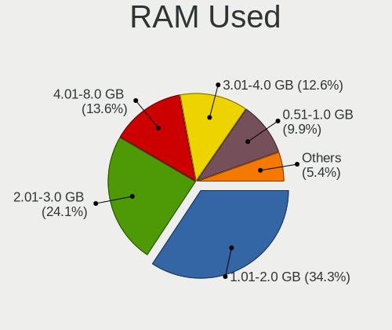
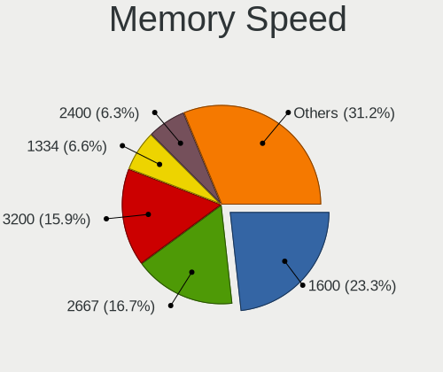
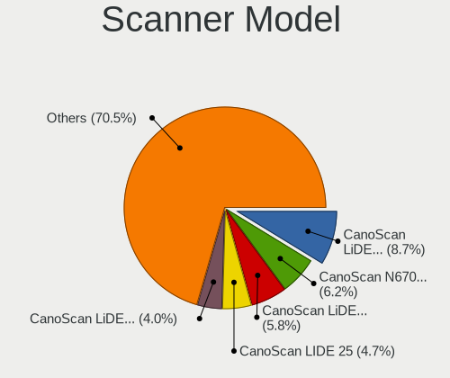

Linux - Tested Hardware & Statistics (Notebooks)
------------------------------------------------

A project to collect tested hardware configurations for Linux.

Anyone can contribute to this report by the [hw-probe](https://github.com/linuxhw/hw-probe) tool:

    sudo -E hw-probe -all -upload

Please contribute! Especially if your hardware is rare.

This report is for real hardware. Report for virtual hardware: [TestCoverage_VE](https://github.com/linuxhw/TestCoverage_VE)

Contents
--------

* [ Test Cases ](#test-cases)

* [ System ](#system)
  - [ OS                       ](#os)
  - [ OS Family                ](#os-family)
  - [ Kernel                   ](#kernel)
  - [ Kernel Family            ](#kernel-family)
  - [ Kernel Major Ver.        ](#kernel-major-ver)
  - [ Arch                     ](#arch)
  - [ DE                       ](#de)
  - [ Display Server           ](#display-server)
  - [ Display Manager          ](#display-manager)
  - [ OS Lang                  ](#os-lang)
  - [ Boot Mode                ](#boot-mode)
  - [ Filesystem               ](#filesystem)
  - [ Part. scheme             ](#part-scheme)
  - [ Dual Boot with Linux/BSD ](#dual-boot-with-linuxbsd)
  - [ Dual Boot (Win)          ](#dual-boot-win)

* [ Board ](#board)
  - [ Vendor                   ](#vendor)
  - [ Model                    ](#model)
  - [ Model Family             ](#model-family)
  - [ MFG Year                 ](#mfg-year)
  - [ Form Factor              ](#form-factor)
  - [ Secure Boot              ](#secure-boot)
  - [ Coreboot                 ](#coreboot)
  - [ RAM Size                 ](#ram-size)
  - [ RAM Used                 ](#ram-used)
  - [ Total Drives             ](#total-drives)
  - [ Has CD-ROM               ](#has-cd-rom)
  - [ Has Ethernet             ](#has-ethernet)
  - [ Has WiFi                 ](#has-wifi)
  - [ Has Bluetooth            ](#has-bluetooth)

* [ Location ](#location)
  - [ Country                  ](#country)
  - [ City                     ](#city)

* [ Drives ](#drives)
  - [ Drive Vendor             ](#drive-vendor)
  - [ Drive Model              ](#drive-model)
  - [ HDD Vendor               ](#hdd-vendor)
  - [ SSD Vendor               ](#ssd-vendor)
  - [ Drive Kind               ](#drive-kind)
  - [ Drive Connector          ](#drive-connector)
  - [ Drive Size               ](#drive-size)
  - [ Space Total              ](#space-total)
  - [ Space Used               ](#space-used)
  - [ Malfunc. Drives          ](#malfunc-drives)
  - [ Malfunc. Drive Vendor    ](#malfunc-drive-vendor)
  - [ Malfunc. HDD Vendor      ](#malfunc-hdd-vendor)
  - [ Malfunc. Drive Kind      ](#malfunc-drive-kind)
  - [ Failed Drives            ](#failed-drives)
  - [ Failed Drive Vendor      ](#failed-drive-vendor)
  - [ Drive Status             ](#drive-status)

* [ Storage controller ](#storage-controller)
  - [ Storage Vendor           ](#storage-vendor)
  - [ Storage Model            ](#storage-model)
  - [ Storage Kind             ](#storage-kind)

* [ Processor ](#processor)
  - [ CPU Vendor               ](#cpu-vendor)
  - [ CPU Model                ](#cpu-model)
  - [ CPU Model Family         ](#cpu-model-family)
  - [ CPU Cores                ](#cpu-cores)
  - [ CPU Sockets              ](#cpu-sockets)
  - [ CPU Threads              ](#cpu-threads)
  - [ CPU Op-Modes             ](#cpu-op-modes)
  - [ CPU Microcode            ](#cpu-microcode)
  - [ CPU Microarch            ](#cpu-microarch)

* [ Graphics ](#graphics)
  - [ GPU Vendor               ](#gpu-vendor)
  - [ GPU Model                ](#gpu-model)
  - [ GPU Combo                ](#gpu-combo)
  - [ GPU Driver               ](#gpu-driver)
  - [ GPU Memory               ](#gpu-memory)

* [ Monitor ](#monitor)
  - [ Monitor Vendor           ](#monitor-vendor)
  - [ Monitor Model            ](#monitor-model)
  - [ Monitor Resolution       ](#monitor-resolution)
  - [ Monitor Diagonal         ](#monitor-diagonal)
  - [ Monitor Width            ](#monitor-width)
  - [ Aspect Ratio             ](#aspect-ratio)
  - [ Monitor Area             ](#monitor-area)
  - [ Pixel Density            ](#pixel-density)
  - [ Multiple Monitors        ](#multiple-monitors)

* [ Network ](#network)
  - [ Net Controller Vendor    ](#net-controller-vendor)
  - [ Net Controller Model     ](#net-controller-model)
  - [ Wireless Vendor          ](#wireless-vendor)
  - [ Wireless Model           ](#wireless-model)
  - [ Ethernet Vendor          ](#ethernet-vendor)
  - [ Ethernet Model           ](#ethernet-model)
  - [ Net Controller Kind      ](#net-controller-kind)
  - [ Used Controller          ](#used-controller)
  - [ NICs                     ](#nics)
  - [ IPv6                     ](#ipv6)

* [ Bluetooth ](#bluetooth)
  - [ Bluetooth Vendor         ](#bluetooth-vendor)
  - [ Bluetooth Model          ](#bluetooth-model)

* [ Sound ](#sound)
  - [ Sound Vendor             ](#sound-vendor)
  - [ Sound Model              ](#sound-model)

* [ Memory ](#memory)
  - [ Memory Vendor            ](#memory-vendor)
  - [ Memory Model             ](#memory-model)
  - [ Memory Kind              ](#memory-kind)
  - [ Memory Form Factor       ](#memory-form-factor)
  - [ Memory Size              ](#memory-size)
  - [ Memory Speed             ](#memory-speed)

* [ Printers & scanners ](#printers--scanners)
  - [ Printer Vendor           ](#printer-vendor)
  - [ Printer Model            ](#printer-model)
  - [ Scanner Vendor           ](#scanner-vendor)
  - [ Scanner Model            ](#scanner-model)

* [ Camera ](#camera)
  - [ Camera Vendor            ](#camera-vendor)
  - [ Camera Model             ](#camera-model)

* [ Security ](#security)
  - [ Fingerprint Vendor       ](#fingerprint-vendor)
  - [ Fingerprint Model        ](#fingerprint-model)
  - [ Chipcard Vendor          ](#chipcard-vendor)
  - [ Chipcard Model           ](#chipcard-model)

* [ Unsupported ](#unsupported)
  - [ Unsupported Devices      ](#unsupported-devices)
  - [ Unsupported Device Types ](#unsupported-device-types)

Test Cases
----------

Total: 137587

| Vendor        | Model                       | Probe                                                      | Date         |
|---------------|-----------------------------|------------------------------------------------------------|--------------|
| ASUSTek       | ASUS TUF Gaming F17 FX70... | [eeb167d869](https://linux-hardware.org/?probe=eeb167d869) | Nov 02, 2022 |
| Lenovo        | G50-45 80E3                 | [d4f08c71a6](https://linux-hardware.org/?probe=d4f08c71a6) | Nov 02, 2022 |
| Dell          | G15 5515                    | [92f1423303](https://linux-hardware.org/?probe=92f1423303) | Nov 02, 2022 |
| HP            | Pavilion Gaming Laptop      | [695b3d82a7](https://linux-hardware.org/?probe=695b3d82a7) | Nov 02, 2022 |
| Dell          | Inspiron 7577               | [2a280dc7df](https://linux-hardware.org/?probe=2a280dc7df) | Nov 02, 2022 |
| HP            | ENVY m6                     | [9043724da5](https://linux-hardware.org/?probe=9043724da5) | Nov 02, 2022 |
| HP            | Pavilion Gaming Laptop      | [9b9e55c471](https://linux-hardware.org/?probe=9b9e55c471) | Nov 02, 2022 |
| HP            | EliteBook 8460p             | [565ad502cc](https://linux-hardware.org/?probe=565ad502cc) | Nov 02, 2022 |
| Lenovo        | ThinkPad T440p 20AW000GU... | [b4ff1758e9](https://linux-hardware.org/?probe=b4ff1758e9) | Nov 02, 2022 |
| Lenovo        | ThinkPad E475 20H40006US    | [d59bd1e8f1](https://linux-hardware.org/?probe=d59bd1e8f1) | Nov 02, 2022 |
| Samsung       | 600B4B/600B5B               | [56767f430b](https://linux-hardware.org/?probe=56767f430b) | Nov 02, 2022 |
| Panasonic     | CF-31WBLEHLM                | [623af75bb3](https://linux-hardware.org/?probe=623af75bb3) | Nov 02, 2022 |
| Lenovo        | E41-25 81FS                 | [5d9743e91d](https://linux-hardware.org/?probe=5d9743e91d) | Nov 02, 2022 |
| Panasonic     | CF-31WBLEHLM                | [52e7c62bae](https://linux-hardware.org/?probe=52e7c62bae) | Nov 02, 2022 |
| Lenovo        | ThinkPad T61 6464A13        | [5f850cbab6](https://linux-hardware.org/?probe=5f850cbab6) | Nov 02, 2022 |
| Toshiba       | Satellite C70D-A            | [7a421ed810](https://linux-hardware.org/?probe=7a421ed810) | Nov 02, 2022 |
| ASUSTek       | X540SAA                     | [ccaedd7155](https://linux-hardware.org/?probe=ccaedd7155) | Nov 02, 2022 |
| ASUSTek       | VivoBook_ASUSLaptop X570... | [28d7daff10](https://linux-hardware.org/?probe=28d7daff10) | Nov 02, 2022 |
| Toshiba       | Satellite C70D-A            | [d82227846b](https://linux-hardware.org/?probe=d82227846b) | Nov 02, 2022 |
| ASUSTek       | N55SF                       | [02af74ebb6](https://linux-hardware.org/?probe=02af74ebb6) | Nov 02, 2022 |
| Lenovo        | ThinkPad Yoga 11e 20DAS0... | [d9de10d93e](https://linux-hardware.org/?probe=d9de10d93e) | Nov 02, 2022 |
| Lenovo        | ThinkPad E15 Gen 3 20YHS... | [a3b1926b7e](https://linux-hardware.org/?probe=a3b1926b7e) | Nov 02, 2022 |
| Lenovo        | ThinkPad E475 20H40006US    | [4342ecb0f9](https://linux-hardware.org/?probe=4342ecb0f9) | Nov 02, 2022 |
| Google        | Terra                       | [46299bf228](https://linux-hardware.org/?probe=46299bf228) | Nov 02, 2022 |
| Lenovo        | IdeaPad 3 15IAU7 82RK       | [95ddb63cb1](https://linux-hardware.org/?probe=95ddb63cb1) | Nov 02, 2022 |
| GPD           | P3 MAX                      | [8b198da775](https://linux-hardware.org/?probe=8b198da775) | Nov 02, 2022 |
| Samsung       | 550XED                      | [6992db47be](https://linux-hardware.org/?probe=6992db47be) | Nov 02, 2022 |
| Samsung       | 600B4B/600B5B               | [b1ffa94d76](https://linux-hardware.org/?probe=b1ffa94d76) | Nov 02, 2022 |
| Lenovo        | ThinkPad E475 20H40006US    | [fd32769391](https://linux-hardware.org/?probe=fd32769391) | Nov 02, 2022 |
| Acer          | Nitro AN515-54              | [710ab678b2](https://linux-hardware.org/?probe=710ab678b2) | Nov 02, 2022 |
| Lenovo        | ThinkPad E475 20H40006US    | [d3c1c92563](https://linux-hardware.org/?probe=d3c1c92563) | Nov 02, 2022 |
| Acer          | Aspire A515-54G             | [519fa92199](https://linux-hardware.org/?probe=519fa92199) | Nov 02, 2022 |
| HP            | Pavilion Aero Laptop 13-... | [4fa32ec6af](https://linux-hardware.org/?probe=4fa32ec6af) | Nov 02, 2022 |
| MSI           | Prestige 15 A11SCX          | [973b498b3f](https://linux-hardware.org/?probe=973b498b3f) | Nov 02, 2022 |
| Lenovo        | ThinkPad E475 20H40006US    | [0ffaee423b](https://linux-hardware.org/?probe=0ffaee423b) | Nov 02, 2022 |
| GPD           | P3 MAX                      | [aea8f8bb50](https://linux-hardware.org/?probe=aea8f8bb50) | Nov 02, 2022 |
| ASUSTek       | 1005HA                      | [1d386943d6](https://linux-hardware.org/?probe=1d386943d6) | Nov 02, 2022 |
| Acer          | Aspire E5-522               | [32f73c64a6](https://linux-hardware.org/?probe=32f73c64a6) | Nov 02, 2022 |
| ASUSTek       | 1215B                       | [21694405a9](https://linux-hardware.org/?probe=21694405a9) | Nov 02, 2022 |
| Lenovo        | IdeaPad 710S-13IKB 80VQ     | [dbacfbd3b0](https://linux-hardware.org/?probe=dbacfbd3b0) | Nov 02, 2022 |
| Dell          | Latitude 5580               | [92545fb976](https://linux-hardware.org/?probe=92545fb976) | Nov 02, 2022 |
| Acer          | Aspire E5-522               | [412b8c701e](https://linux-hardware.org/?probe=412b8c701e) | Nov 02, 2022 |
| Dell          | G3 3500                     | [c595a16f59](https://linux-hardware.org/?probe=c595a16f59) | Nov 02, 2022 |
| Lenovo        | IdeaPad 110-15ACL 80TJ      | [0a79270558](https://linux-hardware.org/?probe=0a79270558) | Nov 02, 2022 |
| HP            | Laptop                      | [e1cd3de91a](https://linux-hardware.org/?probe=e1cd3de91a) | Nov 02, 2022 |
| Lenovo        | ThinkPad X1 Extreme 20MF... | [9819da96f2](https://linux-hardware.org/?probe=9819da96f2) | Nov 02, 2022 |
| Dell          | Precision 7550              | [2065f4ab5f](https://linux-hardware.org/?probe=2065f4ab5f) | Nov 02, 2022 |
| Daten Tecn... | DT02-M4                     | [cdd5c3cca0](https://linux-hardware.org/?probe=cdd5c3cca0) | Nov 02, 2022 |
| Dell          | Latitude E5450              | [b39c12a9a4](https://linux-hardware.org/?probe=b39c12a9a4) | Nov 02, 2022 |
| Daten Tecn... | DT02-M4                     | [7d43f3c00b](https://linux-hardware.org/?probe=7d43f3c00b) | Nov 02, 2022 |
| Shanghai Z... | ZXE CRB                     | [a0029fb797](https://linux-hardware.org/?probe=a0029fb797) | Nov 02, 2022 |
| Notebook      | NJx0MU                      | [5b45883fef](https://linux-hardware.org/?probe=5b45883fef) | Nov 02, 2022 |
| Acer          | Aspire A114-32              | [036ff9e51f](https://linux-hardware.org/?probe=036ff9e51f) | Nov 02, 2022 |
| HP            | EliteBook 845 G7 Noteboo... | [c693004e08](https://linux-hardware.org/?probe=c693004e08) | Nov 02, 2022 |
| Acer          | Aspire A114-32              | [d5d1583252](https://linux-hardware.org/?probe=d5d1583252) | Nov 02, 2022 |
| ASUSTek       | ASUS TUF Gaming F15 FX50... | [2d931f9e99](https://linux-hardware.org/?probe=2d931f9e99) | Nov 02, 2022 |
| ASUSTek       | VivoBook_ASUSLaptop X705... | [4a158afdfd](https://linux-hardware.org/?probe=4a158afdfd) | Nov 02, 2022 |
| Samsung       | RV411/RV511/E3511/S3511/... | [ebe8179d26](https://linux-hardware.org/?probe=ebe8179d26) | Nov 02, 2022 |
| Dell          | Latitude 5420               | [679fbcb14f](https://linux-hardware.org/?probe=679fbcb14f) | Nov 02, 2022 |
| Lenovo        | G560 0679                   | [c97e8f3436](https://linux-hardware.org/?probe=c97e8f3436) | Nov 02, 2022 |
| Acer          | Aspire 5750G                | [496a16216c](https://linux-hardware.org/?probe=496a16216c) | Nov 02, 2022 |
| Schenker      | VISION 15 (SVS15E21)        | [2b5c165e30](https://linux-hardware.org/?probe=2b5c165e30) | Nov 02, 2022 |
| Lenovo        | ThinkBook 15 G3 ACL 21A4    | [335af8b89b](https://linux-hardware.org/?probe=335af8b89b) | Nov 02, 2022 |
| HP            | Pavilion g6                 | [22b32d9bac](https://linux-hardware.org/?probe=22b32d9bac) | Nov 02, 2022 |
| Dell          | XPS 13 9305                 | [4ffebc50a0](https://linux-hardware.org/?probe=4ffebc50a0) | Nov 02, 2022 |
| HP            | EliteBook 2730p             | [79830976d8](https://linux-hardware.org/?probe=79830976d8) | Nov 02, 2022 |
| Dell          | Vostro 5515                 | [881cd60670](https://linux-hardware.org/?probe=881cd60670) | Nov 02, 2022 |
| Notebook      | P65xHP                      | [68d40fd2c7](https://linux-hardware.org/?probe=68d40fd2c7) | Nov 02, 2022 |
| HUAWEI        | BOD-WXX9                    | [d4ac3a5f04](https://linux-hardware.org/?probe=d4ac3a5f04) | Nov 02, 2022 |
| HP            | G42                         | [18c487d99d](https://linux-hardware.org/?probe=18c487d99d) | Nov 02, 2022 |
| Valve         | Jupiter                     | [f6295954bc](https://linux-hardware.org/?probe=f6295954bc) | Nov 02, 2022 |
| HP            | Pavilion Notebook           | [9fef9a6a8a](https://linux-hardware.org/?probe=9fef9a6a8a) | Nov 02, 2022 |
| Digma         | EVE 11 C422 ES1068EW        | [f5177de131](https://linux-hardware.org/?probe=f5177de131) | Nov 02, 2022 |
| HP            | ProBook 450 G8 Notebook ... | [44e281e52c](https://linux-hardware.org/?probe=44e281e52c) | Nov 02, 2022 |
| Acer          | Aspire A514-55              | [391048b46f](https://linux-hardware.org/?probe=391048b46f) | Nov 02, 2022 |
| Lenovo        | Legion 5 15IAH7H 82RB       | [aa6c06f2bb](https://linux-hardware.org/?probe=aa6c06f2bb) | Nov 02, 2022 |
| Dell          | Latitude E6420              | [032920f109](https://linux-hardware.org/?probe=032920f109) | Nov 02, 2022 |
| Jumper        | EZbook                      | [08ec434199](https://linux-hardware.org/?probe=08ec434199) | Nov 02, 2022 |
| Lenovo        | Legion 5 15IAH7H 82RB       | [584db1dcb2](https://linux-hardware.org/?probe=584db1dcb2) | Nov 02, 2022 |
| ASUSTek       | VivoBook_ASUSLaptop X515... | [a156a7484d](https://linux-hardware.org/?probe=a156a7484d) | Nov 02, 2022 |
| Dell          | G15 5515                    | [dae7c630d5](https://linux-hardware.org/?probe=dae7c630d5) | Nov 02, 2022 |
| Lenovo        | ThinkPad S2 3rd Gen 20L1... | [48c0ef6251](https://linux-hardware.org/?probe=48c0ef6251) | Nov 02, 2022 |
| Valve         | Jupiter                     | [13e280e72f](https://linux-hardware.org/?probe=13e280e72f) | Nov 02, 2022 |
| Samsung       | 550P5C/550P7C               | [39cb4cb083](https://linux-hardware.org/?probe=39cb4cb083) | Nov 02, 2022 |
| HP            | Pavilion dv8                | [21af5313f0](https://linux-hardware.org/?probe=21af5313f0) | Nov 02, 2022 |
| Panasonic     | CF-C1BWFBZ1M                | [18a81d5db2](https://linux-hardware.org/?probe=18a81d5db2) | Nov 02, 2022 |
| Acer          | Nitro AN515-57              | [44f768478e](https://linux-hardware.org/?probe=44f768478e) | Nov 02, 2022 |
| Cube          | i18-BL                      | [725100a829](https://linux-hardware.org/?probe=725100a829) | Nov 02, 2022 |
| Samsung       | 950XED                      | [821bc59c17](https://linux-hardware.org/?probe=821bc59c17) | Nov 02, 2022 |
| Lenovo        | Legion 5 Pro 16ITH6 82JF    | [09c2704bb0](https://linux-hardware.org/?probe=09c2704bb0) | Nov 02, 2022 |
| Notebook      | P65_P67SE                   | [9b99df1e15](https://linux-hardware.org/?probe=9b99df1e15) | Nov 02, 2022 |
| ASUSTek       | ROG Zephyrus G14 GA402RJ... | [7b51138a0b](https://linux-hardware.org/?probe=7b51138a0b) | Nov 02, 2022 |
| HP            | 625                         | [830c5c0d14](https://linux-hardware.org/?probe=830c5c0d14) | Nov 02, 2022 |
| HP            | 625                         | [4c627cab51](https://linux-hardware.org/?probe=4c627cab51) | Nov 02, 2022 |
| Lenovo        | ThinkPad Edge E530c 3366... | [4968129a1a](https://linux-hardware.org/?probe=4968129a1a) | Nov 02, 2022 |
| Lenovo        | ThinkPad T495 20NKS01W02    | [e4d29df724](https://linux-hardware.org/?probe=e4d29df724) | Nov 02, 2022 |
| HUAWEI        | NBLK-WAX9X                  | [d3beec5427](https://linux-hardware.org/?probe=d3beec5427) | Nov 02, 2022 |
| HP            | Pavilion g6                 | [24c2a01761](https://linux-hardware.org/?probe=24c2a01761) | Nov 02, 2022 |
| HP            | Pavilion x2 Detachable P... | [b4d63f4835](https://linux-hardware.org/?probe=b4d63f4835) | Nov 02, 2022 |
| Dell          | Latitude 5591               | [bcd8aef9a0](https://linux-hardware.org/?probe=bcd8aef9a0) | Nov 02, 2022 |
| Lenovo        | IdeaPad 100S-11IBY 80R2     | [7c6ddf22b5](https://linux-hardware.org/?probe=7c6ddf22b5) | Nov 02, 2022 |
| Dell          | Inspiron 15-3567            | [a9b57edf35](https://linux-hardware.org/?probe=a9b57edf35) | Nov 02, 2022 |
| Apple         | MacBookPro9,2               | [0f40b36846](https://linux-hardware.org/?probe=0f40b36846) | Nov 02, 2022 |
| Valve         | Jupiter                     | [99521b7f24](https://linux-hardware.org/?probe=99521b7f24) | Nov 02, 2022 |
| Dell          | Inspiron 15 3511            | [5786a01590](https://linux-hardware.org/?probe=5786a01590) | Nov 02, 2022 |
| Acer          | Aspire A315-54              | [1421a5a4e9](https://linux-hardware.org/?probe=1421a5a4e9) | Nov 02, 2022 |
| HP            | Pavilion Gaming Laptop 1... | [690e088c8e](https://linux-hardware.org/?probe=690e088c8e) | Nov 02, 2022 |
| GPU Compan... | GWTN156-2BK                 | [a7fb2c2163](https://linux-hardware.org/?probe=a7fb2c2163) | Nov 02, 2022 |
| HUAWEI        | HVY-WXX9                    | [87ab6daba5](https://linux-hardware.org/?probe=87ab6daba5) | Nov 02, 2022 |
| ASUSTek       | VivoBook_ASUSLaptop X570... | [6f89789444](https://linux-hardware.org/?probe=6f89789444) | Nov 02, 2022 |
| Lenovo        | IdeaPadFlex 15D 20334       | [005b25ef06](https://linux-hardware.org/?probe=005b25ef06) | Nov 02, 2022 |
| Acer          | Aspire one 1-431            | [09aeb9ec38](https://linux-hardware.org/?probe=09aeb9ec38) | Nov 02, 2022 |
| Dell          | Vostro 15 3515              | [59c101934c](https://linux-hardware.org/?probe=59c101934c) | Nov 02, 2022 |
| PC Special... | Elimina Iv 15               | [f462ba9c43](https://linux-hardware.org/?probe=f462ba9c43) | Nov 02, 2022 |
| Apple         | MacBookPro11,5              | [f22ebdf694](https://linux-hardware.org/?probe=f22ebdf694) | Nov 01, 2022 |
| Fujitsu       | LIFEBOOK A532               | [d4af3b0745](https://linux-hardware.org/?probe=d4af3b0745) | Nov 01, 2022 |
| Samsung       | 305V4A/305V5A               | [5df933ddda](https://linux-hardware.org/?probe=5df933ddda) | Nov 01, 2022 |
| Apple         | MacBookPro11,5              | [a27142d25c](https://linux-hardware.org/?probe=a27142d25c) | Nov 01, 2022 |
| Acer          | Aspire E1-571               | [d81e8b3ea2](https://linux-hardware.org/?probe=d81e8b3ea2) | Nov 01, 2022 |
| Lenovo        | ThinkPad X201 3680BR4       | [eeeeb33766](https://linux-hardware.org/?probe=eeeeb33766) | Nov 01, 2022 |
| Lenovo        | ThinkPad E14 Gen 3 20YDS... | [c90b358eb5](https://linux-hardware.org/?probe=c90b358eb5) | Nov 01, 2022 |
| HP            | ProBook 4530s               | [6490664312](https://linux-hardware.org/?probe=6490664312) | Nov 01, 2022 |
| Dell          | Precision 7530              | [b1b5f7678c](https://linux-hardware.org/?probe=b1b5f7678c) | Nov 01, 2022 |
| Lenovo        | IdeaPad 320-17AST 80XW      | [9fa0489d64](https://linux-hardware.org/?probe=9fa0489d64) | Nov 01, 2022 |
| HP            | Laptop 15-db0xxx            | [aad6abb936](https://linux-hardware.org/?probe=aad6abb936) | Nov 01, 2022 |
| HP            | Pavilion Notebook           | [95d825cd94](https://linux-hardware.org/?probe=95d825cd94) | Nov 01, 2022 |
| HP            | ProBook 4530s               | [34682f3bfe](https://linux-hardware.org/?probe=34682f3bfe) | Nov 01, 2022 |
| ASUSTek       | N53Jg                       | [8e4782c668](https://linux-hardware.org/?probe=8e4782c668) | Nov 01, 2022 |
| Lenovo        | IdeaPad 320-17AST 80XW      | [411a5da53c](https://linux-hardware.org/?probe=411a5da53c) | Nov 01, 2022 |
| ASUSTek       | Zephyrus S GX531GS_GX531... | [4823244248](https://linux-hardware.org/?probe=4823244248) | Nov 01, 2022 |
| ASUSTek       | ZenBook UX482EA_UX482EA     | [a65efa454e](https://linux-hardware.org/?probe=a65efa454e) | Nov 01, 2022 |
| Acer          | Swift SF314-512             | [4c80b212c6](https://linux-hardware.org/?probe=4c80b212c6) | Nov 01, 2022 |
| Lenovo        | ThinkPad X1 Carbon 4th 2... | [cd0e637d88](https://linux-hardware.org/?probe=cd0e637d88) | Nov 01, 2022 |
| Dell          | Precision 5520              | [e1a819ec3e](https://linux-hardware.org/?probe=e1a819ec3e) | Nov 01, 2022 |
| Acer          | Swift SF314-512             | [4e92800709](https://linux-hardware.org/?probe=4e92800709) | Nov 01, 2022 |
| Intel Clie... | CMCN1CC                     | [719731b244](https://linux-hardware.org/?probe=719731b244) | Nov 01, 2022 |
| HP            | EliteBook 830 G5            | [379443a5d6](https://linux-hardware.org/?probe=379443a5d6) | Nov 01, 2022 |
| ASUSTek       | ZenBook UX482EA_UX482EA     | [3380dfae20](https://linux-hardware.org/?probe=3380dfae20) | Nov 01, 2022 |
| Lenovo        | ThinkPad T420 4236PG6       | [49d423bc50](https://linux-hardware.org/?probe=49d423bc50) | Nov 01, 2022 |
| Lenovo        | Legion 5 15ARH05 82B5       | [9b61195a2a](https://linux-hardware.org/?probe=9b61195a2a) | Nov 01, 2022 |
| Acer          | Swift SF314-42              | [6a0d7d5f39](https://linux-hardware.org/?probe=6a0d7d5f39) | Nov 01, 2022 |
| HP            | EliteBook 830 G5            | [5e099af04c](https://linux-hardware.org/?probe=5e099af04c) | Nov 01, 2022 |
| Dell          | Latitude E7240              | [effafc033d](https://linux-hardware.org/?probe=effafc033d) | Nov 01, 2022 |
| Lenovo        | ThinkPad L590 20Q7001KIX    | [c8e545615f](https://linux-hardware.org/?probe=c8e545615f) | Nov 01, 2022 |
| Toshiba       | Satellite C660              | [44c6e56cd9](https://linux-hardware.org/?probe=44c6e56cd9) | Nov 01, 2022 |
| HP            | Pavilion Sleekbook 15 PC    | [9dea1bfedb](https://linux-hardware.org/?probe=9dea1bfedb) | Nov 01, 2022 |
| HP            | Pavilion dv5                | [fb23cec1a6](https://linux-hardware.org/?probe=fb23cec1a6) | Nov 01, 2022 |
| Samsung       | 550XED                      | [3b04d21991](https://linux-hardware.org/?probe=3b04d21991) | Nov 01, 2022 |
| ASUSTek       | VivoBook 12_ASUS Laptop ... | [c83f37c114](https://linux-hardware.org/?probe=c83f37c114) | Nov 01, 2022 |
| Toshiba       | Satellite L755              | [dc3d60731e](https://linux-hardware.org/?probe=dc3d60731e) | Nov 01, 2022 |
| Toshiba       | Satellite L50-B             | [c242c45dbe](https://linux-hardware.org/?probe=c242c45dbe) | Nov 01, 2022 |
| Razer         | Blade 15 Advanced Model ... | [e0a589194b](https://linux-hardware.org/?probe=e0a589194b) | Nov 01, 2022 |
| Apple         | MacBookPro12,1              | [e08326bc94](https://linux-hardware.org/?probe=e08326bc94) | Nov 01, 2022 |
| Acer          | Swift SF314-41              | [921b1a7ebf](https://linux-hardware.org/?probe=921b1a7ebf) | Nov 01, 2022 |
| Lenovo        | IdeaPad 5 Pro 14ACN6 82L... | [f5060f0a8d](https://linux-hardware.org/?probe=f5060f0a8d) | Nov 01, 2022 |
| Apple         | MacBookPro9,2               | [69768228d4](https://linux-hardware.org/?probe=69768228d4) | Nov 01, 2022 |
| HP            | Pavilion 15                 | [8552c17b28](https://linux-hardware.org/?probe=8552c17b28) | Nov 01, 2022 |
| Dell          | G5 5587                     | [a4e32e9eb8](https://linux-hardware.org/?probe=a4e32e9eb8) | Nov 01, 2022 |
| Apple         | MacBookAir6,2               | [053e74af53](https://linux-hardware.org/?probe=053e74af53) | Nov 01, 2022 |
| HP            | ProBook 650 G1              | [85f1aa7b6d](https://linux-hardware.org/?probe=85f1aa7b6d) | Nov 01, 2022 |
| Lenovo        | ThinkPad S2 3rd Gen 20L1... | [1cc623c804](https://linux-hardware.org/?probe=1cc623c804) | Nov 01, 2022 |
| Lenovo        | IdeaPad 330S-14IKB 81JM     | [da8fec7ac4](https://linux-hardware.org/?probe=da8fec7ac4) | Nov 01, 2022 |
| HP            | ZBook 15 G3                 | [06ea8207dc](https://linux-hardware.org/?probe=06ea8207dc) | Nov 01, 2022 |
| Acer          | Aspire A515-46              | [ef6bcab217](https://linux-hardware.org/?probe=ef6bcab217) | Nov 01, 2022 |
| Lenovo        | ThinkPad X1 Carbon 7th 2... | [e101d9d50a](https://linux-hardware.org/?probe=e101d9d50a) | Nov 01, 2022 |
| Lenovo        | ThinkPad E14 Gen 4 21ECS... | [766e7fb0d0](https://linux-hardware.org/?probe=766e7fb0d0) | Nov 01, 2022 |
| ASUSTek       | VivoBook_ASUSLaptop M760... | [49d6eb853f](https://linux-hardware.org/?probe=49d6eb853f) | Nov 01, 2022 |
| ASUSTek       | GL753VD                     | [97e2ee4ee1](https://linux-hardware.org/?probe=97e2ee4ee1) | Nov 01, 2022 |
| ASUSTek       | VivoBook_ASUSLaptop M760... | [5de7efb403](https://linux-hardware.org/?probe=5de7efb403) | Nov 01, 2022 |
| GPD           | G1619-04                    | [898bbfb591](https://linux-hardware.org/?probe=898bbfb591) | Nov 01, 2022 |
| HP            | Laptop 14s-fq0xxx           | [fe23529093](https://linux-hardware.org/?probe=fe23529093) | Nov 01, 2022 |
| ASUSTek       | G74Sx                       | [4e69212184](https://linux-hardware.org/?probe=4e69212184) | Nov 01, 2022 |
| Lenovo        | ThinkPad E15 Gen 2 20T80... | [310895b721](https://linux-hardware.org/?probe=310895b721) | Nov 01, 2022 |
| Lenovo        | IdeaPad 3 15ADA05 81W1      | [6db184e152](https://linux-hardware.org/?probe=6db184e152) | Nov 01, 2022 |
| Lenovo        | ThinkPad T480 20L6S3H108    | [1ed803ae94](https://linux-hardware.org/?probe=1ed803ae94) | Nov 01, 2022 |
| Lenovo        | IdeaPad 3 15ADA05 81W1      | [60cfb7dcc6](https://linux-hardware.org/?probe=60cfb7dcc6) | Nov 01, 2022 |
| Acer          | Aspire V3-571G              | [990a38ea87](https://linux-hardware.org/?probe=990a38ea87) | Nov 01, 2022 |
| Toshiba       | Satellite C70D-B            | [ccf4e200fb](https://linux-hardware.org/?probe=ccf4e200fb) | Nov 01, 2022 |
| ASUSTek       | K55VD                       | [6e2ff87fad](https://linux-hardware.org/?probe=6e2ff87fad) | Nov 01, 2022 |
| Lenovo        | ThinkBook 15 G2 ITL 20VE    | [7603f28400](https://linux-hardware.org/?probe=7603f28400) | Nov 01, 2022 |
| Apple         | MacBookPro16,1              | [025e3e7e4e](https://linux-hardware.org/?probe=025e3e7e4e) | Nov 01, 2022 |
| Lenovo        | ThinkPad Edge E530c 3366... | [9864cd6db6](https://linux-hardware.org/?probe=9864cd6db6) | Nov 01, 2022 |
| SANTECH       | X170KM-G                    | [073f9a1d24](https://linux-hardware.org/?probe=073f9a1d24) | Nov 01, 2022 |
| Lenovo        | IdeaPad 720S-13ARR 81BR     | [fefe8e5d04](https://linux-hardware.org/?probe=fefe8e5d04) | Nov 01, 2022 |
| Unknown       | Unknown                     | [9608724116](https://linux-hardware.org/?probe=9608724116) | Nov 01, 2022 |
| Lenovo        | V14-ADA 82C6                | [a54d6876b6](https://linux-hardware.org/?probe=a54d6876b6) | Nov 01, 2022 |
| HP            | Notebook                    | [27d097b522](https://linux-hardware.org/?probe=27d097b522) | Nov 01, 2022 |
| ASUSTek       | P52F                        | [a83cb4c35d](https://linux-hardware.org/?probe=a83cb4c35d) | Nov 01, 2022 |
| Apple         | MacBookPro9,2               | [4cdb36db63](https://linux-hardware.org/?probe=4cdb36db63) | Nov 01, 2022 |
| Dell          | Venue 8 Pro 5830            | [8890410dfc](https://linux-hardware.org/?probe=8890410dfc) | Nov 01, 2022 |
| Acer          | Aspire 3000                 | [02693e03ca](https://linux-hardware.org/?probe=02693e03ca) | Nov 01, 2022 |
| Toshiba       | Satellite L50-C             | [b3e0ff9849](https://linux-hardware.org/?probe=b3e0ff9849) | Nov 01, 2022 |
| Lenovo        | IdeaPad 720S-13ARR 81BR     | [df949b6e10](https://linux-hardware.org/?probe=df949b6e10) | Nov 01, 2022 |
| Lenovo        | ThinkPad L460 20FVS1Y500    | [5fc669ddbe](https://linux-hardware.org/?probe=5fc669ddbe) | Nov 01, 2022 |
| Dell          | Latitude 3420               | [9c2b9ab298](https://linux-hardware.org/?probe=9c2b9ab298) | Nov 01, 2022 |
| ASUSTek       | X501A                       | [d5a34df414](https://linux-hardware.org/?probe=d5a34df414) | Nov 01, 2022 |
| Apple         | MacBookPro9,2               | [d63c5de91b](https://linux-hardware.org/?probe=d63c5de91b) | Nov 01, 2022 |
| MS            | MPGIO                       | [4fc8637bf3](https://linux-hardware.org/?probe=4fc8637bf3) | Nov 01, 2022 |
| HP            | Stream Laptop 14-ax0XX      | [bbbf28359b](https://linux-hardware.org/?probe=bbbf28359b) | Nov 01, 2022 |
| ASUSTek       | VivoBook 15_ASUS Laptop ... | [6323d7e1b3](https://linux-hardware.org/?probe=6323d7e1b3) | Nov 01, 2022 |
| Valve         | Jupiter                     | [cf9998e9b9](https://linux-hardware.org/?probe=cf9998e9b9) | Nov 01, 2022 |
| HUAWEI        | KPL-W0X                     | [6d6a8caf61](https://linux-hardware.org/?probe=6d6a8caf61) | Nov 01, 2022 |
| ASUSTek       | VivoBook_ASUSLaptop X421... | [4cd7aa6350](https://linux-hardware.org/?probe=4cd7aa6350) | Nov 01, 2022 |
| HUAWEI        | CREM-WXX9                   | [1d24aac4ce](https://linux-hardware.org/?probe=1d24aac4ce) | Nov 01, 2022 |
| Lenovo        | V15 G2 ALC 82KD             | [406aae2f66](https://linux-hardware.org/?probe=406aae2f66) | Nov 01, 2022 |
| Dell          | Inspiron 15 3511            | [85c215eebf](https://linux-hardware.org/?probe=85c215eebf) | Nov 01, 2022 |
| HUAWEI        | CREM-WXX9                   | [2eb32b1bb3](https://linux-hardware.org/?probe=2eb32b1bb3) | Nov 01, 2022 |
| Lenovo        | G50-80 80E5                 | [0470f02ccb](https://linux-hardware.org/?probe=0470f02ccb) | Nov 01, 2022 |
| HP            | Pavilion 10 TS              | [49e1be474a](https://linux-hardware.org/?probe=49e1be474a) | Nov 01, 2022 |
| ASUSTek       | ProArt StudioBook H7600H... | [3db734a533](https://linux-hardware.org/?probe=3db734a533) | Nov 01, 2022 |
| Notebook      | NJx0MU                      | [6b2b490208](https://linux-hardware.org/?probe=6b2b490208) | Nov 01, 2022 |
| HUAWEI        | MACHC-WAX9                  | [e4f3828910](https://linux-hardware.org/?probe=e4f3828910) | Nov 01, 2022 |
| GPU Compan... | GWTN156-2BK                 | [99ab599fbc](https://linux-hardware.org/?probe=99ab599fbc) | Nov 01, 2022 |
| ASUSTek       | N61Vg                       | [27f288e5f1](https://linux-hardware.org/?probe=27f288e5f1) | Nov 01, 2022 |
| HP            | Laptop 15-da2xxx            | [ea7591794a](https://linux-hardware.org/?probe=ea7591794a) | Nov 01, 2022 |
| ASUSTek       | K54C                        | [dd4f63b1e4](https://linux-hardware.org/?probe=dd4f63b1e4) | Nov 01, 2022 |
| HP            | ZBook 15 G2                 | [7254a9a2fc](https://linux-hardware.org/?probe=7254a9a2fc) | Nov 01, 2022 |
| Dell          | Latitude E7240              | [d8ae1a7195](https://linux-hardware.org/?probe=d8ae1a7195) | Nov 01, 2022 |
| HP            | Unknown                     | [1ca885060e](https://linux-hardware.org/?probe=1ca885060e) | Nov 01, 2022 |
| HP            | ZBook 15 G2                 | [05eeb9e341](https://linux-hardware.org/?probe=05eeb9e341) | Nov 01, 2022 |
| Apple         | MacBookAir7,2               | [2532d13f74](https://linux-hardware.org/?probe=2532d13f74) | Nov 01, 2022 |
| Apple         | MacBookPro8,1               | [da912b99f4](https://linux-hardware.org/?probe=da912b99f4) | Nov 01, 2022 |
| Timi          | TM1701                      | [84a5a6ce39](https://linux-hardware.org/?probe=84a5a6ce39) | Nov 01, 2022 |
| Dell          | Precision 3510              | [a87bb1e8dd](https://linux-hardware.org/?probe=a87bb1e8dd) | Nov 01, 2022 |
| Lenovo        | ThinkPad L14 Gen 2 20X2S... | [36d7199821](https://linux-hardware.org/?probe=36d7199821) | Nov 01, 2022 |
| HP            | Pavilion dv7                | [5fdb241389](https://linux-hardware.org/?probe=5fdb241389) | Oct 31, 2022 |
| SLIMBOOK      | PROX-AMD5                   | [a85aef0a90](https://linux-hardware.org/?probe=a85aef0a90) | Oct 31, 2022 |
| Acer          | Aspire one                  | [bfb9f97d74](https://linux-hardware.org/?probe=bfb9f97d74) | Oct 31, 2022 |
| Packard Be... | EasyNote TE11BZ             | [0301f1ddf1](https://linux-hardware.org/?probe=0301f1ddf1) | Oct 31, 2022 |
| Lenovo        | G710 20252                  | [834e3f17aa](https://linux-hardware.org/?probe=834e3f17aa) | Oct 31, 2022 |
| ASUSTek       | S551LN                      | [67e15a659d](https://linux-hardware.org/?probe=67e15a659d) | Oct 31, 2022 |
| Lenovo        | G710 20252                  | [acc007bae4](https://linux-hardware.org/?probe=acc007bae4) | Oct 31, 2022 |
| Samsung       | RV410/RV510/S3510/E3510     | [566d83485b](https://linux-hardware.org/?probe=566d83485b) | Oct 31, 2022 |
| HUAWEI        | BOHB-WAX9                   | [274a3383db](https://linux-hardware.org/?probe=274a3383db) | Oct 31, 2022 |
| Dell          | XPS 13 9310                 | [d284b1709a](https://linux-hardware.org/?probe=d284b1709a) | Oct 31, 2022 |
| Acer          | Unknown                     | [284f534a6a](https://linux-hardware.org/?probe=284f534a6a) | Oct 31, 2022 |
| Packard Be... | EasyNote TK85               | [a233571587](https://linux-hardware.org/?probe=a233571587) | Oct 31, 2022 |
| Lenovo        | ThinkPad L14 Gen 1 20U50... | [c9e0b81f80](https://linux-hardware.org/?probe=c9e0b81f80) | Oct 31, 2022 |
| HP            | Laptop 15-bs2xx             | [7c94d16c1c](https://linux-hardware.org/?probe=7c94d16c1c) | Oct 31, 2022 |
| Acer          | Aspire V5-561G              | [ea7f8f381b](https://linux-hardware.org/?probe=ea7f8f381b) | Oct 31, 2022 |
| Acer          | Unknown                     | [27b5267fa3](https://linux-hardware.org/?probe=27b5267fa3) | Oct 31, 2022 |
| Sony          | VPCZ12C5E                   | [b1e6524541](https://linux-hardware.org/?probe=b1e6524541) | Oct 31, 2022 |
| HP            | Stream Laptop 14-cb1XX      | [18db43ffed](https://linux-hardware.org/?probe=18db43ffed) | Oct 31, 2022 |
| Valve         | Jupiter                     | [9d237f0d30](https://linux-hardware.org/?probe=9d237f0d30) | Oct 31, 2022 |
| Lenovo        | ThinkPad E580 20KTA001GE    | [55dc6ac7ba](https://linux-hardware.org/?probe=55dc6ac7ba) | Oct 31, 2022 |
| SANTECH       | NL5xRU                      | [63e1b4298d](https://linux-hardware.org/?probe=63e1b4298d) | Oct 31, 2022 |
| HP            | ProBook 470 G5              | [0424e08b3d](https://linux-hardware.org/?probe=0424e08b3d) | Oct 31, 2022 |
| Samsung       | 800G5M/800G5W               | [c91800e8c1](https://linux-hardware.org/?probe=c91800e8c1) | Oct 31, 2022 |
| Lenovo        | IdeaPad S145-15API 81V7     | [973fc77891](https://linux-hardware.org/?probe=973fc77891) | Oct 31, 2022 |
| ASUSTek       | X510UAR                     | [46f1da66b6](https://linux-hardware.org/?probe=46f1da66b6) | Oct 31, 2022 |
| Lenovo        | ThinkPad T480 20L6SDR21A    | [b401e89d9c](https://linux-hardware.org/?probe=b401e89d9c) | Oct 31, 2022 |
| ASUSTek       | X510UAR                     | [1409a7f78d](https://linux-hardware.org/?probe=1409a7f78d) | Oct 31, 2022 |
| Acer          | Nitro AN515-42              | [3a00ca53c8](https://linux-hardware.org/?probe=3a00ca53c8) | Oct 31, 2022 |
| Dell          | Latitude E6330              | [51ded2feb1](https://linux-hardware.org/?probe=51ded2feb1) | Oct 31, 2022 |
| Acer          | Swift SF314-54              | [71cf98e6e8](https://linux-hardware.org/?probe=71cf98e6e8) | Oct 31, 2022 |
| HP            | Compaq nc6320 (EV073AV)     | [b73f359ded](https://linux-hardware.org/?probe=b73f359ded) | Oct 31, 2022 |
| ASUSTek       | ASUS TUF Gaming F15 FX50... | [325516bbce](https://linux-hardware.org/?probe=325516bbce) | Oct 31, 2022 |
| LG Electro... | A560-T.BG77P1               | [cad4120a42](https://linux-hardware.org/?probe=cad4120a42) | Oct 31, 2022 |
| ASUSTek       | ASUS TUF Gaming F15 FX50... | [740d19ba42](https://linux-hardware.org/?probe=740d19ba42) | Oct 31, 2022 |
| ASUSTek       | X510UNR                     | [6a28e2929d](https://linux-hardware.org/?probe=6a28e2929d) | Oct 31, 2022 |
| Dell          | Inspiron 3542               | [dcccad24af](https://linux-hardware.org/?probe=dcccad24af) | Oct 31, 2022 |
| HP            | Laptop 17-ca3xxx            | [2c42913712](https://linux-hardware.org/?probe=2c42913712) | Oct 31, 2022 |
| ASUSTek       | K54L                        | [200f6044c2](https://linux-hardware.org/?probe=200f6044c2) | Oct 31, 2022 |
| ASUSTek       | VivoBook 15_ASUS Laptop ... | [027cfb43c4](https://linux-hardware.org/?probe=027cfb43c4) | Oct 31, 2022 |
| Lenovo        | ThinkPad T480 20L6SDR21A    | [4650c9df06](https://linux-hardware.org/?probe=4650c9df06) | Oct 31, 2022 |
| ASUSTek       | VivoBook 15_ASUS Laptop ... | [113930496e](https://linux-hardware.org/?probe=113930496e) | Oct 31, 2022 |
| Acer          | Aspire A315-51              | [eaa9bcaadb](https://linux-hardware.org/?probe=eaa9bcaadb) | Oct 31, 2022 |
| Dell          | Latitude E6500              | [b7be8c3204](https://linux-hardware.org/?probe=b7be8c3204) | Oct 31, 2022 |
| Dell          | Vostro 7620                 | [2ccd56ee29](https://linux-hardware.org/?probe=2ccd56ee29) | Oct 31, 2022 |
| Acer          | Aspire A315-51              | [7b016c85d8](https://linux-hardware.org/?probe=7b016c85d8) | Oct 31, 2022 |
| Dell          | Latitude E6500              | [cb3b467ba8](https://linux-hardware.org/?probe=cb3b467ba8) | Oct 31, 2022 |
| Acer          | Extensa 5635Z               | [35ce596e08](https://linux-hardware.org/?probe=35ce596e08) | Oct 31, 2022 |
| HP            | EliteBook 745 G2            | [0786ded6c8](https://linux-hardware.org/?probe=0786ded6c8) | Oct 31, 2022 |
| Avell High... | B.ON                        | [1eb1bf21ed](https://linux-hardware.org/?probe=1eb1bf21ed) | Oct 31, 2022 |
| Unknown       | Unknown                     | [77bdbb310f](https://linux-hardware.org/?probe=77bdbb310f) | Oct 31, 2022 |
| ASUSTek       | G75VW                       | [6f1d41a85c](https://linux-hardware.org/?probe=6f1d41a85c) | Oct 31, 2022 |
| Acer          | Aspire one                  | [82b34552f6](https://linux-hardware.org/?probe=82b34552f6) | Oct 31, 2022 |
| TUXEDO        | InfinityBook S 15 Gen6      | [92e9764aa0](https://linux-hardware.org/?probe=92e9764aa0) | Oct 31, 2022 |
| Acer          | Aspire 5733                 | [bcc1836178](https://linux-hardware.org/?probe=bcc1836178) | Oct 31, 2022 |
| Lenovo        | ThinkPad T495 20NKS01Y00    | [c6a13e1ab3](https://linux-hardware.org/?probe=c6a13e1ab3) | Oct 31, 2022 |
| ASUSTek       | K43SJ                       | [778e6caf06](https://linux-hardware.org/?probe=778e6caf06) | Oct 31, 2022 |
| Dell          | Latitude E5500              | [c64399793c](https://linux-hardware.org/?probe=c64399793c) | Oct 31, 2022 |
| Acer          | Swift SF314-512             | [d6bf187cc9](https://linux-hardware.org/?probe=d6bf187cc9) | Oct 31, 2022 |
| HP            | Compaq Presario CQ71        | [ea057ea9b9](https://linux-hardware.org/?probe=ea057ea9b9) | Oct 31, 2022 |
| Lenovo        | ThinkPad T440p 20AW005BG... | [b25134edde](https://linux-hardware.org/?probe=b25134edde) | Oct 31, 2022 |
| Lenovo        | ThinkPad Edge 25453BG       | [dc7fa9ac1e](https://linux-hardware.org/?probe=dc7fa9ac1e) | Oct 31, 2022 |
| Sony          | VPCZ12C5E                   | [85803f499a](https://linux-hardware.org/?probe=85803f499a) | Oct 31, 2022 |
| HP            | Victus by Laptop 16-d1xx... | [f141a6cddf](https://linux-hardware.org/?probe=f141a6cddf) | Oct 31, 2022 |
| Lenovo        | G700                        | [9bf9b4e263](https://linux-hardware.org/?probe=9bf9b4e263) | Oct 31, 2022 |
| HP            | Victus by Laptop 16-d1xx... | [b9890126af](https://linux-hardware.org/?probe=b9890126af) | Oct 31, 2022 |
| Lenovo        | ThinkPad T16 Gen 1 21BVC... | [ce59648f62](https://linux-hardware.org/?probe=ce59648f62) | Oct 31, 2022 |
| ASUSTek       | ProArt StudioBook W700GV... | [bf22c22bb4](https://linux-hardware.org/?probe=bf22c22bb4) | Oct 31, 2022 |
| Lenovo        | ThinkPad Edge 25453BG       | [ba67d47c9c](https://linux-hardware.org/?probe=ba67d47c9c) | Oct 31, 2022 |
| Adlinktech    | SB-MLC                      | [203d95e012](https://linux-hardware.org/?probe=203d95e012) | Oct 31, 2022 |
| MSI           | Pulse GL76 12UEK            | [76a2d8c304](https://linux-hardware.org/?probe=76a2d8c304) | Oct 31, 2022 |
| ASUSTek       | X541UVK                     | [15bdbbf952](https://linux-hardware.org/?probe=15bdbbf952) | Oct 31, 2022 |
| Lenovo        | Legion Y7000 2019 1050 8... | [3821dabcb9](https://linux-hardware.org/?probe=3821dabcb9) | Oct 31, 2022 |
| MSI           | Modern 14 B10MW             | [cf2b620a60](https://linux-hardware.org/?probe=cf2b620a60) | Oct 31, 2022 |
| HP            | Pavilion dv6                | [ba31f00bbd](https://linux-hardware.org/?probe=ba31f00bbd) | Oct 31, 2022 |
| ASUSTek       | ROG Strix G713RW_G713RW     | [5355a5547a](https://linux-hardware.org/?probe=5355a5547a) | Oct 31, 2022 |
| Acer          | Aspire A514-55              | [142e1c0695](https://linux-hardware.org/?probe=142e1c0695) | Oct 31, 2022 |
| Lenovo        | ThinkBook 15 G2 ITL 20VE    | [451acdb910](https://linux-hardware.org/?probe=451acdb910) | Oct 31, 2022 |
| ASUSTek       | VivoBook 15_ASUS Laptop ... | [2934bab108](https://linux-hardware.org/?probe=2934bab108) | Oct 31, 2022 |
| Sony          | VGN-AR71MR                  | [4ecd695b12](https://linux-hardware.org/?probe=4ecd695b12) | Oct 31, 2022 |
| Dell          | Latitude E6530              | [5f82f9b682](https://linux-hardware.org/?probe=5f82f9b682) | Oct 31, 2022 |
| Valve         | Jupiter                     | [38d0d0e32a](https://linux-hardware.org/?probe=38d0d0e32a) | Oct 31, 2022 |
| Lenovo        | IdeaPad 700-15ISK 80RU      | [b4fedd7c20](https://linux-hardware.org/?probe=b4fedd7c20) | Oct 31, 2022 |
| HP            | 2000                        | [ea6e4e2cca](https://linux-hardware.org/?probe=ea6e4e2cca) | Oct 31, 2022 |
| Acer          | Aspire A514-55              | [87f4a137dc](https://linux-hardware.org/?probe=87f4a137dc) | Oct 31, 2022 |
| Dell          | Vostro 3500                 | [a3abf820e1](https://linux-hardware.org/?probe=a3abf820e1) | Oct 31, 2022 |
| HUAWEI        | BOHK-WAX9X                  | [e993af2670](https://linux-hardware.org/?probe=e993af2670) | Oct 31, 2022 |
| Dell          | Latitude E6400              | [8f2639b285](https://linux-hardware.org/?probe=8f2639b285) | Oct 31, 2022 |
| Dell          | Inspiron N5010              | [a5712d3982](https://linux-hardware.org/?probe=a5712d3982) | Oct 31, 2022 |
| HP            | 250 G7 Notebook PC          | [7433eae90a](https://linux-hardware.org/?probe=7433eae90a) | Oct 31, 2022 |
| Dell          | Inspiron N5010              | [9b53e5c27d](https://linux-hardware.org/?probe=9b53e5c27d) | Oct 31, 2022 |
| Sony          | VPCEA45FG                   | [26a8adcee2](https://linux-hardware.org/?probe=26a8adcee2) | Oct 31, 2022 |
| Sony          | SVT13118FXS                 | [13b4af9ec3](https://linux-hardware.org/?probe=13b4af9ec3) | Oct 31, 2022 |
| ASUSTek       | ZenBook UX431FAC_UX431FA    | [95554a578b](https://linux-hardware.org/?probe=95554a578b) | Oct 31, 2022 |
| ASUSTek       | T100TAM                     | [a2a70b919d](https://linux-hardware.org/?probe=a2a70b919d) | Oct 31, 2022 |
| Alienware     | 15 R3                       | [4659975000](https://linux-hardware.org/?probe=4659975000) | Oct 31, 2022 |
| Aquarius      | NS585                       | [e4b4e0456d](https://linux-hardware.org/?probe=e4b4e0456d) | Oct 31, 2022 |
| Lenovo        | ThinkPad T420 4180DW1       | [b1e229b9a0](https://linux-hardware.org/?probe=b1e229b9a0) | Oct 31, 2022 |
| Dell          | Precision M6700             | [e5952f6f57](https://linux-hardware.org/?probe=e5952f6f57) | Oct 31, 2022 |
| Dell          | Precision M6700             | [aa4b5e4400](https://linux-hardware.org/?probe=aa4b5e4400) | Oct 31, 2022 |
| HP            | ENVY NOTEBOOK PC            | [f2893aaedf](https://linux-hardware.org/?probe=f2893aaedf) | Oct 31, 2022 |
| Vulcan Ele... | Excursion XB                | [30ceac1216](https://linux-hardware.org/?probe=30ceac1216) | Oct 31, 2022 |
| HP            | ENVY 17                     | [5b845d9ee3](https://linux-hardware.org/?probe=5b845d9ee3) | Oct 31, 2022 |
| Dell          | Vostro 7620                 | [7f41a14301](https://linux-hardware.org/?probe=7f41a14301) | Oct 31, 2022 |
| Lenovo        | ThinkPad S1 Yoga 20CD00B... | [0e06dcc642](https://linux-hardware.org/?probe=0e06dcc642) | Oct 31, 2022 |
| ASUSTek       | VivoBook_ASUSLaptop X515... | [deac1b706f](https://linux-hardware.org/?probe=deac1b706f) | Oct 31, 2022 |
| Valve         | Jupiter                     | [92b732ad9a](https://linux-hardware.org/?probe=92b732ad9a) | Oct 31, 2022 |
| Dell          | Vostro 7620                 | [00dae3fbc5](https://linux-hardware.org/?probe=00dae3fbc5) | Oct 31, 2022 |
| Acer          | Aspire E5-573G              | [acfa0d90d6](https://linux-hardware.org/?probe=acfa0d90d6) | Oct 31, 2022 |
| HP            | Pavilion Laptop 14-ec1xx... | [1563c60737](https://linux-hardware.org/?probe=1563c60737) | Oct 31, 2022 |
| ASUSTek       | VivoBook_ASUSLaptop M340... | [dea1724953](https://linux-hardware.org/?probe=dea1724953) | Oct 31, 2022 |
| Dell          | Latitude 3190               | [fe0d1261a6](https://linux-hardware.org/?probe=fe0d1261a6) | Oct 31, 2022 |
| HP            | ProBook 450 G8 Notebook ... | [34727cd696](https://linux-hardware.org/?probe=34727cd696) | Oct 31, 2022 |
| Samsung       | RV410/RV510/S3510/E3510     | [073ba962ff](https://linux-hardware.org/?probe=073ba962ff) | Oct 31, 2022 |
| Lenovo        | IdeaPad 3 15IGL05 81WQ      | [80f6da5216](https://linux-hardware.org/?probe=80f6da5216) | Oct 31, 2022 |
| Lenovo        | ThinkPad Edge E530 3259M... | [aa1f78db58](https://linux-hardware.org/?probe=aa1f78db58) | Oct 31, 2022 |
| Lenovo        | ThinkPad Edge E530 3259M... | [26b5f59993](https://linux-hardware.org/?probe=26b5f59993) | Oct 31, 2022 |
| Schenker      | XMG FUSION 15 (XFU15L19)    | [221710c9ea](https://linux-hardware.org/?probe=221710c9ea) | Oct 31, 2022 |
| ASUSTek       | ASUS TUF Gaming A15 FA50... | [002ab67e5e](https://linux-hardware.org/?probe=002ab67e5e) | Oct 31, 2022 |
| Notebook      | NJx0MU                      | [1b626eed02](https://linux-hardware.org/?probe=1b626eed02) | Oct 31, 2022 |
| HP            | 14                          | [7611c14813](https://linux-hardware.org/?probe=7611c14813) | Oct 31, 2022 |
| Lenovo        | ThinkPad T490 20N3000KMH    | [3cb8d29f84](https://linux-hardware.org/?probe=3cb8d29f84) | Oct 31, 2022 |
| Toshiba       | Satellite A200              | [296d9a0f38](https://linux-hardware.org/?probe=296d9a0f38) | Oct 31, 2022 |
| Toshiba       | Satellite A200              | [07a165b373](https://linux-hardware.org/?probe=07a165b373) | Oct 31, 2022 |
| Lenovo        | IdeaPad S145-15IWL 81S9     | [c8970ae94a](https://linux-hardware.org/?probe=c8970ae94a) | Oct 31, 2022 |
| Acer          | Nitro AN517-55              | [9653f093e1](https://linux-hardware.org/?probe=9653f093e1) | Oct 31, 2022 |
| HP            | Laptop 14s-dq3xxx           | [674ced10f2](https://linux-hardware.org/?probe=674ced10f2) | Oct 31, 2022 |
| Panasonic     | CF-19RDRCHH7                | [99e94a7708](https://linux-hardware.org/?probe=99e94a7708) | Oct 31, 2022 |
| HP            | G72                         | [08a732911d](https://linux-hardware.org/?probe=08a732911d) | Oct 31, 2022 |
| Lenovo        | IdeaPad 720S-13IKB 81A8     | [85efda7536](https://linux-hardware.org/?probe=85efda7536) | Oct 31, 2022 |
| Intel         | powered classmate PC        | [5555da7553](https://linux-hardware.org/?probe=5555da7553) | Oct 31, 2022 |
| Apple         | MacBookPro5,5               | [00e1f1f754](https://linux-hardware.org/?probe=00e1f1f754) | Oct 31, 2022 |
| ASUSTek       | K73SV                       | [d505f0c0d0](https://linux-hardware.org/?probe=d505f0c0d0) | Oct 30, 2022 |
| Lenovo        | ThinkPad X270 20HN0014FR    | [d6fc7c48a1](https://linux-hardware.org/?probe=d6fc7c48a1) | Oct 30, 2022 |
| Apple         | MacBookPro11,3              | [64d1c159aa](https://linux-hardware.org/?probe=64d1c159aa) | Oct 30, 2022 |
| HP            | Pavilion Notebook           | [411f4cbf40](https://linux-hardware.org/?probe=411f4cbf40) | Oct 30, 2022 |
| ASUSTek       | ROG Zephyrus G15 GA503RM... | [76906648cb](https://linux-hardware.org/?probe=76906648cb) | Oct 30, 2022 |
| HUAWEI        | NBLB-WAX9N                  | [a872c9888a](https://linux-hardware.org/?probe=a872c9888a) | Oct 30, 2022 |
| Lenovo        | ThinkPad Z16 Gen 1 21D4C... | [2e39c3ce92](https://linux-hardware.org/?probe=2e39c3ce92) | Oct 30, 2022 |
| Fujitsu       | LIFEBOOK T904               | [4591ea2ad6](https://linux-hardware.org/?probe=4591ea2ad6) | Oct 30, 2022 |
| Fujitsu       | LIFEBOOK T904               | [5dd8b365d6](https://linux-hardware.org/?probe=5dd8b365d6) | Oct 30, 2022 |
| Dell          | Inspiron 5558               | [416655ce7d](https://linux-hardware.org/?probe=416655ce7d) | Oct 30, 2022 |
| ASUSTek       | ASUS TUF Gaming F15 FX50... | [424aaaf5bd](https://linux-hardware.org/?probe=424aaaf5bd) | Oct 30, 2022 |
| HUAWEI        | NBLB-WAX9N                  | [45f670d99f](https://linux-hardware.org/?probe=45f670d99f) | Oct 30, 2022 |
| Dell          | Inspiron 5558               | [ae71fe1a19](https://linux-hardware.org/?probe=ae71fe1a19) | Oct 30, 2022 |
| Lenovo        | ThinkPad T440 20B7S18Y0Y    | [9cf3beb13f](https://linux-hardware.org/?probe=9cf3beb13f) | Oct 30, 2022 |
| Toshiba       | TECRA A11                   | [10d2346f7c](https://linux-hardware.org/?probe=10d2346f7c) | Oct 30, 2022 |
| Lenovo        | IdeaPad 320-15IKB 80XL      | [cf460716f9](https://linux-hardware.org/?probe=cf460716f9) | Oct 30, 2022 |
| Lenovo        | ThinkPad T440 20B7S18Y0Y    | [36b3303b35](https://linux-hardware.org/?probe=36b3303b35) | Oct 30, 2022 |
| Lenovo        | IdeaPad 3 15ADA05 81W1      | [6bf9e760ca](https://linux-hardware.org/?probe=6bf9e760ca) | Oct 30, 2022 |
| Lenovo        | IdeaPad C340-14API 81N6     | [d322bb2739](https://linux-hardware.org/?probe=d322bb2739) | Oct 30, 2022 |
| HP            | ProBook 450 G6              | [224f9c8141](https://linux-hardware.org/?probe=224f9c8141) | Oct 30, 2022 |
| Lenovo        | V15 G2 ITL 82KB             | [209fa66bb9](https://linux-hardware.org/?probe=209fa66bb9) | Oct 30, 2022 |
| Packard Be... | EasyNote TE69KB             | [b83d2dd685](https://linux-hardware.org/?probe=b83d2dd685) | Oct 30, 2022 |
| HP            | Laptop 15-da0xxx            | [554f0e2130](https://linux-hardware.org/?probe=554f0e2130) | Oct 30, 2022 |
| Acer          | Swift SFX14-51G             | [6812d7cf22](https://linux-hardware.org/?probe=6812d7cf22) | Oct 30, 2022 |
| HP            | Laptop 15-da0xxx            | [b903c0e375](https://linux-hardware.org/?probe=b903c0e375) | Oct 30, 2022 |
| Acer          | Aspire A515-51G             | [12380f78de](https://linux-hardware.org/?probe=12380f78de) | Oct 30, 2022 |
| Lenovo        | Yoga Slim 7 Pro 14ACH5 8... | [bd9909fff8](https://linux-hardware.org/?probe=bd9909fff8) | Oct 30, 2022 |
| ASUSTek       | VivoBook_ASUS Laptop E21... | [cb2a07da11](https://linux-hardware.org/?probe=cb2a07da11) | Oct 30, 2022 |
| Acer          | Aspire 5732Z                | [df73e0ca67](https://linux-hardware.org/?probe=df73e0ca67) | Oct 30, 2022 |
| HP            | Laptop 15s-eq2xxx           | [3f69e984d1](https://linux-hardware.org/?probe=3f69e984d1) | Oct 30, 2022 |
| HP            | x2 210                      | [8ed0a97ee9](https://linux-hardware.org/?probe=8ed0a97ee9) | Oct 30, 2022 |
| HP            | EliteBook 840 G5            | [f8c58b7061](https://linux-hardware.org/?probe=f8c58b7061) | Oct 30, 2022 |
| Lenovo        | ThinkPad L15 Gen 2 20X30... | [a75bc2ff26](https://linux-hardware.org/?probe=a75bc2ff26) | Oct 30, 2022 |
| Lenovo        | IdeaPad 100S-14IBR 80R9     | [91d1732515](https://linux-hardware.org/?probe=91d1732515) | Oct 30, 2022 |
| Lenovo        | ThinkPad T16 Gen 1 21BVC... | [e8a1f8f6bf](https://linux-hardware.org/?probe=e8a1f8f6bf) | Oct 30, 2022 |
| HP            | Pavilion 15                 | [f1eac2c0c3](https://linux-hardware.org/?probe=f1eac2c0c3) | Oct 30, 2022 |
| Lenovo        | IdeaPad 3 15ADA05 81W1      | [1ca9fe180c](https://linux-hardware.org/?probe=1ca9fe180c) | Oct 30, 2022 |
| HP            | Laptop 15-bs1xx             | [fabbcc9035](https://linux-hardware.org/?probe=fabbcc9035) | Oct 30, 2022 |
| ASUSTek       | G74Sx                       | [c24c24ab27](https://linux-hardware.org/?probe=c24c24ab27) | Oct 30, 2022 |
| Lenovo        | ThinkPad T490 20N3000KMH    | [c54736f079](https://linux-hardware.org/?probe=c54736f079) | Oct 30, 2022 |
| Lenovo        | ThinkPad L15 Gen 1 20U8S... | [4b778e52ee](https://linux-hardware.org/?probe=4b778e52ee) | Oct 30, 2022 |
| Samsung       | 300E4A/300E5A/300E7A/343... | [73aa3e4a7e](https://linux-hardware.org/?probe=73aa3e4a7e) | Oct 30, 2022 |
| Lenovo        | ThinkPad T480 20L6S82F0C    | [c06d6a27f5](https://linux-hardware.org/?probe=c06d6a27f5) | Oct 30, 2022 |
| Dell          | XPS L322X                   | [cacebfe41e](https://linux-hardware.org/?probe=cacebfe41e) | Oct 30, 2022 |
| Apple         | MacBookPro13,3              | [b028075707](https://linux-hardware.org/?probe=b028075707) | Oct 30, 2022 |
| HP            | 15                          | [c356a2b0cd](https://linux-hardware.org/?probe=c356a2b0cd) | Oct 30, 2022 |
| HP            | 15                          | [34e1ac4cbe](https://linux-hardware.org/?probe=34e1ac4cbe) | Oct 30, 2022 |
| ASUSTek       | X501A1                      | [037e1402b1](https://linux-hardware.org/?probe=037e1402b1) | Oct 30, 2022 |
| Samsung       | RV410/RV510/S3510/E3510     | [d4552d84d5](https://linux-hardware.org/?probe=d4552d84d5) | Oct 30, 2022 |
| Lenovo        | ThinkPad T510 4384WKU       | [86fee6e260](https://linux-hardware.org/?probe=86fee6e260) | Oct 30, 2022 |
| ASUSTek       | ASUS TUF Gaming A15 FA50... | [dca18dced0](https://linux-hardware.org/?probe=dca18dced0) | Oct 30, 2022 |
| Lenovo        | Yoga Slim 7 14ITL05 82A3    | [150c8ac0ac](https://linux-hardware.org/?probe=150c8ac0ac) | Oct 30, 2022 |
| ASUSTek       | N751JK                      | [eea92055f3](https://linux-hardware.org/?probe=eea92055f3) | Oct 30, 2022 |
| Lenovo        | ThinkPad X200 Tablet 745... | [d58eb8b2f0](https://linux-hardware.org/?probe=d58eb8b2f0) | Oct 30, 2022 |
| ASUSTek       | Zephyrus S GX502GW_GX502... | [c3f344809a](https://linux-hardware.org/?probe=c3f344809a) | Oct 30, 2022 |
| MSI           | Sword 15 A11UE              | [c039d4321b](https://linux-hardware.org/?probe=c039d4321b) | Oct 30, 2022 |
| Acer          | Aspire E1-571               | [4ba79bc73e](https://linux-hardware.org/?probe=4ba79bc73e) | Oct 30, 2022 |
| Lenovo        | ThinkPad P1 Gen 5 21DC00... | [910b452558](https://linux-hardware.org/?probe=910b452558) | Oct 30, 2022 |
| Lenovo        | V110-15IAP 80TG             | [01d8b89e0d](https://linux-hardware.org/?probe=01d8b89e0d) | Oct 30, 2022 |
| ASUSTek       | VivoBook_ASUS Laptop E40... | [cbdfd56f05](https://linux-hardware.org/?probe=cbdfd56f05) | Oct 30, 2022 |
| HP            | Laptop 15s-gr0xxx           | [02d23cb1b9](https://linux-hardware.org/?probe=02d23cb1b9) | Oct 30, 2022 |
| Lenovo        | ThinkPad T14 Gen 1 20S1S... | [24d91cf27b](https://linux-hardware.org/?probe=24d91cf27b) | Oct 30, 2022 |
| ASUSTek       | X510UNR                     | [41a0a441d3](https://linux-hardware.org/?probe=41a0a441d3) | Oct 30, 2022 |
| HP            | ProBook 470 G5              | [cfe35367bf](https://linux-hardware.org/?probe=cfe35367bf) | Oct 30, 2022 |
| HP            | ProBook 650 G1              | [54c64976ee](https://linux-hardware.org/?probe=54c64976ee) | Oct 30, 2022 |
| MSI           | Stealth GS77 12UHS          | [8a1d96274e](https://linux-hardware.org/?probe=8a1d96274e) | Oct 30, 2022 |
| Lenovo        | IdeaPad Slim 1-14AST-05 ... | [50170811fd](https://linux-hardware.org/?probe=50170811fd) | Oct 30, 2022 |
| ASUSTek       | ZenBook S UX391UA           | [f4c2d5224b](https://linux-hardware.org/?probe=f4c2d5224b) | Oct 30, 2022 |
| Acer          | Swift SF314-42              | [6873e5b579](https://linux-hardware.org/?probe=6873e5b579) | Oct 30, 2022 |
| HP            | EliteBook 855 G8 Noteboo... | [f60d156dd3](https://linux-hardware.org/?probe=f60d156dd3) | Oct 30, 2022 |
| LG Electro... | 15Z980-HA76K                | [914156672d](https://linux-hardware.org/?probe=914156672d) | Oct 30, 2022 |
| Lenovo        | ThinkPad X200 Tablet 745... | [032bc01698](https://linux-hardware.org/?probe=032bc01698) | Oct 30, 2022 |
| Lenovo        | ThinkBook 15p 20V3          | [8dfb7265a9](https://linux-hardware.org/?probe=8dfb7265a9) | Oct 30, 2022 |
| Dell          | Studio 1735                 | [8f070a2831](https://linux-hardware.org/?probe=8f070a2831) | Oct 30, 2022 |
| Lenovo        | V110-15IAP 80TG             | [183feb626d](https://linux-hardware.org/?probe=183feb626d) | Oct 30, 2022 |
| Lenovo        | V15 G2 ITL 82KB             | [89595b2fa9](https://linux-hardware.org/?probe=89595b2fa9) | Oct 30, 2022 |
| HP            | ENVY Laptop 13-ad1xx        | [c52b1fe5fa](https://linux-hardware.org/?probe=c52b1fe5fa) | Oct 30, 2022 |
| Dell          | Inspiron 7720               | [f1478df888](https://linux-hardware.org/?probe=f1478df888) | Oct 30, 2022 |
| Toshiba       | Satellite C855-1T5          | [c07f6a167a](https://linux-hardware.org/?probe=c07f6a167a) | Oct 30, 2022 |
| HP            | Pavilion Laptop 15-eh0xx... | [d8f6faad10](https://linux-hardware.org/?probe=d8f6faad10) | Oct 30, 2022 |
| Lenovo        | ThinkPad L560 20F2S0DA00    | [bf8945db85](https://linux-hardware.org/?probe=bf8945db85) | Oct 30, 2022 |
| Dell          | Latitude E5430 non-vPro     | [70a0354dba](https://linux-hardware.org/?probe=70a0354dba) | Oct 30, 2022 |
| Valve         | Jupiter                     | [d4c562a178](https://linux-hardware.org/?probe=d4c562a178) | Oct 30, 2022 |
| HP            | Stream Laptop 14-cb1xxx     | [75dcd27c77](https://linux-hardware.org/?probe=75dcd27c77) | Oct 30, 2022 |
| Lenovo        | ThinkPad X1 Carbon 2nd 2... | [512acddb70](https://linux-hardware.org/?probe=512acddb70) | Oct 30, 2022 |
| Chuwi         | LarkBook                    | [3ff2ff69ce](https://linux-hardware.org/?probe=3ff2ff69ce) | Oct 30, 2022 |
| HUAWEI        | HLY-WX9XX                   | [4208d513b4](https://linux-hardware.org/?probe=4208d513b4) | Oct 30, 2022 |
| Prestigio     | PSB133S01ZFP                | [e10becbd35](https://linux-hardware.org/?probe=e10becbd35) | Oct 30, 2022 |
| HP            | ProBook 6540b               | [be9c128b00](https://linux-hardware.org/?probe=be9c128b00) | Oct 30, 2022 |
| Valve         | Jupiter                     | [2d381c1626](https://linux-hardware.org/?probe=2d381c1626) | Oct 30, 2022 |
| HP            | Pavilion Laptop 15-eh0xx... | [6c3a410233](https://linux-hardware.org/?probe=6c3a410233) | Oct 30, 2022 |
| Lenovo        | ThinkPad X220 4291WSH       | [a4eebe6485](https://linux-hardware.org/?probe=a4eebe6485) | Oct 30, 2022 |
| ASUSTek       | VivoBook_ASUS Laptop X50... | [4fdbc3c415](https://linux-hardware.org/?probe=4fdbc3c415) | Oct 30, 2022 |
| HP            | Pavilion g6                 | [666a829545](https://linux-hardware.org/?probe=666a829545) | Oct 30, 2022 |
| Lenovo        | ThinkPad X1 Carbon Gen 8... | [df654ca0b1](https://linux-hardware.org/?probe=df654ca0b1) | Oct 30, 2022 |
| Dell          | Latitude E7240              | [7605a5bf1c](https://linux-hardware.org/?probe=7605a5bf1c) | Oct 30, 2022 |
| HP            | ProBook 6560b               | [89feda4b09](https://linux-hardware.org/?probe=89feda4b09) | Oct 30, 2022 |
| Toshiba       | TECRA M11                   | [15690a2198](https://linux-hardware.org/?probe=15690a2198) | Oct 30, 2022 |
| Dell          | Inspiron 5537               | [4cd1e12a5d](https://linux-hardware.org/?probe=4cd1e12a5d) | Oct 30, 2022 |
| ASUSTek       | VivoBook_ASUS Laptop E40... | [031a5998a5](https://linux-hardware.org/?probe=031a5998a5) | Oct 30, 2022 |
| Lenovo        | ThinkPad L15 Gen 2 20X30... | [418b143f46](https://linux-hardware.org/?probe=418b143f46) | Oct 30, 2022 |
| Dell          | Inspiron N5050              | [f844544154](https://linux-hardware.org/?probe=f844544154) | Oct 30, 2022 |
| Dell          | Latitude 7490               | [95d0006efb](https://linux-hardware.org/?probe=95d0006efb) | Oct 30, 2022 |
| GPU Compan... | GWTN141-10                  | [189fca8ab3](https://linux-hardware.org/?probe=189fca8ab3) | Oct 30, 2022 |
| Lenovo        | IdeaPad 320-15IAP 80XR      | [c49a76df2a](https://linux-hardware.org/?probe=c49a76df2a) | Oct 30, 2022 |
| Dell          | Latitude E7450              | [32a6333f4b](https://linux-hardware.org/?probe=32a6333f4b) | Oct 30, 2022 |
| HP            | ProBook 640 G4              | [0a7776630f](https://linux-hardware.org/?probe=0a7776630f) | Oct 30, 2022 |
| Aquarius      | Cmp NS765                   | [5e519edbee](https://linux-hardware.org/?probe=5e519edbee) | Oct 30, 2022 |
| Acer          | Swift SF314-42              | [da1b668449](https://linux-hardware.org/?probe=da1b668449) | Oct 30, 2022 |
| HP            | Unknown                     | [6e024c825e](https://linux-hardware.org/?probe=6e024c825e) | Oct 30, 2022 |
| Dell          | Latitude E6510              | [84a61bf436](https://linux-hardware.org/?probe=84a61bf436) | Oct 30, 2022 |
| HUAWEI        | KLVL-WXX9                   | [4e4e0ac802](https://linux-hardware.org/?probe=4e4e0ac802) | Oct 30, 2022 |
| Tactus        | GeoBook 140                 | [71f32a229a](https://linux-hardware.org/?probe=71f32a229a) | Oct 30, 2022 |
| HUAWEI        | KLVL-WXX9                   | [8887bce606](https://linux-hardware.org/?probe=8887bce606) | Oct 30, 2022 |
| ASUSTek       | X550JX                      | [56e2dbb09b](https://linux-hardware.org/?probe=56e2dbb09b) | Oct 30, 2022 |
| Notebook      | NJx0MU                      | [1b03bb8445](https://linux-hardware.org/?probe=1b03bb8445) | Oct 30, 2022 |
| HP            | Pavilion dv7                | [6ff9a469f7](https://linux-hardware.org/?probe=6ff9a469f7) | Oct 30, 2022 |
| HIPER         | WORKBOOK                    | [0a3eb12b15](https://linux-hardware.org/?probe=0a3eb12b15) | Oct 30, 2022 |
| Kiano         | SlimNote 1.0                | [db1ae618d8](https://linux-hardware.org/?probe=db1ae618d8) | Oct 29, 2022 |
| ASUSTek       | X556UQK                     | [f8bdcbce4e](https://linux-hardware.org/?probe=f8bdcbce4e) | Oct 29, 2022 |
| Lenovo        | ThinkPad W510 431965U       | [56dd93206a](https://linux-hardware.org/?probe=56dd93206a) | Oct 29, 2022 |
| Dell          | Latitude 5501               | [67f979a26d](https://linux-hardware.org/?probe=67f979a26d) | Oct 29, 2022 |
| GEO           | GeoBook3                    | [133a4460f6](https://linux-hardware.org/?probe=133a4460f6) | Oct 29, 2022 |
| HP            | Laptop 17-by1xxx            | [b3e8975edf](https://linux-hardware.org/?probe=b3e8975edf) | Oct 29, 2022 |
| Lenovo        | ThinkPad X1 Extreme 20MF... | [423ad57e72](https://linux-hardware.org/?probe=423ad57e72) | Oct 29, 2022 |
| Lenovo        | ThinkPad X1 Extreme 20MF... | [f8b4ce6c3f](https://linux-hardware.org/?probe=f8b4ce6c3f) | Oct 29, 2022 |
| Lenovo        | ThinkPad T460 20FMS7DA00    | [861aaf5a99](https://linux-hardware.org/?probe=861aaf5a99) | Oct 29, 2022 |
| Acer          | Nitro AN515-42              | [763e5e0492](https://linux-hardware.org/?probe=763e5e0492) | Oct 29, 2022 |
| Dell          | Vostro 5490                 | [057163f0e4](https://linux-hardware.org/?probe=057163f0e4) | Oct 29, 2022 |
| Lenovo        | ThinkPad E14 Gen 3 20Y70... | [97425e2f52](https://linux-hardware.org/?probe=97425e2f52) | Oct 29, 2022 |
| Lenovo        | ThinkPad E15 Gen 2 20T9S... | [42fcb880db](https://linux-hardware.org/?probe=42fcb880db) | Oct 29, 2022 |
| ASUSTek       | ZenBook UX325EA_UX325EA     | [69198e503e](https://linux-hardware.org/?probe=69198e503e) | Oct 29, 2022 |
| Notebook      | W230SD                      | [76ae019222](https://linux-hardware.org/?probe=76ae019222) | Oct 29, 2022 |
| Apple         | MacBookPro11,2              | [c5955c7440](https://linux-hardware.org/?probe=c5955c7440) | Oct 29, 2022 |
| Lenovo        | G710 20252                  | [f700e495ba](https://linux-hardware.org/?probe=f700e495ba) | Oct 29, 2022 |
| HP            | Laptop 15-dw0xxx            | [f6b00cb10f](https://linux-hardware.org/?probe=f6b00cb10f) | Oct 29, 2022 |
| Lenovo        | Legion Y530-15ICH-1060 8... | [60ba0bc2dd](https://linux-hardware.org/?probe=60ba0bc2dd) | Oct 29, 2022 |
| Lenovo        | ThinkPad E15 Gen 2 20T9S... | [242fbb2c79](https://linux-hardware.org/?probe=242fbb2c79) | Oct 29, 2022 |
| Dell          | Vostro 3500                 | [53754d84e7](https://linux-hardware.org/?probe=53754d84e7) | Oct 29, 2022 |
| MSI           | Prestige 14 A10SC           | [1504398ef8](https://linux-hardware.org/?probe=1504398ef8) | Oct 29, 2022 |
| MSI           | GL72 6QD                    | [2f7c223f5a](https://linux-hardware.org/?probe=2f7c223f5a) | Oct 29, 2022 |
| Lenovo        | ThinkPad T470s 20HGS2W30... | [8e0c00531b](https://linux-hardware.org/?probe=8e0c00531b) | Oct 29, 2022 |
| ASUSTek       | E200HA                      | [18ca81370b](https://linux-hardware.org/?probe=18ca81370b) | Oct 29, 2022 |
| Apple         | MacBookPro3,1               | [27a5553057](https://linux-hardware.org/?probe=27a5553057) | Oct 29, 2022 |
| HP            | Laptop 17-bs0xx             | [68238274ff](https://linux-hardware.org/?probe=68238274ff) | Oct 29, 2022 |
| ASUSTek       | E200HA                      | [0a95698cb6](https://linux-hardware.org/?probe=0a95698cb6) | Oct 29, 2022 |
| Toshiba       | Satellite L50-A-1D6         | [77f308d89c](https://linux-hardware.org/?probe=77f308d89c) | Oct 29, 2022 |
| Lenovo        | ThinkPad T510 43145GG       | [d1e2bf7f33](https://linux-hardware.org/?probe=d1e2bf7f33) | Oct 29, 2022 |
| HP            | Laptop 15-dw3xxx            | [0c281b6b5e](https://linux-hardware.org/?probe=0c281b6b5e) | Oct 29, 2022 |
| Dell          | XPS 13 9370                 | [7bf374b38a](https://linux-hardware.org/?probe=7bf374b38a) | Oct 29, 2022 |
| Dell          | Studio 1737                 | [97f398804e](https://linux-hardware.org/?probe=97f398804e) | Oct 29, 2022 |
| Sony          | VPCEA45FG                   | [3448172ca3](https://linux-hardware.org/?probe=3448172ca3) | Oct 29, 2022 |
| Acer          | Extensa 5635ZG              | [8c0a7c0aa1](https://linux-hardware.org/?probe=8c0a7c0aa1) | Oct 29, 2022 |
| Dell          | Latitude E6510              | [b346d71347](https://linux-hardware.org/?probe=b346d71347) | Oct 29, 2022 |
| Dell          | Precision 7520              | [f54f6d6354](https://linux-hardware.org/?probe=f54f6d6354) | Oct 29, 2022 |
| HP            | Pavilion dv8000 (ET839UA... | [ce9df2cf8f](https://linux-hardware.org/?probe=ce9df2cf8f) | Oct 29, 2022 |
| ASUSTek       | ASUS TUF Gaming F15 FX50... | [b8cfddfcbf](https://linux-hardware.org/?probe=b8cfddfcbf) | Oct 29, 2022 |
| SANTECH       | PCx0Dx                      | [24462321e8](https://linux-hardware.org/?probe=24462321e8) | Oct 29, 2022 |
| HP            | Compaq 615                  | [ae90fa3742](https://linux-hardware.org/?probe=ae90fa3742) | Oct 29, 2022 |
| ASUSTek       | ROG Zephyrus G14 GA402RJ... | [1753d78397](https://linux-hardware.org/?probe=1753d78397) | Oct 29, 2022 |
| Lenovo        | ThinkPad X1 Carbon Gen 1... | [8440ee2b2a](https://linux-hardware.org/?probe=8440ee2b2a) | Oct 29, 2022 |
| ASUSTek       | UX31E                       | [6e9cb9c0e0](https://linux-hardware.org/?probe=6e9cb9c0e0) | Oct 29, 2022 |
| HP            | OMEN by Laptop              | [610be75cca](https://linux-hardware.org/?probe=610be75cca) | Oct 29, 2022 |
| HP            | Victus by Laptop 16-d1xx... | [c2d1799732](https://linux-hardware.org/?probe=c2d1799732) | Oct 29, 2022 |
| Dell          | Precision 3570              | [fb016d8d01](https://linux-hardware.org/?probe=fb016d8d01) | Oct 29, 2022 |
| ASUSTek       | ZenBook 13 UX310UFR         | [11b52c3e1f](https://linux-hardware.org/?probe=11b52c3e1f) | Oct 29, 2022 |
| HUAWEI        | NBLB-WAX9N                  | [1925c8ce1f](https://linux-hardware.org/?probe=1925c8ce1f) | Oct 29, 2022 |
| ASUSTek       | ASUS TUF Gaming F15 FX50... | [293877c614](https://linux-hardware.org/?probe=293877c614) | Oct 29, 2022 |
| HP            | EliteBook 830 G7 Noteboo... | [063675c104](https://linux-hardware.org/?probe=063675c104) | Oct 29, 2022 |
| Acer          | Nitro AN515-52              | [38570237ac](https://linux-hardware.org/?probe=38570237ac) | Oct 29, 2022 |
| Valve         | Jupiter                     | [dfc3eee826](https://linux-hardware.org/?probe=dfc3eee826) | Oct 29, 2022 |
| Dell          | Precision 3510              | [bc9324156f](https://linux-hardware.org/?probe=bc9324156f) | Oct 29, 2022 |
| Acer          | Nitro AN515-52              | [5551d222b2](https://linux-hardware.org/?probe=5551d222b2) | Oct 29, 2022 |
| HP            | OMEN by Laptop 15-dc1xxx    | [20d95ce78c](https://linux-hardware.org/?probe=20d95ce78c) | Oct 29, 2022 |
| Valve         | Jupiter                     | [0405c29890](https://linux-hardware.org/?probe=0405c29890) | Oct 29, 2022 |
| HP            | EliteBook 820 G4            | [c41402e832](https://linux-hardware.org/?probe=c41402e832) | Oct 29, 2022 |
| MSI           | GF63 Thin 11UD              | [8f48ae7586](https://linux-hardware.org/?probe=8f48ae7586) | Oct 29, 2022 |
| MSI           | GE60 0NC\0ND                | [79bd38da8f](https://linux-hardware.org/?probe=79bd38da8f) | Oct 29, 2022 |
| ASUSTek       | X751NV                      | [9ef2717db0](https://linux-hardware.org/?probe=9ef2717db0) | Oct 29, 2022 |
| Dell          | Latitude 5590               | [c7fa986fbd](https://linux-hardware.org/?probe=c7fa986fbd) | Oct 29, 2022 |
| HP            | Pavilion dv5                | [8bd42e12c3](https://linux-hardware.org/?probe=8bd42e12c3) | Oct 29, 2022 |
| Lenovo        | ThinkPad T480s 20L8S4PR1... | [d99f500b00](https://linux-hardware.org/?probe=d99f500b00) | Oct 29, 2022 |
| Lenovo        | ThinkPad T14 Gen 1 20UDC... | [1d4a6dc6dc](https://linux-hardware.org/?probe=1d4a6dc6dc) | Oct 29, 2022 |
| Lenovo        | V15 G2 ALC 82KD             | [aea626acae](https://linux-hardware.org/?probe=aea626acae) | Oct 29, 2022 |
| Dell          | Inspiron 5570               | [6555e01443](https://linux-hardware.org/?probe=6555e01443) | Oct 29, 2022 |
| Acer          | Extensa 215-54              | [0fe46d7655](https://linux-hardware.org/?probe=0fe46d7655) | Oct 29, 2022 |
| Samsung       | 800G5M/800G5W               | [d688233d28](https://linux-hardware.org/?probe=d688233d28) | Oct 29, 2022 |
| Lenovo        | ThinkPad T14 Gen 1 20UDC... | [a1694d3adc](https://linux-hardware.org/?probe=a1694d3adc) | Oct 29, 2022 |
| Toshiba       | Satellite C660              | [242fa16882](https://linux-hardware.org/?probe=242fa16882) | Oct 29, 2022 |
| HP            | Laptop 15-da0xxx            | [6047d5d94a](https://linux-hardware.org/?probe=6047d5d94a) | Oct 29, 2022 |
| HP            | Laptop 15s-eq2xxx           | [dbd930e552](https://linux-hardware.org/?probe=dbd930e552) | Oct 29, 2022 |
| ASUSTek       | K55VJ                       | [6dc11e517b](https://linux-hardware.org/?probe=6dc11e517b) | Oct 29, 2022 |
| Dell          | Inspiron 1525               | [ffb4369f83](https://linux-hardware.org/?probe=ffb4369f83) | Oct 29, 2022 |
| ASUSTek       | X75VC                       | [9c1ab509ec](https://linux-hardware.org/?probe=9c1ab509ec) | Oct 29, 2022 |
| Wortmann      | CR700                       | [7030308edf](https://linux-hardware.org/?probe=7030308edf) | Oct 29, 2022 |
| Lenovo        | ThinkBook 15 G2 ITL 20VE    | [be41a03a4d](https://linux-hardware.org/?probe=be41a03a4d) | Oct 29, 2022 |
| Dell          | Inspiron 7737               | [f352df76ef](https://linux-hardware.org/?probe=f352df76ef) | Oct 29, 2022 |
| Dell          | Vostro 3580                 | [74a79dbdb6](https://linux-hardware.org/?probe=74a79dbdb6) | Oct 29, 2022 |
| Acer          | Predator PH315-53           | [b3dd383a83](https://linux-hardware.org/?probe=b3dd383a83) | Oct 29, 2022 |
| Lenovo        | ThinkPad T450s 20BWS0DD0... | [973a3662b9](https://linux-hardware.org/?probe=973a3662b9) | Oct 29, 2022 |
| MSI           | GF63 Thin 11UD              | [8f1f41f3b0](https://linux-hardware.org/?probe=8f1f41f3b0) | Oct 29, 2022 |
| HP            | Pavilion Laptop 15-eg0xx... | [8cc0e0d828](https://linux-hardware.org/?probe=8cc0e0d828) | Oct 29, 2022 |
| Teclast       | F7 Plus                     | [f416278476](https://linux-hardware.org/?probe=f416278476) | Oct 29, 2022 |
| Lenovo        | IdeaPad 3 15IIL05 81WE      | [d152b0a56c](https://linux-hardware.org/?probe=d152b0a56c) | Oct 29, 2022 |
| Kruger&Mat... | KM1406                      | [70b8441ccf](https://linux-hardware.org/?probe=70b8441ccf) | Oct 29, 2022 |
| HP            | Pavilion dv6                | [6618a8e6ed](https://linux-hardware.org/?probe=6618a8e6ed) | Oct 29, 2022 |
| ASUSTek       | X550DP                      | [b0a52fe296](https://linux-hardware.org/?probe=b0a52fe296) | Oct 29, 2022 |
| Dell          | Latitude E4310              | [fe6c65dd77](https://linux-hardware.org/?probe=fe6c65dd77) | Oct 29, 2022 |
| Lenovo        | V15-IGL 82C3                | [5bd4292187](https://linux-hardware.org/?probe=5bd4292187) | Oct 29, 2022 |
| Lenovo        | Legion Y740-17ICHg 81HH     | [ea1c9e069e](https://linux-hardware.org/?probe=ea1c9e069e) | Oct 29, 2022 |
| Notebook      | NJx0MU                      | [f27aa95917](https://linux-hardware.org/?probe=f27aa95917) | Oct 29, 2022 |
| Phoenix/Si... | M7x0S                       | [8b27fc5eb3](https://linux-hardware.org/?probe=8b27fc5eb3) | Oct 29, 2022 |
| Insyde        | Braswell                    | [d98b2d9661](https://linux-hardware.org/?probe=d98b2d9661) | Oct 29, 2022 |
| HUAWEI        | VLT-WX0                     | [e3662dc3bd](https://linux-hardware.org/?probe=e3662dc3bd) | Oct 29, 2022 |
| HUAWEI        | VLT-WX0                     | [7b414a3c7c](https://linux-hardware.org/?probe=7b414a3c7c) | Oct 29, 2022 |
| Dell          | XPS 15 9530                 | [fc7ef1ce9a](https://linux-hardware.org/?probe=fc7ef1ce9a) | Oct 29, 2022 |
| Samsung       | 300V3A/300V4A/300V5A        | [4acb2d0863](https://linux-hardware.org/?probe=4acb2d0863) | Oct 29, 2022 |
| Lenovo        | IdeaPad Y700-15ISK 80NV     | [eb22113dae](https://linux-hardware.org/?probe=eb22113dae) | Oct 29, 2022 |
| Dell          | Latitude E4310              | [7a610ca46d](https://linux-hardware.org/?probe=7a610ca46d) | Oct 29, 2022 |
| Dell          | Inspiron 7520               | [91f0c87afa](https://linux-hardware.org/?probe=91f0c87afa) | Oct 29, 2022 |
| ASUSTek       | X453MA                      | [da3e45d6c3](https://linux-hardware.org/?probe=da3e45d6c3) | Oct 29, 2022 |
| Dell          | Inspiron 3583               | [4f6c1e374f](https://linux-hardware.org/?probe=4f6c1e374f) | Oct 29, 2022 |
| ASUSTek       | K50C                        | [af80714f09](https://linux-hardware.org/?probe=af80714f09) | Oct 29, 2022 |
| Dell          | XPS 13 9300                 | [cc62dbe2f6](https://linux-hardware.org/?probe=cc62dbe2f6) | Oct 29, 2022 |
| Dell          | XPS 13 9300                 | [301aab9126](https://linux-hardware.org/?probe=301aab9126) | Oct 29, 2022 |
| GPU Compan... | GWNR71517                   | [168f199ffd](https://linux-hardware.org/?probe=168f199ffd) | Oct 29, 2022 |
| Samsung       | 350V5C/351V5C/3540VC/344... | [0a24d1491a](https://linux-hardware.org/?probe=0a24d1491a) | Oct 29, 2022 |
| Lenovo        | IdeaPad 3 15ITL6 82H8       | [27dfa8687b](https://linux-hardware.org/?probe=27dfa8687b) | Oct 29, 2022 |
| ASUSTek       | Q550LF                      | [383c45edce](https://linux-hardware.org/?probe=383c45edce) | Oct 29, 2022 |
| AXIOO         | Mybook 14H                  | [f8a7c19640](https://linux-hardware.org/?probe=f8a7c19640) | Oct 29, 2022 |
| Dell          | Latitude E7450              | [012cd7214b](https://linux-hardware.org/?probe=012cd7214b) | Oct 29, 2022 |
| Dell          | Latitude E7450              | [635a60671d](https://linux-hardware.org/?probe=635a60671d) | Oct 29, 2022 |
| ASUSTek       | ASUS TUF Gaming F15 FX50... | [d7491bf8e7](https://linux-hardware.org/?probe=d7491bf8e7) | Oct 29, 2022 |
| HP            | Pavilion dv6                | [6406b8b769](https://linux-hardware.org/?probe=6406b8b769) | Oct 29, 2022 |
| HP            | Pavilion dv6                | [7873dfb4cf](https://linux-hardware.org/?probe=7873dfb4cf) | Oct 29, 2022 |
| HP            | OMEN Laptop 15-en0xxx       | [c3ea4065c4](https://linux-hardware.org/?probe=c3ea4065c4) | Oct 29, 2022 |
| Dell          | XPS 17 9720                 | [270b988521](https://linux-hardware.org/?probe=270b988521) | Oct 29, 2022 |
| HP            | InsydeH2O EFI BIOS          | [d157bdbc2b](https://linux-hardware.org/?probe=d157bdbc2b) | Oct 29, 2022 |
| ASUSTek       | X541UV                      | [cef88d9d62](https://linux-hardware.org/?probe=cef88d9d62) | Oct 29, 2022 |
| ASUSTek       | ASUS TUF Gaming F15 FX50... | [6bdf703faf](https://linux-hardware.org/?probe=6bdf703faf) | Oct 29, 2022 |
| Acer          | Aspire SW5-012              | [90dd31edc8](https://linux-hardware.org/?probe=90dd31edc8) | Oct 29, 2022 |
| ASUSTek       | K50C                        | [ca606469d8](https://linux-hardware.org/?probe=ca606469d8) | Oct 29, 2022 |
| Medion        | X682X                       | [f05dd25a08](https://linux-hardware.org/?probe=f05dd25a08) | Oct 29, 2022 |
| HP            | ProBook 450 G6              | [1b3bb91776](https://linux-hardware.org/?probe=1b3bb91776) | Oct 29, 2022 |
| Dell          | Precision 5750              | [9b9addd3b7](https://linux-hardware.org/?probe=9b9addd3b7) | Oct 29, 2022 |
| Dell          | Precision 7520              | [30f6ad7a26](https://linux-hardware.org/?probe=30f6ad7a26) | Oct 29, 2022 |
| Lenovo        | ThinkPad E15 Gen 2 20T9S... | [7800fc7b5b](https://linux-hardware.org/?probe=7800fc7b5b) | Oct 29, 2022 |
| Lenovo        | ThinkPad P1 Gen 5 21DC00... | [74f0ca8e11](https://linux-hardware.org/?probe=74f0ca8e11) | Oct 29, 2022 |
| Acer          | Aspire E5-571G              | [cc0f34a2fa](https://linux-hardware.org/?probe=cc0f34a2fa) | Oct 29, 2022 |
| Lenovo        | ThinkPad X1 Carbon 7th 2... | [2ceb11d7b3](https://linux-hardware.org/?probe=2ceb11d7b3) | Oct 29, 2022 |
| Lenovo        | ThinkPad X1 Carbon 7th 2... | [5c3d640129](https://linux-hardware.org/?probe=5c3d640129) | Oct 29, 2022 |
| HP            | Laptop 15-dw3xxx            | [99ac55823d](https://linux-hardware.org/?probe=99ac55823d) | Oct 29, 2022 |
| HUAWEI        | BOD-WXX9                    | [880d3ba9c9](https://linux-hardware.org/?probe=880d3ba9c9) | Oct 29, 2022 |
| Dell          | Precision 7520              | [b81923dbd2](https://linux-hardware.org/?probe=b81923dbd2) | Oct 29, 2022 |
| Acer          | Aspire 4745Z                | [baf4fe6e63](https://linux-hardware.org/?probe=baf4fe6e63) | Oct 29, 2022 |
| ASUSTek       | VivoBook_ASUSLaptop X530... | [893d006e2f](https://linux-hardware.org/?probe=893d006e2f) | Oct 29, 2022 |
| Dell          | Latitude 5531               | [cdea65fd5c](https://linux-hardware.org/?probe=cdea65fd5c) | Oct 29, 2022 |
| HP            | ProBook 6570b               | [b5d48f6adb](https://linux-hardware.org/?probe=b5d48f6adb) | Oct 29, 2022 |
| ASUSTek       | K53SV                       | [4ead64f80f](https://linux-hardware.org/?probe=4ead64f80f) | Oct 28, 2022 |
| Dell          | Latitude E6530              | [cdd3b5ce40](https://linux-hardware.org/?probe=cdd3b5ce40) | Oct 28, 2022 |
| HP            | 250 G8 Notebook PC          | [59c02d4967](https://linux-hardware.org/?probe=59c02d4967) | Oct 28, 2022 |
| MSI           | Modern 15 A10RBS            | [ddc3eded89](https://linux-hardware.org/?probe=ddc3eded89) | Oct 28, 2022 |
| Lenovo        | ThinkPad E475 20H40006US    | [60d1db050b](https://linux-hardware.org/?probe=60d1db050b) | Oct 28, 2022 |
| Apple         | MacBookPro14,3              | [6383143b5b](https://linux-hardware.org/?probe=6383143b5b) | Oct 28, 2022 |
| Lenovo        | ThinkPad E475 20H40006US    | [2a9f06c2b4](https://linux-hardware.org/?probe=2a9f06c2b4) | Oct 28, 2022 |
| ASUSTek       | K53SV                       | [d3043c50ae](https://linux-hardware.org/?probe=d3043c50ae) | Oct 28, 2022 |
| Samsung       | 670Z5E                      | [159f89858c](https://linux-hardware.org/?probe=159f89858c) | Oct 28, 2022 |
| HP            | 255 G8 Notebook PC          | [7e9c19c994](https://linux-hardware.org/?probe=7e9c19c994) | Oct 28, 2022 |
| Lenovo        | ThinkPad E475 20H40006US    | [787904d265](https://linux-hardware.org/?probe=787904d265) | Oct 28, 2022 |
| Lenovo        | IdeaPad 3 15ADA05 81W1      | [0971db18ed](https://linux-hardware.org/?probe=0971db18ed) | Oct 28, 2022 |
| Google        | Delbin                      | [4d43e7a995](https://linux-hardware.org/?probe=4d43e7a995) | Oct 28, 2022 |
| Chuwi         | LapBook Pro                 | [d362ed14bf](https://linux-hardware.org/?probe=d362ed14bf) | Oct 28, 2022 |
| Valve         | Jupiter                     | [127bd00558](https://linux-hardware.org/?probe=127bd00558) | Oct 28, 2022 |
| Acer          | Aspire 5745                 | [2f79de6974](https://linux-hardware.org/?probe=2f79de6974) | Oct 28, 2022 |
| Dell          | Latitude 3590               | [d1b6c7cd85](https://linux-hardware.org/?probe=d1b6c7cd85) | Oct 28, 2022 |
| MSI           | Prestige 15 A12UC           | [3d4c4364f1](https://linux-hardware.org/?probe=3d4c4364f1) | Oct 28, 2022 |
| Toshiba       | Satellite L755              | [0fa70f29d4](https://linux-hardware.org/?probe=0fa70f29d4) | Oct 28, 2022 |
| MSI           | Prestige 14Evo A12M         | [5e32f7b38b](https://linux-hardware.org/?probe=5e32f7b38b) | Oct 28, 2022 |
| Prestigio     | PSB141S01                   | [646d3fd287](https://linux-hardware.org/?probe=646d3fd287) | Oct 28, 2022 |
| Lenovo        | ThinkPad T530 239242U       | [dbf70338e9](https://linux-hardware.org/?probe=dbf70338e9) | Oct 28, 2022 |
| IP3 Tech      | AP1                         | [0562a6a46d](https://linux-hardware.org/?probe=0562a6a46d) | Oct 28, 2022 |
| Lenovo        | IdeaPad 500-15ACZ 80K4      | [c079764998](https://linux-hardware.org/?probe=c079764998) | Oct 28, 2022 |
| Lenovo        | IdeaPad 500-15ACZ 80K4      | [5ef9b4213f](https://linux-hardware.org/?probe=5ef9b4213f) | Oct 28, 2022 |
| Apple         | MacBookPro16,1              | [eba036175b](https://linux-hardware.org/?probe=eba036175b) | Oct 28, 2022 |
| Notebook      | NV4xPZ                      | [86e7370778](https://linux-hardware.org/?probe=86e7370778) | Oct 28, 2022 |
| HP            | Laptop 15s-gr0xxx           | [f7155fd671](https://linux-hardware.org/?probe=f7155fd671) | Oct 28, 2022 |
| HP            | Laptop 15s-eq2xxx           | [9dcb685f5e](https://linux-hardware.org/?probe=9dcb685f5e) | Oct 28, 2022 |
| HP            | ZBook 15 G3                 | [c60b429baa](https://linux-hardware.org/?probe=c60b429baa) | Oct 28, 2022 |
| Dell          | XPS 13 9310                 | [7205cfe7b4](https://linux-hardware.org/?probe=7205cfe7b4) | Oct 28, 2022 |
| Toshiba       | Satellite C75D-B            | [4f644b7d3b](https://linux-hardware.org/?probe=4f644b7d3b) | Oct 28, 2022 |
| HP            | Pavilion Laptop 15-eh2xx... | [f9238c2035](https://linux-hardware.org/?probe=f9238c2035) | Oct 28, 2022 |
| ASUSTek       | ZenBook UX431FLC_UX431FL    | [e34c4fde2c](https://linux-hardware.org/?probe=e34c4fde2c) | Oct 28, 2022 |
| Lenovo        | ThinkBook 16 G4+ ARA 21D... | [0dde1fbb38](https://linux-hardware.org/?probe=0dde1fbb38) | Oct 28, 2022 |
| Dell          | Latitude 5280               | [368f237efe](https://linux-hardware.org/?probe=368f237efe) | Oct 28, 2022 |
| Lenovo        | ThinkBook 16 G4+ ARA 21D... | [8cf64e81cd](https://linux-hardware.org/?probe=8cf64e81cd) | Oct 28, 2022 |
| Lenovo        | ThinkPad T420 4236NUG       | [d0e3fa9699](https://linux-hardware.org/?probe=d0e3fa9699) | Oct 28, 2022 |
| Dell          | XPS 17 9700                 | [81121b7762](https://linux-hardware.org/?probe=81121b7762) | Oct 28, 2022 |
| Toshiba       | Satellite C650D             | [0696abd43c](https://linux-hardware.org/?probe=0696abd43c) | Oct 28, 2022 |
| TUXEDO        | Unknown                     | [99555fc4eb](https://linux-hardware.org/?probe=99555fc4eb) | Oct 28, 2022 |
| Lenovo        | ThinkPad W530 2438CTO       | [1915c9d3b0](https://linux-hardware.org/?probe=1915c9d3b0) | Oct 28, 2022 |
| Lenovo        | ThinkPad X1 Carbon 4th 2... | [cfa027a9e2](https://linux-hardware.org/?probe=cfa027a9e2) | Oct 28, 2022 |
| Lenovo        | ThinkPad T14 Gen 2i 20W0... | [df9ef8c115](https://linux-hardware.org/?probe=df9ef8c115) | Oct 28, 2022 |
| IP3 Tech      | AP1                         | [2a9c0ff1c5](https://linux-hardware.org/?probe=2a9c0ff1c5) | Oct 28, 2022 |
| Dell          | Latitude E6440              | [73072d8574](https://linux-hardware.org/?probe=73072d8574) | Oct 28, 2022 |
| HP            | Presario V6000 (RV053UA#... | [ca121e3727](https://linux-hardware.org/?probe=ca121e3727) | Oct 28, 2022 |
| Lenovo        | ThinkBook 14p Gen 2 20YN    | [806e4d754d](https://linux-hardware.org/?probe=806e4d754d) | Oct 28, 2022 |
| Lenovo        | ThinkPad Edge E320 1298R... | [c79d1e6209](https://linux-hardware.org/?probe=c79d1e6209) | Oct 28, 2022 |
| Toshiba       | Satellite C650D             | [d42867d201](https://linux-hardware.org/?probe=d42867d201) | Oct 28, 2022 |
| Lenovo        | ThinkBook 14p Gen 2 20YN    | [d6ccf0a2d8](https://linux-hardware.org/?probe=d6ccf0a2d8) | Oct 28, 2022 |
| Lenovo        | B560                        | [f8676b0e49](https://linux-hardware.org/?probe=f8676b0e49) | Oct 28, 2022 |
| Lenovo        | IdeaPad 3 15ADA05 81W1      | [c6031ce122](https://linux-hardware.org/?probe=c6031ce122) | Oct 28, 2022 |
| Lenovo        | IdeaPad Slim 7 14ITL05 8... | [d5c2f29c22](https://linux-hardware.org/?probe=d5c2f29c22) | Oct 28, 2022 |
| Tactus        | GeoBook 110                 | [aad56b27f0](https://linux-hardware.org/?probe=aad56b27f0) | Oct 28, 2022 |
| Dell          | Precision 3510              | [b1f2e24e41](https://linux-hardware.org/?probe=b1f2e24e41) | Oct 28, 2022 |
| ASUSTek       | ASUS TUF Gaming F15 FX50... | [8429395d7d](https://linux-hardware.org/?probe=8429395d7d) | Oct 28, 2022 |
| Dell          | Precision 3510              | [bb81eb9627](https://linux-hardware.org/?probe=bb81eb9627) | Oct 28, 2022 |
| Lenovo        | IdeaPad L340-15API 81LW     | [d653658a53](https://linux-hardware.org/?probe=d653658a53) | Oct 28, 2022 |
| Dell          | Latitude 5531               | [a7ff9a34d2](https://linux-hardware.org/?probe=a7ff9a34d2) | Oct 28, 2022 |
| Apple         | MacBookPro5,3               | [4fa08c7d6f](https://linux-hardware.org/?probe=4fa08c7d6f) | Oct 28, 2022 |
| ASUSTek       | F3Ka                        | [06235844a1](https://linux-hardware.org/?probe=06235844a1) | Oct 28, 2022 |
| Dell          | Latitude 5531               | [73ddced77b](https://linux-hardware.org/?probe=73ddced77b) | Oct 28, 2022 |
| HP            | EliteBook 840 G6            | [89cc00ef58](https://linux-hardware.org/?probe=89cc00ef58) | Oct 28, 2022 |
| Lenovo        | ThinkPad T560 20FHCTO1WW    | [05ff2d32fa](https://linux-hardware.org/?probe=05ff2d32fa) | Oct 28, 2022 |
| Unknown       | Unknown                     | [3cfb5e74d3](https://linux-hardware.org/?probe=3cfb5e74d3) | Oct 28, 2022 |
| Avell High... | B.ON                        | [194a1eddc3](https://linux-hardware.org/?probe=194a1eddc3) | Oct 28, 2022 |
| Lenovo        | ThinkPad T14 Gen 1 20UD0... | [2f6e4235f7](https://linux-hardware.org/?probe=2f6e4235f7) | Oct 28, 2022 |
| Lenovo        | ThinkPad P52 20M9S1EM00     | [40de74c5c5](https://linux-hardware.org/?probe=40de74c5c5) | Oct 28, 2022 |
| HP            | 255 G8 Notebook PC          | [2ad60a938a](https://linux-hardware.org/?probe=2ad60a938a) | Oct 28, 2022 |
| Lenovo        | Legion Y540-15IRH-PG0 81... | [f845ed2866](https://linux-hardware.org/?probe=f845ed2866) | Oct 28, 2022 |
| Fujitsu       | LIFEBOOK U728               | [c5867e7dd3](https://linux-hardware.org/?probe=c5867e7dd3) | Oct 28, 2022 |
| Lenovo        | ThinkPad T560 20FHCTO1WW    | [403a99d8b2](https://linux-hardware.org/?probe=403a99d8b2) | Oct 28, 2022 |
| HP            | Laptop 15s-fq4xxx           | [e06398e1bc](https://linux-hardware.org/?probe=e06398e1bc) | Oct 28, 2022 |
| ASUSTek       | ASUS TUF Gaming F15 FX50... | [366e5edec9](https://linux-hardware.org/?probe=366e5edec9) | Oct 28, 2022 |
| ASUSTek       | X555QG                      | [bace747804](https://linux-hardware.org/?probe=bace747804) | Oct 28, 2022 |
| Acer          | Aspire A315-58              | [7870d9b047](https://linux-hardware.org/?probe=7870d9b047) | Oct 28, 2022 |
| Lenovo        | ThinkPad X1 Carbon 4th 2... | [83179a6cea](https://linux-hardware.org/?probe=83179a6cea) | Oct 28, 2022 |
| Dell          | Latitude 5521               | [460057b367](https://linux-hardware.org/?probe=460057b367) | Oct 28, 2022 |
| HUAWEI        | BOM-WXX9                    | [203ac0880d](https://linux-hardware.org/?probe=203ac0880d) | Oct 28, 2022 |
| Lenovo        | IdeaPad Gaming 3 15ARH05... | [7d99f01f0e](https://linux-hardware.org/?probe=7d99f01f0e) | Oct 28, 2022 |
| MSI           | GF63 Thin 11UD              | [e2a6e0f610](https://linux-hardware.org/?probe=e2a6e0f610) | Oct 28, 2022 |
| Dell          | XPS 15 9510                 | [d3879c6bb0](https://linux-hardware.org/?probe=d3879c6bb0) | Oct 28, 2022 |
| HP            | EliteBook 820 G2            | [7056cf1574](https://linux-hardware.org/?probe=7056cf1574) | Oct 28, 2022 |
| Lenovo        | ThinkPad W540 20BHS0730D    | [f24dc12e06](https://linux-hardware.org/?probe=f24dc12e06) | Oct 28, 2022 |
| MSI           | Stealth GS66 12UGS          | [98b47019d1](https://linux-hardware.org/?probe=98b47019d1) | Oct 28, 2022 |
| MSI           | GF63 Thin 11UD              | [0084d271e4](https://linux-hardware.org/?probe=0084d271e4) | Oct 28, 2022 |
| ASUSTek       | U50Vg                       | [5f2997ec95](https://linux-hardware.org/?probe=5f2997ec95) | Oct 28, 2022 |
| TUXEDO        | Aura 15 Gen1                | [4055c79756](https://linux-hardware.org/?probe=4055c79756) | Oct 28, 2022 |
| Dell          | Latitude 3350               | [e545da88bf](https://linux-hardware.org/?probe=e545da88bf) | Oct 28, 2022 |
| Lenovo        | IdeaPad L340-15API 81LW     | [b9ab6b9cf2](https://linux-hardware.org/?probe=b9ab6b9cf2) | Oct 28, 2022 |
| Dell          | Inspiron 3542               | [a3a24a81fa](https://linux-hardware.org/?probe=a3a24a81fa) | Oct 28, 2022 |
| HP            | Pavilion Gaming Laptop 1... | [3e6896ee0a](https://linux-hardware.org/?probe=3e6896ee0a) | Oct 28, 2022 |
| Dell          | Inspiron MM061              | [e1709bf653](https://linux-hardware.org/?probe=e1709bf653) | Oct 28, 2022 |
| Lenovo        | IdeaPad 5 Pro 14ACN6 82L... | [6b57390808](https://linux-hardware.org/?probe=6b57390808) | Oct 28, 2022 |
| Samsung       | 950XDB/951XDB/950XDY        | [2fdc53f0f3](https://linux-hardware.org/?probe=2fdc53f0f3) | Oct 28, 2022 |
| ASUSTek       | ROG Zephyrus M16 GU603HM... | [3b67700f14](https://linux-hardware.org/?probe=3b67700f14) | Oct 28, 2022 |
| MSI           | Modern 14 B10RBSW           | [9c3c17a82e](https://linux-hardware.org/?probe=9c3c17a82e) | Oct 28, 2022 |
| Dell          | Inspiron MM061              | [05cffb09e0](https://linux-hardware.org/?probe=05cffb09e0) | Oct 28, 2022 |
| Acer          | Aspire E5-575G              | [04d54cb9c8](https://linux-hardware.org/?probe=04d54cb9c8) | Oct 28, 2022 |
| Lenovo        | IdeaPad 110-15IBR 80T7      | [26311f56d7](https://linux-hardware.org/?probe=26311f56d7) | Oct 28, 2022 |
| Acer          | Aspire A715-75G             | [78b0c55e62](https://linux-hardware.org/?probe=78b0c55e62) | Oct 28, 2022 |
| Lenovo        | ThinkPad T430 23498M7       | [f936993d28](https://linux-hardware.org/?probe=f936993d28) | Oct 28, 2022 |
| Lenovo        | IdeaPad 3 15IIL05 81WE      | [4bf648c91f](https://linux-hardware.org/?probe=4bf648c91f) | Oct 28, 2022 |
| MSI           | GP66 Leopard 11UG           | [aec6edc8a0](https://linux-hardware.org/?probe=aec6edc8a0) | Oct 28, 2022 |
| Lenovo        | B560                        | [73a6da1bdc](https://linux-hardware.org/?probe=73a6da1bdc) | Oct 28, 2022 |
| Samsung       | 950XED                      | [350a0f9d44](https://linux-hardware.org/?probe=350a0f9d44) | Oct 28, 2022 |
| Dell          | Precision 5530              | [bb4d35f452](https://linux-hardware.org/?probe=bb4d35f452) | Oct 28, 2022 |
| Compaq        | Presario 21 VerX            | [97ee92b9d1](https://linux-hardware.org/?probe=97ee92b9d1) | Oct 28, 2022 |
| HP            | G60                         | [e9af8a9e61](https://linux-hardware.org/?probe=e9af8a9e61) | Oct 28, 2022 |
| Lenovo        | ThinkPad T16 Gen 1 21BVC... | [ed6d5efa84](https://linux-hardware.org/?probe=ed6d5efa84) | Oct 28, 2022 |
| Dell          | Inspiron 15 3511            | [7cc13c49e2](https://linux-hardware.org/?probe=7cc13c49e2) | Oct 28, 2022 |
| Lenovo        | ThinkPad X230 23256N6       | [a2d71fd3ca](https://linux-hardware.org/?probe=a2d71fd3ca) | Oct 28, 2022 |
| Acer          | Predator G3-571             | [a5c2027983](https://linux-hardware.org/?probe=a5c2027983) | Oct 28, 2022 |
| Lenovo        | ThinkPad X1 Carbon Gen 1... | [6314ec0dd1](https://linux-hardware.org/?probe=6314ec0dd1) | Oct 28, 2022 |
| Dell          | XPS 15 9520                 | [d04e962e56](https://linux-hardware.org/?probe=d04e962e56) | Oct 28, 2022 |
| HP            | EliteBook 845 G7 Noteboo... | [0957761dea](https://linux-hardware.org/?probe=0957761dea) | Oct 28, 2022 |
| HP            | Pavilion Laptop 15-cc0xx    | [0ca2ea7180](https://linux-hardware.org/?probe=0ca2ea7180) | Oct 28, 2022 |
| HP            | 250 G5 Notebook PC          | [da6915a49b](https://linux-hardware.org/?probe=da6915a49b) | Oct 28, 2022 |
| Samsung       | 550XED                      | [1ebb9be92b](https://linux-hardware.org/?probe=1ebb9be92b) | Oct 28, 2022 |
| Lenovo        | Legion Y540-15IRH 81RJ      | [a90eba59e8](https://linux-hardware.org/?probe=a90eba59e8) | Oct 28, 2022 |
| Lenovo        | ThinkPad X1 Carbon Gen 1... | [dcd40f9f78](https://linux-hardware.org/?probe=dcd40f9f78) | Oct 28, 2022 |
| HP            | Pavilion Gaming Laptop 1... | [50a8c356f0](https://linux-hardware.org/?probe=50a8c356f0) | Oct 28, 2022 |
| HP            | EliteBook 840 G8 Noteboo... | [02c6d1fe1a](https://linux-hardware.org/?probe=02c6d1fe1a) | Oct 28, 2022 |
| Dell          | Inspiron 11 - 3147          | [58d46fb47f](https://linux-hardware.org/?probe=58d46fb47f) | Oct 28, 2022 |
| Dell          | XPS 13 9305                 | [20bf043d6f](https://linux-hardware.org/?probe=20bf043d6f) | Oct 28, 2022 |
| Lenovo        | IdeaPad Slim 1-14AST-05 ... | [4b4c00b0a9](https://linux-hardware.org/?probe=4b4c00b0a9) | Oct 28, 2022 |
| HP            | Laptop 15-da2xxx            | [071938b19a](https://linux-hardware.org/?probe=071938b19a) | Oct 28, 2022 |
| Apple         | MacBookAir7,2               | [257dd556a1](https://linux-hardware.org/?probe=257dd556a1) | Oct 28, 2022 |
| MSI           | Summit E13FlipEvo A12MT     | [8575548418](https://linux-hardware.org/?probe=8575548418) | Oct 28, 2022 |
| Acer          | Aspire E5-573G              | [f575803f23](https://linux-hardware.org/?probe=f575803f23) | Oct 28, 2022 |
| HP            | Pavilion dv8000 (ET839UA... | [2829b0b18f](https://linux-hardware.org/?probe=2829b0b18f) | Oct 28, 2022 |
| HP            | OMEN Notebook PC 15         | [fea0167027](https://linux-hardware.org/?probe=fea0167027) | Oct 28, 2022 |
| Apple         | MacBookPro11,5              | [fc35e765fd](https://linux-hardware.org/?probe=fc35e765fd) | Oct 28, 2022 |
| Valve         | Jupiter                     | [7cc988201b](https://linux-hardware.org/?probe=7cc988201b) | Oct 28, 2022 |
| Lenovo        | ThinkPad E470 20H2S00700    | [768c6c8357](https://linux-hardware.org/?probe=768c6c8357) | Oct 28, 2022 |
| MSI           | Katana GF66 11UC            | [83088617d3](https://linux-hardware.org/?probe=83088617d3) | Oct 28, 2022 |
| SANTECH       | NHx0DB,DE                   | [db8c0489f4](https://linux-hardware.org/?probe=db8c0489f4) | Oct 28, 2022 |
| Dell          | Inspiron 5505               | [060a5573fd](https://linux-hardware.org/?probe=060a5573fd) | Oct 28, 2022 |
| Sony          | VPCCB3S1R                   | [ee5b1465a1](https://linux-hardware.org/?probe=ee5b1465a1) | Oct 28, 2022 |
| Unknown       | Unknown                     | [c867c45a75](https://linux-hardware.org/?probe=c867c45a75) | Oct 28, 2022 |
| ASUSTek       | VivoBook_ASUSLaptop X509... | [033cc83715](https://linux-hardware.org/?probe=033cc83715) | Oct 28, 2022 |
| Acer          | AOD257                      | [d3efba72cc](https://linux-hardware.org/?probe=d3efba72cc) | Oct 28, 2022 |
| Dell          | Latitude E6430              | [cb4eb1f556](https://linux-hardware.org/?probe=cb4eb1f556) | Oct 28, 2022 |
| Gateway       | P-7805u                     | [7597071801](https://linux-hardware.org/?probe=7597071801) | Oct 28, 2022 |
| HP            | Laptop 15-db0xxx            | [b82aebb005](https://linux-hardware.org/?probe=b82aebb005) | Oct 28, 2022 |
| Dell          | Inspiron 5490               | [bbea359211](https://linux-hardware.org/?probe=bbea359211) | Oct 28, 2022 |
| HUAWEI        | KLVL-WXX9                   | [176fa68922](https://linux-hardware.org/?probe=176fa68922) | Oct 28, 2022 |
| Lenovo        | ThinkPad E475 20H40006US    | [63565608d1](https://linux-hardware.org/?probe=63565608d1) | Oct 28, 2022 |
| Packard Be... | EasyNote MH45               | [b9aa4cc6d5](https://linux-hardware.org/?probe=b9aa4cc6d5) | Oct 27, 2022 |
| Samsung       | 275E4E/275E5E               | [d3aebcbac6](https://linux-hardware.org/?probe=d3aebcbac6) | Oct 27, 2022 |
| Unknown       | Unknown                     | [967c2c956d](https://linux-hardware.org/?probe=967c2c956d) | Oct 27, 2022 |
| HP            | Pavilion Gaming Laptop 1... | [1d64fb48e7](https://linux-hardware.org/?probe=1d64fb48e7) | Oct 27, 2022 |
| Timi          | TM1701                      | [f246345845](https://linux-hardware.org/?probe=f246345845) | Oct 27, 2022 |
| HP            | Victus by Laptop 16-e0xx... | [53832f0517](https://linux-hardware.org/?probe=53832f0517) | Oct 27, 2022 |
| ASUSTek       | S551LN                      | [30d97ad99e](https://linux-hardware.org/?probe=30d97ad99e) | Oct 27, 2022 |
| Unknown       | Unknown                     | [a03935aadd](https://linux-hardware.org/?probe=a03935aadd) | Oct 27, 2022 |
| Dell          | Inspiron 3542               | [6c979bdf58](https://linux-hardware.org/?probe=6c979bdf58) | Oct 27, 2022 |
| Samsung       | 950XDB/951XDB/950XDY        | [f27c4e1041](https://linux-hardware.org/?probe=f27c4e1041) | Oct 27, 2022 |
| Lenovo        | ThinkPad P15 Gen 2i 20YR... | [0c6a68368c](https://linux-hardware.org/?probe=0c6a68368c) | Oct 27, 2022 |
| HP            | 255 G7 Notebook PC          | [8cf00ceef5](https://linux-hardware.org/?probe=8cf00ceef5) | Oct 27, 2022 |
| Google        | Boten                       | [2ed6baabf0](https://linux-hardware.org/?probe=2ed6baabf0) | Oct 27, 2022 |
| ASUSTek       | TUF Gaming FX505DT_FX505... | [639503102e](https://linux-hardware.org/?probe=639503102e) | Oct 27, 2022 |
| Dell          | Inspiron 3558               | [3eeb2624bf](https://linux-hardware.org/?probe=3eeb2624bf) | Oct 27, 2022 |
| ASUSTek       | N501VW                      | [07f7d43f09](https://linux-hardware.org/?probe=07f7d43f09) | Oct 27, 2022 |
| HP            | 255 G8 Notebook PC          | [ba5aec702a](https://linux-hardware.org/?probe=ba5aec702a) | Oct 27, 2022 |
| HP            | ENVY Laptop 13-ba0xxx       | [920b0eaa44](https://linux-hardware.org/?probe=920b0eaa44) | Oct 27, 2022 |
| Dell          | Latitude E6530              | [71b2df6eff](https://linux-hardware.org/?probe=71b2df6eff) | Oct 27, 2022 |
| HP            | ProBook 640 G1              | [3a9f97607d](https://linux-hardware.org/?probe=3a9f97607d) | Oct 27, 2022 |
| Toshiba       | Satellite L300              | [60618ba137](https://linux-hardware.org/?probe=60618ba137) | Oct 27, 2022 |
| PC Special... | Recoil II                   | [9ec5a6ef20](https://linux-hardware.org/?probe=9ec5a6ef20) | Oct 27, 2022 |
| HP            | ZBook 15 G3                 | [2b886c255e](https://linux-hardware.org/?probe=2b886c255e) | Oct 27, 2022 |
| Dell          | Inspiron 15-7568            | [ae536fa220](https://linux-hardware.org/?probe=ae536fa220) | Oct 27, 2022 |
| Lenovo        | G710 20252                  | [d15bee47c4](https://linux-hardware.org/?probe=d15bee47c4) | Oct 27, 2022 |
| Lenovo        | Unknown                     | [6a3e704d70](https://linux-hardware.org/?probe=6a3e704d70) | Oct 27, 2022 |
| PC Special... | Recoil II                   | [38ec5a7708](https://linux-hardware.org/?probe=38ec5a7708) | Oct 27, 2022 |
| System76      | Oryx Pro                    | [ff42b6e74a](https://linux-hardware.org/?probe=ff42b6e74a) | Oct 27, 2022 |
| Lenovo        | IdeaPad 320-14IKB 80YF      | [fe1166a134](https://linux-hardware.org/?probe=fe1166a134) | Oct 27, 2022 |
| ASUSTek       | K501LB                      | [25003181f1](https://linux-hardware.org/?probe=25003181f1) | Oct 27, 2022 |
| Acer          | Predator PT516-52s          | [c0cebe4cfe](https://linux-hardware.org/?probe=c0cebe4cfe) | Oct 27, 2022 |
| HP            | EliteBook 850 G8 Noteboo... | [84acb8d19b](https://linux-hardware.org/?probe=84acb8d19b) | Oct 27, 2022 |
| Samsung       | 760XBE                      | [436b83d360](https://linux-hardware.org/?probe=436b83d360) | Oct 27, 2022 |
| Unknown       | Unknown                     | [069ce9d405](https://linux-hardware.org/?probe=069ce9d405) | Oct 27, 2022 |
| Lenovo        | ThinkPad T16 Gen 1 21BVC... | [6263763f01](https://linux-hardware.org/?probe=6263763f01) | Oct 27, 2022 |
| MSI           | PS63 Modern 8RC             | [36b663cec7](https://linux-hardware.org/?probe=36b663cec7) | Oct 27, 2022 |
| Lenovo        | ThinkPad P14s Gen 2a 21A... | [75c2ee69ac](https://linux-hardware.org/?probe=75c2ee69ac) | Oct 27, 2022 |
| HP            | Pavilion Gaming Laptop 1... | [9986b4ff02](https://linux-hardware.org/?probe=9986b4ff02) | Oct 27, 2022 |
| Lenovo        | IdeaPad 320-14IKB 80YF      | [b35b1298a8](https://linux-hardware.org/?probe=b35b1298a8) | Oct 27, 2022 |
| MSI           | PS63 Modern 8RC             | [e00fd51503](https://linux-hardware.org/?probe=e00fd51503) | Oct 27, 2022 |
| Dell          | Vostro 5490                 | [ac6587adbb](https://linux-hardware.org/?probe=ac6587adbb) | Oct 27, 2022 |
| HP            | Laptop 15-da0xxx            | [efdb76f667](https://linux-hardware.org/?probe=efdb76f667) | Oct 27, 2022 |
| Lenovo        | G470 20078                  | [c923b6d506](https://linux-hardware.org/?probe=c923b6d506) | Oct 27, 2022 |
| Lenovo        | ThinkPad E15 Gen 4 21E6C... | [7ffc8c3537](https://linux-hardware.org/?probe=7ffc8c3537) | Oct 27, 2022 |
| HP            | ProBook 450 G5              | [664bf1184f](https://linux-hardware.org/?probe=664bf1184f) | Oct 27, 2022 |
| HP            | Laptop 15s-eq2xxx           | [0e69671817](https://linux-hardware.org/?probe=0e69671817) | Oct 27, 2022 |
| ASUSTek       | UL50VT                      | [e156a74255](https://linux-hardware.org/?probe=e156a74255) | Oct 27, 2022 |
| Lenovo        | IdeaPad 330S-15IKB 81F5     | [264d164669](https://linux-hardware.org/?probe=264d164669) | Oct 27, 2022 |
| Dell          | Latitude 9420               | [a601281b46](https://linux-hardware.org/?probe=a601281b46) | Oct 27, 2022 |
| HUAWEI        | BOM-WXX9                    | [5548027da3](https://linux-hardware.org/?probe=5548027da3) | Oct 27, 2022 |
| Dell          | Inspiron 5585               | [9f487c505e](https://linux-hardware.org/?probe=9f487c505e) | Oct 27, 2022 |
| Acer          | Aspire A315-54              | [6de38f7802](https://linux-hardware.org/?probe=6de38f7802) | Oct 27, 2022 |
| Acer          | Aspire E5-573G              | [6f926eed65](https://linux-hardware.org/?probe=6f926eed65) | Oct 27, 2022 |
| Acer          | Extensa 2509                | [a27b3d38a9](https://linux-hardware.org/?probe=a27b3d38a9) | Oct 27, 2022 |
| Dell          | Latitude E5530 non-vPro     | [a5c5f0ec1e](https://linux-hardware.org/?probe=a5c5f0ec1e) | Oct 27, 2022 |
| ASUSTek       | VivoBook_ASUSLaptop M350... | [99152f7783](https://linux-hardware.org/?probe=99152f7783) | Oct 27, 2022 |
| HP            | Pavilion dv6                | [ed392a140d](https://linux-hardware.org/?probe=ed392a140d) | Oct 27, 2022 |
| K.A.Techno... | TM1                         | [5054686900](https://linux-hardware.org/?probe=5054686900) | Oct 27, 2022 |
| ASUSTek       | VivoBook_ASUSLaptop M140... | [0a0922ed82](https://linux-hardware.org/?probe=0a0922ed82) | Oct 27, 2022 |
| HP            | Pavilion dv6                | [1e14922876](https://linux-hardware.org/?probe=1e14922876) | Oct 27, 2022 |
| HP            | Compaq nx6310 (EY589ES#A... | [a80d2e7626](https://linux-hardware.org/?probe=a80d2e7626) | Oct 27, 2022 |
| ASUSTek       | Q304UAK                     | [2c51d603ee](https://linux-hardware.org/?probe=2c51d603ee) | Oct 27, 2022 |
| HUAWEI        | BOHK-WAX9X                  | [0c037323d9](https://linux-hardware.org/?probe=0c037323d9) | Oct 27, 2022 |
| Acer          | AOD257                      | [c399f9db2b](https://linux-hardware.org/?probe=c399f9db2b) | Oct 27, 2022 |
| Novatech      | NLx0MU                      | [41c5d984a0](https://linux-hardware.org/?probe=41c5d984a0) | Oct 27, 2022 |
| ASUSTek       | K501LB                      | [2481764903](https://linux-hardware.org/?probe=2481764903) | Oct 27, 2022 |
| MSI           | GE66 Raider 10UE            | [334d883dd3](https://linux-hardware.org/?probe=334d883dd3) | Oct 27, 2022 |
| HUAWEI        | NBLK-WAX9X                  | [a44f774778](https://linux-hardware.org/?probe=a44f774778) | Oct 27, 2022 |
| HP            | Laptop 14s-fq0xxx           | [377893cdc6](https://linux-hardware.org/?probe=377893cdc6) | Oct 27, 2022 |
| Lenovo        | ThinkPad X1 Carbon Gen 9... | [24da197a3a](https://linux-hardware.org/?probe=24da197a3a) | Oct 27, 2022 |
| HP            | G62                         | [c9ba156401](https://linux-hardware.org/?probe=c9ba156401) | Oct 27, 2022 |
| HP            | EliteBook 855 G8 Noteboo... | [b9c616b406](https://linux-hardware.org/?probe=b9c616b406) | Oct 27, 2022 |
| Dell          | Inspiron 5515               | [74ad4c8c59](https://linux-hardware.org/?probe=74ad4c8c59) | Oct 27, 2022 |
| HP            | ProBook 6560b               | [222a5c2dbe](https://linux-hardware.org/?probe=222a5c2dbe) | Oct 27, 2022 |
| Fujitsu       | LIFEBOOK U745               | [7cb792e432](https://linux-hardware.org/?probe=7cb792e432) | Oct 27, 2022 |
| Lenovo        | ThinkPad E475 20H40006US    | [3ab1fbc8e8](https://linux-hardware.org/?probe=3ab1fbc8e8) | Oct 27, 2022 |
| Lenovo        | ThinkPad E475 20H40006US    | [faafe16cfb](https://linux-hardware.org/?probe=faafe16cfb) | Oct 27, 2022 |
| ASUSTek       | Q304UAK                     | [4b624e6f98](https://linux-hardware.org/?probe=4b624e6f98) | Oct 27, 2022 |
| Alienware     | m17 R4                      | [14770101cf](https://linux-hardware.org/?probe=14770101cf) | Oct 27, 2022 |
| Acer          | Nitro AN515-44              | [189ac65e5b](https://linux-hardware.org/?probe=189ac65e5b) | Oct 27, 2022 |
| Samsung       | 760XBE                      | [6787286004](https://linux-hardware.org/?probe=6787286004) | Oct 27, 2022 |
| Fujitsu       | LIFEBOOK U745               | [0c33d71210](https://linux-hardware.org/?probe=0c33d71210) | Oct 27, 2022 |
| Acer          | Aspire A114-32              | [4261d8dd66](https://linux-hardware.org/?probe=4261d8dd66) | Oct 27, 2022 |
| Acer          | Aspire A114-32              | [216730dba7](https://linux-hardware.org/?probe=216730dba7) | Oct 27, 2022 |
| Lenovo        | IdeaPad 5 14ITL05 82FE      | [670823778e](https://linux-hardware.org/?probe=670823778e) | Oct 27, 2022 |
| Unknown       | Unknown                     | [fcffee84e4](https://linux-hardware.org/?probe=fcffee84e4) | Oct 27, 2022 |
| Lenovo        | IdeaPad 330-15AST 81D6      | [38c23f070a](https://linux-hardware.org/?probe=38c23f070a) | Oct 27, 2022 |
| HUAWEI        | NBLB-WAX9N                  | [3541e2e011](https://linux-hardware.org/?probe=3541e2e011) | Oct 27, 2022 |
| CTRONIQ       | N14B                        | [ec7142092f](https://linux-hardware.org/?probe=ec7142092f) | Oct 27, 2022 |
| CTRONIQ       | N14B                        | [c8f874642f](https://linux-hardware.org/?probe=c8f874642f) | Oct 27, 2022 |
| HP            | ProBook 450 G8 Notebook ... | [e7db99be75](https://linux-hardware.org/?probe=e7db99be75) | Oct 27, 2022 |
| UMAX          | VisionBook 12Wi 64G         | [9fe98911c1](https://linux-hardware.org/?probe=9fe98911c1) | Oct 27, 2022 |
| HP            | ProBook 640 G1              | [b096155d39](https://linux-hardware.org/?probe=b096155d39) | Oct 27, 2022 |
| Toshiba       | TECRA A11                   | [1af8ca0ac9](https://linux-hardware.org/?probe=1af8ca0ac9) | Oct 27, 2022 |
| MSI           | GF63 Thin 10SC              | [2b22722ce8](https://linux-hardware.org/?probe=2b22722ce8) | Oct 27, 2022 |
| Acer          | Swift SF314-42              | [8c9d6eb128](https://linux-hardware.org/?probe=8c9d6eb128) | Oct 27, 2022 |
| Dell          | Latitude 5310               | [10b8371dbd](https://linux-hardware.org/?probe=10b8371dbd) | Oct 27, 2022 |
| Acer          | Swift SF314-42              | [6aaeaf667c](https://linux-hardware.org/?probe=6aaeaf667c) | Oct 27, 2022 |
| Fujitsu       | LIFEBOOK AH530              | [a3f55b1301](https://linux-hardware.org/?probe=a3f55b1301) | Oct 27, 2022 |
| HP            | ZBook Fury 15.6 inch G8 ... | [f95081e76e](https://linux-hardware.org/?probe=f95081e76e) | Oct 27, 2022 |
| Fujitsu       | LIFEBOOK AH530              | [285a7d17e3](https://linux-hardware.org/?probe=285a7d17e3) | Oct 27, 2022 |
| Lenovo        | IdeaPad 3 15ADA05 81W1      | [a308f68bce](https://linux-hardware.org/?probe=a308f68bce) | Oct 27, 2022 |
| HP            | EliteBook 830 G7 Noteboo... | [0fcfd33f95](https://linux-hardware.org/?probe=0fcfd33f95) | Oct 27, 2022 |
| ASUSTek       | UX303LAB                    | [5748274da1](https://linux-hardware.org/?probe=5748274da1) | Oct 27, 2022 |
| Dell          | Latitude E6510              | [2cb824b444](https://linux-hardware.org/?probe=2cb824b444) | Oct 27, 2022 |
| Lenovo        | ThinkPad L590 20Q7001HGE    | [187544b911](https://linux-hardware.org/?probe=187544b911) | Oct 27, 2022 |
| Acer          | Aspire A515-45              | [3a09f9ee6b](https://linux-hardware.org/?probe=3a09f9ee6b) | Oct 27, 2022 |
| MSI           | Prestige 14 A10SC           | [263d47772c](https://linux-hardware.org/?probe=263d47772c) | Oct 27, 2022 |
| ASUSTek       | ASUS EXPERTBOOK B1400CEP... | [9564d50ef8](https://linux-hardware.org/?probe=9564d50ef8) | Oct 27, 2022 |
| Dell          | Precision 7760              | [b8fce270db](https://linux-hardware.org/?probe=b8fce270db) | Oct 27, 2022 |
| Lenovo        | ThinkPad E14 Gen 3 20YDC... | [9b90ea1d4d](https://linux-hardware.org/?probe=9b90ea1d4d) | Oct 27, 2022 |
| TUXEDO        | Stellaris AMD Gen3 (CZN)    | [0763832411](https://linux-hardware.org/?probe=0763832411) | Oct 27, 2022 |
| Lenovo        | ThinkPad E14 Gen 2 20TA0... | [73d5bfb13a](https://linux-hardware.org/?probe=73d5bfb13a) | Oct 27, 2022 |
| Samsung       | 550XED                      | [110d85c2e0](https://linux-hardware.org/?probe=110d85c2e0) | Oct 27, 2022 |
| Acer          | Swift SF314-512             | [951c734c1b](https://linux-hardware.org/?probe=951c734c1b) | Oct 27, 2022 |
| Acer          | Aspire 5750G                | [b51a20d480](https://linux-hardware.org/?probe=b51a20d480) | Oct 27, 2022 |
| Acer          | Aspire 8730                 | [86bffd9523](https://linux-hardware.org/?probe=86bffd9523) | Oct 27, 2022 |
| Acer          | Aspire A315-51              | [17faa0d40a](https://linux-hardware.org/?probe=17faa0d40a) | Oct 27, 2022 |
| Samsung       | 950XED                      | [a636a02096](https://linux-hardware.org/?probe=a636a02096) | Oct 27, 2022 |
| HP            | EliteBook 840 G3            | [fdfd74a1ac](https://linux-hardware.org/?probe=fdfd74a1ac) | Oct 27, 2022 |
| ASUSTek       | N56VZ                       | [399d92f9e0](https://linux-hardware.org/?probe=399d92f9e0) | Oct 27, 2022 |
| MSI           | GL75 Leopard 10SFK          | [c05a05a275](https://linux-hardware.org/?probe=c05a05a275) | Oct 27, 2022 |
| GPU Compan... | GWNR71517                   | [e03f1db8e1](https://linux-hardware.org/?probe=e03f1db8e1) | Oct 27, 2022 |
| THTF          | CR F860-T1                  | [9f0a52783f](https://linux-hardware.org/?probe=9f0a52783f) | Oct 27, 2022 |
| Apple         | MacBookAir5,2               | [f3c9ea3e12](https://linux-hardware.org/?probe=f3c9ea3e12) | Oct 27, 2022 |
| Apple         | MacBookAir6,2               | [cca0d420fe](https://linux-hardware.org/?probe=cca0d420fe) | Oct 27, 2022 |
| THTF          | CR F860-T1                  | [0e20f4f61a](https://linux-hardware.org/?probe=0e20f4f61a) | Oct 27, 2022 |
| HP            | Laptop 15-dy2xxx            | [304a013939](https://linux-hardware.org/?probe=304a013939) | Oct 27, 2022 |
| Notebook      | NJx0MU                      | [2474ff9baf](https://linux-hardware.org/?probe=2474ff9baf) | Oct 27, 2022 |
| Apple         | MacBookAir7,2               | [abadd71c90](https://linux-hardware.org/?probe=abadd71c90) | Oct 27, 2022 |
| MSI           | Katana GF66 12UC            | [9b8f917e6b](https://linux-hardware.org/?probe=9b8f917e6b) | Oct 27, 2022 |
| MSI           | GF63 Thin 11UD              | [9f7121381b](https://linux-hardware.org/?probe=9f7121381b) | Oct 27, 2022 |
| Dell          | Inspiron 5402               | [a7a8cc4cff](https://linux-hardware.org/?probe=a7a8cc4cff) | Oct 27, 2022 |
| HP            | G71                         | [3223e2fcc8](https://linux-hardware.org/?probe=3223e2fcc8) | Oct 27, 2022 |
| HP            | ProBook 450 G6              | [ced3daa1b6](https://linux-hardware.org/?probe=ced3daa1b6) | Oct 27, 2022 |
| Dell          | Inspiron 5590               | [f1a5637218](https://linux-hardware.org/?probe=f1a5637218) | Oct 27, 2022 |
| HP            | Laptop 15-dy2xxx            | [16b3338525](https://linux-hardware.org/?probe=16b3338525) | Oct 27, 2022 |
| HP            | EliteBook 8570w             | [7d30f96368](https://linux-hardware.org/?probe=7d30f96368) | Oct 27, 2022 |
| ASUSTek       | VivoBook 15_ASUS Laptop ... | [7daabab955](https://linux-hardware.org/?probe=7daabab955) | Oct 27, 2022 |
| Lenovo        | B590 20206                  | [8a8967999b](https://linux-hardware.org/?probe=8a8967999b) | Oct 27, 2022 |
| Lenovo        | ThinkPad E15 Gen 2 20TD0... | [4386ec3fb8](https://linux-hardware.org/?probe=4386ec3fb8) | Oct 27, 2022 |
| Dell          | Latitude E7270              | [7c249e55c8](https://linux-hardware.org/?probe=7c249e55c8) | Oct 27, 2022 |
| ASUSTek       | ASUS TUF Gaming F17 FX70... | [ada4cec1b7](https://linux-hardware.org/?probe=ada4cec1b7) | Oct 27, 2022 |
| Lenovo        | ThinkPad X260 20F5S2WX05    | [710f95eab8](https://linux-hardware.org/?probe=710f95eab8) | Oct 27, 2022 |
| Monster       | HUMA H4 V4.1                | [b086433e61](https://linux-hardware.org/?probe=b086433e61) | Oct 26, 2022 |
| Lenovo        | ThinkPad T480s 20L8S5YM0... | [c348de09bf](https://linux-hardware.org/?probe=c348de09bf) | Oct 26, 2022 |
| Lenovo        | IdeaPad 5 Pro 16ACH6 82L... | [d58a7c30a9](https://linux-hardware.org/?probe=d58a7c30a9) | Oct 26, 2022 |
| Lenovo        | ThinkPad X220 4291WSH       | [00e77b8815](https://linux-hardware.org/?probe=00e77b8815) | Oct 26, 2022 |
| HP            | Pavilion Laptop 15-eh1xx... | [0d705b0971](https://linux-hardware.org/?probe=0d705b0971) | Oct 26, 2022 |
| HP            | ProBook 450 G3              | [4aa258716b](https://linux-hardware.org/?probe=4aa258716b) | Oct 26, 2022 |
| Avell High... | A60 MUV                     | [ccdf105523](https://linux-hardware.org/?probe=ccdf105523) | Oct 26, 2022 |
| HP            | ProBook 450 G3              | [26d1b8b2b2](https://linux-hardware.org/?probe=26d1b8b2b2) | Oct 26, 2022 |
| Dell          | Latitude E6530              | [c271a351aa](https://linux-hardware.org/?probe=c271a351aa) | Oct 26, 2022 |
| Lenovo        | IdeaPad 3 15IIL05 81WE      | [022cfe6707](https://linux-hardware.org/?probe=022cfe6707) | Oct 26, 2022 |
| Acer          | Aspire A315-21              | [14f5f5ceeb](https://linux-hardware.org/?probe=14f5f5ceeb) | Oct 26, 2022 |
| Acer          | Aspire ES1-131              | [f0edf4897a](https://linux-hardware.org/?probe=f0edf4897a) | Oct 26, 2022 |
| Acer          | Aspire E3-112               | [fd34f66305](https://linux-hardware.org/?probe=fd34f66305) | Oct 26, 2022 |
| Lenovo        | ThinkPad X220 4291WSH       | [94d1c333ac](https://linux-hardware.org/?probe=94d1c333ac) | Oct 26, 2022 |
| ASUSTek       | X555LAB                     | [44d47f5024](https://linux-hardware.org/?probe=44d47f5024) | Oct 26, 2022 |
| Dell          | Inspiron 7773               | [34d97b7ea2](https://linux-hardware.org/?probe=34d97b7ea2) | Oct 26, 2022 |
| Lenovo        | Legion S7 15IMH5 82BC       | [7654e5f9c4](https://linux-hardware.org/?probe=7654e5f9c4) | Oct 26, 2022 |
| ASUSTek       | VivoBook S15 X510UF         | [85b4bc70fa](https://linux-hardware.org/?probe=85b4bc70fa) | Oct 26, 2022 |
| Dell          | Inspiron 7773               | [c2cff54e7c](https://linux-hardware.org/?probe=c2cff54e7c) | Oct 26, 2022 |
| HP            | 240 G8 Notebook PC          | [25765f4a76](https://linux-hardware.org/?probe=25765f4a76) | Oct 26, 2022 |
| Lenovo        | ThinkPad T470s 20HF0047U... | [3b9a4fb8f4](https://linux-hardware.org/?probe=3b9a4fb8f4) | Oct 26, 2022 |
| System76      | Gazelle                     | [a15498ff22](https://linux-hardware.org/?probe=a15498ff22) | Oct 26, 2022 |
| HP            | Pavilion Laptop 14-ce0xx... | [7e1a95e569](https://linux-hardware.org/?probe=7e1a95e569) | Oct 26, 2022 |
| HP            | ProBook 445 G7              | [d9f63cbff8](https://linux-hardware.org/?probe=d9f63cbff8) | Oct 26, 2022 |
| Acer          | Aspire 5720Z                | [fc0b8944bc](https://linux-hardware.org/?probe=fc0b8944bc) | Oct 26, 2022 |
| Dell          | Vostro 7620                 | [90f96ae099](https://linux-hardware.org/?probe=90f96ae099) | Oct 26, 2022 |
| MSI           | Creator Z16 A11UET          | [58e18764cb](https://linux-hardware.org/?probe=58e18764cb) | Oct 26, 2022 |
| MSI           | Creator Z16 A11UET          | [06274bdff6](https://linux-hardware.org/?probe=06274bdff6) | Oct 26, 2022 |
| HP            | Compaq 610                  | [5adc7e0aba](https://linux-hardware.org/?probe=5adc7e0aba) | Oct 26, 2022 |
| Valve         | Jupiter                     | [746fdbcdec](https://linux-hardware.org/?probe=746fdbcdec) | Oct 26, 2022 |
| Valve         | Jupiter                     | [088235cbff](https://linux-hardware.org/?probe=088235cbff) | Oct 26, 2022 |
| Lenovo        | ThinkPad T480 20L50000IX    | [bcb1b11c50](https://linux-hardware.org/?probe=bcb1b11c50) | Oct 26, 2022 |
| Acer          | Aspire A515-52              | [81371581d1](https://linux-hardware.org/?probe=81371581d1) | Oct 26, 2022 |
| ASUSTek       | X541UAK                     | [87ee863ba2](https://linux-hardware.org/?probe=87ee863ba2) | Oct 26, 2022 |
| Dell          | Latitude E7470              | [a9274c9070](https://linux-hardware.org/?probe=a9274c9070) | Oct 26, 2022 |
| ASUSTek       | X510UQ                      | [8907b3e019](https://linux-hardware.org/?probe=8907b3e019) | Oct 26, 2022 |
| LincPlus      | P1                          | [cc97e9ec36](https://linux-hardware.org/?probe=cc97e9ec36) | Oct 26, 2022 |
| Lenovo        | G500 20236                  | [b5508a855e](https://linux-hardware.org/?probe=b5508a855e) | Oct 26, 2022 |
| Sony          | VPCEA23FB                   | [1b9688e23f](https://linux-hardware.org/?probe=1b9688e23f) | Oct 26, 2022 |
| Dell          | Precision 7530              | [daee9e9524](https://linux-hardware.org/?probe=daee9e9524) | Oct 26, 2022 |
| Lenovo        | ThinkPad E475 20H40006US    | [bfd570bbef](https://linux-hardware.org/?probe=bfd570bbef) | Oct 26, 2022 |
| Lenovo        | IdeaPad 5 14ALC05 82LM      | [56c91f99e7](https://linux-hardware.org/?probe=56c91f99e7) | Oct 26, 2022 |
| Lenovo        | ThinkPad E475 20H40006US    | [58820ca517](https://linux-hardware.org/?probe=58820ca517) | Oct 26, 2022 |
| Lenovo        | ThinkPad W510 4391W3V       | [a943d9879c](https://linux-hardware.org/?probe=a943d9879c) | Oct 26, 2022 |
| Gigabyte      | AERO 15 Classic-SA          | [7977a48aca](https://linux-hardware.org/?probe=7977a48aca) | Oct 26, 2022 |
| Lenovo        | ThinkPad E14 Gen 2 20TA0... | [7290786792](https://linux-hardware.org/?probe=7290786792) | Oct 26, 2022 |
| Lenovo        | Legion 5 15ACH6H 82JU       | [251892471f](https://linux-hardware.org/?probe=251892471f) | Oct 26, 2022 |
| HUAWEI        | HKD-WXX                     | [2ff7652d3a](https://linux-hardware.org/?probe=2ff7652d3a) | Oct 26, 2022 |
| Dell          | Latitude E6440              | [81a4c0f5d5](https://linux-hardware.org/?probe=81a4c0f5d5) | Oct 26, 2022 |
| Lenovo        | Legion 5 15IMH05H 81Y6      | [9bb0c7d3b0](https://linux-hardware.org/?probe=9bb0c7d3b0) | Oct 26, 2022 |
| HP            | 250 G8 Notebook PC          | [d4ebaa71a2](https://linux-hardware.org/?probe=d4ebaa71a2) | Oct 26, 2022 |
| Lenovo        | ThinkPad E475 20H40006US    | [6b9a3ab27e](https://linux-hardware.org/?probe=6b9a3ab27e) | Oct 26, 2022 |
| HP            | Laptop 15-da0xxx            | [ed1b801fcd](https://linux-hardware.org/?probe=ed1b801fcd) | Oct 26, 2022 |
| Lenovo        | ThinkPad E475 20H40006US    | [a5bd8bebc7](https://linux-hardware.org/?probe=a5bd8bebc7) | Oct 26, 2022 |
| Dell          | Latitude 7320               | [f249267def](https://linux-hardware.org/?probe=f249267def) | Oct 26, 2022 |
| Acer          | Extensa 2540                | [367660309f](https://linux-hardware.org/?probe=367660309f) | Oct 26, 2022 |
| Dell          | Precision 5570              | [67d7b55dab](https://linux-hardware.org/?probe=67d7b55dab) | Oct 26, 2022 |
| Dell          | XPS 13 9360                 | [e0c3407d30](https://linux-hardware.org/?probe=e0c3407d30) | Oct 26, 2022 |
| Lenovo        | ThinkPad E475 20H40006US    | [bce3a8b1b3](https://linux-hardware.org/?probe=bce3a8b1b3) | Oct 26, 2022 |
| Lenovo        | ThinkPad E475 20H40006US    | [65a1d5242f](https://linux-hardware.org/?probe=65a1d5242f) | Oct 26, 2022 |
| Lenovo        | ThinkPad E470 20H1006JIX    | [8bc8778497](https://linux-hardware.org/?probe=8bc8778497) | Oct 26, 2022 |
| Toshiba       | Satellite C660              | [80c2aeb241](https://linux-hardware.org/?probe=80c2aeb241) | Oct 26, 2022 |
| Dell          | Precision 5570              | [3d5a222867](https://linux-hardware.org/?probe=3d5a222867) | Oct 26, 2022 |
| Timi          | A7S                         | [004df6b9a1](https://linux-hardware.org/?probe=004df6b9a1) | Oct 26, 2022 |
| HP            | Laptop 17-cp0xxx            | [60d57edbfb](https://linux-hardware.org/?probe=60d57edbfb) | Oct 26, 2022 |
| Toshiba       | Satellite L45-B             | [e2f30e0f1e](https://linux-hardware.org/?probe=e2f30e0f1e) | Oct 26, 2022 |
| Acer          | Nitro AN515-54              | [89180ba46b](https://linux-hardware.org/?probe=89180ba46b) | Oct 26, 2022 |
| Dell          | XPS 15 9520                 | [1ede815931](https://linux-hardware.org/?probe=1ede815931) | Oct 26, 2022 |
| Acer          | Nitro AN515-58              | [9deeea3723](https://linux-hardware.org/?probe=9deeea3723) | Oct 26, 2022 |
| HUAWEI        | CREM-WXX9                   | [1c1356d6d5](https://linux-hardware.org/?probe=1c1356d6d5) | Oct 26, 2022 |
| HP            | ProBook 640 G1              | [e30a33bfd8](https://linux-hardware.org/?probe=e30a33bfd8) | Oct 26, 2022 |
| Samsung       | 300V3A/300V4A/300V5A/200... | [70ea39404e](https://linux-hardware.org/?probe=70ea39404e) | Oct 26, 2022 |
| Dell          | Inspiron 7580               | [a0adbfd7fe](https://linux-hardware.org/?probe=a0adbfd7fe) | Oct 26, 2022 |
| Lenovo        | ThinkBook 15 G2 ITL 20VE    | [a09e3f3669](https://linux-hardware.org/?probe=a09e3f3669) | Oct 26, 2022 |
| Lenovo        | ThinkPad T450 20BUS0S902    | [1115da2433](https://linux-hardware.org/?probe=1115da2433) | Oct 26, 2022 |
| K.A.Techno... | TM1                         | [33a34aceaf](https://linux-hardware.org/?probe=33a34aceaf) | Oct 26, 2022 |
| Dell          | Precision 7560              | [c82d6a32a5](https://linux-hardware.org/?probe=c82d6a32a5) | Oct 26, 2022 |
| Dell          | Latitude E6440              | [307356784a](https://linux-hardware.org/?probe=307356784a) | Oct 26, 2022 |
| Lenovo        | IdeaPad 3 15IGL05 81WQ      | [afd2f21c66](https://linux-hardware.org/?probe=afd2f21c66) | Oct 26, 2022 |
| MSI           | Stealth GS66 12UH           | [3c985bb814](https://linux-hardware.org/?probe=3c985bb814) | Oct 26, 2022 |
| MSI           | Stealth GS66 12UH           | [336132b016](https://linux-hardware.org/?probe=336132b016) | Oct 26, 2022 |
| HP            | EliteBook 840 G4            | [73ee5ace17](https://linux-hardware.org/?probe=73ee5ace17) | Oct 26, 2022 |
| Dell          | Latitude 7480               | [ec106dc62b](https://linux-hardware.org/?probe=ec106dc62b) | Oct 26, 2022 |
| ASUSTek       | 1005HA                      | [118fed891f](https://linux-hardware.org/?probe=118fed891f) | Oct 26, 2022 |
| Lenovo        | ThinkPad E15 Gen 4 21E60... | [81231e9517](https://linux-hardware.org/?probe=81231e9517) | Oct 26, 2022 |
| Lenovo        | 100w Gen 3 82J0             | [2554c81cce](https://linux-hardware.org/?probe=2554c81cce) | Oct 26, 2022 |
| Dell          | XPS 13 9305                 | [6062baa35c](https://linux-hardware.org/?probe=6062baa35c) | Oct 26, 2022 |
| HP            | EliteBook 855 G8 Noteboo... | [ffa2d93859](https://linux-hardware.org/?probe=ffa2d93859) | Oct 26, 2022 |
| Google        | Akemi                       | [45fd84f413](https://linux-hardware.org/?probe=45fd84f413) | Oct 26, 2022 |
| Dell          | Latitude E6510              | [ddb0a31443](https://linux-hardware.org/?probe=ddb0a31443) | Oct 26, 2022 |
| HP            | EliteBook 855 G8 Noteboo... | [642cfbc2d7](https://linux-hardware.org/?probe=642cfbc2d7) | Oct 26, 2022 |
| Dell          | Latitude E5570              | [2d59f069b4](https://linux-hardware.org/?probe=2d59f069b4) | Oct 26, 2022 |
| HP            | ProBook 650 G2              | [7848c6d520](https://linux-hardware.org/?probe=7848c6d520) | Oct 26, 2022 |
| HP            | 250 G5 Notebook PC          | [3f112eb783](https://linux-hardware.org/?probe=3f112eb783) | Oct 26, 2022 |

...

System
------

OS
--

Installed operating systems

| Name              | Notebooks | Percent |
|-------------------|-----------|---------|
| Ubuntu 20.04      | 13227     | 13.42%  |
| Ubuntu 18.04      | 6856      | 6.96%   |
| Debian 11         | 2431      | 2.47%   |
| Ubuntu 22.04      | 2409      | 2.44%   |
| OpenMandriva 4.2  | 2159      | 2.19%   |
| ROSA R10          | 2144      | 2.18%   |
| ROSA R11          | 1937      | 1.97%   |
| Arch              | 1744      | 1.77%   |
| OpenMandriva 4.3  | 1730      | 1.76%   |
| ROSA R8           | 1703      | 1.73%   |
| ROSA R6           | 1686      | 1.71%   |
| ROSA R7           | 1566      | 1.59%   |
| KDE neon 20.04    | 1547      | 1.57%   |
| BlackPanther 18.1 | 1465      | 1.49%   |
| Linux Mint 20.3   | 1437      | 1.46%   |
| ROSA R8.1         | 1349      | 1.37%   |
| Linux Mint 20.2   | 1312      | 1.33%   |
| Manjaro           | 1251      | 1.27%   |
| Linux Mint 20.1   | 1218      | 1.24%   |
| Linux Mint 19.3   | 1218      | 1.24%   |
| ROSA R9           | 1217      | 1.24%   |
| Zorin 16          | 1163      | 1.18%   |
| Ubuntu 19.10      | 1158      | 1.18%   |
| Pop!_OS 20.04     | 1145      | 1.16%   |
| Ubuntu 21.10      | 1115      | 1.13%   |
| Linux Mint 20     | 1108      | 1.12%   |
| Ubuntu 20.10      | 1086      | 1.1%    |
| Fedora 36         | 1084      | 1.1%    |
| Arch Rolling      | 1058      | 1.07%   |
| Ubuntu 19.04      | 1037      | 1.05%   |
| ROSA R11.1        | 1034      | 1.05%   |
| Xubuntu 20.04     | 982       | 1%      |
| Zorin 15          | 978       | 0.99%   |
| Pop!_OS 21.04     | 956       | 0.97%   |
| Fedora 35         | 950       | 0.96%   |
| Fedora 34         | 924       | 0.94%   |
| Ubuntu 21.04      | 907       | 0.92%   |
| ROSA 12.2         | 873       | 0.89%   |
| Pop!_OS 20.10     | 856       | 0.87%   |
| Fedora 33         | 850       | 0.86%   |

OS Family
---------

OS without a version

| Name          | Notebooks | Percent |
|---------------|-----------|---------|
| Ubuntu        | 27532     | 29.88%  |
| ROSA          | 11846     | 12.86%  |
| Linux Mint    | 7446      | 8.08%   |
| Fedora        | 4899      | 5.32%   |
| OpenMandriva  | 4367      | 4.74%   |
| Pop!_OS       | 4187      | 4.54%   |
| Debian        | 3851      | 4.18%   |
| Manjaro       | 3170      | 3.44%   |
| Arch          | 2725      | 2.96%   |
| Endless       | 2493      | 2.71%   |
| Zorin         | 2247      | 2.44%   |
| Xubuntu       | 1959      | 2.13%   |
| KDE neon      | 1765      | 1.92%   |
| BlackPanther  | 1620      | 1.76%   |
| Kubuntu       | 1606      | 1.74%   |
| Elementary    | 798       | 0.87%   |
| openSUSE      | 748       | 0.81%   |
| Kali          | 747       | 0.81%   |
| ArcoLinux     | 720       | 0.78%   |
| Lubuntu       | 612       | 0.66%   |
| Ubuntu MATE   | 563       | 0.61%   |
| Ubuntu Unity  | 561       | 0.61%   |
| Gentoo        | 555       | 0.6%    |
| Clear Linux   | 412       | 0.45%   |
| EndeavourOS   | 361       | 0.39%   |
| LMDE          | 351       | 0.38%   |
| Ubuntu Budgie | 330       | 0.36%   |
| SteamOS       | 315       | 0.34%   |
| Parrot        | 246       | 0.27%   |
| MX            | 233       | 0.25%   |
| CentOS        | 191       | 0.21%   |
| Peppermint    | 177       | 0.19%   |
| Garuda Linux  | 177       | 0.19%   |
| ALT Linux     | 158       | 0.17%   |
| RHEL          | 125       | 0.14%   |
| Deepin        | 115       | 0.12%   |
| LinuxFX       | 113       | 0.12%   |
| Artix         | 98        | 0.11%   |
| Solus         | 92        | 0.1%    |
| Void Linux    | 73        | 0.08%   |

Kernel
------

Version of the Linux kernel

| Version                            | Notebooks | Percent |
|------------------------------------|-----------|---------|
| 5.4.0-42-generic                   | 2206      | 2.05%   |
| 5.10.14-desktop-1omv4002           | 2074      | 1.93%   |
| 5.16.7-desktop-1omv4003            | 1668      | 1.55%   |
| 4.18.16-desktop-1bP                | 1106      | 1.03%   |
| 4.9.60-nrj-desktop-1rosa-x86_64    | 954       | 0.89%   |
| 5.4.0-58-generic                   | 943       | 0.88%   |
| 3.14.44-nrj-desktop-2rosa-x86_64   | 891       | 0.83%   |
| 4.9.20-nrj-desktop-1rosa-x86_64    | 853       | 0.79%   |
| 4.15.0-desktop-45.1rosa-x86_64     | 845       | 0.79%   |
| 5.4.0-48-generic                   | 825       | 0.77%   |
| 5.4.0-52-generic                   | 799       | 0.74%   |
| 5.10.74-generic-2rosa2021.1-x86_64 | 750       | 0.7%    |
| 4.1.25-nrj-desktop-1rosa-x86_64    | 725       | 0.67%   |
| 5.4.0-26-generic                   | 720       | 0.67%   |
| 5.3.0-28-generic                   | 701       | 0.65%   |
| 5.15.0-46-generic                  | 663       | 0.62%   |
| 5.4.0-29-generic                   | 646       | 0.6%    |
| 5.11.0-27-generic                  | 624       | 0.58%   |
| 4.1.15-nrj-desktop-1rosa-x86_64    | 621       | 0.58%   |
| 5.4.0-40-generic                   | 607       | 0.56%   |
| 5.3.0-40-generic                   | 603       | 0.56%   |
| 5.10.0-8-amd64                     | 599       | 0.56%   |
| 5.8.0-14-generic                   | 598       | 0.56%   |
| 5.3.0-46-generic                   | 588       | 0.55%   |
| 5.15.0-48-generic                  | 574       | 0.53%   |
| 5.11.0-38-generic                  | 541       | 0.5%    |
| 5.11.0-37-generic                  | 536       | 0.5%    |
| 5.4.0-91-generic                   | 522       | 0.49%   |
| 5.8.0-43-generic                   | 520       | 0.48%   |
| 5.0.0-37-generic                   | 516       | 0.48%   |
| 5.4.0-65-generic                   | 505       | 0.47%   |
| 5.4.0-47-generic                   | 499       | 0.46%   |
| 5.10.0-10-amd64                    | 497       | 0.46%   |
| 5.4.0-54-generic                   | 486       | 0.45%   |
| 5.13.0-39-generic                  | 473       | 0.44%   |
| 5.13.0-30-generic                  | 473       | 0.44%   |
| 5.4.0-37-generic                   | 465       | 0.43%   |
| 4.1.34-nrj-desktop-2rosa-x86_64    | 459       | 0.43%   |
| 5.13.0-28-generic                  | 448       | 0.42%   |
| 5.11.0-7620-generic                | 447       | 0.42%   |

Kernel Family
-------------

Linux kernel without a distro release

| Version | Notebooks | Percent |
|---------|-----------|---------|
| 5.4.0   | 17455     | 17.16%  |
| 4.15.0  | 7115      | 6.99%   |
| 5.8.0   | 5775      | 5.68%   |
| 5.11.0  | 5746      | 5.65%   |
| 5.13.0  | 4813      | 4.73%   |
| 5.3.0   | 4636      | 4.56%   |
| 5.15.0  | 4323      | 4.25%   |
| 5.10.0  | 3058      | 3.01%   |
| 5.0.0   | 3006      | 2.95%   |
| 4.18.0  | 2144      | 2.11%   |
| 5.10.14 | 2097      | 2.06%   |
| 5.16.7  | 1707      | 1.68%   |
| 4.9.20  | 1285      | 1.26%   |
| 3.14.44 | 1284      | 1.26%   |
| 4.9.60  | 1238      | 1.22%   |
| 4.18.16 | 1134      | 1.11%   |
| 4.19.0  | 1043      | 1.03%   |
| 4.1.25  | 995       | 0.98%   |
| 4.1.15  | 852       | 0.84%   |
| 5.10.74 | 788       | 0.77%   |
| 4.1.34  | 644       | 0.63%   |
| 4.1.38  | 507       | 0.5%    |
| 5.19.0  | 502       | 0.49%   |
| 4.9.124 | 489       | 0.48%   |
| 4.9.9   | 481       | 0.47%   |
| 5.6.14  | 474       | 0.47%   |
| 5.17.5  | 448       | 0.44%   |
| 5.14.0  | 426       | 0.42%   |
| 4.9.41  | 309       | 0.3%    |
| 4.9.76  | 307       | 0.3%    |
| 5.18.0  | 303       | 0.3%    |
| 4.9.155 | 303       | 0.3%    |
| 4.4.0   | 300       | 0.29%   |
| 4.1.16  | 294       | 0.29%   |
| 5.4.32  | 290       | 0.29%   |
| 5.9.16  | 269       | 0.26%   |
| 5.16.0  | 261       | 0.26%   |
| 5.4.83  | 241       | 0.24%   |
| 4.13.0  | 237       | 0.23%   |
| 5.6.0   | 231       | 0.23%   |

Kernel Major Ver.
-----------------

Linux kernel major version

| Version | Notebooks | Percent |
|---------|-----------|---------|
| 5.4     | 19095     | 19.23%  |
| 5.10    | 7736      | 7.79%   |
| 4.15    | 7141      | 7.19%   |
| 5.8     | 6930      | 6.98%   |
| 5.11    | 6715      | 6.76%   |
| 5.15    | 6627      | 6.68%   |
| 5.13    | 5701      | 5.74%   |
| 5.3     | 5167      | 5.2%    |
| 4.9     | 4436      | 4.47%   |
| 4.1     | 3567      | 3.59%   |
| 4.18    | 3332      | 3.36%   |
| 5.16    | 3244      | 3.27%   |
| 5.0     | 3161      | 3.18%   |
| 3.14    | 1740      | 1.75%   |
| 5.17    | 1529      | 1.54%   |
| 5.19    | 1491      | 1.5%    |
| 5.18    | 1461      | 1.47%   |
| 5.6     | 1417      | 1.43%   |
| 5.14    | 1390      | 1.4%    |
| 4.19    | 1339      | 1.35%   |
| 5.9     | 1278      | 1.29%   |
| 5.12    | 968       | 0.98%   |
| 5.7     | 845       | 0.85%   |
| 5.5     | 563       | 0.57%   |
| 4.4     | 405       | 0.41%   |
| 6.0     | 351       | 0.35%   |
| 4.13    | 257       | 0.26%   |
| 5.1     | 227       | 0.23%   |
| 5.2     | 202       | 0.2%    |
| 3.10    | 143       | 0.14%   |
| 4.16    | 123       | 0.12%   |
| 4.14    | 89        | 0.09%   |
| 4.12    | 88        | 0.09%   |
| 4.10    | 87        | 0.09%   |
| 4.8     | 65        | 0.07%   |
| 4.20    | 59        | 0.06%   |
| 4.17    | 50        | 0.05%   |
| 4.0     | 39        | 0.04%   |
| 4.6     | 30        | 0.03%   |
| 4.7     | 29        | 0.03%   |

Arch
----

OS architecture (x86_64, i586, etc.)

| Name    | Notebooks | Percent |
|---------|-----------|---------|
| x86_64  | 83943     | 93.78%  |
| i686    | 5508      | 6.15%   |
| aarch64 | 38        | 0.04%   |
| armv7l  | 15        | 0.02%   |
| Unknown | 4         | 0.004%  |
| ppc     | 3         | 0.003%  |
| i586    | 3         | 0.003%  |

DE
--

Desktop Environment

| Name              | Notebooks | Percent |
|-------------------|-----------|---------|
| GNOME             | 36840     | 39.38%  |
| KDE5              | 14881     | 15.91%  |
| Unknown           | 11076     | 11.84%  |
| KDE4              | 8684      | 9.28%   |
| XFCE              | 6055      | 6.47%   |
| X-Cinnamon        | 5097      | 5.45%   |
| KDE               | 2277      | 2.43%   |
| MATE              | 2238      | 2.39%   |
| Cinnamon          | 1299      | 1.39%   |
| LXQt              | 1054      | 1.13%   |
| Pantheon          | 743       | 0.79%   |
| Unity             | 577       | 0.62%   |
| LXDE              | 510       | 0.55%   |
| Budgie            | 485       | 0.52%   |
| i3                | 478       | 0.51%   |
| GNOME Flashback   | 266       | 0.28%   |
| Deepin            | 229       | 0.24%   |
| awesome           | 99        | 0.11%   |
| GNOME Classic     | 80        | 0.09%   |
| sway              | 74        | 0.08%   |
| bspwm             | 64        | 0.07%   |
| openbox           | 50        | 0.05%   |
| qtile             | 49        | 0.05%   |
| DWM               | 49        | 0.05%   |
| xmonad            | 36        | 0.04%   |
| lightdm-xsession  | 36        | 0.04%   |
| Enlightenment     | 30        | 0.03%   |
| Trinity           | 29        | 0.03%   |
| icewm             | 22        | 0.02%   |
| LeftWM            | 13        | 0.01%   |
| i3-with-shmlog    | 13        | 0.01%   |
| herbstluftwm      | 8         | 0.01%   |
| UKUI              | 7         | 0.01%   |
| fly               | 7         | 0.01%   |
| fluxbox           | 7         | 0.01%   |
| Cutefish          | 7         | 0.01%   |
| xubuntu           | 6         | 0.01%   |
| hyprland          | 6         | 0.01%   |
| GNUstep           | 6         | 0.01%   |
| Yaru:ubuntu:GNOME | 5         | 0.01%   |

Display Server
--------------

X11 or Wayland

| Name        | Notebooks | Percent |
|-------------|-----------|---------|
| X11         | 73637     | 80.5%   |
| Wayland     | 10692     | 11.69%  |
| Unknown     | 6321      | 6.91%   |
| Tty         | 822       | 0.9%    |
| Web         | 1         | 0.001%  |
| Unspecified | 1         | 0.001%  |

Display Manager
---------------

SDDM, LightDM, etc.

| Name    | Notebooks | Percent |
|---------|-----------|---------|
| Unknown | 43653     | 46.95%  |
| SDDM    | 13941     | 14.99%  |
| GDM     | 11014     | 11.85%  |
| KDM     | 8738      | 9.4%    |
| LightDM | 6145      | 6.61%   |
| GDM3    | 5706      | 6.14%   |
| TDM     | 3362      | 3.62%   |
| XDM     | 164       | 0.18%   |
| SLiM    | 74        | 0.08%   |
| LXDM    | 59        | 0.06%   |
| MDM     | 43        | 0.05%   |
| Ly      | 38        | 0.04%   |
| NODM    | 13        | 0.01%   |
| GREETD  | 12        | 0.01%   |
| FLY-DM  | 3         | 0.003%  |
| EMPTTY  | 2         | 0.002%  |
| WDM     | 1         | 0.001%  |
| SLIMSKI | 1         | 0.001%  |
| LDM     | 1         | 0.001%  |
| CDM     | 1         | 0.001%  |

OS Lang
-------

Language

| Lang    | Notebooks | Percent |
|---------|-----------|---------|
| en_US   | 29392     | 32.12%  |
| Unknown | 21393     | 23.38%  |
| de_DE   | 5305      | 5.8%    |
| ru_RU   | 4734      | 5.17%   |
| pt_BR   | 4388      | 4.79%   |
| en_GB   | 3530      | 3.86%   |
| fr_FR   | 3093      | 3.38%   |
| it_IT   | 2088      | 2.28%   |
| es_ES   | 1718      | 1.88%   |
| en_IN   | 1650      | 1.8%    |
| pl_PL   | 1347      | 1.47%   |
| en_CA   | 1199      | 1.31%   |
| C       | 1145      | 1.25%   |
| en_AU   | 868       | 0.95%   |
| es_MX   | 601       | 0.66%   |
| cs_CZ   | 546       | 0.6%    |
| nl_NL   | 497       | 0.54%   |
| hu_HU   | 443       | 0.48%   |
| es_AR   | 421       | 0.46%   |
| pt_PT   | 396       | 0.43%   |
| en_ZA   | 356       | 0.39%   |
| tr_TR   | 353       | 0.39%   |
| zh_CN   | 327       | 0.36%   |
| de_AT   | 288       | 0.31%   |
| ru_UA   | 278       | 0.3%    |
| es_CL   | 271       | 0.3%    |
| es_CO   | 248       | 0.27%   |
| sv_SE   | 224       | 0.24%   |
| fi_FI   | 193       | 0.21%   |
| de_CH   | 193       | 0.21%   |
| ro_RO   | 189       | 0.21%   |
| en_IE   | 181       | 0.2%    |
| en_NZ   | 177       | 0.19%   |
| ja_JP   | 176       | 0.19%   |
| el_GR   | 155       | 0.17%   |
| fr_BE   | 154       | 0.17%   |
| fr_CA   | 147       | 0.16%   |
| da_DK   | 130       | 0.14%   |
| nl_BE   | 124       | 0.14%   |
| en_PH   | 124       | 0.14%   |

Boot Mode
---------

EFI or BIOS

| Mode | Notebooks | Percent |
|------|-----------|---------|
| BIOS | 46942     | 51.5%   |
| EFI  | 44208     | 48.5%   |

Filesystem
----------

Type of filesystem

| Type                | Notebooks | Percent |
|---------------------|-----------|---------|
| Ext4                | 66091     | 72.13%  |
| Unknown             | 10650     | 11.62%  |
| Overlay             | 7025      | 7.67%   |
| Btrfs               | 5885      | 6.42%   |
| Xfs                 | 847       | 0.92%   |
| Zfs                 | 474       | 0.52%   |
| Ext2                | 232       | 0.25%   |
| Ext3                | 144       | 0.16%   |
| Tmpfs               | 95        | 0.1%    |
| F2fs                | 92        | 0.1%    |
| Aufs                | 39        | 0.04%   |
| Reiserfs            | 14        | 0.02%   |
| Jfs                 | 10        | 0.01%   |
| XXXXXXX             | 9         | 0.01%   |
| Rootfs              | 6         | 0.01%   |
| XXXXX               | 4         | 0.004%  |
| XXX4                | 2         | 0.002%  |
| Fuse.fuse-overlayfs | 2         | 0.002%  |
| Ufs                 | 1         | 0.001%  |
| SquasXfs            | 1         | 0.001%  |
| OveXlay             | 1         | 0.001%  |
| Ntfs                | 1         | 0.001%  |
| Nfs                 | 1         | 0.001%  |
| ExX4                | 1         | 0.001%  |
| Bcachefs            | 1         | 0.001%  |
| 20G                 | 1         | 0.001%  |
| 12G                 | 1         | 0.001%  |

Part. scheme
------------

Scheme of partitioning

| Type    | Notebooks | Percent |
|---------|-----------|---------|
| Unknown | 48423     | 52.85%  |
| GPT     | 27616     | 30.14%  |
| MBR     | 15590     | 17.01%  |

Dual Boot with Linux/BSD
------------------------

Hosting more than one Linux/BSD

| Dual boot | Notebooks | Percent |
|-----------|-----------|---------|
| No        | 80497     | 88.72%  |
| Yes       | 10234     | 11.28%  |

Dual Boot (Win)
---------------

Hosting Linux and Windows

| Dual boot | Notebooks | Percent |
|-----------|-----------|---------|
| No        | 66817     | 73.51%  |
| Yes       | 24081     | 26.49%  |

Board
-----

Vendor
------

Motherboard manufacturer

| Name                | Notebooks | Percent |
|---------------------|-----------|---------|
| Lenovo              | 17498     | 19.63%  |
| Hewlett-Packard     | 15610     | 17.51%  |
| Dell                | 13836     | 15.52%  |
| ASUSTek Computer    | 10865     | 12.19%  |
| Acer                | 9010      | 10.11%  |
| Toshiba             | 2863      | 3.21%   |
| Samsung Electronics | 2474      | 2.78%   |
| Apple               | 2416      | 2.71%   |
| MSI                 | 1695      | 1.9%    |
| Sony                | 1488      | 1.67%   |
| HUAWEI              | 732       | 0.82%   |
| Packard Bell        | 616       | 0.69%   |
| Fujitsu             | 604       | 0.68%   |
| Notebook            | 578       | 0.65%   |
| Unknown             | 499       | 0.56%   |
| Google              | 486       | 0.55%   |
| Positivo            | 455       | 0.51%   |
| Medion              | 419       | 0.47%   |
| Fujitsu Siemens     | 338       | 0.38%   |
| eMachines           | 305       | 0.34%   |
| Valve               | 294       | 0.33%   |
| Timi                | 287       | 0.32%   |
| System76            | 278       | 0.31%   |
| Alienware           | 275       | 0.31%   |
| TUXEDO              | 251       | 0.28%   |
| Clevo               | 245       | 0.27%   |
| LG Electronics      | 228       | 0.26%   |
| Intel               | 180       | 0.2%    |
| Gateway             | 158       | 0.18%   |
| Razer               | 154       | 0.17%   |
| Gigabyte Technology | 145       | 0.16%   |
| Panasonic           | 143       | 0.16%   |
| Chuwi               | 138       | 0.15%   |
| Pegatron            | 103       | 0.12%   |
| Framework           | 89        | 0.1%    |
| PC Specialist       | 86        | 0.1%    |
| Schenker            | 72        | 0.08%   |
| Quanta              | 68        | 0.08%   |
| Aquarius            | 67        | 0.08%   |
| AMI                 | 67        | 0.08%   |

Model
-----

Motherboard model

| Name                  | Notebooks | Percent |
|-----------------------|-----------|---------|
| Unknown               | 992       | 1.11%   |
| HP Notebook           | 623       | 0.7%    |
| HP Pavilion g6        | 472       | 0.53%   |
| HP Pavilion dv6       | 445       | 0.5%    |
| Apple MacBook5,2      | 330       | 0.37%   |
| Valve Jupiter         | 294       | 0.33%   |
| HP Pavilion dv7       | 278       | 0.31%   |
| HP Pavilion 15        | 270       | 0.3%    |
| HP Pavilion Notebook  | 252       | 0.28%   |
| Dell Latitude E6420   | 220       | 0.25%   |
| HP 15                 | 197       | 0.22%   |
| Dell Latitude E6430   | 193       | 0.22%   |
| Dell Latitude E6410   | 193       | 0.22%   |
| Acer Nitro AN515-54   | 188       | 0.21%   |
| Apple MacBookAir7,2   | 179       | 0.2%    |
| HP Laptop 15-bw0xx    | 177       | 0.2%    |
| Dell XPS 15 7590      | 173       | 0.19%   |
| Dell Inspiron 15-3567 | 168       | 0.19%   |
| Apple MacBookPro9,2   | 167       | 0.19%   |
| Dell Latitude E6400   | 165       | 0.19%   |
| HP Pavilion g7        | 163       | 0.18%   |
| Dell XPS 15 9570      | 162       | 0.18%   |
| Dell Inspiron N5110   | 155       | 0.17%   |
| Dell Inspiron 1545    | 149       | 0.17%   |
| Dell Inspiron 5570    | 147       | 0.16%   |
| Apple MacBookPro8,1   | 146       | 0.16%   |
| HP EliteBook 8460p    | 142       | 0.16%   |
| HP Laptop 15-bs0xx    | 139       | 0.16%   |
| HP EliteBook 840 G3   | 136       | 0.15%   |
| Lenovo G50-45 80E3    | 135       | 0.15%   |
| Dell Inspiron 3542    | 135       | 0.15%   |
| HP EliteBook 8470p    | 134       | 0.15%   |
| Dell XPS 13 9360      | 133       | 0.15%   |
| HP Laptop 15-db0xxx   | 132       | 0.15%   |
| Dell Latitude D630    | 129       | 0.14%   |
| Lenovo G500 20236     | 128       | 0.14%   |
| Dell XPS 15 9500      | 128       | 0.14%   |
| Dell Inspiron 3521    | 128       | 0.14%   |
| Dell XPS 13 9370      | 126       | 0.14%   |
| Dell XPS 15 9560      | 125       | 0.14%   |

Model Family
------------

Motherboard model prefix

| Name                  | Notebooks | Percent |
|-----------------------|-----------|---------|
| Lenovo ThinkPad       | 8386      | 9.41%   |
| Acer Aspire           | 6154      | 6.9%    |
| Dell Inspiron         | 4670      | 5.24%   |
| Dell Latitude         | 4579      | 5.14%   |
| Lenovo IdeaPad        | 4173      | 4.68%   |
| HP Pavilion           | 3730      | 4.18%   |
| Toshiba Satellite     | 2439      | 2.74%   |
| HP EliteBook          | 2348      | 2.63%   |
| HP ProBook            | 2067      | 2.32%   |
| HP Laptop             | 1922      | 2.16%   |
| ASUS VivoBook         | 1790      | 2.01%   |
| Dell XPS              | 1751      | 1.96%   |
| Unknown               | 992       | 1.11%   |
| Dell Precision        | 955       | 1.07%   |
| Dell Vostro           | 945       | 1.06%   |
| HP Compaq             | 816       | 0.92%   |
| Acer Nitro            | 717       | 0.8%    |
| HP Notebook           | 626       | 0.7%    |
| Lenovo Legion         | 578       | 0.65%   |
| Acer Swift            | 549       | 0.62%   |
| Packard Bell EasyNote | 542       | 0.61%   |
| Fujitsu LIFEBOOK      | 514       | 0.58%   |
| HP ENVY               | 510       | 0.57%   |
| ASUS ROG              | 497       | 0.56%   |
| HP ZBook              | 447       | 0.5%    |
| ASUS ZenBook          | 432       | 0.48%   |
| HP 250                | 424       | 0.48%   |
| Acer TravelMate       | 398       | 0.45%   |
| Acer Extensa          | 387       | 0.43%   |
| Apple MacBook5        | 383       | 0.43%   |
| Lenovo ThinkBook      | 370       | 0.42%   |
| ASUS TUF              | 321       | 0.36%   |
| Valve Jupiter         | 294       | 0.33%   |
| Lenovo Yoga           | 289       | 0.32%   |
| ASUS ASUS             | 287       | 0.32%   |
| HP OMEN               | 278       | 0.31%   |
| Apple MacBookAir7     | 269       | 0.3%    |
| HP 15                 | 262       | 0.29%   |
| HP 255                | 258       | 0.29%   |
| Apple MacBookPro8     | 236       | 0.26%   |

MFG Year
--------

Motherboard manufacture year

| Year    | Notebooks | Percent |
|---------|-----------|---------|
| 2011    | 8208      | 9.21%   |
| 2019    | 8200      | 9.2%    |
| 2012    | 7728      | 8.67%   |
| 2018    | 7366      | 8.26%   |
| 2020    | 6810      | 7.64%   |
| 2013    | 6535      | 7.33%   |
| 2017    | 5732      | 6.43%   |
| 2010    | 5593      | 6.27%   |
| 2015    | 5118      | 5.74%   |
| 2014    | 5104      | 5.73%   |
| 2016    | 4936      | 5.54%   |
| 2021    | 4574      | 5.13%   |
| 2008    | 4239      | 4.75%   |
| 2009    | 3813      | 4.28%   |
| 2007    | 2520      | 2.83%   |
| 2022    | 1083      | 1.21%   |
| 2006    | 1005      | 1.13%   |
| 2005    | 313       | 0.35%   |
| Unknown | 154       | 0.17%   |
| 2004    | 70        | 0.08%   |
| 2003    | 35        | 0.04%   |
| 2002    | 9         | 0.01%   |
| 1999    | 3         | 0.003%  |
| 2001    | 2         | 0.002%  |
| 2000    | 1         | 0.001%  |

Form Factor
-----------

Physical design of the computer

| Name     | Notebooks | Percent |
|----------|-----------|---------|
| Notebook | 89151     | 100%    |

Secure Boot
-----------

Enabled or disabled

| State    | Notebooks | Percent |
|----------|-----------|---------|
| Disabled | 81487     | 90.67%  |
| Enabled  | 8388      | 9.33%   |

Coreboot
--------

Have coreboot on board

| Used | Notebooks | Percent |
|------|-----------|---------|
| No   | 88403     | 99.16%  |
| Yes  | 750       | 0.84%   |

RAM Size
--------

Total RAM memory

| Size in GB  | Notebooks | Percent |
|-------------|-----------|---------|
| 4.01-8.0    | 24533     | 27.04%  |
| 3.01-4.0    | 22887     | 25.22%  |
| 8.01-16.0   | 14243     | 15.7%   |
| 16.01-24.0  | 12676     | 13.97%  |
| 1.01-2.0    | 6489      | 7.15%   |
| 32.01-64.0  | 4184      | 4.61%   |
| 2.01-3.0    | 2945      | 3.25%   |
| 0.51-1.0    | 1115      | 1.23%   |
| 24.01-32.0  | 701       | 0.77%   |
| 64.01-256.0 | 668       | 0.74%   |
| Unknown     | 233       | 0.26%   |
| 0.01-0.5    | 68        | 0.07%   |

RAM Used
--------

Used RAM memory

| Used GB    | Notebooks | Percent |
|------------|-----------|---------|
| 1.01-2.0   | 37596     | 37.88%  |
| 2.01-3.0   | 22549     | 22.72%  |
| 0.51-1.0   | 12627     | 12.72%  |
| 4.01-8.0   | 10821     | 10.9%   |
| 3.01-4.0   | 10755     | 10.84%  |
| 8.01-16.0  | 2704      | 2.72%   |
| 0.01-0.5   | 1536      | 1.55%   |
| Unknown    | 291       | 0.29%   |
| 16.01-24.0 | 248       | 0.25%   |
| 24.01-32.0 | 85        | 0.09%   |
| 32.01-64.0 | 27        | 0.03%   |
| 0          | 3         | 0.003%  |

Total Drives
------------

Number of drives on board

| Drives  | Notebooks | Percent |
|---------|-----------|---------|
| 1       | 67884     | 74.38%  |
| 2       | 19981     | 21.89%  |
| 3       | 2209      | 2.42%   |
| 0       | 833       | 0.91%   |
| 4       | 258       | 0.28%   |
| 5       | 63        | 0.07%   |
| 6       | 19        | 0.02%   |
| 7       | 13        | 0.01%   |
| 8       | 3         | 0.003%  |
| 9       | 2         | 0.002%  |
| 10      | 1         | 0.001%  |
| Unknown | 1         | 0.001%  |

Has CD-ROM
----------

Has CD-ROM on board

| Presented | Notebooks | Percent |
|-----------|-----------|---------|
| No        | 51373     | 57.2%   |
| Yes       | 38441     | 42.8%   |

Has Ethernet
------------

Has Ethernet on board

| Presented | Notebooks | Percent |
|-----------|-----------|---------|
| Yes       | 75233     | 84.12%  |
| No        | 14203     | 15.88%  |

Has WiFi
--------

Has WiFi module

| Presented | Notebooks | Percent |
|-----------|-----------|---------|
| Yes       | 87571     | 98.12%  |
| No        | 1678      | 1.88%   |

Has Bluetooth
-------------

Has Bluetooth module

| Presented | Notebooks | Percent |
|-----------|-----------|---------|
| Yes       | 66058     | 73.09%  |
| No        | 24322     | 26.91%  |

Location
--------

Country
-------

Geographic location (country)

| Country      | Notebooks | Percent |
|--------------|-----------|---------|
| USA          | 12656     | 14.01%  |
| Russia       | 10481     | 11.6%   |
| Germany      | 7767      | 8.6%    |
| Brazil       | 6346      | 7.02%   |
| France       | 3935      | 4.36%   |
| Unknown      | 3890      | 4.31%   |
| Italy        | 3173      | 3.51%   |
| UK           | 2984      | 3.3%    |
| India        | 2584      | 2.86%   |
| Spain        | 2310      | 2.56%   |
| Poland       | 2232      | 2.47%   |
| Canada       | 2066      | 2.29%   |
| Hungary      | 1874      | 2.07%   |
| Ukraine      | 1709      | 1.89%   |
| Netherlands  | 1641      | 1.82%   |
| Mexico       | 1127      | 1.25%   |
| Australia    | 1093      | 1.21%   |
| Czechia      | 980       | 1.08%   |
| Romania      | 936       | 1.04%   |
| Turkey       | 922       | 1.02%   |
| Portugal     | 818       | 0.91%   |
| Sweden       | 810       | 0.9%    |
| Belgium      | 805       | 0.89%   |
| Argentina    | 789       | 0.87%   |
| Austria      | 780       | 0.86%   |
| Switzerland  | 759       | 0.84%   |
| Indonesia    | 651       | 0.72%   |
| China        | 605       | 0.67%   |
| Finland      | 557       | 0.62%   |
| Greece       | 553       | 0.61%   |
| Colombia     | 523       | 0.58%   |
| Belarus      | 516       | 0.57%   |
| South Africa | 497       | 0.55%   |
| Chile        | 483       | 0.53%   |
| Bulgaria     | 464       | 0.51%   |
| Norway       | 452       | 0.5%    |
| Japan        | 421       | 0.47%   |
| Denmark      | 404       | 0.45%   |
| Iran         | 353       | 0.39%   |
| Slovakia     | 327       | 0.36%   |

City
----

Geographic location (city)

| City              | Notebooks | Percent |
|-------------------|-----------|---------|
| Unknown           | 3907      | 4.06%   |
| Moscow            | 2249      | 2.34%   |
| St Petersburg     | 989       | 1.03%   |
| Sao Paulo         | 794       | 0.82%   |
| Budapest          | 776       | 0.81%   |
| Berlin            | 738       | 0.77%   |
| Paris             | 678       | 0.7%    |
| Bangor            | 544       | 0.57%   |
| Warsaw            | 526       | 0.55%   |
| Vienna            | 484       | 0.5%    |
| Milan             | 471       | 0.49%   |
| Kyiv              | 446       | 0.46%   |
| Prague            | 425       | 0.44%   |
| Munich            | 410       | 0.43%   |
| Madrid            | 381       | 0.4%    |
| Rome              | 378       | 0.39%   |
| Istanbul          | 364       | 0.38%   |
| Rio de Janeiro    | 349       | 0.36%   |
| Novosibirsk       | 340       | 0.35%   |
| Pecherskoye       | 337       | 0.35%   |
| Krasnodar         | 336       | 0.35%   |
| Bengaluru         | 321       | 0.33%   |
| Amsterdam         | 313       | 0.33%   |
| Hamburg           | 310       | 0.32%   |
| Bucharest         | 308       | 0.32%   |
| Sydney            | 307       | 0.32%   |
| Yekaterinburg     | 306       | 0.32%   |
| Voronezh          | 299       | 0.31%   |
| Athens            | 297       | 0.31%   |
| Barcelona         | 274       | 0.28%   |
| Helsinki          | 269       | 0.28%   |
| Sofia             | 263       | 0.27%   |
| Minsk             | 260       | 0.27%   |
| Mexico City       | 256       | 0.27%   |
| Melbourne         | 241       | 0.25%   |
| Frankfurt am Main | 238       | 0.25%   |
| Dover-Foxcroft    | 229       | 0.24%   |
| Nizhniy Novgorod  | 216       | 0.22%   |
| Braslia         | 214       | 0.22%   |
| Bogot           | 213       | 0.22%   |

Drives
------

Drive Vendor
------------

Hard drive vendors

| Vendor                    | Notebooks | Drives | Percent |
|---------------------------|-----------|--------|---------|
| WDC                       | 15133     | 19238  | 13.86%  |
| Samsung Electronics       | 14841     | 19941  | 13.6%   |
| Seagate                   | 14491     | 18602  | 13.28%  |
| Toshiba                   | 10300     | 12825  | 9.44%   |
| Unknown                   | 5882      | 7684   | 5.39%   |
| SanDisk                   | 5809      | 7362   | 5.32%   |
| Kingston                  | 5637      | 6984   | 5.16%   |
| Hitachi                   | 4784      | 5952   | 4.38%   |
| SK hynix                  | 3746      | 4627   | 3.43%   |
| HGST                      | 3695      | 4801   | 3.38%   |
| Intel                     | 3116      | 4042   | 2.85%   |
| Crucial                   | 2850      | 3674   | 2.61%   |
| Micron Technology         | 1910      | 2318   | 1.75%   |
| A-DATA Technology         | 1479      | 1877   | 1.35%   |
| Fujitsu                   | 1205      | 1396   | 1.1%    |
| Apple                     | 1073      | 1334   | 0.98%   |
| KIOXIA                    | 754       | 951    | 0.69%   |
| China                     | 753       | 930    | 0.69%   |
| LITEON                    | 680       | 814    | 0.62%   |
| Phison                    | 596       | 726    | 0.55%   |
| Transcend                 | 485       | 598    | 0.44%   |
| SPCC                      | 470       | 608    | 0.43%   |
| PNY                       | 434       | 526    | 0.4%    |
| LITEONIT                  | 393       | 498    | 0.36%   |
| OCZ                       | 341       | 423    | 0.31%   |
| Intenso                   | 341       | 417    | 0.31%   |
| Patriot                   | 307       | 381    | 0.28%   |
| Silicon Motion            | 301       | 383    | 0.28%   |
| JMicron Technology        | 288       | 321    | 0.26%   |
| GOODRAM                   | 287       | 356    | 0.26%   |
| KingSpec                  | 266       | 333    | 0.24%   |
| Unknown                   | 263       | 282    | 0.24%   |
| Plextor                   | 210       | 275    | 0.19%   |
| Corsair                   | 206       | 253    | 0.19%   |
| Apacer                    | 181       | 217    | 0.17%   |
| Micron/Crucial Technology | 180       | 210    | 0.16%   |
| Netac                     | 169       | 198    | 0.15%   |
| HUAWEI                    | 164       | 185    | 0.15%   |
| Hewlett-Packard           | 157       | 203    | 0.14%   |
| Team                      | 155       | 194    | 0.14%   |

Drive Model
-----------

Hard drive models

| Model                                  | Notebooks | Percent |
|----------------------------------------|-----------|---------|
| Seagate ST1000LM035-1RK172 1TB         | 1898      | 1.68%   |
| Seagate ST1000LM024 HN-M101MBB 1TB     | 1581      | 1.4%    |
| Toshiba MQ01ABD100 1TB                 | 1376      | 1.22%   |
| Toshiba MQ01ABF050 500GB               | 1247      | 1.1%    |
| Seagate ST500LT012-1DG142 500GB        | 1205      | 1.07%   |
| Kingston SA400S37240G 240GB SSD        | 1075      | 0.95%   |
| Unknown MMC Card  32GB                 | 1053      | 0.93%   |
| Toshiba MQ04ABF100 1TB                 | 996       | 0.88%   |
| Seagate ST9500325AS 500GB              | 939       | 0.83%   |
| HGST HTS721010A9E630 1TB               | 898       | 0.79%   |
| Samsung NVMe SSD Drive 512GB           | 859       | 0.76%   |
| WDC WD10SPZX-21Z10T0 1TB               | 713       | 0.63%   |
| SanDisk NVMe SSD Drive 512GB           | 710       | 0.63%   |
| Unknown MMC Card  64GB                 | 694       | 0.61%   |
| Samsung SM963 2.5" NVMe PCIe SSD 256GB | 663       | 0.59%   |
| Samsung SSD 860 EVO 500GB              | 649       | 0.57%   |
| HGST HTS545050A7E680 500GB             | 642       | 0.57%   |
| Kingston SA400S37120G 120GB SSD        | 633       | 0.56%   |
| Intel NVMe SSD Drive 512GB             | 606       | 0.54%   |
| HGST HTS541010A9E680 1TB               | 579       | 0.51%   |
| Seagate ST500LM012 HN-M500MBB 500GB    | 566       | 0.5%    |
| Kingston SA400S37480G 480GB SSD        | 537       | 0.48%   |
| SK hynix NVMe SSD Drive 512GB          | 517       | 0.46%   |
| Samsung SSD 850 EVO 250GB              | 514       | 0.45%   |
| WDC WD10JPVX-22JC3T0 1TB               | 493       | 0.44%   |
| Seagate ST500LT012-9WS142 500GB        | 470       | 0.42%   |
| Samsung SSD 850 EVO 500GB              | 458       | 0.41%   |
| Seagate ST9320325AS 320GB              | 454       | 0.4%    |
| SanDisk NVMe SSD Drive 256GB           | 454       | 0.4%    |
| HGST HTS725050A7E630 500GB             | 437       | 0.39%   |
| Kingston SV300S37A120G 120GB SSD       | 435       | 0.39%   |
| Crucial CT500MX500SSD1 500GB           | 398       | 0.35%   |
| WDC WD5000LPVX-22V0TT0 500GB           | 385       | 0.34%   |
| Crucial CT240BX500SSD1 240GB           | 379       | 0.34%   |
| Unknown MMC Card  128GB                | 370       | 0.33%   |
| SK hynix NVMe SSD Drive 256GB          | 369       | 0.33%   |
| HGST HTS545050A7E380 500GB             | 354       | 0.31%   |
| Samsung NVMe SSD Drive 1024GB          | 353       | 0.31%   |
| Seagate ST1000LM048-2E7172 1TB         | 351       | 0.31%   |
| Hitachi HTS543232A7A384 320GB          | 349       | 0.31%   |

HDD Vendor
----------

Hard disk drive vendors

| Vendor              | Notebooks | Drives | Percent |
|---------------------|-----------|--------|---------|
| Seagate             | 14258     | 18225  | 31.31%  |
| WDC                 | 11529     | 14539  | 25.32%  |
| Toshiba             | 7954      | 9805   | 17.47%  |
| Hitachi             | 4783      | 5951   | 10.5%   |
| HGST                | 3694      | 4800   | 8.11%   |
| Samsung Electronics | 1225      | 1480   | 2.69%   |
| Fujitsu             | 1197      | 1384   | 2.63%   |
| Unknown             | 306       | 397    | 0.67%   |
| Apple               | 132       | 145    | 0.29%   |
| SABRENT             | 111       | 125    | 0.24%   |
| IBM/Hitachi         | 50        | 58     | 0.11%   |
| Intenso             | 35        | 43     | 0.08%   |
| USB3.0              | 29        | 34     | 0.06%   |
| ASMT                | 25        | 61     | 0.05%   |
| HGST HTS            | 23        | 32     | 0.05%   |
| JMicron Technology  | 21        | 33     | 0.05%   |
| ASMedia             | 15        | 17     | 0.03%   |
| LaCie               | 12        | 17     | 0.03%   |
| PHD 3.0             | 11        | 11     | 0.02%   |
| USB                 | 9         | 10     | 0.02%   |
| KESU                | 8         | 8      | 0.02%   |
| SAGE                | 7         | 8      | 0.02%   |
| MARSHAL             | 7         | 9      | 0.02%   |
| Inateck             | 7         | 7      | 0.02%   |
| StoreJet            | 6         | 7      | 0.01%   |
| Maxone              | 6         | 6      | 0.01%   |
| Hewlett-Packard     | 6         | 7      | 0.01%   |
| Apricorn            | 6         | 9      | 0.01%   |
| SILICONMOTION       | 5         | 6      | 0.01%   |
| SATAFIRM            | 3         | 3      | 0.01%   |
| Initio              | 3         | 3      | 0.01%   |
| IBM                 | 3         | 4      | 0.01%   |
| Generic-            | 3         | 3      | 0.01%   |
| DAS                 | 3         | 13     | 0.01%   |
| WD MediaMax         | 2         | 3      | 0.004%  |
| RSH-339             | 2         | 2      | 0.004%  |
| QNAP                | 2         | 3      | 0.004%  |
| QC-FT-D             | 2         | 2      | 0.004%  |
| OEM                 | 2         | 3      | 0.004%  |
| Maxtor              | 2         | 2      | 0.004%  |

SSD Vendor
----------

Solid state drive vendors

| Vendor              | Notebooks | Drives | Percent |
|---------------------|-----------|--------|---------|
| Samsung Electronics | 7283      | 9609   | 21.84%  |
| Kingston            | 4551      | 5637   | 13.64%  |
| SanDisk             | 3626      | 4646   | 10.87%  |
| Crucial             | 2656      | 3450   | 7.96%   |
| WDC                 | 1771      | 2231   | 5.31%   |
| A-DATA Technology   | 1192      | 1530   | 3.57%   |
| Intel               | 1008      | 1267   | 3.02%   |
| Micron Technology   | 934       | 1159   | 2.8%    |
| SK hynix            | 905       | 1121   | 2.71%   |
| Toshiba             | 763       | 971    | 2.29%   |
| China               | 744       | 920    | 2.23%   |
| Apple               | 672       | 768    | 2.01%   |
| LITEON              | 617       | 744    | 1.85%   |
| Transcend           | 462       | 567    | 1.39%   |
| SPCC                | 431       | 564    | 1.29%   |
| PNY                 | 410       | 500    | 1.23%   |
| LITEONIT            | 393       | 498    | 1.18%   |
| OCZ                 | 340       | 422    | 1.02%   |
| Patriot             | 299       | 371    | 0.9%    |
| GOODRAM             | 282       | 351    | 0.85%   |
| Intenso             | 263       | 316    | 0.79%   |
| KingSpec            | 255       | 318    | 0.76%   |
| Plextor             | 201       | 265    | 0.6%    |
| Apacer              | 170       | 206    | 0.51%   |
| Corsair             | 164       | 203    | 0.49%   |
| Netac               | 159       | 185    | 0.48%   |
| Team                | 135       | 172    | 0.4%    |
| Hewlett-Packard     | 111       | 152    | 0.33%   |
| KingDian            | 106       | 142    | 0.32%   |
| Lexar               | 92        | 114    | 0.28%   |
| Seagate             | 91        | 111    | 0.27%   |
| Smartbuy            | 90        | 105    | 0.27%   |
| Gigabyte Technology | 87        | 113    | 0.26%   |
| ASMT                | 87        | 96     | 0.26%   |
| Unknown             | 86        | 96     | 0.26%   |
| FORESEE             | 76        | 85     | 0.23%   |
| BHT                 | 73        | 88     | 0.22%   |
| Unknown             | 68        | 76     | 0.2%    |
| TO Exter            | 63        | 77     | 0.19%   |
| Mushkin             | 55        | 75     | 0.16%   |

Drive Kind
----------

HDD or SSD

| Kind    | Notebooks | Drives | Percent |
|---------|-----------|--------|---------|
| HDD     | 44080     | 57315  | 42.15%  |
| SSD     | 31161     | 42273  | 29.79%  |
| NVMe    | 22360     | 30216  | 21.38%  |
| MMC     | 5453      | 7193   | 5.21%   |
| Unknown | 1532      | 1828   | 1.46%   |

Drive Connector
---------------

SATA, SAS, NVMe, etc.

| Type | Notebooks | Drives | Percent |
|------|-----------|--------|---------|
| SATA | 67708     | 97114  | 68.46%  |
| NVMe | 22206     | 29929  | 22.45%  |
| MMC  | 5453      | 7193   | 5.51%   |
| SAS  | 3538      | 4589   | 3.58%   |

Drive Size
----------

Size of hard drive

| Size in TB | Notebooks | Drives | Percent |
|------------|-----------|--------|---------|
| 0.01-0.5   | 51691     | 70186  | 69.83%  |
| 0.51-1.0   | 20205     | 26464  | 27.29%  |
| 1.01-2.0   | 1788      | 2440   | 2.42%   |
| 3.01-4.0   | 183       | 271    | 0.25%   |
| 4.01-10.0  | 131       | 189    | 0.18%   |
| 2.01-3.0   | 17        | 20     | 0.02%   |
| 10.01-20.0 | 9         | 12     | 0.01%   |
| 20.01-50.0 | 2         | 3      | 0.003%  |
| 0          | 2         | 3      | 0.003%  |

Space Total
-----------

Amount of disk space available on the file system

| Size in GB     | Notebooks | Percent |
|----------------|-----------|---------|
| 101-250        | 27357     | 28.81%  |
| 251-500        | 23971     | 25.24%  |
| 501-1000       | 13146     | 13.84%  |
| 1-20           | 7941      | 8.36%   |
| 51-100         | 7233      | 7.62%   |
| 21-50          | 5030      | 5.3%    |
| 1001-2000      | 4506      | 4.75%   |
| Unknown        | 3569      | 3.76%   |
| More than 3000 | 1158      | 1.22%   |
| 2001-3000      | 1043      | 1.1%    |
| 0              | 1         | 0.001%  |

Space Used
----------

Amount of used disk space

| Used GB        | Notebooks | Percent |
|----------------|-----------|---------|
| 1-20           | 43721     | 44.42%  |
| 21-50          | 17268     | 17.55%  |
| 101-250        | 11650     | 11.84%  |
| 51-100         | 11092     | 11.27%  |
| 251-500        | 6166      | 6.27%   |
| Unknown        | 3569      | 3.63%   |
| 501-1000       | 3259      | 3.31%   |
| 1001-2000      | 1136      | 1.15%   |
| More than 3000 | 282       | 0.29%   |
| 2001-3000      | 254       | 0.26%   |
| 0              | 19        | 0.02%   |

Malfunc. Drives
---------------

Drive models with a malfunction

| Model                               | Notebooks | Drives | Percent |
|-------------------------------------|-----------|--------|---------|
| Seagate ST9500325AS 500GB           | 339       | 443    | 3.44%   |
| Seagate ST500LT012-9WS142 500GB     | 238       | 311    | 2.41%   |
| Seagate ST1000LM024 HN-M101MBB 1TB  | 235       | 287    | 2.38%   |
| HGST HTS545050A7E680 500GB          | 202       | 269    | 2.05%   |
| Seagate ST9320325AS 320GB           | 185       | 232    | 1.87%   |
| Seagate ST500LT012-1DG142 500GB     | 182       | 218    | 1.84%   |
| Seagate ST9250315AS 250GB           | 136       | 165    | 1.38%   |
| Seagate ST1000LM035-1RK172 1TB      | 135       | 146    | 1.37%   |
| Toshiba MQ01ABD100 1TB              | 129       | 152    | 1.31%   |
| HGST HTS541010A9E680 1TB            | 127       | 157    | 1.29%   |
| Hitachi HTS543232A7A384 320GB       | 108       | 131    | 1.09%   |
| HGST HTS545050A7E380 500GB          | 107       | 153    | 1.08%   |
| Toshiba MQ01ABF050 500GB            | 104       | 132    | 1.05%   |
| SanDisk SSD U100 256GB              | 103       | 103    | 1.04%   |
| Seagate ST320LT020-9YG142 320GB     | 95        | 140    | 0.96%   |
| HGST HTS721010A9E630 1TB            | 94        | 114    | 0.95%   |
| Seagate ST9500420AS 500GB           | 93        | 117    | 0.94%   |
| HGST HTS725050A7E630 500GB          | 93        | 108    | 0.94%   |
| Hitachi HTS547575A9E384 752GB       | 92        | 117    | 0.93%   |
| Hitachi HTS545050A7E380 500GB       | 89        | 110    | 0.9%    |
| Toshiba MQ01ABD050 500GB            | 83        | 100    | 0.84%   |
| Hitachi HTS547550A9E384 500GB       | 82        | 108    | 0.83%   |
| Hitachi HTS545025B9A300 250GB       | 80        | 100    | 0.81%   |
| Hitachi HTS545050B9A300 500GB       | 78        | 101    | 0.79%   |
| Seagate ST500LM012 HN-M500MBB 500GB | 68        | 81     | 0.69%   |
| Samsung Electronics HM160HI 160GB   | 63        | 80     | 0.64%   |
| Hitachi HTS545032B9A300 320GB       | 63        | 76     | 0.64%   |
| Seagate ST320LT012-9WS14C 320GB     | 59        | 80     | 0.6%    |
| Hitachi HTS541612J9SA00 120GB       | 59        | 72     | 0.6%    |
| Toshiba MK3265GSX 320GB             | 55        | 68     | 0.56%   |
| Toshiba MQ01ABD075 752GB            | 53        | 64     | 0.54%   |
| Seagate ST500LM021-1KJ152 500GB     | 53        | 61     | 0.54%   |
| Hitachi HTS542516K9SA00 160GB       | 53        | 69     | 0.54%   |
| Hitachi HTS542512K9SA00 120GB       | 50        | 61     | 0.51%   |
| Hitachi HTS541680J9SA00 80GB        | 49        | 61     | 0.5%    |
| WDC WD10JPVX-22JC3T0 1TB            | 47        | 58     | 0.48%   |
| Seagate ST320LT007-9ZV142 320GB     | 47        | 54     | 0.48%   |
| Hitachi HTS723232A7A364 320GB       | 47        | 54     | 0.48%   |
| Seagate ST9320423AS 320GB           | 43        | 52     | 0.44%   |
| Seagate ST9160821AS 160GB           | 43        | 54     | 0.44%   |

Malfunc. Drive Vendor
---------------------

Vendors of faulty drives

| Vendor              | Notebooks | Drives | Percent |
|---------------------|-----------|--------|---------|
| Seagate             | 2699      | 3336   | 27.48%  |
| Hitachi             | 1507      | 1852   | 15.34%  |
| Toshiba             | 1361      | 1665   | 13.86%  |
| WDC                 | 1355      | 1634   | 13.79%  |
| HGST                | 759       | 965    | 7.73%   |
| Samsung Electronics | 422       | 507    | 4.3%    |
| SanDisk             | 281       | 304    | 2.86%   |
| Fujitsu             | 212       | 246    | 2.16%   |
| Kingston            | 193       | 229    | 1.96%   |
| SK hynix            | 158       | 181    | 1.61%   |
| Intel               | 145       | 173    | 1.48%   |
| Crucial             | 131       | 152    | 1.33%   |
| Micron Technology   | 95        | 112    | 0.97%   |
| A-DATA Technology   | 92        | 108    | 0.94%   |
| LITEON              | 39        | 45     | 0.4%    |
| OCZ                 | 31        | 41     | 0.32%   |
| LITEONIT            | 29        | 39     | 0.3%    |
| China               | 29        | 34     | 0.3%    |
| SPCC                | 24        | 25     | 0.24%   |
| Corsair             | 22        | 22     | 0.22%   |
| Apple               | 22        | 23     | 0.22%   |
| KingSpec            | 20        | 30     | 0.2%    |
| IBM/Hitachi         | 17        | 17     | 0.17%   |
| Plextor             | 11        | 13     | 0.11%   |
| Transcend           | 10        | 12     | 0.1%    |
| Mushkin             | 7         | 7      | 0.07%   |
| Kingmax             | 6         | 6      | 0.06%   |
| SSSTC               | 5         | 5      | 0.05%   |
| PNY                 | 5         | 8      | 0.05%   |
| KingDian            | 5         | 8      | 0.05%   |
| Intenso             | 5         | 5      | 0.05%   |
| ASMT                | 5         | 5      | 0.05%   |
| AMD                 | 5         | 7      | 0.05%   |
| Unknown             | 4         | 4      | 0.04%   |
| Team                | 4         | 4      | 0.04%   |
| Netac               | 4         | 6      | 0.04%   |
| MARSHAL             | 4         | 5      | 0.04%   |
| Lenovo              | 4         | 5      | 0.04%   |
| JMicron Technology  | 4         | 4      | 0.04%   |
| HGST HTS            | 4         | 6      | 0.04%   |

Malfunc. HDD Vendor
-------------------

Vendors of faulty HDD drives

| Vendor              | Notebooks | Drives | Percent |
|---------------------|-----------|--------|---------|
| Seagate             | 2699      | 3336   | 33.28%  |
| Hitachi             | 1507      | 1852   | 18.58%  |
| Toshiba             | 1317      | 1611   | 16.24%  |
| WDC                 | 1296      | 1575   | 15.98%  |
| HGST                | 759       | 965    | 9.36%   |
| Samsung Electronics | 274       | 338    | 3.38%   |
| Fujitsu             | 212       | 246    | 2.61%   |
| IBM/Hitachi         | 17        | 17     | 0.21%   |
| Apple               | 10        | 11     | 0.12%   |
| MARSHAL             | 4         | 5      | 0.05%   |
| HGST HTS            | 4         | 6      | 0.05%   |
| ASMedia             | 4         | 4      | 0.05%   |
| Unknown             | 2         | 2      | 0.02%   |
| USB3.0              | 1         | 2      | 0.01%   |
| Magnetic Data       | 1         | 1      | 0.01%   |
| JMicron Technology  | 1         | 1      | 0.01%   |
| IBM                 | 1         | 1      | 0.01%   |
| ASMT                | 1         | 1      | 0.01%   |
| Apricorn            | 1         | 1      | 0.01%   |

Malfunc. Drive Kind
-------------------

Kinds of faulty drives

| Kind    | Notebooks | Drives | Percent |
|---------|-----------|--------|---------|
| HDD     | 8004      | 9975   | 82.46%  |
| SSD     | 1544      | 1798   | 15.91%  |
| NVMe    | 156       | 175    | 1.61%   |
| Unknown | 3         | 3      | 0.03%   |

Failed Drives
-------------

Failed drive models

| Model                               | Notebooks | Drives | Percent |
|-------------------------------------|-----------|--------|---------|
| Seagate ST9500325AS 500GB           | 7         | 8      | 2.73%   |
| Seagate ST500LT012-1DG142 500GB     | 7         | 7      | 2.73%   |
| Samsung Electronics HM321HI 320GB   | 7         | 8      | 2.73%   |
| Seagate ST1000LM024 HN-M101MBB 1TB  | 6         | 6      | 2.34%   |
| HGST HTS721010A9E630 1TB            | 6         | 7      | 2.34%   |
| HGST HTS545050A7E680 500GB          | 6         | 6      | 2.34%   |
| WDC WD3200BEVT-22ZCT0 320GB         | 5         | 6      | 1.95%   |
| WDC WD1600BEVT-22ZCT0 160GB         | 5         | 6      | 1.95%   |
| Seagate ST9320325AS 320GB           | 5         | 5      | 1.95%   |
| Hitachi HTS545050A7E380 500GB       | 5         | 5      | 1.95%   |
| Toshiba MQ01ABD100 1TB              | 4         | 4      | 1.56%   |
| Toshiba MK6465GSX 640GB             | 4         | 6      | 1.56%   |
| Toshiba MK3265GSX 320GB             | 4         | 4      | 1.56%   |
| HGST HTS541010A9E680 1TB            | 4         | 4      | 1.56%   |
| WDC WD7500BPVT-22HXZT1 752GB        | 3         | 3      | 1.17%   |
| WDC WD5000BEVT-22ZAT0 500GB         | 3         | 3      | 1.17%   |
| WDC WD5000BEVT-22A0RT0 500GB        | 3         | 9      | 1.17%   |
| WDC WD3200BPVT-22JJ5T0 320GB        | 3         | 3      | 1.17%   |
| WDC WD2500BEVT-22A23T0 250GB        | 3         | 4      | 1.17%   |
| WDC WD10SPZX-21Z10T0 1TB            | 3         | 3      | 1.17%   |
| Toshiba MQ01ABD050 500GB            | 3         | 3      | 1.17%   |
| Toshiba MK6475GSX 640GB             | 3         | 3      | 1.17%   |
| Toshiba MK5065GSXN 500GB            | 3         | 3      | 1.17%   |
| Toshiba MK3259GSXP 320GB            | 3         | 3      | 1.17%   |
| Seagate ST500LM012 HN-M500MBB 500GB | 3         | 3      | 1.17%   |
| Samsung Electronics HM160HI 160GB   | 3         | 3      | 1.17%   |
| Hitachi HTS547575A9E384 752GB       | 3         | 4      | 1.17%   |
| Hitachi HTS547550A9E384 500GB       | 3         | 3      | 1.17%   |
| WDC WD5000LPVX-80V0TT0 500GB        | 2         | 2      | 0.78%   |
| WDC WD3200BPVT-24JJ5T0 320GB        | 2         | 2      | 0.78%   |
| WDC WD3200BEVT-11ZCT0 320GB         | 2         | 2      | 0.78%   |
| WDC WD2500LPCX-24C6HT0 250GB        | 2         | 2      | 0.78%   |
| WDC WD2500BEVS-22UST0 250GB         | 2         | 2      | 0.78%   |
| WDC WD1600BEVS-22RST0 160GB         | 2         | 2      | 0.78%   |
| Toshiba MK3275GSX 320GB             | 2         | 2      | 0.78%   |
| Toshiba MK3265GSXN 320GB            | 2         | 2      | 0.78%   |
| Toshiba MK2565GSX 250GB             | 2         | 2      | 0.78%   |
| Seagate ST9500420AS 500GB           | 2         | 4      | 0.78%   |
| Seagate ST9250315AS 250GB           | 2         | 2      | 0.78%   |
| Seagate ST9160821AS 160GB           | 2         | 3      | 0.78%   |

Failed Drive Vendor
-------------------

Failed drive vendors

| Vendor              | Notebooks | Drives | Percent |
|---------------------|-----------|--------|---------|
| WDC                 | 76        | 87     | 29.69%  |
| Toshiba             | 50        | 56     | 19.53%  |
| Seagate             | 45        | 50     | 17.58%  |
| Samsung Electronics | 29        | 31     | 11.33%  |
| Hitachi             | 21        | 23     | 8.2%    |
| HGST                | 19        | 21     | 7.42%   |
| Intel               | 3         | 3      | 1.17%   |
| Fujitsu             | 2         | 2      | 0.78%   |
| Crucial             | 2         | 2      | 0.78%   |
| Apple               | 2         | 3      | 0.78%   |
| SK hynix            | 1         | 1      | 0.39%   |
| SanDisk             | 1         | 1      | 0.39%   |
| Phison              | 1         | 1      | 0.39%   |
| Micron Technology   | 1         | 1      | 0.39%   |
| Maxtor              | 1         | 1      | 0.39%   |
| LITEON              | 1         | 2      | 0.39%   |
| Kingston            | 1         | 1      | 0.39%   |

Drive Status
------------

Number of failed and malfunc. drives

| Status   | Notebooks | Drives | Percent |
|----------|-----------|--------|---------|
| Detected | 50405     | 77577  | 53.08%  |
| Works    | 34693     | 49008  | 36.54%  |
| Malfunc  | 9596      | 11951  | 10.11%  |
| Failed   | 256       | 286    | 0.27%   |
| Limited  | 3         | 3      | 0.003%  |

Storage controller
------------------

Storage Vendor
--------------

Storage controller vendors

| Vendor                               | Notebooks | Percent |
|--------------------------------------|-----------|---------|
| Intel                                | 64824     | 64.76%  |
| AMD                                  | 11338     | 11.33%  |
| Samsung Electronics                  | 7265      | 7.26%   |
| SanDisk                              | 3826      | 3.82%   |
| SK hynix                             | 2738      | 2.74%   |
| Toshiba America Info Systems         | 1663      | 1.66%   |
| Nvidia                               | 1158      | 1.16%   |
| Kingston Technology Company          | 1152      | 1.15%   |
| Micron Technology                    | 984       | 0.98%   |
| Phison Electronics                   | 816       | 0.82%   |
| KIOXIA                               | 810       | 0.81%   |
| ADATA Technology                     | 467       | 0.47%   |
| Silicon Motion                       | 407       | 0.41%   |
| Silicon Integrated Systems [SiS]     | 405       | 0.4%    |
| Micron/Crucial Technology            | 358       | 0.36%   |
| Union Memory (Shenzhen)              | 274       | 0.27%   |
| Apple                                | 262       | 0.26%   |
| Solid State Storage Technology       | 224       | 0.22%   |
| Lite-On Technology                   | 163       | 0.16%   |
| Realtek Semiconductor                | 162       | 0.16%   |
| Lenovo                               | 130       | 0.13%   |
| VIA Technologies                     | 119       | 0.12%   |
| Marvell Technology Group             | 116       | 0.12%   |
| JMicron Technology                   | 115       | 0.11%   |
| Seagate Technology                   | 45        | 0.04%   |
| Yangtze Memory Technologies          | 44        | 0.04%   |
| ASMedia Technology                   | 43        | 0.04%   |
| Shenzhen Longsys Electronics         | 40        | 0.04%   |
| Silicon Image                        | 38        | 0.04%   |
| O2 Micro                             | 24        | 0.02%   |
| MAXIO Technology (Hangzhou)          | 20        | 0.02%   |
| Biwin Storage Technology             | 19        | 0.02%   |
| Unknown                              | 11        | 0.01%   |
| ULi Electronics                      | 9         | 0.01%   |
| Unknown                              | 8         | 0.01%   |
| Transcend                            | 6         | 0.01%   |
| OCZ Technology Group                 | 4         | 0.004%  |
| Zhaoxin                              | 3         | 0.003%  |
| Enmotus                              | 2         | 0.002%  |
| Ramaxel Technology(Shenzhen) Limited | 1         | 0.001%  |

Storage Model
-------------

Storage controller models

| Model                                                                            | Notebooks | Percent |
|----------------------------------------------------------------------------------|-----------|---------|
| AMD FCH SATA Controller [AHCI mode]                                              | 8736      | 8.04%   |
| Intel 7 Series Chipset Family 6-port SATA Controller [AHCI mode]                 | 7900      | 7.27%   |
| Intel Sunrise Point-LP SATA Controller [AHCI mode]                               | 7206      | 6.63%   |
| Intel 6 Series/C200 Series Chipset Family 6 port Mobile SATA AHCI Controller     | 5788      | 5.32%   |
| Intel 82801 Mobile SATA Controller [RAID mode]                                   | 5340      | 4.91%   |
| Intel 82801IBM/IEM (ICH9M/ICH9M-E) 4 port SATA Controller [AHCI mode]            | 3736      | 3.44%   |
| Samsung NVMe SSD Controller SM981/PM981/PM983                                    | 3722      | 3.42%   |
| Intel 8 Series SATA Controller 1 [AHCI mode]                                     | 3456      | 3.18%   |
| Intel 5 Series/3400 Series Chipset 4 port SATA AHCI Controller                   | 2733      | 2.51%   |
| Intel Wildcat Point-LP SATA Controller [AHCI Mode]                               | 2518      | 2.32%   |
| Intel Cannon Lake Mobile PCH SATA AHCI Controller                                | 2372      | 2.18%   |
| Intel 8 Series/C220 Series Chipset Family 6-port SATA Controller 1 [AHCI mode]   | 2353      | 2.16%   |
| Intel 82801HM/HEM (ICH8M/ICH8M-E) IDE Controller                                 | 2292      | 2.11%   |
| Intel 82801HM/HEM (ICH8M/ICH8M-E) SATA Controller [AHCI mode]                    | 1913      | 1.76%   |
| AMD SB7x0/SB8x0/SB9x0 SATA Controller [AHCI mode]                                | 1696      | 1.56%   |
| Intel HM170/QM170 Chipset SATA Controller [AHCI Mode]                            | 1636      | 1.5%    |
| Samsung NVMe SSD Controller 980                                                  | 1613      | 1.48%   |
| Intel Volume Management Device NVMe RAID Controller                              | 1541      | 1.42%   |
| Intel 5 Series/3400 Series Chipset 6 port SATA AHCI Controller                   | 1365      | 1.26%   |
| Intel Atom Processor E3800 Series SATA AHCI Controller                           | 1342      | 1.23%   |
| Intel Celeron/Pentium Silver Processor SATA Controller                           | 1204      | 1.11%   |
| Intel NM10/ICH7 Family SATA Controller [AHCI mode]                               | 1104      | 1.02%   |
| Intel Cannon Point-LP SATA Controller [AHCI Mode]                                | 1077      | 0.99%   |
| SanDisk WD Black SN750 / PC SN730 NVMe SSD                                       | 1035      | 0.95%   |
| Intel Comet Lake SATA AHCI Controller                                            | 998       | 0.92%   |
| Intel Atom/Celeron/Pentium Processor x5-E8000/J3xxx/N3xxx Series SATA Controller | 986       | 0.91%   |
| Micron Non-Volatile memory controller                                            | 984       | 0.91%   |
| Intel SSD 660P Series                                                            | 954       | 0.88%   |
| SanDisk WD Blue SN550 NVMe SSD                                                   | 900       | 0.83%   |
| Intel 82801GBM/GHM (ICH7-M Family) SATA Controller [IDE mode]                    | 878       | 0.81%   |
| Samsung NVMe SSD Controller SM961/PM961/SM963                                    | 829       | 0.76%   |
| SK hynix Gold P31 SSD                                                            | 800       | 0.74%   |
| Intel Celeron N3350/Pentium N4200/Atom E3900 Series SATA AHCI Controller         | 783       | 0.72%   |
| Intel 82801G (ICH7 Family) IDE Controller                                        | 745       | 0.69%   |
| KIOXIA NVMe SSD Controller BG4                                                   | 743       | 0.68%   |
| Intel Tiger Lake-LP SATA Controller                                              | 735       | 0.68%   |
| Nvidia MCP79 AHCI Controller                                                     | 675       | 0.62%   |
| Toshiba America Info Systems XG6 NVMe SSD Controller                             | 651       | 0.6%    |
| SK hynix BC501 NVMe Solid State Drive                                            | 634       | 0.58%   |
| Intel 82801GBM/GHM (ICH7-M Family) SATA Controller [AHCI mode]                   | 616       | 0.57%   |

Storage Kind
------------

Kind of storage controller (IDE, SATA, NVMe, SAS, ...)

| Kind | Notebooks | Percent |
|------|-----------|---------|
| SATA | 66495     | 63.61%  |
| NVMe | 22451     | 21.48%  |
| IDE  | 8670      | 8.29%   |
| RAID | 6914      | 6.61%   |
| SCSI | 1         | 0.001%  |

Processor
---------

CPU Vendor
----------

Processor vendors

| Vendor       | Notebooks | Percent |
|--------------|-----------|---------|
| Intel        | 74304     | 83.34%  |
| AMD          | 14765     | 16.56%  |
| ARM          | 41        | 0.05%   |
| CentaurHauls | 25        | 0.03%   |
| Unknown      | 9         | 0.01%   |
| Phytium      | 4         | 0.004%  |
| QUALCOMM     | 3         | 0.003%  |
| PowerBook5,6 | 1         | 0.001%  |
| PowerBook5,4 | 1         | 0.001%  |
| PowerBook3,4 | 1         | 0.001%  |
| GenuineTMx86 | 1         | 0.001%  |

CPU Model
---------

Processor models

| Model                                         | Notebooks | Percent |
|-----------------------------------------------|-----------|---------|
| Intel Core i5-8250U CPU @ 1.60GHz             | 1493      | 1.67%   |
| Intel Core i5-7200U CPU @ 2.50GHz             | 1280      | 1.43%   |
| Intel Core i7-8550U CPU @ 1.80GHz             | 1255      | 1.41%   |
| Intel Core i5-8265U CPU @ 1.60GHz             | 1037      | 1.16%   |
| Intel Core i7-8565U CPU @ 1.80GHz             | 1015      | 1.14%   |
| Intel Core i7-8750H CPU @ 2.20GHz             | 1008      | 1.13%   |
| Intel Core i7-9750H CPU @ 2.60GHz             | 999       | 1.12%   |
| Intel Core i5-3210M CPU @ 2.50GHz             | 969       | 1.09%   |
| AMD Ryzen 5 3500U with Radeon Vega Mobile Gfx | 926       | 1.04%   |
| Intel Core i7-7700HQ CPU @ 2.80GHz            | 909       | 1.02%   |
| Intel 11th Gen Core i7-1165G7 @ 2.80GHz       | 893       | 1%      |
| Intel Core i5-6200U CPU @ 2.30GHz             | 892       | 1%      |
| Intel Core i5-2520M CPU @ 2.50GHz             | 892       | 1%      |
| Intel 11th Gen Core i5-1135G7 @ 2.40GHz       | 854       | 0.96%   |
| Intel Core i5-5200U CPU @ 2.20GHz             | 803       | 0.9%    |
| Intel Core i7-10510U CPU @ 1.80GHz            | 774       | 0.87%   |
| Intel Core i5-3320M CPU @ 2.60GHz             | 773       | 0.87%   |
| Intel Core i7-7500U CPU @ 2.70GHz             | 742       | 0.83%   |
| Intel Core i5-10210U CPU @ 1.60GHz            | 719       | 0.81%   |
| Intel Core i5-3230M CPU @ 2.60GHz             | 687       | 0.77%   |
| Intel Core i5-4210U CPU @ 1.70GHz             | 674       | 0.76%   |
| Intel Celeron CPU N2840 @ 2.16GHz             | 654       | 0.73%   |
| Intel Core i5-2410M CPU @ 2.30GHz             | 640       | 0.72%   |
| Intel Core i7-6700HQ CPU @ 2.60GHz            | 633       | 0.71%   |
| Intel Core i5-2450M CPU @ 2.50GHz             | 623       | 0.7%    |
| Intel Core i3-6006U CPU @ 2.00GHz             | 598       | 0.67%   |
| Intel Core i7-10750H CPU @ 2.60GHz            | 577       | 0.65%   |
| Intel Core i5-4200U CPU @ 1.60GHz             | 572       | 0.64%   |
| Intel Celeron CPU N3060 @ 1.60GHz             | 555       | 0.62%   |
| Intel Core i3-3110M CPU @ 2.40GHz             | 538       | 0.6%    |
| Intel Core i5-6300U CPU @ 2.40GHz             | 532       | 0.6%    |
| Intel Core i3-5005U CPU @ 2.00GHz             | 503       | 0.56%   |
| Intel Core i5-2430M CPU @ 2.40GHz             | 499       | 0.56%   |
| AMD Ryzen 7 4800H with Radeon Graphics        | 495       | 0.55%   |
| Intel Core i7-6500U CPU @ 2.50GHz             | 491       | 0.55%   |
| Intel Core i3-2350M CPU @ 2.30GHz             | 491       | 0.55%   |
| Intel Core i5 CPU M 520 @ 2.40GHz             | 486       | 0.54%   |
| Intel Core i3 CPU M 370 @ 2.40GHz             | 482       | 0.54%   |
| Intel Core i3-2310M CPU @ 2.10GHz             | 479       | 0.54%   |
| Intel Core i5-1035G1 CPU @ 1.00GHz            | 476       | 0.53%   |

CPU Model Family
----------------

Processor model prefix

| Model                   | Notebooks | Percent |
|-------------------------|-----------|---------|
| Intel Core i5           | 21594     | 24.2%   |
| Intel Core i7           | 18694     | 20.95%  |
| Intel Core i3           | 8518      | 9.55%   |
| Intel Celeron           | 5563      | 6.23%   |
| Intel Core 2 Duo        | 5329      | 5.97%   |
| Other                   | 4248      | 4.76%   |
| Intel Pentium           | 3122      | 3.5%    |
| AMD Ryzen 5             | 2801      | 3.14%   |
| Intel Atom              | 2794      | 3.13%   |
| AMD Ryzen 7             | 2179      | 2.44%   |
| AMD A6                  | 1134      | 1.27%   |
| Intel Pentium Dual-Core | 1114      | 1.25%   |
| AMD A8                  | 791       | 0.89%   |
| AMD A4                  | 768       | 0.86%   |
| Intel Pentium Dual      | 674       | 0.76%   |
| AMD E                   | 662       | 0.74%   |
| Intel Core 2            | 659       | 0.74%   |
| AMD A10                 | 638       | 0.71%   |
| Intel Genuine           | 630       | 0.71%   |
| AMD Ryzen 3             | 620       | 0.69%   |
| AMD E1                  | 559       | 0.63%   |
| AMD Ryzen 7 PRO         | 434       | 0.49%   |
| AMD E2                  | 424       | 0.48%   |
| AMD Ryzen 9             | 363       | 0.41%   |
| Intel Core i9           | 352       | 0.39%   |
| Intel Pentium Silver    | 328       | 0.37%   |
| AMD Turion 64 X2 Mobile | 320       | 0.36%   |
| Intel Celeron M         | 309       | 0.35%   |
| Intel Pentium M         | 289       | 0.32%   |
| Intel Celeron Dual-Core | 243       | 0.27%   |
| AMD Athlon II           | 202       | 0.23%   |
| AMD Athlon              | 190       | 0.21%   |
| AMD Phenom II           | 170       | 0.19%   |
| AMD C-60                | 165       | 0.18%   |
| Intel Xeon              | 153       | 0.17%   |
| AMD Ryzen 5 PRO         | 149       | 0.17%   |
| AMD Athlon X2           | 133       | 0.15%   |
| AMD A12                 | 131       | 0.15%   |
| Intel Core m3           | 117       | 0.13%   |
| AMD Athlon 64 X2        | 109       | 0.12%   |

CPU Cores
---------

Number of processor cores

| Number  | Notebooks | Percent |
|---------|-----------|---------|
| 2       | 50952     | 57.01%  |
| 4       | 25980     | 29.07%  |
| 6       | 4745      | 5.31%   |
| 8       | 3387      | 3.79%   |
| 1       | 3242      | 3.63%   |
| Unknown | 600       | 0.67%   |
| 14      | 201       | 0.22%   |
| 12      | 111       | 0.12%   |
| 10      | 71        | 0.08%   |
| 3       | 68        | 0.08%   |
| 5       | 6         | 0.01%   |
| 16      | 4         | 0.004%  |
| 192     | 2         | 0.002%  |
| 7       | 1         | 0.001%  |

CPU Sockets
-----------

Number of sockets

| Number  | Notebooks | Percent |
|---------|-----------|---------|
| 1       | 89058     | 99.85%  |
| Unknown | 92        | 0.1%    |
| 2       | 31        | 0.03%   |
| 4       | 6         | 0.01%   |
| 3       | 1         | 0.001%  |

CPU Threads
-----------

Threads per core (Hyper-Threading)

| Number  | Notebooks | Percent |
|---------|-----------|---------|
| 2       | 61479     | 68.74%  |
| 1       | 27346     | 30.58%  |
| Unknown | 600       | 0.67%   |
| 8       | 10        | 0.01%   |
| 4       | 2         | 0.002%  |

CPU Op-Modes
------------

CPU Operation Modes (32-bit, 64-bit)

| Op mode        | Notebooks | Percent |
|----------------|-----------|---------|
| 32-bit, 64-bit | 85636     | 95.6%   |
| Unknown        | 2138      | 2.39%   |
| 32-bit         | 1699      | 1.9%    |
| 64-bit         | 100       | 0.11%   |

CPU Microcode
-------------

Microcode number

| Number     | Notebooks | Percent |
|------------|-----------|---------|
| Unknown    | 15848     | 17.26%  |
| 0x206a7    | 7069      | 7.7%    |
| 0x306a9    | 6436      | 7.01%   |
| 0x1067a    | 3638      | 3.96%   |
| 0x40651    | 3260      | 3.55%   |
| 0x806ea    | 3053      | 3.32%   |
| 0x806ec    | 2907      | 3.17%   |
| 0x20655    | 2774      | 3.02%   |
| 0x406e3    | 2728      | 2.97%   |
| 0x306d4    | 2602      | 2.83%   |
| 0x806e9    | 2560      | 2.79%   |
| 0x906ea    | 2501      | 2.72%   |
| 0x306c3    | 2218      | 2.41%   |
| 0x806c1    | 2025      | 2.2%    |
| 0x6fd      | 1861      | 2.03%   |
| 0x30678    | 1571      | 1.71%   |
| 0x10676    | 1120      | 1.22%   |
| 0x406c4    | 1115      | 1.21%   |
| 0x906e9    | 1091      | 1.19%   |
| 0xa0652    | 1026      | 1.12%   |
| 0x20652    | 1014      | 1.1%    |
| 0x08108102 | 950       | 1.03%   |
| 0x706e5    | 936       | 1.02%   |
| 0x08108109 | 929       | 1.01%   |
| 0x106ca    | 885       | 0.96%   |
| 0x506e3    | 866       | 0.94%   |
| 0x806eb    | 820       | 0.89%   |
| 0x05000119 | 730       | 0.79%   |
| 0x706a1    | 723       | 0.79%   |
| 0x0a50000c | 723       | 0.79%   |
| 0x06006705 | 716       | 0.78%   |
| 0x08600106 | 709       | 0.77%   |
| 0x506c9    | 672       | 0.73%   |
| 0x07030105 | 657       | 0.72%   |
| 0x406c3    | 653       | 0.71%   |
| 0x06001119 | 592       | 0.64%   |
| 0x6f6      | 504       | 0.55%   |
| 0x106c2    | 495       | 0.54%   |
| 0x03000027 | 434       | 0.47%   |
| 0x010000c8 | 431       | 0.47%   |

CPU Microarch
-------------

Microarchitecture

| Name             | Notebooks | Percent |
|------------------|-----------|---------|
| KabyLake         | 16152     | 18.1%   |
| SandyBridge      | 8013      | 8.98%   |
| IvyBridge        | 7426      | 8.32%   |
| Haswell          | 6611      | 7.41%   |
| Penryn           | 5308      | 5.95%   |
| Skylake          | 4386      | 4.92%   |
| Westmere         | 4278      | 4.79%   |
| Silvermont       | 3928      | 4.4%    |
| Core             | 3636      | 4.07%   |
| Broadwell        | 3095      | 3.47%   |
| TigerLake        | 2545      | 2.85%   |
| Zen+             | 2225      | 2.49%   |
| Zen 2            | 2015      | 2.26%   |
| Bonnell          | 1728      | 1.94%   |
| Unknown          | 1609      | 1.8%    |
| Excavator        | 1587      | 1.78%   |
| IceLake          | 1521      | 1.7%    |
| CometLake        | 1468      | 1.65%   |
| Goldmont plus    | 1310      | 1.47%   |
| Bobcat           | 1275      | 1.43%   |
| Zen 3            | 1049      | 1.18%   |
| Puma             | 1012      | 1.13%   |
| P6               | 974       | 1.09%   |
| Goldmont         | 818       | 0.92%   |
| Piledriver       | 785       | 0.88%   |
| K8 Hammer        | 710       | 0.8%    |
| Zen              | 701       | 0.79%   |
| K10              | 701       | 0.79%   |
| Jaguar           | 583       | 0.65%   |
| K10 Llano        | 535       | 0.6%    |
| Nehalem          | 356       | 0.4%    |
| K8 & K10 hybrid  | 335       | 0.38%   |
| Alderlake Hybrid | 261       | 0.29%   |
| Steamroller      | 154       | 0.17%   |
| Tremont          | 78        | 0.09%   |
| NetBurst         | 63        | 0.07%   |
| K6               | 3         | 0.003%  |

Graphics
--------

GPU Vendor
----------

Vendors of graphics cards

| Vendor                           | Notebooks | Percent |
|----------------------------------|-----------|---------|
| Intel                            | 66168     | 58.67%  |
| Nvidia                           | 24852     | 22.04%  |
| AMD                              | 21336     | 18.92%  |
| Silicon Integrated Systems [SiS] | 293       | 0.26%   |
| VIA Technologies                 | 103       | 0.09%   |
| ATI Technologies                 | 11        | 0.01%   |
| S3 Graphics                      | 7         | 0.01%   |
| Zhaoxin                          | 5         | 0.004%  |
| Neomagic                         | 5         | 0.004%  |
| ASPEED Technology                | 2         | 0.002%  |
| Trident Microsystems             | 1         | 0.001%  |

GPU Model
---------

Graphics card models

| Model                                                                                    | Notebooks | Percent |
|------------------------------------------------------------------------------------------|-----------|---------|
| Intel 2nd Generation Core Processor Family Integrated Graphics Controller                | 7273      | 6.18%   |
| Intel 3rd Gen Core processor Graphics Controller                                         | 7036      | 5.98%   |
| Intel Haswell-ULT Integrated Graphics Controller                                         | 3785      | 3.22%   |
| Intel UHD Graphics 620                                                                   | 3452      | 2.93%   |
| Intel CoffeeLake-H GT2 [UHD Graphics 630]                                                | 3120      | 2.65%   |
| Intel Mobile 4 Series Chipset Integrated Graphics Controller                             | 3040      | 2.58%   |
| Intel Core Processor Integrated Graphics Controller                                      | 2991      | 2.54%   |
| Intel Skylake GT2 [HD Graphics 520]                                                      | 2901      | 2.47%   |
| Intel HD Graphics 620                                                                    | 2742      | 2.33%   |
| Intel WhiskeyLake-U GT2 [UHD Graphics 620]                                               | 2554      | 2.17%   |
| Intel HD Graphics 5500                                                                   | 2514      | 2.14%   |
| Intel 4th Gen Core Processor Integrated Graphics Controller                              | 2431      | 2.07%   |
| Intel TigerLake-LP GT2 [Iris Xe Graphics]                                                | 2282      | 1.94%   |
| AMD Picasso/Raven 2 [Radeon Vega Series / Radeon Vega Mobile Series]                     | 2280      | 1.94%   |
| Intel Atom/Celeron/Pentium Processor x5-E8000/J3xxx/N3xxx Integrated Graphics Controller | 2004      | 1.7%    |
| AMD Renoir                                                                               | 1938      | 1.65%   |
| Intel Atom Processor Z36xxx/Z37xxx Series Graphics & Display                             | 1923      | 1.63%   |
| Intel CometLake-U GT2 [UHD Graphics]                                                     | 1764      | 1.5%    |
| Intel Mobile GM965/GL960 Integrated Graphics Controller (secondary)                      | 1577      | 1.34%   |
| Intel Mobile GM965/GL960 Integrated Graphics Controller (primary)                        | 1577      | 1.34%   |
| Intel Mobile 945GM/GMS/GME, 943/940GML Express Integrated Graphics Controller            | 1206      | 1.02%   |
| Intel HD Graphics 630                                                                    | 1197      | 1.02%   |
| Intel CometLake-H GT2 [UHD Graphics]                                                     | 1185      | 1.01%   |
| Nvidia GF117M [GeForce 610M/710M/810M/820M / GT 620M/625M/630M/720M]                     | 1173      | 1%      |
| AMD Stoney [Radeon R2/R3/R4/R5 Graphics]                                                 | 1108      | 0.94%   |
| Nvidia GP107M [GeForce GTX 1050 Mobile]                                                  | 1063      | 0.9%    |
| Nvidia TU117M [GeForce GTX 1650 Mobile / Max-Q]                                          | 1044      | 0.89%   |
| Intel GeminiLake [UHD Graphics 600]                                                      | 1038      | 0.88%   |
| AMD Topaz XT [Radeon R7 M260/M265 / M340/M360 / M440/M445 / 530/535 / 620/625 Mobile]    | 943       | 0.8%    |
| Intel HD Graphics 530                                                                    | 933       | 0.79%   |
| AMD Cezanne                                                                              | 931       | 0.79%   |
| Intel Atom Processor D4xx/D5xx/N4xx/N5xx Integrated Graphics Controller                  | 903       | 0.77%   |
| AMD Sun XT [Radeon HD 8670A/8670M/8690M / R5 M330 / M430 / Radeon 520 Mobile]            | 859       | 0.73%   |
| AMD Seymour [Radeon HD 6400M/7400M Series]                                               | 832       | 0.71%   |
| Nvidia GP107M [GeForce GTX 1050 Ti Mobile]                                               | 779       | 0.66%   |
| Intel Mobile 945GM/GMS, 943/940GML Express Integrated Graphics Controller                | 772       | 0.66%   |
| Nvidia GP108M [GeForce MX150]                                                            | 740       | 0.63%   |
| Intel Iris Plus Graphics G1 (Ice Lake)                                                   | 737       | 0.63%   |
| AMD Mullins [Radeon R4/R5 Graphics]                                                      | 661       | 0.56%   |
| AMD Lucienne                                                                             | 654       | 0.56%   |

GPU Combo
---------

Combinations of graphics cards

| Name                     | Notebooks | Percent |
|--------------------------|-----------|---------|
| 1 x Intel                | 43991     | 49.21%  |
| Intel + Nvidia           | 17999     | 20.13%  |
| 1 x AMD                  | 13821     | 15.46%  |
| 1 x Nvidia               | 5394      | 6.03%   |
| Intel + AMD              | 4129      | 4.62%   |
| 2 x AMD                  | 1993      | 2.23%   |
| AMD + Nvidia             | 1420      | 1.59%   |
| 1 x SiS                  | 293       | 0.33%   |
| Other                    | 115       | 0.13%   |
| 1 x VIA                  | 103       | 0.12%   |
| 2 x Nvidia               | 68        | 0.08%   |
| 2 x Intel                | 40        | 0.04%   |
| Intel + 2 x Nvidia       | 11        | 0.01%   |
| 1 x S3 Graphics          | 7         | 0.01%   |
| 1 x Zhaoxin              | 5         | 0.01%   |
| 1 x Neomagic             | 5         | 0.01%   |
| Intel + AMD + 1 x Nvidia | 4         | 0.004%  |
| 1 x Trident Microsystems | 1         | 0.001%  |
| Nvidia + ASPEED          | 1         | 0.001%  |
| Intel + ASPEED           | 1         | 0.001%  |

GPU Driver
----------

Free vs proprietary

| Driver      | Notebooks | Percent |
|-------------|-----------|---------|
| Free        | 76480     | 84.51%  |
| Proprietary | 11246     | 12.43%  |
| Unknown     | 2776      | 3.07%   |

GPU Memory
----------

Total video memory

| Size in GB | Notebooks | Percent |
|------------|-----------|---------|
| Unknown    | 51538     | 56.19%  |
| 1.01-2.0   | 14499     | 15.81%  |
| 0.01-0.5   | 13462     | 14.68%  |
| 0.51-1.0   | 5147      | 5.61%   |
| 3.01-4.0   | 5001      | 5.45%   |
| 5.01-6.0   | 1106      | 1.21%   |
| 7.01-8.0   | 634       | 0.69%   |
| 2.01-3.0   | 258       | 0.28%   |
| 8.01-16.0  | 73        | 0.08%   |
| 16.01-24.0 | 1         | 0.001%  |

Monitor
-------

Monitor Vendor
--------------

Monitor vendors

| Vendor                  | Notebooks | Percent |
|-------------------------|-----------|---------|
| AU Optronics            | 19532     | 19.9%   |
| LG Display              | 15177     | 15.46%  |
| Chimei Innolux          | 12082     | 12.31%  |
| BOE                     | 11357     | 11.57%  |
| Samsung Electronics     | 11141     | 11.35%  |
| Chi Mei Optoelectronics | 3354      | 3.42%   |
| Apple                   | 2397      | 2.44%   |
| Sharp                   | 2335      | 2.38%   |
| Dell                    | 2236      | 2.28%   |
| Lenovo                  | 2069      | 2.11%   |
| Goldstar                | 1871      | 1.91%   |
| PANDA                   | 1275      | 1.3%    |
| LG Philips              | 1257      | 1.28%   |
| Hewlett-Packard         | 1012      | 1.03%   |
| InfoVision              | 867       | 0.88%   |
| Acer                    | 803       | 0.82%   |
| Philips                 | 684       | 0.7%    |
| BenQ                    | 680       | 0.69%   |
| AOC                     | 651       | 0.66%   |
| HannStar                | 602       | 0.61%   |
| CPT                     | 600       | 0.61%   |
| Ancor Communications    | 496       | 0.51%   |
| Sony                    | 443       | 0.45%   |
| Iiyama                  | 325       | 0.33%   |
| CSO                     | 288       | 0.29%   |
| ViewSonic               | 256       | 0.26%   |
| Toshiba                 | 234       | 0.24%   |
| InnoLux Display         | 225       | 0.23%   |
| ASUSTek Computer        | 219       | 0.22%   |
| ANX                     | 192       | 0.2%    |
| LGD                     | 188       | 0.19%   |
| Panasonic               | 184       | 0.19%   |
| Quanta Display          | 163       | 0.17%   |
| Seiko/Epson             | 136       | 0.14%   |
| Eizo                    | 131       | 0.13%   |
| Unknown                 | 122       | 0.12%   |
| Vizio                   | 100       | 0.1%    |
| NEC Computers           | 93        | 0.09%   |
| TMX                     | 89        | 0.09%   |
| Analogix                | 88        | 0.09%   |

Monitor Model
-------------

Monitor models

| Model                                                                    | Notebooks | Percent |
|--------------------------------------------------------------------------|-----------|---------|
| AU Optronics LCD Monitor AUO38ED 1920x1080 344x193mm 15.5-inch           | 891       | 0.9%    |
| LG Display LCD Monitor LGD02DC 1366x768 344x194mm 15.5-inch              | 849       | 0.86%   |
| Samsung Electronics LCD Monitor SEC5441 1366x768 344x194mm 15.5-inch     | 803       | 0.81%   |
| AU Optronics LCD Monitor AUO22EC 1366x768 344x193mm 15.5-inch            | 759       | 0.76%   |
| Chimei Innolux LCD Monitor CMN15DB 1366x768 344x193mm 15.5-inch          | 700       | 0.71%   |
| AU Optronics LCD Monitor AUO21ED 1920x1080 344x193mm 15.5-inch           | 693       | 0.7%    |
| Chimei Innolux LCD Monitor CMN14D4 1920x1080 309x173mm 13.9-inch         | 598       | 0.6%    |
| Chi Mei Optoelectronics LCD Monitor CMO15A7 1366x768 344x193mm 15.5-inch | 571       | 0.58%   |
| AU Optronics LCD Monitor AUO26EC 1366x768 344x193mm 15.5-inch            | 541       | 0.55%   |
| Chimei Innolux LCD Monitor CMN15F5 1920x1080 344x193mm 15.5-inch         | 522       | 0.53%   |
| AU Optronics LCD Monitor AUO61ED 1920x1080 344x194mm 15.5-inch           | 506       | 0.51%   |
| LG Display LCD Monitor LGD033A 1366x768 344x194mm 15.5-inch              | 450       | 0.45%   |
| AU Optronics LCD Monitor AUO71EC 1366x768 344x193mm 15.5-inch            | 395       | 0.4%    |
| BOE LCD Monitor BOE06A5 1366x768 344x194mm 15.5-inch                     | 383       | 0.39%   |
| AU Optronics LCD Monitor AUO45EC 1366x768 344x193mm 15.5-inch            | 342       | 0.34%   |
| AU Optronics LCD Monitor AUO403D 1920x1080 309x173mm 13.9-inch           | 327       | 0.33%   |
| Chimei Innolux LCD Monitor CMN15D5 1920x1080 344x193mm 15.5-inch         | 317       | 0.32%   |
| BOE LCD Monitor BOE06A4 1366x768 344x194mm 15.5-inch                     | 305       | 0.31%   |
| Chimei Innolux LCD Monitor CMN15E6 1366x768 344x193mm 15.5-inch          | 298       | 0.3%    |
| AU Optronics LCD Monitor AUO21EC 1366x768 344x193mm 15.5-inch            | 290       | 0.29%   |
| AU Optronics LCD Monitor AUO20EC 1366x768 344x193mm 15.5-inch            | 288       | 0.29%   |
| Chimei Innolux LCD Monitor CMN15DC 1366x768 344x193mm 15.5-inch          | 280       | 0.28%   |
| Chi Mei Optoelectronics LCD Monitor CMO1592 1366x768 344x193mm 15.5-inch | 280       | 0.28%   |
| AU Optronics LCD Monitor AUO10EC 1366x768 344x193mm 15.5-inch            | 277       | 0.28%   |
| HannStar LCD Monitor HSD03E9 1024x600 220x129mm 10.0-inch                | 276       | 0.28%   |
| Samsung Electronics LCD Monitor SEC3245 1366x768 344x194mm 15.5-inch     | 272       | 0.27%   |
| LG Display LCD Monitor LGD046F 1920x1080 345x194mm 15.6-inch             | 271       | 0.27%   |
| BOE LCD Monitor BOE0687 1920x1080 344x193mm 15.5-inch                    | 268       | 0.27%   |
| Chimei Innolux LCD Monitor CMN15CA 1366x768 344x193mm 15.5-inch          | 267       | 0.27%   |
| AU Optronics LCD Monitor AUO70EC 1366x768 344x193mm 15.5-inch            | 266       | 0.27%   |
| AU Optronics LCD Monitor AUO106C 1366x768 276x155mm 12.5-inch            | 262       | 0.26%   |
| Samsung Electronics LCD Monitor SEC544B 1600x900 344x194mm 15.5-inch     | 250       | 0.25%   |
| Apple LCD Monitor APP9C5F 1280x800 286x179mm 13.3-inch                   | 246       | 0.25%   |
| PANDA LCD Monitor NCP004D 1920x1080 344x194mm 15.5-inch                  | 244       | 0.25%   |
| LG Display LCD Monitor LGD0456 1366x768 344x194mm 15.5-inch              | 243       | 0.24%   |
| BOE LCD Monitor BOE0672 1366x768 344x194mm 15.5-inch                     | 243       | 0.24%   |
| Chimei Innolux LCD Monitor CMN15E7 1920x1080 344x193mm 15.5-inch         | 238       | 0.24%   |
| LG Display LCD Monitor LGD039F 1366x768 345x194mm 15.6-inch              | 236       | 0.24%   |
| Chimei Innolux LCD Monitor CMN15E8 1920x1080 344x193mm 15.5-inch         | 236       | 0.24%   |
| AU Optronics LCD Monitor AUO139E 1600x900 382x214mm 17.2-inch            | 234       | 0.24%   |

Monitor Resolution
------------------

Monitor screen resolution

| Resolution         | Notebooks | Percent |
|--------------------|-----------|---------|
| 1920x1080 (FHD)    | 33590     | 35.89%  |
| 1366x768 (WXGA)    | 33484     | 35.77%  |
| 1600x900 (HD+)     | 5720      | 6.11%   |
| 1280x800 (WXGA)    | 5289      | 5.65%   |
| 3840x2160 (4K)     | 2881      | 3.08%   |
| 1440x900 (WXGA+)   | 1966      | 2.1%    |
| 2560x1440 (QHD)    | 1679      | 1.79%   |
| 1920x1200 (WUXGA)  | 1355      | 1.45%   |
| 1024x600           | 1207      | 1.29%   |
| 1680x1050 (WSXGA+) | 859       | 0.92%   |
| 1280x1024 (SXGA)   | 670       | 0.72%   |
| 2560x1600          | 554       | 0.59%   |
| 2560x1080          | 382       | 0.41%   |
| 2880x1800          | 381       | 0.41%   |
| 1360x768           | 335       | 0.36%   |
| 3840x2400          | 294       | 0.31%   |
| 800x1280           | 289       | 0.31%   |
| 3440x1440          | 288       | 0.31%   |
| 3200x1800 (QHD+)   | 273       | 0.29%   |
| 1024x768 (XGA)     | 254       | 0.27%   |
| 2160x1440          | 239       | 0.26%   |
| Unknown            | 185       | 0.2%    |
| 1920x540           | 141       | 0.15%   |
| 2256x1504          | 110       | 0.12%   |
| 3840x1080          | 94        | 0.1%    |
| 3000x2000          | 91        | 0.1%    |
| 1680x945           | 89        | 0.1%    |
| 2288x1287          | 71        | 0.08%   |
| 1400x1050          | 71        | 0.08%   |
| 1280x720 (HD)      | 65        | 0.07%   |
| 1600x1200          | 63        | 0.07%   |
| 3072x1920          | 58        | 0.06%   |
| 3456x2160          | 51        | 0.05%   |
| 1920x1280          | 45        | 0.05%   |
| 3200x2000          | 39        | 0.04%   |
| 1280x768           | 32        | 0.03%   |
| 3840x1600          | 28        | 0.03%   |
| 2240x1400          | 28        | 0.03%   |
| 1024x576           | 23        | 0.02%   |
| 2520x1680          | 20        | 0.02%   |

Monitor Diagonal
----------------

Diagonal size in inches

| Inches  | Notebooks | Percent |
|---------|-----------|---------|
| 15      | 44243     | 45.1%   |
| 13      | 12999     | 13.25%  |
| 14      | 11109     | 11.32%  |
| 17      | 7502      | 7.65%   |
| 24      | 2498      | 2.55%   |
| 12      | 2428      | 2.48%   |
| 27      | 2352      | 2.4%    |
| 23      | 2084      | 2.12%   |
| 11      | 2026      | 2.07%   |
| 21      | 1658      | 1.69%   |
| Unknown | 1496      | 1.53%   |
| 10      | 1319      | 1.34%   |
| 18      | 910       | 0.93%   |
| 31      | 717       | 0.73%   |
| 19      | 621       | 0.63%   |
| 34      | 610       | 0.62%   |
| 16      | 584       | 0.6%    |
| 22      | 399       | 0.41%   |
| 20      | 354       | 0.36%   |
| 84      | 242       | 0.25%   |
| 72      | 228       | 0.23%   |
| 32      | 191       | 0.19%   |
| 54      | 181       | 0.18%   |
| 40      | 160       | 0.16%   |
| 25      | 136       | 0.14%   |
| 26      | 104       | 0.11%   |
| 8       | 102       | 0.1%    |
| 52      | 77        | 0.08%   |
| 48      | 76        | 0.08%   |
| 37      | 58        | 0.06%   |
| 28      | 58        | 0.06%   |
| 46      | 55        | 0.06%   |
| 29      | 51        | 0.05%   |
| 49      | 47        | 0.05%   |
| 42      | 37        | 0.04%   |
| 47      | 36        | 0.04%   |
| 65      | 35        | 0.04%   |
| 142     | 33        | 0.03%   |
| 35      | 29        | 0.03%   |
| 33      | 29        | 0.03%   |

Monitor Width
-------------

Physical width

| Width in mm    | Notebooks | Percent |
|----------------|-----------|---------|
| 301-350        | 61152     | 62.79%  |
| 201-300        | 12018     | 12.34%  |
| 351-400        | 9078      | 9.32%   |
| 501-600        | 6529      | 6.7%    |
| 401-500        | 3584      | 3.68%   |
| Unknown        | 1496      | 1.54%   |
| 601-700        | 1099      | 1.13%   |
| 701-800        | 836       | 0.86%   |
| 1001-1500      | 569       | 0.58%   |
| 1501-2000      | 512       | 0.53%   |
| 801-900        | 277       | 0.28%   |
| 101-200        | 112       | 0.11%   |
| 901-1000       | 76        | 0.08%   |
| More than 2000 | 35        | 0.04%   |
| 1-100          | 20        | 0.02%   |

Aspect Ratio
------------

Proportional relationship between the width and the height

| Ratio   | Notebooks | Percent |
|---------|-----------|---------|
| 16/9    | 73616     | 83.31%  |
| 16/10   | 10724     | 12.14%  |
| Unknown | 908       | 1.03%   |
| 3/2     | 777       | 0.88%   |
| 21/9    | 691       | 0.78%   |
| 5/4     | 612       | 0.69%   |
| 4/3     | 507       | 0.57%   |
| 0.62    | 291       | 0.33%   |
| 32/9    | 79        | 0.09%   |
| 6/5     | 37        | 0.04%   |
| 1.00    | 36        | 0.04%   |
| 3.40    | 18        | 0.02%   |
| 0.67    | 17        | 0.02%   |
| 1.96    | 13        | 0.01%   |
| 3.73    | 11        | 0.01%   |
| 2.65    | 9         | 0.01%   |
| 3.20    | 8         | 0.01%   |
| 0.56    | 2         | 0.002%  |
| 3.88    | 1         | 0.001%  |
| 2.50    | 1         | 0.001%  |
| 2.21    | 1         | 0.001%  |
| 2.12    | 1         | 0.001%  |
| 2.01    | 1         | 0.001%  |
| 2.00    | 1         | 0.001%  |
| 1.03    | 1         | 0.001%  |
| 0.89    | 1         | 0.001%  |
| 0.65    | 1         | 0.001%  |
| 0.00    | 1         | 0.001%  |

Monitor Area
------------

Area in inch

| Area in inch | Notebooks | Percent |
|----------------|-----------|---------|
| 101-110        | 44170     | 45.09%  |
| 81-90          | 19324     | 19.73%  |
| 121-130        | 6066      | 6.19%   |
| 201-250        | 5432      | 5.55%   |
| 71-80          | 4679      | 4.78%   |
| 301-350        | 2423      | 2.47%   |
| 61-70          | 2336      | 2.38%   |
| 51-60          | 2051      | 2.09%   |
| 351-500        | 1615      | 1.65%   |
| Unknown        | 1497      | 1.53%   |
| 151-200        | 1411      | 1.44%   |
| 41-50          | 1320      | 1.35%   |
| 131-140        | 1176      | 1.2%    |
| 141-150        | 1104      | 1.13%   |
| More than 1000 | 954       | 0.97%   |
| 251-300        | 932       | 0.95%   |
| 501-1000       | 496       | 0.51%   |
| 111-120        | 429       | 0.44%   |
| 91-100         | 407       | 0.42%   |
| 1-40           | 129       | 0.13%   |

Pixel Density
-------------

Pixels per inch

| Density       | Notebooks | Percent |
|---------------|-----------|---------|
| 101-120       | 36560     | 37.98%  |
| 121-160       | 33825     | 35.13%  |
| 51-100        | 16231     | 16.86%  |
| 161-240       | 4823      | 5.01%   |
| More than 240 | 2302      | 2.39%   |
| Unknown       | 1496      | 1.55%   |
| 1-50          | 1035      | 1.08%   |

Multiple Monitors
-----------------

Total monitors connected

| Total | Notebooks | Percent |
|-------|-----------|---------|
| 1     | 75463     | 82.69%  |
| 2     | 12128     | 13.29%  |
| 0     | 2415      | 2.65%   |
| 3     | 1177      | 1.29%   |
| 4     | 70        | 0.08%   |
| 5     | 3         | 0.003%  |
| 6     | 1         | 0.001%  |

Network
-------

Net Controller Vendor
---------------------

Controller vendors

| Vendor                            | Notebooks | Percent |
|-----------------------------------|-----------|---------|
| Realtek Semiconductor             | 47644     | 32.69%  |
| Intel                             | 41518     | 28.49%  |
| Qualcomm Atheros                  | 25779     | 17.69%  |
| Broadcom                          | 11313     | 7.76%   |
| Broadcom Limited                  | 2942      | 2.02%   |
| Marvell Technology Group          | 2345      | 1.61%   |
| Ralink                            | 1812      | 1.24%   |
| MediaTek                          | 1015      | 0.7%    |
| Nvidia                            | 917       | 0.63%   |
| Ralink Technology                 | 796       | 0.55%   |
| TP-Link                           | 743       | 0.51%   |
| Huawei Technologies               | 683       | 0.47%   |
| Samsung Electronics               | 618       | 0.42%   |
| ASIX Electronics                  | 586       | 0.4%    |
| Dell                              | 574       | 0.39%   |
| JMicron Technology                | 568       | 0.39%   |
| Ericsson Business Mobile Networks | 488       | 0.33%   |
| Sierra Wireless                   | 443       | 0.3%    |
| Lenovo                            | 379       | 0.26%   |
| Hewlett-Packard                   | 364       | 0.25%   |
| Xiaomi                            | 348       | 0.24%   |
| Silicon Integrated Systems [SiS]  | 337       | 0.23%   |
| DisplayLink                       | 324       | 0.22%   |
| Attansic Technology               | 257       | 0.18%   |
| Qualcomm Atheros Communications   | 226       | 0.16%   |
| Qualcomm                          | 221       | 0.15%   |
| ASUSTek Computer                  | 172       | 0.12%   |
| D-Link                            | 158       | 0.11%   |
| NetGear                           | 151       | 0.1%    |
| Motorola PCS                      | 112       | 0.08%   |
| FIBOCOM                           | 110       | 0.08%   |
| Apple                             | 101       | 0.07%   |
| ZTE WCDMA Technologies MSM        | 96        | 0.07%   |
| VIA Technologies                  | 93        | 0.06%   |
| Edimax Technology                 | 92        | 0.06%   |
| Google                            | 78        | 0.05%   |
| Linksys                           | 75        | 0.05%   |
| ICS Advent                        | 71        | 0.05%   |
| D-Link System                     | 70        | 0.05%   |
| AMD                               | 64        | 0.04%   |

Net Controller Model
--------------------

Controller models

| Model                                                                   | Notebooks | Percent |
|-------------------------------------------------------------------------|-----------|---------|
| Realtek RTL8111/8168/8411 PCI Express Gigabit Ethernet Controller       | 28297     | 16.32%  |
| Realtek RTL810xE PCI Express Fast Ethernet controller                   | 11018     | 6.36%   |
| Qualcomm Atheros AR9285 Wireless Network Adapter (PCI-Express)          | 4618      | 2.66%   |
| Qualcomm Atheros QCA9377 802.11ac Wireless Network Adapter              | 4010      | 2.31%   |
| Qualcomm Atheros QCA9565 / AR9565 Wireless Network Adapter              | 3809      | 2.2%    |
| Qualcomm Atheros AR9485 Wireless Network Adapter                        | 3809      | 2.2%    |
| Intel Wi-Fi 6 AX200                                                     | 3387      | 1.95%   |
| Intel 82579LM Gigabit Network Connection (Lewisville)                   | 3351      | 1.93%   |
| Intel Wireless 8265 / 8275                                              | 3080      | 1.78%   |
| Intel Wireless 7260                                                     | 2677      | 1.54%   |
| Intel Wireless 7265                                                     | 2467      | 1.42%   |
| Broadcom BCM4313 802.11bgn Wireless Network Adapter                     | 2458      | 1.42%   |
| Realtek RTL8821CE 802.11ac PCIe Wireless Network Adapter                | 2343      | 1.35%   |
| Realtek RTL8153 Gigabit Ethernet Adapter                                | 2328      | 1.34%   |
| Intel Centrino Advanced-N 6205 [Taylor Peak]                            | 2258      | 1.3%    |
| Qualcomm Atheros QCA6174 802.11ac Wireless Network Adapter              | 1983      | 1.14%   |
| Realtek RTL8723BE PCIe Wireless Network Adapter                         | 1927      | 1.11%   |
| Intel Wi-Fi 6 AX201                                                     | 1842      | 1.06%   |
| Realtek RTL8822CE 802.11ac PCIe Wireless Network Adapter                | 1812      | 1.05%   |
| Intel Wireless 8260                                                     | 1789      | 1.03%   |
| Intel Cannon Lake PCH CNVi WiFi                                         | 1749      | 1.01%   |
| Broadcom BCM43142 802.11b/g/n                                           | 1570      | 0.91%   |
| Intel Cannon Point-LP CNVi [Wireless-AC]                                | 1464      | 0.84%   |
| Intel Wireless 3165                                                     | 1445      | 0.83%   |
| Intel Comet Lake PCH-LP CNVi WiFi                                       | 1428      | 0.82%   |
| Qualcomm Atheros AR242x / AR542x Wireless Network Adapter (PCI-Express) | 1425      | 0.82%   |
| Intel PRO/Wireless 3945ABG [Golan] Network Connection                   | 1410      | 0.81%   |
| Qualcomm Atheros AR8151 v2.0 Gigabit Ethernet                           | 1177      | 0.68%   |
| Intel Comet Lake PCH CNVi WiFi                                          | 1119      | 0.65%   |
| Realtek RTL8188CE 802.11b/g/n WiFi Adapter                              | 1117      | 0.64%   |
| Intel 82577LM Gigabit Network Connection                                | 1097      | 0.63%   |
| Intel Wireless 3160                                                     | 1057      | 0.61%   |
| Intel WiFi Link 5100                                                    | 976       | 0.56%   |
| Qualcomm Atheros AR9462 Wireless Network Adapter                        | 926       | 0.53%   |
| Intel Centrino Ultimate-N 6300                                          | 920       | 0.53%   |
| Intel Ethernet Connection I218-LM                                       | 906       | 0.52%   |
| Ralink RT3290 Wireless 802.11n 1T/1R PCIe                               | 895       | 0.52%   |
| Broadcom NetLink BCM57785 Gigabit Ethernet PCIe                         | 875       | 0.5%    |
| Realtek RTL8822BE 802.11a/b/g/n/ac WiFi adapter                         | 865       | 0.5%    |
| Intel Ethernet Connection (4) I219-LM                                   | 846       | 0.49%   |

Wireless Vendor
---------------

Wireless vendors

| Vendor                                | Notebooks | Percent |
|---------------------------------------|-----------|---------|
| Intel                                 | 39557     | 43.06%  |
| Qualcomm Atheros                      | 22221     | 24.19%  |
| Realtek Semiconductor                 | 13331     | 14.51%  |
| Broadcom                              | 8539      | 9.29%   |
| Broadcom Limited                      | 1893      | 2.06%   |
| Ralink                                | 1812      | 1.97%   |
| MediaTek                              | 883       | 0.96%   |
| Ralink Technology                     | 796       | 0.87%   |
| TP-Link                               | 579       | 0.63%   |
| Sierra Wireless                       | 443       | 0.48%   |
| Dell                                  | 330       | 0.36%   |
| Qualcomm Atheros Communications       | 226       | 0.25%   |
| ASUSTek Computer                      | 156       | 0.17%   |
| NetGear                               | 141       | 0.15%   |
| D-Link                                | 127       | 0.14%   |
| Qualcomm                              | 119       | 0.13%   |
| FIBOCOM                               | 108       | 0.12%   |
| Edimax Technology                     | 92        | 0.1%    |
| Hewlett-Packard                       | 83        | 0.09%   |
| D-Link System                         | 70        | 0.08%   |
| Linksys                               | 64        | 0.07%   |
| Belkin Components                     | 48        | 0.05%   |
| Microsoft                             | 28        | 0.03%   |
| Micro Star International              | 19        | 0.02%   |
| AVM                                   | 16        | 0.02%   |
| Sitecom Europe                        | 15        | 0.02%   |
| ZyDAS                                 | 14        | 0.02%   |
| ZyXEL Communications                  | 12        | 0.01%   |
| BUFFALO                               | 12        | 0.01%   |
| Fujitsu Siemens Computers             | 10        | 0.01%   |
| 802.11g Adapter [Linksys WUSB54GC v3] | 9         | 0.01%   |
| Qcom                                  | 8         | 0.01%   |
| Marvell Technology Group              | 8         | 0.01%   |
| Xiaomi                                | 7         | 0.01%   |
| TRENDnet                              | 6         | 0.01%   |
| Samsung Electronics                   | 6         | 0.01%   |
| Quectel Wireless Solutions            | 6         | 0.01%   |
| Wacom                                 | 4         | 0.004%  |
| Tenda                                 | 4         | 0.004%  |
| Sagem                                 | 4         | 0.004%  |

Wireless Model
--------------

Wireless models

| Model                                                                   | Notebooks | Percent |
|-------------------------------------------------------------------------|-----------|---------|
| Qualcomm Atheros AR9285 Wireless Network Adapter (PCI-Express)          | 4618      | 5%      |
| Qualcomm Atheros QCA9377 802.11ac Wireless Network Adapter              | 4010      | 4.34%   |
| Qualcomm Atheros QCA9565 / AR9565 Wireless Network Adapter              | 3809      | 4.12%   |
| Qualcomm Atheros AR9485 Wireless Network Adapter                        | 3809      | 4.12%   |
| Intel Wi-Fi 6 AX200                                                     | 3387      | 3.67%   |
| Intel Wireless 8265 / 8275                                              | 3080      | 3.33%   |
| Intel Wireless 7260                                                     | 2677      | 2.9%    |
| Intel Wireless 7265                                                     | 2467      | 2.67%   |
| Broadcom BCM4313 802.11bgn Wireless Network Adapter                     | 2458      | 2.66%   |
| Realtek RTL8821CE 802.11ac PCIe Wireless Network Adapter                | 2343      | 2.54%   |
| Intel Centrino Advanced-N 6205 [Taylor Peak]                            | 2258      | 2.44%   |
| Qualcomm Atheros QCA6174 802.11ac Wireless Network Adapter              | 1983      | 2.15%   |
| Realtek RTL8723BE PCIe Wireless Network Adapter                         | 1927      | 2.09%   |
| Intel Wi-Fi 6 AX201                                                     | 1842      | 1.99%   |
| Realtek RTL8822CE 802.11ac PCIe Wireless Network Adapter                | 1812      | 1.96%   |
| Intel Wireless 8260                                                     | 1789      | 1.94%   |
| Intel Cannon Lake PCH CNVi WiFi                                         | 1749      | 1.89%   |
| Broadcom BCM43142 802.11b/g/n                                           | 1570      | 1.7%    |
| Intel Cannon Point-LP CNVi [Wireless-AC]                                | 1464      | 1.58%   |
| Intel Wireless 3165                                                     | 1445      | 1.56%   |
| Intel Comet Lake PCH-LP CNVi WiFi                                       | 1428      | 1.55%   |
| Qualcomm Atheros AR242x / AR542x Wireless Network Adapter (PCI-Express) | 1425      | 1.54%   |
| Intel PRO/Wireless 3945ABG [Golan] Network Connection                   | 1410      | 1.53%   |
| Intel Comet Lake PCH CNVi WiFi                                          | 1119      | 1.21%   |
| Realtek RTL8188CE 802.11b/g/n WiFi Adapter                              | 1117      | 1.21%   |
| Intel Wireless 3160                                                     | 1057      | 1.14%   |
| Intel WiFi Link 5100                                                    | 976       | 1.06%   |
| Qualcomm Atheros AR9462 Wireless Network Adapter                        | 926       | 1%      |
| Intel Centrino Ultimate-N 6300                                          | 920       | 1%      |
| Ralink RT3290 Wireless 802.11n 1T/1R PCIe                               | 895       | 0.97%   |
| Realtek RTL8822BE 802.11a/b/g/n/ac WiFi adapter                         | 865       | 0.94%   |
| Intel Dual Band Wireless-AC 3165 Plus Bluetooth                         | 839       | 0.91%   |
| Intel Centrino Advanced-N 6200                                          | 834       | 0.9%    |
| Realtek RTL8723DE Wireless Network Adapter                              | 786       | 0.85%   |
| Intel Centrino Wireless-N 2230                                          | 737       | 0.8%    |
| Intel Centrino Advanced-N 6235                                          | 731       | 0.79%   |
| Intel Dual Band Wireless-AC 3168NGW [Stone Peak]                        | 725       | 0.78%   |
| Intel PRO/Wireless 4965 AG or AGN [Kedron] Network Connection           | 720       | 0.78%   |
| Broadcom BCM4322 802.11a/b/g/n Wireless LAN Controller                  | 711       | 0.77%   |
| Intel Wireless-AC 9260                                                  | 708       | 0.77%   |

Ethernet Vendor
---------------

Ethernet vendors

| Vendor                                 | Notebooks | Percent |
|----------------------------------------|-----------|---------|
| Realtek Semiconductor                  | 42720     | 54.63%  |
| Intel                                  | 14909     | 19.07%  |
| Qualcomm Atheros                       | 6798      | 8.69%   |
| Broadcom                               | 4208      | 5.38%   |
| Marvell Technology Group               | 2337      | 2.99%   |
| Broadcom Limited                       | 1119      | 1.43%   |
| Nvidia                                 | 910       | 1.16%   |
| Samsung Electronics                    | 603       | 0.77%   |
| ASIX Electronics                       | 586       | 0.75%   |
| JMicron Technology                     | 568       | 0.73%   |
| Lenovo                                 | 376       | 0.48%   |
| Xiaomi                                 | 340       | 0.43%   |
| Silicon Integrated Systems [SiS]       | 328       | 0.42%   |
| DisplayLink                            | 324       | 0.41%   |
| Huawei Technologies                    | 316       | 0.4%    |
| Attansic Technology                    | 257       | 0.33%   |
| TP-Link                                | 165       | 0.21%   |
| MediaTek                               | 122       | 0.16%   |
| Qualcomm                               | 100       | 0.13%   |
| Apple                                  | 98        | 0.13%   |
| VIA Technologies                       | 92        | 0.12%   |
| ZTE WCDMA Technologies MSM             | 85        | 0.11%   |
| Hewlett-Packard                        | 82        | 0.1%    |
| Motorola PCS                           | 81        | 0.1%    |
| Google                                 | 75        | 0.1%    |
| ICS Advent                             | 71        | 0.09%   |
| OPPO Electronics                       | 61        | 0.08%   |
| OnePlus                                | 40        | 0.05%   |
| Gemtek                                 | 31        | 0.04%   |
| D-Link                                 | 31        | 0.04%   |
| T & A Mobile Phones                    | 27        | 0.03%   |
| LG Electronics                         | 27        | 0.03%   |
| HTC (High Tech Computer)               | 25        | 0.03%   |
| HMD Global                             | 24        | 0.03%   |
| Cypress Semiconductor                  | 21        | 0.03%   |
| Spreadtrum Communications              | 17        | 0.02%   |
| Microchip Technology                   | 16        | 0.02%   |
| ASUSTek Computer                       | 16        | 0.02%   |
| Sony Ericsson Mobile Communications AB | 14        | 0.02%   |
| NTmore                                 | 13        | 0.02%   |

Ethernet Model
--------------

Ethernet models

| Model                                                             | Notebooks | Percent |
|-------------------------------------------------------------------|-----------|---------|
| Realtek RTL8111/8168/8411 PCI Express Gigabit Ethernet Controller | 28297     | 35.91%  |
| Realtek RTL810xE PCI Express Fast Ethernet controller             | 11018     | 13.98%  |
| Intel 82579LM Gigabit Network Connection (Lewisville)             | 3351      | 4.25%   |
| Realtek RTL8153 Gigabit Ethernet Adapter                          | 2328      | 2.95%   |
| Qualcomm Atheros AR8151 v2.0 Gigabit Ethernet                     | 1177      | 1.49%   |
| Intel 82577LM Gigabit Network Connection                          | 1097      | 1.39%   |
| Intel Ethernet Connection I218-LM                                 | 906       | 1.15%   |
| Broadcom NetLink BCM57785 Gigabit Ethernet PCIe                   | 875       | 1.11%   |
| Intel Ethernet Connection (4) I219-LM                             | 846       | 1.07%   |
| Intel Ethernet Connection I219-LM                                 | 788       | 1%      |
| Intel 82567LM Gigabit Network Connection                          | 786       | 1%      |
| Intel Ethernet Connection I217-LM                                 | 755       | 0.96%   |
| Intel Ethernet Connection (3) I218-LM                             | 737       | 0.94%   |
| Marvell Group 88E8040 PCI-E Fast Ethernet Controller              | 725       | 0.92%   |
| Qualcomm Atheros AR8131 Gigabit Ethernet                          | 630       | 0.8%    |
| Intel Ethernet Connection (4) I219-V                              | 619       | 0.79%   |
| Qualcomm Atheros AR8132 Fast Ethernet                             | 612       | 0.78%   |
| Nvidia MCP79 Ethernet                                             | 594       | 0.75%   |
| Qualcomm Atheros AR8152 v2.0 Fast Ethernet                        | 575       | 0.73%   |
| Qualcomm Atheros AR8161 Gigabit Ethernet                          | 573       | 0.73%   |
| Realtek RTL-8100/8101L/8139 PCI Fast Ethernet Adapter             | 546       | 0.69%   |
| Qualcomm Atheros QCA8172 Fast Ethernet                            | 523       | 0.66%   |
| Qualcomm Atheros AR8162 Fast Ethernet                             | 521       | 0.66%   |
| Broadcom NetLink BCM57780 Gigabit Ethernet PCIe                   | 519       | 0.66%   |
| JMicron JMC250 PCI Express Gigabit Ethernet Controller            | 467       | 0.59%   |
| Intel Ethernet Connection (6) I219-V                              | 454       | 0.58%   |
| ASIX AX88179 Gigabit Ethernet                                     | 452       | 0.57%   |
| Qualcomm Atheros QCA8171 Gigabit Ethernet                         | 441       | 0.56%   |
| Broadcom NetXtreme BCM57765 Gigabit Ethernet PCIe                 | 429       | 0.54%   |
| Samsung Galaxy series, misc. (tethering mode)                     | 421       | 0.53%   |
| Intel Ethernet Connection (7) I219-LM                             | 383       | 0.49%   |
| Marvell Group 88E8055 PCI-E Gigabit Ethernet Controller           | 375       | 0.48%   |
| Broadcom NetLink BCM5787M Gigabit Ethernet PCI Express            | 367       | 0.47%   |
| Intel Ethernet Connection I219-V                                  | 347       | 0.44%   |
| Intel 82579V Gigabit Network Connection                           | 334       | 0.42%   |
| Qualcomm Atheros AR8121/AR8113/AR8114 Gigabit or Fast Ethernet    | 323       | 0.41%   |
| Qualcomm Atheros Killer E2500 Gigabit Ethernet Controller         | 320       | 0.41%   |
| Qualcomm Atheros Killer E2400 Gigabit Ethernet Controller         | 306       | 0.39%   |
| Silicon Integrated Systems [SiS] 191 Gigabit Ethernet Adapter     | 299       | 0.38%   |
| Intel 82566MM Gigabit Network Connection                          | 299       | 0.38%   |

Net Controller Kind
-------------------

Ethernet, WiFi or modem

| Kind     | Notebooks | Percent |
|----------|-----------|---------|
| WiFi     | 87565     | 53.15%  |
| Ethernet | 75089     | 45.57%  |
| Modem    | 1956      | 1.19%   |
| Unknown  | 152       | 0.09%   |

Used Controller
---------------

Currently used network controller

| Kind     | Notebooks | Percent |
|----------|-----------|---------|
| WiFi     | 72951     | 77.68%  |
| Ethernet | 20927     | 22.28%  |
| Unknown  | 20        | 0.02%   |
| Modem    | 16        | 0.02%   |

NICs
----

Total network controllers on board

| Total | Notebooks | Percent |
|-------|-----------|---------|
| 2     | 69879     | 78.25%  |
| 1     | 17515     | 19.61%  |
| 0     | 1401      | 1.57%   |
| 3     | 496       | 0.56%   |
| 4     | 11        | 0.01%   |
| 5     | 2         | 0.002%  |
| 10    | 1         | 0.001%  |
| 8     | 1         | 0.001%  |
| 6     | 1         | 0.001%  |

IPv6
----

IPv6 vs IPv4

| Used    | Notebooks | Percent |
|---------|-----------|---------|
| No      | 75349     | 82.62%  |
| Yes     | 11957     | 13.11%  |
| Unknown | 3889      | 4.26%   |

Bluetooth
---------

Bluetooth Vendor
----------------

Controller vendors

| Vendor                          | Notebooks | Percent |
|---------------------------------|-----------|---------|
| Intel                           | 28090     | 42.18%  |
| Qualcomm Atheros Communications | 7603      | 11.42%  |
| Realtek Semiconductor           | 6525      | 9.8%    |
| Broadcom                        | 4530      | 6.8%    |
| IMC Networks                    | 3663      | 5.5%    |
| Lite-On Technology              | 3551      | 5.33%   |
| Foxconn / Hon Hai               | 2540      | 3.81%   |
| Apple                           | 2199      | 3.3%    |
| Dell                            | 1464      | 2.2%    |
| Hewlett-Packard                 | 1161      | 1.74%   |
| Cambridge Silicon Radio         | 964       | 1.45%   |
| Ralink                          | 895       | 1.34%   |
| Toshiba                         | 873       | 1.31%   |
| ASUSTek Computer                | 575       | 0.86%   |
| Realtek                         | 441       | 0.66%   |
| Foxconn International           | 414       | 0.62%   |
| Alps Electric                   | 293       | 0.44%   |
| Ralink Technology               | 225       | 0.34%   |
| Askey Computer                  | 90        | 0.14%   |
| Chicony Electronics             | 83        | 0.12%   |
| MediaTek                        | 76        | 0.11%   |
| Taiyo Yuden                     | 62        | 0.09%   |
| Qcom                            | 43        | 0.06%   |
| Unknown                         | 40        | 0.06%   |
| Micro Star International        | 35        | 0.05%   |
| USI                             | 24        | 0.04%   |
| Opticis                         | 19        | 0.03%   |
| Integrated System Solution      | 17        | 0.03%   |
| Fujitsu                         | 15        | 0.02%   |
| Edimax Technology               | 15        | 0.02%   |
| Dynex                           | 13        | 0.02%   |
| Belkin Components               | 10        | 0.02%   |
| Syntek                          | 9         | 0.01%   |
| TP-Link                         | 6         | 0.01%   |
| Sitecom Europe                  | 4         | 0.01%   |
| SINO WEALTH                     | 3         | 0.005%  |
| Samsung Electronics             | 3         | 0.005%  |
| Primax Electronics              | 3         | 0.005%  |
| Marvell Semiconductor           | 3         | 0.005%  |
| Logitech                        | 3         | 0.005%  |

Bluetooth Model
---------------

Controller models

| Model                                               | Notebooks | Percent |
|-----------------------------------------------------|-----------|---------|
| Intel Bluetooth wireless interface                  | 12158     | 18.24%  |
| Intel Bluetooth 9460/9560 Jefferson Peak (JfP)      | 4375      | 6.56%   |
| Intel AX201 Bluetooth                               | 4192      | 6.29%   |
| Realtek Bluetooth Radio                             | 3578      | 5.37%   |
| Qualcomm Atheros  Bluetooth Device                  | 3357      | 5.04%   |
| Intel AX200 Bluetooth                               | 3283      | 4.93%   |
| Realtek  Bluetooth 4.2 Adapter                      | 1855      | 2.78%   |
| Intel Centrino Bluetooth Wireless Transceiver       | 1375      | 2.06%   |
| IMC Networks Bluetooth Radio                        | 1375      | 2.06%   |
| Qualcomm Atheros AR3012 Bluetooth 4.0               | 1283      | 1.92%   |
| Lite-On Qualcomm Atheros QCA9377 Bluetooth          | 1277      | 1.92%   |
| Qualcomm Atheros AR3011 Bluetooth                   | 1273      | 1.91%   |
| IMC Networks Bluetooth Device                       | 971       | 1.46%   |
| Cambridge Silicon Radio Bluetooth Dongle (HCI mode) | 964       | 1.45%   |
| Foxconn / Hon Hai Bluetooth Device                  | 955       | 1.43%   |
| Apple Bluetooth Host Controller                     | 923       | 1.38%   |
| Ralink RT3290 Bluetooth                             | 895       | 1.34%   |
| Lite-On Bluetooth Device                            | 877       | 1.32%   |
| Intel Centrino Advanced-N 6230 Bluetooth adapter    | 745       | 1.12%   |
| Broadcom BCM2045B (BDC-2.1)                         | 720       | 1.08%   |
| Lite-On Atheros AR3012 Bluetooth                    | 698       | 1.05%   |
| Intel Wireless-AC 3168 Bluetooth                    | 695       | 1.04%   |
| Qualcomm Atheros QCA61x4 Bluetooth 4.0              | 666       | 1%      |
| Intel Wireless-AC 9260 Bluetooth Adapter            | 629       | 0.94%   |
| Apple Bluetooth USB Host Controller                 | 621       | 0.93%   |
| HP Broadcom 2070 Bluetooth Combo                    | 603       | 0.9%    |
| Broadcom BCM20702 Bluetooth 4.0 [ThinkPad]          | 510       | 0.77%   |
| HP Bluetooth 2.0 Interface [Broadcom BCM2045]       | 507       | 0.76%   |
| Dell DW375 Bluetooth Module                         | 491       | 0.74%   |
| Qualcomm Atheros AR9462 Bluetooth                   | 466       | 0.7%    |
| IMC Networks Atheros AR3012 Bluetooth 4.0 Adapter   | 452       | 0.68%   |
| Realtek Bluetooth Radio                             | 441       | 0.66%   |
| Realtek RTL8723B Bluetooth                          | 438       | 0.66%   |
| Intel AX210 Bluetooth                               | 421       | 0.63%   |
| Foxconn International BCM43142A0 Bluetooth module   | 412       | 0.62%   |
| Broadcom BCM2070 Bluetooth 2.1 + EDR                | 411       | 0.62%   |
| Apple Built-in Bluetooth 2.0+EDR HCI                | 402       | 0.6%    |
| IMC Networks Wireless_Device                        | 359       | 0.54%   |
| Broadcom BCM2070 Bluetooth Device                   | 328       | 0.49%   |
| Dell BCM20702A0 Bluetooth Module                    | 316       | 0.47%   |

Sound
-----

Sound Vendor
------------

Sound card vendors

| Vendor                           | Notebooks | Percent |
|----------------------------------|-----------|---------|
| Intel                            | 71703     | 67.91%  |
| AMD                              | 17100     | 16.2%   |
| Nvidia                           | 11371     | 10.77%  |
| C-Media Electronics              | 607       | 0.57%   |
| Realtek Semiconductor            | 446       | 0.42%   |
| Logitech                         | 411       | 0.39%   |
| Silicon Integrated Systems [SiS] | 405       | 0.38%   |
| Lenovo                           | 361       | 0.34%   |
| GN Netcom                        | 310       | 0.29%   |
| Plantronics                      | 217       | 0.21%   |
| JMTek                            | 183       | 0.17%   |
| Texas Instruments                | 164       | 0.16%   |
| Generalplus Technology           | 139       | 0.13%   |
| Creative Technology              | 124       | 0.12%   |
| Apple                            | 124       | 0.12%   |
| VIA Technologies                 | 115       | 0.11%   |
| Kingston Technology              | 112       | 0.11%   |
| Hewlett-Packard                  | 109       | 0.1%    |
| SteelSeries ApS                  | 76        | 0.07%   |
| Focusrite-Novation               | 70        | 0.07%   |
| Razer USA                        | 68        | 0.06%   |
| Corsair                          | 64        | 0.06%   |
| Sennheiser Communications        | 59        | 0.06%   |
| Conexant Systems                 | 44        | 0.04%   |
| Sony                             | 40        | 0.04%   |
| Dell                             | 39        | 0.04%   |
| Samson Technologies              | 36        | 0.03%   |
| Microsoft                        | 34        | 0.03%   |
| No brand                         | 33        | 0.03%   |
| Blue Microphones                 | 33        | 0.03%   |
| M-Audio                          | 32        | 0.03%   |
| GYROCOM C&C                      | 32        | 0.03%   |
| Tenx Technology                  | 28        | 0.03%   |
| RODE Microphones                 | 28        | 0.03%   |
| BEHRINGER International          | 28        | 0.03%   |
| ASUSTek Computer                 | 24        | 0.02%   |
| XMOS                             | 23        | 0.02%   |
| Samsung Electronics              | 23        | 0.02%   |
| CMX Systems                      | 20        | 0.02%   |
| Yamaha                           | 18        | 0.02%   |

Sound Model
-----------

Sound card models

| Model                                                                                             | Notebooks | Percent |
|---------------------------------------------------------------------------------------------------|-----------|---------|
| Intel Sunrise Point-LP HD Audio                                                                   | 9955      | 7.81%   |
| Intel 7 Series/C216 Chipset Family High Definition Audio Controller                               | 8985      | 7.05%   |
| AMD Family 17h/19h HD Audio Controller                                                            | 6561      | 5.15%   |
| Intel 6 Series/C200 Series Chipset Family High Definition Audio Controller                        | 6435      | 5.05%   |
| Intel 5 Series/3400 Series Chipset High Definition Audio                                          | 4628      | 3.63%   |
| Intel 82801I (ICH9 Family) HD Audio Controller                                                    | 4406      | 3.46%   |
| Intel 8 Series HD Audio Controller                                                                | 3829      | 3%      |
| Intel Haswell-ULT HD Audio Controller                                                             | 3809      | 2.99%   |
| AMD FCH Azalia Controller                                                                         | 3532      | 2.77%   |
| Intel Cannon Lake PCH cAVS                                                                        | 3503      | 2.75%   |
| Intel Broadwell-U Audio Controller                                                                | 3093      | 2.43%   |
| Intel Wildcat Point-LP High Definition Audio Controller                                           | 3049      | 2.39%   |
| AMD Renoir Radeon High Definition Audio Controller                                                | 2973      | 2.33%   |
| Intel NM10/ICH7 Family High Definition Audio Controller                                           | 2859      | 2.24%   |
| Intel 8 Series/C220 Series Chipset High Definition Audio Controller                               | 2786      | 2.19%   |
| AMD Raven/Raven2/Fenghuang HDMI/DP Audio Controller                                               | 2718      | 2.13%   |
| Intel Cannon Point-LP High Definition Audio Controller                                            | 2692      | 2.11%   |
| Intel Tiger Lake-LP Smart Sound Technology Audio Controller                                       | 2542      | 1.99%   |
| Intel 82801H (ICH8 Family) HD Audio Controller                                                    | 2504      | 1.96%   |
| Intel Xeon E3-1200 v3/4th Gen Core Processor HD Audio Controller                                  | 2376      | 1.86%   |
| AMD SBx00 Azalia (Intel HDA)                                                                      | 2239      | 1.76%   |
| AMD Kabini HDMI/DP Audio                                                                          | 2082      | 1.63%   |
| Intel Comet Lake PCH-LP cAVS                                                                      | 1958      | 1.54%   |
| Intel Atom Processor Z36xxx/Z37xxx Series High Definition Audio Controller                        | 1597      | 1.25%   |
| AMD Family 15h (Models 60h-6fh) Audio Controller                                                  | 1563      | 1.23%   |
| Nvidia TU107 GeForce GTX 1650 High Definition Audio Controller                                    | 1404      | 1.1%    |
| Intel CM238 HD Audio Controller                                                                   | 1370      | 1.07%   |
| Intel Atom/Celeron/Pentium Processor x5-E8000/J3xxx/N3xxx Series High Definition Audio Controller | 1344      | 1.05%   |
| Intel Comet Lake PCH cAVS                                                                         | 1311      | 1.03%   |
| Intel Celeron/Pentium Silver Processor High Definition Audio                                      | 1307      | 1.03%   |
| Nvidia GF108 High Definition Audio Controller                                                     | 1237      | 0.97%   |
| AMD High Definition Audio Controller                                                              | 1108      | 0.87%   |
| Intel Ice Lake-LP Smart Sound Technology Audio Controller                                         | 1095      | 0.86%   |
| Intel 100 Series/C230 Series Chipset Family HD Audio Controller                                   | 1088      | 0.85%   |
| Nvidia GP107GL High Definition Audio Controller                                                   | 1043      | 0.82%   |
| AMD Wrestler HDMI Audio                                                                           | 1029      | 0.81%   |
| Intel Celeron N3350/Pentium N4200/Atom E3900 Series Audio Cluster                                 | 817       | 0.64%   |
| AMD Trinity HDMI Audio Controller                                                                 | 792       | 0.62%   |
| Nvidia TU106 High Definition Audio Controller                                                     | 786       | 0.62%   |
| Nvidia MCP79 High Definition Audio                                                                | 722       | 0.57%   |

Memory
------

Memory Vendor
-------------

Memory module vendors

| Vendor              | Notebooks | Percent |
|---------------------|-----------|---------|
| Samsung Electronics | 16306     | 27.25%  |
| SK hynix            | 13359     | 22.33%  |
| Micron Technology   | 6244      | 10.44%  |
| Kingston            | 5432      | 9.08%   |
| Unknown             | 5279      | 8.82%   |
| Crucial             | 2187      | 3.66%   |
| Elpida              | 1752      | 2.93%   |
| Ramaxel Technology  | 1560      | 2.61%   |
| A-DATA Technology   | 1386      | 2.32%   |
| Nanya Technology    | 1187      | 1.98%   |
| Corsair             | 642       | 1.07%   |
| Smart               | 470       | 0.79%   |
| Unknown (ABCD)      | 424       | 0.71%   |
| G.Skill             | 272       | 0.45%   |
| ASint Technology    | 269       | 0.45%   |
| Transcend           | 226       | 0.38%   |
| Patriot             | 191       | 0.32%   |
| Goldkey             | 170       | 0.28%   |
| Unknown             | 170       | 0.28%   |
| Team                | 161       | 0.27%   |
| 48spaces            | 160       | 0.27%   |
| Goodram             | 159       | 0.27%   |
| Teikon              | 138       | 0.23%   |
| AMD                 | 124       | 0.21%   |
| Apacer              | 120       | 0.2%    |
| SHARETRONIC         | 109       | 0.18%   |
| Qimonda             | 107       | 0.18%   |
| Smart Brazil        | 91        | 0.15%   |
| Toshiba             | 61        | 0.1%    |
| Avant               | 59        | 0.1%    |
| High Bridge         | 58        | 0.1%    |
| Silicon Power       | 55        | 0.09%   |
| PNY                 | 46        | 0.08%   |
| CSX                 | 40        | 0.07%   |
| Unifosa             | 39        | 0.07%   |
| Kingmax             | 39        | 0.07%   |
| Neo Forza           | 38        | 0.06%   |
| Kllisre             | 37        | 0.06%   |
| Qumo                | 28        | 0.05%   |
| Foxline             | 28        | 0.05%   |

Memory Model
------------

Memory module models

| Model                                                            | Notebooks | Percent |
|------------------------------------------------------------------|-----------|---------|
| Samsung RAM M471B5273DH0-CH9 4GB SODIMM DDR3 1334MT/s            | 825       | 1.29%   |
| SK hynix RAM HMA81GS6AFR8N-UH 8GB SODIMM DDR4 2667MT/s           | 727       | 1.13%   |
| Samsung RAM M471A5244CB0-CTD 4GB SODIMM DDR4 3266MT/s            | 725       | 1.13%   |
| Samsung RAM M471B5173DB0-YK0 4GB SODIMM DDR3 1600MT/s            | 687       | 1.07%   |
| SK hynix RAM HMT351S6CFR8C-PB 4GB SODIMM DDR3 1600MT/s           | 672       | 1.05%   |
| Samsung RAM M471B5173QH0-YK0 4GB SODIMM DDR3 1600MT/s            | 614       | 0.96%   |
| Samsung RAM M471B5273CH0-CH9 4GB SODIMM DDR3 1334MT/s            | 559       | 0.87%   |
| SK hynix RAM HMT451S6BFR8A-PB 4GB SODIMM DDR3 1600MT/s           | 556       | 0.87%   |
| Samsung RAM M471B5173EB0-YK0 4GB SODIMM DDR3 1600MT/s            | 514       | 0.8%    |
| Samsung RAM M471A5244CB0-CRC 4GB SODIMM DDR4 2667MT/s            | 514       | 0.8%    |
| Samsung RAM M471A1G44AB0-CWE 8GB SODIMM DDR4 3200MT/s            | 507       | 0.79%   |
| SK hynix RAM HMT41GS6BFR8A-PB 8GB SODIMM DDR3 1600MT/s           | 437       | 0.68%   |
| Samsung RAM M471B5773CHS-CH9 2GB SODIMM DDR3 4199MT/s            | 428       | 0.67%   |
| Samsung RAM M471A1K43CB1-CRC 8GB SODIMM DDR4 2667MT/s            | 418       | 0.65%   |
| Samsung RAM M471B5773DH0-CH9 2GB SODIMM DDR3 1600MT/s            | 416       | 0.65%   |
| Samsung RAM M471A1K43DB1-CWE 8GB SODIMM DDR4 3200MT/s            | 408       | 0.64%   |
| Samsung RAM M471B5273DH0-CK0 4GB SODIMM DDR3 1600MT/s            | 399       | 0.62%   |
| Samsung RAM M471A1K43CB1-CTD 8GB SODIMM DDR4 2667MT/s            | 389       | 0.61%   |
| Unknown (ABCD) RAM 123456789012345678 2GB SODIMM LPDDR4 2400MT/s | 379       | 0.59%   |
| Samsung RAM M471B1G73DB0-YK0 8GB SODIMM DDR3 1600MT/s            | 372       | 0.58%   |
| Unknown RAM Module 2048MB SODIMM DDR2 667MT/s                    | 362       | 0.56%   |
| Samsung RAM M471A1K43DB1-CTD 8GB SODIMM DDR4 2667MT/s            | 359       | 0.56%   |
| Micron RAM 4ATF51264HZ-2G6E1 4GB SODIMM DDR4 2667MT/s            | 349       | 0.54%   |
| SK hynix RAM HMA81GS6JJR8N-VK 8GB SODIMM DDR4 2667MT/s           | 342       | 0.53%   |
| Samsung RAM M471B1G73QH0-YK0 8GB SODIMM DDR3 1600MT/s            | 339       | 0.53%   |
| SK hynix RAM HMA851S6AFR6N-UH 4GB SODIMM DDR4 2667MT/s           | 316       | 0.49%   |
| SK hynix RAM HMA81GS6CJR8N-VK 8GB SODIMM DDR4 2667MT/s           | 316       | 0.49%   |
| SK hynix RAM HMT351S6EFR8A-PB 4GB SODIMM DDR3 1600MT/s           | 307       | 0.48%   |
| SK hynix RAM HMT451S6AFR8A-PB 4GB SODIMM DDR3 1600MT/s           | 303       | 0.47%   |
| Unknown RAM Module 2048MB SODIMM DDR2                            | 298       | 0.46%   |
| SK hynix RAM HMA81GS6DJR8N-XN 8GB SODIMM DDR4 3200MT/s           | 282       | 0.44%   |
| Samsung RAM M471A1K43BB1-CRC 8GB SODIMM DDR4 2667MT/s            | 265       | 0.41%   |
| Elpida RAM EBJ41UF8BCS0-DJ-F 4GB SODIMM DDR3 1334MT/s            | 262       | 0.41%   |
| SK hynix RAM HMA851S6CJR6N-VK 4GB SODIMM DDR4 2667MT/s           | 259       | 0.4%    |
| SK hynix RAM Module 1GB SODIMM DDR2 800MT/s                      | 257       | 0.4%    |
| Samsung RAM M471B5673FH0-CH9 2GB SODIMM DDR3 1334MT/s            | 250       | 0.39%   |
| Unknown RAM Module 1024MB SODIMM DDR2                            | 247       | 0.39%   |
| Samsung RAM M471B1G73EB0-YK0 8GB SODIMM DDR3 1600MT/s            | 246       | 0.38%   |
| Micron RAM 4ATF1G64HZ-3G2E1 8GB SODIMM DDR4 3200MT/s             | 239       | 0.37%   |
| Samsung RAM M471A2K43DB1-CWE 16GB SODIMM DDR4 3200MT/s           | 231       | 0.36%   |

Memory Kind
-----------

Memory module kinds

| Kind    | Notebooks | Percent |
|---------|-----------|---------|
| DDR3    | 21735     | 43.09%  |
| DDR4    | 18421     | 36.52%  |
| DDR2    | 4044      | 8.02%   |
| LPDDR4  | 1750      | 3.47%   |
| SDRAM   | 1650      | 3.27%   |
| LPDDR3  | 1428      | 2.83%   |
| DDR     | 455       | 0.9%    |
| Unknown | 425       | 0.84%   |
| DRAM    | 293       | 0.58%   |
| DDR5    | 144       | 0.29%   |
| LPDDR5  | 90        | 0.18%   |
| RAM     | 4         | 0.01%   |
| SRAM    | 1         | 0.002%  |

Memory Form Factor
------------------

Physical design of the memory module

| Name         | Notebooks | Percent |
|--------------|-----------|---------|
| SODIMM       | 46029     | 92.09%  |
| Row Of Chips | 3155      | 6.31%   |
| Chip         | 338       | 0.68%   |
| DIMM         | 278       | 0.56%   |
| Unknown      | 184       | 0.37%   |

Memory Size
-----------

Memory module size

| Size    | Notebooks | Percent |
|---------|-----------|---------|
| 4096    | 19893     | 35.53%  |
| 8192    | 15721     | 28.08%  |
| 2048    | 10447     | 18.66%  |
| 16384   | 5200      | 9.29%   |
| 1024    | 3404      | 6.08%   |
| 32768   | 807       | 1.44%   |
| 512     | 414       | 0.74%   |
| 256     | 66        | 0.12%   |
| Unknown | 16        | 0.03%   |
| 1536    | 6         | 0.01%   |
| 128     | 6         | 0.01%   |
| 64      | 4         | 0.01%   |
| 6144    | 2         | 0.004%  |
| 3072    | 2         | 0.004%  |
| 232     | 1         | 0.002%  |

Memory Speed
------------

Memory module speed

| Speed   | Notebooks | Percent |
|---------|-----------|---------|
| 1600    | 14197     | 25.71%  |
| 2667    | 9520      | 17.24%  |
| 3200    | 5954      | 10.78%  |
| 1334    | 4339      | 7.86%   |
| 2400    | 3574      | 6.47%   |
| 1333    | 3002      | 5.44%   |
| 2133    | 2332      | 4.22%   |
| 667     | 2194      | 3.97%   |
| Unknown | 1921      | 3.48%   |
| 1067    | 1183      | 2.14%   |
| 800     | 1157      | 2.1%    |
| 4199    | 861       | 1.56%   |
| 3266    | 725       | 1.31%   |
| 4267    | 630       | 1.14%   |
| 1867    | 598       | 1.08%   |
| 2048    | 455       | 0.82%   |
| 533     | 450       | 0.81%   |
| 1066    | 436       | 0.79%   |
| 975     | 353       | 0.64%   |
| 8400    | 253       | 0.46%   |
| 4800    | 179       | 0.32%   |
| 4266    | 156       | 0.28%   |
| 333     | 133       | 0.24%   |
| 6400    | 92        | 0.17%   |
| 3733    | 87        | 0.16%   |
| 400     | 83        | 0.15%   |
| 1639    | 72        | 0.13%   |
| 1866    | 67        | 0.12%   |
| 2933    | 48        | 0.09%   |
| 266     | 26        | 0.05%   |
| 1776    | 20        | 0.04%   |
| 3000    | 17        | 0.03%   |
| 1200    | 13        | 0.02%   |
| 2267    | 10        | 0.02%   |
| 2666    | 8         | 0.01%   |
| 933     | 8         | 0.01%   |
| 666     | 8         | 0.01%   |
| 200     | 8         | 0.01%   |
| 1777    | 6         | 0.01%   |
| 65535   | 5         | 0.01%   |

Printers & scanners
-------------------

Printer Vendor
--------------

Printer device vendors

| Vendor                          | Notebooks | Percent |
|---------------------------------|-----------|---------|
| Hewlett-Packard                 | 371       | 33.61%  |
| Canon                           | 212       | 19.2%   |
| Samsung Electronics             | 141       | 12.77%  |
| Brother Industries              | 132       | 11.96%  |
| Seiko Epson                     | 111       | 10.05%  |
| Xerox                           | 22        | 1.99%   |
| Prolific Technology             | 18        | 1.63%   |
| Panasonic (Matsushita)          | 15        | 1.36%   |
| Lexmark International           | 12        | 1.09%   |
| Pantum                          | 11        | 1%      |
| Kyocera                         | 10        | 0.91%   |
| Ricoh                           | 9         | 0.82%   |
| STMicroelectronics              | 8         | 0.72%   |
| QinHeng Electronics             | 6         | 0.54%   |
| Zebra                           | 3         | 0.27%   |
| Xiaomi                          | 3         | 0.27%   |
| Oki Data                        | 3         | 0.27%   |
| Dell                            | 3         | 0.27%   |
| TSC Auto ID Technology          | 2         | 0.18%   |
| MIIIW                           | 2         | 0.18%   |
| Konica Minolta                  | 2         | 0.18%   |
| Dymo-CoStar                     | 2         | 0.18%   |
| Sagem                           | 1         | 0.09%   |
| NXP Semiconductors              | 1         | 0.09%   |
| ICS Advent                      | 1         | 0.09%   |
| cab Produkttechnik GmbH & Co KG | 1         | 0.09%   |
| BIXOLON                         | 1         | 0.09%   |
| Apple                           | 1         | 0.09%   |

Printer Model
-------------

Printer device models

| Model                                                     | Notebooks | Percent |
|-----------------------------------------------------------|-----------|---------|
| HP LaserJet 1020                                          | 26        | 2.32%   |
| HP LaserJet 1018                                          | 21        | 1.87%   |
| Samsung M2020 Series                                      | 19        | 1.69%   |
| Canon PIXMA MG2500 Series                                 | 19        | 1.69%   |
| Prolific PL2305 Parallel Port                             | 18        | 1.6%    |
| HP LaserJet P1102                                         | 15        | 1.34%   |
| HP DeskJet 2130 series                                    | 14        | 1.25%   |
| Samsung M2070 Series                                      | 13        | 1.16%   |
| HP DeskJet 2700 series                                    | 13        | 1.16%   |
| Samsung SCX-4200 series                                   | 12        | 1.07%   |
| Seiko Epson ET-2710 Series                                | 11        | 0.98%   |
| HP LaserJet 3050                                          | 11        | 0.98%   |
| Samsung SCX-3200 Series                                   | 10        | 0.89%   |
| HP ENVY 4520 series                                       | 10        | 0.89%   |
| HP DeskJet 2620 All-in-One Printer                        | 10        | 0.89%   |
| Brother HL-1110 series                                    | 10        | 0.89%   |
| Panasonic (Matsushita) KX-MB1520G                         | 9         | 0.8%    |
| HP LaserJet Professional P1102w                           | 9         | 0.8%    |
| Canon LBP2900                                             | 9         | 0.8%    |
| HP OfficeJet 3830 series                                  | 8         | 0.71%   |
| HP Deskjet 2540 series                                    | 8         | 0.71%   |
| Seiko Epson Printer                                       | 7         | 0.62%   |
| Seiko Epson L222 Series                                   | 7         | 0.62%   |
| Seiko Epson L210 Series                                   | 7         | 0.62%   |
| Samsung SCX-3400 Series                                   | 7         | 0.62%   |
| HP LaserJet 1200                                          | 7         | 0.62%   |
| HP DeskJet 3630 series                                    | 7         | 0.62%   |
| HP DeskJet 2300 series                                    | 7         | 0.62%   |
| HP Deskjet 2050 J510                                      | 7         | 0.62%   |
| HP Deskjet 1050 J410                                      | 7         | 0.62%   |
| Canon LBP6020                                             | 7         | 0.62%   |
| Brother HL-2030 Laser Printer                             | 7         | 0.62%   |
| STMicroelectronics LED badge -- mini LED display -- 11x44 | 6         | 0.53%   |
| Seiko Epson L3110 Series                                  | 6         | 0.53%   |
| Samsung ML-1640 Series Laser Printer                      | 6         | 0.53%   |
| QinHeng CH340S                                            | 6         | 0.53%   |
| HP LaserJet 1320                                          | 6         | 0.53%   |
| Canon PIXMA MX920 Series                                  | 6         | 0.53%   |
| Canon LBP6000                                             | 6         | 0.53%   |
| Brother MFC-L2710DW series                                | 6         | 0.53%   |

Scanner Vendor
--------------

Scanner device vendors

| Vendor                                         | Notebooks | Percent |
|------------------------------------------------|-----------|---------|
| Canon                                          | 106       | 49.3%   |
| Seiko Epson                                    | 48        | 22.33%  |
| Hewlett-Packard                                | 25        | 11.63%  |
| Mustek Systems                                 | 15        | 6.98%   |
| Ultima Electronics                             | 4         | 1.86%   |
| Acer Peripherals (now BenQ)                    | 4         | 1.86%   |
| Plustek                                        | 3         | 1.4%    |
| Microtek International                         | 2         | 0.93%   |
| KYE Systems (Mouse Systems)                    | 2         | 0.93%   |
| Visioneer                                      | 1         | 0.47%   |
| Siemens Information and Communication Products | 1         | 0.47%   |
| Papillon Systems                               | 1         | 0.47%   |
| Fujitsu                                        | 1         | 0.47%   |
| Canon Electronics                              | 1         | 0.47%   |
| AGFA-Gevaert NV                                | 1         | 0.47%   |

Scanner Model
-------------

Scanner device models

| Model                                                                                 | Notebooks | Percent |
|---------------------------------------------------------------------------------------|-----------|---------|
| Canon CanoScan LiDE 110                                                               | 18        | 8.33%   |
| Canon CanoScan N670U/N676U/LiDE 20                                                    | 14        | 6.48%   |
| Canon CanoScan LiDE 220                                                               | 13        | 6.02%   |
| Canon CanoScan LIDE 25                                                                | 9         | 4.17%   |
| Seiko Epson GT-F730 [GT-S630/Perfection V33/V330 Photo]                               | 7         | 3.24%   |
| Canon CanoScan LiDE 210                                                               | 7         | 3.24%   |
| Canon CanoScan LiDE 120                                                               | 7         | 3.24%   |
| Seiko Epson GT-F650 [GT-S600/Perfection V10/V100]                                     | 5         | 2.31%   |
| Seiko Epson GT-F500/GT-F550 [Perfection 2480/2580 PHOTO]                              | 5         | 2.31%   |
| Mustek Systems BearPaw 1200 CU Plus                                                   | 5         | 2.31%   |
| HP ScanJet 2400c                                                                      | 5         | 2.31%   |
| Canon CanoScan N1240U/LiDE 30                                                         | 5         | 2.31%   |
| Mustek Systems SNAPSCAN e22                                                           | 4         | 1.85%   |
| HP Scanjet 200                                                                        | 4         | 1.85%   |
| Canon CanoScan LiDE 100                                                               | 4         | 1.85%   |
| Canon CanoScan 4400F                                                                  | 4         | 1.85%   |
| Ultima Artec Ultima 2000 (GT6801 based)/Lifetec LT9385/ScanMagic 1200 UB Plus Scanner | 3         | 1.39%   |
| Canon CanoScan N650U/N656U                                                            | 3         | 1.39%   |
| Canon CanoScan LiDE 600F                                                              | 3         | 1.39%   |
| Canon CanoScan LiDE 500F                                                              | 3         | 1.39%   |
| Canon CanoScan 4200F                                                                  | 3         | 1.39%   |
| Seiko Epson Scanner                                                                   | 2         | 0.93%   |
| Seiko Epson GT-X900 [Perfection V700/V750 Photo]                                      | 2         | 0.93%   |
| Seiko Epson GT-X820 [Perfection V600 Photo]                                           | 2         | 0.93%   |
| Seiko Epson GT-X770 [Perfection V500]                                                 | 2         | 0.93%   |
| Seiko Epson GT-X750 [Perfection 4490 Photo]                                           | 2         | 0.93%   |
| Seiko Epson GT-F720 [GT-S620/Perfection V30/V300 Photo]                               | 2         | 0.93%   |
| Seiko Epson GT-F670 [Perfection V200 Photo]                                           | 2         | 0.93%   |
| Seiko Epson GT-F520/GT-F570 [Perfection 3590 PHOTO]                                   | 2         | 0.93%   |
| Seiko Epson GT-9300UF [Perfection 2400 PHOTO]                                         | 2         | 0.93%   |
| Seiko Epson GT-7300U [Perfection 1260/1260 PHOTO]                                     | 2         | 0.93%   |
| Plustek OpticSlim 1200 Scanner                                                        | 2         | 0.93%   |
| Mustek Systems BearPaw 1200 TA/CS                                                     | 2         | 0.93%   |
| HP ScanJet 5590                                                                       | 2         | 0.93%   |
| HP ScanJet 3770                                                                       | 2         | 0.93%   |
| HP ScanJet 3570c                                                                      | 2         | 0.93%   |
| Canon CanoScan LiDE 70                                                                | 2         | 0.93%   |
| Canon CanoScan LiDE 60                                                                | 2         | 0.93%   |
| Canon CanoScan LiDE 200                                                               | 2         | 0.93%   |
| Canon CanoScan 3200F                                                                  | 2         | 0.93%   |

Camera
------

Camera Vendor
-------------

Camera device vendors

| Vendor                                 | Notebooks | Percent |
|----------------------------------------|-----------|---------|
| Chicony Electronics                    | 19710     | 25.31%  |
| IMC Networks                           | 8029      | 10.31%  |
| Microdia                               | 6656      | 8.55%   |
| Realtek Semiconductor                  | 6533      | 8.39%   |
| Acer                                   | 6378      | 8.19%   |
| Sunplus Innovation Technology          | 4527      | 5.81%   |
| Suyin                                  | 3630      | 4.66%   |
| Quanta                                 | 3625      | 4.66%   |
| Cheng Uei Precision Industry (Foxlink) | 3165      | 4.06%   |
| Syntek                                 | 1906      | 2.45%   |
| Silicon Motion                         | 1822      | 2.34%   |
| Lite-On Technology                     | 1674      | 2.15%   |
| Apple                                  | 1587      | 2.04%   |
| Alcor Micro                            | 1249      | 1.6%    |
| Ricoh                                  | 943       | 1.21%   |
| Logitech                               | 816       | 1.05%   |
| Luxvisions Innotech Limited            | 701       | 0.9%    |
| Lenovo                                 | 535       | 0.69%   |
| Samsung Electronics                    | 485       | 0.62%   |
| Z-Star Microelectronics                | 458       | 0.59%   |
| ALi                                    | 439       | 0.56%   |
| Importek                               | 383       | 0.49%   |
| Primax Electronics                     | 328       | 0.42%   |
| DigiTech                               | 248       | 0.32%   |
| OmniVision Technologies                | 174       | 0.22%   |
| Sonix Technology                       | 140       | 0.18%   |
| Microsoft                              | 110       | 0.14%   |
| Sunplus Technology                     | 96        | 0.12%   |
| Intel                                  | 89        | 0.11%   |
| GEMBIRD                                | 82        | 0.11%   |
| SunplusIT                              | 80        | 0.1%    |
| icSpring                               | 77        | 0.1%    |
| Generalplus Technology                 | 75        | 0.1%    |
| Genesys Logic                          | 74        | 0.1%    |
| Unknown                                | 67        | 0.09%   |
| LG Electronics                         | 56        | 0.07%   |
| Pixart Imaging                         | 45        | 0.06%   |
| Y Media                                | 41        | 0.05%   |
| Foxconn / Hon Hai                      | 37        | 0.05%   |
| Creative Technology                    | 35        | 0.04%   |

Camera Model
------------

Camera device models

| Model                                   | Notebooks | Percent |
|-----------------------------------------|-----------|---------|
| Chicony Integrated Camera               | 3127      | 4%      |
| Microdia Integrated_Webcam_HD           | 2667      | 3.41%   |
| Realtek Integrated_Webcam_HD            | 2041      | 2.61%   |
| Chicony HD WebCam                       | 2030      | 2.6%    |
| IMC Networks Integrated Camera          | 1712      | 2.19%   |
| IMC Networks USB2.0 HD UVC WebCam       | 1656      | 2.12%   |
| IMC Networks USB2.0 VGA UVC WebCam      | 1388      | 1.78%   |
| Sunplus Integrated_Webcam_HD            | 1279      | 1.64%   |
| Acer Integrated Camera                  | 1269      | 1.62%   |
| Acer Lenovo EasyCamera                  | 879       | 1.12%   |
| Sunplus HD WebCam                       | 753       | 0.96%   |
| Syntek Integrated Camera                | 744       | 0.95%   |
| Chicony USB 2.0 Camera                  | 742       | 0.95%   |
| Chicony Lenovo EasyCamera               | 732       | 0.94%   |
| Microdia Integrated Webcam              | 693       | 0.89%   |
| Quanta HD User Facing                   | 682       | 0.87%   |
| Chicony USB2.0 HD UVC WebCam            | 677       | 0.87%   |
| Chicony HP Truevision HD                | 653       | 0.84%   |
| Chicony HP HD Camera                    | 623       | 0.8%    |
| Chicony USB2.0 VGA UVC WebCam           | 617       | 0.79%   |
| Acer BisonCam, NB Pro                   | 614       | 0.79%   |
| Lite-On Integrated Camera               | 609       | 0.78%   |
| Acer Lenovo Integrated Webcam           | 591       | 0.76%   |
| Realtek USB Camera                      | 588       | 0.75%   |
| Chicony TOSHIBA Web Camera - HD         | 553       | 0.71%   |
| Chicony HD User Facing                  | 529       | 0.68%   |
| Chicony USB2.0 Camera                   | 521       | 0.67%   |
| Chicony VGA WebCam                      | 517       | 0.66%   |
| Chicony EasyCamera                      | 499       | 0.64%   |
| Chicony HP Truevision HD camera         | 491       | 0.63%   |
| Quanta VGA WebCam                       | 490       | 0.63%   |
| Quanta HP TrueVision HD Camera          | 483       | 0.62%   |
| Apple iPhone 5/5C/5S/6/SE               | 476       | 0.61%   |
| Samsung Galaxy series, misc. (MTP mode) | 475       | 0.61%   |
| Syntek Lenovo EasyCamera                | 473       | 0.6%    |
| Microdia Laptop_Integrated_Webcam_HD    | 466       | 0.6%    |
| Acer HD Webcam                          | 460       | 0.59%   |
| Realtek Integrated Webcam               | 459       | 0.59%   |
| Quanta HD Webcam                        | 443       | 0.57%   |
| Chicony Integrated Camera (1280x720@30) | 433       | 0.55%   |

Security
--------

Fingerprint Vendor
------------------

Fingerprint sensor vendors

| Vendor                             | Notebooks | Percent |
|------------------------------------|-----------|---------|
| Validity Sensors                   | 5450      | 37.76%  |
| Synaptics                          | 3130      | 21.68%  |
| Shenzhen Goodix Technology         | 1795      | 12.44%  |
| AuthenTec                          | 1233      | 8.54%   |
| Upek                               | 988       | 6.84%   |
| Elan Microelectronics              | 747       | 5.18%   |
| LighTuning Technology              | 688       | 4.77%   |
| STMicroelectronics                 | 311       | 2.15%   |
| Focal-systems.Corp                 | 37        | 0.26%   |
| Samsung Electronics                | 33        | 0.23%   |
| HOLTEK                             | 9         | 0.06%   |
| DigitalPersona                     | 5         | 0.03%   |
| Realtek USB2.0 Finger Print Bridge | 2         | 0.01%   |
| Microsoft                          | 2         | 0.01%   |
| Dell                               | 2         | 0.01%   |
| Suprema                            | 1         | 0.01%   |
| Futronic Technology                | 1         | 0.01%   |

Fingerprint Model
-----------------

Fingerprint sensor models

| Model                                                                      | Notebooks | Percent |
|----------------------------------------------------------------------------|-----------|---------|
| Validity Sensors VFS495 Fingerprint Reader                                 | 1201      | 8.32%   |
| Synaptics Prometheus MIS Touch Fingerprint Reader                          | 1116      | 7.73%   |
| Shenzhen Goodix  Fingerprint Device                                        | 988       | 6.84%   |
| Upek Biometric Touchchip/Touchstrip Fingerprint Sensor                     | 917       | 6.35%   |
| Validity Sensors VFS5011 Fingerprint Reader                                | 634       | 4.39%   |
| Validity Sensors VFS 5011 fingerprint sensor                               | 622       | 4.31%   |
| Unknown                                                                    | 561       | 3.89%   |
| Synaptics Metallica MIS Touch Fingerprint Reader                           | 530       | 3.67%   |
| Elan ELAN:Fingerprint                                                      | 490       | 3.39%   |
| Shenzhen Goodix Fingerprint Reader                                         | 433       | 3%      |
| Validity Sensors Fingerprint scanner                                       | 418       | 2.9%    |
| Validity Sensors VFS491                                                    | 394       | 2.73%   |
| Validity Sensors VFS471 Fingerprint Reader                                 | 392       | 2.72%   |
| AuthenTec AES2810                                                          | 390       | 2.7%    |
| Shenzhen Goodix FingerPrint                                                | 374       | 2.59%   |
| LighTuning EgisTec Touch Fingerprint Sensor                                | 363       | 2.51%   |
| AuthenTec AES2501 Fingerprint Sensor                                       | 327       | 2.27%   |
| STMicroelectronics Fingerprint Reader                                      | 309       | 2.14%   |
| Validity Sensors Synaptics WBDI                                            | 300       | 2.08%   |
| Validity Sensors VFS451 Fingerprint Reader                                 | 288       | 2%      |
| Synaptics  VFS7552 Touch Fingerprint Sensor with PurePrint                 | 248       | 1.72%   |
| Elan ELAN:ARM-M4                                                           | 245       | 1.7%    |
| Validity Sensors Swipe Fingerprint Sensor                                  | 231       | 1.6%    |
| Validity Sensors VFS7500 Touch Fingerprint Sensor                          | 226       | 1.57%   |
| Synaptics Metallica MOH Touch Fingerprint Reader                           | 225       | 1.56%   |
| Validity Sensors Synaptics VFS7552 Touch Fingerprint Sensor with PurePrint | 214       | 1.48%   |
| AuthenTec AES1600                                                          | 205       | 1.42%   |
| LighTuning EgisTec_ES603                                                   | 201       | 1.39%   |
| Synaptics  FS7604 Touch Fingerprint Sensor with PurePrint                  | 200       | 1.39%   |
| AuthenTec Fingerprint Sensor                                               | 162       | 1.12%   |
| Synaptics  WBDI                                                            | 161       | 1.12%   |
| Validity Sensors VFS301 Fingerprint Reader                                 | 155       | 1.07%   |
| Validity Sensors VFS101 Fingerprint Reader                                 | 131       | 0.91%   |
| LighTuning Fingerprint Reader                                              | 120       | 0.83%   |
| Validity Sensors VFS Fingerprint sensor                                    | 93        | 0.64%   |
| AuthenTec AES1660 Fingerprint Sensor                                       | 81        | 0.56%   |
| Validity Sensors VFS7552 Touch Fingerprint Sensor                          | 80        | 0.55%   |
| Synaptics WBDI Device                                                      | 78        | 0.54%   |
| Upek TCS5B Fingerprint sensor                                              | 70        | 0.48%   |
| AuthenTec AES2550 Fingerprint Sensor                                       | 64        | 0.44%   |

Chipcard Vendor
---------------

Chipcard module vendors

| Vendor                            | Notebooks | Percent |
|-----------------------------------|-----------|---------|
| Broadcom                          | 2975      | 48.61%  |
| Alcor Micro                       | 1576      | 25.75%  |
| O2 Micro                          | 534       | 8.73%   |
| Upek                              | 396       | 6.47%   |
| Lenovo                            | 370       | 6.05%   |
| Gemalto (was Gemplus)             | 64        | 1.05%   |
| SCM Microsystems                  | 37        | 0.6%    |
| Yubico.com                        | 25        | 0.41%   |
| OmniKey                           | 23        | 0.38%   |
| Aladdin Knowledge Systems         | 18        | 0.29%   |
| Advanced Card Systems             | 13        | 0.21%   |
| Realtek Semiconductor             | 11        | 0.18%   |
| Clay Logic                        | 11        | 0.18%   |
| Giesecke & Devrient               | 8         | 0.13%   |
| Cherry                            | 6         | 0.1%    |
| Hewlett-Packard                   | 5         | 0.08%   |
| BIT4ID                            | 5         | 0.08%   |
| Watchdata                         | 4         | 0.07%   |
| VASCO Data Security International | 4         | 0.07%   |
| Reiner SCT Kartensysteme          | 4         | 0.07%   |
| Chicony Electronics               | 4         | 0.07%   |
| C3PO                              | 4         | 0.07%   |
| Purism, SPC                       | 3         | 0.05%   |
| NXP Semiconductors                | 3         | 0.05%   |
| In Focus Systems                  | 3         | 0.05%   |
| Aktiv                             | 3         | 0.05%   |
| Microchip Technology              | 2         | 0.03%   |
| Athena Smartcard Solutions        | 2         | 0.03%   |
| Aladdin R.D.                      | 2         | 0.03%   |
| SpringCard                        | 1         | 0.02%   |
| MagTek                            | 1         | 0.02%   |
| Kobil Systems                     | 1         | 0.02%   |
| Integrated Technology Express     | 1         | 0.02%   |
| Fujitsu Siemens Computers         | 1         | 0.02%   |

Chipcard Model
--------------

Chipcard module models

| Model                                                                        | Notebooks | Percent |
|------------------------------------------------------------------------------|-----------|---------|
| Alcor Micro AU9540 Smartcard Reader                                          | 1564      | 25.55%  |
| Broadcom BCM5880 Secure Applications Processor                               | 1221      | 19.94%  |
| Broadcom 5880                                                                | 644       | 10.52%  |
| Broadcom BCM5880 Secure Applications Processor with fingerprint swipe sensor | 596       | 9.74%   |
| Broadcom 58200                                                               | 487       | 7.95%   |
| O2 Micro OZ776 CCID Smartcard Reader                                         | 454       | 7.42%   |
| Upek TouchChip Fingerprint Coprocessor (WBF advanced mode)                   | 396       | 6.47%   |
| Lenovo Integrated Smart Card Reader                                          | 370       | 6.04%   |
| O2 Micro Oz776 SmartCard Reader                                              | 80        | 1.31%   |
| Gemalto (was Gemplus) Compact Smart Card Reader Writer                       | 36        | 0.59%   |
| Broadcom BCM5880 Secure Applications Processor with fingerprint touch sensor | 29        | 0.47%   |
| Gemalto (was Gemplus) GemPC Twin SmartCard Reader                            | 21        | 0.34%   |
| Yubico.com Yubikey 4/5 U2F+CCID                                              | 18        | 0.29%   |
| Aladdin Knowledge Systems Token JC                                           | 18        | 0.29%   |
| SCM Microsystems SCR3340 - ExpressCard54 Smart Card Reader                   | 15        | 0.25%   |
| Realtek Semiconductor Smart Card Reader Interface                            | 11        | 0.18%   |
| OmniKey CardMan 4321                                                         | 11        | 0.18%   |
| Alcor Micro Watchdata W 1981                                                 | 10        | 0.16%   |
| Advanced Card Systems ACR38 SmartCard Reader                                 | 8         | 0.13%   |
| Yubico.com Yubikey NEO(-N) OTP+CCID                                          | 7         | 0.11%   |
| Clay Logic Nitrokey Pro                                                      | 7         | 0.11%   |
| SCM Microsystems SCR35xx Smart Card Reader                                   | 6         | 0.1%    |
| SCM Microsystems SCR331-LC1 / SCR3310 SmartCard Reader                       | 6         | 0.1%    |
| Hewlett-Packard SC Keyboard - Apollo (Liteon)                                | 5         | 0.08%   |
| Giesecke & Devrient StarSign CUT                                             | 5         | 0.08%   |
| Gemalto (was Gemplus) GemPC Key SmartCard Reader                             | 5         | 0.08%   |
| BIT4ID miniLector EVO                                                        | 5         | 0.08%   |
| Watchdata USB Key                                                            | 4         | 0.07%   |
| OmniKey CardMan 1021                                                         | 4         | 0.07%   |
| Chicony Electronics HP Skylab USB Smartcard Keyboard                         | 4         | 0.07%   |
| Advanced Card Systems ACR122U                                                | 4         | 0.07%   |
| VASCO Data Security International DIGIPASS 870                               | 3         | 0.05%   |
| Reiner SCT Kartensysteme cyberJack RFID basis contactless smartcard reader   | 3         | 0.05%   |
| Purism, SPC Librem Key                                                       | 3         | 0.05%   |
| OmniKey CardMan 3021 / 3121                                                  | 3         | 0.05%   |
| OmniKey 3x21 Smart Card Reader                                               | 3         | 0.05%   |
| NXP Semiconductors PR533                                                     | 3         | 0.05%   |
| In Focus Systems EMV Smartcard Reader                                        | 3         | 0.05%   |
| Giesecke & Devrient StarSign CUT S                                           | 3         | 0.05%   |
| Cherry SmartTerminal XX1X                                                    | 3         | 0.05%   |

Unsupported
-----------

Unsupported Devices
-------------------

Total unsupported devices on board

| Total | Notebooks | Percent |
|-------|-----------|---------|
| 0     | 58182     | 63.39%  |
| 1     | 26719     | 29.11%  |
| 2     | 5711      | 6.22%   |
| 3     | 833       | 0.91%   |
| 4     | 186       | 0.2%    |
| 5     | 73        | 0.08%   |
| 6     | 35        | 0.04%   |
| 7     | 23        | 0.03%   |
| 8     | 11        | 0.01%   |
| 9     | 3         | 0.003%  |
| 10    | 2         | 0.002%  |

Unsupported Device Types
------------------------

Types of unsupported devices

| Type                     | Notebooks | Percent |
|--------------------------|-----------|---------|
| Fingerprint reader       | 14265     | 35.42%  |
| Graphics card            | 8361      | 20.76%  |
| Chipcard                 | 5538      | 13.75%  |
| Net/wireless             | 3911      | 9.71%   |
| Multimedia controller    | 2125      | 5.28%   |
| Bluetooth                | 1477      | 3.67%   |
| Camera                   | 985       | 2.45%   |
| Storage                  | 928       | 2.3%    |
| Communication controller | 809       | 2.01%   |
| Card reader              | 424       | 1.05%   |
| Sound                    | 363       | 0.9%    |
| Net/ethernet             | 325       | 0.81%   |
| Modem                    | 244       | 0.61%   |
| Flash memory             | 240       | 0.6%    |
| Network                  | 110       | 0.27%   |
| Firewire controller      | 42        | 0.1%    |
| Dvb card                 | 26        | 0.06%   |
| Storage/ide              | 24        | 0.06%   |
| Unassigned class         | 18        | 0.04%   |
| Storage/nvme             | 15        | 0.04%   |
| Storage/ata              | 11        | 0.03%   |
| Tv card                  | 9         | 0.02%   |
| Wireless                 | 8         | 0.02%   |
| Storage/raid             | 8         | 0.02%   |
| Unclassified device      | 6         | 0.01%   |
| Video                    | 4         | 0.01%   |

