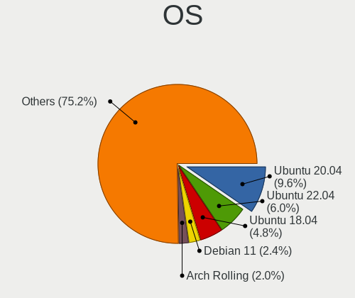
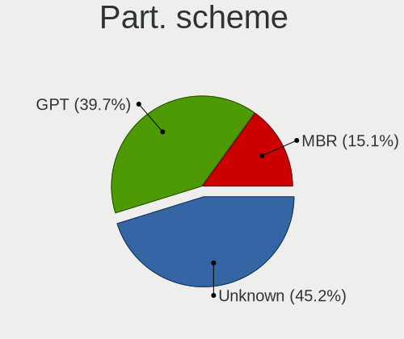
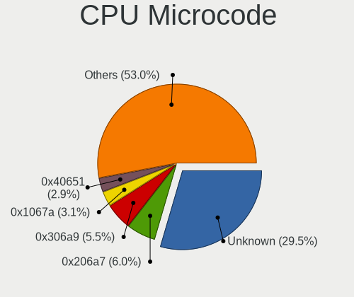

Linux - Tested Hardware & Statistics (Notebooks)
------------------------------------------------

A project to collect tested hardware configurations for Linux.

Anyone can contribute to this report by the [hw-probe](https://github.com/linuxhw/hw-probe) tool:

    sudo -E hw-probe -all -upload

Please contribute! Especially if your hardware is rare.

This report is for real hardware. Report for virtual hardware: [TestCoverage_VE](https://github.com/linuxhw/TestCoverage_VE)

Contents
--------

* [ Test Cases ](#test-cases)

* [ System ](#system)
  - [ OS                       ](#os)
  - [ OS Family                ](#os-family)
  - [ Kernel                   ](#kernel)
  - [ Kernel Family            ](#kernel-family)
  - [ Kernel Major Ver.        ](#kernel-major-ver)
  - [ Arch                     ](#arch)
  - [ DE                       ](#de)
  - [ Display Server           ](#display-server)
  - [ Display Manager          ](#display-manager)
  - [ OS Lang                  ](#os-lang)
  - [ Boot Mode                ](#boot-mode)
  - [ Filesystem               ](#filesystem)
  - [ Part. scheme             ](#part-scheme)
  - [ Dual Boot with Linux/BSD ](#dual-boot-with-linuxbsd)
  - [ Dual Boot (Win)          ](#dual-boot-win)

* [ Board ](#board)
  - [ Vendor                   ](#vendor)
  - [ Model                    ](#model)
  - [ Model Family             ](#model-family)
  - [ MFG Year                 ](#mfg-year)
  - [ Form Factor              ](#form-factor)
  - [ Secure Boot              ](#secure-boot)
  - [ Coreboot                 ](#coreboot)
  - [ RAM Size                 ](#ram-size)
  - [ RAM Used                 ](#ram-used)
  - [ Total Drives             ](#total-drives)
  - [ Has CD-ROM               ](#has-cd-rom)
  - [ Has Ethernet             ](#has-ethernet)
  - [ Has WiFi                 ](#has-wifi)
  - [ Has Bluetooth            ](#has-bluetooth)

* [ Location ](#location)
  - [ Country                  ](#country)
  - [ City                     ](#city)

* [ Drives ](#drives)
  - [ Drive Vendor             ](#drive-vendor)
  - [ Drive Model              ](#drive-model)
  - [ HDD Vendor               ](#hdd-vendor)
  - [ SSD Vendor               ](#ssd-vendor)
  - [ Drive Kind               ](#drive-kind)
  - [ Drive Connector          ](#drive-connector)
  - [ Drive Size               ](#drive-size)
  - [ Space Total              ](#space-total)
  - [ Space Used               ](#space-used)
  - [ Malfunc. Drives          ](#malfunc-drives)
  - [ Malfunc. Drive Vendor    ](#malfunc-drive-vendor)
  - [ Malfunc. HDD Vendor      ](#malfunc-hdd-vendor)
  - [ Malfunc. Drive Kind      ](#malfunc-drive-kind)
  - [ Failed Drives            ](#failed-drives)
  - [ Failed Drive Vendor      ](#failed-drive-vendor)
  - [ Drive Status             ](#drive-status)

* [ Storage controller ](#storage-controller)
  - [ Storage Vendor           ](#storage-vendor)
  - [ Storage Model            ](#storage-model)
  - [ Storage Kind             ](#storage-kind)

* [ Processor ](#processor)
  - [ CPU Vendor               ](#cpu-vendor)
  - [ CPU Model                ](#cpu-model)
  - [ CPU Model Family         ](#cpu-model-family)
  - [ CPU Cores                ](#cpu-cores)
  - [ CPU Sockets              ](#cpu-sockets)
  - [ CPU Threads              ](#cpu-threads)
  - [ CPU Op-Modes             ](#cpu-op-modes)
  - [ CPU Microcode            ](#cpu-microcode)
  - [ CPU Microarch            ](#cpu-microarch)

* [ Graphics ](#graphics)
  - [ GPU Vendor               ](#gpu-vendor)
  - [ GPU Model                ](#gpu-model)
  - [ GPU Combo                ](#gpu-combo)
  - [ GPU Driver               ](#gpu-driver)
  - [ GPU Memory               ](#gpu-memory)

* [ Monitor ](#monitor)
  - [ Monitor Vendor           ](#monitor-vendor)
  - [ Monitor Model            ](#monitor-model)
  - [ Monitor Resolution       ](#monitor-resolution)
  - [ Monitor Diagonal         ](#monitor-diagonal)
  - [ Monitor Width            ](#monitor-width)
  - [ Aspect Ratio             ](#aspect-ratio)
  - [ Monitor Area             ](#monitor-area)
  - [ Pixel Density            ](#pixel-density)
  - [ Multiple Monitors        ](#multiple-monitors)

* [ Network ](#network)
  - [ Net Controller Vendor    ](#net-controller-vendor)
  - [ Net Controller Model     ](#net-controller-model)
  - [ Wireless Vendor          ](#wireless-vendor)
  - [ Wireless Model           ](#wireless-model)
  - [ Ethernet Vendor          ](#ethernet-vendor)
  - [ Ethernet Model           ](#ethernet-model)
  - [ Net Controller Kind      ](#net-controller-kind)
  - [ Used Controller          ](#used-controller)
  - [ NICs                     ](#nics)
  - [ IPv6                     ](#ipv6)

* [ Bluetooth ](#bluetooth)
  - [ Bluetooth Vendor         ](#bluetooth-vendor)
  - [ Bluetooth Model          ](#bluetooth-model)

* [ Sound ](#sound)
  - [ Sound Vendor             ](#sound-vendor)
  - [ Sound Model              ](#sound-model)

* [ Memory ](#memory)
  - [ Memory Vendor            ](#memory-vendor)
  - [ Memory Model             ](#memory-model)
  - [ Memory Kind              ](#memory-kind)
  - [ Memory Form Factor       ](#memory-form-factor)
  - [ Memory Size              ](#memory-size)
  - [ Memory Speed             ](#memory-speed)

* [ Printers & scanners ](#printers--scanners)
  - [ Printer Vendor           ](#printer-vendor)
  - [ Printer Model            ](#printer-model)
  - [ Scanner Vendor           ](#scanner-vendor)
  - [ Scanner Model            ](#scanner-model)

* [ Camera ](#camera)
  - [ Camera Vendor            ](#camera-vendor)
  - [ Camera Model             ](#camera-model)

* [ Security ](#security)
  - [ Fingerprint Vendor       ](#fingerprint-vendor)
  - [ Fingerprint Model        ](#fingerprint-model)
  - [ Chipcard Vendor          ](#chipcard-vendor)
  - [ Chipcard Model           ](#chipcard-model)

* [ Unsupported ](#unsupported)
  - [ Unsupported Devices      ](#unsupported-devices)
  - [ Unsupported Device Types ](#unsupported-device-types)

Test Cases
----------

Total: 134403

| Vendor        | Model                       | Probe                                                      | Date         |
|---------------|-----------------------------|------------------------------------------------------------|--------------|
| Dell          | 500                         | [83c01aa11f](https://linux-hardware.org/?probe=83c01aa11f) | Oct 01, 2022 |
| Lenovo        | ThinkPad L540 20AUA13S00    | [04ffca5382](https://linux-hardware.org/?probe=04ffca5382) | Oct 01, 2022 |
| Acer          | Aspire 7540                 | [8e80ccea19](https://linux-hardware.org/?probe=8e80ccea19) | Oct 01, 2022 |
| Chuwi         | HeroBook Air                | [8de9e9df4a](https://linux-hardware.org/?probe=8de9e9df4a) | Oct 01, 2022 |
| Apple         | MacBookPro5,5               | [42113dd7e3](https://linux-hardware.org/?probe=42113dd7e3) | Oct 01, 2022 |
| Lenovo        | V570 1066EDG                | [8e2439c590](https://linux-hardware.org/?probe=8e2439c590) | Oct 01, 2022 |
| Acer          | Aspire A715-41G             | [1a473e9809](https://linux-hardware.org/?probe=1a473e9809) | Oct 01, 2022 |
| Positivo      | Mobile                      | [640bc1a962](https://linux-hardware.org/?probe=640bc1a962) | Oct 01, 2022 |
| MSI           | GF65 Thin 9SEXR             | [537828a21f](https://linux-hardware.org/?probe=537828a21f) | Oct 01, 2022 |
| Dell          | Inspiron 1545               | [ba72c7ee42](https://linux-hardware.org/?probe=ba72c7ee42) | Oct 01, 2022 |
| Acer          | Aspire 5920G                | [9bd67cf4f9](https://linux-hardware.org/?probe=9bd67cf4f9) | Oct 01, 2022 |
| HUAWEI        | HLYL-WXX9                   | [318010d949](https://linux-hardware.org/?probe=318010d949) | Oct 01, 2022 |
| ASUSTek       | K54LY                       | [98197c818f](https://linux-hardware.org/?probe=98197c818f) | Oct 01, 2022 |
| HP            | Pavilion Laptop 14-bf0xx    | [a34de7dc69](https://linux-hardware.org/?probe=a34de7dc69) | Oct 01, 2022 |
| HP            | 250 G3                      | [753ef53a5a](https://linux-hardware.org/?probe=753ef53a5a) | Oct 01, 2022 |
| Lenovo        | 3000 N200 0769B4G           | [947f124efc](https://linux-hardware.org/?probe=947f124efc) | Oct 01, 2022 |
| Lenovo        | ThinkPad E15 Gen 3 20YHS... | [9cd72ed352](https://linux-hardware.org/?probe=9cd72ed352) | Oct 01, 2022 |
| Sony          | VPCCA15FX                   | [5063ea411b](https://linux-hardware.org/?probe=5063ea411b) | Oct 01, 2022 |
| Lenovo        | IdeaPad 3 17IML05 81WC      | [e722d17a52](https://linux-hardware.org/?probe=e722d17a52) | Oct 01, 2022 |
| MICROMAX      | Canvas Lapbook L1161        | [9efe9e89d6](https://linux-hardware.org/?probe=9efe9e89d6) | Oct 01, 2022 |
| Itautec       | Infoway a7420               | [bb52fe66cf](https://linux-hardware.org/?probe=bb52fe66cf) | Oct 01, 2022 |
| HUAWEI        | HN-WX9X                     | [4168f641b5](https://linux-hardware.org/?probe=4168f641b5) | Oct 01, 2022 |
| Lenovo        | ThinkPad Yoga 11e 20DAS0... | [dc7e0ada81](https://linux-hardware.org/?probe=dc7e0ada81) | Oct 01, 2022 |
| Sony          | VPCCA15FX                   | [96eb3d8cf7](https://linux-hardware.org/?probe=96eb3d8cf7) | Oct 01, 2022 |
| ASUSTek       | ROG Zephyrus M16 GU603ZM... | [403aa5af3e](https://linux-hardware.org/?probe=403aa5af3e) | Oct 01, 2022 |
| HP            | Pavilion TS 11              | [5bc67115db](https://linux-hardware.org/?probe=5bc67115db) | Oct 01, 2022 |
| UNOWHY        | Y13G012S4EI                 | [014d8c23f8](https://linux-hardware.org/?probe=014d8c23f8) | Oct 01, 2022 |
| HP            | 650                         | [162893e9ad](https://linux-hardware.org/?probe=162893e9ad) | Oct 01, 2022 |
| Lenovo        | IdeaPad 1 14ADA05 82GW      | [7ff2c5ad1c](https://linux-hardware.org/?probe=7ff2c5ad1c) | Oct 01, 2022 |
| Lenovo        | V130-15IKB 81HN             | [44a4ed90e1](https://linux-hardware.org/?probe=44a4ed90e1) | Oct 01, 2022 |
| ASUSTek       | VivoBook_ASUSLaptop E410... | [462f9bbdbe](https://linux-hardware.org/?probe=462f9bbdbe) | Oct 01, 2022 |
| HUAWEI        | BOHK-WAX9X                  | [6525098252](https://linux-hardware.org/?probe=6525098252) | Oct 01, 2022 |
| HP            | Laptop 15s-eq1xxx           | [a4252ba03a](https://linux-hardware.org/?probe=a4252ba03a) | Oct 01, 2022 |
| Lenovo        | IdeaPad 1 14ADA05 82GW      | [a64cec6a4d](https://linux-hardware.org/?probe=a64cec6a4d) | Oct 01, 2022 |
| Lenovo        | G400s VILG1                 | [e666344187](https://linux-hardware.org/?probe=e666344187) | Oct 01, 2022 |
| ASUSTek       | UX303UB                     | [e09f793c1a](https://linux-hardware.org/?probe=e09f793c1a) | Oct 01, 2022 |
| Lenovo        | IdeaPad 530S-14ARR 81H1     | [68b0c0ca1a](https://linux-hardware.org/?probe=68b0c0ca1a) | Oct 01, 2022 |
| HP            | Victus by Laptop 16-e0xx... | [4a8d27ad0f](https://linux-hardware.org/?probe=4a8d27ad0f) | Oct 01, 2022 |
| Lenovo        | G770 20089                  | [e06e588d62](https://linux-hardware.org/?probe=e06e588d62) | Oct 01, 2022 |
| Acer          | Aspire 4733Z                | [4be4debbe5](https://linux-hardware.org/?probe=4be4debbe5) | Oct 01, 2022 |
| Toshiba       | Satellite L55-B             | [f3680300d7](https://linux-hardware.org/?probe=f3680300d7) | Oct 01, 2022 |
| Google        | Blooglet                    | [0081fa7064](https://linux-hardware.org/?probe=0081fa7064) | Oct 01, 2022 |
| Lenovo        | B70-80 80MR                 | [69aec9e100](https://linux-hardware.org/?probe=69aec9e100) | Oct 01, 2022 |
| ASUSTek       | ASUS TUF Gaming F15 FX50... | [88c05ba074](https://linux-hardware.org/?probe=88c05ba074) | Oct 01, 2022 |
| Acer          | Enduro EN314-51W            | [46782cf8f5](https://linux-hardware.org/?probe=46782cf8f5) | Oct 01, 2022 |
| HP            | 255 G8 Notebook PC          | [1ea0859429](https://linux-hardware.org/?probe=1ea0859429) | Oct 01, 2022 |
| Lenovo        | ThinkPad X230 23256N6       | [ec44263cbd](https://linux-hardware.org/?probe=ec44263cbd) | Oct 01, 2022 |
| Lenovo        | ThinkPad E15 Gen 2 20T9S... | [0a022a22c6](https://linux-hardware.org/?probe=0a022a22c6) | Oct 01, 2022 |
| HP            | Pavilion TS 11              | [9b59ddb3b2](https://linux-hardware.org/?probe=9b59ddb3b2) | Oct 01, 2022 |
| Sony          | SVS13118GBB                 | [48dd8fb419](https://linux-hardware.org/?probe=48dd8fb419) | Oct 01, 2022 |
| HP            | Pavilion TS 11              | [4758af490a](https://linux-hardware.org/?probe=4758af490a) | Oct 01, 2022 |
| Fujitsu       | LIFEBOOK A6210              | [73c4e6626f](https://linux-hardware.org/?probe=73c4e6626f) | Oct 01, 2022 |
| HP            | Notebook                    | [fec2594d37](https://linux-hardware.org/?probe=fec2594d37) | Oct 01, 2022 |
| ASUSTek       | F5V                         | [463cd15493](https://linux-hardware.org/?probe=463cd15493) | Oct 01, 2022 |
| Dell          | Inspiron 5737               | [14113affa1](https://linux-hardware.org/?probe=14113affa1) | Oct 01, 2022 |
| Dell          | XPS 13 9300                 | [1fade0f247](https://linux-hardware.org/?probe=1fade0f247) | Oct 01, 2022 |
| ASUSTek       | Zenbook UM5302TA_UM5302T... | [1cfda531dd](https://linux-hardware.org/?probe=1cfda531dd) | Oct 01, 2022 |
| Unknown       | Unknown                     | [b9486c47c1](https://linux-hardware.org/?probe=b9486c47c1) | Oct 01, 2022 |
| Lenovo        | ThinkPad T440 20B6005JUS    | [f12950ed92](https://linux-hardware.org/?probe=f12950ed92) | Oct 01, 2022 |
| Fujitsu       | LIFEBOOK S904               | [c9c83f0112](https://linux-hardware.org/?probe=c9c83f0112) | Oct 01, 2022 |
| HP            | Compaq 420                  | [d3e367cedc](https://linux-hardware.org/?probe=d3e367cedc) | Oct 01, 2022 |
| Dell          | Latitude E5250              | [aeb221e727](https://linux-hardware.org/?probe=aeb221e727) | Oct 01, 2022 |
| HP            | 655                         | [6b10f9eda8](https://linux-hardware.org/?probe=6b10f9eda8) | Oct 01, 2022 |
| Lenovo        | ThinkPad T440 20B6005JUS    | [b395d9ce9b](https://linux-hardware.org/?probe=b395d9ce9b) | Oct 01, 2022 |
| Apple         | MacBookPro8,1               | [f42501fcc3](https://linux-hardware.org/?probe=f42501fcc3) | Oct 01, 2022 |
| Dell          | Latitude E5250              | [43f7cf1b59](https://linux-hardware.org/?probe=43f7cf1b59) | Oct 01, 2022 |
| ASUSTek       | K53SM                       | [f05f33fa9b](https://linux-hardware.org/?probe=f05f33fa9b) | Oct 01, 2022 |
| Dell          | Latitude D630               | [d00c756052](https://linux-hardware.org/?probe=d00c756052) | Oct 01, 2022 |
| Lenovo        | ThinkPad SL500 27463ZG      | [34006e3b46](https://linux-hardware.org/?probe=34006e3b46) | Oct 01, 2022 |
| Dell          | Inspiron 5567               | [82e89b9263](https://linux-hardware.org/?probe=82e89b9263) | Oct 01, 2022 |
| Valve         | Jupiter                     | [12f0d9358a](https://linux-hardware.org/?probe=12f0d9358a) | Oct 01, 2022 |
| Google        | Droid                       | [40550baeb8](https://linux-hardware.org/?probe=40550baeb8) | Oct 01, 2022 |
| Dell          | Inspiron 5567               | [e64a9cf0e2](https://linux-hardware.org/?probe=e64a9cf0e2) | Oct 01, 2022 |
| Sony          | SVS13118GBB                 | [75e6dbe3d2](https://linux-hardware.org/?probe=75e6dbe3d2) | Oct 01, 2022 |
| HP            | ProBook 430 G7              | [bf25686a1f](https://linux-hardware.org/?probe=bf25686a1f) | Oct 01, 2022 |
| Lenovo        | ThinkPad X270 W10DG 20K5... | [012add7349](https://linux-hardware.org/?probe=012add7349) | Oct 01, 2022 |
| Dell          | Inspiron 5737               | [6893292144](https://linux-hardware.org/?probe=6893292144) | Oct 01, 2022 |
| Dell          | Latitude 5480               | [ec9593f051](https://linux-hardware.org/?probe=ec9593f051) | Oct 01, 2022 |
| Dell          | Latitude E5530 non-vPro     | [b2d146f923](https://linux-hardware.org/?probe=b2d146f923) | Oct 01, 2022 |
| Notebook      | W330SU2                     | [a5d5500584](https://linux-hardware.org/?probe=a5d5500584) | Oct 01, 2022 |
| Lenovo        | ThinkPad E14 Gen 3 20YES... | [1a210b9eb5](https://linux-hardware.org/?probe=1a210b9eb5) | Oct 01, 2022 |
| HP            | Pavilion                    | [124e8b760a](https://linux-hardware.org/?probe=124e8b760a) | Oct 01, 2022 |
| Apple         | MacBookPro16,2              | [8eaded9cb5](https://linux-hardware.org/?probe=8eaded9cb5) | Oct 01, 2022 |
| HP            | Pavilion 17                 | [fa2e48904a](https://linux-hardware.org/?probe=fa2e48904a) | Oct 01, 2022 |
| HP            | EliteBook 745 G6            | [25e087916a](https://linux-hardware.org/?probe=25e087916a) | Oct 01, 2022 |
| Dell          | Vostro 5568                 | [44bf0dbbce](https://linux-hardware.org/?probe=44bf0dbbce) | Oct 01, 2022 |
| Lenovo        | ThinkPad L450 20DSS00M01    | [e52e98a7e7](https://linux-hardware.org/?probe=e52e98a7e7) | Oct 01, 2022 |
| MSI           | GF65 Thin 9SD               | [a761de487d](https://linux-hardware.org/?probe=a761de487d) | Oct 01, 2022 |
| Dell          | Inspiron 1200               | [becf544fa6](https://linux-hardware.org/?probe=becf544fa6) | Oct 01, 2022 |
| Dell          | G3 3500                     | [245ebaabe5](https://linux-hardware.org/?probe=245ebaabe5) | Oct 01, 2022 |
| HP            | Pavilion Gaming Laptop 1... | [3595e90895](https://linux-hardware.org/?probe=3595e90895) | Oct 01, 2022 |
| HP            | Pavilion dv2700             | [0da9fb0afd](https://linux-hardware.org/?probe=0da9fb0afd) | Oct 01, 2022 |
| Samsung       | 950XDB/951XDB/950XDY        | [5c5353c8b6](https://linux-hardware.org/?probe=5c5353c8b6) | Oct 01, 2022 |
| ASUSTek       | Strix 15 GL503GE            | [e48bab666f](https://linux-hardware.org/?probe=e48bab666f) | Oct 01, 2022 |
| HP            | EliteBook 840 G3            | [ddf1904011](https://linux-hardware.org/?probe=ddf1904011) | Oct 01, 2022 |
| Dell          | Inspiron 5420               | [71f7e67ca7](https://linux-hardware.org/?probe=71f7e67ca7) | Oct 01, 2022 |
| Lenovo        | ThinkPad T440s 20AQCTO1W... | [fbe1e53387](https://linux-hardware.org/?probe=fbe1e53387) | Oct 01, 2022 |
| Hampoo        | C3W6_AP108_4GB Reserved     | [93d3e41339](https://linux-hardware.org/?probe=93d3e41339) | Oct 01, 2022 |
| Valve         | Jupiter                     | [9ea6c15d28](https://linux-hardware.org/?probe=9ea6c15d28) | Oct 01, 2022 |
| Apple         | MacBookPro9,1               | [08db9e8d75](https://linux-hardware.org/?probe=08db9e8d75) | Oct 01, 2022 |
| Dell          | Inspiron 3451               | [aee33639b9](https://linux-hardware.org/?probe=aee33639b9) | Oct 01, 2022 |
| Lenovo        | IdeaPad 330-15IKB 81FE      | [b62ddbdab0](https://linux-hardware.org/?probe=b62ddbdab0) | Oct 01, 2022 |
| Lenovo        | G480 20149                  | [9a047ee214](https://linux-hardware.org/?probe=9a047ee214) | Oct 01, 2022 |
| Lenovo        | G480 20149                  | [4c0a153a12](https://linux-hardware.org/?probe=4c0a153a12) | Oct 01, 2022 |
| Acer          | Aspire 5750G                | [8e87575f75](https://linux-hardware.org/?probe=8e87575f75) | Oct 01, 2022 |
| Acer          | Aspire A315-55G             | [77605e313d](https://linux-hardware.org/?probe=77605e313d) | Oct 01, 2022 |
| SANTECH       | NHx0DB,DE                   | [6dc0730b6a](https://linux-hardware.org/?probe=6dc0730b6a) | Oct 01, 2022 |
| Notebook      | NJx0MU                      | [5df0554ade](https://linux-hardware.org/?probe=5df0554ade) | Oct 01, 2022 |
| System76      | Darter Pro                  | [2829e72506](https://linux-hardware.org/?probe=2829e72506) | Oct 01, 2022 |
| System76      | Darter Pro                  | [c142cf370a](https://linux-hardware.org/?probe=c142cf370a) | Oct 01, 2022 |
| Notebook      | NJx0MU                      | [9eba2a1ed4](https://linux-hardware.org/?probe=9eba2a1ed4) | Oct 01, 2022 |
| Toshiba       | PORTEGE Z10t-A              | [1aa913c010](https://linux-hardware.org/?probe=1aa913c010) | Oct 01, 2022 |
| Fujitsu       | LIFEBOOK A6210              | [dffb22efdc](https://linux-hardware.org/?probe=dffb22efdc) | Oct 01, 2022 |
| Sony          | SVF15N17CXB                 | [5082dde27d](https://linux-hardware.org/?probe=5082dde27d) | Oct 01, 2022 |
| HP            | Pavilion Gaming Laptop 1... | [29648b493a](https://linux-hardware.org/?probe=29648b493a) | Oct 01, 2022 |
| Sony          | VPCYB3V1E                   | [de50c8a304](https://linux-hardware.org/?probe=de50c8a304) | Oct 01, 2022 |
| EVOO          | EG-LP10                     | [32c1a174d1](https://linux-hardware.org/?probe=32c1a174d1) | Oct 01, 2022 |
| Acer          | TMP453-MG                   | [4d36d13ea9](https://linux-hardware.org/?probe=4d36d13ea9) | Oct 01, 2022 |
| Lenovo        | IdeaPad S145-15AST 81N3     | [f50a823779](https://linux-hardware.org/?probe=f50a823779) | Oct 01, 2022 |
| ASUSTek       | ASUS EXPERTBOOK B1500CEA... | [24aefc4138](https://linux-hardware.org/?probe=24aefc4138) | Oct 01, 2022 |
| Lenovo        | ThinkPad T470p 20J7S0DK0... | [49bd2b0248](https://linux-hardware.org/?probe=49bd2b0248) | Oct 01, 2022 |
| HP            | Laptop 15-bs0xx             | [646f4ffa8e](https://linux-hardware.org/?probe=646f4ffa8e) | Oct 01, 2022 |
| Timi          | A35S                        | [c46c820c25](https://linux-hardware.org/?probe=c46c820c25) | Oct 01, 2022 |
| Timi          | TM1709                      | [33022811a8](https://linux-hardware.org/?probe=33022811a8) | Oct 01, 2022 |
| Lenovo        | ThinkPad P1 Gen 5 21DCCT... | [bde2b36c88](https://linux-hardware.org/?probe=bde2b36c88) | Oct 01, 2022 |
| HP            | Laptop 15s-eq2xxx           | [5983281c3f](https://linux-hardware.org/?probe=5983281c3f) | Oct 01, 2022 |
| Dell          | Inspiron 3442               | [af9b794734](https://linux-hardware.org/?probe=af9b794734) | Sep 30, 2022 |
| Acer          | Swift SF314-43              | [cfd0c22e29](https://linux-hardware.org/?probe=cfd0c22e29) | Sep 30, 2022 |
| ASUSTek       | VivoBook_ASUSLaptop X340... | [d5407763a0](https://linux-hardware.org/?probe=d5407763a0) | Sep 30, 2022 |
| MSI           | Modern 14 A10M              | [571271ed93](https://linux-hardware.org/?probe=571271ed93) | Sep 30, 2022 |
| Dell          | Latitude E4300              | [a860d9a446](https://linux-hardware.org/?probe=a860d9a446) | Sep 30, 2022 |
| GPD           | G1621-02                    | [6ae9fc596e](https://linux-hardware.org/?probe=6ae9fc596e) | Sep 30, 2022 |
| HP            | 250 G6 Notebook PC          | [992cf7d019](https://linux-hardware.org/?probe=992cf7d019) | Sep 30, 2022 |
| Sony          | VPCEH2D0E                   | [a08d0148e2](https://linux-hardware.org/?probe=a08d0148e2) | Sep 30, 2022 |
| HP            | ZBook 17 G4                 | [1476da42c3](https://linux-hardware.org/?probe=1476da42c3) | Sep 30, 2022 |
| ASUSTek       | ASUS EXPERTBOOK B1500CEA... | [5bfc8f0a7d](https://linux-hardware.org/?probe=5bfc8f0a7d) | Sep 30, 2022 |
| Lenovo        | ThinkPad T550 20CJS1VD01    | [97d1b5e6c5](https://linux-hardware.org/?probe=97d1b5e6c5) | Sep 30, 2022 |
| Lenovo        | IdeaPad 3 15ITL6 82H8       | [92f9efe077](https://linux-hardware.org/?probe=92f9efe077) | Sep 30, 2022 |
| MSI           | Modern 14 A10M              | [9da1f3fe66](https://linux-hardware.org/?probe=9da1f3fe66) | Sep 30, 2022 |
| Irbis         | NB121                       | [a2eb8c8af1](https://linux-hardware.org/?probe=a2eb8c8af1) | Sep 30, 2022 |
| OEM           | Unknown                     | [af7df2aea6](https://linux-hardware.org/?probe=af7df2aea6) | Sep 30, 2022 |
| OEM           | Unknown                     | [1d851fe024](https://linux-hardware.org/?probe=1d851fe024) | Sep 30, 2022 |
| OEM           | Unknown                     | [4fd2ca7d03](https://linux-hardware.org/?probe=4fd2ca7d03) | Sep 30, 2022 |
| Lenovo        | ThinkPad T480 20L5001FUS    | [a7e0da7aa4](https://linux-hardware.org/?probe=a7e0da7aa4) | Sep 30, 2022 |
| Acer          | Extensa 4220                | [c35a0a579a](https://linux-hardware.org/?probe=c35a0a579a) | Sep 30, 2022 |
| MSI           | GF63 Thin 11UD              | [071194b58e](https://linux-hardware.org/?probe=071194b58e) | Sep 30, 2022 |
| Dell          | Latitude 5530               | [43874dad6d](https://linux-hardware.org/?probe=43874dad6d) | Sep 30, 2022 |
| HP            | EliteBook 850 G1            | [9667dac801](https://linux-hardware.org/?probe=9667dac801) | Sep 30, 2022 |
| MSI           | GF63 Thin 11UD              | [e29586cf56](https://linux-hardware.org/?probe=e29586cf56) | Sep 30, 2022 |
| Sony          | SVS13118GBB                 | [0e0ca26d00](https://linux-hardware.org/?probe=0e0ca26d00) | Sep 30, 2022 |
| ASUSTek       | X580VD                      | [e7ef06706d](https://linux-hardware.org/?probe=e7ef06706d) | Sep 30, 2022 |
| Notebook      | NJ50GU                      | [430d3b2873](https://linux-hardware.org/?probe=430d3b2873) | Sep 30, 2022 |
| Chuwi         | HeroBook Air                | [1f142c7087](https://linux-hardware.org/?probe=1f142c7087) | Sep 30, 2022 |
| Lenovo        | ThinkPad E14 Gen 2 20TA0... | [025a55eab7](https://linux-hardware.org/?probe=025a55eab7) | Sep 30, 2022 |
| Lenovo        | ThinkPad E14 Gen 2 20TA0... | [875b1df312](https://linux-hardware.org/?probe=875b1df312) | Sep 30, 2022 |
| Irbis         | NB121                       | [90a0ae1cf9](https://linux-hardware.org/?probe=90a0ae1cf9) | Sep 30, 2022 |
| Sony          | SVS13118GBB                 | [12868cf90f](https://linux-hardware.org/?probe=12868cf90f) | Sep 30, 2022 |
| Lenovo        | IdeaPad S540-14API 81NH     | [71ef5c4f0e](https://linux-hardware.org/?probe=71ef5c4f0e) | Sep 30, 2022 |
| Valve         | Jupiter                     | [dab0a00c02](https://linux-hardware.org/?probe=dab0a00c02) | Sep 30, 2022 |
| Valve         | Jupiter                     | [4d1b722861](https://linux-hardware.org/?probe=4d1b722861) | Sep 30, 2022 |
| SANTECH       | NHx0EH_EJ_EK                | [01366bbeb7](https://linux-hardware.org/?probe=01366bbeb7) | Sep 30, 2022 |
| Valve         | Jupiter                     | [e9737fcadf](https://linux-hardware.org/?probe=e9737fcadf) | Sep 30, 2022 |
| Dell          | XPS 15 9570                 | [0d466bc2f7](https://linux-hardware.org/?probe=0d466bc2f7) | Sep 30, 2022 |
| Lenovo        | IdeaPad 320-17ABR 80YN      | [1ff8e037f4](https://linux-hardware.org/?probe=1ff8e037f4) | Sep 30, 2022 |
| Dell          | Inspiron 11-3162            | [8cd15b2f0c](https://linux-hardware.org/?probe=8cd15b2f0c) | Sep 30, 2022 |
| Dell          | Inspiron 15 7510            | [263276babe](https://linux-hardware.org/?probe=263276babe) | Sep 30, 2022 |
| Dell          | Precision 3551              | [d0341acb53](https://linux-hardware.org/?probe=d0341acb53) | Sep 30, 2022 |
| THUNDEROBO... | 911AirD                     | [448f04d201](https://linux-hardware.org/?probe=448f04d201) | Sep 30, 2022 |
| Chuwi         | HeroBook Air                | [263313ef38](https://linux-hardware.org/?probe=263313ef38) | Sep 30, 2022 |
| Lenovo        | G460 20041                  | [130c0489f9](https://linux-hardware.org/?probe=130c0489f9) | Sep 30, 2022 |
| HP            | Compaq CQ58                 | [28048a6d3e](https://linux-hardware.org/?probe=28048a6d3e) | Sep 30, 2022 |
| Fujitsu       | FMVNU6G1C                   | [1351f25388](https://linux-hardware.org/?probe=1351f25388) | Sep 30, 2022 |
| HUAWEI        | HVY-WXX9                    | [4ce296ba38](https://linux-hardware.org/?probe=4ce296ba38) | Sep 30, 2022 |
| HP            | Pavilion Laptop 15-eg0xx... | [76dae4e704](https://linux-hardware.org/?probe=76dae4e704) | Sep 30, 2022 |
| HP            | ProBook 6570b               | [d9be946342](https://linux-hardware.org/?probe=d9be946342) | Sep 30, 2022 |
| HP            | Laptop 15-da0xxx            | [176695aa20](https://linux-hardware.org/?probe=176695aa20) | Sep 30, 2022 |
| Apple         | MacBookPro9,2               | [87c9436154](https://linux-hardware.org/?probe=87c9436154) | Sep 30, 2022 |
| Dell          | Inspiron 16 Plus 7620       | [73e2559339](https://linux-hardware.org/?probe=73e2559339) | Sep 30, 2022 |
| Dell          | Latitude E6420              | [e3564482f9](https://linux-hardware.org/?probe=e3564482f9) | Sep 30, 2022 |
| Sony          | SVE1512C6EB                 | [c47a3a5bd7](https://linux-hardware.org/?probe=c47a3a5bd7) | Sep 30, 2022 |
| HP            | Laptop 15s-eq3xxx           | [b15bae8e77](https://linux-hardware.org/?probe=b15bae8e77) | Sep 30, 2022 |
| Lenovo        | ThinkPad X1 Extreme 20MF... | [3ad60e2d21](https://linux-hardware.org/?probe=3ad60e2d21) | Sep 30, 2022 |
| HP            | Laptop 15s-eq3xxx           | [126b8dd3ec](https://linux-hardware.org/?probe=126b8dd3ec) | Sep 30, 2022 |
| Lenovo        | ThinkBook 13s G2 ITL 20V... | [e829c9c0c6](https://linux-hardware.org/?probe=e829c9c0c6) | Sep 30, 2022 |
| HP            | Notebook                    | [a30c1af9a5](https://linux-hardware.org/?probe=a30c1af9a5) | Sep 30, 2022 |
| Toshiba       | Satellite NB10t-A-102       | [5a8032ee05](https://linux-hardware.org/?probe=5a8032ee05) | Sep 30, 2022 |
| Digma         | EVE 11 C408                 | [b5c7ac8ed3](https://linux-hardware.org/?probe=b5c7ac8ed3) | Sep 30, 2022 |
| Lenovo        | ThinkBook 14 G3 ACL 21A2    | [41dc234b26](https://linux-hardware.org/?probe=41dc234b26) | Sep 30, 2022 |
| Dell          | Latitude 5400               | [66a5bc26f0](https://linux-hardware.org/?probe=66a5bc26f0) | Sep 30, 2022 |
| Dell          | Latitude E6520              | [04817b4ceb](https://linux-hardware.org/?probe=04817b4ceb) | Sep 30, 2022 |
| Acer          | Aspire E1-531               | [fbe026b995](https://linux-hardware.org/?probe=fbe026b995) | Sep 30, 2022 |
| Valve         | Jupiter                     | [5e7ec518d4](https://linux-hardware.org/?probe=5e7ec518d4) | Sep 30, 2022 |
| Intel Clie... | LAPQC71A                    | [6d7beecaf6](https://linux-hardware.org/?probe=6d7beecaf6) | Sep 30, 2022 |
| Dell          | Inspiron 15 7510            | [86e1da35ba](https://linux-hardware.org/?probe=86e1da35ba) | Sep 30, 2022 |
| Acer          | Aspire A715-74G             | [17abc08754](https://linux-hardware.org/?probe=17abc08754) | Sep 30, 2022 |
| Lenovo        | IdeaPad 310-15IKB 80TV      | [d547ed6f83](https://linux-hardware.org/?probe=d547ed6f83) | Sep 30, 2022 |
| Lenovo        | IdeaPad 310-15IKB 80TV      | [9781419cc1](https://linux-hardware.org/?probe=9781419cc1) | Sep 30, 2022 |
| HP            | Pavilion dv7                | [4d54db9389](https://linux-hardware.org/?probe=4d54db9389) | Sep 30, 2022 |
| Acer          | Aspire A514-54              | [b8b0da1194](https://linux-hardware.org/?probe=b8b0da1194) | Sep 30, 2022 |
| Lenovo        | ThinkPad T470p 20J7S0DK0... | [33353fc67c](https://linux-hardware.org/?probe=33353fc67c) | Sep 30, 2022 |
| HP            | Notebook                    | [e172f83238](https://linux-hardware.org/?probe=e172f83238) | Sep 30, 2022 |
| Lenovo        | G460 20041                  | [9018f40ad5](https://linux-hardware.org/?probe=9018f40ad5) | Sep 30, 2022 |
| Lenovo        | ThinkPad X260 20F5S6P801    | [e948792d3d](https://linux-hardware.org/?probe=e948792d3d) | Sep 30, 2022 |
| Lenovo        | ThinkPad T420 42361L0       | [abe6563e67](https://linux-hardware.org/?probe=abe6563e67) | Sep 30, 2022 |
| Acer          | Aspire A315-56              | [1ee3922873](https://linux-hardware.org/?probe=1ee3922873) | Sep 30, 2022 |
| HP            | Pavilion dv5                | [9fd2d2169a](https://linux-hardware.org/?probe=9fd2d2169a) | Sep 30, 2022 |
| HP            | Pavilion dv5                | [1c42236e47](https://linux-hardware.org/?probe=1c42236e47) | Sep 30, 2022 |
| Toshiba       | Satellite NB10t-A-102       | [4e9248b1eb](https://linux-hardware.org/?probe=4e9248b1eb) | Sep 30, 2022 |
| Lenovo        | IdeaPad S145-15API 81UT     | [9ccd242ca4](https://linux-hardware.org/?probe=9ccd242ca4) | Sep 30, 2022 |
| Dell          | Latitude 3310               | [3c4874fa51](https://linux-hardware.org/?probe=3c4874fa51) | Sep 30, 2022 |
| Lenovo        | ThinkPad T470s 20HGS09L0... | [7c384e5578](https://linux-hardware.org/?probe=7c384e5578) | Sep 30, 2022 |
| ASUSTek       | VivoBook_ASUSLaptop X412... | [d3047f6963](https://linux-hardware.org/?probe=d3047f6963) | Sep 30, 2022 |
| Acer          | TravelMate 8572T            | [927bf01e34](https://linux-hardware.org/?probe=927bf01e34) | Sep 30, 2022 |
| Gigabyte      | RC14UD                      | [744143bdd6](https://linux-hardware.org/?probe=744143bdd6) | Sep 30, 2022 |
| SIEMENS       | SIMATIC ITP1000             | [adbd7dbca6](https://linux-hardware.org/?probe=adbd7dbca6) | Sep 30, 2022 |
| TUXEDO        | Aura 15 Gen2                | [e8ebe97f13](https://linux-hardware.org/?probe=e8ebe97f13) | Sep 30, 2022 |
| Lenovo        | IdeaPad 5 Pro 16ARH7 82S... | [6bcbc9e08c](https://linux-hardware.org/?probe=6bcbc9e08c) | Sep 30, 2022 |
| NEC Comput... | PC-VRL21FB6S3R7             | [2001e2e28e](https://linux-hardware.org/?probe=2001e2e28e) | Sep 30, 2022 |
| Lenovo        | G580 20150                  | [d057161e9d](https://linux-hardware.org/?probe=d057161e9d) | Sep 30, 2022 |
| Dell          | Inspiron 3501               | [4684b672f6](https://linux-hardware.org/?probe=4684b672f6) | Sep 30, 2022 |
| Lenovo        | ThinkBook 15p Gen 2 21B1    | [16f1ddb076](https://linux-hardware.org/?probe=16f1ddb076) | Sep 30, 2022 |
| Acer          | Predator PH315-51           | [68f7384e7a](https://linux-hardware.org/?probe=68f7384e7a) | Sep 30, 2022 |
| HP            | Laptop 15-bs0xx             | [7ed786bee9](https://linux-hardware.org/?probe=7ed786bee9) | Sep 30, 2022 |
| SK hynix      | HyBook                      | [38b5f704a1](https://linux-hardware.org/?probe=38b5f704a1) | Sep 30, 2022 |
| Dell          | Inspiron 3501               | [ce2d41ee99](https://linux-hardware.org/?probe=ce2d41ee99) | Sep 30, 2022 |
| HP            | Pavilion Laptop 17-ar0xx    | [733654d30d](https://linux-hardware.org/?probe=733654d30d) | Sep 30, 2022 |
| ASUSTek       | ASUS EXPERTBOOK B1400CBA    | [4cad2a770c](https://linux-hardware.org/?probe=4cad2a770c) | Sep 30, 2022 |
| ASUSTek       | ROG Zephyrus G15 GA503QR... | [353324cbfd](https://linux-hardware.org/?probe=353324cbfd) | Sep 30, 2022 |
| Lenovo        | ThinkPad T480s 20L7001YU... | [929514123f](https://linux-hardware.org/?probe=929514123f) | Sep 30, 2022 |
| Apple         | MacBookPro14,3              | [3ccd7ea5d6](https://linux-hardware.org/?probe=3ccd7ea5d6) | Sep 30, 2022 |
| A-DATA Tec... | XENIA 14                    | [251f390772](https://linux-hardware.org/?probe=251f390772) | Sep 30, 2022 |
| Positivo      | Mobile                      | [dcf8b09bec](https://linux-hardware.org/?probe=dcf8b09bec) | Sep 30, 2022 |
| Timi          | Xiaomi Book Pro 16 2022     | [703687bcd7](https://linux-hardware.org/?probe=703687bcd7) | Sep 30, 2022 |
| Positivo      | Mobile                      | [6d2584bcb8](https://linux-hardware.org/?probe=6d2584bcb8) | Sep 30, 2022 |
| Dell          | Latitude 5420               | [36ddd1d6d7](https://linux-hardware.org/?probe=36ddd1d6d7) | Sep 30, 2022 |
| Acer          | Aspire E5-521               | [a55d68e93c](https://linux-hardware.org/?probe=a55d68e93c) | Sep 30, 2022 |
| HP            | Pavilion dv8000 (ET839UA... | [46ef409fa9](https://linux-hardware.org/?probe=46ef409fa9) | Sep 30, 2022 |
| Dell          | Inspiron 3505               | [097825430f](https://linux-hardware.org/?probe=097825430f) | Sep 30, 2022 |
| Acer          | Nitro AN515-44              | [149337514c](https://linux-hardware.org/?probe=149337514c) | Sep 30, 2022 |
| Gigabyte      | AORUS 17 YE5                | [54b271c3fd](https://linux-hardware.org/?probe=54b271c3fd) | Sep 30, 2022 |
| HP            | EliteBook 8570p             | [cc4740fa37](https://linux-hardware.org/?probe=cc4740fa37) | Sep 30, 2022 |
| Dell          | Inspiron 15-3567            | [5f1d0e6142](https://linux-hardware.org/?probe=5f1d0e6142) | Sep 30, 2022 |
| Dell          | Inspiron 15-3567            | [70a80b4201](https://linux-hardware.org/?probe=70a80b4201) | Sep 30, 2022 |
| Fujitsu       | LIFEBOOK A6210              | [81653ba834](https://linux-hardware.org/?probe=81653ba834) | Sep 30, 2022 |
| Lenovo        | Yoga 300-11IBY 80M0         | [d5c0e2c5d3](https://linux-hardware.org/?probe=d5c0e2c5d3) | Sep 30, 2022 |
| Lenovo        | ThinkPad L380 20M5SSIN11    | [0cad79b1f7](https://linux-hardware.org/?probe=0cad79b1f7) | Sep 30, 2022 |
| Dell          | Latitude E6410              | [98545a1050](https://linux-hardware.org/?probe=98545a1050) | Sep 30, 2022 |
| Google        | Relm                        | [e440e5c1cc](https://linux-hardware.org/?probe=e440e5c1cc) | Sep 30, 2022 |
| Timi          | Xiaomi Book Pro 16 2022     | [d2a3575975](https://linux-hardware.org/?probe=d2a3575975) | Sep 30, 2022 |
| Apple         | MacBookPro16,1              | [03f56ec19b](https://linux-hardware.org/?probe=03f56ec19b) | Sep 30, 2022 |
| Dell          | XPS 13 7390                 | [c4ccdf9992](https://linux-hardware.org/?probe=c4ccdf9992) | Sep 30, 2022 |
| Lenovo        | ThinkPad P50 20EQS1WW00     | [786e0c1f5d](https://linux-hardware.org/?probe=786e0c1f5d) | Sep 30, 2022 |
| ASUSTek       | VivoBook_ASUSLaptop X513... | [fa00f3d0ca](https://linux-hardware.org/?probe=fa00f3d0ca) | Sep 30, 2022 |
| Lenovo        | ThinkPad P15 Gen 2i 20YQ... | [9015ce1da8](https://linux-hardware.org/?probe=9015ce1da8) | Sep 30, 2022 |
| HUAWEI        | VLT-WX0                     | [1669dae0a6](https://linux-hardware.org/?probe=1669dae0a6) | Sep 30, 2022 |
| Fujitsu       | LIFEBOOK A6210              | [9ac200d143](https://linux-hardware.org/?probe=9ac200d143) | Sep 30, 2022 |
| Samsung       | R430/P430/R480              | [09795617ab](https://linux-hardware.org/?probe=09795617ab) | Sep 30, 2022 |
| Dell          | Vostro 5402                 | [57995ec944](https://linux-hardware.org/?probe=57995ec944) | Sep 30, 2022 |
| Toshiba       | Satellite S70-A             | [7c6b3e14ce](https://linux-hardware.org/?probe=7c6b3e14ce) | Sep 30, 2022 |
| Valve         | Jupiter                     | [a031955ffb](https://linux-hardware.org/?probe=a031955ffb) | Sep 30, 2022 |
| HP            | EliteBook 840 G3            | [24a248630f](https://linux-hardware.org/?probe=24a248630f) | Sep 30, 2022 |
| Lenovo        | ThinkPad X1 Carbon 5th 2... | [a1bee52021](https://linux-hardware.org/?probe=a1bee52021) | Sep 29, 2022 |
| HP            | 250 G5 Notebook PC          | [26961d1b30](https://linux-hardware.org/?probe=26961d1b30) | Sep 29, 2022 |
| Acer          | Aspire VX5-591G             | [b321f4561b](https://linux-hardware.org/?probe=b321f4561b) | Sep 29, 2022 |
| Toshiba       | Satellite L670              | [3b3e7965a5](https://linux-hardware.org/?probe=3b3e7965a5) | Sep 29, 2022 |
| Fujitsu       | LIFEBOOK A6210              | [d31b97630d](https://linux-hardware.org/?probe=d31b97630d) | Sep 29, 2022 |
| Notebook      | NJ50_70CU                   | [4914d3ffe1](https://linux-hardware.org/?probe=4914d3ffe1) | Sep 29, 2022 |
| Lenovo        | ThinkBook 13s-IML 20RR      | [d153a4f97a](https://linux-hardware.org/?probe=d153a4f97a) | Sep 29, 2022 |
| Toshiba       | Satellite L505              | [3e91e2bfaf](https://linux-hardware.org/?probe=3e91e2bfaf) | Sep 29, 2022 |
| GHIA          | LFI3H                       | [4233e4e6c5](https://linux-hardware.org/?probe=4233e4e6c5) | Sep 29, 2022 |
| HP            | Victus by Laptop 16-e0xx... | [85b6d03edb](https://linux-hardware.org/?probe=85b6d03edb) | Sep 29, 2022 |
| Dell          | Latitude D531               | [331cad8b98](https://linux-hardware.org/?probe=331cad8b98) | Sep 29, 2022 |
| HP            | Laptop 14s-fq1xxx           | [3990ec6cb0](https://linux-hardware.org/?probe=3990ec6cb0) | Sep 29, 2022 |
| GHIA          | LFI3H                       | [482e78460a](https://linux-hardware.org/?probe=482e78460a) | Sep 29, 2022 |
| Dell          | Latitude 5400               | [4536a4b473](https://linux-hardware.org/?probe=4536a4b473) | Sep 29, 2022 |
| Irbis         | NB61 WS001                  | [3fda78e356](https://linux-hardware.org/?probe=3fda78e356) | Sep 29, 2022 |
| HP            | Pavilion Notebook           | [ee72cbd627](https://linux-hardware.org/?probe=ee72cbd627) | Sep 29, 2022 |
| Positivo B... | VJFE42F11X-XXXXXX           | [fdcdf06f55](https://linux-hardware.org/?probe=fdcdf06f55) | Sep 29, 2022 |
| Lenovo        | IdeaPad Gaming 3 15ARH05... | [dfea1c9f70](https://linux-hardware.org/?probe=dfea1c9f70) | Sep 29, 2022 |
| Lenovo        | ThinkPad X1 Carbon Gen 1... | [2c6b161d0f](https://linux-hardware.org/?probe=2c6b161d0f) | Sep 29, 2022 |
| Google        | Blooglet                    | [44a9c6559f](https://linux-hardware.org/?probe=44a9c6559f) | Sep 29, 2022 |
| Lenovo        | G500s 20245                 | [b9001f7817](https://linux-hardware.org/?probe=b9001f7817) | Sep 29, 2022 |
| Toshiba       | TECRA M10                   | [64ad67c8e9](https://linux-hardware.org/?probe=64ad67c8e9) | Sep 29, 2022 |
| ASUSTek       | Zenbook UM3402YA_UM3402Y... | [36ad3c69ee](https://linux-hardware.org/?probe=36ad3c69ee) | Sep 29, 2022 |
| ASUSTek       | ROG Zephyrus G15 GA503QR... | [25d3fc37f5](https://linux-hardware.org/?probe=25d3fc37f5) | Sep 29, 2022 |
| AMI           | Cherry Trail CR             | [58caf99a77](https://linux-hardware.org/?probe=58caf99a77) | Sep 29, 2022 |
| THUNDEROBO... | 911AirD                     | [99f1b7e253](https://linux-hardware.org/?probe=99f1b7e253) | Sep 29, 2022 |
| Acer          | Aspire ES1-311              | [0f40a045a9](https://linux-hardware.org/?probe=0f40a045a9) | Sep 29, 2022 |
| Avell High... | A60 MUV                     | [888e375356](https://linux-hardware.org/?probe=888e375356) | Sep 29, 2022 |
| MSI           | Modern 14 B5M               | [1914cf579b](https://linux-hardware.org/?probe=1914cf579b) | Sep 29, 2022 |
| Acer          | Aspire 5741G                | [837c4599cc](https://linux-hardware.org/?probe=837c4599cc) | Sep 29, 2022 |
| ASUSTek       | TUF Gaming FX505DY_FX505... | [bd2dea6653](https://linux-hardware.org/?probe=bd2dea6653) | Sep 29, 2022 |
| Valve         | Jupiter                     | [66731152dd](https://linux-hardware.org/?probe=66731152dd) | Sep 29, 2022 |
| Dell          | Latitude 5400               | [972e4ab3fa](https://linux-hardware.org/?probe=972e4ab3fa) | Sep 29, 2022 |
| Dell          | Latitude 3410               | [0f7ad40255](https://linux-hardware.org/?probe=0f7ad40255) | Sep 29, 2022 |
| HP            | EliteBook 6930p             | [56e5d25094](https://linux-hardware.org/?probe=56e5d25094) | Sep 29, 2022 |
| HP            | ZBook Firefly 15.6 inch ... | [be74c01cca](https://linux-hardware.org/?probe=be74c01cca) | Sep 29, 2022 |
| Lenovo        | Legion 5 17ACH6 82K0        | [18afdc2116](https://linux-hardware.org/?probe=18afdc2116) | Sep 29, 2022 |
| Dell          | Latitude 7430               | [2151370437](https://linux-hardware.org/?probe=2151370437) | Sep 29, 2022 |
| ASUSTek       | ROG Strix G713RW_G713RW     | [a783a36e7e](https://linux-hardware.org/?probe=a783a36e7e) | Sep 29, 2022 |
| HP            | ProBook 440 G7              | [99f729e814](https://linux-hardware.org/?probe=99f729e814) | Sep 29, 2022 |
| Lenovo        | IdeaPad L340-17IRH Gamin... | [f2f9ccf12b](https://linux-hardware.org/?probe=f2f9ccf12b) | Sep 29, 2022 |
| Lenovo        | V330-15IKB 81AX             | [0360123f76](https://linux-hardware.org/?probe=0360123f76) | Sep 29, 2022 |
| HP            | Laptop 15-db0xxx            | [8f42666f03](https://linux-hardware.org/?probe=8f42666f03) | Sep 29, 2022 |
| ASUSTek       | ROG Strix G713RW_G713RW     | [f5ddf4a2b4](https://linux-hardware.org/?probe=f5ddf4a2b4) | Sep 29, 2022 |
| A-DATA Tec... | XENIA 14                    | [e819e5dc14](https://linux-hardware.org/?probe=e819e5dc14) | Sep 29, 2022 |
| Acer          | Aspire A715-72G             | [8b7e129d4a](https://linux-hardware.org/?probe=8b7e129d4a) | Sep 29, 2022 |
| HP            | Compaq 6720s                | [ddb5163310](https://linux-hardware.org/?probe=ddb5163310) | Sep 29, 2022 |
| Lenovo        | ThinkPad P53 MWS 15.6 (Q... | [8990060646](https://linux-hardware.org/?probe=8990060646) | Sep 29, 2022 |
| Acer          | AOD257                      | [87b7501836](https://linux-hardware.org/?probe=87b7501836) | Sep 29, 2022 |
| ASUSTek       | GL753VE                     | [456ff5f9a7](https://linux-hardware.org/?probe=456ff5f9a7) | Sep 29, 2022 |
| HP            | Compaq nx6325 (EY344EA#A... | [8808f98c62](https://linux-hardware.org/?probe=8808f98c62) | Sep 29, 2022 |
| ASUSTek       | N56VZ                       | [2b78a7c7f1](https://linux-hardware.org/?probe=2b78a7c7f1) | Sep 29, 2022 |
| Apple         | MacBookPro3,1               | [00f2a6e705](https://linux-hardware.org/?probe=00f2a6e705) | Sep 29, 2022 |
| Fujitsu       | LIFEBOOK P771               | [7325511d27](https://linux-hardware.org/?probe=7325511d27) | Sep 29, 2022 |
| Lenovo        | ThinkPad X1 Carbon 7th 2... | [54bc787611](https://linux-hardware.org/?probe=54bc787611) | Sep 29, 2022 |
| Valve         | Jupiter                     | [679b3600fa](https://linux-hardware.org/?probe=679b3600fa) | Sep 29, 2022 |
| Lenovo        | ThinkPad E590 20NB002AMB    | [0c8a6ce686](https://linux-hardware.org/?probe=0c8a6ce686) | Sep 29, 2022 |
| TUXEDO        | Book_XA1510                 | [f39b64916d](https://linux-hardware.org/?probe=f39b64916d) | Sep 29, 2022 |
| Dell          | XPS 13 9370                 | [4e0be93d26](https://linux-hardware.org/?probe=4e0be93d26) | Sep 29, 2022 |
| HP            | ProBook 430 G6              | [5c133ac35b](https://linux-hardware.org/?probe=5c133ac35b) | Sep 29, 2022 |
| Dell          | Latitude E6330              | [b075fbcb56](https://linux-hardware.org/?probe=b075fbcb56) | Sep 29, 2022 |
| Dell          | Precision M4800             | [d4142adadc](https://linux-hardware.org/?probe=d4142adadc) | Sep 29, 2022 |
| HP            | Compaq 6730s                | [565b94d7f4](https://linux-hardware.org/?probe=565b94d7f4) | Sep 29, 2022 |
| ASUSTek       | X555LA                      | [5ec700ea0a](https://linux-hardware.org/?probe=5ec700ea0a) | Sep 29, 2022 |
| Dell          | Inspiron 1564               | [d9dd05aa12](https://linux-hardware.org/?probe=d9dd05aa12) | Sep 29, 2022 |
| ASUSTek       | Zenbook UM5401QAB_UM5401... | [3e92ba3812](https://linux-hardware.org/?probe=3e92ba3812) | Sep 29, 2022 |
| ASUSTek       | N53SV                       | [6652e85ddd](https://linux-hardware.org/?probe=6652e85ddd) | Sep 29, 2022 |
| Dell          | Latitude E7250              | [bed2e025b0](https://linux-hardware.org/?probe=bed2e025b0) | Sep 29, 2022 |
| Lenovo        | IdeaPad 320-15IKB 81BG      | [82528435d8](https://linux-hardware.org/?probe=82528435d8) | Sep 29, 2022 |
| MSI           | Creator Z17 A12UHST         | [4b9249b9b0](https://linux-hardware.org/?probe=4b9249b9b0) | Sep 29, 2022 |
| HP            | ProBook 6560b               | [902ef8ef79](https://linux-hardware.org/?probe=902ef8ef79) | Sep 29, 2022 |
| Lenovo        | ThinkPad X230 Tablet 343... | [d06b40ddf1](https://linux-hardware.org/?probe=d06b40ddf1) | Sep 29, 2022 |
| HUAWEI        | KLVD-WXX9                   | [72d80e02c9](https://linux-hardware.org/?probe=72d80e02c9) | Sep 29, 2022 |
| HUAWEI        | KLVL-WXXW                   | [fd8b95bb3b](https://linux-hardware.org/?probe=fd8b95bb3b) | Sep 29, 2022 |
| HUAWEI        | KLVD-WXX9                   | [47b22afda2](https://linux-hardware.org/?probe=47b22afda2) | Sep 29, 2022 |
| Apple         | MacBook7,1                  | [88d57c6319](https://linux-hardware.org/?probe=88d57c6319) | Sep 29, 2022 |
| Lenovo        | ThinkPad E14 Gen 4 21EBC... | [d1b6a74f84](https://linux-hardware.org/?probe=d1b6a74f84) | Sep 29, 2022 |
| Acer          | Aspire 5742G                | [354a9c2bc2](https://linux-hardware.org/?probe=354a9c2bc2) | Sep 29, 2022 |
| Dell          | Latitude E6420              | [cdd7bd1cc2](https://linux-hardware.org/?probe=cdd7bd1cc2) | Sep 29, 2022 |
| Valve         | Jupiter                     | [92b774ed77](https://linux-hardware.org/?probe=92b774ed77) | Sep 29, 2022 |
| Razer         | Blade                       | [63a4e5f829](https://linux-hardware.org/?probe=63a4e5f829) | Sep 29, 2022 |
| HUAWEI        | HVY-WXX9                    | [4f2655de78](https://linux-hardware.org/?probe=4f2655de78) | Sep 29, 2022 |
| Lenovo        | G580 20157                  | [2b34d591ab](https://linux-hardware.org/?probe=2b34d591ab) | Sep 29, 2022 |
| Dell          | Inspiron 1200               | [32dd972d77](https://linux-hardware.org/?probe=32dd972d77) | Sep 29, 2022 |
| Apple         | MacBookAir4,2               | [a423006d4c](https://linux-hardware.org/?probe=a423006d4c) | Sep 29, 2022 |
| Apple         | MacBookAir4,2               | [5dba6cf7fd](https://linux-hardware.org/?probe=5dba6cf7fd) | Sep 29, 2022 |
| HP            | ZBook 15 G3                 | [1d612b997a](https://linux-hardware.org/?probe=1d612b997a) | Sep 29, 2022 |
| Sony          | VPCEH12FX                   | [037cda52fd](https://linux-hardware.org/?probe=037cda52fd) | Sep 29, 2022 |
| Dell          | Inspiron 7347               | [ac3079df8c](https://linux-hardware.org/?probe=ac3079df8c) | Sep 29, 2022 |
| Dell          | Inspiron 7347               | [144cad649c](https://linux-hardware.org/?probe=144cad649c) | Sep 29, 2022 |
| HP            | Laptop 15-db0xxx            | [067b155d9b](https://linux-hardware.org/?probe=067b155d9b) | Sep 29, 2022 |
| Dell          | Latitude 5490               | [4c59654ea9](https://linux-hardware.org/?probe=4c59654ea9) | Sep 29, 2022 |
| HP            | Laptop 15-db0xxx            | [058aa145d3](https://linux-hardware.org/?probe=058aa145d3) | Sep 29, 2022 |
| HP            | Notebook                    | [6b7215bcba](https://linux-hardware.org/?probe=6b7215bcba) | Sep 29, 2022 |
| Dell          | Inspiron 15-3552            | [9414d73ae0](https://linux-hardware.org/?probe=9414d73ae0) | Sep 29, 2022 |
| Toshiba       | Satellite C55-C             | [01ebd7e70b](https://linux-hardware.org/?probe=01ebd7e70b) | Sep 29, 2022 |
| MSI           | Modern 14 A10M              | [5c5666fa97](https://linux-hardware.org/?probe=5c5666fa97) | Sep 29, 2022 |
| Toshiba       | Satellite C55-C             | [d2c06711d7](https://linux-hardware.org/?probe=d2c06711d7) | Sep 29, 2022 |
| HP            | 15 Notebook PC              | [23c809d2a7](https://linux-hardware.org/?probe=23c809d2a7) | Sep 29, 2022 |
| Dell          | Latitude E6430              | [f3e5e0005d](https://linux-hardware.org/?probe=f3e5e0005d) | Sep 29, 2022 |
| HUAWEI        | BOHK-WAX9X                  | [65f56cc48b](https://linux-hardware.org/?probe=65f56cc48b) | Sep 29, 2022 |
| ASUSTek       | X450EA                      | [345600d392](https://linux-hardware.org/?probe=345600d392) | Sep 29, 2022 |
| Dell          | Precision 7550              | [75f2949521](https://linux-hardware.org/?probe=75f2949521) | Sep 29, 2022 |
| HP            | Compaq 6730s                | [62fc1b721e](https://linux-hardware.org/?probe=62fc1b721e) | Sep 29, 2022 |
| Lenovo        | IdeaPad 720-15IKB 81AG      | [9ac63cdce6](https://linux-hardware.org/?probe=9ac63cdce6) | Sep 29, 2022 |
| Lenovo        | ThinkPad X1C 5th W10DG 2... | [0cbacebb95](https://linux-hardware.org/?probe=0cbacebb95) | Sep 29, 2022 |
| Lenovo        | ThinkPad T460 20FMS43J0V    | [0453cd781f](https://linux-hardware.org/?probe=0453cd781f) | Sep 28, 2022 |
| Dell          | XPS 15 9570                 | [eb3798c367](https://linux-hardware.org/?probe=eb3798c367) | Sep 28, 2022 |
| Dell          | Inspiron 3582               | [8cd21b783a](https://linux-hardware.org/?probe=8cd21b783a) | Sep 28, 2022 |
| Lenovo        | Yoga S740-15IRH 81NX        | [defae2e862](https://linux-hardware.org/?probe=defae2e862) | Sep 28, 2022 |
| Medion        | Akoya E6422 MD99680         | [52c1708200](https://linux-hardware.org/?probe=52c1708200) | Sep 28, 2022 |
| ASUSTek       | VivoBook_ASUSLaptop X515... | [cd08dccca4](https://linux-hardware.org/?probe=cd08dccca4) | Sep 28, 2022 |
| ASUSTek       | ROG Strix G531GW_G531GW     | [113f7431d5](https://linux-hardware.org/?probe=113f7431d5) | Sep 28, 2022 |
| Lenovo        | IdeaPad S145-15AST 81N3     | [96c4c8ba02](https://linux-hardware.org/?probe=96c4c8ba02) | Sep 28, 2022 |
| Lenovo        | IdeaPad N585 20179          | [dcdafbbd9b](https://linux-hardware.org/?probe=dcdafbbd9b) | Sep 28, 2022 |
| Lenovo        | Y520-15IKBN 80WK            | [cf8fefa8b5](https://linux-hardware.org/?probe=cf8fefa8b5) | Sep 28, 2022 |
| Lenovo        | IdeaPad Gaming 3 15ARH05... | [50bf4e6b4e](https://linux-hardware.org/?probe=50bf4e6b4e) | Sep 28, 2022 |
| ASUSTek       | TUF Gaming FX504GE_FX80G... | [4a8bc2a5e5](https://linux-hardware.org/?probe=4a8bc2a5e5) | Sep 28, 2022 |
| ASUSTek       | TUF Gaming FX505DT_TUF50... | [f758c22d98](https://linux-hardware.org/?probe=f758c22d98) | Sep 28, 2022 |
| Lenovo        | ThinkPad T430 23501K0       | [124afba97e](https://linux-hardware.org/?probe=124afba97e) | Sep 28, 2022 |
| Notebook      | PB50_70RF,RD,RC             | [d56e485c88](https://linux-hardware.org/?probe=d56e485c88) | Sep 28, 2022 |
| ASUSTek       | ROG Strix G531GW_G531GW     | [d0f2ed977a](https://linux-hardware.org/?probe=d0f2ed977a) | Sep 28, 2022 |
| Lenovo        | ThinkPad L15 Gen 1 20U70... | [d137298cb5](https://linux-hardware.org/?probe=d137298cb5) | Sep 28, 2022 |
| Dell          | System Vostro 3750          | [4e08b9be50](https://linux-hardware.org/?probe=4e08b9be50) | Sep 28, 2022 |
| ASUSTek       | VivoBook_ASUSLaptop E410... | [224549bcb6](https://linux-hardware.org/?probe=224549bcb6) | Sep 28, 2022 |
| Dell          | Inspiron 5559               | [c23649cdd4](https://linux-hardware.org/?probe=c23649cdd4) | Sep 28, 2022 |
| ASUSTek       | VivoBook 17_ASUS Laptop ... | [a3fc8eb1bc](https://linux-hardware.org/?probe=a3fc8eb1bc) | Sep 28, 2022 |
| Lenovo        | Legion S7 15IMH5 82BC       | [4ecc5d01c1](https://linux-hardware.org/?probe=4ecc5d01c1) | Sep 28, 2022 |
| HP            | Laptop 15s-eq2xxx           | [6d9c960574](https://linux-hardware.org/?probe=6d9c960574) | Sep 28, 2022 |
| Lenovo        | ThinkPad X220 4286PJ2       | [2d0c850c3a](https://linux-hardware.org/?probe=2d0c850c3a) | Sep 28, 2022 |
| Valve         | Jupiter                     | [9de5371096](https://linux-hardware.org/?probe=9de5371096) | Sep 28, 2022 |
| Toshiba       | Satellite C650D             | [0fce536c7d](https://linux-hardware.org/?probe=0fce536c7d) | Sep 28, 2022 |
| Dell          | Inspiron 5447               | [b30346135b](https://linux-hardware.org/?probe=b30346135b) | Sep 28, 2022 |
| Dell          | Latitude E7250              | [4bf6378dde](https://linux-hardware.org/?probe=4bf6378dde) | Sep 28, 2022 |
| HP            | Pavilion g6                 | [5dff11336a](https://linux-hardware.org/?probe=5dff11336a) | Sep 28, 2022 |
| Dell          | XPS 13 9360                 | [6f1ecca2f0](https://linux-hardware.org/?probe=6f1ecca2f0) | Sep 28, 2022 |
| Lenovo        | ThinkPad L15 Gen 1 20U4S... | [d5a4d2ae41](https://linux-hardware.org/?probe=d5a4d2ae41) | Sep 28, 2022 |
| Dell          | Latitude E6520              | [e228fa6546](https://linux-hardware.org/?probe=e228fa6546) | Sep 28, 2022 |
| Dell          | Inspiron 3442               | [8272a6655b](https://linux-hardware.org/?probe=8272a6655b) | Sep 28, 2022 |
| HP            | 250 G7 Notebook PC          | [6ad96a2beb](https://linux-hardware.org/?probe=6ad96a2beb) | Sep 28, 2022 |
| Dell          | Inspiron 3442               | [be9d7b3e42](https://linux-hardware.org/?probe=be9d7b3e42) | Sep 28, 2022 |
| Dell          | Inspiron 3542               | [6d35107941](https://linux-hardware.org/?probe=6d35107941) | Sep 28, 2022 |
| HP            | 15                          | [28e8e01768](https://linux-hardware.org/?probe=28e8e01768) | Sep 28, 2022 |
| ASUSTek       | TUF Gaming FX505DT_TUF50... | [b08fc47990](https://linux-hardware.org/?probe=b08fc47990) | Sep 28, 2022 |
| Dell          | Latitude E5430 non-vPro     | [12e886f006](https://linux-hardware.org/?probe=12e886f006) | Sep 28, 2022 |
| Acer          | Aspire A715-42G             | [44d8521e1d](https://linux-hardware.org/?probe=44d8521e1d) | Sep 28, 2022 |
| Dell          | Vostro 15 3515              | [7e4413a053](https://linux-hardware.org/?probe=7e4413a053) | Sep 28, 2022 |
| Lenovo        | G510 20238                  | [46cba6613f](https://linux-hardware.org/?probe=46cba6613f) | Sep 28, 2022 |
| Lenovo        | IdeaPad 3 15ARE 81W4        | [b784552e84](https://linux-hardware.org/?probe=b784552e84) | Sep 28, 2022 |
| Dell          | XPS 13 9350                 | [23142407b0](https://linux-hardware.org/?probe=23142407b0) | Sep 28, 2022 |
| Acer          | Aspire A715-42G             | [ecbc8d9288](https://linux-hardware.org/?probe=ecbc8d9288) | Sep 28, 2022 |
| HP            | Pavilion dv7                | [5479c35130](https://linux-hardware.org/?probe=5479c35130) | Sep 28, 2022 |
| ASUSTek       | ROG Strix G513QY_G513QY     | [fbc4f29134](https://linux-hardware.org/?probe=fbc4f29134) | Sep 28, 2022 |
| Lenovo        | IdeaPad 3 15ALC6 82MF       | [bbd715eb5a](https://linux-hardware.org/?probe=bbd715eb5a) | Sep 28, 2022 |
| Medion        | E6234                       | [19f1d7841e](https://linux-hardware.org/?probe=19f1d7841e) | Sep 28, 2022 |
| Lenovo        | ThinkPad P15v Gen 1 20TQ... | [a64f339e70](https://linux-hardware.org/?probe=a64f339e70) | Sep 28, 2022 |
| HP            | EliteBook 8770w             | [e5ec559da4](https://linux-hardware.org/?probe=e5ec559da4) | Sep 28, 2022 |
| Dell          | Latitude 3410               | [82fe1556b6](https://linux-hardware.org/?probe=82fe1556b6) | Sep 28, 2022 |
| Dell          | Latitude E7450              | [daeb4afb69](https://linux-hardware.org/?probe=daeb4afb69) | Sep 28, 2022 |
| Dell          | Latitude 3310               | [c21a321dce](https://linux-hardware.org/?probe=c21a321dce) | Sep 28, 2022 |
| Lenovo        | Legion R70002021 82JW       | [b12e5d06a3](https://linux-hardware.org/?probe=b12e5d06a3) | Sep 28, 2022 |
| Dell          | Inspiron 5558               | [a42a4722f7](https://linux-hardware.org/?probe=a42a4722f7) | Sep 28, 2022 |
| 3Logic Gro... | Graviton N15i-K2            | [6ce327114c](https://linux-hardware.org/?probe=6ce327114c) | Sep 28, 2022 |
| Lenovo        | G570 4334                   | [7b96f1db41](https://linux-hardware.org/?probe=7b96f1db41) | Sep 28, 2022 |
| HP            | Pavilion Gaming Laptop 1... | [05927ed93f](https://linux-hardware.org/?probe=05927ed93f) | Sep 28, 2022 |
| HP            | Pavilion Gaming Laptop 1... | [53cedccf43](https://linux-hardware.org/?probe=53cedccf43) | Sep 28, 2022 |
| Lenovo        | IdeaPad Z510 20287          | [78badcba3c](https://linux-hardware.org/?probe=78badcba3c) | Sep 28, 2022 |
| AMI           | Cherry Trail CR             | [2d55b9b35e](https://linux-hardware.org/?probe=2d55b9b35e) | Sep 28, 2022 |
| Lenovo        | ThinkBook 14 G3 ACL 21A2    | [9271d6a014](https://linux-hardware.org/?probe=9271d6a014) | Sep 28, 2022 |
| Dell          | XPS 15 9570                 | [564eb3b439](https://linux-hardware.org/?probe=564eb3b439) | Sep 28, 2022 |
| Lenovo        | IdeaPad Gaming 3 15IHU6 ... | [84187f87ed](https://linux-hardware.org/?probe=84187f87ed) | Sep 28, 2022 |
| Dell          | Vostro 5391                 | [61a25cdb83](https://linux-hardware.org/?probe=61a25cdb83) | Sep 28, 2022 |
| Apple         | MacBookPro9,2               | [6ea648bc51](https://linux-hardware.org/?probe=6ea648bc51) | Sep 28, 2022 |
| Medion        | Unknown                     | [821c3c8fed](https://linux-hardware.org/?probe=821c3c8fed) | Sep 28, 2022 |
| Lenovo        | ThinkPad T440s 20ARS06C0... | [a5aa60c709](https://linux-hardware.org/?probe=a5aa60c709) | Sep 28, 2022 |
| Acer          | Aspire A715-75G             | [9489561c26](https://linux-hardware.org/?probe=9489561c26) | Sep 28, 2022 |
| Gigabyte      | AORUS 15P YD                | [61e297be71](https://linux-hardware.org/?probe=61e297be71) | Sep 28, 2022 |
| Lenovo        | IdeaPad 500-15ISK 80NT      | [9377d23abd](https://linux-hardware.org/?probe=9377d23abd) | Sep 28, 2022 |
| Apple         | MacBookPro9,2               | [5ce350f38b](https://linux-hardware.org/?probe=5ce350f38b) | Sep 28, 2022 |
| Dell          | XPS 15 9570                 | [085bd81d5b](https://linux-hardware.org/?probe=085bd81d5b) | Sep 28, 2022 |
| HUAWEI        | BOHK-WAX9X                  | [af7b986ff8](https://linux-hardware.org/?probe=af7b986ff8) | Sep 28, 2022 |
| eMachines     | E725                        | [04c9a24d86](https://linux-hardware.org/?probe=04c9a24d86) | Sep 28, 2022 |
| Valve         | Jupiter                     | [bdc84f1b9b](https://linux-hardware.org/?probe=bdc84f1b9b) | Sep 28, 2022 |
| HP            | EliteBook 745 G6            | [f9eecf6781](https://linux-hardware.org/?probe=f9eecf6781) | Sep 28, 2022 |
| eMachines     | E725                        | [f99f2244c7](https://linux-hardware.org/?probe=f99f2244c7) | Sep 28, 2022 |
| Lenovo        | ThinkPad X230 23256N6       | [8e77417877](https://linux-hardware.org/?probe=8e77417877) | Sep 28, 2022 |
| Lenovo        | ThinkPad E590 20NB005MUS    | [4b198e87aa](https://linux-hardware.org/?probe=4b198e87aa) | Sep 28, 2022 |
| Chuwi         | GemiBook Pro                | [fb12905329](https://linux-hardware.org/?probe=fb12905329) | Sep 28, 2022 |
| Alienware     | 14                          | [2d46ecc50e](https://linux-hardware.org/?probe=2d46ecc50e) | Sep 28, 2022 |
| Toshiba       | Satellite L855              | [19e5b180eb](https://linux-hardware.org/?probe=19e5b180eb) | Sep 28, 2022 |
| Dell          | Vostro 15 5510              | [973307d03b](https://linux-hardware.org/?probe=973307d03b) | Sep 28, 2022 |
| HP            | ProBook 450 G5              | [c000778875](https://linux-hardware.org/?probe=c000778875) | Sep 28, 2022 |
| Notebook      | NJx0MU                      | [91c0e46209](https://linux-hardware.org/?probe=91c0e46209) | Sep 28, 2022 |
| Lenovo        | ThinkPad T15p Gen 3 21DA... | [216b090c47](https://linux-hardware.org/?probe=216b090c47) | Sep 28, 2022 |
| Lenovo        | IdeaPad Z510 20287          | [d4797ada2a](https://linux-hardware.org/?probe=d4797ada2a) | Sep 28, 2022 |
| Lenovo        | IdeaPad Gaming 3 15ACH6 ... | [d0fd059ca7](https://linux-hardware.org/?probe=d0fd059ca7) | Sep 28, 2022 |
| Acer          | Aspire E5-573               | [f7e628a5a1](https://linux-hardware.org/?probe=f7e628a5a1) | Sep 28, 2022 |
| MSI           | GF63 Thin 11UD              | [455bfad933](https://linux-hardware.org/?probe=455bfad933) | Sep 28, 2022 |
| Toshiba       | dynabook T653/46JR          | [9a613eaf66](https://linux-hardware.org/?probe=9a613eaf66) | Sep 28, 2022 |
| HP            | Laptop 14-dk1xxx            | [4479784a2e](https://linux-hardware.org/?probe=4479784a2e) | Sep 28, 2022 |
| Positivo      | S14CT01                     | [66e0c53646](https://linux-hardware.org/?probe=66e0c53646) | Sep 28, 2022 |
| Unknown       | Unknown                     | [3e450900da](https://linux-hardware.org/?probe=3e450900da) | Sep 28, 2022 |
| Apple         | MacBookPro15,2              | [2e6164b675](https://linux-hardware.org/?probe=2e6164b675) | Sep 28, 2022 |
| LG Electro... | C400-G.BC22P1               | [a325f5eb86](https://linux-hardware.org/?probe=a325f5eb86) | Sep 28, 2022 |
| Acer          | Aspire A315-23G             | [3eaaf54d1b](https://linux-hardware.org/?probe=3eaaf54d1b) | Sep 28, 2022 |
| Valve         | Jupiter                     | [4c7799c515](https://linux-hardware.org/?probe=4c7799c515) | Sep 28, 2022 |
| ASUSTek       | X550CL                      | [ded047597e](https://linux-hardware.org/?probe=ded047597e) | Sep 28, 2022 |
| Lenovo        | IdeaPad N585 20179          | [0a8aed635a](https://linux-hardware.org/?probe=0a8aed635a) | Sep 28, 2022 |
| HP            | Laptop 14-dq1xxx            | [9b3a3858bc](https://linux-hardware.org/?probe=9b3a3858bc) | Sep 28, 2022 |
| Dell          | XPS 13 9310                 | [4073c084df](https://linux-hardware.org/?probe=4073c084df) | Sep 28, 2022 |
| Samsung       | RV420/RV520/RV720/E3530/... | [9a1e3a98ab](https://linux-hardware.org/?probe=9a1e3a98ab) | Sep 28, 2022 |
| HP            | Presario CQ58               | [4bb50cd19d](https://linux-hardware.org/?probe=4bb50cd19d) | Sep 28, 2022 |
| Lenovo        | ThinkPad T420 4236WS7       | [ca9c7bf57b](https://linux-hardware.org/?probe=ca9c7bf57b) | Sep 28, 2022 |
| Lenovo        | ThinkPad E550 20DF00CUFR    | [7b5e707097](https://linux-hardware.org/?probe=7b5e707097) | Sep 27, 2022 |
| Apple         | MacBookPro8,3               | [74927fc7d2](https://linux-hardware.org/?probe=74927fc7d2) | Sep 27, 2022 |
| HP            | Pavilion Laptop 14-ce2xx... | [6eab6db53b](https://linux-hardware.org/?probe=6eab6db53b) | Sep 27, 2022 |
| Dell          | Latitude E6330              | [47b2074732](https://linux-hardware.org/?probe=47b2074732) | Sep 27, 2022 |
| ASUSTek       | VivoBook_ASUSLaptop E410... | [ebfbdd37b8](https://linux-hardware.org/?probe=ebfbdd37b8) | Sep 27, 2022 |
| Dell          | Inspiron 5566               | [a4b44081c2](https://linux-hardware.org/?probe=a4b44081c2) | Sep 27, 2022 |
| Acer          | Aspire 5750G                | [f73c1084d0](https://linux-hardware.org/?probe=f73c1084d0) | Sep 27, 2022 |
| HUAWEI        | NBLK-WAX9X                  | [f501591d1b](https://linux-hardware.org/?probe=f501591d1b) | Sep 27, 2022 |
| HP            | ProBook 450 G2              | [a9c7d575cd](https://linux-hardware.org/?probe=a9c7d575cd) | Sep 27, 2022 |
| HP            | Pavilion Laptop 15-eg2xx... | [658f9b891f](https://linux-hardware.org/?probe=658f9b891f) | Sep 27, 2022 |
| Samsung       | 750XED                      | [dcb54d69f8](https://linux-hardware.org/?probe=dcb54d69f8) | Sep 27, 2022 |
| Dell          | Vostro 15 5510              | [730653ea29](https://linux-hardware.org/?probe=730653ea29) | Sep 27, 2022 |
| Lenovo        | G40-80 80JE                 | [a6347449b3](https://linux-hardware.org/?probe=a6347449b3) | Sep 27, 2022 |
| Toshiba       | QOSMIO X70-B                | [04589a6a6c](https://linux-hardware.org/?probe=04589a6a6c) | Sep 27, 2022 |
| Lenovo        | Legion 7 16ITHg6 82K6       | [a3c4032d28](https://linux-hardware.org/?probe=a3c4032d28) | Sep 27, 2022 |
| ASUSTek       | VivoBook_ASUSLaptop X512... | [89c48e7d5a](https://linux-hardware.org/?probe=89c48e7d5a) | Sep 27, 2022 |
| Chuwi         | HeroBook Air                | [c31e327867](https://linux-hardware.org/?probe=c31e327867) | Sep 27, 2022 |
| ASUSTek       | ROG Zephyrus G15 GA503QR... | [09d154c2f2](https://linux-hardware.org/?probe=09d154c2f2) | Sep 27, 2022 |
| Acer          | Aspire A317-52              | [6cc6160f7c](https://linux-hardware.org/?probe=6cc6160f7c) | Sep 27, 2022 |
| ASUSTek       | VivoBook_ASUSLaptop X512... | [b39aefdcda](https://linux-hardware.org/?probe=b39aefdcda) | Sep 27, 2022 |
| Dell          | Latitude E6540              | [27c854b1a0](https://linux-hardware.org/?probe=27c854b1a0) | Sep 27, 2022 |
| HP            | Laptop 14-dk1xxx            | [d0808e8abe](https://linux-hardware.org/?probe=d0808e8abe) | Sep 27, 2022 |
| HUAWEI        | NBD-WXX9                    | [c1c976ba69](https://linux-hardware.org/?probe=c1c976ba69) | Sep 27, 2022 |
| MSI           | GS66 Stealth 10SGS          | [644efb07cf](https://linux-hardware.org/?probe=644efb07cf) | Sep 27, 2022 |
| HONOR         | HGE-WX6                     | [5c61df4d20](https://linux-hardware.org/?probe=5c61df4d20) | Sep 27, 2022 |
| Lenovo        | ThinkPad T430 2347G2U       | [5b08d764b4](https://linux-hardware.org/?probe=5b08d764b4) | Sep 27, 2022 |
| Toshiba       | Satellite Pro R50-C         | [834ef0ec59](https://linux-hardware.org/?probe=834ef0ec59) | Sep 27, 2022 |
| ASUSTek       | Zenbook UM5401QA_UM5401Q... | [04fbd64661](https://linux-hardware.org/?probe=04fbd64661) | Sep 27, 2022 |
| Toshiba       | Satellite Pro R50-C         | [564d385b61](https://linux-hardware.org/?probe=564d385b61) | Sep 27, 2022 |
| Sony          | VPCEH1S1R                   | [5214bb023f](https://linux-hardware.org/?probe=5214bb023f) | Sep 27, 2022 |
| Apple         | MacBookPro8,1               | [c0d2617a28](https://linux-hardware.org/?probe=c0d2617a28) | Sep 27, 2022 |
| Timi          | A35S                        | [bdb2ba4eab](https://linux-hardware.org/?probe=bdb2ba4eab) | Sep 27, 2022 |
| ASUSTek       | ASUS TUF Gaming A15 FA50... | [6677830ce4](https://linux-hardware.org/?probe=6677830ce4) | Sep 27, 2022 |
| Lenovo        | ThinkPad E15 Gen 4 21EDC... | [fb2de59c3f](https://linux-hardware.org/?probe=fb2de59c3f) | Sep 27, 2022 |
| ASUSTek       | VivoBook_ASUSLaptop X521... | [47acb38827](https://linux-hardware.org/?probe=47acb38827) | Sep 27, 2022 |
| Dell          | Precision 3561              | [77a4030052](https://linux-hardware.org/?probe=77a4030052) | Sep 27, 2022 |
| Samsung       | RV411/RV511/E3511/S3511/... | [ec59847e5b](https://linux-hardware.org/?probe=ec59847e5b) | Sep 27, 2022 |
| Unknown       | Apple MacBook Air (M1, 2... | [02c65b393f](https://linux-hardware.org/?probe=02c65b393f) | Sep 27, 2022 |
| Lenovo        | IdeaPad 310-15IAP 80TT      | [65f896ddab](https://linux-hardware.org/?probe=65f896ddab) | Sep 27, 2022 |
| ASUSTek       | G73Jh                       | [e5405dd3d8](https://linux-hardware.org/?probe=e5405dd3d8) | Sep 27, 2022 |
| HUAWEI        | BOHK-WAX9X                  | [d0f8e8a0f6](https://linux-hardware.org/?probe=d0f8e8a0f6) | Sep 27, 2022 |
| Dell          | Latitude E7470              | [5bdc528b5a](https://linux-hardware.org/?probe=5bdc528b5a) | Sep 27, 2022 |
| Philco        | PNB14.1AC14S128W10          | [ee4bc98535](https://linux-hardware.org/?probe=ee4bc98535) | Sep 27, 2022 |
| Lenovo        | G780                        | [057a86bcdc](https://linux-hardware.org/?probe=057a86bcdc) | Sep 27, 2022 |
| GPD           | G1619-04                    | [9e99ae15fb](https://linux-hardware.org/?probe=9e99ae15fb) | Sep 27, 2022 |
| Dell          | Latitude 3300               | [365349d964](https://linux-hardware.org/?probe=365349d964) | Sep 27, 2022 |
| Acer          | Aspire A515-45G             | [0e8bdd2e37](https://linux-hardware.org/?probe=0e8bdd2e37) | Sep 27, 2022 |
| HP            | Pavilion 10 TS              | [28003748e6](https://linux-hardware.org/?probe=28003748e6) | Sep 27, 2022 |
| HP            | ENVY m7 Notebook            | [c2739df54b](https://linux-hardware.org/?probe=c2739df54b) | Sep 27, 2022 |
| Lenovo        | ThinkPad T14s Gen 2i 20W... | [5b7d4c6b7a](https://linux-hardware.org/?probe=5b7d4c6b7a) | Sep 27, 2022 |
| HP            | 635                         | [0509987782](https://linux-hardware.org/?probe=0509987782) | Sep 27, 2022 |
| Dell          | Latitude E5250              | [6116460e52](https://linux-hardware.org/?probe=6116460e52) | Sep 27, 2022 |
| Dell          | Latitude 3310               | [313ab64584](https://linux-hardware.org/?probe=313ab64584) | Sep 27, 2022 |
| Samsung       | R530/R730                   | [e6168a9f1a](https://linux-hardware.org/?probe=e6168a9f1a) | Sep 27, 2022 |
| Dell          | Latitude 7290               | [31cd735fbc](https://linux-hardware.org/?probe=31cd735fbc) | Sep 27, 2022 |
| Toshiba       | Satellite C50-B             | [3cea1ede58](https://linux-hardware.org/?probe=3cea1ede58) | Sep 27, 2022 |
| Lenovo        | ThinkPad T410 2537AT9       | [553490bb4c](https://linux-hardware.org/?probe=553490bb4c) | Sep 27, 2022 |
| HP            | ProBook 450 G2              | [2935c5bedd](https://linux-hardware.org/?probe=2935c5bedd) | Sep 27, 2022 |
| ASUSTek       | ASUSPRO P3540FA_P3540FA     | [bb1530a50e](https://linux-hardware.org/?probe=bb1530a50e) | Sep 27, 2022 |
| Lenovo        | IdeaPad 5 15ARE05 81YQ      | [3d86bcf1b7](https://linux-hardware.org/?probe=3d86bcf1b7) | Sep 27, 2022 |
| Fujitsu       | FMVA1200G                   | [e91d3af852](https://linux-hardware.org/?probe=e91d3af852) | Sep 27, 2022 |
| Gigabyte      | P34V7                       | [27b9651432](https://linux-hardware.org/?probe=27b9651432) | Sep 27, 2022 |
| Timi          | TM1701                      | [59153cc5fe](https://linux-hardware.org/?probe=59153cc5fe) | Sep 27, 2022 |
| Apple         | MacBookAir6,2               | [8c4c7f3dc1](https://linux-hardware.org/?probe=8c4c7f3dc1) | Sep 27, 2022 |
| HP            | Pavilion Laptop 15-cc1xx    | [e27e7bfd76](https://linux-hardware.org/?probe=e27e7bfd76) | Sep 27, 2022 |
| Dell          | XPS 17 9700                 | [cd6dcf0de8](https://linux-hardware.org/?probe=cd6dcf0de8) | Sep 27, 2022 |
| Acer          | Aspire E3-111               | [6646e09597](https://linux-hardware.org/?probe=6646e09597) | Sep 27, 2022 |
| Lenovo        | ThinkPad X270 W10DG 20K5... | [ae7c83bb37](https://linux-hardware.org/?probe=ae7c83bb37) | Sep 27, 2022 |
| Dell          | Inspiron 5570               | [3735a32f9e](https://linux-hardware.org/?probe=3735a32f9e) | Sep 27, 2022 |
| Dell          | Latitude 5290 2-in-1        | [19d835ace8](https://linux-hardware.org/?probe=19d835ace8) | Sep 27, 2022 |
| Toshiba       | Satellite C850-1LK          | [f0240dcb2d](https://linux-hardware.org/?probe=f0240dcb2d) | Sep 27, 2022 |
| Dell          | Precision M6800             | [a2f07e79d3](https://linux-hardware.org/?probe=a2f07e79d3) | Sep 27, 2022 |
| Lenovo        | IdeaPad Z580                | [a33ab40c8b](https://linux-hardware.org/?probe=a33ab40c8b) | Sep 27, 2022 |
| Acer          | TravelMate 5730             | [88b501ffbe](https://linux-hardware.org/?probe=88b501ffbe) | Sep 27, 2022 |
| Samsung       | R425/R525                   | [a5b0ee0a18](https://linux-hardware.org/?probe=a5b0ee0a18) | Sep 27, 2022 |
| Fujitsu       | LIFEBOOK E548               | [bf70c9dd7b](https://linux-hardware.org/?probe=bf70c9dd7b) | Sep 27, 2022 |
| HUAWEI        | NBLK-WAX9X                  | [c60d7e3375](https://linux-hardware.org/?probe=c60d7e3375) | Sep 27, 2022 |
| HP            | EliteBook 845 G8 Noteboo... | [70f86aa587](https://linux-hardware.org/?probe=70f86aa587) | Sep 27, 2022 |
| Dell          | System Inspiron N7110       | [016d5e3146](https://linux-hardware.org/?probe=016d5e3146) | Sep 27, 2022 |
| Dell          | Latitude E7440              | [d211ff97c6](https://linux-hardware.org/?probe=d211ff97c6) | Sep 27, 2022 |
| Lenovo        | Legion S7 15ACH6 82K8       | [3aa314d706](https://linux-hardware.org/?probe=3aa314d706) | Sep 27, 2022 |
| Timi          | TM1612                      | [ad37b74e1e](https://linux-hardware.org/?probe=ad37b74e1e) | Sep 27, 2022 |
| Dell          | Latitude 5420               | [c78c69f46a](https://linux-hardware.org/?probe=c78c69f46a) | Sep 27, 2022 |
| HP            | Laptop 17-cp0xxx            | [895fae1f2e](https://linux-hardware.org/?probe=895fae1f2e) | Sep 27, 2022 |
| Lenovo        | IdeaPad 510-15IKB 80SV      | [18ee2cafd6](https://linux-hardware.org/?probe=18ee2cafd6) | Sep 27, 2022 |
| Lenovo        | ThinkPad L14 Gen 2 20X2A... | [ce132fc63e](https://linux-hardware.org/?probe=ce132fc63e) | Sep 27, 2022 |
| Standard      | AHV                         | [a80b2d344d](https://linux-hardware.org/?probe=a80b2d344d) | Sep 27, 2022 |
| Lenovo        | ThinkBook 14p Gen 2 20YN    | [28631c9681](https://linux-hardware.org/?probe=28631c9681) | Sep 27, 2022 |
| HP            | ProBook 450 G4              | [4308420b28](https://linux-hardware.org/?probe=4308420b28) | Sep 27, 2022 |
| Valve         | Jupiter                     | [9a2af6352a](https://linux-hardware.org/?probe=9a2af6352a) | Sep 27, 2022 |
| Lenovo        | Legion 5 15ACH6 82JW        | [99b6a53bd2](https://linux-hardware.org/?probe=99b6a53bd2) | Sep 27, 2022 |
| Lenovo        | IdeaPad 510-15IKB 80SV      | [ffc2811bfe](https://linux-hardware.org/?probe=ffc2811bfe) | Sep 27, 2022 |
| Acer          | Aspire V5-552P              | [46395f51b5](https://linux-hardware.org/?probe=46395f51b5) | Sep 27, 2022 |
| Lenovo        | IdeaPad S340-15IML 81NA     | [03d36518de](https://linux-hardware.org/?probe=03d36518de) | Sep 27, 2022 |
| Acer          | Aspire E1-531               | [b7d37d0c6f](https://linux-hardware.org/?probe=b7d37d0c6f) | Sep 27, 2022 |
| ASUSTek       | ROG Zephyrus G14 GA401IH... | [7c62f5131f](https://linux-hardware.org/?probe=7c62f5131f) | Sep 27, 2022 |
| ASUSTek       | G73Jh                       | [ac96a56edf](https://linux-hardware.org/?probe=ac96a56edf) | Sep 27, 2022 |
| Lenovo        | ThinkPad T480s 20L8S6WP0... | [d0149ee0e2](https://linux-hardware.org/?probe=d0149ee0e2) | Sep 27, 2022 |
| Dell          | XPS 15 9500                 | [d9d87f101a](https://linux-hardware.org/?probe=d9d87f101a) | Sep 27, 2022 |
| Acer          | Aspire E1-531               | [90856d2122](https://linux-hardware.org/?probe=90856d2122) | Sep 27, 2022 |
| Fujitsu Si... | ESPRIMO Mobile V5535        | [6f4452adc5](https://linux-hardware.org/?probe=6f4452adc5) | Sep 27, 2022 |
| HP            | Laptop 15-dw3xxx            | [d7dcd834e2](https://linux-hardware.org/?probe=d7dcd834e2) | Sep 27, 2022 |
| ASUSTek       | GL702VSK                    | [3b69ddb263](https://linux-hardware.org/?probe=3b69ddb263) | Sep 27, 2022 |
| Positivo      | SW6H                        | [4cfa6665bb](https://linux-hardware.org/?probe=4cfa6665bb) | Sep 27, 2022 |
| Lenovo        | ThinkPad T15p Gen 3 21DA... | [56131c4db0](https://linux-hardware.org/?probe=56131c4db0) | Sep 27, 2022 |
| Timi          | TM1604                      | [2ee795db1a](https://linux-hardware.org/?probe=2ee795db1a) | Sep 27, 2022 |
| Dell          | XPS 13 9310                 | [6f9bc0cdba](https://linux-hardware.org/?probe=6f9bc0cdba) | Sep 26, 2022 |
| ASUSTek       | K53SV                       | [d2801f9560](https://linux-hardware.org/?probe=d2801f9560) | Sep 26, 2022 |
| Dell          | XPS 13 9310                 | [d65cd8309b](https://linux-hardware.org/?probe=d65cd8309b) | Sep 26, 2022 |
| Lenovo        | ThinkPad E15 Gen 3 20YGC... | [9616464154](https://linux-hardware.org/?probe=9616464154) | Sep 26, 2022 |
| MSI           | GS73 Stealth 8RF            | [37d9172163](https://linux-hardware.org/?probe=37d9172163) | Sep 26, 2022 |
| Acer          | Nitro AN515-45              | [8579eba471](https://linux-hardware.org/?probe=8579eba471) | Sep 26, 2022 |
| Fujitsu       | LIFEBOOK E752               | [f4e2b14498](https://linux-hardware.org/?probe=f4e2b14498) | Sep 26, 2022 |
| Dell          | Latitude 5420               | [bd81c07917](https://linux-hardware.org/?probe=bd81c07917) | Sep 26, 2022 |
| Lenovo        | V15-ADA 82C7                | [e53b87c0fd](https://linux-hardware.org/?probe=e53b87c0fd) | Sep 26, 2022 |
| Dell          | Inspiron 1525               | [42ea8221af](https://linux-hardware.org/?probe=42ea8221af) | Sep 26, 2022 |
| HUAWEI        | NBLB-WAX9N                  | [3acb168799](https://linux-hardware.org/?probe=3acb168799) | Sep 26, 2022 |
| HP            | EliteBook 850 G7 Noteboo... | [9a1514cc61](https://linux-hardware.org/?probe=9a1514cc61) | Sep 26, 2022 |
| HUAWEI        | NBLB-WAX9N                  | [fd7e096a4b](https://linux-hardware.org/?probe=fd7e096a4b) | Sep 26, 2022 |
| Dell          | System Inspiron N7110       | [90fffc8800](https://linux-hardware.org/?probe=90fffc8800) | Sep 26, 2022 |
| HP            | EliteBook 840 G6            | [c9e87b7962](https://linux-hardware.org/?probe=c9e87b7962) | Sep 26, 2022 |
| HP            | Unknown                     | [e8906c977c](https://linux-hardware.org/?probe=e8906c977c) | Sep 26, 2022 |
| Lenovo        | ThinkPad SL500 27463ZG      | [70860ec433](https://linux-hardware.org/?probe=70860ec433) | Sep 26, 2022 |
| Lenovo        | V15 G2 ALC 82KD             | [3c0a494baa](https://linux-hardware.org/?probe=3c0a494baa) | Sep 26, 2022 |
| Razer         | Blade Stealth               | [0c368cb815](https://linux-hardware.org/?probe=0c368cb815) | Sep 26, 2022 |
| ASUSTek       | X580VD                      | [378e1d3133](https://linux-hardware.org/?probe=378e1d3133) | Sep 26, 2022 |
| Medion        | C15MU-N                     | [e4a1e96ebd](https://linux-hardware.org/?probe=e4a1e96ebd) | Sep 26, 2022 |
| System76      | Lemur Pro                   | [35340e6221](https://linux-hardware.org/?probe=35340e6221) | Sep 26, 2022 |
| HP            | ProBook 650 G1              | [bdcb5090f0](https://linux-hardware.org/?probe=bdcb5090f0) | Sep 26, 2022 |
| Lenovo        | IdeaPad 3 14ADA05 81W0      | [e39766ed4d](https://linux-hardware.org/?probe=e39766ed4d) | Sep 26, 2022 |
| Lenovo        | IdeaPad 5 Pro 14ARH7 82S... | [a31db51878](https://linux-hardware.org/?probe=a31db51878) | Sep 26, 2022 |
| MSI           | GT72 6QE                    | [5535b3367e](https://linux-hardware.org/?probe=5535b3367e) | Sep 26, 2022 |
| Fujitsu       | LIFEBOOK A544               | [6e4694775c](https://linux-hardware.org/?probe=6e4694775c) | Sep 26, 2022 |
| Dell          | Latitude E6400              | [c1190109d0](https://linux-hardware.org/?probe=c1190109d0) | Sep 26, 2022 |
| Lenovo        | IdeaPad 330-15IKB 81DC      | [95c0fd6047](https://linux-hardware.org/?probe=95c0fd6047) | Sep 26, 2022 |
| GIADA         | ChiefRiver Platform         | [d0f71cdc7f](https://linux-hardware.org/?probe=d0f71cdc7f) | Sep 26, 2022 |
| ASUSTek       | GL702VSK                    | [e91056ceab](https://linux-hardware.org/?probe=e91056ceab) | Sep 26, 2022 |
| Lenovo        | ThinkPad T14 Gen 3 21AHA... | [bddfd15906](https://linux-hardware.org/?probe=bddfd15906) | Sep 26, 2022 |
| Packard Be... | EasyNote LS44SB             | [184a0768bd](https://linux-hardware.org/?probe=184a0768bd) | Sep 26, 2022 |
| Lenovo        | ThinkPad X1 Carbon 6th 2... | [7c8030e423](https://linux-hardware.org/?probe=7c8030e423) | Sep 26, 2022 |
| Lenovo        | IdeaPad S145-15IWL 81S9     | [d9187e470e](https://linux-hardware.org/?probe=d9187e470e) | Sep 26, 2022 |
| Lenovo        | ThinkPad T480s 20L7001PI... | [31235a45b5](https://linux-hardware.org/?probe=31235a45b5) | Sep 26, 2022 |
| Lenovo        | G50-70 20351                | [77c0454f45](https://linux-hardware.org/?probe=77c0454f45) | Sep 26, 2022 |
| Dell          | Precision 7520              | [a7b1df0888](https://linux-hardware.org/?probe=a7b1df0888) | Sep 26, 2022 |
| Dell          | Inspiron N5110              | [eff6424aa4](https://linux-hardware.org/?probe=eff6424aa4) | Sep 26, 2022 |
| ASUSTek       | VivoBook_ASUSLaptop E210... | [898f9bf963](https://linux-hardware.org/?probe=898f9bf963) | Sep 26, 2022 |
| Acer          | Aspire V3-771               | [b4a8f9f4ae](https://linux-hardware.org/?probe=b4a8f9f4ae) | Sep 26, 2022 |
| System76      | Galago Pro                  | [e815519fb7](https://linux-hardware.org/?probe=e815519fb7) | Sep 26, 2022 |
| Lenovo        | ThinkPad T480 20L6SCWK00    | [60933ed48b](https://linux-hardware.org/?probe=60933ed48b) | Sep 26, 2022 |
| Acer          | Aspire A514-54              | [bab009e0b7](https://linux-hardware.org/?probe=bab009e0b7) | Sep 26, 2022 |
| Insyde        | WindTab89                   | [0073af9597](https://linux-hardware.org/?probe=0073af9597) | Sep 26, 2022 |
| Dell          | Latitude 3420               | [ee7c1fce66](https://linux-hardware.org/?probe=ee7c1fce66) | Sep 26, 2022 |
| HP            | Laptop 17-cp0xxx            | [fa6a915235](https://linux-hardware.org/?probe=fa6a915235) | Sep 26, 2022 |
| Insyde        | WindTab89                   | [6935ebecaa](https://linux-hardware.org/?probe=6935ebecaa) | Sep 26, 2022 |
| Lenovo        | IdeaPad 3 15IGL05 81WQ      | [4f58ff1174](https://linux-hardware.org/?probe=4f58ff1174) | Sep 26, 2022 |
| Dell          | Latitude 7420               | [0834411088](https://linux-hardware.org/?probe=0834411088) | Sep 26, 2022 |
| Lenovo        | ThinkPad X1 Extreme Gen ... | [df5fcf14f9](https://linux-hardware.org/?probe=df5fcf14f9) | Sep 26, 2022 |
| MSI           | Alpha 15 A4DEK              | [f3c74059d5](https://linux-hardware.org/?probe=f3c74059d5) | Sep 26, 2022 |
| Dell          | Latitude E7470              | [1dba765507](https://linux-hardware.org/?probe=1dba765507) | Sep 26, 2022 |
| HP            | OMEN Laptop 15-en1xxx       | [ac296ea23b](https://linux-hardware.org/?probe=ac296ea23b) | Sep 26, 2022 |
| Dell          | XPS 13 7390                 | [cfebe9461d](https://linux-hardware.org/?probe=cfebe9461d) | Sep 26, 2022 |
| HP            | 250 G8 Notebook PC          | [f4ea1372b7](https://linux-hardware.org/?probe=f4ea1372b7) | Sep 26, 2022 |
| Acer          | Aspire E1-570G              | [ed657bfbb6](https://linux-hardware.org/?probe=ed657bfbb6) | Sep 26, 2022 |
| ASUSTek       | TUF Gaming FX505DV          | [2154b531c9](https://linux-hardware.org/?probe=2154b531c9) | Sep 26, 2022 |
| Lenovo        | ThinkPad Edge E430 3254A... | [cb5f6f279b](https://linux-hardware.org/?probe=cb5f6f279b) | Sep 26, 2022 |
| System76      | Galago Pro                  | [6b2de473b7](https://linux-hardware.org/?probe=6b2de473b7) | Sep 26, 2022 |
| HP            | EliteBook Revolve 810 G3    | [03ac8c5daa](https://linux-hardware.org/?probe=03ac8c5daa) | Sep 26, 2022 |
| Dell          | XPS 17 9700                 | [76166adede](https://linux-hardware.org/?probe=76166adede) | Sep 26, 2022 |
| Razer         | Blade 15 Base Model (Ear... | [1b4db0c30c](https://linux-hardware.org/?probe=1b4db0c30c) | Sep 26, 2022 |
| Lenovo        | ThinkPad Edge E430 3254A... | [3f11c520e0](https://linux-hardware.org/?probe=3f11c520e0) | Sep 26, 2022 |
| ASUSTek       | K55VJ                       | [8e87d041c3](https://linux-hardware.org/?probe=8e87d041c3) | Sep 26, 2022 |
| HUAWEI        | NBLB-WAX9N                  | [f1d78ca455](https://linux-hardware.org/?probe=f1d78ca455) | Sep 26, 2022 |
| HP            | ZBook 17 G2                 | [d6d9af3173](https://linux-hardware.org/?probe=d6d9af3173) | Sep 26, 2022 |
| HP            | Spectre Pro x360 G2         | [d9248f7b2e](https://linux-hardware.org/?probe=d9248f7b2e) | Sep 26, 2022 |
| HP            | ZBook 17 G2                 | [ff70118578](https://linux-hardware.org/?probe=ff70118578) | Sep 26, 2022 |
| Lenovo        | G570 4334                   | [601591c97e](https://linux-hardware.org/?probe=601591c97e) | Sep 26, 2022 |
| Timi          | TM1612                      | [a7c23ad10b](https://linux-hardware.org/?probe=a7c23ad10b) | Sep 26, 2022 |
| HP            | ZBook 15 G6                 | [476623a6a1](https://linux-hardware.org/?probe=476623a6a1) | Sep 26, 2022 |
| Lenovo        | IdeaPad Gaming 3 15ACH6 ... | [dc6d36a0eb](https://linux-hardware.org/?probe=dc6d36a0eb) | Sep 26, 2022 |
| HP            | 250 G8 Notebook PC          | [ae83bec6ad](https://linux-hardware.org/?probe=ae83bec6ad) | Sep 26, 2022 |
| MSI           | Alpha 15 A4DEK              | [d2e3e7736c](https://linux-hardware.org/?probe=d2e3e7736c) | Sep 26, 2022 |
| Lenovo        | ThinkPad T460p 20FW000EG... | [60138ee2f9](https://linux-hardware.org/?probe=60138ee2f9) | Sep 26, 2022 |
| HP            | Pavilion Gaming Laptop 1... | [e02f2ceff4](https://linux-hardware.org/?probe=e02f2ceff4) | Sep 26, 2022 |
| Dell          | Latitude 3310               | [0f1fb4687f](https://linux-hardware.org/?probe=0f1fb4687f) | Sep 26, 2022 |
| HP            | OMEN Laptop 15-en1xxx       | [6527be1bb2](https://linux-hardware.org/?probe=6527be1bb2) | Sep 26, 2022 |
| ASUSTek       | K93SV                       | [541a21ceb8](https://linux-hardware.org/?probe=541a21ceb8) | Sep 26, 2022 |
| Dell          | Latitude E6540              | [b2abaca929](https://linux-hardware.org/?probe=b2abaca929) | Sep 26, 2022 |
| Dell          | Latitude 3310               | [a6ce17cd6b](https://linux-hardware.org/?probe=a6ce17cd6b) | Sep 26, 2022 |
| Acer          | Aspire V5-471               | [66437a2187](https://linux-hardware.org/?probe=66437a2187) | Sep 26, 2022 |
| Dell          | Latitude 3310               | [87af9a8980](https://linux-hardware.org/?probe=87af9a8980) | Sep 26, 2022 |
| Lenovo        | IdeaPad 5 14ALC05 82LM      | [e777d38fbd](https://linux-hardware.org/?probe=e777d38fbd) | Sep 26, 2022 |
| Gigabyte      | AORUS 7 SB                  | [3e8222ad7c](https://linux-hardware.org/?probe=3e8222ad7c) | Sep 26, 2022 |
| Dell          | Latitude E5250              | [e4ffe3583d](https://linux-hardware.org/?probe=e4ffe3583d) | Sep 26, 2022 |
| Dell          | Latitude 3190               | [27ac75e10c](https://linux-hardware.org/?probe=27ac75e10c) | Sep 26, 2022 |
| ASUSTek       | TUF Gaming FX505DV          | [6b3be4af70](https://linux-hardware.org/?probe=6b3be4af70) | Sep 26, 2022 |
| Dell          | G15 5511                    | [f960f38940](https://linux-hardware.org/?probe=f960f38940) | Sep 26, 2022 |
| MSI           | GT72 6QE                    | [d739812ce7](https://linux-hardware.org/?probe=d739812ce7) | Sep 26, 2022 |
| Sony          | PCG-GRT230(UC)              | [af843c265c](https://linux-hardware.org/?probe=af843c265c) | Sep 26, 2022 |
| MSI           | GT72S 6QE                   | [7ec3a25453](https://linux-hardware.org/?probe=7ec3a25453) | Sep 26, 2022 |
| Dell          | Latitude E5450              | [8738ac7280](https://linux-hardware.org/?probe=8738ac7280) | Sep 26, 2022 |
| Positivo      | S14CT01                     | [2191cd2dd1](https://linux-hardware.org/?probe=2191cd2dd1) | Sep 26, 2022 |
| Acer          | Aspire A515-55              | [a9ac678198](https://linux-hardware.org/?probe=a9ac678198) | Sep 26, 2022 |
| Acer          | Aspire A515-55              | [8e66a480f3](https://linux-hardware.org/?probe=8e66a480f3) | Sep 26, 2022 |
| ASUSTek       | VivoBook 14_ASUS Laptop ... | [56e06deea2](https://linux-hardware.org/?probe=56e06deea2) | Sep 26, 2022 |
| ASUSTek       | K52N                        | [8d7b00011f](https://linux-hardware.org/?probe=8d7b00011f) | Sep 26, 2022 |
| HP            | Laptop                      | [6d8fc869e4](https://linux-hardware.org/?probe=6d8fc869e4) | Sep 26, 2022 |
| Packard Be... | EasyNote TS44HR             | [4005a32539](https://linux-hardware.org/?probe=4005a32539) | Sep 26, 2022 |
| Dell          | Inspiron 11-3168            | [6b1d418929](https://linux-hardware.org/?probe=6b1d418929) | Sep 26, 2022 |
| Valve         | Jupiter                     | [0f1c8fad1c](https://linux-hardware.org/?probe=0f1c8fad1c) | Sep 26, 2022 |
| Timi          | RedmiBook Pro 15S           | [533cc3b3ae](https://linux-hardware.org/?probe=533cc3b3ae) | Sep 26, 2022 |
| HP            | G42                         | [39a4836398](https://linux-hardware.org/?probe=39a4836398) | Sep 26, 2022 |
| Valve         | Jupiter                     | [c3305d9bff](https://linux-hardware.org/?probe=c3305d9bff) | Sep 26, 2022 |
| HP            | ProBook 450 G8 Notebook ... | [15d9ea100b](https://linux-hardware.org/?probe=15d9ea100b) | Sep 26, 2022 |
| HP            | Pavilion Aero Laptop 13-... | [52a86d0701](https://linux-hardware.org/?probe=52a86d0701) | Sep 26, 2022 |
| HP            | Pavilion Aero Laptop 13-... | [683aa83ea4](https://linux-hardware.org/?probe=683aa83ea4) | Sep 26, 2022 |
| HUAWEI        | BOHB-WAX9                   | [64fd780b2f](https://linux-hardware.org/?probe=64fd780b2f) | Sep 26, 2022 |
| HUAWEI        | BOHB-WAX9                   | [d557cdbe1c](https://linux-hardware.org/?probe=d557cdbe1c) | Sep 26, 2022 |
| HP            | Laptop                      | [be59fc7a97](https://linux-hardware.org/?probe=be59fc7a97) | Sep 26, 2022 |
| Lenovo        | 3000 V100 076346G           | [0575c1ea4f](https://linux-hardware.org/?probe=0575c1ea4f) | Sep 26, 2022 |
| Lenovo        | ThinkPad T14s Gen 3 21CQ... | [109d0ef34c](https://linux-hardware.org/?probe=109d0ef34c) | Sep 26, 2022 |
| MSI           | GS65 Stealth 9SE            | [0c8e0eb1f5](https://linux-hardware.org/?probe=0c8e0eb1f5) | Sep 26, 2022 |
| Lenovo        | IdeaPad C340-14API 81N6     | [01cf3c6f99](https://linux-hardware.org/?probe=01cf3c6f99) | Sep 26, 2022 |
| Valve         | Jupiter                     | [8c94cd9bd3](https://linux-hardware.org/?probe=8c94cd9bd3) | Sep 26, 2022 |
| Apple         | MacBookAir6,2               | [8ee663c695](https://linux-hardware.org/?probe=8ee663c695) | Sep 26, 2022 |
| Acer          | Aspire A515-51G             | [c45069d56d](https://linux-hardware.org/?probe=c45069d56d) | Sep 26, 2022 |
| Acer          | Aspire A515-51G             | [3441e0cac3](https://linux-hardware.org/?probe=3441e0cac3) | Sep 26, 2022 |
| Samsung       | 670Z5E                      | [6bce247e38](https://linux-hardware.org/?probe=6bce247e38) | Sep 26, 2022 |
| ASUSTek       | X201EP                      | [4e6c202d5d](https://linux-hardware.org/?probe=4e6c202d5d) | Sep 26, 2022 |
| MSI           | GE75 Raider 8SF             | [094a9b115b](https://linux-hardware.org/?probe=094a9b115b) | Sep 26, 2022 |
| AZW           | SEi                         | [ca815a2e20](https://linux-hardware.org/?probe=ca815a2e20) | Sep 26, 2022 |
| Dell          | Inspiron 5570               | [6af4756d35](https://linux-hardware.org/?probe=6af4756d35) | Sep 25, 2022 |
| HP            | Unknown                     | [63af86aa38](https://linux-hardware.org/?probe=63af86aa38) | Sep 25, 2022 |
| Razer         | Blade 14 - RZ09-0370        | [a5e00e04bd](https://linux-hardware.org/?probe=a5e00e04bd) | Sep 25, 2022 |
| HP            | ProBook 6560b               | [96637a94a6](https://linux-hardware.org/?probe=96637a94a6) | Sep 25, 2022 |
| Dell          | Inspiron 3493               | [b1f8d22e3e](https://linux-hardware.org/?probe=b1f8d22e3e) | Sep 25, 2022 |
| Jumper        | EZbook                      | [1af58cd7e7](https://linux-hardware.org/?probe=1af58cd7e7) | Sep 25, 2022 |
| ASUSTek       | G750JX                      | [4ce2831fac](https://linux-hardware.org/?probe=4ce2831fac) | Sep 25, 2022 |
| NSX           | Celeron 14                  | [b8fdb14beb](https://linux-hardware.org/?probe=b8fdb14beb) | Sep 25, 2022 |
| HP            | EliteBook Folio 9480m       | [e2232c49ca](https://linux-hardware.org/?probe=e2232c49ca) | Sep 25, 2022 |
| Positivo      | S14SL01                     | [a6b3c260f4](https://linux-hardware.org/?probe=a6b3c260f4) | Sep 25, 2022 |
| NSX           | Celeron 14                  | [1d358a2828](https://linux-hardware.org/?probe=1d358a2828) | Sep 25, 2022 |
| HP            | Pavilion g7                 | [19b206ba2f](https://linux-hardware.org/?probe=19b206ba2f) | Sep 25, 2022 |
| Unknown       | NB-7000                     | [1713526cff](https://linux-hardware.org/?probe=1713526cff) | Sep 25, 2022 |
| Acer          | Aspire 3810T                | [de19c5a7e9](https://linux-hardware.org/?probe=de19c5a7e9) | Sep 25, 2022 |
| ASUSTek       | 1015BX                      | [5190c360db](https://linux-hardware.org/?probe=5190c360db) | Sep 25, 2022 |
| ASUSTek       | VivoBook_ASUSLaptop X513... | [f8b76ec5f4](https://linux-hardware.org/?probe=f8b76ec5f4) | Sep 25, 2022 |
| MSI           | GF63 8RD                    | [f6ef1dbd07](https://linux-hardware.org/?probe=f6ef1dbd07) | Sep 25, 2022 |
| HP            | EliteBook 840 G3            | [2ad6238f03](https://linux-hardware.org/?probe=2ad6238f03) | Sep 25, 2022 |
| Valve         | Jupiter                     | [ebf3e70cf7](https://linux-hardware.org/?probe=ebf3e70cf7) | Sep 25, 2022 |
| Valve         | Jupiter                     | [315719a312](https://linux-hardware.org/?probe=315719a312) | Sep 25, 2022 |
| Lenovo        | ThinkPad E15 Gen 3 20YG0... | [923985941d](https://linux-hardware.org/?probe=923985941d) | Sep 25, 2022 |
| AZW           | SEi                         | [063c3cc52e](https://linux-hardware.org/?probe=063c3cc52e) | Sep 25, 2022 |
| Lenovo        | ThinkPad E14 Gen 4 21EB0... | [6c0c9c0037](https://linux-hardware.org/?probe=6c0c9c0037) | Sep 25, 2022 |
| Acer          | P5WE0                       | [124f7bdd77](https://linux-hardware.org/?probe=124f7bdd77) | Sep 25, 2022 |
| Unknown       | A116C1_1                    | [470cd9917c](https://linux-hardware.org/?probe=470cd9917c) | Sep 25, 2022 |
| CCE           | Capella & IbexPeak-M Chi... | [07554a7a2b](https://linux-hardware.org/?probe=07554a7a2b) | Sep 25, 2022 |
| System76      | Darter Pro                  | [7ad4ae7df4](https://linux-hardware.org/?probe=7ad4ae7df4) | Sep 25, 2022 |
| Intel         | H81U                        | [9e4458528b](https://linux-hardware.org/?probe=9e4458528b) | Sep 25, 2022 |
| ASUSTek       | VivoBook_ASUSLaptop X340... | [7be473c3c6](https://linux-hardware.org/?probe=7be473c3c6) | Sep 25, 2022 |
| Lenovo        | IdeaPad 310-14ISK 80UG      | [d8b270de2b](https://linux-hardware.org/?probe=d8b270de2b) | Sep 25, 2022 |
| AZW           | SEi                         | [055096f57a](https://linux-hardware.org/?probe=055096f57a) | Sep 25, 2022 |
| ASUSTek       | ROG Strix G733QS_G733QS     | [67040d9a5e](https://linux-hardware.org/?probe=67040d9a5e) | Sep 25, 2022 |
| HP            | OMEN by Laptop 15-ce0xx     | [850b486cff](https://linux-hardware.org/?probe=850b486cff) | Sep 25, 2022 |
| Timi          | RedmiBook 16                | [0a65bab615](https://linux-hardware.org/?probe=0a65bab615) | Sep 25, 2022 |
| Lenovo        | IdeaPad 130-15IKB 81H7      | [28e086b848](https://linux-hardware.org/?probe=28e086b848) | Sep 25, 2022 |
| HP            | ZHAN 99 Mobile Workstati... | [5cff3798b0](https://linux-hardware.org/?probe=5cff3798b0) | Sep 25, 2022 |
| Lenovo        | ThinkPad P73 20QRS0G700     | [b32a413aa9](https://linux-hardware.org/?probe=b32a413aa9) | Sep 25, 2022 |
| ASUSTek       | VivoBook_ASUSLaptop X515... | [acbd9cc9af](https://linux-hardware.org/?probe=acbd9cc9af) | Sep 25, 2022 |
| ASUSTek       | ROG Strix G513QY_G513QY     | [9f37c7c4fa](https://linux-hardware.org/?probe=9f37c7c4fa) | Sep 25, 2022 |
| Acer          | Aspire A515-57G             | [97c49cffe7](https://linux-hardware.org/?probe=97c49cffe7) | Sep 25, 2022 |
| Acer          | Aspire A515-57G             | [10813c8cb5](https://linux-hardware.org/?probe=10813c8cb5) | Sep 25, 2022 |
| ASUSTek       | ROG Strix G513QY_G513QY     | [0d790a94fa](https://linux-hardware.org/?probe=0d790a94fa) | Sep 25, 2022 |
| Lenovo        | ThinkBook 16p Gen 2 20YM    | [efcbc52fcd](https://linux-hardware.org/?probe=efcbc52fcd) | Sep 25, 2022 |
| HONOR         | BMH-WCX9                    | [49b0161bf0](https://linux-hardware.org/?probe=49b0161bf0) | Sep 25, 2022 |
| HONOR         | BMH-WCX9                    | [867da0c4b8](https://linux-hardware.org/?probe=867da0c4b8) | Sep 25, 2022 |
| Lenovo        | IdeaPad 130-15IKB 81H7      | [6a8d9c1d7a](https://linux-hardware.org/?probe=6a8d9c1d7a) | Sep 25, 2022 |
| Lenovo        | IdeaPad3-15ADA05 81W1       | [d2192ee6f0](https://linux-hardware.org/?probe=d2192ee6f0) | Sep 25, 2022 |
| Lenovo        | ThinkPad X250 20CL001DMS    | [7662278b86](https://linux-hardware.org/?probe=7662278b86) | Sep 25, 2022 |
| Lenovo        | ThinkPad X270 W10DG 20K5... | [d277bf47ec](https://linux-hardware.org/?probe=d277bf47ec) | Sep 25, 2022 |
| Lenovo        | ThinkPad P73 20QRS0G700     | [6ea4c40a80](https://linux-hardware.org/?probe=6ea4c40a80) | Sep 25, 2022 |
| Notebook      | NJx0MU                      | [09411a9eb9](https://linux-hardware.org/?probe=09411a9eb9) | Sep 25, 2022 |
| Dell          | XPS 15 9520                 | [fab5b34402](https://linux-hardware.org/?probe=fab5b34402) | Sep 25, 2022 |
| Lenovo        | ThinkPad T420 4236C53       | [e0983b35fa](https://linux-hardware.org/?probe=e0983b35fa) | Sep 25, 2022 |
| Apple         | MacBookAir7,2               | [93dd525100](https://linux-hardware.org/?probe=93dd525100) | Sep 25, 2022 |
| Acer          | Aspire V5-573G              | [50792d0ac6](https://linux-hardware.org/?probe=50792d0ac6) | Sep 25, 2022 |
| Acer          | Swift SF314-71              | [3414420bc7](https://linux-hardware.org/?probe=3414420bc7) | Sep 25, 2022 |
| HP            | 650                         | [f835e52a64](https://linux-hardware.org/?probe=f835e52a64) | Sep 25, 2022 |
| MSI           | GL65 Leopard 10SCSR         | [d1b60d3f52](https://linux-hardware.org/?probe=d1b60d3f52) | Sep 25, 2022 |
| Lenovo        | Legion Y-540-17IRH-PG0 8... | [29c967b4ec](https://linux-hardware.org/?probe=29c967b4ec) | Sep 25, 2022 |
| MECHREVO      | Code01 Ver2.0               | [18246c5a9e](https://linux-hardware.org/?probe=18246c5a9e) | Sep 25, 2022 |
| Acer          | Aspire VN7-592G             | [cfc28181e5](https://linux-hardware.org/?probe=cfc28181e5) | Sep 25, 2022 |
| Dell          | Latitude 3350               | [e2de1deaa2](https://linux-hardware.org/?probe=e2de1deaa2) | Sep 25, 2022 |
| Lenovo        | ThinkPad X230 23256N6       | [f061f902ff](https://linux-hardware.org/?probe=f061f902ff) | Sep 25, 2022 |
| Positivo      | S14SL01                     | [e09fcd6e38](https://linux-hardware.org/?probe=e09fcd6e38) | Sep 25, 2022 |
| ASUSTek       | VivoBook_ASUSLaptop X513... | [de8412e05c](https://linux-hardware.org/?probe=de8412e05c) | Sep 25, 2022 |
| Lenovo        | ThinkPad T440p              | [270cf10219](https://linux-hardware.org/?probe=270cf10219) | Sep 25, 2022 |
| ASUSTek       | VivoBook_ASUSLaptop X515... | [3e5af3e86c](https://linux-hardware.org/?probe=3e5af3e86c) | Sep 25, 2022 |
| AMI           | Intel                       | [56de8f8b8a](https://linux-hardware.org/?probe=56de8f8b8a) | Sep 25, 2022 |
| ASUSTek       | N45SF                       | [7461bd2562](https://linux-hardware.org/?probe=7461bd2562) | Sep 25, 2022 |
| HUAWEI        | KLVL-WXXW                   | [6828f26ab2](https://linux-hardware.org/?probe=6828f26ab2) | Sep 25, 2022 |
| HP            | Pavilion Gaming Laptop 1... | [27d8d35004](https://linux-hardware.org/?probe=27d8d35004) | Sep 25, 2022 |
| Dell          | Latitude 13                 | [28d623103e](https://linux-hardware.org/?probe=28d623103e) | Sep 25, 2022 |
| Lenovo        | ThinkPad T470 20JNS08H00    | [ff1dd51829](https://linux-hardware.org/?probe=ff1dd51829) | Sep 25, 2022 |
| AMI           | Intel                       | [330585dcd8](https://linux-hardware.org/?probe=330585dcd8) | Sep 25, 2022 |
| Dell          | Inspiron 5570               | [6516021810](https://linux-hardware.org/?probe=6516021810) | Sep 25, 2022 |
| Lenovo        | ThinkPad P50 20EQS1WW00     | [2d7ce63bce](https://linux-hardware.org/?probe=2d7ce63bce) | Sep 25, 2022 |
| ASUSTek       | ROG Zephyrus G14 GA401IH... | [e9de38d8eb](https://linux-hardware.org/?probe=e9de38d8eb) | Sep 25, 2022 |
| MSI           | GL65 Leopard 10SCSR         | [1487715bc7](https://linux-hardware.org/?probe=1487715bc7) | Sep 25, 2022 |
| ASUSTek       | TUF Gaming FX504GD_FX80G... | [f844479504](https://linux-hardware.org/?probe=f844479504) | Sep 25, 2022 |
| Lenovo        | ThinkPad T14 Gen 3 21AHC... | [0e69d41fef](https://linux-hardware.org/?probe=0e69d41fef) | Sep 25, 2022 |
| Lenovo        | IdeaPad Y700-15ACZ 80NY     | [b47b842550](https://linux-hardware.org/?probe=b47b842550) | Sep 25, 2022 |
| Dell          | XPS 15 9500                 | [1095e2f7f0](https://linux-hardware.org/?probe=1095e2f7f0) | Sep 25, 2022 |
| Acer          | Nitro AN515-54              | [6182e4ef84](https://linux-hardware.org/?probe=6182e4ef84) | Sep 25, 2022 |
| Unknown       | Unknown                     | [d5d8bdbf34](https://linux-hardware.org/?probe=d5d8bdbf34) | Sep 25, 2022 |
| HP            | ProBook 450 G5              | [262ff53f6a](https://linux-hardware.org/?probe=262ff53f6a) | Sep 25, 2022 |
| Acer          | AO722                       | [f2c6378873](https://linux-hardware.org/?probe=f2c6378873) | Sep 25, 2022 |
| ASUSTek       | ZenBook UX325EA_UX325EA     | [2854d30785](https://linux-hardware.org/?probe=2854d30785) | Sep 25, 2022 |
| HP            | Pavilion Gaming Laptop 1... | [9c7306d91e](https://linux-hardware.org/?probe=9c7306d91e) | Sep 25, 2022 |
| Acer          | Aspire E1-422               | [855ad327a4](https://linux-hardware.org/?probe=855ad327a4) | Sep 25, 2022 |
| Dell          | Inspiron 15 7000 Gaming     | [2e96ddfdd1](https://linux-hardware.org/?probe=2e96ddfdd1) | Sep 25, 2022 |
| HP            | Laptop 17-by3xxx            | [41db205ec7](https://linux-hardware.org/?probe=41db205ec7) | Sep 25, 2022 |
| Apple         | MacBookPro14,1              | [f5e9524bff](https://linux-hardware.org/?probe=f5e9524bff) | Sep 25, 2022 |
| Apple         | MacBookPro16,1              | [6e7d310781](https://linux-hardware.org/?probe=6e7d310781) | Sep 25, 2022 |
| Apple         | MacBookAir7,2               | [0d1b8fe301](https://linux-hardware.org/?probe=0d1b8fe301) | Sep 25, 2022 |
| Acer          | Aspire E1-422               | [829ec8aac1](https://linux-hardware.org/?probe=829ec8aac1) | Sep 25, 2022 |
| Dell          | XPS 15 9510                 | [1ccf6c5c41](https://linux-hardware.org/?probe=1ccf6c5c41) | Sep 25, 2022 |
| Dell          | Inspiron 14-3452            | [bb90844ff6](https://linux-hardware.org/?probe=bb90844ff6) | Sep 25, 2022 |
| Acer          | Swift SF314-511             | [93680a7429](https://linux-hardware.org/?probe=93680a7429) | Sep 25, 2022 |
| Lenovo        | ThinkPad T430 2349NZ8       | [8f61a903c5](https://linux-hardware.org/?probe=8f61a903c5) | Sep 25, 2022 |
| Acer          | Swift SF314-511             | [ae5fd894b6](https://linux-hardware.org/?probe=ae5fd894b6) | Sep 25, 2022 |
| HP            | Pavilion g6                 | [915b5a320a](https://linux-hardware.org/?probe=915b5a320a) | Sep 25, 2022 |
| Apple         | MacBookPro6,2               | [be92ff8ffc](https://linux-hardware.org/?probe=be92ff8ffc) | Sep 25, 2022 |
| HP            | Pavilion g7                 | [22133612c0](https://linux-hardware.org/?probe=22133612c0) | Sep 25, 2022 |
| HP            | Stream Laptop 14-ax0XX      | [d8a451b3e6](https://linux-hardware.org/?probe=d8a451b3e6) | Sep 25, 2022 |
| Samsung       | RV411/RV511/E3511/S3511/... | [939bba43d1](https://linux-hardware.org/?probe=939bba43d1) | Sep 25, 2022 |
| Lenovo        | ThinkBook 16p Gen 2 20YM    | [436bfa4c50](https://linux-hardware.org/?probe=436bfa4c50) | Sep 25, 2022 |
| Lenovo        | ThinkBook 13s G3 ACN 20Y... | [96f4499ec5](https://linux-hardware.org/?probe=96f4499ec5) | Sep 25, 2022 |
| HP            | Pavilion Gaming Laptop 1... | [65742b8b14](https://linux-hardware.org/?probe=65742b8b14) | Sep 25, 2022 |
| Lenovo        | ThinkPad E15 Gen 4 21EES... | [fb7029173f](https://linux-hardware.org/?probe=fb7029173f) | Sep 25, 2022 |
| Acer          | Aspire A315-51              | [21121aa007](https://linux-hardware.org/?probe=21121aa007) | Sep 25, 2022 |
| Lenovo        | ThinkPad SL500 27464DG      | [6c2b4ce4b1](https://linux-hardware.org/?probe=6c2b4ce4b1) | Sep 25, 2022 |
| Lenovo        | V15-IGL 82C3                | [c2de0def85](https://linux-hardware.org/?probe=c2de0def85) | Sep 25, 2022 |
| Avell High... | A70 MOB                     | [b867406b76](https://linux-hardware.org/?probe=b867406b76) | Sep 25, 2022 |
| Dell          | Inspiron 3185               | [561c02f958](https://linux-hardware.org/?probe=561c02f958) | Sep 25, 2022 |
| Dell          | Inspiron 15-3567            | [9ae6efbc0f](https://linux-hardware.org/?probe=9ae6efbc0f) | Sep 25, 2022 |
| Acer          | Aspire SW5-012              | [ed8f3f7403](https://linux-hardware.org/?probe=ed8f3f7403) | Sep 25, 2022 |
| Acer          | AO532h                      | [383ce70d97](https://linux-hardware.org/?probe=383ce70d97) | Sep 25, 2022 |
| Dell          | Inspiron 15 5510            | [cfda1aa63a](https://linux-hardware.org/?probe=cfda1aa63a) | Sep 25, 2022 |
| Acer          | Aspire R3-131T              | [0d44032bc0](https://linux-hardware.org/?probe=0d44032bc0) | Sep 25, 2022 |
| Alienware     | 17                          | [961361ff9a](https://linux-hardware.org/?probe=961361ff9a) | Sep 25, 2022 |
| Lenovo        | ThinkPad E495 20NE001RTX    | [91bd22b430](https://linux-hardware.org/?probe=91bd22b430) | Sep 25, 2022 |
| HUAWEI        | RLEF-XX                     | [7bab2cbc57](https://linux-hardware.org/?probe=7bab2cbc57) | Sep 25, 2022 |
| HP            | EliteBook 830 G6            | [cdbc7c7949](https://linux-hardware.org/?probe=cdbc7c7949) | Sep 25, 2022 |
| HP            | EliteBook 830 G6            | [907383d255](https://linux-hardware.org/?probe=907383d255) | Sep 25, 2022 |
| Dell          | Inspiron 3442               | [7fb024bb5d](https://linux-hardware.org/?probe=7fb024bb5d) | Sep 25, 2022 |
| HP            | 250 G5 Notebook PC          | [6c6ae30eba](https://linux-hardware.org/?probe=6c6ae30eba) | Sep 24, 2022 |
| HP            | 255 G5                      | [2a8f595510](https://linux-hardware.org/?probe=2a8f595510) | Sep 24, 2022 |
| Dell          | Inspiron 3442               | [1190ad2886](https://linux-hardware.org/?probe=1190ad2886) | Sep 24, 2022 |
| MSI           | GF75 Thin 10SC              | [0bda368d15](https://linux-hardware.org/?probe=0bda368d15) | Sep 24, 2022 |
| Lenovo        | K14 Gen 1 21CUS02600        | [911a73323d](https://linux-hardware.org/?probe=911a73323d) | Sep 24, 2022 |
| Lenovo        | Yoga S730-13IWL 81J0        | [fee2b2d57e](https://linux-hardware.org/?probe=fee2b2d57e) | Sep 24, 2022 |
| Dell          | XPS 13 9380                 | [332540a4c8](https://linux-hardware.org/?probe=332540a4c8) | Sep 24, 2022 |
| HP            | ProBook 450 15.6 inch G9... | [4f9ff1b402](https://linux-hardware.org/?probe=4f9ff1b402) | Sep 24, 2022 |
| Valve         | Jupiter                     | [f5183f3eed](https://linux-hardware.org/?probe=f5183f3eed) | Sep 24, 2022 |
| Dell          | Precision M6800             | [83c3e91298](https://linux-hardware.org/?probe=83c3e91298) | Sep 24, 2022 |
| Acer          | Aspire E5-551               | [693dca23b3](https://linux-hardware.org/?probe=693dca23b3) | Sep 24, 2022 |
| System76      | Oryx Pro                    | [3cf39a6993](https://linux-hardware.org/?probe=3cf39a6993) | Sep 24, 2022 |
| HP            | Stream 11 Pro               | [01a4c35ec9](https://linux-hardware.org/?probe=01a4c35ec9) | Sep 24, 2022 |
| HP            | Stream 11 Pro               | [46b9ac9732](https://linux-hardware.org/?probe=46b9ac9732) | Sep 24, 2022 |
| HP            | Pavilion g6                 | [2c685dca1c](https://linux-hardware.org/?probe=2c685dca1c) | Sep 24, 2022 |
| HP            | Stream 11 Pro               | [e562c8160a](https://linux-hardware.org/?probe=e562c8160a) | Sep 24, 2022 |
| Lenovo        | ThinkPad T420 4236WS7       | [23f425e425](https://linux-hardware.org/?probe=23f425e425) | Sep 24, 2022 |
| Dell          | Inspiron 14 5425            | [209be443ac](https://linux-hardware.org/?probe=209be443ac) | Sep 24, 2022 |
| HP            | Pavilion Laptop 15-cs1xx... | [5cd2d8db8c](https://linux-hardware.org/?probe=5cd2d8db8c) | Sep 24, 2022 |
| Toshiba       | Satellite C650              | [c7920c2e68](https://linux-hardware.org/?probe=c7920c2e68) | Sep 24, 2022 |
| Apple         | MacBookAir6,2               | [36a7fc8903](https://linux-hardware.org/?probe=36a7fc8903) | Sep 24, 2022 |
| Samsung       | RV411/RV511/E3511/S3511/... | [118cf21173](https://linux-hardware.org/?probe=118cf21173) | Sep 24, 2022 |
| Dell          | Latitude E5400              | [09be905a45](https://linux-hardware.org/?probe=09be905a45) | Sep 24, 2022 |
| Dell          | Inspiron 1440               | [c928a944c0](https://linux-hardware.org/?probe=c928a944c0) | Sep 24, 2022 |
| Notebook      | NJx0MU                      | [25b9bc1637](https://linux-hardware.org/?probe=25b9bc1637) | Sep 24, 2022 |
| Purism        | Librem 14                   | [213731b934](https://linux-hardware.org/?probe=213731b934) | Sep 24, 2022 |
| ASUSTek       | ROG Strix G713QM_G713QM     | [786063cdde](https://linux-hardware.org/?probe=786063cdde) | Sep 24, 2022 |
| Dell          | Latitude E7240              | [75501a47b5](https://linux-hardware.org/?probe=75501a47b5) | Sep 24, 2022 |
| Valve         | Jupiter                     | [6ddd668003](https://linux-hardware.org/?probe=6ddd668003) | Sep 24, 2022 |
| Dell          | Latitude 3410               | [ba10ea9fc5](https://linux-hardware.org/?probe=ba10ea9fc5) | Sep 24, 2022 |
| HP            | ProBook 440 14 inch G9 N... | [84d47822bf](https://linux-hardware.org/?probe=84d47822bf) | Sep 24, 2022 |
| HP            | ProBook 440 14 inch G9 N... | [3afd2e892b](https://linux-hardware.org/?probe=3afd2e892b) | Sep 24, 2022 |
| Lenovo        | ThinkPad E470 20H1004UIG    | [310337a455](https://linux-hardware.org/?probe=310337a455) | Sep 24, 2022 |
| HP            | Pavilion 15                 | [32670a0451](https://linux-hardware.org/?probe=32670a0451) | Sep 24, 2022 |
| ASUSTek       | X55U                        | [e8b140c0cc](https://linux-hardware.org/?probe=e8b140c0cc) | Sep 24, 2022 |
| HP            | Pavilion Gaming Laptop 1... | [d9ceae039a](https://linux-hardware.org/?probe=d9ceae039a) | Sep 24, 2022 |
| ASUSTek       | X55U                        | [863a5df6ad](https://linux-hardware.org/?probe=863a5df6ad) | Sep 24, 2022 |
| Lenovo        | Yoga Slim 7 Pro 14IAP7 8... | [ccba8f6c1a](https://linux-hardware.org/?probe=ccba8f6c1a) | Sep 24, 2022 |
| Lenovo        | ThinkPad E480 20KQ000EBR    | [5c39bdf4ab](https://linux-hardware.org/?probe=5c39bdf4ab) | Sep 24, 2022 |
| Samsung       | RV411/RV511/E3511/S3511/... | [2322475867](https://linux-hardware.org/?probe=2322475867) | Sep 24, 2022 |
| Gigabyte      | AORUS 5 SE                  | [c188e2c5b5](https://linux-hardware.org/?probe=c188e2c5b5) | Sep 24, 2022 |
| Packard Be... | EasyNote MH45               | [c312580997](https://linux-hardware.org/?probe=c312580997) | Sep 24, 2022 |
| Lenovo        | ThinkPad T430 23476Y7       | [8488ad9e53](https://linux-hardware.org/?probe=8488ad9e53) | Sep 24, 2022 |
| ASUSTek       | X200MA                      | [753d8c4211](https://linux-hardware.org/?probe=753d8c4211) | Sep 24, 2022 |
| Dell          | G15 5515                    | [ae769dae75](https://linux-hardware.org/?probe=ae769dae75) | Sep 24, 2022 |
| Lenovo        | ThinkPad T420 4236WS7       | [f3527878e5](https://linux-hardware.org/?probe=f3527878e5) | Sep 24, 2022 |
| Lenovo        | IdeaPad Geming 3 15ARH05... | [ab84311fcc](https://linux-hardware.org/?probe=ab84311fcc) | Sep 24, 2022 |
| Lenovo        | IdeaPad Geming 3 15ARH05... | [48a40a2f04](https://linux-hardware.org/?probe=48a40a2f04) | Sep 24, 2022 |
| Unknown       | Apple MacBook Pro (14-in... | [89a019875a](https://linux-hardware.org/?probe=89a019875a) | Sep 24, 2022 |
| Dell          | Precision 7510              | [11c98b608a](https://linux-hardware.org/?probe=11c98b608a) | Sep 24, 2022 |
| Razer         | Blade 15 Base Model (Ear... | [029c059963](https://linux-hardware.org/?probe=029c059963) | Sep 24, 2022 |
| ASUSTek       | VivoBook_ASUSLaptop X421... | [8f29c3dc10](https://linux-hardware.org/?probe=8f29c3dc10) | Sep 24, 2022 |
| Dell          | Vostro V131                 | [809655978a](https://linux-hardware.org/?probe=809655978a) | Sep 24, 2022 |
| Lenovo        | ThinkPad P14s Gen 2a 21A... | [bdc8453efc](https://linux-hardware.org/?probe=bdc8453efc) | Sep 24, 2022 |
| Unknown       | Unknown                     | [63b1596d63](https://linux-hardware.org/?probe=63b1596d63) | Sep 24, 2022 |
| Toshiba       | Satellite C55D-B            | [5b2029b4d3](https://linux-hardware.org/?probe=5b2029b4d3) | Sep 24, 2022 |
| Toshiba       | Satellite A305              | [d1ed6b20cf](https://linux-hardware.org/?probe=d1ed6b20cf) | Sep 24, 2022 |
| Toshiba       | Satellite A305              | [9e04fb330b](https://linux-hardware.org/?probe=9e04fb330b) | Sep 24, 2022 |
| Toshiba       | Satellite A300              | [3f6203e550](https://linux-hardware.org/?probe=3f6203e550) | Sep 24, 2022 |
| Lenovo        | ThinkPad T450 20BV001CSP    | [9233c6db8f](https://linux-hardware.org/?probe=9233c6db8f) | Sep 24, 2022 |
| HP            | EliteBook 850 G8 Noteboo... | [b01a9ac97f](https://linux-hardware.org/?probe=b01a9ac97f) | Sep 24, 2022 |
| Matsushita... | CF-29LTQGZBM                | [29f52f862c](https://linux-hardware.org/?probe=29f52f862c) | Sep 24, 2022 |
| Lenovo        | ThinkPad E15 Gen 4 21ED0... | [b7a5cfcf9c](https://linux-hardware.org/?probe=b7a5cfcf9c) | Sep 24, 2022 |
| HP            | Pavilion dv6                | [ae43d0bbce](https://linux-hardware.org/?probe=ae43d0bbce) | Sep 24, 2022 |
| Samsung       | R540/R580/R780/SA41/E452    | [fe4a71500c](https://linux-hardware.org/?probe=fe4a71500c) | Sep 24, 2022 |
| Lenovo        | IdeaPad 5 15ALC05 82LN      | [24b2810c64](https://linux-hardware.org/?probe=24b2810c64) | Sep 24, 2022 |
| Acer          | Swift SF315-52              | [b9e88a43d8](https://linux-hardware.org/?probe=b9e88a43d8) | Sep 24, 2022 |
| Acer          | Aspire A314-22              | [31b11c4544](https://linux-hardware.org/?probe=31b11c4544) | Sep 24, 2022 |
| ASUSTek       | N750JV                      | [04cc8b4e36](https://linux-hardware.org/?probe=04cc8b4e36) | Sep 24, 2022 |
| Lenovo        | ThinkBook 16p Gen 2 20YM    | [bf6e11dcf3](https://linux-hardware.org/?probe=bf6e11dcf3) | Sep 24, 2022 |
| HP            | 15                          | [bd8fc32d19](https://linux-hardware.org/?probe=bd8fc32d19) | Sep 24, 2022 |
| Unknown       | Unknown                     | [4a1323c81e](https://linux-hardware.org/?probe=4a1323c81e) | Sep 24, 2022 |
| HP            | ZBook 15 G3                 | [2dc3febd4d](https://linux-hardware.org/?probe=2dc3febd4d) | Sep 24, 2022 |
| Lenovo        | ThinkPad T61 765912G        | [bd04e564a0](https://linux-hardware.org/?probe=bd04e564a0) | Sep 24, 2022 |
| Dell          | Inspiron 3721               | [7411a700cf](https://linux-hardware.org/?probe=7411a700cf) | Sep 24, 2022 |
| Lenovo        | ThinkPad P50 20EQS1WW00     | [6cdacdb935](https://linux-hardware.org/?probe=6cdacdb935) | Sep 24, 2022 |
| HP            | Laptop 15-bw0xx             | [ea756ff16b](https://linux-hardware.org/?probe=ea756ff16b) | Sep 24, 2022 |
| Acer          | Extensa 5635ZG              | [ade183eadc](https://linux-hardware.org/?probe=ade183eadc) | Sep 24, 2022 |
| HP            | Laptop 15s-eq1xxx           | [2bc6e102ef](https://linux-hardware.org/?probe=2bc6e102ef) | Sep 24, 2022 |
| Lenovo        | ThinkPad L14 Gen 1 20U50... | [dc165f65b5](https://linux-hardware.org/?probe=dc165f65b5) | Sep 24, 2022 |
| MSI           | GF63 Thin 11UD              | [fac56b0962](https://linux-hardware.org/?probe=fac56b0962) | Sep 24, 2022 |
| ASUSTek       | G501VW                      | [550d6e5438](https://linux-hardware.org/?probe=550d6e5438) | Sep 24, 2022 |
| Dell          | Inspiron 16 Plus 7620       | [977d73b98a](https://linux-hardware.org/?probe=977d73b98a) | Sep 24, 2022 |
| Acer          | AOD257                      | [35ca1c0b33](https://linux-hardware.org/?probe=35ca1c0b33) | Sep 24, 2022 |
| Dell          | Inspiron 3584               | [626c79c116](https://linux-hardware.org/?probe=626c79c116) | Sep 24, 2022 |
| Dell          | Precision 7560              | [8124a7a3eb](https://linux-hardware.org/?probe=8124a7a3eb) | Sep 24, 2022 |
| Dell          | Latitude 3320               | [3296a12784](https://linux-hardware.org/?probe=3296a12784) | Sep 24, 2022 |
| HP            | Laptop 17-cp0xxx            | [dafafa97a4](https://linux-hardware.org/?probe=dafafa97a4) | Sep 24, 2022 |
| Dell          | Latitude E5510              | [04f4e9a803](https://linux-hardware.org/?probe=04f4e9a803) | Sep 24, 2022 |
| ASUSTek       | X541NC                      | [226d4d741d](https://linux-hardware.org/?probe=226d4d741d) | Sep 24, 2022 |
| ASUSTek       | X453SA                      | [b879e569d1](https://linux-hardware.org/?probe=b879e569d1) | Sep 24, 2022 |
| Valve         | Jupiter                     | [b70be12594](https://linux-hardware.org/?probe=b70be12594) | Sep 24, 2022 |
| HP            | Laptop 15-da0xxx            | [da14d41e78](https://linux-hardware.org/?probe=da14d41e78) | Sep 24, 2022 |
| Lenovo        | ThinkBook 14 G2 ITL Ub 2... | [2b3c66f0ee](https://linux-hardware.org/?probe=2b3c66f0ee) | Sep 24, 2022 |
| Dell          | G15 5515                    | [893c248dec](https://linux-hardware.org/?probe=893c248dec) | Sep 24, 2022 |
| HP            | Pavilion dv8000 (ET839UA... | [70404f465f](https://linux-hardware.org/?probe=70404f465f) | Sep 24, 2022 |
| Lenovo        | IdeaPad S340 81QG           | [2cb13a361a](https://linux-hardware.org/?probe=2cb13a361a) | Sep 24, 2022 |
| Unknown       | 1.0                         | [f5b0e6a742](https://linux-hardware.org/?probe=f5b0e6a742) | Sep 24, 2022 |
| HP            | OMEN Laptop 15-en1xxx       | [214a55ad3e](https://linux-hardware.org/?probe=214a55ad3e) | Sep 24, 2022 |
| Dell          | Latitude 5420               | [170a3248f6](https://linux-hardware.org/?probe=170a3248f6) | Sep 24, 2022 |
| Notebook      | NJx0MU                      | [0cfbd1e652](https://linux-hardware.org/?probe=0cfbd1e652) | Sep 24, 2022 |
| Lenovo        | IdeaPad 5 14IIL05 81YH      | [9fbedd972e](https://linux-hardware.org/?probe=9fbedd972e) | Sep 24, 2022 |
| ASUSTek       | X450EA                      | [2926be18d6](https://linux-hardware.org/?probe=2926be18d6) | Sep 24, 2022 |
| HP            | Notebook                    | [f4e47792c1](https://linux-hardware.org/?probe=f4e47792c1) | Sep 24, 2022 |
| Acer          | Aspire 5253G                | [098f7ee3ed](https://linux-hardware.org/?probe=098f7ee3ed) | Sep 24, 2022 |
| ASUSTek       | X555LD                      | [08793f9065](https://linux-hardware.org/?probe=08793f9065) | Sep 24, 2022 |
| ASUSTek       | X450EA                      | [79d9dab7dc](https://linux-hardware.org/?probe=79d9dab7dc) | Sep 24, 2022 |
| Lenovo        | ThinkPad T530 23595JU       | [0adb7bc0b1](https://linux-hardware.org/?probe=0adb7bc0b1) | Sep 24, 2022 |
| Lenovo        | ThinkPad T440s 20ARA0YL0... | [93eedc638b](https://linux-hardware.org/?probe=93eedc638b) | Sep 24, 2022 |
| MSI           | GF63 Thin 11UD              | [f8448323d1](https://linux-hardware.org/?probe=f8448323d1) | Sep 24, 2022 |
| Apple         | MacBookPro9,2               | [86b6d46191](https://linux-hardware.org/?probe=86b6d46191) | Sep 24, 2022 |
| VIT           | P2402                       | [0242b6bb07](https://linux-hardware.org/?probe=0242b6bb07) | Sep 24, 2022 |
| Dell          | Latitude E6500              | [491ad19866](https://linux-hardware.org/?probe=491ad19866) | Sep 24, 2022 |
| MSI           | GF65 Thin 9SEXR             | [b6f7e58295](https://linux-hardware.org/?probe=b6f7e58295) | Sep 24, 2022 |
| HP            | 250 G8 Notebook PC          | [fab0eac5a6](https://linux-hardware.org/?probe=fab0eac5a6) | Sep 24, 2022 |
| Framework     | Laptop (12th Gen Intel C... | [2082a8668b](https://linux-hardware.org/?probe=2082a8668b) | Sep 24, 2022 |
| Dell          | Latitude E5570              | [df18be69a3](https://linux-hardware.org/?probe=df18be69a3) | Sep 24, 2022 |
| Lenovo        | ThinkPad X1 Extreme 20MF... | [89a1a3179d](https://linux-hardware.org/?probe=89a1a3179d) | Sep 24, 2022 |
| Google        | Kip                         | [33cc473591](https://linux-hardware.org/?probe=33cc473591) | Sep 24, 2022 |
| HP            | ProBook 4530s               | [7c6fe43c69](https://linux-hardware.org/?probe=7c6fe43c69) | Sep 24, 2022 |
| Dell          | Latitude E6520              | [81612aa665](https://linux-hardware.org/?probe=81612aa665) | Sep 24, 2022 |
| Google        | Kip                         | [5fb29fbf51](https://linux-hardware.org/?probe=5fb29fbf51) | Sep 23, 2022 |
| HP            | Presario CQ56               | [ed937514cf](https://linux-hardware.org/?probe=ed937514cf) | Sep 23, 2022 |
| ASUSTek       | VivoBook_ASUSLaptop X421... | [0d4570c1d6](https://linux-hardware.org/?probe=0d4570c1d6) | Sep 23, 2022 |
| Toshiba       | Satellite C660              | [2ab739cddb](https://linux-hardware.org/?probe=2ab739cddb) | Sep 23, 2022 |
| Lenovo        | ThinkPad Edge E540 20C60... | [b7f6ab8ad0](https://linux-hardware.org/?probe=b7f6ab8ad0) | Sep 23, 2022 |
| Lenovo        | IdeaPad 110-15ACL 80TJ      | [dc3a97d467](https://linux-hardware.org/?probe=dc3a97d467) | Sep 23, 2022 |
| Dell          | Latitude E6520              | [fc343204c6](https://linux-hardware.org/?probe=fc343204c6) | Sep 23, 2022 |
| HP            | Laptop 17-bs0xx             | [33398b1a21](https://linux-hardware.org/?probe=33398b1a21) | Sep 23, 2022 |
| Dell          | Inspiron 15 5510            | [02787c733c](https://linux-hardware.org/?probe=02787c733c) | Sep 23, 2022 |
| Lenovo        | Legion R9000K2021H 82N6     | [d739547049](https://linux-hardware.org/?probe=d739547049) | Sep 23, 2022 |
| Acer          | Aspire E5-771G              | [39dc43058e](https://linux-hardware.org/?probe=39dc43058e) | Sep 23, 2022 |
| Lenovo        | ThinkPad X270 20HMS1QT0E    | [72caf18b5f](https://linux-hardware.org/?probe=72caf18b5f) | Sep 23, 2022 |
| Lenovo        | Y50-70 Touch 20349          | [f038a5908f](https://linux-hardware.org/?probe=f038a5908f) | Sep 23, 2022 |
| ASUSTek       | TUF Gaming FX504GD_FX80G... | [40b47d9065](https://linux-hardware.org/?probe=40b47d9065) | Sep 23, 2022 |
| Samsung       | 550XBE/350XBE               | [dec88709ee](https://linux-hardware.org/?probe=dec88709ee) | Sep 23, 2022 |
| ASUSTek       | N750JV                      | [f69fe7dacf](https://linux-hardware.org/?probe=f69fe7dacf) | Sep 23, 2022 |
| Google        | Garg360                     | [4772493ae3](https://linux-hardware.org/?probe=4772493ae3) | Sep 23, 2022 |
| HUAWEI        | BOHB-WAX9                   | [18a4d2bb72](https://linux-hardware.org/?probe=18a4d2bb72) | Sep 23, 2022 |
| Toshiba       | Satellite P205              | [2a1450578e](https://linux-hardware.org/?probe=2a1450578e) | Sep 23, 2022 |
| Dell          | Inspiron 15 5510            | [fe7ae61ecd](https://linux-hardware.org/?probe=fe7ae61ecd) | Sep 23, 2022 |
| Samsung       | 550XBE/350XBE               | [e17fb419bd](https://linux-hardware.org/?probe=e17fb419bd) | Sep 23, 2022 |
| HP            | Compaq 6710b (KE125ET#AB... | [fc7831b371](https://linux-hardware.org/?probe=fc7831b371) | Sep 23, 2022 |
| Acer          | Predator PH315-51           | [24ae1f3fb8](https://linux-hardware.org/?probe=24ae1f3fb8) | Sep 23, 2022 |
| HP            | ProBook 4530s               | [a533c17d9f](https://linux-hardware.org/?probe=a533c17d9f) | Sep 23, 2022 |
| Timi          | A35S                        | [d0f195a77a](https://linux-hardware.org/?probe=d0f195a77a) | Sep 23, 2022 |
| Fujitsu       | LIFEBOOK S760               | [ceda61113a](https://linux-hardware.org/?probe=ceda61113a) | Sep 23, 2022 |
| Dell          | Inspiron 5566               | [4ed9eae431](https://linux-hardware.org/?probe=4ed9eae431) | Sep 23, 2022 |
| HP            | Compaq 6710b (KE125ET#AB... | [15cffbb03b](https://linux-hardware.org/?probe=15cffbb03b) | Sep 23, 2022 |
| ASUSTek       | X556UF                      | [47f145c034](https://linux-hardware.org/?probe=47f145c034) | Sep 23, 2022 |
| MECHREVO      | Jiaolong Series GM5ZG0O     | [077c05c78d](https://linux-hardware.org/?probe=077c05c78d) | Sep 23, 2022 |
| Lenovo        | ThinkPad P52s 20LCS03L38    | [5d9c8cd268](https://linux-hardware.org/?probe=5d9c8cd268) | Sep 23, 2022 |
| Acer          | Nitro AN515-44              | [b02d161acb](https://linux-hardware.org/?probe=b02d161acb) | Sep 23, 2022 |
| Lenovo        | ThinkPad T460 20FN002JUS    | [c30d8893ca](https://linux-hardware.org/?probe=c30d8893ca) | Sep 23, 2022 |
| Toshiba       | Satellite P205              | [98e97d946a](https://linux-hardware.org/?probe=98e97d946a) | Sep 23, 2022 |
| ASUSTek       | X556UF                      | [2f1fe986d8](https://linux-hardware.org/?probe=2f1fe986d8) | Sep 23, 2022 |
| NEC Comput... | PC-VK25LCZDM                | [97ab1f723e](https://linux-hardware.org/?probe=97ab1f723e) | Sep 23, 2022 |
| Toshiba       | ENCORE 2 WT8-B              | [b9cd7b49d3](https://linux-hardware.org/?probe=b9cd7b49d3) | Sep 23, 2022 |
| Dell          | Precision 7510              | [5f94678049](https://linux-hardware.org/?probe=5f94678049) | Sep 23, 2022 |
| HP            | Laptop 14-cf3xxx            | [9386d6b529](https://linux-hardware.org/?probe=9386d6b529) | Sep 23, 2022 |
| Pegatron      | A15                         | [a865984ad5](https://linux-hardware.org/?probe=a865984ad5) | Sep 23, 2022 |
| Lenovo        | ThinkPad X270 W10DG 20K5... | [36c369745a](https://linux-hardware.org/?probe=36c369745a) | Sep 23, 2022 |
| Pegatron      | A15                         | [ea527d6d5a](https://linux-hardware.org/?probe=ea527d6d5a) | Sep 23, 2022 |
| Acer          | Aspire ES1-732              | [d6ccc5301b](https://linux-hardware.org/?probe=d6ccc5301b) | Sep 23, 2022 |
| HP            | EliteBook Revolve 810 G3    | [77b578f861](https://linux-hardware.org/?probe=77b578f861) | Sep 23, 2022 |
| Lenovo        | ThinkPad E15 Gen 4 21ED0... | [e8e1108a58](https://linux-hardware.org/?probe=e8e1108a58) | Sep 23, 2022 |
| Dell          | Latitude E6330              | [5f1a272734](https://linux-hardware.org/?probe=5f1a272734) | Sep 23, 2022 |
| HP            | 250 G4                      | [5d4c56fe14](https://linux-hardware.org/?probe=5d4c56fe14) | Sep 23, 2022 |
| Dell          | Latitude E6520              | [79aa87fb47](https://linux-hardware.org/?probe=79aa87fb47) | Sep 23, 2022 |
| ICL           | NLx0MU                      | [d8e7f39201](https://linux-hardware.org/?probe=d8e7f39201) | Sep 23, 2022 |
| Clevo         | NL41MU2                     | [226bbaa11e](https://linux-hardware.org/?probe=226bbaa11e) | Sep 23, 2022 |
| Dell          | XPS 15 9520                 | [1a7e610c32](https://linux-hardware.org/?probe=1a7e610c32) | Sep 23, 2022 |

...

System
------

OS
--

Installed operating systems

| Name              | Notebooks | Percent |
|-------------------|-----------|---------|
| Ubuntu 20.04      | 13142     | 13.71%  |
| Ubuntu 18.04      | 6838      | 7.13%   |
| Debian 11         | 2316      | 2.42%   |
| OpenMandriva 4.2  | 2150      | 2.24%   |
| ROSA R10          | 2144      | 2.24%   |
| ROSA R11          | 1937      | 2.02%   |
| Ubuntu 22.04      | 1922      | 2%      |
| Arch              | 1751      | 1.83%   |
| ROSA R8           | 1703      | 1.78%   |
| ROSA R6           | 1686      | 1.76%   |
| OpenMandriva 4.3  | 1624      | 1.69%   |
| ROSA R7           | 1566      | 1.63%   |
| KDE neon 20.04    | 1506      | 1.57%   |
| BlackPanther 18.1 | 1463      | 1.53%   |
| Linux Mint 20.3   | 1382      | 1.44%   |
| ROSA R8.1         | 1349      | 1.41%   |
| Linux Mint 20.2   | 1303      | 1.36%   |
| ROSA R9           | 1217      | 1.27%   |
| Linux Mint 20.1   | 1216      | 1.27%   |
| Linux Mint 19.3   | 1213      | 1.27%   |
| Manjaro           | 1207      | 1.26%   |
| Ubuntu 19.10      | 1158      | 1.21%   |
| Pop!_OS 20.04     | 1145      | 1.19%   |
| Ubuntu 21.10      | 1111      | 1.16%   |
| Linux Mint 20     | 1101      | 1.15%   |
| Zorin 16          | 1087      | 1.13%   |
| Ubuntu 20.10      | 1085      | 1.13%   |
| Ubuntu 19.04      | 1036      | 1.08%   |
| ROSA R11.1        | 1022      | 1.07%   |
| Zorin 15          | 972       | 1.01%   |
| Xubuntu 20.04     | 966       | 1.01%   |
| Pop!_OS 21.04     | 955       | 1%      |
| Fedora 35         | 949       | 0.99%   |
| Arch Rolling      | 926       | 0.97%   |
| Fedora 34         | 924       | 0.96%   |
| Fedora 36         | 921       | 0.96%   |
| Ubuntu 21.04      | 907       | 0.95%   |
| Pop!_OS 20.10     | 856       | 0.89%   |
| Fedora 33         | 850       | 0.89%   |
| Debian 10         | 836       | 0.87%   |

OS Family
---------

OS without a version

| Name          | Notebooks | Percent |
|---------------|-----------|---------|
| Ubuntu        | 26910     | 30.02%  |
| ROSA          | 11763     | 13.12%  |
| Linux Mint    | 7240      | 8.08%   |
| Fedora        | 4699      | 5.24%   |
| OpenMandriva  | 4208      | 4.69%   |
| Pop!_OS       | 4056      | 4.52%   |
| Debian        | 3714      | 4.14%   |
| Manjaro       | 3087      | 3.44%   |
| Arch          | 2613      | 2.92%   |
| Endless       | 2476      | 2.76%   |
| Zorin         | 2165      | 2.42%   |
| Xubuntu       | 1920      | 2.14%   |
| KDE neon      | 1707      | 1.9%    |
| BlackPanther  | 1617      | 1.8%    |
| Kubuntu       | 1534      | 1.71%   |
| Elementary    | 776       | 0.87%   |
| openSUSE      | 720       | 0.8%    |
| Kali          | 700       | 0.78%   |
| ArcoLinux     | 688       | 0.77%   |
| Lubuntu       | 594       | 0.66%   |
| Ubuntu MATE   | 548       | 0.61%   |
| Ubuntu Unity  | 546       | 0.61%   |
| Gentoo        | 529       | 0.59%   |
| Clear Linux   | 408       | 0.46%   |
| LMDE          | 337       | 0.38%   |
| EndeavourOS   | 337       | 0.38%   |
| Ubuntu Budgie | 317       | 0.35%   |
| SteamOS       | 236       | 0.26%   |
| Parrot        | 231       | 0.26%   |
| MX            | 219       | 0.24%   |
| CentOS        | 190       | 0.21%   |
| Peppermint    | 173       | 0.19%   |
| Garuda Linux  | 168       | 0.19%   |
| ALT Linux     | 152       | 0.17%   |
| RHEL          | 123       | 0.14%   |
| Deepin        | 114       | 0.13%   |
| LinuxFX       | 113       | 0.13%   |
| Artix         | 93        | 0.1%    |
| Solus         | 92        | 0.1%    |
| Void Linux    | 70        | 0.08%   |

Kernel
------

Version of the Linux kernel

| Version                            | Notebooks | Percent |
|------------------------------------|-----------|---------|
| 5.4.0-42-generic                   | 2205      | 2.11%   |
| 5.10.14-desktop-1omv4002           | 2065      | 1.97%   |
| 5.16.7-desktop-1omv4003            | 1567      | 1.5%    |
| 4.18.16-desktop-1bP                | 1105      | 1.06%   |
| 4.9.60-nrj-desktop-1rosa-x86_64    | 954       | 0.91%   |
| 5.4.0-58-generic                   | 943       | 0.9%    |
| 3.14.44-nrj-desktop-2rosa-x86_64   | 891       | 0.85%   |
| 4.9.20-nrj-desktop-1rosa-x86_64    | 853       | 0.82%   |
| 4.15.0-desktop-45.1rosa-x86_64     | 845       | 0.81%   |
| 5.4.0-48-generic                   | 825       | 0.79%   |
| 5.4.0-52-generic                   | 799       | 0.76%   |
| 4.1.25-nrj-desktop-1rosa-x86_64    | 725       | 0.69%   |
| 5.4.0-26-generic                   | 718       | 0.69%   |
| 5.10.74-generic-2rosa2021.1-x86_64 | 715       | 0.68%   |
| 5.3.0-28-generic                   | 701       | 0.67%   |
| 5.15.0-46-generic                  | 647       | 0.62%   |
| 5.4.0-29-generic                   | 646       | 0.62%   |
| 5.11.0-27-generic                  | 622       | 0.59%   |
| 4.1.15-nrj-desktop-1rosa-x86_64    | 621       | 0.59%   |
| 5.4.0-40-generic                   | 607       | 0.58%   |
| 5.3.0-40-generic                   | 603       | 0.58%   |
| 5.10.0-8-amd64                     | 599       | 0.57%   |
| 5.8.0-14-generic                   | 598       | 0.57%   |
| 5.3.0-46-generic                   | 588       | 0.56%   |
| 5.11.0-38-generic                  | 540       | 0.52%   |
| 5.11.0-37-generic                  | 537       | 0.51%   |
| 5.8.0-43-generic                   | 520       | 0.5%    |
| 5.4.0-91-generic                   | 520       | 0.5%    |
| 5.0.0-37-generic                   | 516       | 0.49%   |
| 5.4.0-65-generic                   | 504       | 0.48%   |
| 5.4.0-47-generic                   | 498       | 0.48%   |
| 5.10.0-10-amd64                    | 496       | 0.47%   |
| 5.4.0-54-generic                   | 486       | 0.46%   |
| 5.13.0-39-generic                  | 470       | 0.45%   |
| 5.13.0-30-generic                  | 469       | 0.45%   |
| 5.4.0-37-generic                   | 465       | 0.44%   |
| 4.1.34-nrj-desktop-2rosa-x86_64    | 459       | 0.44%   |
| 5.13.0-28-generic                  | 448       | 0.43%   |
| 5.11.0-7620-generic                | 447       | 0.43%   |
| 5.11.0-40-generic                  | 435       | 0.42%   |

Kernel Family
-------------

Linux kernel without a distro release

| Version | Notebooks | Percent |
|---------|-----------|---------|
| 5.4.0   | 17355     | 17.53%  |
| 4.15.0  | 7096      | 7.17%   |
| 5.8.0   | 5774      | 5.83%   |
| 5.11.0  | 5721      | 5.78%   |
| 5.13.0  | 4719      | 4.77%   |
| 5.3.0   | 4636      | 4.68%   |
| 5.15.0  | 3351      | 3.39%   |
| 5.0.0   | 3004      | 3.03%   |
| 5.10.0  | 2931      | 2.96%   |
| 4.18.0  | 2144      | 2.17%   |
| 5.10.14 | 2088      | 2.11%   |
| 5.16.7  | 1606      | 1.62%   |
| 4.9.20  | 1284      | 1.3%    |
| 3.14.44 | 1284      | 1.3%    |
| 4.9.60  | 1238      | 1.25%   |
| 4.18.16 | 1133      | 1.14%   |
| 4.19.0  | 1039      | 1.05%   |
| 4.1.25  | 995       | 1.01%   |
| 4.1.15  | 852       | 0.86%   |
| 5.10.74 | 752       | 0.76%   |
| 4.1.34  | 644       | 0.65%   |
| 4.1.38  | 507       | 0.51%   |
| 4.9.124 | 489       | 0.49%   |
| 4.9.9   | 481       | 0.49%   |
| 5.6.14  | 473       | 0.48%   |
| 5.17.5  | 435       | 0.44%   |
| 5.14.0  | 402       | 0.41%   |
| 4.9.41  | 309       | 0.31%   |
| 4.9.76  | 307       | 0.31%   |
| 4.9.155 | 301       | 0.3%    |
| 4.4.0   | 298       | 0.3%    |
| 4.1.16  | 294       | 0.3%    |
| 5.19.0  | 292       | 0.29%   |
| 5.4.32  | 283       | 0.29%   |
| 5.9.16  | 269       | 0.27%   |
| 5.18.0  | 256       | 0.26%   |
| 5.16.0  | 256       | 0.26%   |
| 5.4.83  | 238       | 0.24%   |
| 4.13.0  | 237       | 0.24%   |
| 5.6.0   | 231       | 0.23%   |

Kernel Major Ver.
-----------------

Linux kernel major version

| Version | Notebooks | Percent |
|---------|-----------|---------|
| 5.4     | 18981     | 19.65%  |
| 5.10    | 7525      | 7.79%   |
| 4.15    | 7122      | 7.37%   |
| 5.8     | 6929      | 7.17%   |
| 5.11    | 6690      | 6.93%   |
| 5.13    | 5607      | 5.81%   |
| 5.15    | 5533      | 5.73%   |
| 5.3     | 5165      | 5.35%   |
| 4.9     | 4435      | 4.59%   |
| 4.1     | 3567      | 3.69%   |
| 4.18    | 3331      | 3.45%   |
| 5.0     | 3159      | 3.27%   |
| 5.16    | 3130      | 3.24%   |
| 3.14    | 1740      | 1.8%    |
| 5.17    | 1498      | 1.55%   |
| 5.6     | 1416      | 1.47%   |
| 5.18    | 1398      | 1.45%   |
| 5.14    | 1360      | 1.41%   |
| 4.19    | 1334      | 1.38%   |
| 5.9     | 1277      | 1.32%   |
| 5.12    | 968       | 1%      |
| 5.19    | 938       | 0.97%   |
| 5.7     | 845       | 0.87%   |
| 5.5     | 563       | 0.58%   |
| 4.4     | 403       | 0.42%   |
| 4.13    | 257       | 0.27%   |
| 5.1     | 227       | 0.24%   |
| 5.2     | 202       | 0.21%   |
| 3.10    | 144       | 0.15%   |
| 4.16    | 123       | 0.13%   |
| 4.14    | 89        | 0.09%   |
| 4.12    | 88        | 0.09%   |
| 4.10    | 87        | 0.09%   |
| 4.8     | 65        | 0.07%   |
| 4.20    | 59        | 0.06%   |
| 4.17    | 50        | 0.05%   |
| 4.0     | 39        | 0.04%   |
| 4.6     | 30        | 0.03%   |
| 4.7     | 29        | 0.03%   |
| 6.0     | 25        | 0.03%   |

Arch
----

OS architecture (x86_64, i586, etc.)

| Name    | Notebooks | Percent |
|---------|-----------|---------|
| x86_64  | 81599     | 93.65%  |
| i686    | 5475      | 6.28%   |
| aarch64 | 37        | 0.04%   |
| armv7l  | 15        | 0.02%   |
| Unknown | 4         | 0.005%  |
| ppc     | 3         | 0.003%  |
| i586    | 3         | 0.003%  |

DE
--

Desktop Environment

| Name              | Notebooks | Percent |
|-------------------|-----------|---------|
| GNOME             | 35686     | 39.18%  |
| KDE5              | 14249     | 15.65%  |
| Unknown           | 11008     | 12.09%  |
| KDE4              | 8678      | 9.53%   |
| XFCE              | 5871      | 6.45%   |
| X-Cinnamon        | 4922      | 5.4%    |
| KDE               | 2277      | 2.5%    |
| MATE              | 2168      | 2.38%   |
| Cinnamon          | 1284      | 1.41%   |
| LXQt              | 1020      | 1.12%   |
| Pantheon          | 721       | 0.79%   |
| Unity             | 562       | 0.62%   |
| LXDE              | 494       | 0.54%   |
| Budgie            | 467       | 0.51%   |
| i3                | 462       | 0.51%   |
| GNOME Flashback   | 248       | 0.27%   |
| Deepin            | 226       | 0.25%   |
| awesome           | 91        | 0.1%    |
| GNOME Classic     | 80        | 0.09%   |
| sway              | 70        | 0.08%   |
| bspwm             | 63        | 0.07%   |
| openbox           | 48        | 0.05%   |
| DWM               | 48        | 0.05%   |
| qtile             | 46        | 0.05%   |
| lightdm-xsession  | 36        | 0.04%   |
| xmonad            | 34        | 0.04%   |
| Enlightenment     | 30        | 0.03%   |
| trinity           | 28        | 0.03%   |
| ICEWM             | 21        | 0.02%   |
| LeftWM            | 12        | 0.01%   |
| i3-with-shmlog    | 12        | 0.01%   |
| herbstluftwm      | 8         | 0.01%   |
| fly               | 7         | 0.01%   |
| Cutefish          | 7         | 0.01%   |
| xubuntu           | 6         | 0.01%   |
| GNUstep           | 6         | 0.01%   |
| fluxbox           | 6         | 0.01%   |
| Yaru:ubuntu:GNOME | 5         | 0.01%   |
| UKUI              | 5         | 0.01%   |
| Xsession          | 4         | 0.004%  |

Display Server
--------------

X11 or Wayland

| Name        | Notebooks | Percent |
|-------------|-----------|---------|
| X11         | 72033     | 80.94%  |
| Wayland     | 9895      | 11.12%  |
| Unknown     | 6285      | 7.06%   |
| Tty         | 782       | 0.88%   |
| Web         | 1         | 0.001%  |
| Unspecified | 1         | 0.001%  |

Display Manager
---------------

SDDM, LightDM, etc.

| Name    | Notebooks | Percent |
|---------|-----------|---------|
| Unknown | 42876     | 47.4%   |
| SDDM    | 13491     | 14.92%  |
| GDM     | 10744     | 11.88%  |
| KDM     | 8732      | 9.65%   |
| LightDM | 5776      | 6.39%   |
| GDM3    | 5067      | 5.6%    |
| TDM     | 3362      | 3.72%   |
| XDM     | 161       | 0.18%   |
| SLiM    | 72        | 0.08%   |
| LXDM    | 56        | 0.06%   |
| MDM     | 42        | 0.05%   |
| Ly      | 36        | 0.04%   |
| NODM    | 13        | 0.01%   |
| GREETD  | 12        | 0.01%   |
| FLY-DM  | 3         | 0.003%  |
| WDM     | 1         | 0.001%  |
| SLIMSKI | 1         | 0.001%  |
| LDM     | 1         | 0.001%  |
| EMPTTY  | 1         | 0.001%  |
| CDM     | 1         | 0.001%  |

OS Lang
-------

Language

| Lang    | Notebooks | Percent |
|---------|-----------|---------|
| en_US   | 28329     | 31.8%   |
| Unknown | 21360     | 23.98%  |
| de_DE   | 5163      | 5.8%    |
| ru_RU   | 4572      | 5.13%   |
| pt_BR   | 4311      | 4.84%   |
| en_GB   | 3422      | 3.84%   |
| fr_FR   | 2979      | 3.34%   |
| it_IT   | 1901      | 2.13%   |
| es_ES   | 1664      | 1.87%   |
| en_IN   | 1612      | 1.81%   |
| pl_PL   | 1299      | 1.46%   |
| en_CA   | 1161      | 1.3%    |
| C       | 1114      | 1.25%   |
| en_AU   | 847       | 0.95%   |
| es_MX   | 583       | 0.65%   |
| cs_CZ   | 537       | 0.6%    |
| nl_NL   | 485       | 0.54%   |
| hu_HU   | 428       | 0.48%   |
| es_AR   | 406       | 0.46%   |
| pt_PT   | 384       | 0.43%   |
| en_ZA   | 343       | 0.39%   |
| tr_TR   | 341       | 0.38%   |
| zh_CN   | 311       | 0.35%   |
| ru_UA   | 276       | 0.31%   |
| de_AT   | 276       | 0.31%   |
| es_CL   | 260       | 0.29%   |
| es_CO   | 236       | 0.26%   |
| sv_SE   | 221       | 0.25%   |
| de_CH   | 190       | 0.21%   |
| ro_RO   | 188       | 0.21%   |
| fi_FI   | 188       | 0.21%   |
| ja_JP   | 174       | 0.2%    |
| en_IE   | 173       | 0.19%   |
| en_NZ   | 169       | 0.19%   |
| el_GR   | 149       | 0.17%   |
| fr_BE   | 147       | 0.17%   |
| fr_CA   | 142       | 0.16%   |
| da_DK   | 129       | 0.14%   |
| nl_BE   | 122       | 0.14%   |
| uk_UA   | 117       | 0.13%   |

Boot Mode
---------

EFI or BIOS

| Mode | Notebooks | Percent |
|------|-----------|---------|
| BIOS | 45818     | 51.66%  |
| EFI  | 42877     | 48.34%  |

Filesystem
----------

Type of filesystem

| Type                | Notebooks | Percent |
|---------------------|-----------|---------|
| Ext4                | 64320     | 72.11%  |
| Unknown             | 10650     | 11.94%  |
| Overlay             | 6830      | 7.66%   |
| Btrfs               | 5485      | 6.15%   |
| Xfs                 | 819       | 0.92%   |
| Zfs                 | 452       | 0.51%   |
| Ext2                | 228       | 0.26%   |
| Ext3                | 142       | 0.16%   |
| Tmpfs               | 91        | 0.1%    |
| F2fs                | 88        | 0.1%    |
| Aufs                | 39        | 0.04%   |
| Reiserfs            | 14        | 0.02%   |
| Jfs                 | 10        | 0.01%   |
| XXXXXXX             | 7         | 0.01%   |
| Rootfs              | 6         | 0.01%   |
| XXXXX               | 4         | 0.004%  |
| Fuse.fuse-overlayfs | 2         | 0.002%  |
| XXX4                | 1         | 0.001%  |
| Ufs                 | 1         | 0.001%  |
| SquasXfs            | 1         | 0.001%  |
| OveXlay             | 1         | 0.001%  |
| Ntfs                | 1         | 0.001%  |
| Nfs                 | 1         | 0.001%  |
| ExX4                | 1         | 0.001%  |
| Bcachefs            | 1         | 0.001%  |
| 20G                 | 1         | 0.001%  |
| 12G                 | 1         | 0.001%  |

Part. scheme
------------

Scheme of partitioning

| Type    | Notebooks | Percent |
|---------|-----------|---------|
| Unknown | 47708     | 53.56%  |
| GPT     | 26100     | 29.3%   |
| MBR     | 15271     | 17.14%  |

Dual Boot with Linux/BSD
------------------------

Hosting more than one Linux/BSD

| Dual boot | Notebooks | Percent |
|-----------|-----------|---------|
| No        | 78336     | 88.72%  |
| Yes       | 9963      | 11.28%  |

Dual Boot (Win)
---------------

Hosting Linux and Windows

| Dual boot | Notebooks | Percent |
|-----------|-----------|---------|
| No        | 65097     | 73.58%  |
| Yes       | 23371     | 26.42%  |

Board
-----

Vendor
------

Motherboard manufacturer

| Name                | Notebooks | Percent |
|---------------------|-----------|---------|
| Lenovo              | 17000     | 19.59%  |
| Hewlett-Packard     | 15216     | 17.54%  |
| Dell                | 13476     | 15.53%  |
| ASUSTek Computer    | 10596     | 12.21%  |
| Acer                | 8822      | 10.17%  |
| Toshiba             | 2806      | 3.23%   |
| Samsung Electronics | 2437      | 2.81%   |
| Apple               | 2344      | 2.7%    |
| MSI                 | 1627      | 1.88%   |
| Sony                | 1465      | 1.69%   |
| HUAWEI              | 683       | 0.79%   |
| Packard Bell        | 607       | 0.7%    |
| Fujitsu             | 590       | 0.68%   |
| Notebook            | 562       | 0.65%   |
| Unknown             | 486       | 0.56%   |
| Google              | 469       | 0.54%   |
| Positivo            | 447       | 0.52%   |
| Medion              | 411       | 0.47%   |
| Fujitsu Siemens     | 337       | 0.39%   |
| eMachines           | 303       | 0.35%   |
| Timi                | 278       | 0.32%   |
| System76            | 268       | 0.31%   |
| Alienware           | 262       | 0.3%    |
| TUXEDO              | 246       | 0.28%   |
| Clevo               | 242       | 0.28%   |
| LG Electronics      | 221       | 0.25%   |
| Valve               | 219       | 0.25%   |
| Intel               | 176       | 0.2%    |
| Gateway             | 155       | 0.18%   |
| Razer               | 151       | 0.17%   |
| Panasonic           | 138       | 0.16%   |
| Gigabyte Technology | 138       | 0.16%   |
| Chuwi               | 132       | 0.15%   |
| Pegatron            | 102       | 0.12%   |
| Framework           | 83        | 0.1%    |
| PC Specialist       | 81        | 0.09%   |
| Schenker            | 70        | 0.08%   |
| Quanta              | 67        | 0.08%   |
| AMI                 | 66        | 0.08%   |
| Aquarius            | 65        | 0.07%   |

Model
-----

Motherboard model

| Name                  | Notebooks | Percent |
|-----------------------|-----------|---------|
| Unknown               | 970       | 1.12%   |
| HP Notebook           | 618       | 0.71%   |
| HP Pavilion g6        | 463       | 0.53%   |
| HP Pavilion dv6       | 437       | 0.5%    |
| Apple MacBook5,2      | 328       | 0.38%   |
| HP Pavilion dv7       | 269       | 0.31%   |
| HP Pavilion 15        | 268       | 0.31%   |
| HP Pavilion Notebook  | 241       | 0.28%   |
| Valve Jupiter         | 219       | 0.25%   |
| Dell Latitude E6420   | 213       | 0.25%   |
| HP 15                 | 194       | 0.22%   |
| Dell Latitude E6430   | 189       | 0.22%   |
| Dell Latitude E6410   | 189       | 0.22%   |
| Acer Nitro AN515-54   | 187       | 0.22%   |
| HP Laptop 15-bw0xx    | 175       | 0.2%    |
| Dell XPS 15 7590      | 169       | 0.19%   |
| Dell Inspiron 15-3567 | 166       | 0.19%   |
| Apple MacBookAir7,2   | 166       | 0.19%   |
| Apple MacBookPro9,2   | 162       | 0.19%   |
| HP Pavilion g7        | 161       | 0.19%   |
| Dell Latitude E6400   | 161       | 0.19%   |
| Dell XPS 15 9570      | 159       | 0.18%   |
| Dell Inspiron N5110   | 154       | 0.18%   |
| Dell Inspiron 1545    | 148       | 0.17%   |
| Dell Inspiron 5570    | 144       | 0.17%   |
| Apple MacBookPro8,1   | 142       | 0.16%   |
| HP EliteBook 8460p    | 139       | 0.16%   |
| HP Laptop 15-bs0xx    | 138       | 0.16%   |
| Lenovo G50-45 80E3    | 135       | 0.16%   |
| HP EliteBook 840 G3   | 133       | 0.15%   |
| Dell XPS 13 9360      | 131       | 0.15%   |
| HP EliteBook 8470p    | 130       | 0.15%   |
| Dell Inspiron 3542    | 130       | 0.15%   |
| Dell Latitude D630    | 129       | 0.15%   |
| HP Laptop 15-db0xxx   | 128       | 0.15%   |
| Lenovo G500 20236     | 125       | 0.14%   |
| Dell XPS 13 9370      | 125       | 0.14%   |
| Dell XPS 15 9560      | 124       | 0.14%   |
| Dell Inspiron 3521    | 124       | 0.14%   |
| Dell XPS 15 9500      | 123       | 0.14%   |

Model Family
------------

Motherboard model prefix

| Name                  | Notebooks | Percent |
|-----------------------|-----------|---------|
| Lenovo ThinkPad       | 8145      | 9.39%   |
| Acer Aspire           | 6024      | 6.94%   |
| Dell Inspiron         | 4577      | 5.27%   |
| Dell Latitude         | 4449      | 5.13%   |
| Lenovo IdeaPad        | 4046      | 4.66%   |
| HP Pavilion           | 3645      | 4.2%    |
| Toshiba Satellite     | 2391      | 2.76%   |
| HP EliteBook          | 2283      | 2.63%   |
| HP ProBook            | 2017      | 2.32%   |
| HP Laptop             | 1851      | 2.13%   |
| ASUS VivoBook         | 1721      | 1.98%   |
| Dell XPS              | 1700      | 1.96%   |
| Unknown               | 970       | 1.12%   |
| Dell Vostro           | 918       | 1.06%   |
| Dell Precision        | 912       | 1.05%   |
| HP Compaq             | 806       | 0.93%   |
| Acer Nitro            | 700       | 0.81%   |
| HP Notebook           | 621       | 0.72%   |
| Lenovo Legion         | 548       | 0.63%   |
| Packard Bell EasyNote | 534       | 0.62%   |
| Acer Swift            | 533       | 0.61%   |
| Fujitsu LIFEBOOK      | 500       | 0.58%   |
| HP ENVY               | 491       | 0.57%   |
| ASUS ROG              | 476       | 0.55%   |
| HP ZBook              | 429       | 0.49%   |
| HP 250                | 416       | 0.48%   |
| ASUS ZenBook          | 412       | 0.47%   |
| Acer TravelMate       | 395       | 0.46%   |
| Apple MacBook5        | 378       | 0.44%   |
| Acer Extensa          | 378       | 0.44%   |
| Lenovo ThinkBook      | 349       | 0.4%    |
| ASUS TUF              | 315       | 0.36%   |
| Lenovo Yoga           | 277       | 0.32%   |
| HP OMEN               | 271       | 0.31%   |
| ASUS ASUS             | 267       | 0.31%   |
| HP 15                 | 259       | 0.3%    |
| Apple MacBookAir7     | 256       | 0.3%    |
| HP 255                | 250       | 0.29%   |
| Apple MacBookPro8     | 231       | 0.27%   |
| Dell System           | 230       | 0.27%   |

MFG Year
--------

Motherboard manufacture year

| Year    | Notebooks | Percent |
|---------|-----------|---------|
| 2011    | 8068      | 9.3%    |
| 2019    | 8000      | 9.22%   |
| 2012    | 7586      | 8.74%   |
| 2018    | 7231      | 8.33%   |
| 2020    | 6526      | 7.52%   |
| 2013    | 6403      | 7.38%   |
| 2017    | 5605      | 6.46%   |
| 2010    | 5502      | 6.34%   |
| 2015    | 4991      | 5.75%   |
| 2014    | 4982      | 5.74%   |
| 2016    | 4810      | 5.54%   |
| 2021    | 4231      | 4.88%   |
| 2008    | 4170      | 4.81%   |
| 2009    | 3754      | 4.33%   |
| 2007    | 2502      | 2.88%   |
| 2006    | 995       | 1.15%   |
| 2022    | 836       | 0.96%   |
| 2005    | 311       | 0.36%   |
| Unknown | 151       | 0.17%   |
| 2004    | 69        | 0.08%   |
| 2003    | 35        | 0.04%   |
| 2002    | 9         | 0.01%   |
| 1999    | 3         | 0.003%  |
| 2001    | 2         | 0.002%  |
| 2000    | 1         | 0.001%  |

Form Factor
-----------

Physical design of the computer

| Name     | Notebooks | Percent |
|----------|-----------|---------|
| Notebook | 86773     | 100%    |

Secure Boot
-----------

Enabled or disabled

| State    | Notebooks | Percent |
|----------|-----------|---------|
| Disabled | 79325     | 90.69%  |
| Enabled  | 8146      | 9.31%   |

Coreboot
--------

Have coreboot on board

| Used | Notebooks | Percent |
|------|-----------|---------|
| No   | 86055     | 99.17%  |
| Yes  | 720       | 0.83%   |

RAM Size
--------

Total RAM memory

| Size in GB  | Notebooks | Percent |
|-------------|-----------|---------|
| 4.01-8.0    | 23833     | 26.98%  |
| 3.01-4.0    | 22489     | 25.46%  |
| 8.01-16.0   | 13760     | 15.58%  |
| 16.01-24.0  | 12218     | 13.83%  |
| 1.01-2.0    | 6412      | 7.26%   |
| 32.01-64.0  | 3992      | 4.52%   |
| 2.01-3.0    | 2910      | 3.29%   |
| 0.51-1.0    | 1104      | 1.25%   |
| 24.01-32.0  | 667       | 0.76%   |
| 64.01-256.0 | 636       | 0.72%   |
| Unknown     | 233       | 0.26%   |
| 0.01-0.5    | 68        | 0.08%   |

RAM Used
--------

Used RAM memory

| Used GB    | Notebooks | Percent |
|------------|-----------|---------|
| 1.01-2.0   | 36838     | 38.13%  |
| 2.01-3.0   | 21827     | 22.59%  |
| 0.51-1.0   | 12504     | 12.94%  |
| 4.01-8.0   | 10359     | 10.72%  |
| 3.01-4.0   | 10358     | 10.72%  |
| 8.01-16.0  | 2567      | 2.66%   |
| 0.01-0.5   | 1523      | 1.58%   |
| Unknown    | 291       | 0.3%    |
| 16.01-24.0 | 234       | 0.24%   |
| 24.01-32.0 | 80        | 0.08%   |
| 32.01-64.0 | 27        | 0.03%   |
| 0          | 3         | 0.003%  |

Total Drives
------------

Number of drives on board

| Drives  | Notebooks | Percent |
|---------|-----------|---------|
| 1       | 66125     | 74.43%  |
| 2       | 19399     | 21.84%  |
| 3       | 2144      | 2.41%   |
| 0       | 819       | 0.92%   |
| 4       | 247       | 0.28%   |
| 5       | 63        | 0.07%   |
| 6       | 19        | 0.02%   |
| 7       | 13        | 0.01%   |
| 8       | 3         | 0.003%  |
| 9       | 2         | 0.002%  |
| 10      | 1         | 0.001%  |
| Unknown | 1         | 0.001%  |

Has CD-ROM
----------

Has CD-ROM on board

| Presented | Notebooks | Percent |
|-----------|-----------|---------|
| No        | 49733     | 56.9%   |
| Yes       | 37664     | 43.1%   |

Has Ethernet
------------

Has Ethernet on board

| Presented | Notebooks | Percent |
|-----------|-----------|---------|
| Yes       | 73422     | 84.35%  |
| No        | 13627     | 15.65%  |

Has WiFi
--------

Has WiFi module

| Presented | Notebooks | Percent |
|-----------|-----------|---------|
| Yes       | 85229     | 98.11%  |
| No        | 1638      | 1.89%   |

Has Bluetooth
-------------

Has Bluetooth module

| Presented | Notebooks | Percent |
|-----------|-----------|---------|
| Yes       | 64117     | 72.88%  |
| No        | 23859     | 27.12%  |

Location
--------

Country
-------

Geographic location (country)

| Country      | Notebooks | Percent |
|--------------|-----------|---------|
| USA          | 12299     | 13.98%  |
| Russia       | 10313     | 11.73%  |
| Germany      | 7555      | 8.59%   |
| Brazil       | 6239      | 7.09%   |
| Unknown      | 3890      | 4.42%   |
| France       | 3792      | 4.31%   |
| UK           | 2913      | 3.31%   |
| Italy        | 2886      | 3.28%   |
| India        | 2517      | 2.86%   |
| Spain        | 2241      | 2.55%   |
| Poland       | 2157      | 2.45%   |
| Canada       | 2014      | 2.29%   |
| Hungary      | 1843      | 2.1%    |
| Ukraine      | 1696      | 1.93%   |
| Netherlands  | 1601      | 1.82%   |
| Mexico       | 1095      | 1.24%   |
| Australia    | 1068      | 1.21%   |
| Czechia      | 962       | 1.09%   |
| Romania      | 916       | 1.04%   |
| Turkey       | 890       | 1.01%   |
| Portugal     | 795       | 0.9%    |
| Sweden       | 791       | 0.9%    |
| Belgium      | 781       | 0.89%   |
| Argentina    | 765       | 0.87%   |
| Austria      | 750       | 0.85%   |
| Switzerland  | 734       | 0.83%   |
| Indonesia    | 629       | 0.72%   |
| China        | 582       | 0.66%   |
| Finland      | 545       | 0.62%   |
| Greece       | 539       | 0.61%   |
| Belarus      | 512       | 0.58%   |
| Colombia     | 510       | 0.58%   |
| South Africa | 483       | 0.55%   |
| Chile        | 463       | 0.53%   |
| Bulgaria     | 452       | 0.51%   |
| Norway       | 440       | 0.5%    |
| Japan        | 416       | 0.47%   |
| Denmark      | 394       | 0.45%   |
| Iran         | 350       | 0.4%    |
| Slovakia     | 324       | 0.37%   |

City
----

Geographic location (city)

| City              | Notebooks | Percent |
|-------------------|-----------|---------|
| Unknown           | 3906      | 4.17%   |
| Moscow            | 2196      | 2.34%   |
| St Petersburg     | 976       | 1.04%   |
| Sao Paulo         | 777       | 0.83%   |
| Budapest          | 760       | 0.81%   |
| Berlin            | 720       | 0.77%   |
| Paris             | 665       | 0.71%   |
| Bangor            | 533       | 0.57%   |
| Warsaw            | 513       | 0.55%   |
| Vienna            | 465       | 0.5%    |
| Kyiv              | 444       | 0.47%   |
| Prague            | 414       | 0.44%   |
| Milan             | 412       | 0.44%   |
| Munich            | 395       | 0.42%   |
| Madrid            | 365       | 0.39%   |
| Rome              | 357       | 0.38%   |
| Istanbul          | 351       | 0.37%   |
| Rio de Janeiro    | 343       | 0.37%   |
| Pecherskoye       | 337       | 0.36%   |
| Novosibirsk       | 337       | 0.36%   |
| Krasnodar         | 333       | 0.36%   |
| Bengaluru         | 312       | 0.33%   |
| Amsterdam         | 307       | 0.33%   |
| Bucharest         | 305       | 0.33%   |
| Sydney            | 301       | 0.32%   |
| Yekaterinburg     | 300       | 0.32%   |
| Hamburg           | 299       | 0.32%   |
| Voronezh          | 295       | 0.31%   |
| Athens            | 289       | 0.31%   |
| Helsinki          | 263       | 0.28%   |
| Barcelona         | 263       | 0.28%   |
| Sofia             | 259       | 0.28%   |
| Minsk             | 256       | 0.27%   |
| Mexico City       | 247       | 0.26%   |
| Melbourne         | 237       | 0.25%   |
| Frankfurt am Main | 231       | 0.25%   |
| Dover-Foxcroft    | 229       | 0.24%   |
| Braslia         | 213       | 0.23%   |
| Nizhniy Novgorod  | 210       | 0.22%   |
| Toronto           | 209       | 0.22%   |

Drives
------

Drive Vendor
------------

Hard drive vendors

| Vendor                    | Notebooks | Drives | Percent |
|---------------------------|-----------|--------|---------|
| WDC                       | 14853     | 18884  | 13.99%  |
| Samsung Electronics       | 14336     | 19260  | 13.51%  |
| Seagate                   | 14236     | 18300  | 13.41%  |
| Toshiba                   | 10122     | 12616  | 9.54%   |
| Unknown                   | 5663      | 7416   | 5.34%   |
| SanDisk                   | 5600      | 7090   | 5.28%   |
| Kingston                  | 5502      | 6803   | 5.18%   |
| Hitachi                   | 4707      | 5863   | 4.43%   |
| HGST                      | 3635      | 4722   | 3.42%   |
| SK hynix                  | 3607      | 4454   | 3.4%    |
| Intel                     | 3014      | 3916   | 2.84%   |
| Crucial                   | 2739      | 3534   | 2.58%   |
| Micron Technology         | 1803      | 2188   | 1.7%    |
| A-DATA Technology         | 1437      | 1832   | 1.35%   |
| Fujitsu                   | 1195      | 1381   | 1.13%   |
| Apple                     | 1025      | 1281   | 0.97%   |
| China                     | 727       | 893    | 0.68%   |
| KIOXIA                    | 699       | 887    | 0.66%   |
| LITEON                    | 667       | 798    | 0.63%   |
| Phison                    | 585       | 714    | 0.55%   |
| Transcend                 | 475       | 586    | 0.45%   |
| SPCC                      | 456       | 588    | 0.43%   |
| PNY                       | 417       | 505    | 0.39%   |
| LITEONIT                  | 384       | 484    | 0.36%   |
| OCZ                       | 339       | 421    | 0.32%   |
| Intenso                   | 325       | 395    | 0.31%   |
| Patriot                   | 298       | 371    | 0.28%   |
| Silicon Motion            | 288       | 368    | 0.27%   |
| Goodram                   | 279       | 344    | 0.26%   |
| JMicron Technology        | 278       | 308    | 0.26%   |
| KingSpec                  | 259       | 322    | 0.24%   |
| Unknown                   | 237       | 255    | 0.22%   |
| Plextor                   | 209       | 274    | 0.2%    |
| Corsair                   | 205       | 252    | 0.19%   |
| Apacer                    | 178       | 214    | 0.17%   |
| HUAWEI                    | 163       | 184    | 0.15%   |
| Micron/Crucial Technology | 160       | 188    | 0.15%   |
| Netac                     | 156       | 184    | 0.15%   |
| Hewlett-Packard           | 154       | 200    | 0.15%   |
| Team                      | 151       | 188    | 0.14%   |

Drive Model
-----------

Hard drive models

| Model                               | Notebooks | Percent |
|-------------------------------------|-----------|---------|
| Seagate ST1000LM035-1RK172 1TB      | 1854      | 1.69%   |
| Seagate ST1000LM024 HN-M101MBB 1TB  | 1556      | 1.42%   |
| Toshiba MQ01ABD100 1TB              | 1362      | 1.24%   |
| Toshiba MQ01ABF050 500GB            | 1220      | 1.11%   |
| Seagate ST500LT012-1DG142 500GB     | 1183      | 1.08%   |
| Kingston SA400S37240G 240GB SSD     | 1044      | 0.95%   |
| Unknown MMC Card  32GB              | 1008      | 0.92%   |
| Toshiba MQ04ABF100 1TB              | 968       | 0.88%   |
| Seagate ST9500325AS 500GB           | 929       | 0.85%   |
| HGST HTS721010A9E630 1TB            | 877       | 0.8%    |
| Samsung NVMe SSD Drive 512GB        | 859       | 0.78%   |
| SanDisk NVMe SSD Drive 512GB        | 708       | 0.64%   |
| WDC WD10SPZX-21Z10T0 1TB            | 704       | 0.64%   |
| Samsung NVMe SSD Drive 256GB        | 663       | 0.6%    |
| Unknown MMC Card  64GB              | 659       | 0.6%    |
| HGST HTS545050A7E680 500GB          | 637       | 0.58%   |
| Samsung SSD 860 EVO 500GB           | 629       | 0.57%   |
| Kingston SA400S37120G 120GB SSD     | 627       | 0.57%   |
| Intel NVMe SSD Drive 512GB          | 606       | 0.55%   |
| HGST HTS541010A9E680 1TB            | 569       | 0.52%   |
| Seagate ST500LM012 HN-M500MBB 500GB | 558       | 0.51%   |
| Kingston SA400S37480G 480GB SSD     | 522       | 0.48%   |
| SK hynix NVMe SSD Drive 512GB       | 517       | 0.47%   |
| Samsung SSD 850 EVO 250GB           | 501       | 0.46%   |
| WDC WD10JPVX-22JC3T0 1TB            | 485       | 0.44%   |
| Seagate ST500LT012-9WS142 500GB     | 465       | 0.42%   |
| Seagate ST9320325AS 320GB           | 453       | 0.41%   |
| SanDisk NVMe SSD Drive 256GB        | 453       | 0.41%   |
| Samsung SSD 850 EVO 500GB           | 444       | 0.4%    |
| HGST HTS725050A7E630 500GB          | 429       | 0.39%   |
| Kingston SV300S37A120G 120GB SSD    | 421       | 0.38%   |
| WDC WD5000LPVX-22V0TT0 500GB        | 378       | 0.34%   |
| Crucial CT500MX500SSD1 500GB        | 373       | 0.34%   |
| SK hynix NVMe SSD Drive 256GB       | 369       | 0.34%   |
| Crucial CT240BX500SSD1 240GB        | 365       | 0.33%   |
| Samsung NVMe SSD Drive 1024GB       | 353       | 0.32%   |
| Unknown MMC Card  128GB             | 352       | 0.32%   |
| HGST HTS545050A7E380 500GB          | 350       | 0.32%   |
| Hitachi HTS543232A7A384 320GB       | 344       | 0.31%   |
| Samsung SSD 860 EVO 250GB           | 340       | 0.31%   |

HDD Vendor
----------

Hard disk drive vendors

| Vendor              | Notebooks | Drives | Percent |
|---------------------|-----------|--------|---------|
| Seagate             | 14008     | 17929  | 31.31%  |
| WDC                 | 11368     | 14334  | 25.41%  |
| Toshiba             | 7843      | 9681   | 17.53%  |
| Hitachi             | 4706      | 5862   | 10.52%  |
| HGST                | 3634      | 4721   | 8.12%   |
| Samsung Electronics | 1209      | 1458   | 2.7%    |
| Fujitsu             | 1187      | 1369   | 2.65%   |
| Unknown             | 294       | 381    | 0.66%   |
| Apple               | 128       | 141    | 0.29%   |
| IBM/Hitachi         | 50        | 57     | 0.11%   |
| ASMT                | 40        | 78     | 0.09%   |
| Intenso             | 35        | 43     | 0.08%   |
| USB3.0              | 28        | 31     | 0.06%   |
| JMicron Technology  | 21        | 33     | 0.05%   |
| HGST HTS            | 20        | 29     | 0.04%   |
| ASMedia             | 15        | 17     | 0.03%   |
| LaCie               | 12        | 17     | 0.03%   |
| PHD 3.0             | 11        | 11     | 0.02%   |
| USB                 | 9         | 10     | 0.02%   |
| MARSHAL             | 7         | 9      | 0.02%   |
| KESU                | 7         | 7      | 0.02%   |
| Inateck             | 7         | 7      | 0.02%   |
| StoreJet            | 6         | 7      | 0.01%   |
| SAGE                | 6         | 7      | 0.01%   |
| SABRENT             | 6         | 9      | 0.01%   |
| Maxone              | 6         | 6      | 0.01%   |
| Hewlett-Packard     | 6         | 7      | 0.01%   |
| Apricorn            | 6         | 9      | 0.01%   |
| SILICONMOTION       | 5         | 6      | 0.01%   |
| SATAFIRM            | 3         | 3      | 0.01%   |
| IBM                 | 3         | 4      | 0.01%   |
| Generic-            | 3         | 3      | 0.01%   |
| DAS                 | 3         | 13     | 0.01%   |
| WD MediaMax         | 2         | 3      | 0.004%  |
| RSH-339             | 2         | 2      | 0.004%  |
| QNAP                | 2         | 3      | 0.004%  |
| QC-FT-D             | 2         | 2      | 0.004%  |
| OEM                 | 2         | 3      | 0.004%  |
| Maxtor              | 2         | 2      | 0.004%  |
| Magnetic Data       | 2         | 3      | 0.004%  |

SSD Vendor
----------

Solid state drive vendors

| Vendor              | Notebooks | Drives | Percent |
|---------------------|-----------|--------|---------|
| Samsung Electronics | 7095      | 9361   | 21.87%  |
| Kingston            | 4451      | 5495   | 13.72%  |
| SanDisk             | 3540      | 4530   | 10.91%  |
| Crucial             | 2555      | 3320   | 7.88%   |
| WDC                 | 1713      | 2158   | 5.28%   |
| A-DATA Technology   | 1165      | 1505   | 3.59%   |
| Intel               | 991       | 1246   | 3.05%   |
| Micron Technology   | 916       | 1135   | 2.82%   |
| SK hynix            | 883       | 1092   | 2.72%   |
| Toshiba             | 743       | 946    | 2.29%   |
| China               | 718       | 883    | 2.21%   |
| Apple               | 637       | 731    | 1.96%   |
| LITEON              | 606       | 730    | 1.87%   |
| Transcend           | 453       | 557    | 1.4%    |
| SPCC                | 421       | 548    | 1.3%    |
| PNY                 | 395       | 480    | 1.22%   |
| LITEONIT            | 384       | 484    | 1.18%   |
| OCZ                 | 338       | 420    | 1.04%   |
| Patriot             | 290       | 361    | 0.89%   |
| GOODRAM             | 275       | 340    | 0.85%   |
| Intenso             | 251       | 302    | 0.77%   |
| KingSpec            | 248       | 308    | 0.76%   |
| Plextor             | 200       | 264    | 0.62%   |
| Apacer              | 167       | 203    | 0.51%   |
| Corsair             | 163       | 202    | 0.5%    |
| Netac               | 146       | 171    | 0.45%   |
| Team                | 132       | 167    | 0.41%   |
| Hewlett-Packard     | 109       | 149    | 0.34%   |
| KingDian            | 105       | 138    | 0.32%   |
| Seagate             | 91        | 111    | 0.28%   |
| Lexar               | 91        | 112    | 0.28%   |
| Smartbuy            | 90        | 105    | 0.28%   |
| Gigabyte Technology | 84        | 110    | 0.26%   |
| Unknown             | 76        | 85     | 0.23%   |
| FORESEE             | 73        | 82     | 0.23%   |
| BHT                 | 73        | 87     | 0.23%   |
| Unknown             | 68        | 76     | 0.21%   |
| ASMT                | 67        | 74     | 0.21%   |
| TO Exter            | 59        | 73     | 0.18%   |
| Mushkin             | 54        | 74     | 0.17%   |

Drive Kind
----------

HDD or SSD

| Kind    | Notebooks | Drives | Percent |
|---------|-----------|--------|---------|
| HDD     | 43338     | 56352  | 42.6%   |
| SSD     | 30320     | 41100  | 29.8%   |
| NVMe    | 21346     | 28893  | 20.98%  |
| MMC     | 5241      | 6930   | 5.15%   |
| Unknown | 1495      | 1782   | 1.47%   |

Drive Connector
---------------

SATA, SAS, NVMe, etc.

| Type | Notebooks | Drives | Percent |
|------|-----------|--------|---------|
| SATA | 66376     | 95167  | 69.01%  |
| NVMe | 21130     | 28505  | 21.97%  |
| MMC  | 5241      | 6930   | 5.45%   |
| SAS  | 3440      | 4455   | 3.58%   |

Drive Size
----------

Size of hard drive

| Size in TB | Notebooks | Drives | Percent |
|------------|-----------|--------|---------|
| 0.01-0.5   | 50877     | 69261  | 70.36%  |
| 0.51-1.0   | 19676     | 25755  | 27.21%  |
| 1.01-2.0   | 1493      | 2057   | 2.06%   |
| 4.01-10.0  | 128       | 200    | 0.18%   |
| 3.01-4.0   | 100       | 139    | 0.14%   |
| 2.01-3.0   | 22        | 25     | 0.03%   |
| 10.01-20.0 | 9         | 12     | 0.01%   |
| 0          | 2         | 3      | 0.003%  |

Space Total
-----------

Amount of disk space available on the file system

| Size in GB     | Notebooks | Percent |
|----------------|-----------|---------|
| 101-250        | 26661     | 28.85%  |
| 251-500        | 23298     | 25.21%  |
| 501-1000       | 12775     | 13.82%  |
| 1-20           | 7733      | 8.37%   |
| 51-100         | 7074      | 7.65%   |
| 21-50          | 4927      | 5.33%   |
| 1001-2000      | 4358      | 4.72%   |
| Unknown        | 3493      | 3.78%   |
| More than 3000 | 1101      | 1.19%   |
| 2001-3000      | 998       | 1.08%   |
| 0              | 1         | 0.001%  |

Space Used
----------

Amount of used disk space

| Used GB        | Notebooks | Percent |
|----------------|-----------|---------|
| 1-20           | 42790     | 44.68%  |
| 21-50          | 16765     | 17.5%   |
| 101-250        | 11221     | 11.72%  |
| 51-100         | 10738     | 11.21%  |
| 251-500        | 5979      | 6.24%   |
| Unknown        | 3493      | 3.65%   |
| 501-1000       | 3150      | 3.29%   |
| 1001-2000      | 1105      | 1.15%   |
| More than 3000 | 271       | 0.28%   |
| 2001-3000      | 249       | 0.26%   |
| 0              | 18        | 0.02%   |

Malfunc. Drives
---------------

Drive models with a malfunction

| Model                               | Notebooks | Drives | Percent |
|-------------------------------------|-----------|--------|---------|
| Seagate ST9500325AS 500GB           | 336       | 440    | 3.47%   |
| Seagate ST500LT012-9WS142 500GB     | 236       | 308    | 2.44%   |
| Seagate ST1000LM024 HN-M101MBB 1TB  | 233       | 284    | 2.4%    |
| HGST HTS545050A7E680 500GB          | 200       | 266    | 2.06%   |
| Seagate ST9320325AS 320GB           | 184       | 230    | 1.9%    |
| Seagate ST500LT012-1DG142 500GB     | 175       | 210    | 1.81%   |
| Seagate ST9250315AS 250GB           | 135       | 164    | 1.39%   |
| Toshiba MQ01ABD100 1TB              | 128       | 151    | 1.32%   |
| Seagate ST1000LM035-1RK172 1TB      | 127       | 138    | 1.31%   |
| HGST HTS541010A9E680 1TB            | 124       | 154    | 1.28%   |
| HGST HTS545050A7E380 500GB          | 107       | 153    | 1.1%    |
| Hitachi HTS543232A7A384 320GB       | 106       | 128    | 1.09%   |
| Toshiba MQ01ABF050 500GB            | 100       | 128    | 1.03%   |
| SanDisk SSD U100 256GB              | 100       | 100    | 1.03%   |
| Seagate ST320LT020-9YG142 320GB     | 94        | 138    | 0.97%   |
| Hitachi HTS547575A9E384 752GB       | 92        | 117    | 0.95%   |
| Seagate ST9500420AS 500GB           | 91        | 114    | 0.94%   |
| HGST HTS725050A7E630 500GB          | 91        | 106    | 0.94%   |
| HGST HTS721010A9E630 1TB            | 89        | 107    | 0.92%   |
| Hitachi HTS545050A7E380 500GB       | 88        | 109    | 0.91%   |
| Toshiba MQ01ABD050 500GB            | 82        | 99     | 0.85%   |
| Hitachi HTS547550A9E384 500GB       | 82        | 108    | 0.85%   |
| Hitachi HTS545025B9A300 250GB       | 80        | 100    | 0.83%   |
| Hitachi HTS545050B9A300 500GB       | 76        | 99     | 0.78%   |
| Seagate ST500LM012 HN-M500MBB 500GB | 67        | 80     | 0.69%   |
| Samsung Electronics HM160HI 160GB   | 63        | 80     | 0.65%   |
| Hitachi HTS545032B9A300 320GB       | 61        | 74     | 0.63%   |
| Seagate ST320LT012-9WS14C 320GB     | 58        | 79     | 0.6%    |
| Hitachi HTS541612J9SA00 120GB       | 58        | 71     | 0.6%    |
| Toshiba MK3265GSX 320GB             | 54        | 67     | 0.56%   |
| Seagate ST500LM021-1KJ152 500GB     | 53        | 61     | 0.55%   |
| Hitachi HTS542516K9SA00 160GB       | 53        | 67     | 0.55%   |
| Toshiba MQ01ABD075 752GB            | 52        | 63     | 0.54%   |
| Hitachi HTS542512K9SA00 120GB       | 50        | 62     | 0.52%   |
| Hitachi HTS541680J9SA00 80GB        | 49        | 61     | 0.51%   |
| WDC WD10JPVX-22JC3T0 1TB            | 47        | 57     | 0.49%   |
| Seagate ST320LT007-9ZV142 320GB     | 46        | 53     | 0.47%   |
| Hitachi HTS723232A7A364 320GB       | 46        | 53     | 0.47%   |
| Seagate ST9160821AS 160GB           | 43        | 54     | 0.44%   |
| WDC WD5000LPVX-22V0TT0 500GB        | 42        | 45     | 0.43%   |

Malfunc. Drive Vendor
---------------------

Vendors of faulty drives

| Vendor              | Notebooks | Drives | Percent |
|---------------------|-----------|--------|---------|
| Seagate             | 2653      | 3280   | 27.5%   |
| Hitachi             | 1483      | 1826   | 15.37%  |
| Toshiba             | 1340      | 1644   | 13.89%  |
| WDC                 | 1331      | 1604   | 13.8%   |
| HGST                | 745       | 948    | 7.72%   |
| Samsung Electronics | 413       | 493    | 4.28%   |
| SanDisk             | 276       | 299    | 2.86%   |
| Fujitsu             | 211       | 245    | 2.19%   |
| Kingston            | 187       | 222    | 1.94%   |
| SK hynix            | 154       | 175    | 1.6%    |
| Intel               | 142       | 168    | 1.47%   |
| Crucial             | 126       | 147    | 1.31%   |
| Micron Technology   | 94        | 111    | 0.97%   |
| A-DATA Technology   | 90        | 106    | 0.93%   |
| LITEON              | 38        | 44     | 0.39%   |
| OCZ                 | 31        | 41     | 0.32%   |
| LITEONIT            | 28        | 38     | 0.29%   |
| China               | 27        | 32     | 0.28%   |
| SPCC                | 23        | 24     | 0.24%   |
| Apple               | 22        | 23     | 0.23%   |
| Corsair             | 21        | 21     | 0.22%   |
| KingSpec            | 19        | 28     | 0.2%    |
| IBM/Hitachi         | 17        | 17     | 0.18%   |
| Plextor             | 11        | 13     | 0.11%   |
| Transcend           | 10        | 12     | 0.1%    |
| Mushkin             | 7         | 7      | 0.07%   |
| Kingmax             | 6         | 6      | 0.06%   |
| SSSTC               | 5         | 5      | 0.05%   |
| PNY                 | 5         | 7      | 0.05%   |
| KingDian            | 5         | 8      | 0.05%   |
| Intenso             | 5         | 5      | 0.05%   |
| ASMT                | 5         | 5      | 0.05%   |
| AMD                 | 5         | 7      | 0.05%   |
| Unknown             | 4         | 4      | 0.04%   |
| Team                | 4         | 4      | 0.04%   |
| MARSHAL             | 4         | 5      | 0.04%   |
| Lenovo              | 4         | 5      | 0.04%   |
| HGST HTS            | 4         | 6      | 0.04%   |
| ASMedia             | 4         | 4      | 0.04%   |
| Smartbuy            | 3         | 3      | 0.03%   |

Malfunc. HDD Vendor
-------------------

Vendors of faulty HDD drives

| Vendor              | Notebooks | Drives | Percent |
|---------------------|-----------|--------|---------|
| Seagate             | 2653      | 3280   | 33.22%  |
| Hitachi             | 1483      | 1826   | 18.57%  |
| Toshiba             | 1298      | 1592   | 16.25%  |
| WDC                 | 1276      | 1549   | 15.98%  |
| HGST                | 745       | 948    | 9.33%   |
| Samsung Electronics | 273       | 335    | 3.42%   |
| Fujitsu             | 211       | 245    | 2.64%   |
| IBM/Hitachi         | 17        | 17     | 0.21%   |
| Apple               | 10        | 11     | 0.13%   |
| MARSHAL             | 4         | 5      | 0.05%   |
| HGST HTS            | 4         | 6      | 0.05%   |
| ASMedia             | 4         | 4      | 0.05%   |
| Unknown             | 2         | 2      | 0.03%   |
| USB3.0              | 1         | 1      | 0.01%   |
| Magnetic Data       | 1         | 1      | 0.01%   |
| JMicron Technology  | 1         | 1      | 0.01%   |
| IBM                 | 1         | 1      | 0.01%   |
| ASMT                | 1         | 1      | 0.01%   |
| Apricorn            | 1         | 1      | 0.01%   |

Malfunc. Drive Kind
-------------------

Kinds of faulty drives

| Kind    | Notebooks | Drives | Percent |
|---------|-----------|--------|---------|
| HDD     | 7881      | 9826   | 82.68%  |
| SSD     | 1500      | 1746   | 15.74%  |
| NVMe    | 149       | 166    | 1.56%   |
| Unknown | 2         | 2      | 0.02%   |

Failed Drives
-------------

Failed drive models

| Model                               | Notebooks | Drives | Percent |
|-------------------------------------|-----------|--------|---------|
| Seagate ST9500325AS 500GB           | 7         | 8      | 2.76%   |
| Seagate ST500LT012-1DG142 500GB     | 7         | 7      | 2.76%   |
| Samsung Electronics HM321HI 320GB   | 7         | 8      | 2.76%   |
| Seagate ST1000LM024 HN-M101MBB 1TB  | 6         | 6      | 2.36%   |
| HGST HTS721010A9E630 1TB            | 6         | 7      | 2.36%   |
| HGST HTS545050A7E680 500GB          | 6         | 6      | 2.36%   |
| WDC WD3200BEVT-22ZCT0 320GB         | 5         | 6      | 1.97%   |
| WDC WD1600BEVT-22ZCT0 160GB         | 5         | 6      | 1.97%   |
| Seagate ST9320325AS 320GB           | 5         | 5      | 1.97%   |
| Hitachi HTS545050A7E380 500GB       | 5         | 5      | 1.97%   |
| Toshiba MQ01ABD100 1TB              | 4         | 4      | 1.57%   |
| Toshiba MK6465GSX 640GB             | 4         | 6      | 1.57%   |
| Toshiba MK3265GSX 320GB             | 4         | 4      | 1.57%   |
| HGST HTS541010A9E680 1TB            | 4         | 4      | 1.57%   |
| WDC WD7500BPVT-22HXZT1 752GB        | 3         | 3      | 1.18%   |
| WDC WD5000BEVT-22ZAT0 500GB         | 3         | 3      | 1.18%   |
| WDC WD5000BEVT-22A0RT0 500GB        | 3         | 8      | 1.18%   |
| WDC WD3200BPVT-22JJ5T0 320GB        | 3         | 3      | 1.18%   |
| WDC WD2500BEVT-22A23T0 250GB        | 3         | 4      | 1.18%   |
| WDC WD10SPZX-21Z10T0 1TB            | 3         | 3      | 1.18%   |
| Toshiba MQ01ABD050 500GB            | 3         | 3      | 1.18%   |
| Toshiba MK6475GSX 640GB             | 3         | 3      | 1.18%   |
| Toshiba MK5065GSXN 500GB            | 3         | 3      | 1.18%   |
| Toshiba MK3259GSXP 320GB            | 3         | 3      | 1.18%   |
| Seagate ST500LM012 HN-M500MBB 500GB | 3         | 3      | 1.18%   |
| Samsung Electronics HM160HI 160GB   | 3         | 3      | 1.18%   |
| Hitachi HTS547575A9E384 752GB       | 3         | 4      | 1.18%   |
| Hitachi HTS547550A9E384 500GB       | 3         | 3      | 1.18%   |
| WDC WD5000LPVX-80V0TT0 500GB        | 2         | 2      | 0.79%   |
| WDC WD3200BPVT-24JJ5T0 320GB        | 2         | 2      | 0.79%   |
| WDC WD3200BEVT-11ZCT0 320GB         | 2         | 2      | 0.79%   |
| WDC WD2500LPCX-24C6HT0 250GB        | 2         | 2      | 0.79%   |
| WDC WD2500BEVS-22UST0 250GB         | 2         | 2      | 0.79%   |
| WDC WD1600BEVS-22RST0 160GB         | 2         | 2      | 0.79%   |
| Toshiba MK3275GSX 320GB             | 2         | 2      | 0.79%   |
| Toshiba MK3265GSXN 320GB            | 2         | 2      | 0.79%   |
| Toshiba MK2565GSX 250GB             | 2         | 2      | 0.79%   |
| Seagate ST9500420AS 500GB           | 2         | 4      | 0.79%   |
| Seagate ST9250315AS 250GB           | 2         | 2      | 0.79%   |
| Seagate ST9160821AS 160GB           | 2         | 3      | 0.79%   |

Failed Drive Vendor
-------------------

Failed drive vendors

| Vendor              | Notebooks | Drives | Percent |
|---------------------|-----------|--------|---------|
| WDC                 | 75        | 85     | 29.53%  |
| Toshiba             | 50        | 56     | 19.69%  |
| Seagate             | 44        | 49     | 17.32%  |
| Samsung Electronics | 29        | 31     | 11.42%  |
| Hitachi             | 21        | 23     | 8.27%   |
| HGST                | 19        | 21     | 7.48%   |
| Intel               | 3         | 3      | 1.18%   |
| Fujitsu             | 2         | 2      | 0.79%   |
| Crucial             | 2         | 2      | 0.79%   |
| Apple               | 2         | 3      | 0.79%   |
| SK hynix            | 1         | 1      | 0.39%   |
| SanDisk             | 1         | 1      | 0.39%   |
| Phison              | 1         | 1      | 0.39%   |
| Micron Technology   | 1         | 1      | 0.39%   |
| Maxtor              | 1         | 1      | 0.39%   |
| LITEON              | 1         | 2      | 0.39%   |
| Kingston            | 1         | 1      | 0.39%   |

Drive Status
------------

Number of failed and malfunc. drives

| Status   | Notebooks | Drives | Percent |
|----------|-----------|--------|---------|
| Detected | 49144     | 75614  | 53.18%  |
| Works    | 33584     | 47417  | 36.34%  |
| Malfunc  | 9427      | 11740  | 10.2%   |
| Failed   | 254       | 283    | 0.27%   |
| Limited  | 3         | 3      | 0.003%  |

Storage controller
------------------

Storage Vendor
--------------

Storage controller vendors

| Vendor                           | Notebooks | Percent |
|----------------------------------|-----------|---------|
| Intel                            | 63339     | 65.15%  |
| AMD                              | 11072     | 11.39%  |
| Samsung Electronics              | 6932      | 7.13%   |
| SanDisk                          | 3645      | 3.75%   |
| SK hynix                         | 2624      | 2.7%    |
| Toshiba America Info Systems     | 1612      | 1.66%   |
| Nvidia                           | 1139      | 1.17%   |
| Kingston Technology Company      | 1086      | 1.12%   |
| Micron Technology                | 895       | 0.92%   |
| KIOXIA                           | 757       | 0.78%   |
| Phison Electronics               | 755       | 0.78%   |
| ADATA Technology                 | 448       | 0.46%   |
| Silicon Integrated Systems [SiS] | 403       | 0.41%   |
| Silicon Motion                   | 392       | 0.4%    |
| Micron/Crucial Technology        | 328       | 0.34%   |
| Union Memory (Shenzhen)          | 263       | 0.27%   |
| Apple                            | 254       | 0.26%   |
| Solid State Storage Technology   | 207       | 0.21%   |
| Lite-On Technology               | 159       | 0.16%   |
| Realtek Semiconductor            | 153       | 0.16%   |
| Lenovo                           | 128       | 0.13%   |
| VIA Technologies                 | 118       | 0.12%   |
| JMicron Technology               | 114       | 0.12%   |
| Marvell Technology Group         | 107       | 0.11%   |
| Seagate Technology               | 45        | 0.05%   |
| Yangtze Memory Technologies      | 42        | 0.04%   |
| ASMedia Technology               | 42        | 0.04%   |
| Silicon Image                    | 38        | 0.04%   |
| Shenzhen Longsys Electronics     | 38        | 0.04%   |
| O2 Micro                         | 18        | 0.02%   |
| MAXIO Technology (Hangzhou)      | 18        | 0.02%   |
| Biwin Storage Technology         | 17        | 0.02%   |
| Unknown                          | 10        | 0.01%   |
| ULi Electronics                  | 9         | 0.01%   |
| Transcend                        | 5         | 0.01%   |
| OCZ Technology Group             | 4         | 0.004%  |
| Unknown                          | 4         | 0.004%  |
| Zhaoxin                          | 2         | 0.002%  |
| Enmotus                          | 2         | 0.002%  |
| Lite-On IT Corp. / Plextor       | 1         | 0.001%  |

Storage Model
-------------

Storage controller models

| Model                                                                            | Notebooks | Percent |
|----------------------------------------------------------------------------------|-----------|---------|
| AMD FCH SATA Controller [AHCI mode]                                              | 8499      | 8.04%   |
| Intel 7 Series Chipset Family 6-port SATA Controller [AHCI mode]                 | 7747      | 7.33%   |
| Intel Sunrise Point-LP SATA Controller [AHCI mode]                               | 7053      | 6.68%   |
| Intel 6 Series/C200 Series Chipset Family 6 port Mobile SATA AHCI Controller     | 5699      | 5.39%   |
| Intel 82801 Mobile SATA Controller [RAID mode]                                   | 5196      | 4.92%   |
| Intel 82801IBM/IEM (ICH9M/ICH9M-E) 4 port SATA Controller [AHCI mode]            | 3677      | 3.48%   |
| Samsung NVMe SSD Controller SM981/PM981/PM983                                    | 3603      | 3.41%   |
| Intel 8 Series SATA Controller 1 [AHCI mode]                                     | 3375      | 3.19%   |
| Intel 5 Series/3400 Series Chipset 4 port SATA AHCI Controller                   | 2682      | 2.54%   |
| Intel Wildcat Point-LP SATA Controller [AHCI Mode]                               | 2469      | 2.34%   |
| Intel Cannon Lake Mobile PCH SATA AHCI Controller                                | 2315      | 2.19%   |
| Intel 8 Series/C220 Series Chipset Family 6-port SATA Controller 1 [AHCI mode]   | 2296      | 2.17%   |
| Intel 82801HM/HEM (ICH8M/ICH8M-E) IDE Controller                                 | 2274      | 2.15%   |
| Intel 82801HM/HEM (ICH8M/ICH8M-E) SATA Controller [AHCI mode]                    | 1893      | 1.79%   |
| AMD SB7x0/SB8x0/SB9x0 SATA Controller [AHCI mode]                                | 1679      | 1.59%   |
| Intel HM170/QM170 Chipset SATA Controller [AHCI Mode]                            | 1596      | 1.51%   |
| Samsung NVMe SSD Controller 980                                                  | 1503      | 1.42%   |
| Intel Volume Management Device NVMe RAID Controller                              | 1409      | 1.33%   |
| Intel 5 Series/3400 Series Chipset 6 port SATA AHCI Controller                   | 1340      | 1.27%   |
| Intel Atom Processor E3800 Series SATA AHCI Controller                           | 1319      | 1.25%   |
| Intel Celeron/Pentium Silver Processor SATA Controller                           | 1137      | 1.08%   |
| Intel NM10/ICH7 Family SATA Controller [AHCI mode]                               | 1092      | 1.03%   |
| Intel Cannon Point-LP SATA Controller [AHCI Mode]                                | 1051      | 0.99%   |
| SanDisk WD Black SN750 / PC SN730 NVMe SSD                                       | 997       | 0.94%   |
| Intel Atom/Celeron/Pentium Processor x5-E8000/J3xxx/N3xxx Series SATA Controller | 971       | 0.92%   |
| Intel Comet Lake SATA AHCI Controller                                            | 967       | 0.92%   |
| Intel SSD 660P Series                                                            | 916       | 0.87%   |
| Micron Non-Volatile memory controller                                            | 895       | 0.85%   |
| Intel 82801GBM/GHM (ICH7-M Family) SATA Controller [IDE mode]                    | 868       | 0.82%   |
| SanDisk WD Blue SN550 NVMe SSD                                                   | 847       | 0.8%    |
| Samsung NVMe SSD Controller SM961/PM961/SM963                                    | 807       | 0.76%   |
| Intel Celeron N3350/Pentium N4200/Atom E3900 Series SATA AHCI Controller         | 767       | 0.73%   |
| Intel 82801G (ICH7 Family) IDE Controller                                        | 741       | 0.7%    |
| SK hynix Gold P31 SSD                                                            | 738       | 0.7%    |
| KIOXIA NVMe SSD Controller BG4                                                   | 696       | 0.66%   |
| Intel Tiger Lake-LP SATA Controller                                              | 676       | 0.64%   |
| Nvidia MCP79 AHCI Controller                                                     | 662       | 0.63%   |
| Toshiba America Info Systems XG6 NVMe SSD Controller                             | 631       | 0.6%    |
| SK hynix BC501 NVMe Solid State Drive                                            | 616       | 0.58%   |
| Intel 82801GBM/GHM (ICH7-M Family) SATA Controller [AHCI mode]                   | 611       | 0.58%   |

Storage Kind
------------

Kind of storage controller (IDE, SATA, NVMe, SAS, ...)

| Kind | Notebooks | Percent |
|------|-----------|---------|
| SATA | 64999     | 63.98%  |
| NVMe | 21373     | 21.04%  |
| IDE  | 8583      | 8.45%   |
| RAID | 6635      | 6.53%   |
| SCSI | 1         | 0.001%  |

Processor
---------

CPU Vendor
----------

Processor vendors

| Vendor       | Notebooks | Percent |
|--------------|-----------|---------|
| Intel        | 72443     | 83.48%  |
| AMD          | 14253     | 16.42%  |
| ARM          | 41        | 0.05%   |
| CentaurHauls | 22        | 0.03%   |
| Unknown      | 9         | 0.01%   |
| PHYTIUM      | 3         | 0.003%  |
| QUALCOMM     | 2         | 0.002%  |
| PowerBook5,6 | 1         | 0.001%  |
| PowerBook5,4 | 1         | 0.001%  |
| PowerBook3,4 | 1         | 0.001%  |
| GenuineTMx86 | 1         | 0.001%  |

CPU Model
---------

Processor models

| Model                                         | Notebooks | Percent |
|-----------------------------------------------|-----------|---------|
| Intel Core i5-8250U CPU @ 1.60GHz             | 1468      | 1.69%   |
| Intel Core i5-7200U CPU @ 2.50GHz             | 1254      | 1.44%   |
| Intel Core i7-8550U CPU @ 1.80GHz             | 1222      | 1.41%   |
| Intel Core i5-8265U CPU @ 1.60GHz             | 1016      | 1.17%   |
| Intel Core i7-8565U CPU @ 1.80GHz             | 990       | 1.14%   |
| Intel Core i7-8750H CPU @ 2.20GHz             | 988       | 1.14%   |
| Intel Core i7-9750H CPU @ 2.60GHz             | 977       | 1.12%   |
| Intel Core i5-3210M CPU @ 2.50GHz             | 949       | 1.09%   |
| AMD Ryzen 5 3500U with Radeon Vega Mobile Gfx | 903       | 1.04%   |
| Intel Core i7-7700HQ CPU @ 2.80GHz            | 885       | 1.02%   |
| Intel Core i5-6200U CPU @ 2.30GHz             | 870       | 1%      |
| Intel Core i5-2520M CPU @ 2.50GHz             | 870       | 1%      |
| Intel 11th Gen Core i7-1165G7 @ 2.80GHz       | 842       | 0.97%   |
| Intel 11th Gen Core i5-1135G7 @ 2.40GHz       | 797       | 0.92%   |
| Intel Core i5-5200U CPU @ 2.20GHz             | 785       | 0.9%    |
| Intel Core i5-3320M CPU @ 2.60GHz             | 761       | 0.88%   |
| Intel Core i7-10510U CPU @ 1.80GHz            | 753       | 0.87%   |
| Intel Core i7-7500U CPU @ 2.70GHz             | 722       | 0.83%   |
| Intel Core i5-10210U CPU @ 1.60GHz            | 696       | 0.8%    |
| Intel Core i5-3230M CPU @ 2.60GHz             | 675       | 0.78%   |
| Intel Core i5-4210U CPU @ 1.70GHz             | 662       | 0.76%   |
| Intel Celeron CPU N2840 @ 2.16GHz             | 647       | 0.74%   |
| Intel Core i5-2410M CPU @ 2.30GHz             | 628       | 0.72%   |
| Intel Core i7-6700HQ CPU @ 2.60GHz            | 619       | 0.71%   |
| Intel Core i5-2450M CPU @ 2.50GHz             | 614       | 0.71%   |
| Intel Core i3-6006U CPU @ 2.00GHz             | 590       | 0.68%   |
| Intel Core i5-4200U CPU @ 1.60GHz             | 564       | 0.65%   |
| Intel Core i7-10750H CPU @ 2.60GHz            | 557       | 0.64%   |
| Intel Celeron CPU N3060 @ 1.60GHz             | 539       | 0.62%   |
| Intel Core i3-3110M CPU @ 2.40GHz             | 528       | 0.61%   |
| Intel Core i5-6300U CPU @ 2.40GHz             | 513       | 0.59%   |
| Intel Core i3-5005U CPU @ 2.00GHz             | 491       | 0.57%   |
| Intel Core i5-2430M CPU @ 2.40GHz             | 486       | 0.56%   |
| Intel Core i3-2350M CPU @ 2.30GHz             | 484       | 0.56%   |
| Intel Core i7-6500U CPU @ 2.50GHz             | 481       | 0.55%   |
| Intel Core i5 CPU M 520 @ 2.40GHz             | 480       | 0.55%   |
| AMD Ryzen 7 4800H with Radeon Graphics        | 477       | 0.55%   |
| Intel Core i3 CPU M 370 @ 2.40GHz             | 476       | 0.55%   |
| Intel Core i3-2310M CPU @ 2.10GHz             | 472       | 0.54%   |
| Intel Core i7-2670QM CPU @ 2.20GHz            | 462       | 0.53%   |

CPU Model Family
----------------

Processor model prefix

| Model                   | Notebooks | Percent |
|-------------------------|-----------|---------|
| Intel Core i5           | 21097     | 24.29%  |
| Intel Core i7           | 18195     | 20.95%  |
| Intel Core i3           | 8364      | 9.63%   |
| Intel Celeron           | 5416      | 6.24%   |
| Intel Core 2 Duo        | 5259      | 6.06%   |
| Other                   | 3826      | 4.41%   |
| Intel Pentium           | 3078      | 3.54%   |
| Intel Atom              | 2749      | 3.17%   |
| AMD Ryzen 5             | 2693      | 3.1%    |
| AMD Ryzen 7             | 2062      | 2.37%   |
| AMD A6                  | 1119      | 1.29%   |
| Intel Pentium Dual-Core | 1096      | 1.26%   |
| AMD A8                  | 774       | 0.89%   |
| AMD A4                  | 753       | 0.87%   |
| Intel Pentium Dual      | 664       | 0.76%   |
| Intel Core 2            | 656       | 0.76%   |
| AMD E                   | 654       | 0.75%   |
| AMD A10                 | 626       | 0.72%   |
| Intel Genuine           | 621       | 0.72%   |
| AMD Ryzen 3             | 593       | 0.68%   |
| AMD E1                  | 547       | 0.63%   |
| AMD Ryzen 7 PRO         | 420       | 0.48%   |
| AMD E2                  | 419       | 0.48%   |
| AMD Ryzen 9             | 343       | 0.39%   |
| Intel Core i9           | 341       | 0.39%   |
| Intel Pentium Silver    | 315       | 0.36%   |
| AMD Turion 64 X2 Mobile | 314       | 0.36%   |
| Intel Celeron M         | 306       | 0.35%   |
| Intel Pentium M         | 286       | 0.33%   |
| Intel Celeron Dual-Core | 243       | 0.28%   |
| AMD Athlon II           | 200       | 0.23%   |
| AMD Athlon              | 185       | 0.21%   |
| AMD Phenom II           | 168       | 0.19%   |
| AMD C-60                | 164       | 0.19%   |
| Intel Xeon              | 143       | 0.16%   |
| AMD Ryzen 5 PRO         | 137       | 0.16%   |
| AMD Athlon X2           | 132       | 0.15%   |
| AMD A12                 | 130       | 0.15%   |
| Intel Core m3           | 116       | 0.13%   |
| AMD Athlon 64 X2        | 108       | 0.12%   |

CPU Cores
---------

Number of processor cores

| Number  | Notebooks | Percent |
|---------|-----------|---------|
| 2       | 49928     | 57.39%  |
| 4       | 25141     | 28.9%   |
| 6       | 4566      | 5.25%   |
| 1       | 3203      | 3.68%   |
| 8       | 3185      | 3.66%   |
| Unknown | 600       | 0.69%   |
| 14      | 161       | 0.19%   |
| 12      | 78        | 0.09%   |
| 3       | 68        | 0.08%   |
| 10      | 50        | 0.06%   |
| 5       | 5         | 0.01%   |
| 16      | 4         | 0.005%  |
| 192     | 2         | 0.002%  |
| 7       | 1         | 0.001%  |

CPU Sockets
-----------

Number of sockets

| Number  | Notebooks | Percent |
|---------|-----------|---------|
| 1       | 86681     | 99.85%  |
| Unknown | 92        | 0.11%   |
| 2       | 33        | 0.04%   |
| 4       | 6         | 0.01%   |

CPU Threads
-----------

Threads per core (Hyper-Threading)

| Number  | Notebooks | Percent |
|---------|-----------|---------|
| 2       | 59633     | 68.5%   |
| 1       | 26811     | 30.8%   |
| Unknown | 600       | 0.69%   |
| 8       | 10        | 0.01%   |
| 4       | 2         | 0.002%  |

CPU Op-Modes
------------

CPU Operation Modes (32-bit, 64-bit)

| Op mode        | Notebooks | Percent |
|----------------|-----------|---------|
| 32-bit, 64-bit | 83276     | 95.5%   |
| Unknown        | 2136      | 2.45%   |
| 32-bit         | 1684      | 1.93%   |
| 64-bit         | 101       | 0.12%   |

CPU Microcode
-------------

Microcode number

| Number     | Notebooks | Percent |
|------------|-----------|---------|
| Unknown    | 15085     | 16.88%  |
| 0x206a7    | 6974      | 7.8%    |
| 0x306a9    | 6327      | 7.08%   |
| 0x1067a    | 3591      | 4.02%   |
| 0x40651    | 3196      | 3.58%   |
| 0x806ea    | 2994      | 3.35%   |
| 0x806ec    | 2822      | 3.16%   |
| 0x20655    | 2728      | 3.05%   |
| 0x406e3    | 2678      | 3%      |
| 0x306d4    | 2552      | 2.86%   |
| 0x806e9    | 2505      | 2.8%    |
| 0x906ea    | 2446      | 2.74%   |
| 0x306c3    | 2175      | 2.43%   |
| 0x806c1    | 1894      | 2.12%   |
| 0x6fd      | 1843      | 2.06%   |
| 0x30678    | 1543      | 1.73%   |
| 0x10676    | 1112      | 1.24%   |
| 0x406c4    | 1097      | 1.23%   |
| 0x906e9    | 1061      | 1.19%   |
| 0x20652    | 1004      | 1.12%   |
| 0xa0652    | 992       | 1.11%   |
| 0x08108102 | 938       | 1.05%   |
| 0x706e5    | 906       | 1.01%   |
| 0x08108109 | 887       | 0.99%   |
| 0x106ca    | 877       | 0.98%   |
| 0x506e3    | 848       | 0.95%   |
| 0x806eb    | 804       | 0.9%    |
| 0x05000119 | 726       | 0.81%   |
| 0x706a1    | 700       | 0.78%   |
| 0x06006705 | 700       | 0.78%   |
| 0x08600106 | 687       | 0.77%   |
| 0x0a50000c | 666       | 0.75%   |
| 0x506c9    | 656       | 0.73%   |
| 0x07030105 | 648       | 0.73%   |
| 0x406c3    | 646       | 0.72%   |
| 0x06001119 | 587       | 0.66%   |
| 0x6f6      | 502       | 0.56%   |
| 0x106c2    | 490       | 0.55%   |
| 0x03000027 | 429       | 0.48%   |
| 0x010000c8 | 427       | 0.48%   |

CPU Microarch
-------------

Microarchitecture

| Name             | Notebooks | Percent |
|------------------|-----------|---------|
| KabyLake         | 15743     | 18.13%  |
| SandyBridge      | 7882      | 9.08%   |
| IvyBridge        | 7274      | 8.38%   |
| Haswell          | 6442      | 7.42%   |
| Penryn           | 5229      | 6.02%   |
| Skylake          | 4283      | 4.93%   |
| Westmere         | 4200      | 4.84%   |
| Silvermont       | 3851      | 4.43%   |
| Core             | 3598      | 4.14%   |
| Broadwell        | 3026      | 3.48%   |
| TigerLake        | 2373      | 2.73%   |
| Zen+             | 2156      | 2.48%   |
| Zen 2            | 1953      | 2.25%   |
| Bonnell          | 1709      | 1.97%   |
| Excavator        | 1548      | 1.78%   |
| IceLake          | 1447      | 1.67%   |
| CometLake        | 1419      | 1.63%   |
| Unknown          | 1388      | 1.6%    |
| Bobcat           | 1262      | 1.45%   |
| Goldmont plus    | 1238      | 1.43%   |
| Puma             | 995       | 1.15%   |
| Zen 3            | 976       | 1.12%   |
| P6               | 964       | 1.11%   |
| Goldmont         | 799       | 0.92%   |
| Piledriver       | 774       | 0.89%   |
| K8 Hammer        | 702       | 0.81%   |
| K10              | 691       | 0.8%    |
| Zen              | 676       | 0.78%   |
| Jaguar           | 570       | 0.66%   |
| K10 Llano        | 529       | 0.61%   |
| Nehalem          | 344       | 0.4%    |
| K8 & K10 hybrid  | 333       | 0.38%   |
| Alderlake Hybrid | 190       | 0.22%   |
| Steamroller      | 148       | 0.17%   |
| Tremont          | 71        | 0.08%   |
| NetBurst         | 63        | 0.07%   |
| K6               | 3         | 0.003%  |

Graphics
--------

GPU Vendor
----------

Vendors of graphics cards

| Vendor                           | Notebooks | Percent |
|----------------------------------|-----------|---------|
| Intel                            | 64449     | 58.72%  |
| Nvidia                           | 24166     | 22.02%  |
| AMD                              | 20713     | 18.87%  |
| Silicon Integrated Systems [SiS] | 291       | 0.27%   |
| VIA Technologies                 | 102       | 0.09%   |
| ATI Technologies                 | 11        | 0.01%   |
| S3 Graphics                      | 7         | 0.01%   |
| Neomagic                         | 5         | 0.005%  |
| Zhaoxin                          | 2         | 0.002%  |
| ASPEED Technology                | 2         | 0.002%  |
| Trident Microsystems             | 1         | 0.001%  |

GPU Model
---------

Graphics card models

| Model                                                                                    | Notebooks | Percent |
|------------------------------------------------------------------------------------------|-----------|---------|
| Intel 2nd Generation Core Processor Family Integrated Graphics Controller                | 7154      | 6.24%   |
| Intel 3rd Gen Core processor Graphics Controller                                         | 6895      | 6.02%   |
| Intel Haswell-ULT Integrated Graphics Controller                                         | 3691      | 3.22%   |
| Intel UHD Graphics 620                                                                   | 3374      | 2.95%   |
| Intel CoffeeLake-H GT2 [UHD Graphics 630]                                                | 3047      | 2.66%   |
| Intel Mobile 4 Series Chipset Integrated Graphics Controller                             | 2994      | 2.61%   |
| Intel Core Processor Integrated Graphics Controller                                      | 2931      | 2.56%   |
| Intel Skylake GT2 [HD Graphics 520]                                                      | 2837      | 2.48%   |
| Intel HD Graphics 620                                                                    | 2673      | 2.33%   |
| Intel WhiskeyLake-U GT2 [UHD Graphics 620]                                               | 2495      | 2.18%   |
| Intel HD Graphics 5500                                                                   | 2461      | 2.15%   |
| Intel 4th Gen Core Processor Integrated Graphics Controller                              | 2364      | 2.06%   |
| AMD Picasso/Raven 2 [Radeon Vega Series / Radeon Vega Mobile Series]                     | 2205      | 1.92%   |
| Intel TigerLake-LP GT2 [Iris Xe Graphics]                                                | 2136      | 1.86%   |
| Intel Atom/Celeron/Pentium Processor x5-E8000/J3xxx/N3xxx Integrated Graphics Controller | 1968      | 1.72%   |
| Intel Atom Processor Z36xxx/Z37xxx Series Graphics & Display                             | 1882      | 1.64%   |
| AMD Renoir                                                                               | 1876      | 1.64%   |
| Intel CometLake-U GT2 [UHD Graphics]                                                     | 1702      | 1.49%   |
| Intel Mobile GM965/GL960 Integrated Graphics Controller (secondary)                      | 1565      | 1.37%   |
| Intel Mobile GM965/GL960 Integrated Graphics Controller (primary)                        | 1565      | 1.37%   |
| Intel Mobile 945GM/GMS/GME, 943/940GML Express Integrated Graphics Controller            | 1192      | 1.04%   |
| Intel HD Graphics 630                                                                    | 1166      | 1.02%   |
| Nvidia GF117M [GeForce 610M/710M/810M/820M / GT 620M/625M/630M/720M]                     | 1153      | 1.01%   |
| Intel CometLake-H GT2 [UHD Graphics]                                                     | 1145      | 1%      |
| AMD Stoney [Radeon R2/R3/R4/R5 Graphics]                                                 | 1079      | 0.94%   |
| Nvidia GP107M [GeForce GTX 1050 Mobile]                                                  | 1032      | 0.9%    |
| Nvidia TU117M [GeForce GTX 1650 Mobile / Max-Q]                                          | 1023      | 0.89%   |
| Intel GeminiLake [UHD Graphics 600]                                                      | 976       | 0.85%   |
| AMD Topaz XT [Radeon R7 M260/M265 / M340/M360 / M440/M445 / 530/535 / 620/625 Mobile]    | 927       | 0.81%   |
| Intel HD Graphics 530                                                                    | 909       | 0.79%   |
| Intel Atom Processor D4xx/D5xx/N4xx/N5xx Integrated Graphics Controller                  | 894       | 0.78%   |
| AMD Cezanne                                                                              | 871       | 0.76%   |
| AMD Sun XT [Radeon HD 8670A/8670M/8690M / R5 M330 / M430 / Radeon 520 Mobile]            | 842       | 0.73%   |
| AMD Seymour [Radeon HD 6400M/7400M Series]                                               | 823       | 0.72%   |
| Nvidia GP107M [GeForce GTX 1050 Ti Mobile]                                               | 765       | 0.67%   |
| Intel Mobile 945GM/GMS, 943/940GML Express Integrated Graphics Controller                | 763       | 0.67%   |
| Nvidia GP108M [GeForce MX150]                                                            | 728       | 0.64%   |
| Intel Iris Plus Graphics G1 (Ice Lake)                                                   | 715       | 0.62%   |
| AMD Mullins [Radeon R4/R5 Graphics]                                                      | 648       | 0.57%   |
| Intel HD Graphics 500                                                                    | 613       | 0.54%   |

GPU Combo
---------

Combinations of graphics cards

| Name                     | Notebooks | Percent |
|--------------------------|-----------|---------|
| 1 x Intel                | 42872     | 49.27%  |
| Intel + Nvidia           | 17487     | 20.1%   |
| 1 x AMD                  | 13381     | 15.38%  |
| 1 x Nvidia               | 5289      | 6.08%   |
| Intel + AMD              | 4060      | 4.67%   |
| 2 x AMD                  | 1947      | 2.24%   |
| AMD + Nvidia             | 1351      | 1.55%   |
| 1 x SiS                  | 291       | 0.33%   |
| Other                    | 111       | 0.13%   |
| 1 x VIA                  | 102       | 0.12%   |
| 2 x Nvidia               | 64        | 0.07%   |
| 2 x Intel                | 28        | 0.03%   |
| Intel + 2 x Nvidia       | 11        | 0.01%   |
| 1 x S3 Graphics          | 7         | 0.01%   |
| 1 x Neomagic             | 5         | 0.01%   |
| Intel + AMD + 1 x Nvidia | 4         | 0.005%  |
| 1 x Zhaoxin              | 2         | 0.002%  |
| 1 x Trident Microsystems | 1         | 0.001%  |
| Nvidia + ASPEED          | 1         | 0.001%  |
| Intel + ASPEED           | 1         | 0.001%  |

GPU Driver
----------

Free vs proprietary

| Driver      | Notebooks | Percent |
|-------------|-----------|---------|
| Free        | 74457     | 84.53%  |
| Proprietary | 10918     | 12.39%  |
| Unknown     | 2712      | 3.08%   |

GPU Memory
----------

Total video memory

| Size in GB | Notebooks | Percent |
|------------|-----------|---------|
| Unknown    | 49784     | 55.77%  |
| 1.01-2.0   | 14304     | 16.02%  |
| 0.01-0.5   | 13230     | 14.82%  |
| 0.51-1.0   | 5032      | 5.64%   |
| 3.01-4.0   | 4907      | 5.5%    |
| 5.01-6.0   | 1074      | 1.2%    |
| 7.01-8.0   | 615       | 0.69%   |
| 2.01-3.0   | 248       | 0.28%   |
| 8.01-16.0  | 69        | 0.08%   |
| 16.01-24.0 | 1         | 0.001%  |

Monitor
-------

Monitor Vendor
--------------

Monitor vendors

| Vendor                  | Notebooks | Percent |
|-------------------------|-----------|---------|
| AU Optronics            | 19027     | 19.95%  |
| LG Display              | 14839     | 15.56%  |
| Chimei Innolux          | 11722     | 12.29%  |
| BOE                     | 10940     | 11.47%  |
| Samsung Electronics     | 10873     | 11.4%   |
| Chi Mei Optoelectronics | 3310      | 3.47%   |
| Apple                   | 2332      | 2.45%   |
| Sharp                   | 2264      | 2.37%   |
| Dell                    | 2166      | 2.27%   |
| Lenovo                  | 2015      | 2.11%   |
| Goldstar                | 1793      | 1.88%   |
| LG Philips              | 1240      | 1.3%    |
| PANDA                   | 1213      | 1.27%   |
| Hewlett-Packard         | 973       | 1.02%   |
| InfoVision              | 841       | 0.88%   |
| Acer                    | 770       | 0.81%   |
| BenQ                    | 662       | 0.69%   |
| Philips                 | 659       | 0.69%   |
| AOC                     | 634       | 0.66%   |
| HannStar                | 595       | 0.62%   |
| CPT                     | 593       | 0.62%   |
| Ancor Communications    | 478       | 0.5%    |
| Sony                    | 432       | 0.45%   |
| Iiyama                  | 316       | 0.33%   |
| CSO                     | 266       | 0.28%   |
| ViewSonic               | 240       | 0.25%   |
| Toshiba                 | 228       | 0.24%   |
| InnoLux Display         | 222       | 0.23%   |
| ASUSTek Computer        | 208       | 0.22%   |
| ANX                     | 192       | 0.2%    |
| LGD                     | 186       | 0.2%    |
| Panasonic               | 182       | 0.19%   |
| Quanta Display          | 162       | 0.17%   |
| Seiko/Epson             | 136       | 0.14%   |
| Eizo                    | 123       | 0.13%   |
| Unknown                 | 119       | 0.12%   |
| Vizio                   | 95        | 0.1%    |
| NEC Computers           | 92        | 0.1%    |
| TMX                     | 82        | 0.09%   |
| Fujitsu Siemens         | 77        | 0.08%   |

Monitor Model
-------------

Monitor models

| Model                                                                    | Notebooks | Percent |
|--------------------------------------------------------------------------|-----------|---------|
| AU Optronics LCD Monitor AUO38ED 1920x1080 344x193mm 15.5-inch           | 877       | 0.91%   |
| LG Display LCD Monitor LGD02DC 1366x768 344x194mm 15.5-inch              | 834       | 0.87%   |
| Samsung Electronics LCD Monitor SEC5441 1366x768 353x198mm 15.9-inch     | 783       | 0.81%   |
| AU Optronics LCD Monitor AUO22EC 1366x768 344x193mm 15.5-inch            | 748       | 0.78%   |
| Chimei Innolux LCD Monitor CMN15DB 1366x768 344x193mm 15.5-inch          | 690       | 0.72%   |
| AU Optronics LCD Monitor AUO21ED 1920x1080 344x193mm 15.5-inch           | 678       | 0.7%    |
| Chimei Innolux LCD Monitor CMN14D4 1920x1080 309x173mm 13.9-inch         | 583       | 0.6%    |
| Chi Mei Optoelectronics LCD Monitor CMO15A7 1366x768 344x193mm 15.5-inch | 565       | 0.59%   |
| AU Optronics LCD Monitor AUO26EC 1366x768 344x193mm 15.5-inch            | 533       | 0.55%   |
| Chimei Innolux LCD Monitor CMN15F5 1920x1080 344x193mm 15.5-inch         | 496       | 0.51%   |
| AU Optronics LCD Monitor AUO61ED 1920x1080 344x194mm 15.5-inch           | 492       | 0.51%   |
| LG Display LCD Monitor LGD033A 1366x768 344x194mm 15.5-inch              | 442       | 0.46%   |
| AU Optronics LCD Monitor AUO71EC 1366x768 344x193mm 15.5-inch            | 387       | 0.4%    |
| BOE LCD Monitor BOE06A5 1366x768 344x194mm 15.5-inch                     | 376       | 0.39%   |
| AU Optronics LCD Monitor AUO45EC 1366x768 344x193mm 15.5-inch            | 332       | 0.34%   |
| AU Optronics LCD Monitor AUO403D 1920x1080 309x174mm 14.0-inch           | 317       | 0.33%   |
| Chimei Innolux LCD Monitor CMN15D5 1920x1080 344x193mm 15.5-inch         | 313       | 0.32%   |
| BOE LCD Monitor BOE06A4 1366x768 344x194mm 15.5-inch                     | 299       | 0.31%   |
| Chimei Innolux LCD Monitor CMN15E6 1366x768 344x193mm 15.5-inch          | 289       | 0.3%    |
| AU Optronics LCD Monitor AUO21EC 1366x768 344x193mm 15.5-inch            | 287       | 0.3%    |
| AU Optronics LCD Monitor AUO20EC 1366x768 344x193mm 15.5-inch            | 287       | 0.3%    |
| HannStar LCD Monitor HSD03E9 1024x600 220x129mm 10.0-inch                | 273       | 0.28%   |
| Chimei Innolux LCD Monitor CMN15DC 1366x768 344x193mm 15.5-inch          | 273       | 0.28%   |
| Chi Mei Optoelectronics LCD Monitor CMO1592 1366x768 344x193mm 15.5-inch | 272       | 0.28%   |
| AU Optronics LCD Monitor AUO10EC 1366x768 344x193mm 15.5-inch            | 269       | 0.28%   |
| Samsung Electronics LCD Monitor SEC3245 1366x768 344x194mm 15.5-inch     | 268       | 0.28%   |
| BOE LCD Monitor BOE0687 1920x1080 344x193mm 15.5-inch                    | 266       | 0.28%   |
| LG Display LCD Monitor LGD046F 1920x1080 345x194mm 15.6-inch             | 263       | 0.27%   |
| Chimei Innolux LCD Monitor CMN15CA 1366x768 344x193mm 15.5-inch          | 262       | 0.27%   |
| AU Optronics LCD Monitor AUO106C 1366x768 277x156mm 12.5-inch            | 257       | 0.27%   |
| AU Optronics LCD Monitor AUO70EC 1366x768 344x193mm 15.5-inch            | 252       | 0.26%   |
| Samsung Electronics LCD Monitor SEC544B 1600x900 382x215mm 17.3-inch     | 247       | 0.26%   |
| Apple LCD Monitor APP9C5F 1280x800 286x179mm 13.3-inch                   | 245       | 0.25%   |
| LG Display LCD Monitor LGD0456 1366x768 344x194mm 15.5-inch              | 240       | 0.25%   |
| BOE LCD Monitor BOE0672 1366x768 344x194mm 15.5-inch                     | 240       | 0.25%   |
| Apple Color LCD APP9C5B 1280x800 286x179mm 13.3-inch                     | 234       | 0.24%   |
| LG Display LCD Monitor LGD039F 1366x768 345x194mm 15.6-inch              | 233       | 0.24%   |
| Chimei Innolux LCD Monitor CMN15E8 1920x1080 344x193mm 15.5-inch         | 232       | 0.24%   |
| PANDA LCD Monitor NCP004D 1920x1080 344x194mm 15.5-inch                  | 230       | 0.24%   |
| AU Optronics LCD Monitor AUO23EC 1366x768 344x193mm 15.5-inch            | 228       | 0.24%   |

Monitor Resolution
------------------

Monitor screen resolution

| Resolution         | Notebooks | Percent |
|--------------------|-----------|---------|
| 1366x768 (WXGA)    | 32819     | 36.07%  |
| 1920x1080 (FHD)    | 32434     | 35.65%  |
| 1600x900 (HD+)     | 5610      | 6.17%   |
| 1280x800 (WXGA)    | 5222      | 5.74%   |
| 3840x2160 (4K)     | 2788      | 3.06%   |
| 1440x900 (WXGA+)   | 1915      | 2.1%    |
| 2560x1440 (QHD)    | 1598      | 1.76%   |
| 1920x1200 (WUXGA)  | 1283      | 1.41%   |
| 1024x600           | 1192      | 1.31%   |
| 1680x1050 (WSXGA+) | 845       | 0.93%   |
| 1280x1024 (SXGA)   | 654       | 0.72%   |
| 2560x1600          | 508       | 0.56%   |
| 2560x1080          | 363       | 0.4%    |
| 2880x1800          | 357       | 0.39%   |
| 1360x768           | 328       | 0.36%   |
| 3840x2400          | 280       | 0.31%   |
| 3440x1440          | 268       | 0.29%   |
| 3200x1800 (QHD+)   | 266       | 0.29%   |
| 1024x768 (XGA)     | 251       | 0.28%   |
| 2160x1440          | 230       | 0.25%   |
| 800x1280           | 215       | 0.24%   |
| Unknown            | 185       | 0.2%    |
| 1920x540           | 135       | 0.15%   |
| 2256x1504          | 104       | 0.11%   |
| 3840x1080          | 90        | 0.1%    |
| 1680x945           | 88        | 0.1%    |
| 3000x2000          | 85        | 0.09%   |
| 2288x1287          | 70        | 0.08%   |
| 1400x1050          | 68        | 0.07%   |
| 1280x720 (HD)      | 66        | 0.07%   |
| 1600x1200          | 60        | 0.07%   |
| 3072x1920          | 51        | 0.06%   |
| 3456x2160          | 48        | 0.05%   |
| 1920x1280          | 45        | 0.05%   |
| 3200x2000          | 38        | 0.04%   |
| 1280x768           | 32        | 0.04%   |
| 3840x1600          | 27        | 0.03%   |
| 2240x1400          | 26        | 0.03%   |
| 1024x576           | 23        | 0.03%   |
| 2304x1440          | 20        | 0.02%   |

Monitor Diagonal
----------------

Diagonal size in inches

| Inches  | Notebooks | Percent |
|---------|-----------|---------|
| 15      | 43068     | 45.2%   |
| 13      | 12650     | 13.28%  |
| 14      | 10794     | 11.33%  |
| 17      | 7328      | 7.69%   |
| 24      | 2401      | 2.52%   |
| 12      | 2382      | 2.5%    |
| 27      | 2237      | 2.35%   |
| 23      | 2002      | 2.1%    |
| 11      | 1978      | 2.08%   |
| 21      | 1607      | 1.69%   |
| Unknown | 1412      | 1.48%   |
| 10      | 1300      | 1.36%   |
| 18      | 889       | 0.93%   |
| 31      | 690       | 0.72%   |
| 19      | 604       | 0.63%   |
| 34      | 578       | 0.61%   |
| 16      | 533       | 0.56%   |
| 22      | 394       | 0.41%   |
| 20      | 339       | 0.36%   |
| 84      | 232       | 0.24%   |
| 72      | 221       | 0.23%   |
| 32      | 181       | 0.19%   |
| 54      | 177       | 0.19%   |
| 40      | 151       | 0.16%   |
| 25      | 136       | 0.14%   |
| 8       | 101       | 0.11%   |
| 26      | 100       | 0.1%    |
| 52      | 75        | 0.08%   |
| 48      | 72        | 0.08%   |
| 37      | 56        | 0.06%   |
| 28      | 55        | 0.06%   |
| 46      | 53        | 0.06%   |
| 29      | 48        | 0.05%   |
| 49      | 45        | 0.05%   |
| 42      | 36        | 0.04%   |
| 47      | 35        | 0.04%   |
| 142     | 32        | 0.03%   |
| 65      | 32        | 0.03%   |
| 33      | 29        | 0.03%   |
| 74      | 26        | 0.03%   |

Monitor Width
-------------

Physical width

| Width in mm    | Notebooks | Percent |
|----------------|-----------|---------|
| 301-350        | 59465     | 62.85%  |
| 201-300        | 11745     | 12.41%  |
| 351-400        | 8860      | 9.36%   |
| 501-600        | 6265      | 6.62%   |
| 401-500        | 3484      | 3.68%   |
| Unknown        | 1412      | 1.49%   |
| 601-700        | 1052      | 1.11%   |
| 701-800        | 794       | 0.84%   |
| 1001-1500      | 549       | 0.58%   |
| 1501-2000      | 491       | 0.52%   |
| 801-900        | 262       | 0.28%   |
| 101-200        | 111       | 0.12%   |
| 901-1000       | 74        | 0.08%   |
| More than 2000 | 34        | 0.04%   |
| 1-100          | 13        | 0.01%   |

Aspect Ratio
------------

Proportional relationship between the width and the height

| Ratio   | Notebooks | Percent |
|---------|-----------|---------|
| 16/9    | 71631     | 83.39%  |
| 16/10   | 10431     | 12.14%  |
| Unknown | 902       | 1.05%   |
| 3/2     | 749       | 0.87%   |
| 21/9    | 652       | 0.76%   |
| 5/4     | 597       | 0.69%   |
| 4/3     | 496       | 0.58%   |
| 0.62    | 223       | 0.26%   |
| 32/9    | 74        | 0.09%   |
| 6/5     | 37        | 0.04%   |
| 1.00    | 35        | 0.04%   |
| 3.40    | 17        | 0.02%   |
| 1.96    | 12        | 0.01%   |
| 3.73    | 10        | 0.01%   |
| 0.67    | 10        | 0.01%   |
| 2.65    | 8         | 0.01%   |
| 3.20    | 7         | 0.01%   |
| 0.56    | 2         | 0.002%  |
| 3.88    | 1         | 0.001%  |
| 2.50    | 1         | 0.001%  |
| 2.21    | 1         | 0.001%  |
| 2.01    | 1         | 0.001%  |
| 2.00    | 1         | 0.001%  |
| 1.03    | 1         | 0.001%  |
| 0.89    | 1         | 0.001%  |
| 0.65    | 1         | 0.001%  |
| 0.00    | 1         | 0.001%  |

Monitor Area
------------

Area in inch

| Area in inch | Notebooks | Percent |
|----------------|-----------|---------|
| 101-110        | 42997     | 45.19%  |
| 81-90          | 18770     | 19.73%  |
| 121-130        | 5915      | 6.22%   |
| 201-250        | 5250      | 5.52%   |
| 71-80          | 4573      | 4.81%   |
| 301-350        | 2304      | 2.42%   |
| 61-70          | 2291      | 2.41%   |
| 51-60          | 2002      | 2.1%    |
| 351-500        | 1542      | 1.62%   |
| Unknown        | 1413      | 1.49%   |
| 151-200        | 1365      | 1.43%   |
| 41-50          | 1301      | 1.37%   |
| 131-140        | 1159      | 1.22%   |
| 141-150        | 1078      | 1.13%   |
| More than 1000 | 922       | 0.97%   |
| 251-300        | 895       | 0.94%   |
| 501-1000       | 474       | 0.5%    |
| 91-100         | 395       | 0.42%   |
| 111-120        | 381       | 0.4%    |
| 1-40           | 121       | 0.13%   |

Pixel Density
-------------

Pixels per inch

| Density       | Notebooks | Percent |
|---------------|-----------|---------|
| 101-120       | 35817     | 38.29%  |
| 121-160       | 32690     | 34.95%  |
| 51-100        | 15772     | 16.86%  |
| 161-240       | 4591      | 4.91%   |
| More than 240 | 2245      | 2.4%    |
| Unknown       | 1412      | 1.51%   |
| 1-50          | 1005      | 1.07%   |

Multiple Monitors
-----------------

Total monitors connected

| Total | Notebooks | Percent |
|-------|-----------|---------|
| 1     | 73564     | 82.84%  |
| 2     | 11688     | 13.16%  |
| 0     | 2347      | 2.64%   |
| 3     | 1133      | 1.28%   |
| 4     | 65        | 0.07%   |
| 5     | 3         | 0.003%  |
| 6     | 1         | 0.001%  |

Network
-------

Net Controller Vendor
---------------------

Controller vendors

| Vendor                            | Notebooks | Percent |
|-----------------------------------|-----------|---------|
| Realtek Semiconductor             | 46335     | 32.64%  |
| Intel                             | 40281     | 28.37%  |
| Qualcomm Atheros                  | 25320     | 17.83%  |
| Broadcom                          | 11104     | 7.82%   |
| Broadcom Limited                  | 2874      | 2.02%   |
| Marvell Technology Group          | 2323      | 1.64%   |
| Ralink                            | 1786      | 1.26%   |
| MediaTek                          | 925       | 0.65%   |
| Nvidia                            | 899       | 0.63%   |
| Ralink Technology                 | 782       | 0.55%   |
| TP-Link                           | 722       | 0.51%   |
| Huawei Technologies               | 668       | 0.47%   |
| Samsung Electronics               | 592       | 0.42%   |
| JMicron Technology                | 562       | 0.4%    |
| Dell                              | 558       | 0.39%   |
| ASIX Electronics                  | 532       | 0.37%   |
| Ericsson Business Mobile Networks | 480       | 0.34%   |
| Sierra Wireless                   | 430       | 0.3%    |
| Lenovo                            | 365       | 0.26%   |
| Hewlett-Packard                   | 360       | 0.25%   |
| Xiaomi                            | 341       | 0.24%   |
| Silicon Integrated Systems [SiS]  | 336       | 0.24%   |
| DisplayLink                       | 302       | 0.21%   |
| Attansic Technology               | 254       | 0.18%   |
| Qualcomm Atheros Communications   | 223       | 0.16%   |
| Qualcomm                          | 207       | 0.15%   |
| ASUSTek Computer                  | 166       | 0.12%   |
| D-Link                            | 153       | 0.11%   |
| NetGear                           | 144       | 0.1%    |
| Motorola PCS                      | 110       | 0.08%   |
| FIBOCOM                           | 106       | 0.07%   |
| ZTE WCDMA Technologies MSM        | 95        | 0.07%   |
| Apple                             | 94        | 0.07%   |
| VIA Technologies                  | 92        | 0.06%   |
| Edimax Technology                 | 91        | 0.06%   |
| Linksys                           | 74        | 0.05%   |
| Google                            | 73        | 0.05%   |
| ICS Advent                        | 68        | 0.05%   |
| D-Link System                     | 65        | 0.05%   |
| AMD                               | 63        | 0.04%   |

Net Controller Model
--------------------

Controller models

| Model                                                                   | Notebooks | Percent |
|-------------------------------------------------------------------------|-----------|---------|
| Realtek RTL8111/8168/8411 PCI Express Gigabit Ethernet Controller       | 27571     | 16.33%  |
| Realtek RTL810xE PCI Express Fast Ethernet controller                   | 10839     | 6.42%   |
| Qualcomm Atheros AR9285 Wireless Network Adapter (PCI-Express)          | 4557      | 2.7%    |
| Qualcomm Atheros QCA9377 802.11ac Wireless Network Adapter              | 3924      | 2.32%   |
| Qualcomm Atheros AR9485 Wireless Network Adapter                        | 3745      | 2.22%   |
| Qualcomm Atheros QCA9565 / AR9565 Wireless Network Adapter              | 3734      | 2.21%   |
| Intel 82579LM Gigabit Network Connection (Lewisville)                   | 3290      | 1.95%   |
| Intel Wi-Fi 6 AX200                                                     | 3278      | 1.94%   |
| Intel Wireless 8265 / 8275                                              | 2988      | 1.77%   |
| Intel Wireless 7260                                                     | 2614      | 1.55%   |
| Broadcom BCM4313 802.11bgn Wireless Network Adapter                     | 2425      | 1.44%   |
| Intel Wireless 7265                                                     | 2411      | 1.43%   |
| Realtek RTL8821CE 802.11ac PCIe Wireless Network Adapter                | 2246      | 1.33%   |
| Intel Centrino Advanced-N 6205 [Taylor Peak]                            | 2220      | 1.31%   |
| Realtek RTL8153 Gigabit Ethernet Adapter                                | 2200      | 1.3%    |
| Qualcomm Atheros QCA6174 802.11ac Wireless Network Adapter              | 1937      | 1.15%   |
| Realtek RTL8723BE PCIe Wireless Network Adapter                         | 1894      | 1.12%   |
| Intel Wireless 8260                                                     | 1738      | 1.03%   |
| Intel Wi-Fi 6 AX201                                                     | 1729      | 1.02%   |
| Intel Cannon Lake PCH CNVi WiFi                                         | 1704      | 1.01%   |
| Realtek RTL8822CE 802.11ac PCIe Wireless Network Adapter                | 1667      | 0.99%   |
| Broadcom BCM43142 802.11b/g/n                                           | 1538      | 0.91%   |
| Intel Cannon Point-LP CNVi [Wireless-AC]                                | 1425      | 0.84%   |
| Qualcomm Atheros AR242x / AR542x Wireless Network Adapter (PCI-Express) | 1409      | 0.83%   |
| Intel Wireless 3165                                                     | 1404      | 0.83%   |
| Intel PRO/Wireless 3945ABG [Golan] Network Connection                   | 1401      | 0.83%   |
| Intel Comet Lake PCH-LP CNVi WiFi                                       | 1366      | 0.81%   |
| Qualcomm Atheros AR8151 v2.0 Gigabit Ethernet                           | 1159      | 0.69%   |
| Realtek RTL8188CE 802.11b/g/n WiFi Adapter                              | 1089      | 0.64%   |
| Intel Comet Lake PCH CNVi WiFi                                          | 1083      | 0.64%   |
| Intel 82577LM Gigabit Network Connection                                | 1071      | 0.63%   |
| Intel Wireless 3160                                                     | 1032      | 0.61%   |
| Intel WiFi Link 5100                                                    | 958       | 0.57%   |
| Qualcomm Atheros AR9462 Wireless Network Adapter                        | 911       | 0.54%   |
| Intel Centrino Ultimate-N 6300                                          | 897       | 0.53%   |
| Intel Ethernet Connection I218-LM                                       | 883       | 0.52%   |
| Ralink RT3290 Wireless 802.11n 1T/1R PCIe                               | 882       | 0.52%   |
| Broadcom NetLink BCM57785 Gigabit Ethernet PCIe                         | 858       | 0.51%   |
| Realtek RTL8822BE 802.11a/b/g/n/ac WiFi adapter                         | 844       | 0.5%    |
| Intel Dual Band Wireless-AC 3165 Plus Bluetooth                         | 827       | 0.49%   |

Wireless Vendor
---------------

Wireless vendors

| Vendor                                | Notebooks | Percent |
|---------------------------------------|-----------|---------|
| Intel                                 | 38377     | 42.88%  |
| Qualcomm Atheros                      | 21830     | 24.39%  |
| Realtek Semiconductor                 | 12866     | 14.38%  |
| Broadcom                              | 8379      | 9.36%   |
| Broadcom Limited                      | 1839      | 2.05%   |
| Ralink                                | 1786      | 2%      |
| MediaTek                              | 794       | 0.89%   |
| Ralink Technology                     | 782       | 0.87%   |
| TP-Link                               | 564       | 0.63%   |
| Sierra Wireless                       | 430       | 0.48%   |
| Dell                                  | 318       | 0.36%   |
| Qualcomm Atheros Communications       | 223       | 0.25%   |
| ASUSTek Computer                      | 151       | 0.17%   |
| NetGear                               | 134       | 0.15%   |
| D-Link                                | 123       | 0.14%   |
| Qualcomm                              | 108       | 0.12%   |
| FIBOCOM                               | 104       | 0.12%   |
| Ericsson Business Mobile Networks     | 93        | 0.1%    |
| Edimax Technology                     | 91        | 0.1%    |
| Hewlett-Packard                       | 82        | 0.09%   |
| D-Link System                         | 65        | 0.07%   |
| Linksys                               | 63        | 0.07%   |
| Belkin Components                     | 48        | 0.05%   |
| Microsoft                             | 24        | 0.03%   |
| Micro Star International              | 19        | 0.02%   |
| Sitecom Europe                        | 15        | 0.02%   |
| AVM                                   | 15        | 0.02%   |
| ZyDAS                                 | 14        | 0.02%   |
| ZyXEL Communications                  | 12        | 0.01%   |
| BUFFALO                               | 12        | 0.01%   |
| Fujitsu Siemens Computers             | 10        | 0.01%   |
| 802.11g Adapter [Linksys WUSB54GC v3] | 9         | 0.01%   |
| Marvell Technology Group              | 8         | 0.01%   |
| Xiaomi                                | 7         | 0.01%   |
| Qcom                                  | 7         | 0.01%   |
| TRENDnet                              | 6         | 0.01%   |
| Samsung Electronics                   | 6         | 0.01%   |
| Quectel Wireless Solutions            | 6         | 0.01%   |
| Wacom                                 | 4         | 0.004%  |
| Tenda                                 | 4         | 0.004%  |

Wireless Model
--------------

Wireless models

| Model                                                                   | Notebooks | Percent |
|-------------------------------------------------------------------------|-----------|---------|
| Qualcomm Atheros AR9285 Wireless Network Adapter (PCI-Express)          | 4557      | 5.06%   |
| Qualcomm Atheros QCA9377 802.11ac Wireless Network Adapter              | 3924      | 4.36%   |
| Qualcomm Atheros AR9485 Wireless Network Adapter                        | 3745      | 4.16%   |
| Qualcomm Atheros QCA9565 / AR9565 Wireless Network Adapter              | 3734      | 4.15%   |
| Intel Wi-Fi 6 AX200                                                     | 3278      | 3.64%   |
| Intel Wireless 8265 / 8275                                              | 2988      | 3.32%   |
| Intel Wireless 7260                                                     | 2614      | 2.9%    |
| Broadcom BCM4313 802.11bgn Wireless Network Adapter                     | 2425      | 2.69%   |
| Intel Wireless 7265                                                     | 2411      | 2.68%   |
| Realtek RTL8821CE 802.11ac PCIe Wireless Network Adapter                | 2246      | 2.5%    |
| Intel Centrino Advanced-N 6205 [Taylor Peak]                            | 2220      | 2.47%   |
| Qualcomm Atheros QCA6174 802.11ac Wireless Network Adapter              | 1937      | 2.15%   |
| Realtek RTL8723BE PCIe Wireless Network Adapter                         | 1894      | 2.1%    |
| Intel Wireless 8260                                                     | 1738      | 1.93%   |
| Intel Wi-Fi 6 AX201                                                     | 1729      | 1.92%   |
| Intel Cannon Lake PCH CNVi WiFi                                         | 1704      | 1.89%   |
| Realtek RTL8822CE 802.11ac PCIe Wireless Network Adapter                | 1667      | 1.85%   |
| Broadcom BCM43142 802.11b/g/n                                           | 1538      | 1.71%   |
| Intel Cannon Point-LP CNVi [Wireless-AC]                                | 1425      | 1.58%   |
| Qualcomm Atheros AR242x / AR542x Wireless Network Adapter (PCI-Express) | 1409      | 1.57%   |
| Intel Wireless 3165                                                     | 1404      | 1.56%   |
| Intel PRO/Wireless 3945ABG [Golan] Network Connection                   | 1401      | 1.56%   |
| Intel Comet Lake PCH-LP CNVi WiFi                                       | 1366      | 1.52%   |
| Realtek RTL8188CE 802.11b/g/n WiFi Adapter                              | 1089      | 1.21%   |
| Intel Comet Lake PCH CNVi WiFi                                          | 1083      | 1.2%    |
| Intel Wireless 3160                                                     | 1032      | 1.15%   |
| Intel WiFi Link 5100                                                    | 958       | 1.06%   |
| Qualcomm Atheros AR9462 Wireless Network Adapter                        | 911       | 1.01%   |
| Intel Centrino Ultimate-N 6300                                          | 897       | 1%      |
| Ralink RT3290 Wireless 802.11n 1T/1R PCIe                               | 882       | 0.98%   |
| Realtek RTL8822BE 802.11a/b/g/n/ac WiFi adapter                         | 844       | 0.94%   |
| Intel Dual Band Wireless-AC 3165 Plus Bluetooth                         | 827       | 0.92%   |
| Intel Centrino Advanced-N 6200                                          | 820       | 0.91%   |
| Realtek RTL8723DE Wireless Network Adapter                              | 777       | 0.86%   |
| Intel Centrino Wireless-N 2230                                          | 719       | 0.8%    |
| Intel PRO/Wireless 4965 AG or AGN [Kedron] Network Connection           | 714       | 0.79%   |
| Intel Centrino Advanced-N 6235                                          | 710       | 0.79%   |
| Intel Dual Band Wireless-AC 3168NGW [Stone Peak]                        | 707       | 0.79%   |
| Broadcom BCM4322 802.11a/b/g/n Wireless LAN Controller                  | 699       | 0.78%   |
| Intel Wireless-AC 9260                                                  | 689       | 0.77%   |

Ethernet Vendor
---------------

Ethernet vendors

| Vendor                                 | Notebooks | Percent |
|----------------------------------------|-----------|---------|
| Realtek Semiconductor                  | 41645     | 54.59%  |
| Intel                                  | 14510     | 19.02%  |
| Qualcomm Atheros                       | 6682      | 8.76%   |
| Broadcom                               | 4136      | 5.42%   |
| Marvell Technology Group               | 2315      | 3.03%   |
| Broadcom Limited                       | 1104      | 1.45%   |
| Nvidia                                 | 892       | 1.17%   |
| Samsung Electronics                    | 578       | 0.76%   |
| JMicron Technology                     | 562       | 0.74%   |
| ASIX Electronics                       | 532       | 0.7%    |
| Lenovo                                 | 362       | 0.47%   |
| Xiaomi                                 | 333       | 0.44%   |
| Silicon Integrated Systems [SiS]       | 327       | 0.43%   |
| Huawei Technologies                    | 306       | 0.4%    |
| DisplayLink                            | 302       | 0.4%    |
| Attansic Technology                    | 254       | 0.33%   |
| TP-Link                                | 159       | 0.21%   |
| MediaTek                               | 121       | 0.16%   |
| Qualcomm                               | 97        | 0.13%   |
| VIA Technologies                       | 91        | 0.12%   |
| Apple                                  | 91        | 0.12%   |
| ZTE WCDMA Technologies MSM             | 84        | 0.11%   |
| Hewlett-Packard                        | 81        | 0.11%   |
| Motorola PCS                           | 80        | 0.1%    |
| Google                                 | 70        | 0.09%   |
| ICS Advent                             | 68        | 0.09%   |
| OPPO Electronics                       | 56        | 0.07%   |
| OnePlus Technology (Shenzhen)          | 40        | 0.05%   |
| Gemtek                                 | 31        | 0.04%   |
| D-Link                                 | 30        | 0.04%   |
| T & A Mobile Phones                    | 27        | 0.04%   |
| LG Electronics                         | 26        | 0.03%   |
| HTC (High Tech Computer)               | 25        | 0.03%   |
| HMD Global                             | 23        | 0.03%   |
| Cypress Semiconductor                  | 20        | 0.03%   |
| Spreadtrum Communications              | 17        | 0.02%   |
| ASUSTek Computer                       | 15        | 0.02%   |
| Sony Ericsson Mobile Communications AB | 14        | 0.02%   |
| Microchip Technology                   | 14        | 0.02%   |
| NTmore                                 | 13        | 0.02%   |

Ethernet Model
--------------

Ethernet models

| Model                                                             | Notebooks | Percent |
|-------------------------------------------------------------------|-----------|---------|
| Realtek RTL8111/8168/8411 PCI Express Gigabit Ethernet Controller | 27571     | 35.87%  |
| Realtek RTL810xE PCI Express Fast Ethernet controller             | 10839     | 14.1%   |
| Intel 82579LM Gigabit Network Connection (Lewisville)             | 3290      | 4.28%   |
| Realtek RTL8153 Gigabit Ethernet Adapter                          | 2200      | 2.86%   |
| Qualcomm Atheros AR8151 v2.0 Gigabit Ethernet                     | 1159      | 1.51%   |
| Intel 82577LM Gigabit Network Connection                          | 1071      | 1.39%   |
| Intel Ethernet Connection I218-LM                                 | 883       | 1.15%   |
| Broadcom NetLink BCM57785 Gigabit Ethernet PCIe                   | 858       | 1.12%   |
| Intel Ethernet Connection (4) I219-LM                             | 809       | 1.05%   |
| Intel 82567LM Gigabit Network Connection                          | 774       | 1.01%   |
| Intel Ethernet Connection I219-LM                                 | 768       | 1%      |
| Intel Ethernet Connection I217-LM                                 | 729       | 0.95%   |
| Intel Ethernet Connection (3) I218-LM                             | 720       | 0.94%   |
| Marvell Group 88E8040 PCI-E Fast Ethernet Controller              | 719       | 0.94%   |
| Qualcomm Atheros AR8131 Gigabit Ethernet                          | 618       | 0.8%    |
| Intel Ethernet Connection (4) I219-V                              | 605       | 0.79%   |
| Qualcomm Atheros AR8132 Fast Ethernet                             | 604       | 0.79%   |
| Nvidia MCP79 Ethernet                                             | 581       | 0.76%   |
| Qualcomm Atheros AR8152 v2.0 Fast Ethernet                        | 570       | 0.74%   |
| Qualcomm Atheros AR8161 Gigabit Ethernet                          | 565       | 0.74%   |
| Realtek RTL-8100/8101L/8139 PCI Fast Ethernet Adapter             | 541       | 0.7%    |
| Qualcomm Atheros QCA8172 Fast Ethernet                            | 513       | 0.67%   |
| Qualcomm Atheros AR8162 Fast Ethernet                             | 511       | 0.66%   |
| Broadcom NetLink BCM57780 Gigabit Ethernet PCIe                   | 511       | 0.66%   |
| JMicron JMC250 PCI Express Gigabit Ethernet Controller            | 462       | 0.6%    |
| Intel Ethernet Connection (6) I219-V                              | 439       | 0.57%   |
| Qualcomm Atheros QCA8171 Gigabit Ethernet                         | 432       | 0.56%   |
| Broadcom NetXtreme BCM57765 Gigabit Ethernet PCIe                 | 418       | 0.54%   |
| ASIX AX88179 Gigabit Ethernet                                     | 403       | 0.52%   |
| Samsung Galaxy series, misc. (tethering mode)                     | 400       | 0.52%   |
| Marvell Group 88E8055 PCI-E Gigabit Ethernet Controller           | 371       | 0.48%   |
| Intel Ethernet Connection (7) I219-LM                             | 368       | 0.48%   |
| Broadcom NetLink BCM5787M Gigabit Ethernet PCI Express            | 360       | 0.47%   |
| Intel Ethernet Connection I219-V                                  | 333       | 0.43%   |
| Intel 82579V Gigabit Network Connection                           | 327       | 0.43%   |
| Qualcomm Atheros AR8121/AR8113/AR8114 Gigabit or Fast Ethernet    | 321       | 0.42%   |
| Qualcomm Atheros Killer E2500 Gigabit Ethernet Controller         | 309       | 0.4%    |
| Qualcomm Atheros Killer E2400 Gigabit Ethernet Controller         | 303       | 0.39%   |
| Silicon Integrated Systems [SiS] 191 Gigabit Ethernet Adapter     | 298       | 0.39%   |
| Intel 82566MM Gigabit Network Connection                          | 297       | 0.39%   |

Net Controller Kind
-------------------

Ethernet, WiFi or modem

| Kind     | Notebooks | Percent |
|----------|-----------|---------|
| WiFi     | 85223     | 53.1%   |
| Ethernet | 73284     | 45.66%  |
| Modem    | 1835      | 1.14%   |
| Unknown  | 147       | 0.09%   |

Used Controller
---------------

Currently used network controller

| Kind     | Notebooks | Percent |
|----------|-----------|---------|
| WiFi     | 71012     | 77.7%   |
| Ethernet | 20349     | 22.26%  |
| Unknown  | 20        | 0.02%   |
| Modem    | 16        | 0.02%   |

NICs
----

Total network controllers on board

| Total | Notebooks | Percent |
|-------|-----------|---------|
| 2     | 68315     | 78.59%  |
| 1     | 16766     | 19.29%  |
| 0     | 1347      | 1.55%   |
| 3     | 479       | 0.55%   |
| 4     | 10        | 0.01%   |
| 5     | 2         | 0.002%  |
| 10    | 1         | 0.001%  |
| 8     | 1         | 0.001%  |
| 6     | 1         | 0.001%  |

IPv6
----

IPv6 vs IPv4

| Used    | Notebooks | Percent |
|---------|-----------|---------|
| No      | 73610     | 82.94%  |
| Yes     | 11257     | 12.68%  |
| Unknown | 3889      | 4.38%   |

Bluetooth
---------

Bluetooth Vendor
----------------

Controller vendors

| Vendor                          | Notebooks | Percent |
|---------------------------------|-----------|---------|
| Intel                           | 27113     | 41.95%  |
| Qualcomm Atheros Communications | 7454      | 11.53%  |
| Realtek Semiconductor           | 6301      | 9.75%   |
| Broadcom                        | 4440      | 6.87%   |
| IMC Networks                    | 3500      | 5.41%   |
| Lite-On Technology              | 3474      | 5.37%   |
| Foxconn / Hon Hai               | 2474      | 3.83%   |
| Apple                           | 2140      | 3.31%   |
| Dell                            | 1431      | 2.21%   |
| Hewlett-Packard                 | 1146      | 1.77%   |
| Cambridge Silicon Radio         | 940       | 1.45%   |
| Ralink                          | 882       | 1.36%   |
| Toshiba                         | 857       | 1.33%   |
| ASUSTek Computer                | 565       | 0.87%   |
| Realtek                         | 422       | 0.65%   |
| Foxconn International           | 409       | 0.63%   |
| Alps Electric                   | 290       | 0.45%   |
| Ralink Technology               | 222       | 0.34%   |
| Askey Computer                  | 87        | 0.13%   |
| Chicony Electronics             | 82        | 0.13%   |
| MediaTek                        | 73        | 0.11%   |
| Taiyo Yuden                     | 61        | 0.09%   |
| Qcom                            | 43        | 0.07%   |
| Unknown                         | 39        | 0.06%   |
| Micro Star International        | 35        | 0.05%   |
| USI                             | 20        | 0.03%   |
| Integrated System Solution      | 17        | 0.03%   |
| Opticis                         | 16        | 0.02%   |
| Fujitsu                         | 15        | 0.02%   |
| Edimax Technology               | 15        | 0.02%   |
| Dynex                           | 13        | 0.02%   |
| Belkin Components               | 10        | 0.02%   |
| Syntek                          | 9         | 0.01%   |
| TP-Link                         | 6         | 0.01%   |
| Sitecom Europe                  | 4         | 0.01%   |
| SINO WEALTH                     | 3         | 0.005%  |
| Samsung Electronics             | 3         | 0.005%  |
| Primax Electronics              | 3         | 0.005%  |
| Marvell Semiconductor           | 3         | 0.005%  |
| Logitech                        | 3         | 0.005%  |

Bluetooth Model
---------------

Controller models

| Model                                               | Notebooks | Percent |
|-----------------------------------------------------|-----------|---------|
| Intel Bluetooth wireless interface                  | 11844     | 18.31%  |
| Intel Bluetooth 9460/9560 Jefferson Peak (JfP)      | 4214      | 6.51%   |
| Intel AX201 Bluetooth                               | 3982      | 6.16%   |
| Realtek Bluetooth Radio                             | 3689      | 5.7%    |
| Qualcomm Atheros  Bluetooth Device                  | 3292      | 5.09%   |
| Intel AX200 Bluetooth                               | 3177      | 4.91%   |
| Realtek  Bluetooth 4.2 Adapter                      | 1808      | 2.8%    |
| Intel Centrino Bluetooth Wireless Transceiver       | 1336      | 2.07%   |
| Qualcomm Atheros AR3012 Bluetooth 4.0               | 1259      | 1.95%   |
| Qualcomm Atheros AR3011 Bluetooth                   | 1255      | 1.94%   |
| Lite-On Qualcomm Atheros QCA9377 Bluetooth          | 1253      | 1.94%   |
| IMC Networks Bluetooth Radio                        | 1053      | 1.63%   |
| IMC Networks Bluetooth Device                       | 955       | 1.48%   |
| Cambridge Silicon Radio Bluetooth Dongle (HCI mode) | 940       | 1.45%   |
| Foxconn / Hon Hai Bluetooth Device                  | 939       | 1.45%   |
| Apple Bluetooth Host Controller                     | 894       | 1.38%   |
| Ralink RT3290 Bluetooth                             | 882       | 1.36%   |
| Lite-On Bluetooth Device                            | 860       | 1.33%   |
| Intel Centrino Advanced-N 6230 Bluetooth adapter    | 738       | 1.14%   |
| Broadcom BCM2045B (BDC-2.1)                         | 702       | 1.09%   |
| Lite-On Atheros AR3012 Bluetooth                    | 690       | 1.07%   |
| Intel Wireless-AC 3168 Bluetooth                    | 677       | 1.05%   |
| Qualcomm Atheros QCA61x4 Bluetooth 4.0              | 642       | 0.99%   |
| Intel Wireless-AC 9260 Bluetooth Adapter            | 611       | 0.94%   |
| HP Broadcom 2070 Bluetooth Combo                    | 593       | 0.92%   |
| Apple Bluetooth USB Host Controller                 | 593       | 0.92%   |
| HP Bluetooth 2.0 Interface [Broadcom BCM2045]       | 502       | 0.78%   |
| Broadcom BCM20702 Bluetooth 4.0 [ThinkPad]          | 501       | 0.77%   |
| Dell DW375 Bluetooth Module                         | 479       | 0.74%   |
| Qualcomm Atheros AR9462 Bluetooth                   | 455       | 0.7%    |
| IMC Networks Atheros AR3012 Bluetooth 4.0 Adapter   | 448       | 0.69%   |
| Realtek RTL8723B Bluetooth                          | 429       | 0.66%   |
| Realtek Bluetooth Radio                             | 422       | 0.65%   |
| Foxconn International BCM43142A0 Bluetooth module   | 407       | 0.63%   |
| Broadcom BCM2070 Bluetooth 2.1 + EDR                | 404       | 0.62%   |
| Apple Built-in Bluetooth 2.0+EDR HCI                | 400       | 0.62%   |
| Intel AX210 Bluetooth                               | 376       | 0.58%   |
| Broadcom BCM2070 Bluetooth Device                   | 326       | 0.5%    |
| IMC Networks Wireless_Device                        | 320       | 0.49%   |
| Broadcom BCM2045 Bluetooth                          | 308       | 0.48%   |

Sound
-----

Sound Vendor
------------

Sound card vendors

| Vendor                           | Notebooks | Percent |
|----------------------------------|-----------|---------|
| Intel                            | 69893     | 68.1%   |
| AMD                              | 16541     | 16.12%  |
| Nvidia                           | 10993     | 10.71%  |
| C-Media Electronics              | 581       | 0.57%   |
| Realtek Semiconductor            | 433       | 0.42%   |
| Silicon Integrated Systems [SiS] | 403       | 0.39%   |
| Logitech                         | 396       | 0.39%   |
| Lenovo                           | 346       | 0.34%   |
| GN Netcom                        | 298       | 0.29%   |
| Plantronics                      | 212       | 0.21%   |
| JMTek                            | 172       | 0.17%   |
| Texas Instruments                | 160       | 0.16%   |
| Generalplus Technology           | 130       | 0.13%   |
| Creative Technology              | 119       | 0.12%   |
| Apple                            | 117       | 0.11%   |
| VIA Technologies                 | 114       | 0.11%   |
| Kingston Technology              | 106       | 0.1%    |
| Hewlett-Packard                  | 104       | 0.1%    |
| SteelSeries ApS                  | 75        | 0.07%   |
| Focusrite-Novation               | 67        | 0.07%   |
| Razer USA                        | 65        | 0.06%   |
| Corsair                          | 57        | 0.06%   |
| Conexant Systems                 | 41        | 0.04%   |
| Sony                             | 39        | 0.04%   |
| Sennheiser Communications        | 38        | 0.04%   |
| Dell                             | 36        | 0.04%   |
| Samson Technologies              | 34        | 0.03%   |
| No brand                         | 33        | 0.03%   |
| Microsoft                        | 33        | 0.03%   |
| Blue Microphones                 | 33        | 0.03%   |
| GYROCOM C&C                      | 32        | 0.03%   |
| DSEA A/S                         | 32        | 0.03%   |
| M-Audio                          | 30        | 0.03%   |
| BEHRINGER International          | 27        | 0.03%   |
| Tenx Technology                  | 26        | 0.03%   |
| RODE Microphones                 | 26        | 0.03%   |
| XMOS                             | 23        | 0.02%   |
| ASUSTek Computer                 | 23        | 0.02%   |
| Samsung Electronics              | 22        | 0.02%   |
| Yamaha                           | 17        | 0.02%   |

Sound Model
-----------

Sound card models

| Model                                                                                             | Notebooks | Percent |
|---------------------------------------------------------------------------------------------------|-----------|---------|
| Intel Sunrise Point-LP HD Audio                                                                   | 9728      | 7.85%   |
| Intel 7 Series/C216 Chipset Family High Definition Audio Controller                               | 8806      | 7.11%   |
| Intel 6 Series/C200 Series Chipset Family High Definition Audio Controller                        | 6332      | 5.11%   |
| AMD Family 17h/19h HD Audio Controller                                                            | 6267      | 5.06%   |
| Intel 5 Series/3400 Series Chipset High Definition Audio                                          | 4538      | 3.66%   |
| Intel 82801I (ICH9 Family) HD Audio Controller                                                    | 4334      | 3.5%    |
| Intel 8 Series HD Audio Controller                                                                | 3735      | 3.01%   |
| Intel Haswell-ULT HD Audio Controller                                                             | 3715      | 3%      |
| AMD FCH Azalia Controller                                                                         | 3474      | 2.8%    |
| Intel Cannon Lake PCH cAVS                                                                        | 3417      | 2.76%   |
| Intel Broadwell-U Audio Controller                                                                | 3024      | 2.44%   |
| Intel Wildcat Point-LP High Definition Audio Controller                                           | 2981      | 2.41%   |
| Intel NM10/ICH7 Family High Definition Audio Controller                                           | 2830      | 2.28%   |
| AMD Renoir Radeon High Definition Audio Controller                                                | 2798      | 2.26%   |
| Intel 8 Series/C220 Series Chipset High Definition Audio Controller                               | 2710      | 2.19%   |
| AMD Raven/Raven2/Fenghuang HDMI/DP Audio Controller                                               | 2632      | 2.12%   |
| Intel Cannon Point-LP High Definition Audio Controller                                            | 2626      | 2.12%   |
| Intel 82801H (ICH8 Family) HD Audio Controller                                                    | 2482      | 2%      |
| Intel Tiger Lake-LP Smart Sound Technology Audio Controller                                       | 2371      | 1.91%   |
| Intel Xeon E3-1200 v3/4th Gen Core Processor HD Audio Controller                                  | 2313      | 1.87%   |
| AMD SBx00 Azalia (Intel HDA)                                                                      | 2217      | 1.79%   |
| AMD Kabini HDMI/DP Audio                                                                          | 2042      | 1.65%   |
| Intel Comet Lake PCH-LP cAVS                                                                      | 1891      | 1.53%   |
| Intel Atom Processor Z36xxx/Z37xxx Series High Definition Audio Controller                        | 1569      | 1.27%   |
| AMD Family 15h (Models 60h-6fh) Audio Controller                                                  | 1527      | 1.23%   |
| Nvidia TU107 GeForce GTX 1650 High Definition Audio Controller                                    | 1366      | 1.1%    |
| Intel CM238 HD Audio Controller                                                                   | 1332      | 1.08%   |
| Intel Atom/Celeron/Pentium Processor x5-E8000/J3xxx/N3xxx Series High Definition Audio Controller | 1321      | 1.07%   |
| Intel Comet Lake PCH cAVS                                                                         | 1266      | 1.02%   |
| Intel Celeron/Pentium Silver Processor High Definition Audio                                      | 1235      | 1%      |
| Nvidia GF108 High Definition Audio Controller                                                     | 1203      | 0.97%   |
| AMD High Definition Audio Controller                                                              | 1079      | 0.87%   |
| Intel 100 Series/C230 Series Chipset Family HD Audio Controller                                   | 1060      | 0.86%   |
| Intel Ice Lake-LP Smart Sound Technology Audio Controller                                         | 1057      | 0.85%   |
| AMD Wrestler HDMI Audio                                                                           | 1018      | 0.82%   |
| Nvidia GP107GL High Definition Audio Controller                                                   | 1008      | 0.81%   |
| Intel Celeron N3350/Pentium N4200/Atom E3900 Series Audio Cluster                                 | 798       | 0.64%   |
| AMD Trinity HDMI Audio Controller                                                                 | 780       | 0.63%   |
| Nvidia TU106 High Definition Audio Controller                                                     | 761       | 0.61%   |
| Nvidia MCP79 High Definition Audio                                                                | 708       | 0.57%   |

Memory
------

Memory Vendor
-------------

Memory module vendors

| Vendor              | Notebooks | Percent |
|---------------------|-----------|---------|
| Samsung Electronics | 15784     | 27.17%  |
| SK hynix            | 12970     | 22.33%  |
| Micron Technology   | 6029      | 10.38%  |
| Kingston            | 5306      | 9.13%   |
| Unknown             | 5179      | 8.92%   |
| Crucial             | 2107      | 3.63%   |
| Elpida              | 1723      | 2.97%   |
| Ramaxel Technology  | 1515      | 2.61%   |
| A-DATA Technology   | 1353      | 2.33%   |
| Nanya Technology    | 1160      | 2%      |
| Corsair             | 628       | 1.08%   |
| Smart               | 454       | 0.78%   |
| Unknown (ABCD)      | 393       | 0.68%   |
| ASint Technology    | 267       | 0.46%   |
| G.Skill             | 266       | 0.46%   |
| Transcend           | 213       | 0.37%   |
| Patriot             | 185       | 0.32%   |
| Goldkey             | 168       | 0.29%   |
| 48spaces            | 159       | 0.27%   |
| GOODRAM             | 156       | 0.27%   |
| Team                | 152       | 0.26%   |
| Unknown             | 150       | 0.26%   |
| Teikon              | 136       | 0.23%   |
| Apacer              | 117       | 0.2%    |
| AMD                 | 116       | 0.2%    |
| SHARETRONIC         | 108       | 0.19%   |
| Qimonda             | 105       | 0.18%   |
| Smart Brazil        | 89        | 0.15%   |
| Toshiba             | 60        | 0.1%    |
| Avant               | 58        | 0.1%    |
| High Bridge         | 57        | 0.1%    |
| Silicon Power       | 54        | 0.09%   |
| PNY                 | 45        | 0.08%   |
| Kingmax             | 39        | 0.07%   |
| CSX                 | 39        | 0.07%   |
| Unifosa             | 37        | 0.06%   |
| Neo Forza           | 37        | 0.06%   |
| Kllisre             | 37        | 0.06%   |
| Qumo                | 27        | 0.05%   |
| Foxline             | 27        | 0.05%   |

Memory Model
------------

Memory module models

| Model                                                            | Notebooks | Percent |
|------------------------------------------------------------------|-----------|---------|
| Samsung RAM M471B5273DH0-CH9 4GB SODIMM DDR3 1334MT/s            | 817       | 1.31%   |
| Samsung RAM M471A5244CB0-CTD 4GB SODIMM DDR4 3266MT/s            | 702       | 1.13%   |
| SK hynix RAM HMA81GS6AFR8N-UH 8192MB SODIMM DDR4 2667MT/s        | 698       | 1.12%   |
| Samsung RAM M471B5173DB0-YK0 4GB SODIMM DDR3 1600MT/s            | 667       | 1.07%   |
| SK hynix RAM HMT351S6CFR8C-PB 4GB SODIMM DDR3 1600MT/s           | 661       | 1.06%   |
| Samsung RAM M471B5173QH0-YK0 4GB SODIMM DDR3 1600MT/s            | 601       | 0.97%   |
| Samsung RAM M471B5273CH0-CH9 4GB SODIMM DDR3 1334MT/s            | 548       | 0.88%   |
| Samsung RAM M471A5244CB0-CRC 4GB SODIMM DDR4 2667MT/s            | 504       | 0.81%   |
| Samsung RAM M471B5173EB0-YK0 4GB SODIMM DDR3 1600MT/s            | 502       | 0.81%   |
| Samsung RAM M471A1G44AB0-CWE 8GB SODIMM DDR4 3200MT/s            | 482       | 0.77%   |
| SK hynix RAM HMT451S6BFR8A-PB 4096MB SODIMM DDR3 1600MT/s        | 417       | 0.67%   |
| Samsung RAM M471B5773CHS-CH9 2GB SODIMM DDR3 4199MT/s            | 416       | 0.67%   |
| Samsung RAM M471B5773DH0-CH9 2GB SODIMM DDR3 1600MT/s            | 410       | 0.66%   |
| Samsung RAM M471A1K43CB1-CRC 8GB SODIMM DDR4 2667MT/s            | 400       | 0.64%   |
| Samsung RAM M471B5273DH0-CK0 4096MB SODIMM DDR3 1600MT/s         | 393       | 0.63%   |
| Samsung RAM M471A1K43DB1-CWE 8192MB SODIMM DDR4 3200MT/s         | 391       | 0.63%   |
| Samsung RAM M471A1K43CB1-CTD 8GB SODIMM DDR4 2667MT/s            | 372       | 0.6%    |
| Unknown RAM Module 2048MB SODIMM DDR2 667MT/s                    | 360       | 0.58%   |
| Samsung RAM M471B1G73DB0-YK0 8GB SODIMM DDR3 1600MT/s            | 357       | 0.57%   |
| Unknown (ABCD) RAM 123456789012345678 1GB SODIMM LPDDR4 2400MT/s | 348       | 0.56%   |
| Samsung RAM M471A1K43DB1-CTD 8GB SODIMM DDR4 2667MT/s            | 347       | 0.56%   |
| SK hynix RAM HMT41GS6BFR8A-PB 8GB SODIMM DDR3 1600MT/s           | 343       | 0.55%   |
| Micron RAM 4ATF51264HZ-2G6E1 4GB SODIMM DDR4 2667MT/s            | 341       | 0.55%   |
| Samsung RAM M471B1G73QH0-YK0 8192MB SODIMM DDR3 1600MT/s         | 327       | 0.53%   |
| SK hynix RAM HMA851S6AFR6N-UH 4GB SODIMM DDR4 2667MT/s           | 312       | 0.5%    |
| SK hynix RAM HMT351S6EFR8A-PB 4GB SODIMM DDR3 1600MT/s           | 300       | 0.48%   |
| Unknown RAM Module 2048MB SODIMM DDR2                            | 298       | 0.48%   |
| SK hynix RAM HMT451S6AFR8A-PB 4GB SODIMM DDR3 1600MT/s           | 295       | 0.47%   |
| SK hynix RAM HMT451S6BFR8A-PB 4GB SODIMM DDR3 1600MT/s           | 281       | 0.45%   |
| SK hynix RAM HMA81GS6JJR8N-VK 8GB SODIMM DDR4 2667MT/s           | 277       | 0.45%   |
| SK hynix RAM HMA81GS6DJR8N-XN 8GB SODIMM DDR4 3200MT/s           | 268       | 0.43%   |
| Elpida RAM EBJ41UF8BCS0-DJ-F 4GB SODIMM DDR3 1334MT/s            | 258       | 0.41%   |
| SK hynix RAM Module 1GB SODIMM DDR2 800MT/s                      | 256       | 0.41%   |
| SK hynix RAM HMA81GS6CJR8N-VK 8192MB SODIMM DDR4 2667MT/s        | 256       | 0.41%   |
| Samsung RAM M471A1K43BB1-CRC 8GB SODIMM DDR4 2667MT/s            | 252       | 0.4%    |
| SK hynix RAM HMA851S6CJR6N-VK 4GB SODIMM DDR4 2667MT/s           | 251       | 0.4%    |
| Samsung RAM M471B5673FH0-CH9 2GB SODIMM DDR3 1334MT/s            | 247       | 0.4%    |
| Unknown RAM Module 1024MB SODIMM DDR2                            | 246       | 0.4%    |
| Samsung RAM M471B1G73EB0-YK0 8GB SODIMM DDR3 1600MT/s            | 237       | 0.38%   |
| Unknown RAM Module 4096MB SODIMM DDR3                            | 227       | 0.36%   |

Memory Kind
-----------

Memory module kinds

| Kind    | Notebooks | Percent |
|---------|-----------|---------|
| DDR3    | 21300     | 43.49%  |
| DDR4    | 17686     | 36.11%  |
| DDR2    | 3993      | 8.15%   |
| LPDDR4  | 1657      | 3.38%   |
| SDRAM   | 1617      | 3.3%    |
| LPDDR3  | 1389      | 2.84%   |
| DDR     | 451       | 0.92%   |
| Unknown | 418       | 0.85%   |
| DRAM    | 292       | 0.6%    |
| DDR5    | 108       | 0.22%   |
| LPDDR5  | 65        | 0.13%   |
| RAM     | 4         | 0.01%   |
| SRAM    | 1         | 0.002%  |

Memory Form Factor
------------------

Physical design of the memory module

| Name         | Notebooks | Percent |
|--------------|-----------|---------|
| SODIMM       | 44761     | 92.26%  |
| Row Of Chips | 2982      | 6.15%   |
| Chip         | 323       | 0.67%   |
| DIMM         | 274       | 0.56%   |
| Unknown      | 177       | 0.36%   |

Memory Size
-----------

Memory module size

| Size    | Notebooks | Percent |
|---------|-----------|---------|
| 4096    | 19387     | 35.64%  |
| 8192    | 15117     | 27.79%  |
| 2048    | 10279     | 18.9%   |
| 16384   | 4969      | 9.14%   |
| 1024    | 3362      | 6.18%   |
| 32768   | 768       | 1.41%   |
| 512     | 409       | 0.75%   |
| 256     | 66        | 0.12%   |
| Unknown | 16        | 0.03%   |
| 1536    | 6         | 0.01%   |
| 128     | 6         | 0.01%   |
| 64      | 4         | 0.01%   |
| 6144    | 2         | 0.004%  |
| 3072    | 2         | 0.004%  |
| 232     | 1         | 0.002%  |

Memory Speed
------------

Memory module speed

| Speed   | Notebooks | Percent |
|---------|-----------|---------|
| 1600    | 13891     | 25.9%   |
| 2667    | 9219      | 17.19%  |
| 3200    | 5596      | 10.43%  |
| 1334    | 4275      | 7.97%   |
| 2400    | 3446      | 6.42%   |
| 1333    | 2962      | 5.52%   |
| 2133    | 2269      | 4.23%   |
| 667     | 2168      | 4.04%   |
| Unknown | 1901      | 3.54%   |
| 1067    | 1155      | 2.15%   |
| 800     | 1140      | 2.13%   |
| 4199    | 840       | 1.57%   |
| 3266    | 702       | 1.31%   |
| 4267    | 592       | 1.1%    |
| 1867    | 587       | 1.09%   |
| 2048    | 446       | 0.83%   |
| 533     | 444       | 0.83%   |
| 1066    | 425       | 0.79%   |
| 975     | 343       | 0.64%   |
| 8400    | 247       | 0.46%   |
| 4800    | 147       | 0.27%   |
| 4266    | 147       | 0.27%   |
| 333     | 131       | 0.24%   |
| 400     | 83        | 0.15%   |
| 3733    | 82        | 0.15%   |
| 1639    | 72        | 0.13%   |
| 6400    | 66        | 0.12%   |
| 1866    | 64        | 0.12%   |
| 2933    | 44        | 0.08%   |
| 266     | 26        | 0.05%   |
| 1776    | 18        | 0.03%   |
| 3000    | 17        | 0.03%   |
| 1200    | 12        | 0.02%   |
| 2267    | 10        | 0.02%   |
| 200     | 8         | 0.01%   |
| 933     | 7         | 0.01%   |
| 1777    | 6         | 0.01%   |
| 666     | 6         | 0.01%   |
| 65535   | 5         | 0.01%   |
| 2666    | 5         | 0.01%   |

Printers & scanners
-------------------

Printer Vendor
--------------

Printer device vendors

| Vendor                          | Notebooks | Percent |
|---------------------------------|-----------|---------|
| Hewlett-Packard                 | 366       | 33.83%  |
| Canon                           | 203       | 18.76%  |
| Samsung Electronics             | 139       | 12.85%  |
| Brother Industries              | 130       | 12.01%  |
| Seiko Epson                     | 110       | 10.17%  |
| Xerox                           | 22        | 2.03%   |
| Prolific Technology             | 17        | 1.57%   |
| Panasonic (Matsushita)          | 15        | 1.39%   |
| Lexmark International           | 12        | 1.11%   |
| Pantum                          | 10        | 0.92%   |
| Kyocera                         | 10        | 0.92%   |
| Ricoh                           | 9         | 0.83%   |
| STMicroelectronics              | 8         | 0.74%   |
| QinHeng Electronics             | 6         | 0.55%   |
| Zebra                           | 3         | 0.28%   |
| Xiaomi                          | 3         | 0.28%   |
| Oki Data                        | 3         | 0.28%   |
| Dell                            | 3         | 0.28%   |
| TSC Auto ID Technology          | 2         | 0.18%   |
| MIIIW                           | 2         | 0.18%   |
| Konica Minolta                  | 2         | 0.18%   |
| Dymo-CoStar                     | 2         | 0.18%   |
| Sagem                           | 1         | 0.09%   |
| NXP Semiconductors              | 1         | 0.09%   |
| cab Produkttechnik GmbH & Co KG | 1         | 0.09%   |
| BIXOLON                         | 1         | 0.09%   |
| Apple                           | 1         | 0.09%   |

Printer Model
-------------

Printer device models

| Model                                                     | Notebooks | Percent |
|-----------------------------------------------------------|-----------|---------|
| HP LaserJet 1020                                          | 26        | 2.36%   |
| HP LaserJet 1018                                          | 21        | 1.91%   |
| Samsung M2020 Series                                      | 19        | 1.73%   |
| Canon PIXMA MG2500 Series                                 | 18        | 1.64%   |
| Prolific PL2305 Parallel Port                             | 17        | 1.55%   |
| HP LaserJet P1102                                         | 15        | 1.36%   |
| HP DeskJet 2130 series                                    | 14        | 1.27%   |
| Samsung M2070 Series                                      | 13        | 1.18%   |
| HP DeskJet 2700 series                                    | 13        | 1.18%   |
| Samsung SCX-4200 series                                   | 12        | 1.09%   |
| Seiko Epson ET-2710 Series                                | 11        | 1%      |
| HP LaserJet 3050                                          | 11        | 1%      |
| Samsung SCX-3200 Series                                   | 10        | 0.91%   |
| HP ENVY 4520 series                                       | 10        | 0.91%   |
| HP DeskJet 2620 All-in-One Printer                        | 10        | 0.91%   |
| Brother HL-1110 series                                    | 10        | 0.91%   |
| Panasonic (Matsushita) KX-MB1500RU                        | 9         | 0.82%   |
| HP LaserJet Professional P1102w                           | 9         | 0.82%   |
| HP OfficeJet 3830 series                                  | 8         | 0.73%   |
| HP Deskjet 2540 series                                    | 8         | 0.73%   |
| Seiko Epson Printer                                       | 7         | 0.64%   |
| Seiko Epson L222 Series                                   | 7         | 0.64%   |
| Seiko Epson L210 Series                                   | 7         | 0.64%   |
| Samsung SCX-3400 Series                                   | 7         | 0.64%   |
| HP LaserJet 1200                                          | 7         | 0.64%   |
| HP DeskJet 3630 series                                    | 7         | 0.64%   |
| HP Deskjet 1050 J410                                      | 7         | 0.64%   |
| Canon LBP6020                                             | 7         | 0.64%   |
| Canon LBP2900                                             | 7         | 0.64%   |
| Brother HL-2030 Laser Printer                             | 7         | 0.64%   |
| STMicroelectronics LED badge -- mini LED display -- 11x44 | 6         | 0.55%   |
| Seiko Epson L3110 Series                                  | 6         | 0.55%   |
| Samsung ML-1640 Series Laser Printer                      | 6         | 0.55%   |
| QinHeng CH340S                                            | 6         | 0.55%   |
| HP LaserJet 1320                                          | 6         | 0.55%   |
| HP DeskJet 2300 series                                    | 6         | 0.55%   |
| HP Deskjet 2050 J510                                      | 6         | 0.55%   |
| Canon PIXMA MX920 Series                                  | 6         | 0.55%   |
| Canon LBP6000                                             | 6         | 0.55%   |
| Brother MFC-L2710DW series                                | 6         | 0.55%   |

Scanner Vendor
--------------

Scanner device vendors

| Vendor                                         | Notebooks | Percent |
|------------------------------------------------|-----------|---------|
| Canon                                          | 104       | 48.83%  |
| Seiko Epson                                    | 48        | 22.54%  |
| Hewlett-Packard                                | 25        | 11.74%  |
| Mustek Systems                                 | 15        | 7.04%   |
| Ultima Electronics                             | 4         | 1.88%   |
| Acer Peripherals (now BenQ)                    | 4         | 1.88%   |
| Plustek                                        | 3         | 1.41%   |
| Microtek International                         | 2         | 0.94%   |
| KYE Systems (Mouse Systems)                    | 2         | 0.94%   |
| Visioneer                                      | 1         | 0.47%   |
| Siemens Information and Communication Products | 1         | 0.47%   |
| Papillon Systems                               | 1         | 0.47%   |
| Fujitsu                                        | 1         | 0.47%   |
| Canon Electronics                              | 1         | 0.47%   |
| AGFA-Gevaert NV                                | 1         | 0.47%   |

Scanner Model
-------------

Scanner device models

| Model                                                                                 | Notebooks | Percent |
|---------------------------------------------------------------------------------------|-----------|---------|
| Canon CanoScan LiDE 110                                                               | 18        | 8.41%   |
| Canon CanoScan N670U/N676U/LiDE 20                                                    | 14        | 6.54%   |
| Canon CanoScan LiDE 220                                                               | 13        | 6.07%   |
| Canon CanoScan LIDE 25                                                                | 9         | 4.21%   |
| Seiko Epson GT-F730 [GT-S630/Perfection V33/V330 Photo]                               | 7         | 3.27%   |
| Canon CanoScan LiDE 210                                                               | 7         | 3.27%   |
| Canon CanoScan LiDE 120                                                               | 6         | 2.8%    |
| Seiko Epson GT-F650 [GT-S600/Perfection V10/V100]                                     | 5         | 2.34%   |
| Seiko Epson GT-F500/GT-F550 [Perfection 2480/2580 PHOTO]                              | 5         | 2.34%   |
| Mustek Systems BearPaw 1200 CU Plus                                                   | 5         | 2.34%   |
| HP ScanJet 2400c                                                                      | 5         | 2.34%   |
| Canon CanoScan N1240U/LiDE 30                                                         | 5         | 2.34%   |
| Mustek Systems SNAPSCAN e22                                                           | 4         | 1.87%   |
| HP Scanjet 200                                                                        | 4         | 1.87%   |
| Canon CanoScan LiDE 100                                                               | 4         | 1.87%   |
| Canon CanoScan 4400F                                                                  | 4         | 1.87%   |
| Ultima Artec Ultima 2000 (GT6801 based)/Lifetec LT9385/ScanMagic 1200 UB Plus Scanner | 3         | 1.4%    |
| Canon CanoScan N650U/N656U                                                            | 3         | 1.4%    |
| Canon CanoScan LiDE 600F                                                              | 3         | 1.4%    |
| Canon CanoScan LiDE 500F                                                              | 3         | 1.4%    |
| Canon CanoScan 4200F                                                                  | 3         | 1.4%    |
| Seiko Epson Scanner                                                                   | 2         | 0.93%   |
| Seiko Epson GT-X900 [Perfection V700/V750 Photo]                                      | 2         | 0.93%   |
| Seiko Epson GT-X820 [Perfection V600 Photo]                                           | 2         | 0.93%   |
| Seiko Epson GT-X770 [Perfection V500]                                                 | 2         | 0.93%   |
| Seiko Epson GT-X750 [Perfection 4490 Photo]                                           | 2         | 0.93%   |
| Seiko Epson GT-F720 [GT-S620/Perfection V30/V300 Photo]                               | 2         | 0.93%   |
| Seiko Epson GT-F670 [Perfection V200 Photo]                                           | 2         | 0.93%   |
| Seiko Epson GT-F520/GT-F570 [Perfection 3590 PHOTO]                                   | 2         | 0.93%   |
| Seiko Epson GT-9300UF [Perfection 2400 PHOTO]                                         | 2         | 0.93%   |
| Seiko Epson GT-7300U [Perfection 1260/1260 PHOTO]                                     | 2         | 0.93%   |
| Plustek OpticSlim 1200 Scanner                                                        | 2         | 0.93%   |
| Mustek Systems BearPaw 1200 TA/CS                                                     | 2         | 0.93%   |
| HP ScanJet 5590                                                                       | 2         | 0.93%   |
| HP ScanJet 3770                                                                       | 2         | 0.93%   |
| HP ScanJet 3570c                                                                      | 2         | 0.93%   |
| Canon CanoScan LiDE 70                                                                | 2         | 0.93%   |
| Canon CanoScan LiDE 60                                                                | 2         | 0.93%   |
| Canon CanoScan 3200F                                                                  | 2         | 0.93%   |
| Acer Peripherals (now BenQ) Benq 5150/5250                                            | 2         | 0.93%   |

Camera
------

Camera Vendor
-------------

Camera device vendors

| Vendor                                 | Notebooks | Percent |
|----------------------------------------|-----------|---------|
| Chicony Electronics                    | 19244     | 25.38%  |
| IMC Networks                           | 7775      | 10.25%  |
| Microdia                               | 6474      | 8.54%   |
| Realtek Semiconductor                  | 6384      | 8.42%   |
| Acer                                   | 6194      | 8.17%   |
| Sunplus Innovation Technology          | 4421      | 5.83%   |
| Suyin                                  | 3553      | 4.69%   |
| Quanta                                 | 3488      | 4.6%    |
| Cheng Uei Precision Industry (Foxlink) | 3090      | 4.08%   |
| Syntek                                 | 1853      | 2.44%   |
| Silicon Motion                         | 1798      | 2.37%   |
| Lite-On Technology                     | 1634      | 2.16%   |
| Apple                                  | 1539      | 2.03%   |
| Alcor Micro                            | 1225      | 1.62%   |
| Ricoh                                  | 928       | 1.22%   |
| Logitech                               | 798       | 1.05%   |
| Luxvisions Innotech Limited            | 654       | 0.86%   |
| Lenovo                                 | 521       | 0.69%   |
| Samsung Electronics                    | 474       | 0.63%   |
| Z-Star Microelectronics                | 448       | 0.59%   |
| ALi                                    | 433       | 0.57%   |
| Importek                               | 373       | 0.49%   |
| Primax Electronics                     | 321       | 0.42%   |
| DigiTech                               | 247       | 0.33%   |
| OmniVision Technologies                | 173       | 0.23%   |
| Sonix Technology                       | 129       | 0.17%   |
| Microsoft                              | 108       | 0.14%   |
| Sunplus Technology                     | 94        | 0.12%   |
| Intel                                  | 86        | 0.11%   |
| GEMBIRD                                | 79        | 0.1%    |
| Generalplus Technology                 | 74        | 0.1%    |
| Genesys Logic                          | 73        | 0.1%    |
| SunplusIT                              | 66        | 0.09%   |
| icSpring                               | 66        | 0.09%   |
| Unknown                                | 65        | 0.09%   |
| LG Electronics                         | 55        | 0.07%   |
| Pixart Imaging                         | 44        | 0.06%   |
| Foxconn / Hon Hai                      | 37        | 0.05%   |
| Y Media                                | 36        | 0.05%   |
| Creative Technology                    | 35        | 0.05%   |

Camera Model
------------

Camera device models

| Model                                   | Notebooks | Percent |
|-----------------------------------------|-----------|---------|
| Chicony Integrated Camera               | 3012      | 3.96%   |
| Microdia Integrated_Webcam_HD           | 2687      | 3.53%   |
| Realtek Integrated_Webcam_HD            | 1987      | 2.61%   |
| Chicony HD WebCam                       | 1986      | 2.61%   |
| IMC Networks Integrated Camera          | 1652      | 2.17%   |
| IMC Networks USB2.0 HD UVC WebCam       | 1583      | 2.08%   |
| IMC Networks USB2.0 VGA UVC WebCam      | 1351      | 1.77%   |
| Sunplus Integrated_Webcam_HD            | 1242      | 1.63%   |
| Acer Integrated Camera                  | 1222      | 1.6%    |
| Acer Lenovo EasyCamera                  | 863       | 1.13%   |
| Sunplus HD WebCam                       | 740       | 0.97%   |
| Chicony USB 2.0 Camera                  | 736       | 0.97%   |
| Realtek USB Camera                      | 727       | 0.95%   |
| Chicony Lenovo EasyCamera               | 724       | 0.95%   |
| Syntek Integrated Camera                | 711       | 0.93%   |
| Microdia Integrated Webcam              | 675       | 0.89%   |
| Chicony USB2.0 HD UVC WebCam            | 664       | 0.87%   |
| Quanta HD User Facing                   | 656       | 0.86%   |
| Chicony HP Truevision HD                | 639       | 0.84%   |
| Chicony USB2.0 VGA UVC WebCam           | 606       | 0.8%    |
| Chicony HP HD Camera                    | 603       | 0.79%   |
| Acer BisonCam, NB Pro                   | 602       | 0.79%   |
| Lite-On Integrated Camera               | 595       | 0.78%   |
| Acer Lenovo Integrated Webcam           | 583       | 0.77%   |
| Chicony TOSHIBA Web Camera - HD         | 544       | 0.71%   |
| Chicony HD User Facing                  | 512       | 0.67%   |
| Chicony VGA WebCam                      | 506       | 0.66%   |
| Chicony USB2.0 Camera                   | 502       | 0.66%   |
| Chicony EasyCamera                      | 484       | 0.64%   |
| Quanta VGA WebCam                       | 482       | 0.63%   |
| Chicony HP TrueVision HD Camera         | 473       | 0.62%   |
| Acer HD Webcam                          | 472       | 0.62%   |
| Syntek Lenovo EasyCamera                | 466       | 0.61%   |
| Samsung Galaxy A5 (MTP)                 | 464       | 0.61%   |
| Quanta HP TrueVision HD Camera          | 464       | 0.61%   |
| Apple iPhone5/5C/5S/6                   | 462       | 0.61%   |
| Realtek Integrated Webcam               | 453       | 0.59%   |
| Quanta HD WebCam                        | 434       | 0.57%   |
| Chicony HP Webcam                       | 425       | 0.56%   |
| Chicony Integrated Camera (1280x720@30) | 423       | 0.56%   |

Security
--------

Fingerprint Vendor
------------------

Fingerprint sensor vendors

| Vendor                             | Notebooks | Percent |
|------------------------------------|-----------|---------|
| Validity Sensors                   | 5327      | 37.96%  |
| Synaptics                          | 3029      | 21.58%  |
| Shenzhen Goodix Technology         | 1712      | 12.2%   |
| AuthenTec                          | 1214      | 8.65%   |
| Upek                               | 964       | 6.87%   |
| Elan Microelectronics              | 712       | 5.07%   |
| LighTuning Technology              | 679       | 4.84%   |
| STMicroelectronics                 | 308       | 2.19%   |
| Focal-systems.Corp                 | 34        | 0.24%   |
| Samsung Electronics                | 33        | 0.24%   |
| HOLTEK                             | 9         | 0.06%   |
| DigitalPersona                     | 5         | 0.04%   |
| Microsoft                          | 2         | 0.01%   |
| Dell                               | 2         | 0.01%   |
| Suprema                            | 1         | 0.01%   |
| Realtek USB2.0 Finger Print Bridge | 1         | 0.01%   |
| Futronic Technology                | 1         | 0.01%   |

Fingerprint Model
-----------------

Fingerprint sensor models

| Model                                                                      | Notebooks | Percent |
|----------------------------------------------------------------------------|-----------|---------|
| Validity Sensors VFS495 Fingerprint Reader                                 | 1171      | 8.34%   |
| Synaptics Prometheus MIS Touch Fingerprint Reader                          | 1078      | 7.68%   |
| Shenzhen Goodix  FingerPrint Device                                        | 925       | 6.59%   |
| Upek Biometric Touchchip/Touchstrip Fingerprint Sensor                     | 895       | 6.38%   |
| Validity Sensors VFS5011 Fingerprint Reader                                | 622       | 4.43%   |
| Validity Sensors VFS 5011 fingerprint sensor                               | 607       | 4.33%   |
| Unknown                                                                    | 534       | 3.81%   |
| Synaptics Metallica MIS Touch Fingerprint Reader                           | 515       | 3.67%   |
| Elan ELAN:Fingerprint                                                      | 475       | 3.38%   |
| Shenzhen Goodix Fingerprint Reader                                         | 425       | 3.03%   |
| Validity Sensors Fingerprint scanner                                       | 411       | 2.93%   |
| Validity Sensors VFS491                                                    | 386       | 2.75%   |
| Validity Sensors VFS471 Fingerprint Reader                                 | 386       | 2.75%   |
| AuthenTec AES2810                                                          | 381       | 2.71%   |
| Shenzhen Goodix FingerPrint                                                | 362       | 2.58%   |
| LighTuning EgisTec Touch Fingerprint Sensor                                | 359       | 2.56%   |
| AuthenTec AES2501 Fingerprint Sensor                                       | 323       | 2.3%    |
| STMicroelectronics Fingerprint Reader                                      | 306       | 2.18%   |
| Validity Sensors Synaptics WBDI                                            | 290       | 2.07%   |
| Validity Sensors VFS451 Fingerprint Reader                                 | 286       | 2.04%   |
| Synaptics  VFS7552 Touch Fingerprint Sensor with PurePrint                 | 242       | 1.72%   |
| Elan ELAN:ARM-M4                                                           | 225       | 1.6%    |
| Synaptics Metallica MOH Touch Fingerprint Reader                           | 223       | 1.59%   |
| Validity Sensors Swipe Fingerprint Sensor                                  | 222       | 1.58%   |
| Validity Sensors VFS7500 Touch Fingerprint Sensor                          | 218       | 1.55%   |
| Validity Sensors Synaptics VFS7552 Touch Fingerprint Sensor with PurePrint | 210       | 1.5%    |
| AuthenTec AES1600                                                          | 202       | 1.44%   |
| LighTuning ES603 Swipe Fingerprint Sensor                                  | 198       | 1.41%   |
| Synaptics  FS7604 Touch Fingerprint Sensor with PurePrint                  | 190       | 1.35%   |
| AuthenTec Fingerprint Sensor                                               | 160       | 1.14%   |
| Synaptics  WBDI                                                            | 158       | 1.13%   |
| Validity Sensors VFS301 Fingerprint Reader                                 | 148       | 1.05%   |
| Validity Sensors VFS101 Fingerprint Reader                                 | 131       | 0.93%   |
| LighTuning Fingerprint Reader                                              | 118       | 0.84%   |
| Validity Sensors VFS Fingerprint sensor                                    | 89        | 0.63%   |
| AuthenTec AES1660 Fingerprint Sensor                                       | 81        | 0.58%   |
| Validity Sensors VFS7552 Touch Fingerprint Sensor                          | 80        | 0.57%   |
| Synaptics WBDI Device                                                      | 78        | 0.56%   |
| Upek TCS5B Fingerprint sensor                                              | 68        | 0.48%   |
| AuthenTec AES2550 Fingerprint Sensor                                       | 63        | 0.45%   |

Chipcard Vendor
---------------

Chipcard module vendors

| Vendor                            | Notebooks | Percent |
|-----------------------------------|-----------|---------|
| Broadcom                          | 2881      | 48.45%  |
| Alcor Micro                       | 1520      | 25.56%  |
| O2 Micro                          | 531       | 8.93%   |
| Upek                              | 387       | 6.51%   |
| Lenovo                            | 365       | 6.14%   |
| Gemalto (was Gemplus)             | 62        | 1.04%   |
| SCM Microsystems                  | 37        | 0.62%   |
| Yubico.com                        | 25        | 0.42%   |
| OmniKey                           | 23        | 0.39%   |
| Aladdin Knowledge Systems         | 18        | 0.3%    |
| Advanced Card Systems             | 13        | 0.22%   |
| Realtek Semiconductor             | 11        | 0.18%   |
| Clay Logic                        | 10        | 0.17%   |
| Giesecke & Devrient               | 8         | 0.13%   |
| Cherry                            | 6         | 0.1%    |
| Hewlett-Packard                   | 5         | 0.08%   |
| Bit4id                            | 5         | 0.08%   |
| Watchdata                         | 4         | 0.07%   |
| VASCO Data Security International | 4         | 0.07%   |
| Reiner SCT Kartensysteme          | 3         | 0.05%   |
| Purism, SPC                       | 3         | 0.05%   |
| NXP Semiconductors                | 3         | 0.05%   |
| In Focus Systems                  | 3         | 0.05%   |
| Chicony Electronics               | 3         | 0.05%   |
| C3PO                              | 3         | 0.05%   |
| Microchip Technology              | 2         | 0.03%   |
| Athena Smartcard Solutions        | 2         | 0.03%   |
| Aladdin R.D.                      | 2         | 0.03%   |
| Aktiv                             | 2         | 0.03%   |
| SpringCard                        | 1         | 0.02%   |
| MagTek                            | 1         | 0.02%   |
| Kobil Systems                     | 1         | 0.02%   |
| Integrated Technology Express     | 1         | 0.02%   |
| Fujitsu Siemens Computers         | 1         | 0.02%   |

Chipcard Model
--------------

Chipcard module models

| Model                                                                        | Notebooks | Percent |
|------------------------------------------------------------------------------|-----------|---------|
| Alcor Micro AU9540 Smartcard Reader                                          | 1508      | 25.35%  |
| Broadcom BCM5880 Secure Applications Processor                               | 1191      | 20.02%  |
| Broadcom 5880                                                                | 620       | 10.42%  |
| Broadcom BCM5880 Secure Applications Processor with fingerprint swipe sensor | 583       | 9.8%    |
| Broadcom 58200                                                               | 461       | 7.75%   |
| O2 Micro OZ776 CCID Smartcard Reader                                         | 451       | 7.58%   |
| Upek TouchChip Fingerprint Coprocessor (WBF advanced mode)                   | 387       | 6.51%   |
| Lenovo Integrated Smart Card Reader                                          | 365       | 6.14%   |
| O2 Micro Oz776 SmartCard Reader                                              | 80        | 1.34%   |
| Gemalto (was Gemplus) Compact Smart Card Reader Writer                       | 36        | 0.61%   |
| Broadcom BCM5880 Secure Applications Processor with fingerprint touch sensor | 28        | 0.47%   |
| Gemalto (was Gemplus) GemPC Twin SmartCard Reader                            | 19        | 0.32%   |
| Yubico.com Yubikey 4/5 U2F+CCID                                              | 18        | 0.3%    |
| Aladdin Knowledge Systems Token JC                                           | 18        | 0.3%    |
| SCM Microsystems SCR3340 - ExpressCard54 Smart Card Reader                   | 15        | 0.25%   |
| Realtek Semiconductor Smart Card Reader Interface                            | 11        | 0.18%   |
| OmniKey CardMan 4321                                                         | 11        | 0.18%   |
| Alcor Micro Watchdata W 1981                                                 | 10        | 0.17%   |
| Advanced Card Systems ACR38 SmartCard Reader                                 | 8         | 0.13%   |
| Yubico.com Yubikey NEO(-N) OTP+CCID                                          | 7         | 0.12%   |
| SCM Microsystems SCR35xx Smart Card Reader                                   | 6         | 0.1%    |
| SCM Microsystems SCR331-LC1 / SCR3310 SmartCard Reader                       | 6         | 0.1%    |
| Clay Logic Nitrokey Pro                                                      | 6         | 0.1%    |
| Hewlett-Packard SC Keyboard - Apollo (Liteon)                                | 5         | 0.08%   |
| Giesecke & Devrient StarSign CUT                                             | 5         | 0.08%   |
| Gemalto (was Gemplus) GemPC Key SmartCard Reader                             | 5         | 0.08%   |
| Bit4id miniLector EVO                                                        | 5         | 0.08%   |
| Watchdata USB Key                                                            | 4         | 0.07%   |
| OmniKey CardMan 1021                                                         | 4         | 0.07%   |
| Advanced Card Systems ACR122U                                                | 4         | 0.07%   |
| VASCO Data Security International DIGIPASS 870                               | 3         | 0.05%   |
| Purism, SPC Librem Key                                                       | 3         | 0.05%   |
| OmniKey CardMan 3021 / 3121                                                  | 3         | 0.05%   |
| OmniKey 3x21 Smart Card Reader                                               | 3         | 0.05%   |
| NXP Semiconductors PR533                                                     | 3         | 0.05%   |
| In Focus Systems EMV Smartcard Reader                                        | 3         | 0.05%   |
| Giesecke & Devrient StarSign CUT S                                           | 3         | 0.05%   |
| Chicony Electronics HP Skylab USB Smartcard Keyboard                         | 3         | 0.05%   |
| Cherry SmartTerminal XX1X                                                    | 3         | 0.05%   |
| Cherry SmartCard Reader Keyboard KC 1000 SC                                  | 3         | 0.05%   |

Unsupported
-----------

Unsupported Devices
-------------------

Total unsupported devices on board

| Total | Notebooks | Percent |
|-------|-----------|---------|
| 0     | 56748     | 63.53%  |
| 1     | 25905     | 29%     |
| 2     | 5547      | 6.21%   |
| 3     | 804       | 0.9%    |
| 4     | 180       | 0.2%    |
| 5     | 69        | 0.08%   |
| 6     | 34        | 0.04%   |
| 7     | 22        | 0.02%   |
| 8     | 11        | 0.01%   |
| 9     | 3         | 0.003%  |
| 10    | 2         | 0.002%  |

Unsupported Device Types
------------------------

Types of unsupported devices

| Type                     | Notebooks | Percent |
|--------------------------|-----------|---------|
| Fingerprint reader       | 13875     | 35.54%  |
| Graphics card            | 8056      | 20.63%  |
| Chipcard                 | 5385      | 13.79%  |
| Net/wireless             | 3804      | 9.74%   |
| Multimedia controller    | 2043      | 5.23%   |
| Bluetooth                | 1439      | 3.69%   |
| Camera                   | 925       | 2.37%   |
| Storage                  | 914       | 2.34%   |
| Communication controller | 783       | 2.01%   |
| Card reader              | 419       | 1.07%   |
| Sound                    | 345       | 0.88%   |
| Net/ethernet             | 312       | 0.8%    |
| Modem                    | 238       | 0.61%   |
| Flash memory             | 238       | 0.61%   |
| Network                  | 103       | 0.26%   |
| Firewire controller      | 40        | 0.1%    |
| Dvb card                 | 26        | 0.07%   |
| Storage/ide              | 24        | 0.06%   |
| Unassigned class         | 18        | 0.05%   |
| Storage/nvme             | 14        | 0.04%   |
| Storage/ata              | 11        | 0.03%   |
| Tv card                  | 9         | 0.02%   |
| Storage/raid             | 8         | 0.02%   |
| Wireless                 | 7         | 0.02%   |
| Unclassified device      | 5         | 0.01%   |
| Video                    | 4         | 0.01%   |

