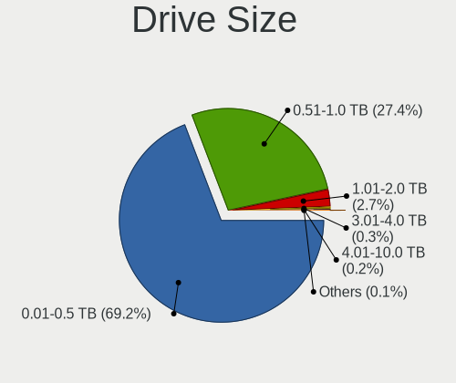

Linux - Tested Hardware & Statistics (Notebooks)
------------------------------------------------

A project to collect tested hardware configurations for Linux.

Anyone can contribute to this report by the [hw-probe](https://github.com/linuxhw/hw-probe) tool:

    sudo -E hw-probe -all -upload

Please contribute! Especially if your hardware is rare.

This report is for real hardware. Report for virtual hardware: [TestCoverage_VE](https://github.com/linuxhw/TestCoverage_VE)

Contents
--------

* [ Test Cases ](#test-cases)

* [ System ](#system)
  - [ OS                       ](#os)
  - [ OS Family                ](#os-family)
  - [ Kernel                   ](#kernel)
  - [ Kernel Family            ](#kernel-family)
  - [ Kernel Major Ver.        ](#kernel-major-ver)
  - [ Arch                     ](#arch)
  - [ DE                       ](#de)
  - [ Display Server           ](#display-server)
  - [ Display Manager          ](#display-manager)
  - [ OS Lang                  ](#os-lang)
  - [ Boot Mode                ](#boot-mode)
  - [ Filesystem               ](#filesystem)
  - [ Part. scheme             ](#part-scheme)
  - [ Dual Boot with Linux/BSD ](#dual-boot-with-linuxbsd)
  - [ Dual Boot (Win)          ](#dual-boot-win)

* [ Board ](#board)
  - [ Vendor                   ](#vendor)
  - [ Model                    ](#model)
  - [ Model Family             ](#model-family)
  - [ MFG Year                 ](#mfg-year)
  - [ Form Factor              ](#form-factor)
  - [ Secure Boot              ](#secure-boot)
  - [ Coreboot                 ](#coreboot)
  - [ RAM Size                 ](#ram-size)
  - [ RAM Used                 ](#ram-used)
  - [ Total Drives             ](#total-drives)
  - [ Has CD-ROM               ](#has-cd-rom)
  - [ Has Ethernet             ](#has-ethernet)
  - [ Has WiFi                 ](#has-wifi)
  - [ Has Bluetooth            ](#has-bluetooth)

* [ Location ](#location)
  - [ Country                  ](#country)
  - [ City                     ](#city)

* [ Drives ](#drives)
  - [ Drive Vendor             ](#drive-vendor)
  - [ Drive Model              ](#drive-model)
  - [ HDD Vendor               ](#hdd-vendor)
  - [ SSD Vendor               ](#ssd-vendor)
  - [ Drive Kind               ](#drive-kind)
  - [ Drive Connector          ](#drive-connector)
  - [ Drive Size               ](#drive-size)
  - [ Space Total              ](#space-total)
  - [ Space Used               ](#space-used)
  - [ Malfunc. Drives          ](#malfunc-drives)
  - [ Malfunc. Drive Vendor    ](#malfunc-drive-vendor)
  - [ Malfunc. HDD Vendor      ](#malfunc-hdd-vendor)
  - [ Malfunc. Drive Kind      ](#malfunc-drive-kind)
  - [ Failed Drives            ](#failed-drives)
  - [ Failed Drive Vendor      ](#failed-drive-vendor)
  - [ Drive Status             ](#drive-status)

* [ Storage controller ](#storage-controller)
  - [ Storage Vendor           ](#storage-vendor)
  - [ Storage Model            ](#storage-model)
  - [ Storage Kind             ](#storage-kind)

* [ Processor ](#processor)
  - [ CPU Vendor               ](#cpu-vendor)
  - [ CPU Model                ](#cpu-model)
  - [ CPU Model Family         ](#cpu-model-family)
  - [ CPU Cores                ](#cpu-cores)
  - [ CPU Sockets              ](#cpu-sockets)
  - [ CPU Threads              ](#cpu-threads)
  - [ CPU Op-Modes             ](#cpu-op-modes)
  - [ CPU Microcode            ](#cpu-microcode)
  - [ CPU Microarch            ](#cpu-microarch)

* [ Graphics ](#graphics)
  - [ GPU Vendor               ](#gpu-vendor)
  - [ GPU Model                ](#gpu-model)
  - [ GPU Combo                ](#gpu-combo)
  - [ GPU Driver               ](#gpu-driver)
  - [ GPU Memory               ](#gpu-memory)

* [ Monitor ](#monitor)
  - [ Monitor Vendor           ](#monitor-vendor)
  - [ Monitor Model            ](#monitor-model)
  - [ Monitor Resolution       ](#monitor-resolution)
  - [ Monitor Diagonal         ](#monitor-diagonal)
  - [ Monitor Width            ](#monitor-width)
  - [ Aspect Ratio             ](#aspect-ratio)
  - [ Monitor Area             ](#monitor-area)
  - [ Pixel Density            ](#pixel-density)
  - [ Multiple Monitors        ](#multiple-monitors)

* [ Network ](#network)
  - [ Net Controller Vendor    ](#net-controller-vendor)
  - [ Net Controller Model     ](#net-controller-model)
  - [ Wireless Vendor          ](#wireless-vendor)
  - [ Wireless Model           ](#wireless-model)
  - [ Ethernet Vendor          ](#ethernet-vendor)
  - [ Ethernet Model           ](#ethernet-model)
  - [ Net Controller Kind      ](#net-controller-kind)
  - [ Used Controller          ](#used-controller)
  - [ NICs                     ](#nics)
  - [ IPv6                     ](#ipv6)

* [ Bluetooth ](#bluetooth)
  - [ Bluetooth Vendor         ](#bluetooth-vendor)
  - [ Bluetooth Model          ](#bluetooth-model)

* [ Sound ](#sound)
  - [ Sound Vendor             ](#sound-vendor)
  - [ Sound Model              ](#sound-model)

* [ Memory ](#memory)
  - [ Memory Vendor            ](#memory-vendor)
  - [ Memory Model             ](#memory-model)
  - [ Memory Kind              ](#memory-kind)
  - [ Memory Form Factor       ](#memory-form-factor)
  - [ Memory Size              ](#memory-size)
  - [ Memory Speed             ](#memory-speed)

* [ Printers & scanners ](#printers--scanners)
  - [ Printer Vendor           ](#printer-vendor)
  - [ Printer Model            ](#printer-model)
  - [ Scanner Vendor           ](#scanner-vendor)
  - [ Scanner Model            ](#scanner-model)

* [ Camera ](#camera)
  - [ Camera Vendor            ](#camera-vendor)
  - [ Camera Model             ](#camera-model)

* [ Security ](#security)
  - [ Fingerprint Vendor       ](#fingerprint-vendor)
  - [ Fingerprint Model        ](#fingerprint-model)
  - [ Chipcard Vendor          ](#chipcard-vendor)
  - [ Chipcard Model           ](#chipcard-model)

* [ Unsupported ](#unsupported)
  - [ Unsupported Devices      ](#unsupported-devices)
  - [ Unsupported Device Types ](#unsupported-device-types)

Test Cases
----------

Total: 130945

| Vendor        | Model                       | Probe                                                      | Date         |
|---------------|-----------------------------|------------------------------------------------------------|--------------|
| Dell          | Inspiron 5490               | [3ef6519b6d](https://linux-hardware.org/?probe=3ef6519b6d) | Sep 01, 2022 |
| Dell          | XPS 13 9305                 | [1746053c5b](https://linux-hardware.org/?probe=1746053c5b) | Sep 01, 2022 |
| Google        | Enguarde                    | [50369de0be](https://linux-hardware.org/?probe=50369de0be) | Sep 01, 2022 |
| Dell          | Latitude E6330              | [179123f301](https://linux-hardware.org/?probe=179123f301) | Sep 01, 2022 |
| ASUSTek       | X455LJ                      | [b635e1c2ba](https://linux-hardware.org/?probe=b635e1c2ba) | Sep 01, 2022 |
| Dell          | G15 5510                    | [78f2f5c95a](https://linux-hardware.org/?probe=78f2f5c95a) | Sep 01, 2022 |
| MSI           | Katana GF66 12UC            | [270a50ac4c](https://linux-hardware.org/?probe=270a50ac4c) | Sep 01, 2022 |
| Google        | Enguarde                    | [b59a9615cd](https://linux-hardware.org/?probe=b59a9615cd) | Sep 01, 2022 |
| ASUSTek       | ZenBook UX425IA_UM425IA     | [f25f0f5499](https://linux-hardware.org/?probe=f25f0f5499) | Sep 01, 2022 |
| HP            | Laptop 15-ef1xxx            | [d27c20dcf9](https://linux-hardware.org/?probe=d27c20dcf9) | Sep 01, 2022 |
| Dell          | Inspiron 5559               | [c7b43caa52](https://linux-hardware.org/?probe=c7b43caa52) | Sep 01, 2022 |
| Google        | Enguarde                    | [7acc7436b0](https://linux-hardware.org/?probe=7acc7436b0) | Sep 01, 2022 |
| Lenovo        | ThinkPad X1 Extreme Gen ... | [d34c9cb705](https://linux-hardware.org/?probe=d34c9cb705) | Sep 01, 2022 |
| Google        | Enguarde                    | [671a062f6e](https://linux-hardware.org/?probe=671a062f6e) | Sep 01, 2022 |
| HP            | OMEN Laptop 15-en0xxx       | [e4a4630b4e](https://linux-hardware.org/?probe=e4a4630b4e) | Sep 01, 2022 |
| Lenovo        | ThinkPad E15 Gen 2 20T80... | [21392e76a8](https://linux-hardware.org/?probe=21392e76a8) | Sep 01, 2022 |
| Google        | Enguarde                    | [baabafd42b](https://linux-hardware.org/?probe=baabafd42b) | Sep 01, 2022 |
| Google        | Enguarde                    | [4c1595c83e](https://linux-hardware.org/?probe=4c1595c83e) | Sep 01, 2022 |
| Google        | Enguarde                    | [bb6b28b279](https://linux-hardware.org/?probe=bb6b28b279) | Sep 01, 2022 |
| Google        | Terra                       | [b7940ab738](https://linux-hardware.org/?probe=b7940ab738) | Sep 01, 2022 |
| Google        | Enguarde                    | [0cbe57b975](https://linux-hardware.org/?probe=0cbe57b975) | Sep 01, 2022 |
| Google        | Enguarde                    | [9f20842cc5](https://linux-hardware.org/?probe=9f20842cc5) | Sep 01, 2022 |
| Schenker      | XMG FUSION 15 (XFU15M22)    | [3a8cfc8781](https://linux-hardware.org/?probe=3a8cfc8781) | Sep 01, 2022 |
| Lenovo        | ThinkPad T14 Gen 2i 20W1... | [12abd434b5](https://linux-hardware.org/?probe=12abd434b5) | Sep 01, 2022 |
| Apple         | MacBookAir7,2               | [73b50385f0](https://linux-hardware.org/?probe=73b50385f0) | Sep 01, 2022 |
| HP            | Laptop 15-db1xxx            | [51b19bb74b](https://linux-hardware.org/?probe=51b19bb74b) | Sep 01, 2022 |
| Packard Be... | DOT S                       | [b5b03f1cf7](https://linux-hardware.org/?probe=b5b03f1cf7) | Sep 01, 2022 |
| Lenovo        | ThinkPad E15 Gen 2 20T80... | [e16313490d](https://linux-hardware.org/?probe=e16313490d) | Sep 01, 2022 |
| Acer          | Aspire 5742G                | [1ed15181cb](https://linux-hardware.org/?probe=1ed15181cb) | Sep 01, 2022 |
| Lenovo        | IdeaPad 5 Pro 16ARH7 82S... | [46e67b2b16](https://linux-hardware.org/?probe=46e67b2b16) | Sep 01, 2022 |
| Google        | Enguarde                    | [06969489cc](https://linux-hardware.org/?probe=06969489cc) | Sep 01, 2022 |
| Google        | Enguarde                    | [2b4231258e](https://linux-hardware.org/?probe=2b4231258e) | Sep 01, 2022 |
| HP            | Pavilion 14                 | [b35151af0c](https://linux-hardware.org/?probe=b35151af0c) | Sep 01, 2022 |
| Google        | Enguarde                    | [1a0596c60d](https://linux-hardware.org/?probe=1a0596c60d) | Sep 01, 2022 |
| Google        | Enguarde                    | [4dfdb5e364](https://linux-hardware.org/?probe=4dfdb5e364) | Sep 01, 2022 |
| Google        | Enguarde                    | [c6db81251c](https://linux-hardware.org/?probe=c6db81251c) | Sep 01, 2022 |
| Lenovo        | B570e HuronRiver Platfor... | [23e052db95](https://linux-hardware.org/?probe=23e052db95) | Sep 01, 2022 |
| Lenovo        | G50-80 80E5                 | [ec5bb450ff](https://linux-hardware.org/?probe=ec5bb450ff) | Sep 01, 2022 |
| Lenovo        | Y520-15IKBN 80WK            | [7b6028e52d](https://linux-hardware.org/?probe=7b6028e52d) | Sep 01, 2022 |
| Google        | Enguarde                    | [05f112ddb7](https://linux-hardware.org/?probe=05f112ddb7) | Sep 01, 2022 |
| Dell          | G3 3590                     | [cbe6c26276](https://linux-hardware.org/?probe=cbe6c26276) | Sep 01, 2022 |
| Dell          | Vostro 15 5510              | [1c58d69316](https://linux-hardware.org/?probe=1c58d69316) | Sep 01, 2022 |
| Dell          | Vostro 15 5510              | [e14cc69370](https://linux-hardware.org/?probe=e14cc69370) | Sep 01, 2022 |
| ASUSTek       | TUF Gaming FX505DY_FX505... | [9cabeefea8](https://linux-hardware.org/?probe=9cabeefea8) | Sep 01, 2022 |
| Acer          | Aspire 5715Z                | [82086ce1c6](https://linux-hardware.org/?probe=82086ce1c6) | Sep 01, 2022 |
| Lenovo        | ThinkPad T430 2342A19       | [1fee695aec](https://linux-hardware.org/?probe=1fee695aec) | Sep 01, 2022 |
| Lenovo        | ThinkPad T460 20FMS08U00    | [d7457fd32a](https://linux-hardware.org/?probe=d7457fd32a) | Sep 01, 2022 |
| ASUSTek       | N552VW                      | [99d4a9be86](https://linux-hardware.org/?probe=99d4a9be86) | Sep 01, 2022 |
| Lenovo        | IdeaPad S410p 20296         | [dac943f23a](https://linux-hardware.org/?probe=dac943f23a) | Sep 01, 2022 |
| Dell          | Latitude 5521               | [dcf7869cf6](https://linux-hardware.org/?probe=dcf7869cf6) | Sep 01, 2022 |
| Lenovo        | ThinkPad X1 Carbon 2nd 2... | [f7189849b4](https://linux-hardware.org/?probe=f7189849b4) | Sep 01, 2022 |
| Lenovo        | ThinkBook 14 G2 ITL 20VD    | [02ec70b604](https://linux-hardware.org/?probe=02ec70b604) | Sep 01, 2022 |
| HP            | Compaq 620                  | [6c8cd94a98](https://linux-hardware.org/?probe=6c8cd94a98) | Sep 01, 2022 |
| Dell          | Inspiron 15-3567            | [5b1f25ca62](https://linux-hardware.org/?probe=5b1f25ca62) | Sep 01, 2022 |
| Positivo      | C14CR01                     | [ff4d1d45b7](https://linux-hardware.org/?probe=ff4d1d45b7) | Sep 01, 2022 |
| HP            | Pavilion dv6                | [25e9e892e7](https://linux-hardware.org/?probe=25e9e892e7) | Sep 01, 2022 |
| Lenovo        | ThinkPad T400 6474W7T       | [f9a9b12b37](https://linux-hardware.org/?probe=f9a9b12b37) | Sep 01, 2022 |
| HP            | Laptop 15-db0xxx            | [de848d928c](https://linux-hardware.org/?probe=de848d928c) | Sep 01, 2022 |
| Lenovo        | ThinkPad P15 Gen 1 20STC... | [0a5a3fa67e](https://linux-hardware.org/?probe=0a5a3fa67e) | Sep 01, 2022 |
| Acer          | Aspire V5-431               | [5ac694007d](https://linux-hardware.org/?probe=5ac694007d) | Sep 01, 2022 |
| Positivo      | C14CR01                     | [d1fc217886](https://linux-hardware.org/?probe=d1fc217886) | Sep 01, 2022 |
| Panasonic     | CF-191HACHFG                | [c1f0177dcb](https://linux-hardware.org/?probe=c1f0177dcb) | Sep 01, 2022 |
| Lenovo        | IdeaPad Slim 1-14AST-05 ... | [c83430605e](https://linux-hardware.org/?probe=c83430605e) | Sep 01, 2022 |
| HP            | Pavilion m6                 | [83b6eb0119](https://linux-hardware.org/?probe=83b6eb0119) | Sep 01, 2022 |
| Casper        | NIRVANA NOTEBOOK            | [7a5978071e](https://linux-hardware.org/?probe=7a5978071e) | Sep 01, 2022 |
| Avell High... | C62 MOB                     | [ab93c1f314](https://linux-hardware.org/?probe=ab93c1f314) | Sep 01, 2022 |
| HP            | ZBook 17 G2                 | [e2fc506c38](https://linux-hardware.org/?probe=e2fc506c38) | Sep 01, 2022 |
| Lenovo        | IdeaPad 1 14ADA05 82GW      | [8a7e7ce8ea](https://linux-hardware.org/?probe=8a7e7ce8ea) | Sep 01, 2022 |
| Valve         | Jupiter                     | [6e9790c5e7](https://linux-hardware.org/?probe=6e9790c5e7) | Sep 01, 2022 |
| Notebook      | NL40_50CU                   | [af0da080ec](https://linux-hardware.org/?probe=af0da080ec) | Sep 01, 2022 |
| Dell          | Latitude 3340               | [d64525742a](https://linux-hardware.org/?probe=d64525742a) | Sep 01, 2022 |
| Dell          | Latitude 3340               | [b9d472b965](https://linux-hardware.org/?probe=b9d472b965) | Sep 01, 2022 |
| Lenovo        | IdeaPad 3 15ITL6 82H8       | [5ad5d3809b](https://linux-hardware.org/?probe=5ad5d3809b) | Sep 01, 2022 |
| ASUSTek       | ZenBook UX431DA_UM431DA     | [cc30fbdce2](https://linux-hardware.org/?probe=cc30fbdce2) | Sep 01, 2022 |
| Dell          | Precision 5530              | [298ce27830](https://linux-hardware.org/?probe=298ce27830) | Sep 01, 2022 |
| LG Electro... | 14Z990-V.AP72B              | [8c67c188a1](https://linux-hardware.org/?probe=8c67c188a1) | Sep 01, 2022 |
| HP            | ProBook 4540s               | [b5e6fa5a71](https://linux-hardware.org/?probe=b5e6fa5a71) | Sep 01, 2022 |
| Dell          | XPS 9320                    | [525a1bd6b6](https://linux-hardware.org/?probe=525a1bd6b6) | Sep 01, 2022 |
| HP            | EliteBook 830 G8 Noteboo... | [814c094769](https://linux-hardware.org/?probe=814c094769) | Sep 01, 2022 |
| MECHREVO      | Code01 Ver2.0               | [f88772c4dc](https://linux-hardware.org/?probe=f88772c4dc) | Sep 01, 2022 |
| ASUSTek       | VivoBook_ASUS Laptop X50... | [9da6412308](https://linux-hardware.org/?probe=9da6412308) | Sep 01, 2022 |
| Lenovo        | ThinkPad T440p 20AWS1200... | [55073b08dc](https://linux-hardware.org/?probe=55073b08dc) | Sep 01, 2022 |
| Dell          | Latitude 3190               | [d30269b33c](https://linux-hardware.org/?probe=d30269b33c) | Sep 01, 2022 |
| MECHREVO      | Code01 Ver2.0               | [0cb5fbde81](https://linux-hardware.org/?probe=0cb5fbde81) | Sep 01, 2022 |
| Valve         | Jupiter                     | [c89533e9a2](https://linux-hardware.org/?probe=c89533e9a2) | Sep 01, 2022 |
| Lenovo        | ThinkPad T400 6474W7T       | [b52974ac00](https://linux-hardware.org/?probe=b52974ac00) | Sep 01, 2022 |
| Notebook      | W65_67SB                    | [38393a5559](https://linux-hardware.org/?probe=38393a5559) | Sep 01, 2022 |
| HP            | Laptop 15-da0xxx            | [2c79168e77](https://linux-hardware.org/?probe=2c79168e77) | Sep 01, 2022 |
| ASUSTek       | K50IJ                       | [10dd5d1e15](https://linux-hardware.org/?probe=10dd5d1e15) | Sep 01, 2022 |
| Purism        | Librem 14                   | [54d6cbb49d](https://linux-hardware.org/?probe=54d6cbb49d) | Sep 01, 2022 |
| ASUSTek       | ZenBook UX425QA_UM425QA     | [c48154f5f4](https://linux-hardware.org/?probe=c48154f5f4) | Sep 01, 2022 |
| Lenovo        | G50-45 80E3                 | [3080895149](https://linux-hardware.org/?probe=3080895149) | Sep 01, 2022 |
| Medion        | E6227                       | [e6ca2257e7](https://linux-hardware.org/?probe=e6ca2257e7) | Sep 01, 2022 |
| HP            | Laptop 15-da0xxx            | [40482ce9a3](https://linux-hardware.org/?probe=40482ce9a3) | Sep 01, 2022 |
| Dell          | Inspiron 13 5310            | [b6b7c6dc62](https://linux-hardware.org/?probe=b6b7c6dc62) | Sep 01, 2022 |
| Dell          | Inspiron 15-3552            | [2eb780855d](https://linux-hardware.org/?probe=2eb780855d) | Sep 01, 2022 |
| Dell          | Inspiron 13 5310            | [6b3c188071](https://linux-hardware.org/?probe=6b3c188071) | Sep 01, 2022 |
| Dell          | Inspiron 13 5310            | [b0d6660da8](https://linux-hardware.org/?probe=b0d6660da8) | Sep 01, 2022 |
| Dell          | Latitude 5591               | [b860997149](https://linux-hardware.org/?probe=b860997149) | Sep 01, 2022 |
| HP            | ProBook 6460b               | [a0e3db2eed](https://linux-hardware.org/?probe=a0e3db2eed) | Sep 01, 2022 |
| Samsung       | 950XEE                      | [454b67dd88](https://linux-hardware.org/?probe=454b67dd88) | Sep 01, 2022 |
| Lenovo        | Z50-70 20354                | [8ac8531142](https://linux-hardware.org/?probe=8ac8531142) | Sep 01, 2022 |
| Lenovo        | IdeaPad 3 14ARE05 81W3      | [b8c22aafab](https://linux-hardware.org/?probe=b8c22aafab) | Sep 01, 2022 |
| Toshiba       | Satellite C850              | [6cf6d8fca8](https://linux-hardware.org/?probe=6cf6d8fca8) | Sep 01, 2022 |
| Dell          | Inspiron 15-3552            | [a5e4d22ccd](https://linux-hardware.org/?probe=a5e4d22ccd) | Sep 01, 2022 |
| Apple         | MacBookAir9,1               | [51c4002c97](https://linux-hardware.org/?probe=51c4002c97) | Sep 01, 2022 |
| ASUSTek       | VivoBook_ASUSLaptop X515... | [6566bc7d09](https://linux-hardware.org/?probe=6566bc7d09) | Sep 01, 2022 |
| Lenovo        | Legion S7 15ACH6 82K8       | [d96b24b7f3](https://linux-hardware.org/?probe=d96b24b7f3) | Sep 01, 2022 |
| Daten Tecn... | DT02-M4                     | [6e337cb132](https://linux-hardware.org/?probe=6e337cb132) | Sep 01, 2022 |
| Alienware     | m15 R4                      | [267e4bb2dd](https://linux-hardware.org/?probe=267e4bb2dd) | Sep 01, 2022 |
| Daten Tecn... | DT02-M4                     | [cdac9cafaf](https://linux-hardware.org/?probe=cdac9cafaf) | Sep 01, 2022 |
| Dell          | Inspiron 3542               | [945ec7d987](https://linux-hardware.org/?probe=945ec7d987) | Sep 01, 2022 |
| Lenovo        | Legion S7 15ACH6 82K8       | [67eb62450a](https://linux-hardware.org/?probe=67eb62450a) | Sep 01, 2022 |
| ASUSTek       | TUF Gaming FX505DT_FX505... | [c9841acd77](https://linux-hardware.org/?probe=c9841acd77) | Sep 01, 2022 |
| Acer          | Aspire E5-571               | [7759e41b1d](https://linux-hardware.org/?probe=7759e41b1d) | Sep 01, 2022 |
| ASUSTek       | X550CC                      | [21f3eb8b1d](https://linux-hardware.org/?probe=21f3eb8b1d) | Sep 01, 2022 |
| Dell          | Latitude 5490               | [a3f76e546f](https://linux-hardware.org/?probe=a3f76e546f) | Sep 01, 2022 |
| HP            | EliteBook 840 G7 Noteboo... | [b50b1adb0f](https://linux-hardware.org/?probe=b50b1adb0f) | Sep 01, 2022 |
| ASUSTek       | X550ZE                      | [187a6feadf](https://linux-hardware.org/?probe=187a6feadf) | Sep 01, 2022 |
| Apple         | MacBookPro5,1               | [4c90105342](https://linux-hardware.org/?probe=4c90105342) | Sep 01, 2022 |
| HP            | OMEN by Laptop 15-ce0xx     | [85d4f11486](https://linux-hardware.org/?probe=85d4f11486) | Sep 01, 2022 |
| HP            | EliteBook 840 G2            | [4da3485e34](https://linux-hardware.org/?probe=4da3485e34) | Sep 01, 2022 |
| Dell          | Inspiron 1545               | [611306b3c0](https://linux-hardware.org/?probe=611306b3c0) | Sep 01, 2022 |
| HP            | ENVY Laptop 13-ba1xxx       | [5a4e2225a8](https://linux-hardware.org/?probe=5a4e2225a8) | Sep 01, 2022 |
| Lenovo        | ThinkPad X220 4291WSH       | [c86e73aed6](https://linux-hardware.org/?probe=c86e73aed6) | Sep 01, 2022 |
| Lenovo        | IdeaPad 330-15AST 81D6      | [972c4cb608](https://linux-hardware.org/?probe=972c4cb608) | Sep 01, 2022 |
| ASUSTek       | VivoBook 15_ASUS Laptop ... | [57d535de2e](https://linux-hardware.org/?probe=57d535de2e) | Sep 01, 2022 |
| Valve         | Jupiter                     | [c348c06118](https://linux-hardware.org/?probe=c348c06118) | Sep 01, 2022 |
| Lenovo        | Legion Y530-15ICH 81FV      | [c9fcbe9935](https://linux-hardware.org/?probe=c9fcbe9935) | Sep 01, 2022 |
| HP            | G42                         | [a79b07fcd0](https://linux-hardware.org/?probe=a79b07fcd0) | Sep 01, 2022 |
| Lenovo        | IdeaPad S145-15API 81V7     | [838e09c9cf](https://linux-hardware.org/?probe=838e09c9cf) | Sep 01, 2022 |
| Lenovo        | Z50-70 20354                | [6e245e4c63](https://linux-hardware.org/?probe=6e245e4c63) | Sep 01, 2022 |
| Lenovo        | Legion Y530-15ICH 81FV      | [52efef286f](https://linux-hardware.org/?probe=52efef286f) | Sep 01, 2022 |
| HUAWEI        | HKD-WXX                     | [7ff88a93c2](https://linux-hardware.org/?probe=7ff88a93c2) | Sep 01, 2022 |
| Acer          | Aspire 5810T                | [6f807b1a84](https://linux-hardware.org/?probe=6f807b1a84) | Sep 01, 2022 |
| HP            | ENVY Laptop 15-ep0xxx       | [93ff04a07b](https://linux-hardware.org/?probe=93ff04a07b) | Sep 01, 2022 |
| ASUSTek       | UX550VD                     | [a43d53b3b7](https://linux-hardware.org/?probe=a43d53b3b7) | Sep 01, 2022 |
| HP            | Laptop 14s-fq1xxx           | [1a173c5ea0](https://linux-hardware.org/?probe=1a173c5ea0) | Sep 01, 2022 |
| Valve         | Jupiter                     | [60db4bfa03](https://linux-hardware.org/?probe=60db4bfa03) | Aug 31, 2022 |
| HP            | EliteBook 840 G8 Noteboo... | [7277e72eb4](https://linux-hardware.org/?probe=7277e72eb4) | Aug 31, 2022 |
| Lenovo        | IdeaPad 320-15IAP 80XR      | [6aba706c0c](https://linux-hardware.org/?probe=6aba706c0c) | Aug 31, 2022 |
| Valve         | Jupiter                     | [5a2483051c](https://linux-hardware.org/?probe=5a2483051c) | Aug 31, 2022 |
| Dell          | Latitude 7390               | [571b195a12](https://linux-hardware.org/?probe=571b195a12) | Aug 31, 2022 |
| Dell          | Latitude 7390               | [3c3f6114f6](https://linux-hardware.org/?probe=3c3f6114f6) | Aug 31, 2022 |
| HP            | Laptop 15-db0xxx            | [42879ce5cf](https://linux-hardware.org/?probe=42879ce5cf) | Aug 31, 2022 |
| HP            | Laptop 15-db0xxx            | [3c7e97b769](https://linux-hardware.org/?probe=3c7e97b769) | Aug 31, 2022 |
| Toshiba       | PORTEGE M800                | [547ef88897](https://linux-hardware.org/?probe=547ef88897) | Aug 31, 2022 |
| ASUSTek       | ASUS TUF Gaming F15 FX50... | [0ca693e2dd](https://linux-hardware.org/?probe=0ca693e2dd) | Aug 31, 2022 |
| Lenovo        | G710 20252                  | [37b1f6e81c](https://linux-hardware.org/?probe=37b1f6e81c) | Aug 31, 2022 |
| Acer          | Aspire V3-571G              | [8f4a2b603a](https://linux-hardware.org/?probe=8f4a2b603a) | Aug 31, 2022 |
| Toshiba       | PORTEGE M800                | [355cc5a1ec](https://linux-hardware.org/?probe=355cc5a1ec) | Aug 31, 2022 |
| Dell          | Inspiron 15-3552            | [5a342673f5](https://linux-hardware.org/?probe=5a342673f5) | Aug 31, 2022 |
| Samsung       | 340XAA/350XAA/550XAA        | [c1d60c7b0b](https://linux-hardware.org/?probe=c1d60c7b0b) | Aug 31, 2022 |
| Samsung       | 340XAA/350XAA/550XAA        | [dafd789095](https://linux-hardware.org/?probe=dafd789095) | Aug 31, 2022 |
| Google        | Enguarde                    | [4a240c438e](https://linux-hardware.org/?probe=4a240c438e) | Aug 31, 2022 |
| HP            | Pavilion g6                 | [cc725d880c](https://linux-hardware.org/?probe=cc725d880c) | Aug 31, 2022 |
| MECHREVO      | Code01 Ver2.0               | [c63c5e6700](https://linux-hardware.org/?probe=c63c5e6700) | Aug 31, 2022 |
| MECHREVO      | Code01 Ver2.0               | [bbe5fe0eac](https://linux-hardware.org/?probe=bbe5fe0eac) | Aug 31, 2022 |
| Lenovo        | ThinkPad T580 20L9CTO1WW    | [d6e9455a63](https://linux-hardware.org/?probe=d6e9455a63) | Aug 31, 2022 |
| Apple         | MacBookPro9,2               | [3662302886](https://linux-hardware.org/?probe=3662302886) | Aug 31, 2022 |
| Valve         | Jupiter                     | [0b928ad313](https://linux-hardware.org/?probe=0b928ad313) | Aug 31, 2022 |
| HP            | Notebook                    | [573d359faf](https://linux-hardware.org/?probe=573d359faf) | Aug 31, 2022 |
| Toshiba       | Satellite Pro L500          | [7f523718cf](https://linux-hardware.org/?probe=7f523718cf) | Aug 31, 2022 |
| Dell          | Inspiron 15-3552            | [60317668ae](https://linux-hardware.org/?probe=60317668ae) | Aug 31, 2022 |
| Dell          | Latitude 7280               | [e71e9350b4](https://linux-hardware.org/?probe=e71e9350b4) | Aug 31, 2022 |
| ASUSTek       | K46CM                       | [742d7047ea](https://linux-hardware.org/?probe=742d7047ea) | Aug 31, 2022 |
| ASUSTek       | Zenbook UX535QE_UM535QE     | [0c62d097f0](https://linux-hardware.org/?probe=0c62d097f0) | Aug 31, 2022 |
| HP            | EliteBook 840 G8 Noteboo... | [4808984401](https://linux-hardware.org/?probe=4808984401) | Aug 31, 2022 |
| Intel         | powered classmate PC        | [ed36baccf9](https://linux-hardware.org/?probe=ed36baccf9) | Aug 31, 2022 |
| ASUSTek       | Zenbook UX535QE_UM535QE     | [7931f65300](https://linux-hardware.org/?probe=7931f65300) | Aug 31, 2022 |
| HP            | Elite x2 1012 G1            | [10455cfe0d](https://linux-hardware.org/?probe=10455cfe0d) | Aug 31, 2022 |
| HP            | 15 Notebook PC              | [1109650747](https://linux-hardware.org/?probe=1109650747) | Aug 31, 2022 |
| Lenovo        | ThinkPad L14 Gen 1 20U5S... | [eb79e6b28e](https://linux-hardware.org/?probe=eb79e6b28e) | Aug 31, 2022 |
| Dell          | Inspiron 7720               | [97883c54a3](https://linux-hardware.org/?probe=97883c54a3) | Aug 31, 2022 |
| Lenovo        | IdeaPad Slim 1-14AST-05 ... | [ad6c7ea5ab](https://linux-hardware.org/?probe=ad6c7ea5ab) | Aug 31, 2022 |
| HP            | Pavilion 15                 | [19c7cae23c](https://linux-hardware.org/?probe=19c7cae23c) | Aug 31, 2022 |
| Dell          | Latitude E6330              | [b5766d41fa](https://linux-hardware.org/?probe=b5766d41fa) | Aug 31, 2022 |
| Dell          | Inspiron 13-7378            | [42666a5460](https://linux-hardware.org/?probe=42666a5460) | Aug 31, 2022 |
| Unknown       | Unknown                     | [cba954794c](https://linux-hardware.org/?probe=cba954794c) | Aug 31, 2022 |
| Toshiba       | Satellite C850D-118         | [1950f0aeac](https://linux-hardware.org/?probe=1950f0aeac) | Aug 31, 2022 |
| Notebook      | N24_25JU                    | [50f570f3d9](https://linux-hardware.org/?probe=50f570f3d9) | Aug 31, 2022 |
| Toshiba       | TECRA S5                    | [121c8e110b](https://linux-hardware.org/?probe=121c8e110b) | Aug 31, 2022 |
| ASUSTek       | X541UJ                      | [0cd33aa36a](https://linux-hardware.org/?probe=0cd33aa36a) | Aug 31, 2022 |
| HP            | Notebook                    | [ee135c3930](https://linux-hardware.org/?probe=ee135c3930) | Aug 31, 2022 |
| Toshiba       | TECRA S5                    | [6ec2bd9539](https://linux-hardware.org/?probe=6ec2bd9539) | Aug 31, 2022 |
| Dell          | Precision 3551              | [c9ffa625ad](https://linux-hardware.org/?probe=c9ffa625ad) | Aug 31, 2022 |
| Dell          | Latitude 7430               | [8876fb0448](https://linux-hardware.org/?probe=8876fb0448) | Aug 31, 2022 |
| Eluktronic... | MAG-15 2070                 | [d7fb373622](https://linux-hardware.org/?probe=d7fb373622) | Aug 31, 2022 |
| HUAWEI        | HVY-WXX9                    | [193310218d](https://linux-hardware.org/?probe=193310218d) | Aug 31, 2022 |
| Notebook      | NLx0MU                      | [90c9b01136](https://linux-hardware.org/?probe=90c9b01136) | Aug 31, 2022 |
| Notebook      | NLx0MU                      | [77d4b4ff99](https://linux-hardware.org/?probe=77d4b4ff99) | Aug 31, 2022 |
| Dell          | Inspiron 15-3552            | [8e2cd928f3](https://linux-hardware.org/?probe=8e2cd928f3) | Aug 31, 2022 |
| Dell          | Inspiron 15-3567            | [710d1e9a9b](https://linux-hardware.org/?probe=710d1e9a9b) | Aug 31, 2022 |
| Samsung       | RV410/RV510/S3510/E3510     | [d36b7bb077](https://linux-hardware.org/?probe=d36b7bb077) | Aug 31, 2022 |
| Valve         | Jupiter                     | [dbc549504c](https://linux-hardware.org/?probe=dbc549504c) | Aug 31, 2022 |
| HUAWEI        | CREF-XX                     | [4ea2674cd8](https://linux-hardware.org/?probe=4ea2674cd8) | Aug 31, 2022 |
| Toshiba       | Satellite C850              | [d9505cea0a](https://linux-hardware.org/?probe=d9505cea0a) | Aug 31, 2022 |
| Lenovo        | ThinkPad P43s 20RJS0D100    | [afbf0f6021](https://linux-hardware.org/?probe=afbf0f6021) | Aug 31, 2022 |
| Samsung       | 305E4A/305E5A/305E7A        | [6eeadaf886](https://linux-hardware.org/?probe=6eeadaf886) | Aug 31, 2022 |
| ASUSTek       | K401UQK                     | [4f026584d7](https://linux-hardware.org/?probe=4f026584d7) | Aug 31, 2022 |
| ASUSTek       | VivoBook_ASUS Laptop E51... | [b895a2ae7c](https://linux-hardware.org/?probe=b895a2ae7c) | Aug 31, 2022 |
| Samsung       | 305E4A/305E5A/305E7A        | [56e8f54a3e](https://linux-hardware.org/?probe=56e8f54a3e) | Aug 31, 2022 |
| HP            | Pavilion Gaming Laptop      | [8382b4123e](https://linux-hardware.org/?probe=8382b4123e) | Aug 31, 2022 |
| HP            | 250 G8 Notebook PC          | [c0a39342c3](https://linux-hardware.org/?probe=c0a39342c3) | Aug 31, 2022 |
| The Wareho... | E2037                       | [e9599d1061](https://linux-hardware.org/?probe=e9599d1061) | Aug 31, 2022 |
| Notebook      | NJx0MU                      | [169efa4465](https://linux-hardware.org/?probe=169efa4465) | Aug 31, 2022 |
| Notebook      | NH5xAx                      | [e8487cd15f](https://linux-hardware.org/?probe=e8487cd15f) | Aug 31, 2022 |
| Dell          | Latitude E5570              | [91513d0ee3](https://linux-hardware.org/?probe=91513d0ee3) | Aug 31, 2022 |
| Acer          | Aspire R3-471T              | [01b021f810](https://linux-hardware.org/?probe=01b021f810) | Aug 31, 2022 |
| Acer          | Aspire E1-571               | [4db54180a8](https://linux-hardware.org/?probe=4db54180a8) | Aug 31, 2022 |
| Lenovo        | IdeaPad 320-15IKB 81BT      | [ef34b3c3aa](https://linux-hardware.org/?probe=ef34b3c3aa) | Aug 31, 2022 |
| HP            | Presario F500 (GM639LA#A... | [7323caa631](https://linux-hardware.org/?probe=7323caa631) | Aug 31, 2022 |
| Dell          | Vostro 3550                 | [c26bf23cdd](https://linux-hardware.org/?probe=c26bf23cdd) | Aug 31, 2022 |
| HP            | Laptop 15-dy1xxx            | [836644c18b](https://linux-hardware.org/?probe=836644c18b) | Aug 31, 2022 |
| Samsung       | 670Z5E                      | [c72797ddaa](https://linux-hardware.org/?probe=c72797ddaa) | Aug 31, 2022 |
| HP            | EliteBook 820 G3            | [a0bc059a35](https://linux-hardware.org/?probe=a0bc059a35) | Aug 31, 2022 |
| HP            | EliteBook 820 G3            | [0c275e0aaa](https://linux-hardware.org/?probe=0c275e0aaa) | Aug 31, 2022 |
| HP            | Notebook                    | [2ca7fbbfa9](https://linux-hardware.org/?probe=2ca7fbbfa9) | Aug 31, 2022 |
| Lenovo        | IdeaPad 5 15IIL05 81YK      | [6d04d534fa](https://linux-hardware.org/?probe=6d04d534fa) | Aug 31, 2022 |
| Lenovo        | ThinkPad T400 2767E53       | [454c7382bd](https://linux-hardware.org/?probe=454c7382bd) | Aug 31, 2022 |
| Notebook      | NJx0MU                      | [81d8e17fed](https://linux-hardware.org/?probe=81d8e17fed) | Aug 31, 2022 |
| Lenovo        | IdeaPad S145-15API 81V7     | [988032b933](https://linux-hardware.org/?probe=988032b933) | Aug 31, 2022 |
| Dell          | Inspiron 3543               | [a557da948a](https://linux-hardware.org/?probe=a557da948a) | Aug 31, 2022 |
| Toshiba       | Satellite C850              | [5d7cb36794](https://linux-hardware.org/?probe=5d7cb36794) | Aug 31, 2022 |
| Lenovo        | ThinkPad X1 Carbon Gen 8... | [646afc5f72](https://linux-hardware.org/?probe=646afc5f72) | Aug 31, 2022 |
| HP            | EliteBook 840 G5            | [e4b0cb981a](https://linux-hardware.org/?probe=e4b0cb981a) | Aug 31, 2022 |
| Dell          | Inspiron 5502               | [1bb776feab](https://linux-hardware.org/?probe=1bb776feab) | Aug 31, 2022 |
| Dell          | Inspiron 3493               | [dc23941a16](https://linux-hardware.org/?probe=dc23941a16) | Aug 31, 2022 |
| Acer          | Aspire E5-521               | [9ce49fc3a3](https://linux-hardware.org/?probe=9ce49fc3a3) | Aug 31, 2022 |
| Acer          | Aspire E5-521               | [b9d306c31b](https://linux-hardware.org/?probe=b9d306c31b) | Aug 31, 2022 |
| Lenovo        | IdeaPad 330-15AST 81D6      | [f3877acbd2](https://linux-hardware.org/?probe=f3877acbd2) | Aug 31, 2022 |
| ASUSTek       | ROG Zephyrus G14 GA402RK... | [c2d66050b5](https://linux-hardware.org/?probe=c2d66050b5) | Aug 30, 2022 |
| Positivo      | W942SW_SW1                  | [bec76a1474](https://linux-hardware.org/?probe=bec76a1474) | Aug 30, 2022 |
| Lenovo        | ThinkPad L540 20AUA06000    | [e2fd79b86e](https://linux-hardware.org/?probe=e2fd79b86e) | Aug 30, 2022 |
| ASUSTek       | VivoBook_ASUSLaptop X512... | [3d7c0ee13d](https://linux-hardware.org/?probe=3d7c0ee13d) | Aug 30, 2022 |
| HP            | Compaq 8510w                | [f7e1515654](https://linux-hardware.org/?probe=f7e1515654) | Aug 30, 2022 |
| Google        | Enguarde                    | [7aa44db561](https://linux-hardware.org/?probe=7aa44db561) | Aug 30, 2022 |
| Apple         | MacBookPro8,1               | [f65d685d05](https://linux-hardware.org/?probe=f65d685d05) | Aug 30, 2022 |
| ASUSTek       | G75VX                       | [e249508d61](https://linux-hardware.org/?probe=e249508d61) | Aug 30, 2022 |
| Lenovo        | V15-IIL 82C5                | [2a9e478284](https://linux-hardware.org/?probe=2a9e478284) | Aug 30, 2022 |
| ASUSTek       | VivoBook 15_ASUS Laptop ... | [9da97f5dea](https://linux-hardware.org/?probe=9da97f5dea) | Aug 30, 2022 |
| HP            | Compaq 6830s (FR883LA#AB... | [bceac5a658](https://linux-hardware.org/?probe=bceac5a658) | Aug 30, 2022 |
| Lenovo        | ThinkPad Edge E530 62724... | [87cad1c0b0](https://linux-hardware.org/?probe=87cad1c0b0) | Aug 30, 2022 |
| ASUSTek       | E202SA                      | [393cb25da2](https://linux-hardware.org/?probe=393cb25da2) | Aug 30, 2022 |
| Acer          | TMP453-MG                   | [63efab9aef](https://linux-hardware.org/?probe=63efab9aef) | Aug 30, 2022 |
| HP            | Compaq nc6400 (RU626ET#A... | [e94cb8e943](https://linux-hardware.org/?probe=e94cb8e943) | Aug 30, 2022 |
| Dell          | Inspiron N5110              | [9fe8c04ec6](https://linux-hardware.org/?probe=9fe8c04ec6) | Aug 30, 2022 |
| Lenovo        | ThinkPad L15 Gen 1 20U70... | [71cd60f1b9](https://linux-hardware.org/?probe=71cd60f1b9) | Aug 30, 2022 |
| HP            | Laptop 15s-eq2xxx           | [d927e47d1f](https://linux-hardware.org/?probe=d927e47d1f) | Aug 30, 2022 |
| HP            | ProBook 450 G6              | [7763040d56](https://linux-hardware.org/?probe=7763040d56) | Aug 30, 2022 |
| HP            | ZBook 17                    | [98e643f5af](https://linux-hardware.org/?probe=98e643f5af) | Aug 30, 2022 |
| Dell          | Vostro 15 5510              | [c89b1e69f4](https://linux-hardware.org/?probe=c89b1e69f4) | Aug 30, 2022 |
| Avell High... | B.ON                        | [dbc18dad43](https://linux-hardware.org/?probe=dbc18dad43) | Aug 30, 2022 |
| HP            | Pavilion Gaming Laptop 1... | [20da9d42a4](https://linux-hardware.org/?probe=20da9d42a4) | Aug 30, 2022 |
| Medion        | P7649 MD60817               | [3a703e2be0](https://linux-hardware.org/?probe=3a703e2be0) | Aug 30, 2022 |
| Lenovo        | IdeaPad S340-14API 81NB     | [aa35aacc70](https://linux-hardware.org/?probe=aa35aacc70) | Aug 30, 2022 |
| Valve         | Jupiter                     | [1b38f48059](https://linux-hardware.org/?probe=1b38f48059) | Aug 30, 2022 |
| HP            | ProBook 6470b               | [2cbe458c94](https://linux-hardware.org/?probe=2cbe458c94) | Aug 30, 2022 |
| Lenovo        | ThinkPad L512 259756M       | [3990fcfeed](https://linux-hardware.org/?probe=3990fcfeed) | Aug 30, 2022 |
| Dell          | XPS 15 9570                 | [6c35aeda10](https://linux-hardware.org/?probe=6c35aeda10) | Aug 30, 2022 |
| Dell          | Inspiron 15-3567            | [39ae8218f6](https://linux-hardware.org/?probe=39ae8218f6) | Aug 30, 2022 |
| Lenovo        | ThinkPad T490s 20NYS4HL0... | [273e5229a4](https://linux-hardware.org/?probe=273e5229a4) | Aug 30, 2022 |
| Google        | Reks                        | [71f6228c3d](https://linux-hardware.org/?probe=71f6228c3d) | Aug 30, 2022 |
| Lenovo        | Y520-15IKBN 80WK            | [8036c3df64](https://linux-hardware.org/?probe=8036c3df64) | Aug 30, 2022 |
| Lenovo        | ThinkPad T470 W10DG 20JM... | [9b23c4b82c](https://linux-hardware.org/?probe=9b23c4b82c) | Aug 30, 2022 |
| HP            | Pavilion Laptop 15-eh1xx... | [748558225a](https://linux-hardware.org/?probe=748558225a) | Aug 30, 2022 |
| Google        | Reks                        | [48174b01b3](https://linux-hardware.org/?probe=48174b01b3) | Aug 30, 2022 |
| HP            | Pavilion Gaming Laptop 1... | [11efd3dbe0](https://linux-hardware.org/?probe=11efd3dbe0) | Aug 30, 2022 |
| Lenovo        | IdeaPad 3 15ITL6 82H8       | [30457b898c](https://linux-hardware.org/?probe=30457b898c) | Aug 30, 2022 |
| Lenovo        | ThinkPad Edge E535 3260E... | [05141be4a5](https://linux-hardware.org/?probe=05141be4a5) | Aug 30, 2022 |
| HP            | ENVY Laptop 13-ad1xx        | [7399a32997](https://linux-hardware.org/?probe=7399a32997) | Aug 30, 2022 |
| ASUSTek       | X550CC                      | [f9a9be3a35](https://linux-hardware.org/?probe=f9a9be3a35) | Aug 30, 2022 |
| ASUSTek       | F3F                         | [57c5732aaa](https://linux-hardware.org/?probe=57c5732aaa) | Aug 30, 2022 |
| HP            | Laptop 17-cp0xxx            | [62c06b8d9c](https://linux-hardware.org/?probe=62c06b8d9c) | Aug 30, 2022 |
| Toshiba       | Satellite C850D-118         | [07000e4194](https://linux-hardware.org/?probe=07000e4194) | Aug 30, 2022 |
| HP            | EliteBook 840 G2            | [5ba91d8167](https://linux-hardware.org/?probe=5ba91d8167) | Aug 30, 2022 |
| HP            | EliteBook 840 G1            | [23d73aa95c](https://linux-hardware.org/?probe=23d73aa95c) | Aug 30, 2022 |
| Google        | Terra                       | [25f50ae6d9](https://linux-hardware.org/?probe=25f50ae6d9) | Aug 30, 2022 |
| Google        | Reks                        | [e768a1940e](https://linux-hardware.org/?probe=e768a1940e) | Aug 30, 2022 |
| ASUSTek       | ZenBook UX334FAC_UX333FA... | [ae84021e13](https://linux-hardware.org/?probe=ae84021e13) | Aug 30, 2022 |
| HP            | Notebook                    | [b0b97c0ea3](https://linux-hardware.org/?probe=b0b97c0ea3) | Aug 30, 2022 |
| Dell          | G3 3579                     | [fd78a1cf65](https://linux-hardware.org/?probe=fd78a1cf65) | Aug 30, 2022 |
| Acer          | Aspire 5680                 | [e58163df64](https://linux-hardware.org/?probe=e58163df64) | Aug 30, 2022 |
| Packard Be... | EasyNote LM85               | [4294f9bdaf](https://linux-hardware.org/?probe=4294f9bdaf) | Aug 30, 2022 |
| Lenovo        | ThinkPad L15 Gen 2a 20X8... | [df33320d10](https://linux-hardware.org/?probe=df33320d10) | Aug 30, 2022 |
| Apple         | MacBook5,1                  | [436d2b29aa](https://linux-hardware.org/?probe=436d2b29aa) | Aug 30, 2022 |
| ASUSTek       | GL552JX                     | [d477c2cd47](https://linux-hardware.org/?probe=d477c2cd47) | Aug 30, 2022 |
| Toshiba       | Satellite A300              | [f90886ae85](https://linux-hardware.org/?probe=f90886ae85) | Aug 30, 2022 |
| Dell          | Latitude E5530 non-vPro     | [7e839a0ef4](https://linux-hardware.org/?probe=7e839a0ef4) | Aug 30, 2022 |
| Lenovo        | IdeaPad 5 Pro 14ACN6 82L... | [b4a9d1fecc](https://linux-hardware.org/?probe=b4a9d1fecc) | Aug 30, 2022 |
| HP            | EliteBook 840 G2            | [bed3be5142](https://linux-hardware.org/?probe=bed3be5142) | Aug 30, 2022 |
| HP            | EliteBook 840 G2            | [b588415d06](https://linux-hardware.org/?probe=b588415d06) | Aug 30, 2022 |
| Lenovo        | ThinkPad T470 20HES3370A    | [3b1630e4bc](https://linux-hardware.org/?probe=3b1630e4bc) | Aug 30, 2022 |
| Lenovo        | ThinkPad L490 20Q5001YPB    | [daae538154](https://linux-hardware.org/?probe=daae538154) | Aug 30, 2022 |
| ASUSTek       | ROG Zephyrus G15 GA502IV... | [777f18537c](https://linux-hardware.org/?probe=777f18537c) | Aug 30, 2022 |
| Lenovo        | ThinkPad E15 Gen 3 20YG0... | [6393abc859](https://linux-hardware.org/?probe=6393abc859) | Aug 30, 2022 |
| Dell          | Precision M6400             | [3cf32e24fa](https://linux-hardware.org/?probe=3cf32e24fa) | Aug 30, 2022 |
| Dell          | Latitude E5270              | [d61a2cd74a](https://linux-hardware.org/?probe=d61a2cd74a) | Aug 30, 2022 |
| HP            | 255 G8 Notebook PC          | [c96e8a8254](https://linux-hardware.org/?probe=c96e8a8254) | Aug 30, 2022 |
| Lenovo        | IdeaPad S340-14API 81NB     | [4d2ce353d4](https://linux-hardware.org/?probe=4d2ce353d4) | Aug 30, 2022 |
| Dell          | Latitude 5520               | [26434099b3](https://linux-hardware.org/?probe=26434099b3) | Aug 30, 2022 |
| Apple         | MacBookPro5,1               | [468eeca88b](https://linux-hardware.org/?probe=468eeca88b) | Aug 30, 2022 |
| Lenovo        | V330 81AX                   | [1457fc2903](https://linux-hardware.org/?probe=1457fc2903) | Aug 30, 2022 |
| Dell          | XPS 9320                    | [7fe70d3907](https://linux-hardware.org/?probe=7fe70d3907) | Aug 30, 2022 |
| Lenovo        | V330 81AX                   | [0699372547](https://linux-hardware.org/?probe=0699372547) | Aug 30, 2022 |
| HP            | EliteBook 830 G6            | [897046248f](https://linux-hardware.org/?probe=897046248f) | Aug 30, 2022 |
| Dell          | G3 3579                     | [a3fc82fe9a](https://linux-hardware.org/?probe=a3fc82fe9a) | Aug 30, 2022 |
| HUAWEI        | NBD-WXX9                    | [899d0fc360](https://linux-hardware.org/?probe=899d0fc360) | Aug 30, 2022 |
| Dell          | Inspiron 5502               | [28a1dd084e](https://linux-hardware.org/?probe=28a1dd084e) | Aug 30, 2022 |
| Lenovo        | ThinkPad P50 20EQS33R0J     | [72f6962ac8](https://linux-hardware.org/?probe=72f6962ac8) | Aug 30, 2022 |
| ASUSTek       | Zenbook UX535QE_UM535QE     | [ca01260ab8](https://linux-hardware.org/?probe=ca01260ab8) | Aug 30, 2022 |
| Dell          | Inspiron 5502               | [df0098010e](https://linux-hardware.org/?probe=df0098010e) | Aug 30, 2022 |
| Apple         | MacBookAir7,2               | [a96a893eac](https://linux-hardware.org/?probe=a96a893eac) | Aug 30, 2022 |
| ASUSTek       | VivoBook_ASUS Laptop E51... | [a2940c76f5](https://linux-hardware.org/?probe=a2940c76f5) | Aug 30, 2022 |
| HP            | EliteBook 820 G3            | [4ea311ca8e](https://linux-hardware.org/?probe=4ea311ca8e) | Aug 30, 2022 |
| HP            | Laptop 14-fq1xxx            | [8ea91d6b4b](https://linux-hardware.org/?probe=8ea91d6b4b) | Aug 30, 2022 |
| HP            | ProBook 4540s               | [0509af43f4](https://linux-hardware.org/?probe=0509af43f4) | Aug 30, 2022 |
| HP            | 2000                        | [106a330325](https://linux-hardware.org/?probe=106a330325) | Aug 30, 2022 |
| Acer          | Aspire E5-771G              | [76803c2532](https://linux-hardware.org/?probe=76803c2532) | Aug 30, 2022 |
| Notebook      | NJx0MU                      | [5103a6fa3d](https://linux-hardware.org/?probe=5103a6fa3d) | Aug 30, 2022 |
| HP            | ENVY 14                     | [4dd324c355](https://linux-hardware.org/?probe=4dd324c355) | Aug 30, 2022 |
| Lenovo        | ThinkPad X1 Carbon Gen 8... | [adcfb8a267](https://linux-hardware.org/?probe=adcfb8a267) | Aug 30, 2022 |
| Lenovo        | IdeaPad 330-15IKB 81DE      | [339b12ba13](https://linux-hardware.org/?probe=339b12ba13) | Aug 30, 2022 |
| Positivo      | W942SW_SW1                  | [b74260aeaf](https://linux-hardware.org/?probe=b74260aeaf) | Aug 30, 2022 |
| Valve         | Jupiter                     | [40b9dd39a6](https://linux-hardware.org/?probe=40b9dd39a6) | Aug 30, 2022 |
| HP            | Compaq 620                  | [21b2482a38](https://linux-hardware.org/?probe=21b2482a38) | Aug 30, 2022 |
| Lenovo        | IdeaPad 330-15IKB 81DE      | [e5545fc36a](https://linux-hardware.org/?probe=e5545fc36a) | Aug 30, 2022 |
| HP            | 250 G7 Notebook PC          | [96a56c7cb9](https://linux-hardware.org/?probe=96a56c7cb9) | Aug 30, 2022 |
| Chuwi         | GemiBook Pro                | [b85d2b0ec5](https://linux-hardware.org/?probe=b85d2b0ec5) | Aug 30, 2022 |
| Chuwi         | GemiBook                    | [abca00f582](https://linux-hardware.org/?probe=abca00f582) | Aug 30, 2022 |
| Valve         | Jupiter                     | [ea6506cc93](https://linux-hardware.org/?probe=ea6506cc93) | Aug 30, 2022 |
| Lenovo        | IdeaPad 330-15AST 81D6      | [3236ef3b00](https://linux-hardware.org/?probe=3236ef3b00) | Aug 30, 2022 |
| Ematic        | EWT118                      | [3fa43d450e](https://linux-hardware.org/?probe=3fa43d450e) | Aug 30, 2022 |
| HP            | Compaq 620                  | [1313543116](https://linux-hardware.org/?probe=1313543116) | Aug 30, 2022 |
| Samsung       | 870Z5E/880Z5E/680Z5E        | [0166c06969](https://linux-hardware.org/?probe=0166c06969) | Aug 30, 2022 |
| Acer          | Aspire V3-731               | [19d7285e0f](https://linux-hardware.org/?probe=19d7285e0f) | Aug 30, 2022 |
| Acer          | Aspire SW5-271              | [3446f93f1d](https://linux-hardware.org/?probe=3446f93f1d) | Aug 29, 2022 |
| Lenovo        | ThinkBook 15 G2 ITL 20VE    | [52f02ff7f1](https://linux-hardware.org/?probe=52f02ff7f1) | Aug 29, 2022 |
| Dell          | Inspiron 15 5510            | [346eda373e](https://linux-hardware.org/?probe=346eda373e) | Aug 29, 2022 |
| ASUSTek       | K501LX                      | [993e5d9848](https://linux-hardware.org/?probe=993e5d9848) | Aug 29, 2022 |
| Toshiba       | Satellite C845              | [58d3152512](https://linux-hardware.org/?probe=58d3152512) | Aug 29, 2022 |
| HP            | EliteBook 8440p             | [1f0f196305](https://linux-hardware.org/?probe=1f0f196305) | Aug 29, 2022 |
| Google        | Rammus                      | [cd31fc11aa](https://linux-hardware.org/?probe=cd31fc11aa) | Aug 29, 2022 |
| Dell          | Inspiron 15 5510            | [ecdb2875da](https://linux-hardware.org/?probe=ecdb2875da) | Aug 29, 2022 |
| Samsung       | 300E5M/300E5L               | [6f920f9002](https://linux-hardware.org/?probe=6f920f9002) | Aug 29, 2022 |
| Microtech     | CoreBook                    | [08c3ccbce4](https://linux-hardware.org/?probe=08c3ccbce4) | Aug 29, 2022 |
| HP            | EliteBook 650 15.6 inch ... | [918418e0fc](https://linux-hardware.org/?probe=918418e0fc) | Aug 29, 2022 |
| Dell          | Inspiron 5721               | [d483434965](https://linux-hardware.org/?probe=d483434965) | Aug 29, 2022 |
| Acer          | Aspire E1-571G              | [414795a69b](https://linux-hardware.org/?probe=414795a69b) | Aug 29, 2022 |
| Apple         | MacBookPro7,1               | [a879fb8249](https://linux-hardware.org/?probe=a879fb8249) | Aug 29, 2022 |
| Timi          | Redmi Book Pro 15 2022      | [473daa5ce3](https://linux-hardware.org/?probe=473daa5ce3) | Aug 29, 2022 |
| HP            | 2000                        | [9705fe4434](https://linux-hardware.org/?probe=9705fe4434) | Aug 29, 2022 |
| Lenovo        | ThinkPad 13 2nd Gen 20J1... | [30b240a3fe](https://linux-hardware.org/?probe=30b240a3fe) | Aug 29, 2022 |
| ASUSTek       | VivoBook_ASUSLaptop X512... | [fc5f863965](https://linux-hardware.org/?probe=fc5f863965) | Aug 29, 2022 |
| Dell          | Latitude E6330              | [eb89774723](https://linux-hardware.org/?probe=eb89774723) | Aug 29, 2022 |
| Sony          | VPCSB1V9R                   | [b54e74887f](https://linux-hardware.org/?probe=b54e74887f) | Aug 29, 2022 |
| ASUSTek       | N550JV                      | [059ab7e21e](https://linux-hardware.org/?probe=059ab7e21e) | Aug 29, 2022 |
| HP            | ProBook 6550b               | [662065bfe2](https://linux-hardware.org/?probe=662065bfe2) | Aug 29, 2022 |
| Lenovo        | IdeaPad Gaming 3 15ACH6 ... | [c407e3a17c](https://linux-hardware.org/?probe=c407e3a17c) | Aug 29, 2022 |
| MSI           | Prestige 14Evo A11MO        | [22cf60f50b](https://linux-hardware.org/?probe=22cf60f50b) | Aug 29, 2022 |
| Dell          | Latitude 3440               | [3e3f5ac9ab](https://linux-hardware.org/?probe=3e3f5ac9ab) | Aug 29, 2022 |
| HP            | EliteBook 8570w             | [907d5f36e6](https://linux-hardware.org/?probe=907d5f36e6) | Aug 29, 2022 |
| Acer          | Aspire E5-771G              | [52cc79c6d9](https://linux-hardware.org/?probe=52cc79c6d9) | Aug 29, 2022 |
| HP            | Pavilion g6                 | [d127560ff3](https://linux-hardware.org/?probe=d127560ff3) | Aug 29, 2022 |
| Apple         | MacBookPro5,2               | [7f66ca2cc7](https://linux-hardware.org/?probe=7f66ca2cc7) | Aug 29, 2022 |
| Lenovo        | IdeaPad Gaming 3 15ACH6 ... | [844a0c00e2](https://linux-hardware.org/?probe=844a0c00e2) | Aug 29, 2022 |
| win elemen... | MoreFine S500+              | [5a51c31ac9](https://linux-hardware.org/?probe=5a51c31ac9) | Aug 29, 2022 |
| Dell          | XPS 15 9510                 | [45bba02b35](https://linux-hardware.org/?probe=45bba02b35) | Aug 29, 2022 |
| HP            | ProBook 450 G7              | [5fa4bf5fc8](https://linux-hardware.org/?probe=5fa4bf5fc8) | Aug 29, 2022 |
| Lenovo        | ThinkPad X1 Carbon 6th 2... | [636a7f710c](https://linux-hardware.org/?probe=636a7f710c) | Aug 29, 2022 |
| ASUSTek       | Zenbook UX535QE_UM535QE     | [ddc175428b](https://linux-hardware.org/?probe=ddc175428b) | Aug 29, 2022 |
| Positivo B... | VJFE52F11X-B0611H           | [eedd8fa1eb](https://linux-hardware.org/?probe=eedd8fa1eb) | Aug 29, 2022 |
| Infinix       | INBOOK X2                   | [02ae752ba2](https://linux-hardware.org/?probe=02ae752ba2) | Aug 29, 2022 |
| Dell          | Latitude 3300               | [bea8e53929](https://linux-hardware.org/?probe=bea8e53929) | Aug 29, 2022 |
| Dell          | Vostro 14 5410              | [2d4b907d84](https://linux-hardware.org/?probe=2d4b907d84) | Aug 29, 2022 |
| Apple         | MacBookPro5,5               | [97fdbc4a5b](https://linux-hardware.org/?probe=97fdbc4a5b) | Aug 29, 2022 |
| Dell          | Latitude 5590               | [e06f40dae9](https://linux-hardware.org/?probe=e06f40dae9) | Aug 29, 2022 |
| Eluktronic... | MAX-17                      | [627ecbeb36](https://linux-hardware.org/?probe=627ecbeb36) | Aug 29, 2022 |
| TUXEDO        | Polaris AMD Gen2 (REN)      | [df1e70349c](https://linux-hardware.org/?probe=df1e70349c) | Aug 29, 2022 |
| ASUSTek       | ROG Zephyrus G14 GA401QE... | [4b56f15871](https://linux-hardware.org/?probe=4b56f15871) | Aug 29, 2022 |
| Dell          | Latitude E5450              | [9dad9e784f](https://linux-hardware.org/?probe=9dad9e784f) | Aug 29, 2022 |
| Lenovo        | ThinkPad P1 20MDS0FC00      | [dcdde00f17](https://linux-hardware.org/?probe=dcdde00f17) | Aug 29, 2022 |
| Standard      | Unknown                     | [62e0164e5b](https://linux-hardware.org/?probe=62e0164e5b) | Aug 29, 2022 |
| Dell          | G15 5515                    | [708ef41c02](https://linux-hardware.org/?probe=708ef41c02) | Aug 29, 2022 |
| HP            | OMEN Laptop 15-en0xxx       | [f921aef61e](https://linux-hardware.org/?probe=f921aef61e) | Aug 29, 2022 |
| ASUSTek       | M70Vn                       | [236d8cb74e](https://linux-hardware.org/?probe=236d8cb74e) | Aug 29, 2022 |
| Dell          | Latitude E5440              | [b0d92d186f](https://linux-hardware.org/?probe=b0d92d186f) | Aug 29, 2022 |
| ASUSTek       | X550LC                      | [3507f6f2ba](https://linux-hardware.org/?probe=3507f6f2ba) | Aug 29, 2022 |
| Lenovo        | ThinkPad P14s Gen 2a 21A... | [b3c97eb801](https://linux-hardware.org/?probe=b3c97eb801) | Aug 29, 2022 |
| Plaisio       | Turbo X                     | [ae92ead1ca](https://linux-hardware.org/?probe=ae92ead1ca) | Aug 29, 2022 |
| Monster       | Huma H5 V3.2                | [ea050f24db](https://linux-hardware.org/?probe=ea050f24db) | Aug 29, 2022 |
| Acer          | TravelMate P215-53          | [4ba2e9fbba](https://linux-hardware.org/?probe=4ba2e9fbba) | Aug 29, 2022 |
| Fujitsu       | LIFEBOOK E746               | [5b0eba15c2](https://linux-hardware.org/?probe=5b0eba15c2) | Aug 29, 2022 |
| Lenovo        | ThinkPad P14s Gen 2a 21A... | [748d6f1523](https://linux-hardware.org/?probe=748d6f1523) | Aug 29, 2022 |
| Lenovo        | V14-ADA 82C6                | [ce25a77e25](https://linux-hardware.org/?probe=ce25a77e25) | Aug 29, 2022 |
| HP            | EW7-I7D22875GR1             | [307b75624e](https://linux-hardware.org/?probe=307b75624e) | Aug 29, 2022 |
| Dell          | Latitude 3190               | [0998f7a5d1](https://linux-hardware.org/?probe=0998f7a5d1) | Aug 29, 2022 |
| Lenovo        | V145-15AST 81MT             | [40b9d37c2a](https://linux-hardware.org/?probe=40b9d37c2a) | Aug 29, 2022 |
| Dell          | Precision 3570              | [7f7a44c923](https://linux-hardware.org/?probe=7f7a44c923) | Aug 29, 2022 |
| HP            | EliteBook 8560w             | [0ea43b9010](https://linux-hardware.org/?probe=0ea43b9010) | Aug 29, 2022 |
| Dell          | Latitude 9420               | [0b8d883170](https://linux-hardware.org/?probe=0b8d883170) | Aug 29, 2022 |
| ASUSTek       | X751LJC                     | [36c35406c9](https://linux-hardware.org/?probe=36c35406c9) | Aug 29, 2022 |
| HP            | Pavilion Laptop 17-ar0xx    | [9336d821f8](https://linux-hardware.org/?probe=9336d821f8) | Aug 29, 2022 |
| Timi          | A35                         | [df50ea1876](https://linux-hardware.org/?probe=df50ea1876) | Aug 29, 2022 |
| Apple         | MacBookPro11,4              | [dc1f806296](https://linux-hardware.org/?probe=dc1f806296) | Aug 29, 2022 |
| HP            | ProBook 440 14 inch G9 N... | [0a08f13779](https://linux-hardware.org/?probe=0a08f13779) | Aug 29, 2022 |
| ASUSTek       | K55VM                       | [ec5806d544](https://linux-hardware.org/?probe=ec5806d544) | Aug 29, 2022 |
| Dell          | Vostro 1014                 | [bf43d87a11](https://linux-hardware.org/?probe=bf43d87a11) | Aug 29, 2022 |
| System76      | Galago Pro                  | [df2c4ae77c](https://linux-hardware.org/?probe=df2c4ae77c) | Aug 29, 2022 |
| Valve         | Jupiter                     | [830c22afde](https://linux-hardware.org/?probe=830c22afde) | Aug 29, 2022 |
| HP            | Notebook                    | [e00cfcb387](https://linux-hardware.org/?probe=e00cfcb387) | Aug 29, 2022 |
| ASUSTek       | ROG Strix G513RW_G513RW     | [aa5f4a0207](https://linux-hardware.org/?probe=aa5f4a0207) | Aug 29, 2022 |
| Lenovo        | IdeaPad 1 14ADA05 82GW      | [3b26a2ffe2](https://linux-hardware.org/?probe=3b26a2ffe2) | Aug 29, 2022 |
| Samsung       | 670Z5E                      | [59959102e0](https://linux-hardware.org/?probe=59959102e0) | Aug 29, 2022 |
| Lenovo        | Legion 5 15ARH05 82B5       | [c44a50e117](https://linux-hardware.org/?probe=c44a50e117) | Aug 29, 2022 |
| Toshiba       | Satellite L850              | [fe1480794c](https://linux-hardware.org/?probe=fe1480794c) | Aug 29, 2022 |
| ASUSTek       | X553MA                      | [108e0c7803](https://linux-hardware.org/?probe=108e0c7803) | Aug 29, 2022 |
| Positivo      | W942SW_SW1                  | [62dcad10f0](https://linux-hardware.org/?probe=62dcad10f0) | Aug 29, 2022 |
| Dell          | XPS 13 9360                 | [1763ee1dd0](https://linux-hardware.org/?probe=1763ee1dd0) | Aug 29, 2022 |
| Sony          | VPCEB36GM                   | [4495872308](https://linux-hardware.org/?probe=4495872308) | Aug 29, 2022 |
| Lenovo        | IdeaPad Gaming 3 15ACH6 ... | [6f169db96b](https://linux-hardware.org/?probe=6f169db96b) | Aug 29, 2022 |
| HP            | ENVY Laptop 15-ep1xxx       | [d82227c6d3](https://linux-hardware.org/?probe=d82227c6d3) | Aug 29, 2022 |
| ASUSTek       | VivoBook_ASUSLaptop X350... | [bddbedffed](https://linux-hardware.org/?probe=bddbedffed) | Aug 29, 2022 |
| Lenovo        | Legion 5 15ARH05 82B5       | [e3e8a26940](https://linux-hardware.org/?probe=e3e8a26940) | Aug 29, 2022 |
| Lenovo        | ThinkPad T400 2767E53       | [ee3156dfc5](https://linux-hardware.org/?probe=ee3156dfc5) | Aug 29, 2022 |
| Lenovo        | Legion 5 Pro 16ARH7H 82R... | [065da8ca1e](https://linux-hardware.org/?probe=065da8ca1e) | Aug 29, 2022 |
| Valve         | Jupiter                     | [43ec7fb445](https://linux-hardware.org/?probe=43ec7fb445) | Aug 29, 2022 |
| HP            | ZBook 15u G4                | [39f4830019](https://linux-hardware.org/?probe=39f4830019) | Aug 28, 2022 |
| Lenovo        | G50-45 80E3                 | [239e5612ee](https://linux-hardware.org/?probe=239e5612ee) | Aug 28, 2022 |
| Dell          | Precision 5750              | [2ee41b471e](https://linux-hardware.org/?probe=2ee41b471e) | Aug 28, 2022 |
| Lenovo        | G70-80 80FF                 | [8ac571d297](https://linux-hardware.org/?probe=8ac571d297) | Aug 28, 2022 |
| ASUSTek       | K55A                        | [5d11054a36](https://linux-hardware.org/?probe=5d11054a36) | Aug 28, 2022 |
| Apple         | MacBook5,2                  | [780e5cbb44](https://linux-hardware.org/?probe=780e5cbb44) | Aug 28, 2022 |
| eMachines     | E725                        | [3e5c01d133](https://linux-hardware.org/?probe=3e5c01d133) | Aug 28, 2022 |
| Lenovo        | G70-80 80FF                 | [3f2eb2720b](https://linux-hardware.org/?probe=3f2eb2720b) | Aug 28, 2022 |
| MSI           | Modern 14 B10MW             | [c107217cf8](https://linux-hardware.org/?probe=c107217cf8) | Aug 28, 2022 |
| Lenovo        | ThinkPad X1 Carbon 6th 2... | [a8acbb8d0b](https://linux-hardware.org/?probe=a8acbb8d0b) | Aug 28, 2022 |
| ASUSTek       | F3E                         | [1314dc63b6](https://linux-hardware.org/?probe=1314dc63b6) | Aug 28, 2022 |
| HUAWEI        | KLVL-WXXW                   | [829a45ed6f](https://linux-hardware.org/?probe=829a45ed6f) | Aug 28, 2022 |
| Notebook      | NL4x_NL5xLU                 | [df4630db27](https://linux-hardware.org/?probe=df4630db27) | Aug 28, 2022 |
| Dell          | Inspiron 7570               | [087341ccba](https://linux-hardware.org/?probe=087341ccba) | Aug 28, 2022 |
| Lenovo        | ThinkPad L440 20ASA1V8BP    | [64f71278c7](https://linux-hardware.org/?probe=64f71278c7) | Aug 28, 2022 |
| Dell          | Inspiron 7570               | [157b282e20](https://linux-hardware.org/?probe=157b282e20) | Aug 28, 2022 |
| ASUSTek       | VivoBook_ASUSLaptop M350... | [7ed4b144d7](https://linux-hardware.org/?probe=7ed4b144d7) | Aug 28, 2022 |
| Panasonic     | CF-30KTPAZAE                | [61a8f4a768](https://linux-hardware.org/?probe=61a8f4a768) | Aug 28, 2022 |
| Google        | Eve                         | [4c83027c9a](https://linux-hardware.org/?probe=4c83027c9a) | Aug 28, 2022 |
| Apple         | MacBookPro14,1              | [31d4a8fc43](https://linux-hardware.org/?probe=31d4a8fc43) | Aug 28, 2022 |
| Dell          | Inspiron N5010              | [3239a22fc0](https://linux-hardware.org/?probe=3239a22fc0) | Aug 28, 2022 |
| Dell          | Precision 5750              | [af9992756f](https://linux-hardware.org/?probe=af9992756f) | Aug 28, 2022 |
| Dell          | XPS 13 9305                 | [d8bd3d6fc6](https://linux-hardware.org/?probe=d8bd3d6fc6) | Aug 28, 2022 |
| Lenovo        | IdeaPad 320-14ISK 80XG      | [8fac02d016](https://linux-hardware.org/?probe=8fac02d016) | Aug 28, 2022 |
| HP            | ZBook 15u G4                | [2115d02bfd](https://linux-hardware.org/?probe=2115d02bfd) | Aug 28, 2022 |
| Lenovo        | V15-IGL 82C3                | [9efc7bc8ee](https://linux-hardware.org/?probe=9efc7bc8ee) | Aug 28, 2022 |
| Dell          | Inspiron MM061              | [7d69c012fb](https://linux-hardware.org/?probe=7d69c012fb) | Aug 28, 2022 |
| HP            | Laptop 15-db0xxx            | [d67f262815](https://linux-hardware.org/?probe=d67f262815) | Aug 28, 2022 |
| ASUSTek       | X542UA                      | [0bf776cdc1](https://linux-hardware.org/?probe=0bf776cdc1) | Aug 28, 2022 |
| ASUSTek       | ROG Strix G733QS_G733QS     | [589154a65e](https://linux-hardware.org/?probe=589154a65e) | Aug 28, 2022 |
| ASUSTek       | VivoBook_ASUSLaptop X509... | [dd415db306](https://linux-hardware.org/?probe=dd415db306) | Aug 28, 2022 |
| Dell          | Inspiron N5010              | [e4cdaf6b35](https://linux-hardware.org/?probe=e4cdaf6b35) | Aug 28, 2022 |
| Lenovo        | IdeaPad 320-14ISK 80XG      | [d281087322](https://linux-hardware.org/?probe=d281087322) | Aug 28, 2022 |
| Lenovo        | IdeaPad 1 14ADA05 82GW      | [98ac365e3c](https://linux-hardware.org/?probe=98ac365e3c) | Aug 28, 2022 |
| Acer          | Nitro AN515-54              | [211edd7b18](https://linux-hardware.org/?probe=211edd7b18) | Aug 28, 2022 |
| Samsung       | R580/R590                   | [cb30537ee4](https://linux-hardware.org/?probe=cb30537ee4) | Aug 28, 2022 |
| ASUSTek       | ROG Strix G733QS_G733QS     | [8d17bfec23](https://linux-hardware.org/?probe=8d17bfec23) | Aug 28, 2022 |
| Acer          | Aspire A315-53              | [6ba36ee616](https://linux-hardware.org/?probe=6ba36ee616) | Aug 28, 2022 |
| ASUSTek       | N71Jv                       | [b30a3030ae](https://linux-hardware.org/?probe=b30a3030ae) | Aug 28, 2022 |
| Google        | Eldrid                      | [ae53120bac](https://linux-hardware.org/?probe=ae53120bac) | Aug 28, 2022 |
| Dell          | Studio 1735                 | [912f409b37](https://linux-hardware.org/?probe=912f409b37) | Aug 28, 2022 |
| Framework     | Laptop                      | [71c896cd39](https://linux-hardware.org/?probe=71c896cd39) | Aug 28, 2022 |
| Samsung       | 670Z5E                      | [8d86f689b4](https://linux-hardware.org/?probe=8d86f689b4) | Aug 28, 2022 |
| TUXEDO        | InfinityBook Pro 14 v4      | [cc583599ef](https://linux-hardware.org/?probe=cc583599ef) | Aug 28, 2022 |
| Dell          | Inspiron 5577               | [b40621d5f6](https://linux-hardware.org/?probe=b40621d5f6) | Aug 28, 2022 |
| Lenovo        | IdeaPad C340-14API 81N6     | [c8c04ce5db](https://linux-hardware.org/?probe=c8c04ce5db) | Aug 28, 2022 |
| Acer          | Nitro AN515-42              | [a82d7c03b0](https://linux-hardware.org/?probe=a82d7c03b0) | Aug 28, 2022 |
| Lenovo        | Legion 5 Pro 16ACH6H 82J... | [6cd83991d9](https://linux-hardware.org/?probe=6cd83991d9) | Aug 28, 2022 |
| Fujitsu Si... | ESPRIMO Mobile U9210        | [1d29556c76](https://linux-hardware.org/?probe=1d29556c76) | Aug 28, 2022 |
| Lenovo        | ThinkPad T61 7661CV7        | [bc62619f59](https://linux-hardware.org/?probe=bc62619f59) | Aug 28, 2022 |
| HP            | Pavilion dv6700             | [8fae050683](https://linux-hardware.org/?probe=8fae050683) | Aug 28, 2022 |
| Dell          | XPS 15 7590                 | [9158baf2c0](https://linux-hardware.org/?probe=9158baf2c0) | Aug 28, 2022 |
| Dell          | Latitude E7470              | [568c9bfd40](https://linux-hardware.org/?probe=568c9bfd40) | Aug 28, 2022 |
| Dell          | Inspiron 1525               | [148c6dd35a](https://linux-hardware.org/?probe=148c6dd35a) | Aug 28, 2022 |
| Dell          | Latitude 7290               | [2c017f3533](https://linux-hardware.org/?probe=2c017f3533) | Aug 28, 2022 |
| Dell          | Inspiron 3543               | [68d1385b7e](https://linux-hardware.org/?probe=68d1385b7e) | Aug 28, 2022 |
| HP            | Pavilion Laptop 14-ec0xx... | [73db272ecb](https://linux-hardware.org/?probe=73db272ecb) | Aug 28, 2022 |
| Acer          | Aspire A315-23              | [4c16a58579](https://linux-hardware.org/?probe=4c16a58579) | Aug 28, 2022 |
| Dell          | Latitude 5420               | [0d5e8a9703](https://linux-hardware.org/?probe=0d5e8a9703) | Aug 28, 2022 |
| Dell          | Latitude E6400              | [666ba32534](https://linux-hardware.org/?probe=666ba32534) | Aug 28, 2022 |
| Valve         | Jupiter                     | [3848655fce](https://linux-hardware.org/?probe=3848655fce) | Aug 28, 2022 |
| HP            | Pavilion g6                 | [709d3e19e8](https://linux-hardware.org/?probe=709d3e19e8) | Aug 28, 2022 |
| Microtech     | CoreBook                    | [7507a104b7](https://linux-hardware.org/?probe=7507a104b7) | Aug 28, 2022 |
| ASUSTek       | VivoBook_ASUSLaptop X509... | [be59676867](https://linux-hardware.org/?probe=be59676867) | Aug 28, 2022 |
| Dell          | Inspiron 1545               | [ff02214b7f](https://linux-hardware.org/?probe=ff02214b7f) | Aug 28, 2022 |
| Fujitsu       | FMVNQ8P6                    | [5e34698f14](https://linux-hardware.org/?probe=5e34698f14) | Aug 28, 2022 |
| HP            | Pavilion Laptop 15-eg0xx... | [d056fbc982](https://linux-hardware.org/?probe=d056fbc982) | Aug 28, 2022 |
| Lenovo        | ThinkPad W520 4270CTO       | [c4be3fe1b6](https://linux-hardware.org/?probe=c4be3fe1b6) | Aug 28, 2022 |
| BBEN          | G16                         | [6b0b170e1c](https://linux-hardware.org/?probe=6b0b170e1c) | Aug 28, 2022 |
| Dell          | Inspiron N5010              | [1a76248bf8](https://linux-hardware.org/?probe=1a76248bf8) | Aug 28, 2022 |
| Notebook      | N2x0WU                      | [c7065dc0c9](https://linux-hardware.org/?probe=c7065dc0c9) | Aug 28, 2022 |
| Lenovo        | IdeaPad 3 15ITL05 81X8      | [8b4125a88a](https://linux-hardware.org/?probe=8b4125a88a) | Aug 28, 2022 |
| HP            | Pavilion Laptop 14-ec0xx... | [04aec7a28a](https://linux-hardware.org/?probe=04aec7a28a) | Aug 28, 2022 |
| ASUSTek       | ZenBook UX333FA_UX333FA     | [a66f7c7a3a](https://linux-hardware.org/?probe=a66f7c7a3a) | Aug 28, 2022 |
| Lenovo        | Legion 5 Pro 16ARH7H 82R... | [af00be0ff8](https://linux-hardware.org/?probe=af00be0ff8) | Aug 28, 2022 |
| Lenovo        | ThinkPad W520 4270CTO       | [568802fb43](https://linux-hardware.org/?probe=568802fb43) | Aug 28, 2022 |
| Dell          | Inspiron 5567               | [09d8066f44](https://linux-hardware.org/?probe=09d8066f44) | Aug 28, 2022 |
| HP            | Pavilion Gaming Laptop 1... | [20bea980d2](https://linux-hardware.org/?probe=20bea980d2) | Aug 28, 2022 |
| IT Channel... | NH5xAx                      | [66573b4b48](https://linux-hardware.org/?probe=66573b4b48) | Aug 28, 2022 |
| HP            | 620                         | [b16c60f4cf](https://linux-hardware.org/?probe=b16c60f4cf) | Aug 28, 2022 |
| BBEN          | G16                         | [66fc9bd46b](https://linux-hardware.org/?probe=66fc9bd46b) | Aug 28, 2022 |
| HP            | ProBook 650 G1              | [7738c266d6](https://linux-hardware.org/?probe=7738c266d6) | Aug 28, 2022 |
| Acer          | Predator PT516-51s          | [5739f0b1a0](https://linux-hardware.org/?probe=5739f0b1a0) | Aug 28, 2022 |
| Apple         | MacBookPro8,1               | [5efa863ca3](https://linux-hardware.org/?probe=5efa863ca3) | Aug 28, 2022 |
| Acer          | V3-771                      | [3efe8f2f41](https://linux-hardware.org/?probe=3efe8f2f41) | Aug 28, 2022 |
| ASUSTek       | N552VX                      | [b464c050cc](https://linux-hardware.org/?probe=b464c050cc) | Aug 28, 2022 |
| Acer          | Aspire E5-521               | [a94da62004](https://linux-hardware.org/?probe=a94da62004) | Aug 28, 2022 |
| Acer          | Aspire E5-521               | [64cefbec58](https://linux-hardware.org/?probe=64cefbec58) | Aug 28, 2022 |
| BANGHO        | AERO X2 I1002               | [f24ddb9619](https://linux-hardware.org/?probe=f24ddb9619) | Aug 28, 2022 |
| HP            | Pavilion Laptop 15-eg0xx... | [aa84c700c6](https://linux-hardware.org/?probe=aa84c700c6) | Aug 28, 2022 |
| Packard Be... | EasyNote_MX37-U-017         | [abc3dbdaec](https://linux-hardware.org/?probe=abc3dbdaec) | Aug 28, 2022 |
| Acer          | AO722                       | [377ad8686f](https://linux-hardware.org/?probe=377ad8686f) | Aug 28, 2022 |
| Lenovo        | G700 20251                  | [25e0f764b5](https://linux-hardware.org/?probe=25e0f764b5) | Aug 28, 2022 |
| Dell          | Inspiron 3505               | [32f22bef7f](https://linux-hardware.org/?probe=32f22bef7f) | Aug 28, 2022 |
| HP            | ENVY dv7                    | [cbd3824347](https://linux-hardware.org/?probe=cbd3824347) | Aug 28, 2022 |
| Google        | Butterfly                   | [df8fafaf3b](https://linux-hardware.org/?probe=df8fafaf3b) | Aug 28, 2022 |
| Dell          | Latitude E5510              | [50831b94bf](https://linux-hardware.org/?probe=50831b94bf) | Aug 28, 2022 |
| Alienware     | 15                          | [f85646920a](https://linux-hardware.org/?probe=f85646920a) | Aug 28, 2022 |
| ASUSTek       | TP500LA                     | [de395dddd8](https://linux-hardware.org/?probe=de395dddd8) | Aug 28, 2022 |
| Acer          | Aspire E5-573G              | [70ea653c9c](https://linux-hardware.org/?probe=70ea653c9c) | Aug 28, 2022 |
| ASUSTek       | VivoBook_ASUSLaptop X515... | [82fa6fbefa](https://linux-hardware.org/?probe=82fa6fbefa) | Aug 27, 2022 |
| Lenovo        | IdeaPad 5 15ALC05 82LN      | [70b2e9f836](https://linux-hardware.org/?probe=70b2e9f836) | Aug 27, 2022 |
| Dell          | Inspiron 3442               | [46a68b981e](https://linux-hardware.org/?probe=46a68b981e) | Aug 27, 2022 |
| Lenovo        | ThinkPad L440 20ASS3A300    | [fbf3d4a87a](https://linux-hardware.org/?probe=fbf3d4a87a) | Aug 27, 2022 |
| Lenovo        | B590 20208                  | [7eaabdb9ca](https://linux-hardware.org/?probe=7eaabdb9ca) | Aug 27, 2022 |
| Apple         | MacBookAir6,2               | [0454b1e087](https://linux-hardware.org/?probe=0454b1e087) | Aug 27, 2022 |
| Lenovo        | IdeaPad 320-15ABR 80XS      | [2e085a419b](https://linux-hardware.org/?probe=2e085a419b) | Aug 27, 2022 |
| Lenovo        | ThinkBook 13s-IWL 20R9      | [98bb5817f6](https://linux-hardware.org/?probe=98bb5817f6) | Aug 27, 2022 |
| Lenovo        | IdeaPad 1 14ADA05 82GW      | [ee07c7a93a](https://linux-hardware.org/?probe=ee07c7a93a) | Aug 27, 2022 |
| Lenovo        | IdeaPad 320-15ABR 80XS      | [c47cd7c7ed](https://linux-hardware.org/?probe=c47cd7c7ed) | Aug 27, 2022 |
| HP            | Laptop 15-bw0xx             | [90fa9c15ec](https://linux-hardware.org/?probe=90fa9c15ec) | Aug 27, 2022 |
| Lenovo        | V14-ADA 82C6                | [1d3dfbba56](https://linux-hardware.org/?probe=1d3dfbba56) | Aug 27, 2022 |
| Lenovo        | ThinkPad T430 2349DG5       | [740898521d](https://linux-hardware.org/?probe=740898521d) | Aug 27, 2022 |
| Lenovo        | IdeaPad 110-15ISK 80UD      | [1dd156b433](https://linux-hardware.org/?probe=1dd156b433) | Aug 27, 2022 |
| Acidanther... | MacBookPro12,1              | [9e48c5e245](https://linux-hardware.org/?probe=9e48c5e245) | Aug 27, 2022 |
| HP            | Pavilion Notebook           | [0e4eab04c0](https://linux-hardware.org/?probe=0e4eab04c0) | Aug 27, 2022 |
| Lenovo        | ThinkPad T420s 4173RT4      | [a10cbdb73b](https://linux-hardware.org/?probe=a10cbdb73b) | Aug 27, 2022 |
| HP            | Pavilion Notebook           | [65e832cb2f](https://linux-hardware.org/?probe=65e832cb2f) | Aug 27, 2022 |
| Lenovo        | ThinkPad T420s 4173RT4      | [562d827323](https://linux-hardware.org/?probe=562d827323) | Aug 27, 2022 |
| Dell          | Inspiron 3537               | [d7bec5678a](https://linux-hardware.org/?probe=d7bec5678a) | Aug 27, 2022 |
| Dell          | Inspiron 1501               | [8ec322c539](https://linux-hardware.org/?probe=8ec322c539) | Aug 27, 2022 |
| ASUSTek       | X556UQK                     | [262ff7d08a](https://linux-hardware.org/?probe=262ff7d08a) | Aug 27, 2022 |
| Lenovo        | ThinkPad T14s Gen 1 20UJ... | [e86eacb6b4](https://linux-hardware.org/?probe=e86eacb6b4) | Aug 27, 2022 |
| ASUSTek       | Zenbook UX5401ZAS_UX5401... | [e3c7cd81e8](https://linux-hardware.org/?probe=e3c7cd81e8) | Aug 27, 2022 |
| ASUSTek       | X200MA                      | [dcadb94c69](https://linux-hardware.org/?probe=dcadb94c69) | Aug 27, 2022 |
| ASUSTek       | X200MA                      | [5d22a1baa9](https://linux-hardware.org/?probe=5d22a1baa9) | Aug 27, 2022 |
| HP            | ENVY Notebook               | [c43c52b493](https://linux-hardware.org/?probe=c43c52b493) | Aug 27, 2022 |
| Shuttle       | DS437                       | [9b866a79d6](https://linux-hardware.org/?probe=9b866a79d6) | Aug 27, 2022 |
| Acer          | Nitro AN515-44              | [7d3e13cfa9](https://linux-hardware.org/?probe=7d3e13cfa9) | Aug 27, 2022 |
| Dell          | Inspiron N5010              | [b9953ab67e](https://linux-hardware.org/?probe=b9953ab67e) | Aug 27, 2022 |
| ASUSTek       | VivoBook_ASUSLaptop X512... | [65f638768e](https://linux-hardware.org/?probe=65f638768e) | Aug 27, 2022 |
| HP            | OMEN by Laptop 16-b0xxx     | [94b00f5da5](https://linux-hardware.org/?probe=94b00f5da5) | Aug 27, 2022 |
| Lenovo        | IdeaPad 3 15ITL6 82H8       | [559d6f0e42](https://linux-hardware.org/?probe=559d6f0e42) | Aug 27, 2022 |
| HUAWEI        | NBLBZ-WAX9N                 | [3d1138a71c](https://linux-hardware.org/?probe=3d1138a71c) | Aug 27, 2022 |
| Acer          | Aspire V3-571G              | [e584bee2db](https://linux-hardware.org/?probe=e584bee2db) | Aug 27, 2022 |
| Alienware     | M14xR1                      | [498d5f5254](https://linux-hardware.org/?probe=498d5f5254) | Aug 27, 2022 |
| Lenovo        | V14-ADA 82C6                | [46741f4613](https://linux-hardware.org/?probe=46741f4613) | Aug 27, 2022 |
| Acer          | Nitro AN515-57              | [decd7daef2](https://linux-hardware.org/?probe=decd7daef2) | Aug 27, 2022 |
| HP            | Pavilion dv6700             | [1912258e10](https://linux-hardware.org/?probe=1912258e10) | Aug 27, 2022 |
| ASUSTek       | VivoBook_ASUSLaptop X513... | [0cadff108e](https://linux-hardware.org/?probe=0cadff108e) | Aug 27, 2022 |
| Lenovo        | ThinkPad X1 Extreme Gen ... | [1746f3874c](https://linux-hardware.org/?probe=1746f3874c) | Aug 27, 2022 |
| HP            | Pavilion Gaming Laptop 1... | [1c75cbf917](https://linux-hardware.org/?probe=1c75cbf917) | Aug 27, 2022 |
| ASUSTek       | ROG Zephyrus G15 GA503QR... | [d6c013a669](https://linux-hardware.org/?probe=d6c013a669) | Aug 27, 2022 |
| ASUSTek       | N61Jv                       | [a8b586b903](https://linux-hardware.org/?probe=a8b586b903) | Aug 27, 2022 |
| Apple         | MacBookPro11,3              | [0008869bb6](https://linux-hardware.org/?probe=0008869bb6) | Aug 27, 2022 |
| BESSTAR Te... | X400                        | [ab70086ae7](https://linux-hardware.org/?probe=ab70086ae7) | Aug 27, 2022 |
| Apple         | MacBookPro11,3              | [c0e9a2e062](https://linux-hardware.org/?probe=c0e9a2e062) | Aug 27, 2022 |
| Dell          | Latitude E5470              | [7d49878b0d](https://linux-hardware.org/?probe=7d49878b0d) | Aug 27, 2022 |
| Lenovo        | ThinkPad T470p 20J7S0CF0... | [7f2e793766](https://linux-hardware.org/?probe=7f2e793766) | Aug 27, 2022 |
| Lenovo        | IdeaPad 330-15IGM 81D1      | [029246a642](https://linux-hardware.org/?probe=029246a642) | Aug 27, 2022 |
| Lenovo        | ThinkPad S1 Yoga 20CDCTO... | [f4dd9de519](https://linux-hardware.org/?probe=f4dd9de519) | Aug 27, 2022 |
| ASUSTek       | VivoBook_ASUSLaptop X513... | [cc7a3508d4](https://linux-hardware.org/?probe=cc7a3508d4) | Aug 27, 2022 |
| Dell          | Latitude 3150               | [09f1514148](https://linux-hardware.org/?probe=09f1514148) | Aug 27, 2022 |
| Lenovo        | ThinkPad T470p 20J7S0CF0... | [8aeb1b057b](https://linux-hardware.org/?probe=8aeb1b057b) | Aug 27, 2022 |
| Lenovo        | IdeaPad 3 15ALC6 82MF       | [c155c4b324](https://linux-hardware.org/?probe=c155c4b324) | Aug 27, 2022 |
| Dell          | Vostro 3500                 | [e4cd019582](https://linux-hardware.org/?probe=e4cd019582) | Aug 27, 2022 |
| Lenovo        | IdeaPad 110-15ISK 80UD      | [608a16dc64](https://linux-hardware.org/?probe=608a16dc64) | Aug 27, 2022 |
| ASUSTek       | VivoBook_ASUSLaptop X513... | [c63d9bede8](https://linux-hardware.org/?probe=c63d9bede8) | Aug 27, 2022 |
| ASUSTek       | VivoBook_ASUSLaptop X513... | [a4a7c87b06](https://linux-hardware.org/?probe=a4a7c87b06) | Aug 27, 2022 |
| HP            | Compaq 6910p                | [894b5297c8](https://linux-hardware.org/?probe=894b5297c8) | Aug 27, 2022 |
| HP            | Pavilion Gaming Laptop 1... | [f4d9682f50](https://linux-hardware.org/?probe=f4d9682f50) | Aug 27, 2022 |
| ASUSTek       | ROG Strix G733ZW_G733ZW     | [4384be22c4](https://linux-hardware.org/?probe=4384be22c4) | Aug 27, 2022 |
| Lenovo        | V340-17IWL 81RG             | [f725a87544](https://linux-hardware.org/?probe=f725a87544) | Aug 27, 2022 |
| Acer          | Nitro AN515-57              | [8d314e1557](https://linux-hardware.org/?probe=8d314e1557) | Aug 27, 2022 |
| Lenovo        | G50-45 80E3                 | [be9921e0e0](https://linux-hardware.org/?probe=be9921e0e0) | Aug 27, 2022 |
| BESSTAR Te... | X400                        | [f8d3611cf0](https://linux-hardware.org/?probe=f8d3611cf0) | Aug 27, 2022 |
| Acer          | Nitro AN515-54              | [975f6a801d](https://linux-hardware.org/?probe=975f6a801d) | Aug 27, 2022 |
| HP            | Unknown                     | [9b22ce41e3](https://linux-hardware.org/?probe=9b22ce41e3) | Aug 27, 2022 |
| Lenovo        | IdeaPad 3 15ALC6 82KU       | [8231da35ed](https://linux-hardware.org/?probe=8231da35ed) | Aug 27, 2022 |
| Lenovo        | YangTian V340-15-IIL 81X... | [f26ee3814c](https://linux-hardware.org/?probe=f26ee3814c) | Aug 27, 2022 |
| Lenovo        | ThinkPad T440s 20ARS2KU0... | [6500c142f5](https://linux-hardware.org/?probe=6500c142f5) | Aug 27, 2022 |
| Fujitsu       | LIFEBOOK A530               | [5534f20f99](https://linux-hardware.org/?probe=5534f20f99) | Aug 27, 2022 |
| Fujitsu       | LIFEBOOK A530               | [df9aa3eab2](https://linux-hardware.org/?probe=df9aa3eab2) | Aug 27, 2022 |
| ASUSTek       | N76VB                       | [e488dd7682](https://linux-hardware.org/?probe=e488dd7682) | Aug 27, 2022 |
| Lenovo        | ThinkPad E14 Gen 4 21E4C... | [cf1b2ff13c](https://linux-hardware.org/?probe=cf1b2ff13c) | Aug 27, 2022 |
| Lenovo        | ThinkPad X260 20F5A050IG    | [33b5154a7a](https://linux-hardware.org/?probe=33b5154a7a) | Aug 27, 2022 |
| TrekStor      | Primebook P14               | [d3237a664d](https://linux-hardware.org/?probe=d3237a664d) | Aug 27, 2022 |
| Lenovo        | Legion 5 15ACH6H 82JU       | [8841ba5f53](https://linux-hardware.org/?probe=8841ba5f53) | Aug 27, 2022 |
| Lenovo        | IdeaPad Flex-14API 81SS     | [85e0bc5d57](https://linux-hardware.org/?probe=85e0bc5d57) | Aug 27, 2022 |
| MSI           | GL72 6QF                    | [1ffe55389e](https://linux-hardware.org/?probe=1ffe55389e) | Aug 27, 2022 |
| Dell          | Latitude 7280               | [d214e30b1e](https://linux-hardware.org/?probe=d214e30b1e) | Aug 27, 2022 |
| Toshiba       | dynabook T653/46JR          | [b97366daa0](https://linux-hardware.org/?probe=b97366daa0) | Aug 27, 2022 |
| Dell          | Vostro 3500                 | [634c973e53](https://linux-hardware.org/?probe=634c973e53) | Aug 27, 2022 |
| Acer          | Aspire 8920                 | [b93b80fdbd](https://linux-hardware.org/?probe=b93b80fdbd) | Aug 27, 2022 |
| Lenovo        | 14w 81MQ000JUS              | [d71f12bede](https://linux-hardware.org/?probe=d71f12bede) | Aug 27, 2022 |
| Lenovo        | IdeaPad S130-14IGM 81J2     | [1ea46f19be](https://linux-hardware.org/?probe=1ea46f19be) | Aug 27, 2022 |
| Lenovo        | Legion 5 Pro 16ITH6H 82J... | [681486095a](https://linux-hardware.org/?probe=681486095a) | Aug 27, 2022 |
| Google        | Eldrid                      | [6a0c6eb1de](https://linux-hardware.org/?probe=6a0c6eb1de) | Aug 27, 2022 |
| HP            | EliteBook 840 G5            | [7bd19ce9a1](https://linux-hardware.org/?probe=7bd19ce9a1) | Aug 27, 2022 |
| HP            | Compaq 620                  | [d3b989a80b](https://linux-hardware.org/?probe=d3b989a80b) | Aug 27, 2022 |
| Exo           | Smart Serie L               | [5cbaef571b](https://linux-hardware.org/?probe=5cbaef571b) | Aug 27, 2022 |
| Valve         | Jupiter                     | [cd6744821b](https://linux-hardware.org/?probe=cd6744821b) | Aug 27, 2022 |
| ASUSTek       | VivoBook_ASUSLaptop X515... | [2267f01dee](https://linux-hardware.org/?probe=2267f01dee) | Aug 27, 2022 |
| Dell          | Vostro 15 5510              | [c3d134ca75](https://linux-hardware.org/?probe=c3d134ca75) | Aug 27, 2022 |
| MSI           | GL72 6QF                    | [46b40c3c67](https://linux-hardware.org/?probe=46b40c3c67) | Aug 27, 2022 |
| Dell          | XPS 9315                    | [6ab1d7417d](https://linux-hardware.org/?probe=6ab1d7417d) | Aug 27, 2022 |
| HP            | OMEN by Laptop 15z-en100    | [41f0deff42](https://linux-hardware.org/?probe=41f0deff42) | Aug 27, 2022 |
| Lenovo        | G570 4334                   | [7bea18122c](https://linux-hardware.org/?probe=7bea18122c) | Aug 27, 2022 |
| HP            | 240 G7 Notebook PC          | [af418375d3](https://linux-hardware.org/?probe=af418375d3) | Aug 27, 2022 |
| Compumax C... | ONIX-CEL-0001               | [272ca2c7b7](https://linux-hardware.org/?probe=272ca2c7b7) | Aug 27, 2022 |
| Lenovo        | ThinkPad L15 Gen 2a 20X7... | [f30320f76e](https://linux-hardware.org/?probe=f30320f76e) | Aug 27, 2022 |
| Lenovo        | IdeaPad 3 15ABA7 82RN       | [a23b4a8cd4](https://linux-hardware.org/?probe=a23b4a8cd4) | Aug 27, 2022 |
| Positivo      | C14CR01                     | [bb9a4c427a](https://linux-hardware.org/?probe=bb9a4c427a) | Aug 27, 2022 |
| HP            | EliteBook 820 G1            | [ece2ce43d2](https://linux-hardware.org/?probe=ece2ce43d2) | Aug 27, 2022 |
| Lenovo        | V340-17IWL 81RG             | [8a689fc0fd](https://linux-hardware.org/?probe=8a689fc0fd) | Aug 27, 2022 |
| Lenovo        | G580 20150                  | [1813b94682](https://linux-hardware.org/?probe=1813b94682) | Aug 27, 2022 |
| Medion        | Akoya P2213T                | [c8d10c3b3f](https://linux-hardware.org/?probe=c8d10c3b3f) | Aug 27, 2022 |
| ASUSTek       | VivoBook_ASUSLaptop X435... | [02c6bde77b](https://linux-hardware.org/?probe=02c6bde77b) | Aug 27, 2022 |
| Lenovo        | ThinkPad L15 Gen 2a 20X7... | [a1b7c5d6ab](https://linux-hardware.org/?probe=a1b7c5d6ab) | Aug 27, 2022 |
| Apple         | MacBook4,1                  | [fdb7c715b3](https://linux-hardware.org/?probe=fdb7c715b3) | Aug 26, 2022 |
| Acer          | Aspire VN7-592G             | [cec4df79eb](https://linux-hardware.org/?probe=cec4df79eb) | Aug 26, 2022 |
| HP            | ProBook 4530s               | [be1270c998](https://linux-hardware.org/?probe=be1270c998) | Aug 26, 2022 |
| Acer          | Nitro AN515-42              | [063eca4290](https://linux-hardware.org/?probe=063eca4290) | Aug 26, 2022 |
| Lenovo        | Legion Y740-15IRHg 81UH     | [521dd85c98](https://linux-hardware.org/?probe=521dd85c98) | Aug 26, 2022 |
| Alienware     | m15 R6                      | [d39642f1ce](https://linux-hardware.org/?probe=d39642f1ce) | Aug 26, 2022 |
| Dell          | Latitude 7350               | [c784fd2743](https://linux-hardware.org/?probe=c784fd2743) | Aug 26, 2022 |
| Valve         | Jupiter                     | [8027445785](https://linux-hardware.org/?probe=8027445785) | Aug 26, 2022 |
| Panasonic     | FZ55-1                      | [a45848f10f](https://linux-hardware.org/?probe=a45848f10f) | Aug 26, 2022 |
| speedmaste... | E131x series                | [69d287c029](https://linux-hardware.org/?probe=69d287c029) | Aug 26, 2022 |
| Acer          | Aspire A515-45              | [88467a99ae](https://linux-hardware.org/?probe=88467a99ae) | Aug 26, 2022 |
| ASUSTek       | X541NA                      | [4755f121e3](https://linux-hardware.org/?probe=4755f121e3) | Aug 26, 2022 |
| Dell          | Latitude E6510              | [846791d8b9](https://linux-hardware.org/?probe=846791d8b9) | Aug 26, 2022 |
| Google        | Terra                       | [717b3cc17f](https://linux-hardware.org/?probe=717b3cc17f) | Aug 26, 2022 |
| Google        | Terra                       | [f9856d813e](https://linux-hardware.org/?probe=f9856d813e) | Aug 26, 2022 |
| Acer          | Aspire A515-45              | [c0b89ea222](https://linux-hardware.org/?probe=c0b89ea222) | Aug 26, 2022 |
| Lenovo        | ThinkPad E15 Gen 3 20YG0... | [208be390fa](https://linux-hardware.org/?probe=208be390fa) | Aug 26, 2022 |
| HUAWEI        | KLVD-WXX9                   | [c8eb396b68](https://linux-hardware.org/?probe=c8eb396b68) | Aug 26, 2022 |
| HP            | OMEN by Laptop 15z-en100    | [04c6e61e44](https://linux-hardware.org/?probe=04c6e61e44) | Aug 26, 2022 |
| Google        | Peppy                       | [be4ecba4dc](https://linux-hardware.org/?probe=be4ecba4dc) | Aug 26, 2022 |
| ASUSTek       | X550CC                      | [8b85141416](https://linux-hardware.org/?probe=8b85141416) | Aug 26, 2022 |
| Lenovo        | ThinkPad T430 2344BMU       | [c164d20c15](https://linux-hardware.org/?probe=c164d20c15) | Aug 26, 2022 |
| ASUSTek       | X455LD                      | [5351e31366](https://linux-hardware.org/?probe=5351e31366) | Aug 26, 2022 |
| ASUSTek       | ZenBook UX425UG_Q408UG      | [5b80fb349f](https://linux-hardware.org/?probe=5b80fb349f) | Aug 26, 2022 |
| Acer          | Aspire 5570Z                | [38fe74cbe3](https://linux-hardware.org/?probe=38fe74cbe3) | Aug 26, 2022 |
| MSI           | Creator 15 A11UH            | [fdd5e2b26a](https://linux-hardware.org/?probe=fdd5e2b26a) | Aug 26, 2022 |
| ASUSTek       | VivoBook_ASUSLaptop M340... | [3f94d521d4](https://linux-hardware.org/?probe=3f94d521d4) | Aug 26, 2022 |
| Lenovo        | ThinkPad T590 20N4001NUS    | [479ef1a89c](https://linux-hardware.org/?probe=479ef1a89c) | Aug 26, 2022 |
| Dell          | Precision 7720              | [7fafc0e50b](https://linux-hardware.org/?probe=7fafc0e50b) | Aug 26, 2022 |
| Dell          | Precision M4600             | [de9a03d9be](https://linux-hardware.org/?probe=de9a03d9be) | Aug 26, 2022 |
| ASUSTek       | M70Vn                       | [2e84d460f5](https://linux-hardware.org/?probe=2e84d460f5) | Aug 26, 2022 |
| Fujitsu       | LIFEBOOK E752               | [adf76251c5](https://linux-hardware.org/?probe=adf76251c5) | Aug 26, 2022 |
| Complet       | MY8312                      | [4db1527bde](https://linux-hardware.org/?probe=4db1527bde) | Aug 26, 2022 |
| Lenovo        | ThinkPad X1 Carbon Gen 9... | [b28edd3886](https://linux-hardware.org/?probe=b28edd3886) | Aug 26, 2022 |
| Dell          | Vostro 1520                 | [b51f7dfba6](https://linux-hardware.org/?probe=b51f7dfba6) | Aug 26, 2022 |
| Lenovo        | ThinkPad X1 Carbon Gen 9... | [97770c5716](https://linux-hardware.org/?probe=97770c5716) | Aug 26, 2022 |
| Fujitsu       | LIFEBOOK E752               | [7c7a83f951](https://linux-hardware.org/?probe=7c7a83f951) | Aug 26, 2022 |
| Acer          | Nitro AN517-52              | [8732c0caef](https://linux-hardware.org/?probe=8732c0caef) | Aug 26, 2022 |
| DEPO Compu... | DPC156                      | [7c97a519fe](https://linux-hardware.org/?probe=7c97a519fe) | Aug 26, 2022 |
| ASUSTek       | X542URR                     | [11867009b0](https://linux-hardware.org/?probe=11867009b0) | Aug 26, 2022 |
| HP            | Pavilion Laptop 15-cd0xx    | [62ce95ce9c](https://linux-hardware.org/?probe=62ce95ce9c) | Aug 26, 2022 |
| Lenovo        | ThinkPad T490 20N2005VMX    | [264a4fd9a7](https://linux-hardware.org/?probe=264a4fd9a7) | Aug 26, 2022 |
| Google        | Auron_Yuna                  | [de2984c01a](https://linux-hardware.org/?probe=de2984c01a) | Aug 26, 2022 |
| Apple         | MacBook5,1                  | [7c9f388153](https://linux-hardware.org/?probe=7c9f388153) | Aug 26, 2022 |
| Acer          | Aspire 5942                 | [528e0a954b](https://linux-hardware.org/?probe=528e0a954b) | Aug 26, 2022 |
| Lenovo        | ThinkPad T440p 20AW007QM... | [b24bbedfc1](https://linux-hardware.org/?probe=b24bbedfc1) | Aug 26, 2022 |
| ASUSTek       | X542URR                     | [909b7dcd37](https://linux-hardware.org/?probe=909b7dcd37) | Aug 26, 2022 |
| Acer          | Aspire V5-531               | [75b841b0b8](https://linux-hardware.org/?probe=75b841b0b8) | Aug 26, 2022 |
| Daten Tecn... | DT02-M4                     | [c8d0dcb323](https://linux-hardware.org/?probe=c8d0dcb323) | Aug 26, 2022 |
| ASUSTek       | K52Dr                       | [aa74e72258](https://linux-hardware.org/?probe=aa74e72258) | Aug 26, 2022 |
| ASUSTek       | K72Jk                       | [d456f7083c](https://linux-hardware.org/?probe=d456f7083c) | Aug 26, 2022 |
| Dell          | Latitude 7424 Rugged Ext... | [9770e301cd](https://linux-hardware.org/?probe=9770e301cd) | Aug 26, 2022 |
| Lenovo        | IdeaPad 3 15IIL05 81WE      | [f945f778b2](https://linux-hardware.org/?probe=f945f778b2) | Aug 26, 2022 |
| SLIMBOOK      | PROX15-AMD                  | [73c598ebe7](https://linux-hardware.org/?probe=73c598ebe7) | Aug 26, 2022 |
| HP            | Laptop 15-da1xxx            | [51e23209a4](https://linux-hardware.org/?probe=51e23209a4) | Aug 26, 2022 |
| Lenovo        | ThinkBook 13s G2 ITL 20V... | [cf7da7df12](https://linux-hardware.org/?probe=cf7da7df12) | Aug 26, 2022 |
| Apple         | MacBookPro9,2               | [49b01e516c](https://linux-hardware.org/?probe=49b01e516c) | Aug 26, 2022 |
| Dell          | Latitude 7290               | [c89afca30f](https://linux-hardware.org/?probe=c89afca30f) | Aug 26, 2022 |
| Schenker      | VISION 15 (SVS15E21)        | [010f9d02e1](https://linux-hardware.org/?probe=010f9d02e1) | Aug 26, 2022 |
| Lenovo        | ThinkBook 13s G2 ITL 20V... | [76db86107b](https://linux-hardware.org/?probe=76db86107b) | Aug 26, 2022 |
| Samsung       | 3570R/370R/470R/450R/510... | [8aa6fdef16](https://linux-hardware.org/?probe=8aa6fdef16) | Aug 26, 2022 |
| Apple         | MacBookPro14,1              | [ce2bb0938b](https://linux-hardware.org/?probe=ce2bb0938b) | Aug 26, 2022 |
| Dell          | Vostro 5625                 | [741abbfe3d](https://linux-hardware.org/?probe=741abbfe3d) | Aug 26, 2022 |
| Apple         | MacBookPro14,1              | [61b05137a7](https://linux-hardware.org/?probe=61b05137a7) | Aug 26, 2022 |
| Lenovo        | ThinkPad T400 2768BM2       | [f2d91055c9](https://linux-hardware.org/?probe=f2d91055c9) | Aug 26, 2022 |
| Lenovo        | ThinkPad T440p 20AWS17N0... | [a624a45cda](https://linux-hardware.org/?probe=a624a45cda) | Aug 26, 2022 |
| Lenovo        | ThinkPad E580 20KS003GMH    | [5cadf3c5d2](https://linux-hardware.org/?probe=5cadf3c5d2) | Aug 26, 2022 |
| Dell          | Inspiron 3593               | [c3ae4b86ac](https://linux-hardware.org/?probe=c3ae4b86ac) | Aug 26, 2022 |
| HP            | ProBook 450 G6              | [def45574de](https://linux-hardware.org/?probe=def45574de) | Aug 26, 2022 |
| Razer         | Blade                       | [7d825be87d](https://linux-hardware.org/?probe=7d825be87d) | Aug 26, 2022 |
| Dell          | Latitude E6400              | [8517e82248](https://linux-hardware.org/?probe=8517e82248) | Aug 26, 2022 |
| Panasonic     | FZ55-1                      | [0ec106ca31](https://linux-hardware.org/?probe=0ec106ca31) | Aug 26, 2022 |
| Apple         | MacBookAir7,2               | [faf049bedc](https://linux-hardware.org/?probe=faf049bedc) | Aug 26, 2022 |
| Apple         | MacBookAir7,2               | [eed296b506](https://linux-hardware.org/?probe=eed296b506) | Aug 26, 2022 |
| Sony          | VGN-NR11Z_T                 | [54c1e7c198](https://linux-hardware.org/?probe=54c1e7c198) | Aug 26, 2022 |
| Lenovo        | ThinkPad T460s 20F9004NU... | [04f9f63255](https://linux-hardware.org/?probe=04f9f63255) | Aug 26, 2022 |
| Dell          | Latitude 5300               | [f336b3aeaf](https://linux-hardware.org/?probe=f336b3aeaf) | Aug 26, 2022 |
| Lenovo        | Yoga S940-14IWL 81Q7        | [416e5db831](https://linux-hardware.org/?probe=416e5db831) | Aug 26, 2022 |
| ASUSTek       | S551LB                      | [efd20dadd0](https://linux-hardware.org/?probe=efd20dadd0) | Aug 26, 2022 |
| Daten Tecn... | DT02-M4                     | [f2de49c59b](https://linux-hardware.org/?probe=f2de49c59b) | Aug 26, 2022 |
| Acer          | Aspire A315-34              | [d71a1ce240](https://linux-hardware.org/?probe=d71a1ce240) | Aug 26, 2022 |
| Notebook      | NJx0MU                      | [d9d556aea3](https://linux-hardware.org/?probe=d9d556aea3) | Aug 26, 2022 |
| Daten Tecn... | DT02-M4                     | [21e69486fd](https://linux-hardware.org/?probe=21e69486fd) | Aug 26, 2022 |
| Acer          | Aspire 5755G                | [f6f9f0e85d](https://linux-hardware.org/?probe=f6f9f0e85d) | Aug 26, 2022 |
| Timi          | Redmi Book Pro 14 2022      | [3f61df6540](https://linux-hardware.org/?probe=3f61df6540) | Aug 26, 2022 |
| HP            | Notebook                    | [2d11bc2975](https://linux-hardware.org/?probe=2d11bc2975) | Aug 26, 2022 |
| HP            | Laptop 15s-fq2xxx           | [8ffebf0c43](https://linux-hardware.org/?probe=8ffebf0c43) | Aug 26, 2022 |
| Lenovo        | IdeaPad 330-15IKB 81DE      | [619be9ede9](https://linux-hardware.org/?probe=619be9ede9) | Aug 26, 2022 |
| Dell          | Inspiron 1525               | [46512c691b](https://linux-hardware.org/?probe=46512c691b) | Aug 26, 2022 |
| HP            | 15                          | [310d617e09](https://linux-hardware.org/?probe=310d617e09) | Aug 26, 2022 |
| HP            | ENVY m7                     | [cf21038fd7](https://linux-hardware.org/?probe=cf21038fd7) | Aug 26, 2022 |
| HP            | ENVY 15                     | [db06c354d4](https://linux-hardware.org/?probe=db06c354d4) | Aug 26, 2022 |
| Dell          | XPS 15 9570                 | [c6fc39489e](https://linux-hardware.org/?probe=c6fc39489e) | Aug 26, 2022 |
| Apple         | MacBookPro8,1               | [c94e06f68f](https://linux-hardware.org/?probe=c94e06f68f) | Aug 26, 2022 |
| Dell          | Precision M4600             | [83c727c6db](https://linux-hardware.org/?probe=83c727c6db) | Aug 26, 2022 |
| Lenovo        | IdeaPad 5 14ARE05 81YM      | [c8b4d18767](https://linux-hardware.org/?probe=c8b4d18767) | Aug 25, 2022 |
| HP            | ProBook 6540b               | [c5f8425ba1](https://linux-hardware.org/?probe=c5f8425ba1) | Aug 25, 2022 |
| Acer          | Aspire 5680                 | [8ee728569a](https://linux-hardware.org/?probe=8ee728569a) | Aug 25, 2022 |
| Dell          | Inspiron 1525               | [47efe2482f](https://linux-hardware.org/?probe=47efe2482f) | Aug 25, 2022 |
| ASUSTek       | K52Jc                       | [5c10927d11](https://linux-hardware.org/?probe=5c10927d11) | Aug 25, 2022 |
| Dell          | Inspiron 5537               | [d05888c5bc](https://linux-hardware.org/?probe=d05888c5bc) | Aug 25, 2022 |
| Lenovo        | Yoga S740-15IRH 81NX        | [b56c1d75a6](https://linux-hardware.org/?probe=b56c1d75a6) | Aug 25, 2022 |
| Dell          | Latitude E6400              | [714643ef93](https://linux-hardware.org/?probe=714643ef93) | Aug 25, 2022 |
| Apple         | MacBookPro8,1               | [7be66c9d4c](https://linux-hardware.org/?probe=7be66c9d4c) | Aug 25, 2022 |
| Lenovo        | IdeaPad 3 15ALC6 82MF       | [843ee79f1b](https://linux-hardware.org/?probe=843ee79f1b) | Aug 25, 2022 |
| HP            | ENVY Laptop 13-aq1xxx       | [095ecf5f87](https://linux-hardware.org/?probe=095ecf5f87) | Aug 25, 2022 |
| ASUSTek       | X540LJ                      | [edac754e93](https://linux-hardware.org/?probe=edac754e93) | Aug 25, 2022 |
| Lenovo        | ThinkPad P14s Gen 2a 21A... | [83377b24dc](https://linux-hardware.org/?probe=83377b24dc) | Aug 25, 2022 |
| Lenovo        | IdeaPad 320-15ABR 80XS      | [34dd0d912a](https://linux-hardware.org/?probe=34dd0d912a) | Aug 25, 2022 |
| Samsung       | 550XDA                      | [505f5100d0](https://linux-hardware.org/?probe=505f5100d0) | Aug 25, 2022 |
| MSI           | WF75 10TK                   | [8f395376ba](https://linux-hardware.org/?probe=8f395376ba) | Aug 25, 2022 |
| Lenovo        | ThinkPad T420s 417152U      | [73a97b425c](https://linux-hardware.org/?probe=73a97b425c) | Aug 25, 2022 |
| Lenovo        | IdeaPad 5 14ARE05 81YM      | [783495e971](https://linux-hardware.org/?probe=783495e971) | Aug 25, 2022 |
| Dell          | Latitude E7250              | [98f4886ef7](https://linux-hardware.org/?probe=98f4886ef7) | Aug 25, 2022 |
| Google        | Terra                       | [72965945d5](https://linux-hardware.org/?probe=72965945d5) | Aug 25, 2022 |
| Lenovo        | IdeaPad 330-15IKB 81DE      | [cbae91bec7](https://linux-hardware.org/?probe=cbae91bec7) | Aug 25, 2022 |
| Google        | Terra                       | [78436fd3bf](https://linux-hardware.org/?probe=78436fd3bf) | Aug 25, 2022 |
| MSI           | Modern 14 A10RAS            | [af216b7b4a](https://linux-hardware.org/?probe=af216b7b4a) | Aug 25, 2022 |
| Acer          | Swift SFX14-41G             | [8d1cad5e52](https://linux-hardware.org/?probe=8d1cad5e52) | Aug 25, 2022 |
| Gateway       | NV53A                       | [618b8506e2](https://linux-hardware.org/?probe=618b8506e2) | Aug 25, 2022 |
| Lenovo        | IdeaPad S340-15IWL 81N8     | [adf697ae96](https://linux-hardware.org/?probe=adf697ae96) | Aug 25, 2022 |
| Lenovo        | ThinkPad T500 2241VL9       | [35c8369d91](https://linux-hardware.org/?probe=35c8369d91) | Aug 25, 2022 |
| Valve         | Jupiter                     | [447edaff49](https://linux-hardware.org/?probe=447edaff49) | Aug 25, 2022 |
| ASUSTek       | N61Vg                       | [30be913709](https://linux-hardware.org/?probe=30be913709) | Aug 25, 2022 |
| Lenovo        | IdeaPad 5 Pro 16ARH7 82S... | [945109f9f8](https://linux-hardware.org/?probe=945109f9f8) | Aug 25, 2022 |
| Lenovo        | ThinkPad P14s Gen 2a 21A... | [d2e2d5484c](https://linux-hardware.org/?probe=d2e2d5484c) | Aug 25, 2022 |
| Google        | Kip                         | [1283f3d283](https://linux-hardware.org/?probe=1283f3d283) | Aug 25, 2022 |
| eMachines     | E725                        | [b73baa0850](https://linux-hardware.org/?probe=b73baa0850) | Aug 25, 2022 |
| Apple         | MacBookPro5,1               | [6efab17b42](https://linux-hardware.org/?probe=6efab17b42) | Aug 25, 2022 |
| Eluktronic... | MAX-17                      | [0a454665e0](https://linux-hardware.org/?probe=0a454665e0) | Aug 25, 2022 |
| Dell          | Latitude 5511               | [22c835a93a](https://linux-hardware.org/?probe=22c835a93a) | Aug 25, 2022 |
| Apple         | MacBookAir7,2               | [b2dc63405c](https://linux-hardware.org/?probe=b2dc63405c) | Aug 25, 2022 |
| HUAWEI        | BOM-WXX9                    | [06ba6b75b4](https://linux-hardware.org/?probe=06ba6b75b4) | Aug 25, 2022 |
| Lenovo        | ThinkPad L490 20Q5S0LF00    | [3c1287dfd2](https://linux-hardware.org/?probe=3c1287dfd2) | Aug 25, 2022 |
| HP            | OMEN by Laptop 16-c0xxx     | [2a441a673b](https://linux-hardware.org/?probe=2a441a673b) | Aug 25, 2022 |
| Positivo B... | VJFE52F11X-B0611H           | [635925265e](https://linux-hardware.org/?probe=635925265e) | Aug 25, 2022 |
| Dell          | Inspiron N5010              | [f4862a3793](https://linux-hardware.org/?probe=f4862a3793) | Aug 25, 2022 |
| Dell          | Inspiron 5459               | [398f6d4b78](https://linux-hardware.org/?probe=398f6d4b78) | Aug 25, 2022 |
| HP            | ProBook 430 G5              | [6a7db587c7](https://linux-hardware.org/?probe=6a7db587c7) | Aug 25, 2022 |
| ASUSTek       | VivoBook_ASUSLaptop X570... | [292f932c92](https://linux-hardware.org/?probe=292f932c92) | Aug 25, 2022 |
| Lenovo        | IdeaPad 3 15ALC6 Ub 82KU    | [5237518074](https://linux-hardware.org/?probe=5237518074) | Aug 25, 2022 |
| Acer          | Aspire V5-531               | [4ae228e219](https://linux-hardware.org/?probe=4ae228e219) | Aug 25, 2022 |
| Unknown       | Unknown                     | [b9616ab32f](https://linux-hardware.org/?probe=b9616ab32f) | Aug 25, 2022 |
| HP            | ProBook 640 G2              | [fc50d4e200](https://linux-hardware.org/?probe=fc50d4e200) | Aug 25, 2022 |
| Dell          | Inspiron 7472               | [d9ff6dc8b4](https://linux-hardware.org/?probe=d9ff6dc8b4) | Aug 25, 2022 |
| HONOR         | NBR-WAX9                    | [7e2c842043](https://linux-hardware.org/?probe=7e2c842043) | Aug 25, 2022 |
| Gigabyte      | AORUS 17 YE5                | [130df57914](https://linux-hardware.org/?probe=130df57914) | Aug 25, 2022 |
| Panasonic     | CF-53AAGZXDX                | [e4bc97855b](https://linux-hardware.org/?probe=e4bc97855b) | Aug 25, 2022 |
| Toshiba       | PORTEGE Z10t-A              | [ba23396754](https://linux-hardware.org/?probe=ba23396754) | Aug 25, 2022 |
| Unknown       | Unknown                     | [3c18cd9208](https://linux-hardware.org/?probe=3c18cd9208) | Aug 25, 2022 |
| Notebook      | W65_67SZ                    | [0bf839f496](https://linux-hardware.org/?probe=0bf839f496) | Aug 25, 2022 |
| Lenovo        | G460 20041                  | [ac9bf296d8](https://linux-hardware.org/?probe=ac9bf296d8) | Aug 25, 2022 |
| Lenovo        | IdeaPad 110-15ISK 80UD      | [72888e9acb](https://linux-hardware.org/?probe=72888e9acb) | Aug 25, 2022 |
| Acer          | AO533                       | [5150a8b326](https://linux-hardware.org/?probe=5150a8b326) | Aug 25, 2022 |
| HP            | Victus by Laptop 16-e0xx... | [2b52864870](https://linux-hardware.org/?probe=2b52864870) | Aug 25, 2022 |
| HP            | 15                          | [832c6247b2](https://linux-hardware.org/?probe=832c6247b2) | Aug 25, 2022 |
| HP            | Laptop 15-dy2xxx            | [26572efe76](https://linux-hardware.org/?probe=26572efe76) | Aug 25, 2022 |
| HUAWEI        | KPL-W0X                     | [b502ab922f](https://linux-hardware.org/?probe=b502ab922f) | Aug 25, 2022 |
| HP            | Laptop 14-dk0xxx            | [82da7782ec](https://linux-hardware.org/?probe=82da7782ec) | Aug 25, 2022 |
| HP            | Laptop 15-dy2xxx            | [bcd578a016](https://linux-hardware.org/?probe=bcd578a016) | Aug 25, 2022 |
| HUAWEI        | KLVL-WXX9                   | [fcfd89bb32](https://linux-hardware.org/?probe=fcfd89bb32) | Aug 25, 2022 |
| HP            | Pavilion 17                 | [e252f6b16e](https://linux-hardware.org/?probe=e252f6b16e) | Aug 25, 2022 |
| Lenovo        | ThinkBook 14 G3 ACL 21A2    | [9f3be0c9b5](https://linux-hardware.org/?probe=9f3be0c9b5) | Aug 25, 2022 |
| Dell          | XPS 13 9380                 | [5bb7561235](https://linux-hardware.org/?probe=5bb7561235) | Aug 25, 2022 |
| Dell          | Inspiron 600m               | [6acc515c79](https://linux-hardware.org/?probe=6acc515c79) | Aug 25, 2022 |
| Lenovo        | IdeaPad 5 15ALC05 82LN      | [d988e1aeb9](https://linux-hardware.org/?probe=d988e1aeb9) | Aug 25, 2022 |
| Acer          | Aspire 5742G                | [dfe17e89f1](https://linux-hardware.org/?probe=dfe17e89f1) | Aug 25, 2022 |
| Dell          | XPS 15 9560                 | [28323e5398](https://linux-hardware.org/?probe=28323e5398) | Aug 25, 2022 |
| MSI           | GE70 0NC/GE70 0ND           | [a7c9d17455](https://linux-hardware.org/?probe=a7c9d17455) | Aug 25, 2022 |
| Notebook      | NJx0MU                      | [90476bcf5e](https://linux-hardware.org/?probe=90476bcf5e) | Aug 25, 2022 |
| Lenovo        | ThinkPad T480 20L6S9WY00    | [dfb0ad63df](https://linux-hardware.org/?probe=dfb0ad63df) | Aug 25, 2022 |
| HP            | Notebook                    | [0d4422145a](https://linux-hardware.org/?probe=0d4422145a) | Aug 25, 2022 |
| Valve         | Jupiter                     | [ebd183fc4b](https://linux-hardware.org/?probe=ebd183fc4b) | Aug 25, 2022 |
| ASUSTek       | X580VD                      | [c579b49e4c](https://linux-hardware.org/?probe=c579b49e4c) | Aug 25, 2022 |
| Valve         | Jupiter                     | [b74760105e](https://linux-hardware.org/?probe=b74760105e) | Aug 25, 2022 |
| Framework     | Laptop                      | [87e09551b3](https://linux-hardware.org/?probe=87e09551b3) | Aug 25, 2022 |
| HP            | Laptop 15-dy1xxx            | [b201192ebb](https://linux-hardware.org/?probe=b201192ebb) | Aug 25, 2022 |
| ASUSTek       | P81IJ                       | [7ab324abea](https://linux-hardware.org/?probe=7ab324abea) | Aug 25, 2022 |
| Dell          | Latitude 3570               | [287cfa2ce8](https://linux-hardware.org/?probe=287cfa2ce8) | Aug 25, 2022 |
| Lenovo        | ThinkPad L440 20ASS3A300    | [09feb7053d](https://linux-hardware.org/?probe=09feb7053d) | Aug 25, 2022 |
| Lenovo        | ThinkPad P70 20ERCTO1WW     | [d269aaa456](https://linux-hardware.org/?probe=d269aaa456) | Aug 25, 2022 |
| Lenovo        | ThinkPad L15 Gen 2a 20X7... | [8a23dbfd36](https://linux-hardware.org/?probe=8a23dbfd36) | Aug 25, 2022 |
| HP            | Pavilion Notebook           | [5d03f69f35](https://linux-hardware.org/?probe=5d03f69f35) | Aug 25, 2022 |
| HP            | ZBook 15u G4                | [dcdc803214](https://linux-hardware.org/?probe=dcdc803214) | Aug 24, 2022 |
| Dell          | Precision M4800             | [b00f73e4a3](https://linux-hardware.org/?probe=b00f73e4a3) | Aug 24, 2022 |
| Dell          | Latitude E5510              | [c237161d31](https://linux-hardware.org/?probe=c237161d31) | Aug 24, 2022 |
| HP            | Compaq CQ58                 | [c4f7e439a9](https://linux-hardware.org/?probe=c4f7e439a9) | Aug 24, 2022 |
| HP            | Pavilion dv5                | [dd2f0b859b](https://linux-hardware.org/?probe=dd2f0b859b) | Aug 24, 2022 |
| Lenovo        | IdeaPad S205 10382EG        | [f87311cbd3](https://linux-hardware.org/?probe=f87311cbd3) | Aug 24, 2022 |
| ASUSTek       | X705UAP                     | [eacfc15b6c](https://linux-hardware.org/?probe=eacfc15b6c) | Aug 24, 2022 |
| HP            | Pavilion dv6                | [7fd7791035](https://linux-hardware.org/?probe=7fd7791035) | Aug 24, 2022 |
| ASUSTek       | ProArt StudioBook W700G3... | [72f873111c](https://linux-hardware.org/?probe=72f873111c) | Aug 24, 2022 |
| ASUSTek       | ROG Strix G513QY_G513QY     | [9e3b6f2140](https://linux-hardware.org/?probe=9e3b6f2140) | Aug 24, 2022 |
| Dell          | Inspiron 5505               | [4ea2e79611](https://linux-hardware.org/?probe=4ea2e79611) | Aug 24, 2022 |
| HP            | Pavilion Notebook           | [70ca4aae12](https://linux-hardware.org/?probe=70ca4aae12) | Aug 24, 2022 |
| Dell          | Inspiron 3583               | [37c79f953b](https://linux-hardware.org/?probe=37c79f953b) | Aug 24, 2022 |
| ASUSTek       | ROG Strix G513QY_G513QY     | [15960dc164](https://linux-hardware.org/?probe=15960dc164) | Aug 24, 2022 |
| Acer          | TravelMate 5742G            | [37418dc2c7](https://linux-hardware.org/?probe=37418dc2c7) | Aug 24, 2022 |
| 3Logic Gro... | APM Graviton                | [03fd96a27c](https://linux-hardware.org/?probe=03fd96a27c) | Aug 24, 2022 |
| Linx          | LINX1010B                   | [07194b77d4](https://linux-hardware.org/?probe=07194b77d4) | Aug 24, 2022 |
| HP            | Laptop 15-dw0xxx            | [8bb62c2062](https://linux-hardware.org/?probe=8bb62c2062) | Aug 24, 2022 |
| Google        | Rabbid                      | [8049c3894c](https://linux-hardware.org/?probe=8049c3894c) | Aug 24, 2022 |
| HP            | Compaq 610                  | [538b6ae6f8](https://linux-hardware.org/?probe=538b6ae6f8) | Aug 24, 2022 |
| Lenovo        | IdeaPad L340-15IRH Gamin... | [8021bbb58b](https://linux-hardware.org/?probe=8021bbb58b) | Aug 24, 2022 |
| Dell          | Latitude E7240              | [0e15063cb3](https://linux-hardware.org/?probe=0e15063cb3) | Aug 24, 2022 |
| Dell          | Inspiron M5030              | [59eec9a80d](https://linux-hardware.org/?probe=59eec9a80d) | Aug 24, 2022 |
| HP            | ZBook 15 G6                 | [e51675ce88](https://linux-hardware.org/?probe=e51675ce88) | Aug 24, 2022 |
| HP            | Pavilion g6                 | [4c027aa104](https://linux-hardware.org/?probe=4c027aa104) | Aug 24, 2022 |
| ASUSTek       | ROG Flow X13 GV301QE_GV3... | [b008775e13](https://linux-hardware.org/?probe=b008775e13) | Aug 24, 2022 |
| Lenovo        | IdeaPad 320-15IKB 80XL      | [4378f177a8](https://linux-hardware.org/?probe=4378f177a8) | Aug 24, 2022 |
| Lenovo        | IdeaPad S540-15IML D 81N... | [a0c40a81ec](https://linux-hardware.org/?probe=a0c40a81ec) | Aug 24, 2022 |
| MSI           | GF63 Thin 10SCSR            | [f3facd36da](https://linux-hardware.org/?probe=f3facd36da) | Aug 24, 2022 |
| ASUSTek       | X751LD                      | [4306baa541](https://linux-hardware.org/?probe=4306baa541) | Aug 24, 2022 |
| IP3 Tech      | TGLUP3                      | [a4f803f8a1](https://linux-hardware.org/?probe=a4f803f8a1) | Aug 24, 2022 |
| Lenovo        | ThinkPad E490 20N8001EUS    | [1620f0e5ff](https://linux-hardware.org/?probe=1620f0e5ff) | Aug 24, 2022 |
| Valve         | Jupiter                     | [5064c9f57b](https://linux-hardware.org/?probe=5064c9f57b) | Aug 24, 2022 |
| Samsung       | NC210/NC110                 | [8063d3ecff](https://linux-hardware.org/?probe=8063d3ecff) | Aug 24, 2022 |
| Framework     | Laptop                      | [3c4bab3769](https://linux-hardware.org/?probe=3c4bab3769) | Aug 24, 2022 |
| HP            | ProBook 4540s               | [f082a7566a](https://linux-hardware.org/?probe=f082a7566a) | Aug 24, 2022 |
| ASUSTek       | X200MA                      | [8d375ef1fd](https://linux-hardware.org/?probe=8d375ef1fd) | Aug 24, 2022 |
| ASUSTek       | X200MA                      | [69af3fb82a](https://linux-hardware.org/?probe=69af3fb82a) | Aug 24, 2022 |
| ASUSTek       | VivoBook_ASUSLaptop X531... | [255a1cdf9a](https://linux-hardware.org/?probe=255a1cdf9a) | Aug 24, 2022 |
| HUAWEI        | NBLB-WAX9N                  | [69281b6cc3](https://linux-hardware.org/?probe=69281b6cc3) | Aug 24, 2022 |
| HP            | ProBook 4540s               | [de08e9b296](https://linux-hardware.org/?probe=de08e9b296) | Aug 24, 2022 |
| Dell          | Latitude 5400               | [fce2c90c7e](https://linux-hardware.org/?probe=fce2c90c7e) | Aug 24, 2022 |
| HP            | 255 G6 Notebook PC          | [a476ba5a83](https://linux-hardware.org/?probe=a476ba5a83) | Aug 24, 2022 |
| Dell          | Inspiron 3543               | [000b034e01](https://linux-hardware.org/?probe=000b034e01) | Aug 24, 2022 |
| Lenovo        | ThinkPad E15 Gen 3 20YGC... | [d642f87765](https://linux-hardware.org/?probe=d642f87765) | Aug 24, 2022 |
| HP            | ZBook 15u G4                | [8b26a63aa2](https://linux-hardware.org/?probe=8b26a63aa2) | Aug 24, 2022 |
| Lenovo        | IdeaPad Gaming 3 15IMH05... | [37c239f9d1](https://linux-hardware.org/?probe=37c239f9d1) | Aug 24, 2022 |
| HUAWEI        | BOD-WXX9                    | [fd6ff49314](https://linux-hardware.org/?probe=fd6ff49314) | Aug 24, 2022 |
| HP            | Laptop 15s-eq1xxx           | [a37633e1e2](https://linux-hardware.org/?probe=a37633e1e2) | Aug 24, 2022 |
| Valve         | Jupiter                     | [fbef109b91](https://linux-hardware.org/?probe=fbef109b91) | Aug 24, 2022 |
| HP            | Pavilion g6                 | [96672b6762](https://linux-hardware.org/?probe=96672b6762) | Aug 24, 2022 |
| HP            | Laptop 15s-fq2xxx           | [3c37e04cf3](https://linux-hardware.org/?probe=3c37e04cf3) | Aug 24, 2022 |
| Packard Be... | EasyNote LJ65               | [dcd6540e36](https://linux-hardware.org/?probe=dcd6540e36) | Aug 24, 2022 |
| ASUSTek       | ASUS TUF Gaming A15 FA50... | [92be7f3368](https://linux-hardware.org/?probe=92be7f3368) | Aug 24, 2022 |
| HUAWEI        | KLVD-WXX9                   | [b5dea99797](https://linux-hardware.org/?probe=b5dea99797) | Aug 24, 2022 |
| HP            | Laptop 15s-fq2xxx           | [f8213e35a4](https://linux-hardware.org/?probe=f8213e35a4) | Aug 24, 2022 |
| Lenovo        | IdeaPad 5 14ALC05 82LM      | [421ab76c43](https://linux-hardware.org/?probe=421ab76c43) | Aug 24, 2022 |
| Lenovo        | B50-50 80S2                 | [45f5a72c59](https://linux-hardware.org/?probe=45f5a72c59) | Aug 24, 2022 |
| Lenovo        | ThinkPad T420 4180F75       | [f4a6e9705d](https://linux-hardware.org/?probe=f4a6e9705d) | Aug 24, 2022 |
| Lenovo        | Legion S7 15IMH5 82BC       | [594d5d4209](https://linux-hardware.org/?probe=594d5d4209) | Aug 24, 2022 |
| Lenovo        | Legion S7 15IMH5 82BC       | [f50f2a36d5](https://linux-hardware.org/?probe=f50f2a36d5) | Aug 24, 2022 |
| LG Electro... | 14Z90P-G.AA89B              | [bccfbd256c](https://linux-hardware.org/?probe=bccfbd256c) | Aug 24, 2022 |
| Lenovo        | IdeaPad 3 15ADA6 82KR       | [f20e68e820](https://linux-hardware.org/?probe=f20e68e820) | Aug 24, 2022 |
| Dell          | Inspiron 5402               | [936ea503c8](https://linux-hardware.org/?probe=936ea503c8) | Aug 24, 2022 |
| Lenovo        | IdeaPad 5 Pro 14ACN6 82L... | [eed44ba087](https://linux-hardware.org/?probe=eed44ba087) | Aug 24, 2022 |
| Dell          | XPS 15 9500                 | [b3a7cd094e](https://linux-hardware.org/?probe=b3a7cd094e) | Aug 24, 2022 |
| ASUSTek       | X751LD                      | [7ce95dab0a](https://linux-hardware.org/?probe=7ce95dab0a) | Aug 24, 2022 |
| Lenovo        | Legion Y540-15IRH-PG0 81... | [c7d603acb8](https://linux-hardware.org/?probe=c7d603acb8) | Aug 24, 2022 |
| Acer          | Swift SF114-33              | [115ca42bb8](https://linux-hardware.org/?probe=115ca42bb8) | Aug 24, 2022 |
| HP            | ProBook 430 G8 Notebook ... | [17260bd4fb](https://linux-hardware.org/?probe=17260bd4fb) | Aug 24, 2022 |
| GPU Compan... | GWTC116-2                   | [f9090c46a9](https://linux-hardware.org/?probe=f9090c46a9) | Aug 24, 2022 |
| GPU Compan... | GWTC116-2                   | [ac93dd480f](https://linux-hardware.org/?probe=ac93dd480f) | Aug 24, 2022 |
| Acer          | Aspire 5740                 | [5652f2c73d](https://linux-hardware.org/?probe=5652f2c73d) | Aug 24, 2022 |
| HP            | ENVY dv6                    | [e7bc07047b](https://linux-hardware.org/?probe=e7bc07047b) | Aug 24, 2022 |
| Apple         | MacBookPro11,1              | [5097845796](https://linux-hardware.org/?probe=5097845796) | Aug 24, 2022 |
| Dell          | Precision 7550              | [7a88756a0f](https://linux-hardware.org/?probe=7a88756a0f) | Aug 24, 2022 |
| HP            | Dev One Notebook PC         | [4263165650](https://linux-hardware.org/?probe=4263165650) | Aug 24, 2022 |
| Acer          | Nitro AN515-44              | [b456a14fe0](https://linux-hardware.org/?probe=b456a14fe0) | Aug 24, 2022 |
| ASUSTek       | X202E                       | [b814b9f427](https://linux-hardware.org/?probe=b814b9f427) | Aug 24, 2022 |
| Toshiba       | Satellite L855              | [73de62c6c7](https://linux-hardware.org/?probe=73de62c6c7) | Aug 24, 2022 |
| Toshiba       | Satellite C55-B             | [eaabc96ff1](https://linux-hardware.org/?probe=eaabc96ff1) | Aug 24, 2022 |
| Valve         | Jupiter                     | [de49ccefa5](https://linux-hardware.org/?probe=de49ccefa5) | Aug 24, 2022 |
| Lenovo        | IdeaPad 320-15IAP 81A3      | [81b42d221d](https://linux-hardware.org/?probe=81b42d221d) | Aug 24, 2022 |
| HP            | Compaq Presario CQ50        | [ca5e35f5fd](https://linux-hardware.org/?probe=ca5e35f5fd) | Aug 24, 2022 |
| Lenovo        | ThinkPad L15 Gen 2a 20X7... | [6d0a3e71d7](https://linux-hardware.org/?probe=6d0a3e71d7) | Aug 24, 2022 |
| HP            | Laptop 14-dq2xxx            | [bc4f5f8811](https://linux-hardware.org/?probe=bc4f5f8811) | Aug 24, 2022 |
| Dell          | XPS 13 7390                 | [d609bf3253](https://linux-hardware.org/?probe=d609bf3253) | Aug 24, 2022 |
| HP            | ProBook 450 G1              | [986bb07198](https://linux-hardware.org/?probe=986bb07198) | Aug 24, 2022 |
| Dell          | XPS L421X                   | [227df9dc9e](https://linux-hardware.org/?probe=227df9dc9e) | Aug 24, 2022 |
| HP            | ProBook 450 G1              | [c7a1d435fb](https://linux-hardware.org/?probe=c7a1d435fb) | Aug 24, 2022 |
| Lenovo        | IdeaPad S145-15API 81V7     | [8b346ab142](https://linux-hardware.org/?probe=8b346ab142) | Aug 24, 2022 |
| HP            | 2000                        | [a17502ee0a](https://linux-hardware.org/?probe=a17502ee0a) | Aug 24, 2022 |
| Razer         | Blade                       | [b552b446f0](https://linux-hardware.org/?probe=b552b446f0) | Aug 24, 2022 |
| Standard      | AHV                         | [1a4d477350](https://linux-hardware.org/?probe=1a4d477350) | Aug 24, 2022 |
| Lenovo        | V330-15IKB 81AX             | [c3ddddae2c](https://linux-hardware.org/?probe=c3ddddae2c) | Aug 24, 2022 |
| Razer         | Blade                       | [d13a0c3cda](https://linux-hardware.org/?probe=d13a0c3cda) | Aug 24, 2022 |
| Dell          | XPS 15 9520                 | [e4f7ce1ec7](https://linux-hardware.org/?probe=e4f7ce1ec7) | Aug 23, 2022 |
| ASUSTek       | T100HAN                     | [9438c7bb11](https://linux-hardware.org/?probe=9438c7bb11) | Aug 23, 2022 |
| HP            | Compaq 6735s                | [4e52bb6ecb](https://linux-hardware.org/?probe=4e52bb6ecb) | Aug 23, 2022 |
| Google        | Reks                        | [043b648dc5](https://linux-hardware.org/?probe=043b648dc5) | Aug 23, 2022 |
| Acer          | Aspire A315-42G             | [d5b057d1c9](https://linux-hardware.org/?probe=d5b057d1c9) | Aug 23, 2022 |
| Google        | Terra                       | [b720f3ca23](https://linux-hardware.org/?probe=b720f3ca23) | Aug 23, 2022 |
| Google        | Terra                       | [0fd5baced8](https://linux-hardware.org/?probe=0fd5baced8) | Aug 23, 2022 |
| HP            | Compaq 620                  | [12e664752c](https://linux-hardware.org/?probe=12e664752c) | Aug 23, 2022 |
| Samsung       | RV411/RV511/E3511/S3511/... | [3507cf3eab](https://linux-hardware.org/?probe=3507cf3eab) | Aug 23, 2022 |
| Lenovo        | ThinkPad P53 20QNCTO1WW     | [27d62fafaf](https://linux-hardware.org/?probe=27d62fafaf) | Aug 23, 2022 |
| Dell          | Inspiron 3583               | [dfbced302f](https://linux-hardware.org/?probe=dfbced302f) | Aug 23, 2022 |
| Lenovo        | ThinkPad T410 2537BF9       | [be0227ed47](https://linux-hardware.org/?probe=be0227ed47) | Aug 23, 2022 |
| Google        | Terra                       | [92efdef775](https://linux-hardware.org/?probe=92efdef775) | Aug 23, 2022 |
| ASUSTek       | ROG Zephyrus G15 GA503QR... | [1e79d17c85](https://linux-hardware.org/?probe=1e79d17c85) | Aug 23, 2022 |
| Google        | Snappy                      | [89c9384dc4](https://linux-hardware.org/?probe=89c9384dc4) | Aug 23, 2022 |
| Valve         | Jupiter                     | [4c88b729d3](https://linux-hardware.org/?probe=4c88b729d3) | Aug 23, 2022 |
| Acer          | Nitro AN515-45              | [98c26372c2](https://linux-hardware.org/?probe=98c26372c2) | Aug 23, 2022 |
| Dell          | Inspiron 3583               | [d394d086d9](https://linux-hardware.org/?probe=d394d086d9) | Aug 23, 2022 |
| Apple         | MacBookPro16,2              | [3c6266b13d](https://linux-hardware.org/?probe=3c6266b13d) | Aug 23, 2022 |
| Acer          | Aspire A315-54K             | [685d6acc51](https://linux-hardware.org/?probe=685d6acc51) | Aug 23, 2022 |
| MSI           | Prestige 15 A10SC           | [35ffc8d54b](https://linux-hardware.org/?probe=35ffc8d54b) | Aug 23, 2022 |
| Lenovo        | ThinkPad X61 Tablet 7767... | [e5d3453caa](https://linux-hardware.org/?probe=e5d3453caa) | Aug 23, 2022 |
| LG Electro... | S430-G.BC33P1               | [d0b4cf47fe](https://linux-hardware.org/?probe=d0b4cf47fe) | Aug 23, 2022 |
| Packard Be... | EasyNote LJ65               | [6493743ace](https://linux-hardware.org/?probe=6493743ace) | Aug 23, 2022 |
| HP            | Laptop 15s-eq2xxx           | [efc85efba2](https://linux-hardware.org/?probe=efc85efba2) | Aug 23, 2022 |
| Lenovo        | Legion Y740-17IRHg 81UJ     | [b8859a4f21](https://linux-hardware.org/?probe=b8859a4f21) | Aug 23, 2022 |
| Lenovo        | ThinkPad E14 Gen 4 21ECS... | [6cb194ca87](https://linux-hardware.org/?probe=6cb194ca87) | Aug 23, 2022 |
| LincPlus      | LINNCPLUS P1                | [516427e0e9](https://linux-hardware.org/?probe=516427e0e9) | Aug 23, 2022 |
| Lenovo        | Legion Y740-17IRHg 81UJ     | [ce734a061a](https://linux-hardware.org/?probe=ce734a061a) | Aug 23, 2022 |
| ASUSTek       | VivoBook_ASUSLaptop X515... | [beb772b7f1](https://linux-hardware.org/?probe=beb772b7f1) | Aug 23, 2022 |
| Dell          | Inspiron M5030              | [a43c618dbb](https://linux-hardware.org/?probe=a43c618dbb) | Aug 23, 2022 |
| Dell          | Precision M4800             | [dbe7bfeb57](https://linux-hardware.org/?probe=dbe7bfeb57) | Aug 23, 2022 |
| Lenovo        | IdeaPad Gaming 3 15ARH05... | [5028378988](https://linux-hardware.org/?probe=5028378988) | Aug 23, 2022 |
| Acer          | Nitro AN517-51              | [e53f196e21](https://linux-hardware.org/?probe=e53f196e21) | Aug 23, 2022 |
| Dell          | Inspiron 3501               | [514172ddcc](https://linux-hardware.org/?probe=514172ddcc) | Aug 23, 2022 |
| Dell          | Precision M4800             | [b8edb4a562](https://linux-hardware.org/?probe=b8edb4a562) | Aug 23, 2022 |
| HP            | Stream 11 Pro               | [de889aa178](https://linux-hardware.org/?probe=de889aa178) | Aug 23, 2022 |
| Lenovo        | IdeaPad 3 15ARE05 81W4      | [33c24103bf](https://linux-hardware.org/?probe=33c24103bf) | Aug 23, 2022 |
| HP            | Pavilion g6                 | [ae65121050](https://linux-hardware.org/?probe=ae65121050) | Aug 23, 2022 |
| HUAWEI        | BOHB-WAX9                   | [91f1311a5f](https://linux-hardware.org/?probe=91f1311a5f) | Aug 23, 2022 |
| Lenovo        | ThinkPad 13 2nd Gen 20J1... | [351d3809aa](https://linux-hardware.org/?probe=351d3809aa) | Aug 23, 2022 |
| Lenovo        | ThinkPad E475 20H40006US    | [801a4be04d](https://linux-hardware.org/?probe=801a4be04d) | Aug 23, 2022 |
| Lenovo        | IdeaPad S540-13API 81XC     | [2ac415ca87](https://linux-hardware.org/?probe=2ac415ca87) | Aug 23, 2022 |
| Lenovo        | IdeaPad L340-15API 81LW     | [17761aa8e3](https://linux-hardware.org/?probe=17761aa8e3) | Aug 23, 2022 |
| Acer          | Aspire V5-573PG             | [2720095db0](https://linux-hardware.org/?probe=2720095db0) | Aug 23, 2022 |
| Lenovo        | ThinkPad T440s 20ARS1UTA... | [8faf9cc68b](https://linux-hardware.org/?probe=8faf9cc68b) | Aug 23, 2022 |
| Acer          | Swift SF114-33              | [0ab380f8ac](https://linux-hardware.org/?probe=0ab380f8ac) | Aug 23, 2022 |
| Lenovo        | 14w 81MQ000JUS              | [3866b50e6e](https://linux-hardware.org/?probe=3866b50e6e) | Aug 23, 2022 |
| Lenovo        | IdeaPad 510S-14ISK 80TK     | [a48fff902b](https://linux-hardware.org/?probe=a48fff902b) | Aug 23, 2022 |
| MSI           | GS73VR 6RF                  | [870534e620](https://linux-hardware.org/?probe=870534e620) | Aug 23, 2022 |
| HP            | Laptop 15s-eq0xxx           | [29db41fc1b](https://linux-hardware.org/?probe=29db41fc1b) | Aug 23, 2022 |
| HP            | Laptop 14-dq4xxx            | [8171eb84c2](https://linux-hardware.org/?probe=8171eb84c2) | Aug 23, 2022 |
| Dell          | Vostro 5481                 | [749e6c3622](https://linux-hardware.org/?probe=749e6c3622) | Aug 23, 2022 |
| TEKNOSERVI... | PORTATIL TTL 15             | [054d000bb1](https://linux-hardware.org/?probe=054d000bb1) | Aug 23, 2022 |
| Alienware     | 15 R4                       | [f53260e0c2](https://linux-hardware.org/?probe=f53260e0c2) | Aug 23, 2022 |
| Acer          | Aspire M5-581TG             | [03ec19b37d](https://linux-hardware.org/?probe=03ec19b37d) | Aug 23, 2022 |
| HUAWEI        | NBD-WXX9                    | [254b378771](https://linux-hardware.org/?probe=254b378771) | Aug 23, 2022 |
| Acer          | Aspire 7250G                | [7035af5c32](https://linux-hardware.org/?probe=7035af5c32) | Aug 23, 2022 |
| HP            | EliteBook 820 G1            | [1231c2fabe](https://linux-hardware.org/?probe=1231c2fabe) | Aug 23, 2022 |
| Lenovo        | IdeaPad 720S-13IKB 81BV     | [1b1c9cb460](https://linux-hardware.org/?probe=1b1c9cb460) | Aug 23, 2022 |
| Lenovo        | 14w 81MQ000JUS              | [1ff769c6ef](https://linux-hardware.org/?probe=1ff769c6ef) | Aug 23, 2022 |
| Lenovo        | ThinkPad X13 Gen 2a 20XH... | [d0b18cffdb](https://linux-hardware.org/?probe=d0b18cffdb) | Aug 23, 2022 |
| ASUSTek       | X556UF                      | [23316377ee](https://linux-hardware.org/?probe=23316377ee) | Aug 23, 2022 |
| Lenovo        | B570e HuronRiver Platfor... | [0c5ed030a3](https://linux-hardware.org/?probe=0c5ed030a3) | Aug 23, 2022 |
| Dell          | Inspiron 5770               | [49314a1dfe](https://linux-hardware.org/?probe=49314a1dfe) | Aug 23, 2022 |
| Valve         | Jupiter                     | [ba1940016e](https://linux-hardware.org/?probe=ba1940016e) | Aug 23, 2022 |
| HP            | EliteBook 8470p             | [0b017b90c9](https://linux-hardware.org/?probe=0b017b90c9) | Aug 23, 2022 |
| Acer          | Aspire V3-772G              | [92b070c9be](https://linux-hardware.org/?probe=92b070c9be) | Aug 23, 2022 |
| ASUSTek       | Zenbook UX5401ZA_UX5401Z... | [dd86526296](https://linux-hardware.org/?probe=dd86526296) | Aug 23, 2022 |
| Toshiba       | Satellite L855              | [07b2f24172](https://linux-hardware.org/?probe=07b2f24172) | Aug 23, 2022 |
| Valve         | Jupiter                     | [161cc0c135](https://linux-hardware.org/?probe=161cc0c135) | Aug 23, 2022 |
| Positivo      | W942SV_SV1                  | [24ad2b387d](https://linux-hardware.org/?probe=24ad2b387d) | Aug 23, 2022 |
| Apple         | MacBookAir7,1               | [079a951d65](https://linux-hardware.org/?probe=079a951d65) | Aug 23, 2022 |
| MSI           | GL75 Leopard 10SDK          | [7004b23b33](https://linux-hardware.org/?probe=7004b23b33) | Aug 23, 2022 |
| Lenovo        | Legion 5 15IMH05H 81Y6      | [62db26b1b4](https://linux-hardware.org/?probe=62db26b1b4) | Aug 23, 2022 |
| Acer          | Nitro AN515-44              | [092dcdf5b7](https://linux-hardware.org/?probe=092dcdf5b7) | Aug 23, 2022 |
| ASUSTek       | X556UQK                     | [62dbb0625f](https://linux-hardware.org/?probe=62dbb0625f) | Aug 23, 2022 |
| ASUSTek       | X556UQK                     | [e5442dd2d4](https://linux-hardware.org/?probe=e5442dd2d4) | Aug 23, 2022 |
| Lenovo        | IdeaPad 3 15ITL6 82H8       | [284d2fd5c1](https://linux-hardware.org/?probe=284d2fd5c1) | Aug 23, 2022 |
| Acer          | Aspire E5-571               | [659e36b0ed](https://linux-hardware.org/?probe=659e36b0ed) | Aug 23, 2022 |
| Dell          | Latitude E5470              | [4cf5f4680f](https://linux-hardware.org/?probe=4cf5f4680f) | Aug 23, 2022 |
| ECS           | SF20PA2                     | [67dd8af18f](https://linux-hardware.org/?probe=67dd8af18f) | Aug 23, 2022 |
| Acer          | Aspire A515-56              | [6243ea9fb0](https://linux-hardware.org/?probe=6243ea9fb0) | Aug 23, 2022 |
| Fujitsu       | FMVA42CW                    | [f50babde6a](https://linux-hardware.org/?probe=f50babde6a) | Aug 23, 2022 |
| HP            | Laptop 14-dq1xxx            | [975461703e](https://linux-hardware.org/?probe=975461703e) | Aug 23, 2022 |
| Dell          | Latitude D630               | [be9c4025cb](https://linux-hardware.org/?probe=be9c4025cb) | Aug 23, 2022 |
| ASUSTek       | VivoBook_ASUSLaptop X513... | [d64f8a64fa](https://linux-hardware.org/?probe=d64f8a64fa) | Aug 23, 2022 |
| ASUSTek       | VivoBook_ASUSLaptop X513... | [bb928725a6](https://linux-hardware.org/?probe=bb928725a6) | Aug 23, 2022 |
| Dell          | Vostro 15 5510              | [3224d8bdcc](https://linux-hardware.org/?probe=3224d8bdcc) | Aug 23, 2022 |
| Dell          | XPS 15 9570                 | [6cc47c9a0d](https://linux-hardware.org/?probe=6cc47c9a0d) | Aug 23, 2022 |
| Lenovo        | Legion 5 15IMH05H 81Y6      | [b008c35b2b](https://linux-hardware.org/?probe=b008c35b2b) | Aug 23, 2022 |
| Lenovo        | G580 20150                  | [6c0183592b](https://linux-hardware.org/?probe=6c0183592b) | Aug 23, 2022 |
| Lenovo        | ThinkPad T470 20HDCTO1WW    | [2e88f854f8](https://linux-hardware.org/?probe=2e88f854f8) | Aug 23, 2022 |
| Sony          | VGN-NR210FH                 | [8c007bfa55](https://linux-hardware.org/?probe=8c007bfa55) | Aug 23, 2022 |
| Dell          | Inspiron 5567               | [7b0f03259b](https://linux-hardware.org/?probe=7b0f03259b) | Aug 23, 2022 |
| ASUSTek       | VivoBook_ASUSLaptop X515... | [3c41ecc4e0](https://linux-hardware.org/?probe=3c41ecc4e0) | Aug 23, 2022 |
| Acer          | Aspire E1-571               | [b2c1a1b4ff](https://linux-hardware.org/?probe=b2c1a1b4ff) | Aug 23, 2022 |
| HP            | EliteBook 820 G3            | [5cb6011138](https://linux-hardware.org/?probe=5cb6011138) | Aug 23, 2022 |
| Lenovo        | Yoga S740-15IRH 81NX        | [fc9bb1e6fa](https://linux-hardware.org/?probe=fc9bb1e6fa) | Aug 23, 2022 |
| Lenovo        | G500 20236                  | [da93b01660](https://linux-hardware.org/?probe=da93b01660) | Aug 22, 2022 |
| VANT          | MOOVE3-15                   | [854b7f42d4](https://linux-hardware.org/?probe=854b7f42d4) | Aug 22, 2022 |
| Acer          | Aspire 5742                 | [6692313edb](https://linux-hardware.org/?probe=6692313edb) | Aug 22, 2022 |
| Lenovo        | ThinkPad 13 2nd Gen 20J1... | [0e2b064aed](https://linux-hardware.org/?probe=0e2b064aed) | Aug 22, 2022 |
| Samsung       | 340XAA/350XAA/550XAA        | [323faca611](https://linux-hardware.org/?probe=323faca611) | Aug 22, 2022 |
| Google        | Galtic                      | [f06baf315d](https://linux-hardware.org/?probe=f06baf315d) | Aug 22, 2022 |
| Valve         | Jupiter                     | [078b8e8ff1](https://linux-hardware.org/?probe=078b8e8ff1) | Aug 22, 2022 |
| HUAWEI        | BOHK-WAX9X                  | [c2f58df994](https://linux-hardware.org/?probe=c2f58df994) | Aug 22, 2022 |
| Microtech     | CoreBook                    | [91f9a78c00](https://linux-hardware.org/?probe=91f9a78c00) | Aug 22, 2022 |
| HP            | Compaq nc6400 (EH522AV)     | [1c583ce5d2](https://linux-hardware.org/?probe=1c583ce5d2) | Aug 22, 2022 |
| Microtech     | CoreBook                    | [e6924626bb](https://linux-hardware.org/?probe=e6924626bb) | Aug 22, 2022 |
| HP            | EliteBook 645 14 inch G9... | [d287893b82](https://linux-hardware.org/?probe=d287893b82) | Aug 22, 2022 |
| MSI           | PS63 Modern 8RC             | [33a1092c01](https://linux-hardware.org/?probe=33a1092c01) | Aug 22, 2022 |
| Valve         | Jupiter                     | [04b0de9007](https://linux-hardware.org/?probe=04b0de9007) | Aug 22, 2022 |
| Samsung       | RV411/RV511/E3511/S3511/... | [ee5962ca1e](https://linux-hardware.org/?probe=ee5962ca1e) | Aug 22, 2022 |
| Acer          | Aspire A515-43              | [bc23fbec2a](https://linux-hardware.org/?probe=bc23fbec2a) | Aug 22, 2022 |
| Dell          | XPS L421X                   | [80a474140e](https://linux-hardware.org/?probe=80a474140e) | Aug 22, 2022 |
| AMI           | Unknown                     | [b6004987ab](https://linux-hardware.org/?probe=b6004987ab) | Aug 22, 2022 |
| ASUSTek       | X45U                        | [3efe835653](https://linux-hardware.org/?probe=3efe835653) | Aug 22, 2022 |
| Apple         | MacBookPro8,1               | [88bb92c310](https://linux-hardware.org/?probe=88bb92c310) | Aug 22, 2022 |
| Medion        | Akoya E7227                 | [dcb782c39c](https://linux-hardware.org/?probe=dcb782c39c) | Aug 22, 2022 |
| Lenovo        | ThinkPad X230 23252UG       | [149419b2df](https://linux-hardware.org/?probe=149419b2df) | Aug 22, 2022 |
| Lenovo        | ThinkPad T14 Gen 2a 20XL... | [47cae9ef99](https://linux-hardware.org/?probe=47cae9ef99) | Aug 22, 2022 |
| Lenovo        | B570e 476022G               | [ad4a4c25d5](https://linux-hardware.org/?probe=ad4a4c25d5) | Aug 22, 2022 |
| Acer          | Enduro EUN314-51WG          | [aa9ea3d520](https://linux-hardware.org/?probe=aa9ea3d520) | Aug 22, 2022 |
| Lenovo        | ThinkPad X230 23252UG       | [09505ab893](https://linux-hardware.org/?probe=09505ab893) | Aug 22, 2022 |
| Acer          | Aspire 5742                 | [97c61c3095](https://linux-hardware.org/?probe=97c61c3095) | Aug 22, 2022 |
| Medion        | P6620                       | [e5db2a930b](https://linux-hardware.org/?probe=e5db2a930b) | Aug 22, 2022 |
| HUAWEI        | NBD-WXX9                    | [4391428197](https://linux-hardware.org/?probe=4391428197) | Aug 22, 2022 |
| Dell          | Latitude E6400              | [51f384a71c](https://linux-hardware.org/?probe=51f384a71c) | Aug 22, 2022 |
| Dell          | Latitude 7390               | [0d626db6e1](https://linux-hardware.org/?probe=0d626db6e1) | Aug 22, 2022 |
| HP            | EliteBook 840 G8 Noteboo... | [2aa681b773](https://linux-hardware.org/?probe=2aa681b773) | Aug 22, 2022 |
| HP            | EliteBook 840 G8 Noteboo... | [a51a82210b](https://linux-hardware.org/?probe=a51a82210b) | Aug 22, 2022 |
| ASUSTek       | K53E                        | [65ddd1bb6f](https://linux-hardware.org/?probe=65ddd1bb6f) | Aug 22, 2022 |
| Acer          | TravelMate 5760             | [3d9c208d81](https://linux-hardware.org/?probe=3d9c208d81) | Aug 22, 2022 |
| Dell          | XPS 15 9520                 | [33ff4e4962](https://linux-hardware.org/?probe=33ff4e4962) | Aug 22, 2022 |
| TUXEDO        | Pulse 15 Gen1               | [936ce5ca55](https://linux-hardware.org/?probe=936ce5ca55) | Aug 22, 2022 |
| Acer          | Aspire 5741G                | [dfa9c7ced0](https://linux-hardware.org/?probe=dfa9c7ced0) | Aug 22, 2022 |
| HP            | ENVY Laptop 17-ce1xxx       | [4c201d43d0](https://linux-hardware.org/?probe=4c201d43d0) | Aug 22, 2022 |
| Dell          | Latitude E7240              | [4adf6ab444](https://linux-hardware.org/?probe=4adf6ab444) | Aug 22, 2022 |
| Dell          | Latitude 7420               | [ebbef2bf39](https://linux-hardware.org/?probe=ebbef2bf39) | Aug 22, 2022 |
| Apple         | MacBookAir6,2               | [b3fcba32bd](https://linux-hardware.org/?probe=b3fcba32bd) | Aug 22, 2022 |
| Medion        | Akoya E7227                 | [ba32335766](https://linux-hardware.org/?probe=ba32335766) | Aug 22, 2022 |
| Dell          | Latitude 3300               | [e8b139ecad](https://linux-hardware.org/?probe=e8b139ecad) | Aug 22, 2022 |
| Dell          | Latitude 5521               | [b14afc8c75](https://linux-hardware.org/?probe=b14afc8c75) | Aug 22, 2022 |
| HP            | ProBook 440 G8 Notebook ... | [6fcc3e058d](https://linux-hardware.org/?probe=6fcc3e058d) | Aug 22, 2022 |
| HP            | EliteBook 8440p             | [f85ff90a58](https://linux-hardware.org/?probe=f85ff90a58) | Aug 22, 2022 |
| HP            | EliteBook 8440p             | [3842f0e711](https://linux-hardware.org/?probe=3842f0e711) | Aug 22, 2022 |
| Dell          | XPS 15 9560                 | [29d52f610c](https://linux-hardware.org/?probe=29d52f610c) | Aug 22, 2022 |
| Lenovo        | ThinkPad E580 20KS0009AD    | [ba4d785a29](https://linux-hardware.org/?probe=ba4d785a29) | Aug 22, 2022 |
| Lenovo        | IdeaPad 3 14ITL6 82H7       | [b41e95cd1b](https://linux-hardware.org/?probe=b41e95cd1b) | Aug 22, 2022 |
| Apple         | MacBookPro12,1              | [222fd7ac34](https://linux-hardware.org/?probe=222fd7ac34) | Aug 22, 2022 |
| Dell          | Latitude 3310               | [dedda1b96c](https://linux-hardware.org/?probe=dedda1b96c) | Aug 22, 2022 |
| Lenovo        | Yoga Slim 7 Pro 14ACH5 8... | [788397e7ae](https://linux-hardware.org/?probe=788397e7ae) | Aug 22, 2022 |
| MSI           | PS63 Modern 8RC             | [ae3bcc6b88](https://linux-hardware.org/?probe=ae3bcc6b88) | Aug 22, 2022 |
| MSI           | PS63 Modern 8RC             | [b45c0fb9fa](https://linux-hardware.org/?probe=b45c0fb9fa) | Aug 22, 2022 |
| Acer          | Nitro AN515-45              | [c0372aaa91](https://linux-hardware.org/?probe=c0372aaa91) | Aug 22, 2022 |
| Unknown       | Unknown                     | [40c763302e](https://linux-hardware.org/?probe=40c763302e) | Aug 22, 2022 |
| Acer          | Nitro AN515-45              | [be6beefb03](https://linux-hardware.org/?probe=be6beefb03) | Aug 22, 2022 |
| Dell          | Vostro 3550                 | [230033da23](https://linux-hardware.org/?probe=230033da23) | Aug 22, 2022 |
| Toshiba       | Satellite L875D             | [45ed0eb61a](https://linux-hardware.org/?probe=45ed0eb61a) | Aug 22, 2022 |
| Acer          | Aspire E1-410               | [e7d78093ba](https://linux-hardware.org/?probe=e7d78093ba) | Aug 22, 2022 |
| Dell          | Latitude E6500              | [defd0003bc](https://linux-hardware.org/?probe=defd0003bc) | Aug 22, 2022 |
| Acer          | TravelMate 5730             | [ec6fd6cddb](https://linux-hardware.org/?probe=ec6fd6cddb) | Aug 22, 2022 |
| Lenovo        | M30-70 80H8                 | [d254ca63b4](https://linux-hardware.org/?probe=d254ca63b4) | Aug 22, 2022 |
| Lenovo        | IdeaPad 5 Pro 14ACN6 82L... | [d08e00053f](https://linux-hardware.org/?probe=d08e00053f) | Aug 22, 2022 |
| Acer          | Aspire E1-410               | [d2ba4edba4](https://linux-hardware.org/?probe=d2ba4edba4) | Aug 22, 2022 |
| ASUSTek       | X751LN                      | [68cd0152fb](https://linux-hardware.org/?probe=68cd0152fb) | Aug 22, 2022 |
| Apple         | MacBook9,1                  | [a6726b8439](https://linux-hardware.org/?probe=a6726b8439) | Aug 22, 2022 |
| ASUSTek       | VivoBook_ASUS Laptop E41... | [aacdd42304](https://linux-hardware.org/?probe=aacdd42304) | Aug 22, 2022 |
| ASUSTek       | VivoBook_ASUSLaptop X760... | [f1fa32b507](https://linux-hardware.org/?probe=f1fa32b507) | Aug 22, 2022 |
| Aquarius      | Cmp NS765                   | [991487a61b](https://linux-hardware.org/?probe=991487a61b) | Aug 22, 2022 |
| Apple         | MacBook9,1                  | [aff9259c2c](https://linux-hardware.org/?probe=aff9259c2c) | Aug 22, 2022 |
| HP            | Pavilion Laptop 15-cs0xx... | [8c7493d7d1](https://linux-hardware.org/?probe=8c7493d7d1) | Aug 22, 2022 |
| HP            | Pavilion Gaming Laptop 1... | [f94ce7d00a](https://linux-hardware.org/?probe=f94ce7d00a) | Aug 22, 2022 |
| Lenovo        | IdeaPad 5 14ALC05 82LM      | [7169cd34ab](https://linux-hardware.org/?probe=7169cd34ab) | Aug 22, 2022 |
| Google        | Celes                       | [049d5b3dbc](https://linux-hardware.org/?probe=049d5b3dbc) | Aug 22, 2022 |
| Dell          | Latitude E6540              | [546fed0c24](https://linux-hardware.org/?probe=546fed0c24) | Aug 22, 2022 |
| Dell          | Inspiron 13-5368            | [9d0f972a5f](https://linux-hardware.org/?probe=9d0f972a5f) | Aug 22, 2022 |
| HP            | ENVY m6 Notebook            | [c51af546e7](https://linux-hardware.org/?probe=c51af546e7) | Aug 22, 2022 |
| Chuwi         | GemiBook Pro                | [03ed2d6805](https://linux-hardware.org/?probe=03ed2d6805) | Aug 22, 2022 |
| Dell          | Inspiron 3501               | [2f3937854b](https://linux-hardware.org/?probe=2f3937854b) | Aug 22, 2022 |
| HP            | Pavilion Gaming Laptop 1... | [5b8c529dab](https://linux-hardware.org/?probe=5b8c529dab) | Aug 22, 2022 |
| Apple         | MacBookPro5,5               | [f25926e1fa](https://linux-hardware.org/?probe=f25926e1fa) | Aug 22, 2022 |
| SLIMBOOK      | PROX-AMD5                   | [d0c0be8be7](https://linux-hardware.org/?probe=d0c0be8be7) | Aug 22, 2022 |
| Apple         | MacBookPro5,5               | [784c6d89a6](https://linux-hardware.org/?probe=784c6d89a6) | Aug 22, 2022 |
| SLIMBOOK      | PROX-AMD5                   | [f269c48ca8](https://linux-hardware.org/?probe=f269c48ca8) | Aug 22, 2022 |
| Lenovo        | IdeaPad S145-15IIL 82DJ     | [64b9832653](https://linux-hardware.org/?probe=64b9832653) | Aug 22, 2022 |
| Toshiba       | Satellite P55t-C            | [70560700a6](https://linux-hardware.org/?probe=70560700a6) | Aug 22, 2022 |
| Dell          | Latitude 3190               | [74fd1046be](https://linux-hardware.org/?probe=74fd1046be) | Aug 22, 2022 |
| Notebook      | NJx0MU                      | [7a86bdf14e](https://linux-hardware.org/?probe=7a86bdf14e) | Aug 22, 2022 |
| Lenovo        | ThinkPad X230 2324BB5       | [0c6c383c92](https://linux-hardware.org/?probe=0c6c383c92) | Aug 22, 2022 |
| Apple         | MacBookPro12,1              | [e4dec4681f](https://linux-hardware.org/?probe=e4dec4681f) | Aug 22, 2022 |
| HP            | Laptop 17-ca0xxx            | [c956ba84ed](https://linux-hardware.org/?probe=c956ba84ed) | Aug 22, 2022 |
| Dell          | Latitude 7410               | [ae90ce90ed](https://linux-hardware.org/?probe=ae90ce90ed) | Aug 22, 2022 |
| HP            | Mini 110-3100               | [1e27123078](https://linux-hardware.org/?probe=1e27123078) | Aug 22, 2022 |
| ASUSTek       | X555UB                      | [a1db92c63c](https://linux-hardware.org/?probe=a1db92c63c) | Aug 22, 2022 |
| Acer          | Aspire 5742G                | [546164ada0](https://linux-hardware.org/?probe=546164ada0) | Aug 22, 2022 |
| Acer          | Swift SFX14-41G             | [959dda5404](https://linux-hardware.org/?probe=959dda5404) | Aug 22, 2022 |
| Lenovo        | IdeaPad 500S-14ISK 80Q3     | [fdbec5aab2](https://linux-hardware.org/?probe=fdbec5aab2) | Aug 22, 2022 |
| ASUSTek       | ASUS TUF Gaming A15 FA50... | [cb533d9c12](https://linux-hardware.org/?probe=cb533d9c12) | Aug 22, 2022 |
| HP            | 2000                        | [8462eb5175](https://linux-hardware.org/?probe=8462eb5175) | Aug 22, 2022 |
| HP            | ProBook 4530s               | [8cf09b4a9c](https://linux-hardware.org/?probe=8cf09b4a9c) | Aug 22, 2022 |
| Lenovo        | ThinkPad T400 6474B84       | [f8a6513790](https://linux-hardware.org/?probe=f8a6513790) | Aug 22, 2022 |
| Apple         | MacBookPro6,1               | [52a1f16ef3](https://linux-hardware.org/?probe=52a1f16ef3) | Aug 22, 2022 |
| Valve         | Jupiter                     | [1c25a3bf8a](https://linux-hardware.org/?probe=1c25a3bf8a) | Aug 22, 2022 |
| Apple         | MacBookPro11,5              | [19d3fab687](https://linux-hardware.org/?probe=19d3fab687) | Aug 21, 2022 |
| Acer          | Unknown                     | [c35afdde00](https://linux-hardware.org/?probe=c35afdde00) | Aug 21, 2022 |
| Apple         | MacBookPro11,2              | [9856ca2463](https://linux-hardware.org/?probe=9856ca2463) | Aug 21, 2022 |
| ASUSTek       | K55DR                       | [3620d3d416](https://linux-hardware.org/?probe=3620d3d416) | Aug 21, 2022 |
| Lenovo        | IdeaPad Gaming 3 15IMH05... | [0d73b91195](https://linux-hardware.org/?probe=0d73b91195) | Aug 21, 2022 |
| Lenovo        | IdeaPad 5 14ARE05 81YM      | [ada7663387](https://linux-hardware.org/?probe=ada7663387) | Aug 21, 2022 |
| ASUSTek       | X540NA                      | [1fa4b8b58a](https://linux-hardware.org/?probe=1fa4b8b58a) | Aug 21, 2022 |
| Unknown       | Unknown                     | [35fca00a09](https://linux-hardware.org/?probe=35fca00a09) | Aug 21, 2022 |
| Dell          | Latitude 5490               | [a37eabe03f](https://linux-hardware.org/?probe=a37eabe03f) | Aug 21, 2022 |
| Apple         | MacBookPro6,1               | [ae19610f33](https://linux-hardware.org/?probe=ae19610f33) | Aug 21, 2022 |
| Acer          | Swift SFX14-41G             | [3de1fd7f2c](https://linux-hardware.org/?probe=3de1fd7f2c) | Aug 21, 2022 |
| ASUSTek       | X540NA                      | [e9bcb08163](https://linux-hardware.org/?probe=e9bcb08163) | Aug 21, 2022 |
| Dell          | G15 5511                    | [44fa9bf084](https://linux-hardware.org/?probe=44fa9bf084) | Aug 21, 2022 |
| HUAWEI        | BOHB-WAX9                   | [75232835e2](https://linux-hardware.org/?probe=75232835e2) | Aug 21, 2022 |
| Acer          | TravelMate P215-52G         | [1d36fcbc9f](https://linux-hardware.org/?probe=1d36fcbc9f) | Aug 21, 2022 |
| HP            | Pavilion g6                 | [7e345d980f](https://linux-hardware.org/?probe=7e345d980f) | Aug 21, 2022 |
| Fujitsu       | LIFEBOOK UH552              | [15a1f49654](https://linux-hardware.org/?probe=15a1f49654) | Aug 21, 2022 |
| Dell          | Inspiron 3583               | [d9ab8accea](https://linux-hardware.org/?probe=d9ab8accea) | Aug 21, 2022 |
| System76      | Oryx Pro                    | [7c763e43c6](https://linux-hardware.org/?probe=7c763e43c6) | Aug 21, 2022 |
| HP            | Laptop 15-dy2xxx            | [2431fa78d1](https://linux-hardware.org/?probe=2431fa78d1) | Aug 21, 2022 |
| HP            | Laptop 15-dy2xxx            | [532e1358b6](https://linux-hardware.org/?probe=532e1358b6) | Aug 21, 2022 |
| Dell          | Inspiron 3583               | [6ff066abac](https://linux-hardware.org/?probe=6ff066abac) | Aug 21, 2022 |
| Samsung       | 700Z3A/700Z4A/700Z5A/700... | [8756581baa](https://linux-hardware.org/?probe=8756581baa) | Aug 21, 2022 |
| Dell          | Latitude E6530              | [2dc6598431](https://linux-hardware.org/?probe=2dc6598431) | Aug 21, 2022 |
| Acer          | AO725                       | [5eed64f77d](https://linux-hardware.org/?probe=5eed64f77d) | Aug 21, 2022 |
| Positivo      | C14RV01                     | [818c67da93](https://linux-hardware.org/?probe=818c67da93) | Aug 21, 2022 |
| Dell          | Inspiron 5547               | [f67221bd42](https://linux-hardware.org/?probe=f67221bd42) | Aug 21, 2022 |
| Acer          | Aspire E1-572G              | [d3d75b83d2](https://linux-hardware.org/?probe=d3d75b83d2) | Aug 21, 2022 |
| MSI           | GE60 0NC/GE60 0ND           | [838dcef1f9](https://linux-hardware.org/?probe=838dcef1f9) | Aug 21, 2022 |
| HP            | Pavilion dv7                | [81b7ddb4e9](https://linux-hardware.org/?probe=81b7ddb4e9) | Aug 21, 2022 |
| SLIMBOOK      | PROX14-AMD                  | [f01fb4784c](https://linux-hardware.org/?probe=f01fb4784c) | Aug 21, 2022 |
| ASUSTek       | 1015BX                      | [61edccb8dd](https://linux-hardware.org/?probe=61edccb8dd) | Aug 21, 2022 |
| HP            | Laptop 17-bs0xx             | [3dda19880c](https://linux-hardware.org/?probe=3dda19880c) | Aug 21, 2022 |
| Dell          | XPS 13 9370                 | [79d380d4af](https://linux-hardware.org/?probe=79d380d4af) | Aug 21, 2022 |
| Unknown       | Unknown                     | [57d5700736](https://linux-hardware.org/?probe=57d5700736) | Aug 21, 2022 |
| HP            | OMEN by Laptop 16-b0xxx     | [ce5ed849b0](https://linux-hardware.org/?probe=ce5ed849b0) | Aug 21, 2022 |
| Dell          | XPS 13 9350                 | [e663637449](https://linux-hardware.org/?probe=e663637449) | Aug 21, 2022 |
| Lenovo        | ThinkPad T500 2082BRG       | [29d7ac6ea6](https://linux-hardware.org/?probe=29d7ac6ea6) | Aug 21, 2022 |
| ASUSTek       | X556UF                      | [9630e2d4f5](https://linux-hardware.org/?probe=9630e2d4f5) | Aug 21, 2022 |
| ASUSTek       | 1015BX                      | [94f3284833](https://linux-hardware.org/?probe=94f3284833) | Aug 21, 2022 |
| Acer          | Aspire 5740                 | [19158f2e35](https://linux-hardware.org/?probe=19158f2e35) | Aug 21, 2022 |
| HP            | Pavilion m6                 | [54fcf9b1b4](https://linux-hardware.org/?probe=54fcf9b1b4) | Aug 21, 2022 |
| HUAWEI        | HLY-WX9XX                   | [287788013b](https://linux-hardware.org/?probe=287788013b) | Aug 21, 2022 |
| HP            | Laptop 14-dk1xxx            | [4875c1533b](https://linux-hardware.org/?probe=4875c1533b) | Aug 21, 2022 |
| Lenovo        | IdeaPad S130-11IGM 81J1     | [01416789ab](https://linux-hardware.org/?probe=01416789ab) | Aug 21, 2022 |
| Alienware     | 15 R3                       | [109d7cb528](https://linux-hardware.org/?probe=109d7cb528) | Aug 21, 2022 |
| Lenovo        | ThinkPad T500 2082BRG       | [c8f76780a1](https://linux-hardware.org/?probe=c8f76780a1) | Aug 21, 2022 |
| HP            | ENVY TS m6 Sleekbook        | [314250b1d7](https://linux-hardware.org/?probe=314250b1d7) | Aug 21, 2022 |
| Samsung       | R519/R719                   | [c0720d7924](https://linux-hardware.org/?probe=c0720d7924) | Aug 21, 2022 |
| HP            | Compaq 15                   | [c2bdac6148](https://linux-hardware.org/?probe=c2bdac6148) | Aug 21, 2022 |
| Lenovo        | ThinkPad X220 4291V1C       | [8ab56e33c4](https://linux-hardware.org/?probe=8ab56e33c4) | Aug 21, 2022 |
| BBEN          | G16                         | [f9768aedb9](https://linux-hardware.org/?probe=f9768aedb9) | Aug 21, 2022 |
| MSI           | Katana GF76 11UD            | [256a057752](https://linux-hardware.org/?probe=256a057752) | Aug 21, 2022 |
| ASUSTek       | ROG Strix G513QY_G513QY     | [a80c24ae6b](https://linux-hardware.org/?probe=a80c24ae6b) | Aug 21, 2022 |
| Samsung       | 550XCJ/550XCR               | [cae0d518ee](https://linux-hardware.org/?probe=cae0d518ee) | Aug 21, 2022 |
| Dell          | G5 5587                     | [327f035c11](https://linux-hardware.org/?probe=327f035c11) | Aug 21, 2022 |
| Acer          | Aspire 7750ZG               | [e0d514dd08](https://linux-hardware.org/?probe=e0d514dd08) | Aug 21, 2022 |
| Lenovo        | Z710 20250                  | [8c7e567f41](https://linux-hardware.org/?probe=8c7e567f41) | Aug 21, 2022 |
| Acer          | Aspire E1-522               | [f4f0162d9a](https://linux-hardware.org/?probe=f4f0162d9a) | Aug 21, 2022 |
| ASUSTek       | Zenbook UM5401QA_UM5401Q... | [1380621999](https://linux-hardware.org/?probe=1380621999) | Aug 21, 2022 |
| HP            | Notebook                    | [bd5bad0b49](https://linux-hardware.org/?probe=bd5bad0b49) | Aug 21, 2022 |
| HP            | 250 G7 Notebook PC          | [ced2388c29](https://linux-hardware.org/?probe=ced2388c29) | Aug 21, 2022 |
| Toshiba       | Satellite P70-B             | [4e04d56e06](https://linux-hardware.org/?probe=4e04d56e06) | Aug 21, 2022 |
| Valve         | Jupiter                     | [bc83cf9f77](https://linux-hardware.org/?probe=bc83cf9f77) | Aug 21, 2022 |
| ASUSTek       | K53SD                       | [1b2c4f25a7](https://linux-hardware.org/?probe=1b2c4f25a7) | Aug 21, 2022 |
| Toshiba       | Satellite P70-B             | [402017a7ea](https://linux-hardware.org/?probe=402017a7ea) | Aug 21, 2022 |
| Lenovo        | ThinkPad E595 20NF001PTX    | [98b92cfe3a](https://linux-hardware.org/?probe=98b92cfe3a) | Aug 21, 2022 |
| Lenovo        | IdeaPad 320-15IKB 80XL      | [8ab10bdcff](https://linux-hardware.org/?probe=8ab10bdcff) | Aug 21, 2022 |
| Lenovo        | ThinkPad X200 7458FZ3       | [232835b00b](https://linux-hardware.org/?probe=232835b00b) | Aug 21, 2022 |
| Dell          | G3 3500                     | [1e8edd3350](https://linux-hardware.org/?probe=1e8edd3350) | Aug 21, 2022 |
| Acer          | Aspire E1-531               | [1292b2297f](https://linux-hardware.org/?probe=1292b2297f) | Aug 21, 2022 |
| Acer          | Aspire A517-52              | [b61f6861a6](https://linux-hardware.org/?probe=b61f6861a6) | Aug 21, 2022 |
| Samsung       | 550P5C/550P7C               | [75f94f8fa5](https://linux-hardware.org/?probe=75f94f8fa5) | Aug 21, 2022 |
| Dell          | Vostro 3360                 | [0964195fe5](https://linux-hardware.org/?probe=0964195fe5) | Aug 21, 2022 |
| Dell          | Inspiron 5447               | [aa44fba5de](https://linux-hardware.org/?probe=aa44fba5de) | Aug 21, 2022 |
| BBEN          | G16                         | [d491f08ce0](https://linux-hardware.org/?probe=d491f08ce0) | Aug 21, 2022 |
| ASUSTek       | ZenBook UX431DA_UM431DA     | [2e77015116](https://linux-hardware.org/?probe=2e77015116) | Aug 21, 2022 |
| ASUSTek       | K52F                        | [cafd25a659](https://linux-hardware.org/?probe=cafd25a659) | Aug 21, 2022 |
| HP            | Pavilion g4                 | [f8c2fc628e](https://linux-hardware.org/?probe=f8c2fc628e) | Aug 21, 2022 |
| Positivo      | C14CU51                     | [288c810d97](https://linux-hardware.org/?probe=288c810d97) | Aug 21, 2022 |
| ASUSTek       | ROG Strix G533ZM_G533ZM     | [390e67b458](https://linux-hardware.org/?probe=390e67b458) | Aug 21, 2022 |
| Acer          | Aspire E5-575               | [8b1a8497c7](https://linux-hardware.org/?probe=8b1a8497c7) | Aug 21, 2022 |
| Dell          | Inspiron 1520               | [052b6ab02c](https://linux-hardware.org/?probe=052b6ab02c) | Aug 21, 2022 |
| HP            | Pavilion 15                 | [c8d31e4708](https://linux-hardware.org/?probe=c8d31e4708) | Aug 21, 2022 |
| Acer          | Nitro AN515-57              | [bdc4179004](https://linux-hardware.org/?probe=bdc4179004) | Aug 21, 2022 |
| ASUSTek       | ZenBook UX534FTC_UX534FT    | [d4a7a111a7](https://linux-hardware.org/?probe=d4a7a111a7) | Aug 21, 2022 |
| ASUSTek       | X542BA                      | [7e86736ebc](https://linux-hardware.org/?probe=7e86736ebc) | Aug 21, 2022 |
| Samsung       | 550P5C/550P7C               | [c369daf6b0](https://linux-hardware.org/?probe=c369daf6b0) | Aug 21, 2022 |
| eMachines     | D725                        | [34394fab35](https://linux-hardware.org/?probe=34394fab35) | Aug 21, 2022 |
| Timi          | TM1701                      | [4591dee526](https://linux-hardware.org/?probe=4591dee526) | Aug 21, 2022 |
| ASUSTek       | VivoBook_ASUSLaptop X521... | [77a2156c5a](https://linux-hardware.org/?probe=77a2156c5a) | Aug 21, 2022 |
| Unknown       | Unknown                     | [472eb48ecc](https://linux-hardware.org/?probe=472eb48ecc) | Aug 21, 2022 |
| HP            | ProBook 6570b               | [eba0cd02ec](https://linux-hardware.org/?probe=eba0cd02ec) | Aug 21, 2022 |
| Acer          | Aspire A315-23G             | [e31fb3f3cf](https://linux-hardware.org/?probe=e31fb3f3cf) | Aug 21, 2022 |
| Dell          | Inspiron 15-5578            | [a0ff8934e5](https://linux-hardware.org/?probe=a0ff8934e5) | Aug 21, 2022 |
| Sony          | SVS15115FWB                 | [6844bd3288](https://linux-hardware.org/?probe=6844bd3288) | Aug 21, 2022 |
| Dell          | Latitude 5420               | [e8ccf9922e](https://linux-hardware.org/?probe=e8ccf9922e) | Aug 21, 2022 |
| Dell          | Latitude 5420               | [f44e5a1241](https://linux-hardware.org/?probe=f44e5a1241) | Aug 21, 2022 |
| Dell          | Inspiron 5447               | [21d9982f20](https://linux-hardware.org/?probe=21d9982f20) | Aug 21, 2022 |
| Acer          | Popcorn                     | [1c3d0d6b87](https://linux-hardware.org/?probe=1c3d0d6b87) | Aug 21, 2022 |
| Dell          | XPS 15 9550                 | [8ab7fcb6ff](https://linux-hardware.org/?probe=8ab7fcb6ff) | Aug 21, 2022 |
| Lenovo        | Legion Y540-15IRH 81SX      | [08d6e2e6e8](https://linux-hardware.org/?probe=08d6e2e6e8) | Aug 21, 2022 |
| Dell          | Precision 7720              | [60ad0b7b3d](https://linux-hardware.org/?probe=60ad0b7b3d) | Aug 21, 2022 |
| Acer          | Predator G9-791             | [782f581f0b](https://linux-hardware.org/?probe=782f581f0b) | Aug 21, 2022 |
| Medion        | P7816                       | [086f9ac20c](https://linux-hardware.org/?probe=086f9ac20c) | Aug 20, 2022 |
| ASUSTek       | K53SJ                       | [63c2bb76a0](https://linux-hardware.org/?probe=63c2bb76a0) | Aug 20, 2022 |
| Lenovo        | ThinkBook 15p 20V3          | [9c31fff4b2](https://linux-hardware.org/?probe=9c31fff4b2) | Aug 20, 2022 |
| Apple         | MacBookPro8,2               | [b01d72c341](https://linux-hardware.org/?probe=b01d72c341) | Aug 20, 2022 |
| HP            | ENVY 15                     | [5d984dedf6](https://linux-hardware.org/?probe=5d984dedf6) | Aug 20, 2022 |
| HUAWEI        | EMD-WXX                     | [1ee66f2c65](https://linux-hardware.org/?probe=1ee66f2c65) | Aug 20, 2022 |
| Novatech      | C141WP-I5HS                 | [767c02caeb](https://linux-hardware.org/?probe=767c02caeb) | Aug 20, 2022 |
| Lenovo        | ThinkPad T480 20L5000BGE    | [dd53f23249](https://linux-hardware.org/?probe=dd53f23249) | Aug 20, 2022 |
| Dell          | Latitude E5530 non-vPro     | [d0737ad7f1](https://linux-hardware.org/?probe=d0737ad7f1) | Aug 20, 2022 |
| HP            | Compaq 6735s                | [5cfcfab468](https://linux-hardware.org/?probe=5cfcfab468) | Aug 20, 2022 |
| Positivo      | Mobile                      | [8678ddf7ac](https://linux-hardware.org/?probe=8678ddf7ac) | Aug 20, 2022 |
| Positivo      | Mobile                      | [d1cf6b8c9e](https://linux-hardware.org/?probe=d1cf6b8c9e) | Aug 20, 2022 |
| HUAWEI        | BOM-WXX9                    | [53f5ad0f1e](https://linux-hardware.org/?probe=53f5ad0f1e) | Aug 20, 2022 |
| Sony          | VPCEB12FD                   | [f98be4240a](https://linux-hardware.org/?probe=f98be4240a) | Aug 20, 2022 |
| HP            | 255 G7 Notebook PC          | [c001653a5a](https://linux-hardware.org/?probe=c001653a5a) | Aug 20, 2022 |
| MSI           | Modern 14 B5M               | [9a8166de9b](https://linux-hardware.org/?probe=9a8166de9b) | Aug 20, 2022 |
| ASUSTek       | VivoBook_ASUSLaptop X415... | [342bd47a5a](https://linux-hardware.org/?probe=342bd47a5a) | Aug 20, 2022 |
| Dell          | XPS 15 9560                 | [d1fb1214f6](https://linux-hardware.org/?probe=d1fb1214f6) | Aug 20, 2022 |
| Dell          | XPS 15 9560                 | [fc1a1cd41f](https://linux-hardware.org/?probe=fc1a1cd41f) | Aug 20, 2022 |
| HP            | Pavilion Laptop 14-ec0xx... | [32e59cda1c](https://linux-hardware.org/?probe=32e59cda1c) | Aug 20, 2022 |
| Acer          | Aspire R3-131T              | [3f6370f978](https://linux-hardware.org/?probe=3f6370f978) | Aug 20, 2022 |
| Samsung       | R59P/R60P/R61P              | [552d907afc](https://linux-hardware.org/?probe=552d907afc) | Aug 20, 2022 |
| HP            | ENVY Notebook               | [7d790e2b4d](https://linux-hardware.org/?probe=7d790e2b4d) | Aug 20, 2022 |
| Dell          | Vostro 15 3515              | [3f12b83029](https://linux-hardware.org/?probe=3f12b83029) | Aug 20, 2022 |
| VANT          | MOOVE3-15                   | [2b5a36a1e6](https://linux-hardware.org/?probe=2b5a36a1e6) | Aug 20, 2022 |
| ASUSTek       | VivoBook_ASUSLaptop X712... | [2fda694b9c](https://linux-hardware.org/?probe=2fda694b9c) | Aug 20, 2022 |
| HONOR         | NBD-WXX9                    | [1fdf41de8b](https://linux-hardware.org/?probe=1fdf41de8b) | Aug 20, 2022 |
| Dell          | Latitude E6430              | [c7a98ce916](https://linux-hardware.org/?probe=c7a98ce916) | Aug 20, 2022 |
| Apple         | MacBookPro11,3              | [51a98d93a6](https://linux-hardware.org/?probe=51a98d93a6) | Aug 20, 2022 |
| Acer          | Aspire A315-23              | [cedbeec8c7](https://linux-hardware.org/?probe=cedbeec8c7) | Aug 20, 2022 |
| Dell          | Vostro 15 5510              | [9f5e59e0b9](https://linux-hardware.org/?probe=9f5e59e0b9) | Aug 20, 2022 |
| Sony          | SVS15115FWB                 | [2fb1c4ab2d](https://linux-hardware.org/?probe=2fb1c4ab2d) | Aug 20, 2022 |
| Dell          | Latitude 7420               | [d599ef65fd](https://linux-hardware.org/?probe=d599ef65fd) | Aug 20, 2022 |
| HP            | ProBook 445 G7              | [898a635cdd](https://linux-hardware.org/?probe=898a635cdd) | Aug 20, 2022 |
| GPU Compan... | GWTN141-10                  | [3bb80937c1](https://linux-hardware.org/?probe=3bb80937c1) | Aug 20, 2022 |
| ASUSTek       | N56VZ                       | [e9e40a7df5](https://linux-hardware.org/?probe=e9e40a7df5) | Aug 20, 2022 |
| Dell          | Latitude 5290 2-in-1        | [bafc4d3392](https://linux-hardware.org/?probe=bafc4d3392) | Aug 20, 2022 |
| MSI           | GF75 Thin 10SCSXR           | [095c130069](https://linux-hardware.org/?probe=095c130069) | Aug 20, 2022 |
| HP            | ProBook 640 G1              | [a69a02f102](https://linux-hardware.org/?probe=a69a02f102) | Aug 20, 2022 |
| HP            | ZBook Fury 17.3 inch G8 ... | [8b1d8459e2](https://linux-hardware.org/?probe=8b1d8459e2) | Aug 20, 2022 |
| ASUSTek       | ASUS TUF Gaming A15 FA50... | [ac28d2918e](https://linux-hardware.org/?probe=ac28d2918e) | Aug 20, 2022 |
| HP            | 620                         | [d3b1eb8b4e](https://linux-hardware.org/?probe=d3b1eb8b4e) | Aug 20, 2022 |
| ASUSTek       | ROG Strix G513QM_G513QM     | [0cef35b44a](https://linux-hardware.org/?probe=0cef35b44a) | Aug 20, 2022 |
| ASUSTek       | UX31E                       | [84ed4c9d73](https://linux-hardware.org/?probe=84ed4c9d73) | Aug 20, 2022 |
| HP            | Pavilion g6                 | [8d5375bd39](https://linux-hardware.org/?probe=8d5375bd39) | Aug 20, 2022 |
| HP            | Laptop 17-cp0xxx            | [6ba8616656](https://linux-hardware.org/?probe=6ba8616656) | Aug 20, 2022 |
| HP            | ProBook 440 G3              | [e51d4ae241](https://linux-hardware.org/?probe=e51d4ae241) | Aug 20, 2022 |
| ASUSTek       | T100TA                      | [bef32730bf](https://linux-hardware.org/?probe=bef32730bf) | Aug 20, 2022 |
| HP            | ProBook 445 G7              | [28e67ea5a7](https://linux-hardware.org/?probe=28e67ea5a7) | Aug 20, 2022 |
| HP            | Pavilion dv6                | [5d8ca491cf](https://linux-hardware.org/?probe=5d8ca491cf) | Aug 20, 2022 |
| ASUSTek       | X550LN                      | [e762245df3](https://linux-hardware.org/?probe=e762245df3) | Aug 20, 2022 |
| Lenovo        | ThinkPad X220 4290L39       | [31a7893b95](https://linux-hardware.org/?probe=31a7893b95) | Aug 20, 2022 |
| Samsung       | 300E4A/300E5A/300E7A        | [c460e1207e](https://linux-hardware.org/?probe=c460e1207e) | Aug 20, 2022 |
| ASUSTek       | ROG Zephyrus M16 GU603ZE... | [8dd3a87210](https://linux-hardware.org/?probe=8dd3a87210) | Aug 20, 2022 |
| HP            | Compaq CQ58                 | [59fadaa084](https://linux-hardware.org/?probe=59fadaa084) | Aug 20, 2022 |
| Lenovo        | IdeaPad S340-14API 81NB     | [93c259f492](https://linux-hardware.org/?probe=93c259f492) | Aug 20, 2022 |
| ASUSTek       | Zephyrus S GX531GX_GX531... | [0041774402](https://linux-hardware.org/?probe=0041774402) | Aug 20, 2022 |
| HP            | 15                          | [4d736aca15](https://linux-hardware.org/?probe=4d736aca15) | Aug 20, 2022 |
| Samsung       | 935XDB                      | [a8d4f5e6a0](https://linux-hardware.org/?probe=a8d4f5e6a0) | Aug 20, 2022 |
| Lenovo        | ThinkPad T500 2055A38       | [f37fce9f01](https://linux-hardware.org/?probe=f37fce9f01) | Aug 20, 2022 |
| ASUSTek       | ROG Strix G533ZW_G533ZW     | [12f4c121ea](https://linux-hardware.org/?probe=12f4c121ea) | Aug 20, 2022 |
| Acer          | Aspire A517-51              | [0cff943f6b](https://linux-hardware.org/?probe=0cff943f6b) | Aug 20, 2022 |
| Lenovo        | ThinkPad E590 20NB0029GE    | [ee75702cd5](https://linux-hardware.org/?probe=ee75702cd5) | Aug 20, 2022 |
| MSI           | GS65 Stealth Thin 8RE       | [90aed4d5d1](https://linux-hardware.org/?probe=90aed4d5d1) | Aug 20, 2022 |
| ASUSTek       | X756UAK                     | [6db3b2a7bc](https://linux-hardware.org/?probe=6db3b2a7bc) | Aug 20, 2022 |
| Dell          | Precision 7750              | [53e5baea4e](https://linux-hardware.org/?probe=53e5baea4e) | Aug 20, 2022 |
| Toshiba       | PORTEGE M780                | [8b7e72c5d9](https://linux-hardware.org/?probe=8b7e72c5d9) | Aug 20, 2022 |
| ASUSTek       | VivoBook_ASUSLaptop X340... | [45bac2f9d1](https://linux-hardware.org/?probe=45bac2f9d1) | Aug 20, 2022 |
| realme        | RMNBXXXX                    | [d98be8821f](https://linux-hardware.org/?probe=d98be8821f) | Aug 20, 2022 |
| HP            | ProBook 655 G1              | [e37e59a165](https://linux-hardware.org/?probe=e37e59a165) | Aug 20, 2022 |
| Valve         | Jupiter                     | [36124147ef](https://linux-hardware.org/?probe=36124147ef) | Aug 20, 2022 |
| Toshiba       | Satellite C55-C             | [99faef3f00](https://linux-hardware.org/?probe=99faef3f00) | Aug 20, 2022 |
| Acer          | Aspire one 1-431            | [cd1755e81d](https://linux-hardware.org/?probe=cd1755e81d) | Aug 20, 2022 |
| Hampoo        | Cherry Trail CR V200        | [a4e514075c](https://linux-hardware.org/?probe=a4e514075c) | Aug 20, 2022 |
| Lenovo        | ThinkPad L540 20AUA06000    | [7783d3ca34](https://linux-hardware.org/?probe=7783d3ca34) | Aug 20, 2022 |
| Acer          | Nitro AN515-43              | [0313f9d79b](https://linux-hardware.org/?probe=0313f9d79b) | Aug 20, 2022 |
| ASUSTek       | ROG Zephyrus G15 GA503RW... | [4f711bf806](https://linux-hardware.org/?probe=4f711bf806) | Aug 20, 2022 |
| GPU Compan... | GWTN141-10                  | [ba4a181e92](https://linux-hardware.org/?probe=ba4a181e92) | Aug 20, 2022 |
| MSI           | GF63 Thin 10UC              | [b04f79d93a](https://linux-hardware.org/?probe=b04f79d93a) | Aug 20, 2022 |
| Lenovo        | G500 20236                  | [81ba48faa1](https://linux-hardware.org/?probe=81ba48faa1) | Aug 20, 2022 |
| Dell          | Latitude E6430              | [30a702dcec](https://linux-hardware.org/?probe=30a702dcec) | Aug 20, 2022 |
| HP            | Pavilion dv6                | [0aae35eb95](https://linux-hardware.org/?probe=0aae35eb95) | Aug 19, 2022 |
| HP            | EliteBook 8540p             | [cdd3dd9925](https://linux-hardware.org/?probe=cdd3dd9925) | Aug 19, 2022 |
| Lenovo        | IdeaPad Gaming 3 15IMH05... | [0008792e11](https://linux-hardware.org/?probe=0008792e11) | Aug 19, 2022 |
| MSI           | Sword 15 A11UD              | [ca0fbaa451](https://linux-hardware.org/?probe=ca0fbaa451) | Aug 19, 2022 |
| MSI           | Sword 15 A11UD              | [565a6f9022](https://linux-hardware.org/?probe=565a6f9022) | Aug 19, 2022 |
| HP            | Compaq 6730b (KE718AV)      | [2bb0221a17](https://linux-hardware.org/?probe=2bb0221a17) | Aug 19, 2022 |
| Dell          | G3 3779                     | [a2b721ca15](https://linux-hardware.org/?probe=a2b721ca15) | Aug 19, 2022 |
| Unknown       | Unknown                     | [937afb80d6](https://linux-hardware.org/?probe=937afb80d6) | Aug 19, 2022 |
| HP            | EliteBook 850 G3            | [bb313c5b5e](https://linux-hardware.org/?probe=bb313c5b5e) | Aug 19, 2022 |
| HUAWEI        | NBD-WXX9                    | [b7c760ecee](https://linux-hardware.org/?probe=b7c760ecee) | Aug 19, 2022 |
| HP            | EliteBook 850 G3            | [a81d513d7c](https://linux-hardware.org/?probe=a81d513d7c) | Aug 19, 2022 |
| Positivo      | Q4128C-S                    | [abe16f9b0c](https://linux-hardware.org/?probe=abe16f9b0c) | Aug 19, 2022 |
| Valve         | Jupiter                     | [eb63fecd35](https://linux-hardware.org/?probe=eb63fecd35) | Aug 19, 2022 |
| Google        | Reks                        | [e5cde69ff7](https://linux-hardware.org/?probe=e5cde69ff7) | Aug 19, 2022 |
| ASUSTek       | VivoBook_ASUSLaptop X421... | [87fcf5d702](https://linux-hardware.org/?probe=87fcf5d702) | Aug 19, 2022 |
| HP            | Laptop 17-cp0xxx            | [9e72f598eb](https://linux-hardware.org/?probe=9e72f598eb) | Aug 19, 2022 |
| ASUSTek       | VivoBook_ASUSLaptop X340... | [f095219c78](https://linux-hardware.org/?probe=f095219c78) | Aug 19, 2022 |
| HP            | Stream Laptop 14-cb1XX      | [7ab9912d76](https://linux-hardware.org/?probe=7ab9912d76) | Aug 19, 2022 |
| Haier         | GG1560XT                    | [6498de51c5](https://linux-hardware.org/?probe=6498de51c5) | Aug 19, 2022 |
| Dell          | Vostro 3400                 | [3b7d550ab9](https://linux-hardware.org/?probe=3b7d550ab9) | Aug 19, 2022 |
| Dell          | Vostro 3400                 | [9b438d4bbf](https://linux-hardware.org/?probe=9b438d4bbf) | Aug 19, 2022 |
| Acer          | Aspire E5-575G              | [771804393e](https://linux-hardware.org/?probe=771804393e) | Aug 19, 2022 |
| HP            | HDX16                       | [46e0559af0](https://linux-hardware.org/?probe=46e0559af0) | Aug 19, 2022 |
| Haier         | GG1560XT                    | [1918cb9aa0](https://linux-hardware.org/?probe=1918cb9aa0) | Aug 19, 2022 |
| HP            | 250 G7 Notebook PC          | [ec15e7b0c5](https://linux-hardware.org/?probe=ec15e7b0c5) | Aug 19, 2022 |
| ASUSTek       | ASUS TUF Gaming A15 FA50... | [b97f13141f](https://linux-hardware.org/?probe=b97f13141f) | Aug 19, 2022 |
| HP            | EliteBook 840 G8 Noteboo... | [45bfdfa985](https://linux-hardware.org/?probe=45bfdfa985) | Aug 19, 2022 |
| Packard Be... | EasyNote TJ66               | [96c3144e93](https://linux-hardware.org/?probe=96c3144e93) | Aug 19, 2022 |
| HP            | 620                         | [259635c419](https://linux-hardware.org/?probe=259635c419) | Aug 19, 2022 |
| ASUSTek       | GL703VD                     | [54f9d46a7d](https://linux-hardware.org/?probe=54f9d46a7d) | Aug 19, 2022 |
| Unknown       | Unknown                     | [295b2926da](https://linux-hardware.org/?probe=295b2926da) | Aug 19, 2022 |
| HP            | HDX16                       | [fb119a9cb4](https://linux-hardware.org/?probe=fb119a9cb4) | Aug 19, 2022 |
| HP            | EliteBook 8460p             | [1eca9d2f2d](https://linux-hardware.org/?probe=1eca9d2f2d) | Aug 19, 2022 |
| Dell          | XPS 15 9530                 | [9e6a3e80b4](https://linux-hardware.org/?probe=9e6a3e80b4) | Aug 19, 2022 |
| Lenovo        | V110-15IAP 80TG             | [65bb270b4e](https://linux-hardware.org/?probe=65bb270b4e) | Aug 19, 2022 |
| Apple         | MacBookPro5,5               | [f429863c5f](https://linux-hardware.org/?probe=f429863c5f) | Aug 19, 2022 |
| Valve         | Jupiter                     | [d6b92d1aa0](https://linux-hardware.org/?probe=d6b92d1aa0) | Aug 19, 2022 |
| Lenovo        | ThinkPad T520 4239CTO       | [c88fbf8cc5](https://linux-hardware.org/?probe=c88fbf8cc5) | Aug 19, 2022 |
| ICL           | N7x0WU                      | [7b9c4ad6b1](https://linux-hardware.org/?probe=7b9c4ad6b1) | Aug 19, 2022 |
| MicroByte     | ezbook                      | [4539b0ee98](https://linux-hardware.org/?probe=4539b0ee98) | Aug 19, 2022 |
| HP            | Laptop 14s-fq1xxx           | [61f9640136](https://linux-hardware.org/?probe=61f9640136) | Aug 19, 2022 |
| Dell          | Inspiron M5010              | [266f9fc41d](https://linux-hardware.org/?probe=266f9fc41d) | Aug 19, 2022 |
| Lenovo        | ThinkPad L440 20ASS3A300    | [1a0800fc4a](https://linux-hardware.org/?probe=1a0800fc4a) | Aug 19, 2022 |
| ASUSTek       | VivoBook_ASUSLaptop M350... | [8fd948229f](https://linux-hardware.org/?probe=8fd948229f) | Aug 19, 2022 |
| HP            | Compaq nx7300 (RH678EA#A... | [6fc01cef23](https://linux-hardware.org/?probe=6fc01cef23) | Aug 19, 2022 |
| HP            | EliteBook 840 G8 Noteboo... | [e6003f393e](https://linux-hardware.org/?probe=e6003f393e) | Aug 19, 2022 |
| Lenovo        | ThinkPad X1 Carbon 4th 2... | [bdb88a532f](https://linux-hardware.org/?probe=bdb88a532f) | Aug 19, 2022 |
| HP            | ElitePad 1000 G2            | [ed06ba603c](https://linux-hardware.org/?probe=ed06ba603c) | Aug 19, 2022 |
| Lenovo        | ThinkPad X13 Gen 1 20UFS... | [8834646a81](https://linux-hardware.org/?probe=8834646a81) | Aug 19, 2022 |
| Acer          | Aspire E5-475               | [f21f1687d5](https://linux-hardware.org/?probe=f21f1687d5) | Aug 19, 2022 |
| Fujitsu       | LIFEBOOK UH552              | [ad8ec93f74](https://linux-hardware.org/?probe=ad8ec93f74) | Aug 19, 2022 |
| HP            | EliteBook 6930p             | [ee6cfb6de5](https://linux-hardware.org/?probe=ee6cfb6de5) | Aug 19, 2022 |
| Acer          | Aspire E5-475               | [04b38f1dfd](https://linux-hardware.org/?probe=04b38f1dfd) | Aug 19, 2022 |
| HP            | 15                          | [d519e672ca](https://linux-hardware.org/?probe=d519e672ca) | Aug 19, 2022 |
| Dell          | Latitude 5500               | [1c7c8639aa](https://linux-hardware.org/?probe=1c7c8639aa) | Aug 19, 2022 |
| Acer          | Nitro AN517-52              | [8a1b401faa](https://linux-hardware.org/?probe=8a1b401faa) | Aug 19, 2022 |
| Dell          | Inspiron 5490               | [98f795ee5f](https://linux-hardware.org/?probe=98f795ee5f) | Aug 19, 2022 |
| Samsung       | 700Z3A/700Z4A/700Z5A/700... | [71b36edb04](https://linux-hardware.org/?probe=71b36edb04) | Aug 19, 2022 |
| Lenovo        | ThinkPad X201 3626FAG       | [0271f9018f](https://linux-hardware.org/?probe=0271f9018f) | Aug 19, 2022 |
| Samsung       | RV411/RV511/E3511/S3511/... | [b1602685e4](https://linux-hardware.org/?probe=b1602685e4) | Aug 19, 2022 |
| MSI           | GT62VR 7RD                  | [b5d41dd949](https://linux-hardware.org/?probe=b5d41dd949) | Aug 19, 2022 |
| HP            | 15                          | [166efee25e](https://linux-hardware.org/?probe=166efee25e) | Aug 19, 2022 |
| MSI           | GF75 Thin 10SCXR            | [b75c38c8a5](https://linux-hardware.org/?probe=b75c38c8a5) | Aug 19, 2022 |
| HP            | Laptop 15-da0xxx            | [7a9624c968](https://linux-hardware.org/?probe=7a9624c968) | Aug 19, 2022 |
| Valve         | Jupiter                     | [bff4d1ca46](https://linux-hardware.org/?probe=bff4d1ca46) | Aug 19, 2022 |
| Acer          | Aspire E5-571               | [12371a2f0b](https://linux-hardware.org/?probe=12371a2f0b) | Aug 19, 2022 |
| HP            | Pavilion dm4                | [46bb1c7064](https://linux-hardware.org/?probe=46bb1c7064) | Aug 19, 2022 |
| Timi          | A35                         | [cf89c68d08](https://linux-hardware.org/?probe=cf89c68d08) | Aug 19, 2022 |
| ASUSTek       | ASUS TUF Dash F15 FX516P... | [c6bb19402d](https://linux-hardware.org/?probe=c6bb19402d) | Aug 19, 2022 |
| Lenovo        | IdeaPad 110-14IBR 80UJ      | [ec1b67985f](https://linux-hardware.org/?probe=ec1b67985f) | Aug 19, 2022 |
| eMachines     | E525                        | [90d5ce71fa](https://linux-hardware.org/?probe=90d5ce71fa) | Aug 19, 2022 |
| Lenovo        | G50-45 80E3                 | [0ed8a39444](https://linux-hardware.org/?probe=0ed8a39444) | Aug 19, 2022 |
| GPU Compan... | GWTN156-11                  | [c22aa4377d](https://linux-hardware.org/?probe=c22aa4377d) | Aug 19, 2022 |
| Gateway       | NV55C                       | [37dc8b6dd5](https://linux-hardware.org/?probe=37dc8b6dd5) | Aug 19, 2022 |
| Dell          | Inspiron 5535               | [b62b002b47](https://linux-hardware.org/?probe=b62b002b47) | Aug 19, 2022 |
| Dell          | Latitude E6410              | [3304a70394](https://linux-hardware.org/?probe=3304a70394) | Aug 19, 2022 |
| Dell          | XPS 13 9360                 | [74b0bedd54](https://linux-hardware.org/?probe=74b0bedd54) | Aug 19, 2022 |
| HUAWEI        | EMD-WXX                     | [9c4217c76b](https://linux-hardware.org/?probe=9c4217c76b) | Aug 19, 2022 |
| Lenovo        | ThinkPad P50 20EN0005PG     | [69c8e5eedc](https://linux-hardware.org/?probe=69c8e5eedc) | Aug 19, 2022 |
| Compaq        | Presario 21 VerX            | [97aa39b2ca](https://linux-hardware.org/?probe=97aa39b2ca) | Aug 19, 2022 |
| Dell          | Latitude E5430 non-vPro     | [ac7fb69037](https://linux-hardware.org/?probe=ac7fb69037) | Aug 19, 2022 |
| Lenovo        | ThinkPad W510 4391F66       | [a92e3ba61f](https://linux-hardware.org/?probe=a92e3ba61f) | Aug 19, 2022 |
| Lenovo        | ThinkPad E14 Gen 3 20Y70... | [81be616c6b](https://linux-hardware.org/?probe=81be616c6b) | Aug 19, 2022 |
| Apple         | MacBookPro9,2               | [23fb1e2721](https://linux-hardware.org/?probe=23fb1e2721) | Aug 19, 2022 |
| Lenovo        | IdeaPad 3 15IIL05 81WE      | [4efd818377](https://linux-hardware.org/?probe=4efd818377) | Aug 19, 2022 |
| Apple         | MacBook6,1                  | [f7703b1b38](https://linux-hardware.org/?probe=f7703b1b38) | Aug 19, 2022 |
| HP            | ProBook 440 G1              | [eb86fd2237](https://linux-hardware.org/?probe=eb86fd2237) | Aug 19, 2022 |
| HP            | Stream Laptop 14-cb1xxx     | [c954da96ad](https://linux-hardware.org/?probe=c954da96ad) | Aug 18, 2022 |
| Apple         | MacBookPro9,2               | [eb35a0b474](https://linux-hardware.org/?probe=eb35a0b474) | Aug 18, 2022 |
| HP            | EliteBook 840 G6            | [8af519565f](https://linux-hardware.org/?probe=8af519565f) | Aug 18, 2022 |
| Lenovo        | Legion 5 15IMH05 82AU       | [bd4737dfcf](https://linux-hardware.org/?probe=bd4737dfcf) | Aug 18, 2022 |
| Google        | Reks                        | [d09d250717](https://linux-hardware.org/?probe=d09d250717) | Aug 18, 2022 |
| Google        | Terra                       | [4eca7693ab](https://linux-hardware.org/?probe=4eca7693ab) | Aug 18, 2022 |
| ASUSTek       | VivoBook_ASUSLaptop X509... | [f9ec8eaac3](https://linux-hardware.org/?probe=f9ec8eaac3) | Aug 18, 2022 |
| Dell          | Latitude 7280               | [63e00d0c9d](https://linux-hardware.org/?probe=63e00d0c9d) | Aug 18, 2022 |
| TUXEDO        | W65_W67RZ1                  | [cdecb1ca2f](https://linux-hardware.org/?probe=cdecb1ca2f) | Aug 18, 2022 |
| Acer          | TravelMate B118-M           | [e35887bbe0](https://linux-hardware.org/?probe=e35887bbe0) | Aug 18, 2022 |
| Dell          | Inspiron 5558               | [b4bc42c01c](https://linux-hardware.org/?probe=b4bc42c01c) | Aug 18, 2022 |
| HP            | ProBook 450 G7              | [c636c0401e](https://linux-hardware.org/?probe=c636c0401e) | Aug 18, 2022 |
| Sony          | VPCEB1S1E                   | [45dbb67d02](https://linux-hardware.org/?probe=45dbb67d02) | Aug 18, 2022 |
| Framework     | Laptop                      | [a8988f1665](https://linux-hardware.org/?probe=a8988f1665) | Aug 18, 2022 |
| Acer          | One Z1402                   | [d4b5a11843](https://linux-hardware.org/?probe=d4b5a11843) | Aug 18, 2022 |
| Acer          | Nitro AN515-43              | [59f87a8821](https://linux-hardware.org/?probe=59f87a8821) | Aug 18, 2022 |
| Dell          | Inspiron 7570               | [7d353117aa](https://linux-hardware.org/?probe=7d353117aa) | Aug 18, 2022 |
| Dell          | Inspiron 7570               | [10609a18a8](https://linux-hardware.org/?probe=10609a18a8) | Aug 18, 2022 |
| Apple         | MacBookAir6,2               | [f27c089486](https://linux-hardware.org/?probe=f27c089486) | Aug 18, 2022 |
| Gateway       | NV55C                       | [377412b832](https://linux-hardware.org/?probe=377412b832) | Aug 18, 2022 |
| ASUSTek       | X75A1                       | [870fcf0f3c](https://linux-hardware.org/?probe=870fcf0f3c) | Aug 18, 2022 |
| Dell          | Latitude E6420              | [588755599f](https://linux-hardware.org/?probe=588755599f) | Aug 18, 2022 |
| HP            | ZBook 17 G6                 | [fdcb40d147](https://linux-hardware.org/?probe=fdcb40d147) | Aug 18, 2022 |
| HP            | ZBook 17 G6                 | [cf5500d7b1](https://linux-hardware.org/?probe=cf5500d7b1) | Aug 18, 2022 |
| ASUSTek       | K45A                        | [b007d7ae1d](https://linux-hardware.org/?probe=b007d7ae1d) | Aug 18, 2022 |
| Google        | Reks                        | [9fc034e8a0](https://linux-hardware.org/?probe=9fc034e8a0) | Aug 18, 2022 |
| Acer          | Aspire 7750G                | [6110ab7d79](https://linux-hardware.org/?probe=6110ab7d79) | Aug 18, 2022 |
| Google        | Terra                       | [aabdca917b](https://linux-hardware.org/?probe=aabdca917b) | Aug 18, 2022 |
| Acer          | TravelMate 5620             | [5b1df1054c](https://linux-hardware.org/?probe=5b1df1054c) | Aug 18, 2022 |
| HP            | Compaq 610                  | [2b90520f8f](https://linux-hardware.org/?probe=2b90520f8f) | Aug 18, 2022 |
| Apple         | MacBookPro11,3              | [4e9e089c1a](https://linux-hardware.org/?probe=4e9e089c1a) | Aug 18, 2022 |
| Lenovo        | G500 20236                  | [45df8f9be9](https://linux-hardware.org/?probe=45df8f9be9) | Aug 18, 2022 |
| Unknown       | Unknown                     | [abdf1d084a](https://linux-hardware.org/?probe=abdf1d084a) | Aug 18, 2022 |
| HP            | Stream 11 Pro               | [76b11a4ddb](https://linux-hardware.org/?probe=76b11a4ddb) | Aug 18, 2022 |
| Prestigio     | PSB141C01BFH                | [37e5052027](https://linux-hardware.org/?probe=37e5052027) | Aug 18, 2022 |
| IP3 Techno... | ACN30                       | [e25ed534c0](https://linux-hardware.org/?probe=e25ed534c0) | Aug 18, 2022 |
| Lenovo        | ACLUAB                      | [3dcd5fa41c](https://linux-hardware.org/?probe=3dcd5fa41c) | Aug 18, 2022 |
| Dell          | Latitude E5510              | [c7defb71d5](https://linux-hardware.org/?probe=c7defb71d5) | Aug 18, 2022 |
| MSI           | Katana GF66 11UG            | [74da710e26](https://linux-hardware.org/?probe=74da710e26) | Aug 18, 2022 |
| ASUSTek       | X551MA                      | [7baf2d8841](https://linux-hardware.org/?probe=7baf2d8841) | Aug 18, 2022 |
| Dell          | Latitude 7390               | [d726450b55](https://linux-hardware.org/?probe=d726450b55) | Aug 18, 2022 |
| Lenovo        | ThinkPad Edge E431 62774... | [b7d37d0c4c](https://linux-hardware.org/?probe=b7d37d0c4c) | Aug 18, 2022 |
| Medion        | Akoya E6418 MD99620         | [6817b38103](https://linux-hardware.org/?probe=6817b38103) | Aug 18, 2022 |
| 3Logic Gro... | Graviton N15i               | [cfa6cef53d](https://linux-hardware.org/?probe=cfa6cef53d) | Aug 18, 2022 |
| Dell          | Latitude 5580               | [5c9db9ff58](https://linux-hardware.org/?probe=5c9db9ff58) | Aug 18, 2022 |
| HUAWEI        | MACHC-WAX9                  | [95a5dd6af3](https://linux-hardware.org/?probe=95a5dd6af3) | Aug 18, 2022 |
| Apple         | MacBook2,1                  | [46208653fa](https://linux-hardware.org/?probe=46208653fa) | Aug 18, 2022 |
| ASUSTek       | VivoBook 15_ASUS Laptop ... | [e500790878](https://linux-hardware.org/?probe=e500790878) | Aug 18, 2022 |
| HUAWEI        | MACHC-WAX9                  | [0a9d130f45](https://linux-hardware.org/?probe=0a9d130f45) | Aug 18, 2022 |
| HP            | ProBook 640 G4              | [d4da530f4b](https://linux-hardware.org/?probe=d4da530f4b) | Aug 18, 2022 |
| 3Logic Gro... | Graviton N15i               | [840fa733f4](https://linux-hardware.org/?probe=840fa733f4) | Aug 18, 2022 |
| Acer          | Aspire A515-51G             | [d29438c201](https://linux-hardware.org/?probe=d29438c201) | Aug 18, 2022 |
| Lenovo        | ThinkPad E520 1143CWG       | [bc6f3f891a](https://linux-hardware.org/?probe=bc6f3f891a) | Aug 18, 2022 |
| Chuwi         | HeroBook Air                | [6e13e6abe8](https://linux-hardware.org/?probe=6e13e6abe8) | Aug 18, 2022 |
| ASUSTek       | ZenBook UX434FAC_UX433FA... | [a3da16034e](https://linux-hardware.org/?probe=a3da16034e) | Aug 18, 2022 |
| Lenovo        | G50-80 80E5                 | [1a392021c7](https://linux-hardware.org/?probe=1a392021c7) | Aug 18, 2022 |
| ASUSTek       | ZenBook UX425IA_UM425IA     | [2bf774fae7](https://linux-hardware.org/?probe=2bf774fae7) | Aug 18, 2022 |
| HP            | ProBook 450 G5              | [68697e720d](https://linux-hardware.org/?probe=68697e720d) | Aug 18, 2022 |
| Dell          | Latitude 3420               | [49300ca856](https://linux-hardware.org/?probe=49300ca856) | Aug 18, 2022 |
| ASUSTek       | X542UQR                     | [4c8af9dc73](https://linux-hardware.org/?probe=4c8af9dc73) | Aug 18, 2022 |
| ASUSTek       | ASUS TUF Gaming F15 FX50... | [9619850e97](https://linux-hardware.org/?probe=9619850e97) | Aug 18, 2022 |
| IBM           | 2722BDG                     | [e0fe2162a3](https://linux-hardware.org/?probe=e0fe2162a3) | Aug 18, 2022 |
| Microtech     | ebookPro                    | [b6c6859a02](https://linux-hardware.org/?probe=b6c6859a02) | Aug 18, 2022 |
| Lenovo        | Z51-70 80K6                 | [f10fe1f561](https://linux-hardware.org/?probe=f10fe1f561) | Aug 18, 2022 |
| Lenovo        | ThinkPad X1 Carbon 6th 2... | [c32d69a956](https://linux-hardware.org/?probe=c32d69a956) | Aug 18, 2022 |
| Gigabyte      | G5 GD                       | [ddea7f9305](https://linux-hardware.org/?probe=ddea7f9305) | Aug 18, 2022 |
| Dynabook      | Satellite Pro C50-G-10M     | [92acf22491](https://linux-hardware.org/?probe=92acf22491) | Aug 18, 2022 |
| Lenovo        | G570 20079                  | [1dda2df118](https://linux-hardware.org/?probe=1dda2df118) | Aug 18, 2022 |
| Dynabook      | Satellite Pro C50-G-10M     | [f1c882f6f9](https://linux-hardware.org/?probe=f1c882f6f9) | Aug 18, 2022 |
| Toshiba       | QOSMIO X70-B                | [9d599f3d84](https://linux-hardware.org/?probe=9d599f3d84) | Aug 18, 2022 |
| Lenovo        | G570 20079                  | [59e3f96082](https://linux-hardware.org/?probe=59e3f96082) | Aug 18, 2022 |
| System76      | Oryx Pro                    | [1583fbab76](https://linux-hardware.org/?probe=1583fbab76) | Aug 18, 2022 |
| HP            | Laptop 15s-eq2xxx           | [dcb33e35ae](https://linux-hardware.org/?probe=dcb33e35ae) | Aug 18, 2022 |
| Lenovo        | ThinkPad P15 Gen 2i 20YQ... | [0887012e66](https://linux-hardware.org/?probe=0887012e66) | Aug 18, 2022 |
| Lenovo        | IdeaPad 3 14IGL05 81WH      | [d78fb85708](https://linux-hardware.org/?probe=d78fb85708) | Aug 18, 2022 |
| Lenovo        | IdeaPad 5 15IIL05 81YK      | [658569ca5e](https://linux-hardware.org/?probe=658569ca5e) | Aug 18, 2022 |
| Toshiba       | dynabook T653/46JR          | [decfecaa20](https://linux-hardware.org/?probe=decfecaa20) | Aug 18, 2022 |
| Dell          | Inspiron 5559               | [ae2d8ade73](https://linux-hardware.org/?probe=ae2d8ade73) | Aug 18, 2022 |
| Dell          | Inspiron N5010              | [a54395e915](https://linux-hardware.org/?probe=a54395e915) | Aug 18, 2022 |
| Acer          | Aspire E5-471G              | [3179053060](https://linux-hardware.org/?probe=3179053060) | Aug 18, 2022 |
| Toshiba       | Satellite P55t-C            | [deac60d261](https://linux-hardware.org/?probe=deac60d261) | Aug 18, 2022 |
| Acer          | TMP255-M                    | [ec78f44540](https://linux-hardware.org/?probe=ec78f44540) | Aug 18, 2022 |
| Acer          | TMP255-M                    | [b0bf845535](https://linux-hardware.org/?probe=b0bf845535) | Aug 18, 2022 |
| Acer          | Aspire A515-52G             | [00a40c053e](https://linux-hardware.org/?probe=00a40c053e) | Aug 18, 2022 |
| Dell          | Vostro 3405                 | [2b5840062a](https://linux-hardware.org/?probe=2b5840062a) | Aug 18, 2022 |
| HP            | Pavilion g6                 | [edcd723a3f](https://linux-hardware.org/?probe=edcd723a3f) | Aug 18, 2022 |
| Lenovo        | B590 20206                  | [d2d8a01f80](https://linux-hardware.org/?probe=d2d8a01f80) | Aug 18, 2022 |
| Acidanther... | MacBookPro12,1              | [6afa5c842e](https://linux-hardware.org/?probe=6afa5c842e) | Aug 18, 2022 |
| Positivo B... | S14SL03                     | [558f5a2f24](https://linux-hardware.org/?probe=558f5a2f24) | Aug 18, 2022 |
| MSI           | Creator Z16 Hiroshi F A1... | [e056c24d1d](https://linux-hardware.org/?probe=e056c24d1d) | Aug 18, 2022 |
| Packard Be... | EasyNote TJ65               | [df3b457c00](https://linux-hardware.org/?probe=df3b457c00) | Aug 18, 2022 |
| Acer          | Aspire A515-45              | [9e48793165](https://linux-hardware.org/?probe=9e48793165) | Aug 18, 2022 |
| Lenovo        | ThinkPad X230 2306CTO       | [1bde57f974](https://linux-hardware.org/?probe=1bde57f974) | Aug 18, 2022 |
| HP            | ProBook 440 G4              | [7bdaf1eeed](https://linux-hardware.org/?probe=7bdaf1eeed) | Aug 18, 2022 |
| Lenovo        | G580 20150                  | [3c18536e95](https://linux-hardware.org/?probe=3c18536e95) | Aug 18, 2022 |
| Apple         | MacBookPro8,2               | [5200949f98](https://linux-hardware.org/?probe=5200949f98) | Aug 18, 2022 |
| HUAWEI        | NBD-WXX9                    | [fa32705b39](https://linux-hardware.org/?probe=fa32705b39) | Aug 18, 2022 |
| Acer          | Nitro AN515-44              | [aa18fee893](https://linux-hardware.org/?probe=aa18fee893) | Aug 18, 2022 |
| Valve         | Jupiter                     | [87f3603202](https://linux-hardware.org/?probe=87f3603202) | Aug 18, 2022 |
| Acer          | Nitro AN517-41              | [73649d898c](https://linux-hardware.org/?probe=73649d898c) | Aug 18, 2022 |
| Dell          | XPS MXC062                  | [d6c0b9b085](https://linux-hardware.org/?probe=d6c0b9b085) | Aug 18, 2022 |
| Notebook      | P7xxDM2(-G)                 | [f074899985](https://linux-hardware.org/?probe=f074899985) | Aug 17, 2022 |
| Acer          | TravelMate 5620             | [cdb6e6d5d6](https://linux-hardware.org/?probe=cdb6e6d5d6) | Aug 17, 2022 |
| ASUSTek       | K70IJ                       | [99bb1459e7](https://linux-hardware.org/?probe=99bb1459e7) | Aug 17, 2022 |
| Lenovo        | G500 20236                  | [6974cf32ce](https://linux-hardware.org/?probe=6974cf32ce) | Aug 17, 2022 |
| Acer          | Aspire E5-573               | [1815c3a2f2](https://linux-hardware.org/?probe=1815c3a2f2) | Aug 17, 2022 |
| Lenovo        | ThinkPad X240 20ALA0AHRT    | [cfc3d5853c](https://linux-hardware.org/?probe=cfc3d5853c) | Aug 17, 2022 |
| Lenovo        | IdeaPad 5 Pro 14ACN6 82L... | [97fb16fc3f](https://linux-hardware.org/?probe=97fb16fc3f) | Aug 17, 2022 |
| Lenovo        | ThinkPad E14 Gen 2 20TAC... | [ee7cbda038](https://linux-hardware.org/?probe=ee7cbda038) | Aug 17, 2022 |
| Notebook      | NLx0MU                      | [0e2658915d](https://linux-hardware.org/?probe=0e2658915d) | Aug 17, 2022 |
| Shuttle       | DS437                       | [21e0ca6a77](https://linux-hardware.org/?probe=21e0ca6a77) | Aug 17, 2022 |
| Samsung       | 670Z5E                      | [039ab9ead1](https://linux-hardware.org/?probe=039ab9ead1) | Aug 17, 2022 |
| HP            | 14                          | [0f2cde73bb](https://linux-hardware.org/?probe=0f2cde73bb) | Aug 17, 2022 |
| Lenovo        | ThinkPad E15 Gen 2 20T9S... | [0dbc32a26d](https://linux-hardware.org/?probe=0dbc32a26d) | Aug 17, 2022 |
| Lenovo        | IdeaPad 320-15IAP 80XR      | [7e5604ed7a](https://linux-hardware.org/?probe=7e5604ed7a) | Aug 17, 2022 |
| Positivo      | S14CT01                     | [22d8d4f3a2](https://linux-hardware.org/?probe=22d8d4f3a2) | Aug 17, 2022 |
| HP            | EliteBook 8470p             | [8f5ed294e7](https://linux-hardware.org/?probe=8f5ed294e7) | Aug 17, 2022 |
| ASUSTek       | ASUS EXPERTBOOK P5440FA_... | [eb159f06ab](https://linux-hardware.org/?probe=eb159f06ab) | Aug 17, 2022 |
| ASUSTek       | ASUS EXPERTBOOK P5440FA_... | [36fb0e2471](https://linux-hardware.org/?probe=36fb0e2471) | Aug 17, 2022 |
| Valve         | Jupiter                     | [f0dc30e9f8](https://linux-hardware.org/?probe=f0dc30e9f8) | Aug 17, 2022 |
| Lenovo        | ThinkPad T450 20BUS0EW1F    | [88ad38d9f7](https://linux-hardware.org/?probe=88ad38d9f7) | Aug 17, 2022 |
| Lenovo        | ThinkPad T450 20BUS0EW1F    | [73b611ea50](https://linux-hardware.org/?probe=73b611ea50) | Aug 17, 2022 |
| Positivo      | S14CT01                     | [2b561def97](https://linux-hardware.org/?probe=2b561def97) | Aug 17, 2022 |
| ASUSTek       | UX32A                       | [99bb55bc78](https://linux-hardware.org/?probe=99bb55bc78) | Aug 17, 2022 |
| Packard Be... | EasyNote TK37               | [996a14d9f4](https://linux-hardware.org/?probe=996a14d9f4) | Aug 17, 2022 |
| HP            | Laptop 14-cm0xxx            | [e6b2ec9760](https://linux-hardware.org/?probe=e6b2ec9760) | Aug 17, 2022 |
| Lenovo        | IdeaPad 330-15IKB 81DE      | [7f3311afd4](https://linux-hardware.org/?probe=7f3311afd4) | Aug 17, 2022 |
| Lenovo        | ThinkPad T420 4177QKU       | [a18ab36f34](https://linux-hardware.org/?probe=a18ab36f34) | Aug 17, 2022 |
| Acer          | Aspire E1-431               | [d4132b425f](https://linux-hardware.org/?probe=d4132b425f) | Aug 17, 2022 |
| Dell          | Inspiron 7520               | [96349ba82a](https://linux-hardware.org/?probe=96349ba82a) | Aug 17, 2022 |
| ASUSTek       | K45A                        | [cbbc0ff58a](https://linux-hardware.org/?probe=cbbc0ff58a) | Aug 17, 2022 |
| Acer          | Aspire V3-771               | [dc65bd0f38](https://linux-hardware.org/?probe=dc65bd0f38) | Aug 17, 2022 |
| HP            | Pavilion Laptop 15-cs0xx... | [8aea7a68ee](https://linux-hardware.org/?probe=8aea7a68ee) | Aug 17, 2022 |
| ASUSTek       | X556UQ                      | [cc792932e6](https://linux-hardware.org/?probe=cc792932e6) | Aug 17, 2022 |
| ASUSTek       | X756UQ                      | [9b30268acb](https://linux-hardware.org/?probe=9b30268acb) | Aug 17, 2022 |
| ASUSTek       | K55A                        | [be90796111](https://linux-hardware.org/?probe=be90796111) | Aug 17, 2022 |
| Lenovo        | IdeaPad 3 15ALC6 82KU       | [e9d1b72a88](https://linux-hardware.org/?probe=e9d1b72a88) | Aug 17, 2022 |
| Lenovo        | IdeaPad Gaming 3 15IHU6 ... | [f3731f8754](https://linux-hardware.org/?probe=f3731f8754) | Aug 17, 2022 |
| Lenovo        | IdeaPad 330-15IKB 81DE      | [f1d6bc684c](https://linux-hardware.org/?probe=f1d6bc684c) | Aug 17, 2022 |
| ASUSTek       | VivoBook_ASUSLaptop M350... | [93b2d066d6](https://linux-hardware.org/?probe=93b2d066d6) | Aug 17, 2022 |
| HP            | Laptop 15-dw3xxx            | [f0d245ec0f](https://linux-hardware.org/?probe=f0d245ec0f) | Aug 17, 2022 |
| Dell          | XPS 15 9560                 | [d971bbde47](https://linux-hardware.org/?probe=d971bbde47) | Aug 17, 2022 |
| MSI           | Modern 14 B11SBL            | [ad56f2a352](https://linux-hardware.org/?probe=ad56f2a352) | Aug 17, 2022 |
| Dell          | XPS 15 9520                 | [7e75c31235](https://linux-hardware.org/?probe=7e75c31235) | Aug 17, 2022 |
| Dell          | Inspiron 5570               | [a6de4113fa](https://linux-hardware.org/?probe=a6de4113fa) | Aug 17, 2022 |
| Lenovo        | ThinkPad L14 Gen 1 20U2S... | [ff64bb7593](https://linux-hardware.org/?probe=ff64bb7593) | Aug 17, 2022 |
| HUAWEI        | NBLB-WAX9N                  | [9003287b49](https://linux-hardware.org/?probe=9003287b49) | Aug 17, 2022 |
| Lenovo        | IdeaPad 330-17ICH 81FL      | [af45935f74](https://linux-hardware.org/?probe=af45935f74) | Aug 17, 2022 |
| Lenovo        | ThinkPad T440p 20AWS0VB0... | [0c8e0377e6](https://linux-hardware.org/?probe=0c8e0377e6) | Aug 17, 2022 |
| Acer          | Nitro AN515-56              | [c62f8ea53b](https://linux-hardware.org/?probe=c62f8ea53b) | Aug 17, 2022 |
| Lenovo        | ThinkPad T480s 20L70044A... | [f90559618b](https://linux-hardware.org/?probe=f90559618b) | Aug 17, 2022 |
| Standard      | Unknown                     | [782f229d6c](https://linux-hardware.org/?probe=782f229d6c) | Aug 17, 2022 |
| Packard Be... | EasyNote TS11HR             | [9d82dca288](https://linux-hardware.org/?probe=9d82dca288) | Aug 17, 2022 |
| Acer          | Nitro AN515-31              | [471659ffff](https://linux-hardware.org/?probe=471659ffff) | Aug 17, 2022 |
| Toshiba       | Satellite C870-1F3          | [6738afe025](https://linux-hardware.org/?probe=6738afe025) | Aug 17, 2022 |
| Apple         | MacBookAir7,2               | [1bbad39284](https://linux-hardware.org/?probe=1bbad39284) | Aug 17, 2022 |
| ASUSTek       | X542UQR                     | [8236615818](https://linux-hardware.org/?probe=8236615818) | Aug 17, 2022 |
| Dell          | Latitude 3380               | [a99b3cef26](https://linux-hardware.org/?probe=a99b3cef26) | Aug 17, 2022 |
| Lenovo        | G505 20240                  | [fa8889478b](https://linux-hardware.org/?probe=fa8889478b) | Aug 17, 2022 |
| ASUSTek       | VivoBook 14_ASUS Laptop ... | [9bdceca056](https://linux-hardware.org/?probe=9bdceca056) | Aug 17, 2022 |
| Lenovo        | ThinkPad T430s 2356FG9      | [9a10c152af](https://linux-hardware.org/?probe=9a10c152af) | Aug 17, 2022 |
| Lenovo        | B50-50 80S2                 | [5163e0015e](https://linux-hardware.org/?probe=5163e0015e) | Aug 17, 2022 |
| HP            | Victus by Laptop 16-e0xx... | [dd79ae2b92](https://linux-hardware.org/?probe=dd79ae2b92) | Aug 17, 2022 |
| ASUSTek       | N75SF                       | [3b6f89e145](https://linux-hardware.org/?probe=3b6f89e145) | Aug 17, 2022 |
| ASUSTek       | VivoBook 15_ASUS Laptop ... | [3f685da542](https://linux-hardware.org/?probe=3f685da542) | Aug 17, 2022 |
| Dell          | Inspiron 3542               | [32ccd17130](https://linux-hardware.org/?probe=32ccd17130) | Aug 17, 2022 |
| NEC Comput... | PC-LJ730MG6W                | [c0e6c7edb7](https://linux-hardware.org/?probe=c0e6c7edb7) | Aug 17, 2022 |
| Dell          | G15 5515                    | [3a7c8ea452](https://linux-hardware.org/?probe=3a7c8ea452) | Aug 17, 2022 |
| Gigabyte      | AORUS 17 YE5                | [0d78cd8f9a](https://linux-hardware.org/?probe=0d78cd8f9a) | Aug 17, 2022 |
| Gigabyte      | AORUS 17 YE5                | [95b5329e08](https://linux-hardware.org/?probe=95b5329e08) | Aug 17, 2022 |
| HP            | 250 G7 Notebook PC          | [8ea659cd8c](https://linux-hardware.org/?probe=8ea659cd8c) | Aug 17, 2022 |
| HP            | ZBook 15 G3                 | [f89a185aa6](https://linux-hardware.org/?probe=f89a185aa6) | Aug 17, 2022 |
| Toshiba       | Satellite C55-A             | [b5108145be](https://linux-hardware.org/?probe=b5108145be) | Aug 17, 2022 |
| Toshiba       | Satellite C55-A             | [0db7961f5a](https://linux-hardware.org/?probe=0db7961f5a) | Aug 17, 2022 |
| Lenovo        | ThinkPad T440p 20AWS1AY0... | [fcda79b03d](https://linux-hardware.org/?probe=fcda79b03d) | Aug 17, 2022 |
| MSI           | Modern 14 A10RAS            | [f7102225ca](https://linux-hardware.org/?probe=f7102225ca) | Aug 17, 2022 |
| MSI           | Modern 14 A10RAS            | [3a57a6329f](https://linux-hardware.org/?probe=3a57a6329f) | Aug 17, 2022 |
| Dell          | Latitude 3310               | [92f66bf3aa](https://linux-hardware.org/?probe=92f66bf3aa) | Aug 17, 2022 |
| Acer          | TravelMate P653-M           | [1e33abf031](https://linux-hardware.org/?probe=1e33abf031) | Aug 17, 2022 |
| Dell          | Latitude 3420               | [33a254b0e0](https://linux-hardware.org/?probe=33a254b0e0) | Aug 17, 2022 |
| Aquarius      | NS585                       | [db9cbd5688](https://linux-hardware.org/?probe=db9cbd5688) | Aug 17, 2022 |
| Dell          | Latitude 7400               | [7f870ac8c2](https://linux-hardware.org/?probe=7f870ac8c2) | Aug 17, 2022 |
| HP            | ProBook 4440s               | [5f3b887159](https://linux-hardware.org/?probe=5f3b887159) | Aug 17, 2022 |
| HP            | EliteBook 8460p             | [26f646cca0](https://linux-hardware.org/?probe=26f646cca0) | Aug 17, 2022 |
| ASUSTek       | K72Jr                       | [604b0356b1](https://linux-hardware.org/?probe=604b0356b1) | Aug 17, 2022 |
| Eluktronic... | MAX-17                      | [b0aec6f095](https://linux-hardware.org/?probe=b0aec6f095) | Aug 17, 2022 |
| HP            | Pavilion Laptop 15-eh0xx... | [59080cc039](https://linux-hardware.org/?probe=59080cc039) | Aug 17, 2022 |
| Lenovo        | ThinkPad X13 Gen 1 20UFS... | [6eadd1ec75](https://linux-hardware.org/?probe=6eadd1ec75) | Aug 17, 2022 |
| Dell          | Latitude E6420              | [3e7ce84c59](https://linux-hardware.org/?probe=3e7ce84c59) | Aug 17, 2022 |
| Unknown       | Unknown                     | [66053f0e50](https://linux-hardware.org/?probe=66053f0e50) | Aug 17, 2022 |
| Lenovo        | ThinkPad T460s 20F9004NU... | [3b35e8e9da](https://linux-hardware.org/?probe=3b35e8e9da) | Aug 17, 2022 |
| ASUSTek       | Z550SA                      | [03ef043fd9](https://linux-hardware.org/?probe=03ef043fd9) | Aug 17, 2022 |
| Lenovo        | ThinkPad X1 Carbon 3rd 2... | [dcfef0a5d7](https://linux-hardware.org/?probe=dcfef0a5d7) | Aug 17, 2022 |
| HP            | Notebook                    | [784ad31f68](https://linux-hardware.org/?probe=784ad31f68) | Aug 17, 2022 |
| Lenovo        | IdeaPad 330S-15IKB 81F5     | [78ff8418f9](https://linux-hardware.org/?probe=78ff8418f9) | Aug 17, 2022 |
| MSI           | Delta 15 A5EFK              | [4b165c8f79](https://linux-hardware.org/?probe=4b165c8f79) | Aug 17, 2022 |
| HP            | EliteBook 8460p             | [98b5311ef6](https://linux-hardware.org/?probe=98b5311ef6) | Aug 17, 2022 |
| Lenovo        | Yoga Slim 7 ProX 14ARH7 ... | [0793e37f62](https://linux-hardware.org/?probe=0793e37f62) | Aug 17, 2022 |
| Chuwi         | LarkBook X                  | [b3c5eba91b](https://linux-hardware.org/?probe=b3c5eba91b) | Aug 17, 2022 |
| HUAWEI        | BOHK-WAX9X                  | [57732104cd](https://linux-hardware.org/?probe=57732104cd) | Aug 17, 2022 |
| Dell          | Precision M6600             | [2e1eaedbc4](https://linux-hardware.org/?probe=2e1eaedbc4) | Aug 17, 2022 |
| MSI           | PS63 Modern 8RD             | [ad3134e010](https://linux-hardware.org/?probe=ad3134e010) | Aug 17, 2022 |
| HP            | Laptop 14s-fq1xxx           | [92c0a6fe2a](https://linux-hardware.org/?probe=92c0a6fe2a) | Aug 17, 2022 |
| HP            | Laptop 14-dq2xxx            | [9cefc23bb3](https://linux-hardware.org/?probe=9cefc23bb3) | Aug 17, 2022 |
| HP            | 240 G7 Notebook PC          | [ffa5707dc9](https://linux-hardware.org/?probe=ffa5707dc9) | Aug 17, 2022 |
| HP            | Compaq 6720s                | [bf767707b2](https://linux-hardware.org/?probe=bf767707b2) | Aug 17, 2022 |
| ASUSTek       | K54C                        | [e10b52270f](https://linux-hardware.org/?probe=e10b52270f) | Aug 17, 2022 |
| TPVAOC        | AA183M                      | [089472ea13](https://linux-hardware.org/?probe=089472ea13) | Aug 16, 2022 |
| MSI           | Modern 14 A10RAS            | [1cdee0174f](https://linux-hardware.org/?probe=1cdee0174f) | Aug 16, 2022 |
| Apple         | MacBookPro14,1              | [3cc2c20e74](https://linux-hardware.org/?probe=3cc2c20e74) | Aug 16, 2022 |
| Lenovo        | ThinkPad T590 20N4004EMH    | [42d130e184](https://linux-hardware.org/?probe=42d130e184) | Aug 16, 2022 |
| Valve         | Jupiter                     | [5f3785b334](https://linux-hardware.org/?probe=5f3785b334) | Aug 16, 2022 |
| HP            | Dratini                     | [134a2600be](https://linux-hardware.org/?probe=134a2600be) | Aug 16, 2022 |
| ASUSTek       | X550ZE                      | [3a9d682c2f](https://linux-hardware.org/?probe=3a9d682c2f) | Aug 16, 2022 |
| Lenovo        | Legion 5 15IMH05H 81Y6      | [5ddc6fd9fe](https://linux-hardware.org/?probe=5ddc6fd9fe) | Aug 16, 2022 |
| Dell          | G7 7588                     | [246c96a8ae](https://linux-hardware.org/?probe=246c96a8ae) | Aug 16, 2022 |
| Lenovo        | ThinkBook 15-IML 20RW       | [41b423fd24](https://linux-hardware.org/?probe=41b423fd24) | Aug 16, 2022 |
| Lenovo        | ThinkBook 15-IML 20RW       | [ef2fc9c5fa](https://linux-hardware.org/?probe=ef2fc9c5fa) | Aug 16, 2022 |
| Valve         | Jupiter                     | [af4a593873](https://linux-hardware.org/?probe=af4a593873) | Aug 16, 2022 |
| Dell          | XPS 15 9530                 | [71f62cef7a](https://linux-hardware.org/?probe=71f62cef7a) | Aug 16, 2022 |
| Fujitsu       | LIFEBOOK AH531              | [a880d764be](https://linux-hardware.org/?probe=a880d764be) | Aug 16, 2022 |
| MicroByte     | ezbook                      | [0097a56b25](https://linux-hardware.org/?probe=0097a56b25) | Aug 16, 2022 |
| HP            | Pavilion Gaming Laptop 1... | [315da58d24](https://linux-hardware.org/?probe=315da58d24) | Aug 16, 2022 |
| HP            | Laptop 15-dw0xxx            | [73dbd54bc5](https://linux-hardware.org/?probe=73dbd54bc5) | Aug 16, 2022 |
| Lenovo        | ThinkPad T460 20FMS271BR    | [a2c5089e9a](https://linux-hardware.org/?probe=a2c5089e9a) | Aug 16, 2022 |
| HP            | 255 G5 Notebook PC          | [fdeea5b020](https://linux-hardware.org/?probe=fdeea5b020) | Aug 16, 2022 |
| ASUSTek       | UX303LN                     | [63d5525864](https://linux-hardware.org/?probe=63d5525864) | Aug 16, 2022 |
| Acer          | AOD260                      | [f9256627d2](https://linux-hardware.org/?probe=f9256627d2) | Aug 16, 2022 |
| Dell          | Inspiron N5110              | [e5dbfdb922](https://linux-hardware.org/?probe=e5dbfdb922) | Aug 16, 2022 |
| HP            | EliteBook 745 G5            | [7e8d33a07f](https://linux-hardware.org/?probe=7e8d33a07f) | Aug 16, 2022 |
| HP            | Pavilion TS 14              | [145fc8369f](https://linux-hardware.org/?probe=145fc8369f) | Aug 16, 2022 |
| HP            | ProBook 455 G8 Notebook ... | [96c0510005](https://linux-hardware.org/?probe=96c0510005) | Aug 16, 2022 |
| ASUSTek       | VivoBook_ASUSLaptop M350... | [8057f74fa1](https://linux-hardware.org/?probe=8057f74fa1) | Aug 16, 2022 |
| Lenovo        | ThinkPad L412 0585A84       | [637fa23dca](https://linux-hardware.org/?probe=637fa23dca) | Aug 16, 2022 |
| Lenovo        | ThinkBook 15-IML 20RW       | [56b424e53e](https://linux-hardware.org/?probe=56b424e53e) | Aug 16, 2022 |
| Dell          | Latitude 3310               | [1694bfcea7](https://linux-hardware.org/?probe=1694bfcea7) | Aug 16, 2022 |
| Lenovo        | ThinkPad T450s 20BWS21K0... | [74e8d1be5b](https://linux-hardware.org/?probe=74e8d1be5b) | Aug 16, 2022 |
| TrekStor      | Notebook Slim S130          | [2b5689655d](https://linux-hardware.org/?probe=2b5689655d) | Aug 16, 2022 |
| Lenovo        | ThinkPad T450s 20BWS21K0... | [d04d18b241](https://linux-hardware.org/?probe=d04d18b241) | Aug 16, 2022 |
| TrekStor      | Notebook Slim S130          | [baf685c170](https://linux-hardware.org/?probe=baf685c170) | Aug 16, 2022 |
| Dell          | Vostro 2420                 | [1d2b1aa4bf](https://linux-hardware.org/?probe=1d2b1aa4bf) | Aug 16, 2022 |
| HUAWEI        | KLVL-WXX9                   | [b74ab22c1f](https://linux-hardware.org/?probe=b74ab22c1f) | Aug 16, 2022 |
| Lenovo        | IdeaPad 3 15ITL6 82H8       | [1b12b01004](https://linux-hardware.org/?probe=1b12b01004) | Aug 16, 2022 |
| Pegatron      | A17                         | [18101d1b69](https://linux-hardware.org/?probe=18101d1b69) | Aug 16, 2022 |
| HP            | ProBook 440 G5              | [8a20434f89](https://linux-hardware.org/?probe=8a20434f89) | Aug 16, 2022 |
| HP            | ProBook 440 G5              | [35e10df469](https://linux-hardware.org/?probe=35e10df469) | Aug 16, 2022 |
| Valve         | Jupiter                     | [c395a0f9db](https://linux-hardware.org/?probe=c395a0f9db) | Aug 16, 2022 |
| HP            | OMEN by Laptop 15-dc1xxx    | [364ebb944a](https://linux-hardware.org/?probe=364ebb944a) | Aug 16, 2022 |
| Notebook      | NS5x_NS7xPU                 | [9c61455acb](https://linux-hardware.org/?probe=9c61455acb) | Aug 16, 2022 |
| Lenovo        | ThinkBook 16p Gen 2 20YM    | [2b746c613f](https://linux-hardware.org/?probe=2b746c613f) | Aug 16, 2022 |
| Packard Be... | EasyNote TE11BZ             | [2a8e801b4e](https://linux-hardware.org/?probe=2a8e801b4e) | Aug 16, 2022 |
| Acer          | Aspire R5-471T              | [6c43959b06](https://linux-hardware.org/?probe=6c43959b06) | Aug 16, 2022 |
| Samsung       | SP55S                       | [da13a56b12](https://linux-hardware.org/?probe=da13a56b12) | Aug 16, 2022 |
| Acer          | Aspire R5-471T              | [0132f947db](https://linux-hardware.org/?probe=0132f947db) | Aug 16, 2022 |
| Dell          | Inspiron 5547               | [84a3ba511d](https://linux-hardware.org/?probe=84a3ba511d) | Aug 16, 2022 |
| Lenovo        | ThinkPad E15 Gen 2 20T80... | [5967f639c3](https://linux-hardware.org/?probe=5967f639c3) | Aug 16, 2022 |
| Pegatron      | A17                         | [a845e63b56](https://linux-hardware.org/?probe=a845e63b56) | Aug 16, 2022 |
| HP            | 255 G7 Notebook PC          | [035f9c4b4a](https://linux-hardware.org/?probe=035f9c4b4a) | Aug 16, 2022 |
| Acer          | Aspire A715-42G             | [fbeff3bff5](https://linux-hardware.org/?probe=fbeff3bff5) | Aug 16, 2022 |
| IPASON        | MaxBook P1X                 | [c197140e6d](https://linux-hardware.org/?probe=c197140e6d) | Aug 16, 2022 |
| Toshiba       | Satellite M645              | [b342f11704](https://linux-hardware.org/?probe=b342f11704) | Aug 16, 2022 |
| Lenovo        | G50-80 80E5                 | [112c52fe0c](https://linux-hardware.org/?probe=112c52fe0c) | Aug 16, 2022 |
| Lenovo        | ThinkPad E15 Gen 2 20TD0... | [eb37729065](https://linux-hardware.org/?probe=eb37729065) | Aug 16, 2022 |
| Lenovo        | IdeaPad 3 15ITL05 81X8      | [b4757c5ff7](https://linux-hardware.org/?probe=b4757c5ff7) | Aug 16, 2022 |
| ASUSTek       | VivoBook_ASUSLaptop X415... | [b9e32d8f94](https://linux-hardware.org/?probe=b9e32d8f94) | Aug 16, 2022 |
| Toshiba       | Satellite M645              | [f64d98a9e1](https://linux-hardware.org/?probe=f64d98a9e1) | Aug 16, 2022 |
| HP            | ENVY m7                     | [9142b4fff0](https://linux-hardware.org/?probe=9142b4fff0) | Aug 16, 2022 |
| ASUSTek       | TUF Gaming FX705GE_FX705... | [6132aea83b](https://linux-hardware.org/?probe=6132aea83b) | Aug 16, 2022 |
| Lenovo        | IdeaPad 5-15ARE05 81YQ      | [0a48289c39](https://linux-hardware.org/?probe=0a48289c39) | Aug 16, 2022 |
| Acer          | Aspire A515-43              | [bec0e1fbd6](https://linux-hardware.org/?probe=bec0e1fbd6) | Aug 16, 2022 |
| MSI           | GT72S 6QE                   | [20121e68c8](https://linux-hardware.org/?probe=20121e68c8) | Aug 16, 2022 |
| HP            | Stream Laptop 14-ax0XX      | [a6b5ac708a](https://linux-hardware.org/?probe=a6b5ac708a) | Aug 16, 2022 |
| HP            | Pavilion dv9700             | [7c3e324e4f](https://linux-hardware.org/?probe=7c3e324e4f) | Aug 16, 2022 |
| Notebook      | NS5x_NS7xPU                 | [9f6a6e3775](https://linux-hardware.org/?probe=9f6a6e3775) | Aug 16, 2022 |
| Apple         | MacBookPro9,2               | [565bb62364](https://linux-hardware.org/?probe=565bb62364) | Aug 16, 2022 |
| Acer          | Aspire E5-573               | [d3bd05f20b](https://linux-hardware.org/?probe=d3bd05f20b) | Aug 16, 2022 |
| ASUSTek       | X441SA                      | [cb26c73037](https://linux-hardware.org/?probe=cb26c73037) | Aug 16, 2022 |
| HP            | Pavilion Notebook           | [4f32a1c7c6](https://linux-hardware.org/?probe=4f32a1c7c6) | Aug 16, 2022 |
| HP            | Pavilion Notebook           | [d588c06efc](https://linux-hardware.org/?probe=d588c06efc) | Aug 16, 2022 |
| Lenovo        | IdeaPad 110-15ISK 80UD      | [71395858f4](https://linux-hardware.org/?probe=71395858f4) | Aug 16, 2022 |
| HP            | Laptop 17-by0xxx            | [59db95ffee](https://linux-hardware.org/?probe=59db95ffee) | Aug 16, 2022 |
| IPASON        | MaxBook P1X                 | [4bed3fabf2](https://linux-hardware.org/?probe=4bed3fabf2) | Aug 16, 2022 |
| ASUSTek       | X453MA                      | [2b63761318](https://linux-hardware.org/?probe=2b63761318) | Aug 16, 2022 |
| Lenovo        | Unknown                     | [d6a318092b](https://linux-hardware.org/?probe=d6a318092b) | Aug 16, 2022 |
| Lenovo        | Unknown                     | [a8af2e8de4](https://linux-hardware.org/?probe=a8af2e8de4) | Aug 16, 2022 |
| HP            | Pavilion g6                 | [ddc9a7396e](https://linux-hardware.org/?probe=ddc9a7396e) | Aug 16, 2022 |
| HP            | Pavilion g6                 | [ef1cbed5a4](https://linux-hardware.org/?probe=ef1cbed5a4) | Aug 16, 2022 |
| PCBOX         | Kant                        | [1b5c160d93](https://linux-hardware.org/?probe=1b5c160d93) | Aug 16, 2022 |
| Lenovo        | ThinkBook Plus 20TG         | [1f39fbc5a8](https://linux-hardware.org/?probe=1f39fbc5a8) | Aug 16, 2022 |
| TUXEDO        | Book XUX7 Gen11             | [ecf8be45de](https://linux-hardware.org/?probe=ecf8be45de) | Aug 16, 2022 |
| Lenovo        | IdeaPad S145-15IWL 81S9     | [35cd057234](https://linux-hardware.org/?probe=35cd057234) | Aug 16, 2022 |
| TUXEDO        | Book XUX7 Gen11             | [c5c7e42e91](https://linux-hardware.org/?probe=c5c7e42e91) | Aug 16, 2022 |
| HP            | 630                         | [5f438aea36](https://linux-hardware.org/?probe=5f438aea36) | Aug 16, 2022 |
| Sony          | VPCSB1V9R                   | [6c72559c96](https://linux-hardware.org/?probe=6c72559c96) | Aug 16, 2022 |
| Panasonic     | CFMX4-1                     | [01074aea14](https://linux-hardware.org/?probe=01074aea14) | Aug 16, 2022 |
| Lenovo        | B570e HuronRiver Platfor... | [51cb006bb3](https://linux-hardware.org/?probe=51cb006bb3) | Aug 16, 2022 |
| Lenovo        | ThinkPad X1 Carbon Gen 8... | [2824bd0dbd](https://linux-hardware.org/?probe=2824bd0dbd) | Aug 16, 2022 |
| HP            | EliteBook 755 G5            | [795c2046ba](https://linux-hardware.org/?probe=795c2046ba) | Aug 16, 2022 |
| HP            | Pavilion Notebook           | [a05b95b836](https://linux-hardware.org/?probe=a05b95b836) | Aug 15, 2022 |
| TUXEDO        | Book BA1510                 | [6d8040e80b](https://linux-hardware.org/?probe=6d8040e80b) | Aug 15, 2022 |
| Lenovo        | IdeaPad 130-15AST 81H5      | [c62eb0135b](https://linux-hardware.org/?probe=c62eb0135b) | Aug 15, 2022 |
| Dell          | Latitude E6510              | [2a4c496cce](https://linux-hardware.org/?probe=2a4c496cce) | Aug 15, 2022 |
| HP            | Pavilion Notebook           | [aea2bfde6a](https://linux-hardware.org/?probe=aea2bfde6a) | Aug 15, 2022 |
| Lenovo        | G505s 20255                 | [58a439770d](https://linux-hardware.org/?probe=58a439770d) | Aug 15, 2022 |
| Google        | Terra                       | [8c5b7a9814](https://linux-hardware.org/?probe=8c5b7a9814) | Aug 15, 2022 |
| Apple         | MacBookPro13,3              | [6cf76ee482](https://linux-hardware.org/?probe=6cf76ee482) | Aug 15, 2022 |
| ASUSTek       | X453MA                      | [fa2c1b6a14](https://linux-hardware.org/?probe=fa2c1b6a14) | Aug 15, 2022 |
| ASUSTek       | K53TA                       | [db6525efb3](https://linux-hardware.org/?probe=db6525efb3) | Aug 15, 2022 |
| HP            | 2000                        | [9ac959eca8](https://linux-hardware.org/?probe=9ac959eca8) | Aug 15, 2022 |
| HP            | 2000                        | [caf3781c13](https://linux-hardware.org/?probe=caf3781c13) | Aug 15, 2022 |
| Valve         | Jupiter                     | [90ac03e747](https://linux-hardware.org/?probe=90ac03e747) | Aug 15, 2022 |
| Acer          | Aspire ES1-512              | [cb59c4a321](https://linux-hardware.org/?probe=cb59c4a321) | Aug 15, 2022 |
| Lenovo        | ThinkPad T470s 20HFCTO1W... | [4d5eb5e332](https://linux-hardware.org/?probe=4d5eb5e332) | Aug 15, 2022 |
| Google        | Terra                       | [43c28dadff](https://linux-hardware.org/?probe=43c28dadff) | Aug 15, 2022 |
| Acer          | Aspire ES1-532G             | [cf05c858ab](https://linux-hardware.org/?probe=cf05c858ab) | Aug 15, 2022 |
| Sony          | VPCSB1V9R                   | [6aee1e8e96](https://linux-hardware.org/?probe=6aee1e8e96) | Aug 15, 2022 |
| HP            | Pavilion TS 15              | [22194522c7](https://linux-hardware.org/?probe=22194522c7) | Aug 15, 2022 |
| Google        | Terra                       | [98b7a9a377](https://linux-hardware.org/?probe=98b7a9a377) | Aug 15, 2022 |
| Acer          | Aspire ES1-512              | [496f0834ae](https://linux-hardware.org/?probe=496f0834ae) | Aug 15, 2022 |
| VALE          | Notebook Classic C170       | [e1563aa775](https://linux-hardware.org/?probe=e1563aa775) | Aug 15, 2022 |
| Dell          | Latitude E6430              | [6c31827147](https://linux-hardware.org/?probe=6c31827147) | Aug 15, 2022 |
| AMI           | Unknown                     | [a1a8c0b2c5](https://linux-hardware.org/?probe=a1a8c0b2c5) | Aug 15, 2022 |
| Google        | Terra                       | [3bfcb2b1b4](https://linux-hardware.org/?probe=3bfcb2b1b4) | Aug 15, 2022 |
| Acer          | Aspire A515-51G             | [9ee5f23f82](https://linux-hardware.org/?probe=9ee5f23f82) | Aug 15, 2022 |
| Toshiba       | Satellite P50-B-103         | [26811058c5](https://linux-hardware.org/?probe=26811058c5) | Aug 15, 2022 |
| Lenovo        | IdeaPad 110-15ISK 80UD      | [f6f60b3012](https://linux-hardware.org/?probe=f6f60b3012) | Aug 15, 2022 |
| Dell          | Vostro 15 3515              | [4ecdbb8b4b](https://linux-hardware.org/?probe=4ecdbb8b4b) | Aug 15, 2022 |
| Apple         | MacBookPro11,1              | [4d6f6d6a23](https://linux-hardware.org/?probe=4d6f6d6a23) | Aug 15, 2022 |
| Acer          | AOD260                      | [ba32775bba](https://linux-hardware.org/?probe=ba32775bba) | Aug 15, 2022 |
| Packard Be... | EasyNote TE69KB             | [e80596ea44](https://linux-hardware.org/?probe=e80596ea44) | Aug 15, 2022 |
| Dell          | Latitude 5420               | [0dec3e9676](https://linux-hardware.org/?probe=0dec3e9676) | Aug 15, 2022 |
| Lenovo        | IdeaPad 3 17ADA05 81W2      | [da0503d5dd](https://linux-hardware.org/?probe=da0503d5dd) | Aug 15, 2022 |
| Lenovo        | ThinkPad L440 20ASS25V00    | [97bae0f572](https://linux-hardware.org/?probe=97bae0f572) | Aug 15, 2022 |
| Samsung       | 350V5C/351V5C/3540VC/344... | [88fc37216d](https://linux-hardware.org/?probe=88fc37216d) | Aug 15, 2022 |
| ASUSTek       | B43E                        | [dccc24ad88](https://linux-hardware.org/?probe=dccc24ad88) | Aug 15, 2022 |
| Acer          | Celadon-RN                  | [043b0c9fd7](https://linux-hardware.org/?probe=043b0c9fd7) | Aug 15, 2022 |
| Lenovo        | IdeaPad 320-15IKB 80XL      | [44af3a6839](https://linux-hardware.org/?probe=44af3a6839) | Aug 15, 2022 |
| ASUSTek       | X541UV                      | [d5b4217f4a](https://linux-hardware.org/?probe=d5b4217f4a) | Aug 15, 2022 |
| Sony          | VGN-NR230AE                 | [ba78970975](https://linux-hardware.org/?probe=ba78970975) | Aug 15, 2022 |
| ASUSTek       | X501A1                      | [d021969767](https://linux-hardware.org/?probe=d021969767) | Aug 15, 2022 |
| Lenovo        | ThinkPad 13 2nd Gen 20J1... | [2c02d907a6](https://linux-hardware.org/?probe=2c02d907a6) | Aug 15, 2022 |
| Lenovo        | ThinkPad E475 20H40006US    | [8a91001294](https://linux-hardware.org/?probe=8a91001294) | Aug 15, 2022 |
| Dell          | Inspiron 1501               | [11b4c83b79](https://linux-hardware.org/?probe=11b4c83b79) | Aug 15, 2022 |
| Lenovo        | ThinkPad X131e 33672K5      | [e32eeecfaa](https://linux-hardware.org/?probe=e32eeecfaa) | Aug 15, 2022 |
| Lenovo        | ThinkPad T14 Gen 1 20UD0... | [d9f8a6ea69](https://linux-hardware.org/?probe=d9f8a6ea69) | Aug 15, 2022 |
| Apple         | MacBookPro10,1              | [c4738a316c](https://linux-hardware.org/?probe=c4738a316c) | Aug 15, 2022 |
| Lenovo        | ThinkBook 15 G2 ITL 20VE    | [d333f2698e](https://linux-hardware.org/?probe=d333f2698e) | Aug 15, 2022 |
| HP            | ZBook 15u G3                | [1c78927cbc](https://linux-hardware.org/?probe=1c78927cbc) | Aug 15, 2022 |
| Valve         | Jupiter                     | [c3f38697a4](https://linux-hardware.org/?probe=c3f38697a4) | Aug 15, 2022 |
| Dell          | G3 3500                     | [6a860d7c0f](https://linux-hardware.org/?probe=6a860d7c0f) | Aug 15, 2022 |
| Toshiba       | dynabook T75/RW             | [ff35aa835d](https://linux-hardware.org/?probe=ff35aa835d) | Aug 15, 2022 |
| ASUSTek       | ROG Zephyrus G14 GA401II... | [6c757dee54](https://linux-hardware.org/?probe=6c757dee54) | Aug 15, 2022 |
| Lenovo        | ThinkPad X220 4291B66       | [4e32cfa8bb](https://linux-hardware.org/?probe=4e32cfa8bb) | Aug 15, 2022 |
| Dell          | Precision 3571              | [ba2a6f6d10](https://linux-hardware.org/?probe=ba2a6f6d10) | Aug 15, 2022 |
| Dell          | Latitude 3190               | [5564506d3c](https://linux-hardware.org/?probe=5564506d3c) | Aug 15, 2022 |
| ASUSTek       | X555LAB                     | [5171fd1732](https://linux-hardware.org/?probe=5171fd1732) | Aug 15, 2022 |
| HP            | Notebook                    | [975f3e38e3](https://linux-hardware.org/?probe=975f3e38e3) | Aug 15, 2022 |
| HP            | ProBook 6570b               | [b490a791c0](https://linux-hardware.org/?probe=b490a791c0) | Aug 15, 2022 |
| Dell          | Latitude 3510               | [97e3f5102d](https://linux-hardware.org/?probe=97e3f5102d) | Aug 15, 2022 |
| HP            | ProBook 450 G3              | [b359d6e711](https://linux-hardware.org/?probe=b359d6e711) | Aug 15, 2022 |
| ASUSTek       | GL552VW                     | [ae85f68d58](https://linux-hardware.org/?probe=ae85f68d58) | Aug 15, 2022 |
| Notebook      | N15_17RD                    | [eef224fc6b](https://linux-hardware.org/?probe=eef224fc6b) | Aug 15, 2022 |
| Lenovo        | Legion 5 17ACH6H 82JY       | [ffe1757df5](https://linux-hardware.org/?probe=ffe1757df5) | Aug 15, 2022 |
| Samsung       | 700Z3A/700Z4A/700Z5A/700... | [82c1a32493](https://linux-hardware.org/?probe=82c1a32493) | Aug 15, 2022 |
| Lenovo        | V110-15ISK 80TL             | [757de6f4df](https://linux-hardware.org/?probe=757de6f4df) | Aug 15, 2022 |
| ASUSTek       | UX310UQ                     | [f058aa0bf2](https://linux-hardware.org/?probe=f058aa0bf2) | Aug 15, 2022 |
| HP            | Pavilion Laptop 15-eh1xx... | [caf6393a95](https://linux-hardware.org/?probe=caf6393a95) | Aug 15, 2022 |
| Lenovo        | ThinkBook 14 G3 ACL 21A2    | [4f73fd7cf8](https://linux-hardware.org/?probe=4f73fd7cf8) | Aug 15, 2022 |
| Dell          | Latitude 5531               | [4697382760](https://linux-hardware.org/?probe=4697382760) | Aug 15, 2022 |
| Dell          | Precision 3571              | [0aefc564d4](https://linux-hardware.org/?probe=0aefc564d4) | Aug 15, 2022 |
| Dell          | Precision 3571              | [48c3133a7f](https://linux-hardware.org/?probe=48c3133a7f) | Aug 15, 2022 |
| Samsung       | NC210/NC110                 | [3dcdc1dc6a](https://linux-hardware.org/?probe=3dcdc1dc6a) | Aug 15, 2022 |
| Acer          | AO725                       | [3ee4520923](https://linux-hardware.org/?probe=3ee4520923) | Aug 15, 2022 |
| Apple         | MacBookPro15,1              | [ce03a2383e](https://linux-hardware.org/?probe=ce03a2383e) | Aug 15, 2022 |
| Avell High... | A70 HYB                     | [c0e0f2d0a4](https://linux-hardware.org/?probe=c0e0f2d0a4) | Aug 15, 2022 |
| ASUSTek       | N551VW                      | [b84ee36534](https://linux-hardware.org/?probe=b84ee36534) | Aug 15, 2022 |
| ASUSTek       | N551VW                      | [b4daacb47f](https://linux-hardware.org/?probe=b4daacb47f) | Aug 15, 2022 |
| Lenovo        | ThinkPad T460s 20F9004NU... | [e09e349f03](https://linux-hardware.org/?probe=e09e349f03) | Aug 15, 2022 |
| Valve         | Jupiter                     | [9ab7a2b695](https://linux-hardware.org/?probe=9ab7a2b695) | Aug 15, 2022 |
| Dell          | Vostro 7500                 | [94309eee94](https://linux-hardware.org/?probe=94309eee94) | Aug 15, 2022 |
| Lenovo        | IdeaPad 110-15ISK 80UD      | [14a398eaec](https://linux-hardware.org/?probe=14a398eaec) | Aug 15, 2022 |
| HP            | EliteBook 845 14 inch G9... | [4e05ac232c](https://linux-hardware.org/?probe=4e05ac232c) | Aug 15, 2022 |
| Dell          | Vostro 7500                 | [3e084bba8b](https://linux-hardware.org/?probe=3e084bba8b) | Aug 15, 2022 |
| HP            | Laptop 14-bs1xx             | [4b603b6b08](https://linux-hardware.org/?probe=4b603b6b08) | Aug 15, 2022 |
| Lenovo        | IdeaPad 110-15ISK 80UD      | [6649d66a82](https://linux-hardware.org/?probe=6649d66a82) | Aug 15, 2022 |
| Notebook      | NS5x_NS7xPU                 | [b85f9a8cfd](https://linux-hardware.org/?probe=b85f9a8cfd) | Aug 15, 2022 |
| Positivo B... | VJFE52F11X-B0611H           | [3a6b82f27f](https://linux-hardware.org/?probe=3a6b82f27f) | Aug 15, 2022 |
| ASUSTek       | K84C                        | [c19b238bcf](https://linux-hardware.org/?probe=c19b238bcf) | Aug 15, 2022 |
| Lenovo        | ThinkPad T550 20CJS1VD01    | [1bcc13e6b4](https://linux-hardware.org/?probe=1bcc13e6b4) | Aug 15, 2022 |
| Apple         | MacBook4,1                  | [1c9628e804](https://linux-hardware.org/?probe=1c9628e804) | Aug 15, 2022 |
| Itautec       | Infoway W7425               | [64b3153e8a](https://linux-hardware.org/?probe=64b3153e8a) | Aug 15, 2022 |
| HP            | 240 G7 Notebook PC          | [24849a5c23](https://linux-hardware.org/?probe=24849a5c23) | Aug 15, 2022 |
| HP            | EliteBook 8540p             | [e2799ec7f9](https://linux-hardware.org/?probe=e2799ec7f9) | Aug 15, 2022 |
| Apple         | MacBookPro15,1              | [cb10c34587](https://linux-hardware.org/?probe=cb10c34587) | Aug 15, 2022 |
| Dell          | Vostro 5490                 | [3de3bd4b06](https://linux-hardware.org/?probe=3de3bd4b06) | Aug 15, 2022 |
| Lenovo        | IdeaPad 3 14ADA05 81W0      | [332459de48](https://linux-hardware.org/?probe=332459de48) | Aug 15, 2022 |
| Sony          | VPCS131FM                   | [22e32938e6](https://linux-hardware.org/?probe=22e32938e6) | Aug 14, 2022 |
| HP            | Victus by Laptop 16-e0xx... | [fd64b105a4](https://linux-hardware.org/?probe=fd64b105a4) | Aug 14, 2022 |
| HP            | Laptop 15-da1xxx            | [dd375c139f](https://linux-hardware.org/?probe=dd375c139f) | Aug 14, 2022 |
| HP            | Victus by Laptop 16-e0xx... | [73f2db9159](https://linux-hardware.org/?probe=73f2db9159) | Aug 14, 2022 |
| HP            | Pavilion Laptop 15-eh1xx... | [4b1440875b](https://linux-hardware.org/?probe=4b1440875b) | Aug 14, 2022 |
| Lenovo        | ThinkPad T460s 20FAS0Q90... | [644c7518e9](https://linux-hardware.org/?probe=644c7518e9) | Aug 14, 2022 |
| Lenovo        | G470 20078                  | [cafdc06a51](https://linux-hardware.org/?probe=cafdc06a51) | Aug 14, 2022 |
| Toshiba       | TECRA R940                  | [f7a6618519](https://linux-hardware.org/?probe=f7a6618519) | Aug 14, 2022 |
| System76      | Oryx Pro                    | [b2c1b403b8](https://linux-hardware.org/?probe=b2c1b403b8) | Aug 14, 2022 |
| ASUSTek       | X540LA                      | [15ffff65c0](https://linux-hardware.org/?probe=15ffff65c0) | Aug 14, 2022 |
| Dell          | XPS 15 9500                 | [08ef9ef965](https://linux-hardware.org/?probe=08ef9ef965) | Aug 14, 2022 |
| HP            | ProBook 4330s               | [62ff6ffc08](https://linux-hardware.org/?probe=62ff6ffc08) | Aug 14, 2022 |
| HP            | EliteBook 8560w             | [86b3f33331](https://linux-hardware.org/?probe=86b3f33331) | Aug 14, 2022 |
| HP            | EliteBook 8560w             | [4ea7538e24](https://linux-hardware.org/?probe=4ea7538e24) | Aug 14, 2022 |
| Lenovo        | Legion 5 17IMH05H 81Y8      | [f2e01b5017](https://linux-hardware.org/?probe=f2e01b5017) | Aug 14, 2022 |
| Acer          | Aspire 4752                 | [9854c38629](https://linux-hardware.org/?probe=9854c38629) | Aug 14, 2022 |
| GPD           | G1618-03                    | [64b056ddb1](https://linux-hardware.org/?probe=64b056ddb1) | Aug 14, 2022 |
| GPD           | G1618-03                    | [7316acf7a6](https://linux-hardware.org/?probe=7316acf7a6) | Aug 14, 2022 |
| Toshiba       | Satellite P50-B-103         | [39da8f51fe](https://linux-hardware.org/?probe=39da8f51fe) | Aug 14, 2022 |
| Valve         | Jupiter                     | [2adcfce1c0](https://linux-hardware.org/?probe=2adcfce1c0) | Aug 14, 2022 |
| Lenovo        | ThinkPad T430 2349V4B       | [0f919e20c7](https://linux-hardware.org/?probe=0f919e20c7) | Aug 14, 2022 |
| Lenovo        | IdeaPad Z580                | [f9d6b2f915](https://linux-hardware.org/?probe=f9d6b2f915) | Aug 14, 2022 |
| Packard Be... | EasyNote TS11HR             | [837159c07a](https://linux-hardware.org/?probe=837159c07a) | Aug 14, 2022 |
| MSI           | GF63 Thin 11UD              | [82bfe63c71](https://linux-hardware.org/?probe=82bfe63c71) | Aug 14, 2022 |
| HP            | Pavilion Gaming Laptop 1... | [2257302110](https://linux-hardware.org/?probe=2257302110) | Aug 14, 2022 |
| UNOWHY        | Y13G010S4EI                 | [b7352cd745](https://linux-hardware.org/?probe=b7352cd745) | Aug 14, 2022 |
| Acer          | Aspire M5-581T              | [7efdb0e467](https://linux-hardware.org/?probe=7efdb0e467) | Aug 14, 2022 |
| MSI           | Prestige 15 A10SC           | [58d3be66c0](https://linux-hardware.org/?probe=58d3be66c0) | Aug 14, 2022 |
| Acer          | Nitro AN515-43              | [a7d615e104](https://linux-hardware.org/?probe=a7d615e104) | Aug 14, 2022 |
| Lenovo        | G50-80 80E5                 | [29724f5a3f](https://linux-hardware.org/?probe=29724f5a3f) | Aug 14, 2022 |
| Timi          | TM1701                      | [f54a2ca3bc](https://linux-hardware.org/?probe=f54a2ca3bc) | Aug 14, 2022 |
| MSI           | Alpha 15 A3DD               | [fd548daf00](https://linux-hardware.org/?probe=fd548daf00) | Aug 14, 2022 |
| ASUSTek       | X756UXM                     | [68be00c00d](https://linux-hardware.org/?probe=68be00c00d) | Aug 14, 2022 |
| Acer          | Aspire A515-54G             | [e9c64a8a5c](https://linux-hardware.org/?probe=e9c64a8a5c) | Aug 14, 2022 |
| HP            | Pavilion Laptop 15-eh2xx... | [da2935226c](https://linux-hardware.org/?probe=da2935226c) | Aug 14, 2022 |
| Lenovo        | IdeaPad 3 15ALC6 82MF       | [7209cc1bd4](https://linux-hardware.org/?probe=7209cc1bd4) | Aug 14, 2022 |
| Apple         | MacBook4,1                  | [12a6ae992a](https://linux-hardware.org/?probe=12a6ae992a) | Aug 14, 2022 |
| HP            | ENVY Laptop 13-aq0xxx       | [1db8ed0da4](https://linux-hardware.org/?probe=1db8ed0da4) | Aug 14, 2022 |
| HP            | 550                         | [620939b295](https://linux-hardware.org/?probe=620939b295) | Aug 14, 2022 |
| Dell          | XPS 15 9550                 | [ad3ad84c75](https://linux-hardware.org/?probe=ad3ad84c75) | Aug 14, 2022 |
| HP            | ENVY Laptop 13-aq0xxx       | [105367d5d6](https://linux-hardware.org/?probe=105367d5d6) | Aug 14, 2022 |
| HP            | EliteBook 840 G3            | [81b8b0400d](https://linux-hardware.org/?probe=81b8b0400d) | Aug 14, 2022 |
| Acer          | Swift SF114-34              | [b70232aabe](https://linux-hardware.org/?probe=b70232aabe) | Aug 14, 2022 |
| Dell          | Inspiron 3537               | [bcd6162709](https://linux-hardware.org/?probe=bcd6162709) | Aug 14, 2022 |
| Lenovo        | G50-80 80E5                 | [132a476896](https://linux-hardware.org/?probe=132a476896) | Aug 14, 2022 |
| ASUSTek       | X101CH                      | [174bc50211](https://linux-hardware.org/?probe=174bc50211) | Aug 14, 2022 |
| Apple         | MacBookPro5,5               | [76483c9f78](https://linux-hardware.org/?probe=76483c9f78) | Aug 14, 2022 |
| Panasonic     | CF-31JBGNNDM                | [008621e9e0](https://linux-hardware.org/?probe=008621e9e0) | Aug 14, 2022 |
| Acer          | Aspire 5680                 | [20c2c97a69](https://linux-hardware.org/?probe=20c2c97a69) | Aug 14, 2022 |
| Lenovo        | ThinkPad W540 20BHS0F206    | [7f24672b73](https://linux-hardware.org/?probe=7f24672b73) | Aug 14, 2022 |
| Lenovo        | IdeaPad S130-11IGM 81J1     | [cacd0ad0a8](https://linux-hardware.org/?probe=cacd0ad0a8) | Aug 14, 2022 |
| Lenovo        | Y70-70 Touch 80DU           | [7817924a07](https://linux-hardware.org/?probe=7817924a07) | Aug 14, 2022 |
| Toshiba       | Satellite C55-C             | [44a8059d13](https://linux-hardware.org/?probe=44a8059d13) | Aug 14, 2022 |
| Lenovo        | ThinkPad E550 20DF0040CA    | [0f657d4798](https://linux-hardware.org/?probe=0f657d4798) | Aug 14, 2022 |
| Pine Micro... | Pine64 Pinebook Pro         | [5f5c134bd6](https://linux-hardware.org/?probe=5f5c134bd6) | Aug 14, 2022 |
| Notebook      | NL40_50CU                   | [dc6838dde5](https://linux-hardware.org/?probe=dc6838dde5) | Aug 14, 2022 |
| Notebook      | NL40_50CU                   | [84a0545593](https://linux-hardware.org/?probe=84a0545593) | Aug 14, 2022 |
| AXDIA Inte... | WINPAD V10                  | [a44a9b065b](https://linux-hardware.org/?probe=a44a9b065b) | Aug 14, 2022 |
| Unknown       | Unknown                     | [5cdd2332d5](https://linux-hardware.org/?probe=5cdd2332d5) | Aug 14, 2022 |
| ASUSTek       | 1215N                       | [40d99f3703](https://linux-hardware.org/?probe=40d99f3703) | Aug 14, 2022 |
| Dell          | Inspiron 5420               | [83b14f40e6](https://linux-hardware.org/?probe=83b14f40e6) | Aug 14, 2022 |
| ASUSTek       | VivoBook_ASUSLaptop X509... | [a533aea5e5](https://linux-hardware.org/?probe=a533aea5e5) | Aug 14, 2022 |
| Dell          | Inspiron 13 5320            | [cee0d5a717](https://linux-hardware.org/?probe=cee0d5a717) | Aug 14, 2022 |
| Lenovo        | IdeaPad Gaming 3 15ACH6 ... | [30820abfa2](https://linux-hardware.org/?probe=30820abfa2) | Aug 14, 2022 |
| Acer          | Aspire V5-471PG             | [c91dcf26c8](https://linux-hardware.org/?probe=c91dcf26c8) | Aug 14, 2022 |
| Lenovo        | ThinkBook 15 G2 ITL 20VE    | [852395ae7a](https://linux-hardware.org/?probe=852395ae7a) | Aug 14, 2022 |
| Dell          | Latitude 5531               | [aaac45c3dd](https://linux-hardware.org/?probe=aaac45c3dd) | Aug 14, 2022 |
| ASUSTek       | ZenBook UX431DA_UM431DA     | [b3df3a51e0](https://linux-hardware.org/?probe=b3df3a51e0) | Aug 14, 2022 |
| Lenovo        | IdeaPad 5 Pro 16ACH6 82L... | [49e3ff7af1](https://linux-hardware.org/?probe=49e3ff7af1) | Aug 14, 2022 |
| Lenovo        | V130-15IKB 81HN             | [b479c93d90](https://linux-hardware.org/?probe=b479c93d90) | Aug 14, 2022 |
| HP            | Elite x2 1012 G1            | [94fb37c745](https://linux-hardware.org/?probe=94fb37c745) | Aug 14, 2022 |
| Acer          | Aspire 6930G                | [c0ba049caf](https://linux-hardware.org/?probe=c0ba049caf) | Aug 14, 2022 |
| MSI           | CX705                       | [d2c7d43ba9](https://linux-hardware.org/?probe=d2c7d43ba9) | Aug 14, 2022 |
| Dell          | Latitude 3320               | [b8e1190875](https://linux-hardware.org/?probe=b8e1190875) | Aug 14, 2022 |
| Dell          | Latitude E7470              | [1c49732e63](https://linux-hardware.org/?probe=1c49732e63) | Aug 14, 2022 |
| ASUSTek       | ZenBook UX435EG_UX435EG     | [c3fee5819a](https://linux-hardware.org/?probe=c3fee5819a) | Aug 14, 2022 |
| Dell          | Latitude 3320               | [f489cd4f21](https://linux-hardware.org/?probe=f489cd4f21) | Aug 14, 2022 |
| Timi          | TM1701                      | [dc4d12ca83](https://linux-hardware.org/?probe=dc4d12ca83) | Aug 14, 2022 |
| Acer          | Aspire 3100                 | [8ea61dbd3c](https://linux-hardware.org/?probe=8ea61dbd3c) | Aug 14, 2022 |
| Apple         | MacBookAir3,2               | [0756ed833b](https://linux-hardware.org/?probe=0756ed833b) | Aug 14, 2022 |
| Acer          | Nitro AN515-42              | [f4626d5fde](https://linux-hardware.org/?probe=f4626d5fde) | Aug 14, 2022 |
| Lenovo        | Y520-15IKBN 80WK            | [66a759db9c](https://linux-hardware.org/?probe=66a759db9c) | Aug 14, 2022 |
| Apple         | MacBookAir6,2               | [2c210a5825](https://linux-hardware.org/?probe=2c210a5825) | Aug 14, 2022 |
| HP            | Laptop 14s-dq2xxx           | [0260df8c36](https://linux-hardware.org/?probe=0260df8c36) | Aug 14, 2022 |
| Lenovo        | N22 80S6                    | [35e0921750](https://linux-hardware.org/?probe=35e0921750) | Aug 14, 2022 |
| ASUSTek       | ZenBook UX431DA_UM431DA     | [2043908eed](https://linux-hardware.org/?probe=2043908eed) | Aug 14, 2022 |
| Valve         | Jupiter                     | [e9f1f10a4c](https://linux-hardware.org/?probe=e9f1f10a4c) | Aug 14, 2022 |
| Lenovo        | IdeaPad S540-13IML 81XA     | [9ee2e85959](https://linux-hardware.org/?probe=9ee2e85959) | Aug 14, 2022 |
| Lenovo        | IdeaPad 5 14ITL05 82FE      | [fa12e95e32](https://linux-hardware.org/?probe=fa12e95e32) | Aug 14, 2022 |
| ASUSTek       | Zephyrus G GU502DU_GA502... | [d5862f21f5](https://linux-hardware.org/?probe=d5862f21f5) | Aug 14, 2022 |
| Unknown       | Unknown                     | [dbf529a586](https://linux-hardware.org/?probe=dbf529a586) | Aug 14, 2022 |
| Dell          | Inspiron 3180               | [d4dbaf9ec8](https://linux-hardware.org/?probe=d4dbaf9ec8) | Aug 14, 2022 |
| HP            | Laptop 14-dq2xxx            | [fcdd677280](https://linux-hardware.org/?probe=fcdd677280) | Aug 14, 2022 |
| A-DATA Tec... | XENIA 14                    | [51cc14cc1f](https://linux-hardware.org/?probe=51cc14cc1f) | Aug 14, 2022 |
| HP            | Laptop 14-dq2xxx            | [eeed6b3d08](https://linux-hardware.org/?probe=eeed6b3d08) | Aug 14, 2022 |
| HP            | ENVY m6                     | [74d1a937cf](https://linux-hardware.org/?probe=74d1a937cf) | Aug 14, 2022 |
| Acidanther... | MacBookPro14,1              | [a80ca3d01b](https://linux-hardware.org/?probe=a80ca3d01b) | Aug 14, 2022 |
| Acer          | Aspire VN7-571G             | [0d6dfdd6e0](https://linux-hardware.org/?probe=0d6dfdd6e0) | Aug 14, 2022 |
| HP            | Pavilion dv9500             | [fd3bd18049](https://linux-hardware.org/?probe=fd3bd18049) | Aug 14, 2022 |
| HP            | ENVY Laptop 17-ch0xxx       | [ca9974d27e](https://linux-hardware.org/?probe=ca9974d27e) | Aug 14, 2022 |
| HP            | Laptop 17-cn0xxx            | [0006dc34cf](https://linux-hardware.org/?probe=0006dc34cf) | Aug 14, 2022 |
| HP            | Pavilion Gaming Laptop 1... | [f4fedfb271](https://linux-hardware.org/?probe=f4fedfb271) | Aug 14, 2022 |
| Dell          | Inspiron 15-3567            | [42223a802a](https://linux-hardware.org/?probe=42223a802a) | Aug 14, 2022 |
| ASUSTek       | N53SN                       | [6cb4ac4247](https://linux-hardware.org/?probe=6cb4ac4247) | Aug 14, 2022 |
| Samsung       | 355V4C/355V4X/355V5C/355... | [03089b1469](https://linux-hardware.org/?probe=03089b1469) | Aug 13, 2022 |
| ASUSTek       | X550DP                      | [ce42b65252](https://linux-hardware.org/?probe=ce42b65252) | Aug 13, 2022 |
| Dell          | Inspiron 5520               | [6b03bfc62e](https://linux-hardware.org/?probe=6b03bfc62e) | Aug 13, 2022 |
| HP            | Compaq 6910p                | [97e8467d4d](https://linux-hardware.org/?probe=97e8467d4d) | Aug 13, 2022 |
| HUAWEI        | BOHK-WAX9X                  | [e7783dda18](https://linux-hardware.org/?probe=e7783dda18) | Aug 13, 2022 |
| Dell          | Latitude E5430 vPro         | [08f713e80b](https://linux-hardware.org/?probe=08f713e80b) | Aug 13, 2022 |
| Acer          | Aspire A315-23G             | [cdba281a27](https://linux-hardware.org/?probe=cdba281a27) | Aug 13, 2022 |
| eMachines     | E725                        | [928cfd8881](https://linux-hardware.org/?probe=928cfd8881) | Aug 13, 2022 |
| Notebook      | PCx0Dx                      | [b3df6d2bd8](https://linux-hardware.org/?probe=b3df6d2bd8) | Aug 13, 2022 |
| Notebook      | PCx0Dx                      | [a92687ac04](https://linux-hardware.org/?probe=a92687ac04) | Aug 13, 2022 |
| Lenovo        | ThinkBook 14 G2 ITL 20VD    | [644fbe551a](https://linux-hardware.org/?probe=644fbe551a) | Aug 13, 2022 |
| Dell          | Latitude E7470              | [61d0b104e9](https://linux-hardware.org/?probe=61d0b104e9) | Aug 13, 2022 |
| HP            | ProBook 640 G1              | [7f8289a8f3](https://linux-hardware.org/?probe=7f8289a8f3) | Aug 13, 2022 |
| Valve         | Jupiter                     | [50596cb93b](https://linux-hardware.org/?probe=50596cb93b) | Aug 13, 2022 |
| eMachines     | E725                        | [e1d0d38a1c](https://linux-hardware.org/?probe=e1d0d38a1c) | Aug 13, 2022 |
| HUAWEI        | NBLK-WAX9X                  | [4dec80cf41](https://linux-hardware.org/?probe=4dec80cf41) | Aug 13, 2022 |
| HP            | Pavilion g7                 | [34a327329a](https://linux-hardware.org/?probe=34a327329a) | Aug 13, 2022 |
| Apple         | MacBookPro12,1              | [8b417889e1](https://linux-hardware.org/?probe=8b417889e1) | Aug 13, 2022 |
| Toshiba       | Satellite P200              | [83fcabac55](https://linux-hardware.org/?probe=83fcabac55) | Aug 13, 2022 |
| HP            | EliteBook 2760p             | [bb4c1e4c3a](https://linux-hardware.org/?probe=bb4c1e4c3a) | Aug 13, 2022 |
| HP            | 470 G7 Notebook PC          | [adae536639](https://linux-hardware.org/?probe=adae536639) | Aug 13, 2022 |
| HP            | 470 G7 Notebook PC          | [5a319a7a29](https://linux-hardware.org/?probe=5a319a7a29) | Aug 13, 2022 |
| Acer          | Aspire A515-51G             | [9d271daa54](https://linux-hardware.org/?probe=9d271daa54) | Aug 13, 2022 |
| Dell          | Vostro 1520                 | [9dab88f3ee](https://linux-hardware.org/?probe=9dab88f3ee) | Aug 13, 2022 |
| Positivo      | EC10IS1                     | [b66cd42f99](https://linux-hardware.org/?probe=b66cd42f99) | Aug 13, 2022 |
| Acer          | Aspire A515-51G             | [f0e405bc07](https://linux-hardware.org/?probe=f0e405bc07) | Aug 13, 2022 |
| BESSTAR Te... | X400                        | [b6dcf79292](https://linux-hardware.org/?probe=b6dcf79292) | Aug 13, 2022 |
| HP            | Pavilion 15                 | [a5ef05aaff](https://linux-hardware.org/?probe=a5ef05aaff) | Aug 13, 2022 |
| Lenovo        | IdeaPad 5 Pro 14ACN6 82L... | [97f75c2be0](https://linux-hardware.org/?probe=97f75c2be0) | Aug 13, 2022 |
| System76      | Gazelle                     | [aeb90ad300](https://linux-hardware.org/?probe=aeb90ad300) | Aug 13, 2022 |
| Toshiba       | Satellite C660              | [50d9a2d6fe](https://linux-hardware.org/?probe=50d9a2d6fe) | Aug 13, 2022 |
| Samsung       | 340XAA/350XAA/550XAA        | [3ad1413aaa](https://linux-hardware.org/?probe=3ad1413aaa) | Aug 13, 2022 |
| HP            | Presario CQ56               | [48dfc2da91](https://linux-hardware.org/?probe=48dfc2da91) | Aug 13, 2022 |
| Dell          | Latitude E6420              | [e295e29aa3](https://linux-hardware.org/?probe=e295e29aa3) | Aug 13, 2022 |
| Acer          | Aspire E5-521               | [c127df7597](https://linux-hardware.org/?probe=c127df7597) | Aug 13, 2022 |
| Dell          | Vostro 15 3515              | [442f64dba9](https://linux-hardware.org/?probe=442f64dba9) | Aug 13, 2022 |
| HP            | Pavilion 15                 | [bafa6bfcb8](https://linux-hardware.org/?probe=bafa6bfcb8) | Aug 13, 2022 |
| Lenovo        | IdeaPad Gaming 3 15ARH05... | [4602665059](https://linux-hardware.org/?probe=4602665059) | Aug 13, 2022 |
| HP            | 14                          | [92172385ef](https://linux-hardware.org/?probe=92172385ef) | Aug 13, 2022 |
| HP            | EliteBook 6930p             | [7267931d03](https://linux-hardware.org/?probe=7267931d03) | Aug 13, 2022 |
| HP            | Unknown                     | [7375604d06](https://linux-hardware.org/?probe=7375604d06) | Aug 13, 2022 |
| HP            | Laptop 15 3v0c9ea           | [c2f5d4d873](https://linux-hardware.org/?probe=c2f5d4d873) | Aug 13, 2022 |
| Lenovo        | ThinkPad T440p 20AWS1C00... | [dbbae31450](https://linux-hardware.org/?probe=dbbae31450) | Aug 13, 2022 |
| Dell          | G3 3590                     | [fbe948e194](https://linux-hardware.org/?probe=fbe948e194) | Aug 13, 2022 |
| Lenovo        | IdeaPad 320-15ABR 80XS      | [1d7c1c5212](https://linux-hardware.org/?probe=1d7c1c5212) | Aug 13, 2022 |
| HONOR         | BMH-WCX9                    | [188bfa465d](https://linux-hardware.org/?probe=188bfa465d) | Aug 13, 2022 |
| Lenovo        | IdeaPad 320-15ABR 80XS      | [70b0d2bb45](https://linux-hardware.org/?probe=70b0d2bb45) | Aug 13, 2022 |
| Dell          | Inspiron 7720               | [0435e973e0](https://linux-hardware.org/?probe=0435e973e0) | Aug 13, 2022 |
| Apple         | MacBookPro16,1              | [720b74b4f8](https://linux-hardware.org/?probe=720b74b4f8) | Aug 13, 2022 |
| HP            | 250 G6 Notebook PC          | [ee2f627cb6](https://linux-hardware.org/?probe=ee2f627cb6) | Aug 13, 2022 |
| Acer          | Nitro AN515-42              | [ca0a82cb87](https://linux-hardware.org/?probe=ca0a82cb87) | Aug 13, 2022 |
| Lenovo        | IdeaPad 3 15IML05 D1 81W... | [59b3324e73](https://linux-hardware.org/?probe=59b3324e73) | Aug 13, 2022 |
| Lenovo        | ThinkPad E15 20RD003KHV     | [5d50a29ca9](https://linux-hardware.org/?probe=5d50a29ca9) | Aug 13, 2022 |
| ASUSTek       | VivoBook_ASUSLaptop X515... | [fb405688fe](https://linux-hardware.org/?probe=fb405688fe) | Aug 13, 2022 |
| ASUSTek       | VivoBook_ASUSLaptop X515... | [62a1acd85d](https://linux-hardware.org/?probe=62a1acd85d) | Aug 13, 2022 |
| Dell          | Inspiron 3521               | [ebf974be3e](https://linux-hardware.org/?probe=ebf974be3e) | Aug 13, 2022 |
| HP            | EliteBook 745 G3            | [913928c7ee](https://linux-hardware.org/?probe=913928c7ee) | Aug 13, 2022 |
| ASUSTek       | TUF Gaming FX505DT_FX505... | [298cf4b527](https://linux-hardware.org/?probe=298cf4b527) | Aug 13, 2022 |
| Lenovo        | IdeaPad 5 15ITL05 82FG      | [6b83355dfa](https://linux-hardware.org/?probe=6b83355dfa) | Aug 13, 2022 |
| Alienware     | x15 R2                      | [1d415b648a](https://linux-hardware.org/?probe=1d415b648a) | Aug 13, 2022 |
| Lenovo        | ThinkPad T430s 2356A89      | [4a52da1c38](https://linux-hardware.org/?probe=4a52da1c38) | Aug 13, 2022 |
| Lenovo        | ThinkPad T430s 2356A89      | [f71b1992c9](https://linux-hardware.org/?probe=f71b1992c9) | Aug 13, 2022 |
| MSI           | GE75 Raider 10SF            | [0fafeaaa76](https://linux-hardware.org/?probe=0fafeaaa76) | Aug 13, 2022 |
| Apple         | MacBookPro14,2              | [c66d476513](https://linux-hardware.org/?probe=c66d476513) | Aug 13, 2022 |
| Samsung       | 300E5M/300E5L               | [e39c1b59a6](https://linux-hardware.org/?probe=e39c1b59a6) | Aug 13, 2022 |
| Acer          | Aspire A515-56              | [e93f8de88b](https://linux-hardware.org/?probe=e93f8de88b) | Aug 13, 2022 |
| Acer          | Aspire A515-56              | [e429237c05](https://linux-hardware.org/?probe=e429237c05) | Aug 13, 2022 |
| Dell          | Precision M6600             | [7fcd14ca35](https://linux-hardware.org/?probe=7fcd14ca35) | Aug 13, 2022 |
| Toshiba       | Satellite L500              | [0d58c17039](https://linux-hardware.org/?probe=0d58c17039) | Aug 13, 2022 |
| HP            | EliteBook 8460p             | [b7418c601b](https://linux-hardware.org/?probe=b7418c601b) | Aug 13, 2022 |
| Acer          | Aspire V5-471PG             | [5c2d9bf35f](https://linux-hardware.org/?probe=5c2d9bf35f) | Aug 13, 2022 |
| Notebook      | N9x0TC                      | [a809b1cf7b](https://linux-hardware.org/?probe=a809b1cf7b) | Aug 13, 2022 |
| Dell          | Inspiron 1545               | [039ac79042](https://linux-hardware.org/?probe=039ac79042) | Aug 13, 2022 |
| Dell          | Latitude E5540              | [7d8a8607f8](https://linux-hardware.org/?probe=7d8a8607f8) | Aug 13, 2022 |
| Panasonic     | CF-31XEUAXMF                | [914e54f984](https://linux-hardware.org/?probe=914e54f984) | Aug 13, 2022 |
| Purism        | Librem 15 v4                | [4448709e50](https://linux-hardware.org/?probe=4448709e50) | Aug 13, 2022 |
| HP            | EliteBook 745 G3            | [bfc035a690](https://linux-hardware.org/?probe=bfc035a690) | Aug 13, 2022 |
| Acer          | Aspire E5-575               | [60580d80c4](https://linux-hardware.org/?probe=60580d80c4) | Aug 13, 2022 |
| Foxconn       | Kangaroo Mobile Desktop     | [1b9f19b21e](https://linux-hardware.org/?probe=1b9f19b21e) | Aug 13, 2022 |
| ASUSTek       | G74Sx                       | [309312e25d](https://linux-hardware.org/?probe=309312e25d) | Aug 13, 2022 |
| Purism        | Librem 15 v4                | [9e76f9e7ff](https://linux-hardware.org/?probe=9e76f9e7ff) | Aug 13, 2022 |
| HP            | 240 G7 Notebook PC          | [9321e2df1a](https://linux-hardware.org/?probe=9321e2df1a) | Aug 13, 2022 |
| Lenovo        | IdeaPad S340-14API 81NB     | [7af785fc65](https://linux-hardware.org/?probe=7af785fc65) | Aug 13, 2022 |
| Toshiba       | PORTEGE M780                | [b7304a84fd](https://linux-hardware.org/?probe=b7304a84fd) | Aug 13, 2022 |
| Alienware     | 15 R4                       | [cebfa66ddf](https://linux-hardware.org/?probe=cebfa66ddf) | Aug 13, 2022 |
| ASUSTek       | ASUSPRO P1440FAC_P1440FA    | [9351f31042](https://linux-hardware.org/?probe=9351f31042) | Aug 13, 2022 |
| Lenovo        | ThinkPad X1 Carbon 7th 2... | [26c131aca1](https://linux-hardware.org/?probe=26c131aca1) | Aug 13, 2022 |
| Dell          | Latitude E6330              | [b48c021700](https://linux-hardware.org/?probe=b48c021700) | Aug 13, 2022 |
| HP            | ProBook 6570b               | [fb2fa26698](https://linux-hardware.org/?probe=fb2fa26698) | Aug 13, 2022 |
| Google        | Celes                       | [f6716098f9](https://linux-hardware.org/?probe=f6716098f9) | Aug 13, 2022 |
| HP            | EliteBook 845 14 inch G9... | [ee6f495403](https://linux-hardware.org/?probe=ee6f495403) | Aug 13, 2022 |
| Lenovo        | Yoga Slim 7 14ITL05 82A3    | [e71b330285](https://linux-hardware.org/?probe=e71b330285) | Aug 13, 2022 |
| Dell          | Latitude E6430              | [91a44f9b39](https://linux-hardware.org/?probe=91a44f9b39) | Aug 13, 2022 |
| HP            | EliteBook 845 14 inch G9... | [289850f128](https://linux-hardware.org/?probe=289850f128) | Aug 13, 2022 |
| Dell          | Latitude E6430              | [864ad41c22](https://linux-hardware.org/?probe=864ad41c22) | Aug 13, 2022 |
| Samsung       | 300E4C/300E5C/300E7C        | [94eb72e4ac](https://linux-hardware.org/?probe=94eb72e4ac) | Aug 13, 2022 |
| ASUSTek       | ROG Zephyrus G15 GA503QR... | [601732f75e](https://linux-hardware.org/?probe=601732f75e) | Aug 13, 2022 |
| ASUSTek       | VivoBook_ASUSLaptop X515... | [837e6e891d](https://linux-hardware.org/?probe=837e6e891d) | Aug 13, 2022 |
| HP            | Laptop 15 3v0c9ea           | [13915fdeab](https://linux-hardware.org/?probe=13915fdeab) | Aug 12, 2022 |
| Lenovo        | IdeaPad 330S-15AST 81F9     | [0f367345a0](https://linux-hardware.org/?probe=0f367345a0) | Aug 12, 2022 |
| Valve         | Jupiter                     | [3a1e95f5d5](https://linux-hardware.org/?probe=3a1e95f5d5) | Aug 12, 2022 |
| HUAWEI        | HVY-WXX9                    | [1caa3886f8](https://linux-hardware.org/?probe=1caa3886f8) | Aug 12, 2022 |
| Dell          | Precision M6600             | [9c860085a8](https://linux-hardware.org/?probe=9c860085a8) | Aug 12, 2022 |
| Toshiba       | PT10F                       | [08b7dc52a2](https://linux-hardware.org/?probe=08b7dc52a2) | Aug 12, 2022 |
| ASUSTek       | ROG Zephyrus G15 GA503QR... | [59892dec35](https://linux-hardware.org/?probe=59892dec35) | Aug 12, 2022 |
| Lenovo        | IdeaPad S540-15IWL GTX 8... | [b391d570ba](https://linux-hardware.org/?probe=b391d570ba) | Aug 12, 2022 |
| Acer          | Aspire V5-552G              | [f51f3093d9](https://linux-hardware.org/?probe=f51f3093d9) | Aug 12, 2022 |
| Acer          | Aspire V3-571G              | [f45a97ca40](https://linux-hardware.org/?probe=f45a97ca40) | Aug 12, 2022 |
| Positivo      | Mobile                      | [bddf3b59d4](https://linux-hardware.org/?probe=bddf3b59d4) | Aug 12, 2022 |
| Lenovo        | IdeaPad S145-14IIL 81W6     | [d08cbbc3d8](https://linux-hardware.org/?probe=d08cbbc3d8) | Aug 12, 2022 |
| Samsung       | 550XDA                      | [4964cf32aa](https://linux-hardware.org/?probe=4964cf32aa) | Aug 12, 2022 |
| HP            | Laptop 15-bs0xx             | [3e63b30226](https://linux-hardware.org/?probe=3e63b30226) | Aug 12, 2022 |
| Dell          | Inspiron 3521               | [6dd71dbcf3](https://linux-hardware.org/?probe=6dd71dbcf3) | Aug 12, 2022 |
| Lenovo        | IdeaPad 3 15ITL6 82H8       | [fa9cdcd977](https://linux-hardware.org/?probe=fa9cdcd977) | Aug 12, 2022 |
| Acer          | Aspire A315-53              | [d7550029db](https://linux-hardware.org/?probe=d7550029db) | Aug 12, 2022 |
| ASUSTek       | UX303LAB                    | [169419cea0](https://linux-hardware.org/?probe=169419cea0) | Aug 12, 2022 |
| Lenovo        | IdeaPad 3 14ADA05 81W0      | [da7cc3fcb6](https://linux-hardware.org/?probe=da7cc3fcb6) | Aug 12, 2022 |
| Dell          | Latitude 5521               | [39f7c1e9ce](https://linux-hardware.org/?probe=39f7c1e9ce) | Aug 12, 2022 |
| ASUSTek       | GL552VX                     | [16c1976ac6](https://linux-hardware.org/?probe=16c1976ac6) | Aug 12, 2022 |
| HP            | Pavilion Notebook           | [3dd4d44be4](https://linux-hardware.org/?probe=3dd4d44be4) | Aug 12, 2022 |
| HP            | Pavilion Gaming Laptop 1... | [73a3d7c1cf](https://linux-hardware.org/?probe=73a3d7c1cf) | Aug 12, 2022 |
| HP            | 15                          | [30a35c4e04](https://linux-hardware.org/?probe=30a35c4e04) | Aug 12, 2022 |
| HP            | ZBook 15u G3                | [e0f8e83181](https://linux-hardware.org/?probe=e0f8e83181) | Aug 12, 2022 |
| Lenovo        | ThinkPad T480 20L6SBD000    | [b0bbce7c9d](https://linux-hardware.org/?probe=b0bbce7c9d) | Aug 12, 2022 |
| Lenovo        | IdeaPad 3 15ADA05 81W1      | [f8a6209b06](https://linux-hardware.org/?probe=f8a6209b06) | Aug 12, 2022 |
| ASUSTek       | VivoBook_ASUSLaptop X421... | [3dcb75072e](https://linux-hardware.org/?probe=3dcb75072e) | Aug 12, 2022 |
| Acer          | Aspire A114-33              | [471a1ec71e](https://linux-hardware.org/?probe=471a1ec71e) | Aug 12, 2022 |
| HP            | ZBook 15 G4                 | [92cacb2a11](https://linux-hardware.org/?probe=92cacb2a11) | Aug 12, 2022 |
| HP            | EliteBook 840 G3            | [d7735b3387](https://linux-hardware.org/?probe=d7735b3387) | Aug 12, 2022 |
| Lenovo        | ThinkPad T490s 20NYS79X0... | [5fe4fba501](https://linux-hardware.org/?probe=5fe4fba501) | Aug 12, 2022 |
| Lenovo        | IdeaPad 1 15ALC7 82R4       | [db6af6dbfc](https://linux-hardware.org/?probe=db6af6dbfc) | Aug 12, 2022 |
| ASUSTek       | ROG Strix G513QY_G513QY     | [df2cc1a299](https://linux-hardware.org/?probe=df2cc1a299) | Aug 12, 2022 |
| Lenovo        | IdeaPad 330-15IKB 81DC      | [ca96da9d08](https://linux-hardware.org/?probe=ca96da9d08) | Aug 12, 2022 |
| Dell          | XPS 15 9510                 | [3cb2744dbe](https://linux-hardware.org/?probe=3cb2744dbe) | Aug 12, 2022 |
| HP            | ProBook 6570b               | [d67ec558d4](https://linux-hardware.org/?probe=d67ec558d4) | Aug 12, 2022 |
| Dell          | Inspiron N5110              | [74624820da](https://linux-hardware.org/?probe=74624820da) | Aug 12, 2022 |
| ASUSTek       | G53SW                       | [4aa126ad5b](https://linux-hardware.org/?probe=4aa126ad5b) | Aug 12, 2022 |
| ASUSTek       | ZenBook UX431DA_UM431DA     | [40814201a2](https://linux-hardware.org/?probe=40814201a2) | Aug 12, 2022 |
| ASUSTek       | K501LB                      | [1e1745d32c](https://linux-hardware.org/?probe=1e1745d32c) | Aug 12, 2022 |
| Lenovo        | ThinkPad T61 64665DG        | [ff1be50f8c](https://linux-hardware.org/?probe=ff1be50f8c) | Aug 12, 2022 |
| Unknown       | Unknown                     | [84771d9750](https://linux-hardware.org/?probe=84771d9750) | Aug 12, 2022 |
| Acer          | Aspire A514-54              | [be52876050](https://linux-hardware.org/?probe=be52876050) | Aug 12, 2022 |
| ASUSTek       | K501LB                      | [a763c682f5](https://linux-hardware.org/?probe=a763c682f5) | Aug 12, 2022 |
| HUAWEI        | BOM-WXX9                    | [902894a02b](https://linux-hardware.org/?probe=902894a02b) | Aug 12, 2022 |
| HP            | Laptop 15-bs0xx             | [b3e408ce95](https://linux-hardware.org/?probe=b3e408ce95) | Aug 12, 2022 |
| BESSTAR Te... | X400                        | [e8424e153d](https://linux-hardware.org/?probe=e8424e153d) | Aug 12, 2022 |
| Chuwi         | HeroBook Air                | [dcf4a63c1e](https://linux-hardware.org/?probe=dcf4a63c1e) | Aug 12, 2022 |
| HP            | Laptop 15-bs0xx             | [1fe351cfab](https://linux-hardware.org/?probe=1fe351cfab) | Aug 12, 2022 |
| HP            | 255 G6 Notebook PC          | [d53db96c14](https://linux-hardware.org/?probe=d53db96c14) | Aug 12, 2022 |
| HP            | ProBook 440 G7              | [ee57cf772f](https://linux-hardware.org/?probe=ee57cf772f) | Aug 12, 2022 |
| Lenovo        | IdeaPad Gaming 3 15ARH05... | [3d37c741c8](https://linux-hardware.org/?probe=3d37c741c8) | Aug 12, 2022 |
| Samsung       | R430/R480/R440              | [39323c99dc](https://linux-hardware.org/?probe=39323c99dc) | Aug 12, 2022 |
| HP            | 255 G6 Notebook PC          | [1eaceda85f](https://linux-hardware.org/?probe=1eaceda85f) | Aug 12, 2022 |
| Lenovo        | IdeaPad 330S-15IKB 81F5     | [5e0a6f08b1](https://linux-hardware.org/?probe=5e0a6f08b1) | Aug 12, 2022 |
| ASUSTek       | VivoBook_ASUS Laptop X50... | [9e77f6044a](https://linux-hardware.org/?probe=9e77f6044a) | Aug 12, 2022 |
| Lenovo        | ThinkPad X201 3626HMG       | [1d08c103c7](https://linux-hardware.org/?probe=1d08c103c7) | Aug 12, 2022 |
| ASUSTek       | ZenBook UX534FAC            | [419660b78b](https://linux-hardware.org/?probe=419660b78b) | Aug 12, 2022 |
| Fujitsu       | LIFEBOOK S904               | [0e3107a650](https://linux-hardware.org/?probe=0e3107a650) | Aug 12, 2022 |
| HONOR         | BMH-WCX9                    | [ed37ad46b6](https://linux-hardware.org/?probe=ed37ad46b6) | Aug 12, 2022 |
| ASUSTek       | K73BR                       | [67f5d3f176](https://linux-hardware.org/?probe=67f5d3f176) | Aug 12, 2022 |
| Chuwi         | HeroBook Air                | [5640964630](https://linux-hardware.org/?probe=5640964630) | Aug 12, 2022 |
| Positivo      | Q4128C-S                    | [4f8b07c958](https://linux-hardware.org/?probe=4f8b07c958) | Aug 12, 2022 |
| ASUSTek       | T100HAN                     | [4159616818](https://linux-hardware.org/?probe=4159616818) | Aug 12, 2022 |
| Acer          | Extensa 215-32              | [1a14e5a16b](https://linux-hardware.org/?probe=1a14e5a16b) | Aug 12, 2022 |
| Dell          | Inspiron 13-7378            | [097cd944e0](https://linux-hardware.org/?probe=097cd944e0) | Aug 12, 2022 |
| HP            | Laptop 15-db0xxx            | [c27b579cb2](https://linux-hardware.org/?probe=c27b579cb2) | Aug 12, 2022 |
| HP            | EliteBook 2760p             | [0ce6a49a7f](https://linux-hardware.org/?probe=0ce6a49a7f) | Aug 12, 2022 |
| Lenovo        | ThinkPad T14 Gen 1 20S00... | [a7cdb45aa6](https://linux-hardware.org/?probe=a7cdb45aa6) | Aug 12, 2022 |
| Acer          | Aspire 4330 V1.22           | [dee8895134](https://linux-hardware.org/?probe=dee8895134) | Aug 12, 2022 |
| HP            | OMEN Laptop 15-ek0xxx       | [662f0801b7](https://linux-hardware.org/?probe=662f0801b7) | Aug 12, 2022 |
| HP            | Laptop 15-db1xxx            | [0644c9f46c](https://linux-hardware.org/?probe=0644c9f46c) | Aug 12, 2022 |
| Acer          | Extensa 5630                | [9ea053d8e8](https://linux-hardware.org/?probe=9ea053d8e8) | Aug 12, 2022 |
| ASUSTek       | VivoBook 15_ASUS Laptop ... | [f41308ccdc](https://linux-hardware.org/?probe=f41308ccdc) | Aug 12, 2022 |
| Notebook      | NJ50GU                      | [59d1efda98](https://linux-hardware.org/?probe=59d1efda98) | Aug 12, 2022 |
| Lenovo        | ThinkPad SL500 2746AA3      | [c4535a80a1](https://linux-hardware.org/?probe=c4535a80a1) | Aug 12, 2022 |
| HONOR         | BMH-WCX9                    | [2fab557514](https://linux-hardware.org/?probe=2fab557514) | Aug 12, 2022 |
| MSI           | Vector GP76 12UH            | [4549b417bf](https://linux-hardware.org/?probe=4549b417bf) | Aug 12, 2022 |
| MSI           | MS-16F1                     | [0a28da4f53](https://linux-hardware.org/?probe=0a28da4f53) | Aug 12, 2022 |
| Lenovo        | ThinkPad T540p 20BFA0MN0... | [396a40a489](https://linux-hardware.org/?probe=396a40a489) | Aug 12, 2022 |
| ASUSTek       | VivoBook_ASUS Laptop X50... | [eb79423b1d](https://linux-hardware.org/?probe=eb79423b1d) | Aug 12, 2022 |
| HP            | EliteBook 820 G3            | [c1b14847f1](https://linux-hardware.org/?probe=c1b14847f1) | Aug 12, 2022 |
| Valve         | Jupiter                     | [b63f9aedab](https://linux-hardware.org/?probe=b63f9aedab) | Aug 12, 2022 |
| MSI           | Vector GP76 12UH            | [8bbf4dd310](https://linux-hardware.org/?probe=8bbf4dd310) | Aug 12, 2022 |
| Lenovo        | ThinkBook 14-IML 20RV       | [8c6f00600e](https://linux-hardware.org/?probe=8c6f00600e) | Aug 12, 2022 |
| Valve         | Jupiter                     | [822737452b](https://linux-hardware.org/?probe=822737452b) | Aug 12, 2022 |
| ASUSTek       | K52Dr                       | [df4d29153d](https://linux-hardware.org/?probe=df4d29153d) | Aug 12, 2022 |
| Unknown       | Unknown                     | [ddeddb54bf](https://linux-hardware.org/?probe=ddeddb54bf) | Aug 12, 2022 |
| Unknown       | Unknown                     | [b19949df5a](https://linux-hardware.org/?probe=b19949df5a) | Aug 12, 2022 |
| Lenovo        | ThinkBook 14s-IWL 20RM      | [0045f412a9](https://linux-hardware.org/?probe=0045f412a9) | Aug 12, 2022 |
| Dell          | XPS 13 9350                 | [6f828c5743](https://linux-hardware.org/?probe=6f828c5743) | Aug 12, 2022 |
| HP            | Laptop 15-da0xxx            | [70ea8b51c8](https://linux-hardware.org/?probe=70ea8b51c8) | Aug 12, 2022 |
| ASUSTek       | VivoBook_ASUSLaptop X515... | [074b25e3a3](https://linux-hardware.org/?probe=074b25e3a3) | Aug 12, 2022 |
| HP            | ProBook 6570b               | [335eb52112](https://linux-hardware.org/?probe=335eb52112) | Aug 12, 2022 |
| ASUSTek       | VivoBook_ASUSLaptop X509... | [0c3e294d06](https://linux-hardware.org/?probe=0c3e294d06) | Aug 12, 2022 |
| System76      | Oryx Pro                    | [87b38f5a99](https://linux-hardware.org/?probe=87b38f5a99) | Aug 12, 2022 |
| Timi          | A35                         | [944f3f0942](https://linux-hardware.org/?probe=944f3f0942) | Aug 12, 2022 |
| HP            | Pavilion 17                 | [25a07691ec](https://linux-hardware.org/?probe=25a07691ec) | Aug 12, 2022 |
| Lenovo        | ThinkPad T580 20L9S14S00    | [aa4b21b3a7](https://linux-hardware.org/?probe=aa4b21b3a7) | Aug 12, 2022 |
| Lenovo        | ThinkPad P50 20EQS4QM00     | [9779cc7396](https://linux-hardware.org/?probe=9779cc7396) | Aug 12, 2022 |
| Notebook      | NS5x_NS7xPU                 | [ee9c6679ca](https://linux-hardware.org/?probe=ee9c6679ca) | Aug 12, 2022 |
| Positivo      | C14CR21                     | [6e7b0da365](https://linux-hardware.org/?probe=6e7b0da365) | Aug 12, 2022 |
| Lenovo        | IdeaPad Slim 1-14AST-05 ... | [279c16c1e3](https://linux-hardware.org/?probe=279c16c1e3) | Aug 12, 2022 |
| ASUSTek       | ROG Zephyrus G15 GA502IU... | [688ae71abc](https://linux-hardware.org/?probe=688ae71abc) | Aug 12, 2022 |
| ASUSTek       | ROG Zephyrus G14 GA401IV... | [dbbd0524d8](https://linux-hardware.org/?probe=dbbd0524d8) | Aug 12, 2022 |
| HP            | OMEN by Laptop 15-dc0xxx    | [31a967ba05](https://linux-hardware.org/?probe=31a967ba05) | Aug 12, 2022 |
| Dell          | Latitude 7420               | [26cd6bbb87](https://linux-hardware.org/?probe=26cd6bbb87) | Aug 12, 2022 |
| ASUSTek       | ROG Strix G733ZW_G733ZW     | [2f45536688](https://linux-hardware.org/?probe=2f45536688) | Aug 12, 2022 |
| Dell          | XPS 13 9360                 | [a78c885366](https://linux-hardware.org/?probe=a78c885366) | Aug 12, 2022 |
| Lenovo        | ThinkBook 16p Gen 2 20YM    | [b1498c810e](https://linux-hardware.org/?probe=b1498c810e) | Aug 12, 2022 |
| HP            | 240 G8 Notebook PC          | [65080f426a](https://linux-hardware.org/?probe=65080f426a) | Aug 12, 2022 |
| Lenovo        | ThinkPad L15 Gen 2a 20X7... | [166edbd7db](https://linux-hardware.org/?probe=166edbd7db) | Aug 12, 2022 |
| Valve         | Jupiter                     | [9839802d27](https://linux-hardware.org/?probe=9839802d27) | Aug 12, 2022 |
| Sony          | SVT15115CXS                 | [f7915ecf99](https://linux-hardware.org/?probe=f7915ecf99) | Aug 12, 2022 |
| HP            | Pavilion Aero Laptop 13-... | [818d0c73e8](https://linux-hardware.org/?probe=818d0c73e8) | Aug 12, 2022 |
| Lenovo        | ThinkPad L470 20J4002FMX    | [d949d71a19](https://linux-hardware.org/?probe=d949d71a19) | Aug 12, 2022 |
| Lenovo        | ThinkPad X200 7458VL3       | [82762528a7](https://linux-hardware.org/?probe=82762528a7) | Aug 12, 2022 |
| Valve         | Jupiter                     | [6b9bfad898](https://linux-hardware.org/?probe=6b9bfad898) | Aug 12, 2022 |
| Lenovo        | ThinkPad L15 Gen 2a 20X7... | [e3be6b79c1](https://linux-hardware.org/?probe=e3be6b79c1) | Aug 12, 2022 |
| Apple         | MacBookAir7,2               | [c38e80ade4](https://linux-hardware.org/?probe=c38e80ade4) | Aug 11, 2022 |
| HP            | EliteBook 840 G5            | [a16106e5b2](https://linux-hardware.org/?probe=a16106e5b2) | Aug 11, 2022 |
| Valve         | Jupiter                     | [c6e02c54e7](https://linux-hardware.org/?probe=c6e02c54e7) | Aug 11, 2022 |
| HUAWEI        | CREM-WXX9                   | [dbdcafa667](https://linux-hardware.org/?probe=dbdcafa667) | Aug 11, 2022 |
| Apple         | MacBookPro9,2               | [f48110428f](https://linux-hardware.org/?probe=f48110428f) | Aug 11, 2022 |
| Packard Be... | EasyNote LE69KB             | [8e79ac1a3e](https://linux-hardware.org/?probe=8e79ac1a3e) | Aug 11, 2022 |
| Lenovo        | Unknown                     | [79688945e1](https://linux-hardware.org/?probe=79688945e1) | Aug 11, 2022 |
| Lenovo        | Legion 5 15IMH05H 81Y6      | [24534c03df](https://linux-hardware.org/?probe=24534c03df) | Aug 11, 2022 |
| Apple         | MacBookPro11,3              | [1091d27582](https://linux-hardware.org/?probe=1091d27582) | Aug 11, 2022 |
| Acer          | Predator PH315-52           | [fad6aace6a](https://linux-hardware.org/?probe=fad6aace6a) | Aug 11, 2022 |
| Gateway       | MT6723                      | [368de1c083](https://linux-hardware.org/?probe=368de1c083) | Aug 11, 2022 |
| Acer          | Aspire 3820                 | [3b01398aeb](https://linux-hardware.org/?probe=3b01398aeb) | Aug 11, 2022 |
| HP            | ENVY 17 Leap Motion SE N... | [efd4ec3ee7](https://linux-hardware.org/?probe=efd4ec3ee7) | Aug 11, 2022 |
| Lenovo        | ThinkPad T14s Gen 1 20UH... | [69843536ef](https://linux-hardware.org/?probe=69843536ef) | Aug 11, 2022 |
| Lenovo        | Z710 20250                  | [8c7b1d0773](https://linux-hardware.org/?probe=8c7b1d0773) | Aug 11, 2022 |
| HP            | OMEN by Laptop 15-dc0xxx    | [ff6370169f](https://linux-hardware.org/?probe=ff6370169f) | Aug 11, 2022 |
| HP            | Laptop 14z-fq0000           | [9c62f8d392](https://linux-hardware.org/?probe=9c62f8d392) | Aug 11, 2022 |
| HP            | ProBook 450 G5              | [846e1d6c9f](https://linux-hardware.org/?probe=846e1d6c9f) | Aug 11, 2022 |
| Dell          | G5 5505                     | [cbbcb7c9a2](https://linux-hardware.org/?probe=cbbcb7c9a2) | Aug 11, 2022 |
| Lenovo        | IdeaPad S340-14API 81NB     | [27e9575d4e](https://linux-hardware.org/?probe=27e9575d4e) | Aug 11, 2022 |
| Lenovo        | Legion 5 Pro 16ACH6H 82J... | [1604d7a824](https://linux-hardware.org/?probe=1604d7a824) | Aug 11, 2022 |
| Panasonic     | CF-53JSWZGFF                | [88c83a7e28](https://linux-hardware.org/?probe=88c83a7e28) | Aug 11, 2022 |
| ASUSTek       | K43E                        | [fc2d9e330c](https://linux-hardware.org/?probe=fc2d9e330c) | Aug 11, 2022 |
| Lenovo        | IdeaPad S340-14API 81NB     | [95349038bf](https://linux-hardware.org/?probe=95349038bf) | Aug 11, 2022 |
| HP            | ProBook 640 G5              | [321cb5faf4](https://linux-hardware.org/?probe=321cb5faf4) | Aug 11, 2022 |
| ASUSTek       | F5N                         | [27348ad31d](https://linux-hardware.org/?probe=27348ad31d) | Aug 11, 2022 |
| HP            | ProBook 640 G5              | [b71c89e139](https://linux-hardware.org/?probe=b71c89e139) | Aug 11, 2022 |
| HP            | ProBook 450 G5              | [4d052b34a7](https://linux-hardware.org/?probe=4d052b34a7) | Aug 11, 2022 |
| ASUSTek       | ROG Strix G512LV_G512LV     | [fe91d8cdd3](https://linux-hardware.org/?probe=fe91d8cdd3) | Aug 11, 2022 |
| Dell          | System XPS 15Z              | [45a22d4855](https://linux-hardware.org/?probe=45a22d4855) | Aug 11, 2022 |
| Dell          | XPS 9320                    | [bdb29b0481](https://linux-hardware.org/?probe=bdb29b0481) | Aug 11, 2022 |
| Dell          | XPS 9320                    | [2c76534231](https://linux-hardware.org/?probe=2c76534231) | Aug 11, 2022 |
| Dell          | Vostro 3401                 | [29f3354492](https://linux-hardware.org/?probe=29f3354492) | Aug 11, 2022 |
| Lenovo        | G580 20150                  | [6a07e79eb7](https://linux-hardware.org/?probe=6a07e79eb7) | Aug 11, 2022 |
| Intel         | (R) Education Tablet        | [a9b5863c1a](https://linux-hardware.org/?probe=a9b5863c1a) | Aug 11, 2022 |
| ASUSTek       | X455LJ                      | [f90572b8e2](https://linux-hardware.org/?probe=f90572b8e2) | Aug 11, 2022 |
| HP            | Pavilion 15                 | [462769d45e](https://linux-hardware.org/?probe=462769d45e) | Aug 11, 2022 |
| HP            | ZBook 15u G3                | [16b6731497](https://linux-hardware.org/?probe=16b6731497) | Aug 11, 2022 |
| Lenovo        | G580 20150                  | [7e83b07cca](https://linux-hardware.org/?probe=7e83b07cca) | Aug 11, 2022 |
| Apple         | MacBookPro14,2              | [9e297d5dde](https://linux-hardware.org/?probe=9e297d5dde) | Aug 11, 2022 |
| Avell High... | B.ON                        | [b057c64850](https://linux-hardware.org/?probe=b057c64850) | Aug 11, 2022 |
| Dell          | Vostro 15 3515              | [087818a904](https://linux-hardware.org/?probe=087818a904) | Aug 11, 2022 |
| Acer          | Unknown                     | [da56362a7e](https://linux-hardware.org/?probe=da56362a7e) | Aug 11, 2022 |
| ASUSTek       | UX410UAR                    | [9de54b22a8](https://linux-hardware.org/?probe=9de54b22a8) | Aug 11, 2022 |
| Google        | Kasumi                      | [0d1ce61572](https://linux-hardware.org/?probe=0d1ce61572) | Aug 11, 2022 |
| Google        | Kasumi                      | [47ebd6bcac](https://linux-hardware.org/?probe=47ebd6bcac) | Aug 11, 2022 |
| Dell          | Latitude D630               | [3650f52bba](https://linux-hardware.org/?probe=3650f52bba) | Aug 11, 2022 |
| Dell          | G15 5520                    | [07feaad5d2](https://linux-hardware.org/?probe=07feaad5d2) | Aug 11, 2022 |
| Dell          | Latitude E6420              | [bd610e8bd8](https://linux-hardware.org/?probe=bd610e8bd8) | Aug 11, 2022 |
| Lenovo        | ThinkPad E590 20NB0029MC    | [233b3cdd54](https://linux-hardware.org/?probe=233b3cdd54) | Aug 11, 2022 |
| HP            | ZBook Fury 15 G7 Mobile ... | [ec75cc090b](https://linux-hardware.org/?probe=ec75cc090b) | Aug 11, 2022 |
| Lenovo        | ThinkPad T450s 20BWS1RT0... | [b2f479d0b0](https://linux-hardware.org/?probe=b2f479d0b0) | Aug 11, 2022 |
| MSI           | FX610                       | [60d49d467b](https://linux-hardware.org/?probe=60d49d467b) | Aug 11, 2022 |
| Acer          | Swift SF314-512             | [c374f64c25](https://linux-hardware.org/?probe=c374f64c25) | Aug 11, 2022 |
| HP            | Pavilion Gaming Notebook    | [673ef8a276](https://linux-hardware.org/?probe=673ef8a276) | Aug 11, 2022 |
| HP            | ENVY TS m6 Sleekbook        | [1f0a966a58](https://linux-hardware.org/?probe=1f0a966a58) | Aug 11, 2022 |
| ASUSTek       | GL502VT                     | [5e95e514a4](https://linux-hardware.org/?probe=5e95e514a4) | Aug 11, 2022 |
| Lenovo        | ThinkPad T560 20FJS0EP00    | [dda2c8f199](https://linux-hardware.org/?probe=dda2c8f199) | Aug 11, 2022 |
| Casper        | NIRVANA NOTEBOOK            | [d64d35a05d](https://linux-hardware.org/?probe=d64d35a05d) | Aug 11, 2022 |
| Dell          | Latitude 5511               | [69ebaebf95](https://linux-hardware.org/?probe=69ebaebf95) | Aug 11, 2022 |
| Dell          | Vostro 3460                 | [fbaf8208cb](https://linux-hardware.org/?probe=fbaf8208cb) | Aug 11, 2022 |
| Mediacom      | SmartBook 14 FullHD - SB... | [5bb07e1a28](https://linux-hardware.org/?probe=5bb07e1a28) | Aug 11, 2022 |
| Apple         | MacBookPro5,1               | [ab09f2f44b](https://linux-hardware.org/?probe=ab09f2f44b) | Aug 11, 2022 |
| HP            | TouchSmart tm2              | [541d75d7ee](https://linux-hardware.org/?probe=541d75d7ee) | Aug 11, 2022 |
| ASUSTek       | VivoBook_ASUSLaptop X421... | [d61320f9c5](https://linux-hardware.org/?probe=d61320f9c5) | Aug 11, 2022 |
| HP            | TouchSmart tm2              | [77b260c9f1](https://linux-hardware.org/?probe=77b260c9f1) | Aug 11, 2022 |
| Dell          | Latitude 6430U              | [d21ca8c2e6](https://linux-hardware.org/?probe=d21ca8c2e6) | Aug 11, 2022 |
| HP            | ProBook 455 G8 Notebook ... | [f3a7c88015](https://linux-hardware.org/?probe=f3a7c88015) | Aug 11, 2022 |
| ASUSTek       | TUF Gaming FX505DT_FX505... | [bc7a8afe56](https://linux-hardware.org/?probe=bc7a8afe56) | Aug 11, 2022 |
| HP            | Laptop 15-dw0xxx            | [75322a996d](https://linux-hardware.org/?probe=75322a996d) | Aug 11, 2022 |
| HP            | Elite x2 1012 G1            | [a76e460266](https://linux-hardware.org/?probe=a76e460266) | Aug 11, 2022 |
| Dell          | Latitude 5590               | [a00272df56](https://linux-hardware.org/?probe=a00272df56) | Aug 11, 2022 |
| ASUSTek       | VivoBook_ASUSLaptop X412... | [26b1a32b84](https://linux-hardware.org/?probe=26b1a32b84) | Aug 11, 2022 |
| Dell          | XPS 9320                    | [1d0ef5711d](https://linux-hardware.org/?probe=1d0ef5711d) | Aug 11, 2022 |
| Dell          | Inspiron 3584               | [3ba16dc3e1](https://linux-hardware.org/?probe=3ba16dc3e1) | Aug 11, 2022 |
| Timi          | TM1709                      | [26b592f734](https://linux-hardware.org/?probe=26b592f734) | Aug 11, 2022 |
| eMachines     | eME728                      | [951d4614b6](https://linux-hardware.org/?probe=951d4614b6) | Aug 11, 2022 |
| HP            | ZBook Fury 15.6 inch G8 ... | [23b946fc6d](https://linux-hardware.org/?probe=23b946fc6d) | Aug 11, 2022 |
| ASUSTek       | ZenBook UX435EG_UX435EG     | [4360427600](https://linux-hardware.org/?probe=4360427600) | Aug 11, 2022 |
| Lenovo        | ThinkPad X1 Carbon Gen 1... | [3d7e2cfbcb](https://linux-hardware.org/?probe=3d7e2cfbcb) | Aug 11, 2022 |
| Acer          | Aspire 4736Z                | [16cf1afc2a](https://linux-hardware.org/?probe=16cf1afc2a) | Aug 11, 2022 |
| Lenovo        | Slim 7 ProX 14ARH7 82V2     | [27b3fb870a](https://linux-hardware.org/?probe=27b3fb870a) | Aug 11, 2022 |
| Lenovo        | ThinkPad X201 3626FAG       | [34938e0949](https://linux-hardware.org/?probe=34938e0949) | Aug 11, 2022 |
| Acer          | Aspire 5730                 | [34e252c0e0](https://linux-hardware.org/?probe=34e252c0e0) | Aug 11, 2022 |
| Acer          | Predator PH317-53           | [8578e9a77a](https://linux-hardware.org/?probe=8578e9a77a) | Aug 11, 2022 |
| HP            | Stream Notebook PC 13       | [09b81bbcc4](https://linux-hardware.org/?probe=09b81bbcc4) | Aug 11, 2022 |
| Lenovo        | ThinkPad X1 Carbon 6th 2... | [05042a439b](https://linux-hardware.org/?probe=05042a439b) | Aug 11, 2022 |
| HP            | Laptop 17-cn0xxx            | [94a67b764b](https://linux-hardware.org/?probe=94a67b764b) | Aug 11, 2022 |
| Dell          | Inspiron 13-7378            | [637b0f0905](https://linux-hardware.org/?probe=637b0f0905) | Aug 11, 2022 |
| MSI           | Modern 14 A10RB             | [9979c66e3e](https://linux-hardware.org/?probe=9979c66e3e) | Aug 11, 2022 |
| System76      | Galago UltraPro             | [8c38c1dac4](https://linux-hardware.org/?probe=8c38c1dac4) | Aug 11, 2022 |
| Lenovo        | ThinkPad Edge E530 62724... | [53ad80ce0d](https://linux-hardware.org/?probe=53ad80ce0d) | Aug 11, 2022 |
| Lenovo        | IdeaPad S145-14AST 81ST     | [cac00fb432](https://linux-hardware.org/?probe=cac00fb432) | Aug 11, 2022 |
| HP            | Compaq Presario CQ71        | [68c8f97537](https://linux-hardware.org/?probe=68c8f97537) | Aug 11, 2022 |
| HP            | Pavilion g6                 | [3f462439ed](https://linux-hardware.org/?probe=3f462439ed) | Aug 11, 2022 |
| HP            | 255 G4                      | [3ed3978b93](https://linux-hardware.org/?probe=3ed3978b93) | Aug 11, 2022 |
| ASUSTek       | VivoBook 15_ASUS Laptop ... | [e97781a7cc](https://linux-hardware.org/?probe=e97781a7cc) | Aug 11, 2022 |
| ASUSTek       | X510UR                      | [3faeed2cc1](https://linux-hardware.org/?probe=3faeed2cc1) | Aug 11, 2022 |
| ASUSTek       | ROG Zephyrus G14 GA401IV... | [d76760ffa4](https://linux-hardware.org/?probe=d76760ffa4) | Aug 11, 2022 |
| Notebook      | PD5x_7xPNP_PNN_PNT          | [4a34f7697a](https://linux-hardware.org/?probe=4a34f7697a) | Aug 11, 2022 |
| Lenovo        | IdeaPad 330-15IKB Touch ... | [0d774697cc](https://linux-hardware.org/?probe=0d774697cc) | Aug 11, 2022 |
| AZW           | SEi                         | [fb26f11a19](https://linux-hardware.org/?probe=fb26f11a19) | Aug 11, 2022 |
| HP            | Pavilion g6                 | [a03cc7e650](https://linux-hardware.org/?probe=a03cc7e650) | Aug 11, 2022 |
| ASUSTek       | ROG Strix G533QS_G533QS     | [27eb779b2a](https://linux-hardware.org/?probe=27eb779b2a) | Aug 11, 2022 |
| Toshiba       | Satellite M645              | [9fa1e00c24](https://linux-hardware.org/?probe=9fa1e00c24) | Aug 10, 2022 |
| Dell          | Latitude E6420              | [c5ce4b0bff](https://linux-hardware.org/?probe=c5ce4b0bff) | Aug 10, 2022 |
| ASUSTek       | Zephyrus G GU502DU_GA502... | [15488377fb](https://linux-hardware.org/?probe=15488377fb) | Aug 10, 2022 |
| Samsung       | 340XAA/350XAA/550XAA        | [abb938b917](https://linux-hardware.org/?probe=abb938b917) | Aug 10, 2022 |
| HP            | Pavilion dm3                | [7152a48ede](https://linux-hardware.org/?probe=7152a48ede) | Aug 10, 2022 |
| Dell          | G3 3590                     | [6284e4a400](https://linux-hardware.org/?probe=6284e4a400) | Aug 10, 2022 |
| CCE           | Capella & IbexPeak-M Chi... | [defafd4f0b](https://linux-hardware.org/?probe=defafd4f0b) | Aug 10, 2022 |
| Dell          | XPS 13 7390                 | [149d92cd3e](https://linux-hardware.org/?probe=149d92cd3e) | Aug 10, 2022 |
| CCE           | Capella & IbexPeak-M Chi... | [389bef188c](https://linux-hardware.org/?probe=389bef188c) | Aug 10, 2022 |
| Dell          | Latitude 3330               | [e1f58ad934](https://linux-hardware.org/?probe=e1f58ad934) | Aug 10, 2022 |
| Lenovo        | IdeaPad 330-15IKB 81DE      | [cc51e49c51](https://linux-hardware.org/?probe=cc51e49c51) | Aug 10, 2022 |
| Dell          | Inspiron 5570               | [b94818059a](https://linux-hardware.org/?probe=b94818059a) | Aug 10, 2022 |
| HP            | EliteBook 8460p             | [fe464db60d](https://linux-hardware.org/?probe=fe464db60d) | Aug 10, 2022 |
| Lenovo        | ThinkPad X240 20AL00BNRT    | [72139648d3](https://linux-hardware.org/?probe=72139648d3) | Aug 10, 2022 |
| Notebook      | N141CU                      | [4d96f7358c](https://linux-hardware.org/?probe=4d96f7358c) | Aug 10, 2022 |
| ASUSTek       | ZenBook UX431DA_UM431DA     | [8b0ede5e40](https://linux-hardware.org/?probe=8b0ede5e40) | Aug 10, 2022 |
| Dell          | Inspiron 15-3567            | [4e54f20c67](https://linux-hardware.org/?probe=4e54f20c67) | Aug 10, 2022 |
| Toshiba       | TECRA R950                  | [d428bef65b](https://linux-hardware.org/?probe=d428bef65b) | Aug 10, 2022 |
| Dell          | Latitude 3330               | [24c9c3fe68](https://linux-hardware.org/?probe=24c9c3fe68) | Aug 10, 2022 |
| Dell          | Precision 5530              | [08137fb7ea](https://linux-hardware.org/?probe=08137fb7ea) | Aug 10, 2022 |
| Lenovo        | Legion 5 17ACH6H 82JY       | [4c3d230572](https://linux-hardware.org/?probe=4c3d230572) | Aug 10, 2022 |
| Lenovo        | ThinkBook 15 G3 ACL 21A4    | [bd5bfb000b](https://linux-hardware.org/?probe=bd5bfb000b) | Aug 10, 2022 |
| Samsung       | 600B4B/600B5B               | [889eb9531f](https://linux-hardware.org/?probe=889eb9531f) | Aug 10, 2022 |
| Toshiba       | Satellite L875-11M          | [5a01928c94](https://linux-hardware.org/?probe=5a01928c94) | Aug 10, 2022 |
| Alienware     | M17xR4                      | [a9d3769b5b](https://linux-hardware.org/?probe=a9d3769b5b) | Aug 10, 2022 |
| Lenovo        | ThinkBook 16p Gen 2 20YM    | [5484873fd7](https://linux-hardware.org/?probe=5484873fd7) | Aug 10, 2022 |
| Acer          | Aspire 5740                 | [8090e74c22](https://linux-hardware.org/?probe=8090e74c22) | Aug 10, 2022 |
| HP            | 240 G3                      | [77225815d2](https://linux-hardware.org/?probe=77225815d2) | Aug 10, 2022 |
| Lenovo        | ThinkPad T420 4180MNU       | [437387fdc3](https://linux-hardware.org/?probe=437387fdc3) | Aug 10, 2022 |
| ASUSTek       | VivoBook 15_ASUS Laptop ... | [19c10fbafb](https://linux-hardware.org/?probe=19c10fbafb) | Aug 10, 2022 |
| HUAWEI        | BOHB-WAX9                   | [9d55b54de7](https://linux-hardware.org/?probe=9d55b54de7) | Aug 10, 2022 |
| Dell          | Inspiron 13-7378            | [4093a81a8d](https://linux-hardware.org/?probe=4093a81a8d) | Aug 10, 2022 |
| Dell          | XPS 13 9380                 | [534c1142c2](https://linux-hardware.org/?probe=534c1142c2) | Aug 10, 2022 |
| Lenovo        | ThinkPad E14 Gen 2 20TB0... | [84453db535](https://linux-hardware.org/?probe=84453db535) | Aug 10, 2022 |
| Sony          | VPCYB20AL                   | [f886e2ff98](https://linux-hardware.org/?probe=f886e2ff98) | Aug 10, 2022 |
| Acer          | AOHAPPY2                    | [dbed059d31](https://linux-hardware.org/?probe=dbed059d31) | Aug 10, 2022 |
| Dell          | Latitude E7450              | [3992650626](https://linux-hardware.org/?probe=3992650626) | Aug 10, 2022 |
| ASUSTek       | K55A                        | [fb75627e6c](https://linux-hardware.org/?probe=fb75627e6c) | Aug 10, 2022 |
| Dell          | XPS 13 9370                 | [53efca63c3](https://linux-hardware.org/?probe=53efca63c3) | Aug 10, 2022 |
| Dell          | Latitude 5521               | [25f117c439](https://linux-hardware.org/?probe=25f117c439) | Aug 10, 2022 |
| Toshiba       | Satellite L300              | [b5eb0f557d](https://linux-hardware.org/?probe=b5eb0f557d) | Aug 10, 2022 |
| Acer          | Extensa 2519                | [674500aced](https://linux-hardware.org/?probe=674500aced) | Aug 10, 2022 |
| Dell          | XPS 13 9380                 | [0724d34f68](https://linux-hardware.org/?probe=0724d34f68) | Aug 10, 2022 |
| Lenovo        | IdeaPad Gaming 3 15ACH6 ... | [4f4d3ac481](https://linux-hardware.org/?probe=4f4d3ac481) | Aug 10, 2022 |
| HUAWEI        | BDZ-WXX9                    | [d3d3023a41](https://linux-hardware.org/?probe=d3d3023a41) | Aug 10, 2022 |
| Lenovo        | IdeaPad S145-15IWL 81S9     | [3151f7847e](https://linux-hardware.org/?probe=3151f7847e) | Aug 10, 2022 |
| Lenovo        | ThinkPad E14 Gen 2 20TB0... | [87e84c988f](https://linux-hardware.org/?probe=87e84c988f) | Aug 10, 2022 |
| HP            | Laptop 17-ca1xxx            | [f57b28ff2c](https://linux-hardware.org/?probe=f57b28ff2c) | Aug 10, 2022 |
| HP            | EliteBook 840r G4           | [d8dded5468](https://linux-hardware.org/?probe=d8dded5468) | Aug 10, 2022 |
| Dell          | Latitude 5421               | [b088f6b599](https://linux-hardware.org/?probe=b088f6b599) | Aug 10, 2022 |
| Lenovo        | ThinkPad X230 Tablet 343... | [47608d95ea](https://linux-hardware.org/?probe=47608d95ea) | Aug 10, 2022 |
| Lenovo        | ThinkPad X230 Tablet 343... | [0bd14e553d](https://linux-hardware.org/?probe=0bd14e553d) | Aug 10, 2022 |
| HP            | 245 G7 Notebook PC          | [567786673d](https://linux-hardware.org/?probe=567786673d) | Aug 10, 2022 |
| Acer          | Swift SF314-512             | [0c23760c27](https://linux-hardware.org/?probe=0c23760c27) | Aug 10, 2022 |
| Lenovo        | ThinkPad E14 Gen 2 20TAS... | [5931b46fe1](https://linux-hardware.org/?probe=5931b46fe1) | Aug 10, 2022 |
| Dell          | Vostro 3480                 | [31b062c315](https://linux-hardware.org/?probe=31b062c315) | Aug 10, 2022 |
| HP            | EliteBook 840r G4           | [cbe6c79fc8](https://linux-hardware.org/?probe=cbe6c79fc8) | Aug 10, 2022 |
| ASUSTek       | VivoBook_ASUSLaptop X509... | [a36a32eb0e](https://linux-hardware.org/?probe=a36a32eb0e) | Aug 10, 2022 |
| ASUSTek       | X751LJ                      | [5c3767ccc2](https://linux-hardware.org/?probe=5c3767ccc2) | Aug 10, 2022 |
| ASUSTek       | X555LAB                     | [9c41cf4c2c](https://linux-hardware.org/?probe=9c41cf4c2c) | Aug 10, 2022 |
| Valve         | Jupiter                     | [90e751b5cf](https://linux-hardware.org/?probe=90e751b5cf) | Aug 10, 2022 |
| HP            | EliteBook 840 G8 Noteboo... | [0f33fa05f5](https://linux-hardware.org/?probe=0f33fa05f5) | Aug 10, 2022 |
| Lenovo        | Yoga Slim 7 15ITL05 82AC    | [477ce53969](https://linux-hardware.org/?probe=477ce53969) | Aug 10, 2022 |
| Fujitsu       | LIFEBOOK UH552              | [cbcfa4fc6e](https://linux-hardware.org/?probe=cbcfa4fc6e) | Aug 10, 2022 |
| Dell          | XPS 9320                    | [f1ce1578ed](https://linux-hardware.org/?probe=f1ce1578ed) | Aug 10, 2022 |
| Dell          | Inspiron 5523               | [6a6928a8a5](https://linux-hardware.org/?probe=6a6928a8a5) | Aug 10, 2022 |
| HP            | EliteBook 845 14 inch G9... | [644f2ccaaf](https://linux-hardware.org/?probe=644f2ccaaf) | Aug 10, 2022 |
| Dell          | Inspiron 3542               | [48722889b6](https://linux-hardware.org/?probe=48722889b6) | Aug 10, 2022 |
| Acer          | Aspire 5755G                | [b9fe45b202](https://linux-hardware.org/?probe=b9fe45b202) | Aug 10, 2022 |
| Lenovo        | IdeaPad Y410P 20216         | [df3068aea1](https://linux-hardware.org/?probe=df3068aea1) | Aug 10, 2022 |
| Lenovo        | IdeaPad 5 Pro 14ITL6 82L... | [f8c3a3a610](https://linux-hardware.org/?probe=f8c3a3a610) | Aug 10, 2022 |
| Apple         | MacBookPro15,4              | [494f3495c8](https://linux-hardware.org/?probe=494f3495c8) | Aug 10, 2022 |
| Lenovo        | Z40-70 20366                | [2378dda760](https://linux-hardware.org/?probe=2378dda760) | Aug 10, 2022 |
| ASUSTek       | ASUS TUF Gaming F17 FX70... | [9b228ae787](https://linux-hardware.org/?probe=9b228ae787) | Aug 10, 2022 |
| Acer          | Aspire E5-575G              | [5ebbabea13](https://linux-hardware.org/?probe=5ebbabea13) | Aug 10, 2022 |
| Lenovo        | ThinkPad T460s 20F9004NU... | [21044cebb3](https://linux-hardware.org/?probe=21044cebb3) | Aug 10, 2022 |
| HP            | ProBook 4540s               | [426365299d](https://linux-hardware.org/?probe=426365299d) | Aug 10, 2022 |
| ASUSTek       | ASUS TUF Gaming F17 FX70... | [9f2e51f185](https://linux-hardware.org/?probe=9f2e51f185) | Aug 10, 2022 |
| Samsung       | 305E4A/305E5A/305E7A        | [b188230a8a](https://linux-hardware.org/?probe=b188230a8a) | Aug 10, 2022 |
| HP            | Notebook                    | [487cfc16fc](https://linux-hardware.org/?probe=487cfc16fc) | Aug 10, 2022 |
| Samsung       | 305E4A/305E5A/305E7A        | [7586fd5a58](https://linux-hardware.org/?probe=7586fd5a58) | Aug 10, 2022 |
| HP            | Pro x2 612 G1 Tablet        | [a40ad10b4c](https://linux-hardware.org/?probe=a40ad10b4c) | Aug 10, 2022 |
| Lenovo        | IdeaPad 110-14IBR 80UJ      | [2f4a79e056](https://linux-hardware.org/?probe=2f4a79e056) | Aug 10, 2022 |
| ASUSTek       | VivoBook_ASUSLaptop X512... | [5eec4d3ccf](https://linux-hardware.org/?probe=5eec4d3ccf) | Aug 10, 2022 |
| HP            | 2000                        | [f933964387](https://linux-hardware.org/?probe=f933964387) | Aug 10, 2022 |
| Dell          | Latitude E6420              | [7c907987cb](https://linux-hardware.org/?probe=7c907987cb) | Aug 10, 2022 |
| Dell          | G3 3500                     | [69f594bb80](https://linux-hardware.org/?probe=69f594bb80) | Aug 10, 2022 |
| Lenovo        | ThinkPad L512 44444WG       | [e2a0bef6d4](https://linux-hardware.org/?probe=e2a0bef6d4) | Aug 10, 2022 |
| HP            | Pavilion HDX9200            | [079cb2197b](https://linux-hardware.org/?probe=079cb2197b) | Aug 10, 2022 |
| Lenovo        | ThinkPad L512 44444WG       | [fc0389fd3e](https://linux-hardware.org/?probe=fc0389fd3e) | Aug 10, 2022 |
| Lenovo        | L340-15API 81LW             | [50eca7fa1e](https://linux-hardware.org/?probe=50eca7fa1e) | Aug 10, 2022 |
| HUAWEI        | WRT-WX9                     | [f9c85afff2](https://linux-hardware.org/?probe=f9c85afff2) | Aug 10, 2022 |
| HP            | ProBook 6570b               | [0acbdaf806](https://linux-hardware.org/?probe=0acbdaf806) | Aug 10, 2022 |
| Lenovo        | ThinkPad W530 2447D87       | [f987585f09](https://linux-hardware.org/?probe=f987585f09) | Aug 10, 2022 |
| HP            | Pavilion g6                 | [5b3f1dcc95](https://linux-hardware.org/?probe=5b3f1dcc95) | Aug 10, 2022 |
| Intel         | W7650                       | [1c8a9fd64b](https://linux-hardware.org/?probe=1c8a9fd64b) | Aug 10, 2022 |
| Dell          | Latitude E6400              | [b1d21aa667](https://linux-hardware.org/?probe=b1d21aa667) | Aug 10, 2022 |
| Valve         | Jupiter                     | [6223a43fe2](https://linux-hardware.org/?probe=6223a43fe2) | Aug 10, 2022 |
| HUAWEI        | MACHR-WX9                   | [19f2f18728](https://linux-hardware.org/?probe=19f2f18728) | Aug 10, 2022 |
| Lenovo        | IdeaPad Gaming 3 15IMH05... | [72cfcef1a6](https://linux-hardware.org/?probe=72cfcef1a6) | Aug 10, 2022 |
| HP            | Stream Notebook PC 13       | [9071c341a9](https://linux-hardware.org/?probe=9071c341a9) | Aug 10, 2022 |
| Apple         | MacBookPro16,2              | [c0813b6c4e](https://linux-hardware.org/?probe=c0813b6c4e) | Aug 10, 2022 |
| Apple         | MacBookPro16,2              | [d93b98ed98](https://linux-hardware.org/?probe=d93b98ed98) | Aug 10, 2022 |
| HP            | OMEN by Laptop 15-dh1xxx    | [1bc504293c](https://linux-hardware.org/?probe=1bc504293c) | Aug 10, 2022 |
| Valve         | Jupiter                     | [2cec170e55](https://linux-hardware.org/?probe=2cec170e55) | Aug 10, 2022 |
| AMI           | Unknown                     | [5cee81ed21](https://linux-hardware.org/?probe=5cee81ed21) | Aug 10, 2022 |
| Valve         | Jupiter                     | [68214f1af2](https://linux-hardware.org/?probe=68214f1af2) | Aug 10, 2022 |
| HP            | 255 G4                      | [44b5858d14](https://linux-hardware.org/?probe=44b5858d14) | Aug 10, 2022 |
| AMI           | Unknown                     | [7752037bab](https://linux-hardware.org/?probe=7752037bab) | Aug 10, 2022 |
| Apple         | MacBookPro16,4              | [7571d6d783](https://linux-hardware.org/?probe=7571d6d783) | Aug 09, 2022 |
| MSI           | GP66 Leopard 11UH           | [a85b442a71](https://linux-hardware.org/?probe=a85b442a71) | Aug 09, 2022 |
| GPU Compan... | GWTC116-2                   | [b92ffbefad](https://linux-hardware.org/?probe=b92ffbefad) | Aug 09, 2022 |
| Lenovo        | Legion 5 15ACH6H 82JU       | [96b23a0b5b](https://linux-hardware.org/?probe=96b23a0b5b) | Aug 09, 2022 |
| HP            | Laptop 14-fq0xxx            | [598febc046](https://linux-hardware.org/?probe=598febc046) | Aug 09, 2022 |
| Compaq        | Presario CQ-31              | [d22794a255](https://linux-hardware.org/?probe=d22794a255) | Aug 09, 2022 |
| Dell          | Latitude E5450              | [19b094ca76](https://linux-hardware.org/?probe=19b094ca76) | Aug 09, 2022 |
| GPU Compan... | GWTC116-2                   | [fa15ec0e79](https://linux-hardware.org/?probe=fa15ec0e79) | Aug 09, 2022 |
| MSI           | Creator 15 A11UE            | [9685c95f42](https://linux-hardware.org/?probe=9685c95f42) | Aug 09, 2022 |
| Dell          | Latitude D630               | [5f682c6798](https://linux-hardware.org/?probe=5f682c6798) | Aug 09, 2022 |
| HUAWEI        | MACH-WX9                    | [18f9226bc0](https://linux-hardware.org/?probe=18f9226bc0) | Aug 09, 2022 |
| MSI           | Creator Z16 Hiroshi F A1... | [6ca46e8126](https://linux-hardware.org/?probe=6ca46e8126) | Aug 09, 2022 |
| MSI           | Creator Z16 Hiroshi F A1... | [ad3cfbb4c9](https://linux-hardware.org/?probe=ad3cfbb4c9) | Aug 09, 2022 |
| Shanghai Z... | ZXE CRB                     | [9ac3c0b157](https://linux-hardware.org/?probe=9ac3c0b157) | Aug 09, 2022 |
| Timi          | TM1701                      | [676fc52004](https://linux-hardware.org/?probe=676fc52004) | Aug 09, 2022 |
| Lenovo        | V330-15IKB 81AX             | [39922e64f8](https://linux-hardware.org/?probe=39922e64f8) | Aug 09, 2022 |
| ASUSTek       | ASUS TUF Gaming A15 FA50... | [364f2e0a23](https://linux-hardware.org/?probe=364f2e0a23) | Aug 09, 2022 |
| Lenovo        | ThinkPad T460p 20FWCTO1W... | [2ac0968200](https://linux-hardware.org/?probe=2ac0968200) | Aug 09, 2022 |
| HP            | Laptop 17-by1xxx            | [1be4a11102](https://linux-hardware.org/?probe=1be4a11102) | Aug 09, 2022 |
| ASUSTek       | X751LJ                      | [e35689c8f1](https://linux-hardware.org/?probe=e35689c8f1) | Aug 09, 2022 |
| HP            | EliteBook 8470p             | [14aebc0034](https://linux-hardware.org/?probe=14aebc0034) | Aug 09, 2022 |
| HP            | Compaq Presario CQ60        | [20f30b16e5](https://linux-hardware.org/?probe=20f30b16e5) | Aug 09, 2022 |
| ASUSTek       | ASUS TUF Dash F15 FX516P... | [63a6df97b9](https://linux-hardware.org/?probe=63a6df97b9) | Aug 09, 2022 |
| Haier         | GG1560XT                    | [5b42159441](https://linux-hardware.org/?probe=5b42159441) | Aug 09, 2022 |
| Acer          | Aspire 5740                 | [1934c32bc7](https://linux-hardware.org/?probe=1934c32bc7) | Aug 09, 2022 |
| ASUSTek       | K56CB                       | [0ec4449fe2](https://linux-hardware.org/?probe=0ec4449fe2) | Aug 09, 2022 |
| ASUSTek       | VivoBook_ASUSLaptop X421... | [4312639df6](https://linux-hardware.org/?probe=4312639df6) | Aug 09, 2022 |
| Toshiba       | Satellite L875-11M          | [1b423f639e](https://linux-hardware.org/?probe=1b423f639e) | Aug 09, 2022 |
| ASUSTek       | X555UJ                      | [782ac491fb](https://linux-hardware.org/?probe=782ac491fb) | Aug 09, 2022 |
| ASUSTek       | VivoBook_ASUSLaptop X515... | [d34fcfc4f7](https://linux-hardware.org/?probe=d34fcfc4f7) | Aug 09, 2022 |
| HUAWEI        | KLVC-WXX9                   | [fa0e4ba168](https://linux-hardware.org/?probe=fa0e4ba168) | Aug 09, 2022 |
| HP            | G62                         | [430fe133db](https://linux-hardware.org/?probe=430fe133db) | Aug 09, 2022 |
| MSI           | Prestige 15 A10SC           | [9471547f71](https://linux-hardware.org/?probe=9471547f71) | Aug 09, 2022 |
| Lenovo        | Legion 5 Pro 16ACH6H 82J... | [0e7d0b5d33](https://linux-hardware.org/?probe=0e7d0b5d33) | Aug 09, 2022 |
| ASUSTek       | ROG Strix G513QR            | [3b19026468](https://linux-hardware.org/?probe=3b19026468) | Aug 09, 2022 |
| Acer          | Aspire 5732Z                | [20746ad23d](https://linux-hardware.org/?probe=20746ad23d) | Aug 09, 2022 |
| HUAWEI        | CREM-WXX9                   | [1a95dd7974](https://linux-hardware.org/?probe=1a95dd7974) | Aug 09, 2022 |
| Lenovo        | G500 20236                  | [5846b57c77](https://linux-hardware.org/?probe=5846b57c77) | Aug 09, 2022 |
| Notebook      | N230WU                      | [f00a446001](https://linux-hardware.org/?probe=f00a446001) | Aug 09, 2022 |
| ASUSTek       | ASUS TUF Gaming A15 FA50... | [d37a512899](https://linux-hardware.org/?probe=d37a512899) | Aug 09, 2022 |
| HP            | Pavilion Aero Laptop 13-... | [832967e639](https://linux-hardware.org/?probe=832967e639) | Aug 09, 2022 |
| Toshiba       | Satellite A300              | [4f83e69c06](https://linux-hardware.org/?probe=4f83e69c06) | Aug 09, 2022 |
| Lenovo        | IdeaPad 320-15IKB 80XL      | [1c9cd79646](https://linux-hardware.org/?probe=1c9cd79646) | Aug 09, 2022 |
| HUAWEI        | NBD-WXX9                    | [6f0c6f7474](https://linux-hardware.org/?probe=6f0c6f7474) | Aug 09, 2022 |
| HP            | Pavilion g6                 | [4b6fc67f06](https://linux-hardware.org/?probe=4b6fc67f06) | Aug 09, 2022 |
| Lenovo        | ThinkPad L480 20LS001AMC    | [47d4f751e1](https://linux-hardware.org/?probe=47d4f751e1) | Aug 09, 2022 |
| Lenovo        | IdeaPad Gaming 3 15IMH05... | [a4e02af6d9](https://linux-hardware.org/?probe=a4e02af6d9) | Aug 09, 2022 |
| ASUSTek       | X510UNR                     | [a6f68827fb](https://linux-hardware.org/?probe=a6f68827fb) | Aug 09, 2022 |
| HP            | EliteBook 820 G1            | [1bdfc2f218](https://linux-hardware.org/?probe=1bdfc2f218) | Aug 09, 2022 |
| ICL           | RAYbook Si1512              | [a42c4dc65a](https://linux-hardware.org/?probe=a42c4dc65a) | Aug 09, 2022 |
| Dell          | System XPS L502X            | [1453afc507](https://linux-hardware.org/?probe=1453afc507) | Aug 09, 2022 |
| Lenovo        | G585 2181                   | [6955ec5d32](https://linux-hardware.org/?probe=6955ec5d32) | Aug 09, 2022 |
| ASUSTek       | VivoBook_ASUSLaptop X515... | [350a6d8583](https://linux-hardware.org/?probe=350a6d8583) | Aug 09, 2022 |
| Dell          | XPS 15 9550                 | [abf6de9a2d](https://linux-hardware.org/?probe=abf6de9a2d) | Aug 09, 2022 |
| Lenovo        | IdeaPad 330-15IKB 81DE      | [759c9dee6b](https://linux-hardware.org/?probe=759c9dee6b) | Aug 09, 2022 |
| Sony          | VPCYB3V1E                   | [a6cd208cf2](https://linux-hardware.org/?probe=a6cd208cf2) | Aug 09, 2022 |
| Dell          | Inspiron N5010              | [dab9f235f5](https://linux-hardware.org/?probe=dab9f235f5) | Aug 09, 2022 |
| OEM           | Unknown                     | [d95f8f1502](https://linux-hardware.org/?probe=d95f8f1502) | Aug 09, 2022 |
| HP            | 630                         | [fc9bc69e9a](https://linux-hardware.org/?probe=fc9bc69e9a) | Aug 09, 2022 |
| Lenovo        | ThinkPad X220 4291B66       | [e3362a3a9f](https://linux-hardware.org/?probe=e3362a3a9f) | Aug 09, 2022 |
| ASUSTek       | UX430UAR                    | [e11856fcbc](https://linux-hardware.org/?probe=e11856fcbc) | Aug 09, 2022 |
| ASUSTek       | ZenBook Pro Duo UX582LR_... | [7dab66307c](https://linux-hardware.org/?probe=7dab66307c) | Aug 09, 2022 |
| Dell          | Inspiron 5593               | [1b59fcaefb](https://linux-hardware.org/?probe=1b59fcaefb) | Aug 09, 2022 |
| Acer          | Aspire A515-56              | [21fdf57c32](https://linux-hardware.org/?probe=21fdf57c32) | Aug 09, 2022 |
| Lenovo        | V3000 80KV                  | [32c1aa64cf](https://linux-hardware.org/?probe=32c1aa64cf) | Aug 09, 2022 |
| ASUSTek       | VivoBook 15_ASUS Laptop ... | [dc6f7b4c01](https://linux-hardware.org/?probe=dc6f7b4c01) | Aug 09, 2022 |
| HP            | EliteBook 725 G3            | [7e36a68724](https://linux-hardware.org/?probe=7e36a68724) | Aug 09, 2022 |
| Lenovo        | ThinkPad P14s Gen 2i 20V... | [66235597aa](https://linux-hardware.org/?probe=66235597aa) | Aug 09, 2022 |
| Lenovo        | IdeaPad S340-14API 81NB     | [8a7ce6e755](https://linux-hardware.org/?probe=8a7ce6e755) | Aug 09, 2022 |
| Lenovo        | IdeaPad 110-15IBR 80T7      | [3a348c35e7](https://linux-hardware.org/?probe=3a348c35e7) | Aug 09, 2022 |
| HP            | Laptop 15-dy1xxx            | [38d16fe95a](https://linux-hardware.org/?probe=38d16fe95a) | Aug 09, 2022 |
| Dell          | Latitude 5531               | [64998a7d5a](https://linux-hardware.org/?probe=64998a7d5a) | Aug 09, 2022 |
| Dell          | Inspiron 7472               | [eaab7f2460](https://linux-hardware.org/?probe=eaab7f2460) | Aug 09, 2022 |
| Acer          | Nitro AN515-54              | [bb2e5a2390](https://linux-hardware.org/?probe=bb2e5a2390) | Aug 09, 2022 |
| Google        | Bard                        | [3fc84fe57a](https://linux-hardware.org/?probe=3fc84fe57a) | Aug 09, 2022 |
| Lenovo        | IdeaPad 3 15ALC6 82KU       | [fc8542afef](https://linux-hardware.org/?probe=fc8542afef) | Aug 09, 2022 |
| Google        | Bard                        | [9df770c0e0](https://linux-hardware.org/?probe=9df770c0e0) | Aug 09, 2022 |
| HP            | Laptop 14-cf3xxx            | [2f628ea3bb](https://linux-hardware.org/?probe=2f628ea3bb) | Aug 09, 2022 |
| Lenovo        | ThinkPad T450s 20BXCTO1W... | [49f045d747](https://linux-hardware.org/?probe=49f045d747) | Aug 09, 2022 |
| Lenovo        | ThinkPad T14 Gen 1 20UES... | [dee5c21fb7](https://linux-hardware.org/?probe=dee5c21fb7) | Aug 09, 2022 |
| HP            | ENVY 17                     | [eb03bdafd7](https://linux-hardware.org/?probe=eb03bdafd7) | Aug 09, 2022 |
| HP            | ENVY 17                     | [9cefe73d95](https://linux-hardware.org/?probe=9cefe73d95) | Aug 09, 2022 |
| ASUSTek       | ROG Zephyrus G15 GA503RM... | [e4be834b9b](https://linux-hardware.org/?probe=e4be834b9b) | Aug 09, 2022 |
| Lenovo        | G500 20236                  | [08df57d0e3](https://linux-hardware.org/?probe=08df57d0e3) | Aug 09, 2022 |
| Lenovo        | ThinkPad E590 20NB002AMH    | [aed42791cd](https://linux-hardware.org/?probe=aed42791cd) | Aug 09, 2022 |
| ASUSTek       | ROG Zephyrus G15 GA503RM... | [032e3470a6](https://linux-hardware.org/?probe=032e3470a6) | Aug 09, 2022 |
| Valve         | Jupiter                     | [e4914b879a](https://linux-hardware.org/?probe=e4914b879a) | Aug 09, 2022 |
| NVN-ED01      | Unknown                     | [0a677cad6c](https://linux-hardware.org/?probe=0a677cad6c) | Aug 09, 2022 |
| Dell          | Latitude 3320               | [b99f237d17](https://linux-hardware.org/?probe=b99f237d17) | Aug 09, 2022 |
| Lenovo        | ThinkPad T520 423946U       | [c65d210466](https://linux-hardware.org/?probe=c65d210466) | Aug 09, 2022 |
| Valve         | Jupiter                     | [813863fbbf](https://linux-hardware.org/?probe=813863fbbf) | Aug 09, 2022 |
| Alienware     | x15 R1                      | [59b6412e2f](https://linux-hardware.org/?probe=59b6412e2f) | Aug 09, 2022 |
| ASUSTek       | VivoBook 15_ASUS Laptop ... | [9a06c0c10c](https://linux-hardware.org/?probe=9a06c0c10c) | Aug 09, 2022 |
| Lenovo        | G570 4334                   | [8da94d8c9a](https://linux-hardware.org/?probe=8da94d8c9a) | Aug 09, 2022 |
| ASUSTek       | VivoBook 15_ASUS Laptop ... | [abe7afa30f](https://linux-hardware.org/?probe=abe7afa30f) | Aug 09, 2022 |
| AMI           | Intel                       | [8d8db9dc8b](https://linux-hardware.org/?probe=8d8db9dc8b) | Aug 09, 2022 |
| Timi          | Mi NoteBook Horizon Edit... | [52a0cb298b](https://linux-hardware.org/?probe=52a0cb298b) | Aug 09, 2022 |
| Fujitsu       | LIFEBOOK A544               | [e5785106f1](https://linux-hardware.org/?probe=e5785106f1) | Aug 09, 2022 |
| Dell          | Inspiron 11-3168            | [11beb61f79](https://linux-hardware.org/?probe=11beb61f79) | Aug 09, 2022 |
| ASUSTek       | ROG Zephyrus G14 GA401QM... | [1636ef38d5](https://linux-hardware.org/?probe=1636ef38d5) | Aug 09, 2022 |
| Alienware     | m15 R6                      | [675208eaec](https://linux-hardware.org/?probe=675208eaec) | Aug 09, 2022 |
| Sony          | SVF1521L1RW                 | [c5f143f93d](https://linux-hardware.org/?probe=c5f143f93d) | Aug 09, 2022 |
| AMI           | Intel                       | [0958b0a578](https://linux-hardware.org/?probe=0958b0a578) | Aug 09, 2022 |
| ASUSTek       | ROG Strix G513QR            | [7aa074e467](https://linux-hardware.org/?probe=7aa074e467) | Aug 08, 2022 |
| Dell          | Latitude E5500              | [5d04270674](https://linux-hardware.org/?probe=5d04270674) | Aug 08, 2022 |
| Dell          | Precision 7720              | [9f17ade16f](https://linux-hardware.org/?probe=9f17ade16f) | Aug 08, 2022 |
| Lenovo        | ThinkPad X230 23259T0       | [04b33f4a65](https://linux-hardware.org/?probe=04b33f4a65) | Aug 08, 2022 |
| Dell          | Precision 7720              | [e79faaa4c0](https://linux-hardware.org/?probe=e79faaa4c0) | Aug 08, 2022 |
| ASUSTek       | X751LD                      | [e9d631e886](https://linux-hardware.org/?probe=e9d631e886) | Aug 08, 2022 |
| Dell          | Inspiron 7370               | [17d8e571fa](https://linux-hardware.org/?probe=17d8e571fa) | Aug 08, 2022 |
| Acer          | Aspire ES1-522              | [bcde4c3494](https://linux-hardware.org/?probe=bcde4c3494) | Aug 08, 2022 |
| MSI           | Creator 15 A11UE            | [45702835fc](https://linux-hardware.org/?probe=45702835fc) | Aug 08, 2022 |
| Acer          | Aspire 7720                 | [0ceb259a2f](https://linux-hardware.org/?probe=0ceb259a2f) | Aug 08, 2022 |
| Lenovo        | Yoga S740-15IRH 81NX        | [d1215796fb](https://linux-hardware.org/?probe=d1215796fb) | Aug 08, 2022 |
| HP            | EliteBook 840 G5            | [16b59e0aae](https://linux-hardware.org/?probe=16b59e0aae) | Aug 08, 2022 |
| HP            | EliteBook 840 G1            | [2539e9f908](https://linux-hardware.org/?probe=2539e9f908) | Aug 08, 2022 |
| Lenovo        | IdeaPad 3 15ITL6 82H8       | [114ada270e](https://linux-hardware.org/?probe=114ada270e) | Aug 08, 2022 |
| Lenovo        | ThinkPad T430 2347AT2       | [4b74670050](https://linux-hardware.org/?probe=4b74670050) | Aug 08, 2022 |
| ASUSTek       | X200MA                      | [f5a57fdc48](https://linux-hardware.org/?probe=f5a57fdc48) | Aug 08, 2022 |
| Acer          | Aspire A315-56              | [95de2fe5b3](https://linux-hardware.org/?probe=95de2fe5b3) | Aug 08, 2022 |
| Lenovo        | ThinkBook 14-IML 20RV       | [b719fff96d](https://linux-hardware.org/?probe=b719fff96d) | Aug 08, 2022 |
| Lenovo        | ThinkPad P15s Gen 1 20T4... | [59250f2c2f](https://linux-hardware.org/?probe=59250f2c2f) | Aug 08, 2022 |
| Lenovo        | ThinkPad L15 Gen 1 20U4S... | [b8ae818291](https://linux-hardware.org/?probe=b8ae818291) | Aug 08, 2022 |
| ASUSTek       | X555UB                      | [db33232b90](https://linux-hardware.org/?probe=db33232b90) | Aug 08, 2022 |
| HP            | Laptop 15-dw3xxx            | [e7a185eb28](https://linux-hardware.org/?probe=e7a185eb28) | Aug 08, 2022 |
| Dell          | XPS 15 9520                 | [50420ea12f](https://linux-hardware.org/?probe=50420ea12f) | Aug 08, 2022 |
| Lenovo        | IdeaPad 110-15IBR 80T7      | [0ad516c20b](https://linux-hardware.org/?probe=0ad516c20b) | Aug 08, 2022 |
| HP            | ZBook 15 G6                 | [f833eca9da](https://linux-hardware.org/?probe=f833eca9da) | Aug 08, 2022 |
| Dell          | Inspiron 5515               | [6f3674f2b9](https://linux-hardware.org/?probe=6f3674f2b9) | Aug 08, 2022 |
| Razer         | Blade                       | [e2d9f80c98](https://linux-hardware.org/?probe=e2d9f80c98) | Aug 08, 2022 |
| ASUSTek       | X540NA                      | [c37ee0a700](https://linux-hardware.org/?probe=c37ee0a700) | Aug 08, 2022 |
| ASUSTek       | VivoBook_ASUSLaptop X760... | [9cdc2bc860](https://linux-hardware.org/?probe=9cdc2bc860) | Aug 08, 2022 |
| Toshiba       | Satellite L655              | [5e3e45b5d5](https://linux-hardware.org/?probe=5e3e45b5d5) | Aug 08, 2022 |
| Fujitsu       | LIFEBOOK E5412              | [daa7780efb](https://linux-hardware.org/?probe=daa7780efb) | Aug 08, 2022 |
| Alienware     | m15 R4                      | [d134cf97e4](https://linux-hardware.org/?probe=d134cf97e4) | Aug 08, 2022 |
| Acer          | Aspire A315-56              | [742452483f](https://linux-hardware.org/?probe=742452483f) | Aug 08, 2022 |
| Lenovo        | ThinkPad L450 20DSS0DH1N    | [1aa79c3fef](https://linux-hardware.org/?probe=1aa79c3fef) | Aug 08, 2022 |
| Dell          | Latitude E7450              | [f2d8a030f4](https://linux-hardware.org/?probe=f2d8a030f4) | Aug 08, 2022 |
| System76      | Gazelle                     | [a251ef0ac1](https://linux-hardware.org/?probe=a251ef0ac1) | Aug 08, 2022 |
| ASUSTek       | VivoBook_ASUSLaptop X513... | [9d6be5eb68](https://linux-hardware.org/?probe=9d6be5eb68) | Aug 08, 2022 |
| Lenovo        | IdeaPad 5 Pro 16ACH6 82L... | [6826a8d40d](https://linux-hardware.org/?probe=6826a8d40d) | Aug 08, 2022 |
| Notebook      | P64_HJ,HK1                  | [942bd9a76d](https://linux-hardware.org/?probe=942bd9a76d) | Aug 08, 2022 |
| Lenovo        | IdeaPad 330s-15ARR 81FB     | [4546912e7b](https://linux-hardware.org/?probe=4546912e7b) | Aug 08, 2022 |
| Notebook      | P64_HJ,HK1                  | [0de18680fd](https://linux-hardware.org/?probe=0de18680fd) | Aug 08, 2022 |
| Dell          | Precision 5510              | [02dd64eff3](https://linux-hardware.org/?probe=02dd64eff3) | Aug 08, 2022 |
| ASUSTek       | ROG Zephyrus G14 GA401IV... | [0e2f35ef5e](https://linux-hardware.org/?probe=0e2f35ef5e) | Aug 08, 2022 |
| Dell          | Latitude 3510               | [5dd81ae3c1](https://linux-hardware.org/?probe=5dd81ae3c1) | Aug 08, 2022 |
| HP            | Pavilion g7                 | [93adb73648](https://linux-hardware.org/?probe=93adb73648) | Aug 08, 2022 |
| Apple         | MacBookPro11,3              | [c530c6e2cb](https://linux-hardware.org/?probe=c530c6e2cb) | Aug 08, 2022 |
| Lenovo        | ThinkPad 13 2nd Gen 20J1... | [06d7313a34](https://linux-hardware.org/?probe=06d7313a34) | Aug 08, 2022 |
| Dell          | Latitude E6420              | [54981e31fa](https://linux-hardware.org/?probe=54981e31fa) | Aug 08, 2022 |
| Dell          | Inspiron 5447               | [65b4e485ad](https://linux-hardware.org/?probe=65b4e485ad) | Aug 08, 2022 |
| HP            | 250 G8 Notebook PC          | [c4a93d7701](https://linux-hardware.org/?probe=c4a93d7701) | Aug 08, 2022 |
| Lenovo        | ThinkPad E15 Gen 2 20TD0... | [21e646de39](https://linux-hardware.org/?probe=21e646de39) | Aug 08, 2022 |
| HP            | Laptop 15-dw3xxx            | [7d20ee4549](https://linux-hardware.org/?probe=7d20ee4549) | Aug 08, 2022 |
| Lenovo        | IdeaPadFlex 15D 20334       | [69430d4693](https://linux-hardware.org/?probe=69430d4693) | Aug 08, 2022 |
| Lenovo        | V15-ADA 82C7                | [5b7d298ca6](https://linux-hardware.org/?probe=5b7d298ca6) | Aug 08, 2022 |
| Acer          | Nitro AN515-31              | [0dbab56588](https://linux-hardware.org/?probe=0dbab56588) | Aug 08, 2022 |
| HP            | 15                          | [ef66e0296e](https://linux-hardware.org/?probe=ef66e0296e) | Aug 08, 2022 |
| Dell          | Latitude E5470              | [8cd7ffad9e](https://linux-hardware.org/?probe=8cd7ffad9e) | Aug 08, 2022 |
| Dell          | Latitude 5420               | [824404ee24](https://linux-hardware.org/?probe=824404ee24) | Aug 08, 2022 |
| Acer          | Nitro AN515-54              | [221d7636db](https://linux-hardware.org/?probe=221d7636db) | Aug 08, 2022 |
| Lenovo        | ThinkPad E595 20NF001PTX    | [9855f862c2](https://linux-hardware.org/?probe=9855f862c2) | Aug 08, 2022 |
| HP            | 15                          | [0dc4269577](https://linux-hardware.org/?probe=0dc4269577) | Aug 08, 2022 |
| HP            | ProBook 430 G4              | [616a031820](https://linux-hardware.org/?probe=616a031820) | Aug 08, 2022 |
| Lenovo        | ThinkPad T420 4180MNU       | [dae7cc7b69](https://linux-hardware.org/?probe=dae7cc7b69) | Aug 08, 2022 |
| MSI           | GF63 Thin 11UD              | [29d3bf5483](https://linux-hardware.org/?probe=29d3bf5483) | Aug 08, 2022 |
| Dell          | Latitude E7240              | [1f20b0f54b](https://linux-hardware.org/?probe=1f20b0f54b) | Aug 08, 2022 |
| ASUSTek       | X550CL                      | [83626d765b](https://linux-hardware.org/?probe=83626d765b) | Aug 08, 2022 |
| Intel         | JV10_CS                     | [07ca100ab3](https://linux-hardware.org/?probe=07ca100ab3) | Aug 08, 2022 |
| Framework     | Laptop                      | [da39a41b6b](https://linux-hardware.org/?probe=da39a41b6b) | Aug 08, 2022 |
| Framework     | Laptop                      | [f754ffd1d1](https://linux-hardware.org/?probe=f754ffd1d1) | Aug 08, 2022 |
| ASUSTek       | TUF Gaming FX505DY_FX505... | [c11322ce1e](https://linux-hardware.org/?probe=c11322ce1e) | Aug 08, 2022 |
| HP            | EliteBook 725 G3            | [e48eff307c](https://linux-hardware.org/?probe=e48eff307c) | Aug 08, 2022 |
| Lenovo        | ThinkPad L14 Gen 2a 20X5... | [1d97fa15fb](https://linux-hardware.org/?probe=1d97fa15fb) | Aug 08, 2022 |
| ASUSTek       | Zenbook UM3402YA_UM3402Y... | [10d18cd30b](https://linux-hardware.org/?probe=10d18cd30b) | Aug 08, 2022 |
| Apple         | MacBook2,1                  | [d3f41ae4fb](https://linux-hardware.org/?probe=d3f41ae4fb) | Aug 08, 2022 |
| HP            | Laptop 14s-dk0xxx           | [49ab4e0197](https://linux-hardware.org/?probe=49ab4e0197) | Aug 08, 2022 |
| Dell          | XPS 13 7390                 | [15c1c667af](https://linux-hardware.org/?probe=15c1c667af) | Aug 08, 2022 |
| Dell          | Latitude E6420              | [3817e724ac](https://linux-hardware.org/?probe=3817e724ac) | Aug 08, 2022 |
| Google        | Treeya                      | [11f77c6171](https://linux-hardware.org/?probe=11f77c6171) | Aug 08, 2022 |
| Dell          | Inspiron 13-7359            | [1a13c37dce](https://linux-hardware.org/?probe=1a13c37dce) | Aug 08, 2022 |
| Lenovo        | ThinkPad Edge 030244U       | [b8b2ea30e1](https://linux-hardware.org/?probe=b8b2ea30e1) | Aug 08, 2022 |
| Lenovo        | IdeaPad 330-15IKB 81DE      | [e0403fe18f](https://linux-hardware.org/?probe=e0403fe18f) | Aug 08, 2022 |
| Apple         | MacBookPro14,1              | [7115af1c63](https://linux-hardware.org/?probe=7115af1c63) | Aug 08, 2022 |
| Acer          | Aspire A315-23G             | [46b74e61f0](https://linux-hardware.org/?probe=46b74e61f0) | Aug 08, 2022 |
| Samsung       | 935XDB                      | [fcfe8368c6](https://linux-hardware.org/?probe=fcfe8368c6) | Aug 08, 2022 |
| MSI           | GF63 Thin 11UD              | [d8a5d82c22](https://linux-hardware.org/?probe=d8a5d82c22) | Aug 08, 2022 |
| Dell          | Latitude E6430              | [17d0fce9e5](https://linux-hardware.org/?probe=17d0fce9e5) | Aug 08, 2022 |
| Dell          | Latitude 3190               | [5818ff09cb](https://linux-hardware.org/?probe=5818ff09cb) | Aug 08, 2022 |
| Valve         | Jupiter                     | [a5b1208abc](https://linux-hardware.org/?probe=a5b1208abc) | Aug 08, 2022 |
| ASUSTek       | 1015PX                      | [af43595e7b](https://linux-hardware.org/?probe=af43595e7b) | Aug 08, 2022 |
| Lenovo        | ThinkPad Z16 Gen 1 21D40... | [78f846e0e5](https://linux-hardware.org/?probe=78f846e0e5) | Aug 08, 2022 |
| Dell          | Precision 7510              | [cd8482ea72](https://linux-hardware.org/?probe=cd8482ea72) | Aug 08, 2022 |
| Lenovo        | G70-80 80FF                 | [495516e19d](https://linux-hardware.org/?probe=495516e19d) | Aug 08, 2022 |
| Acer          | Swift SF113-31              | [1c4298ff33](https://linux-hardware.org/?probe=1c4298ff33) | Aug 08, 2022 |
| Acer          | Swift SF113-31              | [0f1ad8ccf7](https://linux-hardware.org/?probe=0f1ad8ccf7) | Aug 08, 2022 |
| HP            | Laptop 15-ef2xxx            | [68e632a5f6](https://linux-hardware.org/?probe=68e632a5f6) | Aug 08, 2022 |
| HP            | Laptop 15-ef2xxx            | [b1420b630f](https://linux-hardware.org/?probe=b1420b630f) | Aug 07, 2022 |
| Dell          | Vostro 3500                 | [71390cb3ec](https://linux-hardware.org/?probe=71390cb3ec) | Aug 07, 2022 |
| Lenovo        | B570e HuronRiver Platfor... | [2d4b30ec72](https://linux-hardware.org/?probe=2d4b30ec72) | Aug 07, 2022 |
| Acer          | Aspire 5738                 | [31d08ab231](https://linux-hardware.org/?probe=31d08ab231) | Aug 07, 2022 |
| Valve         | Jupiter                     | [a50e78265a](https://linux-hardware.org/?probe=a50e78265a) | Aug 07, 2022 |
| Framework     | Laptop                      | [c52019fe10](https://linux-hardware.org/?probe=c52019fe10) | Aug 07, 2022 |
| HP            | Laptop 15-db1xxx            | [9e849a1708](https://linux-hardware.org/?probe=9e849a1708) | Aug 07, 2022 |
| Dell          | Inspiron 5570               | [c57b484523](https://linux-hardware.org/?probe=c57b484523) | Aug 07, 2022 |
| SLIMBOOK      | PROX-AMD5                   | [119cdc7bf8](https://linux-hardware.org/?probe=119cdc7bf8) | Aug 07, 2022 |
| MSI           | GF63 Thin 11UD              | [53e660f72b](https://linux-hardware.org/?probe=53e660f72b) | Aug 07, 2022 |
| ASUSTek       | X101CH                      | [07505fcd44](https://linux-hardware.org/?probe=07505fcd44) | Aug 07, 2022 |
| MSI           | GF63 Thin 11UD              | [67e1664484](https://linux-hardware.org/?probe=67e1664484) | Aug 07, 2022 |
| HP            | ProBook 440 G8 Notebook ... | [dff2dcd497](https://linux-hardware.org/?probe=dff2dcd497) | Aug 07, 2022 |
| PC Special... | Recoil II                   | [1e05c3546f](https://linux-hardware.org/?probe=1e05c3546f) | Aug 07, 2022 |
| HP            | ProBook 455 G7              | [b2e805c687](https://linux-hardware.org/?probe=b2e805c687) | Aug 07, 2022 |
| MSI           | GF63 Thin 11UD              | [ecb313e10d](https://linux-hardware.org/?probe=ecb313e10d) | Aug 07, 2022 |
| HP            | Mini 110-3100               | [f91eefcb06](https://linux-hardware.org/?probe=f91eefcb06) | Aug 07, 2022 |
| Lenovo        | ThinkPad E560 20EV002FUS    | [37aba41425](https://linux-hardware.org/?probe=37aba41425) | Aug 07, 2022 |
| ASUSTek       | ROG Zephyrus G14 GA401IV... | [404319dfd4](https://linux-hardware.org/?probe=404319dfd4) | Aug 07, 2022 |
| Dell          | XPS 15 9500                 | [d8486d3371](https://linux-hardware.org/?probe=d8486d3371) | Aug 07, 2022 |
| MSI           | CR70 2M/CX70 2OC/CX70 2O... | [023d68a796](https://linux-hardware.org/?probe=023d68a796) | Aug 07, 2022 |
| Timi          | RedmiBook 16                | [d1e515a491](https://linux-hardware.org/?probe=d1e515a491) | Aug 07, 2022 |
| HP            | Compaq 15                   | [de4b6e0511](https://linux-hardware.org/?probe=de4b6e0511) | Aug 07, 2022 |
| Dell          | Inspiron 11-3168            | [7a3c91b14a](https://linux-hardware.org/?probe=7a3c91b14a) | Aug 07, 2022 |
| Lenovo        | Legion R70002021 82JW       | [949598482f](https://linux-hardware.org/?probe=949598482f) | Aug 07, 2022 |
| HP            | Victus by Laptop 16-e0xx... | [98a74dfffd](https://linux-hardware.org/?probe=98a74dfffd) | Aug 07, 2022 |
| Dell          | XPS 15 9520                 | [7311161548](https://linux-hardware.org/?probe=7311161548) | Aug 07, 2022 |
| Toshiba       | Satellite M645              | [a7225934dc](https://linux-hardware.org/?probe=a7225934dc) | Aug 07, 2022 |
| HP            | OMEN Laptop 15-ek0xxx       | [19b3f7fe4b](https://linux-hardware.org/?probe=19b3f7fe4b) | Aug 07, 2022 |
| ASUSTek       | VivoBook 15_ASUS Laptop ... | [977159d1d8](https://linux-hardware.org/?probe=977159d1d8) | Aug 07, 2022 |
| ASUSTek       | X555LA                      | [0a98c50d83](https://linux-hardware.org/?probe=0a98c50d83) | Aug 07, 2022 |
| HP            | Pavilion g6                 | [aa437aea14](https://linux-hardware.org/?probe=aa437aea14) | Aug 07, 2022 |
| Lenovo        | ThinkPad X270 20HMS2R900    | [30a447f95c](https://linux-hardware.org/?probe=30a447f95c) | Aug 07, 2022 |
| Dell          | Latitude E5470              | [c39ddac6c9](https://linux-hardware.org/?probe=c39ddac6c9) | Aug 07, 2022 |
| Apple         | MacBookPro9,2               | [85dc12b4d1](https://linux-hardware.org/?probe=85dc12b4d1) | Aug 07, 2022 |
| ASUSTek       | VivoBook_ASUSLaptop X509... | [b85ec0e551](https://linux-hardware.org/?probe=b85ec0e551) | Aug 07, 2022 |
| Valve         | Jupiter                     | [d8ef9609a7](https://linux-hardware.org/?probe=d8ef9609a7) | Aug 07, 2022 |
| ASUSTek       | K52JT                       | [013f296b81](https://linux-hardware.org/?probe=013f296b81) | Aug 07, 2022 |
| Wortmann      | TERRA_MOBILE_1713A          | [09f3eadbcf](https://linux-hardware.org/?probe=09f3eadbcf) | Aug 07, 2022 |
| Lenovo        | ThinkBook 14 G3 ACL 21A2    | [0aada24b1e](https://linux-hardware.org/?probe=0aada24b1e) | Aug 07, 2022 |
| ASUSTek       | N550JV                      | [f0c5f6a834](https://linux-hardware.org/?probe=f0c5f6a834) | Aug 07, 2022 |
| ASUSTek       | N56VZ                       | [3ee621b609](https://linux-hardware.org/?probe=3ee621b609) | Aug 07, 2022 |
| HUAWEI        | CREM-WXX9                   | [409cc97b53](https://linux-hardware.org/?probe=409cc97b53) | Aug 07, 2022 |
| Toshiba       | Satellite C55-B             | [ceb5ef998f](https://linux-hardware.org/?probe=ceb5ef998f) | Aug 07, 2022 |
| ASUSTek       | VivoBook_ASUSLaptop X421... | [f9850e0a1e](https://linux-hardware.org/?probe=f9850e0a1e) | Aug 07, 2022 |
| Lenovo        | ThinkBook 16p Gen 2 20YM    | [054c0beb4f](https://linux-hardware.org/?probe=054c0beb4f) | Aug 07, 2022 |
| HP            | Laptop 15-da0xxx            | [0e35955798](https://linux-hardware.org/?probe=0e35955798) | Aug 07, 2022 |
| HP            | Laptop 15s-gr0xxx           | [457fa11671](https://linux-hardware.org/?probe=457fa11671) | Aug 07, 2022 |
| MSI           | Vector GP66 12UH            | [561191fa0e](https://linux-hardware.org/?probe=561191fa0e) | Aug 07, 2022 |
| Toshiba       | Satellite C55-B             | [330d4aa711](https://linux-hardware.org/?probe=330d4aa711) | Aug 07, 2022 |
| GPU Compan... | GWTN141-10                  | [c7a19f9e04](https://linux-hardware.org/?probe=c7a19f9e04) | Aug 07, 2022 |
| Lenovo        | B570e HuronRiver Platfor... | [091037a7fb](https://linux-hardware.org/?probe=091037a7fb) | Aug 07, 2022 |
| Timi          | RedmiBook Pro 15S           | [4e36acba35](https://linux-hardware.org/?probe=4e36acba35) | Aug 07, 2022 |
| Dell          | Precision 7720              | [db2f868372](https://linux-hardware.org/?probe=db2f868372) | Aug 07, 2022 |
| Acer          | Aspire A315-41              | [6a9c811ea3](https://linux-hardware.org/?probe=6a9c811ea3) | Aug 07, 2022 |
| Acer          | Aspire 4732Z                | [73027b2cca](https://linux-hardware.org/?probe=73027b2cca) | Aug 07, 2022 |
| Samsung       | R59P/R60P/R61P              | [0ebff09d2b](https://linux-hardware.org/?probe=0ebff09d2b) | Aug 07, 2022 |
| HP            | Pavilion g6                 | [7543f383ad](https://linux-hardware.org/?probe=7543f383ad) | Aug 07, 2022 |
| Valve         | Jupiter                     | [ced35212a7](https://linux-hardware.org/?probe=ced35212a7) | Aug 07, 2022 |
| Lenovo        | IdeaPad Gaming 3 15ACH6 ... | [baeac16061](https://linux-hardware.org/?probe=baeac16061) | Aug 07, 2022 |
| Valve         | Jupiter                     | [37f87e94fc](https://linux-hardware.org/?probe=37f87e94fc) | Aug 07, 2022 |
| Valve         | Jupiter                     | [64a0d92417](https://linux-hardware.org/?probe=64a0d92417) | Aug 07, 2022 |
| Dell          | Inspiron 15-3567            | [c970b49f24](https://linux-hardware.org/?probe=c970b49f24) | Aug 07, 2022 |
| Lenovo        | ThinkPad E14 20RA004WUS     | [b140ac0aea](https://linux-hardware.org/?probe=b140ac0aea) | Aug 07, 2022 |
| Acer          | Swift SF114-34              | [12de778ffd](https://linux-hardware.org/?probe=12de778ffd) | Aug 07, 2022 |
| Alienware     | x17 R2                      | [4e7fe87198](https://linux-hardware.org/?probe=4e7fe87198) | Aug 07, 2022 |
| Acer          | Aspire 7741                 | [bc1daa0005](https://linux-hardware.org/?probe=bc1daa0005) | Aug 07, 2022 |
| ASUSTek       | ROG Strix G533ZW_G533ZW     | [8f7ef1d997](https://linux-hardware.org/?probe=8f7ef1d997) | Aug 07, 2022 |
| ASUSTek       | ROG Strix G533ZW_G533ZW     | [ffab2b901d](https://linux-hardware.org/?probe=ffab2b901d) | Aug 07, 2022 |
| Avell High... | B.ON                        | [d16f62f2b9](https://linux-hardware.org/?probe=d16f62f2b9) | Aug 07, 2022 |
| ASUSTek       | VivoBook 15_ASUS Laptop ... | [0564acfb6c](https://linux-hardware.org/?probe=0564acfb6c) | Aug 07, 2022 |
| Dell          | Latitude 3189               | [63c2818521](https://linux-hardware.org/?probe=63c2818521) | Aug 07, 2022 |
| Lenovo        | Unknown                     | [f92b651e32](https://linux-hardware.org/?probe=f92b651e32) | Aug 07, 2022 |
| HP            | Stream Laptop 14-ax0XX      | [810a9d1c2c](https://linux-hardware.org/?probe=810a9d1c2c) | Aug 07, 2022 |
| Lenovo        | Legion 5 15IMH05 82AU       | [9d837de022](https://linux-hardware.org/?probe=9d837de022) | Aug 07, 2022 |
| Lenovo        | Unknown                     | [4fe504845e](https://linux-hardware.org/?probe=4fe504845e) | Aug 07, 2022 |
| HP            | Stream Laptop 14-ax0XX      | [438f5cce2a](https://linux-hardware.org/?probe=438f5cce2a) | Aug 07, 2022 |
| Toshiba       | Satellite Pro L300D         | [b3ed30ac52](https://linux-hardware.org/?probe=b3ed30ac52) | Aug 07, 2022 |
| Toshiba       | dynabook R732/G             | [82ef8736b3](https://linux-hardware.org/?probe=82ef8736b3) | Aug 07, 2022 |
| Lenovo        | IdeaPad 100S-11IBY 80R2     | [699bd44c36](https://linux-hardware.org/?probe=699bd44c36) | Aug 07, 2022 |
| HP            | 15 Notebook PC              | [46aa83aeb4](https://linux-hardware.org/?probe=46aa83aeb4) | Aug 07, 2022 |
| ASUSTek       | GL752VW                     | [9ff6515c13](https://linux-hardware.org/?probe=9ff6515c13) | Aug 07, 2022 |
| HP            | Pavilion g7                 | [ecd57742f3](https://linux-hardware.org/?probe=ecd57742f3) | Aug 07, 2022 |
| HP            | Laptop 17-by3xxx            | [8ef73154f3](https://linux-hardware.org/?probe=8ef73154f3) | Aug 07, 2022 |
| Unknown       | Unknown                     | [fd8393bd6d](https://linux-hardware.org/?probe=fd8393bd6d) | Aug 07, 2022 |
| Apple         | MacBookPro11,5              | [221e16bfb1](https://linux-hardware.org/?probe=221e16bfb1) | Aug 07, 2022 |
| HP            | Laptop 17-by3xxx            | [f6e0bbd5d6](https://linux-hardware.org/?probe=f6e0bbd5d6) | Aug 07, 2022 |
| HUAWEI        | KLVD-WXX9                   | [ba034abead](https://linux-hardware.org/?probe=ba034abead) | Aug 07, 2022 |
| Lenovo        | ThinkPad T550 20CJS1MW00    | [490109686e](https://linux-hardware.org/?probe=490109686e) | Aug 07, 2022 |
| Lenovo        | IdeaPad Slim 7 Pro 14IHU... | [572cb48d3c](https://linux-hardware.org/?probe=572cb48d3c) | Aug 07, 2022 |
| ASUSTek       | X550JK                      | [a90c14a429](https://linux-hardware.org/?probe=a90c14a429) | Aug 07, 2022 |
| AMI           | Unknown                     | [d40dbd9414](https://linux-hardware.org/?probe=d40dbd9414) | Aug 07, 2022 |
| Lenovo        | ThinkPad X1 Carbon Gen 9... | [8e2366679b](https://linux-hardware.org/?probe=8e2366679b) | Aug 07, 2022 |
| MSI           | GL75 Leopard 10SDK          | [bfceb8ba35](https://linux-hardware.org/?probe=bfceb8ba35) | Aug 07, 2022 |
| Lenovo        | IdeaPad S145-15IKB 81VD     | [f3a36d0f3a](https://linux-hardware.org/?probe=f3a36d0f3a) | Aug 07, 2022 |
| HP            | Pavilion 17                 | [f06bb8d9ab](https://linux-hardware.org/?probe=f06bb8d9ab) | Aug 07, 2022 |
| Lenovo        | ThinkPad Twist 33477RG      | [9b826e7361](https://linux-hardware.org/?probe=9b826e7361) | Aug 07, 2022 |
| HP            | Pavilion 17                 | [9c47c2e4f4](https://linux-hardware.org/?probe=9c47c2e4f4) | Aug 07, 2022 |
| AZW           | GT-R                        | [5d6effabbd](https://linux-hardware.org/?probe=5d6effabbd) | Aug 06, 2022 |
| AZW           | GT-R                        | [c121b194be](https://linux-hardware.org/?probe=c121b194be) | Aug 06, 2022 |
| ASUSTek       | K53SC                       | [15522c32d7](https://linux-hardware.org/?probe=15522c32d7) | Aug 06, 2022 |
| HP            | EliteBook 2540p             | [14e0900f42](https://linux-hardware.org/?probe=14e0900f42) | Aug 06, 2022 |
| Acer          | Swift SF114-31              | [b1cba472dc](https://linux-hardware.org/?probe=b1cba472dc) | Aug 06, 2022 |
| Lenovo        | ThinkBook 14 G3 ACL 21A2    | [6880ac8488](https://linux-hardware.org/?probe=6880ac8488) | Aug 06, 2022 |
| Matsushita... | CF-52DCABZBM                | [2778e96587](https://linux-hardware.org/?probe=2778e96587) | Aug 06, 2022 |
| Dell          | XPS 13 9310                 | [7e9a6b9e85](https://linux-hardware.org/?probe=7e9a6b9e85) | Aug 06, 2022 |
| ASUSTek       | ROG Zephyrus G15 GA503RW... | [7e5a0c0004](https://linux-hardware.org/?probe=7e5a0c0004) | Aug 06, 2022 |
| MSI           | CR620                       | [517b816cd7](https://linux-hardware.org/?probe=517b816cd7) | Aug 06, 2022 |
| Razer         | Book 13 - RZ09-0357         | [c4a323d350](https://linux-hardware.org/?probe=c4a323d350) | Aug 06, 2022 |
| HP            | 255 G6 Notebook PC          | [de1dd136e8](https://linux-hardware.org/?probe=de1dd136e8) | Aug 06, 2022 |
| Apple         | MacBookPro11,5              | [968cdd1444](https://linux-hardware.org/?probe=968cdd1444) | Aug 06, 2022 |
| HUAWEI        | NBLK-WAX9X                  | [2826163ef7](https://linux-hardware.org/?probe=2826163ef7) | Aug 06, 2022 |
| Lenovo        | ThinkPad T430 2350B58       | [9c945add4e](https://linux-hardware.org/?probe=9c945add4e) | Aug 06, 2022 |
| HP            | Laptop 14-cf3xxx            | [2f565b89db](https://linux-hardware.org/?probe=2f565b89db) | Aug 06, 2022 |
| Lenovo        | ThinkPad T460s 20FAS6JY0... | [7d85d4f00b](https://linux-hardware.org/?probe=7d85d4f00b) | Aug 06, 2022 |
| System76      | Oryx Pro                    | [60bd35b24f](https://linux-hardware.org/?probe=60bd35b24f) | Aug 06, 2022 |
| Lenovo        | ThinkPad T430 2350B58       | [d1ab7d1d36](https://linux-hardware.org/?probe=d1ab7d1d36) | Aug 06, 2022 |
| SANTECH       | NHx0DB,DE                   | [1eba623e90](https://linux-hardware.org/?probe=1eba623e90) | Aug 06, 2022 |
| eMachines     | eM350                       | [a5e028917e](https://linux-hardware.org/?probe=a5e028917e) | Aug 06, 2022 |
| Lenovo        | ThinkPad E14 Gen 2 20TA0... | [80794c55e8](https://linux-hardware.org/?probe=80794c55e8) | Aug 06, 2022 |
| HP            | EliteBook 830 G5            | [28857efeeb](https://linux-hardware.org/?probe=28857efeeb) | Aug 06, 2022 |
| ASUSTek       | F5N                         | [82b1172101](https://linux-hardware.org/?probe=82b1172101) | Aug 06, 2022 |
| MSI           | Katana GF76 11UC            | [4b4e4d693e](https://linux-hardware.org/?probe=4b4e4d693e) | Aug 06, 2022 |
| Dell          | XPS 9320                    | [358ffe39cd](https://linux-hardware.org/?probe=358ffe39cd) | Aug 06, 2022 |
| Lenovo        | Legion 5 15ACH6 82JW        | [cd51b4a39c](https://linux-hardware.org/?probe=cd51b4a39c) | Aug 06, 2022 |
| Dell          | Inspiron 7577               | [5e097e67b3](https://linux-hardware.org/?probe=5e097e67b3) | Aug 06, 2022 |
| HP            | Pavilion g6                 | [955d372528](https://linux-hardware.org/?probe=955d372528) | Aug 06, 2022 |
| Lenovo        | ThinkPad T430s 2356LNG      | [255560d675](https://linux-hardware.org/?probe=255560d675) | Aug 06, 2022 |
| Lenovo        | ThinkPad T14 Gen 1 20UES... | [7dc1825a38](https://linux-hardware.org/?probe=7dc1825a38) | Aug 06, 2022 |
| Dell          | Latitude E5470              | [7663151d4a](https://linux-hardware.org/?probe=7663151d4a) | Aug 06, 2022 |
| MSI           | GL63 8SD                    | [2034714c18](https://linux-hardware.org/?probe=2034714c18) | Aug 06, 2022 |
| Lenovo        | ThinkPad T14 Gen 1 20UES... | [0a6068ab6b](https://linux-hardware.org/?probe=0a6068ab6b) | Aug 06, 2022 |
| ASUSTek       | X555LN                      | [77092711a0](https://linux-hardware.org/?probe=77092711a0) | Aug 06, 2022 |
| Dell          | Latitude E5550              | [c1d9204443](https://linux-hardware.org/?probe=c1d9204443) | Aug 06, 2022 |
| ASUSTek       | VivoBook_ASUSLaptop X712... | [13a118ae0b](https://linux-hardware.org/?probe=13a118ae0b) | Aug 06, 2022 |
| HP            | ProBook 6470b               | [24feae3534](https://linux-hardware.org/?probe=24feae3534) | Aug 06, 2022 |
| Framework     | Laptop (12th Gen Intel C... | [3f71cac385](https://linux-hardware.org/?probe=3f71cac385) | Aug 06, 2022 |
| Acer          | Nitro AN515-55              | [01e6e21efb](https://linux-hardware.org/?probe=01e6e21efb) | Aug 06, 2022 |
| Fujitsu       | LIFEBOOK P702               | [fdbe6c32cd](https://linux-hardware.org/?probe=fdbe6c32cd) | Aug 06, 2022 |
| Packard Be... | EasyNote LS11HR             | [0f1a9e4af2](https://linux-hardware.org/?probe=0f1a9e4af2) | Aug 06, 2022 |
| Lenovo        | Yoga SLIM 7-14ARE05 82A2    | [091235281e](https://linux-hardware.org/?probe=091235281e) | Aug 06, 2022 |
| HP            | Laptop 15-bs0xx             | [7e9b1406b1](https://linux-hardware.org/?probe=7e9b1406b1) | Aug 06, 2022 |
| HP            | Pavilion Aero Laptop 13-... | [8f7a78b973](https://linux-hardware.org/?probe=8f7a78b973) | Aug 06, 2022 |
| Acer          | Aspire V3-772G              | [283eb3c040](https://linux-hardware.org/?probe=283eb3c040) | Aug 06, 2022 |
| eMachines     | eME728                      | [4000a32585](https://linux-hardware.org/?probe=4000a32585) | Aug 06, 2022 |
| Lenovo        | IdeaPad Y700-15ISK 80NV     | [6beddf67f5](https://linux-hardware.org/?probe=6beddf67f5) | Aug 06, 2022 |
| SLIMBOOK      | PROX-AMD5                   | [ec98a546e1](https://linux-hardware.org/?probe=ec98a546e1) | Aug 06, 2022 |
| Unknown       | Unknown                     | [904bd1db44](https://linux-hardware.org/?probe=904bd1db44) | Aug 06, 2022 |
| HP            | ProBook 455 G7              | [c563966e9c](https://linux-hardware.org/?probe=c563966e9c) | Aug 06, 2022 |
| eMachines     | E520 V1.10                  | [a5c7ca58d9](https://linux-hardware.org/?probe=a5c7ca58d9) | Aug 06, 2022 |
| Lenovo        | ThinkPad E15 Gen 4 21EES... | [91998a6bfe](https://linux-hardware.org/?probe=91998a6bfe) | Aug 06, 2022 |
| Acer          | Aspire E5-571G              | [672cb969fb](https://linux-hardware.org/?probe=672cb969fb) | Aug 06, 2022 |
| Xplore        | iX104C5                     | [6ef6194939](https://linux-hardware.org/?probe=6ef6194939) | Aug 06, 2022 |
| TrekStor      | Notebook Slim S130          | [ba73d094e7](https://linux-hardware.org/?probe=ba73d094e7) | Aug 06, 2022 |
| Lenovo        | IdeaPad 100S-14IBR 80R9     | [6b1d79046a](https://linux-hardware.org/?probe=6b1d79046a) | Aug 06, 2022 |
| TrekStor      | Notebook Slim S130          | [d2c7e85bf4](https://linux-hardware.org/?probe=d2c7e85bf4) | Aug 06, 2022 |
| Lenovo        | ThinkPad X270 20HN0015GE    | [2577ffae50](https://linux-hardware.org/?probe=2577ffae50) | Aug 06, 2022 |
| Sony          | VPCEB16FG                   | [6baf989163](https://linux-hardware.org/?probe=6baf989163) | Aug 06, 2022 |
| Lenovo        | ThinkPad T440p 20AWS17N0... | [89b2da04d8](https://linux-hardware.org/?probe=89b2da04d8) | Aug 06, 2022 |
| Acer          | Aspire V3-372T              | [9dc2882992](https://linux-hardware.org/?probe=9dc2882992) | Aug 06, 2022 |
| Lenovo        | ThinkPad SL500 27464DG      | [b9c35e80d2](https://linux-hardware.org/?probe=b9c35e80d2) | Aug 06, 2022 |
| ASUSTek       | VivoBook_ASUSLaptop X515... | [d19309cb56](https://linux-hardware.org/?probe=d19309cb56) | Aug 06, 2022 |
| HP            | Notebook                    | [d9806ef95e](https://linux-hardware.org/?probe=d9806ef95e) | Aug 06, 2022 |
| Dell          | Precision 3570              | [fd1c9b5ad9](https://linux-hardware.org/?probe=fd1c9b5ad9) | Aug 06, 2022 |
| Lenovo        | IdeaPad Y580 20132          | [f801b501ae](https://linux-hardware.org/?probe=f801b501ae) | Aug 06, 2022 |
| HP            | ProBook 440 G8 Notebook ... | [9c77d1a0d5](https://linux-hardware.org/?probe=9c77d1a0d5) | Aug 06, 2022 |
| Lenovo        | G50-80 80L0                 | [eb58813044](https://linux-hardware.org/?probe=eb58813044) | Aug 06, 2022 |
| HP            | ProBook 440 G8 Notebook ... | [ea189dab70](https://linux-hardware.org/?probe=ea189dab70) | Aug 06, 2022 |
| ASUSTek       | TUF Gaming FX505DY_FX505... | [2eb53b5701](https://linux-hardware.org/?probe=2eb53b5701) | Aug 06, 2022 |
| Lenovo        | ThinkPad T540p 20BFA06P0... | [2f51f6572f](https://linux-hardware.org/?probe=2f51f6572f) | Aug 06, 2022 |
| Dell          | Inspiron 15-3567            | [2ac3b9a2f1](https://linux-hardware.org/?probe=2ac3b9a2f1) | Aug 06, 2022 |
| ASUSTek       | VivoBook 17_ASUS Laptop ... | [12dd099419](https://linux-hardware.org/?probe=12dd099419) | Aug 06, 2022 |
| Monster       | ABRA A5 V13.1               | [557923ae7f](https://linux-hardware.org/?probe=557923ae7f) | Aug 06, 2022 |
| ASUSTek       | UX303UA                     | [73145490fa](https://linux-hardware.org/?probe=73145490fa) | Aug 06, 2022 |
| Toshiba       | Satellite C55-C             | [992b4f4910](https://linux-hardware.org/?probe=992b4f4910) | Aug 06, 2022 |
| GPU Compan... | GWTN141-10                  | [8a3db7da17](https://linux-hardware.org/?probe=8a3db7da17) | Aug 06, 2022 |
| Dell          | Latitude E6540              | [d47b2c5c2b](https://linux-hardware.org/?probe=d47b2c5c2b) | Aug 06, 2022 |
| Positivo      | Mobile                      | [017b8eeb6b](https://linux-hardware.org/?probe=017b8eeb6b) | Aug 06, 2022 |
| Positivo      | Mobile                      | [fe169d2119](https://linux-hardware.org/?probe=fe169d2119) | Aug 06, 2022 |
| Valve         | Jupiter                     | [b6c7ee76fa](https://linux-hardware.org/?probe=b6c7ee76fa) | Aug 06, 2022 |
| ASUSTek       | VivoBook_ASUSLaptop X421... | [2ff6a7fe85](https://linux-hardware.org/?probe=2ff6a7fe85) | Aug 06, 2022 |
| Acer          | Predator G3-571             | [e5e720b21b](https://linux-hardware.org/?probe=e5e720b21b) | Aug 06, 2022 |
| ASUSTek       | VivoBook_ASUSLaptop X421... | [d54acf14ff](https://linux-hardware.org/?probe=d54acf14ff) | Aug 06, 2022 |
| HP            | ZBook 17 G3                 | [bc4cf926f2](https://linux-hardware.org/?probe=bc4cf926f2) | Aug 06, 2022 |
| Sony          | SVS15117FLB                 | [2729210175](https://linux-hardware.org/?probe=2729210175) | Aug 06, 2022 |
| Sony          | VPCSB35FB                   | [edbd7a9cb8](https://linux-hardware.org/?probe=edbd7a9cb8) | Aug 06, 2022 |
| Lenovo        | Legion 5 15IMH05H 82CF      | [2f96d2d61a](https://linux-hardware.org/?probe=2f96d2d61a) | Aug 06, 2022 |
| Lenovo        | ThinkPad E470 20H2A02NBR    | [6e4a76904c](https://linux-hardware.org/?probe=6e4a76904c) | Aug 06, 2022 |
| ASUSTek       | ZenBook UX435EG_UX435EG     | [969a86f47b](https://linux-hardware.org/?probe=969a86f47b) | Aug 06, 2022 |
| Lenovo        | ThinkPad W541 20EGS19S00    | [74fd80fb86](https://linux-hardware.org/?probe=74fd80fb86) | Aug 06, 2022 |
| MSI           | GS66 Stealth 10SGS          | [24fbb2877c](https://linux-hardware.org/?probe=24fbb2877c) | Aug 06, 2022 |
| Acer          | Swift SF314-511             | [39b2c17704](https://linux-hardware.org/?probe=39b2c17704) | Aug 06, 2022 |
| HP            | ZBook 15 G5 QEB19B          | [16b73fe45d](https://linux-hardware.org/?probe=16b73fe45d) | Aug 06, 2022 |
| Lenovo        | ThinkPad X250 20CLS3UW00    | [ddefadf8f1](https://linux-hardware.org/?probe=ddefadf8f1) | Aug 06, 2022 |
| Dell          | XPS 13 9300                 | [b139d0b71f](https://linux-hardware.org/?probe=b139d0b71f) | Aug 06, 2022 |
| Toshiba       | PORTEGE Z930                | [6cec3fa330](https://linux-hardware.org/?probe=6cec3fa330) | Aug 06, 2022 |
| Toshiba       | Satellite C55-A             | [08591d01e0](https://linux-hardware.org/?probe=08591d01e0) | Aug 06, 2022 |
| Render        | NOTEBOOK Revision A         | [90a540652f](https://linux-hardware.org/?probe=90a540652f) | Aug 06, 2022 |
| Google        | Blorb                       | [b893b34702](https://linux-hardware.org/?probe=b893b34702) | Aug 06, 2022 |
| MECHREVO      | Code 01 Series PF5NU1G      | [3c42214ad0](https://linux-hardware.org/?probe=3c42214ad0) | Aug 06, 2022 |
| Apple         | MacBookPro9,2               | [a1b55cc875](https://linux-hardware.org/?probe=a1b55cc875) | Aug 06, 2022 |
| Dell          | Latitude 5520               | [33888d0477](https://linux-hardware.org/?probe=33888d0477) | Aug 06, 2022 |
| ASUSTek       | G750JM                      | [0fc5828ad1](https://linux-hardware.org/?probe=0fc5828ad1) | Aug 06, 2022 |
| HP            | EliteBook 8470p             | [22e9ee373f](https://linux-hardware.org/?probe=22e9ee373f) | Aug 06, 2022 |
| ASUSTek       | TUF Gaming FX505DY_FX505... | [b9a68ae76c](https://linux-hardware.org/?probe=b9a68ae76c) | Aug 06, 2022 |
| Lenovo        | ThinkPad T61 6457VE6        | [a6a1de13e4](https://linux-hardware.org/?probe=a6a1de13e4) | Aug 05, 2022 |
| Samsung       | 355V4C/356V4C/3445VC/354... | [157da4bcd2](https://linux-hardware.org/?probe=157da4bcd2) | Aug 05, 2022 |
| Dell          | Precision 7530              | [40854a027f](https://linux-hardware.org/?probe=40854a027f) | Aug 05, 2022 |
| Dynabook      | Satellite Pro C50-G         | [755f865912](https://linux-hardware.org/?probe=755f865912) | Aug 05, 2022 |
| Lenovo        | ThinkPad X230 Tablet 343... | [7594659719](https://linux-hardware.org/?probe=7594659719) | Aug 05, 2022 |
| Lenovo        | ThinkBook 15 G3 ACL 21A4    | [a449c3a1b5](https://linux-hardware.org/?probe=a449c3a1b5) | Aug 05, 2022 |
| Lenovo        | IdeaPad S145-15API 81UT     | [36d7a0a9bd](https://linux-hardware.org/?probe=36d7a0a9bd) | Aug 05, 2022 |
| Toshiba       | NB100                       | [b91ee9b36b](https://linux-hardware.org/?probe=b91ee9b36b) | Aug 05, 2022 |
| Lenovo        | Legion 5 15ARH05H 82B1      | [7151e1746a](https://linux-hardware.org/?probe=7151e1746a) | Aug 05, 2022 |
| Acer          | AO756                       | [4bc715a31c](https://linux-hardware.org/?probe=4bc715a31c) | Aug 05, 2022 |
| Lenovo        | ThinkPad P14s Gen 1 20Y1... | [d975e76a17](https://linux-hardware.org/?probe=d975e76a17) | Aug 05, 2022 |
| Lenovo        | G410 20237                  | [daea3239f0](https://linux-hardware.org/?probe=daea3239f0) | Aug 05, 2022 |
| Lenovo        | ThinkPad R500 27148UG       | [1b7557ac14](https://linux-hardware.org/?probe=1b7557ac14) | Aug 05, 2022 |
| MSI           | Creator 15 A10SET           | [45d9d06fb8](https://linux-hardware.org/?probe=45d9d06fb8) | Aug 05, 2022 |
| Valve         | Jupiter                     | [6bbc4f3d0a](https://linux-hardware.org/?probe=6bbc4f3d0a) | Aug 05, 2022 |
| Acer          | Aspire 5742                 | [b1ec54ce80](https://linux-hardware.org/?probe=b1ec54ce80) | Aug 05, 2022 |
| Medion        | Akoya E6422 MD99680         | [86cd2f6a0a](https://linux-hardware.org/?probe=86cd2f6a0a) | Aug 05, 2022 |
| Lenovo        | ThinkPad T440p 20AW007QM... | [ca0e99f941](https://linux-hardware.org/?probe=ca0e99f941) | Aug 05, 2022 |
| HP            | 430                         | [c30f00d442](https://linux-hardware.org/?probe=c30f00d442) | Aug 05, 2022 |
| Lenovo        | IdeaPad L340-15API 81LW     | [eedde9d976](https://linux-hardware.org/?probe=eedde9d976) | Aug 05, 2022 |
| HP            | ZBook 15 G6                 | [034cd98301](https://linux-hardware.org/?probe=034cd98301) | Aug 05, 2022 |
| ASUSTek       | 1015CX                      | [f8d358f521](https://linux-hardware.org/?probe=f8d358f521) | Aug 05, 2022 |
| Lenovo        | IdeaPad S145-15IIL 82DJ     | [a711d41e0d](https://linux-hardware.org/?probe=a711d41e0d) | Aug 05, 2022 |
| Dell          | Latitude E5550              | [cecf472493](https://linux-hardware.org/?probe=cecf472493) | Aug 05, 2022 |
| Dell          | Inspiron 5402               | [5373247b06](https://linux-hardware.org/?probe=5373247b06) | Aug 05, 2022 |
| Acer          | Aspire A515-56G             | [3df2b6b19b](https://linux-hardware.org/?probe=3df2b6b19b) | Aug 05, 2022 |
| ASUSTek       | ASUS BR1100CKA BR1100CKA... | [53c997fe1f](https://linux-hardware.org/?probe=53c997fe1f) | Aug 05, 2022 |
| Dell          | Latitude E5440              | [7d828eb093](https://linux-hardware.org/?probe=7d828eb093) | Aug 05, 2022 |
| Google        | Phaser360                   | [9f3c85a1bc](https://linux-hardware.org/?probe=9f3c85a1bc) | Aug 05, 2022 |
| Medion        | P6612                       | [ecf722df7c](https://linux-hardware.org/?probe=ecf722df7c) | Aug 05, 2022 |
| ASUSTek       | VivoBook_ASUSLaptop X415... | [d5786b75a3](https://linux-hardware.org/?probe=d5786b75a3) | Aug 05, 2022 |
| Google        | Phaser360                   | [6b98625e69](https://linux-hardware.org/?probe=6b98625e69) | Aug 05, 2022 |
| Lenovo        | IdeaPad S130-14IGM 81J2     | [cec068adea](https://linux-hardware.org/?probe=cec068adea) | Aug 05, 2022 |
| HP            | Victus by Laptop 16-e0xx... | [bc55b54b44](https://linux-hardware.org/?probe=bc55b54b44) | Aug 05, 2022 |
| Acer          | E1-510                      | [05ea3ff386](https://linux-hardware.org/?probe=05ea3ff386) | Aug 05, 2022 |
| ASUSTek       | ZenBook UX435EG_UX435EG     | [d336fed4fb](https://linux-hardware.org/?probe=d336fed4fb) | Aug 05, 2022 |
| Acer          | Aspire M3-581TG             | [5c73e4c75b](https://linux-hardware.org/?probe=5c73e4c75b) | Aug 05, 2022 |
| Fujitsu       | LIFEBOOK U745               | [c6d5fcceee](https://linux-hardware.org/?probe=c6d5fcceee) | Aug 05, 2022 |
| Fujitsu       | LIFEBOOK U745               | [0e067ccc56](https://linux-hardware.org/?probe=0e067ccc56) | Aug 05, 2022 |
| Lenovo        | Yoga SLIM 7-14ARE05 82A2    | [431684d65c](https://linux-hardware.org/?probe=431684d65c) | Aug 05, 2022 |
| Lenovo        | ThinkPad T15 Gen 1 20S60... | [24d8a6228c](https://linux-hardware.org/?probe=24d8a6228c) | Aug 05, 2022 |
| Lenovo        | ThinkBook 15 G3 ACL 21A4    | [e6c4370f10](https://linux-hardware.org/?probe=e6c4370f10) | Aug 05, 2022 |
| HP            | EliteBook 8470p             | [df685682b3](https://linux-hardware.org/?probe=df685682b3) | Aug 05, 2022 |
| Dell          | Inspiron 3480               | [637d2f9f41](https://linux-hardware.org/?probe=637d2f9f41) | Aug 05, 2022 |
| HP            | EliteBook 845 G7 Noteboo... | [83c6e58e51](https://linux-hardware.org/?probe=83c6e58e51) | Aug 05, 2022 |
| Valve         | Jupiter                     | [d15c62e29a](https://linux-hardware.org/?probe=d15c62e29a) | Aug 05, 2022 |
| ASUSTek       | X556UQK                     | [55af061736](https://linux-hardware.org/?probe=55af061736) | Aug 05, 2022 |
| Lenovo        | IdeaPad 310-15IKB 80TV      | [d12e654f35](https://linux-hardware.org/?probe=d12e654f35) | Aug 05, 2022 |
| HP            | Laptop 15-da0xxx            | [75c4deee10](https://linux-hardware.org/?probe=75c4deee10) | Aug 05, 2022 |
| ASUSTek       | ROG Strix G513RM_G513RM     | [a2733a0f87](https://linux-hardware.org/?probe=a2733a0f87) | Aug 05, 2022 |
| Acer          | Extensa 2509                | [5093176e6c](https://linux-hardware.org/?probe=5093176e6c) | Aug 05, 2022 |
| HP            | EliteBook 845 G7 Noteboo... | [32172c2866](https://linux-hardware.org/?probe=32172c2866) | Aug 05, 2022 |
| Acer          | Extensa 5220                | [d9bdf6e628](https://linux-hardware.org/?probe=d9bdf6e628) | Aug 05, 2022 |
| Lenovo        | Yoga 300-11IBY 80M0         | [237cf11989](https://linux-hardware.org/?probe=237cf11989) | Aug 05, 2022 |
| HP            | Pavilion Notebook           | [705f31df94](https://linux-hardware.org/?probe=705f31df94) | Aug 05, 2022 |
| Lenovo        | Yoga 300-11IBY 80M0         | [aec2ac880f](https://linux-hardware.org/?probe=aec2ac880f) | Aug 05, 2022 |
| Dell          | Latitude 3310               | [97ac18f196](https://linux-hardware.org/?probe=97ac18f196) | Aug 05, 2022 |
| HP            | ProBook 430 G5              | [72a09e7b69](https://linux-hardware.org/?probe=72a09e7b69) | Aug 05, 2022 |
| Lenovo        | G50-30 80G0                 | [2cd0131bb6](https://linux-hardware.org/?probe=2cd0131bb6) | Aug 05, 2022 |
| MSI           | Creator Z17 A12UHST         | [ccbb6bb183](https://linux-hardware.org/?probe=ccbb6bb183) | Aug 05, 2022 |
| Dell          | Latitude 3410               | [8181c3588f](https://linux-hardware.org/?probe=8181c3588f) | Aug 05, 2022 |
| Samsung       | NC210/NC110                 | [438dc4ea93](https://linux-hardware.org/?probe=438dc4ea93) | Aug 05, 2022 |
| HP            | Laptop 17-by4xxx            | [7867c6d24c](https://linux-hardware.org/?probe=7867c6d24c) | Aug 05, 2022 |
| Lenovo        | ThinkPad E14 Gen 3 20YDS... | [4c2c7e2d33](https://linux-hardware.org/?probe=4c2c7e2d33) | Aug 05, 2022 |
| ASUSTek       | X550CC                      | [9d032c38b4](https://linux-hardware.org/?probe=9d032c38b4) | Aug 05, 2022 |
| Apple         | MacBookAir6,1               | [154468415c](https://linux-hardware.org/?probe=154468415c) | Aug 05, 2022 |
| Lenovo        | ThinkPad T460s 20FAS16J0... | [f3d3d0eb8f](https://linux-hardware.org/?probe=f3d3d0eb8f) | Aug 05, 2022 |
| ASUSTek       | X550CC                      | [433126127b](https://linux-hardware.org/?probe=433126127b) | Aug 05, 2022 |
| Acer          | Aspire A515-45              | [ddd717c7e6](https://linux-hardware.org/?probe=ddd717c7e6) | Aug 05, 2022 |
| Lenovo        | IdeaPad 3 14ITL6 82H7       | [fa0a089121](https://linux-hardware.org/?probe=fa0a089121) | Aug 05, 2022 |
| Lenovo        | XiaoXinPro 16 ARH7 82SN     | [abaec227ae](https://linux-hardware.org/?probe=abaec227ae) | Aug 05, 2022 |
| Dell          | Precision M4700             | [25efd53898](https://linux-hardware.org/?probe=25efd53898) | Aug 05, 2022 |
| Lenovo        | XiaoXinPro 16 ARH7 82SN     | [a1effa04c3](https://linux-hardware.org/?probe=a1effa04c3) | Aug 05, 2022 |
| Lenovo        | IdeaPad 120S-14IAP 81A5     | [a284074100](https://linux-hardware.org/?probe=a284074100) | Aug 05, 2022 |
| Lenovo        | IdeaPad 120S-14IAP 81A5     | [eeff2bac06](https://linux-hardware.org/?probe=eeff2bac06) | Aug 05, 2022 |
| ASUSTek       | ASUS TUF Gaming F15 FX50... | [3025bd4ded](https://linux-hardware.org/?probe=3025bd4ded) | Aug 05, 2022 |
| HP            | 15 Notebook PC              | [c857595b97](https://linux-hardware.org/?probe=c857595b97) | Aug 05, 2022 |
| ASUSTek       | ASUS TUF Gaming A15 FA50... | [209cd4bc66](https://linux-hardware.org/?probe=209cd4bc66) | Aug 05, 2022 |
| Valve         | Jupiter                     | [6f76f9d91a](https://linux-hardware.org/?probe=6f76f9d91a) | Aug 05, 2022 |
| Acer          | Aspire 7741                 | [eae703cf6f](https://linux-hardware.org/?probe=eae703cf6f) | Aug 05, 2022 |
| Dell          | XPS 9320                    | [ebc62403a7](https://linux-hardware.org/?probe=ebc62403a7) | Aug 05, 2022 |
| Acer          | Aspire A515-51              | [6c5e2de730](https://linux-hardware.org/?probe=6c5e2de730) | Aug 05, 2022 |
| Acer          | Aspire E5-571               | [16ea0ee43d](https://linux-hardware.org/?probe=16ea0ee43d) | Aug 05, 2022 |
| Compaq        | 430                         | [581a8bbf00](https://linux-hardware.org/?probe=581a8bbf00) | Aug 05, 2022 |
| Sony          | SVS15117FLB                 | [1f64d30f2f](https://linux-hardware.org/?probe=1f64d30f2f) | Aug 05, 2022 |
| Dell          | Latitude E4310              | [dc6787d2b7](https://linux-hardware.org/?probe=dc6787d2b7) | Aug 05, 2022 |
| Acer          | Nitro AN515-52              | [8b737740c3](https://linux-hardware.org/?probe=8b737740c3) | Aug 05, 2022 |
| HP            | ZBook 15 G3                 | [d59939b336](https://linux-hardware.org/?probe=d59939b336) | Aug 05, 2022 |
| Lenovo        | ThinkPad T16 Gen 1 21CH0... | [e4d16e5adf](https://linux-hardware.org/?probe=e4d16e5adf) | Aug 05, 2022 |
| Acer          | Aspire V3-572               | [dadff5cef8](https://linux-hardware.org/?probe=dadff5cef8) | Aug 05, 2022 |
| HP            | ProBook 6450b               | [699b27e34f](https://linux-hardware.org/?probe=699b27e34f) | Aug 05, 2022 |
| Samsung       | 355V4C/355V4X/355V5C/355... | [0a34d32db6](https://linux-hardware.org/?probe=0a34d32db6) | Aug 05, 2022 |
| ASUSTek       | ROG Strix G513QY_G513QY     | [96a3fde20d](https://linux-hardware.org/?probe=96a3fde20d) | Aug 05, 2022 |
| ASUSTek       | ROG Strix G513QY_G513QY     | [ed1d208252](https://linux-hardware.org/?probe=ed1d208252) | Aug 05, 2022 |
| ASUSTek       | VivoBook_ASUSLaptop X530... | [4acbeffc03](https://linux-hardware.org/?probe=4acbeffc03) | Aug 05, 2022 |
| Ematic        | EWT118                      | [a5362d970a](https://linux-hardware.org/?probe=a5362d970a) | Aug 05, 2022 |
| ASUSTek       | ASUS TUF Gaming A15 FA50... | [66c9a8d0f6](https://linux-hardware.org/?probe=66c9a8d0f6) | Aug 05, 2022 |
| Lenovo        | ThinkPad E15 Gen 2 20T80... | [9edf66f0ec](https://linux-hardware.org/?probe=9edf66f0ec) | Aug 05, 2022 |
| OnLogic       | Helix3X0                    | [4704efd8b5](https://linux-hardware.org/?probe=4704efd8b5) | Aug 05, 2022 |
| OnLogic       | Helix3X0                    | [fe16142cb8](https://linux-hardware.org/?probe=fe16142cb8) | Aug 05, 2022 |
| Acer          | Aspire 5315                 | [7be46d4930](https://linux-hardware.org/?probe=7be46d4930) | Aug 05, 2022 |
| Acer          | Aspire 9410                 | [0d433f48f4](https://linux-hardware.org/?probe=0d433f48f4) | Aug 05, 2022 |
| ASUSTek       | ASUS TUF Gaming A15 FA50... | [417c72557c](https://linux-hardware.org/?probe=417c72557c) | Aug 05, 2022 |
| Lenovo        | ThinkPad T440s 20AR003SM... | [e835f1eca5](https://linux-hardware.org/?probe=e835f1eca5) | Aug 04, 2022 |
| HP            | ProBook 4440s               | [cb7b9336ac](https://linux-hardware.org/?probe=cb7b9336ac) | Aug 04, 2022 |
| MSI           | Katana GF66 11UC            | [8d210c5007](https://linux-hardware.org/?probe=8d210c5007) | Aug 04, 2022 |
| GPD           | G1621-02                    | [58586a10a3](https://linux-hardware.org/?probe=58586a10a3) | Aug 04, 2022 |
| HP            | Laptop 14-cf3xxx            | [f6caa753ba](https://linux-hardware.org/?probe=f6caa753ba) | Aug 04, 2022 |
| Dell          | Latitude 5521               | [813f58280f](https://linux-hardware.org/?probe=813f58280f) | Aug 04, 2022 |
| Acer          | Aspire E5-571               | [a249c68580](https://linux-hardware.org/?probe=a249c68580) | Aug 04, 2022 |
| Dell          | Latitude 5521               | [d8ee57e2d5](https://linux-hardware.org/?probe=d8ee57e2d5) | Aug 04, 2022 |
| HUAWEI        | HVY-WXX9                    | [019849a487](https://linux-hardware.org/?probe=019849a487) | Aug 04, 2022 |
| eMachines     | E725                        | [8028786618](https://linux-hardware.org/?probe=8028786618) | Aug 04, 2022 |
| Fujitsu Si... | AMILO Li1705                | [87d90381e1](https://linux-hardware.org/?probe=87d90381e1) | Aug 04, 2022 |
| Apple         | MacBookPro14,2              | [d1079f3fba](https://linux-hardware.org/?probe=d1079f3fba) | Aug 04, 2022 |
| Dell          | Latitude E6420              | [c13142690c](https://linux-hardware.org/?probe=c13142690c) | Aug 04, 2022 |
| Gateway       | NE56R                       | [44de22f108](https://linux-hardware.org/?probe=44de22f108) | Aug 04, 2022 |
| Lenovo        | ThinkPad E15 Gen 4 21E6C... | [ea83ab47fe](https://linux-hardware.org/?probe=ea83ab47fe) | Aug 04, 2022 |
| Dell          | Inspiron 3583               | [508f6ab592](https://linux-hardware.org/?probe=508f6ab592) | Aug 04, 2022 |
| Lenovo        | IdeaPad Y410P 20216         | [ac44b0735b](https://linux-hardware.org/?probe=ac44b0735b) | Aug 04, 2022 |
| Fujitsu Si... | AMILO Li1705                | [af83e534ff](https://linux-hardware.org/?probe=af83e534ff) | Aug 04, 2022 |
| ASUSTek       | ZenBook UX534FTC_UX534FT    | [1ff9a1956f](https://linux-hardware.org/?probe=1ff9a1956f) | Aug 04, 2022 |
| ASUSTek       | VivoBook_ASUS Laptop X50... | [e2545a7011](https://linux-hardware.org/?probe=e2545a7011) | Aug 04, 2022 |
| Dell          | Inspiron 3583               | [7f2e8ddf72](https://linux-hardware.org/?probe=7f2e8ddf72) | Aug 04, 2022 |
| ASUSTek       | ROG Strix G713RS_G713RS     | [707ab083b3](https://linux-hardware.org/?probe=707ab083b3) | Aug 04, 2022 |
| Dell          | Inspiron 5559               | [3e02305524](https://linux-hardware.org/?probe=3e02305524) | Aug 04, 2022 |
| Apple         | MacBook4,1                  | [96645b0a94](https://linux-hardware.org/?probe=96645b0a94) | Aug 04, 2022 |
| Dell          | Studio 1558                 | [edbc28c477](https://linux-hardware.org/?probe=edbc28c477) | Aug 04, 2022 |
| HP            | EliteBook 8460p             | [7948505598](https://linux-hardware.org/?probe=7948505598) | Aug 04, 2022 |
| Apple         | MacBookAir6,1               | [6f355de994](https://linux-hardware.org/?probe=6f355de994) | Aug 04, 2022 |
| Lenovo        | IdeaPad S20-30              | [f845cb2e0e](https://linux-hardware.org/?probe=f845cb2e0e) | Aug 04, 2022 |
| Medion        | E7419 MD60990               | [e1b74852bd](https://linux-hardware.org/?probe=e1b74852bd) | Aug 04, 2022 |
| Dell          | Latitude 3190               | [7a0956e5f8](https://linux-hardware.org/?probe=7a0956e5f8) | Aug 04, 2022 |
| HP            | Notebook                    | [81b05860ab](https://linux-hardware.org/?probe=81b05860ab) | Aug 04, 2022 |
| Lenovo        | Legion R70002021 82JW       | [7a3c7a2886](https://linux-hardware.org/?probe=7a3c7a2886) | Aug 04, 2022 |
| HP            | ProBook 645 G1              | [0183d60d2c](https://linux-hardware.org/?probe=0183d60d2c) | Aug 04, 2022 |
| Notebook      | NJ50_70CU                   | [fc31dfa99e](https://linux-hardware.org/?probe=fc31dfa99e) | Aug 04, 2022 |
| HONOR         | BOHK-WAX9X                  | [3d426cb1de](https://linux-hardware.org/?probe=3d426cb1de) | Aug 04, 2022 |
| HUAWEI        | BOHB-WAX9                   | [fcc8ebfb00](https://linux-hardware.org/?probe=fcc8ebfb00) | Aug 04, 2022 |
| Dell          | Latitude 7350               | [7e1a521215](https://linux-hardware.org/?probe=7e1a521215) | Aug 04, 2022 |
| Lenovo        | ThinkBook 16 G4+ ARA 21D... | [28eaeed6dd](https://linux-hardware.org/?probe=28eaeed6dd) | Aug 04, 2022 |
| ASUSTek       | X75VC                       | [f293c53dec](https://linux-hardware.org/?probe=f293c53dec) | Aug 04, 2022 |
| Lenovo        | ThinkPad X230 2325U9T       | [0f0e8ec24f](https://linux-hardware.org/?probe=0f0e8ec24f) | Aug 04, 2022 |
| Lenovo        | ThinkPad X1 Carbon 34604... | [ec2efe1636](https://linux-hardware.org/?probe=ec2efe1636) | Aug 04, 2022 |
| Dell          | Latitude E5520              | [1e3f6832b1](https://linux-hardware.org/?probe=1e3f6832b1) | Aug 04, 2022 |
| ASUSTek       | VivoBook_ASUSLaptop X512... | [cdc1f14772](https://linux-hardware.org/?probe=cdc1f14772) | Aug 04, 2022 |
| Dell          | Latitude 3490               | [fa1c5f753f](https://linux-hardware.org/?probe=fa1c5f753f) | Aug 04, 2022 |
| ASUSTek       | K43E                        | [373d77aec0](https://linux-hardware.org/?probe=373d77aec0) | Aug 04, 2022 |
| Dell          | Latitude 3310               | [9b9bed6ac6](https://linux-hardware.org/?probe=9b9bed6ac6) | Aug 04, 2022 |
| ASUSTek       | ZenBook Pro Duo UX581LV_... | [764d4ebd1b](https://linux-hardware.org/?probe=764d4ebd1b) | Aug 04, 2022 |
| Acer          | Aspire A515-55              | [3ef0714d78](https://linux-hardware.org/?probe=3ef0714d78) | Aug 04, 2022 |
| Samsung       | 355V4C/356V4C/3445VC/354... | [503200514f](https://linux-hardware.org/?probe=503200514f) | Aug 04, 2022 |
| ASUSTek       | VivoBook_ASUSLaptop X513... | [e74155922c](https://linux-hardware.org/?probe=e74155922c) | Aug 04, 2022 |
| MSI           | Modern 14 A10M              | [f8a0b1d6e6](https://linux-hardware.org/?probe=f8a0b1d6e6) | Aug 04, 2022 |
| Lenovo        | V15-IIL 82C5                | [cc2c2e7ceb](https://linux-hardware.org/?probe=cc2c2e7ceb) | Aug 04, 2022 |
| HUAWEI        | HVY-WXX9                    | [06852d59ac](https://linux-hardware.org/?probe=06852d59ac) | Aug 04, 2022 |
| HUAWEI        | HVY-WXX9                    | [057187b6c9](https://linux-hardware.org/?probe=057187b6c9) | Aug 04, 2022 |
| Lenovo        | ThinkPad E470c 20H3A000C... | [047888752c](https://linux-hardware.org/?probe=047888752c) | Aug 04, 2022 |
| Lenovo        | ThinkPad T14 Gen 1 20S1S... | [4caa777a81](https://linux-hardware.org/?probe=4caa777a81) | Aug 04, 2022 |
| Dell          | Latitude 5590               | [52f059849a](https://linux-hardware.org/?probe=52f059849a) | Aug 04, 2022 |
| Lenovo        | G50-80 80L0                 | [7361a88979](https://linux-hardware.org/?probe=7361a88979) | Aug 04, 2022 |
| Dell          | Latitude 5590               | [47292ecf57](https://linux-hardware.org/?probe=47292ecf57) | Aug 04, 2022 |
| Samsung       | R528/R728                   | [8681847134](https://linux-hardware.org/?probe=8681847134) | Aug 04, 2022 |
| Lenovo        | V15-IIL 82C5                | [e0153e91b7](https://linux-hardware.org/?probe=e0153e91b7) | Aug 04, 2022 |
| Dell          | Latitude E6430              | [388b301ced](https://linux-hardware.org/?probe=388b301ced) | Aug 04, 2022 |
| Pegatron      | A17                         | [15db0a3ade](https://linux-hardware.org/?probe=15db0a3ade) | Aug 04, 2022 |
| ASUSTek       | X541UV                      | [feb8312a2c](https://linux-hardware.org/?probe=feb8312a2c) | Aug 04, 2022 |
| Toshiba       | Satellite U840              | [5ebf9417bf](https://linux-hardware.org/?probe=5ebf9417bf) | Aug 04, 2022 |
| HP            | ProBook 440 G7              | [830c827eb0](https://linux-hardware.org/?probe=830c827eb0) | Aug 04, 2022 |
| Apple         | MacBookAir7,2               | [3e5f261f2a](https://linux-hardware.org/?probe=3e5f261f2a) | Aug 04, 2022 |
| Google        | Dratini                     | [e61c92a95b](https://linux-hardware.org/?probe=e61c92a95b) | Aug 04, 2022 |
| Acer          | AO532h                      | [9a35f25fba](https://linux-hardware.org/?probe=9a35f25fba) | Aug 04, 2022 |
| Dell          | Latitude E7470              | [16fd81987c](https://linux-hardware.org/?probe=16fd81987c) | Aug 04, 2022 |
| ASUSTek       | ZenBook Pro Duo UX581LV_... | [5dab148c3e](https://linux-hardware.org/?probe=5dab148c3e) | Aug 04, 2022 |
| Dell          | Latitude 5420               | [d4717e9bb1](https://linux-hardware.org/?probe=d4717e9bb1) | Aug 04, 2022 |
| Acer          | Peppy                       | [cc1c91fca6](https://linux-hardware.org/?probe=cc1c91fca6) | Aug 04, 2022 |
| Dell          | Latitude E5470              | [9e78351999](https://linux-hardware.org/?probe=9e78351999) | Aug 04, 2022 |
| Lenovo        | IdeaPad S145-15API 81V7     | [0ef9fef16d](https://linux-hardware.org/?probe=0ef9fef16d) | Aug 04, 2022 |
| Lenovo        | IdeaPad S145-15API 81V7     | [1be0869985](https://linux-hardware.org/?probe=1be0869985) | Aug 04, 2022 |
| ASUSTek       | S551LB                      | [f8b7647e77](https://linux-hardware.org/?probe=f8b7647e77) | Aug 04, 2022 |
| Apple         | MacBookPro11,3              | [debdaa7876](https://linux-hardware.org/?probe=debdaa7876) | Aug 04, 2022 |
| Samsung       | 300E4C/300E5C/300E7C        | [8bd9c2f957](https://linux-hardware.org/?probe=8bd9c2f957) | Aug 04, 2022 |
| Dell          | Latitude E6430s             | [542db6380a](https://linux-hardware.org/?probe=542db6380a) | Aug 04, 2022 |
| Apple         | MacBookAir7,2               | [ea623ea5b4](https://linux-hardware.org/?probe=ea623ea5b4) | Aug 04, 2022 |
| Dell          | Latitude E6400              | [54db9ae43d](https://linux-hardware.org/?probe=54db9ae43d) | Aug 04, 2022 |
| Positivo      | S14BW01                     | [28c70dfa85](https://linux-hardware.org/?probe=28c70dfa85) | Aug 04, 2022 |
| Dell          | Inspiron 3558               | [febed4db37](https://linux-hardware.org/?probe=febed4db37) | Aug 04, 2022 |
| OnLogic       | Helix3X0                    | [8ca2fd3322](https://linux-hardware.org/?probe=8ca2fd3322) | Aug 04, 2022 |
| Toshiba       | Satellite C55-A             | [6c1d20af90](https://linux-hardware.org/?probe=6c1d20af90) | Aug 04, 2022 |
| Lenovo        | ThinkPad Edge 0578A25       | [ef0500a1f2](https://linux-hardware.org/?probe=ef0500a1f2) | Aug 04, 2022 |
| Dell          | XPS 15 9500                 | [840cb1763f](https://linux-hardware.org/?probe=840cb1763f) | Aug 04, 2022 |
| HP            | Snappy                      | [d5e91bd56c](https://linux-hardware.org/?probe=d5e91bd56c) | Aug 04, 2022 |
| Sony          | VPCCW13FB                   | [34db85d2d4](https://linux-hardware.org/?probe=34db85d2d4) | Aug 04, 2022 |
| Lenovo        | IdeaPad 330-15IKB 81FE      | [32a99db93e](https://linux-hardware.org/?probe=32a99db93e) | Aug 04, 2022 |
| Lenovo        | ThinkPad Edge 0578A25       | [b7bd71930c](https://linux-hardware.org/?probe=b7bd71930c) | Aug 04, 2022 |
| Apple         | MacBookPro16,1              | [0886c5ef7f](https://linux-hardware.org/?probe=0886c5ef7f) | Aug 04, 2022 |
| Dell          | Inspiron 5566               | [91ecf4a05f](https://linux-hardware.org/?probe=91ecf4a05f) | Aug 04, 2022 |
| Acer          | Aspire 5820TG               | [c07c231f70](https://linux-hardware.org/?probe=c07c231f70) | Aug 04, 2022 |
| Google        | Swanky                      | [f54bdd7887](https://linux-hardware.org/?probe=f54bdd7887) | Aug 04, 2022 |
| Lenovo        | IdeaPad U410                | [048c78d129](https://linux-hardware.org/?probe=048c78d129) | Aug 04, 2022 |
| Dell          | System Inspiron N4110       | [22938e2e62](https://linux-hardware.org/?probe=22938e2e62) | Aug 03, 2022 |
| ASUSTek       | G550JK                      | [e73f25c149](https://linux-hardware.org/?probe=e73f25c149) | Aug 03, 2022 |
| Toshiba       | Satellite C55-A             | [721b989a1c](https://linux-hardware.org/?probe=721b989a1c) | Aug 03, 2022 |
| Lenovo        | ThinkPad T430 2347G2U       | [f6abe5392b](https://linux-hardware.org/?probe=f6abe5392b) | Aug 03, 2022 |
| Acer          | Aspire V3-551G              | [8b0237ee5e](https://linux-hardware.org/?probe=8b0237ee5e) | Aug 03, 2022 |
| Acer          | Aspire A315-23G             | [52e4d5e94f](https://linux-hardware.org/?probe=52e4d5e94f) | Aug 03, 2022 |
| Lenovo        | ThinkPad L590 20Q7001HGE    | [3549ef85b6](https://linux-hardware.org/?probe=3549ef85b6) | Aug 03, 2022 |
| Dell          | Inspiron 5502               | [28dcf01e88](https://linux-hardware.org/?probe=28dcf01e88) | Aug 03, 2022 |
| Star Labs     | LabTop                      | [a32c7d706c](https://linux-hardware.org/?probe=a32c7d706c) | Aug 03, 2022 |
| Samsung       | 700G7C                      | [cd554f5d17](https://linux-hardware.org/?probe=cd554f5d17) | Aug 03, 2022 |
| HP            | Pavilion 17                 | [cbbaa8f0db](https://linux-hardware.org/?probe=cbbaa8f0db) | Aug 03, 2022 |
| Valve         | Jupiter                     | [4403a80bdc](https://linux-hardware.org/?probe=4403a80bdc) | Aug 03, 2022 |
| Lenovo        | B550 20053                  | [e42ac0b420](https://linux-hardware.org/?probe=e42ac0b420) | Aug 03, 2022 |
| ASUSTek       | GL752VW                     | [ff8fd29d96](https://linux-hardware.org/?probe=ff8fd29d96) | Aug 03, 2022 |
| HUAWEI        | NBLBZ-WAX9N                 | [0aa70716b7](https://linux-hardware.org/?probe=0aa70716b7) | Aug 03, 2022 |
| Dell          | XPS 15 9520                 | [385e290982](https://linux-hardware.org/?probe=385e290982) | Aug 03, 2022 |
| Apple         | MacBookPro9,2               | [f0479b116f](https://linux-hardware.org/?probe=f0479b116f) | Aug 03, 2022 |
| Apple         | MacBookPro9,2               | [245834865d](https://linux-hardware.org/?probe=245834865d) | Aug 03, 2022 |
| HP            | Pavilion Laptop 14-dv0xx... | [fcef4276cb](https://linux-hardware.org/?probe=fcef4276cb) | Aug 03, 2022 |
| ASUSTek       | Zenbook UM3402YA_UM3402Y... | [277b793b7c](https://linux-hardware.org/?probe=277b793b7c) | Aug 03, 2022 |
| VIT           | P2402                       | [895454e84f](https://linux-hardware.org/?probe=895454e84f) | Aug 03, 2022 |
| Lenovo        | ThinkBook 15-IIL 20SM       | [c29778d816](https://linux-hardware.org/?probe=c29778d816) | Aug 03, 2022 |
| HP            | Laptop 14-dg0xxx            | [365fe3e266](https://linux-hardware.org/?probe=365fe3e266) | Aug 03, 2022 |
| Lenovo        | ThinkPad Edge E531 6885C... | [7fbe005ec3](https://linux-hardware.org/?probe=7fbe005ec3) | Aug 03, 2022 |
| Lenovo        | Yoga 900-13ISK 80MK         | [1d0650ff70](https://linux-hardware.org/?probe=1d0650ff70) | Aug 03, 2022 |
| MSI           | Pulse GL76 12UEK            | [5ab3e7f74f](https://linux-hardware.org/?probe=5ab3e7f74f) | Aug 03, 2022 |
| Acer          | Aspire 3820                 | [5c3cec3fb9](https://linux-hardware.org/?probe=5c3cec3fb9) | Aug 03, 2022 |
| HUAWEI        | BOHB-WAX9                   | [76087f7441](https://linux-hardware.org/?probe=76087f7441) | Aug 03, 2022 |
| Dell          | XPS 15 9520                 | [c7789bc8ca](https://linux-hardware.org/?probe=c7789bc8ca) | Aug 03, 2022 |
| Acer          | Aspire A315-56              | [aed4690a47](https://linux-hardware.org/?probe=aed4690a47) | Aug 03, 2022 |
| HP            | Pavilion Aero Laptop 13-... | [a6f7e6086b](https://linux-hardware.org/?probe=a6f7e6086b) | Aug 03, 2022 |
| Toshiba       | Satellite P200              | [87bf7fcb48](https://linux-hardware.org/?probe=87bf7fcb48) | Aug 03, 2022 |
| Apple         | MacBookPro9,2               | [a1eb69af2d](https://linux-hardware.org/?probe=a1eb69af2d) | Aug 03, 2022 |
| Google        | Droid                       | [15d4518ba0](https://linux-hardware.org/?probe=15d4518ba0) | Aug 03, 2022 |
| Lenovo        | ThinkPad T450 20BUS0100G    | [0b4eaa2b43](https://linux-hardware.org/?probe=0b4eaa2b43) | Aug 03, 2022 |
| HP            | ZBook 15 G3                 | [06e06f9c67](https://linux-hardware.org/?probe=06e06f9c67) | Aug 03, 2022 |
| Lenovo        | ThinkPad T450 20BUS0100G    | [beaaaa6f6e](https://linux-hardware.org/?probe=beaaaa6f6e) | Aug 03, 2022 |
| HP            | 255 G6 Notebook PC          | [9f2e2f9442](https://linux-hardware.org/?probe=9f2e2f9442) | Aug 03, 2022 |
| Dell          | Latitude E6500              | [5beb896e02](https://linux-hardware.org/?probe=5beb896e02) | Aug 03, 2022 |
| Lenovo        | ThinkPad E14 Gen 4 21ECS... | [8f934de8ef](https://linux-hardware.org/?probe=8f934de8ef) | Aug 03, 2022 |
| Dell          | Latitude E7440              | [4d132a5fd7](https://linux-hardware.org/?probe=4d132a5fd7) | Aug 03, 2022 |
| MSI           | Creator Z17 A12UHST         | [87533b4847](https://linux-hardware.org/?probe=87533b4847) | Aug 03, 2022 |
| Gateway       | NV55C                       | [cc3c8d23e4](https://linux-hardware.org/?probe=cc3c8d23e4) | Aug 03, 2022 |
| eMachines     | E725                        | [12668c1e21](https://linux-hardware.org/?probe=12668c1e21) | Aug 03, 2022 |
| Acer          | Aspire 3820                 | [07f925d91c](https://linux-hardware.org/?probe=07f925d91c) | Aug 03, 2022 |
| Teclast       | F15 Plus                    | [c816a74a84](https://linux-hardware.org/?probe=c816a74a84) | Aug 03, 2022 |
| Clevo         | W240BU                      | [df5302b1c3](https://linux-hardware.org/?probe=df5302b1c3) | Aug 03, 2022 |
| Lenovo        | ThinkBook 15 G2 ITL 20VE    | [900f1d3f01](https://linux-hardware.org/?probe=900f1d3f01) | Aug 03, 2022 |
| ASUSTek       | N56VV                       | [cc6eac0001](https://linux-hardware.org/?probe=cc6eac0001) | Aug 03, 2022 |
| eMachines     | E725                        | [3d751e0afa](https://linux-hardware.org/?probe=3d751e0afa) | Aug 03, 2022 |
| Lenovo        | ThinkPad T14s Gen 2i 20W... | [a864e2aa46](https://linux-hardware.org/?probe=a864e2aa46) | Aug 03, 2022 |
| Fujitsu       | LIFEBOOK U758               | [fa1566785a](https://linux-hardware.org/?probe=fa1566785a) | Aug 03, 2022 |
| Lenovo        | ThinkPad T530 2429W4Z       | [2d95f7cc7e](https://linux-hardware.org/?probe=2d95f7cc7e) | Aug 03, 2022 |
| Fujitsu       | LIFEBOOK U758               | [3a73f1ffdd](https://linux-hardware.org/?probe=3a73f1ffdd) | Aug 03, 2022 |
| Lenovo        | ThinkPad T430 23501K1       | [fdd30ffa23](https://linux-hardware.org/?probe=fdd30ffa23) | Aug 03, 2022 |
| Dell          | Latitude E6430              | [82abc4b330](https://linux-hardware.org/?probe=82abc4b330) | Aug 03, 2022 |
| Timi          | TM1701                      | [5b62dea22f](https://linux-hardware.org/?probe=5b62dea22f) | Aug 03, 2022 |
| Timi          | TM1701                      | [cddc7cb825](https://linux-hardware.org/?probe=cddc7cb825) | Aug 03, 2022 |
| HP            | ProBook 650 G1              | [da1731c1d2](https://linux-hardware.org/?probe=da1731c1d2) | Aug 03, 2022 |
| ASUSTek       | VivoBook_ASUSLaptop X509... | [f79a1d3402](https://linux-hardware.org/?probe=f79a1d3402) | Aug 03, 2022 |
| ASUSTek       | VivoBook_ASUSLaptop X509... | [b2e4380743](https://linux-hardware.org/?probe=b2e4380743) | Aug 03, 2022 |
| Lenovo        | Legion 5 15ACH6 82JW        | [85f64b5fa5](https://linux-hardware.org/?probe=85f64b5fa5) | Aug 03, 2022 |
| Dell          | G7 7500                     | [981382d336](https://linux-hardware.org/?probe=981382d336) | Aug 03, 2022 |
| ASUSTek       | VivoBook_ASUSLaptop X515... | [f74967a78b](https://linux-hardware.org/?probe=f74967a78b) | Aug 03, 2022 |
| HP            | Pavilion Gaming Laptop 1... | [ed6b6ce93e](https://linux-hardware.org/?probe=ed6b6ce93e) | Aug 03, 2022 |
| Lenovo        | ThinkPad E15 Gen 3 20YJ0... | [4302e59af6](https://linux-hardware.org/?probe=4302e59af6) | Aug 03, 2022 |
| HP            | 625                         | [1c59a9a3d3](https://linux-hardware.org/?probe=1c59a9a3d3) | Aug 03, 2022 |
| HP            | 625                         | [02db8f5852](https://linux-hardware.org/?probe=02db8f5852) | Aug 03, 2022 |
| ASUSTek       | ZenBook UX425QA_UM425QA     | [f1d5a6ab3f](https://linux-hardware.org/?probe=f1d5a6ab3f) | Aug 03, 2022 |
| MSI           | Pulse GL76 12UEK            | [02d4876457](https://linux-hardware.org/?probe=02d4876457) | Aug 03, 2022 |
| Toshiba       | Satellite Pro L670          | [302749341d](https://linux-hardware.org/?probe=302749341d) | Aug 03, 2022 |
| HP            | Snappy                      | [0a73175862](https://linux-hardware.org/?probe=0a73175862) | Aug 03, 2022 |
| Dell          | Precision 14 5470           | [089d1a151f](https://linux-hardware.org/?probe=089d1a151f) | Aug 03, 2022 |
| ASUSTek       | VivoBook_ASUSLaptop X513... | [4c75e1d374](https://linux-hardware.org/?probe=4c75e1d374) | Aug 03, 2022 |
| ASUSTek       | X756UQK                     | [97b2316a06](https://linux-hardware.org/?probe=97b2316a06) | Aug 03, 2022 |

...

System
------

OS
--

Installed operating systems

| Name                         | Notebooks | Percent |
|------------------------------|-----------|---------|
| Ubuntu 20.04                 | 13182     | 14.11%  |
| Ubuntu 18.04                 | 6910      | 7.39%   |
| Debian 11                    | 2198      | 2.35%   |
| ROSA R10                     | 2144      | 2.29%   |
| OpenMandriva 4.2             | 2141      | 2.29%   |
| ROSA R11                     | 1936      | 2.07%   |
| ROSA R8                      | 1703      | 1.82%   |
| Arch                         | 1687      | 1.81%   |
| ROSA R6                      | 1686      | 1.8%    |
| ROSA R7                      | 1566      | 1.68%   |
| Ubuntu 22.04                 | 1487      | 1.59%   |
| OpenMandriva 4.3             | 1474      | 1.58%   |
| KDE neon 20.04               | 1462      | 1.56%   |
| BlackPanther 18.1            | 1452      | 1.55%   |
| ROSA R8.1                    | 1349      | 1.44%   |
| Linux Mint 20.3              | 1327      | 1.42%   |
| Linux Mint 20.2              | 1293      | 1.38%   |
| ROSA R9                      | 1217      | 1.3%    |
| Linux Mint 20.1              | 1215      | 1.3%    |
| Linux Mint 19.3              | 1212      | 1.3%    |
| Manjaro                      | 1180      | 1.26%   |
| Ubuntu 19.10                 | 1163      | 1.24%   |
| Pop!_OS 20.04                | 1145      | 1.23%   |
| Ubuntu 21.10                 | 1115      | 1.19%   |
| Linux Mint 20                | 1099      | 1.18%   |
| Ubuntu 20.10                 | 1084      | 1.16%   |
| Ubuntu 19.04                 | 1037      | 1.11%   |
| Zorin 16                     | 1021      | 1.09%   |
| ROSA R11.1                   | 1012      | 1.08%   |
| Zorin 15                     | 965       | 1.03%   |
| Xubuntu 20.04                | 956       | 1.02%   |
| Pop!_OS 21.04                | 954       | 1.02%   |
| Fedora 35                    | 943       | 1.01%   |
| Fedora 34                    | 924       | 0.99%   |
| Ubuntu 21.04                 | 912       | 0.98%   |
| Arch Rolling                 | 895       | 0.96%   |
| Pop!_OS 20.10                | 855       | 0.91%   |
| Fedora 33                    | 850       | 0.91%   |
| Debian 10                    | 835       | 0.89%   |
| Fedora 32                    | 745       | 0.8%    |
| Fedora 36                    | 730       | 0.78%   |
| ROSA 12.2                    | 710       | 0.76%   |
| Kubuntu 20.04                | 710       | 0.76%   |
| Ubuntu 16.04                 | 635       | 0.68%   |
| Pop!_OS 21.10                | 596       | 0.64%   |
| ArcoLinux Rolling            | 589       | 0.63%   |
| Xubuntu 18.04                | 580       | 0.62%   |
| Pop!_OS 22.04                | 549       | 0.59%   |
| Fedora 31                    | 502       | 0.54%   |
| Linux Mint 19.1              | 472       | 0.51%   |
| Ubuntu 18.10                 | 461       | 0.49%   |
| openSUSE Tumbleweed-XXXXXXXX | 446       | 0.48%   |
| Linux Mint 19.2              | 421       | 0.45%   |
| Debian Testing               | 329       | 0.35%   |
| Elementary 6.1               | 328       | 0.35%   |
| ROSA R5                      | 321       | 0.34%   |
| Ubuntu MATE 20.04            | 277       | 0.3%    |
| OpenMandriva 4.50            | 266       | 0.28%   |
| Endless 3.7.8                | 256       | 0.27%   |
| Gentoo 2.7                   | 243       | 0.26%   |

OS Family
---------

OS without a version

| Name          | Notebooks | Percent |
|---------------|-----------|---------|
| Ubuntu        | 26932     | 30.82%  |
| ROSA          | 11681     | 13.37%  |
| Linux Mint    | 7049      | 8.07%   |
| Fedora        | 4485      | 5.13%   |
| OpenMandriva  | 4001      | 4.58%   |
| Pop!_OS       | 3940      | 4.51%   |
| Debian        | 3574      | 4.09%   |
| Manjaro       | 3020      | 3.46%   |
| Arch          | 2523      | 2.89%   |
| Endless       | 2456      | 2.81%   |
| Zorin         | 2093      | 2.4%    |
| Xubuntu       | 1882      | 2.15%   |
| KDE neon      | 1659      | 1.9%    |
| BlackPanther  | 1606      | 1.84%   |
| Kubuntu       | 1493      | 1.71%   |
| Elementary    | 753       | 0.86%   |
| openSUSE      | 702       | 0.8%    |
| ArcoLinux     | 675       | 0.77%   |
| Kali          | 668       | 0.76%   |
| Lubuntu       | 583       | 0.67%   |
| Ubuntu MATE   | 540       | 0.62%   |
| Gentoo        | 509       | 0.58%   |
| Clear Linux   | 398       | 0.46%   |
| LMDE          | 323       | 0.37%   |
| Ubuntu Budgie | 312       | 0.36%   |
| EndeavourOS   | 303       | 0.35%   |
| Parrot        | 223       | 0.26%   |
| MX            | 208       | 0.24%   |
| CentOS        | 189       | 0.22%   |
| Peppermint    | 171       | 0.2%    |
| SteamOS       | 166       | 0.19%   |
| Garuda Linux  | 154       | 0.18%   |
| ALT Linux     | 146       | 0.17%   |
| RHEL          | 122       | 0.14%   |
| Deepin        | 113       | 0.13%   |
| LinuxFX       | 112       | 0.13%   |
| Solus         | 92        | 0.11%   |
| Artix         | 91        | 0.1%    |
| Void Linux    | 67        | 0.08%   |
| Reborn OS     | 63        | 0.07%   |
| RED           | 61        | 0.07%   |
| Linux Lite    | 57        | 0.07%   |
| Slackware     | 54        | 0.06%   |
| Ubuntu Studio | 52        | 0.06%   |
| Devuan        | 50        | 0.06%   |
| Red OS        | 47        | 0.05%   |
| Alpine        | 44        | 0.05%   |
| Xero          | 43        | 0.05%   |
| UbuntuDDE     | 43        | 0.05%   |
| Chrome OS     | 43        | 0.05%   |
| NixOS         | 36        | 0.04%   |
| Feren OS      | 36        | 0.04%   |
| antiX         | 35        | 0.04%   |
| Q4OS          | 31        | 0.04%   |
| Oracle Linux  | 30        | 0.03%   |
| PureOS        | 28        | 0.03%   |
| Sparky        | 27        | 0.03%   |
| GalliumOS     | 26        | 0.03%   |
| Mageia        | 25        | 0.03%   |
| antergos      | 25        | 0.03%   |

Kernel
------

Version of the Linux kernel

| Version                            | Notebooks | Percent |
|------------------------------------|-----------|---------|
| 5.4.0-42-generic                   | 2205      | 2.16%   |
| 5.10.14-desktop-1omv4002           | 2056      | 2.02%   |
| 5.16.7-desktop-1omv4003            | 1420      | 1.39%   |
| 4.18.16-desktop-1bP                | 1096      | 1.07%   |
| 4.9.60-nrj-desktop-1rosa-x86_64    | 954       | 0.94%   |
| 5.4.0-58-generic                   | 943       | 0.92%   |
| 3.14.44-nrj-desktop-2rosa-x86_64   | 891       | 0.87%   |
| 4.9.20-nrj-desktop-1rosa-x86_64    | 853       | 0.84%   |
| 4.15.0-desktop-45.1rosa-x86_64     | 844       | 0.83%   |
| 5.4.0-48-generic                   | 825       | 0.81%   |
| 5.4.0-52-generic                   | 799       | 0.78%   |
| 4.1.25-nrj-desktop-1rosa-x86_64    | 725       | 0.71%   |
| 5.4.0-26-generic                   | 718       | 0.7%    |
| 5.3.0-28-generic                   | 701       | 0.69%   |
| 5.10.74-generic-2rosa2021.1-x86_64 | 673       | 0.66%   |
| 5.4.0-29-generic                   | 646       | 0.63%   |
| 5.11.0-27-generic                  | 621       | 0.61%   |
| 4.1.15-nrj-desktop-1rosa-x86_64    | 621       | 0.61%   |
| 5.4.0-40-generic                   | 608       | 0.6%    |
| 5.3.0-40-generic                   | 603       | 0.59%   |
| 5.10.0-8-amd64                     | 598       | 0.59%   |
| 5.8.0-14-generic                   | 595       | 0.58%   |
| 5.3.0-46-generic                   | 588       | 0.58%   |
| 5.11.0-38-generic                  | 538       | 0.53%   |
| 5.11.0-37-generic                  | 537       | 0.53%   |
| 5.4.0-91-generic                   | 520       | 0.51%   |
| 5.8.0-43-generic                   | 519       | 0.51%   |
| 5.0.0-37-generic                   | 516       | 0.51%   |
| 5.4.0-65-generic                   | 504       | 0.49%   |
| 5.4.0-47-generic                   | 498       | 0.49%   |
| 5.10.0-10-amd64                    | 496       | 0.49%   |
| 5.4.0-54-generic                   | 485       | 0.48%   |
| 5.15.0-46-generic                  | 483       | 0.47%   |
| 5.13.0-39-generic                  | 470       | 0.46%   |
| 5.13.0-30-generic                  | 466       | 0.46%   |
| 5.4.0-37-generic                   | 465       | 0.46%   |
| 4.1.34-nrj-desktop-2rosa-x86_64    | 459       | 0.45%   |
| 5.13.0-28-generic                  | 447       | 0.44%   |
| 5.11.0-7620-generic                | 447       | 0.44%   |
| 5.11.0-40-generic                  | 435       | 0.43%   |
| 5.3.0-42-generic                   | 427       | 0.42%   |
| 4.18.0-15-generic                  | 422       | 0.41%   |
| 5.11.0-43-generic                  | 417       | 0.41%   |
| 5.6.14-desktop-2bP                 | 412       | 0.4%    |
| 5.4.0-33-generic                   | 410       | 0.4%    |
| 5.8.0-50-generic                   | 401       | 0.39%   |
| 5.4.0-74-generic                   | 397       | 0.39%   |
| 3.14.44-nrj-desktop-2rosa-i586     | 391       | 0.38%   |
| 5.15.0-41-generic                  | 390       | 0.38%   |
| 5.8.0-7630-generic                 | 389       | 0.38%   |
| 5.4.0-56-generic                   | 388       | 0.38%   |
| 5.0.0-32-generic                   | 383       | 0.38%   |
| 4.9.124-nrj-desktop-1rosa-x86_64   | 375       | 0.37%   |
| 5.8.0-48-generic                   | 373       | 0.37%   |
| 5.3.0-51-generic                   | 369       | 0.36%   |
| 5.11.0-25-generic                  | 363       | 0.36%   |
| 5.4.0-72-generic                   | 362       | 0.36%   |
| 5.8.0-44-generic                   | 361       | 0.35%   |
| 5.11.0-34-generic                  | 359       | 0.35%   |
| 5.13.0-40-generic                  | 358       | 0.35%   |

Kernel Family
-------------

Linux kernel without a distro release

| Version | Notebooks | Percent |
|---------|-----------|---------|
| 5.4.0   | 17259     | 17.89%  |
| 4.15.0  | 7085      | 7.34%   |
| 5.8.0   | 5765      | 5.98%   |
| 5.11.0  | 5698      | 5.91%   |
| 5.3.0   | 4636      | 4.81%   |
| 5.13.0  | 4633      | 4.8%    |
| 5.0.0   | 3004      | 3.11%   |
| 5.10.0  | 2799      | 2.9%    |
| 5.15.0  | 2501      | 2.59%   |
| 4.18.0  | 2141      | 2.22%   |
| 5.10.14 | 2079      | 2.16%   |
| 5.16.7  | 1459      | 1.51%   |
| 4.9.20  | 1284      | 1.33%   |
| 3.14.44 | 1284      | 1.33%   |
| 4.9.60  | 1238      | 1.28%   |
| 4.18.16 | 1124      | 1.17%   |
| 4.19.0  | 1036      | 1.07%   |
| 4.1.25  | 995       | 1.03%   |
| 4.1.15  | 852       | 0.88%   |
| 5.10.74 | 707       | 0.73%   |
| 4.1.34  | 644       | 0.67%   |
| 4.1.38  | 507       | 0.53%   |
| 4.9.124 | 489       | 0.51%   |
| 4.9.9   | 481       | 0.5%    |
| 5.6.14  | 470       | 0.49%   |
| 5.17.5  | 415       | 0.43%   |
| 5.14.0  | 382       | 0.4%    |
| 4.9.41  | 309       | 0.32%   |
| 4.9.76  | 307       | 0.32%   |
| 4.9.155 | 301       | 0.31%   |
| 4.4.0   | 297       | 0.31%   |
| 4.1.16  | 294       | 0.3%    |
| 5.4.32  | 281       | 0.29%   |
| 5.9.16  | 269       | 0.28%   |
| 5.16.0  | 252       | 0.26%   |
| 4.13.0  | 237       | 0.25%   |
| 5.4.83  | 233       | 0.24%   |
| 5.6.0   | 231       | 0.24%   |
| 5.16.11 | 212       | 0.22%   |
| 5.18.0  | 204       | 0.21%   |
| 5.11.12 | 203       | 0.21%   |
| 5.7.0   | 201       | 0.21%   |
| 5.9.0   | 199       | 0.21%   |
| 4.1.19  | 197       | 0.2%    |
| 3.14.53 | 191       | 0.2%    |
| 5.17.1  | 190       | 0.2%    |
| 5.15.5  | 185       | 0.19%   |
| 5.12.4  | 176       | 0.18%   |
| 5.15.15 | 170       | 0.18%   |
| 4.9.95  | 169       | 0.18%   |
| 4.1.22  | 169       | 0.18%   |
| 5.9.11  | 159       | 0.16%   |
| 5.15.12 | 159       | 0.16%   |
| 4.1.33  | 158       | 0.16%   |
| 4.1.13  | 158       | 0.16%   |
| 5.18.12 | 157       | 0.16%   |
| 5.18.10 | 157       | 0.16%   |
| 5.3.18  | 155       | 0.16%   |
| 4.9.0   | 152       | 0.16%   |
| 5.13.19 | 144       | 0.15%   |

Kernel Major Ver.
-----------------

Linux kernel major version

| Version | Notebooks | Percent |
|---------|-----------|---------|
| 5.4     | 18876     | 20.06%  |
| 5.10    | 7311      | 7.77%   |
| 4.15    | 7111      | 7.56%   |
| 5.8     | 6920      | 7.35%   |
| 5.11    | 6667      | 7.09%   |
| 5.13    | 5520      | 5.87%   |
| 5.3     | 5165      | 5.49%   |
| 5.15    | 4579      | 4.87%   |
| 4.9     | 4433      | 4.71%   |
| 4.1     | 3567      | 3.79%   |
| 4.18    | 3319      | 3.53%   |
| 5.0     | 3159      | 3.36%   |
| 5.16    | 2971      | 3.16%   |
| 3.14    | 1740      | 1.85%   |
| 5.17    | 1449      | 1.54%   |
| 5.6     | 1413      | 1.5%    |
| 5.14    | 1332      | 1.42%   |
| 4.19    | 1329      | 1.41%   |
| 5.18    | 1299      | 1.38%   |
| 5.9     | 1277      | 1.36%   |
| 5.12    | 968       | 1.03%   |
| 5.7     | 845       | 0.9%    |
| 5.5     | 562       | 0.6%    |
| 4.4     | 402       | 0.43%   |
| 4.13    | 257       | 0.27%   |
| 5.19    | 241       | 0.26%   |
| 5.1     | 227       | 0.24%   |
| 5.2     | 202       | 0.21%   |
| 3.10    | 144       | 0.15%   |
| 4.16    | 122       | 0.13%   |
| 4.14    | 88        | 0.09%   |
| 4.12    | 88        | 0.09%   |
| 4.10    | 87        | 0.09%   |
| 4.8     | 65        | 0.07%   |
| 4.20    | 59        | 0.06%   |
| 4.17    | 50        | 0.05%   |
| 4.0     | 39        | 0.04%   |
| 4.6     | 30        | 0.03%   |
| 4.7     | 29        | 0.03%   |
| 3.16    | 21        | 0.02%   |
| 3.18    | 20        | 0.02%   |
| 4.11    | 19        | 0.02%   |
| 4.3     | 17        | 0.02%   |
| 4.5     | 15        | 0.02%   |
| 4.2     | 13        | 0.01%   |
| Unknown | 9         | 0.01%   |
| 3.17    | 8         | 0.01%   |
| 3.0     | 8         | 0.01%   |
| 3.13    | 7         | 0.01%   |
| 3.19    | 3         | 0.003%  |
| 2.6     | 3         | 0.003%  |
| 6.0     | 2         | 0.002%  |
| 5       | 2         | 0.002%  |
| 3.8     | 2         | 0.002%  |
| 3.2     | 2         | 0.002%  |
| 3.15    | 2         | 0.002%  |
| 3.12    | 2         | 0.002%  |
| 5.4.104 | 1         | 0.001%  |
| 5.17.1  | 1         | 0.001%  |
| 5.15.6  | 1         | 0.001%  |

Arch
----

OS architecture (x86_64, i586, etc.)

| Name    | Notebooks | Percent |
|---------|-----------|---------|
| x86_64  | 79506     | 93.52%  |
| i686    | 5451      | 6.41%   |
| aarch64 | 33        | 0.04%   |
| armv7l  | 15        | 0.02%   |
| Unknown | 4         | 0.005%  |
| ppc     | 3         | 0.004%  |
| i586    | 3         | 0.004%  |

DE
--

Desktop Environment

| Name                 | Notebooks | Percent |
|----------------------|-----------|---------|
| GNOME                | 34648     | 38.99%  |
| KDE5                 | 13661     | 15.37%  |
| Unknown              | 10930     | 12.3%   |
| KDE4                 | 8670      | 9.76%   |
| XFCE                 | 5706      | 6.42%   |
| X-Cinnamon           | 4759      | 5.36%   |
| KDE                  | 2273      | 2.56%   |
| MATE                 | 2119      | 2.38%   |
| Cinnamon             | 1262      | 1.42%   |
| LXQt                 | 991       | 1.12%   |
| Pantheon             | 697       | 0.78%   |
| Unity                | 580       | 0.65%   |
| LXDE                 | 490       | 0.55%   |
| Budgie               | 460       | 0.52%   |
| i3                   | 443       | 0.5%    |
| GNOME Flashback      | 242       | 0.27%   |
| Deepin               | 223       | 0.25%   |
| awesome              | 89        | 0.1%    |
| GNOME Classic        | 79        | 0.09%   |
| sway                 | 64        | 0.07%   |
| bspwm                | 62        | 0.07%   |
| DWM                  | 48        | 0.05%   |
| qtile                | 43        | 0.05%   |
| Openbox              | 42        | 0.05%   |
| lightdm-xsession     | 36        | 0.04%   |
| xmonad               | 33        | 0.04%   |
| enlightenment        | 29        | 0.03%   |
| Trinity              | 28        | 0.03%   |
| icewm                | 21        | 0.02%   |
| LeftWM               | 12        | 0.01%   |
| i3-with-shmlog       | 12        | 0.01%   |
| herbstluftwm         | 7         | 0.01%   |
| fly                  | 7         | 0.01%   |
| xubuntu              | 6         | 0.01%   |
| GNUstep              | 6         | 0.01%   |
| fluxbox              | 6         | 0.01%   |
| Cutefish             | 6         | 0.01%   |
| Yaru:ubuntu:GNOME    | 5         | 0.01%   |
| Xsession             | 4         | 0.005%  |
| UKUI                 | 4         | 0.005%  |
| spectrwm             | 4         | 0.005%  |
| default              | 4         | 0.005%  |
| Lubuntu              | 3         | 0.003%  |
| wmaker-common        | 2         | 0.002%  |
| river                | 2         | 0.002%  |
| qtile-default        | 2         | 0.002%  |
| none+i3              | 2         | 0.002%  |
| jwm                  | 2         | 0.002%  |
| gamescope            | 2         | 0.002%  |
| dusk                 | 2         | 0.002%  |
| cwm                  | 2         | 0.002%  |
| xwmconfig            | 1         | 0.001%  |
| xinitrc              | 1         | 0.001%  |
| xinit-compat         | 1         | 0.001%  |
| X-Generic            | 1         | 0.001%  |
| ubuntu               | 1         | 0.001%  |
| swayLANG=en_CA.UTF-8 | 1         | 0.001%  |
| sway-dbus            | 1         | 0.001%  |
| stumpwm              | 1         | 0.001%  |
| qt5ct                | 1         | 0.001%  |

Display Server
--------------

X11 or Wayland

| Name        | Notebooks | Percent |
|-------------|-----------|---------|
| X11         | 70589     | 81.35%  |
| Wayland     | 9186      | 10.59%  |
| Unknown     | 6247      | 7.2%    |
| Tty         | 750       | 0.86%   |
| Web         | 1         | 0.001%  |
| Unspecified | 1         | 0.001%  |

Display Manager
---------------

SDDM, LightDM, etc.

| Name    | Notebooks | Percent |
|---------|-----------|---------|
| Unknown | 42165     | 47.81%  |
| SDDM    | 13055     | 14.8%   |
| GDM     | 10479     | 11.88%  |
| KDM     | 8723      | 9.89%   |
| LightDM | 5437      | 6.17%   |
| GDM3    | 4551      | 5.16%   |
| TDM     | 3388      | 3.84%   |
| XDM     | 157       | 0.18%   |
| SLiM    | 71        | 0.08%   |
| LXDM    | 51        | 0.06%   |
| MDM     | 42        | 0.05%   |
| Ly      | 35        | 0.04%   |
| NODM    | 13        | 0.01%   |
| GREETD  | 12        | 0.01%   |
| FLY-DM  | 3         | 0.003%  |
| WDM     | 1         | 0.001%  |
| SLIMSKI | 1         | 0.001%  |
| LDM     | 1         | 0.001%  |
| EMPTTY  | 1         | 0.001%  |

OS Lang
-------

Language

| Lang    | Notebooks | Percent |
|---------|-----------|---------|
| en_US   | 27331     | 31.45%  |
| Unknown | 21321     | 24.53%  |
| de_DE   | 5032      | 5.79%   |
| ru_RU   | 4408      | 5.07%   |
| pt_BR   | 4233      | 4.87%   |
| en_GB   | 3307      | 3.81%   |
| fr_FR   | 2901      | 3.34%   |
| it_IT   | 1797      | 2.07%   |
| es_ES   | 1607      | 1.85%   |
| en_IN   | 1583      | 1.82%   |
| pl_PL   | 1267      | 1.46%   |
| en_CA   | 1124      | 1.29%   |
| C       | 1077      | 1.24%   |
| en_AU   | 819       | 0.94%   |
| es_MX   | 562       | 0.65%   |
| cs_CZ   | 527       | 0.61%   |
| nl_NL   | 471       | 0.54%   |
| hu_HU   | 426       | 0.49%   |
| es_AR   | 394       | 0.45%   |
| pt_PT   | 378       | 0.43%   |
| en_ZA   | 335       | 0.39%   |
| tr_TR   | 331       | 0.38%   |
| zh_CN   | 297       | 0.34%   |
| ru_UA   | 273       | 0.31%   |
| de_AT   | 268       | 0.31%   |
| es_CL   | 248       | 0.29%   |
| es_CO   | 233       | 0.27%   |
| sv_SE   | 218       | 0.25%   |
| de_CH   | 187       | 0.22%   |
| fi_FI   | 185       | 0.21%   |
| ro_RO   | 183       | 0.21%   |
| en_IE   | 171       | 0.2%    |
| ja_JP   | 170       | 0.2%    |
| en_NZ   | 162       | 0.19%   |
| el_GR   | 148       | 0.17%   |
| fr_BE   | 142       | 0.16%   |
| fr_CA   | 140       | 0.16%   |
| da_DK   | 126       | 0.14%   |
| nl_BE   | 120       | 0.14%   |
| uk_UA   | 114       | 0.13%   |
| en_IL   | 111       | 0.13%   |
| nb_NO   | 110       | 0.13%   |
| en_PH   | 110       | 0.13%   |
| sk_SK   | 109       | 0.13%   |
| bg_BG   | 92        | 0.11%   |
| ca_ES   | 90        | 0.1%    |
| es_PE   | 86        | 0.1%    |
| en_SG   | 78        | 0.09%   |
| ko_KR   | 76        | 0.09%   |
| POSIX   | 71        | 0.08%   |
| es_EC   | 69        | 0.08%   |
| hr_HR   | 66        | 0.08%   |
| fr_CH   | 63        | 0.07%   |
| en_DK   | 63        | 0.07%   |
| es_VE   | 62        | 0.07%   |
| zh_TW   | 61        | 0.07%   |
| es_UY   | 60        | 0.07%   |
| id_ID   | 47        | 0.05%   |
| es_CR   | 44        | 0.05%   |
| C.UTF8  | 41        | 0.05%   |

Boot Mode
---------

EFI or BIOS

| Mode | Notebooks | Percent |
|------|-----------|---------|
| BIOS | 44843     | 51.83%  |
| EFI  | 41669     | 48.17%  |

Filesystem
----------

Type of filesystem

| Type                | Notebooks | Percent |
|---------------------|-----------|---------|
| Ext4                | 62808     | 72.17%  |
| Unknown             | 10650     | 12.24%  |
| Overlay             | 6606      | 7.59%   |
| Btrfs               | 5115      | 5.88%   |
| Xfs                 | 784       | 0.9%    |
| Zfs                 | 437       | 0.5%    |
| Ext2                | 229       | 0.26%   |
| Ext3                | 136       | 0.16%   |
| Tmpfs               | 87        | 0.1%    |
| F2fs                | 85        | 0.1%    |
| Aufs                | 40        | 0.05%   |
| Reiserfs            | 14        | 0.02%   |
| Jfs                 | 9         | 0.01%   |
| XXXXXXX             | 6         | 0.01%   |
| Rootfs              | 6         | 0.01%   |
| XXXXX               | 3         | 0.003%  |
| Fuse.fuse-overlayfs | 2         | 0.002%  |
| XXX4                | 1         | 0.001%  |
| Ufs                 | 1         | 0.001%  |
| SquasXfs            | 1         | 0.001%  |
| OveXlay             | 1         | 0.001%  |
| Ntfs                | 1         | 0.001%  |
| Nfs                 | 1         | 0.001%  |
| ExX4                | 1         | 0.001%  |
| Bcachefs            | 1         | 0.001%  |
| 20G                 | 1         | 0.001%  |
| 12G                 | 1         | 0.001%  |

Part. scheme
------------

Scheme of partitioning

| Type    | Notebooks | Percent |
|---------|-----------|---------|
| Unknown | 46745     | 53.79%  |
| GPT     | 25115     | 28.9%   |
| MBR     | 15048     | 17.31%  |

Dual Boot with Linux/BSD
------------------------

Hosting more than one Linux/BSD

| Dual boot | Notebooks | Percent |
|-----------|-----------|---------|
| No        | 76462     | 88.77%  |
| Yes       | 9669      | 11.23%  |

Dual Boot (Win)
---------------

Hosting Linux and Windows

| Dual boot | Notebooks | Percent |
|-----------|-----------|---------|
| No        | 63528     | 73.61%  |
| Yes       | 22779     | 26.39%  |

Board
-----

Vendor
------

Motherboard manufacturer

| Name                   | Notebooks | Percent |
|------------------------|-----------|---------|
| Lenovo                 | 16552     | 19.55%  |
| Hewlett-Packard        | 14887     | 17.59%  |
| Dell                   | 13127     | 15.51%  |
| ASUSTek Computer       | 10345     | 12.22%  |
| Acer                   | 8659      | 10.23%  |
| Toshiba                | 2748      | 3.25%   |
| Samsung Electronics    | 2399      | 2.83%   |
| Apple                  | 2293      | 2.71%   |
| MSI                    | 1583      | 1.87%   |
| Sony                   | 1450      | 1.71%   |
| HUAWEI                 | 643       | 0.76%   |
| Packard Bell           | 603       | 0.71%   |
| Fujitsu                | 580       | 0.69%   |
| Notebook               | 555       | 0.66%   |
| Unknown                | 472       | 0.56%   |
| Google                 | 448       | 0.53%   |
| Positivo               | 438       | 0.52%   |
| Medion                 | 403       | 0.48%   |
| Fujitsu Siemens        | 336       | 0.4%    |
| eMachines              | 303       | 0.36%   |
| Timi                   | 262       | 0.31%   |
| System76               | 257       | 0.3%    |
| Alienware              | 257       | 0.3%    |
| Clevo                  | 240       | 0.28%   |
| TUXEDO                 | 238       | 0.28%   |
| LG Electronics         | 214       | 0.25%   |
| Intel                  | 174       | 0.21%   |
| Gateway                | 151       | 0.18%   |
| Valve                  | 148       | 0.17%   |
| Razer                  | 145       | 0.17%   |
| Panasonic              | 136       | 0.16%   |
| Gigabyte Technology    | 127       | 0.15%   |
| Chuwi                  | 116       | 0.14%   |
| Pegatron               | 101       | 0.12%   |
| PC Specialist          | 79        | 0.09%   |
| Framework              | 76        | 0.09%   |
| Schenker               | 69        | 0.08%   |
| Quanta                 | 67        | 0.08%   |
| AMI                    | 65        | 0.08%   |
| IBM                    | 61        | 0.07%   |
| Avell High Performance | 61        | 0.07%   |
| Itautec                | 60        | 0.07%   |
| Digibras               | 60        | 0.07%   |
| Semp Toshiba           | 59        | 0.07%   |
| GPU Company            | 59        | 0.07%   |
| Aquarius               | 59        | 0.07%   |
| Teclast                | 56        | 0.07%   |
| DNS                    | 55        | 0.06%   |
| Compal                 | 54        | 0.06%   |
| Insyde                 | 51        | 0.06%   |
| SLIMBOOK               | 45        | 0.05%   |
| Jumper                 | 45        | 0.05%   |
| Wortmann AG            | 41        | 0.05%   |
| TrekStor               | 40        | 0.05%   |
| OEM                    | 39        | 0.05%   |
| NEC Computers          | 38        | 0.04%   |
| Monster                | 37        | 0.04%   |
| HONOR                  | 37        | 0.04%   |
| Philco                 | 35        | 0.04%   |
| Digma                  | 34        | 0.04%   |

Model
-----

Motherboard model

| Name                          | Notebooks | Percent |
|-------------------------------|-----------|---------|
| Unknown                       | 946       | 1.12%   |
| HP Notebook                   | 609       | 0.72%   |
| HP Pavilion g6                | 459       | 0.54%   |
| HP Pavilion dv6               | 433       | 0.51%   |
| Apple MacBook5,2              | 328       | 0.39%   |
| HP Pavilion dv7               | 267       | 0.32%   |
| HP Pavilion 15                | 263       | 0.31%   |
| HP Pavilion Notebook          | 237       | 0.28%   |
| Dell Latitude E6420           | 208       | 0.25%   |
| HP 15                         | 188       | 0.22%   |
| Dell Latitude E6410           | 188       | 0.22%   |
| Dell Latitude E6430           | 186       | 0.22%   |
| Acer Nitro AN515-54           | 185       | 0.22%   |
| HP Laptop 15-bw0xx            | 170       | 0.2%    |
| Dell XPS 15 7590              | 168       | 0.2%    |
| Dell Inspiron 15-3567         | 163       | 0.19%   |
| Apple MacBookAir7,2           | 163       | 0.19%   |
| Dell Latitude E6400           | 157       | 0.19%   |
| HP Pavilion g7                | 156       | 0.18%   |
| Dell XPS 15 9570              | 156       | 0.18%   |
| Apple MacBookPro9,2           | 156       | 0.18%   |
| Dell Inspiron N5110           | 151       | 0.18%   |
| Valve Jupiter                 | 148       | 0.17%   |
| Dell Inspiron 1545            | 146       | 0.17%   |
| Dell Inspiron 5570            | 140       | 0.17%   |
| Apple MacBookPro8,1           | 138       | 0.16%   |
| HP EliteBook 8460p            | 137       | 0.16%   |
| HP Laptop 15-bs0xx            | 136       | 0.16%   |
| Lenovo G50-45 80E3            | 134       | 0.16%   |
| HP EliteBook 8470p            | 129       | 0.15%   |
| Dell XPS 13 9360              | 128       | 0.15%   |
| Dell Latitude D630            | 128       | 0.15%   |
| HP Laptop 15-db0xxx           | 127       | 0.15%   |
| Dell Inspiron 3542            | 127       | 0.15%   |
| HP EliteBook 840 G3           | 125       | 0.15%   |
| Lenovo G500 20236             | 124       | 0.15%   |
| Dell Inspiron 3521            | 124       | 0.15%   |
| Dell XPS 15 9560              | 123       | 0.15%   |
| Dell XPS 13 9370              | 123       | 0.15%   |
| Dell XPS 15 9500              | 118       | 0.14%   |
| Dell XPS 13 7390              | 118       | 0.14%   |
| Acer Aspire V3-571G           | 116       | 0.14%   |
| Lenovo IdeaPad 330-15IKB 81DE | 115       | 0.14%   |
| HP EliteBook 840 G1           | 115       | 0.14%   |
| HP Laptop 15-da0xxx           | 114       | 0.13%   |
| Positivo Mobile               | 112       | 0.13%   |
| Lenovo G50-30 80G0            | 112       | 0.13%   |
| ASUS UX31E                    | 112       | 0.13%   |
| HP G62                        | 111       | 0.13%   |
| Toshiba Satellite C660        | 109       | 0.13%   |
| HP Pavilion 17                | 109       | 0.13%   |
| Dell Latitude E7440           | 109       | 0.13%   |
| HUAWEI NBLK-WAX9X             | 108       | 0.13%   |
| Dell XPS 13 9310              | 108       | 0.13%   |
| Dell XPS 13 9380              | 107       | 0.13%   |
| Dell Inspiron 1525            | 106       | 0.13%   |
| Samsung 300E4C/300E5C/300E7C  | 100       | 0.12%   |
| Dell Latitude E6540           | 100       | 0.12%   |
| Lenovo G570 20079             | 98        | 0.12%   |
| Dell Latitude 7490            | 98        | 0.12%   |

Model Family
------------

Motherboard model prefix

| Name                  | Notebooks | Percent |
|-----------------------|-----------|---------|
| Lenovo ThinkPad       | 7921      | 9.36%   |
| Acer Aspire           | 5915      | 6.99%   |
| Dell Inspiron         | 4485      | 5.3%    |
| Dell Latitude         | 4315      | 5.1%    |
| Lenovo IdeaPad        | 3943      | 4.66%   |
| HP Pavilion           | 3583      | 4.23%   |
| Toshiba Satellite     | 2344      | 2.77%   |
| HP EliteBook          | 2229      | 2.63%   |
| HP ProBook            | 1974      | 2.33%   |
| HP Laptop             | 1803      | 2.13%   |
| ASUS VivoBook         | 1667      | 1.97%   |
| Dell XPS              | 1656      | 1.96%   |
| Unknown               | 946       | 1.12%   |
| Dell Vostro           | 897       | 1.06%   |
| Dell Precision        | 870       | 1.03%   |
| HP Compaq             | 793       | 0.94%   |
| Acer Nitro            | 685       | 0.81%   |
| HP Notebook           | 612       | 0.72%   |
| Packard Bell EasyNote | 530       | 0.63%   |
| Lenovo Legion         | 524       | 0.62%   |
| Acer Swift            | 517       | 0.61%   |
| Fujitsu LIFEBOOK      | 492       | 0.58%   |
| HP ENVY               | 478       | 0.56%   |
| ASUS ROG              | 440       | 0.52%   |
| HP ZBook              | 416       | 0.49%   |
| HP 250                | 404       | 0.48%   |
| ASUS ZenBook          | 393       | 0.46%   |
| Acer TravelMate       | 390       | 0.46%   |
| Apple MacBook5        | 376       | 0.44%   |
| Acer Extensa          | 373       | 0.44%   |
| Lenovo ThinkBook      | 325       | 0.38%   |
| ASUS TUF              | 307       | 0.36%   |
| Lenovo Yoga           | 264       | 0.31%   |
| HP OMEN               | 264       | 0.31%   |
| Apple MacBookAir7     | 253       | 0.3%    |
| HP 15                 | 250       | 0.3%    |
| ASUS ASUS             | 245       | 0.29%   |
| HP 255                | 241       | 0.28%   |
| Dell System           | 227       | 0.27%   |
| HP Presario           | 223       | 0.26%   |
| Dell G3               | 223       | 0.26%   |
| Apple MacBookPro8     | 223       | 0.26%   |
| HP Stream             | 188       | 0.22%   |
| Lenovo G580           | 184       | 0.22%   |
| Apple MacBookPro9     | 183       | 0.22%   |
| Apple MacBookPro11    | 182       | 0.21%   |
| Fujitsu Siemens AMILO | 165       | 0.19%   |
| Dell Studio           | 158       | 0.19%   |
| Valve Jupiter         | 148       | 0.17%   |
| Acer Predator         | 145       | 0.17%   |
| Razer Blade           | 142       | 0.17%   |
| Lenovo G50-45         | 141       | 0.17%   |
| Lenovo B590           | 139       | 0.16%   |
| Apple MacBookPro5     | 135       | 0.16%   |
| Lenovo G500           | 125       | 0.15%   |
| Lenovo G570           | 121       | 0.14%   |
| Dell G5               | 121       | 0.14%   |
| HP Mini               | 118       | 0.14%   |
| Toshiba PORTEGE       | 113       | 0.13%   |
| Positivo Mobile       | 112       | 0.13%   |

MFG Year
--------

Motherboard manufacture year

| Year    | Notebooks | Percent |
|---------|-----------|---------|
| 2011    | 7983      | 9.43%   |
| 2019    | 7823      | 9.24%   |
| 2012    | 7482      | 8.84%   |
| 2018    | 7096      | 8.38%   |
| 2020    | 6281      | 7.42%   |
| 2013    | 6273      | 7.41%   |
| 2017    | 5493      | 6.49%   |
| 2010    | 5371      | 6.34%   |
| 2015    | 4891      | 5.78%   |
| 2014    | 4872      | 5.76%   |
| 2016    | 4721      | 5.58%   |
| 2008    | 4119      | 4.87%   |
| 2021    | 3922      | 4.63%   |
| 2009    | 3709      | 4.38%   |
| 2007    | 2473      | 2.92%   |
| 2006    | 988       | 1.17%   |
| 2022    | 585       | 0.69%   |
| 2005    | 306       | 0.36%   |
| Unknown | 148       | 0.17%   |
| 2004    | 67        | 0.08%   |
| 2003    | 34        | 0.04%   |
| 2002    | 9         | 0.01%   |
| 1999    | 3         | 0.004%  |
| 2001    | 2         | 0.002%  |
| 2000    | 1         | 0.001%  |

Form Factor
-----------

Physical design of the computer

| Name     | Notebooks | Percent |
|----------|-----------|---------|
| Notebook | 84652     | 100%    |

Secure Boot
-----------

Enabled or disabled

| State    | Notebooks | Percent |
|----------|-----------|---------|
| Disabled | 77383     | 90.69%  |
| Enabled  | 7944      | 9.31%   |

Coreboot
--------

Have coreboot on board

| Used | Notebooks | Percent |
|------|-----------|---------|
| No   | 83965     | 99.19%  |
| Yes  | 688       | 0.81%   |

RAM Size
--------

Total RAM memory

| Size in GB  | Notebooks | Percent |
|-------------|-----------|---------|
| 4.01-8.0    | 23201     | 26.93%  |
| 3.01-4.0    | 22099     | 25.65%  |
| 8.01-16.0   | 13342     | 15.49%  |
| 16.01-24.0  | 11834     | 13.74%  |
| 1.01-2.0    | 6336      | 7.35%   |
| 32.01-64.0  | 3813      | 4.43%   |
| 2.01-3.0    | 2887      | 3.35%   |
| 0.51-1.0    | 1096      | 1.27%   |
| 24.01-32.0  | 636       | 0.74%   |
| 64.01-256.0 | 615       | 0.71%   |
| Unknown     | 233       | 0.27%   |
| 0.01-0.5    | 67        | 0.08%   |

RAM Used
--------

Used RAM memory

| Used GB    | Notebooks | Percent |
|------------|-----------|---------|
| 1.01-2.0   | 36124     | 38.33%  |
| 2.01-3.0   | 21227     | 22.53%  |
| 0.51-1.0   | 12381     | 13.14%  |
| 3.01-4.0   | 9963      | 10.57%  |
| 4.01-8.0   | 9956      | 10.57%  |
| 8.01-16.0  | 2454      | 2.6%    |
| 0.01-0.5   | 1506      | 1.6%    |
| Unknown    | 291       | 0.31%   |
| 16.01-24.0 | 227       | 0.24%   |
| 24.01-32.0 | 76        | 0.08%   |
| 32.01-64.0 | 26        | 0.03%   |
| 0          | 3         | 0.003%  |

Total Drives
------------

Number of drives on board

| Drives  | Notebooks | Percent |
|---------|-----------|---------|
| 1       | 64549     | 74.49%  |
| 2       | 18877     | 21.78%  |
| 3       | 2084      | 2.4%    |
| 0       | 810       | 0.93%   |
| 4       | 241       | 0.28%   |
| 5       | 61        | 0.07%   |
| 6       | 18        | 0.02%   |
| 7       | 13        | 0.02%   |
| 8       | 3         | 0.003%  |
| 9       | 2         | 0.002%  |
| 10      | 1         | 0.001%  |
| Unknown | 1         | 0.001%  |

Has CD-ROM
----------

Has CD-ROM on board

| Presented | Notebooks | Percent |
|-----------|-----------|---------|
| No        | 47817     | 56.05%  |
| Yes       | 37488     | 43.95%  |

Has Ethernet
------------

Has Ethernet on board

| Presented | Notebooks | Percent |
|-----------|-----------|---------|
| Yes       | 71791     | 84.55%  |
| No        | 13116     | 15.45%  |

Has WiFi
--------

Has WiFi module

| Presented | Notebooks | Percent |
|-----------|-----------|---------|
| Yes       | 83133     | 98.1%   |
| No        | 1607      | 1.9%    |

Has Bluetooth
-------------

Has Bluetooth module

| Presented | Notebooks | Percent |
|-----------|-----------|---------|
| Yes       | 62379     | 72.69%  |
| No        | 23442     | 27.31%  |

Location
--------

Country
-------

Geographic location (country)

| Country      | Notebooks | Percent |
|--------------|-----------|---------|
| USA          | 11939     | 13.91%  |
| Russia       | 10133     | 11.81%  |
| Germany      | 7373      | 8.59%   |
| Brazil       | 6134      | 7.15%   |
| Unknown      | 3890      | 4.53%   |
| France       | 3694      | 4.3%    |
| UK           | 2827      | 3.29%   |
| Italy        | 2729      | 3.18%   |
| India        | 2461      | 2.87%   |
| Spain        | 2160      | 2.52%   |
| Poland       | 2103      | 2.45%   |
| Canada       | 1955      | 2.28%   |
| Hungary      | 1827      | 2.13%   |
| Ukraine      | 1686      | 1.96%   |
| Netherlands  | 1547      | 1.8%    |
| Mexico       | 1060      | 1.24%   |
| Australia    | 1040      | 1.21%   |
| Czechia      | 933       | 1.09%   |
| Romania      | 899       | 1.05%   |
| Turkey       | 873       | 1.02%   |
| Sweden       | 777       | 0.91%   |
| Portugal     | 768       | 0.89%   |
| Belgium      | 758       | 0.88%   |
| Argentina    | 742       | 0.86%   |
| Austria      | 726       | 0.85%   |
| Switzerland  | 723       | 0.84%   |
| Indonesia    | 604       | 0.7%    |
| China        | 562       | 0.65%   |
| Finland      | 532       | 0.62%   |
| Greece       | 528       | 0.62%   |
| Belarus      | 506       | 0.59%   |
| Colombia     | 500       | 0.58%   |
| South Africa | 474       | 0.55%   |
| Chile        | 447       | 0.52%   |
| Bulgaria     | 445       | 0.52%   |
| Norway       | 428       | 0.5%    |
| Japan        | 398       | 0.46%   |
| Denmark      | 386       | 0.45%   |
| Iran         | 342       | 0.4%    |
| Slovakia     | 318       | 0.37%   |
| Serbia       | 295       | 0.34%   |
| New Zealand  | 257       | 0.3%    |
| Ireland      | 256       | 0.3%    |
| Israel       | 254       | 0.3%    |
| Philippines  | 238       | 0.28%   |
| Croatia      | 231       | 0.27%   |
| Vietnam      | 228       | 0.27%   |
| Egypt        | 228       | 0.27%   |
| Kazakhstan   | 214       | 0.25%   |
| Taiwan       | 172       | 0.2%    |
| Pakistan     | 171       | 0.2%    |
| Thailand     | 168       | 0.2%    |
| Peru         | 165       | 0.19%   |
| Singapore    | 162       | 0.19%   |
| Malaysia     | 162       | 0.19%   |
| Lithuania    | 162       | 0.19%   |
| South Korea  | 160       | 0.19%   |
| Latvia       | 158       | 0.18%   |
| Morocco      | 146       | 0.17%   |
| Kenya        | 144       | 0.17%   |

City
----

Geographic location (city)

| City              | Notebooks | Percent |
|-------------------|-----------|---------|
| Unknown           | 3898      | 4.27%   |
| Moscow            | 2138      | 2.34%   |
| St Petersburg     | 955       | 1.05%   |
| Sao Paulo         | 766       | 0.84%   |
| Budapest          | 753       | 0.82%   |
| Berlin            | 704       | 0.77%   |
| Paris             | 640       | 0.7%    |
| Bangor            | 524       | 0.57%   |
| Warsaw            | 500       | 0.55%   |
| Vienna            | 453       | 0.5%    |
| Kyiv              | 442       | 0.48%   |
| Prague            | 397       | 0.43%   |
| Milan             | 387       | 0.42%   |
| Munich            | 383       | 0.42%   |
| Madrid            | 347       | 0.38%   |
| Istanbul          | 341       | 0.37%   |
| Rome              | 339       | 0.37%   |
| Rio de Janeiro    | 337       | 0.37%   |
| Pecherskoye       | 337       | 0.37%   |
| Novosibirsk       | 333       | 0.36%   |
| Krasnodar         | 327       | 0.36%   |
| Bengaluru         | 304       | 0.33%   |
| Bucharest         | 302       | 0.33%   |
| Sydney            | 299       | 0.33%   |
| Amsterdam         | 297       | 0.33%   |
| Yekaterinburg     | 295       | 0.32%   |
| Voronezh          | 290       | 0.32%   |
| Hamburg           | 289       | 0.32%   |
| Athens            | 283       | 0.31%   |
| Sofia             | 254       | 0.28%   |
| Minsk             | 254       | 0.28%   |
| Helsinki          | 254       | 0.28%   |
| Barcelona         | 251       | 0.27%   |
| Mexico City       | 237       | 0.26%   |
| Dover-Foxcroft    | 229       | 0.25%   |
| Melbourne         | 228       | 0.25%   |
| Frankfurt am Main | 223       | 0.24%   |
| Braslia         | 209       | 0.23%   |
| Nizhniy Novgorod  | 205       | 0.22%   |
| Toronto           | 202       | 0.22%   |
| Samara            | 202       | 0.22%   |
| Bogot           | 200       | 0.22%   |
| London            | 199       | 0.22%   |
| Tehran            | 198       | 0.22%   |
| Montreal          | 196       | 0.21%   |
| Belgrade          | 193       | 0.21%   |
| Curitiba          | 188       | 0.21%   |
| Zurich            | 183       | 0.2%    |
| Perm              | 182       | 0.2%    |
| Chelyabinsk       | 181       | 0.2%    |
| Buenos Aires      | 180       | 0.2%    |
| Cologne           | 178       | 0.19%   |
| Belo Horizonte    | 177       | 0.19%   |
| Jakarta           | 176       | 0.19%   |
| Krakow            | 175       | 0.19%   |
| Mumbai            | 167       | 0.18%   |
| Brisbane          | 167       | 0.18%   |
| Rostov-on-Don     | 166       | 0.18%   |
| Stuttgart         | 165       | 0.18%   |
| Lisbon            | 165       | 0.18%   |

Drives
------

Drive Vendor
------------

Hard drive vendors

| Vendor                    | Notebooks | Drives | Percent |
|---------------------------|-----------|--------|---------|
| WDC                       | 14580     | 18528  | 14.09%  |
| Seagate                   | 14060     | 18043  | 13.59%  |
| Samsung Electronics       | 13909     | 18637  | 13.44%  |
| Toshiba                   | 9948      | 12394  | 9.61%   |
| Unknown                   | 5499      | 7194   | 5.31%   |
| SanDisk                   | 5420      | 6857   | 5.24%   |
| Kingston                  | 5336      | 6600   | 5.16%   |
| Hitachi                   | 4657      | 5791   | 4.5%    |
| HGST                      | 3576      | 4651   | 3.46%   |
| SK hynix                  | 3480      | 4292   | 3.36%   |
| Intel                     | 2932      | 3812   | 2.83%   |
| Crucial                   | 2672      | 3433   | 2.58%   |
| Micron Technology         | 1697      | 2066   | 1.64%   |
| A-DATA Technology         | 1388      | 1744   | 1.34%   |
| Fujitsu                   | 1184      | 1367   | 1.14%   |
| Apple                     | 999       | 1242   | 0.97%   |
| China                     | 701       | 859    | 0.68%   |
| KIOXIA                    | 654       | 827    | 0.63%   |
| LITEON                    | 649       | 775    | 0.63%   |
| Phison                    | 550       | 672    | 0.53%   |
| Transcend                 | 466       | 572    | 0.45%   |
| SPCC                      | 446       | 573    | 0.43%   |
| PNY                       | 393       | 477    | 0.38%   |
| LITEONIT                  | 380       | 477    | 0.37%   |
| OCZ                       | 337       | 419    | 0.33%   |
| Intenso                   | 312       | 376    | 0.3%    |
| Patriot                   | 289       | 360    | 0.28%   |
| Silicon Motion            | 273       | 350    | 0.26%   |
| GOODRAM                   | 273       | 335    | 0.26%   |
| JMicron Technology        | 272       | 301    | 0.26%   |
| KingSpec                  | 252       | 312    | 0.24%   |
| Unknown                   | 207       | 224    | 0.2%    |
| Plextor                   | 206       | 268    | 0.2%    |
| Corsair                   | 200       | 245    | 0.19%   |
| Apacer                    | 173       | 209    | 0.17%   |
| HUAWEI                    | 163       | 184    | 0.16%   |
| Micron/Crucial Technology | 148       | 173    | 0.14%   |
| Hewlett-Packard           | 147       | 193    | 0.14%   |
| Lenovo                    | 145       | 176    | 0.14%   |
| Team                      | 144       | 180    | 0.14%   |
| Netac                     | 143       | 168    | 0.14%   |
| ADATA Technology          | 133       | 161    | 0.13%   |
| SABRENT                   | 119       | 132    | 0.12%   |
| ASMT                      | 117       | 165    | 0.11%   |
| Gigabyte Technology       | 116       | 150    | 0.11%   |
| KingDian                  | 110       | 142    | 0.11%   |
| Lexar                     | 100       | 120    | 0.1%    |
| Lite-On                   | 94        | 116    | 0.09%   |
| Smartbuy                  | 91        | 106    | 0.09%   |
| XPG                       | 88        | 119    | 0.09%   |
| SSSTC                     | 88        | 91     | 0.09%   |
| UMIS                      | 82        | 102    | 0.08%   |
| FORESEE                   | 80        | 93     | 0.08%   |
| Union Memory (Shenzhen)   | 73        | 92     | 0.07%   |
| BHT                       | 72        | 85     | 0.07%   |
| Union Memory              | 69        | 84     | 0.07%   |
| Realtek Semiconductor     | 69        | 92     | 0.07%   |
| KingFast                  | 65        | 90     | 0.06%   |
| BIWIN                     | 64        | 67     | 0.06%   |
| Mushkin                   | 61        | 82     | 0.06%   |

Drive Model
-----------

Hard drive models

| Model                                   | Notebooks | Percent |
|-----------------------------------------|-----------|---------|
| Seagate ST1000LM035-1RK172 1TB          | 1828      | 1.71%   |
| Seagate ST1000LM024 HN-M101MBB 1TB      | 1541      | 1.44%   |
| Toshiba MQ01ABD100 1TB                  | 1334      | 1.25%   |
| Toshiba MQ01ABF050 500GB                | 1204      | 1.13%   |
| Seagate ST500LT012-1DG142 500GB         | 1166      | 1.09%   |
| Kingston SA400S37240G 240GB SSD         | 1017      | 0.95%   |
| Unknown MMC Card  32GB                  | 987       | 0.92%   |
| Toshiba MQ04ABF100 1TB                  | 950       | 0.89%   |
| Seagate ST9500325AS 500GB               | 917       | 0.86%   |
| HGST HTS721010A9E630 1TB                | 867       | 0.81%   |
| Samsung NVMe SSD Drive 512GB            | 843       | 0.79%   |
| WDC WD10SPZX-21Z10T0 1TB                | 695       | 0.65%   |
| SanDisk NVMe SSD Drive 512GB            | 692       | 0.65%   |
| Samsung NVMe SSD Drive 256GB            | 647       | 0.6%    |
| Unknown MMC Card  64GB                  | 635       | 0.59%   |
| HGST HTS545050A7E680 500GB              | 626       | 0.59%   |
| Samsung SSD 860 EVO 500GB               | 617       | 0.58%   |
| Kingston SA400S37120G 120GB SSD         | 617       | 0.58%   |
| Intel NVMe SSD Drive 512GB              | 602       | 0.56%   |
| HGST HTS541010A9E680 1TB                | 558       | 0.52%   |
| Seagate ST500LM012 HN-M500MBB 500GB     | 553       | 0.52%   |
| Kingston SA400S37480G 480GB SSD         | 510       | 0.48%   |
| SK hynix NVMe SSD Drive 512GB           | 509       | 0.48%   |
| Samsung SSD 850 EVO 250GB               | 494       | 0.46%   |
| WDC WD10JPVX-22JC3T0 1TB                | 479       | 0.45%   |
| Seagate ST500LT012-9WS142 500GB         | 463       | 0.43%   |
| Seagate ST9320325AS 320GB               | 451       | 0.42%   |
| SanDisk NVMe SSD Drive 256GB            | 444       | 0.42%   |
| Samsung SSD 850 EVO 500GB               | 434       | 0.41%   |
| HGST HTS725050A7E630 500GB              | 425       | 0.4%    |
| Kingston SV300S37A120G 120GB SSD        | 420       | 0.39%   |
| WDC WD5000LPVX-22V0TT0 500GB            | 371       | 0.35%   |
| Crucial CT500MX500SSD1 500GB            | 367       | 0.34%   |
| SK hynix NVMe SSD Drive 256GB           | 366       | 0.34%   |
| Crucial CT240BX500SSD1 240GB            | 360       | 0.34%   |
| Samsung SM963 2.5" NVMe PCIe SSD 1024GB | 346       | 0.32%   |
| HGST HTS545050A7E380 500GB              | 344       | 0.32%   |
| Unknown MMC Card  128GB                 | 338       | 0.32%   |
| Toshiba NVMe SSD Drive 512GB            | 336       | 0.31%   |
| Toshiba KBG30ZMS128G 128GB NVMe SSD     | 336       | 0.31%   |
| Hitachi HTS547575A9E384 752GB           | 336       | 0.31%   |
| Hitachi HTS543232A7A384 320GB           | 336       | 0.31%   |
| Seagate ST1000LM048-2E7172 1TB          | 333       | 0.31%   |
| Samsung SSD 860 EVO 250GB               | 333       | 0.31%   |
| Unknown MMC Card  16GB                  | 327       | 0.31%   |
| Seagate ST1000LM049-2GH172 1TB          | 324       | 0.3%    |
| WDC WD10SPZX-24Z10 1TB                  | 319       | 0.3%    |
| Samsung SSD 860 EVO 1TB                 | 315       | 0.29%   |
| Seagate ST9250315AS 250GB               | 312       | 0.29%   |
| Hitachi HTS547550A9E384 500GB           | 309       | 0.29%   |
| Toshiba MQ01ABD075 752GB                | 308       | 0.29%   |
| Seagate ST2000LM007-1R8174 2TB          | 307       | 0.29%   |
| Seagate Expansion 500GB                 | 307       | 0.29%   |
| Hitachi HTS545050A7E380 500GB           | 304       | 0.28%   |
| Samsung NVMe SSD Drive 1TB              | 302       | 0.28%   |
| Toshiba MQ01ABD050 500GB                | 293       | 0.27%   |
| WDC WDS240G2G0A-00JH30 240GB SSD        | 290       | 0.27%   |
| Unknown SD/MMC/MS PRO 128GB             | 272       | 0.25%   |
| Hitachi HTS545050B9A300 500GB           | 265       | 0.25%   |
| Seagate ST500LM021-1KJ152 500GB         | 262       | 0.24%   |

HDD Vendor
----------

Hard disk drive vendors

| Vendor              | Notebooks | Drives | Percent |
|---------------------|-----------|--------|---------|
| Seagate             | 13837     | 17678  | 31.26%  |
| WDC                 | 11204     | 14122  | 25.31%  |
| Toshiba             | 7714      | 9520   | 17.43%  |
| Hitachi             | 4656      | 5790   | 10.52%  |
| HGST                | 3575      | 4650   | 8.08%   |
| Samsung Electronics | 1194      | 1443   | 2.7%    |
| Fujitsu             | 1176      | 1355   | 2.66%   |
| Unknown             | 287       | 372    | 0.65%   |
| Apple               | 127       | 139    | 0.29%   |
| SABRENT             | 107       | 119    | 0.24%   |
| ASMT                | 85        | 130    | 0.19%   |
| IBM/Hitachi         | 49        | 56     | 0.11%   |
| Intenso             | 35        | 43     | 0.08%   |
| USB3.0              | 28        | 31     | 0.06%   |
| JMicron Technology  | 21        | 33     | 0.05%   |
| HGST HTS            | 18        | 21     | 0.04%   |
| ASMedia             | 17        | 21     | 0.04%   |
| PHD 3.0             | 11        | 11     | 0.02%   |
| LaCie               | 10        | 15     | 0.02%   |
| USB                 | 9         | 10     | 0.02%   |
| MARSHAL             | 7         | 9      | 0.02%   |
| KESU                | 7         | 7      | 0.02%   |
| StoreJet            | 6         | 7      | 0.01%   |
| SAGE                | 6         | 7      | 0.01%   |
| Maxone              | 6         | 6      | 0.01%   |
| Hewlett-Packard     | 6         | 7      | 0.01%   |
| Apricorn            | 6         | 9      | 0.01%   |
| SILICONMOTION       | 5         | 6      | 0.01%   |
| SATAFIRM            | 3         | 3      | 0.01%   |
| IBM                 | 3         | 4      | 0.01%   |
| DAS                 | 3         | 13     | 0.01%   |
| WD MediaMax         | 2         | 3      | 0.005%  |
| RSH-339             | 2         | 2      | 0.005%  |
| QNAP                | 2         | 3      | 0.005%  |
| QC-FT-D             | 2         | 2      | 0.005%  |
| OEM                 | 2         | 3      | 0.005%  |
| Maxtor              | 2         | 2      | 0.005%  |
| Magnetic Data       | 2         | 3      | 0.005%  |
| LIO-ORG             | 2         | 8      | 0.005%  |
| HGST HUS            | 2         | 2      | 0.005%  |
| Generic-            | 2         | 2      | 0.005%  |
| External            | 2         | 2      | 0.005%  |
| Dell                | 2         | 2      | 0.005%  |
| CLOVER              | 2         | 2      | 0.005%  |
| ACASIS              | 2         | 2      | 0.005%  |
| AAPL                | 2         | 1      | 0.005%  |
| ZALMAN              | 1         | 1      | 0.002%  |
| USB 3.0             | 1         | 2      | 0.002%  |
| Unknown (CF)        | 1         | 1      | 0.002%  |
| Phison              | 1         | 2      | 0.002%  |
| NeoTech             | 1         | 1      | 0.002%  |
| Maxtor 6            | 1         | 1      | 0.002%  |
| ipTIME              | 1         | 1      | 0.002%  |
| IB-AC703            | 1         | 1      | 0.002%  |
| HGST HDN            | 1         | 1      | 0.002%  |
| ASUSTOR             | 1         | 2      | 0.002%  |
| Asm                 | 1         | 1      | 0.002%  |
| APPLE HD            | 1         | 1      | 0.002%  |

SSD Vendor
----------

Solid state drive vendors

| Vendor              | Notebooks | Drives | Percent |
|---------------------|-----------|--------|---------|
| Samsung Electronics | 6947      | 9145   | 21.85%  |
| Kingston            | 4352      | 5373   | 13.69%  |
| SanDisk             | 3467      | 4432   | 10.91%  |
| Crucial             | 2496      | 3229   | 7.85%   |
| WDC                 | 1672      | 2102   | 5.26%   |
| A-DATA Technology   | 1131      | 1437   | 3.56%   |
| Intel               | 971       | 1222   | 3.05%   |
| Micron Technology   | 899       | 1111   | 2.83%   |
| SK hynix            | 858       | 1059   | 2.7%    |
| Toshiba             | 730       | 926    | 2.3%    |
| China               | 692       | 849    | 2.18%   |
| Apple               | 625       | 714    | 1.97%   |
| LITEON              | 589       | 708    | 1.85%   |
| Transcend           | 445       | 544    | 1.4%    |
| SPCC                | 411       | 533    | 1.29%   |
| LITEONIT            | 380       | 477    | 1.2%    |
| PNY                 | 373       | 455    | 1.17%   |
| OCZ                 | 336       | 418    | 1.06%   |
| Patriot             | 282       | 351    | 0.89%   |
| GOODRAM             | 270       | 332    | 0.85%   |
| KingSpec            | 241       | 298    | 0.76%   |
| Intenso             | 240       | 289    | 0.76%   |
| Plextor             | 198       | 259    | 0.62%   |
| Apacer              | 162       | 198    | 0.51%   |
| Corsair             | 159       | 196    | 0.5%    |
| JMicron Technology  | 158       | 171    | 0.5%    |
| Netac               | 133       | 155    | 0.42%   |
| Team                | 127       | 161    | 0.4%    |
| KingDian            | 105       | 137    | 0.33%   |
| Hewlett-Packard     | 105       | 145    | 0.33%   |
| Seagate             | 92        | 111    | 0.29%   |
| Smartbuy            | 90        | 105    | 0.28%   |
| Lexar               | 86        | 105    | 0.27%   |
| Gigabyte Technology | 80        | 105    | 0.25%   |
| FORESEE             | 73        | 82     | 0.23%   |
| BHT                 | 71        | 84     | 0.22%   |
| Unknown             | 68        | 76     | 0.21%   |
| Unknown             | 67        | 75     | 0.21%   |
| TO Exter            | 59        | 72     | 0.19%   |
| Mushkin             | 53        | 72     | 0.17%   |
| Dogfish             | 53        | 66     | 0.17%   |
| AMD                 | 47        | 58     | 0.15%   |
| Teclast             | 44        | 53     | 0.14%   |
| BIWIN               | 44        | 46     | 0.14%   |
| KingFast            | 35        | 42     | 0.11%   |
| Verbatim            | 30        | 41     | 0.09%   |
| Leven               | 30        | 36     | 0.09%   |
| LDLC                | 30        | 42     | 0.09%   |
| Kingmax             | 29        | 45     | 0.09%   |
| Zheino              | 28        | 32     | 0.09%   |
| KIOXIA-EXCERIA      | 28        | 35     | 0.09%   |
| Vaseky              | 26        | 35     | 0.08%   |
| TCSUNBOW            | 25        | 38     | 0.08%   |
| Phison              | 25        | 31     | 0.08%   |
| Drevo               | 24        | 28     | 0.08%   |
| Dell                | 24        | 29     | 0.08%   |
| INNOVATION IT       | 22        | 26     | 0.07%   |
| Emtec               | 22        | 26     | 0.07%   |
| Union Memory        | 21        | 28     | 0.07%   |
| OWC                 | 21        | 26     | 0.07%   |

Drive Kind
----------

HDD or SSD

| Kind    | Notebooks | Drives | Percent |
|---------|-----------|--------|---------|
| HDD     | 42830     | 55691  | 43.17%  |
| SSD     | 29671     | 40150  | 29.91%  |
| NVMe    | 20181     | 27234  | 20.34%  |
| MMC     | 5060      | 6687   | 5.1%    |
| Unknown | 1460      | 1742   | 1.47%   |

Drive Connector
---------------

SATA, SAS, NVMe, etc.

| Type | Notebooks | Drives | Percent |
|------|-----------|--------|---------|
| SATA | 65215     | 93341  | 69.55%  |
| NVMe | 20146     | 27140  | 21.48%  |
| MMC  | 5060      | 6687   | 5.4%    |
| SAS  | 3349      | 4336   | 3.57%   |

Drive Size
----------

Size of hard drive

| Size in TB | Notebooks | Drives | Percent |
|------------|-----------|--------|---------|
| 0.01-0.5   | 50282     | 68683  | 70.74%  |
| 0.51-1.0   | 19041     | 24735  | 26.79%  |
| 1.01-2.0   | 1437      | 1968   | 2.02%   |
| 4.01-10.0  | 158       | 230    | 0.22%   |
| 3.01-4.0   | 132       | 191    | 0.19%   |
| 2.01-3.0   | 17        | 19     | 0.02%   |
| 10.01-20.0 | 9         | 12     | 0.01%   |
| 0          | 2         | 3      | 0.003%  |

Space Total
-----------

Amount of disk space available on the file system

| Size in GB     | Notebooks | Percent |
|----------------|-----------|---------|
| 101-250        | 26052     | 28.9%   |
| 251-500        | 22705     | 25.19%  |
| 501-1000       | 12445     | 13.81%  |
| 1-20           | 7498      | 8.32%   |
| 51-100         | 6931      | 7.69%   |
| 21-50          | 4857      | 5.39%   |
| 1001-2000      | 4210      | 4.67%   |
| Unknown        | 3409      | 3.78%   |
| More than 3000 | 1054      | 1.17%   |
| 2001-3000      | 970       | 1.08%   |
| 0              | 1         | 0.001%  |

Space Used
----------

Amount of used disk space

| Used GB        | Notebooks | Percent |
|----------------|-----------|---------|
| 1-20           | 41900     | 44.86%  |
| 21-50          | 16328     | 17.48%  |
| 101-250        | 10885     | 11.65%  |
| 51-100         | 10452     | 11.19%  |
| 251-500        | 5779      | 6.19%   |
| Unknown        | 3409      | 3.65%   |
| 501-1000       | 3051      | 3.27%   |
| 1001-2000      | 1078      | 1.15%   |
| More than 3000 | 262       | 0.28%   |
| 2001-3000      | 236       | 0.25%   |
| 0              | 16        | 0.02%   |

Malfunc. Drives
---------------

Drive models with a malfunction

| Model                               | Notebooks | Drives | Percent |
|-------------------------------------|-----------|--------|---------|
| Seagate ST9500325AS 500GB           | 331       | 435    | 3.48%   |
| Seagate ST500LT012-9WS142 500GB     | 234       | 304    | 2.46%   |
| Seagate ST1000LM024 HN-M101MBB 1TB  | 231       | 281    | 2.43%   |
| HGST HTS545050A7E680 500GB          | 194       | 260    | 2.04%   |
| Seagate ST9320325AS 320GB           | 183       | 228    | 1.92%   |
| Seagate ST500LT012-1DG142 500GB     | 173       | 207    | 1.82%   |
| Seagate ST9250315AS 250GB           | 135       | 164    | 1.42%   |
| Toshiba MQ01ABD100 1TB              | 125       | 148    | 1.31%   |
| Seagate ST1000LM035-1RK172 1TB      | 123       | 133    | 1.29%   |
| HGST HTS541010A9E680 1TB            | 120       | 150    | 1.26%   |
| HGST HTS545050A7E380 500GB          | 106       | 152    | 1.11%   |
| Hitachi HTS543232A7A384 320GB       | 105       | 127    | 1.1%    |
| Toshiba MQ01ABF050 500GB            | 98        | 124    | 1.03%   |
| SanDisk SSD U100 256GB              | 98        | 98     | 1.03%   |
| Seagate ST320LT020-9YG142 320GB     | 94        | 138    | 0.99%   |
| Hitachi HTS547575A9E384 752GB       | 92        | 116    | 0.97%   |
| HGST HTS725050A7E630 500GB          | 91        | 104    | 0.96%   |
| Seagate ST9500420AS 500GB           | 88        | 111    | 0.93%   |
| Hitachi HTS545050A7E380 500GB       | 88        | 108    | 0.93%   |
| HGST HTS721010A9E630 1TB            | 88        | 106    | 0.93%   |
| Hitachi HTS547550A9E384 500GB       | 81        | 104    | 0.85%   |
| Toshiba MQ01ABD050 500GB            | 78        | 95     | 0.82%   |
| Hitachi HTS545025B9A300 250GB       | 78        | 98     | 0.82%   |
| Hitachi HTS545050B9A300 500GB       | 74        | 96     | 0.78%   |
| Seagate ST500LM012 HN-M500MBB 500GB | 67        | 80     | 0.7%    |
| Samsung Electronics HM160HI 160GB   | 63        | 80     | 0.66%   |
| Hitachi HTS545032B9A300 320GB       | 60        | 73     | 0.63%   |
| Seagate ST320LT012-9WS14C 320GB     | 58        | 78     | 0.61%   |
| Hitachi HTS541612J9SA00 120GB       | 58        | 71     | 0.61%   |
| Toshiba MK3265GSX 320GB             | 54        | 67     | 0.57%   |
| Hitachi HTS542516K9SA00 160GB       | 53        | 66     | 0.56%   |
| Seagate ST500LM021-1KJ152 500GB     | 52        | 60     | 0.55%   |
| Hitachi HTS542512K9SA00 120GB       | 49        | 60     | 0.52%   |
| Hitachi HTS541680J9SA00 80GB        | 49        | 61     | 0.52%   |
| Toshiba MQ01ABD075 752GB            | 48        | 59     | 0.5%    |
| WDC WD10JPVX-22JC3T0 1TB            | 45        | 55     | 0.47%   |
| Seagate ST320LT007-9ZV142 320GB     | 44        | 48     | 0.46%   |
| Seagate ST9160821AS 160GB           | 43        | 54     | 0.45%   |
| Hitachi HTS723232A7A364 320GB       | 43        | 50     | 0.45%   |
| Hitachi HTS543216L9A300 160GB       | 41        | 42     | 0.43%   |
| WDC WD5000LPVX-22V0TT0 500GB        | 40        | 43     | 0.42%   |
| Seagate ST9320423AS 320GB           | 38        | 47     | 0.4%    |
| Hitachi HTS547564A9E384 640GB       | 38        | 53     | 0.4%    |
| HGST HTS545032A7E380 320GB          | 38        | 50     | 0.4%    |
| Kingston SV300S37A120G 120GB SSD    | 37        | 42     | 0.39%   |
| HGST HTS541075A9E680 752GB          | 37        | 39     | 0.39%   |
| Toshiba MK3259GSXP 320GB            | 35        | 53     | 0.37%   |
| Seagate ST750LM022 HN-M750MBB 752GB | 35        | 37     | 0.37%   |
| Seagate ST1000LM014-1EJ164 1TB      | 35        | 37     | 0.37%   |
| Samsung Electronics HM321HI 320GB   | 35        | 44     | 0.37%   |
| Hitachi HTS542525K9SA00 250GB       | 35        | 43     | 0.37%   |
| Seagate ST9750420AS 752GB           | 34        | 37     | 0.36%   |
| Seagate ST9250827AS 250GB           | 31        | 35     | 0.33%   |
| Seagate ST500LM000-SSHD-8GB         | 31        | 33     | 0.33%   |
| WDC WD3200BPVT-22JJ5T0 320GB        | 30        | 36     | 0.32%   |
| WDC WD2500BEVT-22A23T0 250GB        | 29        | 35     | 0.3%    |
| Toshiba MK2555GSX 250GB             | 29        | 33     | 0.3%    |
| Seagate ST9120822AS 120GB           | 29        | 31     | 0.3%    |
| Seagate ST500LM000-1EJ162 500GB     | 29        | 35     | 0.3%    |
| SanDisk SD9SN8W-128G-1006 128GB SSD | 29        | 31     | 0.3%    |

Malfunc. Drive Vendor
---------------------

Vendors of faulty drives

| Vendor              | Notebooks | Drives | Percent |
|---------------------|-----------|--------|---------|
| Seagate             | 2619      | 3234   | 27.66%  |
| Hitachi             | 1461      | 1796   | 15.43%  |
| Toshiba             | 1315      | 1614   | 13.89%  |
| WDC                 | 1310      | 1579   | 13.84%  |
| HGST                | 729       | 929    | 7.7%    |
| Samsung Electronics | 403       | 483    | 4.26%   |
| SanDisk             | 271       | 294    | 2.86%   |
| Fujitsu             | 211       | 244    | 2.23%   |
| Kingston            | 182       | 217    | 1.92%   |
| SK hynix            | 142       | 163    | 1.5%    |
| Intel               | 136       | 162    | 1.44%   |
| Crucial             | 124       | 144    | 1.31%   |
| Micron Technology   | 91        | 108    | 0.96%   |
| A-DATA Technology   | 86        | 102    | 0.91%   |
| LITEON              | 36        | 42     | 0.38%   |
| OCZ                 | 31        | 41     | 0.33%   |
| LITEONIT            | 28        | 37     | 0.3%    |
| China               | 25        | 29     | 0.26%   |
| SPCC                | 23        | 24     | 0.24%   |
| Apple               | 22        | 23     | 0.23%   |
| Corsair             | 21        | 21     | 0.22%   |
| KingSpec            | 18        | 27     | 0.19%   |
| IBM/Hitachi         | 17        | 17     | 0.18%   |
| Transcend           | 10        | 12     | 0.11%   |
| Plextor             | 10        | 12     | 0.11%   |
| Mushkin             | 7         | 7      | 0.07%   |
| Kingmax             | 6         | 6      | 0.06%   |
| KingDian            | 5         | 8      | 0.05%   |
| ASMT                | 5         | 5      | 0.05%   |
| AMD                 | 5         | 7      | 0.05%   |
| Unknown             | 4         | 4      | 0.04%   |
| Team                | 4         | 4      | 0.04%   |
| SSSTC               | 4         | 4      | 0.04%   |
| PNY                 | 4         | 6      | 0.04%   |
| MARSHAL             | 4         | 5      | 0.04%   |
| Lenovo              | 4         | 4      | 0.04%   |
| Intenso             | 4         | 4      | 0.04%   |
| HGST HTS            | 4         | 5      | 0.04%   |
| ASMedia             | 4         | 4      | 0.04%   |
| Smartbuy            | 3         | 3      | 0.03%   |
| Phison              | 3         | 3      | 0.03%   |
| Patriot             | 3         | 5      | 0.03%   |
| OCZ-VERTEX3         | 3         | 4      | 0.03%   |
| Netac               | 3         | 5      | 0.03%   |
| JMicron Technology  | 3         | 3      | 0.03%   |
| Drevo               | 3         | 3      | 0.03%   |
| Apacer              | 3         | 4      | 0.03%   |
| Zheino              | 2         | 3      | 0.02%   |
| Vaseky              | 2         | 2      | 0.02%   |
| LDLC                | 2         | 4      | 0.02%   |
| KingFast            | 2         | 2      | 0.02%   |
| Indilinx            | 2         | 4      | 0.02%   |
| Hewlett-Packard     | 2         | 2      | 0.02%   |
| GOODRAM             | 2         | 2      | 0.02%   |
| Dogfish             | 2         | 2      | 0.02%   |
| Colorful            | 2         | 3      | 0.02%   |
| Unknown             | 2         | 3      | 0.02%   |
| XPG                 | 1         | 1      | 0.01%   |
| WellcommMaster      | 1         | 1      | 0.01%   |
| WDC WDS2            | 1         | 1      | 0.01%   |

Malfunc. HDD Vendor
-------------------

Vendors of faulty HDD drives

| Vendor              | Notebooks | Drives | Percent |
|---------------------|-----------|--------|---------|
| Seagate             | 2619      | 3234   | 33.27%  |
| Hitachi             | 1461      | 1796   | 18.56%  |
| Toshiba             | 1274      | 1564   | 16.19%  |
| WDC                 | 1259      | 1528   | 16%     |
| HGST                | 729       | 929    | 9.26%   |
| Samsung Electronics | 268       | 330    | 3.4%    |
| Fujitsu             | 211       | 244    | 2.68%   |
| IBM/Hitachi         | 17        | 17     | 0.22%   |
| Apple               | 10        | 11     | 0.13%   |
| MARSHAL             | 4         | 5      | 0.05%   |
| HGST HTS            | 4         | 5      | 0.05%   |
| ASMT                | 4         | 4      | 0.05%   |
| ASMedia             | 4         | 4      | 0.05%   |
| Unknown             | 2         | 2      | 0.03%   |
| USB3.0              | 1         | 1      | 0.01%   |
| Magnetic Data       | 1         | 1      | 0.01%   |
| JMicron Technology  | 1         | 1      | 0.01%   |
| IBM                 | 1         | 1      | 0.01%   |
| Apricorn            | 1         | 1      | 0.01%   |

Malfunc. Drive Kind
-------------------

Kinds of faulty drives

| Kind    | Notebooks | Drives | Percent |
|---------|-----------|--------|---------|
| HDD     | 7766      | 9678   | 83.01%  |
| SSD     | 1446      | 1687   | 15.46%  |
| NVMe    | 141       | 157    | 1.51%   |
| Unknown | 2         | 2      | 0.02%   |

Failed Drives
-------------

Failed drive models

| Model                               | Notebooks | Drives | Percent |
|-------------------------------------|-----------|--------|---------|
| Seagate ST9500325AS 500GB           | 7         | 8      | 2.8%    |
| Seagate ST500LT012-1DG142 500GB     | 7         | 7      | 2.8%    |
| Samsung Electronics HM321HI 320GB   | 7         | 8      | 2.8%    |
| Seagate ST1000LM024 HN-M101MBB 1TB  | 6         | 6      | 2.4%    |
| HGST HTS721010A9E630 1TB            | 6         | 7      | 2.4%    |
| HGST HTS545050A7E680 500GB          | 6         | 6      | 2.4%    |
| WDC WD3200BEVT-22ZCT0 320GB         | 5         | 6      | 2%      |
| WDC WD1600BEVT-22ZCT0 160GB         | 5         | 6      | 2%      |
| Seagate ST9320325AS 320GB           | 5         | 5      | 2%      |
| Toshiba MQ01ABD100 1TB              | 4         | 4      | 1.6%    |
| Toshiba MK6465GSX 640GB             | 4         | 6      | 1.6%    |
| Toshiba MK3265GSX 320GB             | 4         | 4      | 1.6%    |
| Hitachi HTS545050A7E380 500GB       | 4         | 4      | 1.6%    |
| HGST HTS541010A9E680 1TB            | 4         | 4      | 1.6%    |
| WDC WD7500BPVT-22HXZT1 752GB        | 3         | 3      | 1.2%    |
| WDC WD5000BEVT-22A0RT0 500GB        | 3         | 7      | 1.2%    |
| WDC WD3200BPVT-22JJ5T0 320GB        | 3         | 3      | 1.2%    |
| WDC WD2500BEVT-22A23T0 250GB        | 3         | 4      | 1.2%    |
| WDC WD10SPZX-21Z10T0 1TB            | 3         | 3      | 1.2%    |
| Toshiba MQ01ABD050 500GB            | 3         | 3      | 1.2%    |
| Toshiba MK6475GSX 640GB             | 3         | 3      | 1.2%    |
| Toshiba MK5065GSXN 500GB            | 3         | 3      | 1.2%    |
| Toshiba MK3259GSXP 320GB            | 3         | 3      | 1.2%    |
| Seagate ST500LM012 HN-M500MBB 500GB | 3         | 3      | 1.2%    |
| Hitachi HTS547575A9E384 752GB       | 3         | 4      | 1.2%    |
| Hitachi HTS547550A9E384 500GB       | 3         | 3      | 1.2%    |
| WDC WD5000LPVX-80V0TT0 500GB        | 2         | 2      | 0.8%    |
| WDC WD5000BEVT-22ZAT0 500GB         | 2         | 2      | 0.8%    |
| WDC WD3200BPVT-24JJ5T0 320GB        | 2         | 2      | 0.8%    |
| WDC WD3200BEVT-11ZCT0 320GB         | 2         | 2      | 0.8%    |
| WDC WD2500LPCX-24C6HT0 250GB        | 2         | 2      | 0.8%    |
| WDC WD2500BEVS-22UST0 250GB         | 2         | 2      | 0.8%    |
| WDC WD1600BEVS-22RST0 160GB         | 2         | 2      | 0.8%    |
| Toshiba MK3275GSX 320GB             | 2         | 2      | 0.8%    |
| Toshiba MK3265GSXN 320GB            | 2         | 2      | 0.8%    |
| Toshiba MK2565GSX 250GB             | 2         | 2      | 0.8%    |
| Seagate ST9500420AS 500GB           | 2         | 4      | 0.8%    |
| Seagate ST9250315AS 250GB           | 2         | 2      | 0.8%    |
| Seagate ST9160821AS 160GB           | 2         | 3      | 0.8%    |
| Seagate ST320LT020-9YG142 320GB     | 2         | 2      | 0.8%    |
| Samsung Electronics HM160HI 160GB   | 2         | 2      | 0.8%    |
| Hitachi HTS543232A7A384 320GB       | 2         | 2      | 0.8%    |
| Hitachi HTS543225A7A384 250GB       | 2         | 3      | 0.8%    |
| HGST HTS545050A7E380 500GB          | 2         | 2      | 0.8%    |
| Crucial CT500P2SSD8 500GB           | 2         | 2      | 0.8%    |
| WDC WD800BEVS-75RST0 80GB           | 1         | 2      | 0.4%    |
| WDC WD800BEVS-22RST0 80GB           | 1         | 1      | 0.4%    |
| WDC WD7500BPVT-22HXZT3 752GB        | 1         | 1      | 0.4%    |
| WDC WD5000M22K-24Z1LT0-SSHD-16GB    | 1         | 1      | 0.4%    |
| WDC WD5000LPLX-75ZNTT0 500GB        | 1         | 1      | 0.4%    |
| WDC WD5000LPCX-24VHAT0 500GB        | 1         | 1      | 0.4%    |
| WDC WD5000BPVT-80HXZT3 500GB        | 1         | 1      | 0.4%    |
| WDC WD5000BPVT-80HXZT1 500GB        | 1         | 1      | 0.4%    |
| WDC WD5000BPVT-60HXZT1 500GB        | 1         | 1      | 0.4%    |
| WDC WD5000BPVT-24HXZT3 500GB        | 1         | 1      | 0.4%    |
| WDC WD5000BPVT-00HXZT1 500GB        | 1         | 1      | 0.4%    |
| WDC WD5000BEVT-35A0RT0 500GB        | 1         | 1      | 0.4%    |
| WDC WD5000BEVT-26A0RT0 500GB        | 1         | 1      | 0.4%    |
| WDC WD5000BEVT-00A0RT0 500GB        | 1         | 1      | 0.4%    |
| WDC WD3200BVVT-63A26Y0 320GB        | 1         | 1      | 0.4%    |

Failed Drive Vendor
-------------------

Failed drive vendors

| Vendor              | Notebooks | Drives | Percent |
|---------------------|-----------|--------|---------|
| WDC                 | 74        | 83     | 29.6%   |
| Toshiba             | 50        | 56     | 20%     |
| Seagate             | 43        | 48     | 17.2%   |
| Samsung Electronics | 28        | 30     | 11.2%   |
| Hitachi             | 20        | 22     | 8%      |
| HGST                | 19        | 21     | 7.6%    |
| Intel               | 3         | 3      | 1.2%    |
| Fujitsu             | 2         | 2      | 0.8%    |
| Crucial             | 2         | 2      | 0.8%    |
| Apple               | 2         | 3      | 0.8%    |
| SK hynix            | 1         | 1      | 0.4%    |
| SanDisk             | 1         | 1      | 0.4%    |
| Phison              | 1         | 1      | 0.4%    |
| Micron Technology   | 1         | 1      | 0.4%    |
| Maxtor              | 1         | 1      | 0.4%    |
| LITEON              | 1         | 2      | 0.4%    |
| Kingston            | 1         | 1      | 0.4%    |

Drive Status
------------

Number of failed and malfunc. drives

| Status   | Notebooks | Drives | Percent |
|----------|-----------|--------|---------|
| Detected | 48039     | 73749  | 53.3%   |
| Works    | 32586     | 45950  | 36.15%  |
| Malfunc  | 9253      | 11524  | 10.27%  |
| Failed   | 250       | 278    | 0.28%   |
| Limited  | 3         | 3      | 0.003%  |

Storage controller
------------------

Storage Vendor
--------------

Storage controller vendors

| Vendor                           | Notebooks | Percent |
|----------------------------------|-----------|---------|
| Intel                            | 62036     | 65.53%  |
| AMD                              | 10839     | 11.45%  |
| Samsung Electronics              | 6647      | 7.02%   |
| SanDisk                          | 3481      | 3.68%   |
| SK hynix                         | 2526      | 2.67%   |
| Toshiba America Info Systems     | 1574      | 1.66%   |
| Nvidia                           | 1123      | 1.19%   |
| Kingston Technology Company      | 998       | 1.05%   |
| Micron Technology                | 807       | 0.85%   |
| KIOXIA                           | 717       | 0.76%   |
| Phison Electronics               | 685       | 0.72%   |
| ADATA Technology                 | 427       | 0.45%   |
| Silicon Integrated Systems [SiS] | 399       | 0.42%   |
| Silicon Motion                   | 371       | 0.39%   |
| Micron/Crucial Technology        | 310       | 0.33%   |
| Union Memory (Shenzhen)          | 253       | 0.27%   |
| Apple                            | 243       | 0.26%   |
| Solid State Storage Technology   | 195       | 0.21%   |
| Lite-On Technology               | 156       | 0.16%   |
| Realtek Semiconductor            | 149       | 0.16%   |
| Lenovo                           | 127       | 0.13%   |
| VIA Technologies                 | 117       | 0.12%   |
| JMicron Technology               | 113       | 0.12%   |
| Marvell Technology Group         | 103       | 0.11%   |
| Seagate Technology               | 43        | 0.05%   |
| ASMedia Technology               | 42        | 0.04%   |
| Yangtze Memory Technologies      | 40        | 0.04%   |
| Silicon Image                    | 37        | 0.04%   |
| Shenzhen Longsys Electronics     | 35        | 0.04%   |
| MAXIO Technology (Hangzhou)      | 18        | 0.02%   |
| Biwin Storage Technology         | 16        | 0.02%   |
| Unknown                          | 14        | 0.01%   |
| O2 Micro                         | 12        | 0.01%   |
| ULi Electronics                  | 9         | 0.01%   |
| OCZ Technology Group             | 4         | 0.004%  |
| Zhaoxin                          | 2         | 0.002%  |
| Enmotus                          | 2         | 0.002%  |
| Unknown                          | 2         | 0.002%  |
| Lite-On IT Corp. / Plextor       | 1         | 0.001%  |
| Beijing Starblaze Technology     | 1         | 0.001%  |
| Adaptec                          | 1         | 0.001%  |

Storage Model
-------------

Storage controller models

| Model                                                                                  | Notebooks | Percent |
|----------------------------------------------------------------------------------------|-----------|---------|
| AMD FCH SATA Controller [AHCI mode]                                                    | 8288      | 8.05%   |
| Intel 7 Series Chipset Family 6-port SATA Controller [AHCI mode]                       | 7617      | 7.4%    |
| Intel Sunrise Point-LP SATA Controller [AHCI mode]                                     | 6895      | 6.7%    |
| Intel 6 Series/C200 Series Chipset Family 6 port Mobile SATA AHCI Controller           | 5610      | 5.45%   |
| Intel 82801 Mobile SATA Controller [RAID mode]                                         | 5094      | 4.95%   |
| Intel 82801IBM/IEM (ICH9M/ICH9M-E) 4 port SATA Controller [AHCI mode]                  | 3624      | 3.52%   |
| Samsung NVMe SSD Controller SM981/PM981/PM983                                          | 3487      | 3.39%   |
| Intel 8 Series SATA Controller 1 [AHCI mode]                                           | 3313      | 3.22%   |
| Intel 5 Series/3400 Series Chipset 4 port SATA AHCI Controller                         | 2643      | 2.57%   |
| Intel Wildcat Point-LP SATA Controller [AHCI Mode]                                     | 2407      | 2.34%   |
| Intel Cannon Lake Mobile PCH SATA AHCI Controller                                      | 2271      | 2.21%   |
| Intel 82801HM/HEM (ICH8M/ICH8M-E) IDE Controller                                       | 2246      | 2.18%   |
| Intel 8 Series/C220 Series Chipset Family 6-port SATA Controller 1 [AHCI mode]         | 2245      | 2.18%   |
| Intel 82801HM/HEM (ICH8M/ICH8M-E) SATA Controller [AHCI mode]                          | 1866      | 1.81%   |
| AMD SB7x0/SB8x0/SB9x0 SATA Controller [AHCI mode]                                      | 1665      | 1.62%   |
| Intel HM170/QM170 Chipset SATA Controller [AHCI Mode]                                  | 1564      | 1.52%   |
| Samsung NVMe SSD Controller 980                                                        | 1414      | 1.37%   |
| Intel 5 Series/3400 Series Chipset 6 port SATA AHCI Controller                         | 1319      | 1.28%   |
| Intel Volume Management Device NVMe RAID Controller                                    | 1298      | 1.26%   |
| Intel Atom Processor E3800 Series SATA AHCI Controller                                 | 1291      | 1.25%   |
| Intel Celeron/Pentium Silver Processor SATA Controller                                 | 1090      | 1.06%   |
| Intel NM10/ICH7 Family SATA Controller [AHCI mode]                                     | 1081      | 1.05%   |
| Intel Cannon Point-LP SATA Controller [AHCI Mode]                                      | 1030      | 1%      |
| SanDisk WD Black SN750 / PC SN730 NVMe SSD                                             | 971       | 0.94%   |
| Intel Atom/Celeron/Pentium Processor x5-E8000/J3xxx/N3xxx Series SATA Controller       | 960       | 0.93%   |
| Intel Comet Lake SATA AHCI Controller                                                  | 931       | 0.9%    |
| Intel SSD 660P Series                                                                  | 888       | 0.86%   |
| Intel 82801GBM/GHM (ICH7-M Family) SATA Controller [IDE mode]                          | 864       | 0.84%   |
| Micron Non-Volatile memory controller                                                  | 807       | 0.78%   |
| SanDisk WD Blue SN550 NVMe SSD                                                         | 796       | 0.77%   |
| Samsung NVMe SSD Controller SM961/PM961/SM963                                          | 787       | 0.76%   |
| Intel Celeron N3350/Pentium N4200/Atom E3900 Series SATA AHCI Controller               | 748       | 0.73%   |
| Intel 82801G (ICH7 Family) IDE Controller                                              | 736       | 0.72%   |
| SK hynix Gold P31 SSD                                                                  | 691       | 0.67%   |
| KIOXIA NVMe SSD Controller BG4                                                         | 669       | 0.65%   |
| Nvidia MCP79 AHCI Controller                                                           | 655       | 0.64%   |
| Intel Tiger Lake-LP SATA Controller                                                    | 631       | 0.61%   |
| Toshiba America Info Systems XG6 NVMe SSD Controller                                   | 612       | 0.59%   |
| Intel 82801GBM/GHM (ICH7-M Family) SATA Controller [AHCI mode]                         | 607       | 0.59%   |
| SK hynix BC501 NVMe Solid State Drive                                                  | 604       | 0.59%   |
| Intel 82801HM/HEM (ICH8M/ICH8M-E) SATA Controller [IDE mode]                           | 585       | 0.57%   |
| SanDisk WD Blue SN500 / PC SN520 NVMe SSD                                              | 568       | 0.55%   |
| Intel 400 Series Chipset Family SATA AHCI Controller                                   | 523       | 0.51%   |
| SK hynix BC511                                                                         | 492       | 0.48%   |
| Intel Ice Lake-LP SATA Controller [AHCI mode]                                          | 488       | 0.47%   |
| SK hynix Non-Volatile memory controller                                                | 485       | 0.47%   |
| Intel 82801IBM/IEM (ICH9M/ICH9M-E) 2 port SATA Controller [IDE mode]                   | 433       | 0.42%   |
| Intel 7 Series Chipset Family 4-port SATA Controller [IDE mode]                        | 429       | 0.42%   |
| Intel 7 Series Chipset Family 2-port SATA Controller [IDE mode]                        | 428       | 0.42%   |
| Intel Q170/Q150/B150/H170/H110/Z170/CM236 Chipset SATA Controller [AHCI Mode]          | 426       | 0.41%   |
| Samsung NVMe SSD Controller PM9A1/PM9A3/980PRO                                         | 418       | 0.41%   |
| AMD SB7x0/SB8x0/SB9x0 IDE Controller                                                   | 414       | 0.4%    |
| SanDisk Non-Volatile memory controller                                                 | 400       | 0.39%   |
| AMD SB600 Non-Raid-5 SATA                                                              | 379       | 0.37%   |
| AMD SB600 IDE                                                                          | 375       | 0.36%   |
| Silicon Integrated Systems [SiS] 5513 IDE Controller                                   | 373       | 0.36%   |
| Toshiba America Info Systems Toshiba America Info Non-Volatile memory controller       | 364       | 0.35%   |
| Intel SSD Pro 7600p/760p/E 6100p Series                                                | 353       | 0.34%   |
| Intel 6 Series/C200 Series Chipset Family Mobile SATA Controller (IDE mode, ports 0-3) | 339       | 0.33%   |
| Toshiba America Info Systems BG3 NVMe SSD Controller                                   | 337       | 0.33%   |

Storage Kind
------------

Kind of storage controller (IDE, SATA, NVMe, SAS, ...)

| Kind | Notebooks | Percent |
|------|-----------|---------|
| SATA | 63732     | 64.39%  |
| NVMe | 20390     | 20.6%   |
| IDE  | 8487      | 8.57%   |
| RAID | 6375      | 6.44%   |
| SCSI | 1         | 0.001%  |

Processor
---------

CPU Vendor
----------

Processor vendors

| Vendor       | Notebooks | Percent |
|--------------|-----------|---------|
| Intel        | 70807     | 83.64%  |
| AMD          | 13771     | 16.27%  |
| ARM          | 41        | 0.05%   |
| CentaurHauls | 22        | 0.03%   |
| Unknown      | 7         | 0.01%   |
| QUALCOMM     | 2         | 0.002%  |
| PowerBook5,6 | 1         | 0.001%  |
| PowerBook5,4 | 1         | 0.001%  |
| PowerBook3,4 | 1         | 0.001%  |
| PHYTIUM      | 1         | 0.001%  |
| GenuineTMx86 | 1         | 0.001%  |

CPU Model
---------

Processor models

| Model                                         | Notebooks | Percent |
|-----------------------------------------------|-----------|---------|
| Intel Core i5-8250U CPU @ 1.60GHz             | 1437      | 1.7%    |
| Intel Core i5-7200U CPU @ 2.50GHz             | 1229      | 1.45%   |
| Intel Core i7-8550U CPU @ 1.80GHz             | 1198      | 1.41%   |
| Intel Core i5-8265U CPU @ 1.60GHz             | 992       | 1.17%   |
| Intel Core i7-8565U CPU @ 1.80GHz             | 972       | 1.15%   |
| Intel Core i7-8750H CPU @ 2.20GHz             | 965       | 1.14%   |
| Intel Core i7-9750H CPU @ 2.60GHz             | 958       | 1.13%   |
| Intel Core i5-3210M CPU @ 2.50GHz             | 932       | 1.1%    |
| AMD Ryzen 5 3500U with Radeon Vega Mobile Gfx | 880       | 1.04%   |
| Intel Core i7-7700HQ CPU @ 2.80GHz            | 865       | 1.02%   |
| Intel Core i5-2520M CPU @ 2.50GHz             | 853       | 1.01%   |
| Intel Core i5-6200U CPU @ 2.30GHz             | 849       | 1%      |
| Intel 11th Gen Core i7-1165G7 @ 2.80GHz       | 803       | 0.95%   |
| Intel Core i5-5200U CPU @ 2.20GHz             | 763       | 0.9%    |
| Intel Core i5-3320M CPU @ 2.60GHz             | 745       | 0.88%   |
| Intel 11th Gen Core i5-1135G7 @ 2.40GHz       | 742       | 0.88%   |
| Intel Core i7-10510U CPU @ 1.80GHz            | 738       | 0.87%   |
| Intel Core i7-7500U CPU @ 2.70GHz             | 708       | 0.84%   |
| Intel Core i5-3230M CPU @ 2.60GHz             | 668       | 0.79%   |
| Intel Core i5-10210U CPU @ 1.60GHz            | 661       | 0.78%   |
| Intel Core i5-4210U CPU @ 1.70GHz             | 648       | 0.76%   |
| Intel Celeron CPU N2840 @ 2.16GHz             | 633       | 0.75%   |
| Intel Core i5-2410M CPU @ 2.30GHz             | 615       | 0.73%   |
| Intel Core i7-6700HQ CPU @ 2.60GHz            | 613       | 0.72%   |
| Intel Core i5-2450M CPU @ 2.50GHz             | 608       | 0.72%   |
| Intel Core i3-6006U CPU @ 2.00GHz             | 583       | 0.69%   |
| Intel Core i5-4200U CPU @ 1.60GHz             | 554       | 0.65%   |
| Intel Core i7-10750H CPU @ 2.60GHz            | 541       | 0.64%   |
| Intel Celeron CPU N3060 @ 1.60GHz             | 523       | 0.62%   |
| Intel Core i3-3110M CPU @ 2.40GHz             | 515       | 0.61%   |
| Intel Core i5-6300U CPU @ 2.40GHz             | 496       | 0.59%   |
| Intel Core i3-2350M CPU @ 2.30GHz             | 478       | 0.56%   |
| Intel Core i5 CPU M 520 @ 2.40GHz             | 477       | 0.56%   |
| Intel Core i3-5005U CPU @ 2.00GHz             | 475       | 0.56%   |
| Intel Core i5-2430M CPU @ 2.40GHz             | 474       | 0.56%   |
| Intel Core i7-6500U CPU @ 2.50GHz             | 471       | 0.56%   |
| Intel Core i3 CPU M 370 @ 2.40GHz             | 470       | 0.55%   |
| Intel Core i3-2310M CPU @ 2.10GHz             | 465       | 0.55%   |
| AMD Ryzen 7 4800H with Radeon Graphics        | 465       | 0.55%   |
| Intel Core i7-2670QM CPU @ 2.20GHz            | 457       | 0.54%   |
| Intel Core i5-1035G1 CPU @ 1.00GHz            | 443       | 0.52%   |
| Intel Celeron N4000 CPU @ 1.10GHz             | 435       | 0.51%   |
| Intel Core 2 Duo CPU P8600 @ 2.40GHz          | 428       | 0.5%    |
| Intel Core i5-9300H CPU @ 2.40GHz             | 425       | 0.5%    |
| Intel Celeron CPU N3350 @ 1.10GHz             | 420       | 0.5%    |
| Intel Core i5-5300U CPU @ 2.30GHz             | 411       | 0.48%   |
| Intel Core i5-8300H CPU @ 2.30GHz             | 395       | 0.47%   |
| Intel Core 2 Duo CPU P7450 @ 2.13GHz          | 390       | 0.46%   |
| Intel Core i7-5500U CPU @ 2.40GHz             | 389       | 0.46%   |
| Intel Core i3 CPU M 380 @ 2.53GHz             | 382       | 0.45%   |
| Intel Atom x5-Z8350 CPU @ 1.44GHz             | 377       | 0.44%   |
| Intel Atom CPU N270 @ 1.60GHz                 | 375       | 0.44%   |
| Intel Core i7-3630QM CPU @ 2.40GHz            | 373       | 0.44%   |
| Intel Core i5-4300U CPU @ 1.90GHz             | 364       | 0.43%   |
| AMD Ryzen 5 2500U with Radeon Vega Mobile Gfx | 363       | 0.43%   |
| Intel Core i3-4005U CPU @ 1.70GHz             | 357       | 0.42%   |
| Intel Core i3-3217U CPU @ 1.80GHz             | 345       | 0.41%   |
| Intel Pentium CPU B960 @ 2.20GHz              | 343       | 0.4%    |
| Intel Core i3-7020U CPU @ 2.30GHz             | 343       | 0.4%    |
| Intel Atom CPU N450 @ 1.66GHz                 | 336       | 0.4%    |

CPU Model Family
----------------

Processor model prefix

| Model                                | Notebooks | Percent |
|--------------------------------------|-----------|---------|
| Intel Core i5                        | 20617     | 24.33%  |
| Intel Core i7                        | 17833     | 21.05%  |
| Intel Core i3                        | 8204      | 9.68%   |
| Intel Celeron                        | 5271      | 6.22%   |
| Intel Core 2 Duo                     | 5189      | 6.12%   |
| Other                                | 3463      | 4.09%   |
| Intel Pentium                        | 3037      | 3.58%   |
| Intel Atom                           | 2719      | 3.21%   |
| AMD Ryzen 5                          | 2576      | 3.04%   |
| AMD Ryzen 7                          | 1959      | 2.31%   |
| AMD A6                               | 1100      | 1.3%    |
| Intel Pentium Dual-Core              | 1083      | 1.28%   |
| AMD A8                               | 760       | 0.9%    |
| AMD A4                               | 745       | 0.88%   |
| Intel Pentium Dual                   | 657       | 0.78%   |
| Intel Core 2                         | 652       | 0.77%   |
| AMD E                                | 647       | 0.76%   |
| Intel Genuine                        | 615       | 0.73%   |
| AMD A10                              | 615       | 0.73%   |
| AMD Ryzen 3                          | 573       | 0.68%   |
| AMD E1                               | 538       | 0.63%   |
| AMD E2                               | 412       | 0.49%   |
| AMD Ryzen 7 PRO                      | 402       | 0.47%   |
| Intel Core i9                        | 327       | 0.39%   |
| AMD Ryzen 9                          | 321       | 0.38%   |
| AMD Turion 64 X2 Mobile              | 309       | 0.36%   |
| Intel Pentium Silver                 | 305       | 0.36%   |
| Intel Celeron M                      | 301       | 0.36%   |
| Intel Pentium M                      | 283       | 0.33%   |
| Intel Celeron Dual-Core              | 238       | 0.28%   |
| AMD Athlon II                        | 199       | 0.23%   |
| AMD Athlon                           | 181       | 0.21%   |
| AMD Phenom II                        | 168       | 0.2%    |
| AMD C-60                             | 161       | 0.19%   |
| Intel Xeon                           | 140       | 0.17%   |
| AMD Athlon X2                        | 132       | 0.16%   |
| AMD A12                              | 130       | 0.15%   |
| AMD Ryzen 5 PRO                      | 128       | 0.15%   |
| Intel Core m3                        | 114       | 0.13%   |
| AMD Athlon 64 X2                     | 107       | 0.13%   |
| Intel Core Duo                       | 104       | 0.12%   |
| AMD C-50                             | 94        | 0.11%   |
| AMD Turion X2 Dual-Core Mobile       | 92        | 0.11%   |
| AMD Turion 64 Mobile                 | 90        | 0.11%   |
| AMD Mobile Sempron                   | 80        | 0.09%   |
| AMD Athlon II Dual-Core              | 80        | 0.09%   |
| AMD FX                               | 71        | 0.08%   |
| Intel Core M                         | 66        | 0.08%   |
| AMD Turion II                        | 64        | 0.08%   |
| AMD Sempron                          | 60        | 0.07%   |
| AMD Turion II Dual-Core              | 53        | 0.06%   |
| AMD C-70                             | 48        | 0.06%   |
| Intel Core m5                        | 44        | 0.05%   |
| Intel Pentium 4                      | 39        | 0.05%   |
| Intel Celeron D                      | 32        | 0.04%   |
| AMD V140                             | 31        | 0.04%   |
| AMD Turion X2 Ultra Dual-Core Mobile | 30        | 0.04%   |
| AMD V120                             | 29        | 0.03%   |
| Intel Core m7                        | 27        | 0.03%   |
| AMD Athlon Neo                       | 27        | 0.03%   |

CPU Cores
---------

Number of processor cores

| Number  | Notebooks | Percent |
|---------|-----------|---------|
| 2       | 48993     | 57.73%  |
| 4       | 24439     | 28.8%   |
| 6       | 4396      | 5.18%   |
| 1       | 3165      | 3.73%   |
| 8       | 2990      | 3.52%   |
| Unknown | 600       | 0.71%   |
| 14      | 125       | 0.15%   |
| 3       | 68        | 0.08%   |
| 12      | 47        | 0.06%   |
| 10      | 33        | 0.04%   |
| 5       | 5         | 0.01%   |
| 16      | 4         | 0.005%  |
| 192     | 2         | 0.002%  |
| 7       | 1         | 0.001%  |

CPU Sockets
-----------

Number of sockets

| Number  | Notebooks | Percent |
|---------|-----------|---------|
| 1       | 84560     | 99.85%  |
| Unknown | 92        | 0.11%   |
| 2       | 33        | 0.04%   |
| 4       | 6         | 0.01%   |

CPU Threads
-----------

Threads per core (Hyper-Threading)

| Number  | Notebooks | Percent |
|---------|-----------|---------|
| 2       | 57990     | 68.28%  |
| 1       | 26329     | 31%     |
| Unknown | 600       | 0.71%   |
| 8       | 9         | 0.01%   |
| 4       | 2         | 0.002%  |

CPU Op-Modes
------------

CPU Operation Modes (32-bit, 64-bit)

| Op mode        | Notebooks | Percent |
|----------------|-----------|---------|
| 32-bit, 64-bit | 81169     | 95.41%  |
| Unknown        | 2136      | 2.51%   |
| 32-bit         | 1671      | 1.96%   |
| 64-bit         | 99        | 0.12%   |

CPU Microcode
-------------

Microcode number

| Number     | Notebooks | Percent |
|------------|-----------|---------|
| Unknown    | 14421     | 16.55%  |
| 0x206a7    | 6875      | 7.89%   |
| 0x306a9    | 6239      | 7.16%   |
| 0x1067a    | 3554      | 4.08%   |
| 0x40651    | 3147      | 3.61%   |
| 0x806ea    | 2925      | 3.36%   |
| 0x806ec    | 2748      | 3.15%   |
| 0x20655    | 2698      | 3.1%    |
| 0x406e3    | 2622      | 3.01%   |
| 0x306d4    | 2505      | 2.87%   |
| 0x806e9    | 2464      | 2.83%   |
| 0x906ea    | 2403      | 2.76%   |
| 0x306c3    | 2133      | 2.45%   |
| 0x6fd      | 1829      | 2.1%    |
| 0x806c1    | 1791      | 2.06%   |
| 0x30678    | 1515      | 1.74%   |
| 0x10676    | 1095      | 1.26%   |
| 0x406c4    | 1075      | 1.23%   |
| 0x906e9    | 1043      | 1.2%    |
| 0x20652    | 985       | 1.13%   |
| 0xa0652    | 957       | 1.1%    |
| 0x08108102 | 928       | 1.06%   |
| 0x706e5    | 878       | 1.01%   |
| 0x106ca    | 867       | 0.99%   |
| 0x08108109 | 854       | 0.98%   |
| 0x506e3    | 833       | 0.96%   |
| 0x806eb    | 788       | 0.9%    |
| 0x05000119 | 722       | 0.83%   |
| 0x706a1    | 687       | 0.79%   |
| 0x06006705 | 687       | 0.79%   |
| 0x08600106 | 667       | 0.77%   |
| 0x506c9    | 641       | 0.74%   |
| 0x406c3    | 639       | 0.73%   |
| 0x07030105 | 634       | 0.73%   |
| 0x0a50000c | 605       | 0.69%   |
| 0x06001119 | 578       | 0.66%   |
| 0x6f6      | 499       | 0.57%   |
| 0x106c2    | 488       | 0.56%   |
| 0x03000027 | 424       | 0.49%   |
| 0x010000c8 | 424       | 0.49%   |
| 0x08600103 | 392       | 0.45%   |
| 0x08600104 | 390       | 0.45%   |
| 0x0700010f | 384       | 0.44%   |
| 0x906ed    | 379       | 0.43%   |
| 0x0810100b | 359       | 0.41%   |
| 0x6e8      | 350       | 0.4%    |
| 0x6fb      | 348       | 0.4%    |
| 0x08608103 | 345       | 0.4%    |
| 0x706a8    | 340       | 0.39%   |
| 0x806d1    | 337       | 0.39%   |
| 0x10661    | 328       | 0.38%   |
| 0x30661    | 323       | 0.37%   |
| 0x6d8      | 318       | 0.36%   |
| 0x106e5    | 298       | 0.34%   |
| 0x06006704 | 261       | 0.3%    |
| 0x6ec      | 225       | 0.26%   |
| 0x0600611a | 203       | 0.23%   |
| 0x05000029 | 191       | 0.22%   |
| 0x6fa      | 178       | 0.2%    |
| 0x02000057 | 165       | 0.19%   |

CPU Microarch
-------------

Microarchitecture

| Name             | Notebooks | Percent |
|------------------|-----------|---------|
| KabyLake         | 15371     | 18.14%  |
| SandyBridge      | 7747      | 9.14%   |
| IvyBridge        | 7153      | 8.44%   |
| Haswell          | 6312      | 7.45%   |
| Penryn           | 5154      | 6.08%   |
| Skylake          | 4187      | 4.94%   |
| Westmere         | 4139      | 4.89%   |
| Silvermont       | 3775      | 4.46%   |
| Core             | 3563      | 4.21%   |
| Broadwell        | 2953      | 3.49%   |
| TigerLake        | 2236      | 2.64%   |
| Zen+             | 2101      | 2.48%   |
| Zen 2            | 1892      | 2.23%   |
| Bonnell          | 1694      | 2%      |
| Excavator        | 1516      | 1.79%   |
| IceLake          | 1378      | 1.63%   |
| CometLake        | 1369      | 1.62%   |
| Bobcat           | 1247      | 1.47%   |
| Unknown          | 1194      | 1.41%   |
| Goldmont plus    | 1187      | 1.4%    |
| Puma             | 976       | 1.15%   |
| P6               | 956       | 1.13%   |
| Zen 3            | 891       | 1.05%   |
| Goldmont         | 777       | 0.92%   |
| Piledriver       | 762       | 0.9%    |
| K8 Hammer        | 692       | 0.82%   |
| K10              | 684       | 0.81%   |
| Zen              | 659       | 0.78%   |
| Jaguar           | 562       | 0.66%   |
| K10 Llano        | 523       | 0.62%   |
| Nehalem          | 339       | 0.4%    |
| K8 & K10 hybrid  | 330       | 0.39%   |
| Steamroller      | 148       | 0.17%   |
| Alderlake Hybrid | 128       | 0.15%   |
| Tremont          | 65        | 0.08%   |
| NetBurst         | 61        | 0.07%   |
| K6               | 3         | 0.004%  |

Graphics
--------

GPU Vendor
----------

Vendors of graphics cards

| Vendor                           | Notebooks | Percent |
|----------------------------------|-----------|---------|
| Intel                            | 62925     | 58.76%  |
| Nvidia                           | 23597     | 22.04%  |
| AMD                              | 20140     | 18.81%  |
| Silicon Integrated Systems [SiS] | 288       | 0.27%   |
| VIA Technologies                 | 102       | 0.1%    |
| ATI Technologies                 | 11        | 0.01%   |
| S3 Graphics                      | 7         | 0.01%   |
| Neomagic                         | 5         | 0.005%  |
| Zhaoxin                          | 2         | 0.002%  |
| ASPEED Technology                | 2         | 0.002%  |
| Trident Microsystems             | 1         | 0.001%  |

GPU Model
---------

Graphics card models

| Model                                                                                    | Notebooks | Percent |
|------------------------------------------------------------------------------------------|-----------|---------|
| Intel 2nd Generation Core Processor Family Integrated Graphics Controller                | 7034      | 6.29%   |
| Intel 3rd Gen Core processor Graphics Controller                                         | 6777      | 6.06%   |
| Intel Haswell-ULT Integrated Graphics Controller                                         | 3626      | 3.24%   |
| Intel UHD Graphics 620                                                                   | 3292      | 2.94%   |
| Intel CoffeeLake-H GT2 [UHD Graphics 630]                                                | 2988      | 2.67%   |
| Intel Mobile 4 Series Chipset Integrated Graphics Controller                             | 2944      | 2.63%   |
| Intel Core Processor Integrated Graphics Controller                                      | 2885      | 2.58%   |
| Intel Skylake GT2 [HD Graphics 520]                                                      | 2771      | 2.48%   |
| Intel HD Graphics 620                                                                    | 2617      | 2.34%   |
| Intel WhiskeyLake-U GT2 [UHD Graphics 620]                                               | 2440      | 2.18%   |
| Intel HD Graphics 5500                                                                   | 2395      | 2.14%   |
| Intel 4th Gen Core Processor Integrated Graphics Controller                              | 2307      | 2.06%   |
| AMD Picasso/Raven 2 [Radeon Vega Series / Radeon Vega Mobile Series]                     | 2143      | 1.92%   |
| Intel TigerLake-LP GT2 [Iris Xe Graphics]                                                | 2012      | 1.8%    |
| Intel Atom/Celeron/Pentium Processor x5-E8000/J3xxx/N3xxx Integrated Graphics Controller | 1932      | 1.73%   |
| Intel Atom Processor Z36xxx/Z37xxx Series Graphics & Display                             | 1842      | 1.65%   |
| AMD Renoir                                                                               | 1817      | 1.62%   |
| Intel CometLake-U GT2 [UHD Graphics]                                                     | 1642      | 1.47%   |
| Intel Mobile GM965/GL960 Integrated Graphics Controller (secondary)                      | 1550      | 1.39%   |
| Intel Mobile GM965/GL960 Integrated Graphics Controller (primary)                        | 1550      | 1.39%   |
| Intel Mobile 945GM/GMS/GME, 943/940GML Express Integrated Graphics Controller            | 1186      | 1.06%   |
| Intel HD Graphics 630                                                                    | 1145      | 1.02%   |
| Nvidia GF117M [GeForce 610M/710M/810M/820M / GT 620M/625M/630M/720M]                     | 1139      | 1.02%   |
| Intel CometLake-H GT2 [UHD Graphics]                                                     | 1102      | 0.99%   |
| AMD Stoney [Radeon R2/R3/R4/R5 Graphics]                                                 | 1055      | 0.94%   |
| Nvidia GP107M [GeForce GTX 1050 Mobile]                                                  | 1011      | 0.9%    |
| Nvidia TU117M [GeForce GTX 1650 Mobile / Max-Q]                                          | 998       | 0.89%   |
| Intel GeminiLake [UHD Graphics 600]                                                      | 931       | 0.83%   |
| AMD Topaz XT [Radeon R7 M260/M265 / M340/M360 / M440/M445 / 530/535 / 620/625 Mobile]    | 911       | 0.81%   |
| Intel HD Graphics 530                                                                    | 893       | 0.8%    |
| Intel Atom Processor D4xx/D5xx/N4xx/N5xx Integrated Graphics Controller                  | 885       | 0.79%   |
| AMD Sun XT [Radeon HD 8670A/8670M/8690M / R5 M330 / M430 / Radeon 520 Mobile]            | 829       | 0.74%   |
| AMD Seymour [Radeon HD 6400M/7400M Series]                                               | 810       | 0.72%   |
| AMD Cezanne                                                                              | 805       | 0.72%   |
| Intel Mobile 945GM/GMS, 943/940GML Express Integrated Graphics Controller                | 758       | 0.68%   |
| Nvidia GP107M [GeForce GTX 1050 Ti Mobile]                                               | 750       | 0.67%   |
| Nvidia GP108M [GeForce MX150]                                                            | 711       | 0.64%   |
| Intel Iris Plus Graphics G1 (Ice Lake)                                                   | 689       | 0.62%   |
| AMD Mullins [Radeon R4/R5 Graphics]                                                      | 634       | 0.57%   |
| Intel HD Graphics 500                                                                    | 597       | 0.53%   |
| AMD Raven Ridge [Radeon Vega Series / Radeon Vega Mobile Series]                         | 593       | 0.53%   |
| AMD Thames [Radeon HD 7500M/7600M Series]                                                | 575       | 0.51%   |
| AMD Park [Mobility Radeon HD 5430/5450/5470]                                             | 557       | 0.5%    |
| AMD Lucienne                                                                             | 537       | 0.48%   |
| Nvidia GM108M [GeForce 940MX]                                                            | 512       | 0.46%   |
| Nvidia GM108M [GeForce 840M]                                                             | 489       | 0.44%   |
| AMD Wani [Radeon R5/R6/R7 Graphics]                                                      | 463       | 0.41%   |
| Nvidia GP106M [GeForce GTX 1060 Mobile]                                                  | 457       | 0.41%   |
| Nvidia GF108M [GeForce GT 540M]                                                          | 457       | 0.41%   |
| Nvidia TU116M [GeForce GTX 1660 Ti Mobile]                                               | 452       | 0.4%    |
| AMD RS880M [Mobility Radeon HD 4225/4250]                                                | 449       | 0.4%    |
| Intel Mobile 945GSE Express Integrated Graphics Controller                               | 428       | 0.38%   |
| Nvidia GM107M [GeForce GTX 960M]                                                         | 415       | 0.37%   |
| Intel TigerLake-H GT1 [UHD Graphics]                                                     | 414       | 0.37%   |
| Nvidia TU106M [GeForce RTX 2060 Mobile]                                                  | 412       | 0.37%   |
| Nvidia TU117M [GeForce GTX 1650 Ti Mobile]                                               | 396       | 0.35%   |
| Nvidia GK208M [GeForce GT 740M]                                                          | 391       | 0.35%   |
| Nvidia TU117M                                                                            | 389       | 0.35%   |
| Nvidia GA106M [GeForce RTX 3060 Mobile / Max-Q]                                          | 387       | 0.35%   |
| Nvidia GF108M [GeForce GT 620M/630M/635M/640M LE]                                        | 385       | 0.34%   |

GPU Combo
---------

Combinations of graphics cards

| Name                     | Notebooks | Percent |
|--------------------------|-----------|---------|
| 1 x Intel                | 41835     | 49.29%  |
| Intel + Nvidia           | 17077     | 20.12%  |
| 1 x AMD                  | 12986     | 15.3%   |
| 1 x Nvidia               | 5199      | 6.12%   |
| Intel + AMD              | 3990      | 4.7%    |
| 2 x AMD                  | 1906      | 2.25%   |
| AMD + Nvidia             | 1283      | 1.51%   |
| 1 x SiS                  | 288       | 0.34%   |
| Other                    | 103       | 0.12%   |
| 1 x VIA                  | 102       | 0.12%   |
| 2 x Nvidia               | 62        | 0.07%   |
| 2 x Intel                | 20        | 0.02%   |
| Intel + 2 x Nvidia       | 11        | 0.01%   |
| 1 x S3 Graphics          | 7         | 0.01%   |
| 1 x Neomagic             | 5         | 0.01%   |
| Intel + AMD + 1 x Nvidia | 4         | 0.005%  |
| 1 x Zhaoxin              | 2         | 0.002%  |
| 1 x Trident Microsystems | 1         | 0.001%  |
| Nvidia + ASPEED          | 1         | 0.001%  |
| Intel + ASPEED           | 1         | 0.001%  |

GPU Driver
----------

Free vs proprietary

| Driver      | Notebooks | Percent |
|-------------|-----------|---------|
| Free        | 72633     | 84.53%  |
| Proprietary | 10629     | 12.37%  |
| Unknown     | 2668      | 3.1%    |

GPU Memory
----------

Total video memory

| Size in GB | Notebooks | Percent |
|------------|-----------|---------|
| Unknown    | 48227     | 55.38%  |
| 1.01-2.0   | 14133     | 16.23%  |
| 0.01-0.5   | 13011     | 14.94%  |
| 0.51-1.0   | 4939      | 5.67%   |
| 3.01-4.0   | 4818      | 5.53%   |
| 5.01-6.0   | 1053      | 1.21%   |
| 7.01-8.0   | 591       | 0.68%   |
| 2.01-3.0   | 242       | 0.28%   |
| 8.01-16.0  | 62        | 0.07%   |
| 16.01-24.0 | 1         | 0.001%  |

Monitor
-------

Monitor Vendor
--------------

Monitor vendors

| Vendor                  | Notebooks | Percent |
|-------------------------|-----------|---------|
| AU Optronics            | 18584     | 20%     |
| LG Display              | 14528     | 15.64%  |
| Chimei Innolux          | 11414     | 12.29%  |
| Samsung Electronics     | 10661     | 11.48%  |
| BOE                     | 10555     | 11.36%  |
| Chi Mei Optoelectronics | 3265      | 3.51%   |
| Apple                   | 2285      | 2.46%   |
| Sharp                   | 2197      | 2.36%   |
| Dell                    | 2114      | 2.28%   |
| Lenovo                  | 1968      | 2.12%   |
| Goldstar                | 1715      | 1.85%   |
| LG Philips              | 1224      | 1.32%   |
| PANDA                   | 1174      | 1.26%   |
| Hewlett-Packard         | 942       | 1.01%   |
| InfoVision              | 818       | 0.88%   |
| Acer                    | 749       | 0.81%   |
| BenQ                    | 640       | 0.69%   |
| Philips                 | 639       | 0.69%   |
| AOC                     | 616       | 0.66%   |
| HannStar                | 589       | 0.63%   |
| CPT                     | 587       | 0.63%   |
| Ancor Communications    | 471       | 0.51%   |
| Sony                    | 425       | 0.46%   |
| Iiyama                  | 305       | 0.33%   |
| CSO                     | 240       | 0.26%   |
| ViewSonic               | 230       | 0.25%   |
| InnoLux Display         | 220       | 0.24%   |
| Toshiba                 | 219       | 0.24%   |
| ASUSTek Computer        | 201       | 0.22%   |
| LGD                     | 183       | 0.2%    |
| Panasonic               | 179       | 0.19%   |
| Quanta Display          | 161       | 0.17%   |
| ANX                     | 142       | 0.15%   |
| Seiko/Epson             | 136       | 0.15%   |
| Unknown                 | 119       | 0.13%   |
| Eizo                    | 119       | 0.13%   |
| Vizio                   | 89        | 0.1%    |
| NEC Computers           | 89        | 0.1%    |
| Fujitsu Siemens         | 75        | 0.08%   |
| TMX                     | 71        | 0.08%   |
| JDI                     | 68        | 0.07%   |
| Vestel Elektronik       | 64        | 0.07%   |
| KDC                     | 60        | 0.06%   |
| Sceptre Tech            | 57        | 0.06%   |
| MSI                     | 53        | 0.06%   |
| IBM                     | 53        | 0.06%   |
| Nvidia                  | 46        | 0.05%   |
| Hitachi                 | 44        | 0.05%   |
| Insignia                | 43        | 0.05%   |
| LPL                     | 41        | 0.04%   |
| Lenovo Group Limited    | 40        | 0.04%   |
| MStar                   | 38        | 0.04%   |
| CMN                     | 34        | 0.04%   |
| BOE Technology Group    | 34        | 0.04%   |
| ___                     | 30        | 0.03%   |
| RTK                     | 29        | 0.03%   |
| Medion                  | 29        | 0.03%   |
| HKC                     | 28        | 0.03%   |
| SLD                     | 24        | 0.03%   |
| SKY                     | 22        | 0.02%   |

Monitor Model
-------------

Monitor models

| Model                                                                     | Notebooks | Percent |
|---------------------------------------------------------------------------|-----------|---------|
| AU Optronics LCD Monitor AUO38ED 1920x1080 344x193mm 15.5-inch            | 865       | 0.92%   |
| LG Display LCD Monitor LGD02DC 1366x768 344x194mm 15.5-inch               | 824       | 0.88%   |
| Samsung Electronics LCD Monitor SEC5441 1366x768 344x194mm 15.5-inch      | 766       | 0.82%   |
| AU Optronics LCD Monitor AUO22EC 1366x768 344x193mm 15.5-inch             | 736       | 0.78%   |
| Chimei Innolux LCD Monitor CMN15DB 1366x768 344x193mm 15.5-inch           | 677       | 0.72%   |
| AU Optronics LCD Monitor AUO21ED 1920x1080 344x193mm 15.5-inch            | 663       | 0.71%   |
| Chimei Innolux LCD Monitor CMN14D4 1920x1080 309x173mm 13.9-inch          | 562       | 0.6%    |
| Chi Mei Optoelectronics LCD Monitor CMO15A7 1366x768 344x193mm 15.5-inch  | 557       | 0.59%   |
| AU Optronics LCD Monitor AUO26EC 1366x768 344x193mm 15.5-inch             | 523       | 0.56%   |
| AU Optronics LCD Monitor AUO61ED 1920x1080 344x193mm 15.5-inch            | 481       | 0.51%   |
| Chimei Innolux LCD Monitor CMN15F5 1920x1080 344x193mm 15.5-inch          | 477       | 0.51%   |
| LG Display LCD Monitor LGD033A 1366x768 344x194mm 15.5-inch               | 433       | 0.46%   |
| AU Optronics LCD Monitor AUO71EC 1366x768 344x193mm 15.5-inch             | 382       | 0.41%   |
| BOE LCD Monitor BOE06A5 1366x768 344x194mm 15.5-inch                      | 368       | 0.39%   |
| AU Optronics LCD Monitor AUO45EC 1366x768 344x193mm 15.5-inch             | 328       | 0.35%   |
| Chimei Innolux LCD Monitor CMN15D5 1920x1080 344x193mm 15.5-inch          | 307       | 0.33%   |
| AU Optronics LCD Monitor AUO403D 1920x1080 309x173mm 13.9-inch            | 303       | 0.32%   |
| BOE LCD Monitor BOE06A4 1366x768 344x194mm 15.5-inch                      | 294       | 0.31%   |
| Chimei Innolux LCD Monitor CMN15E6 1366x768 344x193mm 15.5-inch           | 284       | 0.3%    |
| AU Optronics LCD Monitor AUO20EC 1366x768 344x193mm 15.5-inch             | 283       | 0.3%    |
| AU Optronics LCD Monitor AUO21EC 1366x768 340x190mm 15.3-inch             | 282       | 0.3%    |
| HannStar LCD Monitor HSD03E9 1024x600 220x129mm 10.0-inch                 | 271       | 0.29%   |
| Chi Mei Optoelectronics LCD Monitor CMO1592 1366x768 350x190mm 15.7-inch  | 268       | 0.29%   |
| Chimei Innolux LCD Monitor CMN15DC 1366x768 344x193mm 15.5-inch           | 267       | 0.28%   |
| AU Optronics LCD Monitor AUO10EC 1366x768 344x193mm 15.5-inch             | 267       | 0.28%   |
| BOE LCD Monitor BOE0687 1920x1080 344x193mm 15.5-inch                     | 264       | 0.28%   |
| Samsung Electronics LCD Monitor SEC3245 1366x768 344x194mm 15.5-inch      | 262       | 0.28%   |
| Chimei Innolux LCD Monitor CMN15CA 1366x768 344x193mm 15.5-inch           | 259       | 0.28%   |
| LG Display LCD Monitor LGD046F 1920x1080 345x194mm 15.6-inch              | 253       | 0.27%   |
| AU Optronics LCD Monitor AUO70EC 1366x768 344x193mm 15.5-inch             | 251       | 0.27%   |
| AU Optronics LCD Monitor AUO106C 1366x768 277x156mm 12.5-inch             | 250       | 0.27%   |
| Samsung Electronics LCD Monitor SEC544B 1600x900 382x215mm 17.3-inch      | 243       | 0.26%   |
| Apple LCD Monitor APP9C5F 1280x800 286x179mm 13.3-inch                    | 243       | 0.26%   |
| LG Display LCD Monitor LGD0456 1366x768 344x194mm 15.5-inch               | 237       | 0.25%   |
| BOE LCD Monitor BOE0672 1366x768 344x194mm 15.5-inch                      | 237       | 0.25%   |
| Apple Color LCD APP9C5B 1280x800 290x180mm 13.4-inch                      | 234       | 0.25%   |
| Chimei Innolux LCD Monitor CMN15E8 1920x1080 344x193mm 15.5-inch          | 230       | 0.24%   |
| LG Display LCD Monitor LGD039F 1366x768 345x194mm 15.6-inch               | 225       | 0.24%   |
| AU Optronics LCD Monitor AUO23EC 1366x768 344x193mm 15.5-inch             | 225       | 0.24%   |
| AU Optronics LCD Monitor AUO139E 1600x900 382x214mm 17.2-inch             | 225       | 0.24%   |
| PANDA LCD Monitor NCP004D 1920x1080 344x194mm 15.5-inch                   | 221       | 0.24%   |
| Lenovo LCD Monitor LEN40B0 1366x768 344x193mm 15.5-inch                   | 218       | 0.23%   |
| Chimei Innolux LCD Monitor CMN15E7 1920x1080 344x193mm 15.5-inch          | 216       | 0.23%   |
| Chimei Innolux LCD Monitor CMN1735 1920x1080 382x215mm 17.3-inch          | 213       | 0.23%   |
| Chi Mei Optoelectronics LCD Monitor CMO1720 1920x1080 382x215mm 17.3-inch | 213       | 0.23%   |
| BOE LCD Monitor BOE0812 1920x1080 344x194mm 15.5-inch                     | 212       | 0.23%   |
| LG Display LCD Monitor LGD05E5 1920x1080 344x194mm 15.5-inch              | 211       | 0.22%   |
| Chi Mei Optoelectronics LCD Monitor CMO15A3 1366x768 344x193mm 15.5-inch  | 211       | 0.22%   |
| Chimei Innolux LCD Monitor CMN14D5 1920x1080 309x173mm 13.9-inch          | 210       | 0.22%   |
| LG Display LCD Monitor LGD038E 1366x768 344x194mm 15.5-inch               | 209       | 0.22%   |
| Chimei Innolux LCD Monitor CMN15C4 1920x1080 344x193mm 15.5-inch          | 209       | 0.22%   |
| AU Optronics LCD Monitor AUO313C 1366x768 309x173mm 13.9-inch             | 209       | 0.22%   |
| AU Optronics LCD Monitor AUO183C 1366x768 309x173mm 13.9-inch             | 208       | 0.22%   |
| Chimei Innolux LCD Monitor CMN15AB 1366x768 344x193mm 15.5-inch           | 206       | 0.22%   |
| AU Optronics LCD Monitor AUO8174 1280x800 331x207mm 15.4-inch             | 205       | 0.22%   |
| Samsung Electronics LCD Monitor SEC324A 1366x768 344x194mm 15.5-inch      | 203       | 0.22%   |
| AU Optronics LCD Monitor AUO46EC 1366x768 344x193mm 15.5-inch             | 199       | 0.21%   |
| Chimei Innolux LCD Monitor CMN14C9 1920x1080 309x173mm 13.9-inch          | 196       | 0.21%   |
| AU Optronics LCD Monitor AUO2E3C 1366x768 309x173mm 13.9-inch             | 188       | 0.2%    |
| LG Display LCD Monitor LGD02D8 1366x768 277x156mm 12.5-inch               | 187       | 0.2%    |

Monitor Resolution
------------------

Monitor screen resolution

| Resolution         | Notebooks | Percent |
|--------------------|-----------|---------|
| 1366x768 (WXGA)    | 32201     | 36.31%  |
| 1920x1080 (FHD)    | 31449     | 35.46%  |
| 1600x900 (HD+)     | 5520      | 6.22%   |
| 1280x800 (WXGA)    | 5158      | 5.82%   |
| 3840x2160 (4K)     | 2682      | 3.02%   |
| 1440x900 (WXGA+)   | 1882      | 2.12%   |
| 2560x1440 (QHD)    | 1558      | 1.76%   |
| 1920x1200 (WUXGA)  | 1219      | 1.37%   |
| 1024x600           | 1184      | 1.34%   |
| 1680x1050 (WSXGA+) | 823       | 0.93%   |
| 1280x1024 (SXGA)   | 642       | 0.72%   |
| 2560x1600          | 473       | 0.53%   |
| 2560x1080          | 345       | 0.39%   |
| 2880x1800          | 330       | 0.37%   |
| 1360x768           | 319       | 0.36%   |
| 3840x2400          | 262       | 0.3%    |
| 3200x1800 (QHD+)   | 259       | 0.29%   |
| 3440x1440          | 254       | 0.29%   |
| 1024x768 (XGA)     | 247       | 0.28%   |
| 2160x1440          | 211       | 0.24%   |
| Unknown            | 182       | 0.21%   |
| 800x1280           | 144       | 0.16%   |
| 1920x540           | 133       | 0.15%   |
| 2256x1504          | 97        | 0.11%   |
| 1680x945           | 88        | 0.1%    |
| 3840x1080          | 87        | 0.1%    |
| 3000x2000          | 82        | 0.09%   |
| 2288x1287          | 70        | 0.08%   |
| 1400x1050          | 68        | 0.08%   |
| 1280x720 (HD)      | 66        | 0.07%   |
| 1600x1200          | 60        | 0.07%   |
| 3456x2160          | 46        | 0.05%   |
| 3072x1920          | 44        | 0.05%   |
| 1920x1280          | 43        | 0.05%   |
| 3200x2000          | 32        | 0.04%   |
| 1280x768           | 31        | 0.03%   |
| 3840x1600          | 26        | 0.03%   |
| 2240x1400          | 25        | 0.03%   |
| 1024x576           | 23        | 0.03%   |
| 2304x1440          | 18        | 0.02%   |
| 3840x1100          | 17        | 0.02%   |
| 2520x1680          | 17        | 0.02%   |
| 2048x1152          | 16        | 0.02%   |
| 2880x1920          | 15        | 0.02%   |
| 3840x1200          | 13        | 0.01%   |
| 3286x1080          | 12        | 0.01%   |
| 1920x515           | 10        | 0.01%   |
| 5760x2160          | 9         | 0.01%   |
| 2560x1700          | 9         | 0.01%   |
| 2160x1350          | 9         | 0.01%   |
| 1280x960           | 8         | 0.01%   |
| 3200x1080          | 7         | 0.01%   |
| 2736x1824          | 7         | 0.01%   |
| 3520x1080          | 6         | 0.01%   |
| 2400x1600          | 6         | 0.01%   |
| 3600x1080          | 5         | 0.01%   |
| 2048x1536          | 5         | 0.01%   |
| 7680x2160          | 4         | 0.005%  |
| 4480x1440          | 4         | 0.005%  |
| 3280x1080          | 4         | 0.005%  |

Monitor Diagonal
----------------

Diagonal size in inches

| Inches  | Notebooks | Percent |
|---------|-----------|---------|
| 15      | 42096     | 45.35%  |
| 13      | 12307     | 13.26%  |
| 14      | 10481     | 11.29%  |
| 17      | 7181      | 7.74%   |
| 12      | 2329      | 2.51%   |
| 24      | 2312      | 2.49%   |
| 27      | 2166      | 2.33%   |
| 23      | 1935      | 2.08%   |
| 11      | 1925      | 2.07%   |
| 21      | 1565      | 1.69%   |
| Unknown | 1333      | 1.44%   |
| 10      | 1289      | 1.39%   |
| 18      | 874       | 0.94%   |
| 31      | 660       | 0.71%   |
| 19      | 595       | 0.64%   |
| 34      | 552       | 0.59%   |
| 16      | 486       | 0.52%   |
| 22      | 388       | 0.42%   |
| 20      | 334       | 0.36%   |
| 84      | 225       | 0.24%   |
| 72      | 217       | 0.23%   |
| 32      | 175       | 0.19%   |
| 54      | 171       | 0.18%   |
| 40      | 147       | 0.16%   |
| 25      | 133       | 0.14%   |
| 8       | 100       | 0.11%   |
| 26      | 88        | 0.09%   |
| 52      | 76        | 0.08%   |
| 48      | 72        | 0.08%   |
| 37      | 55        | 0.06%   |
| 46      | 53        | 0.06%   |
| 28      | 51        | 0.05%   |
| 29      | 45        | 0.05%   |
| 49      | 39        | 0.04%   |
| 42      | 36        | 0.04%   |
| 47      | 33        | 0.04%   |
| 142     | 32        | 0.03%   |
| 33      | 29        | 0.03%   |
| 65      | 28        | 0.03%   |
| 39      | 26        | 0.03%   |
| 74      | 25        | 0.03%   |
| 43      | 25        | 0.03%   |
| 35      | 23        | 0.02%   |
| 9       | 13        | 0.01%   |
| 41      | 12        | 0.01%   |
| 60      | 11        | 0.01%   |
| 55      | 11        | 0.01%   |
| 57      | 10        | 0.01%   |
| 36      | 8         | 0.01%   |
| 64      | 7         | 0.01%   |
| 50      | 7         | 0.01%   |
| 7       | 5         | 0.01%   |
| 75      | 4         | 0.004%  |
| 69      | 4         | 0.004%  |
| 59      | 4         | 0.004%  |
| 44      | 4         | 0.004%  |
| 38      | 3         | 0.003%  |
| 86      | 2         | 0.002%  |
| 63      | 2         | 0.002%  |
| 30      | 2         | 0.002%  |

Monitor Width
-------------

Physical width

| Width in mm    | Notebooks | Percent |
|----------------|-----------|---------|
| 301-350        | 57999     | 62.92%  |
| 201-300        | 11450     | 12.42%  |
| 351-400        | 8682      | 9.42%   |
| 501-600        | 6050      | 6.56%   |
| 401-500        | 3411      | 3.7%    |
| Unknown        | 1333      | 1.45%   |
| 601-700        | 1007      | 1.09%   |
| 701-800        | 761       | 0.83%   |
| 1001-1500      | 527       | 0.57%   |
| 1501-2000      | 478       | 0.52%   |
| 801-900        | 254       | 0.28%   |
| 101-200        | 110       | 0.12%   |
| 901-1000       | 74        | 0.08%   |
| More than 2000 | 34        | 0.04%   |
| 1-100          | 6         | 0.01%   |

Aspect Ratio
------------

Proportional relationship between the width and the height

| Ratio   | Notebooks | Percent |
|---------|-----------|---------|
| 16/9    | 69915     | 83.5%   |
| 16/10   | 10151     | 12.12%  |
| Unknown | 892       | 1.07%   |
| 3/2     | 713       | 0.85%   |
| 21/9    | 619       | 0.74%   |
| 5/4     | 588       | 0.7%    |
| 4/3     | 486       | 0.58%   |
| 0.62    | 156       | 0.19%   |
| 32/9    | 71        | 0.08%   |
| 6/5     | 35        | 0.04%   |
| 1.00    | 35        | 0.04%   |
| 3.40    | 17        | 0.02%   |
| 1.96    | 12        | 0.01%   |
| 3.73    | 9         | 0.01%   |
| 3.20    | 7         | 0.01%   |
| 2.65    | 7         | 0.01%   |
| 0.67    | 3         | 0.004%  |
| 0.56    | 2         | 0.002%  |
| 3.88    | 1         | 0.001%  |
| 2.50    | 1         | 0.001%  |
| 2.21    | 1         | 0.001%  |
| 2.01    | 1         | 0.001%  |
| 2.00    | 1         | 0.001%  |
| 1.03    | 1         | 0.001%  |
| 0.89    | 1         | 0.001%  |
| 0.65    | 1         | 0.001%  |
| 0.00    | 1         | 0.001%  |

Monitor Area
------------

Area in inch

| Area in inch | Notebooks | Percent |
|----------------|-----------|---------|
| 101-110        | 42023     | 45.33%  |
| 81-90          | 18263     | 19.7%   |
| 121-130        | 5788      | 6.24%   |
| 201-250        | 5090      | 5.49%   |
| 71-80          | 4438      | 4.79%   |
| 61-70          | 2241      | 2.42%   |
| 301-350        | 2229      | 2.4%    |
| 51-60          | 1949      | 2.1%    |
| 351-500        | 1472      | 1.59%   |
| 151-200        | 1341      | 1.45%   |
| Unknown        | 1334      | 1.44%   |
| 41-50          | 1290      | 1.39%   |
| 131-140        | 1144      | 1.23%   |
| 141-150        | 1059      | 1.14%   |
| More than 1000 | 893       | 0.96%   |
| 251-300        | 854       | 0.92%   |
| 501-1000       | 464       | 0.5%    |
| 91-100         | 384       | 0.41%   |
| 111-120        | 342       | 0.37%   |
| 1-40           | 113       | 0.12%   |

Pixel Density
-------------

Pixels per inch

| Density       | Notebooks | Percent |
|---------------|-----------|---------|
| 101-120       | 35196     | 38.62%  |
| 121-160       | 31700     | 34.79%  |
| 51-100        | 15381     | 16.88%  |
| 161-240       | 4380      | 4.81%   |
| More than 240 | 2158      | 2.37%   |
| Unknown       | 1333      | 1.46%   |
| 1-50          | 983       | 1.08%   |

Multiple Monitors
-----------------

Total monitors connected

| Total | Notebooks | Percent |
|-------|-----------|---------|
| 1     | 71814     | 82.92%  |
| 2     | 11337     | 13.09%  |
| 0     | 2295      | 2.65%   |
| 3     | 1094      | 1.26%   |
| 4     | 64        | 0.07%   |
| 5     | 3         | 0.003%  |
| 6     | 1         | 0.001%  |

Network
-------

Net Controller Vendor
---------------------

Controller vendors

| Vendor                                 | Notebooks | Percent |
|----------------------------------------|-----------|---------|
| Realtek Semiconductor                  | 45146     | 32.57%  |
| Intel                                  | 39202     | 28.28%  |
| Qualcomm Atheros                       | 24910     | 17.97%  |
| Broadcom                               | 10917     | 7.88%   |
| Broadcom Limited                       | 2814      | 2.03%   |
| Marvell Technology Group               | 2299      | 1.66%   |
| Ralink                                 | 1764      | 1.27%   |
| Nvidia                                 | 885       | 0.64%   |
| MediaTek                               | 846       | 0.61%   |
| Ralink Technology                      | 768       | 0.55%   |
| TP-Link                                | 667       | 0.48%   |
| Huawei Technologies                    | 659       | 0.48%   |
| Samsung Electronics                    | 571       | 0.41%   |
| JMicron Technology                     | 559       | 0.4%    |
| Dell                                   | 539       | 0.39%   |
| ASIX Electronics                       | 496       | 0.36%   |
| Ericsson Business Mobile Networks      | 476       | 0.34%   |
| Sierra Wireless                        | 417       | 0.3%    |
| Lenovo                                 | 354       | 0.26%   |
| Hewlett-Packard                        | 351       | 0.25%   |
| Xiaomi                                 | 332       | 0.24%   |
| Silicon Integrated Systems [SiS]       | 332       | 0.24%   |
| DisplayLink                            | 292       | 0.21%   |
| Attansic Technology                    | 253       | 0.18%   |
| Qualcomm Atheros Communications        | 220       | 0.16%   |
| Qualcomm                               | 187       | 0.13%   |
| ASUSTek Computer                       | 161       | 0.12%   |
| D-Link                                 | 153       | 0.11%   |
| NetGear                                | 138       | 0.1%    |
| Motorola PCS                           | 109       | 0.08%   |
| Fibocom                                | 106       | 0.08%   |
| ZTE WCDMA Technologies MSM             | 94        | 0.07%   |
| VIA Technologies                       | 92        | 0.07%   |
| Apple                                  | 87        | 0.06%   |
| Edimax Technology                      | 86        | 0.06%   |
| Google                                 | 71        | 0.05%   |
| Linksys                                | 67        | 0.05%   |
| ICS Advent                             | 66        | 0.05%   |
| D-Link System                          | 63        | 0.05%   |
| AMD                                    | 61        | 0.04%   |
| OPPO Electronics                       | 52        | 0.04%   |
| OnePlus Technology (Shenzhen)          | 50        | 0.04%   |
| Belkin Components                      | 49        | 0.04%   |
| Arduino SA                             | 43        | 0.03%   |
| T & A Mobile Phones                    | 38        | 0.03%   |
| HTC (High Tech Computer)               | 32        | 0.02%   |
| Gemtek                                 | 32        | 0.02%   |
| Realtek                                | 31        | 0.02%   |
| LG Electronics                         | 31        | 0.02%   |
| Microsoft                              | 30        | 0.02%   |
| U-Blox                                 | 29        | 0.02%   |
| Toshiba                                | 26        | 0.02%   |
| HMD Global                             | 22        | 0.02%   |
| Micro Star International               | 19        | 0.01%   |
| Cypress Semiconductor                  | 19        | 0.01%   |
| Sony Ericsson Mobile Communications AB | 18        | 0.01%   |
| Spreadtrum Communications              | 17        | 0.01%   |
| Sitecom Europe                         | 16        | 0.01%   |
| Microchip Technology                   | 15        | 0.01%   |
| AVM                                    | 15        | 0.01%   |

Net Controller Model
--------------------

Controller models

| Model                                                                   | Notebooks | Percent |
|-------------------------------------------------------------------------|-----------|---------|
| Realtek RTL8111/8168/8411 PCI Express Gigabit Ethernet Controller       | 26939     | 16.34%  |
| Realtek RTL810xE PCI Express Fast Ethernet controller                   | 10647     | 6.46%   |
| Qualcomm Atheros AR9285 Wireless Network Adapter (PCI-Express)          | 4499      | 2.73%   |
| Qualcomm Atheros QCA9377 802.11ac Wireless Network Adapter              | 3849      | 2.33%   |
| Qualcomm Atheros AR9485 Wireless Network Adapter                        | 3683      | 2.23%   |
| Qualcomm Atheros QCA9565 / AR9565 Wireless Network Adapter              | 3661      | 2.22%   |
| Intel 82579LM Gigabit Network Connection (Lewisville)                   | 3226      | 1.96%   |
| Intel Wi-Fi 6 AX200                                                     | 3174      | 1.92%   |
| Intel Wireless 8265 / 8275                                              | 2902      | 1.76%   |
| Intel Wireless 7260                                                     | 2563      | 1.55%   |
| Broadcom BCM4313 802.11bgn Wireless Network Adapter                     | 2394      | 1.45%   |
| Intel Wireless 7265                                                     | 2342      | 1.42%   |
| Intel Centrino Advanced-N 6205 [Taylor Peak]                            | 2180      | 1.32%   |
| Realtek RTL8821CE 802.11ac PCIe Wireless Network Adapter                | 2174      | 1.32%   |
| Realtek RTL8153 Gigabit Ethernet Adapter                                | 2090      | 1.27%   |
| Qualcomm Atheros QCA6174 802.11ac Wireless Network Adapter              | 1891      | 1.15%   |
| Realtek RTL8723BE PCIe Wireless Network Adapter                         | 1869      | 1.13%   |
| Intel Wireless 8260                                                     | 1684      | 1.02%   |
| Intel Cannon Lake PCH CNVi WiFi                                         | 1667      | 1.01%   |
| Intel Wi-Fi 6 AX201                                                     | 1632      | 0.99%   |
| Realtek RTL8822CE 802.11ac PCIe Wireless Network Adapter                | 1529      | 0.93%   |
| Broadcom BCM43142 802.11b/g/n                                           | 1510      | 0.92%   |
| Qualcomm Atheros AR242x / AR542x Wireless Network Adapter (PCI-Express) | 1401      | 0.85%   |
| Intel Cannon Point-LP CNVi [Wireless-AC]                                | 1395      | 0.85%   |
| Intel PRO/Wireless 3945ABG [Golan] Network Connection                   | 1391      | 0.84%   |
| Intel Wireless 3165                                                     | 1374      | 0.83%   |
| Intel Comet Lake PCH-LP CNVi WiFi                                       | 1321      | 0.8%    |
| Qualcomm Atheros AR8151 v2.0 Gigabit Ethernet                           | 1146      | 0.69%   |
| Realtek RTL8188CE 802.11b/g/n WiFi Adapter                              | 1075      | 0.65%   |
| Intel 82577LM Gigabit Network Connection                                | 1052      | 0.64%   |
| Intel Comet Lake PCH CNVi WiFi                                          | 1049      | 0.64%   |
| Intel Wireless 3160                                                     | 1005      | 0.61%   |
| Intel WiFi Link 5100                                                    | 946       | 0.57%   |
| Qualcomm Atheros AR9462 Wireless Network Adapter                        | 889       | 0.54%   |
| Intel Centrino Ultimate-N 6300                                          | 878       | 0.53%   |
| Ralink RT3290 Wireless 802.11n 1T/1R PCIe                               | 872       | 0.53%   |
| Intel Ethernet Connection I218-LM                                       | 867       | 0.53%   |
| Broadcom NetLink BCM57785 Gigabit Ethernet PCIe                         | 844       | 0.51%   |
| Realtek RTL8822BE 802.11a/b/g/n/ac WiFi adapter                         | 832       | 0.5%    |
| Intel Dual Band Wireless-AC 3165 Plus Bluetooth                         | 813       | 0.49%   |
| Intel Centrino Advanced-N 6200                                          | 810       | 0.49%   |
| Intel Ethernet Connection (4) I219-LM                                   | 778       | 0.47%   |
| Realtek RTL8723DE Wireless Network Adapter                              | 763       | 0.46%   |
| Intel 82567LM Gigabit Network Connection                                | 757       | 0.46%   |
| Intel Ethernet Connection I219-LM                                       | 741       | 0.45%   |
| Intel Ethernet Connection I217-LM                                       | 710       | 0.43%   |
| Marvell Group 88E8040 PCI-E Fast Ethernet Controller                    | 707       | 0.43%   |
| Intel Centrino Wireless-N 2230                                          | 707       | 0.43%   |
| Intel Centrino Advanced-N 6235                                          | 703       | 0.43%   |
| Intel PRO/Wireless 4965 AG or AGN [Kedron] Network Connection           | 701       | 0.43%   |
| Intel Ethernet Connection (3) I218-LM                                   | 701       | 0.43%   |
| Broadcom BCM4322 802.11a/b/g/n Wireless LAN Controller                  | 692       | 0.42%   |
| Intel Dual Band Wireless-AC 3168NGW [Stone Peak]                        | 690       | 0.42%   |
| Broadcom BCM4312 802.11b/g LP-PHY                                       | 683       | 0.41%   |
| Intel Wireless-AC 9260                                                  | 678       | 0.41%   |
| Qualcomm Atheros AR8131 Gigabit Ethernet                                | 613       | 0.37%   |
| Qualcomm Atheros AR9287 Wireless Network Adapter (PCI-Express)          | 611       | 0.37%   |
| Realtek RTL8188EE Wireless Network Adapter                              | 602       | 0.37%   |
| Qualcomm Atheros AR8132 Fast Ethernet                                   | 597       | 0.36%   |
| Intel Ethernet Connection (4) I219-V                                    | 595       | 0.36%   |

Wireless Vendor
---------------

Wireless vendors

| Vendor                                | Notebooks | Percent |
|---------------------------------------|-----------|---------|
| Intel                                 | 37346     | 42.84%  |
| Qualcomm Atheros                      | 21469     | 24.63%  |
| Realtek Semiconductor                 | 12445     | 14.27%  |
| Broadcom                              | 8226      | 9.44%   |
| Broadcom Limited                      | 1797      | 2.06%   |
| Ralink                                | 1764      | 2.02%   |
| Ralink Technology                     | 768       | 0.88%   |
| MediaTek                              | 720       | 0.83%   |
| TP-Link                               | 523       | 0.6%    |
| Sierra Wireless                       | 313       | 0.36%   |
| Dell                                  | 309       | 0.35%   |
| Qualcomm Atheros Communications       | 220       | 0.25%   |
| ASUSTek Computer                      | 146       | 0.17%   |
| NetGear                               | 130       | 0.15%   |
| D-Link                                | 123       | 0.14%   |
| Qualcomm                              | 96        | 0.11%   |
| Fibocom                               | 92        | 0.11%   |
| Ericsson Business Mobile Networks     | 91        | 0.1%    |
| Edimax Technology                     | 86        | 0.1%    |
| Hewlett-Packard                       | 78        | 0.09%   |
| D-Link System                         | 63        | 0.07%   |
| Linksys                               | 56        | 0.06%   |
| Belkin Components                     | 47        | 0.05%   |
| Realtek                               | 31        | 0.04%   |
| Microsoft                             | 24        | 0.03%   |
| Micro Star International              | 19        | 0.02%   |
| Sitecom Europe                        | 15        | 0.02%   |
| AVM                                   | 15        | 0.02%   |
| 802.11g Adapter [Linksys WUSB54GC v3] | 15        | 0.02%   |
| ZyDAS                                 | 14        | 0.02%   |
| ZyXEL Communications                  | 12        | 0.01%   |
| BUFFALO                               | 12        | 0.01%   |
| Fujitsu Siemens Computers             | 10        | 0.01%   |
| Marvell Technology Group              | 8         | 0.01%   |
| Xiaomi                                | 7         | 0.01%   |
| Qcom                                  | 7         | 0.01%   |
| TRENDnet                              | 6         | 0.01%   |
| Samsung Electronics                   | 6         | 0.01%   |
| Quectel Wireless Solutions            | 5         | 0.01%   |
| Wacom                                 | 4         | 0.005%  |
| Sagem                                 | 4         | 0.005%  |
| Mercucys                              | 4         | 0.005%  |
| Accton Technology                     | 4         | 0.005%  |
| Wilocity                              | 3         | 0.003%  |
| U.S. Robotics                         | 3         | 0.003%  |
| Texas Instruments                     | 3         | 0.003%  |
| IMC Networks                          | 3         | 0.003%  |
| Encore Electronics                    | 3         | 0.003%  |
| 3Com                                  | 3         | 0.003%  |
| Winbond Electronics                   | 2         | 0.002%  |
| Silicon Integrated Systems [SiS]      | 2         | 0.002%  |
| Senao                                 | 2         | 0.002%  |
| PLANEX                                | 2         | 0.002%  |
| Philips (or NXP)                      | 2         | 0.002%  |
| InProComm                             | 2         | 0.002%  |
| Guillemot                             | 2         | 0.002%  |
| Apple                                 | 2         | 0.002%  |
| Z-Com                                 | 1         | 0.001%  |
| Pegatron                              | 1         | 0.001%  |
| Panasonic (Matsushita)                | 1         | 0.001%  |

Wireless Model
--------------

Wireless models

| Model                                                                   | Notebooks | Percent |
|-------------------------------------------------------------------------|-----------|---------|
| Qualcomm Atheros AR9285 Wireless Network Adapter (PCI-Express)          | 4499      | 5.13%   |
| Qualcomm Atheros QCA9377 802.11ac Wireless Network Adapter              | 3849      | 4.39%   |
| Qualcomm Atheros AR9485 Wireless Network Adapter                        | 3683      | 4.2%    |
| Qualcomm Atheros QCA9565 / AR9565 Wireless Network Adapter              | 3661      | 4.18%   |
| Intel Wi-Fi 6 AX200                                                     | 3174      | 3.62%   |
| Intel Wireless 8265 / 8275                                              | 2902      | 3.31%   |
| Intel Wireless 7260                                                     | 2563      | 2.92%   |
| Broadcom BCM4313 802.11bgn Wireless Network Adapter                     | 2394      | 2.73%   |
| Intel Wireless 7265                                                     | 2342      | 2.67%   |
| Intel Centrino Advanced-N 6205 [Taylor Peak]                            | 2180      | 2.49%   |
| Realtek RTL8821CE 802.11ac PCIe Wireless Network Adapter                | 2174      | 2.48%   |
| Qualcomm Atheros QCA6174 802.11ac Wireless Network Adapter              | 1891      | 2.16%   |
| Realtek RTL8723BE PCIe Wireless Network Adapter                         | 1869      | 2.13%   |
| Intel Wireless 8260                                                     | 1684      | 1.92%   |
| Intel Cannon Lake PCH CNVi WiFi                                         | 1667      | 1.9%    |
| Intel Wi-Fi 6 AX201                                                     | 1632      | 1.86%   |
| Realtek RTL8822CE 802.11ac PCIe Wireless Network Adapter                | 1529      | 1.74%   |
| Broadcom BCM43142 802.11b/g/n                                           | 1510      | 1.72%   |
| Qualcomm Atheros AR242x / AR542x Wireless Network Adapter (PCI-Express) | 1401      | 1.6%    |
| Intel Cannon Point-LP CNVi [Wireless-AC]                                | 1395      | 1.59%   |
| Intel PRO/Wireless 3945ABG [Golan] Network Connection                   | 1391      | 1.59%   |
| Intel Wireless 3165                                                     | 1374      | 1.57%   |
| Intel Comet Lake PCH-LP CNVi WiFi                                       | 1321      | 1.51%   |
| Realtek RTL8188CE 802.11b/g/n WiFi Adapter                              | 1075      | 1.23%   |
| Intel Comet Lake PCH CNVi WiFi                                          | 1049      | 1.2%    |
| Intel Wireless 3160                                                     | 1005      | 1.15%   |
| Intel WiFi Link 5100                                                    | 946       | 1.08%   |
| Qualcomm Atheros AR9462 Wireless Network Adapter                        | 889       | 1.01%   |
| Intel Centrino Ultimate-N 6300                                          | 878       | 1%      |
| Ralink RT3290 Wireless 802.11n 1T/1R PCIe                               | 872       | 0.99%   |
| Realtek RTL8822BE 802.11a/b/g/n/ac WiFi adapter                         | 832       | 0.95%   |
| Intel Dual Band Wireless-AC 3165 Plus Bluetooth                         | 813       | 0.93%   |
| Intel Centrino Advanced-N 6200                                          | 810       | 0.92%   |
| Realtek RTL8723DE Wireless Network Adapter                              | 763       | 0.87%   |
| Intel Centrino Wireless-N 2230                                          | 707       | 0.81%   |
| Intel Centrino Advanced-N 6235                                          | 703       | 0.8%    |
| Intel PRO/Wireless 4965 AG or AGN [Kedron] Network Connection           | 701       | 0.8%    |
| Broadcom BCM4322 802.11a/b/g/n Wireless LAN Controller                  | 692       | 0.79%   |
| Intel Dual Band Wireless-AC 3168NGW [Stone Peak]                        | 690       | 0.79%   |
| Broadcom BCM4312 802.11b/g LP-PHY                                       | 683       | 0.78%   |
| Intel Wireless-AC 9260                                                  | 678       | 0.77%   |
| Qualcomm Atheros AR9287 Wireless Network Adapter (PCI-Express)          | 611       | 0.7%    |
| Realtek RTL8188EE Wireless Network Adapter                              | 602       | 0.69%   |
| Qualcomm Atheros AR928X Wireless Network Adapter (PCI-Express)          | 587       | 0.67%   |
| Intel Ice Lake-LP PCH CNVi WiFi                                         | 572       | 0.65%   |
| Intel Centrino Wireless-N 1000 [Condor Peak]                            | 527       | 0.6%    |
| Broadcom Limited BCM4312 802.11b/g LP-PHY                               | 516       | 0.59%   |
| MediaTek MT7921 802.11ax PCI Express Wireless Network Adapter           | 508       | 0.58%   |
| Intel PRO/Wireless 5100 AGN [Shiloh] Network Connection                 | 502       | 0.57%   |
| Broadcom BCM43228 802.11a/b/g/n                                         | 453       | 0.52%   |
| Realtek RTL8723AE PCIe Wireless Network Adapter                         | 424       | 0.48%   |
| Broadcom BCM4331 802.11a/b/g/n                                          | 421       | 0.48%   |
| Intel Centrino Wireless-N 1030 [Rainbow Peak]                           | 400       | 0.46%   |
| Broadcom Limited BCM4360 802.11ac Wireless Network Adapter              | 399       | 0.46%   |
| Broadcom BCM4311 802.11b/g WLAN                                         | 393       | 0.45%   |
| Broadcom BCM43224 802.11a/b/g/n                                         | 387       | 0.44%   |
| Realtek RTL8191SEvB Wireless LAN Controller                             | 386       | 0.44%   |
| Realtek RTL8821AE 802.11ac PCIe Wireless Network Adapter                | 378       | 0.43%   |
| Ralink RT3090 Wireless 802.11n 1T/1R PCIe                               | 366       | 0.42%   |
| Intel Wi-Fi 6 AX210/AX211/AX411 160MHz                                  | 361       | 0.41%   |

Ethernet Vendor
---------------

Ethernet vendors

| Vendor                                 | Notebooks | Percent |
|----------------------------------------|-----------|---------|
| Realtek Semiconductor                  | 40681     | 54.5%   |
| Intel                                  | 14135     | 18.94%  |
| Qualcomm Atheros                       | 6595      | 8.84%   |
| Broadcom                               | 4071      | 5.45%   |
| Marvell Technology Group               | 2291      | 3.07%   |
| Broadcom Limited                       | 1085      | 1.45%   |
| Nvidia                                 | 879       | 1.18%   |
| JMicron Technology                     | 559       | 0.75%   |
| Samsung Electronics                    | 557       | 0.75%   |
| ASIX Electronics                       | 496       | 0.66%   |
| Lenovo                                 | 351       | 0.47%   |
| Xiaomi                                 | 324       | 0.43%   |
| Silicon Integrated Systems [SiS]       | 323       | 0.43%   |
| Huawei Technologies                    | 299       | 0.4%    |
| DisplayLink                            | 292       | 0.39%   |
| Attansic Technology                    | 253       | 0.34%   |
| TP-Link                                | 145       | 0.19%   |
| MediaTek                               | 118       | 0.16%   |
| Sierra Wireless                        | 104       | 0.14%   |
| VIA Technologies                       | 91        | 0.12%   |
| Qualcomm                               | 89        | 0.12%   |
| Apple                                  | 84        | 0.11%   |
| Motorola PCS                           | 79        | 0.11%   |
| Hewlett-Packard                        | 79        | 0.11%   |
| Google                                 | 68        | 0.09%   |
| ICS Advent                             | 66        | 0.09%   |
| OPPO Electronics                       | 52        | 0.07%   |
| OnePlus Technology (Shenzhen)          | 35        | 0.05%   |
| Gemtek                                 | 31        | 0.04%   |
| D-Link                                 | 30        | 0.04%   |
| T & A Mobile Phones                    | 27        | 0.04%   |
| LG Electronics                         | 26        | 0.03%   |
| HTC (High Tech Computer)               | 25        | 0.03%   |
| ZTE WCDMA Technologies MSM             | 22        | 0.03%   |
| HMD Global                             | 22        | 0.03%   |
| Cypress Semiconductor                  | 19        | 0.03%   |
| Spreadtrum Communications              | 17        | 0.02%   |
| ASUSTek Computer                       | 15        | 0.02%   |
| Sony Ericsson Mobile Communications AB | 14        | 0.02%   |
| NTmore                                 | 13        | 0.02%   |
| Microchip Technology                   | 12        | 0.02%   |
| Fibocom                                | 12        | 0.02%   |
| Vimtron Electronics                    | 11        | 0.01%   |
| Linksys                                | 11        | 0.01%   |
| Aquantia                               | 11        | 0.01%   |
| LSI                                    | 10        | 0.01%   |
| Foxconn / Hon Hai                      | 9         | 0.01%   |
| Davicom Semiconductor                  | 9         | 0.01%   |
| NetGear                                | 8         | 0.01%   |
| GCT Semiconductor                      | 8         | 0.01%   |
| Android                                | 7         | 0.01%   |
| Research In Motion                     | 6         | 0.01%   |
| Microsoft                              | 6         | 0.01%   |
| 3Com                                   | 6         | 0.01%   |
| National Semiconductor                 | 5         | 0.01%   |
| ADMtek                                 | 5         | 0.01%   |
| MosChip Semiconductor                  | 4         | 0.01%   |
| ULi Electronics                        | 3         | 0.004%  |
| ZyXEL Communications                   | 2         | 0.003%  |
| vivo                                   | 2         | 0.003%  |

Ethernet Model
--------------

Ethernet models

| Model                                                                          | Notebooks | Percent |
|--------------------------------------------------------------------------------|-----------|---------|
| Realtek RTL8111/8168/8411 PCI Express Gigabit Ethernet Controller              | 26939     | 35.83%  |
| Realtek RTL810xE PCI Express Fast Ethernet controller                          | 10647     | 14.16%  |
| Intel 82579LM Gigabit Network Connection (Lewisville)                          | 3226      | 4.29%   |
| Realtek RTL8153 Gigabit Ethernet Adapter                                       | 2090      | 2.78%   |
| Qualcomm Atheros AR8151 v2.0 Gigabit Ethernet                                  | 1146      | 1.52%   |
| Intel 82577LM Gigabit Network Connection                                       | 1052      | 1.4%    |
| Intel Ethernet Connection I218-LM                                              | 867       | 1.15%   |
| Broadcom NetLink BCM57785 Gigabit Ethernet PCIe                                | 844       | 1.12%   |
| Intel Ethernet Connection (4) I219-LM                                          | 778       | 1.03%   |
| Intel 82567LM Gigabit Network Connection                                       | 757       | 1.01%   |
| Intel Ethernet Connection I219-LM                                              | 741       | 0.99%   |
| Intel Ethernet Connection I217-LM                                              | 710       | 0.94%   |
| Marvell Group 88E8040 PCI-E Fast Ethernet Controller                           | 707       | 0.94%   |
| Intel Ethernet Connection (3) I218-LM                                          | 701       | 0.93%   |
| Qualcomm Atheros AR8131 Gigabit Ethernet                                       | 613       | 0.82%   |
| Qualcomm Atheros AR8132 Fast Ethernet                                          | 597       | 0.79%   |
| Intel Ethernet Connection (4) I219-V                                           | 595       | 0.79%   |
| Nvidia MCP79 Ethernet                                                          | 575       | 0.76%   |
| Qualcomm Atheros AR8152 v2.0 Fast Ethernet                                     | 565       | 0.75%   |
| Qualcomm Atheros AR8161 Gigabit Ethernet                                       | 560       | 0.74%   |
| Realtek RTL-8100/8101L/8139 PCI Fast Ethernet Adapter                          | 536       | 0.71%   |
| Qualcomm Atheros QCA8172 Fast Ethernet                                         | 507       | 0.67%   |
| Broadcom NetLink BCM57780 Gigabit Ethernet PCIe                                | 504       | 0.67%   |
| Qualcomm Atheros AR8162 Fast Ethernet                                          | 495       | 0.66%   |
| JMicron JMC250 PCI Express Gigabit Ethernet Controller                         | 460       | 0.61%   |
| Intel Ethernet Connection (6) I219-V                                           | 428       | 0.57%   |
| Qualcomm Atheros QCA8171 Gigabit Ethernet                                      | 426       | 0.57%   |
| Broadcom NetXtreme BCM57765 Gigabit Ethernet PCIe                              | 403       | 0.54%   |
| Samsung Galaxy series, misc. (tethering mode)                                  | 385       | 0.51%   |
| ASIX AX88179 Gigabit Ethernet                                                  | 372       | 0.49%   |
| Marvell Group 88E8055 PCI-E Gigabit Ethernet Controller                        | 369       | 0.49%   |
| Intel Ethernet Connection (7) I219-LM                                          | 361       | 0.48%   |
| Broadcom NetLink BCM5787M Gigabit Ethernet PCI Express                         | 357       | 0.47%   |
| Intel Ethernet Connection I219-V                                               | 322       | 0.43%   |
| Intel 82579V Gigabit Network Connection                                        | 320       | 0.43%   |
| Qualcomm Atheros AR8121/AR8113/AR8114 Gigabit or Fast Ethernet                 | 317       | 0.42%   |
| Qualcomm Atheros Killer E2500 Gigabit Ethernet Controller                      | 303       | 0.4%    |
| Qualcomm Atheros Killer E2400 Gigabit Ethernet Controller                      | 297       | 0.39%   |
| Silicon Integrated Systems [SiS] 191 Gigabit Ethernet Adapter                  | 295       | 0.39%   |
| Intel 82566MM Gigabit Network Connection                                       | 293       | 0.39%   |
| Broadcom Limited NetLink BCM57780 Gigabit Ethernet PCIe                        | 285       | 0.38%   |
| Broadcom NetLink BCM5784M Gigabit Ethernet PCIe                                | 281       | 0.37%   |
| Broadcom BCM4401-B0 100Base-TX                                                 | 272       | 0.36%   |
| Intel Ethernet Connection (2) I219-LM                                          | 270       | 0.36%   |
| Qualcomm Atheros Killer E220x Gigabit Ethernet Controller                      | 264       | 0.35%   |
| Qualcomm Atheros AR8152 v1.1 Fast Ethernet                                     | 263       | 0.35%   |
| Marvell Group Yukon Optima 88E8059 [PCIe Gigabit Ethernet Controller with AVB] | 263       | 0.35%   |
| Attansic AR8152 v2.0 Fast Ethernet                                             | 253       | 0.34%   |
| Intel Ethernet Connection (6) I219-LM                                          | 251       | 0.33%   |
| Realtek RTL8152 Fast Ethernet Adapter                                          | 249       | 0.33%   |
| Xiaomi Mi/Redmi series (RNDIS)                                                 | 247       | 0.33%   |
| Broadcom NetXtreme BCM5764M Gigabit Ethernet PCIe                              | 245       | 0.33%   |
| Broadcom NetXtreme BCM57786 Gigabit Ethernet PCIe                              | 242       | 0.32%   |
| Intel Ethernet Connection (10) I219-V                                          | 240       | 0.32%   |
| Realtek Killer E2600 Gigabit Ethernet Controller                               | 226       | 0.3%    |
| Broadcom NetLink BCM5906M Fast Ethernet PCI Express                            | 214       | 0.28%   |
| Intel WiMAX Connection 2400m                                                   | 207       | 0.28%   |
| Intel Ethernet Connection (13) I219-V                                          | 174       | 0.23%   |
| Intel Ethernet Connection I217-V                                               | 173       | 0.23%   |
| Broadcom Limited NetLink BCM5787M Gigabit Ethernet PCI Express                 | 164       | 0.22%   |

Net Controller Kind
-------------------

Ethernet, WiFi or modem

| Kind     | Notebooks | Percent |
|----------|-----------|---------|
| WiFi     | 83127     | 53.02%  |
| Ethernet | 71662     | 45.71%  |
| Modem    | 1859      | 1.19%   |
| Unknown  | 135       | 0.09%   |

Used Controller
---------------

Currently used network controller

| Kind     | Notebooks | Percent |
|----------|-----------|---------|
| WiFi     | 69277     | 77.69%  |
| Ethernet | 19817     | 22.22%  |
| Modem    | 55        | 0.06%   |
| Unknown  | 19        | 0.02%   |

NICs
----

Total network controllers on board

| Total | Notebooks | Percent |
|-------|-----------|---------|
| 2     | 66897     | 78.89%  |
| 1     | 16102     | 18.99%  |
| 0     | 1310      | 1.54%   |
| 3     | 469       | 0.55%   |
| 4     | 10        | 0.01%   |
| 5     | 2         | 0.002%  |
| 10    | 1         | 0.001%  |
| 8     | 1         | 0.001%  |
| 6     | 1         | 0.001%  |

IPv6
----

IPv6 vs IPv4

| Used    | Notebooks | Percent |
|---------|-----------|---------|
| No      | 72038     | 83.2%   |
| Yes     | 10652     | 12.3%   |
| Unknown | 3889      | 4.49%   |

Bluetooth
---------

Bluetooth Vendor
----------------

Controller vendors

| Vendor                          | Notebooks | Percent |
|---------------------------------|-----------|---------|
| Intel                           | 26250     | 41.75%  |
| Qualcomm Atheros Communications | 7325      | 11.65%  |
| Realtek Semiconductor           | 6107      | 9.71%   |
| Broadcom                        | 4367      | 6.94%   |
| Lite-On Technology              | 3390      | 5.39%   |
| IMC Networks                    | 3337      | 5.31%   |
| Foxconn / Hon Hai               | 2408      | 3.83%   |
| Apple                           | 2100      | 3.34%   |
| Dell                            | 1405      | 2.23%   |
| Hewlett-Packard                 | 1126      | 1.79%   |
| Cambridge Silicon Radio         | 925       | 1.47%   |
| Ralink                          | 872       | 1.39%   |
| Toshiba                         | 839       | 1.33%   |
| ASUSTek Computer                | 559       | 0.89%   |
| Realtek                         | 405       | 0.64%   |
| Foxconn International           | 404       | 0.64%   |
| Alps Electric                   | 288       | 0.46%   |
| Ralink Technology               | 220       | 0.35%   |
| Askey Computer                  | 85        | 0.14%   |
| Chicony Electronics             | 81        | 0.13%   |
| MediaTek                        | 66        | 0.1%    |
| Taiyo Yuden                     | 60        | 0.1%    |
| Qcom                            | 43        | 0.07%   |
| Unknown                         | 39        | 0.06%   |
| Micro Star International        | 34        | 0.05%   |
| USI                             | 17        | 0.03%   |
| Integrated System Solution      | 16        | 0.03%   |
| Fujitsu                         | 14        | 0.02%   |
| Edimax Technology               | 14        | 0.02%   |
| Opticis                         | 13        | 0.02%   |
| Dynex                           | 13        | 0.02%   |
| Belkin Components               | 10        | 0.02%   |
| Syntek                          | 9         | 0.01%   |
| TP-Link                         | 6         | 0.01%   |
| Sitecom Europe                  | 4         | 0.01%   |
| SINO WEALTH                     | 3         | 0.005%  |
| Samsung Electronics             | 3         | 0.005%  |
| Primax Electronics              | 3         | 0.005%  |
| Marvell Semiconductor           | 3         | 0.005%  |
| Logitech                        | 3         | 0.005%  |
| Kensington                      | 2         | 0.003%  |
| Fujitsu Siemens Computers       | 2         | 0.003%  |
| D-Link System                   | 2         | 0.003%  |
| Creative Technology             | 2         | 0.003%  |
| Qualcomm Atheros                | 1         | 0.002%  |
| Mobile Action Technology        | 1         | 0.002%  |
| i.Tech Dynamic Limited          | 1         | 0.002%  |
| Conwise Technology              | 1         | 0.002%  |
| Actiontec Electronics           | 1         | 0.002%  |
| AboCom Systems                  | 1         | 0.002%  |
| Unknown                         | 1         | 0.002%  |

Bluetooth Model
---------------

Controller models

| Model                                                                               | Notebooks | Percent |
|-------------------------------------------------------------------------------------|-----------|---------|
| Intel Bluetooth wireless interface                                                  | 11532     | 18.33%  |
| Intel Bluetooth 9460/9560 Jefferson Peak (JfP)                                      | 4099      | 6.51%   |
| Intel AX201 Bluetooth                                                               | 3789      | 6.02%   |
| Realtek Bluetooth Radio                                                             | 3286      | 5.22%   |
| Qualcomm Atheros  Bluetooth Device                                                  | 3236      | 5.14%   |
| Intel AX200 Bluetooth                                                               | 3073      | 4.88%   |
| Realtek  Bluetooth 4.2 Adapter                                                      | 1772      | 2.82%   |
| Intel Centrino Bluetooth Wireless Transceiver                                       | 1316      | 2.09%   |
| Qualcomm Atheros AR3012 Bluetooth 4.0                                               | 1243      | 1.98%   |
| Qualcomm Atheros AR3011 Bluetooth                                                   | 1236      | 1.96%   |
| Lite-On Qualcomm Atheros QCA9377 Bluetooth                                          | 1230      | 1.95%   |
| IMC Networks Bluetooth Radio                                                        | 1170      | 1.86%   |
| IMC Networks Bluetooth Device                                                       | 933       | 1.48%   |
| Cambridge Silicon Radio Bluetooth Dongle (HCI mode)                                 | 925       | 1.47%   |
| Foxconn / Hon Hai Bluetooth Device                                                  | 922       | 1.47%   |
| Apple Bluetooth Host Controller                                                     | 874       | 1.39%   |
| Ralink RT3290 Bluetooth                                                             | 872       | 1.39%   |
| Lite-On Bluetooth Device                                                            | 833       | 1.32%   |
| Intel Centrino Advanced-N 6230 Bluetooth adapter                                    | 730       | 1.16%   |
| Broadcom BCM2045B (BDC-2.1)                                                         | 692       | 1.1%    |
| Lite-On Atheros AR3012 Bluetooth                                                    | 681       | 1.08%   |
| Intel Wireless-AC 3168 Bluetooth                                                    | 661       | 1.05%   |
| Qualcomm Atheros QCA61x4 Bluetooth 4.0                                              | 621       | 0.99%   |
| Intel Wireless-AC 9260 Bluetooth Adapter                                            | 600       | 0.95%   |
| HP Broadcom 2070 Bluetooth Combo                                                    | 580       | 0.92%   |
| Apple Bluetooth USB Host Controller                                                 | 578       | 0.92%   |
| HP Bluetooth 2.0 Interface [Broadcom BCM2045]                                       | 495       | 0.79%   |
| Broadcom BCM20702 Bluetooth 4.0 [ThinkPad]                                          | 488       | 0.78%   |
| Dell DW375 Bluetooth Module                                                         | 471       | 0.75%   |
| Qualcomm Atheros AR9462 Bluetooth                                                   | 447       | 0.71%   |
| IMC Networks Atheros AR3012 Bluetooth 4.0 Adapter                                   | 447       | 0.71%   |
| Realtek RTL8723B Bluetooth                                                          | 424       | 0.67%   |
| Realtek Bluetooth Radio                                                             | 405       | 0.64%   |
| Foxconn International BCM43142A0 Bluetooth module                                   | 402       | 0.64%   |
| Apple Built-in Bluetooth 2.0+EDR HCI                                                | 399       | 0.63%   |
| Broadcom BCM2070 Bluetooth 2.1 + EDR                                                | 398       | 0.63%   |
| Intel AX210 Bluetooth                                                               | 346       | 0.55%   |
| Broadcom BCM2070 Bluetooth Device                                                   | 324       | 0.51%   |
| Broadcom BCM2045 Bluetooth                                                          | 304       | 0.48%   |
| Dell BCM20702A0 Bluetooth Module                                                    | 300       | 0.48%   |
| Broadcom HP Portable SoftSailing                                                    | 300       | 0.48%   |
| IMC Networks Wireless_Device                                                        | 292       | 0.46%   |
| Broadcom BCM43142A0 Bluetooth 4.0                                                   | 262       | 0.42%   |
| Realtek RTL8821A Bluetooth                                                          | 257       | 0.41%   |
| Realtek RTL8822BE Bluetooth 4.2 Adapter                                             | 251       | 0.4%    |
| Foxconn / Hon Hai Foxconn T77H114 BCM2070 [Single-Chip Bluetooth 2.1 + EDR Adapter] | 249       | 0.4%    |
| Foxconn / Hon Hai Bluetooth USB Host Controller                                     | 228       | 0.36%   |
| Foxconn / Hon Hai BCM20702A0                                                        | 228       | 0.36%   |
| Broadcom BCM2045B (BDC-2.1) [Bluetooth Controller]                                  | 212       | 0.34%   |
| Qualcomm Atheros Bluetooth USB Host Controller                                      | 208       | 0.33%   |
| Qualcomm Atheros Bluetooth                                                          | 206       | 0.33%   |
| Broadcom BCM43142 Bluetooth 4.0                                                     | 200       | 0.32%   |
| Toshiba Integrated Bluetooth HCI                                                    | 195       | 0.31%   |
| Toshiba Bluetooth Device                                                            | 188       | 0.3%    |
| Lite-On Broadcom BCM43142A0 Bluetooth Device                                        | 180       | 0.29%   |
| Foxconn / Hon Hai Broadcom Bluetooth 2.1 Device                                     | 179       | 0.28%   |
| Dell Wireless 365 Bluetooth                                                         | 169       | 0.27%   |
| Apple Bluetooth HCI                                                                 | 168       | 0.27%   |
| Broadcom HP Portable Valentine                                                      | 163       | 0.26%   |
| Ralink Motorola BC4 Bluetooth 3.0+HS Adapter                                        | 159       | 0.25%   |

Sound
-----

Sound Vendor
------------

Sound card vendors

| Vendor                                          | Notebooks | Percent |
|-------------------------------------------------|-----------|---------|
| Intel                                           | 68290     | 68.27%  |
| AMD                                             | 16029     | 16.02%  |
| Nvidia                                          | 10678     | 10.68%  |
| C-Media Electronics                             | 562       | 0.56%   |
| Realtek Semiconductor                           | 418       | 0.42%   |
| Silicon Integrated Systems [SiS]                | 399       | 0.4%    |
| Logitech                                        | 383       | 0.38%   |
| Lenovo                                          | 332       | 0.33%   |
| GN Netcom                                       | 289       | 0.29%   |
| Plantronics                                     | 205       | 0.2%    |
| JMTek                                           | 165       | 0.16%   |
| Texas Instruments                               | 152       | 0.15%   |
| Generalplus Technology                          | 129       | 0.13%   |
| Creative Technology                             | 117       | 0.12%   |
| VIA Technologies                                | 113       | 0.11%   |
| Apple                                           | 108       | 0.11%   |
| Kingston Technology                             | 96        | 0.1%    |
| Hewlett-Packard                                 | 95        | 0.09%   |
| SteelSeries ApS                                 | 73        | 0.07%   |
| Focusrite-Novation                              | 67        | 0.07%   |
| Sennheiser Communications                       | 66        | 0.07%   |
| Razer USA                                       | 64        | 0.06%   |
| Corsair                                         | 53        | 0.05%   |
| Conexant Systems                                | 39        | 0.04%   |
| Sony                                            | 36        | 0.04%   |
| Dell                                            | 36        | 0.04%   |
| Samson Technologies                             | 33        | 0.03%   |
| No brand                                        | 33        | 0.03%   |
| Microsoft                                       | 33        | 0.03%   |
| GYROCOM C&C                                     | 32        | 0.03%   |
| Blue Microphones                                | 32        | 0.03%   |
| M-Audio                                         | 30        | 0.03%   |
| Tenx Technology                                 | 26        | 0.03%   |
| BEHRINGER International                         | 26        | 0.03%   |
| RODE Microphones                                | 24        | 0.02%   |
| XMOS                                            | 22        | 0.02%   |
| Samsung Electronics                             | 22        | 0.02%   |
| ASUSTek Computer                                | 18        | 0.02%   |
| CMX Systems                                     | 17        | 0.02%   |
| Cambridge Silicon Radio                         | 17        | 0.02%   |
| Yamaha                                          | 16        | 0.02%   |
| FiiO Electronics Technology                     | 16        | 0.02%   |
| Native Instruments                              | 15        | 0.01%   |
| Thesycon Systemsoftware & Consulting            | 14        | 0.01%   |
| Licensed by Sony Computer Entertainment America | 13        | 0.01%   |
| Huawei Technologies                             | 13        | 0.01%   |
| Google                                          | 13        | 0.01%   |
| PreSonus Audio Electronics                      | 12        | 0.01%   |
| Audio-Technica                                  | 12        | 0.01%   |
| SAVITECH                                        | 11        | 0.01%   |
| Roland                                          | 11        | 0.01%   |
| AudioQuest                                      | 11        | 0.01%   |
| AKAI Professional M.I.                          | 11        | 0.01%   |
| ESS Technology                                  | 10        | 0.01%   |
| ULi Electronics                                 | 9         | 0.01%   |
| Elite Silicon                                   | 9         | 0.01%   |
| Cambridge Audio                                 | 9         | 0.01%   |
| BR25                                            | 9         | 0.01%   |
| Astro Gaming                                    | 9         | 0.01%   |
| Trust                                           | 8         | 0.01%   |

Sound Model
-----------

Sound card models

| Model                                                                                             | Notebooks | Percent |
|---------------------------------------------------------------------------------------------------|-----------|---------|
| Intel Sunrise Point-LP HD Audio                                                                   | 9506      | 7.88%   |
| Intel 7 Series/C216 Chipset Family High Definition Audio Controller                               | 8658      | 7.17%   |
| Intel 6 Series/C200 Series Chipset Family High Definition Audio Controller                        | 6224      | 5.16%   |
| AMD Family 17h/19h HD Audio Controller                                                            | 5979      | 4.95%   |
| Intel 5 Series/3400 Series Chipset High Definition Audio                                          | 4472      | 3.7%    |
| Intel 82801I (ICH9 Family) HD Audio Controller                                                    | 4268      | 3.54%   |
| Intel 8 Series HD Audio Controller                                                                | 3668      | 3.04%   |
| Intel Haswell-ULT HD Audio Controller                                                             | 3649      | 3.02%   |
| AMD FCH Azalia Controller                                                                         | 3424      | 2.84%   |
| Intel Cannon Lake PCH cAVS                                                                        | 3351      | 2.78%   |
| Intel Broadwell-U Audio Controller                                                                | 2951      | 2.44%   |
| Intel Wildcat Point-LP High Definition Audio Controller                                           | 2911      | 2.41%   |
| Intel NM10/ICH7 Family High Definition Audio Controller                                           | 2808      | 2.33%   |
| Intel 8 Series/C220 Series Chipset High Definition Audio Controller                               | 2647      | 2.19%   |
| AMD Renoir Radeon High Definition Audio Controller                                                | 2630      | 2.18%   |
| AMD Raven/Raven2/Fenghuang HDMI/DP Audio Controller                                               | 2566      | 2.13%   |
| Intel Cannon Point-LP High Definition Audio Controller                                            | 2560      | 2.12%   |
| Intel 82801H (ICH8 Family) HD Audio Controller                                                    | 2453      | 2.03%   |
| Intel Xeon E3-1200 v3/4th Gen Core Processor HD Audio Controller                                  | 2256      | 1.87%   |
| Intel Tiger Lake-LP Smart Sound Technology Audio Controller                                       | 2234      | 1.85%   |
| AMD SBx00 Azalia (Intel HDA)                                                                      | 2197      | 1.82%   |
| AMD Kabini HDMI/DP Audio                                                                          | 2007      | 1.66%   |
| Intel Comet Lake PCH-LP cAVS                                                                      | 1826      | 1.51%   |
| Intel Atom Processor Z36xxx/Z37xxx Series High Definition Audio Controller                        | 1534      | 1.27%   |
| AMD Family 15h (Models 60h-6fh) Audio Controller                                                  | 1496      | 1.24%   |
| Nvidia TU107 GeForce GTX 1650 High Definition Audio Controller                                    | 1317      | 1.09%   |
| Intel CM238 HD Audio Controller                                                                   | 1303      | 1.08%   |
| Intel Atom/Celeron/Pentium Processor x5-E8000/J3xxx/N3xxx Series High Definition Audio Controller | 1294      | 1.07%   |
| Intel Comet Lake PCH cAVS                                                                         | 1220      | 1.01%   |
| Intel Celeron/Pentium Silver Processor High Definition Audio                                      | 1184      | 0.98%   |
| Nvidia GF108 High Definition Audio Controller                                                     | 1179      | 0.98%   |
| AMD High Definition Audio Controller                                                              | 1055      | 0.87%   |
| Intel 100 Series/C230 Series Chipset Family HD Audio Controller                                   | 1041      | 0.86%   |
| Intel Ice Lake-LP Smart Sound Technology Audio Controller                                         | 1023      | 0.85%   |
| AMD Wrestler HDMI Audio                                                                           | 1004      | 0.83%   |
| Nvidia GP107GL High Definition Audio Controller                                                   | 987       | 0.82%   |
| Intel Celeron N3350/Pentium N4200/Atom E3900 Series Audio Cluster                                 | 776       | 0.64%   |
| AMD Trinity HDMI Audio Controller                                                                 | 768       | 0.64%   |
| Nvidia TU106 High Definition Audio Controller                                                     | 739       | 0.61%   |
| Nvidia MCP79 High Definition Audio                                                                | 700       | 0.58%   |
| Nvidia High Definition Audio Controller                                                           | 611       | 0.51%   |
| AMD Cedar HDMI Audio [Radeon HD 5400/6300/7300 Series]                                            | 610       | 0.51%   |
| AMD RV710/730 HDMI Audio [Radeon HD 4000 series]                                                  | 571       | 0.47%   |
| AMD BeaverCreek HDMI Audio [Radeon HD 6500D and 6400G-6600G series]                               | 522       | 0.43%   |
| Nvidia GK107 HDMI Audio Controller                                                                | 507       | 0.42%   |
| Nvidia GT216 HDMI Audio Controller                                                                | 462       | 0.38%   |
| Nvidia TU116 High Definition Audio Controller                                                     | 454       | 0.38%   |
| Intel Tiger Lake-H HD Audio Controller                                                            | 449       | 0.37%   |
| Nvidia GP106 High Definition Audio Controller                                                     | 436       | 0.36%   |
| Realtek Semiconductor USB Audio                                                                   | 394       | 0.33%   |
| Nvidia GA106 High Definition Audio Controller                                                     | 380       | 0.31%   |
| Silicon Integrated Systems [SiS] Azalia Audio Controller                                          | 362       | 0.3%    |
| Nvidia GM107 High Definition Audio Controller [GeForce 940MX]                                     | 343       | 0.28%   |
| AMD Redwood HDMI Audio [Radeon HD 5000 Series]                                                    | 335       | 0.28%   |
| AMD RS880 HDMI Audio [Radeon HD 4200 Series]                                                      | 334       | 0.28%   |
| Nvidia GF119 HDMI Audio Controller                                                                | 333       | 0.28%   |
| AMD Turks HDMI Audio [Radeon HD 6500/6600 / 6700M Series]                                         | 331       | 0.27%   |
| Nvidia GA104 High Definition Audio Controller                                                     | 315       | 0.26%   |
| Nvidia GK208 HDMI/DP Audio Controller                                                             | 306       | 0.25%   |
| AMD Caicos HDMI Audio [Radeon HD 6450 / 7450/8450/8490 OEM / R5 230/235/235X OEM]                 | 233       | 0.19%   |

Memory
------

Memory Vendor
-------------

Memory module vendors

| Vendor                | Notebooks | Percent |
|-----------------------|-----------|---------|
| Samsung Electronics   | 15305     | 27.08%  |
| SK hynix              | 12610     | 22.31%  |
| Micron Technology     | 5842      | 10.34%  |
| Kingston              | 5195      | 9.19%   |
| Unknown               | 5098      | 9.02%   |
| Crucial               | 2044      | 3.62%   |
| Elpida                | 1697      | 3%      |
| Ramaxel Technology    | 1491      | 2.64%   |
| A-DATA Technology     | 1320      | 2.34%   |
| Nanya Technology      | 1149      | 2.03%   |
| Corsair               | 610       | 1.08%   |
| Smart                 | 435       | 0.77%   |
| Unknown (ABCD)        | 371       | 0.66%   |
| ASint Technology      | 265       | 0.47%   |
| G.Skill               | 255       | 0.45%   |
| Transcend             | 207       | 0.37%   |
| Patriot               | 176       | 0.31%   |
| Goldkey               | 162       | 0.29%   |
| 48spaces              | 157       | 0.28%   |
| Goodram               | 155       | 0.27%   |
| Team                  | 143       | 0.25%   |
| Teikon                | 133       | 0.24%   |
| Unknown               | 122       | 0.22%   |
| AMD                   | 114       | 0.2%    |
| Apacer                | 110       | 0.19%   |
| SHARETRONIC           | 108       | 0.19%   |
| Qimonda               | 104       | 0.18%   |
| Smart Brazil          | 89        | 0.16%   |
| Toshiba               | 58        | 0.1%    |
| High Bridge           | 55        | 0.1%    |
| Avant                 | 55        | 0.1%    |
| Silicon Power         | 54        | 0.1%    |
| PNY                   | 43        | 0.08%   |
| Kingmax               | 39        | 0.07%   |
| Unifosa               | 37        | 0.07%   |
| CSX                   | 37        | 0.07%   |
| Neo Forza             | 36        | 0.06%   |
| Kllisre               | 36        | 0.06%   |
| Qumo                  | 27        | 0.05%   |
| Multilaser            | 21        | 0.04%   |
| Foxline               | 20        | 0.04%   |
| Kingmax Semiconductor | 18        | 0.03%   |
| Timetec               | 15        | 0.03%   |
| Sesame                | 15        | 0.03%   |
| Lexar                 | 14        | 0.02%   |
| V-GeN                 | 11        | 0.02%   |
| Netlist               | 11        | 0.02%   |
| Infineon              | 11        | 0.02%   |
| Wilk                  | 10        | 0.02%   |
| Magnum Tech           | 10        | 0.02%   |
| HT Micron             | 10        | 0.02%   |
| GeIL                  | 10        | 0.02%   |
| Axiom                 | 9         | 0.02%   |
| Unknown (08AE)        | 8         | 0.01%   |
| PUSKILL               | 8         | 0.01%   |
| Kreton                | 7         | 0.01%   |
| GSkill                | 7         | 0.01%   |
| ChangXin Memory       | 7         | 0.01%   |
| A Force               | 7         | 0.01%   |
| V-Color               | 6         | 0.01%   |

Memory Model
------------

Memory module models

| Model                                                               | Notebooks | Percent |
|---------------------------------------------------------------------|-----------|---------|
| Samsung RAM M471B5273DH0-CH9 4096MB SODIMM DDR3 1334MT/s            | 803       | 1.33%   |
| Samsung RAM M471A5244CB0-CTD 4096MB SODIMM DDR4 3266MT/s            | 686       | 1.13%   |
| SK hynix RAM HMA81GS6AFR8N-UH 8GB SODIMM DDR4 2667MT/s              | 679       | 1.12%   |
| SK hynix RAM HMT451S6BFR8A-PB 4GB SODIMM DDR3 1600MT/s              | 676       | 1.12%   |
| Samsung RAM M471B5173DB0-YK0 4096MB SODIMM DDR3 1600MT/s            | 654       | 1.08%   |
| SK hynix RAM HMT351S6CFR8C-PB 4GB SODIMM DDR3 1600MT/s              | 649       | 1.07%   |
| Samsung RAM M471B5173QH0-YK0 4GB SODIMM DDR3 1600MT/s               | 584       | 0.96%   |
| Samsung RAM M471B5273CH0-CH9 4096MB SODIMM DDR3 1334MT/s            | 545       | 0.9%    |
| Samsung RAM M471A5244CB0-CRC 4GB SODIMM DDR4 2667MT/s               | 498       | 0.82%   |
| Samsung RAM M471B5173EB0-YK0 4GB SODIMM DDR3 1600MT/s               | 492       | 0.81%   |
| Samsung RAM M471A1G44AB0-CWE 8GB SODIMM DDR4 3200MT/s               | 462       | 0.76%   |
| SK hynix RAM HMT41GS6BFR8A-PB 8GB SODIMM DDR3 1600MT/s              | 419       | 0.69%   |
| Samsung RAM M471B5773CHS-CH9 2GB SODIMM DDR3 4199MT/s               | 409       | 0.68%   |
| Samsung RAM M471B5773DH0-CH9 2048MB SODIMM DDR3 1600MT/s            | 401       | 0.66%   |
| Samsung RAM M471B5273DH0-CK0 4GB SODIMM DDR3 1600MT/s               | 390       | 0.64%   |
| Samsung RAM M471A1K43CB1-CRC 8GB SODIMM DDR4 2667MT/s               | 380       | 0.63%   |
| Samsung RAM M471A1K43DB1-CWE 8GB SODIMM DDR4 3200MT/s               | 370       | 0.61%   |
| Samsung RAM M471A1K43CB1-CTD 8GB SODIMM DDR4 2667MT/s               | 363       | 0.6%    |
| Unknown RAM Module 2048MB SODIMM DDR2 667MT/s                       | 359       | 0.59%   |
| SK hynix RAM HMT451S6AFR8A-PB 4096MB SODIMM DDR3 1600MT/s           | 356       | 0.59%   |
| Samsung RAM M471B1G73DB0-YK0 8GB SODIMM DDR3 1600MT/s               | 345       | 0.57%   |
| Samsung RAM M471A1K43DB1-CTD 8GB SODIMM DDR4 2667MT/s               | 341       | 0.56%   |
| Micron RAM 4ATF51264HZ-2G6E1 4GB SODIMM DDR4 2667MT/s               | 336       | 0.55%   |
| Unknown (ABCD) RAM 123456789012345678 2048MB SODIMM LPDDR4 2400MT/s | 328       | 0.54%   |
| SK hynix RAM HMA81GS6JJR8N-VK 8GB SODIMM DDR4 2667MT/s              | 321       | 0.53%   |
| Samsung RAM M471B1G73QH0-YK0 8GB SODIMM DDR3 1600MT/s               | 319       | 0.53%   |
| SK hynix RAM HMA81GS6CJR8N-VK 8GB SODIMM DDR4 2667MT/s              | 302       | 0.5%    |
| Unknown RAM Module 2048MB SODIMM DDR2                               | 298       | 0.49%   |
| SK hynix RAM HMA851S6AFR6N-UH 4GB SODIMM DDR4 2667MT/s              | 297       | 0.49%   |
| SK hynix RAM HMT351S6EFR8A-PB 4GB SODIMM DDR3 1600MT/s              | 295       | 0.49%   |
| Elpida RAM EBJ41UF8BCS0-DJ-F 4GB SODIMM DDR3 1334MT/s               | 257       | 0.42%   |
| SK hynix RAM Module 1GB SODIMM DDR2 800MT/s                         | 256       | 0.42%   |
| SK hynix RAM HMA81GS6DJR8N-XN 8GB SODIMM DDR4 3200MT/s              | 252       | 0.42%   |
| Samsung RAM M471A1K43BB1-CRC 8GB SODIMM DDR4 2667MT/s               | 247       | 0.41%   |
| Unknown RAM Module 1024MB SODIMM DDR2                               | 244       | 0.4%    |
| Samsung RAM M471B5673FH0-CH9 2GB SODIMM DDR3 1334MT/s               | 240       | 0.4%    |
| SK hynix RAM HMA851S6CJR6N-VK 4GB SODIMM DDR4 2667MT/s              | 237       | 0.39%   |
| Samsung RAM M471B1G73EB0-YK0 8GB SODIMM DDR3 1600MT/s               | 232       | 0.38%   |
| Unknown RAM Module 4096MB SODIMM DDR3                               | 227       | 0.37%   |
| Unknown RAM Module 1024MB SODIMM DDR2 667MT/s                       | 227       | 0.37%   |
| Samsung RAM M471B5673FH0-CF8 2048MB SODIMM DDR3 1067MT/s            | 219       | 0.36%   |
| Samsung RAM M471A2K43CB1-CTD 16GB SODIMM DDR4 8400MT/s              | 217       | 0.36%   |
| Micron RAM 4ATF1G64HZ-3G2E1 8GB SODIMM DDR4 3200MT/s                | 216       | 0.36%   |
| SK hynix RAM HYMP125S64CP8-S6 2GB SODIMM DDR2 800MT/s               | 210       | 0.35%   |
| Samsung RAM M471A2K43DB1-CWE 16GB SODIMM DDR4 3200MT/s              | 209       | 0.34%   |
| Micron RAM 8ATF1G64HZ-3G2J1 8GB SODIMM DDR4 3200MT/s                | 209       | 0.34%   |
| Micron RAM 16KTF51264HZ-1G6M1 4GB SODIMM DDR3 1600MT/s              | 207       | 0.34%   |
| Nanya RAM NT2GC64B88B0NS-CG 2GB SODIMM DDR3 1334MT/s                | 206       | 0.34%   |
| Micron RAM 8KTF51264HZ-1G6E1 4096MB SODIMM DDR3 1600MT/s            | 206       | 0.34%   |
| SK hynix RAM HMA41GS6AFR8N-TF 8GB SODIMM DDR4 2667MT/s              | 200       | 0.33%   |
| Micron RAM 8ATF1G64HZ-2G6E1 8GB SODIMM DDR4 2667MT/s                | 200       | 0.33%   |
| SK hynix RAM HMT325S6CFR8C-PB 2GB SODIMM DDR3 1600MT/s              | 199       | 0.33%   |
| Unknown RAM Module 2GB SODIMM DDR2 667MT/s                          | 190       | 0.31%   |
| SK hynix RAM HMAA1GS6CJR6N-XN 8GB SODIMM DDR4 3200MT/s              | 190       | 0.31%   |
| Samsung RAM M471A5244CB0-CWE 4GB SODIMM DDR4 3200MT/s               | 184       | 0.3%    |
| Samsung RAM M471A2K43CB1-CRC 16GB SODIMM DDR4 2667MT/s              | 183       | 0.3%    |
| Micron RAM 4ATF51264HZ-2G3B1 4GB SODIMM DDR4 2400MT/s               | 183       | 0.3%    |
| SK hynix RAM HMT41GS6AFR8A-PB 8GB SODIMM DDR3 1600MT/s              | 179       | 0.3%    |
| A-DATA RAM AD73I1C1674EV 4GB SODIMM DDR3 1334MT/s                   | 179       | 0.3%    |
| Micron RAM 4ATF51264HZ-3G2J1 4GB SODIMM DDR4 3200MT/s               | 169       | 0.28%   |

Memory Kind
-----------

Memory module kinds

| Kind    | Notebooks | Percent |
|---------|-----------|---------|
| DDR3    | 20929     | 43.9%   |
| DDR4    | 17040     | 35.74%  |
| DDR2    | 3940      | 8.26%   |
| SDRAM   | 1599      | 3.35%   |
| LPDDR4  | 1571      | 3.3%    |
| LPDDR3  | 1341      | 2.81%   |
| Unknown | 448       | 0.94%   |
| DDR     | 444       | 0.93%   |
| DRAM    | 286       | 0.6%    |
| DDR5    | 50        | 0.1%    |
| LPDDR5  | 25        | 0.05%   |
| RAM     | 4         | 0.01%   |
| SRAM    | 1         | 0.002%  |

Memory Form Factor
------------------

Physical design of the memory module

| Name         | Notebooks | Percent |
|--------------|-----------|---------|
| SODIMM       | 43645     | 92.45%  |
| Row Of Chips | 2824      | 5.98%   |
| Chip         | 310       | 0.66%   |
| DIMM         | 265       | 0.56%   |
| Unknown      | 167       | 0.35%   |

Memory Size
-----------

Memory module size

| Size    | Notebooks | Percent |
|---------|-----------|---------|
| 4096    | 19145     | 36.2%   |
| 8192    | 14525     | 27.46%  |
| 2048    | 10118     | 19.13%  |
| 16384   | 4535      | 8.57%   |
| 1024    | 3322      | 6.28%   |
| 32768   | 737       | 1.39%   |
| 512     | 405       | 0.77%   |
| 256     | 64        | 0.12%   |
| Unknown | 16        | 0.03%   |
| 1536    | 6         | 0.01%   |
| 128     | 6         | 0.01%   |
| 64      | 4         | 0.01%   |
| 6144    | 2         | 0.004%  |
| 3072    | 1         | 0.002%  |
| 232     | 1         | 0.002%  |

Memory Speed
------------

Memory module speed

| Speed   | Notebooks | Percent |
|---------|-----------|---------|
| 1600    | 13621     | 26.08%  |
| 2667    | 8968      | 17.17%  |
| 3200    | 5253      | 10.06%  |
| 1334    | 4208      | 8.06%   |
| 2400    | 3339      | 6.39%   |
| 1333    | 2913      | 5.58%   |
| 2133    | 2217      | 4.25%   |
| 667     | 2125      | 4.07%   |
| Unknown | 1883      | 3.61%   |
| 1067    | 1142      | 2.19%   |
| 800     | 1133      | 2.17%   |
| 4199    | 829       | 1.59%   |
| 3266    | 686       | 1.31%   |
| 1867    | 565       | 1.08%   |
| 4267    | 559       | 1.07%   |
| 2048    | 441       | 0.84%   |
| 533     | 439       | 0.84%   |
| 1066    | 418       | 0.8%    |
| 975     | 340       | 0.65%   |
| 8400    | 242       | 0.46%   |
| 4266    | 135       | 0.26%   |
| 333     | 128       | 0.25%   |
| 4800    | 118       | 0.23%   |
| 400     | 83        | 0.16%   |
| 3733    | 79        | 0.15%   |
| 1639    | 71        | 0.14%   |
| 1866    | 62        | 0.12%   |
| 2933    | 39        | 0.07%   |
| 6400    | 35        | 0.07%   |
| 266     | 26        | 0.05%   |
| 3000    | 17        | 0.03%   |
| 1776    | 17        | 0.03%   |
| 1200    | 12        | 0.02%   |
| 2267    | 10        | 0.02%   |
| 933     | 7         | 0.01%   |
| 200     | 7         | 0.01%   |
| 2666    | 6         | 0.01%   |
| 1777    | 6         | 0.01%   |
| 666     | 6         | 0.01%   |
| 65535   | 5         | 0.01%   |
| 100     | 5         | 0.01%   |
| 1       | 5         | 0.01%   |
| 1400    | 3         | 0.01%   |
| 166     | 3         | 0.01%   |
| 133     | 3         | 0.01%   |
| 3600    | 2         | 0.004%  |
| 2800    | 2         | 0.004%  |
| 2000    | 2         | 0.004%  |
| 31582   | 1         | 0.002%  |
| 3500    | 1         | 0.002%  |
| 3466    | 1         | 0.002%  |
| 3400    | 1         | 0.002%  |
| 3333    | 1         | 0.002%  |
| 2134    | 1         | 0.002%  |
| 1926    | 1         | 0.002%  |
| 888     | 1         | 0.002%  |
| 701     | 1         | 0.002%  |
| 4       | 1         | 0.002%  |
| 2       | 1         | 0.002%  |

Printers & scanners
-------------------

Printer Vendor
--------------

Printer device vendors

| Vendor                          | Notebooks | Percent |
|---------------------------------|-----------|---------|
| Hewlett-Packard                 | 359       | 33.8%   |
| Canon                           | 199       | 18.74%  |
| Samsung Electronics             | 138       | 12.99%  |
| Brother Industries              | 126       | 11.86%  |
| Seiko Epson                     | 108       | 10.17%  |
| Xerox                           | 22        | 2.07%   |
| Prolific Technology             | 17        | 1.6%    |
| Panasonic (Matsushita)          | 15        | 1.41%   |
| Lexmark International           | 12        | 1.13%   |
| Kyocera                         | 10        | 0.94%   |
| Ricoh                           | 9         | 0.85%   |
| Pantum                          | 9         | 0.85%   |
| STMicroelectronics              | 8         | 0.75%   |
| QinHeng Electronics             | 6         | 0.56%   |
| Zebra                           | 3         | 0.28%   |
| Xiaomi                          | 3         | 0.28%   |
| Oki Data                        | 3         | 0.28%   |
| Dell                            | 3         | 0.28%   |
| TSC Auto ID Technology          | 2         | 0.19%   |
| MIIIW                           | 2         | 0.19%   |
| Konica Minolta                  | 2         | 0.19%   |
| Dymo-CoStar                     | 2         | 0.19%   |
| Sagem                           | 1         | 0.09%   |
| cab Produkttechnik GmbH & Co KG | 1         | 0.09%   |
| BIXOLON                         | 1         | 0.09%   |
| Apple                           | 1         | 0.09%   |

Printer Model
-------------

Printer device models

| Model                                                        | Notebooks | Percent |
|--------------------------------------------------------------|-----------|---------|
| HP LaserJet 1020                                             | 25        | 2.31%   |
| HP LaserJet 1018                                             | 21        | 1.94%   |
| Samsung M2020 Series                                         | 18        | 1.67%   |
| Canon PIXMA MG2500 Series                                    | 18        | 1.67%   |
| Prolific PL2305 Parallel Port                                | 17        | 1.57%   |
| HP LaserJet P1102                                            | 15        | 1.39%   |
| HP DeskJet 2130 series                                       | 14        | 1.3%    |
| Samsung M2070 Series                                         | 13        | 1.2%    |
| Samsung SCX-4200 series                                      | 12        | 1.11%   |
| HP DeskJet 2700 series                                       | 12        | 1.11%   |
| Seiko Epson L3150 Series                                     | 11        | 1.02%   |
| HP LaserJet 3050                                             | 11        | 1.02%   |
| Samsung SCX-3200 Series                                      | 10        | 0.93%   |
| HP ENVY 4520 series                                          | 10        | 0.93%   |
| HP DeskJet 2620 All-in-One Printer                           | 10        | 0.93%   |
| Brother HL-1110 series                                       | 10        | 0.93%   |
| Panasonic (Matsushita) KX-MB1500UC                           | 9         | 0.83%   |
| HP LaserJet Professional P1102w                              | 9         | 0.83%   |
| HP OfficeJet 3830 series                                     | 8         | 0.74%   |
| HP Deskjet 2540 series                                       | 8         | 0.74%   |
| Seiko Epson Printer                                          | 7         | 0.65%   |
| Seiko Epson L220 Series                                      | 7         | 0.65%   |
| Seiko Epson L210 Series                                      | 7         | 0.65%   |
| Samsung SCX-3400 Series                                      | 7         | 0.65%   |
| HP LaserJet 1200                                             | 7         | 0.65%   |
| HP DeskJet 3630 series                                       | 7         | 0.65%   |
| Canon LBP6020                                                | 7         | 0.65%   |
| Canon LBP2900                                                | 7         | 0.65%   |
| Brother HL-2030 Laser Printer                                | 7         | 0.65%   |
| STMicroelectronics LED badge -- mini LED display -- 11x44    | 6         | 0.56%   |
| Seiko Epson L3110 Series                                     | 6         | 0.56%   |
| Samsung ML-1640 Series Laser Printer                         | 6         | 0.56%   |
| QinHeng CH340S                                               | 6         | 0.56%   |
| HP LaserJet 1320                                             | 6         | 0.56%   |
| HP DeskJet 2300 series                                       | 6         | 0.56%   |
| HP Deskjet 2050 J510                                         | 6         | 0.56%   |
| HP Deskjet 1050 J410                                         | 6         | 0.56%   |
| Canon PIXMA MX920 Series                                     | 6         | 0.56%   |
| Canon LBP6000                                                | 6         | 0.56%   |
| Brother MFC-L2710DW series                                   | 6         | 0.56%   |
| Seiko Epson L395 Series                                      | 5         | 0.46%   |
| Samsung Composite Device                                     | 5         | 0.46%   |
| Panasonic (Matsushita) KX-MB2030 Multifunction Laser Printer | 5         | 0.46%   |
| HP LaserJet P1005                                            | 5         | 0.46%   |
| HP LaserJet 1022                                             | 5         | 0.46%   |
| HP LaserJet 1010                                             | 5         | 0.46%   |
| HP Ink Tank Wireless 410 series                              | 5         | 0.46%   |
| HP Deskjet F4500 series                                      | 5         | 0.46%   |
| Canon PIXMA MP250                                            | 5         | 0.46%   |
| Canon PIXMA MG3600 Series                                    | 5         | 0.46%   |
| Canon LBP3010/LBP3018/LBP3050                                | 5         | 0.46%   |
| Canon iP7200 series                                          | 5         | 0.46%   |
| Canon iP2700 series                                          | 5         | 0.46%   |
| Brother HL-L2300D series                                     | 5         | 0.46%   |
| Brother DCP-7055W                                            | 5         | 0.46%   |
| Xerox Phaser 3040                                            | 4         | 0.37%   |
| Xerox Phaser 3020                                            | 4         | 0.37%   |
| Xerox Phaser 3010                                            | 4         | 0.37%   |
| Xerox B205                                                   | 4         | 0.37%   |
| Seiko Epson L365 Series                                      | 4         | 0.37%   |

Scanner Vendor
--------------

Scanner device vendors

| Vendor                                         | Notebooks | Percent |
|------------------------------------------------|-----------|---------|
| Canon                                          | 104       | 49.29%  |
| Seiko Epson                                    | 47        | 22.27%  |
| Hewlett-Packard                                | 24        | 11.37%  |
| Mustek Systems                                 | 15        | 7.11%   |
| Ultima Electronics                             | 4         | 1.9%    |
| Acer Peripherals (now BenQ)                    | 4         | 1.9%    |
| Plustek                                        | 3         | 1.42%   |
| Microtek International                         | 2         | 0.95%   |
| KYE Systems (Mouse Systems)                    | 2         | 0.95%   |
| Visioneer                                      | 1         | 0.47%   |
| Siemens Information and Communication Products | 1         | 0.47%   |
| Papillon Systems                               | 1         | 0.47%   |
| Fujitsu                                        | 1         | 0.47%   |
| Canon Electronics                              | 1         | 0.47%   |
| AGFA-Gevaert NV                                | 1         | 0.47%   |

Scanner Model
-------------

Scanner device models

| Model                                                                                 | Notebooks | Percent |
|---------------------------------------------------------------------------------------|-----------|---------|
| Canon CanoScan LiDE 110                                                               | 18        | 8.49%   |
| Canon CanoScan N670U/N676U/LiDE 20                                                    | 14        | 6.6%    |
| Canon CanoScan LiDE 220                                                               | 13        | 6.13%   |
| Canon CanoScan LIDE 25                                                                | 9         | 4.25%   |
| Seiko Epson GT-F730 [GT-S630/Perfection V33/V330 Photo]                               | 7         | 3.3%    |
| Canon CanoScan LiDE 210                                                               | 7         | 3.3%    |
| Canon CanoScan LiDE 120                                                               | 6         | 2.83%   |
| Seiko Epson GT-F500/GT-F550 [Perfection 2480/2580 PHOTO]                              | 5         | 2.36%   |
| Mustek Systems BearPaw 1200 CU Plus                                                   | 5         | 2.36%   |
| HP ScanJet 2400c                                                                      | 5         | 2.36%   |
| Canon CanoScan N1240U/LiDE 30                                                         | 5         | 2.36%   |
| Seiko Epson GT-F650 [GT-S600/Perfection V10/V100]                                     | 4         | 1.89%   |
| Mustek Systems SNAPSCAN e22                                                           | 4         | 1.89%   |
| HP Scanjet 200                                                                        | 4         | 1.89%   |
| Canon CanoScan LiDE 100                                                               | 4         | 1.89%   |
| Canon CanoScan 4400F                                                                  | 4         | 1.89%   |
| Ultima Artec Ultima 2000 (GT6801 based)/Lifetec LT9385/ScanMagic 1200 UB Plus Scanner | 3         | 1.42%   |
| Canon CanoScan N650U/N656U                                                            | 3         | 1.42%   |
| Canon CanoScan LiDE 600F                                                              | 3         | 1.42%   |
| Canon CanoScan LiDE 500F                                                              | 3         | 1.42%   |
| Canon CanoScan 4200F                                                                  | 3         | 1.42%   |
| Seiko Epson Scanner                                                                   | 2         | 0.94%   |
| Seiko Epson GT-X900 [Perfection V700/V750 Photo]                                      | 2         | 0.94%   |
| Seiko Epson GT-X820 [Perfection V600 Photo]                                           | 2         | 0.94%   |
| Seiko Epson GT-X770 [Perfection V500]                                                 | 2         | 0.94%   |
| Seiko Epson GT-X750 [Perfection 4490 Photo]                                           | 2         | 0.94%   |
| Seiko Epson GT-F720 [GT-S620/Perfection V30/V300 Photo]                               | 2         | 0.94%   |
| Seiko Epson GT-F670 [Perfection V200 Photo]                                           | 2         | 0.94%   |
| Seiko Epson GT-F520/GT-F570 [Perfection 3590 PHOTO]                                   | 2         | 0.94%   |
| Seiko Epson GT-9300UF [Perfection 2400 PHOTO]                                         | 2         | 0.94%   |
| Seiko Epson GT-7300U [Perfection 1260/1260 PHOTO]                                     | 2         | 0.94%   |
| Plustek OpticSlim 1200 Scanner                                                        | 2         | 0.94%   |
| Mustek Systems BearPaw 1200 TA/CS                                                     | 2         | 0.94%   |
| HP ScanJet 5590                                                                       | 2         | 0.94%   |
| HP ScanJet 3770                                                                       | 2         | 0.94%   |
| HP ScanJet 3570c                                                                      | 2         | 0.94%   |
| Canon CanoScan LiDE 70                                                                | 2         | 0.94%   |
| Canon CanoScan LiDE 60                                                                | 2         | 0.94%   |
| Canon CanoScan 3200F                                                                  | 2         | 0.94%   |
| Acer Peripherals (now BenQ) Benq 5150/5250                                            | 2         | 0.94%   |
| Visioneer DM 152                                                                      | 1         | 0.47%   |
| Ultima Artec Ultima 2000                                                              | 1         | 0.47%   |
| Siemens Information and Communication Products ID-Mouse with Fingerprint Reader       | 1         | 0.47%   |
| Seiko Epson GT-X800 [Perfection 4990 PHOTO]                                           | 1         | 0.47%   |
| Seiko Epson GT-9800F [Perfection 3200]                                                | 1         | 0.47%   |
| Seiko Epson GT-8700/GT-8700F [Perfection 1640SU/1640SU PHOTO]                         | 1         | 0.47%   |
| Seiko Epson GT-8400UF [Perfection 1670/1670 PHOTO]                                    | 1         | 0.47%   |
| Seiko Epson GT-8200U/GT-8200UF [Perfection 1650/1650 PHOTO]                           | 1         | 0.47%   |
| Seiko Epson GT-7700U [Perfection 1240U]                                               | 1         | 0.47%   |
| Seiko Epson GT-7400U [Perfection 1270]                                                | 1         | 0.47%   |
| Seiko Epson GT-7200U [Perfection 1250/1250 PHOTO]                                     | 1         | 0.47%   |
| Seiko Epson ES-D400 [GT-S80]                                                          | 1         | 0.47%   |
| Seiko Epson ES-7000H [GT-15000]                                                       | 1         | 0.47%   |
| Seiko Epson CC-570L [Stylus CX3100/CX3200]                                            | 1         | 0.47%   |
| Plustek OpticPro UT12/16/24 Scanner                                                   | 1         | 0.47%   |
| Papillon Systems Scanner DS45USB                                                      | 1         | 0.47%   |
| Mustek Systems BearPaw 2448 TA Pro                                                    | 1         | 0.47%   |
| Mustek Systems BearPaw 2448 CU Pro                                                    | 1         | 0.47%   |
| Mustek Systems BearPaw 2400 TA Plus                                                   | 1         | 0.47%   |
| Mustek Systems BearPaw 2400 CU Plus                                                   | 1         | 0.47%   |

Camera
------

Camera Vendor
-------------

Camera device vendors

| Vendor                                 | Notebooks | Percent |
|----------------------------------------|-----------|---------|
| Chicony Electronics                    | 18820     | 25.45%  |
| IMC Networks                           | 7562      | 10.23%  |
| Microdia                               | 6300      | 8.52%   |
| Realtek Semiconductor                  | 6231      | 8.43%   |
| Acer                                   | 6009      | 8.13%   |
| Sunplus Innovation Technology          | 4312      | 5.83%   |
| Suyin                                  | 3501      | 4.73%   |
| Quanta                                 | 3370      | 4.56%   |
| Cheng Uei Precision Industry (Foxlink) | 3017      | 4.08%   |
| Syntek                                 | 1816      | 2.46%   |
| Silicon Motion                         | 1777      | 2.4%    |
| Lite-On Technology                     | 1594      | 2.16%   |
| Apple                                  | 1496      | 2.02%   |
| Alcor Micro                            | 1204      | 1.63%   |
| Ricoh                                  | 919       | 1.24%   |
| Logitech                               | 767       | 1.04%   |
| Luxvisions Innotech Limited            | 601       | 0.81%   |
| Lenovo                                 | 510       | 0.69%   |
| Samsung Electronics                    | 459       | 0.62%   |
| Z-Star Microelectronics                | 442       | 0.6%    |
| ALi                                    | 427       | 0.58%   |
| Importek                               | 366       | 0.49%   |
| Primax Electronics                     | 315       | 0.43%   |
| DigiTech                               | 240       | 0.32%   |
| OmniVision Technologies                | 171       | 0.23%   |
| Sonix Technology                       | 114       | 0.15%   |
| Microsoft                              | 108       | 0.15%   |
| Sunplus Technology                     | 92        | 0.12%   |
| Intel                                  | 86        | 0.12%   |
| GEMBIRD                                | 77        | 0.1%    |
| Genesys Logic                          | 73        | 0.1%    |
| Generalplus Technology                 | 72        | 0.1%    |
| Unknown                                | 62        | 0.08%   |
| SunplusIT                              | 57        | 0.08%   |
| icSpring                               | 57        | 0.08%   |
| LG Electronics                         | 54        | 0.07%   |
| Pixart Imaging                         | 44        | 0.06%   |
| Vimicro                                | 43        | 0.06%   |
| Foxconn / Hon Hai                      | 37        | 0.05%   |
| Creative Technology                    | 35        | 0.05%   |
| ARC International                      | 32        | 0.04%   |
| Y Media                                | 31        | 0.04%   |
| KYE Systems (Mouse Systems)            | 28        | 0.04%   |
| Cubeternet                             | 28        | 0.04%   |
| Jieli Technology                       | 27        | 0.04%   |
| MacroSilicon                           | 26        | 0.04%   |
| Alpha Imaging Technology               | 26        | 0.04%   |
| Image Processor                        | 24        | 0.03%   |
| eMPIA Technology                       | 19        | 0.03%   |
| Tobii Technology AB                    | 16        | 0.02%   |
| Nebraska Furniture Mart                | 15        | 0.02%   |
| webcam                                 | 14        | 0.02%   |
| Arkmicro Technologies                  | 14        | 0.02%   |
| Google                                 | 13        | 0.02%   |
| Razer USA                              | 12        | 0.02%   |
| Novatek Microelectronics               | 12        | 0.02%   |
| Nokia Mobile Phones                    | 11        | 0.01%   |
| Denron                                 | 11        | 0.01%   |
| Unknown                                | 11        | 0.01%   |
| kingcome                               | 10        | 0.01%   |

Camera Model
------------

Camera device models

| Model                                                   | Notebooks | Percent |
|---------------------------------------------------------|-----------|---------|
| Chicony Integrated Camera                               | 2902      | 3.91%   |
| Microdia Integrated_Webcam_HD                           | 2600      | 3.5%    |
| Chicony HD Webcam                                       | 1943      | 2.62%   |
| Realtek Integrated_Webcam_HD                            | 1938      | 2.61%   |
| IMC Networks Integrated Camera                          | 1603      | 2.16%   |
| IMC Networks USB2.0 HD UVC WebCam                       | 1513      | 2.04%   |
| IMC Networks USB2.0 VGA UVC WebCam                      | 1324      | 1.78%   |
| Sunplus Integrated_Webcam_HD                            | 1215      | 1.64%   |
| Acer Integrated Camera                                  | 1170      | 1.58%   |
| Acer Lenovo EasyCamera                                  | 849       | 1.14%   |
| Sunplus HD WebCam                                       | 729       | 0.98%   |
| Chicony USB 2.0 Camera                                  | 725       | 0.98%   |
| Chicony Lenovo EasyCamera                               | 717       | 0.97%   |
| Realtek USB Camera                                      | 708       | 0.95%   |
| Syntek Integrated Camera                                | 688       | 0.93%   |
| Microdia Integrated Webcam                              | 653       | 0.88%   |
| Chicony USB2.0 HD UVC WebCam                            | 648       | 0.87%   |
| Quanta HD User Facing                                   | 641       | 0.86%   |
| Chicony HP TrueVision HD                                | 632       | 0.85%   |
| Acer BisonCam, NB Pro                                   | 597       | 0.8%    |
| Chicony USB2.0 VGA UVC WebCam                           | 596       | 0.8%    |
| Lite-On Integrated Camera                               | 582       | 0.78%   |
| Chicony HP HD Camera                                    | 578       | 0.78%   |
| Chicony TOSHIBA Web Camera - HD                         | 535       | 0.72%   |
| Acer Lenovo Integrated Webcam                           | 530       | 0.71%   |
| Chicony HD User Facing                                  | 499       | 0.67%   |
| Chicony VGA WebCam                                      | 497       | 0.67%   |
| Chicony USB2.0 Camera                                   | 486       | 0.65%   |
| Chicony EasyCamera                                      | 477       | 0.64%   |
| Quanta VGA WebCam                                       | 471       | 0.63%   |
| Syntek Lenovo EasyCamera                                | 460       | 0.62%   |
| Chicony HP Truevision HD camera                         | 457       | 0.62%   |
| Acer HD Webcam                                          | 456       | 0.61%   |
| Samsung Galaxy series, misc. (MTP mode)                 | 449       | 0.6%    |
| Quanta HP TrueVision HD Camera                          | 449       | 0.6%    |
| Apple iPhone 5/5C/5S/6/SE                               | 449       | 0.6%    |
| Realtek Integrated Webcam                               | 444       | 0.6%    |
| Quanta HD Webcam                                        | 425       | 0.57%   |
| IMC Networks UVC VGA Webcam                             | 418       | 0.56%   |
| Acer EasyCamera                                         | 416       | 0.56%   |
| Suyin Acer/HP Integrated Webcam [CN0314]                | 414       | 0.56%   |
| Chicony Integrated Camera (1280x720@30)                 | 414       | 0.56%   |
| Chicony HP Webcam                                       | 413       | 0.56%   |
| Suyin HP Truevision HD                                  | 410       | 0.55%   |
| Acer SunplusIT Integrated Camera                        | 399       | 0.54%   |
| Apple FaceTime HD Camera                                | 396       | 0.53%   |
| Microdia Laptop_Integrated_Webcam_HD                    | 391       | 0.53%   |
| Apple Built-in iSight                                   | 390       | 0.53%   |
| Alcor Micro USB 2.0 Camera                              | 390       | 0.53%   |
| Realtek Lenovo EasyCamera                               | 387       | 0.52%   |
| Cheng Uei Precision Industry (Foxlink) HP Webcam        | 384       | 0.52%   |
| Cheng Uei Precision Industry (Foxlink) Webcam           | 374       | 0.5%    |
| Cheng Uei Precision Industry (Foxlink) HP TrueVision HD | 371       | 0.5%    |
| Quanta HP Webcam                                        | 358       | 0.48%   |
| Chicony HP HD Webcam                                    | 353       | 0.48%   |
| Lite-On HP HD Camera                                    | 342       | 0.46%   |
| Realtek USB2.0 HD UVC WebCam                            | 336       | 0.45%   |
| Syntek EasyCamera                                       | 322       | 0.43%   |
| Chicony FJ Camera                                       | 305       | 0.41%   |
| Sunplus ASUS USB2.0 Webcam                              | 303       | 0.41%   |

Security
--------

Fingerprint Vendor
------------------

Fingerprint sensor vendors

| Vendor                     | Notebooks | Percent |
|----------------------------|-----------|---------|
| Validity Sensors           | 5217      | 38.11%  |
| Synaptics                  | 2937      | 21.45%  |
| Shenzhen Goodix Technology | 1644      | 12.01%  |
| AuthenTec                  | 1196      | 8.74%   |
| Upek                       | 948       | 6.92%   |
| Elan Microelectronics      | 693       | 5.06%   |
| LighTuning Technology      | 666       | 4.86%   |
| STMicroelectronics         | 305       | 2.23%   |
| Focal-systems.Corp         | 33        | 0.24%   |
| Samsung Electronics        | 32        | 0.23%   |
| HOLTEK                     | 8         | 0.06%   |
| DigitalPersona             | 5         | 0.04%   |
| Microsoft                  | 2         | 0.01%   |
| Dell                       | 2         | 0.01%   |
| Suprema                    | 1         | 0.01%   |
| Futronic Technology        | 1         | 0.01%   |

Fingerprint Model
-----------------

Fingerprint sensor models

| Model                                                                      | Notebooks | Percent |
|----------------------------------------------------------------------------|-----------|---------|
| Validity Sensors VFS495 Fingerprint Reader                                 | 1147      | 8.38%   |
| Synaptics Prometheus MIS Touch Fingerprint Reader                          | 1051      | 7.68%   |
| Shenzhen Goodix  Fingerprint Device                                        | 881       | 6.43%   |
| Upek Biometric Touchchip/Touchstrip Fingerprint Sensor                     | 880       | 6.43%   |
| Validity Sensors VFS5011 Fingerprint Reader                                | 604       | 4.41%   |
| Validity Sensors VFS 5011 fingerprint sensor                               | 590       | 4.31%   |
| Unknown                                                                    | 512       | 3.74%   |
| Synaptics Metallica MIS Touch Fingerprint Reader                           | 494       | 3.61%   |
| Elan ELAN:Fingerprint                                                      | 463       | 3.38%   |
| Shenzhen Goodix Fingerprint Reader                                         | 412       | 3.01%   |
| Validity Sensors Fingerprint scanner                                       | 410       | 2.99%   |
| Validity Sensors VFS491                                                    | 381       | 2.78%   |
| AuthenTec AES2810                                                          | 378       | 2.76%   |
| Validity Sensors VFS471 Fingerprint Reader                                 | 374       | 2.73%   |
| Shenzhen Goodix FingerPrint                                                | 351       | 2.56%   |
| LighTuning EgisTec Touch Fingerprint Sensor                                | 350       | 2.56%   |
| AuthenTec AES2501 Fingerprint Sensor                                       | 316       | 2.31%   |
| STMicroelectronics Fingerprint Reader                                      | 303       | 2.21%   |
| Validity Sensors VFS451 Fingerprint Reader                                 | 281       | 2.05%   |
| Validity Sensors Synaptics WBDI                                            | 281       | 2.05%   |
| Synaptics  VFS7552 Touch Fingerprint Sensor with PurePrint                 | 232       | 1.69%   |
| Validity Sensors Swipe Fingerprint Sensor                                  | 220       | 1.61%   |
| Synaptics Metallica MOH Touch Fingerprint Reader                           | 219       | 1.6%    |
| Elan ELAN:ARM-M4                                                           | 218       | 1.59%   |
| Validity Sensors VFS7500 Touch Fingerprint Sensor                          | 214       | 1.56%   |
| Validity Sensors Synaptics VFS7552 Touch Fingerprint Sensor with PurePrint | 204       | 1.49%   |
| AuthenTec AES1600                                                          | 198       | 1.45%   |
| LighTuning ES603 Swipe Fingerprint Sensor                                  | 195       | 1.42%   |
| Synaptics  FS7604 Touch Fingerprint Sensor with PurePrint                  | 188       | 1.37%   |
| AuthenTec Fingerprint Sensor                                               | 159       | 1.16%   |
| Synaptics  WBDI                                                            | 154       | 1.12%   |
| Validity Sensors VFS301 Fingerprint Reader                                 | 148       | 1.08%   |
| Validity Sensors VFS101 Fingerprint Reader                                 | 131       | 0.96%   |
| LighTuning Fingerprint Reader                                              | 117       | 0.85%   |
| Validity Sensors VFS Fingerprint sensor                                    | 84        | 0.61%   |
| Validity Sensors VFS7552 Touch Fingerprint Sensor                          | 80        | 0.58%   |
| AuthenTec AES1660 Fingerprint Sensor                                       | 80        | 0.58%   |
| Synaptics WBDI Device                                                      | 76        | 0.56%   |
| Upek TCS5B Fingerprint sensor                                              | 67        | 0.49%   |
| AuthenTec AES2550 Fingerprint Sensor                                       | 61        | 0.45%   |
| Validity Sensors VFS300 Fingerprint Reader                                 | 34        | 0.25%   |
| Validity Sensors Synaptics VFS7552 Touch Fingerprint Sensor                | 34        | 0.25%   |
| Focal-systems.Corp FT9201Fingerprint.                                      | 33        | 0.24%   |
| Samsung Fingerprint Device                                                 | 20        | 0.15%   |
| Synaptics  WBDI Fingerprint Reader - USB 052                               | 12        | 0.09%   |
| Samsung Fingerprint Sensor Device - 730B                                   | 12        | 0.09%   |
| Elan fingerprint sensor [FeinTech FPS00200]                                | 11        | 0.08%   |
| HOLTEK FocalTech Fingerprint Device                                        | 8         | 0.06%   |
| DigitalPersona Fingerprint Reader                                          | 5         | 0.04%   |
| LighTuning Fingerprint Sensor                                              | 4         | 0.03%   |
| STMicroelectronics TouchChip Fingerprint Reader                          | 2         | 0.01%   |
| Microsoft Fingerprint Reader                                               | 2         | 0.01%   |
| Dell MS819 Wired Mouse With Fingerprint Reader                             | 2         | 0.01%   |
| AuthenTec AES3500 TruePrint Sensor                                         | 2         | 0.01%   |
| Upek TouchStrip Fingerprint Sensor                                         | 1         | 0.01%   |
| Suprema SUP-SFR400(A) BioMini Fingerprint Reader                           | 1         | 0.01%   |
| Futronic Fingerprint Scanner Model FS88                                    | 1         | 0.01%   |
| Elan Elan Security-WBF Fingerprint Sensor                                  | 1         | 0.01%   |
| AuthenTec AES2660 Fingerprint Sensor                                       | 1         | 0.01%   |
| AuthenTec AES2501                                                          | 1         | 0.01%   |

Chipcard Vendor
---------------

Chipcard module vendors

| Vendor                            | Notebooks | Percent |
|-----------------------------------|-----------|---------|
| Broadcom                          | 2793      | 48.33%  |
| Alcor Micro                       | 1473      | 25.49%  |
| O2 Micro                          | 525       | 9.08%   |
| Upek                              | 381       | 6.59%   |
| Lenovo                            | 357       | 6.18%   |
| Gemalto (was Gemplus)             | 60        | 1.04%   |
| SCM Microsystems                  | 36        | 0.62%   |
| Yubico.com                        | 23        | 0.4%    |
| OmniKey                           | 22        | 0.38%   |
| Aladdin Knowledge Systems         | 17        | 0.29%   |
| Advanced Card Systems             | 13        | 0.22%   |
| Realtek Semiconductor             | 11        | 0.19%   |
| Clay Logic                        | 9         | 0.16%   |
| Giesecke & Devrient               | 8         | 0.14%   |
| Cherry                            | 6         | 0.1%    |
| Hewlett-Packard                   | 5         | 0.09%   |
| Bit4id                            | 5         | 0.09%   |
| VASCO Data Security International | 4         | 0.07%   |
| Watchdata                         | 3         | 0.05%   |
| Reiner SCT Kartensysteme          | 3         | 0.05%   |
| Purism, SPC                       | 3         | 0.05%   |
| In Focus Systems                  | 3         | 0.05%   |
| Chicony Electronics               | 3         | 0.05%   |
| NXP Semiconductors                | 2         | 0.03%   |
| Microchip Technology              | 2         | 0.03%   |
| C3PO                              | 2         | 0.03%   |
| Athena Smartcard Solutions        | 2         | 0.03%   |
| Aladdin R.D.                      | 2         | 0.03%   |
| SpringCard                        | 1         | 0.02%   |
| MagTek                            | 1         | 0.02%   |
| Kobil Systems                     | 1         | 0.02%   |
| Integrated Technology Express     | 1         | 0.02%   |
| Fujitsu Siemens Computers         | 1         | 0.02%   |
| Aktiv                             | 1         | 0.02%   |

Chipcard Model
--------------

Chipcard module models

| Model                                                                        | Notebooks | Percent |
|------------------------------------------------------------------------------|-----------|---------|
| Alcor Micro AU9540 Smartcard Reader                                          | 1462      | 25.29%  |
| Broadcom BCM5880 Secure Applications Processor                               | 1159      | 20.05%  |
| Broadcom 5880                                                                | 605       | 10.47%  |
| Broadcom BCM5880 Secure Applications Processor with fingerprint swipe sensor | 569       | 9.84%   |
| O2 Micro OZ776 CCID Smartcard Reader                                         | 445       | 7.7%    |
| Broadcom 58200                                                               | 435       | 7.52%   |
| Upek TouchChip Fingerprint Coprocessor (WBF advanced mode)                   | 381       | 6.59%   |
| Lenovo Integrated Smart Card Reader                                          | 357       | 6.18%   |
| O2 Micro Oz776 SmartCard Reader                                              | 80        | 1.38%   |
| Gemalto (was Gemplus) Compact Smart Card Reader Writer                       | 34        | 0.59%   |
| Broadcom BCM5880 Secure Applications Processor with fingerprint touch sensor | 27        | 0.47%   |
| Gemalto (was Gemplus) GemPC Twin SmartCard Reader                            | 19        | 0.33%   |
| Aladdin Knowledge Systems Token JC                                           | 17        | 0.29%   |
| Yubico.com Yubikey 4 U2F+CCID                                                | 16        | 0.28%   |
| SCM Microsystems SCR3340 - ExpressCard54 Smart Card Reader                   | 15        | 0.26%   |
| Realtek Semiconductor Smart Card Reader Interface                            | 11        | 0.19%   |
| OmniKey CardMan 4321                                                         | 10        | 0.17%   |
| Alcor Micro Watchdata W 1981                                                 | 10        | 0.17%   |
| Advanced Card Systems ACR38 SmartCard Reader                                 | 8         | 0.14%   |
| Yubico.com Yubikey NEO(-N) OTP+CCID                                          | 7         | 0.12%   |
| SCM Microsystems SCR35xx Smart Card Reader                                   | 6         | 0.1%    |
| SCM Microsystems SCR331-LC1 / SCR3310 SmartCard Reader                       | 6         | 0.1%    |
| Hewlett-Packard SC Keyboard - Apollo (Liteon)                                | 5         | 0.09%   |
| Giesecke & Devrient StarSign CUT                                             | 5         | 0.09%   |
| Gemalto (was Gemplus) GemPC Key SmartCard Reader                             | 5         | 0.09%   |
| Clay Logic Nitrokey Pro                                                      | 5         | 0.09%   |
| Bit4id miniLector EVO                                                        | 5         | 0.09%   |
| OmniKey CardMan 1021                                                         | 4         | 0.07%   |
| Advanced Card Systems ACR122U                                                | 4         | 0.07%   |
| Watchdata USB Key                                                            | 3         | 0.05%   |
| VASCO Data Security International DIGIPASS 870                               | 3         | 0.05%   |
| Purism, SPC Librem Key                                                       | 3         | 0.05%   |
| OmniKey CardMan 3021 / 3121                                                  | 3         | 0.05%   |
| OmniKey 3x21 Smart Card Reader                                               | 3         | 0.05%   |
| In Focus Systems EMV Smartcard Reader                                        | 3         | 0.05%   |
| Giesecke & Devrient StarSign CUT S                                           | 3         | 0.05%   |
| Chicony Electronics HP Skylab USB Smartcard Keyboard                         | 3         | 0.05%   |
| Cherry SmartTerminal XX1X                                                    | 3         | 0.05%   |
| Cherry SmartCard Reader Keyboard KC 1000 SC                                  | 3         | 0.05%   |
| SCM Microsystems SCR3500 A Contact Reader                                    | 2         | 0.03%   |
| SCM Microsystems SCR331 SmartCard Reader                                     | 2         | 0.03%   |
| Reiner SCT Kartensysteme cyberJack RFID basis contactless smartcard reader   | 2         | 0.03%   |
| OmniKey CardMan Smart@Link                                                   | 2         | 0.03%   |
| NXP Semiconductors PR533                                                     | 2         | 0.03%   |
| Microchip Technology SMSC USX101x Reader                                     | 2         | 0.03%   |
| Gemalto (was Gemplus) Prox SU USB PC Link Reader                             | 2         | 0.03%   |
| Clay Logic Nitrokey Start                                                    | 2         | 0.03%   |
| Clay Logic CanoKey Pigeon                                                    | 2         | 0.03%   |
| Athena Smartcard Solutions ASEDrive CCID                                     | 2         | 0.03%   |
| Aladdin R.D. JaCarta                                                         | 2         | 0.03%   |
| VASCO Data Security International Digipass 905 SmartCard Reader              | 1         | 0.02%   |
| SpringCard Two                                                               | 1         | 0.02%   |
| SCM Microsystems uTrust FIDO2 Security Key                                   | 1         | 0.02%   |
| SCM Microsystems uTrust 3700 F CL Reader                                     | 1         | 0.02%   |
| SCM Microsystems SCR3500 C Contact Reader                                    | 1         | 0.02%   |
| SCM Microsystems SCR3311 Smart Card Reader                                   | 1         | 0.02%   |
| SCM Microsystems CLOUD 2900 R Smart Card Reader                              | 1         | 0.02%   |
| Reiner SCT Kartensysteme tanJack USB                                         | 1         | 0.02%   |
| MagTek ZCS160-PCSC                                                           | 1         | 0.02%   |
| Kobil Systems Smart Token                                                    | 1         | 0.02%   |

Unsupported
-----------

Unsupported Devices
-------------------

Total unsupported devices on board

| Total | Notebooks | Percent |
|-------|-----------|---------|
| 0     | 55557     | 63.77%  |
| 1     | 25107     | 28.82%  |
| 2     | 5368      | 6.16%   |
| 3     | 781       | 0.9%    |
| 4     | 175       | 0.2%    |
| 5     | 64        | 0.07%   |
| 6     | 33        | 0.04%   |
| 7     | 22        | 0.03%   |
| 8     | 11        | 0.01%   |
| 9     | 3         | 0.003%  |
| 10    | 2         | 0.002%  |

Unsupported Device Types
------------------------

Types of unsupported devices

| Type                     | Notebooks | Percent |
|--------------------------|-----------|---------|
| Fingerprint reader       | 13537     | 35.79%  |
| Graphics card            | 7672      | 20.28%  |
| Chipcard                 | 5244      | 13.86%  |
| Net/wireless             | 3703      | 9.79%   |
| Multimedia controller    | 1965      | 5.19%   |
| Bluetooth                | 1410      | 3.73%   |
| Storage                  | 898       | 2.37%   |
| Camera                   | 865       | 2.29%   |
| Communication controller | 757       | 2%      |
| Card reader              | 408       | 1.08%   |
| Sound                    | 334       | 0.88%   |
| Net/ethernet             | 305       | 0.81%   |
| Flash memory             | 237       | 0.63%   |
| Modem                    | 234       | 0.62%   |
| Network                  | 96        | 0.25%   |
| Firewire controller      | 39        | 0.1%    |
| Dvb card                 | 25        | 0.07%   |
| Storage/ide              | 24        | 0.06%   |
| Unassigned class         | 18        | 0.05%   |
| Storage/nvme             | 14        | 0.04%   |
| Storage/ata              | 11        | 0.03%   |
| Tv card                  | 8         | 0.02%   |
| Storage/raid             | 8         | 0.02%   |
| Wireless                 | 7         | 0.02%   |
| Unclassified device      | 5         | 0.01%   |
| Video                    | 4         | 0.01%   |

