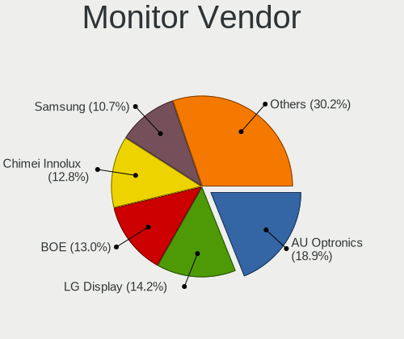

Linux - Tested Hardware & Statistics (Notebooks)
------------------------------------------------

A project to collect tested hardware configurations for Linux.

Anyone can contribute to this report by the [hw-probe](https://github.com/linuxhw/hw-probe) tool:

    sudo -E hw-probe -all -upload

Please contribute! Especially if your hardware is rare.

This report is for real hardware. Report for virtual hardware: [TestCoverage_VE](https://github.com/linuxhw/TestCoverage_VE)

Contents
--------

* [ Test Cases ](#test-cases)

* [ System ](#system)
  - [ OS                       ](#os)
  - [ OS Family                ](#os-family)
  - [ Kernel                   ](#kernel)
  - [ Kernel Family            ](#kernel-family)
  - [ Kernel Major Ver.        ](#kernel-major-ver)
  - [ Arch                     ](#arch)
  - [ DE                       ](#de)
  - [ Display Server           ](#display-server)
  - [ Display Manager          ](#display-manager)
  - [ OS Lang                  ](#os-lang)
  - [ Boot Mode                ](#boot-mode)
  - [ Filesystem               ](#filesystem)
  - [ Part. scheme             ](#part-scheme)
  - [ Dual Boot with Linux/BSD ](#dual-boot-with-linuxbsd)
  - [ Dual Boot (Win)          ](#dual-boot-win)

* [ Board ](#board)
  - [ Vendor                   ](#vendor)
  - [ Model                    ](#model)
  - [ Model Family             ](#model-family)
  - [ MFG Year                 ](#mfg-year)
  - [ Form Factor              ](#form-factor)
  - [ Secure Boot              ](#secure-boot)
  - [ Coreboot                 ](#coreboot)
  - [ RAM Size                 ](#ram-size)
  - [ RAM Used                 ](#ram-used)
  - [ Total Drives             ](#total-drives)
  - [ Has CD-ROM               ](#has-cd-rom)
  - [ Has Ethernet             ](#has-ethernet)
  - [ Has WiFi                 ](#has-wifi)
  - [ Has Bluetooth            ](#has-bluetooth)

* [ Location ](#location)
  - [ Country                  ](#country)
  - [ City                     ](#city)

* [ Drives ](#drives)
  - [ Drive Vendor             ](#drive-vendor)
  - [ Drive Model              ](#drive-model)
  - [ HDD Vendor               ](#hdd-vendor)
  - [ SSD Vendor               ](#ssd-vendor)
  - [ Drive Kind               ](#drive-kind)
  - [ Drive Connector          ](#drive-connector)
  - [ Drive Size               ](#drive-size)
  - [ Space Total              ](#space-total)
  - [ Space Used               ](#space-used)
  - [ Malfunc. Drives          ](#malfunc-drives)
  - [ Malfunc. Drive Vendor    ](#malfunc-drive-vendor)
  - [ Malfunc. HDD Vendor      ](#malfunc-hdd-vendor)
  - [ Malfunc. Drive Kind      ](#malfunc-drive-kind)
  - [ Failed Drives            ](#failed-drives)
  - [ Failed Drive Vendor      ](#failed-drive-vendor)
  - [ Drive Status             ](#drive-status)

* [ Storage controller ](#storage-controller)
  - [ Storage Vendor           ](#storage-vendor)
  - [ Storage Model            ](#storage-model)
  - [ Storage Kind             ](#storage-kind)

* [ Processor ](#processor)
  - [ CPU Vendor               ](#cpu-vendor)
  - [ CPU Model                ](#cpu-model)
  - [ CPU Model Family         ](#cpu-model-family)
  - [ CPU Cores                ](#cpu-cores)
  - [ CPU Sockets              ](#cpu-sockets)
  - [ CPU Threads              ](#cpu-threads)
  - [ CPU Op-Modes             ](#cpu-op-modes)
  - [ CPU Microcode            ](#cpu-microcode)
  - [ CPU Microarch            ](#cpu-microarch)

* [ Graphics ](#graphics)
  - [ GPU Vendor               ](#gpu-vendor)
  - [ GPU Model                ](#gpu-model)
  - [ GPU Combo                ](#gpu-combo)
  - [ GPU Driver               ](#gpu-driver)
  - [ GPU Memory               ](#gpu-memory)

* [ Monitor ](#monitor)
  - [ Monitor Vendor           ](#monitor-vendor)
  - [ Monitor Model            ](#monitor-model)
  - [ Monitor Resolution       ](#monitor-resolution)
  - [ Monitor Diagonal         ](#monitor-diagonal)
  - [ Monitor Width            ](#monitor-width)
  - [ Aspect Ratio             ](#aspect-ratio)
  - [ Monitor Area             ](#monitor-area)
  - [ Pixel Density            ](#pixel-density)
  - [ Multiple Monitors        ](#multiple-monitors)

* [ Network ](#network)
  - [ Net Controller Vendor    ](#net-controller-vendor)
  - [ Net Controller Model     ](#net-controller-model)
  - [ Wireless Vendor          ](#wireless-vendor)
  - [ Wireless Model           ](#wireless-model)
  - [ Ethernet Vendor          ](#ethernet-vendor)
  - [ Ethernet Model           ](#ethernet-model)
  - [ Net Controller Kind      ](#net-controller-kind)
  - [ Used Controller          ](#used-controller)
  - [ NICs                     ](#nics)
  - [ IPv6                     ](#ipv6)

* [ Bluetooth ](#bluetooth)
  - [ Bluetooth Vendor         ](#bluetooth-vendor)
  - [ Bluetooth Model          ](#bluetooth-model)

* [ Sound ](#sound)
  - [ Sound Vendor             ](#sound-vendor)
  - [ Sound Model              ](#sound-model)

* [ Memory ](#memory)
  - [ Memory Vendor            ](#memory-vendor)
  - [ Memory Model             ](#memory-model)
  - [ Memory Kind              ](#memory-kind)
  - [ Memory Form Factor       ](#memory-form-factor)
  - [ Memory Size              ](#memory-size)
  - [ Memory Speed             ](#memory-speed)

* [ Printers & scanners ](#printers--scanners)
  - [ Printer Vendor           ](#printer-vendor)
  - [ Printer Model            ](#printer-model)
  - [ Scanner Vendor           ](#scanner-vendor)
  - [ Scanner Model            ](#scanner-model)

* [ Camera ](#camera)
  - [ Camera Vendor            ](#camera-vendor)
  - [ Camera Model             ](#camera-model)

* [ Security ](#security)
  - [ Fingerprint Vendor       ](#fingerprint-vendor)
  - [ Fingerprint Model        ](#fingerprint-model)
  - [ Chipcard Vendor          ](#chipcard-vendor)
  - [ Chipcard Model           ](#chipcard-model)

* [ Unsupported ](#unsupported)
  - [ Unsupported Devices      ](#unsupported-devices)
  - [ Unsupported Device Types ](#unsupported-device-types)

Test Cases
----------

Total: 121858

| Vendor        | Model                       | Probe                                                      | Date         |
|---------------|-----------------------------|------------------------------------------------------------|--------------|
| ASUSTek       | GL753VE                     | [a96aa73dd6](https://linux-hardware.org/?probe=a96aa73dd6) | Jun 01, 2022 |
| Fujitsu       | LIFEBOOK U758               | [fe1d5a2b6b](https://linux-hardware.org/?probe=fe1d5a2b6b) | Jun 01, 2022 |
| Dell          | Inspiron 5749               | [408e42beb8](https://linux-hardware.org/?probe=408e42beb8) | Jun 01, 2022 |
| Medion        | E7220                       | [d4a700af57](https://linux-hardware.org/?probe=d4a700af57) | Jun 01, 2022 |
| MSI           | Bravo 15 B5DD               | [d561d8dbdb](https://linux-hardware.org/?probe=d561d8dbdb) | Jun 01, 2022 |
| Lenovo        | ThinkPad T410 2537HN3       | [e373330c8b](https://linux-hardware.org/?probe=e373330c8b) | Jun 01, 2022 |
| Acer          | Aspire 5740                 | [db6d025d69](https://linux-hardware.org/?probe=db6d025d69) | Jun 01, 2022 |
| Lenovo        | IdeaPad 5 Pro 14ACN6 82L... | [ae39e96b1a](https://linux-hardware.org/?probe=ae39e96b1a) | Jun 01, 2022 |
| Lenovo        | ThinkPad E14 Gen 3 20YFC... | [ac0d3882ca](https://linux-hardware.org/?probe=ac0d3882ca) | Jun 01, 2022 |
| Acer          | Aspire A514-54G             | [1019de0d68](https://linux-hardware.org/?probe=1019de0d68) | Jun 01, 2022 |
| Acer          | Aspire ES1-522              | [60eba56233](https://linux-hardware.org/?probe=60eba56233) | Jun 01, 2022 |
| VIT           | M2420                       | [c2ea650175](https://linux-hardware.org/?probe=c2ea650175) | Jun 01, 2022 |
| Acer          | AOD270                      | [383c9f83c6](https://linux-hardware.org/?probe=383c9f83c6) | Jun 01, 2022 |
| ASUSTek       | VivoBook_ASUSLaptop X509... | [abaa4456ea](https://linux-hardware.org/?probe=abaa4456ea) | Jun 01, 2022 |
| Lenovo        | IdeaPad Y700-15ISK 80NV     | [d12c2f9f7c](https://linux-hardware.org/?probe=d12c2f9f7c) | Jun 01, 2022 |
| Lenovo        | ThinkPad T510 4313CTU       | [d5c0252c4b](https://linux-hardware.org/?probe=d5c0252c4b) | Jun 01, 2022 |
| Dell          | Inspiron 3451               | [04e9ce0ba0](https://linux-hardware.org/?probe=04e9ce0ba0) | Jun 01, 2022 |
| Lenovo        | ThinkPad T440s 20AQ008FU... | [3b5255ec2c](https://linux-hardware.org/?probe=3b5255ec2c) | Jun 01, 2022 |
| Apple         | MacBook2,1                  | [12cfa4cdb2](https://linux-hardware.org/?probe=12cfa4cdb2) | Jun 01, 2022 |
| Lenovo        | IdeaPad L340-15IRH Gamin... | [0f84f94a6a](https://linux-hardware.org/?probe=0f84f94a6a) | Jun 01, 2022 |
| Dell          | Inspiron 1525               | [246387e9bc](https://linux-hardware.org/?probe=246387e9bc) | Jun 01, 2022 |
| Lenovo        | Yoga Slim 7 Pro 14ACH5 D... | [57f540db26](https://linux-hardware.org/?probe=57f540db26) | Jun 01, 2022 |
| Dell          | Inspiron 1525               | [1b82b95b9a](https://linux-hardware.org/?probe=1b82b95b9a) | Jun 01, 2022 |
| Dell          | Inspiron 13 5310            | [70eccb19d4](https://linux-hardware.org/?probe=70eccb19d4) | Jun 01, 2022 |
| Dell          | Inspiron 5537               | [506d3fb361](https://linux-hardware.org/?probe=506d3fb361) | Jun 01, 2022 |
| HUAWEI        | BOHK-WAX9X                  | [c4468417e9](https://linux-hardware.org/?probe=c4468417e9) | Jun 01, 2022 |
| HP            | EliteBook 2560p             | [af6a91d3c7](https://linux-hardware.org/?probe=af6a91d3c7) | Jun 01, 2022 |
| Lenovo        | ThinkPad S2 3rd Gen 20L1... | [ee8d9751b0](https://linux-hardware.org/?probe=ee8d9751b0) | Jun 01, 2022 |
| ASUSTek       | VivoBook_ASUSLaptop X509... | [164d02e437](https://linux-hardware.org/?probe=164d02e437) | Jun 01, 2022 |
| Lenovo        | IdeaPad Y700-17ISK 80Q0     | [d0dbd3d75e](https://linux-hardware.org/?probe=d0dbd3d75e) | Jun 01, 2022 |
| Dell          | XPS 17 9710                 | [d33b756434](https://linux-hardware.org/?probe=d33b756434) | Jun 01, 2022 |
| Lenovo        | ThinkPad T440s 20ARS29U0... | [50de8ad2e9](https://linux-hardware.org/?probe=50de8ad2e9) | Jun 01, 2022 |
| Acer          | Swift SF314-42              | [f4906f3799](https://linux-hardware.org/?probe=f4906f3799) | Jun 01, 2022 |
| Dell          | Inspiron 5415               | [942b343fff](https://linux-hardware.org/?probe=942b343fff) | Jun 01, 2022 |
| Lenovo        | Yoga 2 11 20332             | [ad92325747](https://linux-hardware.org/?probe=ad92325747) | Jun 01, 2022 |
| Lenovo        | ThinkPad X200s 74663RG      | [460e11ebe2](https://linux-hardware.org/?probe=460e11ebe2) | May 31, 2022 |
| Dell          | Inspiron 5521               | [4fdf9880d4](https://linux-hardware.org/?probe=4fdf9880d4) | May 31, 2022 |
| Acer          | AO756                       | [dd33104b58](https://linux-hardware.org/?probe=dd33104b58) | May 31, 2022 |
| HP            | Pavilion Laptop 14-dv0xx... | [1e6ab0f183](https://linux-hardware.org/?probe=1e6ab0f183) | May 31, 2022 |
| Dell          | G7 7700                     | [25e22bc243](https://linux-hardware.org/?probe=25e22bc243) | May 31, 2022 |
| HP            | Laptop 15s-fq1xxx           | [08fe1f2d0f](https://linux-hardware.org/?probe=08fe1f2d0f) | May 31, 2022 |
| ASUSTek       | G771JW                      | [b6c03572a0](https://linux-hardware.org/?probe=b6c03572a0) | May 31, 2022 |
| ASUSTek       | VivoBook_ASUSLaptop X515... | [ce70b34b9e](https://linux-hardware.org/?probe=ce70b34b9e) | May 31, 2022 |
| HP            | Presario C500 (RT155EA#A... | [5eb3ee9cc2](https://linux-hardware.org/?probe=5eb3ee9cc2) | May 31, 2022 |
| ASUSTek       | VivoBook_ASUSLaptop X515... | [a3e63f04e7](https://linux-hardware.org/?probe=a3e63f04e7) | May 31, 2022 |
| HP            | 255 G5 Notebook PC          | [4ff7c85a84](https://linux-hardware.org/?probe=4ff7c85a84) | May 31, 2022 |
| ASUSTek       | ROG Strix G533QS_G533QS     | [7099867859](https://linux-hardware.org/?probe=7099867859) | May 31, 2022 |
| Maibenben     | XiaoMai5                    | [db343bc7eb](https://linux-hardware.org/?probe=db343bc7eb) | May 31, 2022 |
| Toshiba       | Satellite C70D-A            | [70313d6ed4](https://linux-hardware.org/?probe=70313d6ed4) | May 31, 2022 |
| Chuwi         | GemiBook Pro                | [24fb23a450](https://linux-hardware.org/?probe=24fb23a450) | May 31, 2022 |
| ASUSTek       | VivoBook_ASUSLaptop X510... | [4b11a98b62](https://linux-hardware.org/?probe=4b11a98b62) | May 31, 2022 |
| HP            | ProBook 470 G1              | [ef73457d51](https://linux-hardware.org/?probe=ef73457d51) | May 31, 2022 |
| HP            | ProBook 450 G5              | [7f8acf64cd](https://linux-hardware.org/?probe=7f8acf64cd) | May 31, 2022 |
| Dell          | Inspiron 14 7420 2-in-1     | [131a117ca2](https://linux-hardware.org/?probe=131a117ca2) | May 31, 2022 |
| Sony          | VPCF11JFX                   | [17d6b6b0bb](https://linux-hardware.org/?probe=17d6b6b0bb) | May 31, 2022 |
| Lenovo        | ThinkPad Edge E530 32597... | [4cf2bedfe7](https://linux-hardware.org/?probe=4cf2bedfe7) | May 31, 2022 |
| HP            | 255 G5 Notebook PC          | [c65fb5ddb9](https://linux-hardware.org/?probe=c65fb5ddb9) | May 31, 2022 |
| Dell          | Latitude E6400              | [d70c53a9df](https://linux-hardware.org/?probe=d70c53a9df) | May 31, 2022 |
| Acer          | TravelMate 5760             | [6d4b89571e](https://linux-hardware.org/?probe=6d4b89571e) | May 31, 2022 |
| Dell          | Latitude E6400              | [85d314bfd8](https://linux-hardware.org/?probe=85d314bfd8) | May 31, 2022 |
| Lenovo        | ThinkPad L13 20R4S4WG00     | [14100804b6](https://linux-hardware.org/?probe=14100804b6) | May 31, 2022 |
| Dell          | XPS 13 9310                 | [726e3b4cd7](https://linux-hardware.org/?probe=726e3b4cd7) | May 31, 2022 |
| ASUSTek       | X541NA                      | [3d32754542](https://linux-hardware.org/?probe=3d32754542) | May 31, 2022 |
| HP            | EliteBook 8440p             | [4df2d3c129](https://linux-hardware.org/?probe=4df2d3c129) | May 31, 2022 |
| Dell          | Inspiron 5520               | [199523cb84](https://linux-hardware.org/?probe=199523cb84) | May 31, 2022 |
| Lenovo        | ThinkPad X1 Carbon 2nd 2... | [dc3ee2e520](https://linux-hardware.org/?probe=dc3ee2e520) | May 31, 2022 |
| Samsung       | RF511/RF411/RF711           | [ddafd23ad4](https://linux-hardware.org/?probe=ddafd23ad4) | May 31, 2022 |
| Dell          | G7 7588                     | [3e41b876c2](https://linux-hardware.org/?probe=3e41b876c2) | May 31, 2022 |
| Lenovo        | Z50-75 80EC                 | [11f3206539](https://linux-hardware.org/?probe=11f3206539) | May 31, 2022 |
| Dell          | Inspiron 3180               | [ee18866cf0](https://linux-hardware.org/?probe=ee18866cf0) | May 31, 2022 |
| HP            | EliteBook 8460p             | [a9cca9972f](https://linux-hardware.org/?probe=a9cca9972f) | May 31, 2022 |
| Aquarius      | NS585                       | [44bd30c95d](https://linux-hardware.org/?probe=44bd30c95d) | May 31, 2022 |
| Aquarius      | NS585                       | [2a7545f0f9](https://linux-hardware.org/?probe=2a7545f0f9) | May 31, 2022 |
| Lenovo        | Edge 15 80K9                | [9bbdfc95bb](https://linux-hardware.org/?probe=9bbdfc95bb) | May 31, 2022 |
| Aquarius      | NS585                       | [12e45f7665](https://linux-hardware.org/?probe=12e45f7665) | May 31, 2022 |
| Lenovo        | Erazer Y50-70               | [abb6af451d](https://linux-hardware.org/?probe=abb6af451d) | May 31, 2022 |
| Lenovo        | G450 2949                   | [20a00b739f](https://linux-hardware.org/?probe=20a00b739f) | May 31, 2022 |
| Lenovo        | IdeaPad S145-14IWL 81MU     | [0709fef0e8](https://linux-hardware.org/?probe=0709fef0e8) | May 31, 2022 |
| ASUSTek       | VivoBook_ASUSLaptop M350... | [ec1c8e7378](https://linux-hardware.org/?probe=ec1c8e7378) | May 31, 2022 |
| Aquarius      | NS585                       | [c420e4cafb](https://linux-hardware.org/?probe=c420e4cafb) | May 31, 2022 |
| Dell          | Vostro 5481                 | [5fd6fe3593](https://linux-hardware.org/?probe=5fd6fe3593) | May 31, 2022 |
| Aquarius      | NS585                       | [e562931a35](https://linux-hardware.org/?probe=e562931a35) | May 31, 2022 |
| Aquarius      | NS585                       | [26a3362040](https://linux-hardware.org/?probe=26a3362040) | May 31, 2022 |
| Aquarius      | NS585                       | [51595712dd](https://linux-hardware.org/?probe=51595712dd) | May 31, 2022 |
| HP            | EliteBook 2570p             | [dabb678748](https://linux-hardware.org/?probe=dabb678748) | May 31, 2022 |
| Lenovo        | ThinkPad T410 25223FG       | [aae8744a5c](https://linux-hardware.org/?probe=aae8744a5c) | May 31, 2022 |
| Dell          | Latitude 3420               | [70b898ae27](https://linux-hardware.org/?probe=70b898ae27) | May 31, 2022 |
| Acer          | Aspire 5738                 | [ce5695fd2a](https://linux-hardware.org/?probe=ce5695fd2a) | May 31, 2022 |
| Aquarius      | NS585                       | [0d31fa737e](https://linux-hardware.org/?probe=0d31fa737e) | May 31, 2022 |
| Positivo      | C14CR21TV                   | [caf01d40f1](https://linux-hardware.org/?probe=caf01d40f1) | May 31, 2022 |
| Aquarius      | NS585                       | [6e5a613444](https://linux-hardware.org/?probe=6e5a613444) | May 31, 2022 |
| Aquarius      | NS585                       | [7744e6a785](https://linux-hardware.org/?probe=7744e6a785) | May 31, 2022 |
| Aquarius      | NS585                       | [828c791c7c](https://linux-hardware.org/?probe=828c791c7c) | May 31, 2022 |
| HP            | OMEN Laptop 15-en0xxx       | [956299505f](https://linux-hardware.org/?probe=956299505f) | May 31, 2022 |
| HP            | ProBook 450 G7              | [010b492184](https://linux-hardware.org/?probe=010b492184) | May 31, 2022 |
| Kraftway      | ACCORD                      | [bc4e085e40](https://linux-hardware.org/?probe=bc4e085e40) | May 31, 2022 |
| Lenovo        | IdeaPad 3 15ITL6 82H8       | [606c1d3f8e](https://linux-hardware.org/?probe=606c1d3f8e) | May 31, 2022 |
| Aquarius      | NS585                       | [ff8ca3e68b](https://linux-hardware.org/?probe=ff8ca3e68b) | May 31, 2022 |
| Aquarius      | NS585                       | [dbbe2e1b71](https://linux-hardware.org/?probe=dbbe2e1b71) | May 31, 2022 |
| HP            | ProBook 455 G7              | [d95897f938](https://linux-hardware.org/?probe=d95897f938) | May 31, 2022 |
| Aquarius      | NS585                       | [099918e5b2](https://linux-hardware.org/?probe=099918e5b2) | May 31, 2022 |
| Aquarius      | NS585                       | [bdcf61dc44](https://linux-hardware.org/?probe=bdcf61dc44) | May 31, 2022 |
| Lenovo        | IdeaPad S400 VIUS3          | [474a9da762](https://linux-hardware.org/?probe=474a9da762) | May 31, 2022 |
| HP            | Pavilion Laptop 14-dv0xx... | [9b53c4df9d](https://linux-hardware.org/?probe=9b53c4df9d) | May 31, 2022 |
| ASUSTek       | N501VW                      | [2f8215fb0a](https://linux-hardware.org/?probe=2f8215fb0a) | May 31, 2022 |
| Lenovo        | IdeaPad Gaming 3 15IHU6 ... | [6378f52a92](https://linux-hardware.org/?probe=6378f52a92) | May 31, 2022 |
| HP            | EliteBook 850 G8 Noteboo... | [a08d3e5d4b](https://linux-hardware.org/?probe=a08d3e5d4b) | May 31, 2022 |
| Acer          | Swift SF515-51T             | [d4283c0b8b](https://linux-hardware.org/?probe=d4283c0b8b) | May 31, 2022 |
| Schenker      | XMG FUSION 15 (XFU15L19)    | [3195728920](https://linux-hardware.org/?probe=3195728920) | May 31, 2022 |
| HP            | EliteBook 840 G3            | [92acbd4c3f](https://linux-hardware.org/?probe=92acbd4c3f) | May 31, 2022 |
| Aquarius      | NS585                       | [3693e77fee](https://linux-hardware.org/?probe=3693e77fee) | May 31, 2022 |
| Acer          | Swift SF515-51T             | [1d0b1a1c50](https://linux-hardware.org/?probe=1d0b1a1c50) | May 31, 2022 |
| Lenovo        | IdeaPad S400 VIUS3          | [ec364402d8](https://linux-hardware.org/?probe=ec364402d8) | May 31, 2022 |
| HP            | EliteBook 840 G2            | [2f6bce8773](https://linux-hardware.org/?probe=2f6bce8773) | May 31, 2022 |
| Dell          | Inspiron 15 3511            | [3fbca187e7](https://linux-hardware.org/?probe=3fbca187e7) | May 31, 2022 |
| Aquarius      | NS585                       | [e41a23ba31](https://linux-hardware.org/?probe=e41a23ba31) | May 31, 2022 |
| Acer          | Aspire 5739G                | [6f6f16ee08](https://linux-hardware.org/?probe=6f6f16ee08) | May 31, 2022 |
| Aquarius      | NS585                       | [a8aa698844](https://linux-hardware.org/?probe=a8aa698844) | May 31, 2022 |
| Dell          | Latitude E6400              | [f5ae9fef9c](https://linux-hardware.org/?probe=f5ae9fef9c) | May 31, 2022 |
| Aquarius      | NS585                       | [f0c6dbeb87](https://linux-hardware.org/?probe=f0c6dbeb87) | May 31, 2022 |
| Aquarius      | NS585                       | [ff453a32b6](https://linux-hardware.org/?probe=ff453a32b6) | May 31, 2022 |
| ASUSTek       | N550JV                      | [37af34e2e7](https://linux-hardware.org/?probe=37af34e2e7) | May 31, 2022 |
| HUAWEI        | BOM-WXX9                    | [0d21170323](https://linux-hardware.org/?probe=0d21170323) | May 31, 2022 |
| Aquarius      | NS585                       | [1ed72b7951](https://linux-hardware.org/?probe=1ed72b7951) | May 31, 2022 |
| HP            | ProBook 450 G5              | [2fbbe84744](https://linux-hardware.org/?probe=2fbbe84744) | May 31, 2022 |
| ASUSTek       | ASUS TUF Gaming A17 FA70... | [799a25df83](https://linux-hardware.org/?probe=799a25df83) | May 31, 2022 |
| Acer          | Aspire AV15-51              | [a9183103ee](https://linux-hardware.org/?probe=a9183103ee) | May 31, 2022 |
| Dell          | Latitude 5511               | [ef262c4020](https://linux-hardware.org/?probe=ef262c4020) | May 31, 2022 |
| ASUSTek       | G73Jh                       | [b7db998ac4](https://linux-hardware.org/?probe=b7db998ac4) | May 31, 2022 |
| Acer          | Aspire A315-55G             | [8fb35bd970](https://linux-hardware.org/?probe=8fb35bd970) | May 31, 2022 |
| Notebook      | Multicom Xishan NL50        | [9ffa89c7a9](https://linux-hardware.org/?probe=9ffa89c7a9) | May 31, 2022 |
| HP            | ProBook 455 G8 Notebook ... | [e0d6b45da8](https://linux-hardware.org/?probe=e0d6b45da8) | May 31, 2022 |
| Aquarius      | NS585                       | [222ff0011e](https://linux-hardware.org/?probe=222ff0011e) | May 31, 2022 |
| Lenovo        | ThinkPad T430s 2355C33      | [33de2bbd12](https://linux-hardware.org/?probe=33de2bbd12) | May 31, 2022 |
| Apple         | MacBookPro8,3               | [38f4cc4c5a](https://linux-hardware.org/?probe=38f4cc4c5a) | May 31, 2022 |
| Apple         | MacBookAir4,1               | [a0b4c18cd0](https://linux-hardware.org/?probe=a0b4c18cd0) | May 31, 2022 |
| ASUSTek       | N550JV                      | [2652284f1a](https://linux-hardware.org/?probe=2652284f1a) | May 31, 2022 |
| Dell          | Inspiron 5567               | [2f14b6956f](https://linux-hardware.org/?probe=2f14b6956f) | May 31, 2022 |
| HP            | Pavilion Gaming Laptop 1... | [a1dfbe3337](https://linux-hardware.org/?probe=a1dfbe3337) | May 31, 2022 |
| Acer          | One Z1402                   | [4278b806cf](https://linux-hardware.org/?probe=4278b806cf) | May 31, 2022 |
| Acer          | Aspire T5000                | [55aaebdab5](https://linux-hardware.org/?probe=55aaebdab5) | May 31, 2022 |
| HP            | EliteBook 8460p             | [f05323c723](https://linux-hardware.org/?probe=f05323c723) | May 31, 2022 |
| HP            | ProBook 455 15.6 inch G9... | [d4698d909e](https://linux-hardware.org/?probe=d4698d909e) | May 31, 2022 |
| Lenovo        | V14-IIL 82C4                | [871738fea2](https://linux-hardware.org/?probe=871738fea2) | May 31, 2022 |
| HP            | EliteBook 2560p             | [4ad762abcb](https://linux-hardware.org/?probe=4ad762abcb) | May 31, 2022 |
| Dell          | Inspiron 5770               | [02b32c935c](https://linux-hardware.org/?probe=02b32c935c) | May 31, 2022 |
| Toshiba       | Satellite M305D             | [6d558c3665](https://linux-hardware.org/?probe=6d558c3665) | May 31, 2022 |
| Acer          | Aspire T5000                | [7bdeb5fb3b](https://linux-hardware.org/?probe=7bdeb5fb3b) | May 31, 2022 |
| Toshiba       | Satellite M305D             | [43315304ac](https://linux-hardware.org/?probe=43315304ac) | May 31, 2022 |
| ASUSTek       | ROG Strix G533QS_G533QS     | [aeb3a20df7](https://linux-hardware.org/?probe=aeb3a20df7) | May 31, 2022 |
| Dell          | XPS 15 9520                 | [4d4c32223e](https://linux-hardware.org/?probe=4d4c32223e) | May 31, 2022 |
| Alienware     | 15 R2                       | [776abe61ea](https://linux-hardware.org/?probe=776abe61ea) | May 31, 2022 |
| ASUSTek       | ROG Strix G513QY_G513QY     | [49c400d1f7](https://linux-hardware.org/?probe=49c400d1f7) | May 31, 2022 |
| Lenovo        | ThinkBook 16p Gen 2 20YM    | [3d58c27cd7](https://linux-hardware.org/?probe=3d58c27cd7) | May 31, 2022 |
| Acer          | Aspire E5-575G              | [7c44163245](https://linux-hardware.org/?probe=7c44163245) | May 31, 2022 |
| Dell          | Inspiron 5547               | [066f6369b2](https://linux-hardware.org/?probe=066f6369b2) | May 31, 2022 |
| HP            | 255 G1                      | [86f7198193](https://linux-hardware.org/?probe=86f7198193) | May 31, 2022 |
| Lenovo        | ThinkPad W510 431963G       | [e46a1497d8](https://linux-hardware.org/?probe=e46a1497d8) | May 31, 2022 |
| Toshiba       | Satellite C850D-115         | [fca373e327](https://linux-hardware.org/?probe=fca373e327) | May 31, 2022 |
| Acer          | Aspire A315-34              | [8b9190338e](https://linux-hardware.org/?probe=8b9190338e) | May 31, 2022 |
| ASUSTek       | X450LD                      | [b77a4297da](https://linux-hardware.org/?probe=b77a4297da) | May 31, 2022 |
| Acer          | Aspire V5-571G              | [b1c8a97e57](https://linux-hardware.org/?probe=b1c8a97e57) | May 31, 2022 |
| ASUSTek       | ASUS TUF Gaming A15 FA50... | [deaac8464e](https://linux-hardware.org/?probe=deaac8464e) | May 31, 2022 |
| Lenovo        | IdeaPad S300 20197          | [fcb07ac9aa](https://linux-hardware.org/?probe=fcb07ac9aa) | May 31, 2022 |
| HYPA          | FLUX                        | [8a69e3a34e](https://linux-hardware.org/?probe=8a69e3a34e) | May 31, 2022 |
| Philco        | 10D                         | [b4fc893791](https://linux-hardware.org/?probe=b4fc893791) | May 31, 2022 |
| Acer          | TravelMate P256-MG          | [22b617425d](https://linux-hardware.org/?probe=22b617425d) | May 31, 2022 |
| Acer          | TravelMate P256-MG          | [ab330f08f1](https://linux-hardware.org/?probe=ab330f08f1) | May 31, 2022 |
| Dell          | Inspiron 3541               | [20b5815ca3](https://linux-hardware.org/?probe=20b5815ca3) | May 31, 2022 |
| HP            | EliteBook 8470p             | [6b22d31e8e](https://linux-hardware.org/?probe=6b22d31e8e) | May 31, 2022 |
| Alienware     | M11x R2                     | [4a364390a6](https://linux-hardware.org/?probe=4a364390a6) | May 31, 2022 |
| Lenovo        | ThinkPad T14s Gen 1 20UJ... | [ed28d49715](https://linux-hardware.org/?probe=ed28d49715) | May 30, 2022 |
| Alienware     | M11x R2                     | [87e8835eba](https://linux-hardware.org/?probe=87e8835eba) | May 30, 2022 |
| Lenovo        | ThinkPad X13 Gen 1 20UGS... | [7899887373](https://linux-hardware.org/?probe=7899887373) | May 30, 2022 |
| SANTECH       | NHx0DB,DE                   | [f3444e62bb](https://linux-hardware.org/?probe=f3444e62bb) | May 30, 2022 |
| Lenovo        | ThinkPad E595 20NF001PTX    | [cf41cc78f7](https://linux-hardware.org/?probe=cf41cc78f7) | May 30, 2022 |
| SANTECH       | NHx0DB,DE                   | [4fbdcfe44b](https://linux-hardware.org/?probe=4fbdcfe44b) | May 30, 2022 |
| Lenovo        | ThinkPad X1 Carbon 2nd 2... | [5a813419eb](https://linux-hardware.org/?probe=5a813419eb) | May 30, 2022 |
| Lenovo        | ThinkPad T460p 20FW0005A... | [df0f623625](https://linux-hardware.org/?probe=df0f623625) | May 30, 2022 |
| Fujitsu       | LIFEBOOK E5511              | [32317d8883](https://linux-hardware.org/?probe=32317d8883) | May 30, 2022 |
| Dell          | Vostro 3590                 | [e7f7489e9e](https://linux-hardware.org/?probe=e7f7489e9e) | May 30, 2022 |
| HP            | Spectre 13 x2 PC            | [9b67243691](https://linux-hardware.org/?probe=9b67243691) | May 30, 2022 |
| Lenovo        | Edge 15 80K9                | [586a31368f](https://linux-hardware.org/?probe=586a31368f) | May 30, 2022 |
| HP            | Stream Laptop 11-ak1xxx     | [2d2044b499](https://linux-hardware.org/?probe=2d2044b499) | May 30, 2022 |
| Dell          | Latitude 7400               | [685a5a8006](https://linux-hardware.org/?probe=685a5a8006) | May 30, 2022 |
| HP            | Pavilion Laptop 15-cw1xx... | [be0f84abb3](https://linux-hardware.org/?probe=be0f84abb3) | May 30, 2022 |
| Toshiba       | Satellite C50D-B            | [ce4eb9abc2](https://linux-hardware.org/?probe=ce4eb9abc2) | May 30, 2022 |
| Google        | Coral                       | [c517ad03c1](https://linux-hardware.org/?probe=c517ad03c1) | May 30, 2022 |
| Lenovo        | ThinkPad T530 2394C98       | [b5aebb2490](https://linux-hardware.org/?probe=b5aebb2490) | May 30, 2022 |
| ASUSTek       | ROG Strix G713IH_G713IH     | [883f055fb1](https://linux-hardware.org/?probe=883f055fb1) | May 30, 2022 |
| ASUSTek       | ROG Strix G713IH_G713IH     | [e475b560cf](https://linux-hardware.org/?probe=e475b560cf) | May 30, 2022 |
| ASUSTek       | ROG Strix G513QY_G513QY     | [50927f5cae](https://linux-hardware.org/?probe=50927f5cae) | May 30, 2022 |
| ASUSTek       | K53U                        | [efd067c3a8](https://linux-hardware.org/?probe=efd067c3a8) | May 30, 2022 |
| Dell          | Latitude 5511               | [33b796acff](https://linux-hardware.org/?probe=33b796acff) | May 30, 2022 |
| Notebook      | V15x_V17xPNKPNJPNH          | [9ded10943d](https://linux-hardware.org/?probe=9ded10943d) | May 30, 2022 |
| ASUSTek       | VivoBook_ASUSLaptop X580... | [aa1cb34c55](https://linux-hardware.org/?probe=aa1cb34c55) | May 30, 2022 |
| ASUSTek       | K53U                        | [a26756238b](https://linux-hardware.org/?probe=a26756238b) | May 30, 2022 |
| Lenovo        | ThinkBook 15p 20V3          | [e63df7d890](https://linux-hardware.org/?probe=e63df7d890) | May 30, 2022 |
| Google        | Droid                       | [35e3edeab3](https://linux-hardware.org/?probe=35e3edeab3) | May 30, 2022 |
| HP            | ZBook Firefly 14 inch G8... | [55e99cb697](https://linux-hardware.org/?probe=55e99cb697) | May 30, 2022 |
| Dell          | Inspiron MM061              | [904ddbbbb1](https://linux-hardware.org/?probe=904ddbbbb1) | May 30, 2022 |
| Dell          | Precision 7710              | [f24e29d104](https://linux-hardware.org/?probe=f24e29d104) | May 30, 2022 |
| Dell          | Latitude E6510              | [4fe104ba1c](https://linux-hardware.org/?probe=4fe104ba1c) | May 30, 2022 |
| Framework     | Laptop                      | [f1c2a80b70](https://linux-hardware.org/?probe=f1c2a80b70) | May 30, 2022 |
| Dell          | Latitude 7320               | [63c6f252ab](https://linux-hardware.org/?probe=63c6f252ab) | May 30, 2022 |
| Dell          | Precision 7710              | [1bae5a0bf0](https://linux-hardware.org/?probe=1bae5a0bf0) | May 30, 2022 |
| ASUSTek       | X555UQ                      | [c266f3d070](https://linux-hardware.org/?probe=c266f3d070) | May 30, 2022 |
| Lenovo        | Legion Y540-15IRH 81SX      | [ed0b412ea1](https://linux-hardware.org/?probe=ed0b412ea1) | May 30, 2022 |
| Packard Be... | EasyNote TE11HC             | [8350bd6d87](https://linux-hardware.org/?probe=8350bd6d87) | May 30, 2022 |
| Lenovo        | ThinkPad X240 20AM0040BR    | [e0ff07b590](https://linux-hardware.org/?probe=e0ff07b590) | May 30, 2022 |
| IT Channel... | PA70Hx                      | [091ad22c2d](https://linux-hardware.org/?probe=091ad22c2d) | May 30, 2022 |
| Lenovo        | ThinkPad E14 Gen 3 20YFC... | [784e1ca4cc](https://linux-hardware.org/?probe=784e1ca4cc) | May 30, 2022 |
| Lenovo        | ThinkPad T15 Gen 2i 20W5... | [8ee33363ef](https://linux-hardware.org/?probe=8ee33363ef) | May 30, 2022 |
| HP            | ENVY Laptop 15-ep1xxx       | [e6145c7453](https://linux-hardware.org/?probe=e6145c7453) | May 30, 2022 |
| ASUSTek       | VivoBook_ASUSLaptop M350... | [217b497fa9](https://linux-hardware.org/?probe=217b497fa9) | May 30, 2022 |
| Acer          | Aspire A315-51              | [6a48092da4](https://linux-hardware.org/?probe=6a48092da4) | May 30, 2022 |
| Dell          | Inspiron 15-3567            | [3299abfc78](https://linux-hardware.org/?probe=3299abfc78) | May 30, 2022 |
| Lenovo        | ThinkPad T14 Gen 1 20S1S... | [1be8c71a37](https://linux-hardware.org/?probe=1be8c71a37) | May 30, 2022 |
| HP            | Pavilion Laptop 14-ec0xx... | [f47dbc0616](https://linux-hardware.org/?probe=f47dbc0616) | May 30, 2022 |
| Lenovo        | ThinkPad X1 Carbon 6th 2... | [e72ac27af1](https://linux-hardware.org/?probe=e72ac27af1) | May 30, 2022 |
| Samsung       | 300E4A/300E5A/300E7A/343... | [cc7ddb2cbc](https://linux-hardware.org/?probe=cc7ddb2cbc) | May 30, 2022 |
| Dell          | Latitude 5400               | [0440362644](https://linux-hardware.org/?probe=0440362644) | May 30, 2022 |
| Lenovo        | IdeaPad 330-15IKB 81DE      | [7b22d97da7](https://linux-hardware.org/?probe=7b22d97da7) | May 30, 2022 |
| ASUSTek       | ZenBook UX325SA_UM325SA     | [378e6ca9c6](https://linux-hardware.org/?probe=378e6ca9c6) | May 30, 2022 |
| Dell          | Latitude 5511               | [bc6fd9e79d](https://linux-hardware.org/?probe=bc6fd9e79d) | May 30, 2022 |
| Razer         | Blade                       | [d7271bb7c4](https://linux-hardware.org/?probe=d7271bb7c4) | May 30, 2022 |
| Lenovo        | ThinkPad T430 2349BS7       | [2369e183ec](https://linux-hardware.org/?probe=2369e183ec) | May 30, 2022 |
| Toshiba       | Satellite U400              | [cbcfeeeb48](https://linux-hardware.org/?probe=cbcfeeeb48) | May 30, 2022 |
| Dell          | Latitude 5520               | [03622600a8](https://linux-hardware.org/?probe=03622600a8) | May 30, 2022 |
| HP            | ProBook 455 G8 Notebook ... | [ce6b717155](https://linux-hardware.org/?probe=ce6b717155) | May 30, 2022 |
| HP            | Laptop 14-dq2xxx            | [14f581788f](https://linux-hardware.org/?probe=14f581788f) | May 30, 2022 |
| Lenovo        | ThinkPad T430s 2355C33      | [4eab57bebf](https://linux-hardware.org/?probe=4eab57bebf) | May 30, 2022 |
| Toshiba       | Satellite C70D-A            | [820a9fb182](https://linux-hardware.org/?probe=820a9fb182) | May 30, 2022 |
| Dell          | Latitude 5289               | [f9e3e0fa57](https://linux-hardware.org/?probe=f9e3e0fa57) | May 30, 2022 |
| Dell          | Latitude 3190               | [e43c62a67a](https://linux-hardware.org/?probe=e43c62a67a) | May 30, 2022 |
| Acer          | Aspire E5-573               | [467494fb1a](https://linux-hardware.org/?probe=467494fb1a) | May 30, 2022 |
| Acer          | Aspire 4720Z                | [a1dd5003f5](https://linux-hardware.org/?probe=a1dd5003f5) | May 30, 2022 |
| Dell          | XPS 15 9520                 | [eee1a317b6](https://linux-hardware.org/?probe=eee1a317b6) | May 30, 2022 |
| HP            | Laptop 15-ra0xx             | [dab3ef3dee](https://linux-hardware.org/?probe=dab3ef3dee) | May 30, 2022 |
| Notebook      | Multicom Xishan NL50        | [0c45263f11](https://linux-hardware.org/?probe=0c45263f11) | May 30, 2022 |
| MSI           | GE60 2PE                    | [1e15d749ee](https://linux-hardware.org/?probe=1e15d749ee) | May 30, 2022 |
| ASUSTek       | X541NA                      | [c1fd0c2d4f](https://linux-hardware.org/?probe=c1fd0c2d4f) | May 30, 2022 |
| AXIOO         | NEON HNM MODEL              | [0fbd1cf4af](https://linux-hardware.org/?probe=0fbd1cf4af) | May 30, 2022 |
| MSI           | GE60 2PE                    | [b52762040d](https://linux-hardware.org/?probe=b52762040d) | May 30, 2022 |
| HP            | EliteBook 8470p             | [d5d9d52b83](https://linux-hardware.org/?probe=d5d9d52b83) | May 30, 2022 |
| ASUSTek       | X540LA                      | [57e0b15d17](https://linux-hardware.org/?probe=57e0b15d17) | May 30, 2022 |
| GPU Compan... | GWTC116-2                   | [dbf473f0a0](https://linux-hardware.org/?probe=dbf473f0a0) | May 30, 2022 |
| Dell          | Latitude E6540              | [ece4d207f3](https://linux-hardware.org/?probe=ece4d207f3) | May 30, 2022 |
| Lenovo        | ThinkPad X1 Carbon 7th 2... | [6e43e1d4f1](https://linux-hardware.org/?probe=6e43e1d4f1) | May 30, 2022 |
| GPU Compan... | GWTC116-2                   | [574439c3c6](https://linux-hardware.org/?probe=574439c3c6) | May 30, 2022 |
| Lenovo        | ThinkPad Edge E430 32543... | [dc9d61a80b](https://linux-hardware.org/?probe=dc9d61a80b) | May 30, 2022 |
| Lenovo        | IdeaPad Z480                | [b1cf8ca505](https://linux-hardware.org/?probe=b1cf8ca505) | May 30, 2022 |
| HP            | Laptop 15-da0xxx            | [1780281b4c](https://linux-hardware.org/?probe=1780281b4c) | May 30, 2022 |
| Acer          | Nitro AN515-44              | [c3c66e49ab](https://linux-hardware.org/?probe=c3c66e49ab) | May 30, 2022 |
| Lenovo        | Legion 5 15ACH6H 82JU       | [0e59a69b8d](https://linux-hardware.org/?probe=0e59a69b8d) | May 30, 2022 |
| HP            | EliteBook 840 G8 Noteboo... | [15fb1b0353](https://linux-hardware.org/?probe=15fb1b0353) | May 30, 2022 |
| Lenovo        | IdeaPad Gaming 3 15ACH6 ... | [63fd75f1a8](https://linux-hardware.org/?probe=63fd75f1a8) | May 29, 2022 |
| Lenovo        | ThinkPad X1 Carbon Gen 8... | [c71a8e9817](https://linux-hardware.org/?probe=c71a8e9817) | May 29, 2022 |
| Toshiba       | Satellite L10W-B-101        | [4fadee73e4](https://linux-hardware.org/?probe=4fadee73e4) | May 29, 2022 |
| HP            | G62                         | [34f47b753d](https://linux-hardware.org/?probe=34f47b753d) | May 29, 2022 |
| Toshiba       | Satellite L50D-B            | [860be26e14](https://linux-hardware.org/?probe=860be26e14) | May 29, 2022 |
| Acer          | Aspire A315-51              | [083e3a354a](https://linux-hardware.org/?probe=083e3a354a) | May 29, 2022 |
| Timi          | TM1604                      | [cd9b839800](https://linux-hardware.org/?probe=cd9b839800) | May 29, 2022 |
| Acer          | Aspire A515-51              | [4c1c5915bc](https://linux-hardware.org/?probe=4c1c5915bc) | May 29, 2022 |
| Lenovo        | IdeaPad 330-17IKB 81DK      | [84f8bf29fd](https://linux-hardware.org/?probe=84f8bf29fd) | May 29, 2022 |
| Acer          | Aspire A515-51              | [443f0579bb](https://linux-hardware.org/?probe=443f0579bb) | May 29, 2022 |
| Dell          | Inspiron 7472               | [7d8d96d851](https://linux-hardware.org/?probe=7d8d96d851) | May 29, 2022 |
| Dell          | Vostro 5468                 | [551400dba1](https://linux-hardware.org/?probe=551400dba1) | May 29, 2022 |
| HP            | Pavilion g4                 | [39cdebfff4](https://linux-hardware.org/?probe=39cdebfff4) | May 29, 2022 |
| HONOR         | BOHK-WAX9X                  | [7941caaa08](https://linux-hardware.org/?probe=7941caaa08) | May 29, 2022 |
| Acer          | Aspire A515-45              | [72b7fc79d4](https://linux-hardware.org/?probe=72b7fc79d4) | May 29, 2022 |
| Acer          | Swift SF314-54              | [cacc1a50c2](https://linux-hardware.org/?probe=cacc1a50c2) | May 29, 2022 |
| Dell          | Studio XPS 1645             | [5fdf8e3100](https://linux-hardware.org/?probe=5fdf8e3100) | May 29, 2022 |
| Medion        | E15407                      | [6e457b6abb](https://linux-hardware.org/?probe=6e457b6abb) | May 29, 2022 |
| HP            | 240 G2                      | [6fc3a4bb99](https://linux-hardware.org/?probe=6fc3a4bb99) | May 29, 2022 |
| Medion        | E15407                      | [a0d6c795e7](https://linux-hardware.org/?probe=a0d6c795e7) | May 29, 2022 |
| Chuwi         | GemiBook                    | [432c1135b8](https://linux-hardware.org/?probe=432c1135b8) | May 29, 2022 |
| Dell          | Inspiron 3420               | [2e79e10052](https://linux-hardware.org/?probe=2e79e10052) | May 29, 2022 |
| Lenovo        | ThinkPad T480s 20L8S34C0... | [c272fc283f](https://linux-hardware.org/?probe=c272fc283f) | May 29, 2022 |
| HP            | Compaq 6510b (KE135EA#AK... | [28c05654fc](https://linux-hardware.org/?probe=28c05654fc) | May 29, 2022 |
| ASUSTek       | UX51VZA                     | [c7c6e27cae](https://linux-hardware.org/?probe=c7c6e27cae) | May 29, 2022 |
| Dell          | Latitude E7470              | [159516aefb](https://linux-hardware.org/?probe=159516aefb) | May 29, 2022 |
| HP            | 250 G6 Notebook PC          | [5d2f3565ff](https://linux-hardware.org/?probe=5d2f3565ff) | May 29, 2022 |
| HP            | Laptop 15-da2xxx            | [b261adaa93](https://linux-hardware.org/?probe=b261adaa93) | May 29, 2022 |
| Lenovo        | G580 20150                  | [60128f5782](https://linux-hardware.org/?probe=60128f5782) | May 29, 2022 |
| Chuwi         | LarkBook                    | [46e805f477](https://linux-hardware.org/?probe=46e805f477) | May 29, 2022 |
| HUAWEI        | HLYL-WXX9                   | [b1670ac481](https://linux-hardware.org/?probe=b1670ac481) | May 29, 2022 |
| Dell          | Latitude E6420              | [e109444519](https://linux-hardware.org/?probe=e109444519) | May 29, 2022 |
| HUAWEI        | HLYL-WXX9                   | [4fec6454b4](https://linux-hardware.org/?probe=4fec6454b4) | May 29, 2022 |
| Acer          | Aspire E5-573G              | [bd9b967f9b](https://linux-hardware.org/?probe=bd9b967f9b) | May 29, 2022 |
| MSI           | GP76 Leopard 10UE           | [9e74d767a6](https://linux-hardware.org/?probe=9e74d767a6) | May 29, 2022 |
| Dell          | Inspiron 3451               | [8ad9f9f5d9](https://linux-hardware.org/?probe=8ad9f9f5d9) | May 29, 2022 |
| Lenovo        | Legion Y7000P2020H 82AX     | [220325c031](https://linux-hardware.org/?probe=220325c031) | May 29, 2022 |
| Dell          | Vostro V130                 | [abefbba5b8](https://linux-hardware.org/?probe=abefbba5b8) | May 29, 2022 |
| Lenovo        | ThinkPad T14 Gen 2i 20W0... | [5e77f9d2f9](https://linux-hardware.org/?probe=5e77f9d2f9) | May 29, 2022 |
| Medion        | S6445 MD61489               | [a933286b06](https://linux-hardware.org/?probe=a933286b06) | May 29, 2022 |
| Lenovo        | IdeaPad S145-15IWL 81S9     | [c908e08818](https://linux-hardware.org/?probe=c908e08818) | May 29, 2022 |
| Lenovo        | IdeaPad S145-15IWL 81S9     | [b8a514c650](https://linux-hardware.org/?probe=b8a514c650) | May 29, 2022 |
| Lenovo        | IdeaPad Gaming 3 15ARH05... | [959728c7eb](https://linux-hardware.org/?probe=959728c7eb) | May 29, 2022 |
| Lenovo        | ThinkPad T14 Gen 1 20S1S... | [2669150033](https://linux-hardware.org/?probe=2669150033) | May 29, 2022 |
| Dell          | Latitude E6230              | [068d9b4143](https://linux-hardware.org/?probe=068d9b4143) | May 29, 2022 |
| Lenovo        | Legion 5 Pro 16ACH6H 82J... | [b9eae1074f](https://linux-hardware.org/?probe=b9eae1074f) | May 29, 2022 |
| System76      | Lemur Pro                   | [4a6174b7a4](https://linux-hardware.org/?probe=4a6174b7a4) | May 29, 2022 |
| Dell          | Latitude E6230              | [c50bb14e9a](https://linux-hardware.org/?probe=c50bb14e9a) | May 29, 2022 |
| Apple         | MacBookPro9,1               | [6fe2c4a416](https://linux-hardware.org/?probe=6fe2c4a416) | May 29, 2022 |
| Dell          | XPS 15 9520                 | [75d345243e](https://linux-hardware.org/?probe=75d345243e) | May 29, 2022 |
| ASUSTek       | ASUS TUF Gaming F15 FX50... | [27dffb7089](https://linux-hardware.org/?probe=27dffb7089) | May 29, 2022 |
| Toshiba       | Satellite C850-1KN          | [60b2c12831](https://linux-hardware.org/?probe=60b2c12831) | May 29, 2022 |
| Lenovo        | IdeaPad Z500 20202          | [8e577a4a1a](https://linux-hardware.org/?probe=8e577a4a1a) | May 29, 2022 |
| Valve         | Jupiter                     | [f3910c9796](https://linux-hardware.org/?probe=f3910c9796) | May 29, 2022 |
| Notebook      | W65_67SJ                    | [2f6d77befb](https://linux-hardware.org/?probe=2f6d77befb) | May 29, 2022 |
| HP            | Pavilion g6                 | [a82494e1f3](https://linux-hardware.org/?probe=a82494e1f3) | May 29, 2022 |
| AZW           | GT-R                        | [7823df6a86](https://linux-hardware.org/?probe=7823df6a86) | May 29, 2022 |
| HP            | Pavilion g6                 | [49471ad092](https://linux-hardware.org/?probe=49471ad092) | May 29, 2022 |
| HP            | EW7-I7D22875GR1             | [e34608096b](https://linux-hardware.org/?probe=e34608096b) | May 29, 2022 |
| Samsung       | RV410/RV510/S3510/E3510     | [d7800ffe07](https://linux-hardware.org/?probe=d7800ffe07) | May 29, 2022 |
| Lenovo        | ThinkPad T440s 20AQ007SM... | [6e41ef26bf](https://linux-hardware.org/?probe=6e41ef26bf) | May 29, 2022 |
| ASUSTek       | UX31E                       | [201add5732](https://linux-hardware.org/?probe=201add5732) | May 29, 2022 |
| Acer          | Swift SF314-54              | [eb522816a1](https://linux-hardware.org/?probe=eb522816a1) | May 29, 2022 |
| Notebook      | P65_P67SG                   | [a2aecd5cd3](https://linux-hardware.org/?probe=a2aecd5cd3) | May 29, 2022 |
| HP            | Laptop 15-dy2xxx            | [1c71dac18b](https://linux-hardware.org/?probe=1c71dac18b) | May 29, 2022 |
| HP            | EW7-I7D22875GR1             | [d21454c335](https://linux-hardware.org/?probe=d21454c335) | May 29, 2022 |
| ASUSTek       | VivoBook_ASUSLaptop X509... | [33de40a2e1](https://linux-hardware.org/?probe=33de40a2e1) | May 29, 2022 |
| System76      | Oryx Pro                    | [5f84134f5d](https://linux-hardware.org/?probe=5f84134f5d) | May 29, 2022 |
| HP            | Laptop 14-dq0xxx            | [fac9e55ae9](https://linux-hardware.org/?probe=fac9e55ae9) | May 29, 2022 |
| ASUSTek       | UX360CA                     | [63fac2dc9b](https://linux-hardware.org/?probe=63fac2dc9b) | May 29, 2022 |
| Lenovo        | G50-30 80G0                 | [0bf1fadaa2](https://linux-hardware.org/?probe=0bf1fadaa2) | May 29, 2022 |
| MSI           | Delta 15 A5EFK              | [1679888c2c](https://linux-hardware.org/?probe=1679888c2c) | May 29, 2022 |
| Lenovo        | G50-30 80G0                 | [8895ea240a](https://linux-hardware.org/?probe=8895ea240a) | May 29, 2022 |
| Acer          | Aspire E5-571               | [8767a79d4a](https://linux-hardware.org/?probe=8767a79d4a) | May 29, 2022 |
| Positivo B... | VJFE51F11X-B0111H           | [68a3e8d432](https://linux-hardware.org/?probe=68a3e8d432) | May 29, 2022 |
| ASUSTek       | N53SM                       | [83209051cb](https://linux-hardware.org/?probe=83209051cb) | May 29, 2022 |
| ASUSTek       | K55A                        | [0eb5e9ea50](https://linux-hardware.org/?probe=0eb5e9ea50) | May 29, 2022 |
| Acer          | Nitro AN515-44              | [fd8554b3de](https://linux-hardware.org/?probe=fd8554b3de) | May 29, 2022 |
| MSI           | GE60 2PE                    | [84d5af4ebe](https://linux-hardware.org/?probe=84d5af4ebe) | May 29, 2022 |
| ASUSTek       | GL502VSK                    | [44fb5da9d6](https://linux-hardware.org/?probe=44fb5da9d6) | May 29, 2022 |
| MSI           | GE60 2PE                    | [c8d325a744](https://linux-hardware.org/?probe=c8d325a744) | May 29, 2022 |
| Valve         | Jupiter                     | [e415de106f](https://linux-hardware.org/?probe=e415de106f) | May 29, 2022 |
| MSI           | GF63 Thin 10SCXR            | [0d556408f3](https://linux-hardware.org/?probe=0d556408f3) | May 29, 2022 |
| Acer          | Acadia V1.45                | [3734fbcb7d](https://linux-hardware.org/?probe=3734fbcb7d) | May 29, 2022 |
| Lenovo        | Legion S7 15ACH6 82K8       | [10ade1b182](https://linux-hardware.org/?probe=10ade1b182) | May 29, 2022 |
| TUXEDO        | N14xWU                      | [c20d682e14](https://linux-hardware.org/?probe=c20d682e14) | May 29, 2022 |
| Acer          | Nitro AN515-44              | [2383d77ab9](https://linux-hardware.org/?probe=2383d77ab9) | May 29, 2022 |
| Acer          | Aspire 4349                 | [3d1051c72e](https://linux-hardware.org/?probe=3d1051c72e) | May 29, 2022 |
| Dell          | XPS 15 7590                 | [482ed9f535](https://linux-hardware.org/?probe=482ed9f535) | May 29, 2022 |
| Valve         | Jupiter                     | [0af4b9c805](https://linux-hardware.org/?probe=0af4b9c805) | May 29, 2022 |
| HP            | Pavilion Laptop 15t-eg10... | [e24b789c03](https://linux-hardware.org/?probe=e24b789c03) | May 29, 2022 |
| eMachines     | eM350                       | [2573854a09](https://linux-hardware.org/?probe=2573854a09) | May 29, 2022 |
| Lenovo        | ThinkPad W500 4061W8H       | [db9160e089](https://linux-hardware.org/?probe=db9160e089) | May 29, 2022 |
| SLIMBOOK      | TITAN                       | [1029a819d7](https://linux-hardware.org/?probe=1029a819d7) | May 29, 2022 |
| SLIMBOOK      | TITAN                       | [c4e27f4d19](https://linux-hardware.org/?probe=c4e27f4d19) | May 29, 2022 |
| Lenovo        | IdeaPad 320-15AST 80XV      | [55dfdf01c6](https://linux-hardware.org/?probe=55dfdf01c6) | May 29, 2022 |
| ASUSTek       | VivoBook_ASUSLaptop X509... | [de7ed0046e](https://linux-hardware.org/?probe=de7ed0046e) | May 29, 2022 |
| ASUSTek       | X555LAB                     | [24d84de091](https://linux-hardware.org/?probe=24d84de091) | May 29, 2022 |
| TUXEDO        | Unknown                     | [6bda60151b](https://linux-hardware.org/?probe=6bda60151b) | May 29, 2022 |
| ASUSTek       | ASUS EXPERTBOOK P5440FA_... | [a0e5cf5b03](https://linux-hardware.org/?probe=a0e5cf5b03) | May 29, 2022 |
| Dell          | Latitude E6410              | [72345f9352](https://linux-hardware.org/?probe=72345f9352) | May 28, 2022 |
| HP            | EliteBook 8460p             | [5388187aa2](https://linux-hardware.org/?probe=5388187aa2) | May 28, 2022 |
| Toshiba       | Satellite C675              | [72daf96a34](https://linux-hardware.org/?probe=72daf96a34) | May 28, 2022 |
| Dell          | Latitude 3410               | [b1115f6bbc](https://linux-hardware.org/?probe=b1115f6bbc) | May 28, 2022 |
| Lenovo        | IdeaPad S145-15IWL 81S9     | [09aa4c998d](https://linux-hardware.org/?probe=09aa4c998d) | May 28, 2022 |
| HP            | OMEN by Laptop 15z-en100    | [35e3478a5d](https://linux-hardware.org/?probe=35e3478a5d) | May 28, 2022 |
| HP            | ProBook 4540s               | [bb0ac4bfa9](https://linux-hardware.org/?probe=bb0ac4bfa9) | May 28, 2022 |
| Notebook      | W65_67SF                    | [c8ba646143](https://linux-hardware.org/?probe=c8ba646143) | May 28, 2022 |
| Medion        | X6816                       | [6d7996894c](https://linux-hardware.org/?probe=6d7996894c) | May 28, 2022 |
| HP            | Pavilion 17                 | [077be5d10b](https://linux-hardware.org/?probe=077be5d10b) | May 28, 2022 |
| Acer          | Swift SF314-43              | [44b220163b](https://linux-hardware.org/?probe=44b220163b) | May 28, 2022 |
| Dell          | Vostro 5468                 | [2784f8c927](https://linux-hardware.org/?probe=2784f8c927) | May 28, 2022 |
| Lenovo        | ThinkPad L15 Gen 2 20X30... | [03a4099a33](https://linux-hardware.org/?probe=03a4099a33) | May 28, 2022 |
| HUAWEI        | NBLB-WAX9N                  | [7ae101b473](https://linux-hardware.org/?probe=7ae101b473) | May 28, 2022 |
| Samsung       | 535U3C                      | [e9f7102573](https://linux-hardware.org/?probe=e9f7102573) | May 28, 2022 |
| HUAWEI        | NBLB-WAX9N                  | [469ed3f68b](https://linux-hardware.org/?probe=469ed3f68b) | May 28, 2022 |
| Lenovo        | ThinkPad E14 Gen 3 20Y70... | [96bc0699c3](https://linux-hardware.org/?probe=96bc0699c3) | May 28, 2022 |
| ASUSTek       | VivoBook_ASUSLaptop X712... | [d1c3a33e75](https://linux-hardware.org/?probe=d1c3a33e75) | May 28, 2022 |
| Dell          | Vostro 3546                 | [3acd5d4cb0](https://linux-hardware.org/?probe=3acd5d4cb0) | May 28, 2022 |
| Medion        | P6630                       | [7f5b714dfc](https://linux-hardware.org/?probe=7f5b714dfc) | May 28, 2022 |
| MSI           | GT70 2OC/2OD                | [43144c3166](https://linux-hardware.org/?probe=43144c3166) | May 28, 2022 |
| HP            | Pavilion dv6                | [3623a980f8](https://linux-hardware.org/?probe=3623a980f8) | May 28, 2022 |
| ASUSTek       | VivoBook 12_ASUS Laptop ... | [ad2442631e](https://linux-hardware.org/?probe=ad2442631e) | May 28, 2022 |
| Dell          | XPS 13 9380                 | [7220b6a007](https://linux-hardware.org/?probe=7220b6a007) | May 28, 2022 |
| Dell          | XPS 13 9380                 | [962defa2c3](https://linux-hardware.org/?probe=962defa2c3) | May 28, 2022 |
| Dell          | XPS 13 9343                 | [5881b6ea1b](https://linux-hardware.org/?probe=5881b6ea1b) | May 28, 2022 |
| Dell          | Precision 7710              | [befe390051](https://linux-hardware.org/?probe=befe390051) | May 28, 2022 |
| ASUSTek       | K56CB                       | [b42b75bb92](https://linux-hardware.org/?probe=b42b75bb92) | May 28, 2022 |
| Medion        | P6613                       | [715486413e](https://linux-hardware.org/?probe=715486413e) | May 28, 2022 |
| Dell          | Vostro 5515                 | [ae8649e10b](https://linux-hardware.org/?probe=ae8649e10b) | May 28, 2022 |
| Dell          | G3 3590                     | [59b0590542](https://linux-hardware.org/?probe=59b0590542) | May 28, 2022 |
| Dell          | Inspiron 15-3567            | [ba66fccfa1](https://linux-hardware.org/?probe=ba66fccfa1) | May 28, 2022 |
| Lenovo        | ThinkPad X230 2325N66       | [2061351dbc](https://linux-hardware.org/?probe=2061351dbc) | May 28, 2022 |
| Dell          | XPS 15 9500                 | [ec336b7bfb](https://linux-hardware.org/?probe=ec336b7bfb) | May 28, 2022 |
| Dell          | Inspiron 1545               | [ce0e24a314](https://linux-hardware.org/?probe=ce0e24a314) | May 28, 2022 |
| Lenovo        | 3000 G410                   | [e745b05a55](https://linux-hardware.org/?probe=e745b05a55) | May 28, 2022 |
| ASUSTek       | X541UVK                     | [af4a83b898](https://linux-hardware.org/?probe=af4a83b898) | May 28, 2022 |
| HP            | 250 G3                      | [bddc428262](https://linux-hardware.org/?probe=bddc428262) | May 28, 2022 |
| HP            | 250 G3                      | [911bf39209](https://linux-hardware.org/?probe=911bf39209) | May 28, 2022 |
| Dell          | Inspiron 5566               | [88c420d481](https://linux-hardware.org/?probe=88c420d481) | May 28, 2022 |
| Lenovo        | ThinkPad P14s Gen 2a 21A... | [61cbe48681](https://linux-hardware.org/?probe=61cbe48681) | May 28, 2022 |
| Valve         | Jupiter                     | [06b56d54d4](https://linux-hardware.org/?probe=06b56d54d4) | May 28, 2022 |
| Toshiba       | IS 1413G                    | [c7a5f5eef3](https://linux-hardware.org/?probe=c7a5f5eef3) | May 28, 2022 |
| HP            | 255 G5 Notebook PC          | [672f924aec](https://linux-hardware.org/?probe=672f924aec) | May 28, 2022 |
| HP            | Unknown                     | [521124e0e2](https://linux-hardware.org/?probe=521124e0e2) | May 28, 2022 |
| ASUSTek       | K53U                        | [fdbe31f666](https://linux-hardware.org/?probe=fdbe31f666) | May 28, 2022 |
| HP            | 255 G7 Notebook PC          | [6d1dde1e5f](https://linux-hardware.org/?probe=6d1dde1e5f) | May 28, 2022 |
| HP            | 255 G5 Notebook PC          | [7f91291747](https://linux-hardware.org/?probe=7f91291747) | May 28, 2022 |
| HP            | ProBook 650 G1              | [b32a949b01](https://linux-hardware.org/?probe=b32a949b01) | May 28, 2022 |
| Lenovo        | Y70-70 Touch 80DU           | [4c4689f4b7](https://linux-hardware.org/?probe=4c4689f4b7) | May 28, 2022 |
| ASUSTek       | K53U                        | [28565fc028](https://linux-hardware.org/?probe=28565fc028) | May 28, 2022 |
| Lenovo        | IdeaPad 530S-14IKB 81EU     | [df2d7a274d](https://linux-hardware.org/?probe=df2d7a274d) | May 28, 2022 |
| ASUSTek       | VivoBook_ASUSLaptop X421... | [177e92d46b](https://linux-hardware.org/?probe=177e92d46b) | May 28, 2022 |
| Medion        | E6220                       | [7eae842473](https://linux-hardware.org/?probe=7eae842473) | May 28, 2022 |
| ASUSTek       | ROG Strix G513QY_G513QY     | [ee508ca972](https://linux-hardware.org/?probe=ee508ca972) | May 28, 2022 |
| Unknown       | Unknown                     | [7ca69b6206](https://linux-hardware.org/?probe=7ca69b6206) | May 28, 2022 |
| HP            | Pavilion dv8                | [e2e28a055e](https://linux-hardware.org/?probe=e2e28a055e) | May 28, 2022 |
| Lenovo        | ThinkPad P52 20MAS3X200     | [da2a67f904](https://linux-hardware.org/?probe=da2a67f904) | May 28, 2022 |
| Lenovo        | Yoga 300-11IBY 80M0         | [8d120a2350](https://linux-hardware.org/?probe=8d120a2350) | May 28, 2022 |
| HP            | ProBook 470 G4              | [6049c10c3c](https://linux-hardware.org/?probe=6049c10c3c) | May 28, 2022 |
| HP            | ProBook 450 G0              | [0086280448](https://linux-hardware.org/?probe=0086280448) | May 28, 2022 |
| HP            | Pavilion Power Laptop 15... | [4813c4e0b4](https://linux-hardware.org/?probe=4813c4e0b4) | May 28, 2022 |
| Lenovo        | IdeaPad 320-15IKB 80XL      | [9d9d577f12](https://linux-hardware.org/?probe=9d9d577f12) | May 28, 2022 |
| ASUSTek       | 1001PX                      | [f276d6c00a](https://linux-hardware.org/?probe=f276d6c00a) | May 28, 2022 |
| HP            | 15                          | [d44aca33f7](https://linux-hardware.org/?probe=d44aca33f7) | May 28, 2022 |
| HP            | Laptop 14-dq0xxx            | [7d47123b6c](https://linux-hardware.org/?probe=7d47123b6c) | May 28, 2022 |
| Acer          | Aspire A715-75G             | [30fc2ddbf0](https://linux-hardware.org/?probe=30fc2ddbf0) | May 28, 2022 |
| ASUSTek       | VivoBook E14 E402WAS        | [9f3d329e42](https://linux-hardware.org/?probe=9f3d329e42) | May 28, 2022 |
| Medion        | P6812                       | [b5416af5fd](https://linux-hardware.org/?probe=b5416af5fd) | May 28, 2022 |
| ASUSTek       | Zenbook UM3402YA_UM3402Y... | [1a31d93797](https://linux-hardware.org/?probe=1a31d93797) | May 28, 2022 |
| Toshiba       | Satellite U300              | [1635f05f8d](https://linux-hardware.org/?probe=1635f05f8d) | May 28, 2022 |
| Lenovo        | G50-70 20351                | [1150f03cf0](https://linux-hardware.org/?probe=1150f03cf0) | May 28, 2022 |
| MSI           | MS-7D52                     | [f70c160542](https://linux-hardware.org/?probe=f70c160542) | May 28, 2022 |
| ASUSTek       | G750JX                      | [dfb08cef0b](https://linux-hardware.org/?probe=dfb08cef0b) | May 28, 2022 |
| Lenovo        | Z50-70 20354                | [cd40cf2e16](https://linux-hardware.org/?probe=cd40cf2e16) | May 28, 2022 |
| ASUSTek       | 900                         | [e50c30c38d](https://linux-hardware.org/?probe=e50c30c38d) | May 28, 2022 |
| ASUSTek       | 900                         | [dfd6af657c](https://linux-hardware.org/?probe=dfd6af657c) | May 28, 2022 |
| ASUSTek       | ROG Zephyrus G14 GA401QM... | [114a036605](https://linux-hardware.org/?probe=114a036605) | May 28, 2022 |
| Google        | Phaser360                   | [1795c158e4](https://linux-hardware.org/?probe=1795c158e4) | May 28, 2022 |
| ASUSTek       | Strix 17 GL703GE            | [5d5ba64239](https://linux-hardware.org/?probe=5d5ba64239) | May 28, 2022 |
| Dell          | Vostro 5490                 | [56ffa50c5b](https://linux-hardware.org/?probe=56ffa50c5b) | May 28, 2022 |
| Schenker      | XMG_APEX15_XAP15E20         | [475315dc10](https://linux-hardware.org/?probe=475315dc10) | May 28, 2022 |
| ASUSTek       | S400CA                      | [dadda333d2](https://linux-hardware.org/?probe=dadda333d2) | May 28, 2022 |
| Framework     | Laptop                      | [03475f758c](https://linux-hardware.org/?probe=03475f758c) | May 28, 2022 |
| Lenovo        | ThinkPad T14 Gen 1 20S1S... | [77989d3d20](https://linux-hardware.org/?probe=77989d3d20) | May 28, 2022 |
| HP            | G60                         | [a577d64352](https://linux-hardware.org/?probe=a577d64352) | May 28, 2022 |
| PC Special... | NH5x_7xDCx_DDx              | [bd70d45ed2](https://linux-hardware.org/?probe=bd70d45ed2) | May 28, 2022 |
| Toshiba       | Satellite L10W-B-101        | [774d5a9eae](https://linux-hardware.org/?probe=774d5a9eae) | May 28, 2022 |
| Lenovo        | ThinkPad X1 Carbon Gen 8... | [ae044ab2d9](https://linux-hardware.org/?probe=ae044ab2d9) | May 28, 2022 |
| ASUSTek       | TUF Gaming FX505DY_FX505... | [af42d8d0b4](https://linux-hardware.org/?probe=af42d8d0b4) | May 27, 2022 |
| Lenovo        | ThinkPad T400 6474ES3       | [cf8b67714d](https://linux-hardware.org/?probe=cf8b67714d) | May 27, 2022 |
| Lenovo        | ThinkPad X1 Carbon Gen 8... | [b8c8e8baef](https://linux-hardware.org/?probe=b8c8e8baef) | May 27, 2022 |
| Lenovo        | ThinkPad P14s Gen 1 20Y1... | [24fc1b394e](https://linux-hardware.org/?probe=24fc1b394e) | May 27, 2022 |
| HP            | Pavilion dv6000 (GP639EA... | [3a472b96d3](https://linux-hardware.org/?probe=3a472b96d3) | May 27, 2022 |
| HP            | EliteBook 840 G1            | [07b116767e](https://linux-hardware.org/?probe=07b116767e) | May 27, 2022 |
| HP            | Pavilion dv6000 (GP639EA... | [7f3e3aada0](https://linux-hardware.org/?probe=7f3e3aada0) | May 27, 2022 |
| Acer          | Nitro AN515-42              | [a2f2dc2eee](https://linux-hardware.org/?probe=a2f2dc2eee) | May 27, 2022 |
| HUAWEI        | MACHD-WXX9                  | [6cc36ec0ae](https://linux-hardware.org/?probe=6cc36ec0ae) | May 27, 2022 |
| Dell          | Inspiron 5521               | [84cc31cb32](https://linux-hardware.org/?probe=84cc31cb32) | May 27, 2022 |
| Lenovo        | ThinkPad T14 Gen 1 20S00... | [65bccd9c04](https://linux-hardware.org/?probe=65bccd9c04) | May 27, 2022 |
| Dell          | Vostro 5402                 | [323fc36eb6](https://linux-hardware.org/?probe=323fc36eb6) | May 27, 2022 |
| Medion        | X6816                       | [69e3c742fe](https://linux-hardware.org/?probe=69e3c742fe) | May 27, 2022 |
| Lenovo        | Legion 7 15IMH05 81YT       | [602f942afc](https://linux-hardware.org/?probe=602f942afc) | May 27, 2022 |
| Lenovo        | Legion 7 15IMH05 81YT       | [a7cb65fb76](https://linux-hardware.org/?probe=a7cb65fb76) | May 27, 2022 |
| HP            | Notebook                    | [9900044e89](https://linux-hardware.org/?probe=9900044e89) | May 27, 2022 |
| HP            | Pavilion Laptop 15-eh0xx... | [0000ab45a7](https://linux-hardware.org/?probe=0000ab45a7) | May 27, 2022 |
| Dell          | Inspiron 15 7000 Gaming     | [665b1b35a9](https://linux-hardware.org/?probe=665b1b35a9) | May 27, 2022 |
| MSI           | PR600                       | [09b736e706](https://linux-hardware.org/?probe=09b736e706) | May 27, 2022 |
| HP            | ENVY TS 15                  | [cde5dba599](https://linux-hardware.org/?probe=cde5dba599) | May 27, 2022 |
| HP            | Berknip                     | [c81d3442c2](https://linux-hardware.org/?probe=c81d3442c2) | May 27, 2022 |
| ASUSTek       | 1001PX                      | [8cdbd043a4](https://linux-hardware.org/?probe=8cdbd043a4) | May 27, 2022 |
| HP            | ENVY TS 15                  | [e6ee61fdd8](https://linux-hardware.org/?probe=e6ee61fdd8) | May 27, 2022 |
| Timi          | A35S                        | [8a1bee3210](https://linux-hardware.org/?probe=8a1bee3210) | May 27, 2022 |
| Lenovo        | V320-17IKB 81AH             | [c5d9a03264](https://linux-hardware.org/?probe=c5d9a03264) | May 27, 2022 |
| Dell          | Inspiron 3451               | [798f65546b](https://linux-hardware.org/?probe=798f65546b) | May 27, 2022 |
| Alienware     | 17 R4                       | [0a7c1705c9](https://linux-hardware.org/?probe=0a7c1705c9) | May 27, 2022 |
| Dell          | Studio 1749                 | [ac564826fe](https://linux-hardware.org/?probe=ac564826fe) | May 27, 2022 |
| Toshiba       | QOSMIO X770                 | [8f7d0ba9f9](https://linux-hardware.org/?probe=8f7d0ba9f9) | May 27, 2022 |
| HP            | Pavilion Laptop 15-eh1xx... | [cdec823f13](https://linux-hardware.org/?probe=cdec823f13) | May 27, 2022 |
| HP            | 255 G6 Notebook PC          | [8746b1aa23](https://linux-hardware.org/?probe=8746b1aa23) | May 27, 2022 |
| HP            | EliteBook 840 G2            | [eeab3d23c4](https://linux-hardware.org/?probe=eeab3d23c4) | May 27, 2022 |
| Dell          | Latitude E7450              | [929e69f0ad](https://linux-hardware.org/?probe=929e69f0ad) | May 27, 2022 |
| Dell          | Vostro 15-3568              | [ee23f2618c](https://linux-hardware.org/?probe=ee23f2618c) | May 27, 2022 |
| HP            | Presario CQ62               | [fe3cac8868](https://linux-hardware.org/?probe=fe3cac8868) | May 27, 2022 |
| Dell          | XPS 13 9305                 | [5dc9e065e3](https://linux-hardware.org/?probe=5dc9e065e3) | May 27, 2022 |
| TUXEDO        | Unknown                     | [2d5566dd3f](https://linux-hardware.org/?probe=2d5566dd3f) | May 27, 2022 |
| Lenovo        | ThinkPad T580 20L9CTO1WW    | [397d64e10c](https://linux-hardware.org/?probe=397d64e10c) | May 27, 2022 |
| Dell          | XPS 15 9570                 | [93d1ebbb72](https://linux-hardware.org/?probe=93d1ebbb72) | May 27, 2022 |
| HP            | 255 G8 Notebook PC          | [9430147fab](https://linux-hardware.org/?probe=9430147fab) | May 27, 2022 |
| Lenovo        | IdeaPad 520-15IKB 81BF      | [37d87b9245](https://linux-hardware.org/?probe=37d87b9245) | May 27, 2022 |
| ASUSTek       | X75A1                       | [59159b4b05](https://linux-hardware.org/?probe=59159b4b05) | May 27, 2022 |
| Dell          | Precision 5530              | [2ecf3390bf](https://linux-hardware.org/?probe=2ecf3390bf) | May 27, 2022 |
| Dell          | Inspiron 15 7000 Gaming     | [a945f4d12f](https://linux-hardware.org/?probe=a945f4d12f) | May 27, 2022 |
| Lenovo        | ThinkPad L460 20FVS14V00    | [63b7b8022c](https://linux-hardware.org/?probe=63b7b8022c) | May 27, 2022 |
| Panasonic     | CF-20-1                     | [a0a97f2bd1](https://linux-hardware.org/?probe=a0a97f2bd1) | May 27, 2022 |
| Medion        | S6421 MD60703               | [9fffed019c](https://linux-hardware.org/?probe=9fffed019c) | May 27, 2022 |
| Login Info... | LOG-QAL30                   | [5643c9fb9b](https://linux-hardware.org/?probe=5643c9fb9b) | May 27, 2022 |
| Lenovo        | ThinkPad T580 20L9CTO1WW    | [a74cc1410a](https://linux-hardware.org/?probe=a74cc1410a) | May 27, 2022 |
| Minix         | Z64 V1.2                    | [97525a1dc3](https://linux-hardware.org/?probe=97525a1dc3) | May 27, 2022 |
| Login Info... | LOG-QAL30                   | [644f3a8dbc](https://linux-hardware.org/?probe=644f3a8dbc) | May 27, 2022 |
| Lenovo        | G575 20081                  | [14e84df65f](https://linux-hardware.org/?probe=14e84df65f) | May 27, 2022 |
| Lenovo        | ThinkBook 14 G3 ACL 21A2    | [983144763a](https://linux-hardware.org/?probe=983144763a) | May 27, 2022 |
| Lenovo        | ThinkPad E15 Gen 3 20YG0... | [071bc80c0b](https://linux-hardware.org/?probe=071bc80c0b) | May 27, 2022 |
| TUXEDO        | Polaris 15 AMD Gen1         | [f592de92c2](https://linux-hardware.org/?probe=f592de92c2) | May 27, 2022 |
| Lenovo        | 14w 81MQS02H00              | [e31087bfa9](https://linux-hardware.org/?probe=e31087bfa9) | May 27, 2022 |
| Lenovo        | ThinkPad T580 20L9S14S00    | [63bc3a2ce5](https://linux-hardware.org/?probe=63bc3a2ce5) | May 27, 2022 |
| Acer          | Aspire A315-55G             | [c6088aecb4](https://linux-hardware.org/?probe=c6088aecb4) | May 27, 2022 |
| Lenovo        | IdeaPad 330-15IKB 81DE      | [4728993173](https://linux-hardware.org/?probe=4728993173) | May 27, 2022 |
| ONDA          | OBOOK 20 PLUS               | [c0152b04cb](https://linux-hardware.org/?probe=c0152b04cb) | May 27, 2022 |
| Lenovo        | G505s 20255                 | [578aee86ed](https://linux-hardware.org/?probe=578aee86ed) | May 27, 2022 |
| ASUSTek       | ROG Strix G513QY_G513QY     | [5718bd4854](https://linux-hardware.org/?probe=5718bd4854) | May 27, 2022 |
| ASUSTek       | VivoBook E14 E402WAS        | [8234e83675](https://linux-hardware.org/?probe=8234e83675) | May 27, 2022 |
| Valve         | Jupiter                     | [1e966da4f8](https://linux-hardware.org/?probe=1e966da4f8) | May 27, 2022 |
| Dell          | Inspiron 15 5510            | [641c79318b](https://linux-hardware.org/?probe=641c79318b) | May 27, 2022 |
| Valve         | Jupiter                     | [c716690aa2](https://linux-hardware.org/?probe=c716690aa2) | May 27, 2022 |
| Gigabyte      | AORUS 15 XE4                | [f56ba4f49d](https://linux-hardware.org/?probe=f56ba4f49d) | May 27, 2022 |
| Dell          | Latitude 5480               | [6056df9c22](https://linux-hardware.org/?probe=6056df9c22) | May 27, 2022 |
| Lenovo        | ThinkPad X1 Carbon Gen 9... | [d2581e2c05](https://linux-hardware.org/?probe=d2581e2c05) | May 27, 2022 |
| Apple         | MacBookPro5,5               | [75eebad111](https://linux-hardware.org/?probe=75eebad111) | May 27, 2022 |
| MSI           | Katana GF66 11UD            | [f3ee20f625](https://linux-hardware.org/?probe=f3ee20f625) | May 27, 2022 |
| Dell          | Latitude D630               | [0560d4c462](https://linux-hardware.org/?probe=0560d4c462) | May 27, 2022 |
| Dell          | Inspiron 5570               | [ea74ff47bc](https://linux-hardware.org/?probe=ea74ff47bc) | May 27, 2022 |
| Dell          | Inspiron 5570               | [83e0c49ab0](https://linux-hardware.org/?probe=83e0c49ab0) | May 27, 2022 |
| Google        | Kasumi                      | [112d887e7a](https://linux-hardware.org/?probe=112d887e7a) | May 27, 2022 |
| Dell          | Inspiron 7460               | [3171915433](https://linux-hardware.org/?probe=3171915433) | May 27, 2022 |
| Google        | Kasumi                      | [9c5ae593d2](https://linux-hardware.org/?probe=9c5ae593d2) | May 27, 2022 |
| Positivo      | S14CT01                     | [6f98caeed5](https://linux-hardware.org/?probe=6f98caeed5) | May 27, 2022 |
| Positivo      | S14CT01                     | [955a228d56](https://linux-hardware.org/?probe=955a228d56) | May 27, 2022 |
| Dell          | Inspiron 15 3510            | [860cd7b1f5](https://linux-hardware.org/?probe=860cd7b1f5) | May 27, 2022 |
| Dell          | Inspiron 15 3510            | [3d9ff1d25f](https://linux-hardware.org/?probe=3d9ff1d25f) | May 27, 2022 |
| HP            | Stream Laptop 14-cb1xxx     | [50f70bc9af](https://linux-hardware.org/?probe=50f70bc9af) | May 27, 2022 |
| HP            | Pavilion Gaming Laptop 1... | [e879d3c292](https://linux-hardware.org/?probe=e879d3c292) | May 27, 2022 |
| Sony          | VPCEE3S1E                   | [f3c7988996](https://linux-hardware.org/?probe=f3c7988996) | May 27, 2022 |
| Valve         | Jupiter                     | [43f315aa0c](https://linux-hardware.org/?probe=43f315aa0c) | May 27, 2022 |
| HUAWEI        | NBM-WXX9                    | [d7adff5a41](https://linux-hardware.org/?probe=d7adff5a41) | May 27, 2022 |
| Lenovo        | ThinkPad P1 Gen 3 20TJS3... | [88aabea122](https://linux-hardware.org/?probe=88aabea122) | May 27, 2022 |
| Lenovo        | ThinkPad P15v Gen 1 20TQ... | [a53ea69c8e](https://linux-hardware.org/?probe=a53ea69c8e) | May 27, 2022 |
| ASUSTek       | UX51VZA                     | [5507c9109e](https://linux-hardware.org/?probe=5507c9109e) | May 27, 2022 |
| TUXEDO        | N14xWU                      | [8711ac9989](https://linux-hardware.org/?probe=8711ac9989) | May 26, 2022 |
| HP            | Pavilion g6                 | [0e98027e39](https://linux-hardware.org/?probe=0e98027e39) | May 26, 2022 |
| System76      | Lemur Pro                   | [dcfd3abdd6](https://linux-hardware.org/?probe=dcfd3abdd6) | May 26, 2022 |
| ASUSTek       | U31Jg                       | [b761173e5e](https://linux-hardware.org/?probe=b761173e5e) | May 26, 2022 |
| Lenovo        | Legion 5 Pro 16ACH6H 82J... | [de0614be43](https://linux-hardware.org/?probe=de0614be43) | May 26, 2022 |
| Lenovo        | Legion 5 Pro 16ACH6H 82J... | [30eed68f77](https://linux-hardware.org/?probe=30eed68f77) | May 26, 2022 |
| Lenovo        | IdeaPad 3 15ARE05 81W4      | [9b4287fa8b](https://linux-hardware.org/?probe=9b4287fa8b) | May 26, 2022 |
| ASUSTek       | X205TA                      | [9fa4c6beef](https://linux-hardware.org/?probe=9fa4c6beef) | May 26, 2022 |
| Dell          | Inspiron 5423               | [bd9cd24b2d](https://linux-hardware.org/?probe=bd9cd24b2d) | May 26, 2022 |
| Acer          | Aspire 7750G                | [d059ef8864](https://linux-hardware.org/?probe=d059ef8864) | May 26, 2022 |
| HP            | ProBook 6450b               | [8c35a4c278](https://linux-hardware.org/?probe=8c35a4c278) | May 26, 2022 |
| Lenovo        | IdeaPad Z580                | [4b1c87e746](https://linux-hardware.org/?probe=4b1c87e746) | May 26, 2022 |
| Lenovo        | ThinkPad T14s Gen 2i 20W... | [9bfee4c94e](https://linux-hardware.org/?probe=9bfee4c94e) | May 26, 2022 |
| HP            | Pavilion TS 14              | [b7b3d504e2](https://linux-hardware.org/?probe=b7b3d504e2) | May 26, 2022 |
| Juana Mans... | SF20GM7                     | [2078b0ab3f](https://linux-hardware.org/?probe=2078b0ab3f) | May 26, 2022 |
| Dell          | Latitude 3520               | [6c5618416d](https://linux-hardware.org/?probe=6c5618416d) | May 26, 2022 |
| Acer          | Swift SF113-31              | [2bdba73cfa](https://linux-hardware.org/?probe=2bdba73cfa) | May 26, 2022 |
| Dell          | Inspiron 5502               | [90ee31b219](https://linux-hardware.org/?probe=90ee31b219) | May 26, 2022 |
| Lenovo        | IdeaPad 5 14ALC05 82LM      | [8a4d6e798d](https://linux-hardware.org/?probe=8a4d6e798d) | May 26, 2022 |
| Dell          | Latitude E7440              | [975715a96b](https://linux-hardware.org/?probe=975715a96b) | May 26, 2022 |
| Valve         | Jupiter                     | [643322d821](https://linux-hardware.org/?probe=643322d821) | May 26, 2022 |
| HP            | ProBook 6450b               | [863987eb13](https://linux-hardware.org/?probe=863987eb13) | May 26, 2022 |
| ASUSTek       | K43E                        | [968007a0a9](https://linux-hardware.org/?probe=968007a0a9) | May 26, 2022 |
| ASUSTek       | ZenBook UX333FN_UX333FN     | [ecebcc6033](https://linux-hardware.org/?probe=ecebcc6033) | May 26, 2022 |
| Acer          | AOD257                      | [149baf3a7b](https://linux-hardware.org/?probe=149baf3a7b) | May 26, 2022 |
| Lenovo        | 3000 G410                   | [3ebbe29445](https://linux-hardware.org/?probe=3ebbe29445) | May 26, 2022 |
| Lenovo        | IdeaPad 3 15ITL6 82H8       | [53dc0937af](https://linux-hardware.org/?probe=53dc0937af) | May 26, 2022 |
| Dell          | G15 5515                    | [4f47780467](https://linux-hardware.org/?probe=4f47780467) | May 26, 2022 |
| Samsung       | 300V3A/300V4A/300V5A/200... | [36d7baa56d](https://linux-hardware.org/?probe=36d7baa56d) | May 26, 2022 |
| Acer          | Aspire A315-57G             | [d0400f8d02](https://linux-hardware.org/?probe=d0400f8d02) | May 26, 2022 |
| Acer          | Swift SF314-42              | [42577fc274](https://linux-hardware.org/?probe=42577fc274) | May 26, 2022 |
| HP            | Compaq 6730s                | [4dabec8399](https://linux-hardware.org/?probe=4dabec8399) | May 26, 2022 |
| Acer          | Swift SF314-42              | [08f7af683d](https://linux-hardware.org/?probe=08f7af683d) | May 26, 2022 |
| HP            | Laptop 14-dq0xxx            | [f1707ab670](https://linux-hardware.org/?probe=f1707ab670) | May 26, 2022 |
| Dell          | XPS 13 7390                 | [4aa126f1e7](https://linux-hardware.org/?probe=4aa126f1e7) | May 26, 2022 |
| Lenovo        | ThinkPad L490 20Q50021MX    | [018e2a8bff](https://linux-hardware.org/?probe=018e2a8bff) | May 26, 2022 |
| Lenovo        | ThinkPad T490 20N2000LMZ    | [9ebff03a43](https://linux-hardware.org/?probe=9ebff03a43) | May 26, 2022 |
| HP            | Pavilion g6                 | [ef71909561](https://linux-hardware.org/?probe=ef71909561) | May 26, 2022 |
| Alienware     | 15 R3                       | [84df370117](https://linux-hardware.org/?probe=84df370117) | May 26, 2022 |
| Lenovo        | ThinkPad T430 23501F9       | [4144c1bc41](https://linux-hardware.org/?probe=4144c1bc41) | May 26, 2022 |
| Lenovo        | ThinkPad L490 20Q50021MX    | [6d4ab67cb8](https://linux-hardware.org/?probe=6d4ab67cb8) | May 26, 2022 |
| Gateway       | NV57H                       | [75c484ec74](https://linux-hardware.org/?probe=75c484ec74) | May 26, 2022 |
| Dell          | Latitude E6430              | [5a914a9c89](https://linux-hardware.org/?probe=5a914a9c89) | May 26, 2022 |
| Fujitsu Si... | ESPRIMO Mobile U9200        | [7e370a9b3a](https://linux-hardware.org/?probe=7e370a9b3a) | May 26, 2022 |
| Lenovo        | ThinkPad L490 20Q5002GPG    | [9e1d2f7e8a](https://linux-hardware.org/?probe=9e1d2f7e8a) | May 26, 2022 |
| HP            | Pavilion g6                 | [41d1e81397](https://linux-hardware.org/?probe=41d1e81397) | May 26, 2022 |
| Dell          | Inspiron 7559               | [61fe0db491](https://linux-hardware.org/?probe=61fe0db491) | May 26, 2022 |
| Dell          | Inspiron 3543               | [bf6cb72634](https://linux-hardware.org/?probe=bf6cb72634) | May 26, 2022 |
| Dell          | Inspiron 7559               | [47f48c626a](https://linux-hardware.org/?probe=47f48c626a) | May 26, 2022 |
| Lenovo        | IdeaPad 330-15IKB 81DC      | [533beb13eb](https://linux-hardware.org/?probe=533beb13eb) | May 26, 2022 |
| Fujitsu Si... | ESPRIMO Mobile U9200        | [a207ad4b72](https://linux-hardware.org/?probe=a207ad4b72) | May 26, 2022 |
| Dell          | Inspiron 1420               | [4ca4bb715c](https://linux-hardware.org/?probe=4ca4bb715c) | May 26, 2022 |
| HUAWEI        | HN-WX9X                     | [ebb7ce2605](https://linux-hardware.org/?probe=ebb7ce2605) | May 26, 2022 |
| Lenovo        | ThinkPad E15 Gen 2 20T80... | [143ca380f9](https://linux-hardware.org/?probe=143ca380f9) | May 26, 2022 |
| Fujitsu       | CELSIUS H730                | [6f0b24d450](https://linux-hardware.org/?probe=6f0b24d450) | May 26, 2022 |
| LG Electro... | 17Z90P-G.AA89G              | [2908c86fa6](https://linux-hardware.org/?probe=2908c86fa6) | May 26, 2022 |
| Acer          | Swift SF314-43              | [640f9226a1](https://linux-hardware.org/?probe=640f9226a1) | May 26, 2022 |
| Fujitsu Si... | AMILO Xi 3650               | [1a6213307d](https://linux-hardware.org/?probe=1a6213307d) | May 26, 2022 |
| Lenovo        | ThinkPad T490 20N2000LMZ    | [cc80808aea](https://linux-hardware.org/?probe=cc80808aea) | May 26, 2022 |
| HP            | Laptop 14-dq0xxx            | [d55ccb53e4](https://linux-hardware.org/?probe=d55ccb53e4) | May 26, 2022 |
| HUAWEI        | BOHK-WAX9X                  | [3a8329a411](https://linux-hardware.org/?probe=3a8329a411) | May 26, 2022 |
| ASUSTek       | ASUS EXPERTBOOK B9400CEA... | [f5488ccb22](https://linux-hardware.org/?probe=f5488ccb22) | May 26, 2022 |
| Dell          | Inspiron 3420               | [a3509450fc](https://linux-hardware.org/?probe=a3509450fc) | May 26, 2022 |
| Dell          | Inspiron 3420               | [63592b1c26](https://linux-hardware.org/?probe=63592b1c26) | May 26, 2022 |
| Dell          | Latitude E6540              | [9171fd4d35](https://linux-hardware.org/?probe=9171fd4d35) | May 26, 2022 |
| Lenovo        | IdeaPad 510-15IKB 80SV      | [caaf2a56b6](https://linux-hardware.org/?probe=caaf2a56b6) | May 26, 2022 |
| ASUSTek       | ROG Strix G513QY_G513QY     | [1eecb7a012](https://linux-hardware.org/?probe=1eecb7a012) | May 26, 2022 |
| HONOR         | HLYL-WXX9                   | [57d71fca8a](https://linux-hardware.org/?probe=57d71fca8a) | May 26, 2022 |
| Dell          | Latitude E6540              | [e7a078f1a1](https://linux-hardware.org/?probe=e7a078f1a1) | May 26, 2022 |
| Hometech      | Alfa 430C                   | [4f0e4e240d](https://linux-hardware.org/?probe=4f0e4e240d) | May 26, 2022 |
| ASUSTek       | 1005HA                      | [0948f30719](https://linux-hardware.org/?probe=0948f30719) | May 26, 2022 |
| Acer          | Aspire 5740                 | [2c541b20f6](https://linux-hardware.org/?probe=2c541b20f6) | May 26, 2022 |
| Acer          | Aspire E3-112M              | [240ed3197a](https://linux-hardware.org/?probe=240ed3197a) | May 26, 2022 |
| HP            | ProBook 650 G1              | [1e3cb9027d](https://linux-hardware.org/?probe=1e3cb9027d) | May 26, 2022 |
| Dell          | Latitude E6420              | [425a9e4f0d](https://linux-hardware.org/?probe=425a9e4f0d) | May 26, 2022 |
| Lenovo        | IdeaPad 110-14IBR 80UJ      | [ba19793a38](https://linux-hardware.org/?probe=ba19793a38) | May 26, 2022 |
| Acer          | Aspire A517-51G             | [ad47cf8631](https://linux-hardware.org/?probe=ad47cf8631) | May 26, 2022 |
| Lenovo        | IdeaPad 5 15ITL05 82FG      | [110903519d](https://linux-hardware.org/?probe=110903519d) | May 26, 2022 |
| HP            | Pavilion Laptop 15-cd0xx    | [ad9da27671](https://linux-hardware.org/?probe=ad9da27671) | May 26, 2022 |
| Lenovo        | ThinkPad T420 4236MBU       | [7a7ef6ced7](https://linux-hardware.org/?probe=7a7ef6ced7) | May 26, 2022 |
| Lenovo        | ThinkPad P15 Gen 1 20SUS... | [75063d8f18](https://linux-hardware.org/?probe=75063d8f18) | May 26, 2022 |
| Panasonic     | CF53-4                      | [5ca3312ac9](https://linux-hardware.org/?probe=5ca3312ac9) | May 26, 2022 |
| Lenovo        | ThinkPad P15 Gen 1 20SUS... | [0d1ba4ee73](https://linux-hardware.org/?probe=0d1ba4ee73) | May 26, 2022 |
| Lenovo        | Legion 5 15IMH05H 81Y6      | [ab2cd65153](https://linux-hardware.org/?probe=ab2cd65153) | May 26, 2022 |
| Lenovo        | IdeaPad 310-14ISK 80UG      | [2eb4f98b37](https://linux-hardware.org/?probe=2eb4f98b37) | May 26, 2022 |
| Lenovo        | ThinkPad T14s Gen 1 20UH... | [3f8118956b](https://linux-hardware.org/?probe=3f8118956b) | May 26, 2022 |
| Lenovo        | ThinkPad T14s Gen 1 20UH... | [b96c4ebd01](https://linux-hardware.org/?probe=b96c4ebd01) | May 26, 2022 |
| Lenovo        | Yoga Slim 7 14ITL05 82A3    | [159819d677](https://linux-hardware.org/?probe=159819d677) | May 26, 2022 |
| System76      | Galago Pro                  | [3baddb9faa](https://linux-hardware.org/?probe=3baddb9faa) | May 26, 2022 |
| Dell          | Latitude E5410              | [fcb77d9c00](https://linux-hardware.org/?probe=fcb77d9c00) | May 26, 2022 |
| Acer          | TravelMate 5742Z            | [fd6407ece1](https://linux-hardware.org/?probe=fd6407ece1) | May 26, 2022 |
| Sony          | VPCCA17FX                   | [4ced9d5222](https://linux-hardware.org/?probe=4ced9d5222) | May 26, 2022 |
| ASUSTek       | X550CA                      | [6789d8dad5](https://linux-hardware.org/?probe=6789d8dad5) | May 26, 2022 |
| Lenovo        | V145-15AST 81MT             | [86f00d534a](https://linux-hardware.org/?probe=86f00d534a) | May 26, 2022 |
| Lenovo        | IdeaPad Slim 1-14AST-05 ... | [0f450fb6e0](https://linux-hardware.org/?probe=0f450fb6e0) | May 26, 2022 |
| HP            | Pavilion tx2500             | [4f5faea87f](https://linux-hardware.org/?probe=4f5faea87f) | May 26, 2022 |
| Samsung       | 550XDA                      | [807781d70e](https://linux-hardware.org/?probe=807781d70e) | May 26, 2022 |
| Lenovo        | V145-15AST 81MT             | [3929f17532](https://linux-hardware.org/?probe=3929f17532) | May 26, 2022 |
| ASUSTek       | VivoBook_ASUSLaptop X712... | [8120719b26](https://linux-hardware.org/?probe=8120719b26) | May 26, 2022 |
| Lenovo        | Legion Y740-15IRHg 81UH     | [74c64ebe72](https://linux-hardware.org/?probe=74c64ebe72) | May 26, 2022 |
| HP            | Laptop 15-ef0xxx            | [a214740f99](https://linux-hardware.org/?probe=a214740f99) | May 25, 2022 |
| MSI           | GP62MVR 7RF                 | [2690f91679](https://linux-hardware.org/?probe=2690f91679) | May 25, 2022 |
| HP            | ZHAN 66 Pro A 14 G3         | [9d27d641ca](https://linux-hardware.org/?probe=9d27d641ca) | May 25, 2022 |
| HP            | ZBook 15 G5                 | [4f083f0d35](https://linux-hardware.org/?probe=4f083f0d35) | May 25, 2022 |
| Dell          | Inspiron 5770               | [8bacf91a6b](https://linux-hardware.org/?probe=8bacf91a6b) | May 25, 2022 |
| Dell          | Inspiron 3721               | [d4af21adb8](https://linux-hardware.org/?probe=d4af21adb8) | May 25, 2022 |
| HP            | ZHAN 66 Pro A 14 G3         | [db3577b92d](https://linux-hardware.org/?probe=db3577b92d) | May 25, 2022 |
| ASUSTek       | ZenBook S UX391UA           | [aa6a60a379](https://linux-hardware.org/?probe=aa6a60a379) | May 25, 2022 |
| A-DATA Tec... | XENIA 15                    | [1d7941d921](https://linux-hardware.org/?probe=1d7941d921) | May 25, 2022 |
| Dell          | Inspiron 5521               | [69cec459af](https://linux-hardware.org/?probe=69cec459af) | May 25, 2022 |
| Acer          | Nitro AN515-54              | [4c0609eff4](https://linux-hardware.org/?probe=4c0609eff4) | May 25, 2022 |
| AMI           | Intel                       | [ee3b1abf63](https://linux-hardware.org/?probe=ee3b1abf63) | May 25, 2022 |
| Acer          | Aspire A515-46              | [e004aa3fd2](https://linux-hardware.org/?probe=e004aa3fd2) | May 25, 2022 |
| Lenovo        | ThinkPad X220 4286CTO       | [4c0d37687e](https://linux-hardware.org/?probe=4c0d37687e) | May 25, 2022 |
| Lenovo        | IdeaPad S540-15IWL GTX 8... | [cff9e3245c](https://linux-hardware.org/?probe=cff9e3245c) | May 25, 2022 |
| HP            | 635                         | [79aa62cc98](https://linux-hardware.org/?probe=79aa62cc98) | May 25, 2022 |
| Lenovo        | ThinkPad S1 Yoga 12 20DK... | [fc05deca82](https://linux-hardware.org/?probe=fc05deca82) | May 25, 2022 |
| Lenovo        | ThinkPad X230 2324FV6       | [6386696f31](https://linux-hardware.org/?probe=6386696f31) | May 25, 2022 |
| Dell          | Vostro 15 3515              | [6a41815a3a](https://linux-hardware.org/?probe=6a41815a3a) | May 25, 2022 |
| Samsung       | 350V5C/351V5C/3540VC/344... | [29b8def5b3](https://linux-hardware.org/?probe=29b8def5b3) | May 25, 2022 |
| Samsung       | 550XDA                      | [6a497c5971](https://linux-hardware.org/?probe=6a497c5971) | May 25, 2022 |
| Alienware     | x17 R1                      | [a4cfdafe9d](https://linux-hardware.org/?probe=a4cfdafe9d) | May 25, 2022 |
| Lenovo        | ThinkPad 25 20K70004US      | [8984183801](https://linux-hardware.org/?probe=8984183801) | May 25, 2022 |
| Acer          | Extensa 5630                | [9728bad307](https://linux-hardware.org/?probe=9728bad307) | May 25, 2022 |
| HP            | Pavilion g6                 | [3972cb6508](https://linux-hardware.org/?probe=3972cb6508) | May 25, 2022 |
| ASUSTek       | 1005HA                      | [1d5fe9025a](https://linux-hardware.org/?probe=1d5fe9025a) | May 25, 2022 |
| Positivo      | AT510                       | [2845c5ebd6](https://linux-hardware.org/?probe=2845c5ebd6) | May 25, 2022 |
| HP            | ZBook 15 G2                 | [42ebc7f075](https://linux-hardware.org/?probe=42ebc7f075) | May 25, 2022 |
| ASUSTek       | N552VW                      | [1bc0990250](https://linux-hardware.org/?probe=1bc0990250) | May 25, 2022 |
| HP            | Laptop 15-bw0xx             | [f71c048a96](https://linux-hardware.org/?probe=f71c048a96) | May 25, 2022 |
| Acer          | Aspire E5-571               | [b43bf0505e](https://linux-hardware.org/?probe=b43bf0505e) | May 25, 2022 |
| HP            | Pavilion Gaming Laptop 1... | [74796bddc6](https://linux-hardware.org/?probe=74796bddc6) | May 25, 2022 |
| HP            | EliteBook 8760w             | [b4066f49b0](https://linux-hardware.org/?probe=b4066f49b0) | May 25, 2022 |
| Alienware     | m15 R7                      | [d8155181ec](https://linux-hardware.org/?probe=d8155181ec) | May 25, 2022 |
| Lenovo        | Legion 5 15ACH6 82JW        | [dbf37b46f6](https://linux-hardware.org/?probe=dbf37b46f6) | May 25, 2022 |
| Acer          | Aspire 6930G                | [a07fb7cbcd](https://linux-hardware.org/?probe=a07fb7cbcd) | May 25, 2022 |
| Lenovo        | Legion 5 15ACH6 82JW        | [9fcb918138](https://linux-hardware.org/?probe=9fcb918138) | May 25, 2022 |
| Acer          | Aspire E5-553G              | [2d4c950e2f](https://linux-hardware.org/?probe=2d4c950e2f) | May 25, 2022 |
| HP            | Laptop 14-cf3xxx            | [9e4cd6dab4](https://linux-hardware.org/?probe=9e4cd6dab4) | May 25, 2022 |
| Acer          | Aspire E5-553G              | [73139cdb17](https://linux-hardware.org/?probe=73139cdb17) | May 25, 2022 |
| HP            | ProBook 6560b               | [d5046da394](https://linux-hardware.org/?probe=d5046da394) | May 25, 2022 |
| Acer          | Aspire A315-56              | [8a2f221830](https://linux-hardware.org/?probe=8a2f221830) | May 25, 2022 |
| Framework     | Laptop                      | [f8790adbf2](https://linux-hardware.org/?probe=f8790adbf2) | May 25, 2022 |
| IP3 Techno... | APN23                       | [4395a91f24](https://linux-hardware.org/?probe=4395a91f24) | May 25, 2022 |
| Toshiba       | Satellite P850              | [9ec49310ff](https://linux-hardware.org/?probe=9ec49310ff) | May 25, 2022 |
| System76      | Oryx Pro                    | [2652ac64a4](https://linux-hardware.org/?probe=2652ac64a4) | May 25, 2022 |
| Lenovo        | ThinkPad L540 20AUS39X00    | [6a294d74f4](https://linux-hardware.org/?probe=6a294d74f4) | May 25, 2022 |
| Dell          | Latitude 5420               | [fedd7d10fb](https://linux-hardware.org/?probe=fedd7d10fb) | May 25, 2022 |
| Toshiba       | TECRA A50-C                 | [60a580cb3b](https://linux-hardware.org/?probe=60a580cb3b) | May 25, 2022 |
| HP            | Pavilion Laptop 15-eh2xx... | [364356854c](https://linux-hardware.org/?probe=364356854c) | May 25, 2022 |
| Acer          | Aspire E5-573G              | [6f5b6d8d03](https://linux-hardware.org/?probe=6f5b6d8d03) | May 25, 2022 |
| HP            | EliteBook 850 G6            | [25e4d08ac2](https://linux-hardware.org/?probe=25e4d08ac2) | May 25, 2022 |
| ASUSTek       | VivoBook_ASUSLaptop M350... | [30207c3cdc](https://linux-hardware.org/?probe=30207c3cdc) | May 25, 2022 |
| Clevo         | W55xEU                      | [c5fd2417f4](https://linux-hardware.org/?probe=c5fd2417f4) | May 25, 2022 |
| IP3 Techno... | APN23                       | [281f1263dc](https://linux-hardware.org/?probe=281f1263dc) | May 25, 2022 |
| Itautec       | Infoway w7430               | [876a0fae15](https://linux-hardware.org/?probe=876a0fae15) | May 25, 2022 |
| HP            | Notebook                    | [87460a83e8](https://linux-hardware.org/?probe=87460a83e8) | May 25, 2022 |
| Apple         | MacBookPro15,2              | [c0fe1740e0](https://linux-hardware.org/?probe=c0fe1740e0) | May 25, 2022 |
| ASUSTek       | GL502VMK                    | [dfca615a89](https://linux-hardware.org/?probe=dfca615a89) | May 25, 2022 |
| HONOR         | NMH-WCX9                    | [afdda4edc0](https://linux-hardware.org/?probe=afdda4edc0) | May 25, 2022 |
| Dell          | Inspiron 7501               | [81f3b14e0a](https://linux-hardware.org/?probe=81f3b14e0a) | May 25, 2022 |
| Dell          | Latitude 5310               | [2117fbfccb](https://linux-hardware.org/?probe=2117fbfccb) | May 25, 2022 |
| HONOR         | NMH-WCX9                    | [222e1d3dd4](https://linux-hardware.org/?probe=222e1d3dd4) | May 25, 2022 |
| Acer          | Aspire S3                   | [d91145e274](https://linux-hardware.org/?probe=d91145e274) | May 25, 2022 |
| HP            | Pavilion g4                 | [0c943e458a](https://linux-hardware.org/?probe=0c943e458a) | May 25, 2022 |
| MSI           | GP70 2PE                    | [8c01d681b1](https://linux-hardware.org/?probe=8c01d681b1) | May 25, 2022 |
| HP            | Notebook                    | [05e785c8c2](https://linux-hardware.org/?probe=05e785c8c2) | May 25, 2022 |
| HP            | Notebook                    | [17ca21b3a4](https://linux-hardware.org/?probe=17ca21b3a4) | May 25, 2022 |
| MouseCompu... | B5-R5RENASW11               | [35eae81eca](https://linux-hardware.org/?probe=35eae81eca) | May 25, 2022 |
| Packard Be... | EasyNote LM98               | [0024e410e9](https://linux-hardware.org/?probe=0024e410e9) | May 25, 2022 |
| Lenovo        | V15 G2 ITL 82KB             | [afa36e649d](https://linux-hardware.org/?probe=afa36e649d) | May 25, 2022 |
| HP            | Pavilion g7                 | [e038c828f9](https://linux-hardware.org/?probe=e038c828f9) | May 25, 2022 |
| HP            | ProBook 450 G6              | [3f78a19968](https://linux-hardware.org/?probe=3f78a19968) | May 25, 2022 |
| ASUSTek       | X540LA                      | [2015df99d9](https://linux-hardware.org/?probe=2015df99d9) | May 25, 2022 |
| Acer          | Aspire A715-42G             | [b343d4e9b9](https://linux-hardware.org/?probe=b343d4e9b9) | May 25, 2022 |
| Lenovo        | ThinkPad L540 20AV0031GE    | [13f326fc7d](https://linux-hardware.org/?probe=13f326fc7d) | May 25, 2022 |
| HP            | 250 G8 Notebook PC          | [ce09b72069](https://linux-hardware.org/?probe=ce09b72069) | May 25, 2022 |
| Acer          | Aspire A715-42G             | [89a48429dc](https://linux-hardware.org/?probe=89a48429dc) | May 25, 2022 |
| Dell          | Studio 1555                 | [2b61592333](https://linux-hardware.org/?probe=2b61592333) | May 25, 2022 |
| Acer          | Aspire A315-23              | [dd46d19f05](https://linux-hardware.org/?probe=dd46d19f05) | May 25, 2022 |
| ASUSTek       | ROG Strix G512LU_G512LU     | [24b9b9fc85](https://linux-hardware.org/?probe=24b9b9fc85) | May 25, 2022 |
| ASUSTek       | ROG Strix G512LU_G512LU     | [7d581f520f](https://linux-hardware.org/?probe=7d581f520f) | May 25, 2022 |
| HP            | 250 G8 Notebook PC          | [cee3591bcd](https://linux-hardware.org/?probe=cee3591bcd) | May 25, 2022 |
| Lenovo        | IdeaPad 5 15ARE05 81YQ      | [dcbaf5defc](https://linux-hardware.org/?probe=dcbaf5defc) | May 25, 2022 |
| HUAWEI        | NBLB-WAX9N                  | [4de838a88c](https://linux-hardware.org/?probe=4de838a88c) | May 25, 2022 |
| Lenovo        | G400 20235                  | [351b94ec15](https://linux-hardware.org/?probe=351b94ec15) | May 25, 2022 |
| Dell          | Latitude 5520               | [45f6ad8868](https://linux-hardware.org/?probe=45f6ad8868) | May 25, 2022 |
| ASUSTek       | X540LJ                      | [dbbcdcd2b5](https://linux-hardware.org/?probe=dbbcdcd2b5) | May 25, 2022 |
| HUAWEI        | NBLB-WAX9N                  | [26745bace2](https://linux-hardware.org/?probe=26745bace2) | May 25, 2022 |
| Lenovo        | ThinkPad T470 W10DG 20JM... | [284a30af50](https://linux-hardware.org/?probe=284a30af50) | May 25, 2022 |
| Samsung       | 530U3C/530U4C               | [a52fc8f40a](https://linux-hardware.org/?probe=a52fc8f40a) | May 25, 2022 |
| HP            | Pavilion Gaming Laptop 1... | [b672eefb50](https://linux-hardware.org/?probe=b672eefb50) | May 25, 2022 |
| ASUSTek       | TP500LA                     | [d72b249f1a](https://linux-hardware.org/?probe=d72b249f1a) | May 25, 2022 |
| Acer          | Aspire S3-391               | [d7289b7bd6](https://linux-hardware.org/?probe=d7289b7bd6) | May 25, 2022 |
| MSI           | GP62MVR 6RF                 | [1dd5741ea8](https://linux-hardware.org/?probe=1dd5741ea8) | May 25, 2022 |
| ASUSTek       | K52F                        | [601b1c4857](https://linux-hardware.org/?probe=601b1c4857) | May 25, 2022 |
| Apple         | MacBookPro14,3              | [ca090207b8](https://linux-hardware.org/?probe=ca090207b8) | May 25, 2022 |
| AMI           | Intel                       | [6f43f8000f](https://linux-hardware.org/?probe=6f43f8000f) | May 25, 2022 |
| HP            | Unknown                     | [c6b346ecc6](https://linux-hardware.org/?probe=c6b346ecc6) | May 25, 2022 |
| Dell          | Inspiron 3543               | [c48c32ae19](https://linux-hardware.org/?probe=c48c32ae19) | May 25, 2022 |
| Lenovo        | IdeaPad 310-14ISK 80UG      | [4b23940919](https://linux-hardware.org/?probe=4b23940919) | May 25, 2022 |
| Lenovo        | IdeaPad 3 15ITL6 82H8       | [2b5ef1dbe5](https://linux-hardware.org/?probe=2b5ef1dbe5) | May 25, 2022 |
| Lenovo        | Legion Y740-17IRHg 81UJ     | [6be38c26b4](https://linux-hardware.org/?probe=6be38c26b4) | May 25, 2022 |
| Lenovo        | ThinkPad P14s Gen 1 20Y1... | [0a468b99d2](https://linux-hardware.org/?probe=0a468b99d2) | May 25, 2022 |
| Lenovo        | Legion Y740-17IRHg 81UJ     | [8adba273fb](https://linux-hardware.org/?probe=8adba273fb) | May 25, 2022 |
| Dell          | Precision 5560              | [117f0ea357](https://linux-hardware.org/?probe=117f0ea357) | May 25, 2022 |
| Dell          | Precision 5560              | [326ecde715](https://linux-hardware.org/?probe=326ecde715) | May 25, 2022 |
| Valve         | Jupiter                     | [dee0bbedd1](https://linux-hardware.org/?probe=dee0bbedd1) | May 25, 2022 |
| Dell          | Inspiron 15-7568            | [7e52decd6c](https://linux-hardware.org/?probe=7e52decd6c) | May 25, 2022 |
| Lenovo        | ThinkPad W540 20BHS04B00    | [376f43287f](https://linux-hardware.org/?probe=376f43287f) | May 25, 2022 |
| Monster       | TULPAR T5 V14.1             | [647e502881](https://linux-hardware.org/?probe=647e502881) | May 25, 2022 |
| Acer          | TravelMate 8372             | [fda4340056](https://linux-hardware.org/?probe=fda4340056) | May 25, 2022 |
| Monster       | TULPAR T5 V14.1             | [0db0bd7aa8](https://linux-hardware.org/?probe=0db0bd7aa8) | May 25, 2022 |
| HUAWEI        | CREM-WXX9                   | [5410acf8ab](https://linux-hardware.org/?probe=5410acf8ab) | May 25, 2022 |
| Lenovo        | IdeaPad 5 Pro 16ACH6 82L... | [2d28231751](https://linux-hardware.org/?probe=2d28231751) | May 25, 2022 |
| Dell          | Latitude E7450              | [3f8f8b3b23](https://linux-hardware.org/?probe=3f8f8b3b23) | May 25, 2022 |
| Dell          | Vostro 3590                 | [911d4f5b0c](https://linux-hardware.org/?probe=911d4f5b0c) | May 25, 2022 |
| ASUSTek       | X201EP                      | [a6e55f9bd8](https://linux-hardware.org/?probe=a6e55f9bd8) | May 25, 2022 |
| ASUSTek       | VivoBook_ASUSLaptop X510... | [7a1059d5cc](https://linux-hardware.org/?probe=7a1059d5cc) | May 25, 2022 |
| Dell          | Vostro 3590                 | [84edfb2984](https://linux-hardware.org/?probe=84edfb2984) | May 24, 2022 |
| HP            | ENVY Sleekbook 6 PC         | [28b7e84c50](https://linux-hardware.org/?probe=28b7e84c50) | May 24, 2022 |
| HP            | ENVY Sleekbook 6 PC         | [5d78835d90](https://linux-hardware.org/?probe=5d78835d90) | May 24, 2022 |
| Dell          | Vostro 5625                 | [2ae97190b6](https://linux-hardware.org/?probe=2ae97190b6) | May 24, 2022 |
| Dell          | Latitude 7480               | [4ba0a0ec3c](https://linux-hardware.org/?probe=4ba0a0ec3c) | May 24, 2022 |
| Lenovo        | ThinkPad W520 428223G       | [5672a27a7e](https://linux-hardware.org/?probe=5672a27a7e) | May 24, 2022 |
| ASUSTek       | G551JM                      | [3db2e28ef2](https://linux-hardware.org/?probe=3db2e28ef2) | May 24, 2022 |
| Wortmann      | TERRA_MOBILE_1450           | [8606815d58](https://linux-hardware.org/?probe=8606815d58) | May 24, 2022 |
| HP            | EliteBook 2560p             | [00b2e6d758](https://linux-hardware.org/?probe=00b2e6d758) | May 24, 2022 |
| Toshiba       | IS 1413G                    | [a34eaa3e4a](https://linux-hardware.org/?probe=a34eaa3e4a) | May 24, 2022 |
| Lenovo        | ThinkPad E15 Gen 3 20YG0... | [c8051b3bfc](https://linux-hardware.org/?probe=c8051b3bfc) | May 24, 2022 |
| ASUSTek       | ROG Zephyrus G15 GA503RS... | [940a448ea6](https://linux-hardware.org/?probe=940a448ea6) | May 24, 2022 |
| Dell          | Latitude 7480               | [33c94e6121](https://linux-hardware.org/?probe=33c94e6121) | May 24, 2022 |
| HUAWEI        | NBLK-WAX9X                  | [0517751353](https://linux-hardware.org/?probe=0517751353) | May 24, 2022 |
| Dell          | Precision 5550              | [6b17026494](https://linux-hardware.org/?probe=6b17026494) | May 24, 2022 |
| Lenovo        | IdeaPad S145-15IWL 81S9     | [3ecc5b8b4c](https://linux-hardware.org/?probe=3ecc5b8b4c) | May 24, 2022 |
| Toshiba       | Satellite C55-C             | [0c52032af4](https://linux-hardware.org/?probe=0c52032af4) | May 24, 2022 |
| Lenovo        | IdeaPad S145-15IWL 81S9     | [75d95076eb](https://linux-hardware.org/?probe=75d95076eb) | May 24, 2022 |
| Lenovo        | ThinkPad P50 20EQS28400     | [a439693491](https://linux-hardware.org/?probe=a439693491) | May 24, 2022 |
| Dell          | G15 5520                    | [6725c0ec16](https://linux-hardware.org/?probe=6725c0ec16) | May 24, 2022 |
| Lenovo        | ThinkPad P50 20EQS28400     | [cca71eec7f](https://linux-hardware.org/?probe=cca71eec7f) | May 24, 2022 |
| HP            | Laptop 14-fq0xxx            | [cce2c3d087](https://linux-hardware.org/?probe=cce2c3d087) | May 24, 2022 |
| ASUSTek       | TUF Gaming X570-PRO         | [a6626edfaa](https://linux-hardware.org/?probe=a6626edfaa) | May 24, 2022 |
| Dell          | Venue 8 Pro 5830            | [c07937f5ea](https://linux-hardware.org/?probe=c07937f5ea) | May 24, 2022 |
| ASUSTek       | X201EP                      | [783e306676](https://linux-hardware.org/?probe=783e306676) | May 24, 2022 |
| HP            | Laptop 14-fq0xxx            | [a26b5f2e62](https://linux-hardware.org/?probe=a26b5f2e62) | May 24, 2022 |
| ASUSTek       | UX31E                       | [3905de150e](https://linux-hardware.org/?probe=3905de150e) | May 24, 2022 |
| ASUSTek       | TUF Gaming X570-PRO         | [fca93c5473](https://linux-hardware.org/?probe=fca93c5473) | May 24, 2022 |
| Acer          | Nitro AN515-42              | [c755d907ca](https://linux-hardware.org/?probe=c755d907ca) | May 24, 2022 |
| HP            | ZBook 15 G5                 | [fea70c6484](https://linux-hardware.org/?probe=fea70c6484) | May 24, 2022 |
| Lenovo        | ThinkPad P14s Gen 1 20Y1... | [8b214b9114](https://linux-hardware.org/?probe=8b214b9114) | May 24, 2022 |
| LG Electro... | 17Z90N-V.AA77G              | [701a55dbe1](https://linux-hardware.org/?probe=701a55dbe1) | May 24, 2022 |
| Dell          | Latitude 5310               | [cb40714b3f](https://linux-hardware.org/?probe=cb40714b3f) | May 24, 2022 |
| Lenovo        | ThinkPad T490s 20NX0077M... | [cea81a1d63](https://linux-hardware.org/?probe=cea81a1d63) | May 24, 2022 |
| HP            | OMEN Laptop 15-en0xxx       | [d98649058e](https://linux-hardware.org/?probe=d98649058e) | May 24, 2022 |
| Toshiba       | Satellite Pro C665          | [23fd853a45](https://linux-hardware.org/?probe=23fd853a45) | May 24, 2022 |
| Dell          | XPS 13 9305                 | [c06270a534](https://linux-hardware.org/?probe=c06270a534) | May 24, 2022 |
| Dell          | G15 5520                    | [93c48c8560](https://linux-hardware.org/?probe=93c48c8560) | May 24, 2022 |
| ASUSTek       | ASUS TUF Gaming A15 FA50... | [93c67e62e7](https://linux-hardware.org/?probe=93c67e62e7) | May 24, 2022 |
| HP            | Pavilion TS 14 Sleekbook    | [18a9e78640](https://linux-hardware.org/?probe=18a9e78640) | May 24, 2022 |
| Apple         | MacBookAir3,2               | [d53c4aa502](https://linux-hardware.org/?probe=d53c4aa502) | May 24, 2022 |
| ASUSTek       | 1001PXD                     | [8c3e0451e1](https://linux-hardware.org/?probe=8c3e0451e1) | May 24, 2022 |
| Toshiba       | PORTEGE R30-A               | [94cf17bcb6](https://linux-hardware.org/?probe=94cf17bcb6) | May 24, 2022 |
| ASUSTek       | TUF Gaming FX504GE_FX80G... | [ed4df544d6](https://linux-hardware.org/?probe=ed4df544d6) | May 24, 2022 |
| HP            | Pavilion Gaming Laptop 1... | [692cdfaf7e](https://linux-hardware.org/?probe=692cdfaf7e) | May 24, 2022 |
| HP            | OMEN by Laptop              | [6e1f063199](https://linux-hardware.org/?probe=6e1f063199) | May 24, 2022 |
| Dell          | Latitude 5420               | [28c0f1ba96](https://linux-hardware.org/?probe=28c0f1ba96) | May 24, 2022 |
| HP            | EliteBook 855 G8 Noteboo... | [86242183ee](https://linux-hardware.org/?probe=86242183ee) | May 24, 2022 |
| Apple         | MacBook6,1                  | [683ff3ab1a](https://linux-hardware.org/?probe=683ff3ab1a) | May 24, 2022 |
| Dell          | Vostro 3500                 | [9dff398fa9](https://linux-hardware.org/?probe=9dff398fa9) | May 24, 2022 |
| HP            | 255 G3                      | [a6e7ea804b](https://linux-hardware.org/?probe=a6e7ea804b) | May 24, 2022 |
| Lenovo        | IdeaPad 330S-14IKB 81F4     | [7e4dbd239c](https://linux-hardware.org/?probe=7e4dbd239c) | May 24, 2022 |
| LG Electro... | 15Z95P-P.AAE8U1             | [b6f94c26a6](https://linux-hardware.org/?probe=b6f94c26a6) | May 24, 2022 |
| MSI           | Prestige 15 A11SCS          | [2433529434](https://linux-hardware.org/?probe=2433529434) | May 24, 2022 |
| Lenovo        | ThinkPad T14 Gen 1 20UDC... | [00baf8a2ff](https://linux-hardware.org/?probe=00baf8a2ff) | May 24, 2022 |
| Toshiba       | IS 1413G                    | [e6e080d6e0](https://linux-hardware.org/?probe=e6e080d6e0) | May 24, 2022 |
| Dell          | Vostro 3480                 | [7c5c6aa985](https://linux-hardware.org/?probe=7c5c6aa985) | May 24, 2022 |
| ASUSTek       | N53SM                       | [3115570400](https://linux-hardware.org/?probe=3115570400) | May 24, 2022 |
| ICL           | Unknown                     | [07ff87175d](https://linux-hardware.org/?probe=07ff87175d) | May 24, 2022 |
| Lenovo        | IdeaPad 330-17IKB 81DM      | [53475a6004](https://linux-hardware.org/?probe=53475a6004) | May 24, 2022 |
| Fujitsu       | LIFEBOOK S760               | [4a88ea0c1f](https://linux-hardware.org/?probe=4a88ea0c1f) | May 24, 2022 |
| MSI           | GF75 Thin 9SC               | [49b7f895e9](https://linux-hardware.org/?probe=49b7f895e9) | May 24, 2022 |
| HP            | 635                         | [f97ec34a67](https://linux-hardware.org/?probe=f97ec34a67) | May 24, 2022 |
| HP            | Pavilion 15                 | [4140810d35](https://linux-hardware.org/?probe=4140810d35) | May 24, 2022 |
| Toshiba       | Satellite Pro U400          | [4aeeca648d](https://linux-hardware.org/?probe=4aeeca648d) | May 24, 2022 |
| ROCK Pi       | Unknown                     | [aa891c0178](https://linux-hardware.org/?probe=aa891c0178) | May 24, 2022 |
| HP            | 250 G8 Notebook PC          | [2f4c72e2a9](https://linux-hardware.org/?probe=2f4c72e2a9) | May 24, 2022 |
| HP            | Laptop 15s-du2xxx           | [aeb154944d](https://linux-hardware.org/?probe=aeb154944d) | May 24, 2022 |
| Lenovo        | G50-70 20351                | [e3247c6066](https://linux-hardware.org/?probe=e3247c6066) | May 24, 2022 |
| Dell          | Latitude D520               | [55364bfdc0](https://linux-hardware.org/?probe=55364bfdc0) | May 24, 2022 |
| ASUSTek       | VivoBook_ASUSLaptop X512... | [67aa7158d3](https://linux-hardware.org/?probe=67aa7158d3) | May 24, 2022 |
| Lenovo        | ThinkPad X301 277418G       | [0d9a530751](https://linux-hardware.org/?probe=0d9a530751) | May 24, 2022 |
| PC Special... | NH5x_NH7x_HHx_HJx_HKx       | [edbc299690](https://linux-hardware.org/?probe=edbc299690) | May 24, 2022 |
| Acer          | Acadia V1.45                | [f99b47321c](https://linux-hardware.org/?probe=f99b47321c) | May 24, 2022 |
| Acer          | Aspire A715-42G             | [2979dfecb7](https://linux-hardware.org/?probe=2979dfecb7) | May 24, 2022 |
| HP            | Laptop 15s-du2xxx           | [bcccd55aab](https://linux-hardware.org/?probe=bcccd55aab) | May 24, 2022 |
| Lenovo        | ThinkPad P53 20QN0011IV     | [24c2ad0798](https://linux-hardware.org/?probe=24c2ad0798) | May 24, 2022 |
| LG Electro... | C500                        | [e59da09f71](https://linux-hardware.org/?probe=e59da09f71) | May 24, 2022 |
| Dell          | Inspiron 15 7000 Gaming     | [887985e68a](https://linux-hardware.org/?probe=887985e68a) | May 24, 2022 |
| Medion        | P7649 MD60817               | [afcecb3b4e](https://linux-hardware.org/?probe=afcecb3b4e) | May 24, 2022 |
| Dell          | Precision 3561              | [71657d24c1](https://linux-hardware.org/?probe=71657d24c1) | May 24, 2022 |
| Dell          | Precision 3561              | [385a286d0d](https://linux-hardware.org/?probe=385a286d0d) | May 24, 2022 |
| Dell          | Latitude 5300               | [b2e8f91f15](https://linux-hardware.org/?probe=b2e8f91f15) | May 24, 2022 |
| HP            | 1000                        | [e83bc1e8fe](https://linux-hardware.org/?probe=e83bc1e8fe) | May 24, 2022 |
| HP            | Mini 110-4100               | [c09a467c25](https://linux-hardware.org/?probe=c09a467c25) | May 24, 2022 |
| Allview       | Allbook H                   | [9ea4897c6b](https://linux-hardware.org/?probe=9ea4897c6b) | May 24, 2022 |
| Dell          | XPS 13 9360                 | [41f966f459](https://linux-hardware.org/?probe=41f966f459) | May 24, 2022 |
| Dell          | Latitude D830               | [f2f09cee8c](https://linux-hardware.org/?probe=f2f09cee8c) | May 24, 2022 |
| Lenovo        | ThinkPad E14 20RAS0KX00     | [9df127ec26](https://linux-hardware.org/?probe=9df127ec26) | May 24, 2022 |
| Toshiba       | Satellite L10W-B-101        | [bb4ce9afdd](https://linux-hardware.org/?probe=bb4ce9afdd) | May 24, 2022 |
| ASUSTek       | Zenbook UM3402YA_UM3402Y... | [9f202f07cd](https://linux-hardware.org/?probe=9f202f07cd) | May 24, 2022 |
| Toshiba       | Satellite L40               | [37af5b0ba4](https://linux-hardware.org/?probe=37af5b0ba4) | May 24, 2022 |
| Lenovo        | ThinkBook 16p Gen 2 20YM    | [f2c3a907b7](https://linux-hardware.org/?probe=f2c3a907b7) | May 24, 2022 |
| HP            | EliteBook 845 G8 Noteboo... | [ddd705ecaf](https://linux-hardware.org/?probe=ddd705ecaf) | May 24, 2022 |
| Lenovo        | ThinkPad X1 Carbon 7th 2... | [32f7f3aa4b](https://linux-hardware.org/?probe=32f7f3aa4b) | May 24, 2022 |
| Dell          | Latitude E7470              | [b01633e1ae](https://linux-hardware.org/?probe=b01633e1ae) | May 24, 2022 |
| HP            | EliteBook 840 G8 Noteboo... | [eccd990241](https://linux-hardware.org/?probe=eccd990241) | May 24, 2022 |
| Lenovo        | IdeaPad S340-14API 81NB     | [1b061ef293](https://linux-hardware.org/?probe=1b061ef293) | May 24, 2022 |
| Toshiba       | Satellite L75D-A            | [0a4b6bedbf](https://linux-hardware.org/?probe=0a4b6bedbf) | May 24, 2022 |
| Valve         | Jupiter                     | [c34173715a](https://linux-hardware.org/?probe=c34173715a) | May 24, 2022 |
| Dell          | Latitude E5570              | [310aadd79a](https://linux-hardware.org/?probe=310aadd79a) | May 24, 2022 |
| ASUSTek       | VivoBook_ASUSLaptop X512... | [8d8d5ff5e1](https://linux-hardware.org/?probe=8d8d5ff5e1) | May 24, 2022 |
| ASUSTek       | VivoBook 15_ASUS Laptop ... | [4f941ba9fe](https://linux-hardware.org/?probe=4f941ba9fe) | May 24, 2022 |
| Dell          | Latitude E5440              | [21f0eba93a](https://linux-hardware.org/?probe=21f0eba93a) | May 24, 2022 |
| Apple         | MacBookPro8,2               | [764a660c33](https://linux-hardware.org/?probe=764a660c33) | May 24, 2022 |
| Schenker      | VISION 15 (SVS15E21)        | [eb3ad5999e](https://linux-hardware.org/?probe=eb3ad5999e) | May 24, 2022 |
| Dell          | Inspiron 5557               | [1b07902e70](https://linux-hardware.org/?probe=1b07902e70) | May 24, 2022 |
| System76      | Oryx Pro                    | [f95bed2419](https://linux-hardware.org/?probe=f95bed2419) | May 24, 2022 |
| ASUSTek       | Zephyrus G GU502DU_GA502... | [bd95cdf1cd](https://linux-hardware.org/?probe=bd95cdf1cd) | May 24, 2022 |
| Dell          | XPS 15 9500                 | [4f2f7e71db](https://linux-hardware.org/?probe=4f2f7e71db) | May 24, 2022 |
| Acer          | Aspire E5-411               | [7c3a3077ff](https://linux-hardware.org/?probe=7c3a3077ff) | May 24, 2022 |
| HP            | Laptop 14-df0xxx            | [94992083bc](https://linux-hardware.org/?probe=94992083bc) | May 24, 2022 |
| Unknown       | Aspire E                    | [d437b15b97](https://linux-hardware.org/?probe=d437b15b97) | May 24, 2022 |
| Lenovo        | IdeaPad 5 Pro 16IHU6 82L... | [322f05198a](https://linux-hardware.org/?probe=322f05198a) | May 24, 2022 |
| Unknown       | Aspire E                    | [f46b38824f](https://linux-hardware.org/?probe=f46b38824f) | May 24, 2022 |
| Dell          | Vostro 3550                 | [eb16993291](https://linux-hardware.org/?probe=eb16993291) | May 24, 2022 |
| Lenovo        | ThinkPad P14s Gen 1 20Y1... | [a59234d081](https://linux-hardware.org/?probe=a59234d081) | May 24, 2022 |
| System76      | Oryx Pro                    | [10502c5379](https://linux-hardware.org/?probe=10502c5379) | May 24, 2022 |
| HP            | ProBook 6460b               | [7af90825ff](https://linux-hardware.org/?probe=7af90825ff) | May 23, 2022 |
| HP            | 250 G6 Notebook PC          | [e9ef612051](https://linux-hardware.org/?probe=e9ef612051) | May 23, 2022 |
| HP            | Laptop 15-da2xxx            | [7dd1f5b528](https://linux-hardware.org/?probe=7dd1f5b528) | May 23, 2022 |
| Lenovo        | ThinkPad W540 20BHS04B00    | [8d62205131](https://linux-hardware.org/?probe=8d62205131) | May 23, 2022 |
| Dell          | Vostro 3550                 | [b40dbcb6e4](https://linux-hardware.org/?probe=b40dbcb6e4) | May 23, 2022 |
| Acer          | Aspire M5-581TG             | [c6ffc6271c](https://linux-hardware.org/?probe=c6ffc6271c) | May 23, 2022 |
| Lenovo        | ThinkPad T480s 20L8S1RS0... | [174f6e2270](https://linux-hardware.org/?probe=174f6e2270) | May 23, 2022 |
| Dell          | Latitude E5450              | [7d23576abb](https://linux-hardware.org/?probe=7d23576abb) | May 23, 2022 |
| Dell          | Latitude E6510              | [52b94e68a9](https://linux-hardware.org/?probe=52b94e68a9) | May 23, 2022 |
| Dell          | XPS 15 9560                 | [7152b312be](https://linux-hardware.org/?probe=7152b312be) | May 23, 2022 |
| Dell          | Latitude 5410               | [3fce888577](https://linux-hardware.org/?probe=3fce888577) | May 23, 2022 |
| ASUSTek       | N550JV                      | [7b3acdb5ac](https://linux-hardware.org/?probe=7b3acdb5ac) | May 23, 2022 |
| Dell          | Latitude E5450              | [f0c746ba9e](https://linux-hardware.org/?probe=f0c746ba9e) | May 23, 2022 |
| Dell          | Latitude E7470              | [815dbb114b](https://linux-hardware.org/?probe=815dbb114b) | May 23, 2022 |
| ASUSTek       | VivoBook 15_ASUS Laptop ... | [21c0d575b0](https://linux-hardware.org/?probe=21c0d575b0) | May 23, 2022 |
| HP            | ProBook 6460b               | [e3819153ed](https://linux-hardware.org/?probe=e3819153ed) | May 23, 2022 |
| Dell          | XPS 13 9360                 | [d49650c67c](https://linux-hardware.org/?probe=d49650c67c) | May 23, 2022 |
| HP            | Mini 5103                   | [aa7f4e957e](https://linux-hardware.org/?probe=aa7f4e957e) | May 23, 2022 |
| HP            | 620                         | [b5bf98b16a](https://linux-hardware.org/?probe=b5bf98b16a) | May 23, 2022 |
| HP            | 620                         | [8bf9517a97](https://linux-hardware.org/?probe=8bf9517a97) | May 23, 2022 |
| Lenovo        | IdeaPad 330-15ARR 81D2      | [7200a39439](https://linux-hardware.org/?probe=7200a39439) | May 23, 2022 |
| Lenovo        | IdeaPad 330-15IKB 81FD      | [77ff0216c6](https://linux-hardware.org/?probe=77ff0216c6) | May 23, 2022 |
| Lenovo        | Legion 5 15ACH6 82JW        | [9a3948a7e8](https://linux-hardware.org/?probe=9a3948a7e8) | May 23, 2022 |
| HP            | Compaq 15                   | [262d99131a](https://linux-hardware.org/?probe=262d99131a) | May 23, 2022 |
| Lenovo        | Legion 5 15ACH6 82JW        | [2e520c1e13](https://linux-hardware.org/?probe=2e520c1e13) | May 23, 2022 |
| Lenovo        | Legion 5 15ACH6 82JW        | [9be915450d](https://linux-hardware.org/?probe=9be915450d) | May 23, 2022 |
| ASUSTek       | X550CL                      | [49ebd9e68d](https://linux-hardware.org/?probe=49ebd9e68d) | May 23, 2022 |
| HP            | Pavilion Laptop 15-eg0xx... | [377330c2b5](https://linux-hardware.org/?probe=377330c2b5) | May 23, 2022 |
| Lenovo        | IdeaPad 100-15IBY 80MJ      | [db944454c8](https://linux-hardware.org/?probe=db944454c8) | May 23, 2022 |
| HP            | OMEN by Laptop 16-b0xxx     | [9eef1e277c](https://linux-hardware.org/?probe=9eef1e277c) | May 23, 2022 |
| Packard Be... | EasyNote LM98               | [5730a17a5e](https://linux-hardware.org/?probe=5730a17a5e) | May 23, 2022 |
| HP            | ProBook 450 G1              | [0097404cab](https://linux-hardware.org/?probe=0097404cab) | May 23, 2022 |
| HP            | 240 G7                      | [687546391a](https://linux-hardware.org/?probe=687546391a) | May 23, 2022 |
| Chuwi         | HeroBook Pro                | [9f009d836c](https://linux-hardware.org/?probe=9f009d836c) | May 23, 2022 |
| Lenovo        | IdeaPad 3 15ADA05 81W1      | [bf692d5408](https://linux-hardware.org/?probe=bf692d5408) | May 23, 2022 |
| Dell          | Inspiron 3502               | [b934f2b201](https://linux-hardware.org/?probe=b934f2b201) | May 23, 2022 |
| HP            | ProBook 6475b               | [5202cf8c75](https://linux-hardware.org/?probe=5202cf8c75) | May 23, 2022 |
| HP            | ProBook 6560b               | [ef4d958c61](https://linux-hardware.org/?probe=ef4d958c61) | May 23, 2022 |
| Acer          | Aspire 5736Z                | [78318327dd](https://linux-hardware.org/?probe=78318327dd) | May 23, 2022 |
| Acer          | Aspire 5736Z                | [621183d005](https://linux-hardware.org/?probe=621183d005) | May 23, 2022 |
| BOX           | W54_W94_W955TU,-T,-C        | [a36f54939d](https://linux-hardware.org/?probe=a36f54939d) | May 23, 2022 |
| Acer          | Swift SF314-54              | [39f85b46d7](https://linux-hardware.org/?probe=39f85b46d7) | May 23, 2022 |
| Mediacom      | WinPad 11,6 FullHD- WPU1... | [0d13155508](https://linux-hardware.org/?probe=0d13155508) | May 23, 2022 |
| HP            | Notebook                    | [3e5ee0fcbb](https://linux-hardware.org/?probe=3e5ee0fcbb) | May 23, 2022 |
| Dell          | XPS 15 7590                 | [b5f49ae2e9](https://linux-hardware.org/?probe=b5f49ae2e9) | May 23, 2022 |
| Toshiba       | Satellite Pro T130          | [2771a53784](https://linux-hardware.org/?probe=2771a53784) | May 23, 2022 |
| HUAWEI        | BOHB-WAX9                   | [64a3f31676](https://linux-hardware.org/?probe=64a3f31676) | May 23, 2022 |
| ASUSTek       | ROG Zephyrus G14 GA401QM... | [43a374c1d4](https://linux-hardware.org/?probe=43a374c1d4) | May 23, 2022 |
| Dell          | Vostro 5490                 | [413a708e81](https://linux-hardware.org/?probe=413a708e81) | May 23, 2022 |
| Timi          | TM1612                      | [50c4a534fb](https://linux-hardware.org/?probe=50c4a534fb) | May 23, 2022 |
| Timi          | TM1612                      | [8eb7ad8654](https://linux-hardware.org/?probe=8eb7ad8654) | May 23, 2022 |
| MSI           | GF63 Thin 9SC               | [a2a182a63e](https://linux-hardware.org/?probe=a2a182a63e) | May 23, 2022 |
| Notebook      | NL5xRU                      | [fa1c36e965](https://linux-hardware.org/?probe=fa1c36e965) | May 23, 2022 |
| Dell          | Latitude 3450               | [f788f954ec](https://linux-hardware.org/?probe=f788f954ec) | May 23, 2022 |
| ASUSTek       | VivoBook_ASUSLaptop X415... | [26d3a29dc1](https://linux-hardware.org/?probe=26d3a29dc1) | May 23, 2022 |
| Dell          | Inspiron N4010              | [872649a8b4](https://linux-hardware.org/?probe=872649a8b4) | May 23, 2022 |
| Acer          | Nitro AN515-45              | [293712cc51](https://linux-hardware.org/?probe=293712cc51) | May 23, 2022 |
| Acer          | Swift SF114-32              | [601f82b2dd](https://linux-hardware.org/?probe=601f82b2dd) | May 23, 2022 |
| Lenovo        | IdeaPad Gaming 3 15ARH05... | [f2e32c336d](https://linux-hardware.org/?probe=f2e32c336d) | May 23, 2022 |
| Lenovo        | ThinkPad T440p 20AWS17N0... | [0a9f7ecc76](https://linux-hardware.org/?probe=0a9f7ecc76) | May 23, 2022 |
| Entroware     | Apollo                      | [30881be24b](https://linux-hardware.org/?probe=30881be24b) | May 23, 2022 |
| MSI           | Prestige 14Evo A11M         | [166b6b7ac3](https://linux-hardware.org/?probe=166b6b7ac3) | May 23, 2022 |
| Apple         | MacBookPro6,1               | [40d33cea3f](https://linux-hardware.org/?probe=40d33cea3f) | May 23, 2022 |
| Lenovo        | ThinkPad X1 Extreme 20MF... | [1d8684d1f5](https://linux-hardware.org/?probe=1d8684d1f5) | May 23, 2022 |
| Acer          | Aspire 5739G                | [428631aa4a](https://linux-hardware.org/?probe=428631aa4a) | May 23, 2022 |
| ASUSTek       | X756UQ                      | [e8736821c1](https://linux-hardware.org/?probe=e8736821c1) | May 23, 2022 |
| Fujitsu       | CELSIUS H7510               | [5380d9bfca](https://linux-hardware.org/?probe=5380d9bfca) | May 23, 2022 |
| Lenovo        | Legion 5 15ACH6H 82JU       | [5c74b9f6e4](https://linux-hardware.org/?probe=5c74b9f6e4) | May 23, 2022 |
| SANTECH       | NHx0EH_EJ_EK                | [72b5c6d06b](https://linux-hardware.org/?probe=72b5c6d06b) | May 23, 2022 |
| Lenovo        | S20-30 20421                | [58d0509bff](https://linux-hardware.org/?probe=58d0509bff) | May 23, 2022 |
| Acer          | Aspire 5750G                | [e04f02de57](https://linux-hardware.org/?probe=e04f02de57) | May 23, 2022 |
| Gigabyte      | P34V5                       | [6fa844b91e](https://linux-hardware.org/?probe=6fa844b91e) | May 23, 2022 |
| ASUSTek       | ASUS TUF Gaming A15 FA50... | [7fa4ca7312](https://linux-hardware.org/?probe=7fa4ca7312) | May 23, 2022 |
| HP            | Pavilion 15                 | [ca77af8ab9](https://linux-hardware.org/?probe=ca77af8ab9) | May 23, 2022 |
| Acer          | TravelMate 7750G            | [3ff0c1c7f2](https://linux-hardware.org/?probe=3ff0c1c7f2) | May 23, 2022 |
| Acer          | TravelMate 7750G            | [80bfe5a0c6](https://linux-hardware.org/?probe=80bfe5a0c6) | May 23, 2022 |
| Gigabyte      | P34V5                       | [3ad8e4b239](https://linux-hardware.org/?probe=3ad8e4b239) | May 23, 2022 |
| Lenovo        | ThinkPad X1 Extreme 2nd ... | [c941dc302f](https://linux-hardware.org/?probe=c941dc302f) | May 23, 2022 |
| Dell          | XPS 13 9310                 | [c7cf536a61](https://linux-hardware.org/?probe=c7cf536a61) | May 23, 2022 |
| Lenovo        | IdeaPad S145-14IWL 81MU     | [add4882c79](https://linux-hardware.org/?probe=add4882c79) | May 23, 2022 |
| LG Electro... | 17Z90P-G.AA89G              | [62c8debd61](https://linux-hardware.org/?probe=62c8debd61) | May 23, 2022 |
| Valve         | Jupiter                     | [6ca95b630c](https://linux-hardware.org/?probe=6ca95b630c) | May 23, 2022 |
| HP            | Laptop 14-dk1xxx            | [6f78dba14b](https://linux-hardware.org/?probe=6f78dba14b) | May 23, 2022 |
| Lenovo        | ThinkBook 14-IIL 20SL       | [36a8a2a0ee](https://linux-hardware.org/?probe=36a8a2a0ee) | May 23, 2022 |
| Dell          | Precision M4400             | [681a684aa6](https://linux-hardware.org/?probe=681a684aa6) | May 23, 2022 |
| Sony          | SVE14113ELW                 | [647c09a7be](https://linux-hardware.org/?probe=647c09a7be) | May 23, 2022 |
| Apple         | MacBook5,1                  | [74e6dbe9af](https://linux-hardware.org/?probe=74e6dbe9af) | May 23, 2022 |
| Chuwi         | HeroBook Pro                | [206aa9b805](https://linux-hardware.org/?probe=206aa9b805) | May 23, 2022 |
| Dell          | Latitude 5400               | [fdfa7356be](https://linux-hardware.org/?probe=fdfa7356be) | May 23, 2022 |
| Apple         | MacBook5,1                  | [a53d746d08](https://linux-hardware.org/?probe=a53d746d08) | May 23, 2022 |
| Valve         | Jupiter                     | [7d3f9c0a5f](https://linux-hardware.org/?probe=7d3f9c0a5f) | May 23, 2022 |
| Dell          | System Inspiron 17 7000 ... | [5f646f4e8c](https://linux-hardware.org/?probe=5f646f4e8c) | May 23, 2022 |
| Dell          | Inspiron M5030              | [e59616f367](https://linux-hardware.org/?probe=e59616f367) | May 23, 2022 |
| ASUSTek       | F50SL                       | [7d588b102d](https://linux-hardware.org/?probe=7d588b102d) | May 23, 2022 |
| Dell          | G7 7588                     | [6224d3a656](https://linux-hardware.org/?probe=6224d3a656) | May 23, 2022 |
| ASUSTek       | VivoBook_ASUSLaptop X509... | [68b7552bfa](https://linux-hardware.org/?probe=68b7552bfa) | May 23, 2022 |
| Toshiba       | Satellite A100              | [a789d51565](https://linux-hardware.org/?probe=a789d51565) | May 23, 2022 |
| Acer          | Aspire A115-32              | [c850b0c266](https://linux-hardware.org/?probe=c850b0c266) | May 23, 2022 |
| Dell          | Latitude 3120               | [e97cf58459](https://linux-hardware.org/?probe=e97cf58459) | May 23, 2022 |
| Dell          | XPS 13 9310                 | [a76a3417d7](https://linux-hardware.org/?probe=a76a3417d7) | May 23, 2022 |
| Acer          | Nitro AN515-54              | [5408aee890](https://linux-hardware.org/?probe=5408aee890) | May 23, 2022 |
| Toshiba       | Unknown                     | [56ac954440](https://linux-hardware.org/?probe=56ac954440) | May 23, 2022 |
| Apple         | MacBookPro11,1              | [1d4f3a60c0](https://linux-hardware.org/?probe=1d4f3a60c0) | May 23, 2022 |
| HP            | 15                          | [a61f6dd1eb](https://linux-hardware.org/?probe=a61f6dd1eb) | May 23, 2022 |
| Acer          | Aspire A515-55              | [52dce4d0c3](https://linux-hardware.org/?probe=52dce4d0c3) | May 23, 2022 |
| HP            | Notebook                    | [efacf04654](https://linux-hardware.org/?probe=efacf04654) | May 23, 2022 |
| Samsung       | SR70S/SR71S                 | [53642077bd](https://linux-hardware.org/?probe=53642077bd) | May 23, 2022 |
| Lenovo        | ThinkPad X230 2325AC7       | [bf82ad1cc3](https://linux-hardware.org/?probe=bf82ad1cc3) | May 23, 2022 |
| Alienware     | m15 Ryzen Ed. R5            | [f451e1b307](https://linux-hardware.org/?probe=f451e1b307) | May 22, 2022 |
| ASUSTek       | ROG Zephyrus G14 GA401IV    | [50a0ed5e81](https://linux-hardware.org/?probe=50a0ed5e81) | May 22, 2022 |
| Dell          | Inspiron 15-3552            | [a97b4f8a75](https://linux-hardware.org/?probe=a97b4f8a75) | May 22, 2022 |
| ASUSTek       | VivoBook_ASUS Laptop E21... | [601cffe31d](https://linux-hardware.org/?probe=601cffe31d) | May 22, 2022 |
| HP            | Laptop 14-dk1xxx            | [f05080d3fd](https://linux-hardware.org/?probe=f05080d3fd) | May 22, 2022 |
| Acer          | Aspire A315-23              | [b5d37bf4f2](https://linux-hardware.org/?probe=b5d37bf4f2) | May 22, 2022 |
| Lenovo        | Yoga Slim 7 14ARE05 82A2    | [952fd6afe9](https://linux-hardware.org/?probe=952fd6afe9) | May 22, 2022 |
| Acer          | Swift SF314-54              | [fc1233f258](https://linux-hardware.org/?probe=fc1233f258) | May 22, 2022 |
| ASUSTek       | VivoBook_ASUSLaptop X415... | [be23737ca8](https://linux-hardware.org/?probe=be23737ca8) | May 22, 2022 |
| Dell          | Vostro 3400                 | [bee7a3bfc6](https://linux-hardware.org/?probe=bee7a3bfc6) | May 22, 2022 |
| ASUSTek       | VivoBook_ASUSLaptop X430... | [d972595598](https://linux-hardware.org/?probe=d972595598) | May 22, 2022 |
| Apple         | MacBookPro11,4              | [1f931afa11](https://linux-hardware.org/?probe=1f931afa11) | May 22, 2022 |
| Lenovo        | V14-IIL 82C4                | [1ca9184b98](https://linux-hardware.org/?probe=1ca9184b98) | May 22, 2022 |
| Lenovo        | ThinkBook 15 G2 ITL 20VE    | [5ab3662d65](https://linux-hardware.org/?probe=5ab3662d65) | May 22, 2022 |
| Lenovo        | ThinkPad Edge 03193TG       | [1ef9886070](https://linux-hardware.org/?probe=1ef9886070) | May 22, 2022 |
| Toshiba       | TECRA R850                  | [aa0bfd6c6a](https://linux-hardware.org/?probe=aa0bfd6c6a) | May 22, 2022 |
| ASUSTek       | ASUS TUF Gaming F17 FX70... | [fe1d187774](https://linux-hardware.org/?probe=fe1d187774) | May 22, 2022 |
| Toshiba       | Satellite L755D             | [3614e30a7e](https://linux-hardware.org/?probe=3614e30a7e) | May 22, 2022 |
| HP            | Compaq 6720s                | [b7ea743814](https://linux-hardware.org/?probe=b7ea743814) | May 22, 2022 |
| Lenovo        | IdeaPad S206 2638           | [2cc2003078](https://linux-hardware.org/?probe=2cc2003078) | May 22, 2022 |
| Acer          | TravelMate P2510-G2-MG      | [d736bb9da8](https://linux-hardware.org/?probe=d736bb9da8) | May 22, 2022 |
| Dell          | Inspiron 3558               | [47b2310054](https://linux-hardware.org/?probe=47b2310054) | May 22, 2022 |
| Lenovo        | ThinkPad T61 7661BM5        | [9a6d69d512](https://linux-hardware.org/?probe=9a6d69d512) | May 22, 2022 |
| HP            | Presario CQ58               | [bdf8b7e229](https://linux-hardware.org/?probe=bdf8b7e229) | May 22, 2022 |
| Dell          | XPS 13 9360                 | [47c446b3d8](https://linux-hardware.org/?probe=47c446b3d8) | May 22, 2022 |
| HP            | Laptop 15-db0xxx            | [fcc0ac8546](https://linux-hardware.org/?probe=fcc0ac8546) | May 22, 2022 |
| Sony          | VPCSA2Z9R                   | [5697622de7](https://linux-hardware.org/?probe=5697622de7) | May 22, 2022 |
| HP            | Presario CQ58               | [383a27dd29](https://linux-hardware.org/?probe=383a27dd29) | May 22, 2022 |
| Samsung       | 950XDB/951XDB/950XDY        | [fc970670a8](https://linux-hardware.org/?probe=fc970670a8) | May 22, 2022 |
| Lenovo        | S21e-20 80M4                | [90d0bb5bc0](https://linux-hardware.org/?probe=90d0bb5bc0) | May 22, 2022 |
| Lenovo        | ThinkPad X270 20HMS1QT0E    | [f17079bdce](https://linux-hardware.org/?probe=f17079bdce) | May 22, 2022 |
| Acer          | Aspire 5750G                | [eb1685b47e](https://linux-hardware.org/?probe=eb1685b47e) | May 22, 2022 |
| Lenovo        | S21e-20 80M4                | [48047cdaf6](https://linux-hardware.org/?probe=48047cdaf6) | May 22, 2022 |
| ASUSTek       | G752VL                      | [6cb02316f1](https://linux-hardware.org/?probe=6cb02316f1) | May 22, 2022 |
| Toshiba       | Satellite C55-C             | [46f7672c43](https://linux-hardware.org/?probe=46f7672c43) | May 22, 2022 |
| Acer          | Swift SFX14-41G             | [da40fdda29](https://linux-hardware.org/?probe=da40fdda29) | May 22, 2022 |
| Lenovo        | IdeaPad 700-15ISK 80RU      | [8949bc2cf8](https://linux-hardware.org/?probe=8949bc2cf8) | May 22, 2022 |
| Lenovo        | ThinkPad T530 2359CTO       | [277734b1fe](https://linux-hardware.org/?probe=277734b1fe) | May 22, 2022 |
| Acer          | Aspire E1-530               | [48747611a5](https://linux-hardware.org/?probe=48747611a5) | May 22, 2022 |
| Lenovo        | ThinkPad T420 42362L0       | [3aa17b879d](https://linux-hardware.org/?probe=3aa17b879d) | May 22, 2022 |
| ASUSTek       | ROG Strix G513QY_G513QY     | [bdb9536c9c](https://linux-hardware.org/?probe=bdb9536c9c) | May 22, 2022 |
| ASUSTek       | X505BA                      | [685c1f7378](https://linux-hardware.org/?probe=685c1f7378) | May 22, 2022 |
| Apple         | MacBookPro8,1               | [1af89e5ffb](https://linux-hardware.org/?probe=1af89e5ffb) | May 22, 2022 |
| Acer          | Swift SF514-52T             | [d49880e4c2](https://linux-hardware.org/?probe=d49880e4c2) | May 22, 2022 |
| ASUSTek       | X705UAP                     | [bd15f53ec3](https://linux-hardware.org/?probe=bd15f53ec3) | May 22, 2022 |
| Apple         | MacBookAir7,2               | [b620a51628](https://linux-hardware.org/?probe=b620a51628) | May 22, 2022 |
| Lenovo        | B490 37722FP                | [ec2c933c63](https://linux-hardware.org/?probe=ec2c933c63) | May 22, 2022 |
| Acer          | Swift SF514-52T             | [40d5ca6bab](https://linux-hardware.org/?probe=40d5ca6bab) | May 22, 2022 |
| Lenovo        | Yoga Slim 9 14ITL5 82D1     | [d728114b9b](https://linux-hardware.org/?probe=d728114b9b) | May 22, 2022 |
| TUXEDO        | InfinityBook Pro 14 Gen6    | [32b5f99569](https://linux-hardware.org/?probe=32b5f99569) | May 22, 2022 |
| ASUSTek       | X510UA                      | [51d57b9e53](https://linux-hardware.org/?probe=51d57b9e53) | May 22, 2022 |
| Acer          | Aspire E5-571G              | [8f47f3a71c](https://linux-hardware.org/?probe=8f47f3a71c) | May 22, 2022 |
| Acer          | Aspire A715-75G             | [10d158c79e](https://linux-hardware.org/?probe=10d158c79e) | May 22, 2022 |
| Apple         | MacBook4,1                  | [27f751618e](https://linux-hardware.org/?probe=27f751618e) | May 22, 2022 |
| Acer          | Aspire A715-75G             | [4e1e3e6863](https://linux-hardware.org/?probe=4e1e3e6863) | May 22, 2022 |
| HP            | ProBook 650 G1              | [d3f5e5aa45](https://linux-hardware.org/?probe=d3f5e5aa45) | May 22, 2022 |
| MSI           | GT60 2OC/2OD                | [c3b5eb704d](https://linux-hardware.org/?probe=c3b5eb704d) | May 22, 2022 |
| Lenovo        | ThinkBook 14-IML 20RV       | [6f5d1c9f06](https://linux-hardware.org/?probe=6f5d1c9f06) | May 22, 2022 |
| Lenovo        | ThinkPad T530 2359CTO       | [9a7b6da037](https://linux-hardware.org/?probe=9a7b6da037) | May 22, 2022 |
| Google        | Glimmer                     | [f16458e3ea](https://linux-hardware.org/?probe=f16458e3ea) | May 22, 2022 |
| Lenovo        | ThinkPad X1 Carbon 6th 2... | [ae7670331c](https://linux-hardware.org/?probe=ae7670331c) | May 22, 2022 |
| Lenovo        | ThinkPad T400 6474AL9       | [06ec4e94a2](https://linux-hardware.org/?probe=06ec4e94a2) | May 22, 2022 |
| HP            | Compaq 6720s                | [c0b723e185](https://linux-hardware.org/?probe=c0b723e185) | May 22, 2022 |
| ASUSTek       | VivoBook_ASUSLaptop X513... | [c986b274be](https://linux-hardware.org/?probe=c986b274be) | May 22, 2022 |
| HP            | 15-dc1018ur                 | [aceb1a1011](https://linux-hardware.org/?probe=aceb1a1011) | May 22, 2022 |
| Lenovo        | ThinkPad T400 6474AL9       | [d333d63d80](https://linux-hardware.org/?probe=d333d63d80) | May 22, 2022 |
| Lenovo        | ThinkPad T530 2429F86       | [e7c83773f1](https://linux-hardware.org/?probe=e7c83773f1) | May 22, 2022 |
| Dell          | Inspiron 5567               | [afca2e1045](https://linux-hardware.org/?probe=afca2e1045) | May 22, 2022 |
| ASUSTek       | N53Jq                       | [f8e79d7221](https://linux-hardware.org/?probe=f8e79d7221) | May 22, 2022 |
| MSI           | GT60 2OC/2OD                | [96f6fda5d5](https://linux-hardware.org/?probe=96f6fda5d5) | May 22, 2022 |
| Lenovo        | G780 2182                   | [4ba22e506c](https://linux-hardware.org/?probe=4ba22e506c) | May 22, 2022 |
| Lenovo        | ThinkPad T480 20L5S00F00    | [7a1f70c8aa](https://linux-hardware.org/?probe=7a1f70c8aa) | May 22, 2022 |
| Acer          | Aspire 5734Z                | [6c47938031](https://linux-hardware.org/?probe=6c47938031) | May 22, 2022 |
| HP            | Pavilion 17                 | [d2dbdbd444](https://linux-hardware.org/?probe=d2dbdbd444) | May 22, 2022 |
| Lenovo        | ThinkPad W520 42763JF       | [2b87bae835](https://linux-hardware.org/?probe=2b87bae835) | May 22, 2022 |
| ASUSTek       | N61Da                       | [e96feda0f9](https://linux-hardware.org/?probe=e96feda0f9) | May 22, 2022 |
| Toshiba       | Satellite Radius P55W-B     | [5b9c197c67](https://linux-hardware.org/?probe=5b9c197c67) | May 22, 2022 |
| Apple         | MacBookPro5,5               | [8d2abc6eb8](https://linux-hardware.org/?probe=8d2abc6eb8) | May 22, 2022 |
| ASUSTek       | VivoBook_ASUSLaptop X521... | [f9f00f46cc](https://linux-hardware.org/?probe=f9f00f46cc) | May 22, 2022 |
| Valve         | Jupiter                     | [595b06f6c9](https://linux-hardware.org/?probe=595b06f6c9) | May 22, 2022 |
| Dell          | G3 3500                     | [49f86cc226](https://linux-hardware.org/?probe=49f86cc226) | May 22, 2022 |
| Lenovo        | ThinkBook 14-IML 20RV       | [6f780776df](https://linux-hardware.org/?probe=6f780776df) | May 22, 2022 |
| Samsung       | 530U3C/530U4C               | [cd12ece868](https://linux-hardware.org/?probe=cd12ece868) | May 22, 2022 |
| Google        | Quawks                      | [cb763161cf](https://linux-hardware.org/?probe=cb763161cf) | May 22, 2022 |
| ASUSTek       | N61Da                       | [406255b638](https://linux-hardware.org/?probe=406255b638) | May 22, 2022 |
| MSI           | GF63 Thin 8RCS              | [8cd1ebfa12](https://linux-hardware.org/?probe=8cd1ebfa12) | May 22, 2022 |
| Intel         | Unknown                     | [9f704ad203](https://linux-hardware.org/?probe=9f704ad203) | May 22, 2022 |
| Intel Clie... | LAPKC71F                    | [1f67896c5c](https://linux-hardware.org/?probe=1f67896c5c) | May 22, 2022 |
| HP            | Notebook                    | [4508e41795](https://linux-hardware.org/?probe=4508e41795) | May 22, 2022 |
| Dell          | G15 5510                    | [0ca1f736f9](https://linux-hardware.org/?probe=0ca1f736f9) | May 22, 2022 |
| Acer          | Aspire E5-573               | [dce8b618f8](https://linux-hardware.org/?probe=dce8b618f8) | May 22, 2022 |
| HP            | Laptop 15-bs0xx             | [40e9bdb15d](https://linux-hardware.org/?probe=40e9bdb15d) | May 22, 2022 |
| MSI           | Katana GF76 12UGS           | [06cb917381](https://linux-hardware.org/?probe=06cb917381) | May 22, 2022 |
| HP            | Notebook                    | [dc587c572e](https://linux-hardware.org/?probe=dc587c572e) | May 22, 2022 |
| Dell          | Latitude 3490               | [36a2ce11ef](https://linux-hardware.org/?probe=36a2ce11ef) | May 22, 2022 |
| Toshiba       | Satellite C55-C             | [6f6a96c1cb](https://linux-hardware.org/?probe=6f6a96c1cb) | May 22, 2022 |
| MSI           | Katana GF76 12UGS           | [22776216d6](https://linux-hardware.org/?probe=22776216d6) | May 22, 2022 |
| HUAWEI        | BOHB-WAX9                   | [c0c592bdd7](https://linux-hardware.org/?probe=c0c592bdd7) | May 22, 2022 |
| LG Electro... | A410-G.BC48P1               | [fb2344f915](https://linux-hardware.org/?probe=fb2344f915) | May 22, 2022 |
| Samsung       | RF510/RF410/RF710           | [c146b79bd6](https://linux-hardware.org/?probe=c146b79bd6) | May 22, 2022 |
| Apple         | MacBookPro10,1              | [5bf86728dc](https://linux-hardware.org/?probe=5bf86728dc) | May 22, 2022 |
| Lenovo        | ThinkPad T450s 20BXCTO1W... | [c1b20c63e0](https://linux-hardware.org/?probe=c1b20c63e0) | May 22, 2022 |
| HP            | EliteBook 8470p             | [ba9a4dd332](https://linux-hardware.org/?probe=ba9a4dd332) | May 22, 2022 |
| Dell          | Vostro 3400                 | [27be8e7d2f](https://linux-hardware.org/?probe=27be8e7d2f) | May 21, 2022 |
| Lenovo        | ThinkBook 14-IML 20RV       | [6e46286500](https://linux-hardware.org/?probe=6e46286500) | May 21, 2022 |
| Acer          | Nitro AN515-54              | [04a8f20f28](https://linux-hardware.org/?probe=04a8f20f28) | May 21, 2022 |
| Toshiba       | Satellite L10W-C            | [a66d178a46](https://linux-hardware.org/?probe=a66d178a46) | May 21, 2022 |
| Lenovo        | IdeaPad 520-15IKB 81BF      | [4058369652](https://linux-hardware.org/?probe=4058369652) | May 21, 2022 |
| Lenovo        | IdeaPad 520-15IKB 81BF      | [bd33528d52](https://linux-hardware.org/?probe=bd33528d52) | May 21, 2022 |
| ASUSTek       | VivoBook_ASUSLaptop M340... | [b128814505](https://linux-hardware.org/?probe=b128814505) | May 21, 2022 |
| Dell          | Inspiron 3451               | [38c450f343](https://linux-hardware.org/?probe=38c450f343) | May 21, 2022 |
| HP            | ProBook 6550b               | [5a80f0ac5d](https://linux-hardware.org/?probe=5a80f0ac5d) | May 21, 2022 |
| Dell          | Latitude E7470              | [9a6c29a243](https://linux-hardware.org/?probe=9a6c29a243) | May 21, 2022 |
| Dell          | Latitude E6320              | [7f2af32493](https://linux-hardware.org/?probe=7f2af32493) | May 21, 2022 |
| ASUSTek       | UX31E                       | [12407852be](https://linux-hardware.org/?probe=12407852be) | May 21, 2022 |
| Acer          | Aspire ES1-523              | [e856d4589a](https://linux-hardware.org/?probe=e856d4589a) | May 21, 2022 |
| Lenovo        | IdeaPad 5 Pro 14ITL6 82L... | [aaf4857517](https://linux-hardware.org/?probe=aaf4857517) | May 21, 2022 |
| Lenovo        | IdeaPad 320S-14IKB 80X4     | [aa6aefb86a](https://linux-hardware.org/?probe=aa6aefb86a) | May 21, 2022 |
| Toshiba       | PORTEGE Z830                | [9a4ebfe8cf](https://linux-hardware.org/?probe=9a4ebfe8cf) | May 21, 2022 |
| HP            | Pavilion g6                 | [3b904a10e3](https://linux-hardware.org/?probe=3b904a10e3) | May 21, 2022 |
| Samsung       | 550XDA                      | [37cd026470](https://linux-hardware.org/?probe=37cd026470) | May 21, 2022 |
| HP            | ProBook 470 G5              | [4be19d46e1](https://linux-hardware.org/?probe=4be19d46e1) | May 21, 2022 |
| Google        | Lulu                        | [e7a0842114](https://linux-hardware.org/?probe=e7a0842114) | May 21, 2022 |
| Unknown       | Unknown                     | [261a0bf179](https://linux-hardware.org/?probe=261a0bf179) | May 21, 2022 |
| Lenovo        | Legion Y740-17IRHg 81UJ     | [bb07dfbc56](https://linux-hardware.org/?probe=bb07dfbc56) | May 21, 2022 |
| MSI           | Modern 14 A10M              | [97a0996658](https://linux-hardware.org/?probe=97a0996658) | May 21, 2022 |
| Samsung       | 550XDA                      | [dc90dc647b](https://linux-hardware.org/?probe=dc90dc647b) | May 21, 2022 |
| Lenovo        | Legion Y740-17IRHg 81UJ     | [596b029521](https://linux-hardware.org/?probe=596b029521) | May 21, 2022 |
| Lenovo        | Legion 7 15IMH05 81YT       | [a44f38fd50](https://linux-hardware.org/?probe=a44f38fd50) | May 21, 2022 |
| Acer          | Aspire One 522              | [0ac567a5cf](https://linux-hardware.org/?probe=0ac567a5cf) | May 21, 2022 |
| Toshiba       | Satellite L655              | [3ea531093a](https://linux-hardware.org/?probe=3ea531093a) | May 21, 2022 |
| Lenovo        | ThinkPad X220 Tablet 429... | [1c2288918d](https://linux-hardware.org/?probe=1c2288918d) | May 21, 2022 |
| HP            | Unknown                     | [2277c14d4d](https://linux-hardware.org/?probe=2277c14d4d) | May 21, 2022 |
| Acer          | Aspire 5750G                | [910cae5e1e](https://linux-hardware.org/?probe=910cae5e1e) | May 21, 2022 |
| Lenovo        | Z50-75 80EC                 | [adddbe7947](https://linux-hardware.org/?probe=adddbe7947) | May 21, 2022 |
| Dell          | XPS 13 9310                 | [06943bb7f1](https://linux-hardware.org/?probe=06943bb7f1) | May 21, 2022 |
| Clevo         | W251EFQ/W270EFQ             | [bd3a571c95](https://linux-hardware.org/?probe=bd3a571c95) | May 21, 2022 |
| MSI           | CX61 2PC                    | [0efd671877](https://linux-hardware.org/?probe=0efd671877) | May 21, 2022 |
| Lenovo        | B590 20208                  | [b32a821a4c](https://linux-hardware.org/?probe=b32a821a4c) | May 21, 2022 |
| HP            | Pavilion g6                 | [e165a36a31](https://linux-hardware.org/?probe=e165a36a31) | May 21, 2022 |
| Lenovo        | B590 20208                  | [3386aeef48](https://linux-hardware.org/?probe=3386aeef48) | May 21, 2022 |
| Lenovo        | G50-70 20351                | [b6f469418c](https://linux-hardware.org/?probe=b6f469418c) | May 21, 2022 |
| Acer          | Swift SF314-54              | [478550abf1](https://linux-hardware.org/?probe=478550abf1) | May 21, 2022 |
| Google        | Kasumi                      | [6e04238da2](https://linux-hardware.org/?probe=6e04238da2) | May 21, 2022 |
| Acer          | Aspire E5-573               | [e31114a6b2](https://linux-hardware.org/?probe=e31114a6b2) | May 21, 2022 |
| ASUSTek       | X402CA                      | [eb6132725e](https://linux-hardware.org/?probe=eb6132725e) | May 21, 2022 |
| Medion        | P6624                       | [ed8bd28269](https://linux-hardware.org/?probe=ed8bd28269) | May 21, 2022 |
| Sony          | VGN-NS21S_S                 | [0c972ad98b](https://linux-hardware.org/?probe=0c972ad98b) | May 21, 2022 |
| HP            | Pavilion Notebook           | [1cd571d585](https://linux-hardware.org/?probe=1cd571d585) | May 21, 2022 |
| Dell          | Inspiron 5521               | [59c909c05e](https://linux-hardware.org/?probe=59c909c05e) | May 21, 2022 |
| Google        | Atlas                       | [d9406ed20d](https://linux-hardware.org/?probe=d9406ed20d) | May 21, 2022 |
| TUXEDO        | Unknown                     | [487d75fce7](https://linux-hardware.org/?probe=487d75fce7) | May 21, 2022 |
| ASUSTek       | X510UR                      | [40b1695a67](https://linux-hardware.org/?probe=40b1695a67) | May 21, 2022 |
| HP            | Pavilion dv6000 (RR374EA... | [926749e311](https://linux-hardware.org/?probe=926749e311) | May 21, 2022 |
| ASUSTek       | X510UR                      | [e7cea85f09](https://linux-hardware.org/?probe=e7cea85f09) | May 21, 2022 |
| ASUSTek       | VivoBook_ASUSLaptop M350... | [f1f75187e1](https://linux-hardware.org/?probe=f1f75187e1) | May 21, 2022 |
| Lenovo        | IdeaPad 100-14IBY 80MH      | [1c63e5e513](https://linux-hardware.org/?probe=1c63e5e513) | May 21, 2022 |
| ASUSTek       | ROG Zephyrus G15 GA503QM... | [bc911a9c04](https://linux-hardware.org/?probe=bc911a9c04) | May 21, 2022 |
| Timi          | TM1613                      | [695d8d5ff0](https://linux-hardware.org/?probe=695d8d5ff0) | May 21, 2022 |
| Dell          | Latitude E6410              | [739ffac681](https://linux-hardware.org/?probe=739ffac681) | May 21, 2022 |
| MSI           | Katana GF76 12UGS           | [cd50fa44c3](https://linux-hardware.org/?probe=cd50fa44c3) | May 21, 2022 |
| Lenovo        | ThinkPad X1 Carbon Gen 9... | [62486fe8d6](https://linux-hardware.org/?probe=62486fe8d6) | May 21, 2022 |
| MSI           | Katana GF76 12UGS           | [556940f73e](https://linux-hardware.org/?probe=556940f73e) | May 21, 2022 |
| Lenovo        | B590 20206                  | [77ba979b27](https://linux-hardware.org/?probe=77ba979b27) | May 21, 2022 |
| MSI           | Katana GF76 12UGS           | [fbea498a36](https://linux-hardware.org/?probe=fbea498a36) | May 21, 2022 |
| ASUSTek       | N53Jq                       | [a0d24cad99](https://linux-hardware.org/?probe=a0d24cad99) | May 21, 2022 |
| Standard      | B14HM21                     | [cc85dd7b32](https://linux-hardware.org/?probe=cc85dd7b32) | May 21, 2022 |
| Lenovo        | ThinkPad X1 Carbon Gen 9... | [f0f481f187](https://linux-hardware.org/?probe=f0f481f187) | May 21, 2022 |
| Dell          | Inspiron 1545               | [890010e793](https://linux-hardware.org/?probe=890010e793) | May 21, 2022 |
| Fujitsu       | LIFEBOOK U745               | [9003466ff8](https://linux-hardware.org/?probe=9003466ff8) | May 21, 2022 |
| Lenovo        | Z710 20250                  | [ce719211e5](https://linux-hardware.org/?probe=ce719211e5) | May 21, 2022 |
| Dell          | Latitude 5490               | [450756ee49](https://linux-hardware.org/?probe=450756ee49) | May 21, 2022 |
| HP            | Pavilion Notebook           | [f729776db3](https://linux-hardware.org/?probe=f729776db3) | May 21, 2022 |
| Fujitsu       | LIFEBOOK U745               | [2e05001696](https://linux-hardware.org/?probe=2e05001696) | May 21, 2022 |
| ASUSTek       | 900                         | [082b51aa29](https://linux-hardware.org/?probe=082b51aa29) | May 21, 2022 |
| Acer          | One Z1402                   | [ae69c0fdbd](https://linux-hardware.org/?probe=ae69c0fdbd) | May 21, 2022 |
| ASUSTek       | F7L                         | [f5bcd583ac](https://linux-hardware.org/?probe=f5bcd583ac) | May 21, 2022 |
| ASUSTek       | K73SD                       | [8c77e10639](https://linux-hardware.org/?probe=8c77e10639) | May 21, 2022 |
| Mediacom      | WinPad 11,6 FullHD- WPU1... | [f52f5b7be2](https://linux-hardware.org/?probe=f52f5b7be2) | May 21, 2022 |
| Notebook      | N8xxEP6                     | [ae2202ea9e](https://linux-hardware.org/?probe=ae2202ea9e) | May 21, 2022 |
| Samsung       | R59P/R60P/R61P              | [12aa7cac29](https://linux-hardware.org/?probe=12aa7cac29) | May 21, 2022 |
| ASUSTek       | VivoBook_ASUSLaptop X350... | [80d32848bf](https://linux-hardware.org/?probe=80d32848bf) | May 21, 2022 |
| ASUSTek       | K56CB                       | [299fbf792e](https://linux-hardware.org/?probe=299fbf792e) | May 21, 2022 |
| Acer          | Swift SF514-54T             | [29b06de977](https://linux-hardware.org/?probe=29b06de977) | May 21, 2022 |
| ASUSTek       | K42Jc                       | [29538e9e80](https://linux-hardware.org/?probe=29538e9e80) | May 21, 2022 |
| HP            | Notebook                    | [a1be02b2d6](https://linux-hardware.org/?probe=a1be02b2d6) | May 21, 2022 |
| PC Special... | NP5x_NP6x_NP7xPNK_PNH_PN... | [e002072665](https://linux-hardware.org/?probe=e002072665) | May 21, 2022 |
| HP            | ProBook 430 G7              | [04a6359630](https://linux-hardware.org/?probe=04a6359630) | May 21, 2022 |
| HP            | 620                         | [babb1f392a](https://linux-hardware.org/?probe=babb1f392a) | May 21, 2022 |
| HUAWEI        | HVY-WXX9                    | [93bb32d1b2](https://linux-hardware.org/?probe=93bb32d1b2) | May 21, 2022 |
| HP            | Laptop 15s-eq1xxx           | [702e495c23](https://linux-hardware.org/?probe=702e495c23) | May 21, 2022 |
| Dell          | Inspiron 3541               | [9869bcac0c](https://linux-hardware.org/?probe=9869bcac0c) | May 21, 2022 |
| Lenovo        | ThinkPad T460 20FMS421US    | [47297bafb5](https://linux-hardware.org/?probe=47297bafb5) | May 21, 2022 |
| Lenovo        | ThinkPad T460 20FMS421US    | [7b878500c1](https://linux-hardware.org/?probe=7b878500c1) | May 21, 2022 |
| Dell          | System Inspiron N7110       | [d96cf27a36](https://linux-hardware.org/?probe=d96cf27a36) | May 21, 2022 |
| HP            | Laptop 15-dw3xxx            | [dad32d6137](https://linux-hardware.org/?probe=dad32d6137) | May 21, 2022 |
| Acer          | Aspire A515-55              | [445a484f8d](https://linux-hardware.org/?probe=445a484f8d) | May 21, 2022 |
| HP            | Laptop 15-dw3xxx            | [395e3badb3](https://linux-hardware.org/?probe=395e3badb3) | May 21, 2022 |
| HP            | OMEN Laptop 15-en0xxx       | [00a44d4f7e](https://linux-hardware.org/?probe=00a44d4f7e) | May 21, 2022 |
| Dell          | Vostro 5515                 | [b884e51280](https://linux-hardware.org/?probe=b884e51280) | May 21, 2022 |
| Lenovo        | IdeaPad 330S-15ARR 81FB     | [cc0b92bd45](https://linux-hardware.org/?probe=cc0b92bd45) | May 21, 2022 |
| HP            | Notebook                    | [7e7b774d40](https://linux-hardware.org/?probe=7e7b774d40) | May 21, 2022 |
| AMI           | Intel                       | [6c571e79d0](https://linux-hardware.org/?probe=6c571e79d0) | May 21, 2022 |
| eMachines     | E525                        | [ca296b06c9](https://linux-hardware.org/?probe=ca296b06c9) | May 21, 2022 |
| Lenovo        | ThinkPad E550 20DF002YUS    | [fe9f7989ef](https://linux-hardware.org/?probe=fe9f7989ef) | May 21, 2022 |
| HP            | ProBook 470 G5              | [1557d1e15f](https://linux-hardware.org/?probe=1557d1e15f) | May 21, 2022 |
| Lenovo        | IdeaPad 3 15ITL6 82H8       | [48c8683aa8](https://linux-hardware.org/?probe=48c8683aa8) | May 21, 2022 |
| HP            | 635                         | [2421582549](https://linux-hardware.org/?probe=2421582549) | May 21, 2022 |
| ASUSTek       | K43U                        | [a46669147d](https://linux-hardware.org/?probe=a46669147d) | May 21, 2022 |
| Acer          | Aspire 5332                 | [f48da95c17](https://linux-hardware.org/?probe=f48da95c17) | May 21, 2022 |
| Valve         | Jupiter                     | [d706d00651](https://linux-hardware.org/?probe=d706d00651) | May 21, 2022 |
| Lenovo        | V130-15IKB 81HN             | [9fbbff1973](https://linux-hardware.org/?probe=9fbbff1973) | May 21, 2022 |
| Valve         | Jupiter                     | [317e492fa3](https://linux-hardware.org/?probe=317e492fa3) | May 21, 2022 |
| MSI           | MS-7D52                     | [1144b23f51](https://linux-hardware.org/?probe=1144b23f51) | May 21, 2022 |
| MSI           | MS-7A34                     | [8956078328](https://linux-hardware.org/?probe=8956078328) | May 21, 2022 |
| ASUSTek       | ROG Strix G512LV_G512LV     | [a0597ba198](https://linux-hardware.org/?probe=a0597ba198) | May 20, 2022 |
| ASUSTek       | N550JV                      | [8a1f2ffc65](https://linux-hardware.org/?probe=8a1f2ffc65) | May 20, 2022 |
| Lenovo        | IdeaPad 3 15ITL6 82H8       | [8d30966279](https://linux-hardware.org/?probe=8d30966279) | May 20, 2022 |
| Timi          | A35S                        | [8278281113](https://linux-hardware.org/?probe=8278281113) | May 20, 2022 |
| Lenovo        | V320-17ISK 81B6             | [7035b51dc0](https://linux-hardware.org/?probe=7035b51dc0) | May 20, 2022 |
| ASUSTek       | N550JV                      | [286611f4de](https://linux-hardware.org/?probe=286611f4de) | May 20, 2022 |
| Positivo      | CHT14B                      | [435bbd3b75](https://linux-hardware.org/?probe=435bbd3b75) | May 20, 2022 |
| Dell          | Inspiron 3451               | [d14ff2c62e](https://linux-hardware.org/?probe=d14ff2c62e) | May 20, 2022 |
| Dell          | Inspiron 3542               | [949f8f3e50](https://linux-hardware.org/?probe=949f8f3e50) | May 20, 2022 |
| ASUSTek       | VivoBook_ASUSLaptop X513... | [f2c0dedc02](https://linux-hardware.org/?probe=f2c0dedc02) | May 20, 2022 |
| Sony          | SVE1712C1EW                 | [9410df7433](https://linux-hardware.org/?probe=9410df7433) | May 20, 2022 |
| Lenovo        | ThinkPad X1 Carbon Gen 9... | [d5b9f1fd4a](https://linux-hardware.org/?probe=d5b9f1fd4a) | May 20, 2022 |
| Google        | Snappy                      | [c88d27b24a](https://linux-hardware.org/?probe=c88d27b24a) | May 20, 2022 |
| Google        | Snappy                      | [9fc85cd49a](https://linux-hardware.org/?probe=9fc85cd49a) | May 20, 2022 |
| HP            | Pavilion g4                 | [b29455a037](https://linux-hardware.org/?probe=b29455a037) | May 20, 2022 |
| Lenovo        | ThinkPad X1 Carbon Gen 9... | [567c91351f](https://linux-hardware.org/?probe=567c91351f) | May 20, 2022 |
| HP            | Pavilion g4                 | [001f7d91d2](https://linux-hardware.org/?probe=001f7d91d2) | May 20, 2022 |
| Entroware     | Triton                      | [2bfa3e5cc8](https://linux-hardware.org/?probe=2bfa3e5cc8) | May 20, 2022 |
| Lenovo        | Legion 5 15ACH6H 82JU       | [c273310228](https://linux-hardware.org/?probe=c273310228) | May 20, 2022 |
| MSI           | Stealth GS66 12UE           | [98bccdf1f2](https://linux-hardware.org/?probe=98bccdf1f2) | May 20, 2022 |
| Acer          | Aspire 7750G                | [0fd6c8569c](https://linux-hardware.org/?probe=0fd6c8569c) | May 20, 2022 |
| Google        | Snappy                      | [cb9e7730ad](https://linux-hardware.org/?probe=cb9e7730ad) | May 20, 2022 |
| HP            | Compaq 6735s                | [bcd9db6031](https://linux-hardware.org/?probe=bcd9db6031) | May 20, 2022 |
| HP            | Pavilion Power Laptop 15... | [91fe66d159](https://linux-hardware.org/?probe=91fe66d159) | May 20, 2022 |
| HP            | Laptop 15-dw2xxx            | [1e441cdd81](https://linux-hardware.org/?probe=1e441cdd81) | May 20, 2022 |
| HP            | EliteBook 8570w             | [3f21c66d5c](https://linux-hardware.org/?probe=3f21c66d5c) | May 20, 2022 |
| HP            | Laptop 15-dw2xxx            | [12b3ea9a8b](https://linux-hardware.org/?probe=12b3ea9a8b) | May 20, 2022 |
| Positivo      | S15KL                       | [71fffe977a](https://linux-hardware.org/?probe=71fffe977a) | May 20, 2022 |
| HP            | EliteBook 840 G8 Noteboo... | [42bb303b25](https://linux-hardware.org/?probe=42bb303b25) | May 20, 2022 |
| ASUSTek       | TUF Gaming FX705DU_FX705... | [a3e1bf045d](https://linux-hardware.org/?probe=a3e1bf045d) | May 20, 2022 |
| Dell          | Inspiron 15-3567            | [327da044de](https://linux-hardware.org/?probe=327da044de) | May 20, 2022 |
| Dell          | Inspiron 5452               | [16cb0f8cab](https://linux-hardware.org/?probe=16cb0f8cab) | May 20, 2022 |
| Acer          | Aspire 8940G                | [f6f8622b30](https://linux-hardware.org/?probe=f6f8622b30) | May 20, 2022 |
| Dell          | Latitude E6410              | [b098a84988](https://linux-hardware.org/?probe=b098a84988) | May 20, 2022 |
| Lenovo        | G40-30 80FY                 | [4280810a31](https://linux-hardware.org/?probe=4280810a31) | May 20, 2022 |
| ALLDOCUBE     | i1402A                      | [28612026f3](https://linux-hardware.org/?probe=28612026f3) | May 20, 2022 |
| Lenovo        | ThinkPad L13 Yoga Gen 2a... | [59279fc1ba](https://linux-hardware.org/?probe=59279fc1ba) | May 20, 2022 |
| Dell          | Inspiron 5452               | [6d7d7710a8](https://linux-hardware.org/?probe=6d7d7710a8) | May 20, 2022 |
| Lenovo        | ThinkPad E15 Gen 3 20YG0... | [20309ca84a](https://linux-hardware.org/?probe=20309ca84a) | May 20, 2022 |
| HP            | ProBook 440 G8 Notebook ... | [99283be07b](https://linux-hardware.org/?probe=99283be07b) | May 20, 2022 |
| ASUSTek       | ROG Strix G513IC_G513IC     | [efd1b236a1](https://linux-hardware.org/?probe=efd1b236a1) | May 20, 2022 |
| HP            | 255 G7 Notebook PC          | [f11383a8cc](https://linux-hardware.org/?probe=f11383a8cc) | May 20, 2022 |
| HP            | Laptop 15-bs1xx             | [e2a3654000](https://linux-hardware.org/?probe=e2a3654000) | May 20, 2022 |
| HP            | 255 G7 Notebook PC          | [5d2713e2f0](https://linux-hardware.org/?probe=5d2713e2f0) | May 20, 2022 |
| Lenovo        | G550 2958                   | [af5cc85e39](https://linux-hardware.org/?probe=af5cc85e39) | May 20, 2022 |
| Alienware     | x17 R2                      | [019dbb46a4](https://linux-hardware.org/?probe=019dbb46a4) | May 20, 2022 |
| HP            | ProBook 470 G2              | [9d14cc23ca](https://linux-hardware.org/?probe=9d14cc23ca) | May 20, 2022 |
| ASUSTek       | VivoBook_ASUSLaptop M740... | [4d2d33c41c](https://linux-hardware.org/?probe=4d2d33c41c) | May 20, 2022 |
| Apple         | MacBook7,1                  | [de4e9f2e03](https://linux-hardware.org/?probe=de4e9f2e03) | May 20, 2022 |
| ASUSTek       | VivoBook_ASUSLaptop X430... | [8f9ca8d66b](https://linux-hardware.org/?probe=8f9ca8d66b) | May 20, 2022 |
| Lenovo        | ThinkPad L560 20F1001YGE    | [8e5e8ea1ba](https://linux-hardware.org/?probe=8e5e8ea1ba) | May 20, 2022 |
| Dell          | Vostro 3500                 | [617edab20c](https://linux-hardware.org/?probe=617edab20c) | May 20, 2022 |
| Intel Clie... | LAPKC71F                    | [a227af798c](https://linux-hardware.org/?probe=a227af798c) | May 20, 2022 |
| Lenovo        | ThinkPad T14s Gen 2i 20W... | [3447cfbef2](https://linux-hardware.org/?probe=3447cfbef2) | May 20, 2022 |
| ASUSTek       | ASUS TUF Gaming A15 FA50... | [d226cdf436](https://linux-hardware.org/?probe=d226cdf436) | May 20, 2022 |
| Lenovo        | ThinkPad X1 Carbon 4th 2... | [e876753143](https://linux-hardware.org/?probe=e876753143) | May 20, 2022 |
| Medion        | Akoya S6214T                | [b0a0df98e0](https://linux-hardware.org/?probe=b0a0df98e0) | May 20, 2022 |
| MSI           | Modern 14 B11MO             | [c3b01c8c1b](https://linux-hardware.org/?probe=c3b01c8c1b) | May 20, 2022 |
| Acer          | Unknown                     | [c8e97c31be](https://linux-hardware.org/?probe=c8e97c31be) | May 20, 2022 |
| Google        | Glimmer                     | [78c39ceda9](https://linux-hardware.org/?probe=78c39ceda9) | May 20, 2022 |
| System76      | Oryx Pro                    | [d705be052a](https://linux-hardware.org/?probe=d705be052a) | May 20, 2022 |
| Acer          | V3-771                      | [8bcab66496](https://linux-hardware.org/?probe=8bcab66496) | May 20, 2022 |
| Acer          | Aspire A314-22              | [b476e4fd95](https://linux-hardware.org/?probe=b476e4fd95) | May 20, 2022 |
| HP            | Mini 210-1000               | [f4d6735690](https://linux-hardware.org/?probe=f4d6735690) | May 20, 2022 |
| HP            | Compaq nc6320 (RH374EA#A... | [baed2325d7](https://linux-hardware.org/?probe=baed2325d7) | May 20, 2022 |
| HP            | EliteBook 850 G6            | [1b672f1faa](https://linux-hardware.org/?probe=1b672f1faa) | May 20, 2022 |
| HP            | Laptop 15-bs0xx             | [5c989cad8d](https://linux-hardware.org/?probe=5c989cad8d) | May 20, 2022 |
| HP            | EliteBook 850 G6            | [d2232927a7](https://linux-hardware.org/?probe=d2232927a7) | May 20, 2022 |
| Acer          | Aspire A315-56              | [7ee53cbe1b](https://linux-hardware.org/?probe=7ee53cbe1b) | May 20, 2022 |
| Dell          | Inspiron 5459               | [ea99252046](https://linux-hardware.org/?probe=ea99252046) | May 20, 2022 |
| HP            | 250 G3                      | [463622ad88](https://linux-hardware.org/?probe=463622ad88) | May 20, 2022 |
| Dell          | Inspiron 5555               | [35c2610913](https://linux-hardware.org/?probe=35c2610913) | May 20, 2022 |
| ASUSTek       | VivoBook_ASUSLaptop X515... | [586933cfe0](https://linux-hardware.org/?probe=586933cfe0) | May 20, 2022 |
| Lenovo        | Legion 5 17IMH05H 81Y8      | [88882c2c94](https://linux-hardware.org/?probe=88882c2c94) | May 19, 2022 |
| Lenovo        | Legion 5 17IMH05H 81Y8      | [08638290ff](https://linux-hardware.org/?probe=08638290ff) | May 19, 2022 |
| Dell          | Inspiron 3502               | [0d26fe46da](https://linux-hardware.org/?probe=0d26fe46da) | May 19, 2022 |
| HP            | Pavilion dv6                | [b83a85cdbb](https://linux-hardware.org/?probe=b83a85cdbb) | May 19, 2022 |
| HP            | ZBook Studio 16.0 inch G... | [7b11b85bc2](https://linux-hardware.org/?probe=7b11b85bc2) | May 19, 2022 |
| Samsung       | 550XDA                      | [1f77e9f8f6](https://linux-hardware.org/?probe=1f77e9f8f6) | May 19, 2022 |
| Dell          | Latitude E6410              | [39be06dd23](https://linux-hardware.org/?probe=39be06dd23) | May 19, 2022 |
| Samsung       | 550XDA                      | [8c31783747](https://linux-hardware.org/?probe=8c31783747) | May 19, 2022 |
| HP            | Pavilion Gaming Laptop 1... | [342929d56c](https://linux-hardware.org/?probe=342929d56c) | May 19, 2022 |
| Dell          | Inspiron 5770               | [f87ba7a410](https://linux-hardware.org/?probe=f87ba7a410) | May 19, 2022 |
| Acer          | Extensa 2509                | [46df59d8b3](https://linux-hardware.org/?probe=46df59d8b3) | May 19, 2022 |
| Lenovo        | ThinkPad X1 Carbon 2nd 2... | [e8df231af7](https://linux-hardware.org/?probe=e8df231af7) | May 19, 2022 |
| ASUSTek       | ZenBook UX333FA_UX333FA     | [9f4f14ebd1](https://linux-hardware.org/?probe=9f4f14ebd1) | May 19, 2022 |
| Positivo      | S14CT01                     | [66c43e49bf](https://linux-hardware.org/?probe=66c43e49bf) | May 19, 2022 |
| Toshiba       | PORTEGE Z830                | [8d4eb653b6](https://linux-hardware.org/?probe=8d4eb653b6) | May 19, 2022 |
| Lenovo        | B590 20208                  | [04c26fdb1b](https://linux-hardware.org/?probe=04c26fdb1b) | May 19, 2022 |
| HP            | EliteBook 840 G5            | [48e5424ecb](https://linux-hardware.org/?probe=48e5424ecb) | May 19, 2022 |
| Lenovo        | G570 20079                  | [db9d229530](https://linux-hardware.org/?probe=db9d229530) | May 19, 2022 |
| HP            | ProBook 470 G2              | [9a331b90a5](https://linux-hardware.org/?probe=9a331b90a5) | May 19, 2022 |
| Lenovo        | ThinkPad P14s Gen 2a 21A... | [711e483bb9](https://linux-hardware.org/?probe=711e483bb9) | May 19, 2022 |
| Lenovo        | Legion Y540-17IRH-PG0 81... | [086fceea4f](https://linux-hardware.org/?probe=086fceea4f) | May 19, 2022 |
| Lenovo        | IdeaPad Creator 5 15IMH0... | [59d945a9b3](https://linux-hardware.org/?probe=59d945a9b3) | May 19, 2022 |
| HP            | ProBook 430 G5              | [be383d0db4](https://linux-hardware.org/?probe=be383d0db4) | May 19, 2022 |
| Lenovo        | G585 20137                  | [5eae6b5a34](https://linux-hardware.org/?probe=5eae6b5a34) | May 19, 2022 |
| Dell          | Inspiron 5520               | [0e7bf88677](https://linux-hardware.org/?probe=0e7bf88677) | May 19, 2022 |
| Lenovo        | V145-15AST 81MT             | [ab767eaa59](https://linux-hardware.org/?probe=ab767eaa59) | May 19, 2022 |
| ASUSTek       | F5RL                        | [30e7f880d5](https://linux-hardware.org/?probe=30e7f880d5) | May 19, 2022 |
| HP            | Pavilion dv6                | [50fc292dd2](https://linux-hardware.org/?probe=50fc292dd2) | May 19, 2022 |
| Dell          | XPS 17 9720                 | [4481be171e](https://linux-hardware.org/?probe=4481be171e) | May 19, 2022 |
| Lenovo        | V15-ADA 82C7                | [b42178398a](https://linux-hardware.org/?probe=b42178398a) | May 19, 2022 |
| ASUSTek       | VivoBook_ASUSLaptop M350... | [d61129ec0f](https://linux-hardware.org/?probe=d61129ec0f) | May 19, 2022 |
| Apple         | MacBook6,1                  | [97e7c3fd74](https://linux-hardware.org/?probe=97e7c3fd74) | May 19, 2022 |
| Dell          | Inspiron 5565               | [a583bbdc35](https://linux-hardware.org/?probe=a583bbdc35) | May 19, 2022 |
| Lenovo        | ThinkPad X230 23255Z6       | [a3bc898bef](https://linux-hardware.org/?probe=a3bc898bef) | May 19, 2022 |
| HP            | EliteBook 8460p             | [a1cbc8b911](https://linux-hardware.org/?probe=a1cbc8b911) | May 19, 2022 |
| ASUSTek       | P50IJ                       | [5458cbfe9b](https://linux-hardware.org/?probe=5458cbfe9b) | May 19, 2022 |
| Apple         | MacBookPro16,1              | [a60048a58a](https://linux-hardware.org/?probe=a60048a58a) | May 19, 2022 |
| Sony          | SVE1512H1RB                 | [3894ca4fe2](https://linux-hardware.org/?probe=3894ca4fe2) | May 19, 2022 |
| eMachines     | E525                        | [2c397d4229](https://linux-hardware.org/?probe=2c397d4229) | May 19, 2022 |
| HP            | EliteBook Folio 1040 G3     | [13bc0ce7c5](https://linux-hardware.org/?probe=13bc0ce7c5) | May 19, 2022 |
| eMachines     | E525                        | [7a1e439150](https://linux-hardware.org/?probe=7a1e439150) | May 19, 2022 |
| Lenovo        | ThinkPad E580 20KS001JGE    | [724c06c08c](https://linux-hardware.org/?probe=724c06c08c) | May 19, 2022 |
| Lenovo        | IdeaPad S145-15IGM 81WT     | [08052ba55e](https://linux-hardware.org/?probe=08052ba55e) | May 19, 2022 |
| Lenovo        | ThinkPad X1 Carbon 5th 2... | [0e0fc0905a](https://linux-hardware.org/?probe=0e0fc0905a) | May 19, 2022 |
| HP            | EliteBook 8540w             | [2f973c22ec](https://linux-hardware.org/?probe=2f973c22ec) | May 19, 2022 |
| Dell          | XPS 15 9510                 | [ee62ecda2e](https://linux-hardware.org/?probe=ee62ecda2e) | May 19, 2022 |
| SKIKK         | GREEN 4                     | [f58c4904f7](https://linux-hardware.org/?probe=f58c4904f7) | May 19, 2022 |
| Acer          | Swift SF314-42              | [6ea1e6d50a](https://linux-hardware.org/?probe=6ea1e6d50a) | May 19, 2022 |
| MSI           | Prestige 14 A12UC           | [189b62a372](https://linux-hardware.org/?probe=189b62a372) | May 19, 2022 |
| HP            | EliteBook 855 G8 Noteboo... | [2320338e52](https://linux-hardware.org/?probe=2320338e52) | May 19, 2022 |
| Apple         | MacBookPro5,5               | [af3a0c021a](https://linux-hardware.org/?probe=af3a0c021a) | May 19, 2022 |
| Toshiba       | Satellite U940              | [249374be01](https://linux-hardware.org/?probe=249374be01) | May 19, 2022 |
| ASUSTek       | UX330UAK                    | [7b50efe523](https://linux-hardware.org/?probe=7b50efe523) | May 19, 2022 |
| Apple         | MacBookPro8,1               | [e9a6f0bd85](https://linux-hardware.org/?probe=e9a6f0bd85) | May 19, 2022 |
| Compaq        | Presario CQ-25              | [4412b90950](https://linux-hardware.org/?probe=4412b90950) | May 19, 2022 |
| HP            | 250 G4 Notebook PC          | [1472f65ca0](https://linux-hardware.org/?probe=1472f65ca0) | May 19, 2022 |
| Apple         | MacBookPro8,1               | [94d2bd3233](https://linux-hardware.org/?probe=94d2bd3233) | May 19, 2022 |
| Lenovo        | ThinkPad E14 Gen 2 20TA0... | [2972e28673](https://linux-hardware.org/?probe=2972e28673) | May 19, 2022 |
| SLIMBOOK      | PROX14-10                   | [b0d5e9b290](https://linux-hardware.org/?probe=b0d5e9b290) | May 19, 2022 |
| Google        | Caroline                    | [2b665e84d3](https://linux-hardware.org/?probe=2b665e84d3) | May 19, 2022 |
| Lenovo        | IdeaPad 110S-11IBR 80WG     | [c17842aaa6](https://linux-hardware.org/?probe=c17842aaa6) | May 19, 2022 |
| Toshiba       | PORTEGE Z10t-A              | [8266843e53](https://linux-hardware.org/?probe=8266843e53) | May 19, 2022 |
| Acer          | TravelMate 5320             | [4d7e13024d](https://linux-hardware.org/?probe=4d7e13024d) | May 19, 2022 |
| Dell          | Vostro 3500                 | [d30a648e90](https://linux-hardware.org/?probe=d30a648e90) | May 19, 2022 |
| Dell          | Latitude E4310              | [79cda1608c](https://linux-hardware.org/?probe=79cda1608c) | May 19, 2022 |
| Dell          | Precision 7510              | [25f8c31c77](https://linux-hardware.org/?probe=25f8c31c77) | May 19, 2022 |
| ASUSTek       | ZenBook UX333FN_UX333FN     | [bdc04b3c5d](https://linux-hardware.org/?probe=bdc04b3c5d) | May 19, 2022 |
| ASUSTek       | K43U                        | [2748cd44f0](https://linux-hardware.org/?probe=2748cd44f0) | May 19, 2022 |
| Lenovo        | IdeaPad Slim 1-14AST-05 ... | [6528155c00](https://linux-hardware.org/?probe=6528155c00) | May 19, 2022 |
| Lenovo        | IdeaPad Slim 1-14AST-05 ... | [53219da3f5](https://linux-hardware.org/?probe=53219da3f5) | May 19, 2022 |
| Lenovo        | ThinkPad P52 20MAS3X200     | [7f0fc0c72e](https://linux-hardware.org/?probe=7f0fc0c72e) | May 19, 2022 |
| Lenovo        | ThinkPad E595 20NFA000AU    | [5d150789cb](https://linux-hardware.org/?probe=5d150789cb) | May 19, 2022 |
| Dell          | Precision M4500             | [8f3b6f7e89](https://linux-hardware.org/?probe=8f3b6f7e89) | May 19, 2022 |
| Lenovo        | B590 20206                  | [d5649e5a3a](https://linux-hardware.org/?probe=d5649e5a3a) | May 19, 2022 |
| Dell          | Inspiron 7572               | [b7747e3ea4](https://linux-hardware.org/?probe=b7747e3ea4) | May 19, 2022 |
| Dell          | Latitude 7400               | [caf85903ad](https://linux-hardware.org/?probe=caf85903ad) | May 19, 2022 |
| Lenovo        | ThinkPad T410 2516CTO       | [e4150ff93b](https://linux-hardware.org/?probe=e4150ff93b) | May 19, 2022 |
| Dell          | XPS 15 9510                 | [c913032cb7](https://linux-hardware.org/?probe=c913032cb7) | May 19, 2022 |
| HP            | EliteBook 840 G4            | [2864dc6f0a](https://linux-hardware.org/?probe=2864dc6f0a) | May 19, 2022 |
| Dell          | Inspiron 5565               | [d5a8629a31](https://linux-hardware.org/?probe=d5a8629a31) | May 19, 2022 |
| Positivo      | Mobile                      | [1ef43bb988](https://linux-hardware.org/?probe=1ef43bb988) | May 19, 2022 |
| Google        | Celes                       | [ca6be0abba](https://linux-hardware.org/?probe=ca6be0abba) | May 19, 2022 |
| Lenovo        | ThinkPad P50 20EQS1DD00     | [819420bd66](https://linux-hardware.org/?probe=819420bd66) | May 19, 2022 |
| Lenovo        | ThinkPad P50 20EQS1DD00     | [479ab8b5d7](https://linux-hardware.org/?probe=479ab8b5d7) | May 19, 2022 |
| Dell          | Inspiron 5770               | [9ad815929d](https://linux-hardware.org/?probe=9ad815929d) | May 19, 2022 |
| System76      | Kudu                        | [78ce5e3b3e](https://linux-hardware.org/?probe=78ce5e3b3e) | May 19, 2022 |
| Acer          | Swift SF314-52              | [4c199417ea](https://linux-hardware.org/?probe=4c199417ea) | May 19, 2022 |
| Samsung       | 730QCJ/730QCR               | [08452b3686](https://linux-hardware.org/?probe=08452b3686) | May 19, 2022 |
| Lenovo        | ThinkPad X230 2306CTO       | [720ba0b788](https://linux-hardware.org/?probe=720ba0b788) | May 19, 2022 |
| Packard Be... | DOT S                       | [2ccdc340c9](https://linux-hardware.org/?probe=2ccdc340c9) | May 19, 2022 |
| Dell          | Inspiron 3437               | [fcd1a7ae14](https://linux-hardware.org/?probe=fcd1a7ae14) | May 19, 2022 |
| ASUSTek       | N53Jq                       | [b8c3bdc3de](https://linux-hardware.org/?probe=b8c3bdc3de) | May 19, 2022 |
| Dell          | XPS 15 9570                 | [ba19473e18](https://linux-hardware.org/?probe=ba19473e18) | May 19, 2022 |
| ASUSTek       | K73BR                       | [9344159530](https://linux-hardware.org/?probe=9344159530) | May 19, 2022 |
| Lenovo        | ThinkPad X1 Carbon Gen 8... | [592a32a1af](https://linux-hardware.org/?probe=592a32a1af) | May 18, 2022 |
| Apple         | MacBookPro8,1               | [7a6f957def](https://linux-hardware.org/?probe=7a6f957def) | May 18, 2022 |
| Lenovo        | ThinkPad T490 20N2005VMX    | [736bd1ab68](https://linux-hardware.org/?probe=736bd1ab68) | May 18, 2022 |
| Alienware     | m15                         | [88f12bc13a](https://linux-hardware.org/?probe=88f12bc13a) | May 18, 2022 |
| Sony          | VGN-NR32L_S                 | [2709583292](https://linux-hardware.org/?probe=2709583292) | May 18, 2022 |
| Lenovo        | ThinkPad T490 20N2005VMX    | [6c41f73e8a](https://linux-hardware.org/?probe=6c41f73e8a) | May 18, 2022 |
| Dell          | Inspiron 5755               | [f0e2daf83f](https://linux-hardware.org/?probe=f0e2daf83f) | May 18, 2022 |
| Valve         | Jupiter                     | [f849597120](https://linux-hardware.org/?probe=f849597120) | May 18, 2022 |
| Dell          | Vostro 15 3515              | [90d9ac6bf3](https://linux-hardware.org/?probe=90d9ac6bf3) | May 18, 2022 |
| MSI           | PS63 Modern 8M              | [1c7a25463d](https://linux-hardware.org/?probe=1c7a25463d) | May 18, 2022 |
| Lenovo        | ThinkPad L540 20AUA06000    | [6406f26e69](https://linux-hardware.org/?probe=6406f26e69) | May 18, 2022 |
| Notebook      | NH5x_NH7x_HHx_HJx_HKx       | [e30e3da709](https://linux-hardware.org/?probe=e30e3da709) | May 18, 2022 |
| Pegatron      | A15                         | [335d6a014c](https://linux-hardware.org/?probe=335d6a014c) | May 18, 2022 |
| Lenovo        | G505 20240                  | [6c4aff8f5f](https://linux-hardware.org/?probe=6c4aff8f5f) | May 18, 2022 |
| Dell          | Latitude 5580               | [4ffe20fd16](https://linux-hardware.org/?probe=4ffe20fd16) | May 18, 2022 |
| ASUSTek       | VivoBook_ASUSLaptop X515... | [a18c103de9](https://linux-hardware.org/?probe=a18c103de9) | May 18, 2022 |
| Lenovo        | IdeaPad Slim 1-14AST-05 ... | [e83ddc569f](https://linux-hardware.org/?probe=e83ddc569f) | May 18, 2022 |
| ASUSTek       | TUF Gaming FX505DY_FX505... | [dba5104e21](https://linux-hardware.org/?probe=dba5104e21) | May 18, 2022 |
| HP            | 635                         | [3168b50a90](https://linux-hardware.org/?probe=3168b50a90) | May 18, 2022 |
| ASUSTek       | VivoBook_ASUSLaptop X530... | [020f190608](https://linux-hardware.org/?probe=020f190608) | May 18, 2022 |
| Acer          | Aspire A315-21              | [8f9f8c2634](https://linux-hardware.org/?probe=8f9f8c2634) | May 18, 2022 |
| MSI           | GS63 Stealth 8RE            | [fead5c194e](https://linux-hardware.org/?probe=fead5c194e) | May 18, 2022 |
| MSI           | GS63 Stealth 8RE            | [da579f24ed](https://linux-hardware.org/?probe=da579f24ed) | May 18, 2022 |
| Dell          | Latitude 5430 Rugged        | [c32e65738e](https://linux-hardware.org/?probe=c32e65738e) | May 18, 2022 |
| ASUSTek       | VivoBook 14_ASUS Laptop ... | [b85af00b16](https://linux-hardware.org/?probe=b85af00b16) | May 18, 2022 |
| Dell          | Inspiron 5593               | [e08308603a](https://linux-hardware.org/?probe=e08308603a) | May 18, 2022 |
| Lenovo        | IdeaPad U430p 20269         | [bcf848458f](https://linux-hardware.org/?probe=bcf848458f) | May 18, 2022 |
| Acer          | Nitro AN515-54              | [8ab9ee4b18](https://linux-hardware.org/?probe=8ab9ee4b18) | May 18, 2022 |
| Dell          | XPS 13 9370                 | [c7f7168362](https://linux-hardware.org/?probe=c7f7168362) | May 18, 2022 |
| Lenovo        | ThinkPad X1 Carbon 6th 2... | [1e61b49f67](https://linux-hardware.org/?probe=1e61b49f67) | May 18, 2022 |
| Dell          | Precision 3520              | [9e2b1878d1](https://linux-hardware.org/?probe=9e2b1878d1) | May 18, 2022 |
| ASUSTek       | VivoBook E14 E402WAS        | [df0ca9457c](https://linux-hardware.org/?probe=df0ca9457c) | May 18, 2022 |
| Gigabyte      | AERO 15 KC                  | [5ebc19bd4c](https://linux-hardware.org/?probe=5ebc19bd4c) | May 18, 2022 |
| Dell          | Latitude 5400               | [402603a522](https://linux-hardware.org/?probe=402603a522) | May 18, 2022 |
| Unknown       | Unknown                     | [f3395963a9](https://linux-hardware.org/?probe=f3395963a9) | May 18, 2022 |
| HP            | EliteBook 745 G3            | [fac15b2640](https://linux-hardware.org/?probe=fac15b2640) | May 18, 2022 |
| Lenovo        | ThinkPad qqqqS2E            | [7c8ef0ae32](https://linux-hardware.org/?probe=7c8ef0ae32) | May 18, 2022 |
| HP            | Pavilion Notebook           | [2e663e698c](https://linux-hardware.org/?probe=2e663e698c) | May 18, 2022 |
| Notebook      | NS50_70MU                   | [382192bd2c](https://linux-hardware.org/?probe=382192bd2c) | May 18, 2022 |
| HP            | Laptop 17-cn0xxx            | [39bb2b41e5](https://linux-hardware.org/?probe=39bb2b41e5) | May 18, 2022 |
| Acer          | Aspire 3100                 | [47e42883f4](https://linux-hardware.org/?probe=47e42883f4) | May 18, 2022 |
| Acer          | Aspire A315-42              | [cd2a742b8c](https://linux-hardware.org/?probe=cd2a742b8c) | May 18, 2022 |
| Razer         | Blade 15 Mid 2019-Base      | [0d4945774e](https://linux-hardware.org/?probe=0d4945774e) | May 18, 2022 |
| Lenovo        | ThinkPad L520 5017BK4       | [087884b808](https://linux-hardware.org/?probe=087884b808) | May 18, 2022 |
| IBM           | ThinkPad T43 2668F5G        | [af59841e31](https://linux-hardware.org/?probe=af59841e31) | May 18, 2022 |
| Dell          | Inspiron 14 7420 2-in-1     | [6ce320a4ac](https://linux-hardware.org/?probe=6ce320a4ac) | May 18, 2022 |
| Dell          | Inspiron 14 7420 2-in-1     | [63e24c7f2d](https://linux-hardware.org/?probe=63e24c7f2d) | May 18, 2022 |
| ASUSTek       | UX305FA                     | [5ec0821cdf](https://linux-hardware.org/?probe=5ec0821cdf) | May 18, 2022 |
| Lenovo        | ThinkBook 14 G2 ITL 20VD    | [1ef52e97fa](https://linux-hardware.org/?probe=1ef52e97fa) | May 18, 2022 |
| Razer         | Blade 15 Mid 2019-Base      | [e771dc589b](https://linux-hardware.org/?probe=e771dc589b) | May 18, 2022 |
| Valve         | Jupiter                     | [48df6e5c71](https://linux-hardware.org/?probe=48df6e5c71) | May 18, 2022 |
| HP            | OMEN by Laptop              | [0a25740096](https://linux-hardware.org/?probe=0a25740096) | May 18, 2022 |
| Dell          | XPS 13 7390                 | [98752f9fb4](https://linux-hardware.org/?probe=98752f9fb4) | May 18, 2022 |
| HP            | Laptop 15-dy2xxx            | [75ec4a948b](https://linux-hardware.org/?probe=75ec4a948b) | May 18, 2022 |
| Acer          | Extensa 5230                | [c3bc919821](https://linux-hardware.org/?probe=c3bc919821) | May 18, 2022 |
| Dell          | Latitude E6420              | [0f06571934](https://linux-hardware.org/?probe=0f06571934) | May 18, 2022 |
| Lenovo        | ThinkPad X1 Carbon 7th 2... | [c9a82e1be0](https://linux-hardware.org/?probe=c9a82e1be0) | May 18, 2022 |
| ASUSTek       | X556URK                     | [b217fd2c65](https://linux-hardware.org/?probe=b217fd2c65) | May 18, 2022 |
| ASUSTek       | 1015PE                      | [3ca5e4d427](https://linux-hardware.org/?probe=3ca5e4d427) | May 18, 2022 |
| Lenovo        | V145-15AST 81MT             | [badf4d0a88](https://linux-hardware.org/?probe=badf4d0a88) | May 18, 2022 |
| Acer          | Aspire A515-55              | [c01f14c77f](https://linux-hardware.org/?probe=c01f14c77f) | May 18, 2022 |
| HP            | Pavilion g4                 | [dcb7b65b12](https://linux-hardware.org/?probe=dcb7b65b12) | May 18, 2022 |
| Lenovo        | ThinkPad T490 20N2CTO1WW    | [9ff24e3f8b](https://linux-hardware.org/?probe=9ff24e3f8b) | May 18, 2022 |
| Gateway       | NV55C                       | [16404d222a](https://linux-hardware.org/?probe=16404d222a) | May 18, 2022 |
| Lenovo        | ThinkPad T61 6463Y3W        | [065aa2538b](https://linux-hardware.org/?probe=065aa2538b) | May 18, 2022 |
| Lenovo        | IdeaPad 330S-14IKB 81JM     | [3b3d6ba1e3](https://linux-hardware.org/?probe=3b3d6ba1e3) | May 18, 2022 |
| Gateway       | NV55C                       | [82fcde80bb](https://linux-hardware.org/?probe=82fcde80bb) | May 18, 2022 |
| Dell          | XPS 15 9500                 | [671279f960](https://linux-hardware.org/?probe=671279f960) | May 18, 2022 |
| HP            | ProBook 445 G7 Notebook ... | [e85e2e6559](https://linux-hardware.org/?probe=e85e2e6559) | May 18, 2022 |
| Apple         | MacBookPro16,1              | [e5c6c46d14](https://linux-hardware.org/?probe=e5c6c46d14) | May 18, 2022 |
| ASUSTek       | ROG Strix G731GT_G731GT     | [5c20c841d1](https://linux-hardware.org/?probe=5c20c841d1) | May 18, 2022 |
| Sony          | SVS1512U1RW                 | [491818d2e0](https://linux-hardware.org/?probe=491818d2e0) | May 18, 2022 |
| Lenovo        | IdeaPad L340-15IRH Gamin... | [0571b7cb83](https://linux-hardware.org/?probe=0571b7cb83) | May 18, 2022 |
| ASUSTek       | X555LD                      | [66a07f5e71](https://linux-hardware.org/?probe=66a07f5e71) | May 18, 2022 |
| ASUSTek       | ROG Strix G513QY_G513QY     | [716443586f](https://linux-hardware.org/?probe=716443586f) | May 18, 2022 |
| Apple         | MacBookAir7,2               | [a46fea4edb](https://linux-hardware.org/?probe=a46fea4edb) | May 18, 2022 |
| ASUSTek       | X550LA                      | [9f7a5277ee](https://linux-hardware.org/?probe=9f7a5277ee) | May 18, 2022 |
| ASUSTek       | X550LA                      | [49cdc2a458](https://linux-hardware.org/?probe=49cdc2a458) | May 18, 2022 |
| ASUSTek       | X555LD                      | [3856a337bb](https://linux-hardware.org/?probe=3856a337bb) | May 18, 2022 |
| Acer          | Nitro AN515-44              | [82a239d311](https://linux-hardware.org/?probe=82a239d311) | May 18, 2022 |
| Dell          | Latitude E7450              | [26b07c8dfc](https://linux-hardware.org/?probe=26b07c8dfc) | May 18, 2022 |
| ASUSTek       | ROG Strix G513QY_G513QY     | [2ee4916960](https://linux-hardware.org/?probe=2ee4916960) | May 18, 2022 |
| Acer          | Predator PH315-53           | [eb5d08e402](https://linux-hardware.org/?probe=eb5d08e402) | May 18, 2022 |
| Samsung       | 270E5G/270E5U               | [8d8783e43f](https://linux-hardware.org/?probe=8d8783e43f) | May 18, 2022 |
| Samsung       | 270E5G/270E5U               | [6e01c5c9f5](https://linux-hardware.org/?probe=6e01c5c9f5) | May 18, 2022 |
| ASUSTek       | ROG Zephyrus G14 GA402RJ... | [8ef2235464](https://linux-hardware.org/?probe=8ef2235464) | May 17, 2022 |
| Acer          | Aspire 5250                 | [7ca9e60266](https://linux-hardware.org/?probe=7ca9e60266) | May 17, 2022 |
| Lenovo        | G780 20138                  | [ee6e90c751](https://linux-hardware.org/?probe=ee6e90c751) | May 17, 2022 |
| HP            | Pavilion Notebook           | [2b8318661b](https://linux-hardware.org/?probe=2b8318661b) | May 17, 2022 |
| HP            | ZBook Fury 17.3 inch G8 ... | [8757941b52](https://linux-hardware.org/?probe=8757941b52) | May 17, 2022 |
| Lenovo        | Legion 5 82B5               | [40b039a144](https://linux-hardware.org/?probe=40b039a144) | May 17, 2022 |
| Acer          | Aspire one 1-431            | [216bdf2075](https://linux-hardware.org/?probe=216bdf2075) | May 17, 2022 |
| Dell          | Latitude D610               | [2e945626d4](https://linux-hardware.org/?probe=2e945626d4) | May 17, 2022 |
| MSI           | Stealth GS66 12UGS          | [f92e29b330](https://linux-hardware.org/?probe=f92e29b330) | May 17, 2022 |
| Dell          | Latitude D610               | [9ee1df5d0e](https://linux-hardware.org/?probe=9ee1df5d0e) | May 17, 2022 |
| Lenovo        | B570e HuronRiver Platfor... | [232b74e86b](https://linux-hardware.org/?probe=232b74e86b) | May 17, 2022 |
| Lenovo        | IdeaPad S540-14API 81NH     | [5e0b60c547](https://linux-hardware.org/?probe=5e0b60c547) | May 17, 2022 |
| Dell          | Latitude 7480               | [b30f6ca8ed](https://linux-hardware.org/?probe=b30f6ca8ed) | May 17, 2022 |
| Dell          | Inspiron 3442               | [5c9ce47f76](https://linux-hardware.org/?probe=5c9ce47f76) | May 17, 2022 |
| Chuwi         | HeroBook Air                | [7d96e10672](https://linux-hardware.org/?probe=7d96e10672) | May 17, 2022 |
| HP            | ProBook 430 G1              | [5fee96836d](https://linux-hardware.org/?probe=5fee96836d) | May 17, 2022 |
| ASUSTek       | VivoBook 15 ASUS Laptop ... | [1bce5b14e3](https://linux-hardware.org/?probe=1bce5b14e3) | May 17, 2022 |
| Dell          | Inspiron 5577               | [d14ee897f2](https://linux-hardware.org/?probe=d14ee897f2) | May 17, 2022 |
| Lenovo        | ThinkPad X1 Carbon 6th 2... | [a76c24b01b](https://linux-hardware.org/?probe=a76c24b01b) | May 17, 2022 |
| System76      | Oryx Pro                    | [b68edfe15c](https://linux-hardware.org/?probe=b68edfe15c) | May 17, 2022 |
| Dell          | XPS 15 9560                 | [d1575ec23a](https://linux-hardware.org/?probe=d1575ec23a) | May 17, 2022 |
| Lenovo        | IdeaPad Y500 20193          | [a3931c5e60](https://linux-hardware.org/?probe=a3931c5e60) | May 17, 2022 |
| HP            | EliteBook 8570p             | [703787dd00](https://linux-hardware.org/?probe=703787dd00) | May 17, 2022 |
| Lenovo        | Flex 3-1130 80LY            | [ed68601966](https://linux-hardware.org/?probe=ed68601966) | May 17, 2022 |
| ASUSTek       | X550CC                      | [1f15f778fd](https://linux-hardware.org/?probe=1f15f778fd) | May 17, 2022 |
| Acer          | Aspire A515-51G             | [9a945a6cf5](https://linux-hardware.org/?probe=9a945a6cf5) | May 17, 2022 |
| Unknown       | Unknown                     | [834d86e9da](https://linux-hardware.org/?probe=834d86e9da) | May 17, 2022 |
| ASUSTek       | ASUS TUF Dash F15 FX516P... | [aac3b4ad27](https://linux-hardware.org/?probe=aac3b4ad27) | May 17, 2022 |
| Apple         | MacBookPro11,4              | [8bf515d1d3](https://linux-hardware.org/?probe=8bf515d1d3) | May 17, 2022 |
| Acer          | Aspire 5750                 | [4c6bbffcae](https://linux-hardware.org/?probe=4c6bbffcae) | May 17, 2022 |
| Samsung       | 550XCJ/550XCR               | [5bc959890b](https://linux-hardware.org/?probe=5bc959890b) | May 17, 2022 |
| Dell          | Vostro 1000                 | [d1fae6443d](https://linux-hardware.org/?probe=d1fae6443d) | May 17, 2022 |
| TUXEDO        | Polaris AMD Gen3 (CZN)      | [a49d97c9e6](https://linux-hardware.org/?probe=a49d97c9e6) | May 17, 2022 |
| ASUSTek       | VivoBook 15_ASUS Laptop ... | [61e58bea6c](https://linux-hardware.org/?probe=61e58bea6c) | May 17, 2022 |
| ASUSTek       | GL703VD                     | [4e6962ed18](https://linux-hardware.org/?probe=4e6962ed18) | May 17, 2022 |
| HP            | Pavilion g6                 | [9a7ac94310](https://linux-hardware.org/?probe=9a7ac94310) | May 17, 2022 |
| HP            | Laptop 15s-eq2xxx           | [9e7bf270db](https://linux-hardware.org/?probe=9e7bf270db) | May 17, 2022 |
| Samsung       | RV411/RV511/E3511/S3511/... | [e4bf8d23b8](https://linux-hardware.org/?probe=e4bf8d23b8) | May 17, 2022 |
| Toshiba       | Satellite L350D             | [ff1e87338a](https://linux-hardware.org/?probe=ff1e87338a) | May 17, 2022 |
| Dell          | XPS 15 9570                 | [ce6b14cd55](https://linux-hardware.org/?probe=ce6b14cd55) | May 17, 2022 |
| Dell          | Studio 1555                 | [2f84ca8885](https://linux-hardware.org/?probe=2f84ca8885) | May 17, 2022 |
| Dell          | Latitude E6230              | [1afeba4362](https://linux-hardware.org/?probe=1afeba4362) | May 17, 2022 |
| Dell          | XPS 13 9370                 | [6459eab7e8](https://linux-hardware.org/?probe=6459eab7e8) | May 17, 2022 |
| HP            | Pavilion dm3                | [2cbaf3ea69](https://linux-hardware.org/?probe=2cbaf3ea69) | May 17, 2022 |
| HP            | ProBook 450 G7              | [0d1a3da50a](https://linux-hardware.org/?probe=0d1a3da50a) | May 17, 2022 |
| ICL           | NJ50_70CU                   | [c16ccbe95b](https://linux-hardware.org/?probe=c16ccbe95b) | May 17, 2022 |
| HP            | Pavilion Aero Laptop 13-... | [6efbcdabfc](https://linux-hardware.org/?probe=6efbcdabfc) | May 17, 2022 |
| Dell          | Latitude 5580               | [18cefe0718](https://linux-hardware.org/?probe=18cefe0718) | May 17, 2022 |
| Acer          | Nitro AN515-44              | [d93d2fe653](https://linux-hardware.org/?probe=d93d2fe653) | May 17, 2022 |
| Lenovo        | ThinkBook 15 G2 ITL 20VE    | [f86ea538c8](https://linux-hardware.org/?probe=f86ea538c8) | May 17, 2022 |
| MECHREVO      | X10Ti-S Series GM7MPHS      | [3af043f369](https://linux-hardware.org/?probe=3af043f369) | May 17, 2022 |
| Lenovo        | IdeaPad Gaming 3 15IMH05... | [153dab147a](https://linux-hardware.org/?probe=153dab147a) | May 17, 2022 |
| Fujitsu       | LIFEBOOK S760               | [63fd31813f](https://linux-hardware.org/?probe=63fd31813f) | May 17, 2022 |
| HUAWEI        | HN-WX9X                     | [f5ade437dc](https://linux-hardware.org/?probe=f5ade437dc) | May 17, 2022 |
| Dell          | Inspiron 5735               | [b678e46de2](https://linux-hardware.org/?probe=b678e46de2) | May 17, 2022 |
| Dell          | Latitude 5520               | [320ed1c4fc](https://linux-hardware.org/?probe=320ed1c4fc) | May 17, 2022 |
| Dell          | Latitude 5520               | [18823f33fb](https://linux-hardware.org/?probe=18823f33fb) | May 17, 2022 |
| Lex           | 3I610DW                     | [145688ea36](https://linux-hardware.org/?probe=145688ea36) | May 17, 2022 |
| Lex           | 3I610DW                     | [8baf27bb6a](https://linux-hardware.org/?probe=8baf27bb6a) | May 17, 2022 |
| ASUSTek       | ROG Strix G513RM_G513RM     | [331099a3da](https://linux-hardware.org/?probe=331099a3da) | May 17, 2022 |
| Lenovo        | Legion 5 Pro 16ACH6H 82J... | [1ccddf153e](https://linux-hardware.org/?probe=1ccddf153e) | May 17, 2022 |
| Dell          | XPS 13 7390                 | [395da9a242](https://linux-hardware.org/?probe=395da9a242) | May 17, 2022 |
| Dell          | XPS 13 7390                 | [b2543f26eb](https://linux-hardware.org/?probe=b2543f26eb) | May 17, 2022 |
| Lenovo        | Legion 5 15ACH6H 82JU       | [124aa63eaf](https://linux-hardware.org/?probe=124aa63eaf) | May 17, 2022 |
| Razer         | Blade 15 Advanced Model ... | [9ee25daa97](https://linux-hardware.org/?probe=9ee25daa97) | May 17, 2022 |
| Acer          | Swift SF314-52              | [a532101bbf](https://linux-hardware.org/?probe=a532101bbf) | May 17, 2022 |
| HP            | Laptop 14-dk1xxx            | [77a8cae8a0](https://linux-hardware.org/?probe=77a8cae8a0) | May 17, 2022 |
| Lenovo        | IdeaPad 5 15ARE05 81YQ      | [ecfb1c48d9](https://linux-hardware.org/?probe=ecfb1c48d9) | May 17, 2022 |
| Lenovo        | Legion 5 15ACH6A 82NW       | [e0697c999e](https://linux-hardware.org/?probe=e0697c999e) | May 17, 2022 |
| ASUSTek       | VivoBook_ASUSLaptop X403... | [843a31b222](https://linux-hardware.org/?probe=843a31b222) | May 17, 2022 |
| ASUSTek       | ASUS TUF Gaming A17 FA70... | [f437686d40](https://linux-hardware.org/?probe=f437686d40) | May 17, 2022 |
| Lex           | 3I610DW                     | [6c61eabd7c](https://linux-hardware.org/?probe=6c61eabd7c) | May 17, 2022 |
| HP            | 250 G3                      | [73dbcb9953](https://linux-hardware.org/?probe=73dbcb9953) | May 17, 2022 |
| HP            | ProBook 455 G7              | [95daa19596](https://linux-hardware.org/?probe=95daa19596) | May 17, 2022 |
| HP            | ProBook 455 G7              | [a96c7163a5](https://linux-hardware.org/?probe=a96c7163a5) | May 17, 2022 |
| Toshiba       | Satellite L655              | [7709c37037](https://linux-hardware.org/?probe=7709c37037) | May 17, 2022 |
| Lenovo        | IdeaPad 330S-15IKB 81F5     | [39581d3868](https://linux-hardware.org/?probe=39581d3868) | May 17, 2022 |
| Apple         | MacBookPro9,2               | [cfba770336](https://linux-hardware.org/?probe=cfba770336) | May 17, 2022 |
| Apple         | MacBookPro9,2               | [c19acfde6f](https://linux-hardware.org/?probe=c19acfde6f) | May 17, 2022 |
| Lex           | 3I610DW                     | [8a75530d17](https://linux-hardware.org/?probe=8a75530d17) | May 17, 2022 |
| Packard Be... | EasyNote TV44HC             | [5186d57b24](https://linux-hardware.org/?probe=5186d57b24) | May 17, 2022 |
| Toshiba       | Satellite C850              | [5927aac0b7](https://linux-hardware.org/?probe=5927aac0b7) | May 17, 2022 |
| ASUSTek       | G73Jh                       | [2d96e5ecba](https://linux-hardware.org/?probe=2d96e5ecba) | May 17, 2022 |
| Acer          | Aspire A515-56              | [a32b5ba574](https://linux-hardware.org/?probe=a32b5ba574) | May 17, 2022 |
| Acer          | Aspire A515-56              | [27366d5566](https://linux-hardware.org/?probe=27366d5566) | May 17, 2022 |
| Lenovo        | IdeaPad Slim 7 14ITL05 8... | [2179a16a87](https://linux-hardware.org/?probe=2179a16a87) | May 17, 2022 |
| Acer          | Nitro AN515-44              | [1752fe60cc](https://linux-hardware.org/?probe=1752fe60cc) | May 17, 2022 |
| Lenovo        | IdeaPad 330S-15IKB 81F5     | [dd2fb5f70b](https://linux-hardware.org/?probe=dd2fb5f70b) | May 17, 2022 |
| Lenovo        | IdeaPad Gaming 3 15ACH6 ... | [a10241fd00](https://linux-hardware.org/?probe=a10241fd00) | May 17, 2022 |
| Lenovo        | G580 20150                  | [ec5867b2f7](https://linux-hardware.org/?probe=ec5867b2f7) | May 17, 2022 |
| Acer          | Aspire one 1-431            | [33b2da3e70](https://linux-hardware.org/?probe=33b2da3e70) | May 17, 2022 |
| Sony          | VPCEB23FM                   | [4d73e73cf8](https://linux-hardware.org/?probe=4d73e73cf8) | May 17, 2022 |
| ASUSTek       | G752VL                      | [8295577f79](https://linux-hardware.org/?probe=8295577f79) | May 17, 2022 |
| Sony          | VPCEB23FM                   | [07d2cadefb](https://linux-hardware.org/?probe=07d2cadefb) | May 17, 2022 |
| Lenovo        | G580 20150                  | [9b06242456](https://linux-hardware.org/?probe=9b06242456) | May 17, 2022 |
| Toshiba       | Satellite L50D-C            | [f06e254906](https://linux-hardware.org/?probe=f06e254906) | May 17, 2022 |
| Acer          | Aspire V3-571G              | [e7e00fe579](https://linux-hardware.org/?probe=e7e00fe579) | May 17, 2022 |
| Multilaser    | PC130                       | [eeca6caff7](https://linux-hardware.org/?probe=eeca6caff7) | May 17, 2022 |
| Notebook      | N8xEJEK                     | [5c2c66e8f5](https://linux-hardware.org/?probe=5c2c66e8f5) | May 17, 2022 |
| HP            | ProBook 6470b               | [0581bb1005](https://linux-hardware.org/?probe=0581bb1005) | May 17, 2022 |
| Dell          | Precision 5560              | [f7b7c1b7ac](https://linux-hardware.org/?probe=f7b7c1b7ac) | May 17, 2022 |
| Alienware     | 18                          | [7aa82b2786](https://linux-hardware.org/?probe=7aa82b2786) | May 17, 2022 |
| ASUSTek       | X55U                        | [29fe54133b](https://linux-hardware.org/?probe=29fe54133b) | May 17, 2022 |
| Sony          | VGN-FW51MF_H                | [084402167e](https://linux-hardware.org/?probe=084402167e) | May 17, 2022 |
| Dell          | Vostro 3405                 | [fcec5f1cdd](https://linux-hardware.org/?probe=fcec5f1cdd) | May 17, 2022 |
| Toshiba       | Satellite L655              | [1d12d6b59a](https://linux-hardware.org/?probe=1d12d6b59a) | May 17, 2022 |
| Fujitsu Si... | AMILO Li 2727               | [d52e9e2938](https://linux-hardware.org/?probe=d52e9e2938) | May 17, 2022 |
| ASUSTek       | ROG Strix G513QY_G513QY     | [21f3f7368f](https://linux-hardware.org/?probe=21f3f7368f) | May 17, 2022 |
| HP            | ProBook 470 G2              | [4c3a3b2de2](https://linux-hardware.org/?probe=4c3a3b2de2) | May 17, 2022 |
| ASUSTek       | ROG Strix G713IM_G713IM     | [eb1da20105](https://linux-hardware.org/?probe=eb1da20105) | May 17, 2022 |
| Dell          | Inspiron 3459               | [b36df0b4df](https://linux-hardware.org/?probe=b36df0b4df) | May 17, 2022 |
| Lenovo        | ThinkPad T480 20L6S14Y01    | [d3f3fff089](https://linux-hardware.org/?probe=d3f3fff089) | May 16, 2022 |
| Dell          | Inspiron 5759               | [bfe6579a0e](https://linux-hardware.org/?probe=bfe6579a0e) | May 16, 2022 |
| Acer          | Nitro AN515-44              | [a9e249f407](https://linux-hardware.org/?probe=a9e249f407) | May 16, 2022 |
| Dell          | Vostro 5568                 | [c7075dab69](https://linux-hardware.org/?probe=c7075dab69) | May 16, 2022 |
| Dell          | Latitude E6410              | [0d8d2a0cef](https://linux-hardware.org/?probe=0d8d2a0cef) | May 16, 2022 |
| Dell          | Latitude E6410              | [ae757ea3a4](https://linux-hardware.org/?probe=ae757ea3a4) | May 16, 2022 |
| Dell          | System Vostro 3450          | [b2a981160c](https://linux-hardware.org/?probe=b2a981160c) | May 16, 2022 |
| Dell          | System Vostro 3450          | [e311d7c4c2](https://linux-hardware.org/?probe=e311d7c4c2) | May 16, 2022 |
| Acer          | Aspire 7560G                | [d3d9aa988f](https://linux-hardware.org/?probe=d3d9aa988f) | May 16, 2022 |
| Lenovo        | IdeaPad 5 14ALC05 82LM      | [247fc8ed78](https://linux-hardware.org/?probe=247fc8ed78) | May 16, 2022 |
| Lenovo        | IdeaPad 110-15ACL 80TJ      | [eb5345a5c6](https://linux-hardware.org/?probe=eb5345a5c6) | May 16, 2022 |
| Lenovo        | G50-70 20351                | [d32b43f39a](https://linux-hardware.org/?probe=d32b43f39a) | May 16, 2022 |
| GPU Compan... | GWTC116-2                   | [e0c17d6d85](https://linux-hardware.org/?probe=e0c17d6d85) | May 16, 2022 |
| HP            | Laptop 15s-eq3xxx           | [2298d45b84](https://linux-hardware.org/?probe=2298d45b84) | May 16, 2022 |
| Toshiba       | Satellite L750D             | [6a84eb18c8](https://linux-hardware.org/?probe=6a84eb18c8) | May 16, 2022 |
| Dell          | Precision 5540              | [02576569ce](https://linux-hardware.org/?probe=02576569ce) | May 16, 2022 |
| ASUSTek       | VivoBook_ASUS Laptop E41... | [909b5d9be4](https://linux-hardware.org/?probe=909b5d9be4) | May 16, 2022 |
| Lenovo        | G570 20079                  | [f4b9c3997d](https://linux-hardware.org/?probe=f4b9c3997d) | May 16, 2022 |
| Google        | Lulu                        | [c402204a03](https://linux-hardware.org/?probe=c402204a03) | May 16, 2022 |
| Fujitsu       | LIFEBOOK T5010              | [e0aab70a85](https://linux-hardware.org/?probe=e0aab70a85) | May 16, 2022 |
| Toshiba       | Satellite S70-B             | [784d691393](https://linux-hardware.org/?probe=784d691393) | May 16, 2022 |
| Acer          | Aspire 5810T                | [1cf713e3df](https://linux-hardware.org/?probe=1cf713e3df) | May 16, 2022 |
| ASUSTek       | VivoBook_ASUSLaptop X521... | [4487dba8aa](https://linux-hardware.org/?probe=4487dba8aa) | May 16, 2022 |
| Samsung       | 355V4C/356V4C/3445VC/354... | [934bd75010](https://linux-hardware.org/?probe=934bd75010) | May 16, 2022 |
| ASUSTek       | ROG Zephyrus G14 GA401QM... | [031c2ec486](https://linux-hardware.org/?probe=031c2ec486) | May 16, 2022 |
| ASUSTek       | ROG Zephyrus G14 GA401QM... | [d4f9f894b6](https://linux-hardware.org/?probe=d4f9f894b6) | May 16, 2022 |
| Lenovo        | ThinkPad X1 Carbon 4th 2... | [1454db93a0](https://linux-hardware.org/?probe=1454db93a0) | May 16, 2022 |
| ASUSTek       | UL30A                       | [c121dd37ba](https://linux-hardware.org/?probe=c121dd37ba) | May 16, 2022 |
| Lenovo        | IdeaPad Y700-17ISK 80Q0     | [cee7de1ac8](https://linux-hardware.org/?probe=cee7de1ac8) | May 16, 2022 |
| HP            | Pavilion g6                 | [a81310b255](https://linux-hardware.org/?probe=a81310b255) | May 16, 2022 |
| Teclast       | F15 Plus                    | [1163da6e09](https://linux-hardware.org/?probe=1163da6e09) | May 16, 2022 |
| Dell          | Inspiron 15-3567            | [6d5340f5fa](https://linux-hardware.org/?probe=6d5340f5fa) | May 16, 2022 |
| HP            | Pavilion Gaming Laptop 1... | [f512156dc8](https://linux-hardware.org/?probe=f512156dc8) | May 16, 2022 |
| Lenovo        | ThinkPad E15 Gen 2 20T80... | [61c1716210](https://linux-hardware.org/?probe=61c1716210) | May 16, 2022 |
| Lenovo        | V14-ADA 82C6                | [5f3fea62ab](https://linux-hardware.org/?probe=5f3fea62ab) | May 16, 2022 |
| Lenovo        | G580 2189                   | [e7de790c8a](https://linux-hardware.org/?probe=e7de790c8a) | May 16, 2022 |
| Medion        | Akoya E6415                 | [32545030d4](https://linux-hardware.org/?probe=32545030d4) | May 16, 2022 |
| Infinix       | INBook X1 Pro               | [bb99e2b6ad](https://linux-hardware.org/?probe=bb99e2b6ad) | May 16, 2022 |
| MSI           | Summit E13FlipEvo A11MT     | [2b5c24c068](https://linux-hardware.org/?probe=2b5c24c068) | May 16, 2022 |
| MSI           | GL62M 7REX                  | [767733bb1e](https://linux-hardware.org/?probe=767733bb1e) | May 16, 2022 |
| HP            | ProBook 4720s               | [887ea9cd89](https://linux-hardware.org/?probe=887ea9cd89) | May 16, 2022 |
| Lenovo        | V145-15AST 81MT             | [486b786e45](https://linux-hardware.org/?probe=486b786e45) | May 16, 2022 |
| HP            | EliteBook 840 G2            | [329c389208](https://linux-hardware.org/?probe=329c389208) | May 16, 2022 |
| Dell          | Precision 5560              | [7942d71040](https://linux-hardware.org/?probe=7942d71040) | May 16, 2022 |
| Sony          | VPCSB1V9R                   | [e3b15e462d](https://linux-hardware.org/?probe=e3b15e462d) | May 16, 2022 |
| Sony          | VPCSB1V9R                   | [9dfafea956](https://linux-hardware.org/?probe=9dfafea956) | May 16, 2022 |
| HUAWEI        | HVY-WXX9                    | [0de514cd0b](https://linux-hardware.org/?probe=0de514cd0b) | May 16, 2022 |
| ASUSTek       | ROG Strix G713QM_G713QM     | [cad77c8a2c](https://linux-hardware.org/?probe=cad77c8a2c) | May 16, 2022 |
| Samsung       | RV411/RV511/E3511/S3511/... | [b7466ace8a](https://linux-hardware.org/?probe=b7466ace8a) | May 16, 2022 |
| Lenovo        | ThinkPad L13 Yoga Gen 2a... | [3a369eed6d](https://linux-hardware.org/?probe=3a369eed6d) | May 16, 2022 |
| Lenovo        | ThinkPad E14 Gen 3 20YDS... | [09c8ff393f](https://linux-hardware.org/?probe=09c8ff393f) | May 16, 2022 |
| HP            | Victus by Laptop 16-e0xx... | [a8fffad424](https://linux-hardware.org/?probe=a8fffad424) | May 16, 2022 |
| Dell          | Inspiron 5570               | [faf97fa9a0](https://linux-hardware.org/?probe=faf97fa9a0) | May 16, 2022 |
| ASUSTek       | VivoBook_ASUS Laptop E21... | [b1afeba24a](https://linux-hardware.org/?probe=b1afeba24a) | May 16, 2022 |
| Lenovo        | ThinkPad T420 4236JV8       | [93ea3c3211](https://linux-hardware.org/?probe=93ea3c3211) | May 16, 2022 |
| Lenovo        | ThinkPad W520 4270CTO       | [bc304649a7](https://linux-hardware.org/?probe=bc304649a7) | May 16, 2022 |
| Lenovo        | ThinkPad P15s Gen 2i 20W... | [a32c82c654](https://linux-hardware.org/?probe=a32c82c654) | May 16, 2022 |
| Acer          | Extensa 2519                | [e07a5704a8](https://linux-hardware.org/?probe=e07a5704a8) | May 16, 2022 |
| ASUSTek       | 1011PX                      | [fb414ad293](https://linux-hardware.org/?probe=fb414ad293) | May 16, 2022 |
| ASUSTek       | VivoBook_ASUSLaptop M350... | [633d4d525b](https://linux-hardware.org/?probe=633d4d525b) | May 16, 2022 |
| HP            | ProBook 640 G1              | [caa55abb77](https://linux-hardware.org/?probe=caa55abb77) | May 16, 2022 |
| Getac         | S400G3                      | [56cc8b4c1a](https://linux-hardware.org/?probe=56cc8b4c1a) | May 16, 2022 |
| Lenovo        | IdeaPad 330S-14IKB 81F4     | [e99a8117ba](https://linux-hardware.org/?probe=e99a8117ba) | May 16, 2022 |
| Dell          | XPS 13 9350                 | [cf7f597752](https://linux-hardware.org/?probe=cf7f597752) | May 16, 2022 |
| HP            | ProBook 4720s               | [09bb5a5088](https://linux-hardware.org/?probe=09bb5a5088) | May 16, 2022 |
| Lenovo        | ThinkPad T14s Gen 2i 20W... | [06afc33451](https://linux-hardware.org/?probe=06afc33451) | May 16, 2022 |
| ASUSTek       | K52JT                       | [66067f39a0](https://linux-hardware.org/?probe=66067f39a0) | May 16, 2022 |
| HP            | EliteBook 840 G1            | [8cf3f8fd7c](https://linux-hardware.org/?probe=8cf3f8fd7c) | May 16, 2022 |
| HP            | ENVY Notebook 13-ab0XX      | [26ed58e99a](https://linux-hardware.org/?probe=26ed58e99a) | May 16, 2022 |
| BenQ          | Joybook P51                 | [458b13f9d4](https://linux-hardware.org/?probe=458b13f9d4) | May 16, 2022 |
| ASUSTek       | K52JT                       | [68862e338e](https://linux-hardware.org/?probe=68862e338e) | May 16, 2022 |
| Dell          | Latitude E6400              | [d89696196c](https://linux-hardware.org/?probe=d89696196c) | May 16, 2022 |
| Sony          | SVE1512H1RW                 | [0a75cef1f7](https://linux-hardware.org/?probe=0a75cef1f7) | May 16, 2022 |
| Lenovo        | ThinkPad T440p 20AW000KU... | [66fc91a0d0](https://linux-hardware.org/?probe=66fc91a0d0) | May 16, 2022 |
| HP            | EliteBook 820 G1            | [f06eee580b](https://linux-hardware.org/?probe=f06eee580b) | May 16, 2022 |
| Apple         | MacBookAir7,1               | [fb9fa22053](https://linux-hardware.org/?probe=fb9fa22053) | May 16, 2022 |
| Toshiba       | Satellite L775-18R          | [ec012c6b3d](https://linux-hardware.org/?probe=ec012c6b3d) | May 16, 2022 |
| Samsung       | Lumpy                       | [84a78226dd](https://linux-hardware.org/?probe=84a78226dd) | May 16, 2022 |
| Dell          | XPS 15 7590                 | [7f7463682a](https://linux-hardware.org/?probe=7f7463682a) | May 16, 2022 |
| Apple         | MacBookPro16,2              | [ceb6a7e5a3](https://linux-hardware.org/?probe=ceb6a7e5a3) | May 16, 2022 |
| Dell          | Latitude 7480               | [72c4d9450d](https://linux-hardware.org/?probe=72c4d9450d) | May 16, 2022 |
| ASUSTek       | M51Sr                       | [ebcb6315c9](https://linux-hardware.org/?probe=ebcb6315c9) | May 16, 2022 |
| Dell          | Latitude 5480               | [bccdb55064](https://linux-hardware.org/?probe=bccdb55064) | May 16, 2022 |
| Apple         | MacBookPro16,2              | [5c4ebc223f](https://linux-hardware.org/?probe=5c4ebc223f) | May 16, 2022 |
| HP            | EliteBook 2570p             | [70ba6585e8](https://linux-hardware.org/?probe=70ba6585e8) | May 16, 2022 |
| HUAWEI        | NBLK-WAX9X                  | [f64f274146](https://linux-hardware.org/?probe=f64f274146) | May 16, 2022 |
| MSI           | GL62M 7REX                  | [79f61f478d](https://linux-hardware.org/?probe=79f61f478d) | May 16, 2022 |
| HP            | EliteBook 830 G5            | [1cabcd1318](https://linux-hardware.org/?probe=1cabcd1318) | May 16, 2022 |
| HP            | ZBook 17 G5                 | [6767fef6cf](https://linux-hardware.org/?probe=6767fef6cf) | May 16, 2022 |
| HP            | ZBook 17 G5                 | [28c62dd04c](https://linux-hardware.org/?probe=28c62dd04c) | May 16, 2022 |
| ASUSTek       | X101CH                      | [544536b2d8](https://linux-hardware.org/?probe=544536b2d8) | May 16, 2022 |
| HP            | EliteBook 2560p             | [04c60d52d9](https://linux-hardware.org/?probe=04c60d52d9) | May 16, 2022 |
| Chuwi         | GemiBook Pro                | [b9b65db051](https://linux-hardware.org/?probe=b9b65db051) | May 16, 2022 |
| HP            | ZBook 17 G5                 | [f37b79c82d](https://linux-hardware.org/?probe=f37b79c82d) | May 16, 2022 |
| HP            | ZBook 17 G5                 | [086e18d971](https://linux-hardware.org/?probe=086e18d971) | May 16, 2022 |
| HP            | ZBook 17 G5                 | [75dc798956](https://linux-hardware.org/?probe=75dc798956) | May 16, 2022 |
| Dell          | Inspiron 15 3511            | [0095bc3389](https://linux-hardware.org/?probe=0095bc3389) | May 16, 2022 |
| HP            | ZBook 17 G5                 | [6881a4923e](https://linux-hardware.org/?probe=6881a4923e) | May 16, 2022 |
| ASUSTek       | VivoBook_ASUSLaptop X521... | [040dc0a951](https://linux-hardware.org/?probe=040dc0a951) | May 16, 2022 |
| ASUSTek       | X101CH                      | [fbcf200ed5](https://linux-hardware.org/?probe=fbcf200ed5) | May 16, 2022 |
| Dell          | Latitude 3190               | [e80556f7d6](https://linux-hardware.org/?probe=e80556f7d6) | May 16, 2022 |
| MSI           | GE66 Raider 11UE            | [d1a9527039](https://linux-hardware.org/?probe=d1a9527039) | May 16, 2022 |
| Lenovo        | IdeaPad 320S-14IKB 81BN     | [1661f9e71d](https://linux-hardware.org/?probe=1661f9e71d) | May 16, 2022 |
| Sony          | SVE1512H1RB                 | [60dba4994d](https://linux-hardware.org/?probe=60dba4994d) | May 16, 2022 |
| MSI           | GE66 Raider 11UE            | [d675d89c8a](https://linux-hardware.org/?probe=d675d89c8a) | May 16, 2022 |
| Samsung       | 530XBB                      | [97c9209a74](https://linux-hardware.org/?probe=97c9209a74) | May 16, 2022 |
| Dell          | Latitude 5420               | [113be79613](https://linux-hardware.org/?probe=113be79613) | May 16, 2022 |
| Notebook      | N8xEJEK                     | [e214afb251](https://linux-hardware.org/?probe=e214afb251) | May 16, 2022 |
| ASUSTek       | VivoBook E14 E402WAS        | [4961cf3603](https://linux-hardware.org/?probe=4961cf3603) | May 16, 2022 |
| Acer          | Nitro AN515-45              | [2dac9974af](https://linux-hardware.org/?probe=2dac9974af) | May 16, 2022 |
| Acer          | Aspire V3-571G              | [91700e1cb8](https://linux-hardware.org/?probe=91700e1cb8) | May 16, 2022 |
| Alienware     | x17 R2                      | [b755419e26](https://linux-hardware.org/?probe=b755419e26) | May 16, 2022 |
| Unknown       | Unknown                     | [bb968f8b83](https://linux-hardware.org/?probe=bb968f8b83) | May 16, 2022 |
| HP            | ZBook 15 G6                 | [6c433b3b60](https://linux-hardware.org/?probe=6c433b3b60) | May 16, 2022 |
| Dell          | Precision 3551              | [f134f92d00](https://linux-hardware.org/?probe=f134f92d00) | May 16, 2022 |
| Dell          | Inspiron 3458               | [5c4fca4c42](https://linux-hardware.org/?probe=5c4fca4c42) | May 16, 2022 |
| HP            | ProBook 6550b               | [30fe7aecd2](https://linux-hardware.org/?probe=30fe7aecd2) | May 16, 2022 |
| HP            | Laptop 17-by4xxx            | [4b63d98b33](https://linux-hardware.org/?probe=4b63d98b33) | May 16, 2022 |
| Apple         | MacBookAir4,1               | [c4773713e6](https://linux-hardware.org/?probe=c4773713e6) | May 16, 2022 |
| Apple         | MacBookAir4,1               | [928416ecd0](https://linux-hardware.org/?probe=928416ecd0) | May 16, 2022 |
| HP            | Pavilion Gaming Laptop 1... | [b19acfed46](https://linux-hardware.org/?probe=b19acfed46) | May 16, 2022 |
| Lenovo        | ThinkPad W510 4318CTO       | [00acddbf24](https://linux-hardware.org/?probe=00acddbf24) | May 16, 2022 |
| Dell          | Inspiron 7559               | [90bfbc9f6b](https://linux-hardware.org/?probe=90bfbc9f6b) | May 16, 2022 |
| Lenovo        | IdeaPad 5 14ALC05 82LM      | [8a9646dc78](https://linux-hardware.org/?probe=8a9646dc78) | May 16, 2022 |
| Gigabyte      | A7 K1                       | [9cd1ec32e4](https://linux-hardware.org/?probe=9cd1ec32e4) | May 16, 2022 |
| Lenovo        | IdeaPad S340-15API 81NC     | [3ecda9477c](https://linux-hardware.org/?probe=3ecda9477c) | May 16, 2022 |
| HP            | ProBook 6470b               | [9cdf33bcc1](https://linux-hardware.org/?probe=9cdf33bcc1) | May 16, 2022 |
| HP            | Mini 110-1100               | [b93ac7c302](https://linux-hardware.org/?probe=b93ac7c302) | May 16, 2022 |
| Lenovo        | ThinkPad T530 23594LU       | [cbed91f90e](https://linux-hardware.org/?probe=cbed91f90e) | May 16, 2022 |
| HP            | Mini 110-1100               | [4a5f85e53d](https://linux-hardware.org/?probe=4a5f85e53d) | May 16, 2022 |
| Acer          | Aspire A715-75G             | [ea483c055f](https://linux-hardware.org/?probe=ea483c055f) | May 16, 2022 |
| HP            | 250 G3                      | [a12d6710cf](https://linux-hardware.org/?probe=a12d6710cf) | May 16, 2022 |
| Lenovo        | ThinkPad T440 20B7A1P700    | [ee54db9f9e](https://linux-hardware.org/?probe=ee54db9f9e) | May 16, 2022 |
| Google        | Terra                       | [35088c1c05](https://linux-hardware.org/?probe=35088c1c05) | May 16, 2022 |
| MSI           | Alpha 15 A4DEK              | [71b7fc78c3](https://linux-hardware.org/?probe=71b7fc78c3) | May 15, 2022 |
| Packard Be... | EasyNote LE69KB             | [71c0982b04](https://linux-hardware.org/?probe=71c0982b04) | May 15, 2022 |
| Lenovo        | Legion Y530-15ICH 81FV      | [be93982cf0](https://linux-hardware.org/?probe=be93982cf0) | May 15, 2022 |
| HP            | Pavilion Laptop 13-an0xx... | [b4d7d75ad1](https://linux-hardware.org/?probe=b4d7d75ad1) | May 15, 2022 |
| Dell          | Vostro 3500                 | [b95339f19d](https://linux-hardware.org/?probe=b95339f19d) | May 15, 2022 |
| HP            | ENVY 14                     | [9fe635b800](https://linux-hardware.org/?probe=9fe635b800) | May 15, 2022 |
| Lenovo        | IdeaPad 330-15ARR 81D2      | [8026841674](https://linux-hardware.org/?probe=8026841674) | May 15, 2022 |
| Dell          | Precision M4400             | [d0d09df553](https://linux-hardware.org/?probe=d0d09df553) | May 15, 2022 |
| Avell High... | A70 MOB                     | [c8900ed973](https://linux-hardware.org/?probe=c8900ed973) | May 15, 2022 |
| HP            | Unknown                     | [796c00a0cd](https://linux-hardware.org/?probe=796c00a0cd) | May 15, 2022 |
| Acer          | Aspire 7560G                | [ad0230c428](https://linux-hardware.org/?probe=ad0230c428) | May 15, 2022 |
| Alienware     | m15                         | [1cadce5105](https://linux-hardware.org/?probe=1cadce5105) | May 15, 2022 |
| ASUSTek       | ROG Zephyrus G14 GA401IH... | [a15788c695](https://linux-hardware.org/?probe=a15788c695) | May 15, 2022 |
| Avell High... | A62 LIV                     | [8b912c2c4f](https://linux-hardware.org/?probe=8b912c2c4f) | May 15, 2022 |
| Lenovo        | ThinkPad T410 25223FG       | [0f70996b58](https://linux-hardware.org/?probe=0f70996b58) | May 15, 2022 |
| ASUSTek       | X550VX                      | [ff41e5356a](https://linux-hardware.org/?probe=ff41e5356a) | May 15, 2022 |
| Lenovo        | IdeaPad 3 15ITL6 82H8       | [71e5fcaa52](https://linux-hardware.org/?probe=71e5fcaa52) | May 15, 2022 |
| Medion        | E14304                      | [8d1a922b7b](https://linux-hardware.org/?probe=8d1a922b7b) | May 15, 2022 |
| Lenovo        | ThinkPad T400 276521G       | [9a2f5118c5](https://linux-hardware.org/?probe=9a2f5118c5) | May 15, 2022 |
| Dell          | XPS 17 9710                 | [449c90c9dd](https://linux-hardware.org/?probe=449c90c9dd) | May 15, 2022 |
| Lenovo        | S20-30 20421                | [7436d81709](https://linux-hardware.org/?probe=7436d81709) | May 15, 2022 |
| MSI           | GS73VR 7RG                  | [3815425b08](https://linux-hardware.org/?probe=3815425b08) | May 15, 2022 |
| Dell          | XPS 15 9570                 | [7de7df5240](https://linux-hardware.org/?probe=7de7df5240) | May 15, 2022 |
| HP            | Compaq 6830s                | [edca070359](https://linux-hardware.org/?probe=edca070359) | May 15, 2022 |
| Dell          | Latitude E5420              | [12b3efbfad](https://linux-hardware.org/?probe=12b3efbfad) | May 15, 2022 |
| Lenovo        | ThinkPad L540 20AUA27UFR    | [4a6dd68139](https://linux-hardware.org/?probe=4a6dd68139) | May 15, 2022 |
| Dell          | Latitude E5420              | [f6050892da](https://linux-hardware.org/?probe=f6050892da) | May 15, 2022 |
| HP            | 250 G7 Notebook PC          | [4e824e7eac](https://linux-hardware.org/?probe=4e824e7eac) | May 15, 2022 |
| HP            | ProBook 6570b               | [e8c38d4e97](https://linux-hardware.org/?probe=e8c38d4e97) | May 15, 2022 |
| Dell          | Latitude 5580               | [c2f15d647a](https://linux-hardware.org/?probe=c2f15d647a) | May 15, 2022 |
| ASUSTek       | TUF Gaming Z690-PLUS WIF... | [48c983a184](https://linux-hardware.org/?probe=48c983a184) | May 15, 2022 |
| Acer          | Aspire E5-571               | [99976087b6](https://linux-hardware.org/?probe=99976087b6) | May 15, 2022 |
| Sony          | VPCCB3S1E                   | [e6451d9a9a](https://linux-hardware.org/?probe=e6451d9a9a) | May 15, 2022 |
| ASUSTek       | X555LB                      | [2c2e8fcf67](https://linux-hardware.org/?probe=2c2e8fcf67) | May 15, 2022 |
| Dell          | Latitude 5420               | [5cf4c006b2](https://linux-hardware.org/?probe=5cf4c006b2) | May 15, 2022 |
| Lenovo        | IdeaPad 320-15IKB 80XL      | [70cde2437b](https://linux-hardware.org/?probe=70cde2437b) | May 15, 2022 |
| Apple         | MacBookPro14,1              | [2d4d81086f](https://linux-hardware.org/?probe=2d4d81086f) | May 15, 2022 |
| Dell          | XPS 13 9305                 | [e9310a7ede](https://linux-hardware.org/?probe=e9310a7ede) | May 15, 2022 |
| ASUSTek       | GL552VW                     | [2f26e2ec6e](https://linux-hardware.org/?probe=2f26e2ec6e) | May 15, 2022 |
| MSI           | Stealth 15M A11SDK          | [0067badf7c](https://linux-hardware.org/?probe=0067badf7c) | May 15, 2022 |
| Clevo         | M540SS                      | [9860619027](https://linux-hardware.org/?probe=9860619027) | May 15, 2022 |
| Lenovo        | IdeaPad 110-15IBR 80T7      | [0793a5608a](https://linux-hardware.org/?probe=0793a5608a) | May 15, 2022 |
| Clevo         | M540SS                      | [e2fa8573fb](https://linux-hardware.org/?probe=e2fa8573fb) | May 15, 2022 |
| MSI           | GX60 1AC                    | [5d29d3316a](https://linux-hardware.org/?probe=5d29d3316a) | May 15, 2022 |
| Lenovo        | G580 20150                  | [75f2c0ab4e](https://linux-hardware.org/?probe=75f2c0ab4e) | May 15, 2022 |
| Lenovo        | G580 20150                  | [8d710ae7c3](https://linux-hardware.org/?probe=8d710ae7c3) | May 15, 2022 |
| Acer          | TravelMate P249-G2-MG       | [e6f35b116a](https://linux-hardware.org/?probe=e6f35b116a) | May 15, 2022 |
| Positivo      | H14BU08                     | [ba7d402358](https://linux-hardware.org/?probe=ba7d402358) | May 15, 2022 |
| Lenovo        | IdeaPad 320-17ABR 80YN      | [758e2b869d](https://linux-hardware.org/?probe=758e2b869d) | May 15, 2022 |
| Packard Be... | EasyNote TS11HR             | [a777a043ac](https://linux-hardware.org/?probe=a777a043ac) | May 15, 2022 |
| Lenovo        | IdeaPad 320-17ABR 80YN      | [91c6da69a9](https://linux-hardware.org/?probe=91c6da69a9) | May 15, 2022 |
| Lenovo        | ThinkPad X270 20HMS12K00    | [c4e15012d5](https://linux-hardware.org/?probe=c4e15012d5) | May 15, 2022 |
| Acer          | Nitro AN515-44              | [412fd25cbf](https://linux-hardware.org/?probe=412fd25cbf) | May 15, 2022 |
| ASUSTek       | X550LD                      | [75c6734097](https://linux-hardware.org/?probe=75c6734097) | May 15, 2022 |
| Acer          | Aspire E5-571               | [8eff9fb0c8](https://linux-hardware.org/?probe=8eff9fb0c8) | May 15, 2022 |
| Acer          | Acadia V1.45                | [778c730721](https://linux-hardware.org/?probe=778c730721) | May 15, 2022 |
| Lenovo        | V14-IIL 82C4                | [b95acee640](https://linux-hardware.org/?probe=b95acee640) | May 15, 2022 |
| Lenovo        | ThinkPad X250 20CLS0LE00    | [59eecf466b](https://linux-hardware.org/?probe=59eecf466b) | May 15, 2022 |
| Lenovo        | ThinkPad W520 4276CTO       | [28cbc6ab88](https://linux-hardware.org/?probe=28cbc6ab88) | May 15, 2022 |
| Samsung       | SQ45S70S                    | [fd62971ba0](https://linux-hardware.org/?probe=fd62971ba0) | May 15, 2022 |
| Dell          | Inspiron 1750               | [b37b4cdbbb](https://linux-hardware.org/?probe=b37b4cdbbb) | May 15, 2022 |
| Dell          | Inspiron 5505               | [c1353ba170](https://linux-hardware.org/?probe=c1353ba170) | May 15, 2022 |
| Lenovo        | ThinkBook 16p Gen 2 20YM    | [286db103cd](https://linux-hardware.org/?probe=286db103cd) | May 15, 2022 |
| HP            | Folio 13                    | [9c9cd2aa91](https://linux-hardware.org/?probe=9c9cd2aa91) | May 15, 2022 |
| HP            | 250 G5 Notebook PC          | [0e5792fc9f](https://linux-hardware.org/?probe=0e5792fc9f) | May 15, 2022 |
| Lenovo        | IdeaPad 100-15IBY 80MJ      | [ddadf86375](https://linux-hardware.org/?probe=ddadf86375) | May 15, 2022 |
| Lenovo        | Y520-15IKBM 80YY            | [67b9691645](https://linux-hardware.org/?probe=67b9691645) | May 15, 2022 |
| Lenovo        | ThinkPad W520 4276CTO       | [142c2d12f7](https://linux-hardware.org/?probe=142c2d12f7) | May 15, 2022 |
| TUXEDO        | P95_HR                      | [05d8136964](https://linux-hardware.org/?probe=05d8136964) | May 15, 2022 |
| Dell          | Inspiron 3583               | [3589bb82ad](https://linux-hardware.org/?probe=3589bb82ad) | May 15, 2022 |
| ASUSTek       | VivoBook_ASUSLaptop X571... | [a442279a0b](https://linux-hardware.org/?probe=a442279a0b) | May 15, 2022 |
| Google        | Droid                       | [e938864c93](https://linux-hardware.org/?probe=e938864c93) | May 15, 2022 |
| Lenovo        | ThinkPad X1 Carbon 4th 2... | [232160541d](https://linux-hardware.org/?probe=232160541d) | May 15, 2022 |
| Acer          | Swift SF515-51T             | [3e3380c801](https://linux-hardware.org/?probe=3e3380c801) | May 15, 2022 |
| HP            | ZBook 15 G3                 | [020e862674](https://linux-hardware.org/?probe=020e862674) | May 15, 2022 |
| Lenovo        | ThinkPad X220 4286C11       | [8fd4bc6a6d](https://linux-hardware.org/?probe=8fd4bc6a6d) | May 15, 2022 |
| Acer          | Aspire A317-32              | [8a8e910ffc](https://linux-hardware.org/?probe=8a8e910ffc) | May 15, 2022 |
| ASUSTek       | VivoBook_ASUSLaptop X509... | [5107890ffd](https://linux-hardware.org/?probe=5107890ffd) | May 15, 2022 |
| Dell          | Precision M4400             | [96af5a9104](https://linux-hardware.org/?probe=96af5a9104) | May 15, 2022 |
| Dell          | XPS 13 9305                 | [3f8becd67d](https://linux-hardware.org/?probe=3f8becd67d) | May 15, 2022 |
| Dell          | Inspiron 3520               | [a045c6d50f](https://linux-hardware.org/?probe=a045c6d50f) | May 15, 2022 |
| Toshiba       | Satellite L50-A-115         | [186b630cd2](https://linux-hardware.org/?probe=186b630cd2) | May 15, 2022 |
| HP            | Laptop 15-bs0xx             | [9445ab07bf](https://linux-hardware.org/?probe=9445ab07bf) | May 15, 2022 |
| ASUSTek       | ASUS TUF Gaming A17 FA70... | [ce128aaf56](https://linux-hardware.org/?probe=ce128aaf56) | May 15, 2022 |
| Lenovo        | ThinkPad W520 4284D47       | [f0fef230c2](https://linux-hardware.org/?probe=f0fef230c2) | May 15, 2022 |
| Lenovo        | ThinkPad W520 4284D47       | [2f0e46cc27](https://linux-hardware.org/?probe=2f0e46cc27) | May 15, 2022 |
| ASUSTek       | Mac-F60DEB81FF30ACF6 Mac... | [0f8829e460](https://linux-hardware.org/?probe=0f8829e460) | May 15, 2022 |
| Unknown       | Unknown                     | [1243a1c63a](https://linux-hardware.org/?probe=1243a1c63a) | May 15, 2022 |
| Dell          | Inspiron 3580               | [33dbac4352](https://linux-hardware.org/?probe=33dbac4352) | May 15, 2022 |
| Dell          | Vostro 5471                 | [62e934492d](https://linux-hardware.org/?probe=62e934492d) | May 15, 2022 |
| Samsung       | 340XAA/350XAA/550XAA        | [3d2e586d03](https://linux-hardware.org/?probe=3d2e586d03) | May 15, 2022 |
| Lenovo        | ThinkPad X220 4286C11       | [0906d694b9](https://linux-hardware.org/?probe=0906d694b9) | May 15, 2022 |
| Dell          | Inspiron 5557               | [b0f50a8bcb](https://linux-hardware.org/?probe=b0f50a8bcb) | May 15, 2022 |
| Acer          | Swift SF314-54              | [1624fff74b](https://linux-hardware.org/?probe=1624fff74b) | May 15, 2022 |
| ASUSTek       | K55A                        | [3391d004a7](https://linux-hardware.org/?probe=3391d004a7) | May 15, 2022 |
| Lenovo        | ThinkPad X1 Extreme 2nd ... | [6c635e0f3d](https://linux-hardware.org/?probe=6c635e0f3d) | May 15, 2022 |
| Dell          | 0655KV                      | [e915ef4c60](https://linux-hardware.org/?probe=e915ef4c60) | May 15, 2022 |
| ASUSTek       | ASUS TUF Gaming F15 FX50... | [88c0d2c252](https://linux-hardware.org/?probe=88c0d2c252) | May 15, 2022 |
| Lenovo        | ThinkPad T450s 20BWS4X50... | [0fb588c686](https://linux-hardware.org/?probe=0fb588c686) | May 15, 2022 |
| HP            | ProBook 450 G1              | [c9da66f0e8](https://linux-hardware.org/?probe=c9da66f0e8) | May 15, 2022 |
| Acer          | AO532h                      | [6055013560](https://linux-hardware.org/?probe=6055013560) | May 15, 2022 |
| ASUSTek       | VivoBook_ASUSLaptop M760... | [84ae0966e6](https://linux-hardware.org/?probe=84ae0966e6) | May 15, 2022 |
| Dell          | Inspiron 5566               | [d01652f69f](https://linux-hardware.org/?probe=d01652f69f) | May 15, 2022 |
| Dell          | Inspiron N5110              | [2555fd899e](https://linux-hardware.org/?probe=2555fd899e) | May 15, 2022 |
| Dell          | XPS 15 9510                 | [653725bdde](https://linux-hardware.org/?probe=653725bdde) | May 15, 2022 |
| Thomson       | NEO14SBK                    | [2ae5fbd212](https://linux-hardware.org/?probe=2ae5fbd212) | May 15, 2022 |
| Dell          | Inspiron 5559               | [4b0c466a88](https://linux-hardware.org/?probe=4b0c466a88) | May 15, 2022 |
| HP            | Pavilion ZV6100 (EE984EA... | [59c5dbcb22](https://linux-hardware.org/?probe=59c5dbcb22) | May 15, 2022 |
| MSI           | Katana GF76 12UE            | [460e78b93a](https://linux-hardware.org/?probe=460e78b93a) | May 15, 2022 |
| Dell          | Inspiron 11-3162            | [d1e811474c](https://linux-hardware.org/?probe=d1e811474c) | May 15, 2022 |
| Google        | Candy                       | [5d6a19a743](https://linux-hardware.org/?probe=5d6a19a743) | May 15, 2022 |
| Fujitsu Si... | LIFEBOOK S7110              | [8586a581d0](https://linux-hardware.org/?probe=8586a581d0) | May 15, 2022 |
| HP            | Laptop 15-bs1xx             | [d247cf55a1](https://linux-hardware.org/?probe=d247cf55a1) | May 15, 2022 |
| ASUSTek       | VivoBook_ASUSLaptop X515... | [ad5bd78c6e](https://linux-hardware.org/?probe=ad5bd78c6e) | May 15, 2022 |
| Apple         | MacBookPro5,4               | [5b7383f9cb](https://linux-hardware.org/?probe=5b7383f9cb) | May 15, 2022 |
| Lenovo        | S10-3                       | [b2eb29a65e](https://linux-hardware.org/?probe=b2eb29a65e) | May 14, 2022 |
| ASUSTek       | X550CC                      | [59b99933d2](https://linux-hardware.org/?probe=59b99933d2) | May 14, 2022 |
| ASUSTek       | K52De                       | [83206ce723](https://linux-hardware.org/?probe=83206ce723) | May 14, 2022 |
| ASUSTek       | ROG Strix G733QS_G733QS     | [b28d047360](https://linux-hardware.org/?probe=b28d047360) | May 14, 2022 |
| Dell          | Precision M6800             | [65d5a77965](https://linux-hardware.org/?probe=65d5a77965) | May 14, 2022 |
| ASUSTek       | ROG Strix G733QS_G733QS     | [36ccfac84d](https://linux-hardware.org/?probe=36ccfac84d) | May 14, 2022 |
| ASUSTek       | Mac-F60DEB81FF30ACF6 Mac... | [83b27998e5](https://linux-hardware.org/?probe=83b27998e5) | May 14, 2022 |
| Irbis         | NB144                       | [abb6000f0b](https://linux-hardware.org/?probe=abb6000f0b) | May 14, 2022 |
| Dell          | Latitude E6430              | [e805d60a6b](https://linux-hardware.org/?probe=e805d60a6b) | May 14, 2022 |
| Lenovo        | ThinkPad T500 2241W2B       | [2bd7b2d9a4](https://linux-hardware.org/?probe=2bd7b2d9a4) | May 14, 2022 |
| LG Electro... | 15Z990-HA50K                | [e5cf57d2f4](https://linux-hardware.org/?probe=e5cf57d2f4) | May 14, 2022 |
| Lenovo        | ThinkPad L420 7829AA4       | [9c1bbe8cf2](https://linux-hardware.org/?probe=9c1bbe8cf2) | May 14, 2022 |
| AXDIA Inte... | MYBOOK 14                   | [8b3a5eff38](https://linux-hardware.org/?probe=8b3a5eff38) | May 14, 2022 |
| Lenovo        | G500 20236                  | [5f97d51402](https://linux-hardware.org/?probe=5f97d51402) | May 14, 2022 |
| ASUSTek       | VivoBook_ASUSLaptop X412... | [6adb7e22c5](https://linux-hardware.org/?probe=6adb7e22c5) | May 14, 2022 |
| ASUSTek       | ROG Zephyrus G14 GA401QM... | [0f4e4f3887](https://linux-hardware.org/?probe=0f4e4f3887) | May 14, 2022 |
| ASUSTek       | GL552VW                     | [ef37144b46](https://linux-hardware.org/?probe=ef37144b46) | May 14, 2022 |
| HP            | Pavilion g6                 | [6106cdb29d](https://linux-hardware.org/?probe=6106cdb29d) | May 14, 2022 |
| Lenovo        | ThinkPad L14 Gen 2 20X10... | [bf7abc840c](https://linux-hardware.org/?probe=bf7abc840c) | May 14, 2022 |
| Lenovo        | ThinkPad T420s 4174C18      | [d251703ac0](https://linux-hardware.org/?probe=d251703ac0) | May 14, 2022 |
| Lenovo        | ThinkPad qqqqS2E            | [09912cea2f](https://linux-hardware.org/?probe=09912cea2f) | May 14, 2022 |
| Toshiba       | Satellite C670D-126         | [9df3447b21](https://linux-hardware.org/?probe=9df3447b21) | May 14, 2022 |
| Lenovo        | ThinkPad E560 20EV000YIX    | [d4bcf0bed9](https://linux-hardware.org/?probe=d4bcf0bed9) | May 14, 2022 |
| Apple         | MacBookPro13,2              | [68e687c794](https://linux-hardware.org/?probe=68e687c794) | May 14, 2022 |
| Lenovo        | ThinkPad E15 Gen 2 20TD0... | [d4ea8d2b79](https://linux-hardware.org/?probe=d4ea8d2b79) | May 14, 2022 |
| ASUSTek       | X550CL                      | [b202236bb9](https://linux-hardware.org/?probe=b202236bb9) | May 14, 2022 |
| Lenovo        | IdeaPad L340-15API 81LW     | [5a53456915](https://linux-hardware.org/?probe=5a53456915) | May 14, 2022 |
| Packard Be... | EasyNote ENTF71BM           | [e8808a770a](https://linux-hardware.org/?probe=e8808a770a) | May 14, 2022 |
| Unknown       | Unknown                     | [2cb841c94e](https://linux-hardware.org/?probe=2cb841c94e) | May 14, 2022 |
| ASUSTek       | N53SV                       | [1e48c58c4d](https://linux-hardware.org/?probe=1e48c58c4d) | May 14, 2022 |
| Acer          | Predator G9-593             | [ab4bc72022](https://linux-hardware.org/?probe=ab4bc72022) | May 14, 2022 |
| Lenovo        | ThinkPad T420s 4174C18      | [e252999ba5](https://linux-hardware.org/?probe=e252999ba5) | May 14, 2022 |
| ASUSTek       | N73SV                       | [062b80185f](https://linux-hardware.org/?probe=062b80185f) | May 14, 2022 |
| ASUSTek       | N53SM                       | [7781811703](https://linux-hardware.org/?probe=7781811703) | May 14, 2022 |
| ASUSTek       | VivoBook 15_ASUS Laptop ... | [e7fcde8001](https://linux-hardware.org/?probe=e7fcde8001) | May 14, 2022 |
| Dell          | XPS 15 9560                 | [04f0e074cb](https://linux-hardware.org/?probe=04f0e074cb) | May 14, 2022 |
| ASUSTek       | X540LJ                      | [90a95fc400](https://linux-hardware.org/?probe=90a95fc400) | May 14, 2022 |
| Lenovo        | ThinkPad L14 Gen 2 20X10... | [107ca55bd4](https://linux-hardware.org/?probe=107ca55bd4) | May 14, 2022 |
| Acer          | Aspire 5349                 | [17c18c2202](https://linux-hardware.org/?probe=17c18c2202) | May 14, 2022 |
| Lenovo        | ThinkPad T470 W10DG 20JN... | [5fad688f56](https://linux-hardware.org/?probe=5fad688f56) | May 14, 2022 |
| ASUSTek       | N53SM                       | [6846e2d548](https://linux-hardware.org/?probe=6846e2d548) | May 14, 2022 |
| Notebook      | NLx0MU                      | [b46632bd9a](https://linux-hardware.org/?probe=b46632bd9a) | May 14, 2022 |
| Dell          | Precision 3551              | [8685d59ac6](https://linux-hardware.org/?probe=8685d59ac6) | May 14, 2022 |
| ASUSTek       | UX31E                       | [85613b8729](https://linux-hardware.org/?probe=85613b8729) | May 14, 2022 |
| Lenovo        | IdeaPad 5 14ITL05 82FE      | [1090b6739e](https://linux-hardware.org/?probe=1090b6739e) | May 14, 2022 |
| Lenovo        | IdeaPad L340-15IWL 81LG     | [4fe9787a82](https://linux-hardware.org/?probe=4fe9787a82) | May 14, 2022 |
| Dell          | Vostro 3500                 | [f784f7eb95](https://linux-hardware.org/?probe=f784f7eb95) | May 14, 2022 |
| Toshiba       | IS 1413G                    | [6c320568d0](https://linux-hardware.org/?probe=6c320568d0) | May 14, 2022 |
| HUAWEI        | MACH-WX9                    | [6af47b6a1c](https://linux-hardware.org/?probe=6af47b6a1c) | May 14, 2022 |
| Samsung       | RC530/RC730                 | [c4a3491741](https://linux-hardware.org/?probe=c4a3491741) | May 14, 2022 |
| AXDIA Inte... | MYBOOK 14                   | [cd683452e0](https://linux-hardware.org/?probe=cd683452e0) | May 14, 2022 |
| Fujitsu       | LIFEBOOK E746               | [dd9eac2f81](https://linux-hardware.org/?probe=dd9eac2f81) | May 14, 2022 |
| Lenovo        | IdeaPad 110-15IBR 80T7      | [d8361f7895](https://linux-hardware.org/?probe=d8361f7895) | May 14, 2022 |
| Samsung       | RC530/RC730                 | [abbad40394](https://linux-hardware.org/?probe=abbad40394) | May 14, 2022 |
| Lenovo        | ThinkPad X260 20F5S4C000    | [66fe039d1a](https://linux-hardware.org/?probe=66fe039d1a) | May 14, 2022 |
| HP            | Pavilion Laptop 15-eh0xx... | [5dea5cd6ff](https://linux-hardware.org/?probe=5dea5cd6ff) | May 14, 2022 |
| Lenovo        | ThinkPad L430 2464A26       | [b93f002c6e](https://linux-hardware.org/?probe=b93f002c6e) | May 14, 2022 |
| Lenovo        | Z50-70 20354                | [9fece02922](https://linux-hardware.org/?probe=9fece02922) | May 14, 2022 |
| Dell          | XPS 15 7590                 | [8dc1b9cd87](https://linux-hardware.org/?probe=8dc1b9cd87) | May 14, 2022 |
| Lenovo        | ThinkPad X200s 74664SJ      | [65728fda7a](https://linux-hardware.org/?probe=65728fda7a) | May 14, 2022 |
| Lenovo        | ThinkPad T410 2522W6S       | [79cd5bf620](https://linux-hardware.org/?probe=79cd5bf620) | May 14, 2022 |
| HP            | Laptop 15-da0xxx            | [3700b9d8b6](https://linux-hardware.org/?probe=3700b9d8b6) | May 14, 2022 |
| HP            | ProBook 645 G1              | [771f25ecc9](https://linux-hardware.org/?probe=771f25ecc9) | May 14, 2022 |
| Dell          | MXG061                      | [36b09ae01e](https://linux-hardware.org/?probe=36b09ae01e) | May 14, 2022 |
| Lenovo        | Legion Y7000P 2019 81Q5     | [2b7a0725f0](https://linux-hardware.org/?probe=2b7a0725f0) | May 14, 2022 |
| HP            | Pavilion 17                 | [a3f1fe480c](https://linux-hardware.org/?probe=a3f1fe480c) | May 14, 2022 |
| HP            | Pavilion g7                 | [d08c014458](https://linux-hardware.org/?probe=d08c014458) | May 14, 2022 |
| HUAWEI        | KLVL-WXXW                   | [607d5b3c79](https://linux-hardware.org/?probe=607d5b3c79) | May 14, 2022 |
| Samsung       | 270E5J/2570EJ               | [3eaceb3a18](https://linux-hardware.org/?probe=3eaceb3a18) | May 14, 2022 |
| Samsung       | 270E5J/2570EJ               | [1fbf8759b0](https://linux-hardware.org/?probe=1fbf8759b0) | May 14, 2022 |
| Lenovo        | IdeaPad 320-15AST 80XV      | [4316b121b1](https://linux-hardware.org/?probe=4316b121b1) | May 14, 2022 |
| ASUSTek       | N71Vg                       | [33a6047c0b](https://linux-hardware.org/?probe=33a6047c0b) | May 14, 2022 |
| System76      | Oryx Pro                    | [d740686b5e](https://linux-hardware.org/?probe=d740686b5e) | May 14, 2022 |
| Dell          | Precision M6300             | [874055cf5b](https://linux-hardware.org/?probe=874055cf5b) | May 14, 2022 |
| Lenovo        | ThinkPad X1 Carbon 4th 2... | [3f84f4220e](https://linux-hardware.org/?probe=3f84f4220e) | May 14, 2022 |
| Google        | Careena                     | [ac42795ee1](https://linux-hardware.org/?probe=ac42795ee1) | May 14, 2022 |
| Toshiba       | Satellite L50-A             | [30a7bebcd3](https://linux-hardware.org/?probe=30a7bebcd3) | May 14, 2022 |
| Acer          | Aspire E5-575G              | [55a5fb9d6e](https://linux-hardware.org/?probe=55a5fb9d6e) | May 14, 2022 |
| HP            | ProBook 640 G8 Notebook ... | [bfc1a518db](https://linux-hardware.org/?probe=bfc1a518db) | May 14, 2022 |
| Toshiba       | Satellite L45-B             | [7f46e36f35](https://linux-hardware.org/?probe=7f46e36f35) | May 14, 2022 |
| Lenovo        | ThinkPad L13 Yoga Gen 2a... | [7a2fd723d6](https://linux-hardware.org/?probe=7a2fd723d6) | May 14, 2022 |
| Lenovo        | ThinkPad T470 20HES1RB06    | [0d115ce977](https://linux-hardware.org/?probe=0d115ce977) | May 14, 2022 |
| Notebook      | NB50TJ1_TK1                 | [8789da25ba](https://linux-hardware.org/?probe=8789da25ba) | May 14, 2022 |
| Toshiba       | Satellite L45-B             | [81b3317aa8](https://linux-hardware.org/?probe=81b3317aa8) | May 14, 2022 |
| Lenovo        | ThinkPad X260 20F5S4C000    | [96693754dd](https://linux-hardware.org/?probe=96693754dd) | May 14, 2022 |
| Lenovo        | IdeaPad 5 14ITL05 82FE      | [8c1e37b6e8](https://linux-hardware.org/?probe=8c1e37b6e8) | May 14, 2022 |
| Acer          | Aspire R5-571T              | [4d1362123c](https://linux-hardware.org/?probe=4d1362123c) | May 14, 2022 |
| Dell          | Inspiron 7380               | [ce19144efb](https://linux-hardware.org/?probe=ce19144efb) | May 14, 2022 |
| ASUSTek       | VivoBook_ASUSLaptop X515... | [60d56e6b15](https://linux-hardware.org/?probe=60d56e6b15) | May 13, 2022 |
| HP            | Notebook                    | [e672632acf](https://linux-hardware.org/?probe=e672632acf) | May 13, 2022 |
| Packard Be... | EasyNote MH35               | [f3180b0817](https://linux-hardware.org/?probe=f3180b0817) | May 13, 2022 |
| Lenovo        | IdeaPad L340-17IRH Gamin... | [a3b1829dec](https://linux-hardware.org/?probe=a3b1829dec) | May 13, 2022 |
| Dell          | Inspiron 5584               | [88414fb6bb](https://linux-hardware.org/?probe=88414fb6bb) | May 13, 2022 |
| ASUSTek       | N71Vg                       | [86d9e911f1](https://linux-hardware.org/?probe=86d9e911f1) | May 13, 2022 |
| Toshiba       | Satellite C850-D1W          | [7d7d976bad](https://linux-hardware.org/?probe=7d7d976bad) | May 13, 2022 |
| Sony          | VGN-SZ430N                  | [7cb5638ef4](https://linux-hardware.org/?probe=7cb5638ef4) | May 13, 2022 |
| ASUSTek       | VivoBook_ASUSLaptop X570... | [b6cb96e1d0](https://linux-hardware.org/?probe=b6cb96e1d0) | May 13, 2022 |
| Lenovo        | ThinkPad X200 7455FPG       | [9c403ef686](https://linux-hardware.org/?probe=9c403ef686) | May 13, 2022 |
| ASUSTek       | N80Vb                       | [74cb7e076b](https://linux-hardware.org/?probe=74cb7e076b) | May 13, 2022 |
| Dell          | Studio 1558                 | [ccffb59f97](https://linux-hardware.org/?probe=ccffb59f97) | May 13, 2022 |
| HP            | Pavilion dm1                | [7acb944db2](https://linux-hardware.org/?probe=7acb944db2) | May 13, 2022 |
| Lenovo        | ThinkPad T14 Gen 1 20UDC... | [d8cfc5384f](https://linux-hardware.org/?probe=d8cfc5384f) | May 13, 2022 |
| Lenovo        | ThinkPad L520 5017W5C       | [7e841df590](https://linux-hardware.org/?probe=7e841df590) | May 13, 2022 |
| Lenovo        | ThinkPad T14s Gen 1 20T1... | [0b0ffcbfee](https://linux-hardware.org/?probe=0b0ffcbfee) | May 13, 2022 |
| ASUSTek       | UX31E                       | [b83f4f894e](https://linux-hardware.org/?probe=b83f4f894e) | May 13, 2022 |
| ASUSTek       | VivoBook_ASUSLaptop X705... | [58f371c0d7](https://linux-hardware.org/?probe=58f371c0d7) | May 13, 2022 |
| Dell          | System Inspiron N7110       | [f397801c5f](https://linux-hardware.org/?probe=f397801c5f) | May 13, 2022 |
| HP            | OMEN Laptop 15-en0xxx       | [98db0dde2a](https://linux-hardware.org/?probe=98db0dde2a) | May 13, 2022 |
| HP            | OMEN Laptop 15-en0xxx       | [66e43801f0](https://linux-hardware.org/?probe=66e43801f0) | May 13, 2022 |
| Sony          | VPCEA36FG                   | [0161a27629](https://linux-hardware.org/?probe=0161a27629) | May 13, 2022 |
| Apple         | MacBookPro13,2              | [5693f5ee45](https://linux-hardware.org/?probe=5693f5ee45) | May 13, 2022 |
| HP            | 15                          | [32a7709448](https://linux-hardware.org/?probe=32a7709448) | May 13, 2022 |
| Avell High... | B.ON                        | [9069ca4c66](https://linux-hardware.org/?probe=9069ca4c66) | May 13, 2022 |
| Dell          | XPS 15 9510                 | [836b9e0442](https://linux-hardware.org/?probe=836b9e0442) | May 13, 2022 |
| Toshiba       | Satellite S70-B             | [d60db182f9](https://linux-hardware.org/?probe=d60db182f9) | May 13, 2022 |
| Google        | Lulu                        | [8d7f1657d0](https://linux-hardware.org/?probe=8d7f1657d0) | May 13, 2022 |
| Lenovo        | ThinkPad T14 Gen 2a 20XL... | [8c71a3bd1b](https://linux-hardware.org/?probe=8c71a3bd1b) | May 13, 2022 |
| ASUSTek       | X205TAW                     | [57d9d59b56](https://linux-hardware.org/?probe=57d9d59b56) | May 13, 2022 |
| Razer         | Blade 14 - RZ09-0370        | [300f355b23](https://linux-hardware.org/?probe=300f355b23) | May 13, 2022 |
| Dell          | Vostro 3558                 | [2a1cf069bc](https://linux-hardware.org/?probe=2a1cf069bc) | May 13, 2022 |
| Dell          | XPS 17 9710                 | [919abd9078](https://linux-hardware.org/?probe=919abd9078) | May 13, 2022 |
| Dell          | XPS 17 9710                 | [15bc7f6757](https://linux-hardware.org/?probe=15bc7f6757) | May 13, 2022 |
| Acer          | Swift SF314-54              | [a31c36956a](https://linux-hardware.org/?probe=a31c36956a) | May 13, 2022 |
| Pegatron      | H36ST                       | [7795d9059b](https://linux-hardware.org/?probe=7795d9059b) | May 13, 2022 |
| Acer          | Aspire E1-522               | [21a4fc80c7](https://linux-hardware.org/?probe=21a4fc80c7) | May 13, 2022 |
| Alienware     | 17                          | [b9be04342c](https://linux-hardware.org/?probe=b9be04342c) | May 13, 2022 |
| HP            | 250 G4 Notebook PC          | [996bc01199](https://linux-hardware.org/?probe=996bc01199) | May 13, 2022 |
| Sony          | VPCEH1M0E                   | [eefe7eee06](https://linux-hardware.org/?probe=eefe7eee06) | May 13, 2022 |
| HP            | Pavilion Notebook           | [44952d0fff](https://linux-hardware.org/?probe=44952d0fff) | May 13, 2022 |
| HP            | OMEN by Laptop              | [f08cef4e3b](https://linux-hardware.org/?probe=f08cef4e3b) | May 13, 2022 |
| Dell          | XPS 15 9520                 | [dc49445fa0](https://linux-hardware.org/?probe=dc49445fa0) | May 13, 2022 |
| Lenovo        | ThinkPad L13 Yoga Gen 2a... | [30bb58501e](https://linux-hardware.org/?probe=30bb58501e) | May 13, 2022 |
| HP            | ProBook 470 G1              | [06030eee20](https://linux-hardware.org/?probe=06030eee20) | May 13, 2022 |
| Dell          | Latitude E6400              | [2831bacde3](https://linux-hardware.org/?probe=2831bacde3) | May 13, 2022 |
| AVITA         | NS14A8                      | [bc86f7a17e](https://linux-hardware.org/?probe=bc86f7a17e) | May 13, 2022 |
| Lenovo        | ThinkPad Edge E430 3254A... | [761f1a1cbd](https://linux-hardware.org/?probe=761f1a1cbd) | May 13, 2022 |
| Lenovo        | G500s Touch 20263           | [b4eee1a9d3](https://linux-hardware.org/?probe=b4eee1a9d3) | May 13, 2022 |
| ASUSTek       | X551MA                      | [6a39b7b0da](https://linux-hardware.org/?probe=6a39b7b0da) | May 13, 2022 |
| Lenovo        | Legion 5 Pro 16ACH6H 82J... | [cf73bc12e8](https://linux-hardware.org/?probe=cf73bc12e8) | May 13, 2022 |
| Chuwi         | GemiBook Pro                | [4bc9a160a1](https://linux-hardware.org/?probe=4bc9a160a1) | May 13, 2022 |
| ASUSTek       | Strix 17 GL703GE            | [cfff0d1922](https://linux-hardware.org/?probe=cfff0d1922) | May 13, 2022 |
| Lenovo        | ThinkPad T61 7661V72        | [3d40fb11e8](https://linux-hardware.org/?probe=3d40fb11e8) | May 13, 2022 |
| ASUSTek       | ROG Zephyrus G14 GA401QM... | [6251446c92](https://linux-hardware.org/?probe=6251446c92) | May 13, 2022 |
| Dell          | Precision M2800             | [266af2c2b7](https://linux-hardware.org/?probe=266af2c2b7) | May 13, 2022 |
| HP            | ZBook Fury 15.6 inch G8 ... | [b5427ece11](https://linux-hardware.org/?probe=b5427ece11) | May 13, 2022 |
| Dell          | G3 3779                     | [c1da54a43b](https://linux-hardware.org/?probe=c1da54a43b) | May 13, 2022 |
| HP            | ZBook Fury 15.6 inch G8 ... | [7fb3e20399](https://linux-hardware.org/?probe=7fb3e20399) | May 13, 2022 |
| HP            | EliteBook 8470p             | [2c8d1eec1e](https://linux-hardware.org/?probe=2c8d1eec1e) | May 13, 2022 |
| Star Labs     | Lite                        | [dbe031aada](https://linux-hardware.org/?probe=dbe031aada) | May 13, 2022 |
| TUXEDO        | Pulse 14 Gen1               | [31d9027f23](https://linux-hardware.org/?probe=31d9027f23) | May 13, 2022 |
| HP            | EliteBook 8470p             | [074043a5ca](https://linux-hardware.org/?probe=074043a5ca) | May 13, 2022 |
| Dell          | Inspiron 3521               | [4aeb51ba34](https://linux-hardware.org/?probe=4aeb51ba34) | May 13, 2022 |
| Lenovo        | ThinkBook 16p Gen 2 20YM    | [7e1a423d8b](https://linux-hardware.org/?probe=7e1a423d8b) | May 13, 2022 |
| Lenovo        | ThinkPad S2 5th Gen 20R7... | [a4ba7cbcfa](https://linux-hardware.org/?probe=a4ba7cbcfa) | May 13, 2022 |
| Lenovo        | ThinkPad X61 7673AQ5        | [42a17c86f4](https://linux-hardware.org/?probe=42a17c86f4) | May 13, 2022 |
| Lenovo        | IdeaPad Slim 1-14AST-05 ... | [68ee4b094a](https://linux-hardware.org/?probe=68ee4b094a) | May 13, 2022 |
| Toshiba       | Satellite C55-C             | [2695dd828d](https://linux-hardware.org/?probe=2695dd828d) | May 13, 2022 |
| ASUSTek       | X580VD                      | [1d71c877c7](https://linux-hardware.org/?probe=1d71c877c7) | May 13, 2022 |
| Apple         | MacBookPro5,2               | [0a3017f333](https://linux-hardware.org/?probe=0a3017f333) | May 13, 2022 |
| Acer          | Aspire ES1-511              | [0b5faf442b](https://linux-hardware.org/?probe=0b5faf442b) | May 13, 2022 |
| ASUSTek       | VivoBook_ASUSLaptop X415... | [f7d3a9220c](https://linux-hardware.org/?probe=f7d3a9220c) | May 13, 2022 |
| Acer          | Nitro AN515-45              | [7269373063](https://linux-hardware.org/?probe=7269373063) | May 13, 2022 |
| Howard Com... | R7X                         | [bc6d6a31eb](https://linux-hardware.org/?probe=bc6d6a31eb) | May 13, 2022 |
| HP            | Pavilion 17                 | [60fbd20766](https://linux-hardware.org/?probe=60fbd20766) | May 13, 2022 |
| ASUSTek       | VivoBook_ASUSLaptop E410... | [24d4683d52](https://linux-hardware.org/?probe=24d4683d52) | May 13, 2022 |
| HP            | Stream Laptop 14-cb1xxx     | [c0e150d349](https://linux-hardware.org/?probe=c0e150d349) | May 13, 2022 |
| HP            | EliteBook 840 G3            | [a7fb96d9aa](https://linux-hardware.org/?probe=a7fb96d9aa) | May 13, 2022 |
| HP            | Stream Laptop 14-cb1xxx     | [919200b122](https://linux-hardware.org/?probe=919200b122) | May 13, 2022 |
| ASUSTek       | VivoBook_ASUSLaptop E410... | [c109401c09](https://linux-hardware.org/?probe=c109401c09) | May 13, 2022 |
| Acer          | Aspire E1-522               | [77fdc036b0](https://linux-hardware.org/?probe=77fdc036b0) | May 13, 2022 |
| ASUSTek       | VivoBook_ASUSLaptop E410... | [1b312c5c1d](https://linux-hardware.org/?probe=1b312c5c1d) | May 13, 2022 |
| HUAWEI        | NBLK-WAX9X                  | [048951833f](https://linux-hardware.org/?probe=048951833f) | May 13, 2022 |
| Lenovo        | ThinkPad T420s 4170CTO      | [4e58c3e210](https://linux-hardware.org/?probe=4e58c3e210) | May 13, 2022 |
| Dell          | Latitude 3400               | [caa5d59cbd](https://linux-hardware.org/?probe=caa5d59cbd) | May 13, 2022 |
| Lenovo        | ThinkPad T14 Gen 1 20S1S... | [8866f1fd7c](https://linux-hardware.org/?probe=8866f1fd7c) | May 13, 2022 |
| HUAWEI        | HVY-WXX9                    | [2bd7babedc](https://linux-hardware.org/?probe=2bd7babedc) | May 13, 2022 |
| ASUSTek       | ROG Strix G533QS_G533QS     | [a2abab3a72](https://linux-hardware.org/?probe=a2abab3a72) | May 13, 2022 |
| Lenovo        | ThinkPad T14 Gen 1 20S1S... | [76a04f4e4e](https://linux-hardware.org/?probe=76a04f4e4e) | May 13, 2022 |
| eMachines     | eME732ZG                    | [459bdc2a9c](https://linux-hardware.org/?probe=459bdc2a9c) | May 13, 2022 |
| HP            | Stream Laptop 14-cb0XX      | [3b0408920d](https://linux-hardware.org/?probe=3b0408920d) | May 13, 2022 |
| ASUSTek       | VivoBook_ASUS Laptop X50... | [e633129a51](https://linux-hardware.org/?probe=e633129a51) | May 13, 2022 |
| Lenovo        | ThinkPad P53 20QNS01900     | [158f212b30](https://linux-hardware.org/?probe=158f212b30) | May 13, 2022 |
| Dell          | Inspiron 16 5620            | [b42e1cf95b](https://linux-hardware.org/?probe=b42e1cf95b) | May 13, 2022 |
| Dell          | G3 3779                     | [75a0c428dd](https://linux-hardware.org/?probe=75a0c428dd) | May 13, 2022 |
| Valve         | Jupiter                     | [9cf4d23a81](https://linux-hardware.org/?probe=9cf4d23a81) | May 13, 2022 |
| HP            | ZBook Studio G5             | [32358d7f08](https://linux-hardware.org/?probe=32358d7f08) | May 13, 2022 |
| ASUSTek       | VivoBook_ASUSLaptop X409... | [ffbf67b890](https://linux-hardware.org/?probe=ffbf67b890) | May 12, 2022 |
| Dell          | Inspiron 3541               | [7873185850](https://linux-hardware.org/?probe=7873185850) | May 12, 2022 |
| HP            | Laptop 15-db1xxx            | [f6262ce7f2](https://linux-hardware.org/?probe=f6262ce7f2) | May 12, 2022 |
| Lenovo        | IdeaPad 510-15ISK 80SR      | [deb6fa57ef](https://linux-hardware.org/?probe=deb6fa57ef) | May 12, 2022 |
| HP            | Pavilion Aero Laptop 13-... | [7aaffeda48](https://linux-hardware.org/?probe=7aaffeda48) | May 12, 2022 |
| ASUSTek       | ROG Strix G513QE_G513QE     | [0a28329f7a](https://linux-hardware.org/?probe=0a28329f7a) | May 12, 2022 |
| Lenovo        | G500s Touch 20263           | [ec66549e3a](https://linux-hardware.org/?probe=ec66549e3a) | May 12, 2022 |
| ASUSTek       | ASUS TUF Gaming F15 FX50... | [5ea934bd19](https://linux-hardware.org/?probe=5ea934bd19) | May 12, 2022 |
| Apple         | MacBookPro16,2              | [b1ef2f3b4f](https://linux-hardware.org/?probe=b1ef2f3b4f) | May 12, 2022 |
| HUAWEI        | WRTB-WXX9                   | [7f2b79a6fa](https://linux-hardware.org/?probe=7f2b79a6fa) | May 12, 2022 |
| HONOR         | BOHK-WAX9X                  | [e6c4aaa3d8](https://linux-hardware.org/?probe=e6c4aaa3d8) | May 12, 2022 |
| Lenovo        | Yoga 2 13 20344             | [bdd61986c1](https://linux-hardware.org/?probe=bdd61986c1) | May 12, 2022 |
| Lenovo        | IdeaPad 3 14ALC6 82KT       | [e90b6752ba](https://linux-hardware.org/?probe=e90b6752ba) | May 12, 2022 |
| Acer          | Aspire 5737Z                | [47aec48396](https://linux-hardware.org/?probe=47aec48396) | May 12, 2022 |
| Acer          | Swift SF114-34              | [5774e3f483](https://linux-hardware.org/?probe=5774e3f483) | May 12, 2022 |
| HP            | EliteBook 820 G1            | [dd51bb3592](https://linux-hardware.org/?probe=dd51bb3592) | May 12, 2022 |
| Apple         | MacBookPro8,1               | [f3ad419505](https://linux-hardware.org/?probe=f3ad419505) | May 12, 2022 |
| eMachines     | eME732ZG                    | [6304ba86ef](https://linux-hardware.org/?probe=6304ba86ef) | May 12, 2022 |
| Acer          | Aspire E5-571               | [1dcd852fff](https://linux-hardware.org/?probe=1dcd852fff) | May 12, 2022 |
| Acer          | Aspire A317-33              | [f3bd3e55aa](https://linux-hardware.org/?probe=f3bd3e55aa) | May 12, 2022 |
| Lenovo        | IdeaPad 3 15ALC6 82MF       | [8431edf013](https://linux-hardware.org/?probe=8431edf013) | May 12, 2022 |
| Acer          | Aspire A317-33              | [3a09364bb2](https://linux-hardware.org/?probe=3a09364bb2) | May 12, 2022 |
| MSI           | Alpha 15 B5EEK              | [ea8ce36bef](https://linux-hardware.org/?probe=ea8ce36bef) | May 12, 2022 |
| Lenovo        | ThinkPad P51 20HJS02H00     | [fc7562c140](https://linux-hardware.org/?probe=fc7562c140) | May 12, 2022 |
| ASUSTek       | ROG Strix G533QS_G533QS     | [1c358bb926](https://linux-hardware.org/?probe=1c358bb926) | May 12, 2022 |
| ASUSTek       | ZenBook UX325EA_UX325EA     | [2e7753a944](https://linux-hardware.org/?probe=2e7753a944) | May 12, 2022 |
| HP            | ProBook 4330s               | [52494be83b](https://linux-hardware.org/?probe=52494be83b) | May 12, 2022 |
| HP            | Pavilion Gaming Laptop 1... | [eb297f3c7b](https://linux-hardware.org/?probe=eb297f3c7b) | May 12, 2022 |
| Dell          | Latitude E6330              | [0065ab0681](https://linux-hardware.org/?probe=0065ab0681) | May 12, 2022 |
| Fujitsu       | LIFEBOOK E746               | [8551aac5e5](https://linux-hardware.org/?probe=8551aac5e5) | May 12, 2022 |
| Lenovo        | ThinkPad P51 20HJS02H00     | [810fda94b1](https://linux-hardware.org/?probe=810fda94b1) | May 12, 2022 |
| Lenovo        | IdeaPad 5 15ALC05 82LN      | [3eaf81c13c](https://linux-hardware.org/?probe=3eaf81c13c) | May 12, 2022 |
| Samsung       | 340XAA/350XAA/550XAA        | [c5f3dd19f8](https://linux-hardware.org/?probe=c5f3dd19f8) | May 12, 2022 |
| Acer          | Aspire 5750                 | [008e256981](https://linux-hardware.org/?probe=008e256981) | May 12, 2022 |
| Samsung       | 550XDA                      | [c65f7949af](https://linux-hardware.org/?probe=c65f7949af) | May 12, 2022 |
| Dell          | Inspiron 3542               | [550824d592](https://linux-hardware.org/?probe=550824d592) | May 12, 2022 |
| Acer          | Nitro AN515-44              | [fe8e3837f4](https://linux-hardware.org/?probe=fe8e3837f4) | May 12, 2022 |
| HP            | EliteBook 850 G8 Noteboo... | [c64195c6bb](https://linux-hardware.org/?probe=c64195c6bb) | May 12, 2022 |
| System76      | Pangolin                    | [0f05fa93a8](https://linux-hardware.org/?probe=0f05fa93a8) | May 12, 2022 |
| ASUSTek       | X550LC                      | [e50b53ba02](https://linux-hardware.org/?probe=e50b53ba02) | May 12, 2022 |
| TUXEDO        | N2x0WU                      | [b70a08c999](https://linux-hardware.org/?probe=b70a08c999) | May 12, 2022 |
| AMI           | Cherry Trail CR             | [62744ba7e3](https://linux-hardware.org/?probe=62744ba7e3) | May 12, 2022 |
| Samsung       | 355V4C/356V4C/3445VC/354... | [a53ce6039b](https://linux-hardware.org/?probe=a53ce6039b) | May 12, 2022 |
| Dell          | Vostro 3405                 | [3c8e334d43](https://linux-hardware.org/?probe=3c8e334d43) | May 12, 2022 |
| Packard Be... | EasyNote TE69CXP            | [de4486e0e1](https://linux-hardware.org/?probe=de4486e0e1) | May 12, 2022 |
| HP            | EliteBook 840 G1            | [a57e3f28c2](https://linux-hardware.org/?probe=a57e3f28c2) | May 12, 2022 |
| HP            | ProBook 450 G2              | [2c2a15aab2](https://linux-hardware.org/?probe=2c2a15aab2) | May 12, 2022 |
| HP            | Notebook                    | [3b4cd7fe5a](https://linux-hardware.org/?probe=3b4cd7fe5a) | May 12, 2022 |
| Notebook      | NS50_70MU                   | [cff8de13ce](https://linux-hardware.org/?probe=cff8de13ce) | May 12, 2022 |
| Notebook      | NS50_70MU                   | [ebf71be1f5](https://linux-hardware.org/?probe=ebf71be1f5) | May 12, 2022 |
| HP            | EliteBook 840 G3            | [4d2b2c6a3c](https://linux-hardware.org/?probe=4d2b2c6a3c) | May 12, 2022 |
| Dell          | Latitude E5570              | [ec640c6644](https://linux-hardware.org/?probe=ec640c6644) | May 12, 2022 |
| HP            | 620                         | [62369d924a](https://linux-hardware.org/?probe=62369d924a) | May 12, 2022 |
| Minix         | Z64 V1.2                    | [8796deded0](https://linux-hardware.org/?probe=8796deded0) | May 12, 2022 |
| Lenovo        | IdeaPad S400 VIUS3          | [40d9831b29](https://linux-hardware.org/?probe=40d9831b29) | May 12, 2022 |
| Google        | Atlas                       | [ae85df2f65](https://linux-hardware.org/?probe=ae85df2f65) | May 12, 2022 |
| Lenovo        | ThinkPad E14 20RBS25S00     | [beaf18770e](https://linux-hardware.org/?probe=beaf18770e) | May 12, 2022 |
| Lenovo        | ThinkPad P73 20QSS09S00     | [8438c92818](https://linux-hardware.org/?probe=8438c92818) | May 12, 2022 |
| Dell          | Latitude D830               | [d19fc99d54](https://linux-hardware.org/?probe=d19fc99d54) | May 12, 2022 |
| MSI           | GT72VR 6RD                  | [c4cf6c9cd0](https://linux-hardware.org/?probe=c4cf6c9cd0) | May 12, 2022 |
| Dell          | Inspiron 1525               | [a9e9868b12](https://linux-hardware.org/?probe=a9e9868b12) | May 12, 2022 |
| ASUSTek       | ASUS TUF Gaming A17 FA70... | [53aed63d64](https://linux-hardware.org/?probe=53aed63d64) | May 12, 2022 |
| Schenker      | XMG CORE (TGL/M21)          | [e8b1d05496](https://linux-hardware.org/?probe=e8b1d05496) | May 12, 2022 |
| Schenker      | XMG CORE (TGL/M21)          | [ef6c1e8be1](https://linux-hardware.org/?probe=ef6c1e8be1) | May 12, 2022 |
| Lenovo        | ThinkPad X1 Carbon 7th 2... | [3ba9de57d1](https://linux-hardware.org/?probe=3ba9de57d1) | May 12, 2022 |
| Dell          | Latitude 5420               | [ac04d4cb5b](https://linux-hardware.org/?probe=ac04d4cb5b) | May 12, 2022 |
| Lenovo        | Unknown                     | [3cced8a4fa](https://linux-hardware.org/?probe=3cced8a4fa) | May 12, 2022 |
| Fujitsu       | LIFEBOOK E756               | [5cda1364ad](https://linux-hardware.org/?probe=5cda1364ad) | May 12, 2022 |
| Razer         | Blade 14 - RZ09-0370        | [2a24c2ef88](https://linux-hardware.org/?probe=2a24c2ef88) | May 12, 2022 |
| Lenovo        | B70-80 80MR                 | [73a1a28362](https://linux-hardware.org/?probe=73a1a28362) | May 12, 2022 |
| Samsung       | RF510/RF410/RF710           | [8134289438](https://linux-hardware.org/?probe=8134289438) | May 12, 2022 |
| MSI           | Modern 14 B5M               | [b207ce7566](https://linux-hardware.org/?probe=b207ce7566) | May 12, 2022 |
| Alienware     | x17 R2                      | [0a81fc619e](https://linux-hardware.org/?probe=0a81fc619e) | May 12, 2022 |
| MSI           | GF63 Thin 9SCSR             | [a80ef1636d](https://linux-hardware.org/?probe=a80ef1636d) | May 12, 2022 |
| Acer          | Nitro AN515-55              | [eaefbf2773](https://linux-hardware.org/?probe=eaefbf2773) | May 12, 2022 |
| Dell          | Vostro 3500                 | [3824ac02d2](https://linux-hardware.org/?probe=3824ac02d2) | May 12, 2022 |
| Dell          | XPS 17 9710                 | [ff27218d11](https://linux-hardware.org/?probe=ff27218d11) | May 12, 2022 |
| Lenovo        | ThinkPad T14s Gen 1 20T1... | [d3d6871bf7](https://linux-hardware.org/?probe=d3d6871bf7) | May 12, 2022 |
| HP            | ZBook 15 G6                 | [a4ce7187a6](https://linux-hardware.org/?probe=a4ce7187a6) | May 12, 2022 |
| Lenovo        | ThinkPad T510 43147UG       | [e4f5ef2c77](https://linux-hardware.org/?probe=e4f5ef2c77) | May 12, 2022 |
| ICL           | Unknown                     | [cfb2a7c82f](https://linux-hardware.org/?probe=cfb2a7c82f) | May 12, 2022 |
| Lenovo        | ThinkPad X1 Carbon 7th 2... | [96be9cb5e7](https://linux-hardware.org/?probe=96be9cb5e7) | May 12, 2022 |
| ICL           | Unknown                     | [858558d9fe](https://linux-hardware.org/?probe=858558d9fe) | May 12, 2022 |
| Dell          | Inspiron 15 3515            | [dd8e112250](https://linux-hardware.org/?probe=dd8e112250) | May 12, 2022 |
| ASUSTek       | GL503VD                     | [c0b6c60fb0](https://linux-hardware.org/?probe=c0b6c60fb0) | May 12, 2022 |
| HUAWEI        | KLVL-WXXW                   | [367b6b7bcb](https://linux-hardware.org/?probe=367b6b7bcb) | May 12, 2022 |
| HUAWEI        | NBLB-WAX9N                  | [9baa4a9f57](https://linux-hardware.org/?probe=9baa4a9f57) | May 12, 2022 |
| Acer          | Aspire E5-476G              | [98b0999339](https://linux-hardware.org/?probe=98b0999339) | May 12, 2022 |
| HP            | EliteBook 855 G8 Noteboo... | [ea75711bf8](https://linux-hardware.org/?probe=ea75711bf8) | May 12, 2022 |
| Samsung       | 355V4C/356V4C/3445VC/354... | [4cd5815707](https://linux-hardware.org/?probe=4cd5815707) | May 12, 2022 |
| Acer          | Aspire A514-54              | [372742938a](https://linux-hardware.org/?probe=372742938a) | May 12, 2022 |
| Acer          | Aspire E5-476G              | [c4e0e740bb](https://linux-hardware.org/?probe=c4e0e740bb) | May 12, 2022 |
| Dell          | Latitude 5520               | [927a4b0ed0](https://linux-hardware.org/?probe=927a4b0ed0) | May 12, 2022 |
| Toshiba       | IS 1413G                    | [d4fa91d7b4](https://linux-hardware.org/?probe=d4fa91d7b4) | May 12, 2022 |
| Apple         | MacBookAir7,2               | [114ef2756f](https://linux-hardware.org/?probe=114ef2756f) | May 12, 2022 |
| ASUSTek       | VivoBook_ASUSLaptop X515... | [47e5498b35](https://linux-hardware.org/?probe=47e5498b35) | May 12, 2022 |
| Dell          | XPS 15 9510                 | [299f811f98](https://linux-hardware.org/?probe=299f811f98) | May 12, 2022 |
| HP            | Pavilion g6                 | [5662b515c3](https://linux-hardware.org/?probe=5662b515c3) | May 12, 2022 |
| HP            | Pavilion Laptop 15-cc5xx    | [ed11a30da0](https://linux-hardware.org/?probe=ed11a30da0) | May 12, 2022 |
| Toshiba       | TECRA Z50-A                 | [985d5869bf](https://linux-hardware.org/?probe=985d5869bf) | May 12, 2022 |
| ASUSTek       | A6U                         | [4a8ad00e5e](https://linux-hardware.org/?probe=4a8ad00e5e) | May 12, 2022 |
| Dell          | Inspiron 5770               | [05fd82be96](https://linux-hardware.org/?probe=05fd82be96) | May 12, 2022 |
| HP            | Laptop 15s-fq3xxx           | [d01456558c](https://linux-hardware.org/?probe=d01456558c) | May 12, 2022 |
| Lenovo        | IdeaPad 330S-15ARR 81FB     | [38bc924977](https://linux-hardware.org/?probe=38bc924977) | May 12, 2022 |
| ASUSTek       | K55DR                       | [12c3e32108](https://linux-hardware.org/?probe=12c3e32108) | May 12, 2022 |
| Compaq        | Presario CQ-25              | [581b490f0c](https://linux-hardware.org/?probe=581b490f0c) | May 12, 2022 |
| Dell          | XPS 15 9500                 | [da0e4e32b4](https://linux-hardware.org/?probe=da0e4e32b4) | May 12, 2022 |
| Dell          | Inspiron N4050              | [6f91dbbb6b](https://linux-hardware.org/?probe=6f91dbbb6b) | May 12, 2022 |
| Acer          | Swift SF314-51              | [5b2cacdf1a](https://linux-hardware.org/?probe=5b2cacdf1a) | May 12, 2022 |
| Acer          | Swift SF514-55T             | [02cae91736](https://linux-hardware.org/?probe=02cae91736) | May 12, 2022 |
| HP            | ZBook Power 15.6 inch G8... | [c195f80f3c](https://linux-hardware.org/?probe=c195f80f3c) | May 12, 2022 |
| Chuwi         | MiniBook X                  | [541609a32e](https://linux-hardware.org/?probe=541609a32e) | May 12, 2022 |
| HP            | EliteBook 8470p             | [0773b6244e](https://linux-hardware.org/?probe=0773b6244e) | May 11, 2022 |
| HP            | Pavilion dv6                | [9e5da14b9f](https://linux-hardware.org/?probe=9e5da14b9f) | May 11, 2022 |
| Lenovo        | ThinkPad X200 7458WAY       | [1d845e69bd](https://linux-hardware.org/?probe=1d845e69bd) | May 11, 2022 |
| Lenovo        | ThinkPad E595 20NFS05500    | [8656f72354](https://linux-hardware.org/?probe=8656f72354) | May 11, 2022 |
| HP            | Pavilion g6                 | [4f5ac891f4](https://linux-hardware.org/?probe=4f5ac891f4) | May 11, 2022 |
| Dell          | Inspiron 15 7000 Gaming     | [915b95cae4](https://linux-hardware.org/?probe=915b95cae4) | May 11, 2022 |
| Lenovo        | ThinkBook 15 G2 ITL 20VE    | [cbced4dcff](https://linux-hardware.org/?probe=cbced4dcff) | May 11, 2022 |
| Lenovo        | ThinkPad L380 Yoga 20M70... | [dd8a564470](https://linux-hardware.org/?probe=dd8a564470) | May 11, 2022 |
| ASUSTek       | G750JM                      | [1bcf5cc7ea](https://linux-hardware.org/?probe=1bcf5cc7ea) | May 11, 2022 |
| Lenovo        | IdeaPad S540-15IWL          | [bbf4ef2a08](https://linux-hardware.org/?probe=bbf4ef2a08) | May 11, 2022 |
| ASUSTek       | ASUS TUF Gaming A17 FA70... | [7d03983e37](https://linux-hardware.org/?probe=7d03983e37) | May 11, 2022 |
| Dell          | Precision 7530              | [d97721b6cf](https://linux-hardware.org/?probe=d97721b6cf) | May 11, 2022 |
| Dell          | G3 3590                     | [4dbfe959b2](https://linux-hardware.org/?probe=4dbfe959b2) | May 11, 2022 |
| Lenovo        | ThinkPad X230 23253QU       | [fde2b81a1c](https://linux-hardware.org/?probe=fde2b81a1c) | May 11, 2022 |
| Lenovo        | ThinkPad X395 20NL0007US    | [aea9571086](https://linux-hardware.org/?probe=aea9571086) | May 11, 2022 |
| Dell          | Inspiron 3583               | [5b2b56f445](https://linux-hardware.org/?probe=5b2b56f445) | May 11, 2022 |
| ASUSTek       | VivoBook_ASUSLaptop X321... | [7360a98fae](https://linux-hardware.org/?probe=7360a98fae) | May 11, 2022 |
| Lenovo        | ThinkPad T440s 20AQ006HU... | [65fce47240](https://linux-hardware.org/?probe=65fce47240) | May 11, 2022 |
| Acer          | Nitro AN515-52              | [c37decd47b](https://linux-hardware.org/?probe=c37decd47b) | May 11, 2022 |
| Unknown       | Unknown                     | [c01cff4387](https://linux-hardware.org/?probe=c01cff4387) | May 11, 2022 |
| Dell          | Precision M6600             | [730205ec1e](https://linux-hardware.org/?probe=730205ec1e) | May 11, 2022 |
| ASUSTek       | K54LY                       | [9e60c12b38](https://linux-hardware.org/?probe=9e60c12b38) | May 11, 2022 |
| GPU Compan... | GWTC116-2                   | [365b5a7ab2](https://linux-hardware.org/?probe=365b5a7ab2) | May 11, 2022 |
| ASUSTek       | ASUS BR1100CKA BR1100CKA... | [74d92cc46f](https://linux-hardware.org/?probe=74d92cc46f) | May 11, 2022 |
| Dell          | Latitude E6430              | [52f06b3b9e](https://linux-hardware.org/?probe=52f06b3b9e) | May 11, 2022 |
| LG Electro... | 15Z995-U.ARS5U1             | [4efbc907db](https://linux-hardware.org/?probe=4efbc907db) | May 11, 2022 |
| Samsung       | 550XCJ/550XCR               | [2dd9e88806](https://linux-hardware.org/?probe=2dd9e88806) | May 11, 2022 |
| Lenovo        | ThinkPad X1 Carbon 6th 2... | [b0951956fa](https://linux-hardware.org/?probe=b0951956fa) | May 11, 2022 |
| Google        | Cyan                        | [cec3bd0a88](https://linux-hardware.org/?probe=cec3bd0a88) | May 11, 2022 |
| Toshiba       | Satellite P20               | [923779da79](https://linux-hardware.org/?probe=923779da79) | May 11, 2022 |
| Lenovo        | IdeaPad 330-15ICH 81FK      | [50a9e37008](https://linux-hardware.org/?probe=50a9e37008) | May 11, 2022 |
| Dell          | Inspiron 3543               | [3a940a3394](https://linux-hardware.org/?probe=3a940a3394) | May 11, 2022 |
| Sony          | SVE14A2V2ES                 | [59435d662a](https://linux-hardware.org/?probe=59435d662a) | May 11, 2022 |
| Lenovo        | ThinkPad X230 23257Y1       | [0c4e13a23d](https://linux-hardware.org/?probe=0c4e13a23d) | May 11, 2022 |
| Acer          | Aspire V5-573G              | [4477112f3a](https://linux-hardware.org/?probe=4477112f3a) | May 11, 2022 |
| LG Electro... | 17Z990-R.AAC9U1             | [dfacdafc7f](https://linux-hardware.org/?probe=dfacdafc7f) | May 11, 2022 |
| Lenovo        | ThinkPad W530 2463A64       | [f45c19aa6c](https://linux-hardware.org/?probe=f45c19aa6c) | May 11, 2022 |
| ASUSTek       | GL503VD                     | [819ca99934](https://linux-hardware.org/?probe=819ca99934) | May 11, 2022 |
| ASUSTek       | A7K                         | [29ca1c7e33](https://linux-hardware.org/?probe=29ca1c7e33) | May 11, 2022 |
| Lenovo        | ThinkPad T480 20L6S5M40M    | [f2213829f0](https://linux-hardware.org/?probe=f2213829f0) | May 11, 2022 |
| Lenovo        | ThinkPad P1 Gen 3 20TJS2... | [607c0a2833](https://linux-hardware.org/?probe=607c0a2833) | May 11, 2022 |
| Lenovo        | V15-IIL 82C5                | [b02040672d](https://linux-hardware.org/?probe=b02040672d) | May 11, 2022 |
| Lenovo        | ThinkBook 14-IML 20RV       | [17dda821a0](https://linux-hardware.org/?probe=17dda821a0) | May 11, 2022 |
| ASUSTek       | X556UV                      | [39b927dfdc](https://linux-hardware.org/?probe=39b927dfdc) | May 11, 2022 |
| Lenovo        | ThinkPad E570 20H5CTO1WW    | [a22c347eaf](https://linux-hardware.org/?probe=a22c347eaf) | May 11, 2022 |
| HP            | ENVY Laptop 13-ba1xxx       | [2591f59c80](https://linux-hardware.org/?probe=2591f59c80) | May 11, 2022 |
| Sony          | SVE1513R1EB                 | [c378efbd3d](https://linux-hardware.org/?probe=c378efbd3d) | May 11, 2022 |
| mtech         | MTL1578                     | [bf25c26ea0](https://linux-hardware.org/?probe=bf25c26ea0) | May 11, 2022 |
| ASUSTek       | X540SAA                     | [610c48d5c2](https://linux-hardware.org/?probe=610c48d5c2) | May 11, 2022 |
| Dell          | Vostro 3560                 | [81285b26f8](https://linux-hardware.org/?probe=81285b26f8) | May 11, 2022 |
| Acer          | Aspire A315-51              | [67db373009](https://linux-hardware.org/?probe=67db373009) | May 11, 2022 |
| TUXEDO        | InfinityBook Pro 14 Gen6    | [f71977d1fa](https://linux-hardware.org/?probe=f71977d1fa) | May 11, 2022 |
| HUAWEI        | KLVL-WXX9                   | [62c6121a76](https://linux-hardware.org/?probe=62c6121a76) | May 11, 2022 |
| MSI           | GT60 2OC/2OD                | [aa055927a2](https://linux-hardware.org/?probe=aa055927a2) | May 11, 2022 |
| Dell          | Latitude 5421               | [3b2e352ea9](https://linux-hardware.org/?probe=3b2e352ea9) | May 11, 2022 |
| Dell          | Latitude 5421               | [105382c79b](https://linux-hardware.org/?probe=105382c79b) | May 11, 2022 |
| HP            | Pavilion Aero Laptop 13-... | [dae406c3b6](https://linux-hardware.org/?probe=dae406c3b6) | May 11, 2022 |
| ASUSTek       | UX310UQK                    | [1af1efeb46](https://linux-hardware.org/?probe=1af1efeb46) | May 11, 2022 |
| Acer          | Aspire 5742G                | [f720d9e031](https://linux-hardware.org/?probe=f720d9e031) | May 11, 2022 |
| Lenovo        | ThinkPad T590 20N5S2NC0N    | [61327f1e21](https://linux-hardware.org/?probe=61327f1e21) | May 11, 2022 |
| Unknown       | Unknown                     | [fac14402be](https://linux-hardware.org/?probe=fac14402be) | May 11, 2022 |
| Fujitsu       | LIFEBOOK E754               | [1fac04b678](https://linux-hardware.org/?probe=1fac04b678) | May 11, 2022 |
| Acer          | V1.24                       | [186531d4d8](https://linux-hardware.org/?probe=186531d4d8) | May 11, 2022 |
| Lenovo        | IdeaPad 5 15ITL05 82FG      | [73b4b6a015](https://linux-hardware.org/?probe=73b4b6a015) | May 11, 2022 |
| Dell          | Latitude E6540              | [422c7a9209](https://linux-hardware.org/?probe=422c7a9209) | May 11, 2022 |
| Dell          | G3 3579                     | [eff2c45d12](https://linux-hardware.org/?probe=eff2c45d12) | May 11, 2022 |
| Lenovo        | ZHAOYANG K4e-ITL 82F8       | [b0db2e2b60](https://linux-hardware.org/?probe=b0db2e2b60) | May 11, 2022 |
| Lenovo        | ZHAOYANG K4e-ITL 82F8       | [f62715aee5](https://linux-hardware.org/?probe=f62715aee5) | May 11, 2022 |
| Dell          | Latitude E6410              | [a14c28c93f](https://linux-hardware.org/?probe=a14c28c93f) | May 11, 2022 |
| Acer          | Aspire 6930                 | [18c49ee073](https://linux-hardware.org/?probe=18c49ee073) | May 11, 2022 |
| Lenovo        | Legion 5 Pro 16ACH6H 82J... | [581d5f46ec](https://linux-hardware.org/?probe=581d5f46ec) | May 11, 2022 |
| HP            | ZBook Studio G7 Mobile W... | [4f25a82453](https://linux-hardware.org/?probe=4f25a82453) | May 11, 2022 |
| Dell          | 0655KV                      | [cb92f56b29](https://linux-hardware.org/?probe=cb92f56b29) | May 11, 2022 |
| HP            | 250 G6 Notebook PC          | [f2f010a36d](https://linux-hardware.org/?probe=f2f010a36d) | May 11, 2022 |
| Positivo      | C41TB                       | [2df08b295b](https://linux-hardware.org/?probe=2df08b295b) | May 11, 2022 |
| Lenovo        | Z50-70 20354                | [7dd92b7a41](https://linux-hardware.org/?probe=7dd92b7a41) | May 11, 2022 |
| Positivo      | C41TB                       | [164d3a45c4](https://linux-hardware.org/?probe=164d3a45c4) | May 11, 2022 |
| Apple         | MacBookPro12,1              | [0d9616886e](https://linux-hardware.org/?probe=0d9616886e) | May 11, 2022 |
| ASUSTek       | ROG Zephyrus G14 GA401QC... | [7286fd4e36](https://linux-hardware.org/?probe=7286fd4e36) | May 11, 2022 |
| Lenovo        | B40-70 80F30017BR           | [352c705bf3](https://linux-hardware.org/?probe=352c705bf3) | May 11, 2022 |
| Apple         | MacBook5,2                  | [0913ac4c8e](https://linux-hardware.org/?probe=0913ac4c8e) | May 11, 2022 |
| System76      | Pangolin                    | [da80a33b86](https://linux-hardware.org/?probe=da80a33b86) | May 11, 2022 |
| Samsung       | R519/R719                   | [8deee99c2d](https://linux-hardware.org/?probe=8deee99c2d) | May 11, 2022 |
| ASUSTek       | ASUS TUF Gaming F15 FX50... | [04df39ea84](https://linux-hardware.org/?probe=04df39ea84) | May 11, 2022 |
| MSI           | GF63 Thin 9SC               | [a6f5c6215d](https://linux-hardware.org/?probe=a6f5c6215d) | May 11, 2022 |
| Acer          | Nitro AN515-44              | [e3b90bb036](https://linux-hardware.org/?probe=e3b90bb036) | May 11, 2022 |
| Lenovo        | B40-70 80F30017BR           | [cb100c3884](https://linux-hardware.org/?probe=cb100c3884) | May 11, 2022 |
| Chuwi         | HeroBook Air                | [7a535f9f30](https://linux-hardware.org/?probe=7a535f9f30) | May 11, 2022 |
| Acer          | Nitro AN515-54              | [db343a530d](https://linux-hardware.org/?probe=db343a530d) | May 11, 2022 |
| Notebook      | NS50_70MU                   | [40fe0416f5](https://linux-hardware.org/?probe=40fe0416f5) | May 11, 2022 |
| HP            | 15                          | [c54400b509](https://linux-hardware.org/?probe=c54400b509) | May 11, 2022 |
| Dell          | Inspiron 3542               | [9762e9155b](https://linux-hardware.org/?probe=9762e9155b) | May 11, 2022 |
| Lenovo        | Yoga 3 Pro-1370 80HE        | [3f587813b0](https://linux-hardware.org/?probe=3f587813b0) | May 11, 2022 |
| Positivo      | AT300b                      | [7f5c5ceed4](https://linux-hardware.org/?probe=7f5c5ceed4) | May 11, 2022 |
| Lenovo        | IdeaPad Flex-14API 81SS     | [0e3079b5a1](https://linux-hardware.org/?probe=0e3079b5a1) | May 11, 2022 |
| Acer          | Nitro AN515-44              | [241c777ac9](https://linux-hardware.org/?probe=241c777ac9) | May 11, 2022 |
| Lenovo        | ThinkPad P15s Gen 2i 20W... | [6cacb1c49c](https://linux-hardware.org/?probe=6cacb1c49c) | May 11, 2022 |
| ASUSTek       | X541UAK                     | [50747765ef](https://linux-hardware.org/?probe=50747765ef) | May 10, 2022 |
| Lenovo        | IdeaPad 330-15ICH 81FK      | [7f7d102a33](https://linux-hardware.org/?probe=7f7d102a33) | May 10, 2022 |
| HUAWEI        | CREM-WXX9                   | [dba988f81d](https://linux-hardware.org/?probe=dba988f81d) | May 10, 2022 |
| Dell          | G15 5511                    | [17b75bcced](https://linux-hardware.org/?probe=17b75bcced) | May 10, 2022 |
| Compaq        | 420                         | [1525a9b616](https://linux-hardware.org/?probe=1525a9b616) | May 10, 2022 |
| HP            | ENVY dv6                    | [81f03e297f](https://linux-hardware.org/?probe=81f03e297f) | May 10, 2022 |
| Dell          | XPS 13 9305                 | [0066686d1d](https://linux-hardware.org/?probe=0066686d1d) | May 10, 2022 |
| Google        | Rabbid                      | [2cabce6789](https://linux-hardware.org/?probe=2cabce6789) | May 10, 2022 |
| Alienware     | 17                          | [b30786ba0e](https://linux-hardware.org/?probe=b30786ba0e) | May 10, 2022 |
| Lenovo        | ThinkPad T490s 20NX000AM... | [f07b38c5f9](https://linux-hardware.org/?probe=f07b38c5f9) | May 10, 2022 |
| ASUSTek       | ASUS TUF Gaming A15 FA50... | [65e46938b9](https://linux-hardware.org/?probe=65e46938b9) | May 10, 2022 |
| Lenovo        | ThinkBook 16p Gen 2 20YM    | [a8c09f53de](https://linux-hardware.org/?probe=a8c09f53de) | May 10, 2022 |
| Dell          | Precision M4400             | [e6329a5fba](https://linux-hardware.org/?probe=e6329a5fba) | May 10, 2022 |
| Lenovo        | Legion 5 Pro 16IAH7H 82R... | [e6d1749248](https://linux-hardware.org/?probe=e6d1749248) | May 10, 2022 |
| MSI           | GF75 Thin 9SC               | [6e8c40ad7c](https://linux-hardware.org/?probe=6e8c40ad7c) | May 10, 2022 |
| HP            | Pavilion Laptop 14-ec0xx... | [1745c245c9](https://linux-hardware.org/?probe=1745c245c9) | May 10, 2022 |
| Acer          | Swift SF314-54              | [cc3411e0b4](https://linux-hardware.org/?probe=cc3411e0b4) | May 10, 2022 |
| ASUSTek       | X541UAK                     | [c1c837e821](https://linux-hardware.org/?probe=c1c837e821) | May 10, 2022 |
| Dell          | XPS 13 7390                 | [a5630f81ad](https://linux-hardware.org/?probe=a5630f81ad) | May 10, 2022 |
| Dell          | Latitude E6540              | [c56dd08285](https://linux-hardware.org/?probe=c56dd08285) | May 10, 2022 |
| ASUSTek       | ROG Zephyrus G14 GA402RJ... | [ee9f39e915](https://linux-hardware.org/?probe=ee9f39e915) | May 10, 2022 |
| Sony          | SVS13137PGB                 | [6dd2b49c52](https://linux-hardware.org/?probe=6dd2b49c52) | May 10, 2022 |
| HP            | Pavilion Notebook           | [9bb460dd86](https://linux-hardware.org/?probe=9bb460dd86) | May 10, 2022 |
| HP            | 15                          | [fdef27b310](https://linux-hardware.org/?probe=fdef27b310) | May 10, 2022 |
| HP            | ENVY TS 17                  | [2423c94072](https://linux-hardware.org/?probe=2423c94072) | May 10, 2022 |
| Lenovo        | G500 20236                  | [844405420f](https://linux-hardware.org/?probe=844405420f) | May 10, 2022 |
| HUAWEI        | NBLK-WAX9X                  | [d5df500fa3](https://linux-hardware.org/?probe=d5df500fa3) | May 10, 2022 |
| Dell          | Latitude 5290               | [f83f9858f3](https://linux-hardware.org/?probe=f83f9858f3) | May 10, 2022 |
| HP            | OMEN by Laptop 15-dh1xxx    | [3314cd39d7](https://linux-hardware.org/?probe=3314cd39d7) | May 10, 2022 |
| Sony          | VPCF23S1E                   | [5eb4b61ffb](https://linux-hardware.org/?probe=5eb4b61ffb) | May 10, 2022 |
| MSI           | Modern 15 A11M              | [8fe60eb961](https://linux-hardware.org/?probe=8fe60eb961) | May 10, 2022 |
| Acer          | Nitro AN515-45              | [34272a60d1](https://linux-hardware.org/?probe=34272a60d1) | May 10, 2022 |
| HP            | ProBook 440 G4              | [0b131ecdc3](https://linux-hardware.org/?probe=0b131ecdc3) | May 10, 2022 |
| Lenovo        | ThinkPad E15 Gen 3 20YGC... | [b1d92dcb4e](https://linux-hardware.org/?probe=b1d92dcb4e) | May 10, 2022 |
| Dell          | Latitude 5414               | [dcc032e592](https://linux-hardware.org/?probe=dcc032e592) | May 10, 2022 |
| Acer          | Nitro AN515-52              | [5122079c78](https://linux-hardware.org/?probe=5122079c78) | May 10, 2022 |
| Acer          | Aspire E1-571               | [72b102de04](https://linux-hardware.org/?probe=72b102de04) | May 10, 2022 |
| Acer          | AO722                       | [645156f92d](https://linux-hardware.org/?probe=645156f92d) | May 10, 2022 |
| Dell          | Precision 5750              | [11e888b7d9](https://linux-hardware.org/?probe=11e888b7d9) | May 10, 2022 |
| Lenovo        | G500 20236                  | [84c21454ef](https://linux-hardware.org/?probe=84c21454ef) | May 10, 2022 |
| Dell          | Inspiron 5567               | [f09183023d](https://linux-hardware.org/?probe=f09183023d) | May 10, 2022 |
| Lenovo        | ThinkPad T430 2347AT2       | [2ba7ecdb55](https://linux-hardware.org/?probe=2ba7ecdb55) | May 10, 2022 |
| Dell          | Latitude E6540              | [a5bb9f2b58](https://linux-hardware.org/?probe=a5bb9f2b58) | May 10, 2022 |
| Toshiba       | Satellite C55-A-1N0         | [c64d31da4e](https://linux-hardware.org/?probe=c64d31da4e) | May 10, 2022 |
| HP            | EliteBook 840 G7 Noteboo... | [1b52e22774](https://linux-hardware.org/?probe=1b52e22774) | May 10, 2022 |
| Lenovo        | IdeaPad Z400 Touch VIWZ1    | [d15f71eff4](https://linux-hardware.org/?probe=d15f71eff4) | May 10, 2022 |
| HP            | 2000                        | [d0e74bfff6](https://linux-hardware.org/?probe=d0e74bfff6) | May 10, 2022 |
| Notebook      | P65xHP                      | [b1205b8ca1](https://linux-hardware.org/?probe=b1205b8ca1) | May 10, 2022 |
| HP            | Notebook                    | [afe98a811e](https://linux-hardware.org/?probe=afe98a811e) | May 10, 2022 |
| HP            | EliteBook 2560p             | [debc8c7d47](https://linux-hardware.org/?probe=debc8c7d47) | May 10, 2022 |
| Lenovo        | IdeaPad S510p 20298         | [3780dc0fe5](https://linux-hardware.org/?probe=3780dc0fe5) | May 10, 2022 |
| Lenovo        | IdeaPad 5 15ARE05 81YQ      | [03fc6852e2](https://linux-hardware.org/?probe=03fc6852e2) | May 10, 2022 |
| Lenovo        | IdeaPad S510p 20298         | [09d0c5a57c](https://linux-hardware.org/?probe=09d0c5a57c) | May 10, 2022 |
| ASUSTek       | ROG Zephyrus G14 GA401QM... | [ce3addb8a4](https://linux-hardware.org/?probe=ce3addb8a4) | May 10, 2022 |
| Lenovo        | IdeaPad 5 14ARE05 81YM      | [d2b0694da5](https://linux-hardware.org/?probe=d2b0694da5) | May 10, 2022 |
| HP            | EliteBook 840 G8 Noteboo... | [47b730f9bd](https://linux-hardware.org/?probe=47b730f9bd) | May 10, 2022 |
| Toshiba       | PORTEGE Z930                | [fff817aea6](https://linux-hardware.org/?probe=fff817aea6) | May 10, 2022 |
| Lenovo        | ThinkBook 15-IIL 20SM       | [4932c3cd73](https://linux-hardware.org/?probe=4932c3cd73) | May 10, 2022 |
| ASUSTek       | X200CA                      | [e041ed14b2](https://linux-hardware.org/?probe=e041ed14b2) | May 10, 2022 |
| Lenovo        | ThinkBook 14 G2 ITL 20VD    | [52fa4973d5](https://linux-hardware.org/?probe=52fa4973d5) | May 10, 2022 |
| Acer          | Aspire E5-551               | [bef0e3659e](https://linux-hardware.org/?probe=bef0e3659e) | May 10, 2022 |
| Acer          | Nitro AN515-56              | [897ae85fd2](https://linux-hardware.org/?probe=897ae85fd2) | May 10, 2022 |
| Apple         | MacBookPro8,1               | [92637583b8](https://linux-hardware.org/?probe=92637583b8) | May 10, 2022 |
| MSI           | Modern 14 B11MO             | [75bc7c18db](https://linux-hardware.org/?probe=75bc7c18db) | May 10, 2022 |
| Positivo B... | VJFE43F11X-XXXXXX           | [6b22a6e3db](https://linux-hardware.org/?probe=6b22a6e3db) | May 10, 2022 |
| HP            | ProBook 4540s               | [6a2ef09e6e](https://linux-hardware.org/?probe=6a2ef09e6e) | May 10, 2022 |
| Dell          | Latitude 7490               | [0069680215](https://linux-hardware.org/?probe=0069680215) | May 10, 2022 |
| HP            | Pavilion g6                 | [7b42128ef0](https://linux-hardware.org/?probe=7b42128ef0) | May 10, 2022 |
| Acer          | Aspire 5750G                | [d60d62217c](https://linux-hardware.org/?probe=d60d62217c) | May 10, 2022 |
| ASUSTek       | VivoBook_ASUSLaptop X412... | [e6d579fd5b](https://linux-hardware.org/?probe=e6d579fd5b) | May 10, 2022 |
| Dell          | XPS 13 9310                 | [cae0934838](https://linux-hardware.org/?probe=cae0934838) | May 10, 2022 |
| Lenovo        | ThinkPad T14s Gen 1 20UH... | [a63f7cf593](https://linux-hardware.org/?probe=a63f7cf593) | May 10, 2022 |
| HP            | EliteBook 840 G3            | [9d0ee854e4](https://linux-hardware.org/?probe=9d0ee854e4) | May 10, 2022 |
| ASUSTek       | ASUS TUF Dash F15 FX516P... | [bb4a27a023](https://linux-hardware.org/?probe=bb4a27a023) | May 10, 2022 |
| ASUSTek       | N751JK                      | [bfdc40105f](https://linux-hardware.org/?probe=bfdc40105f) | May 10, 2022 |
| Monster       | HUMA H4 V3.1                | [38372af132](https://linux-hardware.org/?probe=38372af132) | May 10, 2022 |
| HP            | ProBook 450 G8 Notebook ... | [02925e8fac](https://linux-hardware.org/?probe=02925e8fac) | May 10, 2022 |
| Unknown       | Unknown                     | [0099d17388](https://linux-hardware.org/?probe=0099d17388) | May 10, 2022 |
| Lenovo        | ThinkPad E555 20DH000WGE    | [75920152df](https://linux-hardware.org/?probe=75920152df) | May 10, 2022 |
| HP            | ProBook 470 G1              | [cb4ef48c3d](https://linux-hardware.org/?probe=cb4ef48c3d) | May 10, 2022 |
| Lenovo        | Yoga 300-11IBY 80M0         | [af186fe9e3](https://linux-hardware.org/?probe=af186fe9e3) | May 10, 2022 |
| Lenovo        | Flex 2-14 20404             | [92ea1dc23f](https://linux-hardware.org/?probe=92ea1dc23f) | May 10, 2022 |
| HP            | Pavilion Laptop 15-eh0xx... | [3444835d49](https://linux-hardware.org/?probe=3444835d49) | May 10, 2022 |
| Lenovo        | ThinkBook 15-IIL 20SM       | [25787f8eb3](https://linux-hardware.org/?probe=25787f8eb3) | May 10, 2022 |
| Lenovo        | Yoga 300-11IBY 80M0         | [b6fed1d4fe](https://linux-hardware.org/?probe=b6fed1d4fe) | May 10, 2022 |
| Acer          | Swift SF314-52              | [ee252c0c42](https://linux-hardware.org/?probe=ee252c0c42) | May 10, 2022 |
| Thirdwave     | DX-T7                       | [b90ec1bf3a](https://linux-hardware.org/?probe=b90ec1bf3a) | May 10, 2022 |
| HP            | Laptop 15s-eq0xxx           | [474578814d](https://linux-hardware.org/?probe=474578814d) | May 10, 2022 |
| HP            | EliteBook 2730p             | [d4c5b7824d](https://linux-hardware.org/?probe=d4c5b7824d) | May 10, 2022 |
| Acer          | Aspire E5-576G              | [27f577ec86](https://linux-hardware.org/?probe=27f577ec86) | May 10, 2022 |
| HP            | Pavilion Laptop 15z-cw10... | [67b3694f6a](https://linux-hardware.org/?probe=67b3694f6a) | May 10, 2022 |
| Lenovo        | Legion S7 15ACH6 82K8       | [7d146e5dec](https://linux-hardware.org/?probe=7d146e5dec) | May 10, 2022 |
| Lenovo        | Legion S7 15ACH6 82K8       | [37806600f2](https://linux-hardware.org/?probe=37806600f2) | May 10, 2022 |
| Clevo         | Modified by dsanke          | [fdebb20557](https://linux-hardware.org/?probe=fdebb20557) | May 10, 2022 |
| HP            | 15 Notebook PC              | [d88f833b65](https://linux-hardware.org/?probe=d88f833b65) | May 10, 2022 |
| Dell          | Latitude E6430              | [a188e200b3](https://linux-hardware.org/?probe=a188e200b3) | May 10, 2022 |
| Acer          | Swift SF314-41              | [108b57a5a7](https://linux-hardware.org/?probe=108b57a5a7) | May 10, 2022 |
| HP            | Laptop 14-ck0xxx            | [24b8860aaf](https://linux-hardware.org/?probe=24b8860aaf) | May 10, 2022 |
| HP            | 255 G8 Notebook PC          | [d45bb1569a](https://linux-hardware.org/?probe=d45bb1569a) | May 10, 2022 |
| HP            | ZBook 15 G3                 | [82bbcd17e8](https://linux-hardware.org/?probe=82bbcd17e8) | May 10, 2022 |
| HP            | Laptop 15s-fq3xxx           | [b016f7ad1e](https://linux-hardware.org/?probe=b016f7ad1e) | May 10, 2022 |
| Lenovo        | IdeaPad 5 15ARE05 81YQ      | [20eb5bfb9f](https://linux-hardware.org/?probe=20eb5bfb9f) | May 10, 2022 |
| ASUSTek       | VivoBook_ASUSLaptop X515... | [2c069935d3](https://linux-hardware.org/?probe=2c069935d3) | May 10, 2022 |
| Sony          | SVE1713A1EW                 | [c3a65d695d](https://linux-hardware.org/?probe=c3a65d695d) | May 10, 2022 |
| HP            | Laptop 15-bs0xx             | [a02c68969f](https://linux-hardware.org/?probe=a02c68969f) | May 10, 2022 |
| Apple         | MacBookPro9,2               | [4be09b4aae](https://linux-hardware.org/?probe=4be09b4aae) | May 10, 2022 |
| ASUSTek       | VivoBook 14_ASUS Laptop ... | [f151955e44](https://linux-hardware.org/?probe=f151955e44) | May 10, 2022 |
| Acer          | TravelMate 6592             | [353516147d](https://linux-hardware.org/?probe=353516147d) | May 10, 2022 |
| Acer          | Aspire 6930                 | [ed0189e5ec](https://linux-hardware.org/?probe=ed0189e5ec) | May 10, 2022 |
| Google        | Droid                       | [35d0a5a944](https://linux-hardware.org/?probe=35d0a5a944) | May 10, 2022 |
| Lenovo        | Legion 5 15ARH05H 82B1      | [d525e0eb0c](https://linux-hardware.org/?probe=d525e0eb0c) | May 10, 2022 |
| HP            | EliteBook 820 G3            | [015ede2e58](https://linux-hardware.org/?probe=015ede2e58) | May 09, 2022 |
| Toshiba       | Satellite L655              | [d31e2badae](https://linux-hardware.org/?probe=d31e2badae) | May 09, 2022 |
| Lenovo        | ThinkBook 14-IIL 20SL       | [81cd3de099](https://linux-hardware.org/?probe=81cd3de099) | May 09, 2022 |
| ASUSTek       | ROG Strix G513QY_G513QY     | [a0dd43509d](https://linux-hardware.org/?probe=a0dd43509d) | May 09, 2022 |
| Acer          | Aspire 6930                 | [5a43e79289](https://linux-hardware.org/?probe=5a43e79289) | May 09, 2022 |
| Dell          | XPS 13 9370                 | [f90e5f669e](https://linux-hardware.org/?probe=f90e5f669e) | May 09, 2022 |
| Lenovo        | ThinkBook 14-IIL 20SL       | [a5deca63d5](https://linux-hardware.org/?probe=a5deca63d5) | May 09, 2022 |
| Lenovo        | ThinkPad T495s 20QJ0012U... | [2add3d77c6](https://linux-hardware.org/?probe=2add3d77c6) | May 09, 2022 |
| Clevo         | W55xEU                      | [7bdef594e1](https://linux-hardware.org/?probe=7bdef594e1) | May 09, 2022 |
| ASUSTek       | ROG Strix G513QY_G513QY     | [48678afa40](https://linux-hardware.org/?probe=48678afa40) | May 09, 2022 |
| Apple         | MacBook1,1                  | [399e291a66](https://linux-hardware.org/?probe=399e291a66) | May 09, 2022 |
| Apple         | MacBookPro7,1               | [e2430a36a4](https://linux-hardware.org/?probe=e2430a36a4) | May 09, 2022 |
| Standard      | Unknown                     | [3d9f8907fd](https://linux-hardware.org/?probe=3d9f8907fd) | May 09, 2022 |
| Lenovo        | ThinkPad T520 4243WS4       | [5b9d7ac2d4](https://linux-hardware.org/?probe=5b9d7ac2d4) | May 09, 2022 |
| HP            | Laptop 15s-eq2xxx           | [427af3e3a0](https://linux-hardware.org/?probe=427af3e3a0) | May 09, 2022 |
| HP            | EliteBook 8570w             | [840087bbed](https://linux-hardware.org/?probe=840087bbed) | May 09, 2022 |
| HP            | Notebook                    | [200c1dabff](https://linux-hardware.org/?probe=200c1dabff) | May 09, 2022 |
| HP            | Laptop 15s-eq2xxx           | [ae80aa69fe](https://linux-hardware.org/?probe=ae80aa69fe) | May 09, 2022 |
| Dell          | XPS 13 9310                 | [d95a50c16a](https://linux-hardware.org/?probe=d95a50c16a) | May 09, 2022 |
| HP            | Pavilion dv6                | [165c15d078](https://linux-hardware.org/?probe=165c15d078) | May 09, 2022 |
| Samsung       | 350V5C/351V5C/3540VC/344... | [9e81b04453](https://linux-hardware.org/?probe=9e81b04453) | May 09, 2022 |
| HP            | ProBook 4510s               | [1464ea43d3](https://linux-hardware.org/?probe=1464ea43d3) | May 09, 2022 |
| Lenovo        | Legion 5 15ARH05H 82B1      | [0a9f8b0a4a](https://linux-hardware.org/?probe=0a9f8b0a4a) | May 09, 2022 |
| HP            | Laptop 15-bs0xx             | [ed1e3083d6](https://linux-hardware.org/?probe=ed1e3083d6) | May 09, 2022 |
| MSI           | Modern 15 A10M              | [88c226c079](https://linux-hardware.org/?probe=88c226c079) | May 09, 2022 |
| Acer          | Aspire 5750G                | [1c49000609](https://linux-hardware.org/?probe=1c49000609) | May 09, 2022 |
| HP            | Laptop 15-db0xxx            | [42f2a531b5](https://linux-hardware.org/?probe=42f2a531b5) | May 09, 2022 |
| Lenovo        | ThinkPad T430s 2356JR1      | [2c97326b6b](https://linux-hardware.org/?probe=2c97326b6b) | May 09, 2022 |
| HP            | ZHAN 66 Pro 14 G4 Notebo... | [f0b122c199](https://linux-hardware.org/?probe=f0b122c199) | May 09, 2022 |
| HP            | EliteBook 8570w             | [d9779b1c50](https://linux-hardware.org/?probe=d9779b1c50) | May 09, 2022 |
| HP            | Pavilion Notebook           | [637a04a2d1](https://linux-hardware.org/?probe=637a04a2d1) | May 09, 2022 |
| Acer          | Iconia W700                 | [d219fb920c](https://linux-hardware.org/?probe=d219fb920c) | May 09, 2022 |
| Acer          | Iconia W700                 | [245de9d9f5](https://linux-hardware.org/?probe=245de9d9f5) | May 09, 2022 |
| Acer          | Aspire E1-571               | [65d7984ad4](https://linux-hardware.org/?probe=65d7984ad4) | May 09, 2022 |
| Notebook      | W65_W67RC                   | [9174f5a532](https://linux-hardware.org/?probe=9174f5a532) | May 09, 2022 |
| TUXEDO        | InfinityBook S 15 Gen6      | [cc53668d3f](https://linux-hardware.org/?probe=cc53668d3f) | May 09, 2022 |
| ASUSTek       | ZenBook UX325EA_UX325EA     | [34a4a272f5](https://linux-hardware.org/?probe=34a4a272f5) | May 09, 2022 |
| Dell          | XPS 15 9550                 | [de90425a28](https://linux-hardware.org/?probe=de90425a28) | May 09, 2022 |
| Acer          | Nitro AN515-57              | [b93966ec3c](https://linux-hardware.org/?probe=b93966ec3c) | May 09, 2022 |
| ASUSTek       | K95VJ                       | [5e07819ad6](https://linux-hardware.org/?probe=5e07819ad6) | May 09, 2022 |
| DTRI          | DT592BU                     | [dcfbac9737](https://linux-hardware.org/?probe=dcfbac9737) | May 09, 2022 |
| ASUSTek       | ASUS TUF Gaming F15 FX50... | [911b8e4c5b](https://linux-hardware.org/?probe=911b8e4c5b) | May 09, 2022 |
| ASUSTek       | ASUS TUF Gaming F15 FX50... | [8e43525285](https://linux-hardware.org/?probe=8e43525285) | May 09, 2022 |
| Acer          | Aspire 5750                 | [200ac122e9](https://linux-hardware.org/?probe=200ac122e9) | May 09, 2022 |
| ASUSTek       | VivoBook_ASUSLaptop X740... | [f48ef1adaf](https://linux-hardware.org/?probe=f48ef1adaf) | May 09, 2022 |
| Dell          | Precision 5540              | [1744609574](https://linux-hardware.org/?probe=1744609574) | May 09, 2022 |
| HP            | Pavilion g6                 | [267b134fdd](https://linux-hardware.org/?probe=267b134fdd) | May 09, 2022 |
| Lenovo        | IdeaPad 5 14ALC05 82LM      | [0d64940271](https://linux-hardware.org/?probe=0d64940271) | May 09, 2022 |
| HP            | Pavilion Gaming Laptop 1... | [ef9c4b3841](https://linux-hardware.org/?probe=ef9c4b3841) | May 09, 2022 |
| Acer          | Aspire E5-575G              | [71e7f1c760](https://linux-hardware.org/?probe=71e7f1c760) | May 09, 2022 |
| Fujitsu       | FMVNTCAKB                   | [66083f4e27](https://linux-hardware.org/?probe=66083f4e27) | May 09, 2022 |
| Lenovo        | ThinkPad P15 Gen 1 20STS... | [3e171a4858](https://linux-hardware.org/?probe=3e171a4858) | May 09, 2022 |
| HP            | EliteBook 840 G2            | [df57c0ad60](https://linux-hardware.org/?probe=df57c0ad60) | May 09, 2022 |
| Acer          | Aspire A315-22              | [b3c9da4989](https://linux-hardware.org/?probe=b3c9da4989) | May 09, 2022 |
| ASUSTek       | VivoBook_ASUSLaptop X509... | [65ef6677b9](https://linux-hardware.org/?probe=65ef6677b9) | May 09, 2022 |
| MSI           | GE62 6QE                    | [6a3161d4ee](https://linux-hardware.org/?probe=6a3161d4ee) | May 09, 2022 |
| HP            | Pavilion dv7                | [709b7bc3e0](https://linux-hardware.org/?probe=709b7bc3e0) | May 09, 2022 |
| ASUSTek       | ASUS TUF Dash F15 FX516P... | [86acc529d3](https://linux-hardware.org/?probe=86acc529d3) | May 09, 2022 |
| HP            | Pavilion Gaming Laptop 1... | [c3da40525e](https://linux-hardware.org/?probe=c3da40525e) | May 09, 2022 |
| Lenovo        | IdeaPad 5 Pro 16ACH6 82L... | [5b877349c1](https://linux-hardware.org/?probe=5b877349c1) | May 09, 2022 |
| HP            | Laptop 14s-fq0xxx           | [5fbac11232](https://linux-hardware.org/?probe=5fbac11232) | May 09, 2022 |
| HP            | G62                         | [51ef1487fb](https://linux-hardware.org/?probe=51ef1487fb) | May 09, 2022 |
| Dell          | MXG061                      | [119f6dd774](https://linux-hardware.org/?probe=119f6dd774) | May 09, 2022 |
| HP            | G62                         | [e6f78066c8](https://linux-hardware.org/?probe=e6f78066c8) | May 09, 2022 |
| HP            | 255 G6 Notebook PC          | [a70f694f0b](https://linux-hardware.org/?probe=a70f694f0b) | May 09, 2022 |
| Dell          | Inspiron 3521               | [48a7e74662](https://linux-hardware.org/?probe=48a7e74662) | May 09, 2022 |
| Gateway       | P-7805u                     | [0192b23d62](https://linux-hardware.org/?probe=0192b23d62) | May 09, 2022 |
| HP            | Pavilion Notebook           | [0f04e6b439](https://linux-hardware.org/?probe=0f04e6b439) | May 09, 2022 |
| HP            | EliteBook 1040 G4           | [17118505eb](https://linux-hardware.org/?probe=17118505eb) | May 09, 2022 |
| Dell          | Latitude E6230              | [d9d1e38394](https://linux-hardware.org/?probe=d9d1e38394) | May 09, 2022 |
| Lenovo        | IdeaPad 3 15ADA05 81W1      | [d18df271fd](https://linux-hardware.org/?probe=d18df271fd) | May 09, 2022 |
| HP            | Compaq 6830s (FR883LA#AB... | [9b6892ebed](https://linux-hardware.org/?probe=9b6892ebed) | May 09, 2022 |
| HP            | EliteBook 855 G8 Noteboo... | [badd8c8562](https://linux-hardware.org/?probe=badd8c8562) | May 09, 2022 |
| Dell          | Latitude 7400               | [a0600c38f3](https://linux-hardware.org/?probe=a0600c38f3) | May 09, 2022 |
| LG Electro... | 16Z90P-K.AAS9U1             | [26536e15bf](https://linux-hardware.org/?probe=26536e15bf) | May 09, 2022 |
| Dell          | XPS 15 9570                 | [43760b2df8](https://linux-hardware.org/?probe=43760b2df8) | May 09, 2022 |
| Dell          | Precision 7510              | [5f3136d1fd](https://linux-hardware.org/?probe=5f3136d1fd) | May 09, 2022 |
| Dell          | Precision M6300             | [6cb903a178](https://linux-hardware.org/?probe=6cb903a178) | May 09, 2022 |
| Dell          | Studio 1555                 | [2c7f124d3f](https://linux-hardware.org/?probe=2c7f124d3f) | May 09, 2022 |
| Dell          | Inspiron 13-7378            | [768b19f0ff](https://linux-hardware.org/?probe=768b19f0ff) | May 09, 2022 |
| Google        | Blooglet                    | [64b4f18c1c](https://linux-hardware.org/?probe=64b4f18c1c) | May 09, 2022 |
| HP            | Laptop 15-dy1xxx            | [fd022c446e](https://linux-hardware.org/?probe=fd022c446e) | May 09, 2022 |
| ASUSTek       | ZenBook UX435EA_UX435EA     | [ca8143d6eb](https://linux-hardware.org/?probe=ca8143d6eb) | May 09, 2022 |
| Google        | Blooglet                    | [f3dc91bf66](https://linux-hardware.org/?probe=f3dc91bf66) | May 09, 2022 |
| ASUSTek       | G74Sx                       | [0ed6635d41](https://linux-hardware.org/?probe=0ed6635d41) | May 09, 2022 |
| Dell          | Inspiron 3501               | [e7ed86ad09](https://linux-hardware.org/?probe=e7ed86ad09) | May 09, 2022 |
| Google        | Relm                        | [37a9101768](https://linux-hardware.org/?probe=37a9101768) | May 09, 2022 |
| HP            | ProBook 440 G4              | [1f0811673a](https://linux-hardware.org/?probe=1f0811673a) | May 09, 2022 |
| HP            | Laptop 15s-eq2xxx           | [f269fd3294](https://linux-hardware.org/?probe=f269fd3294) | May 09, 2022 |
| Timi          | TM1607                      | [3cdd16d975](https://linux-hardware.org/?probe=3cdd16d975) | May 09, 2022 |
| HP            | ProBook 650 G2              | [aa7c15cb1a](https://linux-hardware.org/?probe=aa7c15cb1a) | May 09, 2022 |
| Toshiba       | IS 1413G                    | [fbb3e61ebf](https://linux-hardware.org/?probe=fbb3e61ebf) | May 09, 2022 |
| HP            | ProBook 650 G2              | [a42f9094ec](https://linux-hardware.org/?probe=a42f9094ec) | May 09, 2022 |
| Positivo      | C41TB                       | [6ba90f69f3](https://linux-hardware.org/?probe=6ba90f69f3) | May 09, 2022 |
| HP            | Pavilion Laptop 15-cc0xx    | [324d23305d](https://linux-hardware.org/?probe=324d23305d) | May 09, 2022 |
| ASUSTek       | ASUS TUF Dash F15 FX516P... | [11cb46c902](https://linux-hardware.org/?probe=11cb46c902) | May 08, 2022 |
| Lenovo        | IdeaPad Yoga 13 20175       | [019117605e](https://linux-hardware.org/?probe=019117605e) | May 08, 2022 |
| Samsung       | 300V3A/300V4A/300V5A/200... | [c302d389bc](https://linux-hardware.org/?probe=c302d389bc) | May 08, 2022 |
| Sony          | VGN-FZ21M                   | [92a40fa5c6](https://linux-hardware.org/?probe=92a40fa5c6) | May 08, 2022 |
| TUXEDO        | Unknown                     | [20f46751c2](https://linux-hardware.org/?probe=20f46751c2) | May 08, 2022 |
| TUXEDO        | Unknown                     | [c1df33620d](https://linux-hardware.org/?probe=c1df33620d) | May 08, 2022 |
| Samsung       | 550XDA                      | [d3d7a64817](https://linux-hardware.org/?probe=d3d7a64817) | May 08, 2022 |
| Lenovo        | ThinkPad X270 20HMS27Q00    | [615d6650a0](https://linux-hardware.org/?probe=615d6650a0) | May 08, 2022 |
| ASUSTek       | U43F                        | [ad1a88d120](https://linux-hardware.org/?probe=ad1a88d120) | May 08, 2022 |
| HP            | Pavilion 14                 | [99c0dd134c](https://linux-hardware.org/?probe=99c0dd134c) | May 08, 2022 |
| HP            | Pavilion 14                 | [d14c7541e0](https://linux-hardware.org/?probe=d14c7541e0) | May 08, 2022 |
| Valve         | Jupiter                     | [79f6db1d69](https://linux-hardware.org/?probe=79f6db1d69) | May 08, 2022 |
| HP            | ProBook x360 11 G1 EE       | [cfe7a62390](https://linux-hardware.org/?probe=cfe7a62390) | May 08, 2022 |
| Lenovo        | IdeaPad 5 15ARE05 81YQ      | [296dc11e4b](https://linux-hardware.org/?probe=296dc11e4b) | May 08, 2022 |
| HP            | ENVY 17                     | [a503de2c1f](https://linux-hardware.org/?probe=a503de2c1f) | May 08, 2022 |
| MSI           | Modern 15 A10RAS            | [3e844bb07a](https://linux-hardware.org/?probe=3e844bb07a) | May 08, 2022 |
| Panasonic     | CF-AX2LDCZMF                | [0eb2c8ff07](https://linux-hardware.org/?probe=0eb2c8ff07) | May 08, 2022 |
| Dell          | Inspiron 5482               | [fb9b420ea8](https://linux-hardware.org/?probe=fb9b420ea8) | May 08, 2022 |
| Dell          | Latitude E7240              | [993f764137](https://linux-hardware.org/?probe=993f764137) | May 08, 2022 |
| Unknown       | Unknown                     | [f802e84b8e](https://linux-hardware.org/?probe=f802e84b8e) | May 08, 2022 |
| Dell          | Latitude E7240              | [f0ad64884c](https://linux-hardware.org/?probe=f0ad64884c) | May 08, 2022 |
| MSI           | Summit E16Flip A12UCT       | [f36a82b0fb](https://linux-hardware.org/?probe=f36a82b0fb) | May 08, 2022 |
| MSI           | Summit E16Flip A12UCT       | [70da3bb599](https://linux-hardware.org/?probe=70da3bb599) | May 08, 2022 |
| HP            | Laptop 17z-ca300            | [c43f2b0e29](https://linux-hardware.org/?probe=c43f2b0e29) | May 08, 2022 |
| ASUSTek       | ZenBook UX425JA_UX425JA     | [ba03e5bb90](https://linux-hardware.org/?probe=ba03e5bb90) | May 08, 2022 |
| Lenovo        | ThinkPad T400 6474AL9       | [0cfd533226](https://linux-hardware.org/?probe=0cfd533226) | May 08, 2022 |
| Dell          | Inspiron N4030              | [38f8e3954b](https://linux-hardware.org/?probe=38f8e3954b) | May 08, 2022 |
| Lenovo        | V14-IGL 82C2                | [0d1e1d71ee](https://linux-hardware.org/?probe=0d1e1d71ee) | May 08, 2022 |
| Lenovo        | ThinkPad X1 Carbon 5th 2... | [f837aaeb12](https://linux-hardware.org/?probe=f837aaeb12) | May 08, 2022 |
| Lenovo        | ThinkPad T480 MFG_IN_GO     | [9792863fc7](https://linux-hardware.org/?probe=9792863fc7) | May 08, 2022 |
| Lenovo        | ThinkPad T480 MFG_IN_GO     | [bba77106b4](https://linux-hardware.org/?probe=bba77106b4) | May 08, 2022 |
| Lenovo        | IdeaPad 5 Pro 16ACH6 82L... | [07ed7fd709](https://linux-hardware.org/?probe=07ed7fd709) | May 08, 2022 |
| Lenovo        | ThinkPad T480 20L6S8H100    | [5eefaba8d3](https://linux-hardware.org/?probe=5eefaba8d3) | May 08, 2022 |
| HP            | Pavilion g6                 | [69406bff46](https://linux-hardware.org/?probe=69406bff46) | May 08, 2022 |
| Dell          | Inspiron 3542               | [324d1abe3b](https://linux-hardware.org/?probe=324d1abe3b) | May 08, 2022 |
| Acer          | Aspire 5755G                | [634471ce19](https://linux-hardware.org/?probe=634471ce19) | May 08, 2022 |
| Dell          | Latitude E6410              | [0cac068895](https://linux-hardware.org/?probe=0cac068895) | May 08, 2022 |
| HP            | Pavilion g6                 | [56ca785331](https://linux-hardware.org/?probe=56ca785331) | May 08, 2022 |
| Acer          | Aspire 6930G                | [49228d9f61](https://linux-hardware.org/?probe=49228d9f61) | May 08, 2022 |
| ASUSTek       | ZenBook UX433FA_UX433FA     | [edefb39601](https://linux-hardware.org/?probe=edefb39601) | May 08, 2022 |
| Acer          | Aspire 6930G                | [912dbb8280](https://linux-hardware.org/?probe=912dbb8280) | May 08, 2022 |
| Unknown       | Unknown                     | [ff7a5266e3](https://linux-hardware.org/?probe=ff7a5266e3) | May 08, 2022 |
| Lenovo        | ThinkPad X230 2325SU3       | [b6d1786548](https://linux-hardware.org/?probe=b6d1786548) | May 08, 2022 |
| Samsung       | 350V5C/351V5C/3540VC/344... | [877b9a8dea](https://linux-hardware.org/?probe=877b9a8dea) | May 08, 2022 |
| Lenovo        | IdeaPad S340-14IWL 81N7     | [98439b17f3](https://linux-hardware.org/?probe=98439b17f3) | May 08, 2022 |
| HP            | Notebook                    | [3e346da5bf](https://linux-hardware.org/?probe=3e346da5bf) | May 08, 2022 |
| Lenovo        | ThinkPad X240 20AMS6FF00    | [3e3da41a35](https://linux-hardware.org/?probe=3e3da41a35) | May 08, 2022 |
| Dell          | Latitude E6430              | [a6b570e125](https://linux-hardware.org/?probe=a6b570e125) | May 08, 2022 |
| Dell          | Latitude E6220              | [f5ba7cbb31](https://linux-hardware.org/?probe=f5ba7cbb31) | May 08, 2022 |
| Acer          | Aspire A514-54G             | [ec1fa8e360](https://linux-hardware.org/?probe=ec1fa8e360) | May 08, 2022 |
| Lenovo        | ThinkPad T14s Gen 1 20T1... | [d5348dedec](https://linux-hardware.org/?probe=d5348dedec) | May 08, 2022 |
| Lenovo        | ThinkPad T14s Gen 1 20T1... | [ddded0e6c3](https://linux-hardware.org/?probe=ddded0e6c3) | May 08, 2022 |
| HUAWEI        | BOD-WXX9                    | [b0b389263a](https://linux-hardware.org/?probe=b0b389263a) | May 08, 2022 |
| Lenovo        | ThinkPad X1 Carbon 3rd 2... | [dcdc07525d](https://linux-hardware.org/?probe=dcdc07525d) | May 08, 2022 |
| ASUSTek       | K93SM                       | [c756deba7d](https://linux-hardware.org/?probe=c756deba7d) | May 08, 2022 |
| Acer          | Aspire A515-54              | [1d37964706](https://linux-hardware.org/?probe=1d37964706) | May 08, 2022 |
| Apple         | MacBookAir6,2               | [1e1f4caa54](https://linux-hardware.org/?probe=1e1f4caa54) | May 08, 2022 |
| Dell          | Vostro 1440                 | [a44eb19e96](https://linux-hardware.org/?probe=a44eb19e96) | May 08, 2022 |
| MSI           | GE62 2QD                    | [cef8637026](https://linux-hardware.org/?probe=cef8637026) | May 08, 2022 |
| Dell          | Latitude 3330               | [4f05d8475c](https://linux-hardware.org/?probe=4f05d8475c) | May 08, 2022 |
| Dell          | XPS 15 9570                 | [8e6eed83cb](https://linux-hardware.org/?probe=8e6eed83cb) | May 08, 2022 |
| Dell          | Vostro 1440                 | [356b0ae168](https://linux-hardware.org/?probe=356b0ae168) | May 08, 2022 |
| Chuwi         | GemiBook Pro                | [b5145fe094](https://linux-hardware.org/?probe=b5145fe094) | May 08, 2022 |
| HP            | EliteBook 840 G3            | [ac1853274e](https://linux-hardware.org/?probe=ac1853274e) | May 08, 2022 |
| Lenovo        | G580 20150                  | [05b35ee0cc](https://linux-hardware.org/?probe=05b35ee0cc) | May 08, 2022 |
| HP            | ProBook 4520s               | [06e044a425](https://linux-hardware.org/?probe=06e044a425) | May 08, 2022 |
| TUXEDO        | InfinityBook Pro 14 Gen6    | [36ac7ebe13](https://linux-hardware.org/?probe=36ac7ebe13) | May 08, 2022 |
| Lenovo        | G510 20238                  | [8a5f88eca1](https://linux-hardware.org/?probe=8a5f88eca1) | May 08, 2022 |
| Acer          | Aspire ES1-531              | [a7927b8b27](https://linux-hardware.org/?probe=a7927b8b27) | May 08, 2022 |
| ASUSTek       | N76VZ                       | [f1e06f5c2f](https://linux-hardware.org/?probe=f1e06f5c2f) | May 08, 2022 |
| Lenovo        | V14-IGL 82C2                | [3ad9fd00c2](https://linux-hardware.org/?probe=3ad9fd00c2) | May 08, 2022 |
| Lenovo        | IdeaPad 3 15ITL6 82H8       | [9a1a0ce2f1](https://linux-hardware.org/?probe=9a1a0ce2f1) | May 08, 2022 |
| ASUSTek       | 900                         | [a4dc643c13](https://linux-hardware.org/?probe=a4dc643c13) | May 08, 2022 |
| Lenovo        | Z50-75 80EC                 | [691a4c0ca5](https://linux-hardware.org/?probe=691a4c0ca5) | May 08, 2022 |
| Apple         | MacBookPro7,1               | [7ff6997105](https://linux-hardware.org/?probe=7ff6997105) | May 08, 2022 |
| Dell          | Inspiron 13-7378            | [7a8fd14c85](https://linux-hardware.org/?probe=7a8fd14c85) | May 08, 2022 |
| Lenovo        | IdeaPad Z580                | [a0751c16d5](https://linux-hardware.org/?probe=a0751c16d5) | May 08, 2022 |
| Samsung       | 800G5M/800G5W               | [057ea02fdb](https://linux-hardware.org/?probe=057ea02fdb) | May 08, 2022 |
| HP            | Compaq 6530b (WA484LA#AB... | [13cda8fea2](https://linux-hardware.org/?probe=13cda8fea2) | May 08, 2022 |
| Lenovo        | Y40-70 20347                | [3c9abd80e9](https://linux-hardware.org/?probe=3c9abd80e9) | May 08, 2022 |
| Lenovo        | ThinkPad T480 20L6S8H100    | [892d07e5cf](https://linux-hardware.org/?probe=892d07e5cf) | May 08, 2022 |
| Dell          | Studio XPS 1645             | [0d213120b4](https://linux-hardware.org/?probe=0d213120b4) | May 08, 2022 |
| Lenovo        | ThinkPad X220 4291WSH       | [8080b9becd](https://linux-hardware.org/?probe=8080b9becd) | May 08, 2022 |
| ASUSTek       | VivoBook 15 ASUS Laptop ... | [b726ded078](https://linux-hardware.org/?probe=b726ded078) | May 08, 2022 |
| HP            | Compaq Presario CQ60        | [9d27bd494e](https://linux-hardware.org/?probe=9d27bd494e) | May 08, 2022 |
| Lenovo        | Legion 5 17ITH6H 82JM       | [451c9ea765](https://linux-hardware.org/?probe=451c9ea765) | May 08, 2022 |
| ASUSTek       | E200HA                      | [ba413ad853](https://linux-hardware.org/?probe=ba413ad853) | May 08, 2022 |
| Alienware     | Area-51m R2                 | [73f52aff10](https://linux-hardware.org/?probe=73f52aff10) | May 08, 2022 |
| Dell          | Latitude E6420              | [fc0e9182b3](https://linux-hardware.org/?probe=fc0e9182b3) | May 08, 2022 |
| Lenovo        | IdeaPad S145-15IIL 81W8     | [dd31ac3d4d](https://linux-hardware.org/?probe=dd31ac3d4d) | May 08, 2022 |
| Toshiba       | Satellite C650D             | [8aefcd7551](https://linux-hardware.org/?probe=8aefcd7551) | May 08, 2022 |
| MSI           | GS63 7RD                    | [eff12e3973](https://linux-hardware.org/?probe=eff12e3973) | May 08, 2022 |
| Acer          | Aspire 5253G                | [6f6b26ee56](https://linux-hardware.org/?probe=6f6b26ee56) | May 08, 2022 |
| Timi          | TM1613                      | [114752ffeb](https://linux-hardware.org/?probe=114752ffeb) | May 08, 2022 |
| Lenovo        | ThinkPad X131e 33691J6      | [1f492cb261](https://linux-hardware.org/?probe=1f492cb261) | May 08, 2022 |
| Timi          | TM1613                      | [b714f7dbd8](https://linux-hardware.org/?probe=b714f7dbd8) | May 08, 2022 |
| Lenovo        | ThinkPad T530 24296G9       | [934e13a24c](https://linux-hardware.org/?probe=934e13a24c) | May 08, 2022 |
| HP            | ZBook 15                    | [bd8e2ed626](https://linux-hardware.org/?probe=bd8e2ed626) | May 07, 2022 |
| HP            | Laptop 14-dk1xxx            | [fa6da4906f](https://linux-hardware.org/?probe=fa6da4906f) | May 07, 2022 |
| Acer          | Aspire R7-371T              | [207110a3d4](https://linux-hardware.org/?probe=207110a3d4) | May 07, 2022 |
| Medion        | X781X/X782X                 | [fbe630f91c](https://linux-hardware.org/?probe=fbe630f91c) | May 07, 2022 |
| Dell          | Inspiron 3180               | [30cfb22760](https://linux-hardware.org/?probe=30cfb22760) | May 07, 2022 |
| Apple         | MacBookPro8,2               | [2eb968b190](https://linux-hardware.org/?probe=2eb968b190) | May 07, 2022 |
| HP            | Pavilion 15                 | [a18593bb5b](https://linux-hardware.org/?probe=a18593bb5b) | May 07, 2022 |
| Dell          | Inspiron N5050              | [61776a02d4](https://linux-hardware.org/?probe=61776a02d4) | May 07, 2022 |
| Lenovo        | IdeaPad S145-15API 81V7     | [89ecde894a](https://linux-hardware.org/?probe=89ecde894a) | May 07, 2022 |
| ASUSTek       | ASUS TUF Gaming F17 FX70... | [52c2a321a4](https://linux-hardware.org/?probe=52c2a321a4) | May 07, 2022 |
| Lenovo        | IdeaPad 330-15IKB 81DE      | [3227adfd1a](https://linux-hardware.org/?probe=3227adfd1a) | May 07, 2022 |
| Lenovo        | ThinkPad X250 20CLS2TQ22    | [8fa9fd80a0](https://linux-hardware.org/?probe=8fa9fd80a0) | May 07, 2022 |
| Dell          | Latitude E6400              | [be975db380](https://linux-hardware.org/?probe=be975db380) | May 07, 2022 |
| Dell          | Latitude E6410              | [361bcaa4cc](https://linux-hardware.org/?probe=361bcaa4cc) | May 07, 2022 |
| Dell          | Inspiron 7501               | [a8a1e1e3a2](https://linux-hardware.org/?probe=a8a1e1e3a2) | May 07, 2022 |
| Google        | Lulu                        | [18ecc4a6e7](https://linux-hardware.org/?probe=18ecc4a6e7) | May 07, 2022 |
| SLIMBOOK      | Essential15L                | [1a244b5f4a](https://linux-hardware.org/?probe=1a244b5f4a) | May 07, 2022 |
| SLIMBOOK      | Essential15L                | [4f64e62082](https://linux-hardware.org/?probe=4f64e62082) | May 07, 2022 |
| ASUSTek       | X200CA                      | [bed44df427](https://linux-hardware.org/?probe=bed44df427) | May 07, 2022 |
| Acer          | Aspire F5-573               | [d6961632c4](https://linux-hardware.org/?probe=d6961632c4) | May 07, 2022 |
| HP            | 255 G8 Notebook PC          | [ee92f88374](https://linux-hardware.org/?probe=ee92f88374) | May 07, 2022 |
| ASUSTek       | N552VW                      | [ee99a66c19](https://linux-hardware.org/?probe=ee99a66c19) | May 07, 2022 |
| Samsung       | 550XDA                      | [271c745a5a](https://linux-hardware.org/?probe=271c745a5a) | May 07, 2022 |
| MSI           | Katana GF76 12UEK           | [10e7f811ff](https://linux-hardware.org/?probe=10e7f811ff) | May 07, 2022 |
| K-Systems     | Crestline+ICH8M             | [e94aa3f1ff](https://linux-hardware.org/?probe=e94aa3f1ff) | May 07, 2022 |
| Razer         | Blade                       | [0e1cc80117](https://linux-hardware.org/?probe=0e1cc80117) | May 07, 2022 |
| MSI           | GE63 Raider RGB 8RE         | [34bd31c9f9](https://linux-hardware.org/?probe=34bd31c9f9) | May 07, 2022 |
| Lenovo        | Legion 5 15ACH6A 82NW       | [2effde38b7](https://linux-hardware.org/?probe=2effde38b7) | May 07, 2022 |
| HP            | Compaq 6820s                | [1ba74fc299](https://linux-hardware.org/?probe=1ba74fc299) | May 07, 2022 |
| Acer          | Aspire 5920G                | [b2ffc81ed6](https://linux-hardware.org/?probe=b2ffc81ed6) | May 07, 2022 |
| Timi          | TM1604                      | [bc97206a3a](https://linux-hardware.org/?probe=bc97206a3a) | May 07, 2022 |
| HP            | 250 G5 Notebook PC          | [a21e01fec5](https://linux-hardware.org/?probe=a21e01fec5) | May 07, 2022 |
| Acer          | Aspire A514-54G             | [b4b52aad69](https://linux-hardware.org/?probe=b4b52aad69) | May 07, 2022 |
| HP            | Laptop 17-cn0xxx            | [eab46c9089](https://linux-hardware.org/?probe=eab46c9089) | May 07, 2022 |
| HP            | EliteBook 845 G8 Noteboo... | [1d84f1a74a](https://linux-hardware.org/?probe=1d84f1a74a) | May 07, 2022 |
| Dell          | Inspiron 5515               | [aa0534d7af](https://linux-hardware.org/?probe=aa0534d7af) | May 07, 2022 |
| Medion        | E15303                      | [2373b66a69](https://linux-hardware.org/?probe=2373b66a69) | May 07, 2022 |
| HP            | Compaq 6820s                | [5b027deec0](https://linux-hardware.org/?probe=5b027deec0) | May 07, 2022 |
| Medion        | E15303                      | [ce48fe222c](https://linux-hardware.org/?probe=ce48fe222c) | May 07, 2022 |
| Apple         | MacBookPro11,1              | [08cbb5e9f7](https://linux-hardware.org/?probe=08cbb5e9f7) | May 07, 2022 |
| Lenovo        | ThinkPad T440 20B7S1QX01    | [68fbf0cacb](https://linux-hardware.org/?probe=68fbf0cacb) | May 07, 2022 |
| HP            | Pavilion Gaming Laptop 1... | [6e0ebf856b](https://linux-hardware.org/?probe=6e0ebf856b) | May 07, 2022 |
| Lenovo        | G565 20071                  | [ef5983ea64](https://linux-hardware.org/?probe=ef5983ea64) | May 07, 2022 |
| Lenovo        | IdeaPad S145-14IWL 81MU     | [ca08dea33b](https://linux-hardware.org/?probe=ca08dea33b) | May 07, 2022 |
| HP            | OMEN Laptop 15-en0xxx       | [880b5d5853](https://linux-hardware.org/?probe=880b5d5853) | May 07, 2022 |
| Lenovo        | ThinkBook 16p Gen 2 20YM    | [e99cdba363](https://linux-hardware.org/?probe=e99cdba363) | May 07, 2022 |
| mPTech        | ARC 11.6 128GB HD           | [aafa7cb1cb](https://linux-hardware.org/?probe=aafa7cb1cb) | May 07, 2022 |
| HP            | Notebook                    | [04f5e602de](https://linux-hardware.org/?probe=04f5e602de) | May 07, 2022 |
| Chuwi         | HeroBook Air                | [255ff705ac](https://linux-hardware.org/?probe=255ff705ac) | May 07, 2022 |
| ASUSTek       | K53SD                       | [0c04c6cb24](https://linux-hardware.org/?probe=0c04c6cb24) | May 07, 2022 |
| Lenovo        | IdeaPad Y910-17ISK 80V1     | [24fd8458cf](https://linux-hardware.org/?probe=24fd8458cf) | May 07, 2022 |
| Lenovo        | ThinkPad E15 Gen 3 20YJS... | [fb11780c46](https://linux-hardware.org/?probe=fb11780c46) | May 07, 2022 |
| Lenovo        | ThinkPad T15 Gen 2i 20W4... | [591d3fa922](https://linux-hardware.org/?probe=591d3fa922) | May 07, 2022 |
| Packard Be... | EasyNote TE69BM             | [ed538d5b79](https://linux-hardware.org/?probe=ed538d5b79) | May 07, 2022 |
| ASUSTek       | 900                         | [6cbd0391b3](https://linux-hardware.org/?probe=6cbd0391b3) | May 07, 2022 |
| MSI           | Modern 14 B10MW             | [0f0a3c0728](https://linux-hardware.org/?probe=0f0a3c0728) | May 07, 2022 |
| Dell          | Latitude E6330              | [cbfc4e6f78](https://linux-hardware.org/?probe=cbfc4e6f78) | May 07, 2022 |
| Samsung       | R530/R730/P530              | [d209735fd8](https://linux-hardware.org/?probe=d209735fd8) | May 07, 2022 |
| Lenovo        | G510 20238                  | [7f0c87b783](https://linux-hardware.org/?probe=7f0c87b783) | May 07, 2022 |
| Toshiba       | TECRA R840                  | [38ff1a3344](https://linux-hardware.org/?probe=38ff1a3344) | May 07, 2022 |
| Acer          | Aspire E1-570               | [53ddeaa413](https://linux-hardware.org/?probe=53ddeaa413) | May 07, 2022 |
| Apple         | MacBookAir7,2               | [54815db142](https://linux-hardware.org/?probe=54815db142) | May 07, 2022 |
| ASUSTek       | VivoBook_ASUSLaptop X515... | [835b5af3c7](https://linux-hardware.org/?probe=835b5af3c7) | May 07, 2022 |
| Lenovo        | G510 20238                  | [c1143872e6](https://linux-hardware.org/?probe=c1143872e6) | May 07, 2022 |
| ASUSTek       | G74Sx                       | [44f45ca8ea](https://linux-hardware.org/?probe=44f45ca8ea) | May 07, 2022 |
| ASUSTek       | VivoBook E14 E402YA_L402... | [57e085245c](https://linux-hardware.org/?probe=57e085245c) | May 07, 2022 |
| HP            | Pavilion 13 x360 PC         | [78b977ea42](https://linux-hardware.org/?probe=78b977ea42) | May 07, 2022 |
| HP            | ZBook 15 G5                 | [4a3960f047](https://linux-hardware.org/?probe=4a3960f047) | May 07, 2022 |
| Dell          | Precision 5510              | [749eb5ff32](https://linux-hardware.org/?probe=749eb5ff32) | May 07, 2022 |
| ASUSTek       | VivoBook_ASUSLaptop X515... | [bd6e42ac60](https://linux-hardware.org/?probe=bd6e42ac60) | May 07, 2022 |
| Dell          | Latitude 7400               | [7214a2058e](https://linux-hardware.org/?probe=7214a2058e) | May 07, 2022 |
| ASUSTek       | N550JV                      | [09480b1677](https://linux-hardware.org/?probe=09480b1677) | May 07, 2022 |
| Lenovo        | Yoga Slim 7 14ITL05 82A3    | [7894bd4591](https://linux-hardware.org/?probe=7894bd4591) | May 07, 2022 |
| Dell          | Inspiron 3543               | [3bc2a1e87e](https://linux-hardware.org/?probe=3bc2a1e87e) | May 07, 2022 |
| HP            | Pavilion 11 x360 PC         | [a1271c4465](https://linux-hardware.org/?probe=a1271c4465) | May 07, 2022 |
| Samsung       | 750XDA                      | [466689475e](https://linux-hardware.org/?probe=466689475e) | May 07, 2022 |
| Dell          | Inspiron 3521               | [9ba6326bdc](https://linux-hardware.org/?probe=9ba6326bdc) | May 07, 2022 |
| Lenovo        | IdeaPad 330S-15IKB 81F5     | [46d0c349d6](https://linux-hardware.org/?probe=46d0c349d6) | May 07, 2022 |
| Acer          | Aspire E5-575G              | [654d58c254](https://linux-hardware.org/?probe=654d58c254) | May 07, 2022 |
| Samsung       | 670Z5E                      | [3ded76a717](https://linux-hardware.org/?probe=3ded76a717) | May 07, 2022 |
| Acer          | Aspire 5810T                | [8d9b944789](https://linux-hardware.org/?probe=8d9b944789) | May 07, 2022 |
| HP            | ProBook 645 G1              | [c8bd8caf2f](https://linux-hardware.org/?probe=c8bd8caf2f) | May 07, 2022 |
| Samsung       | 550XDA                      | [a616d83a41](https://linux-hardware.org/?probe=a616d83a41) | May 07, 2022 |
| ASUSTek       | E200HA                      | [6fc7c6f086](https://linux-hardware.org/?probe=6fc7c6f086) | May 07, 2022 |
| HP            | OMEN Laptop 15-en0xxx       | [38f5d37dcc](https://linux-hardware.org/?probe=38f5d37dcc) | May 07, 2022 |
| MSI           | GP60 2QE                    | [50a45201e9](https://linux-hardware.org/?probe=50a45201e9) | May 07, 2022 |
| PC Special... | Recoil II                   | [4eeb154eea](https://linux-hardware.org/?probe=4eeb154eea) | May 07, 2022 |
| HP            | EliteBook 840 G5            | [a53b09a7f3](https://linux-hardware.org/?probe=a53b09a7f3) | May 07, 2022 |
| Intel         | W7650                       | [bd5d159229](https://linux-hardware.org/?probe=bd5d159229) | May 07, 2022 |
| Google        | Droid                       | [422252faa5](https://linux-hardware.org/?probe=422252faa5) | May 07, 2022 |
| ASUSTek       | X205TAW                     | [577c71e530](https://linux-hardware.org/?probe=577c71e530) | May 06, 2022 |
| HP            | 340S G7 Notebook PC         | [c0d0f6435b](https://linux-hardware.org/?probe=c0d0f6435b) | May 06, 2022 |
| Toshiba       | TECRA A50-E                 | [29935ac4c6](https://linux-hardware.org/?probe=29935ac4c6) | May 06, 2022 |
| ASUSTek       | N501VW                      | [71d02059fa](https://linux-hardware.org/?probe=71d02059fa) | May 06, 2022 |
| HP            | ProBook 430 G4              | [cae67b53da](https://linux-hardware.org/?probe=cae67b53da) | May 06, 2022 |
| HP            | ProBook 4530s               | [76fc5ea6ce](https://linux-hardware.org/?probe=76fc5ea6ce) | May 06, 2022 |
| HP            | Folio 13 - 2000             | [e859aed666](https://linux-hardware.org/?probe=e859aed666) | May 06, 2022 |
| Lenovo        | ThinkPad T14 Gen 2a 20XL... | [8fda480b12](https://linux-hardware.org/?probe=8fda480b12) | May 06, 2022 |
| HYPERPC       | PLAY                        | [408e86d04f](https://linux-hardware.org/?probe=408e86d04f) | May 06, 2022 |
| Lenovo        | ThinkPad W540 20BG0011US    | [1679543d3d](https://linux-hardware.org/?probe=1679543d3d) | May 06, 2022 |
| HP            | ProBook 470 G1              | [a20a5df1ad](https://linux-hardware.org/?probe=a20a5df1ad) | May 06, 2022 |
| Apple         | MacBookPro9,2               | [e281a8eee2](https://linux-hardware.org/?probe=e281a8eee2) | May 06, 2022 |
| HP            | 240 G3                      | [7062083e69](https://linux-hardware.org/?probe=7062083e69) | May 06, 2022 |
| Lenovo        | G500 20236                  | [8439c948ec](https://linux-hardware.org/?probe=8439c948ec) | May 06, 2022 |
| Lenovo        | ThinkPad T450s 20BWS1U60... | [ffafca2b97](https://linux-hardware.org/?probe=ffafca2b97) | May 06, 2022 |
| Fujitsu       | CELSIUS H720                | [7c41d6fd4d](https://linux-hardware.org/?probe=7c41d6fd4d) | May 06, 2022 |
| MSI           | GT60 2OC/2OD                | [954fdc5841](https://linux-hardware.org/?probe=954fdc5841) | May 06, 2022 |
| MSI           | Prestige 14Evo A11M         | [5de20a7cb4](https://linux-hardware.org/?probe=5de20a7cb4) | May 06, 2022 |
| Dell          | Latitude 3540               | [e4dd2ae509](https://linux-hardware.org/?probe=e4dd2ae509) | May 06, 2022 |
| Notebook      | NLx0MU                      | [addef0004e](https://linux-hardware.org/?probe=addef0004e) | May 06, 2022 |
| Lenovo        | Legion 5 15ARH05H 82B1      | [53e5fa5fd0](https://linux-hardware.org/?probe=53e5fa5fd0) | May 06, 2022 |
| Acer          | Nitro AN515-45              | [6ae88a39dd](https://linux-hardware.org/?probe=6ae88a39dd) | May 06, 2022 |
| Toshiba       | Satellite C70-C-11L         | [32fd52cba1](https://linux-hardware.org/?probe=32fd52cba1) | May 06, 2022 |
| Lenovo        | ThinkPad T460s 20FAS0F40... | [9d6a8926ec](https://linux-hardware.org/?probe=9d6a8926ec) | May 06, 2022 |
| Lenovo        | 3000 G410                   | [1865fb9b1c](https://linux-hardware.org/?probe=1865fb9b1c) | May 06, 2022 |
| HUAWEI        | BOHK-WAX9X                  | [ec38b16f17](https://linux-hardware.org/?probe=ec38b16f17) | May 06, 2022 |
| Acer          | Extensa 2519                | [86f643f1bb](https://linux-hardware.org/?probe=86f643f1bb) | May 06, 2022 |
| Notebook      | NLx0MU                      | [eb70f159f4](https://linux-hardware.org/?probe=eb70f159f4) | May 06, 2022 |
| Lenovo        | ThinkPad T440p 20AN00DEU... | [b13325e763](https://linux-hardware.org/?probe=b13325e763) | May 06, 2022 |
| Toshiba       | Satellite C70-C-11L         | [bda878ed3a](https://linux-hardware.org/?probe=bda878ed3a) | May 06, 2022 |
| Lenovo        | ThinkPad P14s Gen 2a 21A... | [f3e4a840e8](https://linux-hardware.org/?probe=f3e4a840e8) | May 06, 2022 |
| Toshiba       | dynabook R731/37EK          | [10ed6c8741](https://linux-hardware.org/?probe=10ed6c8741) | May 06, 2022 |
| HP            | Pavilion 14                 | [2bd48eeb41](https://linux-hardware.org/?probe=2bd48eeb41) | May 06, 2022 |
| Dell          | Precision M4700             | [81cc8ba45c](https://linux-hardware.org/?probe=81cc8ba45c) | May 06, 2022 |
| Lenovo        | V14 G2 ITL 82NM             | [6a3cbcae26](https://linux-hardware.org/?probe=6a3cbcae26) | May 06, 2022 |
| Lenovo        | ThinkPad T470p 20J7S0BR0... | [ac2c2a5969](https://linux-hardware.org/?probe=ac2c2a5969) | May 06, 2022 |
| Medion        | E7222                       | [658905b8e4](https://linux-hardware.org/?probe=658905b8e4) | May 06, 2022 |
| HP            | Pavilion Laptop 15-eh1xx... | [0ff6d83ec3](https://linux-hardware.org/?probe=0ff6d83ec3) | May 06, 2022 |
| Gateway       | NV55C                       | [2cbbfa9c42](https://linux-hardware.org/?probe=2cbbfa9c42) | May 06, 2022 |
| Lenovo        | ThinkPad E15 20RD0011GE     | [795365ba55](https://linux-hardware.org/?probe=795365ba55) | May 06, 2022 |
| ASUSTek       | Strix GL504GM_GL504GM       | [cf1b0002d6](https://linux-hardware.org/?probe=cf1b0002d6) | May 06, 2022 |
| Lenovo        | ThinkPad X13 Gen 1 20T2S... | [70fe076856](https://linux-hardware.org/?probe=70fe076856) | May 06, 2022 |
| Google        | Peppy                       | [03dc670128](https://linux-hardware.org/?probe=03dc670128) | May 06, 2022 |
| HP            | Laptop 17-by4xxx            | [f9fa385bcf](https://linux-hardware.org/?probe=f9fa385bcf) | May 06, 2022 |
| MSI           | GF63 Thin 10SCSR            | [ad8ee15b6d](https://linux-hardware.org/?probe=ad8ee15b6d) | May 06, 2022 |
| Lenovo        | ThinkPad L470 20J4003WGE    | [79bb6b88d3](https://linux-hardware.org/?probe=79bb6b88d3) | May 06, 2022 |
| ASUSTek       | VivoBook S15 X530UF         | [3d6fe0b407](https://linux-hardware.org/?probe=3d6fe0b407) | May 06, 2022 |
| HP            | ProBook 6470b               | [7849fd57dc](https://linux-hardware.org/?probe=7849fd57dc) | May 06, 2022 |
| Dell          | Latitude 3120               | [0da044ae6c](https://linux-hardware.org/?probe=0da044ae6c) | May 06, 2022 |
| Toshiba       | Satellite C70D-B            | [fa4a4b7ffc](https://linux-hardware.org/?probe=fa4a4b7ffc) | May 06, 2022 |
| Dell          | Inspiron 1720               | [e95b0172b4](https://linux-hardware.org/?probe=e95b0172b4) | May 06, 2022 |
| Dell          | Inspiron 1720               | [a888a93774](https://linux-hardware.org/?probe=a888a93774) | May 06, 2022 |
| HP            | Laptop 15-dw3xxx            | [7d4d1cb642](https://linux-hardware.org/?probe=7d4d1cb642) | May 06, 2022 |
| Dell          | Inspiron 15 5510            | [c927d230e7](https://linux-hardware.org/?probe=c927d230e7) | May 06, 2022 |
| HP            | ProBook 450 G4              | [1332984f5d](https://linux-hardware.org/?probe=1332984f5d) | May 06, 2022 |
| Lenovo        | B590 37613LG                | [b0226c712c](https://linux-hardware.org/?probe=b0226c712c) | May 06, 2022 |
| ASUSTek       | VivoBook_ASUSLaptop K340... | [1863683cb7](https://linux-hardware.org/?probe=1863683cb7) | May 06, 2022 |
| Google        | Lick                        | [60e52e55e1](https://linux-hardware.org/?probe=60e52e55e1) | May 06, 2022 |
| ASUSTek       | TUF Gaming FX505GE_FX505... | [ac270166aa](https://linux-hardware.org/?probe=ac270166aa) | May 06, 2022 |
| Dell          | Latitude 5420               | [dbe0cffc08](https://linux-hardware.org/?probe=dbe0cffc08) | May 06, 2022 |
| Lenovo        | ThinkPad X200 7459N40       | [f3a5a2e374](https://linux-hardware.org/?probe=f3a5a2e374) | May 06, 2022 |
| Acer          | Aspire A317-32              | [ae2c984a96](https://linux-hardware.org/?probe=ae2c984a96) | May 06, 2022 |
| MSI           | GT60 2OC/2OD                | [21f08dbab6](https://linux-hardware.org/?probe=21f08dbab6) | May 06, 2022 |
| HP            | ZBook 17 G5                 | [5190bc7cf3](https://linux-hardware.org/?probe=5190bc7cf3) | May 06, 2022 |
| HUAWEI        | HVY-WXX9                    | [8eb673ec29](https://linux-hardware.org/?probe=8eb673ec29) | May 06, 2022 |
| HP            | Mini 110-1000               | [e1a5afc203](https://linux-hardware.org/?probe=e1a5afc203) | May 06, 2022 |
| Acer          | Aspire 5750G                | [7e229f1bb3](https://linux-hardware.org/?probe=7e229f1bb3) | May 06, 2022 |
| Framework     | Laptop                      | [67c58248dd](https://linux-hardware.org/?probe=67c58248dd) | May 06, 2022 |
| Dell          | Latitude E5440              | [556fccb6d3](https://linux-hardware.org/?probe=556fccb6d3) | May 06, 2022 |
| Acer          | Aspire 5740                 | [e754b48e71](https://linux-hardware.org/?probe=e754b48e71) | May 06, 2022 |
| Lenovo        | IdeaPad 3 15ITL05 81X8      | [0ca81980a3](https://linux-hardware.org/?probe=0ca81980a3) | May 06, 2022 |
| Lenovo        | ThinkPad Twist 33472YU      | [710c086b29](https://linux-hardware.org/?probe=710c086b29) | May 06, 2022 |
| HP            | Pavilion Laptop 15-cw1xx... | [ef836a5eca](https://linux-hardware.org/?probe=ef836a5eca) | May 06, 2022 |
| HP            | Laptop 14-bw0xx             | [018dd03bdb](https://linux-hardware.org/?probe=018dd03bdb) | May 06, 2022 |
| Lenovo        | ThinkPad Twist 33472YU      | [76fb8bb966](https://linux-hardware.org/?probe=76fb8bb966) | May 06, 2022 |
| Avell High... | G1713/C55 Fox               | [3967b8c677](https://linux-hardware.org/?probe=3967b8c677) | May 06, 2022 |
| HP            | Compaq 6730s                | [d1902442d8](https://linux-hardware.org/?probe=d1902442d8) | May 06, 2022 |
| HP            | Compaq 6730s                | [2e53f00a60](https://linux-hardware.org/?probe=2e53f00a60) | May 06, 2022 |
| Acer          | Nitro AN515-45              | [aefe7a52e0](https://linux-hardware.org/?probe=aefe7a52e0) | May 06, 2022 |
| TUXEDO        | Pulse 14 Gen1               | [ca9c5a57a8](https://linux-hardware.org/?probe=ca9c5a57a8) | May 06, 2022 |
| Apple         | MacBookPro11,2              | [0af35aa835](https://linux-hardware.org/?probe=0af35aa835) | May 06, 2022 |
| Packard Be... | EasyNote TS44HR             | [2eff4001dc](https://linux-hardware.org/?probe=2eff4001dc) | May 06, 2022 |
| Acer          | Swift SF314-41              | [3dbf93ec7f](https://linux-hardware.org/?probe=3dbf93ec7f) | May 06, 2022 |
| HP            | Compaq 15                   | [25db1ef15f](https://linux-hardware.org/?probe=25db1ef15f) | May 06, 2022 |
| HP            | EliteBook 2560p             | [ef54ce0eda](https://linux-hardware.org/?probe=ef54ce0eda) | May 06, 2022 |
| Lenovo        | Z710 20250                  | [955a89377b](https://linux-hardware.org/?probe=955a89377b) | May 06, 2022 |
| HP            | EliteBook 2560p             | [94a92586e6](https://linux-hardware.org/?probe=94a92586e6) | May 06, 2022 |
| Lenovo        | IdeaPad 100-15IBD 80QQ      | [8c1fedaa4b](https://linux-hardware.org/?probe=8c1fedaa4b) | May 06, 2022 |
| Apple         | MacBookPro8,2               | [87e8930fcf](https://linux-hardware.org/?probe=87e8930fcf) | May 06, 2022 |
| Dell          | Inspiron 5575               | [0240c458be](https://linux-hardware.org/?probe=0240c458be) | May 06, 2022 |
| Dell          | XPS 13 9300                 | [080b4f2667](https://linux-hardware.org/?probe=080b4f2667) | May 06, 2022 |
| Lenovo        | B50-70 20384                | [a395b8eda0](https://linux-hardware.org/?probe=a395b8eda0) | May 06, 2022 |
| Lenovo        | ThinkPad L13 20R3S10R00     | [b173909e06](https://linux-hardware.org/?probe=b173909e06) | May 06, 2022 |
| ASUSTek       | X550JX                      | [b420f9214c](https://linux-hardware.org/?probe=b420f9214c) | May 06, 2022 |
| ASUSTek       | GL552VW                     | [e1ece84cc1](https://linux-hardware.org/?probe=e1ece84cc1) | May 05, 2022 |
| Compal        | QAQXX                       | [d3211e6bc6](https://linux-hardware.org/?probe=d3211e6bc6) | May 05, 2022 |
| Dell          | Vostro 15 5510              | [e2b06a4a28](https://linux-hardware.org/?probe=e2b06a4a28) | May 05, 2022 |
| Packard Be... | EasyNote TSX66HR            | [becf9e42b8](https://linux-hardware.org/?probe=becf9e42b8) | May 05, 2022 |
| Apple         | MacBookPro6,2               | [7e44142aac](https://linux-hardware.org/?probe=7e44142aac) | May 05, 2022 |
| HP            | Laptop 15-ef1xxx            | [d2eb5ae290](https://linux-hardware.org/?probe=d2eb5ae290) | May 05, 2022 |
| Dell          | Precision 3520              | [2d5c4aa671](https://linux-hardware.org/?probe=2d5c4aa671) | May 05, 2022 |
| Lenovo        | ThinkPad X220 4290LD4       | [0a28279824](https://linux-hardware.org/?probe=0a28279824) | May 05, 2022 |
| Lenovo        | IdeaPad Gaming 3 15ARH05... | [a49301cdaf](https://linux-hardware.org/?probe=a49301cdaf) | May 05, 2022 |
| Apple         | MacBookPro6,2               | [8e99db77e1](https://linux-hardware.org/?probe=8e99db77e1) | May 05, 2022 |
| Lenovo        | ThinkPad X280 20KES94F05    | [16b4cbc9fb](https://linux-hardware.org/?probe=16b4cbc9fb) | May 05, 2022 |
| ASUSTek       | ASUS TUF Gaming A15 FA50... | [fb4cf43d54](https://linux-hardware.org/?probe=fb4cf43d54) | May 05, 2022 |
| Acer          | Aspire A715-75G             | [d0e53387f7](https://linux-hardware.org/?probe=d0e53387f7) | May 05, 2022 |
| ASUSTek       | VivoBook 15_ASUS Laptop ... | [94806fd9bf](https://linux-hardware.org/?probe=94806fd9bf) | May 05, 2022 |
| ASUSTek       | X540LJ                      | [74341c3077](https://linux-hardware.org/?probe=74341c3077) | May 05, 2022 |
| ASUSTek       | ASUS TUF Dash F15 FX517Z... | [9df718b88f](https://linux-hardware.org/?probe=9df718b88f) | May 05, 2022 |
| ASUSTek       | VivoBook 15_ASUS Laptop ... | [ebc49550d4](https://linux-hardware.org/?probe=ebc49550d4) | May 05, 2022 |
| Dell          | Inspiron 1525               | [67dbf0ac88](https://linux-hardware.org/?probe=67dbf0ac88) | May 05, 2022 |
| HUAWEI        | BOM-WXX9                    | [35746e52a6](https://linux-hardware.org/?probe=35746e52a6) | May 05, 2022 |
| ASUSTek       | UX430UAR                    | [6d471de246](https://linux-hardware.org/?probe=6d471de246) | May 05, 2022 |
| ASUSTek       | UX430UAR                    | [4aea04443a](https://linux-hardware.org/?probe=4aea04443a) | May 05, 2022 |
| Lenovo        | G50-80 80E5                 | [8ecadc1bad](https://linux-hardware.org/?probe=8ecadc1bad) | May 05, 2022 |
| Dell          | XPS 13 9310                 | [fcfb95470e](https://linux-hardware.org/?probe=fcfb95470e) | May 05, 2022 |
| Lenovo        | IdeaPad Gaming 3 15ACH6 ... | [c34e9b0da7](https://linux-hardware.org/?probe=c34e9b0da7) | May 05, 2022 |
| Lenovo        | IdeaPad 3 17IIL05 81WF      | [f9bb1a20a9](https://linux-hardware.org/?probe=f9bb1a20a9) | May 05, 2022 |
| Schenker      | XMG_APEX15_XAP15E20         | [428f653301](https://linux-hardware.org/?probe=428f653301) | May 05, 2022 |
| Timi          | Redmi G                     | [a2738a4d6e](https://linux-hardware.org/?probe=a2738a4d6e) | May 05, 2022 |
| Dell          | Latitude 7420               | [384325350c](https://linux-hardware.org/?probe=384325350c) | May 05, 2022 |
| Apple         | MacBookAir6,2               | [d04d5e927d](https://linux-hardware.org/?probe=d04d5e927d) | May 05, 2022 |
| Lenovo        | ThinkPad P1 Gen 2 20QT00... | [5f62eb4b30](https://linux-hardware.org/?probe=5f62eb4b30) | May 05, 2022 |
| Google        | Boten                       | [6204cff7de](https://linux-hardware.org/?probe=6204cff7de) | May 05, 2022 |
| Lenovo        | ThinkPad T14 Gen 1 20UES... | [8919eebaa3](https://linux-hardware.org/?probe=8919eebaa3) | May 05, 2022 |
| Lenovo        | ThinkPad X270 W10DG 20K6... | [1467c3bb41](https://linux-hardware.org/?probe=1467c3bb41) | May 05, 2022 |
| HP            | Pavilion Notebook           | [af36cfb1a8](https://linux-hardware.org/?probe=af36cfb1a8) | May 05, 2022 |
| Toshiba       | Satellite C655              | [791bf14da8](https://linux-hardware.org/?probe=791bf14da8) | May 05, 2022 |
| ASUSTek       | X751LX                      | [0d71865f68](https://linux-hardware.org/?probe=0d71865f68) | May 05, 2022 |
| Apple         | MacBookAir7,2               | [8a9eed8fe0](https://linux-hardware.org/?probe=8a9eed8fe0) | May 05, 2022 |
| Apple         | MacBookAir7,2               | [0f36c83b15](https://linux-hardware.org/?probe=0f36c83b15) | May 05, 2022 |
| SLIMBOOK      | EXECUTIVE-14                | [e8556f4acf](https://linux-hardware.org/?probe=e8556f4acf) | May 05, 2022 |
| HP            | 255 G6 Notebook PC          | [73714bdb43](https://linux-hardware.org/?probe=73714bdb43) | May 05, 2022 |
| ASUSTek       | K55VD                       | [8ff47b2a2c](https://linux-hardware.org/?probe=8ff47b2a2c) | May 05, 2022 |
| SLIMBOOK      | EXECUTIVE-14                | [917add86ab](https://linux-hardware.org/?probe=917add86ab) | May 05, 2022 |
| Toshiba       | Satellite C670D             | [3eedd8ce6b](https://linux-hardware.org/?probe=3eedd8ce6b) | May 05, 2022 |
| Acer          | Aspire V5-431               | [04db0db85f](https://linux-hardware.org/?probe=04db0db85f) | May 05, 2022 |
| ASUSTek       | ROG Zephyrus G15 GA503QS... | [c08f733706](https://linux-hardware.org/?probe=c08f733706) | May 05, 2022 |
| Lenovo        | IdeaPad S340-15API 81NC     | [be10abdbfc](https://linux-hardware.org/?probe=be10abdbfc) | May 05, 2022 |
| HP            | EliteBook 850 G8 Noteboo... | [503e18f6cb](https://linux-hardware.org/?probe=503e18f6cb) | May 05, 2022 |
| Lenovo        | IdeaPad Gaming 3 15ACH6 ... | [b6dc8a3fc8](https://linux-hardware.org/?probe=b6dc8a3fc8) | May 05, 2022 |
| Lenovo        | IdeaPad 3 15ALC6 82KU       | [3d07e8a45e](https://linux-hardware.org/?probe=3d07e8a45e) | May 05, 2022 |
| Dell          | Latitude E5430 non-vPro     | [2075bfcc02](https://linux-hardware.org/?probe=2075bfcc02) | May 05, 2022 |
| HP            | EliteBook 850 G8 Noteboo... | [76d61df983](https://linux-hardware.org/?probe=76d61df983) | May 05, 2022 |
| HUAWEI        | BOM-WXX9                    | [6a3b618bb9](https://linux-hardware.org/?probe=6a3b618bb9) | May 05, 2022 |
| Samsung       | 3570R/370R/470R/450R/510... | [443d537d91](https://linux-hardware.org/?probe=443d537d91) | May 05, 2022 |
| Dell          | Inspiron 14 5410            | [8cf21cf03f](https://linux-hardware.org/?probe=8cf21cf03f) | May 05, 2022 |
| HP            | Notebook                    | [e72ad22650](https://linux-hardware.org/?probe=e72ad22650) | May 05, 2022 |
| HP            | 2000                        | [1616d82d8e](https://linux-hardware.org/?probe=1616d82d8e) | May 05, 2022 |
| Medion        | E7222                       | [1e12090b57](https://linux-hardware.org/?probe=1e12090b57) | May 05, 2022 |
| ASUSTek       | X550CC                      | [8306d5b694](https://linux-hardware.org/?probe=8306d5b694) | May 05, 2022 |
| Dell          | Inspiron 3580               | [51d4e9a2e2](https://linux-hardware.org/?probe=51d4e9a2e2) | May 05, 2022 |
| Razer         | Blade 14 - RZ09-0370        | [fa323515aa](https://linux-hardware.org/?probe=fa323515aa) | May 05, 2022 |
| Dell          | Latitude E5430 non-vPro     | [71f8f45765](https://linux-hardware.org/?probe=71f8f45765) | May 05, 2022 |
| Dell          | Inspiron 3576               | [85901f28cb](https://linux-hardware.org/?probe=85901f28cb) | May 05, 2022 |
| Lenovo        | Y520-15IKBN 80WK            | [5cba3c93ba](https://linux-hardware.org/?probe=5cba3c93ba) | May 05, 2022 |
| HP            | Stream Laptop 14-ds0xxx     | [13c20da3be](https://linux-hardware.org/?probe=13c20da3be) | May 05, 2022 |
| Toshiba       | Satellite C70D-B            | [0bc5a5fb9f](https://linux-hardware.org/?probe=0bc5a5fb9f) | May 05, 2022 |
| Lenovo        | IdeaPad L340-17IRH Gamin... | [24e9a90d68](https://linux-hardware.org/?probe=24e9a90d68) | May 05, 2022 |
| HP            | 2000                        | [f6f20fd25e](https://linux-hardware.org/?probe=f6f20fd25e) | May 05, 2022 |
| Toshiba       | Satellite C670D-12N         | [f6bd692d1f](https://linux-hardware.org/?probe=f6bd692d1f) | May 05, 2022 |
| HP            | Pavilion Laptop 14-ec0xx... | [d24187e845](https://linux-hardware.org/?probe=d24187e845) | May 05, 2022 |
| Dell          | Latitude 7420               | [7fd2239abb](https://linux-hardware.org/?probe=7fd2239abb) | May 05, 2022 |
| ASUSTek       | N10Jc                       | [ae20ca4c7c](https://linux-hardware.org/?probe=ae20ca4c7c) | May 05, 2022 |
| ASUSTek       | N10Jc                       | [1f688a5b2d](https://linux-hardware.org/?probe=1f688a5b2d) | May 05, 2022 |
| HP            | EliteBook 840 G6            | [f26171e0fb](https://linux-hardware.org/?probe=f26171e0fb) | May 05, 2022 |
| Teclast       | F7 Plus                     | [6aedd4e799](https://linux-hardware.org/?probe=6aedd4e799) | May 05, 2022 |
| ASUSTek       | X551MA                      | [4a12d6b5d9](https://linux-hardware.org/?probe=4a12d6b5d9) | May 05, 2022 |
| Google        | Atlas                       | [dce87f3691](https://linux-hardware.org/?probe=dce87f3691) | May 05, 2022 |
| HP            | ProBook 440 G6              | [94684071ed](https://linux-hardware.org/?probe=94684071ed) | May 05, 2022 |
| Dell          | Latitude E7440              | [8496c35f54](https://linux-hardware.org/?probe=8496c35f54) | May 05, 2022 |
| HP            | ProBook 450 G5              | [cfa52783d2](https://linux-hardware.org/?probe=cfa52783d2) | May 05, 2022 |
| Acer          | Swift SF314-57              | [e533455f48](https://linux-hardware.org/?probe=e533455f48) | May 05, 2022 |
| HP            | Notebook                    | [db14ab3fc7](https://linux-hardware.org/?probe=db14ab3fc7) | May 05, 2022 |
| Lenovo        | IdeaPad L340-15API 81LW     | [7c8dbdcffc](https://linux-hardware.org/?probe=7c8dbdcffc) | May 05, 2022 |
| Lenovo        | IdeaPad 100-15IBY 80MJ      | [0bbc6c64c2](https://linux-hardware.org/?probe=0bbc6c64c2) | May 05, 2022 |
| HP            | Pavilion Laptop 14-ce1xx... | [5c730dc365](https://linux-hardware.org/?probe=5c730dc365) | May 05, 2022 |
| ASUSTek       | 1005P                       | [ef0e05c7aa](https://linux-hardware.org/?probe=ef0e05c7aa) | May 05, 2022 |
| Google        | Auron_Yuna                  | [795d9af5a7](https://linux-hardware.org/?probe=795d9af5a7) | May 05, 2022 |
| Apple         | MacBookPro14,1              | [fd19fe90e5](https://linux-hardware.org/?probe=fd19fe90e5) | May 05, 2022 |
| Lenovo        | V110-15ISK 80TL             | [d9436bb9f5](https://linux-hardware.org/?probe=d9436bb9f5) | May 05, 2022 |
| Acer          | Aspire 7740                 | [b7f708e626](https://linux-hardware.org/?probe=b7f708e626) | May 05, 2022 |
| HP            | Laptop 15s-eq1xxx           | [f255a41930](https://linux-hardware.org/?probe=f255a41930) | May 05, 2022 |
| HP            | EliteBook 8470p             | [d7223d4b03](https://linux-hardware.org/?probe=d7223d4b03) | May 05, 2022 |
| Vestel        | V Note 1341                 | [d5a260dc00](https://linux-hardware.org/?probe=d5a260dc00) | May 05, 2022 |
| Lenovo        | IdeaPad Slim 1-14AST-05 ... | [4682643304](https://linux-hardware.org/?probe=4682643304) | May 05, 2022 |
| Philco        | 10D                         | [d2f71d99cd](https://linux-hardware.org/?probe=d2f71d99cd) | May 05, 2022 |
| Lenovo        | G50-70 20351                | [53f05e9b8c](https://linux-hardware.org/?probe=53f05e9b8c) | May 05, 2022 |
| Philco        | 10D                         | [9882f4ca80](https://linux-hardware.org/?probe=9882f4ca80) | May 05, 2022 |
| HP            | EliteBook 840 G2            | [26feab407f](https://linux-hardware.org/?probe=26feab407f) | May 05, 2022 |
| HP            | Pavilion Laptop 14-ce1xx... | [cc78e4f439](https://linux-hardware.org/?probe=cc78e4f439) | May 05, 2022 |
| Acer          | Aspire A315-41G             | [af3af97b7d](https://linux-hardware.org/?probe=af3af97b7d) | May 05, 2022 |
| Lenovo        | G50-30 80G0                 | [3d1c0ef2f0](https://linux-hardware.org/?probe=3d1c0ef2f0) | May 05, 2022 |
| Dell          | Studio 1555                 | [c02949a388](https://linux-hardware.org/?probe=c02949a388) | May 05, 2022 |
| Lenovo        | ThinkPad T480s 20L7001PA... | [a6a0d2276e](https://linux-hardware.org/?probe=a6a0d2276e) | May 05, 2022 |
| Lenovo        | IdeaPad 3 15ITL6 82H8       | [df622f284f](https://linux-hardware.org/?probe=df622f284f) | May 05, 2022 |
| Dell          | Inspiron 1750               | [1c70ba9e33](https://linux-hardware.org/?probe=1c70ba9e33) | May 05, 2022 |
| Dell          | Latitude 3340               | [b724073bff](https://linux-hardware.org/?probe=b724073bff) | May 05, 2022 |
| HP            | Laptop 14-fq0xxx            | [29abb73f0b](https://linux-hardware.org/?probe=29abb73f0b) | May 05, 2022 |
| HP            | Laptop 14-fq0xxx            | [5be2ebf3e2](https://linux-hardware.org/?probe=5be2ebf3e2) | May 05, 2022 |
| Dell          | Studio 1749                 | [aa0fee4460](https://linux-hardware.org/?probe=aa0fee4460) | May 05, 2022 |
| Dell          | Latitude E5440              | [a505dc0b3c](https://linux-hardware.org/?probe=a505dc0b3c) | May 05, 2022 |
| Apple         | MacBookPro5,1               | [d6293e8334](https://linux-hardware.org/?probe=d6293e8334) | May 05, 2022 |
| HUAWEI        | WRTB-WXX9                   | [9af4db58d6](https://linux-hardware.org/?probe=9af4db58d6) | May 05, 2022 |
| Toshiba       | IS 1413G                    | [8ca57528af](https://linux-hardware.org/?probe=8ca57528af) | May 04, 2022 |
| Acer          | TravelMate P653-M           | [221d943970](https://linux-hardware.org/?probe=221d943970) | May 04, 2022 |
| Google        | Candy                       | [d461281743](https://linux-hardware.org/?probe=d461281743) | May 04, 2022 |
| Dell          | Latitude 3420               | [9cb2524716](https://linux-hardware.org/?probe=9cb2524716) | May 04, 2022 |
| HP            | Laptop 15-dw0xxx            | [8d561055ba](https://linux-hardware.org/?probe=8d561055ba) | May 04, 2022 |
| HP            | EliteBook 2560p             | [c275c52e93](https://linux-hardware.org/?probe=c275c52e93) | May 04, 2022 |
| HP            | ProBook 650 G2              | [b07b2b3c9d](https://linux-hardware.org/?probe=b07b2b3c9d) | May 04, 2022 |
| Lenovo        | ThinkPad L412 0585AV3       | [4208da52ad](https://linux-hardware.org/?probe=4208da52ad) | May 04, 2022 |
| Acer          | Aspire E1-532               | [a7305e2070](https://linux-hardware.org/?probe=a7305e2070) | May 04, 2022 |
| Toshiba       | IS 1413G                    | [3bc61ca207](https://linux-hardware.org/?probe=3bc61ca207) | May 04, 2022 |
| HP            | EliteBook 2560p             | [799038a9eb](https://linux-hardware.org/?probe=799038a9eb) | May 04, 2022 |
| Lenovo        | IdeaPad 3 15ARE05 81W4      | [d861de9453](https://linux-hardware.org/?probe=d861de9453) | May 04, 2022 |
| ASUSTek       | X550LC                      | [61c02ee0e9](https://linux-hardware.org/?probe=61c02ee0e9) | May 04, 2022 |
| Samsung       | 270E5G/270E5U               | [01d1669345](https://linux-hardware.org/?probe=01d1669345) | May 04, 2022 |
| Medion        | E13203                      | [2a8cf1f516](https://linux-hardware.org/?probe=2a8cf1f516) | May 04, 2022 |
| ASUSTek       | G752VT                      | [b007cf4ed2](https://linux-hardware.org/?probe=b007cf4ed2) | May 04, 2022 |
| Dell          | Inspiron N4010              | [f1e24327ba](https://linux-hardware.org/?probe=f1e24327ba) | May 04, 2022 |
| Lenovo        | ZHAOYANG K4e-ITL 82F8       | [6103e540b9](https://linux-hardware.org/?probe=6103e540b9) | May 04, 2022 |
| HP            | ProBook 430 G1              | [280a764142](https://linux-hardware.org/?probe=280a764142) | May 04, 2022 |
| ASUSTek       | GL552VX                     | [d153ef27fa](https://linux-hardware.org/?probe=d153ef27fa) | May 04, 2022 |
| HP            | Pavilion g7                 | [e213ff845c](https://linux-hardware.org/?probe=e213ff845c) | May 04, 2022 |
| Lenovo        | ThinkPad L412 0553A13       | [bd3cf16002](https://linux-hardware.org/?probe=bd3cf16002) | May 04, 2022 |
| eMachines     | E525                        | [dfc36c2ea0](https://linux-hardware.org/?probe=dfc36c2ea0) | May 04, 2022 |
| Panasonic     | CF-19THRAXF9                | [3e2d64f517](https://linux-hardware.org/?probe=3e2d64f517) | May 04, 2022 |
| ASUSTek       | K93SM                       | [e59c89868b](https://linux-hardware.org/?probe=e59c89868b) | May 04, 2022 |
| Notebook      | PD5x_7xPNP_PNN_PNT          | [0afdbf373d](https://linux-hardware.org/?probe=0afdbf373d) | May 04, 2022 |
| Gigabyte      | P65                         | [0bbc07114a](https://linux-hardware.org/?probe=0bbc07114a) | May 04, 2022 |
| ASUSTek       | VivoBook_ASUSLaptop X409... | [61e54407f3](https://linux-hardware.org/?probe=61e54407f3) | May 04, 2022 |
| Dell          | Latitude 5300               | [fa0246b764](https://linux-hardware.org/?probe=fa0246b764) | May 04, 2022 |
| HP            | Notebook                    | [05f1b18534](https://linux-hardware.org/?probe=05f1b18534) | May 04, 2022 |
| Lenovo        | IdeaPad S145-15IWL 81S9     | [3c081a7012](https://linux-hardware.org/?probe=3c081a7012) | May 04, 2022 |
| Notebook      | PD5x_7xPNP_PNN_PNT          | [a30b11f1a0](https://linux-hardware.org/?probe=a30b11f1a0) | May 04, 2022 |
| Lenovo        | ThinkPad T490 20N20009RI    | [5cdef8caad](https://linux-hardware.org/?probe=5cdef8caad) | May 04, 2022 |
| ASUSTek       | VivoBook_ASUSLaptop X409... | [7d0cabeccf](https://linux-hardware.org/?probe=7d0cabeccf) | May 04, 2022 |
| Lenovo        | ThinkPad T14 Gen 1 20UD0... | [a9f5b77476](https://linux-hardware.org/?probe=a9f5b77476) | May 04, 2022 |
| Dell          | Inspiron 5558               | [3cab561b32](https://linux-hardware.org/?probe=3cab561b32) | May 04, 2022 |
| ASUSTek       | VivoBook_ASUSLaptop X512... | [8aadfc9dc1](https://linux-hardware.org/?probe=8aadfc9dc1) | May 04, 2022 |
| TUXEDO        | Pulse 15 Gen1               | [eeb6685345](https://linux-hardware.org/?probe=eeb6685345) | May 04, 2022 |
| Apple         | MacBookPro14,1              | [dc913baa2b](https://linux-hardware.org/?probe=dc913baa2b) | May 04, 2022 |
| Standard      | Unknown                     | [74971ae227](https://linux-hardware.org/?probe=74971ae227) | May 04, 2022 |
| HP            | 635                         | [66305e8923](https://linux-hardware.org/?probe=66305e8923) | May 04, 2022 |
| Dell          | Inspiron 5502               | [ccc57cd99e](https://linux-hardware.org/?probe=ccc57cd99e) | May 04, 2022 |
| Apple         | MacBookAir7,2               | [c08ef3e666](https://linux-hardware.org/?probe=c08ef3e666) | May 04, 2022 |
| Acer          | Aspire A315-34              | [3ed5a6d961](https://linux-hardware.org/?probe=3ed5a6d961) | May 04, 2022 |
| Sony          | VGN-FW56J                   | [92f7897c3c](https://linux-hardware.org/?probe=92f7897c3c) | May 04, 2022 |
| Dell          | Precision 3541              | [feaee0b7ff](https://linux-hardware.org/?probe=feaee0b7ff) | May 04, 2022 |
| Acer          | Aspire A515-45              | [e5f3e5b086](https://linux-hardware.org/?probe=e5f3e5b086) | May 04, 2022 |
| MSI           | Prestige 15 A12UC           | [2b86e2ca60](https://linux-hardware.org/?probe=2b86e2ca60) | May 04, 2022 |
| HP            | ProBook 6450b               | [0c23a5cbc2](https://linux-hardware.org/?probe=0c23a5cbc2) | May 04, 2022 |
| HP            | Laptop 17-ca0xxx            | [899a0e8999](https://linux-hardware.org/?probe=899a0e8999) | May 04, 2022 |
| Lenovo        | IdeaPad 330-15IKB 81DE      | [4f2714e3fe](https://linux-hardware.org/?probe=4f2714e3fe) | May 04, 2022 |
| HP            | EliteBook 8470p             | [db81dd7652](https://linux-hardware.org/?probe=db81dd7652) | May 04, 2022 |
| Lenovo        | ThinkPad P50 20EQS0VV0C     | [4ce87e4da1](https://linux-hardware.org/?probe=4ce87e4da1) | May 04, 2022 |
| Acer          | Nitro AN515-54              | [1d9a559405](https://linux-hardware.org/?probe=1d9a559405) | May 04, 2022 |
| Dell          | Vostro 5402                 | [ff11e148fd](https://linux-hardware.org/?probe=ff11e148fd) | May 04, 2022 |
| HP            | ProBook 470 G0              | [17a1e97761](https://linux-hardware.org/?probe=17a1e97761) | May 04, 2022 |
| Lenovo        | Legion Y540-15IRH 81SX      | [5a36e4d0fc](https://linux-hardware.org/?probe=5a36e4d0fc) | May 04, 2022 |
| HP            | OMEN by Laptop 16-c0xxx     | [ee3b3dc380](https://linux-hardware.org/?probe=ee3b3dc380) | May 04, 2022 |
| ASUSTek       | T300FA                      | [af1316bab5](https://linux-hardware.org/?probe=af1316bab5) | May 04, 2022 |
| Lenovo        | G500 20236                  | [244ed30771](https://linux-hardware.org/?probe=244ed30771) | May 04, 2022 |
| ASUSTek       | X75A1                       | [78e4325ae6](https://linux-hardware.org/?probe=78e4325ae6) | May 04, 2022 |
| HP            | ProBook 6560b               | [10ed31948a](https://linux-hardware.org/?probe=10ed31948a) | May 04, 2022 |
| Lenovo        | ThinkBook 16p Gen 2 20YM    | [ccb21427bf](https://linux-hardware.org/?probe=ccb21427bf) | May 04, 2022 |
| Lenovo        | ThinkPad P14s Gen 2a 21A... | [155ac0a54c](https://linux-hardware.org/?probe=155ac0a54c) | May 04, 2022 |
| Dell          | Latitude 3520               | [586dc3475e](https://linux-hardware.org/?probe=586dc3475e) | May 04, 2022 |
| HP            | OMEN Laptop 15-en0xxx       | [8bfd6ecc71](https://linux-hardware.org/?probe=8bfd6ecc71) | May 04, 2022 |
| ASUSTek       | ASUS TUF Gaming F15 FX50... | [bb2ffeb78a](https://linux-hardware.org/?probe=bb2ffeb78a) | May 04, 2022 |
| HP            | Pavilion dv7                | [978f98cef3](https://linux-hardware.org/?probe=978f98cef3) | May 04, 2022 |
| HP            | Pavilion Laptop 15-cs1xx... | [ca91daf662](https://linux-hardware.org/?probe=ca91daf662) | May 04, 2022 |
| ASUSTek       | ASUS TUF Gaming F15 FX50... | [bb73f6aa37](https://linux-hardware.org/?probe=bb73f6aa37) | May 04, 2022 |
| Dell          | Latitude E6530              | [089da6b706](https://linux-hardware.org/?probe=089da6b706) | May 04, 2022 |
| Dell          | Inspiron 3501               | [2b5958e2dd](https://linux-hardware.org/?probe=2b5958e2dd) | May 04, 2022 |
| Alienware     | 17                          | [1a4cd056f8](https://linux-hardware.org/?probe=1a4cd056f8) | May 04, 2022 |
| Samsung       | RV415/RV515                 | [bc88bd7582](https://linux-hardware.org/?probe=bc88bd7582) | May 04, 2022 |
| HP            | Pavilion g4                 | [afad13fa01](https://linux-hardware.org/?probe=afad13fa01) | May 04, 2022 |
| Toshiba       | Satellite C645D             | [53153cb65d](https://linux-hardware.org/?probe=53153cb65d) | May 04, 2022 |
| ASUSTek       | ROG Zephyrus G14 GA401IV... | [720d11c11f](https://linux-hardware.org/?probe=720d11c11f) | May 04, 2022 |
| Acer          | Aspire E1-532               | [c89b45b9ad](https://linux-hardware.org/?probe=c89b45b9ad) | May 04, 2022 |
| Razer         | Blade 14 (2022) - RZ09-0... | [cf2375fae1](https://linux-hardware.org/?probe=cf2375fae1) | May 04, 2022 |
| ASUSTek       | VivoBook 15_ASUS Laptop ... | [5a8fc607c4](https://linux-hardware.org/?probe=5a8fc607c4) | May 04, 2022 |
| Lenovo        | IdeaPad 3 15IIL05 81WE      | [6b9d36debb](https://linux-hardware.org/?probe=6b9d36debb) | May 04, 2022 |
| Google        | Candy                       | [2c41b3e736](https://linux-hardware.org/?probe=2c41b3e736) | May 04, 2022 |
| Alienware     | m15 R4                      | [3b09d65e13](https://linux-hardware.org/?probe=3b09d65e13) | May 04, 2022 |
| Lenovo        | ThinkPad W541 20EFCTO1WW    | [b812cd9eb1](https://linux-hardware.org/?probe=b812cd9eb1) | May 04, 2022 |
| HP            | ProBook 4330s               | [7cad0acb2c](https://linux-hardware.org/?probe=7cad0acb2c) | May 04, 2022 |
| Dell          | Inspiron 3583               | [f5e954ea5e](https://linux-hardware.org/?probe=f5e954ea5e) | May 04, 2022 |
| HP            | Compaq 6830s (FR883LA#AB... | [a3eb29c75d](https://linux-hardware.org/?probe=a3eb29c75d) | May 04, 2022 |
| HP            | ProBook 4330s               | [ca6474fbfc](https://linux-hardware.org/?probe=ca6474fbfc) | May 04, 2022 |
| Lenovo        | V310-15ISK 80SY             | [1a791b0fd5](https://linux-hardware.org/?probe=1a791b0fd5) | May 04, 2022 |
| Lenovo        | V310-15ISK 80SY             | [3846d07c7f](https://linux-hardware.org/?probe=3846d07c7f) | May 04, 2022 |
| Lenovo        | IdeaPad Z370                | [be37f3c962](https://linux-hardware.org/?probe=be37f3c962) | May 04, 2022 |
| HP            | Pavilion 13 x360 PC         | [5de9e1d61f](https://linux-hardware.org/?probe=5de9e1d61f) | May 04, 2022 |
| HP            | ProBook 640 G2              | [50ccff3e1a](https://linux-hardware.org/?probe=50ccff3e1a) | May 04, 2022 |
| HP            | EliteBook 840 G7 Noteboo... | [0295d9e820](https://linux-hardware.org/?probe=0295d9e820) | May 04, 2022 |
| ASUSTek       | X540SAA                     | [9943699a6b](https://linux-hardware.org/?probe=9943699a6b) | May 04, 2022 |
| Dell          | Studio 1749                 | [c72c5ef974](https://linux-hardware.org/?probe=c72c5ef974) | May 04, 2022 |
| ASUSTek       | K53Z                        | [0d68cb4fdd](https://linux-hardware.org/?probe=0d68cb4fdd) | May 04, 2022 |
| HP            | EliteBook 840 G5            | [47aaf6f556](https://linux-hardware.org/?probe=47aaf6f556) | May 04, 2022 |
| Lenovo        | ThinkPad L14 Gen 1 20U2S... | [64eb136705](https://linux-hardware.org/?probe=64eb136705) | May 03, 2022 |
| HP            | Pavilion Laptop 15z-cw10... | [923eb0c417](https://linux-hardware.org/?probe=923eb0c417) | May 03, 2022 |
| Lenovo        | ThinkPad T480s 20L8S2N70... | [9da4b1ddc5](https://linux-hardware.org/?probe=9da4b1ddc5) | May 03, 2022 |
| Lenovo        | ThinkPad T400 6474WPU       | [ce7e91802e](https://linux-hardware.org/?probe=ce7e91802e) | May 03, 2022 |
| MSI           | CR70 2M/CX70 2OC/CX70 2O... | [c72447a3ea](https://linux-hardware.org/?probe=c72447a3ea) | May 03, 2022 |
| Lenovo        | ThinkPad X230 2325H50       | [5bd84d8490](https://linux-hardware.org/?probe=5bd84d8490) | May 03, 2022 |
| Dell          | XPS 13 7390                 | [8deb85f8e2](https://linux-hardware.org/?probe=8deb85f8e2) | May 03, 2022 |
| Lenovo        | ThinkPad T480 20L5000ART    | [f4cd0ce06c](https://linux-hardware.org/?probe=f4cd0ce06c) | May 03, 2022 |
| Samsung       | 270E5G/270E5U               | [883bcc5a52](https://linux-hardware.org/?probe=883bcc5a52) | May 03, 2022 |
| Lenovo        | ThinkPad T480 20L5000ART    | [4360d63d4a](https://linux-hardware.org/?probe=4360d63d4a) | May 03, 2022 |
| HP            | Laptop 17-by3xxx            | [86c82d9ca0](https://linux-hardware.org/?probe=86c82d9ca0) | May 03, 2022 |
| HP            | EliteBook 820 G2            | [0e78293e95](https://linux-hardware.org/?probe=0e78293e95) | May 03, 2022 |
| Acer          | Aspire F5-573G              | [2136362d58](https://linux-hardware.org/?probe=2136362d58) | May 03, 2022 |
| HP            | Laptop 17-by3xxx            | [a55c5c5c9f](https://linux-hardware.org/?probe=a55c5c5c9f) | May 03, 2022 |
| Acer          | Aspire V5-552G              | [caa6467c0e](https://linux-hardware.org/?probe=caa6467c0e) | May 03, 2022 |
| Acer          | Aspire V5-552G              | [c3255ca484](https://linux-hardware.org/?probe=c3255ca484) | May 03, 2022 |
| Irbis         | TW39                        | [38844a7f5e](https://linux-hardware.org/?probe=38844a7f5e) | May 03, 2022 |
| Apple         | MacBookPro11,3              | [21f611f3c7](https://linux-hardware.org/?probe=21f611f3c7) | May 03, 2022 |
| Lenovo        | ThinkPad P15 Gen 1 20STS... | [1d4b493814](https://linux-hardware.org/?probe=1d4b493814) | May 03, 2022 |
| Dell          | Latitude E6420              | [19833f6b84](https://linux-hardware.org/?probe=19833f6b84) | May 03, 2022 |
| Dell          | Latitude E6420              | [593afa280b](https://linux-hardware.org/?probe=593afa280b) | May 03, 2022 |
| HP            | Laptop 17-ca3xxx            | [373f22a70f](https://linux-hardware.org/?probe=373f22a70f) | May 03, 2022 |
| Lenovo        | ThinkPad T410 25223FG       | [584ec1055a](https://linux-hardware.org/?probe=584ec1055a) | May 03, 2022 |
| Lenovo        | ThinkPad T410 25223FG       | [2e4fdc00b2](https://linux-hardware.org/?probe=2e4fdc00b2) | May 03, 2022 |
| HP            | Laptop 15s-eq2xxx           | [8fbc520a1b](https://linux-hardware.org/?probe=8fbc520a1b) | May 03, 2022 |
| HP            | Laptop 17-ca3xxx            | [91a367d874](https://linux-hardware.org/?probe=91a367d874) | May 03, 2022 |
| Lenovo        | G500 20236                  | [ee0d654e52](https://linux-hardware.org/?probe=ee0d654e52) | May 03, 2022 |
| HP            | ENVY dv6                    | [23ad3290c2](https://linux-hardware.org/?probe=23ad3290c2) | May 03, 2022 |
| Lenovo        | G50-70 20351                | [95a85a5620](https://linux-hardware.org/?probe=95a85a5620) | May 03, 2022 |
| HP            | Pavilion Laptop 15-cs0xx... | [0a6358dc13](https://linux-hardware.org/?probe=0a6358dc13) | May 03, 2022 |
| Lenovo        | ThinkPad E15 Gen 2 20T80... | [f9db97e5d3](https://linux-hardware.org/?probe=f9db97e5d3) | May 03, 2022 |
| Lenovo        | Legion Y540-15IRH 81SX      | [840bfcee31](https://linux-hardware.org/?probe=840bfcee31) | May 03, 2022 |
| ASUSTek       | E200HA                      | [399a40cb14](https://linux-hardware.org/?probe=399a40cb14) | May 03, 2022 |
| Lenovo        | ThinkPad T14 Gen 2a 20XK... | [744b50ab3b](https://linux-hardware.org/?probe=744b50ab3b) | May 03, 2022 |
| Dell          | XPS 17 9710                 | [5d62fcaf51](https://linux-hardware.org/?probe=5d62fcaf51) | May 03, 2022 |
| HP            | Compaq CQ58                 | [e42824ac37](https://linux-hardware.org/?probe=e42824ac37) | May 03, 2022 |
| Lenovo        | Z50-75 80EC                 | [d16211782e](https://linux-hardware.org/?probe=d16211782e) | May 03, 2022 |
| Dell          | Latitude E6420              | [77d218efc8](https://linux-hardware.org/?probe=77d218efc8) | May 03, 2022 |
| Dell          | Latitude 7420               | [a0bd1ee0f4](https://linux-hardware.org/?probe=a0bd1ee0f4) | May 03, 2022 |
| Dell          | Latitude E7470              | [7991dfd7a5](https://linux-hardware.org/?probe=7991dfd7a5) | May 03, 2022 |
| HP            | Pavilion Laptop 14-bf0xx    | [4dcc86a60e](https://linux-hardware.org/?probe=4dcc86a60e) | May 03, 2022 |
| Dell          | Vostro 3500                 | [00add28269](https://linux-hardware.org/?probe=00add28269) | May 03, 2022 |
| Lenovo        | ThinkPad T460 20FMS6LB00    | [3d7e88cdae](https://linux-hardware.org/?probe=3d7e88cdae) | May 03, 2022 |
| Toshiba       | Satellite C650D             | [ce16326df2](https://linux-hardware.org/?probe=ce16326df2) | May 03, 2022 |
| Apple         | MacBookAir6,2               | [0f8065fda6](https://linux-hardware.org/?probe=0f8065fda6) | May 03, 2022 |
| HUAWEI        | BOHK-WAX9X                  | [329673fcbf](https://linux-hardware.org/?probe=329673fcbf) | May 03, 2022 |
| Lenovo        | ThinkPad X13 Gen 1 20UFC... | [3835b6bdb8](https://linux-hardware.org/?probe=3835b6bdb8) | May 03, 2022 |
| Dell          | Inspiron 3583               | [bd62b32976](https://linux-hardware.org/?probe=bd62b32976) | May 03, 2022 |
| HP            | ProBook 450 G8 Notebook ... | [ecc7f176ff](https://linux-hardware.org/?probe=ecc7f176ff) | May 03, 2022 |
| ASUSTek       | GL552JX                     | [c91f42212d](https://linux-hardware.org/?probe=c91f42212d) | May 03, 2022 |
| ASUSTek       | N76VZ                       | [b9c2a28ba0](https://linux-hardware.org/?probe=b9c2a28ba0) | May 03, 2022 |
| Lenovo        | Yoga 2 13 20344             | [83ca73d4cd](https://linux-hardware.org/?probe=83ca73d4cd) | May 03, 2022 |
| HP            | Compaq 15                   | [201778c9ef](https://linux-hardware.org/?probe=201778c9ef) | May 03, 2022 |
| ASUSTek       | ROG Strix G713RC_G713RC     | [2ce25fb058](https://linux-hardware.org/?probe=2ce25fb058) | May 03, 2022 |
| ASUSTek       | VivoBook_ASUSLaptop X515... | [4516542417](https://linux-hardware.org/?probe=4516542417) | May 03, 2022 |
| Chuwi         | Hi10 Go                     | [33ea61404a](https://linux-hardware.org/?probe=33ea61404a) | May 03, 2022 |
| Lenovo        | IdeaPad Y470 20090          | [690c12e995](https://linux-hardware.org/?probe=690c12e995) | May 03, 2022 |
| Toshiba       | Satellite C660              | [2b4d9cbd0c](https://linux-hardware.org/?probe=2b4d9cbd0c) | May 03, 2022 |
| Lenovo        | ThinkPad E595 20NFA000AU    | [43dcfa4094](https://linux-hardware.org/?probe=43dcfa4094) | May 03, 2022 |
| Lenovo        | ThinkPad X131e 336838U      | [543ee221b3](https://linux-hardware.org/?probe=543ee221b3) | May 03, 2022 |
| ASUSTek       | X550CC                      | [e4918450ce](https://linux-hardware.org/?probe=e4918450ce) | May 03, 2022 |
| Lenovo        | ThinkPad T430 2349AK5       | [78f64f92f3](https://linux-hardware.org/?probe=78f64f92f3) | May 03, 2022 |
| Microtech     | CoreBookLite                | [5e4647a5c4](https://linux-hardware.org/?probe=5e4647a5c4) | May 03, 2022 |
| ASUSTek       | X550CL                      | [b224821361](https://linux-hardware.org/?probe=b224821361) | May 03, 2022 |
| HP            | 255 G6 Notebook PC          | [af004a928f](https://linux-hardware.org/?probe=af004a928f) | May 03, 2022 |
| Lenovo        | ThinkPad R500 27326FG       | [1ed6992177](https://linux-hardware.org/?probe=1ed6992177) | May 03, 2022 |
| Lenovo        | ThinkPad T490 20N2CTO1WW    | [79491af642](https://linux-hardware.org/?probe=79491af642) | May 03, 2022 |
| HP            | Laptop 15-bs1xx             | [aa3fb50ed5](https://linux-hardware.org/?probe=aa3fb50ed5) | May 03, 2022 |
| MSI           | Katana GF66 11UE            | [ca68b014a7](https://linux-hardware.org/?probe=ca68b014a7) | May 03, 2022 |
| Lenovo        | IdeaPad 320S-14IKB 81BN     | [5c929eea1c](https://linux-hardware.org/?probe=5c929eea1c) | May 03, 2022 |
| ASUSTek       | 900                         | [70b70a4392](https://linux-hardware.org/?probe=70b70a4392) | May 03, 2022 |
| ASUSTek       | VivoBook_ASUSLaptop X712... | [0a01ebfdb1](https://linux-hardware.org/?probe=0a01ebfdb1) | May 03, 2022 |
| ASUSTek       | VivoBook_ASUSLaptop X712... | [93f01096ca](https://linux-hardware.org/?probe=93f01096ca) | May 03, 2022 |
| Toshiba       | Satellite U940              | [3d6bd2511e](https://linux-hardware.org/?probe=3d6bd2511e) | May 03, 2022 |
| Lenovo        | IdeaPad 330-15IKB 81FE      | [ff291ff9e3](https://linux-hardware.org/?probe=ff291ff9e3) | May 03, 2022 |
| Acer          | Aspire A315-56              | [4321ddf926](https://linux-hardware.org/?probe=4321ddf926) | May 03, 2022 |
| Lenovo        | ThinkPad T480 20L6S1RN00    | [eb55b73c5a](https://linux-hardware.org/?probe=eb55b73c5a) | May 03, 2022 |
| HP            | Pavilion Gaming Laptop 1... | [e126640b3b](https://linux-hardware.org/?probe=e126640b3b) | May 03, 2022 |
| HP            | Pavilion Gaming Laptop 1... | [3be0a0d66d](https://linux-hardware.org/?probe=3be0a0d66d) | May 03, 2022 |
| Acer          | Swift SF314-54              | [e32cfbd1a0](https://linux-hardware.org/?probe=e32cfbd1a0) | May 03, 2022 |
| Acer          | Aspire A315-23G             | [f749343aee](https://linux-hardware.org/?probe=f749343aee) | May 03, 2022 |
| HP            | Pavilion dv6                | [7587fe8761](https://linux-hardware.org/?probe=7587fe8761) | May 03, 2022 |
| Lenovo        | IdeaPad 100S-14IBR 80R9     | [d8b5fec9fe](https://linux-hardware.org/?probe=d8b5fec9fe) | May 03, 2022 |
| HP            | Pavilion dv6                | [bf79099573](https://linux-hardware.org/?probe=bf79099573) | May 03, 2022 |
| Acer          | Aspire E1-531               | [ab72c3ae3f](https://linux-hardware.org/?probe=ab72c3ae3f) | May 03, 2022 |
| Dell          | Inspiron 3583               | [c47758f125](https://linux-hardware.org/?probe=c47758f125) | May 03, 2022 |
| Alienware     | m15 R4                      | [1f5f3048d6](https://linux-hardware.org/?probe=1f5f3048d6) | May 03, 2022 |
| Lenovo        | IdeaPad Slim 7 14ITL05 8... | [3eaa8fece6](https://linux-hardware.org/?probe=3eaa8fece6) | May 03, 2022 |
| Dell          | XPS M1530                   | [760cae00c1](https://linux-hardware.org/?probe=760cae00c1) | May 03, 2022 |
| Dell          | Inspiron 5755               | [5ae0d07e61](https://linux-hardware.org/?probe=5ae0d07e61) | May 03, 2022 |
| Valve         | Jupiter                     | [771539d18d](https://linux-hardware.org/?probe=771539d18d) | May 03, 2022 |
| Dell          | Latitude E6520              | [fa055124dd](https://linux-hardware.org/?probe=fa055124dd) | May 03, 2022 |
| Acer          | Nitro AN515-57              | [b32500381a](https://linux-hardware.org/?probe=b32500381a) | May 03, 2022 |
| Acer          | Aspire A517-51G             | [1dc71986aa](https://linux-hardware.org/?probe=1dc71986aa) | May 03, 2022 |
| Acer          | Aspire A517-51G             | [d0ad1ff2fe](https://linux-hardware.org/?probe=d0ad1ff2fe) | May 03, 2022 |
| Lenovo        | ThinkPad X240 20AMS1S800    | [a00b8586b6](https://linux-hardware.org/?probe=a00b8586b6) | May 03, 2022 |
| Acer          | Aspire one 1-131            | [ade813cf7f](https://linux-hardware.org/?probe=ade813cf7f) | May 03, 2022 |
| Lenovo        | IdeaPad Slim 7 14ITL05 8... | [4b44c67cde](https://linux-hardware.org/?probe=4b44c67cde) | May 02, 2022 |
| Dell          | Inspiron 5566               | [ba926f40d8](https://linux-hardware.org/?probe=ba926f40d8) | May 02, 2022 |
| ASUSTek       | ASUS EXPERTBOOK B1400CEA... | [dcff76e99c](https://linux-hardware.org/?probe=dcff76e99c) | May 02, 2022 |
| Lenovo        | ThinkPad X1 Carbon 6th 2... | [26cfc77ab9](https://linux-hardware.org/?probe=26cfc77ab9) | May 02, 2022 |
| Google        | Edgar                       | [fef9eeb5db](https://linux-hardware.org/?probe=fef9eeb5db) | May 02, 2022 |
| Toshiba       | Satellite L735              | [cb523c0933](https://linux-hardware.org/?probe=cb523c0933) | May 02, 2022 |
| Fujitsu       | LIFEBOOK A3510              | [d5908498e1](https://linux-hardware.org/?probe=d5908498e1) | May 02, 2022 |

...

System
------

OS
--

Installed operating systems

| Name                         | Notebooks | Percent |
|------------------------------|-----------|---------|
| Ubuntu 20.04                 | 12775     | 14.67%  |
| Ubuntu 18.04                 | 6866      | 7.89%   |
| ROSA R10                     | 2144      | 2.46%   |
| OpenMandriva 4.2             | 2111      | 2.42%   |
| ROSA R11                     | 1935      | 2.22%   |
| Debian 11                    | 1917      | 2.2%    |
| ROSA R8                      | 1703      | 1.96%   |
| ROSA R6                      | 1686      | 1.94%   |
| ROSA R7                      | 1566      | 1.8%    |
| Arch                         | 1510      | 1.73%   |
| BlackPanther 18.1            | 1432      | 1.64%   |
| ROSA R8.1                    | 1349      | 1.55%   |
| KDE neon 20.04               | 1300      | 1.49%   |
| Linux Mint 20.2              | 1271      | 1.46%   |
| ROSA R9                      | 1217      | 1.4%    |
| Linux Mint 20.1              | 1201      | 1.38%   |
| Linux Mint 19.3              | 1197      | 1.37%   |
| Ubuntu 19.10                 | 1163      | 1.34%   |
| Pop!_OS 20.04                | 1139      | 1.31%   |
| Manjaro                      | 1092      | 1.25%   |
| Ubuntu 21.10                 | 1091      | 1.25%   |
| Linux Mint 20                | 1089      | 1.25%   |
| Ubuntu 20.10                 | 1083      | 1.24%   |
| OpenMandriva 4.3             | 1044      | 1.2%    |
| Ubuntu 19.04                 | 1036      | 1.19%   |
| ROSA R11.1                   | 985       | 1.13%   |
| Pop!_OS 21.04                | 952       | 1.09%   |
| Zorin 15                     | 947       | 1.09%   |
| Linux Mint 20.3              | 922       | 1.06%   |
| Fedora 35                    | 920       | 1.06%   |
| Fedora 34                    | 920       | 1.06%   |
| Xubuntu 20.04                | 914       | 1.05%   |
| Ubuntu 21.04                 | 907       | 1.04%   |
| Zorin 16                     | 854       | 0.98%   |
| Pop!_OS 20.10                | 854       | 0.98%   |
| Fedora 33                    | 849       | 0.98%   |
| Debian 10                    | 827       | 0.95%   |
| Arch Rolling                 | 816       | 0.94%   |
| Fedora 32                    | 742       | 0.85%   |
| Kubuntu 20.04                | 692       | 0.79%   |
| Ubuntu 16.04                 | 628       | 0.72%   |
| Pop!_OS 21.10                | 592       | 0.68%   |
| Xubuntu 18.04                | 569       | 0.65%   |
| ArcoLinux Rolling            | 534       | 0.61%   |
| Ubuntu 22.04                 | 530       | 0.61%   |
| Fedora 31                    | 501       | 0.58%   |
| Linux Mint 19.1              | 470       | 0.54%   |
| Ubuntu 18.10                 | 461       | 0.53%   |
| ROSA 12.2                    | 432       | 0.5%    |
| Linux Mint 19.2              | 421       | 0.48%   |
| openSUSE Tumbleweed-XXXXXXXX | 405       | 0.47%   |
| ROSA R5                      | 321       | 0.37%   |
| Debian Testing               | 286       | 0.33%   |
| Ubuntu MATE 20.04            | 268       | 0.31%   |
| OpenMandriva 4.50            | 256       | 0.29%   |
| Endless 3.7.8                | 256       | 0.29%   |
| Elementary 6.1               | 248       | 0.28%   |
| Gentoo 2.7                   | 243       | 0.28%   |
| Fedora 36                    | 241       | 0.28%   |
| Lubuntu 20.04                | 232       | 0.27%   |

OS Family
---------

OS without a version

| Name          | Notebooks | Percent |
|---------------|-----------|---------|
| Ubuntu        | 25578     | 31.44%  |
| ROSA          | 11405     | 14.02%  |
| Linux Mint    | 6508      | 8%      |
| Fedora        | 4014      | 4.93%   |
| Pop!_OS       | 3580      | 4.4%    |
| OpenMandriva  | 3410      | 4.19%   |
| Debian        | 3227      | 3.97%   |
| Manjaro       | 2814      | 3.46%   |
| Endless       | 2403      | 2.95%   |
| Arch          | 2274      | 2.8%    |
| Zorin         | 1908      | 2.35%   |
| Xubuntu       | 1779      | 2.19%   |
| BlackPanther  | 1587      | 1.95%   |
| KDE neon      | 1491      | 1.83%   |
| Kubuntu       | 1351      | 1.66%   |
| Elementary    | 669       | 0.82%   |
| openSUSE      | 645       | 0.79%   |
| ArcoLinux     | 616       | 0.76%   |
| Kali          | 592       | 0.73%   |
| Lubuntu       | 538       | 0.66%   |
| Ubuntu MATE   | 507       | 0.62%   |
| Gentoo        | 467       | 0.57%   |
| Clear Linux   | 379       | 0.47%   |
| Ubuntu Budgie | 288       | 0.35%   |
| LMDE          | 276       | 0.34%   |
| EndeavourOS   | 273       | 0.34%   |
| Parrot        | 192       | 0.24%   |
| MX            | 184       | 0.23%   |
| CentOS        | 179       | 0.22%   |
| Peppermint    | 163       | 0.2%    |
| Garuda Linux  | 133       | 0.16%   |
| ALT Linux     | 127       | 0.16%   |
| RHEL          | 114       | 0.14%   |
| Deepin        | 112       | 0.14%   |
| LinuxFX       | 108       | 0.13%   |
| Solus         | 89        | 0.11%   |
| Artix         | 78        | 0.1%    |
| Void Linux    | 63        | 0.08%   |
| RED           | 61        | 0.07%   |
| Reborn OS     | 61        | 0.07%   |
| Slackware     | 52        | 0.06%   |
| Ubuntu Studio | 48        | 0.06%   |
| Linux Lite    | 48        | 0.06%   |
| UbuntuDDE     | 43        | 0.05%   |
| Chrome OS     | 43        | 0.05%   |
| Devuan        | 40        | 0.05%   |
| Alpine        | 38        | 0.05%   |
| Xero          | 37        | 0.05%   |
| SteamOS       | 37        | 0.05%   |
| Feren OS      | 33        | 0.04%   |
| NixOS         | 31        | 0.04%   |
| Q4OS          | 27        | 0.03%   |
| PureOS        | 27        | 0.03%   |
| Oracle Linux  | 27        | 0.03%   |
| GalliumOS     | 26        | 0.03%   |
| antiX         | 26        | 0.03%   |
| antergos      | 25        | 0.03%   |
| Sparky        | 24        | 0.03%   |
| Mageia        | 24        | 0.03%   |
| Pardus        | 23        | 0.03%   |

Kernel
------

Version of the Linux kernel

| Version                            | Notebooks | Percent |
|------------------------------------|-----------|---------|
| 5.4.0-42-generic                   | 2202      | 2.32%   |
| 5.10.14-desktop-1omv4002           | 2027      | 2.14%   |
| 4.18.16-desktop-1bP                | 1083      | 1.14%   |
| 5.16.7-desktop-1omv4003            | 1026      | 1.08%   |
| 4.9.60-nrj-desktop-1rosa-x86_64    | 954       | 1.01%   |
| 5.4.0-58-generic                   | 937       | 0.99%   |
| 3.14.44-nrj-desktop-2rosa-x86_64   | 891       | 0.94%   |
| 4.9.20-nrj-desktop-1rosa-x86_64    | 853       | 0.9%    |
| 4.15.0-desktop-45.1rosa-x86_64     | 844       | 0.89%   |
| 5.4.0-48-generic                   | 824       | 0.87%   |
| 5.4.0-52-generic                   | 799       | 0.84%   |
| 4.1.25-nrj-desktop-1rosa-x86_64    | 725       | 0.76%   |
| 5.4.0-26-generic                   | 714       | 0.75%   |
| 5.3.0-28-generic                   | 701       | 0.74%   |
| 5.4.0-29-generic                   | 646       | 0.68%   |
| 4.1.15-nrj-desktop-1rosa-x86_64    | 621       | 0.65%   |
| 5.11.0-27-generic                  | 619       | 0.65%   |
| 5.4.0-40-generic                   | 608       | 0.64%   |
| 5.3.0-40-generic                   | 602       | 0.63%   |
| 5.10.0-8-amd64                     | 599       | 0.63%   |
| 5.3.0-46-generic                   | 588       | 0.62%   |
| 5.8.0-14-generic                   | 585       | 0.62%   |
| 5.11.0-37-generic                  | 537       | 0.57%   |
| 5.11.0-38-generic                  | 534       | 0.56%   |
| 5.0.0-37-generic                   | 515       | 0.54%   |
| 5.8.0-43-generic                   | 514       | 0.54%   |
| 5.10.74-generic-2rosa2021.1-x86_64 | 504       | 0.53%   |
| 5.4.0-65-generic                   | 503       | 0.53%   |
| 5.4.0-47-generic                   | 497       | 0.52%   |
| 5.10.0-10-amd64                    | 495       | 0.52%   |
| 5.4.0-54-generic                   | 484       | 0.51%   |
| 5.4.0-91-generic                   | 474       | 0.5%    |
| 5.4.0-37-generic                   | 465       | 0.49%   |
| 5.13.0-39-generic                  | 459       | 0.48%   |
| 4.1.34-nrj-desktop-2rosa-x86_64    | 459       | 0.48%   |
| 5.11.0-7620-generic                | 447       | 0.47%   |
| 5.13.0-30-generic                  | 446       | 0.47%   |
| 5.13.0-28-generic                  | 445       | 0.47%   |
| 5.11.0-40-generic                  | 434       | 0.46%   |
| 5.3.0-42-generic                   | 427       | 0.45%   |
| 4.18.0-15-generic                  | 422       | 0.44%   |
| 5.4.0-33-generic                   | 410       | 0.43%   |
| 5.11.0-43-generic                  | 405       | 0.43%   |
| 5.6.14-desktop-2bP                 | 403       | 0.42%   |
| 5.8.0-50-generic                   | 400       | 0.42%   |
| 5.4.0-74-generic                   | 391       | 0.41%   |
| 3.14.44-nrj-desktop-2rosa-i586     | 391       | 0.41%   |
| 5.8.0-7630-generic                 | 389       | 0.41%   |
| 5.4.0-56-generic                   | 387       | 0.41%   |
| 5.0.0-32-generic                   | 380       | 0.4%    |
| 4.9.124-nrj-desktop-1rosa-x86_64   | 375       | 0.4%    |
| 5.8.0-48-generic                   | 373       | 0.39%   |
| 5.3.0-51-generic                   | 368       | 0.39%   |
| 5.11.0-25-generic                  | 362       | 0.38%   |
| 5.8.0-44-generic                   | 361       | 0.38%   |
| 5.4.0-72-generic                   | 361       | 0.38%   |
| 5.11.0-34-generic                  | 359       | 0.38%   |
| 4.9.9-nrj-desktop-1rosa-x86_64     | 353       | 0.37%   |
| 5.4.0-31-generic                   | 352       | 0.37%   |
| 5.11.0-41-generic                  | 350       | 0.37%   |

Kernel Family
-------------

Linux kernel without a distro release

| Version | Notebooks | Percent |
|---------|-----------|---------|
| 5.4.0   | 16749     | 18.66%  |
| 4.15.0  | 7035      | 7.84%   |
| 5.8.0   | 5745      | 6.4%    |
| 5.11.0  | 5624      | 6.26%   |
| 5.3.0   | 4632      | 5.16%   |
| 5.13.0  | 4011      | 4.47%   |
| 5.0.0   | 2999      | 3.34%   |
| 5.10.0  | 2460      | 2.74%   |
| 4.18.0  | 2132      | 2.37%   |
| 5.10.14 | 2050      | 2.28%   |
| 4.9.20  | 1284      | 1.43%   |
| 3.14.44 | 1284      | 1.43%   |
| 4.9.60  | 1237      | 1.38%   |
| 4.18.16 | 1111      | 1.24%   |
| 5.16.7  | 1065      | 1.19%   |
| 4.19.0  | 1029      | 1.15%   |
| 4.1.25  | 995       | 1.11%   |
| 4.1.15  | 852       | 0.95%   |
| 5.15.0  | 801       | 0.89%   |
| 4.1.34  | 644       | 0.72%   |
| 5.10.74 | 528       | 0.59%   |
| 4.1.38  | 507       | 0.56%   |
| 4.9.124 | 489       | 0.54%   |
| 4.9.9   | 481       | 0.54%   |
| 5.6.14  | 461       | 0.51%   |
| 5.14.0  | 317       | 0.35%   |
| 4.9.41  | 309       | 0.34%   |
| 4.9.76  | 307       | 0.34%   |
| 4.9.155 | 298       | 0.33%   |
| 4.1.16  | 294       | 0.33%   |
| 4.4.0   | 292       | 0.33%   |
| 5.4.32  | 273       | 0.3%    |
| 5.9.16  | 269       | 0.3%    |
| 5.17.5  | 253       | 0.28%   |
| 4.13.0  | 237       | 0.26%   |
| 5.6.0   | 230       | 0.26%   |
| 5.4.83  | 222       | 0.25%   |
| 5.16.11 | 212       | 0.24%   |
| 5.16.0  | 209       | 0.23%   |
| 5.11.12 | 202       | 0.23%   |
| 5.7.0   | 201       | 0.22%   |
| 5.9.0   | 199       | 0.22%   |
| 4.1.19  | 197       | 0.22%   |
| 3.14.53 | 191       | 0.21%   |
| 5.15.5  | 185       | 0.21%   |
| 5.12.4  | 176       | 0.2%    |
| 5.17.1  | 175       | 0.19%   |
| 5.15.15 | 171       | 0.19%   |
| 4.9.95  | 169       | 0.19%   |
| 4.1.22  | 169       | 0.19%   |
| 5.9.11  | 159       | 0.18%   |
| 5.15.12 | 158       | 0.18%   |
| 4.1.33  | 158       | 0.18%   |
| 4.1.13  | 158       | 0.18%   |
| 5.3.18  | 151       | 0.17%   |
| 4.9.0   | 144       | 0.16%   |
| 5.13.19 | 142       | 0.16%   |
| 5.15.8  | 141       | 0.16%   |
| 5.8.16  | 139       | 0.15%   |
| 5.13.13 | 136       | 0.15%   |

Kernel Major Ver.
-----------------

Linux kernel major version

| Version | Notebooks | Percent |
|---------|-----------|---------|
| 5.4     | 18345     | 20.95%  |
| 4.15    | 7061      | 8.06%   |
| 5.8     | 6900      | 7.88%   |
| 5.10    | 6672      | 7.62%   |
| 5.11    | 6588      | 7.52%   |
| 5.3     | 5157      | 5.89%   |
| 5.13    | 4895      | 5.59%   |
| 4.9     | 4422      | 5.05%   |
| 4.1     | 3566      | 4.07%   |
| 4.18    | 3297      | 3.77%   |
| 5.0     | 3154      | 3.6%    |
| 5.15    | 2613      | 2.98%   |
| 5.16    | 2492      | 2.85%   |
| 3.14    | 1740      | 1.99%   |
| 5.6     | 1403      | 1.6%    |
| 4.19    | 1321      | 1.51%   |
| 5.9     | 1276      | 1.46%   |
| 5.14    | 1237      | 1.41%   |
| 5.17    | 994       | 1.14%   |
| 5.12    | 967       | 1.1%    |
| 5.7     | 844       | 0.96%   |
| 5.5     | 560       | 0.64%   |
| 4.4     | 397       | 0.45%   |
| 4.13    | 257       | 0.29%   |
| 5.1     | 227       | 0.26%   |
| 5.2     | 202       | 0.23%   |
| 3.10    | 141       | 0.16%   |
| 4.16    | 122       | 0.14%   |
| 4.14    | 88        | 0.1%    |
| 4.12    | 88        | 0.1%    |
| 4.10    | 87        | 0.1%    |
| 4.8     | 65        | 0.07%   |
| 4.20    | 59        | 0.07%   |
| 4.17    | 50        | 0.06%   |
| 4.0     | 39        | 0.04%   |
| 4.6     | 30        | 0.03%   |
| 4.7     | 29        | 0.03%   |
| 5.18    | 27        | 0.03%   |
| 3.16    | 21        | 0.02%   |
| 3.18    | 20        | 0.02%   |
| 4.11    | 19        | 0.02%   |
| 4.3     | 17        | 0.02%   |
| 4.5     | 15        | 0.02%   |
| 4.2     | 13        | 0.01%   |
| Unknown | 9         | 0.01%   |
| 3.17    | 8         | 0.01%   |
| 3.0     | 8         | 0.01%   |
| 3.13    | 6         | 0.01%   |
| 3.19    | 3         | 0.003%  |
| 2.6     | 3         | 0.003%  |
| 5       | 2         | 0.002%  |
| 3.8     | 2         | 0.002%  |
| 3.2     | 2         | 0.002%  |
| 3.15    | 2         | 0.002%  |
| 3.12    | 2         | 0.002%  |
| 5.4.104 | 1         | 0.001%  |
| 5.15.6  | 1         | 0.001%  |

Arch
----

OS architecture (x86_64, i586, etc.)

| Name    | Notebooks | Percent |
|---------|-----------|---------|
| x86_64  | 73867     | 93.17%  |
| i686    | 5362      | 6.76%   |
| aarch64 | 32        | 0.04%   |
| armv7l  | 15        | 0.02%   |
| Unknown | 4         | 0.01%   |
| ppc     | 3         | 0.004%  |
| i586    | 2         | 0.003%  |

DE
--

Desktop Environment

| Name                 | Notebooks | Percent |
|----------------------|-----------|---------|
| GNOME                | 32025     | 38.67%  |
| KDE5                 | 12020     | 14.51%  |
| Unknown              | 10721     | 12.94%  |
| KDE4                 | 8650      | 10.44%  |
| XFCE                 | 5244      | 6.33%   |
| X-Cinnamon           | 4310      | 5.2%    |
| KDE                  | 2270      | 2.74%   |
| MATE                 | 1944      | 2.35%   |
| Cinnamon             | 1208      | 1.46%   |
| LXQt                 | 894       | 1.08%   |
| Pantheon             | 612       | 0.74%   |
| Unity                | 564       | 0.68%   |
| LXDE                 | 469       | 0.57%   |
| Budgie               | 422       | 0.51%   |
| i3                   | 415       | 0.5%    |
| GNOME Flashback      | 226       | 0.27%   |
| Deepin               | 220       | 0.27%   |
| awesome              | 78        | 0.09%   |
| GNOME Classic        | 70        | 0.08%   |
| bspwm                | 53        | 0.06%   |
| sway                 | 51        | 0.06%   |
| dwm                  | 45        | 0.05%   |
| qtile                | 36        | 0.04%   |
| Openbox              | 36        | 0.04%   |
| xmonad               | 32        | 0.04%   |
| lightdm-xsession     | 27        | 0.03%   |
| Enlightenment        | 26        | 0.03%   |
| Trinity              | 24        | 0.03%   |
| ICEWM                | 18        | 0.02%   |
| LeftWM               | 12        | 0.01%   |
| i3-with-shmlog       | 12        | 0.01%   |
| herbstluftwm         | 7         | 0.01%   |
| xubuntu              | 6         | 0.01%   |
| fluxbox              | 6         | 0.01%   |
| Yaru:ubuntu:GNOME    | 5         | 0.01%   |
| GNUstep              | 5         | 0.01%   |
| fly                  | 5         | 0.01%   |
| Xsession             | 4         | 0.005%  |
| UKUI                 | 4         | 0.005%  |
| default              | 4         | 0.005%  |
| Cutefish             | 4         | 0.005%  |
| spectrwm             | 3         | 0.004%  |
| Lubuntu              | 3         | 0.004%  |
| wmaker-common        | 2         | 0.002%  |
| river                | 2         | 0.002%  |
| qtile-default        | 2         | 0.002%  |
| none+i3              | 2         | 0.002%  |
| jwm                  | 2         | 0.002%  |
| cwm                  | 2         | 0.002%  |
| xwmconfig            | 1         | 0.001%  |
| xinitrc              | 1         | 0.001%  |
| xinit-compat         | 1         | 0.001%  |
| ubuntu               | 1         | 0.001%  |
| swayLANG=en_CA.UTF-8 | 1         | 0.001%  |
| qt5ct                | 1         | 0.001%  |
| plasma5              | 1         | 0.001%  |
| Peppermint           | 1         | 0.001%  |
| nxde                 | 1         | 0.001%  |
| none+xmonad          | 1         | 0.001%  |
| matchbox             | 1         | 0.001%  |

Display Server
--------------

X11 or Wayland

| Name        | Notebooks | Percent |
|-------------|-----------|---------|
| X11         | 66412     | 82.18%  |
| Wayland     | 7590      | 9.39%   |
| Unknown     | 6124      | 7.58%   |
| Tty         | 683       | 0.85%   |
| Web         | 1         | 0.001%  |
| Unspecified | 1         | 0.001%  |

Display Manager
---------------

SDDM, LightDM, etc.

| Name    | Notebooks | Percent |
|---------|-----------|---------|
| Unknown | 40314     | 49.11%  |
| SDDM    | 11833     | 14.41%  |
| GDM     | 9706      | 11.82%  |
| KDM     | 8704      | 10.6%   |
| LightDM | 4505      | 5.49%   |
| TDM     | 3384      | 4.12%   |
| GDM3    | 3299      | 4.02%   |
| XDM     | 149       | 0.18%   |
| SLiM    | 65        | 0.08%   |
| LXDM    | 43        | 0.05%   |
| MDM     | 42        | 0.05%   |
| Ly      | 28        | 0.03%   |
| NODM    | 11        | 0.01%   |
| GREETD  | 7         | 0.01%   |
| FLY-DM  | 2         | 0.002%  |
| WDM     | 1         | 0.001%  |
| SLIMSKI | 1         | 0.001%  |
| LDM     | 1         | 0.001%  |
| EMPTTY  | 1         | 0.001%  |

OS Lang
-------

Language

| Lang    | Notebooks | Percent |
|---------|-----------|---------|
| en_US   | 24624     | 30.38%  |
| Unknown | 21201     | 26.15%  |
| de_DE   | 4691      | 5.79%   |
| pt_BR   | 3952      | 4.88%   |
| ru_RU   | 3907      | 4.82%   |
| en_GB   | 3075      | 3.79%   |
| fr_FR   | 2638      | 3.25%   |
| it_IT   | 1693      | 2.09%   |
| es_ES   | 1490      | 1.84%   |
| en_IN   | 1462      | 1.8%    |
| pl_PL   | 1183      | 1.46%   |
| en_CA   | 1042      | 1.29%   |
| C       | 990       | 1.22%   |
| en_AU   | 738       | 0.91%   |
| es_MX   | 513       | 0.63%   |
| cs_CZ   | 488       | 0.6%    |
| nl_NL   | 433       | 0.53%   |
| hu_HU   | 397       | 0.49%   |
| es_AR   | 358       | 0.44%   |
| pt_PT   | 351       | 0.43%   |
| en_ZA   | 310       | 0.38%   |
| tr_TR   | 306       | 0.38%   |
| zh_CN   | 268       | 0.33%   |
| ru_UA   | 263       | 0.32%   |
| de_AT   | 248       | 0.31%   |
| es_CL   | 226       | 0.28%   |
| es_CO   | 211       | 0.26%   |
| sv_SE   | 206       | 0.25%   |
| ro_RO   | 174       | 0.21%   |
| de_CH   | 173       | 0.21%   |
| fi_FI   | 171       | 0.21%   |
| ja_JP   | 166       | 0.2%    |
| en_IE   | 153       | 0.19%   |
| en_NZ   | 142       | 0.18%   |
| el_GR   | 141       | 0.17%   |
| fr_CA   | 135       | 0.17%   |
| fr_BE   | 126       | 0.16%   |
| da_DK   | 119       | 0.15%   |
| nl_BE   | 115       | 0.14%   |
| uk_UA   | 109       | 0.13%   |
| sk_SK   | 106       | 0.13%   |
| en_IL   | 102       | 0.13%   |
| nb_NO   | 101       | 0.12%   |
| en_PH   | 95        | 0.12%   |
| bg_BG   | 87        | 0.11%   |
| ca_ES   | 81        | 0.1%    |
| es_PE   | 78        | 0.1%    |
| ko_KR   | 73        | 0.09%   |
| en_SG   | 70        | 0.09%   |
| es_EC   | 66        | 0.08%   |
| POSIX   | 65        | 0.08%   |
| hr_HR   | 62        | 0.08%   |
| zh_TW   | 58        | 0.07%   |
| es_VE   | 58        | 0.07%   |
| es_UY   | 58        | 0.07%   |
| en_DK   | 58        | 0.07%   |
| fr_CH   | 55        | 0.07%   |
| id_ID   | 43        | 0.05%   |
| es_CR   | 39        | 0.05%   |
| en_NG   | 38        | 0.05%   |

Boot Mode
---------

EFI or BIOS

| Mode | Notebooks | Percent |
|------|-----------|---------|
| BIOS | 42333     | 52.49%  |
| EFI  | 38317     | 47.51%  |

Filesystem
----------

Type of filesystem

| Type                | Notebooks | Percent |
|---------------------|-----------|---------|
| Ext4                | 58500     | 72.08%  |
| Unknown             | 10647     | 13.12%  |
| Overlay             | 5985      | 7.37%   |
| Btrfs               | 4306      | 5.31%   |
| Xfs                 | 720       | 0.89%   |
| Zfs                 | 394       | 0.49%   |
| Ext2                | 226       | 0.28%   |
| Ext3                | 132       | 0.16%   |
| Tmpfs               | 85        | 0.1%    |
| F2fs                | 78        | 0.1%    |
| Aufs                | 40        | 0.05%   |
| Reiserfs            | 14        | 0.02%   |
| Jfs                 | 9         | 0.01%   |
| Rootfs              | 5         | 0.01%   |
| XXXXXXX             | 2         | 0.002%  |
| XXXXX               | 2         | 0.002%  |
| Fuse.fuse-overlayfs | 2         | 0.002%  |
| XXX4                | 1         | 0.001%  |
| Ufs                 | 1         | 0.001%  |
| SquasXfs            | 1         | 0.001%  |
| OveXlay             | 1         | 0.001%  |
| Ntfs                | 1         | 0.001%  |
| Nfs                 | 1         | 0.001%  |
| ExX4                | 1         | 0.001%  |
| 20G                 | 1         | 0.001%  |
| 12G                 | 1         | 0.001%  |

Part. scheme
------------

Scheme of partitioning

| Type    | Notebooks | Percent |
|---------|-----------|---------|
| Unknown | 44198     | 54.54%  |
| GPT     | 22435     | 27.68%  |
| MBR     | 14404     | 17.77%  |

Dual Boot with Linux/BSD
------------------------

Hosting more than one Linux/BSD

| Dual boot | Notebooks | Percent |
|-----------|-----------|---------|
| No        | 71384     | 88.91%  |
| Yes       | 8903      | 11.09%  |

Dual Boot (Win)
---------------

Hosting Linux and Windows

| Dual boot | Notebooks | Percent |
|-----------|-----------|---------|
| No        | 59317     | 73.69%  |
| Yes       | 21174     | 26.31%  |

Board
-----

Vendor
------

Motherboard manufacturer

| Name                   | Notebooks | Percent |
|------------------------|-----------|---------|
| Lenovo                 | 15402     | 19.51%  |
| Hewlett-Packard        | 13921     | 17.64%  |
| Dell                   | 12233     | 15.5%   |
| ASUSTek Computer       | 9695      | 12.28%  |
| Acer                   | 8185      | 10.37%  |
| Toshiba                | 2634      | 3.34%   |
| Samsung Electronics    | 2304      | 2.92%   |
| Apple                  | 2138      | 2.71%   |
| MSI                    | 1461      | 1.85%   |
| Sony                   | 1382      | 1.75%   |
| Packard Bell           | 577       | 0.73%   |
| Fujitsu                | 546       | 0.69%   |
| HUAWEI                 | 544       | 0.69%   |
| Notebook               | 517       | 0.65%   |
| Unknown                | 429       | 0.54%   |
| Positivo               | 405       | 0.51%   |
| Medion                 | 387       | 0.49%   |
| Google                 | 376       | 0.48%   |
| Fujitsu Siemens        | 328       | 0.42%   |
| eMachines              | 290       | 0.37%   |
| Timi                   | 237       | 0.3%    |
| System76               | 235       | 0.3%    |
| Clevo                  | 234       | 0.3%    |
| Alienware              | 231       | 0.29%   |
| TUXEDO                 | 224       | 0.28%   |
| LG Electronics         | 201       | 0.25%   |
| Intel                  | 164       | 0.21%   |
| Gateway                | 144       | 0.18%   |
| Razer                  | 126       | 0.16%   |
| Panasonic              | 117       | 0.15%   |
| Gigabyte Technology    | 114       | 0.14%   |
| Chuwi                  | 101       | 0.13%   |
| Pegatron               | 99        | 0.13%   |
| PC Specialist          | 76        | 0.1%    |
| Quanta                 | 66        | 0.08%   |
| Schenker               | 61        | 0.08%   |
| Framework              | 61        | 0.08%   |
| Semp Toshiba           | 58        | 0.07%   |
| Itautec                | 57        | 0.07%   |
| IBM                    | 57        | 0.07%   |
| Digibras               | 57        | 0.07%   |
| Avell High Performance | 56        | 0.07%   |
| Teclast                | 55        | 0.07%   |
| DNS                    | 54        | 0.07%   |
| Compal                 | 54        | 0.07%   |
| AMI                    | 54        | 0.07%   |
| Insyde                 | 47        | 0.06%   |
| Aquarius               | 41        | 0.05%   |
| SLIMBOOK               | 40        | 0.05%   |
| Jumper                 | 40        | 0.05%   |
| Wortmann AG            | 37        | 0.05%   |
| OEM                    | 37        | 0.05%   |
| Valve                  | 34        | 0.04%   |
| TrekStor               | 34        | 0.04%   |
| Philco                 | 34        | 0.04%   |
| NEC Computers          | 34        | 0.04%   |
| GPU Company            | 34        | 0.04%   |
| DEXP                   | 32        | 0.04%   |
| Monster                | 31        | 0.04%   |
| Multilaser             | 30        | 0.04%   |

Model
-----

Motherboard model

| Name                          | Notebooks | Percent |
|-------------------------------|-----------|---------|
| Unknown                       | 872       | 1.1%    |
| HP Notebook                   | 576       | 0.73%   |
| HP Pavilion g6                | 436       | 0.55%   |
| HP Pavilion dv6               | 417       | 0.53%   |
| Apple MacBook5,2              | 326       | 0.41%   |
| HP Pavilion dv7               | 257       | 0.33%   |
| HP Pavilion 15                | 245       | 0.31%   |
| HP Pavilion Notebook          | 219       | 0.28%   |
| Dell Latitude E6420           | 197       | 0.25%   |
| Dell Latitude E6410           | 180       | 0.23%   |
| Acer Nitro AN515-54           | 180       | 0.23%   |
| HP 15                         | 179       | 0.23%   |
| Dell Latitude E6430           | 172       | 0.22%   |
| HP Laptop 15-bw0xx            | 167       | 0.21%   |
| Dell XPS 15 7590              | 164       | 0.21%   |
| Dell Inspiron 15-3567         | 152       | 0.19%   |
| HP Pavilion g7                | 149       | 0.19%   |
| Dell Latitude E6400           | 148       | 0.19%   |
| Dell XPS 15 9570              | 147       | 0.19%   |
| Dell Inspiron N5110           | 147       | 0.19%   |
| Apple MacBookAir7,2           | 144       | 0.18%   |
| Apple MacBookPro9,2           | 141       | 0.18%   |
| Dell Inspiron 1545            | 139       | 0.18%   |
| Dell Inspiron 5570            | 133       | 0.17%   |
| HP Laptop 15-bs0xx            | 131       | 0.17%   |
| Apple MacBookPro8,1           | 130       | 0.16%   |
| HP EliteBook 8460p            | 126       | 0.16%   |
| Lenovo G50-45 80E3            | 125       | 0.16%   |
| HP Laptop 15-db0xxx           | 122       | 0.15%   |
| Dell Inspiron 3542            | 122       | 0.15%   |
| Dell Latitude D630            | 121       | 0.15%   |
| Dell Inspiron 3521            | 120       | 0.15%   |
| HP EliteBook 840 G3           | 119       | 0.15%   |
| Lenovo G500 20236             | 118       | 0.15%   |
| HP EliteBook 8470p            | 118       | 0.15%   |
| Dell XPS 13 9370              | 118       | 0.15%   |
| Dell XPS 13 9360              | 118       | 0.15%   |
| Dell XPS 15 9560              | 115       | 0.15%   |
| Dell XPS 15 9500              | 112       | 0.14%   |
| Dell XPS 13 7390              | 112       | 0.14%   |
| Lenovo IdeaPad 330-15IKB 81DE | 108       | 0.14%   |
| HP G62                        | 108       | 0.14%   |
| HP EliteBook 840 G1           | 108       | 0.14%   |
| Acer Aspire V3-571G           | 108       | 0.14%   |
| Positivo Mobile               | 107       | 0.14%   |
| Lenovo G50-30 80G0            | 107       | 0.14%   |
| Dell XPS 13 9310              | 107       | 0.14%   |
| Toshiba Satellite C660        | 106       | 0.13%   |
| HP Laptop 15-da0xxx           | 106       | 0.13%   |
| Dell Inspiron 1525            | 103       | 0.13%   |
| ASUS UX31E                    | 103       | 0.13%   |
| HUAWEI NBLK-WAX9X             | 102       | 0.13%   |
| Dell Latitude E7440           | 101       | 0.13%   |
| HP Pavilion 17                | 100       | 0.13%   |
| Dell XPS 13 9380              | 99        | 0.13%   |
| Samsung 300E4C/300E5C/300E7C  | 96        | 0.12%   |
| Lenovo G570 20079             | 95        | 0.12%   |
| Dell Latitude 7490            | 94        | 0.12%   |
| HP EliteBook 8440p            | 91        | 0.12%   |
| HP 250 G7 Notebook PC         | 90        | 0.11%   |

Model Family
------------

Motherboard model prefix

| Name                  | Notebooks | Percent |
|-----------------------|-----------|---------|
| Lenovo ThinkPad       | 7405      | 9.38%   |
| Acer Aspire           | 5605      | 7.1%    |
| Dell Inspiron         | 4248      | 5.38%   |
| Dell Latitude         | 3962      | 5.02%   |
| Lenovo IdeaPad        | 3639      | 4.61%   |
| HP Pavilion           | 3382      | 4.28%   |
| Toshiba Satellite     | 2260      | 2.86%   |
| HP EliteBook          | 2078      | 2.63%   |
| HP ProBook            | 1844      | 2.34%   |
| HP Laptop             | 1653      | 2.09%   |
| Dell XPS              | 1543      | 1.95%   |
| ASUS VivoBook         | 1519      | 1.92%   |
| Unknown               | 872       | 1.1%    |
| Dell Vostro           | 831       | 1.05%   |
| Dell Precision        | 799       | 1.01%   |
| HP Compaq             | 762       | 0.97%   |
| Acer Nitro            | 628       | 0.8%    |
| HP Notebook           | 578       | 0.73%   |
| Packard Bell EasyNote | 506       | 0.64%   |
| Acer Swift            | 481       | 0.61%   |
| Lenovo Legion         | 473       | 0.6%    |
| Fujitsu LIFEBOOK      | 465       | 0.59%   |
| HP ENVY               | 448       | 0.57%   |
| HP 250                | 381       | 0.48%   |
| HP ZBook              | 379       | 0.48%   |
| Acer TravelMate       | 375       | 0.48%   |
| Apple MacBook5        | 371       | 0.47%   |
| ASUS ROG              | 366       | 0.46%   |
| Acer Extensa          | 364       | 0.46%   |
| ASUS ZenBook          | 354       | 0.45%   |
| ASUS TUF              | 288       | 0.36%   |
| Lenovo ThinkBook      | 269       | 0.34%   |
| Lenovo Yoga           | 249       | 0.32%   |
| HP 15                 | 237       | 0.3%    |
| Apple MacBookAir7     | 233       | 0.3%    |
| HP OMEN               | 231       | 0.29%   |
| HP 255                | 221       | 0.28%   |
| Dell System           | 221       | 0.28%   |
| HP Presario           | 217       | 0.27%   |
| Apple MacBookPro8     | 210       | 0.27%   |
| Dell G3               | 208       | 0.26%   |
| ASUS ASUS             | 206       | 0.26%   |
| Lenovo G580           | 179       | 0.23%   |
| HP Stream             | 168       | 0.21%   |
| Apple MacBookPro9     | 167       | 0.21%   |
| Apple MacBookPro11    | 163       | 0.21%   |
| Fujitsu Siemens AMILO | 160       | 0.2%    |
| Dell Studio           | 153       | 0.19%   |
| Lenovo B590           | 134       | 0.17%   |
| Lenovo G50-45         | 132       | 0.17%   |
| Acer Predator         | 130       | 0.16%   |
| Razer Blade           | 124       | 0.16%   |
| Apple MacBookPro5     | 123       | 0.16%   |
| Lenovo G500           | 119       | 0.15%   |
| Lenovo G570           | 115       | 0.15%   |
| Dell G5               | 114       | 0.14%   |
| HP Mini               | 113       | 0.14%   |
| HP G62                | 108       | 0.14%   |
| Toshiba PORTEGE       | 107       | 0.14%   |
| Positivo Mobile       | 107       | 0.14%   |

MFG Year
--------

Motherboard manufacture year

| Year    | Notebooks | Percent |
|---------|-----------|---------|
| 2011    | 7651      | 9.69%   |
| 2019    | 7296      | 9.24%   |
| 2012    | 7089      | 8.98%   |
| 2018    | 6718      | 8.51%   |
| 2013    | 5733      | 7.26%   |
| 2020    | 5681      | 7.2%    |
| 2017    | 5216      | 6.61%   |
| 2010    | 5167      | 6.55%   |
| 2014    | 4726      | 5.99%   |
| 2016    | 4590      | 5.82%   |
| 2015    | 4494      | 5.69%   |
| 2008    | 3973      | 5.03%   |
| 2009    | 3546      | 4.49%   |
| 2021    | 3020      | 3.83%   |
| 2007    | 2394      | 3.03%   |
| 2006    | 938       | 1.19%   |
| 2005    | 298       | 0.38%   |
| 2022    | 145       | 0.18%   |
| Unknown | 144       | 0.18%   |
| 2004    | 67        | 0.08%   |
| 2003    | 33        | 0.04%   |
| 2002    | 9         | 0.01%   |
| 2001    | 2         | 0.003%  |
| 2000    | 1         | 0.001%  |
| 1999    | 1         | 0.001%  |

Form Factor
-----------

Physical design of the computer

| Name     | Notebooks | Percent |
|----------|-----------|---------|
| Notebook | 78932     | 100%    |

Secure Boot
-----------

Enabled or disabled

| State    | Notebooks | Percent |
|----------|-----------|---------|
| Disabled | 72202     | 90.77%  |
| Enabled  | 7344      | 9.23%   |

Coreboot
--------

Have coreboot on board

| Used | Notebooks | Percent |
|------|-----------|---------|
| No   | 78344     | 99.25%  |
| Yes  | 589       | 0.75%   |

RAM Size
--------

Total RAM memory

| Size in GB  | Notebooks | Percent |
|-------------|-----------|---------|
| 4.01-8.0    | 21452     | 26.7%   |
| 3.01-4.0    | 20967     | 26.09%  |
| 8.01-16.0   | 12257     | 15.25%  |
| 16.01-24.0  | 10892     | 13.56%  |
| 1.01-2.0    | 6116      | 7.61%   |
| 32.01-64.0  | 3408      | 4.24%   |
| 2.01-3.0    | 2815      | 3.5%    |
| 0.51-1.0    | 1069      | 1.33%   |
| 24.01-32.0  | 560       | 0.7%    |
| 64.01-256.0 | 522       | 0.65%   |
| Unknown     | 232       | 0.29%   |
| 0.01-0.5    | 64        | 0.08%   |

RAM Used
--------

Used RAM memory

| Used GB    | Notebooks | Percent |
|------------|-----------|---------|
| 1.01-2.0   | 33978     | 38.7%   |
| 2.01-3.0   | 19548     | 22.27%  |
| 0.51-1.0   | 12019     | 13.69%  |
| 4.01-8.0   | 9024      | 10.28%  |
| 3.01-4.0   | 9016      | 10.27%  |
| 8.01-16.0  | 2177      | 2.48%   |
| 0.01-0.5   | 1446      | 1.65%   |
| Unknown    | 289       | 0.33%   |
| 16.01-24.0 | 201       | 0.23%   |
| 24.01-32.0 | 64        | 0.07%   |
| 32.01-64.0 | 24        | 0.03%   |
| 0          | 3         | 0.003%  |

Total Drives
------------

Number of drives on board

| Drives  | Notebooks | Percent |
|---------|-----------|---------|
| 1       | 60227     | 74.54%  |
| 2       | 17545     | 21.71%  |
| 3       | 1934      | 2.39%   |
| 0       | 779       | 0.96%   |
| 4       | 225       | 0.28%   |
| 5       | 54        | 0.07%   |
| 6       | 17        | 0.02%   |
| 7       | 11        | 0.01%   |
| 9       | 2         | 0.002%  |
| 8       | 2         | 0.002%  |
| 10      | 1         | 0.001%  |
| Unknown | 1         | 0.001%  |

Has CD-ROM
----------

Has CD-ROM on board

| Presented | Notebooks | Percent |
|-----------|-----------|---------|
| No        | 43989     | 55.33%  |
| Yes       | 35518     | 44.67%  |

Has Ethernet
------------

Has Ethernet on board

| Presented | Notebooks | Percent |
|-----------|-----------|---------|
| Yes       | 67448     | 85.2%   |
| No        | 11712     | 14.8%   |

Has WiFi
--------

Has WiFi module

| Presented | Notebooks | Percent |
|-----------|-----------|---------|
| Yes       | 77504     | 98.1%   |
| No        | 1505      | 1.9%    |

Has Bluetooth
-------------

Has Bluetooth module

| Presented | Notebooks | Percent |
|-----------|-----------|---------|
| Yes       | 57758     | 72.19%  |
| No        | 22251     | 27.81%  |

Location
--------

Country
-------

Geographic location (country)

| Country      | Notebooks | Percent |
|--------------|-----------|---------|
| USA          | 10880     | 13.6%   |
| Russia       | 9576      | 11.97%  |
| Germany      | 6897      | 8.62%   |
| Brazil       | 5759      | 7.2%    |
| Unknown      | 3890      | 4.86%   |
| France       | 3382      | 4.23%   |
| UK           | 2626      | 3.28%   |
| Italy        | 2567      | 3.21%   |
| India        | 2271      | 2.84%   |
| Spain        | 2025      | 2.53%   |
| Poland       | 1970      | 2.46%   |
| Canada       | 1824      | 2.28%   |
| Hungary      | 1767      | 2.21%   |
| Ukraine      | 1650      | 2.06%   |
| Netherlands  | 1404      | 1.75%   |
| Mexico       | 968       | 1.21%   |
| Australia    | 940       | 1.17%   |
| Czechia      | 864       | 1.08%   |
| Romania      | 854       | 1.07%   |
| Turkey       | 799       | 1%      |
| Portugal     | 724       | 0.9%    |
| Sweden       | 718       | 0.9%    |
| Belgium      | 704       | 0.88%   |
| Austria      | 681       | 0.85%   |
| Argentina    | 671       | 0.84%   |
| Switzerland  | 663       | 0.83%   |
| Indonesia    | 545       | 0.68%   |
| China        | 515       | 0.64%   |
| Finland      | 498       | 0.62%   |
| Greece       | 491       | 0.61%   |
| Belarus      | 476       | 0.59%   |
| Colombia     | 461       | 0.58%   |
| South Africa | 445       | 0.56%   |
| Bulgaria     | 419       | 0.52%   |
| Chile        | 408       | 0.51%   |
| Norway       | 396       | 0.49%   |
| Japan        | 370       | 0.46%   |
| Denmark      | 363       | 0.45%   |
| Iran         | 317       | 0.4%    |
| Slovakia     | 298       | 0.37%   |
| Serbia       | 275       | 0.34%   |
| Ireland      | 236       | 0.29%   |
| Israel       | 234       | 0.29%   |
| New Zealand  | 226       | 0.28%   |
| Croatia      | 214       | 0.27%   |
| Vietnam      | 212       | 0.26%   |
| Philippines  | 211       | 0.26%   |
| Egypt        | 211       | 0.26%   |
| Kazakhstan   | 204       | 0.25%   |
| Taiwan       | 154       | 0.19%   |
| South Korea  | 153       | 0.19%   |
| Pakistan     | 153       | 0.19%   |
| Lithuania    | 151       | 0.19%   |
| Thailand     | 149       | 0.19%   |
| Peru         | 149       | 0.19%   |
| Latvia       | 148       | 0.18%   |
| Malaysia     | 146       | 0.18%   |
| Singapore    | 144       | 0.18%   |
| Kenya        | 134       | 0.17%   |
| Morocco      | 133       | 0.17%   |

City
----

Geographic location (city)

| City              | Notebooks | Percent |
|-------------------|-----------|---------|
| Unknown           | 3898      | 4.58%   |
| Moscow            | 2016      | 2.37%   |
| St Petersburg     | 897       | 1.05%   |
| Sao Paulo         | 729       | 0.86%   |
| Budapest          | 717       | 0.84%   |
| Berlin            | 663       | 0.78%   |
| Paris             | 583       | 0.68%   |
| Bangor            | 482       | 0.57%   |
| Warsaw            | 467       | 0.55%   |
| Kyiv              | 438       | 0.51%   |
| Vienna            | 422       | 0.5%    |
| Prague            | 364       | 0.43%   |
| Munich            | 358       | 0.42%   |
| Milan             | 349       | 0.41%   |
| Pecherskoye       | 337       | 0.4%    |
| Rome              | 324       | 0.38%   |
| Madrid            | 319       | 0.37%   |
| Rio de Janeiro    | 317       | 0.37%   |
| Novosibirsk       | 313       | 0.37%   |
| Istanbul          | 312       | 0.37%   |
| Krasnodar         | 306       | 0.36%   |
| Bucharest         | 281       | 0.33%   |
| Yekaterinburg     | 280       | 0.33%   |
| Amsterdam         | 278       | 0.33%   |
| Bengaluru         | 274       | 0.32%   |
| Athens            | 272       | 0.32%   |
| Hamburg           | 270       | 0.32%   |
| Voronezh          | 266       | 0.31%   |
| Sydney            | 264       | 0.31%   |
| Sofia             | 244       | 0.29%   |
| Minsk             | 238       | 0.28%   |
| Helsinki          | 236       | 0.28%   |
| Barcelona         | 236       | 0.28%   |
| Dover-Foxcroft    | 229       | 0.27%   |
| Mexico City       | 220       | 0.26%   |
| Melbourne         | 212       | 0.25%   |
| Frankfurt am Main | 210       | 0.25%   |
| Braslia         | 199       | 0.23%   |
| Nizhniy Novgorod  | 198       | 0.23%   |
| Samara            | 194       | 0.23%   |
| Bogot           | 191       | 0.22%   |
| Toronto           | 190       | 0.22%   |
| Montreal          | 185       | 0.22%   |
| Tehran            | 182       | 0.21%   |
| Belgrade          | 180       | 0.21%   |
| London            | 178       | 0.21%   |
| Curitiba          | 178       | 0.21%   |
| Chelyabinsk       | 172       | 0.2%    |
| Cologne           | 170       | 0.2%    |
| Perm              | 167       | 0.2%    |
| Belo Horizonte    | 167       | 0.2%    |
| Zurich            | 166       | 0.19%   |
| Buenos Aires      | 166       | 0.19%   |
| Krakow            | 159       | 0.19%   |
| Lisbon            | 157       | 0.18%   |
| Jakarta           | 157       | 0.18%   |
| Rostov-on-Don     | 156       | 0.18%   |
| Stuttgart         | 154       | 0.18%   |
| Chennai           | 153       | 0.18%   |
| Mumbai            | 149       | 0.17%   |

Drives
------

Drive Vendor
------------

Hard drive vendors

| Vendor                    | Notebooks | Drives | Percent |
|---------------------------|-----------|--------|---------|
| WDC                       | 13799     | 17506  | 14.33%  |
| Seagate                   | 13449     | 17201  | 13.96%  |
| Samsung Electronics       | 12827     | 17099  | 13.32%  |
| Toshiba                   | 9489      | 11780  | 9.85%   |
| Unknown                   | 5071      | 6634   | 5.27%   |
| SanDisk                   | 4980      | 6274   | 5.17%   |
| Kingston                  | 4912      | 6061   | 5.1%    |
| Hitachi                   | 4457      | 5535   | 4.63%   |
| HGST                      | 3400      | 4431   | 3.53%   |
| SK Hynix                  | 3116      | 3841   | 3.24%   |
| Intel                     | 2739      | 3527   | 2.84%   |
| Crucial                   | 2457      | 3142   | 2.55%   |
| Micron Technology         | 1518      | 1844   | 1.58%   |
| A-DATA Technology         | 1279      | 1583   | 1.33%   |
| Fujitsu                   | 1151      | 1330   | 1.2%    |
| Apple                     | 908       | 1104   | 0.94%   |
| China                     | 634       | 771    | 0.66%   |
| LITEON                    | 601       | 716    | 0.62%   |
| KIOXIA                    | 552       | 690    | 0.57%   |
| Transcend                 | 436       | 534    | 0.45%   |
| Phison                    | 415       | 517    | 0.43%   |
| SPCC                      | 408       | 528    | 0.42%   |
| LITEONIT                  | 364       | 458    | 0.38%   |
| PNY                       | 352       | 428    | 0.37%   |
| OCZ                       | 326       | 404    | 0.34%   |
| Intenso                   | 279       | 336    | 0.29%   |
| Patriot                   | 267       | 329    | 0.28%   |
| GOODRAM                   | 251       | 303    | 0.26%   |
| JMicron                   | 246       | 273    | 0.26%   |
| KingSpec                  | 233       | 291    | 0.24%   |
| Silicon Motion            | 225       | 293    | 0.23%   |
| PLEXTOR                   | 198       | 258    | 0.21%   |
| Corsair                   | 190       | 230    | 0.2%    |
| HUAWEI                    | 163       | 184    | 0.17%   |
| Apacer                    | 150       | 183    | 0.16%   |
| Lenovo                    | 136       | 165    | 0.14%   |
| Hewlett-Packard           | 135       | 177    | 0.14%   |
| Micron/Crucial Technology | 127       | 151    | 0.13%   |
| Unknown                   | 127       | 137    | 0.13%   |
| Team                      | 126       | 156    | 0.13%   |
| Netac                     | 113       | 129    | 0.12%   |
| SABRENT                   | 109       | 122    | 0.11%   |
| ADATA Technology          | 109       | 134    | 0.11%   |
| ASMT                      | 108       | 156    | 0.11%   |
| KingDian                  | 105       | 134    | 0.11%   |
| Gigabyte Technology       | 94        | 119    | 0.1%    |
| Lexar                     | 87        | 107    | 0.09%   |
| Smartbuy                  | 85        | 99     | 0.09%   |
| Lite-On                   | 85        | 105    | 0.09%   |
| XPG                       | 74        | 95     | 0.08%   |
| FORESEE                   | 73        | 85     | 0.08%   |
| Union Memory              | 67        | 81     | 0.07%   |
| BHT                       | 67        | 77     | 0.07%   |
| SSSTC                     | 65        | 67     | 0.07%   |
| Realtek Semiconductor     | 65        | 86     | 0.07%   |
| Union Memory (Shenzhen)   | 62        | 79     | 0.06%   |
| KingFast                  | 61        | 81     | 0.06%   |
| Mushkin                   | 57        | 75     | 0.06%   |
| UMIS                      | 56        | 69     | 0.06%   |
| TO Exter                  | 55        | 66     | 0.06%   |

Drive Model
-----------

Hard drive models

| Model                               | Notebooks | Percent |
|-------------------------------------|-----------|---------|
| Seagate ST1000LM035-1RK172 1TB      | 1732      | 1.74%   |
| Seagate ST1000LM024 HN-M101MBB 1TB  | 1483      | 1.49%   |
| Toshiba MQ01ABD100 1TB              | 1270      | 1.28%   |
| Toshiba MQ01ABF050 500GB            | 1160      | 1.17%   |
| Seagate ST500LT012-1DG142 500GB     | 1110      | 1.12%   |
| Unknown MMC Card  32GB              | 946       | 0.95%   |
| Kingston SA400S37240G 240GB SSD     | 937       | 0.94%   |
| Seagate ST9500325AS 500GB           | 896       | 0.9%    |
| Toshiba MQ04ABF100 1TB              | 882       | 0.89%   |
| HGST HTS721010A9E630 1TB            | 822       | 0.83%   |
| Samsung NVMe SSD Drive 512GB        | 761       | 0.77%   |
| WDC WD10SPZX-21Z10T0 1TB            | 666       | 0.67%   |
| Sandisk NVMe SSD Drive 512GB        | 628       | 0.63%   |
| Unknown MMC Card  64GB              | 603       | 0.61%   |
| Samsung NVMe SSD Drive 256GB        | 598       | 0.6%    |
| HGST HTS545050A7E680 500GB          | 595       | 0.6%    |
| Samsung SSD 860 EVO 500GB           | 586       | 0.59%   |
| Kingston SA400S37120G 120GB SSD     | 585       | 0.59%   |
| Intel NVMe SSD Drive 512GB          | 566       | 0.57%   |
| Seagate ST500LM012 HN-M500MBB 500GB | 534       | 0.54%   |
| HGST HTS541010A9E680 1TB            | 526       | 0.53%   |
| Samsung SSD 850 EVO 250GB           | 471       | 0.47%   |
| SK Hynix NVMe SSD Drive 512GB       | 470       | 0.47%   |
| Kingston SA400S37480G 480GB SSD     | 470       | 0.47%   |
| WDC WD10JPVX-22JC3T0 1TB            | 458       | 0.46%   |
| Seagate ST500LT012-9WS142 500GB     | 443       | 0.45%   |
| Seagate ST9320325AS 320GB           | 440       | 0.44%   |
| HGST HTS725050A7E630 500GB          | 409       | 0.41%   |
| Samsung SSD 850 EVO 500GB           | 408       | 0.41%   |
| Kingston SV300S37A120G 120GB SSD    | 402       | 0.4%    |
| Sandisk NVMe SSD Drive 256GB        | 394       | 0.4%    |
| WDC WD5000LPVX-22V0TT0 500GB        | 357       | 0.36%   |
| Crucial CT500MX500SSD1 500GB        | 336       | 0.34%   |
| SK Hynix NVMe SSD Drive 256GB       | 333       | 0.33%   |
| HGST HTS545050A7E380 500GB          | 330       | 0.33%   |
| Hitachi HTS543232A7A384 320GB       | 328       | 0.33%   |
| Toshiba NVMe SSD Drive 512GB        | 326       | 0.33%   |
| Crucial CT240BX500SSD1 240GB        | 325       | 0.33%   |
| Hitachi HTS547575A9E384 752GB       | 324       | 0.33%   |
| Toshiba KBG30ZMS128G 128GB NVMe SSD | 320       | 0.32%   |
| Samsung SSD 860 EVO 250GB           | 316       | 0.32%   |
| Unknown MMC Card  16GB              | 313       | 0.31%   |
| Seagate ST1000LM048-2E7172 1TB      | 311       | 0.31%   |
| Seagate ST1000LM049-2GH172 1TB      | 308       | 0.31%   |
| Unknown MMC Card  128GB             | 307       | 0.31%   |
| Samsung NVMe SSD Drive 1024GB       | 305       | 0.31%   |
| Seagate ST9250315AS 250GB           | 303       | 0.3%    |
| Samsung SSD 860 EVO 1TB             | 302       | 0.3%    |
| Toshiba MQ01ABD075 752GB            | 296       | 0.3%    |
| WDC WD10SPZX-24Z10 1TB              | 294       | 0.3%    |
| Seagate ST2000LM007-1R8174 2TB      | 292       | 0.29%   |
| Hitachi HTS547550A9E384 500GB       | 292       | 0.29%   |
| Hitachi HTS545050A7E380 500GB       | 292       | 0.29%   |
| Seagate Expansion 4TB               | 287       | 0.29%   |
| Toshiba MQ01ABD050 500GB            | 283       | 0.28%   |
| Samsung NVMe SSD Drive 1TB          | 273       | 0.27%   |
| WDC WDS240G2G0A-00JH30 240GB SSD    | 263       | 0.26%   |
| Hitachi HTS545050B9A300 500GB       | 254       | 0.26%   |
| Seagate ST9500420AS 500GB           | 250       | 0.25%   |
| Seagate ST500LM021-1KJ152 500GB     | 249       | 0.25%   |

HDD Vendor
----------

Hard disk drive vendors

| Vendor              | Notebooks | Drives | Percent |
|---------------------|-----------|--------|---------|
| Seagate             | 13243     | 16859  | 31.3%   |
| WDC                 | 10731     | 13493  | 25.36%  |
| Toshiba             | 7382      | 9093   | 17.45%  |
| Hitachi             | 4456      | 5534   | 10.53%  |
| HGST                | 3399      | 4430   | 8.03%   |
| Samsung Electronics | 1169      | 1407   | 2.76%   |
| Fujitsu             | 1144      | 1319   | 2.7%    |
| Unknown             | 257       | 334    | 0.61%   |
| Apple               | 118       | 129    | 0.28%   |
| SABRENT             | 97        | 109    | 0.23%   |
| ASMT                | 70        | 115    | 0.17%   |
| IBM/Hitachi         | 49        | 56     | 0.12%   |
| Intenso             | 34        | 42     | 0.08%   |
| HGST HTS            | 16        | 18     | 0.04%   |
| Asmedia             | 14        | 18     | 0.03%   |
| PHD 3.0             | 10        | 10     | 0.02%   |
| LaCie               | 10        | 15     | 0.02%   |
| USB                 | 9         | 10     | 0.02%   |
| MARSHAL             | 7         | 9      | 0.02%   |
| KESU                | 7         | 7      | 0.02%   |
| StoreJet            | 6         | 7      | 0.01%   |
| JMicron             | 6         | 14     | 0.01%   |
| Hewlett-Packard     | 6         | 7      | 0.01%   |
| Apricorn            | 6         | 9      | 0.01%   |
| USB3.0              | 5         | 5      | 0.01%   |
| SILICONMOTION       | 5         | 6      | 0.01%   |
| Maxone              | 5         | 5      | 0.01%   |
| Inateck             | 5         | 5      | 0.01%   |
| sage                | 3         | 3      | 0.01%   |
| IBM                 | 3         | 4      | 0.01%   |
| DAS                 | 3         | 13     | 0.01%   |
| WD MediaMax         | 2         | 3      | 0.005%  |
| RSH-339             | 2         | 2      | 0.005%  |
| QNAP                | 2         | 3      | 0.005%  |
| QC-FT-D             | 2         | 2      | 0.005%  |
| OEM                 | 2         | 3      | 0.005%  |
| MAXTOR              | 2         | 2      | 0.005%  |
| LIO-ORG             | 2         | 8      | 0.005%  |
| HGST HUS            | 2         | 2      | 0.005%  |
| Generic-            | 2         | 2      | 0.005%  |
| Dell                | 2         | 2      | 0.005%  |
| CLOVER              | 2         | 2      | 0.005%  |
| ACASIS              | 2         | 2      | 0.005%  |
| AAPL                | 2         | 1      | 0.005%  |
| ZALMAN              | 1         | 1      | 0.002%  |
| USB 3.0             | 1         | 2      | 0.002%  |
| Unknown (CF)        | 1         | 1      | 0.002%  |
| Phison              | 1         | 2      | 0.002%  |
| NeoTech             | 1         | 1      | 0.002%  |
| Maxtor 6            | 1         | 1      | 0.002%  |
| Magnetic Data       | 1         | 2      | 0.002%  |
| ipTIME              | 1         | 1      | 0.002%  |
| IB-AC703            | 1         | 1      | 0.002%  |
| ASUSTOR             | 1         | 2      | 0.002%  |
| APPLE HD            | 1         | 1      | 0.002%  |

SSD Vendor
----------

Solid state drive vendors

| Vendor              | Notebooks | Drives | Percent |
|---------------------|-----------|--------|---------|
| Samsung Electronics | 6543      | 8593   | 22.02%  |
| Kingston            | 4094      | 5041   | 13.78%  |
| SanDisk             | 3253      | 4135   | 10.95%  |
| Crucial             | 2303      | 2966   | 7.75%   |
| WDC                 | 1561      | 1965   | 5.25%   |
| A-DATA Technology   | 1059      | 1327   | 3.56%   |
| Intel               | 943       | 1180   | 3.17%   |
| Micron Technology   | 845       | 1040   | 2.84%   |
| SK Hynix            | 808       | 995    | 2.72%   |
| Toshiba             | 698       | 882    | 2.35%   |
| China               | 624       | 760    | 2.1%    |
| Apple               | 571       | 647    | 1.92%   |
| LITEON              | 543       | 652    | 1.83%   |
| Transcend           | 417       | 509    | 1.4%    |
| SPCC                | 375       | 491    | 1.26%   |
| LITEONIT            | 364       | 458    | 1.23%   |
| PNY                 | 335       | 410    | 1.13%   |
| OCZ                 | 325       | 403    | 1.09%   |
| Patriot             | 260       | 320    | 0.88%   |
| GOODRAM             | 249       | 301    | 0.84%   |
| KingSpec            | 220       | 275    | 0.74%   |
| Intenso             | 212       | 255    | 0.71%   |
| PLEXTOR             | 191       | 250    | 0.64%   |
| JMicron             | 155       | 170    | 0.52%   |
| Corsair             | 150       | 183    | 0.5%    |
| Apacer              | 143       | 176    | 0.48%   |
| Team                | 114       | 143    | 0.38%   |
| Netac               | 106       | 121    | 0.36%   |
| KingDian            | 100       | 129    | 0.34%   |
| Hewlett-Packard     | 98        | 134    | 0.33%   |
| Seagate             | 89        | 108    | 0.3%    |
| Smartbuy            | 84        | 98     | 0.28%   |
| Lexar               | 75        | 94     | 0.25%   |
| Gigabyte Technology | 72        | 91     | 0.24%   |
| Unknown             | 66        | 75     | 0.22%   |
| FORESEE             | 66        | 75     | 0.22%   |
| BHT                 | 66        | 76     | 0.22%   |
| TO Exter            | 55        | 66     | 0.19%   |
| Mushkin             | 49        | 65     | 0.16%   |
| DOGFISH             | 48        | 59     | 0.16%   |
| AMD                 | 45        | 56     | 0.15%   |
| Unknown             | 43        | 47     | 0.14%   |
| Teclast             | 41        | 47     | 0.14%   |
| External            | 39        | 50     | 0.13%   |
| BIWIN               | 37        | 39     | 0.12%   |
| KingFast            | 33        | 37     | 0.11%   |
| Leven               | 29        | 35     | 0.1%    |
| Verbatim            | 28        | 38     | 0.09%   |
| Zheino              | 27        | 31     | 0.09%   |
| Kingmax             | 27        | 43     | 0.09%   |
| LDLC                | 25        | 36     | 0.08%   |
| KIOXIA-EXCERIA      | 25        | 30     | 0.08%   |
| TCSUNBOW            | 24        | 35     | 0.08%   |
| DREVO               | 24        | 28     | 0.08%   |
| Dell                | 24        | 28     | 0.08%   |
| Vaseky              | 23        | 32     | 0.08%   |
| Phison              | 21        | 26     | 0.07%   |
| INNOVATION IT       | 21        | 24     | 0.07%   |
| Emtec               | 20        | 23     | 0.07%   |
| ASUS-PHISON         | 20        | 39     | 0.07%   |

Drive Kind
----------

HDD or SSD

| Kind    | Notebooks | Drives | Percent |
|---------|-----------|--------|---------|
| HDD     | 40975     | 53134  | 44.33%  |
| SSD     | 27716     | 37404  | 29.99%  |
| NVMe    | 17760     | 23791  | 19.21%  |
| MMC     | 4599      | 6087   | 4.98%   |
| Unknown | 1378      | 1643   | 1.49%   |

Drive Connector
---------------

SATA, SAS, NVMe, etc.

| Type | Notebooks | Drives | Percent |
|------|-----------|--------|---------|
| SATA | 61822     | 88221  | 70.85%  |
| NVMe | 17753     | 23767  | 20.34%  |
| MMC  | 4599      | 6087   | 5.27%   |
| SAS  | 3088      | 3984   | 3.54%   |

Drive Size
----------

Size of hard drive

| Size in TB | Notebooks | Drives | Percent |
|------------|-----------|--------|---------|
| 0.01-0.5   | 47403     | 64176  | 70.15%  |
| 0.51-1.0   | 18268     | 23787  | 27.04%  |
| 1.01-2.0   | 1291      | 1738   | 1.91%   |
| 3.01-4.0   | 370       | 495    | 0.55%   |
| 4.01-10.0  | 198       | 283    | 0.29%   |
| 2.01-3.0   | 30        | 45     | 0.04%   |
| 10.01-20.0 | 8         | 11     | 0.01%   |
| 0          | 2         | 3      | 0.003%  |

Space Total
-----------

Amount of disk space available on the file system

| Size in GB     | Notebooks | Percent |
|----------------|-----------|---------|
| 101-250        | 24308     | 28.94%  |
| 251-500        | 21199     | 25.24%  |
| 501-1000       | 11535     | 13.73%  |
| 1-20           | 6881      | 8.19%   |
| 51-100         | 6579      | 7.83%   |
| 21-50          | 4621      | 5.5%    |
| 1001-2000      | 3865      | 4.6%    |
| Unknown        | 3200      | 3.81%   |
| More than 3000 | 930       | 1.11%   |
| 2001-3000      | 884       | 1.05%   |

Space Used
----------

Amount of used disk space

| Used GB        | Notebooks | Percent |
|----------------|-----------|---------|
| 1-20           | 39266     | 45.13%  |
| 21-50          | 15185     | 17.45%  |
| 101-250        | 10093     | 11.6%   |
| 51-100         | 9685      | 11.13%  |
| 251-500        | 5295      | 6.09%   |
| Unknown        | 3200      | 3.68%   |
| 501-1000       | 2826      | 3.25%   |
| 1001-2000      | 982       | 1.13%   |
| More than 3000 | 238       | 0.27%   |
| 2001-3000      | 219       | 0.25%   |
| 0              | 11        | 0.01%   |

Malfunc. Drives
---------------

Drive models with a malfunction

| Model                               | Notebooks | Drives | Percent |
|-------------------------------------|-----------|--------|---------|
| Seagate ST9500325AS 500GB           | 325       | 427    | 3.62%   |
| Seagate ST500LT012-9WS142 500GB     | 220       | 286    | 2.45%   |
| Seagate ST1000LM024 HN-M101MBB 1TB  | 216       | 263    | 2.41%   |
| Seagate ST9320325AS 320GB           | 179       | 221    | 1.99%   |
| HGST HTS545050A7E680 500GB          | 177       | 242    | 1.97%   |
| Seagate ST500LT012-1DG142 500GB     | 167       | 201    | 1.86%   |
| Seagate ST9250315AS 250GB           | 131       | 159    | 1.46%   |
| Toshiba MQ01ABD100 1TB              | 119       | 140    | 1.33%   |
| Seagate ST1000LM035-1RK172 1TB      | 115       | 125    | 1.28%   |
| HGST HTS541010A9E680 1TB            | 112       | 142    | 1.25%   |
| Hitachi HTS543232A7A384 320GB       | 104       | 126    | 1.16%   |
| HGST HTS545050A7E380 500GB          | 103       | 149    | 1.15%   |
| Toshiba MQ01ABF050 500GB            | 92        | 115    | 1.03%   |
| Seagate ST320LT020-9YG142 320GB     | 92        | 133    | 1.03%   |
| SanDisk SSD U100 256GB              | 90        | 90     | 1%      |
| Hitachi HTS547575A9E384 752GB       | 88        | 112    | 0.98%   |
| Seagate ST9500420AS 500GB           | 87        | 110    | 0.97%   |
| HGST HTS725050A7E630 500GB          | 85        | 98     | 0.95%   |
| Hitachi HTS545050A7E380 500GB       | 83        | 102    | 0.92%   |
| HGST HTS721010A9E630 1TB            | 80        | 95     | 0.89%   |
| Hitachi HTS547550A9E384 500GB       | 79        | 101    | 0.88%   |
| Toshiba MQ01ABD050 500GB            | 75        | 92     | 0.84%   |
| Hitachi HTS545025B9A300 250GB       | 75        | 94     | 0.84%   |
| Hitachi HTS545050B9A300 500GB       | 70        | 91     | 0.78%   |
| Seagate ST500LM012 HN-M500MBB 500GB | 63        | 75     | 0.7%    |
| Samsung Electronics HM160HI 160GB   | 61        | 77     | 0.68%   |
| Seagate ST320LT012-9WS14C 320GB     | 57        | 76     | 0.64%   |
| Hitachi HTS541612J9SA00 120GB       | 57        | 70     | 0.64%   |
| Hitachi HTS545032B9A300 320GB       | 55        | 67     | 0.61%   |
| Toshiba MK3265GSX 320GB             | 52        | 65     | 0.58%   |
| Hitachi HTS542516K9SA00 160GB       | 52        | 63     | 0.58%   |
| Seagate ST500LM021-1KJ152 500GB     | 50        | 57     | 0.56%   |
| Hitachi HTS542512K9SA00 120GB       | 49        | 57     | 0.55%   |
| Hitachi HTS541680J9SA00 80GB        | 46        | 58     | 0.51%   |
| WDC WD10JPVX-22JC3T0 1TB            | 44        | 54     | 0.49%   |
| Toshiba MQ01ABD075 752GB            | 44        | 53     | 0.49%   |
| Seagate ST9160821AS 160GB           | 42        | 53     | 0.47%   |
| Seagate ST320LT007-9ZV142 320GB     | 42        | 44     | 0.47%   |
| Hitachi HTS543216L9A300 160GB       | 40        | 41     | 0.45%   |
| Hitachi HTS723232A7A364 320GB       | 39        | 45     | 0.43%   |
| HGST HTS545032A7E380 320GB          | 38        | 50     | 0.42%   |
| Seagate ST9320423AS 320GB           | 37        | 46     | 0.41%   |
| WDC WD5000LPVX-22V0TT0 500GB        | 36        | 39     | 0.4%    |
| Hitachi HTS547564A9E384 640GB       | 36        | 51     | 0.4%    |
| Toshiba MK3259GSXP 320GB            | 35        | 52     | 0.39%   |
| Samsung Electronics HM321HI 320GB   | 35        | 44     | 0.39%   |
| Hitachi HTS542525K9SA00 250GB       | 35        | 42     | 0.39%   |
| HGST HTS541075A9E680 752GB          | 35        | 37     | 0.39%   |
| Seagate ST9750420AS 752GB           | 33        | 36     | 0.37%   |
| Seagate ST1000LM014-1EJ164 1TB      | 33        | 35     | 0.37%   |
| Seagate ST750LM022 HN-M750MBB 752GB | 32        | 34     | 0.36%   |
| Kingston SV300S37A120G 120GB SSD    | 32        | 36     | 0.36%   |
| WDC WD3200BPVT-22JJ5T0 320GB        | 30        | 36     | 0.33%   |
| Seagate ST9250827AS 250GB           | 29        | 33     | 0.32%   |
| WDC WD2500BEVT-22A23T0 250GB        | 28        | 34     | 0.31%   |
| Toshiba MK2555GSX 250GB             | 28        | 32     | 0.31%   |
| Seagate ST9160310AS 160GB           | 28        | 33     | 0.31%   |
| Seagate ST9120822AS 120GB           | 28        | 30     | 0.31%   |
| Seagate ST500LM000-SSHD-8GB         | 28        | 30     | 0.31%   |
| Seagate ST500LM000-1EJ162 500GB     | 28        | 34     | 0.31%   |

Malfunc. Drive Vendor
---------------------

Vendors of faulty drives

| Vendor              | Notebooks | Drives | Percent |
|---------------------|-----------|--------|---------|
| Seagate             | 2504      | 3092   | 28.03%  |
| Hitachi             | 1388      | 1705   | 15.54%  |
| Toshiba             | 1264      | 1549   | 14.15%  |
| WDC                 | 1231      | 1490   | 13.78%  |
| HGST                | 678       | 874    | 7.59%   |
| Samsung Electronics | 383       | 457    | 4.29%   |
| SanDisk             | 246       | 268    | 2.75%   |
| Fujitsu             | 204       | 236    | 2.28%   |
| Kingston            | 162       | 196    | 1.81%   |
| Intel               | 130       | 155    | 1.46%   |
| SK Hynix            | 122       | 142    | 1.37%   |
| Crucial             | 116       | 133    | 1.3%    |
| Micron Technology   | 82        | 97     | 0.92%   |
| A-DATA Technology   | 77        | 91     | 0.86%   |
| LITEON              | 33        | 39     | 0.37%   |
| OCZ                 | 30        | 40     | 0.34%   |
| LITEONIT            | 28        | 36     | 0.31%   |
| SPCC                | 23        | 24     | 0.26%   |
| Apple               | 20        | 21     | 0.22%   |
| Corsair             | 19        | 19     | 0.21%   |
| KingSpec            | 18        | 27     | 0.2%    |
| IBM/Hitachi         | 17        | 17     | 0.19%   |
| China               | 17        | 20     | 0.19%   |
| PLEXTOR             | 10        | 12     | 0.11%   |
| Transcend           | 9         | 11     | 0.1%    |
| Mushkin             | 7         | 7      | 0.08%   |
| Kingmax             | 6         | 6      | 0.07%   |
| KingDian            | 5         | 8      | 0.06%   |
| ASMT                | 5         | 5      | 0.06%   |
| Unknown             | 4         | 4      | 0.04%   |
| SSSTC               | 4         | 4      | 0.04%   |
| PNY                 | 4         | 6      | 0.04%   |
| MARSHAL             | 4         | 5      | 0.04%   |
| Intenso             | 4         | 4      | 0.04%   |
| AMD                 | 4         | 6      | 0.04%   |
| Team                | 3         | 3      | 0.03%   |
| Phison              | 3         | 3      | 0.03%   |
| Patriot             | 3         | 4      | 0.03%   |
| OCZ-VERTEX3         | 3         | 4      | 0.03%   |
| Lenovo              | 3         | 3      | 0.03%   |
| DREVO               | 3         | 3      | 0.03%   |
| asmedia             | 3         | 3      | 0.03%   |
| Zheino              | 2         | 3      | 0.02%   |
| Vaseky              | 2         | 2      | 0.02%   |
| Smartbuy            | 2         | 2      | 0.02%   |
| LDLC                | 2         | 4      | 0.02%   |
| KingFast            | 2         | 2      | 0.02%   |
| HGST HTS            | 2         | 2      | 0.02%   |
| GOODRAM             | 2         | 2      | 0.02%   |
| Colorful            | 2         | 3      | 0.02%   |
| Apacer              | 2         | 3      | 0.02%   |
| XPG                 | 1         | 1      | 0.01%   |
| WDC WDS2            | 1         | 1      | 0.01%   |
| Union Memory        | 1         | 1      | 0.01%   |
| Teclast             | 1         | 1      | 0.01%   |
| TCSUNBOW            | 1         | 1      | 0.01%   |
| takeMS              | 1         | 1      | 0.01%   |
| SSD                 | 1         | 1      | 0.01%   |
| SMI                 | 1         | 1      | 0.01%   |
| SandForce           | 1         | 1      | 0.01%   |

Malfunc. HDD Vendor
-------------------

Vendors of faulty HDD drives

| Vendor              | Notebooks | Drives | Percent |
|---------------------|-----------|--------|---------|
| Seagate             | 2504      | 3092   | 33.43%  |
| Hitachi             | 1388      | 1705   | 18.53%  |
| Toshiba             | 1224      | 1500   | 16.34%  |
| WDC                 | 1187      | 1446   | 15.85%  |
| HGST                | 678       | 874    | 9.05%   |
| Samsung Electronics | 263       | 322    | 3.51%   |
| Fujitsu             | 204       | 236    | 2.72%   |
| IBM/Hitachi         | 17        | 17     | 0.23%   |
| Apple               | 9         | 10     | 0.12%   |
| MARSHAL             | 4         | 5      | 0.05%   |
| ASMT                | 4         | 4      | 0.05%   |
| ASMedia             | 3         | 3      | 0.04%   |
| Unknown             | 2         | 2      | 0.03%   |
| HGST HTS            | 2         | 2      | 0.03%   |
| IBM                 | 1         | 1      | 0.01%   |
| Apricorn            | 1         | 1      | 0.01%   |

Malfunc. Drive Kind
-------------------

Kinds of faulty drives

| Kind    | Notebooks | Drives | Percent |
|---------|-----------|--------|---------|
| HDD     | 7391      | 9220   | 83.74%  |
| SSD     | 1321      | 1544   | 14.97%  |
| NVMe    | 113       | 127    | 1.28%   |
| Unknown | 1         | 1      | 0.01%   |

Failed Drives
-------------

Failed drive models

| Model                               | Notebooks | Drives | Percent |
|-------------------------------------|-----------|--------|---------|
| Seagate ST9500325AS 500GB           | 7         | 8      | 2.94%   |
| Seagate ST500LT012-1DG142 500GB     | 7         | 7      | 2.94%   |
| Seagate ST1000LM024 HN-M101MBB 1TB  | 6         | 6      | 2.52%   |
| Samsung Electronics HM321HI 320GB   | 6         | 7      | 2.52%   |
| HGST HTS545050A7E680 500GB          | 6         | 6      | 2.52%   |
| WDC WD3200BEVT-22ZCT0 320GB         | 5         | 6      | 2.1%    |
| WDC WD1600BEVT-22ZCT0 160GB         | 5         | 6      | 2.1%    |
| Seagate ST9320325AS 320GB           | 5         | 5      | 2.1%    |
| HGST HTS721010A9E630 1TB            | 5         | 6      | 2.1%    |
| Toshiba MK6465GSX 640GB             | 4         | 6      | 1.68%   |
| Toshiba MK3265GSX 320GB             | 4         | 4      | 1.68%   |
| Hitachi HTS545050A7E380 500GB       | 4         | 4      | 1.68%   |
| HGST HTS541010A9E680 1TB            | 4         | 4      | 1.68%   |
| WDC WD7500BPVT-22HXZT1 752GB        | 3         | 3      | 1.26%   |
| WDC WD5000BEVT-22A0RT0 500GB        | 3         | 4      | 1.26%   |
| WDC WD3200BPVT-22JJ5T0 320GB        | 3         | 3      | 1.26%   |
| WDC WD2500BEVT-22A23T0 250GB        | 3         | 4      | 1.26%   |
| WDC WD10SPZX-21Z10T0 1TB            | 3         | 3      | 1.26%   |
| Toshiba MQ01ABD100 1TB              | 3         | 3      | 1.26%   |
| Toshiba MQ01ABD050 500GB            | 3         | 3      | 1.26%   |
| Toshiba MK6475GSX 640GB             | 3         | 3      | 1.26%   |
| Toshiba MK5065GSXN 500GB            | 3         | 3      | 1.26%   |
| Toshiba MK3259GSXP 320GB            | 3         | 3      | 1.26%   |
| Seagate ST500LM012 HN-M500MBB 500GB | 3         | 3      | 1.26%   |
| Hitachi HTS547575A9E384 752GB       | 3         | 4      | 1.26%   |
| Hitachi HTS547550A9E384 500GB       | 3         | 3      | 1.26%   |
| WDC WD5000LPVX-80V0TT0 500GB        | 2         | 2      | 0.84%   |
| WDC WD5000BEVT-22ZAT0 500GB         | 2         | 2      | 0.84%   |
| WDC WD3200BPVT-24JJ5T0 320GB        | 2         | 2      | 0.84%   |
| WDC WD2500LPCX-24C6HT0 250GB        | 2         | 2      | 0.84%   |
| WDC WD2500BEVS-22UST0 250GB         | 2         | 2      | 0.84%   |
| WDC WD1600BEVS-22RST0 160GB         | 2         | 2      | 0.84%   |
| Toshiba MK3275GSX 320GB             | 2         | 2      | 0.84%   |
| Toshiba MK3265GSXN 320GB            | 2         | 2      | 0.84%   |
| Toshiba MK2565GSX 250GB             | 2         | 2      | 0.84%   |
| Seagate ST9250315AS 250GB           | 2         | 2      | 0.84%   |
| Seagate ST9160821AS 160GB           | 2         | 3      | 0.84%   |
| Seagate ST320LT020-9YG142 320GB     | 2         | 2      | 0.84%   |
| Samsung Electronics HM160HI 160GB   | 2         | 2      | 0.84%   |
| Hitachi HTS543232A7A384 320GB       | 2         | 2      | 0.84%   |
| Hitachi HTS543225A7A384 250GB       | 2         | 3      | 0.84%   |
| HGST HTS545050A7E380 500GB          | 2         | 2      | 0.84%   |
| Crucial CT500P2SSD8 500GB           | 2         | 2      | 0.84%   |
| WDC WD800BEVS-75RST0 80GB           | 1         | 2      | 0.42%   |
| WDC WD800BEVS-22RST0 80GB           | 1         | 1      | 0.42%   |
| WDC WD7500BPVT-22HXZT3 752GB        | 1         | 1      | 0.42%   |
| WDC WD5000M22K-24Z1LT0-SSHD-16GB    | 1         | 1      | 0.42%   |
| WDC WD5000LPLX-75ZNTT0 500GB        | 1         | 1      | 0.42%   |
| WDC WD5000BPVT-80HXZT3 500GB        | 1         | 1      | 0.42%   |
| WDC WD5000BPVT-80HXZT1 500GB        | 1         | 1      | 0.42%   |
| WDC WD5000BPVT-60HXZT1 500GB        | 1         | 1      | 0.42%   |
| WDC WD5000BPVT-24HXZT3 500GB        | 1         | 1      | 0.42%   |
| WDC WD5000BPVT-00HXZT1 500GB        | 1         | 1      | 0.42%   |
| WDC WD5000BEVT-35A0RT0 500GB        | 1         | 1      | 0.42%   |
| WDC WD5000BEVT-26A0RT0 500GB        | 1         | 1      | 0.42%   |
| WDC WD5000BEVT-00A0RT0 500GB        | 1         | 1      | 0.42%   |
| WDC WD3200BVVT-63A26Y0 320GB        | 1         | 1      | 0.42%   |
| WDC WD3200BPVT-80ZEST0 320GB        | 1         | 1      | 0.42%   |
| WDC WD3200BEVT-24A23T0 320GB        | 1         | 1      | 0.42%   |
| WDC WD3200BEVT-11ZCT0 320GB         | 1         | 1      | 0.42%   |

Failed Drive Vendor
-------------------

Failed drive vendors

| Vendor              | Notebooks | Drives | Percent |
|---------------------|-----------|--------|---------|
| WDC                 | 71        | 77     | 29.83%  |
| Toshiba             | 48        | 54     | 20.17%  |
| Seagate             | 41        | 46     | 17.23%  |
| Samsung Electronics | 26        | 28     | 10.92%  |
| Hitachi             | 20        | 22     | 8.4%    |
| HGST                | 18        | 20     | 7.56%   |
| Intel               | 2         | 2      | 0.84%   |
| Fujitsu             | 2         | 2      | 0.84%   |
| Crucial             | 2         | 2      | 0.84%   |
| Apple               | 2         | 3      | 0.84%   |
| SK Hynix            | 1         | 1      | 0.42%   |
| SanDisk             | 1         | 1      | 0.42%   |
| Micron Technology   | 1         | 1      | 0.42%   |
| MAXTOR              | 1         | 1      | 0.42%   |
| LITEON              | 1         | 2      | 0.42%   |
| Kingston            | 1         | 1      | 0.42%   |

Drive Status
------------

Number of failed and malfunc. drives

| Status   | Notebooks | Drives | Percent |
|----------|-----------|--------|---------|
| Detected | 45102     | 68881  | 53.72%  |
| Works    | 29879     | 42021  | 35.59%  |
| Malfunc  | 8729      | 10892  | 10.4%   |
| Failed   | 238       | 263    | 0.28%   |
| Limited  | 2         | 2      | 0.002%  |

Storage controller
------------------

Storage Vendor
--------------

Storage controller vendors

| Vendor                           | Notebooks | Percent |
|----------------------------------|-----------|---------|
| Intel                            | 58346     | 66.48%  |
| AMD                              | 10118     | 11.53%  |
| Samsung Electronics              | 5927      | 6.75%   |
| Sandisk                          | 3083      | 3.51%   |
| SK Hynix                         | 2223      | 2.53%   |
| Toshiba America Info Systems     | 1473      | 1.68%   |
| Nvidia                           | 1082      | 1.23%   |
| Kingston Technology Company      | 825       | 0.94%   |
| Micron Technology                | 683       | 0.78%   |
| KIOXIA                           | 621       | 0.71%   |
| Phison Electronics               | 526       | 0.6%    |
| Silicon Integrated Systems [SiS] | 393       | 0.45%   |
| ADATA Technology                 | 369       | 0.42%   |
| Silicon Motion                   | 308       | 0.35%   |
| Micron/Crucial Technology        | 267       | 0.3%    |
| Union Memory (Shenzhen)          | 217       | 0.25%   |
| Apple                            | 216       | 0.25%   |
| Solid State Storage Technology   | 158       | 0.18%   |
| Lite-On Technology               | 146       | 0.17%   |
| Realtek Semiconductor            | 131       | 0.15%   |
| Lenovo                           | 119       | 0.14%   |
| VIA Technologies                 | 113       | 0.13%   |
| JMicron Technology               | 112       | 0.13%   |
| Marvell Technology Group         | 83        | 0.09%   |
| Seagate Technology               | 38        | 0.04%   |
| ASMedia Technology               | 37        | 0.04%   |
| Silicon Image                    | 35        | 0.04%   |
| Yangtze Memory Technologies      | 32        | 0.04%   |
| Shenzhen Longsys Electronics     | 27        | 0.03%   |
| MAXIO Technology (Hangzhou)      | 12        | 0.01%   |
| Biwin Storage Technology         | 11        | 0.01%   |
| ULi Electronics                  | 9         | 0.01%   |
| Unknown                          | 7         | 0.01%   |
| O2 Micro                         | 5         | 0.01%   |
| OCZ Technology Group             | 4         | 0.005%  |
| Zhaoxin                          | 2         | 0.002%  |
| Enmotus                          | 2         | 0.002%  |
| Lite-On IT Corp. / Plextor       | 1         | 0.001%  |
| Beijing Starblaze Technology     | 1         | 0.001%  |
| Adaptec                          | 1         | 0.001%  |
| Unknown                          | 1         | 0.001%  |

Storage Model
-------------

Storage controller models

| Model                                                                                  | Notebooks | Percent |
|----------------------------------------------------------------------------------------|-----------|---------|
| AMD FCH SATA Controller [AHCI mode]                                                    | 7659      | 8.01%   |
| Intel 7 Series Chipset Family 6-port SATA Controller [AHCI mode]                       | 7197      | 7.53%   |
| Intel Sunrise Point-LP SATA Controller [AHCI mode]                                     | 6471      | 6.77%   |
| Intel 6 Series/C200 Series Chipset Family 6 port Mobile SATA AHCI Controller           | 5382      | 5.63%   |
| Intel 82801 Mobile SATA Controller [RAID mode]                                         | 4786      | 5.01%   |
| Intel 82801IBM/IEM (ICH9M/ICH9M-E) 4 port SATA Controller [AHCI mode]                  | 3480      | 3.64%   |
| Samsung NVMe SSD Controller SM981/PM981/PM983                                          | 3244      | 3.39%   |
| Intel 8 Series SATA Controller 1 [AHCI mode]                                           | 3140      | 3.29%   |
| Intel 5 Series/3400 Series Chipset 4 port SATA AHCI Controller                         | 2524      | 2.64%   |
| Intel Wildcat Point-LP SATA Controller [AHCI Mode]                                     | 2271      | 2.38%   |
| Intel Cannon Lake Mobile PCH SATA AHCI Controller                                      | 2165      | 2.27%   |
| Intel 82801HM/HEM (ICH8M/ICH8M-E) IDE Controller                                       | 2163      | 2.26%   |
| Intel 8 Series/C220 Series Chipset Family 6-port SATA Controller 1 [AHCI mode]         | 2121      | 2.22%   |
| Intel 82801HM/HEM (ICH8M/ICH8M-E) SATA Controller [AHCI mode]                          | 1796      | 1.88%   |
| AMD SB7x0/SB8x0/SB9x0 SATA Controller [AHCI mode]                                      | 1610      | 1.68%   |
| Intel HM170/QM170 Chipset SATA Controller [AHCI Mode]                                  | 1483      | 1.55%   |
| Intel 5 Series/3400 Series Chipset 6 port SATA AHCI Controller                         | 1269      | 1.33%   |
| Intel Atom Processor E3800 Series SATA AHCI Controller                                 | 1223      | 1.28%   |
| Samsung NVMe SSD Controller 980                                                        | 1157      | 1.21%   |
| Intel NM10/ICH7 Family SATA Controller [AHCI mode]                                     | 1053      | 1.1%    |
| Intel Volume Management Device NVMe RAID Controller                                    | 1014      | 1.06%   |
| Intel Celeron/Pentium Silver Processor SATA Controller                                 | 967       | 1.01%   |
| Intel Cannon Point-LP SATA Controller [AHCI Mode]                                      | 946       | 0.99%   |
| Intel Atom/Celeron/Pentium Processor x5-E8000/J3xxx/N3xxx Series SATA Controller       | 917       | 0.96%   |
| Sandisk WD Black SN750 / PC SN730 NVMe SSD                                             | 861       | 0.9%    |
| Intel Comet Lake SATA AHCI Controller                                                  | 842       | 0.88%   |
| Intel 82801GBM/GHM (ICH7-M Family) SATA Controller [IDE mode]                          | 836       | 0.87%   |
| Intel SSD 660P Series                                                                  | 835       | 0.87%   |
| Samsung NVMe SSD Controller SM961/PM961/SM963                                          | 730       | 0.76%   |
| Intel 82801G (ICH7 Family) IDE Controller                                              | 718       | 0.75%   |
| Intel Celeron N3350/Pentium N4200/Atom E3900 Series SATA AHCI Controller               | 687       | 0.72%   |
| Micron Non-Volatile memory controller                                                  | 683       | 0.71%   |
| Sandisk WD Blue SN550 NVMe SSD                                                         | 672       | 0.7%    |
| Nvidia MCP79 AHCI Controller                                                           | 636       | 0.67%   |
| KIOXIA Non-Volatile memory controller                                                  | 610       | 0.64%   |
| Intel 82801GBM/GHM (ICH7-M Family) SATA Controller [AHCI mode]                         | 595       | 0.62%   |
| Intel 82801HM/HEM (ICH8M/ICH8M-E) SATA Controller [IDE mode]                           | 568       | 0.59%   |
| Toshiba America Info Systems XG6 NVMe SSD Controller                                   | 566       | 0.59%   |
| SK Hynix BC501 NVMe Solid State Drive                                                  | 561       | 0.59%   |
| Sandisk WD Blue SN500 / PC SN520 NVMe SSD                                              | 541       | 0.57%   |
| SK Hynix Gold P31 SSD                                                                  | 539       | 0.56%   |
| Intel Tiger Lake-LP SATA Controller [AHCI mode]                                        | 497       | 0.52%   |
| Intel 400 Series Chipset Family SATA AHCI Controller                                   | 450       | 0.47%   |
| SK Hynix BC511                                                                         | 446       | 0.47%   |
| SK Hynix Non-Volatile memory controller                                                | 440       | 0.46%   |
| Intel Ice Lake-LP SATA Controller [AHCI mode]                                          | 428       | 0.45%   |
| Intel 82801IBM/IEM (ICH9M/ICH9M-E) 2 port SATA Controller [IDE mode]                   | 417       | 0.44%   |
| Intel 7 Series Chipset Family 4-port SATA Controller [IDE mode]                        | 413       | 0.43%   |
| Intel 7 Series Chipset Family 2-port SATA Controller [IDE mode]                        | 412       | 0.43%   |
| AMD SB7x0/SB8x0/SB9x0 IDE Controller                                                   | 401       | 0.42%   |
| Intel Q170/Q150/B150/H170/H110/Z170/CM236 Chipset SATA Controller [AHCI Mode]          | 390       | 0.41%   |
| Silicon Integrated Systems [SiS] 5513 IDE Controller                                   | 367       | 0.38%   |
| AMD SB600 Non-Raid-5 SATA                                                              | 362       | 0.38%   |
| AMD SB600 IDE                                                                          | 357       | 0.37%   |
| Toshiba America Info Systems Toshiba America Info Non-Volatile memory controller       | 346       | 0.36%   |
| Silicon Integrated Systems [SiS] SATA Controller / IDE mode                            | 329       | 0.34%   |
| Sandisk WD Black 2018/SN750 / PC SN720 NVMe SSD                                        | 325       | 0.34%   |
| Intel SSD Pro 7600p/760p/E 6100p Series                                                | 324       | 0.34%   |
| Intel 6 Series/C200 Series Chipset Family Mobile SATA Controller (IDE mode, ports 0-3) | 323       | 0.34%   |
| Sandisk Non-Volatile memory controller                                                 | 320       | 0.33%   |

Storage Kind
------------

Kind of storage controller (IDE, SATA, NVMe, SAS, ...)

| Kind | Notebooks | Percent |
|------|-----------|---------|
| SATA | 59937     | 65.21%  |
| NVMe | 17996     | 19.58%  |
| IDE  | 8185      | 8.9%    |
| RAID | 5798      | 6.31%   |
| SCSI | 1         | 0.001%  |

Processor
---------

CPU Vendor
----------

Processor vendors

| Vendor       | Notebooks | Percent |
|--------------|-----------|---------|
| Intel        | 66338     | 84.04%  |
| AMD          | 12522     | 15.86%  |
| ARM          | 41        | 0.05%   |
| CentaurHauls | 22        | 0.03%   |
| Unknown      | 4         | 0.01%   |
| QUALCOMM     | 2         | 0.003%  |
| PowerBook5,6 | 1         | 0.001%  |
| PowerBook5,4 | 1         | 0.001%  |
| PowerBook3,4 | 1         | 0.001%  |
| PHYTIUM      | 1         | 0.001%  |

CPU Model
---------

Processor models

| Model                                         | Notebooks | Percent |
|-----------------------------------------------|-----------|---------|
| Intel Core i5-8250U CPU @ 1.60GHz             | 1358      | 1.72%   |
| Intel Core i5-7200U CPU @ 2.50GHz             | 1147      | 1.45%   |
| Intel Core i7-8550U CPU @ 1.80GHz             | 1127      | 1.43%   |
| Intel Core i7-8565U CPU @ 1.80GHz             | 935       | 1.18%   |
| Intel Core i7-8750H CPU @ 2.20GHz             | 920       | 1.16%   |
| Intel Core i5-8265U CPU @ 1.60GHz             | 912       | 1.15%   |
| Intel Core i7-9750H CPU @ 2.60GHz             | 908       | 1.15%   |
| Intel Core i5-3210M CPU @ 2.50GHz             | 882       | 1.12%   |
| Intel Core i7-7700HQ CPU @ 2.80GHz            | 820       | 1.04%   |
| AMD Ryzen 5 3500U with Radeon Vega Mobile Gfx | 818       | 1.04%   |
| Intel Core i5-2520M CPU @ 2.50GHz             | 817       | 1.03%   |
| Intel Core i5-6200U CPU @ 2.30GHz             | 789       | 1%      |
| Intel Core i5-5200U CPU @ 2.20GHz             | 712       | 0.9%    |
| Intel Core i7-10510U CPU @ 1.80GHz            | 686       | 0.87%   |
| Intel 11th Gen Core i7-1165G7 @ 2.80GHz       | 684       | 0.87%   |
| Intel Core i5-3320M CPU @ 2.60GHz             | 683       | 0.86%   |
| Intel Core i7-7500U CPU @ 2.70GHz             | 669       | 0.85%   |
| Intel Core i5-3230M CPU @ 2.60GHz             | 635       | 0.8%    |
| Intel Core i5-4210U CPU @ 1.70GHz             | 612       | 0.77%   |
| Intel 11th Gen Core i5-1135G7 @ 2.40GHz       | 601       | 0.76%   |
| Intel Core i5-10210U CPU @ 1.60GHz            | 597       | 0.76%   |
| Intel Celeron CPU N2840 @ 2.16GHz             | 594       | 0.75%   |
| Intel Core i5-2410M CPU @ 2.30GHz             | 589       | 0.75%   |
| Intel Core i5-2450M CPU @ 2.50GHz             | 580       | 0.73%   |
| Intel Core i7-6700HQ CPU @ 2.60GHz            | 577       | 0.73%   |
| Intel Core i3-6006U CPU @ 2.00GHz             | 550       | 0.7%    |
| Intel Core i5-4200U CPU @ 1.60GHz             | 521       | 0.66%   |
| Intel Core i3-3110M CPU @ 2.40GHz             | 491       | 0.62%   |
| Intel Core i7-10750H CPU @ 2.60GHz            | 487       | 0.62%   |
| Intel Celeron CPU N3060 @ 1.60GHz             | 470       | 0.59%   |
| Intel Core i5-6300U CPU @ 2.40GHz             | 462       | 0.58%   |
| Intel Core i3-2350M CPU @ 2.30GHz             | 459       | 0.58%   |
| Intel Core i5-2430M CPU @ 2.40GHz             | 456       | 0.58%   |
| Intel Core i3-5005U CPU @ 2.00GHz             | 451       | 0.57%   |
| Intel Core i5 CPU M 520 @ 2.40GHz             | 450       | 0.57%   |
| Intel Core i3-2310M CPU @ 2.10GHz             | 450       | 0.57%   |
| Intel Core i7-6500U CPU @ 2.50GHz             | 447       | 0.57%   |
| Intel Core i3 CPU M 370 @ 2.40GHz             | 446       | 0.56%   |
| Intel Core i7-2670QM CPU @ 2.20GHz            | 445       | 0.56%   |
| AMD Ryzen 7 4800H with Radeon Graphics        | 420       | 0.53%   |
| Intel Celeron N4000 CPU @ 1.10GHz             | 410       | 0.52%   |
| Intel Core 2 Duo CPU P8600 @ 2.40GHz          | 409       | 0.52%   |
| Intel Core i5-9300H CPU @ 2.40GHz             | 408       | 0.52%   |
| Intel Core i5-1035G1 CPU @ 1.00GHz            | 396       | 0.5%    |
| Intel Core 2 Duo CPU P7450 @ 2.13GHz          | 386       | 0.49%   |
| Intel Celeron CPU N3350 @ 1.10GHz             | 384       | 0.49%   |
| Intel Core i5-5300U CPU @ 2.30GHz             | 381       | 0.48%   |
| Intel Core i5-8300H CPU @ 2.30GHz             | 375       | 0.47%   |
| Intel Core i7-5500U CPU @ 2.40GHz             | 369       | 0.47%   |
| Intel Atom CPU N270 @ 1.60GHz                 | 368       | 0.47%   |
| Intel Core i3 CPU M 380 @ 2.53GHz             | 365       | 0.46%   |
| Intel Atom x5-Z8350 CPU @ 1.44GHz             | 357       | 0.45%   |
| Intel Core i7-3630QM CPU @ 2.40GHz            | 353       | 0.45%   |
| AMD Ryzen 5 2500U with Radeon Vega Mobile Gfx | 352       | 0.45%   |
| Intel Core i3-4005U CPU @ 1.70GHz             | 343       | 0.43%   |
| Intel Core i5-4300U CPU @ 1.90GHz             | 342       | 0.43%   |
| Intel Pentium CPU B960 @ 2.20GHz              | 330       | 0.42%   |
| Intel Atom CPU N450 @ 1.66GHz                 | 326       | 0.41%   |
| Intel Core i3-3217U CPU @ 1.80GHz             | 325       | 0.41%   |
| Intel Core i3-7020U CPU @ 2.30GHz             | 322       | 0.41%   |

CPU Model Family
----------------

Processor model prefix

| Model                                | Notebooks | Percent |
|--------------------------------------|-----------|---------|
| Intel Core i5                        | 19273     | 24.4%   |
| Intel Core i7                        | 16832     | 21.31%  |
| Intel Core i3                        | 7757      | 9.82%   |
| Intel Core 2 Duo                     | 4992      | 6.32%   |
| Intel Celeron                        | 4862      | 6.15%   |
| Intel Pentium                        | 2907      | 3.68%   |
| Other                                | 2697      | 3.41%   |
| Intel Atom                           | 2612      | 3.31%   |
| AMD Ryzen 5                          | 2271      | 2.87%   |
| AMD Ryzen 7                          | 1695      | 2.15%   |
| AMD A6                               | 1050      | 1.33%   |
| Intel Pentium Dual-Core              | 1029      | 1.3%    |
| AMD A8                               | 720       | 0.91%   |
| AMD A4                               | 716       | 0.91%   |
| Intel Pentium Dual                   | 638       | 0.81%   |
| Intel Core 2                         | 630       | 0.8%    |
| AMD E                                | 624       | 0.79%   |
| Intel Genuine                        | 602       | 0.76%   |
| AMD A10                              | 575       | 0.73%   |
| AMD Ryzen 3                          | 512       | 0.65%   |
| AMD E1                               | 511       | 0.65%   |
| AMD E2                               | 389       | 0.49%   |
| AMD Ryzen 7 PRO                      | 360       | 0.46%   |
| Intel Core i9                        | 308       | 0.39%   |
| AMD Turion 64 X2 Mobile              | 294       | 0.37%   |
| Intel Celeron M                      | 292       | 0.37%   |
| Intel Pentium Silver                 | 273       | 0.35%   |
| Intel Pentium M                      | 273       | 0.35%   |
| AMD Ryzen 9                          | 253       | 0.32%   |
| Intel Celeron Dual-Core              | 229       | 0.29%   |
| AMD Athlon II                        | 195       | 0.25%   |
| AMD Phenom II                        | 160       | 0.2%    |
| AMD Athlon                           | 157       | 0.2%    |
| AMD C-60                             | 154       | 0.19%   |
| Intel Xeon                           | 127       | 0.16%   |
| AMD Athlon X2                        | 127       | 0.16%   |
| AMD A12                              | 123       | 0.16%   |
| AMD Ryzen 5 PRO                      | 111       | 0.14%   |
| Intel Core m3                        | 110       | 0.14%   |
| Intel Core Duo                       | 101       | 0.13%   |
| AMD Athlon 64 X2                     | 100       | 0.13%   |
| AMD C-50                             | 93        | 0.12%   |
| AMD Turion X2 Dual-Core Mobile       | 89        | 0.11%   |
| AMD Turion 64 Mobile                 | 88        | 0.11%   |
| AMD Mobile Sempron                   | 78        | 0.1%    |
| AMD Athlon II Dual-Core              | 77        | 0.1%    |
| AMD FX                               | 65        | 0.08%   |
| Intel Core M                         | 64        | 0.08%   |
| AMD Turion II                        | 62        | 0.08%   |
| AMD Sempron                          | 58        | 0.07%   |
| AMD Turion II Dual-Core              | 52        | 0.07%   |
| AMD C-70                             | 47        | 0.06%   |
| Intel Core m5                        | 40        | 0.05%   |
| Intel Pentium 4                      | 39        | 0.05%   |
| Intel Celeron D                      | 32        | 0.04%   |
| AMD Turion X2 Ultra Dual-Core Mobile | 30        | 0.04%   |
| AMD V140                             | 29        | 0.04%   |
| Intel Core m7                        | 27        | 0.03%   |
| AMD V120                             | 27        | 0.03%   |
| AMD Athlon Neo                       | 26        | 0.03%   |

CPU Cores
---------

Number of processor cores

| Number  | Notebooks | Percent |
|---------|-----------|---------|
| 2       | 46283     | 58.48%  |
| 4       | 22569     | 28.52%  |
| 6       | 3949      | 4.99%   |
| 1       | 3058      | 3.86%   |
| 8       | 2526      | 3.19%   |
| Unknown | 600       | 0.76%   |
| 3       | 64        | 0.08%   |
| 14      | 43        | 0.05%   |
| 12      | 19        | 0.02%   |
| 10      | 16        | 0.02%   |
| 5       | 4         | 0.01%   |
| 16      | 3         | 0.004%  |
| 192     | 2         | 0.003%  |
| 7       | 1         | 0.001%  |

CPU Sockets
-----------

Number of sockets

| Number  | Notebooks | Percent |
|---------|-----------|---------|
| 1       | 78840     | 99.84%  |
| Unknown | 92        | 0.12%   |
| 2       | 32        | 0.04%   |
| 4       | 6         | 0.01%   |

CPU Threads
-----------

Threads per core (Hyper-Threading)

| Number  | Notebooks | Percent |
|---------|-----------|---------|
| 2       | 53648     | 67.74%  |
| 1       | 24945     | 31.5%   |
| Unknown | 600       | 0.76%   |
| 8       | 7         | 0.01%   |
| 4       | 1         | 0.001%  |

CPU Op-Modes
------------

CPU Operation Modes (32-bit, 64-bit)

| Op mode        | Notebooks | Percent |
|----------------|-----------|---------|
| 32-bit, 64-bit | 75497     | 95.15%  |
| Unknown        | 2128      | 2.68%   |
| 32-bit         | 1627      | 2.05%   |
| 64-bit         | 97        | 0.12%   |

CPU Microcode
-------------

Microcode number

| Number     | Notebooks | Percent |
|------------|-----------|---------|
| Unknown    | 12867     | 15.85%  |
| 0x206a7    | 6624      | 8.16%   |
| 0x306a9    | 5910      | 7.28%   |
| 0x1067a    | 3426      | 4.22%   |
| 0x40651    | 2990      | 3.68%   |
| 0x806ea    | 2762      | 3.4%    |
| 0x20655    | 2589      | 3.19%   |
| 0x806ec    | 2533      | 3.12%   |
| 0x406e3    | 2468      | 3.04%   |
| 0x306d4    | 2372      | 2.92%   |
| 0x806e9    | 2304      | 2.84%   |
| 0x906ea    | 2295      | 2.83%   |
| 0x306c3    | 2030      | 2.5%    |
| 0x6fd      | 1766      | 2.17%   |
| 0x806c1    | 1499      | 1.85%   |
| 0x30678    | 1438      | 1.77%   |
| 0x10676    | 1060      | 1.31%   |
| 0x906e9    | 1002      | 1.23%   |
| 0x406c4    | 989       | 1.22%   |
| 0x20652    | 950       | 1.17%   |
| 0x08108102 | 882       | 1.09%   |
| 0xa0652    | 850       | 1.05%   |
| 0x106ca    | 840       | 1.03%   |
| 0x706e5    | 804       | 0.99%   |
| 0x506e3    | 780       | 0.96%   |
| 0x08108109 | 753       | 0.93%   |
| 0x806eb    | 748       | 0.92%   |
| 0x05000119 | 698       | 0.86%   |
| 0x06006705 | 651       | 0.8%    |
| 0x706a1    | 647       | 0.8%    |
| 0x406c3    | 612       | 0.75%   |
| 0x08600106 | 605       | 0.75%   |
| 0x07030105 | 603       | 0.74%   |
| 0x506c9    | 592       | 0.73%   |
| 0x06001119 | 554       | 0.68%   |
| 0x6f6      | 486       | 0.6%    |
| 0x106c2    | 475       | 0.58%   |
| 0x0a50000c | 441       | 0.54%   |
| 0x010000c8 | 411       | 0.51%   |
| 0x03000027 | 408       | 0.5%    |
| 0x906ed    | 368       | 0.45%   |
| 0x0700010f | 367       | 0.45%   |
| 0x08600103 | 362       | 0.45%   |
| 0x08600104 | 360       | 0.44%   |
| 0x0810100b | 351       | 0.43%   |
| 0x6e8      | 342       | 0.42%   |
| 0x6fb      | 334       | 0.41%   |
| 0x10661    | 324       | 0.4%    |
| 0x30661    | 317       | 0.39%   |
| 0x6d8      | 309       | 0.38%   |
| 0x106e5    | 291       | 0.36%   |
| 0x706a8    | 270       | 0.33%   |
| 0x06006704 | 255       | 0.31%   |
| 0x806d1    | 254       | 0.31%   |
| 0x08608103 | 244       | 0.3%    |
| 0x6ec      | 218       | 0.27%   |
| 0x0600611a | 188       | 0.23%   |
| 0x05000029 | 188       | 0.23%   |
| 0x6fa      | 174       | 0.21%   |
| 0x02000057 | 163       | 0.2%    |

CPU Microarch
-------------

Microarchitecture

| Name             | Notebooks | Percent |
|------------------|-----------|---------|
| KabyLake         | 14391     | 18.22%  |
| SandyBridge      | 7412      | 9.38%   |
| IvyBridge        | 6752      | 8.55%   |
| Haswell          | 5956      | 7.54%   |
| Penryn           | 4952      | 6.27%   |
| Westmere         | 3957      | 5.01%   |
| Skylake          | 3915      | 4.96%   |
| Silvermont       | 3540      | 4.48%   |
| Core             | 3444      | 4.36%   |
| Broadwell        | 2769      | 3.51%   |
| Zen+             | 1918      | 2.43%   |
| TigerLake        | 1848      | 2.34%   |
| Zen 2            | 1733      | 2.19%   |
| Bonnell          | 1646      | 2.08%   |
| Excavator        | 1433      | 1.81%   |
| CometLake        | 1217      | 1.54%   |
| Bobcat           | 1202      | 1.52%   |
| IceLake          | 1191      | 1.51%   |
| Goldmont plus    | 1054      | 1.33%   |
| Puma             | 926       | 1.17%   |
| P6               | 926       | 1.17%   |
| Unknown          | 815       | 1.03%   |
| Piledriver       | 719       | 0.91%   |
| Goldmont         | 710       | 0.9%    |
| K8 Hammer        | 661       | 0.84%   |
| K10              | 661       | 0.84%   |
| Zen 3            | 660       | 0.84%   |
| Zen              | 620       | 0.78%   |
| Jaguar           | 541       | 0.68%   |
| K10 Llano        | 499       | 0.63%   |
| Nehalem          | 328       | 0.42%   |
| K8 & K10 hybrid  | 321       | 0.41%   |
| Steamroller      | 138       | 0.17%   |
| NetBurst         | 61        | 0.08%   |
| Tremont          | 43        | 0.05%   |
| Alderlake Hybrid | 37        | 0.05%   |
| K6               | 3         | 0.004%  |

Graphics
--------

GPU Vendor
----------

Vendors of graphics cards

| Vendor                           | Notebooks | Percent |
|----------------------------------|-----------|---------|
| Intel                            | 58791     | 58.86%  |
| Nvidia                           | 22052     | 22.08%  |
| AMD                              | 18639     | 18.66%  |
| Silicon Integrated Systems [SiS] | 283       | 0.28%   |
| VIA Technologies                 | 99        | 0.1%    |
| ATI Technologies                 | 11        | 0.01%   |
| S3 Graphics                      | 7         | 0.01%   |
| Neomagic                         | 3         | 0.003%  |
| Zhaoxin                          | 2         | 0.002%  |
| ASPEED Technology                | 2         | 0.002%  |
| Trident Microsystems             | 1         | 0.001%  |

GPU Model
---------

Graphics card models

| Model                                                                                    | Notebooks | Percent |
|------------------------------------------------------------------------------------------|-----------|---------|
| Intel 2nd Generation Core Processor Family Integrated Graphics Controller                | 6723      | 6.44%   |
| Intel 3rd Gen Core processor Graphics Controller                                         | 6394      | 6.12%   |
| Intel Haswell-ULT Integrated Graphics Controller                                         | 3423      | 3.28%   |
| Intel UHD Graphics 620                                                                   | 3096      | 2.96%   |
| Intel CoffeeLake-H GT2 [UHD Graphics 630]                                                | 2852      | 2.73%   |
| Intel Mobile 4 Series Chipset Integrated Graphics Controller                             | 2809      | 2.69%   |
| Intel Core Processor Integrated Graphics Controller                                      | 2766      | 2.65%   |
| Intel Skylake GT2 [HD Graphics 520]                                                      | 2590      | 2.48%   |
| Intel HD Graphics 620                                                                    | 2436      | 2.33%   |
| Intel WhiskeyLake-U GT2 [UHD Graphics 620]                                               | 2295      | 2.2%    |
| Intel HD Graphics 5500                                                                   | 2250      | 2.15%   |
| Intel 4th Gen Core Processor Integrated Graphics Controller                              | 2182      | 2.09%   |
| AMD Picasso/Raven 2 [Radeon Vega Series / Radeon Vega Mobile Series]                     | 1945      | 1.86%   |
| Intel Atom/Celeron/Pentium Processor x5-E8000/J3xxx/N3xxx Integrated Graphics Controller | 1801      | 1.72%   |
| Intel Atom Processor Z36xxx/Z37xxx Series Graphics & Display                             | 1738      | 1.66%   |
| Intel TigerLake-LP GT2 [Iris Xe Graphics]                                                | 1672      | 1.6%    |
| AMD Renoir                                                                               | 1663      | 1.59%   |
| Intel Mobile GM965/GL960 Integrated Graphics Controller (secondary)                      | 1495      | 1.43%   |
| Intel Mobile GM965/GL960 Integrated Graphics Controller (primary)                        | 1495      | 1.43%   |
| Intel CometLake-U GT2 [UHD Graphics]                                                     | 1488      | 1.42%   |
| Intel Mobile 945GM/GMS/GME, 943/940GML Express Integrated Graphics Controller            | 1159      | 1.11%   |
| Intel HD Graphics 630                                                                    | 1094      | 1.05%   |
| Nvidia GF117M [GeForce 610M/710M/810M/820M / GT 620M/625M/630M/720M]                     | 1093      | 1.05%   |
| AMD Stoney [Radeon R2/R3/R4/R5 Graphics]                                                 | 999       | 0.96%   |
| Intel CometLake-H GT2 [UHD Graphics]                                                     | 981       | 0.94%   |
| Nvidia GP107M [GeForce GTX 1050 Mobile]                                                  | 969       | 0.93%   |
| Nvidia TU117M [GeForce GTX 1650 Mobile / Max-Q]                                          | 939       | 0.9%    |
| AMD Topaz XT [Radeon R7 M260/M265 / M340/M360 / M440/M445 / 530/535 / 620/625 Mobile]    | 867       | 0.83%   |
| Intel Atom Processor D4xx/D5xx/N4xx/N5xx Integrated Graphics Controller                  | 856       | 0.82%   |
| Intel HD Graphics 530                                                                    | 837       | 0.8%    |
| Intel GeminiLake [UHD Graphics 600]                                                      | 822       | 0.79%   |
| AMD Sun XT [Radeon HD 8670A/8670M/8690M / R5 M330 / M430 / Radeon 520 Mobile]            | 784       | 0.75%   |
| AMD Seymour [Radeon HD 6400M/7400M Series]                                               | 781       | 0.75%   |
| Intel Mobile 945GM/GMS, 943/940GML Express Integrated Graphics Controller                | 738       | 0.71%   |
| Nvidia GP107M [GeForce GTX 1050 Ti Mobile]                                               | 716       | 0.69%   |
| Nvidia GP108M [GeForce MX150]                                                            | 671       | 0.64%   |
| AMD Cezanne                                                                              | 609       | 0.58%   |
| Intel Iris Plus Graphics G1 (Ice Lake)                                                   | 608       | 0.58%   |
| AMD Mullins [Radeon R4/R5 Graphics]                                                      | 601       | 0.58%   |
| AMD Raven Ridge [Radeon Vega Series / Radeon Vega Mobile Series]                         | 570       | 0.55%   |
| AMD Thames [Radeon HD 7500M/7600M Series]                                                | 552       | 0.53%   |
| Intel HD Graphics 500                                                                    | 543       | 0.52%   |
| AMD Park [Mobility Radeon HD 5430/5450/5470]                                             | 532       | 0.51%   |
| Nvidia GM108M [GeForce 940MX]                                                            | 478       | 0.46%   |
| Nvidia GM108M [GeForce 840M]                                                             | 464       | 0.44%   |
| Nvidia GF108M [GeForce GT 540M]                                                          | 441       | 0.42%   |
| AMD Wani [Radeon R5/R6/R7 Graphics]                                                      | 436       | 0.42%   |
| Nvidia GP106M [GeForce GTX 1060 Mobile]                                                  | 434       | 0.42%   |
| AMD RS880M [Mobility Radeon HD 4225/4250]                                                | 430       | 0.41%   |
| Intel Mobile 945GSE Express Integrated Graphics Controller                               | 421       | 0.4%    |
| Nvidia TU116M [GeForce GTX 1660 Ti Mobile]                                               | 416       | 0.4%    |
| Nvidia GM107M [GeForce GTX 960M]                                                         | 395       | 0.38%   |
| AMD Lucienne                                                                             | 394       | 0.38%   |
| Nvidia TU106M [GeForce RTX 2060 Mobile]                                                  | 377       | 0.36%   |
| Nvidia GF108M [GeForce GT 620M/630M/635M/640M LE]                                        | 374       | 0.36%   |
| Nvidia GK208M [GeForce GT 740M]                                                          | 372       | 0.36%   |
| Nvidia TU117M [GeForce GTX 1650 Ti Mobile]                                               | 359       | 0.34%   |
| Nvidia TU117M                                                                            | 352       | 0.34%   |
| AMD RV710/M92 [Mobility Radeon HD 4530/4570/545v]                                        | 346       | 0.33%   |
| Nvidia C79 [GeForce 9400M G]                                                             | 340       | 0.33%   |

GPU Combo
---------

Combinations of graphics cards

| Name                     | Notebooks | Percent |
|--------------------------|-----------|---------|
| 1 x Intel                | 38991     | 49.27%  |
| Intel + Nvidia           | 15976     | 20.19%  |
| 1 x AMD                  | 11953     | 15.1%   |
| 1 x Nvidia               | 4940      | 6.24%   |
| Intel + AMD              | 3814      | 4.82%   |
| 2 x AMD                  | 1797      | 2.27%   |
| AMD + Nvidia             | 1098      | 1.39%   |
| 1 x SiS                  | 283       | 0.36%   |
| 1 x VIA                  | 99        | 0.13%   |
| Other                    | 95        | 0.12%   |
| 2 x Nvidia               | 58        | 0.07%   |
| Intel + 2 x Nvidia       | 11        | 0.01%   |
| 2 x Intel                | 8         | 0.01%   |
| 1 x S3 Graphics          | 7         | 0.01%   |
| Intel + AMD + 1 x Nvidia | 4         | 0.01%   |
| 1 x Neomagic             | 3         | 0.004%  |
| 1 x Zhaoxin              | 2         | 0.003%  |
| 1 x Trident Microsystems | 1         | 0.001%  |
| Nvidia + ASPEED          | 1         | 0.001%  |
| Intel + ASPEED           | 1         | 0.001%  |

GPU Driver
----------

Free vs proprietary

| Driver      | Notebooks | Percent |
|-------------|-----------|---------|
| Free        | 67770     | 84.57%  |
| Proprietary | 9851      | 12.29%  |
| Unknown     | 2512      | 3.13%   |

GPU Memory
----------

Total video memory

| Size in GB | Notebooks | Percent |
|------------|-----------|---------|
| Unknown    | 44117     | 54.34%  |
| 1.01-2.0   | 13625     | 16.78%  |
| 0.01-0.5   | 12348     | 15.21%  |
| 0.51-1.0   | 4682      | 5.77%   |
| 3.01-4.0   | 4618      | 5.69%   |
| 5.01-6.0   | 978       | 1.2%    |
| 7.01-8.0   | 531       | 0.65%   |
| 2.01-3.0   | 230       | 0.28%   |
| 8.01-16.0  | 51        | 0.06%   |
| 16.01-24.0 | 1         | 0.001%  |

Monitor
-------

Monitor Vendor
--------------

Monitor vendors

| Vendor                  | Notebooks | Percent |
|-------------------------|-----------|---------|
| AU Optronics            | 17335     | 20.06%  |
| LG Display              | 13678     | 15.83%  |
| Chimei Innolux          | 10533     | 12.19%  |
| Samsung Electronics     | 10093     | 11.68%  |
| BOE                     | 9580      | 11.09%  |
| Chi Mei Optoelectronics | 3136      | 3.63%   |
| Apple                   | 2131      | 2.47%   |
| Sharp                   | 2031      | 2.35%   |
| Dell                    | 1946      | 2.25%   |
| Lenovo                  | 1867      | 2.16%   |
| Goldstar                | 1563      | 1.81%   |
| LG Philips              | 1189      | 1.38%   |
| PANDA                   | 1058      | 1.22%   |
| Hewlett-Packard         | 872       | 1.01%   |
| InfoVision              | 763       | 0.88%   |
| Acer                    | 694       | 0.8%    |
| BenQ                    | 595       | 0.69%   |
| Philips                 | 587       | 0.68%   |
| AOC                     | 576       | 0.67%   |
| HannStar                | 573       | 0.66%   |
| CPT                     | 564       | 0.65%   |
| Ancor Communications    | 442       | 0.51%   |
| Sony                    | 402       | 0.47%   |
| Iiyama                  | 285       | 0.33%   |
| InnoLux Display         | 214       | 0.25%   |
| ViewSonic               | 212       | 0.25%   |
| Toshiba                 | 205       | 0.24%   |
| CSO                     | 193       | 0.22%   |
| ASUSTek Computer        | 182       | 0.21%   |
| LGD                     | 180       | 0.21%   |
| Panasonic               | 168       | 0.19%   |
| Quanta Display          | 155       | 0.18%   |
| Seiko/Epson             | 131       | 0.15%   |
| Unknown                 | 110       | 0.13%   |
| Eizo                    | 106       | 0.12%   |
| NEC Computers           | 86        | 0.1%    |
| Vizio                   | 77        | 0.09%   |
| Fujitsu Siemens         | 69        | 0.08%   |
| JDI                     | 61        | 0.07%   |
| Vestel Elektronik       | 57        | 0.07%   |
| KDC                     | 54        | 0.06%   |
| TMX                     | 50        | 0.06%   |
| IBM                     | 50        | 0.06%   |
| Sceptre Tech            | 49        | 0.06%   |
| Nvidia                  | 46        | 0.05%   |
| MSI                     | 45        | 0.05%   |
| LPL                     | 41        | 0.05%   |
| Lenovo Group Limited    | 40        | 0.05%   |
| Hitachi                 | 40        | 0.05%   |
| Insignia                | 38        | 0.04%   |
| MStar                   | 35        | 0.04%   |
| CMN                     | 32        | 0.04%   |
| ANX                     | 32        | 0.04%   |
| BOE Technology Group    | 30        | 0.03%   |
| Medion                  | 29        | 0.03%   |
| ___                     | 27        | 0.03%   |
| RTK                     | 25        | 0.03%   |
| SKY                     | 21        | 0.02%   |
| HKC                     | 21        | 0.02%   |
| GDH                     | 21        | 0.02%   |

Monitor Model
-------------

Monitor models

| Model                                                                     | Notebooks | Percent |
|---------------------------------------------------------------------------|-----------|---------|
| AU Optronics LCD Monitor AUO38ED 1920x1080 344x193mm 15.5-inch            | 821       | 0.94%   |
| LG Display LCD Monitor LGD02DC 1366x768 344x194mm 15.5-inch               | 791       | 0.91%   |
| Samsung Electronics LCD Monitor SEC5441 1366x768 309x174mm 14.0-inch      | 730       | 0.84%   |
| AU Optronics LCD Monitor AUO22EC 1366x768 344x193mm 15.5-inch             | 695       | 0.8%    |
| Chimei Innolux LCD Monitor CMN15DB 1366x768 344x193mm 15.5-inch           | 637       | 0.73%   |
| AU Optronics LCD Monitor AUO21ED 1920x1080 344x194mm 15.5-inch            | 619       | 0.71%   |
| Chimei Innolux LCD Monitor CMN14D4 1920x1080 309x173mm 13.9-inch          | 528       | 0.6%    |
| Chi Mei Optoelectronics LCD Monitor CMO15A7 1366x768 344x193mm 15.5-inch  | 528       | 0.6%    |
| AU Optronics LCD Monitor AUO26EC 1366x768 344x193mm 15.5-inch             | 494       | 0.57%   |
| AU Optronics LCD Monitor AUO61ED 1920x1080 344x194mm 15.5-inch            | 448       | 0.51%   |
| Chimei Innolux LCD Monitor CMN15F5 1920x1080 344x193mm 15.5-inch          | 431       | 0.49%   |
| LG Display LCD Monitor LGD033A 1366x768 344x194mm 15.5-inch               | 420       | 0.48%   |
| AU Optronics LCD Monitor AUO71EC 1366x768 344x193mm 15.5-inch             | 357       | 0.41%   |
| BOE LCD Monitor BOE06A5 1366x768 344x194mm 15.5-inch                      | 351       | 0.4%    |
| AU Optronics LCD Monitor AUO45EC 1366x768 344x193mm 15.5-inch             | 310       | 0.35%   |
| Chimei Innolux LCD Monitor CMN15D5 1920x1080 344x193mm 15.5-inch          | 293       | 0.34%   |
| AU Optronics LCD Monitor AUO403D 1920x1080 309x174mm 14.0-inch            | 283       | 0.32%   |
| BOE LCD Monitor BOE06A4 1366x768 344x194mm 15.5-inch                      | 281       | 0.32%   |
| AU Optronics LCD Monitor AUO20EC 1366x768 344x193mm 15.5-inch             | 271       | 0.31%   |
| AU Optronics LCD Monitor AUO21EC 1366x768 344x193mm 15.5-inch             | 269       | 0.31%   |
| HannStar LCD Monitor HSD03E9 1024x600 220x129mm 10.0-inch                 | 265       | 0.3%    |
| Chi Mei Optoelectronics LCD Monitor CMO1592 1366x768 344x193mm 15.5-inch  | 259       | 0.3%    |
| Samsung Electronics LCD Monitor SEC3245 1280x800 331x207mm 15.4-inch      | 256       | 0.29%   |
| Chimei Innolux LCD Monitor CMN15DC 1366x768 340x190mm 15.3-inch           | 255       | 0.29%   |
| AU Optronics LCD Monitor AUO10EC 1366x768 344x193mm 15.5-inch             | 255       | 0.29%   |
| Chimei Innolux LCD Monitor CMN15E6 1366x768 344x193mm 15.5-inch           | 253       | 0.29%   |
| BOE LCD Monitor BOE0687 1920x1080 344x193mm 15.5-inch                     | 248       | 0.28%   |
| Chimei Innolux LCD Monitor CMN15CA 1366x768 344x193mm 15.5-inch           | 244       | 0.28%   |
| Apple LCD Monitor APP9C5F 1280x800 286x179mm 13.3-inch                    | 239       | 0.27%   |
| LG Display LCD Monitor LGD046F 1920x1080 344x194mm 15.5-inch              | 236       | 0.27%   |
| AU Optronics LCD Monitor AUO70EC 1366x768 344x193mm 15.5-inch             | 236       | 0.27%   |
| AU Optronics LCD Monitor AUO106C 1366x768 276x155mm 12.5-inch             | 235       | 0.27%   |
| Apple Color LCD APP9C5B 1280x800 286x179mm 13.3-inch                      | 233       | 0.27%   |
| Samsung Electronics LCD Monitor SEC544B 1600x900 310x174mm 14.0-inch      | 231       | 0.26%   |
| BOE LCD Monitor BOE0672 1366x768 344x194mm 15.5-inch                      | 227       | 0.26%   |
| LG Display LCD Monitor LGD0456 1366x768 344x194mm 15.5-inch               | 223       | 0.26%   |
| AU Optronics LCD Monitor AUO139E 1600x900 382x214mm 17.2-inch             | 218       | 0.25%   |
| Chimei Innolux LCD Monitor CMN15E8 1920x1080 344x193mm 15.5-inch          | 216       | 0.25%   |
| LG Display LCD Monitor LGD039F 1366x768 345x194mm 15.6-inch               | 214       | 0.24%   |
| AU Optronics LCD Monitor AUO23EC 1366x768 344x193mm 15.5-inch             | 214       | 0.24%   |
| Lenovo LCD Monitor LEN40B0 1366x768 345x194mm 15.6-inch                   | 210       | 0.24%   |
| LG Display LCD Monitor LGD038E 1366x768 344x194mm 15.5-inch               | 204       | 0.23%   |
| Chi Mei Optoelectronics LCD Monitor CMO15A3 1366x768 344x193mm 15.5-inch  | 204       | 0.23%   |
| Chimei Innolux LCD Monitor CMN1735 1920x1080 382x215mm 17.3-inch          | 203       | 0.23%   |
| Chi Mei Optoelectronics LCD Monitor CMO1720 1920x1080 382x215mm 17.3-inch | 202       | 0.23%   |
| AU Optronics LCD Monitor AUO183C 1366x768 309x173mm 13.9-inch             | 201       | 0.23%   |
| Samsung Electronics LCD Monitor SEC324A 1366x768 344x194mm 15.5-inch      | 197       | 0.23%   |
| Chimei Innolux LCD Monitor CMN15E7 1920x1080 344x193mm 15.5-inch          | 196       | 0.22%   |
| AU Optronics LCD Monitor AUO8174 1280x800 331x207mm 15.4-inch             | 196       | 0.22%   |
| Chimei Innolux LCD Monitor CMN15AB 1366x768 344x193mm 15.5-inch           | 195       | 0.22%   |
| LG Display LCD Monitor LGD05E5 1920x1080 344x194mm 15.5-inch              | 194       | 0.22%   |
| AU Optronics LCD Monitor AUO313C 1366x768 309x173mm 13.9-inch             | 193       | 0.22%   |
| Chimei Innolux LCD Monitor CMN15C4 1920x1080 344x193mm 15.5-inch          | 191       | 0.22%   |
| Chimei Innolux LCD Monitor CMN14D5 1920x1080 309x173mm 13.9-inch          | 190       | 0.22%   |
| AU Optronics LCD Monitor AUO46EC 1366x768 344x193mm 15.5-inch             | 190       | 0.22%   |
| PANDA LCD Monitor NCP004D 1920x1080 344x194mm 15.5-inch                   | 187       | 0.21%   |
| Chimei Innolux LCD Monitor CMN14C9 1920x1080 309x173mm 13.9-inch          | 187       | 0.21%   |
| BOE LCD Monitor BOE0812 1920x1080 344x194mm 15.5-inch                     | 182       | 0.21%   |
| LG Display LCD Monitor LGD02D8 1366x768 277x156mm 12.5-inch               | 177       | 0.2%    |
| AU Optronics LCD Monitor AUO213E 1600x900 309x174mm 14.0-inch             | 173       | 0.2%    |

Monitor Resolution
------------------

Monitor screen resolution

| Resolution         | Notebooks | Percent |
|--------------------|-----------|---------|
| 1366x768 (WXGA)    | 30438     | 36.87%  |
| 1920x1080 (FHD)    | 28802     | 34.89%  |
| 1600x900 (HD+)     | 5293      | 6.41%   |
| 1280x800 (WXGA)    | 4978      | 6.03%   |
| 3840x2160 (4K)     | 2443      | 2.96%   |
| 1440x900 (WXGA+)   | 1774      | 2.15%   |
| 2560x1440 (QHD)    | 1374      | 1.66%   |
| 1024x600           | 1158      | 1.4%    |
| 1920x1200 (WUXGA)  | 1122      | 1.36%   |
| 1680x1050 (WSXGA+) | 775       | 0.94%   |
| 1280x1024 (SXGA)   | 611       | 0.74%   |
| 2560x1600          | 392       | 0.47%   |
| 2560x1080          | 306       | 0.37%   |
| 1360x768           | 303       | 0.37%   |
| 2880x1800          | 274       | 0.33%   |
| 3200x1800 (QHD+)   | 263       | 0.32%   |
| 1024x768 (XGA)     | 236       | 0.29%   |
| 3440x1440          | 216       | 0.26%   |
| 3840x2400          | 212       | 0.26%   |
| 2160x1440          | 179       | 0.22%   |
| Unknown            | 174       | 0.21%   |
| 1920x540           | 122       | 0.15%   |
| 1680x945           | 85        | 0.1%    |
| 2256x1504          | 81        | 0.1%    |
| 3840x1080          | 76        | 0.09%   |
| 3000x2000          | 76        | 0.09%   |
| 1400x1050          | 65        | 0.08%   |
| 2288x1287          | 62        | 0.08%   |
| 1280x720 (HD)      | 60        | 0.07%   |
| 1600x1200          | 57        | 0.07%   |
| 3456x2160          | 37        | 0.04%   |
| 3072x1920          | 37        | 0.04%   |
| 1920x1280          | 35        | 0.04%   |
| 800x1280           | 32        | 0.04%   |
| 1280x768           | 31        | 0.04%   |
| 3840x1600          | 26        | 0.03%   |
| 3200x2000          | 23        | 0.03%   |
| 1024x576           | 23        | 0.03%   |
| 2240x1400          | 20        | 0.02%   |
| 2304x1440          | 17        | 0.02%   |
| 2880x1920          | 15        | 0.02%   |
| 3840x1100          | 14        | 0.02%   |
| 2048x1152          | 13        | 0.02%   |
| 3840x1200          | 12        | 0.01%   |
| 3286x1080          | 10        | 0.01%   |
| 2560x1700          | 9         | 0.01%   |
| 1920x515           | 9         | 0.01%   |
| 5760x2160          | 8         | 0.01%   |
| 2736x1824          | 7         | 0.01%   |
| 2520x1680          | 7         | 0.01%   |
| 2160x1350          | 7         | 0.01%   |
| 1280x960           | 7         | 0.01%   |
| 3520x1080          | 6         | 0.01%   |
| 3200x1080          | 6         | 0.01%   |
| 3600x1080          | 5         | 0.01%   |
| 2400x1600          | 5         | 0.01%   |
| 2048x1536          | 5         | 0.01%   |
| 7680x2160          | 4         | 0.005%  |
| 3280x1080          | 4         | 0.005%  |
| 1152x864           | 4         | 0.005%  |

Monitor Diagonal
----------------

Diagonal size in inches

| Inches  | Notebooks | Percent |
|---------|-----------|---------|
| 15      | 39352     | 45.57%  |
| 13      | 11402     | 13.2%   |
| 14      | 9627      | 11.15%  |
| 17      | 6752      | 7.82%   |
| 12      | 2196      | 2.54%   |
| 24      | 2147      | 2.49%   |
| 27      | 1955      | 2.26%   |
| 11      | 1836      | 2.13%   |
| 23      | 1793      | 2.08%   |
| 21      | 1446      | 1.67%   |
| 10      | 1302      | 1.51%   |
| Unknown | 1175      | 1.36%   |
| 18      | 833       | 0.96%   |
| 31      | 590       | 0.68%   |
| 19      | 552       | 0.64%   |
| 34      | 484       | 0.56%   |
| 16      | 381       | 0.44%   |
| 22      | 363       | 0.42%   |
| 20      | 315       | 0.36%   |
| 72      | 207       | 0.24%   |
| 84      | 199       | 0.23%   |
| 32      | 173       | 0.2%    |
| 40      | 160       | 0.19%   |
| 54      | 155       | 0.18%   |
| 25      | 127       | 0.15%   |
| 8       | 99        | 0.11%   |
| 26      | 82        | 0.09%   |
| 48      | 64        | 0.07%   |
| 52      | 59        | 0.07%   |
| 37      | 52        | 0.06%   |
| 28      | 46        | 0.05%   |
| 29      | 37        | 0.04%   |
| 47      | 33        | 0.04%   |
| 42      | 32        | 0.04%   |
| 49      | 29        | 0.03%   |
| 46      | 28        | 0.03%   |
| 142     | 27        | 0.03%   |
| 33      | 26        | 0.03%   |
| 39      | 25        | 0.03%   |
| 65      | 24        | 0.03%   |
| 74      | 22        | 0.03%   |
| 43      | 22        | 0.03%   |
| 35      | 19        | 0.02%   |
| 9       | 12        | 0.01%   |
| 60      | 10        | 0.01%   |
| 41      | 10        | 0.01%   |
| 57      | 9         | 0.01%   |
| 55      | 9         | 0.01%   |
| 36      | 8         | 0.01%   |
| 50      | 7         | 0.01%   |
| 75      | 4         | 0.005%  |
| 59      | 4         | 0.005%  |
| 44      | 4         | 0.005%  |
| 64      | 3         | 0.003%  |
| 38      | 3         | 0.003%  |
| 86      | 2         | 0.002%  |
| 69      | 2         | 0.002%  |
| 63      | 2         | 0.002%  |
| 30      | 2         | 0.002%  |
| 115     | 1         | 0.001%  |

Monitor Width
-------------

Physical width

| Width in mm    | Notebooks | Percent |
|----------------|-----------|---------|
| 301-350        | 53914     | 62.87%  |
| 201-300        | 10829     | 12.63%  |
| 351-400        | 8145      | 9.5%    |
| 501-600        | 5568      | 6.49%   |
| 401-500        | 3187      | 3.72%   |
| Unknown        | 1175      | 1.37%   |
| 601-700        | 907       | 1.06%   |
| 701-800        | 690       | 0.8%    |
| 1001-1500      | 439       | 0.51%   |
| 1501-2000      | 436       | 0.51%   |
| 801-900        | 258       | 0.3%    |
| 101-200        | 107       | 0.12%   |
| 901-1000       | 66        | 0.08%   |
| More than 2000 | 29        | 0.03%   |
| 1-100          | 3         | 0.003%  |

Aspect Ratio
------------

Proportional relationship between the width and the height

| Ratio   | Notebooks | Percent |
|---------|-----------|---------|
| 16/9    | 65204     | 83.61%  |
| 16/10   | 9490      | 12.17%  |
| Unknown | 863       | 1.11%   |
| 3/2     | 634       | 0.81%   |
| 5/4     | 560       | 0.72%   |
| 21/9    | 544       | 0.7%    |
| 4/3     | 465       | 0.6%    |
| 32/9    | 59        | 0.08%   |
| 0.62    | 45        | 0.06%   |
| 6/5     | 34        | 0.04%   |
| 1.00    | 29        | 0.04%   |
| 3.40    | 14        | 0.02%   |
| 1.96    | 12        | 0.02%   |
| 3.73    | 8         | 0.01%   |
| 3.20    | 6         | 0.01%   |
| 2.65    | 4         | 0.01%   |
| 0.56    | 2         | 0.003%  |
| 3.88    | 1         | 0.001%  |
| 2.50    | 1         | 0.001%  |
| 2.21    | 1         | 0.001%  |
| 2.01    | 1         | 0.001%  |
| 2.00    | 1         | 0.001%  |
| 1.03    | 1         | 0.001%  |
| 0.89    | 1         | 0.001%  |
| 0.65    | 1         | 0.001%  |
| 0.00    | 1         | 0.001%  |

Monitor Area
------------

Area in inch

| Area in inch | Notebooks | Percent |
|----------------|-----------|---------|
| 101-110        | 39271     | 45.53%  |
| 81-90          | 16803     | 19.48%  |
| 121-130        | 5423      | 6.29%   |
| 201-250        | 4719      | 5.47%   |
| 71-80          | 4145      | 4.81%   |
| 61-70          | 2113      | 2.45%   |
| 301-350        | 2012      | 2.33%   |
| 51-60          | 1856      | 2.15%   |
| 351-500        | 1321      | 1.53%   |
| 41-50          | 1303      | 1.51%   |
| 151-200        | 1261      | 1.46%   |
| Unknown        | 1176      | 1.36%   |
| 131-140        | 1088      | 1.26%   |
| 141-150        | 1011      | 1.17%   |
| More than 1000 | 794       | 0.92%   |
| 251-300        | 788       | 0.91%   |
| 501-1000       | 429       | 0.5%    |
| 91-100         | 362       | 0.42%   |
| 111-120        | 262       | 0.3%    |
| 1-40           | 108       | 0.13%   |

Pixel Density
-------------

Pixels per inch

| Density       | Notebooks | Percent |
|---------------|-----------|---------|
| 101-120       | 33192     | 39.15%  |
| 121-160       | 29178     | 34.42%  |
| 51-100        | 14463     | 17.06%  |
| 161-240       | 3941      | 4.65%   |
| More than 240 | 1947      | 2.3%    |
| Unknown       | 1175      | 1.39%   |
| 1-50          | 877       | 1.03%   |

Multiple Monitors
-----------------

Total monitors connected

| Total | Notebooks | Percent |
|-------|-----------|---------|
| 1     | 67065     | 83.1%   |
| 2     | 10456     | 12.96%  |
| 0     | 2130      | 2.64%   |
| 3     | 990       | 1.23%   |
| 4     | 57        | 0.07%   |
| 5     | 3         | 0.004%  |
| 6     | 1         | 0.001%  |

Network
-------

Net Controller Vendor
---------------------

Controller vendors

| Vendor                                 | Notebooks | Percent |
|----------------------------------------|-----------|---------|
| Realtek Semiconductor                  | 41959     | 32.38%  |
| Intel                                  | 36336     | 28.04%  |
| Qualcomm Atheros                       | 23721     | 18.31%  |
| Broadcom                               | 10378     | 8.01%   |
| Broadcom Limited                       | 2673      | 2.06%   |
| Marvell Technology Group               | 2223      | 1.72%   |
| Ralink                                 | 1678      | 1.29%   |
| Nvidia                                 | 856       | 0.66%   |
| Ralink Technology                      | 717       | 0.55%   |
| MEDIATEK                               | 660       | 0.51%   |
| Huawei Technologies                    | 628       | 0.48%   |
| TP-Link                                | 618       | 0.48%   |
| JMicron Technology                     | 537       | 0.41%   |
| Samsung Electronics                    | 510       | 0.39%   |
| Dell                                   | 499       | 0.39%   |
| Ericsson Business Mobile Networks      | 458       | 0.35%   |
| ASIX Electronics                       | 427       | 0.33%   |
| Sierra Wireless                        | 386       | 0.3%    |
| Hewlett-Packard                        | 332       | 0.26%   |
| Silicon Integrated Systems [SiS]       | 326       | 0.25%   |
| Lenovo                                 | 326       | 0.25%   |
| Xiaomi                                 | 294       | 0.23%   |
| DisplayLink                            | 265       | 0.2%    |
| Attansic Technology                    | 250       | 0.19%   |
| Qualcomm Atheros Communications        | 207       | 0.16%   |
| Qualcomm                               | 159       | 0.12%   |
| ASUSTek Computer                       | 152       | 0.12%   |
| D-Link                                 | 145       | 0.11%   |
| NetGear                                | 123       | 0.09%   |
| Fibocom                                | 100       | 0.08%   |
| Motorola PCS                           | 95        | 0.07%   |
| ZTE WCDMA Technologies MSM             | 89        | 0.07%   |
| VIA Technologies                       | 89        | 0.07%   |
| Edimax Technology                      | 80        | 0.06%   |
| Apple                                  | 75        | 0.06%   |
| Linksys                                | 64        | 0.05%   |
| AMD                                    | 61        | 0.05%   |
| D-Link System                          | 59        | 0.05%   |
| Google                                 | 56        | 0.04%   |
| ICS Advent                             | 53        | 0.04%   |
| OnePlus Technology (Shenzhen)          | 47        | 0.04%   |
| OPPO Electronics                       | 43        | 0.03%   |
| Belkin Components                      | 43        | 0.03%   |
| Arduino SA                             | 40        | 0.03%   |
| T & A Mobile Phones                    | 35        | 0.03%   |
| Gemtek                                 | 32        | 0.02%   |
| HTC (High Tech Computer)               | 31        | 0.02%   |
| Microsoft                              | 29        | 0.02%   |
| LG Electronics                         | 29        | 0.02%   |
| U-Blox                                 | 24        | 0.02%   |
| Toshiba                                | 24        | 0.02%   |
| HMD Global                             | 21        | 0.02%   |
| Micro Star International               | 18        | 0.01%   |
| Sony Ericsson Mobile Communications AB | 17        | 0.01%   |
| Spreadtrum Communications              | 16        | 0.01%   |
| Sitecom Europe                         | 16        | 0.01%   |
| Cypress Semiconductor                  | 16        | 0.01%   |
| ZyXEL Communications                   | 14        | 0.01%   |
| ZyDAS                                  | 14        | 0.01%   |
| LSI                                    | 14        | 0.01%   |

Net Controller Model
--------------------

Controller models

| Model                                                                   | Notebooks | Percent |
|-------------------------------------------------------------------------|-----------|---------|
| Realtek RTL8111/8168/8411 PCI Express Gigabit Ethernet Controller       | 25195     | 16.34%  |
| Realtek RTL810xE PCI Express Fast Ethernet controller                   | 10162     | 6.59%   |
| Qualcomm Atheros AR9285 Wireless Network Adapter (PCI-Express)          | 4348      | 2.82%   |
| Qualcomm Atheros QCA9377 802.11ac Wireless Network Adapter              | 3619      | 2.35%   |
| Qualcomm Atheros AR9485 Wireless Network Adapter                        | 3512      | 2.28%   |
| Qualcomm Atheros QCA9565 / AR9565 Wireless Network Adapter              | 3481      | 2.26%   |
| Intel 82579LM Gigabit Network Connection (Lewisville)                   | 3043      | 1.97%   |
| Intel Wi-Fi 6 AX200                                                     | 2923      | 1.9%    |
| Intel Wireless 8265 / 8275                                              | 2705      | 1.75%   |
| Intel Wireless 7260                                                     | 2421      | 1.57%   |
| Broadcom BCM4313 802.11bgn Wireless Network Adapter                     | 2302      | 1.49%   |
| Intel Wireless 7265                                                     | 2142      | 1.39%   |
| Intel Centrino Advanced-N 6205 [Taylor Peak]                            | 2060      | 1.34%   |
| Realtek RTL8821CE 802.11ac PCIe Wireless Network Adapter                | 1942      | 1.26%   |
| Realtek RTL8153 Gigabit Ethernet Adapter                                | 1863      | 1.21%   |
| Realtek RTL8723BE PCIe Wireless Network Adapter                         | 1784      | 1.16%   |
| Qualcomm Atheros QCA6174 802.11ac Wireless Network Adapter              | 1751      | 1.14%   |
| Intel Cannon Lake PCH CNVi WiFi                                         | 1571      | 1.02%   |
| Intel Wireless 8260                                                     | 1565      | 1.02%   |
| Broadcom BCM43142 802.11b/g/n                                           | 1430      | 0.93%   |
| Qualcomm Atheros AR242x / AR542x Wireless Network Adapter (PCI-Express) | 1364      | 0.88%   |
| Intel PRO/Wireless 3945ABG [Golan] Network Connection                   | 1348      | 0.87%   |
| Intel Wi-Fi 6 AX201                                                     | 1347      | 0.87%   |
| Intel Cannon Point-LP CNVi [Wireless-AC]                                | 1319      | 0.86%   |
| Intel Wireless 3165                                                     | 1287      | 0.83%   |
| Realtek RTL8822CE 802.11ac PCIe Wireless Network Adapter                | 1232      | 0.8%    |
| Intel Comet Lake PCH-LP CNVi WiFi                                       | 1196      | 0.78%   |
| Qualcomm Atheros AR8151 v2.0 Gigabit Ethernet                           | 1100      | 0.71%   |
| Realtek RTL8188CE 802.11b/g/n WiFi Adapter                              | 1022      | 0.66%   |
| Intel 82577LM Gigabit Network Connection                                | 1011      | 0.66%   |
| Intel Wireless 3160                                                     | 951       | 0.62%   |
| Intel Comet Lake PCH CNVi WiFi                                          | 927       | 0.6%    |
| Intel WiFi Link 5100                                                    | 919       | 0.6%    |
| Ralink RT3290 Wireless 802.11n 1T/1R PCIe                               | 831       | 0.54%   |
| Qualcomm Atheros AR9462 Wireless Network Adapter                        | 827       | 0.54%   |
| Intel Centrino Ultimate-N 6300                                          | 827       | 0.54%   |
| Intel Ethernet Connection I218-LM                                       | 809       | 0.52%   |
| Broadcom NetLink BCM57785 Gigabit Ethernet PCIe                         | 806       | 0.52%   |
| Realtek RTL8822BE 802.11a/b/g/n/ac WiFi adapter                         | 785       | 0.51%   |
| Intel Centrino Advanced-N 6200                                          | 778       | 0.5%    |
| Intel Dual Band Wireless-AC 3165 Plus Bluetooth                         | 774       | 0.5%    |
| Realtek RTL8723DE Wireless Network Adapter                              | 722       | 0.47%   |
| Intel 82567LM Gigabit Network Connection                                | 720       | 0.47%   |
| Intel Ethernet Connection (4) I219-LM                                   | 709       | 0.46%   |
| Marvell Group 88E8040 PCI-E Fast Ethernet Controller                    | 686       | 0.44%   |
| Intel Ethernet Connection I219-LM                                       | 686       | 0.44%   |
| Intel Centrino Wireless-N 2230                                          | 678       | 0.44%   |
| Intel Ethernet Connection I217-LM                                       | 670       | 0.43%   |
| Intel PRO/Wireless 4965 AG or AGN [Kedron] Network Connection           | 669       | 0.43%   |
| Broadcom BCM4322 802.11a/b/g/n Wireless LAN Controller                  | 663       | 0.43%   |
| Broadcom BCM4312 802.11b/g LP-PHY                                       | 660       | 0.43%   |
| Intel Centrino Advanced-N 6235                                          | 658       | 0.43%   |
| Intel Ethernet Connection (3) I218-LM                                   | 654       | 0.42%   |
| Intel Dual Band Wireless-AC 3168NGW [Stone Peak]                        | 649       | 0.42%   |
| Intel Wireless-AC 9260                                                  | 638       | 0.41%   |
| Qualcomm Atheros AR9287 Wireless Network Adapter (PCI-Express)          | 589       | 0.38%   |
| Qualcomm Atheros AR8131 Gigabit Ethernet                                | 583       | 0.38%   |
| Qualcomm Atheros AR8132 Fast Ethernet                                   | 581       | 0.38%   |
| Realtek RTL8188EE Wireless Network Adapter                              | 565       | 0.37%   |
| Qualcomm Atheros AR928X Wireless Network Adapter (PCI-Express)          | 559       | 0.36%   |

Wireless Vendor
---------------

Wireless vendors

| Vendor                                | Notebooks | Percent |
|---------------------------------------|-----------|---------|
| Intel                                 | 34599     | 42.59%  |
| Qualcomm Atheros                      | 20430     | 25.15%  |
| Realtek Semiconductor                 | 11317     | 13.93%  |
| Broadcom                              | 7805      | 9.61%   |
| Broadcom Limited                      | 1694      | 2.09%   |
| Ralink                                | 1678      | 2.07%   |
| Ralink Technology                     | 717       | 0.88%   |
| MediaTek                              | 551       | 0.68%   |
| TP-Link                               | 488       | 0.6%    |
| Sierra Wireless                       | 386       | 0.48%   |
| Dell                                  | 281       | 0.35%   |
| Qualcomm Atheros Communications       | 207       | 0.25%   |
| ASUSTek Computer                      | 140       | 0.17%   |
| D-Link                                | 117       | 0.14%   |
| NetGear                               | 115       | 0.14%   |
| Fibocom                               | 87        | 0.11%   |
| Qualcomm                              | 83        | 0.1%    |
| Edimax Technology                     | 80        | 0.1%    |
| Hewlett-Packard                       | 75        | 0.09%   |
| D-Link System                         | 59        | 0.07%   |
| Linksys                               | 53        | 0.07%   |
| Belkin Components                     | 41        | 0.05%   |
| Microsoft                             | 23        | 0.03%   |
| Micro Star International              | 18        | 0.02%   |
| Sitecom Europe                        | 15        | 0.02%   |
| ZyDAS                                 | 14        | 0.02%   |
| AVM                                   | 14        | 0.02%   |
| 802.11g Adapter [Linksys WUSB54GC v3] | 13        | 0.02%   |
| ZyXEL Communications                  | 12        | 0.01%   |
| BUFFALO                               | 12        | 0.01%   |
| Fujitsu Siemens Computers             | 10        | 0.01%   |
| Marvell Technology Group              | 8         | 0.01%   |
| Qcom                                  | 7         | 0.01%   |
| Samsung Electronics                   | 6         | 0.01%   |
| Wacom                                 | 4         | 0.005%  |
| TRENDnet                              | 4         | 0.005%  |
| Tenda                                 | 4         | 0.005%  |
| Sagem                                 | 4         | 0.005%  |
| Quectel Wireless Solutions            | 4         | 0.005%  |
| Mercucys                              | 4         | 0.005%  |
| Accton Technology                     | 4         | 0.005%  |
| U.S. Robotics                         | 3         | 0.004%  |
| Encore Electronics                    | 3         | 0.004%  |
| 3Com                                  | 3         | 0.004%  |
| Winbond Electronics                   | 2         | 0.002%  |
| Wilocity                              | 2         | 0.002%  |
| Texas Instruments                     | 2         | 0.002%  |
| Silicon Integrated Systems [SiS]      | 2         | 0.002%  |
| Senao                                 | 2         | 0.002%  |
| PLANEX                                | 2         | 0.002%  |
| Philips (or NXP)                      | 2         | 0.002%  |
| InProComm                             | 2         | 0.002%  |
| IMC Networks                          | 2         | 0.002%  |
| Guillemot                             | 2         | 0.002%  |
| Apple                                 | 2         | 0.002%  |
| Z-Com                                 | 1         | 0.001%  |
| Realtek                               | 1         | 0.001%  |
| Pegatron                              | 1         | 0.001%  |
| Panasonic (Matsushita)                | 1         | 0.001%  |
| Ovislink                              | 1         | 0.001%  |

Wireless Model
--------------

Wireless models

| Model                                                                   | Notebooks | Percent |
|-------------------------------------------------------------------------|-----------|---------|
| Qualcomm Atheros AR9285 Wireless Network Adapter (PCI-Express)          | 4348      | 5.32%   |
| Qualcomm Atheros QCA9377 802.11ac Wireless Network Adapter              | 3619      | 4.43%   |
| Qualcomm Atheros AR9485 Wireless Network Adapter                        | 3512      | 4.3%    |
| Qualcomm Atheros QCA9565 / AR9565 Wireless Network Adapter              | 3481      | 4.26%   |
| Intel Wi-Fi 6 AX200                                                     | 2923      | 3.58%   |
| Intel Wireless 8265 / 8275                                              | 2705      | 3.31%   |
| Intel Wireless 7260                                                     | 2421      | 2.96%   |
| Broadcom BCM4313 802.11bgn Wireless Network Adapter                     | 2302      | 2.82%   |
| Intel Wireless 7265                                                     | 2142      | 2.62%   |
| Intel Centrino Advanced-N 6205 [Taylor Peak]                            | 2060      | 2.52%   |
| Realtek RTL8821CE 802.11ac PCIe Wireless Network Adapter                | 1942      | 2.38%   |
| Realtek RTL8723BE PCIe Wireless Network Adapter                         | 1784      | 2.18%   |
| Qualcomm Atheros QCA6174 802.11ac Wireless Network Adapter              | 1751      | 2.14%   |
| Intel Cannon Lake PCH CNVi WiFi                                         | 1571      | 1.92%   |
| Intel Wireless 8260                                                     | 1565      | 1.92%   |
| Broadcom BCM43142 802.11b/g/n                                           | 1430      | 1.75%   |
| Qualcomm Atheros AR242x / AR542x Wireless Network Adapter (PCI-Express) | 1364      | 1.67%   |
| Intel PRO/Wireless 3945ABG [Golan] Network Connection                   | 1348      | 1.65%   |
| Intel Wi-Fi 6 AX201                                                     | 1347      | 1.65%   |
| Intel Cannon Point-LP CNVi [Wireless-AC]                                | 1319      | 1.61%   |
| Intel Wireless 3165                                                     | 1287      | 1.58%   |
| Realtek RTL8822CE 802.11ac PCIe Wireless Network Adapter                | 1232      | 1.51%   |
| Intel Comet Lake PCH-LP CNVi WiFi                                       | 1196      | 1.46%   |
| Realtek RTL8188CE 802.11b/g/n WiFi Adapter                              | 1022      | 1.25%   |
| Intel Wireless 3160                                                     | 951       | 1.16%   |
| Intel Comet Lake PCH CNVi WiFi                                          | 927       | 1.13%   |
| Intel WiFi Link 5100                                                    | 919       | 1.12%   |
| Ralink RT3290 Wireless 802.11n 1T/1R PCIe                               | 831       | 1.02%   |
| Qualcomm Atheros AR9462 Wireless Network Adapter                        | 827       | 1.01%   |
| Intel Centrino Ultimate-N 6300                                          | 827       | 1.01%   |
| Realtek RTL8822BE 802.11a/b/g/n/ac WiFi adapter                         | 785       | 0.96%   |
| Intel Centrino Advanced-N 6200                                          | 778       | 0.95%   |
| Intel Dual Band Wireless-AC 3165 Plus Bluetooth                         | 774       | 0.95%   |
| Realtek RTL8723DE Wireless Network Adapter                              | 722       | 0.88%   |
| Intel Centrino Wireless-N 2230                                          | 678       | 0.83%   |
| Intel PRO/Wireless 4965 AG or AGN [Kedron] Network Connection           | 669       | 0.82%   |
| Broadcom BCM4322 802.11a/b/g/n Wireless LAN Controller                  | 663       | 0.81%   |
| Broadcom BCM4312 802.11b/g LP-PHY                                       | 660       | 0.81%   |
| Intel Centrino Advanced-N 6235                                          | 658       | 0.81%   |
| Intel Dual Band Wireless-AC 3168NGW [Stone Peak]                        | 649       | 0.79%   |
| Intel Wireless-AC 9260                                                  | 638       | 0.78%   |
| Qualcomm Atheros AR9287 Wireless Network Adapter (PCI-Express)          | 589       | 0.72%   |
| Realtek RTL8188EE Wireless Network Adapter                              | 565       | 0.69%   |
| Qualcomm Atheros AR928X Wireless Network Adapter (PCI-Express)          | 559       | 0.68%   |
| Intel Ice Lake-LP PCH CNVi WiFi                                         | 514       | 0.63%   |
| Intel Centrino Wireless-N 1000 [Condor Peak]                            | 499       | 0.61%   |
| Broadcom Limited BCM4312 802.11b/g LP-PHY                               | 495       | 0.61%   |
| Intel PRO/Wireless 5100 AGN [Shiloh] Network Connection                 | 479       | 0.59%   |
| Broadcom BCM43228 802.11a/b/g/n                                         | 420       | 0.51%   |
| Realtek RTL8723AE PCIe Wireless Network Adapter                         | 414       | 0.51%   |
| Broadcom BCM4331 802.11a/b/g/n                                          | 392       | 0.48%   |
| Intel Centrino Wireless-N 1030 [Rainbow Peak]                           | 386       | 0.47%   |
| Broadcom BCM4311 802.11b/g WLAN                                         | 374       | 0.46%   |
| MEDIATEK MT7921 802.11ax PCI Express Wireless Network Adapter           | 373       | 0.46%   |
| Realtek RTL8191SEvB Wireless LAN Controller                             | 370       | 0.45%   |
| Broadcom BCM43224 802.11a/b/g/n                                         | 366       | 0.45%   |
| Broadcom Limited BCM4360 802.11ac Wireless Network Adapter              | 360       | 0.44%   |
| Realtek RTL8821AE 802.11ac PCIe Wireless Network Adapter                | 356       | 0.44%   |
| Ralink RT3090 Wireless 802.11n 1T/1R PCIe                               | 354       | 0.43%   |
| Realtek RTL8188EUS 802.11n Wireless Network Adapter                     | 321       | 0.39%   |

Ethernet Vendor
---------------

Ethernet vendors

| Vendor                                 | Notebooks | Percent |
|----------------------------------------|-----------|---------|
| Realtek Semiconductor                  | 38098     | 54.42%  |
| Intel                                  | 13175     | 18.82%  |
| Qualcomm Atheros                       | 6319      | 9.03%   |
| Broadcom                               | 3872      | 5.53%   |
| Marvell Technology Group               | 2215      | 3.16%   |
| Broadcom Limited                       | 1046      | 1.49%   |
| Nvidia                                 | 850       | 1.21%   |
| JMicron Technology                     | 537       | 0.77%   |
| Samsung Electronics                    | 480       | 0.69%   |
| ASIX Electronics                       | 427       | 0.61%   |
| Lenovo                                 | 323       | 0.46%   |
| Silicon Integrated Systems [SiS]       | 317       | 0.45%   |
| Xiaomi                                 | 293       | 0.42%   |
| Huawei Technologies                    | 274       | 0.39%   |
| DisplayLink                            | 265       | 0.38%   |
| Attansic Technology                    | 250       | 0.36%   |
| TP-Link                                | 130       | 0.19%   |
| MediaTek                               | 101       | 0.14%   |
| VIA Technologies                       | 88        | 0.13%   |
| ZTE WCDMA Technologies MSM             | 78        | 0.11%   |
| Qualcomm                               | 75        | 0.11%   |
| Hewlett-Packard                        | 72        | 0.1%    |
| Apple                                  | 72        | 0.1%    |
| Motorola PCS                           | 70        | 0.1%    |
| ICS Advent                             | 53        | 0.08%   |
| Google                                 | 44        | 0.06%   |
| OPPO Electronics                       | 43        | 0.06%   |
| OnePlus Technology (Shenzhen)          | 33        | 0.05%   |
| HTC (High Tech Computer)               | 31        | 0.04%   |
| Gemtek                                 | 31        | 0.04%   |
| D-Link                                 | 28        | 0.04%   |
| T & A Mobile Phones                    | 25        | 0.04%   |
| LG Electronics                         | 24        | 0.03%   |
| HMD Global                             | 21        | 0.03%   |
| Spreadtrum Communications              | 16        | 0.02%   |
| Cypress Semiconductor                  | 16        | 0.02%   |
| Sony Ericsson Mobile Communications AB | 14        | 0.02%   |
| NTmore                                 | 13        | 0.02%   |
| ASUSTek Computer                       | 12        | 0.02%   |
| Vimtron Electronics                    | 11        | 0.02%   |
| Microchip Technology                   | 11        | 0.02%   |
| Linksys                                | 11        | 0.02%   |
| Fibocom                                | 11        | 0.02%   |
| LSI                                    | 10        | 0.01%   |
| Foxconn / Hon Hai                      | 9         | 0.01%   |
| Aquantia                               | 9         | 0.01%   |
| NetGear                                | 8         | 0.01%   |
| GCT Semiconductor                      | 8         | 0.01%   |
| Davicom Semiconductor                  | 8         | 0.01%   |
| Android                                | 7         | 0.01%   |
| Research In Motion                     | 6         | 0.01%   |
| Microsoft                              | 6         | 0.01%   |
| 3Com                                   | 6         | 0.01%   |
| National Semiconductor                 | 5         | 0.01%   |
| ADMtek                                 | 5         | 0.01%   |
| MosChip Semiconductor                  | 4         | 0.01%   |
| ULi Electronics                        | 3         | 0.004%  |
| ZyXEL Communications                   | 2         | 0.003%  |
| vivo                                   | 2         | 0.003%  |
| Novatel Wireless                       | 2         | 0.003%  |

Ethernet Model
--------------

Ethernet models

| Model                                                                          | Notebooks | Percent |
|--------------------------------------------------------------------------------|-----------|---------|
| Realtek RTL8111/8168/8411 PCI Express Gigabit Ethernet Controller              | 25195     | 35.74%  |
| Realtek RTL810xE PCI Express Fast Ethernet controller                          | 10162     | 14.42%  |
| Intel 82579LM Gigabit Network Connection (Lewisville)                          | 3043      | 4.32%   |
| Realtek RTL8153 Gigabit Ethernet Adapter                                       | 1863      | 2.64%   |
| Qualcomm Atheros AR8151 v2.0 Gigabit Ethernet                                  | 1100      | 1.56%   |
| Intel 82577LM Gigabit Network Connection                                       | 1011      | 1.43%   |
| Intel Ethernet Connection I218-LM                                              | 809       | 1.15%   |
| Broadcom NetLink BCM57785 Gigabit Ethernet PCIe                                | 806       | 1.14%   |
| Intel 82567LM Gigabit Network Connection                                       | 720       | 1.02%   |
| Intel Ethernet Connection (4) I219-LM                                          | 709       | 1.01%   |
| Marvell Group 88E8040 PCI-E Fast Ethernet Controller                           | 686       | 0.97%   |
| Intel Ethernet Connection I219-LM                                              | 686       | 0.97%   |
| Intel Ethernet Connection I217-LM                                              | 670       | 0.95%   |
| Intel Ethernet Connection (3) I218-LM                                          | 654       | 0.93%   |
| Qualcomm Atheros AR8131 Gigabit Ethernet                                       | 583       | 0.83%   |
| Qualcomm Atheros AR8132 Fast Ethernet                                          | 581       | 0.82%   |
| Nvidia MCP79 Ethernet                                                          | 557       | 0.79%   |
| Intel Ethernet Connection (4) I219-V                                           | 548       | 0.78%   |
| Qualcomm Atheros AR8152 v2.0 Fast Ethernet                                     | 539       | 0.76%   |
| Qualcomm Atheros AR8161 Gigabit Ethernet                                       | 534       | 0.76%   |
| Realtek RTL-8100/8101L/8139 PCI Fast Ethernet Adapter                          | 522       | 0.74%   |
| Qualcomm Atheros QCA8172 Fast Ethernet                                         | 483       | 0.69%   |
| Broadcom NetLink BCM57780 Gigabit Ethernet PCIe                                | 479       | 0.68%   |
| Qualcomm Atheros AR8162 Fast Ethernet                                          | 475       | 0.67%   |
| JMicron JMC250 PCI Express Gigabit Ethernet Controller                         | 444       | 0.63%   |
| Intel Ethernet Connection (6) I219-V                                           | 407       | 0.58%   |
| Qualcomm Atheros QCA8171 Gigabit Ethernet                                      | 403       | 0.57%   |
| Broadcom NetXtreme BCM57765 Gigabit Ethernet PCIe                              | 374       | 0.53%   |
| Marvell Group 88E8055 PCI-E Gigabit Ethernet Controller                        | 366       | 0.52%   |
| Broadcom NetLink BCM5787M Gigabit Ethernet PCI Express                         | 347       | 0.49%   |
| Samsung Galaxy series, misc. (tethering mode)                                  | 345       | 0.49%   |
| Intel Ethernet Connection (7) I219-LM                                          | 341       | 0.48%   |
| ASIX AX88179 Gigabit Ethernet                                                  | 309       | 0.44%   |
| Qualcomm Atheros AR8121/AR8113/AR8114 Gigabit or Fast Ethernet                 | 305       | 0.43%   |
| Intel Ethernet Connection I219-V                                               | 304       | 0.43%   |
| Intel 82579V Gigabit Network Connection                                        | 303       | 0.43%   |
| Silicon Integrated Systems [SiS] 191 Gigabit Ethernet Adapter                  | 290       | 0.41%   |
| Qualcomm Atheros Killer E2500 Gigabit Ethernet Controller                      | 286       | 0.41%   |
| Qualcomm Atheros Killer E2400 Gigabit Ethernet Controller                      | 283       | 0.4%    |
| Intel 82566MM Gigabit Network Connection                                       | 273       | 0.39%   |
| Broadcom Limited NetLink BCM57780 Gigabit Ethernet PCIe                        | 272       | 0.39%   |
| Broadcom NetLink BCM5784M Gigabit Ethernet PCIe                                | 269       | 0.38%   |
| Broadcom BCM4401-B0 100Base-TX                                                 | 257       | 0.36%   |
| Qualcomm Atheros Killer E220x Gigabit Ethernet Controller                      | 255       | 0.36%   |
| Qualcomm Atheros AR8152 v1.1 Fast Ethernet                                     | 255       | 0.36%   |
| Attansic AR8152 v2.0 Fast Ethernet                                             | 250       | 0.35%   |
| Marvell Group Yukon Optima 88E8059 [PCIe Gigabit Ethernet Controller with AVB] | 246       | 0.35%   |
| Intel Ethernet Connection (2) I219-LM                                          | 242       | 0.34%   |
| Broadcom NetXtreme BCM5764M Gigabit Ethernet PCIe                              | 236       | 0.33%   |
| Intel Ethernet Connection (6) I219-LM                                          | 235       | 0.33%   |
| Broadcom NetXtreme BCM57786 Gigabit Ethernet PCIe                              | 232       | 0.33%   |
| Xiaomi Mi/Redmi series (RNDIS)                                                 | 226       | 0.32%   |
| Realtek RTL8152 Fast Ethernet Adapter                                          | 220       | 0.31%   |
| Intel Ethernet Connection (10) I219-V                                          | 219       | 0.31%   |
| Broadcom NetLink BCM5906M Fast Ethernet PCI Express                            | 204       | 0.29%   |
| Intel WiMAX Connection 2400m                                                   | 195       | 0.28%   |
| Realtek Killer E2600 Gigabit Ethernet Controller                               | 177       | 0.25%   |
| Intel Ethernet Connection I217-V                                               | 159       | 0.23%   |
| Broadcom Limited NetLink BCM5787M Gigabit Ethernet PCI Express                 | 158       | 0.22%   |
| Huawei MAR-LX1A                                                                | 148       | 0.21%   |

Net Controller Kind
-------------------

Ethernet, WiFi or modem

| Kind     | Notebooks | Percent |
|----------|-----------|---------|
| WiFi     | 77498     | 52.8%   |
| Ethernet | 67326     | 45.87%  |
| Modem    | 1835      | 1.25%   |
| Unknown  | 123       | 0.08%   |

Used Controller
---------------

Currently used network controller

| Kind     | Notebooks | Percent |
|----------|-----------|---------|
| WiFi     | 64709     | 77.81%  |
| Ethernet | 18430     | 22.16%  |
| Unknown  | 19        | 0.02%   |
| Modem    | 10        | 0.01%   |

NICs
----

Total network controllers on board

| Total | Notebooks | Percent |
|-------|-----------|---------|
| 2     | 63032     | 79.73%  |
| 1     | 14410     | 18.23%  |
| 0     | 1173      | 1.48%   |
| 3     | 431       | 0.55%   |
| 4     | 10        | 0.01%   |
| 5     | 2         | 0.003%  |
| 8     | 1         | 0.001%  |
| 6     | 1         | 0.001%  |

IPv6
----

IPv6 vs IPv4

| Used    | Notebooks | Percent |
|---------|-----------|---------|
| No      | 67906     | 84.16%  |
| Yes     | 8893      | 11.02%  |
| Unknown | 3889      | 4.82%   |

Bluetooth
---------

Bluetooth Vendor
----------------

Controller vendors

| Vendor                          | Notebooks | Percent |
|---------------------------------|-----------|---------|
| Intel                           | 24040     | 41.29%  |
| Qualcomm Atheros Communications | 6918      | 11.88%  |
| Realtek Semiconductor           | 5561      | 9.55%   |
| Broadcom                        | 4157      | 7.14%   |
| Lite-On Technology              | 3185      | 5.47%   |
| IMC Networks                    | 2964      | 5.09%   |
| Foxconn / Hon Hai               | 2231      | 3.83%   |
| Apple                           | 1974      | 3.39%   |
| Dell                            | 1319      | 2.27%   |
| Hewlett-Packard                 | 1076      | 1.85%   |
| Cambridge Silicon Radio         | 869       | 1.49%   |
| Ralink                          | 831       | 1.43%   |
| Toshiba                         | 805       | 1.38%   |
| ASUSTek Computer                | 541       | 0.93%   |
| Foxconn International           | 385       | 0.66%   |
| Realtek                         | 359       | 0.62%   |
| Alps Electric                   | 277       | 0.48%   |
| Ralink Technology               | 208       | 0.36%   |
| Askey Computer                  | 84        | 0.14%   |
| Chicony Electronics             | 79        | 0.14%   |
| Taiyo Yuden                     | 60        | 0.1%    |
| MediaTek                        | 59        | 0.1%    |
| Qcom                            | 41        | 0.07%   |
| Unknown                         | 38        | 0.07%   |
| Micro Star International        | 32        | 0.05%   |
| Integrated System Solution      | 15        | 0.03%   |
| Edimax Technology               | 14        | 0.02%   |
| USI                             | 12        | 0.02%   |
| Fujitsu                         | 12        | 0.02%   |
| Dynex                           | 12        | 0.02%   |
| Belkin Components               | 10        | 0.02%   |
| Syntek                          | 8         | 0.01%   |
| Opticis                         | 8         | 0.01%   |
| TP-Link                         | 6         | 0.01%   |
| Sitecom Europe                  | 4         | 0.01%   |
| Samsung Electronics             | 3         | 0.01%   |
| Primax Electronics              | 3         | 0.01%   |
| Marvell Semiconductor           | 3         | 0.01%   |
| Logitech                        | 3         | 0.01%   |
| SINO WEALTH                     | 2         | 0.003%  |
| Kensington                      | 2         | 0.003%  |
| Fujitsu Siemens Computers       | 2         | 0.003%  |
| D-Link System                   | 2         | 0.003%  |
| Creative Technology             | 2         | 0.003%  |
| Qualcomm Atheros                | 1         | 0.002%  |
| i.Tech Dynamic Limited          | 1         | 0.002%  |
| Conwise Technology              | 1         | 0.002%  |
| Actiontec Electronics           | 1         | 0.002%  |
| AboCom Systems                  | 1         | 0.002%  |
| Unknown                         | 1         | 0.002%  |

Bluetooth Model
---------------

Controller models

| Model                                                                               | Notebooks | Percent |
|-------------------------------------------------------------------------------------|-----------|---------|
| Intel Bluetooth wireless interface                                                  | 10753     | 18.46%  |
| Intel Bluetooth 9460/9560 Jefferson Peak (JfP)                                      | 3764      | 6.46%   |
| Qualcomm Atheros  Bluetooth Device                                                  | 3464      | 5.95%   |
| Intel AX201 Bluetooth                                                               | 3263      | 5.6%    |
| Intel AX200 Bluetooth                                                               | 2832      | 4.86%   |
| Realtek Bluetooth Radio                                                             | 2788      | 4.79%   |
| Realtek  Bluetooth 4.2 Adapter                                                      | 1668      | 2.86%   |
| Intel Centrino Bluetooth Wireless Transceiver                                       | 1254      | 2.15%   |
| Qualcomm Atheros AR3011 Bluetooth                                                   | 1199      | 2.06%   |
| Qualcomm Atheros AR3012 Bluetooth 4.0                                               | 1187      | 2.04%   |
| Lite-On Qualcomm Atheros QCA9377 Bluetooth                                          | 1163      | 2%      |
| IMC Networks Bluetooth Radio                                                        | 969       | 1.66%   |
| IMC Networks Bluetooth Device                                                       | 881       | 1.51%   |
| Cambridge Silicon Radio Bluetooth Dongle (HCI mode)                                 | 869       | 1.49%   |
| Foxconn / Hon Hai Bluetooth Device                                                  | 868       | 1.49%   |
| Ralink RT3290 Bluetooth                                                             | 831       | 1.43%   |
| Apple Bluetooth Host Controller                                                     | 809       | 1.39%   |
| Lite-On Bluetooth Device                                                            | 783       | 1.34%   |
| Intel Centrino Advanced-N 6230 Bluetooth adapter                                    | 706       | 1.21%   |
| Broadcom BCM2045B (BDC-2.1)                                                         | 659       | 1.13%   |
| Lite-On Atheros AR3012 Bluetooth                                                    | 647       | 1.11%   |
| Intel Wireless-AC 3168 Bluetooth                                                    | 623       | 1.07%   |
| Intel Wireless-AC 9260 Bluetooth Adapter                                            | 565       | 0.97%   |
| Qualcomm Atheros QCA61x4 Bluetooth 4.0                                              | 557       | 0.96%   |
| HP Broadcom 2070 Bluetooth Combo                                                    | 550       | 0.94%   |
| Apple Bluetooth USB Host Controller                                                 | 527       | 0.9%    |
| HP Bluetooth 2.0 Interface [Broadcom BCM2045]                                       | 477       | 0.82%   |
| Broadcom BCM20702 Bluetooth 4.0 [ThinkPad]                                          | 465       | 0.8%    |
| Dell DW375 Bluetooth Module                                                         | 449       | 0.77%   |
| IMC Networks Atheros AR3012 Bluetooth 4.0 Adapter                                   | 420       | 0.72%   |
| Realtek RTL8723B Bluetooth                                                          | 403       | 0.69%   |
| Apple Built-in Bluetooth 2.0+EDR HCI                                                | 394       | 0.68%   |
| Foxconn International BCM43142A0 Bluetooth module                                   | 383       | 0.66%   |
| Broadcom BCM2070 Bluetooth 2.1 + EDR                                                | 380       | 0.65%   |
| Realtek Bluetooth Radio                                                             | 359       | 0.62%   |
| Realtek 802.11ac WLAN Adapter                                                       | 344       | 0.59%   |
| Broadcom BCM2070 Bluetooth Device                                                   | 316       | 0.54%   |
| Broadcom BCM2045 Bluetooth                                                          | 295       | 0.51%   |
| Broadcom HP Portable SoftSailing                                                    | 278       | 0.48%   |
| Dell BCM20702A0 Bluetooth Module                                                    | 272       | 0.47%   |
| Intel AX210 Bluetooth                                                               | 262       | 0.45%   |
| Broadcom BCM43142A0 Bluetooth 4.0                                                   | 248       | 0.43%   |
| Realtek RTL8822BE Bluetooth 4.2 Adapter                                             | 239       | 0.41%   |
| Foxconn / Hon Hai Foxconn T77H114 BCM2070 [Single-Chip Bluetooth 2.1 + EDR Adapter] | 232       | 0.4%    |
| Foxconn / Hon Hai BCM20702A0                                                        | 219       | 0.38%   |
| IMC Networks Wireless_Device                                                        | 217       | 0.37%   |
| Foxconn / Hon Hai Bluetooth USB Host Controller                                     | 216       | 0.37%   |
| Broadcom BCM2045B (BDC-2.1) [Bluetooth Controller]                                  | 201       | 0.34%   |
| Qualcomm Atheros Bluetooth                                                          | 198       | 0.34%   |
| Qualcomm Atheros Bluetooth USB Host Controller                                      | 195       | 0.33%   |
| Broadcom BCM43142 Bluetooth 4.0                                                     | 189       | 0.32%   |
| Toshiba Integrated Bluetooth HCI                                                    | 186       | 0.32%   |
| Toshiba Bluetooth Device                                                            | 185       | 0.32%   |
| Foxconn / Hon Hai Broadcom Bluetooth 2.1 Device                                     | 169       | 0.29%   |
| Lite-On Broadcom BCM43142A0 Bluetooth Device                                        | 166       | 0.28%   |
| Apple Bluetooth HCI                                                                 | 164       | 0.28%   |
| Dell Wireless 365 Bluetooth                                                         | 160       | 0.27%   |
| Broadcom HP Portable Valentine                                                      | 159       | 0.27%   |
| ASUS BT-270 Bluetooth Adapter                                                       | 152       | 0.26%   |
| Ralink Motorola BC4 Bluetooth 3.0+HS Adapter                                        | 151       | 0.26%   |

Sound
-----

Sound Vendor
------------

Sound card vendors

| Vendor                                          | Notebooks | Percent |
|-------------------------------------------------|-----------|---------|
| Intel                                           | 63931     | 68.69%  |
| AMD                                             | 14686     | 15.78%  |
| Nvidia                                          | 9840      | 10.57%  |
| C-Media Electronics                             | 513       | 0.55%   |
| Silicon Integrated Systems [SiS]                | 393       | 0.42%   |
| Realtek Semiconductor                           | 390       | 0.42%   |
| Logitech                                        | 352       | 0.38%   |
| Lenovo                                          | 306       | 0.33%   |
| GN Netcom                                       | 260       | 0.28%   |
| Plantronics                                     | 193       | 0.21%   |
| JMTek                                           | 150       | 0.16%   |
| Texas Instruments                               | 139       | 0.15%   |
| Creative Technology                             | 115       | 0.12%   |
| Generalplus Technology                          | 112       | 0.12%   |
| VIA Technologies                                | 109       | 0.12%   |
| Apple                                           | 91        | 0.1%    |
| Kingston Technology                             | 89        | 0.1%    |
| Hewlett-Packard                                 | 80        | 0.09%   |
| SteelSeries ApS                                 | 69        | 0.07%   |
| Focusrite-Novation                              | 62        | 0.07%   |
| Sennheiser Communications                       | 60        | 0.06%   |
| Razer USA                                       | 56        | 0.06%   |
| Corsair                                         | 47        | 0.05%   |
| Dell                                            | 34        | 0.04%   |
| Conexant Systems                                | 33        | 0.04%   |
| Samson Technologies                             | 32        | 0.03%   |
| Microsoft                                       | 31        | 0.03%   |
| Sony                                            | 30        | 0.03%   |
| GYROCOM C&C                                     | 30        | 0.03%   |
| No brand                                        | 29        | 0.03%   |
| M-Audio                                         | 28        | 0.03%   |
| Blue Microphones                                | 28        | 0.03%   |
| Tenx Technology                                 | 23        | 0.02%   |
| XMOS                                            | 22        | 0.02%   |
| BEHRINGER International                         | 22        | 0.02%   |
| RODE Microphones                                | 21        | 0.02%   |
| Samsung Electronics                             | 19        | 0.02%   |
| Cambridge Silicon Radio                         | 16        | 0.02%   |
| Yamaha                                          | 15        | 0.02%   |
| CMX Systems                                     | 15        | 0.02%   |
| Native Instruments                              | 14        | 0.02%   |
| ASUSTek Computer                                | 14        | 0.02%   |
| Licensed by Sony Computer Entertainment America | 13        | 0.01%   |
| FiiO Electronics Technology                     | 13        | 0.01%   |
| Huawei Technologies                             | 12        | 0.01%   |
| Google                                          | 12        | 0.01%   |
| Thesycon Systemsoftware & Consulting            | 11        | 0.01%   |
| PreSonus Audio Electronics                      | 11        | 0.01%   |
| Audio-Technica                                  | 11        | 0.01%   |
| AKAI Professional M.I.                          | 11        | 0.01%   |
| SAVITECH                                        | 10        | 0.01%   |
| Roland                                          | 10        | 0.01%   |
| AudioQuest                                      | 10        | 0.01%   |
| ULi Electronics                                 | 9         | 0.01%   |
| Elite Silicon                                   | 9         | 0.01%   |
| Trust                                           | 8         | 0.01%   |
| KORG                                            | 8         | 0.01%   |
| ESS Technology                                  | 8         | 0.01%   |
| Cambridge Audio                                 | 8         | 0.01%   |
| Barco Display Systems                           | 8         | 0.01%   |

Sound Model
-----------

Sound card models

| Model                                                                                             | Notebooks | Percent |
|---------------------------------------------------------------------------------------------------|-----------|---------|
| Intel Sunrise Point-LP HD Audio                                                                   | 8892      | 7.92%   |
| Intel 7 Series/C216 Chipset Family High Definition Audio Controller                               | 8181      | 7.29%   |
| Intel 6 Series/C200 Series Chipset Family High Definition Audio Controller                        | 5966      | 5.32%   |
| AMD Family 17h/19h HD Audio Controller                                                            | 5218      | 4.65%   |
| Intel 5 Series/3400 Series Chipset High Definition Audio                                          | 4279      | 3.81%   |
| Intel 82801I (ICH9 Family) HD Audio Controller                                                    | 4096      | 3.65%   |
| Intel 8 Series HD Audio Controller                                                                | 3464      | 3.09%   |
| Intel Haswell-ULT HD Audio Controller                                                             | 3445      | 3.07%   |
| AMD FCH Azalia Controller                                                                         | 3259      | 2.9%    |
| Intel Cannon Lake PCH cAVS                                                                        | 3186      | 2.84%   |
| Intel Broadwell-U Audio Controller                                                                | 2767      | 2.47%   |
| Intel NM10/ICH7 Family High Definition Audio Controller                                           | 2729      | 2.43%   |
| Intel Wildcat Point-LP High Definition Audio Controller                                           | 2727      | 2.43%   |
| Intel 8 Series/C220 Series Chipset High Definition Audio Controller                               | 2498      | 2.23%   |
| Intel Cannon Point-LP High Definition Audio Controller                                            | 2389      | 2.13%   |
| Intel 82801H (ICH8 Family) HD Audio Controller                                                    | 2365      | 2.11%   |
| AMD Raven/Raven2/Fenghuang HDMI/DP Audio Controller                                               | 2356      | 2.1%    |
| AMD Renoir Radeon High Definition Audio Controller                                                | 2190      | 1.95%   |
| Intel Xeon E3-1200 v3/4th Gen Core Processor HD Audio Controller                                  | 2132      | 1.9%    |
| AMD SBx00 Azalia (Intel HDA)                                                                      | 2119      | 1.89%   |
| AMD Kabini HDMI/DP Audio                                                                          | 1909      | 1.7%    |
| Intel Tiger Lake-LP Smart Sound Technology Audio Controller                                       | 1846      | 1.64%   |
| Intel Comet Lake PCH-LP cAVS                                                                      | 1656      | 1.48%   |
| Intel Atom Processor Z36xxx/Z37xxx Series High Definition Audio Controller                        | 1447      | 1.29%   |
| AMD Family 15h (Models 60h-6fh) Audio Controller                                                  | 1415      | 1.26%   |
| Intel CM238 HD Audio Controller                                                                   | 1239      | 1.1%    |
| Intel Atom/Celeron/Pentium Processor x5-E8000/J3xxx/N3xxx Series High Definition Audio Controller | 1203      | 1.07%   |
| Nvidia TU107 GeForce GTX 1650 High Definition Audio Controller                                    | 1201      | 1.07%   |
| Nvidia GF108 High Definition Audio Controller                                                     | 1120      | 1%      |
| Intel Comet Lake PCH cAVS                                                                         | 1080      | 0.96%   |
| Intel Celeron/Pentium Silver Processor High Definition Audio                                      | 1051      | 0.94%   |
| AMD High Definition Audio Controller                                                              | 999       | 0.89%   |
| Intel 100 Series/C230 Series Chipset Family HD Audio Controller                                   | 970       | 0.86%   |
| AMD Wrestler HDMI Audio                                                                           | 970       | 0.86%   |
| Nvidia GP107GL High Definition Audio Controller                                                   | 942       | 0.84%   |
| Intel Ice Lake-LP Smart Sound Technology Audio Controller                                         | 921       | 0.82%   |
| AMD Trinity HDMI Audio Controller                                                                 | 725       | 0.65%   |
| Intel Celeron N3350/Pentium N4200/Atom E3900 Series Audio Cluster                                 | 709       | 0.63%   |
| Nvidia MCP79 High Definition Audio                                                                | 679       | 0.6%    |
| Nvidia TU106 High Definition Audio Controller                                                     | 671       | 0.6%    |
| Nvidia High Definition Audio Controller                                                           | 585       | 0.52%   |
| AMD Cedar HDMI Audio [Radeon HD 5400/6300/7300 Series]                                            | 582       | 0.52%   |
| AMD RV710/730 HDMI Audio [Radeon HD 4000 series]                                                  | 556       | 0.5%    |
| AMD BeaverCreek HDMI Audio [Radeon HD 6500D and 6400G-6600G series]                               | 498       | 0.44%   |
| Nvidia GK107 HDMI Audio Controller                                                                | 471       | 0.42%   |
| Nvidia GT216 HDMI Audio Controller                                                                | 434       | 0.39%   |
| Nvidia Audio device                                                                               | 419       | 0.37%   |
| Nvidia TU116 High Definition Audio Controller                                                     | 416       | 0.37%   |
| Nvidia GP106 High Definition Audio Controller                                                     | 408       | 0.36%   |
| Realtek Semiconductor USB Audio                                                                   | 369       | 0.33%   |
| Silicon Integrated Systems [SiS] Azalia Audio Controller                                          | 357       | 0.32%   |
| Intel Tiger Lake-H HD Audio Controller                                                            | 338       | 0.3%    |
| AMD Redwood HDMI Audio [Radeon HD 5000 Series]                                                    | 324       | 0.29%   |
| AMD Turks HDMI Audio [Radeon HD 6500/6600 / 6700M Series]                                         | 318       | 0.28%   |
| AMD RS880 HDMI Audio [Radeon HD 4200 Series]                                                      | 318       | 0.28%   |
| Nvidia GF119 HDMI Audio Controller                                                                | 317       | 0.28%   |
| Nvidia GM107 High Definition Audio Controller [GeForce 940MX]                                     | 314       | 0.28%   |
| Nvidia GK208 HDMI/DP Audio Controller                                                             | 287       | 0.26%   |
| Nvidia GA104 High Definition Audio Controller                                                     | 234       | 0.21%   |
| AMD Caicos HDMI Audio [Radeon HD 6450 / 7450/8450/8490 OEM / R5 230/235/235X OEM]                 | 221       | 0.2%    |

Memory
------

Memory Vendor
-------------

Memory module vendors

| Vendor                | Notebooks | Percent |
|-----------------------|-----------|---------|
| Samsung Electronics   | 14105     | 26.99%  |
| SK Hynix              | 11678     | 22.34%  |
| Micron Technology     | 5305      | 10.15%  |
| Kingston              | 4852      | 9.28%   |
| Unknown               | 4825      | 9.23%   |
| Crucial               | 1858      | 3.55%   |
| Elpida                | 1623      | 3.11%   |
| Ramaxel Technology    | 1416      | 2.71%   |
| A-DATA Technology     | 1225      | 2.34%   |
| Nanya Technology      | 1100      | 2.1%    |
| Corsair               | 580       | 1.11%   |
| Smart                 | 393       | 0.75%   |
| Unknown (ABCD)        | 300       | 0.57%   |
| ASint Technology      | 259       | 0.5%    |
| G.Skill               | 223       | 0.43%   |
| Transcend             | 198       | 0.38%   |
| Patriot               | 159       | 0.3%    |
| Goldkey               | 154       | 0.29%   |
| 48spaces              | 153       | 0.29%   |
| GOODRAM               | 141       | 0.27%   |
| Team                  | 122       | 0.23%   |
| Teikon                | 120       | 0.23%   |
| SHARETRONIC           | 106       | 0.2%    |
| Apacer                | 102       | 0.2%    |
| Qimonda               | 98        | 0.19%   |
| AMD                   | 93        | 0.18%   |
| Smart Brazil          | 86        | 0.16%   |
| Unknown               | 60        | 0.11%   |
| Toshiba               | 55        | 0.11%   |
| High Bridge           | 52        | 0.1%    |
| Silicon Power         | 50        | 0.1%    |
| Avant                 | 50        | 0.1%    |
| Unifosa               | 37        | 0.07%   |
| PNY                   | 37        | 0.07%   |
| Kingmax               | 37        | 0.07%   |
| CSX                   | 35        | 0.07%   |
| Kllisre               | 32        | 0.06%   |
| Neo Forza             | 27        | 0.05%   |
| Qumo                  | 25        | 0.05%   |
| Multilaser            | 18        | 0.03%   |
| Kingmax Semiconductor | 18        | 0.03%   |
| Lexar                 | 13        | 0.02%   |
| Sesame                | 12        | 0.02%   |
| V-GeN                 | 11        | 0.02%   |
| Timetec               | 11        | 0.02%   |
| Infineon              | 11        | 0.02%   |
| Netlist               | 10        | 0.02%   |
| HT Micron             | 10        | 0.02%   |
| Magnum Tech           | 9         | 0.02%   |
| GeIL                  | 9         | 0.02%   |
| AXIOM                 | 9         | 0.02%   |
| Unknown (08AE)        | 8         | 0.02%   |
| Puskill               | 8         | 0.02%   |
| Foxline               | 7         | 0.01%   |
| A Force               | 7         | 0.01%   |
| Wilk                  | 6         | 0.01%   |
| V-Color               | 6         | 0.01%   |
| pqi                   | 6         | 0.01%   |
| Memox                 | 6         | 0.01%   |
| Kreton                | 6         | 0.01%   |

Memory Model
------------

Memory module models

| Model                                                            | Notebooks | Percent |
|------------------------------------------------------------------|-----------|---------|
| Samsung RAM M471B5273DH0-CH9 4GB SODIMM DDR3 1334MT/s            | 763       | 1.36%   |
| Samsung RAM M471A5244CB0-CTD 4GB SODIMM DDR4 3266MT/s            | 630       | 1.12%   |
| SK Hynix RAM HMT451S6BFR8A-PB 4GB SODIMM DDR3 1600MT/s           | 627       | 1.12%   |
| SK Hynix RAM HMA81GS6AFR8N-UH 8GB SODIMM DDR4 2667MT/s           | 627       | 1.12%   |
| SK Hynix RAM HMT351S6CFR8C-PB 4GB SODIMM DDR3 1600MT/s           | 617       | 1.1%    |
| Samsung RAM M471B5173DB0-YK0 4GB SODIMM DDR3 1600MT/s            | 609       | 1.09%   |
| Samsung RAM M471B5173QH0-YK0 4GB SODIMM DDR3 1600MT/s            | 548       | 0.98%   |
| Samsung RAM M471B5273CH0-CH9 4GB SODIMM DDR3 1334MT/s            | 525       | 0.94%   |
| Samsung RAM M471A5244CB0-CRC 4GB SODIMM DDR4 2667MT/s            | 471       | 0.84%   |
| Samsung RAM M471B5173EB0-YK0 4GB SODIMM DDR3 1600MT/s            | 458       | 0.82%   |
| Samsung RAM M471B5773CHS-CH9 2GB SODIMM DDR3 4199MT/s            | 397       | 0.71%   |
| SK Hynix RAM HMT41GS6BFR8A-PB 8GB SODIMM DDR3 1600MT/s           | 391       | 0.7%    |
| Samsung RAM M471A1G44AB0-CWE 8GB SODIMM DDR4 3200MT/s            | 387       | 0.69%   |
| Samsung RAM M471B5773DH0-CH9 2GB SODIMM DDR3 1600MT/s            | 385       | 0.69%   |
| Samsung RAM M471B5273DH0-CK0 4096MB SODIMM DDR3 1600MT/s         | 373       | 0.67%   |
| Samsung RAM M471A1K43CB1-CRC 8GB SODIMM DDR4 2667MT/s            | 356       | 0.63%   |
| Unknown RAM Module 2048MB SODIMM DDR2 667MT/s                    | 354       | 0.63%   |
| Samsung RAM M471A1K43CB1-CTD 8GB SODIMM DDR4 2667MT/s            | 340       | 0.61%   |
| SK Hynix RAM HMT451S6AFR8A-PB 4GB SODIMM DDR3 1600MT/s           | 333       | 0.59%   |
| Samsung RAM M471A1K43DB1-CWE 8GB SODIMM DDR4 3200MT/s            | 324       | 0.58%   |
| Samsung RAM M471B1G73DB0-YK0 8192MB SODIMM DDR3 1600MT/s         | 323       | 0.58%   |
| Samsung RAM M471A1K43DB1-CTD 8GB SODIMM DDR4 2667MT/s            | 304       | 0.54%   |
| Micron RAM 4ATF51264HZ-2G6E1 4GB SODIMM DDR4 2667MT/s            | 301       | 0.54%   |
| Unknown RAM Module 2048MB SODIMM DDR2                            | 298       | 0.53%   |
| Samsung RAM M471B1G73QH0-YK0 8192MB SODIMM DDR3 1600MT/s         | 295       | 0.53%   |
| SK Hynix RAM HMA851S6AFR6N-UH 4GB SODIMM DDR4 2667MT/s           | 271       | 0.48%   |
| Unknown (ABCD) RAM 123456789012345678 2GB SODIMM DDR4 2400MT/s   | 261       | 0.47%   |
| SK Hynix RAM Module 1GB SODIMM DDR2 800MT/s                      | 256       | 0.46%   |
| SK Hynix RAM HMA81GS6JJR8N-VK 8GB SODIMM DDR4 2667MT/s           | 249       | 0.44%   |
| Elpida RAM EBJ41UF8BCS0-DJ-F 4GB SODIMM DDR3 1334MT/s            | 248       | 0.44%   |
| SK Hynix RAM HMT425S6AFR6A-PB 2GB SODIMM DDR3 1600MT/s           | 244       | 0.44%   |
| Unknown RAM Module 1024MB SODIMM DDR2                            | 243       | 0.43%   |
| SK Hynix RAM HMA81GS6CJR8N-VK 8192MB SODIMM DDR4 2667MT/s        | 243       | 0.43%   |
| Samsung RAM M471B5673FH0-CH9 2GB SODIMM DDR3 1334MT/s            | 233       | 0.42%   |
| Samsung RAM M471A1K43BB1-CRC 8GB SODIMM DDR4 2667MT/s            | 228       | 0.41%   |
| SK Hynix RAM HMA851S6CJR6N-VK 4GB SODIMM DDR4 2667MT/s           | 225       | 0.4%    |
| Unknown RAM Module 1024MB SODIMM DDR2 667MT/s                    | 224       | 0.4%    |
| Unknown RAM Module 4096MB SODIMM DDR3                            | 223       | 0.4%    |
| Samsung RAM M471B1G73EB0-YK0 8192MB SODIMM DDR3 1600MT/s         | 217       | 0.39%   |
| SK Hynix RAM HMA81GS6DJR8N-XN 8GB SODIMM DDR4 3200MT/s           | 214       | 0.38%   |
| Samsung RAM M471B5673FH0-CF8 2048MB SODIMM DDR3 1067MT/s         | 207       | 0.37%   |
| Samsung RAM M471A2K43CB1-CTD 16GB SODIMM DDR4 2667MT/s           | 202       | 0.36%   |
| Nanya RAM NT2GC64B88B0NS-CG 2GB SODIMM DDR3 1334MT/s             | 198       | 0.35%   |
| Samsung RAM M471A2K43DB1-CWE 16GB SODIMM DDR4 3200MT/s           | 190       | 0.34%   |
| Micron RAM 16KTF51264HZ-1G6M1 4GB SODIMM DDR3 1600MT/s           | 189       | 0.34%   |
| Micron RAM 8KTF51264HZ-1G6E1 4GB SODIMM DDR3 1600MT/s            | 188       | 0.34%   |
| Micron RAM 4ATF1G64HZ-3G2E1 8GB SODIMM DDR4 3200MT/s             | 187       | 0.33%   |
| Micron RAM 8ATF1G64HZ-2G6E1 8GB SODIMM DDR4 2667MT/s             | 186       | 0.33%   |
| SK Hynix RAM HMA41GS6AFR8N-TF 8GB SODIMM DDR4 2667MT/s           | 185       | 0.33%   |
| SK Hynix RAM HMT41GS6AFR8A-PB 8GB SODIMM DDR3 1600MT/s           | 183       | 0.33%   |
| Micron RAM 8ATF1G64HZ-3G2J1 8GB SODIMM DDR4 3200MT/s             | 180       | 0.32%   |
| A-DATA RAM AD73I1C1674EV 4GB SODIMM DDR3 1334MT/s                | 175       | 0.31%   |
| Micron RAM 4ATF51264HZ-2G3B1 4GB SODIMM DDR4 2400MT/s            | 172       | 0.31%   |
| SK Hynix RAM HMT351S6EFR8A-PB 4096MB SODIMM DDR3 1600MT/s        | 167       | 0.3%    |
| Samsung RAM M471A2K43CB1-CRC 16384MB SODIMM DDR4 2667MT/s        | 167       | 0.3%    |
| Unknown RAM Module 2GB SODIMM DDR2 667MT/s                       | 159       | 0.28%   |
| SK Hynix RAM H9CCNNNCLGALAR-NVD 8GB Row Of Chips LPDDR3 2133MT/s | 159       | 0.28%   |
| SK Hynix RAM HMT351S6CFR8C-H9 4096MB SODIMM DDR3 1333MT/s        | 158       | 0.28%   |
| Nanya RAM NT4GC64B8HB0NS-CG 4GB SODIMM DDR3 1334MT/s             | 157       | 0.28%   |
| SK Hynix RAM HMT325S6BFR8C-H9 2GB SODIMM DDR3 1600MT/s           | 153       | 0.27%   |

Memory Kind
-----------

Memory module kinds

| Kind    | Notebooks | Percent |
|---------|-----------|---------|
| DDR3    | 19803     | 44.91%  |
| DDR4    | 15281     | 34.66%  |
| DDR2    | 3775      | 8.56%   |
| SDRAM   | 1552      | 3.52%   |
| LPDDR4  | 1347      | 3.05%   |
| LPDDR3  | 1238      | 2.81%   |
| DDR     | 424       | 0.96%   |
| Unknown | 397       | 0.9%    |
| DRAM    | 273       | 0.62%   |
| RAM     | 3         | 0.01%   |
| SRAM    | 1         | 0.002%  |

Memory Form Factor
------------------

Physical design of the memory module

| Name         | Notebooks | Percent |
|--------------|-----------|---------|
| SODIMM       | 40470     | 92.83%  |
| Row Of Chips | 2472      | 5.67%   |
| Chip         | 284       | 0.65%   |
| DIMM         | 242       | 0.56%   |
| Unknown      | 127       | 0.29%   |

Memory Size
-----------

Memory module size

| Size    | Notebooks | Percent |
|---------|-----------|---------|
| 4096    | 17608     | 35.9%   |
| 8192    | 13143     | 26.79%  |
| 2048    | 9925      | 20.23%  |
| 16384   | 4070      | 8.3%    |
| 1024    | 3205      | 6.53%   |
| 32768   | 617       | 1.26%   |
| 512     | 391       | 0.8%    |
| 256     | 62        | 0.13%   |
| Unknown | 16        | 0.03%   |
| 128     | 6         | 0.01%   |
| 1536    | 4         | 0.01%   |
| 6144    | 2         | 0.004%  |
| 64      | 2         | 0.004%  |
| 3072    | 1         | 0.002%  |

Memory Speed
------------

Memory module speed

| Speed   | Notebooks | Percent |
|---------|-----------|---------|
| 1600    | 12837     | 26.62%  |
| 2667    | 8435      | 17.49%  |
| 3200    | 4235      | 8.78%   |
| 1334    | 4034      | 8.37%   |
| 2400    | 3046      | 6.32%   |
| 1333    | 2805      | 5.82%   |
| 2133    | 2054      | 4.26%   |
| 667     | 2021      | 4.19%   |
| Unknown | 1810      | 3.75%   |
| 800     | 1094      | 2.27%   |
| 1067    | 1087      | 2.25%   |
| 4199    | 802       | 1.66%   |
| 3266    | 630       | 1.31%   |
| 1867    | 514       | 1.07%   |
| 4267    | 493       | 1.02%   |
| 2048    | 427       | 0.89%   |
| 533     | 419       | 0.87%   |
| 1066    | 387       | 0.8%    |
| 975     | 318       | 0.66%   |
| 333     | 123       | 0.26%   |
| 4266    | 111       | 0.23%   |
| 400     | 80        | 0.17%   |
| 1639    | 69        | 0.14%   |
| 3733    | 67        | 0.14%   |
| 4800    | 56        | 0.12%   |
| 1866    | 55        | 0.11%   |
| 2933    | 33        | 0.07%   |
| 266     | 26        | 0.05%   |
| 8400    | 24        | 0.05%   |
| 3000    | 16        | 0.03%   |
| 1776    | 16        | 0.03%   |
| 1200    | 12        | 0.02%   |
| 2267    | 9         | 0.02%   |
| 200     | 7         | 0.01%   |
| 2666    | 6         | 0.01%   |
| 1777    | 6         | 0.01%   |
| 933     | 6         | 0.01%   |
| 666     | 6         | 0.01%   |
| 65535   | 5         | 0.01%   |
| 100     | 5         | 0.01%   |
| 1       | 5         | 0.01%   |
| 1400    | 3         | 0.01%   |
| 166     | 3         | 0.01%   |
| 133     | 3         | 0.01%   |
| 3600    | 2         | 0.004%  |
| 2800    | 2         | 0.004%  |
| 2000    | 2         | 0.004%  |
| 31582   | 1         | 0.002%  |
| 6400    | 1         | 0.002%  |
| 3500    | 1         | 0.002%  |
| 3466    | 1         | 0.002%  |
| 3400    | 1         | 0.002%  |
| 3333    | 1         | 0.002%  |
| 2134    | 1         | 0.002%  |
| 1926    | 1         | 0.002%  |
| 888     | 1         | 0.002%  |
| 701     | 1         | 0.002%  |
| 4       | 1         | 0.002%  |
| 2       | 1         | 0.002%  |

Printers & scanners
-------------------

Printer Vendor
--------------

Printer device vendors

| Vendor                          | Notebooks | Percent |
|---------------------------------|-----------|---------|
| Hewlett-Packard                 | 340       | 33.5%   |
| Canon                           | 193       | 19.01%  |
| Samsung Electronics             | 135       | 13.3%   |
| Brother Industries              | 119       | 11.72%  |
| Seiko Epson                     | 106       | 10.44%  |
| Xerox                           | 20        | 1.97%   |
| Prolific Technology             | 15        | 1.48%   |
| Panasonic (Matsushita)          | 14        | 1.38%   |
| Lexmark International           | 10        | 0.99%   |
| Kyocera                         | 10        | 0.99%   |
| Ricoh                           | 9         | 0.89%   |
| Pantum                          | 9         | 0.89%   |
| STMicroelectronics              | 7         | 0.69%   |
| QinHeng Electronics             | 6         | 0.59%   |
| Oki Data                        | 3         | 0.3%    |
| Dell                            | 3         | 0.3%    |
| Zebra                           | 2         | 0.2%    |
| Xiaomi                          | 2         | 0.2%    |
| TSC Auto ID Technology          | 2         | 0.2%    |
| MIIIW                           | 2         | 0.2%    |
| Konica Minolta                  | 2         | 0.2%    |
| Dymo-CoStar                     | 2         | 0.2%    |
| Sagem                           | 1         | 0.1%    |
| cab Produkttechnik GmbH & Co KG | 1         | 0.1%    |
| BIXOLON                         | 1         | 0.1%    |
| Apple                           | 1         | 0.1%    |

Printer Model
-------------

Printer device models

| Model                                                        | Notebooks | Percent |
|--------------------------------------------------------------|-----------|---------|
| HP LaserJet 1020                                             | 25        | 2.42%   |
| HP LaserJet 1018                                             | 20        | 1.94%   |
| Canon PIXMA MG2500 Series                                    | 18        | 1.74%   |
| Samsung M2020 Series                                         | 17        | 1.65%   |
| Prolific PL2305 Parallel Port                                | 15        | 1.45%   |
| HP LaserJet P1102                                            | 15        | 1.45%   |
| Samsung M2070 Series                                         | 13        | 1.26%   |
| HP DeskJet 2130 series                                       | 13        | 1.26%   |
| Samsung SCX-4200 series                                      | 12        | 1.16%   |
| Seiko Epson ET-2710 Series                                   | 11        | 1.06%   |
| HP LaserJet 3050                                             | 11        | 1.06%   |
| Samsung SCX-3200 Series                                      | 10        | 0.97%   |
| HP ENVY 4520 series                                          | 10        | 0.97%   |
| HP DeskJet 2700 series                                       | 10        | 0.97%   |
| Brother HL-1110 series                                       | 10        | 0.97%   |
| HP LaserJet Professional P1102w                              | 9         | 0.87%   |
| Panasonic (Matsushita) KX-MB1500CX                           | 8         | 0.77%   |
| HP DeskJet 2620 All-in-One Printer                           | 8         | 0.77%   |
| HP Deskjet 2540 series                                       | 8         | 0.77%   |
| Seiko Epson L222 Series                                      | 7         | 0.68%   |
| Seiko Epson L210 Series                                      | 7         | 0.68%   |
| Samsung SCX-3400 Series                                      | 7         | 0.68%   |
| HP LaserJet 1200                                             | 7         | 0.68%   |
| Canon LBP6020                                                | 7         | 0.68%   |
| Canon LBP2900                                                | 7         | 0.68%   |
| Brother HL-2030 Laser Printer                                | 7         | 0.68%   |
| STMicroelectronics LED badge -- mini LED display -- 11x44    | 6         | 0.58%   |
| Seiko Epson Printer                                          | 6         | 0.58%   |
| Seiko Epson L3110 Series                                     | 6         | 0.58%   |
| Samsung ML-1640 Series Laser Printer                         | 6         | 0.58%   |
| QinHeng CH340S                                               | 6         | 0.58%   |
| HP OfficeJet 3830 series                                     | 6         | 0.58%   |
| HP DeskJet 3630 series                                       | 6         | 0.58%   |
| HP Deskjet 2050 J510                                         | 6         | 0.58%   |
| HP Deskjet 1050 J410                                         | 6         | 0.58%   |
| Canon LBP6000                                                | 6         | 0.58%   |
| Brother MFC-L2710DW series                                   | 6         | 0.58%   |
| Seiko Epson L395 Series                                      | 5         | 0.48%   |
| Samsung Composite Device                                     | 5         | 0.48%   |
| Panasonic (Matsushita) KX-MB2030 Multifunction Laser Printer | 5         | 0.48%   |
| HP LaserJet P1005                                            | 5         | 0.48%   |
| HP LaserJet 1320                                             | 5         | 0.48%   |
| HP LaserJet 1010                                             | 5         | 0.48%   |
| HP Deskjet F4500 series                                      | 5         | 0.48%   |
| Canon PIXMA MX920 Series                                     | 5         | 0.48%   |
| Canon PIXMA MP250                                            | 5         | 0.48%   |
| Canon PIXMA MG3600 Series                                    | 5         | 0.48%   |
| Canon LBP3010/LBP3018/LBP3050                                | 5         | 0.48%   |
| Canon iP7200 series                                          | 5         | 0.48%   |
| Canon iP2700 series                                          | 5         | 0.48%   |
| Brother HL-L2300D series                                     | 5         | 0.48%   |
| Xerox Phaser 3040                                            | 4         | 0.39%   |
| Xerox Phaser 3020                                            | 4         | 0.39%   |
| Xerox Phaser 3010                                            | 4         | 0.39%   |
| Seiko Epson L365 Series                                      | 4         | 0.39%   |
| Samsung SCX-4623 Series                                      | 4         | 0.39%   |
| Samsung SCX-4300 Series                                      | 4         | 0.39%   |
| Samsung ML-216x Series Laser Printer                         | 4         | 0.39%   |
| Samsung ML-1865                                              | 4         | 0.39%   |
| HP LaserJet Professional P 1102w                             | 4         | 0.39%   |

Scanner Vendor
--------------

Scanner device vendors

| Vendor                                         | Notebooks | Percent |
|------------------------------------------------|-----------|---------|
| Canon                                          | 101       | 48.56%  |
| Seiko Epson                                    | 47        | 22.6%   |
| Hewlett-Packard                                | 24        | 11.54%  |
| Mustek Systems                                 | 15        | 7.21%   |
| Ultima Electronics                             | 4         | 1.92%   |
| Acer Peripherals (now BenQ)                    | 4         | 1.92%   |
| Plustek                                        | 3         | 1.44%   |
| Microtek International                         | 2         | 0.96%   |
| KYE Systems (Mouse Systems)                    | 2         | 0.96%   |
| Visioneer                                      | 1         | 0.48%   |
| Siemens Information and Communication Products | 1         | 0.48%   |
| Papillon Systems                               | 1         | 0.48%   |
| Fujitsu                                        | 1         | 0.48%   |
| Canon Electronics                              | 1         | 0.48%   |
| AGFA-Gevaert NV                                | 1         | 0.48%   |

Scanner Model
-------------

Scanner device models

| Model                                                                                 | Notebooks | Percent |
|---------------------------------------------------------------------------------------|-----------|---------|
| Canon CanoScan LiDE 110                                                               | 18        | 8.61%   |
| Canon CanoScan N670U/N676U/LiDE 20                                                    | 14        | 6.7%    |
| Canon CanoScan LiDE 220                                                               | 13        | 6.22%   |
| Canon CanoScan LIDE 25                                                                | 8         | 3.83%   |
| Seiko Epson GT-F730 [GT-S630/Perfection V33/V330 Photo]                               | 7         | 3.35%   |
| Canon CanoScan LiDE 210                                                               | 7         | 3.35%   |
| Canon CanoScan LiDE 120                                                               | 6         | 2.87%   |
| Seiko Epson GT-F500/GT-F550 [Perfection 2480/2580 PHOTO]                              | 5         | 2.39%   |
| Mustek Systems BearPaw 1200 CU Plus                                                   | 5         | 2.39%   |
| HP ScanJet 2400c                                                                      | 5         | 2.39%   |
| Seiko Epson GT-F650 [GT-S600/Perfection V10/V100]                                     | 4         | 1.91%   |
| Mustek Systems SNAPSCAN e22                                                           | 4         | 1.91%   |
| HP Scanjet 200                                                                        | 4         | 1.91%   |
| Canon CanoScan N1240U/LiDE 30                                                         | 4         | 1.91%   |
| Canon CanoScan LiDE 100                                                               | 4         | 1.91%   |
| Canon CanoScan 4400F                                                                  | 4         | 1.91%   |
| Ultima Artec Ultima 2000 (GT6801 based)/Lifetec LT9385/ScanMagic 1200 UB Plus Scanner | 3         | 1.44%   |
| Canon CanoScan N650U/N656U                                                            | 3         | 1.44%   |
| Canon CanoScan LiDE 600F                                                              | 3         | 1.44%   |
| Canon CanoScan LiDE 500F                                                              | 3         | 1.44%   |
| Seiko Epson Scanner                                                                   | 2         | 0.96%   |
| Seiko Epson GT-X900 [Perfection V700/V750 Photo]                                      | 2         | 0.96%   |
| Seiko Epson GT-X820 [Perfection V600 Photo]                                           | 2         | 0.96%   |
| Seiko Epson GT-X770 [Perfection V500]                                                 | 2         | 0.96%   |
| Seiko Epson GT-X750 [Perfection 4490 Photo]                                           | 2         | 0.96%   |
| Seiko Epson GT-F720 [GT-S620/Perfection V30/V300 Photo]                               | 2         | 0.96%   |
| Seiko Epson GT-F670 [Perfection V200 Photo]                                           | 2         | 0.96%   |
| Seiko Epson GT-F520/GT-F570 [Perfection 3590 PHOTO]                                   | 2         | 0.96%   |
| Seiko Epson GT-9300UF [Perfection 2400 PHOTO]                                         | 2         | 0.96%   |
| Seiko Epson GT-7300U [Perfection 1260/1260 PHOTO]                                     | 2         | 0.96%   |
| Plustek OpticSlim 1200 Scanner                                                        | 2         | 0.96%   |
| Mustek Systems BearPaw 1200 TA/CS                                                     | 2         | 0.96%   |
| HP ScanJet 5590                                                                       | 2         | 0.96%   |
| HP ScanJet 3770                                                                       | 2         | 0.96%   |
| HP ScanJet 3570c                                                                      | 2         | 0.96%   |
| Canon CanoScan LiDE 70                                                                | 2         | 0.96%   |
| Canon CanoScan LiDE 60                                                                | 2         | 0.96%   |
| Canon CanoScan 4200F                                                                  | 2         | 0.96%   |
| Canon CanoScan 3200F                                                                  | 2         | 0.96%   |
| Acer Peripherals (now BenQ) Benq 5150/5250                                            | 2         | 0.96%   |
| Visioneer DM 152                                                                      | 1         | 0.48%   |
| Ultima Artec Ultima 2000                                                              | 1         | 0.48%   |
| Siemens Information and Communication Products ID-Mouse with Fingerprint Reader       | 1         | 0.48%   |
| Seiko Epson GT-X800 [Perfection 4990 PHOTO]                                           | 1         | 0.48%   |
| Seiko Epson GT-9800F [Perfection 3200]                                                | 1         | 0.48%   |
| Seiko Epson GT-8700/GT-8700F [Perfection 1640SU/1640SU PHOTO]                         | 1         | 0.48%   |
| Seiko Epson GT-8400UF [Perfection 1670/1670 PHOTO]                                    | 1         | 0.48%   |
| Seiko Epson GT-8200U/GT-8200UF [Perfection 1650/1650 PHOTO]                           | 1         | 0.48%   |
| Seiko Epson GT-7700U [Perfection 1240U]                                               | 1         | 0.48%   |
| Seiko Epson GT-7400U [Perfection 1270]                                                | 1         | 0.48%   |
| Seiko Epson GT-7200U [Perfection 1250/1250 PHOTO]                                     | 1         | 0.48%   |
| Seiko Epson ES-D400 [GT-S80]                                                          | 1         | 0.48%   |
| Seiko Epson ES-7000H [GT-15000]                                                       | 1         | 0.48%   |
| Seiko Epson CC-570L [Stylus CX3100/CX3200]                                            | 1         | 0.48%   |
| Plustek OpticPro UT12/16/24 Scanner                                                   | 1         | 0.48%   |
| Papillon Systems Scanner DS45USB                                                      | 1         | 0.48%   |
| Mustek Systems BearPaw 2448 TA Pro                                                    | 1         | 0.48%   |
| Mustek Systems BearPaw 2448 CU Pro                                                    | 1         | 0.48%   |
| Mustek Systems BearPaw 2400 TA Plus                                                   | 1         | 0.48%   |
| Mustek Systems BearPaw 2400 CU Plus                                                   | 1         | 0.48%   |

Camera
------

Camera Vendor
-------------

Camera device vendors

| Vendor                                 | Notebooks | Percent |
|----------------------------------------|-----------|---------|
| Chicony Electronics                    | 17651     | 25.61%  |
| IMC Networks                           | 7003      | 10.16%  |
| Realtek Semiconductor                  | 5829      | 8.46%   |
| Microdia                               | 5815      | 8.44%   |
| Acer                                   | 5665      | 8.22%   |
| Sunplus Innovation Technology          | 4029      | 5.85%   |
| Suyin                                  | 3333      | 4.84%   |
| Quanta                                 | 3032      | 4.4%    |
| Cheng Uei Precision Industry (Foxlink) | 2809      | 4.08%   |
| Silicon Motion                         | 1709      | 2.48%   |
| Syntek                                 | 1666      | 2.42%   |
| Lite-On Technology                     | 1504      | 2.18%   |
| Apple                                  | 1388      | 2.01%   |
| Alcor Micro                            | 1136      | 1.65%   |
| Ricoh                                  | 876       | 1.27%   |
| Logitech                               | 709       | 1.03%   |
| Lenovo                                 | 485       | 0.7%    |
| Luxvisions Innotech Limited            | 479       | 0.69%   |
| Samsung Electronics                    | 439       | 0.64%   |
| Z-Star Microelectronics                | 431       | 0.63%   |
| ALi                                    | 400       | 0.58%   |
| Importek                               | 350       | 0.51%   |
| Primax Electronics                     | 298       | 0.43%   |
| DigiTech                               | 234       | 0.34%   |
| OmniVision Technologies                | 164       | 0.24%   |
| Microsoft                              | 101       | 0.15%   |
| Sunplus Technology                     | 88        | 0.13%   |
| Intel                                  | 82        | 0.12%   |
| Sonix Technology                       | 79        | 0.11%   |
| Genesys Logic                          | 72        | 0.1%    |
| GEMBIRD                                | 72        | 0.1%    |
| Generalplus Technology                 | 67        | 0.1%    |
| Unknown                                | 57        | 0.08%   |
| LG Electronics                         | 50        | 0.07%   |
| USB Camera                             | 42        | 0.06%   |
| Pixart Imaging                         | 42        | 0.06%   |
| SunplusIT                              | 34        | 0.05%   |
| Foxconn / Hon Hai                      | 34        | 0.05%   |
| Creative Technology                    | 34        | 0.05%   |
| ARC International                      | 28        | 0.04%   |
| KYE Systems (Mouse Systems)            | 25        | 0.04%   |
| Alpha Imaging Technology               | 25        | 0.04%   |
| MacroSilicon                           | 24        | 0.03%   |
| Image Processor                        | 24        | 0.03%   |
| Cubeternet                             | 24        | 0.03%   |
| Jieli Technology                       | 23        | 0.03%   |
| Y Media                                | 18        | 0.03%   |
| eMPIA Technology                       | 18        | 0.03%   |
| DLUPCA1RSFZKI5                         | 18        | 0.03%   |
| Tobii Technology AB                    | 15        | 0.02%   |
| Arkmicro Technologies                  | 14        | 0.02%   |
| 2M UVC CAMERA                          | 14        | 0.02%   |
| Nebraska Furniture Mart                | 12        | 0.02%   |
| Google                                 | 12        | 0.02%   |
| Novatek Microelectronics               | 11        | 0.02%   |
| Nokia Mobile Phones                    | 11        | 0.02%   |
| Razer USA                              | 10        | 0.01%   |
| kingcome                               | 10        | 0.01%   |
| GenesysLogic Technology                | 10        | 0.01%   |
| Denron                                 | 10        | 0.01%   |

Camera Model
------------

Camera device models

| Model                                                   | Notebooks | Percent |
|---------------------------------------------------------|-----------|---------|
| Chicony Integrated Camera                               | 2635      | 3.81%   |
| Microdia Integrated_Webcam_HD                           | 2400      | 3.47%   |
| Chicony HD WebCam                                       | 1821      | 2.63%   |
| Realtek Integrated_Webcam_HD                            | 1805      | 2.61%   |
| IMC Networks Integrated Camera                          | 1448      | 2.09%   |
| IMC Networks USB2.0 HD UVC WebCam                       | 1363      | 1.97%   |
| IMC Networks USB2.0 VGA UVC WebCam                      | 1252      | 1.81%   |
| Sunplus Integrated_Webcam_HD                            | 1133      | 1.64%   |
| Acer Integrated Camera                                  | 1071      | 1.55%   |
| Acer Lenovo EasyCamera                                  | 913       | 1.32%   |
| Sunplus HD WebCam                                       | 687       | 0.99%   |
| Chicony Lenovo EasyCamera                               | 686       | 0.99%   |
| Chicony USB 2.0 Camera                                  | 684       | 0.99%   |
| Microdia Integrated Webcam                              | 610       | 0.88%   |
| Chicony USB2.0 HD UVC WebCam                            | 601       | 0.87%   |
| Chicony HP TrueVision HD                                | 592       | 0.86%   |
| Syntek Integrated Camera                                | 588       | 0.85%   |
| Acer BisonCam, NB Pro                                   | 559       | 0.81%   |
| Quanta HD User Facing                                   | 558       | 0.81%   |
| Chicony USB2.0 VGA UVC WebCam                           | 554       | 0.8%    |
| Lite-On Integrated Camera                               | 552       | 0.8%    |
| Chicony HP HD Camera                                    | 534       | 0.77%   |
| Realtek USB Camera                                      | 525       | 0.76%   |
| Chicony TOSHIBA Web Camera - HD                         | 504       | 0.73%   |
| Chicony VGA Webcam                                      | 473       | 0.68%   |
| Chicony USB2.0 Camera                                   | 455       | 0.66%   |
| Chicony HD User Facing                                  | 453       | 0.65%   |
| Chicony EasyCamera                                      | 452       | 0.65%   |
| Acer Lenovo Integrated Webcam                           | 452       | 0.65%   |
| Quanta VGA WebCam                                       | 444       | 0.64%   |
| Syntek Lenovo EasyCamera                                | 438       | 0.63%   |
| Samsung Galaxy A5 (MTP)                                 | 429       | 0.62%   |
| Realtek Integrated Webcam                               | 422       | 0.61%   |
| Microdia Laptop_Integrated_Webcam_HD                    | 420       | 0.61%   |
| Chicony HP Truevision HD camera                         | 420       | 0.61%   |
| Apple iPhone 5/5C/5S/6/SE                               | 411       | 0.59%   |
| IMC Networks UVC VGA Webcam                             | 408       | 0.59%   |
| Quanta HP TrueVision HD Camera                          | 401       | 0.58%   |
| Quanta HD Webcam                                        | 401       | 0.58%   |
| Acer EasyCamera                                         | 401       | 0.58%   |
| Suyin Acer/HP Integrated Webcam [CN0314]                | 398       | 0.58%   |
| Chicony HP Webcam                                       | 392       | 0.57%   |
| Chicony Integrated Camera (1280x720@30)                 | 390       | 0.56%   |
| Suyin HP Truevision HD                                  | 380       | 0.55%   |
| Acer SunplusIT Integrated Camera                        | 378       | 0.55%   |
| Acer HD Webcam                                          | 376       | 0.54%   |
| Lite-On HP HD Camera                                    | 374       | 0.54%   |
| Apple Built-in iSight                                   | 368       | 0.53%   |
| Cheng Uei Precision Industry (Foxlink) HP Webcam        | 366       | 0.53%   |
| Apple FaceTime HD Camera                                | 366       | 0.53%   |
| Realtek Lenovo EasyCamera                               | 362       | 0.52%   |
| Cheng Uei Precision Industry (Foxlink) HP Truevision HD | 353       | 0.51%   |
| Cheng Uei Precision Industry (Foxlink) Webcam           | 346       | 0.5%    |
| Quanta HP Webcam                                        | 339       | 0.49%   |
| Sunplus Asus Webcam                                     | 337       | 0.49%   |
| Chicony HP HD Webcam                                    | 337       | 0.49%   |
| Realtek USB2.0 HD UVC WebCam                            | 319       | 0.46%   |
| Alcor Micro SHUNCCM2MP                                  | 314       | 0.45%   |
| Syntek EasyCamera                                       | 302       | 0.44%   |
| Chicony FJ Camera                                       | 286       | 0.41%   |

Security
--------

Fingerprint Vendor
------------------

Fingerprint sensor vendors

| Vendor                     | Notebooks | Percent |
|----------------------------|-----------|---------|
| Validity Sensors           | 4903      | 38.44%  |
| Synaptics                  | 2713      | 21.27%  |
| Shenzhen Goodix Technology | 1456      | 11.41%  |
| AuthenTec                  | 1145      | 8.98%   |
| Upek                       | 911       | 7.14%   |
| LighTuning Technology      | 642       | 5.03%   |
| Elan Microelectronics      | 629       | 4.93%   |
| STMicroelectronics         | 286       | 2.24%   |
| Samsung Electronics        | 32        | 0.25%   |
| Focal-systems.Corp         | 26        | 0.2%    |
| HOLTEK                     | 5         | 0.04%   |
| DigitalPersona             | 3         | 0.02%   |
| Microsoft                  | 2         | 0.02%   |
| Suprema                    | 1         | 0.01%   |
| Futronic Technology        | 1         | 0.01%   |
| Dell                       | 1         | 0.01%   |

Fingerprint Model
-----------------

Fingerprint sensor models

| Model                                                                      | Notebooks | Percent |
|----------------------------------------------------------------------------|-----------|---------|
| Validity Sensors VFS495 Fingerprint Reader                                 | 1065      | 8.35%   |
| Synaptics Prometheus MIS Touch Fingerprint Reader                          | 972       | 7.62%   |
| Upek Biometric Touchchip/Touchstrip Fingerprint Sensor                     | 847       | 6.64%   |
| Shenzhen Goodix  Fingerprint Device                                        | 736       | 5.77%   |
| Validity Sensors VFS5011 Fingerprint Reader                                | 574       | 4.5%    |
| Validity Sensors VFS 5011 fingerprint sensor                               | 559       | 4.38%   |
| Synaptics Metallica MIS Touch Fingerprint Reader                           | 459       | 3.6%    |
| Unknown                                                                    | 456       | 3.57%   |
| Elan ELAN:Fingerprint                                                      | 437       | 3.43%   |
| Validity Sensors Fingerprint scanner                                       | 387       | 3.03%   |
| Shenzhen Goodix Fingerprint Reader                                         | 383       | 3%      |
| AuthenTec AES2810                                                          | 360       | 2.82%   |
| Validity Sensors VFS491                                                    | 356       | 2.79%   |
| Validity Sensors VFS471 Fingerprint Reader                                 | 355       | 2.78%   |
| LighTuning EgisTec Touch Fingerprint Sensor                                | 340       | 2.67%   |
| Shenzhen Goodix FingerPrint                                                | 337       | 2.64%   |
| AuthenTec AES2501 Fingerprint Sensor                                       | 303       | 2.38%   |
| STMicroelectronics Fingerprint Reader                                      | 284       | 2.23%   |
| Validity Sensors VFS451 Fingerprint Reader                                 | 270       | 2.12%   |
| Validity Sensors Synaptics WBDI                                            | 255       | 2%      |
| Synaptics  VFS7552 Touch Fingerprint Sensor with PurePrint                 | 217       | 1.7%    |
| Validity Sensors Swipe Fingerprint Sensor                                  | 210       | 1.65%   |
| Synaptics Metallica MOH Touch Fingerprint Reader                           | 207       | 1.62%   |
| AuthenTec AES1600                                                          | 196       | 1.54%   |
| Validity Sensors VFS7500 Touch Fingerprint Sensor                          | 194       | 1.52%   |
| Validity Sensors Synaptics VFS7552 Touch Fingerprint Sensor with PurePrint | 189       | 1.48%   |
| LighTuning ES603 Swipe Fingerprint Sensor                                  | 186       | 1.46%   |
| Elan ELAN:ARM-M4                                                           | 181       | 1.42%   |
| Synaptics  FS7604 Touch Fingerprint Sensor with PurePrint                  | 170       | 1.33%   |
| Synaptics  WBDI                                                            | 148       | 1.16%   |
| AuthenTec Fingerprint Sensor                                               | 146       | 1.14%   |
| Validity Sensors VFS301 Fingerprint Reader                                 | 140       | 1.1%    |
| Validity Sensors VFS101 Fingerprint Reader                                 | 129       | 1.01%   |
| LighTuning Fingerprint Reader                                              | 112       | 0.88%   |
| Validity Sensors VFS Fingerprint sensor                                    | 82        | 0.64%   |
| AuthenTec AES1660 Fingerprint Sensor                                       | 76        | 0.6%    |
| Validity Sensors VFS7552 Touch Fingerprint Sensor                          | 74        | 0.58%   |
| Synaptics WBDI Device                                                      | 73        | 0.57%   |
| Upek TCS5B Fingerprint sensor                                              | 63        | 0.49%   |
| AuthenTec AES2550 Fingerprint Sensor                                       | 60        | 0.47%   |
| Validity Sensors Synaptics VFS7552 Touch Fingerprint Sensor                | 33        | 0.26%   |
| Validity Sensors VFS300 Fingerprint Reader                                 | 31        | 0.24%   |
| Focal-systems.Corp FT9201Fingerprint.                                      | 26        | 0.2%    |
| Samsung Fingerprint Device                                                 | 20        | 0.16%   |
| Synaptics  WBDI Fingerprint Reader - USB 052                               | 12        | 0.09%   |
| Samsung Fingerprint Sensor Device - 730B                                   | 12        | 0.09%   |
| Elan fingerprint sensor [FeinTech FPS00200]                                | 10        | 0.08%   |
| HOLTEK FocalTech Fingerprint Device                                        | 5         | 0.04%   |
| LighTuning Fingerprint Sensor                                              | 4         | 0.03%   |
| DigitalPersona Fingerprint Reader                                          | 3         | 0.02%   |
| STMicroelectronics TouchChip Fingerprint Reader                          | 2         | 0.02%   |
| Microsoft Fingerprint Reader                                               | 2         | 0.02%   |
| AuthenTec AES3500 TruePrint Sensor                                         | 2         | 0.02%   |
| Upek TouchStrip Fingerprint Sensor                                         | 1         | 0.01%   |
| Suprema SUP-SFR400(A) BioMini Fingerprint Reader                           | 1         | 0.01%   |
| Futronic Fingerprint Scanner Model FS88                                    | 1         | 0.01%   |
| Elan Elan Security-WBF Fingerprint Sensor                                  | 1         | 0.01%   |
| Dell MS819 Wired Mouse With Fingerprint Reader                             | 1         | 0.01%   |
| AuthenTec AES2660 Fingerprint Sensor                                       | 1         | 0.01%   |
| AuthenTec AES2501                                                          | 1         | 0.01%   |

Chipcard Vendor
---------------

Chipcard module vendors

| Vendor                            | Notebooks | Percent |
|-----------------------------------|-----------|---------|
| Broadcom                          | 2583      | 48.11%  |
| Alcor Micro                       | 1368      | 25.48%  |
| O2 Micro                          | 493       | 9.18%   |
| Upek                              | 359       | 6.69%   |
| Lenovo                            | 343       | 6.39%   |
| Gemalto (was Gemplus)             | 51        | 0.95%   |
| SCM Microsystems                  | 33        | 0.61%   |
| OmniKey                           | 20        | 0.37%   |
| Yubico.com                        | 19        | 0.35%   |
| Aladdin Knowledge Systems         | 16        | 0.3%    |
| Advanced Card Systems             | 11        | 0.2%    |
| Realtek Semiconductor             | 10        | 0.19%   |
| Giesecke & Devrient               | 8         | 0.15%   |
| Clay Logic                        | 8         | 0.15%   |
| Cherry                            | 6         | 0.11%   |
| Hewlett-Packard                   | 5         | 0.09%   |
| VASCO Data Security International | 4         | 0.07%   |
| BIT4ID                            | 4         | 0.07%   |
| Watchdata                         | 3         | 0.06%   |
| Purism, SPC                       | 3         | 0.06%   |
| In Focus Systems                  | 3         | 0.06%   |
| Chicony Electronics               | 3         | 0.06%   |
| Reiner SCT Kartensysteme          | 2         | 0.04%   |
| NXP Semiconductors                | 2         | 0.04%   |
| Microchip Technology              | 2         | 0.04%   |
| C3PO                              | 2         | 0.04%   |
| ARDS                              | 2         | 0.04%   |
| SpringCard                        | 1         | 0.02%   |
| MagTek                            | 1         | 0.02%   |
| Kobil Systems                     | 1         | 0.02%   |
| Integrated Technology Express     | 1         | 0.02%   |
| Fujitsu Siemens Computers         | 1         | 0.02%   |
| Athena Smartcard Solutions        | 1         | 0.02%   |

Chipcard Model
--------------

Chipcard module models

| Model                                                                        | Notebooks | Percent |
|------------------------------------------------------------------------------|-----------|---------|
| Alcor Micro AU9540 Smartcard Reader                                          | 1357      | 25.27%  |
| Broadcom BCM5880 Secure Applications Processor                               | 1095      | 20.39%  |
| Broadcom 5880                                                                | 556       | 10.35%  |
| Broadcom BCM5880 Secure Applications Processor with fingerprint swipe sensor | 530       | 9.87%   |
| O2 Micro OZ776 CCID Smartcard Reader                                         | 419       | 7.8%    |
| Broadcom 58200                                                               | 380       | 7.08%   |
| Upek TouchChip Fingerprint Coprocessor (WBF advanced mode)                   | 359       | 6.68%   |
| Lenovo Integrated Smart Card Reader                                          | 343       | 6.39%   |
| O2 Micro Oz776 SmartCard Reader                                              | 74        | 1.38%   |
| Gemalto (was Gemplus) Compact Smart Card Reader Writer                       | 30        | 0.56%   |
| Broadcom BCM5880 Secure Applications Processor with fingerprint touch sensor | 24        | 0.45%   |
| Aladdin Knowledge Systems Token JC                                           | 16        | 0.3%    |
| SCM Microsystems SCR3340 - ExpressCard54 Smart Card Reader                   | 15        | 0.28%   |
| Gemalto (was Gemplus) GemPC Twin SmartCard Reader                            | 15        | 0.28%   |
| Yubico.com Yubikey 4/5 U2F+CCID                                              | 12        | 0.22%   |
| Realtek Semiconductor Smart Card Reader Interface                            | 10        | 0.19%   |
| Alcor Micro Watchdata W 1981                                                 | 10        | 0.19%   |
| OmniKey CardMan 4321                                                         | 9         | 0.17%   |
| Yubico.com Yubikey NEO(-N) OTP+CCID                                          | 7         | 0.13%   |
| Advanced Card Systems ACR38 SmartCard Reader                                 | 7         | 0.13%   |
| SCM Microsystems SCR35xx Smart Card Reader                                   | 6         | 0.11%   |
| Hewlett-Packard SC Keyboard - Apollo (Liteon)                                | 5         | 0.09%   |
| Giesecke & Devrient StarSign CUT                                             | 5         | 0.09%   |
| Clay Logic Nitrokey Pro                                                      | 5         | 0.09%   |
| SCM Microsystems SCR331-LC1 / SCR3310 SmartCard Reader                       | 4         | 0.07%   |
| OmniKey CardMan 1021                                                         | 4         | 0.07%   |
| Gemalto (was Gemplus) GemPC Key SmartCard Reader                             | 4         | 0.07%   |
| BIT4ID miniLector EVO                                                        | 4         | 0.07%   |
| Watchdata USB Key                                                            | 3         | 0.06%   |
| VASCO Data Security International DIGIPASS 870                               | 3         | 0.06%   |
| Purism, SPC Librem Key                                                       | 3         | 0.06%   |
| OmniKey 3x21 Smart Card Reader                                               | 3         | 0.06%   |
| In Focus Systems EMV Smartcard Reader                                        | 3         | 0.06%   |
| Giesecke & Devrient StarSign CUT S                                           | 3         | 0.06%   |
| Chicony Electronics HP Skylab USB Smartcard Keyboard                         | 3         | 0.06%   |
| Cherry SmartTerminal XX1X                                                    | 3         | 0.06%   |
| Cherry SmartCard Reader Keyboard KC 1000 SC                                  | 3         | 0.06%   |
| Advanced Card Systems ACR122U                                                | 3         | 0.06%   |
| SCM Microsystems SCR331 SmartCard Reader                                     | 2         | 0.04%   |
| OmniKey CardMan Smart@Link                                                   | 2         | 0.04%   |
| OmniKey CardMan 3021 / 3121                                                  | 2         | 0.04%   |
| NXP Semiconductors PR533                                                     | 2         | 0.04%   |
| Microchip Technology SMSC USX101x Reader                                     | 2         | 0.04%   |
| Gemalto (was Gemplus) Prox SU USB PC Link Reader                             | 2         | 0.04%   |
| Clay Logic Nitrokey Start                                                    | 2         | 0.04%   |
| ARDS JaCarta                                                                 | 2         | 0.04%   |
| VASCO Data Security International Digipass 905 SmartCard Reader              | 1         | 0.02%   |
| SpringCard Two                                                               | 1         | 0.02%   |
| SCM Microsystems uTrust FIDO2 Security Key                                   | 1         | 0.02%   |
| SCM Microsystems uTrust 3700 F CL Reader                                     | 1         | 0.02%   |
| SCM Microsystems SCR3500 C Contact Reader                                    | 1         | 0.02%   |
| SCM Microsystems SCR3500 A Contact Reader                                    | 1         | 0.02%   |
| SCM Microsystems SCR3311 Smart Card Reader                                   | 1         | 0.02%   |
| SCM Microsystems CLOUD 2900 R Smart Card Reader                              | 1         | 0.02%   |
| Reiner SCT Kartensysteme tanJack USB                                         | 1         | 0.02%   |
| Reiner SCT Kartensysteme cyberJack RFID basis contactless smartcard reader   | 1         | 0.02%   |
| MagTek ZCS160-PCSC                                                           | 1         | 0.02%   |
| Kobil Systems Smart Token                                                    | 1         | 0.02%   |
| Integrated Technology Express SmartCard Reader                               | 1         | 0.02%   |
| Fujitsu Siemens Computers Keyboard KB SCR                                    | 1         | 0.02%   |

Unsupported
-----------

Unsupported Devices
-------------------

Total unsupported devices on board

| Total | Notebooks | Percent |
|-------|-----------|---------|
| 0     | 51859     | 63.87%  |
| 1     | 23384     | 28.8%   |
| 2     | 4959      | 6.11%   |
| 3     | 720       | 0.89%   |
| 4     | 156       | 0.19%   |
| 5     | 55        | 0.07%   |
| 6     | 27        | 0.03%   |
| 7     | 21        | 0.03%   |
| 8     | 10        | 0.01%   |
| 10    | 2         | 0.002%  |
| 9     | 2         | 0.002%  |

Unsupported Device Types
------------------------

Types of unsupported devices

| Type                     | Notebooks | Percent |
|--------------------------|-----------|---------|
| Fingerprint reader       | 12625     | 35.97%  |
| Graphics card            | 7169      | 20.43%  |
| Chipcard                 | 4883      | 13.91%  |
| Net/wireless             | 3416      | 9.73%   |
| Multimedia controller    | 1755      | 5%      |
| Bluetooth                | 1307      | 3.72%   |
| Storage                  | 863       | 2.46%   |
| Camera                   | 762       | 2.17%   |
| Communication controller | 684       | 1.95%   |
| Card reader              | 379       | 1.08%   |
| Sound                    | 289       | 0.82%   |
| Net/ethernet             | 278       | 0.79%   |
| Flash memory             | 228       | 0.65%   |
| Modem                    | 223       | 0.64%   |
| Network                  | 81        | 0.23%   |
| Firewire controller      | 37        | 0.11%   |
| Storage/ide              | 24        | 0.07%   |
| Dvb card                 | 24        | 0.07%   |
| Unassigned class         | 17        | 0.05%   |
| Storage/nvme             | 12        | 0.03%   |
| Storage/ata              | 11        | 0.03%   |
| Tv card                  | 8         | 0.02%   |
| Wireless                 | 7         | 0.02%   |
| Storage/raid             | 6         | 0.02%   |
| Unclassified device      | 5         | 0.01%   |
| Video                    | 4         | 0.01%   |

