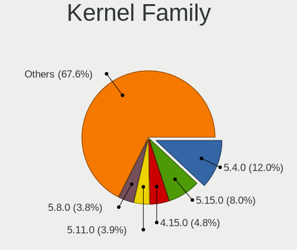
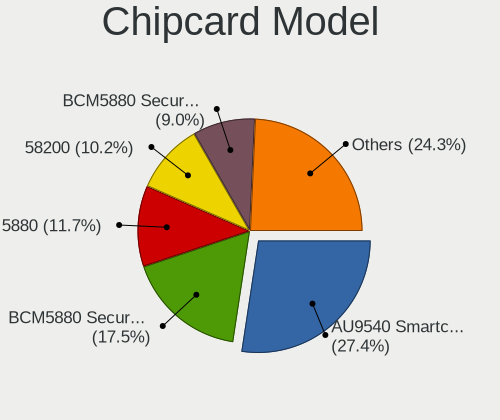

Linux - Tested Hardware & Statistics (Notebooks)
------------------------------------------------

A project to collect tested hardware configurations for Linux.

Anyone can contribute to this report by the [hw-probe](https://github.com/linuxhw/hw-probe) tool:

    sudo -E hw-probe -all -upload

Please contribute! Especially if your hardware is rare.

This report is for real hardware. Report for virtual hardware: [TestCoverage_VE](https://github.com/linuxhw/TestCoverage_VE)

Contents
--------

* [ Test Cases ](#test-cases)

* [ System ](#system)
  - [ OS                       ](#os)
  - [ OS Family                ](#os-family)
  - [ Kernel                   ](#kernel)
  - [ Kernel Family            ](#kernel-family)
  - [ Kernel Major Ver.        ](#kernel-major-ver)
  - [ Arch                     ](#arch)
  - [ DE                       ](#de)
  - [ Display Server           ](#display-server)
  - [ Display Manager          ](#display-manager)
  - [ OS Lang                  ](#os-lang)
  - [ Boot Mode                ](#boot-mode)
  - [ Filesystem               ](#filesystem)
  - [ Part. scheme             ](#part-scheme)
  - [ Dual Boot with Linux/BSD ](#dual-boot-with-linuxbsd)
  - [ Dual Boot (Win)          ](#dual-boot-win)

* [ Board ](#board)
  - [ Vendor                   ](#vendor)
  - [ Model                    ](#model)
  - [ Model Family             ](#model-family)
  - [ MFG Year                 ](#mfg-year)
  - [ Form Factor              ](#form-factor)
  - [ Secure Boot              ](#secure-boot)
  - [ Coreboot                 ](#coreboot)
  - [ RAM Size                 ](#ram-size)
  - [ RAM Used                 ](#ram-used)
  - [ Total Drives             ](#total-drives)
  - [ Has CD-ROM               ](#has-cd-rom)
  - [ Has Ethernet             ](#has-ethernet)
  - [ Has WiFi                 ](#has-wifi)
  - [ Has Bluetooth            ](#has-bluetooth)

* [ Location ](#location)
  - [ Country                  ](#country)
  - [ City                     ](#city)

* [ Drives ](#drives)
  - [ Drive Vendor             ](#drive-vendor)
  - [ Drive Model              ](#drive-model)
  - [ HDD Vendor               ](#hdd-vendor)
  - [ SSD Vendor               ](#ssd-vendor)
  - [ Drive Kind               ](#drive-kind)
  - [ Drive Connector          ](#drive-connector)
  - [ Drive Size               ](#drive-size)
  - [ Space Total              ](#space-total)
  - [ Space Used               ](#space-used)
  - [ Malfunc. Drives          ](#malfunc-drives)
  - [ Malfunc. Drive Vendor    ](#malfunc-drive-vendor)
  - [ Malfunc. HDD Vendor      ](#malfunc-hdd-vendor)
  - [ Malfunc. Drive Kind      ](#malfunc-drive-kind)
  - [ Failed Drives            ](#failed-drives)
  - [ Failed Drive Vendor      ](#failed-drive-vendor)
  - [ Drive Status             ](#drive-status)

* [ Storage controller ](#storage-controller)
  - [ Storage Vendor           ](#storage-vendor)
  - [ Storage Model            ](#storage-model)
  - [ Storage Kind             ](#storage-kind)

* [ Processor ](#processor)
  - [ CPU Vendor               ](#cpu-vendor)
  - [ CPU Model                ](#cpu-model)
  - [ CPU Model Family         ](#cpu-model-family)
  - [ CPU Cores                ](#cpu-cores)
  - [ CPU Sockets              ](#cpu-sockets)
  - [ CPU Threads              ](#cpu-threads)
  - [ CPU Op-Modes             ](#cpu-op-modes)
  - [ CPU Microcode            ](#cpu-microcode)
  - [ CPU Microarch            ](#cpu-microarch)

* [ Graphics ](#graphics)
  - [ GPU Vendor               ](#gpu-vendor)
  - [ GPU Model                ](#gpu-model)
  - [ GPU Combo                ](#gpu-combo)
  - [ GPU Driver               ](#gpu-driver)
  - [ GPU Memory               ](#gpu-memory)

* [ Monitor ](#monitor)
  - [ Monitor Vendor           ](#monitor-vendor)
  - [ Monitor Model            ](#monitor-model)
  - [ Monitor Resolution       ](#monitor-resolution)
  - [ Monitor Diagonal         ](#monitor-diagonal)
  - [ Monitor Width            ](#monitor-width)
  - [ Aspect Ratio             ](#aspect-ratio)
  - [ Monitor Area             ](#monitor-area)
  - [ Pixel Density            ](#pixel-density)
  - [ Multiple Monitors        ](#multiple-monitors)

* [ Network ](#network)
  - [ Net Controller Vendor    ](#net-controller-vendor)
  - [ Net Controller Model     ](#net-controller-model)
  - [ Wireless Vendor          ](#wireless-vendor)
  - [ Wireless Model           ](#wireless-model)
  - [ Ethernet Vendor          ](#ethernet-vendor)
  - [ Ethernet Model           ](#ethernet-model)
  - [ Net Controller Kind      ](#net-controller-kind)
  - [ Used Controller          ](#used-controller)
  - [ NICs                     ](#nics)
  - [ IPv6                     ](#ipv6)

* [ Bluetooth ](#bluetooth)
  - [ Bluetooth Vendor         ](#bluetooth-vendor)
  - [ Bluetooth Model          ](#bluetooth-model)

* [ Sound ](#sound)
  - [ Sound Vendor             ](#sound-vendor)
  - [ Sound Model              ](#sound-model)

* [ Memory ](#memory)
  - [ Memory Vendor            ](#memory-vendor)
  - [ Memory Model             ](#memory-model)
  - [ Memory Kind              ](#memory-kind)
  - [ Memory Form Factor       ](#memory-form-factor)
  - [ Memory Size              ](#memory-size)
  - [ Memory Speed             ](#memory-speed)

* [ Printers & scanners ](#printers--scanners)
  - [ Printer Vendor           ](#printer-vendor)
  - [ Printer Model            ](#printer-model)
  - [ Scanner Vendor           ](#scanner-vendor)
  - [ Scanner Model            ](#scanner-model)

* [ Camera ](#camera)
  - [ Camera Vendor            ](#camera-vendor)
  - [ Camera Model             ](#camera-model)

* [ Security ](#security)
  - [ Fingerprint Vendor       ](#fingerprint-vendor)
  - [ Fingerprint Model        ](#fingerprint-model)
  - [ Chipcard Vendor          ](#chipcard-vendor)
  - [ Chipcard Model           ](#chipcard-model)

* [ Unsupported ](#unsupported)
  - [ Unsupported Devices      ](#unsupported-devices)
  - [ Unsupported Device Types ](#unsupported-device-types)

Test Cases
----------

Total: 127790

| Vendor        | Model                       | Probe                                                      | Date         |
|---------------|-----------------------------|------------------------------------------------------------|--------------|
| Dell          | Latitude E7450              | [38051fe609](https://linux-hardware.org/?probe=38051fe609) | Aug 01, 2022 |
| Toshiba       | Satellite L500              | [21d4b0ac95](https://linux-hardware.org/?probe=21d4b0ac95) | Aug 01, 2022 |
| ASUSTek       | X540SA                      | [6adb003f2e](https://linux-hardware.org/?probe=6adb003f2e) | Aug 01, 2022 |
| Dell          | XPS 15 7590                 | [8a4cc1f177](https://linux-hardware.org/?probe=8a4cc1f177) | Aug 01, 2022 |
| ASUSTek       | X540SA                      | [4dbed1e983](https://linux-hardware.org/?probe=4dbed1e983) | Aug 01, 2022 |
| HP            | Stream Laptop 14-ds0xxx     | [a008ad925d](https://linux-hardware.org/?probe=a008ad925d) | Aug 01, 2022 |
| Dell          | Latitude E6500              | [012df8dc46](https://linux-hardware.org/?probe=012df8dc46) | Aug 01, 2022 |
| Lenovo        | B560                        | [010fb7ada1](https://linux-hardware.org/?probe=010fb7ada1) | Aug 01, 2022 |
| eMachines     | E520 V1.10                  | [89a18a0be1](https://linux-hardware.org/?probe=89a18a0be1) | Aug 01, 2022 |
| Acidanther... | MacBookPro13,1              | [5c8158f059](https://linux-hardware.org/?probe=5c8158f059) | Aug 01, 2022 |
| VIT           | P2402                       | [fd1ab8ad90](https://linux-hardware.org/?probe=fd1ab8ad90) | Aug 01, 2022 |
| HP            | Pavilion g6                 | [b48c146eff](https://linux-hardware.org/?probe=b48c146eff) | Aug 01, 2022 |
| Lenovo        | ThinkPad X230 23245NJ       | [3c85e43b86](https://linux-hardware.org/?probe=3c85e43b86) | Aug 01, 2022 |
| eMachines     | E520 V1.10                  | [bb16305e18](https://linux-hardware.org/?probe=bb16305e18) | Aug 01, 2022 |
| ASUSTek       | VivoBook_ASUSLaptop M350... | [b2b969b0e3](https://linux-hardware.org/?probe=b2b969b0e3) | Aug 01, 2022 |
| Dell          | XPS 13 9380                 | [d4524b40db](https://linux-hardware.org/?probe=d4524b40db) | Aug 01, 2022 |
| Dell          | Latitude E6500              | [5cbd654078](https://linux-hardware.org/?probe=5cbd654078) | Aug 01, 2022 |
| Dell          | Inspiron 13-7378            | [c08447d945](https://linux-hardware.org/?probe=c08447d945) | Aug 01, 2022 |
| Acer          | Aspire A315-53              | [0012f5d4c5](https://linux-hardware.org/?probe=0012f5d4c5) | Aug 01, 2022 |
| Shenzhen B... | XN1A                        | [6b1dd20a55](https://linux-hardware.org/?probe=6b1dd20a55) | Aug 01, 2022 |
| Packard Be... | EasyNote TK13BZ             | [530d3ad8db](https://linux-hardware.org/?probe=530d3ad8db) | Aug 01, 2022 |
| Dell          | Latitude 5520               | [0406990128](https://linux-hardware.org/?probe=0406990128) | Aug 01, 2022 |
| Lenovo        | IdeaPad 330S-15IKB 81F5     | [e512f0884d](https://linux-hardware.org/?probe=e512f0884d) | Aug 01, 2022 |
| Lenovo        | ThinkPad X1 Carbon 6th 2... | [ef6649eea3](https://linux-hardware.org/?probe=ef6649eea3) | Aug 01, 2022 |
| Intel         | Unknown                     | [9fce3597b9](https://linux-hardware.org/?probe=9fce3597b9) | Aug 01, 2022 |
| HP            | 240 G8 Notebook PC          | [f4533284b4](https://linux-hardware.org/?probe=f4533284b4) | Aug 01, 2022 |
| Samsung       | R530/R730/R540              | [73f8fb9528](https://linux-hardware.org/?probe=73f8fb9528) | Aug 01, 2022 |
| ASUSTek       | K501LB                      | [462af39f9d](https://linux-hardware.org/?probe=462af39f9d) | Aug 01, 2022 |
| ASUSTek       | 1011PX                      | [c95aa572a4](https://linux-hardware.org/?probe=c95aa572a4) | Aug 01, 2022 |
| Acer          | Aspire A315-53              | [675bdd8013](https://linux-hardware.org/?probe=675bdd8013) | Aug 01, 2022 |
| Notebook      | V15x_V17xPNKPNJPNH          | [ae2fa8b811](https://linux-hardware.org/?probe=ae2fa8b811) | Aug 01, 2022 |
| ASUSTek       | ROG Strix G713RM_G713RM     | [41b26f984c](https://linux-hardware.org/?probe=41b26f984c) | Aug 01, 2022 |
| KOHJINSHA     | SC series                   | [90a25503ee](https://linux-hardware.org/?probe=90a25503ee) | Aug 01, 2022 |
| KOHJINSHA     | SC series                   | [3986e59a55](https://linux-hardware.org/?probe=3986e59a55) | Aug 01, 2022 |
| Lenovo        | ThinkBook 14 G3 ACL 21A2    | [3a496f366f](https://linux-hardware.org/?probe=3a496f366f) | Aug 01, 2022 |
| Lenovo        | ThinkPad E14 Gen 3 20Y70... | [110c94eb72](https://linux-hardware.org/?probe=110c94eb72) | Aug 01, 2022 |
| Acer          | Aspire 5560                 | [d5b8ae56fd](https://linux-hardware.org/?probe=d5b8ae56fd) | Aug 01, 2022 |
| Apple         | MacBookPro5,5               | [4eeca116f8](https://linux-hardware.org/?probe=4eeca116f8) | Aug 01, 2022 |
| HP            | ZBook Fury 15 G7 Mobile ... | [16a3f81537](https://linux-hardware.org/?probe=16a3f81537) | Aug 01, 2022 |
| HP            | Laptop 15-dw0xxx            | [6f8d2470bd](https://linux-hardware.org/?probe=6f8d2470bd) | Aug 01, 2022 |
| Dell          | Latitude 7420               | [d498af2db5](https://linux-hardware.org/?probe=d498af2db5) | Aug 01, 2022 |
| Digma         | EVE 15 C407 ES5054EW        | [7b597ebcc8](https://linux-hardware.org/?probe=7b597ebcc8) | Aug 01, 2022 |
| ASUSTek       | GL553VE                     | [d67cc48957](https://linux-hardware.org/?probe=d67cc48957) | Aug 01, 2022 |
| HP            | ProBook 6570b               | [b99b5ef83f](https://linux-hardware.org/?probe=b99b5ef83f) | Aug 01, 2022 |
| HP            | EliteBook 745 G6            | [2546e4a593](https://linux-hardware.org/?probe=2546e4a593) | Aug 01, 2022 |
| Dell          | XPS 13 9380                 | [75f131a86a](https://linux-hardware.org/?probe=75f131a86a) | Aug 01, 2022 |
| HP            | ProBook 440 G2              | [00dd80ba31](https://linux-hardware.org/?probe=00dd80ba31) | Aug 01, 2022 |
| ASUSTek       | X555LAB                     | [33a1712f4d](https://linux-hardware.org/?probe=33a1712f4d) | Aug 01, 2022 |
| Acer          | Z476                        | [ade85b90c1](https://linux-hardware.org/?probe=ade85b90c1) | Aug 01, 2022 |
| Lenovo        | ThinkPad X1 Carbon 5th 2... | [d77ac14ae9](https://linux-hardware.org/?probe=d77ac14ae9) | Aug 01, 2022 |
| Notebook      | NV4XMB,ME,MZ                | [7b369e1cdf](https://linux-hardware.org/?probe=7b369e1cdf) | Aug 01, 2022 |
| HP            | EliteBook 8470p             | [a1d5593420](https://linux-hardware.org/?probe=a1d5593420) | Aug 01, 2022 |
| Toshiba       | TECRA Z40-C                 | [9612659f60](https://linux-hardware.org/?probe=9612659f60) | Aug 01, 2022 |
| Dell          | Latitude E7250              | [2dd83a16c7](https://linux-hardware.org/?probe=2dd83a16c7) | Aug 01, 2022 |
| Dell          | Latitude E7470              | [0851479f6b](https://linux-hardware.org/?probe=0851479f6b) | Aug 01, 2022 |
| Dell          | Precision M4600             | [8ca47466f0](https://linux-hardware.org/?probe=8ca47466f0) | Aug 01, 2022 |
| Lenovo        | ThinkPad T420 4180LN1       | [65d5b19d40](https://linux-hardware.org/?probe=65d5b19d40) | Aug 01, 2022 |
| Toshiba       | Satellite-C845              | [6ee9ea90a5](https://linux-hardware.org/?probe=6ee9ea90a5) | Aug 01, 2022 |
| Lenovo        | ThinkPad T420 4180LN1       | [35304c2321](https://linux-hardware.org/?probe=35304c2321) | Aug 01, 2022 |
| Lenovo        | ThinkPad L14 Gen 1 20U6A... | [76d752f0ad](https://linux-hardware.org/?probe=76d752f0ad) | Aug 01, 2022 |
| HP            | Laptop 14-dq4xxx            | [1e57f77386](https://linux-hardware.org/?probe=1e57f77386) | Aug 01, 2022 |
| Dell          | Inspiron 5748               | [9113ee6d54](https://linux-hardware.org/?probe=9113ee6d54) | Aug 01, 2022 |
| Dell          | Latitude D620               | [f378606941](https://linux-hardware.org/?probe=f378606941) | Aug 01, 2022 |
| ASUSTek       | ROG Strix G513QY_G513QY     | [370b872aa5](https://linux-hardware.org/?probe=370b872aa5) | Aug 01, 2022 |
| Positivo      | Q232A                       | [da99b8ab1e](https://linux-hardware.org/?probe=da99b8ab1e) | Aug 01, 2022 |
| Positivo      | Q232A                       | [7d860e8f5d](https://linux-hardware.org/?probe=7d860e8f5d) | Aug 01, 2022 |
| ASUSTek       | G73Jh                       | [ec1e513893](https://linux-hardware.org/?probe=ec1e513893) | Aug 01, 2022 |
| GPU Compan... | GWNR71517                   | [72278643e8](https://linux-hardware.org/?probe=72278643e8) | Aug 01, 2022 |
| ASUSTek       | VivoBook_ASUSLaptop X512... | [4e2361dd88](https://linux-hardware.org/?probe=4e2361dd88) | Aug 01, 2022 |
| HP            | ProBook 6570b               | [105d26b09c](https://linux-hardware.org/?probe=105d26b09c) | Aug 01, 2022 |
| Lenovo        | ThinkPad X131e 336799U      | [a06f0caf24](https://linux-hardware.org/?probe=a06f0caf24) | Aug 01, 2022 |
| HP            | ProBook 6570b               | [3898ce2b5f](https://linux-hardware.org/?probe=3898ce2b5f) | Aug 01, 2022 |
| Lenovo        | ThinkPad E590 20NB0032CD    | [502b0eeb39](https://linux-hardware.org/?probe=502b0eeb39) | Aug 01, 2022 |
| Dell          | Latitude 3190               | [1f86e5fa57](https://linux-hardware.org/?probe=1f86e5fa57) | Aug 01, 2022 |
| ASUSTek       | ZenBook UX425QA_UM425QA     | [6e8a2d15be](https://linux-hardware.org/?probe=6e8a2d15be) | Aug 01, 2022 |
| HP            | Laptop 14s-dq2xxx           | [7137ca1923](https://linux-hardware.org/?probe=7137ca1923) | Aug 01, 2022 |
| Acer          | Aspire ES1-523              | [d14f053671](https://linux-hardware.org/?probe=d14f053671) | Aug 01, 2022 |
| Unknown       | Unknown                     | [50153bd9ff](https://linux-hardware.org/?probe=50153bd9ff) | Aug 01, 2022 |
| Samsung       | R59P/R60P/R61P              | [93794bf0b1](https://linux-hardware.org/?probe=93794bf0b1) | Aug 01, 2022 |
| Apple         | MacBookPro9,2               | [5642929fd2](https://linux-hardware.org/?probe=5642929fd2) | Aug 01, 2022 |
| HP            | Laptop 14s-dq2xxx           | [9a5e39bf87](https://linux-hardware.org/?probe=9a5e39bf87) | Aug 01, 2022 |
| Lenovo        | ThinkPad E555 20DHCTO1WW    | [c376def8c9](https://linux-hardware.org/?probe=c376def8c9) | Aug 01, 2022 |
| HONOR         | NBR-WAX9                    | [e9fcbc7798](https://linux-hardware.org/?probe=e9fcbc7798) | Aug 01, 2022 |
| Lenovo        | IdeaPad 3 14ALC6 82KT       | [15382de4bf](https://linux-hardware.org/?probe=15382de4bf) | Aug 01, 2022 |
| Dell          | G15 Special Edition 5521    | [c680e6f144](https://linux-hardware.org/?probe=c680e6f144) | Aug 01, 2022 |
| Acer          | Aspire E1-571               | [7102c56d5b](https://linux-hardware.org/?probe=7102c56d5b) | Aug 01, 2022 |
| Packard Be... | EasyNote TM85               | [a6df06f9e5](https://linux-hardware.org/?probe=a6df06f9e5) | Jul 31, 2022 |
| Samsung       | RV415/RV515                 | [5bb2e2b3e9](https://linux-hardware.org/?probe=5bb2e2b3e9) | Jul 31, 2022 |
| HP            | ENVY Laptop 13-ad1xx        | [c79c2bd215](https://linux-hardware.org/?probe=c79c2bd215) | Jul 31, 2022 |
| Lenovo        | ThinkPad T460 20FMS02R0G    | [0aa31e3c39](https://linux-hardware.org/?probe=0aa31e3c39) | Jul 31, 2022 |
| Acer          | Aspire E5-576               | [a31ceb9a36](https://linux-hardware.org/?probe=a31ceb9a36) | Jul 31, 2022 |
| Acer          | Aspire 5830TG               | [7eb001e6b4](https://linux-hardware.org/?probe=7eb001e6b4) | Jul 31, 2022 |
| Razer         | Blade                       | [cc3ce45956](https://linux-hardware.org/?probe=cc3ce45956) | Jul 31, 2022 |
| HP            | Pavilion dv2600             | [87651d6efc](https://linux-hardware.org/?probe=87651d6efc) | Jul 31, 2022 |
| HP            | EliteBook 8470p             | [0cecb854f4](https://linux-hardware.org/?probe=0cecb854f4) | Jul 31, 2022 |
| Sony          | VPCCW13FB                   | [453d0f75cc](https://linux-hardware.org/?probe=453d0f75cc) | Jul 31, 2022 |
| HP            | Laptop 15s-eq0xxx           | [d1ae6a188c](https://linux-hardware.org/?probe=d1ae6a188c) | Jul 31, 2022 |
| Acer          | Aspire 7741                 | [4e266f6d7f](https://linux-hardware.org/?probe=4e266f6d7f) | Jul 31, 2022 |
| Lenovo        | IdeaPad 3 15ITL6 82H8       | [7ae6c1826c](https://linux-hardware.org/?probe=7ae6c1826c) | Jul 31, 2022 |
| HP            | Laptop 15s-eq0xxx           | [bce4496b78](https://linux-hardware.org/?probe=bce4496b78) | Jul 31, 2022 |
| GPU Compan... | GWTN141-10                  | [d73365fe3e](https://linux-hardware.org/?probe=d73365fe3e) | Jul 31, 2022 |
| Acer          | Aspire 7741                 | [932a460553](https://linux-hardware.org/?probe=932a460553) | Jul 31, 2022 |
| Dell          | Latitude E5450              | [b7618f5c14](https://linux-hardware.org/?probe=b7618f5c14) | Jul 31, 2022 |
| Dell          | Inspiron 5590               | [4d91f51698](https://linux-hardware.org/?probe=4d91f51698) | Jul 31, 2022 |
| HP            | OMEN Notebook               | [a31203500e](https://linux-hardware.org/?probe=a31203500e) | Jul 31, 2022 |
| Dell          | Latitude E5450              | [2c6979fb39](https://linux-hardware.org/?probe=2c6979fb39) | Jul 31, 2022 |
| Acer          | TravelMate B118-M           | [490edd75cf](https://linux-hardware.org/?probe=490edd75cf) | Jul 31, 2022 |
| Apple         | MacBookPro11,5              | [24ccaddbf8](https://linux-hardware.org/?probe=24ccaddbf8) | Jul 31, 2022 |
| HP            | ProBook 6570b               | [333a24bdee](https://linux-hardware.org/?probe=333a24bdee) | Jul 31, 2022 |
| HP            | Compaq 2510p                | [b61ccedd14](https://linux-hardware.org/?probe=b61ccedd14) | Jul 31, 2022 |
| HP            | EliteBook 745 G6            | [0bcc9863e3](https://linux-hardware.org/?probe=0bcc9863e3) | Jul 31, 2022 |
| Acer          | Aspire VN7-791G             | [3e72040097](https://linux-hardware.org/?probe=3e72040097) | Jul 31, 2022 |
| HP            | Stream Laptop 14-cb1xxx     | [1e48a30f97](https://linux-hardware.org/?probe=1e48a30f97) | Jul 31, 2022 |
| Sony          | VGN-FW51ZF_H                | [f42e9458c7](https://linux-hardware.org/?probe=f42e9458c7) | Jul 31, 2022 |
| Clevo         | W240BU                      | [7f4a0b1995](https://linux-hardware.org/?probe=7f4a0b1995) | Jul 31, 2022 |
| HP            | Pavilion dv2000 (RQ116PA... | [c6ce2d4317](https://linux-hardware.org/?probe=c6ce2d4317) | Jul 31, 2022 |
| ASUSTek       | VivoBook_ASUS Laptop X51... | [bdc243bf9f](https://linux-hardware.org/?probe=bdc243bf9f) | Jul 31, 2022 |
| HP            | Pavilion Notebook           | [f312865dc0](https://linux-hardware.org/?probe=f312865dc0) | Jul 31, 2022 |
| GPD           | G1619-02                    | [c61c4280c8](https://linux-hardware.org/?probe=c61c4280c8) | Jul 31, 2022 |
| ASUSTek       | VivoBook_ASUS Laptop X51... | [41a0eba80f](https://linux-hardware.org/?probe=41a0eba80f) | Jul 31, 2022 |
| Sony          | VPCEG33FL                   | [6d371d6c32](https://linux-hardware.org/?probe=6d371d6c32) | Jul 31, 2022 |
| Aquarius      | Pro, Std, Elt Series        | [3f08a29e9a](https://linux-hardware.org/?probe=3f08a29e9a) | Jul 31, 2022 |
| Timi          | Mi Laptop Pro 15 2020       | [d27e88a924](https://linux-hardware.org/?probe=d27e88a924) | Jul 31, 2022 |
| ASUSTek       | X550LC                      | [841508c072](https://linux-hardware.org/?probe=841508c072) | Jul 31, 2022 |
| ASUSTek       | E200HA                      | [86ef744d76](https://linux-hardware.org/?probe=86ef744d76) | Jul 31, 2022 |
| HP            | Pavilion 17                 | [b2c0846cf5](https://linux-hardware.org/?probe=b2c0846cf5) | Jul 31, 2022 |
| Dell          | Latitude 5290 2-in-1        | [838be3a87a](https://linux-hardware.org/?probe=838be3a87a) | Jul 31, 2022 |
| Dell          | Latitude E6520              | [bb8b880e57](https://linux-hardware.org/?probe=bb8b880e57) | Jul 31, 2022 |
| Dell          | Inspiron 5558               | [2dee8f9fb1](https://linux-hardware.org/?probe=2dee8f9fb1) | Jul 31, 2022 |
| HP            | ProBook 450 G7              | [ebbca00473](https://linux-hardware.org/?probe=ebbca00473) | Jul 31, 2022 |
| Lenovo        | IdeaPad 110S-11IBR          | [22ac116859](https://linux-hardware.org/?probe=22ac116859) | Jul 31, 2022 |
| Lenovo        | IdeaPad 110S-11IBR          | [02e0db6837](https://linux-hardware.org/?probe=02e0db6837) | Jul 31, 2022 |
| HP            | Pavilion dv2000 (RQ116PA... | [eca5fa0c39](https://linux-hardware.org/?probe=eca5fa0c39) | Jul 31, 2022 |
| HP            | 250 G7 Notebook PC          | [6204ce9d95](https://linux-hardware.org/?probe=6204ce9d95) | Jul 31, 2022 |
| Lenovo        | ThinkPad T470s 20HF0047U... | [dfe7ba57b8](https://linux-hardware.org/?probe=dfe7ba57b8) | Jul 31, 2022 |
| Lenovo        | G580 20157                  | [a2270894c7](https://linux-hardware.org/?probe=a2270894c7) | Jul 31, 2022 |
| Acer          | Aspire 5730                 | [1541bd94e2](https://linux-hardware.org/?probe=1541bd94e2) | Jul 31, 2022 |
| Dell          | Latitude E6400              | [6962d36f57](https://linux-hardware.org/?probe=6962d36f57) | Jul 31, 2022 |
| Acer          | Aspire V5-591G              | [80396b28bf](https://linux-hardware.org/?probe=80396b28bf) | Jul 31, 2022 |
| HP            | Stream Notebook PC 13       | [d736692861](https://linux-hardware.org/?probe=d736692861) | Jul 31, 2022 |
| Dell          | Latitude 7480               | [70ee67e43e](https://linux-hardware.org/?probe=70ee67e43e) | Jul 31, 2022 |
| Chuwi         | GemiBook Pro                | [458c2e644f](https://linux-hardware.org/?probe=458c2e644f) | Jul 31, 2022 |
| Lenovo        | ThinkPad E14 Gen 3 20YDS... | [b2385a694b](https://linux-hardware.org/?probe=b2385a694b) | Jul 31, 2022 |
| Lenovo        | ThinkPad E585 20KV000YUS    | [ddb45bfaff](https://linux-hardware.org/?probe=ddb45bfaff) | Jul 31, 2022 |
| Lenovo        | V14-IIL 82C4                | [8707ea39a2](https://linux-hardware.org/?probe=8707ea39a2) | Jul 31, 2022 |
| HP            | Pavilion Laptop 15-cd0xx    | [b3dc6e72d5](https://linux-hardware.org/?probe=b3dc6e72d5) | Jul 31, 2022 |
| Dell          | XPS 15 9520                 | [ca95b48036](https://linux-hardware.org/?probe=ca95b48036) | Jul 31, 2022 |
| Dell          | Precision M6800             | [3584b1693d](https://linux-hardware.org/?probe=3584b1693d) | Jul 31, 2022 |
| Toshiba       | dynabook Satellite B35/R    | [4600fb0c71](https://linux-hardware.org/?probe=4600fb0c71) | Jul 31, 2022 |
| Fujitsu       | LIFEBOOK E754               | [7875967525](https://linux-hardware.org/?probe=7875967525) | Jul 31, 2022 |
| Fujitsu       | LIFEBOOK E754               | [14be18819f](https://linux-hardware.org/?probe=14be18819f) | Jul 31, 2022 |
| ASUSTek       | Zenbook UX5401ZAS_UX5401... | [d3b270c068](https://linux-hardware.org/?probe=d3b270c068) | Jul 31, 2022 |
| Dell          | XPS 15 9520                 | [4a7830a606](https://linux-hardware.org/?probe=4a7830a606) | Jul 31, 2022 |
| MSI           | GL65 Leopard 10SCSR         | [2cbf6d3aae](https://linux-hardware.org/?probe=2cbf6d3aae) | Jul 31, 2022 |
| Dell          | G3 3579                     | [75dd5203c6](https://linux-hardware.org/?probe=75dd5203c6) | Jul 31, 2022 |
| Acer          | Swift SF314-51              | [f9a61fd8ad](https://linux-hardware.org/?probe=f9a61fd8ad) | Jul 31, 2022 |
| Micro Elec... | MG-VCP17I-3080              | [06191acfe0](https://linux-hardware.org/?probe=06191acfe0) | Jul 31, 2022 |
| HP            | Laptop 15s-eq2xxx           | [fc1b36d062](https://linux-hardware.org/?probe=fc1b36d062) | Jul 31, 2022 |
| Google        | Celes                       | [6a4bc65f84](https://linux-hardware.org/?probe=6a4bc65f84) | Jul 31, 2022 |
| ASUSTek       | ROG Flow X13 GV301QH_GV3... | [09c15c1ed8](https://linux-hardware.org/?probe=09c15c1ed8) | Jul 31, 2022 |
| HP            | OMEN Notebook               | [74803dd358](https://linux-hardware.org/?probe=74803dd358) | Jul 31, 2022 |
| HP            | Laptop 15s-eq2xxx           | [e6ccfdf23c](https://linux-hardware.org/?probe=e6ccfdf23c) | Jul 31, 2022 |
| HP            | ProBook 645 G1              | [f5035ff86e](https://linux-hardware.org/?probe=f5035ff86e) | Jul 31, 2022 |
| HP            | Notebook                    | [2268ecaee2](https://linux-hardware.org/?probe=2268ecaee2) | Jul 31, 2022 |
| Acer          | Aspire 3610                 | [d56c48ade2](https://linux-hardware.org/?probe=d56c48ade2) | Jul 31, 2022 |
| TUXEDO        | InfinityBook Pro 14 Gen6    | [de9a854095](https://linux-hardware.org/?probe=de9a854095) | Jul 31, 2022 |
| MSI           | Prestige 15 A10SC           | [9c161b860f](https://linux-hardware.org/?probe=9c161b860f) | Jul 31, 2022 |
| HP            | Laptop 15-dy2xxx            | [6fe07f99fd](https://linux-hardware.org/?probe=6fe07f99fd) | Jul 31, 2022 |
| Google        | Cyan                        | [34f759ebd1](https://linux-hardware.org/?probe=34f759ebd1) | Jul 31, 2022 |
| Unknown       | Unknown                     | [aa0c007709](https://linux-hardware.org/?probe=aa0c007709) | Jul 31, 2022 |
| Apple         | MacBookPro9,2               | [e57b854aeb](https://linux-hardware.org/?probe=e57b854aeb) | Jul 31, 2022 |
| HP            | EliteBook 8470p             | [5e73e33a77](https://linux-hardware.org/?probe=5e73e33a77) | Jul 31, 2022 |
| Lenovo        | ThinkPad X270 W10DG 20K6... | [dd7a9dcb05](https://linux-hardware.org/?probe=dd7a9dcb05) | Jul 31, 2022 |
| HP            | ProBook 4310s               | [d15b493637](https://linux-hardware.org/?probe=d15b493637) | Jul 31, 2022 |
| ASUSTek       | ROG Strix G533ZM_G533ZM     | [0f38b878b5](https://linux-hardware.org/?probe=0f38b878b5) | Jul 31, 2022 |
| HP            | Laptop 15-dy3xxx            | [e54cde5e86](https://linux-hardware.org/?probe=e54cde5e86) | Jul 31, 2022 |
| HP            | EliteBook 850 G6            | [1dca756b58](https://linux-hardware.org/?probe=1dca756b58) | Jul 31, 2022 |
| HP            | Pavilion TS 14 Sleekbook    | [9264052a8c](https://linux-hardware.org/?probe=9264052a8c) | Jul 31, 2022 |
| HP            | Compaq 6730s                | [5d805b2f5e](https://linux-hardware.org/?probe=5d805b2f5e) | Jul 31, 2022 |
| HP            | EliteBook 840 G6            | [1a2713a2b0](https://linux-hardware.org/?probe=1a2713a2b0) | Jul 31, 2022 |
| eMachines     | Unknown                     | [8c6dcb08a7](https://linux-hardware.org/?probe=8c6dcb08a7) | Jul 31, 2022 |
| Dell          | Latitude 3320               | [183ae38016](https://linux-hardware.org/?probe=183ae38016) | Jul 31, 2022 |
| Fujitsu       | LIFEBOOK S936               | [90a08a49a3](https://linux-hardware.org/?probe=90a08a49a3) | Jul 31, 2022 |
| HP            | Pavilion Laptop 15-cd0xx    | [521b86d8af](https://linux-hardware.org/?probe=521b86d8af) | Jul 31, 2022 |
| Lenovo        | ThinkPad X270 W10DG 20K6... | [4b9354d287](https://linux-hardware.org/?probe=4b9354d287) | Jul 31, 2022 |
| Dell          | Inspiron 5558               | [06b58ca667](https://linux-hardware.org/?probe=06b58ca667) | Jul 31, 2022 |
| Google        | Celes                       | [fae813e4dc](https://linux-hardware.org/?probe=fae813e4dc) | Jul 31, 2022 |
| HP            | Pavilion g6                 | [5867423d27](https://linux-hardware.org/?probe=5867423d27) | Jul 31, 2022 |
| Lenovo        | IdeaPad Z570 1024AMU        | [3d5ec8319b](https://linux-hardware.org/?probe=3d5ec8319b) | Jul 31, 2022 |
| Fujitsu       | LIFEBOOK S936               | [1af46d1c56](https://linux-hardware.org/?probe=1af46d1c56) | Jul 31, 2022 |
| Notebook      | W54_W94_W955TU,-T,-C        | [7b0b52e138](https://linux-hardware.org/?probe=7b0b52e138) | Jul 31, 2022 |
| Acer          | Nitro AN515-43              | [79117d81e0](https://linux-hardware.org/?probe=79117d81e0) | Jul 31, 2022 |
| Lenovo        | ThinkPad X1 Carbon 6th 2... | [ae030e58fb](https://linux-hardware.org/?probe=ae030e58fb) | Jul 31, 2022 |
| Acer          | Aspire A315-53              | [28b8a96420](https://linux-hardware.org/?probe=28b8a96420) | Jul 31, 2022 |
| Lenovo        | ThinkPad W500 406132U       | [6f403cb15a](https://linux-hardware.org/?probe=6f403cb15a) | Jul 30, 2022 |
| Compaq        | Presario CQ-23              | [76ea82c314](https://linux-hardware.org/?probe=76ea82c314) | Jul 30, 2022 |
| Lenovo        | Legion Y540-17IRH 81Q4      | [5dcf2bfdbd](https://linux-hardware.org/?probe=5dcf2bfdbd) | Jul 30, 2022 |
| ASUSTek       | Zenbook UX5401ZA_UX5401Z... | [b8daa2d973](https://linux-hardware.org/?probe=b8daa2d973) | Jul 30, 2022 |
| Acer          | Unknown                     | [99992e8b67](https://linux-hardware.org/?probe=99992e8b67) | Jul 30, 2022 |
| HP            | 550                         | [efc4b32963](https://linux-hardware.org/?probe=efc4b32963) | Jul 30, 2022 |
| ASUSTek       | N53SN                       | [efcc58fd20](https://linux-hardware.org/?probe=efcc58fd20) | Jul 30, 2022 |
| Samsung       | 355V4C/356V4C/3445VC/354... | [85208906cd](https://linux-hardware.org/?probe=85208906cd) | Jul 30, 2022 |
| ASUSTek       | ASUS TUF Gaming A17 FA70... | [249d407b66](https://linux-hardware.org/?probe=249d407b66) | Jul 30, 2022 |
| HP            | Victus by Laptop 16-e0xx... | [97f6892c6c](https://linux-hardware.org/?probe=97f6892c6c) | Jul 30, 2022 |
| HP            | ProBook 4520s               | [8e03860e5f](https://linux-hardware.org/?probe=8e03860e5f) | Jul 30, 2022 |
| HP            | EliteBook 8570w             | [1876d4e53d](https://linux-hardware.org/?probe=1876d4e53d) | Jul 30, 2022 |
| HUAWEI        | BOHK-WAX9X                  | [745f6815cb](https://linux-hardware.org/?probe=745f6815cb) | Jul 30, 2022 |
| Acer          | Aspire A315-54K             | [d090bce067](https://linux-hardware.org/?probe=d090bce067) | Jul 30, 2022 |
| Sony          | VPCEH2E1R                   | [24d621e667](https://linux-hardware.org/?probe=24d621e667) | Jul 30, 2022 |
| Fujitsu       | LIFEBOOK U727               | [7aa483a43c](https://linux-hardware.org/?probe=7aa483a43c) | Jul 30, 2022 |
| Dell          | XPS M1330                   | [2abad8da86](https://linux-hardware.org/?probe=2abad8da86) | Jul 30, 2022 |
| HP            | EliteBook 8460p             | [c9ce430b56](https://linux-hardware.org/?probe=c9ce430b56) | Jul 30, 2022 |
| Acer          | Swift SF314-43              | [36659d2410](https://linux-hardware.org/?probe=36659d2410) | Jul 30, 2022 |
| Toshiba       | Satellite C75D-C            | [f4a9c3bc7f](https://linux-hardware.org/?probe=f4a9c3bc7f) | Jul 30, 2022 |
| Dell          | XPS 13 9380                 | [7463861dcf](https://linux-hardware.org/?probe=7463861dcf) | Jul 30, 2022 |
| Toshiba       | Satellite C75D-C            | [f017593574](https://linux-hardware.org/?probe=f017593574) | Jul 30, 2022 |
| HP            | Laptop 15-db1xxx            | [dcbb6ec79b](https://linux-hardware.org/?probe=dcbb6ec79b) | Jul 30, 2022 |
| ASUSTek       | ROG Strix G533ZM_G533ZM     | [8a472804e4](https://linux-hardware.org/?probe=8a472804e4) | Jul 30, 2022 |
| HP            | Laptop 15-bs1xx             | [8fe6a402e7](https://linux-hardware.org/?probe=8fe6a402e7) | Jul 30, 2022 |
| Dell          | Latitude E6420              | [a6b2ee6088](https://linux-hardware.org/?probe=a6b2ee6088) | Jul 30, 2022 |
| Sony          | VPCEA36FG                   | [6c742b6234](https://linux-hardware.org/?probe=6c742b6234) | Jul 30, 2022 |
| HP            | 250 G2                      | [43d1d3ae24](https://linux-hardware.org/?probe=43d1d3ae24) | Jul 30, 2022 |
| Lenovo        | IdeaPad 5 14ALC05 82LM      | [0359549c36](https://linux-hardware.org/?probe=0359549c36) | Jul 30, 2022 |
| Lenovo        | IdeaPad S340-15API 81NC     | [76083d81dc](https://linux-hardware.org/?probe=76083d81dc) | Jul 30, 2022 |
| Dell          | Latitude E6320              | [34270898c6](https://linux-hardware.org/?probe=34270898c6) | Jul 30, 2022 |
| Samsung       | R59P/R60P/R61P              | [b0b9ddad28](https://linux-hardware.org/?probe=b0b9ddad28) | Jul 30, 2022 |
| Lenovo        | IdeaPad S145-15API 81UT     | [34958fdaac](https://linux-hardware.org/?probe=34958fdaac) | Jul 30, 2022 |
| Acer          | Nitro AN515-44              | [1c907403d4](https://linux-hardware.org/?probe=1c907403d4) | Jul 30, 2022 |
| HP            | EliteBook 8470p             | [2171abfd3d](https://linux-hardware.org/?probe=2171abfd3d) | Jul 30, 2022 |
| Framework     | Laptop                      | [426cf376b2](https://linux-hardware.org/?probe=426cf376b2) | Jul 30, 2022 |
| Apple         | MacBookPro7,1               | [b846739765](https://linux-hardware.org/?probe=b846739765) | Jul 30, 2022 |
| ASUSTek       | K501LX                      | [8ea0c7daa9](https://linux-hardware.org/?probe=8ea0c7daa9) | Jul 30, 2022 |
| Dell          | Latitude E7450              | [894a489a03](https://linux-hardware.org/?probe=894a489a03) | Jul 30, 2022 |
| Dell          | Latitude E7470              | [ca7878faab](https://linux-hardware.org/?probe=ca7878faab) | Jul 30, 2022 |
| Dell          | Vostro 15 3515              | [74b9e88d97](https://linux-hardware.org/?probe=74b9e88d97) | Jul 30, 2022 |
| Dell          | Latitude E7450              | [268b4ca289](https://linux-hardware.org/?probe=268b4ca289) | Jul 30, 2022 |
| Acer          | ConceptD CN315-71P          | [c7ed484a1f](https://linux-hardware.org/?probe=c7ed484a1f) | Jul 30, 2022 |
| Lenovo        | ThinkPad X270 20HMS12K00    | [b3d3ab37ef](https://linux-hardware.org/?probe=b3d3ab37ef) | Jul 30, 2022 |
| Fujitsu       | STYLISTIC Q702              | [2fe4fe7fe5](https://linux-hardware.org/?probe=2fe4fe7fe5) | Jul 30, 2022 |
| HP            | OMEN by Laptop 16-c0xxx     | [8ad22205d4](https://linux-hardware.org/?probe=8ad22205d4) | Jul 30, 2022 |
| Dell          | Latitude E5540              | [67063fe669](https://linux-hardware.org/?probe=67063fe669) | Jul 30, 2022 |
| Dell          | Inspiron M5010              | [bd4cf45b33](https://linux-hardware.org/?probe=bd4cf45b33) | Jul 30, 2022 |
| Sony          | SVE1511Y1ESI                | [7e5ced1b91](https://linux-hardware.org/?probe=7e5ced1b91) | Jul 30, 2022 |
| Intel Clie... | LAPKC71F                    | [0783ac445f](https://linux-hardware.org/?probe=0783ac445f) | Jul 30, 2022 |
| HP            | Notebook                    | [ac46775f8b](https://linux-hardware.org/?probe=ac46775f8b) | Jul 30, 2022 |
| Acer          | Aspire A715-41G             | [3881e3998f](https://linux-hardware.org/?probe=3881e3998f) | Jul 30, 2022 |
| Acer          | Nitro AN515-55              | [b279b1558f](https://linux-hardware.org/?probe=b279b1558f) | Jul 30, 2022 |
| Acer          | Aspire A515-57G             | [a44d178033](https://linux-hardware.org/?probe=a44d178033) | Jul 30, 2022 |
| Acer          | Nitro AN515-55              | [3b08b42260](https://linux-hardware.org/?probe=3b08b42260) | Jul 30, 2022 |
| Dell          | Inspiron 5520               | [a4baade53f](https://linux-hardware.org/?probe=a4baade53f) | Jul 30, 2022 |
| Apple         | MacBookAir7,2               | [301ad5e148](https://linux-hardware.org/?probe=301ad5e148) | Jul 30, 2022 |
| HP            | Laptop 15s-eq1xxx           | [ee5c151c3a](https://linux-hardware.org/?probe=ee5c151c3a) | Jul 30, 2022 |
| Lenovo        | IdeaPad Y470 0855           | [395d0c25d7](https://linux-hardware.org/?probe=395d0c25d7) | Jul 30, 2022 |
| ASUSTek       | K53E                        | [3ca340212e](https://linux-hardware.org/?probe=3ca340212e) | Jul 30, 2022 |
| Acer          | Aspire 5730                 | [8ac8b8a87a](https://linux-hardware.org/?probe=8ac8b8a87a) | Jul 30, 2022 |
| Lenovo        | ThinkPad T14 Gen 2i 20W0... | [a2f1dbe3f7](https://linux-hardware.org/?probe=a2f1dbe3f7) | Jul 30, 2022 |
| Dell          | Inspiron 7577               | [a2909a87b1](https://linux-hardware.org/?probe=a2909a87b1) | Jul 30, 2022 |
| Dell          | Inspiron 3541               | [ab643dc6b0](https://linux-hardware.org/?probe=ab643dc6b0) | Jul 30, 2022 |
| Apple         | MacBookPro11,5              | [04487d99ff](https://linux-hardware.org/?probe=04487d99ff) | Jul 30, 2022 |
| Dell          | Latitude 3320               | [a849c0d90a](https://linux-hardware.org/?probe=a849c0d90a) | Jul 30, 2022 |
| Dell          | Inspiron N4010              | [7589775fb4](https://linux-hardware.org/?probe=7589775fb4) | Jul 30, 2022 |
| ASUSTek       | VivoBook_ASUSLaptop X512... | [320bc76144](https://linux-hardware.org/?probe=320bc76144) | Jul 30, 2022 |
| Google        | Auron_Paine                 | [0ac60b52f1](https://linux-hardware.org/?probe=0ac60b52f1) | Jul 30, 2022 |
| ByteSpeed     | Atlas 157Q                  | [4765148a7b](https://linux-hardware.org/?probe=4765148a7b) | Jul 30, 2022 |
| Lenovo        | G570 4334                   | [a29c1c816a](https://linux-hardware.org/?probe=a29c1c816a) | Jul 30, 2022 |
| Lenovo        | ThinkPad P53 20QN003TUS     | [bf8e504209](https://linux-hardware.org/?probe=bf8e504209) | Jul 30, 2022 |
| Acer          | Peppy                       | [d8f9cbdb86](https://linux-hardware.org/?probe=d8f9cbdb86) | Jul 30, 2022 |
| Lenovo        | IdeaPad Gaming 3 15ACH6 ... | [0dce3ee4a5](https://linux-hardware.org/?probe=0dce3ee4a5) | Jul 30, 2022 |
| Acer          | Peppy                       | [6f4ce7e1f9](https://linux-hardware.org/?probe=6f4ce7e1f9) | Jul 30, 2022 |
| Lenovo        | IdeaPad Gaming 3 15ACH6 ... | [90fec04191](https://linux-hardware.org/?probe=90fec04191) | Jul 30, 2022 |
| Fujitsu       | LIFEBOOK V1020              | [e33ac2916d](https://linux-hardware.org/?probe=e33ac2916d) | Jul 30, 2022 |
| Toshiba       | dynabook T653/46JR          | [ea8bb6486b](https://linux-hardware.org/?probe=ea8bb6486b) | Jul 30, 2022 |
| Apple         | MacBookPro9,2               | [e6d691a331](https://linux-hardware.org/?probe=e6d691a331) | Jul 30, 2022 |
| Razer         | Blade 15 Studio Edition ... | [359f708604](https://linux-hardware.org/?probe=359f708604) | Jul 30, 2022 |
| Dell          | Latitude E6520              | [0a7e1cdcaf](https://linux-hardware.org/?probe=0a7e1cdcaf) | Jul 30, 2022 |
| Valve         | Jupiter                     | [ee3b662083](https://linux-hardware.org/?probe=ee3b662083) | Jul 30, 2022 |
| Dell          | Precision 5550              | [e11d4be493](https://linux-hardware.org/?probe=e11d4be493) | Jul 30, 2022 |
| Toshiba       | NB250                       | [e320782bcf](https://linux-hardware.org/?probe=e320782bcf) | Jul 30, 2022 |
| HP            | OMEN by Laptop 15-dh1xxx    | [b44feede78](https://linux-hardware.org/?probe=b44feede78) | Jul 30, 2022 |
| Lenovo        | ThinkPad E480 20KN001QRT    | [e0e0792a71](https://linux-hardware.org/?probe=e0e0792a71) | Jul 30, 2022 |
| Lenovo        | G570 20079                  | [982a6e3241](https://linux-hardware.org/?probe=982a6e3241) | Jul 30, 2022 |
| Lenovo        | ThinkPad T15 Gen 1 20S60... | [9b362907fc](https://linux-hardware.org/?probe=9b362907fc) | Jul 30, 2022 |
| Lenovo        | ThinkPad T15 Gen 1 20S60... | [61aed5ab55](https://linux-hardware.org/?probe=61aed5ab55) | Jul 30, 2022 |
| MSI           | GF63 8RD                    | [fdb72c3ec3](https://linux-hardware.org/?probe=fdb72c3ec3) | Jul 29, 2022 |
| AMI           | T3 MRD                      | [7e0a2ced92](https://linux-hardware.org/?probe=7e0a2ced92) | Jul 29, 2022 |
| Apple         | MacBookPro14,1              | [a6cba0b6de](https://linux-hardware.org/?probe=a6cba0b6de) | Jul 29, 2022 |
| HP            | Pavilion dm4                | [2bde69365c](https://linux-hardware.org/?probe=2bde69365c) | Jul 29, 2022 |
| HP            | ENVY Laptop 17-ce1xxx       | [3f1e6ca5cb](https://linux-hardware.org/?probe=3f1e6ca5cb) | Jul 29, 2022 |
| Lenovo        | G700 20251                  | [24a9e92897](https://linux-hardware.org/?probe=24a9e92897) | Jul 29, 2022 |
| Acer          | Aspire A317-33              | [ab07e43574](https://linux-hardware.org/?probe=ab07e43574) | Jul 29, 2022 |
| ASUSTek       | K50ID                       | [2c1dddeaea](https://linux-hardware.org/?probe=2c1dddeaea) | Jul 29, 2022 |
| PC Special... | NS50MU                      | [b5dd220296](https://linux-hardware.org/?probe=b5dd220296) | Jul 29, 2022 |
| Acer          | Swift SF114-32              | [9e219bd7c2](https://linux-hardware.org/?probe=9e219bd7c2) | Jul 29, 2022 |
| Casper        | NIRVANA NOTEBOOK            | [c291b32941](https://linux-hardware.org/?probe=c291b32941) | Jul 29, 2022 |
| Positivo      | C4128E-S                    | [03150bf5fa](https://linux-hardware.org/?probe=03150bf5fa) | Jul 29, 2022 |
| Apple         | MacBookPro11,5              | [1b94bd5797](https://linux-hardware.org/?probe=1b94bd5797) | Jul 29, 2022 |
| Acer          | Aspire A514-54              | [9a18d7476f](https://linux-hardware.org/?probe=9a18d7476f) | Jul 29, 2022 |
| Acer          | AO756                       | [8203ac54d7](https://linux-hardware.org/?probe=8203ac54d7) | Jul 29, 2022 |
| Lenovo        | IdeaPad 5 Pro 16ACH6 82L... | [4fa56bac04](https://linux-hardware.org/?probe=4fa56bac04) | Jul 29, 2022 |
| Sony          | VPCEA45FL                   | [8079ec1351](https://linux-hardware.org/?probe=8079ec1351) | Jul 29, 2022 |
| ASUSTek       | T100TAM                     | [fca54dfc19](https://linux-hardware.org/?probe=fca54dfc19) | Jul 29, 2022 |
| ASUSTek       | T100TAM                     | [4321f0776b](https://linux-hardware.org/?probe=4321f0776b) | Jul 29, 2022 |
| Dell          | Inspiron 3793               | [15f2e25089](https://linux-hardware.org/?probe=15f2e25089) | Jul 29, 2022 |
| ASUSTek       | GL553VE                     | [0bbcd152c5](https://linux-hardware.org/?probe=0bbcd152c5) | Jul 29, 2022 |
| Dell          | Latitude D630               | [37250474ae](https://linux-hardware.org/?probe=37250474ae) | Jul 29, 2022 |
| Dell          | Vostro 3550                 | [d67c93b534](https://linux-hardware.org/?probe=d67c93b534) | Jul 29, 2022 |
| Acer          | Aspire 5520                 | [d49c27a24a](https://linux-hardware.org/?probe=d49c27a24a) | Jul 29, 2022 |
| HP            | Pavilion g6                 | [ea628a71ee](https://linux-hardware.org/?probe=ea628a71ee) | Jul 29, 2022 |
| Lenovo        | ThinkPad T440s 20ARS4PR0... | [5b91ff037d](https://linux-hardware.org/?probe=5b91ff037d) | Jul 29, 2022 |
| Samsung       | 340XAA/350XAA/550XAA        | [c8609ab506](https://linux-hardware.org/?probe=c8609ab506) | Jul 29, 2022 |
| Acer          | Swift SF314-52              | [e9f0b2fcb7](https://linux-hardware.org/?probe=e9f0b2fcb7) | Jul 29, 2022 |
| Acer          | Aspire E1-531               | [e9161d7c33](https://linux-hardware.org/?probe=e9161d7c33) | Jul 29, 2022 |
| Clevo         | W150HNM/W170HN              | [31c83153b5](https://linux-hardware.org/?probe=31c83153b5) | Jul 29, 2022 |
| HP            | 255 G8 Notebook PC          | [e271ff9bf8](https://linux-hardware.org/?probe=e271ff9bf8) | Jul 29, 2022 |
| Samsung       | R505                        | [4f92cf3c93](https://linux-hardware.org/?probe=4f92cf3c93) | Jul 29, 2022 |
| HP            | ProBook 6570b               | [231ebd2edc](https://linux-hardware.org/?probe=231ebd2edc) | Jul 29, 2022 |
| HP            | EliteBook 8570w             | [37c6d6abde](https://linux-hardware.org/?probe=37c6d6abde) | Jul 29, 2022 |
| ASUSTek       | Zenbook UM3402YA_UM3402Y... | [e5e5cc4bbc](https://linux-hardware.org/?probe=e5e5cc4bbc) | Jul 29, 2022 |
| Acer          | Aspire 7741                 | [02e9f6a808](https://linux-hardware.org/?probe=02e9f6a808) | Jul 29, 2022 |
| HP            | Victus by Gaming Laptop ... | [8d729c2a6b](https://linux-hardware.org/?probe=8d729c2a6b) | Jul 29, 2022 |
| ASUSTek       | P50IJ                       | [b11ce03a3b](https://linux-hardware.org/?probe=b11ce03a3b) | Jul 29, 2022 |
| MSI           | GF75 Thin 9SC               | [a6113f2e35](https://linux-hardware.org/?probe=a6113f2e35) | Jul 29, 2022 |
| Kraftway      | ACCORD                      | [1d694d32ba](https://linux-hardware.org/?probe=1d694d32ba) | Jul 29, 2022 |
| Lenovo        | ThinkPad T480 20L6S9WY00    | [af8fd9ae70](https://linux-hardware.org/?probe=af8fd9ae70) | Jul 29, 2022 |
| Samsung       | 355V4C/356V4C/3445VC/354... | [cd5aa49da7](https://linux-hardware.org/?probe=cd5aa49da7) | Jul 29, 2022 |
| Dell          | Vostro 15-3568              | [a42627d17e](https://linux-hardware.org/?probe=a42627d17e) | Jul 29, 2022 |
| Toshiba       | Satellite L70-B             | [bee2cdca79](https://linux-hardware.org/?probe=bee2cdca79) | Jul 29, 2022 |
| Lenovo        | ThinkPad X270 W10DG 20K5... | [8abcb43cb6](https://linux-hardware.org/?probe=8abcb43cb6) | Jul 29, 2022 |
| Dell          | Latitude E6410              | [f2220a772e](https://linux-hardware.org/?probe=f2220a772e) | Jul 29, 2022 |
| Dell          | Inspiron MM061              | [6049b93435](https://linux-hardware.org/?probe=6049b93435) | Jul 29, 2022 |
| Schenker      | VISION 15 (SVS15E21)        | [aa446a0409](https://linux-hardware.org/?probe=aa446a0409) | Jul 29, 2022 |
| Positivo      | C4128E-S                    | [a06c799159](https://linux-hardware.org/?probe=a06c799159) | Jul 29, 2022 |
| Lenovo        | Yoga S740-14IIL 81RM        | [a308d89f1f](https://linux-hardware.org/?probe=a308d89f1f) | Jul 29, 2022 |
| Lenovo        | ThinkPad S5 Yoga 15 20DR... | [147d305ac1](https://linux-hardware.org/?probe=147d305ac1) | Jul 29, 2022 |
| ASUSTek       | Zenbook UM3402YA_UM3402Y... | [486ef751f0](https://linux-hardware.org/?probe=486ef751f0) | Jul 29, 2022 |
| Lenovo        | ThinkPad E14 Gen 4 21E30... | [0121efa569](https://linux-hardware.org/?probe=0121efa569) | Jul 29, 2022 |
| Valve         | Jupiter                     | [225e2c825e](https://linux-hardware.org/?probe=225e2c825e) | Jul 29, 2022 |
| Lenovo        | ThinkPad P53 20QN003TUS     | [cf54e60bf1](https://linux-hardware.org/?probe=cf54e60bf1) | Jul 29, 2022 |
| Lenovo        | IdeaPad L340-17API 81LY     | [398fb75cec](https://linux-hardware.org/?probe=398fb75cec) | Jul 29, 2022 |
| HUAWEI        | BOHK-WAX9X                  | [bc5b132a8d](https://linux-hardware.org/?probe=bc5b132a8d) | Jul 29, 2022 |
| Lenovo        | ThinkPad T14 Gen 1 20UES... | [ef7aa9cb2e](https://linux-hardware.org/?probe=ef7aa9cb2e) | Jul 29, 2022 |
| HP            | Pavilion Aero Laptop 13-... | [74626c2a4d](https://linux-hardware.org/?probe=74626c2a4d) | Jul 29, 2022 |
| Dell          | Latitude 9420               | [1ee70bdfc6](https://linux-hardware.org/?probe=1ee70bdfc6) | Jul 29, 2022 |
| Lenovo        | ThinkPad X230 23253B3       | [fa19ec3adf](https://linux-hardware.org/?probe=fa19ec3adf) | Jul 29, 2022 |
| MSI           | FX610                       | [9e545d6a24](https://linux-hardware.org/?probe=9e545d6a24) | Jul 29, 2022 |
| Lenovo        | IdeaPad C340-14API 81N6     | [4158c1696a](https://linux-hardware.org/?probe=4158c1696a) | Jul 29, 2022 |
| Acer          | Aspire A315-51              | [e6f2cdc55e](https://linux-hardware.org/?probe=e6f2cdc55e) | Jul 29, 2022 |
| Lenovo        | IdeaPad C340-14API 81N6     | [1a5b34b200](https://linux-hardware.org/?probe=1a5b34b200) | Jul 29, 2022 |
| Alienware     | 17 R4                       | [ae2cd7095b](https://linux-hardware.org/?probe=ae2cd7095b) | Jul 29, 2022 |
| Lenovo        | Z50-75 80EC                 | [44f505647d](https://linux-hardware.org/?probe=44f505647d) | Jul 29, 2022 |
| Intel         | IS80 V117                   | [cf45970313](https://linux-hardware.org/?probe=cf45970313) | Jul 29, 2022 |
| Packard Be... | EasyNote LJ75               | [a883180728](https://linux-hardware.org/?probe=a883180728) | Jul 29, 2022 |
| Dell          | Latitude 5480               | [2e2d540cb0](https://linux-hardware.org/?probe=2e2d540cb0) | Jul 29, 2022 |
| HP            | Pavilion Laptop 15-eh1xx... | [53a117cd64](https://linux-hardware.org/?probe=53a117cd64) | Jul 29, 2022 |
| Dell          | XPS 15 9560                 | [40ba0a0b07](https://linux-hardware.org/?probe=40ba0a0b07) | Jul 29, 2022 |
| HP            | Pavilion Laptop 15-eh1xx... | [e943a26cec](https://linux-hardware.org/?probe=e943a26cec) | Jul 29, 2022 |
| Lenovo        | ThinkPad T540p 20BFA06P0... | [824d231d52](https://linux-hardware.org/?probe=824d231d52) | Jul 29, 2022 |
| Gigabyte      | GB-BSi7A-6500               | [048b38a923](https://linux-hardware.org/?probe=048b38a923) | Jul 29, 2022 |
| Lenovo        | ThinkPad T14s Gen 3 21CQ... | [3986399fe4](https://linux-hardware.org/?probe=3986399fe4) | Jul 29, 2022 |
| Framework     | Laptop                      | [626e3266c7](https://linux-hardware.org/?probe=626e3266c7) | Jul 29, 2022 |
| Dell          | Inspiron 5402               | [90df51f92b](https://linux-hardware.org/?probe=90df51f92b) | Jul 29, 2022 |
| Dell          | Inspiron 5402               | [ecdd9197a8](https://linux-hardware.org/?probe=ecdd9197a8) | Jul 29, 2022 |
| Lenovo        | ThinkPad E565 20EY000CUS    | [f8e7f7acc4](https://linux-hardware.org/?probe=f8e7f7acc4) | Jul 29, 2022 |
| GPU Compan... | GWTN141-10                  | [e392f0348d](https://linux-hardware.org/?probe=e392f0348d) | Jul 29, 2022 |
| Dell          | Latitude 5290 2-in-1        | [8d93753bc7](https://linux-hardware.org/?probe=8d93753bc7) | Jul 29, 2022 |
| HP            | Pavilion 15                 | [e6bfde2a29](https://linux-hardware.org/?probe=e6bfde2a29) | Jul 29, 2022 |
| HP            | Pavilion dv7                | [b22a2df288](https://linux-hardware.org/?probe=b22a2df288) | Jul 29, 2022 |
| Lenovo        | ThinkPad X240 20AMS28505    | [f159c45adf](https://linux-hardware.org/?probe=f159c45adf) | Jul 29, 2022 |
| HP            | Pavilion dv7                | [f7daa0e3e3](https://linux-hardware.org/?probe=f7daa0e3e3) | Jul 29, 2022 |
| Acer          | Aspire A315-21              | [a9dc2d17eb](https://linux-hardware.org/?probe=a9dc2d17eb) | Jul 29, 2022 |
| Dell          | Latitude 5290 2-in-1        | [910241c92e](https://linux-hardware.org/?probe=910241c92e) | Jul 29, 2022 |
| Google        | Candy                       | [cba2906cfd](https://linux-hardware.org/?probe=cba2906cfd) | Jul 29, 2022 |
| Dell          | Inspiron 15-3567            | [ceb521429a](https://linux-hardware.org/?probe=ceb521429a) | Jul 29, 2022 |
| HP            | ProBook 430 G5              | [f424705bd7](https://linux-hardware.org/?probe=f424705bd7) | Jul 29, 2022 |
| Acer          | Aspire 5750                 | [e3f2dd0271](https://linux-hardware.org/?probe=e3f2dd0271) | Jul 29, 2022 |
| Lenovo        | IdeaPad S145-15IWL 81MV     | [03b39a36f1](https://linux-hardware.org/?probe=03b39a36f1) | Jul 29, 2022 |
| Lenovo        | ThinkPad P17 Gen 2i 20YU... | [9996781aa7](https://linux-hardware.org/?probe=9996781aa7) | Jul 29, 2022 |
| ASUSTek       | VivoBook_ASUSLaptop X412... | [4bb1d70cf2](https://linux-hardware.org/?probe=4bb1d70cf2) | Jul 29, 2022 |
| ASUSTek       | ROG Zephyrus G14 GA401IV... | [46bb82fece](https://linux-hardware.org/?probe=46bb82fece) | Jul 29, 2022 |
| GPU Compan... | GWTN141-10                  | [dea75365be](https://linux-hardware.org/?probe=dea75365be) | Jul 29, 2022 |
| Dell          | Precision 7510              | [fb6266c1dc](https://linux-hardware.org/?probe=fb6266c1dc) | Jul 29, 2022 |
| Dell          | Inspiron 7460               | [9f3420ac40](https://linux-hardware.org/?probe=9f3420ac40) | Jul 29, 2022 |
| Dell          | Inspiron 3501               | [be3c46490f](https://linux-hardware.org/?probe=be3c46490f) | Jul 29, 2022 |
| Lenovo        | ThinkPad L480 20LS002CPB    | [35764371d6](https://linux-hardware.org/?probe=35764371d6) | Jul 29, 2022 |
| Toshiba       | Satellite U840              | [c3f00f5b90](https://linux-hardware.org/?probe=c3f00f5b90) | Jul 29, 2022 |
| Samsung       | 340XAA/350XAA/550XAA        | [fdb481a551](https://linux-hardware.org/?probe=fdb481a551) | Jul 28, 2022 |
| Dell          | Vostro 3700                 | [0a4b552d69](https://linux-hardware.org/?probe=0a4b552d69) | Jul 28, 2022 |
| Acer          | Aspire 7520                 | [934f648cb3](https://linux-hardware.org/?probe=934f648cb3) | Jul 28, 2022 |
| HP            | Pavilion 13 x360 PC         | [a5220ea2c0](https://linux-hardware.org/?probe=a5220ea2c0) | Jul 28, 2022 |
| Linx          | LINX1010B                   | [60a5211d09](https://linux-hardware.org/?probe=60a5211d09) | Jul 28, 2022 |
| Lenovo        | G50-45 80E3                 | [61a6277614](https://linux-hardware.org/?probe=61a6277614) | Jul 28, 2022 |
| HUAWEI        | WRT-WX9                     | [ed09406e6c](https://linux-hardware.org/?probe=ed09406e6c) | Jul 28, 2022 |
| Acer          | Aspire A514-54              | [4a6c9ef157](https://linux-hardware.org/?probe=4a6c9ef157) | Jul 28, 2022 |
| ASUSTek       | X551MA                      | [668a02296d](https://linux-hardware.org/?probe=668a02296d) | Jul 28, 2022 |
| Dell          | Latitude 5590               | [ab7d6b9f02](https://linux-hardware.org/?probe=ab7d6b9f02) | Jul 28, 2022 |
| HP            | EliteBook 820 G3            | [a96c616d62](https://linux-hardware.org/?probe=a96c616d62) | Jul 28, 2022 |
| HP            | ProBook 4515s               | [b9759d3b5d](https://linux-hardware.org/?probe=b9759d3b5d) | Jul 28, 2022 |
| Dell          | Inspiron 7348               | [5d6e6f5c03](https://linux-hardware.org/?probe=5d6e6f5c03) | Jul 28, 2022 |
| Lenovo        | IdeaPad S145-15API 81V7     | [adb71c8acc](https://linux-hardware.org/?probe=adb71c8acc) | Jul 28, 2022 |
| MSI           | GT72S 6QE                   | [9cb4896eba](https://linux-hardware.org/?probe=9cb4896eba) | Jul 28, 2022 |
| ASUSTek       | VivoBook_ASUSLaptop X515... | [21fc33de37](https://linux-hardware.org/?probe=21fc33de37) | Jul 28, 2022 |
| Acer          | Aspire A515-43              | [230cf1bf3d](https://linux-hardware.org/?probe=230cf1bf3d) | Jul 28, 2022 |
| ASUSTek       | X75A                        | [646a5239a8](https://linux-hardware.org/?probe=646a5239a8) | Jul 28, 2022 |
| HP            | OMEN by Laptop 15-dc0xxx    | [ec8af984d2](https://linux-hardware.org/?probe=ec8af984d2) | Jul 28, 2022 |
| HP            | ZBook 15v G5                | [b08d670a98](https://linux-hardware.org/?probe=b08d670a98) | Jul 28, 2022 |
| HP            | 245 G8 Notebook PC          | [7922ab1018](https://linux-hardware.org/?probe=7922ab1018) | Jul 28, 2022 |
| Dell          | Inspiron 3542               | [d0ff2340b1](https://linux-hardware.org/?probe=d0ff2340b1) | Jul 28, 2022 |
| Valve         | Jupiter                     | [dffaa71aed](https://linux-hardware.org/?probe=dffaa71aed) | Jul 28, 2022 |
| HP            | 245 G6                      | [ae4b0ce17e](https://linux-hardware.org/?probe=ae4b0ce17e) | Jul 28, 2022 |
| ASUSTek       | K43E                        | [f6d8225dd6](https://linux-hardware.org/?probe=f6d8225dd6) | Jul 28, 2022 |
| Notebook      | NL4x_NL5xLU                 | [12d6dbed8b](https://linux-hardware.org/?probe=12d6dbed8b) | Jul 28, 2022 |
| Dell          | Inspiron 16 5625            | [7310305d22](https://linux-hardware.org/?probe=7310305d22) | Jul 28, 2022 |
| HP            | 255 G7 Notebook PC          | [bc1a82a647](https://linux-hardware.org/?probe=bc1a82a647) | Jul 28, 2022 |
| Panasonic     | CF-31-5                     | [65cb399ac7](https://linux-hardware.org/?probe=65cb399ac7) | Jul 28, 2022 |
| HP            | Laptop 15-bw0xx             | [1c661d6eea](https://linux-hardware.org/?probe=1c661d6eea) | Jul 28, 2022 |
| Lenovo        | ThinkPad T470s 20HGS36K0... | [caf10d48a0](https://linux-hardware.org/?probe=caf10d48a0) | Jul 28, 2022 |
| Lenovo        | IdeaPad 330-15IKB 81DE      | [072d897eda](https://linux-hardware.org/?probe=072d897eda) | Jul 28, 2022 |
| Acer          | Aspire 5755G                | [ba944df1b9](https://linux-hardware.org/?probe=ba944df1b9) | Jul 28, 2022 |
| HP            | Pavilion dv7                | [649a117385](https://linux-hardware.org/?probe=649a117385) | Jul 28, 2022 |
| Lenovo        | V14-IIL 82C4                | [9be688b59e](https://linux-hardware.org/?probe=9be688b59e) | Jul 28, 2022 |
| HP            | Pavilion Laptop 15-eh0xx... | [c2bcea4cf1](https://linux-hardware.org/?probe=c2bcea4cf1) | Jul 28, 2022 |
| Dell          | Latitude E6430s             | [356556d83a](https://linux-hardware.org/?probe=356556d83a) | Jul 28, 2022 |
| HP            | Laptop 15-da0xxx            | [76490ed70b](https://linux-hardware.org/?probe=76490ed70b) | Jul 28, 2022 |
| Samsung       | R59P/R60P/R61P              | [d435057109](https://linux-hardware.org/?probe=d435057109) | Jul 28, 2022 |
| Notebook      | NH5x_NH7xHP                 | [e4e9ceb6ed](https://linux-hardware.org/?probe=e4e9ceb6ed) | Jul 28, 2022 |
| HP            | 250 G5 Notebook PC          | [75477a4d7a](https://linux-hardware.org/?probe=75477a4d7a) | Jul 28, 2022 |
| ASUSTek       | K53U                        | [7db28a1538](https://linux-hardware.org/?probe=7db28a1538) | Jul 28, 2022 |
| HP            | EliteBook 820 G2            | [0735a357ee](https://linux-hardware.org/?probe=0735a357ee) | Jul 28, 2022 |
| HP            | 255 G8 Notebook PC          | [ceb1b7da41](https://linux-hardware.org/?probe=ceb1b7da41) | Jul 28, 2022 |
| ASUSTek       | N751JK                      | [ca6cba3420](https://linux-hardware.org/?probe=ca6cba3420) | Jul 28, 2022 |
| A14CR         | Unknown                     | [6315deeec1](https://linux-hardware.org/?probe=6315deeec1) | Jul 28, 2022 |
| Dell          | Latitude D630               | [a14838d1ef](https://linux-hardware.org/?probe=a14838d1ef) | Jul 28, 2022 |
| Dell          | Latitude E6400              | [1c067a436c](https://linux-hardware.org/?probe=1c067a436c) | Jul 28, 2022 |
| Lenovo        | IdeaPad 5 Pro 16ARH7 82S... | [0342de9530](https://linux-hardware.org/?probe=0342de9530) | Jul 28, 2022 |
| Dell          | Latitude 5420               | [3e0d6fec55](https://linux-hardware.org/?probe=3e0d6fec55) | Jul 28, 2022 |
| Lenovo        | Legion 7 16ACHg6 82N6       | [7356bc9abc](https://linux-hardware.org/?probe=7356bc9abc) | Jul 28, 2022 |
| Acer          | Aspire 3100                 | [26c6af2a55](https://linux-hardware.org/?probe=26c6af2a55) | Jul 28, 2022 |
| Dell          | Latitude E5500              | [ba214335da](https://linux-hardware.org/?probe=ba214335da) | Jul 28, 2022 |
| HP            | 250 G2                      | [5650fd3dd6](https://linux-hardware.org/?probe=5650fd3dd6) | Jul 28, 2022 |
| HP            | Compaq 8510p                | [2a005b06da](https://linux-hardware.org/?probe=2a005b06da) | Jul 28, 2022 |
| HP            | Laptop 15s-eq2xxx           | [0b664049a0](https://linux-hardware.org/?probe=0b664049a0) | Jul 28, 2022 |
| ASUSTek       | VivoBook_ASUSLaptop X705... | [e82d2e1076](https://linux-hardware.org/?probe=e82d2e1076) | Jul 28, 2022 |
| Toshiba       | Satellite P50-B-118         | [b46f72c280](https://linux-hardware.org/?probe=b46f72c280) | Jul 28, 2022 |
| Dell          | Latitude E7470              | [9f4d55071c](https://linux-hardware.org/?probe=9f4d55071c) | Jul 28, 2022 |
| HP            | OMEN by Laptop 15-dc0xxx    | [cd00cf1bbe](https://linux-hardware.org/?probe=cd00cf1bbe) | Jul 28, 2022 |
| Dell          | XPS 15 9500                 | [e5d7cc54e7](https://linux-hardware.org/?probe=e5d7cc54e7) | Jul 28, 2022 |
| ASUSTek       | VivoBook_ASUSLaptop X509... | [057703210a](https://linux-hardware.org/?probe=057703210a) | Jul 28, 2022 |
| Dell          | Inspiron 13-7359            | [24fa962b0b](https://linux-hardware.org/?probe=24fa962b0b) | Jul 28, 2022 |
| Lenovo        | ThinkPad X1 Carbon Gen 8... | [50da53281b](https://linux-hardware.org/?probe=50da53281b) | Jul 28, 2022 |
| Sony          | VPCEG27FM                   | [b8c840d19a](https://linux-hardware.org/?probe=b8c840d19a) | Jul 28, 2022 |
| Timi          | TM1703                      | [b3c578658f](https://linux-hardware.org/?probe=b3c578658f) | Jul 28, 2022 |
| Lenovo        | ThinkPad T15g Gen 2i 20Y... | [387255a978](https://linux-hardware.org/?probe=387255a978) | Jul 28, 2022 |
| Fujitsu       | LIFEBOOK AH532/G21          | [99fd83f85d](https://linux-hardware.org/?probe=99fd83f85d) | Jul 28, 2022 |
| HP            | ProBook 645 G1              | [5e19387465](https://linux-hardware.org/?probe=5e19387465) | Jul 28, 2022 |
| Lenovo        | ThinkPad P50 20EQS2J900     | [87bc2728b0](https://linux-hardware.org/?probe=87bc2728b0) | Jul 28, 2022 |
| Dell          | Latitude 3350               | [adea850f9f](https://linux-hardware.org/?probe=adea850f9f) | Jul 28, 2022 |
| HP            | ProBook 645 G1              | [8774828c9b](https://linux-hardware.org/?probe=8774828c9b) | Jul 28, 2022 |
| Dell          | Latitude 5590               | [7fa93449bd](https://linux-hardware.org/?probe=7fa93449bd) | Jul 28, 2022 |
| Dell          | Latitude 3350               | [2d5e7ae919](https://linux-hardware.org/?probe=2d5e7ae919) | Jul 28, 2022 |
| Dell          | Latitude E6320              | [a5b77aa0e9](https://linux-hardware.org/?probe=a5b77aa0e9) | Jul 28, 2022 |
| HP            | ZBook Fury 15.6 inch G8 ... | [ce7d32f9d0](https://linux-hardware.org/?probe=ce7d32f9d0) | Jul 28, 2022 |
| HP            | Presario CQ56               | [aead18fee1](https://linux-hardware.org/?probe=aead18fee1) | Jul 28, 2022 |
| Fujitsu       | LIFEBOOK AH532/G21          | [e64903db3d](https://linux-hardware.org/?probe=e64903db3d) | Jul 28, 2022 |
| Acer          | Aspire 5742                 | [4e2290847d](https://linux-hardware.org/?probe=4e2290847d) | Jul 28, 2022 |
| MSI           | Modern 15 A5M               | [c6643cb779](https://linux-hardware.org/?probe=c6643cb779) | Jul 28, 2022 |
| Fujitsu       | LIFEBOOK AH531              | [894bf232f8](https://linux-hardware.org/?probe=894bf232f8) | Jul 28, 2022 |
| Fujitsu       | LIFEBOOK AH531              | [eb752c319e](https://linux-hardware.org/?probe=eb752c319e) | Jul 28, 2022 |
| MSI           | GF63 Thin 11UD              | [7c25b2c2c7](https://linux-hardware.org/?probe=7c25b2c2c7) | Jul 28, 2022 |
| ASUSTek       | ROG Zephyrus M15 GU502LW... | [a05f5dc510](https://linux-hardware.org/?probe=a05f5dc510) | Jul 28, 2022 |
| Acer          | Aspire A715-42G             | [8d87e3bb3b](https://linux-hardware.org/?probe=8d87e3bb3b) | Jul 28, 2022 |
| HP            | 2000                        | [531b786836](https://linux-hardware.org/?probe=531b786836) | Jul 28, 2022 |
| Dell          | System Inspiron N7110       | [d2cbf8528a](https://linux-hardware.org/?probe=d2cbf8528a) | Jul 28, 2022 |
| Schenker      | WORK (Early 2021)           | [8666cc396a](https://linux-hardware.org/?probe=8666cc396a) | Jul 28, 2022 |
| ASUSTek       | ASUS TUF Gaming A15 FA50... | [be9941b639](https://linux-hardware.org/?probe=be9941b639) | Jul 28, 2022 |
| HP            | Pavilion 15                 | [512f5ada4a](https://linux-hardware.org/?probe=512f5ada4a) | Jul 28, 2022 |
| Dell          | Latitude 3190               | [36027c80d2](https://linux-hardware.org/?probe=36027c80d2) | Jul 28, 2022 |
| Dell          | Latitude E6510              | [8a1494370b](https://linux-hardware.org/?probe=8a1494370b) | Jul 28, 2022 |
| HP            | Pavilion 15                 | [b74fec46a0](https://linux-hardware.org/?probe=b74fec46a0) | Jul 28, 2022 |
| Lenovo        | IdeaPad U430 Touch 20270    | [d73469794d](https://linux-hardware.org/?probe=d73469794d) | Jul 28, 2022 |
| HP            | ProBook 440 G8 Notebook ... | [b08a0deeff](https://linux-hardware.org/?probe=b08a0deeff) | Jul 28, 2022 |
| Lenovo        | IdeaPad 5 Pro 16ARH7 82S... | [e3c3370769](https://linux-hardware.org/?probe=e3c3370769) | Jul 28, 2022 |
| Apple         | MacBookPro11,3              | [e4d5f5d092](https://linux-hardware.org/?probe=e4d5f5d092) | Jul 28, 2022 |
| HP            | 348 G4                      | [034e49f6dc](https://linux-hardware.org/?probe=034e49f6dc) | Jul 28, 2022 |
| Dell          | XPS 15 9570                 | [3b312ebf00](https://linux-hardware.org/?probe=3b312ebf00) | Jul 28, 2022 |
| Toshiba       | dynabook B350/22A           | [7a5344db19](https://linux-hardware.org/?probe=7a5344db19) | Jul 28, 2022 |
| GPU Compan... | GWTN141-10                  | [acc16b54d2](https://linux-hardware.org/?probe=acc16b54d2) | Jul 28, 2022 |
| GPU Compan... | GWTN141-10                  | [38c3ffc86a](https://linux-hardware.org/?probe=38c3ffc86a) | Jul 28, 2022 |
| Dell          | Latitude E7440              | [ff1e9aae86](https://linux-hardware.org/?probe=ff1e9aae86) | Jul 28, 2022 |
| ASUSTek       | ROG G703GI_G7BI             | [88a326be83](https://linux-hardware.org/?probe=88a326be83) | Jul 28, 2022 |
| Lenovo        | ThinkPad X230 2325TXV       | [2c5c6ba837](https://linux-hardware.org/?probe=2c5c6ba837) | Jul 28, 2022 |
| ASUSTek       | VivoBook 15_ASUS Laptop ... | [4947baccf9](https://linux-hardware.org/?probe=4947baccf9) | Jul 28, 2022 |
| HP            | Laptop 17z-ca300            | [e2dd650164](https://linux-hardware.org/?probe=e2dd650164) | Jul 28, 2022 |
| Wortmann      | TERRA_MOBILE_1528P/1748P    | [7bcdc30be3](https://linux-hardware.org/?probe=7bcdc30be3) | Jul 28, 2022 |
| Positivo      | Mobile                      | [a8719171ea](https://linux-hardware.org/?probe=a8719171ea) | Jul 28, 2022 |
| Dell          | Vostro 3550                 | [db7097f5f3](https://linux-hardware.org/?probe=db7097f5f3) | Jul 28, 2022 |
| Toshiba       | Satellite C655              | [2a2e3da71d](https://linux-hardware.org/?probe=2a2e3da71d) | Jul 28, 2022 |
| Digibras      | NH4CU03                     | [bf8a8c589a](https://linux-hardware.org/?probe=bf8a8c589a) | Jul 28, 2022 |
| Positivo      | Mobile                      | [422b663a21](https://linux-hardware.org/?probe=422b663a21) | Jul 28, 2022 |
| Acer          | Aspire 5742G                | [e42501aacb](https://linux-hardware.org/?probe=e42501aacb) | Jul 28, 2022 |
| Apple         | MacBookAir7,2               | [b547e23eb1](https://linux-hardware.org/?probe=b547e23eb1) | Jul 28, 2022 |
| Lenovo        | ThinkPad W510 431965U       | [ab6b15eef4](https://linux-hardware.org/?probe=ab6b15eef4) | Jul 28, 2022 |
| Lenovo        | ThinkPad P14s Gen 1 20Y1... | [238fa8aa34](https://linux-hardware.org/?probe=238fa8aa34) | Jul 28, 2022 |
| Dell          | Latitude E6540              | [40b854996f](https://linux-hardware.org/?probe=40b854996f) | Jul 28, 2022 |
| Unknown       | Unknown                     | [f14e834c32](https://linux-hardware.org/?probe=f14e834c32) | Jul 28, 2022 |
| ASUSTek       | X555YA                      | [ddd00fbeea](https://linux-hardware.org/?probe=ddd00fbeea) | Jul 28, 2022 |
| Dell          | Inspiron 3421               | [67e0e7d1ba](https://linux-hardware.org/?probe=67e0e7d1ba) | Jul 28, 2022 |
| Acer          | Aspire A515-45              | [47dee227ba](https://linux-hardware.org/?probe=47dee227ba) | Jul 28, 2022 |
| Apple         | MacBook4,1                  | [b72463cb79](https://linux-hardware.org/?probe=b72463cb79) | Jul 28, 2022 |
| Lenovo        | IdeaPad 320-15IKB 80YH      | [0439161423](https://linux-hardware.org/?probe=0439161423) | Jul 28, 2022 |
| MSI           | GF63 Thin 11UD              | [97bbabec13](https://linux-hardware.org/?probe=97bbabec13) | Jul 28, 2022 |
| Positivo      | H14BT58                     | [7f271e5d68](https://linux-hardware.org/?probe=7f271e5d68) | Jul 28, 2022 |
| Lenovo        | ThinkPad T420s 417152U      | [c8edf4d8b4](https://linux-hardware.org/?probe=c8edf4d8b4) | Jul 28, 2022 |
| Chuwi         | GemiBook Pro                | [bfed86a5c4](https://linux-hardware.org/?probe=bfed86a5c4) | Jul 28, 2022 |
| Dell          | Inspiron 5735               | [76b13b0dc6](https://linux-hardware.org/?probe=76b13b0dc6) | Jul 28, 2022 |
| Acer          | Aspire 5253                 | [ab25bc90e6](https://linux-hardware.org/?probe=ab25bc90e6) | Jul 28, 2022 |
| ASUSTek       | N53SN                       | [2e35ef4a8a](https://linux-hardware.org/?probe=2e35ef4a8a) | Jul 28, 2022 |
| HP            | OMEN by Laptop 15-ce0xx     | [c884d7548c](https://linux-hardware.org/?probe=c884d7548c) | Jul 28, 2022 |
| ASUSTek       | ASUS TUF Gaming A15 FA50... | [56faf89859](https://linux-hardware.org/?probe=56faf89859) | Jul 28, 2022 |
| Samsung       | 355V4C/356V4C/3445VC/354... | [066e5eb95d](https://linux-hardware.org/?probe=066e5eb95d) | Jul 28, 2022 |
| Toshiba       | Satellite C850D-11K         | [544f2db462](https://linux-hardware.org/?probe=544f2db462) | Jul 28, 2022 |
| Sony          | VPCS110FL                   | [8576955f3c](https://linux-hardware.org/?probe=8576955f3c) | Jul 28, 2022 |
| ASUSTek       | X750JN                      | [58fe3e4ae8](https://linux-hardware.org/?probe=58fe3e4ae8) | Jul 28, 2022 |
| Samsung       | 355V4C/356V4C/3445VC/354... | [1bc8715e4e](https://linux-hardware.org/?probe=1bc8715e4e) | Jul 27, 2022 |
| Lenovo        | IdeaPad Yoga 13 20175       | [d9a5e0b7e6](https://linux-hardware.org/?probe=d9a5e0b7e6) | Jul 27, 2022 |
| HP            | Pavilion g7                 | [02040b1ca1](https://linux-hardware.org/?probe=02040b1ca1) | Jul 27, 2022 |
| Dell          | Latitude E7440              | [deea307e9b](https://linux-hardware.org/?probe=deea307e9b) | Jul 27, 2022 |
| MSI           | Prestige 15 A10SC           | [0fe8633425](https://linux-hardware.org/?probe=0fe8633425) | Jul 27, 2022 |
| Lenovo        | S21e-20 80M4                | [bec71c2353](https://linux-hardware.org/?probe=bec71c2353) | Jul 27, 2022 |
| Dell          | XPS 17 9710                 | [6f5c79f0da](https://linux-hardware.org/?probe=6f5c79f0da) | Jul 27, 2022 |
| MSI           | GF63 Thin 9SC               | [323db48d16](https://linux-hardware.org/?probe=323db48d16) | Jul 27, 2022 |
| Dell          | Latitude E7440              | [e2d8510882](https://linux-hardware.org/?probe=e2d8510882) | Jul 27, 2022 |
| MSI           | Prestige 15 A10SC           | [36001f3112](https://linux-hardware.org/?probe=36001f3112) | Jul 27, 2022 |
| ASUSTek       | X455LF                      | [8e83c4492a](https://linux-hardware.org/?probe=8e83c4492a) | Jul 27, 2022 |
| Dell          | Vostro 3500                 | [c8562d4bac](https://linux-hardware.org/?probe=c8562d4bac) | Jul 27, 2022 |
| LG Electro... | 17Z90Q-K.ADC9U1             | [64635e88c9](https://linux-hardware.org/?probe=64635e88c9) | Jul 27, 2022 |
| Lenovo        | ThinkPad P50 20EQS4QL11     | [bc3633b5a0](https://linux-hardware.org/?probe=bc3633b5a0) | Jul 27, 2022 |
| Sony          | VGN-TT31MR_N                | [b1a4f2a68c](https://linux-hardware.org/?probe=b1a4f2a68c) | Jul 27, 2022 |
| ASUSTek       | N76VB                       | [15cea344b9](https://linux-hardware.org/?probe=15cea344b9) | Jul 27, 2022 |
| Dell          | Latitude D830               | [59dd23cfcb](https://linux-hardware.org/?probe=59dd23cfcb) | Jul 27, 2022 |
| Alienware     | 17                          | [6a4212d19d](https://linux-hardware.org/?probe=6a4212d19d) | Jul 27, 2022 |
| Dell          | Latitude E6430              | [f04523ef5a](https://linux-hardware.org/?probe=f04523ef5a) | Jul 27, 2022 |
| Lenovo        | ThinkPad T440 20B7S3UD00    | [a24d38402a](https://linux-hardware.org/?probe=a24d38402a) | Jul 27, 2022 |
| HP            | ZBook 15 G2                 | [34f32c0d0d](https://linux-hardware.org/?probe=34f32c0d0d) | Jul 27, 2022 |
| Lenovo        | IdeaPad 110-17ACL 80UM      | [5660ecabaa](https://linux-hardware.org/?probe=5660ecabaa) | Jul 27, 2022 |
| ASUSTek       | VivoBook_ASUSLaptop X509... | [94a6b79798](https://linux-hardware.org/?probe=94a6b79798) | Jul 27, 2022 |
| HP            | OMEN Laptop 15-en0xxx       | [d449f1aeb9](https://linux-hardware.org/?probe=d449f1aeb9) | Jul 27, 2022 |
| Dell          | Inspiron 5502               | [f84c29c4b6](https://linux-hardware.org/?probe=f84c29c4b6) | Jul 27, 2022 |
| Acer          | Aspire A517-52              | [dfd7afda26](https://linux-hardware.org/?probe=dfd7afda26) | Jul 27, 2022 |
| Samsung       | 550XBE/350XBE               | [b7fabad758](https://linux-hardware.org/?probe=b7fabad758) | Jul 27, 2022 |
| HP            | Pavilion g7                 | [75fa7f0ce4](https://linux-hardware.org/?probe=75fa7f0ce4) | Jul 27, 2022 |
| Unknown       | Unknown                     | [4d9a472691](https://linux-hardware.org/?probe=4d9a472691) | Jul 27, 2022 |
| HP            | Pavilion dv5                | [5e73f42d72](https://linux-hardware.org/?probe=5e73f42d72) | Jul 27, 2022 |
| ASUSTek       | VivoBook_ASUSLaptop X421... | [4bcdc51e89](https://linux-hardware.org/?probe=4bcdc51e89) | Jul 27, 2022 |
| Lenovo        | IdeaPad 5 14ARE05 81YM      | [c68abe4e1a](https://linux-hardware.org/?probe=c68abe4e1a) | Jul 27, 2022 |
| Dell          | Inspiron 5567               | [059231751f](https://linux-hardware.org/?probe=059231751f) | Jul 27, 2022 |
| ASUSTek       | VivoBook_ASUSLaptop X412... | [e18d9dc7f2](https://linux-hardware.org/?probe=e18d9dc7f2) | Jul 27, 2022 |
| Unknown       | Unknown                     | [ded9f7587a](https://linux-hardware.org/?probe=ded9f7587a) | Jul 27, 2022 |
| ASUSTek       | VivoBook 15_ASUS Laptop ... | [8b3fd99e18](https://linux-hardware.org/?probe=8b3fd99e18) | Jul 27, 2022 |
| Acer          | Aspire V3-371               | [0da78400c9](https://linux-hardware.org/?probe=0da78400c9) | Jul 27, 2022 |
| Dell          | XPS 13 9300                 | [8f0daaf341](https://linux-hardware.org/?probe=8f0daaf341) | Jul 27, 2022 |
| Lenovo        | V145-15AST 81MT             | [ee800b1d9e](https://linux-hardware.org/?probe=ee800b1d9e) | Jul 27, 2022 |
| Lenovo        | ThinkPad X270 20HMS0GJ00    | [fa45b52c07](https://linux-hardware.org/?probe=fa45b52c07) | Jul 27, 2022 |
| ASUSTek       | S551LB                      | [8660a06086](https://linux-hardware.org/?probe=8660a06086) | Jul 27, 2022 |
| Microtech     | ebookPro                    | [12215b6984](https://linux-hardware.org/?probe=12215b6984) | Jul 27, 2022 |
| HP            | Laptop 14-dg0xxx            | [fa46d23eda](https://linux-hardware.org/?probe=fa46d23eda) | Jul 27, 2022 |
| ASUSTek       | ASUS TUF Gaming A15 FA50... | [910067609e](https://linux-hardware.org/?probe=910067609e) | Jul 27, 2022 |
| Dell          | Latitude E6330              | [5ee8d985ed](https://linux-hardware.org/?probe=5ee8d985ed) | Jul 27, 2022 |
| Wortmann      | MS-1727                     | [4697b4b4e5](https://linux-hardware.org/?probe=4697b4b4e5) | Jul 27, 2022 |
| Lenovo        | IdeaPad S145-15API 81UT     | [17f64584bb](https://linux-hardware.org/?probe=17f64584bb) | Jul 27, 2022 |
| Dell          | Vostro 5470                 | [82192dcb1d](https://linux-hardware.org/?probe=82192dcb1d) | Jul 27, 2022 |
| Acer          | Aspire 5741G                | [bb63a4917e](https://linux-hardware.org/?probe=bb63a4917e) | Jul 27, 2022 |
| Lenovo        | ThinkPad Edge E530c 3366... | [b3df887fe1](https://linux-hardware.org/?probe=b3df887fe1) | Jul 27, 2022 |
| Lenovo        | ThinkPad P51 20HH001RMZ     | [3fee9267ba](https://linux-hardware.org/?probe=3fee9267ba) | Jul 27, 2022 |
| Lenovo        | ThinkPad T480s 20L8S31T0... | [60449c872b](https://linux-hardware.org/?probe=60449c872b) | Jul 27, 2022 |
| Lenovo        | ThinkPad T430 2347G2U       | [1285768038](https://linux-hardware.org/?probe=1285768038) | Jul 27, 2022 |
| HP            | 250 G4 Notebook PC          | [fbe3850683](https://linux-hardware.org/?probe=fbe3850683) | Jul 27, 2022 |
| Lenovo        | IdeaPad 5 Pro 14ACN6 82L... | [f062c9d4c7](https://linux-hardware.org/?probe=f062c9d4c7) | Jul 27, 2022 |
| Lenovo        | ThinkPad T430 2347G2U       | [b25d6bf66c](https://linux-hardware.org/?probe=b25d6bf66c) | Jul 27, 2022 |
| Digma         | EVE 15 P417 ES5063EW        | [a584c678b5](https://linux-hardware.org/?probe=a584c678b5) | Jul 27, 2022 |
| Apple         | MacBookAir7,2               | [a33f728c24](https://linux-hardware.org/?probe=a33f728c24) | Jul 27, 2022 |
| Sony          | VPCEG33FL                   | [886dfc7777](https://linux-hardware.org/?probe=886dfc7777) | Jul 27, 2022 |
| HP            | Compaq 6720s                | [d8546f791c](https://linux-hardware.org/?probe=d8546f791c) | Jul 27, 2022 |
| Acer          | Aspire 4732Z                | [3d23b4bbdc](https://linux-hardware.org/?probe=3d23b4bbdc) | Jul 27, 2022 |
| Dell          | XPS 15 9570                 | [e7f56631b1](https://linux-hardware.org/?probe=e7f56631b1) | Jul 27, 2022 |
| Lenovo        | IdeaPad Gaming 3 15ARH05... | [7d9d58c2da](https://linux-hardware.org/?probe=7d9d58c2da) | Jul 27, 2022 |
| HP            | EliteBook 8460p             | [7b2de05256](https://linux-hardware.org/?probe=7b2de05256) | Jul 27, 2022 |
| Digma         | EVE 15 C407 ES5054EW        | [4fd01756b2](https://linux-hardware.org/?probe=4fd01756b2) | Jul 27, 2022 |
| Dell          | Latitude 7480               | [86fd278e6d](https://linux-hardware.org/?probe=86fd278e6d) | Jul 27, 2022 |
| ASUSTek       | X450CP                      | [dceda2fe9d](https://linux-hardware.org/?probe=dceda2fe9d) | Jul 27, 2022 |
| Acer          | TravelMate P633-M           | [7d346db799](https://linux-hardware.org/?probe=7d346db799) | Jul 27, 2022 |
| Dell          | Latitude E7450              | [4a277d4cee](https://linux-hardware.org/?probe=4a277d4cee) | Jul 27, 2022 |
| Dell          | Latitude E7250              | [26a8591f1d](https://linux-hardware.org/?probe=26a8591f1d) | Jul 27, 2022 |
| Dell          | Latitude 5421               | [ec91a9ea85](https://linux-hardware.org/?probe=ec91a9ea85) | Jul 27, 2022 |
| HP            | OMEN by Laptop 15-ce0xx     | [8e76bb6095](https://linux-hardware.org/?probe=8e76bb6095) | Jul 27, 2022 |
| Clevo         | M570TU                      | [b1f3c16be7](https://linux-hardware.org/?probe=b1f3c16be7) | Jul 27, 2022 |
| Notebook      | P7xxDM(-G)                  | [5ec2e8ed2b](https://linux-hardware.org/?probe=5ec2e8ed2b) | Jul 27, 2022 |
| ASUSTek       | P552LA                      | [b47b03db47](https://linux-hardware.org/?probe=b47b03db47) | Jul 27, 2022 |
| ASUSTek       | VivoBook_ASUSLaptop E203... | [f005e0566d](https://linux-hardware.org/?probe=f005e0566d) | Jul 27, 2022 |
| Lenovo        | ThinkPad T420 4236CTO       | [6797b09b3b](https://linux-hardware.org/?probe=6797b09b3b) | Jul 27, 2022 |
| Apple         | MacBookPro8,1               | [cf1f919243](https://linux-hardware.org/?probe=cf1f919243) | Jul 27, 2022 |
| Lenovo        | IdeaPad 510-15ISK 80SR      | [44954e91a2](https://linux-hardware.org/?probe=44954e91a2) | Jul 27, 2022 |
| HP            | G62                         | [dd114592c4](https://linux-hardware.org/?probe=dd114592c4) | Jul 27, 2022 |
| Lenovo        | ThinkBook 15 G3 ACL 21A4    | [b4a9542143](https://linux-hardware.org/?probe=b4a9542143) | Jul 27, 2022 |
| Lenovo        | IdeaPad 5 Pro 14ACN6 82L... | [e3fff7dcf4](https://linux-hardware.org/?probe=e3fff7dcf4) | Jul 27, 2022 |
| Sony          | VPCEB26FG                   | [49c139799c](https://linux-hardware.org/?probe=49c139799c) | Jul 27, 2022 |
| HP            | 250 G6 Notebook PC          | [ae677e8869](https://linux-hardware.org/?probe=ae677e8869) | Jul 27, 2022 |
| HP            | ZBook 17 G5                 | [c1ab099582](https://linux-hardware.org/?probe=c1ab099582) | Jul 27, 2022 |
| Lenovo        | B560 43308UG                | [72c6b28a01](https://linux-hardware.org/?probe=72c6b28a01) | Jul 27, 2022 |
| ASUSTek       | VivoBook_ASUSLaptop X515... | [f7d226a34a](https://linux-hardware.org/?probe=f7d226a34a) | Jul 27, 2022 |
| HP            | Pavilion g6                 | [a57cf84361](https://linux-hardware.org/?probe=a57cf84361) | Jul 27, 2022 |
| Lenovo        | ThinkPad T450 20BV0001US    | [9c0b784d1d](https://linux-hardware.org/?probe=9c0b784d1d) | Jul 27, 2022 |
| HP            | ZBook 17 G5                 | [b690b57222](https://linux-hardware.org/?probe=b690b57222) | Jul 27, 2022 |
| HP            | ZBook 17 G5                 | [af6e67c798](https://linux-hardware.org/?probe=af6e67c798) | Jul 27, 2022 |
| Dell          | Vostro 5471                 | [be2f2c9f98](https://linux-hardware.org/?probe=be2f2c9f98) | Jul 27, 2022 |
| HP            | Compaq Presario CQ60        | [06fe56588b](https://linux-hardware.org/?probe=06fe56588b) | Jul 27, 2022 |
| Lenovo        | ThinkPad E14 Gen 2 20TA0... | [5ed19c54a9](https://linux-hardware.org/?probe=5ed19c54a9) | Jul 27, 2022 |
| Valve         | Jupiter                     | [35608b206c](https://linux-hardware.org/?probe=35608b206c) | Jul 27, 2022 |
| HP            | Pavilion Gaming Laptop 1... | [f4f4bdfefd](https://linux-hardware.org/?probe=f4f4bdfefd) | Jul 27, 2022 |
| Lenovo        | ThinkPad W510 431965U       | [8ba9959c19](https://linux-hardware.org/?probe=8ba9959c19) | Jul 27, 2022 |
| GMKtec        | NucBox5                     | [8ac637f15c](https://linux-hardware.org/?probe=8ac637f15c) | Jul 27, 2022 |
| Lenovo        | ThinkBook 14 G3 ACL 21A2    | [2773e9510b](https://linux-hardware.org/?probe=2773e9510b) | Jul 27, 2022 |
| HP            | Laptop 15s-eq2xxx           | [90b6fd9754](https://linux-hardware.org/?probe=90b6fd9754) | Jul 27, 2022 |
| HP            | Laptop 15s-eq2xxx           | [1af666a847](https://linux-hardware.org/?probe=1af666a847) | Jul 27, 2022 |
| Lenovo        | ThinkPad P1 Gen 4i 20Y4S... | [44a5e2107e](https://linux-hardware.org/?probe=44a5e2107e) | Jul 27, 2022 |
| ASUSTek       | X750JN                      | [a4f3fc8ddd](https://linux-hardware.org/?probe=a4f3fc8ddd) | Jul 27, 2022 |
| Dell          | Inspiron 15-3567            | [3e40b1abe6](https://linux-hardware.org/?probe=3e40b1abe6) | Jul 27, 2022 |
| Lenovo        | Legion R9000P2021H 82JQ     | [2ed7d049e7](https://linux-hardware.org/?probe=2ed7d049e7) | Jul 27, 2022 |
| Lenovo        | Legion R9000P2021H 82JQ     | [4f2ba69c49](https://linux-hardware.org/?probe=4f2ba69c49) | Jul 27, 2022 |
| HP            | Stream Laptop 14-cb1XX      | [f8d4b7a1c8](https://linux-hardware.org/?probe=f8d4b7a1c8) | Jul 27, 2022 |
| Lenovo        | IdeaPad 120S-11IAP 81A4     | [c872c322dc](https://linux-hardware.org/?probe=c872c322dc) | Jul 27, 2022 |
| Lenovo        | IdeaPad 3 15ALC6 82MF       | [87f0eb95eb](https://linux-hardware.org/?probe=87f0eb95eb) | Jul 27, 2022 |
| HP            | Laptop 17-cp0xxx            | [761563e485](https://linux-hardware.org/?probe=761563e485) | Jul 27, 2022 |
| Dell          | Latitude E5440              | [20828d3c96](https://linux-hardware.org/?probe=20828d3c96) | Jul 27, 2022 |
| Valve         | Jupiter                     | [e35fa6e699](https://linux-hardware.org/?probe=e35fa6e699) | Jul 27, 2022 |
| Apple         | MacBookPro11,3              | [664f9fe49b](https://linux-hardware.org/?probe=664f9fe49b) | Jul 27, 2022 |
| HP            | Stream Notebook PC 11       | [e3c8a52e5b](https://linux-hardware.org/?probe=e3c8a52e5b) | Jul 27, 2022 |
| Dell          | G5 5590                     | [ae478a8f82](https://linux-hardware.org/?probe=ae478a8f82) | Jul 27, 2022 |
| Acer          | Aspire VN7-792G             | [4d80f84b58](https://linux-hardware.org/?probe=4d80f84b58) | Jul 27, 2022 |
| Dell          | Latitude E7240              | [6af993caf7](https://linux-hardware.org/?probe=6af993caf7) | Jul 27, 2022 |
| Valve         | Jupiter                     | [f43cbe28e9](https://linux-hardware.org/?probe=f43cbe28e9) | Jul 27, 2022 |
| Dell          | G5 5590                     | [20f75f2334](https://linux-hardware.org/?probe=20f75f2334) | Jul 27, 2022 |
| HP            | Pavilion dv2                | [1d7f92e6ac](https://linux-hardware.org/?probe=1d7f92e6ac) | Jul 27, 2022 |
| Dell          | Inspiron 5402               | [6735eaf093](https://linux-hardware.org/?probe=6735eaf093) | Jul 27, 2022 |
| HUAWEI        | HVY-WXX9                    | [c2fc2235eb](https://linux-hardware.org/?probe=c2fc2235eb) | Jul 27, 2022 |
| HUAWEI        | HVY-WXX9                    | [f18835e5a1](https://linux-hardware.org/?probe=f18835e5a1) | Jul 27, 2022 |
| HP            | Pavilion g4                 | [c9aa5e235c](https://linux-hardware.org/?probe=c9aa5e235c) | Jul 27, 2022 |
| Dell          | XPS 17 9720                 | [5f7787d9e3](https://linux-hardware.org/?probe=5f7787d9e3) | Jul 27, 2022 |
| HP            | Pavilion dv6                | [577c3ce56c](https://linux-hardware.org/?probe=577c3ce56c) | Jul 27, 2022 |
| Apple         | MacBookAir7,2               | [5e7b9f2b14](https://linux-hardware.org/?probe=5e7b9f2b14) | Jul 26, 2022 |
| Acer          | Aspire A515-43              | [d378021961](https://linux-hardware.org/?probe=d378021961) | Jul 26, 2022 |
| HP            | Stream Laptop 14-cb1XX      | [c5f4ae1ac4](https://linux-hardware.org/?probe=c5f4ae1ac4) | Jul 26, 2022 |
| HP            | Notebook                    | [9a4fc65b6a](https://linux-hardware.org/?probe=9a4fc65b6a) | Jul 26, 2022 |
| Avell High... | B.ON                        | [182df5e0c6](https://linux-hardware.org/?probe=182df5e0c6) | Jul 26, 2022 |
| Toshiba       | Satellite C870D-116         | [d92af8246c](https://linux-hardware.org/?probe=d92af8246c) | Jul 26, 2022 |
| Lenovo        | IdeaPad 1 15ALC7 82R4       | [45a7d95010](https://linux-hardware.org/?probe=45a7d95010) | Jul 26, 2022 |
| HP            | 15                          | [9177a1f411](https://linux-hardware.org/?probe=9177a1f411) | Jul 26, 2022 |
| HP            | ProBook 4520s               | [80024f9b67](https://linux-hardware.org/?probe=80024f9b67) | Jul 26, 2022 |
| MSI           | GF63 Thin 9SC               | [6d42baa166](https://linux-hardware.org/?probe=6d42baa166) | Jul 26, 2022 |
| HP            | EliteBook 840 G1            | [2dc0ffa0d1](https://linux-hardware.org/?probe=2dc0ffa0d1) | Jul 26, 2022 |
| ASUSTek       | ZenBook UX325UA             | [587ea51239](https://linux-hardware.org/?probe=587ea51239) | Jul 26, 2022 |
| Intel         | powered classmate PC        | [5ef3ce99dc](https://linux-hardware.org/?probe=5ef3ce99dc) | Jul 26, 2022 |
| HUAWEI        | BOM-WXX9                    | [d748013457](https://linux-hardware.org/?probe=d748013457) | Jul 26, 2022 |
| HP            | OMEN by Laptop 15z-en100    | [d796f6c916](https://linux-hardware.org/?probe=d796f6c916) | Jul 26, 2022 |
| HP            | ProBook 645 G1              | [457c35707a](https://linux-hardware.org/?probe=457c35707a) | Jul 26, 2022 |
| Lenovo        | ThinkPad T61 7661A16        | [df4af55b5b](https://linux-hardware.org/?probe=df4af55b5b) | Jul 26, 2022 |
| Unknown       | Unknown                     | [03fa847263](https://linux-hardware.org/?probe=03fa847263) | Jul 26, 2022 |
| Dell          | XPS 15 9570                 | [f3972b3a7d](https://linux-hardware.org/?probe=f3972b3a7d) | Jul 26, 2022 |
| Lenovo        | ThinkPad T61 7661A16        | [892a11d89d](https://linux-hardware.org/?probe=892a11d89d) | Jul 26, 2022 |
| Intel         | powered classmate PC        | [53e2fcbd36](https://linux-hardware.org/?probe=53e2fcbd36) | Jul 26, 2022 |
| Samsung       | N150/N210/N220              | [7307c1d2f7](https://linux-hardware.org/?probe=7307c1d2f7) | Jul 26, 2022 |
| Lenovo        | IdeaPad 330-15IKB 81DE      | [94f1822d11](https://linux-hardware.org/?probe=94f1822d11) | Jul 26, 2022 |
| Lenovo        | G50-70 20351                | [4ddfbb6ad8](https://linux-hardware.org/?probe=4ddfbb6ad8) | Jul 26, 2022 |
| Timi          | Mi Laptop Air 12.5          | [52764ae22f](https://linux-hardware.org/?probe=52764ae22f) | Jul 26, 2022 |
| Lenovo        | ThinkPad E550 20DF0040CA    | [f54dc4ee78](https://linux-hardware.org/?probe=f54dc4ee78) | Jul 26, 2022 |
| Lenovo        | ThinkPad E14 Gen 2 20TAS... | [f9203ffeed](https://linux-hardware.org/?probe=f9203ffeed) | Jul 26, 2022 |
| Acer          | Aspire 3810T                | [92f9c99b5e](https://linux-hardware.org/?probe=92f9c99b5e) | Jul 26, 2022 |
| eMachines     | E725                        | [ca033cf053](https://linux-hardware.org/?probe=ca033cf053) | Jul 26, 2022 |
| Timi          | Mi Laptop Pro 15 2020       | [5455e664e0](https://linux-hardware.org/?probe=5455e664e0) | Jul 26, 2022 |
| Lenovo        | V15-IIL 82C5                | [9b8834dba0](https://linux-hardware.org/?probe=9b8834dba0) | Jul 26, 2022 |
| Acer          | Aspire 5742G                | [5f287317e6](https://linux-hardware.org/?probe=5f287317e6) | Jul 26, 2022 |
| HP            | Notebook                    | [f85df4e2d5](https://linux-hardware.org/?probe=f85df4e2d5) | Jul 26, 2022 |
| ASUSTek       | K50IJ                       | [0d908da71a](https://linux-hardware.org/?probe=0d908da71a) | Jul 26, 2022 |
| Notebook      | V15x_V17xPNKPNJPNH          | [8aa5207a61](https://linux-hardware.org/?probe=8aa5207a61) | Jul 26, 2022 |
| Lenovo        | ThinkPad SL510 28477MG      | [23c5c0f139](https://linux-hardware.org/?probe=23c5c0f139) | Jul 26, 2022 |
| Sony          | VPCF11M1E                   | [97a18303ee](https://linux-hardware.org/?probe=97a18303ee) | Jul 26, 2022 |
| Notebook      | V15x_V17xPNKPNJPNH          | [fc5bf3cb22](https://linux-hardware.org/?probe=fc5bf3cb22) | Jul 26, 2022 |
| Lenovo        | ThinkPad P1 Gen 4i 20Y30... | [fda3911bdb](https://linux-hardware.org/?probe=fda3911bdb) | Jul 26, 2022 |
| A-DATA Tec... | XENIAXe15TI7G11GXELX        | [a2c2f04e29](https://linux-hardware.org/?probe=a2c2f04e29) | Jul 26, 2022 |
| Lenovo        | B560 43308UG                | [4f9d97753e](https://linux-hardware.org/?probe=4f9d97753e) | Jul 26, 2022 |
| Dell          | Latitude 131L               | [ec8717bc3f](https://linux-hardware.org/?probe=ec8717bc3f) | Jul 26, 2022 |
| HP            | Stream Laptop 14-cb1XX      | [d3799adb65](https://linux-hardware.org/?probe=d3799adb65) | Jul 26, 2022 |
| Notebook      | V15x_V17xPNKPNJPNH          | [c0b3aa1bea](https://linux-hardware.org/?probe=c0b3aa1bea) | Jul 26, 2022 |
| HONOR         | BBR-WAX9                    | [afe7a4d56a](https://linux-hardware.org/?probe=afe7a4d56a) | Jul 26, 2022 |
| Dell          | Latitude 3300               | [64cf4b87d9](https://linux-hardware.org/?probe=64cf4b87d9) | Jul 26, 2022 |
| Dell          | Latitude 3410               | [20636bf80f](https://linux-hardware.org/?probe=20636bf80f) | Jul 26, 2022 |
| ASUSTek       | X55A                        | [61d57c4e59](https://linux-hardware.org/?probe=61d57c4e59) | Jul 26, 2022 |
| Lenovo        | G570 20079                  | [50bab54f21](https://linux-hardware.org/?probe=50bab54f21) | Jul 26, 2022 |
| Dell          | Latitude E6540              | [d5f66c66fa](https://linux-hardware.org/?probe=d5f66c66fa) | Jul 26, 2022 |
| HP            | Pavilion Gaming Laptop 1... | [3073b497ce](https://linux-hardware.org/?probe=3073b497ce) | Jul 26, 2022 |
| Sony          | VGN-Z31XN_B                 | [f27c511d04](https://linux-hardware.org/?probe=f27c511d04) | Jul 26, 2022 |
| Toshiba       | Satellite L750D             | [c8e9ea3fdd](https://linux-hardware.org/?probe=c8e9ea3fdd) | Jul 26, 2022 |
| Acer          | Iconia W700                 | [694887391c](https://linux-hardware.org/?probe=694887391c) | Jul 26, 2022 |
| HP            | Laptop 15-da0xxx            | [6967eac391](https://linux-hardware.org/?probe=6967eac391) | Jul 26, 2022 |
| ASUSTek       | X550LC                      | [e38c3e6cb5](https://linux-hardware.org/?probe=e38c3e6cb5) | Jul 26, 2022 |
| Toshiba       | IS 1413G                    | [adfacec492](https://linux-hardware.org/?probe=adfacec492) | Jul 26, 2022 |
| Samsung       | 935XDB                      | [d6149a337b](https://linux-hardware.org/?probe=d6149a337b) | Jul 26, 2022 |
| Toshiba       | dynabook R734/K             | [a5e7d4c919](https://linux-hardware.org/?probe=a5e7d4c919) | Jul 26, 2022 |
| MSI           | GF63 Thin 11UD              | [ce18b4e9ab](https://linux-hardware.org/?probe=ce18b4e9ab) | Jul 26, 2022 |
| Lenovo        | ThinkPad T14 Gen 2a 20XL... | [c80bf22d79](https://linux-hardware.org/?probe=c80bf22d79) | Jul 26, 2022 |
| Acer          | Aspire 5739G                | [aef89fc83f](https://linux-hardware.org/?probe=aef89fc83f) | Jul 26, 2022 |
| Lenovo        | ThinkPad P15 Gen 2i 20YQ... | [a1605eaae0](https://linux-hardware.org/?probe=a1605eaae0) | Jul 26, 2022 |
| Dell          | XPS 15 7590                 | [f1c4c81832](https://linux-hardware.org/?probe=f1c4c81832) | Jul 26, 2022 |
| ASUSTek       | VivoBook_ASUSLaptop X760... | [6ae47baf6d](https://linux-hardware.org/?probe=6ae47baf6d) | Jul 26, 2022 |
| Acer          | Aspire 4720Z                | [0233e1c451](https://linux-hardware.org/?probe=0233e1c451) | Jul 26, 2022 |
| HP            | EliteBook 845 G7 Noteboo... | [b15fb90c18](https://linux-hardware.org/?probe=b15fb90c18) | Jul 26, 2022 |
| Digma         | EVE 15 C407 ES5054EW        | [008b02cc92](https://linux-hardware.org/?probe=008b02cc92) | Jul 26, 2022 |
| HP            | ENVY dv6                    | [7f8e688cc4](https://linux-hardware.org/?probe=7f8e688cc4) | Jul 26, 2022 |
| HP            | Pavilion Laptop 15-eh2xx... | [c9534903a2](https://linux-hardware.org/?probe=c9534903a2) | Jul 26, 2022 |
| Valve         | Jupiter                     | [d4e4413f9b](https://linux-hardware.org/?probe=d4e4413f9b) | Jul 26, 2022 |
| HP            | ProBook 450 G5              | [3aa6e1da26](https://linux-hardware.org/?probe=3aa6e1da26) | Jul 26, 2022 |
| HP            | Pavilion Power Laptop 15... | [e4de7eb090](https://linux-hardware.org/?probe=e4de7eb090) | Jul 26, 2022 |
| Dell          | Inspiron 1545               | [9ca89e5baa](https://linux-hardware.org/?probe=9ca89e5baa) | Jul 26, 2022 |
| Dell          | Inspiron 14-3467            | [1c2babaa0a](https://linux-hardware.org/?probe=1c2babaa0a) | Jul 26, 2022 |
| Acer          | Aspire 5050                 | [59d8bb1e10](https://linux-hardware.org/?probe=59d8bb1e10) | Jul 26, 2022 |
| Acer          | Aspire 5050                 | [a8bcc56e78](https://linux-hardware.org/?probe=a8bcc56e78) | Jul 26, 2022 |
| HP            | ZBook 15 G2                 | [3aa2fda09a](https://linux-hardware.org/?probe=3aa2fda09a) | Jul 26, 2022 |
| Dell          | Inspiron 13 5310            | [3824fcc8a6](https://linux-hardware.org/?probe=3824fcc8a6) | Jul 26, 2022 |
| Panasonic     | CF-53SJCZYLM                | [188bf4dcb5](https://linux-hardware.org/?probe=188bf4dcb5) | Jul 26, 2022 |
| Lenovo        | ThinkPad P1 Gen 4i 20Y30... | [75c2236b06](https://linux-hardware.org/?probe=75c2236b06) | Jul 26, 2022 |
| ASUSTek       | VivoBook_ASUSLaptop X515... | [2a9595e780](https://linux-hardware.org/?probe=2a9595e780) | Jul 26, 2022 |
| Dell          | XPS 15 9520                 | [007bab123f](https://linux-hardware.org/?probe=007bab123f) | Jul 26, 2022 |
| Dell          | XPS 15 9520                 | [b45acaf9b7](https://linux-hardware.org/?probe=b45acaf9b7) | Jul 26, 2022 |
| Lenovo        | ThinkPad P1 Gen 4i 20Y30... | [6577d30f3e](https://linux-hardware.org/?probe=6577d30f3e) | Jul 26, 2022 |
| eMachines     | D730                        | [4cba9849a0](https://linux-hardware.org/?probe=4cba9849a0) | Jul 26, 2022 |
| Dell          | Latitude E6520              | [b7436c1d3d](https://linux-hardware.org/?probe=b7436c1d3d) | Jul 26, 2022 |
| Lenovo        | ThinkPad E585 20KV000YUS    | [0c8cde264e](https://linux-hardware.org/?probe=0c8cde264e) | Jul 26, 2022 |
| Lenovo        | Legion 5 15IMH05H 81Y6      | [04ae47501b](https://linux-hardware.org/?probe=04ae47501b) | Jul 26, 2022 |
| Valve         | Jupiter                     | [9c34e91c79](https://linux-hardware.org/?probe=9c34e91c79) | Jul 26, 2022 |
| Dell          | Latitude 3400               | [3412e8deac](https://linux-hardware.org/?probe=3412e8deac) | Jul 26, 2022 |
| Lenovo        | IdeaPad S145-15API 81V7     | [7005989783](https://linux-hardware.org/?probe=7005989783) | Jul 26, 2022 |
| LG Electro... | LE50-5BC6H1                 | [010123b7d5](https://linux-hardware.org/?probe=010123b7d5) | Jul 26, 2022 |
| GPU Compan... | GWNR71517                   | [44ce7e516b](https://linux-hardware.org/?probe=44ce7e516b) | Jul 26, 2022 |
| Acer          | TravelMate 5744Z            | [aa1416d2e3](https://linux-hardware.org/?probe=aa1416d2e3) | Jul 26, 2022 |
| SLIMBOOK      | PROX14-10                   | [875d1f7812](https://linux-hardware.org/?probe=875d1f7812) | Jul 26, 2022 |
| HP            | Pavilion Gaming Laptop 1... | [e95cafce19](https://linux-hardware.org/?probe=e95cafce19) | Jul 26, 2022 |
| Alienware     | m15 R4                      | [2f80ebdd19](https://linux-hardware.org/?probe=2f80ebdd19) | Jul 26, 2022 |
| MSI           | GS40 6QE Phantom            | [137d7c8701](https://linux-hardware.org/?probe=137d7c8701) | Jul 26, 2022 |
| Lenovo        | IdeaPad 330-15IKB 81DC      | [3451f0e8b5](https://linux-hardware.org/?probe=3451f0e8b5) | Jul 26, 2022 |
| ASUSTek       | VivoBook 15_ASUS Laptop ... | [4ee4fc0689](https://linux-hardware.org/?probe=4ee4fc0689) | Jul 26, 2022 |
| MSI           | GS40 6QE Phantom            | [76bd6feebe](https://linux-hardware.org/?probe=76bd6feebe) | Jul 26, 2022 |
| Lenovo        | G410 20237                  | [c23a040e55](https://linux-hardware.org/?probe=c23a040e55) | Jul 25, 2022 |
| Lenovo        | ThinkPad T430 2349DN4       | [0c145b1409](https://linux-hardware.org/?probe=0c145b1409) | Jul 25, 2022 |
| HP            | 255 G7 Notebook PC          | [8173942fbb](https://linux-hardware.org/?probe=8173942fbb) | Jul 25, 2022 |
| Valve         | Jupiter                     | [b605f923c6](https://linux-hardware.org/?probe=b605f923c6) | Jul 25, 2022 |
| HUAWEI        | HLYL-WXX9                   | [338fa23f66](https://linux-hardware.org/?probe=338fa23f66) | Jul 25, 2022 |
| Daten Tecn... | DT02-M4                     | [8719e60f77](https://linux-hardware.org/?probe=8719e60f77) | Jul 25, 2022 |
| Acer          | Aspire 5251                 | [5b1dba6e1e](https://linux-hardware.org/?probe=5b1dba6e1e) | Jul 25, 2022 |
| NEC Comput... | U2                          | [22314f4475](https://linux-hardware.org/?probe=22314f4475) | Jul 25, 2022 |
| HP            | 245 G7 Notebook PC          | [07c70033f5](https://linux-hardware.org/?probe=07c70033f5) | Jul 25, 2022 |
| Acer          | Ferrari One 200             | [023ff9a691](https://linux-hardware.org/?probe=023ff9a691) | Jul 25, 2022 |
| Acer          | Ferrari One 200             | [447f8a06ea](https://linux-hardware.org/?probe=447f8a06ea) | Jul 25, 2022 |
| System76      | Oryx Pro                    | [b55d1a9fe5](https://linux-hardware.org/?probe=b55d1a9fe5) | Jul 25, 2022 |
| System76      | Oryx Pro                    | [3b91037c6f](https://linux-hardware.org/?probe=3b91037c6f) | Jul 25, 2022 |
| Dell          | Latitude 3440               | [a47121441e](https://linux-hardware.org/?probe=a47121441e) | Jul 25, 2022 |
| ASUSTek       | X751LD                      | [0c7a0b98b4](https://linux-hardware.org/?probe=0c7a0b98b4) | Jul 25, 2022 |
| ASUSTek       | X550ZA                      | [00126a3052](https://linux-hardware.org/?probe=00126a3052) | Jul 25, 2022 |
| Lenovo        | G50-30 80G0                 | [c380d02bbf](https://linux-hardware.org/?probe=c380d02bbf) | Jul 25, 2022 |
| Dell          | Vostro 15-3568              | [da71f235a2](https://linux-hardware.org/?probe=da71f235a2) | Jul 25, 2022 |
| HP            | Pavilion Notebook           | [437ba53b68](https://linux-hardware.org/?probe=437ba53b68) | Jul 25, 2022 |
| Dell          | Inspiron 15-3567            | [06fd282e9d](https://linux-hardware.org/?probe=06fd282e9d) | Jul 25, 2022 |
| Acer          | Aspire 5749                 | [fa3b08453b](https://linux-hardware.org/?probe=fa3b08453b) | Jul 25, 2022 |
| Lenovo        | LegionY540-17IRH-PG0 81T... | [22ded313b5](https://linux-hardware.org/?probe=22ded313b5) | Jul 25, 2022 |
| Lenovo        | M4400s 20282                | [b47bce191a](https://linux-hardware.org/?probe=b47bce191a) | Jul 25, 2022 |
| Acer          | Nitro AN515-57              | [26be63e8a0](https://linux-hardware.org/?probe=26be63e8a0) | Jul 25, 2022 |
| eMachines     | E725                        | [b975298e85](https://linux-hardware.org/?probe=b975298e85) | Jul 25, 2022 |
| Dell          | Latitude 7320               | [83301910d0](https://linux-hardware.org/?probe=83301910d0) | Jul 25, 2022 |
| Notebook      | N150ZU                      | [6956315543](https://linux-hardware.org/?probe=6956315543) | Jul 25, 2022 |
| ASUSTek       | VivoBook_ASUSLaptop X421... | [37ebea2647](https://linux-hardware.org/?probe=37ebea2647) | Jul 25, 2022 |
| System76      | Lemur Pro                   | [c6269208fe](https://linux-hardware.org/?probe=c6269208fe) | Jul 25, 2022 |
| ASUSTek       | ROG Strix G533ZM_G533ZM     | [f47a0ecbf5](https://linux-hardware.org/?probe=f47a0ecbf5) | Jul 25, 2022 |
| Lenovo        | ThinkPad P14s Gen 2a 21A... | [52d58f31bb](https://linux-hardware.org/?probe=52d58f31bb) | Jul 25, 2022 |
| HP            | ENVY dv6                    | [97d752c934](https://linux-hardware.org/?probe=97d752c934) | Jul 25, 2022 |
| Lenovo        | IdeaPad 5 Pro 14ACN6 82L... | [413949a727](https://linux-hardware.org/?probe=413949a727) | Jul 25, 2022 |
| HP            | EliteBook 855 G8 Noteboo... | [d93f50bcf7](https://linux-hardware.org/?probe=d93f50bcf7) | Jul 25, 2022 |
| Panasonic     | FZ55-2                      | [a190a7d890](https://linux-hardware.org/?probe=a190a7d890) | Jul 25, 2022 |
| Acer          | Aspire A315-51              | [b9d14045a3](https://linux-hardware.org/?probe=b9d14045a3) | Jul 25, 2022 |
| Dell          | Latitude E6430              | [c6f235793c](https://linux-hardware.org/?probe=c6f235793c) | Jul 25, 2022 |
| Apple         | MacBookAir6,2               | [608ea688bb](https://linux-hardware.org/?probe=608ea688bb) | Jul 25, 2022 |
| HP            | OMEN by Laptop 16-c0xxx     | [8f46b7dcca](https://linux-hardware.org/?probe=8f46b7dcca) | Jul 25, 2022 |
| HP            | Pavilion Notebook           | [660665c762](https://linux-hardware.org/?probe=660665c762) | Jul 25, 2022 |
| ASUSTek       | VivoBook 15_ASUS Laptop ... | [414aede111](https://linux-hardware.org/?probe=414aede111) | Jul 25, 2022 |
| Sony          | VPCEE23FX                   | [b4108910d3](https://linux-hardware.org/?probe=b4108910d3) | Jul 25, 2022 |
| Gigabyte      | AORUS 17 XE4                | [0bddb42774](https://linux-hardware.org/?probe=0bddb42774) | Jul 25, 2022 |
| HP            | G61                         | [1586fc0cba](https://linux-hardware.org/?probe=1586fc0cba) | Jul 25, 2022 |
| HP            | Notebook                    | [fdc7478b06](https://linux-hardware.org/?probe=fdc7478b06) | Jul 25, 2022 |
| HP            | Laptop 15s-eq0xxx           | [aabcc30a17](https://linux-hardware.org/?probe=aabcc30a17) | Jul 25, 2022 |
| HP            | ProBook 450 G2              | [3e2f9e1e86](https://linux-hardware.org/?probe=3e2f9e1e86) | Jul 25, 2022 |
| ICL           | NLx0MU                      | [af0922946a](https://linux-hardware.org/?probe=af0922946a) | Jul 25, 2022 |
| MSI           | Modern 14 B10MW             | [b9cde08864](https://linux-hardware.org/?probe=b9cde08864) | Jul 25, 2022 |
| TUXEDO        | Pulse 15 Gen1               | [2a95697c62](https://linux-hardware.org/?probe=2a95697c62) | Jul 25, 2022 |
| HP            | Laptop 17-ca1xxx            | [64dad58b71](https://linux-hardware.org/?probe=64dad58b71) | Jul 25, 2022 |
| ASUSTek       | GL502VMZ                    | [5fbc1992e5](https://linux-hardware.org/?probe=5fbc1992e5) | Jul 25, 2022 |
| ASUSTek       | VivoBook_ASUSLaptop X515... | [bf2cecb453](https://linux-hardware.org/?probe=bf2cecb453) | Jul 25, 2022 |
| Fujitsu Si... | AMILO Pi 3540               | [3a17370c3f](https://linux-hardware.org/?probe=3a17370c3f) | Jul 25, 2022 |
| Dell          | Latitude 3310               | [0fe12d0d48](https://linux-hardware.org/?probe=0fe12d0d48) | Jul 25, 2022 |
| Acer          | Aspire E5-573G              | [7fbe649805](https://linux-hardware.org/?probe=7fbe649805) | Jul 25, 2022 |
| TUXEDO        | Pulse 15 Gen1               | [56c2008bb6](https://linux-hardware.org/?probe=56c2008bb6) | Jul 25, 2022 |
| Lenovo        | ThinkBook 15 G3 ACL 21A4    | [d3ac2d72dd](https://linux-hardware.org/?probe=d3ac2d72dd) | Jul 25, 2022 |
| Acer          | Aspire 5741G                | [a4f8482423](https://linux-hardware.org/?probe=a4f8482423) | Jul 25, 2022 |
| Dell          | XPS 13 9360                 | [f4026901c2](https://linux-hardware.org/?probe=f4026901c2) | Jul 25, 2022 |
| Dell          | Precision 7560              | [2fdcece648](https://linux-hardware.org/?probe=2fdcece648) | Jul 25, 2022 |
| ASUSTek       | K55VJ                       | [7c0ae7deec](https://linux-hardware.org/?probe=7c0ae7deec) | Jul 25, 2022 |
| Dell          | Precision 7560              | [02fb353f1e](https://linux-hardware.org/?probe=02fb353f1e) | Jul 25, 2022 |
| Lenovo        | ThinkPad W530 24472SU       | [52f731db42](https://linux-hardware.org/?probe=52f731db42) | Jul 25, 2022 |
| Acer          | Aspire A315-42              | [78415dc6be](https://linux-hardware.org/?probe=78415dc6be) | Jul 25, 2022 |
| HP            | Laptop 15-bs1xx             | [0cb611d761](https://linux-hardware.org/?probe=0cb611d761) | Jul 25, 2022 |
| Toshiba       | Satellite C875D             | [4e2e9dd71a](https://linux-hardware.org/?probe=4e2e9dd71a) | Jul 25, 2022 |
| Acer          | Predator PH315-52           | [a1346acc8a](https://linux-hardware.org/?probe=a1346acc8a) | Jul 25, 2022 |
| Lenovo        | ThinkPad E550 20DF0040CA    | [276e2a32dc](https://linux-hardware.org/?probe=276e2a32dc) | Jul 25, 2022 |
| ASUSTek       | K53SJ                       | [65ab921933](https://linux-hardware.org/?probe=65ab921933) | Jul 25, 2022 |
| GMKtec        | NucBox5                     | [d51a4aaa8d](https://linux-hardware.org/?probe=d51a4aaa8d) | Jul 25, 2022 |
| Acer          | Aspire E5-551G              | [8c94f9bae3](https://linux-hardware.org/?probe=8c94f9bae3) | Jul 25, 2022 |
| Lenovo        | G570 4334                   | [e4c223e83e](https://linux-hardware.org/?probe=e4c223e83e) | Jul 25, 2022 |
| Dell          | Latitude 3190               | [2ec6ff1812](https://linux-hardware.org/?probe=2ec6ff1812) | Jul 25, 2022 |
| Dell          | Vostro 1510                 | [e4814062ec](https://linux-hardware.org/?probe=e4814062ec) | Jul 25, 2022 |
| Apple         | MacBookPro12,1              | [4db419918b](https://linux-hardware.org/?probe=4db419918b) | Jul 25, 2022 |
| Acer          | Nitro AN515-42              | [8c5e11fe0e](https://linux-hardware.org/?probe=8c5e11fe0e) | Jul 25, 2022 |
| Positivo      | C14CU51                     | [1bc38897f0](https://linux-hardware.org/?probe=1bc38897f0) | Jul 25, 2022 |
| Lenovo        | ThinkBook 15 G2 ITL 20VE    | [2db0d89beb](https://linux-hardware.org/?probe=2db0d89beb) | Jul 25, 2022 |
| Chuwi         | GemiBook Pro                | [fbc796621e](https://linux-hardware.org/?probe=fbc796621e) | Jul 25, 2022 |
| Dynabook      | Satellite Pro C50D-B        | [bd7ef0af73](https://linux-hardware.org/?probe=bd7ef0af73) | Jul 25, 2022 |
| HP            | EliteBook 855 G8 Noteboo... | [600f37786e](https://linux-hardware.org/?probe=600f37786e) | Jul 25, 2022 |
| ASUSTek       | ROG Zephyrus G14 GA402RJ... | [6302f1ee8b](https://linux-hardware.org/?probe=6302f1ee8b) | Jul 25, 2022 |
| Dell          | Latitude E6520              | [0675bbd9d0](https://linux-hardware.org/?probe=0675bbd9d0) | Jul 25, 2022 |
| ASUSTek       | 900                         | [ae42d40b7a](https://linux-hardware.org/?probe=ae42d40b7a) | Jul 25, 2022 |
| GPU Compan... | GWTC116-2                   | [ac0f2b51c0](https://linux-hardware.org/?probe=ac0f2b51c0) | Jul 25, 2022 |
| Lenovo        | Y520-15IKBN 80WK            | [80334990e7](https://linux-hardware.org/?probe=80334990e7) | Jul 25, 2022 |
| Acer          | Aspire A315-23G             | [df57effbc5](https://linux-hardware.org/?probe=df57effbc5) | Jul 25, 2022 |
| HP            | Pavilion Laptop 14-ec0xx... | [ae16c8863a](https://linux-hardware.org/?probe=ae16c8863a) | Jul 25, 2022 |
| Dell          | Inspiron 15-5578            | [7621729bff](https://linux-hardware.org/?probe=7621729bff) | Jul 25, 2022 |
| ASUSTek       | ASUS TUF Gaming F15 FX50... | [375ba933ba](https://linux-hardware.org/?probe=375ba933ba) | Jul 25, 2022 |
| Lenovo        | G50-45 80E3                 | [df38a7a1ff](https://linux-hardware.org/?probe=df38a7a1ff) | Jul 25, 2022 |
| MSI           | GP60 2PE                    | [0fa37c70f5](https://linux-hardware.org/?probe=0fa37c70f5) | Jul 24, 2022 |
| ASUSTek       | VivoBook_ASUSLaptop X515... | [e2a1804b90](https://linux-hardware.org/?probe=e2a1804b90) | Jul 24, 2022 |
| ASUSTek       | VivoBook_ASUSLaptop X435... | [123fc55893](https://linux-hardware.org/?probe=123fc55893) | Jul 24, 2022 |
| Sony          | VPCEG33FL                   | [8767e87e9e](https://linux-hardware.org/?probe=8767e87e9e) | Jul 24, 2022 |
| MSI           | GF63 Thin 9SC               | [1a2403b95a](https://linux-hardware.org/?probe=1a2403b95a) | Jul 24, 2022 |
| Dell          | G3 3579                     | [96fab186c3](https://linux-hardware.org/?probe=96fab186c3) | Jul 24, 2022 |
| MSI           | Vector GP76 12UH            | [7ac84940b8](https://linux-hardware.org/?probe=7ac84940b8) | Jul 24, 2022 |
| Alcor         | Intel Education Tablet      | [a04ad41c5a](https://linux-hardware.org/?probe=a04ad41c5a) | Jul 24, 2022 |
| ASUSTek       | T200TAC                     | [a8314ae281](https://linux-hardware.org/?probe=a8314ae281) | Jul 24, 2022 |
| Alcor         | Intel Education Tablet      | [700f83a555](https://linux-hardware.org/?probe=700f83a555) | Jul 24, 2022 |
| HP            | Pavilion Laptop 14-bf0xx    | [54c42c649d](https://linux-hardware.org/?probe=54c42c649d) | Jul 24, 2022 |
| Dell          | Vostro 3500                 | [4e757278be](https://linux-hardware.org/?probe=4e757278be) | Jul 24, 2022 |
| Dell          | Precision 5550              | [c385488cf1](https://linux-hardware.org/?probe=c385488cf1) | Jul 24, 2022 |
| ASUSTek       | X550JX                      | [52fba9d147](https://linux-hardware.org/?probe=52fba9d147) | Jul 24, 2022 |
| HP            | Pavilion Laptop 14-bf0xx    | [1449b21f55](https://linux-hardware.org/?probe=1449b21f55) | Jul 24, 2022 |
| Samsung       | 300E4C/300E5C/300E7C        | [ff4dba6b3e](https://linux-hardware.org/?probe=ff4dba6b3e) | Jul 24, 2022 |
| Dell          | Latitude E6540              | [281f1b4a30](https://linux-hardware.org/?probe=281f1b4a30) | Jul 24, 2022 |
| ASUSTek       | VivoBook_ASUSLaptop X509... | [fb442470d4](https://linux-hardware.org/?probe=fb442470d4) | Jul 24, 2022 |
| Lenovo        | IdeaPad 5 15ALC05 82LN      | [2c515ee09a](https://linux-hardware.org/?probe=2c515ee09a) | Jul 24, 2022 |
| Lenovo        | G50-45 80E3                 | [e6b9106560](https://linux-hardware.org/?probe=e6b9106560) | Jul 24, 2022 |
| Aquarius      | Cmp NS765                   | [9c9200701e](https://linux-hardware.org/?probe=9c9200701e) | Jul 24, 2022 |
| HP            | Pavilion dv6                | [0a3ef4b5dd](https://linux-hardware.org/?probe=0a3ef4b5dd) | Jul 24, 2022 |
| Dell          | G15 5515                    | [2d7ddd400c](https://linux-hardware.org/?probe=2d7ddd400c) | Jul 24, 2022 |
| Lenovo        | IdeaPad 5 15ALC05 82LN      | [e24e72037a](https://linux-hardware.org/?probe=e24e72037a) | Jul 24, 2022 |
| ASUSTek       | ROG Zephyrus G15 GA503QM... | [e902922ed5](https://linux-hardware.org/?probe=e902922ed5) | Jul 24, 2022 |
| Dell          | Vostro 3491                 | [6ce65dccb7](https://linux-hardware.org/?probe=6ce65dccb7) | Jul 24, 2022 |
| Lenovo        | ThinkBook 15 G2 ARE 20VG    | [04737cec4e](https://linux-hardware.org/?probe=04737cec4e) | Jul 24, 2022 |
| Dell          | Inspiron 3537               | [df25f468ef](https://linux-hardware.org/?probe=df25f468ef) | Jul 24, 2022 |
| Dell          | Inspiron 3537               | [acc1cd1dcf](https://linux-hardware.org/?probe=acc1cd1dcf) | Jul 24, 2022 |
| ASUSTek       | X751MA                      | [4986a5eabc](https://linux-hardware.org/?probe=4986a5eabc) | Jul 24, 2022 |
| ASUSTek       | GL703VM                     | [7502275360](https://linux-hardware.org/?probe=7502275360) | Jul 24, 2022 |
| MSI           | CX62 6QD                    | [d0c23fefca](https://linux-hardware.org/?probe=d0c23fefca) | Jul 24, 2022 |
| Lenovo        | ThinkPad P50 20EN0008GE     | [93ec0d85ab](https://linux-hardware.org/?probe=93ec0d85ab) | Jul 24, 2022 |
| ASUSTek       | S300CA                      | [08b3fe2c70](https://linux-hardware.org/?probe=08b3fe2c70) | Jul 24, 2022 |
| Packard Be... | EasyNote_MX52-B-122GE       | [4072fa2654](https://linux-hardware.org/?probe=4072fa2654) | Jul 24, 2022 |
| Toshiba       | Portable PC                 | [00cd85e866](https://linux-hardware.org/?probe=00cd85e866) | Jul 24, 2022 |
| HP            | Pavilion Power Laptop 15... | [5007f1aa43](https://linux-hardware.org/?probe=5007f1aa43) | Jul 24, 2022 |
| Acer          | Aspire E5-575G              | [d404840b57](https://linux-hardware.org/?probe=d404840b57) | Jul 24, 2022 |
| HUAWEI        | BOM-WXX9                    | [0b50c88cc8](https://linux-hardware.org/?probe=0b50c88cc8) | Jul 24, 2022 |
| ASUSTek       | K53SJ                       | [d8eb4baf45](https://linux-hardware.org/?probe=d8eb4baf45) | Jul 24, 2022 |
| ASUSTek       | GL702VI                     | [7bb350de7e](https://linux-hardware.org/?probe=7bb350de7e) | Jul 24, 2022 |
| HP            | EliteBook 2530p             | [894cec649e](https://linux-hardware.org/?probe=894cec649e) | Jul 24, 2022 |
| MSI           | GF63 Thin 11UD              | [03bb89eced](https://linux-hardware.org/?probe=03bb89eced) | Jul 24, 2022 |
| Dell          | Latitude D630               | [a9fc5a41aa](https://linux-hardware.org/?probe=a9fc5a41aa) | Jul 24, 2022 |
| HP            | Pavilion Gaming Laptop 1... | [ce2ecc0fd8](https://linux-hardware.org/?probe=ce2ecc0fd8) | Jul 24, 2022 |
| HP            | Unknown                     | [1e1768ebfa](https://linux-hardware.org/?probe=1e1768ebfa) | Jul 24, 2022 |
| ASUSTek       | ROG Zephyrus G14 GA402RK... | [83e5824a05](https://linux-hardware.org/?probe=83e5824a05) | Jul 24, 2022 |
| ASUSTek       | VivoBook_ASUSLaptop X512... | [6740b94551](https://linux-hardware.org/?probe=6740b94551) | Jul 24, 2022 |
| HP            | Laptop 17-cn0xxx            | [55d8e5a779](https://linux-hardware.org/?probe=55d8e5a779) | Jul 24, 2022 |
| Apple         | MacBookAir9,1               | [cf4d815653](https://linux-hardware.org/?probe=cf4d815653) | Jul 24, 2022 |
| Dell          | Inspiron 14 5401            | [eaf315be72](https://linux-hardware.org/?probe=eaf315be72) | Jul 24, 2022 |
| Dell          | Latitude E5420              | [b298e3bffa](https://linux-hardware.org/?probe=b298e3bffa) | Jul 24, 2022 |
| Monster       | ABRA A5 V16.6               | [d26a2b3f0a](https://linux-hardware.org/?probe=d26a2b3f0a) | Jul 24, 2022 |
| Toshiba       | Satellite C650D             | [50e201ffd2](https://linux-hardware.org/?probe=50e201ffd2) | Jul 24, 2022 |
| ASUSTek       | K53SJ                       | [5d5189c2d1](https://linux-hardware.org/?probe=5d5189c2d1) | Jul 24, 2022 |
| Dell          | Latitude E4300              | [47cbd9b7d7](https://linux-hardware.org/?probe=47cbd9b7d7) | Jul 24, 2022 |
| ASUSTek       | Q504UA                      | [373dce5a6f](https://linux-hardware.org/?probe=373dce5a6f) | Jul 24, 2022 |
| HP            | EliteBook 8470p             | [ec23b6375e](https://linux-hardware.org/?probe=ec23b6375e) | Jul 24, 2022 |
| HP            | Pavilion Aero Laptop 13-... | [e1850b16b9](https://linux-hardware.org/?probe=e1850b16b9) | Jul 24, 2022 |
| HP            | Notebook                    | [d5802ce082](https://linux-hardware.org/?probe=d5802ce082) | Jul 24, 2022 |
| Dell          | Latitude E6520              | [b5d9fa066a](https://linux-hardware.org/?probe=b5d9fa066a) | Jul 24, 2022 |
| HP            | EliteBook 840 G2            | [9bc2cde4bf](https://linux-hardware.org/?probe=9bc2cde4bf) | Jul 24, 2022 |
| Lenovo        | E41-25 81FS                 | [51b984566a](https://linux-hardware.org/?probe=51b984566a) | Jul 24, 2022 |
| Dell          | Latitude E5430 non-vPro     | [f8808faaf0](https://linux-hardware.org/?probe=f8808faaf0) | Jul 24, 2022 |
| Lenovo        | ThinkPad T470 W10DG 20JM... | [acc848feda](https://linux-hardware.org/?probe=acc848feda) | Jul 24, 2022 |
| Dell          | Latitude E5570              | [fa3d675cde](https://linux-hardware.org/?probe=fa3d675cde) | Jul 24, 2022 |
| Lenovo        | ThinkPad T470 W10DG 20JM... | [0084e69574](https://linux-hardware.org/?probe=0084e69574) | Jul 24, 2022 |
| Acer          | Aspire V3-551G              | [970f226406](https://linux-hardware.org/?probe=970f226406) | Jul 24, 2022 |
| Acer          | Aspire F5-573               | [922044b473](https://linux-hardware.org/?probe=922044b473) | Jul 24, 2022 |
| HP            | Notebook                    | [17893fb905](https://linux-hardware.org/?probe=17893fb905) | Jul 24, 2022 |
| HP            | Laptop 15-db1xxx            | [7c0eb9b401](https://linux-hardware.org/?probe=7c0eb9b401) | Jul 24, 2022 |
| Google        | Auron_Paine                 | [d3ec1ad15c](https://linux-hardware.org/?probe=d3ec1ad15c) | Jul 24, 2022 |
| Intel Clie... | LAPKC71F                    | [baf09f6525](https://linux-hardware.org/?probe=baf09f6525) | Jul 24, 2022 |
| Lenovo        | ThinkPad E14 Gen 3 20YDS... | [7ffde486ac](https://linux-hardware.org/?probe=7ffde486ac) | Jul 24, 2022 |
| Lenovo        | IdeaPad 3 15IGL05 82BU      | [252eb862c0](https://linux-hardware.org/?probe=252eb862c0) | Jul 24, 2022 |
| MSI           | GF63 Thin 11UD              | [d41e7515af](https://linux-hardware.org/?probe=d41e7515af) | Jul 24, 2022 |
| Lenovo        | ThinkPad T590 20N5S4R800    | [60dd75eca9](https://linux-hardware.org/?probe=60dd75eca9) | Jul 24, 2022 |
| MSI           | GF63 Thin 11UD              | [fdada0c3a6](https://linux-hardware.org/?probe=fdada0c3a6) | Jul 24, 2022 |
| ASUSTek       | Zephyrus G GU502DU_GA502... | [6d61fa0728](https://linux-hardware.org/?probe=6d61fa0728) | Jul 24, 2022 |
| Timi          | RedmiBook 14 II             | [cd8d5a1ee6](https://linux-hardware.org/?probe=cd8d5a1ee6) | Jul 24, 2022 |
| Sony          | VPCEB15FM                   | [340ef685ef](https://linux-hardware.org/?probe=340ef685ef) | Jul 24, 2022 |
| HP            | Pavilion Laptop 15-cs0xx... | [3721b1c82a](https://linux-hardware.org/?probe=3721b1c82a) | Jul 24, 2022 |
| ASUSTek       | X455LJ                      | [49af56cbe0](https://linux-hardware.org/?probe=49af56cbe0) | Jul 24, 2022 |
| ASUSTek       | K50IJ                       | [60af40882b](https://linux-hardware.org/?probe=60af40882b) | Jul 24, 2022 |
| ASUSTek       | VivoBook_ASUSLaptop X515... | [f84af529bb](https://linux-hardware.org/?probe=f84af529bb) | Jul 24, 2022 |
| Lenovo        | ThinkPad X280 20KES2SN00    | [202423ba73](https://linux-hardware.org/?probe=202423ba73) | Jul 24, 2022 |
| HP            | Pavilion Aero Laptop 13-... | [a58ae4eb60](https://linux-hardware.org/?probe=a58ae4eb60) | Jul 24, 2022 |
| Unknown       | Unknown                     | [d1cdc426eb](https://linux-hardware.org/?probe=d1cdc426eb) | Jul 24, 2022 |
| Unknown       | Unknown                     | [e2718112a7](https://linux-hardware.org/?probe=e2718112a7) | Jul 24, 2022 |
| HP            | 255 G7 Notebook PC          | [8dba689d5c](https://linux-hardware.org/?probe=8dba689d5c) | Jul 24, 2022 |
| Lenovo        | IdeaPad 330-15IKB 81FE      | [c1515e724a](https://linux-hardware.org/?probe=c1515e724a) | Jul 24, 2022 |
| HUAWEI        | BOM-WXX9                    | [10c3aa036f](https://linux-hardware.org/?probe=10c3aa036f) | Jul 23, 2022 |
| HUAWEI        | BOM-WXX9                    | [2c2ddc37dd](https://linux-hardware.org/?probe=2c2ddc37dd) | Jul 23, 2022 |
| Toshiba       | IS-1253                     | [d7bfcb65bf](https://linux-hardware.org/?probe=d7bfcb65bf) | Jul 23, 2022 |
| Lenovo        | B590 20208                  | [35decc70d1](https://linux-hardware.org/?probe=35decc70d1) | Jul 23, 2022 |
| Acer          | Nitro AN515-55              | [b121274e4f](https://linux-hardware.org/?probe=b121274e4f) | Jul 23, 2022 |
| HP            | Laptop 14-df0xxx            | [b17f379bd1](https://linux-hardware.org/?probe=b17f379bd1) | Jul 23, 2022 |
| Valve         | Jupiter                     | [3e7b7cb8cd](https://linux-hardware.org/?probe=3e7b7cb8cd) | Jul 23, 2022 |
| Dell          | Latitude E6430              | [8bc3b0f962](https://linux-hardware.org/?probe=8bc3b0f962) | Jul 23, 2022 |
| Apple         | MacBookPro9,2               | [99ee81b243](https://linux-hardware.org/?probe=99ee81b243) | Jul 23, 2022 |
| HP            | Laptop 14-cf3xxx            | [63722e3660](https://linux-hardware.org/?probe=63722e3660) | Jul 23, 2022 |
| HP            | EliteBook 2560p             | [6493da2069](https://linux-hardware.org/?probe=6493da2069) | Jul 23, 2022 |
| Alienware     | m17                         | [e14db26b9b](https://linux-hardware.org/?probe=e14db26b9b) | Jul 23, 2022 |
| Google        | Wolf                        | [f2397aadef](https://linux-hardware.org/?probe=f2397aadef) | Jul 23, 2022 |
| Google        | Wolf                        | [ffa74c4dc0](https://linux-hardware.org/?probe=ffa74c4dc0) | Jul 23, 2022 |
| HP            | EliteBook 845 G8 Noteboo... | [45e79d015c](https://linux-hardware.org/?probe=45e79d015c) | Jul 23, 2022 |
| Valve         | Jupiter                     | [ca07489d53](https://linux-hardware.org/?probe=ca07489d53) | Jul 23, 2022 |
| HP            | Pavilion g6                 | [73061b2ed5](https://linux-hardware.org/?probe=73061b2ed5) | Jul 23, 2022 |
| NEC Comput... | PC-VJ24LLZCB                | [9b0955cfe2](https://linux-hardware.org/?probe=9b0955cfe2) | Jul 23, 2022 |
| Acer          | Aspire E5-573G              | [2e10f53e9d](https://linux-hardware.org/?probe=2e10f53e9d) | Jul 23, 2022 |
| HUAWEI        | CREM-WXX9                   | [5e4ca4abd6](https://linux-hardware.org/?probe=5e4ca4abd6) | Jul 23, 2022 |
| Lenovo        | IdeaPad S145-15AST 81N3     | [c4c41ad0b5](https://linux-hardware.org/?probe=c4c41ad0b5) | Jul 23, 2022 |
| HP            | Laptop 14q-bu1xx            | [7fa58abd22](https://linux-hardware.org/?probe=7fa58abd22) | Jul 23, 2022 |
| HP            | Stream Notebook             | [8422abef44](https://linux-hardware.org/?probe=8422abef44) | Jul 23, 2022 |
| Valve         | Jupiter                     | [1860c6d71f](https://linux-hardware.org/?probe=1860c6d71f) | Jul 23, 2022 |
| HP            | ProBook 450 G3              | [288db20204](https://linux-hardware.org/?probe=288db20204) | Jul 23, 2022 |
| Valve         | Jupiter                     | [2d0db23de3](https://linux-hardware.org/?probe=2d0db23de3) | Jul 23, 2022 |
| HP            | Victus by Laptop 16-d0xx... | [acdc35979c](https://linux-hardware.org/?probe=acdc35979c) | Jul 23, 2022 |
| Timi          | Redmi Book Pro 15 2022      | [147556bf0a](https://linux-hardware.org/?probe=147556bf0a) | Jul 23, 2022 |
| HP            | EliteBook 840 G4            | [d8d889ef85](https://linux-hardware.org/?probe=d8d889ef85) | Jul 23, 2022 |
| Acer          | Nitro AN515-57              | [0bacf44374](https://linux-hardware.org/?probe=0bacf44374) | Jul 23, 2022 |
| Lenovo        | IdeaPad 5 Pro 16IHU6 82L... | [b16e17a798](https://linux-hardware.org/?probe=b16e17a798) | Jul 23, 2022 |
| Apple         | MacBook4,1                  | [012b0c7fa9](https://linux-hardware.org/?probe=012b0c7fa9) | Jul 23, 2022 |
| Lenovo        | IdeaPad 130-15IKB 81H7      | [492b4e1236](https://linux-hardware.org/?probe=492b4e1236) | Jul 23, 2022 |
| HP            | EliteBook 8470p             | [886e4c6e35](https://linux-hardware.org/?probe=886e4c6e35) | Jul 23, 2022 |
| Dell          | Inspiron 1545               | [893377b9f7](https://linux-hardware.org/?probe=893377b9f7) | Jul 23, 2022 |
| ASUSTek       | X540LJ                      | [264bb2f2a1](https://linux-hardware.org/?probe=264bb2f2a1) | Jul 23, 2022 |
| Unknown       | Unknown                     | [0c4182ee0a](https://linux-hardware.org/?probe=0c4182ee0a) | Jul 23, 2022 |
| ASUSTek       | X540LJ                      | [fc5c252e6e](https://linux-hardware.org/?probe=fc5c252e6e) | Jul 23, 2022 |
| Acer          | Aspire 5730                 | [b4877f21ad](https://linux-hardware.org/?probe=b4877f21ad) | Jul 23, 2022 |
| Dell          | Latitude D630               | [7476af3363](https://linux-hardware.org/?probe=7476af3363) | Jul 23, 2022 |
| Lenovo        | IdeaPad S400 VIUS3          | [2f8b49e4f8](https://linux-hardware.org/?probe=2f8b49e4f8) | Jul 23, 2022 |
| Timi          | TM1701                      | [387e7a36d8](https://linux-hardware.org/?probe=387e7a36d8) | Jul 23, 2022 |
| Lenovo        | ThinkPad T480s 20L8S02D0... | [ce6a0d666e](https://linux-hardware.org/?probe=ce6a0d666e) | Jul 23, 2022 |
| Dell          | XPS 13 9370                 | [21e10aa056](https://linux-hardware.org/?probe=21e10aa056) | Jul 23, 2022 |
| HP            | Pavilion Laptop 15-cs0xx... | [1c50bea602](https://linux-hardware.org/?probe=1c50bea602) | Jul 23, 2022 |
| Dell          | Inspiron 5537               | [04dc3112b3](https://linux-hardware.org/?probe=04dc3112b3) | Jul 23, 2022 |
| Valve         | Jupiter                     | [4aece18875](https://linux-hardware.org/?probe=4aece18875) | Jul 23, 2022 |
| HP            | Compaq CQ58                 | [73199f32a4](https://linux-hardware.org/?probe=73199f32a4) | Jul 23, 2022 |
| Lenovo        | IdeaPad 3 15IML05 81WB      | [3181f43aef](https://linux-hardware.org/?probe=3181f43aef) | Jul 23, 2022 |
| ASUSTek       | X555LD                      | [bc783f5d64](https://linux-hardware.org/?probe=bc783f5d64) | Jul 23, 2022 |
| Wortmann      | CR700                       | [3aa2d086b9](https://linux-hardware.org/?probe=3aa2d086b9) | Jul 23, 2022 |
| Wortmann      | CR700                       | [27d04b5577](https://linux-hardware.org/?probe=27d04b5577) | Jul 23, 2022 |
| Apple         | MacBookAir7,1               | [51d002e1b7](https://linux-hardware.org/?probe=51d002e1b7) | Jul 23, 2022 |
| Apple         | MacBookAir7,1               | [41d0e95039](https://linux-hardware.org/?probe=41d0e95039) | Jul 23, 2022 |
| Dell          | Inspiron 13-7378            | [757d6a8cd5](https://linux-hardware.org/?probe=757d6a8cd5) | Jul 23, 2022 |
| Sony          | VPCSB1C5E                   | [184e5b179e](https://linux-hardware.org/?probe=184e5b179e) | Jul 23, 2022 |
| Toshiba       | NB205                       | [343c825bc3](https://linux-hardware.org/?probe=343c825bc3) | Jul 23, 2022 |
| Toshiba       | NB205                       | [2dd373f150](https://linux-hardware.org/?probe=2dd373f150) | Jul 23, 2022 |
| Lenovo        | G50-30 80G0                 | [597fb27e56](https://linux-hardware.org/?probe=597fb27e56) | Jul 23, 2022 |
| HP            | EliteBook Folio 1040 G1     | [4c0cb4fd92](https://linux-hardware.org/?probe=4c0cb4fd92) | Jul 23, 2022 |
| Apple         | MacBookPro12,1              | [752155f862](https://linux-hardware.org/?probe=752155f862) | Jul 23, 2022 |
| ASUSTek       | ROG Strix G513QY_G513QY     | [e06aafac8c](https://linux-hardware.org/?probe=e06aafac8c) | Jul 23, 2022 |
| Lenovo        | ThinkPad T480s 20L8S02D0... | [6a1cb48f15](https://linux-hardware.org/?probe=6a1cb48f15) | Jul 23, 2022 |
| Apple         | MacBookPro8,2               | [e31685e3ae](https://linux-hardware.org/?probe=e31685e3ae) | Jul 23, 2022 |
| HP            | EliteBook 8540w             | [3a29c1db1d](https://linux-hardware.org/?probe=3a29c1db1d) | Jul 23, 2022 |
| Dell          | Inspiron 13-7378            | [3fed26243d](https://linux-hardware.org/?probe=3fed26243d) | Jul 23, 2022 |
| Unknown       | Unknown                     | [7a29580deb](https://linux-hardware.org/?probe=7a29580deb) | Jul 23, 2022 |
| ASUSTek       | VivoBook E14 E402YA_L402... | [47420083a3](https://linux-hardware.org/?probe=47420083a3) | Jul 23, 2022 |
| Apple         | MacBookAir6,1               | [ede7f6cdae](https://linux-hardware.org/?probe=ede7f6cdae) | Jul 23, 2022 |
| Lenovo        | IdeaPad 330-15IKB 81FD      | [6b6a156202](https://linux-hardware.org/?probe=6b6a156202) | Jul 23, 2022 |
| HP            | ProBook 440 G8 Notebook ... | [1077085bf6](https://linux-hardware.org/?probe=1077085bf6) | Jul 23, 2022 |
| HUAWEI        | BOD-WXX9                    | [8bf5cae166](https://linux-hardware.org/?probe=8bf5cae166) | Jul 23, 2022 |
| Acer          | Aspire 5735                 | [f9c86e76f8](https://linux-hardware.org/?probe=f9c86e76f8) | Jul 23, 2022 |
| Apple         | MacBookPro9,2               | [2ba1ac3ec9](https://linux-hardware.org/?probe=2ba1ac3ec9) | Jul 23, 2022 |
| Acer          | Nitro AN515-57              | [4d3cf557ba](https://linux-hardware.org/?probe=4d3cf557ba) | Jul 23, 2022 |
| HP            | ZBook 15 G6                 | [6163ad2ce6](https://linux-hardware.org/?probe=6163ad2ce6) | Jul 22, 2022 |
| ASUSTek       | GL702VI                     | [ca8b9fbf8f](https://linux-hardware.org/?probe=ca8b9fbf8f) | Jul 22, 2022 |
| Notebook      | NLx0MU                      | [7cb795f428](https://linux-hardware.org/?probe=7cb795f428) | Jul 22, 2022 |
| Lenovo        | Z40-70 80E6                 | [e77b84e593](https://linux-hardware.org/?probe=e77b84e593) | Jul 22, 2022 |
| Lenovo        | G710 20252                  | [87b375d9cf](https://linux-hardware.org/?probe=87b375d9cf) | Jul 22, 2022 |
| MouseCompu... | L140MU                      | [5206d679a2](https://linux-hardware.org/?probe=5206d679a2) | Jul 22, 2022 |
| ASUSTek       | UX31E                       | [1ae28afad9](https://linux-hardware.org/?probe=1ae28afad9) | Jul 22, 2022 |
| System76      | Serval WS                   | [18259132ff](https://linux-hardware.org/?probe=18259132ff) | Jul 22, 2022 |
| MSI           | GS66 Stealth 10SGS          | [8d7172fe7e](https://linux-hardware.org/?probe=8d7172fe7e) | Jul 22, 2022 |
| Lenovo        | G50-30 80G0                 | [8b1930ddbd](https://linux-hardware.org/?probe=8b1930ddbd) | Jul 22, 2022 |
| AZW           | GT-R                        | [eb7604ea1c](https://linux-hardware.org/?probe=eb7604ea1c) | Jul 22, 2022 |
| MSI           | Raider GE76 12UGS           | [65c50de21a](https://linux-hardware.org/?probe=65c50de21a) | Jul 22, 2022 |
| HP            | ProBook 4540s               | [d70dbfeecb](https://linux-hardware.org/?probe=d70dbfeecb) | Jul 22, 2022 |
| MSI           | Raider GE76 12UGS           | [6dba304ba4](https://linux-hardware.org/?probe=6dba304ba4) | Jul 22, 2022 |
| Apple         | MacBookAir7,2               | [a86b33bdc2](https://linux-hardware.org/?probe=a86b33bdc2) | Jul 22, 2022 |
| Lenovo        | Legion 5 Pro 16ACH6H 82J... | [e71169659f](https://linux-hardware.org/?probe=e71169659f) | Jul 22, 2022 |
| Apple         | MacBookPro5,1               | [4bae560f04](https://linux-hardware.org/?probe=4bae560f04) | Jul 22, 2022 |
| Dell          | XPS 15 9500                 | [51963194e9](https://linux-hardware.org/?probe=51963194e9) | Jul 22, 2022 |
| Lenovo        | 81FV                        | [aa9e5c9f73](https://linux-hardware.org/?probe=aa9e5c9f73) | Jul 22, 2022 |
| Lenovo        | IdeaPad 330-15ARR 81D2      | [f9e9de55c0](https://linux-hardware.org/?probe=f9e9de55c0) | Jul 22, 2022 |
| Timi          | Redmi Book Pro 15 2022      | [3428364c49](https://linux-hardware.org/?probe=3428364c49) | Jul 22, 2022 |
| Dell          | Latitude E5450              | [b3e3c79dae](https://linux-hardware.org/?probe=b3e3c79dae) | Jul 22, 2022 |
| Lenovo        | ThinkPad T480 20L6A0XKUK    | [fe5dae3d4a](https://linux-hardware.org/?probe=fe5dae3d4a) | Jul 22, 2022 |
| ASUSTek       | 1215N                       | [5ef0576222](https://linux-hardware.org/?probe=5ef0576222) | Jul 22, 2022 |
| HP            | Laptop 14-dq0xxx            | [c1674c5929](https://linux-hardware.org/?probe=c1674c5929) | Jul 22, 2022 |
| Dell          | Inspiron N5010              | [826672a49e](https://linux-hardware.org/?probe=826672a49e) | Jul 22, 2022 |
| Dell          | Vostro 5470                 | [95c9916b84](https://linux-hardware.org/?probe=95c9916b84) | Jul 22, 2022 |
| ASUSTek       | K52Dr                       | [efd71c663d](https://linux-hardware.org/?probe=efd71c663d) | Jul 22, 2022 |
| Valve         | Jupiter                     | [44dca72cbb](https://linux-hardware.org/?probe=44dca72cbb) | Jul 22, 2022 |
| ASUSTek       | X556UQK                     | [3e6c333747](https://linux-hardware.org/?probe=3e6c333747) | Jul 22, 2022 |
| ASUSTek       | ROG Zephyrus M16 GU603HE... | [dd0034072b](https://linux-hardware.org/?probe=dd0034072b) | Jul 22, 2022 |
| ASUSTek       | K53SJ                       | [59f427d2dd](https://linux-hardware.org/?probe=59f427d2dd) | Jul 22, 2022 |
| ASUSTek       | BU201LA                     | [0b78bea31f](https://linux-hardware.org/?probe=0b78bea31f) | Jul 22, 2022 |
| Dell          | Latitude E7440              | [d5ca3d7f7e](https://linux-hardware.org/?probe=d5ca3d7f7e) | Jul 22, 2022 |
| ASUSTek       | X450LCP                     | [0617861116](https://linux-hardware.org/?probe=0617861116) | Jul 22, 2022 |
| Toshiba       | EQUIUM A110                 | [4b6ace9122](https://linux-hardware.org/?probe=4b6ace9122) | Jul 22, 2022 |
| Lenovo        | IdeaPad S145-14IIL 81W6     | [4e47525879](https://linux-hardware.org/?probe=4e47525879) | Jul 22, 2022 |
| Acer          | Nitro AN515-55              | [85f2ffe45a](https://linux-hardware.org/?probe=85f2ffe45a) | Jul 22, 2022 |
| HP            | Pavilion 15                 | [11af79efe0](https://linux-hardware.org/?probe=11af79efe0) | Jul 22, 2022 |
| HP            | Laptop 14-dk1xxx            | [4eb7e0d085](https://linux-hardware.org/?probe=4eb7e0d085) | Jul 22, 2022 |
| Dell          | XPS 15 9550                 | [b4691ae23b](https://linux-hardware.org/?probe=b4691ae23b) | Jul 22, 2022 |
| Acer          | Predator PH315-54           | [e06076002a](https://linux-hardware.org/?probe=e06076002a) | Jul 22, 2022 |
| HP            | Laptop 14-dk1xxx            | [c4637b4ecd](https://linux-hardware.org/?probe=c4637b4ecd) | Jul 22, 2022 |
| Lenovo        | IdeaPad L340-15API 81LW     | [2ea5a4f753](https://linux-hardware.org/?probe=2ea5a4f753) | Jul 22, 2022 |
| ASUSTek       | N56VZ                       | [3813cc04d1](https://linux-hardware.org/?probe=3813cc04d1) | Jul 22, 2022 |
| Lenovo        | ThinkPad W541 20EGS1TB00    | [899b18b07f](https://linux-hardware.org/?probe=899b18b07f) | Jul 22, 2022 |
| Lenovo        | B50-30 80ES                 | [086b4a93eb](https://linux-hardware.org/?probe=086b4a93eb) | Jul 22, 2022 |
| Dell          | Latitude 5420               | [eecbd6aeec](https://linux-hardware.org/?probe=eecbd6aeec) | Jul 22, 2022 |
| ASUSTek       | K93SM                       | [add292129b](https://linux-hardware.org/?probe=add292129b) | Jul 22, 2022 |
| Packard Be... | EasyNote TE11BZ             | [e1099c5342](https://linux-hardware.org/?probe=e1099c5342) | Jul 22, 2022 |
| Dell          | G7 7500                     | [f5e6475121](https://linux-hardware.org/?probe=f5e6475121) | Jul 22, 2022 |
| Dell          | Inspiron 1525               | [f1af5f5e45](https://linux-hardware.org/?probe=f1af5f5e45) | Jul 22, 2022 |
| ASUSTek       | K50IJ                       | [3b0f675b34](https://linux-hardware.org/?probe=3b0f675b34) | Jul 22, 2022 |
| Alienware     | M11xR3                      | [e479dcdefb](https://linux-hardware.org/?probe=e479dcdefb) | Jul 22, 2022 |
| ASUSTek       | F5N                         | [5dc4f489d9](https://linux-hardware.org/?probe=5dc4f489d9) | Jul 22, 2022 |
| Dell          | Inspiron 1525               | [6c43e1dfd6](https://linux-hardware.org/?probe=6c43e1dfd6) | Jul 22, 2022 |
| Acer          | Aspire A515-51G             | [4856a5fefb](https://linux-hardware.org/?probe=4856a5fefb) | Jul 22, 2022 |
| Lenovo        | ThinkBook 14p Gen 2 20YN    | [b41ce610a4](https://linux-hardware.org/?probe=b41ce610a4) | Jul 22, 2022 |
| Lenovo        | ThinkPad 13 2nd Gen 20J2... | [f611683c8a](https://linux-hardware.org/?probe=f611683c8a) | Jul 22, 2022 |
| ASUSTek       | VivoBook_ASUSLaptop X509... | [edfabf845b](https://linux-hardware.org/?probe=edfabf845b) | Jul 22, 2022 |
| Dell          | Latitude E6420              | [07a671ae31](https://linux-hardware.org/?probe=07a671ae31) | Jul 22, 2022 |
| Lenovo        | ThinkPad T490 20RYS01J00    | [415229917b](https://linux-hardware.org/?probe=415229917b) | Jul 22, 2022 |
| Lenovo        | ThinkPad T61 6458W4B        | [3d51bdb900](https://linux-hardware.org/?probe=3d51bdb900) | Jul 22, 2022 |
| Dell          | Precision 3561              | [ca88539127](https://linux-hardware.org/?probe=ca88539127) | Jul 22, 2022 |
| Unknown       | Unknown                     | [96af389676](https://linux-hardware.org/?probe=96af389676) | Jul 22, 2022 |
| Toshiba       | Satellite Pro L500          | [5dd6e66215](https://linux-hardware.org/?probe=5dd6e66215) | Jul 22, 2022 |
| Lenovo        | IdeaPad 120S-11IAP 81A4     | [85475685f1](https://linux-hardware.org/?probe=85475685f1) | Jul 22, 2022 |
| ASUSTek       | X750JN                      | [4b0039d0ae](https://linux-hardware.org/?probe=4b0039d0ae) | Jul 22, 2022 |
| Lenovo        | ThinkPad T450 20BUS04A0B    | [afc6d3d00a](https://linux-hardware.org/?probe=afc6d3d00a) | Jul 22, 2022 |
| Lenovo        | ThinkPad T480s 20L8S02D0... | [55f1eaa96c](https://linux-hardware.org/?probe=55f1eaa96c) | Jul 22, 2022 |
| Acer          | Aspire 5738                 | [8b9c2d3dc0](https://linux-hardware.org/?probe=8b9c2d3dc0) | Jul 22, 2022 |
| HP            | Laptop 15s-eq2xxx           | [5670dc3033](https://linux-hardware.org/?probe=5670dc3033) | Jul 22, 2022 |
| Lenovo        | ThinkPad Helix 36986EU      | [294d96aff6](https://linux-hardware.org/?probe=294d96aff6) | Jul 22, 2022 |
| Lenovo        | V15-IWL 81YE                | [3bfcedd5c8](https://linux-hardware.org/?probe=3bfcedd5c8) | Jul 22, 2022 |
| Lenovo        | V15-IWL 81YE                | [c49282206c](https://linux-hardware.org/?probe=c49282206c) | Jul 22, 2022 |
| Lenovo        | V15-IWL 81YE                | [d598c4587d](https://linux-hardware.org/?probe=d598c4587d) | Jul 22, 2022 |
| Dell          | Inspiron 3505               | [5bec1168d0](https://linux-hardware.org/?probe=5bec1168d0) | Jul 22, 2022 |
| Lenovo        | V15-IWL 81YE                | [5b1e962751](https://linux-hardware.org/?probe=5b1e962751) | Jul 22, 2022 |
| Lenovo        | V15-IWL 81YE                | [4e120b3b63](https://linux-hardware.org/?probe=4e120b3b63) | Jul 22, 2022 |
| Lenovo        | V15-IWL 81YE                | [2d5bedf224](https://linux-hardware.org/?probe=2d5bedf224) | Jul 22, 2022 |
| Lenovo        | V15-IWL 81YE                | [297ce5144e](https://linux-hardware.org/?probe=297ce5144e) | Jul 22, 2022 |
| Dell          | Vostro 1400                 | [3c76ef94e8](https://linux-hardware.org/?probe=3c76ef94e8) | Jul 22, 2022 |
| Lenovo        | V15-IWL 81YE                | [84b7cd1115](https://linux-hardware.org/?probe=84b7cd1115) | Jul 22, 2022 |
| Lenovo        | V15-IWL 81YE                | [a92b6c5d73](https://linux-hardware.org/?probe=a92b6c5d73) | Jul 22, 2022 |
| Lenovo        | V15-IWL 81YE                | [51ebd271c8](https://linux-hardware.org/?probe=51ebd271c8) | Jul 22, 2022 |
| Lenovo        | V15-IWL 81YE                | [44ad7f7d47](https://linux-hardware.org/?probe=44ad7f7d47) | Jul 22, 2022 |
| Lenovo        | V15-IWL 81YE                | [49068a26b5](https://linux-hardware.org/?probe=49068a26b5) | Jul 22, 2022 |
| Lenovo        | V15-IWL 81YE                | [62ce596bf3](https://linux-hardware.org/?probe=62ce596bf3) | Jul 22, 2022 |
| Lenovo        | V15-IWL 81YE                | [812db8ad6f](https://linux-hardware.org/?probe=812db8ad6f) | Jul 22, 2022 |
| Lenovo        | V15-IWL 81YE                | [d4c2b5ffad](https://linux-hardware.org/?probe=d4c2b5ffad) | Jul 22, 2022 |
| Lenovo        | V15-IWL 81YE                | [4c0179b60e](https://linux-hardware.org/?probe=4c0179b60e) | Jul 22, 2022 |
| Lenovo        | IdeaPad L340-15API 81LW     | [8601888983](https://linux-hardware.org/?probe=8601888983) | Jul 22, 2022 |
| Lenovo        | V15-IWL 81YE                | [1d505390d6](https://linux-hardware.org/?probe=1d505390d6) | Jul 22, 2022 |
| Samsung       | 760XDA                      | [c3e04193b8](https://linux-hardware.org/?probe=c3e04193b8) | Jul 22, 2022 |
| Lenovo        | ThinkPad T480s 20L8S02D0... | [090cc78b83](https://linux-hardware.org/?probe=090cc78b83) | Jul 22, 2022 |
| Sony          | SVF15318SNB                 | [176c871bf8](https://linux-hardware.org/?probe=176c871bf8) | Jul 22, 2022 |
| Lenovo        | ThinkPad T430 2349DN4       | [fa8f2adca9](https://linux-hardware.org/?probe=fa8f2adca9) | Jul 22, 2022 |
| Unknown       | Unknown                     | [fdd0edb248](https://linux-hardware.org/?probe=fdd0edb248) | Jul 22, 2022 |
| HP            | OMEN by Gaming Laptop 16... | [1a0ea0050f](https://linux-hardware.org/?probe=1a0ea0050f) | Jul 22, 2022 |
| Unknown       | Unknown                     | [a93e6b77ec](https://linux-hardware.org/?probe=a93e6b77ec) | Jul 22, 2022 |
| GPU Compan... | GWTC116-2                   | [4763ba77ba](https://linux-hardware.org/?probe=4763ba77ba) | Jul 22, 2022 |
| Lenovo        | IdeaPad U330p 20267         | [1775f75940](https://linux-hardware.org/?probe=1775f75940) | Jul 22, 2022 |
| Lenovo        | ThinkPad T500 2055A38       | [3b2f2c3bea](https://linux-hardware.org/?probe=3b2f2c3bea) | Jul 22, 2022 |
| Positivo      | J14AL11                     | [7510e905d8](https://linux-hardware.org/?probe=7510e905d8) | Jul 22, 2022 |
| ASUSTek       | X750JN                      | [6bf181ed49](https://linux-hardware.org/?probe=6bf181ed49) | Jul 22, 2022 |
| Acer          | Aspire A315-54              | [9e0bbc26f4](https://linux-hardware.org/?probe=9e0bbc26f4) | Jul 22, 2022 |
| HP            | EliteBook 840 G2            | [d2ea245586](https://linux-hardware.org/?probe=d2ea245586) | Jul 22, 2022 |
| Dell          | Inspiron MM061              | [8e0cd55a28](https://linux-hardware.org/?probe=8e0cd55a28) | Jul 22, 2022 |
| Dell          | Inspiron N5030              | [3ae520c245](https://linux-hardware.org/?probe=3ae520c245) | Jul 22, 2022 |
| HP            | ProBook 4540s               | [a2d1e2fd68](https://linux-hardware.org/?probe=a2d1e2fd68) | Jul 22, 2022 |
| Dell          | Latitude E5450              | [aed8e36388](https://linux-hardware.org/?probe=aed8e36388) | Jul 22, 2022 |
| Acer          | ConceptD CN315-71P          | [2723b19c18](https://linux-hardware.org/?probe=2723b19c18) | Jul 22, 2022 |
| ASUSTek       | Strix 15 GL503GE            | [e543e58f00](https://linux-hardware.org/?probe=e543e58f00) | Jul 22, 2022 |
| Acer          | Aspire V3-572               | [5938905628](https://linux-hardware.org/?probe=5938905628) | Jul 22, 2022 |
| Lenovo        | IdeaPad S145-15IWL 81S9     | [b8ce5a0377](https://linux-hardware.org/?probe=b8ce5a0377) | Jul 22, 2022 |
| Acer          | Predator PT516-51s          | [8337c958e2](https://linux-hardware.org/?probe=8337c958e2) | Jul 22, 2022 |
| Lenovo        | IdeaPad 3 17ALC6 82KV       | [82252d7530](https://linux-hardware.org/?probe=82252d7530) | Jul 22, 2022 |
| Lenovo        | ThinkPad E14 Gen 4 21ECS... | [da25f9d9b4](https://linux-hardware.org/?probe=da25f9d9b4) | Jul 22, 2022 |
| Samsung       | 270E5K/270E5Q/271E5K/257... | [2c8cd53533](https://linux-hardware.org/?probe=2c8cd53533) | Jul 22, 2022 |
| Samsung       | 550XBE/350XBE               | [b23cfb57cf](https://linux-hardware.org/?probe=b23cfb57cf) | Jul 21, 2022 |
| Acer          | Aspire A315-21              | [1754eeae39](https://linux-hardware.org/?probe=1754eeae39) | Jul 21, 2022 |
| HP            | 240 G4                      | [449fb8b8f8](https://linux-hardware.org/?probe=449fb8b8f8) | Jul 21, 2022 |
| ASUSTek       | 1005HA                      | [5fca7b8752](https://linux-hardware.org/?probe=5fca7b8752) | Jul 21, 2022 |
| Dell          | XPS 15 9510                 | [6b6e8fd2da](https://linux-hardware.org/?probe=6b6e8fd2da) | Jul 21, 2022 |
| HP            | G62                         | [418c1c572e](https://linux-hardware.org/?probe=418c1c572e) | Jul 21, 2022 |
| Lenovo        | ThinkPad P52 20M9CTO1WW     | [02dd3c2357](https://linux-hardware.org/?probe=02dd3c2357) | Jul 21, 2022 |
| HUAWEI        | NBLK-WAX9X                  | [83a8a7c32d](https://linux-hardware.org/?probe=83a8a7c32d) | Jul 21, 2022 |
| HP            | ProBook 450 G3              | [c35f07bb03](https://linux-hardware.org/?probe=c35f07bb03) | Jul 21, 2022 |
| Lenovo        | IdeaPad Yoga 13 20175       | [b7d05f361c](https://linux-hardware.org/?probe=b7d05f361c) | Jul 21, 2022 |
| Lenovo        | IdeaPad 320-15ISK 80XH      | [33f5176a6c](https://linux-hardware.org/?probe=33f5176a6c) | Jul 21, 2022 |
| ASUSTek       | N53SV                       | [635f096b70](https://linux-hardware.org/?probe=635f096b70) | Jul 21, 2022 |
| Dell          | XPS 15 9520                 | [51ddccaf88](https://linux-hardware.org/?probe=51ddccaf88) | Jul 21, 2022 |
| HP            | Compaq 420                  | [913795a620](https://linux-hardware.org/?probe=913795a620) | Jul 21, 2022 |
| Lenovo        | IdeaPad 3 17ALC6 82KV       | [078e9ebcfa](https://linux-hardware.org/?probe=078e9ebcfa) | Jul 21, 2022 |
| Lenovo        | IdeaPad L340-15API 81LW     | [d481776a74](https://linux-hardware.org/?probe=d481776a74) | Jul 21, 2022 |
| Dell          | Latitude E4200              | [6cc0415a8a](https://linux-hardware.org/?probe=6cc0415a8a) | Jul 21, 2022 |
| HP            | Pavilion dv7                | [8975495225](https://linux-hardware.org/?probe=8975495225) | Jul 21, 2022 |
| ASUSTek       | X550CL                      | [abd0b78e41](https://linux-hardware.org/?probe=abd0b78e41) | Jul 21, 2022 |
| HP            | ProBook 450 G3              | [a1cab26fa9](https://linux-hardware.org/?probe=a1cab26fa9) | Jul 21, 2022 |
| ASUSTek       | X541UVK                     | [fb1513d31e](https://linux-hardware.org/?probe=fb1513d31e) | Jul 21, 2022 |
| Dell          | Latitude 3410               | [8dd3e52620](https://linux-hardware.org/?probe=8dd3e52620) | Jul 21, 2022 |
| Samsung       | 935XDB                      | [e01b518899](https://linux-hardware.org/?probe=e01b518899) | Jul 21, 2022 |
| Dell          | XPS 13 9360                 | [f870753f2f](https://linux-hardware.org/?probe=f870753f2f) | Jul 21, 2022 |
| Lenovo        | ThinkPad P52 20MAS1R100     | [7a01b8819c](https://linux-hardware.org/?probe=7a01b8819c) | Jul 21, 2022 |
| Apple         | MacBook4,1                  | [c444890ad0](https://linux-hardware.org/?probe=c444890ad0) | Jul 21, 2022 |
| Toshiba       | Satellite U920T             | [6915cd343b](https://linux-hardware.org/?probe=6915cd343b) | Jul 21, 2022 |
| Lenovo        | ThinkPad T480s 20L7001PA... | [de71ab8780](https://linux-hardware.org/?probe=de71ab8780) | Jul 21, 2022 |
| Google        | Peppy                       | [3bfdae8e5e](https://linux-hardware.org/?probe=3bfdae8e5e) | Jul 21, 2022 |
| Dell          | Precision 7560              | [c76f72f8c7](https://linux-hardware.org/?probe=c76f72f8c7) | Jul 21, 2022 |
| HP            | Notebook                    | [e859de5718](https://linux-hardware.org/?probe=e859de5718) | Jul 21, 2022 |
| Lenovo        | IdeaPad S340-15IML 81NA     | [bff95aa218](https://linux-hardware.org/?probe=bff95aa218) | Jul 21, 2022 |
| Dell          | Latitude 3310               | [bc6103f96b](https://linux-hardware.org/?probe=bc6103f96b) | Jul 21, 2022 |
| ASUSTek       | X541NA                      | [51aefa0464](https://linux-hardware.org/?probe=51aefa0464) | Jul 21, 2022 |
| Acer          | Aspire One 753              | [eff74923d7](https://linux-hardware.org/?probe=eff74923d7) | Jul 21, 2022 |
| Dell          | Latitude E5450              | [c0e1145ccf](https://linux-hardware.org/?probe=c0e1145ccf) | Jul 21, 2022 |
| Lenovo        | ThinkBook 16p Gen 2 20YM    | [447161e791](https://linux-hardware.org/?probe=447161e791) | Jul 21, 2022 |
| Lenovo        | ThinkPad E15 Gen 2 20TDS... | [b0a8b9eb01](https://linux-hardware.org/?probe=b0a8b9eb01) | Jul 21, 2022 |
| Dell          | Latitude E6540              | [4688c6f312](https://linux-hardware.org/?probe=4688c6f312) | Jul 21, 2022 |
| Dell          | Latitude 5420               | [51cf24b119](https://linux-hardware.org/?probe=51cf24b119) | Jul 21, 2022 |
| Dell          | Latitude 5480               | [151c4b8c85](https://linux-hardware.org/?probe=151c4b8c85) | Jul 21, 2022 |
| Lenovo        | ThinkPad L15 Gen 2 20X30... | [5a6d4e8ba4](https://linux-hardware.org/?probe=5a6d4e8ba4) | Jul 21, 2022 |
| Dell          | Latitude E6510              | [83c4ec7108](https://linux-hardware.org/?probe=83c4ec7108) | Jul 21, 2022 |
| Dell          | Latitude 3310               | [abe159e82a](https://linux-hardware.org/?probe=abe159e82a) | Jul 21, 2022 |
| HP            | Laptop 17-cp0xxx            | [30229a5c84](https://linux-hardware.org/?probe=30229a5c84) | Jul 21, 2022 |
| Acer          | Acadia V1.45                | [f3e470d7cf](https://linux-hardware.org/?probe=f3e470d7cf) | Jul 21, 2022 |
| HP            | ZBook 15 G5                 | [771428353e](https://linux-hardware.org/?probe=771428353e) | Jul 21, 2022 |
| Apple         | MacBook4,1                  | [9122678102](https://linux-hardware.org/?probe=9122678102) | Jul 21, 2022 |
| Dell          | Latitude 3310               | [d90f147df3](https://linux-hardware.org/?probe=d90f147df3) | Jul 21, 2022 |
| Lenovo        | ThinkPad E580 20KSS0GK01    | [b2d902cbc6](https://linux-hardware.org/?probe=b2d902cbc6) | Jul 21, 2022 |
| Dell          | Vostro 15 3515              | [722f543885](https://linux-hardware.org/?probe=722f543885) | Jul 21, 2022 |
| Lenovo        | ThinkPad T490 20N2000FIX    | [a68ebe9c0c](https://linux-hardware.org/?probe=a68ebe9c0c) | Jul 21, 2022 |
| Dell          | Latitude 7490               | [9b66106776](https://linux-hardware.org/?probe=9b66106776) | Jul 21, 2022 |
| Lenovo        | ThinkPad T580 20LAS27000    | [a78a8e806f](https://linux-hardware.org/?probe=a78a8e806f) | Jul 21, 2022 |
| Dell          | Latitude 3310               | [324b95a49a](https://linux-hardware.org/?probe=324b95a49a) | Jul 21, 2022 |
| Samsung       | 350V5C/351V5C/3540VC/344... | [81020ca308](https://linux-hardware.org/?probe=81020ca308) | Jul 21, 2022 |
| HP            | ProBook 640 G8 Notebook ... | [75f71928fe](https://linux-hardware.org/?probe=75f71928fe) | Jul 21, 2022 |
| METAPHYUNI    | MetamechBook                | [169a9a0636](https://linux-hardware.org/?probe=169a9a0636) | Jul 21, 2022 |
| Notebook      | NV4XMB,ME,MZ                | [f965008c98](https://linux-hardware.org/?probe=f965008c98) | Jul 21, 2022 |
| HP            | ZBook 15 G3                 | [758ce4f6b4](https://linux-hardware.org/?probe=758ce4f6b4) | Jul 21, 2022 |
| Sony          | SVE1513R1EB                 | [61c51541dd](https://linux-hardware.org/?probe=61c51541dd) | Jul 21, 2022 |
| Lenovo        | B40-70 80F3                 | [6f5d960fdc](https://linux-hardware.org/?probe=6f5d960fdc) | Jul 21, 2022 |
| Lenovo        | B40-70 80F3                 | [2543aa4d88](https://linux-hardware.org/?probe=2543aa4d88) | Jul 21, 2022 |
| Unknown       | W1415A                      | [3a2f4f9848](https://linux-hardware.org/?probe=3a2f4f9848) | Jul 21, 2022 |
| ASUSTek       | ASUSPRO P1440FAC_P1440FA    | [914c4b3782](https://linux-hardware.org/?probe=914c4b3782) | Jul 21, 2022 |
| ASRock        | X570 Extreme4 WiFi ax       | [bc52038c74](https://linux-hardware.org/?probe=bc52038c74) | Jul 21, 2022 |
| HP            | Laptop 15-dy2xxx            | [a05a04fae5](https://linux-hardware.org/?probe=a05a04fae5) | Jul 21, 2022 |
| Lenovo        | ThinkPad T14s Gen 2i 20W... | [8bf06ee1c1](https://linux-hardware.org/?probe=8bf06ee1c1) | Jul 21, 2022 |
| ASUSTek       | X75VC                       | [b15ee89a5a](https://linux-hardware.org/?probe=b15ee89a5a) | Jul 21, 2022 |
| Dell          | Latitude 5430               | [f02c4072c1](https://linux-hardware.org/?probe=f02c4072c1) | Jul 21, 2022 |
| Samsung       | 750XED                      | [546562ffbb](https://linux-hardware.org/?probe=546562ffbb) | Jul 21, 2022 |
| HP            | Laptop 17-by0xxx            | [afa7d8ba6c](https://linux-hardware.org/?probe=afa7d8ba6c) | Jul 21, 2022 |
| Lenovo        | ThinkPad X13 Gen 2a 20XH... | [8505a7d575](https://linux-hardware.org/?probe=8505a7d575) | Jul 21, 2022 |
| Lenovo        | ThinkPad T470 20HES0MV00    | [15d59d77ec](https://linux-hardware.org/?probe=15d59d77ec) | Jul 21, 2022 |
| Lenovo        | ThinkPad T60 1953D9U        | [1c31cb6b44](https://linux-hardware.org/?probe=1c31cb6b44) | Jul 21, 2022 |
| Toshiba       | BLB                         | [997a7c93d7](https://linux-hardware.org/?probe=997a7c93d7) | Jul 21, 2022 |
| Panasonic     | CF-53JAWZYDE                | [c1c835cb11](https://linux-hardware.org/?probe=c1c835cb11) | Jul 21, 2022 |
| Schenker      | XMG CORE 17(M20, GTX 165... | [c63392708b](https://linux-hardware.org/?probe=c63392708b) | Jul 21, 2022 |
| Lenovo        | ThinkPad E570 20H5006TFR    | [1a1220dc79](https://linux-hardware.org/?probe=1a1220dc79) | Jul 21, 2022 |
| Dell          | Latitude E7250              | [5fdb8cad05](https://linux-hardware.org/?probe=5fdb8cad05) | Jul 21, 2022 |
| Acer          | Aspire R3-131T              | [c3722806fe](https://linux-hardware.org/?probe=c3722806fe) | Jul 21, 2022 |
| Dell          | Vostro 5470                 | [e73fa302e0](https://linux-hardware.org/?probe=e73fa302e0) | Jul 21, 2022 |
| HP            | ZBook Firefly 14 G7 Mobi... | [ed3f7b7f50](https://linux-hardware.org/?probe=ed3f7b7f50) | Jul 21, 2022 |
| Dell          | Vostro 5470                 | [c6dcb4ffa6](https://linux-hardware.org/?probe=c6dcb4ffa6) | Jul 21, 2022 |
| Valve         | Jupiter                     | [0cd166bdb1](https://linux-hardware.org/?probe=0cd166bdb1) | Jul 21, 2022 |
| ASUSTek       | X541UVK                     | [a34ee52169](https://linux-hardware.org/?probe=a34ee52169) | Jul 21, 2022 |
| Lenovo        | Yoga Slim 7 14ARE05 82A2    | [dca2e009f0](https://linux-hardware.org/?probe=dca2e009f0) | Jul 20, 2022 |
| Dell          | Inspiron N5110              | [30a3da64bf](https://linux-hardware.org/?probe=30a3da64bf) | Jul 20, 2022 |
| Acer          | Aspire V5-572P              | [b86d775234](https://linux-hardware.org/?probe=b86d775234) | Jul 20, 2022 |
| Dell          | Latitude E5450              | [c8243bf1a8](https://linux-hardware.org/?probe=c8243bf1a8) | Jul 20, 2022 |
| Lenovo        | G50-80 80E5                 | [08eac34b26](https://linux-hardware.org/?probe=08eac34b26) | Jul 20, 2022 |
| ARCELIK       | 1S7-GNB1586B1I5             | [e9a81688b3](https://linux-hardware.org/?probe=e9a81688b3) | Jul 20, 2022 |
| ASUSTek       | VivoBook_ASUSLaptop X512... | [9863a7ed67](https://linux-hardware.org/?probe=9863a7ed67) | Jul 20, 2022 |
| Lenovo        | ThinkPad E470 20H1006HRT    | [ff4adb2f7d](https://linux-hardware.org/?probe=ff4adb2f7d) | Jul 20, 2022 |
| Unknown       | Unknown                     | [12ef7e83a2](https://linux-hardware.org/?probe=12ef7e83a2) | Jul 20, 2022 |
| Apple         | MacBookAir7,2               | [b0cdba7434](https://linux-hardware.org/?probe=b0cdba7434) | Jul 20, 2022 |
| Unknown       | Unknown                     | [ff3afb51a1](https://linux-hardware.org/?probe=ff3afb51a1) | Jul 20, 2022 |
| Lenovo        | IdeaPad Z510 20287          | [e632ef83da](https://linux-hardware.org/?probe=e632ef83da) | Jul 20, 2022 |
| Lenovo        | ThinkPad E14 20RA000KFE     | [7193e153ff](https://linux-hardware.org/?probe=7193e153ff) | Jul 20, 2022 |
| Alienware     | 17 R5                       | [29b538f1c0](https://linux-hardware.org/?probe=29b538f1c0) | Jul 20, 2022 |
| MSI           | U-100 Ver.001               | [b5b7407958](https://linux-hardware.org/?probe=b5b7407958) | Jul 20, 2022 |
| ASUSTek       | ASUS TUF Gaming F17 FX70... | [891e670c98](https://linux-hardware.org/?probe=891e670c98) | Jul 20, 2022 |
| MSI           | U-100 Ver.001               | [819488216f](https://linux-hardware.org/?probe=819488216f) | Jul 20, 2022 |
| Teclast       | F15 Plus                    | [d77f56c032](https://linux-hardware.org/?probe=d77f56c032) | Jul 20, 2022 |
| HP            | ProBook 440 G1              | [a0ebe8cf5a](https://linux-hardware.org/?probe=a0ebe8cf5a) | Jul 20, 2022 |
| Acer          | Aspire K50-20               | [1f4543c39e](https://linux-hardware.org/?probe=1f4543c39e) | Jul 20, 2022 |
| HP            | ProBook 450 G8 Notebook ... | [c1204438f8](https://linux-hardware.org/?probe=c1204438f8) | Jul 20, 2022 |
| Dell          | Latitude E5430 non-vPro     | [cb0d99b389](https://linux-hardware.org/?probe=cb0d99b389) | Jul 20, 2022 |
| Dell          | Latitude 3420               | [07c70a9430](https://linux-hardware.org/?probe=07c70a9430) | Jul 20, 2022 |
| Acer          | Aspire K50-20               | [3f0e68ecf5](https://linux-hardware.org/?probe=3f0e68ecf5) | Jul 20, 2022 |
| AZW           | SEi                         | [55109c037b](https://linux-hardware.org/?probe=55109c037b) | Jul 20, 2022 |
| Acer          | TravelMate 8371             | [4af529e1c4](https://linux-hardware.org/?probe=4af529e1c4) | Jul 20, 2022 |
| HP            | EliteBook 840 G5            | [03afe0a303](https://linux-hardware.org/?probe=03afe0a303) | Jul 20, 2022 |
| Lenovo        | ThinkPad T15p Gen 2i 21A... | [cf2da4e2da](https://linux-hardware.org/?probe=cf2da4e2da) | Jul 20, 2022 |
| ASUSTek       | ASUS TUF Gaming F17 FX70... | [8c6669501d](https://linux-hardware.org/?probe=8c6669501d) | Jul 20, 2022 |
| Lenovo        | V130-15IKB 81HN             | [fe2f5a993c](https://linux-hardware.org/?probe=fe2f5a993c) | Jul 20, 2022 |
| HP            | G62                         | [3c4aab40ae](https://linux-hardware.org/?probe=3c4aab40ae) | Jul 20, 2022 |
| GPU Compan... | GWNR51416                   | [ea200c839f](https://linux-hardware.org/?probe=ea200c839f) | Jul 20, 2022 |
| Lenovo        | IdeaPad L340-15API 81LW     | [ef738973d3](https://linux-hardware.org/?probe=ef738973d3) | Jul 20, 2022 |
| Dell          | Latitude 3310               | [086f88be40](https://linux-hardware.org/?probe=086f88be40) | Jul 20, 2022 |
| Dell          | Inspiron 5520               | [ef41a8c220](https://linux-hardware.org/?probe=ef41a8c220) | Jul 20, 2022 |
| ASUSTek       | VivoBook_ASUSLaptop X513... | [75b4088788](https://linux-hardware.org/?probe=75b4088788) | Jul 20, 2022 |
| Lenovo        | ThinkPad L480 20LSCTO1WW    | [51dd660f49](https://linux-hardware.org/?probe=51dd660f49) | Jul 20, 2022 |
| HP            | EliteBook 850 G5            | [0ffa75c50b](https://linux-hardware.org/?probe=0ffa75c50b) | Jul 20, 2022 |
| Dell          | Inspiron 5579               | [52e88ad171](https://linux-hardware.org/?probe=52e88ad171) | Jul 20, 2022 |
| Lenovo        | Legion Y7000P 2019 81Q5     | [d101f95ac2](https://linux-hardware.org/?probe=d101f95ac2) | Jul 20, 2022 |
| Dell          | Latitude 7390               | [805bb4b206](https://linux-hardware.org/?probe=805bb4b206) | Jul 20, 2022 |
| Dell          | XPS 15 9500                 | [6886cd26f5](https://linux-hardware.org/?probe=6886cd26f5) | Jul 20, 2022 |
| ASUSTek       | X401A1                      | [ef7a69dc7d](https://linux-hardware.org/?probe=ef7a69dc7d) | Jul 20, 2022 |
| HP            | EliteBook 855 G8 Noteboo... | [c000bcc566](https://linux-hardware.org/?probe=c000bcc566) | Jul 20, 2022 |
| Dell          | Latitude E5440              | [3b30865387](https://linux-hardware.org/?probe=3b30865387) | Jul 20, 2022 |
| Dell          | Latitude 3310               | [0cb2abc6bc](https://linux-hardware.org/?probe=0cb2abc6bc) | Jul 20, 2022 |
| Dell          | Latitude 3500               | [9f3c591e61](https://linux-hardware.org/?probe=9f3c591e61) | Jul 20, 2022 |
| ASUSTek       | VivoBook_ASUSLaptop X513... | [3c2afd2b5e](https://linux-hardware.org/?probe=3c2afd2b5e) | Jul 20, 2022 |
| Apple         | MacBookPro9,2               | [add1e46d7e](https://linux-hardware.org/?probe=add1e46d7e) | Jul 20, 2022 |
| Dell          | XPS 15 9510                 | [cf3548c6b4](https://linux-hardware.org/?probe=cf3548c6b4) | Jul 20, 2022 |
| Dell          | Latitude 3310               | [dbd9b101c2](https://linux-hardware.org/?probe=dbd9b101c2) | Jul 20, 2022 |
| Acer          | Acadia V1.45                | [73f544e6cb](https://linux-hardware.org/?probe=73f544e6cb) | Jul 20, 2022 |
| HUAWEI        | KLVL-WXXW                   | [42a2639fcf](https://linux-hardware.org/?probe=42a2639fcf) | Jul 20, 2022 |
| Lenovo        | V145-15AST 81MT             | [1fe9c66d6d](https://linux-hardware.org/?probe=1fe9c66d6d) | Jul 20, 2022 |
| Dell          | Latitude 5285               | [2b46125d79](https://linux-hardware.org/?probe=2b46125d79) | Jul 20, 2022 |
| ASUSTek       | 1011PX                      | [fd9099b538](https://linux-hardware.org/?probe=fd9099b538) | Jul 20, 2022 |
| Lenovo        | ThinkPad X1 Carbon Gen 1... | [3c346ed8da](https://linux-hardware.org/?probe=3c346ed8da) | Jul 20, 2022 |
| HONOR         | NBR-WAX9                    | [5b3340311a](https://linux-hardware.org/?probe=5b3340311a) | Jul 20, 2022 |
| Dell          | Inspiron MM061              | [2360c35ac1](https://linux-hardware.org/?probe=2360c35ac1) | Jul 20, 2022 |
| Dell          | Inspiron MM061              | [5cb9487776](https://linux-hardware.org/?probe=5cb9487776) | Jul 20, 2022 |
| Dell          | Inspiron 3541               | [cb0f9c95d2](https://linux-hardware.org/?probe=cb0f9c95d2) | Jul 20, 2022 |
| Avell High... | A40 LIV                     | [7a685eedd0](https://linux-hardware.org/?probe=7a685eedd0) | Jul 20, 2022 |
| GHIA          | Notebook                    | [2193ab1cd3](https://linux-hardware.org/?probe=2193ab1cd3) | Jul 20, 2022 |
| Acer          | Aspire V3-551G              | [f5675c45dc](https://linux-hardware.org/?probe=f5675c45dc) | Jul 20, 2022 |
| HP            | Pavilion Aero Laptop 13-... | [4cde663cf9](https://linux-hardware.org/?probe=4cde663cf9) | Jul 20, 2022 |
| AMI           | Intel                       | [2cc77b0777](https://linux-hardware.org/?probe=2cc77b0777) | Jul 20, 2022 |
| HP            | Dev One Notebook PC         | [e386bc211b](https://linux-hardware.org/?probe=e386bc211b) | Jul 20, 2022 |
| Lenovo        | IdeaPad 120S-14IAP 81A5     | [5859932a73](https://linux-hardware.org/?probe=5859932a73) | Jul 20, 2022 |
| Lenovo        | V570 HuronRiver Platform    | [7e317412e0](https://linux-hardware.org/?probe=7e317412e0) | Jul 20, 2022 |
| HP            | EliteBook 845 G8 Noteboo... | [2a10c24690](https://linux-hardware.org/?probe=2a10c24690) | Jul 20, 2022 |
| Dell          | Vostro 15 3510              | [8327d57f7b](https://linux-hardware.org/?probe=8327d57f7b) | Jul 20, 2022 |
| HP            | Laptop 15-dy2xxx            | [67c590c532](https://linux-hardware.org/?probe=67c590c532) | Jul 20, 2022 |
| Gigabyte      | AERO 15 XD                  | [771779a0fb](https://linux-hardware.org/?probe=771779a0fb) | Jul 20, 2022 |
| Lenovo        | ThinkPad X240 20AMS0PB11    | [a6e3ee128e](https://linux-hardware.org/?probe=a6e3ee128e) | Jul 20, 2022 |
| Lenovo        | IdeaPad 3 15IIL05 81WE      | [90cf247d2d](https://linux-hardware.org/?probe=90cf247d2d) | Jul 20, 2022 |
| Dell          | Precision M4400             | [cf3bbe255a](https://linux-hardware.org/?probe=cf3bbe255a) | Jul 20, 2022 |
| Lenovo        | IdeaPad 3 15IIL05 81WE      | [7615eb5b46](https://linux-hardware.org/?probe=7615eb5b46) | Jul 20, 2022 |
| Lenovo        | Legion 5 15IMH05 82AU       | [3dddb3aac3](https://linux-hardware.org/?probe=3dddb3aac3) | Jul 20, 2022 |
| Notebook      | W350STQ/W370ST              | [613b1f9d19](https://linux-hardware.org/?probe=613b1f9d19) | Jul 20, 2022 |
| GPU Compan... | GWNR51416                   | [effe49f996](https://linux-hardware.org/?probe=effe49f996) | Jul 20, 2022 |
| HP            | EliteBook 8570p             | [f4f889fb4e](https://linux-hardware.org/?probe=f4f889fb4e) | Jul 20, 2022 |
| GPU Compan... | GWNR51416                   | [8d18b6813f](https://linux-hardware.org/?probe=8d18b6813f) | Jul 20, 2022 |
| HP            | Pavilion Laptop 14-ce0xx... | [29847a6864](https://linux-hardware.org/?probe=29847a6864) | Jul 20, 2022 |
| ASUSTek       | 1215P                       | [3bb44d06d1](https://linux-hardware.org/?probe=3bb44d06d1) | Jul 20, 2022 |
| Lenovo        | IdeaPad S145-15IWL 81MV     | [1c9f2b1e0e](https://linux-hardware.org/?probe=1c9f2b1e0e) | Jul 20, 2022 |
| Lenovo        | ThinkBook 15 G3 ACL 21A4    | [1c39715e4d](https://linux-hardware.org/?probe=1c39715e4d) | Jul 20, 2022 |
| Lenovo        | ThinkBook 15 G3 ACL 21A4    | [a85dfe6cdd](https://linux-hardware.org/?probe=a85dfe6cdd) | Jul 20, 2022 |
| Dell          | Precision 7760              | [742cb747ef](https://linux-hardware.org/?probe=742cb747ef) | Jul 20, 2022 |
| HP            | ZBook Power G7 Mobile Wo... | [9a5f11c4b9](https://linux-hardware.org/?probe=9a5f11c4b9) | Jul 19, 2022 |
| Acer          | Aspire ES1-531              | [45be1164f5](https://linux-hardware.org/?probe=45be1164f5) | Jul 19, 2022 |
| ASUSTek       | VivoBook 15_ASUS Laptop ... | [69bd4cdcd9](https://linux-hardware.org/?probe=69bd4cdcd9) | Jul 19, 2022 |
| Dell          | Inspiron 5447               | [a0b16f7a10](https://linux-hardware.org/?probe=a0b16f7a10) | Jul 19, 2022 |
| Lenovo        | ThinkPad E585 20KVCTO1WW    | [0602b2d850](https://linux-hardware.org/?probe=0602b2d850) | Jul 19, 2022 |
| ASUSTek       | X555LN                      | [f74458bf19](https://linux-hardware.org/?probe=f74458bf19) | Jul 19, 2022 |
| Dell          | Inspiron 5447               | [e5b80a7f5e](https://linux-hardware.org/?probe=e5b80a7f5e) | Jul 19, 2022 |
| Lenovo        | G550 2958                   | [caeec900b9](https://linux-hardware.org/?probe=caeec900b9) | Jul 19, 2022 |
| HP            | ProBook 640 G5              | [36a725c595](https://linux-hardware.org/?probe=36a725c595) | Jul 19, 2022 |
| Dell          | Inspiron 5558               | [c20f045904](https://linux-hardware.org/?probe=c20f045904) | Jul 19, 2022 |
| Lenovo        | IdeaPad S540-14API 81NH     | [810b379dac](https://linux-hardware.org/?probe=810b379dac) | Jul 19, 2022 |
| Dell          | Latitude 5511               | [40b8fd03dd](https://linux-hardware.org/?probe=40b8fd03dd) | Jul 19, 2022 |
| Acer          | Aspire A515-45              | [4189e96860](https://linux-hardware.org/?probe=4189e96860) | Jul 19, 2022 |
| HP            | Pavilion 17                 | [95a312c2f8](https://linux-hardware.org/?probe=95a312c2f8) | Jul 19, 2022 |
| ASUSTek       | X555LN                      | [720cc9c1ce](https://linux-hardware.org/?probe=720cc9c1ce) | Jul 19, 2022 |
| Toshiba       | Satellite L655              | [e332607406](https://linux-hardware.org/?probe=e332607406) | Jul 19, 2022 |
| Dell          | Latitude 5511               | [79c390eeb7](https://linux-hardware.org/?probe=79c390eeb7) | Jul 19, 2022 |
| HP            | Laptop 15-dy2xxx            | [2d31c995c8](https://linux-hardware.org/?probe=2d31c995c8) | Jul 19, 2022 |
| HP            | 255 G8 Notebook PC          | [59e9017400](https://linux-hardware.org/?probe=59e9017400) | Jul 19, 2022 |
| Panasonic     | FZ55-2                      | [f82054fd4f](https://linux-hardware.org/?probe=f82054fd4f) | Jul 19, 2022 |
| Panasonic     | FZ55-2                      | [4b3a1972f4](https://linux-hardware.org/?probe=4b3a1972f4) | Jul 19, 2022 |
| Acer          | Aspire 5742G                | [832c41d36c](https://linux-hardware.org/?probe=832c41d36c) | Jul 19, 2022 |
| HP            | Laptop 14-ck0xxx            | [78c2b82b87](https://linux-hardware.org/?probe=78c2b82b87) | Jul 19, 2022 |
| Apple         | MacBookAir7,2               | [5ac0670954](https://linux-hardware.org/?probe=5ac0670954) | Jul 19, 2022 |
| Dell          | Latitude E5530 non-vPro     | [27a607d6ba](https://linux-hardware.org/?probe=27a607d6ba) | Jul 19, 2022 |
| Lenovo        | ThinkPad E14 Gen 3 20YES... | [48e2fa9544](https://linux-hardware.org/?probe=48e2fa9544) | Jul 19, 2022 |
| HP            | Laptop 15-db0xxx            | [500de0ae26](https://linux-hardware.org/?probe=500de0ae26) | Jul 19, 2022 |
| Sony          | VPCEH37FJ                   | [1cc39f5c15](https://linux-hardware.org/?probe=1cc39f5c15) | Jul 19, 2022 |
| Lenovo        | G550 2958                   | [ee73634801](https://linux-hardware.org/?probe=ee73634801) | Jul 19, 2022 |
| Dell          | Latitude 3450               | [970985b513](https://linux-hardware.org/?probe=970985b513) | Jul 19, 2022 |
| HP            | 15 Notebook PC              | [0ce333723c](https://linux-hardware.org/?probe=0ce333723c) | Jul 19, 2022 |
| Lenovo        | ThinkPad T14 Gen 1 20S1S... | [94d45277af](https://linux-hardware.org/?probe=94d45277af) | Jul 19, 2022 |
| Acer          | TravelMate P643-M           | [0357bf32d7](https://linux-hardware.org/?probe=0357bf32d7) | Jul 19, 2022 |
| HP            | ProBook 440 G3              | [04b2ed9273](https://linux-hardware.org/?probe=04b2ed9273) | Jul 19, 2022 |
| Fujitsu Si... | AMILO Pi 3540               | [47c0c1f4eb](https://linux-hardware.org/?probe=47c0c1f4eb) | Jul 19, 2022 |
| ASUSTek       | TUF Gaming FX504GE_FX80G... | [4e1321f550](https://linux-hardware.org/?probe=4e1321f550) | Jul 19, 2022 |
| HUAWEI        | HVY-WXX9                    | [b3073d8188](https://linux-hardware.org/?probe=b3073d8188) | Jul 19, 2022 |
| Avell High... | B.ON                        | [6bd67d621f](https://linux-hardware.org/?probe=6bd67d621f) | Jul 19, 2022 |
| Lenovo        | IdeaPad L340-15API 81LW     | [154c254eac](https://linux-hardware.org/?probe=154c254eac) | Jul 19, 2022 |
| Lenovo        | ThinkPad T470s W10DG 20J... | [5528f26010](https://linux-hardware.org/?probe=5528f26010) | Jul 19, 2022 |
| Gigabyte      | G5 GD                       | [60921a7ff6](https://linux-hardware.org/?probe=60921a7ff6) | Jul 19, 2022 |
| Acer          | Aspire E5-573               | [d5f490187d](https://linux-hardware.org/?probe=d5f490187d) | Jul 19, 2022 |
| Dell          | XPS 13 9370                 | [3222136926](https://linux-hardware.org/?probe=3222136926) | Jul 19, 2022 |
| HUAWEI        | HLYL-WXX9                   | [3831dd717e](https://linux-hardware.org/?probe=3831dd717e) | Jul 19, 2022 |
| Fujitsu Si... | AMILO Pi 3540               | [4efd4113d7](https://linux-hardware.org/?probe=4efd4113d7) | Jul 19, 2022 |
| Lenovo        | ThinkPad E495 20NE000BGE    | [bad36e8ab5](https://linux-hardware.org/?probe=bad36e8ab5) | Jul 19, 2022 |
| Lenovo        | B580 4377A5G                | [09d503e36e](https://linux-hardware.org/?probe=09d503e36e) | Jul 19, 2022 |
| Lenovo        | IdeaPad S145-15IGM 81MX     | [6dbaa4c42a](https://linux-hardware.org/?probe=6dbaa4c42a) | Jul 19, 2022 |
| Digma         | EVE 14 C411                 | [73153be7cd](https://linux-hardware.org/?probe=73153be7cd) | Jul 19, 2022 |
| ASUSTek       | FX503VM                     | [47c70e3628](https://linux-hardware.org/?probe=47c70e3628) | Jul 19, 2022 |
| Lenovo        | B560                        | [c21d90f29d](https://linux-hardware.org/?probe=c21d90f29d) | Jul 19, 2022 |
| Gigabyte      | G5 GD                       | [c24f8b4ba6](https://linux-hardware.org/?probe=c24f8b4ba6) | Jul 19, 2022 |
| Dell          | G3 3590                     | [920eed9524](https://linux-hardware.org/?probe=920eed9524) | Jul 19, 2022 |
| Dell          | Inspiron 1545               | [b0e3b75c3b](https://linux-hardware.org/?probe=b0e3b75c3b) | Jul 19, 2022 |
| HP            | 250 G6 Notebook PC          | [83d1355e61](https://linux-hardware.org/?probe=83d1355e61) | Jul 19, 2022 |
| Acer          | Aspire 5730                 | [27c09757d3](https://linux-hardware.org/?probe=27c09757d3) | Jul 19, 2022 |
| Acer          | Nitro AN515-43              | [4e33f5e902](https://linux-hardware.org/?probe=4e33f5e902) | Jul 19, 2022 |
| Acer          | Aspire 7560                 | [a0f1f7abee](https://linux-hardware.org/?probe=a0f1f7abee) | Jul 19, 2022 |
| HP            | G62                         | [bc85466c3f](https://linux-hardware.org/?probe=bc85466c3f) | Jul 19, 2022 |
| ASUSTek       | X556UQK                     | [2ddc53797a](https://linux-hardware.org/?probe=2ddc53797a) | Jul 19, 2022 |
| ASUSTek       | K52Dr                       | [31471e3583](https://linux-hardware.org/?probe=31471e3583) | Jul 19, 2022 |
| Lenovo        | ThinkBook 14 G3 ACL 21A2    | [944ba71eef](https://linux-hardware.org/?probe=944ba71eef) | Jul 19, 2022 |
| Lenovo        | ThinkPad P53 20QN0011IV     | [56e3efd7bc](https://linux-hardware.org/?probe=56e3efd7bc) | Jul 19, 2022 |
| Razer         | Blade 17 (Mid 2021) - RZ... | [0b73c72c74](https://linux-hardware.org/?probe=0b73c72c74) | Jul 19, 2022 |
| Apple         | MacBookPro14,1              | [786f399d7a](https://linux-hardware.org/?probe=786f399d7a) | Jul 19, 2022 |
| ASUSTek       | K50IJ                       | [cda673cd62](https://linux-hardware.org/?probe=cda673cd62) | Jul 19, 2022 |
| HP            | Notebook                    | [79c0f60f74](https://linux-hardware.org/?probe=79c0f60f74) | Jul 19, 2022 |
| ASUSTek       | K50IJ                       | [c1d4ce2667](https://linux-hardware.org/?probe=c1d4ce2667) | Jul 19, 2022 |
| Apple         | MacBookPro14,1              | [19d55ade50](https://linux-hardware.org/?probe=19d55ade50) | Jul 19, 2022 |
| Google        | Butterfly                   | [ed6aa75ba5](https://linux-hardware.org/?probe=ed6aa75ba5) | Jul 19, 2022 |
| MSI           | Stealth GS77 12UGS          | [8d6d581aac](https://linux-hardware.org/?probe=8d6d581aac) | Jul 19, 2022 |
| SLIMBOOK      | PROX-AMD5                   | [ac6aba12f5](https://linux-hardware.org/?probe=ac6aba12f5) | Jul 19, 2022 |
| SLIMBOOK      | PROX-AMD5                   | [7f4f42a3f7](https://linux-hardware.org/?probe=7f4f42a3f7) | Jul 19, 2022 |
| ASUSTek       | VivoBook_ASUSLaptop X515... | [1b97d31fb6](https://linux-hardware.org/?probe=1b97d31fb6) | Jul 19, 2022 |
| HP            | Laptop 15-bs1xx             | [5ebcc56903](https://linux-hardware.org/?probe=5ebcc56903) | Jul 19, 2022 |
| GPU Compan... | GWTC116-2                   | [e67924ef34](https://linux-hardware.org/?probe=e67924ef34) | Jul 19, 2022 |
| GPU Compan... | GWTC116-2                   | [33266494dc](https://linux-hardware.org/?probe=33266494dc) | Jul 19, 2022 |
| HP            | EliteBook 8570w             | [6b8bf59f68](https://linux-hardware.org/?probe=6b8bf59f68) | Jul 19, 2022 |
| HP            | EliteBook 2530p             | [8dd11387c6](https://linux-hardware.org/?probe=8dd11387c6) | Jul 19, 2022 |
| Gateway       | NV53A                       | [2674f3160f](https://linux-hardware.org/?probe=2674f3160f) | Jul 19, 2022 |
| Lenovo        | 81VS                        | [03a3d3c58b](https://linux-hardware.org/?probe=03a3d3c58b) | Jul 19, 2022 |
| Apple         | MacBookPro8,1               | [d5b50db42e](https://linux-hardware.org/?probe=d5b50db42e) | Jul 19, 2022 |
| Acer          | Aspire A515-51G             | [4414dd4c1b](https://linux-hardware.org/?probe=4414dd4c1b) | Jul 19, 2022 |
| Sony          | VPCYB20AL                   | [17169107a8](https://linux-hardware.org/?probe=17169107a8) | Jul 19, 2022 |
| HP            | EliteBook 8560p             | [584fe927af](https://linux-hardware.org/?probe=584fe927af) | Jul 19, 2022 |
| Gateway       | NV53A                       | [5db57ce463](https://linux-hardware.org/?probe=5db57ce463) | Jul 19, 2022 |
| Samsung       | 270E5G/270E5U               | [c26ed846e9](https://linux-hardware.org/?probe=c26ed846e9) | Jul 19, 2022 |
| Lenovo        | ThinkBook 15 G2 ITL 20VE    | [7b128b9e7a](https://linux-hardware.org/?probe=7b128b9e7a) | Jul 19, 2022 |
| Acer          | Aspire E3-112               | [475d626fd5](https://linux-hardware.org/?probe=475d626fd5) | Jul 19, 2022 |
| Dell          | Inspiron 5566               | [f653a494f3](https://linux-hardware.org/?probe=f653a494f3) | Jul 18, 2022 |
| Lenovo        | IdeaPad U430 Touch 20270    | [2c43b01e55](https://linux-hardware.org/?probe=2c43b01e55) | Jul 18, 2022 |
| Samsung       | 270E5G/270E5U               | [d1f2245fb4](https://linux-hardware.org/?probe=d1f2245fb4) | Jul 18, 2022 |
| Dell          | Latitude E6230              | [a66cad27e9](https://linux-hardware.org/?probe=a66cad27e9) | Jul 18, 2022 |
| Dell          | Latitude E7470              | [709a460528](https://linux-hardware.org/?probe=709a460528) | Jul 18, 2022 |
| ASUSTek       | ASUS TUF Gaming F15 FX50... | [a6b8e7dd03](https://linux-hardware.org/?probe=a6b8e7dd03) | Jul 18, 2022 |
| ASUSTek       | X555QA                      | [a34b1c5684](https://linux-hardware.org/?probe=a34b1c5684) | Jul 18, 2022 |
| Dell          | Precision 3561              | [7dfa6ede1e](https://linux-hardware.org/?probe=7dfa6ede1e) | Jul 18, 2022 |
| HP            | EliteBook 850 G5            | [753ec36553](https://linux-hardware.org/?probe=753ec36553) | Jul 18, 2022 |
| HP            | ProBook 450 G7              | [e011908e80](https://linux-hardware.org/?probe=e011908e80) | Jul 18, 2022 |
| Acer          | Aspire A315-32              | [ec022ec507](https://linux-hardware.org/?probe=ec022ec507) | Jul 18, 2022 |
| Lenovo        | B590 20206                  | [bdd7a06914](https://linux-hardware.org/?probe=bdd7a06914) | Jul 18, 2022 |
| ASUSTek       | T100HAN                     | [1f0ac1399c](https://linux-hardware.org/?probe=1f0ac1399c) | Jul 18, 2022 |
| ASUSTek       | ZenBook UX534FTC_UX534FT    | [359405a48a](https://linux-hardware.org/?probe=359405a48a) | Jul 18, 2022 |
| HP            | EliteBook 855 G8 Noteboo... | [7af8f86704](https://linux-hardware.org/?probe=7af8f86704) | Jul 18, 2022 |
| HP            | ProBook 450 G3              | [96c65556bb](https://linux-hardware.org/?probe=96c65556bb) | Jul 18, 2022 |
| Acer          | Aspire 5750G                | [08beab61a7](https://linux-hardware.org/?probe=08beab61a7) | Jul 18, 2022 |
| Dell          | Latitude D430               | [7ae462d6f7](https://linux-hardware.org/?probe=7ae462d6f7) | Jul 18, 2022 |
| Acer          | Aspire A515-45              | [323aa03c61](https://linux-hardware.org/?probe=323aa03c61) | Jul 18, 2022 |
| Toshiba       | Satellite C55-B             | [70c17c522d](https://linux-hardware.org/?probe=70c17c522d) | Jul 18, 2022 |
| Gateway       | NV53A                       | [88fd4b2778](https://linux-hardware.org/?probe=88fd4b2778) | Jul 18, 2022 |
| Lenovo        | ThinkPad T440 20B7S1QQ1P    | [b8220c7bb8](https://linux-hardware.org/?probe=b8220c7bb8) | Jul 18, 2022 |
| Dell          | Vostro 15 3510              | [bcb8dbf459](https://linux-hardware.org/?probe=bcb8dbf459) | Jul 18, 2022 |
| HUAWEI        | HVY-WXX9                    | [82966b0f63](https://linux-hardware.org/?probe=82966b0f63) | Jul 18, 2022 |
| HP            | EliteBook 850 G1            | [383ec7a7fd](https://linux-hardware.org/?probe=383ec7a7fd) | Jul 18, 2022 |
| Lenovo        | ThinkPad E14 Gen 3 20YDS... | [9d756ec471](https://linux-hardware.org/?probe=9d756ec471) | Jul 18, 2022 |
| Apple         | MacBookPro12,1              | [4a5f294565](https://linux-hardware.org/?probe=4a5f294565) | Jul 18, 2022 |
| Dell          | Latitude E6420              | [77501652df](https://linux-hardware.org/?probe=77501652df) | Jul 18, 2022 |
| HP            | Compaq 6910p                | [e6a5ffa902](https://linux-hardware.org/?probe=e6a5ffa902) | Jul 18, 2022 |
| Packard Be... | EasyNote TJ71               | [9a533d59ac](https://linux-hardware.org/?probe=9a533d59ac) | Jul 18, 2022 |
| Dell          | XPS 15 7590                 | [528f562110](https://linux-hardware.org/?probe=528f562110) | Jul 18, 2022 |
| Apple         | MacBookPro14,2              | [4f1ce227b5](https://linux-hardware.org/?probe=4f1ce227b5) | Jul 18, 2022 |
| HUAWEI        | KLVL-WXXW                   | [337e6e0efa](https://linux-hardware.org/?probe=337e6e0efa) | Jul 18, 2022 |
| Sony          | VPCEA1C5E                   | [4592d973d6](https://linux-hardware.org/?probe=4592d973d6) | Jul 18, 2022 |
| HP            | ProBook 450 G5              | [47c85dbefd](https://linux-hardware.org/?probe=47c85dbefd) | Jul 18, 2022 |
| ASUSTek       | ROG Zephyrus G14 GA402RK... | [23f16d1cac](https://linux-hardware.org/?probe=23f16d1cac) | Jul 18, 2022 |
| Dell          | Inspiron 3583               | [6f281be47b](https://linux-hardware.org/?probe=6f281be47b) | Jul 18, 2022 |
| Razer         | Blade 15 Advanced Model ... | [8f3842495f](https://linux-hardware.org/?probe=8f3842495f) | Jul 18, 2022 |
| Acer          | Swift SF314-42              | [b4d21f89ed](https://linux-hardware.org/?probe=b4d21f89ed) | Jul 18, 2022 |
| HUAWEI        | MateBook D                  | [5d7a616dd1](https://linux-hardware.org/?probe=5d7a616dd1) | Jul 18, 2022 |
| Acer          | Aspire ES1-411              | [5d551a94bd](https://linux-hardware.org/?probe=5d551a94bd) | Jul 18, 2022 |
| Toshiba       | Satellite Pro A50-C         | [a94461714d](https://linux-hardware.org/?probe=a94461714d) | Jul 18, 2022 |
| Apple         | MacBookPro5,1               | [8a81341ecd](https://linux-hardware.org/?probe=8a81341ecd) | Jul 18, 2022 |
| MSI           | MS-14Y1                     | [782beac866](https://linux-hardware.org/?probe=782beac866) | Jul 18, 2022 |
| Lenovo        | ThinkPad T460p 20FXS0550... | [1a394fdf59](https://linux-hardware.org/?probe=1a394fdf59) | Jul 18, 2022 |
| Dell          | Vostro 3559                 | [3770ab3d4c](https://linux-hardware.org/?probe=3770ab3d4c) | Jul 18, 2022 |
| Packard Be... | EasyNote LV11HC             | [c0693d5f9a](https://linux-hardware.org/?probe=c0693d5f9a) | Jul 18, 2022 |
| Notebook      | V15x_V17xPNKPNJPNH          | [92136ca850](https://linux-hardware.org/?probe=92136ca850) | Jul 18, 2022 |
| HP            | 245 G2                      | [03a8791b0c](https://linux-hardware.org/?probe=03a8791b0c) | Jul 18, 2022 |
| Acer          | TravelMate 8572T            | [54e7b50fc7](https://linux-hardware.org/?probe=54e7b50fc7) | Jul 18, 2022 |
| MSI           | Pulse GL66 11UEK            | [7480fb3345](https://linux-hardware.org/?probe=7480fb3345) | Jul 18, 2022 |
| ASUSTek       | GL752VW                     | [b13a184720](https://linux-hardware.org/?probe=b13a184720) | Jul 18, 2022 |
| HP            | ENVY 15                     | [9c0990eedf](https://linux-hardware.org/?probe=9c0990eedf) | Jul 18, 2022 |
| ASUSTek       | ROG Zephyrus G14 GA402RK... | [d83a4d5121](https://linux-hardware.org/?probe=d83a4d5121) | Jul 18, 2022 |
| Notebook      | V15x_V17xPNKPNJPNH          | [56fbc3bbaa](https://linux-hardware.org/?probe=56fbc3bbaa) | Jul 18, 2022 |
| HP            | Pavilion g7                 | [5129e33508](https://linux-hardware.org/?probe=5129e33508) | Jul 18, 2022 |
| Lenovo        | ThinkPad T60 200749G        | [d5918ccb22](https://linux-hardware.org/?probe=d5918ccb22) | Jul 18, 2022 |
| Dell          | Latitude D430               | [22c020a070](https://linux-hardware.org/?probe=22c020a070) | Jul 18, 2022 |
| Lenovo        | G700                        | [8a01327fb1](https://linux-hardware.org/?probe=8a01327fb1) | Jul 18, 2022 |
| HP            | ProBook 450 G7              | [5d41d810e8](https://linux-hardware.org/?probe=5d41d810e8) | Jul 18, 2022 |
| HP            | EliteBook 845 G8 Noteboo... | [54152fdf16](https://linux-hardware.org/?probe=54152fdf16) | Jul 18, 2022 |
| HP            | Notebook                    | [d917f9c8a4](https://linux-hardware.org/?probe=d917f9c8a4) | Jul 18, 2022 |
| Lenovo        | ThinkPad E15 Gen 3 20YJC... | [ce2df1e866](https://linux-hardware.org/?probe=ce2df1e866) | Jul 18, 2022 |
| HP            | EliteBook 840 G3            | [e34f81fcfa](https://linux-hardware.org/?probe=e34f81fcfa) | Jul 18, 2022 |
| Acer          | TMP453-MG                   | [797f0ea7fe](https://linux-hardware.org/?probe=797f0ea7fe) | Jul 18, 2022 |
| HP            | Laptop 14-bw0xx             | [df814add04](https://linux-hardware.org/?probe=df814add04) | Jul 18, 2022 |
| Dell          | Vostro 3500                 | [a0599c411c](https://linux-hardware.org/?probe=a0599c411c) | Jul 18, 2022 |
| HP            | ProBook 645 G1              | [4fae290326](https://linux-hardware.org/?probe=4fae290326) | Jul 18, 2022 |
| HP            | ProBook 645 G1              | [98df31ec81](https://linux-hardware.org/?probe=98df31ec81) | Jul 18, 2022 |
| ASUSTek       | VivoBook_ASUSLaptop X421... | [ac616e6f37](https://linux-hardware.org/?probe=ac616e6f37) | Jul 18, 2022 |
| ASUSTek       | VivoBook_ASUSLaptop X421... | [ca9e042e30](https://linux-hardware.org/?probe=ca9e042e30) | Jul 18, 2022 |
| Dell          | Inspiron 3421               | [d4c15eb5fd](https://linux-hardware.org/?probe=d4c15eb5fd) | Jul 18, 2022 |
| Dell          | MXG061                      | [9301162b93](https://linux-hardware.org/?probe=9301162b93) | Jul 18, 2022 |
| HP            | ZHAN 99 Mobile Workstati... | [cafc6119f3](https://linux-hardware.org/?probe=cafc6119f3) | Jul 18, 2022 |
| Lenovo        | IdeaPad Gaming 3 15IMH05... | [5510f2d904](https://linux-hardware.org/?probe=5510f2d904) | Jul 18, 2022 |
| HP            | Laptop 15-dy2xxx            | [2c55e11e85](https://linux-hardware.org/?probe=2c55e11e85) | Jul 18, 2022 |
| Acer          | Aspire V3-551G              | [2baa51bbc9](https://linux-hardware.org/?probe=2baa51bbc9) | Jul 18, 2022 |
| Google        | Kohaku                      | [2f21de3ff6](https://linux-hardware.org/?probe=2f21de3ff6) | Jul 18, 2022 |
| HP            | Laptop 15-dy2xxx            | [5f048b2be1](https://linux-hardware.org/?probe=5f048b2be1) | Jul 18, 2022 |
| HP            | 15 Notebook PC              | [cdadaf1ff1](https://linux-hardware.org/?probe=cdadaf1ff1) | Jul 18, 2022 |
| ASUSTek       | VivoBook_ASUSLaptop E410... | [68a78a8ed1](https://linux-hardware.org/?probe=68a78a8ed1) | Jul 18, 2022 |
| Dell          | Latitude 3190               | [4fa9fe26c1](https://linux-hardware.org/?probe=4fa9fe26c1) | Jul 18, 2022 |
| Valve         | Jupiter                     | [2c1ad04467](https://linux-hardware.org/?probe=2c1ad04467) | Jul 18, 2022 |
| ASUSTek       | ZenBook UX391FA_UX391FA     | [aa5bdf4dd0](https://linux-hardware.org/?probe=aa5bdf4dd0) | Jul 18, 2022 |
| Lenovo        | Legion S7 15ACH6 82K8       | [b903541b55](https://linux-hardware.org/?probe=b903541b55) | Jul 18, 2022 |
| HP            | ProBook 6570b               | [db3db082b6](https://linux-hardware.org/?probe=db3db082b6) | Jul 18, 2022 |
| HP            | ProBook 650 G1              | [e540c6e30d](https://linux-hardware.org/?probe=e540c6e30d) | Jul 18, 2022 |
| Lenovo        | ThinkPad SL510 28479XU      | [092a752a62](https://linux-hardware.org/?probe=092a752a62) | Jul 18, 2022 |
| Lenovo        | ThinkPad SL510 28479XU      | [5eea2f8d37](https://linux-hardware.org/?probe=5eea2f8d37) | Jul 18, 2022 |
| Acer          | Aspire A315-23G             | [268d2145ff](https://linux-hardware.org/?probe=268d2145ff) | Jul 17, 2022 |
| MSI           | GS75 Stealth 9SF            | [24e8aca8d1](https://linux-hardware.org/?probe=24e8aca8d1) | Jul 17, 2022 |
| Apple         | MacBookPro9,1               | [ced057bb18](https://linux-hardware.org/?probe=ced057bb18) | Jul 17, 2022 |
| Fujitsu       | LIFEBOOK AH512              | [de59ca3757](https://linux-hardware.org/?probe=de59ca3757) | Jul 17, 2022 |
| Dell          | Vostro 3500                 | [27a7c25204](https://linux-hardware.org/?probe=27a7c25204) | Jul 17, 2022 |
| Lenovo        | Yoga Slim 7 15ITL05 82AC    | [f9f25bbbfe](https://linux-hardware.org/?probe=f9f25bbbfe) | Jul 17, 2022 |
| Apple         | MacBookPro14,1              | [f69082ab85](https://linux-hardware.org/?probe=f69082ab85) | Jul 17, 2022 |
| Sony          | SVF1521F6EW                 | [3f359d9763](https://linux-hardware.org/?probe=3f359d9763) | Jul 17, 2022 |
| System76      | Lemur Pro                   | [a4adde6cf9](https://linux-hardware.org/?probe=a4adde6cf9) | Jul 17, 2022 |
| ASUSTek       | VivoBook_ASUSLaptop X512... | [75990d47d7](https://linux-hardware.org/?probe=75990d47d7) | Jul 17, 2022 |
| Acer          | NC-A315-41G-R88F            | [8ffe1077fd](https://linux-hardware.org/?probe=8ffe1077fd) | Jul 17, 2022 |
| Lenovo        | ThinkPad Edge 0328A11       | [4305889043](https://linux-hardware.org/?probe=4305889043) | Jul 17, 2022 |
| ASUSTek       | ASUS TUF Dash F15 FX516P... | [ce5ca74472](https://linux-hardware.org/?probe=ce5ca74472) | Jul 17, 2022 |
| Dell          | Latitude E7440              | [6d5e0a77bd](https://linux-hardware.org/?probe=6d5e0a77bd) | Jul 17, 2022 |
| Acer          | Aspire SW3-016              | [c48cdf5576](https://linux-hardware.org/?probe=c48cdf5576) | Jul 17, 2022 |
| Lenovo        | ThinkPad Edge E430 32543... | [75cfb6ffa8](https://linux-hardware.org/?probe=75cfb6ffa8) | Jul 17, 2022 |
| ASUSTek       | X555LAB                     | [8ae373a79c](https://linux-hardware.org/?probe=8ae373a79c) | Jul 17, 2022 |
| Teclast       | F15 Plus                    | [6201934176](https://linux-hardware.org/?probe=6201934176) | Jul 17, 2022 |
| Dell          | System Vostro 3450          | [8c0f346c80](https://linux-hardware.org/?probe=8c0f346c80) | Jul 17, 2022 |
| Dell          | Inspiron 3520               | [c24346deb5](https://linux-hardware.org/?probe=c24346deb5) | Jul 17, 2022 |
| Acer          | Swift SF314-43              | [61b8fb7c41](https://linux-hardware.org/?probe=61b8fb7c41) | Jul 17, 2022 |
| HP            | Unknown                     | [01622a24ef](https://linux-hardware.org/?probe=01622a24ef) | Jul 17, 2022 |
| Fujitsu       | LIFEBOOK A512               | [10d55703f6](https://linux-hardware.org/?probe=10d55703f6) | Jul 17, 2022 |
| ASUSTek       | ZenBook UX391FA_UX391FA     | [42d7df651d](https://linux-hardware.org/?probe=42d7df651d) | Jul 17, 2022 |
| Intel Clie... | LAPKC71F                    | [f2bfdb1f13](https://linux-hardware.org/?probe=f2bfdb1f13) | Jul 17, 2022 |
| ASUSTek       | ZenBook UX391FA_UX391FA     | [9fd4b3dd50](https://linux-hardware.org/?probe=9fd4b3dd50) | Jul 17, 2022 |
| Dell          | Inspiron 3520               | [47f0c9c6a0](https://linux-hardware.org/?probe=47f0c9c6a0) | Jul 17, 2022 |
| Dell          | Latitude 7490               | [bed5644964](https://linux-hardware.org/?probe=bed5644964) | Jul 17, 2022 |
| Dell          | Inspiron 15 3511            | [257823caa8](https://linux-hardware.org/?probe=257823caa8) | Jul 17, 2022 |
| Acer          | Aspire 5715Z                | [ee2710b5c5](https://linux-hardware.org/?probe=ee2710b5c5) | Jul 17, 2022 |
| ASUSTek       | X450CC                      | [34e900f5f3](https://linux-hardware.org/?probe=34e900f5f3) | Jul 17, 2022 |
| Lenovo        | IdeaPad S340-15IWL 81N8     | [3cc4a578df](https://linux-hardware.org/?probe=3cc4a578df) | Jul 17, 2022 |
| Pegatron      | D15K                        | [7f8fa03161](https://linux-hardware.org/?probe=7f8fa03161) | Jul 17, 2022 |
| HP            | ProBook 450 G4              | [b2e75a35a2](https://linux-hardware.org/?probe=b2e75a35a2) | Jul 17, 2022 |
| Irbis         | NB660                       | [ca5b5a40a8](https://linux-hardware.org/?probe=ca5b5a40a8) | Jul 17, 2022 |
| HUAWEI        | HVY-WXX9                    | [5bf07dadc2](https://linux-hardware.org/?probe=5bf07dadc2) | Jul 17, 2022 |
| Acer          | V3-771                      | [809bd80b9a](https://linux-hardware.org/?probe=809bd80b9a) | Jul 17, 2022 |
| ASUSTek       | UX31E                       | [b3059e0094](https://linux-hardware.org/?probe=b3059e0094) | Jul 17, 2022 |
| HONOR         | HYM-WXX                     | [654a2a5950](https://linux-hardware.org/?probe=654a2a5950) | Jul 17, 2022 |
| Lenovo        | ThinkPad P51s 20HB000URT    | [7f9c1a586d](https://linux-hardware.org/?probe=7f9c1a586d) | Jul 17, 2022 |
| Lenovo        | ThinkPad W540 20BG001CMN    | [117f9a585b](https://linux-hardware.org/?probe=117f9a585b) | Jul 17, 2022 |
| HUAWEI        | NBLK-WAX9X                  | [321c1a6e7a](https://linux-hardware.org/?probe=321c1a6e7a) | Jul 17, 2022 |
| Valve         | Jupiter                     | [7f27efe00e](https://linux-hardware.org/?probe=7f27efe00e) | Jul 17, 2022 |
| Dell          | Latitude E6430              | [e81f3e9d34](https://linux-hardware.org/?probe=e81f3e9d34) | Jul 17, 2022 |
| HP            | Laptop 15-bw0xx             | [9acefdf3c8](https://linux-hardware.org/?probe=9acefdf3c8) | Jul 17, 2022 |
| Lenovo        | ThinkBook 15-IIL 20SM       | [662b422bcd](https://linux-hardware.org/?probe=662b422bcd) | Jul 17, 2022 |
| ASUSTek       | VivoBook_ASUSLaptop X540... | [14d23344e2](https://linux-hardware.org/?probe=14d23344e2) | Jul 17, 2022 |
| Toshiba       | Satellite L500              | [5ac3a7aa95](https://linux-hardware.org/?probe=5ac3a7aa95) | Jul 17, 2022 |
| IBM           | 260921H                     | [bab4f3f57d](https://linux-hardware.org/?probe=bab4f3f57d) | Jul 17, 2022 |
| ASUSTek       | X55VD                       | [7748a75672](https://linux-hardware.org/?probe=7748a75672) | Jul 17, 2022 |
| Samsung       | N130                        | [4874e0173d](https://linux-hardware.org/?probe=4874e0173d) | Jul 17, 2022 |
| ASUSTek       | K501LB                      | [6089dc323f](https://linux-hardware.org/?probe=6089dc323f) | Jul 17, 2022 |
| Dell          | Latitude 7390               | [fca3ed2ef5](https://linux-hardware.org/?probe=fca3ed2ef5) | Jul 17, 2022 |
| HP            | EliteBook 845 G7 Noteboo... | [03839f9fef](https://linux-hardware.org/?probe=03839f9fef) | Jul 17, 2022 |
| Acer          | Aspire 7560                 | [5bf15dc370](https://linux-hardware.org/?probe=5bf15dc370) | Jul 17, 2022 |
| Lenovo        | G580 20157                  | [20e895d9f0](https://linux-hardware.org/?probe=20e895d9f0) | Jul 17, 2022 |
| IBM           | 260921H                     | [a7483bac34](https://linux-hardware.org/?probe=a7483bac34) | Jul 17, 2022 |
| ASUSTek       | N73SV                       | [db493240aa](https://linux-hardware.org/?probe=db493240aa) | Jul 17, 2022 |
| Acer          | Aspire 5520                 | [a471c15853](https://linux-hardware.org/?probe=a471c15853) | Jul 17, 2022 |
| HP            | Pavilion 17                 | [722f4eb4a9](https://linux-hardware.org/?probe=722f4eb4a9) | Jul 17, 2022 |
| Lenovo        | ThinkPad L13 Gen 2 20VH0... | [d0fd783bca](https://linux-hardware.org/?probe=d0fd783bca) | Jul 17, 2022 |
| HUAWEI        | HVY-WXX9                    | [b4006730ce](https://linux-hardware.org/?probe=b4006730ce) | Jul 17, 2022 |
| Lenovo        | ThinkPad T500 2055A38       | [e8b9689526](https://linux-hardware.org/?probe=e8b9689526) | Jul 17, 2022 |
| Lenovo        | Legion 5 15ACH6H 82JU       | [fb9a47e37f](https://linux-hardware.org/?probe=fb9a47e37f) | Jul 17, 2022 |
| HP            | 245 G2                      | [f37ddc5aed](https://linux-hardware.org/?probe=f37ddc5aed) | Jul 17, 2022 |
| ASUSTek       | N751JK                      | [4a614fcc98](https://linux-hardware.org/?probe=4a614fcc98) | Jul 17, 2022 |
| ASUSTek       | U30Jc                       | [3a6a0ec169](https://linux-hardware.org/?probe=3a6a0ec169) | Jul 17, 2022 |
| HP            | Laptop 15-dy0xxx            | [cfd2b5a69c](https://linux-hardware.org/?probe=cfd2b5a69c) | Jul 17, 2022 |
| Dell          | Latitude 5420               | [fb08361409](https://linux-hardware.org/?probe=fb08361409) | Jul 17, 2022 |
| Lenovo        | ThinkPad E595 20NF001HGE    | [9d3a54dbcf](https://linux-hardware.org/?probe=9d3a54dbcf) | Jul 17, 2022 |
| HP            | Notebook                    | [e5a1df8ba8](https://linux-hardware.org/?probe=e5a1df8ba8) | Jul 17, 2022 |
| ASUSTek       | VivoBook_ASUSLaptop X515... | [5089cb3d81](https://linux-hardware.org/?probe=5089cb3d81) | Jul 17, 2022 |
| Framework     | Laptop                      | [84d20eb09a](https://linux-hardware.org/?probe=84d20eb09a) | Jul 17, 2022 |
| Framework     | Laptop                      | [0489cc39db](https://linux-hardware.org/?probe=0489cc39db) | Jul 17, 2022 |
| HP            | Laptop 14-dk1xxx            | [cf03561efa](https://linux-hardware.org/?probe=cf03561efa) | Jul 17, 2022 |
| Apple         | MacBookPro8,1               | [21c49763f5](https://linux-hardware.org/?probe=21c49763f5) | Jul 17, 2022 |
| HP            | ProBook 4441s               | [b108eaada9](https://linux-hardware.org/?probe=b108eaada9) | Jul 17, 2022 |
| Lenovo        | ThinkBook 14 G3 ACL 21A2    | [df94c841af](https://linux-hardware.org/?probe=df94c841af) | Jul 17, 2022 |
| Lenovo        | V310-14ISK 80SX             | [6dcb934555](https://linux-hardware.org/?probe=6dcb934555) | Jul 17, 2022 |
| Acer          | Aspire E5-575G              | [78023056af](https://linux-hardware.org/?probe=78023056af) | Jul 17, 2022 |
| Apple         | MacBookAir6,2               | [cc9185a171](https://linux-hardware.org/?probe=cc9185a171) | Jul 17, 2022 |
| ASUSTek       | K53SJ                       | [515f269efc](https://linux-hardware.org/?probe=515f269efc) | Jul 17, 2022 |
| Dell          | Inspiron 5515               | [502c19838a](https://linux-hardware.org/?probe=502c19838a) | Jul 17, 2022 |
| HP            | ENVY 17                     | [bc1e8b41a5](https://linux-hardware.org/?probe=bc1e8b41a5) | Jul 17, 2022 |
| Acer          | Nitro AN515-57              | [b9429f25d1](https://linux-hardware.org/?probe=b9429f25d1) | Jul 17, 2022 |
| Unknown       | Unknown                     | [251f348fe5](https://linux-hardware.org/?probe=251f348fe5) | Jul 17, 2022 |
| MSI           | CR620                       | [68a2718dd2](https://linux-hardware.org/?probe=68a2718dd2) | Jul 17, 2022 |
| Lenovo        | ThinkPad W540 20BG001CMN    | [e408c1236c](https://linux-hardware.org/?probe=e408c1236c) | Jul 17, 2022 |
| Schenker      | XMG PRO (Late 2021)         | [a59796b464](https://linux-hardware.org/?probe=a59796b464) | Jul 17, 2022 |
| HP            | Pavilion TS 14 Sleekbook    | [3ad14bad6c](https://linux-hardware.org/?probe=3ad14bad6c) | Jul 17, 2022 |
| HP            | Pavilion TS 14 Sleekbook    | [3cb2b54c37](https://linux-hardware.org/?probe=3cb2b54c37) | Jul 17, 2022 |
| Samsung       | 3570R/370R/470R/450R/510... | [ebcca43b7f](https://linux-hardware.org/?probe=ebcca43b7f) | Jul 17, 2022 |
| Schenker      | XMG PRO (Late 2021)         | [d739731ef5](https://linux-hardware.org/?probe=d739731ef5) | Jul 17, 2022 |
| ASUSTek       | X541NA                      | [3caa5cc13d](https://linux-hardware.org/?probe=3caa5cc13d) | Jul 17, 2022 |
| Samsung       | 3570R/370R/470R/450R/510... | [e94cde9ec6](https://linux-hardware.org/?probe=e94cde9ec6) | Jul 17, 2022 |
| Toshiba       | PORTEGE R930                | [0e8e3b5a24](https://linux-hardware.org/?probe=0e8e3b5a24) | Jul 17, 2022 |
| ASUSTek       | 1201N                       | [05eb1e3b1b](https://linux-hardware.org/?probe=05eb1e3b1b) | Jul 17, 2022 |
| Google        | Coral                       | [ebf34e57e6](https://linux-hardware.org/?probe=ebf34e57e6) | Jul 17, 2022 |
| ASUSTek       | X510UAR                     | [56298c2c32](https://linux-hardware.org/?probe=56298c2c32) | Jul 17, 2022 |
| Acer          | Aspire 5100                 | [9c493e29aa](https://linux-hardware.org/?probe=9c493e29aa) | Jul 17, 2022 |
| Acer          | Aspire 5100                 | [b84af59235](https://linux-hardware.org/?probe=b84af59235) | Jul 17, 2022 |
| HP            | ProBook 4520s               | [580f66ae82](https://linux-hardware.org/?probe=580f66ae82) | Jul 16, 2022 |
| Acer          | Nitro AN515-55              | [c9e61ec6c4](https://linux-hardware.org/?probe=c9e61ec6c4) | Jul 16, 2022 |
| Unknown       | Unknown                     | [765fbc916f](https://linux-hardware.org/?probe=765fbc916f) | Jul 16, 2022 |
| Dell          | Latitude 7480               | [bca86186a4](https://linux-hardware.org/?probe=bca86186a4) | Jul 16, 2022 |
| Acer          | Aspire A515-54              | [bffac60888](https://linux-hardware.org/?probe=bffac60888) | Jul 16, 2022 |
| Lenovo        | Legion S7 15ACH6 82K8       | [1bb517b788](https://linux-hardware.org/?probe=1bb517b788) | Jul 16, 2022 |
| Toshiba       | Satellite L670              | [d753323f22](https://linux-hardware.org/?probe=d753323f22) | Jul 16, 2022 |
| Lenovo        | B590 20206                  | [e072d299e3](https://linux-hardware.org/?probe=e072d299e3) | Jul 16, 2022 |
| Lenovo        | B50-30 20382                | [6ab4942a20](https://linux-hardware.org/?probe=6ab4942a20) | Jul 16, 2022 |
| MSI           | GE75 Raider 10SE            | [d2ed25b6e8](https://linux-hardware.org/?probe=d2ed25b6e8) | Jul 16, 2022 |
| Dell          | Latitude E5440              | [c8e68471c1](https://linux-hardware.org/?probe=c8e68471c1) | Jul 16, 2022 |
| ASUSTek       | K53U                        | [20120e258a](https://linux-hardware.org/?probe=20120e258a) | Jul 16, 2022 |
| Digibras      | NH4CU03                     | [803b7d3211](https://linux-hardware.org/?probe=803b7d3211) | Jul 16, 2022 |
| Acer          | Aspire A315-23              | [5f1ff52baa](https://linux-hardware.org/?probe=5f1ff52baa) | Jul 16, 2022 |
| UMAX          | VisionBook-N12R             | [9ccb1f57ab](https://linux-hardware.org/?probe=9ccb1f57ab) | Jul 16, 2022 |
| Sony          | VPCEA3M1R                   | [0bdfc50874](https://linux-hardware.org/?probe=0bdfc50874) | Jul 16, 2022 |
| System76      | Oryx Pro                    | [5cac9c78e6](https://linux-hardware.org/?probe=5cac9c78e6) | Jul 16, 2022 |
| HP            | 250 G5                      | [979d1aea6f](https://linux-hardware.org/?probe=979d1aea6f) | Jul 16, 2022 |
| Dell          | Latitude E6540              | [595eeced49](https://linux-hardware.org/?probe=595eeced49) | Jul 16, 2022 |
| Dell          | Latitude E6540              | [804dad339b](https://linux-hardware.org/?probe=804dad339b) | Jul 16, 2022 |
| ASUSTek       | N552VW                      | [b29b2f27df](https://linux-hardware.org/?probe=b29b2f27df) | Jul 16, 2022 |
| Lenovo        | ThinkPad T14 Gen 2a 20XK... | [41fd0bf728](https://linux-hardware.org/?probe=41fd0bf728) | Jul 16, 2022 |
| Acer          | Aspire A515-55              | [a22926a08a](https://linux-hardware.org/?probe=a22926a08a) | Jul 16, 2022 |
| HP            | ZBook Firefly 15 G7 Mobi... | [8f556b89fc](https://linux-hardware.org/?probe=8f556b89fc) | Jul 16, 2022 |
| Acer          | Aspire A515-55              | [bed4db4cf3](https://linux-hardware.org/?probe=bed4db4cf3) | Jul 16, 2022 |
| HP            | Pavilion g7                 | [9230cd5f0e](https://linux-hardware.org/?probe=9230cd5f0e) | Jul 16, 2022 |
| Lenovo        | ThinkPad X201 3249CTO       | [f6a90dcc74](https://linux-hardware.org/?probe=f6a90dcc74) | Jul 16, 2022 |
| HP            | Victus by Laptop 16-e1xx... | [7d2b9cb588](https://linux-hardware.org/?probe=7d2b9cb588) | Jul 16, 2022 |
| HP            | Laptop 17-cp0xxx            | [17803a39aa](https://linux-hardware.org/?probe=17803a39aa) | Jul 16, 2022 |
| Gigabyte      | Blade Pro                   | [3c2576e897](https://linux-hardware.org/?probe=3c2576e897) | Jul 16, 2022 |
| Dell          | Studio 1737                 | [b31591dce2](https://linux-hardware.org/?probe=b31591dce2) | Jul 16, 2022 |
| Dell          | Studio 1737                 | [963aa6b87f](https://linux-hardware.org/?probe=963aa6b87f) | Jul 16, 2022 |
| Digibras      | NH4CU53                     | [f6b402afe8](https://linux-hardware.org/?probe=f6b402afe8) | Jul 16, 2022 |
| Acer          | Aspire A515-54              | [d52eabbac8](https://linux-hardware.org/?probe=d52eabbac8) | Jul 16, 2022 |
| Dell          | Latitude E6510              | [42fcd7f8c8](https://linux-hardware.org/?probe=42fcd7f8c8) | Jul 16, 2022 |
| Acer          | Aspire A317-53              | [020dfc5580](https://linux-hardware.org/?probe=020dfc5580) | Jul 16, 2022 |
| HP            | G62                         | [bcb07d1cc9](https://linux-hardware.org/?probe=bcb07d1cc9) | Jul 16, 2022 |
| Acer          | Aspire E1-532               | [13d38a6632](https://linux-hardware.org/?probe=13d38a6632) | Jul 16, 2022 |
| HP            | G62                         | [020a13b927](https://linux-hardware.org/?probe=020a13b927) | Jul 16, 2022 |
| Acer          | Aspire A317-53              | [d8838cbae7](https://linux-hardware.org/?probe=d8838cbae7) | Jul 16, 2022 |
| Lenovo        | ThinkPad W550s 20E2000PU... | [ee30c1c248](https://linux-hardware.org/?probe=ee30c1c248) | Jul 16, 2022 |
| HP            | ProBook 430 G2              | [0be149d703](https://linux-hardware.org/?probe=0be149d703) | Jul 16, 2022 |
| HUAWEI        | CREM-WXX9                   | [01c6a390fe](https://linux-hardware.org/?probe=01c6a390fe) | Jul 16, 2022 |
| HP            | ProBook 650 G5              | [471b64a407](https://linux-hardware.org/?probe=471b64a407) | Jul 16, 2022 |
| Lenovo        | ThinkPad T410 25379UG       | [00478c63ba](https://linux-hardware.org/?probe=00478c63ba) | Jul 16, 2022 |
| HP            | 350 G1                      | [a95c89dfa1](https://linux-hardware.org/?probe=a95c89dfa1) | Jul 16, 2022 |
| Acer          | Aspire A515-55              | [e762750617](https://linux-hardware.org/?probe=e762750617) | Jul 16, 2022 |
| HP            | 350 G1                      | [9a154ddcf2](https://linux-hardware.org/?probe=9a154ddcf2) | Jul 16, 2022 |
| HP            | Laptop 15-gw0xxx            | [a7f15d1696](https://linux-hardware.org/?probe=a7f15d1696) | Jul 16, 2022 |
| Lenovo        | ThinkPad T420 4236C92       | [40d837716b](https://linux-hardware.org/?probe=40d837716b) | Jul 16, 2022 |
| Alienware     | x17 R1                      | [9fc2d6416d](https://linux-hardware.org/?probe=9fc2d6416d) | Jul 16, 2022 |
| HP            | EliteBook 850 G6            | [26ea1094c8](https://linux-hardware.org/?probe=26ea1094c8) | Jul 16, 2022 |
| Lenovo        | IdeaPad 330-15IKB 81FE      | [79b4ccf8b3](https://linux-hardware.org/?probe=79b4ccf8b3) | Jul 16, 2022 |
| Lenovo        | IdeaPad 330-15IKB 81FE      | [99f294736d](https://linux-hardware.org/?probe=99f294736d) | Jul 16, 2022 |
| ASUSTek       | ASUS EXPERTBOOK B9450FA_... | [aa025d852d](https://linux-hardware.org/?probe=aa025d852d) | Jul 16, 2022 |
| Dell          | Inspiron 5584               | [b6d23c8307](https://linux-hardware.org/?probe=b6d23c8307) | Jul 16, 2022 |
| 3Logic Gro... | APM Graviton A15i-K2        | [01bb777843](https://linux-hardware.org/?probe=01bb777843) | Jul 16, 2022 |
| ASUSTek       | X751MA                      | [e8c8c0d6ec](https://linux-hardware.org/?probe=e8c8c0d6ec) | Jul 16, 2022 |
| Lenovo        | G50-30 80G0                 | [27a46d46dd](https://linux-hardware.org/?probe=27a46d46dd) | Jul 16, 2022 |
| HP            | Compaq nx7300 (RU373ES#A... | [3004f1d2b9](https://linux-hardware.org/?probe=3004f1d2b9) | Jul 16, 2022 |
| eMachines     | E525                        | [da97665159](https://linux-hardware.org/?probe=da97665159) | Jul 16, 2022 |
| Apple         | MacBookAir7,2               | [a1a565d211](https://linux-hardware.org/?probe=a1a565d211) | Jul 16, 2022 |
| Dell          | Inspiron 5584               | [d40f956c16](https://linux-hardware.org/?probe=d40f956c16) | Jul 16, 2022 |
| Lenovo        | IdeaPad 120S-14IAP 81A5     | [27f6399025](https://linux-hardware.org/?probe=27f6399025) | Jul 16, 2022 |
| MSI           | GP62 6QE                    | [7e7c05c6b6](https://linux-hardware.org/?probe=7e7c05c6b6) | Jul 16, 2022 |
| Valve         | Jupiter                     | [b639365efd](https://linux-hardware.org/?probe=b639365efd) | Jul 16, 2022 |
| System76      | Bonobo Extreme              | [6c7f545300](https://linux-hardware.org/?probe=6c7f545300) | Jul 16, 2022 |
| ASUSTek       | G752VY                      | [c6ec6114a4](https://linux-hardware.org/?probe=c6ec6114a4) | Jul 16, 2022 |
| Dell          | Vostro 3700                 | [2b7a37d662](https://linux-hardware.org/?probe=2b7a37d662) | Jul 16, 2022 |
| Dell          | Inspiron 7520               | [018cb3fd15](https://linux-hardware.org/?probe=018cb3fd15) | Jul 16, 2022 |
| HP            | Pavilion Gaming Laptop 1... | [a6e936c29d](https://linux-hardware.org/?probe=a6e936c29d) | Jul 16, 2022 |
| Lenovo        | IdeaPad S540-14API 81NH     | [18d1378620](https://linux-hardware.org/?probe=18d1378620) | Jul 16, 2022 |
| HP            | Pavilion Gaming Laptop 1... | [d465259da1](https://linux-hardware.org/?probe=d465259da1) | Jul 16, 2022 |
| Dell          | XPS 13 9380                 | [f253678639](https://linux-hardware.org/?probe=f253678639) | Jul 16, 2022 |
| ASUSTek       | ROG Zephyrus G14 GA401QM... | [a6ae556389](https://linux-hardware.org/?probe=a6ae556389) | Jul 16, 2022 |
| ASUSTek       | ROG Zephyrus G14 GA401QM... | [970aa6e4a8](https://linux-hardware.org/?probe=970aa6e4a8) | Jul 16, 2022 |
| MSI           | GS75 Stealth 9SG            | [8707f3e800](https://linux-hardware.org/?probe=8707f3e800) | Jul 16, 2022 |
| Dell          | Inspiron 5577               | [54fda2d2bc](https://linux-hardware.org/?probe=54fda2d2bc) | Jul 16, 2022 |
| Acer          | Aspire A515-55              | [c020ff87e8](https://linux-hardware.org/?probe=c020ff87e8) | Jul 16, 2022 |
| Apple         | MacBookPro14,3              | [8ebe778d86](https://linux-hardware.org/?probe=8ebe778d86) | Jul 16, 2022 |
| HP            | Pavilion g6                 | [556c813157](https://linux-hardware.org/?probe=556c813157) | Jul 16, 2022 |
| HP            | ProBook 640 G5              | [93e838afb1](https://linux-hardware.org/?probe=93e838afb1) | Jul 16, 2022 |
| Acer          | Nitro AN517-54              | [68f6109054](https://linux-hardware.org/?probe=68f6109054) | Jul 16, 2022 |
| ASUSTek       | VivoBook_ASUSLaptop X515... | [b511d2883b](https://linux-hardware.org/?probe=b511d2883b) | Jul 16, 2022 |
| Dell          | XPS 13 7390                 | [eff723b9f2](https://linux-hardware.org/?probe=eff723b9f2) | Jul 16, 2022 |
| Alienware     | 15 R2                       | [8a6bd6054f](https://linux-hardware.org/?probe=8a6bd6054f) | Jul 16, 2022 |
| Framework     | Laptop                      | [80ad33bb18](https://linux-hardware.org/?probe=80ad33bb18) | Jul 16, 2022 |
| Valve         | Jupiter                     | [6c954fab9d](https://linux-hardware.org/?probe=6c954fab9d) | Jul 16, 2022 |
| Acer          | Aspire V3-572               | [48dd04e4c8](https://linux-hardware.org/?probe=48dd04e4c8) | Jul 16, 2022 |
| Acer          | Aspire V3-572               | [3378b0fc15](https://linux-hardware.org/?probe=3378b0fc15) | Jul 16, 2022 |
| Lenovo        | IdeaPad Gaming 3 15IMH05... | [eb5b940f17](https://linux-hardware.org/?probe=eb5b940f17) | Jul 16, 2022 |
| Framework     | Laptop                      | [439e4aafa7](https://linux-hardware.org/?probe=439e4aafa7) | Jul 16, 2022 |
| Lenovo        | ThinkPad X1 Carbon 7th 2... | [50c5c54f5a](https://linux-hardware.org/?probe=50c5c54f5a) | Jul 16, 2022 |
| ASUSTek       | X75VC                       | [6c3d8483e1](https://linux-hardware.org/?probe=6c3d8483e1) | Jul 16, 2022 |
| HP            | Notebook                    | [8ef9afa771](https://linux-hardware.org/?probe=8ef9afa771) | Jul 16, 2022 |
| Toshiba       | Satellite Pro C660          | [9196a0ceb8](https://linux-hardware.org/?probe=9196a0ceb8) | Jul 16, 2022 |
| Dell          | Vostro 3550                 | [9bd81d608a](https://linux-hardware.org/?probe=9bd81d608a) | Jul 15, 2022 |
| NSX           | SB142G                      | [12329702b6](https://linux-hardware.org/?probe=12329702b6) | Jul 15, 2022 |
| ASUSTek       | X555LN                      | [0d6d6728ba](https://linux-hardware.org/?probe=0d6d6728ba) | Jul 15, 2022 |
| Toshiba       | Satellite L505D             | [1d7b1ed7c8](https://linux-hardware.org/?probe=1d7b1ed7c8) | Jul 15, 2022 |
| Lenovo        | IdeaPad Gaming 3 15IHU6 ... | [3884be1bc0](https://linux-hardware.org/?probe=3884be1bc0) | Jul 15, 2022 |
| Lenovo        | ThinkPad P17 Gen 2i 20YU... | [1dc42453a1](https://linux-hardware.org/?probe=1dc42453a1) | Jul 15, 2022 |
| Lenovo        | ThinkPad P17 Gen 2i 20YU... | [164d1ff988](https://linux-hardware.org/?probe=164d1ff988) | Jul 15, 2022 |
| Dell          | Inspiron 15-3552            | [d0bd509f9f](https://linux-hardware.org/?probe=d0bd509f9f) | Jul 15, 2022 |
| Toshiba       | Satellite Pro C660          | [fe173bf190](https://linux-hardware.org/?probe=fe173bf190) | Jul 15, 2022 |
| Dell          | Inspiron 15-3552            | [8366fa0fe6](https://linux-hardware.org/?probe=8366fa0fe6) | Jul 15, 2022 |
| HP            | Pavilion g6                 | [3549fb92f1](https://linux-hardware.org/?probe=3549fb92f1) | Jul 15, 2022 |
| ASUSTek       | X553SA                      | [f28ef11fe2](https://linux-hardware.org/?probe=f28ef11fe2) | Jul 15, 2022 |
| HP            | Spectre 13-SMB Pro Ultra... | [5fd8a1dcf4](https://linux-hardware.org/?probe=5fd8a1dcf4) | Jul 15, 2022 |
| HP            | Laptop 15-ra0xx             | [2ba7d6af57](https://linux-hardware.org/?probe=2ba7d6af57) | Jul 15, 2022 |
| Lenovo        | ThinkPad X220 4291W3B       | [050bd3b17d](https://linux-hardware.org/?probe=050bd3b17d) | Jul 15, 2022 |
| Apple         | MacBookPro8,3               | [1a8945938d](https://linux-hardware.org/?probe=1a8945938d) | Jul 15, 2022 |
| Dell          | Latitude E6440              | [eabdcd7622](https://linux-hardware.org/?probe=eabdcd7622) | Jul 15, 2022 |
| MSI           | Katana GF76 11UD            | [61b03607fa](https://linux-hardware.org/?probe=61b03607fa) | Jul 15, 2022 |
| Chuwi         | HeroBook Air                | [8f50476a9d](https://linux-hardware.org/?probe=8f50476a9d) | Jul 15, 2022 |
| HP            | Laptop 17-cp0xxx            | [476ab880f4](https://linux-hardware.org/?probe=476ab880f4) | Jul 15, 2022 |
| Lenovo        | IdeaPad 5 14ALC05 82LM      | [42de47cdc1](https://linux-hardware.org/?probe=42de47cdc1) | Jul 15, 2022 |
| Dell          | Precision M4600             | [96f8364d87](https://linux-hardware.org/?probe=96f8364d87) | Jul 15, 2022 |
| Sony          | SVE1513H1EW                 | [6e4d66c2ee](https://linux-hardware.org/?probe=6e4d66c2ee) | Jul 15, 2022 |
| HP            | ZBook Power 15.6 inch G8... | [e442e954fb](https://linux-hardware.org/?probe=e442e954fb) | Jul 15, 2022 |
| Dell          | Latitude D630C              | [124c9fa2bd](https://linux-hardware.org/?probe=124c9fa2bd) | Jul 15, 2022 |
| ASUSTek       | X550LC                      | [5ff99910a2](https://linux-hardware.org/?probe=5ff99910a2) | Jul 15, 2022 |
| Acer          | Aspire E5-475G              | [1f7429b29d](https://linux-hardware.org/?probe=1f7429b29d) | Jul 15, 2022 |
| MSI           | Creator Z17 A12UHST         | [ef0c958c66](https://linux-hardware.org/?probe=ef0c958c66) | Jul 15, 2022 |
| Lenovo        | IdeaPad S145-15AST 81N3     | [7c46c8f737](https://linux-hardware.org/?probe=7c46c8f737) | Jul 15, 2022 |
| Lenovo        | ThinkPad T470s W10DG 20J... | [41c6118825](https://linux-hardware.org/?probe=41c6118825) | Jul 15, 2022 |
| HP            | Laptop 17-ca1xxx            | [68e5da78cd](https://linux-hardware.org/?probe=68e5da78cd) | Jul 15, 2022 |
| Avell High... | B.ON                        | [54cb0cfd97](https://linux-hardware.org/?probe=54cb0cfd97) | Jul 15, 2022 |
| Fujitsu       | AMILO Pi 3560               | [aed2d10046](https://linux-hardware.org/?probe=aed2d10046) | Jul 15, 2022 |
| HP            | ProBook 4545s               | [12575a32d1](https://linux-hardware.org/?probe=12575a32d1) | Jul 15, 2022 |
| MSI           | GE72 6QL                    | [7c22c38989](https://linux-hardware.org/?probe=7c22c38989) | Jul 15, 2022 |
| Standard      | Unknown                     | [3b4805163d](https://linux-hardware.org/?probe=3b4805163d) | Jul 15, 2022 |
| ASUSTek       | A9T                         | [402b5e43d1](https://linux-hardware.org/?probe=402b5e43d1) | Jul 15, 2022 |
| Acer          | Aspire A315-51              | [0ececc803e](https://linux-hardware.org/?probe=0ececc803e) | Jul 15, 2022 |
| Lenovo        | ThinkPad T480 20L6S0EK00    | [dd43fd4b04](https://linux-hardware.org/?probe=dd43fd4b04) | Jul 15, 2022 |
| Lenovo        | ThinkPad T480 20L6S0EK00    | [9ca58ddce1](https://linux-hardware.org/?probe=9ca58ddce1) | Jul 15, 2022 |
| Toshiba       | TECRA S11                   | [26ed071525](https://linux-hardware.org/?probe=26ed071525) | Jul 15, 2022 |
| Notebook      | W350STQ/W370ST              | [86daf7b30d](https://linux-hardware.org/?probe=86daf7b30d) | Jul 15, 2022 |
| eMachines     | E725                        | [771942dd5e](https://linux-hardware.org/?probe=771942dd5e) | Jul 15, 2022 |
| HP            | Pavilion Gaming Laptop 1... | [e4530dd7b4](https://linux-hardware.org/?probe=e4530dd7b4) | Jul 15, 2022 |
| Lenovo        | ThinkPad T570 W10DG 20JX... | [24c803a5fc](https://linux-hardware.org/?probe=24c803a5fc) | Jul 15, 2022 |
| ASUSTek       | VivoBook_ASUSLaptop X515... | [046794ca90](https://linux-hardware.org/?probe=046794ca90) | Jul 15, 2022 |
| Samsung       | R59P/R60P/R61P              | [4773de66cf](https://linux-hardware.org/?probe=4773de66cf) | Jul 15, 2022 |
| ASUSTek       | ASUS TUF Gaming F15 FX50... | [329ce2f7f8](https://linux-hardware.org/?probe=329ce2f7f8) | Jul 15, 2022 |
| Samsung       | 750XED                      | [eb7c27f7ff](https://linux-hardware.org/?probe=eb7c27f7ff) | Jul 15, 2022 |
| HP            | ProBook 430 G5              | [cf3b0313ea](https://linux-hardware.org/?probe=cf3b0313ea) | Jul 15, 2022 |
| Lenovo        | G580 20150                  | [d6b737940e](https://linux-hardware.org/?probe=d6b737940e) | Jul 15, 2022 |
| Samsung       | 760XDA                      | [2e6c4cc51e](https://linux-hardware.org/?probe=2e6c4cc51e) | Jul 15, 2022 |
| Samsung       | 760XDA                      | [f1c9bdd913](https://linux-hardware.org/?probe=f1c9bdd913) | Jul 15, 2022 |
| Lenovo        | ThinkPad T14 Gen 2i 20W0... | [179267a713](https://linux-hardware.org/?probe=179267a713) | Jul 15, 2022 |
| Dell          | Latitude E6530              | [67eec0ba19](https://linux-hardware.org/?probe=67eec0ba19) | Jul 15, 2022 |
| Acer          | Aspire ES1-524              | [686edf54b2](https://linux-hardware.org/?probe=686edf54b2) | Jul 15, 2022 |
| Dell          | Latitude E6320              | [e4104ce925](https://linux-hardware.org/?probe=e4104ce925) | Jul 15, 2022 |
| Positivo      | S14CT01                     | [eac9cd386b](https://linux-hardware.org/?probe=eac9cd386b) | Jul 15, 2022 |
| HP            | EliteBook 840 G7 Noteboo... | [7177bb644a](https://linux-hardware.org/?probe=7177bb644a) | Jul 15, 2022 |
| Dell          | Latitude E6320              | [8b0774a179](https://linux-hardware.org/?probe=8b0774a179) | Jul 15, 2022 |
| Lenovo        | G50-45 80E3                 | [1de9a0ab3b](https://linux-hardware.org/?probe=1de9a0ab3b) | Jul 15, 2022 |
| Lenovo        | G50-45 80E3                 | [3a190331d7](https://linux-hardware.org/?probe=3a190331d7) | Jul 15, 2022 |
| ASUSTek       | Zephyrus S GX531GS_GX531... | [28257dbd66](https://linux-hardware.org/?probe=28257dbd66) | Jul 15, 2022 |
| ASUSTek       | T200TA                      | [294375ffbd](https://linux-hardware.org/?probe=294375ffbd) | Jul 15, 2022 |
| Dell          | Latitude E7450              | [4bab712ccc](https://linux-hardware.org/?probe=4bab712ccc) | Jul 15, 2022 |
| Dell          | Vostro 5620                 | [92c267f273](https://linux-hardware.org/?probe=92c267f273) | Jul 15, 2022 |
| Dell          | Vostro 5620                 | [845432a1d3](https://linux-hardware.org/?probe=845432a1d3) | Jul 15, 2022 |
| HP            | Pavilion dv6700             | [4d653cf4e6](https://linux-hardware.org/?probe=4d653cf4e6) | Jul 15, 2022 |
| HUAWEI        | MACH-WX9                    | [76035ea427](https://linux-hardware.org/?probe=76035ea427) | Jul 15, 2022 |
| ASUSTek       | K53SC                       | [dd45175b9d](https://linux-hardware.org/?probe=dd45175b9d) | Jul 15, 2022 |
| Lenovo        | IdeaPad 3 15IIL05 Ua 81W... | [513e2ede59](https://linux-hardware.org/?probe=513e2ede59) | Jul 15, 2022 |
| Packard Be... | EasyNote TJ71               | [b8e077b663](https://linux-hardware.org/?probe=b8e077b663) | Jul 15, 2022 |
| Lenovo        | IdeaPad 330-15IKB 81FD      | [2ee086df64](https://linux-hardware.org/?probe=2ee086df64) | Jul 15, 2022 |
| HP            | Unknown                     | [e4ccba30f8](https://linux-hardware.org/?probe=e4ccba30f8) | Jul 15, 2022 |
| Valve         | Jupiter                     | [eec9897935](https://linux-hardware.org/?probe=eec9897935) | Jul 15, 2022 |
| Lenovo        | ThinkPad X250 20CLA1VECD    | [f3e0ebd16e](https://linux-hardware.org/?probe=f3e0ebd16e) | Jul 15, 2022 |
| Acer          | ConceptD CN315-71P          | [de83d4ef43](https://linux-hardware.org/?probe=de83d4ef43) | Jul 15, 2022 |
| Lenovo        | ThinkPad X250 20CLA1VECD    | [ab1472b3cd](https://linux-hardware.org/?probe=ab1472b3cd) | Jul 15, 2022 |
| Dell          | G3 3590                     | [86835e6c2b](https://linux-hardware.org/?probe=86835e6c2b) | Jul 15, 2022 |
| Lenovo        | IdeaPad L340-15API 81LW     | [a9d9f33f2b](https://linux-hardware.org/?probe=a9d9f33f2b) | Jul 15, 2022 |
| Lenovo        | IdeaPad L340-15API 81LW     | [b9246d8189](https://linux-hardware.org/?probe=b9246d8189) | Jul 15, 2022 |
| Apple         | MacBookPro14,3              | [35855733a4](https://linux-hardware.org/?probe=35855733a4) | Jul 15, 2022 |
| Acer          | Aspire A515-57G             | [43a9aeb04d](https://linux-hardware.org/?probe=43a9aeb04d) | Jul 15, 2022 |
| ASUSTek       | X541NA                      | [b9476b6cf9](https://linux-hardware.org/?probe=b9476b6cf9) | Jul 15, 2022 |
| Apple         | MacBookAir9,1               | [eb3aef5b3d](https://linux-hardware.org/?probe=eb3aef5b3d) | Jul 15, 2022 |
| Lenovo        | ThinkPad T14s Gen 3 21CQ... | [c475c84f19](https://linux-hardware.org/?probe=c475c84f19) | Jul 15, 2022 |
| ASUSTek       | ROG Zephyrus G15 GA503RW... | [7812a0737e](https://linux-hardware.org/?probe=7812a0737e) | Jul 15, 2022 |
| Dell          | XPS 13 7390                 | [82b077a668](https://linux-hardware.org/?probe=82b077a668) | Jul 15, 2022 |
| Kogan         | KALAP13S300VA               | [9060455576](https://linux-hardware.org/?probe=9060455576) | Jul 15, 2022 |
| Dell          | Latitude D630C              | [41d2b7ede2](https://linux-hardware.org/?probe=41d2b7ede2) | Jul 15, 2022 |
| HP            | EliteBook 8570w             | [c21885de7f](https://linux-hardware.org/?probe=c21885de7f) | Jul 15, 2022 |
| HP            | Laptop 17z-ca200            | [1159e9b888](https://linux-hardware.org/?probe=1159e9b888) | Jul 15, 2022 |
| Acer          | Extensa 215-32              | [bd34d99acc](https://linux-hardware.org/?probe=bd34d99acc) | Jul 15, 2022 |
| System76      | Pangolin                    | [690b7b5984](https://linux-hardware.org/?probe=690b7b5984) | Jul 15, 2022 |
| Lenovo        | ThinkPad T470 W10DG 20JN... | [1dac03f80a](https://linux-hardware.org/?probe=1dac03f80a) | Jul 15, 2022 |
| GPU Compan... | GWTN156-9                   | [df5c4b480d](https://linux-hardware.org/?probe=df5c4b480d) | Jul 15, 2022 |
| Acer          | ConceptD CN315-71P          | [01e6c30eff](https://linux-hardware.org/?probe=01e6c30eff) | Jul 15, 2022 |
| Lenovo        | ThinkPad T440 20B7S1QQ1P    | [01fae3a07c](https://linux-hardware.org/?probe=01fae3a07c) | Jul 15, 2022 |
| Lenovo        | IdeaPad Gaming 3 15IHU6 ... | [e992a45818](https://linux-hardware.org/?probe=e992a45818) | Jul 15, 2022 |
| Toshiba       | Satellite C50-A             | [1e9ec46863](https://linux-hardware.org/?probe=1e9ec46863) | Jul 15, 2022 |
| Fujitsu       | LIFEBOOK A512               | [7e9ba006f3](https://linux-hardware.org/?probe=7e9ba006f3) | Jul 15, 2022 |
| ASUSTek       | X455LJ                      | [0c08648c4d](https://linux-hardware.org/?probe=0c08648c4d) | Jul 15, 2022 |
| HP            | 255 G5 Notebook PC          | [86b8dc8c6d](https://linux-hardware.org/?probe=86b8dc8c6d) | Jul 15, 2022 |
| HP            | Pavilion dv7                | [4065c23b56](https://linux-hardware.org/?probe=4065c23b56) | Jul 15, 2022 |
| Lenovo        | B40-70 80F3                 | [e862c2992c](https://linux-hardware.org/?probe=e862c2992c) | Jul 15, 2022 |
| HP            | EliteBook 8540p             | [52a3abee65](https://linux-hardware.org/?probe=52a3abee65) | Jul 15, 2022 |
| Fusion5       | S14+                        | [64668fa44f](https://linux-hardware.org/?probe=64668fa44f) | Jul 15, 2022 |
| Lenovo        | ThinkPad X201 Tablet 309... | [7a661a1449](https://linux-hardware.org/?probe=7a661a1449) | Jul 15, 2022 |
| MSI           | Stealth GS77 12UGS          | [b5f57e7b95](https://linux-hardware.org/?probe=b5f57e7b95) | Jul 14, 2022 |
| ASUSTek       | K54LY                       | [9b66e8ad0e](https://linux-hardware.org/?probe=9b66e8ad0e) | Jul 14, 2022 |
| Apple         | MacBookAir6,2               | [fe231e27cf](https://linux-hardware.org/?probe=fe231e27cf) | Jul 14, 2022 |
| AMI           | Unknown                     | [2d15648f33](https://linux-hardware.org/?probe=2d15648f33) | Jul 14, 2022 |
| Unknown       | Unknown                     | [a7de2e1421](https://linux-hardware.org/?probe=a7de2e1421) | Jul 14, 2022 |
| TUXEDO        | InfinityBook_Pro13_14_v4    | [f1dcf09169](https://linux-hardware.org/?probe=f1dcf09169) | Jul 14, 2022 |
| Acer          | Aspire 7740                 | [243f8e0be2](https://linux-hardware.org/?probe=243f8e0be2) | Jul 14, 2022 |
| Acer          | Iconia W700                 | [f290f68268](https://linux-hardware.org/?probe=f290f68268) | Jul 14, 2022 |
| Alienware     | x15 R1                      | [95ee5b34a7](https://linux-hardware.org/?probe=95ee5b34a7) | Jul 14, 2022 |
| Acer          | Aspire A315-55KG            | [3587f30c4a](https://linux-hardware.org/?probe=3587f30c4a) | Jul 14, 2022 |
| Dell          | Latitude 7280               | [75ce6d31bc](https://linux-hardware.org/?probe=75ce6d31bc) | Jul 14, 2022 |
| Apple         | MacBookPro6,1               | [31e791b52a](https://linux-hardware.org/?probe=31e791b52a) | Jul 14, 2022 |
| Lenovo        | ThinkPad P15s Gen 1 20T5... | [b85cc7c80c](https://linux-hardware.org/?probe=b85cc7c80c) | Jul 14, 2022 |
| Compaq        | Presario CQ-23              | [589a41e629](https://linux-hardware.org/?probe=589a41e629) | Jul 14, 2022 |
| ASUSTek       | ASUS TUF Gaming F15 FX50... | [46ef1a2cd6](https://linux-hardware.org/?probe=46ef1a2cd6) | Jul 14, 2022 |
| HP            | Pavilion dv6700             | [c8bf7e091c](https://linux-hardware.org/?probe=c8bf7e091c) | Jul 14, 2022 |
| Dell          | 500                         | [9c1b1d5349](https://linux-hardware.org/?probe=9c1b1d5349) | Jul 14, 2022 |
| ASUSTek       | ASUS TUF Gaming F15 FX50... | [ea97effc52](https://linux-hardware.org/?probe=ea97effc52) | Jul 14, 2022 |
| HP            | Laptop 15s-eq1xxx           | [57ef4db755](https://linux-hardware.org/?probe=57ef4db755) | Jul 14, 2022 |
| HP            | Pavilion Laptop 15-eg0xx... | [ea2c3cd9e9](https://linux-hardware.org/?probe=ea2c3cd9e9) | Jul 14, 2022 |
| Valve         | Jupiter                     | [d4be0d94b4](https://linux-hardware.org/?probe=d4be0d94b4) | Jul 14, 2022 |
| Acer          | Aspire 7741                 | [c243e256b8](https://linux-hardware.org/?probe=c243e256b8) | Jul 14, 2022 |
| ASUSTek       | ASUS TUF Gaming F15 FX50... | [23077c70b2](https://linux-hardware.org/?probe=23077c70b2) | Jul 14, 2022 |
| ASUSTek       | ASUS TUF Gaming F15 FX50... | [10192c3d0b](https://linux-hardware.org/?probe=10192c3d0b) | Jul 14, 2022 |
| HP            | Laptop 17-cn0xxx            | [02a5205d57](https://linux-hardware.org/?probe=02a5205d57) | Jul 14, 2022 |
| Valve         | Jupiter                     | [d2f117e7f3](https://linux-hardware.org/?probe=d2f117e7f3) | Jul 14, 2022 |
| Acer          | Aspire 7741                 | [0578837b28](https://linux-hardware.org/?probe=0578837b28) | Jul 14, 2022 |
| ASUSTek       | G551JM                      | [599c7b9eae](https://linux-hardware.org/?probe=599c7b9eae) | Jul 14, 2022 |
| ASUSTek       | X555LAB                     | [5c5b387f6c](https://linux-hardware.org/?probe=5c5b387f6c) | Jul 14, 2022 |
| ASUSTek       | G551JM                      | [9f4536df1c](https://linux-hardware.org/?probe=9f4536df1c) | Jul 14, 2022 |
| Acer          | AOD257                      | [ba11099c7f](https://linux-hardware.org/?probe=ba11099c7f) | Jul 14, 2022 |
| Chuwi         | GemiBook Pro                | [383c62eca2](https://linux-hardware.org/?probe=383c62eca2) | Jul 14, 2022 |
| Apple         | MacBookAir7,2               | [19c5e2272a](https://linux-hardware.org/?probe=19c5e2272a) | Jul 14, 2022 |
| Intel         | V14                         | [ae556446b0](https://linux-hardware.org/?probe=ae556446b0) | Jul 14, 2022 |
| Lenovo        | IdeaPad 3 15ITL6 82H8       | [a8d726c8b2](https://linux-hardware.org/?probe=a8d726c8b2) | Jul 14, 2022 |
| ASUSTek       | K43SJ                       | [41d331904e](https://linux-hardware.org/?probe=41d331904e) | Jul 14, 2022 |
| HP            | EliteBook 8460p             | [c3f5c82808](https://linux-hardware.org/?probe=c3f5c82808) | Jul 14, 2022 |
| Dell          | XPS 15 9520                 | [271277c36b](https://linux-hardware.org/?probe=271277c36b) | Jul 14, 2022 |
| Lenovo        | ThinkPad T430 2342A19       | [54c99c7f2f](https://linux-hardware.org/?probe=54c99c7f2f) | Jul 14, 2022 |
| Dell          | Inspiron 3583               | [7d979b7804](https://linux-hardware.org/?probe=7d979b7804) | Jul 14, 2022 |
| Dell          | Inspiron 3583               | [a9c5381fd8](https://linux-hardware.org/?probe=a9c5381fd8) | Jul 14, 2022 |
| Lenovo        | V470 HuronRiver Platform    | [021fb24a0a](https://linux-hardware.org/?probe=021fb24a0a) | Jul 14, 2022 |
| Lenovo        | V470 HuronRiver Platform    | [f3b112e72a](https://linux-hardware.org/?probe=f3b112e72a) | Jul 14, 2022 |
| Acer          | Aspire E5-571               | [9cd0caeff2](https://linux-hardware.org/?probe=9cd0caeff2) | Jul 14, 2022 |
| HUAWEI        | BOM-WXX9                    | [63c4a7a0bd](https://linux-hardware.org/?probe=63c4a7a0bd) | Jul 14, 2022 |
| Lenovo        | ThinkPad X230 2325YHU       | [4720a42a7f](https://linux-hardware.org/?probe=4720a42a7f) | Jul 14, 2022 |
| Hyperbook     | Z15 Zen                     | [41129ecc5e](https://linux-hardware.org/?probe=41129ecc5e) | Jul 14, 2022 |
| ASUSTek       | P50IJ                       | [889eae47c2](https://linux-hardware.org/?probe=889eae47c2) | Jul 14, 2022 |
| HP            | Unknown                     | [aa2aa159c9](https://linux-hardware.org/?probe=aa2aa159c9) | Jul 14, 2022 |
| ASUSTek       | A9T                         | [5132e70756](https://linux-hardware.org/?probe=5132e70756) | Jul 14, 2022 |
| Dell          | Latitude E5540              | [d6a6448930](https://linux-hardware.org/?probe=d6a6448930) | Jul 14, 2022 |
| Lenovo        | IdeaPad 5 14ALC05 82LM      | [367adf8f50](https://linux-hardware.org/?probe=367adf8f50) | Jul 14, 2022 |
| Lenovo        | V145-15AST 81MT             | [8b3e5af205](https://linux-hardware.org/?probe=8b3e5af205) | Jul 14, 2022 |
| AMI           | T3 MRD                      | [d29d5d14c8](https://linux-hardware.org/?probe=d29d5d14c8) | Jul 14, 2022 |
| System76      | Oryx Pro                    | [7cb7b3fd6a](https://linux-hardware.org/?probe=7cb7b3fd6a) | Jul 14, 2022 |
| Lenovo        | IdeaPad 3 15ITL6 82H8       | [cf41c08ea5](https://linux-hardware.org/?probe=cf41c08ea5) | Jul 14, 2022 |
| Lenovo        | IdeaPad 3 15ITL6 82H8       | [d651eb1f7d](https://linux-hardware.org/?probe=d651eb1f7d) | Jul 14, 2022 |
| HP            | Pavilion g4                 | [40067cace0](https://linux-hardware.org/?probe=40067cace0) | Jul 14, 2022 |
| Lenovo        | IdeaPad 3 15ITL6 82H8       | [b04b2741a0](https://linux-hardware.org/?probe=b04b2741a0) | Jul 14, 2022 |
| HP            | Pavilion g4                 | [26859467e9](https://linux-hardware.org/?probe=26859467e9) | Jul 14, 2022 |
| ASUSTek       | ROG G703GI_G7BI             | [4d636c74d3](https://linux-hardware.org/?probe=4d636c74d3) | Jul 14, 2022 |
| Dell          | Inspiron 16 Plus 7620       | [73be4f7864](https://linux-hardware.org/?probe=73be4f7864) | Jul 14, 2022 |
| HP            | Notebook -15q-bu004tu       | [b15814c3b1](https://linux-hardware.org/?probe=b15814c3b1) | Jul 14, 2022 |
| ASUSTek       | UX301LA                     | [3d4655e7cf](https://linux-hardware.org/?probe=3d4655e7cf) | Jul 14, 2022 |
| HP            | ProBook 455 G1              | [a0dd163643](https://linux-hardware.org/?probe=a0dd163643) | Jul 14, 2022 |
| Acer          | Nitro AN515-56              | [2418745195](https://linux-hardware.org/?probe=2418745195) | Jul 14, 2022 |
| Acer          | Aspire A315-41              | [366f3c9611](https://linux-hardware.org/?probe=366f3c9611) | Jul 14, 2022 |
| Acer          | Aspire A315-41              | [27f2c99f99](https://linux-hardware.org/?probe=27f2c99f99) | Jul 14, 2022 |
| Acer          | Aspire A315-23G             | [09f86c23ae](https://linux-hardware.org/?probe=09f86c23ae) | Jul 14, 2022 |
| Dell          | Inspiron M5010              | [56be64f444](https://linux-hardware.org/?probe=56be64f444) | Jul 14, 2022 |
| Lenovo        | IdeaPad 5 14ITL05 82FE      | [1cf6844d33](https://linux-hardware.org/?probe=1cf6844d33) | Jul 14, 2022 |
| ASUSTek       | ASUS TUF Gaming A17 FA70... | [713bd9f4b0](https://linux-hardware.org/?probe=713bd9f4b0) | Jul 14, 2022 |
| ASUSTek       | X553MA                      | [b78b735f01](https://linux-hardware.org/?probe=b78b735f01) | Jul 14, 2022 |
| Dell          | XPS 15 9570                 | [e157e6d524](https://linux-hardware.org/?probe=e157e6d524) | Jul 14, 2022 |
| HP            | Laptop 15-dy0xxx            | [a7eb387b79](https://linux-hardware.org/?probe=a7eb387b79) | Jul 14, 2022 |
| HP            | Laptop 14-fq0xxx            | [c21113bf90](https://linux-hardware.org/?probe=c21113bf90) | Jul 14, 2022 |
| Chuwi         | LarkBook                    | [501967d2e1](https://linux-hardware.org/?probe=501967d2e1) | Jul 14, 2022 |
| Dell          | XPS 13 9305                 | [3e8681cfea](https://linux-hardware.org/?probe=3e8681cfea) | Jul 14, 2022 |
| Lenovo        | IdeaPad 5 Pro 16IHU6 82L... | [bad418e134](https://linux-hardware.org/?probe=bad418e134) | Jul 14, 2022 |
| Dell          | Inspiron 5437               | [1f59d159c7](https://linux-hardware.org/?probe=1f59d159c7) | Jul 14, 2022 |
| Lenovo        | IdeaPad Gaming 3 15ACH6 ... | [285e41f0aa](https://linux-hardware.org/?probe=285e41f0aa) | Jul 14, 2022 |
| Purism        | Librem 14                   | [5a0337506b](https://linux-hardware.org/?probe=5a0337506b) | Jul 14, 2022 |
| Samsung       | 950XED                      | [b7f59889a0](https://linux-hardware.org/?probe=b7f59889a0) | Jul 14, 2022 |
| Dell          | Latitude E6420              | [fadad1be46](https://linux-hardware.org/?probe=fadad1be46) | Jul 14, 2022 |
| ASUSTek       | GL702ZC                     | [755f571a3e](https://linux-hardware.org/?probe=755f571a3e) | Jul 14, 2022 |
| Lenovo        | Legion Y530-15ICH 81FV      | [27f79db974](https://linux-hardware.org/?probe=27f79db974) | Jul 13, 2022 |
| HP            | 250 G6 Notebook PC          | [00deb1f759](https://linux-hardware.org/?probe=00deb1f759) | Jul 13, 2022 |
| Acer          | Aspire R3-131T              | [f4efe63bf8](https://linux-hardware.org/?probe=f4efe63bf8) | Jul 13, 2022 |
| Acer          | Aspire R3-131T              | [a06c4e1f6b](https://linux-hardware.org/?probe=a06c4e1f6b) | Jul 13, 2022 |
| HP            | Laptop 15-dw3xxx            | [09e66aef7e](https://linux-hardware.org/?probe=09e66aef7e) | Jul 13, 2022 |
| Avell High... | B.ON                        | [1e954ba2ad](https://linux-hardware.org/?probe=1e954ba2ad) | Jul 13, 2022 |
| Lenovo        | G50-45 80E3                 | [10f3f2b135](https://linux-hardware.org/?probe=10f3f2b135) | Jul 13, 2022 |
| HP            | 255 G5 Notebook PC          | [fa6486dcd9](https://linux-hardware.org/?probe=fa6486dcd9) | Jul 13, 2022 |
| Schenker      | XMG APEX (Mid 2021)         | [41136553b2](https://linux-hardware.org/?probe=41136553b2) | Jul 13, 2022 |
| Toshiba       | Satellite L55-B             | [0e0ba8274b](https://linux-hardware.org/?probe=0e0ba8274b) | Jul 13, 2022 |
| Notebook      | NL40_50GU                   | [d4e652dc65](https://linux-hardware.org/?probe=d4e652dc65) | Jul 13, 2022 |
| Toshiba       | Satellite L55-B             | [a7bebd622f](https://linux-hardware.org/?probe=a7bebd622f) | Jul 13, 2022 |
| Dell          | Latitude E6420              | [6963ab7f61](https://linux-hardware.org/?probe=6963ab7f61) | Jul 13, 2022 |
| Chuwi         | HeroBook Air                | [d76b0db2ca](https://linux-hardware.org/?probe=d76b0db2ca) | Jul 13, 2022 |
| Lenovo        | ThinkPad T420s 417152U      | [e5c9e4e4d9](https://linux-hardware.org/?probe=e5c9e4e4d9) | Jul 13, 2022 |
| Dell          | Inspiron 3451               | [c95dd7e491](https://linux-hardware.org/?probe=c95dd7e491) | Jul 13, 2022 |
| Lenovo        | G400s VILG1                 | [fbaf6e2d8f](https://linux-hardware.org/?probe=fbaf6e2d8f) | Jul 13, 2022 |
| Toshiba       | Satellite Pro R50-C         | [25d6e4de23](https://linux-hardware.org/?probe=25d6e4de23) | Jul 13, 2022 |
| Lenovo        | G400s VILG1                 | [33853365fd](https://linux-hardware.org/?probe=33853365fd) | Jul 13, 2022 |
| Toshiba       | Satellite L550              | [cb3f0e6381](https://linux-hardware.org/?probe=cb3f0e6381) | Jul 13, 2022 |
| HP            | Dev One Notebook PC         | [24c64c6221](https://linux-hardware.org/?probe=24c64c6221) | Jul 13, 2022 |
| HP            | ProBook 650 G1              | [a9ad150187](https://linux-hardware.org/?probe=a9ad150187) | Jul 13, 2022 |
| Dell          | Inspiron 7570               | [872ca81b40](https://linux-hardware.org/?probe=872ca81b40) | Jul 13, 2022 |
| HP            | ProBook 650 G1              | [780f5c575e](https://linux-hardware.org/?probe=780f5c575e) | Jul 13, 2022 |
| HP            | EliteBook 2560p             | [444a7e921c](https://linux-hardware.org/?probe=444a7e921c) | Jul 13, 2022 |
| Dell          | Inspiron MM061              | [49e71e9dc1](https://linux-hardware.org/?probe=49e71e9dc1) | Jul 13, 2022 |
| Lenovo        | IdeaPad 3 15ADA05 81W1      | [896226e566](https://linux-hardware.org/?probe=896226e566) | Jul 13, 2022 |
| Dell          | XPS 17 9710                 | [2438f42e95](https://linux-hardware.org/?probe=2438f42e95) | Jul 13, 2022 |
| Dell          | Inspiron 11 - 3147          | [983f95105e](https://linux-hardware.org/?probe=983f95105e) | Jul 13, 2022 |
| ASUSTek       | VivoBook_ASUSLaptop X515... | [1843672503](https://linux-hardware.org/?probe=1843672503) | Jul 13, 2022 |
| Gigabyte      | AERO 17 KC                  | [b6398b12e2](https://linux-hardware.org/?probe=b6398b12e2) | Jul 13, 2022 |
| Toshiba       | Satellite C660              | [fa23f41617](https://linux-hardware.org/?probe=fa23f41617) | Jul 13, 2022 |
| Lenovo        | V15-IIL 82C5                | [fc969f7c75](https://linux-hardware.org/?probe=fc969f7c75) | Jul 13, 2022 |
| HP            | ProBook 440 G3              | [c546e3b537](https://linux-hardware.org/?probe=c546e3b537) | Jul 13, 2022 |
| Lenovo        | ThinkPad P50 20EQA05JCL     | [43f5b3c05d](https://linux-hardware.org/?probe=43f5b3c05d) | Jul 13, 2022 |
| Lenovo        | IdeaPad 330S-14IKB 81F4     | [cf23beb6c1](https://linux-hardware.org/?probe=cf23beb6c1) | Jul 13, 2022 |
| 3Logic Gro... | Graviton N15i               | [5df194f626](https://linux-hardware.org/?probe=5df194f626) | Jul 13, 2022 |
| Lenovo        | IdeaPad 3 15IIL05 Ua 81W... | [f0a069d567](https://linux-hardware.org/?probe=f0a069d567) | Jul 13, 2022 |
| MSI           | GF63 Thin 11UD              | [b4cf81df26](https://linux-hardware.org/?probe=b4cf81df26) | Jul 13, 2022 |
| ASUSTek       | X550LC                      | [059c605792](https://linux-hardware.org/?probe=059c605792) | Jul 13, 2022 |
| HP            | EliteBook 840 G2            | [c4e14fe01a](https://linux-hardware.org/?probe=c4e14fe01a) | Jul 13, 2022 |
| HP            | Notebook -15q-bu004tu       | [f45fde1a93](https://linux-hardware.org/?probe=f45fde1a93) | Jul 13, 2022 |
| Lenovo        | Legion Y540-17IRH 81UJ      | [b70dfefc75](https://linux-hardware.org/?probe=b70dfefc75) | Jul 13, 2022 |
| Lenovo        | Legion Y540-17IRH 81UJ      | [eb06d804a9](https://linux-hardware.org/?probe=eb06d804a9) | Jul 13, 2022 |
| Lenovo        | ThinkPad T430 2349CV8       | [fac90d81d0](https://linux-hardware.org/?probe=fac90d81d0) | Jul 13, 2022 |
| Lenovo        | ThinkPad E15 Gen 2 20TD0... | [fc99c10d57](https://linux-hardware.org/?probe=fc99c10d57) | Jul 13, 2022 |
| HP            | Pavilion Laptop 15-eg0xx... | [c81bc160f7](https://linux-hardware.org/?probe=c81bc160f7) | Jul 13, 2022 |
| HP            | ZBook Fury 15.6 inch G8 ... | [baa6fdeed9](https://linux-hardware.org/?probe=baa6fdeed9) | Jul 13, 2022 |
| ASUSTek       | UX31E                       | [004f74eaf4](https://linux-hardware.org/?probe=004f74eaf4) | Jul 13, 2022 |
| Dell          | Latitude 5310               | [bc161b95e9](https://linux-hardware.org/?probe=bc161b95e9) | Jul 13, 2022 |
| ASUSTek       | VivoBook_ASUSLaptop X712... | [55efce6cdc](https://linux-hardware.org/?probe=55efce6cdc) | Jul 13, 2022 |
| Lenovo        | G700                        | [570674bf0a](https://linux-hardware.org/?probe=570674bf0a) | Jul 13, 2022 |
| ASUSTek       | ROG Zephyrus G14 GA401IV... | [b00361cdbd](https://linux-hardware.org/?probe=b00361cdbd) | Jul 13, 2022 |
| HP            | Pavilion Laptop 13-an0xx... | [6021e75347](https://linux-hardware.org/?probe=6021e75347) | Jul 13, 2022 |
| Panasonic     | CF-S10EYADR                 | [1990cd2a08](https://linux-hardware.org/?probe=1990cd2a08) | Jul 13, 2022 |
| Lenovo        | ThinkBook 15 G2 ITL 20VE    | [eb05f4aed9](https://linux-hardware.org/?probe=eb05f4aed9) | Jul 13, 2022 |
| MSI           | GF63 Thin 11UD              | [7107c7c2eb](https://linux-hardware.org/?probe=7107c7c2eb) | Jul 13, 2022 |
| HUAWEI        | CREM-WXX9                   | [f764827707](https://linux-hardware.org/?probe=f764827707) | Jul 13, 2022 |
| ASUSTek       | ZenBook UX534FTC_UX534FT    | [f91143bc89](https://linux-hardware.org/?probe=f91143bc89) | Jul 13, 2022 |
| HP            | Laptop 15s-eq1xxx           | [1c3c80b88e](https://linux-hardware.org/?probe=1c3c80b88e) | Jul 13, 2022 |
| Lenovo        | B40-70 80F3                 | [12ed88e5d1](https://linux-hardware.org/?probe=12ed88e5d1) | Jul 13, 2022 |
| Dell          | XPS 13 9360                 | [ef3bc84295](https://linux-hardware.org/?probe=ef3bc84295) | Jul 13, 2022 |
| HP            | ENVY dv7                    | [679f3c3a9f](https://linux-hardware.org/?probe=679f3c3a9f) | Jul 13, 2022 |
| Dell          | Inspiron 7460               | [316285fb12](https://linux-hardware.org/?probe=316285fb12) | Jul 13, 2022 |
| ASUSTek       | X555LD                      | [afcccf6436](https://linux-hardware.org/?probe=afcccf6436) | Jul 13, 2022 |
| HP            | ENVY dv7                    | [d68b60f5cf](https://linux-hardware.org/?probe=d68b60f5cf) | Jul 13, 2022 |
| HP            | Notebook                    | [1358a12fdf](https://linux-hardware.org/?probe=1358a12fdf) | Jul 13, 2022 |
| Sony          | VPCEB3L1E                   | [310a2ada05](https://linux-hardware.org/?probe=310a2ada05) | Jul 13, 2022 |
| Lenovo        | IdeaPad 320S-14IKB 81BN     | [cde5f69fef](https://linux-hardware.org/?probe=cde5f69fef) | Jul 13, 2022 |
| GPD           | G1621-02                    | [25da86e752](https://linux-hardware.org/?probe=25da86e752) | Jul 13, 2022 |
| Lenovo        | IdeaPad 1 14IGL05 81VU      | [e3a3e1cac2](https://linux-hardware.org/?probe=e3a3e1cac2) | Jul 13, 2022 |
| Intel Clie... | LAPKC71F                    | [3ae3afeece](https://linux-hardware.org/?probe=3ae3afeece) | Jul 13, 2022 |
| Sony          | SVF1531V8CW                 | [bebf2fb162](https://linux-hardware.org/?probe=bebf2fb162) | Jul 13, 2022 |
| Acer          | Predator G9-792             | [d0d99a1c25](https://linux-hardware.org/?probe=d0d99a1c25) | Jul 13, 2022 |
| Apple         | MacBookPro15,1              | [42d81e0803](https://linux-hardware.org/?probe=42d81e0803) | Jul 13, 2022 |
| HP            | ENVY m7 Notebook            | [4709f46402](https://linux-hardware.org/?probe=4709f46402) | Jul 13, 2022 |
| Lenovo        | IdeaPad 3 15ADA05 81W1      | [3d9f189ad0](https://linux-hardware.org/?probe=3d9f189ad0) | Jul 13, 2022 |
| Sony          | VPCEB3L1E                   | [247411abde](https://linux-hardware.org/?probe=247411abde) | Jul 13, 2022 |
| Dell          | Latitude E5430 non-vPro     | [dc32ae0278](https://linux-hardware.org/?probe=dc32ae0278) | Jul 13, 2022 |
| HP            | Stream Laptop 14-ax0XX      | [daf43ce57a](https://linux-hardware.org/?probe=daf43ce57a) | Jul 13, 2022 |
| Dell          | Latitude E5430 non-vPro     | [3d91fc51aa](https://linux-hardware.org/?probe=3d91fc51aa) | Jul 13, 2022 |
| HP            | Stream Laptop 14-ax0XX      | [4a587952db](https://linux-hardware.org/?probe=4a587952db) | Jul 13, 2022 |
| HP            | Laptop 15-ef2xxx            | [77bf0433d1](https://linux-hardware.org/?probe=77bf0433d1) | Jul 13, 2022 |
| Dell          | Inspiron 5559               | [a687046e06](https://linux-hardware.org/?probe=a687046e06) | Jul 13, 2022 |
| HP            | Laptop 15-ef2xxx            | [6b488ff0fd](https://linux-hardware.org/?probe=6b488ff0fd) | Jul 13, 2022 |
| Dell          | Inspiron 5559               | [c4b25937a7](https://linux-hardware.org/?probe=c4b25937a7) | Jul 13, 2022 |
| ASUSTek       | TUF Gaming FX505GT_FX505... | [de328d9562](https://linux-hardware.org/?probe=de328d9562) | Jul 13, 2022 |
| Google        | Akemi                       | [d4a36d2743](https://linux-hardware.org/?probe=d4a36d2743) | Jul 13, 2022 |
| Acer          | Aspire R3-131T              | [4126a95603](https://linux-hardware.org/?probe=4126a95603) | Jul 13, 2022 |
| HP            | 14                          | [99f3adaa02](https://linux-hardware.org/?probe=99f3adaa02) | Jul 13, 2022 |
| MSI           | Modern 15 A5M               | [40c6c77f2c](https://linux-hardware.org/?probe=40c6c77f2c) | Jul 13, 2022 |
| HP            | Compaq nx6310 (EY589ES#A... | [613395d2cf](https://linux-hardware.org/?probe=613395d2cf) | Jul 13, 2022 |
| Standard      | AHV                         | [2499cab6bd](https://linux-hardware.org/?probe=2499cab6bd) | Jul 12, 2022 |
| Apple         | MacBookPro11,2              | [11e98244ac](https://linux-hardware.org/?probe=11e98244ac) | Jul 12, 2022 |
| Star Labs     | StarBook                    | [fdae1cd2c3](https://linux-hardware.org/?probe=fdae1cd2c3) | Jul 12, 2022 |
| Jumper        | EZbook                      | [2515427610](https://linux-hardware.org/?probe=2515427610) | Jul 12, 2022 |
| Dell          | XPS 15 9510                 | [3207d8f9e9](https://linux-hardware.org/?probe=3207d8f9e9) | Jul 12, 2022 |
| Acer          | Predator PH315-51           | [37b04a8093](https://linux-hardware.org/?probe=37b04a8093) | Jul 12, 2022 |
| Lenovo        | V15-IIL 82C5                | [c9842baa35](https://linux-hardware.org/?probe=c9842baa35) | Jul 12, 2022 |
| Dell          | XPS 15 9510                 | [0f3d24f508](https://linux-hardware.org/?probe=0f3d24f508) | Jul 12, 2022 |
| Lenovo        | ThinkPad X220 4291WSH       | [f422c77bb1](https://linux-hardware.org/?probe=f422c77bb1) | Jul 12, 2022 |
| Lenovo        | ThinkBook 14-IIL 20SL       | [9703351d30](https://linux-hardware.org/?probe=9703351d30) | Jul 12, 2022 |
| Lenovo        | ThinkPad E480 20KQ000EBR    | [399639e6a0](https://linux-hardware.org/?probe=399639e6a0) | Jul 12, 2022 |
| HUAWEI        | KLVL-WXXW                   | [ded0cc5604](https://linux-hardware.org/?probe=ded0cc5604) | Jul 12, 2022 |
| ASUSTek       | K43SJ                       | [26529ab8e3](https://linux-hardware.org/?probe=26529ab8e3) | Jul 12, 2022 |
| Acer          | Nitro AN517-52              | [5379fd7508](https://linux-hardware.org/?probe=5379fd7508) | Jul 12, 2022 |
| Toshiba       | TECRA R940                  | [ae9720d59b](https://linux-hardware.org/?probe=ae9720d59b) | Jul 12, 2022 |
| Lenovo        | ThinkPad X1 Carbon Gen 8... | [3a612ba2bd](https://linux-hardware.org/?probe=3a612ba2bd) | Jul 12, 2022 |
| Lenovo        | ThinkPad T490s 20NYS0LY0... | [882680a962](https://linux-hardware.org/?probe=882680a962) | Jul 12, 2022 |
| Lenovo        | Y50-70 Touch 20349          | [19209d1119](https://linux-hardware.org/?probe=19209d1119) | Jul 12, 2022 |
| Dell          | Latitude 3500               | [f42f32c17f](https://linux-hardware.org/?probe=f42f32c17f) | Jul 12, 2022 |
| Lenovo        | ThinkPad X1 Carbon 34485... | [c13c63dba3](https://linux-hardware.org/?probe=c13c63dba3) | Jul 12, 2022 |
| ASUSTek       | VivoBook_ASUSLaptop X515... | [6f4f758127](https://linux-hardware.org/?probe=6f4f758127) | Jul 12, 2022 |
| ASUSTek       | ROG Zephyrus G15 GA502IV... | [5f3670ea60](https://linux-hardware.org/?probe=5f3670ea60) | Jul 12, 2022 |
| ASUSTek       | TUF Gaming FX705DT_FX705... | [1d5a0f6177](https://linux-hardware.org/?probe=1d5a0f6177) | Jul 12, 2022 |
| Dell          | Vostro 15 3510              | [b44d77c9a0](https://linux-hardware.org/?probe=b44d77c9a0) | Jul 12, 2022 |
| Apple         | MacBook4,1                  | [69d676f7be](https://linux-hardware.org/?probe=69d676f7be) | Jul 12, 2022 |
| Apple         | MacBook4,1                  | [9d8195a435](https://linux-hardware.org/?probe=9d8195a435) | Jul 12, 2022 |
| Lenovo        | ThinkPad X140e 20BLA00C0... | [8c160ae192](https://linux-hardware.org/?probe=8c160ae192) | Jul 12, 2022 |
| Toshiba       | Satellite M645              | [0149367a4e](https://linux-hardware.org/?probe=0149367a4e) | Jul 12, 2022 |
| MSI           | Katana GF66 12UD            | [2822036910](https://linux-hardware.org/?probe=2822036910) | Jul 12, 2022 |
| ASUSTek       | VivoBook 15_ASUS Laptop ... | [6231802178](https://linux-hardware.org/?probe=6231802178) | Jul 12, 2022 |
| MSI           | Katana GF66 12UD            | [470a18c94b](https://linux-hardware.org/?probe=470a18c94b) | Jul 12, 2022 |
| Apple         | MacBook9,1                  | [0ce6078768](https://linux-hardware.org/?probe=0ce6078768) | Jul 12, 2022 |
| HP            | EliteBook 8460p             | [b1c5cb2096](https://linux-hardware.org/?probe=b1c5cb2096) | Jul 12, 2022 |
| Lenovo        | B570e HuronRiver Platfor... | [1b0aa246aa](https://linux-hardware.org/?probe=1b0aa246aa) | Jul 12, 2022 |
| Lenovo        | IdeaPad Slim 1-14AST-05 ... | [b0b89af62e](https://linux-hardware.org/?probe=b0b89af62e) | Jul 12, 2022 |
| Lenovo        | ThinkPad E15 Gen 3 20YG0... | [eb883a57f4](https://linux-hardware.org/?probe=eb883a57f4) | Jul 12, 2022 |
| TUXEDO        | Stellaris AMD Gen3 (CZN)    | [33bea96de9](https://linux-hardware.org/?probe=33bea96de9) | Jul 12, 2022 |
| Sony          | VPCEB1S1E                   | [d35015a369](https://linux-hardware.org/?probe=d35015a369) | Jul 12, 2022 |
| Acer          | Aspire ES1-523              | [109bec9fa8](https://linux-hardware.org/?probe=109bec9fa8) | Jul 12, 2022 |
| Lenovo        | IdeaPad Slim 1-14AST-05 ... | [bbb311969a](https://linux-hardware.org/?probe=bbb311969a) | Jul 12, 2022 |
| Lenovo        | Yoga 500-15IBD 80N6         | [b9a6630267](https://linux-hardware.org/?probe=b9a6630267) | Jul 12, 2022 |
| eMachines     | E725                        | [27fb6a6cab](https://linux-hardware.org/?probe=27fb6a6cab) | Jul 12, 2022 |
| Lenovo        | ThinkPad X230 2325SDE       | [a002ac843c](https://linux-hardware.org/?probe=a002ac843c) | Jul 12, 2022 |
| ASUSTek       | VivoBook_ASUSLaptop X513... | [1b31625c12](https://linux-hardware.org/?probe=1b31625c12) | Jul 12, 2022 |
| Lenovo        | ThinkPad X230 2325SDE       | [79ecbebabd](https://linux-hardware.org/?probe=79ecbebabd) | Jul 12, 2022 |
| HP            | 250 G8 Notebook PC          | [17cdd0291e](https://linux-hardware.org/?probe=17cdd0291e) | Jul 12, 2022 |
| Dell          | Latitude E7470              | [c649e1a469](https://linux-hardware.org/?probe=c649e1a469) | Jul 12, 2022 |
| AMI           | Cherry Trail CR             | [b89687ff8f](https://linux-hardware.org/?probe=b89687ff8f) | Jul 12, 2022 |
| Dell          | Latitude E5530 non-vPro     | [0ab6a30f98](https://linux-hardware.org/?probe=0ab6a30f98) | Jul 12, 2022 |
| HP            | EliteBook 8570w             | [495c5afa4b](https://linux-hardware.org/?probe=495c5afa4b) | Jul 12, 2022 |
| HP            | Laptop 14s-dq2xxx           | [616a2b7524](https://linux-hardware.org/?probe=616a2b7524) | Jul 12, 2022 |
| Lenovo        | IdeaPad 3 15ADA6 82KR       | [8604a047fc](https://linux-hardware.org/?probe=8604a047fc) | Jul 12, 2022 |
| Lenovo        | G575 4383                   | [8bd6296a3e](https://linux-hardware.org/?probe=8bd6296a3e) | Jul 12, 2022 |
| Apple         | MacBookPro10,2              | [facbace782](https://linux-hardware.org/?probe=facbace782) | Jul 12, 2022 |
| Dell          | Inspiron N5040              | [1d5f083ba9](https://linux-hardware.org/?probe=1d5f083ba9) | Jul 12, 2022 |
| Apple         | MacBookPro10,2              | [9cc1538196](https://linux-hardware.org/?probe=9cc1538196) | Jul 12, 2022 |
| Dell          | Vostro 14 5410              | [2faa8bf726](https://linux-hardware.org/?probe=2faa8bf726) | Jul 12, 2022 |
| Lenovo        | ThinkBook 13s-IML 20RR      | [be909dd3b4](https://linux-hardware.org/?probe=be909dd3b4) | Jul 12, 2022 |
| Dell          | Latitude 5501               | [176fdb0767](https://linux-hardware.org/?probe=176fdb0767) | Jul 12, 2022 |
| HP            | Pavilion Gaming Laptop 1... | [80bb428b2a](https://linux-hardware.org/?probe=80bb428b2a) | Jul 12, 2022 |
| Acer          | Aspire one 1-431            | [cc1080bf2f](https://linux-hardware.org/?probe=cc1080bf2f) | Jul 12, 2022 |
| ASUSTek       | K53SJ                       | [f3ead95b28](https://linux-hardware.org/?probe=f3ead95b28) | Jul 12, 2022 |
| ASUSTek       | ASUS TUF Gaming A17 FA70... | [eac5600627](https://linux-hardware.org/?probe=eac5600627) | Jul 12, 2022 |
| Dell          | Precision 3560              | [b0a21a0132](https://linux-hardware.org/?probe=b0a21a0132) | Jul 12, 2022 |
| Lenovo        | ThinkPad P15v Gen 1 20TQ... | [4d9388058d](https://linux-hardware.org/?probe=4d9388058d) | Jul 12, 2022 |
| GPU Compan... | GWTN141-10                  | [0ce04e7b03](https://linux-hardware.org/?probe=0ce04e7b03) | Jul 12, 2022 |
| Lenovo        | ThinkPad E15 Gen 2 20T80... | [2566bb66dd](https://linux-hardware.org/?probe=2566bb66dd) | Jul 12, 2022 |
| Lenovo        | ThinkPad L470 20J5S01L00    | [401e13e2a6](https://linux-hardware.org/?probe=401e13e2a6) | Jul 12, 2022 |
| Apple         | MacBookPro14,1              | [4bffd61105](https://linux-hardware.org/?probe=4bffd61105) | Jul 12, 2022 |
| HP            | Sona                        | [504fddb8e9](https://linux-hardware.org/?probe=504fddb8e9) | Jul 12, 2022 |
| HP            | Laptop 15-dw3xxx            | [e974774285](https://linux-hardware.org/?probe=e974774285) | Jul 12, 2022 |
| Lenovo        | IdeaPad L340-15IWL 81LG     | [7cab42adeb](https://linux-hardware.org/?probe=7cab42adeb) | Jul 12, 2022 |
| Dell          | Latitude E6530              | [aa6cd1337f](https://linux-hardware.org/?probe=aa6cd1337f) | Jul 12, 2022 |
| Lenovo        | IdeaPad 1 14IGL05 81VU      | [9e604c2dcc](https://linux-hardware.org/?probe=9e604c2dcc) | Jul 12, 2022 |
| Dell          | Latitude E6410              | [cde668d556](https://linux-hardware.org/?probe=cde668d556) | Jul 12, 2022 |
| Dell          | Latitude E6410              | [a15b38ef5e](https://linux-hardware.org/?probe=a15b38ef5e) | Jul 12, 2022 |
| Dell          | Inspiron 14-3467            | [0b8175d706](https://linux-hardware.org/?probe=0b8175d706) | Jul 12, 2022 |
| Dell          | Latitude E7440              | [4b1c881401](https://linux-hardware.org/?probe=4b1c881401) | Jul 12, 2022 |
| Dell          | Latitude E7440              | [2124e3c599](https://linux-hardware.org/?probe=2124e3c599) | Jul 12, 2022 |
| ASUSTek       | X202E                       | [102f50d1a3](https://linux-hardware.org/?probe=102f50d1a3) | Jul 12, 2022 |
| Lenovo        | G50-30 80G0                 | [4de601fe45](https://linux-hardware.org/?probe=4de601fe45) | Jul 12, 2022 |
| Dell          | Latitude E6420              | [d3bbc4a899](https://linux-hardware.org/?probe=d3bbc4a899) | Jul 12, 2022 |
| Lenovo        | ThinkPad X1 Nano Gen 1 2... | [21ef2a8d9a](https://linux-hardware.org/?probe=21ef2a8d9a) | Jul 12, 2022 |
| Apple         | MacBookPro7,1               | [821459e114](https://linux-hardware.org/?probe=821459e114) | Jul 12, 2022 |
| ASUSTek       | N53SV                       | [2af75f4744](https://linux-hardware.org/?probe=2af75f4744) | Jul 12, 2022 |
| Dell          | Inspiron 5520               | [67d1588e47](https://linux-hardware.org/?probe=67d1588e47) | Jul 12, 2022 |
| Dell          | Vostro 5470                 | [aedb7a18da](https://linux-hardware.org/?probe=aedb7a18da) | Jul 11, 2022 |
| HP            | EliteBook 855 G8 Noteboo... | [34c2c24b3b](https://linux-hardware.org/?probe=34c2c24b3b) | Jul 11, 2022 |
| MSI           | Prestige 14Evo A11M         | [292a5032e3](https://linux-hardware.org/?probe=292a5032e3) | Jul 11, 2022 |
| Lenovo        | ThinkPad E14 Gen 3 20Y70... | [1bbf224b5c](https://linux-hardware.org/?probe=1bbf224b5c) | Jul 11, 2022 |
| Sony          | VPCEA26FG                   | [c5432e157a](https://linux-hardware.org/?probe=c5432e157a) | Jul 11, 2022 |
| Dell          | Precision 5750              | [213817ad67](https://linux-hardware.org/?probe=213817ad67) | Jul 11, 2022 |
| Lenovo        | ThinkPad X1 Carbon 4th 2... | [ea08980c33](https://linux-hardware.org/?probe=ea08980c33) | Jul 11, 2022 |
| VALE          | Notebook Classic C140       | [d6cc520dbe](https://linux-hardware.org/?probe=d6cc520dbe) | Jul 11, 2022 |
| Lenovo        | ThinkPad X220 4291WSH       | [6b29072d9e](https://linux-hardware.org/?probe=6b29072d9e) | Jul 11, 2022 |
| eMachines     | eME443                      | [9197e8ef17](https://linux-hardware.org/?probe=9197e8ef17) | Jul 11, 2022 |
| Dell          | Inspiron 13-7378            | [e6dbbf90c6](https://linux-hardware.org/?probe=e6dbbf90c6) | Jul 11, 2022 |
| HP            | ProBook 440 G8 Notebook ... | [ce42b6cb75](https://linux-hardware.org/?probe=ce42b6cb75) | Jul 11, 2022 |
| Lenovo        | Legion 5 15IMH05H 81Y6      | [7af17249cf](https://linux-hardware.org/?probe=7af17249cf) | Jul 11, 2022 |
| Dell          | Latitude E5520              | [e04cdad7b7](https://linux-hardware.org/?probe=e04cdad7b7) | Jul 11, 2022 |
| ASUSTek       | X541UJ                      | [1725714269](https://linux-hardware.org/?probe=1725714269) | Jul 11, 2022 |
| ASUSTek       | X541UJ                      | [cc10e6800a](https://linux-hardware.org/?probe=cc10e6800a) | Jul 11, 2022 |
| Dell          | Latitude 5510               | [5f1abb9d12](https://linux-hardware.org/?probe=5f1abb9d12) | Jul 11, 2022 |
| HP            | Pavilion 15                 | [2bfb2ba391](https://linux-hardware.org/?probe=2bfb2ba391) | Jul 11, 2022 |
| HP            | EliteBook 830 G5            | [235fc9b289](https://linux-hardware.org/?probe=235fc9b289) | Jul 11, 2022 |
| HP            | ProBook 450 G5              | [e3962f34e4](https://linux-hardware.org/?probe=e3962f34e4) | Jul 11, 2022 |
| Notebook      | NL5xRU                      | [a4bc7e790c](https://linux-hardware.org/?probe=a4bc7e790c) | Jul 11, 2022 |
| Samsung       | 905S3G/906S3G/915S3G/930... | [24dc866c51](https://linux-hardware.org/?probe=24dc866c51) | Jul 11, 2022 |
| Apple         | MacBookPro14,1              | [32cbf49371](https://linux-hardware.org/?probe=32cbf49371) | Jul 11, 2022 |
| HP            | ProBook 640 G1              | [bc5945b570](https://linux-hardware.org/?probe=bc5945b570) | Jul 11, 2022 |
| HP            | ProBook 640 G1              | [f25593cec7](https://linux-hardware.org/?probe=f25593cec7) | Jul 11, 2022 |
| HP            | Compaq Presario C700        | [46a0239813](https://linux-hardware.org/?probe=46a0239813) | Jul 11, 2022 |
| Acer          | Aspire E5-553               | [e7cdc97a90](https://linux-hardware.org/?probe=e7cdc97a90) | Jul 11, 2022 |
| Lenovo        | IdeaPad 3 15IIL05 81WE      | [41b46c06f1](https://linux-hardware.org/?probe=41b46c06f1) | Jul 11, 2022 |
| Nokia         | Booklet 3G                  | [08b1b304ae](https://linux-hardware.org/?probe=08b1b304ae) | Jul 11, 2022 |
| Lenovo        | ThinkPad P17 Gen 2i 20YU... | [71c31086e6](https://linux-hardware.org/?probe=71c31086e6) | Jul 11, 2022 |
| Lenovo        | 3000 G430 4153/200          | [b262119cef](https://linux-hardware.org/?probe=b262119cef) | Jul 11, 2022 |
| HP            | ProBook 6570b               | [5796920cf8](https://linux-hardware.org/?probe=5796920cf8) | Jul 11, 2022 |
| HP            | Pavilion Laptop 15-cd0xx    | [ebbc4ebc1d](https://linux-hardware.org/?probe=ebbc4ebc1d) | Jul 11, 2022 |
| HP            | Pavilion Laptop 15-cd0xx    | [d200cc6f06](https://linux-hardware.org/?probe=d200cc6f06) | Jul 11, 2022 |
| HP            | 355 G2                      | [55239c5062](https://linux-hardware.org/?probe=55239c5062) | Jul 11, 2022 |
| HP            | 355 G2                      | [9b5e64b838](https://linux-hardware.org/?probe=9b5e64b838) | Jul 11, 2022 |
| Lenovo        | IdeaPad 3 14IIL05 81WD      | [c1ed74053e](https://linux-hardware.org/?probe=c1ed74053e) | Jul 11, 2022 |
| Apple         | MacBookPro15,3              | [a8f8224853](https://linux-hardware.org/?probe=a8f8224853) | Jul 11, 2022 |
| MSI           | GL73 8SE                    | [b39d9f7404](https://linux-hardware.org/?probe=b39d9f7404) | Jul 11, 2022 |
| ASUSTek       | K501LB                      | [bb760c59ed](https://linux-hardware.org/?probe=bb760c59ed) | Jul 11, 2022 |
| Lenovo        | ThinkPad P15s Gen 1 20T4... | [718dc2177b](https://linux-hardware.org/?probe=718dc2177b) | Jul 11, 2022 |
| Jumper        | EZbook                      | [4b0935af93](https://linux-hardware.org/?probe=4b0935af93) | Jul 11, 2022 |
| Lenovo        | ThinkPad T490 20N3SEYA00    | [3370fd5142](https://linux-hardware.org/?probe=3370fd5142) | Jul 11, 2022 |
| Unknown       | Unknown                     | [1b418731e4](https://linux-hardware.org/?probe=1b418731e4) | Jul 11, 2022 |
| Unknown       | Unknown                     | [40a3dfbb11](https://linux-hardware.org/?probe=40a3dfbb11) | Jul 11, 2022 |
| HP            | Laptop 15-db1xxx            | [5c94e19aab](https://linux-hardware.org/?probe=5c94e19aab) | Jul 11, 2022 |
| Lenovo        | IdeaPad 320-15IAP 80XR      | [1599e9e013](https://linux-hardware.org/?probe=1599e9e013) | Jul 11, 2022 |
| ASUSTek       | VivoBook_ASUSLaptop M350... | [a42efbead1](https://linux-hardware.org/?probe=a42efbead1) | Jul 11, 2022 |
| ASUSTek       | VivoBook_ASUSLaptop X409... | [d25b4ecc69](https://linux-hardware.org/?probe=d25b4ecc69) | Jul 11, 2022 |
| HP            | Laptop 15-db1xxx            | [f843bd9b84](https://linux-hardware.org/?probe=f843bd9b84) | Jul 11, 2022 |
| HP            | Pavilion g4                 | [96ba266748](https://linux-hardware.org/?probe=96ba266748) | Jul 11, 2022 |
| Dell          | Latitude E6500              | [e1ad93da4a](https://linux-hardware.org/?probe=e1ad93da4a) | Jul 11, 2022 |
| Dell          | Vostro 3525                 | [2174c6314a](https://linux-hardware.org/?probe=2174c6314a) | Jul 11, 2022 |
| Dell          | Vostro 3525                 | [ff38c8714c](https://linux-hardware.org/?probe=ff38c8714c) | Jul 11, 2022 |
| ASUSTek       | VivoBook_ASUSLaptop X409... | [1755faf164](https://linux-hardware.org/?probe=1755faf164) | Jul 11, 2022 |
| Framework     | Laptop                      | [a13ef2beee](https://linux-hardware.org/?probe=a13ef2beee) | Jul 11, 2022 |
| HP            | Laptop 15-ef1xxx            | [b6a7451086](https://linux-hardware.org/?probe=b6a7451086) | Jul 11, 2022 |
| ASUSTek       | X453MA                      | [da05c4539d](https://linux-hardware.org/?probe=da05c4539d) | Jul 11, 2022 |
| Lenovo        | 14w 81MQ0013AU              | [a93743a911](https://linux-hardware.org/?probe=a93743a911) | Jul 11, 2022 |
| HP            | EliteBook 840 G5            | [392310b916](https://linux-hardware.org/?probe=392310b916) | Jul 11, 2022 |
| HP            | Pavilion g4                 | [87a044a9c7](https://linux-hardware.org/?probe=87a044a9c7) | Jul 11, 2022 |
| Lenovo        | IdeaPad Yoga 11S 20246      | [d088d6021c](https://linux-hardware.org/?probe=d088d6021c) | Jul 11, 2022 |
| Positivo      | C14CU51                     | [5888159062](https://linux-hardware.org/?probe=5888159062) | Jul 11, 2022 |
| IBM           | 260921H                     | [5f9b0998d3](https://linux-hardware.org/?probe=5f9b0998d3) | Jul 11, 2022 |
| ASUSTek       | K53SJ                       | [1a9d6df3b5](https://linux-hardware.org/?probe=1a9d6df3b5) | Jul 11, 2022 |
| Irbis         | NB20                        | [8dc53febc0](https://linux-hardware.org/?probe=8dc53febc0) | Jul 11, 2022 |
| ASUSTek       | ROG Zephyrus G15 GA503RW... | [a379e2a103](https://linux-hardware.org/?probe=a379e2a103) | Jul 11, 2022 |
| Dell          | Latitude E6330              | [2bfc958793](https://linux-hardware.org/?probe=2bfc958793) | Jul 11, 2022 |
| Dell          | Latitude E5430 non-vPro     | [68b5b6a964](https://linux-hardware.org/?probe=68b5b6a964) | Jul 11, 2022 |
| MSI           | GS63VR 6RF                  | [30ad17796f](https://linux-hardware.org/?probe=30ad17796f) | Jul 11, 2022 |
| Dell          | Latitude E5430 non-vPro     | [44c295c1bb](https://linux-hardware.org/?probe=44c295c1bb) | Jul 11, 2022 |
| Google        | Lindar                      | [2e12af7cf7](https://linux-hardware.org/?probe=2e12af7cf7) | Jul 11, 2022 |
| Dell          | Latitude 3190               | [b3c7283cdb](https://linux-hardware.org/?probe=b3c7283cdb) | Jul 11, 2022 |
| HP            | EliteBook 830 G5            | [8d8610ee4f](https://linux-hardware.org/?probe=8d8610ee4f) | Jul 11, 2022 |
| HP            | EliteBook 830 G5            | [4dba0dc5ab](https://linux-hardware.org/?probe=4dba0dc5ab) | Jul 11, 2022 |
| ASUSTek       | VivoBook_ASUSLaptop X515... | [3ac0019f4e](https://linux-hardware.org/?probe=3ac0019f4e) | Jul 11, 2022 |
| System76      | Lemur Ultra                 | [10e8deaf3b](https://linux-hardware.org/?probe=10e8deaf3b) | Jul 11, 2022 |
| Acer          | Swift SF314-59              | [56424874b7](https://linux-hardware.org/?probe=56424874b7) | Jul 11, 2022 |
| Dell          | Latitude E5440              | [2b94e70ac9](https://linux-hardware.org/?probe=2b94e70ac9) | Jul 11, 2022 |
| Dell          | Inspiron 1520               | [23b309a911](https://linux-hardware.org/?probe=23b309a911) | Jul 10, 2022 |
| HP            | ProBook 440 G6              | [6a065093ba](https://linux-hardware.org/?probe=6a065093ba) | Jul 10, 2022 |
| Acer          | Nitro AN515-44              | [1478a70c4b](https://linux-hardware.org/?probe=1478a70c4b) | Jul 10, 2022 |
| ASUSTek       | VivoBook_ASUSLaptop X571... | [98d0043f0e](https://linux-hardware.org/?probe=98d0043f0e) | Jul 10, 2022 |
| HUAWEI        | NBLK-WAX9X                  | [3699c0b282](https://linux-hardware.org/?probe=3699c0b282) | Jul 10, 2022 |
| ASUSTek       | X51RL                       | [3da6910e57](https://linux-hardware.org/?probe=3da6910e57) | Jul 10, 2022 |
| Dell          | Inspiron 1750               | [c39e03e656](https://linux-hardware.org/?probe=c39e03e656) | Jul 10, 2022 |
| Fujitsu       | FMVNP7HER                   | [e87161bce7](https://linux-hardware.org/?probe=e87161bce7) | Jul 10, 2022 |
| MSI           | Creator 15 A10SET           | [d90f2aec1b](https://linux-hardware.org/?probe=d90f2aec1b) | Jul 10, 2022 |
| MSI           | Katana GF76 11UG            | [8f152d3669](https://linux-hardware.org/?probe=8f152d3669) | Jul 10, 2022 |
| HP            | Notebook                    | [afaaed48c7](https://linux-hardware.org/?probe=afaaed48c7) | Jul 10, 2022 |
| ASUSTek       | VivoBook_ASUSLaptop X521... | [66d25fd585](https://linux-hardware.org/?probe=66d25fd585) | Jul 10, 2022 |
| Lenovo        | IdeaPad 100-15IBD 80QQ      | [94e9d2f65a](https://linux-hardware.org/?probe=94e9d2f65a) | Jul 10, 2022 |
| Dell          | Inspiron 1750               | [a885fd8b41](https://linux-hardware.org/?probe=a885fd8b41) | Jul 10, 2022 |
| Lenovo        | IdeaPad 330-15ARR 81D2      | [f3de47ac1f](https://linux-hardware.org/?probe=f3de47ac1f) | Jul 10, 2022 |
| Medion        | Erazer P6661 MD60303        | [35fbb2c055](https://linux-hardware.org/?probe=35fbb2c055) | Jul 10, 2022 |
| MSI           | GF63 Thin 9RCX              | [f2f3db370a](https://linux-hardware.org/?probe=f2f3db370a) | Jul 10, 2022 |
| Lenovo        | ThinkPad L13 Gen 2 20VH0... | [b0f6891a0b](https://linux-hardware.org/?probe=b0f6891a0b) | Jul 10, 2022 |
| Dell          | Inspiron 14-3467            | [6f6ccba766](https://linux-hardware.org/?probe=6f6ccba766) | Jul 10, 2022 |
| Lenovo        | IdeaPad 300-17ISK 80QH      | [a02c08c229](https://linux-hardware.org/?probe=a02c08c229) | Jul 10, 2022 |
| Sony          | SVE1513R1EB                 | [9d74a4a9cb](https://linux-hardware.org/?probe=9d74a4a9cb) | Jul 10, 2022 |
| HP            | Laptop 14-bw0xx             | [17b90f7a4b](https://linux-hardware.org/?probe=17b90f7a4b) | Jul 10, 2022 |
| Lenovo        | ThinkPad L13 Gen 2 20VH0... | [5d31b181fd](https://linux-hardware.org/?probe=5d31b181fd) | Jul 10, 2022 |
| ASUSTek       | UX310UAK                    | [2574834337](https://linux-hardware.org/?probe=2574834337) | Jul 10, 2022 |
| HP            | Laptop 14-bw0xx             | [3b8444274b](https://linux-hardware.org/?probe=3b8444274b) | Jul 10, 2022 |
| Sony          | VPCYB20AL                   | [c9645d6952](https://linux-hardware.org/?probe=c9645d6952) | Jul 10, 2022 |
| Valve         | Jupiter                     | [f7d66c8d35](https://linux-hardware.org/?probe=f7d66c8d35) | Jul 10, 2022 |
| Lenovo        | ThinkPad T400 2768WGB       | [6998a6fb37](https://linux-hardware.org/?probe=6998a6fb37) | Jul 10, 2022 |
| ASUSTek       | VivoBook_ASUSLaptop M350... | [0e13eaa824](https://linux-hardware.org/?probe=0e13eaa824) | Jul 10, 2022 |
| Lenovo        | ThinkPad P15v Gen 3 21D8... | [179ad71f6a](https://linux-hardware.org/?probe=179ad71f6a) | Jul 10, 2022 |
| ASUSTek       | N750JK                      | [efede6fbcd](https://linux-hardware.org/?probe=efede6fbcd) | Jul 10, 2022 |
| ASUSTek       | UX310UAK                    | [9cc9bae948](https://linux-hardware.org/?probe=9cc9bae948) | Jul 10, 2022 |
| Sony          | VGN-NW270F                  | [81c369f3c6](https://linux-hardware.org/?probe=81c369f3c6) | Jul 10, 2022 |
| Dell          | Latitude E6420              | [1747257b56](https://linux-hardware.org/?probe=1747257b56) | Jul 10, 2022 |
| Apple         | MacBookAir3,2               | [e3f89d4d16](https://linux-hardware.org/?probe=e3f89d4d16) | Jul 10, 2022 |
| Dell          | Inspiron 5421               | [8fda6f0cbc](https://linux-hardware.org/?probe=8fda6f0cbc) | Jul 10, 2022 |
| Lenovo        | V340-17IWL 81RG             | [c2a9e04e5e](https://linux-hardware.org/?probe=c2a9e04e5e) | Jul 10, 2022 |
| Dell          | Latitude 5420               | [1cc724cf75](https://linux-hardware.org/?probe=1cc724cf75) | Jul 10, 2022 |
| Dell          | Latitude XT                 | [9d9deeace5](https://linux-hardware.org/?probe=9d9deeace5) | Jul 10, 2022 |
| Dell          | Latitude XT                 | [b0a096fb7d](https://linux-hardware.org/?probe=b0a096fb7d) | Jul 10, 2022 |
| Apple         | MacBook9,1                  | [7373f62fa5](https://linux-hardware.org/?probe=7373f62fa5) | Jul 10, 2022 |
| HP            | Pavilion dv7                | [0dcf6b98e8](https://linux-hardware.org/?probe=0dcf6b98e8) | Jul 10, 2022 |
| Insyde        | Skylake                     | [3c3afd7b46](https://linux-hardware.org/?probe=3c3afd7b46) | Jul 10, 2022 |
| HP            | ProBook 470 G2              | [318374978e](https://linux-hardware.org/?probe=318374978e) | Jul 10, 2022 |
| Lenovo        | ThinkPad P15v Gen 3 21D8... | [7cfc308ed6](https://linux-hardware.org/?probe=7cfc308ed6) | Jul 10, 2022 |
| HP            | ProBook 4740s               | [18ff2d02bd](https://linux-hardware.org/?probe=18ff2d02bd) | Jul 10, 2022 |
| TPVAOC        | AA183M                      | [a2dcc0c977](https://linux-hardware.org/?probe=a2dcc0c977) | Jul 10, 2022 |
| Dell          | Latitude E7470              | [091218a766](https://linux-hardware.org/?probe=091218a766) | Jul 10, 2022 |
| ASUSTek       | ROG Zephyrus G14 GA401QM... | [e7b17323df](https://linux-hardware.org/?probe=e7b17323df) | Jul 10, 2022 |
| Dell          | Venue 11 Pro 7130 MS        | [a42903b516](https://linux-hardware.org/?probe=a42903b516) | Jul 10, 2022 |
| Dell          | Venue 11 Pro 7130 MS        | [404e81318c](https://linux-hardware.org/?probe=404e81318c) | Jul 10, 2022 |
| ASUSTek       | TUF Gaming FX504GD_FX80G... | [2ffa772ac9](https://linux-hardware.org/?probe=2ffa772ac9) | Jul 10, 2022 |
| HUAWEI        | NBLK-WAX9X                  | [6ed9abc24e](https://linux-hardware.org/?probe=6ed9abc24e) | Jul 10, 2022 |
| Lenovo        | ThinkPad L390 20NR0013RK    | [57447f37e2](https://linux-hardware.org/?probe=57447f37e2) | Jul 10, 2022 |
| Unknown       | Unknown                     | [2a33e52de4](https://linux-hardware.org/?probe=2a33e52de4) | Jul 10, 2022 |
| Dell          | Precision M4800             | [d28fa75d0e](https://linux-hardware.org/?probe=d28fa75d0e) | Jul 10, 2022 |
| Dell          | Inspiron 16 7610            | [25dce193df](https://linux-hardware.org/?probe=25dce193df) | Jul 10, 2022 |
| Timi          | TM1701                      | [8786fe1e91](https://linux-hardware.org/?probe=8786fe1e91) | Jul 10, 2022 |
| ASUSTek       | VivoBook_ASUSLaptop X513... | [ab7a7b0d04](https://linux-hardware.org/?probe=ab7a7b0d04) | Jul 10, 2022 |
| ASUSTek       | VivoBook 15_ASUS Laptop ... | [ec2174a329](https://linux-hardware.org/?probe=ec2174a329) | Jul 10, 2022 |
| HP            | ProBook 6570b               | [4b10924d6a](https://linux-hardware.org/?probe=4b10924d6a) | Jul 10, 2022 |
| Panasonic     | FZG1-3                      | [753cc1d311](https://linux-hardware.org/?probe=753cc1d311) | Jul 10, 2022 |
| HP            | ProBook 450 G5              | [9e77145b20](https://linux-hardware.org/?probe=9e77145b20) | Jul 10, 2022 |
| Panasonic     | FZG1-3                      | [01d4651376](https://linux-hardware.org/?probe=01d4651376) | Jul 10, 2022 |
| Lenovo        | ThinkPad W540 20BG001KGE    | [434091ba07](https://linux-hardware.org/?probe=434091ba07) | Jul 10, 2022 |
| HP            | Pavilion g6                 | [19081f813f](https://linux-hardware.org/?probe=19081f813f) | Jul 10, 2022 |
| Lenovo        | G510 20238                  | [f67a64f833](https://linux-hardware.org/?probe=f67a64f833) | Jul 10, 2022 |
| Lenovo        | ThinkPad T14 Gen 2a 20XK... | [8f36480ad7](https://linux-hardware.org/?probe=8f36480ad7) | Jul 10, 2022 |
| IBM           | 260921H                     | [f0430651fd](https://linux-hardware.org/?probe=f0430651fd) | Jul 10, 2022 |
| MSI           | GL75 Leopard 10SEK          | [532348a02c](https://linux-hardware.org/?probe=532348a02c) | Jul 10, 2022 |
| Dell          | Inspiron 3543               | [0a4fd044e4](https://linux-hardware.org/?probe=0a4fd044e4) | Jul 10, 2022 |
| Acer          | Aspire A715-75G             | [4d0187940b](https://linux-hardware.org/?probe=4d0187940b) | Jul 10, 2022 |
| HP            | Laptop 15s-eq0xxx           | [c57f2f9a8b](https://linux-hardware.org/?probe=c57f2f9a8b) | Jul 10, 2022 |
| Toshiba       | NB205                       | [f4046cb02f](https://linux-hardware.org/?probe=f4046cb02f) | Jul 10, 2022 |
| HP            | EliteBook 8540p             | [b161f9e458](https://linux-hardware.org/?probe=b161f9e458) | Jul 10, 2022 |
| Lenovo        | ThinkPad T500 2242CTO       | [47bddb4e10](https://linux-hardware.org/?probe=47bddb4e10) | Jul 10, 2022 |
| Acer          | Aspire E5-521               | [7becd2f2df](https://linux-hardware.org/?probe=7becd2f2df) | Jul 10, 2022 |
| Acer          | Aspire 1830T                | [d2ff08ade8](https://linux-hardware.org/?probe=d2ff08ade8) | Jul 10, 2022 |
| Lenovo        | ThinkPad T470s 20HFCTO1W... | [2894597236](https://linux-hardware.org/?probe=2894597236) | Jul 10, 2022 |
| Gigabyte      | X570 I AORUS PRO WIFI       | [e621e42c4c](https://linux-hardware.org/?probe=e621e42c4c) | Jul 10, 2022 |
| Unknown       | Unknown                     | [ca41cf88fc](https://linux-hardware.org/?probe=ca41cf88fc) | Jul 10, 2022 |
| Lenovo        | V14-ADA 82C6                | [bad44ee029](https://linux-hardware.org/?probe=bad44ee029) | Jul 10, 2022 |
| BANGHO        | W240HU/W250HUQ              | [4f064a8dbc](https://linux-hardware.org/?probe=4f064a8dbc) | Jul 10, 2022 |
| HP            | Laptop 15-dy1xxx            | [36b1a0480d](https://linux-hardware.org/?probe=36b1a0480d) | Jul 10, 2022 |
| Toshiba       | Satellite C660              | [fe5741239b](https://linux-hardware.org/?probe=fe5741239b) | Jul 10, 2022 |
| Lenovo        | ThinkPad X13 Gen 2a 20XH... | [de4d640168](https://linux-hardware.org/?probe=de4d640168) | Jul 10, 2022 |
| Dell          | Inspiron N5050              | [8002a8ec0f](https://linux-hardware.org/?probe=8002a8ec0f) | Jul 10, 2022 |
| Apple         | MacBookPro11,3              | [9b65b57a57](https://linux-hardware.org/?probe=9b65b57a57) | Jul 10, 2022 |
| Acer          | Aspire A315-23G             | [a2ef844aef](https://linux-hardware.org/?probe=a2ef844aef) | Jul 10, 2022 |
| Lenovo        | IdeaPad 3 15IIL05 81WE      | [8a02619147](https://linux-hardware.org/?probe=8a02619147) | Jul 10, 2022 |
| Lenovo        | IdeaPad Y430 2781           | [b8960364cb](https://linux-hardware.org/?probe=b8960364cb) | Jul 10, 2022 |
| Dell          | G15 5511                    | [78d96f0cd9](https://linux-hardware.org/?probe=78d96f0cd9) | Jul 10, 2022 |
| Lenovo        | E31-70 80KX                 | [ba73d295c1](https://linux-hardware.org/?probe=ba73d295c1) | Jul 10, 2022 |
| Lenovo        | ThinkPad T530 2392ARU       | [91e0a1ac52](https://linux-hardware.org/?probe=91e0a1ac52) | Jul 10, 2022 |
| Dell          | Inspiron 3558               | [14cacca8ad](https://linux-hardware.org/?probe=14cacca8ad) | Jul 09, 2022 |
| HP            | 250 G5 Notebook PC          | [fff2d717b1](https://linux-hardware.org/?probe=fff2d717b1) | Jul 09, 2022 |
| MSI           | Prestige 14Evo A11M         | [670abf3d2b](https://linux-hardware.org/?probe=670abf3d2b) | Jul 09, 2022 |
| eMachines     | E720 V1.06                  | [ec23637bd5](https://linux-hardware.org/?probe=ec23637bd5) | Jul 09, 2022 |
| Acer          | Aspire A515-52              | [9dc5c32b9f](https://linux-hardware.org/?probe=9dc5c32b9f) | Jul 09, 2022 |
| Lenovo        | IdeaPad 110-14ISK 80UC      | [269ebd1a4d](https://linux-hardware.org/?probe=269ebd1a4d) | Jul 09, 2022 |
| Dell          | Latitude E7440              | [f9e4c6639d](https://linux-hardware.org/?probe=f9e4c6639d) | Jul 09, 2022 |
| Lenovo        | IdeaPad 320-15IKB 80YH      | [d8d42d690f](https://linux-hardware.org/?probe=d8d42d690f) | Jul 09, 2022 |
| ASUSTek       | X75A1                       | [4bd18943fb](https://linux-hardware.org/?probe=4bd18943fb) | Jul 09, 2022 |
| ASUSTek       | X75A1                       | [3da162d001](https://linux-hardware.org/?probe=3da162d001) | Jul 09, 2022 |
| Acer          | Aspire A515-44              | [c0d1086ae8](https://linux-hardware.org/?probe=c0d1086ae8) | Jul 09, 2022 |
| Acer          | Extensa 2509                | [b6374137c9](https://linux-hardware.org/?probe=b6374137c9) | Jul 09, 2022 |
| HP            | Laptop 15s-eq0xxx           | [21a1d522e9](https://linux-hardware.org/?probe=21a1d522e9) | Jul 09, 2022 |
| HUAWEI        | KLVL-WXXW                   | [0e5d573899](https://linux-hardware.org/?probe=0e5d573899) | Jul 09, 2022 |
| HUAWEI        | WRTB-WXX9                   | [b7efa7907b](https://linux-hardware.org/?probe=b7efa7907b) | Jul 09, 2022 |
| HP            | ZBook Power G7 Mobile Wo... | [8270068517](https://linux-hardware.org/?probe=8270068517) | Jul 09, 2022 |
| HP            | ProBook 4710s               | [4fe41da4e8](https://linux-hardware.org/?probe=4fe41da4e8) | Jul 09, 2022 |
| Apple         | MacBookPro5,1               | [fd79c5481a](https://linux-hardware.org/?probe=fd79c5481a) | Jul 09, 2022 |
| Acer          | Aspire AV15-51              | [1a880a89af](https://linux-hardware.org/?probe=1a880a89af) | Jul 09, 2022 |
| Lenovo        | IdeaPad 320-15IKB 80YH      | [2d5d0efe6d](https://linux-hardware.org/?probe=2d5d0efe6d) | Jul 09, 2022 |
| HP            | ProBook 4710s               | [932822fdc7](https://linux-hardware.org/?probe=932822fdc7) | Jul 09, 2022 |
| MSI           | Summit E13FlipEvo A11MT     | [36151ae5c3](https://linux-hardware.org/?probe=36151ae5c3) | Jul 09, 2022 |
| Lenovo        | IdeaPad Gaming 3 15ACH6 ... | [041007df6c](https://linux-hardware.org/?probe=041007df6c) | Jul 09, 2022 |
| Packard Be... | EasyNote TE69KB             | [89403f1acb](https://linux-hardware.org/?probe=89403f1acb) | Jul 09, 2022 |
| Acer          | Aspire E5-574               | [6565916b6f](https://linux-hardware.org/?probe=6565916b6f) | Jul 09, 2022 |
| Acer          | Swift SF114-34              | [cf0d8e217c](https://linux-hardware.org/?probe=cf0d8e217c) | Jul 09, 2022 |
| MSI           | Bravo 17 A4DDK              | [9f9d1cac61](https://linux-hardware.org/?probe=9f9d1cac61) | Jul 09, 2022 |
| ASUSTek       | VivoBook_ASUSLaptop X512... | [7881b7d351](https://linux-hardware.org/?probe=7881b7d351) | Jul 09, 2022 |
| Dell          | Vostro 3590                 | [7195de93ae](https://linux-hardware.org/?probe=7195de93ae) | Jul 09, 2022 |
| MSI           | GF63 Thin 10SC              | [f4f2c80cdd](https://linux-hardware.org/?probe=f4f2c80cdd) | Jul 09, 2022 |
| HP            | Laptop 17z-cp000            | [f6f0740c36](https://linux-hardware.org/?probe=f6f0740c36) | Jul 09, 2022 |
| Dell          | Latitude E6440              | [495237a0b0](https://linux-hardware.org/?probe=495237a0b0) | Jul 09, 2022 |
| Dell          | Inspiron N5110              | [8c9cb805af](https://linux-hardware.org/?probe=8c9cb805af) | Jul 09, 2022 |
| Dell          | Inspiron 3537               | [36305f7936](https://linux-hardware.org/?probe=36305f7936) | Jul 09, 2022 |
| Lenovo        | V15-ADA 82C7                | [3324f369f7](https://linux-hardware.org/?probe=3324f369f7) | Jul 09, 2022 |
| ASUSTek       | X507UB                      | [53a07e58b8](https://linux-hardware.org/?probe=53a07e58b8) | Jul 09, 2022 |
| Samsung       | QX310/QX410/QX510/SF310/... | [318bcea56d](https://linux-hardware.org/?probe=318bcea56d) | Jul 09, 2022 |
| HP            | Laptop 14s-fq0xxx           | [5a009407d9](https://linux-hardware.org/?probe=5a009407d9) | Jul 09, 2022 |
| Lenovo        | IdeaPad 305-15IBD 80NJ      | [95ff55839b](https://linux-hardware.org/?probe=95ff55839b) | Jul 09, 2022 |
| Valve         | Jupiter                     | [0c2ea27c49](https://linux-hardware.org/?probe=0c2ea27c49) | Jul 09, 2022 |
| HP            | ProBook 440 G2              | [a2a01affe3](https://linux-hardware.org/?probe=a2a01affe3) | Jul 09, 2022 |
| MSI           | GL63 8RD                    | [1b4d859fab](https://linux-hardware.org/?probe=1b4d859fab) | Jul 09, 2022 |
| Lenovo        | ThinkPad X280 20KES8D400    | [fdc339a6b0](https://linux-hardware.org/?probe=fdc339a6b0) | Jul 09, 2022 |
| Acer          | Aspire E1-410               | [109c532d9c](https://linux-hardware.org/?probe=109c532d9c) | Jul 09, 2022 |
| Toshiba       | Satellite L655              | [d8990c4f88](https://linux-hardware.org/?probe=d8990c4f88) | Jul 09, 2022 |
| Lenovo        | ThinkPad T480s 20L8S2330... | [4718003bb5](https://linux-hardware.org/?probe=4718003bb5) | Jul 09, 2022 |
| HP            | ProBook 6570b               | [b90b75215d](https://linux-hardware.org/?probe=b90b75215d) | Jul 09, 2022 |
| Samsung       | 535U3C                      | [80b2b79e75](https://linux-hardware.org/?probe=80b2b79e75) | Jul 09, 2022 |
| Lenovo        | ThinkPad X280 20KES8D400    | [7d2b04b0ce](https://linux-hardware.org/?probe=7d2b04b0ce) | Jul 09, 2022 |
| HP            | EliteBook Folio 1040 G2     | [c58559e78c](https://linux-hardware.org/?probe=c58559e78c) | Jul 09, 2022 |
| Dell          | Latitude E7450              | [d0c3f69765](https://linux-hardware.org/?probe=d0c3f69765) | Jul 09, 2022 |
| Lenovo        | ThinkPad L430 2465C32       | [f088c4ae11](https://linux-hardware.org/?probe=f088c4ae11) | Jul 09, 2022 |
| Samsung       | 750XDA                      | [ea175c3e28](https://linux-hardware.org/?probe=ea175c3e28) | Jul 09, 2022 |
| Lenovo        | Unknown                     | [910a4f6587](https://linux-hardware.org/?probe=910a4f6587) | Jul 09, 2022 |
| Lenovo        | ThinkPad T570 W10DG 20JX... | [b9c939b2e2](https://linux-hardware.org/?probe=b9c939b2e2) | Jul 09, 2022 |
| Lenovo        | G50-45 80E3                 | [004ef496a0](https://linux-hardware.org/?probe=004ef496a0) | Jul 09, 2022 |
| Sony          | VGN-FS515BR                 | [d8f67da4b1](https://linux-hardware.org/?probe=d8f67da4b1) | Jul 09, 2022 |
| Toshiba       | Satellite A300              | [0cdf2eabc3](https://linux-hardware.org/?probe=0cdf2eabc3) | Jul 09, 2022 |
| Lenovo        | ThinkPad T570 W10DG 20JX... | [88cc242e02](https://linux-hardware.org/?probe=88cc242e02) | Jul 09, 2022 |
| Packard Be... | EasyNote TE11HC             | [5b42305918](https://linux-hardware.org/?probe=5b42305918) | Jul 09, 2022 |
| MSI           | MS-16G4                     | [53f40f3420](https://linux-hardware.org/?probe=53f40f3420) | Jul 09, 2022 |
| HP            | Pavilion 15                 | [1fbb699502](https://linux-hardware.org/?probe=1fbb699502) | Jul 09, 2022 |
| Lenovo        | ThinkPad L14 Gen 1 20U5S... | [87edfcaadf](https://linux-hardware.org/?probe=87edfcaadf) | Jul 09, 2022 |
| ASUSTek       | VivoBook_ASUSLaptop X409... | [b3cdd2b6f6](https://linux-hardware.org/?probe=b3cdd2b6f6) | Jul 09, 2022 |
| Dell          | Latitude 5520               | [6e9be54f47](https://linux-hardware.org/?probe=6e9be54f47) | Jul 09, 2022 |
| MSI           | GF63 Thin 11UC              | [ecfb5f39c5](https://linux-hardware.org/?probe=ecfb5f39c5) | Jul 09, 2022 |
| Acer          | Predator PH315-53           | [b6c6516360](https://linux-hardware.org/?probe=b6c6516360) | Jul 09, 2022 |
| Lenovo        | G40-30 80FY                 | [35d55776f6](https://linux-hardware.org/?probe=35d55776f6) | Jul 09, 2022 |
| Dell          | Latitude 5400               | [46ce7cf7fe](https://linux-hardware.org/?probe=46ce7cf7fe) | Jul 09, 2022 |
| Dell          | Inspiron N5110              | [efd3d0395b](https://linux-hardware.org/?probe=efd3d0395b) | Jul 09, 2022 |
| Dell          | Latitude 3400               | [6a36fb9dd9](https://linux-hardware.org/?probe=6a36fb9dd9) | Jul 09, 2022 |
| Framework     | Laptop                      | [09fa73cc57](https://linux-hardware.org/?probe=09fa73cc57) | Jul 09, 2022 |
| Toshiba       | TECRA R850                  | [b72495f75b](https://linux-hardware.org/?probe=b72495f75b) | Jul 09, 2022 |
| HP            | Pavilion 15                 | [c74f3711f3](https://linux-hardware.org/?probe=c74f3711f3) | Jul 09, 2022 |
| HP            | EliteBook 840 G1            | [57517e2dc2](https://linux-hardware.org/?probe=57517e2dc2) | Jul 09, 2022 |
| Packard Be... | EasyNote TS44HR             | [2961959421](https://linux-hardware.org/?probe=2961959421) | Jul 09, 2022 |
| HP            | 250 G4                      | [33dcd9203d](https://linux-hardware.org/?probe=33dcd9203d) | Jul 09, 2022 |
| Lenovo        | ThinkBook 14-IIL 20SL       | [54187f60f4](https://linux-hardware.org/?probe=54187f60f4) | Jul 09, 2022 |
| THD           | PX1 01                      | [5da95870c5](https://linux-hardware.org/?probe=5da95870c5) | Jul 09, 2022 |
| HP            | EliteBook 8470p             | [c048bb9697](https://linux-hardware.org/?probe=c048bb9697) | Jul 09, 2022 |
| Coradir       | Coradir/ES10IS5             | [f6e9e6fb39](https://linux-hardware.org/?probe=f6e9e6fb39) | Jul 09, 2022 |
| ASUSTek       | VivoBook 15_ASUS Laptop ... | [1f42376321](https://linux-hardware.org/?probe=1f42376321) | Jul 09, 2022 |
| ASUSTek       | TUF Gaming FX504GD_FX80G... | [48aa7eac9f](https://linux-hardware.org/?probe=48aa7eac9f) | Jul 09, 2022 |
| ASUSTek       | VivoBook_ASUSLaptop X530... | [9ae6c29438](https://linux-hardware.org/?probe=9ae6c29438) | Jul 08, 2022 |
| HP            | Compaq 620                  | [462e9fb963](https://linux-hardware.org/?probe=462e9fb963) | Jul 08, 2022 |
| Lenovo        | Legion Y740-17IRHg 81UJ     | [25c94a11f7](https://linux-hardware.org/?probe=25c94a11f7) | Jul 08, 2022 |
| Toshiba       | TECRA S11                   | [c33fa181ba](https://linux-hardware.org/?probe=c33fa181ba) | Jul 08, 2022 |
| HP            | Pavilion g6                 | [2f0de52d8e](https://linux-hardware.org/?probe=2f0de52d8e) | Jul 08, 2022 |
| Dell          | Vostro 15 3515              | [c6e9a42a66](https://linux-hardware.org/?probe=c6e9a42a66) | Jul 08, 2022 |
| Acer          | Swift SF114-34              | [469f6147b8](https://linux-hardware.org/?probe=469f6147b8) | Jul 08, 2022 |
| Lenovo        | B50-30 20382                | [d9573dc3e6](https://linux-hardware.org/?probe=d9573dc3e6) | Jul 08, 2022 |
| Lenovo        | IdeaPad Gaming 3 15IMH05... | [977cf239f9](https://linux-hardware.org/?probe=977cf239f9) | Jul 08, 2022 |
| ASUSTek       | ASUS TUF Gaming A15 FA50... | [499be72aa8](https://linux-hardware.org/?probe=499be72aa8) | Jul 08, 2022 |
| Acer          | Aspire 5349                 | [6772c90520](https://linux-hardware.org/?probe=6772c90520) | Jul 08, 2022 |
| HP            | Laptop 15-ef1xxx            | [264b084b00](https://linux-hardware.org/?probe=264b084b00) | Jul 08, 2022 |
| Dell          | Vostro 15 3515              | [38e90a5b4d](https://linux-hardware.org/?probe=38e90a5b4d) | Jul 08, 2022 |
| AXDIA Inte... | MYBOOK 14 PRO               | [6f45ac99b1](https://linux-hardware.org/?probe=6f45ac99b1) | Jul 08, 2022 |
| Lenovo        | ThinkPad R61 8932FJG        | [d783a022b3](https://linux-hardware.org/?probe=d783a022b3) | Jul 08, 2022 |
| ASUSTek       | VivoBook_ASUSLaptop X705... | [82ddcf66ec](https://linux-hardware.org/?probe=82ddcf66ec) | Jul 08, 2022 |
| Fujitsu Si... | AMILO L Series              | [410cd1aeec](https://linux-hardware.org/?probe=410cd1aeec) | Jul 08, 2022 |
| Lenovo        | IdeaPad Gaming 3 15ARH05... | [567077c28d](https://linux-hardware.org/?probe=567077c28d) | Jul 08, 2022 |
| Sony          | VGN-Z31XN_B                 | [e541b7743e](https://linux-hardware.org/?probe=e541b7743e) | Jul 08, 2022 |
| Dell          | Precision 5570              | [e4409961fd](https://linux-hardware.org/?probe=e4409961fd) | Jul 08, 2022 |
| HP            | ProBook 4510s               | [ae51b4e466](https://linux-hardware.org/?probe=ae51b4e466) | Jul 08, 2022 |
| Lenovo        | ThinkPad P17 Gen 2i 20YU... | [714c212f51](https://linux-hardware.org/?probe=714c212f51) | Jul 08, 2022 |
| Lenovo        | Z50-70 20354                | [6d9101e2d2](https://linux-hardware.org/?probe=6d9101e2d2) | Jul 08, 2022 |
| Dell          | Inspiron 1564               | [0fbabbb83d](https://linux-hardware.org/?probe=0fbabbb83d) | Jul 08, 2022 |
| Acer          | Nitro AN515-45              | [a9dd7c4072](https://linux-hardware.org/?probe=a9dd7c4072) | Jul 08, 2022 |
| ASUSTek       | S551LN                      | [1e64e5d64e](https://linux-hardware.org/?probe=1e64e5d64e) | Jul 08, 2022 |
| Acer          | Aspire R3-131T              | [36851c847b](https://linux-hardware.org/?probe=36851c847b) | Jul 08, 2022 |
| ASUSTek       | ZenBook UX434FLC_UX434FL    | [99172a6e6f](https://linux-hardware.org/?probe=99172a6e6f) | Jul 08, 2022 |
| Lenovo        | ThinkPad T400 2768GB4       | [498bb4a509](https://linux-hardware.org/?probe=498bb4a509) | Jul 08, 2022 |
| Apple         | MacBookPro9,2               | [663a6c9413](https://linux-hardware.org/?probe=663a6c9413) | Jul 08, 2022 |
| HP            | Presario V2000 (EC158UA#... | [d46bb41a18](https://linux-hardware.org/?probe=d46bb41a18) | Jul 08, 2022 |
| Dell          | Latitude D420               | [2e3ded5234](https://linux-hardware.org/?probe=2e3ded5234) | Jul 08, 2022 |
| Acer          | Aspire A715-75G             | [4a6cc98dd6](https://linux-hardware.org/?probe=4a6cc98dd6) | Jul 08, 2022 |
| Dell          | Latitude E5420              | [1368daeddc](https://linux-hardware.org/?probe=1368daeddc) | Jul 08, 2022 |
| HP            | Presario V2000 (EC158UA#... | [c55a6d7cca](https://linux-hardware.org/?probe=c55a6d7cca) | Jul 08, 2022 |
| MSI           | GF63 Thin 8RCS              | [886728c1b6](https://linux-hardware.org/?probe=886728c1b6) | Jul 08, 2022 |
| Acer          | Aspire 5736Z                | [81cc040232](https://linux-hardware.org/?probe=81cc040232) | Jul 08, 2022 |
| Lenovo        | V14-ADA 82C6                | [e72ccdd0c6](https://linux-hardware.org/?probe=e72ccdd0c6) | Jul 08, 2022 |
| Lenovo        | ThinkBook 15 G2 ARE 20VG    | [8a96de43eb](https://linux-hardware.org/?probe=8a96de43eb) | Jul 08, 2022 |
| ASUSTek       | N56VZ                       | [be74c56d76](https://linux-hardware.org/?probe=be74c56d76) | Jul 08, 2022 |
| Valve         | Jupiter                     | [98711d54c1](https://linux-hardware.org/?probe=98711d54c1) | Jul 08, 2022 |
| Lenovo        | IdeaPad 520-15IKB 81BF      | [bb736b4d03](https://linux-hardware.org/?probe=bb736b4d03) | Jul 08, 2022 |
| Acer          | Aspire 5755G                | [37aff6bb24](https://linux-hardware.org/?probe=37aff6bb24) | Jul 08, 2022 |
| Dell          | XPS 13 9333                 | [e464cd5823](https://linux-hardware.org/?probe=e464cd5823) | Jul 08, 2022 |
| MSI           | GP60 2QE                    | [9ca68d3ac0](https://linux-hardware.org/?probe=9ca68d3ac0) | Jul 08, 2022 |
| Dell          | Latitude D620               | [70be0d553e](https://linux-hardware.org/?probe=70be0d553e) | Jul 08, 2022 |
| Google        | Terra                       | [7623f51d7a](https://linux-hardware.org/?probe=7623f51d7a) | Jul 08, 2022 |
| Dell          | Latitude E7240              | [045554b70c](https://linux-hardware.org/?probe=045554b70c) | Jul 08, 2022 |
| Acer          | Aspire A315-51              | [6e44a5f157](https://linux-hardware.org/?probe=6e44a5f157) | Jul 08, 2022 |
| ASUSTek       | VivoBook 14_ASUS Laptop ... | [b846c98a96](https://linux-hardware.org/?probe=b846c98a96) | Jul 08, 2022 |
| ASUSTek       | X550CC                      | [a57dba854b](https://linux-hardware.org/?probe=a57dba854b) | Jul 08, 2022 |
| Notebook      | NH55RGQ                     | [37de891a60](https://linux-hardware.org/?probe=37de891a60) | Jul 08, 2022 |
| Lenovo        | ThinkPad T460 20FMS2292S    | [cd5635c63c](https://linux-hardware.org/?probe=cd5635c63c) | Jul 08, 2022 |
| HP            | ProBook 450 G5              | [90f45f2ebc](https://linux-hardware.org/?probe=90f45f2ebc) | Jul 08, 2022 |
| Acer          | Aspire A315-23              | [304f750248](https://linux-hardware.org/?probe=304f750248) | Jul 08, 2022 |
| Dell          | Latitude D630C              | [5e5cd08804](https://linux-hardware.org/?probe=5e5cd08804) | Jul 08, 2022 |
| Lenovo        | ThinkBook 13s G3 ACN 20Y... | [c3c73948f5](https://linux-hardware.org/?probe=c3c73948f5) | Jul 08, 2022 |
| Lenovo        | ThinkBook 14 G2 ITL 20VD    | [5fa7449343](https://linux-hardware.org/?probe=5fa7449343) | Jul 08, 2022 |
| HONOR         | NBR-WAX9                    | [fe971bb8c3](https://linux-hardware.org/?probe=fe971bb8c3) | Jul 08, 2022 |
| Lenovo        | IdeaPad S340-14API 81NB     | [15a618f993](https://linux-hardware.org/?probe=15a618f993) | Jul 08, 2022 |
| Dell          | XPS 15 9510                 | [d8f1865db2](https://linux-hardware.org/?probe=d8f1865db2) | Jul 08, 2022 |
| HP            | 15                          | [a7bfa741b3](https://linux-hardware.org/?probe=a7bfa741b3) | Jul 08, 2022 |
| Timi          | RedmiBook 16                | [f0965eac08](https://linux-hardware.org/?probe=f0965eac08) | Jul 08, 2022 |
| Lenovo        | ThinkPad P15 Gen 1 20ST0... | [5cf26aa015](https://linux-hardware.org/?probe=5cf26aa015) | Jul 08, 2022 |
| Samsung       | R59P/R60P/R61P              | [c09a3e0c24](https://linux-hardware.org/?probe=c09a3e0c24) | Jul 08, 2022 |
| HP            | ENVY 17                     | [2d97952e56](https://linux-hardware.org/?probe=2d97952e56) | Jul 08, 2022 |
| HP            | Pavilion g6                 | [30085f92b1](https://linux-hardware.org/?probe=30085f92b1) | Jul 08, 2022 |
| HP            | ProBook 4540s               | [6b67ccac52](https://linux-hardware.org/?probe=6b67ccac52) | Jul 08, 2022 |
| ASUSTek       | G751JT                      | [92eb60a700](https://linux-hardware.org/?probe=92eb60a700) | Jul 08, 2022 |
| ASUSTek       | U36SG                       | [878e0283d9](https://linux-hardware.org/?probe=878e0283d9) | Jul 08, 2022 |
| Lenovo        | ThinkPad X230 2325TXB       | [1bf8e19c53](https://linux-hardware.org/?probe=1bf8e19c53) | Jul 08, 2022 |
| Acer          | Aspire R3-131T              | [749a597089](https://linux-hardware.org/?probe=749a597089) | Jul 08, 2022 |
| HP            | ProBook 4540s               | [e209d1f716](https://linux-hardware.org/?probe=e209d1f716) | Jul 08, 2022 |
| MicroByte     | ezbook                      | [0f08faf963](https://linux-hardware.org/?probe=0f08faf963) | Jul 08, 2022 |
| HP            | Notebook                    | [0dc44e8da9](https://linux-hardware.org/?probe=0dc44e8da9) | Jul 08, 2022 |
| Lenovo        | IdeaPad 3 14IML05 81WA      | [a64c483143](https://linux-hardware.org/?probe=a64c483143) | Jul 08, 2022 |
| ASUSTek       | X751LX                      | [56c2e31457](https://linux-hardware.org/?probe=56c2e31457) | Jul 08, 2022 |
| Dell          | Precision 7560              | [3a5fc098c4](https://linux-hardware.org/?probe=3a5fc098c4) | Jul 08, 2022 |
| Panasonic     | CF-C2AQAZXLM                | [be9cf3127a](https://linux-hardware.org/?probe=be9cf3127a) | Jul 08, 2022 |
| HP            | EliteBook 820 G3            | [d8ee87dd30](https://linux-hardware.org/?probe=d8ee87dd30) | Jul 08, 2022 |
| Dell          | Latitude 5420               | [cb302e010e](https://linux-hardware.org/?probe=cb302e010e) | Jul 08, 2022 |
| Lenovo        | ThinkPad X200 7458FDG       | [435e7998bd](https://linux-hardware.org/?probe=435e7998bd) | Jul 08, 2022 |
| ASUSTek       | F3JR                        | [9a1e994bcb](https://linux-hardware.org/?probe=9a1e994bcb) | Jul 08, 2022 |
| Aquarius      | NS685U R11                  | [ad52e2f253](https://linux-hardware.org/?probe=ad52e2f253) | Jul 08, 2022 |
| HP            | EliteBook 745 G6            | [159ebeaa5e](https://linux-hardware.org/?probe=159ebeaa5e) | Jul 08, 2022 |
| Prestigio     | Multipad Visconte V         | [d582eea1af](https://linux-hardware.org/?probe=d582eea1af) | Jul 08, 2022 |
| Lenovo        | ThinkPad E570 20H50047US    | [f11f4826ba](https://linux-hardware.org/?probe=f11f4826ba) | Jul 08, 2022 |
| Lenovo        | ThinkPad E570 20H50047US    | [50e02d8554](https://linux-hardware.org/?probe=50e02d8554) | Jul 08, 2022 |
| ASUSTek       | VivoBook_ASUSLaptop X513... | [4f02f261b3](https://linux-hardware.org/?probe=4f02f261b3) | Jul 08, 2022 |
| ASUSTek       | ROG Zephyrus G14 GA401QM... | [84f475721b](https://linux-hardware.org/?probe=84f475721b) | Jul 08, 2022 |
| Dell          | XPS 15 9520                 | [c6bd8beda4](https://linux-hardware.org/?probe=c6bd8beda4) | Jul 08, 2022 |
| ASUSTek       | K53SJ                       | [f9d5ea94ec](https://linux-hardware.org/?probe=f9d5ea94ec) | Jul 08, 2022 |
| Apple         | MacBookPro15,1              | [8526010078](https://linux-hardware.org/?probe=8526010078) | Jul 08, 2022 |
| Lenovo        | ThinkPad X1 Carbon 3460A... | [e34a9c3166](https://linux-hardware.org/?probe=e34a9c3166) | Jul 08, 2022 |
| HP            | Pavilion Laptop 14-dv0xx... | [447ba923ac](https://linux-hardware.org/?probe=447ba923ac) | Jul 08, 2022 |
| HP            | Pavilion Laptop 14-dv0xx... | [75f67b342a](https://linux-hardware.org/?probe=75f67b342a) | Jul 08, 2022 |
| Sony          | VPCEB3L1E                   | [9af59fca26](https://linux-hardware.org/?probe=9af59fca26) | Jul 08, 2022 |
| Lenovo        | ThinkPad T61 6457B5S        | [34e97dae1e](https://linux-hardware.org/?probe=34e97dae1e) | Jul 08, 2022 |
| Toshiba       | Satellite C75D-B            | [3624ac1024](https://linux-hardware.org/?probe=3624ac1024) | Jul 08, 2022 |
| MSI           | GS63VR 6RF                  | [097cc820d3](https://linux-hardware.org/?probe=097cc820d3) | Jul 08, 2022 |
| Acer          | Aspire ES1-512              | [aa2ad87835](https://linux-hardware.org/?probe=aa2ad87835) | Jul 08, 2022 |
| Dell          | Latitude E6430              | [9375063ae6](https://linux-hardware.org/?probe=9375063ae6) | Jul 08, 2022 |
| Acer          | Predator PH315-53           | [69b6f2bdad](https://linux-hardware.org/?probe=69b6f2bdad) | Jul 08, 2022 |
| Dell          | Latitude 5290 2-in-1        | [5ecc52d011](https://linux-hardware.org/?probe=5ecc52d011) | Jul 08, 2022 |
| HUAWEI        | BOD-WXX9                    | [f4d2c6bb1e](https://linux-hardware.org/?probe=f4d2c6bb1e) | Jul 08, 2022 |
| ASUSTek       | ROG Flow X13 GV301QE_GV3... | [24cd72e0bf](https://linux-hardware.org/?probe=24cd72e0bf) | Jul 08, 2022 |
| HP            | Laptop 15-dw3xxx            | [44b541373b](https://linux-hardware.org/?probe=44b541373b) | Jul 08, 2022 |
| ASUSTek       | X55CR                       | [9e40e3f8ad](https://linux-hardware.org/?probe=9e40e3f8ad) | Jul 08, 2022 |
| AZW           | T3 MRD                      | [7f8d8245e1](https://linux-hardware.org/?probe=7f8d8245e1) | Jul 08, 2022 |
| ASUSTek       | VivoBook 15_ASUS Laptop ... | [a5c61fc1cf](https://linux-hardware.org/?probe=a5c61fc1cf) | Jul 08, 2022 |
| ASUSTek       | VivoBook 15_ASUS Laptop ... | [41840a0102](https://linux-hardware.org/?probe=41840a0102) | Jul 08, 2022 |
| HP            | EliteBook 745 G4            | [cb445678be](https://linux-hardware.org/?probe=cb445678be) | Jul 08, 2022 |
| HUAWEI        | MACH-WX9                    | [486d051b71](https://linux-hardware.org/?probe=486d051b71) | Jul 08, 2022 |
| ASUSTek       | K70IC                       | [baa2ddeb5a](https://linux-hardware.org/?probe=baa2ddeb5a) | Jul 08, 2022 |
| Samsung       | 305V4A/305V5A/3415VA        | [bcb40b4a21](https://linux-hardware.org/?probe=bcb40b4a21) | Jul 08, 2022 |
| ASUSTek       | GL702VSK                    | [4fe32d25e5](https://linux-hardware.org/?probe=4fe32d25e5) | Jul 08, 2022 |
| Alienware     | m15 R7                      | [4eb6ee73e4](https://linux-hardware.org/?probe=4eb6ee73e4) | Jul 07, 2022 |
| HP            | EliteBook 8460p             | [4f0cf74fe4](https://linux-hardware.org/?probe=4f0cf74fe4) | Jul 07, 2022 |
| Dell          | Latitude E5530 non-vPro     | [6a78826e86](https://linux-hardware.org/?probe=6a78826e86) | Jul 07, 2022 |
| Lenovo        | ThinkPad T14s Gen 2a 20X... | [b28cec57f9](https://linux-hardware.org/?probe=b28cec57f9) | Jul 07, 2022 |
| Lenovo        | ThinkPad P14s Gen 2a 21A... | [b2d4e91300](https://linux-hardware.org/?probe=b2d4e91300) | Jul 07, 2022 |
| HP            | Notebook                    | [0c64a91465](https://linux-hardware.org/?probe=0c64a91465) | Jul 07, 2022 |
| Acer          | Aspire V3-771               | [e8488fb0e2](https://linux-hardware.org/?probe=e8488fb0e2) | Jul 07, 2022 |
| Sony          | SVE1512H1RW                 | [6aa6a13a40](https://linux-hardware.org/?probe=6aa6a13a40) | Jul 07, 2022 |
| Dell          | Vostro 5625                 | [b2fde3bdef](https://linux-hardware.org/?probe=b2fde3bdef) | Jul 07, 2022 |
| Chuwi         | GemiBook Pro                | [f2151c1737](https://linux-hardware.org/?probe=f2151c1737) | Jul 07, 2022 |
| HP            | Laptop 15-da1xxx            | [ec18f88382](https://linux-hardware.org/?probe=ec18f88382) | Jul 07, 2022 |
| Acer          | Aspire 5560                 | [e9615585f6](https://linux-hardware.org/?probe=e9615585f6) | Jul 07, 2022 |
| Lenovo        | ThinkPad E590 20NB004RAD    | [0fae763631](https://linux-hardware.org/?probe=0fae763631) | Jul 07, 2022 |
| HP            | EliteBook 845 G8 Noteboo... | [5cff36844a](https://linux-hardware.org/?probe=5cff36844a) | Jul 07, 2022 |
| Chuwi         | GemiBook Pro                | [ff08461db4](https://linux-hardware.org/?probe=ff08461db4) | Jul 07, 2022 |
| HP            | Pavilion Laptop 15-cs3xx... | [2c457a6e4e](https://linux-hardware.org/?probe=2c457a6e4e) | Jul 07, 2022 |
| Dell          | Inspiron 3583               | [f413588311](https://linux-hardware.org/?probe=f413588311) | Jul 07, 2022 |
| Dell          | XPS 15 9500                 | [f59cdbcb8d](https://linux-hardware.org/?probe=f59cdbcb8d) | Jul 07, 2022 |
| Lenovo        | G50-70 20351                | [68efa303fa](https://linux-hardware.org/?probe=68efa303fa) | Jul 07, 2022 |
| Dell          | XPS 15 9500                 | [36c7cff92d](https://linux-hardware.org/?probe=36c7cff92d) | Jul 07, 2022 |
| HP            | Victus by Laptop 16-e0xx... | [842c5317f7](https://linux-hardware.org/?probe=842c5317f7) | Jul 07, 2022 |
| Acer          | V5-131                      | [620f2657d4](https://linux-hardware.org/?probe=620f2657d4) | Jul 07, 2022 |
| Lenovo        | G510 20238                  | [5bdfb575ae](https://linux-hardware.org/?probe=5bdfb575ae) | Jul 07, 2022 |
| Notebook      | W250EGQ / W270EGQ           | [189e78b17c](https://linux-hardware.org/?probe=189e78b17c) | Jul 07, 2022 |
| Acer          | Aspire E5-521               | [f27a09f9eb](https://linux-hardware.org/?probe=f27a09f9eb) | Jul 07, 2022 |
| Apple         | MacBookPro12,1              | [62fb099dfd](https://linux-hardware.org/?probe=62fb099dfd) | Jul 07, 2022 |
| Acer          | Swift SF514-54GT            | [554171275d](https://linux-hardware.org/?probe=554171275d) | Jul 07, 2022 |
| Dell          | Inspiron 1440               | [cb9b1dda1f](https://linux-hardware.org/?probe=cb9b1dda1f) | Jul 07, 2022 |
| ASUSTek       | TUF Gaming FX505DV_FX505... | [c9eb8f9a5f](https://linux-hardware.org/?probe=c9eb8f9a5f) | Jul 07, 2022 |
| ASUSTek       | X705UAP                     | [cf63a63e99](https://linux-hardware.org/?probe=cf63a63e99) | Jul 07, 2022 |
| ASUSTek       | X550LC                      | [d9ce56c2f6](https://linux-hardware.org/?probe=d9ce56c2f6) | Jul 07, 2022 |
| Lenovo        | ThinkPad T14 Gen 1 20UD0... | [42cc0cf38e](https://linux-hardware.org/?probe=42cc0cf38e) | Jul 07, 2022 |
| HP            | 250 G5 Notebook PC          | [8bc3b9d194](https://linux-hardware.org/?probe=8bc3b9d194) | Jul 07, 2022 |
| ASUSTek       | X542UQR                     | [04cc10b779](https://linux-hardware.org/?probe=04cc10b779) | Jul 07, 2022 |
| ASUSTek       | S551LN                      | [019c2b1194](https://linux-hardware.org/?probe=019c2b1194) | Jul 07, 2022 |
| ASUSTek       | K501LB                      | [2ef855cc9c](https://linux-hardware.org/?probe=2ef855cc9c) | Jul 07, 2022 |
| Lenovo        | IdeaPad 110-15ISK 80UD      | [f7ecc76d69](https://linux-hardware.org/?probe=f7ecc76d69) | Jul 07, 2022 |
| Samsung       | 300E4A/300E5A/300E7A/343... | [e850b43a12](https://linux-hardware.org/?probe=e850b43a12) | Jul 07, 2022 |
| Dell          | Latitude 3520               | [8439c98834](https://linux-hardware.org/?probe=8439c98834) | Jul 07, 2022 |
| Apple         | MacBookPro11,1              | [9be78f4466](https://linux-hardware.org/?probe=9be78f4466) | Jul 07, 2022 |
| Lenovo        | Yoga Slim 7 14ITL05 82A3    | [3b7528beab](https://linux-hardware.org/?probe=3b7528beab) | Jul 07, 2022 |
| Acer          | Aspire E5-573G              | [cda7a71bd9](https://linux-hardware.org/?probe=cda7a71bd9) | Jul 07, 2022 |
| Lenovo        | IdeaPad 3 14IML05 81WA      | [39e56d90b1](https://linux-hardware.org/?probe=39e56d90b1) | Jul 07, 2022 |
| Lenovo        | ThinkPad L14 Gen 1 20U50... | [f4a2814329](https://linux-hardware.org/?probe=f4a2814329) | Jul 07, 2022 |
| Lenovo        | IdeaPad 3 15ITL05 81X8      | [2835672840](https://linux-hardware.org/?probe=2835672840) | Jul 07, 2022 |
| Dell          | Latitude 5285               | [1faeae7b00](https://linux-hardware.org/?probe=1faeae7b00) | Jul 07, 2022 |
| Lenovo        | IdeaPad 3 15ITL05 81X8      | [74ed9232f8](https://linux-hardware.org/?probe=74ed9232f8) | Jul 07, 2022 |
| HP            | ProBook 4310s               | [86ae79b260](https://linux-hardware.org/?probe=86ae79b260) | Jul 07, 2022 |
| Chuwi         | FreeBook                    | [3e0b057e38](https://linux-hardware.org/?probe=3e0b057e38) | Jul 07, 2022 |
| Dell          | Latitude 7420               | [e58ad8c0e6](https://linux-hardware.org/?probe=e58ad8c0e6) | Jul 07, 2022 |
| ASUSTek       | GL553VD                     | [6b5e1735a7](https://linux-hardware.org/?probe=6b5e1735a7) | Jul 07, 2022 |
| Dell          | Latitude 7480               | [1a973cec94](https://linux-hardware.org/?probe=1a973cec94) | Jul 07, 2022 |
| Lenovo        | ThinkPad T410 2537W2L       | [a2e55ad8ac](https://linux-hardware.org/?probe=a2e55ad8ac) | Jul 07, 2022 |
| HP            | G56                         | [5c38722298](https://linux-hardware.org/?probe=5c38722298) | Jul 07, 2022 |
| Dell          | Latitude 7480               | [8f2db74749](https://linux-hardware.org/?probe=8f2db74749) | Jul 07, 2022 |
| HP            | EliteBook 840 G1            | [acf48e8ab1](https://linux-hardware.org/?probe=acf48e8ab1) | Jul 07, 2022 |
| Lenovo        | IdeaPad 3 17ADA05 81W2      | [e8806ee656](https://linux-hardware.org/?probe=e8806ee656) | Jul 07, 2022 |
| Samsung       | Q430/Q530                   | [a3b8c95131](https://linux-hardware.org/?probe=a3b8c95131) | Jul 07, 2022 |
| ASUSTek       | GL753VE                     | [df383e16e9](https://linux-hardware.org/?probe=df383e16e9) | Jul 07, 2022 |
| HP            | ProBook 455 G7              | [ddb273e392](https://linux-hardware.org/?probe=ddb273e392) | Jul 07, 2022 |
| Acer          | Aspire A315-51              | [4fbcdebde9](https://linux-hardware.org/?probe=4fbcdebde9) | Jul 07, 2022 |
| Acer          | Nitro AN515-51              | [0b57ab5b5b](https://linux-hardware.org/?probe=0b57ab5b5b) | Jul 07, 2022 |
| Google        | Cave                        | [fd843b1768](https://linux-hardware.org/?probe=fd843b1768) | Jul 07, 2022 |
| Acer          | Nitro AN515-55              | [85845c3282](https://linux-hardware.org/?probe=85845c3282) | Jul 07, 2022 |
| HP            | 14                          | [816a62dde0](https://linux-hardware.org/?probe=816a62dde0) | Jul 07, 2022 |
| ASUSTek       | X555DG                      | [b7a2c97bf2](https://linux-hardware.org/?probe=b7a2c97bf2) | Jul 07, 2022 |
| HP            | Laptop 15-bw0xx             | [c5cc2b52bb](https://linux-hardware.org/?probe=c5cc2b52bb) | Jul 07, 2022 |
| Acer          | Swift SFX14-41G             | [24ad86ecb9](https://linux-hardware.org/?probe=24ad86ecb9) | Jul 07, 2022 |
| Samsung       | 300E4A/300E5A/300E7A        | [f52d09ef30](https://linux-hardware.org/?probe=f52d09ef30) | Jul 07, 2022 |
| ASUSTek       | X553MA                      | [80d9c382cd](https://linux-hardware.org/?probe=80d9c382cd) | Jul 07, 2022 |
| ASUSTek       | ROG Zephyrus G14 GA401QM... | [e1f5b40789](https://linux-hardware.org/?probe=e1f5b40789) | Jul 07, 2022 |
| Acer          | Aspire 5750Z                | [28c94adfea](https://linux-hardware.org/?probe=28c94adfea) | Jul 07, 2022 |
| System76      | Lemur Pro                   | [bdc2ddb608](https://linux-hardware.org/?probe=bdc2ddb608) | Jul 07, 2022 |
| ASUSTek       | VivoBook_ASUSLaptop X515... | [a68b9a878e](https://linux-hardware.org/?probe=a68b9a878e) | Jul 07, 2022 |
| ASUSTek       | X553MA                      | [9082e63d7d](https://linux-hardware.org/?probe=9082e63d7d) | Jul 07, 2022 |
| Toshiba       | Satellite L650              | [76de8069a0](https://linux-hardware.org/?probe=76de8069a0) | Jul 07, 2022 |
| Dell          | Vostro 15 3510              | [bb44d4f6ba](https://linux-hardware.org/?probe=bb44d4f6ba) | Jul 07, 2022 |
| Acer          | Aspire V3-471               | [75664ddf0f](https://linux-hardware.org/?probe=75664ddf0f) | Jul 07, 2022 |
| Dell          | Latitude D531               | [008236dd11](https://linux-hardware.org/?probe=008236dd11) | Jul 07, 2022 |
| LG Electro... | 14ZT980-L.AM11U             | [ed8f6f3569](https://linux-hardware.org/?probe=ed8f6f3569) | Jul 07, 2022 |
| Dell          | Latitude 5420               | [9601fde79c](https://linux-hardware.org/?probe=9601fde79c) | Jul 07, 2022 |
| Valve         | Jupiter                     | [3ede093138](https://linux-hardware.org/?probe=3ede093138) | Jul 07, 2022 |
| Lenovo        | ThinkPad X220 Tablet 429... | [861d7b3714](https://linux-hardware.org/?probe=861d7b3714) | Jul 07, 2022 |
| Lenovo        | ThinkPad T500 2242CTO       | [106199561c](https://linux-hardware.org/?probe=106199561c) | Jul 07, 2022 |
| AZW           | SEi                         | [7556cabcae](https://linux-hardware.org/?probe=7556cabcae) | Jul 07, 2022 |
| HUAWEI        | KLVL-WXXW                   | [5d2d940ec2](https://linux-hardware.org/?probe=5d2d940ec2) | Jul 07, 2022 |
| Timi          | RedmiBook 16                | [7e2193bae0](https://linux-hardware.org/?probe=7e2193bae0) | Jul 07, 2022 |
| ASUSTek       | VivoBook 15_ASUS Laptop ... | [9a1caea5bf](https://linux-hardware.org/?probe=9a1caea5bf) | Jul 07, 2022 |
| ASUSTek       | VivoBook 15_ASUS Laptop ... | [274f459142](https://linux-hardware.org/?probe=274f459142) | Jul 07, 2022 |
| Samsung       | 350V5C/351V5C/3540VC/344... | [e5bf9b72d0](https://linux-hardware.org/?probe=e5bf9b72d0) | Jul 07, 2022 |
| Insyde        | CherryTrail                 | [6e2e30eb92](https://linux-hardware.org/?probe=6e2e30eb92) | Jul 07, 2022 |
| Toshiba       | Satellite C640              | [cd8f69d739](https://linux-hardware.org/?probe=cd8f69d739) | Jul 07, 2022 |
| Dell          | XPS 17 9710                 | [81b2d3fa4f](https://linux-hardware.org/?probe=81b2d3fa4f) | Jul 06, 2022 |
| Dell          | Inspiron 7572               | [e249d01b2b](https://linux-hardware.org/?probe=e249d01b2b) | Jul 06, 2022 |
| HP            | Mini 110-3100               | [5222f63258](https://linux-hardware.org/?probe=5222f63258) | Jul 06, 2022 |
| Dell          | Vostro 15 3515              | [f23b893f56](https://linux-hardware.org/?probe=f23b893f56) | Jul 06, 2022 |
| Samsung       | 550XDA                      | [74bcded10f](https://linux-hardware.org/?probe=74bcded10f) | Jul 06, 2022 |
| Acer          | Aspire E5-571               | [2225f70ee7](https://linux-hardware.org/?probe=2225f70ee7) | Jul 06, 2022 |
| Acer          | Nitro AN515-53              | [d31c5d1c11](https://linux-hardware.org/?probe=d31c5d1c11) | Jul 06, 2022 |
| Dell          | Inspiron 3542               | [57fc50a4fb](https://linux-hardware.org/?probe=57fc50a4fb) | Jul 06, 2022 |
| Insyde        | CherryTrail                 | [4e8ddb465a](https://linux-hardware.org/?probe=4e8ddb465a) | Jul 06, 2022 |
| Lenovo        | ThinkPad X1 Carbon Gen 1... | [6606cb7d46](https://linux-hardware.org/?probe=6606cb7d46) | Jul 06, 2022 |
| Sony          | VPCEA36FM                   | [3e993cbd4b](https://linux-hardware.org/?probe=3e993cbd4b) | Jul 06, 2022 |
| Acer          | Aspire 5755G                | [0dcb64ed5f](https://linux-hardware.org/?probe=0dcb64ed5f) | Jul 06, 2022 |
| Dell          | Latitude 7420               | [219cf18b1e](https://linux-hardware.org/?probe=219cf18b1e) | Jul 06, 2022 |
| ASUSTek       | G53JW                       | [2090800f5c](https://linux-hardware.org/?probe=2090800f5c) | Jul 06, 2022 |
| Dell          | Vostro 15 3515              | [b88a240504](https://linux-hardware.org/?probe=b88a240504) | Jul 06, 2022 |
| Acer          | Nitro AN515-53              | [0304267499](https://linux-hardware.org/?probe=0304267499) | Jul 06, 2022 |
| Lenovo        | ThinkPad X1 Nano Gen 2 2... | [8f891f5a19](https://linux-hardware.org/?probe=8f891f5a19) | Jul 06, 2022 |
| Lenovo        | ThinkPad X1 Nano Gen 2 2... | [47dbc86bfd](https://linux-hardware.org/?probe=47dbc86bfd) | Jul 06, 2022 |
| Acer          | Aspire A515-56G             | [e7ff5c2e3a](https://linux-hardware.org/?probe=e7ff5c2e3a) | Jul 06, 2022 |
| Sony          | VGN-FS415B                  | [0387163846](https://linux-hardware.org/?probe=0387163846) | Jul 06, 2022 |
| ASUSTek       | S551LN                      | [1f47ada680](https://linux-hardware.org/?probe=1f47ada680) | Jul 06, 2022 |
| Chuwi         | GemiBook Pro                | [06b9f15824](https://linux-hardware.org/?probe=06b9f15824) | Jul 06, 2022 |
| GPU Compan... | GWTC116-2                   | [d0c0f4f120](https://linux-hardware.org/?probe=d0c0f4f120) | Jul 06, 2022 |
| Dell          | XPS 13 9360                 | [b08ab62885](https://linux-hardware.org/?probe=b08ab62885) | Jul 06, 2022 |
| Toshiba       | Satellite L505D             | [cf5fedc6e5](https://linux-hardware.org/?probe=cf5fedc6e5) | Jul 06, 2022 |
| GPU Compan... | GWTC116-2                   | [9d0dd21c70](https://linux-hardware.org/?probe=9d0dd21c70) | Jul 06, 2022 |
| Lenovo        | ThinkPad T14s Gen 1 20T0... | [fec0786471](https://linux-hardware.org/?probe=fec0786471) | Jul 06, 2022 |
| HP            | Laptop 15-db0xxx            | [1290e1ad3d](https://linux-hardware.org/?probe=1290e1ad3d) | Jul 06, 2022 |
| Samsung       | R430/R480/R440              | [70260c78a2](https://linux-hardware.org/?probe=70260c78a2) | Jul 06, 2022 |
| Gateway       | NE56R                       | [69f2805432](https://linux-hardware.org/?probe=69f2805432) | Jul 06, 2022 |
| Acer          | Aspire V5-571G              | [8476e2e1c3](https://linux-hardware.org/?probe=8476e2e1c3) | Jul 06, 2022 |
| Samsung       | R430/R480/R440              | [347519269f](https://linux-hardware.org/?probe=347519269f) | Jul 06, 2022 |
| HP            | ProBook 450 G2              | [aeb16eb1eb](https://linux-hardware.org/?probe=aeb16eb1eb) | Jul 06, 2022 |
| HP            | EliteBook 840 G1            | [55239d353e](https://linux-hardware.org/?probe=55239d353e) | Jul 06, 2022 |
| ASUSTek       | ROG Strix G733ZS_G733ZS     | [3df6db337d](https://linux-hardware.org/?probe=3df6db337d) | Jul 06, 2022 |
| Lenovo        | Yoga 3 Pro-1370 80HE        | [3509bb39ac](https://linux-hardware.org/?probe=3509bb39ac) | Jul 06, 2022 |
| Lenovo        | IdeaPad 5 15ARE05 81YQ      | [6b007e333a](https://linux-hardware.org/?probe=6b007e333a) | Jul 06, 2022 |
| Lenovo        | ThinkPad L380 20M5000FUS    | [9c6ab1a171](https://linux-hardware.org/?probe=9c6ab1a171) | Jul 06, 2022 |
| Acer          | Aspire 5742G                | [3d76189da7](https://linux-hardware.org/?probe=3d76189da7) | Jul 06, 2022 |
| Lenovo        | ThinkPad X1 Extreme 20MF... | [c75201835c](https://linux-hardware.org/?probe=c75201835c) | Jul 06, 2022 |
| Lenovo        | IdeaPad 5 15ARE05 81YQ      | [f09a1deecc](https://linux-hardware.org/?probe=f09a1deecc) | Jul 06, 2022 |
| Dell          | Inspiron 16 5625            | [dcbe63005c](https://linux-hardware.org/?probe=dcbe63005c) | Jul 06, 2022 |
| Packard Be... | EasyNote ML65               | [c8c6125dc3](https://linux-hardware.org/?probe=c8c6125dc3) | Jul 06, 2022 |
| MSI           | Prestige 14 A10SC           | [f1632a7901](https://linux-hardware.org/?probe=f1632a7901) | Jul 06, 2022 |
| HUAWEI        | VLT-WX0                     | [9467db0d89](https://linux-hardware.org/?probe=9467db0d89) | Jul 06, 2022 |
| Chuwi         | GemiBook Pro                | [ab630b447f](https://linux-hardware.org/?probe=ab630b447f) | Jul 06, 2022 |
| Alienware     | 13 R2                       | [ec877e9a2e](https://linux-hardware.org/?probe=ec877e9a2e) | Jul 06, 2022 |
| HUAWEI        | NBLK-WAX9X                  | [c983c66fca](https://linux-hardware.org/?probe=c983c66fca) | Jul 06, 2022 |
| Lenovo        | ThinkPad X1 Carbon 5th 2... | [c8b9e41a50](https://linux-hardware.org/?probe=c8b9e41a50) | Jul 06, 2022 |
| Packard Be... | EasyNote ML65               | [09d1580fd5](https://linux-hardware.org/?probe=09d1580fd5) | Jul 06, 2022 |
| HP            | ProBook 4530s               | [db207530bc](https://linux-hardware.org/?probe=db207530bc) | Jul 06, 2022 |
| Alienware     | m15                         | [9578c619e6](https://linux-hardware.org/?probe=9578c619e6) | Jul 06, 2022 |
| Panasonic     | CF-31ATXAX1M                | [46be7cc40c](https://linux-hardware.org/?probe=46be7cc40c) | Jul 06, 2022 |
| Acer          | Nitro AN515-44              | [d52a3dc4ed](https://linux-hardware.org/?probe=d52a3dc4ed) | Jul 06, 2022 |
| Toshiba       | Satellite A100              | [460363ac20](https://linux-hardware.org/?probe=460363ac20) | Jul 06, 2022 |
| Purism        | Librem 15 v3                | [1e39d0bba8](https://linux-hardware.org/?probe=1e39d0bba8) | Jul 06, 2022 |
| HP            | Notebook                    | [9b87d6ee2d](https://linux-hardware.org/?probe=9b87d6ee2d) | Jul 06, 2022 |
| Pegatron      | H36FF                       | [87eac99d1b](https://linux-hardware.org/?probe=87eac99d1b) | Jul 06, 2022 |
| Lenovo        | B50-45 20388                | [0012892dd7](https://linux-hardware.org/?probe=0012892dd7) | Jul 06, 2022 |
| Lenovo        | Legion 5 15ACH6H 82JU       | [d58dd09f25](https://linux-hardware.org/?probe=d58dd09f25) | Jul 06, 2022 |
| HP            | EliteBook 850 G1            | [1a2485b399](https://linux-hardware.org/?probe=1a2485b399) | Jul 06, 2022 |
| Acer          | Aspire E3-112M              | [6de763aad6](https://linux-hardware.org/?probe=6de763aad6) | Jul 06, 2022 |
| Sony          | VPCEH2J1E                   | [e51b908744](https://linux-hardware.org/?probe=e51b908744) | Jul 06, 2022 |
| Dell          | Inspiron 7560               | [d9e6fd6bc2](https://linux-hardware.org/?probe=d9e6fd6bc2) | Jul 06, 2022 |
| Valve         | Jupiter                     | [458276506d](https://linux-hardware.org/?probe=458276506d) | Jul 06, 2022 |
| HP            | Laptop 15-bw0xx             | [8639a1e63e](https://linux-hardware.org/?probe=8639a1e63e) | Jul 06, 2022 |
| Dell          | Latitude 3420               | [71758de9e1](https://linux-hardware.org/?probe=71758de9e1) | Jul 06, 2022 |
| Dell          | Precision 5520              | [6e0069c450](https://linux-hardware.org/?probe=6e0069c450) | Jul 06, 2022 |
| Acer          | Nitro AN515-55              | [8e7d7a945f](https://linux-hardware.org/?probe=8e7d7a945f) | Jul 06, 2022 |
| HP            | EliteBook 850 G8 Noteboo... | [445bedc2c9](https://linux-hardware.org/?probe=445bedc2c9) | Jul 06, 2022 |
| Lenovo        | IdeaPad 110-15ACL 80TJ      | [dcd03a28be](https://linux-hardware.org/?probe=dcd03a28be) | Jul 06, 2022 |
| ASUSTek       | VivoBook_ASUSLaptop M350... | [167fe0c2d1](https://linux-hardware.org/?probe=167fe0c2d1) | Jul 06, 2022 |
| HP            | Laptop 17-cp0xxx            | [82b34535ae](https://linux-hardware.org/?probe=82b34535ae) | Jul 06, 2022 |
| Lenovo        | ACLUAB                      | [2ce2997754](https://linux-hardware.org/?probe=2ce2997754) | Jul 06, 2022 |
| ASUSTek       | VivoBook_ASUSLaptop X515... | [244b168c32](https://linux-hardware.org/?probe=244b168c32) | Jul 06, 2022 |
| Dell          | Inspiron 3580               | [d4b0749f86](https://linux-hardware.org/?probe=d4b0749f86) | Jul 06, 2022 |
| HP            | Compaq 610                  | [62287cff21](https://linux-hardware.org/?probe=62287cff21) | Jul 06, 2022 |
| HP            | EliteBook 840 G5            | [6eca49476a](https://linux-hardware.org/?probe=6eca49476a) | Jul 06, 2022 |
| Lenovo        | Legion 5 17ACH6 82K0        | [53417c8761](https://linux-hardware.org/?probe=53417c8761) | Jul 06, 2022 |
| Samsung       | 300E4A/300E5A/300E7A/343... | [a78014db07](https://linux-hardware.org/?probe=a78014db07) | Jul 06, 2022 |
| HP            | ZBook Firefly 15.6 inch ... | [454fed051a](https://linux-hardware.org/?probe=454fed051a) | Jul 06, 2022 |
| HP            | Pavilion dv7                | [ee1a040981](https://linux-hardware.org/?probe=ee1a040981) | Jul 06, 2022 |
| Samsung       | 300E4C/300E5C/300E7C        | [0050f243df](https://linux-hardware.org/?probe=0050f243df) | Jul 06, 2022 |
| ASUSTek       | ROG Zephyrus Duo 15 SE G... | [a9d516466a](https://linux-hardware.org/?probe=a9d516466a) | Jul 06, 2022 |
| ASUSTek       | ASUS TUF Gaming F15 FX50... | [59923a9781](https://linux-hardware.org/?probe=59923a9781) | Jul 06, 2022 |
| Lenovo        | IdeaPad 110-15ISK 80UD      | [92b59598e5](https://linux-hardware.org/?probe=92b59598e5) | Jul 06, 2022 |
| Lenovo        | ThinkPad T470s 20HGS0KE0... | [2d63b4ba76](https://linux-hardware.org/?probe=2d63b4ba76) | Jul 06, 2022 |
| Google        | Aleena                      | [33110c34a9](https://linux-hardware.org/?probe=33110c34a9) | Jul 06, 2022 |
| Samsung       | 500R5M/500R5W/501R5M        | [17607e5f03](https://linux-hardware.org/?probe=17607e5f03) | Jul 06, 2022 |
| ASUSTek       | ASUS TUF Gaming F15 FX50... | [7e53f712c5](https://linux-hardware.org/?probe=7e53f712c5) | Jul 06, 2022 |
| Lenovo        | C315 10038                  | [62fdbe3d73](https://linux-hardware.org/?probe=62fdbe3d73) | Jul 06, 2022 |
| MSI           | GP66 Leopard 10UH           | [dcbe6f403d](https://linux-hardware.org/?probe=dcbe6f403d) | Jul 06, 2022 |
| Dell          | XPS 15 9570                 | [2311c99a80](https://linux-hardware.org/?probe=2311c99a80) | Jul 06, 2022 |
| HP            | EliteBook 840 G2            | [137d7fc9ae](https://linux-hardware.org/?probe=137d7fc9ae) | Jul 06, 2022 |
| Toshiba       | Satellite Pro S500          | [cb61224ec8](https://linux-hardware.org/?probe=cb61224ec8) | Jul 06, 2022 |
| Google        | Enguarde                    | [bd97b057e3](https://linux-hardware.org/?probe=bd97b057e3) | Jul 06, 2022 |
| Google        | Peppy                       | [fe053f74c7](https://linux-hardware.org/?probe=fe053f74c7) | Jul 06, 2022 |
| Lenovo        | IdeaPad 5 15ARE05 81YQ      | [5afb466a35](https://linux-hardware.org/?probe=5afb466a35) | Jul 06, 2022 |
| Lenovo        | IdeaPad 5 15ARE05 81YQ      | [162080ffcf](https://linux-hardware.org/?probe=162080ffcf) | Jul 06, 2022 |
| Megaware      | Mega netbook IP-M10.6F.2... | [286852aacb](https://linux-hardware.org/?probe=286852aacb) | Jul 06, 2022 |
| HP            | G42                         | [4a57fd54c6](https://linux-hardware.org/?probe=4a57fd54c6) | Jul 06, 2022 |
| Acer          | Aspire V3-572               | [4df173f8f2](https://linux-hardware.org/?probe=4df173f8f2) | Jul 06, 2022 |
| Apple         | MacBookAir7,2               | [f852861149](https://linux-hardware.org/?probe=f852861149) | Jul 06, 2022 |
| ASUSTek       | K50ID                       | [a194cebb73](https://linux-hardware.org/?probe=a194cebb73) | Jul 06, 2022 |
| MSI           | Raider GE66 12UH            | [59726526b6](https://linux-hardware.org/?probe=59726526b6) | Jul 06, 2022 |
| Acer          | Aspire F5-573               | [1ada0ad162](https://linux-hardware.org/?probe=1ada0ad162) | Jul 06, 2022 |
| ASUSTek       | K50ID                       | [90ccec43bf](https://linux-hardware.org/?probe=90ccec43bf) | Jul 06, 2022 |
| Google        | Coral                       | [47442944de](https://linux-hardware.org/?probe=47442944de) | Jul 06, 2022 |
| Valve         | Jupiter                     | [663562cc6b](https://linux-hardware.org/?probe=663562cc6b) | Jul 06, 2022 |
| Lenovo        | ThinkPad T470s W10DG 20J... | [ce6d3ec137](https://linux-hardware.org/?probe=ce6d3ec137) | Jul 06, 2022 |
| Acer          | Aspire V3-572               | [8dbec85d36](https://linux-hardware.org/?probe=8dbec85d36) | Jul 06, 2022 |
| Acer          | Aspire E5-573G              | [15a8d7d8f1](https://linux-hardware.org/?probe=15a8d7d8f1) | Jul 06, 2022 |
| Acer          | AOD255E                     | [01c9e4194b](https://linux-hardware.org/?probe=01c9e4194b) | Jul 06, 2022 |
| Dell          | Latitude E7440              | [b57ab513eb](https://linux-hardware.org/?probe=b57ab513eb) | Jul 06, 2022 |
| Dell          | Vostro 3460                 | [b8795fc256](https://linux-hardware.org/?probe=b8795fc256) | Jul 06, 2022 |
| Acer          | Aspire E1-531               | [ead9f24980](https://linux-hardware.org/?probe=ead9f24980) | Jul 06, 2022 |
| Dell          | Latitude 3120               | [361c9c4fa3](https://linux-hardware.org/?probe=361c9c4fa3) | Jul 06, 2022 |
| Dell          | Latitude 7490               | [b456bca385](https://linux-hardware.org/?probe=b456bca385) | Jul 06, 2022 |
| ASUSTek       | N56VZ                       | [2251ef0947](https://linux-hardware.org/?probe=2251ef0947) | Jul 05, 2022 |
| Toshiba       | PORTEGE Z930                | [292aa38957](https://linux-hardware.org/?probe=292aa38957) | Jul 05, 2022 |
| Google        | Candy                       | [c9d2cff4cd](https://linux-hardware.org/?probe=c9d2cff4cd) | Jul 05, 2022 |
| HP            | EliteBook 2530p             | [a4b4609db8](https://linux-hardware.org/?probe=a4b4609db8) | Jul 05, 2022 |
| Toshiba       | PORTEGE Z930                | [4df74c5b84](https://linux-hardware.org/?probe=4df74c5b84) | Jul 05, 2022 |
| Lenovo        | ThinkPad T460p 20FXS0550... | [a3c85d395b](https://linux-hardware.org/?probe=a3c85d395b) | Jul 05, 2022 |
| HONOR         | BOHK-WAX9X                  | [4070d60511](https://linux-hardware.org/?probe=4070d60511) | Jul 05, 2022 |
| Lenovo        | V14-ADA 82C6                | [b8e2b7b6bd](https://linux-hardware.org/?probe=b8e2b7b6bd) | Jul 05, 2022 |
| Razer         | Blade 15 (2022) - RZ09-0... | [3997cbeaa7](https://linux-hardware.org/?probe=3997cbeaa7) | Jul 05, 2022 |
| Lenovo        | S21e-20 80M4                | [968f07d190](https://linux-hardware.org/?probe=968f07d190) | Jul 05, 2022 |
| Fujitsu       | LIFEBOOK E734               | [6494f9e1ef](https://linux-hardware.org/?probe=6494f9e1ef) | Jul 05, 2022 |
| Unknown       | Unknown                     | [e4a8ad0984](https://linux-hardware.org/?probe=e4a8ad0984) | Jul 05, 2022 |
| HP            | 250 G8 Notebook PC          | [ad7894af25](https://linux-hardware.org/?probe=ad7894af25) | Jul 05, 2022 |
| Acer          | Aspire 5738                 | [3b93414575](https://linux-hardware.org/?probe=3b93414575) | Jul 05, 2022 |
| Apple         | MacBookAir7,2               | [6b942bfd10](https://linux-hardware.org/?probe=6b942bfd10) | Jul 05, 2022 |
| Alienware     | x17 R2                      | [1ab946220b](https://linux-hardware.org/?probe=1ab946220b) | Jul 05, 2022 |
| Acer          | Predator PT516-51s          | [9309da8b72](https://linux-hardware.org/?probe=9309da8b72) | Jul 05, 2022 |
| Acer          | Aspire V5-571G              | [add34d1f6a](https://linux-hardware.org/?probe=add34d1f6a) | Jul 05, 2022 |
| Dell          | Inspiron 5593               | [542470182e](https://linux-hardware.org/?probe=542470182e) | Jul 05, 2022 |
| HP            | Pavilion Aero Laptop 13-... | [9ad51a3a2c](https://linux-hardware.org/?probe=9ad51a3a2c) | Jul 05, 2022 |
| Toshiba       | Satellite L350              | [0991e50be1](https://linux-hardware.org/?probe=0991e50be1) | Jul 05, 2022 |
| Dell          | Inspiron 15 7000 Gaming     | [b1d77e2a01](https://linux-hardware.org/?probe=b1d77e2a01) | Jul 05, 2022 |
| Dell          | Inspiron 15 7000 Gaming     | [8e2249c595](https://linux-hardware.org/?probe=8e2249c595) | Jul 05, 2022 |
| Dell          | Inspiron 3537               | [bfe2aed3aa](https://linux-hardware.org/?probe=bfe2aed3aa) | Jul 05, 2022 |
| Acer          | Aspire 3100                 | [498f4edafb](https://linux-hardware.org/?probe=498f4edafb) | Jul 05, 2022 |
| HP            | ENVY 17                     | [4f8ce15117](https://linux-hardware.org/?probe=4f8ce15117) | Jul 05, 2022 |
| Acer          | Aspire E5-771G              | [b6ed168d04](https://linux-hardware.org/?probe=b6ed168d04) | Jul 05, 2022 |
| ASUSTek       | VivoBook_ASUSLaptop M760... | [850003c6da](https://linux-hardware.org/?probe=850003c6da) | Jul 05, 2022 |
| Lenovo        | IdeaPad 5 14ALC05 82LM      | [876553ad6c](https://linux-hardware.org/?probe=876553ad6c) | Jul 05, 2022 |
| MSI           | GS65 Stealth Thin 8RF       | [fb6e1047d3](https://linux-hardware.org/?probe=fb6e1047d3) | Jul 05, 2022 |
| Acer          | Aspire E5-771G              | [22bcdc67e5](https://linux-hardware.org/?probe=22bcdc67e5) | Jul 05, 2022 |
| Dell          | Inspiron 3558               | [09fd55b256](https://linux-hardware.org/?probe=09fd55b256) | Jul 05, 2022 |
| ASUSTek       | VivoBook_ASUS Laptop X50... | [c01cf9f7fc](https://linux-hardware.org/?probe=c01cf9f7fc) | Jul 05, 2022 |
| Lenovo        | ThinkPad T14 Gen 1 20S1S... | [341858c479](https://linux-hardware.org/?probe=341858c479) | Jul 05, 2022 |
| HP            | EliteBook 745 G2            | [21b712ca64](https://linux-hardware.org/?probe=21b712ca64) | Jul 05, 2022 |
| Acer          | Aspire F5-573G              | [c1978d81c7](https://linux-hardware.org/?probe=c1978d81c7) | Jul 05, 2022 |
| ASUSTek       | X540LJ                      | [5994a314d0](https://linux-hardware.org/?probe=5994a314d0) | Jul 05, 2022 |
| ASUSTek       | Zephyrus M GU502GU_GU502... | [1773a0941f](https://linux-hardware.org/?probe=1773a0941f) | Jul 05, 2022 |
| ASUSTek       | G55VW                       | [fa0346f5df](https://linux-hardware.org/?probe=fa0346f5df) | Jul 05, 2022 |
| HP            | ZBook 14u G4                | [834c8034b6](https://linux-hardware.org/?probe=834c8034b6) | Jul 05, 2022 |
| HP            | Compaq Presario CQ40        | [ca07c0428a](https://linux-hardware.org/?probe=ca07c0428a) | Jul 05, 2022 |
| Lenovo        | Legion S7 15ACH6 82K8       | [e24a6dd845](https://linux-hardware.org/?probe=e24a6dd845) | Jul 05, 2022 |
| System76      | Oryx Pro                    | [338a8ed5ab](https://linux-hardware.org/?probe=338a8ed5ab) | Jul 05, 2022 |
| Toshiba       | Satellite A100              | [2b25713a3d](https://linux-hardware.org/?probe=2b25713a3d) | Jul 05, 2022 |
| MSI           | Katana GF76 11UD            | [ece534d446](https://linux-hardware.org/?probe=ece534d446) | Jul 05, 2022 |
| Medion        | Erazer P6661 MD60303        | [59417db2d7](https://linux-hardware.org/?probe=59417db2d7) | Jul 05, 2022 |
| ASUSTek       | G55VW                       | [832ca8cf45](https://linux-hardware.org/?probe=832ca8cf45) | Jul 05, 2022 |
| Lenovo        | ThinkPad X1 Extreme 20MF... | [4009adaca2](https://linux-hardware.org/?probe=4009adaca2) | Jul 05, 2022 |
| HP            | EliteBook 840 G6            | [d6dccd6ed7](https://linux-hardware.org/?probe=d6dccd6ed7) | Jul 05, 2022 |
| Dell          | Latitude 5520               | [edcca16846](https://linux-hardware.org/?probe=edcca16846) | Jul 05, 2022 |
| Lenovo        | G50-45 80E3                 | [b539ac9609](https://linux-hardware.org/?probe=b539ac9609) | Jul 05, 2022 |
| ASUSTek       | K53SC                       | [4f31f807cb](https://linux-hardware.org/?probe=4f31f807cb) | Jul 05, 2022 |
| HP            | EliteBook 840 G2            | [cc55db42a4](https://linux-hardware.org/?probe=cc55db42a4) | Jul 05, 2022 |
| Lenovo        | IdeaPad S340-14IIL 81VV     | [c7c8a9031c](https://linux-hardware.org/?probe=c7c8a9031c) | Jul 05, 2022 |
| HP            | Notebook                    | [2bf65688ab](https://linux-hardware.org/?probe=2bf65688ab) | Jul 05, 2022 |
| HP            | ProBook 430 G6              | [4281fab7fd](https://linux-hardware.org/?probe=4281fab7fd) | Jul 05, 2022 |
| Toshiba       | Satellite A300              | [dd80f74e85](https://linux-hardware.org/?probe=dd80f74e85) | Jul 05, 2022 |
| BenQ          | Joybook P51                 | [488deb3d40](https://linux-hardware.org/?probe=488deb3d40) | Jul 05, 2022 |
| Dell          | Latitude E7450              | [0826a3ca22](https://linux-hardware.org/?probe=0826a3ca22) | Jul 05, 2022 |
| Lenovo        | IdeaPad 700-15ISK 80RU      | [61d8d4b071](https://linux-hardware.org/?probe=61d8d4b071) | Jul 05, 2022 |
| Acer          | Aspire 3100                 | [1264fab131](https://linux-hardware.org/?probe=1264fab131) | Jul 05, 2022 |
| HP            | Compaq CQ58                 | [d46da7be57](https://linux-hardware.org/?probe=d46da7be57) | Jul 05, 2022 |
| Toshiba       | Satellite A300              | [69e4341e99](https://linux-hardware.org/?probe=69e4341e99) | Jul 05, 2022 |
| HUAWEI        | KLVD-WXX9                   | [422a12c217](https://linux-hardware.org/?probe=422a12c217) | Jul 05, 2022 |
| HP            | Pavilion g6                 | [0cd693879d](https://linux-hardware.org/?probe=0cd693879d) | Jul 05, 2022 |
| HP            | Notebook                    | [926fa01485](https://linux-hardware.org/?probe=926fa01485) | Jul 05, 2022 |
| Acer          | ConceptD CN315-71P          | [76d6073818](https://linux-hardware.org/?probe=76d6073818) | Jul 05, 2022 |
| ASUSTek       | ROG Zephyrus G14 GA401QE... | [4826df34b3](https://linux-hardware.org/?probe=4826df34b3) | Jul 05, 2022 |
| Dell          | Inspiron 3593               | [d34d56c473](https://linux-hardware.org/?probe=d34d56c473) | Jul 05, 2022 |
| MSI           | Katana GF76 11UD            | [1c52419886](https://linux-hardware.org/?probe=1c52419886) | Jul 05, 2022 |
| HUAWEI        | CREM-WXX9                   | [e7e175955d](https://linux-hardware.org/?probe=e7e175955d) | Jul 05, 2022 |
| Toshiba       | KIRA                        | [142283a7ac](https://linux-hardware.org/?probe=142283a7ac) | Jul 05, 2022 |
| Lenovo        | ThinkBook 14 G3 ACL 21A2    | [0d03afb249](https://linux-hardware.org/?probe=0d03afb249) | Jul 05, 2022 |
| Lenovo        | B50-45 20388                | [94bf23b60a](https://linux-hardware.org/?probe=94bf23b60a) | Jul 05, 2022 |
| HP            | EliteBook 8570p             | [8782b09be9](https://linux-hardware.org/?probe=8782b09be9) | Jul 05, 2022 |
| Lenovo        | ThinkPad E15 Gen 2 20T80... | [4d4cd5bae0](https://linux-hardware.org/?probe=4d4cd5bae0) | Jul 05, 2022 |
| HP            | OMEN Laptop 15-en0xxx       | [b4732a4bda](https://linux-hardware.org/?probe=b4732a4bda) | Jul 05, 2022 |
| Acer          | Extensa 215-22              | [4a13395136](https://linux-hardware.org/?probe=4a13395136) | Jul 05, 2022 |
| Dell          | Precision 5530              | [cbe37ac52f](https://linux-hardware.org/?probe=cbe37ac52f) | Jul 05, 2022 |
| HUAWEI        | NBLB-WAX9N                  | [a8888a6627](https://linux-hardware.org/?probe=a8888a6627) | Jul 05, 2022 |
| HUAWEI        | NBLB-WAX9N                  | [b3da1e4cdb](https://linux-hardware.org/?probe=b3da1e4cdb) | Jul 05, 2022 |
| HP            | 250 G4                      | [3d629889b2](https://linux-hardware.org/?probe=3d629889b2) | Jul 05, 2022 |
| HP            | 250 G4                      | [e19f8a8485](https://linux-hardware.org/?probe=e19f8a8485) | Jul 05, 2022 |
| Dell          | Latitude 5421               | [8a40be5ce5](https://linux-hardware.org/?probe=8a40be5ce5) | Jul 05, 2022 |
| Samsung       | 350V5C/351V5C/3540VC/344... | [cb45b5021c](https://linux-hardware.org/?probe=cb45b5021c) | Jul 05, 2022 |
| ASUSTek       | G550JK                      | [ab366fcbe6](https://linux-hardware.org/?probe=ab366fcbe6) | Jul 05, 2022 |
| Valve         | Jupiter                     | [e640bab55c](https://linux-hardware.org/?probe=e640bab55c) | Jul 05, 2022 |
| ASUSTek       | X550LC                      | [e8a4f0a550](https://linux-hardware.org/?probe=e8a4f0a550) | Jul 05, 2022 |
| HP            | Pavilion dv6                | [fcb28ad60c](https://linux-hardware.org/?probe=fcb28ad60c) | Jul 05, 2022 |
| Dell          | Inspiron 7348               | [d428d59e58](https://linux-hardware.org/?probe=d428d59e58) | Jul 05, 2022 |
| HP            | Pavilion dv6                | [31941e5972](https://linux-hardware.org/?probe=31941e5972) | Jul 05, 2022 |
| MSI           | GP66 Leopard 11UG           | [bc37067029](https://linux-hardware.org/?probe=bc37067029) | Jul 05, 2022 |
| Dell          | Precision M4700             | [48cbbf8dd2](https://linux-hardware.org/?probe=48cbbf8dd2) | Jul 05, 2022 |
| Lenovo        | ThinkPad P53 20QNS00Y00     | [64dc631691](https://linux-hardware.org/?probe=64dc631691) | Jul 05, 2022 |
| Dell          | Latitude 7280               | [b7ed5b72a9](https://linux-hardware.org/?probe=b7ed5b72a9) | Jul 05, 2022 |
| Dell          | Latitude E6410              | [51fa58eb7d](https://linux-hardware.org/?probe=51fa58eb7d) | Jul 05, 2022 |
| Dell          | Latitude 3540               | [a689d5019b](https://linux-hardware.org/?probe=a689d5019b) | Jul 05, 2022 |
| Google        | Candy                       | [f238084845](https://linux-hardware.org/?probe=f238084845) | Jul 05, 2022 |
| HP            | ProBook 640 G1              | [2f88b6162e](https://linux-hardware.org/?probe=2f88b6162e) | Jul 05, 2022 |
| Dell          | Inspiron 1764               | [3fa5f4d0a8](https://linux-hardware.org/?probe=3fa5f4d0a8) | Jul 05, 2022 |
| HP            | Pavilion Gaming Laptop 1... | [d285ee1f39](https://linux-hardware.org/?probe=d285ee1f39) | Jul 05, 2022 |
| HP            | Pavilion 15                 | [abbd7fd848](https://linux-hardware.org/?probe=abbd7fd848) | Jul 05, 2022 |
| Acer          | Nitro AN515-54              | [2292096a08](https://linux-hardware.org/?probe=2292096a08) | Jul 05, 2022 |
| Sony          | VJF153                      | [a1efa9107c](https://linux-hardware.org/?probe=a1efa9107c) | Jul 05, 2022 |
| Samsung       | 300E5M/300E5L               | [03926dc548](https://linux-hardware.org/?probe=03926dc548) | Jul 05, 2022 |
| Acer          | Aspire R3-131T              | [748f42be21](https://linux-hardware.org/?probe=748f42be21) | Jul 05, 2022 |
| Lenovo        | IdeaPad 3 15ALC6 82KU       | [1b94ade16a](https://linux-hardware.org/?probe=1b94ade16a) | Jul 05, 2022 |
| Dell          | Latitude E7450              | [34913911ca](https://linux-hardware.org/?probe=34913911ca) | Jul 05, 2022 |
| Lenovo        | ThinkBook 14-IIL 20SL       | [ff169d8f9d](https://linux-hardware.org/?probe=ff169d8f9d) | Jul 05, 2022 |
| Lenovo        | IdeaPad Flex-14API 81SS     | [2cbcdfe2db](https://linux-hardware.org/?probe=2cbcdfe2db) | Jul 05, 2022 |
| ASUSTek       | VivoBook_ASUSLaptop X512... | [a673b1557d](https://linux-hardware.org/?probe=a673b1557d) | Jul 05, 2022 |
| Lenovo        | IdeaPad 100-15IBD 80QQ      | [bcbbd7f228](https://linux-hardware.org/?probe=bcbbd7f228) | Jul 05, 2022 |
| HP            | ProBook 6475b               | [02eab8bd42](https://linux-hardware.org/?probe=02eab8bd42) | Jul 05, 2022 |
| Dell          | Inspiron 14-3467            | [b9a61ec06d](https://linux-hardware.org/?probe=b9a61ec06d) | Jul 05, 2022 |
| ASUSTek       | ROG Strix G533QS_G533QS     | [7d6a8718a8](https://linux-hardware.org/?probe=7d6a8718a8) | Jul 05, 2022 |
| Dell          | Inspiron 13-5378            | [f941e990ab](https://linux-hardware.org/?probe=f941e990ab) | Jul 04, 2022 |
| HP            | ProBook 4530s               | [75f69f2c15](https://linux-hardware.org/?probe=75f69f2c15) | Jul 04, 2022 |
| Valve         | Jupiter                     | [0bd46afcda](https://linux-hardware.org/?probe=0bd46afcda) | Jul 04, 2022 |
| Toshiba       | Satellite C650D             | [23da2ae018](https://linux-hardware.org/?probe=23da2ae018) | Jul 04, 2022 |
| ASUSTek       | FX503VD                     | [3f26062c31](https://linux-hardware.org/?probe=3f26062c31) | Jul 04, 2022 |
| ASUSTek       | FX503VD                     | [3749a75218](https://linux-hardware.org/?probe=3749a75218) | Jul 04, 2022 |
| Acer          | Aspire E5-576G              | [74f6e010da](https://linux-hardware.org/?probe=74f6e010da) | Jul 04, 2022 |
| HP            | ZBook Power G7 Mobile Wo... | [7f64f81a29](https://linux-hardware.org/?probe=7f64f81a29) | Jul 04, 2022 |
| Lenovo        | IdeaPad Y510P 20217         | [697729549b](https://linux-hardware.org/?probe=697729549b) | Jul 04, 2022 |
| Apple         | MacBookPro10,2              | [40d0cb89c5](https://linux-hardware.org/?probe=40d0cb89c5) | Jul 04, 2022 |
| Acer          | Aspire E1-571G              | [ecdd15dca9](https://linux-hardware.org/?probe=ecdd15dca9) | Jul 04, 2022 |
| Packard Be... | H17HV                       | [8b05e7f955](https://linux-hardware.org/?probe=8b05e7f955) | Jul 04, 2022 |
| HP            | Laptop 15-da0xxx            | [5c39c57896](https://linux-hardware.org/?probe=5c39c57896) | Jul 04, 2022 |
| Lenovo        | ThinkPad W510 431924G       | [d65b149a5f](https://linux-hardware.org/?probe=d65b149a5f) | Jul 04, 2022 |
| Samsung       | RV411/RV511/E3511/S3511/... | [bc1f4a78a2](https://linux-hardware.org/?probe=bc1f4a78a2) | Jul 04, 2022 |
| Dell          | Vostro 3550                 | [d0cfec8d80](https://linux-hardware.org/?probe=d0cfec8d80) | Jul 04, 2022 |
| Dell          | XPS 13 7390                 | [c5155b28a7](https://linux-hardware.org/?probe=c5155b28a7) | Jul 04, 2022 |
| ASUSTek       | ZenBook UX435EG_UX435EG     | [51b138f349](https://linux-hardware.org/?probe=51b138f349) | Jul 04, 2022 |
| Lenovo        | IdeaPad S340-14API 81NB     | [dc6e8358f8](https://linux-hardware.org/?probe=dc6e8358f8) | Jul 04, 2022 |
| Sony          | VPCEL3S1R                   | [e1b8e390a3](https://linux-hardware.org/?probe=e1b8e390a3) | Jul 04, 2022 |
| ASUSTek       | ASUS TUF Gaming A17 FA70... | [7d1eafc534](https://linux-hardware.org/?probe=7d1eafc534) | Jul 04, 2022 |
| Lenovo        | IdeaPad S340-14API 81NB     | [7d5ee550de](https://linux-hardware.org/?probe=7d5ee550de) | Jul 04, 2022 |
| ASUSTek       | GL703VD                     | [dc966787de](https://linux-hardware.org/?probe=dc966787de) | Jul 04, 2022 |
| HP            | ProBook 645 G3              | [5c37a32531](https://linux-hardware.org/?probe=5c37a32531) | Jul 04, 2022 |
| Toshiba       | Satellite P50-A-12P         | [6fc4be2ae8](https://linux-hardware.org/?probe=6fc4be2ae8) | Jul 04, 2022 |
| ASUSTek       | VivoBook_ASUSLaptop X415... | [5e89bab635](https://linux-hardware.org/?probe=5e89bab635) | Jul 04, 2022 |
| HUAWEI        | NBLB-WAX9N                  | [b06bcf591e](https://linux-hardware.org/?probe=b06bcf591e) | Jul 04, 2022 |
| Lenovo        | IdeaPad 100-15IBD 80QQ      | [7bb2a0b59a](https://linux-hardware.org/?probe=7bb2a0b59a) | Jul 04, 2022 |
| ASUSTek       | N550JK                      | [bc0c9431e1](https://linux-hardware.org/?probe=bc0c9431e1) | Jul 04, 2022 |
| ASUSTek       | ASUS TUF Gaming A17 FA70... | [341512bec5](https://linux-hardware.org/?probe=341512bec5) | Jul 04, 2022 |
| HUAWEI        | KLVL-WXXW                   | [59a1c1c8b1](https://linux-hardware.org/?probe=59a1c1c8b1) | Jul 04, 2022 |
| Lenovo        | Legion 5 17ACH6 82K0        | [2afdf76afd](https://linux-hardware.org/?probe=2afdf76afd) | Jul 04, 2022 |
| Lenovo        | IdeaPad 700-15ISK 80RU      | [582d281a5c](https://linux-hardware.org/?probe=582d281a5c) | Jul 04, 2022 |
| ASUSTek       | N550JK                      | [539ce50149](https://linux-hardware.org/?probe=539ce50149) | Jul 04, 2022 |
| Lenovo        | Legion 5 17ACH6 82K0        | [be7fd47ea1](https://linux-hardware.org/?probe=be7fd47ea1) | Jul 04, 2022 |
| Sony          | VGN-FZ31Z                   | [62d8b20ff8](https://linux-hardware.org/?probe=62d8b20ff8) | Jul 04, 2022 |
| Chuwi         | GemiBook                    | [881c250e4f](https://linux-hardware.org/?probe=881c250e4f) | Jul 04, 2022 |
| MSI           | GL63 8RD                    | [596d346bf1](https://linux-hardware.org/?probe=596d346bf1) | Jul 04, 2022 |
| Acer          | Aspire E5-522               | [9693c1d4ff](https://linux-hardware.org/?probe=9693c1d4ff) | Jul 04, 2022 |
| Dell          | Latitude 5520               | [1f96e13be2](https://linux-hardware.org/?probe=1f96e13be2) | Jul 04, 2022 |
| Acer          | Aspire R3-131T              | [f525b5f3b0](https://linux-hardware.org/?probe=f525b5f3b0) | Jul 04, 2022 |
| Getac         | F110                        | [2466e893d1](https://linux-hardware.org/?probe=2466e893d1) | Jul 04, 2022 |
| HUAWEI        | HLY-WX9XX                   | [d9d2579ae7](https://linux-hardware.org/?probe=d9d2579ae7) | Jul 04, 2022 |
| Apple         | MacBookAir6,2               | [072608d8d8](https://linux-hardware.org/?probe=072608d8d8) | Jul 04, 2022 |
| ASUSTek       | ASUS TUF Dash F15 FX516P... | [dee20b535f](https://linux-hardware.org/?probe=dee20b535f) | Jul 04, 2022 |
| HONOR         | NBR-WAX9                    | [2fb330049e](https://linux-hardware.org/?probe=2fb330049e) | Jul 04, 2022 |
| HUAWEI        | HLY-WX9XX                   | [c23629d8d9](https://linux-hardware.org/?probe=c23629d8d9) | Jul 04, 2022 |
| Timi          | TM1613                      | [6d3f245289](https://linux-hardware.org/?probe=6d3f245289) | Jul 04, 2022 |
| Valve         | Jupiter                     | [766a3583f0](https://linux-hardware.org/?probe=766a3583f0) | Jul 04, 2022 |
| ASUSTek       | ROG Zephyrus G14 GA401IH... | [9e9a46d8ec](https://linux-hardware.org/?probe=9e9a46d8ec) | Jul 04, 2022 |
| HP            | Unknown                     | [4c05aaaab8](https://linux-hardware.org/?probe=4c05aaaab8) | Jul 04, 2022 |
| HP            | ENVY Laptop 13-ad1xx        | [2ed808bbcc](https://linux-hardware.org/?probe=2ed808bbcc) | Jul 04, 2022 |
| HP            | ZBook 15 G3                 | [da3ec8c317](https://linux-hardware.org/?probe=da3ec8c317) | Jul 04, 2022 |
| ASUSTek       | ROG Zephyrus G14 GA401IH... | [5a6c158296](https://linux-hardware.org/?probe=5a6c158296) | Jul 04, 2022 |
| Lenovo        | IdeaPad 510-15IKB 80SV      | [e8bc566971](https://linux-hardware.org/?probe=e8bc566971) | Jul 04, 2022 |
| Lenovo        | Z40-70 80E6                 | [39acb88627](https://linux-hardware.org/?probe=39acb88627) | Jul 04, 2022 |
| ASUSTek       | TP501UB                     | [4cebce6bab](https://linux-hardware.org/?probe=4cebce6bab) | Jul 04, 2022 |
| ASUSTek       | TP501UB                     | [6ee62813e8](https://linux-hardware.org/?probe=6ee62813e8) | Jul 04, 2022 |
| Lenovo        | IdeaPad S145-15IIL 81W8     | [31226ebc70](https://linux-hardware.org/?probe=31226ebc70) | Jul 04, 2022 |
| Chuwi         | CoreBook X                  | [a23d0fe53d](https://linux-hardware.org/?probe=a23d0fe53d) | Jul 04, 2022 |
| Thomson       | N17CSL512                   | [11d0b3229b](https://linux-hardware.org/?probe=11d0b3229b) | Jul 04, 2022 |
| Lenovo        | Z40-70 80E6                 | [9dd807f08d](https://linux-hardware.org/?probe=9dd807f08d) | Jul 04, 2022 |
| Lenovo        | ThinkPad Edge E320 1298A... | [842be4aea2](https://linux-hardware.org/?probe=842be4aea2) | Jul 04, 2022 |
| NEC Comput... | NEC Versa M370              | [d4dbd6878c](https://linux-hardware.org/?probe=d4dbd6878c) | Jul 04, 2022 |
| Lenovo        | V330-15IKB 81AX             | [2f915d68e5](https://linux-hardware.org/?probe=2f915d68e5) | Jul 04, 2022 |
| eMachines     | E725                        | [18d7561b19](https://linux-hardware.org/?probe=18d7561b19) | Jul 04, 2022 |
| Fujitsu Si... | ESPRIMO Mobile V5535        | [60e5b2ef2c](https://linux-hardware.org/?probe=60e5b2ef2c) | Jul 04, 2022 |
| Dell          | Precision M4700             | [fad2fe7297](https://linux-hardware.org/?probe=fad2fe7297) | Jul 04, 2022 |
| LG Electro... | 17Z90N-V.AA55A1             | [272164819f](https://linux-hardware.org/?probe=272164819f) | Jul 04, 2022 |
| HP            | EliteBook 840 G4            | [342facf96e](https://linux-hardware.org/?probe=342facf96e) | Jul 04, 2022 |
| Acer          | Predator PT516-52s          | [3992d41a65](https://linux-hardware.org/?probe=3992d41a65) | Jul 04, 2022 |
| Lenovo        | B50-10 80QR                 | [6f7fded495](https://linux-hardware.org/?probe=6f7fded495) | Jul 04, 2022 |
| HP            | 470 G7 Notebook PC          | [49d49283d6](https://linux-hardware.org/?probe=49d49283d6) | Jul 04, 2022 |
| Acer          | Aspire A515-51G             | [3ab547df65](https://linux-hardware.org/?probe=3ab547df65) | Jul 04, 2022 |
| Acer          | Aspire E1-572G              | [6f24a453bf](https://linux-hardware.org/?probe=6f24a453bf) | Jul 04, 2022 |
| Lenovo        | ThinkBook 14 G4 IAP 21DH    | [ad60f0abf2](https://linux-hardware.org/?probe=ad60f0abf2) | Jul 04, 2022 |
| ASUSTek       | ASUS TUF Gaming A17 FA70... | [4829f98af6](https://linux-hardware.org/?probe=4829f98af6) | Jul 04, 2022 |
| Dell          | Latitude 7280               | [5333012df2](https://linux-hardware.org/?probe=5333012df2) | Jul 04, 2022 |
| Lenovo        | ThinkBook 14 G3 ACL 21A2    | [d2dd306cb4](https://linux-hardware.org/?probe=d2dd306cb4) | Jul 04, 2022 |
| Apple         | MacBook9,1                  | [ac5093fe3d](https://linux-hardware.org/?probe=ac5093fe3d) | Jul 04, 2022 |
| HP            | Pavilion dv4                | [d40a5bd13e](https://linux-hardware.org/?probe=d40a5bd13e) | Jul 04, 2022 |
| HP            | Notebook                    | [b9eb2e4cdd](https://linux-hardware.org/?probe=b9eb2e4cdd) | Jul 04, 2022 |
| Lenovo        | ThinkPad T440p 20AN009CU... | [67d4a66421](https://linux-hardware.org/?probe=67d4a66421) | Jul 04, 2022 |
| HP            | Laptop 15s-du2xxx           | [c208a1e955](https://linux-hardware.org/?probe=c208a1e955) | Jul 04, 2022 |
| HP            | Unknown                     | [ed13c5f0f5](https://linux-hardware.org/?probe=ed13c5f0f5) | Jul 04, 2022 |
| Dell          | Latitude 3190               | [f5c0f0798a](https://linux-hardware.org/?probe=f5c0f0798a) | Jul 04, 2022 |
| Deffad        | Unknown                     | [af38c7120e](https://linux-hardware.org/?probe=af38c7120e) | Jul 04, 2022 |
| Dell          | Latitude E7450              | [60e633e563](https://linux-hardware.org/?probe=60e633e563) | Jul 04, 2022 |
| NSX           | SB142G                      | [58158ab261](https://linux-hardware.org/?probe=58158ab261) | Jul 04, 2022 |
| Dell          | Inspiron 5570               | [2a161e0d10](https://linux-hardware.org/?probe=2a161e0d10) | Jul 04, 2022 |
| Multilaser    | PC150                       | [b6fcf6d507](https://linux-hardware.org/?probe=b6fcf6d507) | Jul 04, 2022 |
| Novatech      | C141WP-I5HS                 | [c487164618](https://linux-hardware.org/?probe=c487164618) | Jul 04, 2022 |
| ASUSTek       | VivoBook_ASUSLaptop X530... | [eb9c212159](https://linux-hardware.org/?probe=eb9c212159) | Jul 04, 2022 |
| Unknown       | Unknown                     | [df0722af87](https://linux-hardware.org/?probe=df0722af87) | Jul 04, 2022 |
| HP            | 255 G8 Notebook PC          | [af74b651d5](https://linux-hardware.org/?probe=af74b651d5) | Jul 04, 2022 |
| ASUSTek       | X541UJ                      | [d3f8e6dee5](https://linux-hardware.org/?probe=d3f8e6dee5) | Jul 04, 2022 |
| HP            | Pavilion g4                 | [330078dbac](https://linux-hardware.org/?probe=330078dbac) | Jul 04, 2022 |
| HP            | Laptop 15s-du2xxx           | [65debb520a](https://linux-hardware.org/?probe=65debb520a) | Jul 04, 2022 |
| Dell          | Latitude 7520               | [531ccedcf2](https://linux-hardware.org/?probe=531ccedcf2) | Jul 04, 2022 |
| Sony          | VPCSA3M9E                   | [b36435a1fd](https://linux-hardware.org/?probe=b36435a1fd) | Jul 03, 2022 |
| HP            | Laptop 15-bs2xx             | [fc35a0726c](https://linux-hardware.org/?probe=fc35a0726c) | Jul 03, 2022 |
| HP            | ENVY 17                     | [213f20a93a](https://linux-hardware.org/?probe=213f20a93a) | Jul 03, 2022 |
| Lenovo        | ThinkBook 16p Gen 2 20YM    | [903fedb0aa](https://linux-hardware.org/?probe=903fedb0aa) | Jul 03, 2022 |
| HP            | 625                         | [0acc5581d4](https://linux-hardware.org/?probe=0acc5581d4) | Jul 03, 2022 |
| Linx          | LINX1010B                   | [ae94ac08d9](https://linux-hardware.org/?probe=ae94ac08d9) | Jul 03, 2022 |
| Dell          | Vostro 15 3515              | [129ffffad2](https://linux-hardware.org/?probe=129ffffad2) | Jul 03, 2022 |
| Apple         | MacBookPro11,5              | [25e69108df](https://linux-hardware.org/?probe=25e69108df) | Jul 03, 2022 |
| HP            | Laptop 15-dy1xxx            | [3fcdd6c039](https://linux-hardware.org/?probe=3fcdd6c039) | Jul 03, 2022 |
| ASUSTek       | VivoBook_ASUS Laptop E21... | [f63cb64736](https://linux-hardware.org/?probe=f63cb64736) | Jul 03, 2022 |
| ASUSTek       | TUF Gaming FX505DT_FX505... | [dde637ca4d](https://linux-hardware.org/?probe=dde637ca4d) | Jul 03, 2022 |
| Toshiba       | Satellite A200              | [e3faf1f7af](https://linux-hardware.org/?probe=e3faf1f7af) | Jul 03, 2022 |
| HP            | Stream Laptop 14-ax0XX      | [03bede7266](https://linux-hardware.org/?probe=03bede7266) | Jul 03, 2022 |
| Dell          | XPS 15 9500                 | [7df8533350](https://linux-hardware.org/?probe=7df8533350) | Jul 03, 2022 |
| Notebook      | P65xHP                      | [2b81391bb4](https://linux-hardware.org/?probe=2b81391bb4) | Jul 03, 2022 |
| ASUSTek       | TUF Gaming FX505DT_FX505... | [c952fb4747](https://linux-hardware.org/?probe=c952fb4747) | Jul 03, 2022 |
| MSI           | MPG B550 GAMING CARBON W... | [80c5bb3483](https://linux-hardware.org/?probe=80c5bb3483) | Jul 03, 2022 |
| Acer          | Aspire E5-575G              | [c1ca95889d](https://linux-hardware.org/?probe=c1ca95889d) | Jul 03, 2022 |
| Dell          | Vostro 3460                 | [ad605672fd](https://linux-hardware.org/?probe=ad605672fd) | Jul 03, 2022 |
| Acer          | Aspire A515-51G             | [98ef915ec8](https://linux-hardware.org/?probe=98ef915ec8) | Jul 03, 2022 |
| Dell          | Vostro 5568                 | [c3e4fb87d2](https://linux-hardware.org/?probe=c3e4fb87d2) | Jul 03, 2022 |
| Lenovo        | G50-45 80E3                 | [2240dc8dde](https://linux-hardware.org/?probe=2240dc8dde) | Jul 03, 2022 |
| Sony          | VPCEA26FG                   | [2075c04c4c](https://linux-hardware.org/?probe=2075c04c4c) | Jul 03, 2022 |
| Dell          | Inspiron 5567               | [740ba48457](https://linux-hardware.org/?probe=740ba48457) | Jul 03, 2022 |
| System76      | Oryx Pro                    | [ecc1d416a9](https://linux-hardware.org/?probe=ecc1d416a9) | Jul 03, 2022 |
| Acer          | Aspire E5-473G              | [11b488a036](https://linux-hardware.org/?probe=11b488a036) | Jul 03, 2022 |
| HP            | ZBook 14 G2                 | [557028fe6a](https://linux-hardware.org/?probe=557028fe6a) | Jul 03, 2022 |
| Lenovo        | ThinkPad T460 20FMS1VC00    | [473d2621b5](https://linux-hardware.org/?probe=473d2621b5) | Jul 03, 2022 |
| Unknown       | Unknown                     | [78e8133c88](https://linux-hardware.org/?probe=78e8133c88) | Jul 03, 2022 |
| Dell          | Latitude E6420              | [e1b517f8af](https://linux-hardware.org/?probe=e1b517f8af) | Jul 03, 2022 |
| MSI           | GE62 2QF                    | [789826020e](https://linux-hardware.org/?probe=789826020e) | Jul 03, 2022 |
| ASUSTek       | K401UQK                     | [5540b74d09](https://linux-hardware.org/?probe=5540b74d09) | Jul 03, 2022 |
| Apple         | MacBookPro11,2              | [fe19e0e611](https://linux-hardware.org/?probe=fe19e0e611) | Jul 03, 2022 |
| ASUSTek       | K401UQK                     | [c793608515](https://linux-hardware.org/?probe=c793608515) | Jul 03, 2022 |
| Timi          | TM1613                      | [38d9919cfd](https://linux-hardware.org/?probe=38d9919cfd) | Jul 03, 2022 |
| Dell          | Inspiron 3451               | [a57cf9cc46](https://linux-hardware.org/?probe=a57cf9cc46) | Jul 03, 2022 |
| HP            | 250 G6 Notebook PC          | [fed0993c92](https://linux-hardware.org/?probe=fed0993c92) | Jul 03, 2022 |
| ASUSTek       | VivoBook_ASUSLaptop M340... | [a2df072a44](https://linux-hardware.org/?probe=a2df072a44) | Jul 03, 2022 |
| HUAWEI        | NBLK-WAX9X                  | [8999ce3eca](https://linux-hardware.org/?probe=8999ce3eca) | Jul 03, 2022 |
| HUAWEI        | NBLK-WAX9X                  | [6e6839a1d0](https://linux-hardware.org/?probe=6e6839a1d0) | Jul 03, 2022 |
| Dell          | XPS 15 9500                 | [23e78da47f](https://linux-hardware.org/?probe=23e78da47f) | Jul 03, 2022 |
| Lenovo        | G40-45 80E1                 | [bce4ceea50](https://linux-hardware.org/?probe=bce4ceea50) | Jul 03, 2022 |
| Dell          | XPS 15 9500                 | [8066e2a603](https://linux-hardware.org/?probe=8066e2a603) | Jul 03, 2022 |
| HP            | EliteBook 8470p             | [4600681149](https://linux-hardware.org/?probe=4600681149) | Jul 03, 2022 |
| ASUSTek       | K53SC                       | [ef75149636](https://linux-hardware.org/?probe=ef75149636) | Jul 03, 2022 |
| Chuwi         | CoreBook X                  | [a8d8dfc814](https://linux-hardware.org/?probe=a8d8dfc814) | Jul 03, 2022 |
| ASUSTek       | K43SJ                       | [5ce2543cfd](https://linux-hardware.org/?probe=5ce2543cfd) | Jul 03, 2022 |
| Dell          | Inspiron N5040              | [2459fb8d6e](https://linux-hardware.org/?probe=2459fb8d6e) | Jul 03, 2022 |
| Lenovo        | G550 2958                   | [028f85bee3](https://linux-hardware.org/?probe=028f85bee3) | Jul 03, 2022 |
| ASUSTek       | X55U                        | [ed55b4ef39](https://linux-hardware.org/?probe=ed55b4ef39) | Jul 03, 2022 |
| Samsung       | RV411/RV511/E3511/S3511/... | [eb23a7916c](https://linux-hardware.org/?probe=eb23a7916c) | Jul 03, 2022 |
| HP            | EliteBook 8470p             | [85c5a62101](https://linux-hardware.org/?probe=85c5a62101) | Jul 03, 2022 |
| Maibenben     | ZiMai Z5                    | [5ce306f1ef](https://linux-hardware.org/?probe=5ce306f1ef) | Jul 03, 2022 |
| Lenovo        | IdeaPad Gaming 3 15ARH05... | [d0e94cff94](https://linux-hardware.org/?probe=d0e94cff94) | Jul 03, 2022 |
| Toshiba       | Satellite L350              | [3e85cc6a46](https://linux-hardware.org/?probe=3e85cc6a46) | Jul 03, 2022 |
| Acer          | Aspire A315-21G             | [bcc3835be5](https://linux-hardware.org/?probe=bcc3835be5) | Jul 03, 2022 |
| Lenovo        | ThinkPad E15 Gen 2 20TD0... | [c9d2a76068](https://linux-hardware.org/?probe=c9d2a76068) | Jul 03, 2022 |
| Thomson       | N17V3C8WH512                | [118835a499](https://linux-hardware.org/?probe=118835a499) | Jul 03, 2022 |
| Dell          | Inspiron 5520               | [2a4654f61b](https://linux-hardware.org/?probe=2a4654f61b) | Jul 03, 2022 |
| Dell          | Inspiron 7520               | [18acc5233d](https://linux-hardware.org/?probe=18acc5233d) | Jul 03, 2022 |
| Lenovo        | G50-45 80E3                 | [0dfbfe1182](https://linux-hardware.org/?probe=0dfbfe1182) | Jul 03, 2022 |
| HP            | EliteBook 2570p             | [1b77f4f4f9](https://linux-hardware.org/?probe=1b77f4f4f9) | Jul 03, 2022 |
| Lenovo        | IdeaPad S145-15API 81V7     | [c02e6b91bf](https://linux-hardware.org/?probe=c02e6b91bf) | Jul 03, 2022 |
| HP            | Pavilion dv6                | [2af60cfc8e](https://linux-hardware.org/?probe=2af60cfc8e) | Jul 03, 2022 |
| Dell          | Vostro 2420                 | [ce9585eac5](https://linux-hardware.org/?probe=ce9585eac5) | Jul 03, 2022 |
| Dell          | Latitude E5530 non-vPro     | [81344973a1](https://linux-hardware.org/?probe=81344973a1) | Jul 03, 2022 |
| HP            | EliteBook 840 G1            | [9705c40e85](https://linux-hardware.org/?probe=9705c40e85) | Jul 03, 2022 |
| ASUSTek       | VivoBook_ASUSLaptop X412... | [d9d59c6f19](https://linux-hardware.org/?probe=d9d59c6f19) | Jul 03, 2022 |
| Lenovo        | ThinkPad W520 4284D47       | [a5ad48eeb5](https://linux-hardware.org/?probe=a5ad48eeb5) | Jul 03, 2022 |
| Dell          | XPS 15 9570                 | [f5b850a82c](https://linux-hardware.org/?probe=f5b850a82c) | Jul 03, 2022 |
| ASUSTek       | ZenBook UX435EG_UX435EG     | [9e7e4a5d8d](https://linux-hardware.org/?probe=9e7e4a5d8d) | Jul 03, 2022 |
| Dell          | Latitude E7450              | [33c3831e59](https://linux-hardware.org/?probe=33c3831e59) | Jul 03, 2022 |
| Dell          | Inspiron 5559               | [aaaaef108a](https://linux-hardware.org/?probe=aaaaef108a) | Jul 03, 2022 |
| Dell          | Vostro 3549                 | [d23ff685fc](https://linux-hardware.org/?probe=d23ff685fc) | Jul 03, 2022 |
| Timi          | Mi NoteBook Pro             | [046a18dc14](https://linux-hardware.org/?probe=046a18dc14) | Jul 03, 2022 |
| ASUSTek       | G751JT                      | [f437b1ee99](https://linux-hardware.org/?probe=f437b1ee99) | Jul 03, 2022 |
| Acer          | Aspire A315-21G             | [5f3197f581](https://linux-hardware.org/?probe=5f3197f581) | Jul 03, 2022 |
| Dell          | Inspiron 3501               | [6b6b2abba6](https://linux-hardware.org/?probe=6b6b2abba6) | Jul 03, 2022 |
| Samsung       | 370E4K                      | [a6512c1606](https://linux-hardware.org/?probe=a6512c1606) | Jul 03, 2022 |
| ASUSTek       | X542UA                      | [f5da6492ca](https://linux-hardware.org/?probe=f5da6492ca) | Jul 03, 2022 |
| HP            | ENVY dv7                    | [75393deb26](https://linux-hardware.org/?probe=75393deb26) | Jul 03, 2022 |
| HP            | ProBook 6565b               | [2d35057d85](https://linux-hardware.org/?probe=2d35057d85) | Jul 03, 2022 |
| HP            | Mini 210-1100               | [72289b7641](https://linux-hardware.org/?probe=72289b7641) | Jul 03, 2022 |
| Lenovo        | Legion 5 15ACH6 82JW        | [763752db1c](https://linux-hardware.org/?probe=763752db1c) | Jul 03, 2022 |
| AVERATEC      | 2500 Series                 | [4d793c3846](https://linux-hardware.org/?probe=4d793c3846) | Jul 03, 2022 |
| Dell          | Inspiron N5040              | [81e318d1d5](https://linux-hardware.org/?probe=81e318d1d5) | Jul 03, 2022 |
| Dell          | Latitude E7450              | [3fb39439f1](https://linux-hardware.org/?probe=3fb39439f1) | Jul 03, 2022 |
| HP            | ProBook 6565b               | [947c54ac42](https://linux-hardware.org/?probe=947c54ac42) | Jul 03, 2022 |
| Lenovo        | ThinkPad E470 20H1007MPB    | [7a20748cc1](https://linux-hardware.org/?probe=7a20748cc1) | Jul 03, 2022 |
| Lenovo        | IdeaPad 3 15ALC6 82MF       | [a8c5e48dc8](https://linux-hardware.org/?probe=a8c5e48dc8) | Jul 03, 2022 |
| Intel         | HuronRiver Platform         | [c0d79569d8](https://linux-hardware.org/?probe=c0d79569d8) | Jul 03, 2022 |
| Dell          | XPS 13 7390                 | [00370cb2ff](https://linux-hardware.org/?probe=00370cb2ff) | Jul 03, 2022 |
| Lenovo        | IdeaPad 320S-14IKB 80X4     | [172847b24c](https://linux-hardware.org/?probe=172847b24c) | Jul 03, 2022 |
| Dell          | Venue 10 Pro 5056           | [7676cdf093](https://linux-hardware.org/?probe=7676cdf093) | Jul 02, 2022 |
| Acer          | Aspire A515-52G             | [8ac3e2bcbc](https://linux-hardware.org/?probe=8ac3e2bcbc) | Jul 02, 2022 |
| Lenovo        | Legion 5 17ACH6 82K0        | [c55ade019d](https://linux-hardware.org/?probe=c55ade019d) | Jul 02, 2022 |
| Acer          | Aspire 5741G                | [228eb87fbc](https://linux-hardware.org/?probe=228eb87fbc) | Jul 02, 2022 |
| ASUSTek       | X553SA                      | [e3cd0aa8d4](https://linux-hardware.org/?probe=e3cd0aa8d4) | Jul 02, 2022 |
| Dell          | Latitude D630               | [df3001a64d](https://linux-hardware.org/?probe=df3001a64d) | Jul 02, 2022 |
| Lenovo        | ThinkPad X240 20AMS1JQ11    | [d90a910042](https://linux-hardware.org/?probe=d90a910042) | Jul 02, 2022 |
| Valve         | Jupiter                     | [ac0c161f66](https://linux-hardware.org/?probe=ac0c161f66) | Jul 02, 2022 |
| Lenovo        | ThinkPad Edge E430 3254A... | [8b717c6bdf](https://linux-hardware.org/?probe=8b717c6bdf) | Jul 02, 2022 |
| Acer          | Aspire 5742Z                | [46f56997be](https://linux-hardware.org/?probe=46f56997be) | Jul 02, 2022 |
| Apple         | MacBookPro5,1               | [ac53d2f956](https://linux-hardware.org/?probe=ac53d2f956) | Jul 02, 2022 |
| HP            | Laptop 17-ca0xxx            | [acf74c21f8](https://linux-hardware.org/?probe=acf74c21f8) | Jul 02, 2022 |
| Notebook      | MIM 2200                    | [85748618b6](https://linux-hardware.org/?probe=85748618b6) | Jul 02, 2022 |
| Insyde        | CherryTrail                 | [d44a4a4b3e](https://linux-hardware.org/?probe=d44a4a4b3e) | Jul 02, 2022 |
| AMI           | T3 MRD                      | [bf634565fd](https://linux-hardware.org/?probe=bf634565fd) | Jul 02, 2022 |
| Dell          | Latitude E6530              | [80c63376ae](https://linux-hardware.org/?probe=80c63376ae) | Jul 02, 2022 |
| Lenovo        | IdeaPad Z460 0913           | [90ea533adb](https://linux-hardware.org/?probe=90ea533adb) | Jul 02, 2022 |
| HP            | Mini 210-1100               | [aaa9b86216](https://linux-hardware.org/?probe=aaa9b86216) | Jul 02, 2022 |
| Lenovo        | ThinkPad T450 20BUS0VH06    | [c6cff6b5b5](https://linux-hardware.org/?probe=c6cff6b5b5) | Jul 02, 2022 |
| Unknown       | Unknown                     | [f7dd6e9a70](https://linux-hardware.org/?probe=f7dd6e9a70) | Jul 02, 2022 |
| ASUSTek       | UX31E                       | [7504f06baa](https://linux-hardware.org/?probe=7504f06baa) | Jul 02, 2022 |
| Dell          | Latitude E6420              | [ede3298bf4](https://linux-hardware.org/?probe=ede3298bf4) | Jul 02, 2022 |
| Dell          | Latitude E6330              | [a4616b3d97](https://linux-hardware.org/?probe=a4616b3d97) | Jul 02, 2022 |
| Lenovo        | IdeaPad 110-14IBR 80T6      | [c364b347a5](https://linux-hardware.org/?probe=c364b347a5) | Jul 02, 2022 |
| Acer          | Aspire A515-54G             | [c0975c6877](https://linux-hardware.org/?probe=c0975c6877) | Jul 02, 2022 |
| AWOW          | AL34                        | [be240349b7](https://linux-hardware.org/?probe=be240349b7) | Jul 02, 2022 |
| Lenovo        | B590 37612ZG                | [fd6668e0e7](https://linux-hardware.org/?probe=fd6668e0e7) | Jul 02, 2022 |
| AXDIA Inte... | WINPAD 12                   | [c263197569](https://linux-hardware.org/?probe=c263197569) | Jul 02, 2022 |
| Jumper        | EZbook                      | [5e7336ee93](https://linux-hardware.org/?probe=5e7336ee93) | Jul 02, 2022 |
| Lenovo        | IdeaPad Z460 0913           | [2d50c0ffab](https://linux-hardware.org/?probe=2d50c0ffab) | Jul 02, 2022 |
| Lenovo        | IdeaPad Gaming 3 15ARH05... | [3a5a525bd9](https://linux-hardware.org/?probe=3a5a525bd9) | Jul 02, 2022 |
| ASUSTek       | N56VB                       | [88d34c06f3](https://linux-hardware.org/?probe=88d34c06f3) | Jul 02, 2022 |
| ASUSTek       | ASUS TUF Gaming A15 FA50... | [fdb841889e](https://linux-hardware.org/?probe=fdb841889e) | Jul 02, 2022 |
| Dell          | XPS 13 9350                 | [0c8bcdbcb1](https://linux-hardware.org/?probe=0c8bcdbcb1) | Jul 02, 2022 |
| Acer          | Swift SF114-34              | [dd9610011c](https://linux-hardware.org/?probe=dd9610011c) | Jul 02, 2022 |
| ASUSTek       | TUF Gaming FX705DD_FX705... | [048a900062](https://linux-hardware.org/?probe=048a900062) | Jul 02, 2022 |
| Acer          | Aspire VX5-591G             | [5393a13046](https://linux-hardware.org/?probe=5393a13046) | Jul 02, 2022 |
| Lenovo        | IdeaPad 3 15ALC6 82MF       | [75f07cbe46](https://linux-hardware.org/?probe=75f07cbe46) | Jul 02, 2022 |
| HP            | EliteBook 840 G8 Noteboo... | [cfa0dde1d0](https://linux-hardware.org/?probe=cfa0dde1d0) | Jul 02, 2022 |
| ASUSTek       | VivoBook_ASUSLaptop X509... | [f627896a13](https://linux-hardware.org/?probe=f627896a13) | Jul 02, 2022 |
| Dell          | Latitude E7450              | [6dc8d46993](https://linux-hardware.org/?probe=6dc8d46993) | Jul 02, 2022 |
| Dell          | Inspiron 5415               | [d906735fe5](https://linux-hardware.org/?probe=d906735fe5) | Jul 02, 2022 |
| Samsung       | R530/R730/R540              | [b72926eed2](https://linux-hardware.org/?probe=b72926eed2) | Jul 02, 2022 |
| TrekStor      | Primebook P14               | [b98e31f342](https://linux-hardware.org/?probe=b98e31f342) | Jul 02, 2022 |
| Lenovo        | ThinkPad E14 20RA001MMZ     | [4bf795762d](https://linux-hardware.org/?probe=4bf795762d) | Jul 02, 2022 |
| Lenovo        | Y720-15IKB 80VR             | [516b60430c](https://linux-hardware.org/?probe=516b60430c) | Jul 02, 2022 |
| eMachines     | E725                        | [531d170b09](https://linux-hardware.org/?probe=531d170b09) | Jul 02, 2022 |
| Infinix       | INBOOK X2                   | [eedac976d8](https://linux-hardware.org/?probe=eedac976d8) | Jul 02, 2022 |
| Dell          | Latitude E6410              | [325a691029](https://linux-hardware.org/?probe=325a691029) | Jul 02, 2022 |
| HP            | EliteBook 830 G5            | [01ca4e5726](https://linux-hardware.org/?probe=01ca4e5726) | Jul 02, 2022 |
| Lenovo        | Y720-15IKB 80VR             | [c70a95cfc1](https://linux-hardware.org/?probe=c70a95cfc1) | Jul 02, 2022 |
| Lenovo        | ThinkPad T480s 20L7004NM... | [716bd7e41f](https://linux-hardware.org/?probe=716bd7e41f) | Jul 02, 2022 |
| Dell          | Latitude 5420               | [6d169443c6](https://linux-hardware.org/?probe=6d169443c6) | Jul 02, 2022 |
| Acer          | Aspire ES1-731              | [47f63a551b](https://linux-hardware.org/?probe=47f63a551b) | Jul 02, 2022 |
| Lenovo        | IdeaPad S145-15IIL 81W8     | [dffcf6cd44](https://linux-hardware.org/?probe=dffcf6cd44) | Jul 02, 2022 |
| Lenovo        | IdeaPad S145-15IIL 81W8     | [54a9d6bcb3](https://linux-hardware.org/?probe=54a9d6bcb3) | Jul 02, 2022 |
| TrekStor      | Primebook P14               | [1097411bc8](https://linux-hardware.org/?probe=1097411bc8) | Jul 02, 2022 |
| HP            | Pavilion Notebook           | [d20698dfea](https://linux-hardware.org/?probe=d20698dfea) | Jul 02, 2022 |
| ASUSTek       | VivoBook_ASUSLaptop X509... | [1a03301817](https://linux-hardware.org/?probe=1a03301817) | Jul 02, 2022 |
| Lenovo        | ThinkPad P15s Gen 1 20T4... | [0e23c1fc2b](https://linux-hardware.org/?probe=0e23c1fc2b) | Jul 02, 2022 |
| Sony          | SVE1511B1RW                 | [28f74e1ad4](https://linux-hardware.org/?probe=28f74e1ad4) | Jul 02, 2022 |
| ASUSTek       | VivoBook_ASUSLaptop X509... | [859145be97](https://linux-hardware.org/?probe=859145be97) | Jul 02, 2022 |
| Acer          | Nitro AN517-52              | [3920a80387](https://linux-hardware.org/?probe=3920a80387) | Jul 02, 2022 |
| Unknown       | Unknown                     | [72833df63f](https://linux-hardware.org/?probe=72833df63f) | Jul 02, 2022 |
| ASUSTek       | X555YI                      | [762b96a2de](https://linux-hardware.org/?probe=762b96a2de) | Jul 02, 2022 |

...

System
------

OS
--

Installed operating systems

| Name                         | Notebooks | Percent |
|------------------------------|-----------|---------|
| Ubuntu 20.04                 | 13069     | 14.33%  |
| Ubuntu 18.04                 | 6895      | 7.56%   |
| ROSA R10                     | 2144      | 2.35%   |
| OpenMandriva 4.2             | 2134      | 2.34%   |
| Debian 11                    | 2070      | 2.27%   |
| ROSA R11                     | 1936      | 2.12%   |
| ROSA R8                      | 1703      | 1.87%   |
| ROSA R6                      | 1686      | 1.85%   |
| Arch                         | 1623      | 1.78%   |
| ROSA R7                      | 1566      | 1.72%   |
| BlackPanther 18.1            | 1446      | 1.59%   |
| KDE neon 20.04               | 1411      | 1.55%   |
| ROSA R8.1                    | 1349      | 1.48%   |
| OpenMandriva 4.3             | 1344      | 1.47%   |
| Linux Mint 20.2              | 1288      | 1.41%   |
| Linux Mint 20.3              | 1252      | 1.37%   |
| ROSA R9                      | 1217      | 1.33%   |
| Linux Mint 20.1              | 1211      | 1.33%   |
| Linux Mint 19.3              | 1206      | 1.32%   |
| Ubuntu 19.10                 | 1163      | 1.27%   |
| Manjaro                      | 1158      | 1.27%   |
| Pop!_OS 20.04                | 1143      | 1.25%   |
| Ubuntu 22.04                 | 1118      | 1.23%   |
| Ubuntu 21.10                 | 1111      | 1.22%   |
| Linux Mint 20                | 1094      | 1.2%    |
| Ubuntu 20.10                 | 1084      | 1.19%   |
| Ubuntu 19.04                 | 1037      | 1.14%   |
| ROSA R11.1                   | 1006      | 1.1%    |
| Zorin 16                     | 959       | 1.05%   |
| Zorin 15                     | 958       | 1.05%   |
| Pop!_OS 21.04                | 954       | 1.05%   |
| Xubuntu 20.04                | 948       | 1.04%   |
| Fedora 35                    | 936       | 1.03%   |
| Fedora 34                    | 923       | 1.01%   |
| Ubuntu 21.04                 | 912       | 1%      |
| Arch Rolling                 | 864       | 0.95%   |
| Pop!_OS 20.10                | 855       | 0.94%   |
| Fedora 33                    | 849       | 0.93%   |
| Debian 10                    | 833       | 0.91%   |
| Fedora 32                    | 745       | 0.82%   |
| Kubuntu 20.04                | 707       | 0.78%   |
| Ubuntu 16.04                 | 633       | 0.69%   |
| ROSA 12.2                    | 628       | 0.69%   |
| Pop!_OS 21.10                | 595       | 0.65%   |
| Xubuntu 18.04                | 578       | 0.63%   |
| ArcoLinux Rolling            | 570       | 0.62%   |
| Fedora 36                    | 557       | 0.61%   |
| Fedora 31                    | 501       | 0.55%   |
| Linux Mint 19.1              | 472       | 0.52%   |
| Ubuntu 18.10                 | 461       | 0.51%   |
| openSUSE Tumbleweed-XXXXXXXX | 428       | 0.47%   |
| Pop!_OS 22.04                | 422       | 0.46%   |
| Linux Mint 19.2              | 421       | 0.46%   |
| ROSA R5                      | 321       | 0.35%   |
| Debian Testing               | 310       | 0.34%   |
| Elementary 6.1               | 298       | 0.33%   |
| Ubuntu MATE 20.04            | 274       | 0.3%    |
| OpenMandriva 4.50            | 263       | 0.29%   |
| Endless 3.7.8                | 256       | 0.28%   |
| Gentoo 2.7                   | 243       | 0.27%   |

OS Family
---------

OS without a version

| Name          | Notebooks | Percent |
|---------------|-----------|---------|
| Ubuntu        | 26466     | 31.03%  |
| ROSA          | 11600     | 13.6%   |
| Linux Mint    | 6867      | 8.05%   |
| Fedora        | 4315      | 5.06%   |
| Pop!_OS       | 3813      | 4.47%   |
| OpenMandriva  | 3805      | 4.46%   |
| Debian        | 3417      | 4.01%   |
| Manjaro       | 2963      | 3.47%   |
| Endless       | 2436      | 2.86%   |
| Arch          | 2432      | 2.85%   |
| Zorin         | 2023      | 2.37%   |
| Xubuntu       | 1857      | 2.18%   |
| KDE neon      | 1602      | 1.88%   |
| BlackPanther  | 1601      | 1.88%   |
| Kubuntu       | 1454      | 1.7%    |
| Elementary    | 721       | 0.85%   |
| openSUSE      | 681       | 0.8%    |
| ArcoLinux     | 653       | 0.77%   |
| Kali          | 641       | 0.75%   |
| Lubuntu       | 570       | 0.67%   |
| Ubuntu MATE   | 527       | 0.62%   |
| Gentoo        | 491       | 0.58%   |
| Clear Linux   | 395       | 0.46%   |
| LMDE          | 312       | 0.37%   |
| Ubuntu Budgie | 306       | 0.36%   |
| EndeavourOS   | 289       | 0.34%   |
| Parrot        | 216       | 0.25%   |
| MX            | 198       | 0.23%   |
| CentOS        | 186       | 0.22%   |
| Peppermint    | 170       | 0.2%    |
| Garuda Linux  | 144       | 0.17%   |
| ALT Linux     | 137       | 0.16%   |
| RHEL          | 121       | 0.14%   |
| Deepin        | 113       | 0.13%   |
| LinuxFX       | 112       | 0.13%   |
| SteamOS       | 98        | 0.11%   |
| Solus         | 91        | 0.11%   |
| Artix         | 88        | 0.1%    |
| Void Linux    | 65        | 0.08%   |
| Reborn OS     | 63        | 0.07%   |
| RED           | 61        | 0.07%   |
| Linux Lite    | 54        | 0.06%   |
| Slackware     | 53        | 0.06%   |
| Ubuntu Studio | 50        | 0.06%   |
| Devuan        | 49        | 0.06%   |
| Red OS        | 45        | 0.05%   |
| UbuntuDDE     | 43        | 0.05%   |
| Chrome OS     | 43        | 0.05%   |
| Alpine        | 42        | 0.05%   |
| Xero          | 40        | 0.05%   |
| Feren OS      | 36        | 0.04%   |
| NixOS         | 35        | 0.04%   |
| antiX         | 35        | 0.04%   |
| Q4OS          | 30        | 0.04%   |
| Oracle Linux  | 29        | 0.03%   |
| PureOS        | 28        | 0.03%   |
| Sparky        | 26        | 0.03%   |
| GalliumOS     | 26        | 0.03%   |
| Mageia        | 25        | 0.03%   |
| antergos      | 25        | 0.03%   |

Kernel
------

Version of the Linux kernel

| Version                            | Notebooks | Percent |
|------------------------------------|-----------|---------|
| 5.4.0-42-generic                   | 2205      | 2.22%   |
| 5.10.14-desktop-1omv4002           | 2049      | 2.06%   |
| 5.16.7-desktop-1omv4003            | 1297      | 1.3%    |
| 4.18.16-desktop-1bP                | 1093      | 1.1%    |
| 4.9.60-nrj-desktop-1rosa-x86_64    | 954       | 0.96%   |
| 5.4.0-58-generic                   | 939       | 0.94%   |
| 3.14.44-nrj-desktop-2rosa-x86_64   | 891       | 0.9%    |
| 4.9.20-nrj-desktop-1rosa-x86_64    | 853       | 0.86%   |
| 4.15.0-desktop-45.1rosa-x86_64     | 844       | 0.85%   |
| 5.4.0-48-generic                   | 825       | 0.83%   |
| 5.4.0-52-generic                   | 799       | 0.8%    |
| 4.1.25-nrj-desktop-1rosa-x86_64    | 725       | 0.73%   |
| 5.4.0-26-generic                   | 714       | 0.72%   |
| 5.3.0-28-generic                   | 701       | 0.7%    |
| 5.4.0-29-generic                   | 646       | 0.65%   |
| 5.10.74-generic-2rosa2021.1-x86_64 | 622       | 0.63%   |
| 4.1.15-nrj-desktop-1rosa-x86_64    | 621       | 0.62%   |
| 5.11.0-27-generic                  | 620       | 0.62%   |
| 5.4.0-40-generic                   | 608       | 0.61%   |
| 5.3.0-40-generic                   | 603       | 0.61%   |
| 5.10.0-8-amd64                     | 598       | 0.6%    |
| 5.8.0-14-generic                   | 591       | 0.59%   |
| 5.3.0-46-generic                   | 588       | 0.59%   |
| 5.11.0-38-generic                  | 538       | 0.54%   |
| 5.11.0-37-generic                  | 537       | 0.54%   |
| 5.8.0-43-generic                   | 518       | 0.52%   |
| 5.0.0-37-generic                   | 516       | 0.52%   |
| 5.4.0-91-generic                   | 513       | 0.52%   |
| 5.4.0-65-generic                   | 503       | 0.51%   |
| 5.4.0-47-generic                   | 498       | 0.5%    |
| 5.10.0-10-amd64                    | 496       | 0.5%    |
| 5.4.0-54-generic                   | 485       | 0.49%   |
| 5.4.0-37-generic                   | 465       | 0.47%   |
| 5.13.0-39-generic                  | 465       | 0.47%   |
| 5.13.0-30-generic                  | 459       | 0.46%   |
| 4.1.34-nrj-desktop-2rosa-x86_64    | 459       | 0.46%   |
| 5.11.0-7620-generic                | 447       | 0.45%   |
| 5.13.0-28-generic                  | 446       | 0.45%   |
| 5.11.0-40-generic                  | 434       | 0.44%   |
| 5.3.0-42-generic                   | 427       | 0.43%   |
| 4.18.0-15-generic                  | 422       | 0.42%   |
| 5.11.0-43-generic                  | 412       | 0.41%   |
| 5.4.0-33-generic                   | 410       | 0.41%   |
| 5.6.14-desktop-2bP                 | 409       | 0.41%   |
| 5.8.0-50-generic                   | 400       | 0.4%    |
| 5.4.0-74-generic                   | 397       | 0.4%    |
| 3.14.44-nrj-desktop-2rosa-i586     | 391       | 0.39%   |
| 5.8.0-7630-generic                 | 389       | 0.39%   |
| 5.4.0-56-generic                   | 388       | 0.39%   |
| 5.0.0-32-generic                   | 382       | 0.38%   |
| 4.9.124-nrj-desktop-1rosa-x86_64   | 375       | 0.38%   |
| 5.8.0-48-generic                   | 373       | 0.37%   |
| 5.3.0-51-generic                   | 368       | 0.37%   |
| 5.11.0-25-generic                  | 363       | 0.36%   |
| 5.4.0-72-generic                   | 362       | 0.36%   |
| 5.8.0-44-generic                   | 361       | 0.36%   |
| 5.11.0-34-generic                  | 359       | 0.36%   |
| 5.13.0-40-generic                  | 357       | 0.36%   |
| 4.9.9-nrj-desktop-1rosa-x86_64     | 353       | 0.35%   |
| 5.4.0-31-generic                   | 352       | 0.35%   |

Kernel Family
-------------

Linux kernel without a distro release

| Version | Notebooks | Percent |
|---------|-----------|---------|
| 5.4.0   | 17153     | 18.22%  |
| 4.15.0  | 7071      | 7.51%   |
| 5.8.0   | 5759      | 6.12%   |
| 5.11.0  | 5672      | 6.03%   |
| 5.3.0   | 4634      | 4.92%   |
| 5.13.0  | 4538      | 4.82%   |
| 5.0.0   | 3003      | 3.19%   |
| 5.10.0  | 2661      | 2.83%   |
| 4.18.0  | 2141      | 2.27%   |
| 5.10.14 | 2072      | 2.2%    |
| 5.15.0  | 1695      | 1.8%    |
| 5.16.7  | 1336      | 1.42%   |
| 4.9.20  | 1284      | 1.36%   |
| 3.14.44 | 1284      | 1.36%   |
| 4.9.60  | 1238      | 1.32%   |
| 4.18.16 | 1121      | 1.19%   |
| 4.19.0  | 1034      | 1.1%    |
| 4.1.25  | 995       | 1.06%   |
| 4.1.15  | 852       | 0.91%   |
| 5.10.74 | 652       | 0.69%   |
| 4.1.34  | 644       | 0.68%   |
| 4.1.38  | 507       | 0.54%   |
| 4.9.124 | 489       | 0.52%   |
| 4.9.9   | 481       | 0.51%   |
| 5.6.14  | 467       | 0.5%    |
| 5.17.5  | 397       | 0.42%   |
| 5.14.0  | 364       | 0.39%   |
| 4.9.41  | 309       | 0.33%   |
| 4.9.76  | 307       | 0.33%   |
| 4.9.155 | 300       | 0.32%   |
| 4.4.0   | 296       | 0.31%   |
| 4.1.16  | 294       | 0.31%   |
| 5.4.32  | 278       | 0.3%    |
| 5.9.16  | 269       | 0.29%   |
| 5.16.0  | 246       | 0.26%   |
| 4.13.0  | 237       | 0.25%   |
| 5.4.83  | 232       | 0.25%   |
| 5.6.0   | 231       | 0.25%   |
| 5.16.11 | 212       | 0.23%   |
| 5.11.12 | 203       | 0.22%   |
| 5.7.0   | 201       | 0.21%   |
| 5.9.0   | 199       | 0.21%   |
| 4.1.19  | 197       | 0.21%   |
| 3.14.53 | 191       | 0.2%    |
| 5.15.5  | 185       | 0.2%    |
| 5.17.1  | 184       | 0.2%    |
| 5.12.4  | 176       | 0.19%   |
| 5.15.15 | 171       | 0.18%   |
| 4.9.95  | 169       | 0.18%   |
| 4.1.22  | 169       | 0.18%   |
| 5.9.11  | 159       | 0.17%   |
| 5.15.12 | 158       | 0.17%   |
| 4.1.33  | 158       | 0.17%   |
| 4.1.13  | 158       | 0.17%   |
| 5.3.18  | 154       | 0.16%   |
| 4.9.0   | 152       | 0.16%   |
| 5.13.19 | 144       | 0.15%   |
| 5.15.8  | 141       | 0.15%   |
| 5.8.16  | 139       | 0.15%   |
| 5.15.11 | 138       | 0.15%   |

Kernel Major Ver.
-----------------

Linux kernel major version

| Version | Notebooks | Percent |
|---------|-----------|---------|
| 5.4     | 18766     | 20.44%  |
| 4.15    | 7097      | 7.73%   |
| 5.10    | 7084      | 7.71%   |
| 5.8     | 6914      | 7.53%   |
| 5.11    | 6641      | 7.23%   |
| 5.13    | 5423      | 5.91%   |
| 5.3     | 5162      | 5.62%   |
| 4.9     | 4433      | 4.83%   |
| 5.15    | 3686      | 4.01%   |
| 4.1     | 3567      | 3.88%   |
| 4.18    | 3316      | 3.61%   |
| 5.0     | 3158      | 3.44%   |
| 5.16    | 2836      | 3.09%   |
| 3.14    | 1740      | 1.89%   |
| 5.6     | 1410      | 1.54%   |
| 5.17    | 1403      | 1.53%   |
| 4.19    | 1327      | 1.45%   |
| 5.14    | 1310      | 1.43%   |
| 5.9     | 1277      | 1.39%   |
| 5.12    | 968       | 1.05%   |
| 5.7     | 844       | 0.92%   |
| 5.18    | 844       | 0.92%   |
| 5.5     | 560       | 0.61%   |
| 4.4     | 401       | 0.44%   |
| 4.13    | 257       | 0.28%   |
| 5.1     | 227       | 0.25%   |
| 5.2     | 202       | 0.22%   |
| 3.10    | 144       | 0.16%   |
| 4.16    | 122       | 0.13%   |
| 4.14    | 88        | 0.1%    |
| 4.12    | 88        | 0.1%    |
| 4.10    | 87        | 0.09%   |
| 4.8     | 65        | 0.07%   |
| 4.20    | 59        | 0.06%   |
| 4.17    | 50        | 0.05%   |
| 4.0     | 39        | 0.04%   |
| 4.6     | 30        | 0.03%   |
| 4.7     | 29        | 0.03%   |
| 3.16    | 21        | 0.02%   |
| 3.18    | 20        | 0.02%   |
| 4.11    | 19        | 0.02%   |
| 4.3     | 17        | 0.02%   |
| 4.5     | 15        | 0.02%   |
| 5.19    | 14        | 0.02%   |
| 4.2     | 13        | 0.01%   |
| Unknown | 9         | 0.01%   |
| 3.17    | 8         | 0.01%   |
| 3.0     | 8         | 0.01%   |
| 3.13    | 7         | 0.01%   |
| 3.19    | 3         | 0.003%  |
| 2.6     | 3         | 0.003%  |
| 5       | 2         | 0.002%  |
| 3.8     | 2         | 0.002%  |
| 3.2     | 2         | 0.002%  |
| 3.15    | 2         | 0.002%  |
| 3.12    | 2         | 0.002%  |
| 5.4.104 | 1         | 0.001%  |
| 5.15.6  | 1         | 0.001%  |

Arch
----

OS architecture (x86_64, i586, etc.)

| Name    | Notebooks | Percent |
|---------|-----------|---------|
| x86_64  | 77554     | 93.39%  |
| i686    | 5430      | 6.54%   |
| aarch64 | 33        | 0.04%   |
| armv7l  | 15        | 0.02%   |
| Unknown | 4         | 0.005%  |
| ppc     | 3         | 0.004%  |
| i586    | 3         | 0.004%  |

DE
--

Desktop Environment

| Name                 | Notebooks | Percent |
|----------------------|-----------|---------|
| GNOME                | 33739     | 38.88%  |
| KDE5                 | 13094     | 15.09%  |
| Unknown              | 10850     | 12.5%   |
| KDE4                 | 8665      | 9.99%   |
| XFCE                 | 5543      | 6.39%   |
| X-Cinnamon           | 4608      | 5.31%   |
| KDE                  | 2272      | 2.62%   |
| MATE                 | 2073      | 2.39%   |
| Cinnamon             | 1241      | 1.43%   |
| LXQt                 | 951       | 1.1%    |
| Pantheon             | 664       | 0.77%   |
| Unity                | 574       | 0.66%   |
| LXDE                 | 483       | 0.56%   |
| Budgie               | 448       | 0.52%   |
| i3                   | 435       | 0.5%    |
| GNOME Flashback      | 235       | 0.27%   |
| Deepin               | 221       | 0.25%   |
| awesome              | 87        | 0.1%    |
| GNOME Classic        | 77        | 0.09%   |
| sway                 | 61        | 0.07%   |
| bspwm                | 59        | 0.07%   |
| DWM                  | 46        | 0.05%   |
| Openbox              | 41        | 0.05%   |
| qtile                | 40        | 0.05%   |
| lightdm-xsession     | 35        | 0.04%   |
| xmonad               | 33        | 0.04%   |
| Trinity              | 28        | 0.03%   |
| enlightenment        | 27        | 0.03%   |
| icewm                | 21        | 0.02%   |
| LeftWM               | 12        | 0.01%   |
| i3-with-shmlog       | 12        | 0.01%   |
| herbstluftwm         | 7         | 0.01%   |
| fly                  | 7         | 0.01%   |
| xubuntu              | 6         | 0.01%   |
| GNUstep              | 6         | 0.01%   |
| Fluxbox              | 6         | 0.01%   |
| Yaru:ubuntu:GNOME    | 5         | 0.01%   |
| XSession             | 4         | 0.005%  |
| UKUI                 | 4         | 0.005%  |
| spectrwm             | 4         | 0.005%  |
| default              | 4         | 0.005%  |
| Cutefish             | 4         | 0.005%  |
| Lubuntu              | 3         | 0.003%  |
| wmaker-common        | 2         | 0.002%  |
| river                | 2         | 0.002%  |
| qtile-default        | 2         | 0.002%  |
| none+i3              | 2         | 0.002%  |
| jwm                  | 2         | 0.002%  |
| cwm                  | 2         | 0.002%  |
| xwmconfig            | 1         | 0.001%  |
| xinitrc              | 1         | 0.001%  |
| xinit-compat         | 1         | 0.001%  |
| ubuntu               | 1         | 0.001%  |
| swayLANG=en_CA.UTF-8 | 1         | 0.001%  |
| sway-dbus            | 1         | 0.001%  |
| stumpwm              | 1         | 0.001%  |
| qt5ct                | 1         | 0.001%  |
| plasma5              | 1         | 0.001%  |
| Peppermint           | 1         | 0.001%  |
| nxde                 | 1         | 0.001%  |

Display Server
--------------

X11 or Wayland

| Name        | Notebooks | Percent |
|-------------|-----------|---------|
| X11         | 69194     | 81.69%  |
| Wayland     | 8589      | 10.14%  |
| Unknown     | 6192      | 7.31%   |
| Tty         | 724       | 0.85%   |
| Web         | 1         | 0.001%  |
| Unspecified | 1         | 0.001%  |

Display Manager
---------------

SDDM, LightDM, etc.

| Name    | Notebooks | Percent |
|---------|-----------|---------|
| Unknown | 41525     | 48.25%  |
| SDDM    | 12634     | 14.68%  |
| GDM     | 10230     | 11.89%  |
| KDM     | 8718      | 10.13%  |
| LightDM | 5121      | 5.95%   |
| GDM3    | 4080      | 4.74%   |
| TDM     | 3388      | 3.94%   |
| XDM     | 153       | 0.18%   |
| SLiM    | 70        | 0.08%   |
| LXDM    | 48        | 0.06%   |
| MDM     | 42        | 0.05%   |
| Ly      | 31        | 0.04%   |
| NODM    | 13        | 0.02%   |
| GREETD  | 11        | 0.01%   |
| FLY-DM  | 3         | 0.003%  |
| WDM     | 1         | 0.001%  |
| SLIMSKI | 1         | 0.001%  |
| LDM     | 1         | 0.001%  |
| EMPTTY  | 1         | 0.001%  |

OS Lang
-------

Language

| Lang    | Notebooks | Percent |
|---------|-----------|---------|
| en_US   | 26346     | 31.04%  |
| Unknown | 21281     | 25.07%  |
| de_DE   | 4914      | 5.79%   |
| ru_RU   | 4266      | 5.03%   |
| pt_BR   | 4136      | 4.87%   |
| en_GB   | 3233      | 3.81%   |
| fr_FR   | 2818      | 3.32%   |
| it_IT   | 1759      | 2.07%   |
| es_ES   | 1562      | 1.84%   |
| en_IN   | 1538      | 1.81%   |
| pl_PL   | 1246      | 1.47%   |
| en_CA   | 1101      | 1.3%    |
| C       | 1048      | 1.23%   |
| en_AU   | 794       | 0.94%   |
| es_MX   | 552       | 0.65%   |
| cs_CZ   | 516       | 0.61%   |
| nl_NL   | 457       | 0.54%   |
| hu_HU   | 414       | 0.49%   |
| es_AR   | 380       | 0.45%   |
| pt_PT   | 368       | 0.43%   |
| en_ZA   | 328       | 0.39%   |
| tr_TR   | 323       | 0.38%   |
| zh_CN   | 285       | 0.34%   |
| ru_UA   | 271       | 0.32%   |
| de_AT   | 260       | 0.31%   |
| es_CL   | 243       | 0.29%   |
| es_CO   | 224       | 0.26%   |
| sv_SE   | 212       | 0.25%   |
| de_CH   | 182       | 0.21%   |
| fi_FI   | 179       | 0.21%   |
| ro_RO   | 178       | 0.21%   |
| ja_JP   | 169       | 0.2%    |
| en_IE   | 163       | 0.19%   |
| en_NZ   | 152       | 0.18%   |
| el_GR   | 147       | 0.17%   |
| fr_CA   | 139       | 0.16%   |
| fr_BE   | 137       | 0.16%   |
| da_DK   | 124       | 0.15%   |
| nl_BE   | 118       | 0.14%   |
| uk_UA   | 113       | 0.13%   |
| en_IL   | 110       | 0.13%   |
| sk_SK   | 107       | 0.13%   |
| nb_NO   | 107       | 0.13%   |
| en_PH   | 105       | 0.12%   |
| bg_BG   | 89        | 0.1%    |
| ca_ES   | 86        | 0.1%    |
| es_PE   | 85        | 0.1%    |
| ko_KR   | 76        | 0.09%   |
| en_SG   | 73        | 0.09%   |
| POSIX   | 70        | 0.08%   |
| es_EC   | 67        | 0.08%   |
| hr_HR   | 66        | 0.08%   |
| en_DK   | 63        | 0.07%   |
| es_VE   | 62        | 0.07%   |
| zh_TW   | 61        | 0.07%   |
| fr_CH   | 60        | 0.07%   |
| es_UY   | 60        | 0.07%   |
| id_ID   | 45        | 0.05%   |
| es_CR   | 41        | 0.05%   |
| en_NG   | 39        | 0.05%   |

Boot Mode
---------

EFI or BIOS

| Mode | Notebooks | Percent |
|------|-----------|---------|
| BIOS | 44011     | 52.1%   |
| EFI  | 40470     | 47.9%   |

Filesystem
----------

Type of filesystem

| Type                | Notebooks | Percent |
|---------------------|-----------|---------|
| Ext4                | 61363     | 72.19%  |
| Unknown             | 10650     | 12.53%  |
| Overlay             | 6392      | 7.52%   |
| Btrfs               | 4792      | 5.64%   |
| Xfs                 | 762       | 0.9%    |
| Zfs                 | 424       | 0.5%    |
| Ext2                | 227       | 0.27%   |
| Ext3                | 134       | 0.16%   |
| Tmpfs               | 86        | 0.1%    |
| F2fs                | 82        | 0.1%    |
| Aufs                | 40        | 0.05%   |
| Reiserfs            | 14        | 0.02%   |
| Jfs                 | 9         | 0.01%   |
| Rootfs              | 6         | 0.01%   |
| XXXXXXX             | 2         | 0.002%  |
| XXXXX               | 2         | 0.002%  |
| Fuse.fuse-overlayfs | 2         | 0.002%  |
| XXX4                | 1         | 0.001%  |
| Ufs                 | 1         | 0.001%  |
| SquasXfs            | 1         | 0.001%  |
| OveXlay             | 1         | 0.001%  |
| Ntfs                | 1         | 0.001%  |
| Nfs                 | 1         | 0.001%  |
| ExX4                | 1         | 0.001%  |
| Bcachefs            | 1         | 0.001%  |
| 20G                 | 1         | 0.001%  |
| 12G                 | 1         | 0.001%  |

Part. scheme
------------

Scheme of partitioning

| Type    | Notebooks | Percent |
|---------|-----------|---------|
| Unknown | 45886     | 54.06%  |
| GPT     | 24135     | 28.43%  |
| MBR     | 14859     | 17.51%  |

Dual Boot with Linux/BSD
------------------------

Hosting more than one Linux/BSD

| Dual boot | Notebooks | Percent |
|-----------|-----------|---------|
| No        | 74714     | 88.83%  |
| Yes       | 9394      | 11.17%  |

Dual Boot (Win)
---------------

Hosting Linux and Windows

| Dual boot | Notebooks | Percent |
|-----------|-----------|---------|
| No        | 62058     | 73.61%  |
| Yes       | 22244     | 26.39%  |

Board
-----

Vendor
------

Motherboard manufacturer

| Name                   | Notebooks | Percent |
|------------------------|-----------|---------|
| Lenovo                 | 16147     | 19.53%  |
| Hewlett-Packard        | 14572     | 17.62%  |
| Dell                   | 12836     | 15.52%  |
| ASUSTek Computer       | 10106     | 12.22%  |
| Acer                   | 8510      | 10.29%  |
| Toshiba                | 2710      | 3.28%   |
| Samsung Electronics    | 2375      | 2.87%   |
| Apple                  | 2233      | 2.7%    |
| MSI                    | 1539      | 1.86%   |
| Sony                   | 1435      | 1.74%   |
| HUAWEI                 | 605       | 0.73%   |
| Packard Bell           | 593       | 0.72%   |
| Fujitsu                | 568       | 0.69%   |
| Notebook               | 536       | 0.65%   |
| Unknown                | 458       | 0.55%   |
| Positivo               | 424       | 0.51%   |
| Google                 | 409       | 0.49%   |
| Medion                 | 395       | 0.48%   |
| Fujitsu Siemens        | 333       | 0.4%    |
| eMachines              | 299       | 0.36%   |
| Timi                   | 252       | 0.3%    |
| System76               | 250       | 0.3%    |
| Alienware              | 246       | 0.3%    |
| Clevo                  | 240       | 0.29%   |
| TUXEDO                 | 233       | 0.28%   |
| LG Electronics         | 212       | 0.26%   |
| Intel                  | 172       | 0.21%   |
| Gateway                | 148       | 0.18%   |
| Razer                  | 142       | 0.17%   |
| Panasonic              | 128       | 0.15%   |
| Gigabyte Technology    | 124       | 0.15%   |
| Chuwi                  | 114       | 0.14%   |
| Pegatron               | 101       | 0.12%   |
| Valve                  | 85        | 0.1%    |
| PC Specialist          | 78        | 0.09%   |
| Framework              | 70        | 0.08%   |
| Schenker               | 68        | 0.08%   |
| Quanta                 | 67        | 0.08%   |
| AMI                    | 62        | 0.07%   |
| IBM                    | 60        | 0.07%   |
| Digibras               | 60        | 0.07%   |
| Semp Toshiba           | 59        | 0.07%   |
| Itautec                | 59        | 0.07%   |
| Avell High Performance | 58        | 0.07%   |
| Aquarius               | 58        | 0.07%   |
| Teclast                | 56        | 0.07%   |
| DNS                    | 55        | 0.07%   |
| GPU Company            | 54        | 0.07%   |
| Compal                 | 54        | 0.07%   |
| Insyde                 | 51        | 0.06%   |
| Jumper                 | 45        | 0.05%   |
| SLIMBOOK               | 43        | 0.05%   |
| Wortmann AG            | 40        | 0.05%   |
| OEM                    | 38        | 0.05%   |
| TrekStor               | 37        | 0.04%   |
| NEC Computers          | 37        | 0.04%   |
| Philco                 | 35        | 0.04%   |
| Monster                | 35        | 0.04%   |
| HONOR                  | 35        | 0.04%   |
| Digma                  | 34        | 0.04%   |

Model
-----

Motherboard model

| Name                          | Notebooks | Percent |
|-------------------------------|-----------|---------|
| Unknown                       | 922       | 1.12%   |
| HP Notebook                   | 597       | 0.72%   |
| HP Pavilion g6                | 451       | 0.55%   |
| HP Pavilion dv6               | 428       | 0.52%   |
| Apple MacBook5,2              | 327       | 0.4%    |
| HP Pavilion dv7               | 266       | 0.32%   |
| HP Pavilion 15                | 257       | 0.31%   |
| HP Pavilion Notebook          | 231       | 0.28%   |
| Dell Latitude E6420           | 204       | 0.25%   |
| Dell Latitude E6410           | 187       | 0.23%   |
| HP 15                         | 184       | 0.22%   |
| Acer Nitro AN515-54           | 183       | 0.22%   |
| Dell Latitude E6430           | 179       | 0.22%   |
| HP Laptop 15-bw0xx            | 170       | 0.21%   |
| Dell XPS 15 7590              | 167       | 0.2%    |
| Dell Inspiron 15-3567         | 158       | 0.19%   |
| Apple MacBookAir7,2           | 156       | 0.19%   |
| Dell XPS 15 9570              | 154       | 0.19%   |
| HP Pavilion g7                | 153       | 0.19%   |
| Dell Latitude E6400           | 152       | 0.18%   |
| Dell Inspiron N5110           | 149       | 0.18%   |
| Apple MacBookPro9,2           | 147       | 0.18%   |
| Dell Inspiron 1545            | 144       | 0.17%   |
| Dell Inspiron 5570            | 137       | 0.17%   |
| Apple MacBookPro8,1           | 135       | 0.16%   |
| HP EliteBook 8460p            | 134       | 0.16%   |
| HP Laptop 15-bs0xx            | 133       | 0.16%   |
| Lenovo G50-45 80E3            | 131       | 0.16%   |
| HP EliteBook 8470p            | 129       | 0.16%   |
| Dell Latitude D630            | 126       | 0.15%   |
| Dell XPS 13 9360              | 125       | 0.15%   |
| Dell Inspiron 3542            | 125       | 0.15%   |
| HP Laptop 15-db0xxx           | 123       | 0.15%   |
| HP EliteBook 840 G3           | 123       | 0.15%   |
| Dell XPS 13 9370              | 122       | 0.15%   |
| Dell Inspiron 3521            | 122       | 0.15%   |
| Lenovo G500 20236             | 121       | 0.15%   |
| Dell XPS 15 9560              | 118       | 0.14%   |
| Dell XPS 15 9500              | 116       | 0.14%   |
| Dell XPS 13 7390              | 115       | 0.14%   |
| HP EliteBook 840 G1           | 114       | 0.14%   |
| Acer Aspire V3-571G           | 113       | 0.14%   |
| Lenovo G50-30 80G0            | 112       | 0.14%   |
| Lenovo IdeaPad 330-15IKB 81DE | 111       | 0.13%   |
| HP G62                        | 111       | 0.13%   |
| ASUS UX31E                    | 111       | 0.13%   |
| HP Laptop 15-da0xxx           | 110       | 0.13%   |
| Toshiba Satellite C660        | 109       | 0.13%   |
| Positivo Mobile               | 109       | 0.13%   |
| HUAWEI NBLK-WAX9X             | 108       | 0.13%   |
| Dell XPS 13 9310              | 108       | 0.13%   |
| Dell Latitude E7440           | 108       | 0.13%   |
| HP Pavilion 17                | 106       | 0.13%   |
| Dell XPS 13 9380              | 105       | 0.13%   |
| Dell Inspiron 1525            | 105       | 0.13%   |
| Dell Latitude E6540           | 99        | 0.12%   |
| Samsung 300E4C/300E5C/300E7C  | 98        | 0.12%   |
| Dell Latitude 7490            | 98        | 0.12%   |
| Lenovo G570 20079             | 97        | 0.12%   |
| Dell Latitude E7450           | 95        | 0.11%   |

Model Family
------------

Motherboard model prefix

| Name                  | Notebooks | Percent |
|-----------------------|-----------|---------|
| Lenovo ThinkPad       | 7748      | 9.37%   |
| Acer Aspire           | 5825      | 7.04%   |
| Dell Inspiron         | 4410      | 5.33%   |
| Dell Latitude         | 4202      | 5.08%   |
| Lenovo IdeaPad        | 3824      | 4.62%   |
| HP Pavilion           | 3522      | 4.26%   |
| Toshiba Satellite     | 2318      | 2.8%    |
| HP EliteBook          | 2185      | 2.64%   |
| HP ProBook            | 1934      | 2.34%   |
| HP Laptop             | 1752      | 2.12%   |
| Dell XPS              | 1611      | 1.95%   |
| ASUS VivoBook         | 1608      | 1.94%   |
| Unknown               | 922       | 1.12%   |
| Dell Vostro           | 880       | 1.06%   |
| Dell Precision        | 850       | 1.03%   |
| HP Compaq             | 783       | 0.95%   |
| Acer Nitro            | 663       | 0.8%    |
| HP Notebook           | 600       | 0.73%   |
| Packard Bell EasyNote | 521       | 0.63%   |
| Acer Swift            | 508       | 0.61%   |
| Lenovo Legion         | 502       | 0.61%   |
| Fujitsu LIFEBOOK      | 481       | 0.58%   |
| HP ENVY               | 460       | 0.56%   |
| ASUS ROG              | 412       | 0.5%    |
| HP ZBook              | 404       | 0.49%   |
| HP 250                | 400       | 0.48%   |
| Acer TravelMate       | 383       | 0.46%   |
| Apple MacBook5        | 374       | 0.45%   |
| ASUS ZenBook          | 373       | 0.45%   |
| Acer Extensa          | 370       | 0.45%   |
| Lenovo ThinkBook      | 306       | 0.37%   |
| ASUS TUF              | 300       | 0.36%   |
| Lenovo Yoga           | 255       | 0.31%   |
| HP OMEN               | 255       | 0.31%   |
| Apple MacBookAir7     | 246       | 0.3%    |
| HP 15                 | 244       | 0.3%    |
| HP 255                | 235       | 0.28%   |
| ASUS ASUS             | 234       | 0.28%   |
| Dell System           | 224       | 0.27%   |
| HP Presario           | 222       | 0.27%   |
| Apple MacBookPro8     | 218       | 0.26%   |
| Dell G3               | 216       | 0.26%   |
| Lenovo G580           | 183       | 0.22%   |
| HP Stream             | 181       | 0.22%   |
| Apple MacBookPro11    | 176       | 0.21%   |
| Apple MacBookPro9     | 174       | 0.21%   |
| Fujitsu Siemens AMILO | 163       | 0.2%    |
| Dell Studio           | 157       | 0.19%   |
| Acer Predator         | 141       | 0.17%   |
| Razer Blade           | 140       | 0.17%   |
| Lenovo G50-45         | 138       | 0.17%   |
| Lenovo B590           | 138       | 0.17%   |
| Apple MacBookPro5     | 130       | 0.16%   |
| Lenovo G500           | 122       | 0.15%   |
| Dell G5               | 119       | 0.14%   |
| Lenovo G570           | 118       | 0.14%   |
| HP Mini               | 116       | 0.14%   |
| Lenovo G50-30         | 112       | 0.14%   |
| HP G62                | 111       | 0.13%   |
| ASUS UX31E            | 111       | 0.13%   |

MFG Year
--------

Motherboard manufacture year

| Year    | Notebooks | Percent |
|---------|-----------|---------|
| 2011    | 7870      | 9.52%   |
| 2019    | 7608      | 9.2%    |
| 2012    | 7350      | 8.89%   |
| 2018    | 6974      | 8.43%   |
| 2020    | 6116      | 7.4%    |
| 2013    | 6071      | 7.34%   |
| 2017    | 5396      | 6.53%   |
| 2010    | 5296      | 6.41%   |
| 2014    | 4850      | 5.87%   |
| 2015    | 4772      | 5.77%   |
| 2016    | 4667      | 5.64%   |
| 2008    | 4078      | 4.93%   |
| 2009    | 3674      | 4.44%   |
| 2021    | 3606      | 4.36%   |
| 2007    | 2443      | 2.95%   |
| 2006    | 977       | 1.18%   |
| 2022    | 369       | 0.45%   |
| 2005    | 305       | 0.37%   |
| Unknown | 145       | 0.18%   |
| 2004    | 67        | 0.08%   |
| 2003    | 34        | 0.04%   |
| 2002    | 9         | 0.01%   |
| 1999    | 3         | 0.004%  |
| 2001    | 2         | 0.002%  |
| 2000    | 1         | 0.001%  |

Form Factor
-----------

Physical design of the computer

| Name     | Notebooks | Percent |
|----------|-----------|---------|
| Notebook | 82683     | 100%    |

Secure Boot
-----------

Enabled or disabled

| State    | Notebooks | Percent |
|----------|-----------|---------|
| Disabled | 75604     | 90.72%  |
| Enabled  | 7731      | 9.28%   |

Coreboot
--------

Have coreboot on board

| Used | Notebooks | Percent |
|------|-----------|---------|
| No   | 82044     | 99.23%  |
| Yes  | 640       | 0.77%   |

RAM Size
--------

Total RAM memory

| Size in GB  | Notebooks | Percent |
|-------------|-----------|---------|
| 4.01-8.0    | 22607     | 26.86%  |
| 3.01-4.0    | 21737     | 25.83%  |
| 8.01-16.0   | 12948     | 15.39%  |
| 16.01-24.0  | 11487     | 13.65%  |
| 1.01-2.0    | 6262      | 7.44%   |
| 32.01-64.0  | 3673      | 4.36%   |
| 2.01-3.0    | 2864      | 3.4%    |
| 0.51-1.0    | 1090      | 1.3%    |
| 24.01-32.0  | 603       | 0.72%   |
| 64.01-256.0 | 582       | 0.69%   |
| Unknown     | 233       | 0.28%   |
| 0.01-0.5    | 67        | 0.08%   |

RAM Used
--------

Used RAM memory

| Used GB    | Notebooks | Percent |
|------------|-----------|---------|
| 1.01-2.0   | 35389     | 38.47%  |
| 2.01-3.0   | 20658     | 22.45%  |
| 0.51-1.0   | 12266     | 13.33%  |
| 3.01-4.0   | 9630      | 10.47%  |
| 4.01-8.0   | 9605      | 10.44%  |
| 8.01-16.0  | 2354      | 2.56%   |
| 0.01-0.5   | 1490      | 1.62%   |
| Unknown    | 291       | 0.32%   |
| 16.01-24.0 | 219       | 0.24%   |
| 24.01-32.0 | 74        | 0.08%   |
| 32.01-64.0 | 24        | 0.03%   |
| 0          | 3         | 0.003%  |

Total Drives
------------

Number of drives on board

| Drives  | Notebooks | Percent |
|---------|-----------|---------|
| 1       | 63054     | 74.5%   |
| 2       | 18410     | 21.75%  |
| 3       | 2035      | 2.4%    |
| 0       | 802       | 0.95%   |
| 4       | 237       | 0.28%   |
| 5       | 57        | 0.07%   |
| 6       | 18        | 0.02%   |
| 7       | 13        | 0.02%   |
| 9       | 2         | 0.002%  |
| 8       | 2         | 0.002%  |
| 10      | 1         | 0.001%  |
| Unknown | 1         | 0.001%  |

Has CD-ROM
----------

Has CD-ROM on board

| Presented | Notebooks | Percent |
|-----------|-----------|---------|
| No        | 46589     | 55.94%  |
| Yes       | 36688     | 44.06%  |

Has Ethernet
------------

Has Ethernet on board

| Presented | Notebooks | Percent |
|-----------|-----------|---------|
| Yes       | 70331     | 84.81%  |
| No        | 12597     | 15.19%  |

Has WiFi
--------

Has WiFi module

| Presented | Notebooks | Percent |
|-----------|-----------|---------|
| Yes       | 81192     | 98.1%   |
| No        | 1573      | 1.9%    |

Has Bluetooth
-------------

Has Bluetooth module

| Presented | Notebooks | Percent |
|-----------|-----------|---------|
| Yes       | 60755     | 72.49%  |
| No        | 23055     | 27.51%  |

Location
--------

Country
-------

Geographic location (country)

| Country      | Notebooks | Percent |
|--------------|-----------|---------|
| USA          | 11549     | 13.78%  |
| Russia       | 9963      | 11.89%  |
| Germany      | 7224      | 8.62%   |
| Brazil       | 6008      | 7.17%   |
| Unknown      | 3890      | 4.64%   |
| France       | 3595      | 4.29%   |
| UK           | 2762      | 3.3%    |
| Italy        | 2666      | 3.18%   |
| India        | 2394      | 2.86%   |
| Spain        | 2113      | 2.52%   |
| Poland       | 2059      | 2.46%   |
| Canada       | 1908      | 2.28%   |
| Hungary      | 1806      | 2.15%   |
| Ukraine      | 1676      | 2%      |
| Netherlands  | 1489      | 1.78%   |
| Mexico       | 1035      | 1.23%   |
| Australia    | 1005      | 1.2%    |
| Czechia      | 908       | 1.08%   |
| Romania      | 878       | 1.05%   |
| Turkey       | 846       | 1.01%   |
| Sweden       | 759       | 0.91%   |
| Portugal     | 755       | 0.9%    |
| Belgium      | 743       | 0.89%   |
| Argentina    | 713       | 0.85%   |
| Switzerland  | 705       | 0.84%   |
| Austria      | 705       | 0.84%   |
| Indonesia    | 588       | 0.7%    |
| China        | 550       | 0.66%   |
| Greece       | 517       | 0.62%   |
| Finland      | 516       | 0.62%   |
| Belarus      | 497       | 0.59%   |
| Colombia     | 489       | 0.58%   |
| South Africa | 466       | 0.56%   |
| Chile        | 435       | 0.52%   |
| Bulgaria     | 435       | 0.52%   |
| Norway       | 415       | 0.5%    |
| Japan        | 392       | 0.47%   |
| Denmark      | 377       | 0.45%   |
| Iran         | 331       | 0.39%   |
| Slovakia     | 309       | 0.37%   |
| Serbia       | 287       | 0.34%   |
| Ireland      | 247       | 0.29%   |
| Israel       | 246       | 0.29%   |
| New Zealand  | 241       | 0.29%   |
| Philippines  | 227       | 0.27%   |
| Croatia      | 227       | 0.27%   |
| Egypt        | 223       | 0.27%   |
| Vietnam      | 221       | 0.26%   |
| Kazakhstan   | 213       | 0.25%   |
| Taiwan       | 171       | 0.2%    |
| Pakistan     | 163       | 0.19%   |
| Peru         | 162       | 0.19%   |
| Thailand     | 160       | 0.19%   |
| South Korea  | 159       | 0.19%   |
| Lithuania    | 156       | 0.19%   |
| Malaysia     | 155       | 0.18%   |
| Latvia       | 155       | 0.18%   |
| Singapore    | 153       | 0.18%   |
| Morocco      | 141       | 0.17%   |
| Kenya        | 138       | 0.16%   |

City
----

Geographic location (city)

| City              | Notebooks | Percent |
|-------------------|-----------|---------|
| Unknown           | 3898      | 4.37%   |
| Moscow            | 2093      | 2.35%   |
| St Petersburg     | 938       | 1.05%   |
| Sao Paulo         | 750       | 0.84%   |
| Budapest          | 744       | 0.83%   |
| Berlin            | 693       | 0.78%   |
| Paris             | 624       | 0.7%    |
| Warsaw            | 493       | 0.55%   |
| Bangor            | 484       | 0.54%   |
| Kyiv              | 442       | 0.5%    |
| Vienna            | 439       | 0.49%   |
| Prague            | 389       | 0.44%   |
| Munich            | 374       | 0.42%   |
| Milan             | 371       | 0.42%   |
| Pecherskoye       | 337       | 0.38%   |
| Rome              | 335       | 0.38%   |
| Madrid            | 333       | 0.37%   |
| Istanbul          | 332       | 0.37%   |
| Rio de Janeiro    | 330       | 0.37%   |
| Novosibirsk       | 328       | 0.37%   |
| Krasnodar         | 315       | 0.35%   |
| Bucharest         | 292       | 0.33%   |
| Amsterdam         | 292       | 0.33%   |
| Bengaluru         | 290       | 0.33%   |
| Yekaterinburg     | 289       | 0.32%   |
| Hamburg           | 286       | 0.32%   |
| Sydney            | 285       | 0.32%   |
| Voronezh          | 283       | 0.32%   |
| Athens            | 280       | 0.31%   |
| Sofia             | 249       | 0.28%   |
| Minsk             | 249       | 0.28%   |
| Barcelona         | 244       | 0.27%   |
| Helsinki          | 243       | 0.27%   |
| Mexico City       | 232       | 0.26%   |
| Dover-Foxcroft    | 229       | 0.26%   |
| Melbourne         | 224       | 0.25%   |
| Frankfurt am Main | 219       | 0.25%   |
| Braslia         | 209       | 0.23%   |
| Nizhniy Novgorod  | 203       | 0.23%   |
| Samara            | 200       | 0.22%   |
| Toronto           | 198       | 0.22%   |
| Bogot           | 198       | 0.22%   |
| London            | 195       | 0.22%   |
| Tehran            | 191       | 0.21%   |
| Montreal          | 191       | 0.21%   |
| Belgrade          | 188       | 0.21%   |
| Curitiba          | 187       | 0.21%   |
| Perm              | 178       | 0.2%    |
| Zurich            | 177       | 0.2%    |
| Chelyabinsk       | 176       | 0.2%    |
| Cologne           | 174       | 0.2%    |
| Buenos Aires      | 174       | 0.2%    |
| Belo Horizonte    | 174       | 0.2%    |
| Krakow            | 173       | 0.19%   |
| Jakarta           | 172       | 0.19%   |
| Rostov-on-Don     | 162       | 0.18%   |
| Lisbon            | 161       | 0.18%   |
| Chennai           | 161       | 0.18%   |
| Brisbane          | 160       | 0.18%   |
| Stuttgart         | 159       | 0.18%   |

Drives
------

Drive Vendor
------------

Hard drive vendors

| Vendor                    | Notebooks | Drives | Percent |
|---------------------------|-----------|--------|---------|
| WDC                       | 14327     | 18188  | 14.19%  |
| Seagate                   | 13864     | 17756  | 13.73%  |
| Samsung Electronics       | 13531     | 18092  | 13.4%   |
| Toshiba                   | 9828      | 12217  | 9.73%   |
| Unknown                   | 5317      | 6959   | 5.27%   |
| SanDisk                   | 5274      | 6662   | 5.22%   |
| Kingston                  | 5185      | 6404   | 5.13%   |
| Hitachi                   | 4598      | 5715   | 4.55%   |
| HGST                      | 3519      | 4581   | 3.48%   |
| SK hynix                  | 3356      | 4129   | 3.32%   |
| Intel                     | 2860      | 3708   | 2.83%   |
| Crucial                   | 2594      | 3324   | 2.57%   |
| Micron Technology         | 1630      | 1979   | 1.61%   |
| A-DATA Technology         | 1355      | 1699   | 1.34%   |
| Fujitsu                   | 1176      | 1358   | 1.16%   |
| Apple                     | 964       | 1186   | 0.95%   |
| China                     | 676       | 824    | 0.67%   |
| LITEON                    | 629       | 752    | 0.62%   |
| KIOXIA                    | 620       | 780    | 0.61%   |
| Phison                    | 490       | 608    | 0.49%   |
| Transcend                 | 456       | 558    | 0.45%   |
| SPCC                      | 435       | 559    | 0.43%   |
| PNY                       | 375       | 457    | 0.37%   |
| LITEONIT                  | 375       | 472    | 0.37%   |
| OCZ                       | 333       | 415    | 0.33%   |
| Intenso                   | 299       | 361    | 0.3%    |
| Patriot                   | 280       | 349    | 0.28%   |
| GOODRAM                   | 263       | 322    | 0.26%   |
| JMicron Technology        | 260       | 288    | 0.26%   |
| Silicon Motion            | 249       | 321    | 0.25%   |
| KingSpec                  | 243       | 303    | 0.24%   |
| Plextor                   | 204       | 265    | 0.2%    |
| Corsair                   | 196       | 241    | 0.19%   |
| Unknown                   | 173       | 187    | 0.17%   |
| Apacer                    | 164       | 199    | 0.16%   |
| HUAWEI                    | 163       | 184    | 0.16%   |
| Hewlett-Packard           | 143       | 188    | 0.14%   |
| Lenovo                    | 142       | 173    | 0.14%   |
| Team                      | 141       | 175    | 0.14%   |
| Netac                     | 136       | 156    | 0.13%   |
| Micron/Crucial Technology | 135       | 159    | 0.13%   |
| ADATA Technology          | 121       | 147    | 0.12%   |
| SABRENT                   | 116       | 129    | 0.11%   |
| ASMT                      | 115       | 163    | 0.11%   |
| Gigabyte Technology       | 111       | 143    | 0.11%   |
| KingDian                  | 108       | 140    | 0.11%   |
| Lexar                     | 96        | 116    | 0.1%    |
| Lite-On                   | 92        | 113    | 0.09%   |
| Smartbuy                  | 90        | 105    | 0.09%   |
| XPG                       | 85        | 110    | 0.08%   |
| SSSTC                     | 84        | 87     | 0.08%   |
| FORESEE                   | 77        | 90     | 0.08%   |
| UMIS                      | 73        | 90     | 0.07%   |
| BHT                       | 71        | 84     | 0.07%   |
| Union Memory              | 69        | 84     | 0.07%   |
| Union Memory (Shenzhen)   | 67        | 84     | 0.07%   |
| Realtek Semiconductor     | 67        | 88     | 0.07%   |
| KingFast                  | 62        | 86     | 0.06%   |
| Mushkin                   | 61        | 81     | 0.06%   |
| BIWIN                     | 60        | 63     | 0.06%   |

Drive Model
-----------

Hard drive models

| Model                               | Notebooks | Percent |
|-------------------------------------|-----------|---------|
| Seagate ST1000LM035-1RK172 1TB      | 1792      | 1.72%   |
| Seagate ST1000LM024 HN-M101MBB 1TB  | 1520      | 1.46%   |
| Toshiba MQ01ABD100 1TB              | 1316      | 1.26%   |
| Toshiba MQ01ABF050 500GB            | 1192      | 1.14%   |
| Seagate ST500LT012-1DG142 500GB     | 1147      | 1.1%    |
| Kingston SA400S37240G 240GB SSD     | 994       | 0.95%   |
| Unknown MMC Card  32GB              | 972       | 0.93%   |
| Toshiba MQ04ABF100 1TB              | 933       | 0.89%   |
| Seagate ST9500325AS 500GB           | 911       | 0.87%   |
| HGST HTS721010A9E630 1TB            | 858       | 0.82%   |
| Samsung NVMe SSD Drive 512GB        | 812       | 0.78%   |
| WDC WD10SPZX-21Z10T0 1TB            | 689       | 0.66%   |
| SanDisk NVMe SSD Drive 512GB        | 673       | 0.65%   |
| Samsung NVMe SSD Drive 256GB        | 634       | 0.61%   |
| Unknown MMC Card  64GB              | 619       | 0.59%   |
| HGST HTS545050A7E680 500GB          | 615       | 0.59%   |
| Kingston SA400S37120G 120GB SSD     | 606       | 0.58%   |
| Samsung SSD 860 EVO 500GB           | 605       | 0.58%   |
| Intel NVMe SSD Drive 512GB          | 587       | 0.56%   |
| HGST HTS541010A9E680 1TB            | 549       | 0.53%   |
| Seagate ST500LM012 HN-M500MBB 500GB | 547       | 0.52%   |
| SK hynix NVMe SSD Drive 512GB       | 503       | 0.48%   |
| Kingston SA400S37480G 480GB SSD     | 495       | 0.47%   |
| Samsung SSD 850 EVO 250GB           | 487       | 0.47%   |
| WDC WD10JPVX-22JC3T0 1TB            | 476       | 0.46%   |
| Seagate ST500LT012-9WS142 500GB     | 456       | 0.44%   |
| Seagate ST9320325AS 320GB           | 450       | 0.43%   |
| SanDisk NVMe SSD Drive 256GB        | 427       | 0.41%   |
| Samsung SSD 850 EVO 500GB           | 423       | 0.41%   |
| HGST HTS725050A7E630 500GB          | 421       | 0.4%    |
| Kingston SV300S37A120G 120GB SSD    | 412       | 0.39%   |
| WDC WD5000LPVX-22V0TT0 500GB        | 366       | 0.35%   |
| SK hynix NVMe SSD Drive 256GB       | 359       | 0.34%   |
| Crucial CT500MX500SSD1 500GB        | 357       | 0.34%   |
| Crucial CT240BX500SSD1 240GB        | 345       | 0.33%   |
| HGST HTS545050A7E380 500GB          | 340       | 0.33%   |
| Samsung NVMe SSD Drive 1024GB       | 338       | 0.32%   |
| Toshiba NVMe SSD Drive 512GB        | 336       | 0.32%   |
| Hitachi HTS547575A9E384 752GB       | 334       | 0.32%   |
| Hitachi HTS543232A7A384 320GB       | 333       | 0.32%   |
| Samsung SSD 860 EVO 250GB           | 329       | 0.32%   |
| Unknown MMC Card  16GB              | 323       | 0.31%   |
| Seagate ST1000LM048-2E7172 1TB      | 323       | 0.31%   |
| Unknown MMC Card  128GB             | 322       | 0.31%   |
| Seagate ST1000LM049-2GH172 1TB      | 320       | 0.31%   |
| Seagate ST9250315AS 250GB           | 311       | 0.3%    |
| Samsung SSD 860 EVO 1TB             | 311       | 0.3%    |
| WDC WD10SPZX-24Z10 1TB              | 310       | 0.3%    |
| Toshiba MQ01ABD075 752GB            | 304       | 0.29%   |
| Seagate ST2000LM007-1R8174 2TB      | 302       | 0.29%   |
| Hitachi HTS547550A9E384 500GB       | 302       | 0.29%   |
| Hitachi HTS545050A7E380 500GB       | 300       | 0.29%   |
| Seagate Expansion 1TB               | 299       | 0.29%   |
| Toshiba NVMe SSD Drive 256GB        | 294       | 0.28%   |
| Samsung NVMe SSD Drive 1TB          | 292       | 0.28%   |
| Toshiba MQ01ABD050 500GB            | 290       | 0.28%   |
| WDC WDS240G2G0A-00JH30 240GB SSD    | 285       | 0.27%   |
| Unknown SD/MMC/MS PRO 64GB          | 263       | 0.25%   |
| Hitachi HTS545050B9A300 500GB       | 261       | 0.25%   |
| Seagate ST500LM021-1KJ152 500GB     | 260       | 0.25%   |

HDD Vendor
----------

Hard disk drive vendors

| Vendor              | Notebooks | Drives | Percent |
|---------------------|-----------|--------|---------|
| Seagate             | 13647     | 17400  | 31.28%  |
| WDC                 | 11058     | 13912  | 25.35%  |
| Toshiba             | 7631      | 9407   | 17.49%  |
| Hitachi             | 4597      | 5714   | 10.54%  |
| HGST                | 3518      | 4580   | 8.06%   |
| Samsung Electronics | 1186      | 1429   | 2.72%   |
| Fujitsu             | 1168      | 1346   | 2.68%   |
| Unknown             | 276       | 360    | 0.63%   |
| Apple               | 122       | 133    | 0.28%   |
| SABRENT             | 104       | 116    | 0.24%   |
| ASMT                | 68        | 99     | 0.16%   |
| IBM/Hitachi         | 49        | 56     | 0.11%   |
| Intenso             | 35        | 43     | 0.08%   |
| HGST HTS            | 17        | 19     | 0.04%   |
| ASMedia             | 16        | 20     | 0.04%   |
| PHD 3.0             | 10        | 10     | 0.02%   |
| LaCie               | 10        | 15     | 0.02%   |
| USB                 | 9         | 10     | 0.02%   |
| MARSHAL             | 7         | 9      | 0.02%   |
| KESU                | 7         | 7      | 0.02%   |
| StoreJet            | 6         | 7      | 0.01%   |
| Maxone              | 6         | 6      | 0.01%   |
| JMicron Technology  | 6         | 14     | 0.01%   |
| Hewlett-Packard     | 6         | 7      | 0.01%   |
| Apricorn            | 6         | 9      | 0.01%   |
| USB3.0              | 5         | 5      | 0.01%   |
| SILICONMOTION       | 5         | 6      | 0.01%   |
| SAGE                | 4         | 5      | 0.01%   |
| SATAFIRM            | 3         | 3      | 0.01%   |
| IBM                 | 3         | 4      | 0.01%   |
| DAS                 | 3         | 13     | 0.01%   |
| WD MediaMax         | 2         | 3      | 0.005%  |
| RSH-339             | 2         | 2      | 0.005%  |
| QNAP                | 2         | 3      | 0.005%  |
| QC-FT-D             | 2         | 2      | 0.005%  |
| OEM                 | 2         | 3      | 0.005%  |
| Maxtor              | 2         | 2      | 0.005%  |
| LIO-ORG             | 2         | 8      | 0.005%  |
| HGST HUS            | 2         | 2      | 0.005%  |
| Generic-            | 2         | 2      | 0.005%  |
| External            | 2         | 2      | 0.005%  |
| Dell                | 2         | 2      | 0.005%  |
| CLOVER              | 2         | 2      | 0.005%  |
| ACASIS              | 2         | 2      | 0.005%  |
| AAPL                | 2         | 1      | 0.005%  |
| ZALMAN              | 1         | 1      | 0.002%  |
| USB 3.0             | 1         | 2      | 0.002%  |
| Unknown (CF)        | 1         | 1      | 0.002%  |
| Phison              | 1         | 2      | 0.002%  |
| NeoTech             | 1         | 1      | 0.002%  |
| Maxtor 6            | 1         | 1      | 0.002%  |
| Magnetic Data       | 1         | 2      | 0.002%  |
| ipTIME              | 1         | 1      | 0.002%  |
| IB-AC703            | 1         | 1      | 0.002%  |
| HGST HDN            | 1         | 1      | 0.002%  |
| ASUSTOR             | 1         | 2      | 0.002%  |
| APPLE HD            | 1         | 1      | 0.002%  |

SSD Vendor
----------

Solid state drive vendors

| Vendor              | Notebooks | Drives | Percent |
|---------------------|-----------|--------|---------|
| Samsung Electronics | 6807      | 8952   | 21.98%  |
| Kingston            | 4266      | 5255   | 13.78%  |
| SanDisk             | 3404      | 4339   | 10.99%  |
| Crucial             | 2424      | 3127   | 7.83%   |
| WDC                 | 1635      | 2055   | 5.28%   |
| A-DATA Technology   | 1113      | 1412   | 3.59%   |
| Intel               | 961       | 1205   | 3.1%    |
| Micron Technology   | 883       | 1087   | 2.85%   |
| SK hynix            | 841       | 1035   | 2.72%   |
| Toshiba             | 719       | 910    | 2.32%   |
| China               | 667       | 814    | 2.15%   |
| Apple               | 608       | 688    | 1.96%   |
| LITEON              | 569       | 685    | 1.84%   |
| Transcend           | 436       | 531    | 1.41%   |
| SPCC                | 401       | 520    | 1.3%    |
| LITEONIT            | 375       | 472    | 1.21%   |
| PNY                 | 355       | 435    | 1.15%   |
| OCZ                 | 332       | 414    | 1.07%   |
| Patriot             | 273       | 340    | 0.88%   |
| GOODRAM             | 260       | 319    | 0.84%   |
| KingSpec            | 232       | 289    | 0.75%   |
| Intenso             | 230       | 277    | 0.74%   |
| Plextor             | 196       | 256    | 0.63%   |
| Corsair             | 156       | 193    | 0.5%    |
| Apacer              | 156       | 191    | 0.5%    |
| Netac               | 126       | 144    | 0.41%   |
| Team                | 125       | 158    | 0.4%    |
| Hewlett-Packard     | 104       | 143    | 0.34%   |
| KingDian            | 103       | 135    | 0.33%   |
| Seagate             | 91        | 110    | 0.29%   |
| Smartbuy            | 89        | 104    | 0.29%   |
| Lexar               | 82        | 101    | 0.26%   |
| Gigabyte Technology | 78        | 101    | 0.25%   |
| FORESEE             | 70        | 79     | 0.23%   |
| BHT                 | 70        | 83     | 0.23%   |
| Unknown             | 66        | 74     | 0.21%   |
| Unknown             | 60        | 65     | 0.19%   |
| TO Exter            | 58        | 71     | 0.19%   |
| Mushkin             | 53        | 71     | 0.17%   |
| Dogfish             | 53        | 64     | 0.17%   |
| AMD                 | 46        | 57     | 0.15%   |
| Teclast             | 43        | 51     | 0.14%   |
| BIWIN               | 43        | 45     | 0.14%   |
| KingFast            | 34        | 40     | 0.11%   |
| ASMT                | 33        | 47     | 0.11%   |
| Leven               | 30        | 36     | 0.1%    |
| Verbatim            | 29        | 40     | 0.09%   |
| Zheino              | 28        | 32     | 0.09%   |
| LDLC                | 28        | 40     | 0.09%   |
| Kingmax             | 28        | 44     | 0.09%   |
| KIOXIA-EXCERIA      | 26        | 33     | 0.08%   |
| Vaseky              | 25        | 34     | 0.08%   |
| TCSUNBOW            | 24        | 35     | 0.08%   |
| Drevo               | 24        | 28     | 0.08%   |
| Dell                | 24        | 28     | 0.08%   |
| Phison              | 23        | 29     | 0.07%   |
| INNOVATION IT       | 22        | 26     | 0.07%   |
| Union Memory        | 21        | 28     | 0.07%   |
| OWC                 | 21        | 26     | 0.07%   |
| EMTEC               | 21        | 24     | 0.07%   |

Drive Kind
----------

HDD or SSD

| Kind    | Notebooks | Drives | Percent |
|---------|-----------|--------|---------|
| HDD     | 42252     | 54816  | 43.6%   |
| SSD     | 28952     | 39078  | 29.88%  |
| NVMe    | 19415     | 26163  | 20.04%  |
| MMC     | 4864      | 6431   | 5.02%   |
| Unknown | 1418      | 1698   | 1.46%   |

Drive Connector
---------------

SATA, SAS, NVMe, etc.

| Type | Notebooks | Drives | Percent |
|------|-----------|--------|---------|
| SATA | 64119     | 91642  | 70.07%  |
| NVMe | 19276     | 25914  | 21.06%  |
| MMC  | 4864      | 6431   | 5.32%   |
| SAS  | 3251      | 4199   | 3.55%   |

Drive Size
----------

Size of hard drive

| Size in TB | Notebooks | Drives | Percent |
|------------|-----------|--------|---------|
| 0.01-0.5   | 49066     | 66521  | 70.16%  |
| 0.51-1.0   | 19249     | 25174  | 27.53%  |
| 1.01-2.0   | 1315      | 1774   | 1.88%   |
| 3.01-4.0   | 190       | 277    | 0.27%   |
| 4.01-10.0  | 83        | 114    | 0.12%   |
| 2.01-3.0   | 17        | 19     | 0.02%   |
| 10.01-20.0 | 9         | 12     | 0.01%   |
| 0          | 2         | 3      | 0.003%  |

Space Total
-----------

Amount of disk space available on the file system

| Size in GB     | Notebooks | Percent |
|----------------|-----------|---------|
| 101-250        | 25457     | 28.92%  |
| 251-500        | 22164     | 25.18%  |
| 501-1000       | 12118     | 13.77%  |
| 1-20           | 7292      | 8.29%   |
| 51-100         | 6812      | 7.74%   |
| 21-50          | 4797      | 5.45%   |
| 1001-2000      | 4093      | 4.65%   |
| Unknown        | 3333      | 3.79%   |
| More than 3000 | 1011      | 1.15%   |
| 2001-3000      | 935       | 1.06%   |

Space Used
----------

Amount of used disk space

| Used GB        | Notebooks | Percent |
|----------------|-----------|---------|
| 1-20           | 41043     | 45.02%  |
| 21-50          | 15924     | 17.47%  |
| 101-250        | 10604     | 11.63%  |
| 51-100         | 10171     | 11.16%  |
| 251-500        | 5596      | 6.14%   |
| Unknown        | 3333      | 3.66%   |
| 501-1000       | 2966      | 3.25%   |
| 1001-2000      | 1041      | 1.14%   |
| More than 3000 | 256       | 0.28%   |
| 2001-3000      | 229       | 0.25%   |
| 0              | 11        | 0.01%   |

Malfunc. Drives
---------------

Drive models with a malfunction

| Model                               | Notebooks | Drives | Percent |
|-------------------------------------|-----------|--------|---------|
| Seagate ST9500325AS 500GB           | 331       | 434    | 3.54%   |
| Seagate ST500LT012-9WS142 500GB     | 230       | 299    | 2.46%   |
| Seagate ST1000LM024 HN-M101MBB 1TB  | 228       | 277    | 2.44%   |
| HGST HTS545050A7E680 500GB          | 188       | 253    | 2.01%   |
| Seagate ST9320325AS 320GB           | 183       | 228    | 1.96%   |
| Seagate ST500LT012-1DG142 500GB     | 171       | 205    | 1.83%   |
| Seagate ST9250315AS 250GB           | 135       | 164    | 1.44%   |
| Toshiba MQ01ABD100 1TB              | 124       | 147    | 1.33%   |
| Seagate ST1000LM035-1RK172 1TB      | 121       | 131    | 1.29%   |
| HGST HTS541010A9E680 1TB            | 118       | 148    | 1.26%   |
| HGST HTS545050A7E380 500GB          | 106       | 152    | 1.13%   |
| Hitachi HTS543232A7A384 320GB       | 105       | 127    | 1.12%   |
| SanDisk SSD U100 256GB              | 97        | 97     | 1.04%   |
| Toshiba MQ01ABF050 500GB            | 96        | 121    | 1.03%   |
| Seagate ST320LT020-9YG142 320GB     | 94        | 137    | 1.01%   |
| Hitachi HTS547575A9E384 752GB       | 91        | 115    | 0.97%   |
| HGST HTS725050A7E630 500GB          | 90        | 103    | 0.96%   |
| Seagate ST9500420AS 500GB           | 88        | 111    | 0.94%   |
| Hitachi HTS545050A7E380 500GB       | 87        | 107    | 0.93%   |
| HGST HTS721010A9E630 1TB            | 87        | 105    | 0.93%   |
| Hitachi HTS547550A9E384 500GB       | 81        | 104    | 0.87%   |
| Toshiba MQ01ABD050 500GB            | 78        | 95     | 0.83%   |
| Hitachi HTS545025B9A300 250GB       | 76        | 95     | 0.81%   |
| Hitachi HTS545050B9A300 500GB       | 73        | 95     | 0.78%   |
| Seagate ST500LM012 HN-M500MBB 500GB | 65        | 78     | 0.69%   |
| Samsung Electronics HM160HI 160GB   | 63        | 80     | 0.67%   |
| Seagate ST320LT012-9WS14C 320GB     | 58        | 78     | 0.62%   |
| Hitachi HTS545032B9A300 320GB       | 58        | 70     | 0.62%   |
| Hitachi HTS541612J9SA00 120GB       | 58        | 71     | 0.62%   |
| Toshiba MK3265GSX 320GB             | 54        | 67     | 0.58%   |
| Hitachi HTS542516K9SA00 160GB       | 53        | 65     | 0.57%   |
| Seagate ST500LM021-1KJ152 500GB     | 52        | 60     | 0.56%   |
| Hitachi HTS542512K9SA00 120GB       | 49        | 60     | 0.52%   |
| Hitachi HTS541680J9SA00 80GB        | 47        | 59     | 0.5%    |
| WDC WD10JPVX-22JC3T0 1TB            | 45        | 55     | 0.48%   |
| Toshiba MQ01ABD075 752GB            | 45        | 56     | 0.48%   |
| Seagate ST320LT007-9ZV142 320GB     | 44        | 46     | 0.47%   |
| Seagate ST9160821AS 160GB           | 43        | 54     | 0.46%   |
| Hitachi HTS723232A7A364 320GB       | 43        | 50     | 0.46%   |
| Hitachi HTS543216L9A300 160GB       | 41        | 42     | 0.44%   |
| WDC WD5000LPVX-22V0TT0 500GB        | 39        | 42     | 0.42%   |
| Seagate ST9320423AS 320GB           | 38        | 47     | 0.41%   |
| Hitachi HTS547564A9E384 640GB       | 38        | 53     | 0.41%   |
| HGST HTS545032A7E380 320GB          | 38        | 50     | 0.41%   |
| HGST HTS541075A9E680 752GB          | 36        | 38     | 0.38%   |
| Toshiba MK3259GSXP 320GB            | 35        | 53     | 0.37%   |
| Samsung Electronics HM321HI 320GB   | 35        | 44     | 0.37%   |
| Kingston SV300S37A120G 120GB SSD    | 35        | 39     | 0.37%   |
| Hitachi HTS542525K9SA00 250GB       | 35        | 43     | 0.37%   |
| Seagate ST9750420AS 752GB           | 34        | 37     | 0.36%   |
| Seagate ST750LM022 HN-M750MBB 752GB | 34        | 36     | 0.36%   |
| Seagate ST1000LM014-1EJ164 1TB      | 33        | 35     | 0.35%   |
| WDC WD3200BPVT-22JJ5T0 320GB        | 30        | 36     | 0.32%   |
| Seagate ST500LM000-SSHD-8GB         | 30        | 32     | 0.32%   |
| WDC WD2500BEVT-22A23T0 250GB        | 29        | 35     | 0.31%   |
| Toshiba MK2555GSX 250GB             | 29        | 33     | 0.31%   |
| Seagate ST9250827AS 250GB           | 29        | 33     | 0.31%   |
| Seagate ST9120822AS 120GB           | 29        | 31     | 0.31%   |
| SanDisk SD9SN8W-128G-1006 128GB SSD | 29        | 31     | 0.31%   |
| Toshiba MQ01ABD032 320GB            | 28        | 30     | 0.3%    |

Malfunc. Drive Vendor
---------------------

Vendors of faulty drives

| Vendor              | Notebooks | Drives | Percent |
|---------------------|-----------|--------|---------|
| Seagate             | 2589      | 3197   | 27.8%   |
| Hitachi             | 1444      | 1772   | 15.51%  |
| Toshiba             | 1301      | 1598   | 13.97%  |
| WDC                 | 1287      | 1552   | 13.82%  |
| HGST                | 714       | 913    | 7.67%   |
| Samsung Electronics | 397       | 474    | 4.26%   |
| SanDisk             | 264       | 287    | 2.84%   |
| Fujitsu             | 209       | 242    | 2.24%   |
| Kingston            | 174       | 208    | 1.87%   |
| SK hynix            | 134       | 155    | 1.44%   |
| Intel               | 132       | 158    | 1.42%   |
| Crucial             | 123       | 142    | 1.32%   |
| Micron Technology   | 88        | 104    | 0.95%   |
| A-DATA Technology   | 82        | 97     | 0.88%   |
| LITEON              | 34        | 40     | 0.37%   |
| OCZ                 | 31        | 41     | 0.33%   |
| LITEONIT            | 28        | 37     | 0.3%    |
| China               | 24        | 27     | 0.26%   |
| SPCC                | 23        | 24     | 0.25%   |
| Corsair             | 21        | 21     | 0.23%   |
| Apple               | 21        | 22     | 0.23%   |
| KingSpec            | 18        | 27     | 0.19%   |
| IBM/Hitachi         | 17        | 17     | 0.18%   |
| Plextor             | 10        | 12     | 0.11%   |
| Transcend           | 9         | 11     | 0.1%    |
| Mushkin             | 7         | 7      | 0.08%   |
| Kingmax             | 6         | 6      | 0.06%   |
| KingDian            | 5         | 8      | 0.05%   |
| ASMT                | 5         | 5      | 0.05%   |
| AMD                 | 5         | 7      | 0.05%   |
| Unknown             | 4         | 4      | 0.04%   |
| SSSTC               | 4         | 4      | 0.04%   |
| PNY                 | 4         | 6      | 0.04%   |
| MARSHAL             | 4         | 5      | 0.04%   |
| Lenovo              | 4         | 4      | 0.04%   |
| Intenso             | 4         | 4      | 0.04%   |
| ASMedia             | 4         | 4      | 0.04%   |
| Team                | 3         | 3      | 0.03%   |
| Smartbuy            | 3         | 3      | 0.03%   |
| Phison              | 3         | 3      | 0.03%   |
| Patriot             | 3         | 5      | 0.03%   |
| OCZ-VERTEX3         | 3         | 4      | 0.03%   |
| Netac               | 3         | 3      | 0.03%   |
| HGST HTS            | 3         | 3      | 0.03%   |
| Drevo               | 3         | 3      | 0.03%   |
| Apacer              | 3         | 4      | 0.03%   |
| Zheino              | 2         | 3      | 0.02%   |
| Vaseky              | 2         | 2      | 0.02%   |
| LDLC                | 2         | 4      | 0.02%   |
| KingFast            | 2         | 2      | 0.02%   |
| JMicron Technology  | 2         | 2      | 0.02%   |
| GOODRAM             | 2         | 2      | 0.02%   |
| Dogfish             | 2         | 2      | 0.02%   |
| Colorful            | 2         | 3      | 0.02%   |
| Unknown             | 2         | 2      | 0.02%   |
| XPG                 | 1         | 1      | 0.01%   |
| WellcommMaster      | 1         | 1      | 0.01%   |
| WDC WDS2            | 1         | 1      | 0.01%   |
| Union Memory        | 1         | 1      | 0.01%   |
| Teclast             | 1         | 1      | 0.01%   |

Malfunc. HDD Vendor
-------------------

Vendors of faulty HDD drives

| Vendor              | Notebooks | Drives | Percent |
|---------------------|-----------|--------|---------|
| Seagate             | 2589      | 3197   | 33.35%  |
| Hitachi             | 1444      | 1772   | 18.6%   |
| Toshiba             | 1260      | 1548   | 16.23%  |
| WDC                 | 1236      | 1501   | 15.92%  |
| HGST                | 714       | 913    | 9.2%    |
| Samsung Electronics | 267       | 328    | 3.44%   |
| Fujitsu             | 209       | 242    | 2.69%   |
| IBM/Hitachi         | 17        | 17     | 0.22%   |
| Apple               | 9         | 10     | 0.12%   |
| MARSHAL             | 4         | 5      | 0.05%   |
| ASMedia             | 4         | 4      | 0.05%   |
| HGST HTS            | 3         | 3      | 0.04%   |
| ASMT                | 3         | 3      | 0.04%   |
| Unknown             | 2         | 2      | 0.03%   |
| IBM                 | 1         | 1      | 0.01%   |
| Apricorn            | 1         | 1      | 0.01%   |

Malfunc. Drive Kind
-------------------

Kinds of faulty drives

| Kind    | Notebooks | Drives | Percent |
|---------|-----------|--------|---------|
| HDD     | 7659      | 9547   | 83.25%  |
| SSD     | 1409      | 1640   | 15.32%  |
| NVMe    | 130       | 146    | 1.41%   |
| Unknown | 2         | 2      | 0.02%   |

Failed Drives
-------------

Failed drive models

| Model                               | Notebooks | Drives | Percent |
|-------------------------------------|-----------|--------|---------|
| Seagate ST9500325AS 500GB           | 7         | 8      | 2.85%   |
| Seagate ST500LT012-1DG142 500GB     | 7         | 7      | 2.85%   |
| Seagate ST1000LM024 HN-M101MBB 1TB  | 6         | 6      | 2.44%   |
| Samsung Electronics HM321HI 320GB   | 6         | 7      | 2.44%   |
| HGST HTS721010A9E630 1TB            | 6         | 7      | 2.44%   |
| HGST HTS545050A7E680 500GB          | 6         | 6      | 2.44%   |
| WDC WD3200BEVT-22ZCT0 320GB         | 5         | 6      | 2.03%   |
| WDC WD1600BEVT-22ZCT0 160GB         | 5         | 6      | 2.03%   |
| Seagate ST9320325AS 320GB           | 5         | 5      | 2.03%   |
| Toshiba MQ01ABD100 1TB              | 4         | 4      | 1.63%   |
| Toshiba MK6465GSX 640GB             | 4         | 6      | 1.63%   |
| Toshiba MK3265GSX 320GB             | 4         | 4      | 1.63%   |
| Hitachi HTS545050A7E380 500GB       | 4         | 4      | 1.63%   |
| HGST HTS541010A9E680 1TB            | 4         | 4      | 1.63%   |
| WDC WD7500BPVT-22HXZT1 752GB        | 3         | 3      | 1.22%   |
| WDC WD5000BEVT-22A0RT0 500GB        | 3         | 6      | 1.22%   |
| WDC WD3200BPVT-22JJ5T0 320GB        | 3         | 3      | 1.22%   |
| WDC WD2500BEVT-22A23T0 250GB        | 3         | 4      | 1.22%   |
| WDC WD10SPZX-21Z10T0 1TB            | 3         | 3      | 1.22%   |
| Toshiba MQ01ABD050 500GB            | 3         | 3      | 1.22%   |
| Toshiba MK6475GSX 640GB             | 3         | 3      | 1.22%   |
| Toshiba MK5065GSXN 500GB            | 3         | 3      | 1.22%   |
| Toshiba MK3259GSXP 320GB            | 3         | 3      | 1.22%   |
| Seagate ST500LM012 HN-M500MBB 500GB | 3         | 3      | 1.22%   |
| Hitachi HTS547575A9E384 752GB       | 3         | 4      | 1.22%   |
| Hitachi HTS547550A9E384 500GB       | 3         | 3      | 1.22%   |
| WDC WD5000LPVX-80V0TT0 500GB        | 2         | 2      | 0.81%   |
| WDC WD5000BEVT-22ZAT0 500GB         | 2         | 2      | 0.81%   |
| WDC WD3200BPVT-24JJ5T0 320GB        | 2         | 2      | 0.81%   |
| WDC WD3200BEVT-11ZCT0 320GB         | 2         | 2      | 0.81%   |
| WDC WD2500LPCX-24C6HT0 250GB        | 2         | 2      | 0.81%   |
| WDC WD2500BEVS-22UST0 250GB         | 2         | 2      | 0.81%   |
| WDC WD1600BEVS-22RST0 160GB         | 2         | 2      | 0.81%   |
| Toshiba MK3275GSX 320GB             | 2         | 2      | 0.81%   |
| Toshiba MK3265GSXN 320GB            | 2         | 2      | 0.81%   |
| Toshiba MK2565GSX 250GB             | 2         | 2      | 0.81%   |
| Seagate ST9500420AS 500GB           | 2         | 4      | 0.81%   |
| Seagate ST9250315AS 250GB           | 2         | 2      | 0.81%   |
| Seagate ST9160821AS 160GB           | 2         | 3      | 0.81%   |
| Seagate ST320LT020-9YG142 320GB     | 2         | 2      | 0.81%   |
| Samsung Electronics HM160HI 160GB   | 2         | 2      | 0.81%   |
| Hitachi HTS543232A7A384 320GB       | 2         | 2      | 0.81%   |
| Hitachi HTS543225A7A384 250GB       | 2         | 3      | 0.81%   |
| HGST HTS545050A7E380 500GB          | 2         | 2      | 0.81%   |
| Crucial CT500P2SSD8 500GB           | 2         | 2      | 0.81%   |
| WDC WD800BEVS-75RST0 80GB           | 1         | 2      | 0.41%   |
| WDC WD800BEVS-22RST0 80GB           | 1         | 1      | 0.41%   |
| WDC WD7500BPVT-22HXZT3 752GB        | 1         | 1      | 0.41%   |
| WDC WD5000M22K-24Z1LT0-SSHD-16GB    | 1         | 1      | 0.41%   |
| WDC WD5000LPLX-75ZNTT0 500GB        | 1         | 1      | 0.41%   |
| WDC WD5000LPCX-24VHAT0 500GB        | 1         | 1      | 0.41%   |
| WDC WD5000BPVT-80HXZT3 500GB        | 1         | 1      | 0.41%   |
| WDC WD5000BPVT-80HXZT1 500GB        | 1         | 1      | 0.41%   |
| WDC WD5000BPVT-60HXZT1 500GB        | 1         | 1      | 0.41%   |
| WDC WD5000BPVT-24HXZT3 500GB        | 1         | 1      | 0.41%   |
| WDC WD5000BPVT-00HXZT1 500GB        | 1         | 1      | 0.41%   |
| WDC WD5000BEVT-35A0RT0 500GB        | 1         | 1      | 0.41%   |
| WDC WD5000BEVT-26A0RT0 500GB        | 1         | 1      | 0.41%   |
| WDC WD5000BEVT-00A0RT0 500GB        | 1         | 1      | 0.41%   |
| WDC WD3200BVVT-63A26Y0 320GB        | 1         | 1      | 0.41%   |

Failed Drive Vendor
-------------------

Failed drive vendors

| Vendor              | Notebooks | Drives | Percent |
|---------------------|-----------|--------|---------|
| WDC                 | 73        | 81     | 29.67%  |
| Toshiba             | 50        | 56     | 20.33%  |
| Seagate             | 43        | 48     | 17.48%  |
| Samsung Electronics | 26        | 28     | 10.57%  |
| Hitachi             | 20        | 22     | 8.13%   |
| HGST                | 19        | 21     | 7.72%   |
| Intel               | 3         | 3      | 1.22%   |
| Fujitsu             | 2         | 2      | 0.81%   |
| Crucial             | 2         | 2      | 0.81%   |
| Apple               | 2         | 3      | 0.81%   |
| SK hynix            | 1         | 1      | 0.41%   |
| SanDisk             | 1         | 1      | 0.41%   |
| Micron Technology   | 1         | 1      | 0.41%   |
| Maxtor              | 1         | 1      | 0.41%   |
| LITEON              | 1         | 2      | 0.41%   |
| Kingston            | 1         | 1      | 0.41%   |

Drive Status
------------

Number of failed and malfunc. drives

| Status   | Notebooks | Drives | Percent |
|----------|-----------|--------|---------|
| Detected | 47004     | 72008  | 53.43%  |
| Works    | 31624     | 44568  | 35.95%  |
| Malfunc  | 9099      | 11335  | 10.34%  |
| Failed   | 246       | 273    | 0.28%   |
| Limited  | 2         | 2      | 0.002%  |

Storage controller
------------------

Storage Vendor
--------------

Storage controller vendors

| Vendor                           | Notebooks | Percent |
|----------------------------------|-----------|---------|
| Intel                            | 60774     | 65.86%  |
| AMD                              | 10607     | 11.49%  |
| Samsung Electronics              | 6396      | 6.93%   |
| SanDisk                          | 3343      | 3.62%   |
| SK hynix                         | 2421      | 2.62%   |
| Toshiba America Info Systems     | 1547      | 1.68%   |
| Nvidia                           | 1109      | 1.2%    |
| Kingston Technology Company      | 929       | 1.01%   |
| Micron Technology                | 757       | 0.82%   |
| KIOXIA                           | 686       | 0.74%   |
| Phison Electronics               | 618       | 0.67%   |
| ADATA Technology                 | 404       | 0.44%   |
| Silicon Integrated Systems [SiS] | 396       | 0.43%   |
| Silicon Motion                   | 338       | 0.37%   |
| Micron/Crucial Technology        | 292       | 0.32%   |
| Union Memory (Shenzhen)          | 239       | 0.26%   |
| Apple                            | 230       | 0.25%   |
| Solid State Storage Technology   | 188       | 0.2%    |
| Lite-On Technology               | 154       | 0.17%   |
| Realtek Semiconductor            | 143       | 0.15%   |
| Lenovo                           | 124       | 0.13%   |
| VIA Technologies                 | 115       | 0.12%   |
| JMicron Technology               | 113       | 0.12%   |
| Marvell Technology Group         | 98        | 0.11%   |
| Seagate Technology               | 42        | 0.05%   |
| ASMedia Technology               | 40        | 0.04%   |
| Yangtze Memory Technologies      | 36        | 0.04%   |
| Silicon Image                    | 36        | 0.04%   |
| Shenzhen Longsys Electronics     | 35        | 0.04%   |
| MAXIO Technology (Hangzhou)      | 17        | 0.02%   |
| Unknown                          | 13        | 0.01%   |
| Biwin Storage Technology         | 13        | 0.01%   |
| ULi Electronics                  | 9         | 0.01%   |
| O2 Micro                         | 9         | 0.01%   |
| OCZ Technology Group             | 4         | 0.004%  |
| Zhaoxin                          | 2         | 0.002%  |
| Enmotus                          | 2         | 0.002%  |
| Lite-On IT Corp. / Plextor       | 1         | 0.001%  |
| Beijing Starblaze Technology     | 1         | 0.001%  |
| Adaptec                          | 1         | 0.001%  |
| Unknown                          | 1         | 0.001%  |

Storage Model
-------------

Storage controller models

| Model                                                                                  | Notebooks | Percent |
|----------------------------------------------------------------------------------------|-----------|---------|
| AMD FCH SATA Controller [AHCI mode]                                                    | 8075      | 8.04%   |
| Intel 7 Series Chipset Family 6-port SATA Controller [AHCI mode]                       | 7478      | 7.45%   |
| Intel Sunrise Point-LP SATA Controller [AHCI mode]                                     | 6741      | 6.71%   |
| Intel 6 Series/C200 Series Chipset Family 6 port Mobile SATA AHCI Controller           | 5536      | 5.51%   |
| Intel 82801 Mobile SATA Controller [RAID mode]                                         | 4984      | 4.96%   |
| Intel 82801IBM/IEM (ICH9M/ICH9M-E) 4 port SATA Controller [AHCI mode]                  | 3580      | 3.57%   |
| Samsung NVMe SSD Controller SM981/PM981/PM983                                          | 3400      | 3.39%   |
| Intel 8 Series SATA Controller 1 [AHCI mode]                                           | 3267      | 3.25%   |
| Intel 5 Series/3400 Series Chipset 4 port SATA AHCI Controller                         | 2602      | 2.59%   |
| Intel Wildcat Point-LP SATA Controller [AHCI Mode]                                     | 2366      | 2.36%   |
| Intel Cannon Lake Mobile PCH SATA AHCI Controller                                      | 2238      | 2.23%   |
| Intel 82801HM/HEM (ICH8M/ICH8M-E) IDE Controller                                       | 2219      | 2.21%   |
| Intel 8 Series/C220 Series Chipset Family 6-port SATA Controller 1 [AHCI mode]         | 2199      | 2.19%   |
| Intel 82801HM/HEM (ICH8M/ICH8M-E) SATA Controller [AHCI mode]                          | 1842      | 1.83%   |
| AMD SB7x0/SB8x0/SB9x0 SATA Controller [AHCI mode]                                      | 1654      | 1.65%   |
| Intel HM170/QM170 Chipset SATA Controller [AHCI Mode]                                  | 1529      | 1.52%   |
| Samsung NVMe SSD Controller 980                                                        | 1330      | 1.32%   |
| Intel 5 Series/3400 Series Chipset 6 port SATA AHCI Controller                         | 1305      | 1.3%    |
| Intel Atom Processor E3800 Series SATA AHCI Controller                                 | 1274      | 1.27%   |
| Intel Volume Management Device NVMe RAID Controller                                    | 1182      | 1.18%   |
| Intel NM10/ICH7 Family SATA Controller [AHCI mode]                                     | 1067      | 1.06%   |
| Intel Celeron/Pentium Silver Processor SATA Controller                                 | 1046      | 1.04%   |
| Intel Cannon Point-LP SATA Controller [AHCI Mode]                                      | 1009      | 1.01%   |
| Intel Atom/Celeron/Pentium Processor x5-E8000/J3xxx/N3xxx Series SATA Controller       | 943       | 0.94%   |
| SanDisk WD Black SN750 / PC SN730 NVMe SSD                                             | 935       | 0.93%   |
| Intel Comet Lake SATA AHCI Controller                                                  | 894       | 0.89%   |
| Intel SSD 660P Series                                                                  | 860       | 0.86%   |
| Intel 82801GBM/GHM (ICH7-M Family) SATA Controller [IDE mode]                          | 855       | 0.85%   |
| Samsung NVMe SSD Controller SM961/PM961/SM963                                          | 770       | 0.77%   |
| Micron Non-Volatile memory controller                                                  | 757       | 0.75%   |
| SanDisk WD Blue SN550 NVMe SSD                                                         | 750       | 0.75%   |
| Intel 82801G (ICH7 Family) IDE Controller                                              | 733       | 0.73%   |
| Intel Celeron N3350/Pentium N4200/Atom E3900 Series SATA AHCI Controller               | 732       | 0.73%   |
| Nvidia MCP79 AHCI Controller                                                           | 648       | 0.65%   |
| KIOXIA NVMe SSD Controller BG4                                                         | 645       | 0.64%   |
| SK hynix Gold P31 SSD                                                                  | 638       | 0.64%   |
| Intel 82801GBM/GHM (ICH7-M Family) SATA Controller [AHCI mode]                         | 605       | 0.6%    |
| Toshiba America Info Systems XG6 NVMe SSD Controller                                   | 598       | 0.6%    |
| SK hynix BC501 NVMe Solid State Drive                                                  | 591       | 0.59%   |
| Intel Tiger Lake-LP SATA Controller                                                    | 582       | 0.58%   |
| Intel 82801HM/HEM (ICH8M/ICH8M-E) SATA Controller [IDE mode]                           | 579       | 0.58%   |
| SanDisk WD Blue SN500 / PC SN520 NVMe SSD                                              | 558       | 0.56%   |
| Intel 400 Series Chipset Family SATA AHCI Controller                                   | 495       | 0.49%   |
| SK hynix BC511                                                                         | 476       | 0.47%   |
| Intel Ice Lake-LP SATA Controller [AHCI mode]                                          | 470       | 0.47%   |
| SK hynix Non-Volatile memory controller                                                | 467       | 0.47%   |
| Intel 82801IBM/IEM (ICH9M/ICH9M-E) 2 port SATA Controller [IDE mode]                   | 430       | 0.43%   |
| Intel 7 Series Chipset Family 4-port SATA Controller [IDE mode]                        | 422       | 0.42%   |
| Intel 7 Series Chipset Family 2-port SATA Controller [IDE mode]                        | 421       | 0.42%   |
| Intel Q170/Q150/B150/H170/H110/Z170/CM236 Chipset SATA Controller [AHCI Mode]          | 416       | 0.41%   |
| AMD SB7x0/SB8x0/SB9x0 IDE Controller                                                   | 411       | 0.41%   |
| AMD SB600 Non-Raid-5 SATA                                                              | 375       | 0.37%   |
| SanDisk Non-Volatile memory controller                                                 | 372       | 0.37%   |
| Samsung NVMe SSD Controller PM9A1/PM9A3/980PRO                                         | 371       | 0.37%   |
| AMD SB600 IDE                                                                          | 371       | 0.37%   |
| Silicon Integrated Systems [SiS] 5513 IDE Controller                                   | 370       | 0.37%   |
| Toshiba America Info Systems Toshiba America Info Non-Volatile memory controller       | 361       | 0.36%   |
| Intel SSD Pro 7600p/760p/E 6100p Series                                                | 347       | 0.35%   |
| SanDisk WD Black 2018/SN750 / PC SN720 NVMe SSD                                        | 333       | 0.33%   |
| Intel 6 Series/C200 Series Chipset Family Mobile SATA Controller (IDE mode, ports 0-3) | 333       | 0.33%   |

Storage Kind
------------

Kind of storage controller (IDE, SATA, NVMe, SAS, ...)

| Kind | Notebooks | Percent |
|------|-----------|---------|
| SATA | 62480     | 64.72%  |
| NVMe | 19520     | 20.22%  |
| IDE  | 8400      | 8.7%    |
| RAID | 6139      | 6.36%   |
| SCSI | 1         | 0.001%  |

Processor
---------

CPU Vendor
----------

Processor vendors

| Vendor       | Notebooks | Percent |
|--------------|-----------|---------|
| Intel        | 69282     | 83.79%  |
| AMD          | 13327     | 16.12%  |
| ARM          | 41        | 0.05%   |
| CentaurHauls | 22        | 0.03%   |
| Unknown      | 7         | 0.01%   |
| QUALCOMM     | 2         | 0.002%  |
| PowerBook5,6 | 1         | 0.001%  |
| PowerBook5,4 | 1         | 0.001%  |
| PowerBook3,4 | 1         | 0.001%  |
| PHYTIUM      | 1         | 0.001%  |
| GenuineTMx86 | 1         | 0.001%  |

CPU Model
---------

Processor models

| Model                                         | Notebooks | Percent |
|-----------------------------------------------|-----------|---------|
| Intel Core i5-8250U CPU @ 1.60GHz             | 1403      | 1.69%   |
| Intel Core i5-7200U CPU @ 2.50GHz             | 1202      | 1.45%   |
| Intel Core i7-8550U CPU @ 1.80GHz             | 1176      | 1.42%   |
| Intel Core i5-8265U CPU @ 1.60GHz             | 971       | 1.17%   |
| Intel Core i7-8565U CPU @ 1.80GHz             | 952       | 1.15%   |
| Intel Core i7-8750H CPU @ 2.20GHz             | 949       | 1.15%   |
| Intel Core i7-9750H CPU @ 2.60GHz             | 947       | 1.14%   |
| Intel Core i5-3210M CPU @ 2.50GHz             | 913       | 1.1%    |
| AMD Ryzen 5 3500U with Radeon Vega Mobile Gfx | 864       | 1.04%   |
| Intel Core i7-7700HQ CPU @ 2.80GHz            | 851       | 1.03%   |
| Intel Core i5-2520M CPU @ 2.50GHz             | 840       | 1.01%   |
| Intel Core i5-6200U CPU @ 2.30GHz             | 823       | 0.99%   |
| Intel 11th Gen Core i7-1165G7 @ 2.80GHz       | 761       | 0.92%   |
| Intel Core i5-5200U CPU @ 2.20GHz             | 749       | 0.9%    |
| Intel Core i5-3320M CPU @ 2.60GHz             | 720       | 0.87%   |
| Intel Core i7-10510U CPU @ 1.80GHz            | 717       | 0.87%   |
| Intel Core i7-7500U CPU @ 2.70GHz             | 697       | 0.84%   |
| Intel 11th Gen Core i5-1135G7 @ 2.40GHz       | 686       | 0.83%   |
| Intel Core i5-3230M CPU @ 2.60GHz             | 658       | 0.79%   |
| Intel Core i5-4210U CPU @ 1.70GHz             | 640       | 0.77%   |
| Intel Core i5-10210U CPU @ 1.60GHz            | 630       | 0.76%   |
| Intel Celeron CPU N2840 @ 2.16GHz             | 625       | 0.75%   |
| Intel Core i5-2410M CPU @ 2.30GHz             | 607       | 0.73%   |
| Intel Core i5-2450M CPU @ 2.50GHz             | 596       | 0.72%   |
| Intel Core i7-6700HQ CPU @ 2.60GHz            | 591       | 0.71%   |
| Intel Core i3-6006U CPU @ 2.00GHz             | 574       | 0.69%   |
| Intel Core i5-4200U CPU @ 1.60GHz             | 550       | 0.66%   |
| Intel Core i7-10750H CPU @ 2.60GHz            | 521       | 0.63%   |
| Intel Core i3-3110M CPU @ 2.40GHz             | 506       | 0.61%   |
| Intel Celeron CPU N3060 @ 1.60GHz             | 488       | 0.59%   |
| Intel Core i5-6300U CPU @ 2.40GHz             | 484       | 0.58%   |
| Intel Core i3-2350M CPU @ 2.30GHz             | 475       | 0.57%   |
| Intel Core i5-2430M CPU @ 2.40GHz             | 469       | 0.57%   |
| Intel Core i5 CPU M 520 @ 2.40GHz             | 469       | 0.57%   |
| Intel Core i3-5005U CPU @ 2.00GHz             | 469       | 0.57%   |
| Intel Core i3 CPU M 370 @ 2.40GHz             | 464       | 0.56%   |
| Intel Core i3-2310M CPU @ 2.10GHz             | 462       | 0.56%   |
| Intel Core i7-6500U CPU @ 2.50GHz             | 460       | 0.56%   |
| Intel Core i7-2670QM CPU @ 2.20GHz            | 451       | 0.54%   |
| AMD Ryzen 7 4800H with Radeon Graphics        | 451       | 0.54%   |
| Intel Core i5-1035G1 CPU @ 1.00GHz            | 431       | 0.52%   |
| Intel Celeron N4000 CPU @ 1.10GHz             | 427       | 0.52%   |
| Intel Core i5-9300H CPU @ 2.40GHz             | 418       | 0.5%    |
| Intel Core 2 Duo CPU P8600 @ 2.40GHz          | 418       | 0.5%    |
| Intel Celeron CPU N3350 @ 1.10GHz             | 410       | 0.5%    |
| Intel Core i5-5300U CPU @ 2.30GHz             | 404       | 0.49%   |
| Intel Core i5-8300H CPU @ 2.30GHz             | 391       | 0.47%   |
| Intel Core 2 Duo CPU P7450 @ 2.13GHz          | 389       | 0.47%   |
| Intel Core i7-5500U CPU @ 2.40GHz             | 383       | 0.46%   |
| Intel Core i3 CPU M 380 @ 2.53GHz             | 376       | 0.45%   |
| Intel Atom CPU N270 @ 1.60GHz                 | 375       | 0.45%   |
| Intel Atom x5-Z8350 CPU @ 1.44GHz             | 372       | 0.45%   |
| Intel Core i7-3630QM CPU @ 2.40GHz            | 367       | 0.44%   |
| Intel Core i5-4300U CPU @ 1.90GHz             | 359       | 0.43%   |
| AMD Ryzen 5 2500U with Radeon Vega Mobile Gfx | 358       | 0.43%   |
| Intel Core i3-4005U CPU @ 1.70GHz             | 354       | 0.43%   |
| Intel Core i3-3217U CPU @ 1.80GHz             | 341       | 0.41%   |
| Intel Core i3-7020U CPU @ 2.30GHz             | 339       | 0.41%   |
| Intel Pentium CPU B960 @ 2.20GHz              | 338       | 0.41%   |
| Intel Atom CPU N450 @ 1.66GHz                 | 332       | 0.4%    |

CPU Model Family
----------------

Processor model prefix

| Model                                | Notebooks | Percent |
|--------------------------------------|-----------|---------|
| Intel Core i5                        | 20164     | 24.36%  |
| Intel Core i7                        | 17478     | 21.12%  |
| Intel Core i3                        | 8074      | 9.76%   |
| Intel Celeron                        | 5130      | 6.2%    |
| Intel Core 2 Duo                     | 5120      | 6.19%   |
| Other                                | 3159      | 3.82%   |
| Intel Pentium                        | 2991      | 3.61%   |
| Intel Atom                           | 2685      | 3.24%   |
| AMD Ryzen 5                          | 2473      | 2.99%   |
| AMD Ryzen 7                          | 1864      | 2.25%   |
| AMD A6                               | 1086      | 1.31%   |
| Intel Pentium Dual-Core              | 1067      | 1.29%   |
| AMD A8                               | 750       | 0.91%   |
| AMD A4                               | 732       | 0.88%   |
| Intel Pentium Dual                   | 651       | 0.79%   |
| Intel Core 2                         | 645       | 0.78%   |
| AMD E                                | 642       | 0.78%   |
| Intel Genuine                        | 612       | 0.74%   |
| AMD A10                              | 600       | 0.72%   |
| AMD Ryzen 3                          | 552       | 0.67%   |
| AMD E1                               | 529       | 0.64%   |
| AMD E2                               | 403       | 0.49%   |
| AMD Ryzen 7 PRO                      | 389       | 0.47%   |
| Intel Core i9                        | 321       | 0.39%   |
| AMD Turion 64 X2 Mobile              | 305       | 0.37%   |
| Intel Celeron M                      | 298       | 0.36%   |
| AMD Ryzen 9                          | 294       | 0.36%   |
| Intel Pentium Silver                 | 293       | 0.35%   |
| Intel Pentium M                      | 281       | 0.34%   |
| Intel Celeron Dual-Core              | 236       | 0.29%   |
| AMD Athlon II                        | 198       | 0.24%   |
| AMD Athlon                           | 174       | 0.21%   |
| AMD Phenom II                        | 167       | 0.2%    |
| AMD C-60                             | 158       | 0.19%   |
| Intel Xeon                           | 136       | 0.16%   |
| AMD Athlon X2                        | 132       | 0.16%   |
| AMD A12                              | 128       | 0.15%   |
| AMD Ryzen 5 PRO                      | 122       | 0.15%   |
| Intel Core m3                        | 113       | 0.14%   |
| AMD Athlon 64 X2                     | 106       | 0.13%   |
| Intel Core Duo                       | 103       | 0.12%   |
| AMD C-50                             | 94        | 0.11%   |
| AMD Turion X2 Dual-Core Mobile       | 91        | 0.11%   |
| AMD Turion 64 Mobile                 | 89        | 0.11%   |
| AMD Athlon II Dual-Core              | 80        | 0.1%    |
| AMD Mobile Sempron                   | 79        | 0.1%    |
| AMD FX                               | 70        | 0.08%   |
| Intel Core M                         | 65        | 0.08%   |
| AMD Turion II                        | 64        | 0.08%   |
| AMD Sempron                          | 60        | 0.07%   |
| AMD Turion II Dual-Core              | 53        | 0.06%   |
| AMD C-70                             | 47        | 0.06%   |
| Intel Core m5                        | 42        | 0.05%   |
| Intel Pentium 4                      | 39        | 0.05%   |
| Intel Celeron D                      | 32        | 0.04%   |
| AMD V140                             | 30        | 0.04%   |
| AMD Turion X2 Ultra Dual-Core Mobile | 30        | 0.04%   |
| AMD V120                             | 29        | 0.04%   |
| Intel Core m7                        | 27        | 0.03%   |
| AMD Athlon Neo                       | 27        | 0.03%   |

CPU Cores
---------

Number of processor cores

| Number  | Notebooks | Percent |
|---------|-----------|---------|
| 2       | 48092     | 58.02%  |
| 4       | 23762     | 28.67%  |
| 6       | 4245      | 5.12%   |
| 1       | 3138      | 3.79%   |
| 8       | 2829      | 3.41%   |
| Unknown | 600       | 0.72%   |
| 14      | 87        | 0.1%    |
| 3       | 67        | 0.08%   |
| 12      | 36        | 0.04%   |
| 10      | 26        | 0.03%   |
| 16      | 4         | 0.005%  |
| 5       | 4         | 0.005%  |
| 192     | 2         | 0.002%  |
| 7       | 1         | 0.001%  |

CPU Sockets
-----------

Number of sockets

| Number  | Notebooks | Percent |
|---------|-----------|---------|
| 1       | 82591     | 99.84%  |
| Unknown | 92        | 0.11%   |
| 2       | 33        | 0.04%   |
| 4       | 6         | 0.01%   |

CPU Threads
-----------

Threads per core (Hyper-Threading)

| Number  | Notebooks | Percent |
|---------|-----------|---------|
| 2       | 56477     | 68.08%  |
| 1       | 25868     | 31.18%  |
| Unknown | 600       | 0.72%   |
| 8       | 8         | 0.01%   |
| 4       | 2         | 0.002%  |

CPU Op-Modes
------------

CPU Operation Modes (32-bit, 64-bit)

| Op mode        | Notebooks | Percent |
|----------------|-----------|---------|
| 32-bit, 64-bit | 79208     | 95.31%  |
| Unknown        | 2133      | 2.57%   |
| 32-bit         | 1663      | 2%      |
| 64-bit         | 98        | 0.12%   |

CPU Microcode
-------------

Microcode number

| Number     | Notebooks | Percent |
|------------|-----------|---------|
| Unknown    | 13852     | 16.28%  |
| 0x206a7    | 6799      | 7.99%   |
| 0x306a9    | 6130      | 7.21%   |
| 0x1067a    | 3512      | 4.13%   |
| 0x40651    | 3106      | 3.65%   |
| 0x806ea    | 2867      | 3.37%   |
| 0x806ec    | 2667      | 3.13%   |
| 0x20655    | 2659      | 3.13%   |
| 0x406e3    | 2570      | 3.02%   |
| 0x306d4    | 2463      | 2.9%    |
| 0x806e9    | 2410      | 2.83%   |
| 0x906ea    | 2369      | 2.78%   |
| 0x306c3    | 2098      | 2.47%   |
| 0x6fd      | 1804      | 2.12%   |
| 0x806c1    | 1688      | 1.98%   |
| 0x30678    | 1496      | 1.76%   |
| 0x10676    | 1088      | 1.28%   |
| 0x906e9    | 1031      | 1.21%   |
| 0x406c4    | 1030      | 1.21%   |
| 0x20652    | 972       | 1.14%   |
| 0x08108102 | 912       | 1.07%   |
| 0xa0652    | 911       | 1.07%   |
| 0x706e5    | 856       | 1.01%   |
| 0x106ca    | 855       | 1%      |
| 0x08108109 | 822       | 0.97%   |
| 0x506e3    | 803       | 0.94%   |
| 0x806eb    | 776       | 0.91%   |
| 0x05000119 | 713       | 0.84%   |
| 0x706a1    | 672       | 0.79%   |
| 0x06006705 | 671       | 0.79%   |
| 0x08600106 | 643       | 0.76%   |
| 0x406c3    | 631       | 0.74%   |
| 0x07030105 | 627       | 0.74%   |
| 0x506c9    | 625       | 0.73%   |
| 0x06001119 | 567       | 0.67%   |
| 0x0a50000c | 554       | 0.65%   |
| 0x6f6      | 494       | 0.58%   |
| 0x106c2    | 488       | 0.57%   |
| 0x03000027 | 421       | 0.49%   |
| 0x010000c8 | 421       | 0.49%   |
| 0x08600103 | 382       | 0.45%   |
| 0x08600104 | 378       | 0.44%   |
| 0x0700010f | 376       | 0.44%   |
| 0x906ed    | 374       | 0.44%   |
| 0x0810100b | 357       | 0.42%   |
| 0x6e8      | 348       | 0.41%   |
| 0x6fb      | 343       | 0.4%    |
| 0x10661    | 326       | 0.38%   |
| 0x30661    | 320       | 0.38%   |
| 0x6d8      | 318       | 0.37%   |
| 0x706a8    | 314       | 0.37%   |
| 0x806d1    | 311       | 0.37%   |
| 0x08608103 | 307       | 0.36%   |
| 0x106e5    | 297       | 0.35%   |
| 0x06006704 | 260       | 0.31%   |
| 0x6ec      | 222       | 0.26%   |
| 0x0600611a | 199       | 0.23%   |
| 0x05000029 | 191       | 0.22%   |
| 0x6fa      | 178       | 0.21%   |
| 0x02000057 | 164       | 0.19%   |

CPU Microarch
-------------

Microarchitecture

| Name             | Notebooks | Percent |
|------------------|-----------|---------|
| KabyLake         | 15041     | 18.18%  |
| SandyBridge      | 7641      | 9.23%   |
| IvyBridge        | 7014      | 8.48%   |
| Haswell          | 6205      | 7.5%    |
| Penryn           | 5090      | 6.15%   |
| Skylake          | 4081      | 4.93%   |
| Westmere         | 4077      | 4.93%   |
| Silvermont       | 3688      | 4.46%   |
| Core             | 3522      | 4.26%   |
| Broadwell        | 2897      | 3.5%    |
| TigerLake        | 2088      | 2.52%   |
| Zen+             | 2041      | 2.47%   |
| Zen 2            | 1838      | 2.22%   |
| Bonnell          | 1678      | 2.03%   |
| Excavator        | 1489      | 1.8%    |
| IceLake          | 1318      | 1.59%   |
| CometLake        | 1313      | 1.59%   |
| Bobcat           | 1232      | 1.49%   |
| Goldmont plus    | 1139      | 1.38%   |
| Unknown          | 1031      | 1.25%   |
| Puma             | 964       | 1.16%   |
| P6               | 949       | 1.15%   |
| Zen 3            | 813       | 0.98%   |
| Goldmont         | 758       | 0.92%   |
| Piledriver       | 746       | 0.9%    |
| K8 Hammer        | 684       | 0.83%   |
| K10              | 681       | 0.82%   |
| Zen              | 644       | 0.78%   |
| Jaguar           | 550       | 0.66%   |
| K10 Llano        | 518       | 0.63%   |
| Nehalem          | 337       | 0.41%   |
| K8 & K10 hybrid  | 328       | 0.4%    |
| Steamroller      | 146       | 0.18%   |
| Alderlake Hybrid | 90        | 0.11%   |
| NetBurst         | 61        | 0.07%   |
| Tremont          | 58        | 0.07%   |
| K6               | 3         | 0.004%  |

Graphics
--------

GPU Vendor
----------

Vendors of graphics cards

| Vendor                           | Notebooks | Percent |
|----------------------------------|-----------|---------|
| Intel                            | 61502     | 58.81%  |
| Nvidia                           | 23063     | 22.05%  |
| AMD                              | 19602     | 18.74%  |
| Silicon Integrated Systems [SiS] | 286       | 0.27%   |
| VIA Technologies                 | 100       | 0.1%    |
| ATI Technologies                 | 11        | 0.01%   |
| S3 Graphics                      | 7         | 0.01%   |
| Neomagic                         | 5         | 0.005%  |
| Zhaoxin                          | 2         | 0.002%  |
| ASPEED Technology                | 2         | 0.002%  |
| Trident Microsystems             | 1         | 0.001%  |

GPU Model
---------

Graphics card models

| Model                                                                                    | Notebooks | Percent |
|------------------------------------------------------------------------------------------|-----------|---------|
| Intel 2nd Generation Core Processor Family Integrated Graphics Controller                | 6936      | 6.35%   |
| Intel 3rd Gen Core processor Graphics Controller                                         | 6645      | 6.08%   |
| Intel Haswell-ULT Integrated Graphics Controller                                         | 3572      | 3.27%   |
| Intel UHD Graphics 620                                                                   | 3220      | 2.95%   |
| Intel CoffeeLake-H GT2 [UHD Graphics 630]                                                | 2949      | 2.7%    |
| Intel Mobile 4 Series Chipset Integrated Graphics Controller                             | 2899      | 2.65%   |
| Intel Core Processor Integrated Graphics Controller                                      | 2844      | 2.6%    |
| Intel Skylake GT2 [HD Graphics 520]                                                      | 2706      | 2.48%   |
| Intel HD Graphics 620                                                                    | 2563      | 2.35%   |
| Intel WhiskeyLake-U GT2 [UHD Graphics 620]                                               | 2388      | 2.19%   |
| Intel HD Graphics 5500                                                                   | 2353      | 2.15%   |
| Intel 4th Gen Core Processor Integrated Graphics Controller                              | 2263      | 2.07%   |
| AMD Picasso/Raven 2 [Radeon Vega Series / Radeon Vega Mobile Series]                     | 2076      | 1.9%    |
| Intel TigerLake-LP GT2 [Iris Xe Graphics]                                                | 1885      | 1.73%   |
| Intel Atom/Celeron/Pentium Processor x5-E8000/J3xxx/N3xxx Integrated Graphics Controller | 1873      | 1.71%   |
| Intel Atom Processor Z36xxx/Z37xxx Series Graphics & Display                             | 1814      | 1.66%   |
| AMD Renoir                                                                               | 1765      | 1.62%   |
| Intel CometLake-U GT2 [UHD Graphics]                                                     | 1580      | 1.45%   |
| Intel Mobile GM965/GL960 Integrated Graphics Controller (secondary)                      | 1532      | 1.4%    |
| Intel Mobile GM965/GL960 Integrated Graphics Controller (primary)                        | 1532      | 1.4%    |
| Intel Mobile 945GM/GMS/GME, 943/940GML Express Integrated Graphics Controller            | 1180      | 1.08%   |
| Intel HD Graphics 630                                                                    | 1127      | 1.03%   |
| Nvidia GF117M [GeForce 610M/710M/810M/820M / GT 620M/625M/630M/720M]                     | 1121      | 1.03%   |
| Intel CometLake-H GT2 [UHD Graphics]                                                     | 1055      | 0.97%   |
| AMD Stoney [Radeon R2/R3/R4/R5 Graphics]                                                 | 1035      | 0.95%   |
| Nvidia GP107M [GeForce GTX 1050 Mobile]                                                  | 993       | 0.91%   |
| Nvidia TU117M [GeForce GTX 1650 Mobile / Max-Q]                                          | 975       | 0.89%   |
| AMD Topaz XT [Radeon R7 M260/M265 / M340/M360 / M440/M445 / 530/535 / 620/625 Mobile]    | 893       | 0.82%   |
| Intel GeminiLake [UHD Graphics 600]                                                      | 891       | 0.82%   |
| Intel Atom Processor D4xx/D5xx/N4xx/N5xx Integrated Graphics Controller                  | 872       | 0.8%    |
| Intel HD Graphics 530                                                                    | 864       | 0.79%   |
| AMD Sun XT [Radeon HD 8670A/8670M/8690M / R5 M330 / M430 / Radeon 520 Mobile]            | 809       | 0.74%   |
| AMD Seymour [Radeon HD 6400M/7400M Series]                                               | 797       | 0.73%   |
| Intel Mobile 945GM/GMS, 943/940GML Express Integrated Graphics Controller                | 752       | 0.69%   |
| Nvidia GP107M [GeForce GTX 1050 Ti Mobile]                                               | 740       | 0.68%   |
| AMD Cezanne                                                                              | 737       | 0.67%   |
| Nvidia GP108M [GeForce MX150]                                                            | 699       | 0.64%   |
| Intel Iris Plus Graphics G1 (Ice Lake)                                                   | 667       | 0.61%   |
| AMD Mullins [Radeon R4/R5 Graphics]                                                      | 626       | 0.57%   |
| AMD Raven Ridge [Radeon Vega Series / Radeon Vega Mobile Series]                         | 585       | 0.54%   |
| Intel HD Graphics 500                                                                    | 584       | 0.53%   |
| AMD Thames [Radeon HD 7500M/7600M Series]                                                | 568       | 0.52%   |
| AMD Park [Mobility Radeon HD 5430/5450/5470]                                             | 551       | 0.5%    |
| Nvidia GM108M [GeForce 940MX]                                                            | 500       | 0.46%   |
| AMD Lucienne                                                                             | 487       | 0.45%   |
| Nvidia GM108M [GeForce 840M]                                                             | 482       | 0.44%   |
| Nvidia GF108M [GeForce GT 540M]                                                          | 456       | 0.42%   |
| AMD Wani [Radeon R5/R6/R7 Graphics]                                                      | 456       | 0.42%   |
| AMD RS880M [Mobility Radeon HD 4225/4250]                                                | 447       | 0.41%   |
| Nvidia GP106M [GeForce GTX 1060 Mobile]                                                  | 446       | 0.41%   |
| Nvidia TU116M [GeForce GTX 1660 Ti Mobile]                                               | 437       | 0.4%    |
| Intel Mobile 945GSE Express Integrated Graphics Controller                               | 428       | 0.39%   |
| Nvidia TU106M [GeForce RTX 2060 Mobile]                                                  | 404       | 0.37%   |
| Nvidia GM107M [GeForce GTX 960M]                                                         | 403       | 0.37%   |
| Nvidia GK208M [GeForce GT 740M]                                                          | 389       | 0.36%   |
| Intel TigerLake-H GT1 [UHD Graphics]                                                     | 385       | 0.35%   |
| Nvidia TU117M [GeForce GTX 1650 Ti Mobile]                                               | 383       | 0.35%   |
| Nvidia GF108M [GeForce GT 620M/630M/635M/640M LE]                                        | 381       | 0.35%   |
| Nvidia TU117M                                                                            | 380       | 0.35%   |
| Nvidia GA106M [GeForce RTX 3060 Mobile / Max-Q]                                          | 354       | 0.32%   |

GPU Combo
---------

Combinations of graphics cards

| Name                     | Notebooks | Percent |
|--------------------------|-----------|---------|
| 1 x Intel                | 40873     | 49.3%   |
| Intel + Nvidia           | 16691     | 20.13%  |
| 1 x AMD                  | 12625     | 15.23%  |
| 1 x Nvidia               | 5124      | 6.18%   |
| Intel + AMD              | 3921      | 4.73%   |
| 2 x AMD                  | 1867      | 2.25%   |
| AMD + Nvidia             | 1213      | 1.46%   |
| 1 x SiS                  | 286       | 0.34%   |
| 1 x VIA                  | 100       | 0.12%   |
| Other                    | 99        | 0.12%   |
| 2 x Nvidia               | 61        | 0.07%   |
| 2 x Intel                | 14        | 0.02%   |
| Intel + 2 x Nvidia       | 11        | 0.01%   |
| 1 x S3 Graphics          | 7         | 0.01%   |
| 1 x Neomagic             | 5         | 0.01%   |
| Intel + AMD + 1 x Nvidia | 4         | 0.005%  |
| 1 x Zhaoxin              | 2         | 0.002%  |
| 1 x Trident Microsystems | 1         | 0.001%  |
| Nvidia + ASPEED          | 1         | 0.001%  |
| Intel + ASPEED           | 1         | 0.001%  |

GPU Driver
----------

Free vs proprietary

| Driver      | Notebooks | Percent |
|-------------|-----------|---------|
| Free        | 70958     | 84.55%  |
| Proprietary | 10353     | 12.34%  |
| Unknown     | 2617      | 3.12%   |

GPU Memory
----------

Total video memory

| Size in GB | Notebooks | Percent |
|------------|-----------|---------|
| Unknown    | 46781     | 55.02%  |
| 1.01-2.0   | 13955     | 16.41%  |
| 0.01-0.5   | 12799     | 15.05%  |
| 0.51-1.0   | 4848      | 5.7%    |
| 3.01-4.0   | 4756      | 5.59%   |
| 5.01-6.0   | 1024      | 1.2%    |
| 7.01-8.0   | 572       | 0.67%   |
| 2.01-3.0   | 237       | 0.28%   |
| 8.01-16.0  | 60        | 0.07%   |
| 16.01-24.0 | 1         | 0.001%  |

Monitor
-------

Monitor Vendor
--------------

Monitor vendors

| Vendor                  | Notebooks | Percent |
|-------------------------|-----------|---------|
| AU Optronics            | 18167     | 20.04%  |
| LG Display              | 14232     | 15.7%   |
| Chimei Innolux          | 11097     | 12.24%  |
| Samsung Electronics     | 10482     | 11.56%  |
| BOE                     | 10227     | 11.28%  |
| Chi Mei Optoelectronics | 3226      | 3.56%   |
| Apple                   | 2225      | 2.45%   |
| Sharp                   | 2138      | 2.36%   |
| Dell                    | 2067      | 2.28%   |
| Lenovo                  | 1935      | 2.13%   |
| Goldstar                | 1665      | 1.84%   |
| LG Philips              | 1213      | 1.34%   |
| PANDA                   | 1126      | 1.24%   |
| Hewlett-Packard         | 918       | 1.01%   |
| InfoVision              | 794       | 0.88%   |
| Acer                    | 725       | 0.8%    |
| BenQ                    | 626       | 0.69%   |
| Philips                 | 624       | 0.69%   |
| AOC                     | 605       | 0.67%   |
| CPT                     | 585       | 0.65%   |
| HannStar                | 583       | 0.64%   |
| Ancor Communications    | 457       | 0.5%    |
| Sony                    | 421       | 0.46%   |
| Iiyama                  | 301       | 0.33%   |
| ViewSonic               | 225       | 0.25%   |
| CSO                     | 220       | 0.24%   |
| InnoLux Display         | 218       | 0.24%   |
| Toshiba                 | 213       | 0.23%   |
| ASUSTek Computer        | 190       | 0.21%   |
| LGD                     | 181       | 0.2%    |
| Panasonic               | 177       | 0.2%    |
| Quanta Display          | 160       | 0.18%   |
| Seiko/Epson             | 135       | 0.15%   |
| Unknown                 | 116       | 0.13%   |
| Eizo                    | 114       | 0.13%   |
| NEC Computers           | 88        | 0.1%    |
| Vizio                   | 85        | 0.09%   |
| ANX                     | 83        | 0.09%   |
| Fujitsu Siemens         | 73        | 0.08%   |
| JDI                     | 65        | 0.07%   |
| Vestel Elektronik       | 62        | 0.07%   |
| TMX                     | 62        | 0.07%   |
| KDC                     | 56        | 0.06%   |
| Sceptre Tech            | 52        | 0.06%   |
| IBM                     | 52        | 0.06%   |
| MSI                     | 51        | 0.06%   |
| Nvidia                  | 46        | 0.05%   |
| Hitachi                 | 44        | 0.05%   |
| Insignia                | 42        | 0.05%   |
| LPL                     | 41        | 0.05%   |
| Lenovo Group Limited    | 40        | 0.04%   |
| MStar                   | 38        | 0.04%   |
| CMN                     | 33        | 0.04%   |
| BOE Technology Group    | 33        | 0.04%   |
| ___                     | 30        | 0.03%   |
| Medion                  | 29        | 0.03%   |
| RTK                     | 27        | 0.03%   |
| HKC                     | 27        | 0.03%   |
| SLD                     | 22        | 0.02%   |
| SKY                     | 22        | 0.02%   |

Monitor Model
-------------

Monitor models

| Model                                                                     | Notebooks | Percent |
|---------------------------------------------------------------------------|-----------|---------|
| AU Optronics LCD Monitor AUO38ED 1920x1080 344x193mm 15.5-inch            | 854       | 0.93%   |
| LG Display LCD Monitor LGD02DC 1366x768 344x194mm 15.5-inch               | 810       | 0.88%   |
| Samsung Electronics LCD Monitor SEC5441 1366x768 344x194mm 15.5-inch      | 754       | 0.82%   |
| AU Optronics LCD Monitor AUO22EC 1366x768 344x193mm 15.5-inch             | 724       | 0.79%   |
| Chimei Innolux LCD Monitor CMN15DB 1366x768 344x193mm 15.5-inch           | 659       | 0.72%   |
| AU Optronics LCD Monitor AUO21ED 1920x1080 344x194mm 15.5-inch            | 651       | 0.71%   |
| Chimei Innolux LCD Monitor CMN14D4 1920x1080 309x173mm 13.9-inch          | 553       | 0.6%    |
| Chi Mei Optoelectronics LCD Monitor CMO15A7 1366x768 344x193mm 15.5-inch  | 547       | 0.6%    |
| AU Optronics LCD Monitor AUO26EC 1366x768 344x193mm 15.5-inch             | 516       | 0.56%   |
| AU Optronics LCD Monitor AUO61ED 1920x1080 344x193mm 15.5-inch            | 473       | 0.52%   |
| Chimei Innolux LCD Monitor CMN15F5 1920x1080 344x193mm 15.5-inch          | 463       | 0.51%   |
| LG Display LCD Monitor LGD033A 1366x768 344x194mm 15.5-inch               | 424       | 0.46%   |
| AU Optronics LCD Monitor AUO71EC 1366x768 344x193mm 15.5-inch             | 370       | 0.4%    |
| BOE LCD Monitor BOE06A5 1366x768 344x194mm 15.5-inch                      | 363       | 0.4%    |
| AU Optronics LCD Monitor AUO45EC 1366x768 344x193mm 15.5-inch             | 324       | 0.35%   |
| Chimei Innolux LCD Monitor CMN15D5 1920x1080 344x193mm 15.5-inch          | 301       | 0.33%   |
| AU Optronics LCD Monitor AUO403D 1920x1080 309x174mm 14.0-inch            | 298       | 0.33%   |
| BOE LCD Monitor BOE06A4 1366x768 344x194mm 15.5-inch                      | 290       | 0.32%   |
| AU Optronics LCD Monitor AUO20EC 1366x768 344x193mm 15.5-inch             | 280       | 0.31%   |
| AU Optronics LCD Monitor AUO21EC 1366x768 344x193mm 15.5-inch             | 278       | 0.3%    |
| HannStar HSD101PFW2 HSD03E9 1024x600 222x125mm 10.0-inch                  | 270       | 0.29%   |
| Chimei Innolux LCD Monitor CMN15E6 1366x768 344x193mm 15.5-inch           | 270       | 0.29%   |
| Chi Mei Optoelectronics LCD Monitor CMO1592 1366x768 344x193mm 15.5-inch  | 266       | 0.29%   |
| Chimei Innolux LCD Monitor CMN15DC 1366x768 344x193mm 15.5-inch           | 263       | 0.29%   |
| AU Optronics LCD Monitor AUO10EC 1366x768 344x193mm 15.5-inch             | 263       | 0.29%   |
| Samsung Electronics LCD Monitor SEC3245 1280x800 331x207mm 15.4-inch      | 260       | 0.28%   |
| BOE LCD Monitor BOE0687 1920x1080 344x193mm 15.5-inch                     | 260       | 0.28%   |
| Chimei Innolux LCD Monitor CMN15CA 1366x768 344x193mm 15.5-inch           | 251       | 0.27%   |
| LG Display LCD Monitor LGD046F 1920x1080 345x194mm 15.6-inch              | 247       | 0.27%   |
| AU Optronics LCD Monitor AUO70EC 1366x768 344x193mm 15.5-inch             | 247       | 0.27%   |
| AU Optronics LCD Monitor AUO106C 1366x768 277x156mm 12.5-inch             | 242       | 0.26%   |
| Apple LCD Monitor APP9C5F 1280x800 286x179mm 13.3-inch                    | 241       | 0.26%   |
| Samsung Electronics LCD Monitor SEC544B 1600x900 310x174mm 14.0-inch      | 236       | 0.26%   |
| BOE LCD Monitor BOE0672 1366x768 344x194mm 15.5-inch                      | 235       | 0.26%   |
| Apple Color LCD APP9C5B 1280x800 290x180mm 13.4-inch                      | 234       | 0.26%   |
| LG Display LCD Monitor LGD0456 1366x768 344x194mm 15.5-inch               | 231       | 0.25%   |
| Chimei Innolux LCD Monitor CMN15E8 1920x1080 344x193mm 15.5-inch          | 222       | 0.24%   |
| AU Optronics LCD Monitor AUO23EC 1366x768 344x193mm 15.5-inch             | 222       | 0.24%   |
| AU Optronics LCD Monitor AUO139E 1600x900 382x214mm 17.2-inch             | 222       | 0.24%   |
| LG Display LCD Monitor LGD039F 1366x768 345x194mm 15.6-inch               | 221       | 0.24%   |
| Lenovo LCD Monitor LEN40B0 1366x768 344x194mm 15.5-inch                   | 215       | 0.23%   |
| Chi Mei Optoelectronics LCD Monitor CMO1720 1920x1080 382x215mm 17.3-inch | 212       | 0.23%   |
| Chimei Innolux LCD Monitor CMN15E7 1920x1080 344x193mm 15.5-inch          | 210       | 0.23%   |
| Chi Mei Optoelectronics LCD Monitor CMO15A3 1366x768 344x194mm 15.5-inch  | 209       | 0.23%   |
| LG Display LCD Monitor LGD038E 1366x768 344x194mm 15.5-inch               | 208       | 0.23%   |
| Chimei Innolux LCD Monitor CMN1735 1920x1080 381x214mm 17.2-inch          | 207       | 0.23%   |
| AU Optronics LCD Monitor AUO313C 1366x768 309x173mm 13.9-inch             | 207       | 0.23%   |
| PANDA LCD Monitor NCP004D 1920x1080 344x194mm 15.5-inch                   | 206       | 0.22%   |
| LG Display LCD Monitor LGD05E5 1920x1080 344x194mm 15.5-inch              | 206       | 0.22%   |
| BOE LCD Monitor BOE0812 1920x1080 344x194mm 15.5-inch                     | 206       | 0.22%   |
| AU Optronics LCD Monitor AUO183C 1366x768 309x173mm 13.9-inch             | 206       | 0.22%   |
| Chimei Innolux LCD Monitor CMN15C4 1920x1080 344x193mm 15.5-inch          | 204       | 0.22%   |
| Chimei Innolux LCD Monitor CMN14D5 1920x1080 309x173mm 13.9-inch          | 202       | 0.22%   |
| AU Optronics LCD Monitor AUO8174 1280x800 331x207mm 15.4-inch             | 202       | 0.22%   |
| Samsung Electronics LCD Monitor SEC324A 1366x768 344x194mm 15.5-inch      | 201       | 0.22%   |
| Chimei Innolux LCD Monitor CMN15AB 1366x768 344x193mm 15.5-inch           | 201       | 0.22%   |
| AU Optronics LCD Monitor AUO46EC 1366x768 344x193mm 15.5-inch             | 196       | 0.21%   |
| Chimei Innolux LCD Monitor CMN14C9 1920x1080 309x173mm 13.9-inch          | 193       | 0.21%   |
| LG Display LCD Monitor LGD02D8 1366x768 277x156mm 12.5-inch               | 183       | 0.2%    |
| Chimei Innolux LCD Monitor CMN1728 1600x900 382x215mm 17.3-inch           | 181       | 0.2%    |

Monitor Resolution
------------------

Monitor screen resolution

| Resolution         | Notebooks | Percent |
|--------------------|-----------|---------|
| 1366x768 (WXGA)    | 31614     | 36.53%  |
| 1920x1080 (FHD)    | 30568     | 35.32%  |
| 1600x900 (HD+)     | 5417      | 6.26%   |
| 1280x800 (WXGA)    | 5095      | 5.89%   |
| 3840x2160 (4K)     | 2600      | 3%      |
| 1440x900 (WXGA+)   | 1844      | 2.13%   |
| 2560x1440 (QHD)    | 1497      | 1.73%   |
| 1920x1200 (WUXGA)  | 1183      | 1.37%   |
| 1024x600           | 1175      | 1.36%   |
| 1680x1050 (WSXGA+) | 806       | 0.93%   |
| 1280x1024 (SXGA)   | 633       | 0.73%   |
| 2560x1600          | 442       | 0.51%   |
| 2560x1080          | 331       | 0.38%   |
| 1360x768           | 314       | 0.36%   |
| 2880x1800          | 306       | 0.35%   |
| 3200x1800 (QHD+)   | 254       | 0.29%   |
| 3840x2400          | 251       | 0.29%   |
| 1024x768 (XGA)     | 242       | 0.28%   |
| 3440x1440          | 237       | 0.27%   |
| 2160x1440          | 202       | 0.23%   |
| Unknown            | 179       | 0.21%   |
| 1920x540           | 128       | 0.15%   |
| 2256x1504          | 91        | 0.11%   |
| 1680x945           | 86        | 0.1%    |
| 3840x1080          | 84        | 0.1%    |
| 800x1280           | 83        | 0.1%    |
| 3000x2000          | 79        | 0.09%   |
| 2288x1287          | 68        | 0.08%   |
| 1400x1050          | 68        | 0.08%   |
| 1280x720 (HD)      | 65        | 0.08%   |
| 1600x1200          | 58        | 0.07%   |
| 3456x2160          | 43        | 0.05%   |
| 1920x1280          | 41        | 0.05%   |
| 3072x1920          | 40        | 0.05%   |
| 1280x768           | 31        | 0.04%   |
| 3200x2000          | 28        | 0.03%   |
| 3840x1600          | 27        | 0.03%   |
| 2240x1400          | 24        | 0.03%   |
| 1024x576           | 23        | 0.03%   |
| 2304x1440          | 18        | 0.02%   |
| 2048x1152          | 16        | 0.02%   |
| 3840x1100          | 15        | 0.02%   |
| 2880x1920          | 15        | 0.02%   |
| 3840x1200          | 12        | 0.01%   |
| 3286x1080          | 12        | 0.01%   |
| 2520x1680          | 12        | 0.01%   |
| 2560x1700          | 9         | 0.01%   |
| 2160x1350          | 9         | 0.01%   |
| 1920x515           | 9         | 0.01%   |
| 5760x2160          | 8         | 0.01%   |
| 3200x1080          | 7         | 0.01%   |
| 2736x1824          | 7         | 0.01%   |
| 1280x960           | 7         | 0.01%   |
| 3520x1080          | 6         | 0.01%   |
| 3600x1080          | 5         | 0.01%   |
| 2400x1600          | 5         | 0.01%   |
| 2048x1536          | 5         | 0.01%   |
| 7680x2160          | 4         | 0.005%  |
| 4480x1440          | 4         | 0.005%  |
| 3280x1080          | 4         | 0.005%  |

Monitor Diagonal
----------------

Diagonal size in inches

| Inches  | Notebooks | Percent |
|---------|-----------|---------|
| 15      | 41120     | 45.39%  |
| 13      | 11992     | 13.24%  |
| 14      | 10207     | 11.27%  |
| 17      | 7027      | 7.76%   |
| 12      | 2279      | 2.52%   |
| 24      | 2262      | 2.5%    |
| 27      | 2094      | 2.31%   |
| 11      | 1937      | 2.14%   |
| 23      | 1889      | 2.09%   |
| 21      | 1528      | 1.69%   |
| 10      | 1276      | 1.41%   |
| Unknown | 1255      | 1.39%   |
| 18      | 867       | 0.96%   |
| 31      | 640       | 0.71%   |
| 19      | 577       | 0.64%   |
| 34      | 522       | 0.58%   |
| 16      | 445       | 0.49%   |
| 22      | 379       | 0.42%   |
| 20      | 326       | 0.36%   |
| 84      | 220       | 0.24%   |
| 72      | 216       | 0.24%   |
| 54      | 169       | 0.19%   |
| 32      | 168       | 0.19%   |
| 40      | 146       | 0.16%   |
| 25      | 133       | 0.15%   |
| 8       | 100       | 0.11%   |
| 26      | 87        | 0.1%    |
| 52      | 76        | 0.08%   |
| 48      | 70        | 0.08%   |
| 37      | 55        | 0.06%   |
| 46      | 50        | 0.06%   |
| 28      | 48        | 0.05%   |
| 29      | 43        | 0.05%   |
| 49      | 38        | 0.04%   |
| 42      | 34        | 0.04%   |
| 47      | 33        | 0.04%   |
| 142     | 30        | 0.03%   |
| 33      | 28        | 0.03%   |
| 65      | 27        | 0.03%   |
| 39      | 26        | 0.03%   |
| 43      | 24        | 0.03%   |
| 74      | 22        | 0.02%   |
| 35      | 21        | 0.02%   |
| 41      | 12        | 0.01%   |
| 9       | 12        | 0.01%   |
| 60      | 10        | 0.01%   |
| 57      | 10        | 0.01%   |
| 55      | 10        | 0.01%   |
| 36      | 8         | 0.01%   |
| 50      | 7         | 0.01%   |
| 75      | 4         | 0.004%  |
| 59      | 4         | 0.004%  |
| 44      | 4         | 0.004%  |
| 69      | 3         | 0.003%  |
| 64      | 3         | 0.003%  |
| 38      | 3         | 0.003%  |
| 7       | 3         | 0.003%  |
| 86      | 2         | 0.002%  |
| 63      | 2         | 0.002%  |
| 30      | 2         | 0.002%  |

Monitor Width
-------------

Physical width

| Width in mm    | Notebooks | Percent |
|----------------|-----------|---------|
| 301-350        | 56590     | 62.9%   |
| 201-300        | 11244     | 12.5%   |
| 351-400        | 8494      | 9.44%   |
| 501-600        | 5896      | 6.55%   |
| 401-500        | 3340      | 3.71%   |
| Unknown        | 1255      | 1.39%   |
| 601-700        | 979       | 1.09%   |
| 701-800        | 724       | 0.8%    |
| 1001-1500      | 512       | 0.57%   |
| 1501-2000      | 468       | 0.52%   |
| 801-900        | 251       | 0.28%   |
| 101-200        | 109       | 0.12%   |
| 901-1000       | 72        | 0.08%   |
| More than 2000 | 32        | 0.04%   |
| 1-100          | 4         | 0.004%  |

Aspect Ratio
------------

Proportional relationship between the width and the height

| Ratio   | Notebooks | Percent |
|---------|-----------|---------|
| 16/9    | 68300     | 83.59%  |
| 16/10   | 9908      | 12.13%  |
| Unknown | 883       | 1.08%   |
| 3/2     | 686       | 0.84%   |
| 21/9    | 587       | 0.72%   |
| 5/4     | 578       | 0.71%   |
| 4/3     | 479       | 0.59%   |
| 0.62    | 97        | 0.12%   |
| 32/9    | 66        | 0.08%   |
| 6/5     | 35        | 0.04%   |
| 1.00    | 33        | 0.04%   |
| 3.40    | 15        | 0.02%   |
| 1.96    | 12        | 0.01%   |
| 3.73    | 8         | 0.01%   |
| 2.65    | 7         | 0.01%   |
| 3.20    | 6         | 0.01%   |
| 0.56    | 2         | 0.002%  |
| 3.88    | 1         | 0.001%  |
| 2.50    | 1         | 0.001%  |
| 2.21    | 1         | 0.001%  |
| 2.01    | 1         | 0.001%  |
| 2.00    | 1         | 0.001%  |
| 1.03    | 1         | 0.001%  |
| 0.89    | 1         | 0.001%  |
| 0.67    | 1         | 0.001%  |
| 0.65    | 1         | 0.001%  |
| 0.00    | 1         | 0.001%  |

Monitor Area
------------

Area in inch

| Area in inch | Notebooks | Percent |
|----------------|-----------|---------|
| 101-110        | 41053     | 45.37%  |
| 81-90          | 17788     | 19.66%  |
| 121-130        | 5659      | 6.25%   |
| 201-250        | 4983      | 5.51%   |
| 71-80          | 4328      | 4.78%   |
| 61-70          | 2192      | 2.42%   |
| 301-350        | 2156      | 2.38%   |
| 51-60          | 1958      | 2.16%   |
| 351-500        | 1410      | 1.56%   |
| 151-200        | 1308      | 1.45%   |
| 41-50          | 1277      | 1.41%   |
| Unknown        | 1256      | 1.39%   |
| 131-140        | 1122      | 1.24%   |
| 141-150        | 1046      | 1.16%   |
| More than 1000 | 873       | 0.96%   |
| 251-300        | 834       | 0.92%   |
| 501-1000       | 454       | 0.5%    |
| 91-100         | 377       | 0.42%   |
| 111-120        | 299       | 0.33%   |
| 1-40           | 111       | 0.12%   |

Pixel Density
-------------

Pixels per inch

| Density       | Notebooks | Percent |
|---------------|-----------|---------|
| 101-120       | 34500     | 38.79%  |
| 121-160       | 30866     | 34.71%  |
| 51-100        | 15079     | 16.95%  |
| 161-240       | 4195      | 4.72%   |
| More than 240 | 2079      | 2.34%   |
| Unknown       | 1255      | 1.41%   |
| 1-50          | 964       | 1.08%   |

Multiple Monitors
-----------------

Total monitors connected

| Total | Notebooks | Percent |
|-------|-----------|---------|
| 1     | 70146     | 82.95%  |
| 2     | 11053     | 13.07%  |
| 0     | 2247      | 2.66%   |
| 3     | 1058      | 1.25%   |
| 4     | 61        | 0.07%   |
| 5     | 3         | 0.004%  |
| 6     | 1         | 0.001%  |

Network
-------

Net Controller Vendor
---------------------

Controller vendors

| Vendor                                 | Notebooks | Percent |
|----------------------------------------|-----------|---------|
| Realtek Semiconductor                  | 44048     | 32.51%  |
| Intel                                  | 38180     | 28.18%  |
| Qualcomm Atheros                       | 24520     | 18.1%   |
| Broadcom                               | 10745     | 7.93%   |
| Broadcom Limited                       | 2773      | 2.05%   |
| Marvell Technology Group               | 2280      | 1.68%   |
| Ralink                                 | 1739      | 1.28%   |
| Nvidia                                 | 874       | 0.65%   |
| MediaTek                               | 781       | 0.58%   |
| Ralink Technology                      | 748       | 0.55%   |
| TP-Link                                | 655       | 0.48%   |
| Huawei Technologies                    | 649       | 0.48%   |
| JMicron Technology                     | 550       | 0.41%   |
| Samsung Electronics                    | 548       | 0.4%    |
| Dell                                   | 524       | 0.39%   |
| ASIX Electronics                       | 469       | 0.35%   |
| Ericsson Business Mobile Networks      | 464       | 0.34%   |
| Sierra Wireless                        | 404       | 0.3%    |
| Lenovo                                 | 348       | 0.26%   |
| Hewlett-Packard                        | 343       | 0.25%   |
| Silicon Integrated Systems [SiS]       | 329       | 0.24%   |
| Xiaomi                                 | 321       | 0.24%   |
| DisplayLink                            | 284       | 0.21%   |
| Attansic Technology                    | 251       | 0.19%   |
| Qualcomm Atheros Communications        | 214       | 0.16%   |
| Qualcomm                               | 177       | 0.13%   |
| ASUSTek Computer                       | 157       | 0.12%   |
| D-Link                                 | 149       | 0.11%   |
| NetGear                                | 131       | 0.1%    |
| Fibocom                                | 105       | 0.08%   |
| Motorola PCS                           | 103       | 0.08%   |
| ZTE WCDMA Technologies MSM             | 92        | 0.07%   |
| VIA Technologies                       | 90        | 0.07%   |
| Edimax Technology                      | 85        | 0.06%   |
| Apple                                  | 82        | 0.06%   |
| Google                                 | 67        | 0.05%   |
| Linksys                                | 66        | 0.05%   |
| ICS Advent                             | 61        | 0.05%   |
| D-Link System                          | 61        | 0.05%   |
| AMD                                    | 61        | 0.05%   |
| OPPO Electronics                       | 48        | 0.04%   |
| OnePlus Technology (Shenzhen)          | 48        | 0.04%   |
| Belkin Components                      | 48        | 0.04%   |
| Arduino SA                             | 43        | 0.03%   |
| T & A Mobile Phones                    | 37        | 0.03%   |
| HTC (High Tech Computer)               | 32        | 0.02%   |
| Gemtek                                 | 32        | 0.02%   |
| LG Electronics                         | 31        | 0.02%   |
| Microsoft                              | 29        | 0.02%   |
| U-Blox                                 | 26        | 0.02%   |
| Toshiba                                | 26        | 0.02%   |
| HMD Global                             | 22        | 0.02%   |
| Micro Star International               | 19        | 0.01%   |
| Cypress Semiconductor                  | 19        | 0.01%   |
| Spreadtrum Communications              | 17        | 0.01%   |
| Sony Ericsson Mobile Communications AB | 17        | 0.01%   |
| Sitecom Europe                         | 16        | 0.01%   |
| 802.11g Adapter [Linksys WUSB54GC v3]  | 15        | 0.01%   |
| ZyXEL Communications                   | 14        | 0.01%   |
| ZyDAS                                  | 14        | 0.01%   |

Net Controller Model
--------------------

Controller models

| Model                                                                   | Notebooks | Percent |
|-------------------------------------------------------------------------|-----------|---------|
| Realtek RTL8111/8168/8411 PCI Express Gigabit Ethernet Controller       | 26351     | 16.34%  |
| Realtek RTL810xE PCI Express Fast Ethernet controller                   | 10484     | 6.5%    |
| Qualcomm Atheros AR9285 Wireless Network Adapter (PCI-Express)          | 4444      | 2.76%   |
| Qualcomm Atheros QCA9377 802.11ac Wireless Network Adapter              | 3770      | 2.34%   |
| Qualcomm Atheros AR9485 Wireless Network Adapter                        | 3632      | 2.25%   |
| Qualcomm Atheros QCA9565 / AR9565 Wireless Network Adapter              | 3603      | 2.23%   |
| Intel 82579LM Gigabit Network Connection (Lewisville)                   | 3160      | 1.96%   |
| Intel Wi-Fi 6 AX200                                                     | 3079      | 1.91%   |
| Intel Wireless 8265 / 8275                                              | 2840      | 1.76%   |
| Intel Wireless 7260                                                     | 2523      | 1.56%   |
| Broadcom BCM4313 802.11bgn Wireless Network Adapter                     | 2365      | 1.47%   |
| Intel Wireless 7265                                                     | 2268      | 1.41%   |
| Intel Centrino Advanced-N 6205 [Taylor Peak]                            | 2137      | 1.33%   |
| Realtek RTL8821CE 802.11ac PCIe Wireless Network Adapter                | 2087      | 1.29%   |
| Realtek RTL8153 Gigabit Ethernet Adapter                                | 2009      | 1.25%   |
| Realtek RTL8723BE PCIe Wireless Network Adapter                         | 1840      | 1.14%   |
| Qualcomm Atheros QCA6174 802.11ac Wireless Network Adapter              | 1839      | 1.14%   |
| Intel Wireless 8260                                                     | 1645      | 1.02%   |
| Intel Cannon Lake PCH CNVi WiFi                                         | 1640      | 1.02%   |
| Intel Wi-Fi 6 AX201                                                     | 1526      | 0.95%   |
| Broadcom BCM43142 802.11b/g/n                                           | 1489      | 0.92%   |
| Realtek RTL8822CE 802.11ac PCIe Wireless Network Adapter                | 1418      | 0.88%   |
| Qualcomm Atheros AR242x / AR542x Wireless Network Adapter (PCI-Express) | 1392      | 0.86%   |
| Intel PRO/Wireless 3945ABG [Golan] Network Connection                   | 1378      | 0.85%   |
| Intel Cannon Point-LP CNVi [Wireless-AC]                                | 1362      | 0.84%   |
| Intel Wireless 3165                                                     | 1347      | 0.84%   |
| Intel Comet Lake PCH-LP CNVi WiFi                                       | 1272      | 0.79%   |
| Qualcomm Atheros AR8151 v2.0 Gigabit Ethernet                           | 1133      | 0.7%    |
| Realtek RTL8188CE 802.11b/g/n WiFi Adapter                              | 1061      | 0.66%   |
| Intel 82577LM Gigabit Network Connection                                | 1043      | 0.65%   |
| Intel Comet Lake PCH CNVi WiFi                                          | 1004      | 0.62%   |
| Intel Wireless 3160                                                     | 977       | 0.61%   |
| Intel WiFi Link 5100                                                    | 940       | 0.58%   |
| Qualcomm Atheros AR9462 Wireless Network Adapter                        | 869       | 0.54%   |
| Intel Centrino Ultimate-N 6300                                          | 857       | 0.53%   |
| Ralink RT3290 Wireless 802.11n 1T/1R PCIe                               | 856       | 0.53%   |
| Intel Ethernet Connection I218-LM                                       | 849       | 0.53%   |
| Broadcom NetLink BCM57785 Gigabit Ethernet PCIe                         | 834       | 0.52%   |
| Realtek RTL8822BE 802.11a/b/g/n/ac WiFi adapter                         | 823       | 0.51%   |
| Intel Centrino Advanced-N 6200                                          | 802       | 0.5%    |
| Intel Dual Band Wireless-AC 3165 Plus Bluetooth                         | 795       | 0.49%   |
| Intel Ethernet Connection (4) I219-LM                                   | 755       | 0.47%   |
| Realtek RTL8723DE Wireless Network Adapter                              | 751       | 0.47%   |
| Intel 82567LM Gigabit Network Connection                                | 743       | 0.46%   |
| Intel Ethernet Connection I219-LM                                       | 727       | 0.45%   |
| Marvell Group 88E8040 PCI-E Fast Ethernet Controller                    | 702       | 0.44%   |
| Intel Ethernet Connection I217-LM                                       | 696       | 0.43%   |
| Intel Centrino Wireless-N 2230                                          | 694       | 0.43%   |
| Intel PRO/Wireless 4965 AG or AGN [Kedron] Network Connection           | 690       | 0.43%   |
| Intel Ethernet Connection (3) I218-LM                                   | 687       | 0.43%   |
| Intel Centrino Advanced-N 6235                                          | 686       | 0.43%   |
| Broadcom BCM4322 802.11a/b/g/n Wireless LAN Controller                  | 681       | 0.42%   |
| Broadcom BCM4312 802.11b/g LP-PHY                                       | 679       | 0.42%   |
| Intel Dual Band Wireless-AC 3168NGW [Stone Peak]                        | 673       | 0.42%   |
| Intel Wireless-AC 9260                                                  | 662       | 0.41%   |
| Qualcomm Atheros AR8131 Gigabit Ethernet                                | 605       | 0.38%   |
| Qualcomm Atheros AR9287 Wireless Network Adapter (PCI-Express)          | 602       | 0.37%   |
| Qualcomm Atheros AR8132 Fast Ethernet                                   | 591       | 0.37%   |
| Realtek RTL8188EE Wireless Network Adapter                              | 587       | 0.36%   |
| Intel Ethernet Connection (4) I219-V                                    | 583       | 0.36%   |

Wireless Vendor
---------------

Wireless vendors

| Vendor                                | Notebooks | Percent |
|---------------------------------------|-----------|---------|
| Intel                                 | 36363     | 42.72%  |
| Qualcomm Atheros                      | 21124     | 24.81%  |
| Realtek Semiconductor                 | 12055     | 14.16%  |
| Broadcom                              | 8094      | 9.51%   |
| Broadcom Limited                      | 1767      | 2.08%   |
| Ralink                                | 1739      | 2.04%   |
| Ralink Technology                     | 748       | 0.88%   |
| MediaTek                              | 660       | 0.78%   |
| TP-Link                               | 522       | 0.61%   |
| Sierra Wireless                       | 404       | 0.47%   |
| Dell                                  | 300       | 0.35%   |
| Qualcomm Atheros Communications       | 214       | 0.25%   |
| ASUSTek Computer                      | 143       | 0.17%   |
| NetGear                               | 123       | 0.14%   |
| D-Link                                | 120       | 0.14%   |
| Qualcomm                              | 91        | 0.11%   |
| Fibocom                               | 91        | 0.11%   |
| Edimax Technology                     | 85        | 0.1%    |
| Hewlett-Packard                       | 78        | 0.09%   |
| D-Link System                         | 61        | 0.07%   |
| Linksys                               | 55        | 0.06%   |
| Belkin Components                     | 46        | 0.05%   |
| Microsoft                             | 23        | 0.03%   |
| Micro Star International              | 19        | 0.02%   |
| Sitecom Europe                        | 15        | 0.02%   |
| 802.11g Adapter [Linksys WUSB54GC v3] | 15        | 0.02%   |
| ZyDAS                                 | 14        | 0.02%   |
| AVM                                   | 14        | 0.02%   |
| ZyXEL Communications                  | 12        | 0.01%   |
| BUFFALO                               | 12        | 0.01%   |
| Fujitsu Siemens Computers             | 10        | 0.01%   |
| Marvell Technology Group              | 8         | 0.01%   |
| Xiaomi                                | 7         | 0.01%   |
| Qcom                                  | 7         | 0.01%   |
| TRENDnet                              | 6         | 0.01%   |
| Samsung Electronics                   | 6         | 0.01%   |
| Realtek                               | 5         | 0.01%   |
| Quectel Wireless Solutions            | 5         | 0.01%   |
| Wacom                                 | 4         | 0.005%  |
| Sagem                                 | 4         | 0.005%  |
| Mercucys                              | 4         | 0.005%  |
| Accton Technology                     | 4         | 0.005%  |
| U.S. Robotics                         | 3         | 0.004%  |
| Texas Instruments                     | 3         | 0.004%  |
| Encore Electronics                    | 3         | 0.004%  |
| 3Com                                  | 3         | 0.004%  |
| Winbond Electronics                   | 2         | 0.002%  |
| Wilocity                              | 2         | 0.002%  |
| Silicon Integrated Systems [SiS]      | 2         | 0.002%  |
| Senao                                 | 2         | 0.002%  |
| PLANEX                                | 2         | 0.002%  |
| Philips (or NXP)                      | 2         | 0.002%  |
| InProComm                             | 2         | 0.002%  |
| IMC Networks                          | 2         | 0.002%  |
| Guillemot                             | 2         | 0.002%  |
| Apple                                 | 2         | 0.002%  |
| Z-Com                                 | 1         | 0.001%  |
| Pegatron                              | 1         | 0.001%  |
| Panasonic (Matsushita)                | 1         | 0.001%  |
| Ovislink                              | 1         | 0.001%  |

Wireless Model
--------------

Wireless models

| Model                                                                   | Notebooks | Percent |
|-------------------------------------------------------------------------|-----------|---------|
| Qualcomm Atheros AR9285 Wireless Network Adapter (PCI-Express)          | 4444      | 5.19%   |
| Qualcomm Atheros QCA9377 802.11ac Wireless Network Adapter              | 3770      | 4.4%    |
| Qualcomm Atheros AR9485 Wireless Network Adapter                        | 3632      | 4.24%   |
| Qualcomm Atheros QCA9565 / AR9565 Wireless Network Adapter              | 3603      | 4.21%   |
| Intel Wi-Fi 6 AX200                                                     | 3079      | 3.6%    |
| Intel Wireless 8265 / 8275                                              | 2840      | 3.32%   |
| Intel Wireless 7260                                                     | 2523      | 2.95%   |
| Broadcom BCM4313 802.11bgn Wireless Network Adapter                     | 2365      | 2.76%   |
| Intel Wireless 7265                                                     | 2268      | 2.65%   |
| Intel Centrino Advanced-N 6205 [Taylor Peak]                            | 2137      | 2.5%    |
| Realtek RTL8821CE 802.11ac PCIe Wireless Network Adapter                | 2087      | 2.44%   |
| Realtek RTL8723BE PCIe Wireless Network Adapter                         | 1840      | 2.15%   |
| Qualcomm Atheros QCA6174 802.11ac Wireless Network Adapter              | 1839      | 2.15%   |
| Intel Wireless 8260                                                     | 1645      | 1.92%   |
| Intel Cannon Lake PCH CNVi WiFi                                         | 1640      | 1.92%   |
| Intel Wi-Fi 6 AX201                                                     | 1526      | 1.78%   |
| Broadcom BCM43142 802.11b/g/n                                           | 1489      | 1.74%   |
| Realtek RTL8822CE 802.11ac PCIe Wireless Network Adapter                | 1418      | 1.66%   |
| Qualcomm Atheros AR242x / AR542x Wireless Network Adapter (PCI-Express) | 1392      | 1.63%   |
| Intel PRO/Wireless 3945ABG [Golan] Network Connection                   | 1378      | 1.61%   |
| Intel Cannon Point-LP CNVi [Wireless-AC]                                | 1362      | 1.59%   |
| Intel Wireless 3165                                                     | 1347      | 1.57%   |
| Intel Comet Lake PCH-LP CNVi WiFi                                       | 1272      | 1.49%   |
| Realtek RTL8188CE 802.11b/g/n WiFi Adapter                              | 1061      | 1.24%   |
| Intel Comet Lake PCH CNVi WiFi                                          | 1004      | 1.17%   |
| Intel Wireless 3160                                                     | 977       | 1.14%   |
| Intel WiFi Link 5100                                                    | 940       | 1.1%    |
| Qualcomm Atheros AR9462 Wireless Network Adapter                        | 869       | 1.01%   |
| Intel Centrino Ultimate-N 6300                                          | 857       | 1%      |
| Ralink RT3290 Wireless 802.11n 1T/1R PCIe                               | 856       | 1%      |
| Realtek RTL8822BE 802.11a/b/g/n/ac WiFi adapter                         | 823       | 0.96%   |
| Intel Centrino Advanced-N 6200                                          | 802       | 0.94%   |
| Intel Dual Band Wireless-AC 3165 Plus Bluetooth                         | 795       | 0.93%   |
| Realtek RTL8723DE Wireless Network Adapter                              | 751       | 0.88%   |
| Intel Centrino Wireless-N 2230                                          | 694       | 0.81%   |
| Intel PRO/Wireless 4965 AG or AGN [Kedron] Network Connection           | 690       | 0.81%   |
| Intel Centrino Advanced-N 6235                                          | 686       | 0.8%    |
| Broadcom BCM4322 802.11a/b/g/n Wireless LAN Controller                  | 681       | 0.8%    |
| Broadcom BCM4312 802.11b/g LP-PHY                                       | 679       | 0.79%   |
| Intel Dual Band Wireless-AC 3168NGW [Stone Peak]                        | 673       | 0.79%   |
| Intel Wireless-AC 9260                                                  | 662       | 0.77%   |
| Qualcomm Atheros AR9287 Wireless Network Adapter (PCI-Express)          | 602       | 0.7%    |
| Realtek RTL8188EE Wireless Network Adapter                              | 587       | 0.69%   |
| Qualcomm Atheros AR928X Wireless Network Adapter (PCI-Express)          | 582       | 0.68%   |
| Intel Ice Lake-LP PCH CNVi WiFi                                         | 559       | 0.65%   |
| Intel Centrino Wireless-N 1000 [Condor Peak]                            | 521       | 0.61%   |
| Broadcom Limited BCM4312 802.11b/g LP-PHY                               | 509       | 0.59%   |
| Intel PRO/Wireless 5100 AGN [Shiloh] Network Connection                 | 494       | 0.58%   |
| MediaTek MT7921 802.11ax PCI Express Wireless Network Adapter           | 461       | 0.54%   |
| Broadcom BCM43228 802.11a/b/g/n                                         | 443       | 0.52%   |
| Realtek RTL8723AE PCIe Wireless Network Adapter                         | 420       | 0.49%   |
| Broadcom BCM4331 802.11a/b/g/n                                          | 408       | 0.48%   |
| Intel Centrino Wireless-N 1030 [Rainbow Peak]                           | 396       | 0.46%   |
| Broadcom Limited BCM4360 802.11ac Wireless Network Adapter              | 388       | 0.45%   |
| Broadcom BCM4311 802.11b/g WLAN                                         | 388       | 0.45%   |
| Broadcom BCM43224 802.11a/b/g/n                                         | 382       | 0.45%   |
| Realtek RTL8191SEvB Wireless LAN Controller                             | 381       | 0.45%   |
| Realtek RTL8821AE 802.11ac PCIe Wireless Network Adapter                | 372       | 0.43%   |
| Ralink RT3090 Wireless 802.11n 1T/1R PCIe                               | 363       | 0.42%   |
| Realtek RTL8188EUS 802.11n Wireless Network Adapter                     | 336       | 0.39%   |

Ethernet Vendor
---------------

Ethernet vendors

| Vendor                                 | Notebooks | Percent |
|----------------------------------------|-----------|---------|
| Realtek Semiconductor                  | 39800     | 54.47%  |
| Intel                                  | 13826     | 18.92%  |
| Qualcomm Atheros                       | 6506      | 8.9%    |
| Broadcom                               | 4006      | 5.48%   |
| Marvell Technology Group               | 2272      | 3.11%   |
| Broadcom Limited                       | 1074      | 1.47%   |
| Nvidia                                 | 868       | 1.19%   |
| JMicron Technology                     | 550       | 0.75%   |
| Samsung Electronics                    | 534       | 0.73%   |
| ASIX Electronics                       | 469       | 0.64%   |
| Lenovo                                 | 345       | 0.47%   |
| Silicon Integrated Systems [SiS]       | 320       | 0.44%   |
| Xiaomi                                 | 313       | 0.43%   |
| Huawei Technologies                    | 291       | 0.4%    |
| DisplayLink                            | 284       | 0.39%   |
| Attansic Technology                    | 251       | 0.34%   |
| TP-Link                                | 134       | 0.18%   |
| MediaTek                               | 113       | 0.15%   |
| VIA Technologies                       | 89        | 0.12%   |
| Qualcomm                               | 84        | 0.11%   |
| ZTE WCDMA Technologies MSM             | 81        | 0.11%   |
| Apple                                  | 79        | 0.11%   |
| Hewlett-Packard                        | 76        | 0.1%    |
| Motorola PCS                           | 75        | 0.1%    |
| Google                                 | 64        | 0.09%   |
| ICS Advent                             | 61        | 0.08%   |
| OPPO Electronics                       | 48        | 0.07%   |
| OnePlus Technology (Shenzhen)          | 33        | 0.05%   |
| Gemtek                                 | 31        | 0.04%   |
| D-Link                                 | 29        | 0.04%   |
| T & A Mobile Phones                    | 26        | 0.04%   |
| LG Electronics                         | 26        | 0.04%   |
| HTC (High Tech Computer)               | 25        | 0.03%   |
| HMD Global                             | 22        | 0.03%   |
| Cypress Semiconductor                  | 19        | 0.03%   |
| Spreadtrum Communications              | 17        | 0.02%   |
| Sony Ericsson Mobile Communications AB | 14        | 0.02%   |
| ASUSTek Computer                       | 14        | 0.02%   |
| NTmore                                 | 13        | 0.02%   |
| Fibocom                                | 12        | 0.02%   |
| Vimtron Electronics                    | 11        | 0.02%   |
| Microchip Technology                   | 11        | 0.02%   |
| Linksys                                | 11        | 0.02%   |
| Aquantia                               | 11        | 0.02%   |
| LSI                                    | 10        | 0.01%   |
| Foxconn / Hon Hai                      | 9         | 0.01%   |
| Davicom Semiconductor                  | 9         | 0.01%   |
| NetGear                                | 8         | 0.01%   |
| GCT Semiconductor                      | 8         | 0.01%   |
| Android                                | 7         | 0.01%   |
| Research In Motion                     | 6         | 0.01%   |
| Microsoft                              | 6         | 0.01%   |
| 3Com                                   | 6         | 0.01%   |
| National Semiconductor                 | 5         | 0.01%   |
| ADMtek                                 | 5         | 0.01%   |
| MosChip Semiconductor                  | 4         | 0.01%   |
| ULi Electronics                        | 3         | 0.004%  |
| ZyXEL Communications                   | 2         | 0.003%  |
| vivo                                   | 2         | 0.003%  |
| Novatel Wireless                       | 2         | 0.003%  |

Ethernet Model
--------------

Ethernet models

| Model                                                                          | Notebooks | Percent |
|--------------------------------------------------------------------------------|-----------|---------|
| Realtek RTL8111/8168/8411 PCI Express Gigabit Ethernet Controller              | 26351     | 35.8%   |
| Realtek RTL810xE PCI Express Fast Ethernet controller                          | 10484     | 14.25%  |
| Intel 82579LM Gigabit Network Connection (Lewisville)                          | 3160      | 4.29%   |
| Realtek RTL8153 Gigabit Ethernet Adapter                                       | 2009      | 2.73%   |
| Qualcomm Atheros AR8151 v2.0 Gigabit Ethernet                                  | 1133      | 1.54%   |
| Intel 82577LM Gigabit Network Connection                                       | 1043      | 1.42%   |
| Intel Ethernet Connection I218-LM                                              | 849       | 1.15%   |
| Broadcom NetLink BCM57785 Gigabit Ethernet PCIe                                | 834       | 1.13%   |
| Intel Ethernet Connection (4) I219-LM                                          | 755       | 1.03%   |
| Intel 82567LM Gigabit Network Connection                                       | 743       | 1.01%   |
| Intel Ethernet Connection I219-LM                                              | 727       | 0.99%   |
| Marvell Group 88E8040 PCI-E Fast Ethernet Controller                           | 702       | 0.95%   |
| Intel Ethernet Connection I217-LM                                              | 696       | 0.95%   |
| Intel Ethernet Connection (3) I218-LM                                          | 687       | 0.93%   |
| Qualcomm Atheros AR8131 Gigabit Ethernet                                       | 605       | 0.82%   |
| Qualcomm Atheros AR8132 Fast Ethernet                                          | 591       | 0.8%    |
| Intel Ethernet Connection (4) I219-V                                           | 583       | 0.79%   |
| Nvidia MCP79 Ethernet                                                          | 568       | 0.77%   |
| Qualcomm Atheros AR8152 v2.0 Fast Ethernet                                     | 558       | 0.76%   |
| Qualcomm Atheros AR8161 Gigabit Ethernet                                       | 552       | 0.75%   |
| Realtek RTL-8100/8101L/8139 PCI Fast Ethernet Adapter                          | 535       | 0.73%   |
| Qualcomm Atheros QCA8172 Fast Ethernet                                         | 497       | 0.68%   |
| Broadcom NetLink BCM57780 Gigabit Ethernet PCIe                                | 491       | 0.67%   |
| Qualcomm Atheros AR8162 Fast Ethernet                                          | 488       | 0.66%   |
| JMicron JMC250 PCI Express Gigabit Ethernet Controller                         | 452       | 0.61%   |
| Intel Ethernet Connection (6) I219-V                                           | 419       | 0.57%   |
| Qualcomm Atheros QCA8171 Gigabit Ethernet                                      | 417       | 0.57%   |
| Broadcom NetXtreme BCM57765 Gigabit Ethernet PCIe                              | 389       | 0.53%   |
| Samsung Galaxy series, misc. (tethering mode)                                  | 374       | 0.51%   |
| Marvell Group 88E8055 PCI-E Gigabit Ethernet Controller                        | 368       | 0.5%    |
| Intel Ethernet Connection (7) I219-LM                                          | 356       | 0.48%   |
| Broadcom NetLink BCM5787M Gigabit Ethernet PCI Express                         | 354       | 0.48%   |
| ASIX AX88179 Gigabit Ethernet                                                  | 346       | 0.47%   |
| Intel Ethernet Connection I219-V                                               | 315       | 0.43%   |
| Intel 82579V Gigabit Network Connection                                        | 314       | 0.43%   |
| Qualcomm Atheros AR8121/AR8113/AR8114 Gigabit or Fast Ethernet                 | 313       | 0.43%   |
| Qualcomm Atheros Killer E2500 Gigabit Ethernet Controller                      | 298       | 0.4%    |
| Silicon Integrated Systems [SiS] 191 Gigabit Ethernet Adapter                  | 292       | 0.4%    |
| Qualcomm Atheros Killer E2400 Gigabit Ethernet Controller                      | 291       | 0.4%    |
| Intel 82566MM Gigabit Network Connection                                       | 285       | 0.39%   |
| Broadcom Limited NetLink BCM57780 Gigabit Ethernet PCIe                        | 281       | 0.38%   |
| Broadcom NetLink BCM5784M Gigabit Ethernet PCIe                                | 278       | 0.38%   |
| Broadcom BCM4401-B0 100Base-TX                                                 | 267       | 0.36%   |
| Qualcomm Atheros Killer E220x Gigabit Ethernet Controller                      | 262       | 0.36%   |
| Qualcomm Atheros AR8152 v1.1 Fast Ethernet                                     | 261       | 0.35%   |
| Marvell Group Yukon Optima 88E8059 [PCIe Gigabit Ethernet Controller with AVB] | 258       | 0.35%   |
| Intel Ethernet Connection (2) I219-LM                                          | 257       | 0.35%   |
| Attansic AR8152 v2.0 Fast Ethernet                                             | 251       | 0.34%   |
| Intel Ethernet Connection (6) I219-LM                                          | 245       | 0.33%   |
| Xiaomi Mi/Redmi series (RNDIS)                                                 | 242       | 0.33%   |
| Broadcom NetXtreme BCM5764M Gigabit Ethernet PCIe                              | 242       | 0.33%   |
| Realtek RTL8152 Fast Ethernet Adapter                                          | 241       | 0.33%   |
| Broadcom NetXtreme BCM57786 Gigabit Ethernet PCIe                              | 240       | 0.33%   |
| Intel Ethernet Connection (10) I219-V                                          | 234       | 0.32%   |
| Broadcom NetLink BCM5906M Fast Ethernet PCI Express                            | 211       | 0.29%   |
| Realtek Killer E2600 Gigabit Ethernet Controller                               | 207       | 0.28%   |
| Intel WiMAX Connection 2400m                                                   | 201       | 0.27%   |
| Intel Ethernet Connection I217-V                                               | 169       | 0.23%   |
| Intel Ethernet Connection (13) I219-V                                          | 165       | 0.22%   |
| Broadcom Limited NetLink BCM5787M Gigabit Ethernet PCI Express                 | 162       | 0.22%   |

Net Controller Kind
-------------------

Ethernet, WiFi or modem

| Kind     | Notebooks | Percent |
|----------|-----------|---------|
| WiFi     | 81186     | 52.93%  |
| Ethernet | 70203     | 45.77%  |
| Modem    | 1861      | 1.21%   |
| Unknown  | 129       | 0.08%   |

Used Controller
---------------

Currently used network controller

| Kind     | Notebooks | Percent |
|----------|-----------|---------|
| WiFi     | 67680     | 77.72%  |
| Ethernet | 19369     | 22.24%  |
| Unknown  | 19        | 0.02%   |
| Modem    | 15        | 0.02%   |

NICs
----

Total network controllers on board

| Total | Notebooks | Percent |
|-------|-----------|---------|
| 2     | 65618     | 79.23%  |
| 1     | 15461     | 18.67%  |
| 0     | 1272      | 1.54%   |
| 3     | 453       | 0.55%   |
| 4     | 10        | 0.01%   |
| 5     | 2         | 0.002%  |
| 10    | 1         | 0.001%  |
| 8     | 1         | 0.001%  |
| 6     | 1         | 0.001%  |

IPv6
----

IPv6 vs IPv4

| Used    | Notebooks | Percent |
|---------|-----------|---------|
| No      | 70586     | 83.5%   |
| Yes     | 10057     | 11.9%   |
| Unknown | 3889      | 4.6%    |

Bluetooth
---------

Bluetooth Vendor
----------------

Controller vendors

| Vendor                          | Notebooks | Percent |
|---------------------------------|-----------|---------|
| Intel                           | 25452     | 41.56%  |
| Qualcomm Atheros Communications | 7187      | 11.73%  |
| Realtek Semiconductor           | 5933      | 9.69%   |
| Broadcom                        | 4302      | 7.02%   |
| Lite-On Technology              | 3333      | 5.44%   |
| IMC Networks                    | 3167      | 5.17%   |
| Foxconn / Hon Hai               | 2349      | 3.84%   |
| Apple                           | 2055      | 3.36%   |
| Dell                            | 1375      | 2.25%   |
| Hewlett-Packard                 | 1109      | 1.81%   |
| Cambridge Silicon Radio         | 910       | 1.49%   |
| Ralink                          | 856       | 1.4%    |
| Toshiba                         | 827       | 1.35%   |
| ASUSTek Computer                | 554       | 0.9%    |
| Foxconn International           | 398       | 0.65%   |
| Realtek                         | 393       | 0.64%   |
| Alps Electric                   | 283       | 0.46%   |
| Ralink Technology               | 218       | 0.36%   |
| Askey Computer                  | 84        | 0.14%   |
| Chicony Electronics             | 81        | 0.13%   |
| MediaTek                        | 65        | 0.11%   |
| Taiyo Yuden                     | 60        | 0.1%    |
| Qcom                            | 43        | 0.07%   |
| Unknown                         | 39        | 0.06%   |
| Micro Star International        | 34        | 0.06%   |
| Integrated System Solution      | 16        | 0.03%   |
| USI                             | 14        | 0.02%   |
| Fujitsu                         | 14        | 0.02%   |
| Edimax Technology               | 14        | 0.02%   |
| Dynex                           | 12        | 0.02%   |
| Opticis                         | 11        | 0.02%   |
| Belkin Components               | 10        | 0.02%   |
| Syntek                          | 8         | 0.01%   |
| TP-Link                         | 6         | 0.01%   |
| Sitecom Europe                  | 4         | 0.01%   |
| SINO WEALTH                     | 3         | 0.005%  |
| Samsung Electronics             | 3         | 0.005%  |
| Primax Electronics              | 3         | 0.005%  |
| Marvell Semiconductor           | 3         | 0.005%  |
| Logitech                        | 3         | 0.005%  |
| Kensington                      | 2         | 0.003%  |
| Fujitsu Siemens Computers       | 2         | 0.003%  |
| D-Link System                   | 2         | 0.003%  |
| Creative Technology             | 2         | 0.003%  |
| Qualcomm Atheros                | 1         | 0.002%  |
| Mobile Action Technology        | 1         | 0.002%  |
| i.Tech Dynamic Limited          | 1         | 0.002%  |
| Conwise Technology              | 1         | 0.002%  |
| Actiontec Electronics           | 1         | 0.002%  |
| AboCom Systems                  | 1         | 0.002%  |
| Unknown                         | 1         | 0.002%  |

Bluetooth Model
---------------

Controller models

| Model                                                                               | Notebooks | Percent |
|-------------------------------------------------------------------------------------|-----------|---------|
| Intel Bluetooth wireless interface                                                  | 11260     | 18.37%  |
| Intel Bluetooth 9460/9560 Jefferson Peak (JfP)                                      | 3985      | 6.5%    |
| Qualcomm Atheros  Bluetooth Device                                                  | 3757      | 6.13%   |
| Intel AX201 Bluetooth                                                               | 3599      | 5.87%   |
| Realtek Bluetooth Radio                                                             | 3154      | 5.15%   |
| Intel AX200 Bluetooth                                                               | 2983      | 4.87%   |
| Realtek  Bluetooth 4.2 Adapter                                                      | 1741      | 2.84%   |
| Intel Bluetooth Device                                                              | 1398      | 2.28%   |
| Intel Centrino Bluetooth Wireless Transceiver                                       | 1290      | 2.1%    |
| Qualcomm Atheros AR3012 Bluetooth 4.0                                               | 1228      | 2%      |
| Qualcomm Atheros AR3011 Bluetooth                                                   | 1224      | 2%      |
| Lite-On Qualcomm Atheros QCA9377 Bluetooth                                          | 1216      | 1.98%   |
| IMC Networks Bluetooth Radio                                                        | 1069      | 1.74%   |
| Cambridge Silicon Radio Bluetooth Dongle (HCI mode)                                 | 910       | 1.48%   |
| IMC Networks Bluetooth Device                                                       | 907       | 1.48%   |
| Foxconn / Hon Hai Bluetooth Device                                                  | 905       | 1.48%   |
| Ralink RT3290 Bluetooth                                                             | 856       | 1.4%    |
| Apple Bluetooth Host Controller                                                     | 851       | 1.39%   |
| Lite-On Bluetooth Device                                                            | 816       | 1.33%   |
| Broadcom BCM2045B (BDC-2.1)                                                         | 680       | 1.11%   |
| Lite-On Atheros AR3012 Bluetooth                                                    | 669       | 1.09%   |
| Intel Wireless-AC 3168 Bluetooth                                                    | 644       | 1.05%   |
| HP Broadcom 2070 Bluetooth Combo                                                    | 569       | 0.93%   |
| Apple Bluetooth USB Host Controller                                                 | 559       | 0.91%   |
| HP Bluetooth 2.0 Interface [Broadcom BCM2045]                                       | 489       | 0.8%    |
| Broadcom BCM20702 Bluetooth 4.0 [ThinkPad]                                          | 478       | 0.78%   |
| Dell DW375 Bluetooth Module                                                         | 462       | 0.75%   |
| Qualcomm Atheros AR9462 Bluetooth                                                   | 442       | 0.72%   |
| IMC Networks Atheros AR3012 Bluetooth 4.0 Adapter                                   | 435       | 0.71%   |
| Realtek RTL8723B Bluetooth                                                          | 419       | 0.68%   |
| Apple Built-in Bluetooth 2.0+EDR HCI                                                | 398       | 0.65%   |
| Foxconn International BCM43142A0 Bluetooth module                                   | 396       | 0.65%   |
| Broadcom BCM2070 Bluetooth 2.1 + EDR                                                | 394       | 0.64%   |
| Realtek Bluetooth Radio                                                             | 393       | 0.64%   |
| Broadcom BCM2070 Bluetooth Device                                                   | 321       | 0.52%   |
| Intel AX210 Bluetooth                                                               | 318       | 0.52%   |
| Broadcom BCM2045 Bluetooth                                                          | 301       | 0.49%   |
| Broadcom HP Portable SoftSailing                                                    | 298       | 0.49%   |
| Dell BCM20702A0 Bluetooth Module                                                    | 290       | 0.47%   |
| IMC Networks Wireless_Device                                                        | 266       | 0.43%   |
| Broadcom BCM43142A0 Bluetooth 4.0                                                   | 260       | 0.42%   |
| Realtek RTL8821A Bluetooth                                                          | 252       | 0.41%   |
| Realtek RTL8822BE Bluetooth 4.2 Adapter                                             | 249       | 0.41%   |
| Foxconn / Hon Hai Foxconn T77H114 BCM2070 [Single-Chip Bluetooth 2.1 + EDR Adapter] | 244       | 0.4%    |
| Foxconn / Hon Hai Bluetooth USB Host Controller                                     | 225       | 0.37%   |
| Foxconn / Hon Hai BCM20702A0                                                        | 224       | 0.37%   |
| Broadcom BCM2045B (BDC-2.1) [Bluetooth Controller]                                  | 208       | 0.34%   |
| Qualcomm Atheros Bluetooth USB Host Controller                                      | 206       | 0.34%   |
| Qualcomm Atheros Bluetooth                                                          | 204       | 0.33%   |
| Broadcom BCM43142 Bluetooth 4.0                                                     | 196       | 0.32%   |
| Toshiba Integrated Bluetooth HCI                                                    | 191       | 0.31%   |
| Toshiba Bluetooth Device                                                            | 186       | 0.3%    |
| Lite-On Broadcom BCM43142A0 Bluetooth Device                                        | 178       | 0.29%   |
| Foxconn / Hon Hai Broadcom Bluetooth 2.1 Device                                     | 175       | 0.29%   |
| Dell Wireless 365 Bluetooth                                                         | 167       | 0.27%   |
| Apple Bluetooth HCI                                                                 | 166       | 0.27%   |
| Broadcom HP Portable Valentine                                                      | 163       | 0.27%   |
| Ralink Motorola BC4 Bluetooth 3.0+HS Adapter                                        | 157       | 0.26%   |
| ASUS BT-270 Bluetooth Adapter                                                       | 156       | 0.25%   |
| Broadcom BCM2045B (BDC-2) [Bluetooth Controller]                                    | 152       | 0.25%   |

Sound
-----

Sound Vendor
------------

Sound card vendors

| Vendor                                          | Notebooks | Percent |
|-------------------------------------------------|-----------|---------|
| Intel                                           | 66801     | 68.42%  |
| AMD                                             | 15558     | 15.94%  |
| Nvidia                                          | 10389     | 10.64%  |
| C-Media Electronics                             | 546       | 0.56%   |
| Realtek Semiconductor                           | 413       | 0.42%   |
| Silicon Integrated Systems [SiS]                | 396       | 0.41%   |
| Logitech                                        | 372       | 0.38%   |
| Lenovo                                          | 326       | 0.33%   |
| GN Netcom                                       | 279       | 0.29%   |
| Plantronics                                     | 201       | 0.21%   |
| JMTek                                           | 159       | 0.16%   |
| Texas Instruments                               | 148       | 0.15%   |
| Generalplus Technology                          | 123       | 0.13%   |
| Creative Technology                             | 116       | 0.12%   |
| VIA Technologies                                | 111       | 0.11%   |
| Apple                                           | 99        | 0.1%    |
| Kingston Technology                             | 94        | 0.1%    |
| Hewlett-Packard                                 | 90        | 0.09%   |
| SteelSeries ApS                                 | 72        | 0.07%   |
| Focusrite-Novation                              | 65        | 0.07%   |
| Sennheiser Communications                       | 63        | 0.06%   |
| Razer USA                                       | 62        | 0.06%   |
| Corsair                                         | 50        | 0.05%   |
| Dell                                            | 36        | 0.04%   |
| Conexant Systems                                | 36        | 0.04%   |
| Sony                                            | 35        | 0.04%   |
| Samson Technologies                             | 32        | 0.03%   |
| Microsoft                                       | 32        | 0.03%   |
| GYROCOM C&C                                     | 32        | 0.03%   |
| No brand                                        | 31        | 0.03%   |
| Blue Microphones                                | 31        | 0.03%   |
| M-Audio                                         | 29        | 0.03%   |
| Tenx Technology                                 | 25        | 0.03%   |
| RODE Microphones                                | 23        | 0.02%   |
| BEHRINGER International                         | 23        | 0.02%   |
| XMOS                                            | 22        | 0.02%   |
| Samsung Electronics                             | 21        | 0.02%   |
| Cambridge Silicon Radio                         | 17        | 0.02%   |
| Yamaha                                          | 16        | 0.02%   |
| FiiO Electronics Technology                     | 16        | 0.02%   |
| C&T                                             | 16        | 0.02%   |
| ASUSTek Computer                                | 16        | 0.02%   |
| Native Instruments                              | 15        | 0.02%   |
| Thesycon Systemsoftware & Consulting            | 13        | 0.01%   |
| Licensed by Sony Computer Entertainment America | 13        | 0.01%   |
| Google                                          | 13        | 0.01%   |
| Huawei Technologies                             | 12        | 0.01%   |
| Roland                                          | 11        | 0.01%   |
| PreSonus Audio Electronics                      | 11        | 0.01%   |
| AudioQuest                                      | 11        | 0.01%   |
| Audio-Technica                                  | 11        | 0.01%   |
| AKAI Professional M.I.                          | 11        | 0.01%   |
| SAVITECH                                        | 10        | 0.01%   |
| ESS Technology                                  | 10        | 0.01%   |
| ULi Electronics                                 | 9         | 0.01%   |
| Elite Silicon                                   | 9         | 0.01%   |
| Cambridge Audio                                 | 9         | 0.01%   |
| Trust                                           | 8         | 0.01%   |
| KORG                                            | 8         | 0.01%   |
| Barco Display Systems                           | 8         | 0.01%   |

Sound Model
-----------

Sound card models

| Model                                                                                             | Notebooks | Percent |
|---------------------------------------------------------------------------------------------------|-----------|---------|
| Intel Sunrise Point-LP HD Audio                                                                   | 9295      | 7.89%   |
| Intel 7 Series/C216 Chipset Family High Definition Audio Controller                               | 8499      | 7.21%   |
| Intel 6 Series/C200 Series Chipset Family High Definition Audio Controller                        | 6138      | 5.21%   |
| AMD Family 17h/19h HD Audio Controller                                                            | 5709      | 4.85%   |
| Intel 5 Series/3400 Series Chipset High Definition Audio                                          | 4408      | 3.74%   |
| Intel 82801I (ICH9 Family) HD Audio Controller                                                    | 4215      | 3.58%   |
| Intel 8 Series HD Audio Controller                                                                | 3614      | 3.07%   |
| Intel Haswell-ULT HD Audio Controller                                                             | 3594      | 3.05%   |
| AMD FCH Azalia Controller                                                                         | 3368      | 2.86%   |
| Intel Cannon Lake PCH cAVS                                                                        | 3304      | 2.8%    |
| Intel Broadwell-U Audio Controller                                                                | 2895      | 2.46%   |
| Intel Wildcat Point-LP High Definition Audio Controller                                           | 2855      | 2.42%   |
| Intel NM10/ICH7 Family High Definition Audio Controller                                           | 2781      | 2.36%   |
| Intel 8 Series/C220 Series Chipset High Definition Audio Controller                               | 2595      | 2.2%    |
| Intel Cannon Point-LP High Definition Audio Controller                                            | 2500      | 2.12%   |
| AMD Raven/Raven2/Fenghuang HDMI/DP Audio Controller                                               | 2495      | 2.12%   |
| AMD Renoir Radeon High Definition Audio Controller                                                | 2475      | 2.1%    |
| Intel 82801H (ICH8 Family) HD Audio Controller                                                    | 2423      | 2.06%   |
| Intel Xeon E3-1200 v3/4th Gen Core Processor HD Audio Controller                                  | 2213      | 1.88%   |
| AMD SBx00 Azalia (Intel HDA)                                                                      | 2181      | 1.85%   |
| Intel Tiger Lake-LP Smart Sound Technology Audio Controller                                       | 2086      | 1.77%   |
| AMD Kabini HDMI/DP Audio                                                                          | 1976      | 1.68%   |
| Intel Comet Lake PCH-LP cAVS                                                                      | 1759      | 1.49%   |
| Intel Atom Processor Z36xxx/Z37xxx Series High Definition Audio Controller                        | 1512      | 1.28%   |
| AMD Family 15h (Models 60h-6fh) Audio Controller                                                  | 1470      | 1.25%   |
| Intel CM238 HD Audio Controller                                                                   | 1284      | 1.09%   |
| Nvidia TU107 GeForce GTX 1650 High Definition Audio Controller                                    | 1278      | 1.08%   |
| Intel Atom/Celeron/Pentium Processor x5-E8000/J3xxx/N3xxx Series High Definition Audio Controller | 1246      | 1.06%   |
| Intel Comet Lake PCH cAVS                                                                         | 1168      | 0.99%   |
| Nvidia GF108 High Definition Audio Controller                                                     | 1163      | 0.99%   |
| Intel Celeron/Pentium Silver Processor High Definition Audio                                      | 1136      | 0.96%   |
| AMD High Definition Audio Controller                                                              | 1035      | 0.88%   |
| Intel 100 Series/C230 Series Chipset Family HD Audio Controller                                   | 1008      | 0.86%   |
| AMD Wrestler HDMI Audio                                                                           | 993       | 0.84%   |
| Intel Ice Lake-LP Smart Sound Technology Audio Controller                                         | 992       | 0.84%   |
| Nvidia GP107GL High Definition Audio Controller                                                   | 970       | 0.82%   |
| Intel Celeron N3350/Pentium N4200/Atom E3900 Series Audio Cluster                                 | 757       | 0.64%   |
| AMD Trinity HDMI Audio Controller                                                                 | 752       | 0.64%   |
| Nvidia TU106 High Definition Audio Controller                                                     | 717       | 0.61%   |
| Nvidia MCP79 High Definition Audio                                                                | 692       | 0.59%   |
| Nvidia High Definition Audio Controller                                                           | 603       | 0.51%   |
| AMD Cedar HDMI Audio [Radeon HD 5400/6300/7300 Series]                                            | 603       | 0.51%   |
| AMD RV710/730 HDMI Audio [Radeon HD 4000 series]                                                  | 566       | 0.48%   |
| AMD BeaverCreek HDMI Audio [Radeon HD 6500D and 6400G-6600G series]                               | 517       | 0.44%   |
| Nvidia GK107 HDMI Audio Controller                                                                | 493       | 0.42%   |
| Nvidia GT216 HDMI Audio Controller                                                                | 453       | 0.38%   |
| Nvidia TU116 High Definition Audio Controller                                                     | 437       | 0.37%   |
| Nvidia GP106 High Definition Audio Controller                                                     | 425       | 0.36%   |
| Intel Tiger Lake-H HD Audio Controller                                                            | 418       | 0.35%   |
| Realtek Semiconductor USB Audio                                                                   | 389       | 0.33%   |
| Silicon Integrated Systems [SiS] Azalia Audio Controller                                          | 359       | 0.3%    |
| Nvidia GA106 High Definition Audio Controller                                                     | 347       | 0.29%   |
| Nvidia GM107 High Definition Audio Controller [GeForce 940MX]                                     | 337       | 0.29%   |
| AMD RS880 HDMI Audio [Radeon HD 4200 Series]                                                      | 332       | 0.28%   |
| AMD Redwood HDMI Audio [Radeon HD 5000 Series]                                                    | 330       | 0.28%   |
| Nvidia GF119 HDMI Audio Controller                                                                | 329       | 0.28%   |
| AMD Turks HDMI Audio [Radeon HD 6500/6600 / 6700M Series]                                         | 325       | 0.28%   |
| Nvidia GK208 HDMI/DP Audio Controller                                                             | 295       | 0.25%   |
| Nvidia GA104 High Definition Audio Controller                                                     | 289       | 0.25%   |
| AMD Caicos HDMI Audio [Radeon HD 6450 / 7450/8450/8490 OEM / R5 230/235/235X OEM]                 | 229       | 0.19%   |

Memory
------

Memory Vendor
-------------

Memory module vendors

| Vendor                | Notebooks | Percent |
|-----------------------|-----------|---------|
| Samsung Electronics   | 14865     | 27.02%  |
| SK hynix              | 12297     | 22.35%  |
| Micron Technology     | 5663      | 10.29%  |
| Kingston              | 5062      | 9.2%    |
| Unknown               | 5016      | 9.12%   |
| Crucial               | 1975      | 3.59%   |
| Elpida                | 1677      | 3.05%   |
| Ramaxel Technology    | 1465      | 2.66%   |
| A-DATA Technology     | 1286      | 2.34%   |
| Nanya Technology      | 1129      | 2.05%   |
| Corsair               | 603       | 1.1%    |
| Smart                 | 429       | 0.78%   |
| Unknown (ABCD)        | 350       | 0.64%   |
| ASint Technology      | 262       | 0.48%   |
| G.Skill               | 240       | 0.44%   |
| Transcend             | 204       | 0.37%   |
| Patriot               | 171       | 0.31%   |
| Goldkey               | 160       | 0.29%   |
| 48spaces              | 153       | 0.28%   |
| Goodram               | 149       | 0.27%   |
| Team                  | 133       | 0.24%   |
| Teikon                | 130       | 0.24%   |
| SHARETRONIC           | 108       | 0.2%    |
| Apacer                | 107       | 0.19%   |
| AMD                   | 107       | 0.19%   |
| Qimonda               | 103       | 0.19%   |
| Smart Brazil          | 88        | 0.16%   |
| Unknown               | 88        | 0.16%   |
| Toshiba               | 58        | 0.11%   |
| High Bridge           | 55        | 0.1%    |
| Avant                 | 53        | 0.1%    |
| Silicon Power         | 52        | 0.09%   |
| PNY                   | 39        | 0.07%   |
| Kingmax               | 39        | 0.07%   |
| Unifosa               | 37        | 0.07%   |
| CSX                   | 36        | 0.07%   |
| Kllisre               | 35        | 0.06%   |
| Neo Forza             | 34        | 0.06%   |
| Qumo                  | 26        | 0.05%   |
| Multilaser            | 18        | 0.03%   |
| Kingmax Semiconductor | 18        | 0.03%   |
| Foxline               | 18        | 0.03%   |
| Lexar                 | 13        | 0.02%   |
| Timetec               | 12        | 0.02%   |
| Sesame                | 12        | 0.02%   |
| V-GeN                 | 11        | 0.02%   |
| Netlist               | 11        | 0.02%   |
| Infineon              | 11        | 0.02%   |
| Magnum Tech           | 10        | 0.02%   |
| HT Micron             | 10        | 0.02%   |
| Wilk                  | 9         | 0.02%   |
| GeIL                  | 9         | 0.02%   |
| Axiom                 | 9         | 0.02%   |
| Unknown (08AE)        | 8         | 0.01%   |
| PUSKILL               | 8         | 0.01%   |
| A Force               | 7         | 0.01%   |
| V-Color               | 6         | 0.01%   |
| pqi                   | 6         | 0.01%   |
| Memox                 | 6         | 0.01%   |
| Kreton                | 6         | 0.01%   |

Memory Model
------------

Memory module models

| Model                                                            | Notebooks | Percent |
|------------------------------------------------------------------|-----------|---------|
| Samsung RAM M471B5273DH0-CH9 4GB SODIMM DDR3 1334MT/s            | 792       | 1.34%   |
| SK hynix RAM HMA81GS6AFR8N-UH 8GB SODIMM DDR4 2667MT/s           | 665       | 1.13%   |
| Samsung RAM M471A5244CB0-CTD 4096MB SODIMM DDR4 3266MT/s         | 663       | 1.12%   |
| SK hynix RAM HMT451S6BFR8A-PB 4GB SODIMM DDR3 1600MT/s           | 662       | 1.12%   |
| SK hynix RAM HMT351S6CFR8C-PB 4GB SODIMM DDR3 1600MT/s           | 640       | 1.08%   |
| Samsung RAM M471B5173DB0-YK0 4GB SODIMM DDR3 1600MT/s            | 636       | 1.08%   |
| Samsung RAM M471B5173QH0-YK0 4GB SODIMM DDR3 1600MT/s            | 576       | 0.98%   |
| Samsung RAM M471B5273CH0-CH9 4GB SODIMM DDR3 1334MT/s            | 541       | 0.92%   |
| Samsung RAM M471A5244CB0-CRC 4GB SODIMM DDR4 2667MT/s            | 485       | 0.82%   |
| Samsung RAM M471B5173EB0-YK0 4GB SODIMM DDR3 1600MT/s            | 480       | 0.81%   |
| Samsung RAM M471A1G44AB0-CWE 8192MB SODIMM DDR4 3200MT/s         | 436       | 0.74%   |
| Samsung RAM M471B5773CHS-CH9 2GB SODIMM DDR3 4199MT/s            | 404       | 0.68%   |
| Samsung RAM M471B5773DH0-CH9 2GB SODIMM DDR3 1600MT/s            | 394       | 0.67%   |
| Samsung RAM M471B5273DH0-CK0 4GB SODIMM DDR3 1600MT/s            | 382       | 0.65%   |
| Samsung RAM M471A1K43CB1-CRC 8GB SODIMM DDR4 2667MT/s            | 371       | 0.63%   |
| SK hynix RAM HMT41GS6BFR8A-PB 8GB SODIMM DDR3 1600MT/s           | 367       | 0.62%   |
| Unknown RAM Module 2048MB SODIMM DDR2 667MT/s                    | 357       | 0.61%   |
| Samsung RAM M471A1K43DB1-CWE 8GB SODIMM DDR4 3200MT/s            | 356       | 0.6%    |
| Samsung RAM M471A1K43CB1-CTD 8GB SODIMM DDR4 2667MT/s            | 355       | 0.6%    |
| Samsung RAM M471B1G73DB0-YK0 8GB SODIMM DDR3 1600MT/s            | 343       | 0.58%   |
| Samsung RAM M471A1K43DB1-CTD 8192MB SODIMM DDR4 2667MT/s         | 336       | 0.57%   |
| Micron RAM 4ATF51264HZ-2G6E1 4GB SODIMM DDR4 2667MT/s            | 328       | 0.56%   |
| SK hynix RAM HMA81GS6JJR8N-VK 8GB SODIMM DDR4 2667MT/s           | 313       | 0.53%   |
| Samsung RAM M471B1G73QH0-YK0 8GB SODIMM DDR3 1600MT/s            | 313       | 0.53%   |
| Unknown (ABCD) RAM 123456789012345678 4GB SODIMM LPDDR4 2400MT/s | 309       | 0.52%   |
| Unknown RAM Module 2048MB SODIMM DDR2                            | 298       | 0.51%   |
| SK hynix RAM HMA851S6AFR6N-UH 4GB SODIMM DDR4 2667MT/s           | 291       | 0.49%   |
| SK hynix RAM HMT351S6EFR8A-PB 4GB SODIMM DDR3 1600MT/s           | 290       | 0.49%   |
| SK hynix RAM Module 1GB SODIMM DDR2 800MT/s                      | 256       | 0.43%   |
| Elpida RAM EBJ41UF8BCS0-DJ-F 4GB SODIMM DDR3 1334MT/s            | 254       | 0.43%   |
| SK hynix RAM HMT425S6AFR6A-PB 2GB SODIMM DDR3 1600MT/s           | 252       | 0.43%   |
| SK hynix RAM HMA81GS6CJR8N-VK 8GB SODIMM DDR4 2667MT/s           | 248       | 0.42%   |
| Unknown RAM Module 1024MB SODIMM DDR2                            | 244       | 0.41%   |
| Samsung RAM M471A1K43BB1-CRC 8GB SODIMM DDR4 2667MT/s            | 242       | 0.41%   |
| Samsung RAM M471B5673FH0-CH9 2GB SODIMM DDR3 1334MT/s            | 237       | 0.4%    |
| SK hynix RAM HMA851S6CJR6N-VK 4GB SODIMM DDR4 2667MT/s           | 235       | 0.4%    |
| SK hynix RAM HMA81GS6DJR8N-XN 8GB SODIMM DDR4 3200MT/s           | 235       | 0.4%    |
| Unknown RAM Module 4096MB SODIMM DDR3                            | 227       | 0.38%   |
| Unknown RAM Module 1024MB SODIMM DDR2 667MT/s                    | 226       | 0.38%   |
| Samsung RAM M471B1G73EB0-YK0 8GB SODIMM DDR3 1600MT/s            | 224       | 0.38%   |
| Samsung RAM M471B5673FH0-CF8 2GB SODIMM DDR3 1067MT/s            | 216       | 0.37%   |
| Micron RAM 4ATF1G64HZ-3G2E1 8GB SODIMM DDR4 3200MT/s             | 207       | 0.35%   |
| SK hynix RAM HMT451S6AFR8A-PB 4GB SODIMM DDR3 1600MT/s           | 205       | 0.35%   |
| Samsung RAM M471A2K43CB1-CTD 16GB SODIMM DDR4 8400MT/s           | 205       | 0.35%   |
| Nanya RAM NT2GC64B88B0NS-CG 2GB SODIMM DDR3 1334MT/s             | 203       | 0.34%   |
| Samsung RAM M471A2K43DB1-CWE 16GB SODIMM DDR4 3200MT/s           | 201       | 0.34%   |
| Micron RAM 16KTF51264HZ-1G6M1 4GB SODIMM DDR3 1600MT/s           | 201       | 0.34%   |
| SK hynix RAM HMT41GS6AFR8A-PB 8GB SODIMM DDR3 1600MT/s           | 200       | 0.34%   |
| Micron RAM 8KTF51264HZ-1G6E1 4GB SODIMM DDR3 1600MT/s            | 199       | 0.34%   |
| SK hynix RAM HMA41GS6AFR8N-TF 8192MB SODIMM DDR4 2667MT/s        | 196       | 0.33%   |
| Micron RAM 8ATF1G64HZ-3G2J1 8GB SODIMM DDR4 3200MT/s             | 196       | 0.33%   |
| Micron RAM 8ATF1G64HZ-2G6E1 8GB SODIMM DDR4 2667MT/s             | 195       | 0.33%   |
| Micron RAM 4ATF51264HZ-2G3B1 4GB SODIMM DDR4 2400MT/s            | 181       | 0.31%   |
| Unknown RAM Module 2GB SODIMM DDR2 667MT/s                       | 179       | 0.3%    |
| Samsung RAM M471A2K43CB1-CRC 16384MB SODIMM DDR4 2667MT/s        | 179       | 0.3%    |
| A-DATA RAM AD73I1C1674EV 4GB SODIMM DDR3 1334MT/s                | 179       | 0.3%    |
| SK hynix RAM HMAA1GS6CJR6N-XN 8GB SODIMM DDR4 3200MT/s           | 175       | 0.3%    |
| Samsung RAM M471A5244CB0-CWE 4GB SODIMM DDR4 3200MT/s            | 168       | 0.28%   |
| SK hynix RAM HMA851S6JJR6N-VK 4GB SODIMM DDR4 2667MT/s           | 166       | 0.28%   |
| SK hynix RAM HMT325S6CFR8C-PB 2048MB SODIMM DDR3 1600MT/s        | 164       | 0.28%   |

Memory Kind
-----------

Memory module kinds

| Kind    | Notebooks | Percent |
|---------|-----------|---------|
| DDR3    | 20561     | 44.3%   |
| DDR4    | 16408     | 35.35%  |
| DDR2    | 3885      | 8.37%   |
| SDRAM   | 1585      | 3.41%   |
| LPDDR4  | 1496      | 3.22%   |
| LPDDR3  | 1292      | 2.78%   |
| Unknown | 446       | 0.96%   |
| DDR     | 439       | 0.95%   |
| DRAM    | 282       | 0.61%   |
| DDR5    | 10        | 0.02%   |
| LPDDR5  | 8         | 0.02%   |
| RAM     | 4         | 0.01%   |
| SRAM    | 1         | 0.002%  |

Memory Form Factor
------------------

Physical design of the memory module

| Name         | Notebooks | Percent |
|--------------|-----------|---------|
| SODIMM       | 42551     | 92.63%  |
| Row Of Chips | 2690      | 5.86%   |
| Chip         | 301       | 0.66%   |
| DIMM         | 260       | 0.57%   |
| Unknown      | 136       | 0.3%    |

Memory Size
-----------

Memory module size

| Size    | Notebooks | Percent |
|---------|-----------|---------|
| 4096    | 18458     | 35.79%  |
| 8192    | 14031     | 27.2%   |
| 2048    | 10254     | 19.88%  |
| 16384   | 4363      | 8.46%   |
| 1024    | 3288      | 6.37%   |
| 32768   | 686       | 1.33%   |
| 512     | 400       | 0.78%   |
| 256     | 64        | 0.12%   |
| Unknown | 16        | 0.03%   |
| 128     | 6         | 0.01%   |
| 1536    | 5         | 0.01%   |
| 64      | 4         | 0.01%   |
| 6144    | 2         | 0.004%  |
| 3072    | 1         | 0.002%  |
| 232     | 1         | 0.002%  |

Memory Speed
------------

Memory module speed

| Speed   | Notebooks | Percent |
|---------|-----------|---------|
| 1600    | 13372     | 26.34%  |
| 2667    | 8731      | 17.2%   |
| 3200    | 4795      | 9.45%   |
| 1334    | 4157      | 8.19%   |
| 2400    | 3232      | 6.37%   |
| 1333    | 2876      | 5.67%   |
| 2133    | 2158      | 4.25%   |
| 667     | 2082      | 4.1%    |
| Unknown | 1869      | 3.68%   |
| 800     | 1127      | 2.22%   |
| 1067    | 1124      | 2.21%   |
| 4199    | 817       | 1.61%   |
| 3266    | 663       | 1.31%   |
| 1867    | 545       | 1.07%   |
| 4267    | 535       | 1.05%   |
| 2048    | 439       | 0.86%   |
| 533     | 432       | 0.85%   |
| 1066    | 413       | 0.81%   |
| 975     | 331       | 0.65%   |
| 8400    | 230       | 0.45%   |
| 333     | 125       | 0.25%   |
| 4266    | 123       | 0.24%   |
| 4800    | 92        | 0.18%   |
| 400     | 82        | 0.16%   |
| 3733    | 73        | 0.14%   |
| 1639    | 71        | 0.14%   |
| 1866    | 58        | 0.11%   |
| 2933    | 34        | 0.07%   |
| 266     | 26        | 0.05%   |
| 6400    | 17        | 0.03%   |
| 3000    | 17        | 0.03%   |
| 1776    | 17        | 0.03%   |
| 1200    | 12        | 0.02%   |
| 2267    | 10        | 0.02%   |
| 933     | 7         | 0.01%   |
| 200     | 7         | 0.01%   |
| 2666    | 6         | 0.01%   |
| 1777    | 6         | 0.01%   |
| 666     | 6         | 0.01%   |
| 65535   | 5         | 0.01%   |
| 100     | 5         | 0.01%   |
| 1       | 5         | 0.01%   |
| 1400    | 3         | 0.01%   |
| 166     | 3         | 0.01%   |
| 133     | 3         | 0.01%   |
| 3600    | 2         | 0.004%  |
| 2800    | 2         | 0.004%  |
| 2000    | 2         | 0.004%  |
| 31582   | 1         | 0.002%  |
| 3500    | 1         | 0.002%  |
| 3466    | 1         | 0.002%  |
| 3400    | 1         | 0.002%  |
| 3333    | 1         | 0.002%  |
| 2134    | 1         | 0.002%  |
| 1926    | 1         | 0.002%  |
| 888     | 1         | 0.002%  |
| 701     | 1         | 0.002%  |
| 4       | 1         | 0.002%  |
| 2       | 1         | 0.002%  |

Printers & scanners
-------------------

Printer Vendor
--------------

Printer device vendors

| Vendor                          | Notebooks | Percent |
|---------------------------------|-----------|---------|
| Hewlett-Packard                 | 354       | 33.94%  |
| Canon                           | 196       | 18.79%  |
| Samsung Electronics             | 137       | 13.14%  |
| Brother Industries              | 123       | 11.79%  |
| Seiko Epson                     | 106       | 10.16%  |
| Xerox                           | 22        | 2.11%   |
| Prolific Technology             | 15        | 1.44%   |
| Panasonic (Matsushita)          | 14        | 1.34%   |
| Lexmark International           | 11        | 1.05%   |
| Kyocera                         | 10        | 0.96%   |
| Ricoh                           | 9         | 0.86%   |
| Pantum                          | 9         | 0.86%   |
| STMicroelectronics              | 8         | 0.77%   |
| QinHeng Electronics             | 6         | 0.58%   |
| Xiaomi                          | 3         | 0.29%   |
| Oki Data                        | 3         | 0.29%   |
| Dell                            | 3         | 0.29%   |
| Zebra                           | 2         | 0.19%   |
| TSC Auto ID Technology          | 2         | 0.19%   |
| MIIIW                           | 2         | 0.19%   |
| Konica Minolta                  | 2         | 0.19%   |
| Dymo-CoStar                     | 2         | 0.19%   |
| Sagem                           | 1         | 0.1%    |
| cab Produkttechnik GmbH & Co KG | 1         | 0.1%    |
| BIXOLON                         | 1         | 0.1%    |
| Apple                           | 1         | 0.1%    |

Printer Model
-------------

Printer device models

| Model                                                        | Notebooks | Percent |
|--------------------------------------------------------------|-----------|---------|
| HP LaserJet 1020                                             | 25        | 2.36%   |
| HP LaserJet 1018                                             | 21        | 1.98%   |
| Canon PIXMA MG2500 Series                                    | 18        | 1.7%    |
| Samsung M2020 Series                                         | 17        | 1.6%    |
| Prolific PL2305 Parallel Port                                | 15        | 1.41%   |
| HP LaserJet P1102                                            | 15        | 1.41%   |
| HP DeskJet 2130 series                                       | 14        | 1.32%   |
| Samsung M2070 Series                                         | 13        | 1.23%   |
| Samsung SCX-4200 series                                      | 12        | 1.13%   |
| HP DeskJet 2700 series                                       | 12        | 1.13%   |
| Seiko Epson L3150 Series                                     | 11        | 1.04%   |
| HP LaserJet 3050                                             | 11        | 1.04%   |
| Samsung SCX-3200 Series                                      | 10        | 0.94%   |
| HP ENVY 4520 series                                          | 10        | 0.94%   |
| Brother HL-1110 series                                       | 10        | 0.94%   |
| HP LaserJet Professional P1102w                              | 9         | 0.85%   |
| HP DeskJet 2620 All-in-One Printer                           | 9         | 0.85%   |
| Panasonic (Matsushita) KX-MB1500RU                           | 8         | 0.75%   |
| HP OfficeJet 3830 series                                     | 8         | 0.75%   |
| HP Deskjet 2540 series                                       | 8         | 0.75%   |
| Seiko Epson L220 Series                                      | 7         | 0.66%   |
| Seiko Epson L210 Series                                      | 7         | 0.66%   |
| Samsung SCX-3400 Series                                      | 7         | 0.66%   |
| HP LaserJet 1200                                             | 7         | 0.66%   |
| HP DeskJet 3630 series                                       | 7         | 0.66%   |
| Canon LBP6020                                                | 7         | 0.66%   |
| Canon LBP2900                                                | 7         | 0.66%   |
| Brother HL-2030 Laser Printer                                | 7         | 0.66%   |
| STMicroelectronics LED badge -- mini LED display -- 11x44    | 6         | 0.57%   |
| Seiko Epson Printer                                          | 6         | 0.57%   |
| Seiko Epson L3110 Series                                     | 6         | 0.57%   |
| Samsung ML-1640 Series Laser Printer                         | 6         | 0.57%   |
| QinHeng CH340S                                               | 6         | 0.57%   |
| HP LaserJet 1320                                             | 6         | 0.57%   |
| HP Deskjet 2050 J510                                         | 6         | 0.57%   |
| HP Deskjet 1050 J410                                         | 6         | 0.57%   |
| Canon PIXMA MX920 Series                                     | 6         | 0.57%   |
| Canon LBP6000                                                | 6         | 0.57%   |
| Brother MFC-L2710DW series                                   | 6         | 0.57%   |
| Seiko Epson L395 Series                                      | 5         | 0.47%   |
| Samsung Composite Device                                     | 5         | 0.47%   |
| Panasonic (Matsushita) KX-MB2030 Multifunction Laser Printer | 5         | 0.47%   |
| HP LaserJet P1005                                            | 5         | 0.47%   |
| HP LaserJet 1022                                             | 5         | 0.47%   |
| HP LaserJet 1010                                             | 5         | 0.47%   |
| HP Deskjet F4500 series                                      | 5         | 0.47%   |
| HP DeskJet 2300 series                                       | 5         | 0.47%   |
| Canon PIXMA MP250                                            | 5         | 0.47%   |
| Canon PIXMA MG3600 Series                                    | 5         | 0.47%   |
| Canon LBP3010/LBP3018/LBP3050                                | 5         | 0.47%   |
| Canon iP7200 series                                          | 5         | 0.47%   |
| Canon iP2700 series                                          | 5         | 0.47%   |
| Brother HL-L2300D series                                     | 5         | 0.47%   |
| Brother DCP-7055W                                            | 5         | 0.47%   |
| Xerox Phaser 3040                                            | 4         | 0.38%   |
| Xerox Phaser 3020                                            | 4         | 0.38%   |
| Xerox Phaser 3010                                            | 4         | 0.38%   |
| Xerox B205                                                   | 4         | 0.38%   |
| Seiko Epson L365 Series                                      | 4         | 0.38%   |
| Samsung SCX-4623 Series                                      | 4         | 0.38%   |

Scanner Vendor
--------------

Scanner device vendors

| Vendor                                         | Notebooks | Percent |
|------------------------------------------------|-----------|---------|
| Canon                                          | 103       | 49.05%  |
| Seiko Epson                                    | 47        | 22.38%  |
| Hewlett-Packard                                | 24        | 11.43%  |
| Mustek Systems                                 | 15        | 7.14%   |
| Ultima Electronics                             | 4         | 1.9%    |
| Acer Peripherals (now BenQ)                    | 4         | 1.9%    |
| Plustek                                        | 3         | 1.43%   |
| Microtek International                         | 2         | 0.95%   |
| KYE Systems (Mouse Systems)                    | 2         | 0.95%   |
| Visioneer                                      | 1         | 0.48%   |
| Siemens Information and Communication Products | 1         | 0.48%   |
| Papillon Systems                               | 1         | 0.48%   |
| Fujitsu                                        | 1         | 0.48%   |
| Canon Electronics                              | 1         | 0.48%   |
| AGFA-Gevaert NV                                | 1         | 0.48%   |

Scanner Model
-------------

Scanner device models

| Model                                                                                 | Notebooks | Percent |
|---------------------------------------------------------------------------------------|-----------|---------|
| Canon CanoScan LiDE 110                                                               | 18        | 8.53%   |
| Canon CanoScan N670U/N676U/LiDE 20                                                    | 14        | 6.64%   |
| Canon CanoScan LiDE 220                                                               | 13        | 6.16%   |
| Canon CanoScan LIDE 25                                                                | 9         | 4.27%   |
| Seiko Epson GT-F730 [GT-S630/Perfection V33/V330 Photo]                               | 7         | 3.32%   |
| Canon CanoScan LiDE 210                                                               | 7         | 3.32%   |
| Canon CanoScan LiDE 120                                                               | 6         | 2.84%   |
| Seiko Epson GT-F500/GT-F550 [Perfection 2480/2580 PHOTO]                              | 5         | 2.37%   |
| Mustek Systems BearPaw 1200 CU Plus                                                   | 5         | 2.37%   |
| HP ScanJet 2400c                                                                      | 5         | 2.37%   |
| Canon CanoScan N1240U/LiDE 30                                                         | 5         | 2.37%   |
| Seiko Epson GT-F650 [GT-S600/Perfection V10/V100]                                     | 4         | 1.9%    |
| Mustek Systems SNAPSCAN e22                                                           | 4         | 1.9%    |
| HP Scanjet 200                                                                        | 4         | 1.9%    |
| Canon CanoScan LiDE 100                                                               | 4         | 1.9%    |
| Canon CanoScan 4400F                                                                  | 4         | 1.9%    |
| Ultima Artec Ultima 2000 (GT6801 based)/Lifetec LT9385/ScanMagic 1200 UB Plus Scanner | 3         | 1.42%   |
| Canon CanoScan N650U/N656U                                                            | 3         | 1.42%   |
| Canon CanoScan LiDE 600F                                                              | 3         | 1.42%   |
| Canon CanoScan LiDE 500F                                                              | 3         | 1.42%   |
| Seiko Epson Scanner                                                                   | 2         | 0.95%   |
| Seiko Epson GT-X900 [Perfection V700/V750 Photo]                                      | 2         | 0.95%   |
| Seiko Epson GT-X820 [Perfection V600 Photo]                                           | 2         | 0.95%   |
| Seiko Epson GT-X770 [Perfection V500]                                                 | 2         | 0.95%   |
| Seiko Epson GT-X750 [Perfection 4490 Photo]                                           | 2         | 0.95%   |
| Seiko Epson GT-F720 [GT-S620/Perfection V30/V300 Photo]                               | 2         | 0.95%   |
| Seiko Epson GT-F670 [Perfection V200 Photo]                                           | 2         | 0.95%   |
| Seiko Epson GT-F520/GT-F570 [Perfection 3590 PHOTO]                                   | 2         | 0.95%   |
| Seiko Epson GT-9300UF [Perfection 2400 PHOTO]                                         | 2         | 0.95%   |
| Seiko Epson GT-7300U [Perfection 1260/1260 PHOTO]                                     | 2         | 0.95%   |
| Plustek OpticSlim 1200 Scanner                                                        | 2         | 0.95%   |
| Mustek Systems BearPaw 1200 TA/CS                                                     | 2         | 0.95%   |
| HP ScanJet 5590                                                                       | 2         | 0.95%   |
| HP ScanJet 3770                                                                       | 2         | 0.95%   |
| HP ScanJet 3570c                                                                      | 2         | 0.95%   |
| Canon CanoScan LiDE 70                                                                | 2         | 0.95%   |
| Canon CanoScan LiDE 60                                                                | 2         | 0.95%   |
| Canon CanoScan 4200F                                                                  | 2         | 0.95%   |
| Canon CanoScan 3200F                                                                  | 2         | 0.95%   |
| Acer Peripherals (now BenQ) Benq 5150/5250                                            | 2         | 0.95%   |
| Visioneer DM 152                                                                      | 1         | 0.47%   |
| Ultima Artec Ultima 2000                                                              | 1         | 0.47%   |
| Siemens Information and Communication Products ID-Mouse with Fingerprint Reader       | 1         | 0.47%   |
| Seiko Epson GT-X800 [Perfection 4990 PHOTO]                                           | 1         | 0.47%   |
| Seiko Epson GT-9800F [Perfection 3200]                                                | 1         | 0.47%   |
| Seiko Epson GT-8700/GT-8700F [Perfection 1640SU/1640SU PHOTO]                         | 1         | 0.47%   |
| Seiko Epson GT-8400UF [Perfection 1670/1670 PHOTO]                                    | 1         | 0.47%   |
| Seiko Epson GT-8200U/GT-8200UF [Perfection 1650/1650 PHOTO]                           | 1         | 0.47%   |
| Seiko Epson GT-7700U [Perfection 1240U]                                               | 1         | 0.47%   |
| Seiko Epson GT-7400U [Perfection 1270]                                                | 1         | 0.47%   |
| Seiko Epson GT-7200U [Perfection 1250/1250 PHOTO]                                     | 1         | 0.47%   |
| Seiko Epson ES-D400 [GT-S80]                                                          | 1         | 0.47%   |
| Seiko Epson ES-7000H [GT-15000]                                                       | 1         | 0.47%   |
| Seiko Epson CC-570L [Stylus CX3100/CX3200]                                            | 1         | 0.47%   |
| Plustek OpticPro UT12/16/24 Scanner                                                   | 1         | 0.47%   |
| Papillon Systems Scanner DS45USB                                                      | 1         | 0.47%   |
| Mustek Systems BearPaw 2448 TA Pro                                                    | 1         | 0.47%   |
| Mustek Systems BearPaw 2448 CU Pro                                                    | 1         | 0.47%   |
| Mustek Systems BearPaw 2400 TA Plus                                                   | 1         | 0.47%   |
| Mustek Systems BearPaw 2400 CU Plus                                                   | 1         | 0.47%   |

Camera
------

Camera Vendor
-------------

Camera device vendors

| Vendor                                 | Notebooks | Percent |
|----------------------------------------|-----------|---------|
| Chicony Electronics                    | 18408     | 25.48%  |
| IMC Networks                           | 7343      | 10.17%  |
| Microdia                               | 6152      | 8.52%   |
| Realtek Semiconductor                  | 6088      | 8.43%   |
| Acer                                   | 5936      | 8.22%   |
| Sunplus Innovation Technology          | 4214      | 5.83%   |
| Suyin                                  | 3454      | 4.78%   |
| Quanta                                 | 3254      | 4.5%    |
| Cheng Uei Precision Industry (Foxlink) | 2954      | 4.09%   |
| Syntek                                 | 1775      | 2.46%   |
| Silicon Motion                         | 1760      | 2.44%   |
| Lite-On Technology                     | 1556      | 2.15%   |
| Apple                                  | 1453      | 2.01%   |
| Alcor Micro                            | 1179      | 1.63%   |
| Ricoh                                  | 909       | 1.26%   |
| Logitech                               | 741       | 1.03%   |
| Luxvisions Innotech Limited            | 529       | 0.73%   |
| Lenovo                                 | 498       | 0.69%   |
| Samsung Electronics                    | 454       | 0.63%   |
| Z-Star Microelectronics                | 438       | 0.61%   |
| ALi                                    | 418       | 0.58%   |
| Importek                               | 358       | 0.5%    |
| Primax Electronics                     | 309       | 0.43%   |
| DigiTech                               | 238       | 0.33%   |
| OmniVision Technologies                | 170       | 0.24%   |
| Microsoft                              | 105       | 0.15%   |
| Sonix Technology                       | 99        | 0.14%   |
| Sunplus Technology                     | 91        | 0.13%   |
| Intel                                  | 84        | 0.12%   |
| GEMBIRD                                | 76        | 0.11%   |
| Genesys Logic                          | 73        | 0.1%    |
| Generalplus Technology                 | 72        | 0.1%    |
| Unknown                                | 61        | 0.08%   |
| LG Electronics                         | 52        | 0.07%   |
| icSpring                               | 51        | 0.07%   |
| SunplusIT                              | 50        | 0.07%   |
| Pixart Imaging                         | 44        | 0.06%   |
| Foxconn / Hon Hai                      | 36        | 0.05%   |
| Creative Technology                    | 35        | 0.05%   |
| DJJHNA29IE70D3                         | 32        | 0.04%   |
| ARC International                      | 32        | 0.04%   |
| KYE Systems (Mouse Systems)            | 27        | 0.04%   |
| Jieli Technology                       | 26        | 0.04%   |
| Cubeternet                             | 26        | 0.04%   |
| Alpha Imaging Technology               | 26        | 0.04%   |
| Y Media                                | 25        | 0.03%   |
| MacroSilicon                           | 25        | 0.03%   |
| Image Processor                        | 24        | 0.03%   |
| eMPIA Technology                       | 18        | 0.02%   |
| Tobii Technology AB                    | 16        | 0.02%   |
| Nebraska Furniture Mart                | 14        | 0.02%   |
| Arkmicro Technologies                  | 14        | 0.02%   |
| 2M UVC CAMERA                          | 14        | 0.02%   |
| Google                                 | 12        | 0.02%   |
| Novatek Microelectronics               | 11        | 0.02%   |
| Nokia Mobile Phones                    | 11        | 0.02%   |
| Denron                                 | 11        | 0.02%   |
| Razer USA                              | 10        | 0.01%   |
| kingcome                               | 10        | 0.01%   |
| GenesysLogic Technology                | 10        | 0.01%   |

Camera Model
------------

Camera device models

| Model                                                   | Notebooks | Percent |
|---------------------------------------------------------|-----------|---------|
| Chicony Integrated Camera                               | 2804      | 3.87%   |
| Microdia Integrated_Webcam_HD                           | 2424      | 3.34%   |
| Chicony HD WebCam                                       | 1951      | 2.69%   |
| Realtek Integrated_Webcam_HD                            | 1866      | 2.57%   |
| IMC Networks Integrated Camera                          | 1553      | 2.14%   |
| IMC Networks USB2.0 HD UVC WebCam                       | 1458      | 2.01%   |
| IMC Networks USB2.0 VGA UVC WebCam                      | 1293      | 1.78%   |
| Sunplus Integrated_Webcam_HD                            | 1269      | 1.75%   |
| Acer Integrated Camera                                  | 1137      | 1.57%   |
| Acer Lenovo EasyCamera                                  | 839       | 1.16%   |
| Sunplus HD WebCam                                       | 715       | 0.99%   |
| Chicony Lenovo EasyCamera                               | 706       | 0.97%   |
| Syntek Integrated Camera                                | 660       | 0.91%   |
| Chicony USB 2.0 Camera                                  | 653       | 0.9%    |
| Microdia Integrated Webcam                              | 641       | 0.88%   |
| Chicony USB2.0 HD UVC WebCam                            | 624       | 0.86%   |
| Chicony HP Truevision HD                                | 619       | 0.85%   |
| Quanta HD User Facing                                   | 613       | 0.85%   |
| Acer BisonCam, NB Pro                                   | 594       | 0.82%   |
| Chicony USB2.0 VGA UVC WebCam                           | 578       | 0.8%    |
| Lite-On Integrated Camera                               | 570       | 0.79%   |
| Acer Lenovo Integrated Webcam                           | 566       | 0.78%   |
| Chicony HP HD Camera                                    | 564       | 0.78%   |
| Realtek USB Camera                                      | 547       | 0.75%   |
| Chicony TOSHIBA Web Camera - HD                         | 525       | 0.72%   |
| Chicony VGA WebCam                                      | 490       | 0.68%   |
| Chicony HD User Facing                                  | 483       | 0.67%   |
| Chicony USB2.0 Camera                                   | 477       | 0.66%   |
| Chicony EasyCamera                                      | 468       | 0.65%   |
| Quanta VGA WebCam                                       | 464       | 0.64%   |
| Syntek Lenovo EasyCamera                                | 454       | 0.63%   |
| Samsung Galaxy A5 (MTP)                                 | 444       | 0.61%   |
| Chicony HP TrueVision HD Camera                         | 444       | 0.61%   |
| Acer HD Webcam                                          | 439       | 0.61%   |
| Realtek Integrated Webcam                               | 436       | 0.6%    |
| Apple iPhone 5/5C/5S/6/SE                               | 435       | 0.6%    |
| Quanta HP TrueVision HD Camera                          | 431       | 0.59%   |
| Quanta HD WebCam                                        | 418       | 0.58%   |
| IMC Networks UVC VGA Webcam                             | 412       | 0.57%   |
| Acer EasyCamera                                         | 412       | 0.57%   |
| Suyin Acer/HP Integrated Webcam [CN0314]                | 410       | 0.57%   |
| Chicony Integrated Camera (1280x720@30)                 | 408       | 0.56%   |
| Chicony HP Webcam                                       | 407       | 0.56%   |
| Suyin HP Truevision HD                                  | 402       | 0.55%   |
| Acer SunplusIT Integrated Camera                        | 394       | 0.54%   |
| Microdia Laptop_Integrated_Webcam_HD                    | 385       | 0.53%   |
| Lite-On HP HD Camera                                    | 384       | 0.53%   |
| Apple Built-in iSight                                   | 383       | 0.53%   |
| Apple FaceTime HD Camera                                | 381       | 0.53%   |
| Realtek Lenovo EasyCamera                               | 379       | 0.52%   |
| Cheng Uei Precision Industry (Foxlink) HP Webcam        | 377       | 0.52%   |
| Cheng Uei Precision Industry (Foxlink) HP Truevision HD | 367       | 0.51%   |
| Cheng Uei Precision Industry (Foxlink) Webcam           | 363       | 0.5%    |
| Quanta HP Webcam                                        | 354       | 0.49%   |
| Chicony HP HD Webcam                                    | 350       | 0.48%   |
| Alcor Micro USB 2.0 PC cam                              | 332       | 0.46%   |
| Realtek USB2.0 HD UVC WebCam                            | 329       | 0.45%   |
| Syntek EasyCamera                                       | 315       | 0.43%   |
| Chicony FJ Camera                                       | 300       | 0.41%   |
| Sunplus ASUS USB2.0 Webcam                              | 297       | 0.41%   |

Security
--------

Fingerprint Vendor
------------------

Fingerprint sensor vendors

| Vendor                     | Notebooks | Percent |
|----------------------------|-----------|---------|
| Validity Sensors           | 5130      | 38.31%  |
| Synaptics                  | 2861      | 21.37%  |
| Shenzhen Goodix Technology | 1577      | 11.78%  |
| AuthenTec                  | 1177      | 8.79%   |
| Upek                       | 934       | 6.97%   |
| Elan Microelectronics      | 670       | 5%      |
| LighTuning Technology      | 662       | 4.94%   |
| STMicroelectronics         | 298       | 2.23%   |
| Focal-systems.Corp         | 33        | 0.25%   |
| Samsung Electronics        | 32        | 0.24%   |
| HOLTEK                     | 8         | 0.06%   |
| DigitalPersona             | 4         | 0.03%   |
| Microsoft                  | 2         | 0.01%   |
| Suprema                    | 1         | 0.01%   |
| Futronic Technology        | 1         | 0.01%   |
| Dell                       | 1         | 0.01%   |

Fingerprint Model
-----------------

Fingerprint sensor models

| Model                                                                      | Notebooks | Percent |
|----------------------------------------------------------------------------|-----------|---------|
| Validity Sensors VFS495 Fingerprint Reader                                 | 1122      | 8.38%   |
| Synaptics Prometheus MIS Touch Fingerprint Reader                          | 1029      | 7.68%   |
| Upek Biometric Touchchip/Touchstrip Fingerprint Sensor                     | 867       | 6.47%   |
| Shenzhen Goodix  Fingerprint Device                                        | 829       | 6.19%   |
| Validity Sensors VFS5011 Fingerprint Reader                                | 600       | 4.48%   |
| Validity Sensors VFS 5011 fingerprint sensor                               | 577       | 4.31%   |
| Unknown                                                                    | 487       | 3.64%   |
| Synaptics Metallica MIS Touch Fingerprint Reader                           | 484       | 3.61%   |
| Elan ELAN:Fingerprint                                                      | 466       | 3.48%   |
| Validity Sensors Fingerprint scanner                                       | 404       | 3.02%   |
| Shenzhen Goodix Fingerprint Reader                                         | 400       | 2.99%   |
| Validity Sensors VFS491                                                    | 376       | 2.81%   |
| AuthenTec AES2810                                                          | 372       | 2.78%   |
| Validity Sensors VFS471 Fingerprint Reader                                 | 365       | 2.73%   |
| LighTuning EgisTec Touch Fingerprint Sensor                                | 349       | 2.61%   |
| Shenzhen Goodix FingerPrint                                                | 348       | 2.6%    |
| AuthenTec AES2501 Fingerprint Sensor                                       | 310       | 2.31%   |
| STMicroelectronics Fingerprint Reader                                      | 296       | 2.21%   |
| Validity Sensors Synaptics WBDI                                            | 280       | 2.09%   |
| Validity Sensors VFS451 Fingerprint Reader                                 | 276       | 2.06%   |
| Synaptics  VFS7552 Touch Fingerprint Sensor with PurePrint                 | 227       | 1.7%    |
| Validity Sensors Swipe Fingerprint Sensor                                  | 217       | 1.62%   |
| Synaptics Metallica MOH Touch Fingerprint Reader                           | 215       | 1.61%   |
| Validity Sensors VFS7500 Touch Fingerprint Sensor                          | 208       | 1.55%   |
| Elan ELAN:ARM-M4                                                           | 203       | 1.52%   |
| Validity Sensors Synaptics VFS7552 Touch Fingerprint Sensor with PurePrint | 200       | 1.49%   |
| AuthenTec AES1600                                                          | 198       | 1.48%   |
| LighTuning ES603 Swipe Fingerprint Sensor                                  | 193       | 1.44%   |
| Synaptics  FS7604 Touch Fingerprint Sensor with PurePrint                  | 183       | 1.37%   |
| AuthenTec Fingerprint Sensor                                               | 154       | 1.15%   |
| Synaptics  WBDI                                                            | 150       | 1.12%   |
| Validity Sensors VFS301 Fingerprint Reader                                 | 147       | 1.1%    |
| Validity Sensors VFS101 Fingerprint Reader                                 | 130       | 0.97%   |
| LighTuning Fingerprint Reader                                              | 116       | 0.87%   |
| Validity Sensors VFS Fingerprint sensor                                    | 84        | 0.63%   |
| AuthenTec AES1660 Fingerprint Sensor                                       | 78        | 0.58%   |
| Validity Sensors VFS7552 Touch Fingerprint Sensor                          | 77        | 0.57%   |
| Synaptics WBDI Device                                                      | 75        | 0.56%   |
| Upek TCS5B Fingerprint sensor                                              | 66        | 0.49%   |
| AuthenTec AES2550 Fingerprint Sensor                                       | 61        | 0.46%   |
| Validity Sensors VFS300 Fingerprint Reader                                 | 34        | 0.25%   |
| Validity Sensors Synaptics VFS7552 Touch Fingerprint Sensor                | 33        | 0.25%   |
| Focal-systems.Corp FT9201Fingerprint.                                      | 33        | 0.25%   |
| Samsung Fingerprint Device                                                 | 20        | 0.15%   |
| Synaptics  WBDI Fingerprint Reader - USB 052                               | 12        | 0.09%   |
| Samsung Fingerprint Sensor Device - 730B                                   | 12        | 0.09%   |
| HOLTEK FocalTech Fingerprint Device                                        | 8         | 0.06%   |
| LighTuning Fingerprint Sensor                                              | 4         | 0.03%   |
| DigitalPersona Fingerprint Reader                                          | 4         | 0.03%   |
| STMicroelectronics TouchChip Fingerprint Reader                          | 2         | 0.01%   |
| Microsoft Fingerprint Reader                                               | 2         | 0.01%   |
| AuthenTec AES3500 TruePrint Sensor                                         | 2         | 0.01%   |
| Upek TouchStrip Fingerprint Sensor                                         | 1         | 0.01%   |
| Suprema SUP-SFR400(A) BioMini Fingerprint Reader                           | 1         | 0.01%   |
| Futronic Fingerprint Scanner Model FS88                                    | 1         | 0.01%   |
| Elan Elan Security-WBF Fingerprint Sensor                                  | 1         | 0.01%   |
| Dell MS819 Wired Mouse With Fingerprint Reader                             | 1         | 0.01%   |
| AuthenTec AES2660 Fingerprint Sensor                                       | 1         | 0.01%   |
| AuthenTec AES2501                                                          | 1         | 0.01%   |

Chipcard Vendor
---------------

Chipcard module vendors

| Vendor                            | Notebooks | Percent |
|-----------------------------------|-----------|---------|
| Broadcom                          | 2723      | 48.37%  |
| Alcor Micro                       | 1437      | 25.52%  |
| O2 Micro                          | 514       | 9.13%   |
| Upek                              | 373       | 6.63%   |
| Lenovo                            | 349       | 6.2%    |
| Gemalto (was Gemplus)             | 56        | 0.99%   |
| SCM Microsystems                  | 33        | 0.59%   |
| OmniKey                           | 21        | 0.37%   |
| Yubico.com                        | 20        | 0.36%   |
| Aladdin Knowledge Systems         | 16        | 0.28%   |
| Advanced Card Systems             | 13        | 0.23%   |
| Realtek Semiconductor             | 10        | 0.18%   |
| Giesecke & Devrient               | 8         | 0.14%   |
| Clay Logic                        | 8         | 0.14%   |
| Cherry                            | 6         | 0.11%   |
| Hewlett-Packard                   | 5         | 0.09%   |
| VASCO Data Security International | 4         | 0.07%   |
| BIT4ID                            | 4         | 0.07%   |
| Watchdata                         | 3         | 0.05%   |
| Reiner SCT Kartensysteme          | 3         | 0.05%   |
| Purism, SPC                       | 3         | 0.05%   |
| In Focus Systems                  | 3         | 0.05%   |
| Chicony Electronics               | 3         | 0.05%   |
| NXP Semiconductors                | 2         | 0.04%   |
| Microchip Technology              | 2         | 0.04%   |
| C3PO                              | 2         | 0.04%   |
| Aladdin R.D.                      | 2         | 0.04%   |
| SpringCard                        | 1         | 0.02%   |
| MagTek                            | 1         | 0.02%   |
| Kobil Systems                     | 1         | 0.02%   |
| Integrated Technology Express     | 1         | 0.02%   |
| Fujitsu Siemens Computers         | 1         | 0.02%   |
| Athena Smartcard Solutions        | 1         | 0.02%   |
| Aktiv                             | 1         | 0.02%   |

Chipcard Model
--------------

Chipcard module models

| Model                                                                        | Notebooks | Percent |
|------------------------------------------------------------------------------|-----------|---------|
| Alcor Micro AU9540 Smartcard Reader                                          | 1426      | 25.32%  |
| Broadcom BCM5880 Secure Applications Processor                               | 1141      | 20.26%  |
| Broadcom 5880                                                                | 585       | 10.39%  |
| Broadcom BCM5880 Secure Applications Processor with fingerprint swipe sensor | 558       | 9.91%   |
| O2 Micro OZ776 CCID Smartcard Reader                                         | 434       | 7.71%   |
| Broadcom 58200                                                               | 414       | 7.35%   |
| Upek TouchChip Fingerprint Coprocessor (WBF advanced mode)                   | 373       | 6.62%   |
| Lenovo Integrated Smart Card Reader                                          | 349       | 6.2%    |
| O2 Micro Oz776 SmartCard Reader                                              | 80        | 1.42%   |
| Gemalto (was Gemplus) Compact Smart Card Reader Writer                       | 32        | 0.57%   |
| Broadcom BCM5880 Secure Applications Processor with fingerprint touch sensor | 27        | 0.48%   |
| Gemalto (was Gemplus) GemPC Twin SmartCard Reader                            | 17        | 0.3%    |
| Aladdin Knowledge Systems Token JC                                           | 16        | 0.28%   |
| SCM Microsystems SCR3340 - ExpressCard54 Smart Card Reader                   | 15        | 0.27%   |
| Yubico.com Yubikey 4/5 U2F+CCID                                              | 13        | 0.23%   |
| Realtek Semiconductor Smart Card Reader Interface                            | 10        | 0.18%   |
| OmniKey CardMan 4321                                                         | 10        | 0.18%   |
| Alcor Micro Watchdata W 1981                                                 | 10        | 0.18%   |
| Advanced Card Systems ACR38 SmartCard Reader                                 | 8         | 0.14%   |
| Yubico.com Yubikey NEO(-N) OTP+CCID                                          | 7         | 0.12%   |
| SCM Microsystems SCR35xx Smart Card Reader                                   | 6         | 0.11%   |
| Hewlett-Packard SC Keyboard - Apollo (Liteon)                                | 5         | 0.09%   |
| Giesecke & Devrient StarSign CUT                                             | 5         | 0.09%   |
| Gemalto (was Gemplus) GemPC Key SmartCard Reader                             | 5         | 0.09%   |
| Clay Logic Nitrokey Pro                                                      | 5         | 0.09%   |
| SCM Microsystems SCR331-LC1 / SCR3310 SmartCard Reader                       | 4         | 0.07%   |
| OmniKey CardMan 1021                                                         | 4         | 0.07%   |
| BIT4ID miniLector EVO                                                        | 4         | 0.07%   |
| Advanced Card Systems ACR122U                                                | 4         | 0.07%   |
| Watchdata USB Key                                                            | 3         | 0.05%   |
| VASCO Data Security International DIGIPASS 870                               | 3         | 0.05%   |
| Purism, SPC Librem Key                                                       | 3         | 0.05%   |
| OmniKey 3x21 Smart Card Reader                                               | 3         | 0.05%   |
| In Focus Systems EMV Smartcard Reader                                        | 3         | 0.05%   |
| Giesecke & Devrient StarSign CUT S                                           | 3         | 0.05%   |
| Chicony Electronics HP Skylab USB Smartcard Keyboard                         | 3         | 0.05%   |
| Cherry SmartTerminal XX1X                                                    | 3         | 0.05%   |
| Cherry SmartCard Reader Keyboard KC 1000 SC                                  | 3         | 0.05%   |
| SCM Microsystems SCR331 SmartCard Reader                                     | 2         | 0.04%   |
| Reiner SCT Kartensysteme cyberJack RFID basis contactless smartcard reader   | 2         | 0.04%   |
| OmniKey CardMan Smart@Link                                                   | 2         | 0.04%   |
| OmniKey CardMan 3021 / 3121                                                  | 2         | 0.04%   |
| NXP Semiconductors PR533                                                     | 2         | 0.04%   |
| Microchip Technology SMSC USX101x Reader                                     | 2         | 0.04%   |
| Gemalto (was Gemplus) Prox SU USB PC Link Reader                             | 2         | 0.04%   |
| Clay Logic Nitrokey Start                                                    | 2         | 0.04%   |
| Aladdin R.D. JaCarta                                                         | 2         | 0.04%   |
| VASCO Data Security International Digipass 905 SmartCard Reader              | 1         | 0.02%   |
| SpringCard Two                                                               | 1         | 0.02%   |
| SCM Microsystems uTrust FIDO2 Security Key                                   | 1         | 0.02%   |
| SCM Microsystems uTrust 3700 F CL Reader                                     | 1         | 0.02%   |
| SCM Microsystems SCR3500 C Contact Reader                                    | 1         | 0.02%   |
| SCM Microsystems SCR3500 A Contact Reader                                    | 1         | 0.02%   |
| SCM Microsystems SCR3311 Smart Card Reader                                   | 1         | 0.02%   |
| SCM Microsystems CLOUD 2900 R Smart Card Reader                              | 1         | 0.02%   |
| Reiner SCT Kartensysteme tanJack USB                                         | 1         | 0.02%   |
| MagTek ZCS160-PCSC                                                           | 1         | 0.02%   |
| Kobil Systems Smart Token                                                    | 1         | 0.02%   |
| Integrated Technology Express SmartCard Reader                               | 1         | 0.02%   |
| Fujitsu Siemens Computers Keyboard KB SCR                                    | 1         | 0.02%   |

Unsupported
-----------

Unsupported Devices
-------------------

Total unsupported devices on board

| Total | Notebooks | Percent |
|-------|-----------|---------|
| 0     | 54369     | 63.91%  |
| 1     | 24426     | 28.71%  |
| 2     | 5216      | 6.13%   |
| 3     | 753       | 0.89%   |
| 4     | 172       | 0.2%    |
| 5     | 62        | 0.07%   |
| 6     | 33        | 0.04%   |
| 7     | 20        | 0.02%   |
| 8     | 12        | 0.01%   |
| 9     | 3         | 0.004%  |
| 10    | 2         | 0.002%  |

Unsupported Device Types
------------------------

Types of unsupported devices

| Type                     | Notebooks | Percent |
|--------------------------|-----------|---------|
| Fingerprint reader       | 13247     | 36%     |
| Graphics card            | 7376      | 20.04%  |
| Chipcard                 | 5116      | 13.9%   |
| Net/wireless             | 3604      | 9.79%   |
| Multimedia controller    | 1898      | 5.16%   |
| Bluetooth                | 1374      | 3.73%   |
| Storage                  | 886       | 2.41%   |
| Camera                   | 826       | 2.24%   |
| Communication controller | 734       | 1.99%   |
| Card reader              | 400       | 1.09%   |
| Sound                    | 321       | 0.87%   |
| Net/ethernet             | 298       | 0.81%   |
| Flash memory             | 236       | 0.64%   |
| Modem                    | 231       | 0.63%   |
| Network                  | 91        | 0.25%   |
| Firewire controller      | 39        | 0.11%   |
| Dvb card                 | 25        | 0.07%   |
| Storage/ide              | 24        | 0.07%   |
| Unassigned class         | 18        | 0.05%   |
| Storage/nvme             | 12        | 0.03%   |
| Storage/ata              | 11        | 0.03%   |
| Tv card                  | 8         | 0.02%   |
| Wireless                 | 7         | 0.02%   |
| Storage/raid             | 7         | 0.02%   |
| Unclassified device      | 5         | 0.01%   |
| Video                    | 4         | 0.01%   |

