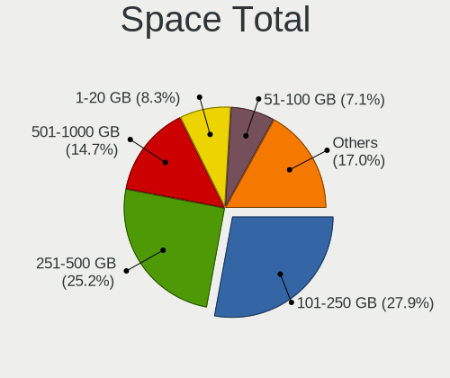
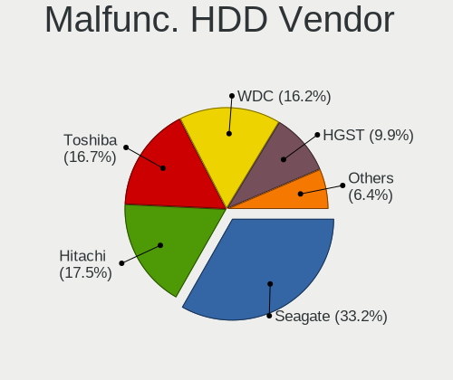
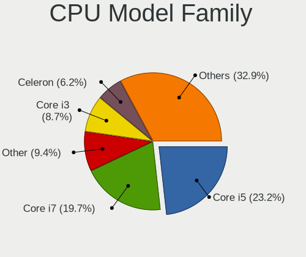

Linux - Tested Hardware & Statistics (Notebooks)
------------------------------------------------

A project to collect tested hardware configurations for Linux.

Anyone can contribute to this report by the [hw-probe](https://github.com/linuxhw/hw-probe) tool:

    sudo -E hw-probe -all -upload

Please contribute! Especially if your hardware is rare.

This report is for real hardware. Report for virtual hardware: [TestDays_VE](https://github.com/linuxhw/TestDays_VE)

Contents
--------

* [ Test Cases ](#test-cases)

* [ System ](#system)
  - [ OS                       ](#os)
  - [ OS Family                ](#os-family)
  - [ Kernel                   ](#kernel)
  - [ Kernel Family            ](#kernel-family)
  - [ Kernel Major Ver.        ](#kernel-major-ver)
  - [ Arch                     ](#arch)
  - [ DE                       ](#de)
  - [ Display Server           ](#display-server)
  - [ Display Manager          ](#display-manager)
  - [ OS Lang                  ](#os-lang)
  - [ Boot Mode                ](#boot-mode)
  - [ Filesystem               ](#filesystem)
  - [ Part. scheme             ](#part-scheme)
  - [ Dual Boot with Linux/BSD ](#dual-boot-with-linuxbsd)
  - [ Dual Boot (Win)          ](#dual-boot-win)

* [ Board ](#board)
  - [ Vendor                   ](#vendor)
  - [ Model                    ](#model)
  - [ Model Family             ](#model-family)
  - [ MFG Year                 ](#mfg-year)
  - [ Form Factor              ](#form-factor)
  - [ Secure Boot              ](#secure-boot)
  - [ Coreboot                 ](#coreboot)
  - [ RAM Size                 ](#ram-size)
  - [ RAM Used                 ](#ram-used)
  - [ Total Drives             ](#total-drives)
  - [ Has CD-ROM               ](#has-cd-rom)
  - [ Has Ethernet             ](#has-ethernet)
  - [ Has WiFi                 ](#has-wifi)
  - [ Has Bluetooth            ](#has-bluetooth)

* [ Location ](#location)
  - [ Country                  ](#country)
  - [ City                     ](#city)

* [ Drives ](#drives)
  - [ Drive Vendor             ](#drive-vendor)
  - [ Drive Model              ](#drive-model)
  - [ HDD Vendor               ](#hdd-vendor)
  - [ SSD Vendor               ](#ssd-vendor)
  - [ Drive Kind               ](#drive-kind)
  - [ Drive Connector          ](#drive-connector)
  - [ Drive Size               ](#drive-size)
  - [ Space Total              ](#space-total)
  - [ Space Used               ](#space-used)
  - [ Malfunc. Drives          ](#malfunc-drives)
  - [ Malfunc. Drive Vendor    ](#malfunc-drive-vendor)
  - [ Malfunc. HDD Vendor      ](#malfunc-hdd-vendor)
  - [ Malfunc. Drive Kind      ](#malfunc-drive-kind)
  - [ Failed Drives            ](#failed-drives)
  - [ Failed Drive Vendor      ](#failed-drive-vendor)
  - [ Drive Status             ](#drive-status)

* [ Storage controller ](#storage-controller)
  - [ Storage Vendor           ](#storage-vendor)
  - [ Storage Model            ](#storage-model)
  - [ Storage Kind             ](#storage-kind)

* [ Processor ](#processor)
  - [ CPU Vendor               ](#cpu-vendor)
  - [ CPU Model                ](#cpu-model)
  - [ CPU Model Family         ](#cpu-model-family)
  - [ CPU Cores                ](#cpu-cores)
  - [ CPU Sockets              ](#cpu-sockets)
  - [ CPU Threads              ](#cpu-threads)
  - [ CPU Op-Modes             ](#cpu-op-modes)
  - [ CPU Microcode            ](#cpu-microcode)
  - [ CPU Microarch            ](#cpu-microarch)

* [ Graphics ](#graphics)
  - [ GPU Vendor               ](#gpu-vendor)
  - [ GPU Model                ](#gpu-model)
  - [ GPU Combo                ](#gpu-combo)
  - [ GPU Driver               ](#gpu-driver)
  - [ GPU Memory               ](#gpu-memory)

* [ Monitor ](#monitor)
  - [ Monitor Vendor           ](#monitor-vendor)
  - [ Monitor Model            ](#monitor-model)
  - [ Monitor Resolution       ](#monitor-resolution)
  - [ Monitor Diagonal         ](#monitor-diagonal)
  - [ Monitor Width            ](#monitor-width)
  - [ Aspect Ratio             ](#aspect-ratio)
  - [ Monitor Area             ](#monitor-area)
  - [ Pixel Density            ](#pixel-density)
  - [ Multiple Monitors        ](#multiple-monitors)

* [ Network ](#network)
  - [ Net Controller Vendor    ](#net-controller-vendor)
  - [ Net Controller Model     ](#net-controller-model)
  - [ Wireless Vendor          ](#wireless-vendor)
  - [ Wireless Model           ](#wireless-model)
  - [ Ethernet Vendor          ](#ethernet-vendor)
  - [ Ethernet Model           ](#ethernet-model)
  - [ Net Controller Kind      ](#net-controller-kind)
  - [ Used Controller          ](#used-controller)
  - [ NICs                     ](#nics)
  - [ IPv6                     ](#ipv6)

* [ Bluetooth ](#bluetooth)
  - [ Bluetooth Vendor         ](#bluetooth-vendor)
  - [ Bluetooth Model          ](#bluetooth-model)

* [ Sound ](#sound)
  - [ Sound Vendor             ](#sound-vendor)
  - [ Sound Model              ](#sound-model)

* [ Memory ](#memory)
  - [ Memory Vendor            ](#memory-vendor)
  - [ Memory Model             ](#memory-model)
  - [ Memory Kind              ](#memory-kind)
  - [ Memory Form Factor       ](#memory-form-factor)
  - [ Memory Size              ](#memory-size)
  - [ Memory Speed             ](#memory-speed)

* [ Printers & scanners ](#printers--scanners)
  - [ Printer Vendor           ](#printer-vendor)
  - [ Printer Model            ](#printer-model)
  - [ Scanner Vendor           ](#scanner-vendor)
  - [ Scanner Model            ](#scanner-model)

* [ Camera ](#camera)
  - [ Camera Vendor            ](#camera-vendor)
  - [ Camera Model             ](#camera-model)

* [ Security ](#security)
  - [ Fingerprint Vendor       ](#fingerprint-vendor)
  - [ Fingerprint Model        ](#fingerprint-model)
  - [ Chipcard Vendor          ](#chipcard-vendor)
  - [ Chipcard Model           ](#chipcard-model)

* [ Unsupported ](#unsupported)
  - [ Unsupported Devices      ](#unsupported-devices)
  - [ Unsupported Device Types ](#unsupported-device-types)

Test Cases
----------

Total: 157177

| Vendor        | Model                       | Probe                                                      | Date         |
|---------------|-----------------------------|------------------------------------------------------------|--------------|
| Dell          | Vostro 1520                 | [2132a3308c](https://linux-hardware.org/?probe=2132a3308c) | Apr 01, 2023 |
| ASUSTek       | K52JB                       | [0e18c3546c](https://linux-hardware.org/?probe=0e18c3546c) | Apr 01, 2023 |
| Chuwi         | GemiBook Pro                | [41b51a471d](https://linux-hardware.org/?probe=41b51a471d) | Apr 01, 2023 |
| Chuwi         | GemiBook Pro                | [fc4116204b](https://linux-hardware.org/?probe=fc4116204b) | Apr 01, 2023 |
| Apple         | MacBookPro9,2               | [b0beffe006](https://linux-hardware.org/?probe=b0beffe006) | Apr 01, 2023 |
| Notebook      | NJx0MU                      | [14751f18b3](https://linux-hardware.org/?probe=14751f18b3) | Apr 01, 2023 |
| Tactus        | GeoBook 140                 | [0ceb5a3b7c](https://linux-hardware.org/?probe=0ceb5a3b7c) | Apr 01, 2023 |
| Dell          | Inspiron 15 5510            | [e169cd0886](https://linux-hardware.org/?probe=e169cd0886) | Apr 01, 2023 |
| HP            | Pavilion g7                 | [7820d2ca67](https://linux-hardware.org/?probe=7820d2ca67) | Apr 01, 2023 |
| Dell          | Latitude 5530               | [e4688e2ef8](https://linux-hardware.org/?probe=e4688e2ef8) | Apr 01, 2023 |
| Acer          | Aspire V5-121               | [d6cc7a67ab](https://linux-hardware.org/?probe=d6cc7a67ab) | Apr 01, 2023 |
| Acer          | Aspire 5740                 | [eeba9d18fa](https://linux-hardware.org/?probe=eeba9d18fa) | Apr 01, 2023 |
| HP            | Pavilion Laptop 14-ec0xx... | [1da5570114](https://linux-hardware.org/?probe=1da5570114) | Apr 01, 2023 |
| Lenovo        | ThinkPad T440 20B7S0JC0K    | [4169f13182](https://linux-hardware.org/?probe=4169f13182) | Apr 01, 2023 |
| MSI           | Vector GP66 12UGS           | [4787e68a9c](https://linux-hardware.org/?probe=4787e68a9c) | Apr 01, 2023 |
| Lenovo        | ThinkPad P1 Gen 4i 20Y30... | [96c53eccb0](https://linux-hardware.org/?probe=96c53eccb0) | Apr 01, 2023 |
| Acer          | Aspire A315-35              | [659a4cfd5a](https://linux-hardware.org/?probe=659a4cfd5a) | Apr 01, 2023 |
| Lenovo        | V15 G2 IJL 82QY             | [8582f4e86e](https://linux-hardware.org/?probe=8582f4e86e) | Apr 01, 2023 |
| Lenovo        | V15 G2 IJL 82QY             | [e94e2e397e](https://linux-hardware.org/?probe=e94e2e397e) | Apr 01, 2023 |
| ASUSTek       | N752VX                      | [d426499408](https://linux-hardware.org/?probe=d426499408) | Apr 01, 2023 |
| Medion        | E6214                       | [5766389c97](https://linux-hardware.org/?probe=5766389c97) | Apr 01, 2023 |
| Lenovo        | V310-14ISK 80SX             | [cd6dee4651](https://linux-hardware.org/?probe=cd6dee4651) | Apr 01, 2023 |
| HP            | Presario CQ58               | [e8f8f289ac](https://linux-hardware.org/?probe=e8f8f289ac) | Apr 01, 2023 |
| ASUSTek       | ZenBook UX325EA_UX325EA     | [4191279e7e](https://linux-hardware.org/?probe=4191279e7e) | Apr 01, 2023 |
| Lenovo        | IdeaPad 510-15IKB 80SV      | [6ab0a0226d](https://linux-hardware.org/?probe=6ab0a0226d) | Apr 01, 2023 |
| Lenovo        | ThinkPad T410 2518P9G       | [4f74fa6cd2](https://linux-hardware.org/?probe=4f74fa6cd2) | Apr 01, 2023 |
| Apple         | MacBookPro9,2               | [111eeac3b3](https://linux-hardware.org/?probe=111eeac3b3) | Apr 01, 2023 |
| Lenovo        | IdeaPad U310                | [6add75e18c](https://linux-hardware.org/?probe=6add75e18c) | Apr 01, 2023 |
| Unknown       | X133                        | [950572f119](https://linux-hardware.org/?probe=950572f119) | Apr 01, 2023 |
| ASUSTek       | F3JP                        | [e561213582](https://linux-hardware.org/?probe=e561213582) | Apr 01, 2023 |
| ASUSTek       | X550LB                      | [3d35ff8b68](https://linux-hardware.org/?probe=3d35ff8b68) | Apr 01, 2023 |
| Toshiba       | Satellite S50-A-K7M         | [af163d8ec3](https://linux-hardware.org/?probe=af163d8ec3) | Apr 01, 2023 |
| Lenovo        | V110-15ISK 80TL             | [db058df07b](https://linux-hardware.org/?probe=db058df07b) | Apr 01, 2023 |
| Apple         | MacBookPro9,2               | [2fcab6a925](https://linux-hardware.org/?probe=2fcab6a925) | Apr 01, 2023 |
| Lenovo        | V110-15ISK 80TL             | [3691be13e8](https://linux-hardware.org/?probe=3691be13e8) | Apr 01, 2023 |
| ASUSTek       | T100TA                      | [5be9a0230e](https://linux-hardware.org/?probe=5be9a0230e) | Apr 01, 2023 |
| ASUSTek       | ASUS EXPERTBOOK B1500CEA... | [87bc2601f3](https://linux-hardware.org/?probe=87bc2601f3) | Apr 01, 2023 |
| MSI           | Vector GP66 12UGS           | [12e105f6da](https://linux-hardware.org/?probe=12e105f6da) | Apr 01, 2023 |
| Acer          | Aspire A515-57              | [4a1b8f3f21](https://linux-hardware.org/?probe=4a1b8f3f21) | Apr 01, 2023 |
| Lenovo        | ThinkPad E14 20RA004YUS     | [36b592e607](https://linux-hardware.org/?probe=36b592e607) | Apr 01, 2023 |
| Unknown       | ACB20                       | [6e70bacda5](https://linux-hardware.org/?probe=6e70bacda5) | Apr 01, 2023 |
| ASUSTek       | S551LN                      | [916adbdf9f](https://linux-hardware.org/?probe=916adbdf9f) | Apr 01, 2023 |
| Samsung       | R530/R730/R540              | [714ed0f007](https://linux-hardware.org/?probe=714ed0f007) | Apr 01, 2023 |
| Sony          | VPCEH1S1R                   | [12100cdd4b](https://linux-hardware.org/?probe=12100cdd4b) | Apr 01, 2023 |
| Lenovo        | G505 20240                  | [d873632b2b](https://linux-hardware.org/?probe=d873632b2b) | Apr 01, 2023 |
| HP            | Pavilion Gaming Laptop 1... | [70fb59cd4f](https://linux-hardware.org/?probe=70fb59cd4f) | Apr 01, 2023 |
| HP            | EliteBook 8470p             | [178ccc8d4d](https://linux-hardware.org/?probe=178ccc8d4d) | Apr 01, 2023 |
| Dell          | Vostro 15-3568              | [d93b1d27e1](https://linux-hardware.org/?probe=d93b1d27e1) | Apr 01, 2023 |
| Unknown       | Unknown                     | [702a241ca6](https://linux-hardware.org/?probe=702a241ca6) | Apr 01, 2023 |
| Lenovo        | IdeaPad 3 15IIL05 81WE      | [9db0830268](https://linux-hardware.org/?probe=9db0830268) | Apr 01, 2023 |
| Acer          | Aspire A515-51G             | [efc8399ce9](https://linux-hardware.org/?probe=efc8399ce9) | Apr 01, 2023 |
| Lenovo        | G560 20042                  | [c5a4783dfb](https://linux-hardware.org/?probe=c5a4783dfb) | Apr 01, 2023 |
| HP            | 255 G7 Notebook PC          | [e06d57c27a](https://linux-hardware.org/?probe=e06d57c27a) | Apr 01, 2023 |
| Acer          | Nitro AN517-54              | [82d28ac7c0](https://linux-hardware.org/?probe=82d28ac7c0) | Apr 01, 2023 |
| HUAWEI        | NBD-WXX9                    | [d4c718bdab](https://linux-hardware.org/?probe=d4c718bdab) | Apr 01, 2023 |
| Lenovo        | G50-45 80E3                 | [059e2e5858](https://linux-hardware.org/?probe=059e2e5858) | Apr 01, 2023 |
| Lenovo        | G50-45 80E3                 | [f75af97954](https://linux-hardware.org/?probe=f75af97954) | Apr 01, 2023 |
| Acer          | Aspire A515-56              | [a959d79d84](https://linux-hardware.org/?probe=a959d79d84) | Apr 01, 2023 |
| Toshiba       | Satellite C55-B             | [250e5371c1](https://linux-hardware.org/?probe=250e5371c1) | Apr 01, 2023 |
| Lenovo        | ThinkPad X230 2325DV4       | [6cff5cd5d1](https://linux-hardware.org/?probe=6cff5cd5d1) | Apr 01, 2023 |
| Dell          | Latitude 5580               | [10cbd4c04d](https://linux-hardware.org/?probe=10cbd4c04d) | Apr 01, 2023 |
| Dell          | XPS 15 9570                 | [7beef34820](https://linux-hardware.org/?probe=7beef34820) | Apr 01, 2023 |
| Fujitsu       | LIFEBOOK S935               | [11b63a22b5](https://linux-hardware.org/?probe=11b63a22b5) | Apr 01, 2023 |
| HP            | Pavilion Gaming Laptop 1... | [7e8bd9a529](https://linux-hardware.org/?probe=7e8bd9a529) | Apr 01, 2023 |
| Acer          | Aspire A515-56              | [db53e1a333](https://linux-hardware.org/?probe=db53e1a333) | Apr 01, 2023 |
| ASUSTek       | T100TA                      | [1f0b0c32ca](https://linux-hardware.org/?probe=1f0b0c32ca) | Apr 01, 2023 |
| Lenovo        | G500 20236                  | [22d22e0742](https://linux-hardware.org/?probe=22d22e0742) | Apr 01, 2023 |
| Lenovo        | G500 20236                  | [2994622700](https://linux-hardware.org/?probe=2994622700) | Apr 01, 2023 |
| Lenovo        | ThinkPad E14 Gen 2 20TA0... | [2a881cc01e](https://linux-hardware.org/?probe=2a881cc01e) | Apr 01, 2023 |
| Lenovo        | IdeaPad L340-15IRH Gamin... | [27fbf62ba0](https://linux-hardware.org/?probe=27fbf62ba0) | Apr 01, 2023 |
| Sony          | VPCEA3BFX                   | [6215c985dd](https://linux-hardware.org/?probe=6215c985dd) | Apr 01, 2023 |
| Dell          | Inspiron 13 5310            | [32bdbfa581](https://linux-hardware.org/?probe=32bdbfa581) | Apr 01, 2023 |
| Itautec       | Infoway w7535               | [48a539f108](https://linux-hardware.org/?probe=48a539f108) | Apr 01, 2023 |
| Lenovo        | ThinkPad X201s 514328U      | [011c475758](https://linux-hardware.org/?probe=011c475758) | Apr 01, 2023 |
| Toshiba       | Satellite L45-B             | [6d4878cdbf](https://linux-hardware.org/?probe=6d4878cdbf) | Apr 01, 2023 |
| Dell          | Latitude E7470              | [ee66bc49a5](https://linux-hardware.org/?probe=ee66bc49a5) | Apr 01, 2023 |
| Valve         | Jupiter                     | [816e9cb6f6](https://linux-hardware.org/?probe=816e9cb6f6) | Apr 01, 2023 |
| Valve         | Jupiter                     | [a91aee62d3](https://linux-hardware.org/?probe=a91aee62d3) | Apr 01, 2023 |
| HP            | Pavilion dv7                | [00bbec023a](https://linux-hardware.org/?probe=00bbec023a) | Apr 01, 2023 |
| Lenovo        | IdeaPad Gaming 3 15ACH6 ... | [0a028a43f8](https://linux-hardware.org/?probe=0a028a43f8) | Apr 01, 2023 |
| HP            | 240 G6 Notebook PC          | [44e093df31](https://linux-hardware.org/?probe=44e093df31) | Apr 01, 2023 |
| Lenovo        | ThinkPad T440p              | [4057e0c5e9](https://linux-hardware.org/?probe=4057e0c5e9) | Apr 01, 2023 |
| Lenovo        | V15-IGL 82C3                | [4773b9449c](https://linux-hardware.org/?probe=4773b9449c) | Apr 01, 2023 |
| HP            | Notebook                    | [7cb279c8e0](https://linux-hardware.org/?probe=7cb279c8e0) | Apr 01, 2023 |
| Dell          | Vostro 15 3515              | [eea311b1bb](https://linux-hardware.org/?probe=eea311b1bb) | Apr 01, 2023 |
| Valve         | Jupiter                     | [2628ea9d8e](https://linux-hardware.org/?probe=2628ea9d8e) | Apr 01, 2023 |
| Novatech      | NL40_50CU                   | [caaa544589](https://linux-hardware.org/?probe=caaa544589) | Apr 01, 2023 |
| ASUSTek       | X555BP                      | [c7f621e335](https://linux-hardware.org/?probe=c7f621e335) | Apr 01, 2023 |
| HP            | Laptop 15s-eq3xxx           | [758bb2556e](https://linux-hardware.org/?probe=758bb2556e) | Apr 01, 2023 |
| Lenovo        | ThinkPad T530 23594LU       | [9de89fee19](https://linux-hardware.org/?probe=9de89fee19) | Apr 01, 2023 |
| Lenovo        | ThinkPad T420s 4173R44      | [84e9a5f3d9](https://linux-hardware.org/?probe=84e9a5f3d9) | Apr 01, 2023 |
| UMAX          | VisionBook 14Wa Plus        | [ea8016c4a5](https://linux-hardware.org/?probe=ea8016c4a5) | Apr 01, 2023 |
| Star Labs     | StarBook                    | [8712994e3c](https://linux-hardware.org/?probe=8712994e3c) | Apr 01, 2023 |
| HP            | Pavilion x2 Detachable      | [363d925d25](https://linux-hardware.org/?probe=363d925d25) | Apr 01, 2023 |
| Dell          | Latitude E7450              | [8bf693a890](https://linux-hardware.org/?probe=8bf693a890) | Apr 01, 2023 |
| Samsung       | 340XAA/350XAA/550XAA        | [93ef0bb287](https://linux-hardware.org/?probe=93ef0bb287) | Apr 01, 2023 |
| Apple         | MacBookPro11,1              | [53717700a1](https://linux-hardware.org/?probe=53717700a1) | Mar 31, 2023 |
| Lenovo        | ThinkPad X1 Carbon 2nd 2... | [016ddeab52](https://linux-hardware.org/?probe=016ddeab52) | Mar 31, 2023 |
| HP            | Laptop 14-dq2xxx            | [c90d525ee8](https://linux-hardware.org/?probe=c90d525ee8) | Mar 31, 2023 |
| Dell          | Latitude E6320              | [a6a0d01947](https://linux-hardware.org/?probe=a6a0d01947) | Mar 31, 2023 |
| ASUSTek       | X556UAK                     | [24f79c68f6](https://linux-hardware.org/?probe=24f79c68f6) | Mar 31, 2023 |
| HP            | Laptop 15-bs0xx             | [a5cb1375c4](https://linux-hardware.org/?probe=a5cb1375c4) | Mar 31, 2023 |
| Lenovo        | ThinkPad T490s 20NXS0DS0... | [1228998af5](https://linux-hardware.org/?probe=1228998af5) | Mar 31, 2023 |
| HP            | Laptop 15-bs0xx             | [60a6b11ce0](https://linux-hardware.org/?probe=60a6b11ce0) | Mar 31, 2023 |
| Samsung       | 270E5G/270E5U               | [67b91e463a](https://linux-hardware.org/?probe=67b91e463a) | Mar 31, 2023 |
| System76      | Lemur Pro                   | [5d57a3397e](https://linux-hardware.org/?probe=5d57a3397e) | Mar 31, 2023 |
| Dell          | XPS 17 9700                 | [5d0a908832](https://linux-hardware.org/?probe=5d0a908832) | Mar 31, 2023 |
| Acer          | Aspire A315-54K             | [d325177071](https://linux-hardware.org/?probe=d325177071) | Mar 31, 2023 |
| ASUSTek       | X202E                       | [cdcccb09e7](https://linux-hardware.org/?probe=cdcccb09e7) | Mar 31, 2023 |
| HP            | ProBook 440 G6              | [5198509903](https://linux-hardware.org/?probe=5198509903) | Mar 31, 2023 |
| Positivo      | S14CT01                     | [a47919fcc4](https://linux-hardware.org/?probe=a47919fcc4) | Mar 31, 2023 |
| ASUSTek       | X202E                       | [ac12ec53a3](https://linux-hardware.org/?probe=ac12ec53a3) | Mar 31, 2023 |
| Notebook      | W54_55SU1,SUW               | [74313ae73b](https://linux-hardware.org/?probe=74313ae73b) | Mar 31, 2023 |
| Lenovo        | IdeaPad Yoga 13 20175       | [66a1075056](https://linux-hardware.org/?probe=66a1075056) | Mar 31, 2023 |
| Quanta        | QL3 TBD                     | [21673aecac](https://linux-hardware.org/?probe=21673aecac) | Mar 31, 2023 |
| Fujitsu       | LIFEBOOK NH532              | [68a8171c0a](https://linux-hardware.org/?probe=68a8171c0a) | Mar 31, 2023 |
| Lenovo        | ThinkPad T431s 20AA0016G... | [13e8d4f50b](https://linux-hardware.org/?probe=13e8d4f50b) | Mar 31, 2023 |
| HP            | Notebook                    | [7b9f1f44c9](https://linux-hardware.org/?probe=7b9f1f44c9) | Mar 31, 2023 |
| HP            | Compaq Presario CQ60        | [e5a729243d](https://linux-hardware.org/?probe=e5a729243d) | Mar 31, 2023 |
| Microtech     | ebookPro                    | [ffe1da27cc](https://linux-hardware.org/?probe=ffe1da27cc) | Mar 31, 2023 |
| HP            | Notebook                    | [ad90621225](https://linux-hardware.org/?probe=ad90621225) | Mar 31, 2023 |
| Dell          | XPS M1330                   | [46b9a5cfde](https://linux-hardware.org/?probe=46b9a5cfde) | Mar 31, 2023 |
| Intel         | Kabylake Platform           | [2b0fd79264](https://linux-hardware.org/?probe=2b0fd79264) | Mar 31, 2023 |
| Samsung       | 950XED                      | [c3b37a213a](https://linux-hardware.org/?probe=c3b37a213a) | Mar 31, 2023 |
| HP            | Pavilion g7                 | [3b0b792078](https://linux-hardware.org/?probe=3b0b792078) | Mar 31, 2023 |
| ASUSTek       | ZenBook UX425IA_UM425IA     | [3ac0a9cc94](https://linux-hardware.org/?probe=3ac0a9cc94) | Mar 31, 2023 |
| Acer          | Aspire A514-53              | [4bb2babc0a](https://linux-hardware.org/?probe=4bb2babc0a) | Mar 31, 2023 |
| Toshiba       | Satellite L655              | [d527726a1c](https://linux-hardware.org/?probe=d527726a1c) | Mar 31, 2023 |
| Acer          | Aspire E5-571               | [45887eb5f3](https://linux-hardware.org/?probe=45887eb5f3) | Mar 31, 2023 |
| Dell          | XPS 13 9380                 | [47557561a9](https://linux-hardware.org/?probe=47557561a9) | Mar 31, 2023 |
| HP            | Pavilion Aero Laptop 13-... | [59b2b4e152](https://linux-hardware.org/?probe=59b2b4e152) | Mar 31, 2023 |
| Acer          | Extensa 215-31              | [b1601e6747](https://linux-hardware.org/?probe=b1601e6747) | Mar 31, 2023 |
| Samsung       | 300V3A/300V4A/300V5A/200... | [ad92e27c90](https://linux-hardware.org/?probe=ad92e27c90) | Mar 31, 2023 |
| Acer          | Aspire 7720                 | [073d49ce6b](https://linux-hardware.org/?probe=073d49ce6b) | Mar 31, 2023 |
| GPD           | G1621-02                    | [7d000ab41b](https://linux-hardware.org/?probe=7d000ab41b) | Mar 31, 2023 |
| Dell          | Precision 5570              | [a3d5f928ee](https://linux-hardware.org/?probe=a3d5f928ee) | Mar 31, 2023 |
| Dell          | Vostro V131                 | [53538c2ae9](https://linux-hardware.org/?probe=53538c2ae9) | Mar 31, 2023 |
| Lenovo        | ThinkPad P14s Gen 2a 21A... | [36fab57ba7](https://linux-hardware.org/?probe=36fab57ba7) | Mar 31, 2023 |
| HP            | ProBook 640 G2              | [11b902ad5d](https://linux-hardware.org/?probe=11b902ad5d) | Mar 31, 2023 |
| Lenovo        | ThinkPad T440p              | [1063ba3fb9](https://linux-hardware.org/?probe=1063ba3fb9) | Mar 31, 2023 |
| Lenovo        | ThinkPad L14 Gen 3 21C5C... | [683d3101d8](https://linux-hardware.org/?probe=683d3101d8) | Mar 31, 2023 |
| Dell          | Inspiron 1545               | [ca44e7f419](https://linux-hardware.org/?probe=ca44e7f419) | Mar 31, 2023 |
| Gigabyte      | A7 K1                       | [e5e7751054](https://linux-hardware.org/?probe=e5e7751054) | Mar 31, 2023 |
| Dell          | Latitude E7440              | [fdd9fda693](https://linux-hardware.org/?probe=fdd9fda693) | Mar 31, 2023 |
| HP            | Compaq 6730b (GB987ET#UU... | [6c6ceb9bc3](https://linux-hardware.org/?probe=6c6ceb9bc3) | Mar 31, 2023 |
| HP            | 250 G5 Notebook PC          | [d271318192](https://linux-hardware.org/?probe=d271318192) | Mar 31, 2023 |
| HP            | Laptop 15-db0xxx            | [c51f53a733](https://linux-hardware.org/?probe=c51f53a733) | Mar 31, 2023 |
| Lenovo        | ThinkPad T430 2347EP7       | [6fd7423cb6](https://linux-hardware.org/?probe=6fd7423cb6) | Mar 31, 2023 |
| HP            | Pavilion 15                 | [4dc2c9dfc1](https://linux-hardware.org/?probe=4dc2c9dfc1) | Mar 31, 2023 |
| ASUSTek       | K53SD                       | [81d03c3707](https://linux-hardware.org/?probe=81d03c3707) | Mar 31, 2023 |
| ASUSTek       | ASUS TUF Gaming F15 FX50... | [e2c6f05595](https://linux-hardware.org/?probe=e2c6f05595) | Mar 31, 2023 |
| Medion        | E6214                       | [298e2f9c69](https://linux-hardware.org/?probe=298e2f9c69) | Mar 31, 2023 |
| Valve         | Jupiter                     | [888da0cc87](https://linux-hardware.org/?probe=888da0cc87) | Mar 31, 2023 |
| HUAWEI        | KPL-W0X                     | [6e93ca4159](https://linux-hardware.org/?probe=6e93ca4159) | Mar 31, 2023 |
| ASUSTek       | VivoBook_ASUSLaptop X515... | [29c4ba04a1](https://linux-hardware.org/?probe=29c4ba04a1) | Mar 31, 2023 |
| Lenovo        | ThinkPad P15s Gen 2i 20W... | [d35ddee3e1](https://linux-hardware.org/?probe=d35ddee3e1) | Mar 31, 2023 |
| Lenovo        | ThinkPad E14 20RA0016IX     | [685f18f5b3](https://linux-hardware.org/?probe=685f18f5b3) | Mar 31, 2023 |
| Dell          | Inspiron 7577               | [5800e3859c](https://linux-hardware.org/?probe=5800e3859c) | Mar 31, 2023 |
| Acer          | Nitro AN515-54              | [9e7aa15a9f](https://linux-hardware.org/?probe=9e7aa15a9f) | Mar 31, 2023 |
| Chuwi         | CoreBook XPro               | [85ad17d246](https://linux-hardware.org/?probe=85ad17d246) | Mar 31, 2023 |
| HUAWEI        | HN-WX9X                     | [b10ed7894c](https://linux-hardware.org/?probe=b10ed7894c) | Mar 31, 2023 |
| Acer          | Swift SF113-31              | [fc0539603c](https://linux-hardware.org/?probe=fc0539603c) | Mar 31, 2023 |
| MSI           | Modern 15 A5M               | [2a00bed043](https://linux-hardware.org/?probe=2a00bed043) | Mar 31, 2023 |
| Lenovo        | ThinkPad P15v Gen 2i 21A... | [c76f4f4354](https://linux-hardware.org/?probe=c76f4f4354) | Mar 31, 2023 |
| HP            | OMEN by Laptop 17-cb1xxx    | [db1a67682b](https://linux-hardware.org/?probe=db1a67682b) | Mar 31, 2023 |
| Lenovo        | Legion Y540-15IRH-PG0 81... | [af258dcd36](https://linux-hardware.org/?probe=af258dcd36) | Mar 31, 2023 |
| Lenovo        | ThinkPad P15v Gen 2i 21A... | [3a74487ae8](https://linux-hardware.org/?probe=3a74487ae8) | Mar 31, 2023 |
| Acer          | TravelMate 8172Z            | [10cc090653](https://linux-hardware.org/?probe=10cc090653) | Mar 31, 2023 |
| HP            | Pavilion Laptop 15-eh1xx... | [b56e2a41ed](https://linux-hardware.org/?probe=b56e2a41ed) | Mar 31, 2023 |
| ASUSTek       | X551MA                      | [5ea823d079](https://linux-hardware.org/?probe=5ea823d079) | Mar 31, 2023 |
| Acer          | Aspire ES1-531              | [aedba72f70](https://linux-hardware.org/?probe=aedba72f70) | Mar 31, 2023 |
| Lenovo        | Yoga 3 11 80J8              | [fce7483fa0](https://linux-hardware.org/?probe=fce7483fa0) | Mar 31, 2023 |
| Lenovo        | ThinkPad Edge E545 20B20... | [c2061eeeb8](https://linux-hardware.org/?probe=c2061eeeb8) | Mar 31, 2023 |
| Fujitsu Si... | AMILO A Series              | [e551dfea34](https://linux-hardware.org/?probe=e551dfea34) | Mar 31, 2023 |
| HP            | EliteBook 2530p (KR059AV... | [e7f9bce466](https://linux-hardware.org/?probe=e7f9bce466) | Mar 31, 2023 |
| Lenovo        | ThinkPad Edge E545 20B20... | [9a866f03fd](https://linux-hardware.org/?probe=9a866f03fd) | Mar 31, 2023 |
| Toshiba       | Satellite U940              | [277dba9c1f](https://linux-hardware.org/?probe=277dba9c1f) | Mar 31, 2023 |
| Olivetti      | Spring Peak                 | [9678c685d7](https://linux-hardware.org/?probe=9678c685d7) | Mar 31, 2023 |
| Unknown       | Unknown                     | [c30740a3eb](https://linux-hardware.org/?probe=c30740a3eb) | Mar 31, 2023 |
| Toshiba       | Satellite U940              | [8a5046cad7](https://linux-hardware.org/?probe=8a5046cad7) | Mar 31, 2023 |
| Intel         | Whiskey Platform            | [36b9d4d898](https://linux-hardware.org/?probe=36b9d4d898) | Mar 31, 2023 |
| Lenovo        | ThinkPad Z13 Gen 1 21D2C... | [0ab4f4cd55](https://linux-hardware.org/?probe=0ab4f4cd55) | Mar 31, 2023 |
| HP            | Laptop 17-cp2xxx            | [854de8a433](https://linux-hardware.org/?probe=854de8a433) | Mar 31, 2023 |
| ASUSTek       | GL502VMK                    | [fe7f43d2db](https://linux-hardware.org/?probe=fe7f43d2db) | Mar 31, 2023 |
| Lenovo        | Legion 5 15IMH05 82AU       | [36c0a38885](https://linux-hardware.org/?probe=36c0a38885) | Mar 31, 2023 |
| ASUSTek       | X550CL                      | [5d5862d22a](https://linux-hardware.org/?probe=5d5862d22a) | Mar 31, 2023 |
| Dell          | Inspiron N5010              | [4d3e61950f](https://linux-hardware.org/?probe=4d3e61950f) | Mar 31, 2023 |
| Fujitsu Si... | ESPRIMO Mobile V5535        | [d6c537b33b](https://linux-hardware.org/?probe=d6c537b33b) | Mar 31, 2023 |
| Apple         | MacBookPro9,2               | [8c60cf0ec1](https://linux-hardware.org/?probe=8c60cf0ec1) | Mar 31, 2023 |
| ASUSTek       | X751LD                      | [2ef82331de](https://linux-hardware.org/?probe=2ef82331de) | Mar 31, 2023 |
| Lenovo        | IdeaPad 300-15ISK 80Q7      | [54f8c5082d](https://linux-hardware.org/?probe=54f8c5082d) | Mar 31, 2023 |
| Lenovo        | ThinkPad T490 20N2CTO1WW    | [17fb0ed43a](https://linux-hardware.org/?probe=17fb0ed43a) | Mar 31, 2023 |
| Lenovo        | ThinkBook 15 G2 ITL 20VE    | [008eb6ad60](https://linux-hardware.org/?probe=008eb6ad60) | Mar 31, 2023 |
| Lenovo        | ThinkBook 15 G2 ITL 20VE    | [4dd142ab8f](https://linux-hardware.org/?probe=4dd142ab8f) | Mar 31, 2023 |
| Lenovo        | IdeaPad L340-15API 81LW     | [36b3103f3f](https://linux-hardware.org/?probe=36b3103f3f) | Mar 31, 2023 |
| HP            | EliteBook 8460p             | [1d5f866283](https://linux-hardware.org/?probe=1d5f866283) | Mar 31, 2023 |
| Olivetti      | Spring Peak                 | [7878f53f36](https://linux-hardware.org/?probe=7878f53f36) | Mar 31, 2023 |
| ASUSTek       | VivoBook 15_ASUS Laptop ... | [8228733171](https://linux-hardware.org/?probe=8228733171) | Mar 31, 2023 |
| Valve         | Jupiter                     | [34766581f3](https://linux-hardware.org/?probe=34766581f3) | Mar 31, 2023 |
| Dell          | Latitude E6330              | [ae7a7254b8](https://linux-hardware.org/?probe=ae7a7254b8) | Mar 31, 2023 |
| Dell          | Latitude E6330              | [2239e12384](https://linux-hardware.org/?probe=2239e12384) | Mar 31, 2023 |
| HP            | Pavilion Gaming Laptop 1... | [0014e52bf3](https://linux-hardware.org/?probe=0014e52bf3) | Mar 31, 2023 |
| ASUSTek       | X751SA                      | [5d8ad91642](https://linux-hardware.org/?probe=5d8ad91642) | Mar 31, 2023 |
| ASUSTek       | X450LD                      | [1ca0cdc1e8](https://linux-hardware.org/?probe=1ca0cdc1e8) | Mar 31, 2023 |
| HP            | Pavilion dm4                | [b7f2f9e2ab](https://linux-hardware.org/?probe=b7f2f9e2ab) | Mar 31, 2023 |
| MSI           | GS66 Stealth 10SF           | [a2589dd6f5](https://linux-hardware.org/?probe=a2589dd6f5) | Mar 31, 2023 |
| Valve         | Jupiter                     | [d5e7a881e6](https://linux-hardware.org/?probe=d5e7a881e6) | Mar 31, 2023 |
| Acer          | Aspire 1410                 | [58be80ea51](https://linux-hardware.org/?probe=58be80ea51) | Mar 31, 2023 |
| Lenovo        | IdeaPad 100-15IBY 80MJ      | [3399c2f210](https://linux-hardware.org/?probe=3399c2f210) | Mar 31, 2023 |
| ASUSTek       | VivoBook_ASUSLaptop X515... | [7597a96654](https://linux-hardware.org/?probe=7597a96654) | Mar 31, 2023 |
| Google        | Cave                        | [8bd24407be](https://linux-hardware.org/?probe=8bd24407be) | Mar 31, 2023 |
| Exo           | Smart XL4                   | [6421142cb6](https://linux-hardware.org/?probe=6421142cb6) | Mar 31, 2023 |
| Acer          | Aspire 5720Z                | [ca2b750eeb](https://linux-hardware.org/?probe=ca2b750eeb) | Mar 31, 2023 |
| Valve         | Jupiter                     | [5b3718d617](https://linux-hardware.org/?probe=5b3718d617) | Mar 31, 2023 |
| Lenovo        | ThinkPad T430 2349A17       | [40489044a0](https://linux-hardware.org/?probe=40489044a0) | Mar 31, 2023 |
| Dell          | Precision M4700             | [7c93bc178e](https://linux-hardware.org/?probe=7c93bc178e) | Mar 31, 2023 |
| HP            | EliteBook 1040 14 inch G... | [488dc3a686](https://linux-hardware.org/?probe=488dc3a686) | Mar 31, 2023 |
| Dell          | Inspiron 5567               | [fe5578a96e](https://linux-hardware.org/?probe=fe5578a96e) | Mar 31, 2023 |
| Valve         | Jupiter                     | [078e440a68](https://linux-hardware.org/?probe=078e440a68) | Mar 31, 2023 |
| HP            | EliteBook 1040 14 inch G... | [bf1af4af46](https://linux-hardware.org/?probe=bf1af4af46) | Mar 31, 2023 |
| Lenovo        | ThinkPad X270 20HMS0T000    | [702223a4b1](https://linux-hardware.org/?probe=702223a4b1) | Mar 31, 2023 |
| EVOO          | EVC156-1                    | [8e665ae8b2](https://linux-hardware.org/?probe=8e665ae8b2) | Mar 31, 2023 |
| HUAWEI        | KLVL-WXXW                   | [6915349237](https://linux-hardware.org/?probe=6915349237) | Mar 31, 2023 |
| Dell          | Latitude D620               | [801ede47a2](https://linux-hardware.org/?probe=801ede47a2) | Mar 31, 2023 |
| ASUSTek       | VivoBook 15_ASUS Laptop ... | [03da618edb](https://linux-hardware.org/?probe=03da618edb) | Mar 31, 2023 |
| Acer          | TravelMate B311-31          | [3345b754b7](https://linux-hardware.org/?probe=3345b754b7) | Mar 31, 2023 |
| HP            | EliteBook 8540p             | [570836875c](https://linux-hardware.org/?probe=570836875c) | Mar 31, 2023 |
| Lenovo        | IdeaPad 530S-14IKB 81EU     | [fe51f2c62f](https://linux-hardware.org/?probe=fe51f2c62f) | Mar 31, 2023 |
| Notebook      | NL40_50GU                   | [a46afd7246](https://linux-hardware.org/?probe=a46afd7246) | Mar 31, 2023 |
| ASUSTek       | ASUS BR1100CKA BR1100CKA... | [d7f3354ce9](https://linux-hardware.org/?probe=d7f3354ce9) | Mar 31, 2023 |
| Acer          | Swift SFA16-41              | [e110fbb7d6](https://linux-hardware.org/?probe=e110fbb7d6) | Mar 31, 2023 |
| Star Labs     | Lite                        | [e3689ef845](https://linux-hardware.org/?probe=e3689ef845) | Mar 31, 2023 |
| Dell          | Latitude 7490               | [06928c624b](https://linux-hardware.org/?probe=06928c624b) | Mar 31, 2023 |
| Toshiba       | Satellite Pro S500          | [b2e60d9170](https://linux-hardware.org/?probe=b2e60d9170) | Mar 31, 2023 |
| HP            | Pavilion Laptop 15-cc5xx    | [c6bbbbb7d8](https://linux-hardware.org/?probe=c6bbbbb7d8) | Mar 31, 2023 |
| Lenovo        | ThinkPad T14s Gen 2a 20X... | [0ffc78eac6](https://linux-hardware.org/?probe=0ffc78eac6) | Mar 30, 2023 |
| Medion        | E15407                      | [b863362865](https://linux-hardware.org/?probe=b863362865) | Mar 30, 2023 |
| ASUSTek       | N552VX                      | [cacf95c277](https://linux-hardware.org/?probe=cacf95c277) | Mar 30, 2023 |
| ASUSTek       | K54C                        | [a2a91e2071](https://linux-hardware.org/?probe=a2a91e2071) | Mar 30, 2023 |
| Medion        | E15407                      | [641091a85d](https://linux-hardware.org/?probe=641091a85d) | Mar 30, 2023 |
| Acer          | Aspire 7741                 | [34bd6f42b1](https://linux-hardware.org/?probe=34bd6f42b1) | Mar 30, 2023 |
| HP            | Unknown                     | [fb784430a5](https://linux-hardware.org/?probe=fb784430a5) | Mar 30, 2023 |
| HP            | 250 G3                      | [519b0e31a8](https://linux-hardware.org/?probe=519b0e31a8) | Mar 30, 2023 |
| Lenovo        | Yoga 500-15IBD 80N6         | [225e13e1f0](https://linux-hardware.org/?probe=225e13e1f0) | Mar 30, 2023 |
| Dell          | Latitude 7370               | [b8a0b25983](https://linux-hardware.org/?probe=b8a0b25983) | Mar 30, 2023 |
| HP            | Pavilion Laptop 15-eh0xx... | [a967e73159](https://linux-hardware.org/?probe=a967e73159) | Mar 30, 2023 |
| Acer          | Aspire A515-56              | [bf846cebb9](https://linux-hardware.org/?probe=bf846cebb9) | Mar 30, 2023 |
| HP            | Pavilion Gaming Laptop 1... | [8e927ead89](https://linux-hardware.org/?probe=8e927ead89) | Mar 30, 2023 |
| Fujitsu Si... | ESPRIMO Mobile V6535        | [81c43aeb0d](https://linux-hardware.org/?probe=81c43aeb0d) | Mar 30, 2023 |
| Toshiba       | Satellite P875              | [aba8c03541](https://linux-hardware.org/?probe=aba8c03541) | Mar 30, 2023 |
| Apple         | MacBookAir7,2               | [d9cbbe0a35](https://linux-hardware.org/?probe=d9cbbe0a35) | Mar 30, 2023 |
| Lenovo        | IdeaPad 330S-15ARR 81FB     | [1dc323a9e9](https://linux-hardware.org/?probe=1dc323a9e9) | Mar 30, 2023 |
| Google        | Lillipup                    | [09292890c9](https://linux-hardware.org/?probe=09292890c9) | Mar 30, 2023 |
| Acer          | Nitro AN515-58              | [27befad01f](https://linux-hardware.org/?probe=27befad01f) | Mar 30, 2023 |
| Lenovo        | ThinkPad T460 20FMA0APAR    | [2ca1607b80](https://linux-hardware.org/?probe=2ca1607b80) | Mar 30, 2023 |
| ASUSTek       | K53SJ                       | [aa9a729217](https://linux-hardware.org/?probe=aa9a729217) | Mar 30, 2023 |
| Lenovo        | ThinkPad E595 20NF0000GE    | [95a77f6dcc](https://linux-hardware.org/?probe=95a77f6dcc) | Mar 30, 2023 |
| Notebook      | N150CU                      | [5da0df2cf0](https://linux-hardware.org/?probe=5da0df2cf0) | Mar 30, 2023 |
| Dell          | Vostro 15-3568              | [3636f7f999](https://linux-hardware.org/?probe=3636f7f999) | Mar 30, 2023 |
| ASUSTek       | X555LAB                     | [f1b87ecc62](https://linux-hardware.org/?probe=f1b87ecc62) | Mar 30, 2023 |
| Dell          | Precision 3520              | [78a49d244d](https://linux-hardware.org/?probe=78a49d244d) | Mar 30, 2023 |
| HP            | EliteBook 6930p             | [5b087b11f5](https://linux-hardware.org/?probe=5b087b11f5) | Mar 30, 2023 |
| Apple         | MacBookPro10,2              | [2f56ac98c1](https://linux-hardware.org/?probe=2f56ac98c1) | Mar 30, 2023 |
| Dell          | Precision 5510              | [4bbf7f5ef2](https://linux-hardware.org/?probe=4bbf7f5ef2) | Mar 30, 2023 |
| Acer          | Aspire ES1-523              | [a800dab0ab](https://linux-hardware.org/?probe=a800dab0ab) | Mar 30, 2023 |
| Positivo      | S14SL01                     | [e1c79f71b7](https://linux-hardware.org/?probe=e1c79f71b7) | Mar 30, 2023 |
| Motion Com... | J3600                       | [0980fe0a37](https://linux-hardware.org/?probe=0980fe0a37) | Mar 30, 2023 |
| HP            | EliteBook 2540p             | [6aae8ca2a0](https://linux-hardware.org/?probe=6aae8ca2a0) | Mar 30, 2023 |
| HP            | Pavilion dv6                | [c91e4d9c5a](https://linux-hardware.org/?probe=c91e4d9c5a) | Mar 30, 2023 |
| AIR           | CX30500                     | [2ea4d0ec83](https://linux-hardware.org/?probe=2ea4d0ec83) | Mar 30, 2023 |
| ASUSTek       | X101H                       | [a8a30f0050](https://linux-hardware.org/?probe=a8a30f0050) | Mar 30, 2023 |
| HP            | Pavilion Laptop 15-cw1xx... | [f5db7a6030](https://linux-hardware.org/?probe=f5db7a6030) | Mar 30, 2023 |
| Sony          | SVE1713X1EB                 | [8953aa2e04](https://linux-hardware.org/?probe=8953aa2e04) | Mar 30, 2023 |
| Lenovo        | ThinkPad T470s 20HGS23V0... | [6af08c4bfe](https://linux-hardware.org/?probe=6af08c4bfe) | Mar 30, 2023 |
| Lenovo        | Legion Y530-15ICH 81FV      | [0f8c22b288](https://linux-hardware.org/?probe=0f8c22b288) | Mar 30, 2023 |
| Dell          | XPS 17 9710                 | [6b37881138](https://linux-hardware.org/?probe=6b37881138) | Mar 30, 2023 |
| Lenovo        | ThinkPad T470s 20HGS23V0... | [6f0d3fd82b](https://linux-hardware.org/?probe=6f0d3fd82b) | Mar 30, 2023 |
| Lenovo        | ThinkBook 15-IIL 20SM       | [31d333ecc9](https://linux-hardware.org/?probe=31d333ecc9) | Mar 30, 2023 |
| Samsung       | 355V4C/356V4C/3445VC/354... | [6b9737a62f](https://linux-hardware.org/?probe=6b9737a62f) | Mar 30, 2023 |
| ASUSTek       | K55A                        | [cf40bdccfc](https://linux-hardware.org/?probe=cf40bdccfc) | Mar 30, 2023 |
| HUAWEI        | KLVL-WXXW                   | [ab31f6f63d](https://linux-hardware.org/?probe=ab31f6f63d) | Mar 30, 2023 |
| HP            | ProBook 6360b               | [cf027e03de](https://linux-hardware.org/?probe=cf027e03de) | Mar 30, 2023 |
| Dell          | Inspiron 15 5510            | [162132b606](https://linux-hardware.org/?probe=162132b606) | Mar 30, 2023 |
| ASUSTek       | K55A                        | [b6c168d185](https://linux-hardware.org/?probe=b6c168d185) | Mar 30, 2023 |
| Toshiba       | Satellite C850-C5K          | [8fc7451def](https://linux-hardware.org/?probe=8fc7451def) | Mar 30, 2023 |
| Acer          | Prespa M                    | [a6541a27d9](https://linux-hardware.org/?probe=a6541a27d9) | Mar 30, 2023 |
| Dell          | Vostro 5402                 | [27b9c84cbe](https://linux-hardware.org/?probe=27b9c84cbe) | Mar 30, 2023 |
| Lenovo        | IdeaPad 3 15ITL6 82H8       | [afd41155ee](https://linux-hardware.org/?probe=afd41155ee) | Mar 30, 2023 |
| Lenovo        | G550 2958                   | [41f23ded68](https://linux-hardware.org/?probe=41f23ded68) | Mar 30, 2023 |
| ASUSTek       | VivoBook_ASUSLaptop X512... | [a1fa08efc6](https://linux-hardware.org/?probe=a1fa08efc6) | Mar 30, 2023 |
| Lenovo        | Flex 2-14 20404             | [f24b481b5b](https://linux-hardware.org/?probe=f24b481b5b) | Mar 30, 2023 |
| Google        | Caroline                    | [8018db87e9](https://linux-hardware.org/?probe=8018db87e9) | Mar 30, 2023 |
| Acer          | Swift SF114-32              | [d15bbe8855](https://linux-hardware.org/?probe=d15bbe8855) | Mar 30, 2023 |
| Lenovo        | IdeaPad 3 15ITL6 82H8       | [45f39402f0](https://linux-hardware.org/?probe=45f39402f0) | Mar 30, 2023 |
| Lenovo        | IdeaPad 100-14IBY 80MH      | [976d8a1a13](https://linux-hardware.org/?probe=976d8a1a13) | Mar 30, 2023 |
| Apple         | MacBookPro12,1              | [21515b7373](https://linux-hardware.org/?probe=21515b7373) | Mar 30, 2023 |
| HP            | Pavilion Notebook           | [3844e429b1](https://linux-hardware.org/?probe=3844e429b1) | Mar 30, 2023 |
| Lenovo        | V15-ADA 82C7                | [552ad08e05](https://linux-hardware.org/?probe=552ad08e05) | Mar 30, 2023 |
| Lenovo        | IdeaPad 520-15IKB 81BF      | [51f6d77f50](https://linux-hardware.org/?probe=51f6d77f50) | Mar 30, 2023 |
| ASUSTek       | K52JB                       | [45162c9123](https://linux-hardware.org/?probe=45162c9123) | Mar 30, 2023 |
| Dell          | Inspiron 3421               | [5418efd855](https://linux-hardware.org/?probe=5418efd855) | Mar 30, 2023 |
| Intel         | Whiskey Platform            | [a96edb2321](https://linux-hardware.org/?probe=a96edb2321) | Mar 30, 2023 |
| Lenovo        | Yoga 510-14ISK 80UK         | [722c1e9d68](https://linux-hardware.org/?probe=722c1e9d68) | Mar 30, 2023 |
| ASUSTek       | K52JB                       | [c19cd604b3](https://linux-hardware.org/?probe=c19cd604b3) | Mar 30, 2023 |
| HP            | Laptop 15-ef2xxx            | [278ed0e013](https://linux-hardware.org/?probe=278ed0e013) | Mar 30, 2023 |
| HP            | Pavilion Gaming Laptop 1... | [252d340923](https://linux-hardware.org/?probe=252d340923) | Mar 30, 2023 |
| Apple         | MacBookPro12,1              | [080e22fdb2](https://linux-hardware.org/?probe=080e22fdb2) | Mar 30, 2023 |
| HP            | Pavilion Laptop 15-cs0xx... | [5cf96e41e0](https://linux-hardware.org/?probe=5cf96e41e0) | Mar 30, 2023 |
| Dell          | Precision 5510              | [15954887b1](https://linux-hardware.org/?probe=15954887b1) | Mar 30, 2023 |
| HP            | EliteBook 850 G8 Noteboo... | [c73c5374a4](https://linux-hardware.org/?probe=c73c5374a4) | Mar 30, 2023 |
| Dell          | G15 5515                    | [7bb6311632](https://linux-hardware.org/?probe=7bb6311632) | Mar 30, 2023 |
| Sony          | SVF1521C2EW                 | [978ae8afac](https://linux-hardware.org/?probe=978ae8afac) | Mar 30, 2023 |
| Lenovo        | Legion 5 15ACH6H 82JU       | [8e7a5551df](https://linux-hardware.org/?probe=8e7a5551df) | Mar 30, 2023 |
| Acer          | Aspire E5-573G              | [d68a126b9b](https://linux-hardware.org/?probe=d68a126b9b) | Mar 30, 2023 |
| Dell          | Precision 3560              | [f6ef5c1a2c](https://linux-hardware.org/?probe=f6ef5c1a2c) | Mar 30, 2023 |
| Toshiba       | dynabook T653/46JR          | [94a37d865e](https://linux-hardware.org/?probe=94a37d865e) | Mar 30, 2023 |
| HP            | Pavilion 17                 | [46e0a0aed1](https://linux-hardware.org/?probe=46e0a0aed1) | Mar 30, 2023 |
| HP            | Pavilion 17                 | [3da4500905](https://linux-hardware.org/?probe=3da4500905) | Mar 30, 2023 |
| Dell          | XPS 13 7390                 | [990f324256](https://linux-hardware.org/?probe=990f324256) | Mar 30, 2023 |
| Toshiba       | Satellite Pro L300          | [04b9e48603](https://linux-hardware.org/?probe=04b9e48603) | Mar 30, 2023 |
| DEPO Compu... | DPC156                      | [fc942702db](https://linux-hardware.org/?probe=fc942702db) | Mar 30, 2023 |
| Acer          | Aspire A515-52G             | [8f357ff3e8](https://linux-hardware.org/?probe=8f357ff3e8) | Mar 30, 2023 |
| Dell          | XPS 13 7390                 | [b6226ae481](https://linux-hardware.org/?probe=b6226ae481) | Mar 30, 2023 |
| Dell          | Latitude 3490               | [16d4f0954b](https://linux-hardware.org/?probe=16d4f0954b) | Mar 30, 2023 |
| Medion        | S321X                       | [4c02136dda](https://linux-hardware.org/?probe=4c02136dda) | Mar 30, 2023 |
| Lenovo        | IdeaPad 3 15ITL6 82H8       | [faa3d2b7ad](https://linux-hardware.org/?probe=faa3d2b7ad) | Mar 30, 2023 |
| ASUSTek       | ZenBook UX333FA_UX333FA     | [e7e49e22ba](https://linux-hardware.org/?probe=e7e49e22ba) | Mar 30, 2023 |
| DEPO Compu... | DPC156                      | [ab5d4b339b](https://linux-hardware.org/?probe=ab5d4b339b) | Mar 30, 2023 |
| Lenovo        | ThinkPad X220 Tablet 429... | [a2e324fd92](https://linux-hardware.org/?probe=a2e324fd92) | Mar 30, 2023 |
| Dell          | Latitude E7450              | [63e8748d1f](https://linux-hardware.org/?probe=63e8748d1f) | Mar 30, 2023 |
| Fujitsu       | LIFEBOOK E781               | [581f3f6547](https://linux-hardware.org/?probe=581f3f6547) | Mar 30, 2023 |
| Fujitsu       | LIFEBOOK S752               | [bf3d484605](https://linux-hardware.org/?probe=bf3d484605) | Mar 30, 2023 |
| Fujitsu       | LIFEBOOK S752               | [3e4d9fac89](https://linux-hardware.org/?probe=3e4d9fac89) | Mar 30, 2023 |
| HP            | Laptop 15s-fq2xxx           | [f78b6ab8c5](https://linux-hardware.org/?probe=f78b6ab8c5) | Mar 30, 2023 |
| Lenovo        | ThinkPad T430 2349A17       | [1b3629b77e](https://linux-hardware.org/?probe=1b3629b77e) | Mar 30, 2023 |
| HUAWEI        | RLEF-XX                     | [e9988edacd](https://linux-hardware.org/?probe=e9988edacd) | Mar 30, 2023 |
| HP            | Pavilion Laptop 15-cs1xx... | [c68415cbb6](https://linux-hardware.org/?probe=c68415cbb6) | Mar 30, 2023 |
| Lenovo        | G505 20240                  | [25c5c7ee2e](https://linux-hardware.org/?probe=25c5c7ee2e) | Mar 30, 2023 |
| Dell          | Latitude E5470              | [1c26acfb63](https://linux-hardware.org/?probe=1c26acfb63) | Mar 30, 2023 |
| Alienware     | m15 Ryzen Ed. R5            | [0f273e6227](https://linux-hardware.org/?probe=0f273e6227) | Mar 30, 2023 |
| PC Special... | P65_67RSRP                  | [889f3e8521](https://linux-hardware.org/?probe=889f3e8521) | Mar 30, 2023 |
| HP            | Pavilion Notebook           | [d3eafe4568](https://linux-hardware.org/?probe=d3eafe4568) | Mar 30, 2023 |
| Dell          | Precision M6400             | [293957e2c0](https://linux-hardware.org/?probe=293957e2c0) | Mar 30, 2023 |
| Dell          | Vostro 5468                 | [4ad7375ed0](https://linux-hardware.org/?probe=4ad7375ed0) | Mar 30, 2023 |
| Toshiba       | Satellite L655              | [2e6ea8bf5c](https://linux-hardware.org/?probe=2e6ea8bf5c) | Mar 30, 2023 |
| Intel         | H81U                        | [43d7179dc3](https://linux-hardware.org/?probe=43d7179dc3) | Mar 30, 2023 |
| Lenovo        | ThinkPad Edge E530 3259M... | [9aaa97a931](https://linux-hardware.org/?probe=9aaa97a931) | Mar 30, 2023 |
| Valve         | Jupiter                     | [cf4ac240c4](https://linux-hardware.org/?probe=cf4ac240c4) | Mar 30, 2023 |
| ASUSTek       | ASUS TUF Gaming F17 FX70... | [da1e07f122](https://linux-hardware.org/?probe=da1e07f122) | Mar 30, 2023 |
| Acer          | NC-M3-581T-33216G52MAKK     | [3f394d8b43](https://linux-hardware.org/?probe=3f394d8b43) | Mar 30, 2023 |
| Dell          | XPS 13 9305                 | [9e60f40931](https://linux-hardware.org/?probe=9e60f40931) | Mar 30, 2023 |
| ASUSTek       | ASUS TUF Gaming F17 FX70... | [492d575f31](https://linux-hardware.org/?probe=492d575f31) | Mar 30, 2023 |
| Lenovo        | ThinkPad X250 20CLS2A100    | [2e8eab25be](https://linux-hardware.org/?probe=2e8eab25be) | Mar 30, 2023 |
| HP            | kip                         | [fe84eac39e](https://linux-hardware.org/?probe=fe84eac39e) | Mar 30, 2023 |
| HP            | ProBook 450 G5              | [89dfecad7e](https://linux-hardware.org/?probe=89dfecad7e) | Mar 30, 2023 |
| Toshiba       | IS 1413G                    | [13f35137bd](https://linux-hardware.org/?probe=13f35137bd) | Mar 30, 2023 |
| Dell          | XPS 15 9570                 | [8d0c93e1a8](https://linux-hardware.org/?probe=8d0c93e1a8) | Mar 30, 2023 |
| HP            | OMEN by Laptop              | [c6e4da00ac](https://linux-hardware.org/?probe=c6e4da00ac) | Mar 30, 2023 |
| Framework     | Laptop                      | [ef17714efa](https://linux-hardware.org/?probe=ef17714efa) | Mar 30, 2023 |
| Google        | Dragonair                   | [3f9f70991f](https://linux-hardware.org/?probe=3f9f70991f) | Mar 30, 2023 |
| Dell          | Latitude E6430              | [086b5d0f79](https://linux-hardware.org/?probe=086b5d0f79) | Mar 30, 2023 |
| ASUSTek       | VivoBook_ASUSLaptop M140... | [d1295d9d1e](https://linux-hardware.org/?probe=d1295d9d1e) | Mar 30, 2023 |
| Dell          | Vostro 3480                 | [83cb13ffb4](https://linux-hardware.org/?probe=83cb13ffb4) | Mar 30, 2023 |
| Lenovo        | N22 80S6                    | [c6cbeeb984](https://linux-hardware.org/?probe=c6cbeeb984) | Mar 30, 2023 |
| ASUSTek       | VivoBook_ASUSLaptop X515... | [e85544a3d7](https://linux-hardware.org/?probe=e85544a3d7) | Mar 30, 2023 |
| Lenovo        | Unknown                     | [04d5f7141a](https://linux-hardware.org/?probe=04d5f7141a) | Mar 30, 2023 |
| Lenovo        | ThinkPad T400 6475J92       | [1d3c812668](https://linux-hardware.org/?probe=1d3c812668) | Mar 30, 2023 |
| HP            | Laptop 15-dy2xxx            | [50f1a552d8](https://linux-hardware.org/?probe=50f1a552d8) | Mar 30, 2023 |
| Acer          | Aspire A514-54              | [94da64753b](https://linux-hardware.org/?probe=94da64753b) | Mar 30, 2023 |
| Apple         | MacBookPro11,3              | [c3f0c2a691](https://linux-hardware.org/?probe=c3f0c2a691) | Mar 30, 2023 |
| Apple         | MacBookPro11,3              | [cdb78d0527](https://linux-hardware.org/?probe=cdb78d0527) | Mar 30, 2023 |
| Acer          | Aspire 8943G                | [e1d172011e](https://linux-hardware.org/?probe=e1d172011e) | Mar 30, 2023 |
| ASUSTek       | K53SD                       | [81710aaa51](https://linux-hardware.org/?probe=81710aaa51) | Mar 30, 2023 |
| HP            | 250 G6 Notebook PC          | [159d154fca](https://linux-hardware.org/?probe=159d154fca) | Mar 30, 2023 |
| Lenovo        | ThinkPad E485 20KU001KUS    | [220764e9f2](https://linux-hardware.org/?probe=220764e9f2) | Mar 30, 2023 |
| HUAWEI        | BOHB-WAX9                   | [6ade0ea04f](https://linux-hardware.org/?probe=6ade0ea04f) | Mar 30, 2023 |
| Multilaser    | MLSH1H LINUX                | [7ee1845d96](https://linux-hardware.org/?probe=7ee1845d96) | Mar 30, 2023 |
| Lenovo        | Yoga Slim 7 Pro 16ACH6 8... | [889ef05f86](https://linux-hardware.org/?probe=889ef05f86) | Mar 30, 2023 |
| Multilaser    | MLSH1H LINUX                | [bb80f561a2](https://linux-hardware.org/?probe=bb80f561a2) | Mar 30, 2023 |
| Lenovo        | ThinkPad X395 20NLS0J400    | [e9d9710ef9](https://linux-hardware.org/?probe=e9d9710ef9) | Mar 30, 2023 |
| Apple         | MacBookAir9,1               | [1fe20bdfcb](https://linux-hardware.org/?probe=1fe20bdfcb) | Mar 30, 2023 |
| Lenovo        | IdeaPad 5 15ALC05 82LN      | [7554f35f1d](https://linux-hardware.org/?probe=7554f35f1d) | Mar 30, 2023 |
| Dell          | Precision 5550              | [c7244f1e31](https://linux-hardware.org/?probe=c7244f1e31) | Mar 30, 2023 |
| Lenovo        | G470 20078                  | [1e510aad42](https://linux-hardware.org/?probe=1e510aad42) | Mar 30, 2023 |
| Positivo      | Q232A                       | [2282c5ce96](https://linux-hardware.org/?probe=2282c5ce96) | Mar 30, 2023 |
| Dell          | Precision M4800             | [ebd0442adc](https://linux-hardware.org/?probe=ebd0442adc) | Mar 30, 2023 |
| Lenovo        | ThinkPad T60 195143U        | [4de196550b](https://linux-hardware.org/?probe=4de196550b) | Mar 30, 2023 |
| Notebook      | N650DU                      | [e8ec3c6462](https://linux-hardware.org/?probe=e8ec3c6462) | Mar 30, 2023 |
| Apple         | MacBookPro11,3              | [0028f21c3e](https://linux-hardware.org/?probe=0028f21c3e) | Mar 30, 2023 |
| Dell          | Latitude 5580               | [84157deda8](https://linux-hardware.org/?probe=84157deda8) | Mar 29, 2023 |
| Fujitsu       | LIFEBOOK AH530              | [a316144991](https://linux-hardware.org/?probe=a316144991) | Mar 29, 2023 |
| Lenovo        | G700 20251                  | [7580b631a9](https://linux-hardware.org/?probe=7580b631a9) | Mar 29, 2023 |
| ASUSTek       | VivoBook_ASUSLaptop X513... | [d7fedcc338](https://linux-hardware.org/?probe=d7fedcc338) | Mar 29, 2023 |
| OEGStone      | W54_55SU1,SUW               | [a771622660](https://linux-hardware.org/?probe=a771622660) | Mar 29, 2023 |
| OEGStone      | W54_55SU1,SUW               | [1e0c5a90c9](https://linux-hardware.org/?probe=1e0c5a90c9) | Mar 29, 2023 |
| Dell          | Inspiron 5566               | [7b53b4da78](https://linux-hardware.org/?probe=7b53b4da78) | Mar 29, 2023 |
| Dell          | XPS 13 7390                 | [2eb96be1ee](https://linux-hardware.org/?probe=2eb96be1ee) | Mar 29, 2023 |
| Positivo      | Q232A                       | [98e6b249af](https://linux-hardware.org/?probe=98e6b249af) | Mar 29, 2023 |
| HP            | Notebook                    | [e631e8e62a](https://linux-hardware.org/?probe=e631e8e62a) | Mar 29, 2023 |
| Lenovo        | ThinkPad T480 20L5CTO1WW    | [de3828d539](https://linux-hardware.org/?probe=de3828d539) | Mar 29, 2023 |
| ASUSTek       | ZenBook UX431FAC_UX431FA    | [60e9294662](https://linux-hardware.org/?probe=60e9294662) | Mar 29, 2023 |
| Notebook      | N8xxEP6                     | [bb4ab60dc1](https://linux-hardware.org/?probe=bb4ab60dc1) | Mar 29, 2023 |
| Lenovo        | ThinkPad T470s 20HGS07D0... | [7a8b075b23](https://linux-hardware.org/?probe=7a8b075b23) | Mar 29, 2023 |
| ASUSTek       | ASUS TUF Gaming A15 FA50... | [d74490158e](https://linux-hardware.org/?probe=d74490158e) | Mar 29, 2023 |
| HP            | Laptop 14-bs0xx             | [53504486d2](https://linux-hardware.org/?probe=53504486d2) | Mar 29, 2023 |
| Apple         | MacBookPro8,1               | [6023df2b8b](https://linux-hardware.org/?probe=6023df2b8b) | Mar 29, 2023 |
| Lenovo        | U41-70 80JV                 | [975da67142](https://linux-hardware.org/?probe=975da67142) | Mar 29, 2023 |
| Dell          | Latitude E6530              | [eb7392d1ae](https://linux-hardware.org/?probe=eb7392d1ae) | Mar 29, 2023 |
| Acer          | Aspire 5050                 | [689cd48886](https://linux-hardware.org/?probe=689cd48886) | Mar 29, 2023 |
| HP            | Laptop 15s-fq4xxx           | [029fa06a9a](https://linux-hardware.org/?probe=029fa06a9a) | Mar 29, 2023 |
| MSI           | GT70 2PE                    | [493cabf3f8](https://linux-hardware.org/?probe=493cabf3f8) | Mar 29, 2023 |
| Dell          | Precision M4500             | [cf7e033a17](https://linux-hardware.org/?probe=cf7e033a17) | Mar 29, 2023 |
| Fujitsu       | LIFEBOOK A555               | [6f28f9e6ec](https://linux-hardware.org/?probe=6f28f9e6ec) | Mar 29, 2023 |
| Acer          | Aspire A515-57              | [06a3c07a40](https://linux-hardware.org/?probe=06a3c07a40) | Mar 29, 2023 |
| Medion        | P8614                       | [a66fe7042e](https://linux-hardware.org/?probe=a66fe7042e) | Mar 29, 2023 |
| Dell          | Latitude 7430               | [fdef205301](https://linux-hardware.org/?probe=fdef205301) | Mar 29, 2023 |
| Gigabyte      | AERO 15-X9                  | [49f246c5e7](https://linux-hardware.org/?probe=49f246c5e7) | Mar 29, 2023 |
| Lenovo        | IdeaPad 3 15ALC6 82MF       | [854490056d](https://linux-hardware.org/?probe=854490056d) | Mar 29, 2023 |
| Lenovo        | ThinkPad E14 Gen 2 20TA0... | [e9600e8bfe](https://linux-hardware.org/?probe=e9600e8bfe) | Mar 29, 2023 |
| ASUSTek       | TUF Gaming FX705DT_FX705... | [803a180064](https://linux-hardware.org/?probe=803a180064) | Mar 29, 2023 |
| Dell          | Inspiron 5767               | [1c80487906](https://linux-hardware.org/?probe=1c80487906) | Mar 29, 2023 |
| Dell          | Latitude 5420               | [aee5c648e7](https://linux-hardware.org/?probe=aee5c648e7) | Mar 29, 2023 |
| HP            | ENVY TS Sleekbook 4         | [f897573506](https://linux-hardware.org/?probe=f897573506) | Mar 29, 2023 |
| Clevo         | NL41MU2                     | [69abc76758](https://linux-hardware.org/?probe=69abc76758) | Mar 29, 2023 |
| Dell          | G5 5505                     | [2552b456b6](https://linux-hardware.org/?probe=2552b456b6) | Mar 29, 2023 |
| Dell          | Latitude 7430               | [3f3b04c185](https://linux-hardware.org/?probe=3f3b04c185) | Mar 29, 2023 |
| Acer          | Extensa 215-23              | [bf5730d468](https://linux-hardware.org/?probe=bf5730d468) | Mar 29, 2023 |
| ASUSTek       | F7L                         | [8d6f90f843](https://linux-hardware.org/?probe=8d6f90f843) | Mar 29, 2023 |
| ASUSTek       | X751LJ                      | [cf5d71e2b3](https://linux-hardware.org/?probe=cf5d71e2b3) | Mar 29, 2023 |
| Lenovo        | IdeaPad S145-15IWL 81MV     | [5be11a9a6e](https://linux-hardware.org/?probe=5be11a9a6e) | Mar 29, 2023 |
| Lenovo        | ThinkPad T14s Gen 2i 20W... | [a9e7ad7ecd](https://linux-hardware.org/?probe=a9e7ad7ecd) | Mar 29, 2023 |
| HP            | Laptop 17-by0xxx            | [89a0332dfd](https://linux-hardware.org/?probe=89a0332dfd) | Mar 29, 2023 |
| Dell          | Latitude E7440              | [1159c854cd](https://linux-hardware.org/?probe=1159c854cd) | Mar 29, 2023 |
| HP            | Victus by Laptop 16-d0xx... | [d96583e702](https://linux-hardware.org/?probe=d96583e702) | Mar 29, 2023 |
| Lenovo        | IdeaPad 130-14IKB 81H6      | [a2ba637448](https://linux-hardware.org/?probe=a2ba637448) | Mar 29, 2023 |
| Dell          | System Inspiron N7110       | [cc23cb7065](https://linux-hardware.org/?probe=cc23cb7065) | Mar 29, 2023 |
| HP            | EliteBook 8770w             | [46a3f1d497](https://linux-hardware.org/?probe=46a3f1d497) | Mar 29, 2023 |
| ASUSTek       | F7L                         | [cdc5ab3b8a](https://linux-hardware.org/?probe=cdc5ab3b8a) | Mar 29, 2023 |
| ASUSTek       | TUF Gaming FX705DT_FX705... | [f33059ab6b](https://linux-hardware.org/?probe=f33059ab6b) | Mar 29, 2023 |
| Lenovo        | ThinkPad X201s 514328U      | [a6dbe138a5](https://linux-hardware.org/?probe=a6dbe138a5) | Mar 29, 2023 |
| Lenovo        | IdeaPadFlex 10 20324        | [40b3e68058](https://linux-hardware.org/?probe=40b3e68058) | Mar 29, 2023 |
| MSI           | Prestige 14Evo A11M         | [fc06b01f31](https://linux-hardware.org/?probe=fc06b01f31) | Mar 29, 2023 |
| Lenovo        | IdeaPad 100-15IBY 80MJ      | [11c94aa91b](https://linux-hardware.org/?probe=11c94aa91b) | Mar 29, 2023 |
| MSI           | Prestige 14Evo A11M         | [5ac693dbd4](https://linux-hardware.org/?probe=5ac693dbd4) | Mar 29, 2023 |
| ASUSTek       | ROG Strix G513QY_G513QY     | [2f6655b77c](https://linux-hardware.org/?probe=2f6655b77c) | Mar 29, 2023 |
| Lenovo        | ThinkPad T460p 20HYSJKDO... | [1d24c2743f](https://linux-hardware.org/?probe=1d24c2743f) | Mar 29, 2023 |
| HP            | EliteBook 855 G7 Noteboo... | [bf2f7820cd](https://linux-hardware.org/?probe=bf2f7820cd) | Mar 29, 2023 |
| HP            | ZBook 15 G5                 | [059358e49b](https://linux-hardware.org/?probe=059358e49b) | Mar 29, 2023 |
| Samsung       | 370E4K                      | [68e9294ac9](https://linux-hardware.org/?probe=68e9294ac9) | Mar 29, 2023 |
| Lenovo        | ThinkPad T440 20B7A0CYMH    | [428491a9d5](https://linux-hardware.org/?probe=428491a9d5) | Mar 29, 2023 |
| Acer          | Nitro AN515-43              | [47c758c261](https://linux-hardware.org/?probe=47c758c261) | Mar 29, 2023 |
| Samsung       | 670Z5E                      | [2bf528dfb1](https://linux-hardware.org/?probe=2bf528dfb1) | Mar 29, 2023 |
| Dell          | Latitude 3590               | [9b5971401c](https://linux-hardware.org/?probe=9b5971401c) | Mar 29, 2023 |
| Lenovo        | IdeaPad S145-15API 81UT     | [695a074faf](https://linux-hardware.org/?probe=695a074faf) | Mar 29, 2023 |
| Acer          | Aspire 8930                 | [248dbe002e](https://linux-hardware.org/?probe=248dbe002e) | Mar 29, 2023 |
| HP            | ProBook 640 G1              | [5aa6a42aa2](https://linux-hardware.org/?probe=5aa6a42aa2) | Mar 29, 2023 |
| Lenovo        | G570 20079                  | [680c7a04ed](https://linux-hardware.org/?probe=680c7a04ed) | Mar 29, 2023 |
| Notebook      | N85_N87,HJ,HJ1,HK1          | [61ede0b764](https://linux-hardware.org/?probe=61ede0b764) | Mar 29, 2023 |
| Lenovo        | XiaoXinPro-13ARE 2020 82... | [eb153b5f5d](https://linux-hardware.org/?probe=eb153b5f5d) | Mar 29, 2023 |
| Dell          | System XPS L702X            | [2c8aed8334](https://linux-hardware.org/?probe=2c8aed8334) | Mar 29, 2023 |
| HP            | ProBook 450 G2              | [6599d32d74](https://linux-hardware.org/?probe=6599d32d74) | Mar 29, 2023 |
| HUAWEI        | BOHK-WAX9X                  | [3836173aad](https://linux-hardware.org/?probe=3836173aad) | Mar 29, 2023 |
| HP            | ProBook 450 G2              | [64bef0aff5](https://linux-hardware.org/?probe=64bef0aff5) | Mar 29, 2023 |
| Fujitsu Si... | LIFEBOOK S6410              | [607219699e](https://linux-hardware.org/?probe=607219699e) | Mar 29, 2023 |
| Lenovo        | ThinkPad T480 20L6S3H102    | [cf75eeabd5](https://linux-hardware.org/?probe=cf75eeabd5) | Mar 29, 2023 |
| Toshiba       | Satellite P200              | [c55a4d3166](https://linux-hardware.org/?probe=c55a4d3166) | Mar 29, 2023 |
| Unknown       | Unknown                     | [7d3374d52b](https://linux-hardware.org/?probe=7d3374d52b) | Mar 29, 2023 |
| Timi          | TM1701                      | [16ca4bcb7f](https://linux-hardware.org/?probe=16ca4bcb7f) | Mar 29, 2023 |
| HONOR         | NBR-WAX9                    | [c0eeee7caf](https://linux-hardware.org/?probe=c0eeee7caf) | Mar 29, 2023 |
| Dell          | G3 3500                     | [aa79addc8c](https://linux-hardware.org/?probe=aa79addc8c) | Mar 29, 2023 |
| Notebook      | L140CU                      | [e24f4b285d](https://linux-hardware.org/?probe=e24f4b285d) | Mar 29, 2023 |
| Notebook      | L140CU                      | [b1b0a5fc03](https://linux-hardware.org/?probe=b1b0a5fc03) | Mar 29, 2023 |
| Acer          | Aspire E1-571G              | [574f00dff5](https://linux-hardware.org/?probe=574f00dff5) | Mar 29, 2023 |
| Lenovo        | IdeaPad 100-15IBY 80MJ      | [77e01c9b12](https://linux-hardware.org/?probe=77e01c9b12) | Mar 29, 2023 |
| Sony          | VGN-AW330J                  | [f5afc7ab6f](https://linux-hardware.org/?probe=f5afc7ab6f) | Mar 29, 2023 |
| Lenovo        | ThinkPad T14 Gen 1 20UD0... | [bfa850ddad](https://linux-hardware.org/?probe=bfa850ddad) | Mar 29, 2023 |
| GPD           | G1621-02                    | [2ed8b6c147](https://linux-hardware.org/?probe=2ed8b6c147) | Mar 29, 2023 |
| Acer          | Aspire E5-576               | [37fc62a287](https://linux-hardware.org/?probe=37fc62a287) | Mar 29, 2023 |
| HP            | Notebook                    | [ea7c0e1a2c](https://linux-hardware.org/?probe=ea7c0e1a2c) | Mar 29, 2023 |
| Acer          | Aspire E5-773G              | [3cb72ca21c](https://linux-hardware.org/?probe=3cb72ca21c) | Mar 29, 2023 |
| Clevo         | W150HNM/W170HN              | [8a86bbf31c](https://linux-hardware.org/?probe=8a86bbf31c) | Mar 29, 2023 |
| ASUSTek       | ASUS TUF Gaming A15 FA50... | [fa1a582da6](https://linux-hardware.org/?probe=fa1a582da6) | Mar 29, 2023 |
| HP            | Laptop 15-dw0xxx            | [53bc341050](https://linux-hardware.org/?probe=53bc341050) | Mar 29, 2023 |
| HP            | 255 G7 Notebook PC          | [a9a8004509](https://linux-hardware.org/?probe=a9a8004509) | Mar 29, 2023 |
| HP            | 255 G7 Notebook PC          | [1dccfbe9f4](https://linux-hardware.org/?probe=1dccfbe9f4) | Mar 29, 2023 |
| ASUSTek       | Zenbook UX5401ZA_UX5401Z... | [c8f2b78c09](https://linux-hardware.org/?probe=c8f2b78c09) | Mar 29, 2023 |
| HUAWEI        | HVY-WXX9                    | [31d94ffb5f](https://linux-hardware.org/?probe=31d94ffb5f) | Mar 29, 2023 |
| Dell          | Inspiron 5505               | [1802e07a9e](https://linux-hardware.org/?probe=1802e07a9e) | Mar 29, 2023 |
| Dell          | Latitude 5420               | [d714c46c4f](https://linux-hardware.org/?probe=d714c46c4f) | Mar 29, 2023 |
| Dell          | Vostro 15 3515              | [7b4a51d5e3](https://linux-hardware.org/?probe=7b4a51d5e3) | Mar 29, 2023 |
| Valve         | Jupiter                     | [395ff0d196](https://linux-hardware.org/?probe=395ff0d196) | Mar 29, 2023 |
| Samsung       | 300E5M/300E5L               | [9d48f53259](https://linux-hardware.org/?probe=9d48f53259) | Mar 29, 2023 |
| Apple         | MacBookPro13,1              | [d6be820d7d](https://linux-hardware.org/?probe=d6be820d7d) | Mar 29, 2023 |
| Apple         | MacBookPro13,1              | [c800850b44](https://linux-hardware.org/?probe=c800850b44) | Mar 29, 2023 |
| Clevo         | M815P                       | [ac4eae2a0b](https://linux-hardware.org/?probe=ac4eae2a0b) | Mar 29, 2023 |
| Apple         | MacBookPro8,1               | [b72701d99c](https://linux-hardware.org/?probe=b72701d99c) | Mar 29, 2023 |
| Acer          | Aspire A315-23G             | [5c6734f5e6](https://linux-hardware.org/?probe=5c6734f5e6) | Mar 29, 2023 |
| HUAWEI        | BOHK-WAX9X                  | [46a8636dfd](https://linux-hardware.org/?probe=46a8636dfd) | Mar 29, 2023 |
| Timi          | Redmi Book Pro 14 2022      | [e9b1759970](https://linux-hardware.org/?probe=e9b1759970) | Mar 29, 2023 |
| HP            | Pavilion g7                 | [5b1e547f92](https://linux-hardware.org/?probe=5b1e547f92) | Mar 29, 2023 |
| AWOW          | AL34                        | [19f60f27c8](https://linux-hardware.org/?probe=19f60f27c8) | Mar 29, 2023 |
| HP            | Mini 1103                   | [f28121cfc6](https://linux-hardware.org/?probe=f28121cfc6) | Mar 29, 2023 |
| Valve         | Jupiter                     | [889e4e5eef](https://linux-hardware.org/?probe=889e4e5eef) | Mar 29, 2023 |
| ASUSTek       | VivoBook_ASUSLaptop X515... | [ebf2728d28](https://linux-hardware.org/?probe=ebf2728d28) | Mar 29, 2023 |
| Notebook      | NL40_50CU                   | [fe471635fb](https://linux-hardware.org/?probe=fe471635fb) | Mar 29, 2023 |
| Lenovo        | Legion 5 15ACH6H 82JU       | [ccb2d60f5c](https://linux-hardware.org/?probe=ccb2d60f5c) | Mar 29, 2023 |
| ASUSTek       | ROG Strix G513RW_G513RW     | [6de889ae8a](https://linux-hardware.org/?probe=6de889ae8a) | Mar 29, 2023 |
| Dell          | Inspiron 7520               | [8258074853](https://linux-hardware.org/?probe=8258074853) | Mar 28, 2023 |
| Apple         | MacBookPro8,3               | [90fadbf903](https://linux-hardware.org/?probe=90fadbf903) | Mar 28, 2023 |
| Toshiba       | Satellite L750              | [0bc21ff162](https://linux-hardware.org/?probe=0bc21ff162) | Mar 28, 2023 |
| HP            | Compaq Presario CQ40        | [7f2e65257c](https://linux-hardware.org/?probe=7f2e65257c) | Mar 28, 2023 |
| Dell          | Latitude 3520               | [a175e08fce](https://linux-hardware.org/?probe=a175e08fce) | Mar 28, 2023 |
| HP            | Pavilion g7                 | [ce74564fd9](https://linux-hardware.org/?probe=ce74564fd9) | Mar 28, 2023 |
| ASUSTek       | N550JX                      | [a505a62a71](https://linux-hardware.org/?probe=a505a62a71) | Mar 28, 2023 |
| Google        | Caroline                    | [80f01f2a87](https://linux-hardware.org/?probe=80f01f2a87) | Mar 28, 2023 |
| HP            | Compaq Presario CQ40        | [9ee954843e](https://linux-hardware.org/?probe=9ee954843e) | Mar 28, 2023 |
| Dell          | Latitude 3520               | [9c7a9b9282](https://linux-hardware.org/?probe=9c7a9b9282) | Mar 28, 2023 |
| Lenovo        | ThinkPad P14s Gen 2a 21A... | [af48722867](https://linux-hardware.org/?probe=af48722867) | Mar 28, 2023 |
| HP            | 250 G7 Notebook PC          | [fcb8359930](https://linux-hardware.org/?probe=fcb8359930) | Mar 28, 2023 |
| Dell          | G3 3590                     | [f61ce9bb82](https://linux-hardware.org/?probe=f61ce9bb82) | Mar 28, 2023 |
| Lenovo        | IdeaPad 510S-14ISK 80TK     | [25cc7bfca2](https://linux-hardware.org/?probe=25cc7bfca2) | Mar 28, 2023 |
| HP            | 250 G7 Notebook PC          | [2558605a4b](https://linux-hardware.org/?probe=2558605a4b) | Mar 28, 2023 |
| HP            | ProBook 640 G1              | [c9ac2eb353](https://linux-hardware.org/?probe=c9ac2eb353) | Mar 28, 2023 |
| HUAWEI        | KLVL-WXXW                   | [6c61111706](https://linux-hardware.org/?probe=6c61111706) | Mar 28, 2023 |
| Dell          | Vostro 5568                 | [0004be15a4](https://linux-hardware.org/?probe=0004be15a4) | Mar 28, 2023 |
| HP            | Pavilion Notebook           | [9cb1834208](https://linux-hardware.org/?probe=9cb1834208) | Mar 28, 2023 |
| HP            | ENVY Notebook               | [98cd32ea44](https://linux-hardware.org/?probe=98cd32ea44) | Mar 28, 2023 |
| Fujitsu       | LIFEBOOK U938               | [e972904a83](https://linux-hardware.org/?probe=e972904a83) | Mar 28, 2023 |
| Medion        | P7641 MD99856               | [7347a28d53](https://linux-hardware.org/?probe=7347a28d53) | Mar 28, 2023 |
| HP            | Compaq 6730s                | [8d4cea5a81](https://linux-hardware.org/?probe=8d4cea5a81) | Mar 28, 2023 |
| ASUSTek       | ASUS TUF Gaming A15 FA50... | [0667374075](https://linux-hardware.org/?probe=0667374075) | Mar 28, 2023 |
| ASUSTek       | ZenBook UX425QA_UM425QA     | [2f1975360e](https://linux-hardware.org/?probe=2f1975360e) | Mar 28, 2023 |
| Gateway       | LT27                        | [4697cead5f](https://linux-hardware.org/?probe=4697cead5f) | Mar 28, 2023 |
| HP            | Pavilion g6                 | [c5b99ffdb0](https://linux-hardware.org/?probe=c5b99ffdb0) | Mar 28, 2023 |
| Apple         | MacBookPro11,2              | [422e4056ea](https://linux-hardware.org/?probe=422e4056ea) | Mar 28, 2023 |
| Acer          | Nitro AN515-45              | [0aabfe954d](https://linux-hardware.org/?probe=0aabfe954d) | Mar 28, 2023 |
| HP            | 250 G6 Notebook PC          | [94cdfc44d1](https://linux-hardware.org/?probe=94cdfc44d1) | Mar 28, 2023 |
| Acer          | Aspire V3-571G              | [ecde786683](https://linux-hardware.org/?probe=ecde786683) | Mar 28, 2023 |
| HP            | EliteBook 840 G5            | [65671e15cb](https://linux-hardware.org/?probe=65671e15cb) | Mar 28, 2023 |
| HP            | Compaq 6510b (GR680ET)      | [716c4212c7](https://linux-hardware.org/?probe=716c4212c7) | Mar 28, 2023 |
| Lenovo        | IdeaPad 3 15IML05 81WB      | [5520b0fc5f](https://linux-hardware.org/?probe=5520b0fc5f) | Mar 28, 2023 |
| Lenovo        | ThinkPad P50 20EN0013US     | [67789fc0d1](https://linux-hardware.org/?probe=67789fc0d1) | Mar 28, 2023 |
| ASUSTek       | TUF Gaming FX505DT_FX505... | [f7222bf293](https://linux-hardware.org/?probe=f7222bf293) | Mar 28, 2023 |
| Lenovo        | V145-15AST 81MT             | [7fff3bb217](https://linux-hardware.org/?probe=7fff3bb217) | Mar 28, 2023 |
| Lenovo        | Legion 5 Pro 16ARH7H 82R... | [7939320fa4](https://linux-hardware.org/?probe=7939320fa4) | Mar 28, 2023 |
| Lenovo        | ThinkPad X1 Carbon 7th 2... | [78e2b83e31](https://linux-hardware.org/?probe=78e2b83e31) | Mar 28, 2023 |
| Positivo      | Mobile                      | [60fd382fbf](https://linux-hardware.org/?probe=60fd382fbf) | Mar 28, 2023 |
| Kiano         | Elegance 14.2               | [ea2013b347](https://linux-hardware.org/?probe=ea2013b347) | Mar 28, 2023 |
| HP            | Pavilion dv5000 (EW771EA... | [db28f35ce0](https://linux-hardware.org/?probe=db28f35ce0) | Mar 28, 2023 |
| Acer          | Aspire E1-570               | [71b25255fa](https://linux-hardware.org/?probe=71b25255fa) | Mar 28, 2023 |
| Valve         | Jupiter                     | [a63f5d9198](https://linux-hardware.org/?probe=a63f5d9198) | Mar 28, 2023 |
| Lenovo        | ThinkPad qqqqS2E            | [88caf7c0d1](https://linux-hardware.org/?probe=88caf7c0d1) | Mar 28, 2023 |
| HP            | OMEN Laptop 15-ek0xxx       | [f44d26ed76](https://linux-hardware.org/?probe=f44d26ed76) | Mar 28, 2023 |
| Acer          | Aspire E5-532G              | [35e076d9b5](https://linux-hardware.org/?probe=35e076d9b5) | Mar 28, 2023 |
| Fujitsu       | LIFEBOOK E556               | [bbd878e897](https://linux-hardware.org/?probe=bbd878e897) | Mar 28, 2023 |
| Acer          | Aspire ES1-512              | [f6357798c5](https://linux-hardware.org/?probe=f6357798c5) | Mar 28, 2023 |
| Dell          | Vostro 14-5480              | [b1ef6303a6](https://linux-hardware.org/?probe=b1ef6303a6) | Mar 28, 2023 |
| Acer          | Aspire V3-571G              | [289bd8c2fd](https://linux-hardware.org/?probe=289bd8c2fd) | Mar 28, 2023 |
| THUNDEROBO... | 911 Plus                    | [6617ad47b7](https://linux-hardware.org/?probe=6617ad47b7) | Mar 28, 2023 |
| HP            | OMEN by Laptop 15-dc0xxx    | [b7a0579d38](https://linux-hardware.org/?probe=b7a0579d38) | Mar 28, 2023 |
| HUAWEI        | NBLB-WAX9N                  | [c393e49ce3](https://linux-hardware.org/?probe=c393e49ce3) | Mar 28, 2023 |
| Thomson       | WWNEO14C-4BK32F             | [90fa9585c9](https://linux-hardware.org/?probe=90fa9585c9) | Mar 28, 2023 |
| Pegatron      | H36QR                       | [a9f1036ba5](https://linux-hardware.org/?probe=a9f1036ba5) | Mar 28, 2023 |
| Pegatron      | H36QR                       | [c3cf444e89](https://linux-hardware.org/?probe=c3cf444e89) | Mar 28, 2023 |
| HUAWEI        | NBLB-WAX9N                  | [e7608e5c20](https://linux-hardware.org/?probe=e7608e5c20) | Mar 28, 2023 |
| Positivo      | Mobile                      | [b08c430903](https://linux-hardware.org/?probe=b08c430903) | Mar 28, 2023 |
| Valve         | Jupiter                     | [a195a1f983](https://linux-hardware.org/?probe=a195a1f983) | Mar 28, 2023 |
| MSI           | Bravo 15 B5DD               | [6dac36ba2d](https://linux-hardware.org/?probe=6dac36ba2d) | Mar 28, 2023 |
| Fujitsu       | LIFEBOOK E556               | [3842c12714](https://linux-hardware.org/?probe=3842c12714) | Mar 28, 2023 |
| HP            | Pavilion Notebook           | [783330690d](https://linux-hardware.org/?probe=783330690d) | Mar 28, 2023 |
| HP            | Notebook                    | [f18d14ac70](https://linux-hardware.org/?probe=f18d14ac70) | Mar 28, 2023 |
| HIPER Tech... | HIPER WORKBOOK              | [6e3a79c8b3](https://linux-hardware.org/?probe=6e3a79c8b3) | Mar 28, 2023 |
| ASUSTek       | VivoBook_ASUSLaptop M740... | [c1f1d2bcc8](https://linux-hardware.org/?probe=c1f1d2bcc8) | Mar 28, 2023 |
| Dell          | G3 3579                     | [55b5db4326](https://linux-hardware.org/?probe=55b5db4326) | Mar 28, 2023 |
| Unknown       | Unknown                     | [d89991a0f3](https://linux-hardware.org/?probe=d89991a0f3) | Mar 28, 2023 |
| MSI           | GE72 6QC                    | [6e593cf965](https://linux-hardware.org/?probe=6e593cf965) | Mar 28, 2023 |
| MSI           | Alpha 15 B5EEK              | [c7f5eaf3f1](https://linux-hardware.org/?probe=c7f5eaf3f1) | Mar 28, 2023 |
| Razer         | Blade                       | [ffa791eb4a](https://linux-hardware.org/?probe=ffa791eb4a) | Mar 28, 2023 |
| Acer          | TravelMate P215-52          | [b6184e813b](https://linux-hardware.org/?probe=b6184e813b) | Mar 28, 2023 |
| Dell          | Vostro 2420                 | [0a1739f44c](https://linux-hardware.org/?probe=0a1739f44c) | Mar 28, 2023 |
| ASUSTek       | X751LD                      | [61382d0bd8](https://linux-hardware.org/?probe=61382d0bd8) | Mar 28, 2023 |
| ASUSTek       | VivoBook 15_ASUS Laptop ... | [d97a249a99](https://linux-hardware.org/?probe=d97a249a99) | Mar 28, 2023 |
| ASUSTek       | N61Jq                       | [0ca1f04770](https://linux-hardware.org/?probe=0ca1f04770) | Mar 28, 2023 |
| Dell          | Latitude E5500              | [6fea10bf98](https://linux-hardware.org/?probe=6fea10bf98) | Mar 28, 2023 |
| TEKNOSERVI... | NJ5x_NJ7xLU                 | [2a0feae3f9](https://linux-hardware.org/?probe=2a0feae3f9) | Mar 28, 2023 |
| Acer          | Swift SF314-511             | [ccef379a7f](https://linux-hardware.org/?probe=ccef379a7f) | Mar 28, 2023 |
| Apple         | MacBookPro5,1               | [b06257fd9c](https://linux-hardware.org/?probe=b06257fd9c) | Mar 28, 2023 |
| Toshiba       | QOSMIO X70-B                | [8d94a6c8e7](https://linux-hardware.org/?probe=8d94a6c8e7) | Mar 28, 2023 |
| Notebook      | L140CU                      | [98b71e9790](https://linux-hardware.org/?probe=98b71e9790) | Mar 28, 2023 |
| Sony          | SVF1521C2EW                 | [2bafb0a0e4](https://linux-hardware.org/?probe=2bafb0a0e4) | Mar 28, 2023 |
| Google        | Swanky                      | [0f32e48b38](https://linux-hardware.org/?probe=0f32e48b38) | Mar 28, 2023 |
| Dell          | Inspiron 15-3567            | [d2b4780094](https://linux-hardware.org/?probe=d2b4780094) | Mar 28, 2023 |
| Dell          | G15 5511                    | [7f15a1e2c7](https://linux-hardware.org/?probe=7f15a1e2c7) | Mar 28, 2023 |
| Lenovo        | ThinkPad T470p 20J7S0QK0... | [7f5fb11940](https://linux-hardware.org/?probe=7f5fb11940) | Mar 28, 2023 |
| Dell          | Precision 5540              | [f9e20de07f](https://linux-hardware.org/?probe=f9e20de07f) | Mar 28, 2023 |
| ASUSTek       | TX201LA                     | [27c77d0b6c](https://linux-hardware.org/?probe=27c77d0b6c) | Mar 28, 2023 |
| Lenovo        | G560 20042                  | [83407cead8](https://linux-hardware.org/?probe=83407cead8) | Mar 28, 2023 |
| Aquarius      | NS685U R11                  | [ecd08ca6d1](https://linux-hardware.org/?probe=ecd08ca6d1) | Mar 28, 2023 |
| Lenovo        | ThinkPad E14 20RA004YUS     | [18226d4ded](https://linux-hardware.org/?probe=18226d4ded) | Mar 28, 2023 |
| Apple         | MacBookPro5,1               | [3a0d77d195](https://linux-hardware.org/?probe=3a0d77d195) | Mar 28, 2023 |
| Samsung       | 350V5C/351V5C/3540VC/344... | [b8a7f41c86](https://linux-hardware.org/?probe=b8a7f41c86) | Mar 28, 2023 |
| HP            | ProBook 450 G7              | [8b27d78a17](https://linux-hardware.org/?probe=8b27d78a17) | Mar 28, 2023 |
| MSI           | B450 TOMAHAWK MAX           | [856b789461](https://linux-hardware.org/?probe=856b789461) | Mar 28, 2023 |
| Lenovo        | IdeaPad 5 Pro 16ACH6 82L... | [577947c9d3](https://linux-hardware.org/?probe=577947c9d3) | Mar 28, 2023 |
| Toshiba       | IS 1413G                    | [635309aff4](https://linux-hardware.org/?probe=635309aff4) | Mar 28, 2023 |
| HUAWEI        | NBLB-WAX9N                  | [9fbd9476b2](https://linux-hardware.org/?probe=9fbd9476b2) | Mar 28, 2023 |
| Lenovo        | IdeaPad 100-14IBY 80MH      | [0e8125dc1f](https://linux-hardware.org/?probe=0e8125dc1f) | Mar 28, 2023 |
| Dell          | Inspiron 5558               | [796d0b6775](https://linux-hardware.org/?probe=796d0b6775) | Mar 28, 2023 |
| Lenovo        | IdeaPad S145-14IWL          | [91f36f67a4](https://linux-hardware.org/?probe=91f36f67a4) | Mar 28, 2023 |
| Acer          | Swift SFX14-41G             | [20df1488bd](https://linux-hardware.org/?probe=20df1488bd) | Mar 28, 2023 |
| Samsung       | 905S3G/906S3G/915S3G/930... | [832b434c38](https://linux-hardware.org/?probe=832b434c38) | Mar 28, 2023 |
| Dell          | Latitude 7490               | [41d01ead49](https://linux-hardware.org/?probe=41d01ead49) | Mar 28, 2023 |
| HP            | ElitePad 1000 G2            | [4b16a78f3e](https://linux-hardware.org/?probe=4b16a78f3e) | Mar 28, 2023 |
| Samsung       | 905S3G/906S3G/915S3G/930... | [7e283bfa25](https://linux-hardware.org/?probe=7e283bfa25) | Mar 28, 2023 |
| Lenovo        | ThinkPad T540p 20BE004EU... | [988731ac8d](https://linux-hardware.org/?probe=988731ac8d) | Mar 28, 2023 |
| Lenovo        | ThinkPad T540p 20BE004EU... | [8406000835](https://linux-hardware.org/?probe=8406000835) | Mar 28, 2023 |
| Lenovo        | ThinkPad T495 20NJ000XGE    | [70715024f2](https://linux-hardware.org/?probe=70715024f2) | Mar 28, 2023 |
| HP            | Pavilion Gaming Laptop 1... | [4c2dd89a20](https://linux-hardware.org/?probe=4c2dd89a20) | Mar 28, 2023 |
| Dell          | Latitude E5570              | [5b3d1ab8b9](https://linux-hardware.org/?probe=5b3d1ab8b9) | Mar 28, 2023 |
| ASUSTek       | X550CA                      | [a449827256](https://linux-hardware.org/?probe=a449827256) | Mar 28, 2023 |
| Dell          | Inspiron 16 5630            | [5838554410](https://linux-hardware.org/?probe=5838554410) | Mar 28, 2023 |
| Dell          | Latitude 7350               | [de44a7d43c](https://linux-hardware.org/?probe=de44a7d43c) | Mar 28, 2023 |
| MSI           | Delta 15 A5EFK              | [6f4e3ec28b](https://linux-hardware.org/?probe=6f4e3ec28b) | Mar 28, 2023 |
| MSI           | Delta 15 A5EFK              | [9dd1b67b2f](https://linux-hardware.org/?probe=9dd1b67b2f) | Mar 28, 2023 |
| HP            | Compaq 610                  | [dc9383200e](https://linux-hardware.org/?probe=dc9383200e) | Mar 28, 2023 |
| Dell          | Inspiron N5110              | [2b09d1f769](https://linux-hardware.org/?probe=2b09d1f769) | Mar 28, 2023 |
| Dell          | Latitude 7350               | [8ef24a8281](https://linux-hardware.org/?probe=8ef24a8281) | Mar 28, 2023 |
| HP            | Pavilion Laptop 15-cs2xx... | [8921171c40](https://linux-hardware.org/?probe=8921171c40) | Mar 28, 2023 |
| HP            | ZBook Studio G3             | [3da1eddc9e](https://linux-hardware.org/?probe=3da1eddc9e) | Mar 28, 2023 |
| Lenovo        | ThinkPad P50 20EQS0T400     | [5b4466c085](https://linux-hardware.org/?probe=5b4466c085) | Mar 28, 2023 |
| Sony          | VPCCB32FD                   | [ef684c34bb](https://linux-hardware.org/?probe=ef684c34bb) | Mar 28, 2023 |
| Lenovo        | ThinkPad T420 4180AP3       | [8ddee342c9](https://linux-hardware.org/?probe=8ddee342c9) | Mar 28, 2023 |
| Dell          | Inspiron 3558               | [c80d4c15ce](https://linux-hardware.org/?probe=c80d4c15ce) | Mar 28, 2023 |
| Dell          | Inspiron 5515               | [13a0d1426d](https://linux-hardware.org/?probe=13a0d1426d) | Mar 28, 2023 |
| Lenovo        | ThinkPad W520 4284E79       | [2d9875ca24](https://linux-hardware.org/?probe=2d9875ca24) | Mar 28, 2023 |
| ASUSTek       | X541SA                      | [f281edd494](https://linux-hardware.org/?probe=f281edd494) | Mar 28, 2023 |
| HP            | ProBook 450 G3              | [f0e6089a6e](https://linux-hardware.org/?probe=f0e6089a6e) | Mar 28, 2023 |
| Unknown       | Unknown                     | [be297867f3](https://linux-hardware.org/?probe=be297867f3) | Mar 28, 2023 |
| ASUSTek       | N53SV                       | [77aa77b2a3](https://linux-hardware.org/?probe=77aa77b2a3) | Mar 28, 2023 |
| HP            | Pavilion Laptop 15-cc5xx    | [7a9cf507e6](https://linux-hardware.org/?probe=7a9cf507e6) | Mar 28, 2023 |
| HP            | Pavilion Laptop 14-ec0xx... | [88d5c3bb9f](https://linux-hardware.org/?probe=88d5c3bb9f) | Mar 28, 2023 |
| Samsung       | 950XCJ/951XCJ/950XCR        | [df27b06a95](https://linux-hardware.org/?probe=df27b06a95) | Mar 28, 2023 |
| Dell          | Studio 1558                 | [955946c74d](https://linux-hardware.org/?probe=955946c74d) | Mar 28, 2023 |
| HP            | Pavilion Laptop 14-dv0xx... | [f511f8bcb1](https://linux-hardware.org/?probe=f511f8bcb1) | Mar 28, 2023 |
| Toshiba       | Satellite C55-A-1J8         | [c6ba40cd5c](https://linux-hardware.org/?probe=c6ba40cd5c) | Mar 27, 2023 |
| Unknown       | Unknown                     | [26d819f9fc](https://linux-hardware.org/?probe=26d819f9fc) | Mar 27, 2023 |
| Samsung       | 530U3BI/530U4BI/530U4BH     | [384f58a6b1](https://linux-hardware.org/?probe=384f58a6b1) | Mar 27, 2023 |
| ASUSTek       | X555DG                      | [6a464d8e68](https://linux-hardware.org/?probe=6a464d8e68) | Mar 27, 2023 |
| Lenovo        | IdeaPad 330-15ICH 81FK      | [66a10dc91a](https://linux-hardware.org/?probe=66a10dc91a) | Mar 27, 2023 |
| Lenovo        | IdeaPad 330-15ICH 81FK      | [ef962f373f](https://linux-hardware.org/?probe=ef962f373f) | Mar 27, 2023 |
| Acer          | Aspire E5-575               | [5964caaa02](https://linux-hardware.org/?probe=5964caaa02) | Mar 27, 2023 |
| HP            | Laptop 14s-fq2xxx           | [8b64ddb550](https://linux-hardware.org/?probe=8b64ddb550) | Mar 27, 2023 |
| HP            | Compaq 6720s                | [9998cb9bfb](https://linux-hardware.org/?probe=9998cb9bfb) | Mar 27, 2023 |
| Lenovo        | ThinkPad T420 4236W8L       | [bc301a57a0](https://linux-hardware.org/?probe=bc301a57a0) | Mar 27, 2023 |
| Acer          | Extensa 2530                | [e39fe56d67](https://linux-hardware.org/?probe=e39fe56d67) | Mar 27, 2023 |
| Dell          | Inspiron 13-5378            | [2aff972d11](https://linux-hardware.org/?probe=2aff972d11) | Mar 27, 2023 |
| Lenovo        | ThinkPad T490 20N3SBU219    | [b8e8125150](https://linux-hardware.org/?probe=b8e8125150) | Mar 27, 2023 |
| Lenovo        | ThinkPad T420 4236W8L       | [e31b586083](https://linux-hardware.org/?probe=e31b586083) | Mar 27, 2023 |
| Acer          | Aspire E5-411G              | [4ac3cde372](https://linux-hardware.org/?probe=4ac3cde372) | Mar 27, 2023 |
| Lenovo        | IdeaPad S340-15API 81NC     | [01a09bc2c7](https://linux-hardware.org/?probe=01a09bc2c7) | Mar 27, 2023 |
| Lenovo        | Legion 5 15ACH6H 82JU       | [08e7388619](https://linux-hardware.org/?probe=08e7388619) | Mar 27, 2023 |
| Acer          | NB-EX2510G-53DE             | [d331242786](https://linux-hardware.org/?probe=d331242786) | Mar 27, 2023 |
| Lenovo        | ThinkPad L13 Gen 3 21B9C... | [0744b26f5c](https://linux-hardware.org/?probe=0744b26f5c) | Mar 27, 2023 |
| Valve         | Jupiter                     | [68175ccbea](https://linux-hardware.org/?probe=68175ccbea) | Mar 27, 2023 |
| HUAWEI        | NBD-WXX9                    | [e7788fd2a4](https://linux-hardware.org/?probe=e7788fd2a4) | Mar 27, 2023 |
| Haier         | P1510SD                     | [8bba4e9b5f](https://linux-hardware.org/?probe=8bba4e9b5f) | Mar 27, 2023 |
| Dell          | Inspiron 5735               | [823a6ece98](https://linux-hardware.org/?probe=823a6ece98) | Mar 27, 2023 |
| Valve         | Jupiter                     | [50abca1d7d](https://linux-hardware.org/?probe=50abca1d7d) | Mar 27, 2023 |
| Dell          | Inspiron 5558               | [fd675e2bf8](https://linux-hardware.org/?probe=fd675e2bf8) | Mar 27, 2023 |
| HUAWEI        | NBD-WXX9                    | [d723ff0fa9](https://linux-hardware.org/?probe=d723ff0fa9) | Mar 27, 2023 |
| ASUSTek       | X45A                        | [a0401520d5](https://linux-hardware.org/?probe=a0401520d5) | Mar 27, 2023 |
| Dell          | Inspiron N5110              | [7ff133a50e](https://linux-hardware.org/?probe=7ff133a50e) | Mar 27, 2023 |
| HP            | EliteBook 840 G3            | [58d5e99cd1](https://linux-hardware.org/?probe=58d5e99cd1) | Mar 27, 2023 |
| ASUSTek       | X45A                        | [dbe8e77436](https://linux-hardware.org/?probe=dbe8e77436) | Mar 27, 2023 |
| Lenovo        | ThinkPad X250 20CLS47P00    | [e287203572](https://linux-hardware.org/?probe=e287203572) | Mar 27, 2023 |
| Lenovo        | V15 G2 ALC 82KD             | [b960038661](https://linux-hardware.org/?probe=b960038661) | Mar 27, 2023 |
| ASUSTek       | ASUS TUF Gaming F15 FX50... | [60012fd503](https://linux-hardware.org/?probe=60012fd503) | Mar 27, 2023 |
| Lenovo        | ThinkPad X220 42915P1       | [40d0cf6e14](https://linux-hardware.org/?probe=40d0cf6e14) | Mar 27, 2023 |
| Acer          | Aspire 7745G                | [9303cda87a](https://linux-hardware.org/?probe=9303cda87a) | Mar 27, 2023 |
| HP            | 250 G1                      | [75cf798dde](https://linux-hardware.org/?probe=75cf798dde) | Mar 27, 2023 |
| Sony          | SVE1713X1EB                 | [fa77641b57](https://linux-hardware.org/?probe=fa77641b57) | Mar 27, 2023 |
| Lenovo        | ThinkPad T420 4236W1K       | [e093aace6e](https://linux-hardware.org/?probe=e093aace6e) | Mar 27, 2023 |
| Lenovo        | ThinkPad T460s 20FAS1U20... | [99ea485cee](https://linux-hardware.org/?probe=99ea485cee) | Mar 27, 2023 |
| ASUSTek       | X540SA                      | [b2586a8e30](https://linux-hardware.org/?probe=b2586a8e30) | Mar 27, 2023 |
| Dell          | Latitude E6430              | [61ec1b65ed](https://linux-hardware.org/?probe=61ec1b65ed) | Mar 27, 2023 |
| Dell          | XPS 13 9305                 | [2f96abf16a](https://linux-hardware.org/?probe=2f96abf16a) | Mar 27, 2023 |
| GPD           | P3 MAX                      | [b3627909f1](https://linux-hardware.org/?probe=b3627909f1) | Mar 27, 2023 |
| Dell          | XPS 13 7390                 | [e1d01990f4](https://linux-hardware.org/?probe=e1d01990f4) | Mar 27, 2023 |
| Sony          | VPCSA2C5E                   | [60e85a64b0](https://linux-hardware.org/?probe=60e85a64b0) | Mar 27, 2023 |
| Dell          | Latitude E5430 non-vPro     | [17794caffa](https://linux-hardware.org/?probe=17794caffa) | Mar 27, 2023 |
| Pegatron      | A15                         | [2a0a6bdafc](https://linux-hardware.org/?probe=2a0a6bdafc) | Mar 27, 2023 |
| HUAWEI        | KLVD-WXX9                   | [574bb4272c](https://linux-hardware.org/?probe=574bb4272c) | Mar 27, 2023 |
| Dell          | Inspiron 5570               | [696a8c86bf](https://linux-hardware.org/?probe=696a8c86bf) | Mar 27, 2023 |
| Dell          | XPS 13 9305                 | [07caea9176](https://linux-hardware.org/?probe=07caea9176) | Mar 27, 2023 |
| ASUSTek       | K56CA                       | [43f064cb46](https://linux-hardware.org/?probe=43f064cb46) | Mar 27, 2023 |
| ASUSTek       | X540SA                      | [b165f6aa7a](https://linux-hardware.org/?probe=b165f6aa7a) | Mar 27, 2023 |
| HP            | Pavilion Laptop 15-eh2xx... | [d80388d7ef](https://linux-hardware.org/?probe=d80388d7ef) | Mar 27, 2023 |
| MSI           | GS66 Stealth 10SF           | [cb72b15b20](https://linux-hardware.org/?probe=cb72b15b20) | Mar 27, 2023 |
| ASUSTek       | X540UP                      | [39802560c1](https://linux-hardware.org/?probe=39802560c1) | Mar 27, 2023 |
| HUAWEI        | BOHB-WAX9                   | [d7b0ec58d5](https://linux-hardware.org/?probe=d7b0ec58d5) | Mar 27, 2023 |
| Acer          | Aspire A515-45              | [d480257689](https://linux-hardware.org/?probe=d480257689) | Mar 27, 2023 |
| Dell          | Precision 3571              | [13d1ce389d](https://linux-hardware.org/?probe=13d1ce389d) | Mar 27, 2023 |
| Lenovo        | IdeaPad Gaming 3 15IMH05... | [08627c5990](https://linux-hardware.org/?probe=08627c5990) | Mar 27, 2023 |
| Lenovo        | ThinkPad T580 20LAS4L216    | [9c3464baf9](https://linux-hardware.org/?probe=9c3464baf9) | Mar 27, 2023 |
| Lenovo        | ThinkBook 14-IIL 20SL       | [3173dc99b6](https://linux-hardware.org/?probe=3173dc99b6) | Mar 27, 2023 |
| MSI           | GE72 6QC                    | [e7c328a9f5](https://linux-hardware.org/?probe=e7c328a9f5) | Mar 27, 2023 |
| Lenovo        | IdeaPad S145-15AST 81N3     | [580e3a1237](https://linux-hardware.org/?probe=580e3a1237) | Mar 27, 2023 |
| Acer          | Mammoth                     | [d43ab9891b](https://linux-hardware.org/?probe=d43ab9891b) | Mar 27, 2023 |
| Dell          | Precision 7530              | [d5687ef764](https://linux-hardware.org/?probe=d5687ef764) | Mar 27, 2023 |
| ASUSTek       | VivoBook_ASUSLaptop X403... | [9fd0ee0183](https://linux-hardware.org/?probe=9fd0ee0183) | Mar 27, 2023 |
| Lenovo        | ThinkPad L450 20DS0001GE    | [17f869b10d](https://linux-hardware.org/?probe=17f869b10d) | Mar 27, 2023 |
| Lenovo        | ThinkPad T14 Gen 3 21AJS... | [701b74ce3e](https://linux-hardware.org/?probe=701b74ce3e) | Mar 27, 2023 |
| Lenovo        | IdeaPad 1 15ALC7 82R4       | [deb6990c19](https://linux-hardware.org/?probe=deb6990c19) | Mar 27, 2023 |
| ASUSTek       | VivoBook_ASUSLaptop X403... | [d0f84e1bd4](https://linux-hardware.org/?probe=d0f84e1bd4) | Mar 27, 2023 |
| Sony          | VPCEH1S1E                   | [081294b14c](https://linux-hardware.org/?probe=081294b14c) | Mar 27, 2023 |
| Lenovo        | ThinkPad E14 Gen 4 21E3S... | [d484c5e138](https://linux-hardware.org/?probe=d484c5e138) | Mar 27, 2023 |
| Dell          | XPS 15 9530                 | [c5a3b374a7](https://linux-hardware.org/?probe=c5a3b374a7) | Mar 27, 2023 |
| Dell          | XPS 15 9570                 | [5be538736f](https://linux-hardware.org/?probe=5be538736f) | Mar 27, 2023 |
| Lenovo        | ThinkPad X230 23255NG       | [b606e5e418](https://linux-hardware.org/?probe=b606e5e418) | Mar 27, 2023 |
| ASUSTek       | N551JM                      | [b8e3d627b5](https://linux-hardware.org/?probe=b8e3d627b5) | Mar 27, 2023 |
| Toshiba       | Satellite C855-1TT          | [ac8e41d993](https://linux-hardware.org/?probe=ac8e41d993) | Mar 27, 2023 |
| Lenovo        | ThinkPad X230 23255NG       | [3effccad22](https://linux-hardware.org/?probe=3effccad22) | Mar 27, 2023 |
| Samsung       | 300E4A/300E5A/300E7A/343... | [1ed601999d](https://linux-hardware.org/?probe=1ed601999d) | Mar 27, 2023 |
| Lenovo        | ThinkPad X1 Carbon Gen 9... | [bddc9116d1](https://linux-hardware.org/?probe=bddc9116d1) | Mar 27, 2023 |
| Acer          | Aspire 4820TG               | [e634227889](https://linux-hardware.org/?probe=e634227889) | Mar 27, 2023 |
| Lenovo        | ThinkPad T450s 20BWS3WY0... | [d1e9fcddfc](https://linux-hardware.org/?probe=d1e9fcddfc) | Mar 27, 2023 |
| Lenovo        | IdeaPad 330-15IGM 81D1      | [54f096fd88](https://linux-hardware.org/?probe=54f096fd88) | Mar 27, 2023 |
| Acer          | Aspire 5050                 | [8490dcc481](https://linux-hardware.org/?probe=8490dcc481) | Mar 27, 2023 |
| Notebook      | NJx0MU                      | [bd4eec08fb](https://linux-hardware.org/?probe=bd4eec08fb) | Mar 27, 2023 |
| TUXEDO        | Pulse 14 Gen1               | [7facc52f0e](https://linux-hardware.org/?probe=7facc52f0e) | Mar 27, 2023 |
| HP            | 250 G6 Notebook PC          | [eb82e949b2](https://linux-hardware.org/?probe=eb82e949b2) | Mar 27, 2023 |
| Lenovo        | IdeaPadFlex 10 20324        | [629579e7f2](https://linux-hardware.org/?probe=629579e7f2) | Mar 27, 2023 |
| ASUSTek       | ASUS TUF Gaming A17 FA70... | [1c517ff300](https://linux-hardware.org/?probe=1c517ff300) | Mar 27, 2023 |
| ASUSTek       | K54HR                       | [ac6cf948d5](https://linux-hardware.org/?probe=ac6cf948d5) | Mar 27, 2023 |
| HONOR         | NBR-WAX9                    | [ef91ef3645](https://linux-hardware.org/?probe=ef91ef3645) | Mar 27, 2023 |
| Dell          | XPS 13 7390                 | [aaeb6059a2](https://linux-hardware.org/?probe=aaeb6059a2) | Mar 27, 2023 |
| Toshiba       | QOSMIO F750                 | [b52a3268f6](https://linux-hardware.org/?probe=b52a3268f6) | Mar 27, 2023 |
| Lenovo        | ThinkPad P73 20QRCTO1WW     | [7cd7234999](https://linux-hardware.org/?probe=7cd7234999) | Mar 27, 2023 |
| Packard Be... | EasyNote TE11HC             | [dd242e4ae3](https://linux-hardware.org/?probe=dd242e4ae3) | Mar 27, 2023 |
| ASUSTek       | E502NA                      | [a116400859](https://linux-hardware.org/?probe=a116400859) | Mar 27, 2023 |
| MSI           | Modern 15 B12M              | [eded7b36b1](https://linux-hardware.org/?probe=eded7b36b1) | Mar 27, 2023 |
| ASUSTek       | VivoBook_ASUSLaptop X515... | [fe79f70952](https://linux-hardware.org/?probe=fe79f70952) | Mar 27, 2023 |
| Toshiba       | Satellite L650              | [5006536f60](https://linux-hardware.org/?probe=5006536f60) | Mar 27, 2023 |
| Lenovo        | B570e HuronRiver Platfor... | [f5274197b8](https://linux-hardware.org/?probe=f5274197b8) | Mar 27, 2023 |
| Lenovo        | Legion 5 Pro 16IAH7H 82R... | [e4a88fa14e](https://linux-hardware.org/?probe=e4a88fa14e) | Mar 27, 2023 |
| Lenovo        | ThinkPad L14 Gen 3 21C10... | [6a8962feba](https://linux-hardware.org/?probe=6a8962feba) | Mar 27, 2023 |
| Haier         | S15                         | [a75654fe8a](https://linux-hardware.org/?probe=a75654fe8a) | Mar 27, 2023 |
| Dell          | Inspiron 3543               | [d714304a67](https://linux-hardware.org/?probe=d714304a67) | Mar 27, 2023 |
| MSI           | Modern 15 A5M               | [84092aca44](https://linux-hardware.org/?probe=84092aca44) | Mar 27, 2023 |
| Lenovo        | B460e                       | [1c79a13a61](https://linux-hardware.org/?probe=1c79a13a61) | Mar 27, 2023 |
| Valve         | Jupiter                     | [b4e942862a](https://linux-hardware.org/?probe=b4e942862a) | Mar 27, 2023 |
| Dell          | Precision 7670              | [eece926391](https://linux-hardware.org/?probe=eece926391) | Mar 27, 2023 |
| Acer          | Aspire A315-56              | [db607e02ea](https://linux-hardware.org/?probe=db607e02ea) | Mar 27, 2023 |
| HP            | ZBook Fury 16 G9 Mobile ... | [dd84425bc7](https://linux-hardware.org/?probe=dd84425bc7) | Mar 27, 2023 |
| Clevo         | NL41MU2                     | [60191a33b8](https://linux-hardware.org/?probe=60191a33b8) | Mar 27, 2023 |
| Valve         | Jupiter                     | [1a7531860b](https://linux-hardware.org/?probe=1a7531860b) | Mar 27, 2023 |
| Dell          | Latitude E5250              | [7d9e678484](https://linux-hardware.org/?probe=7d9e678484) | Mar 27, 2023 |
| Dell          | Inspiron 3543               | [f733f5b792](https://linux-hardware.org/?probe=f733f5b792) | Mar 27, 2023 |
| MSI           | Katana GF76 11UE            | [b82e15f498](https://linux-hardware.org/?probe=b82e15f498) | Mar 27, 2023 |
| MSI           | Modern 15 B12M              | [9ee3ca41c8](https://linux-hardware.org/?probe=9ee3ca41c8) | Mar 27, 2023 |
| Apple         | MacBookPro9,2               | [bce7f8b531](https://linux-hardware.org/?probe=bce7f8b531) | Mar 27, 2023 |
| Sony          | VPCF13E8R                   | [a9c7f1d8bc](https://linux-hardware.org/?probe=a9c7f1d8bc) | Mar 27, 2023 |
| TUXEDO        | InfinityBook Pro Gen7 (M... | [84d2bfb9cc](https://linux-hardware.org/?probe=84d2bfb9cc) | Mar 27, 2023 |
| Dell          | Inspiron 5448               | [b800b24cbd](https://linux-hardware.org/?probe=b800b24cbd) | Mar 27, 2023 |
| Dell          | Latitude E6430              | [ec464ade9c](https://linux-hardware.org/?probe=ec464ade9c) | Mar 27, 2023 |
| Dell          | Inspiron N5110              | [6b3c579924](https://linux-hardware.org/?probe=6b3c579924) | Mar 27, 2023 |
| Dell          | Inspiron 5555               | [cf226d028d](https://linux-hardware.org/?probe=cf226d028d) | Mar 27, 2023 |
| Acer          | Aspire V3-551               | [48409a7222](https://linux-hardware.org/?probe=48409a7222) | Mar 27, 2023 |
| Lenovo        | ThinkPad E14 Gen 3 20YDS... | [a438a0c994](https://linux-hardware.org/?probe=a438a0c994) | Mar 27, 2023 |
| Dell          | G15 5515                    | [9c13066534](https://linux-hardware.org/?probe=9c13066534) | Mar 27, 2023 |
| HP            | ProBook 6550b               | [4629264a10](https://linux-hardware.org/?probe=4629264a10) | Mar 27, 2023 |
| Samsung       | N150P/N210P/N220P           | [70d943698c](https://linux-hardware.org/?probe=70d943698c) | Mar 27, 2023 |
| Dell          | Studio 1537                 | [64676c7b1a](https://linux-hardware.org/?probe=64676c7b1a) | Mar 27, 2023 |
| Toshiba       | Satellite C55-C             | [d7ec0eb4b1](https://linux-hardware.org/?probe=d7ec0eb4b1) | Mar 27, 2023 |
| HP            | Pavilion TS 11              | [e13254735b](https://linux-hardware.org/?probe=e13254735b) | Mar 27, 2023 |
| Dell          | Latitude 7490               | [58ccd5d7e0](https://linux-hardware.org/?probe=58ccd5d7e0) | Mar 27, 2023 |
| Alienware     | 17 R4                       | [4a61d300b5](https://linux-hardware.org/?probe=4a61d300b5) | Mar 27, 2023 |
| Acer          | Predator PT515-51           | [2ac6541cf1](https://linux-hardware.org/?probe=2ac6541cf1) | Mar 27, 2023 |
| Dell          | Latitude 3190               | [757f1fc2e7](https://linux-hardware.org/?probe=757f1fc2e7) | Mar 27, 2023 |
| Acer          | Swift SF314-51              | [5a73818024](https://linux-hardware.org/?probe=5a73818024) | Mar 27, 2023 |
| Unknown       | Unknown                     | [1988691e71](https://linux-hardware.org/?probe=1988691e71) | Mar 27, 2023 |
| Dell          | Latitude 7280               | [409cf549eb](https://linux-hardware.org/?probe=409cf549eb) | Mar 27, 2023 |
| HP            | Pavilion g6                 | [4b08001481](https://linux-hardware.org/?probe=4b08001481) | Mar 27, 2023 |
| Dell          | Inspiron 3537               | [5b1971e361](https://linux-hardware.org/?probe=5b1971e361) | Mar 27, 2023 |
| HP            | EliteBook 2570p             | [d5ba09feb1](https://linux-hardware.org/?probe=d5ba09feb1) | Mar 27, 2023 |
| Dell          | Precision 7670              | [5b8f0590ec](https://linux-hardware.org/?probe=5b8f0590ec) | Mar 27, 2023 |
| Acer          | Aspire A515-41G             | [33bccb2234](https://linux-hardware.org/?probe=33bccb2234) | Mar 27, 2023 |
| MSI           | GT70 2PE                    | [be727f6f39](https://linux-hardware.org/?probe=be727f6f39) | Mar 27, 2023 |
| Sony          | VJFE52A0711H                | [f2186a4bc4](https://linux-hardware.org/?probe=f2186a4bc4) | Mar 27, 2023 |
| HP            | Laptop 15-bs2xx             | [b6160f7688](https://linux-hardware.org/?probe=b6160f7688) | Mar 27, 2023 |
| Lenovo        | IdeaPad 1 14IGL7 82V6       | [eef16c5e09](https://linux-hardware.org/?probe=eef16c5e09) | Mar 27, 2023 |
| HP            | Laptop 15-bs2xx             | [85966e5691](https://linux-hardware.org/?probe=85966e5691) | Mar 27, 2023 |
| Dell          | Latitude E5570              | [350e781679](https://linux-hardware.org/?probe=350e781679) | Mar 27, 2023 |
| HP            | EliteBook 840 G5            | [405ce5a9c8](https://linux-hardware.org/?probe=405ce5a9c8) | Mar 27, 2023 |
| Unknown       | Unknown                     | [dd081eb573](https://linux-hardware.org/?probe=dd081eb573) | Mar 27, 2023 |
| HP            | EliteBook 8460p             | [ccae23c5a7](https://linux-hardware.org/?probe=ccae23c5a7) | Mar 27, 2023 |
| Valve         | Jupiter                     | [1f2e4d7cd8](https://linux-hardware.org/?probe=1f2e4d7cd8) | Mar 26, 2023 |
| Lenovo        | G50-45 80E3                 | [279d3659a9](https://linux-hardware.org/?probe=279d3659a9) | Mar 26, 2023 |
| Razer         | Blade Pro 17 (Early 2020... | [36d75e1d7f](https://linux-hardware.org/?probe=36d75e1d7f) | Mar 26, 2023 |
| Acer          | TravelMate P653-M           | [625243d39f](https://linux-hardware.org/?probe=625243d39f) | Mar 26, 2023 |
| Apple         | MacBook5,1                  | [a5c200217f](https://linux-hardware.org/?probe=a5c200217f) | Mar 26, 2023 |
| Lenovo        | ThinkPad L530 24812SG       | [163d4e376e](https://linux-hardware.org/?probe=163d4e376e) | Mar 26, 2023 |
| HP            | 250 G1                      | [a19b3136b7](https://linux-hardware.org/?probe=a19b3136b7) | Mar 26, 2023 |
| ASUSTek       | X550LD                      | [6ac498fa82](https://linux-hardware.org/?probe=6ac498fa82) | Mar 26, 2023 |
| ASUSTek       | N552VW                      | [322426698a](https://linux-hardware.org/?probe=322426698a) | Mar 26, 2023 |
| eMachines     | E725                        | [5212ab8375](https://linux-hardware.org/?probe=5212ab8375) | Mar 26, 2023 |
| Razer         | Blade Pro 17 (Early 2020... | [244b228a30](https://linux-hardware.org/?probe=244b228a30) | Mar 26, 2023 |
| Toshiba       | Satellite C55t-C            | [758abe1fb4](https://linux-hardware.org/?probe=758abe1fb4) | Mar 26, 2023 |
| ASUSTek       | N76VM                       | [0a05b4b5ce](https://linux-hardware.org/?probe=0a05b4b5ce) | Mar 26, 2023 |
| Lenovo        | 3000 G530 4151/200          | [4c0751aa89](https://linux-hardware.org/?probe=4c0751aa89) | Mar 26, 2023 |
| Lenovo        | IdeaPad Y910-17ISK 80V1     | [5e4e7975c1](https://linux-hardware.org/?probe=5e4e7975c1) | Mar 26, 2023 |
| Toshiba       | Satellite C50-A510          | [69eb2dad8f](https://linux-hardware.org/?probe=69eb2dad8f) | Mar 26, 2023 |
| Fujitsu       | LIFEBOOK E736               | [03df3679d3](https://linux-hardware.org/?probe=03df3679d3) | Mar 26, 2023 |
| Lenovo        | G580 20157                  | [98df8e769b](https://linux-hardware.org/?probe=98df8e769b) | Mar 26, 2023 |
| Dell          | XPS 15 9520                 | [35718792af](https://linux-hardware.org/?probe=35718792af) | Mar 26, 2023 |
| HUAWEI        | BOHB-WAX9                   | [4cc097dbcf](https://linux-hardware.org/?probe=4cc097dbcf) | Mar 26, 2023 |
| eMachines     | E725                        | [8e1945a2c2](https://linux-hardware.org/?probe=8e1945a2c2) | Mar 26, 2023 |
| Dell          | Latitude E7450              | [523d3dc9fa](https://linux-hardware.org/?probe=523d3dc9fa) | Mar 26, 2023 |
| ASUSTek       | VivoBook_ASUSLaptop X412... | [7dbe4350b5](https://linux-hardware.org/?probe=7dbe4350b5) | Mar 26, 2023 |
| ASUSTek       | X751SA                      | [bef27b5a10](https://linux-hardware.org/?probe=bef27b5a10) | Mar 26, 2023 |
| Acer          | Aspire E1-431               | [f56a2c21cf](https://linux-hardware.org/?probe=f56a2c21cf) | Mar 26, 2023 |
| ASUSTek       | X751SA                      | [daac2899b2](https://linux-hardware.org/?probe=daac2899b2) | Mar 26, 2023 |
| MSI           | Modern 15 B12M              | [b4143381ac](https://linux-hardware.org/?probe=b4143381ac) | Mar 26, 2023 |
| Lenovo        | IdeaPad 320-15ISK 80XH      | [c3dbea760e](https://linux-hardware.org/?probe=c3dbea760e) | Mar 26, 2023 |
| MSI           | GT72 2QE                    | [438f4cb9d9](https://linux-hardware.org/?probe=438f4cb9d9) | Mar 26, 2023 |
| Apple         | MacBook5,1                  | [f403538019](https://linux-hardware.org/?probe=f403538019) | Mar 26, 2023 |
| Lenovo        | ThinkPad X230 2325BA3       | [9022b333bd](https://linux-hardware.org/?probe=9022b333bd) | Mar 26, 2023 |
| MSI           | GL63 8RC                    | [935b78c3da](https://linux-hardware.org/?probe=935b78c3da) | Mar 26, 2023 |
| Dell          | XPS 13 7390                 | [7c10ad8eb9](https://linux-hardware.org/?probe=7c10ad8eb9) | Mar 26, 2023 |
| Fujitsu       | LIFEBOOK E736               | [f7d3c52f58](https://linux-hardware.org/?probe=f7d3c52f58) | Mar 26, 2023 |
| HP            | Pavilion dv7                | [6ae381093b](https://linux-hardware.org/?probe=6ae381093b) | Mar 26, 2023 |
| Dell          | XPS 15 9500                 | [cebc7c547a](https://linux-hardware.org/?probe=cebc7c547a) | Mar 26, 2023 |
| Lenovo        | ThinkPad X230 Tablet 343... | [6ac9c53a7e](https://linux-hardware.org/?probe=6ac9c53a7e) | Mar 26, 2023 |
| HUAWEI        | RLEF-XX                     | [b860e76ead](https://linux-hardware.org/?probe=b860e76ead) | Mar 26, 2023 |
| Dell          | XPS 15 9500                 | [4391dcbdd2](https://linux-hardware.org/?probe=4391dcbdd2) | Mar 26, 2023 |
| Acer          | Aspire VN7-791              | [eb75a9c480](https://linux-hardware.org/?probe=eb75a9c480) | Mar 26, 2023 |
| Fujitsu Si... | AMILO A Series              | [58391da932](https://linux-hardware.org/?probe=58391da932) | Mar 26, 2023 |
| Lenovo        | Legion 5 15ACH6 82JW        | [0180776452](https://linux-hardware.org/?probe=0180776452) | Mar 26, 2023 |
| Dell          | Latitude 5480               | [a663d3bc84](https://linux-hardware.org/?probe=a663d3bc84) | Mar 26, 2023 |
| HP            | Pavilion Laptop 15-eh2xx... | [0ab4054ab9](https://linux-hardware.org/?probe=0ab4054ab9) | Mar 26, 2023 |
| TUXEDO        | InfinityBook S 15/17 Gen... | [91e01e5646](https://linux-hardware.org/?probe=91e01e5646) | Mar 26, 2023 |
| ASUSTek       | ASUS TUF Gaming A15 FA50... | [537fc6af0e](https://linux-hardware.org/?probe=537fc6af0e) | Mar 26, 2023 |
| Acer          | Aspire 4315                 | [0bf18c8c90](https://linux-hardware.org/?probe=0bf18c8c90) | Mar 26, 2023 |
| Lenovo        | ThinkPad T440s 20AQ009DG... | [6f3481adc0](https://linux-hardware.org/?probe=6f3481adc0) | Mar 26, 2023 |
| Lenovo        | ThinkPad E14 Gen 3 20Y70... | [85a8b8b452](https://linux-hardware.org/?probe=85a8b8b452) | Mar 26, 2023 |
| Lenovo        | ThinkPad E14 Gen 2 20TA0... | [84af25ca8c](https://linux-hardware.org/?probe=84af25ca8c) | Mar 26, 2023 |
| Fujitsu       | LIFEBOOK E744               | [f32cce4c6f](https://linux-hardware.org/?probe=f32cce4c6f) | Mar 26, 2023 |
| Packard Be... | EasyNote TE11HC             | [6c942c5a39](https://linux-hardware.org/?probe=6c942c5a39) | Mar 26, 2023 |
| Dell          | XPS 15 7590                 | [aeec5e2588](https://linux-hardware.org/?probe=aeec5e2588) | Mar 26, 2023 |
| Samsung       | RC530/RC730                 | [ad2be3eba7](https://linux-hardware.org/?probe=ad2be3eba7) | Mar 26, 2023 |
| Lenovo        | ThinkPad T580 20LAS1KA0R    | [db00c2ed37](https://linux-hardware.org/?probe=db00c2ed37) | Mar 26, 2023 |
| Lenovo        | ThinkPad X220 4290LR3       | [dffa03da18](https://linux-hardware.org/?probe=dffa03da18) | Mar 26, 2023 |
| Gigabyte      | A7 K1                       | [0eca943d2e](https://linux-hardware.org/?probe=0eca943d2e) | Mar 26, 2023 |
| Apple         | MacBookPro16,2              | [cf7ab8adb4](https://linux-hardware.org/?probe=cf7ab8adb4) | Mar 26, 2023 |
| MSI           | GE72 6QC                    | [83793f19c1](https://linux-hardware.org/?probe=83793f19c1) | Mar 26, 2023 |
| ASUSTek       | K72Jr                       | [f80aed3ccc](https://linux-hardware.org/?probe=f80aed3ccc) | Mar 26, 2023 |
| Dell          | Venue 11 Pro 7130 vPro      | [d1f406ffe7](https://linux-hardware.org/?probe=d1f406ffe7) | Mar 26, 2023 |
| HUAWEI        | KLVD-WXX9                   | [ca83615d40](https://linux-hardware.org/?probe=ca83615d40) | Mar 26, 2023 |
| HUAWEI        | KLVD-WXX9                   | [285462b197](https://linux-hardware.org/?probe=285462b197) | Mar 26, 2023 |
| Lenovo        | ThinkPad T520 4243RP3       | [38fa314d2f](https://linux-hardware.org/?probe=38fa314d2f) | Mar 26, 2023 |
| HUAWEI        | KLVD-WXX9                   | [fc40632056](https://linux-hardware.org/?probe=fc40632056) | Mar 26, 2023 |
| Positivo      | Smash2                      | [b61791c478](https://linux-hardware.org/?probe=b61791c478) | Mar 26, 2023 |
| Dell          | Inspiron 1545               | [70c5569887](https://linux-hardware.org/?probe=70c5569887) | Mar 26, 2023 |
| Dell          | G15 5515                    | [3af5157823](https://linux-hardware.org/?probe=3af5157823) | Mar 26, 2023 |
| Lenovo        | ThinkPad P14s Gen 3 21AK... | [13e0523db8](https://linux-hardware.org/?probe=13e0523db8) | Mar 26, 2023 |
| ASUSTek       | K50IJ                       | [ef0a85f5ad](https://linux-hardware.org/?probe=ef0a85f5ad) | Mar 26, 2023 |
| ASUSTek       | K50IE                       | [bde872583b](https://linux-hardware.org/?probe=bde872583b) | Mar 26, 2023 |
| Medion        | E6214                       | [8ff346be04](https://linux-hardware.org/?probe=8ff346be04) | Mar 26, 2023 |
| MSI           | CR620                       | [2fce81cc28](https://linux-hardware.org/?probe=2fce81cc28) | Mar 26, 2023 |
| Medion        | Akoya E6416                 | [bb2e759014](https://linux-hardware.org/?probe=bb2e759014) | Mar 26, 2023 |
| Notebook      | NJx0MU                      | [5a95cd6ad5](https://linux-hardware.org/?probe=5a95cd6ad5) | Mar 26, 2023 |
| Acer          | Aspire 5820                 | [3e0e45bc17](https://linux-hardware.org/?probe=3e0e45bc17) | Mar 26, 2023 |
| Acer          | Aspire 7750G                | [f99591fe95](https://linux-hardware.org/?probe=f99591fe95) | Mar 26, 2023 |
| Lenovo        | ThinkPad P51 20HHCTO1WW     | [85fb1a6778](https://linux-hardware.org/?probe=85fb1a6778) | Mar 26, 2023 |
| HP            | EliteBook Folio 9480m       | [1be38b1b49](https://linux-hardware.org/?probe=1be38b1b49) | Mar 26, 2023 |
| Lenovo        | ThinkPad E15 Gen 4 21E60... | [bb1915d1c3](https://linux-hardware.org/?probe=bb1915d1c3) | Mar 26, 2023 |
| MSI           | GT70                        | [8b00b28b12](https://linux-hardware.org/?probe=8b00b28b12) | Mar 26, 2023 |
| Lenovo        | ThinkPad E15 Gen 4 21E60... | [23df41ca86](https://linux-hardware.org/?probe=23df41ca86) | Mar 26, 2023 |
| Apple         | MacBookPro11,5              | [0c2be4a34c](https://linux-hardware.org/?probe=0c2be4a34c) | Mar 26, 2023 |
| Acer          | Predator G9-791             | [1f820516a3](https://linux-hardware.org/?probe=1f820516a3) | Mar 26, 2023 |
| Gigabyte      | AORUS 15G KC                | [d87e89d84f](https://linux-hardware.org/?probe=d87e89d84f) | Mar 26, 2023 |
| Medion        | P7624                       | [fe5c568f41](https://linux-hardware.org/?probe=fe5c568f41) | Mar 26, 2023 |
| Lenovo        | ThinkPad T550 20CK000GCA    | [946f550eb7](https://linux-hardware.org/?probe=946f550eb7) | Mar 26, 2023 |
| Apple         | MacBook1,1                  | [002929e495](https://linux-hardware.org/?probe=002929e495) | Mar 26, 2023 |
| Lenovo        | ThinkPad E15 20RD003KHV     | [8701ff9985](https://linux-hardware.org/?probe=8701ff9985) | Mar 26, 2023 |
| Dell          | Inspiron 15-3567            | [5c3f0186de](https://linux-hardware.org/?probe=5c3f0186de) | Mar 26, 2023 |
| Acer          | Aspire 7741                 | [176930d8ed](https://linux-hardware.org/?probe=176930d8ed) | Mar 26, 2023 |
| Apple         | MacBookPro5,1               | [10eec43a14](https://linux-hardware.org/?probe=10eec43a14) | Mar 26, 2023 |
| ASUSTek       | G75VW                       | [6f9300474f](https://linux-hardware.org/?probe=6f9300474f) | Mar 26, 2023 |
| HP            | 620                         | [550c23f9a3](https://linux-hardware.org/?probe=550c23f9a3) | Mar 26, 2023 |
| Acer          | V5-131                      | [f35bd55401](https://linux-hardware.org/?probe=f35bd55401) | Mar 26, 2023 |
| ASUSTek       | Zephyrus M GM501GS          | [68017924d7](https://linux-hardware.org/?probe=68017924d7) | Mar 26, 2023 |
| Acer          | Aspire 7741                 | [d41b865ed2](https://linux-hardware.org/?probe=d41b865ed2) | Mar 26, 2023 |
| Lenovo        | ThinkPad P73 20QRCTO1WW     | [2d83ebd124](https://linux-hardware.org/?probe=2d83ebd124) | Mar 26, 2023 |
| Acer          | Aspire E1-570G              | [9d123ef87d](https://linux-hardware.org/?probe=9d123ef87d) | Mar 26, 2023 |
| MSI           | Creator Z16 A11UET          | [0133ab37af](https://linux-hardware.org/?probe=0133ab37af) | Mar 26, 2023 |
| Dell          | XPS 13 9305                 | [5b29fbd6ac](https://linux-hardware.org/?probe=5b29fbd6ac) | Mar 26, 2023 |
| Sony          | SVE1713X1EB                 | [cf11e69c46](https://linux-hardware.org/?probe=cf11e69c46) | Mar 26, 2023 |
| ASUSTek       | T100HAN                     | [c1f3b9658c](https://linux-hardware.org/?probe=c1f3b9658c) | Mar 26, 2023 |
| Gigabyte      | G5 KF                       | [5275b7d43a](https://linux-hardware.org/?probe=5275b7d43a) | Mar 26, 2023 |
| Lenovo        | V510-15IKB 80WQ             | [8df3d7641e](https://linux-hardware.org/?probe=8df3d7641e) | Mar 26, 2023 |
| Dell          | Inspiron 3576               | [18352c181a](https://linux-hardware.org/?probe=18352c181a) | Mar 26, 2023 |
| ASUSTek       | ROG Strix G512LI_G512LI     | [3c7b4a17ed](https://linux-hardware.org/?probe=3c7b4a17ed) | Mar 26, 2023 |
| LG Electro... | 17Z90P-K.AA78A1             | [22e7978cc8](https://linux-hardware.org/?probe=22e7978cc8) | Mar 26, 2023 |
| Medion        | P7624                       | [778f5948f1](https://linux-hardware.org/?probe=778f5948f1) | Mar 26, 2023 |
| Gigabyte      | G5 KF                       | [9dd2faffb3](https://linux-hardware.org/?probe=9dd2faffb3) | Mar 26, 2023 |
| Lenovo        | Yoga Slim 7 14ITL05 82A3    | [d7b97732fa](https://linux-hardware.org/?probe=d7b97732fa) | Mar 26, 2023 |
| Lenovo        | ThinkPad T430 4237ZC7       | [845a2ed117](https://linux-hardware.org/?probe=845a2ed117) | Mar 26, 2023 |
| ASUSTek       | X75VD                       | [9997ce4485](https://linux-hardware.org/?probe=9997ce4485) | Mar 26, 2023 |
| Acer          | Nitro AN515-52              | [d2f95decbe](https://linux-hardware.org/?probe=d2f95decbe) | Mar 26, 2023 |
| ASUSTek       | T100HAN                     | [3f74c992e7](https://linux-hardware.org/?probe=3f74c992e7) | Mar 26, 2023 |
| MSI           | MAG Z490 TOMAHAWK           | [f9c5ae93de](https://linux-hardware.org/?probe=f9c5ae93de) | Mar 26, 2023 |
| HP            | 250 15.6 inch G9 Noteboo... | [55c29cec29](https://linux-hardware.org/?probe=55c29cec29) | Mar 26, 2023 |
| Fujitsu Si... | AMILO Pi 3625               | [076352cb68](https://linux-hardware.org/?probe=076352cb68) | Mar 26, 2023 |
| HUAWEI        | BOD-WXX9                    | [bee83a6b50](https://linux-hardware.org/?probe=bee83a6b50) | Mar 26, 2023 |
| LG Electro... | 17Z90P-K.AA78A1             | [f889f2ddf5](https://linux-hardware.org/?probe=f889f2ddf5) | Mar 26, 2023 |
| ASUSTek       | X555BA                      | [f7d51f3c2f](https://linux-hardware.org/?probe=f7d51f3c2f) | Mar 26, 2023 |
| Valve         | Jupiter                     | [58c3c0e668](https://linux-hardware.org/?probe=58c3c0e668) | Mar 26, 2023 |
| HP            | Victus by Laptop 16-e0xx... | [a7ff24abc4](https://linux-hardware.org/?probe=a7ff24abc4) | Mar 26, 2023 |
| ASUSTek       | X550ZA                      | [cc243873e2](https://linux-hardware.org/?probe=cc243873e2) | Mar 26, 2023 |
| Chuwi         | HeroBook Air                | [836112a53f](https://linux-hardware.org/?probe=836112a53f) | Mar 26, 2023 |
| Lenovo        | ThinkPad SL 2743NSC         | [48d6301eaa](https://linux-hardware.org/?probe=48d6301eaa) | Mar 26, 2023 |
| ASUSTek       | X550ZA                      | [2e55d2163a](https://linux-hardware.org/?probe=2e55d2163a) | Mar 26, 2023 |
| HP            | Victus by Laptop 16-e0xx... | [8d5a135264](https://linux-hardware.org/?probe=8d5a135264) | Mar 26, 2023 |
| Lenovo        | ThinkPad X230 2306A44       | [e948a25ef6](https://linux-hardware.org/?probe=e948a25ef6) | Mar 26, 2023 |
| Sony          | VGN-BX61VN                  | [76f62cf9c1](https://linux-hardware.org/?probe=76f62cf9c1) | Mar 26, 2023 |
| Toshiba       | Satellite C845D             | [32341bde2a](https://linux-hardware.org/?probe=32341bde2a) | Mar 26, 2023 |
| Lenovo        | G50-80 80E5                 | [250e0a99d1](https://linux-hardware.org/?probe=250e0a99d1) | Mar 26, 2023 |
| Dell          | Inspiron N5110              | [8fde777c54](https://linux-hardware.org/?probe=8fde777c54) | Mar 26, 2023 |
| Acer          | Nitro AN515-55              | [36d5ba7071](https://linux-hardware.org/?probe=36d5ba7071) | Mar 26, 2023 |
| Pine Micro... | Pine64 Pinebook Pro         | [5b53728575](https://linux-hardware.org/?probe=5b53728575) | Mar 26, 2023 |
| Dell          | Inspiron 3501               | [14cc8c6a5e](https://linux-hardware.org/?probe=14cc8c6a5e) | Mar 26, 2023 |
| Monster       | TULPAR T7 V19.5             | [4a4933c183](https://linux-hardware.org/?probe=4a4933c183) | Mar 26, 2023 |
| Lenovo        | ThinkPad Z13 Gen 1 21D2C... | [0933beb0f7](https://linux-hardware.org/?probe=0933beb0f7) | Mar 26, 2023 |
| Valve         | Jupiter                     | [2b40215d5b](https://linux-hardware.org/?probe=2b40215d5b) | Mar 26, 2023 |
| Samsung       | 300E4C/300E5C/300E7C        | [dca4079e12](https://linux-hardware.org/?probe=dca4079e12) | Mar 26, 2023 |
| HP            | Pavilion Notebook           | [5bf55c7664](https://linux-hardware.org/?probe=5bf55c7664) | Mar 26, 2023 |
| Dell          | Latitude 3590               | [5d1ac262f4](https://linux-hardware.org/?probe=5d1ac262f4) | Mar 26, 2023 |
| HP            | Pavilion Notebook           | [46626fe2c4](https://linux-hardware.org/?probe=46626fe2c4) | Mar 26, 2023 |
| Apple         | MacBookPro8,1               | [0f1954d5c6](https://linux-hardware.org/?probe=0f1954d5c6) | Mar 26, 2023 |
| ASUSTek       | Q551LN                      | [3385f39150](https://linux-hardware.org/?probe=3385f39150) | Mar 26, 2023 |
| MSI           | MAG Z490 TOMAHAWK           | [414c36eb9d](https://linux-hardware.org/?probe=414c36eb9d) | Mar 26, 2023 |
| Lenovo        | IdeaPad 3 15ITL6 82H8       | [905078c7b9](https://linux-hardware.org/?probe=905078c7b9) | Mar 26, 2023 |
| Dell          | Latitude E6430              | [912e5e8577](https://linux-hardware.org/?probe=912e5e8577) | Mar 26, 2023 |
| Dell          | Latitude E6430              | [237dabb566](https://linux-hardware.org/?probe=237dabb566) | Mar 26, 2023 |
| Apple         | MacBookPro9,2               | [35eaaaac45](https://linux-hardware.org/?probe=35eaaaac45) | Mar 26, 2023 |
| Dell          | Inspiron 15-3567            | [ffb310e799](https://linux-hardware.org/?probe=ffb310e799) | Mar 26, 2023 |
| Acer          | Aspire A515-43              | [1812fe9a19](https://linux-hardware.org/?probe=1812fe9a19) | Mar 26, 2023 |
| Acer          | Aspire A515-43              | [a302d93972](https://linux-hardware.org/?probe=a302d93972) | Mar 26, 2023 |
| Valve         | Jupiter                     | [3ad7937aaf](https://linux-hardware.org/?probe=3ad7937aaf) | Mar 26, 2023 |
| HUAWEI        | KLVDZ-WXX9                  | [369363c3a9](https://linux-hardware.org/?probe=369363c3a9) | Mar 26, 2023 |
| Dell          | Precision 5570              | [454590a1a8](https://linux-hardware.org/?probe=454590a1a8) | Mar 26, 2023 |
| Dell          | G3 3590                     | [db70257507](https://linux-hardware.org/?probe=db70257507) | Mar 26, 2023 |
| LG Electro... | 16Z90Q-K.AA78A1             | [009542d035](https://linux-hardware.org/?probe=009542d035) | Mar 26, 2023 |
| Valve         | Jupiter                     | [b7c75f2713](https://linux-hardware.org/?probe=b7c75f2713) | Mar 26, 2023 |
| Acer          | Nitro AN515-52              | [1377a2ea15](https://linux-hardware.org/?probe=1377a2ea15) | Mar 26, 2023 |
| Dell          | Latitude E7240              | [3d91b46fda](https://linux-hardware.org/?probe=3d91b46fda) | Mar 26, 2023 |
| Sony          | SVF14215CXB                 | [624af23eb4](https://linux-hardware.org/?probe=624af23eb4) | Mar 26, 2023 |
| Lenovo        | G510 20238                  | [f406bad420](https://linux-hardware.org/?probe=f406bad420) | Mar 26, 2023 |
| Dell          | XPS 13 9370                 | [3f3967267f](https://linux-hardware.org/?probe=3f3967267f) | Mar 26, 2023 |
| Sony          | VPCCB32FD                   | [20d8516896](https://linux-hardware.org/?probe=20d8516896) | Mar 26, 2023 |
| Lenovo        | IdeaPad 700-15ISK 80RU      | [8a92687be7](https://linux-hardware.org/?probe=8a92687be7) | Mar 26, 2023 |
| ASUSTek       | E200HA                      | [5dfef9c764](https://linux-hardware.org/?probe=5dfef9c764) | Mar 26, 2023 |
| Lenovo        | Y520-15IKBN 80WK            | [8a6705ba5a](https://linux-hardware.org/?probe=8a6705ba5a) | Mar 26, 2023 |
| Lenovo        | Y520-15IKBN 80WK            | [d1427e69b3](https://linux-hardware.org/?probe=d1427e69b3) | Mar 26, 2023 |
| HUAWEI        | HN-WX9X                     | [cdc4b03fe2](https://linux-hardware.org/?probe=cdc4b03fe2) | Mar 26, 2023 |
| ASUSTek       | X55U                        | [764682127e](https://linux-hardware.org/?probe=764682127e) | Mar 26, 2023 |
| Samsung       | RV408/RV508                 | [5f5efa7edc](https://linux-hardware.org/?probe=5f5efa7edc) | Mar 25, 2023 |
| Notebook      | NL40_50CU                   | [4870d52d1e](https://linux-hardware.org/?probe=4870d52d1e) | Mar 25, 2023 |
| Lenovo        | Y50-70 20378                | [61897b32de](https://linux-hardware.org/?probe=61897b32de) | Mar 25, 2023 |
| Acer          | Nitro AN515-54              | [2163c72a12](https://linux-hardware.org/?probe=2163c72a12) | Mar 25, 2023 |
| Lenovo        | ThinkPad E14 Gen 3 20Y70... | [3ce456f3c8](https://linux-hardware.org/?probe=3ce456f3c8) | Mar 25, 2023 |
| Gigabyte      | AERO 15 XD                  | [51fd5b8510](https://linux-hardware.org/?probe=51fd5b8510) | Mar 25, 2023 |
| HP            | ProBook 430 G6              | [cd14b86548](https://linux-hardware.org/?probe=cd14b86548) | Mar 25, 2023 |
| Samsung       | RV408/RV508                 | [cce3fdd054](https://linux-hardware.org/?probe=cce3fdd054) | Mar 25, 2023 |
| HP            | Laptop 14-dk0xxx            | [a6d543292b](https://linux-hardware.org/?probe=a6d543292b) | Mar 25, 2023 |
| HP            | Laptop 14-dk0xxx            | [d334e1dd57](https://linux-hardware.org/?probe=d334e1dd57) | Mar 25, 2023 |
| Lenovo        | ThinkPad Edge E530c 3366... | [b4787579d2](https://linux-hardware.org/?probe=b4787579d2) | Mar 25, 2023 |
| HP            | Laptop 15-ef2xxx            | [2246abad85](https://linux-hardware.org/?probe=2246abad85) | Mar 25, 2023 |
| Digibras      | NH4CU03                     | [4262f0e159](https://linux-hardware.org/?probe=4262f0e159) | Mar 25, 2023 |
| HP            | G42                         | [f1b5695907](https://linux-hardware.org/?probe=f1b5695907) | Mar 25, 2023 |
| HP            | ZBook Studio G5             | [3e4bb7249f](https://linux-hardware.org/?probe=3e4bb7249f) | Mar 25, 2023 |
| HP            | Spectre Laptop 13-af0xx     | [6fdc683220](https://linux-hardware.org/?probe=6fdc683220) | Mar 25, 2023 |
| Lenovo        | ThinkPad T14 Gen 2i 20W0... | [64485e9b53](https://linux-hardware.org/?probe=64485e9b53) | Mar 25, 2023 |
| Lenovo        | ThinkPad W520 4282PQ7       | [ff42aa158f](https://linux-hardware.org/?probe=ff42aa158f) | Mar 25, 2023 |
| Fujitsu Si... | AMILO Pro Edition V3505     | [2b0f3e8867](https://linux-hardware.org/?probe=2b0f3e8867) | Mar 25, 2023 |
| Fujitsu       | LIFEBOOK A531               | [c9973bac8f](https://linux-hardware.org/?probe=c9973bac8f) | Mar 25, 2023 |
| Dell          | Vostro 15 3515              | [a999580cf7](https://linux-hardware.org/?probe=a999580cf7) | Mar 25, 2023 |
| Lenovo        | ThinkPad E15 Gen 4 21EES... | [79c876bced](https://linux-hardware.org/?probe=79c876bced) | Mar 25, 2023 |
| Timi          | TM1701                      | [f5dfd4628e](https://linux-hardware.org/?probe=f5dfd4628e) | Mar 25, 2023 |
| Samsung       | 550XDA                      | [058982f7d8](https://linux-hardware.org/?probe=058982f7d8) | Mar 25, 2023 |
| HP            | Compaq 6730s                | [ca30390612](https://linux-hardware.org/?probe=ca30390612) | Mar 25, 2023 |
| HP            | ProBook 650 G1              | [d1baffa910](https://linux-hardware.org/?probe=d1baffa910) | Mar 25, 2023 |
| Acer          | Aspire ES1-731              | [927cc86995](https://linux-hardware.org/?probe=927cc86995) | Mar 25, 2023 |
| Dell          | Vostro 15-3568              | [bc2447e1e5](https://linux-hardware.org/?probe=bc2447e1e5) | Mar 25, 2023 |
| Dell          | Latitude 5520               | [47372d09fe](https://linux-hardware.org/?probe=47372d09fe) | Mar 25, 2023 |
| Acer          | Aspire E1-731               | [667456015e](https://linux-hardware.org/?probe=667456015e) | Mar 25, 2023 |
| Dell          | Latitude 5520               | [0c69ef5724](https://linux-hardware.org/?probe=0c69ef5724) | Mar 25, 2023 |
| Toshiba       | PORTEGE Z30-A               | [114888d7f5](https://linux-hardware.org/?probe=114888d7f5) | Mar 25, 2023 |
| Dell          | Latitude E6330              | [32833b4683](https://linux-hardware.org/?probe=32833b4683) | Mar 25, 2023 |
| Lenovo        | IdeaPad 3 15ITL6 82H8       | [05b2003fc0](https://linux-hardware.org/?probe=05b2003fc0) | Mar 25, 2023 |

...

System
------

OS
--

Installed operating systems

| Name              | Notebooks | Percent |
|-------------------|-----------|---------|
| Ubuntu 20.04      | 13572     | 12.09%  |
| Ubuntu 18.04      | 6911      | 6.15%   |
| Ubuntu 22.04      | 4433      | 3.95%   |
| Debian 11         | 3053      | 2.72%   |
| OpenMandriva 4.2  | 2186      | 1.95%   |
| ROSA R10          | 2144      | 1.91%   |
| OpenMandriva 4.3  | 2053      | 1.83%   |
| ROSA R11          | 1939      | 1.73%   |
| Arch              | 1744      | 1.55%   |
| ROSA R8           | 1703      | 1.52%   |
| ROSA R6           | 1686      | 1.5%    |
| Linux Mint 20.3   | 1632      | 1.45%   |
| ROSA R7           | 1566      | 1.39%   |
| KDE neon 20.04    | 1553      | 1.38%   |
| Zorin 16          | 1544      | 1.37%   |
| Arch Rolling      | 1522      | 1.36%   |
| BlackPanther 18.1 | 1496      | 1.33%   |
| Manjaro           | 1424      | 1.27%   |
| Pop!_OS 22.04     | 1376      | 1.23%   |
| ROSA R8.1         | 1349      | 1.2%    |
| Linux Mint 20.2   | 1335      | 1.19%   |
| Linux Mint 19.3   | 1232      | 1.1%    |
| Linux Mint 20.1   | 1226      | 1.09%   |
| ROSA R9           | 1217      | 1.08%   |
| Fedora 36         | 1209      | 1.08%   |
| Ubuntu 19.10      | 1159      | 1.03%   |
| Pop!_OS 20.04     | 1150      | 1.02%   |
| Linux Mint 20     | 1124      | 1%      |
| Ubuntu 21.10      | 1119      | 1%      |
| Ubuntu 20.10      | 1088      | 0.97%   |
| ROSA R11.1        | 1061      | 0.94%   |
| Fedora 37         | 1056      | 0.94%   |
| Ubuntu 19.04      | 1037      | 0.92%   |
| Xubuntu 20.04     | 1012      | 0.9%    |
| Zorin 15          | 998       | 0.89%   |
| Fedora 35         | 960       | 0.85%   |
| Pop!_OS 21.04     | 959       | 0.85%   |
| Fedora 34         | 935       | 0.83%   |
| Ubuntu 21.04      | 910       | 0.81%   |
| ROSA 12.2         | 900       | 0.8%    |

OS Family
---------

OS without a version

| Name          | Notebooks | Percent |
|---------------|-----------|---------|
| Ubuntu        | 30416     | 29.03%  |
| ROSA          | 12197     | 11.64%  |
| Linux Mint    | 8699      | 8.3%    |
| Fedora        | 5911      | 5.64%   |
| OpenMandriva  | 5785      | 5.52%   |
| Pop!_OS       | 4742      | 4.53%   |
| Debian        | 4615      | 4.41%   |
| Manjaro       | 3521      | 3.36%   |
| Arch          | 3171      | 3.03%   |
| Zorin         | 2646      | 2.53%   |
| Endless       | 2599      | 2.48%   |
| Xubuntu       | 2119      | 2.02%   |
| KDE neon      | 2000      | 1.91%   |
| Kubuntu       | 1951      | 1.86%   |
| BlackPanther  | 1651      | 1.58%   |
| Kali          | 949       | 0.91%   |
| Elementary    | 921       | 0.88%   |
| openSUSE      | 918       | 0.88%   |
| ArcoLinux     | 837       | 0.8%    |
| Lubuntu       | 717       | 0.68%   |
| SteamOS       | 659       | 0.63%   |
| Gentoo        | 649       | 0.62%   |
| Ubuntu MATE   | 646       | 0.62%   |
| Ubuntu Unity  | 594       | 0.57%   |
| EndeavourOS   | 485       | 0.46%   |
| Clear Linux   | 437       | 0.42%   |
| LMDE          | 431       | 0.41%   |
| Ubuntu Budgie | 365       | 0.35%   |
| MX            | 289       | 0.28%   |
| Parrot        | 285       | 0.27%   |
| Garuda Linux  | 226       | 0.22%   |
| ALT Linux     | 216       | 0.21%   |
| CentOS        | 210       | 0.2%    |
| Peppermint    | 183       | 0.17%   |
| Nobara        | 172       | 0.16%   |
| RHEL          | 144       | 0.14%   |
| Deepin        | 123       | 0.12%   |
| LinuxFX       | 120       | 0.11%   |
| Artix         | 118       | 0.11%   |
| Solus         | 97        | 0.09%   |

Kernel
------

Version of the Linux kernel

| Version                            | Notebooks | Percent |
|------------------------------------|-----------|---------|
| 5.4.0-42-generic                   | 2208      | 1.8%    |
| 5.10.14-desktop-1omv4002           | 2100      | 1.71%   |
| 5.16.7-desktop-1omv4003            | 1959      | 1.6%    |
| 5.15.0-56-generic                  | 1117      | 0.91%   |
| 4.18.16-desktop-1bP                | 1117      | 0.91%   |
| 4.9.60-nrj-desktop-1rosa-x86_64    | 954       | 0.78%   |
| 5.4.0-58-generic                   | 946       | 0.77%   |
| 3.14.44-nrj-desktop-2rosa-x86_64   | 891       | 0.73%   |
| 4.9.20-nrj-desktop-1rosa-x86_64    | 853       | 0.7%    |
| 4.15.0-desktop-45.1rosa-x86_64     | 847       | 0.69%   |
| 5.4.0-48-generic                   | 826       | 0.67%   |
| 6.1.1-desktop-1omv2290             | 819       | 0.67%   |
| 5.15.0-58-generic                  | 810       | 0.66%   |
| 5.15.0-52-generic                  | 808       | 0.66%   |
| 5.4.0-52-generic                   | 800       | 0.65%   |
| 5.10.74-generic-2rosa2021.1-x86_64 | 778       | 0.63%   |
| 4.1.25-nrj-desktop-1rosa-x86_64    | 725       | 0.59%   |
| 5.4.0-26-generic                   | 722       | 0.59%   |
| 5.3.0-28-generic                   | 702       | 0.57%   |
| 5.15.0-46-generic                  | 680       | 0.55%   |
| 5.4.0-29-generic                   | 646       | 0.53%   |
| 5.11.0-27-generic                  | 626       | 0.51%   |
| 5.8.0-14-generic                   | 623       | 0.51%   |
| 4.1.15-nrj-desktop-1rosa-x86_64    | 621       | 0.51%   |
| 5.4.0-40-generic                   | 607       | 0.5%    |
| 5.3.0-40-generic                   | 603       | 0.49%   |
| 5.10.0-8-amd64                     | 599       | 0.49%   |
| 5.15.0-48-generic                  | 591       | 0.48%   |
| 5.3.0-46-generic                   | 588       | 0.48%   |
| 5.11.0-38-generic                  | 546       | 0.45%   |
| 5.11.0-37-generic                  | 536       | 0.44%   |
| 5.4.0-91-generic                   | 533       | 0.43%   |
| 5.8.0-43-generic                   | 524       | 0.43%   |
| 5.0.0-37-generic                   | 516       | 0.42%   |
| 5.4.0-65-generic                   | 506       | 0.41%   |
| 5.4.0-47-generic                   | 499       | 0.41%   |
| 5.10.0-10-amd64                    | 498       | 0.41%   |
| 5.19.0-35-generic                  | 497       | 0.41%   |
| 5.15.0-41-generic                  | 496       | 0.4%    |
| 5.4.0-54-generic                   | 486       | 0.4%    |

Kernel Family
-------------

Linux kernel without a distro release

| Version | Notebooks | Percent |
|---------|-----------|---------|
| 5.4.0   | 17831     | 15.37%  |
| 5.15.0  | 8129      | 7.01%   |
| 4.15.0  | 7174      | 6.18%   |
| 5.11.0  | 5836      | 5.03%   |
| 5.8.0   | 5814      | 5.01%   |
| 5.13.0  | 5191      | 4.47%   |
| 5.3.0   | 4639      | 4%      |
| 5.10.0  | 3776      | 3.25%   |
| 5.0.0   | 3009      | 2.59%   |
| 4.18.0  | 2161      | 1.86%   |
| 5.10.14 | 2123      | 1.83%   |
| 5.19.0  | 2105      | 1.81%   |
| 5.16.7  | 1999      | 1.72%   |
| 4.9.20  | 1285      | 1.11%   |
| 3.14.44 | 1284      | 1.11%   |
| 4.9.60  | 1238      | 1.07%   |
| 4.18.16 | 1145      | 0.99%   |
| 4.19.0  | 1059      | 0.91%   |
| 4.1.25  | 995       | 0.86%   |
| 6.1.1   | 958       | 0.83%   |
| 4.1.15  | 852       | 0.73%   |
| 5.10.74 | 818       | 0.7%    |
| 4.1.34  | 644       | 0.56%   |
| 5.14.0  | 521       | 0.45%   |
| 4.1.38  | 507       | 0.44%   |
| 5.6.14  | 500       | 0.43%   |
| 4.9.124 | 489       | 0.42%   |
| 4.9.9   | 481       | 0.41%   |
| 5.17.5  | 474       | 0.41%   |
| 6.0.0   | 417       | 0.36%   |
| 6.0.12  | 393       | 0.34%   |
| 5.18.0  | 336       | 0.29%   |
| 4.9.41  | 309       | 0.27%   |
| 4.9.76  | 307       | 0.26%   |
| 4.9.155 | 307       | 0.26%   |
| 4.4.0   | 307       | 0.26%   |
| 5.4.32  | 299       | 0.26%   |
| 4.1.16  | 294       | 0.25%   |
| 5.9.16  | 269       | 0.23%   |
| 5.16.0  | 267       | 0.23%   |

Kernel Major Ver.
-----------------

Linux kernel major version

| Version | Notebooks | Percent |
|---------|-----------|---------|
| 5.4     | 19495     | 17.22%  |
| 5.15    | 11049     | 9.76%   |
| 5.10    | 8610      | 7.6%    |
| 4.15    | 7200      | 6.36%   |
| 5.8     | 6969      | 6.15%   |
| 5.11    | 6813      | 6.02%   |
| 5.13    | 6081      | 5.37%   |
| 5.3     | 5174      | 4.57%   |
| 4.9     | 4450      | 3.93%   |
| 5.16    | 3593      | 3.17%   |
| 4.1     | 3567      | 3.15%   |
| 4.18    | 3360      | 2.97%   |
| 5.19    | 3228      | 2.85%   |
| 5.0     | 3164      | 2.79%   |
| 6.1     | 2484      | 2.19%   |
| 6.0     | 2292      | 2.02%   |
| 3.14    | 1740      | 1.54%   |
| 5.17    | 1618      | 1.43%   |
| 5.18    | 1542      | 1.36%   |
| 5.14    | 1522      | 1.34%   |
| 5.6     | 1444      | 1.28%   |
| 4.19    | 1356      | 1.2%    |
| 5.9     | 1278      | 1.13%   |
| 5.12    | 970       | 0.86%   |
| 5.7     | 847       | 0.75%   |
| 6.2     | 739       | 0.65%   |
| 5.5     | 565       | 0.5%    |
| 4.4     | 414       | 0.37%   |
| 4.13    | 257       | 0.23%   |
| 5.1     | 227       | 0.2%    |
| 5.2     | 203       | 0.18%   |
| 3.10    | 153       | 0.14%   |
| 4.16    | 124       | 0.11%   |
| 4.14    | 90        | 0.08%   |
| 4.12    | 89        | 0.08%   |
| 4.10    | 88        | 0.08%   |
| 4.8     | 65        | 0.06%   |
| 4.20    | 59        | 0.05%   |
| 4.17    | 50        | 0.04%   |
| 4.0     | 39        | 0.03%   |

Arch
----

OS architecture (x86_64, i586, etc.)

| Name    | Notebooks | Percent |
|---------|-----------|---------|
| x86_64  | 95831     | 94.37%  |
| i686    | 5638      | 5.55%   |
| aarch64 | 46        | 0.05%   |
| armv7l  | 17        | 0.02%   |
| ppc     | 4         | 0.004%  |
| Unknown | 4         | 0.004%  |
| i586    | 3         | 0.003%  |

DE
--

Desktop Environment

| Name             | Notebooks | Percent |
|------------------|-----------|---------|
| GNOME            | 42309     | 39.83%  |
| KDE5             | 18401     | 17.32%  |
| Unknown          | 11401     | 10.73%  |
| KDE4             | 8702      | 8.19%   |
| XFCE             | 6983      | 6.57%   |
| X-Cinnamon       | 6214      | 5.85%   |
| MATE             | 2577      | 2.43%   |
| KDE              | 2309      | 2.17%   |
| Cinnamon         | 1392      | 1.31%   |
| LXQt             | 1266      | 1.19%   |
| Pantheon         | 867       | 0.82%   |
| Unity            | 612       | 0.58%   |
| LXDE             | 566       | 0.53%   |
| i3               | 556       | 0.52%   |
| Budgie           | 532       | 0.5%    |
| GNOME Flashback  | 296       | 0.28%   |
| Deepin           | 246       | 0.23%   |
| Awesome          | 118       | 0.11%   |
| sway             | 110       | 0.1%    |
| GNOME Classic    | 98        | 0.09%   |
| bspwm            | 72        | 0.07%   |
| Openbox          | 60        | 0.06%   |
| DWM              | 60        | 0.06%   |
| qtile            | 56        | 0.05%   |
| lightdm-xsession | 45        | 0.04%   |
| xmonad           | 43        | 0.04%   |
| trinity          | 37        | 0.03%   |
| Enlightenment    | 37        | 0.03%   |
| ICEWM            | 33        | 0.03%   |
| Hyprland         | 29        | 0.03%   |
| leftwm           | 18        | 0.02%   |
| i3-with-shmlog   | 15        | 0.01%   |
| fluxbox          | 12        | 0.01%   |
| herbstluftwm     | 9         | 0.01%   |
| fly              | 9         | 0.01%   |
| BunsenLabs       | 9         | 0.01%   |
| GNUstep          | 8         | 0.01%   |
| UKUI             | 7         | 0.01%   |
| Cutefish         | 7         | 0.01%   |
| xubuntu          | 6         | 0.01%   |

Display Server
--------------

X11 or Wayland

| Name        | Notebooks | Percent |
|-------------|-----------|---------|
| X11         | 81924     | 78.75%  |
| Wayland     | 14545     | 13.98%  |
| Unknown     | 6571      | 6.32%   |
| Tty         | 983       | 0.94%   |
| Unspecified | 3         | 0.003%  |
| Web         | 2         | 0.002%  |

Display Manager
---------------

SDDM, LightDM, etc.

| Name    | Notebooks | Percent |
|---------|-----------|---------|
| Unknown | 47324     | 44.77%  |
| SDDM    | 16638     | 15.74%  |
| GDM     | 12320     | 11.66%  |
| KDM     | 8757      | 8.29%   |
| GDM3    | 8656      | 8.19%   |
| LightDM | 8135      | 7.7%    |
| TDM     | 3368      | 3.19%   |
| XDM     | 181       | 0.17%   |
| SLiM    | 94        | 0.09%   |
| LXDM    | 76        | 0.07%   |
| Ly      | 46        | 0.04%   |
| MDM     | 43        | 0.04%   |
| GREETD  | 24        | 0.02%   |
| NODM    | 16        | 0.02%   |
| FLY-DM  | 5         | 0.005%  |
| EMPTTY  | 4         | 0.004%  |
| SLIMSKI | 3         | 0.003%  |
| LDM     | 2         | 0.002%  |
| WDM     | 1         | 0.001%  |
| CDM     | 1         | 0.001%  |

OS Lang
-------

Language

| Lang    | Notebooks | Percent |
|---------|-----------|---------|
| en_US   | 35011     | 33.7%   |
| Unknown | 21585     | 20.78%  |
| de_DE   | 6260      | 6.03%   |
| ru_RU   | 5632      | 5.42%   |
| pt_BR   | 4831      | 4.65%   |
| en_GB   | 4131      | 3.98%   |
| fr_FR   | 3686      | 3.55%   |
| it_IT   | 2504      | 2.41%   |
| es_ES   | 1983      | 1.91%   |
| en_IN   | 1860      | 1.79%   |
| pl_PL   | 1594      | 1.53%   |
| en_CA   | 1370      | 1.32%   |
| C       | 1337      | 1.29%   |
| en_AU   | 981       | 0.94%   |
| es_MX   | 712       | 0.69%   |
| cs_CZ   | 639       | 0.62%   |
| nl_NL   | 572       | 0.55%   |
| hu_HU   | 506       | 0.49%   |
| es_AR   | 465       | 0.45%   |
| pt_PT   | 438       | 0.42%   |
| tr_TR   | 418       | 0.4%    |
| zh_CN   | 400       | 0.39%   |
| en_ZA   | 392       | 0.38%   |
| de_AT   | 346       | 0.33%   |
| es_CL   | 303       | 0.29%   |
| ru_UA   | 287       | 0.28%   |
| es_CO   | 284       | 0.27%   |
| sv_SE   | 258       | 0.25%   |
| de_CH   | 245       | 0.24%   |
| en_NZ   | 217       | 0.21%   |
| fi_FI   | 216       | 0.21%   |
| ro_RO   | 206       | 0.2%    |
| en_IE   | 206       | 0.2%    |
| ja_JP   | 198       | 0.19%   |
| fr_BE   | 181       | 0.17%   |
| el_GR   | 169       | 0.16%   |
| fr_CA   | 168       | 0.16%   |
| da_DK   | 144       | 0.14%   |
| nl_BE   | 141       | 0.14%   |
| en_PH   | 140       | 0.13%   |

Boot Mode
---------

EFI or BIOS

| Mode | Notebooks | Percent |
|------|-----------|---------|
| BIOS | 52342     | 50.55%  |
| EFI  | 51209     | 49.45%  |

Filesystem
----------

Type of filesystem

| Type                | Notebooks | Percent |
|---------------------|-----------|---------|
| Ext4                | 74784     | 71.85%  |
| Unknown             | 10659     | 10.24%  |
| Overlay             | 8384      | 8.05%   |
| Btrfs               | 7932      | 7.62%   |
| Xfs                 | 1007      | 0.97%   |
| Zfs                 | 595       | 0.57%   |
| Ext2                | 245       | 0.24%   |
| Ext3                | 156       | 0.15%   |
| Tmpfs               | 111       | 0.11%   |
| F2fs                | 105       | 0.1%    |
| Aufs                | 41        | 0.04%   |
| Reiserfs            | 16        | 0.02%   |
| XXXXXXX             | 12        | 0.01%   |
| Rootfs              | 11        | 0.01%   |
| Jfs                 | 10        | 0.01%   |
| XXXXX               | 4         | 0.004%  |
| XXX4                | 2         | 0.002%  |
| Fuse.fuse-overlayfs | 2         | 0.002%  |
| XXXfs               | 1         | 0.001%  |
| Ufs                 | 1         | 0.001%  |
| SquasXfs            | 1         | 0.001%  |
| OveXlay             | 1         | 0.001%  |
| Ntfs                | 1         | 0.001%  |
| Nfs                 | 1         | 0.001%  |
| ExX4                | 1         | 0.001%  |
| Bcachefs            | 1         | 0.001%  |
| 20G                 | 1         | 0.001%  |
| 12G                 | 1         | 0.001%  |

Part. scheme
------------

Scheme of partitioning

| Type    | Notebooks | Percent |
|---------|-----------|---------|
| Unknown | 51830     | 49.7%   |
| GPT     | 35241     | 33.79%  |
| MBR     | 17217     | 16.51%  |

Dual Boot with Linux/BSD
------------------------

Hosting more than one Linux/BSD

| Dual boot | Notebooks | Percent |
|-----------|-----------|---------|
| No        | 91095     | 88.38%  |
| Yes       | 11978     | 11.62%  |

Dual Boot (Win)
---------------

Hosting Linux and Windows

| Dual boot | Notebooks | Percent |
|-----------|-----------|---------|
| No        | 75749     | 73.42%  |
| Yes       | 27423     | 26.58%  |

Board
-----

Vendor
------

Motherboard manufacturer

| Name                   | Notebooks | Percent |
|------------------------|-----------|---------|
| Lenovo                 | 20081     | 19.85%  |
| Hewlett-Packard        | 17553     | 17.35%  |
| Dell                   | 15552     | 15.37%  |
| ASUSTek Computer       | 12154     | 12.01%  |
| Acer                   | 10034     | 9.92%   |
| Toshiba                | 3109      | 3.07%   |
| Apple                  | 2809      | 2.78%   |
| Samsung Electronics    | 2659      | 2.63%   |
| MSI                    | 2024      | 2%      |
| Sony                   | 1617      | 1.6%    |
| HUAWEI                 | 933       | 0.92%   |
| Fujitsu                | 689       | 0.68%   |
| Packard Bell           | 650       | 0.64%   |
| Notebook               | 643       | 0.64%   |
| Google                 | 638       | 0.63%   |
| Valve                  | 627       | 0.62%   |
| Unknown                | 610       | 0.6%    |
| Positivo               | 494       | 0.49%   |
| Medion                 | 468       | 0.46%   |
| Fujitsu Siemens        | 363       | 0.36%   |
| Timi                   | 357       | 0.35%   |
| Alienware              | 327       | 0.32%   |
| eMachines              | 318       | 0.31%   |
| TUXEDO                 | 315       | 0.31%   |
| System76               | 312       | 0.31%   |
| Clevo                  | 286       | 0.28%   |
| LG Electronics         | 247       | 0.24%   |
| Intel                  | 204       | 0.2%    |
| Gigabyte Technology    | 189       | 0.19%   |
| Razer                  | 179       | 0.18%   |
| Gateway                | 172       | 0.17%   |
| Chuwi                  | 172       | 0.17%   |
| Panasonic              | 160       | 0.16%   |
| Pegatron               | 112       | 0.11%   |
| Framework              | 109       | 0.11%   |
| GPU Company            | 98        | 0.1%    |
| Schenker               | 95        | 0.09%   |
| PC Specialist          | 94        | 0.09%   |
| HONOR                  | 80        | 0.08%   |
| Avell High Performance | 78        | 0.08%   |

Model
-----

Motherboard model

| Name                  | Notebooks | Percent |
|-----------------------|-----------|---------|
| Unknown               | 1142      | 1.13%   |
| HP Notebook           | 700       | 0.69%   |
| Valve Jupiter         | 627       | 0.62%   |
| HP Pavilion g6        | 503       | 0.5%    |
| HP Pavilion dv6       | 475       | 0.47%   |
| Apple MacBook5,2      | 380       | 0.38%   |
| HP Pavilion dv7       | 303       | 0.3%    |
| HP Pavilion 15        | 301       | 0.3%    |
| HP Pavilion Notebook  | 278       | 0.27%   |
| Dell Latitude E6420   | 239       | 0.24%   |
| HP 15                 | 216       | 0.21%   |
| Dell Latitude E6430   | 214       | 0.21%   |
| Apple MacBookPro9,2   | 204       | 0.2%    |
| Dell Latitude E6410   | 202       | 0.2%    |
| Acer Nitro AN515-54   | 201       | 0.2%    |
| Apple MacBookAir7,2   | 200       | 0.2%    |
| Dell XPS 15 7590      | 189       | 0.19%   |
| HP Laptop 15-bw0xx    | 187       | 0.18%   |
| Dell XPS 15 9570      | 186       | 0.18%   |
| Dell Inspiron 15-3567 | 186       | 0.18%   |
| HP Pavilion g7        | 180       | 0.18%   |
| Apple MacBookPro8,1   | 176       | 0.17%   |
| Dell Latitude E6400   | 173       | 0.17%   |
| Dell Inspiron N5110   | 170       | 0.17%   |
| HP EliteBook 840 G3   | 156       | 0.15%   |
| Dell Inspiron 5570    | 156       | 0.15%   |
| Dell Inspiron 1545    | 155       | 0.15%   |
| HP EliteBook 8460p    | 154       | 0.15%   |
| HP Laptop 15-bs0xx    | 149       | 0.15%   |
| HP EliteBook 8470p    | 147       | 0.15%   |
| HP Laptop 15-db0xxx   | 145       | 0.14%   |
| Dell XPS 13 9360      | 145       | 0.14%   |
| Lenovo G50-45 80E3    | 143       | 0.14%   |
| Dell XPS 15 9500      | 142       | 0.14%   |
| Dell Inspiron 3542    | 141       | 0.14%   |
| Dell XPS 13 9370      | 140       | 0.14%   |
| Dell Latitude D630    | 140       | 0.14%   |
| Dell Inspiron 3521    | 140       | 0.14%   |
| Lenovo G500 20236     | 137       | 0.14%   |
| HP Laptop 15-da0xxx   | 137       | 0.14%   |

Model Family
------------

Motherboard model prefix

| Name                  | Notebooks | Percent |
|-----------------------|-----------|---------|
| Lenovo ThinkPad       | 9709      | 9.6%    |
| Acer Aspire           | 6845      | 6.77%   |
| Dell Latitude         | 5187      | 5.13%   |
| Dell Inspiron         | 5125      | 5.07%   |
| Lenovo IdeaPad        | 4794      | 4.74%   |
| HP Pavilion           | 4124      | 4.08%   |
| HP EliteBook          | 2701      | 2.67%   |
| Toshiba Satellite     | 2633      | 2.6%    |
| HP ProBook            | 2297      | 2.27%   |
| HP Laptop             | 2196      | 2.17%   |
| ASUS VivoBook         | 2098      | 2.07%   |
| Dell XPS              | 1989      | 1.97%   |
| Unknown               | 1142      | 1.13%   |
| Dell Precision        | 1098      | 1.09%   |
| Dell Vostro           | 1059      | 1.05%   |
| HP Compaq             | 894       | 0.88%   |
| Acer Nitro            | 820       | 0.81%   |
| Lenovo Legion         | 706       | 0.7%    |
| HP Notebook           | 703       | 0.69%   |
| Acer Swift            | 628       | 0.62%   |
| Valve Jupiter         | 627       | 0.62%   |
| ASUS ROG              | 612       | 0.6%    |
| Fujitsu LIFEBOOK      | 586       | 0.58%   |
| Packard Bell EasyNote | 571       | 0.56%   |
| HP ENVY               | 570       | 0.56%   |
| HP ZBook              | 535       | 0.53%   |
| ASUS ZenBook          | 534       | 0.53%   |
| HP 250                | 479       | 0.47%   |
| Lenovo ThinkBook      | 467       | 0.46%   |
| Acer TravelMate       | 453       | 0.45%   |
| Apple MacBook5        | 445       | 0.44%   |
| Acer Extensa          | 410       | 0.41%   |
| ASUS ASUS             | 389       | 0.38%   |
| ASUS TUF              | 360       | 0.36%   |
| Lenovo Yoga           | 351       | 0.35%   |
| HP OMEN               | 335       | 0.33%   |
| HP 255                | 295       | 0.29%   |
| Apple MacBookAir7     | 294       | 0.29%   |
| HP 15                 | 291       | 0.29%   |
| Apple MacBookPro8     | 281       | 0.28%   |

MFG Year
--------

Motherboard manufacture year

| Year    | Notebooks | Percent |
|---------|-----------|---------|
| 2019    | 9143      | 9.04%   |
| 2011    | 8896      | 8.79%   |
| 2012    | 8553      | 8.45%   |
| 2018    | 8124      | 8.03%   |
| 2020    | 7993      | 7.9%    |
| 2013    | 7239      | 7.15%   |
| 2017    | 6351      | 6.28%   |
| 2021    | 6260      | 6.19%   |
| 2010    | 6055      | 5.98%   |
| 2015    | 5690      | 5.62%   |
| 2014    | 5619      | 5.55%   |
| 2016    | 5472      | 5.41%   |
| 2008    | 4555      | 4.5%    |
| 2009    | 4119      | 4.07%   |
| 2007    | 2688      | 2.66%   |
| 2022    | 2676      | 2.64%   |
| 2006    | 1060      | 1.05%   |
| 2005    | 327       | 0.32%   |
| Unknown | 169       | 0.17%   |
| 2004    | 78        | 0.08%   |
| 2023    | 57        | 0.06%   |
| 2003    | 37        | 0.04%   |
| 2002    | 9         | 0.01%   |
| 1999    | 3         | 0.003%  |
| 2001    | 2         | 0.002%  |
| 2000    | 1         | 0.001%  |

Form Factor
-----------

Physical design of the computer

| Name     | Notebooks | Percent |
|----------|-----------|---------|
| Notebook | 101176    | 100%    |

Secure Boot
-----------

Enabled or disabled

| State    | Notebooks | Percent |
|----------|-----------|---------|
| Disabled | 92402     | 90.54%  |
| Enabled  | 9655      | 9.46%   |

Coreboot
--------

Have coreboot on board

| Used | Notebooks | Percent |
|------|-----------|---------|
| No   | 100231    | 99.06%  |
| Yes  | 949       | 0.94%   |

RAM Size
--------

Total RAM memory

| Size in GB  | Notebooks | Percent |
|-------------|-----------|---------|
| 4.01-8.0    | 27959     | 27.15%  |
| 3.01-4.0    | 25150     | 24.42%  |
| 8.01-16.0   | 16638     | 16.15%  |
| 16.01-24.0  | 14887     | 14.45%  |
| 1.01-2.0    | 6851      | 6.65%   |
| 32.01-64.0  | 5180      | 5.03%   |
| 2.01-3.0    | 3106      | 3.02%   |
| 0.51-1.0    | 1159      | 1.13%   |
| 24.01-32.0  | 907       | 0.88%   |
| 64.01-256.0 | 853       | 0.83%   |
| Unknown     | 233       | 0.23%   |
| 0.01-0.5    | 72        | 0.07%   |

RAM Used
--------

Used RAM memory

| Used GB    | Notebooks | Percent |
|------------|-----------|---------|
| 1.01-2.0   | 41709     | 36.96%  |
| 2.01-3.0   | 26262     | 23.27%  |
| 0.51-1.0   | 13217     | 11.71%  |
| 4.01-8.0   | 13150     | 11.65%  |
| 3.01-4.0   | 12798     | 11.34%  |
| 8.01-16.0  | 3351      | 2.97%   |
| 0.01-0.5   | 1621      | 1.44%   |
| 16.01-24.0 | 319       | 0.28%   |
| Unknown    | 292       | 0.26%   |
| 24.01-32.0 | 104       | 0.09%   |
| 32.01-64.0 | 32        | 0.03%   |
| 0          | 3         | 0.003%  |

Total Drives
------------

Number of drives on board

| Drives  | Notebooks | Percent |
|---------|-----------|---------|
| 1       | 76882     | 74.19%  |
| 2       | 22875     | 22.07%  |
| 3       | 2537      | 2.45%   |
| 0       | 913       | 0.88%   |
| 4       | 310       | 0.3%    |
| 5       | 67        | 0.06%   |
| 6       | 21        | 0.02%   |
| 7       | 14        | 0.01%   |
| 8       | 3         | 0.003%  |
| 9       | 2         | 0.002%  |
| 10      | 1         | 0.001%  |
| Unknown | 1         | 0.001%  |

Has CD-ROM
----------

Has CD-ROM on board

| Presented | Notebooks | Percent |
|-----------|-----------|---------|
| No        | 60054     | 58.92%  |
| Yes       | 41871     | 41.08%  |

Has Ethernet
------------

Has Ethernet on board

| Presented | Notebooks | Percent |
|-----------|-----------|---------|
| Yes       | 84374     | 83.1%   |
| No        | 17157     | 16.9%   |

Has WiFi
--------

Has WiFi module

| Presented | Notebooks | Percent |
|-----------|-----------|---------|
| Yes       | 99418     | 98.15%  |
| No        | 1872      | 1.85%   |

Has Bluetooth
-------------

Has Bluetooth module

| Presented | Notebooks | Percent |
|-----------|-----------|---------|
| Yes       | 75988     | 74.08%  |
| No        | 26581     | 25.92%  |

Location
--------

Country
-------

Geographic location (country)

| Country      | Notebooks | Percent |
|--------------|-----------|---------|
| USA          | 14628     | 14.27%  |
| Russia       | 11469     | 11.19%  |
| Germany      | 9102      | 8.88%   |
| Brazil       | 6971      | 6.8%    |
| France       | 4657      | 4.54%   |
| Unknown      | 3890      | 3.79%   |
| Italy        | 3792      | 3.7%    |
| UK           | 3424      | 3.34%   |
| India        | 2899      | 2.83%   |
| Spain        | 2686      | 2.62%   |
| Poland       | 2638      | 2.57%   |
| Canada       | 2354      | 2.3%    |
| Hungary      | 2002      | 1.95%   |
| Netherlands  | 1896      | 1.85%   |
| Ukraine      | 1759      | 1.72%   |
| Mexico       | 1298      | 1.27%   |
| Australia    | 1244      | 1.21%   |
| Czechia      | 1125      | 1.1%    |
| Turkey       | 1086      | 1.06%   |
| Romania      | 1046      | 1.02%   |
| Sweden       | 938       | 0.92%   |
| Belgium      | 920       | 0.9%    |
| Portugal     | 917       | 0.89%   |
| Switzerland  | 899       | 0.88%   |
| Austria      | 896       | 0.87%   |
| Argentina    | 872       | 0.85%   |
| Indonesia    | 763       | 0.74%   |
| China        | 686       | 0.67%   |
| Finland      | 653       | 0.64%   |
| Greece       | 622       | 0.61%   |
| Colombia     | 580       | 0.57%   |
| Belarus      | 576       | 0.56%   |
| South Africa | 552       | 0.54%   |
| Chile        | 549       | 0.54%   |
| Bulgaria     | 538       | 0.52%   |
| Norway       | 508       | 0.5%    |
| Japan        | 508       | 0.5%    |
| Denmark      | 470       | 0.46%   |
| Iran         | 385       | 0.38%   |
| Slovakia     | 378       | 0.37%   |

City
----

Geographic location (city)

| City              | Notebooks | Percent |
|-------------------|-----------|---------|
| Unknown           | 3910      | 3.57%   |
| Moscow            | 2509      | 2.29%   |
| St Petersburg     | 1122      | 1.02%   |
| Berlin            | 873       | 0.8%    |
| Sao Paulo         | 860       | 0.78%   |
| Budapest          | 832       | 0.76%   |
| Paris             | 801       | 0.73%   |
| Bangor            | 626       | 0.57%   |
| Warsaw            | 624       | 0.57%   |
| Milan             | 581       | 0.53%   |
| Vienna            | 549       | 0.5%    |
| Prague            | 486       | 0.44%   |
| Munich            | 476       | 0.43%   |
| Madrid            | 463       | 0.42%   |
| Kyiv              | 462       | 0.42%   |
| Rome              | 444       | 0.4%    |
| Istanbul          | 418       | 0.38%   |
| Rio de Janeiro    | 378       | 0.34%   |
| Krasnodar         | 376       | 0.34%   |
| Novosibirsk       | 374       | 0.34%   |
| Amsterdam         | 374       | 0.34%   |
| Bengaluru         | 365       | 0.33%   |
| Hamburg           | 356       | 0.32%   |
| Sydney            | 350       | 0.32%   |
| Bucharest         | 341       | 0.31%   |
| Pecherskoye       | 337       | 0.31%   |
| Athens            | 336       | 0.31%   |
| Voronezh          | 328       | 0.3%    |
| Yekaterinburg     | 324       | 0.3%    |
| Barcelona         | 321       | 0.29%   |
| Helsinki          | 320       | 0.29%   |
| Sofia             | 300       | 0.27%   |
| Frankfurt am Main | 297       | 0.27%   |
| Mexico City       | 294       | 0.27%   |
| Minsk             | 286       | 0.26%   |
| London            | 286       | 0.26%   |
| Melbourne         | 281       | 0.26%   |
| Bogot           | 240       | 0.22%   |
| Nizhniy Novgorod  | 239       | 0.22%   |
| Cologne           | 235       | 0.21%   |

Drives
------

Drive Vendor
------------

Hard drive vendors

| Vendor                      | Notebooks | Drives | Percent |
|-----------------------------|-----------|--------|---------|
| Samsung Electronics         | 17393     | 23536  | 13.97%  |
| WDC                         | 16597     | 21175  | 13.33%  |
| Seagate                     | 15686     | 20194  | 12.6%   |
| Toshiba                     | 11237     | 14024  | 9.03%   |
| Unknown                     | 6836      | 8942   | 5.49%   |
| SanDisk                     | 6784      | 8680   | 5.45%   |
| Kingston                    | 6392      | 7942   | 5.13%   |
| Hitachi                     | 5105      | 6361   | 4.1%    |
| SK hynix                    | 4414      | 5492   | 3.55%   |
| HGST                        | 4005      | 5210   | 3.22%   |
| Intel                       | 3596      | 4718   | 2.89%   |
| Crucial                     | 3335      | 4320   | 2.68%   |
| Micron Technology           | 2426      | 2961   | 1.95%   |
| A-DATA Technology           | 1686      | 2151   | 1.35%   |
| Fujitsu                     | 1295      | 1502   | 1.04%   |
| Apple                       | 1251      | 1581   | 1%      |
| KIOXIA                      | 1011      | 1263   | 0.81%   |
| China                       | 942       | 1174   | 0.76%   |
| LITEON                      | 746       | 898    | 0.6%    |
| Phison                      | 676       | 818    | 0.54%   |
| SPCC                        | 566       | 733    | 0.45%   |
| Transcend                   | 538       | 662    | 0.43%   |
| PNY                         | 498       | 619    | 0.4%    |
| LITEONIT                    | 435       | 558    | 0.35%   |
| Intenso                     | 428       | 526    | 0.34%   |
| Unknown                     | 420       | 466    | 0.34%   |
| Silicon Motion              | 397       | 495    | 0.32%   |
| OCZ                         | 361       | 447    | 0.29%   |
| Patriot                     | 356       | 444    | 0.29%   |
| JMicron Technology          | 354       | 391    | 0.28%   |
| GOODRAM                     | 343       | 421    | 0.28%   |
| Phison Electronics          | 316       | 357    | 0.25%   |
| KingSpec                    | 294       | 374    | 0.24%   |
| Kingston Technology Company | 257       | 284    | 0.21%   |
| Micron/Crucial Technology   | 252       | 304    | 0.2%    |
| Netac                       | 239       | 293    | 0.19%   |
| Plextor                     | 222       | 291    | 0.18%   |
| Corsair                     | 221       | 271    | 0.18%   |
| Apacer                      | 219       | 274    | 0.18%   |
| ADATA Technology            | 210       | 251    | 0.17%   |

Drive Model
-----------

Hard drive models

| Model                                               | Notebooks | Percent |
|-----------------------------------------------------|-----------|---------|
| Seagate ST1000LM035-1RK172 1TB                      | 2066      | 1.6%    |
| Seagate ST1000LM024 HN-M101MBB 1TB                  | 1693      | 1.31%   |
| Toshiba MQ01ABD100 1TB                              | 1504      | 1.17%   |
| Toshiba MQ01ABF050 500GB                            | 1357      | 1.05%   |
| Seagate ST500LT012-1DG142 500GB                     | 1299      | 1.01%   |
| Kingston SA400S37240G 240GB SSD                     | 1243      | 0.96%   |
| Unknown MMC Card  32GB                              | 1206      | 0.93%   |
| Toshiba MQ04ABF100 1TB                              | 1107      | 0.86%   |
| Seagate ST9500325AS 500GB                           | 1007      | 0.78%   |
| HGST HTS721010A9E630 1TB                            | 984       | 0.76%   |
| Samsung NVMe SSD Drive 512GB                        | 861       | 0.67%   |
| Unknown MMC Card  64GB                              | 851       | 0.66%   |
| WDC WD10SPZX-21Z10T0 1TB                            | 758       | 0.59%   |
| SanDisk NVMe SSD Drive 512GB                        | 732       | 0.57%   |
| Samsung SSD 860 EVO 500GB                           | 715       | 0.55%   |
| HGST HTS545050A7E680 500GB                          | 695       | 0.54%   |
| Kingston SA400S37120G 120GB SSD                     | 682       | 0.53%   |
| Samsung SM963 2.5" NVMe PCIe SSD 256GB              | 663       | 0.51%   |
| HGST HTS541010A9E680 1TB                            | 633       | 0.49%   |
| Kingston SA400S37480G 480GB SSD                     | 629       | 0.49%   |
| Seagate ST500LM012 HN-M500MBB 500GB                 | 608       | 0.47%   |
| Intel NVMe SSD Drive 512GB                          | 606       | 0.47%   |
| Samsung SSD 850 EVO 250GB                           | 569       | 0.44%   |
| WDC WD10JPVX-22JC3T0 1TB                            | 551       | 0.43%   |
| SK hynix NVMe SSD Drive 512GB                       | 517       | 0.4%    |
| Samsung SSD 850 EVO 500GB                           | 511       | 0.4%    |
| Seagate ST500LT012-9WS142 500GB                     | 506       | 0.39%   |
| Seagate ST9320325AS 320GB                           | 483       | 0.37%   |
| Samsung NVMe SSD Controller SM981/PM981/PM983 250GB | 483       | 0.37%   |
| Unknown MMC Card  128GB                             | 471       | 0.37%   |
| Kingston SV300S37A120G 120GB SSD                    | 466       | 0.36%   |
| HGST HTS725050A7E630 500GB                          | 465       | 0.36%   |
| Crucial CT500MX500SSD1 500GB                        | 465       | 0.36%   |
| SanDisk NVMe SSD Drive 256GB                        | 459       | 0.36%   |
| Crucial CT240BX500SSD1 240GB                        | 446       | 0.35%   |
| Unknown                                             | 420       | 0.33%   |
| WDC WD5000LPVX-22V0TT0 500GB                        | 407       | 0.32%   |
| Seagate ST1000LM048-2E7172 1TB                      | 397       | 0.31%   |
| Unknown MMC Card  16GB                              | 394       | 0.31%   |
| Samsung SSD 860 EVO 250GB                           | 390       | 0.3%    |

HDD Vendor
----------

Hard disk drive vendors

| Vendor              | Notebooks | Drives | Percent |
|---------------------|-----------|--------|---------|
| Seagate             | 15414     | 19761  | 31.31%  |
| WDC                 | 12432     | 15729  | 25.25%  |
| Toshiba             | 8603      | 10626  | 17.47%  |
| Hitachi             | 5104      | 6360   | 10.37%  |
| HGST                | 4004      | 5209   | 8.13%   |
| Samsung Electronics | 1290      | 1563   | 2.62%   |
| Fujitsu             | 1287      | 1489   | 2.61%   |
| Unknown             | 349       | 450    | 0.71%   |
| Apple               | 147       | 166    | 0.3%    |
| SABRENT             | 132       | 151    | 0.27%   |
| ASMT                | 112       | 163    | 0.23%   |
| IBM/Hitachi         | 52        | 60     | 0.11%   |
| Intenso             | 40        | 50     | 0.08%   |
| USB3.0              | 35        | 40     | 0.07%   |
| HGST HTS            | 30        | 40     | 0.06%   |
| JMicron Technology  | 23        | 35     | 0.05%   |
| ASMedia             | 20        | 22     | 0.04%   |
| LaCie               | 14        | 19     | 0.03%   |
| PHD 3.0             | 13        | 13     | 0.03%   |
| USB                 | 12        | 13     | 0.02%   |
| Pioneer             | 9         | 18     | 0.02%   |
| SAGE                | 8         | 11     | 0.02%   |
| MARSHAL             | 8         | 10     | 0.02%   |
| KESU                | 8         | 8      | 0.02%   |
| StoreJet            | 7         | 8      | 0.01%   |
| Maxone              | 7         | 7      | 0.01%   |
| Hewlett-Packard     | 6         | 7      | 0.01%   |
| Apricorn            | 6         | 9      | 0.01%   |
| SILICONMOTION       | 5         | 6      | 0.01%   |
| Generic-            | 4         | 5      | 0.01%   |
| IBM                 | 3         | 4      | 0.01%   |
| External            | 3         | 3      | 0.01%   |
| DAS                 | 3         | 13     | 0.01%   |
| ACASIS              | 3         | 3      | 0.01%   |
| WD MediaMax         | 2         | 3      | 0.004%  |
| RSH-339             | 2         | 2      | 0.004%  |
| QNAP                | 2         | 3      | 0.004%  |
| QC-FT-D             | 2         | 2      | 0.004%  |
| Phison              | 2         | 3      | 0.004%  |
| OEM                 | 2         | 3      | 0.004%  |

SSD Vendor
----------

Solid state drive vendors

| Vendor              | Notebooks | Drives | Percent |
|---------------------|-----------|--------|---------|
| Samsung Electronics | 8133      | 10815  | 21.42%  |
| Kingston            | 5097      | 6337   | 13.42%  |
| SanDisk             | 4064      | 5242   | 10.7%   |
| Crucial             | 3079      | 4024   | 8.11%   |
| WDC                 | 2008      | 2547   | 5.29%   |
| A-DATA Technology   | 1328      | 1712   | 3.5%    |
| Intel               | 1105      | 1400   | 2.91%   |
| Micron Technology   | 1030      | 1285   | 2.71%   |
| SK hynix            | 1003      | 1253   | 2.64%   |
| China               | 929       | 1159   | 2.45%   |
| Toshiba             | 857       | 1090   | 2.26%   |
| Apple               | 782       | 896    | 2.06%   |
| LITEON              | 674       | 817    | 1.77%   |
| Transcend           | 510       | 625    | 1.34%   |
| SPCC                | 509       | 669    | 1.34%   |
| PNY                 | 466       | 582    | 1.23%   |
| LITEONIT            | 435       | 558    | 1.15%   |
| OCZ                 | 360       | 446    | 0.95%   |
| Patriot             | 345       | 431    | 0.91%   |
| GOODRAM             | 335       | 413    | 0.88%   |
| Intenso             | 331       | 400    | 0.87%   |
| KingSpec            | 286       | 363    | 0.75%   |
| Netac               | 218       | 264    | 0.57%   |
| Plextor             | 213       | 281    | 0.56%   |
| JMicron Technology  | 201       | 217    | 0.53%   |
| Apacer              | 201       | 254    | 0.53%   |
| Corsair             | 176       | 218    | 0.46%   |
| Team                | 159       | 200    | 0.42%   |
| Hewlett-Packard     | 135       | 182    | 0.36%   |
| Lexar               | 117       | 142    | 0.31%   |
| Unknown             | 116       | 130    | 0.31%   |
| KingDian            | 108       | 147    | 0.28%   |
| Gigabyte Technology | 106       | 137    | 0.28%   |
| Seagate             | 105       | 129    | 0.28%   |
| Smartbuy            | 99        | 117    | 0.26%   |
| FORESEE             | 91        | 102    | 0.24%   |
| BHT                 | 78        | 96     | 0.21%   |
| TO Exter            | 76        | 94     | 0.2%    |
| Unknown             | 72        | 80     | 0.19%   |
| Dogfish             | 71        | 93     | 0.19%   |

Drive Kind
----------

HDD or SSD

| Kind    | Notebooks | Drives | Percent |
|---------|-----------|--------|---------|
| HDD     | 47592     | 62126  | 40.01%  |
| SSD     | 35382     | 48367  | 29.75%  |
| NVMe    | 27726     | 37757  | 23.31%  |
| MMC     | 6495      | 8559   | 5.46%   |
| Unknown | 1750      | 2099   | 1.47%   |

Drive Connector
---------------

SATA, SAS, NVMe, etc.

| Type | Notebooks | Drives | Percent |
|------|-----------|--------|---------|
| SATA | 74424     | 107406 | 66.03%  |
| NVMe | 27671     | 37600  | 24.55%  |
| MMC  | 6495      | 8559   | 5.76%   |
| SAS  | 4123      | 5343   | 3.66%   |

Drive Size
----------

Size of hard drive

| Size in TB      | Notebooks | Drives | Percent |
|-----------------|-----------|--------|---------|
| 0.01-0.5        | 56926     | 77987  | 69.79%  |
| 0.51-1.0        | 22182     | 29122  | 27.19%  |
| 1.01-2.0        | 2028      | 2771   | 2.49%   |
| 4.01-10.0       | 238       | 335    | 0.29%   |
| 3.01-4.0        | 120       | 181    | 0.15%   |
| 2.01-3.0        | 56        | 73     | 0.07%   |
| More than 100.0 | 10        | 10     | 0.01%   |
| 10.01-20.0      | 7         | 10     | 0.01%   |
| 0               | 3         | 4      | 0.004%  |

Space Total
-----------

Amount of disk space available on the file system

| Size in GB     | Notebooks | Percent |
|----------------|-----------|---------|
| 101-250        | 30832     | 28.56%  |
| 251-500        | 27149     | 25.14%  |
| 501-1000       | 15135     | 14.02%  |
| 1-20           | 9226      | 8.54%   |
| 51-100         | 8058      | 7.46%   |
| 21-50          | 5496      | 5.09%   |
| 1001-2000      | 5379      | 4.98%   |
| Unknown        | 4007      | 3.71%   |
| More than 3000 | 1437      | 1.33%   |
| 2001-3000      | 1252      | 1.16%   |
| 0              | 1         | 0.001%  |

Space Used
----------

Amount of used disk space

| Used GB        | Notebooks | Percent |
|----------------|-----------|---------|
| 1-20           | 48755     | 43.55%  |
| 21-50          | 19833     | 17.72%  |
| 101-250        | 13482     | 12.04%  |
| 51-100         | 12738     | 11.38%  |
| 251-500        | 7258      | 6.48%   |
| Unknown        | 4007      | 3.58%   |
| 501-1000       | 3869      | 3.46%   |
| 1001-2000      | 1333      | 1.19%   |
| More than 3000 | 350       | 0.31%   |
| 2001-3000      | 306       | 0.27%   |
| 0              | 23        | 0.02%   |

Malfunc. Drives
---------------

Drive models with a malfunction

| Model                               | Notebooks | Drives | Percent |
|-------------------------------------|-----------|--------|---------|
| Seagate ST9500325AS 500GB           | 370       | 479    | 3.38%   |
| Seagate ST1000LM024 HN-M101MBB 1TB  | 266       | 324    | 2.43%   |
| Seagate ST500LT012-9WS142 500GB     | 260       | 334    | 2.38%   |
| HGST HTS545050A7E680 500GB          | 224       | 293    | 2.05%   |
| Seagate ST500LT012-1DG142 500GB     | 204       | 244    | 1.86%   |
| Seagate ST9320325AS 320GB           | 201       | 250    | 1.84%   |
| Seagate ST1000LM035-1RK172 1TB      | 152       | 167    | 1.39%   |
| Toshiba MQ01ABD100 1TB              | 147       | 173    | 1.34%   |
| Seagate ST9250315AS 250GB           | 140       | 171    | 1.28%   |
| HGST HTS541010A9E680 1TB            | 140       | 174    | 1.28%   |
| Toshiba MQ01ABF050 500GB            | 120       | 155    | 1.1%    |
| SanDisk SSD U100 256GB              | 118       | 118    | 1.08%   |
| HGST HTS545050A7E380 500GB          | 115       | 161    | 1.05%   |
| Hitachi HTS543232A7A384 320GB       | 112       | 135    | 1.02%   |
| HGST HTS721010A9E630 1TB            | 107       | 128    | 0.98%   |
| HGST HTS725050A7E630 500GB          | 100       | 117    | 0.91%   |
| Seagate ST320LT020-9YG142 320GB     | 99        | 144    | 0.9%    |
| Hitachi HTS547575A9E384 752GB       | 99        | 126    | 0.9%    |
| Seagate ST9500420AS 500GB           | 96        | 120    | 0.88%   |
| Hitachi HTS545050A7E380 500GB       | 96        | 118    | 0.88%   |
| Toshiba MQ01ABD050 500GB            | 90        | 108    | 0.82%   |
| Hitachi HTS547550A9E384 500GB       | 85        | 115    | 0.78%   |
| Hitachi HTS545050B9A300 500GB       | 84        | 109    | 0.77%   |
| Seagate ST500LM012 HN-M500MBB 500GB | 82        | 96     | 0.75%   |
| Hitachi HTS545025B9A300 250GB       | 82        | 102    | 0.75%   |
| Toshiba MQ01ABD075 752GB            | 73        | 86     | 0.67%   |
| Hitachi HTS545032B9A300 320GB       | 67        | 80     | 0.61%   |
| Samsung Electronics HM160HI 160GB   | 65        | 83     | 0.59%   |
| Seagate ST500LM021-1KJ152 500GB     | 62        | 70     | 0.57%   |
| Hitachi HTS541612J9SA00 120GB       | 61        | 75     | 0.56%   |
| Seagate ST320LT012-9WS14C 320GB     | 60        | 84     | 0.55%   |
| Toshiba MK3265GSX 320GB             | 57        | 71     | 0.52%   |
| Seagate ST320LT007-9ZV142 320GB     | 55        | 62     | 0.5%    |
| Hitachi HTS542516K9SA00 160GB       | 54        | 71     | 0.49%   |
| WDC WD10JPVX-22JC3T0 1TB            | 53        | 64     | 0.48%   |
| Hitachi HTS541680J9SA00 80GB        | 53        | 65     | 0.48%   |
| Hitachi HTS542512K9SA00 120GB       | 50        | 61     | 0.46%   |
| Hitachi HTS723232A7A364 320GB       | 49        | 57     | 0.45%   |
| WDC WD5000LPVX-22V0TT0 500GB        | 45        | 51     | 0.41%   |
| Seagate ST9320423AS 320GB           | 45        | 57     | 0.41%   |

Malfunc. Drive Vendor
---------------------

Vendors of faulty drives

| Vendor              | Notebooks | Drives | Percent |
|---------------------|-----------|--------|---------|
| Seagate             | 2961      | 3650   | 27.19%  |
| Hitachi             | 1596      | 1957   | 14.65%  |
| Toshiba             | 1511      | 1844   | 13.87%  |
| WDC                 | 1481      | 1783   | 13.6%   |
| HGST                | 836       | 1058   | 7.68%   |
| Samsung Electronics | 484       | 595    | 4.44%   |
| SanDisk             | 322       | 351    | 2.96%   |
| Fujitsu             | 228       | 267    | 2.09%   |
| Kingston            | 221       | 260    | 2.03%   |
| SK hynix            | 193       | 224    | 1.77%   |
| Intel               | 173       | 208    | 1.59%   |
| Crucial             | 146       | 176    | 1.34%   |
| Micron Technology   | 106       | 124    | 0.97%   |
| A-DATA Technology   | 106       | 125    | 0.97%   |
| China               | 44        | 52     | 0.4%    |
| LITEON              | 43        | 49     | 0.39%   |
| OCZ                 | 36        | 46     | 0.33%   |
| LITEONIT            | 31        | 44     | 0.28%   |
| Apple               | 31        | 32     | 0.28%   |
| SPCC                | 26        | 27     | 0.24%   |
| KingSpec            | 24        | 35     | 0.22%   |
| Corsair             | 22        | 23     | 0.2%    |
| IBM/Hitachi         | 18        | 18     | 0.17%   |
| Plextor             | 14        | 16     | 0.13%   |
| Transcend           | 11        | 13     | 0.1%    |
| Netac               | 10        | 12     | 0.09%   |
| Unknown             | 9         | 10     | 0.08%   |
| SSSTC               | 8         | 8      | 0.07%   |
| Mushkin             | 8         | 8      | 0.07%   |
| Kingmax             | 6         | 6      | 0.06%   |
| JMicron Technology  | 6         | 6      | 0.06%   |
| Intenso             | 6         | 6      | 0.06%   |
| HGST HTS            | 6         | 8      | 0.06%   |
| ASMT                | 6         | 7      | 0.06%   |
| AMD                 | 6         | 8      | 0.06%   |
| Team                | 5         | 5      | 0.05%   |
| PNY                 | 5         | 10     | 0.05%   |
| Patriot             | 5         | 7      | 0.05%   |
| Lenovo              | 5         | 6      | 0.05%   |
| KingDian            | 5         | 8      | 0.05%   |

Malfunc. HDD Vendor
-------------------

Vendors of faulty HDD drives

| Vendor              | Notebooks | Drives | Percent |
|---------------------|-----------|--------|---------|
| Seagate             | 2960      | 3649   | 33.51%  |
| Hitachi             | 1596      | 1957   | 18.07%  |
| Toshiba             | 1459      | 1780   | 16.52%  |
| WDC                 | 1403      | 1705   | 15.88%  |
| HGST                | 836       | 1058   | 9.46%   |
| Samsung Electronics | 291       | 362    | 3.29%   |
| Fujitsu             | 228       | 267    | 2.58%   |
| IBM/Hitachi         | 18        | 18     | 0.2%    |
| Apple               | 14        | 15     | 0.16%   |
| HGST HTS            | 6         | 8      | 0.07%   |
| ASMT                | 5         | 6      | 0.06%   |
| MARSHAL             | 4         | 5      | 0.05%   |
| ASMedia             | 4         | 4      | 0.05%   |
| Unknown             | 2         | 2      | 0.02%   |
| USB3.0              | 1         | 2      | 0.01%   |
| USB                 | 1         | 1      | 0.01%   |
| Magnetic Data       | 1         | 1      | 0.01%   |
| LaCie               | 1         | 1      | 0.01%   |
| JMicron Technology  | 1         | 1      | 0.01%   |
| IBM                 | 1         | 1      | 0.01%   |
| CSD                 | 1         | 1      | 0.01%   |
| Apricorn            | 1         | 1      | 0.01%   |

Malfunc. Drive Kind
-------------------

Kinds of faulty drives

| Kind    | Notebooks | Drives | Percent |
|---------|-----------|--------|---------|
| HDD     | 8717      | 10845  | 80.98%  |
| SSD     | 1821      | 2122   | 16.92%  |
| NVMe    | 223       | 270    | 2.07%   |
| Unknown | 3         | 3      | 0.03%   |

Failed Drives
-------------

Failed drive models

| Model                               | Notebooks | Drives | Percent |
|-------------------------------------|-----------|--------|---------|
| Seagate ST9500325AS 500GB           | 7         | 9      | 2.55%   |
| Seagate ST500LT012-1DG142 500GB     | 7         | 7      | 2.55%   |
| Samsung Electronics HM321HI 320GB   | 7         | 8      | 2.55%   |
| HGST HTS721010A9E630 1TB            | 7         | 8      | 2.55%   |
| Seagate ST1000LM024 HN-M101MBB 1TB  | 6         | 6      | 2.18%   |
| Hitachi HTS545050A7E380 500GB       | 6         | 7      | 2.18%   |
| HGST HTS545050A7E680 500GB          | 6         | 6      | 2.18%   |
| WDC WD3200BEVT-22ZCT0 320GB         | 5         | 6      | 1.82%   |
| WDC WD1600BEVT-22ZCT0 160GB         | 5         | 6      | 1.82%   |
| Toshiba MQ01ABD100 1TB              | 5         | 5      | 1.82%   |
| Seagate ST9320325AS 320GB           | 5         | 5      | 1.82%   |
| WDC WD5000BEVT-22A0RT0 500GB        | 4         | 10     | 1.45%   |
| Toshiba MK6465GSX 640GB             | 4         | 6      | 1.45%   |
| Toshiba MK3265GSX 320GB             | 4         | 4      | 1.45%   |
| HGST HTS541010A9E680 1TB            | 4         | 4      | 1.45%   |
| WDC WD7500BPVT-22HXZT1 752GB        | 3         | 4      | 1.09%   |
| WDC WD5000BEVT-22ZAT0 500GB         | 3         | 3      | 1.09%   |
| WDC WD3200BPVT-22JJ5T0 320GB        | 3         | 3      | 1.09%   |
| WDC WD2500BEVT-22A23T0 250GB        | 3         | 4      | 1.09%   |
| WDC WD10SPZX-21Z10T0 1TB            | 3         | 3      | 1.09%   |
| Toshiba MQ01ABD050 500GB            | 3         | 3      | 1.09%   |
| Toshiba MK6475GSX 640GB             | 3         | 3      | 1.09%   |
| Toshiba MK5065GSXN 500GB            | 3         | 3      | 1.09%   |
| Toshiba MK3259GSXP 320GB            | 3         | 4      | 1.09%   |
| Seagate ST500LM012 HN-M500MBB 500GB | 3         | 3      | 1.09%   |
| Samsung Electronics HM160HI 160GB   | 3         | 3      | 1.09%   |
| Hitachi HTS547575A9E384 752GB       | 3         | 4      | 1.09%   |
| Hitachi HTS547550A9E384 500GB       | 3         | 3      | 1.09%   |
| WDC WD5000LPVX-80V0TT0 500GB        | 2         | 2      | 0.73%   |
| WDC WD3200BPVT-24JJ5T0 320GB        | 2         | 2      | 0.73%   |
| WDC WD3200BEVT-11ZCT0 320GB         | 2         | 2      | 0.73%   |
| WDC WD2500LPCX-24C6HT0 250GB        | 2         | 2      | 0.73%   |
| WDC WD2500BEVS-22UST0 250GB         | 2         | 2      | 0.73%   |
| WDC WD1600BEVS-22RST0 160GB         | 2         | 2      | 0.73%   |
| Toshiba MK3275GSX 320GB             | 2         | 2      | 0.73%   |
| Toshiba MK3265GSXN 320GB            | 2         | 2      | 0.73%   |
| Toshiba MK2565GSX 250GB             | 2         | 2      | 0.73%   |
| Seagate ST9500420AS 500GB           | 2         | 4      | 0.73%   |
| Seagate ST9250315AS 250GB           | 2         | 2      | 0.73%   |
| Seagate ST9160821AS 160GB           | 2         | 3      | 0.73%   |

Failed Drive Vendor
-------------------

Failed drive vendors

| Vendor              | Notebooks | Drives | Percent |
|---------------------|-----------|--------|---------|
| WDC                 | 80        | 92     | 29.09%  |
| Toshiba             | 51        | 59     | 18.55%  |
| Seagate             | 45        | 51     | 16.36%  |
| Samsung Electronics | 35        | 37     | 12.73%  |
| Hitachi             | 24        | 27     | 8.73%   |
| HGST                | 21        | 23     | 7.64%   |
| Intel               | 4         | 4      | 1.45%   |
| Crucial             | 3         | 3      | 1.09%   |
| Fujitsu             | 2         | 2      | 0.73%   |
| Apple               | 2         | 3      | 0.73%   |
| SK hynix            | 1         | 1      | 0.36%   |
| SanDisk             | 1         | 1      | 0.36%   |
| Phison              | 1         | 1      | 0.36%   |
| Micron Technology   | 1         | 1      | 0.36%   |
| Maxtor              | 1         | 1      | 0.36%   |
| LITEON              | 1         | 2      | 0.36%   |
| Kingston            | 1         | 1      | 0.36%   |
| Acer                | 1         | 1      | 0.36%   |

Drive Status
------------

Number of failed and malfunc. drives

| Status   | Notebooks | Drives | Percent |
|----------|-----------|--------|---------|
| Detected | 56383     | 87645  | 52.22%  |
| Works    | 40683     | 57709  | 37.68%  |
| Malfunc  | 10635     | 13240  | 9.85%   |
| Failed   | 275       | 310    | 0.25%   |
| Limited  | 4         | 4      | 0.004%  |

Storage controller
------------------

Storage Vendor
--------------

Storage controller vendors

| Vendor                           | Notebooks | Percent |
|----------------------------------|-----------|---------|
| Intel                            | 72318     | 63.05%  |
| AMD                              | 12713     | 11.08%  |
| Samsung Electronics              | 9010      | 7.86%   |
| SanDisk                          | 4668      | 4.07%   |
| SK hynix                         | 3294      | 2.87%   |
| Toshiba America Info Systems     | 1864      | 1.63%   |
| Kingston Technology Company      | 1536      | 1.34%   |
| Micron Technology                | 1409      | 1.23%   |
| Nvidia                           | 1296      | 1.13%   |
| Phison Electronics               | 1123      | 0.98%   |
| KIOXIA                           | 1062      | 0.93%   |
| ADATA Technology                 | 590       | 0.51%   |
| Silicon Motion                   | 533       | 0.46%   |
| Micron/Crucial Technology        | 487       | 0.42%   |
| Silicon Integrated Systems [SiS] | 425       | 0.37%   |
| Union Memory (Shenzhen)          | 337       | 0.29%   |
| Solid State Storage Technology   | 314       | 0.27%   |
| Apple                            | 307       | 0.27%   |
| Realtek Semiconductor            | 202       | 0.18%   |
| Lite-On Technology               | 179       | 0.16%   |
| Lenovo                           | 140       | 0.12%   |
| Marvell Technology Group         | 129       | 0.11%   |
| JMicron Technology               | 121       | 0.11%   |
| VIA Technologies                 | 120       | 0.1%    |
| O2 Micro                         | 82        | 0.07%   |
| Shenzhen Longsys Electronics     | 65        | 0.06%   |
| Yangtze Memory Technologies      | 59        | 0.05%   |
| Seagate Technology               | 55        | 0.05%   |
| ASMedia Technology               | 47        | 0.04%   |
| MAXIO Technology (Hangzhou)      | 44        | 0.04%   |
| Silicon Image                    | 40        | 0.03%   |
| INNOGRIT                         | 38        | 0.03%   |
| Biwin Storage Technology         | 31        | 0.03%   |
| ULi Electronics                  | 10        | 0.01%   |
| Transcend                        | 10        | 0.01%   |
| Netac Technology                 | 10        | 0.01%   |
| Unknown                          | 7         | 0.01%   |
| Zhaoxin                          | 5         | 0.004%  |
| OCZ Technology Group             | 5         | 0.004%  |
| Jiangsu Huacun Elec.             | 3         | 0.003%  |

Storage Model
-------------

Storage controller models

| Model                                                                            | Notebooks | Percent |
|----------------------------------------------------------------------------------|-----------|---------|
| AMD FCH SATA Controller [AHCI mode]                                              | 9948      | 8%      |
| Intel 7 Series Chipset Family 6-port SATA Controller [AHCI mode]                 | 8671      | 6.98%   |
| Intel Sunrise Point-LP SATA Controller [AHCI mode]                               | 7986      | 6.42%   |
| Intel 6 Series/C200 Series Chipset Family 6 port Mobile SATA AHCI Controller     | 6314      | 5.08%   |
| Intel 82801 Mobile SATA Controller [RAID mode]                                   | 5962      | 4.8%    |
| Samsung NVMe SSD Controller SM981/PM981/PM983                                    | 4345      | 3.5%    |
| Intel 82801IBM/IEM (ICH9M/ICH9M-E) 4 port SATA Controller [AHCI mode]            | 4019      | 3.23%   |
| Intel 8 Series SATA Controller 1 [AHCI mode]                                     | 3829      | 3.08%   |
| Intel 5 Series/3400 Series Chipset 4 port SATA AHCI Controller                   | 2973      | 2.39%   |
| Intel Wildcat Point-LP SATA Controller [AHCI Mode]                               | 2807      | 2.26%   |
| Intel Cannon Lake Mobile PCH SATA AHCI Controller                                | 2649      | 2.13%   |
| Intel 8 Series/C220 Series Chipset Family 6-port SATA Controller 1 [AHCI mode]   | 2622      | 2.11%   |
| Intel 82801HM/HEM (ICH8M/ICH8M-E) IDE Controller                                 | 2455      | 1.97%   |
| Intel Volume Management Device NVMe RAID Controller                              | 2200      | 1.77%   |
| Samsung NVMe SSD Controller 980                                                  | 2157      | 1.74%   |
| Intel 82801HM/HEM (ICH8M/ICH8M-E) SATA Controller [AHCI mode]                    | 2059      | 1.66%   |
| AMD SB7x0/SB8x0/SB9x0 SATA Controller [AHCI mode]                                | 1808      | 1.45%   |
| Intel HM170/QM170 Chipset SATA Controller [AHCI Mode]                            | 1797      | 1.45%   |
| Intel 5 Series/3400 Series Chipset 6 port SATA AHCI Controller                   | 1499      | 1.21%   |
| Intel Atom Processor E3800 Series SATA AHCI Controller                           | 1477      | 1.19%   |
| Intel Celeron/Pentium Silver Processor SATA Controller                           | 1453      | 1.17%   |
| Micron NVMe Storage Controller                                                   | 1396      | 1.12%   |
| SanDisk WD Black SN750 / PC SN730 NVMe SSD                                       | 1228      | 0.99%   |
| Intel Cannon Point-LP SATA Controller [AHCI Mode]                                | 1196      | 0.96%   |
| Intel Comet Lake SATA AHCI Controller                                            | 1178      | 0.95%   |
| Intel NM10/ICH7 Family SATA Controller [AHCI mode]                               | 1159      | 0.93%   |
| SK hynix Gold P31/PC711 NVMe Solid State Drive                                   | 1096      | 0.88%   |
| SanDisk WD Blue SN550 NVMe SSD                                                   | 1088      | 0.88%   |
| Intel Atom/Celeron/Pentium Processor x5-E8000/J3xxx/N3xxx Series SATA Controller | 1088      | 0.88%   |
| Intel SSD 660P Series                                                            | 1083      | 0.87%   |
| Intel Tiger Lake-LP SATA Controller                                              | 1035      | 0.83%   |
| Samsung NVMe SSD Controller SM961/PM961/SM963                                    | 954       | 0.77%   |
| KIOXIA NVMe SSD Controller BG4                                                   | 922       | 0.74%   |
| Intel 82801GBM/GHM (ICH7-M Family) SATA Controller [IDE mode]                    | 913       | 0.73%   |
| Samsung NVMe SSD Controller PM9A1/PM9A3/980PRO                                   | 902       | 0.73%   |
| Intel Celeron N3350/Pentium N4200/Atom E3900 Series SATA AHCI Controller         | 884       | 0.71%   |
| Intel 82801G (ICH7 Family) IDE Controller                                        | 788       | 0.63%   |
| Nvidia MCP79 AHCI Controller                                                     | 780       | 0.63%   |
| Toshiba America Info Systems XG6 NVMe SSD Controller                             | 741       | 0.6%    |
| SK hynix BC501 NVMe Solid State Drive                                            | 700       | 0.56%   |

Storage Kind
------------

Kind of storage controller (IDE, SATA, NVMe, SAS, ...)

| Kind | Notebooks | Percent |
|------|-----------|---------|
| SATA | 74017     | 61.95%  |
| NVMe | 27918     | 23.37%  |
| IDE  | 9212      | 7.71%   |
| RAID | 8336      | 6.98%   |
| SCSI | 1         | 0.001%  |

Processor
---------

CPU Vendor
----------

Processor vendors

| Vendor       | Notebooks | Percent |
|--------------|-----------|---------|
| Intel        | 83649     | 82.67%  |
| AMD          | 17430     | 17.23%  |
| ARM          | 45        | 0.04%   |
| CentaurHauls | 30        | 0.03%   |
| Unknown      | 14        | 0.01%   |
| PHYTIUM      | 5         | 0.005%  |
| QUALCOMM     | 3         | 0.003%  |
| PowerBook5,6 | 2         | 0.002%  |
| PowerBook5,4 | 1         | 0.001%  |
| PowerBook3,4 | 1         | 0.001%  |
| GenuineTMx86 | 1         | 0.001%  |

CPU Model
---------

Processor models

| Model                                         | Notebooks | Percent |
|-----------------------------------------------|-----------|---------|
| Intel Core i5-8250U CPU @ 1.60GHz             | 1639      | 1.62%   |
| Intel Core i5-7200U CPU @ 2.50GHz             | 1419      | 1.4%    |
| Intel Core i7-8550U CPU @ 1.80GHz             | 1369      | 1.35%   |
| Intel Core i5-8265U CPU @ 1.60GHz             | 1142      | 1.13%   |
| Intel 11th Gen Core i5-1135G7 @ 2.40GHz       | 1135      | 1.12%   |
| Intel Core i7-9750H CPU @ 2.60GHz             | 1121      | 1.11%   |
| Intel 11th Gen Core i7-1165G7 @ 2.80GHz       | 1114      | 1.1%    |
| Intel Core i7-8565U CPU @ 1.80GHz             | 1113      | 1.1%    |
| Intel Core i7-8750H CPU @ 2.20GHz             | 1111      | 1.1%    |
| Intel Core i5-3210M CPU @ 2.50GHz             | 1067      | 1.05%   |
| AMD Ryzen 5 3500U with Radeon Vega Mobile Gfx | 1039      | 1.03%   |
| Intel Core i5-6200U CPU @ 2.30GHz             | 998       | 0.99%   |
| Intel Core i7-7700HQ CPU @ 2.80GHz            | 987       | 0.97%   |
| Intel Core i5-2520M CPU @ 2.50GHz             | 971       | 0.96%   |
| Intel Core i5-5200U CPU @ 2.20GHz             | 887       | 0.88%   |
| Intel Core i7-10510U CPU @ 1.80GHz            | 870       | 0.86%   |
| Intel Core i5-3320M CPU @ 2.60GHz             | 870       | 0.86%   |
| Intel Core i5-10210U CPU @ 1.60GHz            | 851       | 0.84%   |
| Intel Core i7-7500U CPU @ 2.70GHz             | 791       | 0.78%   |
| Intel Core i5-3230M CPU @ 2.60GHz             | 750       | 0.74%   |
| Intel Core i5-4210U CPU @ 1.70GHz             | 743       | 0.73%   |
| Intel Celeron CPU N2840 @ 2.16GHz             | 723       | 0.71%   |
| Intel Core i7-6700HQ CPU @ 2.60GHz            | 714       | 0.7%    |
| Intel Core i7-10750H CPU @ 2.60GHz            | 685       | 0.68%   |
| Intel Core i5-2410M CPU @ 2.30GHz             | 685       | 0.68%   |
| Intel Core i5-2450M CPU @ 2.50GHz             | 668       | 0.66%   |
| Intel Core i3-6006U CPU @ 2.00GHz             | 653       | 0.64%   |
| Intel Core i5-6300U CPU @ 2.40GHz             | 640       | 0.63%   |
| Intel Core i5-4200U CPU @ 1.60GHz             | 627       | 0.62%   |
| AMD Custom APU 0405                           | 627       | 0.62%   |
| Intel Celeron CPU N3060 @ 1.60GHz             | 620       | 0.61%   |
| Intel Core i3-3110M CPU @ 2.40GHz             | 572       | 0.56%   |
| AMD Ryzen 7 4800H with Radeon Graphics        | 566       | 0.56%   |
| Intel Core i5-1035G1 CPU @ 1.00GHz            | 555       | 0.55%   |
| Intel Core i3-5005U CPU @ 2.00GHz             | 549       | 0.54%   |
| Intel Core i5-2430M CPU @ 2.40GHz             | 545       | 0.54%   |
| Intel Core i7-6500U CPU @ 2.50GHz             | 540       | 0.53%   |
| Intel Core i3-2310M CPU @ 2.10GHz             | 529       | 0.52%   |
| Intel Core i3 CPU M 370 @ 2.40GHz             | 528       | 0.52%   |
| Intel Core i5 CPU M 520 @ 2.40GHz             | 525       | 0.52%   |

CPU Model Family
----------------

Processor model prefix

| Model                   | Notebooks | Percent |
|-------------------------|-----------|---------|
| Intel Core i5           | 24148     | 23.85%  |
| Intel Core i7           | 20844     | 20.58%  |
| Intel Core i3           | 9372      | 9.26%   |
| Intel Celeron           | 6343      | 6.26%   |
| Other                   | 6304      | 6.23%   |
| Intel Core 2 Duo        | 5782      | 5.71%   |
| AMD Ryzen 5             | 3425      | 3.38%   |
| Intel Pentium           | 3390      | 3.35%   |
| Intel Atom              | 2982      | 2.94%   |
| AMD Ryzen 7             | 2811      | 2.78%   |
| AMD A6                  | 1225      | 1.21%   |
| Intel Pentium Dual-Core | 1199      | 1.18%   |
| AMD A8                  | 863       | 0.85%   |
| AMD A4                  | 827       | 0.82%   |
| AMD Ryzen 3             | 753       | 0.74%   |
| Intel Pentium Dual      | 717       | 0.71%   |
| AMD E                   | 710       | 0.7%    |
| Intel Core 2            | 700       | 0.69%   |
| AMD A10                 | 688       | 0.68%   |
| Intel Genuine           | 663       | 0.65%   |
| AMD E1                  | 620       | 0.61%   |
| AMD Ryzen 7 PRO         | 548       | 0.54%   |
| AMD Ryzen 9             | 478       | 0.47%   |
| AMD E2                  | 463       | 0.46%   |
| Intel Core i9           | 396       | 0.39%   |
| Intel Pentium Silver    | 385       | 0.38%   |
| AMD Turion 64 X2 Mobile | 339       | 0.33%   |
| Intel Celeron M         | 320       | 0.32%   |
| Intel Pentium M         | 309       | 0.31%   |
| Intel Celeron Dual-Core | 264       | 0.26%   |
| AMD Athlon II           | 218       | 0.22%   |
| AMD Athlon              | 214       | 0.21%   |
| AMD Ryzen 5 PRO         | 201       | 0.2%    |
| Intel Xeon              | 181       | 0.18%   |
| AMD Phenom II           | 178       | 0.18%   |
| AMD C-60                | 174       | 0.17%   |
| AMD A12                 | 149       | 0.15%   |
| AMD Athlon X2           | 144       | 0.14%   |
| Intel Core m3           | 139       | 0.14%   |
| AMD Athlon 64 X2        | 117       | 0.12%   |

CPU Cores
---------

Number of processor cores

| Number  | Notebooks | Percent |
|---------|-----------|---------|
| 2       | 56220     | 55.44%  |
| 4       | 29976     | 29.56%  |
| 6       | 5699      | 5.62%   |
| 8       | 4395      | 4.33%   |
| 1       | 3417      | 3.37%   |
| Unknown | 600       | 0.59%   |
| 14      | 447       | 0.44%   |
| 12      | 304       | 0.3%    |
| 10      | 243       | 0.24%   |
| 3       | 72        | 0.07%   |
| 16      | 22        | 0.02%   |
| 5       | 9         | 0.01%   |
| 192     | 2         | 0.002%  |
| 7       | 1         | 0.001%  |

CPU Sockets
-----------

Number of sockets

| Number  | Notebooks | Percent |
|---------|-----------|---------|
| 1       | 101083    | 99.87%  |
| Unknown | 92        | 0.09%   |
| 2       | 31        | 0.03%   |
| 4       | 6         | 0.01%   |
| 3       | 1         | 0.001%  |

CPU Threads
-----------

Threads per core (Hyper-Threading)

| Number  | Notebooks | Percent |
|---------|-----------|---------|
| 2       | 70736     | 69.69%  |
| 1       | 30132     | 29.69%  |
| Unknown | 600       | 0.59%   |
| 8       | 13        | 0.01%   |
| 4       | 12        | 0.01%   |
| 12      | 2         | 0.002%  |

CPU Op-Modes
------------

CPU Operation Modes (32-bit, 64-bit)

| Op mode        | Notebooks | Percent |
|----------------|-----------|---------|
| 32-bit, 64-bit | 97593     | 96.05%  |
| Unknown        | 2146      | 2.11%   |
| 32-bit         | 1762      | 1.73%   |
| 64-bit         | 104       | 0.1%    |

CPU Microcode
-------------

Microcode number

| Number     | Notebooks | Percent |
|------------|-----------|---------|
| Unknown    | 19961     | 19.1%   |
| 0x206a7    | 7583      | 7.26%   |
| 0x306a9    | 6955      | 6.65%   |
| 0x1067a    | 3927      | 3.76%   |
| 0x40651    | 3573      | 3.42%   |
| 0x806ea    | 3367      | 3.22%   |
| 0x806ec    | 3261      | 3.12%   |
| 0x406e3    | 3016      | 2.89%   |
| 0x20655    | 2962      | 2.83%   |
| 0x306d4    | 2842      | 2.72%   |
| 0x806e9    | 2789      | 2.67%   |
| 0x906ea    | 2712      | 2.59%   |
| 0x806c1    | 2611      | 2.5%    |
| 0x306c3    | 2416      | 2.31%   |
| 0x6fd      | 1977      | 1.89%   |
| 0x30678    | 1712      | 1.64%   |
| 0x406c4    | 1218      | 1.17%   |
| 0xa0652    | 1212      | 1.16%   |
| 0x10676    | 1193      | 1.14%   |
| 0x906e9    | 1186      | 1.13%   |
| 0x08108109 | 1104      | 1.06%   |
| 0x20652    | 1098      | 1.05%   |
| 0x706e5    | 1067      | 1.02%   |
| 0x0a50000c | 1019      | 0.98%   |
| 0x08108102 | 1012      | 0.97%   |
| 0x506e3    | 973       | 0.93%   |
| 0x106ca    | 933       | 0.89%   |
| 0x806eb    | 895       | 0.86%   |
| 0x08600106 | 845       | 0.81%   |
| 0x706a1    | 790       | 0.76%   |
| 0x06006705 | 783       | 0.75%   |
| 0x05000119 | 761       | 0.73%   |
| 0x506c9    | 759       | 0.73%   |
| 0x406c3    | 721       | 0.69%   |
| 0x07030105 | 706       | 0.68%   |
| 0x06001119 | 615       | 0.59%   |
| 0x08608103 | 612       | 0.59%   |
| 0x906a3    | 577       | 0.55%   |
| 0x706a8    | 553       | 0.53%   |
| 0x806d1    | 537       | 0.51%   |

CPU Microarch
-------------

Microarchitecture

| Name             | Notebooks | Percent |
|------------------|-----------|---------|
| KabyLake         | 18064     | 17.83%  |
| SandyBridge      | 8742      | 8.63%   |
| IvyBridge        | 8161      | 8.06%   |
| Haswell          | 7382      | 7.29%   |
| Penryn           | 5759      | 5.69%   |
| Skylake          | 4963      | 4.9%    |
| Westmere         | 4656      | 4.6%    |
| Silvermont       | 4360      | 4.3%    |
| Core             | 3875      | 3.83%   |
| Broadwell        | 3455      | 3.41%   |
| TigerLake        | 3367      | 3.32%   |
| Unknown          | 2716      | 2.68%   |
| Zen+             | 2546      | 2.51%   |
| Zen 2            | 2329      | 2.3%    |
| IceLake          | 1834      | 1.81%   |
| Bonnell          | 1800      | 1.78%   |
| Excavator        | 1751      | 1.73%   |
| CometLake        | 1735      | 1.71%   |
| Goldmont plus    | 1601      | 1.58%   |
| Zen 3            | 1553      | 1.53%   |
| Bobcat           | 1367      | 1.35%   |
| Puma             | 1114      | 1.1%    |
| P6               | 1022      | 1.01%   |
| Goldmont         | 937       | 0.93%   |
| Piledriver       | 837       | 0.83%   |
| Zen              | 781       | 0.77%   |
| Alderlake Hybrid | 758       | 0.75%   |
| K8 Hammer        | 745       | 0.74%   |
| K10              | 738       | 0.73%   |
| Jaguar           | 643       | 0.63%   |
| K10 Llano        | 565       | 0.56%   |
| Nehalem          | 392       | 0.39%   |
| K8 & K10 hybrid  | 368       | 0.36%   |
| Steamroller      | 172       | 0.17%   |
| Tremont          | 128       | 0.13%   |
| NetBurst         | 65        | 0.06%   |
| K6               | 3         | 0.003%  |

Graphics
--------

GPU Vendor
----------

Vendors of graphics cards

| Vendor                           | Notebooks | Percent |
|----------------------------------|-----------|---------|
| Intel                            | 74770     | 58.4%   |
| Nvidia                           | 28233     | 22.05%  |
| AMD                              | 24574     | 19.2%   |
| Silicon Integrated Systems [SiS] | 302       | 0.24%   |
| VIA Technologies                 | 104       | 0.08%   |
| ATI Technologies                 | 11        | 0.01%   |
| Zhaoxin                          | 9         | 0.01%   |
| S3 Graphics                      | 7         | 0.01%   |
| Neomagic                         | 5         | 0.004%  |
| ASPEED Technology                | 3         | 0.002%  |
| Trident Microsystems             | 1         | 0.001%  |
| Silicon Motion                   | 1         | 0.001%  |

GPU Model
---------

Graphics card models

| Model                                                                                    | Notebooks | Percent |
|------------------------------------------------------------------------------------------|-----------|---------|
| Intel 2nd Generation Core Processor Family Integrated Graphics Controller                | 7944      | 5.96%   |
| Intel 3rd Gen Core processor Graphics Controller                                         | 7717      | 5.79%   |
| Intel Haswell-ULT Integrated Graphics Controller                                         | 4209      | 3.16%   |
| Intel UHD Graphics 620                                                                   | 3843      | 2.88%   |
| Intel CoffeeLake-H GT2 [UHD Graphics 630]                                                | 3461      | 2.6%    |
| Intel Skylake GT2 [HD Graphics 520]                                                      | 3280      | 2.46%   |
| Intel Mobile 4 Series Chipset Integrated Graphics Controller                             | 3272      | 2.45%   |
| Intel Core Processor Integrated Graphics Controller                                      | 3261      | 2.45%   |
| Intel HD Graphics 620                                                                    | 3228      | 2.42%   |
| Intel TigerLake-LP GT2 [Iris Xe Graphics]                                                | 2980      | 2.24%   |
| Intel WhiskeyLake-U GT2 [UHD Graphics 620]                                               | 2809      | 2.11%   |
| Intel HD Graphics 5500                                                                   | 2801      | 2.1%    |
| Intel 4th Gen Core Processor Integrated Graphics Controller                              | 2714      | 2.04%   |
| AMD Picasso/Raven 2 [Radeon Vega Series / Radeon Vega Mobile Series]                     | 2611      | 1.96%   |
| AMD Renoir                                                                               | 2244      | 1.68%   |
| Intel Atom/Celeron/Pentium Processor x5-E8000/J3xxx/N3xxx Integrated Graphics Controller | 2236      | 1.68%   |
| Intel Atom Processor Z36xxx/Z37xxx Series Graphics & Display                             | 2123      | 1.59%   |
| Intel CometLake-U GT2 [UHD Graphics]                                                     | 2073      | 1.56%   |
| Intel Mobile GM965/GL960 Integrated Graphics Controller (secondary)                      | 1682      | 1.26%   |
| Intel Mobile GM965/GL960 Integrated Graphics Controller (primary)                        | 1682      | 1.26%   |
| Intel CometLake-H GT2 [UHD Graphics]                                                     | 1419      | 1.06%   |
| Intel HD Graphics 630                                                                    | 1319      | 0.99%   |
| AMD Cezanne [Radeon Vega Series / Radeon Vega Mobile Series]                             | 1315      | 0.99%   |
| Intel GeminiLake [UHD Graphics 600]                                                      | 1289      | 0.97%   |
| Nvidia GF117M [GeForce 610M/710M/810M/820M / GT 620M/625M/630M/720M]                     | 1277      | 0.96%   |
| Intel Mobile 945GM/GMS/GME, 943/940GML Express Integrated Graphics Controller            | 1257      | 0.94%   |
| Nvidia TU117M [GeForce GTX 1650 Mobile / Max-Q]                                          | 1224      | 0.92%   |
| AMD Stoney [Radeon R2/R3/R4/R5 Graphics]                                                 | 1216      | 0.91%   |
| Nvidia GP107M [GeForce GTX 1050 Mobile]                                                  | 1155      | 0.87%   |
| Intel HD Graphics 530                                                                    | 1058      | 0.79%   |
| AMD Topaz XT [Radeon R7 M260/M265 / M340/M360 / M440/M445 / 530/535 / 620/625 Mobile]    | 1036      | 0.78%   |
| Intel Atom Processor D4xx/D5xx/N4xx/N5xx Integrated Graphics Controller                  | 954       | 0.72%   |
| AMD Lucienne                                                                             | 951       | 0.71%   |
| AMD Sun XT [Radeon HD 8670A/8670M/8690M / R5 M330 / M430 / Radeon 520 Mobile]            | 945       | 0.71%   |
| AMD Seymour [Radeon HD 6400M/7400M Series]                                               | 892       | 0.67%   |
| Intel Iris Plus Graphics G1 (Ice Lake)                                                   | 867       | 0.65%   |
| Nvidia GP107M [GeForce GTX 1050 Ti Mobile]                                               | 863       | 0.65%   |
| Intel Mobile 945GM/GMS, 943/940GML Express Integrated Graphics Controller                | 812       | 0.61%   |
| Nvidia GP108M [GeForce MX150]                                                            | 810       | 0.61%   |
| Intel HD Graphics 500                                                                    | 723       | 0.54%   |

GPU Combo
---------

Combinations of graphics cards

| Name                     | Notebooks | Percent |
|--------------------------|-----------|---------|
| 1 x Intel                | 49698     | 48.97%  |
| Intel + Nvidia           | 20411     | 20.11%  |
| 1 x AMD                  | 16070     | 15.83%  |
| 1 x Nvidia               | 5947      | 5.86%   |
| Intel + AMD              | 4506      | 4.44%   |
| 2 x AMD                  | 2196      | 2.16%   |
| AMD + Nvidia             | 1829      | 1.8%    |
| 1 x SiS                  | 302       | 0.3%    |
| Other                    | 156       | 0.15%   |
| 2 x Intel                | 148       | 0.15%   |
| 1 x VIA                  | 104       | 0.1%    |
| 2 x Nvidia               | 79        | 0.08%   |
| Intel + 2 x Nvidia       | 15        | 0.01%   |
| 1 x Zhaoxin              | 9         | 0.01%   |
| 1 x S3 Graphics          | 7         | 0.01%   |
| 1 x Neomagic             | 5         | 0.005%  |
| Intel + AMD + 1 x Nvidia | 5         | 0.005%  |
| 1 x Trident Microsystems | 1         | 0.001%  |
| 1 x Silicon Motion       | 1         | 0.001%  |
| Nvidia + ASPEED          | 1         | 0.001%  |
| Intel + ASPEED           | 1         | 0.001%  |
| 1 x ASPEED               | 1         | 0.001%  |
| AMD + 2 x Nvidia         | 1         | 0.001%  |

GPU Driver
----------

Free vs proprietary

| Driver      | Notebooks | Percent |
|-------------|-----------|---------|
| Free        | 86834     | 84.54%  |
| Proprietary | 12841     | 12.5%   |
| Unknown     | 3043      | 2.96%   |

GPU Memory
----------

Total video memory

| Size in GB     | Notebooks | Percent |
|----------------|-----------|---------|
| Unknown        | 60328     | 57.93%  |
| 1.01-2.0       | 15439     | 14.82%  |
| 0.01-0.5       | 14785     | 14.2%   |
| 0.51-1.0       | 5722      | 5.49%   |
| 3.01-4.0       | 5477      | 5.26%   |
| 5.01-6.0       | 1255      | 1.21%   |
| 7.01-8.0       | 747       | 0.72%   |
| 2.01-3.0       | 287       | 0.28%   |
| 8.01-16.0      | 103       | 0.1%    |
| 16.01-24.0     | 2         | 0.002%  |
| More than 64.0 | 1         | 0.001%  |

Monitor
-------

Monitor Vendor
--------------

Monitor vendors

| Vendor                  | Notebooks | Percent |
|-------------------------|-----------|---------|
| AU Optronics            | 21501     | 19.35%  |
| LG Display              | 16862     | 15.18%  |
| Chimei Innolux          | 13950     | 12.56%  |
| BOE                     | 13442     | 12.1%   |
| Samsung Electronics     | 12272     | 11.05%  |
| Chi Mei Optoelectronics | 3627      | 3.26%   |
| Apple                   | 2782      | 2.5%    |
| Sharp                   | 2673      | 2.41%   |
| Dell                    | 2577      | 2.32%   |
| Lenovo                  | 2284      | 2.06%   |
| Goldstar                | 2084      | 1.88%   |
| PANDA                   | 1513      | 1.36%   |
| LG Philips              | 1348      | 1.21%   |
| Hewlett-Packard         | 1180      | 1.06%   |
| InfoVision              | 1026      | 0.92%   |
| Acer                    | 931       | 0.84%   |
| Philips                 | 781       | 0.7%    |
| AOC                     | 772       | 0.69%   |
| BenQ                    | 762       | 0.69%   |
| CPT                     | 651       | 0.59%   |
| HannStar                | 632       | 0.57%   |
| Ancor Communications    | 562       | 0.51%   |
| Sony                    | 493       | 0.44%   |
| CSO                     | 422       | 0.38%   |
| Iiyama                  | 373       | 0.34%   |
| ViewSonic               | 315       | 0.28%   |
| Valve                   | 295       | 0.27%   |
| ASUSTek Computer        | 274       | 0.25%   |
| Toshiba                 | 261       | 0.23%   |
| InnoLux Display         | 236       | 0.21%   |
| Panasonic               | 214       | 0.19%   |
| LGD                     | 200       | 0.18%   |
| Quanta Display          | 171       | 0.15%   |
| Analogix                | 171       | 0.15%   |
| Eizo                    | 162       | 0.15%   |
| Seiko/Epson             | 145       | 0.13%   |
| Unknown                 | 136       | 0.12%   |
| TMX                     | 134       | 0.12%   |
| Vizio                   | 114       | 0.1%    |
| NEC Computers           | 108       | 0.1%    |

Monitor Model
-------------

Monitor models

| Model                                                                    | Notebooks | Percent |
|--------------------------------------------------------------------------|-----------|---------|
| AU Optronics LCD Monitor AUO38ED 1920x1080 344x193mm 15.5-inch           | 962       | 0.86%   |
| LG Display LCD Monitor LGD02DC 1366x768 344x194mm 15.5-inch              | 906       | 0.81%   |
| Samsung Electronics LCD Monitor SEC5441 1366x768 344x194mm 15.5-inch     | 851       | 0.76%   |
| AU Optronics LCD Monitor AUO22EC 1366x768 344x193mm 15.5-inch            | 799       | 0.71%   |
| AU Optronics LCD Monitor AUO21ED 1920x1080 344x194mm 15.5-inch           | 779       | 0.69%   |
| Chimei Innolux LCD Monitor CMN15DB 1366x768 344x193mm 15.5-inch          | 759       | 0.68%   |
| Chimei Innolux LCD Monitor CMN14D4 1920x1080 309x173mm 13.9-inch         | 687       | 0.61%   |
| Chimei Innolux LCD Monitor CMN15F5 1920x1080 344x193mm 15.5-inch         | 637       | 0.57%   |
| Chi Mei Optoelectronics LCD Monitor CMO15A7 1366x768 344x193mm 15.5-inch | 604       | 0.54%   |
| AU Optronics LCD Monitor AUO26EC 1366x768 344x193mm 15.5-inch            | 586       | 0.52%   |
| LG Display LCD Monitor LGD033A 1366x768 344x194mm 15.5-inch              | 486       | 0.43%   |
| AU Optronics LCD Monitor AUO71EC 1366x768 344x193mm 15.5-inch            | 431       | 0.38%   |
| BOE LCD Monitor BOE06A5 1366x768 344x194mm 15.5-inch                     | 414       | 0.37%   |
| AU Optronics LCD Monitor AUO403D 1920x1080 309x173mm 13.9-inch           | 385       | 0.34%   |
| AU Optronics LCD Monitor AUO45EC 1366x768 344x193mm 15.5-inch            | 367       | 0.33%   |
| Chimei Innolux LCD Monitor CMN15D5 1920x1080 344x193mm 15.5-inch         | 347       | 0.31%   |
| Chimei Innolux LCD Monitor CMN15E6 1366x768 344x193mm 15.5-inch          | 340       | 0.3%    |
| BOE LCD Monitor BOE06A4 1366x768 344x194mm 15.5-inch                     | 327       | 0.29%   |
| AU Optronics LCD Monitor AUO20EC 1366x768 344x193mm 15.5-inch            | 324       | 0.29%   |
| Chimei Innolux LCD Monitor CMN15E7 1920x1080 344x193mm 15.5-inch         | 322       | 0.29%   |
| AU Optronics LCD Monitor AUO21EC 1366x768 344x193mm 15.5-inch            | 316       | 0.28%   |
| Chimei Innolux LCD Monitor CMN15DC 1366x768 344x193mm 15.5-inch          | 311       | 0.28%   |
| PANDA LCD Monitor NCP004D 1920x1080 344x194mm 15.5-inch                  | 298       | 0.27%   |
| Chi Mei Optoelectronics LCD Monitor CMO1592 1366x768 344x193mm 15.5-inch | 298       | 0.27%   |
| LG Display LCD Monitor LGD046F 1920x1080 344x194mm 15.5-inch             | 297       | 0.26%   |
| AU Optronics LCD Monitor AUO10EC 1366x768 344x193mm 15.5-inch            | 297       | 0.26%   |
| Chimei Innolux LCD Monitor CMN15CA 1366x768 344x193mm 15.5-inch          | 296       | 0.26%   |
| BOE LCD Monitor BOE0687 1920x1080 344x193mm 15.5-inch                    | 296       | 0.26%   |
| Apple LCD Monitor APP9C5F 1280x800 286x179mm 13.3-inch                   | 294       | 0.26%   |
| Valve ANX7530 U VLV3001 800x1280 100x150mm 7.1-inch                      | 293       | 0.26%   |
| AU Optronics LCD Monitor AUO106C 1366x768 276x155mm 12.5-inch            | 292       | 0.26%   |
| HannStar LCD Monitor HSD03E9 1024x600 220x129mm 10.0-inch                | 287       | 0.26%   |
| AU Optronics LCD Monitor AUO70EC 1366x768 344x193mm 15.5-inch            | 284       | 0.25%   |
| Samsung Electronics LCD Monitor SEC3245 1366x768 344x194mm 15.5-inch     | 282       | 0.25%   |
| Chimei Innolux LCD Monitor CMN14D5 1920x1080 309x173mm 13.9-inch         | 279       | 0.25%   |
| Samsung Electronics LCD Monitor SEC544B 1600x900 310x174mm 14.0-inch     | 278       | 0.25%   |
| LG Display LCD Monitor LGD039F 1366x768 345x194mm 15.6-inch              | 271       | 0.24%   |
| LG Display LCD Monitor LGD0456 1366x768 344x194mm 15.5-inch              | 266       | 0.24%   |
| Chimei Innolux LCD Monitor CMN15E8 1920x1080 344x193mm 15.5-inch         | 265       | 0.24%   |
| BOE LCD Monitor BOE0672 1366x768 344x194mm 15.5-inch                     | 262       | 0.23%   |

Monitor Resolution
------------------

Monitor screen resolution

| Resolution         | Notebooks | Percent |
|--------------------|-----------|---------|
| 1920x1080 (FHD)    | 38748     | 36.62%  |
| 1366x768 (WXGA)    | 36775     | 34.75%  |
| 1600x900 (HD+)     | 6312      | 5.96%   |
| 1280x800 (WXGA)    | 5723      | 5.41%   |
| 3840x2160 (4K)     | 3305      | 3.12%   |
| 1440x900 (WXGA+)   | 2160      | 2.04%   |
| 2560x1440 (QHD)    | 2074      | 1.96%   |
| 1920x1200 (WUXGA)  | 1641      | 1.55%   |
| 1024x600           | 1251      | 1.18%   |
| 1680x1050 (WSXGA+) | 951       | 0.9%    |
| 2560x1600          | 809       | 0.76%   |
| 1280x1024 (SXGA)   | 723       | 0.68%   |
| 2880x1800          | 534       | 0.5%    |
| 800x1280           | 455       | 0.43%   |
| 2560x1080          | 448       | 0.42%   |
| 3840x2400          | 384       | 0.36%   |
| 3440x1440          | 383       | 0.36%   |
| 1360x768           | 370       | 0.35%   |
| 2160x1440          | 304       | 0.29%   |
| 3200x1800 (QHD+)   | 296       | 0.28%   |
| 1024x768 (XGA)     | 270       | 0.26%   |
| Unknown            | 205       | 0.19%   |
| 1920x540           | 161       | 0.15%   |
| 2256x1504          | 136       | 0.13%   |
| 3840x1080          | 102       | 0.1%    |
| 3000x2000          | 102       | 0.1%    |
| 1680x945           | 97        | 0.09%   |
| 2288x1287          | 81        | 0.08%   |
| 1400x1050          | 77        | 0.07%   |
| 3072x1920          | 75        | 0.07%   |
| 1280x720 (HD)      | 72        | 0.07%   |
| 1600x1200          | 71        | 0.07%   |
| 3456x2160          | 67        | 0.06%   |
| 3200x2000          | 58        | 0.05%   |
| 1920x1280          | 50        | 0.05%   |
| 2240x1400          | 47        | 0.04%   |
| 3840x1600          | 35        | 0.03%   |
| 2520x1680          | 35        | 0.03%   |
| 1280x768           | 33        | 0.03%   |
| 2304x1440          | 26        | 0.02%   |

Monitor Diagonal
----------------

Diagonal size in inches

| Inches  | Notebooks | Percent |
|---------|-----------|---------|
| 15      | 49122     | 44.24%  |
| 13      | 14895     | 13.41%  |
| 14      | 12807     | 11.53%  |
| 17      | 8516      | 7.67%   |
| 24      | 2889      | 2.6%    |
| 12      | 2733      | 2.46%   |
| 27      | 2687      | 2.42%   |
| 23      | 2429      | 2.19%   |
| 11      | 2303      | 2.07%   |
| 21      | 1871      | 1.68%   |
| Unknown | 1514      | 1.36%   |
| 10      | 1386      | 1.25%   |
| 18      | 995       | 0.9%    |
| 16      | 893       | 0.8%    |
| 31      | 831       | 0.75%   |
| 34      | 747       | 0.67%   |
| 19      | 673       | 0.61%   |
| 22      | 448       | 0.4%    |
| 20      | 384       | 0.35%   |
| 84      | 296       | 0.27%   |
| 7       | 295       | 0.27%   |
| 40      | 270       | 0.24%   |
| 72      | 253       | 0.23%   |
| 32      | 215       | 0.19%   |
| 54      | 195       | 0.18%   |
| 25      | 161       | 0.14%   |
| 26      | 121       | 0.11%   |
| 8       | 109       | 0.1%    |
| 52      | 85        | 0.08%   |
| 48      | 83        | 0.07%   |
| 37      | 70        | 0.06%   |
| 28      | 70        | 0.06%   |
| 29      | 61        | 0.05%   |
| 49      | 57        | 0.05%   |
| 46      | 54        | 0.05%   |
| 65      | 47        | 0.04%   |
| 42      | 42        | 0.04%   |
| 47      | 40        | 0.04%   |
| 142     | 39        | 0.04%   |
| 35      | 39        | 0.04%   |

Monitor Width
-------------

Physical width

| Width in mm    | Notebooks | Percent |
|----------------|-----------|---------|
| 301-350        | 68812     | 62.42%  |
| 201-300        | 13620     | 12.35%  |
| 351-400        | 10259     | 9.31%   |
| 501-600        | 7551      | 6.85%   |
| 401-500        | 3991      | 3.62%   |
| Unknown        | 1514      | 1.37%   |
| 601-700        | 1259      | 1.14%   |
| 701-800        | 1024      | 0.93%   |
| 1001-1500      | 652       | 0.59%   |
| 1501-2000      | 595       | 0.54%   |
| 801-900        | 424       | 0.38%   |
| 1-100          | 296       | 0.27%   |
| 101-200        | 120       | 0.11%   |
| 901-1000       | 87        | 0.08%   |
| More than 2000 | 41        | 0.04%   |

Aspect Ratio
------------

Proportional relationship between the width and the height

| Ratio   | Notebooks | Percent |
|---------|-----------|---------|
| 16/9    | 82907     | 82.95%  |
| 16/10   | 12303     | 12.31%  |
| Unknown | 984       | 0.98%   |
| 3/2     | 931       | 0.93%   |
| 21/9    | 860       | 0.86%   |
| 5/4     | 660       | 0.66%   |
| 4/3     | 554       | 0.55%   |
| 0.67    | 293       | 0.29%   |
| 0.62    | 191       | 0.19%   |
| 32/9    | 95        | 0.1%    |
| 1.00    | 42        | 0.04%   |
| 6/5     | 38        | 0.04%   |
| 3.40    | 21        | 0.02%   |
| 3.73    | 13        | 0.01%   |
| 1.96    | 13        | 0.01%   |
| 2.65    | 11        | 0.01%   |
| 3.20    | 9         | 0.01%   |
| 0.56    | 8         | 0.01%   |
| 0.89    | 3         | 0.003%  |
| 2.00    | 2         | 0.002%  |
| 3.88    | 1         | 0.001%  |
| 3.33    | 1         | 0.001%  |
| 2.50    | 1         | 0.001%  |
| 2.21    | 1         | 0.001%  |
| 2.12    | 1         | 0.001%  |
| 2.01    | 1         | 0.001%  |
| 1.03    | 1         | 0.001%  |
| 0.65    | 1         | 0.001%  |
| 0.63    | 1         | 0.001%  |
| 0.00    | 1         | 0.001%  |

Monitor Area
------------

Area in inch

| Area in inch | Notebooks | Percent |
|----------------|-----------|---------|
| 101-110        | 49079     | 44.27%  |
| 81-90          | 22245     | 20.07%  |
| 121-130        | 6932      | 6.25%   |
| 201-250        | 6288      | 5.67%   |
| 71-80          | 5324      | 4.8%    |
| 301-350        | 2773      | 2.5%    |
| 61-70          | 2625      | 2.37%   |
| 51-60          | 2332      | 2.1%    |
| 351-500        | 1913      | 1.73%   |
| 151-200        | 1546      | 1.39%   |
| Unknown        | 1515      | 1.37%   |
| 41-50          | 1387      | 1.25%   |
| 131-140        | 1306      | 1.18%   |
| 141-150        | 1206      | 1.09%   |
| More than 1000 | 1122      | 1.01%   |
| 251-300        | 1035      | 0.93%   |
| 111-120        | 682       | 0.62%   |
| 501-1000       | 669       | 0.6%    |
| 91-100         | 470       | 0.42%   |
| 1-40           | 412       | 0.37%   |

Pixel Density
-------------

Pixels per inch

| Density       | Notebooks | Percent |
|---------------|-----------|---------|
| 101-120       | 40311     | 37%     |
| 121-160       | 38886     | 35.7%   |
| 51-100        | 18099     | 16.61%  |
| 161-240       | 6217      | 5.71%   |
| More than 240 | 2744      | 2.52%   |
| Unknown       | 1514      | 1.39%   |
| 1-50          | 1166      | 1.07%   |

Multiple Monitors
-----------------

Total monitors connected

| Total | Notebooks | Percent |
|-------|-----------|---------|
| 1     | 85381     | 82.39%  |
| 2     | 14043     | 13.55%  |
| 0     | 2710      | 2.62%   |
| 3     | 1395      | 1.35%   |
| 4     | 90        | 0.09%   |
| 5     | 5         | 0.005%  |
| 6     | 2         | 0.002%  |

Network
-------

Net Controller Vendor
---------------------

Controller vendors

| Vendor                            | Notebooks | Percent |
|-----------------------------------|-----------|---------|
| Realtek Semiconductor             | 54072     | 32.86%  |
| Intel                             | 47693     | 28.99%  |
| Qualcomm Atheros                  | 28129     | 17.1%   |
| Broadcom                          | 12439     | 7.56%   |
| Broadcom Limited                  | 3213      | 1.95%   |
| Marvell Technology Group          | 2498      | 1.52%   |
| Ralink                            | 1937      | 1.18%   |
| MediaTek                          | 1504      | 0.91%   |
| Nvidia                            | 1028      | 0.62%   |
| Ralink Technology                 | 878       | 0.53%   |
| TP-Link                           | 870       | 0.53%   |
| ASIX Electronics                  | 803       | 0.49%   |
| Samsung Electronics               | 731       | 0.44%   |
| Huawei Technologies               | 723       | 0.44%   |
| Dell                              | 654       | 0.4%    |
| JMicron Technology                | 619       | 0.38%   |
| Ericsson Business Mobile Networks | 541       | 0.33%   |
| Sierra Wireless                   | 510       | 0.31%   |
| Lenovo                            | 456       | 0.28%   |
| Xiaomi                            | 419       | 0.25%   |
| Hewlett-Packard                   | 409       | 0.25%   |
| DisplayLink                       | 386       | 0.23%   |
| Silicon Integrated Systems [SiS]  | 351       | 0.21%   |
| Qualcomm                          | 315       | 0.19%   |
| Attansic Technology               | 264       | 0.16%   |
| Qualcomm Atheros Communications   | 254       | 0.15%   |
| ASUSTek Computer                  | 188       | 0.11%   |
| NetGear                           | 183       | 0.11%   |
| D-Link                            | 179       | 0.11%   |
| Motorola PCS                      | 130       | 0.08%   |
| FIBOCOM                           | 129       | 0.08%   |
| Apple                             | 116       | 0.07%   |
| ZTE WCDMA Technologies MSM        | 106       | 0.06%   |
| Edimax Technology                 | 105       | 0.06%   |
| Google                            | 98        | 0.06%   |
| VIA Technologies                  | 93        | 0.06%   |
| ICS Advent                        | 83        | 0.05%   |
| OPPO Electronics                  | 81        | 0.05%   |
| Linksys                           | 80        | 0.05%   |
| D-Link System                     | 77        | 0.05%   |

Net Controller Model
--------------------

Controller models

| Model                                                                   | Notebooks | Percent |
|-------------------------------------------------------------------------|-----------|---------|
| Realtek RTL8111/8168/8411 PCI Express Gigabit Ethernet Controller       | 31745     | 16.21%  |
| Realtek RTL810xE PCI Express Fast Ethernet controller                   | 11954     | 6.1%    |
| Qualcomm Atheros AR9285 Wireless Network Adapter (PCI-Express)          | 4937      | 2.52%   |
| Qualcomm Atheros QCA9377 802.11ac Wireless Network Adapter              | 4427      | 2.26%   |
| Qualcomm Atheros QCA9565 / AR9565 Wireless Network Adapter              | 4209      | 2.15%   |
| Qualcomm Atheros AR9485 Wireless Network Adapter                        | 4115      | 2.1%    |
| Intel Wi-Fi 6 AX200                                                     | 3868      | 1.98%   |
| Intel 82579LM Gigabit Network Connection (Lewisville)                   | 3727      | 1.9%    |
| Intel Wireless 8265 / 8275                                              | 3554      | 1.81%   |
| Intel Wireless 7260                                                     | 2998      | 1.53%   |
| Realtek RTL8153 Gigabit Ethernet Adapter                                | 2870      | 1.47%   |
| Intel Wireless 7265                                                     | 2818      | 1.44%   |
| Realtek RTL8821CE 802.11ac PCIe Wireless Network Adapter                | 2751      | 1.4%    |
| Broadcom BCM4313 802.11bgn Wireless Network Adapter                     | 2646      | 1.35%   |
| Realtek RTL8822CE 802.11ac PCIe Wireless Network Adapter                | 2539      | 1.3%    |
| Intel Centrino Advanced-N 6205 [Taylor Peak]                            | 2486      | 1.27%   |
| Intel Wi-Fi 6 AX201                                                     | 2470      | 1.26%   |
| Qualcomm Atheros QCA6174 802.11ac Wireless Network Adapter              | 2248      | 1.15%   |
| Realtek RTL8723BE PCIe Wireless Network Adapter                         | 2092      | 1.07%   |
| Intel Wireless 8260                                                     | 2062      | 1.05%   |
| Intel Cannon Lake PCH CNVi WiFi                                         | 1954      | 1%      |
| Broadcom BCM43142 802.11b/g/n                                           | 1716      | 0.88%   |
| Intel Comet Lake PCH-LP CNVi WiFi                                       | 1686      | 0.86%   |
| Intel Cannon Point-LP CNVi [Wireless-AC]                                | 1608      | 0.82%   |
| Intel Wireless 3165                                                     | 1606      | 0.82%   |
| Intel PRO/Wireless 3945ABG [Golan] Network Connection                   | 1504      | 0.77%   |
| Qualcomm Atheros AR242x / AR542x Wireless Network Adapter (PCI-Express) | 1488      | 0.76%   |
| Intel Comet Lake PCH CNVi WiFi                                          | 1331      | 0.68%   |
| Qualcomm Atheros AR8151 v2.0 Gigabit Ethernet                           | 1271      | 0.65%   |
| Realtek RTL8188CE 802.11b/g/n WiFi Adapter                              | 1211      | 0.62%   |
| Intel 82577LM Gigabit Network Connection                                | 1184      | 0.6%    |
| Intel Wireless 3160                                                     | 1166      | 0.6%    |
| Intel Ethernet Connection (4) I219-LM                                   | 1062      | 0.54%   |
| Intel WiFi Link 5100                                                    | 1057      | 0.54%   |
| Qualcomm Atheros AR9462 Wireless Network Adapter                        | 1028      | 0.52%   |
| Intel Ethernet Connection I218-LM                                       | 1020      | 0.52%   |
| Intel Centrino Ultimate-N 6300                                          | 1016      | 0.52%   |
| Ralink RT3290 Wireless 802.11n 1T/1R PCIe                               | 960       | 0.49%   |
| Realtek RTL8822BE 802.11a/b/g/n/ac WiFi adapter                         | 938       | 0.48%   |
| Broadcom NetLink BCM57785 Gigabit Ethernet PCIe                         | 938       | 0.48%   |

Wireless Vendor
---------------

Wireless vendors

| Vendor                                | Notebooks | Percent |
|---------------------------------------|-----------|---------|
| Intel                                 | 45490     | 43.59%  |
| Qualcomm Atheros                      | 24241     | 23.23%  |
| Realtek Semiconductor                 | 15641     | 14.99%  |
| Broadcom                              | 9410      | 9.02%   |
| Broadcom Limited                      | 2065      | 1.98%   |
| Ralink                                | 1937      | 1.86%   |
| MediaTek                              | 1354      | 1.3%    |
| Ralink Technology                     | 878       | 0.84%   |
| TP-Link                               | 679       | 0.65%   |
| Sierra Wireless                       | 510       | 0.49%   |
| Dell                                  | 390       | 0.37%   |
| Qualcomm Atheros Communications       | 254       | 0.24%   |
| Qualcomm                              | 194       | 0.19%   |
| ASUSTek Computer                      | 171       | 0.16%   |
| NetGear                               | 170       | 0.16%   |
| D-Link                                | 146       | 0.14%   |
| Fibocom                               | 129       | 0.12%   |
| Edimax Technology                     | 105       | 0.1%    |
| Hewlett-Packard                       | 97        | 0.09%   |
| D-Link System                         | 77        | 0.07%   |
| Linksys                               | 66        | 0.06%   |
| Belkin Components                     | 53        | 0.05%   |
| Microsoft                             | 33        | 0.03%   |
| Micro Star International              | 20        | 0.02%   |
| AVM                                   | 19        | 0.02%   |
| 802.11g Adapter [Linksys WUSB54GC v3] | 17        | 0.02%   |
| ZyDAS                                 | 16        | 0.02%   |
| Sitecom Europe                        | 16        | 0.02%   |
| ZyXEL Communications                  | 12        | 0.01%   |
| BUFFALO                               | 12        | 0.01%   |
| Quectel Wireless Solutions            | 11        | 0.01%   |
| Fujitsu Siemens Computers             | 10        | 0.01%   |
| Qcom                                  | 9         | 0.01%   |
| Xiaomi                                | 8         | 0.01%   |
| Marvell Technology Group              | 8         | 0.01%   |
| Mercucys                              | 7         | 0.01%   |
| Wacom                                 | 6         | 0.01%   |
| TRENDnet                              | 6         | 0.01%   |
| Tenda                                 | 5         | 0.005%  |
| Samsung Electronics                   | 5         | 0.005%  |

Wireless Model
--------------

Wireless models

| Model                                                                   | Notebooks | Percent |
|-------------------------------------------------------------------------|-----------|---------|
| Qualcomm Atheros AR9285 Wireless Network Adapter (PCI-Express)          | 4937      | 4.7%    |
| Qualcomm Atheros QCA9377 802.11ac Wireless Network Adapter              | 4427      | 4.22%   |
| Qualcomm Atheros QCA9565 / AR9565 Wireless Network Adapter              | 4209      | 4.01%   |
| Qualcomm Atheros AR9485 Wireless Network Adapter                        | 4115      | 3.92%   |
| Intel Wi-Fi 6 AX200                                                     | 3868      | 3.68%   |
| Intel Wireless 8265 / 8275                                              | 3554      | 3.38%   |
| Intel Wireless 7260                                                     | 2998      | 2.85%   |
| Intel Wireless 7265                                                     | 2818      | 2.68%   |
| Realtek RTL8821CE 802.11ac PCIe Wireless Network Adapter                | 2751      | 2.62%   |
| Broadcom BCM4313 802.11bgn Wireless Network Adapter                     | 2646      | 2.52%   |
| Realtek RTL8822CE 802.11ac PCIe Wireless Network Adapter                | 2539      | 2.42%   |
| Intel Centrino Advanced-N 6205 [Taylor Peak]                            | 2486      | 2.37%   |
| Intel Wi-Fi 6 AX201                                                     | 2470      | 2.35%   |
| Qualcomm Atheros QCA6174 802.11ac Wireless Network Adapter              | 2248      | 2.14%   |
| Realtek RTL8723BE PCIe Wireless Network Adapter                         | 2092      | 1.99%   |
| Intel Wireless 8260                                                     | 2062      | 1.96%   |
| Intel Cannon Lake PCH CNVi WiFi                                         | 1954      | 1.86%   |
| Broadcom BCM43142 802.11b/g/n                                           | 1716      | 1.63%   |
| Intel Comet Lake PCH-LP CNVi WiFi                                       | 1686      | 1.61%   |
| Intel Cannon Point-LP CNVi [Wireless-AC]                                | 1608      | 1.53%   |
| Intel Wireless 3165                                                     | 1606      | 1.53%   |
| Intel PRO/Wireless 3945ABG [Golan] Network Connection                   | 1504      | 1.43%   |
| Qualcomm Atheros AR242x / AR542x Wireless Network Adapter (PCI-Express) | 1488      | 1.42%   |
| Intel Comet Lake PCH CNVi WiFi                                          | 1331      | 1.27%   |
| Realtek RTL8188CE 802.11b/g/n WiFi Adapter                              | 1211      | 1.15%   |
| Intel Wireless 3160                                                     | 1166      | 1.11%   |
| Intel WiFi Link 5100                                                    | 1057      | 1.01%   |
| Qualcomm Atheros AR9462 Wireless Network Adapter                        | 1028      | 0.98%   |
| Intel Centrino Ultimate-N 6300                                          | 1016      | 0.97%   |
| Ralink RT3290 Wireless 802.11n 1T/1R PCIe                               | 960       | 0.91%   |
| Realtek RTL8822BE 802.11a/b/g/n/ac WiFi adapter                         | 938       | 0.89%   |
| MediaTek MT7921 802.11ax PCI Express Wireless Network Adapter           | 930       | 0.89%   |
| Intel Dual Band Wireless-AC 3165 Plus Bluetooth                         | 930       | 0.89%   |
| Intel Centrino Advanced-N 6200                                          | 898       | 0.86%   |
| Realtek RTL8723DE Wireless Network Adapter                              | 844       | 0.8%    |
| Intel Alder Lake-P PCH CNVi WiFi                                        | 835       | 0.8%    |
| Intel Dual Band Wireless-AC 3168NGW [Stone Peak]                        | 821       | 0.78%   |
| Broadcom BCM4322 802.11a/b/g/n Wireless LAN Controller                  | 812       | 0.77%   |
| Intel Centrino Advanced-N 6235                                          | 809       | 0.77%   |
| Intel Centrino Wireless-N 2230                                          | 805       | 0.77%   |

Ethernet Vendor
---------------

Ethernet vendors

| Vendor                                 | Notebooks | Percent |
|----------------------------------------|-----------|---------|
| Realtek Semiconductor                  | 47953     | 54.64%  |
| Intel                                  | 16982     | 19.35%  |
| Qualcomm Atheros                       | 7400      | 8.43%   |
| Broadcom                               | 4640      | 5.29%   |
| Marvell Technology Group               | 2490      | 2.84%   |
| Broadcom Limited                       | 1220      | 1.39%   |
| Nvidia                                 | 1021      | 1.16%   |
| ASIX Electronics                       | 803       | 0.91%   |
| Samsung Electronics                    | 714       | 0.81%   |
| JMicron Technology                     | 619       | 0.71%   |
| Lenovo                                 | 449       | 0.51%   |
| Xiaomi                                 | 410       | 0.47%   |
| DisplayLink                            | 386       | 0.44%   |
| Silicon Integrated Systems [SiS]       | 341       | 0.39%   |
| Huawei Technologies                    | 340       | 0.39%   |
| Attansic Technology                    | 264       | 0.3%    |
| TP-Link                                | 192       | 0.22%   |
| MediaTek                               | 140       | 0.16%   |
| Qualcomm                               | 119       | 0.14%   |
| Apple                                  | 113       | 0.13%   |
| Motorola PCS                           | 95        | 0.11%   |
| ZTE WCDMA Technologies MSM             | 94        | 0.11%   |
| Hewlett-Packard                        | 94        | 0.11%   |
| Google                                 | 94        | 0.11%   |
| VIA Technologies                       | 92        | 0.1%    |
| ICS Advent                             | 83        | 0.09%   |
| OPPO Electronics                       | 81        | 0.09%   |
| OnePlus Technology (Shenzhen)          | 54        | 0.06%   |
| HTC (High Tech Computer)               | 33        | 0.04%   |
| D-Link                                 | 33        | 0.04%   |
| Gemtek                                 | 32        | 0.04%   |
| LG Electronics                         | 30        | 0.03%   |
| T & A Mobile Phones                    | 28        | 0.03%   |
| HMD Global                             | 25        | 0.03%   |
| Spreadtrum Communications              | 24        | 0.03%   |
| Cypress Semiconductor                  | 23        | 0.03%   |
| Microchip Technology                   | 20        | 0.02%   |
| ASUSTek Computer                       | 17        | 0.02%   |
| Sony Ericsson Mobile Communications AB | 16        | 0.02%   |
| Linksys                                | 14        | 0.02%   |

Ethernet Model
--------------

Ethernet models

| Model                                                             | Notebooks | Percent |
|-------------------------------------------------------------------|-----------|---------|
| Realtek RTL8111/8168/8411 PCI Express Gigabit Ethernet Controller | 31745     | 35.87%  |
| Realtek RTL810xE PCI Express Fast Ethernet controller             | 11954     | 13.51%  |
| Intel 82579LM Gigabit Network Connection (Lewisville)             | 3727      | 4.21%   |
| Realtek RTL8153 Gigabit Ethernet Adapter                          | 2870      | 3.24%   |
| Qualcomm Atheros AR8151 v2.0 Gigabit Ethernet                     | 1271      | 1.44%   |
| Intel 82577LM Gigabit Network Connection                          | 1184      | 1.34%   |
| Intel Ethernet Connection (4) I219-LM                             | 1062      | 1.2%    |
| Intel Ethernet Connection I218-LM                                 | 1020      | 1.15%   |
| Broadcom NetLink BCM57785 Gigabit Ethernet PCIe                   | 938       | 1.06%   |
| Intel Ethernet Connection I219-LM                                 | 933       | 1.05%   |
| Intel Ethernet Connection I217-LM                                 | 852       | 0.96%   |
| Intel 82567LM Gigabit Network Connection                          | 836       | 0.94%   |
| Intel Ethernet Connection (3) I218-LM                             | 831       | 0.94%   |
| Marvell Group 88E8040 PCI-E Fast Ethernet Controller              | 762       | 0.86%   |
| Intel Ethernet Connection (4) I219-V                              | 693       | 0.78%   |
| Nvidia MCP79 Ethernet                                             | 687       | 0.78%   |
| Qualcomm Atheros AR8131 Gigabit Ethernet                          | 685       | 0.77%   |
| ASIX AX88179 Gigabit Ethernet                                     | 658       | 0.74%   |
| Qualcomm Atheros AR8132 Fast Ethernet                             | 638       | 0.72%   |
| Qualcomm Atheros AR8161 Gigabit Ethernet                          | 618       | 0.7%    |
| Qualcomm Atheros AR8152 v2.0 Fast Ethernet                        | 617       | 0.7%    |
| Qualcomm Atheros AR8162 Fast Ethernet                             | 580       | 0.66%   |
| Realtek RTL-8100/8101L/8139 PCI Fast Ethernet Adapter             | 578       | 0.65%   |
| Broadcom NetLink BCM57780 Gigabit Ethernet PCIe                   | 571       | 0.65%   |
| Qualcomm Atheros QCA8172 Fast Ethernet                            | 562       | 0.64%   |
| Broadcom NetXtreme BCM57765 Gigabit Ethernet PCIe                 | 516       | 0.58%   |
| JMicron JMC250 PCI Express Gigabit Ethernet Controller            | 506       | 0.57%   |
| Samsung Galaxy series, misc. (tethering mode)                     | 503       | 0.57%   |
| Intel Ethernet Connection (6) I219-V                              | 498       | 0.56%   |
| Qualcomm Atheros QCA8171 Gigabit Ethernet                         | 496       | 0.56%   |
| Intel Ethernet Connection (7) I219-LM                             | 427       | 0.48%   |
| Marvell Group 88E8055 PCI-E Gigabit Ethernet Controller           | 405       | 0.46%   |
| Intel Ethernet Connection I219-V                                  | 397       | 0.45%   |
| Broadcom NetLink BCM5787M Gigabit Ethernet PCI Express            | 396       | 0.45%   |
| Qualcomm Atheros Killer E2500 Gigabit Ethernet Controller         | 365       | 0.41%   |
| Intel 82579V Gigabit Network Connection                           | 365       | 0.41%   |
| Realtek RTL8152 Fast Ethernet Adapter                             | 361       | 0.41%   |
| Qualcomm Atheros Killer E2400 Gigabit Ethernet Controller         | 353       | 0.4%    |
| Qualcomm Atheros AR8121/AR8113/AR8114 Gigabit or Fast Ethernet    | 345       | 0.39%   |
| Intel Ethernet Connection (2) I219-LM                             | 343       | 0.39%   |

Net Controller Kind
-------------------

Ethernet, WiFi or modem

| Kind     | Notebooks | Percent |
|----------|-----------|---------|
| WiFi     | 99406     | 53.47%  |
| Ethernet | 84204     | 45.3%   |
| Modem    | 2110      | 1.14%   |
| Unknown  | 176       | 0.09%   |

Used Controller
---------------

Currently used network controller

| Kind     | Notebooks | Percent |
|----------|-----------|---------|
| WiFi     | 82819     | 77.69%  |
| Ethernet | 23757     | 22.28%  |
| Unknown  | 20        | 0.02%   |
| Modem    | 11        | 0.01%   |

NICs
----

Total network controllers on board

| Total | Notebooks | Percent |
|-------|-----------|---------|
| 2     | 77953     | 76.91%  |
| 1     | 21158     | 20.87%  |
| 0     | 1644      | 1.62%   |
| 3     | 585       | 0.58%   |
| 4     | 12        | 0.01%   |
| 7     | 2         | 0.002%  |
| 5     | 2         | 0.002%  |
| 10    | 1         | 0.001%  |
| 8     | 1         | 0.001%  |
| 6     | 1         | 0.001%  |

IPv6
----

IPv6 vs IPv4

| Used    | Notebooks | Percent |
|---------|-----------|---------|
| No      | 84044     | 81.11%  |
| Yes     | 15678     | 15.13%  |
| Unknown | 3889      | 3.75%   |

Bluetooth
---------

Bluetooth Vendor
----------------

Controller vendors

| Vendor                          | Notebooks | Percent |
|---------------------------------|-----------|---------|
| Intel                           | 32951     | 43.01%  |
| Qualcomm Atheros Communications | 8373      | 10.93%  |
| Realtek Semiconductor           | 7634      | 9.96%   |
| Broadcom                        | 4959      | 6.47%   |
| IMC Networks                    | 4501      | 5.87%   |
| Lite-On Technology              | 3966      | 5.18%   |
| Foxconn / Hon Hai               | 2980      | 3.89%   |
| Apple                           | 2541      | 3.32%   |
| Dell                            | 1584      | 2.07%   |
| Hewlett-Packard                 | 1279      | 1.67%   |
| Cambridge Silicon Radio         | 1052      | 1.37%   |
| Ralink                          | 960       | 1.25%   |
| Toshiba                         | 953       | 1.24%   |
| ASUSTek Computer                | 624       | 0.81%   |
| Realtek                         | 537       | 0.7%    |
| Foxconn International           | 444       | 0.58%   |
| Alps Electric                   | 320       | 0.42%   |
| Ralink Technology               | 234       | 0.31%   |
| MediaTek                        | 104       | 0.14%   |
| Askey Computer                  | 100       | 0.13%   |
| Chicony Electronics             | 88        | 0.11%   |
| Taiyo Yuden                     | 70        | 0.09%   |
| USI                             | 51        | 0.07%   |
| Qcom                            | 47        | 0.06%   |
| Opticis                         | 40        | 0.05%   |
| Smart Modular Technologies      | 39        | 0.05%   |
| Micro Star International        | 38        | 0.05%   |
| Edimax Technology               | 20        | 0.03%   |
| Fujitsu                         | 19        | 0.02%   |
| Integrated System Solution      | 18        | 0.02%   |
| TP-Link                         | 14        | 0.02%   |
| Dynex                           | 13        | 0.02%   |
| Belkin Components               | 12        | 0.02%   |
| Syntek                          | 9         | 0.01%   |
| SINO WEALTH                     | 6         | 0.01%   |
| Sitecom Europe                  | 4         | 0.01%   |
| Samsung Electronics             | 3         | 0.004%  |
| Primax Electronics              | 3         | 0.004%  |
| Marvell Semiconductor           | 3         | 0.004%  |
| Logitech                        | 3         | 0.004%  |

Bluetooth Model
---------------

Controller models

| Model                                               | Notebooks | Percent |
|-----------------------------------------------------|-----------|---------|
| Intel Bluetooth wireless interface                  | 13795     | 17.99%  |
| Intel AX201 Bluetooth                               | 5378      | 7.01%   |
| Intel Bluetooth 9460/9560 Jefferson Peak (JfP)      | 5049      | 6.58%   |
| Realtek Bluetooth Radio                             | 4378      | 5.71%   |
| Qualcomm Atheros  Bluetooth Device                  | 3751      | 4.89%   |
| Intel AX200 Bluetooth                               | 3747      | 4.89%   |
| Realtek  Bluetooth 4.2 Adapter                      | 2053      | 2.68%   |
| IMC Networks Bluetooth Radio                        | 1865      | 2.43%   |
| Intel Centrino Bluetooth Wireless Transceiver       | 1517      | 1.98%   |
| Qualcomm Atheros AR3012 Bluetooth 4.0               | 1397      | 1.82%   |
| Lite-On Qualcomm Atheros QCA9377 Bluetooth          | 1394      | 1.82%   |
| Qualcomm Atheros AR3011 Bluetooth                   | 1371      | 1.79%   |
| Apple Bluetooth Host Controller                     | 1104      | 1.44%   |
| Foxconn / Hon Hai Bluetooth Device                  | 1083      | 1.41%   |
| IMC Networks Bluetooth Device                       | 1066      | 1.39%   |
| Cambridge Silicon Radio Bluetooth Dongle (HCI mode) | 1052      | 1.37%   |
| Lite-On Bluetooth Device                            | 964       | 1.26%   |
| Ralink RT3290 Bluetooth                             | 960       | 1.25%   |
| Intel Centrino Advanced-N 6230 Bluetooth adapter    | 815       | 1.06%   |
| Intel Wireless-AC 3168 Bluetooth                    | 789       | 1.03%   |
| Broadcom BCM2045B (BDC-2.1)                         | 788       | 1.03%   |
| Lite-On Atheros AR3012 Bluetooth                    | 779       | 1.02%   |
| Qualcomm Atheros QCA61x4 Bluetooth 4.0              | 765       | 1%      |
| Intel Wireless-AC 9260 Bluetooth Adapter            | 708       | 0.92%   |
| Apple Bluetooth USB Host Controller                 | 700       | 0.91%   |
| HP Broadcom 2070 Bluetooth Combo                    | 667       | 0.87%   |
| Intel Bluetooth Device                              | 603       | 0.79%   |
| Intel AX210 Bluetooth                               | 587       | 0.77%   |
| Broadcom BCM20702 Bluetooth 4.0 [ThinkPad]          | 584       | 0.76%   |
| HP Bluetooth 2.0 Interface [Broadcom BCM2045]       | 556       | 0.73%   |
| Realtek Bluetooth Radio                             | 537       | 0.7%    |
| Dell DW375 Bluetooth Module                         | 535       | 0.7%    |
| IMC Networks Wireless_Device                        | 522       | 0.68%   |
| Qualcomm Atheros AR9462 Bluetooth                   | 505       | 0.66%   |
| IMC Networks Atheros AR3012 Bluetooth 4.0 Adapter   | 486       | 0.63%   |
| Realtek RTL8723B Bluetooth                          | 472       | 0.62%   |
| Apple Built-in Bluetooth 2.0+EDR HCI                | 469       | 0.61%   |
| Foxconn International BCM43142A0 Bluetooth module   | 442       | 0.58%   |
| Broadcom BCM2070 Bluetooth 2.1 + EDR                | 432       | 0.56%   |
| Foxconn / Hon Hai Wireless_Device                   | 373       | 0.49%   |

Sound
-----

Sound Vendor
------------

Sound card vendors

| Vendor                           | Notebooks | Percent |
|----------------------------------|-----------|---------|
| Intel                            | 80783     | 67.04%  |
| AMD                              | 19974     | 16.58%  |
| Nvidia                           | 13269     | 11.01%  |
| C-Media Electronics              | 736       | 0.61%   |
| Realtek Semiconductor            | 518       | 0.43%   |
| Logitech                         | 491       | 0.41%   |
| Lenovo                           | 445       | 0.37%   |
| Silicon Integrated Systems [SiS] | 424       | 0.35%   |
| GN Netcom                        | 376       | 0.31%   |
| Plantronics                      | 256       | 0.21%   |
| JMTek                            | 213       | 0.18%   |
| Texas Instruments                | 191       | 0.16%   |
| Generalplus Technology           | 178       | 0.15%   |
| Apple                            | 155       | 0.13%   |
| Hewlett-Packard                  | 150       | 0.12%   |
| Kingston Technology              | 142       | 0.12%   |
| Creative Technology              | 139       | 0.12%   |
| VIA Technologies                 | 117       | 0.1%    |
| Focusrite-Novation               | 87        | 0.07%   |
| SteelSeries ApS                  | 85        | 0.07%   |
| Razer USA                        | 85        | 0.07%   |
| Corsair                          | 82        | 0.07%   |
| Sony                             | 62        | 0.05%   |
| Sennheiser Communications        | 59        | 0.05%   |
| ASUSTek Computer                 | 54        | 0.04%   |
| Conexant Systems                 | 50        | 0.04%   |
| Dell                             | 45        | 0.04%   |
| Samson Technologies              | 42        | 0.03%   |
| Blue Microphones                 | 41        | 0.03%   |
| No brand                         | 38        | 0.03%   |
| Microsoft                        | 37        | 0.03%   |
| RODE Microphones                 | 36        | 0.03%   |
| GYROCOM C&C                      | 36        | 0.03%   |
| M-Audio                          | 34        | 0.03%   |
| BEHRINGER International          | 34        | 0.03%   |
| Tenx Technology                  | 31        | 0.03%   |
| Samsung Electronics              | 30        | 0.02%   |
| DSEA A/S                         | 30        | 0.02%   |
| XMOS                             | 25        | 0.02%   |
| Yamaha                           | 24        | 0.02%   |

Sound Model
-----------

Sound card models

| Model                                                                                             | Notebooks | Percent |
|---------------------------------------------------------------------------------------------------|-----------|---------|
| Intel Sunrise Point-LP HD Audio                                                                   | 11155     | 7.66%   |
| Intel 7 Series/C216 Chipset Family High Definition Audio Controller                               | 9865      | 6.78%   |
| AMD Family 17h/19h HD Audio Controller                                                            | 8199      | 5.63%   |
| Intel 6 Series/C200 Series Chipset Family High Definition Audio Controller                        | 7017      | 4.82%   |
| Intel 5 Series/3400 Series Chipset High Definition Audio                                          | 5041      | 3.46%   |
| Intel 82801I (ICH9 Family) HD Audio Controller                                                    | 4740      | 3.26%   |
| Intel 8 Series HD Audio Controller                                                                | 4261      | 2.93%   |
| Intel Haswell-ULT HD Audio Controller                                                             | 4241      | 2.91%   |
| AMD Renoir Radeon High Definition Audio Controller                                                | 3931      | 2.7%    |
| Intel Cannon Lake PCH cAVS                                                                        | 3877      | 2.66%   |
| AMD FCH Azalia Controller                                                                         | 3830      | 2.63%   |
| Intel Broadwell-U Audio Controller                                                                | 3452      | 2.37%   |
| Intel Wildcat Point-LP High Definition Audio Controller                                           | 3400      | 2.34%   |
| Intel Tiger Lake-LP Smart Sound Technology Audio Controller                                       | 3364      | 2.31%   |
| Intel 8 Series/C220 Series Chipset High Definition Audio Controller                               | 3127      | 2.15%   |
| AMD Raven/Raven2/Fenghuang HDMI/DP Audio Controller                                               | 3075      | 2.11%   |
| Intel NM10/ICH7 Family High Definition Audio Controller                                           | 2993      | 2.06%   |
| Intel Cannon Point-LP High Definition Audio Controller                                            | 2983      | 2.05%   |
| Intel 82801H (ICH8 Family) HD Audio Controller                                                    | 2680      | 1.84%   |
| Intel Xeon E3-1200 v3/4th Gen Core Processor HD Audio Controller                                  | 2645      | 1.82%   |
| AMD SBx00 Azalia (Intel HDA)                                                                      | 2375      | 1.63%   |
| AMD Kabini HDMI/DP Audio                                                                          | 2300      | 1.58%   |
| Intel Comet Lake PCH-LP cAVS                                                                      | 2280      | 1.57%   |
| Intel Atom Processor Z36xxx/Z37xxx Series High Definition Audio Controller                        | 1756      | 1.21%   |
| AMD Family 15h (Models 60h-6fh) Audio Controller                                                  | 1720      | 1.18%   |
| Nvidia TU107 GeForce GTX 1650 High Definition Audio Controller                                    | 1646      | 1.13%   |
| Intel Celeron/Pentium Silver Processor High Definition Audio                                      | 1598      | 1.1%    |
| Intel Comet Lake PCH cAVS                                                                         | 1565      | 1.08%   |
| Intel CM238 HD Audio Controller                                                                   | 1518      | 1.04%   |
| Intel Atom/Celeron/Pentium Processor x5-E8000/J3xxx/N3xxx Series High Definition Audio Controller | 1507      | 1.04%   |
| Nvidia GF108 High Definition Audio Controller                                                     | 1388      | 0.95%   |
| Intel Ice Lake-LP Smart Sound Technology Audio Controller                                         | 1274      | 0.88%   |
| Intel 100 Series/C230 Series Chipset Family HD Audio Controller                                   | 1237      | 0.85%   |
| AMD High Definition Audio Controller                                                              | 1216      | 0.84%   |
| Nvidia GP107GL High Definition Audio Controller                                                   | 1152      | 0.79%   |
| AMD Wrestler HDMI Audio                                                                           | 1104      | 0.76%   |
| Intel Alder Lake PCH-P High Definition Audio Controller                                           | 976       | 0.67%   |
| Intel Celeron N3350/Pentium N4200/Atom E3900 Series Audio Cluster                                 | 936       | 0.64%   |
| Nvidia TU106 High Definition Audio Controller                                                     | 912       | 0.63%   |
| AMD Rembrandt Radeon High Definition Audio Controller                                             | 868       | 0.6%    |

Memory
------

Memory Vendor
-------------

Memory module vendors

| Vendor              | Notebooks | Percent |
|---------------------|-----------|---------|
| Samsung Electronics | 18918     | 27.43%  |
| SK hynix            | 15369     | 22.28%  |
| Micron Technology   | 7461      | 10.82%  |
| Kingston            | 6158      | 8.93%   |
| Unknown             | 5814      | 8.43%   |
| Crucial             | 2619      | 3.8%    |
| Elpida              | 1922      | 2.79%   |
| Ramaxel Technology  | 1753      | 2.54%   |
| A-DATA Technology   | 1562      | 2.26%   |
| Nanya Technology    | 1287      | 1.87%   |
| Corsair             | 742       | 1.08%   |
| Unknown (ABCD)      | 554       | 0.8%    |
| Smart               | 537       | 0.78%   |
| G.Skill             | 312       | 0.45%   |
| ASint Technology    | 280       | 0.41%   |
| Transcend           | 263       | 0.38%   |
| Patriot             | 221       | 0.32%   |
| Unknown             | 220       | 0.32%   |
| Team                | 199       | 0.29%   |
| GOODRAM             | 191       | 0.28%   |
| Goldkey             | 184       | 0.27%   |
| 48spaces            | 167       | 0.24%   |
| Teikon              | 152       | 0.22%   |
| AMD                 | 151       | 0.22%   |
| Apacer              | 141       | 0.2%    |
| SHARETRONIC         | 120       | 0.17%   |
| Qimonda             | 119       | 0.17%   |
| Smart Brazil        | 107       | 0.16%   |
| Toshiba             | 70        | 0.1%    |
| Avant               | 69        | 0.1%    |
| High Bridge         | 63        | 0.09%   |
| Silicon Power       | 62        | 0.09%   |
| PNY                 | 60        | 0.09%   |
| Neo Forza           | 49        | 0.07%   |
| Kllisre             | 47        | 0.07%   |
| CSX                 | 47        | 0.07%   |
| Foxline             | 44        | 0.06%   |
| Kingmax             | 42        | 0.06%   |
| Unifosa             | 41        | 0.06%   |
| Timetec             | 34        | 0.05%   |

Memory Model
------------

Memory module models

| Model                                                            | Notebooks | Percent |
|------------------------------------------------------------------|-----------|---------|
| Samsung RAM M471B5273DH0-CH9 4GB SODIMM DDR3 1334MT/s            | 905       | 1.23%   |
| SK hynix RAM HMA81GS6AFR8N-UH 8GB SODIMM DDR4 2667MT/s           | 821       | 1.11%   |
| Samsung RAM M471A5244CB0-CTD 4GB SODIMM DDR4 3266MT/s            | 816       | 1.11%   |
| SK hynix RAM HMT451S6BFR8A-PB 4GB SODIMM DDR3 1600MT/s           | 806       | 1.09%   |
| Samsung RAM M471B5173DB0-YK0 4GB SODIMM DDR3 1600MT/s            | 760       | 1.03%   |
| Samsung RAM M471B5173QH0-YK0 4GB SODIMM DDR3 1600MT/s            | 700       | 0.95%   |
| Samsung RAM M471B5273CH0-CH9 4GB SODIMM DDR3 1334MT/s            | 627       | 0.85%   |
| Samsung RAM M471A1G44AB0-CWE 8GB SODIMM DDR4 3200MT/s            | 610       | 0.83%   |
| SK hynix RAM HMT351S6CFR8C-PB 4GB SODIMM DDR3 1600MT/s           | 601       | 0.81%   |
| Samsung RAM M471B5173EB0-YK0 4GB SODIMM DDR3 1600MT/s            | 590       | 0.8%    |
| Samsung RAM M471A5244CB0-CRC 4GB SODIMM DDR4 2667MT/s            | 572       | 0.78%   |
| Unknown (ABCD) RAM 123456789012345678 2GB SODIMM LPDDR4 2400MT/s | 500       | 0.68%   |
| SK hynix RAM HMT41GS6BFR8A-PB 8GB SODIMM DDR3 1600MT/s           | 496       | 0.67%   |
| Samsung RAM M471A1K43DB1-CWE 8GB SODIMM DDR4 3200MT/s            | 489       | 0.66%   |
| Samsung RAM M471B5773CHS-CH9 2GB SODIMM DDR3 4199MT/s            | 468       | 0.63%   |
| Samsung RAM M471A1K43CB1-CRC 8GB SODIMM DDR4 2667MT/s            | 468       | 0.63%   |
| Samsung RAM M471A1K43CB1-CTD 8GB SODIMM DDR4 2667MT/s            | 445       | 0.6%    |
| Samsung RAM M471B5773DH0-CH9 2GB SODIMM DDR3 1600MT/s            | 443       | 0.6%    |
| Samsung RAM M471B5273DH0-CK0 4GB SODIMM DDR3 1600MT/s            | 433       | 0.59%   |
| Samsung RAM M471B1G73DB0-YK0 8GB SODIMM DDR3 1600MT/s            | 431       | 0.58%   |
| SK hynix RAM HMT451S6AFR8A-PB 4GB SODIMM DDR3 1600MT/s           | 427       | 0.58%   |
| Samsung RAM M471A1K43DB1-CTD 8GB SODIMM DDR4 2667MT/s            | 411       | 0.56%   |
| Micron RAM 4ATF51264HZ-2G6E1 4GB SODIMM DDR4 2667MT/s            | 393       | 0.53%   |
| Samsung RAM M471B1G73QH0-YK0 8GB SODIMM DDR3 1867MT/s            | 391       | 0.53%   |
| SK hynix RAM HMA81GS6JJR8N-VK 8GB SODIMM DDR4 2667MT/s           | 381       | 0.52%   |
| Unknown RAM Module 2048MB SODIMM DDR2 667MT/s                    | 370       | 0.5%    |
| SK hynix RAM HMA81GS6DJR8N-XN 8GB SODIMM DDR4 3200MT/s           | 359       | 0.49%   |
| SK hynix RAM HMA81GS6CJR8N-VK 8GB SODIMM DDR4 2667MT/s           | 357       | 0.48%   |
| SK hynix RAM HMA851S6AFR6N-UH 4GB SODIMM DDR4 2667MT/s           | 356       | 0.48%   |
| SK hynix RAM HMAA1GS6CJR6N-XN 8GB SODIMM DDR4 3200MT/s           | 349       | 0.47%   |
| SK hynix RAM HMT351S6EFR8A-PB 4GB SODIMM DDR3 1600MT/s           | 340       | 0.46%   |
| Samsung RAM M471A1K43BB1-CRC 8GB SODIMM DDR4 2667MT/s            | 314       | 0.43%   |
| Unknown RAM Module 2048MB SODIMM DDR2                            | 300       | 0.41%   |
| Samsung RAM M471A5244CB0-CWE 4GB SODIMM DDR4 3200MT/s            | 289       | 0.39%   |
| Micron RAM 4ATF1G64HZ-3G2E1 8GB SODIMM DDR4 3200MT/s             | 288       | 0.39%   |
| Elpida RAM EBJ41UF8BCS0-DJ-F 4GB SODIMM DDR3 1334MT/s            | 286       | 0.39%   |
| Samsung RAM M471B1G73EB0-YK0 8GB SODIMM DDR3 1600MT/s            | 280       | 0.38%   |
| Samsung RAM M471A2K43DB1-CWE 16GB SODIMM DDR4 3200MT/s           | 277       | 0.38%   |
| Unknown RAM Module 2GB SODIMM DDR2 667MT/s                       | 271       | 0.37%   |
| Samsung RAM M471B5673FH0-CH9 2GB SODIMM DDR3 1334MT/s            | 269       | 0.36%   |

Memory Kind
-----------

Memory module kinds

| Kind    | Notebooks | Percent |
|---------|-----------|---------|
| DDR3    | 24121     | 41.48%  |
| DDR4    | 22047     | 37.91%  |
| DDR2    | 4406      | 7.58%   |
| LPDDR4  | 2252      | 3.87%   |
| SDRAM   | 1845      | 3.17%   |
| LPDDR3  | 1605      | 2.76%   |
| DDR     | 483       | 0.83%   |
| Unknown | 463       | 0.8%    |
| DDR5    | 366       | 0.63%   |
| DRAM    | 308       | 0.53%   |
| LPDDR5  | 256       | 0.44%   |
| RAM     | 4         | 0.01%   |
| SRAM    | 1         | 0.002%  |

Memory Form Factor
------------------

Physical design of the memory module

| Name            | Notebooks | Percent |
|-----------------|-----------|---------|
| SODIMM          | 52758     | 91.39%  |
| Row Of Chips    | 4029      | 6.98%   |
| Chip            | 378       | 0.65%   |
| DIMM            | 323       | 0.56%   |
| Unknown         | 239       | 0.41%   |
| Proprietary Car | 1         | 0.002%  |

Memory Size
-----------

Memory module size

| Size    | Notebooks | Percent |
|---------|-----------|---------|
| 4096    | 21846     | 33.91%  |
| 8192    | 19450     | 30.19%  |
| 2048    | 11517     | 17.88%  |
| 16384   | 6368      | 9.88%   |
| 1024    | 3637      | 5.65%   |
| 32768   | 1055      | 1.64%   |
| 512     | 442       | 0.69%   |
| 256     | 69        | 0.11%   |
| Unknown | 16        | 0.02%   |
| 1536    | 7         | 0.01%   |
| 128     | 6         | 0.01%   |
| 64      | 4         | 0.01%   |
| 3072    | 3         | 0.005%  |
| 6144    | 2         | 0.003%  |
| 131072  | 1         | 0.002%  |
| 384     | 1         | 0.002%  |
| 232     | 1         | 0.002%  |
| 8       | 1         | 0.002%  |

Memory Speed
------------

Memory module speed

| Speed   | Notebooks | Percent |
|---------|-----------|---------|
| 1600    | 15949     | 25.13%  |
| 2667    | 10837     | 17.07%  |
| 3200    | 7943      | 12.51%  |
| 1334    | 4710      | 7.42%   |
| 2400    | 4154      | 6.54%   |
| 1333    | 3184      | 5.02%   |
| 2133    | 2629      | 4.14%   |
| 667     | 2383      | 3.75%   |
| Unknown | 2050      | 3.23%   |
| 1067    | 1284      | 2.02%   |
| 800     | 1278      | 2.01%   |
| 4199    | 990       | 1.56%   |
| 3266    | 817       | 1.29%   |
| 4267    | 785       | 1.24%   |
| 1867    | 696       | 1.1%    |
| 2048    | 501       | 0.79%   |
| 533     | 482       | 0.76%   |
| 1066    | 480       | 0.76%   |
| 4800    | 400       | 0.63%   |
| 975     | 387       | 0.61%   |
| 8400    | 284       | 0.45%   |
| 6400    | 250       | 0.39%   |
| 4266    | 224       | 0.35%   |
| 333     | 146       | 0.23%   |
| 3733    | 122       | 0.19%   |
| 400     | 84        | 0.13%   |
| 1639    | 79        | 0.12%   |
| 1866    | 74        | 0.12%   |
| 2933    | 71        | 0.11%   |
| 266     | 27        | 0.04%   |
| 3000    | 22        | 0.03%   |
| 1776    | 21        | 0.03%   |
| 1200    | 15        | 0.02%   |
| 933     | 13        | 0.02%   |
| 2666    | 11        | 0.02%   |
| 2267    | 11        | 0.02%   |
| 666     | 8         | 0.01%   |
| 200     | 8         | 0.01%   |
| 1777    | 7         | 0.01%   |
| 2800    | 6         | 0.01%   |

Printers & scanners
-------------------

Printer Vendor
--------------

Printer device vendors

| Vendor                          | Notebooks | Percent |
|---------------------------------|-----------|---------|
| Hewlett-Packard                 | 405       | 33.12%  |
| Canon                           | 236       | 19.3%   |
| Samsung Electronics             | 157       | 12.84%  |
| Brother Industries              | 145       | 11.86%  |
| Seiko Epson                     | 124       | 10.14%  |
| Xerox                           | 29        | 2.37%   |
| Prolific Technology             | 19        | 1.55%   |
| Panasonic (Matsushita)          | 16        | 1.31%   |
| Lexmark International           | 13        | 1.06%   |
| Pantum                          | 12        | 0.98%   |
| Kyocera                         | 12        | 0.98%   |
| Ricoh                           | 9         | 0.74%   |
| STMicroelectronics              | 8         | 0.65%   |
| QinHeng Electronics             | 7         | 0.57%   |
| MIIIW                           | 4         | 0.33%   |
| Zebra                           | 3         | 0.25%   |
| Xiaomi                          | 3         | 0.25%   |
| Oki Data                        | 3         | 0.25%   |
| Dymo-CoStar                     | 3         | 0.25%   |
| Dell                            | 3         | 0.25%   |
| TSC Auto ID Technology          | 2         | 0.16%   |
| Konica Minolta                  | 2         | 0.16%   |
| BIXOLON                         | 2         | 0.16%   |
| Sagem                           | 1         | 0.08%   |
| NXP Semiconductors              | 1         | 0.08%   |
| ICS Advent                      | 1         | 0.08%   |
| cab Produkttechnik GmbH & Co KG | 1         | 0.08%   |
| Apple                           | 1         | 0.08%   |
| Unknown                         | 1         | 0.08%   |

Printer Model
-------------

Printer device models

| Model                                                     | Notebooks | Percent |
|-----------------------------------------------------------|-----------|---------|
| HP LaserJet 1020                                          | 27        | 2.17%   |
| Samsung M2020 Series                                      | 23        | 1.85%   |
| HP LaserJet 1018                                          | 21        | 1.69%   |
| Canon PIXMA MG2500 Series                                 | 21        | 1.69%   |
| Prolific PL2305 Parallel Port                             | 19        | 1.53%   |
| HP LaserJet P1102                                         | 17        | 1.37%   |
| HP DeskJet 2700 series                                    | 16        | 1.29%   |
| Samsung M2070 Series                                      | 14        | 1.13%   |
| HP DeskJet 2130 series                                    | 14        | 1.13%   |
| Samsung SCX-4200 series                                   | 12        | 0.97%   |
| HP DeskJet 2600 series                                    | 12        | 0.97%   |
| Seiko Epson ET-2710 Series                                | 11        | 0.89%   |
| HP LaserJet 3050                                          | 11        | 0.89%   |
| Samsung SCX-3400 Series                                   | 10        | 0.81%   |
| Samsung SCX-3200 Series                                   | 10        | 0.81%   |
| HP ENVY 4520 series                                       | 10        | 0.81%   |
| HP DeskJet 2300 series                                    | 10        | 0.81%   |
| Brother HL-1110 series                                    | 10        | 0.81%   |
| Panasonic (Matsushita) KX-MB1500RU                        | 9         | 0.72%   |
| HP OfficeJet 3830 series                                  | 9         | 0.72%   |
| HP LaserJet Professional P1102w                           | 9         | 0.72%   |
| HP Deskjet 2050 J510                                      | 9         | 0.72%   |
| Canon LBP2900                                             | 9         | 0.72%   |
| Seiko Epson L220 Series                                   | 8         | 0.64%   |
| HP Deskjet 2540 series                                    | 8         | 0.64%   |
| Seiko Epson Printer                                       | 7         | 0.56%   |
| Seiko Epson L210 Series                                   | 7         | 0.56%   |
| QinHeng CH340S                                            | 7         | 0.56%   |
| HP LaserJet 1200                                          | 7         | 0.56%   |
| HP DeskJet 3630 series                                    | 7         | 0.56%   |
| HP Deskjet 1050 J410                                      | 7         | 0.56%   |
| Canon PIXMA MX920 Series                                  | 7         | 0.56%   |
| Canon PIXMA MG3600 Series                                 | 7         | 0.56%   |
| Canon LBP6020                                             | 7         | 0.56%   |
| Brother HL-2030 Laser Printer                             | 7         | 0.56%   |
| STMicroelectronics LED badge -- mini LED display -- 11x44 | 6         | 0.48%   |
| Seiko Epson L355 Series                                   | 6         | 0.48%   |
| Seiko Epson L3110 Series                                  | 6         | 0.48%   |
| Samsung ML-1640 Series Laser Printer                      | 6         | 0.48%   |
| Samsung Composite Device                                  | 6         | 0.48%   |

Scanner Vendor
--------------

Scanner device vendors

| Vendor                                         | Notebooks | Percent |
|------------------------------------------------|-----------|---------|
| Canon                                          | 115       | 49.57%  |
| Seiko Epson                                    | 53        | 22.84%  |
| Hewlett-Packard                                | 27        | 11.64%  |
| Mustek Systems                                 | 15        | 6.47%   |
| Ultima Electronics                             | 4         | 1.72%   |
| Acer Peripherals (now BenQ)                    | 4         | 1.72%   |
| Plustek                                        | 3         | 1.29%   |
| Siemens Information and Communication Products | 2         | 0.86%   |
| Microtek International                         | 2         | 0.86%   |
| KYE Systems (Mouse Systems)                    | 2         | 0.86%   |
| Visioneer                                      | 1         | 0.43%   |
| Papillon Systems                               | 1         | 0.43%   |
| Fujitsu                                        | 1         | 0.43%   |
| Canon Electronics                              | 1         | 0.43%   |
| AGFA-Gevaert NV                                | 1         | 0.43%   |

Scanner Model
-------------

Scanner device models

| Model                                                                                 | Notebooks | Percent |
|---------------------------------------------------------------------------------------|-----------|---------|
| Canon CanoScan LiDE 110                                                               | 22        | 9.44%   |
| Canon CanoScan N670U/N676U/LiDE 20                                                    | 16        | 6.87%   |
| Canon CanoScan LiDE 220                                                               | 13        | 5.58%   |
| Canon CanoScan LIDE 25                                                                | 10        | 4.29%   |
| Canon CanoScan LiDE 120                                                               | 8         | 3.43%   |
| Seiko Epson GT-F730 [GT-S630/Perfection V33/V330 Photo]                               | 7         | 3%      |
| Canon CanoScan LiDE 210                                                               | 7         | 3%      |
| HP ScanJet 2400c                                                                      | 6         | 2.58%   |
| Seiko Epson GT-F650 [GT-S600/Perfection V10/V100]                                     | 5         | 2.15%   |
| Seiko Epson GT-F500/GT-F550 [Perfection 2480/2580 PHOTO]                              | 5         | 2.15%   |
| Mustek Systems BearPaw 1200 CU Plus                                                   | 5         | 2.15%   |
| Canon CanoScan N1240U/LiDE 30                                                         | 5         | 2.15%   |
| Mustek Systems SNAPSCAN e22                                                           | 4         | 1.72%   |
| HP Scanjet 200                                                                        | 4         | 1.72%   |
| Canon CanoScan LiDE 100                                                               | 4         | 1.72%   |
| Canon CanoScan 4400F                                                                  | 4         | 1.72%   |
| Ultima Artec Ultima 2000 (GT6801 based)/Lifetec LT9385/ScanMagic 1200 UB Plus Scanner | 3         | 1.29%   |
| Seiko Epson GT-X900 [Perfection V700/V750 Photo]                                      | 3         | 1.29%   |
| Seiko Epson GT-X820 [Perfection V600 Photo]                                           | 3         | 1.29%   |
| Seiko Epson GT-F520/GT-F570 [Perfection 3590 PHOTO]                                   | 3         | 1.29%   |
| Seiko Epson GT-7300U [Perfection 1260/1260 PHOTO]                                     | 3         | 1.29%   |
| Canon CanoScan N650U/N656U                                                            | 3         | 1.29%   |
| Canon CanoScan LiDE 600F                                                              | 3         | 1.29%   |
| Canon CanoScan LiDE 500F                                                              | 3         | 1.29%   |
| Canon CanoScan LiDE 200                                                               | 3         | 1.29%   |
| Canon CanoScan 4200F                                                                  | 3         | 1.29%   |
| Siemens Information and Communication Products ID-Mouse with Fingerprint Reader       | 2         | 0.86%   |
| Seiko Epson Scanner                                                                   | 2         | 0.86%   |
| Seiko Epson GT-X770 [Perfection V500]                                                 | 2         | 0.86%   |
| Seiko Epson GT-X750 [Perfection 4490 Photo]                                           | 2         | 0.86%   |
| Seiko Epson GT-F720 [GT-S620/Perfection V30/V300 Photo]                               | 2         | 0.86%   |
| Seiko Epson GT-F670 [Perfection V200 Photo]                                           | 2         | 0.86%   |
| Seiko Epson GT-9300UF [Perfection 2400 PHOTO]                                         | 2         | 0.86%   |
| Plustek OpticSlim 1200 Scanner                                                        | 2         | 0.86%   |
| Mustek Systems BearPaw 1200 TA/CS                                                     | 2         | 0.86%   |
| HP ScanJet 5590                                                                       | 2         | 0.86%   |
| HP ScanJet 3770                                                                       | 2         | 0.86%   |
| HP ScanJet 3570c                                                                      | 2         | 0.86%   |
| Canon CanoScan LiDE 70                                                                | 2         | 0.86%   |
| Canon CanoScan LiDE 60                                                                | 2         | 0.86%   |

Camera
------

Camera Vendor
-------------

Camera device vendors

| Vendor                                 | Notebooks | Percent |
|----------------------------------------|-----------|---------|
| Chicony Electronics                    | 22183     | 25.1%   |
| IMC Networks                           | 9177      | 10.39%  |
| Microdia                               | 7594      | 8.59%   |
| Realtek Semiconductor                  | 7277      | 8.24%   |
| Acer                                   | 6336      | 7.17%   |
| Sunplus Innovation Technology          | 5062      | 5.73%   |
| Quanta                                 | 4311      | 4.88%   |
| Suyin                                  | 3951      | 4.47%   |
| Cheng Uei Precision Industry (Foxlink) | 3556      | 4.02%   |
| Syntek                                 | 2206      | 2.5%    |
| Silicon Motion                         | 1960      | 2.22%   |
| Lite-On Technology                     | 1882      | 2.13%   |
| Apple                                  | 1852      | 2.1%    |
| Alcor Micro                            | 1379      | 1.56%   |
| Ricoh                                  | 1015      | 1.15%   |
| Luxvisions Innotech Limited            | 985       | 1.11%   |
| Bison Electronics                      | 981       | 1.11%   |
| Logitech                               | 978       | 1.11%   |
| Lenovo                                 | 590       | 0.67%   |
| Samsung Electronics                    | 541       | 0.61%   |
| Z-Star Microelectronics                | 491       | 0.56%   |
| ALi                                    | 469       | 0.53%   |
| Importek                               | 410       | 0.46%   |
| Primax Electronics                     | 370       | 0.42%   |
| Sonix Technology                       | 268       | 0.3%    |
| DigiTech                               | 260       | 0.29%   |
| OmniVision Technologies                | 186       | 0.21%   |
| SunplusIT                              | 133       | 0.15%   |
| USB Camera                             | 132       | 0.15%   |
| Microsoft                              | 125       | 0.14%   |
| Sunplus Technology                     | 102       | 0.12%   |
| Intel                                  | 99        | 0.11%   |
| GEMBIRD                                | 87        | 0.1%    |
| Generalplus Technology                 | 85        | 0.1%    |
| Genesys Logic                          | 77        | 0.09%   |
| Y Media                                | 65        | 0.07%   |
| LG Electronics                         | 60        | 0.07%   |
| Pixart Imaging                         | 48        | 0.05%   |
| ARC International                      | 42        | 0.05%   |
| Foxconn / Hon Hai                      | 40        | 0.05%   |

Camera Model
------------

Camera device models

| Model                                   | Notebooks | Percent |
|-----------------------------------------|-----------|---------|
| Chicony Integrated Camera               | 3832      | 4.32%   |
| Microdia Integrated_Webcam_HD           | 3153      | 3.55%   |
| Realtek Integrated_Webcam_HD            | 2388      | 2.69%   |
| Chicony HD WebCam                       | 2234      | 2.52%   |
| IMC Networks Integrated Camera          | 2022      | 2.28%   |
| IMC Networks USB2.0 HD UVC WebCam       | 1992      | 2.24%   |
| IMC Networks USB2.0 VGA UVC WebCam      | 1498      | 1.69%   |
| Sunplus Integrated_Webcam_HD            | 1441      | 1.62%   |
| Acer Integrated Camera                  | 1101      | 1.24%   |
| Syntek Integrated Camera                | 936       | 1.05%   |
| Acer Lenovo EasyCamera                  | 917       | 1.03%   |
| Sunplus HD WebCam                       | 830       | 0.94%   |
| Quanta HD User Facing                   | 804       | 0.91%   |
| Microdia Integrated Webcam              | 787       | 0.89%   |
| Chicony Lenovo EasyCamera               | 778       | 0.88%   |
| Chicony USB 2.0 Camera                  | 740       | 0.83%   |
| Chicony USB2.0 HD UVC WebCam            | 735       | 0.83%   |
| Chicony HP TrueVision HD                | 734       | 0.83%   |
| Chicony HP HD Camera                    | 731       | 0.82%   |
| Lite-On Integrated Camera               | 679       | 0.77%   |
| Chicony USB2.0 VGA UVC WebCam           | 673       | 0.76%   |
| Realtek USB Camera                      | 656       | 0.74%   |
| Acer Lenovo Integrated Webcam           | 642       | 0.72%   |
| Quanta VGA WebCam                       | 637       | 0.72%   |
| Chicony HD User Facing                  | 632       | 0.71%   |
| Chicony TOSHIBA Web Camera - HD         | 606       | 0.68%   |
| Chicony USB2.0 Camera                   | 605       | 0.68%   |
| Chicony HP TrueVision HD Camera         | 589       | 0.66%   |
| Acer BisonCam, NB Pro                   | 586       | 0.66%   |
| Chicony VGA WebCam                      | 576       | 0.65%   |
| Acer HD Webcam                          | 560       | 0.63%   |
| Quanta HP TrueVision HD Camera          | 559       | 0.63%   |
| Chicony EasyCamera                      | 550       | 0.62%   |
| Apple iPhone 5/5C/5S/6/SE/7/8/X         | 545       | 0.61%   |
| Samsung Galaxy A5 (MTP)                 | 531       | 0.6%    |
| Syntek Lenovo EasyCamera                | 524       | 0.59%   |
| Realtek Integrated Webcam               | 505       | 0.57%   |
| Apple FaceTime HD Camera                | 504       | 0.57%   |
| Chicony Integrated Camera (1280x720@30) | 483       | 0.54%   |
| Chicony HP Webcam                       | 478       | 0.54%   |

Security
--------

Fingerprint Vendor
------------------

Fingerprint sensor vendors

| Vendor                             | Notebooks | Percent |
|------------------------------------|-----------|---------|
| Validity Sensors                   | 6086      | 36.97%  |
| Synaptics                          | 3697      | 22.46%  |
| Shenzhen Goodix Technology         | 2147      | 13.04%  |
| AuthenTec                          | 1328      | 8.07%   |
| Upek                               | 1087      | 6.6%    |
| Elan Microelectronics              | 885       | 5.38%   |
| LighTuning Technology              | 748       | 4.54%   |
| STMicroelectronics                 | 330       | 2%      |
| Focal-systems.Corp                 | 55        | 0.33%   |
| Samsung Electronics                | 39        | 0.24%   |
| Realtek USB2.0 Finger Print Bridge | 32        | 0.19%   |
| HOLTEK                             | 11        | 0.07%   |
| DigitalPersona                     | 5         | 0.03%   |
| Microsoft                          | 3         | 0.02%   |
| Next Biometrics                    | 2         | 0.01%   |
| Dell                               | 2         | 0.01%   |
| Suprema                            | 1         | 0.01%   |
| GDMicroelectronics                 | 1         | 0.01%   |
| Futronic Technology                | 1         | 0.01%   |

Fingerprint Model
-----------------

Fingerprint sensor models

| Model                                                                      | Notebooks | Percent |
|----------------------------------------------------------------------------|-----------|---------|
| Validity Sensors VFS495 Fingerprint Reader                                 | 1341      | 8.15%   |
| Synaptics Prometheus MIS Touch Fingerprint Reader                          | 1310      | 7.96%   |
| Shenzhen Goodix  Fingerprint Device                                        | 1247      | 7.58%   |
| Upek Biometric Touchchip/Touchstrip Fingerprint Sensor                     | 1010      | 6.14%   |
| Validity Sensors VFS 5011 fingerprint sensor                               | 703       | 4.27%   |
| Validity Sensors VFS5011 Fingerprint Reader                                | 687       | 4.17%   |
| Synaptics Metallica MIS Touch Fingerprint Reader                           | 613       | 3.72%   |
| Elan ELAN:Fingerprint                                                      | 544       | 3.3%    |
| Shenzhen Goodix Fingerprint Reader                                         | 481       | 2.92%   |
| Validity Sensors Fingerprint scanner                                       | 452       | 2.75%   |
| Validity Sensors VFS491                                                    | 441       | 2.68%   |
| Validity Sensors VFS471 Fingerprint Reader                                 | 439       | 2.67%   |
| AuthenTec AES2810                                                          | 421       | 2.56%   |
| Shenzhen Goodix FingerPrint                                                | 419       | 2.55%   |
| LighTuning EgisTec Touch Fingerprint Sensor                                | 396       | 2.41%   |
| Validity Sensors Synaptics WBDI                                            | 368       | 2.24%   |
| AuthenTec AES2501 Fingerprint Sensor                                       | 349       | 2.12%   |
| STMicroelectronics Fingerprint Reader                                      | 328       | 1.99%   |
| Elan ELAN:ARM-M4                                                           | 328       | 1.99%   |
| Validity Sensors VFS451 Fingerprint Reader                                 | 317       | 1.93%   |
| Synaptics  VFS7552 Touch Fingerprint Sensor with PurePrint                 | 269       | 1.63%   |
| Validity Sensors Swipe Fingerprint Sensor                                  | 260       | 1.58%   |
| Validity Sensors VFS7500 Touch Fingerprint Sensor                          | 256       | 1.56%   |
| Validity Sensors Synaptics VFS7552 Touch Fingerprint Sensor with PurePrint | 255       | 1.55%   |
| Synaptics Metallica MOH Touch Fingerprint Reader                           | 250       | 1.52%   |
| Synaptics  FS7604 Touch Fingerprint Sensor with PurePrint                  | 223       | 1.35%   |
| AuthenTec AES1600                                                          | 218       | 1.32%   |
| LighTuning ES603 Swipe Fingerprint Sensor                                  | 216       | 1.31%   |
| Synaptics WBDI Fingerprint Reader USB 086                                  | 181       | 1.1%    |
| AuthenTec Fingerprint Sensor                                               | 179       | 1.09%   |
| Synaptics  WBDI                                                            | 174       | 1.06%   |
| Synaptics FS7604 Touch Fingerprint Sensor with PurePrint                   | 166       | 1.01%   |
| Validity Sensors VFS301 Fingerprint Reader                                 | 163       | 0.99%   |
| Synaptics UWP WBDI                                                         | 141       | 0.86%   |
| Validity Sensors VFS101 Fingerprint Reader                                 | 139       | 0.84%   |
| LighTuning Fingerprint Reader                                              | 132       | 0.8%    |
| Validity Sensors VFS Fingerprint sensor                                    | 106       | 0.64%   |
| Synaptics WBDI                                                             | 97        | 0.59%   |
| Synaptics UWP WBDI Device                                                  | 92        | 0.56%   |
| Unknown                                                                    | 87        | 0.53%   |

Chipcard Vendor
---------------

Chipcard module vendors

| Vendor                            | Notebooks | Percent |
|-----------------------------------|-----------|---------|
| Broadcom                          | 3374      | 48.15%  |
| Alcor Micro                       | 1868      | 26.66%  |
| O2 Micro                          | 593       | 8.46%   |
| Upek                              | 453       | 6.46%   |
| Lenovo                            | 410       | 5.85%   |
| Gemalto (was Gemplus)             | 71        | 1.01%   |
| SCM Microsystems                  | 41        | 0.59%   |
| Yubico.com                        | 30        | 0.43%   |
| OmniKey                           | 24        | 0.34%   |
| Aladdin Knowledge Systems         | 20        | 0.29%   |
| Advanced Card Systems             | 19        | 0.27%   |
| Realtek Semiconductor             | 15        | 0.21%   |
| Clay Logic                        | 13        | 0.19%   |
| Giesecke & Devrient               | 8         | 0.11%   |
| Cherry                            | 8         | 0.11%   |
| Chicony Electronics               | 6         | 0.09%   |
| Watchdata                         | 5         | 0.07%   |
| Reiner SCT Kartensysteme          | 5         | 0.07%   |
| Hewlett-Packard                   | 5         | 0.07%   |
| BIT4ID                            | 5         | 0.07%   |
| VASCO Data Security International | 4         | 0.06%   |
| Purism, SPC                       | 4         | 0.06%   |
| C3PO                              | 4         | 0.06%   |
| NXP Semiconductors                | 3         | 0.04%   |
| In Focus Systems                  | 3         | 0.04%   |
| Aladdin R.D.                      | 3         | 0.04%   |
| Aktiv                             | 3         | 0.04%   |
| Microchip Technology              | 2         | 0.03%   |
| Fujitsu Siemens Computers         | 2         | 0.03%   |
| Athena Smartcard Solutions        | 2         | 0.03%   |
| SpringCard                        | 1         | 0.01%   |
| MagTek                            | 1         | 0.01%   |
| Kobil Systems                     | 1         | 0.01%   |
| Integrated Technology Express     | 1         | 0.01%   |

Chipcard Model
--------------

Chipcard module models

| Model                                                                        | Notebooks | Percent |
|------------------------------------------------------------------------------|-----------|---------|
| Alcor Micro AU9540 Smartcard Reader                                          | 1853      | 26.43%  |
| Broadcom BCM5880 Secure Applications Processor                               | 1325      | 18.9%   |
| Broadcom 5880                                                                | 758       | 10.81%  |
| Broadcom BCM5880 Secure Applications Processor with fingerprint swipe sensor | 662       | 9.44%   |
| Broadcom 58200                                                               | 600       | 8.56%   |
| O2 Micro OZ776 CCID Smartcard Reader                                         | 505       | 7.2%    |
| Upek TouchChip Fingerprint Coprocessor (WBF advanced mode)                   | 453       | 6.46%   |
| Lenovo Integrated Smart Card Reader                                          | 409       | 5.83%   |
| O2 Micro Oz776 SmartCard Reader                                              | 88        | 1.26%   |
| Gemalto (was Gemplus) Compact Smart Card Reader Writer                       | 37        | 0.53%   |
| Broadcom BCM5880 Secure Applications Processor with fingerprint touch sensor | 33        | 0.47%   |
| Gemalto (was Gemplus) GemPC Twin SmartCard Reader                            | 27        | 0.39%   |
| Yubico.com Yubikey 4/5 U2F+CCID                                              | 21        | 0.3%    |
| Aladdin Knowledge Systems Token JC                                           | 20        | 0.29%   |
| SCM Microsystems SCR3340 - ExpressCard54 Smart Card Reader                   | 16        | 0.23%   |
| Realtek Semiconductor Smart Card Reader Interface                            | 15        | 0.21%   |
| Alcor Micro Watchdata W 1981                                                 | 12        | 0.17%   |
| OmniKey CardMan 4321                                                         | 11        | 0.16%   |
| SCM Microsystems SCR331-LC1 / SCR3310 SmartCard Reader                       | 9         | 0.13%   |
| Clay Logic Nitrokey Pro                                                      | 9         | 0.13%   |
| Advanced Card Systems ACR38 SmartCard Reader                                 | 9         | 0.13%   |
| Yubico.com Yubikey NEO(-N) OTP+CCID                                          | 8         | 0.11%   |
| SCM Microsystems SCR35xx Smart Card Reader                                   | 6         | 0.09%   |
| Chicony Electronics HP Skylab USB Smartcard Keyboard                         | 6         | 0.09%   |
| Watchdata USB Key                                                            | 5         | 0.07%   |
| Hewlett-Packard SC Keyboard - Apollo (Liteon)                                | 5         | 0.07%   |
| Giesecke & Devrient StarSign CUT                                             | 5         | 0.07%   |
| Gemalto (was Gemplus) GemPC Key SmartCard Reader                             | 5         | 0.07%   |
| Cherry SmartCard Reader Keyboard KC 1000 SC                                  | 5         | 0.07%   |
| BIT4ID miniLector EVO                                                        | 5         | 0.07%   |
| Advanced Card Systems ACR122U                                                | 5         | 0.07%   |
| Reiner SCT Kartensysteme cyberJack RFID basis contactless smartcard reader   | 4         | 0.06%   |
| Purism, SPC Librem Key                                                       | 4         | 0.06%   |
| OmniKey CardMan 1021                                                         | 4         | 0.06%   |
| Advanced Card Systems ACR39U                                                 | 4         | 0.06%   |
| VASCO Data Security International DIGIPASS 870                               | 3         | 0.04%   |
| OmniKey CardMan 3021 / 3121                                                  | 3         | 0.04%   |
| OmniKey 3x21 Smart Card Reader                                               | 3         | 0.04%   |
| NXP Semiconductors PR533                                                     | 3         | 0.04%   |
| In Focus Systems EMV Smartcard Reader                                        | 3         | 0.04%   |

Unsupported
-----------

Unsupported Devices
-------------------

Total unsupported devices on board

| Total | Notebooks | Percent |
|-------|-----------|---------|
| 0     | 65047     | 62.4%   |
| 1     | 30795     | 29.54%  |
| 2     | 7011      | 6.73%   |
| 3     | 999       | 0.96%   |
| 4     | 214       | 0.21%   |
| 5     | 86        | 0.08%   |
| 6     | 39        | 0.04%   |
| 7     | 26        | 0.02%   |
| 8     | 13        | 0.01%   |
| 9     | 5         | 0.005%  |
| 10    | 2         | 0.002%  |

Unsupported Device Types
------------------------

Types of unsupported devices

| Type                     | Notebooks | Percent |
|--------------------------|-----------|---------|
| Fingerprint reader       | 16265     | 34.33%  |
| Graphics card            | 10921     | 23.05%  |
| Chipcard                 | 6299      | 13.3%   |
| Net/wireless             | 4413      | 9.32%   |
| Multimedia controller    | 2524      | 5.33%   |
| Bluetooth                | 1630      | 3.44%   |
| Camera                   | 1245      | 2.63%   |
| Storage                  | 1013      | 2.14%   |
| Communication controller | 924       | 1.95%   |
| Card reader              | 482       | 1.02%   |
| Sound                    | 433       | 0.91%   |
| Net/ethernet             | 372       | 0.79%   |
| Modem                    | 268       | 0.57%   |
| Flash memory             | 252       | 0.53%   |
| Network                  | 141       | 0.3%    |
| Firewire controller      | 45        | 0.09%   |
| Dvb card                 | 30        | 0.06%   |
| Storage/ide              | 25        | 0.05%   |
| Storage/nvme             | 21        | 0.04%   |
| Unassigned class         | 19        | 0.04%   |
| Storage/ata              | 12        | 0.03%   |
| Wireless                 | 10        | 0.02%   |
| Tv card                  | 9         | 0.02%   |
| Storage/raid             | 9         | 0.02%   |
| Unclassified device      | 7         | 0.01%   |
| Video                    | 4         | 0.01%   |

