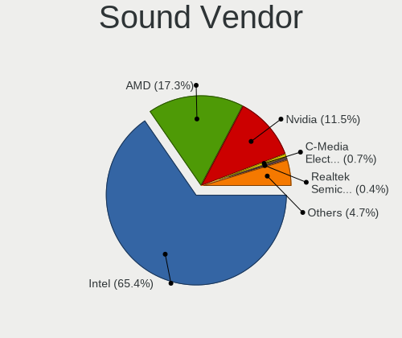

Linux - Tested Hardware & Statistics (Notebooks)
------------------------------------------------

A project to collect tested hardware configurations for Linux.

Anyone can contribute to this report by the [hw-probe](https://github.com/linuxhw/hw-probe) tool:

    sudo -E hw-probe -all -upload

Please contribute! Especially if your hardware is rare.

This report is for real hardware. Report for virtual hardware: [TestDays_VE](https://github.com/linuxhw/TestDays_VE)

Contents
--------

* [ Test Cases ](#test-cases)

* [ System ](#system)
  - [ OS                       ](#os)
  - [ OS Family                ](#os-family)
  - [ Kernel                   ](#kernel)
  - [ Kernel Family            ](#kernel-family)
  - [ Kernel Major Ver.        ](#kernel-major-ver)
  - [ Arch                     ](#arch)
  - [ DE                       ](#de)
  - [ Display Server           ](#display-server)
  - [ Display Manager          ](#display-manager)
  - [ OS Lang                  ](#os-lang)
  - [ Boot Mode                ](#boot-mode)
  - [ Filesystem               ](#filesystem)
  - [ Part. scheme             ](#part-scheme)
  - [ Dual Boot with Linux/BSD ](#dual-boot-with-linuxbsd)
  - [ Dual Boot (Win)          ](#dual-boot-win)

* [ Board ](#board)
  - [ Vendor                   ](#vendor)
  - [ Model                    ](#model)
  - [ Model Family             ](#model-family)
  - [ MFG Year                 ](#mfg-year)
  - [ Form Factor              ](#form-factor)
  - [ Secure Boot              ](#secure-boot)
  - [ Coreboot                 ](#coreboot)
  - [ RAM Size                 ](#ram-size)
  - [ RAM Used                 ](#ram-used)
  - [ Total Drives             ](#total-drives)
  - [ Has CD-ROM               ](#has-cd-rom)
  - [ Has Ethernet             ](#has-ethernet)
  - [ Has WiFi                 ](#has-wifi)
  - [ Has Bluetooth            ](#has-bluetooth)

* [ Location ](#location)
  - [ Country                  ](#country)
  - [ City                     ](#city)

* [ Drives ](#drives)
  - [ Drive Vendor             ](#drive-vendor)
  - [ Drive Model              ](#drive-model)
  - [ HDD Vendor               ](#hdd-vendor)
  - [ SSD Vendor               ](#ssd-vendor)
  - [ Drive Kind               ](#drive-kind)
  - [ Drive Connector          ](#drive-connector)
  - [ Drive Size               ](#drive-size)
  - [ Space Total              ](#space-total)
  - [ Space Used               ](#space-used)
  - [ Malfunc. Drives          ](#malfunc-drives)
  - [ Malfunc. Drive Vendor    ](#malfunc-drive-vendor)
  - [ Malfunc. HDD Vendor      ](#malfunc-hdd-vendor)
  - [ Malfunc. Drive Kind      ](#malfunc-drive-kind)
  - [ Failed Drives            ](#failed-drives)
  - [ Failed Drive Vendor      ](#failed-drive-vendor)
  - [ Drive Status             ](#drive-status)

* [ Storage controller ](#storage-controller)
  - [ Storage Vendor           ](#storage-vendor)
  - [ Storage Model            ](#storage-model)
  - [ Storage Kind             ](#storage-kind)

* [ Processor ](#processor)
  - [ CPU Vendor               ](#cpu-vendor)
  - [ CPU Model                ](#cpu-model)
  - [ CPU Model Family         ](#cpu-model-family)
  - [ CPU Cores                ](#cpu-cores)
  - [ CPU Sockets              ](#cpu-sockets)
  - [ CPU Threads              ](#cpu-threads)
  - [ CPU Op-Modes             ](#cpu-op-modes)
  - [ CPU Microcode            ](#cpu-microcode)
  - [ CPU Microarch            ](#cpu-microarch)

* [ Graphics ](#graphics)
  - [ GPU Vendor               ](#gpu-vendor)
  - [ GPU Model                ](#gpu-model)
  - [ GPU Combo                ](#gpu-combo)
  - [ GPU Driver               ](#gpu-driver)
  - [ GPU Memory               ](#gpu-memory)

* [ Monitor ](#monitor)
  - [ Monitor Vendor           ](#monitor-vendor)
  - [ Monitor Model            ](#monitor-model)
  - [ Monitor Resolution       ](#monitor-resolution)
  - [ Monitor Diagonal         ](#monitor-diagonal)
  - [ Monitor Width            ](#monitor-width)
  - [ Aspect Ratio             ](#aspect-ratio)
  - [ Monitor Area             ](#monitor-area)
  - [ Pixel Density            ](#pixel-density)
  - [ Multiple Monitors        ](#multiple-monitors)

* [ Network ](#network)
  - [ Net Controller Vendor    ](#net-controller-vendor)
  - [ Net Controller Model     ](#net-controller-model)
  - [ Wireless Vendor          ](#wireless-vendor)
  - [ Wireless Model           ](#wireless-model)
  - [ Ethernet Vendor          ](#ethernet-vendor)
  - [ Ethernet Model           ](#ethernet-model)
  - [ Net Controller Kind      ](#net-controller-kind)
  - [ Used Controller          ](#used-controller)
  - [ NICs                     ](#nics)
  - [ IPv6                     ](#ipv6)

* [ Bluetooth ](#bluetooth)
  - [ Bluetooth Vendor         ](#bluetooth-vendor)
  - [ Bluetooth Model          ](#bluetooth-model)

* [ Sound ](#sound)
  - [ Sound Vendor             ](#sound-vendor)
  - [ Sound Model              ](#sound-model)

* [ Memory ](#memory)
  - [ Memory Vendor            ](#memory-vendor)
  - [ Memory Model             ](#memory-model)
  - [ Memory Kind              ](#memory-kind)
  - [ Memory Form Factor       ](#memory-form-factor)
  - [ Memory Size              ](#memory-size)
  - [ Memory Speed             ](#memory-speed)

* [ Printers & scanners ](#printers--scanners)
  - [ Printer Vendor           ](#printer-vendor)
  - [ Printer Model            ](#printer-model)
  - [ Scanner Vendor           ](#scanner-vendor)
  - [ Scanner Model            ](#scanner-model)

* [ Camera ](#camera)
  - [ Camera Vendor            ](#camera-vendor)
  - [ Camera Model             ](#camera-model)

* [ Security ](#security)
  - [ Fingerprint Vendor       ](#fingerprint-vendor)
  - [ Fingerprint Model        ](#fingerprint-model)
  - [ Chipcard Vendor          ](#chipcard-vendor)
  - [ Chipcard Model           ](#chipcard-model)

* [ Unsupported ](#unsupported)
  - [ Unsupported Devices      ](#unsupported-devices)
  - [ Unsupported Device Types ](#unsupported-device-types)

Test Cases
----------

Total: 172503

| Vendor        | Model                       | Probe                                                      | Date         |
|---------------|-----------------------------|------------------------------------------------------------|--------------|
| Dell          | G15 5510                    | [3cfac2d234](https://linux-hardware.org/?probe=3cfac2d234) | Aug 12, 2023 |
| ASUSTek       | ASUS TUF Gaming A17 FA70... | [1d5206dc94](https://linux-hardware.org/?probe=1d5206dc94) | Aug 12, 2023 |
| ASUSTek       | GL552VW                     | [6986ca63da](https://linux-hardware.org/?probe=6986ca63da) | Aug 12, 2023 |
| HP            | OMEN by Laptop 15-dc1xxx    | [fb024a9374](https://linux-hardware.org/?probe=fb024a9374) | Aug 12, 2023 |
| HP            | OMEN by Laptop 15-dc1xxx    | [398f85e94a](https://linux-hardware.org/?probe=398f85e94a) | Aug 12, 2023 |
| Acer          | Aspire E1-532               | [84cbdf027b](https://linux-hardware.org/?probe=84cbdf027b) | Aug 12, 2023 |
| ASUSTek       | ASUS TUF Gaming A15 FA50... | [49662a8ac9](https://linux-hardware.org/?probe=49662a8ac9) | Aug 12, 2023 |
| Samsung       | 300E5M/300E5L               | [9aa2cd7b81](https://linux-hardware.org/?probe=9aa2cd7b81) | Aug 12, 2023 |
| Valve         | Jupiter                     | [c34cb54bc8](https://linux-hardware.org/?probe=c34cb54bc8) | Aug 12, 2023 |
| ASUSTek       | ASUS TUF Gaming A15 FA50... | [c946b79f5a](https://linux-hardware.org/?probe=c946b79f5a) | Aug 12, 2023 |
| Dell          | Inspiron 1720               | [1cb123d894](https://linux-hardware.org/?probe=1cb123d894) | Aug 12, 2023 |
| Acer          | Swift SF314-512             | [7158f3e437](https://linux-hardware.org/?probe=7158f3e437) | Aug 12, 2023 |
| Dell          | Vostro 15-3568              | [b422d7c8cc](https://linux-hardware.org/?probe=b422d7c8cc) | Aug 12, 2023 |
| Toshiba       | Satellite C50D-A-13G        | [e1a3542078](https://linux-hardware.org/?probe=e1a3542078) | Aug 12, 2023 |
| Sony          | SVE1712W1EB                 | [e65db8d147](https://linux-hardware.org/?probe=e65db8d147) | Aug 12, 2023 |
| Lenovo        | ThinkPad T460p 20FXS1C30... | [08542d994e](https://linux-hardware.org/?probe=08542d994e) | Aug 12, 2023 |
| Dell          | Vostro 3500                 | [2ec62f31c9](https://linux-hardware.org/?probe=2ec62f31c9) | Aug 12, 2023 |
| Alienware     | 15                          | [d6c9c4f931](https://linux-hardware.org/?probe=d6c9c4f931) | Aug 12, 2023 |
| ASUSTek       | K55VD                       | [05024005e4](https://linux-hardware.org/?probe=05024005e4) | Aug 12, 2023 |
| Acer          | Aspire E1-571G              | [ca51aaad9f](https://linux-hardware.org/?probe=ca51aaad9f) | Aug 12, 2023 |
| Lenovo        | ThinkPad E15 20RD0011UK     | [411b9f412c](https://linux-hardware.org/?probe=411b9f412c) | Aug 12, 2023 |
| Fujitsu       | FMVA0800C                   | [1dae7b170b](https://linux-hardware.org/?probe=1dae7b170b) | Aug 12, 2023 |
| Notebook      | NJx0MU                      | [6f230d02c1](https://linux-hardware.org/?probe=6f230d02c1) | Aug 12, 2023 |
| Dell          | Inspiron 13 5310            | [d42fa686e5](https://linux-hardware.org/?probe=d42fa686e5) | Aug 12, 2023 |
| Dell          | Inspiron 13 5310            | [45509c2727](https://linux-hardware.org/?probe=45509c2727) | Aug 12, 2023 |
| Dell          | XPS 15 9560                 | [756901f27f](https://linux-hardware.org/?probe=756901f27f) | Aug 12, 2023 |
| Lenovo        | ThinkPad L13 Gen 3 21BAS... | [67f821bd4d](https://linux-hardware.org/?probe=67f821bd4d) | Aug 12, 2023 |
| ASUSTek       | ASUS TUF Gaming A17 FA70... | [bcda0258e5](https://linux-hardware.org/?probe=bcda0258e5) | Aug 12, 2023 |
| Dell          | Latitude E6430              | [8037585070](https://linux-hardware.org/?probe=8037585070) | Aug 12, 2023 |
| Lenovo        | Yoga Pro 9 14IRP8 83BU      | [f46a14b981](https://linux-hardware.org/?probe=f46a14b981) | Aug 12, 2023 |
| HP            | ZBook 17 G3                 | [475b07d2dc](https://linux-hardware.org/?probe=475b07d2dc) | Aug 12, 2023 |
| Valve         | Jupiter                     | [61e105aa9d](https://linux-hardware.org/?probe=61e105aa9d) | Aug 12, 2023 |
| Acer          | Aspire 5733Z                | [977c66cbc0](https://linux-hardware.org/?probe=977c66cbc0) | Aug 12, 2023 |
| Valve         | Jupiter                     | [dbb797aa33](https://linux-hardware.org/?probe=dbb797aa33) | Aug 12, 2023 |
| Panasonic     | CF-19ADNAXDA                | [d96cf2b13c](https://linux-hardware.org/?probe=d96cf2b13c) | Aug 12, 2023 |
| Panasonic     | CF-SX1WEVHR                 | [8abafe1b65](https://linux-hardware.org/?probe=8abafe1b65) | Aug 12, 2023 |
| Unknown       | Unknown                     | [2e76349d2c](https://linux-hardware.org/?probe=2e76349d2c) | Aug 12, 2023 |
| Dell          | G7 7790                     | [b5062f0928](https://linux-hardware.org/?probe=b5062f0928) | Aug 12, 2023 |
| Lenovo        | ThinkPad P53 20QN0011IV     | [d25ab08211](https://linux-hardware.org/?probe=d25ab08211) | Aug 12, 2023 |
| Lenovo        | ThinkBook 14 G3 ACL 21A2    | [5892469c5b](https://linux-hardware.org/?probe=5892469c5b) | Aug 12, 2023 |
| Timi          | RedmiBook Pro 15S           | [20559d710a](https://linux-hardware.org/?probe=20559d710a) | Aug 12, 2023 |
| HP            | Compaq nx9420 (RH457EA#A... | [1b7c441369](https://linux-hardware.org/?probe=1b7c441369) | Aug 12, 2023 |
| Lenovo        | Legion 5 15ACH6 82JW        | [79cc445925](https://linux-hardware.org/?probe=79cc445925) | Aug 12, 2023 |
| Lenovo        | Legion 5 15ACH6 82JW        | [b9d1b6d44a](https://linux-hardware.org/?probe=b9d1b6d44a) | Aug 12, 2023 |
| Apple         | MacBookPro6,2               | [7c62a05800](https://linux-hardware.org/?probe=7c62a05800) | Aug 12, 2023 |
| HP            | EliteBook 820 G3            | [544810db31](https://linux-hardware.org/?probe=544810db31) | Aug 12, 2023 |
| Valve         | Jupiter                     | [3f6cd697d5](https://linux-hardware.org/?probe=3f6cd697d5) | Aug 12, 2023 |
| HP            | EliteBook 840 G7 Noteboo... | [5ba59f878a](https://linux-hardware.org/?probe=5ba59f878a) | Aug 12, 2023 |
| Multilaser    | PC024                       | [3311e26ac5](https://linux-hardware.org/?probe=3311e26ac5) | Aug 12, 2023 |
| Lenovo        | V310-14ISK 80SX             | [edd47d65b6](https://linux-hardware.org/?probe=edd47d65b6) | Aug 12, 2023 |
| Lenovo        | ThinkPad T14 Gen 1 20S00... | [53196a01fa](https://linux-hardware.org/?probe=53196a01fa) | Aug 12, 2023 |
| Acer          | TravelMate B113             | [5d3d27c8bb](https://linux-hardware.org/?probe=5d3d27c8bb) | Aug 12, 2023 |
| Dell          | Inspiron 5558               | [5bb31ccda3](https://linux-hardware.org/?probe=5bb31ccda3) | Aug 12, 2023 |
| Dell          | G3 3579                     | [09ba53e3c1](https://linux-hardware.org/?probe=09ba53e3c1) | Aug 12, 2023 |
| HP            | Pavilion Laptop 14-dv1xx... | [72899a615b](https://linux-hardware.org/?probe=72899a615b) | Aug 12, 2023 |
| Lenovo        | ThinkPad X1 Carbon 6th 2... | [53c81d6d36](https://linux-hardware.org/?probe=53c81d6d36) | Aug 12, 2023 |
| Acer          | One Z1402                   | [9fd6a2d41b](https://linux-hardware.org/?probe=9fd6a2d41b) | Aug 12, 2023 |
| Toshiba       | Satellite C55-A             | [d1bf5ba3c3](https://linux-hardware.org/?probe=d1bf5ba3c3) | Aug 12, 2023 |
| ASUSTek       | T200TA                      | [affc999457](https://linux-hardware.org/?probe=affc999457) | Aug 12, 2023 |
| A-DATA Tec... | XENIA 15                    | [73f0314b31](https://linux-hardware.org/?probe=73f0314b31) | Aug 12, 2023 |
| HP            | Pavilion g7                 | [325b804863](https://linux-hardware.org/?probe=325b804863) | Aug 12, 2023 |
| A-DATA Tec... | XENIA 15                    | [d1a19f992d](https://linux-hardware.org/?probe=d1a19f992d) | Aug 12, 2023 |
| HP            | Pavilion dv7                | [7e4a63e58c](https://linux-hardware.org/?probe=7e4a63e58c) | Aug 12, 2023 |
| Dell          | Latitude E7270              | [63fd1b0d6b](https://linux-hardware.org/?probe=63fd1b0d6b) | Aug 12, 2023 |
| ASUSTek       | ZenBook UX425EA_UX425EA     | [0d45e9e048](https://linux-hardware.org/?probe=0d45e9e048) | Aug 12, 2023 |
| ASUSTek       | T200TA                      | [24d6504b2c](https://linux-hardware.org/?probe=24d6504b2c) | Aug 12, 2023 |
| HP            | Pavilion dv7                | [fc48a936d7](https://linux-hardware.org/?probe=fc48a936d7) | Aug 12, 2023 |
| Acer          | Aspire A317-53              | [17dacd99a6](https://linux-hardware.org/?probe=17dacd99a6) | Aug 12, 2023 |
| Apple         | MacBookAir7,2               | [b80181bc47](https://linux-hardware.org/?probe=b80181bc47) | Aug 12, 2023 |
| Fujitsu       | LIFEBOOK AH530              | [b99e595bfc](https://linux-hardware.org/?probe=b99e595bfc) | Aug 12, 2023 |
| HP            | ENVY Notebook               | [24c2810def](https://linux-hardware.org/?probe=24c2810def) | Aug 12, 2023 |
| HP            | Laptop 15-dy2xxx            | [bc66f59ac5](https://linux-hardware.org/?probe=bc66f59ac5) | Aug 12, 2023 |
| Lenovo        | ThinkPad W500 4063JR4       | [f8c24a1b02](https://linux-hardware.org/?probe=f8c24a1b02) | Aug 11, 2023 |
| Fujitsu       | LIFEBOOK AH530              | [1fa34106f1](https://linux-hardware.org/?probe=1fa34106f1) | Aug 11, 2023 |
| Lenovo        | PIQY0                       | [0149927d91](https://linux-hardware.org/?probe=0149927d91) | Aug 11, 2023 |
| ASUSTek       | K55A                        | [bf260cea2c](https://linux-hardware.org/?probe=bf260cea2c) | Aug 11, 2023 |
| Dell          | G3 3590                     | [084d659110](https://linux-hardware.org/?probe=084d659110) | Aug 11, 2023 |
| Jumper        | EZpad                       | [5fa2e934c3](https://linux-hardware.org/?probe=5fa2e934c3) | Aug 11, 2023 |
| Valve         | Jupiter                     | [069bfd618c](https://linux-hardware.org/?probe=069bfd618c) | Aug 11, 2023 |
| LNV           | L40-70                      | [66fe107447](https://linux-hardware.org/?probe=66fe107447) | Aug 11, 2023 |
| HP            | Laptop 14-dq1xxx            | [6f5a32d65f](https://linux-hardware.org/?probe=6f5a32d65f) | Aug 11, 2023 |
| ASUSTek       | VivoBook_ASUSLaptop M150... | [3a7d1d1f9b](https://linux-hardware.org/?probe=3a7d1d1f9b) | Aug 11, 2023 |
| HP            | Victus by Laptop 16-e0xx... | [377a0e25aa](https://linux-hardware.org/?probe=377a0e25aa) | Aug 11, 2023 |
| HP            | EliteBook 840 14 inch G1... | [73b7fc1fc9](https://linux-hardware.org/?probe=73b7fc1fc9) | Aug 11, 2023 |
| Acer          | Aspire F5-573G              | [019f3a6d1f](https://linux-hardware.org/?probe=019f3a6d1f) | Aug 11, 2023 |
| Lenovo        | IdeaPad 5 15IAL7 82SF       | [c2d9d3160b](https://linux-hardware.org/?probe=c2d9d3160b) | Aug 11, 2023 |
| MSI           | Sword 17 A11UD              | [8ad81394c8](https://linux-hardware.org/?probe=8ad81394c8) | Aug 11, 2023 |
| HP            | Notebook                    | [de8a0230c4](https://linux-hardware.org/?probe=de8a0230c4) | Aug 11, 2023 |
| Dell          | Inspiron 5559               | [f3e1bb3812](https://linux-hardware.org/?probe=f3e1bb3812) | Aug 11, 2023 |
| HP            | Laptop 14s-dq2xxx           | [7574e6b53a](https://linux-hardware.org/?probe=7574e6b53a) | Aug 11, 2023 |
| Acer          | Extensa 215-55              | [aea9ada5e8](https://linux-hardware.org/?probe=aea9ada5e8) | Aug 11, 2023 |
| Lenovo        | V130-15IKB 81HN             | [88a9c5764d](https://linux-hardware.org/?probe=88a9c5764d) | Aug 11, 2023 |
| Acer          | Nitro AN517-54              | [4daff2c43f](https://linux-hardware.org/?probe=4daff2c43f) | Aug 11, 2023 |
| Lenovo        | IdeaPad 320-15AST 80XV      | [359d84713c](https://linux-hardware.org/?probe=359d84713c) | Aug 11, 2023 |
| Unknown       | Unknown                     | [c90f282238](https://linux-hardware.org/?probe=c90f282238) | Aug 11, 2023 |
| Dell          | Latitude E6430              | [79f523548b](https://linux-hardware.org/?probe=79f523548b) | Aug 11, 2023 |
| Lenovo        | IdeaPad Slim 1-11AST-05 ... | [30c7051967](https://linux-hardware.org/?probe=30c7051967) | Aug 11, 2023 |
| Unknown       | Unknown                     | [b68d99fd89](https://linux-hardware.org/?probe=b68d99fd89) | Aug 11, 2023 |
| Dell          | Latitude E6330              | [b3081e041e](https://linux-hardware.org/?probe=b3081e041e) | Aug 11, 2023 |
| Dell          | Latitude E6430              | [fd3c9b15f8](https://linux-hardware.org/?probe=fd3c9b15f8) | Aug 11, 2023 |
| Apple         | MacBookPro14,2              | [8b0d028b37](https://linux-hardware.org/?probe=8b0d028b37) | Aug 11, 2023 |
| Sony          | SVE1712W1EB                 | [6f323e0954](https://linux-hardware.org/?probe=6f323e0954) | Aug 11, 2023 |
| MSI           | Summit E14Evo A12M          | [b83d821361](https://linux-hardware.org/?probe=b83d821361) | Aug 11, 2023 |
| Acer          | TMP255-M                    | [0b1adaea4e](https://linux-hardware.org/?probe=0b1adaea4e) | Aug 11, 2023 |
| Unknown       | Unknown                     | [8d7674c3b3](https://linux-hardware.org/?probe=8d7674c3b3) | Aug 11, 2023 |
| Lenovo        | ThinkPad L520 5017BW5       | [1a9bbdc058](https://linux-hardware.org/?probe=1a9bbdc058) | Aug 11, 2023 |
| HP            | EliteBook 840 G1            | [95d93fda2c](https://linux-hardware.org/?probe=95d93fda2c) | Aug 11, 2023 |
| Dell          | Precision M4600             | [f97367efac](https://linux-hardware.org/?probe=f97367efac) | Aug 11, 2023 |
| Lenovo        | IdeaPad 310-15IAP 80TT      | [361e073b5c](https://linux-hardware.org/?probe=361e073b5c) | Aug 11, 2023 |
| Lenovo        | ThinkPad E490 20N8CTO1WW    | [c336f9aa8c](https://linux-hardware.org/?probe=c336f9aa8c) | Aug 11, 2023 |
| Dell          | G15 5520                    | [3bec284af8](https://linux-hardware.org/?probe=3bec284af8) | Aug 11, 2023 |
| Lenovo        | IdeaPad 320-15IKB 81G3      | [83879b8247](https://linux-hardware.org/?probe=83879b8247) | Aug 11, 2023 |
| HP            | Pavilion dv5                | [41c7682f98](https://linux-hardware.org/?probe=41c7682f98) | Aug 11, 2023 |
| Samsung       | 355V4C/355V4X/355V5C/355... | [6f722400c2](https://linux-hardware.org/?probe=6f722400c2) | Aug 11, 2023 |
| Sony          | SVE1513I4E                  | [6b8cb6d520](https://linux-hardware.org/?probe=6b8cb6d520) | Aug 11, 2023 |
| Lenovo        | IdeaPad Slim 1-11AST-05 ... | [abaa0512b0](https://linux-hardware.org/?probe=abaa0512b0) | Aug 11, 2023 |
| HP            | Laptop 14s-dq2xxx           | [c352abad93](https://linux-hardware.org/?probe=c352abad93) | Aug 11, 2023 |
| HP            | Pavilion dv5                | [a8f62e42dc](https://linux-hardware.org/?probe=a8f62e42dc) | Aug 11, 2023 |
| HP            | ENVY Notebook               | [6327abde35](https://linux-hardware.org/?probe=6327abde35) | Aug 11, 2023 |
| HP            | EliteBook 2560p             | [0b5cf409d8](https://linux-hardware.org/?probe=0b5cf409d8) | Aug 11, 2023 |
| Notebook      | NJx0MU                      | [ea4ae0e0f3](https://linux-hardware.org/?probe=ea4ae0e0f3) | Aug 11, 2023 |
| ASUSTek       | VivoBook_ASUSLaptop M140... | [a4a009cd79](https://linux-hardware.org/?probe=a4a009cd79) | Aug 11, 2023 |
| Toshiba       | Satellite T110              | [ecb4e047b3](https://linux-hardware.org/?probe=ecb4e047b3) | Aug 11, 2023 |
| Acer          | Aspire E5-721               | [f4abfc94d4](https://linux-hardware.org/?probe=f4abfc94d4) | Aug 11, 2023 |
| HUAWEI        | BOD-WXX9                    | [b21e9793a5](https://linux-hardware.org/?probe=b21e9793a5) | Aug 11, 2023 |
| HP            | Pavilion 15                 | [0f7859844f](https://linux-hardware.org/?probe=0f7859844f) | Aug 11, 2023 |
| Acer          | Extensa 215-55              | [036866525c](https://linux-hardware.org/?probe=036866525c) | Aug 11, 2023 |
| HP            | Pavilion Laptop 14-ec0xx... | [fadee3e38d](https://linux-hardware.org/?probe=fadee3e38d) | Aug 11, 2023 |
| ASUSTek       | Zenbook UM3402YAR_UM3402... | [83a0a8a2aa](https://linux-hardware.org/?probe=83a0a8a2aa) | Aug 11, 2023 |
| Toshiba       | Satellite T110              | [8180105119](https://linux-hardware.org/?probe=8180105119) | Aug 11, 2023 |
| Acer          | Extensa 2511G               | [536699834a](https://linux-hardware.org/?probe=536699834a) | Aug 11, 2023 |
| Medion        | P651x series                | [46505da47d](https://linux-hardware.org/?probe=46505da47d) | Aug 11, 2023 |
| Acer          | Nitro AN715-51              | [ea972c8686](https://linux-hardware.org/?probe=ea972c8686) | Aug 11, 2023 |
| Unknown       | Unknown                     | [a064a2d5fd](https://linux-hardware.org/?probe=a064a2d5fd) | Aug 11, 2023 |
| HP            | 250 G3                      | [6ba303bc6b](https://linux-hardware.org/?probe=6ba303bc6b) | Aug 11, 2023 |
| HP            | Laptop 17-cp1xxx            | [ac523f4e3b](https://linux-hardware.org/?probe=ac523f4e3b) | Aug 11, 2023 |
| Fujitsu Si... | AMILO Xa 1526               | [0a1e2a7f23](https://linux-hardware.org/?probe=0a1e2a7f23) | Aug 11, 2023 |
| Fujitsu Si... | AMILO Xa 1526               | [742b085257](https://linux-hardware.org/?probe=742b085257) | Aug 11, 2023 |
| Valve         | Jupiter                     | [dad1808c0d](https://linux-hardware.org/?probe=dad1808c0d) | Aug 11, 2023 |
| Acer          | Aspire ES1-111M             | [3c7140c389](https://linux-hardware.org/?probe=3c7140c389) | Aug 11, 2023 |
| HP            | EliteBook 8470p             | [320138e7f5](https://linux-hardware.org/?probe=320138e7f5) | Aug 11, 2023 |
| Intel Clie... | LAPQC71A                    | [c87bff1d43](https://linux-hardware.org/?probe=c87bff1d43) | Aug 11, 2023 |
| HP            | Pavilion Notebook           | [7fd3205fde](https://linux-hardware.org/?probe=7fd3205fde) | Aug 11, 2023 |
| Fujitsu       | LIFEBOOK S762               | [1ced8ae4d0](https://linux-hardware.org/?probe=1ced8ae4d0) | Aug 11, 2023 |
| Acer          | Nitro AN515-52              | [c9b1265a23](https://linux-hardware.org/?probe=c9b1265a23) | Aug 11, 2023 |
| Fujitsu       | LIFEBOOK S762               | [cb0b5cbd5d](https://linux-hardware.org/?probe=cb0b5cbd5d) | Aug 11, 2023 |
| Lenovo        | IdeaPad L340-15API 81LW     | [7d63566e0a](https://linux-hardware.org/?probe=7d63566e0a) | Aug 11, 2023 |
| MSI           | Creator Z16 A11UET          | [7883e9a69d](https://linux-hardware.org/?probe=7883e9a69d) | Aug 11, 2023 |
| HP            | ProBook 4540s               | [4d9da5367a](https://linux-hardware.org/?probe=4d9da5367a) | Aug 11, 2023 |
| HP            | ZBook Studio G7 Mobile W... | [836fcda626](https://linux-hardware.org/?probe=836fcda626) | Aug 11, 2023 |
| HP            | ZBook Studio G7 Mobile W... | [3e208faa6e](https://linux-hardware.org/?probe=3e208faa6e) | Aug 11, 2023 |
| HP            | Pavilion dv6                | [1689b3fd44](https://linux-hardware.org/?probe=1689b3fd44) | Aug 11, 2023 |
| Acer          | Aspire V5-471G              | [1955354749](https://linux-hardware.org/?probe=1955354749) | Aug 11, 2023 |
| HP            | ProBook 450 15.6 inch G9... | [8c449cd820](https://linux-hardware.org/?probe=8c449cd820) | Aug 11, 2023 |
| ASUSTek       | ZenBook UX535LI_UX535LI     | [29065a56ee](https://linux-hardware.org/?probe=29065a56ee) | Aug 11, 2023 |
| ASUSTek       | VivoBook_ASUSLaptop X409... | [22fc28c382](https://linux-hardware.org/?probe=22fc28c382) | Aug 11, 2023 |
| ASUSTek       | ROG Strix G513QY            | [eacd0cc54d](https://linux-hardware.org/?probe=eacd0cc54d) | Aug 11, 2023 |
| Lenovo        | ThinkPad P1 Gen 4i 20Y30... | [79889c3f89](https://linux-hardware.org/?probe=79889c3f89) | Aug 11, 2023 |
| Google        | Epaulette                   | [1923498758](https://linux-hardware.org/?probe=1923498758) | Aug 11, 2023 |
| ASUSTek       | ROG Strix G513QY_G513QY     | [46ae462027](https://linux-hardware.org/?probe=46ae462027) | Aug 11, 2023 |
| Dell          | XPS 15 9560                 | [471e3c5077](https://linux-hardware.org/?probe=471e3c5077) | Aug 11, 2023 |
| Acer          | Aspire A515-51              | [4856b9b32f](https://linux-hardware.org/?probe=4856b9b32f) | Aug 11, 2023 |
| Leader        | SC404PRO                    | [6f24ee5e0c](https://linux-hardware.org/?probe=6f24ee5e0c) | Aug 11, 2023 |
| HP            | EliteBook 8540w             | [2df5a4bd58](https://linux-hardware.org/?probe=2df5a4bd58) | Aug 11, 2023 |
| HP            | EliteBook 8540w             | [1bf7b69b0f](https://linux-hardware.org/?probe=1bf7b69b0f) | Aug 11, 2023 |
| Lenovo        | ThinkPad T480s 20L70028U... | [8b2a34a407](https://linux-hardware.org/?probe=8b2a34a407) | Aug 11, 2023 |
| Lenovo        | B50-70 20384                | [607103b8f5](https://linux-hardware.org/?probe=607103b8f5) | Aug 11, 2023 |
| Lenovo        | G40-45 80E1                 | [49a3480efb](https://linux-hardware.org/?probe=49a3480efb) | Aug 11, 2023 |
| ASUSTek       | ROG Zephyrus G14 GA401QM... | [e22f71b79d](https://linux-hardware.org/?probe=e22f71b79d) | Aug 11, 2023 |
| Lenovo        | IdeaPad S340-15IIL 81VW     | [48a0f64b34](https://linux-hardware.org/?probe=48a0f64b34) | Aug 11, 2023 |
| Lenovo        | ThinkPad T520 42405FG       | [fad80ecff3](https://linux-hardware.org/?probe=fad80ecff3) | Aug 11, 2023 |
| HP            | Pavilion Laptop 14-dv1xx... | [c083cb5f2f](https://linux-hardware.org/?probe=c083cb5f2f) | Aug 11, 2023 |
| Dell          | Inspiron 3180               | [40c31ab8e5](https://linux-hardware.org/?probe=40c31ab8e5) | Aug 11, 2023 |
| Lenovo        | ThinkPad X1 Carbon 2nd 2... | [97e0c46487](https://linux-hardware.org/?probe=97e0c46487) | Aug 11, 2023 |
| Fujitsu Si... | AMILO Li 2727               | [1dc2c421f8](https://linux-hardware.org/?probe=1dc2c421f8) | Aug 11, 2023 |
| Dell          | Inspiron 3531               | [0384e8a950](https://linux-hardware.org/?probe=0384e8a950) | Aug 11, 2023 |
| Avell High... | A40 LIV                     | [9bc62c7eec](https://linux-hardware.org/?probe=9bc62c7eec) | Aug 11, 2023 |
| Notebook      | NJx0MU                      | [2db90ee24e](https://linux-hardware.org/?probe=2db90ee24e) | Aug 11, 2023 |
| Acer          | Nitro AN515-52              | [30748e95eb](https://linux-hardware.org/?probe=30748e95eb) | Aug 11, 2023 |
| Dell          | Precision 5530              | [f74dac5dcf](https://linux-hardware.org/?probe=f74dac5dcf) | Aug 11, 2023 |
| Lenovo        | IdeaPad 3 14ITL05 81X7      | [f062831bd7](https://linux-hardware.org/?probe=f062831bd7) | Aug 11, 2023 |
| Lenovo        | IdeaPad 330-15IKB 81DE      | [a708832571](https://linux-hardware.org/?probe=a708832571) | Aug 11, 2023 |
| Google        | Bobba360                    | [128700115a](https://linux-hardware.org/?probe=128700115a) | Aug 10, 2023 |
| Lenovo        | IdeaPad S145-15IWL 81S9     | [7fe6adce5e](https://linux-hardware.org/?probe=7fe6adce5e) | Aug 10, 2023 |
| Dell          | Latitude 5400               | [1ec248c607](https://linux-hardware.org/?probe=1ec248c607) | Aug 10, 2023 |
| Acer          | Aspire E5-571G              | [6c55de5ac8](https://linux-hardware.org/?probe=6c55de5ac8) | Aug 10, 2023 |
| Acer          | Aspire V5-471P              | [cbd4a63b2e](https://linux-hardware.org/?probe=cbd4a63b2e) | Aug 10, 2023 |
| Dell          | Latitude 3540               | [496e3ab340](https://linux-hardware.org/?probe=496e3ab340) | Aug 10, 2023 |
| HP            | Pavilion Notebook           | [980f6773f8](https://linux-hardware.org/?probe=980f6773f8) | Aug 10, 2023 |
| Acer          | Nitro AN515-52              | [df9e6a8d98](https://linux-hardware.org/?probe=df9e6a8d98) | Aug 10, 2023 |
| Acer          | Aspire E1-731               | [b75a766ee9](https://linux-hardware.org/?probe=b75a766ee9) | Aug 10, 2023 |
| HP            | Pavilion Laptop 14-bf0xx    | [ba03034ac5](https://linux-hardware.org/?probe=ba03034ac5) | Aug 10, 2023 |
| Lenovo        | ThinkPad T430s 2356LPG      | [97dfe9511b](https://linux-hardware.org/?probe=97dfe9511b) | Aug 10, 2023 |
| Lenovo        | ThinkPad P53s 20N6S00B00    | [c76e31ff8e](https://linux-hardware.org/?probe=c76e31ff8e) | Aug 10, 2023 |
| Lenovo        | ThinkPad Edge 03193VG       | [abb370836a](https://linux-hardware.org/?probe=abb370836a) | Aug 10, 2023 |
| Lenovo        | G40-45 80E1                 | [d6f18c79f6](https://linux-hardware.org/?probe=d6f18c79f6) | Aug 10, 2023 |
| Dell          | Inspiron 5570               | [3771669b84](https://linux-hardware.org/?probe=3771669b84) | Aug 10, 2023 |
| HP            | Laptop 15s-eq2xxx           | [e45562b838](https://linux-hardware.org/?probe=e45562b838) | Aug 10, 2023 |
| Lenovo        | Yoga 3 Pro-1370 80HE        | [eee160a070](https://linux-hardware.org/?probe=eee160a070) | Aug 10, 2023 |
| ASUSTek       | 1005PE                      | [088a155ec9](https://linux-hardware.org/?probe=088a155ec9) | Aug 10, 2023 |
| Dell          | Latitude 5300               | [661051063f](https://linux-hardware.org/?probe=661051063f) | Aug 10, 2023 |
| Acer          | Aspire ES1-431              | [171fd219cc](https://linux-hardware.org/?probe=171fd219cc) | Aug 10, 2023 |
| HUAWEI        | KLVD-WXX9                   | [19cadaab1b](https://linux-hardware.org/?probe=19cadaab1b) | Aug 10, 2023 |
| Lenovo        | ThinkPad E14 20RA0076US     | [ab98272b50](https://linux-hardware.org/?probe=ab98272b50) | Aug 10, 2023 |
| ASUSTek       | X751LD                      | [e98d8d116d](https://linux-hardware.org/?probe=e98d8d116d) | Aug 10, 2023 |
| Gateway       | MD7309U                     | [18dbacfdab](https://linux-hardware.org/?probe=18dbacfdab) | Aug 10, 2023 |
| Lenovo        | V310-15ISK 80SY             | [88fcbf292a](https://linux-hardware.org/?probe=88fcbf292a) | Aug 10, 2023 |
| HP            | OMEN by Laptop 15-dc1xxx    | [9627b6d632](https://linux-hardware.org/?probe=9627b6d632) | Aug 10, 2023 |
| Lenovo        | ThinkPad X220 4291SEN       | [b62026890a](https://linux-hardware.org/?probe=b62026890a) | Aug 10, 2023 |
| Google        | Kip                         | [553df8dcdc](https://linux-hardware.org/?probe=553df8dcdc) | Aug 10, 2023 |
| HP            | 250 G3                      | [512fd5d81f](https://linux-hardware.org/?probe=512fd5d81f) | Aug 10, 2023 |
| ASUSTek       | VivoBook_ASUSLaptop M350... | [ffa9b97bf7](https://linux-hardware.org/?probe=ffa9b97bf7) | Aug 10, 2023 |
| HP            | OMEN by Laptop 15-dc1xxx    | [099d1ac0de](https://linux-hardware.org/?probe=099d1ac0de) | Aug 10, 2023 |
| BANGHO        | MAX L5                      | [4661b7a0f7](https://linux-hardware.org/?probe=4661b7a0f7) | Aug 10, 2023 |
| Avell High... | A70 HYB                     | [9b03ae1cd3](https://linux-hardware.org/?probe=9b03ae1cd3) | Aug 10, 2023 |
| HP            | Folio 13                    | [67121fc711](https://linux-hardware.org/?probe=67121fc711) | Aug 10, 2023 |
| Avell         | A70 ION                     | [6ab02a34e4](https://linux-hardware.org/?probe=6ab02a34e4) | Aug 10, 2023 |
| Fujitsu       | FMVA42CW                    | [ffb5c4343b](https://linux-hardware.org/?probe=ffb5c4343b) | Aug 10, 2023 |
| Acer          | Aspire ES1-431              | [6802a19338](https://linux-hardware.org/?probe=6802a19338) | Aug 10, 2023 |
| SLIMBOOK      | PROX-AMD5                   | [f20a32551b](https://linux-hardware.org/?probe=f20a32551b) | Aug 10, 2023 |
| ASUSTek       | VivoBook_ASUSLaptop X515... | [24629e2553](https://linux-hardware.org/?probe=24629e2553) | Aug 10, 2023 |
| HP            | Pavilion Laptop 14-dv2xx... | [479f066821](https://linux-hardware.org/?probe=479f066821) | Aug 10, 2023 |
| Dell          | Latitude E6400              | [f28a234c30](https://linux-hardware.org/?probe=f28a234c30) | Aug 10, 2023 |
| HP            | 350 G2                      | [dde52cb361](https://linux-hardware.org/?probe=dde52cb361) | Aug 10, 2023 |
| HP            | ProBook 430 G2              | [426901227d](https://linux-hardware.org/?probe=426901227d) | Aug 10, 2023 |
| Lenovo        | ThinkBook 16p Gen 2 20YM    | [82dde7d058](https://linux-hardware.org/?probe=82dde7d058) | Aug 10, 2023 |
| HP            | Pavilion 15                 | [3de983a470](https://linux-hardware.org/?probe=3de983a470) | Aug 10, 2023 |
| Clevo         | W251EFQ/W270EFQ             | [cde80ecaf6](https://linux-hardware.org/?probe=cde80ecaf6) | Aug 10, 2023 |
| Lenovo        | ThinkPad E15 Gen 4 21ED0... | [89e3ef8e6c](https://linux-hardware.org/?probe=89e3ef8e6c) | Aug 10, 2023 |
| Lenovo        | ThinkPad T14 Gen 3 21CF0... | [89cb081c1f](https://linux-hardware.org/?probe=89cb081c1f) | Aug 10, 2023 |
| Lenovo        | ThinkPad T410 2522AC1       | [6f422f386f](https://linux-hardware.org/?probe=6f422f386f) | Aug 10, 2023 |
| Avell         | A70 ION                     | [b71c176ce3](https://linux-hardware.org/?probe=b71c176ce3) | Aug 10, 2023 |
| HP            | Laptop 17-cp0xxx            | [c5a255abcb](https://linux-hardware.org/?probe=c5a255abcb) | Aug 10, 2023 |
| Lenovo        | ThinkPad T420 4236W1W       | [0b8fc947af](https://linux-hardware.org/?probe=0b8fc947af) | Aug 10, 2023 |
| ASUSTek       | VivoBook_ASUSLaptop M150... | [80f2f711d8](https://linux-hardware.org/?probe=80f2f711d8) | Aug 10, 2023 |
| Acer          | Swift SF314-512             | [e168ac1e62](https://linux-hardware.org/?probe=e168ac1e62) | Aug 10, 2023 |
| Apple         | MacBookAir5,2               | [7f91d6f9d8](https://linux-hardware.org/?probe=7f91d6f9d8) | Aug 10, 2023 |
| Fujitsu       | LIFEBOOK A530               | [05e64e3a0a](https://linux-hardware.org/?probe=05e64e3a0a) | Aug 10, 2023 |
| Lenovo        | ThinkPad P51 20HH0015IX     | [77c11473b2](https://linux-hardware.org/?probe=77c11473b2) | Aug 10, 2023 |
| Lenovo        | ThinkPad P1 Gen 4i 20Y4S... | [2f64f3ee9a](https://linux-hardware.org/?probe=2f64f3ee9a) | Aug 10, 2023 |
| Lenovo        | ThinkBook 14-IIL 20SL       | [e323e9cd7e](https://linux-hardware.org/?probe=e323e9cd7e) | Aug 10, 2023 |
| HP            | ZBook Studio 16 inch G9 ... | [e1462f1e3a](https://linux-hardware.org/?probe=e1462f1e3a) | Aug 10, 2023 |
| Acer          | Aspire E5-721               | [6743c7ca9d](https://linux-hardware.org/?probe=6743c7ca9d) | Aug 10, 2023 |
| ASUSTek       | ROG Strix G513QY_G513QY     | [083e25221d](https://linux-hardware.org/?probe=083e25221d) | Aug 10, 2023 |
| HP            | Laptop 14-dq1xxx            | [68fff65eee](https://linux-hardware.org/?probe=68fff65eee) | Aug 10, 2023 |
| Dell          | XPS L421X                   | [ba412a439b](https://linux-hardware.org/?probe=ba412a439b) | Aug 10, 2023 |
| Toshiba       | Satellite C660              | [26597d8a51](https://linux-hardware.org/?probe=26597d8a51) | Aug 10, 2023 |
| Lenovo        | ThinkBook 16p Gen 2 20YM    | [f4dd9cbbbd](https://linux-hardware.org/?probe=f4dd9cbbbd) | Aug 10, 2023 |
| Lenovo        | ThinkPad T420 4180X06       | [77e54b4b97](https://linux-hardware.org/?probe=77e54b4b97) | Aug 10, 2023 |
| Dell          | Inspiron 5567               | [fdfeffb5f3](https://linux-hardware.org/?probe=fdfeffb5f3) | Aug 10, 2023 |
| Lenovo        | IdeaPad 320-15AST 80XV      | [0caf17e079](https://linux-hardware.org/?probe=0caf17e079) | Aug 10, 2023 |
| Gigabyte      | AERO 15-WA                  | [bd9f5d0f39](https://linux-hardware.org/?probe=bd9f5d0f39) | Aug 10, 2023 |
| Acer          | Extensa 5630                | [1cc3eaf69a](https://linux-hardware.org/?probe=1cc3eaf69a) | Aug 10, 2023 |
| Dell          | Inspiron 5567               | [71424c4380](https://linux-hardware.org/?probe=71424c4380) | Aug 10, 2023 |
| HP            | Laptop 14-dq1xxx            | [81a2d0415e](https://linux-hardware.org/?probe=81a2d0415e) | Aug 10, 2023 |
| Chuwi         | GemiBook Pro                | [b5685bdafc](https://linux-hardware.org/?probe=b5685bdafc) | Aug 10, 2023 |
| Apple         | MacBookPro5,1               | [23fc9401d3](https://linux-hardware.org/?probe=23fc9401d3) | Aug 10, 2023 |
| Dell          | Inspiron 5415               | [69123aa283](https://linux-hardware.org/?probe=69123aa283) | Aug 10, 2023 |
| Dell          | Inspiron 5415               | [9c28979b9d](https://linux-hardware.org/?probe=9c28979b9d) | Aug 10, 2023 |
| Google        | Kindred                     | [a45439e295](https://linux-hardware.org/?probe=a45439e295) | Aug 10, 2023 |
| Fujitsu Si... | AMILO Xa 1526               | [a3b9be2f56](https://linux-hardware.org/?probe=a3b9be2f56) | Aug 10, 2023 |
| HP            | EliteBook 8570p             | [73c1dd0c14](https://linux-hardware.org/?probe=73c1dd0c14) | Aug 10, 2023 |
| Acer          | Nitro AN517-51              | [bd3b7989f0](https://linux-hardware.org/?probe=bd3b7989f0) | Aug 10, 2023 |
| NEC Comput... | PC-GN246W3A5                | [2f37664ebd](https://linux-hardware.org/?probe=2f37664ebd) | Aug 10, 2023 |
| HP            | Pavilion Laptop 14-dv1xx... | [385c88301b](https://linux-hardware.org/?probe=385c88301b) | Aug 10, 2023 |
| Dell          | Vostro 3501                 | [d606f83745](https://linux-hardware.org/?probe=d606f83745) | Aug 10, 2023 |
| Lenovo        | IdeaPad U430 Touch 20270    | [4446f503d5](https://linux-hardware.org/?probe=4446f503d5) | Aug 10, 2023 |
| Apple         | MacBookPro9,2               | [e703bb179f](https://linux-hardware.org/?probe=e703bb179f) | Aug 10, 2023 |
| PC Special... | NH5xAx                      | [891b5ec398](https://linux-hardware.org/?probe=891b5ec398) | Aug 10, 2023 |
| Valve         | Jupiter                     | [d88c707cfc](https://linux-hardware.org/?probe=d88c707cfc) | Aug 10, 2023 |
| Lenovo        | ThinkPad T420 4180X06       | [ba950eb9e1](https://linux-hardware.org/?probe=ba950eb9e1) | Aug 10, 2023 |
| Google        | Snappy                      | [73ecdd5048](https://linux-hardware.org/?probe=73ecdd5048) | Aug 10, 2023 |
| ASUSTek       | VivoBook_ASUSLaptop X170... | [75b55100a9](https://linux-hardware.org/?probe=75b55100a9) | Aug 10, 2023 |
| Dell          | Precision 5540              | [e68fee1e24](https://linux-hardware.org/?probe=e68fee1e24) | Aug 10, 2023 |
| ASUSTek       | ROG Zephyrus Duo 16 GX65... | [45c782fc7e](https://linux-hardware.org/?probe=45c782fc7e) | Aug 10, 2023 |
| Acer          | Aspire E5-575G              | [60cfdb5283](https://linux-hardware.org/?probe=60cfdb5283) | Aug 10, 2023 |
| Gateway       | NV57H                       | [826aaf5dd8](https://linux-hardware.org/?probe=826aaf5dd8) | Aug 10, 2023 |
| Lenovo        | ThinkPad E15 20RD0086UE     | [cb8ad3e0fc](https://linux-hardware.org/?probe=cb8ad3e0fc) | Aug 10, 2023 |
| HP            | EliteBook 8740w             | [69a5fc6981](https://linux-hardware.org/?probe=69a5fc6981) | Aug 10, 2023 |
| Lenovo        | ThinkPad T410 25372E6       | [69c4723b51](https://linux-hardware.org/?probe=69c4723b51) | Aug 10, 2023 |
| Lenovo        | ThinkPad T480 20L6S29D00    | [a728658683](https://linux-hardware.org/?probe=a728658683) | Aug 10, 2023 |
| Dell          | Precision 5530              | [3b10bebb7d](https://linux-hardware.org/?probe=3b10bebb7d) | Aug 10, 2023 |
| Positivo      | Presley 3                   | [16ddbd1a75](https://linux-hardware.org/?probe=16ddbd1a75) | Aug 10, 2023 |
| HP            | Laptop 15s-eq2xxx           | [c87b299407](https://linux-hardware.org/?probe=c87b299407) | Aug 10, 2023 |
| Acer          | Aspire V3-571G              | [6c4354fa1c](https://linux-hardware.org/?probe=6c4354fa1c) | Aug 10, 2023 |
| Acer          | Aspire A514-53              | [26e60daa62](https://linux-hardware.org/?probe=26e60daa62) | Aug 10, 2023 |
| Lenovo        | IdeaPad 530S-14ARR 81H1     | [cec1060cd6](https://linux-hardware.org/?probe=cec1060cd6) | Aug 10, 2023 |
| ASUSTek       | ROG Strix G713PI_G713PI     | [92fda27219](https://linux-hardware.org/?probe=92fda27219) | Aug 10, 2023 |
| ASUSTek       | ROG Strix G713PI_G713PI     | [3bd085d1a5](https://linux-hardware.org/?probe=3bd085d1a5) | Aug 10, 2023 |
| Dell          | Latitude E6540              | [758d587fbb](https://linux-hardware.org/?probe=758d587fbb) | Aug 10, 2023 |
| HP            | Folio 13                    | [889aae1772](https://linux-hardware.org/?probe=889aae1772) | Aug 10, 2023 |
| Siragon       | MN-50                       | [8eafa43cb5](https://linux-hardware.org/?probe=8eafa43cb5) | Aug 09, 2023 |
| HP            | 14                          | [8692626574](https://linux-hardware.org/?probe=8692626574) | Aug 09, 2023 |
| HP            | Pavilion 17                 | [65733120b0](https://linux-hardware.org/?probe=65733120b0) | Aug 09, 2023 |
| Acer          | Nitro AN517-55              | [b77ff095f8](https://linux-hardware.org/?probe=b77ff095f8) | Aug 09, 2023 |
| HP            | ENVY Notebook               | [9e8624aa8d](https://linux-hardware.org/?probe=9e8624aa8d) | Aug 09, 2023 |
| HP            | EliteBook 840 G6            | [767792bf33](https://linux-hardware.org/?probe=767792bf33) | Aug 09, 2023 |
| ASUSTek       | ZenBook UX534FTC_UX534FT    | [26b98e8740](https://linux-hardware.org/?probe=26b98e8740) | Aug 09, 2023 |
| HP            | Laptop 14s-dq2xxx           | [bb40aa6fd9](https://linux-hardware.org/?probe=bb40aa6fd9) | Aug 09, 2023 |
| Lenovo        | Legion 5 Pro 16ACH6H 82J... | [0f34656484](https://linux-hardware.org/?probe=0f34656484) | Aug 09, 2023 |
| HP            | ProBook 650 G2              | [8fbbf1483d](https://linux-hardware.org/?probe=8fbbf1483d) | Aug 09, 2023 |
| HP            | Victus by Gaming Laptop ... | [8b57037d50](https://linux-hardware.org/?probe=8b57037d50) | Aug 09, 2023 |
| ASUSTek       | VivoBook_ASUSLaptop X321... | [204b2fa0a0](https://linux-hardware.org/?probe=204b2fa0a0) | Aug 09, 2023 |
| Lenovo        | IdeaPad 5 14ABA7 82SE       | [6415840d5b](https://linux-hardware.org/?probe=6415840d5b) | Aug 09, 2023 |
| Lenovo        | V145-15AST 81MT             | [304b175b3c](https://linux-hardware.org/?probe=304b175b3c) | Aug 09, 2023 |
| Dell          | Latitude E6420              | [1aaa4997d4](https://linux-hardware.org/?probe=1aaa4997d4) | Aug 09, 2023 |
| HP            | ProBook 4330s               | [5c854bed9f](https://linux-hardware.org/?probe=5c854bed9f) | Aug 09, 2023 |
| Acer          | Aspire A515-57              | [b95e28ab5d](https://linux-hardware.org/?probe=b95e28ab5d) | Aug 09, 2023 |
| HP            | ProBook 450 G6              | [c205f19d5e](https://linux-hardware.org/?probe=c205f19d5e) | Aug 09, 2023 |
| HP            | ProBook 4330s               | [d23ce497d2](https://linux-hardware.org/?probe=d23ce497d2) | Aug 09, 2023 |
| HP            | Notebook                    | [59e006f729](https://linux-hardware.org/?probe=59e006f729) | Aug 09, 2023 |
| HUAWEI        | BOM-WXX9                    | [d255d00dc8](https://linux-hardware.org/?probe=d255d00dc8) | Aug 09, 2023 |
| HUAWEI        | NBLK-WAX9X                  | [51fa860c87](https://linux-hardware.org/?probe=51fa860c87) | Aug 09, 2023 |
| Lenovo        | G460 20041                  | [709445c691](https://linux-hardware.org/?probe=709445c691) | Aug 09, 2023 |
| Valve         | Jupiter                     | [eee501d93c](https://linux-hardware.org/?probe=eee501d93c) | Aug 09, 2023 |
| Lenovo        | ThinkPad T430 2347AT2       | [a874870955](https://linux-hardware.org/?probe=a874870955) | Aug 09, 2023 |
| Apple         | MacBookPro15,4              | [f63c9ffab9](https://linux-hardware.org/?probe=f63c9ffab9) | Aug 09, 2023 |
| Toshiba       | Satellite C70D-B            | [ac775a3228](https://linux-hardware.org/?probe=ac775a3228) | Aug 09, 2023 |
| Wortmann      | TERRA_MOBILE_1749           | [3986ff4298](https://linux-hardware.org/?probe=3986ff4298) | Aug 09, 2023 |
| Acer          | Aspire A317-53              | [5a2d81b438](https://linux-hardware.org/?probe=5a2d81b438) | Aug 09, 2023 |
| Dell          | Inspiron 15 3520            | [7723e84488](https://linux-hardware.org/?probe=7723e84488) | Aug 09, 2023 |
| HP            | EliteBook 830 G8 Noteboo... | [2f7f77225a](https://linux-hardware.org/?probe=2f7f77225a) | Aug 09, 2023 |
| HP            | EliteBook 840 G2            | [90291816a0](https://linux-hardware.org/?probe=90291816a0) | Aug 09, 2023 |
| Valve         | Jupiter                     | [613dc3eb7d](https://linux-hardware.org/?probe=613dc3eb7d) | Aug 09, 2023 |
| ASUSTek       | ASUS TUF Gaming F17 FX70... | [bf81bbf7b4](https://linux-hardware.org/?probe=bf81bbf7b4) | Aug 09, 2023 |
| Apple         | MacBookPro12,1              | [12e0dbd72c](https://linux-hardware.org/?probe=12e0dbd72c) | Aug 09, 2023 |
| HP            | OMEN by Laptop              | [fdbe025351](https://linux-hardware.org/?probe=fdbe025351) | Aug 09, 2023 |
| ASUSTek       | ZenBook UX534FTC_UX534FT    | [68eb21c824](https://linux-hardware.org/?probe=68eb21c824) | Aug 09, 2023 |
| ASUSTek       | ROG Zephyrus G14 GA401QC... | [afa02e4c02](https://linux-hardware.org/?probe=afa02e4c02) | Aug 09, 2023 |
| Acer          | Aspire A317-53              | [de8d362cb8](https://linux-hardware.org/?probe=de8d362cb8) | Aug 09, 2023 |
| ASUSTek       | ROG Strix G713IH_G713IH     | [352fd5fea3](https://linux-hardware.org/?probe=352fd5fea3) | Aug 09, 2023 |
| Samsung       | N150P/N210P/N220P           | [459b9f31b9](https://linux-hardware.org/?probe=459b9f31b9) | Aug 09, 2023 |
| HP            | 350 G2                      | [3b79bb8a69](https://linux-hardware.org/?probe=3b79bb8a69) | Aug 09, 2023 |
| ASUSTek       | K75VJ                       | [7d1e95601c](https://linux-hardware.org/?probe=7d1e95601c) | Aug 09, 2023 |
| GPD           | P2 MAX                      | [064bc78973](https://linux-hardware.org/?probe=064bc78973) | Aug 09, 2023 |
| ASUSTek       | X540LJ                      | [e28870563c](https://linux-hardware.org/?probe=e28870563c) | Aug 09, 2023 |
| Lenovo        | ThinkPad E15 Gen 2 20TD0... | [194ec12831](https://linux-hardware.org/?probe=194ec12831) | Aug 09, 2023 |
| Google        | Bobba360                    | [fa4a78b024](https://linux-hardware.org/?probe=fa4a78b024) | Aug 09, 2023 |
| HP            | ProBook 4310s               | [ac0c1be078](https://linux-hardware.org/?probe=ac0c1be078) | Aug 09, 2023 |
| Fujitsu       | UH-X                        | [e26b430aef](https://linux-hardware.org/?probe=e26b430aef) | Aug 09, 2023 |
| Dell          | Latitude E6520              | [cb79d1e17c](https://linux-hardware.org/?probe=cb79d1e17c) | Aug 09, 2023 |
| Dell          | Latitude E6520              | [4516b9b475](https://linux-hardware.org/?probe=4516b9b475) | Aug 09, 2023 |
| Medion        | Akoya THE TOUCH 10          | [d45603bb4e](https://linux-hardware.org/?probe=d45603bb4e) | Aug 09, 2023 |
| Toshiba       | Satellite L745D             | [9576dab2b0](https://linux-hardware.org/?probe=9576dab2b0) | Aug 09, 2023 |
| HP            | ProBook 4740s               | [1c56daf13e](https://linux-hardware.org/?probe=1c56daf13e) | Aug 09, 2023 |
| System76      | Darter Pro                  | [5162d61c01](https://linux-hardware.org/?probe=5162d61c01) | Aug 09, 2023 |
| Positivo      | Presley 3                   | [9edde2ea30](https://linux-hardware.org/?probe=9edde2ea30) | Aug 09, 2023 |
| ASUSTek       | VivoBook_ASUSLaptop M350... | [70765ac17b](https://linux-hardware.org/?probe=70765ac17b) | Aug 09, 2023 |
| Lenovo        | Legion 5 15ACH6 82JW        | [5bd12768fa](https://linux-hardware.org/?probe=5bd12768fa) | Aug 09, 2023 |
| HP            | Pavilion 15                 | [8636764a35](https://linux-hardware.org/?probe=8636764a35) | Aug 09, 2023 |
| Toshiba       | Satellite C70D-B            | [e3f3b2fcfb](https://linux-hardware.org/?probe=e3f3b2fcfb) | Aug 09, 2023 |
| HP            | Compaq 15                   | [387a3b8af2](https://linux-hardware.org/?probe=387a3b8af2) | Aug 09, 2023 |
| ASUSTek       | F3L                         | [b97c082eff](https://linux-hardware.org/?probe=b97c082eff) | Aug 09, 2023 |
| HP            | EliteBook 845 G9            | [1ff8d81e4e](https://linux-hardware.org/?probe=1ff8d81e4e) | Aug 09, 2023 |
| MSI           | Cyborg 15 A12VF             | [b041192310](https://linux-hardware.org/?probe=b041192310) | Aug 09, 2023 |
| ASUSTek       | X510URR                     | [abf7479cb8](https://linux-hardware.org/?probe=abf7479cb8) | Aug 09, 2023 |
| Dell          | Latitude E4300              | [9ae3d19a62](https://linux-hardware.org/?probe=9ae3d19a62) | Aug 09, 2023 |
| Lenovo        | ThinkPad X220 4290W35       | [64db00247d](https://linux-hardware.org/?probe=64db00247d) | Aug 09, 2023 |
| Acer          | Aspire V3-112P              | [e6305472c5](https://linux-hardware.org/?probe=e6305472c5) | Aug 09, 2023 |
| HP            | EliteBook 830 G8 Noteboo... | [5e79da69ed](https://linux-hardware.org/?probe=5e79da69ed) | Aug 09, 2023 |
| Dell          | Latitude 5520               | [478f0a6a07](https://linux-hardware.org/?probe=478f0a6a07) | Aug 09, 2023 |
| HP            | EliteBook 830 G8 Noteboo... | [c761edfea1](https://linux-hardware.org/?probe=c761edfea1) | Aug 09, 2023 |
| Dell          | Precision 7740              | [954d8472e5](https://linux-hardware.org/?probe=954d8472e5) | Aug 09, 2023 |
| Apple         | MacBookPro12,1              | [4a1def29d3](https://linux-hardware.org/?probe=4a1def29d3) | Aug 09, 2023 |
| Lenovo        | ThinkPad S1 Yoga 20C0A0C... | [6de592988e](https://linux-hardware.org/?probe=6de592988e) | Aug 09, 2023 |
| Dell          | XPS 15 9520                 | [0620b6b11a](https://linux-hardware.org/?probe=0620b6b11a) | Aug 09, 2023 |
| HP            | 2000                        | [fa62a90143](https://linux-hardware.org/?probe=fa62a90143) | Aug 09, 2023 |
| Lenovo        | ThinkPad X240 20AL00C6UK    | [d33c586eab](https://linux-hardware.org/?probe=d33c586eab) | Aug 09, 2023 |
| Lenovo        | V15 G2 ITL 82KB             | [dfcebaef82](https://linux-hardware.org/?probe=dfcebaef82) | Aug 09, 2023 |
| ASUSTek       | ROG Strix G713IH_G713IH     | [76bbb6695d](https://linux-hardware.org/?probe=76bbb6695d) | Aug 09, 2023 |
| Unknown       | Unknown                     | [5f186cbc4d](https://linux-hardware.org/?probe=5f186cbc4d) | Aug 09, 2023 |
| HP            | Presario CQ56               | [cf373b9083](https://linux-hardware.org/?probe=cf373b9083) | Aug 09, 2023 |
| HP            | EliteBook 8470p             | [16acf13ed8](https://linux-hardware.org/?probe=16acf13ed8) | Aug 09, 2023 |
| Dell          | Latitude 3350               | [77100b2ef6](https://linux-hardware.org/?probe=77100b2ef6) | Aug 09, 2023 |
| HP            | 255 G5                      | [d4adfe0ead](https://linux-hardware.org/?probe=d4adfe0ead) | Aug 09, 2023 |
| HP            | EliteBook 2540p             | [2a02492c01](https://linux-hardware.org/?probe=2a02492c01) | Aug 09, 2023 |
| ASUSTek       | ROG Zephyrus G15 GA503RM... | [5a4c9f0e5a](https://linux-hardware.org/?probe=5a4c9f0e5a) | Aug 09, 2023 |
| Dell          | Precision 3551              | [a9b776ade0](https://linux-hardware.org/?probe=a9b776ade0) | Aug 09, 2023 |
| Acer          | Aspire A317-33              | [6dd8126a05](https://linux-hardware.org/?probe=6dd8126a05) | Aug 09, 2023 |
| HP            | Notebook                    | [bac7155006](https://linux-hardware.org/?probe=bac7155006) | Aug 09, 2023 |
| HP            | EliteBook 2540p             | [509b979b88](https://linux-hardware.org/?probe=509b979b88) | Aug 09, 2023 |
| Dell          | Inspiron M5010              | [be4ad618b4](https://linux-hardware.org/?probe=be4ad618b4) | Aug 09, 2023 |
| Lenovo        | Legion Pro 5 16IRX8 82WK    | [d97ae334a3](https://linux-hardware.org/?probe=d97ae334a3) | Aug 09, 2023 |
| HP            | Laptop 15-bw0xx             | [f23d951287](https://linux-hardware.org/?probe=f23d951287) | Aug 09, 2023 |
| Lenovo        | ThinkPad X1 Carbon 2nd 2... | [f28e4b71d6](https://linux-hardware.org/?probe=f28e4b71d6) | Aug 09, 2023 |
| HP            | Laptop 15-bw0xx             | [ff36238822](https://linux-hardware.org/?probe=ff36238822) | Aug 09, 2023 |
| Dell          | Inspiron 15-7568            | [745ebb5475](https://linux-hardware.org/?probe=745ebb5475) | Aug 09, 2023 |
| Apple         | MacBookAir4,1               | [05b5124d92](https://linux-hardware.org/?probe=05b5124d92) | Aug 09, 2023 |
| HP            | ProBook 650 G2              | [78859b39fb](https://linux-hardware.org/?probe=78859b39fb) | Aug 09, 2023 |
| Lenovo        | IdeaPad 530S-14ARR 81H1     | [33beb40ea6](https://linux-hardware.org/?probe=33beb40ea6) | Aug 09, 2023 |
| HP            | EliteBook 8560w             | [ea34946fbd](https://linux-hardware.org/?probe=ea34946fbd) | Aug 09, 2023 |
| HP            | EliteBook 850 G3            | [04a319c904](https://linux-hardware.org/?probe=04a319c904) | Aug 09, 2023 |
| Exo           | Smart Serie LT              | [08d7c1d923](https://linux-hardware.org/?probe=08d7c1d923) | Aug 09, 2023 |
| Toshiba       | Satellite C55-C             | [199924c140](https://linux-hardware.org/?probe=199924c140) | Aug 09, 2023 |
| ASRock        | H81M-HG4 R4.0               | [26c322239f](https://linux-hardware.org/?probe=26c322239f) | Aug 09, 2023 |
| Sony          | VJF151                      | [b2768a0abf](https://linux-hardware.org/?probe=b2768a0abf) | Aug 09, 2023 |
| HP            | 240 G5 Notebook PC          | [c801f4bbd0](https://linux-hardware.org/?probe=c801f4bbd0) | Aug 09, 2023 |
| HP            | ENVY Laptop 17-ch0xxx       | [01fe285324](https://linux-hardware.org/?probe=01fe285324) | Aug 09, 2023 |
| Dell          | Latitude 5400               | [773e9320a8](https://linux-hardware.org/?probe=773e9320a8) | Aug 09, 2023 |
| ASUSTek       | ROG Strix G614JV_G614JV     | [a8fc44190a](https://linux-hardware.org/?probe=a8fc44190a) | Aug 09, 2023 |
| Toshiba       | Satellite C55-C             | [324b952d6b](https://linux-hardware.org/?probe=324b952d6b) | Aug 09, 2023 |
| ASUSTek       | ROG Strix G614JV_G614JV     | [766e35e920](https://linux-hardware.org/?probe=766e35e920) | Aug 09, 2023 |
| Lenovo        | ThinkPad T460 20FMA00F00    | [4bd13ae71d](https://linux-hardware.org/?probe=4bd13ae71d) | Aug 09, 2023 |
| HP            | Laptop 14-dk1xxx            | [7c59be984f](https://linux-hardware.org/?probe=7c59be984f) | Aug 09, 2023 |
| Apple         | MacBookPro15,2              | [68e26bb5d3](https://linux-hardware.org/?probe=68e26bb5d3) | Aug 09, 2023 |
| Dell          | Latitude 7320               | [6db1867722](https://linux-hardware.org/?probe=6db1867722) | Aug 09, 2023 |
| ASUSTek       | X541UVK                     | [77ec1f7364](https://linux-hardware.org/?probe=77ec1f7364) | Aug 09, 2023 |
| ASUSTek       | X510URR                     | [f3ee04187f](https://linux-hardware.org/?probe=f3ee04187f) | Aug 09, 2023 |
| Dell          | Inspiron 5584               | [33e964d1d6](https://linux-hardware.org/?probe=33e964d1d6) | Aug 09, 2023 |
| Alienware     | 14                          | [192b13997d](https://linux-hardware.org/?probe=192b13997d) | Aug 09, 2023 |
| Lenovo        | IdeaPad 3 15ALC6 82KU       | [03a4763a96](https://linux-hardware.org/?probe=03a4763a96) | Aug 08, 2023 |
| HP            | Victus by 15.6 inch Gami... | [67f88ab571](https://linux-hardware.org/?probe=67f88ab571) | Aug 08, 2023 |
| HP            | Laptop 15s-eq3xxx           | [284cfb0f6d](https://linux-hardware.org/?probe=284cfb0f6d) | Aug 08, 2023 |
| Acer          | Swift SF114-32              | [3474fa639e](https://linux-hardware.org/?probe=3474fa639e) | Aug 08, 2023 |
| Chuwi         | GemiBook Pro                | [3702186068](https://linux-hardware.org/?probe=3702186068) | Aug 08, 2023 |
| Lenovo        | IdeaPad 5 15ALC05 82LN      | [eec04bec1d](https://linux-hardware.org/?probe=eec04bec1d) | Aug 08, 2023 |
| HONOR         | BOHK-WAX9X                  | [8a6ead436f](https://linux-hardware.org/?probe=8a6ead436f) | Aug 08, 2023 |
| Lenovo        | ThinkPad T440 20B7S4NV07    | [af7992a11e](https://linux-hardware.org/?probe=af7992a11e) | Aug 08, 2023 |
| Fujitsu       | FMVA42CW                    | [83d5950b7a](https://linux-hardware.org/?probe=83d5950b7a) | Aug 08, 2023 |
| Toshiba       | Satellite L775D             | [6cb0b52e77](https://linux-hardware.org/?probe=6cb0b52e77) | Aug 08, 2023 |
| ARDOR GAMI... | V15x_V17xPNKPNJPNH          | [77f61b77f5](https://linux-hardware.org/?probe=77f61b77f5) | Aug 08, 2023 |
| ASUSTek       | ASUS TUF Gaming A15 FA50... | [81411c1db8](https://linux-hardware.org/?probe=81411c1db8) | Aug 08, 2023 |
| HP            | OMEN by Laptop              | [b15a5e767a](https://linux-hardware.org/?probe=b15a5e767a) | Aug 08, 2023 |
| Acer          | Aspire 5732Z                | [5a0ee0b4c0](https://linux-hardware.org/?probe=5a0ee0b4c0) | Aug 08, 2023 |
| Acer          | Aspire E5-721               | [82a8a2346a](https://linux-hardware.org/?probe=82a8a2346a) | Aug 08, 2023 |
| ASUSTek       | N56VJ                       | [d552e1a450](https://linux-hardware.org/?probe=d552e1a450) | Aug 08, 2023 |
| BANGHO        | MAX L5                      | [b21781af81](https://linux-hardware.org/?probe=b21781af81) | Aug 08, 2023 |
| Lenovo        | ThinkPad E595 20NFCTO1WW    | [4f4c3a2b96](https://linux-hardware.org/?probe=4f4c3a2b96) | Aug 08, 2023 |
| ASUSTek       | VivoBook_ASUSLaptop X170... | [f48f680274](https://linux-hardware.org/?probe=f48f680274) | Aug 08, 2023 |
| Dell          | Latitude E5470              | [f64529e38b](https://linux-hardware.org/?probe=f64529e38b) | Aug 08, 2023 |
| Acer          | Aspire A515-54G             | [cc5ec06f60](https://linux-hardware.org/?probe=cc5ec06f60) | Aug 08, 2023 |
| ASUSTek       | ASUS TUF Gaming F15 FX50... | [c9c978701a](https://linux-hardware.org/?probe=c9c978701a) | Aug 08, 2023 |
| Dell          | Inspiron 15 3515            | [7ce5fc846b](https://linux-hardware.org/?probe=7ce5fc846b) | Aug 08, 2023 |
| Acer          | Aspire 8930                 | [1a39769fb2](https://linux-hardware.org/?probe=1a39769fb2) | Aug 08, 2023 |
| Acer          | Aspire A515-54G             | [14e4cbffd4](https://linux-hardware.org/?probe=14e4cbffd4) | Aug 08, 2023 |
| Lenovo        | ThinkPad X1 Carbon 4th 2... | [72655a5d65](https://linux-hardware.org/?probe=72655a5d65) | Aug 08, 2023 |
| Dell          | XPS L521X                   | [5aec7ef034](https://linux-hardware.org/?probe=5aec7ef034) | Aug 08, 2023 |
| HP            | 255 G5                      | [b38a912e23](https://linux-hardware.org/?probe=b38a912e23) | Aug 08, 2023 |
| HP            | ZBook 15 G2                 | [cb340460b6](https://linux-hardware.org/?probe=cb340460b6) | Aug 08, 2023 |
| Lenovo        | ThinkPad X230 2324BV7       | [e1f092d38b](https://linux-hardware.org/?probe=e1f092d38b) | Aug 08, 2023 |
| Dell          | Inspiron 15 3511            | [13cec81a99](https://linux-hardware.org/?probe=13cec81a99) | Aug 08, 2023 |
| HP            | EliteBook 820 G1            | [62889fd683](https://linux-hardware.org/?probe=62889fd683) | Aug 08, 2023 |
| Samsung       | 340XAA/350XAA/550XAA        | [d6b7da58e7](https://linux-hardware.org/?probe=d6b7da58e7) | Aug 08, 2023 |
| Dell          | Latitude 7310               | [19646f8e46](https://linux-hardware.org/?probe=19646f8e46) | Aug 08, 2023 |
| ASUSTek       | X501U                       | [1cd218236c](https://linux-hardware.org/?probe=1cd218236c) | Aug 08, 2023 |
| ARDOR GAMI... | V15x_V17xPNKPNJPNH          | [fa4f74161f](https://linux-hardware.org/?probe=fa4f74161f) | Aug 08, 2023 |
| Lenovo        | ThinkPad X220 4290C37       | [125ac0cbd3](https://linux-hardware.org/?probe=125ac0cbd3) | Aug 08, 2023 |
| ASUSTek       | Zenbook Pro Duo UX582ZW_... | [afa081b440](https://linux-hardware.org/?probe=afa081b440) | Aug 08, 2023 |
| HP            | ENVY Laptop 16-h1xxx        | [101c521941](https://linux-hardware.org/?probe=101c521941) | Aug 08, 2023 |
| Dell          | Inspiron 7537               | [61093a9af1](https://linux-hardware.org/?probe=61093a9af1) | Aug 08, 2023 |
| Lenovo        | ThinkPad P50 20EQS0T800     | [8316628b28](https://linux-hardware.org/?probe=8316628b28) | Aug 08, 2023 |
| Lenovo        | ThinkPad T14 Gen 1 20S0C... | [2e4e848552](https://linux-hardware.org/?probe=2e4e848552) | Aug 08, 2023 |
| Acer          | Aspire A515-51G             | [1105c8c2ea](https://linux-hardware.org/?probe=1105c8c2ea) | Aug 08, 2023 |
| Dell          | Latitude D630               | [a57bb7cde1](https://linux-hardware.org/?probe=a57bb7cde1) | Aug 08, 2023 |
| ASUSTek       | VivoBook_ASUSLaptop X515... | [dd127ca2df](https://linux-hardware.org/?probe=dd127ca2df) | Aug 08, 2023 |
| ASUSTek       | X455LA                      | [8b60fb0411](https://linux-hardware.org/?probe=8b60fb0411) | Aug 08, 2023 |
| Lenovo        | ThinkPad P50 20EQS0T800     | [05d33f11b5](https://linux-hardware.org/?probe=05d33f11b5) | Aug 08, 2023 |
| Apple         | MacBookPro8,1               | [6165a2d50e](https://linux-hardware.org/?probe=6165a2d50e) | Aug 08, 2023 |
| HUAWEI        | BOHB-WAX9                   | [42303ab8af](https://linux-hardware.org/?probe=42303ab8af) | Aug 08, 2023 |
| Notebook      | W65_W67RZ1                  | [ab4b3c8f47](https://linux-hardware.org/?probe=ab4b3c8f47) | Aug 08, 2023 |
| ASUSTek       | G750JW                      | [fe527d6231](https://linux-hardware.org/?probe=fe527d6231) | Aug 08, 2023 |
| Acer          | Ferrari One 200             | [be688aa584](https://linux-hardware.org/?probe=be688aa584) | Aug 08, 2023 |
| Lenovo        | IdeaPad 330-15IKB 81DE      | [de86921bce](https://linux-hardware.org/?probe=de86921bce) | Aug 08, 2023 |
| Lenovo        | ThinkPad L13 Gen 3 21BAS... | [187ac2792a](https://linux-hardware.org/?probe=187ac2792a) | Aug 08, 2023 |
| HP            | EliteBook 840 G3            | [bf56c08196](https://linux-hardware.org/?probe=bf56c08196) | Aug 08, 2023 |
| ASRock        | H81M-HG4 R4.0               | [788c24d04a](https://linux-hardware.org/?probe=788c24d04a) | Aug 08, 2023 |
| HP            | ZBook 14 G2                 | [c52b1e963f](https://linux-hardware.org/?probe=c52b1e963f) | Aug 08, 2023 |
| Lenovo        | IdeaPad 330-15IKB 81FE      | [965f96493c](https://linux-hardware.org/?probe=965f96493c) | Aug 08, 2023 |
| HP            | ProBook 445 G8 Notebook ... | [f69459e15a](https://linux-hardware.org/?probe=f69459e15a) | Aug 08, 2023 |
| Dell          | Latitude 7440               | [0cfa45fbd8](https://linux-hardware.org/?probe=0cfa45fbd8) | Aug 08, 2023 |
| Lenovo        | ThinkPad X1 Carbon Gen 8... | [5aa44fc15a](https://linux-hardware.org/?probe=5aa44fc15a) | Aug 08, 2023 |
| Dell          | Precision M4700             | [95ac580b0d](https://linux-hardware.org/?probe=95ac580b0d) | Aug 08, 2023 |
| Lenovo        | ThinkPad T14 Gen 2a 20XL... | [4148b505d6](https://linux-hardware.org/?probe=4148b505d6) | Aug 08, 2023 |
| Dell          | Latitude 7440               | [e476a3e532](https://linux-hardware.org/?probe=e476a3e532) | Aug 08, 2023 |
| Dell          | Latitude E7450              | [a426887b24](https://linux-hardware.org/?probe=a426887b24) | Aug 08, 2023 |
| Lenovo        | IdeaPad 5 15IIL05 81YK      | [3cd08fb125](https://linux-hardware.org/?probe=3cd08fb125) | Aug 08, 2023 |
| Lenovo        | ThinkPad T480s 20L70028U... | [324819c88d](https://linux-hardware.org/?probe=324819c88d) | Aug 08, 2023 |
| HP            | ENVY Notebook               | [9c6d8ac7f9](https://linux-hardware.org/?probe=9c6d8ac7f9) | Aug 08, 2023 |
| HP            | ZBook 14 G2                 | [211978450c](https://linux-hardware.org/?probe=211978450c) | Aug 08, 2023 |
| HP            | EliteBook 840 G3            | [132603d7e2](https://linux-hardware.org/?probe=132603d7e2) | Aug 08, 2023 |
| Dell          | Latitude 7310               | [baab866835](https://linux-hardware.org/?probe=baab866835) | Aug 08, 2023 |
| HP            | ZBook 14 G2                 | [23dd3e572c](https://linux-hardware.org/?probe=23dd3e572c) | Aug 08, 2023 |
| HONOR         | HYM-WXX                     | [6f5e2be121](https://linux-hardware.org/?probe=6f5e2be121) | Aug 08, 2023 |
| Apple         | MacBookPro10,1              | [00b169d241](https://linux-hardware.org/?probe=00b169d241) | Aug 08, 2023 |
| Dell          | Latitude 5511               | [e9ea435e85](https://linux-hardware.org/?probe=e9ea435e85) | Aug 08, 2023 |
| Acer          | Aspire 4820TG               | [49a63e5cc4](https://linux-hardware.org/?probe=49a63e5cc4) | Aug 08, 2023 |
| Lenovo        | ThinkPad L13 Gen 3 21BAS... | [b00519fee7](https://linux-hardware.org/?probe=b00519fee7) | Aug 08, 2023 |
| Lenovo        | IdeaPad 330-15IKB 81DC      | [f6b63d9967](https://linux-hardware.org/?probe=f6b63d9967) | Aug 08, 2023 |
| Lenovo        | ThinkPad T470 20HES0FW00    | [914ff5745c](https://linux-hardware.org/?probe=914ff5745c) | Aug 08, 2023 |
| Lenovo        | IdeaPad Gaming 3 15IMH05... | [ec7a911951](https://linux-hardware.org/?probe=ec7a911951) | Aug 08, 2023 |
| ASUSTek       | 1001P                       | [b4326c3c45](https://linux-hardware.org/?probe=b4326c3c45) | Aug 08, 2023 |
| Lenovo        | IdeaPad Gaming 3 15IHU6 ... | [c06b23398a](https://linux-hardware.org/?probe=c06b23398a) | Aug 08, 2023 |
| Lenovo        | ThinkBook 15 G2 ITL 20VE    | [c90663d505](https://linux-hardware.org/?probe=c90663d505) | Aug 08, 2023 |
| Dell          | Inspiron 5759               | [d79ab70370](https://linux-hardware.org/?probe=d79ab70370) | Aug 08, 2023 |
| Acer          | Extensa 215-51K             | [27a26187b9](https://linux-hardware.org/?probe=27a26187b9) | Aug 08, 2023 |
| ASUSTek       | UX31LA                      | [0695e3bb09](https://linux-hardware.org/?probe=0695e3bb09) | Aug 08, 2023 |
| Lenovo        | IdeaPad Slim 5 16IRL8 82... | [179beade50](https://linux-hardware.org/?probe=179beade50) | Aug 08, 2023 |
| HP            | Unknown                     | [567a10ceb2](https://linux-hardware.org/?probe=567a10ceb2) | Aug 08, 2023 |
| Apple         | MacBookPro11,3              | [c415fd317b](https://linux-hardware.org/?probe=c415fd317b) | Aug 08, 2023 |
| ASUSTek       | UL30A                       | [11f3b9cfad](https://linux-hardware.org/?probe=11f3b9cfad) | Aug 08, 2023 |
| Lenovo        | Y720-15IKB 80VR             | [7a088aea04](https://linux-hardware.org/?probe=7a088aea04) | Aug 08, 2023 |
| Valve         | Jupiter                     | [ff196a6c3d](https://linux-hardware.org/?probe=ff196a6c3d) | Aug 08, 2023 |
| HP            | ProBook 650 G1              | [b176d8959a](https://linux-hardware.org/?probe=b176d8959a) | Aug 08, 2023 |
| HP            | EliteBook 845 G7 Noteboo... | [6738a625d8](https://linux-hardware.org/?probe=6738a625d8) | Aug 08, 2023 |
| Dell          | Latitude 5540               | [08c875f58b](https://linux-hardware.org/?probe=08c875f58b) | Aug 08, 2023 |
| HP            | EliteBook 840 G6            | [60a28c22c7](https://linux-hardware.org/?probe=60a28c22c7) | Aug 08, 2023 |
| HUAWEI        | KLVL-WXXW                   | [1a3b5297dd](https://linux-hardware.org/?probe=1a3b5297dd) | Aug 08, 2023 |
| HUAWEI        | KLVL-WXXW                   | [18208500ee](https://linux-hardware.org/?probe=18208500ee) | Aug 08, 2023 |
| MSI           | Creator Z16 A11UET          | [ea05388cf5](https://linux-hardware.org/?probe=ea05388cf5) | Aug 08, 2023 |
| Samsung       | 300E5EV/300E4EV/270E5EV/... | [f42acae590](https://linux-hardware.org/?probe=f42acae590) | Aug 08, 2023 |
| ASUSTek       | VivoBook_ASUS Laptop X50... | [58446ba97c](https://linux-hardware.org/?probe=58446ba97c) | Aug 08, 2023 |
| Google        | Dragonair                   | [45d7954a65](https://linux-hardware.org/?probe=45d7954a65) | Aug 08, 2023 |
| HP            | EliteBook 840 G6            | [9f044dbe9e](https://linux-hardware.org/?probe=9f044dbe9e) | Aug 08, 2023 |
| HP            | EliteBook 845 G7 Noteboo... | [66488bdd81](https://linux-hardware.org/?probe=66488bdd81) | Aug 08, 2023 |
| HP            | Presario CQ58               | [07f5cdfaa8](https://linux-hardware.org/?probe=07f5cdfaa8) | Aug 08, 2023 |
| Dell          | Inspiron 5402               | [9004ee7aa2](https://linux-hardware.org/?probe=9004ee7aa2) | Aug 08, 2023 |
| Acer          | Aspire E5-573G              | [305061b67e](https://linux-hardware.org/?probe=305061b67e) | Aug 08, 2023 |
| Dell          | Vostro 5581                 | [b4495daa07](https://linux-hardware.org/?probe=b4495daa07) | Aug 08, 2023 |
| Google        | Dragonair                   | [d78af70cf3](https://linux-hardware.org/?probe=d78af70cf3) | Aug 08, 2023 |
| GPU Compan... | GWNR71517                   | [3fea8d650e](https://linux-hardware.org/?probe=3fea8d650e) | Aug 08, 2023 |
| ASUSTek       | N550LF                      | [57f7da9570](https://linux-hardware.org/?probe=57f7da9570) | Aug 08, 2023 |
| Acer          | Aspire 4752                 | [1c68b4d24a](https://linux-hardware.org/?probe=1c68b4d24a) | Aug 08, 2023 |
| Samsung       | R528/R728                   | [cc6458fab9](https://linux-hardware.org/?probe=cc6458fab9) | Aug 08, 2023 |
| HP            | Laptop 15-bs0xx             | [2a7e23b825](https://linux-hardware.org/?probe=2a7e23b825) | Aug 08, 2023 |
| HP            | Laptop 17-cn1xxx            | [711a5fc7ce](https://linux-hardware.org/?probe=711a5fc7ce) | Aug 08, 2023 |
| Apple         | MacBookPro10,1              | [5e0c7f7bfc](https://linux-hardware.org/?probe=5e0c7f7bfc) | Aug 08, 2023 |
| ASUSTek       | VivoBook_ASUSLaptop X515... | [5babb790d3](https://linux-hardware.org/?probe=5babb790d3) | Aug 08, 2023 |
| Apple         | MacBookPro8,1               | [e8524b0045](https://linux-hardware.org/?probe=e8524b0045) | Aug 08, 2023 |
| HP            | Laptop 14-cm0xxx            | [ffd0be48c6](https://linux-hardware.org/?probe=ffd0be48c6) | Aug 08, 2023 |
| Avell High... | A40 LIV                     | [4022d66d9a](https://linux-hardware.org/?probe=4022d66d9a) | Aug 08, 2023 |
| HP            | Laptop 14-dq3xxx            | [c547f01fbb](https://linux-hardware.org/?probe=c547f01fbb) | Aug 08, 2023 |
| Apple         | MacBookPro10,1              | [ed97e2ea3e](https://linux-hardware.org/?probe=ed97e2ea3e) | Aug 08, 2023 |
| Acer          | Aspire A715-75G             | [57f1225daf](https://linux-hardware.org/?probe=57f1225daf) | Aug 08, 2023 |
| Dell          | Inspiron 13-7353            | [0b797c9368](https://linux-hardware.org/?probe=0b797c9368) | Aug 08, 2023 |
| ASUSTek       | ROG Strix G513IH_G513IH     | [b065632006](https://linux-hardware.org/?probe=b065632006) | Aug 08, 2023 |
| Dell          | Inspiron 5759               | [e5a8c891d0](https://linux-hardware.org/?probe=e5a8c891d0) | Aug 08, 2023 |
| Dell          | XPS L501X                   | [60a937133c](https://linux-hardware.org/?probe=60a937133c) | Aug 08, 2023 |
| Lenovo        | B40-80 80LS                 | [2865a9d402](https://linux-hardware.org/?probe=2865a9d402) | Aug 08, 2023 |
| Toshiba       | Satellite L875D             | [de1a418102](https://linux-hardware.org/?probe=de1a418102) | Aug 08, 2023 |
| Lenovo        | Legion 5 15ARH7H 82RD       | [1e2412e487](https://linux-hardware.org/?probe=1e2412e487) | Aug 08, 2023 |
| Lenovo        | Legion 5 17ACH6H 82JY       | [088a8fad47](https://linux-hardware.org/?probe=088a8fad47) | Aug 08, 2023 |
| Samsung       | 305E4A/305E5A/305E7A        | [f30c6c7bb5](https://linux-hardware.org/?probe=f30c6c7bb5) | Aug 08, 2023 |
| Toshiba       | Satellite C50-A510          | [335af4e25a](https://linux-hardware.org/?probe=335af4e25a) | Aug 08, 2023 |
| Jumper        | QCYL-200                    | [24da6190dc](https://linux-hardware.org/?probe=24da6190dc) | Aug 08, 2023 |
| Dell          | Latitude E6430              | [313d3616c4](https://linux-hardware.org/?probe=313d3616c4) | Aug 08, 2023 |
| HP            | Victus by Gaming Laptop ... | [3ff7f02af7](https://linux-hardware.org/?probe=3ff7f02af7) | Aug 08, 2023 |
| HUAWEI        | NBLK-WAX9X                  | [72bb72d2aa](https://linux-hardware.org/?probe=72bb72d2aa) | Aug 08, 2023 |
| HP            | Pavilion 17                 | [4833cfdbd8](https://linux-hardware.org/?probe=4833cfdbd8) | Aug 08, 2023 |
| Google        | Parrot                      | [a0820a5e0c](https://linux-hardware.org/?probe=a0820a5e0c) | Aug 07, 2023 |
| Acer          | Nitro AN515-55              | [1d117f6031](https://linux-hardware.org/?probe=1d117f6031) | Aug 07, 2023 |
| HP            | Victus by Laptop 16-e0xx... | [b73a01acaf](https://linux-hardware.org/?probe=b73a01acaf) | Aug 07, 2023 |
| Google        | Parrot                      | [f03c4efc0b](https://linux-hardware.org/?probe=f03c4efc0b) | Aug 07, 2023 |
| Lenovo        | ThinkPad W510 4391EC4       | [5e9baa223d](https://linux-hardware.org/?probe=5e9baa223d) | Aug 07, 2023 |
| Lenovo        | ThinkPad T15 Gen 2i 20W4... | [ce593ff6c7](https://linux-hardware.org/?probe=ce593ff6c7) | Aug 07, 2023 |
| Acer          | Aspire 1825PTZ              | [553d2539fa](https://linux-hardware.org/?probe=553d2539fa) | Aug 07, 2023 |
| Acer          | Aspire A515-56              | [84b0c88b0a](https://linux-hardware.org/?probe=84b0c88b0a) | Aug 07, 2023 |
| HP            | Elite x2 1012 G1            | [0ee8428f91](https://linux-hardware.org/?probe=0ee8428f91) | Aug 07, 2023 |
| Lenovo        | Legion S7 15ACH6 82K8       | [de8e0fbde8](https://linux-hardware.org/?probe=de8e0fbde8) | Aug 07, 2023 |
| GPU Compan... | GWTN141-10                  | [e03fdd9f60](https://linux-hardware.org/?probe=e03fdd9f60) | Aug 07, 2023 |
| Dell          | Inspiron 3505               | [e07624ae41](https://linux-hardware.org/?probe=e07624ae41) | Aug 07, 2023 |
| ASUSTek       | VivoBook_ASUSLaptop M650... | [36b0caba9e](https://linux-hardware.org/?probe=36b0caba9e) | Aug 07, 2023 |
| Lenovo        | ThinkPad T530 2394EN6       | [d348a65379](https://linux-hardware.org/?probe=d348a65379) | Aug 07, 2023 |
| HP            | 250 G6 Notebook PC          | [10db72ee6f](https://linux-hardware.org/?probe=10db72ee6f) | Aug 07, 2023 |
| HP            | Laptop 14s-dq2xxx           | [6d2ab6eef6](https://linux-hardware.org/?probe=6d2ab6eef6) | Aug 07, 2023 |
| Acer          | Aspire A315-42G             | [eff926e4a9](https://linux-hardware.org/?probe=eff926e4a9) | Aug 07, 2023 |
| HP            | ProBook 455 G7              | [bd9f67ee72](https://linux-hardware.org/?probe=bd9f67ee72) | Aug 07, 2023 |
| Dell          | Venue 11 Pro 7130 vPro      | [9094c29548](https://linux-hardware.org/?probe=9094c29548) | Aug 07, 2023 |
| Echips Imp... | NQ15E                       | [7d5e97a545](https://linux-hardware.org/?probe=7d5e97a545) | Aug 07, 2023 |
| MSI           | GL63 8RC                    | [d91d6193e6](https://linux-hardware.org/?probe=d91d6193e6) | Aug 07, 2023 |
| Dell          | Inspiron 13-7353            | [90fbc716ed](https://linux-hardware.org/?probe=90fbc716ed) | Aug 07, 2023 |
| ASUSTek       | ZenBook UX431DA_UM431DA     | [36c52dfe36](https://linux-hardware.org/?probe=36c52dfe36) | Aug 07, 2023 |
| System76      | Serval WS                   | [3cd45493ee](https://linux-hardware.org/?probe=3cd45493ee) | Aug 07, 2023 |
| HP            | Notebook                    | [02ceb78a4f](https://linux-hardware.org/?probe=02ceb78a4f) | Aug 07, 2023 |
| Lenovo        | IdeaPad Gaming 3 15IHU6 ... | [543719cf07](https://linux-hardware.org/?probe=543719cf07) | Aug 07, 2023 |
| Dell          | Inspiron 5721               | [99042a3573](https://linux-hardware.org/?probe=99042a3573) | Aug 07, 2023 |
| Lenovo        | IdeaPad S340-15API 81NC     | [d989868a6b](https://linux-hardware.org/?probe=d989868a6b) | Aug 07, 2023 |
| ASUSTek       | ROG Flow X13 GV301QE_GV3... | [c1062b9705](https://linux-hardware.org/?probe=c1062b9705) | Aug 07, 2023 |
| Insyde        | BayTrail                    | [df18553ec6](https://linux-hardware.org/?probe=df18553ec6) | Aug 07, 2023 |
| Acer          | AO756                       | [1ea1658ac0](https://linux-hardware.org/?probe=1ea1658ac0) | Aug 07, 2023 |
| HP            | Pavilion Gaming Laptop 1... | [3ec4223487](https://linux-hardware.org/?probe=3ec4223487) | Aug 07, 2023 |
| HP            | Elite x2 1012 G1            | [fea0f58ed5](https://linux-hardware.org/?probe=fea0f58ed5) | Aug 07, 2023 |
| Lenovo        | B40-70 20392                | [ebf45c27f4](https://linux-hardware.org/?probe=ebf45c27f4) | Aug 07, 2023 |
| Dell          | Precision M6500             | [054f8ba242](https://linux-hardware.org/?probe=054f8ba242) | Aug 07, 2023 |
| Dell          | Latitude 7300               | [932f04033c](https://linux-hardware.org/?probe=932f04033c) | Aug 07, 2023 |
| Dell          | Latitude 7490               | [e7738263f7](https://linux-hardware.org/?probe=e7738263f7) | Aug 07, 2023 |
| Dell          | Latitude 7490               | [a3b95f2fc2](https://linux-hardware.org/?probe=a3b95f2fc2) | Aug 07, 2023 |
| Dell          | Vostro 1700                 | [009c767dae](https://linux-hardware.org/?probe=009c767dae) | Aug 07, 2023 |
| ASUSTek       | ROG Flow X13 GV301QE_GV3... | [46a7513850](https://linux-hardware.org/?probe=46a7513850) | Aug 07, 2023 |
| Wortmann      | TERRA_MOBILE_1749           | [22624fbda5](https://linux-hardware.org/?probe=22624fbda5) | Aug 07, 2023 |
| Notebook      | NLx0MU                      | [bb99f6f69e](https://linux-hardware.org/?probe=bb99f6f69e) | Aug 07, 2023 |
| HP            | Laptop 15-da0xxx            | [0cb4da66e3](https://linux-hardware.org/?probe=0cb4da66e3) | Aug 07, 2023 |
| ASUSTek       | ZenBook UX431DA_UM431DA     | [be823adc05](https://linux-hardware.org/?probe=be823adc05) | Aug 07, 2023 |
| Acer          | Aspire V3-771               | [ebdbffb7da](https://linux-hardware.org/?probe=ebdbffb7da) | Aug 07, 2023 |
| HP            | G60                         | [7f3b9aec85](https://linux-hardware.org/?probe=7f3b9aec85) | Aug 07, 2023 |
| Lenovo        | IdeaPad 100-15IBY 80MJ      | [6601d0d136](https://linux-hardware.org/?probe=6601d0d136) | Aug 07, 2023 |
| Lenovo        | ThinkPad T460 20FN002JUS    | [8b5e74e190](https://linux-hardware.org/?probe=8b5e74e190) | Aug 07, 2023 |
| ASUSTek       | X751NV                      | [ff33d23814](https://linux-hardware.org/?probe=ff33d23814) | Aug 07, 2023 |
| HP            | EliteBook 8470p             | [62d3a8d08d](https://linux-hardware.org/?probe=62d3a8d08d) | Aug 07, 2023 |
| HP            | Notebook                    | [5cfbf14023](https://linux-hardware.org/?probe=5cfbf14023) | Aug 07, 2023 |
| Acer          | Aspire 5734Z                | [158671d9c9](https://linux-hardware.org/?probe=158671d9c9) | Aug 07, 2023 |
| Apple         | MacBookPro11,1              | [0a1b8d0627](https://linux-hardware.org/?probe=0a1b8d0627) | Aug 07, 2023 |
| ASUSTek       | X540SA                      | [db952b584b](https://linux-hardware.org/?probe=db952b584b) | Aug 07, 2023 |
| Dell          | Vostro 3480                 | [78fbe42595](https://linux-hardware.org/?probe=78fbe42595) | Aug 07, 2023 |
| Acer          | Aspire E5-553G              | [f7845429c8](https://linux-hardware.org/?probe=f7845429c8) | Aug 07, 2023 |
| ASUSTek       | VivoBook_ASUSLaptop M140... | [bd036e1e65](https://linux-hardware.org/?probe=bd036e1e65) | Aug 07, 2023 |
| SGIN          | laptop                      | [d80389ea87](https://linux-hardware.org/?probe=d80389ea87) | Aug 07, 2023 |
| Lenovo        | ThinkPad L13 Gen 3 21BAS... | [a1b9b9fc2c](https://linux-hardware.org/?probe=a1b9b9fc2c) | Aug 07, 2023 |
| Timi          | A7S                         | [34a354df5a](https://linux-hardware.org/?probe=34a354df5a) | Aug 07, 2023 |
| ASUSTek       | N552VX                      | [1c616233ca](https://linux-hardware.org/?probe=1c616233ca) | Aug 07, 2023 |
| Acer          | Swift SF514-53T             | [30d8fefda4](https://linux-hardware.org/?probe=30d8fefda4) | Aug 07, 2023 |
| Dell          | XPS 15 9500                 | [dbefafc94d](https://linux-hardware.org/?probe=dbefafc94d) | Aug 07, 2023 |
| HP            | 255 G3                      | [d4e6fedb82](https://linux-hardware.org/?probe=d4e6fedb82) | Aug 07, 2023 |
| Acer          | Swift SF514-53T             | [f1cef350fb](https://linux-hardware.org/?probe=f1cef350fb) | Aug 07, 2023 |
| Medion        | M14L-256                    | [7d0a8921dc](https://linux-hardware.org/?probe=7d0a8921dc) | Aug 07, 2023 |
| ASUSTek       | N76VM                       | [083980d0fb](https://linux-hardware.org/?probe=083980d0fb) | Aug 07, 2023 |
| HP            | 255 G3                      | [0861b2330b](https://linux-hardware.org/?probe=0861b2330b) | Aug 07, 2023 |
| Lenovo        | Legion S7 15ARH5 82HM       | [044df6f82e](https://linux-hardware.org/?probe=044df6f82e) | Aug 07, 2023 |
| MSI           | GL72 7QF                    | [73f4a3b852](https://linux-hardware.org/?probe=73f4a3b852) | Aug 07, 2023 |
| ASUSTek       | ROG Strix G513RC_G513RC     | [77840c201a](https://linux-hardware.org/?probe=77840c201a) | Aug 07, 2023 |
| Lenovo        | IdeaPad 3 15ALC6 82KU       | [87ee840e89](https://linux-hardware.org/?probe=87ee840e89) | Aug 07, 2023 |
| Lenovo        | ThinkPad E15 Gen 2 20TD0... | [ab45ffe407](https://linux-hardware.org/?probe=ab45ffe407) | Aug 07, 2023 |
| Dell          | Latitude 5480               | [f3f7a29ca0](https://linux-hardware.org/?probe=f3f7a29ca0) | Aug 07, 2023 |
| Lenovo        | ThinkPad X1 Extreme Gen ... | [b4b049b997](https://linux-hardware.org/?probe=b4b049b997) | Aug 07, 2023 |
| Lenovo        | ThinkPad X1 Extreme Gen ... | [8633bc5aa5](https://linux-hardware.org/?probe=8633bc5aa5) | Aug 07, 2023 |
| Dell          | Inspiron 15 3525            | [36a20bb009](https://linux-hardware.org/?probe=36a20bb009) | Aug 07, 2023 |
| HP            | ZBook 15 G3                 | [068b8c5a6f](https://linux-hardware.org/?probe=068b8c5a6f) | Aug 07, 2023 |
| HP            | EliteBook 850 G8 Noteboo... | [ce02da2586](https://linux-hardware.org/?probe=ce02da2586) | Aug 07, 2023 |
| ASUSTek       | VivoBook_ASUSLaptop X340... | [2980681052](https://linux-hardware.org/?probe=2980681052) | Aug 07, 2023 |
| Lenovo        | ThinkPad E14 Gen 5 21JRS... | [ebcf58253e](https://linux-hardware.org/?probe=ebcf58253e) | Aug 07, 2023 |
| Lenovo        | ThinkPad X1 Carbon Gen 1... | [a3dd4fadf3](https://linux-hardware.org/?probe=a3dd4fadf3) | Aug 07, 2023 |
| Acer          | Nitro AN517-52              | [d24385ceb8](https://linux-hardware.org/?probe=d24385ceb8) | Aug 07, 2023 |
| HUAWEI        | KPRC-WX0                    | [f84c568d4b](https://linux-hardware.org/?probe=f84c568d4b) | Aug 07, 2023 |
| Dell          | XPS 13 9350                 | [fb1aaeae43](https://linux-hardware.org/?probe=fb1aaeae43) | Aug 07, 2023 |
| Lenovo        | ThinkPad X200 74595FG       | [fe977cc0fe](https://linux-hardware.org/?probe=fe977cc0fe) | Aug 07, 2023 |
| HP            | Laptop 17-ak0xx             | [67749cdc51](https://linux-hardware.org/?probe=67749cdc51) | Aug 07, 2023 |
| Notebook      | NHxxRZQ                     | [0cd17c8b5c](https://linux-hardware.org/?probe=0cd17c8b5c) | Aug 07, 2023 |
| LG Electro... | 14Z90N-V.AA78B              | [af79c7f5f5](https://linux-hardware.org/?probe=af79c7f5f5) | Aug 07, 2023 |
| HP            | EliteBook 850 G8 Noteboo... | [aabc0a8aee](https://linux-hardware.org/?probe=aabc0a8aee) | Aug 07, 2023 |
| Dell          | Vostro 5471                 | [f4beee823e](https://linux-hardware.org/?probe=f4beee823e) | Aug 07, 2023 |
| Fujitsu       | LIFEBOOK A359               | [60a09f6ca3](https://linux-hardware.org/?probe=60a09f6ca3) | Aug 07, 2023 |
| Dell          | XPS 15 9500                 | [309b546405](https://linux-hardware.org/?probe=309b546405) | Aug 07, 2023 |
| Lenovo        | ThinkPad E15 Gen 3 20YGC... | [804851c490](https://linux-hardware.org/?probe=804851c490) | Aug 07, 2023 |
| ASUSTek       | X550CC                      | [934ab444f2](https://linux-hardware.org/?probe=934ab444f2) | Aug 07, 2023 |
| HP            | Pavilion 15                 | [227895bca8](https://linux-hardware.org/?probe=227895bca8) | Aug 07, 2023 |
| ASUSTek       | ROG Zephyrus G14 GA401IH... | [0b3bf57b84](https://linux-hardware.org/?probe=0b3bf57b84) | Aug 07, 2023 |
| Micro Comp... | NUCXI7                      | [96d3ade9eb](https://linux-hardware.org/?probe=96d3ade9eb) | Aug 07, 2023 |
| Acer          | Predator PT515-51           | [e08b7b4cd8](https://linux-hardware.org/?probe=e08b7b4cd8) | Aug 07, 2023 |
| Acer          | Aspire V5-121               | [4b8b0f132d](https://linux-hardware.org/?probe=4b8b0f132d) | Aug 07, 2023 |
| Dell          | Inspiron 5770               | [d6a978f124](https://linux-hardware.org/?probe=d6a978f124) | Aug 07, 2023 |
| HP            | ProBook 650 G1              | [b02660749d](https://linux-hardware.org/?probe=b02660749d) | Aug 07, 2023 |
| Packard Be... | EasyNote LS11HR             | [df59aff876](https://linux-hardware.org/?probe=df59aff876) | Aug 07, 2023 |
| System76      | Oryx Pro                    | [c5b97761d3](https://linux-hardware.org/?probe=c5b97761d3) | Aug 07, 2023 |
| Lenovo        | IdeaPad Gaming 3 15ACH6 ... | [f2d72fe710](https://linux-hardware.org/?probe=f2d72fe710) | Aug 07, 2023 |
| HP            | EliteBook 850 G8 Noteboo... | [08b395f8d6](https://linux-hardware.org/?probe=08b395f8d6) | Aug 07, 2023 |
| MSI           | GL65 9SD                    | [b3ef4f1363](https://linux-hardware.org/?probe=b3ef4f1363) | Aug 07, 2023 |
| Lenovo        | ThinkPad T480 20L6S29E02    | [a3e3489451](https://linux-hardware.org/?probe=a3e3489451) | Aug 07, 2023 |
| Dell          | Latitude 5411               | [2d69739196](https://linux-hardware.org/?probe=2d69739196) | Aug 07, 2023 |
| Lenovo        | B40-80 80LS                 | [bfb069ff41](https://linux-hardware.org/?probe=bfb069ff41) | Aug 07, 2023 |
| Acer          | Aspire 4810T                | [aaf9cdefc0](https://linux-hardware.org/?probe=aaf9cdefc0) | Aug 07, 2023 |
| Lenovo        | IdeaPad 330-15IKB 81FE      | [7e185ae211](https://linux-hardware.org/?probe=7e185ae211) | Aug 07, 2023 |
| ASUSTek       | VivoBook_ASUSLaptop X340... | [4dec7b692a](https://linux-hardware.org/?probe=4dec7b692a) | Aug 07, 2023 |
| HP            | EliteBook 840 G3            | [2e239a5f09](https://linux-hardware.org/?probe=2e239a5f09) | Aug 07, 2023 |
| Lenovo        | ThinkPad T480 20L6S42000    | [3e9ce860b6](https://linux-hardware.org/?probe=3e9ce860b6) | Aug 07, 2023 |
| Acer          | Aspire 4750                 | [8491f5fc3b](https://linux-hardware.org/?probe=8491f5fc3b) | Aug 07, 2023 |
| MSI           | Cyborg 15 A12VF             | [5fe9a17769](https://linux-hardware.org/?probe=5fe9a17769) | Aug 07, 2023 |
| Lenovo        | IdeaPad L340-15IRH Gamin... | [d3999a626a](https://linux-hardware.org/?probe=d3999a626a) | Aug 07, 2023 |
| Timi          | TM1607                      | [c545853106](https://linux-hardware.org/?probe=c545853106) | Aug 07, 2023 |
| HP            | EliteBook 840 G6            | [9f230de889](https://linux-hardware.org/?probe=9f230de889) | Aug 07, 2023 |
| HP            | Laptop 15-dy2xxx            | [5777798e8f](https://linux-hardware.org/?probe=5777798e8f) | Aug 07, 2023 |
| Dell          | Inspiron N5110              | [52c9bb6c33](https://linux-hardware.org/?probe=52c9bb6c33) | Aug 06, 2023 |
| MSI           | GP72 7RDX                   | [43eb53850c](https://linux-hardware.org/?probe=43eb53850c) | Aug 06, 2023 |
| Acer          | Aspire A514-54              | [e9dfd6bbb6](https://linux-hardware.org/?probe=e9dfd6bbb6) | Aug 06, 2023 |
| Acer          | Aspire A514-54              | [0a7dc12f31](https://linux-hardware.org/?probe=0a7dc12f31) | Aug 06, 2023 |
| HP            | ProBook 450 G2              | [de0ce7c424](https://linux-hardware.org/?probe=de0ce7c424) | Aug 06, 2023 |
| HP            | ProBook 640 G2              | [8dae611904](https://linux-hardware.org/?probe=8dae611904) | Aug 06, 2023 |
| Schenker      | XMG FUSION 15 (XFU15M22)    | [5510e9c316](https://linux-hardware.org/?probe=5510e9c316) | Aug 06, 2023 |
| HP            | EliteBook 850 G8 Noteboo... | [5e64d2b59e](https://linux-hardware.org/?probe=5e64d2b59e) | Aug 06, 2023 |
| Lenovo        | IdeaPad 120S-14IAP 81A5     | [053d461635](https://linux-hardware.org/?probe=053d461635) | Aug 06, 2023 |
| Apple         | MacBookAir6,1               | [acf60b5aa8](https://linux-hardware.org/?probe=acf60b5aa8) | Aug 06, 2023 |
| HP            | OMEN Laptop 15-en0xxx       | [32c2f39f3a](https://linux-hardware.org/?probe=32c2f39f3a) | Aug 06, 2023 |
| Acer          | E1-510                      | [2d6776c4fe](https://linux-hardware.org/?probe=2d6776c4fe) | Aug 06, 2023 |
| Valve         | Jupiter                     | [f674ac251e](https://linux-hardware.org/?probe=f674ac251e) | Aug 06, 2023 |
| Notebook      | NS5x_NS7xPU                 | [d71ac9524e](https://linux-hardware.org/?probe=d71ac9524e) | Aug 06, 2023 |
| HP            | 250 G6 Notebook PC          | [c130dece41](https://linux-hardware.org/?probe=c130dece41) | Aug 06, 2023 |
| HUAWEI        | WRTD-WXX9                   | [dc02eefe63](https://linux-hardware.org/?probe=dc02eefe63) | Aug 06, 2023 |
| Apple         | MacBook7,1                  | [38d285144e](https://linux-hardware.org/?probe=38d285144e) | Aug 06, 2023 |
| Lenovo        | ThinkPad T440s 20AQ005TU... | [55e9e43f37](https://linux-hardware.org/?probe=55e9e43f37) | Aug 06, 2023 |
| Lenovo        | IdeaPad S145-14IWL 81MU     | [eab0544dc6](https://linux-hardware.org/?probe=eab0544dc6) | Aug 06, 2023 |
| Dell          | XPS 13 9310                 | [1134279f41](https://linux-hardware.org/?probe=1134279f41) | Aug 06, 2023 |
| Apple         | MacBookPro14,1              | [72a4a0eed2](https://linux-hardware.org/?probe=72a4a0eed2) | Aug 06, 2023 |
| Lenovo        | ThinkPad X1 Carbon 7th 2... | [b1d5aab527](https://linux-hardware.org/?probe=b1d5aab527) | Aug 06, 2023 |
| Clevo         | W150HRM                     | [1ddcfcbecc](https://linux-hardware.org/?probe=1ddcfcbecc) | Aug 06, 2023 |
| Dell          | Inspiron 5547               | [8f33c0cf28](https://linux-hardware.org/?probe=8f33c0cf28) | Aug 06, 2023 |
| Dell          | Latitude 5290 2-in-1        | [62e2743cda](https://linux-hardware.org/?probe=62e2743cda) | Aug 06, 2023 |
| Unknown       | Unknown                     | [691c44286e](https://linux-hardware.org/?probe=691c44286e) | Aug 06, 2023 |
| Dell          | Inspiron 15-3552            | [91376cc583](https://linux-hardware.org/?probe=91376cc583) | Aug 06, 2023 |
| HP            | EliteBook 8570p             | [99635bf61d](https://linux-hardware.org/?probe=99635bf61d) | Aug 06, 2023 |
| Apple         | MacBookPro9,2               | [16936ef482](https://linux-hardware.org/?probe=16936ef482) | Aug 06, 2023 |
| ASUSTek       | X405UA                      | [97acf73dea](https://linux-hardware.org/?probe=97acf73dea) | Aug 06, 2023 |
| HP            | EliteBook 8540p             | [4709894444](https://linux-hardware.org/?probe=4709894444) | Aug 06, 2023 |
| Dell          | Latitude E5540              | [928c427cbc](https://linux-hardware.org/?probe=928c427cbc) | Aug 06, 2023 |
| MSI           | Bravo 15 C7VE               | [a58ca66b2f](https://linux-hardware.org/?probe=a58ca66b2f) | Aug 06, 2023 |
| ASUSTek       | UX32VD                      | [298a3261a0](https://linux-hardware.org/?probe=298a3261a0) | Aug 06, 2023 |
| Dell          | XPS 15 7590                 | [6a53759849](https://linux-hardware.org/?probe=6a53759849) | Aug 06, 2023 |
| Lenovo        | B40-70 20392                | [221f9de00a](https://linux-hardware.org/?probe=221f9de00a) | Aug 06, 2023 |
| MSI           | GL65 9SD                    | [2539f4ad7a](https://linux-hardware.org/?probe=2539f4ad7a) | Aug 06, 2023 |
| Dell          | Inspiron 3520               | [eed6ad702b](https://linux-hardware.org/?probe=eed6ad702b) | Aug 06, 2023 |
| Dell          | Inspiron 3520               | [8a3ba73fae](https://linux-hardware.org/?probe=8a3ba73fae) | Aug 06, 2023 |
| MSI           | Bravo 15 C7VE               | [52bf9ffa35](https://linux-hardware.org/?probe=52bf9ffa35) | Aug 06, 2023 |
| Dell          | Inspiron N5110              | [8218626de4](https://linux-hardware.org/?probe=8218626de4) | Aug 06, 2023 |
| MSI           | GP72 7RDX                   | [6d2bc8aa9e](https://linux-hardware.org/?probe=6d2bc8aa9e) | Aug 06, 2023 |
| Dell          | Latitude E7270              | [e7209c4bb7](https://linux-hardware.org/?probe=e7209c4bb7) | Aug 06, 2023 |
| HP            | Presario CQ57               | [cd84f6fa01](https://linux-hardware.org/?probe=cd84f6fa01) | Aug 06, 2023 |
| GPU Compan... | GWNR71517                   | [d754d51977](https://linux-hardware.org/?probe=d754d51977) | Aug 06, 2023 |
| HP            | EliteBook 840 G4            | [44d851d327](https://linux-hardware.org/?probe=44d851d327) | Aug 06, 2023 |
| Packard Be... | EasyNote LS11HR             | [8c8e1cef1c](https://linux-hardware.org/?probe=8c8e1cef1c) | Aug 06, 2023 |
| HP            | ZBook Firefly 15.6 inch ... | [a3c7d29211](https://linux-hardware.org/?probe=a3c7d29211) | Aug 06, 2023 |
| Dell          | Latitude E5440              | [326ba9627a](https://linux-hardware.org/?probe=326ba9627a) | Aug 06, 2023 |
| Dell          | Precision 7750              | [cebb7f5165](https://linux-hardware.org/?probe=cebb7f5165) | Aug 06, 2023 |
| Dell          | Latitude E5520              | [132e7834f7](https://linux-hardware.org/?probe=132e7834f7) | Aug 06, 2023 |
| ASUSTek       | N76VM                       | [80d45ff242](https://linux-hardware.org/?probe=80d45ff242) | Aug 06, 2023 |
| Lenovo        | ThinkPad T460 20FN002JUS    | [e71ac5ca78](https://linux-hardware.org/?probe=e71ac5ca78) | Aug 06, 2023 |
| Timi          | RedmiBook Pro 15S           | [576241bbd4](https://linux-hardware.org/?probe=576241bbd4) | Aug 06, 2023 |
| Lenovo        | ThinkPad T560 20FJS18V00    | [27d1d39b58](https://linux-hardware.org/?probe=27d1d39b58) | Aug 06, 2023 |
| HP            | EliteBook 840 G5            | [9688966097](https://linux-hardware.org/?probe=9688966097) | Aug 06, 2023 |
| Unknown       | Unknown                     | [66dd893ce8](https://linux-hardware.org/?probe=66dd893ce8) | Aug 06, 2023 |
| Fujitsu Si... | AMILO Xa 1526               | [3d49205e68](https://linux-hardware.org/?probe=3d49205e68) | Aug 06, 2023 |
| ASUSTek       | K54L                        | [3ce0c0b7b2](https://linux-hardware.org/?probe=3ce0c0b7b2) | Aug 06, 2023 |
| HP            | EliteBook 840 G1            | [8a0a837f0b](https://linux-hardware.org/?probe=8a0a837f0b) | Aug 06, 2023 |
| Dell          | Precision 7730              | [1ed1a60e50](https://linux-hardware.org/?probe=1ed1a60e50) | Aug 06, 2023 |
| Notebook      | NH50_70RA                   | [4f4304a557](https://linux-hardware.org/?probe=4f4304a557) | Aug 06, 2023 |
| ASUSTek       | K54L                        | [b28f27325f](https://linux-hardware.org/?probe=b28f27325f) | Aug 06, 2023 |
| HP            | Laptop 15-db0xxx            | [51442067d5](https://linux-hardware.org/?probe=51442067d5) | Aug 06, 2023 |
| Notebook      | NH50_70RA                   | [f86b014869](https://linux-hardware.org/?probe=f86b014869) | Aug 06, 2023 |
| Acer          | Aspire A515-56              | [dfe905b869](https://linux-hardware.org/?probe=dfe905b869) | Aug 06, 2023 |
| Acer          | AO756                       | [60475c9d52](https://linux-hardware.org/?probe=60475c9d52) | Aug 06, 2023 |
| Dell          | Latitude E5570              | [cbcea81a37](https://linux-hardware.org/?probe=cbcea81a37) | Aug 06, 2023 |
| Chuwi         | GemiBook Pro                | [2726702c6a](https://linux-hardware.org/?probe=2726702c6a) | Aug 06, 2023 |
| Panasonic     | CF-SX1WEVHR                 | [4bd753037a](https://linux-hardware.org/?probe=4bd753037a) | Aug 06, 2023 |
| Lenovo        | ThinkPad X1 Carbon Gen 1... | [2771828543](https://linux-hardware.org/?probe=2771828543) | Aug 06, 2023 |
| Dell          | Inspiron 15 5510            | [88f7813621](https://linux-hardware.org/?probe=88f7813621) | Aug 06, 2023 |
| Dell          | Latitude 5290 2-in-1        | [b4cc5c436c](https://linux-hardware.org/?probe=b4cc5c436c) | Aug 06, 2023 |
| Lenovo        | B570e HuronRiver Platfor... | [270c9a3ea0](https://linux-hardware.org/?probe=270c9a3ea0) | Aug 06, 2023 |
| Dell          | Inspiron 7572               | [2509709a1e](https://linux-hardware.org/?probe=2509709a1e) | Aug 06, 2023 |
| Lenovo        | Yoga Slim 7 Pro 14IAH7 8... | [f77c465da0](https://linux-hardware.org/?probe=f77c465da0) | Aug 06, 2023 |
| Teclast       | F7S                         | [a844443394](https://linux-hardware.org/?probe=a844443394) | Aug 06, 2023 |
| HUAWEI        | BOHK-WAX9X                  | [56c7715a6d](https://linux-hardware.org/?probe=56c7715a6d) | Aug 06, 2023 |
| HUAWEI        | BOHK-WAX9X                  | [6a9e7cc3e2](https://linux-hardware.org/?probe=6a9e7cc3e2) | Aug 06, 2023 |
| Timi          | RedmiBook 14-APCS           | [d8939be040](https://linux-hardware.org/?probe=d8939be040) | Aug 06, 2023 |
| Lenovo        | ThinkPad T420 4180AP3       | [bd989967e7](https://linux-hardware.org/?probe=bd989967e7) | Aug 06, 2023 |
| HP            | Victus by Laptop 16-d1xx... | [74c80ca51b](https://linux-hardware.org/?probe=74c80ca51b) | Aug 06, 2023 |
| HP            | ENVY Laptop 17-ch1xxx       | [89119ae1fc](https://linux-hardware.org/?probe=89119ae1fc) | Aug 06, 2023 |
| HP            | Pavilion TS Sleekbook 15    | [8360dc045f](https://linux-hardware.org/?probe=8360dc045f) | Aug 06, 2023 |
| HP            | Pavilion TS Sleekbook 15    | [cad443cf78](https://linux-hardware.org/?probe=cad443cf78) | Aug 06, 2023 |
| RCA           | 038-WT9S10WM02              | [61c1a104d2](https://linux-hardware.org/?probe=61c1a104d2) | Aug 06, 2023 |
| HUAWEI        | HVY-WXX9                    | [0c8aef568d](https://linux-hardware.org/?probe=0c8aef568d) | Aug 06, 2023 |
| Dell          | Precision 3571              | [fdbbd33ee6](https://linux-hardware.org/?probe=fdbbd33ee6) | Aug 06, 2023 |
| HUAWEI        | HVY-WXX9                    | [597f8ddaf2](https://linux-hardware.org/?probe=597f8ddaf2) | Aug 06, 2023 |
| RCA           | 038-WT9S10WM02              | [fe15934abe](https://linux-hardware.org/?probe=fe15934abe) | Aug 06, 2023 |
| Dell          | Precision 3571              | [76de48bd02](https://linux-hardware.org/?probe=76de48bd02) | Aug 06, 2023 |
| HP            | 255 G8 Notebook PC          | [5b67a1f9cf](https://linux-hardware.org/?probe=5b67a1f9cf) | Aug 06, 2023 |
| Acer          | Aspire 5750G                | [3b589d53bc](https://linux-hardware.org/?probe=3b589d53bc) | Aug 06, 2023 |
| Lenovo        | B570e HuronRiver Platfor... | [db5a797fc0](https://linux-hardware.org/?probe=db5a797fc0) | Aug 06, 2023 |
| ASUSTek       | R2H                         | [a2972dc454](https://linux-hardware.org/?probe=a2972dc454) | Aug 06, 2023 |
| Notebook      | 1745                        | [3561a5dbbe](https://linux-hardware.org/?probe=3561a5dbbe) | Aug 06, 2023 |
| HP            | EliteBook 840 G1            | [cc48d8c23e](https://linux-hardware.org/?probe=cc48d8c23e) | Aug 06, 2023 |
| Dell          | Inspiron 15-3567            | [2e8d48f9bc](https://linux-hardware.org/?probe=2e8d48f9bc) | Aug 06, 2023 |
| HP            | Pavilion dm4                | [521b8518ed](https://linux-hardware.org/?probe=521b8518ed) | Aug 06, 2023 |
| ASUSTek       | VivoBook_ASUSLaptop X409... | [1b9794e2e3](https://linux-hardware.org/?probe=1b9794e2e3) | Aug 06, 2023 |
| ASUSTek       | R2H                         | [c32b5889aa](https://linux-hardware.org/?probe=c32b5889aa) | Aug 06, 2023 |
| HP            | EliteBook 840 G3            | [9c2b1b1da7](https://linux-hardware.org/?probe=9c2b1b1da7) | Aug 06, 2023 |
| HP            | EliteBook 840 G1            | [c24d904ffb](https://linux-hardware.org/?probe=c24d904ffb) | Aug 06, 2023 |
| Dell          | Inspiron MM061              | [3e037493db](https://linux-hardware.org/?probe=3e037493db) | Aug 06, 2023 |
| MSI           | P65 Creator 8RE             | [853567f156](https://linux-hardware.org/?probe=853567f156) | Aug 06, 2023 |
| Timi          | TM1701                      | [2fc0a44940](https://linux-hardware.org/?probe=2fc0a44940) | Aug 06, 2023 |
| Acer          | Aspire A317-53              | [5bb0feab0c](https://linux-hardware.org/?probe=5bb0feab0c) | Aug 06, 2023 |
| GPD           | G1618-03                    | [070d548515](https://linux-hardware.org/?probe=070d548515) | Aug 06, 2023 |
| Acer          | Nitro AN515-57              | [dbb09ef76f](https://linux-hardware.org/?probe=dbb09ef76f) | Aug 06, 2023 |
| Acer          | Nitro AN515-57              | [0aa699dc73](https://linux-hardware.org/?probe=0aa699dc73) | Aug 06, 2023 |
| Lenovo        | ThinkPad T430 2342CTO       | [96dae933b5](https://linux-hardware.org/?probe=96dae933b5) | Aug 06, 2023 |
| Timi          | RedmiBook 14-APCS           | [a0a289f4ee](https://linux-hardware.org/?probe=a0a289f4ee) | Aug 06, 2023 |
| Dell          | Latitude 7480               | [eeb7f6e8fe](https://linux-hardware.org/?probe=eeb7f6e8fe) | Aug 06, 2023 |
| Lenovo        | IdeaPad 3 15IGL05 82BU      | [52b9918d42](https://linux-hardware.org/?probe=52b9918d42) | Aug 06, 2023 |
| HP            | EliteBook 845 G7 Noteboo... | [d00f65f7f0](https://linux-hardware.org/?probe=d00f65f7f0) | Aug 06, 2023 |
| Apple         | MacBookPro9,1               | [65343a7900](https://linux-hardware.org/?probe=65343a7900) | Aug 06, 2023 |
| HP            | Laptop 15-db0xxx            | [5889bc8dc7](https://linux-hardware.org/?probe=5889bc8dc7) | Aug 06, 2023 |
| TUXEDO        | N7x0WU                      | [1c2cb06178](https://linux-hardware.org/?probe=1c2cb06178) | Aug 06, 2023 |
| Acer          | Aspire 5551                 | [4db1866796](https://linux-hardware.org/?probe=4db1866796) | Aug 06, 2023 |
| HP            | EliteBook 845 G7 Noteboo... | [1b7eaa2e00](https://linux-hardware.org/?probe=1b7eaa2e00) | Aug 06, 2023 |
| HP            | EliteBook 8560w             | [b2177d3c55](https://linux-hardware.org/?probe=b2177d3c55) | Aug 06, 2023 |
| ASUSTek       | X550CC                      | [0a99f6f654](https://linux-hardware.org/?probe=0a99f6f654) | Aug 06, 2023 |
| Dell          | Inspiron 15 3511            | [217bd70a25](https://linux-hardware.org/?probe=217bd70a25) | Aug 06, 2023 |
| Unknown       | Unknown                     | [9431f6f4e8](https://linux-hardware.org/?probe=9431f6f4e8) | Aug 06, 2023 |
| Lenovo        | ThinkPad T430 2349DS5       | [763d98ad86](https://linux-hardware.org/?probe=763d98ad86) | Aug 06, 2023 |
| TECNO         | MEGABOOK T1                 | [ced0647d42](https://linux-hardware.org/?probe=ced0647d42) | Aug 06, 2023 |
| Dell          | Latitude 5590               | [83d389e795](https://linux-hardware.org/?probe=83d389e795) | Aug 06, 2023 |
| ASUSTek       | X550CC                      | [23298de8c1](https://linux-hardware.org/?probe=23298de8c1) | Aug 06, 2023 |
| COMPUMAX C... | MOBIL                       | [60293c1ac3](https://linux-hardware.org/?probe=60293c1ac3) | Aug 06, 2023 |
| Dell          | Inspiron 5584               | [7a4e005f77](https://linux-hardware.org/?probe=7a4e005f77) | Aug 06, 2023 |
| Apple         | MacBookPro9,2               | [7eb29a371d](https://linux-hardware.org/?probe=7eb29a371d) | Aug 06, 2023 |
| Lenovo        | ThinkPad X201 Tablet 298... | [7132bbeb85](https://linux-hardware.org/?probe=7132bbeb85) | Aug 06, 2023 |
| Lenovo        | ThinkPad X1 Extreme 20MF... | [c40308638c](https://linux-hardware.org/?probe=c40308638c) | Aug 05, 2023 |
| Valve         | Jupiter                     | [efbeafcf8f](https://linux-hardware.org/?probe=efbeafcf8f) | Aug 05, 2023 |
| Valve         | Jupiter                     | [6bf7b7dc2b](https://linux-hardware.org/?probe=6bf7b7dc2b) | Aug 05, 2023 |
| Valve         | Jupiter                     | [eadfa77bef](https://linux-hardware.org/?probe=eadfa77bef) | Aug 05, 2023 |
| Acer          | Aspire A715-72G             | [4afe306798](https://linux-hardware.org/?probe=4afe306798) | Aug 05, 2023 |
| Dell          | Venue 8 Pro 5855            | [146fa40942](https://linux-hardware.org/?probe=146fa40942) | Aug 05, 2023 |
| ASUSTek       | K73SV                       | [c908f2bfdd](https://linux-hardware.org/?probe=c908f2bfdd) | Aug 05, 2023 |
| ONE-NETBOO... | ONEXPLAYER 2 ARP23 Ver.1... | [8b6db0bfbb](https://linux-hardware.org/?probe=8b6db0bfbb) | Aug 05, 2023 |
| Dell          | Inspiron N4050              | [af35c9ce49](https://linux-hardware.org/?probe=af35c9ce49) | Aug 05, 2023 |
| ASUSTek       | S301LA                      | [cc5477fc6b](https://linux-hardware.org/?probe=cc5477fc6b) | Aug 05, 2023 |
| Lenovo        | IdeaPad 510-15ISK 80SR      | [b69ff09aa4](https://linux-hardware.org/?probe=b69ff09aa4) | Aug 05, 2023 |
| HP            | Pavilion Laptop 15-cc5xx    | [8baf99b470](https://linux-hardware.org/?probe=8baf99b470) | Aug 05, 2023 |
| Dell          | Inspiron 3542               | [6af70944d8](https://linux-hardware.org/?probe=6af70944d8) | Aug 05, 2023 |
| Acer          | Aspire E5-553G              | [39140ff7de](https://linux-hardware.org/?probe=39140ff7de) | Aug 05, 2023 |
| ASUSTek       | VivoBook_ASUSLaptop M350... | [c8d1e98a60](https://linux-hardware.org/?probe=c8d1e98a60) | Aug 05, 2023 |
| Acer          | Aspire A315-59              | [fc1d6007aa](https://linux-hardware.org/?probe=fc1d6007aa) | Aug 05, 2023 |
| Lenovo        | IdeaPad S145-15IWL 81S9     | [6de5534e97](https://linux-hardware.org/?probe=6de5534e97) | Aug 05, 2023 |
| Dell          | Inspiron 3542               | [1790fa9d72](https://linux-hardware.org/?probe=1790fa9d72) | Aug 05, 2023 |
| Dell          | Inspiron 15 3525            | [0219350ae0](https://linux-hardware.org/?probe=0219350ae0) | Aug 05, 2023 |
| Acer          | Aspire A315-59              | [deff4c99b6](https://linux-hardware.org/?probe=deff4c99b6) | Aug 05, 2023 |
| Dell          | Inspiron 15 3525            | [350a405f33](https://linux-hardware.org/?probe=350a405f33) | Aug 05, 2023 |
| ASUSTek       | VivoBook_ASUSLaptop X415... | [1d6bf926f6](https://linux-hardware.org/?probe=1d6bf926f6) | Aug 05, 2023 |
| Acer          | Aspire ES1-531              | [a03544ae5a](https://linux-hardware.org/?probe=a03544ae5a) | Aug 05, 2023 |
| Acer          | TravelMate 5744Z            | [19297331fd](https://linux-hardware.org/?probe=19297331fd) | Aug 05, 2023 |
| ASUSTek       | ROG Strix G731GU_GL731GU    | [b3c77ee42f](https://linux-hardware.org/?probe=b3c77ee42f) | Aug 05, 2023 |
| Dell          | Precision M2800             | [7d1afe9d42](https://linux-hardware.org/?probe=7d1afe9d42) | Aug 05, 2023 |
| Dell          | Latitude 5410               | [2838e5d74c](https://linux-hardware.org/?probe=2838e5d74c) | Aug 05, 2023 |
| Dell          | Latitude E6230              | [cc78868322](https://linux-hardware.org/?probe=cc78868322) | Aug 05, 2023 |
| Lenovo        | IdeaPad 330-15IGM 81D1      | [efe021e3b5](https://linux-hardware.org/?probe=efe021e3b5) | Aug 05, 2023 |
| Valve         | Jupiter                     | [96b8677500](https://linux-hardware.org/?probe=96b8677500) | Aug 05, 2023 |
| HP            | 15                          | [77ae1d8e7e](https://linux-hardware.org/?probe=77ae1d8e7e) | Aug 05, 2023 |
| Dell          | Inspiron 15 5510            | [6d78d72399](https://linux-hardware.org/?probe=6d78d72399) | Aug 05, 2023 |
| Dell          | Inspiron 15 7000 Gaming     | [21eaf09dc9](https://linux-hardware.org/?probe=21eaf09dc9) | Aug 05, 2023 |
| Dell          | Latitude 5400               | [e788e3a534](https://linux-hardware.org/?probe=e788e3a534) | Aug 05, 2023 |
| Lenovo        | Yoga Slim 7 Pro 16ACH6 8... | [8c56195933](https://linux-hardware.org/?probe=8c56195933) | Aug 05, 2023 |
| Toshiba       | Satellite C670D-11P         | [a5c49672d6](https://linux-hardware.org/?probe=a5c49672d6) | Aug 05, 2023 |
| Dell          | Latitude E5440              | [f6981c56b7](https://linux-hardware.org/?probe=f6981c56b7) | Aug 05, 2023 |
| WEIGO         | CDA-141AU                   | [35c705bd70](https://linux-hardware.org/?probe=35c705bd70) | Aug 05, 2023 |
| Lenovo        | IdeaPad 1 14IGL05 81VU      | [dbbf788e9d](https://linux-hardware.org/?probe=dbbf788e9d) | Aug 05, 2023 |
| Lenovo        | Y520-15IKBN 80WK            | [ae5361d56f](https://linux-hardware.org/?probe=ae5361d56f) | Aug 05, 2023 |
| Dell          | Latitude E6420              | [3636e69adb](https://linux-hardware.org/?probe=3636e69adb) | Aug 05, 2023 |
| Apple         | MacBookPro14,1              | [d3630fa2ed](https://linux-hardware.org/?probe=d3630fa2ed) | Aug 05, 2023 |
| ASUSTek       | K52Je                       | [34fa8887dd](https://linux-hardware.org/?probe=34fa8887dd) | Aug 05, 2023 |
| Lenovo        | ThinkBook 16p Gen 2 20YM    | [2f529a830c](https://linux-hardware.org/?probe=2f529a830c) | Aug 05, 2023 |
| ASUSTek       | VivoBook_ASUSLaptop M140... | [5f516e849d](https://linux-hardware.org/?probe=5f516e849d) | Aug 05, 2023 |
| Acer          | Aspire E5-572G              | [846dce7b1b](https://linux-hardware.org/?probe=846dce7b1b) | Aug 05, 2023 |
| Multilaser    | PC024                       | [85a4bdd497](https://linux-hardware.org/?probe=85a4bdd497) | Aug 05, 2023 |
| Lenovo        | B330-15IKBR 81M1            | [f03fa524d7](https://linux-hardware.org/?probe=f03fa524d7) | Aug 05, 2023 |
| Lenovo        | ThinkBook 16p Gen 2 20YM    | [9d00f10bab](https://linux-hardware.org/?probe=9d00f10bab) | Aug 05, 2023 |
| HP            | EliteBook 8440p             | [5f0be846f0](https://linux-hardware.org/?probe=5f0be846f0) | Aug 05, 2023 |
| HP            | Pavilion Laptop 14-dv1xx... | [e815f65a97](https://linux-hardware.org/?probe=e815f65a97) | Aug 05, 2023 |
| Lenovo        | IdeaPad 3 14ITL6 82H7       | [dfc4d46266](https://linux-hardware.org/?probe=dfc4d46266) | Aug 05, 2023 |
| Mediacom      | SmartBook 130 FullHD - M... | [3aa51361ae](https://linux-hardware.org/?probe=3aa51361ae) | Aug 05, 2023 |
| HP            | Laptop 15-ra0xx             | [41b594c2c7](https://linux-hardware.org/?probe=41b594c2c7) | Aug 05, 2023 |
| Multilaser    | PC13X                       | [2f79cffddd](https://linux-hardware.org/?probe=2f79cffddd) | Aug 05, 2023 |
| Lenovo        | IdeaPad 5 15ARE05 81YQ      | [24dc4f34a2](https://linux-hardware.org/?probe=24dc4f34a2) | Aug 05, 2023 |
| HUAWEI        | MACHD-WXX9                  | [8511f4c245](https://linux-hardware.org/?probe=8511f4c245) | Aug 05, 2023 |
| HP            | Laptop 15-ra0xx             | [ae42e537d2](https://linux-hardware.org/?probe=ae42e537d2) | Aug 05, 2023 |
| HP            | Laptop 15-ra0xx             | [51f2c38666](https://linux-hardware.org/?probe=51f2c38666) | Aug 05, 2023 |
| Chuwi         | CoreBook XPro               | [776bcc618a](https://linux-hardware.org/?probe=776bcc618a) | Aug 05, 2023 |
| HP            | Pavilion Laptop 15-cc1xx    | [771a45e46f](https://linux-hardware.org/?probe=771a45e46f) | Aug 05, 2023 |
| HP            | Notebook                    | [d86cc7b5ba](https://linux-hardware.org/?probe=d86cc7b5ba) | Aug 05, 2023 |
| ASUSTek       | X550CC                      | [3f8e9bffbd](https://linux-hardware.org/?probe=3f8e9bffbd) | Aug 05, 2023 |
| Dell          | Latitude 5430               | [f63444b0be](https://linux-hardware.org/?probe=f63444b0be) | Aug 05, 2023 |
| Dell          | Venue 11 Pro 7140           | [7188a418fc](https://linux-hardware.org/?probe=7188a418fc) | Aug 05, 2023 |
| ASUSTek       | N53SV                       | [2c4db62652](https://linux-hardware.org/?probe=2c4db62652) | Aug 05, 2023 |
| Notebook      | W54_W94_W955TU,-T,-C        | [9db6bfdcfa](https://linux-hardware.org/?probe=9db6bfdcfa) | Aug 05, 2023 |
| ASUSTek       | ASUS TUF Gaming A16 FA61... | [779c23fe06](https://linux-hardware.org/?probe=779c23fe06) | Aug 05, 2023 |
| Lenovo        | 100w Gen 3 82HY             | [3feb7899d2](https://linux-hardware.org/?probe=3feb7899d2) | Aug 05, 2023 |
| Dell          | Inspiron 5521               | [21063bc0bb](https://linux-hardware.org/?probe=21063bc0bb) | Aug 05, 2023 |
| Dell          | Latitude 7490               | [73efa45f4f](https://linux-hardware.org/?probe=73efa45f4f) | Aug 05, 2023 |
| Dell          | Latitude 7490               | [ce0e015b6e](https://linux-hardware.org/?probe=ce0e015b6e) | Aug 05, 2023 |
| Acer          | Aspire A715-72G             | [c95d1a55cd](https://linux-hardware.org/?probe=c95d1a55cd) | Aug 05, 2023 |
| MSI           | P65 Creator 8RE             | [f26344a920](https://linux-hardware.org/?probe=f26344a920) | Aug 05, 2023 |
| Teclast       | F7S                         | [71ab18cda5](https://linux-hardware.org/?probe=71ab18cda5) | Aug 05, 2023 |
| Acer          | Swift SF314-512             | [ca109297da](https://linux-hardware.org/?probe=ca109297da) | Aug 05, 2023 |
| Sony          | VGN-NS11S_S                 | [8ad31bd20c](https://linux-hardware.org/?probe=8ad31bd20c) | Aug 05, 2023 |
| Dell          | Latitude E6220              | [636392b4bf](https://linux-hardware.org/?probe=636392b4bf) | Aug 05, 2023 |
| Lenovo        | ThinkPad X131e 33671S2      | [3f83b5efac](https://linux-hardware.org/?probe=3f83b5efac) | Aug 05, 2023 |
| MSI           | GF75 Thin 10SCXR            | [21d2f0b558](https://linux-hardware.org/?probe=21d2f0b558) | Aug 05, 2023 |
| ASUSTek       | ProArt StudioBook W730G5... | [c384115725](https://linux-hardware.org/?probe=c384115725) | Aug 05, 2023 |
| Apple         | MacBookPro11,2              | [32f8bbeff7](https://linux-hardware.org/?probe=32f8bbeff7) | Aug 05, 2023 |
| Lenovo        | ThinkPad T15 Gen 2i 20W5... | [e2dee68ce7](https://linux-hardware.org/?probe=e2dee68ce7) | Aug 05, 2023 |
| Shuttle       | DS47D                       | [7d1ceb9b3a](https://linux-hardware.org/?probe=7d1ceb9b3a) | Aug 05, 2023 |
| HP            | ProBook 440 G3              | [abb19010d2](https://linux-hardware.org/?probe=abb19010d2) | Aug 05, 2023 |
| HP            | OMEN by Laptop              | [78566a197e](https://linux-hardware.org/?probe=78566a197e) | Aug 05, 2023 |
| HP            | Laptop 14-dq1xxx            | [f8f4442b09](https://linux-hardware.org/?probe=f8f4442b09) | Aug 05, 2023 |
| ASUSTek       | VivoBook_ASUSLaptop X350... | [364aa911cf](https://linux-hardware.org/?probe=364aa911cf) | Aug 05, 2023 |
| ASUSTek       | ProArt StudioBook W5600Q... | [96211a5c87](https://linux-hardware.org/?probe=96211a5c87) | Aug 05, 2023 |
| Acer          | Nitro AN515-54              | [c4d1667ffe](https://linux-hardware.org/?probe=c4d1667ffe) | Aug 05, 2023 |
| MSI           | Modern 15 A5M               | [a4a6f81455](https://linux-hardware.org/?probe=a4a6f81455) | Aug 05, 2023 |
| MSI           | Modern 15 A5M               | [ef010c9d51](https://linux-hardware.org/?probe=ef010c9d51) | Aug 05, 2023 |
| HUAWEI        | HVY-WXX9                    | [9f813efccc](https://linux-hardware.org/?probe=9f813efccc) | Aug 05, 2023 |
| Lenovo        | IdeaPad 3 14ALC6 82KT       | [349326315f](https://linux-hardware.org/?probe=349326315f) | Aug 05, 2023 |
| HP            | Pavilion g4                 | [2094186715](https://linux-hardware.org/?probe=2094186715) | Aug 05, 2023 |
| Dell          | Inspiron 14-3462            | [9300232981](https://linux-hardware.org/?probe=9300232981) | Aug 05, 2023 |
| Dell          | Inspiron 3520               | [00b2c0458a](https://linux-hardware.org/?probe=00b2c0458a) | Aug 05, 2023 |
| Acer          | Aspire 3820                 | [e4d39c20bc](https://linux-hardware.org/?probe=e4d39c20bc) | Aug 05, 2023 |
| Lenovo        | ThinkBook 14 G4+ ARA 21D... | [a089f6ff62](https://linux-hardware.org/?probe=a089f6ff62) | Aug 05, 2023 |
| Apple         | MacBookPro14,1              | [08f78bf99a](https://linux-hardware.org/?probe=08f78bf99a) | Aug 05, 2023 |
| ALLDOCUBE     | i1502                       | [1ccf0b8f71](https://linux-hardware.org/?probe=1ccf0b8f71) | Aug 05, 2023 |
| Notebook      | NP5x_NP6x_NP7xRNJ_RNH       | [f4f8099774](https://linux-hardware.org/?probe=f4f8099774) | Aug 05, 2023 |
| HP            | EliteBook 840 G2            | [64810e5a10](https://linux-hardware.org/?probe=64810e5a10) | Aug 05, 2023 |
| Samsung       | 300E4C/300E5C/300E7C        | [24a5183e69](https://linux-hardware.org/?probe=24a5183e69) | Aug 05, 2023 |
| Acer          | AS E5-523G                  | [b37e833d1e](https://linux-hardware.org/?probe=b37e833d1e) | Aug 05, 2023 |
| Dell          | G15 5520                    | [baca0d14f5](https://linux-hardware.org/?probe=baca0d14f5) | Aug 05, 2023 |
| HP            | EliteBook 8740w             | [b30001b3fe](https://linux-hardware.org/?probe=b30001b3fe) | Aug 05, 2023 |
| System76      | Darter Pro                  | [55a328cd9a](https://linux-hardware.org/?probe=55a328cd9a) | Aug 05, 2023 |
| MSI           | GE70 0NC                    | [c9fd935b80](https://linux-hardware.org/?probe=c9fd935b80) | Aug 05, 2023 |
| Lenovo        | IdeaPad 5 14ALC05 82LM      | [76662ba2c9](https://linux-hardware.org/?probe=76662ba2c9) | Aug 05, 2023 |
| Dell          | Latitude E5500              | [95ddcb321c](https://linux-hardware.org/?probe=95ddcb321c) | Aug 05, 2023 |
| HP            | Pavilion g6                 | [fafbd706de](https://linux-hardware.org/?probe=fafbd706de) | Aug 05, 2023 |
| HP            | EliteBook 8460p             | [db336dcf75](https://linux-hardware.org/?probe=db336dcf75) | Aug 05, 2023 |
| Lenovo        | ThinkPad X13 Gen 2a 20XH... | [7d17fc9ff6](https://linux-hardware.org/?probe=7d17fc9ff6) | Aug 05, 2023 |
| HP            | ProBook 450 G5              | [0482630783](https://linux-hardware.org/?probe=0482630783) | Aug 05, 2023 |
| Acer          | Swift SF514-54GT            | [12ee4ed8f6](https://linux-hardware.org/?probe=12ee4ed8f6) | Aug 05, 2023 |
| Acer          | Swift SF514-54GT            | [5a2ed78e49](https://linux-hardware.org/?probe=5a2ed78e49) | Aug 05, 2023 |
| Dell          | Latitude 5421               | [d01013b679](https://linux-hardware.org/?probe=d01013b679) | Aug 05, 2023 |
| HP            | EliteBook 830 G5            | [d4ebcfaf3d](https://linux-hardware.org/?probe=d4ebcfaf3d) | Aug 05, 2023 |
| HP            | EliteBook 830 G5            | [cf67e6a006](https://linux-hardware.org/?probe=cf67e6a006) | Aug 05, 2023 |
| Dell          | Latitude 5421               | [5dfde4e6ac](https://linux-hardware.org/?probe=5dfde4e6ac) | Aug 05, 2023 |
| Acer          | Aspire 3820                 | [aac7924f4e](https://linux-hardware.org/?probe=aac7924f4e) | Aug 05, 2023 |
| Corsair       | Voyager a1600               | [6dea5f2c0c](https://linux-hardware.org/?probe=6dea5f2c0c) | Aug 04, 2023 |
| Apple         | MacBookPro5,5               | [ccbf514dc7](https://linux-hardware.org/?probe=ccbf514dc7) | Aug 04, 2023 |
| ASUSTek       | VivoBook_ASUSLaptop X512... | [8292d9f518](https://linux-hardware.org/?probe=8292d9f518) | Aug 04, 2023 |
| Dell          | Inspiron 3558               | [5331913f13](https://linux-hardware.org/?probe=5331913f13) | Aug 04, 2023 |
| HP            | Laptop 15s-eq1xxx           | [e6e6cc7b2e](https://linux-hardware.org/?probe=e6e6cc7b2e) | Aug 04, 2023 |
| Acer          | Swift SF514-52T             | [6b6773eeef](https://linux-hardware.org/?probe=6b6773eeef) | Aug 04, 2023 |
| Dell          | Latitude E6330              | [c4b0f9dfd2](https://linux-hardware.org/?probe=c4b0f9dfd2) | Aug 04, 2023 |
| Dell          | Inspiron 15-3567            | [cf49ab1496](https://linux-hardware.org/?probe=cf49ab1496) | Aug 04, 2023 |
| HUAWEI        | RLEF-XX                     | [5b0c2b27e7](https://linux-hardware.org/?probe=5b0c2b27e7) | Aug 04, 2023 |
| Dell          | Inspiron 15-3567            | [49e694bb22](https://linux-hardware.org/?probe=49e694bb22) | Aug 04, 2023 |
| HUAWEI        | BOHB-WAX9                   | [7bc7a7e01c](https://linux-hardware.org/?probe=7bc7a7e01c) | Aug 04, 2023 |
| Lenovo        | ThinkPad 13 2nd Gen 20J2... | [ff55512c0e](https://linux-hardware.org/?probe=ff55512c0e) | Aug 04, 2023 |
| Dell          | Latitude E6330              | [3c74e4818b](https://linux-hardware.org/?probe=3c74e4818b) | Aug 04, 2023 |
| Lenovo        | ThinkPad T420 4236MBG       | [aaaa17358f](https://linux-hardware.org/?probe=aaaa17358f) | Aug 04, 2023 |
| Lenovo        | ThinkPad X1 Carbon 4th 2... | [fcc05278d6](https://linux-hardware.org/?probe=fcc05278d6) | Aug 04, 2023 |
| Lenovo        | IdeaPad 320-17IKB 80XM      | [5e28b5b07a](https://linux-hardware.org/?probe=5e28b5b07a) | Aug 04, 2023 |
| Lenovo        | IdeaPad S340-15API 81NC     | [f1e284ec93](https://linux-hardware.org/?probe=f1e284ec93) | Aug 04, 2023 |
| HUAWEI        | BOHB-WAX9                   | [b8fa3962ed](https://linux-hardware.org/?probe=b8fa3962ed) | Aug 04, 2023 |
| ASUSTek       | ASUS TUF Gaming A17 FA70... | [5799f1a89c](https://linux-hardware.org/?probe=5799f1a89c) | Aug 04, 2023 |
| Lenovo        | V15-ADA 82C7                | [effe3c3d6d](https://linux-hardware.org/?probe=effe3c3d6d) | Aug 04, 2023 |
| Dell          | Latitude E6420              | [4f67a219dc](https://linux-hardware.org/?probe=4f67a219dc) | Aug 04, 2023 |
| ASUSTek       | ASUS TUF Gaming A17 FA70... | [058011da0f](https://linux-hardware.org/?probe=058011da0f) | Aug 04, 2023 |
| Acer          | Swift SF114-34              | [2af2b0aecb](https://linux-hardware.org/?probe=2af2b0aecb) | Aug 04, 2023 |
| ASUSTek       | N501JW                      | [e7d254dbe5](https://linux-hardware.org/?probe=e7d254dbe5) | Aug 04, 2023 |
| HP            | ProBook 450 G8 Notebook ... | [9eac356b0a](https://linux-hardware.org/?probe=9eac356b0a) | Aug 04, 2023 |
| Acer          | Predator PH315-53           | [6c13f7a1f0](https://linux-hardware.org/?probe=6c13f7a1f0) | Aug 04, 2023 |
| Dell          | Latitude 7400               | [48e2858e56](https://linux-hardware.org/?probe=48e2858e56) | Aug 04, 2023 |
| Dell          | Latitude 5430 Rugged        | [11a8ce4fba](https://linux-hardware.org/?probe=11a8ce4fba) | Aug 04, 2023 |
| HP            | ZHAN 99 Mobile Workstati... | [b3422c4e37](https://linux-hardware.org/?probe=b3422c4e37) | Aug 04, 2023 |
| Itautec       | Infoway                     | [1708f5baae](https://linux-hardware.org/?probe=1708f5baae) | Aug 04, 2023 |
| ASUSTek       | VivoBook_ASUSLaptop M650... | [db2732f0e8](https://linux-hardware.org/?probe=db2732f0e8) | Aug 04, 2023 |
| HP            | ZBook Studio G3             | [3f7f45a94e](https://linux-hardware.org/?probe=3f7f45a94e) | Aug 04, 2023 |
| GPD           | G1621-02                    | [7e37b7bbee](https://linux-hardware.org/?probe=7e37b7bbee) | Aug 04, 2023 |
| Lenovo        | IdeaPad Gaming 3 15IHU6 ... | [8b84e48f4c](https://linux-hardware.org/?probe=8b84e48f4c) | Aug 04, 2023 |
| HP            | 470 G7 Notebook PC          | [7e4a9b4618](https://linux-hardware.org/?probe=7e4a9b4618) | Aug 04, 2023 |
| ASUSTek       | 1215N                       | [35853f5b92](https://linux-hardware.org/?probe=35853f5b92) | Aug 04, 2023 |
| Lenovo        | IdeaPad 5 Pro 14ACN6 82L... | [f7354ee466](https://linux-hardware.org/?probe=f7354ee466) | Aug 04, 2023 |
| Fujitsu       | LIFEBOOK LH532              | [ba3a2e1773](https://linux-hardware.org/?probe=ba3a2e1773) | Aug 04, 2023 |
| Dell          | Latitude 3420               | [cdecb64c4a](https://linux-hardware.org/?probe=cdecb64c4a) | Aug 04, 2023 |
| Acer          | Nitro AN515-55              | [191aa2a04f](https://linux-hardware.org/?probe=191aa2a04f) | Aug 04, 2023 |
| Dell          | Latitude 5430 Rugged        | [4bf16cb575](https://linux-hardware.org/?probe=4bf16cb575) | Aug 04, 2023 |
| Dell          | Latitude E6400              | [ca61145546](https://linux-hardware.org/?probe=ca61145546) | Aug 04, 2023 |
| GPD           | G1621-02                    | [d7361e9896](https://linux-hardware.org/?probe=d7361e9896) | Aug 04, 2023 |
| Chuwi         | GemiBook Pro                | [87ecdcb4bd](https://linux-hardware.org/?probe=87ecdcb4bd) | Aug 04, 2023 |
| Dell          | G5 5587                     | [320fffbb49](https://linux-hardware.org/?probe=320fffbb49) | Aug 04, 2023 |
| Apple         | MacBook8,1                  | [cf6d77d650](https://linux-hardware.org/?probe=cf6d77d650) | Aug 04, 2023 |
| Acer          | Aspire 5738                 | [f5df04e0e6](https://linux-hardware.org/?probe=f5df04e0e6) | Aug 04, 2023 |
| Lenovo        | ThinkPad X1 Carbon Gen 1... | [7abc08a315](https://linux-hardware.org/?probe=7abc08a315) | Aug 04, 2023 |
| Lenovo        | Legion Pro 5 16IRX8 82WK    | [12948b89f6](https://linux-hardware.org/?probe=12948b89f6) | Aug 04, 2023 |
| Lenovo        | ThinkPad P15s Gen 1 20T4... | [a9072f3117](https://linux-hardware.org/?probe=a9072f3117) | Aug 04, 2023 |
| Dell          | Latitude E6410              | [ad46549b01](https://linux-hardware.org/?probe=ad46549b01) | Aug 04, 2023 |
| HP            | Laptop 17-ak0xx             | [30b14bc4f6](https://linux-hardware.org/?probe=30b14bc4f6) | Aug 04, 2023 |
| Dell          | Latitude E6410              | [e2364d5aac](https://linux-hardware.org/?probe=e2364d5aac) | Aug 04, 2023 |
| Lenovo        | ThinkPad T480 20L50000MC    | [341698801e](https://linux-hardware.org/?probe=341698801e) | Aug 04, 2023 |
| ASUSTek       | ROG Strix G713PV_G713PV     | [848ed7bc51](https://linux-hardware.org/?probe=848ed7bc51) | Aug 04, 2023 |
| Apple         | MacBookAir7,2               | [e21469f818](https://linux-hardware.org/?probe=e21469f818) | Aug 04, 2023 |
| Lenovo        | ThinkPad T480 20L6S9R500    | [3624b5e366](https://linux-hardware.org/?probe=3624b5e366) | Aug 04, 2023 |
| HP            | Laptop 17-ak0xx             | [0e36ac41e4](https://linux-hardware.org/?probe=0e36ac41e4) | Aug 04, 2023 |
| Dell          | Inspiron 3520               | [6bef2ead01](https://linux-hardware.org/?probe=6bef2ead01) | Aug 04, 2023 |
| Lenovo        | ThinkPad E14 Gen 3 20Y7C... | [e7810a04a9](https://linux-hardware.org/?probe=e7810a04a9) | Aug 04, 2023 |
| Gigabyte      | RC14UD                      | [6ad0758102](https://linux-hardware.org/?probe=6ad0758102) | Aug 04, 2023 |
| Dell          | Precision 7670              | [09797bd60c](https://linux-hardware.org/?probe=09797bd60c) | Aug 04, 2023 |
| Notebook      | NJx0MU                      | [8b6b5ff142](https://linux-hardware.org/?probe=8b6b5ff142) | Aug 04, 2023 |
| Lenovo        | V15 G3 ABA 82TV             | [0147060507](https://linux-hardware.org/?probe=0147060507) | Aug 04, 2023 |
| Toshiba       | Satellite L505              | [bab52bec2c](https://linux-hardware.org/?probe=bab52bec2c) | Aug 04, 2023 |
| HP            | EliteBook 2570p             | [68734d9dfa](https://linux-hardware.org/?probe=68734d9dfa) | Aug 04, 2023 |
| ASUSTek       | G75VW                       | [f420f3e1e6](https://linux-hardware.org/?probe=f420f3e1e6) | Aug 04, 2023 |
| ASUSTek       | VivoBook_ASUSLaptop X509... | [87febc0242](https://linux-hardware.org/?probe=87febc0242) | Aug 04, 2023 |
| Toshiba       | PORTEGE R700                | [f0df061bb2](https://linux-hardware.org/?probe=f0df061bb2) | Aug 04, 2023 |
| Lenovo        | G50-45 80E3                 | [34edcb7dae](https://linux-hardware.org/?probe=34edcb7dae) | Aug 04, 2023 |
| Lenovo        | IdeaPad 3 15IML05 81WB      | [2825bbd67b](https://linux-hardware.org/?probe=2825bbd67b) | Aug 04, 2023 |
| Dell          | Latitude 7440               | [195716ccf3](https://linux-hardware.org/?probe=195716ccf3) | Aug 04, 2023 |
| Lenovo        | IdeaPad 3 15IGL05 81WQ      | [6fd7ffb05b](https://linux-hardware.org/?probe=6fd7ffb05b) | Aug 04, 2023 |
| Acer          | Aspire 8943G                | [fedb43e298](https://linux-hardware.org/?probe=fedb43e298) | Aug 04, 2023 |
| Acer          | Extensa 5630                | [8b3c2a89a1](https://linux-hardware.org/?probe=8b3c2a89a1) | Aug 04, 2023 |
| Dell          | Vostro 5515                 | [bd17eec0e3](https://linux-hardware.org/?probe=bd17eec0e3) | Aug 04, 2023 |
| Dell          | Latitude 5480               | [b682f988e8](https://linux-hardware.org/?probe=b682f988e8) | Aug 04, 2023 |
| Acer          | Extensa 5630                | [ba6669a5e7](https://linux-hardware.org/?probe=ba6669a5e7) | Aug 04, 2023 |

...

System
------

OS
--

Installed operating systems

| Name               | Notebooks | Percent |
|--------------------|-----------|---------|
| Ubuntu 20.04       | 13785     | 11.2%   |
| Ubuntu 18.04       | 6943      | 5.64%   |
| Ubuntu 22.04       | 5758      | 4.68%   |
| Debian 11          | 3338      | 2.71%   |
| OpenMandriva 4.2   | 2198      | 1.79%   |
| ROSA R10           | 2145      | 1.74%   |
| OpenMandriva 4.3   | 2126      | 1.73%   |
| Arch Rolling       | 1970      | 1.6%    |
| ROSA R11           | 1940      | 1.58%   |
| Zorin 16           | 1812      | 1.47%   |
| Pop!_OS 22.04      | 1796      | 1.46%   |
| Arch               | 1744      | 1.42%   |
| Linux Mint 20.3    | 1712      | 1.39%   |
| ROSA R8            | 1703      | 1.38%   |
| ROSA R6            | 1686      | 1.37%   |
| ROSA R7            | 1566      | 1.27%   |
| KDE neon 20.04     | 1558      | 1.27%   |
| Manjaro            | 1557      | 1.26%   |
| BlackPanther 18.1  | 1534      | 1.25%   |
| Linux Mint 21.1    | 1420      | 1.15%   |
| ROSA R8.1          | 1349      | 1.1%    |
| Linux Mint 20.2    | 1347      | 1.09%   |
| Linux Mint 19.3    | 1237      | 1%      |
| Linux Mint 20.1    | 1233      | 1%      |
| Fedora 36          | 1232      | 1%      |
| ROSA R9            | 1218      | 0.99%   |
| Fedora 37          | 1211      | 0.98%   |
| Ubuntu 19.10       | 1159      | 0.94%   |
| Pop!_OS 20.04      | 1151      | 0.93%   |
| Linux Mint 20      | 1137      | 0.92%   |
| Ubuntu 21.10       | 1121      | 0.91%   |
| Ubuntu 20.10       | 1090      | 0.89%   |
| ROSA R11.1         | 1080      | 0.88%   |
| Ubuntu 19.04       | 1037      | 0.84%   |
| Xubuntu 20.04      | 1024      | 0.83%   |
| Fedora 38          | 1017      | 0.83%   |
| Zorin 15           | 1013      | 0.82%   |
| Fedora 35          | 969       | 0.79%   |
| Pop!_OS 21.04      | 960       | 0.78%   |
| OpenMandriva 23.01 | 938       | 0.76%   |

OS Family
---------

OS without a version

| Name          | Notebooks | Percent |
|---------------|-----------|---------|
| Ubuntu        | 32524     | 28.35%  |
| ROSA          | 12466     | 10.87%  |
| Linux Mint    | 9642      | 8.4%    |
| Fedora        | 6965      | 6.07%   |
| OpenMandriva  | 6638      | 5.79%   |
| Debian        | 5299      | 4.62%   |
| Pop!_OS       | 5153      | 4.49%   |
| Manjaro       | 3784      | 3.3%    |
| Arch          | 3613      | 3.15%   |
| Zorin         | 2928      | 2.55%   |
| Endless       | 2634      | 2.3%    |
| Xubuntu       | 2237      | 1.95%   |
| Kubuntu       | 2179      | 1.9%    |
| KDE neon      | 2172      | 1.89%   |
| BlackPanther  | 1694      | 1.48%   |
| Kali          | 1120      | 0.98%   |
| openSUSE      | 1119      | 0.98%   |
| ArcoLinux     | 1034      | 0.9%    |
| Elementary    | 1007      | 0.88%   |
| SteamOS       | 892       | 0.78%   |
| Lubuntu       | 794       | 0.69%   |
| Gentoo        | 704       | 0.61%   |
| Ubuntu MATE   | 690       | 0.6%    |
| Ubuntu Unity  | 616       | 0.54%   |
| EndeavourOS   | 608       | 0.53%   |
| LMDE          | 480       | 0.42%   |
| Clear Linux   | 446       | 0.39%   |
| Ubuntu Budgie | 397       | 0.35%   |
| MX            | 366       | 0.32%   |
| Parrot        | 352       | 0.31%   |
| Garuda Linux  | 262       | 0.23%   |
| ALT Linux     | 247       | 0.22%   |
| Nobara        | 234       | 0.2%    |
| CentOS        | 216       | 0.19%   |
| Peppermint    | 189       | 0.16%   |
| RHEL          | 147       | 0.13%   |
| Artix         | 132       | 0.12%   |
| Deepin        | 131       | 0.11%   |
| LinuxFX       | 122       | 0.11%   |
| Xero          | 117       | 0.1%    |

Kernel
------

Version of the Linux kernel

| Version                            | Notebooks | Percent |
|------------------------------------|-----------|---------|
| 5.4.0-42-generic                   | 2208      | 1.64%   |
| 5.10.14-desktop-1omv4002           | 2112      | 1.57%   |
| 5.16.7-desktop-1omv4003            | 2007      | 1.49%   |
| 5.15.0-56-generic                  | 1206      | 0.9%    |
| 4.18.16-desktop-1bP                | 1136      | 0.84%   |
| 4.9.60-nrj-desktop-1rosa-x86_64    | 955       | 0.71%   |
| 5.4.0-58-generic                   | 950       | 0.71%   |
| 3.14.44-nrj-desktop-2rosa-x86_64   | 891       | 0.66%   |
| 6.2.6-desktop-1omv2390             | 870       | 0.65%   |
| 6.1.1-desktop-1omv2290             | 866       | 0.64%   |
| 4.9.20-nrj-desktop-1rosa-x86_64    | 854       | 0.63%   |
| 4.15.0-desktop-45.1rosa-x86_64     | 847       | 0.63%   |
| 5.15.0-58-generic                  | 839       | 0.62%   |
| 5.4.0-48-generic                   | 826       | 0.61%   |
| 5.15.0-52-generic                  | 821       | 0.61%   |
| 5.4.0-52-generic                   | 800       | 0.59%   |
| 5.10.74-generic-2rosa2021.1-x86_64 | 793       | 0.59%   |
| 5.4.0-26-generic                   | 730       | 0.54%   |
| 4.1.25-nrj-desktop-1rosa-x86_64    | 725       | 0.54%   |
| 5.3.0-28-generic                   | 702       | 0.52%   |
| 5.15.0-46-generic                  | 684       | 0.51%   |
| 5.4.0-29-generic                   | 646       | 0.48%   |
| 5.11.0-27-generic                  | 631       | 0.47%   |
| 5.8.0-14-generic                   | 629       | 0.47%   |
| 4.1.15-nrj-desktop-1rosa-x86_64    | 621       | 0.46%   |
| 5.4.0-40-generic                   | 607       | 0.45%   |
| 5.3.0-40-generic                   | 603       | 0.45%   |
| 5.10.0-8-amd64                     | 601       | 0.45%   |
| 5.15.0-48-generic                  | 593       | 0.44%   |
| 5.3.0-46-generic                   | 588       | 0.44%   |
| 5.11.0-38-generic                  | 547       | 0.41%   |
| 5.4.0-91-generic                   | 539       | 0.4%    |
| 5.11.0-37-generic                  | 537       | 0.4%    |
| 5.8.0-43-generic                   | 527       | 0.39%   |
| 5.0.0-37-generic                   | 516       | 0.38%   |
| 5.19.0-35-generic                  | 510       | 0.38%   |
| 5.15.0-41-generic                  | 508       | 0.38%   |
| 5.4.0-65-generic                   | 506       | 0.38%   |
| 5.4.0-47-generic                   | 500       | 0.37%   |
| 5.10.0-10-amd64                    | 498       | 0.37%   |

Kernel Family
-------------

Linux kernel without a distro release

| Version | Notebooks | Percent |
|---------|-----------|---------|
| 5.4.0   | 18016     | 14.14%  |
| 5.15.0  | 9658      | 7.58%   |
| 4.15.0  | 7206      | 5.66%   |
| 5.11.0  | 5860      | 4.6%    |
| 5.8.0   | 5826      | 4.57%   |
| 5.13.0  | 5413      | 4.25%   |
| 5.3.0   | 4640      | 3.64%   |
| 5.10.0  | 4150      | 3.26%   |
| 5.19.0  | 3877      | 3.04%   |
| 5.0.0   | 3010      | 2.36%   |
| 4.18.0  | 2168      | 1.7%    |
| 5.10.14 | 2135      | 1.68%   |
| 5.16.7  | 2047      | 1.61%   |
| 6.2.6   | 1377      | 1.08%   |
| 4.9.20  | 1288      | 1.01%   |
| 3.14.44 | 1284      | 1.01%   |
| 4.9.60  | 1239      | 0.97%   |
| 4.18.16 | 1164      | 0.91%   |
| 4.19.0  | 1064      | 0.84%   |
| 6.1.1   | 1006      | 0.79%   |
| 4.1.25  | 995       | 0.78%   |
| 6.2.0   | 958       | 0.75%   |
| 6.1.0   | 945       | 0.74%   |
| 4.1.15  | 852       | 0.67%   |
| 5.10.74 | 834       | 0.65%   |
| 4.1.34  | 644       | 0.51%   |
| 5.14.0  | 558       | 0.44%   |
| 5.6.14  | 525       | 0.41%   |
| 4.1.38  | 507       | 0.4%    |
| 4.9.124 | 490       | 0.38%   |
| 4.9.9   | 481       | 0.38%   |
| 5.17.5  | 479       | 0.38%   |
| 6.0.0   | 469       | 0.37%   |
| 6.0.12  | 414       | 0.33%   |
| 5.18.0  | 344       | 0.27%   |
| 4.4.0   | 311       | 0.24%   |
| 4.9.41  | 309       | 0.24%   |
| 4.9.155 | 308       | 0.24%   |
| 4.9.76  | 307       | 0.24%   |
| 5.4.32  | 303       | 0.24%   |

Kernel Major Ver.
-----------------

Linux kernel major version

| Version | Notebooks | Percent |
|---------|-----------|---------|
| 5.4     | 19696     | 15.84%  |
| 5.15    | 12724     | 10.23%  |
| 5.10    | 9053      | 7.28%   |
| 4.15    | 7232      | 5.82%   |
| 5.8     | 6981      | 5.61%   |
| 5.11    | 6841      | 5.5%    |
| 5.13    | 6306      | 5.07%   |
| 5.3     | 5176      | 4.16%   |
| 5.19    | 5006      | 4.03%   |
| 4.9     | 4464      | 3.59%   |
| 6.1     | 3876      | 3.12%   |
| 6.2     | 3695      | 2.97%   |
| 5.16    | 3674      | 2.96%   |
| 4.1     | 3567      | 2.87%   |
| 4.18    | 3386      | 2.72%   |
| 5.0     | 3166      | 2.55%   |
| 6.0     | 2397      | 1.93%   |
| 3.14    | 1740      | 1.4%    |
| 5.17    | 1640      | 1.32%   |
| 5.14    | 1609      | 1.29%   |
| 5.18    | 1562      | 1.26%   |
| 5.6     | 1470      | 1.18%   |
| 4.19    | 1362      | 1.1%    |
| 6.3     | 1301      | 1.05%   |
| 5.9     | 1279      | 1.03%   |
| 5.12    | 970       | 0.78%   |
| 5.7     | 848       | 0.68%   |
| 6.4     | 644       | 0.52%   |
| 5.5     | 566       | 0.46%   |
| 4.4     | 419       | 0.34%   |
| 4.13    | 257       | 0.21%   |
| 5.1     | 228       | 0.18%   |
| 5.2     | 203       | 0.16%   |
| 3.10    | 156       | 0.13%   |
| 4.16    | 124       | 0.1%    |
| 4.14    | 90        | 0.07%   |
| 4.12    | 89        | 0.07%   |
| 4.10    | 88        | 0.07%   |
| 4.8     | 65        | 0.05%   |
| 4.20    | 59        | 0.05%   |

Arch
----

OS architecture (x86_64, i586, etc.)

| Name    | Notebooks | Percent |
|---------|-----------|---------|
| x86_64  | 105087    | 94.75%  |
| i686    | 5737      | 5.17%   |
| aarch64 | 53        | 0.05%   |
| armv7l  | 25        | 0.02%   |
| ppc     | 4         | 0.004%  |
| Unknown | 4         | 0.004%  |
| i586    | 3         | 0.003%  |

DE
--

Desktop Environment

| Name             | Notebooks | Percent |
|------------------|-----------|---------|
| GNOME            | 46596     | 40.13%  |
| KDE5             | 21035     | 18.12%  |
| Unknown          | 11650     | 10.03%  |
| KDE4             | 8717      | 7.51%   |
| XFCE             | 7811      | 6.73%   |
| X-Cinnamon       | 7005      | 6.03%   |
| MATE             | 2869      | 2.47%   |
| KDE              | 2332      | 2.01%   |
| Cinnamon         | 1456      | 1.25%   |
| LXQt             | 1455      | 1.25%   |
| Pantheon         | 956       | 0.82%   |
| i3               | 636       | 0.55%   |
| Unity            | 634       | 0.55%   |
| LXDE             | 598       | 0.52%   |
| Budgie           | 583       | 0.5%    |
| GNOME Flashback  | 314       | 0.27%   |
| Deepin           | 265       | 0.23%   |
| sway             | 137       | 0.12%   |
| awesome          | 128       | 0.11%   |
| GNOME Classic    | 109       | 0.09%   |
| bspwm            | 84        | 0.07%   |
| Hyprland         | 74        | 0.06%   |
| openbox          | 70        | 0.06%   |
| DWM              | 70        | 0.06%   |
| lightdm-xsession | 60        | 0.05%   |
| qtile            | 59        | 0.05%   |
| xmonad           | 45        | 0.04%   |
| enlightenment    | 44        | 0.04%   |
| ICEWM            | 41        | 0.04%   |
| trinity          | 40        | 0.03%   |
| LeftWM           | 22        | 0.02%   |
| BunsenLabs       | 21        | 0.02%   |
| i3-with-shmlog   | 16        | 0.01%   |
| fluxbox          | 16        | 0.01%   |
| herbstluftwm     | 10        | 0.01%   |
| fly              | 10        | 0.01%   |
| GNUstep          | 9         | 0.01%   |
| UKUI             | 8         | 0.01%   |
| Cutefish         | 8         | 0.01%   |
| XSession         | 7         | 0.01%   |

Display Server
--------------

X11 or Wayland

| Name        | Notebooks | Percent |
|-------------|-----------|---------|
| X11         | 88057     | 77.36%  |
| Wayland     | 17925     | 15.75%  |
| Unknown     | 6725      | 5.91%   |
| Tty         | 1113      | 0.98%   |
| Unspecified | 6         | 0.01%   |
| Web         | 2         | 0.002%  |
| Xcb         | 1         | 0.001%  |

Display Manager
---------------

SDDM, LightDM, etc.

| Name    | Notebooks | Percent |
|---------|-----------|---------|
| Unknown | 50432     | 43.61%  |
| SDDM    | 18706     | 16.18%  |
| GDM     | 13237     | 11.45%  |
| GDM3    | 10844     | 9.38%   |
| LightDM | 9719      | 8.4%    |
| KDM     | 8771      | 7.58%   |
| TDM     | 3370      | 2.91%   |
| XDM     | 195       | 0.17%   |
| SLiM    | 105       | 0.09%   |
| LXDM    | 92        | 0.08%   |
| Ly      | 54        | 0.05%   |
| MDM     | 43        | 0.04%   |
| GREETD  | 30        | 0.03%   |
| NODM    | 16        | 0.01%   |
| FLY-DM  | 5         | 0.004%  |
| EMPTTY  | 5         | 0.004%  |
| SLIMSKI | 4         | 0.003%  |
| LY-DM   | 4         | 0.003%  |
| LDM     | 2         | 0.002%  |
| WDM     | 1         | 0.001%  |
| SU      | 1         | 0.001%  |
| CDM     | 1         | 0.001%  |

OS Lang
-------

Language

| Lang    | Notebooks | Percent |
|---------|-----------|---------|
| en_US   | 39278     | 34.58%  |
| Unknown | 21728     | 19.13%  |
| de_DE   | 6945      | 6.12%   |
| ru_RU   | 6271      | 5.52%   |
| pt_BR   | 5215      | 4.59%   |
| en_GB   | 4685      | 4.13%   |
| fr_FR   | 4144      | 3.65%   |
| it_IT   | 2754      | 2.42%   |
| es_ES   | 2207      | 1.94%   |
| en_IN   | 2041      | 1.8%    |
| pl_PL   | 1758      | 1.55%   |
| en_CA   | 1522      | 1.34%   |
| C       | 1514      | 1.33%   |
| en_AU   | 1086      | 0.96%   |
| es_MX   | 842       | 0.74%   |
| cs_CZ   | 697       | 0.61%   |
| nl_NL   | 629       | 0.55%   |
| hu_HU   | 564       | 0.5%    |
| es_AR   | 534       | 0.47%   |
| pt_PT   | 483       | 0.43%   |
| zh_CN   | 482       | 0.42%   |
| tr_TR   | 469       | 0.41%   |
| en_ZA   | 428       | 0.38%   |
| de_AT   | 375       | 0.33%   |
| es_CL   | 342       | 0.3%    |
| es_CO   | 313       | 0.28%   |
| sv_SE   | 305       | 0.27%   |
| ru_UA   | 296       | 0.26%   |
| de_CH   | 267       | 0.24%   |
| en_IE   | 242       | 0.21%   |
| fi_FI   | 240       | 0.21%   |
| en_NZ   | 236       | 0.21%   |
| ro_RO   | 223       | 0.2%    |
| ja_JP   | 216       | 0.19%   |
| fr_BE   | 195       | 0.17%   |
| fr_CA   | 194       | 0.17%   |
| el_GR   | 182       | 0.16%   |
| da_DK   | 162       | 0.14%   |
| en_PH   | 160       | 0.14%   |
| nl_BE   | 153       | 0.13%   |

Boot Mode
---------

EFI or BIOS

| Mode | Notebooks | Percent |
|------|-----------|---------|
| EFI  | 56767     | 50.14%  |
| BIOS | 56447     | 49.86%  |

Filesystem
----------

Type of filesystem

| Type                | Notebooks | Percent |
|---------------------|-----------|---------|
| Ext4                | 80689     | 70.71%  |
| Unknown             | 10665     | 9.35%   |
| Btrfs               | 9879      | 8.66%   |
| Overlay             | 9024      | 7.91%   |
| Tmpfs               | 1394      | 1.22%   |
| Xfs                 | 1151      | 1.01%   |
| Zfs                 | 658       | 0.58%   |
| Ext2                | 250       | 0.22%   |
| Ext3                | 158       | 0.14%   |
| F2fs                | 128       | 0.11%   |
| Aufs                | 42        | 0.04%   |
| Reiserfs            | 16        | 0.01%   |
| XXXXXXX             | 12        | 0.01%   |
| Rootfs              | 11        | 0.01%   |
| Jfs                 | 11        | 0.01%   |
| XXXXX               | 4         | 0.004%  |
| XXX4                | 2         | 0.002%  |
| Fuse.fuse-overlayfs | 2         | 0.002%  |
| XXXfs               | 1         | 0.001%  |
| Ufs                 | 1         | 0.001%  |
| SquasXfs            | 1         | 0.001%  |
| OveXlay             | 1         | 0.001%  |
| Ntfs                | 1         | 0.001%  |
| Nfs                 | 1         | 0.001%  |
| ExX4                | 1         | 0.001%  |
| Bcachefs            | 1         | 0.001%  |
| 20G                 | 1         | 0.001%  |
| 12G                 | 1         | 0.001%  |

Part. scheme
------------

Scheme of partitioning

| Type    | Notebooks | Percent |
|---------|-----------|---------|
| Unknown | 54728     | 47.97%  |
| GPT     | 41087     | 36.01%  |
| MBR     | 18272     | 16.02%  |

Dual Boot with Linux/BSD
------------------------

Hosting more than one Linux/BSD

| Dual boot | Notebooks | Percent |
|-----------|-----------|---------|
| No        | 99559     | 88.33%  |
| Yes       | 13151     | 11.67%  |

Dual Boot (Win)
---------------

Hosting Linux and Windows

| Dual boot | Notebooks | Percent |
|-----------|-----------|---------|
| No        | 82812     | 73.43%  |
| Yes       | 29959     | 26.57%  |

Board
-----

Vendor
------

Motherboard manufacturer

| Name                   | Notebooks | Percent |
|------------------------|-----------|---------|
| Lenovo                 | 22067     | 19.96%  |
| Hewlett-Packard        | 19118     | 17.3%   |
| Dell                   | 16904     | 15.29%  |
| ASUSTek Computer       | 13200     | 11.94%  |
| Acer                   | 10799     | 9.77%   |
| Toshiba                | 3301      | 2.99%   |
| Apple                  | 3141      | 2.84%   |
| Samsung Electronics    | 2800      | 2.53%   |
| MSI                    | 2261      | 2.05%   |
| Sony                   | 1710      | 1.55%   |
| HUAWEI                 | 1102      | 1%      |
| Valve                  | 842       | 0.76%   |
| Fujitsu                | 761       | 0.69%   |
| Google                 | 749       | 0.68%   |
| Notebook               | 706       | 0.64%   |
| Packard Bell           | 680       | 0.62%   |
| Unknown                | 677       | 0.61%   |
| Positivo               | 527       | 0.48%   |
| Medion                 | 511       | 0.46%   |
| Timi                   | 403       | 0.36%   |
| Fujitsu Siemens        | 382       | 0.35%   |
| TUXEDO                 | 360       | 0.33%   |
| Alienware              | 359       | 0.32%   |
| eMachines              | 339       | 0.31%   |
| System76               | 337       | 0.3%    |
| Clevo                  | 308       | 0.28%   |
| LG Electronics         | 264       | 0.24%   |
| Gigabyte Technology    | 225       | 0.2%    |
| Intel                  | 214       | 0.19%   |
| Chuwi                  | 198       | 0.18%   |
| Razer                  | 196       | 0.18%   |
| Gateway                | 183       | 0.17%   |
| Panasonic              | 175       | 0.16%   |
| Framework              | 124       | 0.11%   |
| GPU Company            | 122       | 0.11%   |
| Pegatron               | 117       | 0.11%   |
| HONOR                  | 107       | 0.1%    |
| Schenker               | 104       | 0.09%   |
| PC Specialist          | 104       | 0.09%   |
| Avell High Performance | 90        | 0.08%   |

Model
-----

Motherboard model

| Name                  | Notebooks | Percent |
|-----------------------|-----------|---------|
| Unknown               | 1244      | 1.13%   |
| Valve Jupiter         | 842       | 0.76%   |
| HP Notebook           | 752       | 0.68%   |
| HP Pavilion g6        | 528       | 0.48%   |
| HP Pavilion dv6       | 507       | 0.46%   |
| Apple MacBook5,2      | 382       | 0.35%   |
| HP Pavilion 15        | 322       | 0.29%   |
| HP Pavilion dv7       | 320       | 0.29%   |
| HP Pavilion Notebook  | 297       | 0.27%   |
| Dell Latitude E6420   | 254       | 0.23%   |
| Apple MacBookPro9,2   | 239       | 0.22%   |
| HP 15                 | 230       | 0.21%   |
| Apple MacBookAir7,2   | 228       | 0.21%   |
| Dell Latitude E6430   | 224       | 0.2%    |
| Dell Latitude E6410   | 218       | 0.2%    |
| Apple MacBookPro8,1   | 213       | 0.19%   |
| Acer Nitro AN515-54   | 210       | 0.19%   |
| Dell XPS 15 7590      | 200       | 0.18%   |
| Dell XPS 15 9570      | 198       | 0.18%   |
| Dell Inspiron 15-3567 | 196       | 0.18%   |
| HP Laptop 15-bw0xx    | 190       | 0.17%   |
| HP Pavilion g7        | 186       | 0.17%   |
| Dell Latitude E6400   | 186       | 0.17%   |
| HP EliteBook 840 G3   | 180       | 0.16%   |
| Dell Inspiron N5110   | 177       | 0.16%   |
| Dell Inspiron 1545    | 167       | 0.15%   |
| HP Laptop 15-db0xxx   | 165       | 0.15%   |
| HP EliteBook 8460p    | 162       | 0.15%   |
| Dell Inspiron 5570    | 161       | 0.15%   |
| HP EliteBook 8470p    | 159       | 0.14%   |
| Dell XPS 15 9500      | 157       | 0.14%   |
| HP Laptop 15-bs0xx    | 154       | 0.14%   |
| Dell XPS 13 9370      | 150       | 0.14%   |
| Dell Inspiron 3542    | 149       | 0.13%   |
| HP Pavilion 17        | 148       | 0.13%   |
| Lenovo G50-45 80E3    | 147       | 0.13%   |
| Dell XPS 13 9360      | 146       | 0.13%   |
| Dell Latitude D630    | 146       | 0.13%   |
| HP Laptop 15-da0xxx   | 145       | 0.13%   |
| ASUS UX31E            | 145       | 0.13%   |

Model Family
------------

Motherboard model prefix

| Name                  | Notebooks | Percent |
|-----------------------|-----------|---------|
| Lenovo ThinkPad       | 10739     | 9.72%   |
| Acer Aspire           | 7337      | 6.64%   |
| Dell Latitude         | 5714      | 5.17%   |
| Dell Inspiron         | 5474      | 4.95%   |
| Lenovo IdeaPad        | 5271      | 4.77%   |
| HP Pavilion           | 4437      | 4.01%   |
| HP EliteBook          | 2984      | 2.7%    |
| Toshiba Satellite     | 2781      | 2.52%   |
| HP ProBook            | 2464      | 2.23%   |
| HP Laptop             | 2455      | 2.22%   |
| ASUS VivoBook         | 2387      | 2.16%   |
| Dell XPS              | 2159      | 1.95%   |
| Unknown               | 1244      | 1.13%   |
| Dell Precision        | 1221      | 1.1%    |
| Dell Vostro           | 1145      | 1.04%   |
| HP Compaq             | 938       | 0.85%   |
| Acer Nitro            | 915       | 0.83%   |
| Valve Jupiter         | 842       | 0.76%   |
| Lenovo Legion         | 826       | 0.75%   |
| HP Notebook           | 755       | 0.68%   |
| ASUS ROG              | 754       | 0.68%   |
| Acer Swift            | 691       | 0.63%   |
| Fujitsu LIFEBOOK      | 641       | 0.58%   |
| HP ENVY               | 621       | 0.56%   |
| ASUS Zenbook          | 608       | 0.55%   |
| Packard Bell EasyNote | 598       | 0.54%   |
| HP ZBook              | 587       | 0.53%   |
| Lenovo ThinkBook      | 531       | 0.48%   |
| HP 250                | 522       | 0.47%   |
| ASUS ASUS             | 490       | 0.44%   |
| Acer TravelMate       | 488       | 0.44%   |
| Apple MacBook5        | 450       | 0.41%   |
| Acer Extensa          | 434       | 0.39%   |
| Lenovo Yoga           | 401       | 0.36%   |
| ASUS TUF              | 386       | 0.35%   |
| HP OMEN               | 385       | 0.35%   |
| HP 255                | 341       | 0.31%   |
| Apple MacBookPro8     | 326       | 0.29%   |
| Apple MacBookAir7     | 325       | 0.29%   |
| HP 15                 | 309       | 0.28%   |

MFG Year
--------

Motherboard manufacture year

| Year    | Notebooks | Percent |
|---------|-----------|---------|
| 2019    | 9884      | 8.94%   |
| 2011    | 9415      | 8.52%   |
| 2012    | 9150      | 8.28%   |
| 2020    | 8865      | 8.02%   |
| 2018    | 8735      | 7.9%    |
| 2013    | 7727      | 6.99%   |
| 2021    | 7499      | 6.78%   |
| 2017    | 6820      | 6.17%   |
| 2010    | 6421      | 5.81%   |
| 2014    | 6132      | 5.55%   |
| 2015    | 6076      | 5.5%    |
| 2016    | 5889      | 5.33%   |
| 2008    | 4790      | 4.33%   |
| 2009    | 4323      | 3.91%   |
| 2022    | 3859      | 3.49%   |
| 2007    | 2796      | 2.53%   |
| 2006    | 1098      | 0.99%   |
| 2023    | 408       | 0.37%   |
| 2005    | 336       | 0.3%    |
| Unknown | 186       | 0.17%   |
| 2004    | 79        | 0.07%   |
| 2003    | 37        | 0.03%   |
| 2002    | 9         | 0.01%   |
| 1999    | 3         | 0.003%  |
| 2001    | 2         | 0.002%  |
| 2000    | 1         | 0.001%  |

Form Factor
-----------

Physical design of the computer

| Name     | Notebooks | Percent |
|----------|-----------|---------|
| Notebook | 110540    | 100%    |

Secure Boot
-----------

Enabled or disabled

| State    | Notebooks | Percent |
|----------|-----------|---------|
| Disabled | 100929    | 90.47%  |
| Enabled  | 10634     | 9.53%   |

Coreboot
--------

Have coreboot on board

| Used | Notebooks | Percent |
|------|-----------|---------|
| No   | 109454    | 99.01%  |
| Yes  | 1091      | 0.99%   |

RAM Size
--------

Total RAM memory

| Size in GB  | Notebooks | Percent |
|-------------|-----------|---------|
| 4.01-8.0    | 30787     | 27.35%  |
| 3.01-4.0    | 26652     | 23.67%  |
| 8.01-16.0   | 18496     | 16.43%  |
| 16.01-24.0  | 16674     | 14.81%  |
| 1.01-2.0    | 7116      | 6.32%   |
| 32.01-64.0  | 6035      | 5.36%   |
| 2.01-3.0    | 3222      | 2.86%   |
| 0.51-1.0    | 1187      | 1.05%   |
| 24.01-32.0  | 1071      | 0.95%   |
| 64.01-256.0 | 1028      | 0.91%   |
| Unknown     | 234       | 0.21%   |
| 0.01-0.5    | 74        | 0.07%   |

RAM Used
--------

Used RAM memory

| Used GB    | Notebooks | Percent |
|------------|-----------|---------|
| 1.01-2.0   | 44550     | 36.06%  |
| 2.01-3.0   | 29110     | 23.56%  |
| 4.01-8.0   | 15200     | 12.3%   |
| 3.01-4.0   | 14579     | 11.8%   |
| 0.51-1.0   | 13674     | 11.07%  |
| 8.01-16.0  | 3894      | 3.15%   |
| 0.01-0.5   | 1684      | 1.36%   |
| 16.01-24.0 | 387       | 0.31%   |
| Unknown    | 295       | 0.24%   |
| 24.01-32.0 | 130       | 0.11%   |
| 32.01-64.0 | 40        | 0.03%   |
| 0          | 3         | 0.002%  |

Total Drives
------------

Number of drives on board

| Drives  | Notebooks | Percent |
|---------|-----------|---------|
| 1       | 83851     | 74.02%  |
| 2       | 25181     | 22.23%  |
| 3       | 2816      | 2.49%   |
| 0       | 961       | 0.85%   |
| 4       | 350       | 0.31%   |
| 5       | 75        | 0.07%   |
| 6       | 21        | 0.02%   |
| 7       | 16        | 0.01%   |
| 8       | 5         | 0.004%  |
| 9       | 3         | 0.003%  |
| 10      | 1         | 0.001%  |
| Unknown | 1         | 0.001%  |

Has CD-ROM
----------

Has CD-ROM on board

| Presented | Notebooks | Percent |
|-----------|-----------|---------|
| No        | 67026     | 60.19%  |
| Yes       | 44328     | 39.81%  |

Has Ethernet
------------

Has Ethernet on board

| Presented | Notebooks | Percent |
|-----------|-----------|---------|
| Yes       | 91393     | 82.37%  |
| No        | 19565     | 17.63%  |

Has WiFi
--------

Has WiFi module

| Presented | Notebooks | Percent |
|-----------|-----------|---------|
| Yes       | 108611    | 98.14%  |
| No        | 2056      | 1.86%   |

Has Bluetooth
-------------

Has Bluetooth module

| Presented | Notebooks | Percent |
|-----------|-----------|---------|
| Yes       | 83771     | 74.75%  |
| No        | 28293     | 25.25%  |

Location
--------

Country
-------

Geographic location (country)

| Country      | Notebooks | Percent |
|--------------|-----------|---------|
| USA          | 16132     | 14.41%  |
| Russia       | 12186     | 10.88%  |
| Germany      | 10060     | 8.98%   |
| Brazil       | 7510      | 6.71%   |
| France       | 5183      | 4.63%   |
| Italy        | 4141      | 3.7%    |
| Unknown      | 3890      | 3.47%   |
| UK           | 3802      | 3.4%    |
| India        | 3186      | 2.85%   |
| Spain        | 2946      | 2.63%   |
| Poland       | 2895      | 2.59%   |
| Canada       | 2598      | 2.32%   |
| Hungary      | 2121      | 1.89%   |
| Netherlands  | 2111      | 1.89%   |
| Ukraine      | 1791      | 1.6%    |
| Mexico       | 1472      | 1.31%   |
| Australia    | 1384      | 1.24%   |
| Czechia      | 1236      | 1.1%    |
| Turkey       | 1219      | 1.09%   |
| Romania      | 1133      | 1.01%   |
| Sweden       | 1062      | 0.95%   |
| Portugal     | 1010      | 0.9%    |
| Belgium      | 1004      | 0.9%    |
| Switzerland  | 976       | 0.87%   |
| Argentina    | 971       | 0.87%   |
| Austria      | 968       | 0.86%   |
| Indonesia    | 842       | 0.75%   |
| China        | 773       | 0.69%   |
| Finland      | 723       | 0.65%   |
| Greece       | 679       | 0.61%   |
| Colombia     | 646       | 0.58%   |
| Chile        | 620       | 0.55%   |
| Belarus      | 612       | 0.55%   |
| South Africa | 603       | 0.54%   |
| Bulgaria     | 588       | 0.53%   |
| Japan        | 576       | 0.51%   |
| Norway       | 560       | 0.5%    |
| Denmark      | 518       | 0.46%   |
| Slovakia     | 414       | 0.37%   |
| Iran         | 414       | 0.37%   |

City
----

Geographic location (city)

| City              | Notebooks | Percent |
|-------------------|-----------|---------|
| Unknown           | 3911      | 3.25%   |
| Moscow            | 2720      | 2.26%   |
| St Petersburg     | 1190      | 0.99%   |
| Berlin            | 969       | 0.81%   |
| Sao Paulo         | 920       | 0.77%   |
| Budapest          | 896       | 0.75%   |
| Paris             | 881       | 0.73%   |
| Warsaw            | 693       | 0.58%   |
| Milan             | 638       | 0.53%   |
| Bangor            | 638       | 0.53%   |
| Vienna            | 594       | 0.49%   |
| Prague            | 530       | 0.44%   |
| Munich            | 517       | 0.43%   |
| Madrid            | 514       | 0.43%   |
| Rome              | 485       | 0.4%    |
| Kyiv              | 474       | 0.39%   |
| Istanbul          | 466       | 0.39%   |
| Rio de Janeiro    | 417       | 0.35%   |
| Amsterdam         | 415       | 0.35%   |
| Bengaluru         | 405       | 0.34%   |
| Hamburg           | 400       | 0.33%   |
| Novosibirsk       | 396       | 0.33%   |
| Krasnodar         | 394       | 0.33%   |
| Sydney            | 381       | 0.32%   |
| Bucharest         | 372       | 0.31%   |
| Athens            | 363       | 0.3%    |
| Barcelona         | 359       | 0.3%    |
| Voronezh          | 357       | 0.3%    |
| Helsinki          | 352       | 0.29%   |
| Pecherskoye       | 337       | 0.28%   |
| Yekaterinburg     | 335       | 0.28%   |
| Melbourne         | 335       | 0.28%   |
| Frankfurt am Main | 330       | 0.27%   |
| Mexico City       | 326       | 0.27%   |
| Sofia             | 324       | 0.27%   |
| Minsk             | 301       | 0.25%   |
| London            | 297       | 0.25%   |
| Bogot           | 263       | 0.22%   |
| Toronto           | 262       | 0.22%   |
| Cologne           | 258       | 0.21%   |

Drives
------

Drive Vendor
------------

Hard drive vendors

| Vendor                      | Notebooks | Drives | Percent |
|-----------------------------|-----------|--------|---------|
| Samsung Electronics         | 19383     | 26371  | 14.2%   |
| WDC                         | 17614     | 22562  | 12.9%   |
| Seagate                     | 16492     | 21315  | 12.08%  |
| Toshiba                     | 11915     | 14940  | 8.73%   |
| SanDisk                     | 7643      | 9809   | 5.6%    |
| Unknown                     | 7547      | 9883   | 5.53%   |
| Kingston                    | 7019      | 8752   | 5.14%   |
| Hitachi                     | 5353      | 6680   | 3.92%   |
| SK hynix                    | 4992      | 6219   | 3.66%   |
| HGST                        | 4231      | 5512   | 3.1%    |
| Intel                       | 4017      | 5302   | 2.94%   |
| Crucial                     | 3688      | 4820   | 2.7%    |
| Micron Technology           | 2881      | 3529   | 2.11%   |
| A-DATA Technology           | 1837      | 2381   | 1.35%   |
| Apple                       | 1439      | 1865   | 1.05%   |
| Fujitsu                     | 1339      | 1557   | 0.98%   |
| KIOXIA                      | 1221      | 1533   | 0.89%   |
| China                       | 1102      | 1390   | 0.81%   |
| LITEON                      | 800       | 972    | 0.59%   |
| Phison                      | 739       | 890    | 0.54%   |
| SPCC                        | 646       | 835    | 0.47%   |
| Transcend                   | 592       | 725    | 0.43%   |
| PNY                         | 555       | 693    | 0.41%   |
| Unknown                     | 548       | 618    | 0.4%    |
| Silicon Motion              | 486       | 609    | 0.36%   |
| Intenso                     | 480       | 604    | 0.35%   |
| Phison Electronics          | 474       | 554    | 0.35%   |
| LITEONIT                    | 465       | 603    | 0.34%   |
| Kingston Technology Company | 419       | 472    | 0.31%   |
| JMicron Technology          | 413       | 458    | 0.3%    |
| Patriot                     | 396       | 491    | 0.29%   |
| OCZ                         | 372       | 460    | 0.27%   |
| GOODRAM                     | 371       | 462    | 0.27%   |
| Micron/Crucial Technology   | 338       | 413    | 0.25%   |
| KingSpec                    | 322       | 407    | 0.24%   |
| Netac                       | 292       | 362    | 0.21%   |
| ADATA Technology            | 269       | 319    | 0.2%    |
| Apacer                      | 252       | 314    | 0.18%   |
| Plextor                     | 234       | 309    | 0.17%   |
| Corsair                     | 225       | 275    | 0.16%   |

Drive Model
-----------

Hard drive models

| Model                                               | Notebooks | Percent |
|-----------------------------------------------------|-----------|---------|
| Seagate ST1000LM035-1RK172 1TB                      | 2192      | 1.55%   |
| Seagate ST1000LM024 HN-M101MBB 1TB                  | 1760      | 1.24%   |
| Toshiba MQ01ABD100 1TB                              | 1587      | 1.12%   |
| Toshiba MQ01ABF050 500GB                            | 1421      | 1%      |
| Kingston SA400S37240G 240GB SSD                     | 1366      | 0.96%   |
| Seagate ST500LT012-1DG142 500GB                     | 1358      | 0.96%   |
| Unknown MMC Card  32GB                              | 1323      | 0.93%   |
| Toshiba MQ04ABF100 1TB                              | 1191      | 0.84%   |
| HGST HTS721010A9E630 1TB                            | 1041      | 0.74%   |
| Seagate ST9500325AS 500GB                           | 1039      | 0.73%   |
| Unknown MMC Card  64GB                              | 964       | 0.68%   |
| Samsung NVMe SSD Drive 512GB                        | 861       | 0.61%   |
| WDC WD10SPZX-21Z10T0 1TB                            | 781       | 0.55%   |
| Samsung NVMe SSD Controller SM981/PM981/PM983 500GB | 780       | 0.55%   |
| Samsung SSD 860 EVO 500GB                           | 769       | 0.54%   |
| SanDisk NVMe SSD Drive 512GB                        | 764       | 0.54%   |
| HGST HTS545050A7E680 500GB                          | 732       | 0.52%   |
| Kingston SA400S37480G 480GB SSD                     | 731       | 0.52%   |
| Kingston SA400S37120G 120GB SSD                     | 731       | 0.52%   |
| HGST HTS541010A9E680 1TB                            | 665       | 0.47%   |
| Samsung NVMe SSD Drive 256GB                        | 663       | 0.47%   |
| Seagate ST500LM012 HN-M500MBB 500GB                 | 631       | 0.45%   |
| Intel NVMe SSD Drive 512GB                          | 607       | 0.43%   |
| Samsung SSD 850 EVO 250GB                           | 606       | 0.43%   |
| WDC WD10JPVX-22JC3T0 1TB                            | 579       | 0.41%   |
| Unknown MMC Card  128GB                             | 552       | 0.39%   |
| Samsung SSD 850 EVO 500GB                           | 548       | 0.39%   |
| Unknown                                             | 548       | 0.39%   |
| Seagate ST500LT012-9WS142 500GB                     | 527       | 0.37%   |
| SK hynix NVMe SSD Drive 512GB                       | 517       | 0.37%   |
| Crucial CT500MX500SSD1 500GB                        | 510       | 0.36%   |
| HGST HTS725050A7E630 500GB                          | 497       | 0.35%   |
| Seagate ST9320325AS 320GB                           | 494       | 0.35%   |
| Kingston SV300S37A120G 120GB SSD                    | 485       | 0.34%   |
| Crucial CT240BX500SSD1 240GB                        | 483       | 0.34%   |
| SanDisk NVMe SSD Drive 256GB                        | 467       | 0.33%   |
| Unknown MMC Card  16GB                              | 431       | 0.3%    |
| Seagate ST1000LM048-2E7172 1TB                      | 429       | 0.3%    |
| WDC WD5000LPVX-22V0TT0 500GB                        | 423       | 0.3%    |
| Samsung NVMe SSD Controller PM9A1/PM9A3/980PRO 1TB  | 422       | 0.3%    |

HDD Vendor
----------

Hard disk drive vendors

| Vendor              | Notebooks | Drives | Percent |
|---------------------|-----------|--------|---------|
| Seagate             | 16188     | 20838  | 31.16%  |
| WDC                 | 13065     | 16600  | 25.15%  |
| Toshiba             | 9072      | 11247  | 17.46%  |
| Hitachi             | 5352      | 6679   | 10.3%   |
| HGST                | 4230      | 5511   | 8.14%   |
| Samsung Electronics | 1338      | 1630   | 2.58%   |
| Fujitsu             | 1331      | 1544   | 2.56%   |
| Unknown             | 375       | 483    | 0.72%   |
| JMicron Technology  | 260       | 296    | 0.5%    |
| Apple               | 164       | 189    | 0.32%   |
| ASMT                | 110       | 168    | 0.21%   |
| External            | 67        | 86     | 0.13%   |
| IBM/Hitachi         | 52        | 60     | 0.1%    |
| Intenso             | 43        | 55     | 0.08%   |
| USB3.0              | 41        | 47     | 0.08%   |
| HGST HTS            | 32        | 43     | 0.06%   |
| ASMedia             | 28        | 32     | 0.05%   |
| SSK                 | 22        | 24     | 0.04%   |
| LaCie               | 17        | 22     | 0.03%   |
| PHD 3.0             | 14        | 14     | 0.03%   |
| Inateck             | 10        | 10     | 0.02%   |
| StoreJet            | 9         | 10     | 0.02%   |
| Pioneer             | 9         | 18     | 0.02%   |
| MARSHAL             | 9         | 11     | 0.02%   |
| USB                 | 8         | 9      | 0.02%   |
| KESU                | 8         | 8      | 0.02%   |
| Maxone              | 7         | 7      | 0.01%   |
| Hewlett-Packard     | 7         | 8      | 0.01%   |
| SABRENT             | 6         | 9      | 0.01%   |
| Apricorn            | 6         | 9      | 0.01%   |
| SILICONMOTION       | 5         | 6      | 0.01%   |
| Initio              | 5         | 6      | 0.01%   |
| Generic-            | 4         | 5      | 0.01%   |
| ACASIS              | 4         | 4      | 0.01%   |
| QNAP                | 3         | 7      | 0.01%   |
| IBM                 | 3         | 4      | 0.01%   |
| DAS                 | 3         | 13     | 0.01%   |
| WD MediaMax         | 2         | 3      | 0.004%  |
| RSH-339             | 2         | 2      | 0.004%  |
| QC-FT-D             | 2         | 2      | 0.004%  |

SSD Vendor
----------

Solid state drive vendors

| Vendor              | Notebooks | Drives | Percent |
|---------------------|-----------|--------|---------|
| Samsung Electronics | 8815      | 11800  | 21.29%  |
| Kingston            | 5553      | 6929   | 13.41%  |
| SanDisk             | 4355      | 5635   | 10.52%  |
| Crucial             | 3381      | 4459   | 8.17%   |
| WDC                 | 2180      | 2783   | 5.26%   |
| A-DATA Technology   | 1424      | 1866   | 3.44%   |
| Intel               | 1184      | 1503   | 2.86%   |
| Micron Technology   | 1127      | 1407   | 2.72%   |
| SK hynix            | 1102      | 1367   | 2.66%   |
| China               | 1089      | 1371   | 2.63%   |
| Toshiba             | 926       | 1184   | 2.24%   |
| Apple               | 906       | 1052   | 2.19%   |
| LITEON              | 722       | 884    | 1.74%   |
| SPCC                | 585       | 767    | 1.41%   |
| Transcend           | 556       | 680    | 1.34%   |
| PNY                 | 520       | 651    | 1.26%   |
| LITEONIT            | 465       | 603    | 1.12%   |
| Patriot             | 382       | 474    | 0.92%   |
| OCZ                 | 371       | 459    | 0.9%    |
| Intenso             | 368       | 459    | 0.89%   |
| GOODRAM             | 359       | 450    | 0.87%   |
| KingSpec            | 311       | 393    | 0.75%   |
| Netac               | 259       | 320    | 0.63%   |
| Apacer              | 229       | 289    | 0.55%   |
| Plextor             | 225       | 299    | 0.54%   |
| Team                | 186       | 230    | 0.45%   |
| Corsair             | 176       | 218    | 0.43%   |
| Hewlett-Packard     | 152       | 207    | 0.37%   |
| Unknown             | 146       | 161    | 0.35%   |
| Lexar               | 136       | 164    | 0.33%   |
| Gigabyte Technology | 123       | 160    | 0.3%    |
| Seagate             | 114       | 141    | 0.28%   |
| KingDian            | 114       | 155    | 0.28%   |
| Smartbuy            | 108       | 126    | 0.26%   |
| FORESEE             | 97        | 113    | 0.23%   |
| BHT                 | 85        | 106    | 0.21%   |
| TO Exter            | 79        | 101    | 0.19%   |
| Dogfish             | 76        | 100    | 0.18%   |
| Unknown             | 72        | 80     | 0.17%   |
| Teclast             | 67        | 80     | 0.16%   |

Drive Kind
----------

HDD or SSD

| Kind    | Notebooks | Drives | Percent |
|---------|-----------|--------|---------|
| HDD     | 50151     | 65773  | 38.53%  |
| SSD     | 38598     | 53057  | 29.65%  |
| NVMe    | 32291     | 44327  | 24.81%  |
| MMC     | 7257      | 9572   | 5.58%   |
| Unknown | 1873      | 2262   | 1.44%   |

Drive Connector
---------------

SATA, SAS, NVMe, etc.

| Type | Notebooks | Drives | Percent |
|------|-----------|--------|---------|
| SATA | 79471     | 115368 | 64.37%  |
| NVMe | 32178     | 44075  | 26.06%  |
| MMC  | 7257      | 9572   | 5.88%   |
| SAS  | 4561      | 5976   | 3.69%   |

Drive Size
----------

Size of hard drive

| Size in TB | Notebooks | Drives | Percent |
|------------|-----------|--------|---------|
| 0.01-0.5   | 60557     | 83162  | 69.42%  |
| 0.51-1.0   | 24337     | 32354  | 27.9%   |
| 1.01-2.0   | 1905      | 2658   | 2.18%   |
| 4.01-10.0  | 256       | 376    | 0.29%   |
| 3.01-4.0   | 152       | 237    | 0.17%   |
| 2.01-3.0   | 19        | 26     | 0.02%   |
| 10.01-20.0 | 10        | 13     | 0.01%   |
| 0          | 3         | 4      | 0.003%  |

Space Total
-----------

Amount of disk space available on the file system

| Size in GB     | Notebooks | Percent |
|----------------|-----------|---------|
| 101-250        | 33495     | 28.32%  |
| 251-500        | 29790     | 25.19%  |
| 501-1000       | 16774     | 14.18%  |
| 1-20           | 10001     | 8.46%   |
| 51-100         | 8654      | 7.32%   |
| 1001-2000      | 6111      | 5.17%   |
| 21-50          | 5872      | 4.97%   |
| Unknown        | 4325      | 3.66%   |
| More than 3000 | 1768      | 1.5%    |
| 2001-3000      | 1463      | 1.24%   |
| 0              | 1         | 0.001%  |

Space Used
----------

Amount of used disk space

| Used GB        | Notebooks | Percent |
|----------------|-----------|---------|
| 1-20           | 52478     | 42.8%   |
| 21-50          | 21957     | 17.91%  |
| 101-250        | 14964     | 12.2%   |
| 51-100         | 14082     | 11.49%  |
| 251-500        | 8115      | 6.62%   |
| 501-1000       | 4350      | 3.55%   |
| Unknown        | 4325      | 3.53%   |
| 1001-2000      | 1544      | 1.26%   |
| More than 3000 | 405       | 0.33%   |
| 2001-3000      | 362       | 0.3%    |
| 0              | 27        | 0.02%   |

Malfunc. Drives
---------------

Drive models with a malfunction

| Model                               | Notebooks | Drives | Percent |
|-------------------------------------|-----------|--------|---------|
| Seagate ST9500325AS 500GB           | 387       | 498    | 3.3%    |
| Seagate ST1000LM024 HN-M101MBB 1TB  | 279       | 343    | 2.38%   |
| Seagate ST500LT012-9WS142 500GB     | 274       | 350    | 2.34%   |
| HGST HTS545050A7E680 500GB          | 231       | 305    | 1.97%   |
| Seagate ST500LT012-1DG142 500GB     | 215       | 258    | 1.84%   |
| Seagate ST9320325AS 320GB           | 207       | 258    | 1.77%   |
| Seagate ST1000LM035-1RK172 1TB      | 171       | 188    | 1.46%   |
| Toshiba MQ01ABD100 1TB              | 164       | 194    | 1.4%    |
| HGST HTS541010A9E680 1TB            | 154       | 191    | 1.31%   |
| Seagate ST9250315AS 250GB           | 142       | 173    | 1.21%   |
| Toshiba MQ01ABF050 500GB            | 131       | 170    | 1.12%   |
| SanDisk SSD U100 256GB              | 127       | 127    | 1.08%   |
| HGST HTS545050A7E380 500GB          | 126       | 174    | 1.08%   |
| Hitachi HTS543232A7A384 320GB       | 120       | 144    | 1.02%   |
| HGST HTS721010A9E630 1TB            | 117       | 140    | 1%      |
| HGST HTS725050A7E630 500GB          | 109       | 126    | 0.93%   |
| Hitachi HTS547575A9E384 752GB       | 107       | 135    | 0.91%   |
| Hitachi HTS545050A7E380 500GB       | 103       | 125    | 0.88%   |
| Seagate ST9500420AS 500GB           | 101       | 125    | 0.86%   |
| Seagate ST320LT020-9YG142 320GB     | 101       | 147    | 0.86%   |
| Toshiba MQ01ABD050 500GB            | 95        | 113    | 0.81%   |
| Hitachi HTS547550A9E384 500GB       | 89        | 121    | 0.76%   |
| Hitachi HTS545050B9A300 500GB       | 88        | 114    | 0.75%   |
| Seagate ST500LM012 HN-M500MBB 500GB | 86        | 101    | 0.73%   |
| Hitachi HTS545025B9A300 250GB       | 83        | 104    | 0.71%   |
| Toshiba MQ01ABD075 752GB            | 75        | 89     | 0.64%   |
| Hitachi HTS545032B9A300 320GB       | 73        | 86     | 0.62%   |
| Seagate ST500LM021-1KJ152 500GB     | 68        | 76     | 0.58%   |
| Samsung Electronics HM160HI 160GB   | 68        | 87     | 0.58%   |
| Seagate ST320LT012-9WS14C 320GB     | 64        | 88     | 0.55%   |
| Hitachi HTS541612J9SA00 120GB       | 61        | 75     | 0.52%   |
| Toshiba MK3265GSX 320GB             | 58        | 72     | 0.5%    |
| Seagate ST320LT007-9ZV142 320GB     | 58        | 69     | 0.5%    |
| Hitachi HTS542516K9SA00 160GB       | 56        | 75     | 0.48%   |
| Hitachi HTS541680J9SA00 80GB        | 55        | 67     | 0.47%   |
| WDC WD10JPVX-22JC3T0 1TB            | 54        | 65     | 0.46%   |
| Hitachi HTS723232A7A364 320GB       | 52        | 62     | 0.44%   |
| Hitachi HTS542512K9SA00 120GB       | 52        | 63     | 0.44%   |
| WDC WD5000LPVX-22V0TT0 500GB        | 50        | 57     | 0.43%   |
| Hitachi HTS547564A9E384 640GB       | 47        | 64     | 0.4%    |

Malfunc. Drive Vendor
---------------------

Vendors of faulty drives

| Vendor              | Notebooks | Drives | Percent |
|---------------------|-----------|--------|---------|
| Seagate             | 3124      | 3849   | 26.8%   |
| Hitachi             | 1678      | 2060   | 14.39%  |
| Toshiba             | 1619      | 1974   | 13.89%  |
| WDC                 | 1572      | 1900   | 13.48%  |
| HGST                | 902       | 1141   | 7.74%   |
| Samsung Electronics | 518       | 633    | 4.44%   |
| SanDisk             | 347       | 378    | 2.98%   |
| Kingston            | 245       | 286    | 2.1%    |
| Fujitsu             | 242       | 284    | 2.08%   |
| SK hynix            | 235       | 275    | 2.02%   |
| Intel               | 192       | 230    | 1.65%   |
| Crucial             | 159       | 198    | 1.36%   |
| Micron Technology   | 117       | 136    | 1%      |
| A-DATA Technology   | 108       | 130    | 0.93%   |
| China               | 58        | 69     | 0.5%    |
| LITEON              | 50        | 57     | 0.43%   |
| OCZ                 | 38        | 48     | 0.33%   |
| LITEONIT            | 34        | 47     | 0.29%   |
| Apple               | 33        | 37     | 0.28%   |
| SPCC                | 29        | 30     | 0.25%   |
| KingSpec            | 29        | 40     | 0.25%   |
| Corsair             | 22        | 23     | 0.19%   |
| IBM/Hitachi         | 18        | 18     | 0.15%   |
| Plextor             | 15        | 17     | 0.13%   |
| Transcend           | 13        | 16     | 0.11%   |
| Netac               | 13        | 15     | 0.11%   |
| Unknown             | 13        | 14     | 0.11%   |
| SSSTC               | 12        | 13     | 0.1%    |
| Mushkin             | 8         | 8      | 0.07%   |
| Intenso             | 8         | 8      | 0.07%   |
| Team                | 7         | 7      | 0.06%   |
| JMicron Technology  | 7         | 7      | 0.06%   |
| ASMT                | 7         | 8      | 0.06%   |
| AMD                 | 7         | 9      | 0.06%   |
| PNY                 | 6         | 12     | 0.05%   |
| Kingmax             | 6         | 6      | 0.05%   |
| HGST HTS            | 6         | 8      | 0.05%   |
| Patriot             | 5         | 7      | 0.04%   |
| MARSHAL             | 5         | 6      | 0.04%   |
| Lenovo              | 5         | 6      | 0.04%   |

Malfunc. HDD Vendor
-------------------

Vendors of faulty HDD drives

| Vendor              | Notebooks | Drives | Percent |
|---------------------|-----------|--------|---------|
| Seagate             | 3123      | 3848   | 33.37%  |
| Hitachi             | 1678      | 2060   | 17.93%  |
| Toshiba             | 1562      | 1903   | 16.69%  |
| WDC                 | 1479      | 1807   | 15.8%   |
| HGST                | 902       | 1141   | 9.64%   |
| Samsung Electronics | 305       | 382    | 3.26%   |
| Fujitsu             | 242       | 284    | 2.59%   |
| IBM/Hitachi         | 18        | 18     | 0.19%   |
| Apple               | 15        | 17     | 0.16%   |
| HGST HTS            | 6         | 8      | 0.06%   |
| ASMT                | 6         | 7      | 0.06%   |
| MARSHAL             | 5         | 6      | 0.05%   |
| ASMedia             | 4         | 4      | 0.04%   |
| JMicron Technology  | 3         | 3      | 0.03%   |
| Unknown             | 2         | 2      | 0.02%   |
| USB3.0              | 1         | 2      | 0.01%   |
| Magnetic Data       | 1         | 1      | 0.01%   |
| LaCie               | 1         | 1      | 0.01%   |
| Initio              | 1         | 2      | 0.01%   |
| IBM                 | 1         | 1      | 0.01%   |
| External            | 1         | 1      | 0.01%   |
| CSD                 | 1         | 2      | 0.01%   |
| Apricorn            | 1         | 1      | 0.01%   |

Malfunc. Drive Kind
-------------------

Kinds of faulty drives

| Kind    | Notebooks | Drives | Percent |
|---------|-----------|--------|---------|
| HDD     | 9225      | 11501  | 80.13%  |
| SSD     | 2026      | 2372   | 17.6%   |
| NVMe    | 258       | 306    | 2.24%   |
| Unknown | 4         | 4      | 0.03%   |

Failed Drives
-------------

Failed drive models

| Model                               | Notebooks | Drives | Percent |
|-------------------------------------|-----------|--------|---------|
| Seagate ST9500325AS 500GB           | 7         | 9      | 2.44%   |
| Seagate ST500LT012-1DG142 500GB     | 7         | 7      | 2.44%   |
| Samsung Electronics HM321HI 320GB   | 7         | 8      | 2.44%   |
| HGST HTS721010A9E630 1TB            | 7         | 8      | 2.44%   |
| Seagate ST1000LM024 HN-M101MBB 1TB  | 6         | 6      | 2.09%   |
| Hitachi HTS545050A7E380 500GB       | 6         | 7      | 2.09%   |
| HGST HTS545050A7E680 500GB          | 6         | 6      | 2.09%   |
| WDC WD3200BEVT-22ZCT0 320GB         | 5         | 6      | 1.74%   |
| WDC WD1600BEVT-22ZCT0 160GB         | 5         | 6      | 1.74%   |
| Toshiba MQ01ABD100 1TB              | 5         | 5      | 1.74%   |
| Seagate ST9320325AS 320GB           | 5         | 5      | 1.74%   |
| WDC WD5000BEVT-22A0RT0 500GB        | 4         | 10     | 1.39%   |
| Toshiba MK6465GSX 640GB             | 4         | 6      | 1.39%   |
| Toshiba MK3265GSX 320GB             | 4         | 4      | 1.39%   |
| Hitachi HTS547550A9E384 500GB       | 4         | 4      | 1.39%   |
| HGST HTS541010A9E680 1TB            | 4         | 4      | 1.39%   |
| WDC WD7500BPVT-22HXZT1 752GB        | 3         | 4      | 1.05%   |
| WDC WD5000BEVT-22ZAT0 500GB         | 3         | 3      | 1.05%   |
| WDC WD3200BPVT-22JJ5T0 320GB        | 3         | 3      | 1.05%   |
| WDC WD2500BEVT-22A23T0 250GB        | 3         | 4      | 1.05%   |
| WDC WD10SPZX-21Z10T0 1TB            | 3         | 3      | 1.05%   |
| Toshiba MQ01ABD050 500GB            | 3         | 3      | 1.05%   |
| Toshiba MK6475GSX 640GB             | 3         | 3      | 1.05%   |
| Toshiba MK5065GSXN 500GB            | 3         | 3      | 1.05%   |
| Toshiba MK3259GSXP 320GB            | 3         | 4      | 1.05%   |
| Seagate ST500LM012 HN-M500MBB 500GB | 3         | 3      | 1.05%   |
| Samsung Electronics SSD 980 1TB     | 3         | 3      | 1.05%   |
| Samsung Electronics HM160HI 160GB   | 3         | 3      | 1.05%   |
| Hitachi HTS547575A9E384 752GB       | 3         | 4      | 1.05%   |
| Crucial CT500P2SSD8 500GB           | 3         | 3      | 1.05%   |
| WDC WD5000LPVX-80V0TT0 500GB        | 2         | 2      | 0.7%    |
| WDC WD3200BPVT-24JJ5T0 320GB        | 2         | 2      | 0.7%    |
| WDC WD3200BEVT-11ZCT0 320GB         | 2         | 2      | 0.7%    |
| WDC WD2500LPCX-24C6HT0 250GB        | 2         | 2      | 0.7%    |
| WDC WD2500BEVS-22UST0 250GB         | 2         | 2      | 0.7%    |
| WDC WD1600BEVS-22RST0 160GB         | 2         | 2      | 0.7%    |
| Toshiba MK3275GSX 320GB             | 2         | 2      | 0.7%    |
| Toshiba MK3265GSXN 320GB            | 2         | 2      | 0.7%    |
| Toshiba MK2565GSX 250GB             | 2         | 2      | 0.7%    |
| Seagate ST9500420AS 500GB           | 2         | 4      | 0.7%    |

Failed Drive Vendor
-------------------

Failed drive vendors

| Vendor              | Notebooks | Drives | Percent |
|---------------------|-----------|--------|---------|
| WDC                 | 82        | 94     | 28.57%  |
| Toshiba             | 53        | 61     | 18.47%  |
| Seagate             | 46        | 52     | 16.03%  |
| Samsung Electronics | 38        | 40     | 13.24%  |
| Hitachi             | 25        | 28     | 8.71%   |
| HGST                | 22        | 24     | 7.67%   |
| Intel               | 4         | 4      | 1.39%   |
| Crucial             | 4         | 4      | 1.39%   |
| SK hynix            | 2         | 2      | 0.7%    |
| Fujitsu             | 2         | 2      | 0.7%    |
| Apple               | 2         | 3      | 0.7%    |
| SanDisk             | 1         | 1      | 0.35%   |
| Phison              | 1         | 1      | 0.35%   |
| Micron Technology   | 1         | 1      | 0.35%   |
| Maxtor              | 1         | 1      | 0.35%   |
| LITEON              | 1         | 2      | 0.35%   |
| Kingston            | 1         | 1      | 0.35%   |
| Acer                | 1         | 1      | 0.35%   |

Drive Status
------------

Number of failed and malfunc. drives

| Status   | Notebooks | Drives | Percent |
|----------|-----------|--------|---------|
| Detected | 61146     | 95783  | 51.75%  |
| Works    | 45345     | 64697  | 38.38%  |
| Malfunc  | 11366     | 14183  | 9.62%   |
| Failed   | 287       | 322    | 0.24%   |
| Limited  | 4         | 4      | 0.003%  |
| Fixed    | 2         | 2      | 0.002%  |

Storage controller
------------------

Storage Vendor
--------------

Storage controller vendors

| Vendor                                  | Notebooks | Percent |
|-----------------------------------------|-----------|---------|
| Intel                                   | 78067     | 61.84%  |
| AMD                                     | 13765     | 10.9%   |
| Samsung Electronics                     | 10395     | 8.23%   |
| SanDisk                                 | 5419      | 4.29%   |
| SK hynix                                | 3764      | 2.98%   |
| Toshiba America Info Systems            | 2015      | 1.6%    |
| Kingston Technology Company             | 1866      | 1.48%   |
| Micron Technology                       | 1767      | 1.4%    |
| Nvidia                                  | 1363      | 1.08%   |
| Phison Electronics                      | 1353      | 1.07%   |
| KIOXIA                                  | 1265      | 1%      |
| ADATA Technology                        | 697       | 0.55%   |
| Silicon Motion                          | 639       | 0.51%   |
| Micron/Crucial Technology               | 624       | 0.49%   |
| Silicon Integrated Systems [SiS]        | 435       | 0.34%   |
| Union Memory (Shenzhen)                 | 376       | 0.3%    |
| Solid State Storage Technology          | 376       | 0.3%    |
| Apple                                   | 351       | 0.28%   |
| Realtek Semiconductor                   | 228       | 0.18%   |
| Lite-On Technology                      | 190       | 0.15%   |
| Lenovo                                  | 156       | 0.12%   |
| Marvell Technology Group                | 143       | 0.11%   |
| JMicron Technology                      | 126       | 0.1%    |
| VIA Technologies                        | 125       | 0.1%    |
| O2 Micro                                | 123       | 0.1%    |
| Shenzhen Longsys Electronics            | 94        | 0.07%   |
| Yangtze Memory Technologies             | 87        | 0.07%   |
| MAXIO Technology (Hangzhou)             | 81        | 0.06%   |
| Seagate Technology                      | 64        | 0.05%   |
| INNOGRIT                                | 59        | 0.05%   |
| ASMedia Technology                      | 51        | 0.04%   |
| Silicon Image                           | 41        | 0.03%   |
| Biwin Storage Technology                | 39        | 0.03%   |
| Netac Technology                        | 18        | 0.01%   |
| Transcend                               | 17        | 0.01%   |
| ULi Electronics                         | 10        | 0.01%   |
| Unknown                                 | 10        | 0.01%   |
| Shenzhen Unionmemory Information System | 8         | 0.01%   |
| Zhaoxin                                 | 6         | 0.005%  |
| OCZ Technology Group                    | 5         | 0.004%  |

Storage Model
-------------

Storage controller models

| Model                                                                            | Notebooks | Percent |
|----------------------------------------------------------------------------------|-----------|---------|
| AMD FCH SATA Controller [AHCI mode]                                              | 10869     | 7.95%   |
| Intel 7 Series Chipset Family 6-port SATA Controller [AHCI mode]                 | 9244      | 6.76%   |
| Intel Sunrise Point-LP SATA Controller [AHCI mode]                               | 8660      | 6.34%   |
| Intel 6 Series/C200 Series Chipset Family 6 port Mobile SATA AHCI Controller     | 6720      | 4.92%   |
| Intel 82801 Mobile SATA Controller [RAID mode]                                   | 6400      | 4.68%   |
| Samsung NVMe SSD Controller SM981/PM981/PM983                                    | 4792      | 3.51%   |
| Intel 82801IBM/IEM (ICH9M/ICH9M-E) 4 port SATA Controller [AHCI mode]            | 4245      | 3.11%   |
| Intel 8 Series SATA Controller 1 [AHCI mode]                                     | 4102      | 3%      |
| Intel 5 Series/3400 Series Chipset 4 port SATA AHCI Controller                   | 3141      | 2.3%    |
| Intel Wildcat Point-LP SATA Controller [AHCI Mode]                               | 3027      | 2.21%   |
| Intel Cannon Lake Mobile PCH SATA AHCI Controller                                | 2842      | 2.08%   |
| Intel 8 Series/C220 Series Chipset Family 6-port SATA Controller 1 [AHCI mode]   | 2812      | 2.06%   |
| Intel Volume Management Device NVMe RAID Controller                              | 2727      | 2%      |
| Samsung NVMe SSD Controller 980                                                  | 2583      | 1.89%   |
| Intel 82801HM/HEM (ICH8M/ICH8M-E) IDE Controller                                 | 2580      | 1.89%   |
| Intel 82801HM/HEM (ICH8M/ICH8M-E) SATA Controller [AHCI mode]                    | 2170      | 1.59%   |
| Intel HM170/QM170 Chipset SATA Controller [AHCI Mode]                            | 1931      | 1.41%   |
| AMD SB7x0/SB8x0/SB9x0 SATA Controller [AHCI mode]                                | 1896      | 1.39%   |
| Intel Celeron/Pentium Silver Processor SATA Controller                           | 1646      | 1.2%    |
| Intel 5 Series/3400 Series Chipset 6 port SATA AHCI Controller                   | 1606      | 1.18%   |
| Intel Atom Processor E3800 Series SATA AHCI Controller                           | 1564      | 1.14%   |
| SanDisk WD Black SN750 / PC SN730 NVMe SSD                                       | 1366      | 1%      |
| Intel Comet Lake SATA AHCI Controller                                            | 1338      | 0.98%   |
| SK hynix Gold P31/BC711/PC711 NVMe Solid State Drive                             | 1332      | 0.97%   |
| Intel Cannon Point-LP SATA Controller [AHCI Mode]                                | 1285      | 0.94%   |
| Intel Tiger Lake-LP SATA Controller                                              | 1277      | 0.93%   |
| SanDisk WD Blue SN550 NVMe SSD                                                   | 1255      | 0.92%   |
| Samsung NVMe SSD Controller PM9A1/PM9A3/980PRO                                   | 1203      | 0.88%   |
| Intel SSD 660P Series                                                            | 1198      | 0.88%   |
| Intel NM10/ICH7 Family SATA Controller [AHCI mode]                               | 1198      | 0.88%   |
| Intel Atom/Celeron/Pentium Processor x5-E8000/J3xxx/N3xxx Series SATA Controller | 1140      | 0.83%   |
| KIOXIA NVMe SSD Controller BG4 (DRAM-less)                                       | 1051      | 0.77%   |
| Samsung NVMe SSD Controller SM961/PM961/SM963                                    | 1032      | 0.76%   |
| Intel Celeron N3350/Pentium N4200/Atom E3900 Series SATA AHCI Controller         | 942       | 0.69%   |
| Intel 82801GBM/GHM (ICH7-M Family) SATA Controller [IDE mode]                    | 936       | 0.68%   |
| Toshiba America Info Systems XG6 NVMe SSD Controller                             | 820       | 0.6%    |
| Nvidia MCP79 AHCI Controller                                                     | 813       | 0.59%   |
| Intel 82801G (ICH7 Family) IDE Controller                                        | 808       | 0.59%   |
| Intel 400 Series Chipset Family SATA AHCI Controller                             | 771       | 0.56%   |
| SK hynix BC501 NVMe Solid State Drive                                            | 748       | 0.55%   |

Storage Kind
------------

Kind of storage controller (IDE, SATA, NVMe, SAS, ...)

| Kind | Notebooks | Percent |
|------|-----------|---------|
| SATA | 79889     | 60.87%  |
| NVMe | 32425     | 24.71%  |
| IDE  | 9585      | 7.3%    |
| RAID | 9348      | 7.12%   |
| SCSI | 1         | 0.001%  |

Processor
---------

CPU Vendor
----------

Processor vendors

| Vendor       | Notebooks | Percent |
|--------------|-----------|---------|
| Intel        | 90850     | 82.18%  |
| AMD          | 19578     | 17.71%  |
| ARM          | 56        | 0.05%   |
| CentaurHauls | 32        | 0.03%   |
| Unknown      | 17        | 0.02%   |
| PHYTIUM      | 6         | 0.01%   |
| QUALCOMM     | 3         | 0.003%  |
| PowerBook5,6 | 2         | 0.002%  |
| PowerBook5,4 | 1         | 0.001%  |
| PowerBook3,4 | 1         | 0.001%  |
| GenuineTMx86 | 1         | 0.001%  |

CPU Model
---------

Processor models

| Model                                         | Notebooks | Percent |
|-----------------------------------------------|-----------|---------|
| Intel Core i5-8250U CPU @ 1.60GHz             | 1742      | 1.57%   |
| Intel Core i5-7200U CPU @ 2.50GHz             | 1521      | 1.37%   |
| Intel Core i7-8550U CPU @ 1.80GHz             | 1447      | 1.31%   |
| Intel 11th Gen Core i5-1135G7 @ 2.40GHz       | 1371      | 1.24%   |
| Intel 11th Gen Core i7-1165G7 @ 2.80GHz       | 1236      | 1.12%   |
| Intel Core i5-8265U CPU @ 1.60GHz             | 1217      | 1.1%    |
| Intel Core i7-9750H CPU @ 2.60GHz             | 1199      | 1.08%   |
| Intel Core i7-8750H CPU @ 2.20GHz             | 1181      | 1.07%   |
| Intel Core i7-8565U CPU @ 1.80GHz             | 1176      | 1.06%   |
| Intel Core i5-3210M CPU @ 2.50GHz             | 1151      | 1.04%   |
| AMD Ryzen 5 3500U with Radeon Vega Mobile Gfx | 1132      | 1.02%   |
| Intel Core i5-6200U CPU @ 2.30GHz             | 1087      | 0.98%   |
| Intel Core i7-7700HQ CPU @ 2.80GHz            | 1057      | 0.95%   |
| Intel Core i5-2520M CPU @ 2.50GHz             | 1037      | 0.94%   |
| Intel Core i5-10210U CPU @ 1.60GHz            | 952       | 0.86%   |
| Intel Core i5-5200U CPU @ 2.20GHz             | 951       | 0.86%   |
| Intel Core i7-10510U CPU @ 1.80GHz            | 939       | 0.85%   |
| Intel Core i5-3320M CPU @ 2.60GHz             | 935       | 0.84%   |
| Intel Core i7-7500U CPU @ 2.70GHz             | 847       | 0.77%   |
| AMD Custom APU 0405                           | 842       | 0.76%   |
| Intel Core i5-3230M CPU @ 2.60GHz             | 806       | 0.73%   |
| Intel Core i5-4210U CPU @ 1.70GHz             | 785       | 0.71%   |
| Intel Core i7-6700HQ CPU @ 2.60GHz            | 774       | 0.7%    |
| Intel Core i7-10750H CPU @ 2.60GHz            | 766       | 0.69%   |
| Intel Celeron CPU N2840 @ 2.16GHz             | 758       | 0.68%   |
| Intel Core i5-6300U CPU @ 2.40GHz             | 746       | 0.67%   |
| Intel Core i5-2410M CPU @ 2.30GHz             | 721       | 0.65%   |
| Intel Core i5-2450M CPU @ 2.50GHz             | 708       | 0.64%   |
| Intel Core i3-6006U CPU @ 2.00GHz             | 687       | 0.62%   |
| Intel Core i5-4200U CPU @ 1.60GHz             | 671       | 0.61%   |
| Intel Celeron CPU N3060 @ 1.60GHz             | 662       | 0.6%    |
| AMD Ryzen 5 5500U with Radeon Graphics        | 633       | 0.57%   |
| AMD Ryzen 7 4800H with Radeon Graphics        | 627       | 0.57%   |
| Intel Core i3-3110M CPU @ 2.40GHz             | 616       | 0.56%   |
| Intel Core i5-1035G1 CPU @ 1.00GHz            | 609       | 0.55%   |
| AMD Ryzen 7 5800H with Radeon Graphics        | 588       | 0.53%   |
| Intel Core i7-6500U CPU @ 2.50GHz             | 587       | 0.53%   |
| Intel Core i3-5005U CPU @ 2.00GHz             | 584       | 0.53%   |
| Intel Core i5 CPU M 520 @ 2.40GHz             | 574       | 0.52%   |
| Intel Core i5-2430M CPU @ 2.40GHz             | 571       | 0.52%   |

CPU Model Family
----------------

Processor model prefix

| Model                   | Notebooks | Percent |
|-------------------------|-----------|---------|
| Intel Core i5           | 26173     | 23.65%  |
| Intel Core i7           | 22467     | 20.31%  |
| Intel Core i3           | 10034     | 9.07%   |
| Other                   | 8032      | 7.26%   |
| Intel Celeron           | 6876      | 6.21%   |
| Intel Core 2 Duo        | 6102      | 5.51%   |
| AMD Ryzen 5             | 3960      | 3.58%   |
| Intel Pentium           | 3568      | 3.22%   |
| AMD Ryzen 7             | 3359      | 3.04%   |
| Intel Atom              | 3112      | 2.81%   |
| AMD A6                  | 1309      | 1.18%   |
| Intel Pentium Dual-Core | 1256      | 1.14%   |
| AMD A8                  | 906       | 0.82%   |
| AMD A4                  | 881       | 0.8%    |
| AMD Ryzen 3             | 854       | 0.77%   |
| AMD E                   | 748       | 0.68%   |
| Intel Pentium Dual      | 745       | 0.67%   |
| AMD A10                 | 727       | 0.66%   |
| Intel Core 2            | 723       | 0.65%   |
| Intel Genuine           | 687       | 0.62%   |
| AMD E1                  | 643       | 0.58%   |
| AMD Ryzen 7 PRO         | 617       | 0.56%   |
| AMD Ryzen 9             | 598       | 0.54%   |
| AMD E2                  | 491       | 0.44%   |
| Intel Pentium Silver    | 429       | 0.39%   |
| Intel Core i9           | 423       | 0.38%   |
| AMD Turion 64 X2 Mobile | 353       | 0.32%   |
| Intel Celeron M         | 329       | 0.3%    |
| Intel Pentium M         | 316       | 0.29%   |
| Intel Celeron Dual-Core | 278       | 0.25%   |
| AMD Athlon              | 249       | 0.23%   |
| AMD Ryzen 5 PRO         | 246       | 0.22%   |
| AMD Athlon II           | 236       | 0.21%   |
| Intel Xeon              | 194       | 0.18%   |
| AMD Phenom II           | 183       | 0.17%   |
| AMD C-60                | 181       | 0.16%   |
| AMD A12                 | 157       | 0.14%   |
| AMD Athlon X2           | 150       | 0.14%   |
| Intel Core m3           | 146       | 0.13%   |
| AMD Athlon 64 X2        | 124       | 0.11%   |

CPU Cores
---------

Number of processor cores

| Number  | Notebooks | Percent |
|---------|-----------|---------|
| 2       | 60276     | 54.4%   |
| 4       | 32904     | 29.7%   |
| 6       | 6467      | 5.84%   |
| 8       | 5224      | 4.72%   |
| 1       | 3554      | 3.21%   |
| 14      | 653       | 0.59%   |
| Unknown | 600       | 0.54%   |
| 12      | 496       | 0.45%   |
| 10      | 445       | 0.4%    |
| 3       | 73        | 0.07%   |
| 16      | 60        | 0.05%   |
| 24      | 26        | 0.02%   |
| 5       | 11        | 0.01%   |
| 192     | 2         | 0.002%  |
| 7       | 1         | 0.001%  |

CPU Sockets
-----------

Number of sockets

| Number  | Notebooks | Percent |
|---------|-----------|---------|
| 1       | 110445    | 99.88%  |
| Unknown | 92        | 0.08%   |
| 2       | 32        | 0.03%   |
| 4       | 6         | 0.01%   |
| 3       | 2         | 0.002%  |

CPU Threads
-----------

Threads per core (Hyper-Threading)

| Number  | Notebooks | Percent |
|---------|-----------|---------|
| 2       | 78102     | 70.43%  |
| 1       | 32146     | 28.99%  |
| Unknown | 600       | 0.54%   |
| 4       | 19        | 0.02%   |
| 8       | 16        | 0.01%   |
| 12      | 2         | 0.002%  |
| 16      | 1         | 0.001%  |

CPU Op-Modes
------------

CPU Operation Modes (32-bit, 64-bit)

| Op mode        | Notebooks | Percent |
|----------------|-----------|---------|
| 32-bit, 64-bit | 106911    | 96.34%  |
| Unknown        | 2161      | 1.95%   |
| 32-bit         | 1797      | 1.62%   |
| 64-bit         | 107       | 0.1%    |

CPU Microcode
-------------

Microcode number

| Number     | Notebooks | Percent |
|------------|-----------|---------|
| Unknown    | 25386     | 22.15%  |
| 0x206a7    | 7839      | 6.84%   |
| 0x306a9    | 7180      | 6.27%   |
| 0x1067a    | 4068      | 3.55%   |
| 0x40651    | 3713      | 3.24%   |
| 0x806ea    | 3490      | 3.05%   |
| 0x806ec    | 3449      | 3.01%   |
| 0x406e3    | 3186      | 2.78%   |
| 0x20655    | 3059      | 2.67%   |
| 0x306d4    | 2960      | 2.58%   |
| 0x806e9    | 2908      | 2.54%   |
| 0x806c1    | 2869      | 2.5%    |
| 0x906ea    | 2795      | 2.44%   |
| 0x306c3    | 2493      | 2.18%   |
| 0x6fd      | 2023      | 1.77%   |
| 0x30678    | 1764      | 1.54%   |
| 0xa0652    | 1275      | 1.11%   |
| 0x406c4    | 1269      | 1.11%   |
| 0x08108109 | 1251      | 1.09%   |
| 0x0a50000c | 1240      | 1.08%   |
| 0x10676    | 1232      | 1.08%   |
| 0x906e9    | 1228      | 1.07%   |
| 0x20652    | 1133      | 0.99%   |
| 0x706e5    | 1132      | 0.99%   |
| 0x08108102 | 1068      | 0.93%   |
| 0x506e3    | 1015      | 0.89%   |
| 0x106ca    | 957       | 0.84%   |
| 0x08600106 | 946       | 0.83%   |
| 0x806eb    | 923       | 0.81%   |
| 0x06006705 | 850       | 0.74%   |
| 0x706a1    | 822       | 0.72%   |
| 0x05000119 | 794       | 0.69%   |
| 0x506c9    | 789       | 0.69%   |
| 0x08608103 | 766       | 0.67%   |
| 0x406c3    | 744       | 0.65%   |
| 0x07030105 | 738       | 0.64%   |
| 0x906a3    | 711       | 0.62%   |
| 0x06001119 | 637       | 0.56%   |
| 0x706a8    | 626       | 0.55%   |
| 0x806d1    | 592       | 0.52%   |

CPU Microarch
-------------

Microarchitecture

| Name             | Notebooks | Percent |
|------------------|-----------|---------|
| KabyLake         | 19537     | 17.65%  |
| SandyBridge      | 9277      | 8.38%   |
| IvyBridge        | 8721      | 7.88%   |
| Haswell          | 7948      | 7.18%   |
| Penryn           | 6080      | 5.49%   |
| Skylake          | 5468      | 4.94%   |
| Westmere         | 4938      | 4.46%   |
| Silvermont       | 4626      | 4.18%   |
| Core             | 4039      | 3.65%   |
| TigerLake        | 3984      | 3.6%    |
| Broadwell        | 3752      | 3.39%   |
| Unknown          | 3713      | 3.35%   |
| Zen+             | 2803      | 2.53%   |
| Zen 2            | 2544      | 2.3%    |
| Icelake          | 2084      | 1.88%   |
| Zen 3            | 1988      | 1.8%    |
| CometLake        | 1938      | 1.75%   |
| Excavator        | 1884      | 1.7%    |
| Bonnell          | 1852      | 1.67%   |
| Goldmont plus    | 1838      | 1.66%   |
| Bobcat           | 1444      | 1.3%    |
| Alderlake Hybrid | 1247      | 1.13%   |
| Puma             | 1173      | 1.06%   |
| P6               | 1047      | 0.95%   |
| Goldmont         | 1011      | 0.91%   |
| Piledriver       | 893       | 0.81%   |
| Zen              | 841       | 0.76%   |
| K8 Hammer        | 778       | 0.7%    |
| K10              | 774       | 0.7%    |
| Jaguar           | 675       | 0.61%   |
| K10 Llano        | 585       | 0.53%   |
| Nehalem          | 417       | 0.38%   |
| K8 & K10 hybrid  | 385       | 0.35%   |
| Steamroller      | 181       | 0.16%   |
| Tremont          | 149       | 0.13%   |
| NetBurst         | 65        | 0.06%   |
| K6               | 3         | 0.003%  |
| Gracemont        | 1         | 0.001%  |

Graphics
--------

GPU Vendor
----------

Vendors of graphics cards

| Vendor                           | Notebooks | Percent |
|----------------------------------|-----------|---------|
| Intel                            | 81462     | 58.25%  |
| Nvidia                           | 30833     | 22.05%  |
| AMD                              | 27092     | 19.37%  |
| Silicon Integrated Systems [SiS] | 310       | 0.22%   |
| VIA Technologies                 | 108       | 0.08%   |
| Zhaoxin                          | 11        | 0.01%   |
| ATI Technologies                 | 11        | 0.01%   |
| S3 Graphics                      | 7         | 0.01%   |
| Neomagic                         | 5         | 0.004%  |
| ASPEED Technology                | 3         | 0.002%  |
| Trident Microsystems             | 1         | 0.001%  |
| Silicon Motion                   | 1         | 0.001%  |
| Nanjing Ruixinview Technology    | 1         | 0.001%  |

GPU Model
---------

Graphics card models

| Model                                                                                    | Notebooks | Percent |
|------------------------------------------------------------------------------------------|-----------|---------|
| Intel 2nd Generation Core Processor Family Integrated Graphics Controller                | 8435      | 5.8%    |
| Intel 3rd Gen Core processor Graphics Controller                                         | 8242      | 5.67%   |
| Intel Haswell-ULT Integrated Graphics Controller                                         | 4525      | 3.11%   |
| Intel UHD Graphics 620                                                                   | 4145      | 2.85%   |
| Intel CoffeeLake-H GT2 [UHD Graphics 630]                                                | 3691      | 2.54%   |
| Intel Skylake GT2 [HD Graphics 520]                                                      | 3617      | 2.49%   |
| Intel HD Graphics 620                                                                    | 3501      | 2.41%   |
| Intel TigerLake-LP GT2 [Iris Xe Graphics]                                                | 3495      | 2.4%    |
| Intel Core Processor Integrated Graphics Controller                                      | 3465      | 2.38%   |
| Intel Mobile 4 Series Chipset Integrated Graphics Controller                             | 3457      | 2.38%   |
| Intel HD Graphics 5500                                                                   | 3012      | 2.07%   |
| Intel WhiskeyLake-U GT2 [UHD Graphics 620]                                               | 3007      | 2.07%   |
| Intel 4th Gen Core Processor Integrated Graphics Controller                              | 2910      | 2%      |
| AMD Picasso/Raven 2 [Radeon Vega Series / Radeon Vega Mobile Series]                     | 2883      | 1.98%   |
| AMD Renoir                                                                               | 2444      | 1.68%   |
| Intel Atom/Celeron/Pentium Processor x5-E8000/J3xxx/N3xxx Integrated Graphics Controller | 2370      | 1.63%   |
| Intel CometLake-U GT2 [UHD Graphics]                                                     | 2310      | 1.59%   |
| Intel Atom Processor Z36xxx/Z37xxx Series Graphics & Display                             | 2255      | 1.55%   |
| Intel Mobile GM965/GL960 Integrated Graphics Controller (secondary)                      | 1773      | 1.22%   |
| Intel Mobile GM965/GL960 Integrated Graphics Controller (primary)                        | 1773      | 1.22%   |
| AMD Cezanne [Radeon Vega Series / Radeon Vega Mobile Series]                             | 1611      | 1.11%   |
| Intel CometLake-H GT2 [UHD Graphics]                                                     | 1583      | 1.09%   |
| Intel GeminiLake [UHD Graphics 600]                                                      | 1491      | 1.03%   |
| Intel HD Graphics 630                                                                    | 1420      | 0.98%   |
| Nvidia TU117M [GeForce GTX 1650 Mobile / Max-Q]                                          | 1363      | 0.94%   |
| Nvidia GF117M [GeForce 610M/710M/810M/820M / GT 620M/625M/630M/720M]                     | 1351      | 0.93%   |
| AMD Stoney [Radeon R2/R3/R4/R5 Graphics]                                                 | 1315      | 0.9%    |
| Intel Mobile 945GM/GMS/GME, 943/940GML Express Integrated Graphics Controller            | 1292      | 0.89%   |
| Nvidia GP107M [GeForce GTX 1050 Mobile]                                                  | 1231      | 0.85%   |
| AMD Lucienne                                                                             | 1198      | 0.82%   |
| Intel HD Graphics 530                                                                    | 1153      | 0.79%   |
| AMD Topaz XT [Radeon R7 M260/M265 / M340/M360 / M440/M445 / 530/535 / 620/625 Mobile]    | 1102      | 0.76%   |
| Intel Alder Lake-P Integrated Graphics Controller                                        | 1032      | 0.71%   |
| AMD Sun XT [Radeon HD 8670A/8670M/8690M / R5 M330 / M430 / Radeon 520 Mobile]            | 1004      | 0.69%   |
| Intel Atom Processor D4xx/D5xx/N4xx/N5xx Integrated Graphics Controller                  | 985       | 0.68%   |
| Intel Iris Plus Graphics G1 (Ice Lake)                                                   | 961       | 0.66%   |
| AMD Seymour [Radeon HD 6400M/7400M Series]                                               | 942       | 0.65%   |
| Nvidia GP107M [GeForce GTX 1050 Ti Mobile]                                               | 912       | 0.63%   |
| Nvidia GP108M [GeForce MX150]                                                            | 862       | 0.59%   |
| AMD VanGogh [AMD Custom GPU 0405]                                                        | 842       | 0.58%   |

GPU Combo
---------

Combinations of graphics cards

| Name                              | Notebooks | Percent |
|-----------------------------------|-----------|---------|
| 1 x Intel                         | 54180     | 48.85%  |
| Intel + Nvidia                    | 22235     | 20.05%  |
| 1 x AMD                           | 17805     | 16.05%  |
| 1 x Nvidia                        | 6351      | 5.73%   |
| Intel + AMD                       | 4775      | 4.31%   |
| 2 x AMD                           | 2349      | 2.12%   |
| AMD + Nvidia                      | 2197      | 1.98%   |
| 1 x SiS                           | 310       | 0.28%   |
| 2 x Intel                         | 267       | 0.24%   |
| Other                             | 195       | 0.18%   |
| 1 x VIA                           | 108       | 0.1%    |
| 2 x Nvidia                        | 88        | 0.08%   |
| Intel + 2 x Nvidia                | 15        | 0.01%   |
| 1 x Zhaoxin                       | 11        | 0.01%   |
| 1 x S3 Graphics                   | 7         | 0.01%   |
| 1 x Neomagic                      | 5         | 0.005%  |
| Intel + AMD + 1 x Nvidia          | 5         | 0.005%  |
| 1 x Trident Microsystems          | 1         | 0.001%  |
| 1 x Silicon Motion                | 1         | 0.001%  |
| Nvidia + ASPEED                   | 1         | 0.001%  |
| 1 x Nanjing Ruixinview Technology | 1         | 0.001%  |
| Intel + ASPEED                    | 1         | 0.001%  |
| 1 x ASPEED                        | 1         | 0.001%  |
| AMD + 2 x Nvidia                  | 1         | 0.001%  |

GPU Driver
----------

Free vs proprietary

| Driver      | Notebooks | Percent |
|-------------|-----------|---------|
| Free        | 94819     | 84.48%  |
| Proprietary | 14140     | 12.6%   |
| Unknown     | 3282      | 2.92%   |

GPU Memory
----------

Total video memory

| Size in GB     | Notebooks | Percent |
|----------------|-----------|---------|
| Unknown        | 67198     | 59.05%  |
| 1.01-2.0       | 16133     | 14.18%  |
| 0.01-0.5       | 15853     | 13.93%  |
| 0.51-1.0       | 6119      | 5.38%   |
| 3.01-4.0       | 5856      | 5.15%   |
| 5.01-6.0       | 1376      | 1.21%   |
| 7.01-8.0       | 834       | 0.73%   |
| 2.01-3.0       | 301       | 0.26%   |
| 8.01-16.0      | 134       | 0.12%   |
| 16.01-24.0     | 2         | 0.002%  |
| More than 64.0 | 1         | 0.001%  |
| 0              | 1         | 0.001%  |

Monitor
-------

Monitor Vendor
--------------

Monitor vendors

| Vendor                  | Notebooks | Percent |
|-------------------------|-----------|---------|
| AU Optronics            | 23398     | 19.2%   |
| LG Display              | 18121     | 14.87%  |
| Chimei Innolux          | 15460     | 12.69%  |
| BOE                     | 15155     | 12.44%  |
| Samsung Electronics     | 13282     | 10.9%   |
| Chi Mei Optoelectronics | 3792      | 3.11%   |
| Apple                   | 3111      | 2.55%   |
| Sharp                   | 2919      | 2.4%    |
| Dell                    | 2872      | 2.36%   |
| Lenovo                  | 2450      | 2.01%   |
| Goldstar                | 2314      | 1.9%    |
| PANDA                   | 1725      | 1.42%   |
| LG Philips              | 1412      | 1.16%   |
| Hewlett-Packard         | 1303      | 1.07%   |
| InfoVision              | 1131      | 0.93%   |
| Acer                    | 1028      | 0.84%   |
| AOC                     | 856       | 0.7%    |
| Philips                 | 843       | 0.69%   |
| BenQ                    | 837       | 0.69%   |
| CPT                     | 678       | 0.56%   |
| HannStar                | 655       | 0.54%   |
| Ancor Communications    | 613       | 0.5%    |
| CSO                     | 537       | 0.44%   |
| Sony                    | 534       | 0.44%   |
| Valve                   | 514       | 0.42%   |
| Iiyama                  | 417       | 0.34%   |
| ViewSonic               | 345       | 0.28%   |
| ASUSTek Computer        | 322       | 0.26%   |
| Toshiba                 | 281       | 0.23%   |
| InnoLux Display         | 247       | 0.2%    |
| Panasonic               | 233       | 0.19%   |
| LGD                     | 208       | 0.17%   |
| TMX                     | 187       | 0.15%   |
| Quanta Display          | 176       | 0.14%   |
| Eizo                    | 175       | 0.14%   |
| Analogix                | 173       | 0.14%   |
| Seiko/Epson             | 148       | 0.12%   |
| Unknown                 | 147       | 0.12%   |
| Vizio                   | 124       | 0.1%    |
| NEC Computers           | 114       | 0.09%   |

Monitor Model
-------------

Monitor models

| Model                                                                    | Notebooks | Percent |
|--------------------------------------------------------------------------|-----------|---------|
| AU Optronics LCD Monitor AUO38ED 1920x1080 344x193mm 15.5-inch           | 1011      | 0.82%   |
| LG Display LCD Monitor LGD02DC 1366x768 344x194mm 15.5-inch              | 951       | 0.77%   |
| Samsung Electronics LCD Monitor SEC5441 1366x768 344x194mm 15.5-inch     | 906       | 0.74%   |
| AU Optronics LCD Monitor AUO22EC 1366x768 344x193mm 15.5-inch            | 831       | 0.67%   |
| AU Optronics LCD Monitor AUO21ED 1920x1080 344x194mm 15.5-inch           | 820       | 0.67%   |
| Chimei Innolux LCD Monitor CMN15DB 1366x768 344x193mm 15.5-inch          | 809       | 0.66%   |
| Chimei Innolux LCD Monitor CMN14D4 1920x1080 309x173mm 13.9-inch         | 774       | 0.63%   |
| Chimei Innolux LCD Monitor CMN15F5 1920x1080 344x193mm 15.5-inch         | 708       | 0.57%   |
| Chi Mei Optoelectronics LCD Monitor CMO15A7 1366x768 344x193mm 15.5-inch | 624       | 0.51%   |
| AU Optronics LCD Monitor AUO26EC 1366x768 344x193mm 15.5-inch            | 620       | 0.5%    |
| LG Display LCD Monitor LGD033A 1366x768 344x194mm 15.5-inch              | 515       | 0.42%   |
| Valve ANX7530 U VLV3001 800x1280 100x150mm 7.1-inch                      | 512       | 0.42%   |
| AU Optronics LCD Monitor AUO71EC 1366x768 344x193mm 15.5-inch            | 449       | 0.36%   |
| BOE LCD Monitor BOE06A5 1366x768 344x194mm 15.5-inch                     | 435       | 0.35%   |
| AU Optronics LCD Monitor AUO403D 1920x1080 309x174mm 14.0-inch           | 423       | 0.34%   |
| Chimei Innolux LCD Monitor CMN15E7 1920x1080 344x193mm 15.5-inch         | 389       | 0.32%   |
| AU Optronics LCD Monitor AUO45EC 1366x768 344x193mm 15.5-inch            | 388       | 0.31%   |
| Chimei Innolux LCD Monitor CMN15E6 1366x768 344x193mm 15.5-inch          | 376       | 0.31%   |
| Chimei Innolux LCD Monitor CMN15D5 1920x1080 344x193mm 15.5-inch         | 359       | 0.29%   |
| PANDA LCD Monitor NCP004D 1920x1080 344x194mm 15.5-inch                  | 357       | 0.29%   |
| BOE LCD Monitor BOE06A4 1366x768 344x194mm 15.5-inch                     | 345       | 0.28%   |
| AU Optronics LCD Monitor AUO20EC 1366x768 344x193mm 15.5-inch            | 337       | 0.27%   |
| AU Optronics LCD Monitor AUO21EC 1366x768 344x193mm 15.5-inch            | 333       | 0.27%   |
| AU Optronics LCD Monitor AUO106C 1366x768 277x156mm 12.5-inch            | 329       | 0.27%   |
| Chimei Innolux LCD Monitor CMN15DC 1366x768 344x193mm 15.5-inch          | 322       | 0.26%   |
| Chimei Innolux LCD Monitor CMN15CA 1366x768 344x193mm 15.5-inch          | 321       | 0.26%   |
| AU Optronics LCD Monitor AUO10EC 1366x768 344x193mm 15.5-inch            | 321       | 0.26%   |
| LG Display LCD Monitor LGD046F 1920x1080 344x194mm 15.5-inch             | 318       | 0.26%   |
| Chi Mei Optoelectronics LCD Monitor CMO1592 1366x768 344x193mm 15.5-inch | 316       | 0.26%   |
| BOE LCD Monitor BOE0687 1920x1080 344x193mm 15.5-inch                    | 309       | 0.25%   |
| Chimei Innolux LCD Monitor CMN14D5 1920x1080 309x173mm 13.9-inch         | 302       | 0.25%   |
| AU Optronics LCD Monitor AUO70EC 1366x768 344x193mm 15.5-inch            | 301       | 0.24%   |
| Apple LCD Monitor APP9C5F 1280x800 286x179mm 13.3-inch                   | 298       | 0.24%   |
| HannStar LCD Monitor HSD03E9 1024x600 220x129mm 10.0-inch                | 294       | 0.24%   |
| Chimei Innolux LCD Monitor CMN15E8 1920x1080 344x193mm 15.5-inch         | 292       | 0.24%   |
| Samsung Electronics LCD Monitor SEC544B 1600x900 382x214mm 17.2-inch     | 290       | 0.24%   |
| Samsung Electronics LCD Monitor SEC3245 1366x768 344x194mm 15.5-inch     | 290       | 0.24%   |
| LG Display LCD Monitor LGD039F 1366x768 345x194mm 15.6-inch              | 289       | 0.23%   |
| BOE LCD Monitor BOE0812 1920x1080 344x194mm 15.5-inch                    | 289       | 0.23%   |
| BOE LCD Monitor BOE0672 1366x768 344x194mm 15.5-inch                     | 287       | 0.23%   |

Monitor Resolution
------------------

Monitor screen resolution

| Resolution         | Notebooks | Percent |
|--------------------|-----------|---------|
| 1920x1080 (FHD)    | 43090     | 37.15%  |
| 1366x768 (WXGA)    | 39315     | 33.9%   |
| 1600x900 (HD+)     | 6733      | 5.81%   |
| 1280x800 (WXGA)    | 6039      | 5.21%   |
| 3840x2160 (4K)     | 3763      | 3.24%   |
| 2560x1440 (QHD)    | 2432      | 2.1%    |
| 1440x900 (WXGA+)   | 2320      | 2%      |
| 1920x1200 (WUXGA)  | 1936      | 1.67%   |
| 1024x600           | 1283      | 1.11%   |
| 2560x1600          | 1056      | 0.91%   |
| 1680x1050 (WSXGA+) | 1013      | 0.87%   |
| 1280x1024 (SXGA)   | 768       | 0.66%   |
| 2880x1800          | 684       | 0.59%   |
| 800x1280           | 667       | 0.58%   |
| 2560x1080          | 505       | 0.44%   |
| 3440x1440          | 450       | 0.39%   |
| 3840x2400          | 445       | 0.38%   |
| 1360x768           | 388       | 0.33%   |
| 2160x1440          | 345       | 0.3%    |
| 3200x1800 (QHD+)   | 313       | 0.27%   |
| 1024x768 (XGA)     | 279       | 0.24%   |
| Unknown            | 214       | 0.18%   |
| 1920x540           | 178       | 0.15%   |
| 2256x1504          | 160       | 0.14%   |
| 3840x1080          | 115       | 0.1%    |
| 3000x2000          | 110       | 0.09%   |
| 1680x945           | 101       | 0.09%   |
| 3072x1920          | 92        | 0.08%   |
| 2288x1287          | 87        | 0.08%   |
| 3200x2000          | 85        | 0.07%   |
| 3456x2160          | 80        | 0.07%   |
| 1400x1050          | 79        | 0.07%   |
| 1280x720 (HD)      | 77        | 0.07%   |
| 1600x1200          | 72        | 0.06%   |
| 2240x1400          | 64        | 0.06%   |
| 1920x1280          | 62        | 0.05%   |
| 2520x1680          | 48        | 0.04%   |
| 3840x1600          | 45        | 0.04%   |
| 1280x768           | 35        | 0.03%   |
| 2304x1440          | 31        | 0.03%   |

Monitor Diagonal
----------------

Diagonal size in inches

| Inches  | Notebooks | Percent |
|---------|-----------|---------|
| 15      | 53322     | 43.77%  |
| 13      | 16260     | 13.35%  |
| 14      | 14200     | 11.66%  |
| 17      | 9229      | 7.58%   |
| 24      | 3282      | 2.69%   |
| 27      | 3049      | 2.5%    |
| 12      | 2983      | 2.45%   |
| 23      | 2616      | 2.15%   |
| 11      | 2518      | 2.07%   |
| 21      | 2131      | 1.75%   |
| 10      | 1430      | 1.17%   |
| Unknown | 1419      | 1.16%   |
| 16      | 1197      | 0.98%   |
| 18      | 1071      | 0.88%   |
| 31      | 964       | 0.79%   |
| 34      | 851       | 0.7%    |
| 19      | 725       | 0.6%    |
| 7       | 514       | 0.42%   |
| 22      | 484       | 0.4%    |
| 20      | 414       | 0.34%   |
| 84      | 328       | 0.27%   |
| 40      | 296       | 0.24%   |
| 72      | 278       | 0.23%   |
| 32      | 241       | 0.2%    |
| 54      | 220       | 0.18%   |
| 26      | 179       | 0.15%   |
| 3       | 174       | 0.14%   |
| 25      | 172       | 0.14%   |
| 8       | 118       | 0.1%    |
| 52      | 99        | 0.08%   |
| 28      | 93        | 0.08%   |
| 48      | 91        | 0.07%   |
| 37      | 81        | 0.07%   |
| 29      | 69        | 0.06%   |
| 46      | 62        | 0.05%   |
| 49      | 61        | 0.05%   |
| 65      | 53        | 0.04%   |
| 35      | 50        | 0.04%   |
| 42      | 48        | 0.04%   |
| 47      | 46        | 0.04%   |

Monitor Width
-------------

Physical width

| Width in mm    | Notebooks | Percent |
|----------------|-----------|---------|
| 301-350        | 75250     | 62.23%  |
| 201-300        | 14797     | 12.24%  |
| 351-400        | 11127     | 9.2%    |
| 501-600        | 8474      | 7.01%   |
| 401-500        | 4416      | 3.65%   |
| 601-700        | 1449      | 1.2%    |
| Unknown        | 1419      | 1.17%   |
| 701-800        | 1160      | 0.96%   |
| 1001-1500      | 734       | 0.61%   |
| 1-100          | 670       | 0.55%   |
| 1501-2000      | 656       | 0.54%   |
| 801-900        | 483       | 0.4%    |
| 101-200        | 129       | 0.11%   |
| 901-1000       | 104       | 0.09%   |
| More than 2000 | 47        | 0.04%   |

Aspect Ratio
------------

Proportional relationship between the width and the height

| Ratio   | Notebooks | Percent |
|---------|-----------|---------|
| 16/9    | 90452     | 82.61%  |
| 16/10   | 13664     | 12.48%  |
| 3/2     | 1058      | 0.97%   |
| Unknown | 1028      | 0.94%   |
| 21/9    | 995       | 0.91%   |
| 5/4     | 695       | 0.63%   |
| 4/3     | 588       | 0.54%   |
| 0.67    | 512       | 0.47%   |
| 6/5     | 212       | 0.19%   |
| 32/9    | 110       | 0.1%    |
| 1.00    | 48        | 0.04%   |
| 3.40    | 28        | 0.03%   |
| 0.62    | 26        | 0.02%   |
| 3.73    | 16        | 0.01%   |
| 1.96    | 14        | 0.01%   |
| 2.65    | 12        | 0.01%   |
| 3.20    | 9         | 0.01%   |
| 0.56    | 9         | 0.01%   |
| 2.00    | 3         | 0.003%  |
| 0.89    | 3         | 0.003%  |
| 0.63    | 3         | 0.003%  |
| 3.33    | 2         | 0.002%  |
| 2.12    | 2         | 0.002%  |
| 3.88    | 1         | 0.001%  |
| 2.50    | 1         | 0.001%  |
| 2.21    | 1         | 0.001%  |
| 2.01    | 1         | 0.001%  |
| 1.03    | 1         | 0.001%  |
| 0.65    | 1         | 0.001%  |
| 0.58    | 1         | 0.001%  |
| 0.00    | 1         | 0.001%  |

Monitor Area
------------

Area in inch

| Area in inch | Notebooks | Percent |
|----------------|-----------|---------|
| 101-110        | 53164     | 43.72%  |
| 81-90          | 24593     | 20.22%  |
| 121-130        | 7499      | 6.17%   |
| 201-250        | 6965      | 5.73%   |
| 71-80          | 5699      | 4.69%   |
| 301-350        | 3193      | 2.63%   |
| 61-70          | 2864      | 2.36%   |
| 51-60          | 2554      | 2.1%    |
| 351-500        | 2205      | 1.81%   |
| 151-200        | 1710      | 1.41%   |
| 131-140        | 1444      | 1.19%   |
| 41-50          | 1432      | 1.18%   |
| Unknown        | 1420      | 1.17%   |
| 141-150        | 1293      | 1.06%   |
| More than 1000 | 1246      | 1.02%   |
| 251-300        | 1155      | 0.95%   |
| 111-120        | 1088      | 0.89%   |
| 1-40           | 795       | 0.65%   |
| 501-1000       | 759       | 0.62%   |
| 91-100         | 525       | 0.43%   |

Pixel Density
-------------

Pixels per inch

| Density       | Notebooks | Percent |
|---------------|-----------|---------|
| 121-160       | 43275     | 36.22%  |
| 101-120       | 43249     | 36.19%  |
| 51-100        | 19559     | 16.37%  |
| 161-240       | 7411      | 6.2%    |
| More than 240 | 3289      | 2.75%   |
| Unknown       | 1419      | 1.19%   |
| 1-50          | 1287      | 1.08%   |

Multiple Monitors
-----------------

Total monitors connected

| Total | Notebooks | Percent |
|-------|-----------|---------|
| 1     | 92994     | 82.08%  |
| 2     | 15637     | 13.8%   |
| 0     | 2973      | 2.62%   |
| 3     | 1582      | 1.4%    |
| 4     | 106       | 0.09%   |
| 5     | 9         | 0.01%   |
| 6     | 2         | 0.002%  |

Network
-------

Net Controller Vendor
---------------------

Controller vendors

| Vendor                            | Notebooks | Percent |
|-----------------------------------|-----------|---------|
| Realtek Semiconductor             | 59139     | 33.01%  |
| Intel                             | 52496     | 29.3%   |
| Qualcomm Atheros                  | 29711     | 16.58%  |
| Broadcom                          | 13314     | 7.43%   |
| Broadcom Limited                  | 3430      | 1.91%   |
| Marvell Technology Group          | 2606      | 1.45%   |
| Ralink                            | 2037      | 1.14%   |
| MediaTek                          | 2026      | 1.13%   |
| Nvidia                            | 1071      | 0.6%    |
| TP-Link                           | 978       | 0.55%   |
| ASIX Electronics                  | 978       | 0.55%   |
| Ralink Technology                 | 968       | 0.54%   |
| Samsung Electronics               | 811       | 0.45%   |
| Huawei Technologies               | 757       | 0.42%   |
| Dell                              | 711       | 0.4%    |
| JMicron Technology                | 651       | 0.36%   |
| Ericsson Business Mobile Networks | 584       | 0.33%   |
| Sierra Wireless                   | 582       | 0.32%   |
| Lenovo                            | 517       | 0.29%   |
| Xiaomi                            | 490       | 0.27%   |
| DisplayLink                       | 442       | 0.25%   |
| Hewlett-Packard                   | 438       | 0.24%   |
| Qualcomm                          | 383       | 0.21%   |
| Silicon Integrated Systems [SiS]  | 362       | 0.2%    |
| Attansic Technology               | 271       | 0.15%   |
| Qualcomm Atheros Communications   | 270       | 0.15%   |
| ASUSTek Computer                  | 207       | 0.12%   |
| NetGear                           | 201       | 0.11%   |
| D-Link                            | 192       | 0.11%   |
| Fibocom                           | 140       | 0.08%   |
| Motorola PCS                      | 139       | 0.08%   |
| Apple                             | 133       | 0.07%   |
| OPPO Electronics                  | 119       | 0.07%   |
| Google                            | 119       | 0.07%   |
| Edimax Technology                 | 118       | 0.07%   |
| ZTE WCDMA Technologies MSM        | 116       | 0.06%   |
| VIA Technologies                  | 98        | 0.05%   |
| ICS Advent                        | 91        | 0.05%   |
| Linksys                           | 86        | 0.05%   |
| D-Link System                     | 79        | 0.04%   |

Net Controller Model
--------------------

Controller models

| Model                                                                   | Notebooks | Percent |
|-------------------------------------------------------------------------|-----------|---------|
| Realtek RTL8111/8168/8411 PCI Express Gigabit Ethernet Controller       | 34537     | 16.18%  |
| Realtek RTL810xE PCI Express Fast Ethernet controller                   | 12624     | 5.91%   |
| Qualcomm Atheros AR9285 Wireless Network Adapter (PCI-Express)          | 5132      | 2.4%    |
| Qualcomm Atheros QCA9377 802.11ac Wireless Network Adapter              | 4746      | 2.22%   |
| Qualcomm Atheros QCA9565 / AR9565 Wireless Network Adapter              | 4449      | 2.08%   |
| Qualcomm Atheros AR9485 Wireless Network Adapter                        | 4332      | 2.03%   |
| Intel Wi-Fi 6 AX200                                                     | 4210      | 1.97%   |
| Intel 82579LM Gigabit Network Connection (Lewisville)                   | 3990      | 1.87%   |
| Intel Wireless 8265 / 8275                                              | 3918      | 1.84%   |
| Realtek RTL8153 Gigabit Ethernet Adapter                                | 3310      | 1.55%   |
| Intel Wireless 7260                                                     | 3226      | 1.51%   |
| Realtek RTL8821CE 802.11ac PCIe Wireless Network Adapter                | 3090      | 1.45%   |
| Intel Wireless 7265                                                     | 3084      | 1.44%   |
| Realtek RTL8822CE 802.11ac PCIe Wireless Network Adapter                | 3064      | 1.44%   |
| Intel Wi-Fi 6 AX201                                                     | 2915      | 1.37%   |
| Broadcom BCM4313 802.11bgn Wireless Network Adapter                     | 2768      | 1.3%    |
| Intel Centrino Advanced-N 6205 [Taylor Peak]                            | 2673      | 1.25%   |
| Qualcomm Atheros QCA6174 802.11ac Wireless Network Adapter              | 2417      | 1.13%   |
| Intel Wireless 8260                                                     | 2326      | 1.09%   |
| Realtek RTL8723BE PCIe Wireless Network Adapter                         | 2195      | 1.03%   |
| Intel Cannon Lake PCH CNVi WiFi                                         | 2089      | 0.98%   |
| Intel Comet Lake PCH-LP CNVi WiFi                                       | 1898      | 0.89%   |
| Broadcom BCM43142 802.11b/g/n                                           | 1836      | 0.86%   |
| Intel Cannon Point-LP CNVi [Wireless-AC]                                | 1722      | 0.81%   |
| Intel Wireless 3165                                                     | 1713      | 0.8%    |
| Intel PRO/Wireless 3945ABG [Golan] Network Connection                   | 1559      | 0.73%   |
| Qualcomm Atheros AR242x / AR542x Wireless Network Adapter (PCI-Express) | 1540      | 0.72%   |
| Intel Comet Lake PCH CNVi WiFi                                          | 1493      | 0.7%    |
| Qualcomm Atheros AR8151 v2.0 Gigabit Ethernet                           | 1346      | 0.63%   |
| Realtek RTL8188CE 802.11b/g/n WiFi Adapter                              | 1285      | 0.6%    |
| Intel 82577LM Gigabit Network Connection                                | 1269      | 0.59%   |
| Intel Alder Lake-P PCH CNVi WiFi                                        | 1252      | 0.59%   |
| Intel Ethernet Connection (4) I219-LM                                   | 1243      | 0.58%   |
| Intel Wireless 3160                                                     | 1242      | 0.58%   |
| MediaTek MT7921 802.11ax PCI Express Wireless Network Adapter           | 1226      | 0.57%   |
| Qualcomm Atheros AR9462 Wireless Network Adapter                        | 1120      | 0.52%   |
| Intel WiFi Link 5100                                                    | 1114      | 0.52%   |
| Intel Ethernet Connection I218-LM                                       | 1101      | 0.52%   |
| Intel Centrino Ultimate-N 6300                                          | 1093      | 0.51%   |
| Intel Ethernet Connection I219-LM                                       | 1080      | 0.51%   |

Wireless Vendor
---------------

Wireless vendors

| Vendor                                | Notebooks | Percent |
|---------------------------------------|-----------|---------|
| Intel                                 | 50109     | 43.86%  |
| Qualcomm Atheros                      | 25607     | 22.41%  |
| Realtek Semiconductor                 | 17474     | 15.3%   |
| Broadcom                              | 10131     | 8.87%   |
| Broadcom Limited                      | 2215      | 1.94%   |
| Ralink                                | 2037      | 1.78%   |
| MediaTek                              | 1861      | 1.63%   |
| Ralink Technology                     | 968       | 0.85%   |
| TP-Link                               | 764       | 0.67%   |
| Sierra Wireless                       | 582       | 0.51%   |
| Dell                                  | 427       | 0.37%   |
| Qualcomm Atheros Communications       | 270       | 0.24%   |
| Qualcomm                              | 245       | 0.21%   |
| ASUSTek Computer                      | 188       | 0.16%   |
| NetGear                               | 187       | 0.16%   |
| D-Link                                | 159       | 0.14%   |
| Fibocom                               | 140       | 0.12%   |
| Ericsson Business Mobile Networks     | 122       | 0.11%   |
| Edimax Technology                     | 118       | 0.1%    |
| Hewlett-Packard                       | 103       | 0.09%   |
| D-Link System                         | 79        | 0.07%   |
| Linksys                               | 71        | 0.06%   |
| Belkin Components                     | 57        | 0.05%   |
| Microsoft                             | 42        | 0.04%   |
| Micro Star International              | 22        | 0.02%   |
| AVM                                   | 21        | 0.02%   |
| 802.11g Adapter [Linksys WUSB54GC v3] | 19        | 0.02%   |
| ZyDAS                                 | 17        | 0.01%   |
| Sitecom Europe                        | 17        | 0.01%   |
| ZyXEL Communications                  | 16        | 0.01%   |
| Quectel Wireless Solutions            | 14        | 0.01%   |
| BUFFALO                               | 13        | 0.01%   |
| Fujitsu Siemens Computers             | 12        | 0.01%   |
| Xiaomi                                | 9         | 0.01%   |
| TRENDnet                              | 9         | 0.01%   |
| Qcom                                  | 9         | 0.01%   |
| Marvell Technology Group              | 9         | 0.01%   |
| Wacom                                 | 7         | 0.01%   |
| Mercucys                              | 7         | 0.01%   |
| Samsung Electronics                   | 5         | 0.004%  |

Wireless Model
--------------

Wireless models

| Model                                                                   | Notebooks | Percent |
|-------------------------------------------------------------------------|-----------|---------|
| Qualcomm Atheros AR9285 Wireless Network Adapter (PCI-Express)          | 5132      | 4.46%   |
| Qualcomm Atheros QCA9377 802.11ac Wireless Network Adapter              | 4746      | 4.13%   |
| Qualcomm Atheros QCA9565 / AR9565 Wireless Network Adapter              | 4449      | 3.87%   |
| Qualcomm Atheros AR9485 Wireless Network Adapter                        | 4332      | 3.77%   |
| Intel Wi-Fi 6 AX200                                                     | 4210      | 3.66%   |
| Intel Wireless 8265 / 8275                                              | 3918      | 3.41%   |
| Intel Wireless 7260                                                     | 3226      | 2.81%   |
| Realtek RTL8821CE 802.11ac PCIe Wireless Network Adapter                | 3090      | 2.69%   |
| Intel Wireless 7265                                                     | 3084      | 2.68%   |
| Realtek RTL8822CE 802.11ac PCIe Wireless Network Adapter                | 3064      | 2.66%   |
| Intel Wi-Fi 6 AX201                                                     | 2915      | 2.53%   |
| Broadcom BCM4313 802.11bgn Wireless Network Adapter                     | 2768      | 2.41%   |
| Intel Centrino Advanced-N 6205 [Taylor Peak]                            | 2673      | 2.32%   |
| Qualcomm Atheros QCA6174 802.11ac Wireless Network Adapter              | 2417      | 2.1%    |
| Intel Wireless 8260                                                     | 2326      | 2.02%   |
| Realtek RTL8723BE PCIe Wireless Network Adapter                         | 2195      | 1.91%   |
| Intel Cannon Lake PCH CNVi WiFi                                         | 2089      | 1.82%   |
| Intel Comet Lake PCH-LP CNVi WiFi                                       | 1898      | 1.65%   |
| Broadcom BCM43142 802.11b/g/n                                           | 1836      | 1.6%    |
| Intel Cannon Point-LP CNVi [Wireless-AC]                                | 1722      | 1.5%    |
| Intel Wireless 3165                                                     | 1713      | 1.49%   |
| Intel PRO/Wireless 3945ABG [Golan] Network Connection                   | 1559      | 1.36%   |
| Qualcomm Atheros AR242x / AR542x Wireless Network Adapter (PCI-Express) | 1540      | 1.34%   |
| Intel Comet Lake PCH CNVi WiFi                                          | 1493      | 1.3%    |
| Realtek RTL8188CE 802.11b/g/n WiFi Adapter                              | 1285      | 1.12%   |
| Intel Alder Lake-P PCH CNVi WiFi                                        | 1252      | 1.09%   |
| Intel Wireless 3160                                                     | 1242      | 1.08%   |
| MediaTek MT7921 802.11ax PCI Express Wireless Network Adapter           | 1226      | 1.07%   |
| Qualcomm Atheros AR9462 Wireless Network Adapter                        | 1120      | 0.97%   |
| Intel WiFi Link 5100                                                    | 1114      | 0.97%   |
| Intel Centrino Ultimate-N 6300                                          | 1093      | 0.95%   |
| Ralink RT3290 Wireless 802.11n 1T/1R PCIe                               | 1008      | 0.88%   |
| Intel Dual Band Wireless-AC 3165 Plus Bluetooth                         | 999       | 0.87%   |
| Realtek RTL8822BE 802.11a/b/g/n/ac WiFi adapter                         | 997       | 0.87%   |
| Intel Centrino Advanced-N 6200                                          | 966       | 0.84%   |
| Realtek RTL8723DE Wireless Network Adapter                              | 897       | 0.78%   |
| Intel Dual Band Wireless-AC 3168NGW [Stone Peak]                        | 884       | 0.77%   |
| Broadcom BCM4322 802.11a/b/g/n Wireless LAN Controller                  | 864       | 0.75%   |
| Intel Centrino Advanced-N 6235                                          | 863       | 0.75%   |
| Intel Wireless-AC 9260                                                  | 852       | 0.74%   |

Ethernet Vendor
---------------

Ethernet vendors

| Vendor                                 | Notebooks | Percent |
|----------------------------------------|-----------|---------|
| Realtek Semiconductor                  | 52096     | 54.81%  |
| Intel                                  | 18697     | 19.67%  |
| Qualcomm Atheros                       | 7786      | 8.19%   |
| Broadcom                               | 4944      | 5.2%    |
| Marvell Technology Group               | 2597      | 2.73%   |
| Broadcom Limited                       | 1291      | 1.36%   |
| Nvidia                                 | 1064      | 1.12%   |
| ASIX Electronics                       | 978       | 1.03%   |
| JMicron Technology                     | 651       | 0.68%   |
| Samsung Electronics                    | 578       | 0.61%   |
| Lenovo                                 | 510       | 0.54%   |
| Xiaomi                                 | 480       | 0.51%   |
| DisplayLink                            | 442       | 0.47%   |
| Huawei Technologies                    | 363       | 0.38%   |
| Silicon Integrated Systems [SiS]       | 351       | 0.37%   |
| Attansic Technology                    | 271       | 0.29%   |
| TP-Link                                | 216       | 0.23%   |
| MediaTek                               | 154       | 0.16%   |
| Qualcomm                               | 136       | 0.14%   |
| Apple                                  | 130       | 0.14%   |
| OPPO Electronics                       | 119       | 0.13%   |
| Google                                 | 114       | 0.12%   |
| Hewlett-Packard                        | 105       | 0.11%   |
| ZTE WCDMA Technologies MSM             | 104       | 0.11%   |
| Motorola PCS                           | 101       | 0.11%   |
| VIA Technologies                       | 97        | 0.1%    |
| ICS Advent                             | 91        | 0.1%    |
| OnePlus Technology (Shenzhen)          | 56        | 0.06%   |
| T & A Mobile Phones                    | 38        | 0.04%   |
| HTC (High Tech Computer)               | 35        | 0.04%   |
| D-Link                                 | 33        | 0.03%   |
| Gemtek                                 | 32        | 0.03%   |
| LG Electronics                         | 31        | 0.03%   |
| Spreadtrum Communications              | 26        | 0.03%   |
| HMD Global                             | 25        | 0.03%   |
| Cypress Semiconductor                  | 25        | 0.03%   |
| Microchip Technology                   | 21        | 0.02%   |
| ASUSTek Computer                       | 19        | 0.02%   |
| Sony Ericsson Mobile Communications AB | 17        | 0.02%   |
| Linksys                                | 15        | 0.02%   |

Ethernet Model
--------------

Ethernet models

| Model                                                             | Notebooks | Percent |
|-------------------------------------------------------------------|-----------|---------|
| Realtek RTL8111/8168/8411 PCI Express Gigabit Ethernet Controller | 34537     | 36.02%  |
| Realtek RTL810xE PCI Express Fast Ethernet controller             | 12624     | 13.17%  |
| Intel 82579LM Gigabit Network Connection (Lewisville)             | 3990      | 4.16%   |
| Realtek RTL8153 Gigabit Ethernet Adapter                          | 3310      | 3.45%   |
| Qualcomm Atheros AR8151 v2.0 Gigabit Ethernet                     | 1346      | 1.4%    |
| Intel 82577LM Gigabit Network Connection                          | 1269      | 1.32%   |
| Intel Ethernet Connection (4) I219-LM                             | 1243      | 1.3%    |
| Intel Ethernet Connection I218-LM                                 | 1101      | 1.15%   |
| Intel Ethernet Connection I219-LM                                 | 1080      | 1.13%   |
| Broadcom NetLink BCM57785 Gigabit Ethernet PCIe                   | 987       | 1.03%   |
| Intel Ethernet Connection I217-LM                                 | 938       | 0.98%   |
| Intel Ethernet Connection (3) I218-LM                             | 910       | 0.95%   |
| Intel 82567LM Gigabit Network Connection                          | 891       | 0.93%   |
| ASIX AX88179 Gigabit Ethernet                                     | 825       | 0.86%   |
| Marvell Group 88E8040 PCI-E Fast Ethernet Controller              | 794       | 0.83%   |
| Intel Ethernet Connection (4) I219-V                              | 756       | 0.79%   |
| Qualcomm Atheros AR8131 Gigabit Ethernet                          | 720       | 0.75%   |
| Nvidia MCP79 Ethernet                                             | 717       | 0.75%   |
| Qualcomm Atheros AR8132 Fast Ethernet                             | 664       | 0.69%   |
| Qualcomm Atheros AR8161 Gigabit Ethernet                          | 651       | 0.68%   |
| Qualcomm Atheros AR8152 v2.0 Fast Ethernet                        | 650       | 0.68%   |
| Qualcomm Atheros AR8162 Fast Ethernet                             | 608       | 0.63%   |
| Broadcom NetXtreme BCM57765 Gigabit Ethernet PCIe                 | 601       | 0.63%   |
| Realtek RTL-8100/8101L/8139 PCI Fast Ethernet Adapter             | 593       | 0.62%   |
| Broadcom NetLink BCM57780 Gigabit Ethernet PCIe                   | 589       | 0.61%   |
| Qualcomm Atheros QCA8172 Fast Ethernet                            | 572       | 0.6%    |
| Samsung Galaxy series, misc. (tethering mode)                     | 558       | 0.58%   |
| Intel Ethernet Connection (6) I219-V                              | 541       | 0.56%   |
| JMicron JMC250 PCI Express Gigabit Ethernet Controller            | 533       | 0.56%   |
| Qualcomm Atheros QCA8171 Gigabit Ethernet                         | 530       | 0.55%   |
| Intel Ethernet Connection (7) I219-LM                             | 455       | 0.47%   |
| Intel Ethernet Connection I219-V                                  | 445       | 0.46%   |
| Realtek RTL8152 Fast Ethernet Adapter                             | 431       | 0.45%   |
| Marvell Group 88E8055 PCI-E Gigabit Ethernet Controller           | 428       | 0.45%   |
| Realtek RTL8125 2.5GbE Controller                                 | 424       | 0.44%   |
| Realtek Killer E2600 Gigabit Ethernet Controller                  | 423       | 0.44%   |
| Broadcom NetLink BCM5787M Gigabit Ethernet PCI Express            | 410       | 0.43%   |
| Intel 82579V Gigabit Network Connection                           | 394       | 0.41%   |
| Qualcomm Atheros Killer E2500 Gigabit Ethernet Controller         | 389       | 0.41%   |
| Intel Ethernet Connection (2) I219-LM                             | 379       | 0.4%    |

Net Controller Kind
-------------------

Ethernet, WiFi or modem

| Kind     | Notebooks | Percent |
|----------|-----------|---------|
| WiFi     | 108597    | 53.67%  |
| Ethernet | 91201     | 45.08%  |
| Modem    | 2330      | 1.15%   |
| Unknown  | 200       | 0.1%    |

Used Controller
---------------

Currently used network controller

| Kind     | Notebooks | Percent |
|----------|-----------|---------|
| WiFi     | 90450     | 77.66%  |
| Ethernet | 25981     | 22.31%  |
| Modem    | 25        | 0.02%   |
| Unknown  | 19        | 0.02%   |

NICs
----

Total network controllers on board

| Total | Notebooks | Percent |
|-------|-----------|---------|
| 2     | 84131     | 75.96%  |
| 1     | 24110     | 21.77%  |
| 0     | 1831      | 1.65%   |
| 3     | 658       | 0.59%   |
| 4     | 13        | 0.01%   |
| 7     | 2         | 0.002%  |
| 5     | 2         | 0.002%  |
| 10    | 1         | 0.001%  |
| 8     | 1         | 0.001%  |
| 6     | 1         | 0.001%  |

IPv6
----

IPv6 vs IPv4

| Used    | Notebooks | Percent |
|---------|-----------|---------|
| No      | 90606     | 79.96%  |
| Yes     | 18824     | 16.61%  |
| Unknown | 3889      | 3.43%   |

Bluetooth
---------

Bluetooth Vendor
----------------

Controller vendors

| Vendor                          | Notebooks | Percent |
|---------------------------------|-----------|---------|
| Intel                           | 36749     | 43.5%   |
| Qualcomm Atheros Communications | 8913      | 10.55%  |
| Realtek Semiconductor           | 8564      | 10.14%  |
| Broadcom                        | 5268      | 6.24%   |
| IMC Networks                    | 5145      | 6.09%   |
| Lite-On Technology              | 4282      | 5.07%   |
| Foxconn / Hon Hai               | 3366      | 3.98%   |
| Apple                           | 2822      | 3.34%   |
| Dell                            | 1664      | 1.97%   |
| Hewlett-Packard                 | 1368      | 1.62%   |
| Cambridge Silicon Radio         | 1136      | 1.34%   |
| Toshiba                         | 1019      | 1.21%   |
| Ralink                          | 1008      | 1.19%   |
| ASUSTek Computer                | 656       | 0.78%   |
| Realtek                         | 614       | 0.73%   |
| Foxconn International           | 460       | 0.54%   |
| Alps Electric                   | 336       | 0.4%    |
| Ralink Technology               | 244       | 0.29%   |
| MediaTek                        | 144       | 0.17%   |
| Askey Computer                  | 107       | 0.13%   |
| Chicony Electronics             | 93        | 0.11%   |
| Taiyo Yuden                     | 76        | 0.09%   |
| USI                             | 74        | 0.09%   |
| Opticis                         | 55        | 0.07%   |
| Qcom                            | 49        | 0.06%   |
| Smart Modular Technologies      | 43        | 0.05%   |
| Micro Star International        | 42        | 0.05%   |
| Fujitsu                         | 28        | 0.03%   |
| TP-Link                         | 24        | 0.03%   |
| Edimax Technology               | 20        | 0.02%   |
| Integrated System Solution      | 19        | 0.02%   |
| Dynex                           | 15        | 0.02%   |
| Belkin Components               | 13        | 0.02%   |
| Syntek                          | 9         | 0.01%   |
| SINO WEALTH                     | 7         | 0.01%   |
| Unknown                         | 6         | 0.01%   |
| Sitecom Europe                  | 4         | 0.005%  |
| Marvell Semiconductor           | 4         | 0.005%  |
| Logitech                        | 4         | 0.005%  |
| ISSC                            | 4         | 0.005%  |

Bluetooth Model
---------------

Controller models

| Model                                               | Notebooks | Percent |
|-----------------------------------------------------|-----------|---------|
| Intel Bluetooth wireless interface                  | 15067     | 17.82%  |
| Intel AX201 Bluetooth                               | 6276      | 7.42%   |
| Intel Bluetooth 9460/9560 Jefferson Peak (JfP)      | 5604      | 6.63%   |
| Realtek Bluetooth Radio                             | 5065      | 5.99%   |
| Intel AX200 Bluetooth                               | 4085      | 4.83%   |
| Qualcomm Atheros  Bluetooth Device                  | 4041      | 4.78%   |
| Realtek  Bluetooth 4.2 Adapter                      | 2215      | 2.62%   |
| IMC Networks Bluetooth Radio                        | 2209      | 2.61%   |
| Intel Centrino Bluetooth Wireless Transceiver       | 1607      | 1.9%    |
| Lite-On Qualcomm Atheros QCA9377 Bluetooth          | 1487      | 1.76%   |
| Qualcomm Atheros AR3012 Bluetooth 4.0               | 1469      | 1.74%   |
| Qualcomm Atheros AR3011 Bluetooth                   | 1439      | 1.7%    |
| Apple Bluetooth Host Controller                     | 1251      | 1.48%   |
| Foxconn / Hon Hai Bluetooth Device                  | 1169      | 1.38%   |
| IMC Networks Bluetooth Device                       | 1142      | 1.35%   |
| Cambridge Silicon Radio Bluetooth Dongle (HCI mode) | 1136      | 1.34%   |
| Lite-On Bluetooth Device                            | 1009      | 1.19%   |
| Ralink RT3290 Bluetooth                             | 1008      | 1.19%   |
| Intel Bluetooth Device                              | 970       | 1.15%   |
| Intel Centrino Advanced-N 6230 Bluetooth adapter    | 858       | 1.01%   |
| Intel Wireless-AC 3168 Bluetooth                    | 850       | 1.01%   |
| Broadcom BCM2045B (BDC-2.1)                         | 846       | 1%      |
| Lite-On Atheros AR3012 Bluetooth                    | 830       | 0.98%   |
| Qualcomm Atheros QCA61x4 Bluetooth 4.0              | 827       | 0.98%   |
| Apple Bluetooth USB Host Controller                 | 804       | 0.95%   |
| Intel Wireless-AC 9260 Bluetooth Adapter            | 763       | 0.9%    |
| HP Broadcom 2070 Bluetooth Combo                    | 725       | 0.86%   |
| Intel AX210 Bluetooth                               | 713       | 0.84%   |
| IMC Networks Wireless_Device                        | 690       | 0.82%   |
| Broadcom BCM20702 Bluetooth 4.0 [ThinkPad]          | 621       | 0.73%   |
| HP Bluetooth 2.0 Interface [Broadcom BCM2045]       | 581       | 0.69%   |
| Dell DW375 Bluetooth Module                         | 567       | 0.67%   |
| Realtek 802.11ac WLAN Adapter                       | 530       | 0.63%   |
| Qualcomm Atheros AR9462 Bluetooth                   | 525       | 0.62%   |
| IMC Networks Atheros AR3012 Bluetooth 4.0 Adapter   | 516       | 0.61%   |
| Realtek RTL8723B Bluetooth                          | 493       | 0.58%   |
| Apple Built-in Bluetooth 2.0+EDR HCI                | 490       | 0.58%   |
| Foxconn International BCM43142A0 Bluetooth module   | 458       | 0.54%   |
| Broadcom BCM2070 Bluetooth 2.1 + EDR                | 447       | 0.53%   |
| Broadcom HP Portable SoftSailing                    | 387       | 0.46%   |

Sound
-----

Sound Vendor
------------

Sound card vendors

| Vendor                           | Notebooks | Percent |
|----------------------------------|-----------|---------|
| Intel                            | 87821     | 66.41%  |
| AMD                              | 22267     | 16.84%  |
| Nvidia                           | 14822     | 11.21%  |
| C-Media Electronics              | 832       | 0.63%   |
| Realtek Semiconductor            | 581       | 0.44%   |
| Logitech                         | 553       | 0.42%   |
| Lenovo                           | 512       | 0.39%   |
| Silicon Integrated Systems [SiS] | 434       | 0.33%   |
| GN Netcom                        | 432       | 0.33%   |
| Plantronics                      | 281       | 0.21%   |
| JMTek                            | 251       | 0.19%   |
| Texas Instruments                | 218       | 0.16%   |
| Generalplus Technology           | 213       | 0.16%   |
| Hewlett-Packard                  | 184       | 0.14%   |
| Apple                            | 182       | 0.14%   |
| Kingston Technology              | 161       | 0.12%   |
| Creative Technology              | 151       | 0.11%   |
| VIA Technologies                 | 124       | 0.09%   |
| Razer USA                        | 105       | 0.08%   |
| Corsair                          | 94        | 0.07%   |
| SteelSeries ApS                  | 92        | 0.07%   |
| Focusrite-Novation               | 91        | 0.07%   |
| ASUSTek Computer                 | 77        | 0.06%   |
| Sony                             | 76        | 0.06%   |
| Sennheiser Communications        | 67        | 0.05%   |
| Conexant Systems                 | 58        | 0.04%   |
| Dell                             | 53        | 0.04%   |
| Samson Technologies              | 45        | 0.03%   |
| Blue Microphones                 | 43        | 0.03%   |
| No brand                         | 42        | 0.03%   |
| Microsoft                        | 42        | 0.03%   |
| BEHRINGER International          | 42        | 0.03%   |
| RODE Microphones                 | 38        | 0.03%   |
| M-Audio                          | 37        | 0.03%   |
| GYROCOM C&C                      | 37        | 0.03%   |
| DSEA A/S                         | 34        | 0.03%   |
| Tenx Technology                  | 33        | 0.02%   |
| Samsung Electronics              | 33        | 0.02%   |
| Yamaha                           | 28        | 0.02%   |
| CMX Systems                      | 27        | 0.02%   |

Sound Model
-----------

Sound card models

| Model                                                                                             | Notebooks | Percent |
|---------------------------------------------------------------------------------------------------|-----------|---------|
| Intel Sunrise Point-LP HD Audio                                                                   | 12158     | 7.61%   |
| Intel 7 Series/C216 Chipset Family High Definition Audio Controller                               | 10509     | 6.58%   |
| AMD Family 17h/19h HD Audio Controller                                                            | 9601      | 6.01%   |
| Intel 6 Series/C200 Series Chipset Family High Definition Audio Controller                        | 7468      | 4.67%   |
| Intel 5 Series/3400 Series Chipset High Definition Audio                                          | 5346      | 3.35%   |
| Intel 82801I (ICH9 Family) HD Audio Controller                                                    | 5006      | 3.13%   |
| AMD Renoir Radeon High Definition Audio Controller                                                | 4687      | 2.93%   |
| Intel 8 Series HD Audio Controller                                                                | 4585      | 2.87%   |
| Intel Haswell-ULT HD Audio Controller                                                             | 4566      | 2.86%   |
| Intel Cannon Lake PCH cAVS                                                                        | 4137      | 2.59%   |
| AMD FCH Azalia Controller                                                                         | 4036      | 2.53%   |
| Intel Tiger Lake-LP Smart Sound Technology Audio Controller                                       | 3981      | 2.49%   |
| Intel Broadwell-U Audio Controller                                                                | 3749      | 2.35%   |
| Intel Wildcat Point-LP High Definition Audio Controller                                           | 3690      | 2.31%   |
| AMD Raven/Raven2/Fenghuang HDMI/DP Audio Controller                                               | 3368      | 2.11%   |
| Intel 8 Series/C220 Series Chipset High Definition Audio Controller                               | 3367      | 2.11%   |
| Intel Cannon Point-LP High Definition Audio Controller                                            | 3206      | 2.01%   |
| Intel NM10/ICH7 Family High Definition Audio Controller                                           | 3082      | 1.93%   |
| Intel Xeon E3-1200 v3/4th Gen Core Processor HD Audio Controller                                  | 2831      | 1.77%   |
| Intel 82801H (ICH8 Family) HD Audio Controller                                                    | 2807      | 1.76%   |
| Intel Comet Lake PCH-LP cAVS                                                                      | 2535      | 1.59%   |
| AMD SBx00 Azalia (Intel HDA)                                                                      | 2489      | 1.56%   |
| AMD Kabini HDMI/DP Audio                                                                          | 2425      | 1.52%   |
| Intel Atom Processor Z36xxx/Z37xxx Series High Definition Audio Controller                        | 1860      | 1.16%   |
| AMD Family 15h (Models 60h-6fh) Audio Controller                                                  | 1851      | 1.16%   |
| Nvidia TU107 GeForce GTX 1650 High Definition Audio Controller                                    | 1848      | 1.16%   |
| Intel Celeron/Pentium Silver Processor High Definition Audio                                      | 1834      | 1.15%   |
| Intel Comet Lake PCH cAVS                                                                         | 1753      | 1.1%    |
| Intel CM238 HD Audio Controller                                                                   | 1644      | 1.03%   |
| Intel Atom/Celeron/Pentium Processor x5-E8000/J3xxx/N3xxx Series High Definition Audio Controller | 1591      | 1%      |
| Intel Alder Lake PCH-P High Definition Audio Controller                                           | 1496      | 0.94%   |
| Nvidia GF108 High Definition Audio Controller                                                     | 1492      | 0.93%   |
| Intel Ice Lake-LP Smart Sound Technology Audio Controller                                         | 1408      | 0.88%   |
| Intel 100 Series/C230 Series Chipset Family HD Audio Controller                                   | 1348      | 0.84%   |
| AMD High Definition Audio Controller                                                              | 1314      | 0.82%   |
| AMD Rembrandt Radeon High Definition Audio Controller                                             | 1284      | 0.8%    |
| Nvidia GP107GL High Definition Audio Controller                                                   | 1240      | 0.78%   |
| AMD Wrestler HDMI Audio                                                                           | 1165      | 0.73%   |
| Intel Celeron N3350/Pentium N4200/Atom E3900 Series Audio Cluster                                 | 1010      | 0.63%   |
| Nvidia TU106 High Definition Audio Controller                                                     | 1002      | 0.63%   |

Memory
------

Memory Vendor
-------------

Memory module vendors

| Vendor              | Notebooks | Percent |
|---------------------|-----------|---------|
| Samsung Electronics | 20892     | 27.46%  |
| SK hynix            | 16875     | 22.18%  |
| Micron Technology   | 8487      | 11.16%  |
| Kingston            | 6709      | 8.82%   |
| Unknown             | 6184      | 8.13%   |
| Crucial             | 2993      | 3.93%   |
| Elpida              | 2058      | 2.71%   |
| Ramaxel Technology  | 1904      | 2.5%    |
| A-DATA Technology   | 1713      | 2.25%   |
| Nanya Technology    | 1361      | 1.79%   |
| Corsair             | 818       | 1.08%   |
| Unknown (ABCD)      | 658       | 0.86%   |
| Smart               | 587       | 0.77%   |
| G.Skill             | 368       | 0.48%   |
| Unknown             | 308       | 0.4%    |
| ASint Technology    | 287       | 0.38%   |
| Transcend           | 286       | 0.38%   |
| Patriot             | 243       | 0.32%   |
| Team                | 235       | 0.31%   |
| GOODRAM             | 216       | 0.28%   |
| Goldkey             | 187       | 0.25%   |
| 48spaces            | 172       | 0.23%   |
| Teikon              | 165       | 0.22%   |
| AMD                 | 165       | 0.22%   |
| Apacer              | 152       | 0.2%    |
| Qimonda             | 124       | 0.16%   |
| SHARETRONIC         | 121       | 0.16%   |
| Smart Brazil        | 118       | 0.16%   |
| Avant               | 80        | 0.11%   |
| Toshiba             | 76        | 0.1%    |
| Silicon Power       | 69        | 0.09%   |
| PNY                 | 67        | 0.09%   |
| High Bridge         | 67        | 0.09%   |
| Neo Forza           | 54        | 0.07%   |
| Timetec             | 51        | 0.07%   |
| Kllisre             | 51        | 0.07%   |
| CSX                 | 50        | 0.07%   |
| Foxline             | 49        | 0.06%   |
| Kingmax             | 47        | 0.06%   |
| Unifosa             | 42        | 0.06%   |

Memory Model
------------

Memory module models

| Model                                                            | Notebooks | Percent |
|------------------------------------------------------------------|-----------|---------|
| Samsung RAM M471B5273DH0-CH9 4GB SODIMM DDR3 1334MT/s            | 955       | 1.17%   |
| SK hynix RAM HMA81GS6AFR8N-UH 8GB SODIMM DDR4 2667MT/s           | 899       | 1.11%   |
| Samsung RAM M471A5244CB0-CTD 4GB SODIMM DDR4 3266MT/s            | 881       | 1.08%   |
| SK hynix RAM HMT451S6BFR8A-PB 4GB SODIMM DDR3 1600MT/s           | 880       | 1.08%   |
| Samsung RAM M471B5173DB0-YK0 4GB SODIMM DDR3 1600MT/s            | 826       | 1.02%   |
| SK hynix RAM HMT351S6CFR8C-PB 4GB SODIMM DDR3 1600MT/s           | 796       | 0.98%   |
| Samsung RAM M471B5173QH0-YK0 4096MB SODIMM DDR3 1600MT/s         | 752       | 0.92%   |
| Samsung RAM M471A1G44AB0-CWE 8GB SODIMM DDR4 3200MT/s            | 711       | 0.87%   |
| Samsung RAM M471B5273CH0-CH9 4GB SODIMM DDR3 1334MT/s            | 662       | 0.81%   |
| Samsung RAM M471B5173EB0-YK0 4GB SODIMM DDR3 1600MT/s            | 645       | 0.79%   |
| Samsung RAM M471A5244CB0-CRC 4GB SODIMM DDR4 2667MT/s            | 610       | 0.75%   |
| Unknown (ABCD) RAM 123456789012345678 2GB SODIMM LPDDR4 2400MT/s | 602       | 0.74%   |
| Samsung RAM M471A1K43DB1-CWE 8192MB SODIMM DDR4 3200MT/s         | 542       | 0.67%   |
| SK hynix RAM HMT41GS6BFR8A-PB 8GB SODIMM DDR3 1600MT/s           | 539       | 0.66%   |
| Samsung RAM M471A1K43CB1-CRC 8GB SODIMM DDR4 2667MT/s            | 506       | 0.62%   |
| Samsung RAM M471A1K43CB1-CTD 8GB SODIMM DDR4 2667MT/s            | 491       | 0.6%    |
| Samsung RAM M471B5773CHS-CH9 2048MB SODIMM DDR3 4199MT/s         | 485       | 0.6%    |
| Samsung RAM M471B1G73DB0-YK0 8GB SODIMM DDR3 1600MT/s            | 465       | 0.57%   |
| Samsung RAM M471B5773DH0-CH9 2GB SODIMM 1600MT/s                 | 461       | 0.57%   |
| Samsung RAM M471B5273DH0-CK0 4GB SODIMM DDR3 1600MT/s            | 461       | 0.57%   |
| Samsung RAM M471A1K43DB1-CTD 8GB SODIMM DDR4 2667MT/s            | 451       | 0.55%   |
| SK hynix RAM HMT451S6AFR8A-PB 4GB SODIMM DDR3 1600MT/s           | 448       | 0.55%   |
| SK hynix RAM HMA81GS6DJR8N-XN 8GB SODIMM DDR4 3200MT/s           | 432       | 0.53%   |
| SK hynix RAM HMAA1GS6CJR6N-XN 8GB SODIMM DDR4 3200MT/s           | 430       | 0.53%   |
| Micron RAM 4ATF51264HZ-2G6E1 4GB SODIMM DDR4 2667MT/s            | 428       | 0.53%   |
| Samsung RAM M471B1G73QH0-YK0 8GB SODIMM DDR3 1867MT/s            | 418       | 0.51%   |
| SK hynix RAM HMA81GS6JJR8N-VK 8GB SODIMM DDR4 2667MT/s           | 409       | 0.5%    |
| SK hynix RAM HMA851S6AFR6N-UH 4096MB SODIMM DDR4 2667MT/s        | 383       | 0.47%   |
| SK hynix RAM HMA81GS6CJR8N-VK 8GB SODIMM DDR4 2667MT/s           | 381       | 0.47%   |
| Unknown RAM Module 2048MB SODIMM DDR2 667MT/s                    | 370       | 0.45%   |
| SK hynix RAM HMT351S6EFR8A-PB 4GB SODIMM DDR3 1600MT/s           | 363       | 0.45%   |
| Samsung RAM M471A1K43EB1-CWE 8GB SODIMM DDR4 3200MT/s            | 360       | 0.44%   |
| Samsung RAM M471A5244CB0-CWE 4GB SODIMM DDR4 3200MT/s            | 359       | 0.44%   |
| Samsung RAM M471A1K43BB1-CRC 8GB SODIMM DDR4 2667MT/s            | 350       | 0.43%   |
| Micron RAM 4ATF1G64HZ-3G2E1 8GB SODIMM DDR4 3200MT/s             | 324       | 0.4%    |
| Unknown RAM Module 2GB SODIMM DDR2 667MT/s                       | 318       | 0.39%   |
| SK hynix RAM HMA851S6CJR6N-VK 4GB SODIMM DDR4 2667MT/s           | 311       | 0.38%   |
| Samsung RAM M471B1G73EB0-YK0 8GB SODIMM DDR3 1600MT/s            | 311       | 0.38%   |
| Elpida RAM EBJ41UF8BCS0-DJ-F 4GB SODIMM DDR3 1334MT/s            | 310       | 0.38%   |
| Unknown                                                          | 308       | 0.38%   |

Memory Kind
-----------

Memory module kinds

| Kind    | Notebooks | Percent |
|---------|-----------|---------|
| DDR3    | 25786     | 40.24%  |
| DDR4    | 24915     | 38.88%  |
| DDR2    | 4648      | 7.25%   |
| LPDDR4  | 2613      | 4.08%   |
| SDRAM   | 1938      | 3.02%   |
| LPDDR3  | 1771      | 2.76%   |
| DDR5    | 604       | 0.94%   |
| Unknown | 508       | 0.79%   |
| DDR     | 505       | 0.79%   |
| LPDDR5  | 467       | 0.73%   |
| DRAM    | 317       | 0.49%   |
| RAM     | 4         | 0.01%   |
| SRAM    | 1         | 0.002%  |

Memory Form Factor
------------------

Physical design of the memory module

| Name            | Notebooks | Percent |
|-----------------|-----------|---------|
| SODIMM          | 57894     | 90.89%  |
| Row Of Chips    | 4711      | 7.4%    |
| Chip            | 414       | 0.65%   |
| DIMM            | 341       | 0.54%   |
| Unknown         | 333       | 0.52%   |
| Proprietary Car | 2         | 0.003%  |

Memory Size
-----------

Memory module size

| Size    | Notebooks | Percent |
|---------|-----------|---------|
| 8192    | 23168     | 32.43%  |
| 4096    | 22753     | 31.85%  |
| 2048    | 12210     | 17.09%  |
| 16384   | 7630      | 10.68%  |
| 1024    | 3818      | 5.34%   |
| 32768   | 1282      | 1.79%   |
| 512     | 457       | 0.64%   |
| 256     | 72        | 0.1%    |
| Unknown | 16        | 0.02%   |
| 1536    | 9         | 0.01%   |
| 128     | 6         | 0.01%   |
| 12288   | 5         | 0.01%   |
| 64      | 4         | 0.01%   |
| 6144    | 3         | 0.004%  |
| 3072    | 3         | 0.004%  |
| 131072  | 1         | 0.001%  |
| 65536   | 1         | 0.001%  |
| 8072    | 1         | 0.001%  |
| 384     | 1         | 0.001%  |
| 232     | 1         | 0.001%  |
| 8       | 1         | 0.001%  |

Memory Speed
------------

Memory module speed

| Speed   | Notebooks | Percent |
|---------|-----------|---------|
| 1600    | 17118     | 24.51%  |
| 2667    | 11926     | 17.08%  |
| 3200    | 9526      | 13.64%  |
| 1334    | 4997      | 7.16%   |
| 2400    | 4549      | 6.51%   |
| 1333    | 3358      | 4.81%   |
| 2133    | 2863      | 4.1%    |
| 667     | 2512      | 3.6%    |
| Unknown | 2137      | 3.06%   |
| 1067    | 1372      | 1.96%   |
| 800     | 1360      | 1.95%   |
| 4199    | 1035      | 1.48%   |
| 4267    | 907       | 1.3%    |
| 3266    | 882       | 1.26%   |
| 1867    | 769       | 1.1%    |
| 4800    | 613       | 0.88%   |
| 2048    | 540       | 0.77%   |
| 1066    | 529       | 0.76%   |
| 533     | 510       | 0.73%   |
| 6400    | 455       | 0.65%   |
| 975     | 418       | 0.6%    |
| 8400    | 305       | 0.44%   |
| 4266    | 264       | 0.38%   |
| 3733    | 154       | 0.22%   |
| 333     | 149       | 0.21%   |
| 1866    | 86        | 0.12%   |
| 400     | 85        | 0.12%   |
| 1639    | 81        | 0.12%   |
| 2933    | 73        | 0.1%    |
| 5600    | 29        | 0.04%   |
| 266     | 27        | 0.04%   |
| 3000    | 25        | 0.04%   |
| 1776    | 21        | 0.03%   |
| 1200    | 16        | 0.02%   |
| 2666    | 14        | 0.02%   |
| 933     | 13        | 0.02%   |
| 2267    | 11        | 0.02%   |
| 200     | 10        | 0.01%   |
| 1777    | 9         | 0.01%   |
| 666     | 9         | 0.01%   |

Printers & scanners
-------------------

Printer Vendor
--------------

Printer device vendors

| Vendor                          | Notebooks | Percent |
|---------------------------------|-----------|---------|
| Hewlett-Packard                 | 432       | 33%     |
| Canon                           | 258       | 19.71%  |
| Samsung Electronics             | 163       | 12.45%  |
| Brother Industries              | 157       | 11.99%  |
| Seiko Epson                     | 130       | 9.93%   |
| Xerox                           | 30        | 2.29%   |
| Prolific Technology             | 20        | 1.53%   |
| Panasonic (Matsushita)          | 16        | 1.22%   |
| Lexmark International           | 14        | 1.07%   |
| Pantum                          | 13        | 0.99%   |
| Kyocera                         | 13        | 0.99%   |
| Ricoh                           | 11        | 0.84%   |
| STMicroelectronics              | 10        | 0.76%   |
| QinHeng Electronics             | 8         | 0.61%   |
| Xiaomi                          | 4         | 0.31%   |
| MiiiW                           | 4         | 0.31%   |
| Dymo-CoStar                     | 4         | 0.31%   |
| Zebra                           | 3         | 0.23%   |
| Oki Data                        | 3         | 0.23%   |
| Dell                            | 3         | 0.23%   |
| TSC Auto ID Technology          | 2         | 0.15%   |
| Konica Minolta                  | 2         | 0.15%   |
| BIXOLON                         | 2         | 0.15%   |
| Sagem                           | 1         | 0.08%   |
| NXP Semiconductors              | 1         | 0.08%   |
| iDPRT                           | 1         | 0.08%   |
| ICS Advent                      | 1         | 0.08%   |
| cab Produkttechnik GmbH & Co KG | 1         | 0.08%   |
| Apple                           | 1         | 0.08%   |
| Unknown                         | 1         | 0.08%   |

Printer Model
-------------

Printer device models

| Model                                                     | Notebooks | Percent |
|-----------------------------------------------------------|-----------|---------|
| HP LaserJet 1020                                          | 29        | 2.18%   |
| Samsung M2020 Series                                      | 24        | 1.81%   |
| HP LaserJet 1018                                          | 23        | 1.73%   |
| Canon PIXMA MG2500 Series                                 | 21        | 1.58%   |
| Prolific PL2305 Parallel Port                             | 20        | 1.5%    |
| HP LaserJet P1102                                         | 19        | 1.43%   |
| HP DeskJet 2700 series                                    | 16        | 1.2%    |
| Samsung M2070 Series                                      | 15        | 1.13%   |
| HP DeskJet 2130 series                                    | 15        | 1.13%   |
| Samsung SCX-4200 series                                   | 12        | 0.9%    |
| HP DeskJet 2620 All-in-One Printer                        | 12        | 0.9%    |
| Seiko Epson ET-2710 Series                                | 11        | 0.83%   |
| HP LaserJet 3050                                          | 11        | 0.83%   |
| Canon PIXMA MG3600 Series                                 | 11        | 0.83%   |
| Samsung SCX-3400 Series                                   | 10        | 0.75%   |
| Samsung SCX-3200 Series                                   | 10        | 0.75%   |
| HP ENVY 4520 series                                       | 10        | 0.75%   |
| HP DeskJet 2300 series                                    | 10        | 0.75%   |
| Canon LBP6020                                             | 10        | 0.75%   |
| Canon LBP2900                                             | 10        | 0.75%   |
| Brother HL-1110 series                                    | 10        | 0.75%   |
| Seiko Epson L360 Series                                   | 9         | 0.68%   |
| Panasonic (Matsushita) KX-MB1500RU                        | 9         | 0.68%   |
| HP OfficeJet 3830 series                                  | 9         | 0.68%   |
| HP LaserJet Professional P1102w                           | 9         | 0.68%   |
| HP LaserJet P1005                                         | 9         | 0.68%   |
| HP Deskjet 2540 series                                    | 9         | 0.68%   |
| HP Deskjet 2050 J510                                      | 9         | 0.68%   |
| QinHeng CH340S                                            | 8         | 0.6%    |
| Canon PIXMA MX920 Series                                  | 8         | 0.6%    |
| STMicroelectronics LED badge -- mini LED display -- 11x44 | 7         | 0.53%   |
| Seiko Epson Printer                                       | 7         | 0.53%   |
| Seiko Epson L210 Series                                   | 7         | 0.53%   |
| Samsung ML-1640 Series Laser Printer                      | 7         | 0.53%   |
| HP LaserJet 1200                                          | 7         | 0.53%   |
| HP DeskJet 3630 series                                    | 7         | 0.53%   |
| HP Deskjet 1050 J410                                      | 7         | 0.53%   |
| Brother HL-2030 Laser Printer                             | 7         | 0.53%   |
| Seiko Epson L355 Series                                   | 6         | 0.45%   |
| Seiko Epson L3110 Series                                  | 6         | 0.45%   |

Scanner Vendor
--------------

Scanner device vendors

| Vendor                                         | Notebooks | Percent |
|------------------------------------------------|-----------|---------|
| Canon                                          | 124       | 50%     |
| Seiko Epson                                    | 54        | 21.77%  |
| Hewlett-Packard                                | 27        | 10.89%  |
| Mustek Systems                                 | 18        | 7.26%   |
| Ultima Electronics                             | 5         | 2.02%   |
| Acer Peripherals (now BenQ)                    | 4         | 1.61%   |
| Plustek                                        | 3         | 1.21%   |
| KYE Systems (Mouse Systems)                    | 3         | 1.21%   |
| Siemens Information and Communication Products | 2         | 0.81%   |
| Microtek International                         | 2         | 0.81%   |
| AGFA-Gevaert NV                                | 2         | 0.81%   |
| Visioneer                                      | 1         | 0.4%    |
| Papillon Systems                               | 1         | 0.4%    |
| Fujitsu                                        | 1         | 0.4%    |
| Canon Electronics                              | 1         | 0.4%    |

Scanner Model
-------------

Scanner device models

| Model                                                                                 | Notebooks | Percent |
|---------------------------------------------------------------------------------------|-----------|---------|
| Canon CanoScan LiDE 110                                                               | 23        | 9.24%   |
| Canon CanoScan N670U/N676U/LiDE 20                                                    | 16        | 6.43%   |
| Canon CanoScan LiDE 220                                                               | 14        | 5.62%   |
| Canon CanoScan LIDE 25                                                                | 11        | 4.42%   |
| Canon CanoScan LiDE 120                                                               | 9         | 3.61%   |
| Seiko Epson GT-F730 [GT-S630/Perfection V33/V330 Photo]                               | 7         | 2.81%   |
| Canon CanoScan LiDE 210                                                               | 7         | 2.81%   |
| HP ScanJet 2400c                                                                      | 6         | 2.41%   |
| Canon CanoScan LiDE 100                                                               | 6         | 2.41%   |
| Seiko Epson GT-F650 [GT-S600/Perfection V10/V100]                                     | 5         | 2.01%   |
| Seiko Epson GT-F500/GT-F550 [Perfection 2480/2580 PHOTO]                              | 5         | 2.01%   |
| Mustek Systems SNAPSCAN e22                                                           | 5         | 2.01%   |
| Mustek Systems BearPaw 1200 CU Plus                                                   | 5         | 2.01%   |
| Canon CanoScan N1240U/LiDE 30                                                         | 5         | 2.01%   |
| Canon CanoScan 4400F                                                                  | 5         | 2.01%   |
| Ultima Artec Ultima 2000 (GT6801 based)/Lifetec LT9385/ScanMagic 1200 UB Plus Scanner | 4         | 1.61%   |
| HP Scanjet 200                                                                        | 4         | 1.61%   |
| Seiko Epson GT-X900 [Perfection V700/V750 Photo]                                      | 3         | 1.2%    |
| Seiko Epson GT-X820 [Perfection V600 Photo]                                           | 3         | 1.2%    |
| Seiko Epson GT-F520/GT-F570 [Perfection 3590 PHOTO]                                   | 3         | 1.2%    |
| Seiko Epson GT-7300U [Perfection 1260/1260 PHOTO]                                     | 3         | 1.2%    |
| Canon CanoScan N650U/N656U                                                            | 3         | 1.2%    |
| Canon CanoScan LiDE 600F                                                              | 3         | 1.2%    |
| Canon CanoScan LiDE 500F                                                              | 3         | 1.2%    |
| Canon CanoScan LiDE 200                                                               | 3         | 1.2%    |
| Canon CanoScan 4200F                                                                  | 3         | 1.2%    |
| Siemens Information and Communication Products ID-Mouse with Fingerprint Reader       | 2         | 0.8%    |
| Seiko Epson Scanner                                                                   | 2         | 0.8%    |
| Seiko Epson GT-X800 [Perfection 4990 PHOTO]                                           | 2         | 0.8%    |
| Seiko Epson GT-X770 [Perfection V500]                                                 | 2         | 0.8%    |
| Seiko Epson GT-X750 [Perfection 4490 Photo]                                           | 2         | 0.8%    |
| Seiko Epson GT-F720 [GT-S620/Perfection V30/V300 Photo]                               | 2         | 0.8%    |
| Seiko Epson GT-F670 [Perfection V200 Photo]                                           | 2         | 0.8%    |
| Seiko Epson GT-9300UF [Perfection 2400 PHOTO]                                         | 2         | 0.8%    |
| Plustek OpticSlim 1200 Scanner                                                        | 2         | 0.8%    |
| Mustek Systems BearPaw 2448 CU Pro                                                    | 2         | 0.8%    |
| Mustek Systems BearPaw 2400 CU Plus                                                   | 2         | 0.8%    |
| Mustek Systems BearPaw 1200 TA/CS                                                     | 2         | 0.8%    |
| HP ScanJet 5590                                                                       | 2         | 0.8%    |
| HP ScanJet 3770                                                                       | 2         | 0.8%    |

Camera
------

Camera Vendor
-------------

Camera device vendors

| Vendor                                 | Notebooks | Percent |
|----------------------------------------|-----------|---------|
| Chicony Electronics                    | 24031     | 24.86%  |
| IMC Networks                           | 10069     | 10.42%  |
| Microdia                               | 8283      | 8.57%   |
| Realtek Semiconductor                  | 7853      | 8.12%   |
| Sunplus Innovation Technology          | 5520      | 5.71%   |
| Bison Electronics                      | 5320      | 5.5%    |
| Quanta                                 | 4906      | 5.08%   |
| Suyin                                  | 4152      | 4.3%    |
| Cheng Uei Precision Industry (Foxlink) | 3867      | 4%      |
| Acer                                   | 2769      | 2.86%   |
| Syntek                                 | 2430      | 2.51%   |
| Apple                                  | 2091      | 2.16%   |
| Silicon Motion                         | 2069      | 2.14%   |
| Lite-On Technology                     | 2038      | 2.11%   |
| Alcor Micro                            | 1461      | 1.51%   |
| Luxvisions Innotech Limited            | 1235      | 1.28%   |
| Logitech                               | 1112      | 1.15%   |
| Ricoh                                  | 1062      | 1.1%    |
| Lenovo                                 | 630       | 0.65%   |
| Samsung Electronics                    | 599       | 0.62%   |
| Z-Star Microelectronics                | 516       | 0.53%   |
| ALi                                    | 495       | 0.51%   |
| Importek                               | 445       | 0.46%   |
| Sonix Technology                       | 398       | 0.41%   |
| Primax Electronics                     | 394       | 0.41%   |
| DigiTech                               | 270       | 0.28%   |
| OmniVision Technologies                | 203       | 0.21%   |
| SunplusIT                              | 176       | 0.18%   |
| icSpring                               | 166       | 0.17%   |
| Microsoft                              | 140       | 0.14%   |
| Sunplus Technology                     | 112       | 0.12%   |
| Intel                                  | 106       | 0.11%   |
| GEMBIRD                                | 95        | 0.1%    |
| Generalplus Technology                 | 92        | 0.1%    |
| Y Media                                | 90        | 0.09%   |
| Genesys Logic                          | 86        | 0.09%   |
| LG Electronics                         | 64        | 0.07%   |
| Shenzhen Kingcome Optoelectronic       | 50        | 0.05%   |
| Pixart Imaging                         | 50        | 0.05%   |
| ARC International                      | 43        | 0.04%   |

Camera Model
------------

Camera device models

| Model                                   | Notebooks | Percent |
|-----------------------------------------|-----------|---------|
| Chicony Integrated Camera               | 4119      | 4.24%   |
| Microdia Integrated_Webcam_HD           | 3454      | 3.56%   |
| Realtek Integrated_Webcam_HD            | 2463      | 2.54%   |
| Chicony HD WebCam                       | 2392      | 2.46%   |
| IMC Networks USB2.0 HD UVC WebCam       | 2290      | 2.36%   |
| IMC Networks Integrated Camera          | 2261      | 2.33%   |
| IMC Networks USB2.0 VGA UVC WebCam      | 1583      | 1.63%   |
| Sunplus Integrated_Webcam_HD            | 1582      | 1.63%   |
| Syntek Integrated Camera                | 1096      | 1.13%   |
| Bison Integrated Camera                 | 984       | 1.01%   |
| Sunplus HD WebCam                       | 979       | 1.01%   |
| Quanta HD User Facing                   | 918       | 0.95%   |
| Acer Integrated Camera                  | 848       | 0.87%   |
| Microdia Integrated Webcam              | 847       | 0.87%   |
| Chicony HP HD Camera                    | 825       | 0.85%   |
| Realtek USB Camera                      | 817       | 0.84%   |
| Chicony Lenovo EasyCamera               | 808       | 0.83%   |
| Chicony HP TrueVision HD                | 792       | 0.82%   |
| Chicony USB2.0 HD UVC WebCam            | 778       | 0.8%    |
| Chicony USB 2.0 Camera                  | 770       | 0.79%   |
| Lite-On Integrated Camera               | 744       | 0.77%   |
| Chicony USB2.0 VGA UVC WebCam           | 721       | 0.74%   |
| Chicony HD User Facing                  | 715       | 0.74%   |
| Chicony HP TrueVision HD Camera         | 676       | 0.7%    |
| Chicony USB2.0 Camera                   | 675       | 0.7%    |
| Bison Lenovo EasyCamera                 | 647       | 0.67%   |
| Chicony TOSHIBA Web Camera - HD         | 645       | 0.66%   |
| Quanta HP TrueVision HD Camera          | 643       | 0.66%   |
| Chicony VGA WebCam                      | 613       | 0.63%   |
| Apple iPhone 5/5C/5S/6/SE/7/8/X         | 608       | 0.63%   |
| Samsung Galaxy series, misc. (MTP mode) | 588       | 0.61%   |
| Apple FaceTime HD Camera                | 585       | 0.6%    |
| Chicony EasyCamera                      | 584       | 0.6%    |
| Quanta VGA WebCam                       | 566       | 0.58%   |
| Alcor Micro USB 2.0 Camera              | 565       | 0.58%   |
| Bison Lenovo Integrated Webcam          | 561       | 0.58%   |
| Bison BisonCam, NB Pro                  | 549       | 0.57%   |
| Syntek Lenovo EasyCamera                | 547       | 0.56%   |
| Realtek Integrated Webcam               | 537       | 0.55%   |
| Bison SunplusIT Integrated Camera       | 534       | 0.55%   |

Security
--------

Fingerprint Vendor
------------------

Fingerprint sensor vendors

| Vendor                             | Notebooks | Percent |
|------------------------------------|-----------|---------|
| Validity Sensors                   | 6597      | 36.52%  |
| Synaptics                          | 4099      | 22.69%  |
| Shenzhen Goodix Technology         | 2424      | 13.42%  |
| AuthenTec                          | 1411      | 7.81%   |
| Upek                               | 1161      | 6.43%   |
| Elan Microelectronics              | 1013      | 5.61%   |
| LighTuning Technology              | 795       | 4.4%    |
| STMicroelectronics                 | 344       | 1.9%    |
| Focal-systems.Corp                 | 74        | 0.41%   |
| Realtek USB2.0 Finger Print Bridge | 66        | 0.37%   |
| Samsung Electronics                | 48        | 0.27%   |
| HOLTEK                             | 16        | 0.09%   |
| DigitalPersona                     | 6         | 0.03%   |
| Microsoft                          | 3         | 0.02%   |
| Next Biometrics                    | 2         | 0.01%   |
| GDMicroelectronics                 | 2         | 0.01%   |
| Dell                               | 2         | 0.01%   |
| Suprema                            | 1         | 0.01%   |
| Futronic Technology                | 1         | 0.01%   |

Fingerprint Model
-----------------

Fingerprint sensor models

| Model                                                                      | Notebooks | Percent |
|----------------------------------------------------------------------------|-----------|---------|
| Validity Sensors VFS495 Fingerprint Reader                                 | 1462      | 8.09%   |
| Shenzhen Goodix  FingerPrint Device                                        | 1460      | 8.08%   |
| Synaptics Prometheus MIS Touch Fingerprint Reader                          | 1439      | 7.97%   |
| Upek Biometric Touchchip/Touchstrip Fingerprint Sensor                     | 1073      | 5.94%   |
| Validity Sensors VFS 5011 fingerprint sensor                               | 769       | 4.26%   |
| Validity Sensors VFS5011 Fingerprint Reader                                | 724       | 4.01%   |
| Synaptics Metallica MIS Touch Fingerprint Reader                           | 691       | 3.82%   |
| Elan ELAN:Fingerprint                                                      | 590       | 3.27%   |
| Shenzhen Goodix Fingerprint Reader                                         | 515       | 2.85%   |
| Validity Sensors Fingerprint scanner                                       | 479       | 2.65%   |
| Validity Sensors VFS491                                                    | 475       | 2.63%   |
| Validity Sensors VFS471 Fingerprint Reader                                 | 464       | 2.57%   |
| Shenzhen Goodix FingerPrint                                                | 449       | 2.49%   |
| AuthenTec AES2810                                                          | 444       | 2.46%   |
| Validity Sensors Synaptics WBDI                                            | 431       | 2.39%   |
| LighTuning EgisTec Touch Fingerprint Sensor                                | 416       | 2.3%    |
| Elan ELAN:ARM-M4                                                           | 409       | 2.26%   |
| AuthenTec AES2501 Fingerprint Sensor                                       | 367       | 2.03%   |
| Validity Sensors VFS451 Fingerprint Reader                                 | 342       | 1.89%   |
| STMicroelectronics Fingerprint Reader                                      | 342       | 1.89%   |
| Synaptics Fingerprint reader [HP G6]                                       | 295       | 1.63%   |
| Validity Sensors VFS7500 Touch Fingerprint Sensor                          | 288       | 1.59%   |
| Validity Sensors Synaptics VFS7552 Touch Fingerprint Sensor with PurePrint | 282       | 1.56%   |
| Validity Sensors Swipe Fingerprint Sensor                                  | 279       | 1.54%   |
| Synaptics Metallica MOH Touch Fingerprint Reader                           | 265       | 1.47%   |
| Synaptics  FS7604 Touch Fingerprint Sensor with PurePrint                  | 244       | 1.35%   |
| LighTuning ES603 Swipe Fingerprint Sensor                                  | 236       | 1.31%   |
| AuthenTec AES1600                                                          | 228       | 1.26%   |
| Synaptics FS7604 Touch Fingerprint Sensor with PurePrint                   | 207       | 1.15%   |
| Synaptics WBDI Fingerprint Reader USB 086                                  | 199       | 1.1%    |
| AuthenTec Fingerprint Sensor                                               | 194       | 1.07%   |
| Synaptics  WBDI                                                            | 181       | 1%      |
| Validity Sensors VFS301 Fingerprint Reader                                 | 174       | 0.96%   |
| Synaptics UWP WBDI                                                         | 151       | 0.84%   |
| Validity Sensors VFS101 Fingerprint Reader                                 | 145       | 0.8%    |
| LighTuning Fingerprint Reader                                              | 138       | 0.76%   |
| Synaptics UWP WBDI Device                                                  | 130       | 0.72%   |
| Validity Sensors VFS Fingerprint sensor                                    | 115       | 0.64%   |
| Synaptics WBDI                                                             | 103       | 0.57%   |
| AuthenTec AES1660 Fingerprint Sensor                                       | 97        | 0.54%   |

Chipcard Vendor
---------------

Chipcard module vendors

| Vendor                            | Notebooks | Percent |
|-----------------------------------|-----------|---------|
| Broadcom                          | 3718      | 48.4%   |
| Alcor Micro                       | 2064      | 26.87%  |
| O2 Micro                          | 633       | 8.24%   |
| Upek                              | 491       | 6.39%   |
| Lenovo                            | 438       | 5.7%    |
| Gemalto (was Gemplus)             | 77        | 1%      |
| SCM Microsystems                  | 45        | 0.59%   |
| Yubico.com                        | 35        | 0.46%   |
| OmniKey                           | 25        | 0.33%   |
| Advanced Card Systems             | 21        | 0.27%   |
| Aladdin Knowledge Systems         | 20        | 0.26%   |
| Realtek Semiconductor             | 17        | 0.22%   |
| Clay Logic                        | 15        | 0.2%    |
| Cherry                            | 10        | 0.13%   |
| Giesecke & Devrient               | 9         | 0.12%   |
| Hewlett-Packard                   | 6         | 0.08%   |
| Chicony Electronics               | 6         | 0.08%   |
| BIT4ID                            | 6         | 0.08%   |
| Watchdata                         | 5         | 0.07%   |
| Reiner SCT Kartensysteme          | 5         | 0.07%   |
| VASCO Data Security International | 4         | 0.05%   |
| Purism, SPC                       | 4         | 0.05%   |
| C3PO                              | 4         | 0.05%   |
| Aladdin R.D.                      | 4         | 0.05%   |
| NXP Semiconductors                | 3         | 0.04%   |
| In Focus Systems                  | 3         | 0.04%   |
| Fujitsu Siemens Computers         | 3         | 0.04%   |
| Aktiv                             | 3         | 0.04%   |
| Microchip Technology              | 2         | 0.03%   |
| Athena Smartcard Solutions        | 2         | 0.03%   |
| SpringCard                        | 1         | 0.01%   |
| MagTek                            | 1         | 0.01%   |
| Kobil Systems                     | 1         | 0.01%   |
| Integrated Technology Express     | 1         | 0.01%   |

Chipcard Model
--------------

Chipcard module models

| Model                                                                        | Notebooks | Percent |
|------------------------------------------------------------------------------|-----------|---------|
| Alcor Micro AU9540 Smartcard Reader                                          | 2049      | 26.66%  |
| Broadcom BCM5880 Secure Applications Processor                               | 1418      | 18.45%  |
| Broadcom 5880                                                                | 856       | 11.14%  |
| Broadcom BCM5880 Secure Applications Processor with fingerprint swipe sensor | 712       | 9.26%   |
| Broadcom 58200                                                               | 702       | 9.13%   |
| O2 Micro OZ776 CCID Smartcard Reader                                         | 542       | 7.05%   |
| Upek TouchChip Fingerprint Coprocessor (WBF advanced mode)                   | 491       | 6.39%   |
| Lenovo Integrated Smart Card Reader                                          | 437       | 5.69%   |
| O2 Micro Oz776 SmartCard Reader                                              | 91        | 1.18%   |
| Gemalto (was Gemplus) Compact Smart Card Reader Writer                       | 41        | 0.53%   |
| Broadcom BCM5880 Secure Applications Processor with fingerprint touch sensor | 34        | 0.44%   |
| Gemalto (was Gemplus) GemPC Twin SmartCard Reader                            | 29        | 0.38%   |
| Yubico.com Yubikey 4/5 U2F+CCID                                              | 25        | 0.33%   |
| Aladdin Knowledge Systems Token JC                                           | 20        | 0.26%   |
| SCM Microsystems SCR3340 - ExpressCard54 Smart Card Reader                   | 18        | 0.23%   |
| Realtek Semiconductor Smart Card Reader Interface                            | 17        | 0.22%   |
| Alcor Micro Watchdata W 1981                                                 | 12        | 0.16%   |
| SCM Microsystems SCR331-LC1 / SCR3310 SmartCard Reader                       | 11        | 0.14%   |
| OmniKey CardMan 4321                                                         | 11        | 0.14%   |
| Clay Logic Nitrokey Pro                                                      | 11        | 0.14%   |
| Yubico.com Yubikey NEO(-N) OTP+CCID                                          | 9         | 0.12%   |
| Advanced Card Systems ACR38 SmartCard Reader                                 | 9         | 0.12%   |
| Cherry SmartCard Reader Keyboard KC 1000 SC                                  | 7         | 0.09%   |
| Advanced Card Systems ACR122U                                                | 7         | 0.09%   |
| SCM Microsystems SCR35xx Smart Card Reader                                   | 6         | 0.08%   |
| Hewlett-Packard SC Keyboard - Apollo (Liteon)                                | 6         | 0.08%   |
| Giesecke & Devrient StarSign CUT                                             | 6         | 0.08%   |
| Chicony Electronics HP Skylab USB Smartcard Keyboard                         | 6         | 0.08%   |
| BIT4ID miniLector EVO                                                        | 6         | 0.08%   |
| Watchdata USB Key                                                            | 5         | 0.07%   |
| Gemalto (was Gemplus) GemPC Key SmartCard Reader                             | 5         | 0.07%   |
| Reiner SCT Kartensysteme cyberJack RFID basis contactless smartcard reader   | 4         | 0.05%   |
| Purism, SPC Librem Key                                                       | 4         | 0.05%   |
| OmniKey CardMan 3021 / 3121                                                  | 4         | 0.05%   |
| OmniKey CardMan 1021                                                         | 4         | 0.05%   |
| Aladdin R.D. JaCarta                                                         | 4         | 0.05%   |
| Advanced Card Systems ACR39U                                                 | 4         | 0.05%   |
| VASCO Data Security International DIGIPASS 870                               | 3         | 0.04%   |
| OmniKey 3x21 Smart Card Reader                                               | 3         | 0.04%   |
| NXP Semiconductors PR533                                                     | 3         | 0.04%   |

Unsupported
-----------

Unsupported Devices
-------------------

Total unsupported devices on board

| Total | Notebooks | Percent |
|-------|-----------|---------|
| 0     | 71156     | 62.43%  |
| 1     | 33813     | 29.67%  |
| 2     | 7494      | 6.58%   |
| 3     | 1079      | 0.95%   |
| 4     | 236       | 0.21%   |
| 5     | 96        | 0.08%   |
| 6     | 45        | 0.04%   |
| 7     | 28        | 0.02%   |
| 8     | 18        | 0.02%   |
| 10    | 5         | 0.004%  |
| 9     | 5         | 0.004%  |

Unsupported Device Types
------------------------

Types of unsupported devices

| Type                     | Notebooks | Percent |
|--------------------------|-----------|---------|
| Fingerprint reader       | 17851     | 34.58%  |
| Graphics card            | 11417     | 22.12%  |
| Chipcard                 | 6876      | 13.32%  |
| Net/wireless             | 4848      | 9.39%   |
| Multimedia controller    | 2906      | 5.63%   |
| Bluetooth                | 1766      | 3.42%   |
| Camera                   | 1508      | 2.92%   |
| Storage                  | 1082      | 2.1%    |
| Communication controller | 1004      | 1.94%   |
| Card reader              | 527       | 1.02%   |
| Sound                    | 501       | 0.97%   |
| Net/ethernet             | 411       | 0.8%    |
| Modem                    | 282       | 0.55%   |
| Flash memory             | 262       | 0.51%   |
| Network                  | 171       | 0.33%   |
| Firewire controller      | 47        | 0.09%   |
| Dvb card                 | 36        | 0.07%   |
| Storage/ide              | 29        | 0.06%   |
| Storage/nvme             | 21        | 0.04%   |
| Unassigned class         | 20        | 0.04%   |
| Storage/ata              | 13        | 0.03%   |
| Wireless                 | 11        | 0.02%   |
| Tv card                  | 10        | 0.02%   |
| Storage/raid             | 9         | 0.02%   |
| Unclassified device      | 7         | 0.01%   |
| Video                    | 5         | 0.01%   |

