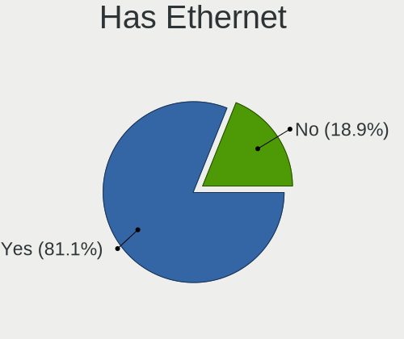
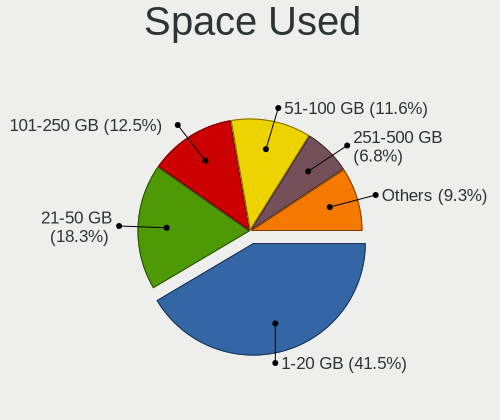
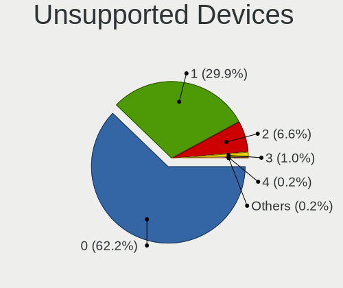

Linux - Tested Hardware & Statistics (Notebooks)
------------------------------------------------

A project to collect tested hardware configurations for Linux.

Anyone can contribute to this report by the [hw-probe](https://github.com/linuxhw/hw-probe) tool:

    sudo -E hw-probe -all -upload

Please contribute! Especially if your hardware is rare.

This report is for real hardware. Report for virtual hardware: [TestCoverage_VE](https://github.com/linuxhw/TestCoverage_VE)

Contents
--------

* [ Test Cases ](#test-cases)

* [ System ](#system)
  - [ OS                       ](#os)
  - [ OS Family                ](#os-family)
  - [ Kernel                   ](#kernel)
  - [ Kernel Family            ](#kernel-family)
  - [ Kernel Major Ver.        ](#kernel-major-ver)
  - [ Arch                     ](#arch)
  - [ DE                       ](#de)
  - [ Display Server           ](#display-server)
  - [ Display Manager          ](#display-manager)
  - [ OS Lang                  ](#os-lang)
  - [ Boot Mode                ](#boot-mode)
  - [ Filesystem               ](#filesystem)
  - [ Part. scheme             ](#part-scheme)
  - [ Dual Boot with Linux/BSD ](#dual-boot-with-linuxbsd)
  - [ Dual Boot (Win)          ](#dual-boot-win)

* [ Board ](#board)
  - [ Vendor                   ](#vendor)
  - [ Model                    ](#model)
  - [ Model Family             ](#model-family)
  - [ MFG Year                 ](#mfg-year)
  - [ Form Factor              ](#form-factor)
  - [ Secure Boot              ](#secure-boot)
  - [ Coreboot                 ](#coreboot)
  - [ RAM Size                 ](#ram-size)
  - [ RAM Used                 ](#ram-used)
  - [ Total Drives             ](#total-drives)
  - [ Has CD-ROM               ](#has-cd-rom)
  - [ Has Ethernet             ](#has-ethernet)
  - [ Has WiFi                 ](#has-wifi)
  - [ Has Bluetooth            ](#has-bluetooth)

* [ Location ](#location)
  - [ Country                  ](#country)
  - [ City                     ](#city)

* [ Drives ](#drives)
  - [ Drive Vendor             ](#drive-vendor)
  - [ Drive Model              ](#drive-model)
  - [ HDD Vendor               ](#hdd-vendor)
  - [ SSD Vendor               ](#ssd-vendor)
  - [ Drive Kind               ](#drive-kind)
  - [ Drive Connector          ](#drive-connector)
  - [ Drive Size               ](#drive-size)
  - [ Space Total              ](#space-total)
  - [ Space Used               ](#space-used)
  - [ Malfunc. Drives          ](#malfunc-drives)
  - [ Malfunc. Drive Vendor    ](#malfunc-drive-vendor)
  - [ Malfunc. HDD Vendor      ](#malfunc-hdd-vendor)
  - [ Malfunc. Drive Kind      ](#malfunc-drive-kind)
  - [ Failed Drives            ](#failed-drives)
  - [ Failed Drive Vendor      ](#failed-drive-vendor)
  - [ Drive Status             ](#drive-status)

* [ Storage controller ](#storage-controller)
  - [ Storage Vendor           ](#storage-vendor)
  - [ Storage Model            ](#storage-model)
  - [ Storage Kind             ](#storage-kind)

* [ Processor ](#processor)
  - [ CPU Vendor               ](#cpu-vendor)
  - [ CPU Model                ](#cpu-model)
  - [ CPU Model Family         ](#cpu-model-family)
  - [ CPU Cores                ](#cpu-cores)
  - [ CPU Sockets              ](#cpu-sockets)
  - [ CPU Threads              ](#cpu-threads)
  - [ CPU Op-Modes             ](#cpu-op-modes)
  - [ CPU Microcode            ](#cpu-microcode)
  - [ CPU Microarch            ](#cpu-microarch)

* [ Graphics ](#graphics)
  - [ GPU Vendor               ](#gpu-vendor)
  - [ GPU Model                ](#gpu-model)
  - [ GPU Combo                ](#gpu-combo)
  - [ GPU Driver               ](#gpu-driver)
  - [ GPU Memory               ](#gpu-memory)

* [ Monitor ](#monitor)
  - [ Monitor Vendor           ](#monitor-vendor)
  - [ Monitor Model            ](#monitor-model)
  - [ Monitor Resolution       ](#monitor-resolution)
  - [ Monitor Diagonal         ](#monitor-diagonal)
  - [ Monitor Width            ](#monitor-width)
  - [ Aspect Ratio             ](#aspect-ratio)
  - [ Monitor Area             ](#monitor-area)
  - [ Pixel Density            ](#pixel-density)
  - [ Multiple Monitors        ](#multiple-monitors)

* [ Network ](#network)
  - [ Net Controller Vendor    ](#net-controller-vendor)
  - [ Net Controller Model     ](#net-controller-model)
  - [ Wireless Vendor          ](#wireless-vendor)
  - [ Wireless Model           ](#wireless-model)
  - [ Ethernet Vendor          ](#ethernet-vendor)
  - [ Ethernet Model           ](#ethernet-model)
  - [ Net Controller Kind      ](#net-controller-kind)
  - [ Used Controller          ](#used-controller)
  - [ NICs                     ](#nics)
  - [ IPv6                     ](#ipv6)

* [ Bluetooth ](#bluetooth)
  - [ Bluetooth Vendor         ](#bluetooth-vendor)
  - [ Bluetooth Model          ](#bluetooth-model)

* [ Sound ](#sound)
  - [ Sound Vendor             ](#sound-vendor)
  - [ Sound Model              ](#sound-model)

* [ Memory ](#memory)
  - [ Memory Vendor            ](#memory-vendor)
  - [ Memory Model             ](#memory-model)
  - [ Memory Kind              ](#memory-kind)
  - [ Memory Form Factor       ](#memory-form-factor)
  - [ Memory Size              ](#memory-size)
  - [ Memory Speed             ](#memory-speed)

* [ Printers & scanners ](#printers--scanners)
  - [ Printer Vendor           ](#printer-vendor)
  - [ Printer Model            ](#printer-model)
  - [ Scanner Vendor           ](#scanner-vendor)
  - [ Scanner Model            ](#scanner-model)

* [ Camera ](#camera)
  - [ Camera Vendor            ](#camera-vendor)
  - [ Camera Model             ](#camera-model)

* [ Security ](#security)
  - [ Fingerprint Vendor       ](#fingerprint-vendor)
  - [ Fingerprint Model        ](#fingerprint-model)
  - [ Chipcard Vendor          ](#chipcard-vendor)
  - [ Chipcard Model           ](#chipcard-model)

* [ Unsupported ](#unsupported)
  - [ Unsupported Devices      ](#unsupported-devices)
  - [ Unsupported Device Types ](#unsupported-device-types)

Test Cases
----------

Total: 149240

| Vendor        | Model                       | Probe                                                      | Date         |
|---------------|-----------------------------|------------------------------------------------------------|--------------|
| MSI           | MS-N0E1 Ver                 | [9c4dcef9c6](https://linux-hardware.org/?probe=9c4dcef9c6) | Feb 01, 2023 |
| Apple         | MacBookPro12,1              | [6e089e22b1](https://linux-hardware.org/?probe=6e089e22b1) | Feb 01, 2023 |
| ASUSTek       | VivoBook_ASUSLaptop M540... | [8bc290ef67](https://linux-hardware.org/?probe=8bc290ef67) | Feb 01, 2023 |
| HP            | Laptop 17-cn0xxx            | [71bfc02926](https://linux-hardware.org/?probe=71bfc02926) | Feb 01, 2023 |
| Lenovo        | ThinkPad T490 20N2000LRT    | [aaaf227faf](https://linux-hardware.org/?probe=aaaf227faf) | Feb 01, 2023 |
| Dell          | Inspiron 5566               | [b2dd8d93c7](https://linux-hardware.org/?probe=b2dd8d93c7) | Feb 01, 2023 |
| Apple         | MacBookAir7,2               | [352c998936](https://linux-hardware.org/?probe=352c998936) | Feb 01, 2023 |
| Toshiba       | Satellite P775              | [c03f7668ac](https://linux-hardware.org/?probe=c03f7668ac) | Feb 01, 2023 |
| MSI           | GF63 Thin 11UC              | [b34b3228d3](https://linux-hardware.org/?probe=b34b3228d3) | Feb 01, 2023 |
| MSI           | Modern 14 B11MOU            | [542173e9a2](https://linux-hardware.org/?probe=542173e9a2) | Feb 01, 2023 |
| HP            | Compaq nx9420 (ES444ET#A... | [ac78478b3b](https://linux-hardware.org/?probe=ac78478b3b) | Feb 01, 2023 |
| MSI           | GP60 2PE                    | [a1bb8934a0](https://linux-hardware.org/?probe=a1bb8934a0) | Feb 01, 2023 |
| Dell          | Latitude 7420               | [f0b8816283](https://linux-hardware.org/?probe=f0b8816283) | Feb 01, 2023 |
| Lenovo        | ThinkPad T470s 20HF0000U... | [d7a5b537d9](https://linux-hardware.org/?probe=d7a5b537d9) | Feb 01, 2023 |
| ASUSTek       | ASUS TUF Gaming F15 FX50... | [ab31f6153e](https://linux-hardware.org/?probe=ab31f6153e) | Feb 01, 2023 |
| Lenovo        | ThinkPad T400 6473PMG       | [07cba1c44b](https://linux-hardware.org/?probe=07cba1c44b) | Feb 01, 2023 |
| Lenovo        | ThinkPad P1 Gen 3 20TJS2... | [22abfb4a79](https://linux-hardware.org/?probe=22abfb4a79) | Feb 01, 2023 |
| Dell          | Latitude 5430               | [2afa57d0fa](https://linux-hardware.org/?probe=2afa57d0fa) | Feb 01, 2023 |
| eMachines     | E725                        | [4b1805b3f6](https://linux-hardware.org/?probe=4b1805b3f6) | Feb 01, 2023 |
| Lenovo        | ThinkPad X1 Carbon Gen 9... | [0de8121880](https://linux-hardware.org/?probe=0de8121880) | Feb 01, 2023 |
| Lenovo        | IdeaPad S145-15API 81V7     | [7e78833b8b](https://linux-hardware.org/?probe=7e78833b8b) | Feb 01, 2023 |
| Lenovo        | IdeaPad S145-15IWL 81S9     | [2be076637c](https://linux-hardware.org/?probe=2be076637c) | Feb 01, 2023 |
| Lenovo        | ThinkPad X220 4286CTO       | [465114aa14](https://linux-hardware.org/?probe=465114aa14) | Feb 01, 2023 |
| Valve         | Jupiter                     | [09c9b01e9b](https://linux-hardware.org/?probe=09c9b01e9b) | Feb 01, 2023 |
| Dell          | Vostro 3500                 | [fa4104f438](https://linux-hardware.org/?probe=fa4104f438) | Feb 01, 2023 |
| Lenovo        | ThinkPad A485 20MVS0U500    | [b398a8e8e6](https://linux-hardware.org/?probe=b398a8e8e6) | Feb 01, 2023 |
| Lenovo        | IdeaPad S530-13IWL 81J7     | [6ed194a014](https://linux-hardware.org/?probe=6ed194a014) | Feb 01, 2023 |
| Lenovo        | ThinkPad T490s 20NYS4HL0... | [d792c0057e](https://linux-hardware.org/?probe=d792c0057e) | Feb 01, 2023 |
| HP            | EliteBook 8570p             | [2f7f3a5b93](https://linux-hardware.org/?probe=2f7f3a5b93) | Feb 01, 2023 |
| Lenovo        | ThinkPad X1 Carbon Gen 9... | [f39ab69b74](https://linux-hardware.org/?probe=f39ab69b74) | Feb 01, 2023 |
| Acer          | Aspire 5750G                | [a8a3f37ad8](https://linux-hardware.org/?probe=a8a3f37ad8) | Feb 01, 2023 |
| Lenovo        | ThinkPad T520 4243WRK       | [924a321452](https://linux-hardware.org/?probe=924a321452) | Feb 01, 2023 |
| Lenovo        | ThinkPad E14 20RAS1RA00     | [8360c9e13f](https://linux-hardware.org/?probe=8360c9e13f) | Feb 01, 2023 |
| Dell          | Vostro 3500                 | [ec80fcb8a5](https://linux-hardware.org/?probe=ec80fcb8a5) | Feb 01, 2023 |
| Lenovo        | IdeaPad 3 15ADA05 81W1      | [95e019beb2](https://linux-hardware.org/?probe=95e019beb2) | Feb 01, 2023 |
| Apple         | MacBookPro15,1              | [7f89f4417d](https://linux-hardware.org/?probe=7f89f4417d) | Feb 01, 2023 |
| Lenovo        | Yoga Slim 7 Pro 14IAP7 8... | [b829e9afbd](https://linux-hardware.org/?probe=b829e9afbd) | Feb 01, 2023 |
| Notebook      | NJx0MU                      | [c402e9c063](https://linux-hardware.org/?probe=c402e9c063) | Feb 01, 2023 |
| Lenovo        | ThinkPad E520 1143JYG       | [87735dd3b0](https://linux-hardware.org/?probe=87735dd3b0) | Feb 01, 2023 |
| Apple         | MacBookAir6,2               | [2261a77abb](https://linux-hardware.org/?probe=2261a77abb) | Feb 01, 2023 |
| Lenovo        | IdeaPad 3 17ITL6 82H9       | [eaaf15f3f6](https://linux-hardware.org/?probe=eaaf15f3f6) | Feb 01, 2023 |
| MSI           | GF63 Thin 11UC              | [4f06c55846](https://linux-hardware.org/?probe=4f06c55846) | Feb 01, 2023 |
| ASUSTek       | Zenbook UX535QE_UM535QE     | [ee219f2f82](https://linux-hardware.org/?probe=ee219f2f82) | Feb 01, 2023 |
| Lenovo        | ThinkPad X1 Carbon Gen 9... | [c1862b275d](https://linux-hardware.org/?probe=c1862b275d) | Feb 01, 2023 |
| Acer          | Nitro AN515-54              | [9aee0a798c](https://linux-hardware.org/?probe=9aee0a798c) | Feb 01, 2023 |
| Lenovo        | ThinkPad X1 Carbon Gen 9... | [1aa5d63f0c](https://linux-hardware.org/?probe=1aa5d63f0c) | Feb 01, 2023 |
| Dell          | Latitude 7490               | [b2c18d04be](https://linux-hardware.org/?probe=b2c18d04be) | Feb 01, 2023 |
| ASUSTek       | S551LN                      | [b7361dbc53](https://linux-hardware.org/?probe=b7361dbc53) | Feb 01, 2023 |
| ASUSTek       | Zenbook UX535QE_UM535QE     | [af2f6edc6f](https://linux-hardware.org/?probe=af2f6edc6f) | Feb 01, 2023 |
| Dell          | Latitude 7490               | [050126f7f7](https://linux-hardware.org/?probe=050126f7f7) | Feb 01, 2023 |
| Apple         | MacBookAir5,2               | [8a90f64e68](https://linux-hardware.org/?probe=8a90f64e68) | Feb 01, 2023 |
| HP            | 250 G1                      | [41f3eccf2e](https://linux-hardware.org/?probe=41f3eccf2e) | Feb 01, 2023 |
| Apple         | MacBookAir5,2               | [2bdd007ce6](https://linux-hardware.org/?probe=2bdd007ce6) | Feb 01, 2023 |
| HP            | 250 G1                      | [345cb01bcc](https://linux-hardware.org/?probe=345cb01bcc) | Feb 01, 2023 |
| ASUSTek       | N552VW                      | [1ebeeec517](https://linux-hardware.org/?probe=1ebeeec517) | Feb 01, 2023 |
| Timi          | Mi NoteBook Ultra           | [d897ec0114](https://linux-hardware.org/?probe=d897ec0114) | Feb 01, 2023 |
| Lenovo        | ThinkPad X220 Tablet 429... | [c4869ecf2c](https://linux-hardware.org/?probe=c4869ecf2c) | Feb 01, 2023 |
| HUAWEI        | BOHK-WAX9X                  | [07b498f669](https://linux-hardware.org/?probe=07b498f669) | Feb 01, 2023 |
| Valve         | Jupiter                     | [eab7cc51cd](https://linux-hardware.org/?probe=eab7cc51cd) | Feb 01, 2023 |
| Dell          | Inspiron 7501               | [426493e8a5](https://linux-hardware.org/?probe=426493e8a5) | Feb 01, 2023 |
| Acer          | Aspire A315-21G             | [1a3af834c9](https://linux-hardware.org/?probe=1a3af834c9) | Feb 01, 2023 |
| Acer          | Predator PH517-61           | [b16ddc31d8](https://linux-hardware.org/?probe=b16ddc31d8) | Feb 01, 2023 |
| Lenovo        | ThinkPad T16 Gen 1 21CH0... | [78eeec802b](https://linux-hardware.org/?probe=78eeec802b) | Feb 01, 2023 |
| Dell          | Latitude E6440              | [8712bed802](https://linux-hardware.org/?probe=8712bed802) | Feb 01, 2023 |
| Dell          | Latitude E6440              | [09b61adc0b](https://linux-hardware.org/?probe=09b61adc0b) | Feb 01, 2023 |
| Acer          | Aspire A315-21G             | [78f5b5c42b](https://linux-hardware.org/?probe=78f5b5c42b) | Feb 01, 2023 |
| MSI           | Raider GE66 12UHS           | [75e83dae8b](https://linux-hardware.org/?probe=75e83dae8b) | Feb 01, 2023 |
| Fujitsu       | LIFEBOOK E744               | [b048f7d3e1](https://linux-hardware.org/?probe=b048f7d3e1) | Feb 01, 2023 |
| HP            | Laptop 14-dq4xxx            | [c102edf6a0](https://linux-hardware.org/?probe=c102edf6a0) | Feb 01, 2023 |
| Dell          | Vostro 1520                 | [3fab7107b7](https://linux-hardware.org/?probe=3fab7107b7) | Feb 01, 2023 |
| Valve         | Jupiter                     | [304c2a8ce3](https://linux-hardware.org/?probe=304c2a8ce3) | Feb 01, 2023 |
| Valve         | Jupiter                     | [6debcb8087](https://linux-hardware.org/?probe=6debcb8087) | Feb 01, 2023 |
| Dell          | Inspiron 15-3567            | [2f6f4bc8c7](https://linux-hardware.org/?probe=2f6f4bc8c7) | Feb 01, 2023 |
| Lenovo        | ThinkPad X270 20HMS0T000    | [e9854b7cf8](https://linux-hardware.org/?probe=e9854b7cf8) | Feb 01, 2023 |
| HP            | Pavilion Gaming Laptop 1... | [de3138b686](https://linux-hardware.org/?probe=de3138b686) | Feb 01, 2023 |
| Notebook      | NJx0MU                      | [eb152c7d4e](https://linux-hardware.org/?probe=eb152c7d4e) | Feb 01, 2023 |
| Google        | Pantheon                    | [12e0b96dd1](https://linux-hardware.org/?probe=12e0b96dd1) | Feb 01, 2023 |
| Acer          | Aspire A315-53              | [d221bc6b8d](https://linux-hardware.org/?probe=d221bc6b8d) | Feb 01, 2023 |
| Apple         | MacBookPro11,1              | [44f90bc9ab](https://linux-hardware.org/?probe=44f90bc9ab) | Feb 01, 2023 |
| Dell          | Precision M6700             | [743cb766c2](https://linux-hardware.org/?probe=743cb766c2) | Feb 01, 2023 |
| Lenovo        | ThinkPad T14s Gen 3 21CQ... | [6b9dc508e1](https://linux-hardware.org/?probe=6b9dc508e1) | Feb 01, 2023 |
| HP            | Presario CQ57               | [0e34caefa3](https://linux-hardware.org/?probe=0e34caefa3) | Feb 01, 2023 |
| ASUSTek       | VivoBook_ASUSLaptop E510... | [08e071efa2](https://linux-hardware.org/?probe=08e071efa2) | Feb 01, 2023 |
| ASUSTek       | ROG Strix G713QE_G713QE     | [f05a20fe00](https://linux-hardware.org/?probe=f05a20fe00) | Feb 01, 2023 |
| Dell          | Inspiron 5748               | [7ee6505f8d](https://linux-hardware.org/?probe=7ee6505f8d) | Feb 01, 2023 |
| ASUSTek       | TUF Gaming FX504GE_FX80G... | [3fc59532b8](https://linux-hardware.org/?probe=3fc59532b8) | Feb 01, 2023 |
| Schenker      | VISION 16 Pro (L22)         | [0979a6ca2a](https://linux-hardware.org/?probe=0979a6ca2a) | Jan 31, 2023 |
| HP            | Laptop 15s-fq5xxx           | [bd22f26ad1](https://linux-hardware.org/?probe=bd22f26ad1) | Jan 31, 2023 |
| HP            | Laptop 15s-fq5xxx           | [28ea3cafe8](https://linux-hardware.org/?probe=28ea3cafe8) | Jan 31, 2023 |
| Lenovo        | ThinkPad T560 20FJS44L0B    | [06bf3870a5](https://linux-hardware.org/?probe=06bf3870a5) | Jan 31, 2023 |
| Acer          | Nitro AN515-52              | [86156a3b50](https://linux-hardware.org/?probe=86156a3b50) | Jan 31, 2023 |
| Lenovo        | ThinkPad T530 2394A11       | [e7946fa600](https://linux-hardware.org/?probe=e7946fa600) | Jan 31, 2023 |
| Samsung       | RV415/RV515                 | [ea50188d5c](https://linux-hardware.org/?probe=ea50188d5c) | Jan 31, 2023 |
| Dell          | Latitude E7240              | [fe655eca77](https://linux-hardware.org/?probe=fe655eca77) | Jan 31, 2023 |
| Lenovo        | Legion 5 17ACH6H 82JY       | [62f941075c](https://linux-hardware.org/?probe=62f941075c) | Jan 31, 2023 |
| Lenovo        | ThinkPad T14s Gen 2i 20W... | [ab57658c86](https://linux-hardware.org/?probe=ab57658c86) | Jan 31, 2023 |
| ASUSTek       | VivoBook_ASUS Laptop E21... | [478c456288](https://linux-hardware.org/?probe=478c456288) | Jan 31, 2023 |
| Acer          | Aspire E1-522               | [af61a3d9c8](https://linux-hardware.org/?probe=af61a3d9c8) | Jan 31, 2023 |
| HUAWEI        | HLYL-WXX9                   | [6e8d45f76b](https://linux-hardware.org/?probe=6e8d45f76b) | Jan 31, 2023 |
| ASUSTek       | Zenbook UX8402ZA_UX8402Z... | [1d212c67b2](https://linux-hardware.org/?probe=1d212c67b2) | Jan 31, 2023 |
| HP            | Laptop 14s-dq3xxx           | [12ebaf0896](https://linux-hardware.org/?probe=12ebaf0896) | Jan 31, 2023 |
| Lenovo        | ThinkPad X1 Extreme 20MF... | [70310e25d1](https://linux-hardware.org/?probe=70310e25d1) | Jan 31, 2023 |
| Dell          | Latitude E6540              | [156a047a82](https://linux-hardware.org/?probe=156a047a82) | Jan 31, 2023 |
| Medion        | E15410                      | [24135c324e](https://linux-hardware.org/?probe=24135c324e) | Jan 31, 2023 |
| HUAWEI        | HN-WX9X                     | [4b8ddf5d09](https://linux-hardware.org/?probe=4b8ddf5d09) | Jan 31, 2023 |
| HP            | ENVY 15                     | [c688eb85bb](https://linux-hardware.org/?probe=c688eb85bb) | Jan 31, 2023 |
| HP            | Notebook                    | [3cea0a0519](https://linux-hardware.org/?probe=3cea0a0519) | Jan 31, 2023 |
| Lenovo        | IdeaPad S145-15API 81V7     | [ebbe861495](https://linux-hardware.org/?probe=ebbe861495) | Jan 31, 2023 |
| Dell          | Inspiron 5748               | [ecbd4ac8b6](https://linux-hardware.org/?probe=ecbd4ac8b6) | Jan 31, 2023 |
| Dell          | Inspiron 15-7579            | [b5bd231bf3](https://linux-hardware.org/?probe=b5bd231bf3) | Jan 31, 2023 |
| Apple         | MacBookPro15,2              | [7612aba4cb](https://linux-hardware.org/?probe=7612aba4cb) | Jan 31, 2023 |
| Acer          | Aspire A515-54G             | [a57a68e42f](https://linux-hardware.org/?probe=a57a68e42f) | Jan 31, 2023 |
| ASUSTek       | ROG Zephyrus G14 GA402RK... | [0d500d9d33](https://linux-hardware.org/?probe=0d500d9d33) | Jan 31, 2023 |
| HP            | Notebook                    | [f352309997](https://linux-hardware.org/?probe=f352309997) | Jan 31, 2023 |
| Google        | Gnawty                      | [4188917829](https://linux-hardware.org/?probe=4188917829) | Jan 31, 2023 |
| Notebook      | W35xSTQ_370ST               | [b52cc29e08](https://linux-hardware.org/?probe=b52cc29e08) | Jan 31, 2023 |
| Dell          | Latitude 5480               | [8b43efc7ea](https://linux-hardware.org/?probe=8b43efc7ea) | Jan 31, 2023 |
| HP            | 255 15.6 inch G9 Noteboo... | [7758d7c535](https://linux-hardware.org/?probe=7758d7c535) | Jan 31, 2023 |
| ASUSTek       | VivoBook_ASUSLaptop X150... | [e2ad5b033f](https://linux-hardware.org/?probe=e2ad5b033f) | Jan 31, 2023 |
| Dell          | G3 3500                     | [4b519ab8a8](https://linux-hardware.org/?probe=4b519ab8a8) | Jan 31, 2023 |
| ASUSTek       | VivoBook_ASUSLaptop X421... | [1cfa73407d](https://linux-hardware.org/?probe=1cfa73407d) | Jan 31, 2023 |
| Acer          | Aspire E5-575G              | [463b7f859f](https://linux-hardware.org/?probe=463b7f859f) | Jan 31, 2023 |
| Google        | Lillipup                    | [45f9b8c3cf](https://linux-hardware.org/?probe=45f9b8c3cf) | Jan 31, 2023 |
| Lenovo        | IdeaPad S145-15IIL 82DJ     | [3803fd2405](https://linux-hardware.org/?probe=3803fd2405) | Jan 31, 2023 |
| Lenovo        | Y50-70 20378                | [04c77927f5](https://linux-hardware.org/?probe=04c77927f5) | Jan 31, 2023 |
| Lenovo        | ThinkPad X140e 20BMS03E0... | [fb4c4aebf9](https://linux-hardware.org/?probe=fb4c4aebf9) | Jan 31, 2023 |
| Timi          | TM1701                      | [a474c92380](https://linux-hardware.org/?probe=a474c92380) | Jan 31, 2023 |
| Lenovo        | Y50-70 20378                | [5dc21f30b5](https://linux-hardware.org/?probe=5dc21f30b5) | Jan 31, 2023 |
| Acer          | Aspire AV14-51              | [fa801eea4b](https://linux-hardware.org/?probe=fa801eea4b) | Jan 31, 2023 |
| Lenovo        | ThinkPad T14 Gen 2a 20XK... | [db8bdbd72b](https://linux-hardware.org/?probe=db8bdbd72b) | Jan 31, 2023 |
| Dell          | XPS 13 7390                 | [5479d8c85b](https://linux-hardware.org/?probe=5479d8c85b) | Jan 31, 2023 |
| HP            | Laptop 15-bw0xx             | [b7fce61d74](https://linux-hardware.org/?probe=b7fce61d74) | Jan 31, 2023 |
| Dell          | XPS 13 9370                 | [cd12cbdc16](https://linux-hardware.org/?probe=cd12cbdc16) | Jan 31, 2023 |
| HUAWEI        | KLVL-WXXW                   | [4c8bff0f95](https://linux-hardware.org/?probe=4c8bff0f95) | Jan 31, 2023 |
| Lenovo        | ThinkPad E15 Gen 2 20T9S... | [51d249d102](https://linux-hardware.org/?probe=51d249d102) | Jan 31, 2023 |
| Dell          | Inspiron 7400               | [a6b124fd34](https://linux-hardware.org/?probe=a6b124fd34) | Jan 31, 2023 |
| ASUSTek       | VivoBook_ASUSLaptop M340... | [cd9b7d5796](https://linux-hardware.org/?probe=cd9b7d5796) | Jan 31, 2023 |
| Dell          | Latitude 7420               | [55f81648a1](https://linux-hardware.org/?probe=55f81648a1) | Jan 31, 2023 |
| Aquarius      | Cmp NS685U                  | [b067e76e64](https://linux-hardware.org/?probe=b067e76e64) | Jan 31, 2023 |
| Lenovo        | ThinkPad T530 2429F27       | [85ac6a588d](https://linux-hardware.org/?probe=85ac6a588d) | Jan 31, 2023 |
| HP            | EliteBook 840 G1            | [9b91cecab9](https://linux-hardware.org/?probe=9b91cecab9) | Jan 31, 2023 |
| Lenovo        | IdeaPad S145-15API 81V7     | [949ea399fb](https://linux-hardware.org/?probe=949ea399fb) | Jan 31, 2023 |
| Dell          | XPS 15 9570                 | [896d7f2fbd](https://linux-hardware.org/?probe=896d7f2fbd) | Jan 31, 2023 |
| Timi          | A34R                        | [18ab422614](https://linux-hardware.org/?probe=18ab422614) | Jan 31, 2023 |
| Dell          | Vostro 3700                 | [a663152b7c](https://linux-hardware.org/?probe=a663152b7c) | Jan 31, 2023 |
| Apple         | MacBookPro12,1              | [228ab40738](https://linux-hardware.org/?probe=228ab40738) | Jan 31, 2023 |
| Clevo         | NL41MU2                     | [95dac05397](https://linux-hardware.org/?probe=95dac05397) | Jan 31, 2023 |
| Notebook      | W35xSTQ_370ST               | [b33ec828fc](https://linux-hardware.org/?probe=b33ec828fc) | Jan 31, 2023 |
| Toshiba       | Satellite R630              | [52ffe609b8](https://linux-hardware.org/?probe=52ffe609b8) | Jan 31, 2023 |
| HP            | EliteBook 840 G2            | [bf4741c8ad](https://linux-hardware.org/?probe=bf4741c8ad) | Jan 31, 2023 |
| Lenovo        | IdeaPad 5 15ARE05 81YQ      | [396877a008](https://linux-hardware.org/?probe=396877a008) | Jan 31, 2023 |
| Dell          | Latitude E6530              | [140543c98c](https://linux-hardware.org/?probe=140543c98c) | Jan 31, 2023 |
| ASUSTek       | Zenbook UX8402ZA_UX8402Z... | [4dcc88b215](https://linux-hardware.org/?probe=4dcc88b215) | Jan 31, 2023 |
| HP            | Notebook                    | [82d58b21c4](https://linux-hardware.org/?probe=82d58b21c4) | Jan 31, 2023 |
| Dell          | Vostro 3700                 | [ae3838cc5d](https://linux-hardware.org/?probe=ae3838cc5d) | Jan 31, 2023 |
| Dell          | Latitude 5410               | [717012530d](https://linux-hardware.org/?probe=717012530d) | Jan 31, 2023 |
| Dell          | Studio 1558                 | [acfea4cd33](https://linux-hardware.org/?probe=acfea4cd33) | Jan 31, 2023 |
| ASUSTek       | K50IJ                       | [c01f530c1c](https://linux-hardware.org/?probe=c01f530c1c) | Jan 31, 2023 |
| Dell          | Latitude 7410               | [fd07971a70](https://linux-hardware.org/?probe=fd07971a70) | Jan 31, 2023 |
| Lenovo        | ZHAOYANG K4e-ITL 82F8       | [dd9e1146ff](https://linux-hardware.org/?probe=dd9e1146ff) | Jan 31, 2023 |
| ASUSTek       | K50IJ                       | [51c65b48bc](https://linux-hardware.org/?probe=51c65b48bc) | Jan 31, 2023 |
| Unknown       | Unknown                     | [e6c824b966](https://linux-hardware.org/?probe=e6c824b966) | Jan 31, 2023 |
| TUXEDO        | InfinityBook Pro Gen7 (M... | [4a2fcb6bd0](https://linux-hardware.org/?probe=4a2fcb6bd0) | Jan 31, 2023 |
| Lenovo        | ThinkPad P15 Gen 2i 20YQ... | [ea48b6870c](https://linux-hardware.org/?probe=ea48b6870c) | Jan 31, 2023 |
| HP            | Laptop 15s-eq3xxx           | [e9525c9a86](https://linux-hardware.org/?probe=e9525c9a86) | Jan 31, 2023 |
| Google        | Casta                       | [db372f6a5f](https://linux-hardware.org/?probe=db372f6a5f) | Jan 31, 2023 |
| HP            | Laptop 15s-eq3xxx           | [e6cb9d8296](https://linux-hardware.org/?probe=e6cb9d8296) | Jan 31, 2023 |
| ASUSTek       | ZenBook UX425UA_UM425UA     | [4febaa325b](https://linux-hardware.org/?probe=4febaa325b) | Jan 31, 2023 |
| HP            | EliteBook 2560p             | [798466ab86](https://linux-hardware.org/?probe=798466ab86) | Jan 31, 2023 |
| Notebook      | NJx0MU                      | [58d5bdaa2d](https://linux-hardware.org/?probe=58d5bdaa2d) | Jan 31, 2023 |
| ASUSTek       | VivoBook_ASUSLaptop X530... | [78bd5ea99c](https://linux-hardware.org/?probe=78bd5ea99c) | Jan 31, 2023 |
| HP            | ZBook Studio G3             | [506988f4ba](https://linux-hardware.org/?probe=506988f4ba) | Jan 31, 2023 |
| Lenovo        | ThinkPad T440 20B7S2GS0W    | [46008b3d38](https://linux-hardware.org/?probe=46008b3d38) | Jan 31, 2023 |
| Lenovo        | ThinkPad T410 2518BPG       | [011f53deaa](https://linux-hardware.org/?probe=011f53deaa) | Jan 31, 2023 |
| ASUSTek       | N53Ta                       | [30131c7409](https://linux-hardware.org/?probe=30131c7409) | Jan 31, 2023 |
| HP            | Pavilion Gaming Laptop 1... | [9fd1916420](https://linux-hardware.org/?probe=9fd1916420) | Jan 31, 2023 |
| HP            | Sona                        | [36a3d72172](https://linux-hardware.org/?probe=36a3d72172) | Jan 31, 2023 |
| ASUSTek       | 1011PX                      | [204706229b](https://linux-hardware.org/?probe=204706229b) | Jan 31, 2023 |
| HP            | Pavilion Gaming Laptop 1... | [318f007db6](https://linux-hardware.org/?probe=318f007db6) | Jan 31, 2023 |
| ASUSTek       | VivoBook_ASUSLaptop K350... | [1c798340db](https://linux-hardware.org/?probe=1c798340db) | Jan 31, 2023 |
| TUXEDO        | Stellaris Intel Gen4        | [2df9f60f2e](https://linux-hardware.org/?probe=2df9f60f2e) | Jan 31, 2023 |
| Acer          | Predator PH315-52           | [b1c77eb9c7](https://linux-hardware.org/?probe=b1c77eb9c7) | Jan 31, 2023 |
| Lenovo        | ThinkBook 13s G2 ITL 20V... | [74bf135ed9](https://linux-hardware.org/?probe=74bf135ed9) | Jan 31, 2023 |
| Lenovo        | ThinkBook 13s G2 ITL 20V... | [e0c723e305](https://linux-hardware.org/?probe=e0c723e305) | Jan 31, 2023 |
| HP            | ENVY Laptop 13-ah0xxx       | [7636aeaacc](https://linux-hardware.org/?probe=7636aeaacc) | Jan 31, 2023 |
| System76      | Lemur                       | [6dac0a5b94](https://linux-hardware.org/?probe=6dac0a5b94) | Jan 31, 2023 |
| Notebook      | PD5x_7xPNP_PNN_PNT          | [a64ae29757](https://linux-hardware.org/?probe=a64ae29757) | Jan 31, 2023 |
| Dell          | Latitude D630               | [ff0aa8c4ed](https://linux-hardware.org/?probe=ff0aa8c4ed) | Jan 31, 2023 |
| Dell          | Latitude D630               | [d8ac695aa3](https://linux-hardware.org/?probe=d8ac695aa3) | Jan 31, 2023 |
| Dell          | XPS 13 9360                 | [3aa64bf1ec](https://linux-hardware.org/?probe=3aa64bf1ec) | Jan 31, 2023 |
| Lenovo        | G40-80 80JE                 | [bb5d758714](https://linux-hardware.org/?probe=bb5d758714) | Jan 31, 2023 |
| Lenovo        | ThinkPad X220 Tablet 429... | [230b38f8e6](https://linux-hardware.org/?probe=230b38f8e6) | Jan 31, 2023 |
| Acer          | Aspire A517-51              | [cb65ba4ce5](https://linux-hardware.org/?probe=cb65ba4ce5) | Jan 31, 2023 |
| Acer          | Aspire E5-571               | [615ee3d3fd](https://linux-hardware.org/?probe=615ee3d3fd) | Jan 31, 2023 |
| Lenovo        | ThinkPad P51 20HJS0BR00     | [6c05048c9d](https://linux-hardware.org/?probe=6c05048c9d) | Jan 31, 2023 |
| Acer          | Aspire E5-571               | [6498b44bcc](https://linux-hardware.org/?probe=6498b44bcc) | Jan 31, 2023 |
| Lenovo        | ThinkPad E560 20EV002FUS    | [0110b731e7](https://linux-hardware.org/?probe=0110b731e7) | Jan 31, 2023 |
| HP            | Pavilion dv6                | [c84439bfbf](https://linux-hardware.org/?probe=c84439bfbf) | Jan 31, 2023 |
| Google        | Robo360                     | [c9fb18664b](https://linux-hardware.org/?probe=c9fb18664b) | Jan 31, 2023 |
| Lenovo        | ThinkPad E560 20EV002FUS    | [faa0a5a1ff](https://linux-hardware.org/?probe=faa0a5a1ff) | Jan 31, 2023 |
| Lenovo        | G40-80 80JE                 | [e5dc585024](https://linux-hardware.org/?probe=e5dc585024) | Jan 31, 2023 |
| Lenovo        | ThinkPad T430 2349A44       | [9f8528c5da](https://linux-hardware.org/?probe=9f8528c5da) | Jan 31, 2023 |
| Acer          | Swift SF114-32              | [82d317899e](https://linux-hardware.org/?probe=82d317899e) | Jan 31, 2023 |
| Lenovo        | Legion Y530-15ICH 81FV      | [aaaa563786](https://linux-hardware.org/?probe=aaaa563786) | Jan 31, 2023 |
| Lenovo        | ThinkPad L540 20AVCTO1WW    | [d08beb0c26](https://linux-hardware.org/?probe=d08beb0c26) | Jan 31, 2023 |
| Dell          | XPS 15 9500                 | [6a0af9dbcb](https://linux-hardware.org/?probe=6a0af9dbcb) | Jan 31, 2023 |
| HP            | ENVY dv6                    | [4d8c55a82f](https://linux-hardware.org/?probe=4d8c55a82f) | Jan 31, 2023 |
| Apple         | MacBookPro8,1               | [0eac708be5](https://linux-hardware.org/?probe=0eac708be5) | Jan 31, 2023 |
| Valve         | Jupiter                     | [584a69fbac](https://linux-hardware.org/?probe=584a69fbac) | Jan 31, 2023 |
| Fujitsu       | LIFEBOOK S751               | [35948f3b5e](https://linux-hardware.org/?probe=35948f3b5e) | Jan 31, 2023 |
| Acer          | Swift SF114-32              | [8e8ae85d60](https://linux-hardware.org/?probe=8e8ae85d60) | Jan 31, 2023 |
| Apple         | MacBookPro14,2              | [ff0dfe765e](https://linux-hardware.org/?probe=ff0dfe765e) | Jan 31, 2023 |
| HUAWEI        | WRTB-WXX9                   | [60967eaaaf](https://linux-hardware.org/?probe=60967eaaaf) | Jan 31, 2023 |
| HP            | Compaq 6730s                | [1b083e5b64](https://linux-hardware.org/?probe=1b083e5b64) | Jan 31, 2023 |
| Samsung       | 550XCJ/550XCR               | [75fad3daf3](https://linux-hardware.org/?probe=75fad3daf3) | Jan 31, 2023 |
| Dell          | Latitude E5420              | [ccc3ca9853](https://linux-hardware.org/?probe=ccc3ca9853) | Jan 31, 2023 |
| HP            | 240 G3                      | [cd49e2e9ac](https://linux-hardware.org/?probe=cd49e2e9ac) | Jan 31, 2023 |
| Dell          | XPS 15 9570                 | [ee60c1c921](https://linux-hardware.org/?probe=ee60c1c921) | Jan 31, 2023 |
| Lenovo        | ThinkPad E14 Gen 4 21E30... | [87904d9d06](https://linux-hardware.org/?probe=87904d9d06) | Jan 31, 2023 |
| HP            | Compaq 6730s                | [ced2899d20](https://linux-hardware.org/?probe=ced2899d20) | Jan 31, 2023 |
| Lenovo        | ThinkPad X270 W10DG 20K5... | [5e5231a159](https://linux-hardware.org/?probe=5e5231a159) | Jan 31, 2023 |
| Lenovo        | ThinkPad L380 20M5S09Y00    | [2326ffc032](https://linux-hardware.org/?probe=2326ffc032) | Jan 31, 2023 |
| Lenovo        | ThinkPad T500 2055AZ1       | [1086813401](https://linux-hardware.org/?probe=1086813401) | Jan 30, 2023 |
| HP            | ProBook 650 G1              | [fc09442b7c](https://linux-hardware.org/?probe=fc09442b7c) | Jan 30, 2023 |
| HP            | ProBook 650 G1              | [b78602c91d](https://linux-hardware.org/?probe=b78602c91d) | Jan 30, 2023 |
| Lenovo        | IdeaPad S145-15API 81V7     | [2474b4641c](https://linux-hardware.org/?probe=2474b4641c) | Jan 30, 2023 |
| Lenovo        | ThinkPad T500 2055AZ1       | [0b43f40c2a](https://linux-hardware.org/?probe=0b43f40c2a) | Jan 30, 2023 |
| Lenovo        | Legion 7 16ARHA7 82UH       | [bcaa2e6b1a](https://linux-hardware.org/?probe=bcaa2e6b1a) | Jan 30, 2023 |
| HP            | 255 15.6 inch G9 Noteboo... | [5201a076f6](https://linux-hardware.org/?probe=5201a076f6) | Jan 30, 2023 |
| Framework     | Laptop (12th Gen Intel C... | [96671141f9](https://linux-hardware.org/?probe=96671141f9) | Jan 30, 2023 |
| Acer          | Aspire A315-56              | [93f5ac8f6d](https://linux-hardware.org/?probe=93f5ac8f6d) | Jan 30, 2023 |
| Toshiba       | Satellite U845W             | [6735a45763](https://linux-hardware.org/?probe=6735a45763) | Jan 30, 2023 |
| HP            | Pavilion 15                 | [e3adac798e](https://linux-hardware.org/?probe=e3adac798e) | Jan 30, 2023 |
| Lenovo        | ThinkPad P50 20EN0013US     | [d3bf9fe9e3](https://linux-hardware.org/?probe=d3bf9fe9e3) | Jan 30, 2023 |
| Acer          | Aspire ES1-512              | [0d254e85dd](https://linux-hardware.org/?probe=0d254e85dd) | Jan 30, 2023 |
| MACHENIKE     | MACHCREATOR-16              | [c44c077d1e](https://linux-hardware.org/?probe=c44c077d1e) | Jan 30, 2023 |
| ASUSTek       | X55VD                       | [4120c1019c](https://linux-hardware.org/?probe=4120c1019c) | Jan 30, 2023 |
| MSI           | GL75 Leopard 10SCSR         | [8e30762127](https://linux-hardware.org/?probe=8e30762127) | Jan 30, 2023 |
| GPU Compan... | GWTN141-10                  | [f012d6d71c](https://linux-hardware.org/?probe=f012d6d71c) | Jan 30, 2023 |
| Acer          | Predator PH315-52           | [457b7cf5f0](https://linux-hardware.org/?probe=457b7cf5f0) | Jan 30, 2023 |
| Dell          | Vostro 15 3515              | [357d14774f](https://linux-hardware.org/?probe=357d14774f) | Jan 30, 2023 |
| MSI           | GS66 Stealth 10SE           | [bf112866e3](https://linux-hardware.org/?probe=bf112866e3) | Jan 30, 2023 |
| HP            | Notebook                    | [fc93f8e357](https://linux-hardware.org/?probe=fc93f8e357) | Jan 30, 2023 |
| HP            | 3115-AEC13432GR1            | [98eb70341a](https://linux-hardware.org/?probe=98eb70341a) | Jan 30, 2023 |
| Dell          | Latitude E5430 non-vPro     | [d1e99e3f04](https://linux-hardware.org/?probe=d1e99e3f04) | Jan 30, 2023 |
| HP            | Pavilion Notebook           | [912213d849](https://linux-hardware.org/?probe=912213d849) | Jan 30, 2023 |
| Lenovo        | G580 20150                  | [339aef175f](https://linux-hardware.org/?probe=339aef175f) | Jan 30, 2023 |
| Acer          | Aspire E5-575G              | [532f5a8dbe](https://linux-hardware.org/?probe=532f5a8dbe) | Jan 30, 2023 |
| Lenovo        | ThinkPad Edge E431 62779... | [8d7c1dbf4d](https://linux-hardware.org/?probe=8d7c1dbf4d) | Jan 30, 2023 |
| Acer          | Aspire V3-772G              | [fce1ba6f6b](https://linux-hardware.org/?probe=fce1ba6f6b) | Jan 30, 2023 |
| Lenovo        | G580 20150                  | [e0b08d335b](https://linux-hardware.org/?probe=e0b08d335b) | Jan 30, 2023 |
| Sony          | VPCCB16FG                   | [837588c9eb](https://linux-hardware.org/?probe=837588c9eb) | Jan 30, 2023 |
| HP            | Pavilion Notebook           | [456415a23e](https://linux-hardware.org/?probe=456415a23e) | Jan 30, 2023 |
| Lenovo        | ThinkPad E15 Gen 2 20TD0... | [f6be582448](https://linux-hardware.org/?probe=f6be582448) | Jan 30, 2023 |
| Lenovo        | IdeaPad 530S-15IKB 81EV     | [58739a5bef](https://linux-hardware.org/?probe=58739a5bef) | Jan 30, 2023 |
| Lenovo        | ThinkPad W510 4391W3V       | [78d987fedf](https://linux-hardware.org/?probe=78d987fedf) | Jan 30, 2023 |
| HP            | Stream Laptop 14-cb1XX      | [3f17be7a85](https://linux-hardware.org/?probe=3f17be7a85) | Jan 30, 2023 |
| Toshiba       | Satellite P750              | [1cc0f342b5](https://linux-hardware.org/?probe=1cc0f342b5) | Jan 30, 2023 |
| HP            | ProBook 4720s               | [b6edbaeae1](https://linux-hardware.org/?probe=b6edbaeae1) | Jan 30, 2023 |
| Acer          | Aspire A315-56              | [bacea93055](https://linux-hardware.org/?probe=bacea93055) | Jan 30, 2023 |
| Acer          | Aspire E1-522               | [88de348bef](https://linux-hardware.org/?probe=88de348bef) | Jan 30, 2023 |
| Acer          | Aspire M5-581TG             | [970a402846](https://linux-hardware.org/?probe=970a402846) | Jan 30, 2023 |
| Apple         | MacBookPro5,2               | [4cb11c2a78](https://linux-hardware.org/?probe=4cb11c2a78) | Jan 30, 2023 |
| Acer          | Aspire M5-581TG             | [c2d425d254](https://linux-hardware.org/?probe=c2d425d254) | Jan 30, 2023 |
| HP            | Laptop 17-bs0xx             | [ed57a59e39](https://linux-hardware.org/?probe=ed57a59e39) | Jan 30, 2023 |
| MSI           | Raider GE76 12UE            | [c69bbc917b](https://linux-hardware.org/?probe=c69bbc917b) | Jan 30, 2023 |
| ASUSTek       | ROG Zephyrus M16 GU603ZX... | [7442c84b55](https://linux-hardware.org/?probe=7442c84b55) | Jan 30, 2023 |
| ASUSTek       | UX310UQK                    | [d4aec33c44](https://linux-hardware.org/?probe=d4aec33c44) | Jan 30, 2023 |
| ASUSTek       | UX310UQK                    | [58e7588538](https://linux-hardware.org/?probe=58e7588538) | Jan 30, 2023 |
| Acer          | Aspire E5-771               | [389651889c](https://linux-hardware.org/?probe=389651889c) | Jan 30, 2023 |
| Lenovo        | ThinkPad W510 431924G       | [c899463c77](https://linux-hardware.org/?probe=c899463c77) | Jan 30, 2023 |
| MSI           | Bravo 15 B5DD               | [b3c357b53b](https://linux-hardware.org/?probe=b3c357b53b) | Jan 30, 2023 |
| HP            | ProBook 6465b               | [de7999a824](https://linux-hardware.org/?probe=de7999a824) | Jan 30, 2023 |
| ASUSTek       | ROG Strix G513RW_G513RW     | [942c001b11](https://linux-hardware.org/?probe=942c001b11) | Jan 30, 2023 |
| Lenovo        | Yoga 3 14 80JH              | [6c66b66a78](https://linux-hardware.org/?probe=6c66b66a78) | Jan 30, 2023 |
| Dell          | Latitude 7480               | [f3a84b494f](https://linux-hardware.org/?probe=f3a84b494f) | Jan 30, 2023 |
| Lenovo        | ThinkPad W510 4391W3V       | [a178301183](https://linux-hardware.org/?probe=a178301183) | Jan 30, 2023 |
| HP            | Compaq Presario CQ70        | [07e9e57b88](https://linux-hardware.org/?probe=07e9e57b88) | Jan 30, 2023 |
| HP            | Laptop 17-ak0xx             | [6e6f32430a](https://linux-hardware.org/?probe=6e6f32430a) | Jan 30, 2023 |
| Dell          | XPS 13 9360                 | [9037e30b54](https://linux-hardware.org/?probe=9037e30b54) | Jan 30, 2023 |
| Dell          | Latitude E6520              | [f042c5966b](https://linux-hardware.org/?probe=f042c5966b) | Jan 30, 2023 |
| ASUSTek       | VivoBook_ASUSLaptop X515... | [1ecef01472](https://linux-hardware.org/?probe=1ecef01472) | Jan 30, 2023 |
| Acer          | Swift SF114-32              | [1228d6d0f7](https://linux-hardware.org/?probe=1228d6d0f7) | Jan 30, 2023 |
| HP            | EliteBook 840 G5            | [7b2b210afd](https://linux-hardware.org/?probe=7b2b210afd) | Jan 30, 2023 |
| Fujitsu Si... | LIFEBOOK E8310              | [bc685693a6](https://linux-hardware.org/?probe=bc685693a6) | Jan 30, 2023 |
| ASUSTek       | VivoBook_ASUSLaptop K350... | [3ecd91770e](https://linux-hardware.org/?probe=3ecd91770e) | Jan 30, 2023 |
| Dell          | Latitude E6420              | [68908b991a](https://linux-hardware.org/?probe=68908b991a) | Jan 30, 2023 |
| Dell          | Inspiron 5758               | [de58233dca](https://linux-hardware.org/?probe=de58233dca) | Jan 30, 2023 |
| HUAWEI        | BOHB-WAX9                   | [f4916a0bd5](https://linux-hardware.org/?probe=f4916a0bd5) | Jan 30, 2023 |
| HP            | EliteBook Revolve 810 G3    | [1f55ca148f](https://linux-hardware.org/?probe=1f55ca148f) | Jan 30, 2023 |
| HP            | ZBook 15u G3                | [7f985597d7](https://linux-hardware.org/?probe=7f985597d7) | Jan 30, 2023 |
| HP            | ZBook 15u G3                | [7a35a6d886](https://linux-hardware.org/?probe=7a35a6d886) | Jan 30, 2023 |
| Fujitsu       | LIFEBOOK AH532              | [cf200b9cf1](https://linux-hardware.org/?probe=cf200b9cf1) | Jan 30, 2023 |
| Dell          | Latitude D630C              | [401357bc99](https://linux-hardware.org/?probe=401357bc99) | Jan 30, 2023 |
| HP            | EliteBook 8560p             | [f03a63f76a](https://linux-hardware.org/?probe=f03a63f76a) | Jan 30, 2023 |
| Valve         | Jupiter                     | [9568a6f43d](https://linux-hardware.org/?probe=9568a6f43d) | Jan 30, 2023 |
| Infinix       | INBOOK X2 GEN11             | [d826805d37](https://linux-hardware.org/?probe=d826805d37) | Jan 30, 2023 |
| MSI           | GF75 Thin 10UE              | [1177ccc150](https://linux-hardware.org/?probe=1177ccc150) | Jan 30, 2023 |
| Dell          | Latitude E6400              | [a195487665](https://linux-hardware.org/?probe=a195487665) | Jan 30, 2023 |
| Dell          | G15 5511                    | [36214ba4de](https://linux-hardware.org/?probe=36214ba4de) | Jan 30, 2023 |
| Lenovo        | Z50-70 20354                | [54f6c27c09](https://linux-hardware.org/?probe=54f6c27c09) | Jan 30, 2023 |
| Dell          | Precision 3560              | [3d5432deef](https://linux-hardware.org/?probe=3d5432deef) | Jan 30, 2023 |
| Dell          | Precision 3560              | [c250c935bd](https://linux-hardware.org/?probe=c250c935bd) | Jan 30, 2023 |
| Dell          | Precision 3571              | [55f371f4ef](https://linux-hardware.org/?probe=55f371f4ef) | Jan 30, 2023 |
| ASUSTek       | X550LC                      | [4c50999862](https://linux-hardware.org/?probe=4c50999862) | Jan 30, 2023 |
| ASUSTek       | X550LC                      | [41d606bbe8](https://linux-hardware.org/?probe=41d606bbe8) | Jan 30, 2023 |
| Dell          | Latitude 5480               | [ee87ac218f](https://linux-hardware.org/?probe=ee87ac218f) | Jan 30, 2023 |
| Dell          | Latitude 5480               | [3cbac640e1](https://linux-hardware.org/?probe=3cbac640e1) | Jan 30, 2023 |
| ASUSTek       | Zenbook UM3402YA_UM3402Y... | [9b17a7541e](https://linux-hardware.org/?probe=9b17a7541e) | Jan 30, 2023 |
| HP            | Compaq CQ58                 | [63dfd6ca48](https://linux-hardware.org/?probe=63dfd6ca48) | Jan 30, 2023 |
| HP            | EliteBook 850 G8 Noteboo... | [a5d6a22838](https://linux-hardware.org/?probe=a5d6a22838) | Jan 30, 2023 |
| Valve         | Jupiter                     | [9623640b5d](https://linux-hardware.org/?probe=9623640b5d) | Jan 30, 2023 |
| Lenovo        | Legion R9000P ARH7H 82RG    | [15cda8e776](https://linux-hardware.org/?probe=15cda8e776) | Jan 30, 2023 |
| Fujitsu       | LIFEBOOK A530               | [0698054de0](https://linux-hardware.org/?probe=0698054de0) | Jan 30, 2023 |
| Toshiba       | PORTEGE X30-E               | [01f74415b0](https://linux-hardware.org/?probe=01f74415b0) | Jan 30, 2023 |
| Fujitsu       | LIFEBOOK A530               | [122005ade3](https://linux-hardware.org/?probe=122005ade3) | Jan 30, 2023 |
| HP            | 15                          | [409a15bdf3](https://linux-hardware.org/?probe=409a15bdf3) | Jan 30, 2023 |
| Dell          | Latitude 7390               | [b154892be4](https://linux-hardware.org/?probe=b154892be4) | Jan 30, 2023 |
| HP            | ENVY Laptop 13-ah1xxx       | [360756b46a](https://linux-hardware.org/?probe=360756b46a) | Jan 30, 2023 |
| Lenovo        | IdeaPad 1 14AMN7 82VF       | [0c220851f3](https://linux-hardware.org/?probe=0c220851f3) | Jan 30, 2023 |
| HP            | Pavilion g6                 | [d25ed40cf3](https://linux-hardware.org/?probe=d25ed40cf3) | Jan 30, 2023 |
| Acer          | Aspire E1-572G              | [6064a923c6](https://linux-hardware.org/?probe=6064a923c6) | Jan 30, 2023 |
| Lenovo        | IdeaPad 310-15ABR 80ST      | [2469884587](https://linux-hardware.org/?probe=2469884587) | Jan 30, 2023 |
| Acer          | Swift SF114-31              | [9d7f73242e](https://linux-hardware.org/?probe=9d7f73242e) | Jan 30, 2023 |
| ASUSTek       | X556UQK                     | [6c3dd54582](https://linux-hardware.org/?probe=6c3dd54582) | Jan 30, 2023 |
| Dell          | Precision 5560              | [c994bfa3a7](https://linux-hardware.org/?probe=c994bfa3a7) | Jan 30, 2023 |
| Acer          | Aspire 5755G                | [03c2f11b67](https://linux-hardware.org/?probe=03c2f11b67) | Jan 30, 2023 |
| TUXEDO        | Unknown                     | [81566e6fc9](https://linux-hardware.org/?probe=81566e6fc9) | Jan 30, 2023 |
| Acer          | Swift SF314-71              | [41c052436a](https://linux-hardware.org/?probe=41c052436a) | Jan 30, 2023 |
| Dell          | Latitude 3190               | [a53530646a](https://linux-hardware.org/?probe=a53530646a) | Jan 30, 2023 |
| Lenovo        | ThinkPad P15 Gen 2i 20YR... | [3c0723977c](https://linux-hardware.org/?probe=3c0723977c) | Jan 30, 2023 |
| Dell          | Latitude E6520              | [81717ed3df](https://linux-hardware.org/?probe=81717ed3df) | Jan 30, 2023 |
| Apple         | MacBookPro11,3              | [b7cec06bcb](https://linux-hardware.org/?probe=b7cec06bcb) | Jan 30, 2023 |
| MSI           | GE75 Raider 10SF            | [85d2ae302d](https://linux-hardware.org/?probe=85d2ae302d) | Jan 30, 2023 |
| Lenovo        | ThinkPad T480 20L5001KAU    | [4b7046e26c](https://linux-hardware.org/?probe=4b7046e26c) | Jan 30, 2023 |
| HP            | Pavilion dv7                | [b61ed06b1e](https://linux-hardware.org/?probe=b61ed06b1e) | Jan 30, 2023 |
| Dell          | Latitude E7240              | [a1f713f6e3](https://linux-hardware.org/?probe=a1f713f6e3) | Jan 30, 2023 |
| Acer          | Aspire A515-41G             | [88db10e257](https://linux-hardware.org/?probe=88db10e257) | Jan 30, 2023 |
| HP            | Pavilion 15                 | [6ceccb3d73](https://linux-hardware.org/?probe=6ceccb3d73) | Jan 30, 2023 |
| ASUSTek       | VivoBook_ASUSLaptop M150... | [8a324e4189](https://linux-hardware.org/?probe=8a324e4189) | Jan 30, 2023 |
| Lenovo        | ThinkPad T430 2347G4U       | [5802e6b9b9](https://linux-hardware.org/?probe=5802e6b9b9) | Jan 30, 2023 |
| Dell          | XPS 13 9380                 | [ec00530842](https://linux-hardware.org/?probe=ec00530842) | Jan 30, 2023 |
| Valve         | Jupiter                     | [e48701a8e1](https://linux-hardware.org/?probe=e48701a8e1) | Jan 30, 2023 |
| Avell High... | B11 MOB                     | [dd9d29ddc7](https://linux-hardware.org/?probe=dd9d29ddc7) | Jan 30, 2023 |
| Lenovo        | ThinkPad T430 2347G4U       | [3fcf581653](https://linux-hardware.org/?probe=3fcf581653) | Jan 30, 2023 |
| Acer          | Aspire A715-75G             | [59a0c6f08f](https://linux-hardware.org/?probe=59a0c6f08f) | Jan 30, 2023 |
| AZW           | GT-R                        | [6c286ec8fb](https://linux-hardware.org/?probe=6c286ec8fb) | Jan 30, 2023 |
| Dell          | XPS 15 9570                 | [1d06f2715a](https://linux-hardware.org/?probe=1d06f2715a) | Jan 30, 2023 |
| ASUSTek       | F5VL                        | [07e0539a43](https://linux-hardware.org/?probe=07e0539a43) | Jan 30, 2023 |
| Avell High... | B.ON                        | [721fbbdeb2](https://linux-hardware.org/?probe=721fbbdeb2) | Jan 30, 2023 |
| HP            | OMEN by Laptop 15z-en100    | [0c91238954](https://linux-hardware.org/?probe=0c91238954) | Jan 30, 2023 |
| Acer          | Aspire A515-45              | [42405a6a0c](https://linux-hardware.org/?probe=42405a6a0c) | Jan 30, 2023 |
| Lenovo        | ThinkPad T480 20L5000UUS    | [d356c9846a](https://linux-hardware.org/?probe=d356c9846a) | Jan 30, 2023 |
| Acer          | Aspire A515-52              | [51fa3ff577](https://linux-hardware.org/?probe=51fa3ff577) | Jan 30, 2023 |
| Sony          | PCG-GRT230(UC)              | [0a7c76da78](https://linux-hardware.org/?probe=0a7c76da78) | Jan 30, 2023 |
| Unknown       | Unknown                     | [d780984cf9](https://linux-hardware.org/?probe=d780984cf9) | Jan 30, 2023 |
| MSI           | GE60 0NC/GE60 0ND           | [a7ef98ea02](https://linux-hardware.org/?probe=a7ef98ea02) | Jan 30, 2023 |
| Valve         | Jupiter                     | [935a50bce1](https://linux-hardware.org/?probe=935a50bce1) | Jan 30, 2023 |
| Lenovo        | ThinkPad T460s 20FAS1F20... | [39b709296b](https://linux-hardware.org/?probe=39b709296b) | Jan 30, 2023 |
| Acer          | Aspire 5552                 | [f1168775a7](https://linux-hardware.org/?probe=f1168775a7) | Jan 30, 2023 |
| HUAWEI        | NBLB-WAX9N                  | [519a211655](https://linux-hardware.org/?probe=519a211655) | Jan 30, 2023 |
| HP            | 240 G8 Notebook PC          | [00a3607d18](https://linux-hardware.org/?probe=00a3607d18) | Jan 30, 2023 |
| HP            | Laptop 15s-eq1xxx           | [9f093d7cff](https://linux-hardware.org/?probe=9f093d7cff) | Jan 30, 2023 |
| HP            | Pavilion dv6                | [0966ae419c](https://linux-hardware.org/?probe=0966ae419c) | Jan 30, 2023 |
| ASUSTek       | ASUS TUF Gaming F15 FX50... | [d800b8a4b9](https://linux-hardware.org/?probe=d800b8a4b9) | Jan 30, 2023 |
| Fujitsu Si... | STYLISTIC ST5112            | [c343cec0c8](https://linux-hardware.org/?probe=c343cec0c8) | Jan 30, 2023 |
| Acer          | Swift SF514-52T             | [6f95748149](https://linux-hardware.org/?probe=6f95748149) | Jan 30, 2023 |
| Dell          | Vostro 7620                 | [b6d43b8741](https://linux-hardware.org/?probe=b6d43b8741) | Jan 29, 2023 |
| HP            | G62                         | [166ddbe627](https://linux-hardware.org/?probe=166ddbe627) | Jan 29, 2023 |
| ASUSTek       | 1011PX                      | [7359bcfbfb](https://linux-hardware.org/?probe=7359bcfbfb) | Jan 29, 2023 |
| ASUSTek       | X507UA                      | [49cc52b5b2](https://linux-hardware.org/?probe=49cc52b5b2) | Jan 29, 2023 |
| Sony          | PCG-Z1VA(UC)                | [db4f48132e](https://linux-hardware.org/?probe=db4f48132e) | Jan 29, 2023 |
| Lenovo        | IdeaPad S145-15IWL 81S9     | [1c62beb905](https://linux-hardware.org/?probe=1c62beb905) | Jan 29, 2023 |
| HP            | ProBook 5320m               | [b8fc81e61c](https://linux-hardware.org/?probe=b8fc81e61c) | Jan 29, 2023 |
| Samsung       | RV415/RV515                 | [c5999dc406](https://linux-hardware.org/?probe=c5999dc406) | Jan 29, 2023 |
| Acer          | Nitro AN515-52              | [c8c73a9f67](https://linux-hardware.org/?probe=c8c73a9f67) | Jan 29, 2023 |
| Lenovo        | ThinkPad L15 Gen 2 20X30... | [fddcdb0f47](https://linux-hardware.org/?probe=fddcdb0f47) | Jan 29, 2023 |
| Lenovo        | V15 G2 ALC 82KD             | [9f76193ccc](https://linux-hardware.org/?probe=9f76193ccc) | Jan 29, 2023 |
| Dell          | Inspiron 5770               | [b5612c2501](https://linux-hardware.org/?probe=b5612c2501) | Jan 29, 2023 |
| Lenovo        | IdeaPad 320-15ISK 80XH      | [7bc88d72f0](https://linux-hardware.org/?probe=7bc88d72f0) | Jan 29, 2023 |
| HP            | Laptop 15-dy2xxx            | [97e6b9cb60](https://linux-hardware.org/?probe=97e6b9cb60) | Jan 29, 2023 |
| MACHENIKE     | MACHCREATOR-16              | [e3d7c03a2e](https://linux-hardware.org/?probe=e3d7c03a2e) | Jan 29, 2023 |
| HP            | Laptop 15-dy2xxx            | [e5e795e7a2](https://linux-hardware.org/?probe=e5e795e7a2) | Jan 29, 2023 |
| Apple         | MacBookPro11,1              | [e5af375b93](https://linux-hardware.org/?probe=e5af375b93) | Jan 29, 2023 |
| ASUSTek       | ROG Strix G513RW_G513RW     | [2f0ffeb3be](https://linux-hardware.org/?probe=2f0ffeb3be) | Jan 29, 2023 |
| Apple         | MacBookPro11,1              | [41d67fcba8](https://linux-hardware.org/?probe=41d67fcba8) | Jan 29, 2023 |
| Sony          | VPCCB16FG                   | [7307480466](https://linux-hardware.org/?probe=7307480466) | Jan 29, 2023 |
| Lenovo        | IdeaPad 3 15ALC6 82KU       | [830de1d797](https://linux-hardware.org/?probe=830de1d797) | Jan 29, 2023 |
| Lenovo        | Legion 7 15IMH05 81YT       | [b88f08d400](https://linux-hardware.org/?probe=b88f08d400) | Jan 29, 2023 |
| Lenovo        | 3000 N200 0769BAG           | [f8f410eb2a](https://linux-hardware.org/?probe=f8f410eb2a) | Jan 29, 2023 |
| Lenovo        | IdeaPad 320-15IKB 80XL      | [5dbc5260b2](https://linux-hardware.org/?probe=5dbc5260b2) | Jan 29, 2023 |
| Lenovo        | IdeaPad Gaming 3 15IMH05... | [51245400df](https://linux-hardware.org/?probe=51245400df) | Jan 29, 2023 |
| Lenovo        | IdeaPad Y560                | [47438e081a](https://linux-hardware.org/?probe=47438e081a) | Jan 29, 2023 |
| HUAWEI        | NBLK-WAX9X                  | [933e5a5b96](https://linux-hardware.org/?probe=933e5a5b96) | Jan 29, 2023 |
| Google        | Lillipup                    | [194cec66f5](https://linux-hardware.org/?probe=194cec66f5) | Jan 29, 2023 |
| Lenovo        | ThinkPad T420 4236PN3       | [3b5c51e8b8](https://linux-hardware.org/?probe=3b5c51e8b8) | Jan 29, 2023 |
| Lenovo        | IdeaPad 5 15ITL05 82FG      | [4b8206c892](https://linux-hardware.org/?probe=4b8206c892) | Jan 29, 2023 |
| Dell          | G15 5520                    | [ae4bf1777e](https://linux-hardware.org/?probe=ae4bf1777e) | Jan 29, 2023 |
| Sony          | VPCSB11FX                   | [7659c1ba93](https://linux-hardware.org/?probe=7659c1ba93) | Jan 29, 2023 |
| Lenovo        | IdeaPad 320-15IKB 80XL      | [7c0c804a3e](https://linux-hardware.org/?probe=7c0c804a3e) | Jan 29, 2023 |
| Acer          | Aspire E5-553               | [8200b57a5b](https://linux-hardware.org/?probe=8200b57a5b) | Jan 29, 2023 |
| Dell          | Inspiron 3542               | [42a753536d](https://linux-hardware.org/?probe=42a753536d) | Jan 29, 2023 |
| HP            | Pavilion 15                 | [c5ac9f6d89](https://linux-hardware.org/?probe=c5ac9f6d89) | Jan 29, 2023 |
| ASUSTek       | G750JX                      | [d868c23c4b](https://linux-hardware.org/?probe=d868c23c4b) | Jan 29, 2023 |
| HUAWEI        | BOHB-WAX9                   | [ee6b0e54f7](https://linux-hardware.org/?probe=ee6b0e54f7) | Jan 29, 2023 |
| Dell          | Inspiron 3501               | [7bb7fe1a4f](https://linux-hardware.org/?probe=7bb7fe1a4f) | Jan 29, 2023 |
| ASUSTek       | K55A                        | [e3088b45e1](https://linux-hardware.org/?probe=e3088b45e1) | Jan 29, 2023 |
| Lenovo        | ThinkPad T580 20LA0025MX    | [c5e4274143](https://linux-hardware.org/?probe=c5e4274143) | Jan 29, 2023 |
| Dell          | Precision 5530              | [92399ea8dc](https://linux-hardware.org/?probe=92399ea8dc) | Jan 29, 2023 |
| HP            | Laptop 14-cm0xxx            | [9b93652159](https://linux-hardware.org/?probe=9b93652159) | Jan 29, 2023 |
| Lenovo        | IdeaPad 720S-14IKB 81BD     | [50eb066d41](https://linux-hardware.org/?probe=50eb066d41) | Jan 29, 2023 |
| HUAWEI        | MACHD-WXX9                  | [cac5b8faa5](https://linux-hardware.org/?probe=cac5b8faa5) | Jan 29, 2023 |
| Unknown       | Unknown                     | [23d04579d4](https://linux-hardware.org/?probe=23d04579d4) | Jan 29, 2023 |
| Acer          | Aspire V5-573G              | [e253d5b49b](https://linux-hardware.org/?probe=e253d5b49b) | Jan 29, 2023 |
| HP            | ZBook 14 G2                 | [4b1e1bc7e1](https://linux-hardware.org/?probe=4b1e1bc7e1) | Jan 29, 2023 |
| Dell          | Inspiron 15-3573            | [b735bbde51](https://linux-hardware.org/?probe=b735bbde51) | Jan 29, 2023 |
| Apple         | MacBookPro5,5               | [678b6fa5f6](https://linux-hardware.org/?probe=678b6fa5f6) | Jan 29, 2023 |
| Dell          | Inspiron 3501               | [725c2a80f8](https://linux-hardware.org/?probe=725c2a80f8) | Jan 29, 2023 |
| Lenovo        | IdeaPad 510-15ISK 80SR      | [debdb8208f](https://linux-hardware.org/?probe=debdb8208f) | Jan 29, 2023 |
| Lenovo        | ThinkPad T14 Gen 2i 20W1... | [5122097b1e](https://linux-hardware.org/?probe=5122097b1e) | Jan 29, 2023 |
| Acer          | Aspire E5-553               | [3ac195a476](https://linux-hardware.org/?probe=3ac195a476) | Jan 29, 2023 |
| Lenovo        | IdeaPad 3 15ITL6 82H8       | [8727d22cba](https://linux-hardware.org/?probe=8727d22cba) | Jan 29, 2023 |
| Valve         | Jupiter                     | [91ef57c9e5](https://linux-hardware.org/?probe=91ef57c9e5) | Jan 29, 2023 |
| HP            | OMEN by Laptop 16-c0xxx     | [32d5472e21](https://linux-hardware.org/?probe=32d5472e21) | Jan 29, 2023 |
| Lenovo        | IdeaPad 100-15IBD 80QQ      | [84c2710911](https://linux-hardware.org/?probe=84c2710911) | Jan 29, 2023 |
| HP            | ProBook 4520s               | [6a16110b08](https://linux-hardware.org/?probe=6a16110b08) | Jan 29, 2023 |
| HP            | ProBook 4520s               | [e973aeb114](https://linux-hardware.org/?probe=e973aeb114) | Jan 29, 2023 |
| HP            | Pavilion Sleekbook 15       | [d17dc00a8a](https://linux-hardware.org/?probe=d17dc00a8a) | Jan 29, 2023 |
| Lenovo        | ThinkPad X1 Carbon Gen 8... | [47246aa8b5](https://linux-hardware.org/?probe=47246aa8b5) | Jan 29, 2023 |
| ASUSTek       | X555LD                      | [b70d834fe5](https://linux-hardware.org/?probe=b70d834fe5) | Jan 29, 2023 |
| Notebook      | NJx0MU                      | [10cdf2558f](https://linux-hardware.org/?probe=10cdf2558f) | Jan 29, 2023 |
| MSI           | CR700                       | [35d1ff1eac](https://linux-hardware.org/?probe=35d1ff1eac) | Jan 29, 2023 |
| Intel         | powered classmate PC        | [a3e602934b](https://linux-hardware.org/?probe=a3e602934b) | Jan 29, 2023 |
| Intel         | Unknown                     | [f387a4b732](https://linux-hardware.org/?probe=f387a4b732) | Jan 29, 2023 |
| Intel         | Unknown                     | [79aa357327](https://linux-hardware.org/?probe=79aa357327) | Jan 29, 2023 |
| Lenovo        | Legion 5 15ACH6H 82JU       | [dd07a46c6a](https://linux-hardware.org/?probe=dd07a46c6a) | Jan 29, 2023 |
| Lenovo        | S21e-20 80M4                | [7017fcf775](https://linux-hardware.org/?probe=7017fcf775) | Jan 29, 2023 |
| Notebook      | NJx0MU                      | [09bbe80125](https://linux-hardware.org/?probe=09bbe80125) | Jan 29, 2023 |
| Lenovo        | IdeaPad 320-15AST 80XV      | [a732875be3](https://linux-hardware.org/?probe=a732875be3) | Jan 29, 2023 |
| Lenovo        | S21e-20 80M4                | [9afa780018](https://linux-hardware.org/?probe=9afa780018) | Jan 29, 2023 |
| HP            | ProBook 650 G1              | [830394a75e](https://linux-hardware.org/?probe=830394a75e) | Jan 29, 2023 |
| ASUSTek       | ASUS TUF Gaming F15 FX50... | [90644628b4](https://linux-hardware.org/?probe=90644628b4) | Jan 29, 2023 |
| HP            | Laptop 14-fq0xxx            | [0b7bcda17a](https://linux-hardware.org/?probe=0b7bcda17a) | Jan 29, 2023 |
| Acer          | Nitro AN517-41              | [ecb7c49d2e](https://linux-hardware.org/?probe=ecb7c49d2e) | Jan 29, 2023 |
| TECNO         | MEGABOOK T1                 | [db0e6c89b4](https://linux-hardware.org/?probe=db0e6c89b4) | Jan 29, 2023 |
| Lenovo        | Legion 5 15ACH6 82JW        | [175211d52c](https://linux-hardware.org/?probe=175211d52c) | Jan 29, 2023 |
| Timi          | RedmiBook Pro 15S           | [21cf912e1c](https://linux-hardware.org/?probe=21cf912e1c) | Jan 29, 2023 |
| ASUSTek       | K93SV                       | [3b4dd13d9f](https://linux-hardware.org/?probe=3b4dd13d9f) | Jan 29, 2023 |
| Samsung       | RV420/RV520/RV720/E3530/... | [93e0f40842](https://linux-hardware.org/?probe=93e0f40842) | Jan 29, 2023 |
| Alienware     | x17 R2                      | [d004749696](https://linux-hardware.org/?probe=d004749696) | Jan 29, 2023 |
| Alienware     | x17 R2                      | [350244db5d](https://linux-hardware.org/?probe=350244db5d) | Jan 29, 2023 |
| Acer          | Aspire 3810T                | [a7b93a7119](https://linux-hardware.org/?probe=a7b93a7119) | Jan 29, 2023 |
| Dell          | Inspiron 5520               | [c869e74605](https://linux-hardware.org/?probe=c869e74605) | Jan 29, 2023 |
| Valve         | Jupiter                     | [f439aa5179](https://linux-hardware.org/?probe=f439aa5179) | Jan 29, 2023 |
| Dell          | Latitude 5400               | [80651273e4](https://linux-hardware.org/?probe=80651273e4) | Jan 29, 2023 |
| HP            | EliteBook 8460p             | [caedc4c130](https://linux-hardware.org/?probe=caedc4c130) | Jan 29, 2023 |
| Valve         | Jupiter                     | [9fdd992e96](https://linux-hardware.org/?probe=9fdd992e96) | Jan 29, 2023 |
| Lenovo        | IdeaPad S340-14IML 81N9     | [58e620077b](https://linux-hardware.org/?probe=58e620077b) | Jan 29, 2023 |
| HP            | Pavilion dv6                | [1e739ddc0d](https://linux-hardware.org/?probe=1e739ddc0d) | Jan 29, 2023 |
| Lenovo        | IdeaPad Y560                | [621aca8707](https://linux-hardware.org/?probe=621aca8707) | Jan 29, 2023 |
| Lenovo        | ThinkPad E14 Gen 3 20Y7C... | [66ab929a6c](https://linux-hardware.org/?probe=66ab929a6c) | Jan 29, 2023 |
| Lenovo        | IdeaPad Y560                | [55fe252b4e](https://linux-hardware.org/?probe=55fe252b4e) | Jan 29, 2023 |
| Motion Com... | C5t                         | [200be33adc](https://linux-hardware.org/?probe=200be33adc) | Jan 29, 2023 |
| Clevo         | W240EU/W250EUQ/W270EUQ      | [3912652a13](https://linux-hardware.org/?probe=3912652a13) | Jan 29, 2023 |
| Razer         | Blade 15 (2022) - RZ09-0... | [41d33a9029](https://linux-hardware.org/?probe=41d33a9029) | Jan 29, 2023 |
| Dell          | Inspiron 5520               | [6de5bc549f](https://linux-hardware.org/?probe=6de5bc549f) | Jan 29, 2023 |
| Toshiba       | QOSMIO X770                 | [62b104b3d2](https://linux-hardware.org/?probe=62b104b3d2) | Jan 29, 2023 |
| Acer          | Aspire A315-41              | [f8ef554d85](https://linux-hardware.org/?probe=f8ef554d85) | Jan 29, 2023 |
| HP            | Laptop 15-da0xxx            | [959a9a17dd](https://linux-hardware.org/?probe=959a9a17dd) | Jan 29, 2023 |
| ASUSTek       | TUF Gaming FX505DT_FX505... | [4333734c92](https://linux-hardware.org/?probe=4333734c92) | Jan 29, 2023 |
| HP            | ProBook 640 G2              | [7b08eeb50c](https://linux-hardware.org/?probe=7b08eeb50c) | Jan 29, 2023 |
| System76      | Lemur                       | [a6fc9167f7](https://linux-hardware.org/?probe=a6fc9167f7) | Jan 29, 2023 |
| Acer          | E1-510                      | [659bb96537](https://linux-hardware.org/?probe=659bb96537) | Jan 29, 2023 |
| ASUSTek       | TUF Gaming FX505DT_FX505... | [87502e1eb2](https://linux-hardware.org/?probe=87502e1eb2) | Jan 29, 2023 |
| Dell          | Latitude 5400               | [eb97e73f08](https://linux-hardware.org/?probe=eb97e73f08) | Jan 29, 2023 |
| Positivo      | Q464C-O                     | [e61f2d0622](https://linux-hardware.org/?probe=e61f2d0622) | Jan 29, 2023 |
| ASUSTek       | ROG Strix G513RM_G513RM     | [4603f92b18](https://linux-hardware.org/?probe=4603f92b18) | Jan 29, 2023 |
| Lenovo        | ThinkPad X220 42915CG       | [d058eeaad5](https://linux-hardware.org/?probe=d058eeaad5) | Jan 29, 2023 |
| HP            | Pavilion dv7                | [f27e7c24c1](https://linux-hardware.org/?probe=f27e7c24c1) | Jan 29, 2023 |
| Lenovo        | IdeaPad 3 14ITL6 82H7       | [086e08a04b](https://linux-hardware.org/?probe=086e08a04b) | Jan 29, 2023 |
| Apple         | MacBookPro7,1               | [615e9f22e4](https://linux-hardware.org/?probe=615e9f22e4) | Jan 29, 2023 |
| Alienware     | x15 R2                      | [51bb7a8c39](https://linux-hardware.org/?probe=51bb7a8c39) | Jan 29, 2023 |
| System76      | Darter Pro                  | [5d97ec522f](https://linux-hardware.org/?probe=5d97ec522f) | Jan 29, 2023 |
| Dell          | Precision 7510              | [4f56174991](https://linux-hardware.org/?probe=4f56174991) | Jan 29, 2023 |
| ASUSTek       | ASUS TUF Gaming F15 FX50... | [608c0b8c88](https://linux-hardware.org/?probe=608c0b8c88) | Jan 29, 2023 |
| Acer          | Aspire 5733                 | [da753d74a1](https://linux-hardware.org/?probe=da753d74a1) | Jan 29, 2023 |
| Lenovo        | Legion Y540-15IRH-PG0 81... | [e2fa9aa820](https://linux-hardware.org/?probe=e2fa9aa820) | Jan 29, 2023 |
| Dell          | XPS 13 7390                 | [60c03ee1f7](https://linux-hardware.org/?probe=60c03ee1f7) | Jan 29, 2023 |
| Lenovo        | ThinkPad T460 20FMS79000    | [2b397905e1](https://linux-hardware.org/?probe=2b397905e1) | Jan 29, 2023 |
| Lenovo        | ThinkPad E14 Gen 3 20Y7C... | [4b4d53bcc1](https://linux-hardware.org/?probe=4b4d53bcc1) | Jan 29, 2023 |
| Lenovo        | Yoga Slim 7 Carbon 13ITL... | [d3936466af](https://linux-hardware.org/?probe=d3936466af) | Jan 29, 2023 |
| Gateway       | NV570P                      | [f7d900c26c](https://linux-hardware.org/?probe=f7d900c26c) | Jan 29, 2023 |
| Dell          | G15 5515                    | [1be125c3cd](https://linux-hardware.org/?probe=1be125c3cd) | Jan 29, 2023 |
| AXDIA Inte... | WINPAD V10                  | [c5f4838490](https://linux-hardware.org/?probe=c5f4838490) | Jan 29, 2023 |
| Acer          | Nitro AN515-52              | [2fb747792d](https://linux-hardware.org/?probe=2fb747792d) | Jan 29, 2023 |
| Timi          | TM1703                      | [6bb85263a7](https://linux-hardware.org/?probe=6bb85263a7) | Jan 29, 2023 |
| Dell          | Latitude E6530              | [87bca9f2a4](https://linux-hardware.org/?probe=87bca9f2a4) | Jan 29, 2023 |
| Samsung       | N102S                       | [c23908cf42](https://linux-hardware.org/?probe=c23908cf42) | Jan 28, 2023 |
| HP            | ZBook 17 G3                 | [a1b5cdf1db](https://linux-hardware.org/?probe=a1b5cdf1db) | Jan 28, 2023 |
| Dell          | G15 5520                    | [a0c269c5b1](https://linux-hardware.org/?probe=a0c269c5b1) | Jan 28, 2023 |
| TUXEDO        | N14xWU                      | [5681ab6b5d](https://linux-hardware.org/?probe=5681ab6b5d) | Jan 28, 2023 |
| Toshiba       | QOSMIO X770                 | [b7cf9bee5c](https://linux-hardware.org/?probe=b7cf9bee5c) | Jan 28, 2023 |
| ASUSTek       | X550LB                      | [9590dd2f30](https://linux-hardware.org/?probe=9590dd2f30) | Jan 28, 2023 |
| ASUSTek       | X555LD                      | [3a3e1fafdf](https://linux-hardware.org/?probe=3a3e1fafdf) | Jan 28, 2023 |
| HP            | Notebook                    | [d38e078368](https://linux-hardware.org/?probe=d38e078368) | Jan 28, 2023 |
| HP            | Laptop 17-cp2xxx            | [e04f33db90](https://linux-hardware.org/?probe=e04f33db90) | Jan 28, 2023 |
| Lenovo        | G550 2958                   | [8bee986aca](https://linux-hardware.org/?probe=8bee986aca) | Jan 28, 2023 |
| ASUSTek       | VivoBook_ASUSLaptop X412... | [1d28352c0f](https://linux-hardware.org/?probe=1d28352c0f) | Jan 28, 2023 |
| ASUSTek       | K43SJ                       | [0cff4ad069](https://linux-hardware.org/?probe=0cff4ad069) | Jan 28, 2023 |
| Dell          | XPS 13 9380                 | [ed99ed692d](https://linux-hardware.org/?probe=ed99ed692d) | Jan 28, 2023 |
| HP            | EliteBook 840 G1            | [30549ebd3a](https://linux-hardware.org/?probe=30549ebd3a) | Jan 28, 2023 |
| Dell          | Latitude 7280               | [358f4c431f](https://linux-hardware.org/?probe=358f4c431f) | Jan 28, 2023 |
| ASUSTek       | ROG Strix G733QS_G733QS     | [e789456756](https://linux-hardware.org/?probe=e789456756) | Jan 28, 2023 |
| HUAWEI        | NBLK-WAX9X                  | [a88e343a83](https://linux-hardware.org/?probe=a88e343a83) | Jan 28, 2023 |
| Dell          | Latitude 7280               | [903e0489c4](https://linux-hardware.org/?probe=903e0489c4) | Jan 28, 2023 |
| Valve         | Jupiter                     | [4a823b2eef](https://linux-hardware.org/?probe=4a823b2eef) | Jan 28, 2023 |
| HP            | Laptop 15-da2xxx            | [8384a02b4b](https://linux-hardware.org/?probe=8384a02b4b) | Jan 28, 2023 |
| ASUSTek       | 1215B                       | [8d26a8d157](https://linux-hardware.org/?probe=8d26a8d157) | Jan 28, 2023 |
| INSYS         | GW1-W149                    | [5a4337006d](https://linux-hardware.org/?probe=5a4337006d) | Jan 28, 2023 |
| ASUSTek       | ProArt StudioBook H7600H... | [8e9b78c0e8](https://linux-hardware.org/?probe=8e9b78c0e8) | Jan 28, 2023 |
| Valve         | Jupiter                     | [5ea763da5f](https://linux-hardware.org/?probe=5ea763da5f) | Jan 28, 2023 |
| Lenovo        | ThinkBook 16p Gen 2 20YM    | [53015adc9d](https://linux-hardware.org/?probe=53015adc9d) | Jan 28, 2023 |
| HUAWEI        | MACH-WX9                    | [5b00f79b72](https://linux-hardware.org/?probe=5b00f79b72) | Jan 28, 2023 |
| HP            | ENVY Laptop 17-cg0xxx       | [ed1ce46901](https://linux-hardware.org/?probe=ed1ce46901) | Jan 28, 2023 |
| HP            | Pavilion dv8000 (ET839UA... | [3e7c902731](https://linux-hardware.org/?probe=3e7c902731) | Jan 28, 2023 |
| Dell          | Inspiron 14-3452            | [baf61affa2](https://linux-hardware.org/?probe=baf61affa2) | Jan 28, 2023 |
| HP            | Pavilion dv6                | [ce950f0a28](https://linux-hardware.org/?probe=ce950f0a28) | Jan 28, 2023 |
| HP            | 630                         | [837878455e](https://linux-hardware.org/?probe=837878455e) | Jan 28, 2023 |
| Dell          | Inspiron 5570               | [17a8246044](https://linux-hardware.org/?probe=17a8246044) | Jan 28, 2023 |
| Lenovo        | IdeaPad 3 15ADA05 81W1      | [a011ba3b9e](https://linux-hardware.org/?probe=a011ba3b9e) | Jan 28, 2023 |
| Lenovo        | ThinkPad T480 20L6SF8C00    | [4ab453f835](https://linux-hardware.org/?probe=4ab453f835) | Jan 28, 2023 |
| HUAWEI        | NBLB-WAX9N                  | [edd571ba94](https://linux-hardware.org/?probe=edd571ba94) | Jan 28, 2023 |
| ASUSTek       | X550MJ                      | [51fd1f6c24](https://linux-hardware.org/?probe=51fd1f6c24) | Jan 28, 2023 |
| Lenovo        | ThinkPad T430u 3353A11      | [c93d5da3f1](https://linux-hardware.org/?probe=c93d5da3f1) | Jan 28, 2023 |
| Acer          | Aspire A315-41              | [bbe5b30c42](https://linux-hardware.org/?probe=bbe5b30c42) | Jan 28, 2023 |
| ASUSTek       | UX410UAR                    | [e9ac16c8ef](https://linux-hardware.org/?probe=e9ac16c8ef) | Jan 28, 2023 |
| HP            | Laptop 15s-eq2xxx           | [096eede9c5](https://linux-hardware.org/?probe=096eede9c5) | Jan 28, 2023 |
| ASUSTek       | X555QA                      | [8eec8468fb](https://linux-hardware.org/?probe=8eec8468fb) | Jan 28, 2023 |
| HP            | OMEN Laptop 15-en0xxx       | [e163d98802](https://linux-hardware.org/?probe=e163d98802) | Jan 28, 2023 |
| HP            | EliteBook 845 G7 Noteboo... | [c4877a8bc3](https://linux-hardware.org/?probe=c4877a8bc3) | Jan 28, 2023 |
| Apple         | MacBookAir7,2               | [b5f0169944](https://linux-hardware.org/?probe=b5f0169944) | Jan 28, 2023 |
| Lenovo        | ThinkPad T14 Gen 3 21AH0... | [844e4e4b2a](https://linux-hardware.org/?probe=844e4e4b2a) | Jan 28, 2023 |
| Lenovo        | ThinkPad L15 Gen 1 20U4S... | [a8e2d5b5f0](https://linux-hardware.org/?probe=a8e2d5b5f0) | Jan 28, 2023 |
| HP            | ENVY Laptop 17-cg0xxx       | [ab3f84f96b](https://linux-hardware.org/?probe=ab3f84f96b) | Jan 28, 2023 |
| Lenovo        | ThinkPad Edge E540 20C60... | [ff3381fe1a](https://linux-hardware.org/?probe=ff3381fe1a) | Jan 28, 2023 |
| Dell          | Inspiron 1521               | [8fcde91462](https://linux-hardware.org/?probe=8fcde91462) | Jan 28, 2023 |
| Apple         | MacBookPro11,4              | [8a5423443a](https://linux-hardware.org/?probe=8a5423443a) | Jan 28, 2023 |
| Dell          | Latitude E5430 non-vPro     | [ae644e258a](https://linux-hardware.org/?probe=ae644e258a) | Jan 28, 2023 |
| Lenovo        | ThinkPad X220 4291H82       | [f9781882f8](https://linux-hardware.org/?probe=f9781882f8) | Jan 28, 2023 |
| Dell          | Inspiron 3581               | [8c8db10ac2](https://linux-hardware.org/?probe=8c8db10ac2) | Jan 28, 2023 |
| HP            | Pavilion Laptop 15-eh1xx... | [6f94175d8c](https://linux-hardware.org/?probe=6f94175d8c) | Jan 28, 2023 |
| ASUSTek       | X751LB                      | [54094ae0a7](https://linux-hardware.org/?probe=54094ae0a7) | Jan 28, 2023 |
| Lenovo        | ThinkPad X61 7674BE1        | [a22ac0a9f5](https://linux-hardware.org/?probe=a22ac0a9f5) | Jan 28, 2023 |
| HP            | ZBook 15 G4                 | [3e957e185d](https://linux-hardware.org/?probe=3e957e185d) | Jan 28, 2023 |
| ASUSTek       | X200MA                      | [1c1f2d4d5b](https://linux-hardware.org/?probe=1c1f2d4d5b) | Jan 28, 2023 |
| HP            | Compaq nc6320 (RH569ET#A... | [bf4432a140](https://linux-hardware.org/?probe=bf4432a140) | Jan 28, 2023 |
| Timi          | Redmi Book Pro 15 2022      | [7e6cf30d81](https://linux-hardware.org/?probe=7e6cf30d81) | Jan 28, 2023 |
| Acer          | Swift SF314-511             | [eeaf26e835](https://linux-hardware.org/?probe=eeaf26e835) | Jan 28, 2023 |
| Google        | Helios                      | [c8b5d0660b](https://linux-hardware.org/?probe=c8b5d0660b) | Jan 28, 2023 |
| Dell          | Precision 5540              | [de6a1c523e](https://linux-hardware.org/?probe=de6a1c523e) | Jan 28, 2023 |
| Toshiba       | Satellite L500              | [327e2d4e3e](https://linux-hardware.org/?probe=327e2d4e3e) | Jan 28, 2023 |
| Dell          | Inspiron 3580               | [e049beb54a](https://linux-hardware.org/?probe=e049beb54a) | Jan 28, 2023 |
| Lenovo        | V14-ARE 82DQ                | [9fbcd4b714](https://linux-hardware.org/?probe=9fbcd4b714) | Jan 28, 2023 |
| Lenovo        | G550 2958                   | [a50b0e3645](https://linux-hardware.org/?probe=a50b0e3645) | Jan 28, 2023 |
| Timi          | A35S                        | [b6611f9b22](https://linux-hardware.org/?probe=b6611f9b22) | Jan 28, 2023 |
| HUAWEI        | KLVL-WXXW                   | [f20e47b9d7](https://linux-hardware.org/?probe=f20e47b9d7) | Jan 28, 2023 |
| ASUSTek       | VivoBook_ASUSLaptop X513... | [0245809d6a](https://linux-hardware.org/?probe=0245809d6a) | Jan 28, 2023 |
| Lenovo        | Legion 5 15ACH6H 82JU       | [4a82904f14](https://linux-hardware.org/?probe=4a82904f14) | Jan 28, 2023 |
| Lenovo        | IdeaPad 330S-15ARR 81FB     | [95053898dc](https://linux-hardware.org/?probe=95053898dc) | Jan 28, 2023 |
| Lenovo        | V15 G2 ALC 82KD             | [2b2401b0f0](https://linux-hardware.org/?probe=2b2401b0f0) | Jan 28, 2023 |
| Acer          | Aspire ES1-711              | [3aa8f67a82](https://linux-hardware.org/?probe=3aa8f67a82) | Jan 28, 2023 |
| Dell          | Precision 5530              | [a9a54c5b7f](https://linux-hardware.org/?probe=a9a54c5b7f) | Jan 28, 2023 |
| MSI           | Modern 14 A10RB             | [619a49b55d](https://linux-hardware.org/?probe=619a49b55d) | Jan 28, 2023 |
| Lenovo        | IdeaPad C340-14API 81N6     | [c6770f3828](https://linux-hardware.org/?probe=c6770f3828) | Jan 28, 2023 |
| Lenovo        | ThinkPad T14 Gen 2a 20XK... | [85e23fef85](https://linux-hardware.org/?probe=85e23fef85) | Jan 28, 2023 |
| Dell          | Precision 7730              | [058f16ac84](https://linux-hardware.org/?probe=058f16ac84) | Jan 28, 2023 |
| HP            | Pavilion dv6500             | [ec9bed5b5d](https://linux-hardware.org/?probe=ec9bed5b5d) | Jan 28, 2023 |
| ASUSTek       | ET2321I                     | [dbb162975e](https://linux-hardware.org/?probe=dbb162975e) | Jan 28, 2023 |
| Google        | Candy                       | [2b2368d61b](https://linux-hardware.org/?probe=2b2368d61b) | Jan 28, 2023 |
| Apple         | MacBookPro9,2               | [1aa83fb987](https://linux-hardware.org/?probe=1aa83fb987) | Jan 28, 2023 |
| Acer          | Aspire 5738                 | [2aa7e026c4](https://linux-hardware.org/?probe=2aa7e026c4) | Jan 28, 2023 |
| MSI           | Vector GP76 12UHSO          | [549b690251](https://linux-hardware.org/?probe=549b690251) | Jan 28, 2023 |
| HP            | Pavilion dv6500             | [e225ce26a1](https://linux-hardware.org/?probe=e225ce26a1) | Jan 28, 2023 |
| Apple         | MacBookPro16,1              | [06f297243d](https://linux-hardware.org/?probe=06f297243d) | Jan 28, 2023 |
| HP            | ZBook 15 G4                 | [849d901314](https://linux-hardware.org/?probe=849d901314) | Jan 28, 2023 |
| Apple         | MacBookPro11,2              | [a5f320de13](https://linux-hardware.org/?probe=a5f320de13) | Jan 28, 2023 |
| HP            | EliteBook 840 G3            | [f9446c0c08](https://linux-hardware.org/?probe=f9446c0c08) | Jan 28, 2023 |
| Google        | Celes                       | [c132165ea7](https://linux-hardware.org/?probe=c132165ea7) | Jan 28, 2023 |
| Lenovo        | IdeaPad Flex-14API 81SS     | [d99ff3dbe8](https://linux-hardware.org/?probe=d99ff3dbe8) | Jan 28, 2023 |
| Notebook      | P9XXEN_EF_ED                | [991bb71df8](https://linux-hardware.org/?probe=991bb71df8) | Jan 28, 2023 |
| Notebook      | P9XXEN_EF_ED                | [d86e915f12](https://linux-hardware.org/?probe=d86e915f12) | Jan 28, 2023 |
| Samsung       | 300E4C/300E5C/300E7C        | [796df2715d](https://linux-hardware.org/?probe=796df2715d) | Jan 28, 2023 |
| MSI           | Vector GP76 12UHSO          | [cbbd1d3e3e](https://linux-hardware.org/?probe=cbbd1d3e3e) | Jan 28, 2023 |
| Lenovo        | ThinkBook 14 G2 ITL 20VD    | [b33f2d5606](https://linux-hardware.org/?probe=b33f2d5606) | Jan 28, 2023 |
| HP            | Notebook                    | [93b7761349](https://linux-hardware.org/?probe=93b7761349) | Jan 28, 2023 |
| Samsung       | R520/R522/R620              | [8c5c4fecfe](https://linux-hardware.org/?probe=8c5c4fecfe) | Jan 28, 2023 |
| ASUSTek       | VivoBook_ASUSLaptop X515... | [f1f5def619](https://linux-hardware.org/?probe=f1f5def619) | Jan 28, 2023 |
| Dell          | XPS 13 9305                 | [684b829dbb](https://linux-hardware.org/?probe=684b829dbb) | Jan 28, 2023 |
| Lenovo        | IdeaPad 3 15ADA05 81W1      | [a6f188ab67](https://linux-hardware.org/?probe=a6f188ab67) | Jan 28, 2023 |
| Toshiba       | Satellite C870-17H          | [8fe4718795](https://linux-hardware.org/?probe=8fe4718795) | Jan 28, 2023 |
| Lenovo        | IdeaPad 100-15IBY 80MJ      | [25ea296433](https://linux-hardware.org/?probe=25ea296433) | Jan 28, 2023 |
| ASUSTek       | X555LAB                     | [343025f50f](https://linux-hardware.org/?probe=343025f50f) | Jan 28, 2023 |
| Lenovo        | IdeaPad 3 17ABA7 82RQ       | [57e0449f0f](https://linux-hardware.org/?probe=57e0449f0f) | Jan 28, 2023 |
| HP            | EliteBook 8540w (VD444AD... | [eeb394333a](https://linux-hardware.org/?probe=eeb394333a) | Jan 28, 2023 |
| HP            | ProBook 430 G6              | [24fd7df5b6](https://linux-hardware.org/?probe=24fd7df5b6) | Jan 28, 2023 |
| Lenovo        | ThinkPad X1 Extreme 20MF... | [fb7b1bdaf5](https://linux-hardware.org/?probe=fb7b1bdaf5) | Jan 27, 2023 |
| Lenovo        | ThinkPad X1 Carbon 3rd 2... | [f6d7ba9d48](https://linux-hardware.org/?probe=f6d7ba9d48) | Jan 27, 2023 |
| Lenovo        | ThinkPad T450s 20BWS23W0... | [41c82dbadb](https://linux-hardware.org/?probe=41c82dbadb) | Jan 27, 2023 |
| Lenovo        | ThinkPad X270 W10DG 20K6... | [ee4a3f359b](https://linux-hardware.org/?probe=ee4a3f359b) | Jan 27, 2023 |
| Samsung       | RV415/RV515                 | [fd9d67e4b8](https://linux-hardware.org/?probe=fd9d67e4b8) | Jan 27, 2023 |
| HP            | Pavilion Gaming Laptop 1... | [ce2955973a](https://linux-hardware.org/?probe=ce2955973a) | Jan 27, 2023 |
| HP            | EliteBook 640 14 inch G9... | [bbdf827cef](https://linux-hardware.org/?probe=bbdf827cef) | Jan 27, 2023 |
| Valve         | Jupiter                     | [be17d6fd70](https://linux-hardware.org/?probe=be17d6fd70) | Jan 27, 2023 |
| Lenovo        | IdeaPad S145-15IWL 81MV     | [f71299a9c6](https://linux-hardware.org/?probe=f71299a9c6) | Jan 27, 2023 |
| Apple         | MacBookPro8,2               | [add8440e16](https://linux-hardware.org/?probe=add8440e16) | Jan 27, 2023 |
| Notebook      | N13_N140ZU                  | [94396ecebc](https://linux-hardware.org/?probe=94396ecebc) | Jan 27, 2023 |
| Lenovo        | ThinkPad P15 Gen 1 20SUS... | [c74ea31148](https://linux-hardware.org/?probe=c74ea31148) | Jan 27, 2023 |
| Acer          | Aspire E5-774               | [86e3285b31](https://linux-hardware.org/?probe=86e3285b31) | Jan 27, 2023 |
| Lenovo        | ThinkPad E485 20KUCTO1WW    | [49e82c2714](https://linux-hardware.org/?probe=49e82c2714) | Jan 27, 2023 |
| HP            | Laptop 15-bs0xx             | [9b10308469](https://linux-hardware.org/?probe=9b10308469) | Jan 27, 2023 |
| Unknown       | Unknown                     | [b4270378b4](https://linux-hardware.org/?probe=b4270378b4) | Jan 27, 2023 |
| Valve         | Jupiter                     | [0323a2bd47](https://linux-hardware.org/?probe=0323a2bd47) | Jan 27, 2023 |
| Dell          | Inspiron 5593               | [36db3e5d78](https://linux-hardware.org/?probe=36db3e5d78) | Jan 27, 2023 |
| Acer          | Aspire 7750G                | [0b05244a15](https://linux-hardware.org/?probe=0b05244a15) | Jan 27, 2023 |
| Dell          | Latitude E7440              | [9ba078f6ab](https://linux-hardware.org/?probe=9ba078f6ab) | Jan 27, 2023 |
| Lenovo        | ThinkPad T14s Gen 1 20UJ... | [8ef4f014f2](https://linux-hardware.org/?probe=8ef4f014f2) | Jan 27, 2023 |
| Dell          | Latitude 7480               | [fabb622c47](https://linux-hardware.org/?probe=fabb622c47) | Jan 27, 2023 |
| Toshiba       | Satellite L755              | [b15899ef80](https://linux-hardware.org/?probe=b15899ef80) | Jan 27, 2023 |
| System76      | Lemur Pro                   | [40c5731c48](https://linux-hardware.org/?probe=40c5731c48) | Jan 27, 2023 |
| Dell          | Latitude E5430 non-vPro     | [c83903fdc8](https://linux-hardware.org/?probe=c83903fdc8) | Jan 27, 2023 |
| Toshiba       | Satellite L755              | [357a0cd22d](https://linux-hardware.org/?probe=357a0cd22d) | Jan 27, 2023 |
| Lenovo        | IdeaPad 3 15ALC6 82KU       | [a4ded61661](https://linux-hardware.org/?probe=a4ded61661) | Jan 27, 2023 |
| HP            | Compaq 6530b                | [15b987981b](https://linux-hardware.org/?probe=15b987981b) | Jan 27, 2023 |
| ASUSTek       | N56DP                       | [a746d3fd78](https://linux-hardware.org/?probe=a746d3fd78) | Jan 27, 2023 |
| ASUSTek       | X540SA                      | [93aed28230](https://linux-hardware.org/?probe=93aed28230) | Jan 27, 2023 |
| Notebook      | P17SM-A                     | [609a89ca14](https://linux-hardware.org/?probe=609a89ca14) | Jan 27, 2023 |
| TUXEDO        | InfinityBook S 15 Gen6      | [f5ebfcecc5](https://linux-hardware.org/?probe=f5ebfcecc5) | Jan 27, 2023 |
| HP            | Laptop 17-cp0xxx            | [e87b8175b1](https://linux-hardware.org/?probe=e87b8175b1) | Jan 27, 2023 |
| ASUSTek       | G73Sw                       | [b8891cfc9b](https://linux-hardware.org/?probe=b8891cfc9b) | Jan 27, 2023 |
| ASUSTek       | G73Sw                       | [fb0a23c0e6](https://linux-hardware.org/?probe=fb0a23c0e6) | Jan 27, 2023 |
| ASUSTek       | G73Sw                       | [24b6a47ebb](https://linux-hardware.org/?probe=24b6a47ebb) | Jan 27, 2023 |
| Lenovo        | IdeaPad 330-15IKB 81DE      | [a69331d2ea](https://linux-hardware.org/?probe=a69331d2ea) | Jan 27, 2023 |
| Lenovo        | ThinkPad L15 Gen 1 20U70... | [d825caa85e](https://linux-hardware.org/?probe=d825caa85e) | Jan 27, 2023 |
| Lenovo        | IdeaPad Gaming 3 15ACH6 ... | [56cb1ce2a6](https://linux-hardware.org/?probe=56cb1ce2a6) | Jan 27, 2023 |
| HP            | Laptop 17-cp2xxx            | [e0a29b46da](https://linux-hardware.org/?probe=e0a29b46da) | Jan 27, 2023 |
| Acer          | Swift SF314-511             | [c47b08d2a9](https://linux-hardware.org/?probe=c47b08d2a9) | Jan 27, 2023 |
| Lenovo        | B570e HuronRiver Platfor... | [376c580dcb](https://linux-hardware.org/?probe=376c580dcb) | Jan 27, 2023 |
| Acer          | Aspire 7741                 | [79d4beeb12](https://linux-hardware.org/?probe=79d4beeb12) | Jan 27, 2023 |
| ASUSTek       | TUF Gaming FX705DT_FX705... | [b265f91d10](https://linux-hardware.org/?probe=b265f91d10) | Jan 27, 2023 |
| HP            | EliteBook 8530w             | [f395c475c9](https://linux-hardware.org/?probe=f395c475c9) | Jan 27, 2023 |
| Lenovo        | ThinkPad E560 20EVCTO1WW    | [d3adeb692c](https://linux-hardware.org/?probe=d3adeb692c) | Jan 27, 2023 |
| ASUSTek       | N56VJ                       | [6ad6470149](https://linux-hardware.org/?probe=6ad6470149) | Jan 27, 2023 |
| HONOR         | BMH-WCX9                    | [882bb3b505](https://linux-hardware.org/?probe=882bb3b505) | Jan 27, 2023 |
| Acer          | Peppy                       | [9a16262be8](https://linux-hardware.org/?probe=9a16262be8) | Jan 27, 2023 |
| Lenovo        | IdeaPad S130-11IGM 81J1     | [ee351959a0](https://linux-hardware.org/?probe=ee351959a0) | Jan 27, 2023 |
| Acer          | Aspire ES1-572              | [9f745ecc18](https://linux-hardware.org/?probe=9f745ecc18) | Jan 27, 2023 |
| Sony          | SVE1512H1EB                 | [9f9b853849](https://linux-hardware.org/?probe=9f9b853849) | Jan 27, 2023 |
| Sony          | SVE1512H1EB                 | [a1f75687bc](https://linux-hardware.org/?probe=a1f75687bc) | Jan 27, 2023 |
| Lenovo        | ThinkPad T14 Gen 1 20S1S... | [c5168e6b33](https://linux-hardware.org/?probe=c5168e6b33) | Jan 27, 2023 |
| MSI           | Prestige 14Evo A12M         | [17f4098b36](https://linux-hardware.org/?probe=17f4098b36) | Jan 27, 2023 |
| Dell          | Vostro 1520                 | [b2eb47268c](https://linux-hardware.org/?probe=b2eb47268c) | Jan 27, 2023 |
| Lenovo        | IdeaPad 320-15IKB 80YH      | [5a32be51f4](https://linux-hardware.org/?probe=5a32be51f4) | Jan 27, 2023 |
| HP            | ZBook 15 G2                 | [b9793eca79](https://linux-hardware.org/?probe=b9793eca79) | Jan 27, 2023 |
| Lenovo        | ThinkPad E560 20EVCTO1WW    | [46b1227255](https://linux-hardware.org/?probe=46b1227255) | Jan 27, 2023 |
| Lenovo        | IdeaPad 330-17AST 81D7      | [f409b1df0b](https://linux-hardware.org/?probe=f409b1df0b) | Jan 27, 2023 |
| Acer          | Aspire E5-553G              | [e851efaf39](https://linux-hardware.org/?probe=e851efaf39) | Jan 27, 2023 |
| Acer          | Aspire 5532                 | [88e8887c6c](https://linux-hardware.org/?probe=88e8887c6c) | Jan 27, 2023 |
| ASUSTek       | K73E                        | [66e0036452](https://linux-hardware.org/?probe=66e0036452) | Jan 27, 2023 |
| ASUSTek       | K73E                        | [91f049a01d](https://linux-hardware.org/?probe=91f049a01d) | Jan 27, 2023 |
| Dell          | Vostro 1520                 | [6a8408404e](https://linux-hardware.org/?probe=6a8408404e) | Jan 27, 2023 |
| Sony          | SVE1711C5E                  | [73977968f5](https://linux-hardware.org/?probe=73977968f5) | Jan 27, 2023 |
| HP            | Pavilion Laptop 15-eh2xx... | [ee769c62bf](https://linux-hardware.org/?probe=ee769c62bf) | Jan 27, 2023 |
| Dell          | Latitude E6420              | [a772965137](https://linux-hardware.org/?probe=a772965137) | Jan 27, 2023 |
| Lenovo        | ThinkPad W520 4284Y54       | [3b41afb262](https://linux-hardware.org/?probe=3b41afb262) | Jan 27, 2023 |
| HP            | ProBook 445 G7              | [d0b5bf560a](https://linux-hardware.org/?probe=d0b5bf560a) | Jan 27, 2023 |
| ASUSTek       | ROG Strix G733CX_G733CX     | [a0c1ab03da](https://linux-hardware.org/?probe=a0c1ab03da) | Jan 27, 2023 |
| Sony          | SVE1711C5E                  | [d526ae42aa](https://linux-hardware.org/?probe=d526ae42aa) | Jan 27, 2023 |
| Acer          | Aspire E1-522               | [b1e1e4bb29](https://linux-hardware.org/?probe=b1e1e4bb29) | Jan 27, 2023 |
| MECHREVO      | Code10-7CC6U                | [86e769b2a3](https://linux-hardware.org/?probe=86e769b2a3) | Jan 27, 2023 |
| Dell          | Latitude E6430              | [ac467a864d](https://linux-hardware.org/?probe=ac467a864d) | Jan 27, 2023 |
| HP            | 255 G8 Notebook PC          | [23a84c76b8](https://linux-hardware.org/?probe=23a84c76b8) | Jan 27, 2023 |
| Apple         | MacBook4,1                  | [e00443a9cc](https://linux-hardware.org/?probe=e00443a9cc) | Jan 27, 2023 |
| HP            | Laptop 14-bp0xx             | [68d8a60823](https://linux-hardware.org/?probe=68d8a60823) | Jan 27, 2023 |
| Dell          | XPS 15 7590                 | [4ecf66ddd9](https://linux-hardware.org/?probe=4ecf66ddd9) | Jan 27, 2023 |
| ASUSTek       | UX31E                       | [d87ac57c19](https://linux-hardware.org/?probe=d87ac57c19) | Jan 27, 2023 |
| Dell          | Precision 3550              | [4c42615cef](https://linux-hardware.org/?probe=4c42615cef) | Jan 27, 2023 |
| TUXEDO        | InfinityBook S 15 Gen6      | [ee44dc2539](https://linux-hardware.org/?probe=ee44dc2539) | Jan 27, 2023 |
| HUAWEI        | HVY-WXX9                    | [dddf41f4e3](https://linux-hardware.org/?probe=dddf41f4e3) | Jan 27, 2023 |
| Lenovo        | IdeaPad S145-14IWL 81MU     | [5d58c53672](https://linux-hardware.org/?probe=5d58c53672) | Jan 27, 2023 |
| ASUSTek       | VivoBook_ASUSLaptop X515... | [acbaa4516c](https://linux-hardware.org/?probe=acbaa4516c) | Jan 27, 2023 |
| ASUSTek       | VivoBook_ASUSLaptop K340... | [37059de5b7](https://linux-hardware.org/?probe=37059de5b7) | Jan 27, 2023 |
| Lenovo        | IdeaPad S145-14IWL 81MU     | [b352f0af44](https://linux-hardware.org/?probe=b352f0af44) | Jan 27, 2023 |
| HUAWEI        | VLT-WX0                     | [270e8da18d](https://linux-hardware.org/?probe=270e8da18d) | Jan 27, 2023 |
| Lenovo        | IdeaPad 330-17IKB 81DM      | [117d80ff4d](https://linux-hardware.org/?probe=117d80ff4d) | Jan 27, 2023 |
| Acer          | Aspire ES1-571              | [c35f2771dc](https://linux-hardware.org/?probe=c35f2771dc) | Jan 27, 2023 |
| Acer          | Aspire 3810T                | [c77f7df143](https://linux-hardware.org/?probe=c77f7df143) | Jan 27, 2023 |
| Schenker      | XMG FOCUS (M22)             | [b04fdbb6da](https://linux-hardware.org/?probe=b04fdbb6da) | Jan 27, 2023 |
| Lenovo        | ThinkPad T530 24292DG       | [e171a529b9](https://linux-hardware.org/?probe=e171a529b9) | Jan 27, 2023 |
| HP            | ProBook 450 G7              | [1d507a3cdc](https://linux-hardware.org/?probe=1d507a3cdc) | Jan 27, 2023 |
| I-Life Dig... | ZED AIR 2 SABMS             | [8bd062dd40](https://linux-hardware.org/?probe=8bd062dd40) | Jan 27, 2023 |
| HP            | 14                          | [53d080d83a](https://linux-hardware.org/?probe=53d080d83a) | Jan 27, 2023 |
| HUAWEI        | BOHB-WAX9                   | [00e21c8359](https://linux-hardware.org/?probe=00e21c8359) | Jan 27, 2023 |
| Clevo         | M770SUA                     | [3a19bae169](https://linux-hardware.org/?probe=3a19bae169) | Jan 27, 2023 |
| Lenovo        | ThinkBook 14 G3 ACL 21A2    | [77a6b88d58](https://linux-hardware.org/?probe=77a6b88d58) | Jan 27, 2023 |
| Dell          | Latitude E7470              | [42ace80c0b](https://linux-hardware.org/?probe=42ace80c0b) | Jan 27, 2023 |
| Lenovo        | IdeaPad 3 14ITL05 81X7      | [ff67a5eb33](https://linux-hardware.org/?probe=ff67a5eb33) | Jan 27, 2023 |
| MSI           | CX600                       | [643c7effe7](https://linux-hardware.org/?probe=643c7effe7) | Jan 27, 2023 |
| Samsung       | 750XDA                      | [747e2b49d4](https://linux-hardware.org/?probe=747e2b49d4) | Jan 27, 2023 |
| ASUSTek       | ASUS TUF Gaming A17 FA70... | [5f1e1e4d00](https://linux-hardware.org/?probe=5f1e1e4d00) | Jan 27, 2023 |
| HUAWEI        | BOHK-WAX9X                  | [bd0b1f7e94](https://linux-hardware.org/?probe=bd0b1f7e94) | Jan 27, 2023 |
| NEC Comput... | PC-NS350AAR-KS              | [c4aa0da6f4](https://linux-hardware.org/?probe=c4aa0da6f4) | Jan 27, 2023 |
| Lenovo        | ThinkPad E590 20NB001AMX    | [4bf7b18ab1](https://linux-hardware.org/?probe=4bf7b18ab1) | Jan 27, 2023 |
| Samsung       | 750XDA                      | [18fe906041](https://linux-hardware.org/?probe=18fe906041) | Jan 27, 2023 |
| Clevo         | NL41MU2                     | [86e493728f](https://linux-hardware.org/?probe=86e493728f) | Jan 27, 2023 |
| Acer          | Aspire A515-57G             | [f5492fbdaa](https://linux-hardware.org/?probe=f5492fbdaa) | Jan 27, 2023 |
| Lenovo        | IdeaPad S145-14AST 81ST     | [85dbbce597](https://linux-hardware.org/?probe=85dbbce597) | Jan 27, 2023 |
| Philco        | 14E                         | [1c069ed627](https://linux-hardware.org/?probe=1c069ed627) | Jan 27, 2023 |
| HP            | ProBook 450 G7              | [4582f041bc](https://linux-hardware.org/?probe=4582f041bc) | Jan 27, 2023 |
| HP            | ENVY 4                      | [55ee9d4ca9](https://linux-hardware.org/?probe=55ee9d4ca9) | Jan 27, 2023 |
| Philco        | 14E                         | [cfb283e599](https://linux-hardware.org/?probe=cfb283e599) | Jan 27, 2023 |
| HP            | EliteBook 850 G1            | [e457d836c7](https://linux-hardware.org/?probe=e457d836c7) | Jan 27, 2023 |
| Acer          | Aspire E5-571               | [cef03beca8](https://linux-hardware.org/?probe=cef03beca8) | Jan 27, 2023 |
| Dell          | Latitude E7470              | [4245585e75](https://linux-hardware.org/?probe=4245585e75) | Jan 27, 2023 |
| Apple         | MacBookPro7,1               | [1ae85a6add](https://linux-hardware.org/?probe=1ae85a6add) | Jan 27, 2023 |
| Dell          | Latitude D430               | [e171875163](https://linux-hardware.org/?probe=e171875163) | Jan 27, 2023 |
| Apple         | MacBookPro7,1               | [7f9b52e91c](https://linux-hardware.org/?probe=7f9b52e91c) | Jan 27, 2023 |
| HP            | 250 G6 Notebook PC          | [bf46f5e825](https://linux-hardware.org/?probe=bf46f5e825) | Jan 27, 2023 |
| Dynabook      | TECRA A50-J                 | [a2ad3f4eb3](https://linux-hardware.org/?probe=a2ad3f4eb3) | Jan 27, 2023 |
| Lenovo        | IdeaPad 3 15ALC6 82MF       | [93be3d62c4](https://linux-hardware.org/?probe=93be3d62c4) | Jan 27, 2023 |
| HP            | Laptop 17-cp0xxx            | [55477da159](https://linux-hardware.org/?probe=55477da159) | Jan 27, 2023 |
| Dell          | Inspiron 3585               | [b41a540bb4](https://linux-hardware.org/?probe=b41a540bb4) | Jan 27, 2023 |
| HP            | ENVY Laptop 13-ba0xxx       | [e4544fb59a](https://linux-hardware.org/?probe=e4544fb59a) | Jan 27, 2023 |
| Gateway       | T-1620                      | [595ce5493d](https://linux-hardware.org/?probe=595ce5493d) | Jan 27, 2023 |
| Compaq        | 430                         | [069fa715b9](https://linux-hardware.org/?probe=069fa715b9) | Jan 27, 2023 |
| Lenovo        | ThinkPad T14 Gen 3 21AJS... | [de71656929](https://linux-hardware.org/?probe=de71656929) | Jan 27, 2023 |
| Lenovo        | ThinkPad X230 23254UY       | [130aeb9cc4](https://linux-hardware.org/?probe=130aeb9cc4) | Jan 27, 2023 |
| Lenovo        | V15-ADA 82C7                | [5e42d7b8a7](https://linux-hardware.org/?probe=5e42d7b8a7) | Jan 27, 2023 |
| Dell          | XPS 13 9305                 | [c0468fe8fd](https://linux-hardware.org/?probe=c0468fe8fd) | Jan 27, 2023 |
| Lenovo        | IdeaPad S145-15AST 81N3     | [c354539ab4](https://linux-hardware.org/?probe=c354539ab4) | Jan 27, 2023 |
| MSI           | Prestige 14Evo A12M         | [3638a1774c](https://linux-hardware.org/?probe=3638a1774c) | Jan 27, 2023 |
| Samsung       | 340XAA/350XAA/550XAA        | [b4d0bbaf56](https://linux-hardware.org/?probe=b4d0bbaf56) | Jan 27, 2023 |
| Dell          | Latitude E6540              | [2e014cf1ba](https://linux-hardware.org/?probe=2e014cf1ba) | Jan 27, 2023 |
| Lenovo        | ThinkPad R61 8918DEG        | [5e0dfe2630](https://linux-hardware.org/?probe=5e0dfe2630) | Jan 27, 2023 |
| Acer          | Aspire R3-131T              | [021d999708](https://linux-hardware.org/?probe=021d999708) | Jan 27, 2023 |
| Lenovo        | ThinkPad R500 2718WA3       | [2bb86279a8](https://linux-hardware.org/?probe=2bb86279a8) | Jan 27, 2023 |
| Dell          | Inspiron 5468               | [d155136857](https://linux-hardware.org/?probe=d155136857) | Jan 27, 2023 |
| Apple         | MacBook8,1                  | [02cd28549c](https://linux-hardware.org/?probe=02cd28549c) | Jan 27, 2023 |
| ASUSTek       | X541UJ                      | [d9ceb3c732](https://linux-hardware.org/?probe=d9ceb3c732) | Jan 27, 2023 |
| EVOO          | TEV-CE-141-2                | [21e4d23b45](https://linux-hardware.org/?probe=21e4d23b45) | Jan 27, 2023 |
| HP            | Laptop 15-da0xxx            | [32a666b611](https://linux-hardware.org/?probe=32a666b611) | Jan 27, 2023 |
| MSI           | Creator 17 B11UE            | [fcf56cfe4d](https://linux-hardware.org/?probe=fcf56cfe4d) | Jan 27, 2023 |
| Lenovo        | IdeaPad 320-15IAP 80XR      | [ecd1e46811](https://linux-hardware.org/?probe=ecd1e46811) | Jan 27, 2023 |
| Clevo         | W150HNM/W170HN              | [63709a14ca](https://linux-hardware.org/?probe=63709a14ca) | Jan 27, 2023 |
| Fujitsu       | LIFEBOOK A556               | [550ced1932](https://linux-hardware.org/?probe=550ced1932) | Jan 27, 2023 |
| AXDIA Inte... | WINPAD V10                  | [ba8bdae82f](https://linux-hardware.org/?probe=ba8bdae82f) | Jan 27, 2023 |
| Dynabook      | TECRA A50-J                 | [3921b100b4](https://linux-hardware.org/?probe=3921b100b4) | Jan 27, 2023 |
| Samsung       | 340XAA/350XAA/550XAA        | [05dac90dec](https://linux-hardware.org/?probe=05dac90dec) | Jan 27, 2023 |
| Kruger&Mat... | KM1406                      | [c944e8058f](https://linux-hardware.org/?probe=c944e8058f) | Jan 27, 2023 |
| Lenovo        | IdeaPad S145-15IIL 82DJ     | [0697311f5f](https://linux-hardware.org/?probe=0697311f5f) | Jan 27, 2023 |
| Samsung       | 350V5C/351V5C/3540VC/344... | [bd7e955a3e](https://linux-hardware.org/?probe=bd7e955a3e) | Jan 27, 2023 |
| Samsung       | 350V5C/351V5C/3540VC/344... | [1f74ea5c27](https://linux-hardware.org/?probe=1f74ea5c27) | Jan 27, 2023 |
| Lenovo        | G480 20156                  | [9e09139dbc](https://linux-hardware.org/?probe=9e09139dbc) | Jan 26, 2023 |
| Lenovo        | ThinkPad T14 Gen 3 21AJS... | [e35fa4ee0f](https://linux-hardware.org/?probe=e35fa4ee0f) | Jan 26, 2023 |
| HP            | ProBook 640 G2              | [4e8cd1aa46](https://linux-hardware.org/?probe=4e8cd1aa46) | Jan 26, 2023 |
| Dell          | Inspiron 15 3521            | [41f89081ff](https://linux-hardware.org/?probe=41f89081ff) | Jan 26, 2023 |
| Lenovo        | G580 20150                  | [7597b19143](https://linux-hardware.org/?probe=7597b19143) | Jan 26, 2023 |
| ASUSTek       | GL503VD                     | [b828149d8e](https://linux-hardware.org/?probe=b828149d8e) | Jan 26, 2023 |
| ASUSTek       | GL503VD                     | [f4095c61ff](https://linux-hardware.org/?probe=f4095c61ff) | Jan 26, 2023 |
| ASUSTek       | 1201N                       | [ddc52a086f](https://linux-hardware.org/?probe=ddc52a086f) | Jan 26, 2023 |
| ASUSTek       | ZenBook UX425UA_UM425UA     | [af3748a4f0](https://linux-hardware.org/?probe=af3748a4f0) | Jan 26, 2023 |
| ASUSTek       | X501A1                      | [a0493c6731](https://linux-hardware.org/?probe=a0493c6731) | Jan 26, 2023 |
| Dell          | XPS 17 9700                 | [72161736bf](https://linux-hardware.org/?probe=72161736bf) | Jan 26, 2023 |
| ASUSTek       | X550VX                      | [37d2157b37](https://linux-hardware.org/?probe=37d2157b37) | Jan 26, 2023 |
| Dell          | Latitude 7400               | [697e996615](https://linux-hardware.org/?probe=697e996615) | Jan 26, 2023 |
| Acer          | Nitro AN517-55              | [7273b8320c](https://linux-hardware.org/?probe=7273b8320c) | Jan 26, 2023 |
| Notebook      | P15SM-A/SM1-A               | [7f70263934](https://linux-hardware.org/?probe=7f70263934) | Jan 26, 2023 |
| Dell          | Latitude E6420              | [9837928212](https://linux-hardware.org/?probe=9837928212) | Jan 26, 2023 |
| Acer          | Aspire ES1-411              | [110767fd86](https://linux-hardware.org/?probe=110767fd86) | Jan 26, 2023 |
| Lenovo        | ThinkPad T440p 20AN0079M... | [0065b33518](https://linux-hardware.org/?probe=0065b33518) | Jan 26, 2023 |
| Acer          | Nitro AN515-52              | [02dffce8d7](https://linux-hardware.org/?probe=02dffce8d7) | Jan 26, 2023 |
| Dell          | XPS 15 9500                 | [4109360c56](https://linux-hardware.org/?probe=4109360c56) | Jan 26, 2023 |
| HP            | ProBook 455 G1              | [eabdd1585c](https://linux-hardware.org/?probe=eabdd1585c) | Jan 26, 2023 |
| Lenovo        | ThinkPad T430u 3353A11      | [cf42b2f763](https://linux-hardware.org/?probe=cf42b2f763) | Jan 26, 2023 |
| MSI           | Katana GF66 11UE            | [aead8d4d18](https://linux-hardware.org/?probe=aead8d4d18) | Jan 26, 2023 |
| Lenovo        | ThinkPad T440p 20AWS24B0... | [e4ddea6092](https://linux-hardware.org/?probe=e4ddea6092) | Jan 26, 2023 |
| MSI           | Stealth 15M B12UE           | [463c397bb0](https://linux-hardware.org/?probe=463c397bb0) | Jan 26, 2023 |
| Lenovo        | Yoga Slim 7 Pro 16ACH6 8... | [9dfc820ceb](https://linux-hardware.org/?probe=9dfc820ceb) | Jan 26, 2023 |
| HUAWEI        | KLVC-WXX9                   | [8fa82c8684](https://linux-hardware.org/?probe=8fa82c8684) | Jan 26, 2023 |
| Lenovo        | ThinkPad P14s Gen 3 21AK... | [e4970ed713](https://linux-hardware.org/?probe=e4970ed713) | Jan 26, 2023 |
| Lenovo        | Yoga Slim 7 Pro 16ACH6 8... | [0168a5cae2](https://linux-hardware.org/?probe=0168a5cae2) | Jan 26, 2023 |
| HUAWEI        | BOHK-WAX9X                  | [a22071f9ec](https://linux-hardware.org/?probe=a22071f9ec) | Jan 26, 2023 |
| Dell          | Latitude 5420               | [379a2dc9ab](https://linux-hardware.org/?probe=379a2dc9ab) | Jan 26, 2023 |
| ASUSTek       | VivoBook 15_ASUS Laptop ... | [6290f61a46](https://linux-hardware.org/?probe=6290f61a46) | Jan 26, 2023 |
| HP            | OMEN by Laptop 16-c0xxx     | [4024f7c3bd](https://linux-hardware.org/?probe=4024f7c3bd) | Jan 26, 2023 |
| HP            | 255 G8 Notebook PC          | [fdcee64754](https://linux-hardware.org/?probe=fdcee64754) | Jan 26, 2023 |
| Dell          | Latitude 5420               | [eec8ef8ddb](https://linux-hardware.org/?probe=eec8ef8ddb) | Jan 26, 2023 |
| Lenovo        | ThinkPad T440 20B7S0JC0P    | [1a36af70e8](https://linux-hardware.org/?probe=1a36af70e8) | Jan 26, 2023 |
| HP            | 255 G8 Notebook PC          | [814fe54dc5](https://linux-hardware.org/?probe=814fe54dc5) | Jan 26, 2023 |
| Dell          | Precision 7720              | [f5e8281d01](https://linux-hardware.org/?probe=f5e8281d01) | Jan 26, 2023 |
| ASUSTek       | K55VD                       | [b2b19ec3f1](https://linux-hardware.org/?probe=b2b19ec3f1) | Jan 26, 2023 |
| Dell          | Latitude E5410              | [22df8731a9](https://linux-hardware.org/?probe=22df8731a9) | Jan 26, 2023 |
| ASUSTek       | Zenbook UX5401ZAS_UX5401... | [de8222900d](https://linux-hardware.org/?probe=de8222900d) | Jan 26, 2023 |
| Lenovo        | ThinkPad W520 4284Y54       | [acf75dbe88](https://linux-hardware.org/?probe=acf75dbe88) | Jan 26, 2023 |
| Acer          | Swift SF314-511             | [9c04ff43a3](https://linux-hardware.org/?probe=9c04ff43a3) | Jan 26, 2023 |
| Lenovo        | ThinkPad S1 Yoga 20C0S0Q... | [cdd3eb5723](https://linux-hardware.org/?probe=cdd3eb5723) | Jan 26, 2023 |
| Notebook      | P17SM-A                     | [6ed204eca5](https://linux-hardware.org/?probe=6ed204eca5) | Jan 26, 2023 |
| Lenovo        | Legion 5 15IMH05 82AU       | [3d7c3e004b](https://linux-hardware.org/?probe=3d7c3e004b) | Jan 26, 2023 |
| Gigabyte      | Sabre 15                    | [3ad57e9198](https://linux-hardware.org/?probe=3ad57e9198) | Jan 26, 2023 |
| Acer          | Nitro AN517-51              | [8c568dd8e5](https://linux-hardware.org/?probe=8c568dd8e5) | Jan 26, 2023 |
| HONOR         | HLYL-WXX9                   | [00c90b28ca](https://linux-hardware.org/?probe=00c90b28ca) | Jan 26, 2023 |
| Fujitsu       | LIFEBOOK E752               | [2fc97553ae](https://linux-hardware.org/?probe=2fc97553ae) | Jan 26, 2023 |
| Unknown       | Unknown                     | [6ac74fad2b](https://linux-hardware.org/?probe=6ac74fad2b) | Jan 26, 2023 |
| Lenovo        | ThinkPad T495 20NKS01Y00    | [a1dfc58700](https://linux-hardware.org/?probe=a1dfc58700) | Jan 26, 2023 |
| Dell          | G3 3500                     | [ea11767144](https://linux-hardware.org/?probe=ea11767144) | Jan 26, 2023 |
| ASUSTek       | VivoBook_ASUSLaptop X515... | [303593899d](https://linux-hardware.org/?probe=303593899d) | Jan 26, 2023 |
| MSI           | Stealth 15M B12UE           | [ff3fd2b8f1](https://linux-hardware.org/?probe=ff3fd2b8f1) | Jan 26, 2023 |
| ASUSTek       | X541UVK                     | [64810b20c3](https://linux-hardware.org/?probe=64810b20c3) | Jan 26, 2023 |
| Lenovo        | ThinkPad T490 20N20048GE    | [54915be6bc](https://linux-hardware.org/?probe=54915be6bc) | Jan 26, 2023 |
| HP            | Notebook                    | [4c632128bf](https://linux-hardware.org/?probe=4c632128bf) | Jan 26, 2023 |
| Lenovo        | ThinkPad E495 20NEA00ACD    | [70dad952b2](https://linux-hardware.org/?probe=70dad952b2) | Jan 26, 2023 |
| Google        | Careena                     | [75ca1a25dd](https://linux-hardware.org/?probe=75ca1a25dd) | Jan 26, 2023 |
| Timi          | Mi NoteBook Pro             | [33905a4ee9](https://linux-hardware.org/?probe=33905a4ee9) | Jan 26, 2023 |
| Dell          | Latitude 7480               | [3cb61c5b71](https://linux-hardware.org/?probe=3cb61c5b71) | Jan 26, 2023 |
| ASUSTek       | Zenbook UX535QE_UM535QE     | [4a3c63f3f0](https://linux-hardware.org/?probe=4a3c63f3f0) | Jan 26, 2023 |
| Lenovo        | ThinkPad L490 20Q5002GPG    | [a9567dc72b](https://linux-hardware.org/?probe=a9567dc72b) | Jan 26, 2023 |
| Packard Be... | EasyNote TS44HR             | [2902a743da](https://linux-hardware.org/?probe=2902a743da) | Jan 26, 2023 |
| Acer          | Nitro AN517-55              | [2de4e60fef](https://linux-hardware.org/?probe=2de4e60fef) | Jan 26, 2023 |
| Valve         | Jupiter                     | [44f513f83b](https://linux-hardware.org/?probe=44f513f83b) | Jan 26, 2023 |
| ASUSTek       | ROG Zephyrus M16 GU603HM... | [26f64a2ad0](https://linux-hardware.org/?probe=26f64a2ad0) | Jan 26, 2023 |
| HP            | EliteBook Folio 1040 G1     | [4811286faf](https://linux-hardware.org/?probe=4811286faf) | Jan 26, 2023 |
| HP            | ProBook 440 G5              | [af59cf3cd3](https://linux-hardware.org/?probe=af59cf3cd3) | Jan 26, 2023 |
| Toshiba       | Satellite Pro C50-A-1FD     | [7f7198cdcb](https://linux-hardware.org/?probe=7f7198cdcb) | Jan 26, 2023 |
| Lenovo        | E41-25 81FS                 | [6de2ea7d90](https://linux-hardware.org/?probe=6de2ea7d90) | Jan 26, 2023 |
| Lenovo        | Yoga 2 11 20332             | [6faa58b4a1](https://linux-hardware.org/?probe=6faa58b4a1) | Jan 26, 2023 |
| Lenovo        | Yoga 2 11 20332             | [f437e45107](https://linux-hardware.org/?probe=f437e45107) | Jan 26, 2023 |
| Dell          | Latitude E7240              | [d88cdedff3](https://linux-hardware.org/?probe=d88cdedff3) | Jan 26, 2023 |
| Dell          | XPS 9320                    | [a1040b4a3f](https://linux-hardware.org/?probe=a1040b4a3f) | Jan 26, 2023 |
| Dell          | Vostro 3458                 | [3beffe6710](https://linux-hardware.org/?probe=3beffe6710) | Jan 26, 2023 |
| GPU Compan... | GWTN156-11                  | [e7f1ea09b5](https://linux-hardware.org/?probe=e7f1ea09b5) | Jan 26, 2023 |
| Notebook      | NP5x_NP6x_NP7xHP            | [3b7c64dc34](https://linux-hardware.org/?probe=3b7c64dc34) | Jan 26, 2023 |
| Valve         | Jupiter                     | [cb8c4c9711](https://linux-hardware.org/?probe=cb8c4c9711) | Jan 26, 2023 |
| HP            | Laptop 15-dw1xxx            | [c7d825c34c](https://linux-hardware.org/?probe=c7d825c34c) | Jan 26, 2023 |
| Medion        | E15410                      | [5ba9ffd6a8](https://linux-hardware.org/?probe=5ba9ffd6a8) | Jan 26, 2023 |
| Valve         | Jupiter                     | [076783b777](https://linux-hardware.org/?probe=076783b777) | Jan 26, 2023 |
| Lenovo        | G50-45 80E3                 | [bad5c1a1b8](https://linux-hardware.org/?probe=bad5c1a1b8) | Jan 26, 2023 |
| Lenovo        | ThinkPad L14 Gen 1 20U6S... | [df04ffbd50](https://linux-hardware.org/?probe=df04ffbd50) | Jan 26, 2023 |
| Lenovo        | IdeaPad 1 15ADA7 82R1       | [de7bee1cd6](https://linux-hardware.org/?probe=de7bee1cd6) | Jan 26, 2023 |
| Lenovo        | ThinkPad L14 Gen 1 20U6S... | [b2ffc58bb1](https://linux-hardware.org/?probe=b2ffc58bb1) | Jan 26, 2023 |
| ASUSTek       | Z550SA                      | [f5ac147c1e](https://linux-hardware.org/?probe=f5ac147c1e) | Jan 26, 2023 |
| Multilaser    | PC150                       | [1c4ace00d1](https://linux-hardware.org/?probe=1c4ace00d1) | Jan 26, 2023 |
| Google        | Robo360                     | [ea88345040](https://linux-hardware.org/?probe=ea88345040) | Jan 26, 2023 |
| Google        | Magpie                      | [34506f260e](https://linux-hardware.org/?probe=34506f260e) | Jan 26, 2023 |
| Google        | Robo360                     | [8bd94d81f4](https://linux-hardware.org/?probe=8bd94d81f4) | Jan 26, 2023 |
| Lenovo        | Yoga Slim 7 Pro 14ACH5 D... | [d2a46bd14a](https://linux-hardware.org/?probe=d2a46bd14a) | Jan 26, 2023 |
| Dell          | Latitude 5490               | [b392e71ce5](https://linux-hardware.org/?probe=b392e71ce5) | Jan 26, 2023 |
| ASUSTek       | VivoBook_ASUSLaptop E210... | [c89c0bb61f](https://linux-hardware.org/?probe=c89c0bb61f) | Jan 26, 2023 |
| Lenovo        | ThinkPad X1 Carbon 6th 2... | [2026175299](https://linux-hardware.org/?probe=2026175299) | Jan 26, 2023 |
| Dell          | G3 3590                     | [8a7e4e4db0](https://linux-hardware.org/?probe=8a7e4e4db0) | Jan 26, 2023 |
| Lenovo        | ThinkPad P1 Gen 3 20TH00... | [06f87714b0](https://linux-hardware.org/?probe=06f87714b0) | Jan 26, 2023 |
| Dell          | Inspiron 15 5510            | [babedb5bbc](https://linux-hardware.org/?probe=babedb5bbc) | Jan 26, 2023 |
| Notebook      | NJx0MU                      | [26e692f7de](https://linux-hardware.org/?probe=26e692f7de) | Jan 26, 2023 |
| Infinix       | INBOOK X2 GEN11             | [ee7b9f5fd0](https://linux-hardware.org/?probe=ee7b9f5fd0) | Jan 26, 2023 |
| System76      | Lemur Pro                   | [097cd4c9f8](https://linux-hardware.org/?probe=097cd4c9f8) | Jan 26, 2023 |
| HP            | 355 G2                      | [66f901e77a](https://linux-hardware.org/?probe=66f901e77a) | Jan 26, 2023 |
| HP            | Pavilion 15                 | [e3ac708616](https://linux-hardware.org/?probe=e3ac708616) | Jan 26, 2023 |
| Apple         | MacBook5,1                  | [b7759508d9](https://linux-hardware.org/?probe=b7759508d9) | Jan 26, 2023 |
| Alienware     | M11xR3                      | [634b7f8eb0](https://linux-hardware.org/?probe=634b7f8eb0) | Jan 26, 2023 |
| Lenovo        | ThinkPad R61 8918DEG        | [c29f24d0ca](https://linux-hardware.org/?probe=c29f24d0ca) | Jan 26, 2023 |
| Apple         | MacBook5,1                  | [72f2c3fddc](https://linux-hardware.org/?probe=72f2c3fddc) | Jan 26, 2023 |
| HP            | Laptop 17-by2xxx            | [556e92dc41](https://linux-hardware.org/?probe=556e92dc41) | Jan 26, 2023 |
| Lenovo        | ThinkPad T16 Gen 1 21BVC... | [912583a548](https://linux-hardware.org/?probe=912583a548) | Jan 26, 2023 |
| HP            | Pavilion Laptop 15-cs3xx... | [8725d530e5](https://linux-hardware.org/?probe=8725d530e5) | Jan 26, 2023 |
| Dell          | XPS 17 9700                 | [759ae65214](https://linux-hardware.org/?probe=759ae65214) | Jan 26, 2023 |
| Valve         | Jupiter                     | [19921f7bd1](https://linux-hardware.org/?probe=19921f7bd1) | Jan 26, 2023 |
| Dell          | Precision 7510              | [6323693228](https://linux-hardware.org/?probe=6323693228) | Jan 26, 2023 |
| Lenovo        | ThinkPad X1 Carbon Gen 9... | [08204bf161](https://linux-hardware.org/?probe=08204bf161) | Jan 26, 2023 |
| Dell          | Latitude D430               | [6245710c10](https://linux-hardware.org/?probe=6245710c10) | Jan 26, 2023 |
| Apple         | MacBookAir4,1               | [45ea832a59](https://linux-hardware.org/?probe=45ea832a59) | Jan 26, 2023 |
| MSI           | Raider GE76 12UHS           | [95138f2861](https://linux-hardware.org/?probe=95138f2861) | Jan 26, 2023 |
| ASUSTek       | X550CL                      | [e98a955b1a](https://linux-hardware.org/?probe=e98a955b1a) | Jan 26, 2023 |
| Lenovo        | ThinkPad E15 Gen 2 20TDC... | [5cee302318](https://linux-hardware.org/?probe=5cee302318) | Jan 25, 2023 |
| Sony          | SVJ2022M1EWI                | [c4c9254e6d](https://linux-hardware.org/?probe=c4c9254e6d) | Jan 25, 2023 |
| Lenovo        | G50-30 80G0                 | [850fc5b742](https://linux-hardware.org/?probe=850fc5b742) | Jan 25, 2023 |
| Lenovo        | Legion 5 Pro 16ACH6 82JS    | [26f46d5b40](https://linux-hardware.org/?probe=26f46d5b40) | Jan 25, 2023 |
| HP            | Laptop 15-ef1xxx            | [5ccbc70956](https://linux-hardware.org/?probe=5ccbc70956) | Jan 25, 2023 |
| Notebook      | NL40_50CU                   | [5029ce2c1e](https://linux-hardware.org/?probe=5029ce2c1e) | Jan 25, 2023 |
| Apple         | MacBookPro3,1               | [266ef88c0c](https://linux-hardware.org/?probe=266ef88c0c) | Jan 25, 2023 |
| HP            | EliteBook 855 G8 Noteboo... | [ea142e4848](https://linux-hardware.org/?probe=ea142e4848) | Jan 25, 2023 |
| HP            | 625                         | [06c4fa5119](https://linux-hardware.org/?probe=06c4fa5119) | Jan 25, 2023 |
| Dell          | Inspiron 7577               | [4dded574d3](https://linux-hardware.org/?probe=4dded574d3) | Jan 25, 2023 |
| Packard Be... | EasyNote TK87               | [82ce911f26](https://linux-hardware.org/?probe=82ce911f26) | Jan 25, 2023 |
| Gigabyte      | A5 K1                       | [e0771eb5f6](https://linux-hardware.org/?probe=e0771eb5f6) | Jan 25, 2023 |
| Monster       | ABRA A7 V12.1               | [1882db09fe](https://linux-hardware.org/?probe=1882db09fe) | Jan 25, 2023 |
| HP            | EliteBook 2540p             | [f03240c746](https://linux-hardware.org/?probe=f03240c746) | Jan 25, 2023 |
| Lenovo        | Legion 5 Pro 16ACH6 82JS    | [f1e6112f8c](https://linux-hardware.org/?probe=f1e6112f8c) | Jan 25, 2023 |
| Google        | Blorb                       | [adae28c837](https://linux-hardware.org/?probe=adae28c837) | Jan 25, 2023 |
| Dell          | Inspiron 3521               | [ff958dd405](https://linux-hardware.org/?probe=ff958dd405) | Jan 25, 2023 |
| Toshiba       | Satellite C870-12F          | [fc9a6d3a7e](https://linux-hardware.org/?probe=fc9a6d3a7e) | Jan 25, 2023 |
| ASUSTek       | VivoBook_ASUSLaptop X415... | [af63cfc79a](https://linux-hardware.org/?probe=af63cfc79a) | Jan 25, 2023 |
| Lenovo        | V14-ADA 82C6                | [4d5aa34028](https://linux-hardware.org/?probe=4d5aa34028) | Jan 25, 2023 |
| ASUSTek       | VivoBook_ASUSLaptop X350... | [baae797a05](https://linux-hardware.org/?probe=baae797a05) | Jan 25, 2023 |
| HP            | 255 G8 Notebook PC          | [d8e161e2b0](https://linux-hardware.org/?probe=d8e161e2b0) | Jan 25, 2023 |
| Acer          | Aspire E1-571G              | [ed297cfa3b](https://linux-hardware.org/?probe=ed297cfa3b) | Jan 25, 2023 |
| Lenovo        | Yoga 2 11 20332             | [9dfb8ac7b0](https://linux-hardware.org/?probe=9dfb8ac7b0) | Jan 25, 2023 |
| HP            | EliteBook 2560p             | [d5eae98224](https://linux-hardware.org/?probe=d5eae98224) | Jan 25, 2023 |
| ASUSTek       | VivoBook_ASUSLaptop X350... | [427a7fa0cb](https://linux-hardware.org/?probe=427a7fa0cb) | Jan 25, 2023 |
| HP            | 250 15.6 inch G9 Noteboo... | [e030231e2c](https://linux-hardware.org/?probe=e030231e2c) | Jan 25, 2023 |
| Valve         | Jupiter                     | [c4a13a66ed](https://linux-hardware.org/?probe=c4a13a66ed) | Jan 25, 2023 |
| Clevo         | M815P                       | [cfc5f6689f](https://linux-hardware.org/?probe=cfc5f6689f) | Jan 25, 2023 |
| Lenovo        | ThinkPad T14s Gen 3 21CQ... | [a780c8d844](https://linux-hardware.org/?probe=a780c8d844) | Jan 25, 2023 |
| Lenovo        | ThinkPad T14s Gen 3 21CQ... | [e6a1506275](https://linux-hardware.org/?probe=e6a1506275) | Jan 25, 2023 |
| Lenovo        | ThinkPad T430u 3353A11      | [34e69693d1](https://linux-hardware.org/?probe=34e69693d1) | Jan 25, 2023 |
| Lenovo        | IdeaPad 320-15AST 80XV      | [7fcc3fb992](https://linux-hardware.org/?probe=7fcc3fb992) | Jan 25, 2023 |
| HP            | EliteBook 840 G4            | [ee6e7a2924](https://linux-hardware.org/?probe=ee6e7a2924) | Jan 25, 2023 |
| Lenovo        | IdeaPad 3 15ADA05 81W1      | [7403ca2f73](https://linux-hardware.org/?probe=7403ca2f73) | Jan 25, 2023 |
| Apple         | MacBookPro3,1               | [910de59ed9](https://linux-hardware.org/?probe=910de59ed9) | Jan 25, 2023 |
| HP            | ProBook 6550b               | [c7983e417c](https://linux-hardware.org/?probe=c7983e417c) | Jan 25, 2023 |
| Dell          | Latitude E6410              | [03463d0a58](https://linux-hardware.org/?probe=03463d0a58) | Jan 25, 2023 |
| ASUSTek       | X510UAR                     | [7996de313e](https://linux-hardware.org/?probe=7996de313e) | Jan 25, 2023 |
| HP            | Laptop 14-dq2xxx            | [f308688189](https://linux-hardware.org/?probe=f308688189) | Jan 25, 2023 |
| ASUSTek       | X510UAR                     | [3f4e15d14a](https://linux-hardware.org/?probe=3f4e15d14a) | Jan 25, 2023 |
| Timi          | Redmi Book Pro 15 2022      | [b89ee82de7](https://linux-hardware.org/?probe=b89ee82de7) | Jan 25, 2023 |
| HP            | ProBook 6565b               | [0ef00f6bcc](https://linux-hardware.org/?probe=0ef00f6bcc) | Jan 25, 2023 |
| Standard      | Unknown                     | [d9a5e68741](https://linux-hardware.org/?probe=d9a5e68741) | Jan 25, 2023 |
| ASUSTek       | VivoBook_ASUSLaptop X540... | [ef947d32a1](https://linux-hardware.org/?probe=ef947d32a1) | Jan 25, 2023 |
| ASUSTek       | VivoBook_ASUSLaptop X540... | [d0a3780add](https://linux-hardware.org/?probe=d0a3780add) | Jan 25, 2023 |
| HP            | G60                         | [8fe616c588](https://linux-hardware.org/?probe=8fe616c588) | Jan 25, 2023 |
| Toshiba       | Satellite Pro R50-B         | [d08118920b](https://linux-hardware.org/?probe=d08118920b) | Jan 25, 2023 |
| Chuwi         | GemiBook Pro                | [bea1d8a9ce](https://linux-hardware.org/?probe=bea1d8a9ce) | Jan 25, 2023 |
| Lenovo        | IdeaPad 5 15ARE05 81YQ      | [293a308d86](https://linux-hardware.org/?probe=293a308d86) | Jan 25, 2023 |
| Lenovo        | IdeaPad 700-15ISK 80RU      | [4804425adc](https://linux-hardware.org/?probe=4804425adc) | Jan 25, 2023 |
| Acer          | Nitro AN515-52              | [6f06d51c7a](https://linux-hardware.org/?probe=6f06d51c7a) | Jan 25, 2023 |
| Lenovo        | ThinkPad E14 Gen 2 20TA0... | [1b719bc69c](https://linux-hardware.org/?probe=1b719bc69c) | Jan 25, 2023 |
| HP            | ProBook 6460b               | [81a1748477](https://linux-hardware.org/?probe=81a1748477) | Jan 25, 2023 |
| Lenovo        | V310-15IKB 80T3             | [fe11977488](https://linux-hardware.org/?probe=fe11977488) | Jan 25, 2023 |
| ASUSTek       | Zenbook UX535QE_UM535QE     | [702b3c77fc](https://linux-hardware.org/?probe=702b3c77fc) | Jan 25, 2023 |
| Apple         | MacBookPro10,1              | [4643f751cf](https://linux-hardware.org/?probe=4643f751cf) | Jan 25, 2023 |
| Timi          | RedmiBook Pro 15S           | [4629dc82aa](https://linux-hardware.org/?probe=4629dc82aa) | Jan 25, 2023 |
| Lenovo        | ThinkPad X270 W10DG 20K5... | [a3a0a3a505](https://linux-hardware.org/?probe=a3a0a3a505) | Jan 25, 2023 |
| HUAWEI        | KLVL-WXX9                   | [f04915614f](https://linux-hardware.org/?probe=f04915614f) | Jan 25, 2023 |
| Dell          | Inspiron 5748               | [924749ac13](https://linux-hardware.org/?probe=924749ac13) | Jan 25, 2023 |
| HP            | Laptop 15-bw0xx             | [c2867457c2](https://linux-hardware.org/?probe=c2867457c2) | Jan 25, 2023 |
| OEGStone      | C4100/C5100                 | [4365b7b231](https://linux-hardware.org/?probe=4365b7b231) | Jan 25, 2023 |
| Dell          | Latitude E5430 non-vPro     | [3b96eac8a9](https://linux-hardware.org/?probe=3b96eac8a9) | Jan 25, 2023 |
| HP            | Laptop 17-cp0xxx            | [70019cbdbf](https://linux-hardware.org/?probe=70019cbdbf) | Jan 25, 2023 |
| HP            | Pavilion g6                 | [a247cbd6d4](https://linux-hardware.org/?probe=a247cbd6d4) | Jan 25, 2023 |
| ASUSTek       | GL503VM                     | [d1a3ab57bd](https://linux-hardware.org/?probe=d1a3ab57bd) | Jan 25, 2023 |
| MSI           | GL63 8RC                    | [138e8de541](https://linux-hardware.org/?probe=138e8de541) | Jan 25, 2023 |
| Valve         | Jupiter                     | [e6a43dd88c](https://linux-hardware.org/?probe=e6a43dd88c) | Jan 25, 2023 |
| Lenovo        | V310-15IKB 80T3             | [d56d0b1732](https://linux-hardware.org/?probe=d56d0b1732) | Jan 25, 2023 |
| Lenovo        | ThinkPad L380 20M6S2YE00    | [e6c626133e](https://linux-hardware.org/?probe=e6c626133e) | Jan 25, 2023 |
| ASUSTek       | VivoBook_ASUSLaptop X340... | [bc56140257](https://linux-hardware.org/?probe=bc56140257) | Jan 25, 2023 |
| Valve         | Jupiter                     | [64a96949c7](https://linux-hardware.org/?probe=64a96949c7) | Jan 25, 2023 |
| Acer          | Aspire A315-59              | [33292253d0](https://linux-hardware.org/?probe=33292253d0) | Jan 25, 2023 |
| Acer          | Extensa 2540                | [af5b1ea485](https://linux-hardware.org/?probe=af5b1ea485) | Jan 25, 2023 |
| Toshiba       | Satellite C55D-B            | [76bb416217](https://linux-hardware.org/?probe=76bb416217) | Jan 25, 2023 |
| TrekStor      | Surfbook A13B               | [4306d9ba1c](https://linux-hardware.org/?probe=4306d9ba1c) | Jan 25, 2023 |
| ASUSTek       | VivoBook_ASUSLaptop X415... | [f0d73c960e](https://linux-hardware.org/?probe=f0d73c960e) | Jan 25, 2023 |
| HP            | Folio 13                    | [214197bef4](https://linux-hardware.org/?probe=214197bef4) | Jan 25, 2023 |
| HP            | Pavilion Laptop 15-eh1xx... | [f4e06ff0b2](https://linux-hardware.org/?probe=f4e06ff0b2) | Jan 25, 2023 |
| Lenovo        | IdeaPad Z500 20202          | [e589b4bd78](https://linux-hardware.org/?probe=e589b4bd78) | Jan 25, 2023 |
| HP            | ZBook Power 15.6 inch G9... | [dd2f21ab84](https://linux-hardware.org/?probe=dd2f21ab84) | Jan 25, 2023 |
| ASUSTek       | TUF Gaming FX505DY_FX505... | [148b797f1a](https://linux-hardware.org/?probe=148b797f1a) | Jan 25, 2023 |
| ASUSTek       | X301A1                      | [f9ea8894f0](https://linux-hardware.org/?probe=f9ea8894f0) | Jan 25, 2023 |
| Dynabook      | TECRA A50-J                 | [2f24f18672](https://linux-hardware.org/?probe=2f24f18672) | Jan 25, 2023 |
| Gigabyte      | A5 K1                       | [d5e00555ca](https://linux-hardware.org/?probe=d5e00555ca) | Jan 25, 2023 |
| Clevo         | NL41MU2                     | [82e558cf16](https://linux-hardware.org/?probe=82e558cf16) | Jan 25, 2023 |
| HP            | EliteBook 855 G7 Noteboo... | [34882391f3](https://linux-hardware.org/?probe=34882391f3) | Jan 25, 2023 |
| Panasonic     | FZ55-2                      | [dd9ddb12b6](https://linux-hardware.org/?probe=dd9ddb12b6) | Jan 25, 2023 |
| Apple         | MacBookPro8,1               | [a4bcc57b9e](https://linux-hardware.org/?probe=a4bcc57b9e) | Jan 25, 2023 |
| Lenovo        | ThinkPad X220 4291IR6       | [cc41fa5174](https://linux-hardware.org/?probe=cc41fa5174) | Jan 25, 2023 |
| Acer          | Aspire A315-55G             | [70559c048c](https://linux-hardware.org/?probe=70559c048c) | Jan 25, 2023 |
| ASUSTek       | ROG Zephyrus G14 GA402RK... | [993ba3e73b](https://linux-hardware.org/?probe=993ba3e73b) | Jan 25, 2023 |
| ASUSTek       | VivoBook_ASUSLaptop X712... | [26abf66da5](https://linux-hardware.org/?probe=26abf66da5) | Jan 25, 2023 |
| Valve         | Jupiter                     | [449d868e7f](https://linux-hardware.org/?probe=449d868e7f) | Jan 25, 2023 |
| Lenovo        | ThinkPad T14 Gen 1 20UES... | [aa6488b6b8](https://linux-hardware.org/?probe=aa6488b6b8) | Jan 25, 2023 |
| Fujitsu Si... | AMILO Notebook Xa 3530      | [e8384494a3](https://linux-hardware.org/?probe=e8384494a3) | Jan 25, 2023 |
| Lenovo        | ThinkPad T460s 20FAS2M30... | [f201c986f0](https://linux-hardware.org/?probe=f201c986f0) | Jan 25, 2023 |
| Dell          | Inspiron 13-7353            | [5ebcba8c52](https://linux-hardware.org/?probe=5ebcba8c52) | Jan 25, 2023 |
| Notebook      | NJx0MU                      | [7c19df8c01](https://linux-hardware.org/?probe=7c19df8c01) | Jan 25, 2023 |
| Lenovo        | V14 G1 IML 82NA             | [c346600bdc](https://linux-hardware.org/?probe=c346600bdc) | Jan 25, 2023 |
| HP            | EliteBook Folio 9470m       | [5dfd026f77](https://linux-hardware.org/?probe=5dfd026f77) | Jan 25, 2023 |
| HP            | Laptop 15-bw0xx             | [821bd6d2aa](https://linux-hardware.org/?probe=821bd6d2aa) | Jan 25, 2023 |
| ASUSTek       | TUF Gaming FX505DT_FX505... | [bd58d910f7](https://linux-hardware.org/?probe=bd58d910f7) | Jan 25, 2023 |
| Dell          | Latitude E7240              | [2d488752b6](https://linux-hardware.org/?probe=2d488752b6) | Jan 25, 2023 |
| Lenovo        | B50-80 80EW                 | [5f584c387e](https://linux-hardware.org/?probe=5f584c387e) | Jan 25, 2023 |
| HP            | ProBook 4545s               | [1d832fb2f4](https://linux-hardware.org/?probe=1d832fb2f4) | Jan 25, 2023 |
| Dell          | Inspiron 5402               | [d8df4aafe8](https://linux-hardware.org/?probe=d8df4aafe8) | Jan 25, 2023 |
| Dell          | Vostro 5470                 | [bfd4198155](https://linux-hardware.org/?probe=bfd4198155) | Jan 25, 2023 |
| Dell          | Inspiron 5468               | [3e59c1f38b](https://linux-hardware.org/?probe=3e59c1f38b) | Jan 25, 2023 |
| Samsung       | R710                        | [17a3e2ddd9](https://linux-hardware.org/?probe=17a3e2ddd9) | Jan 25, 2023 |
| Valve         | Jupiter                     | [ba217c947c](https://linux-hardware.org/?probe=ba217c947c) | Jan 25, 2023 |
| Valve         | Jupiter                     | [83d050bdbe](https://linux-hardware.org/?probe=83d050bdbe) | Jan 25, 2023 |
| Valve         | Jupiter                     | [ffd9523db2](https://linux-hardware.org/?probe=ffd9523db2) | Jan 25, 2023 |
| HP            | Pavilion g7                 | [e96f30194b](https://linux-hardware.org/?probe=e96f30194b) | Jan 25, 2023 |
| Lenovo        | Z51-70 80K6                 | [c083024afa](https://linux-hardware.org/?probe=c083024afa) | Jan 25, 2023 |
| AXDIA Inte... | WINPAD V10                  | [be66e9073f](https://linux-hardware.org/?probe=be66e9073f) | Jan 25, 2023 |
| AXDIA Inte... | WINPAD V10                  | [3a8aced1b7](https://linux-hardware.org/?probe=3a8aced1b7) | Jan 25, 2023 |
| Lenovo        | IdeaPad 3 15ALC6 82MF       | [0ef51b9eda](https://linux-hardware.org/?probe=0ef51b9eda) | Jan 25, 2023 |
| Sony          | SVE1513C5E                  | [48ee443aef](https://linux-hardware.org/?probe=48ee443aef) | Jan 25, 2023 |
| Valve         | Jupiter                     | [9cdb614599](https://linux-hardware.org/?probe=9cdb614599) | Jan 25, 2023 |

...

System
------

OS
--

Installed operating systems

| Name              | Notebooks | Percent |
|-------------------|-----------|---------|
| Ubuntu 20.04      | 13464     | 12.61%  |
| Ubuntu 18.04      | 6895      | 6.46%   |
| Ubuntu 22.04      | 3622      | 3.39%   |
| Debian 11         | 2779      | 2.6%    |
| OpenMandriva 4.2  | 2174      | 2.04%   |
| ROSA R10          | 2144      | 2.01%   |
| OpenMandriva 4.3  | 1986      | 1.86%   |
| ROSA R11          | 1939      | 1.82%   |
| Arch              | 1744      | 1.63%   |
| ROSA R8           | 1703      | 1.59%   |
| ROSA R6           | 1686      | 1.58%   |
| ROSA R7           | 1566      | 1.47%   |
| Linux Mint 20.3   | 1561      | 1.46%   |
| KDE neon 20.04    | 1552      | 1.45%   |
| BlackPanther 18.1 | 1477      | 1.38%   |
| Zorin 16          | 1395      | 1.31%   |
| Manjaro           | 1350      | 1.26%   |
| ROSA R8.1         | 1349      | 1.26%   |
| Arch Rolling      | 1337      | 1.25%   |
| Linux Mint 20.2   | 1327      | 1.24%   |
| Linux Mint 19.3   | 1226      | 1.15%   |
| Linux Mint 20.1   | 1224      | 1.15%   |
| ROSA R9           | 1217      | 1.14%   |
| Fedora 36         | 1199      | 1.12%   |
| Ubuntu 19.10      | 1159      | 1.09%   |
| Pop!_OS 20.04     | 1148      | 1.08%   |
| Pop!_OS 22.04     | 1140      | 1.07%   |
| Linux Mint 20     | 1120      | 1.05%   |
| Ubuntu 21.10      | 1118      | 1.05%   |
| Ubuntu 20.10      | 1086      | 1.02%   |
| ROSA R11.1        | 1050      | 0.98%   |
| Ubuntu 19.04      | 1037      | 0.97%   |
| Xubuntu 20.04     | 1004      | 0.94%   |
| Zorin 15          | 990       | 0.93%   |
| Pop!_OS 21.04     | 959       | 0.9%    |
| Fedora 35         | 959       | 0.9%    |
| Fedora 34         | 928       | 0.87%   |
| Ubuntu 21.04      | 910       | 0.85%   |
| ROSA 12.2         | 896       | 0.84%   |
| Pop!_OS 20.10     | 856       | 0.8%    |

OS Family
---------

OS without a version

| Name          | Notebooks | Percent |
|---------------|-----------|---------|
| Ubuntu        | 29273     | 29.35%  |
| ROSA          | 12065     | 12.1%   |
| Linux Mint    | 8175      | 8.2%    |
| Fedora        | 5519      | 5.53%   |
| OpenMandriva  | 5304      | 5.32%   |
| Pop!_OS       | 4508      | 4.52%   |
| Debian        | 4279      | 4.29%   |
| Manjaro       | 3382      | 3.39%   |
| Arch          | 2992      | 3%      |
| Endless       | 2552      | 2.56%   |
| Zorin         | 2490      | 2.5%    |
| Xubuntu       | 2062      | 2.07%   |
| KDE neon      | 1908      | 1.91%   |
| Kubuntu       | 1819      | 1.82%   |
| BlackPanther  | 1632      | 1.64%   |
| Elementary    | 867       | 0.87%   |
| Kali          | 858       | 0.86%   |
| openSUSE      | 851       | 0.85%   |
| ArcoLinux     | 785       | 0.79%   |
| Lubuntu       | 676       | 0.68%   |
| Ubuntu MATE   | 619       | 0.62%   |
| Gentoo        | 614       | 0.62%   |
| Ubuntu Unity  | 587       | 0.59%   |
| SteamOS       | 528       | 0.53%   |
| Clear Linux   | 427       | 0.43%   |
| EndeavourOS   | 426       | 0.43%   |
| LMDE          | 401       | 0.4%    |
| Ubuntu Budgie | 349       | 0.35%   |
| Parrot        | 269       | 0.27%   |
| MX            | 256       | 0.26%   |
| Garuda Linux  | 211       | 0.21%   |
| CentOS        | 207       | 0.21%   |
| ALT Linux     | 198       | 0.2%    |
| Peppermint    | 182       | 0.18%   |
| RHEL          | 132       | 0.13%   |
| Nobara        | 128       | 0.13%   |
| Deepin        | 120       | 0.12%   |
| LinuxFX       | 117       | 0.12%   |
| Artix         | 108       | 0.11%   |
| Solus         | 96        | 0.1%    |

Kernel
------

Version of the Linux kernel

| Version                            | Notebooks | Percent |
|------------------------------------|-----------|---------|
| 5.4.0-42-generic                   | 2207      | 1.9%    |
| 5.10.14-desktop-1omv4002           | 2088      | 1.79%   |
| 5.16.7-desktop-1omv4003            | 1916      | 1.65%   |
| 4.18.16-desktop-1bP                | 1112      | 0.95%   |
| 5.15.0-56-generic                  | 1040      | 0.89%   |
| 4.9.60-nrj-desktop-1rosa-x86_64    | 954       | 0.82%   |
| 5.4.0-58-generic                   | 945       | 0.81%   |
| 3.14.44-nrj-desktop-2rosa-x86_64   | 891       | 0.77%   |
| 4.9.20-nrj-desktop-1rosa-x86_64    | 853       | 0.73%   |
| 4.15.0-desktop-45.1rosa-x86_64     | 846       | 0.73%   |
| 5.4.0-48-generic                   | 826       | 0.71%   |
| 5.4.0-52-generic                   | 800       | 0.69%   |
| 5.15.0-52-generic                  | 799       | 0.69%   |
| 5.10.74-generic-2rosa2021.1-x86_64 | 772       | 0.66%   |
| 4.1.25-nrj-desktop-1rosa-x86_64    | 725       | 0.62%   |
| 5.4.0-26-generic                   | 722       | 0.62%   |
| 5.3.0-28-generic                   | 702       | 0.6%    |
| 5.15.0-46-generic                  | 674       | 0.58%   |
| 5.4.0-29-generic                   | 646       | 0.55%   |
| 5.11.0-27-generic                  | 626       | 0.54%   |
| 4.1.15-nrj-desktop-1rosa-x86_64    | 621       | 0.53%   |
| 5.8.0-14-generic                   | 613       | 0.53%   |
| 5.4.0-40-generic                   | 607       | 0.52%   |
| 5.3.0-40-generic                   | 603       | 0.52%   |
| 5.10.0-8-amd64                     | 599       | 0.51%   |
| 5.15.0-48-generic                  | 590       | 0.51%   |
| 5.3.0-46-generic                   | 588       | 0.5%    |
| 5.11.0-38-generic                  | 543       | 0.47%   |
| 5.11.0-37-generic                  | 536       | 0.46%   |
| 6.1.1-desktop-1omv2290             | 530       | 0.46%   |
| 5.4.0-91-generic                   | 529       | 0.45%   |
| 5.15.0-58-generic                  | 525       | 0.45%   |
| 5.8.0-43-generic                   | 522       | 0.45%   |
| 5.0.0-37-generic                   | 516       | 0.44%   |
| 5.4.0-65-generic                   | 506       | 0.43%   |
| 5.4.0-47-generic                   | 499       | 0.43%   |
| 5.10.0-10-amd64                    | 498       | 0.43%   |
| 5.4.0-54-generic                   | 486       | 0.42%   |
| 5.15.0-41-generic                  | 485       | 0.42%   |
| 5.13.0-30-generic                  | 480       | 0.41%   |

Kernel Family
-------------

Linux kernel without a distro release

| Version | Notebooks | Percent |
|---------|-----------|---------|
| 5.4.0   | 17704     | 16.06%  |
| 4.15.0  | 7153      | 6.49%   |
| 5.15.0  | 6989      | 6.34%   |
| 5.11.0  | 5807      | 5.27%   |
| 5.8.0   | 5799      | 5.26%   |
| 5.13.0  | 5052      | 4.58%   |
| 5.3.0   | 4639      | 4.21%   |
| 5.10.0  | 3469      | 3.15%   |
| 5.0.0   | 3006      | 2.73%   |
| 4.18.0  | 2154      | 1.95%   |
| 5.10.14 | 2111      | 1.92%   |
| 5.16.7  | 1956      | 1.77%   |
| 4.9.20  | 1285      | 1.17%   |
| 3.14.44 | 1284      | 1.17%   |
| 4.9.60  | 1238      | 1.12%   |
| 4.18.16 | 1140      | 1.03%   |
| 4.19.0  | 1057      | 0.96%   |
| 5.19.0  | 1035      | 0.94%   |
| 4.1.25  | 995       | 0.9%    |
| 4.1.15  | 852       | 0.77%   |
| 5.10.74 | 812       | 0.74%   |
| 6.1.1   | 663       | 0.6%    |
| 4.1.34  | 644       | 0.58%   |
| 4.1.38  | 507       | 0.46%   |
| 4.9.124 | 489       | 0.44%   |
| 5.14.0  | 488       | 0.44%   |
| 5.6.14  | 485       | 0.44%   |
| 4.9.9   | 481       | 0.44%   |
| 5.17.5  | 472       | 0.43%   |
| 5.18.0  | 332       | 0.3%    |
| 6.0.0   | 326       | 0.3%    |
| 4.9.41  | 309       | 0.28%   |
| 4.9.76  | 307       | 0.28%   |
| 4.9.155 | 306       | 0.28%   |
| 4.4.0   | 305       | 0.28%   |
| 5.4.32  | 296       | 0.27%   |
| 4.1.16  | 294       | 0.27%   |
| 5.9.16  | 269       | 0.24%   |
| 6.0.12  | 268       | 0.24%   |
| 5.16.0  | 263       | 0.24%   |

Kernel Major Ver.
-----------------

Linux kernel major version

| Version | Notebooks | Percent |
|---------|-----------|---------|
| 5.4     | 19362     | 18%     |
| 5.15    | 9708      | 9.03%   |
| 5.10    | 8248      | 7.67%   |
| 4.15    | 7179      | 6.68%   |
| 5.8     | 6954      | 6.47%   |
| 5.11    | 6780      | 6.3%    |
| 5.13    | 5943      | 5.53%   |
| 5.3     | 5172      | 4.81%   |
| 4.9     | 4443      | 4.13%   |
| 4.1     | 3567      | 3.32%   |
| 5.16    | 3518      | 3.27%   |
| 4.18    | 3348      | 3.11%   |
| 5.0     | 3161      | 2.94%   |
| 5.19    | 2151      | 2%      |
| 6.0     | 2026      | 1.88%   |
| 3.14    | 1740      | 1.62%   |
| 5.17    | 1595      | 1.48%   |
| 5.18    | 1528      | 1.42%   |
| 5.14    | 1476      | 1.37%   |
| 5.6     | 1429      | 1.33%   |
| 4.19    | 1354      | 1.26%   |
| 5.9     | 1278      | 1.19%   |
| 6.1     | 1126      | 1.05%   |
| 5.12    | 971       | 0.9%    |
| 5.7     | 846       | 0.79%   |
| 5.5     | 565       | 0.53%   |
| 4.4     | 412       | 0.38%   |
| 4.13    | 257       | 0.24%   |
| 5.1     | 227       | 0.21%   |
| 5.2     | 202       | 0.19%   |
| 3.10    | 150       | 0.14%   |
| 4.16    | 124       | 0.12%   |
| 4.14    | 89        | 0.08%   |
| 4.12    | 89        | 0.08%   |
| 4.10    | 88        | 0.08%   |
| 4.8     | 65        | 0.06%   |
| 4.20    | 59        | 0.05%   |
| 4.17    | 50        | 0.05%   |
| 4.0     | 39        | 0.04%   |
| 4.6     | 30        | 0.03%   |

Arch
----

OS architecture (x86_64, i586, etc.)

| Name    | Notebooks | Percent |
|---------|-----------|---------|
| x86_64  | 91125     | 94.15%  |
| i686    | 5588      | 5.77%   |
| aarch64 | 41        | 0.04%   |
| armv7l  | 17        | 0.02%   |
| ppc     | 4         | 0.004%  |
| Unknown | 4         | 0.004%  |
| i586    | 3         | 0.003%  |

DE
--

Desktop Environment

| Name              | Notebooks | Percent |
|-------------------|-----------|---------|
| GNOME             | 40111     | 39.65%  |
| KDE5              | 17085     | 16.89%  |
| Unknown           | 11248     | 11.12%  |
| KDE4              | 8695      | 8.59%   |
| XFCE              | 6604      | 6.53%   |
| X-Cinnamon        | 5754      | 5.69%   |
| MATE              | 2447      | 2.42%   |
| KDE               | 2295      | 2.27%   |
| Cinnamon          | 1349      | 1.33%   |
| LXQt              | 1174      | 1.16%   |
| Pantheon          | 812       | 0.8%    |
| Unity             | 605       | 0.6%    |
| LXDE              | 545       | 0.54%   |
| i3                | 535       | 0.53%   |
| Budgie            | 509       | 0.5%    |
| GNOME Flashback   | 282       | 0.28%   |
| Deepin            | 240       | 0.24%   |
| awesome           | 111       | 0.11%   |
| sway              | 96        | 0.09%   |
| GNOME Classic     | 93        | 0.09%   |
| bspwm             | 71        | 0.07%   |
| openbox           | 55        | 0.05%   |
| DWM               | 53        | 0.05%   |
| qtile             | 51        | 0.05%   |
| lightdm-xsession  | 41        | 0.04%   |
| xmonad            | 40        | 0.04%   |
| enlightenment     | 36        | 0.04%   |
| Trinity           | 33        | 0.03%   |
| ICEWM             | 26        | 0.03%   |
| LeftWM            | 17        | 0.02%   |
| i3-with-shmlog    | 14        | 0.01%   |
| Hyprland          | 11        | 0.01%   |
| fluxbox           | 11        | 0.01%   |
| herbstluftwm      | 9         | 0.01%   |
| fly               | 9         | 0.01%   |
| UKUI              | 7         | 0.01%   |
| GNUstep           | 7         | 0.01%   |
| Cutefish          | 7         | 0.01%   |
| xubuntu           | 6         | 0.01%   |
| Yaru:ubuntu:GNOME | 5         | 0.005%  |

Display Server
--------------

X11 or Wayland

| Name        | Notebooks | Percent |
|-------------|-----------|---------|
| X11         | 78691     | 79.44%  |
| Wayland     | 12994     | 13.12%  |
| Unknown     | 6444      | 6.51%   |
| Tty         | 919       | 0.93%   |
| Unspecified | 3         | 0.003%  |
| Web         | 2         | 0.002%  |

Display Manager
---------------

SDDM, LightDM, etc.

| Name    | Notebooks | Percent |
|---------|-----------|---------|
| Unknown | 45757     | 45.46%  |
| SDDM    | 15638     | 15.54%  |
| GDM     | 11826     | 11.75%  |
| KDM     | 8750      | 8.69%   |
| GDM3    | 7506      | 7.46%   |
| LightDM | 7353      | 7.31%   |
| TDM     | 3366      | 3.34%   |
| XDM     | 178       | 0.18%   |
| SLiM    | 85        | 0.08%   |
| LXDM    | 68        | 0.07%   |
| MDM     | 43        | 0.04%   |
| Ly      | 42        | 0.04%   |
| GREETD  | 18        | 0.02%   |
| NODM    | 14        | 0.01%   |
| FLY-DM  | 5         | 0.005%  |
| EMPTTY  | 3         | 0.003%  |
| LDM     | 2         | 0.002%  |
| WDM     | 1         | 0.001%  |
| SLIMSKI | 1         | 0.001%  |
| CDM     | 1         | 0.001%  |

OS Lang
-------

Language

| Lang    | Notebooks | Percent |
|---------|-----------|---------|
| en_US   | 32829     | 33.17%  |
| Unknown | 21476     | 21.7%   |
| de_DE   | 5822      | 5.88%   |
| ru_RU   | 5267      | 5.32%   |
| pt_BR   | 4660      | 4.71%   |
| en_GB   | 3881      | 3.92%   |
| fr_FR   | 3465      | 3.5%    |
| it_IT   | 2352      | 2.38%   |
| es_ES   | 1883      | 1.9%    |
| en_IN   | 1765      | 1.78%   |
| pl_PL   | 1499      | 1.51%   |
| en_CA   | 1305      | 1.32%   |
| C       | 1247      | 1.26%   |
| en_AU   | 946       | 0.96%   |
| es_MX   | 663       | 0.67%   |
| cs_CZ   | 602       | 0.61%   |
| nl_NL   | 547       | 0.55%   |
| hu_HU   | 485       | 0.49%   |
| es_AR   | 449       | 0.45%   |
| pt_PT   | 417       | 0.42%   |
| tr_TR   | 392       | 0.4%    |
| en_ZA   | 377       | 0.38%   |
| zh_CN   | 372       | 0.38%   |
| de_AT   | 321       | 0.32%   |
| es_CL   | 288       | 0.29%   |
| ru_UA   | 284       | 0.29%   |
| es_CO   | 271       | 0.27%   |
| sv_SE   | 243       | 0.25%   |
| de_CH   | 215       | 0.22%   |
| ro_RO   | 202       | 0.2%    |
| fi_FI   | 202       | 0.2%    |
| en_NZ   | 201       | 0.2%    |
| en_IE   | 199       | 0.2%    |
| ja_JP   | 193       | 0.2%    |
| fr_BE   | 169       | 0.17%   |
| fr_CA   | 165       | 0.17%   |
| el_GR   | 165       | 0.17%   |
| da_DK   | 142       | 0.14%   |
| nl_BE   | 135       | 0.14%   |
| en_PH   | 132       | 0.13%   |

Boot Mode
---------

EFI or BIOS

| Mode | Notebooks | Percent |
|------|-----------|---------|
| BIOS | 50174     | 50.87%  |
| EFI  | 48454     | 49.13%  |

Filesystem
----------

Type of filesystem

| Type                | Notebooks | Percent |
|---------------------|-----------|---------|
| Ext4                | 71191     | 71.85%  |
| Unknown             | 10653     | 10.75%  |
| Overlay             | 7953      | 8.03%   |
| Btrfs               | 7102      | 7.17%   |
| Xfs                 | 940       | 0.95%   |
| Zfs                 | 547       | 0.55%   |
| Ext2                | 240       | 0.24%   |
| Ext3                | 153       | 0.15%   |
| Tmpfs               | 104       | 0.1%    |
| F2fs                | 99        | 0.1%    |
| Aufs                | 40        | 0.04%   |
| Reiserfs            | 15        | 0.02%   |
| XXXXXXX             | 11        | 0.01%   |
| Jfs                 | 10        | 0.01%   |
| Rootfs              | 7         | 0.01%   |
| XXXXX               | 4         | 0.004%  |
| XXX4                | 2         | 0.002%  |
| Fuse.fuse-overlayfs | 2         | 0.002%  |
| Ufs                 | 1         | 0.001%  |
| SquasXfs            | 1         | 0.001%  |
| OveXlay             | 1         | 0.001%  |
| Ntfs                | 1         | 0.001%  |
| Nfs                 | 1         | 0.001%  |
| ExX4                | 1         | 0.001%  |
| Bcachefs            | 1         | 0.001%  |
| 20G                 | 1         | 0.001%  |
| 12G                 | 1         | 0.001%  |

Part. scheme
------------

Scheme of partitioning

| Type    | Notebooks | Percent |
|---------|-----------|---------|
| Unknown | 50400     | 50.77%  |
| GPT     | 32264     | 32.5%   |
| MBR     | 16612     | 16.73%  |

Dual Boot with Linux/BSD
------------------------

Hosting more than one Linux/BSD

| Dual boot | Notebooks | Percent |
|-----------|-----------|---------|
| No        | 86823     | 88.46%  |
| Yes       | 11323     | 11.54%  |

Dual Boot (Win)
---------------

Hosting Linux and Windows

| Dual boot | Notebooks | Percent |
|-----------|-----------|---------|
| No        | 72144     | 73.4%   |
| Yes       | 26147     | 26.6%   |

Board
-----

Vendor
------

Motherboard manufacturer

| Name                | Notebooks | Percent |
|---------------------|-----------|---------|
| Lenovo              | 19039     | 19.75%  |
| Hewlett-Packard     | 16811     | 17.44%  |
| Dell                | 14881     | 15.43%  |
| ASUSTek Computer    | 11650     | 12.08%  |
| Acer                | 9652      | 10.01%  |
| Toshiba             | 3006      | 3.12%   |
| Apple               | 2623      | 2.72%   |
| Samsung Electronics | 2587      | 2.68%   |
| MSI                 | 1907      | 1.98%   |
| Sony                | 1568      | 1.63%   |
| HUAWEI              | 854       | 0.89%   |
| Fujitsu             | 650       | 0.67%   |
| Packard Bell        | 639       | 0.66%   |
| Notebook            | 617       | 0.64%   |
| Google              | 581       | 0.6%    |
| Unknown             | 564       | 0.58%   |
| Valve               | 501       | 0.52%   |
| Positivo            | 475       | 0.49%   |
| Medion              | 445       | 0.46%   |
| Fujitsu Siemens     | 350       | 0.36%   |
| Timi                | 327       | 0.34%   |
| eMachines           | 312       | 0.32%   |
| Alienware           | 305       | 0.32%   |
| System76            | 304       | 0.32%   |
| TUXEDO              | 277       | 0.29%   |
| Clevo               | 270       | 0.28%   |
| LG Electronics      | 244       | 0.25%   |
| Intel               | 190       | 0.2%    |
| Razer               | 172       | 0.18%   |
| Gigabyte Technology | 168       | 0.17%   |
| Gateway             | 167       | 0.17%   |
| Chuwi               | 158       | 0.16%   |
| Panasonic           | 157       | 0.16%   |
| Pegatron            | 109       | 0.11%   |
| Framework           | 103       | 0.11%   |
| PC Specialist       | 93        | 0.1%    |
| GPU Company         | 92        | 0.1%    |
| Schenker            | 87        | 0.09%   |
| Aquarius            | 74        | 0.08%   |
| Quanta              | 72        | 0.07%   |

Model
-----

Motherboard model

| Name                  | Notebooks | Percent |
|-----------------------|-----------|---------|
| Unknown               | 1082      | 1.12%   |
| HP Notebook           | 671       | 0.7%    |
| Valve Jupiter         | 501       | 0.52%   |
| HP Pavilion g6        | 493       | 0.51%   |
| HP Pavilion dv6       | 465       | 0.48%   |
| Apple MacBook5,2      | 331       | 0.34%   |
| HP Pavilion dv7       | 290       | 0.3%    |
| HP Pavilion 15        | 287       | 0.3%    |
| HP Pavilion Notebook  | 266       | 0.28%   |
| Dell Latitude E6420   | 233       | 0.24%   |
| HP 15                 | 209       | 0.22%   |
| Dell Latitude E6430   | 204       | 0.21%   |
| Dell Latitude E6410   | 202       | 0.21%   |
| Acer Nitro AN515-54   | 198       | 0.21%   |
| Apple MacBookAir7,2   | 193       | 0.2%    |
| HP Laptop 15-bw0xx    | 186       | 0.19%   |
| Apple MacBookPro9,2   | 185       | 0.19%   |
| Dell XPS 15 7590      | 183       | 0.19%   |
| Dell Inspiron 15-3567 | 180       | 0.19%   |
| Dell XPS 15 9570      | 179       | 0.19%   |
| HP Pavilion g7        | 175       | 0.18%   |
| Dell Latitude E6400   | 170       | 0.18%   |
| Apple MacBookPro8,1   | 165       | 0.17%   |
| Dell Inspiron N5110   | 162       | 0.17%   |
| Dell Inspiron 5570    | 153       | 0.16%   |
| Dell Inspiron 1545    | 153       | 0.16%   |
| HP EliteBook 8460p    | 150       | 0.16%   |
| HP EliteBook 840 G3   | 148       | 0.15%   |
| HP Laptop 15-bs0xx    | 144       | 0.15%   |
| HP EliteBook 8470p    | 144       | 0.15%   |
| Dell XPS 13 9360      | 142       | 0.15%   |
| HP Laptop 15-db0xxx   | 141       | 0.15%   |
| Lenovo G50-45 80E3    | 139       | 0.14%   |
| Dell Inspiron 3521    | 139       | 0.14%   |
| Dell XPS 15 9500      | 137       | 0.14%   |
| Dell Inspiron 3542    | 137       | 0.14%   |
| Dell Latitude D630    | 136       | 0.14%   |
| Dell XPS 13 9370      | 134       | 0.14%   |
| Lenovo G500 20236     | 133       | 0.14%   |
| HP Laptop 15-da0xxx   | 133       | 0.14%   |

Model Family
------------

Motherboard model prefix

| Name                  | Notebooks | Percent |
|-----------------------|-----------|---------|
| Lenovo ThinkPad       | 9144      | 9.48%   |
| Acer Aspire           | 6578      | 6.82%   |
| Dell Inspiron         | 4967      | 5.15%   |
| Dell Latitude         | 4954      | 5.14%   |
| Lenovo IdeaPad        | 4556      | 4.73%   |
| HP Pavilion           | 3967      | 4.11%   |
| HP EliteBook          | 2579      | 2.67%   |
| Toshiba Satellite     | 2551      | 2.65%   |
| HP ProBook            | 2202      | 2.28%   |
| HP Laptop             | 2092      | 2.17%   |
| ASUS VivoBook         | 1976      | 2.05%   |
| Dell XPS              | 1901      | 1.97%   |
| Unknown               | 1082      | 1.12%   |
| Dell Precision        | 1025      | 1.06%   |
| Dell Vostro           | 1007      | 1.04%   |
| HP Compaq             | 865       | 0.9%    |
| Acer Nitro            | 787       | 0.82%   |
| HP Notebook           | 674       | 0.7%    |
| Lenovo Legion         | 662       | 0.69%   |
| Acer Swift            | 602       | 0.62%   |
| ASUS ROG              | 563       | 0.58%   |
| Packard Bell EasyNote | 562       | 0.58%   |
| Fujitsu LIFEBOOK      | 551       | 0.57%   |
| HP ENVY               | 544       | 0.56%   |
| Valve Jupiter         | 501       | 0.52%   |
| HP ZBook              | 499       | 0.52%   |
| ASUS ZenBook          | 495       | 0.51%   |
| HP 250                | 452       | 0.47%   |
| Acer TravelMate       | 430       | 0.45%   |
| Lenovo ThinkBook      | 427       | 0.44%   |
| Acer Extensa          | 398       | 0.41%   |
| Apple MacBook5        | 390       | 0.4%    |
| ASUS ASUS             | 351       | 0.36%   |
| ASUS TUF              | 342       | 0.35%   |
| Lenovo Yoga           | 324       | 0.34%   |
| HP OMEN               | 317       | 0.33%   |
| Apple MacBookAir7     | 286       | 0.3%    |
| HP 255                | 283       | 0.29%   |
| HP 15                 | 282       | 0.29%   |
| Apple MacBookPro8     | 265       | 0.27%   |

MFG Year
--------

Motherboard manufacture year

| Year    | Notebooks | Percent |
|---------|-----------|---------|
| 2019    | 8784      | 9.11%   |
| 2011    | 8635      | 8.96%   |
| 2012    | 8253      | 8.56%   |
| 2018    | 7807      | 8.1%    |
| 2020    | 7531      | 7.81%   |
| 2013    | 6940      | 7.2%    |
| 2017    | 6114      | 6.34%   |
| 2010    | 5872      | 6.09%   |
| 2021    | 5629      | 5.84%   |
| 2015    | 5466      | 5.67%   |
| 2014    | 5434      | 5.64%   |
| 2016    | 5228      | 5.42%   |
| 2008    | 4430      | 4.59%   |
| 2009    | 3972      | 4.12%   |
| 2007    | 2626      | 2.72%   |
| 2022    | 2042      | 2.12%   |
| 2006    | 1039      | 1.08%   |
| 2005    | 324       | 0.34%   |
| Unknown | 161       | 0.17%   |
| 2004    | 74        | 0.08%   |
| 2003    | 37        | 0.04%   |
| 2002    | 9         | 0.01%   |
| 2023    | 3         | 0.003%  |
| 1999    | 3         | 0.003%  |
| 2001    | 2         | 0.002%  |
| 2000    | 1         | 0.001%  |

Form Factor
-----------

Physical design of the computer

| Name     | Notebooks | Percent |
|----------|-----------|---------|
| Notebook | 96416     | 100%    |

Secure Boot
-----------

Enabled or disabled

| State    | Notebooks | Percent |
|----------|-----------|---------|
| Disabled | 88056     | 90.57%  |
| Enabled  | 9173      | 9.43%   |

Coreboot
--------

Have coreboot on board

| Used | Notebooks | Percent |
|------|-----------|---------|
| No   | 95545     | 99.09%  |
| Yes  | 875       | 0.91%   |

RAM Size
--------

Total RAM memory

| Size in GB  | Notebooks | Percent |
|-------------|-----------|---------|
| 4.01-8.0    | 26653     | 27.16%  |
| 3.01-4.0    | 24271     | 24.73%  |
| 8.01-16.0   | 15706     | 16.01%  |
| 16.01-24.0  | 13953     | 14.22%  |
| 1.01-2.0    | 6689      | 6.82%   |
| 32.01-64.0  | 4785      | 4.88%   |
| 2.01-3.0    | 3036      | 3.09%   |
| 0.51-1.0    | 1141      | 1.16%   |
| 24.01-32.0  | 819       | 0.83%   |
| 64.01-256.0 | 771       | 0.79%   |
| Unknown     | 233       | 0.24%   |
| 0.01-0.5    | 71        | 0.07%   |

RAM Used
--------

Used RAM memory

| Used GB    | Notebooks | Percent |
|------------|-----------|---------|
| 1.01-2.0   | 40111     | 37.35%  |
| 2.01-3.0   | 24765     | 23.06%  |
| 0.51-1.0   | 12989     | 12.1%   |
| 4.01-8.0   | 12155     | 11.32%  |
| 3.01-4.0   | 11991     | 11.17%  |
| 8.01-16.0  | 3085      | 2.87%   |
| 0.01-0.5   | 1591      | 1.48%   |
| Unknown    | 292       | 0.27%   |
| 16.01-24.0 | 286       | 0.27%   |
| 24.01-32.0 | 94        | 0.09%   |
| 32.01-64.0 | 28        | 0.03%   |
| 0          | 3         | 0.003%  |

Total Drives
------------

Number of drives on board

| Drives  | Notebooks | Percent |
|---------|-----------|---------|
| 1       | 73342     | 74.3%   |
| 2       | 21692     | 21.98%  |
| 3       | 2398      | 2.43%   |
| 0       | 887       | 0.9%    |
| 4       | 284       | 0.29%   |
| 5       | 65        | 0.07%   |
| 6       | 20        | 0.02%   |
| 7       | 13        | 0.01%   |
| 8       | 3         | 0.003%  |
| 9       | 2         | 0.002%  |
| 10      | 1         | 0.001%  |
| Unknown | 1         | 0.001%  |

Has CD-ROM
----------

Has CD-ROM on board

| Presented | Notebooks | Percent |
|-----------|-----------|---------|
| No        | 56550     | 58.22%  |
| Yes       | 40579     | 41.78%  |

Has Ethernet
------------

Has Ethernet on board

| Presented | Notebooks | Percent |
|-----------|-----------|---------|
| Yes       | 80743     | 83.47%  |
| No        | 15992     | 16.53%  |

Has WiFi
--------

Has WiFi module

| Presented | Notebooks | Percent |
|-----------|-----------|---------|
| Yes       | 94744     | 98.16%  |
| No        | 1780      | 1.84%   |

Has Bluetooth
-------------

Has Bluetooth module

| Presented | Notebooks | Percent |
|-----------|-----------|---------|
| Yes       | 72030     | 73.7%   |
| No        | 25703     | 26.3%   |

Location
--------

Country
-------

Geographic location (country)

| Country      | Notebooks | Percent |
|--------------|-----------|---------|
| USA          | 13814     | 14.14%  |
| Russia       | 11076     | 11.34%  |
| Germany      | 8514      | 8.72%   |
| Brazil       | 6726      | 6.88%   |
| France       | 4395      | 4.5%    |
| Unknown      | 3890      | 3.98%   |
| Italy        | 3576      | 3.66%   |
| UK           | 3255      | 3.33%   |
| India        | 2766      | 2.83%   |
| Spain        | 2539      | 2.6%    |
| Poland       | 2466      | 2.52%   |
| Canada       | 2260      | 2.31%   |
| Hungary      | 1946      | 1.99%   |
| Netherlands  | 1813      | 1.86%   |
| Ukraine      | 1737      | 1.78%   |
| Mexico       | 1234      | 1.26%   |
| Australia    | 1189      | 1.22%   |
| Czechia      | 1070      | 1.1%    |
| Turkey       | 1014      | 1.04%   |
| Romania      | 1009      | 1.03%   |
| Sweden       | 885       | 0.91%   |
| Belgium      | 877       | 0.9%    |
| Portugal     | 872       | 0.89%   |
| Austria      | 853       | 0.87%   |
| Argentina    | 842       | 0.86%   |
| Switzerland  | 832       | 0.85%   |
| Indonesia    | 717       | 0.73%   |
| China        | 658       | 0.67%   |
| Finland      | 609       | 0.62%   |
| Greece       | 604       | 0.62%   |
| Colombia     | 561       | 0.57%   |
| Belarus      | 551       | 0.56%   |
| South Africa | 530       | 0.54%   |
| Chile        | 521       | 0.53%   |
| Bulgaria     | 512       | 0.52%   |
| Norway       | 484       | 0.5%    |
| Japan        | 483       | 0.49%   |
| Denmark      | 450       | 0.46%   |
| Iran         | 368       | 0.38%   |
| Slovakia     | 358       | 0.37%   |

City
----

Geographic location (city)

| City              | Notebooks | Percent |
|-------------------|-----------|---------|
| Unknown           | 3909      | 3.75%   |
| Moscow            | 2407      | 2.31%   |
| St Petersburg     | 1073      | 1.03%   |
| Sao Paulo         | 837       | 0.8%    |
| Berlin            | 813       | 0.78%   |
| Budapest          | 807       | 0.77%   |
| Paris             | 750       | 0.72%   |
| Warsaw            | 584       | 0.56%   |
| Bangor            | 572       | 0.55%   |
| Milan             | 535       | 0.51%   |
| Vienna            | 524       | 0.5%    |
| Prague            | 462       | 0.44%   |
| Kyiv              | 456       | 0.44%   |
| Munich            | 449       | 0.43%   |
| Madrid            | 429       | 0.41%   |
| Rome              | 426       | 0.41%   |
| Istanbul          | 394       | 0.38%   |
| Rio de Janeiro    | 364       | 0.35%   |
| Novosibirsk       | 362       | 0.35%   |
| Krasnodar         | 362       | 0.35%   |
| Amsterdam         | 357       | 0.34%   |
| Bengaluru         | 341       | 0.33%   |
| Hamburg           | 340       | 0.33%   |
| Pecherskoye       | 337       | 0.32%   |
| Bucharest         | 331       | 0.32%   |
| Sydney            | 329       | 0.32%   |
| Athens            | 325       | 0.31%   |
| Voronezh          | 317       | 0.3%    |
| Yekaterinburg     | 315       | 0.3%    |
| Helsinki          | 296       | 0.28%   |
| Barcelona         | 296       | 0.28%   |
| Sofia             | 288       | 0.28%   |
| Mexico City       | 279       | 0.27%   |
| Minsk             | 277       | 0.27%   |
| Frankfurt am Main | 271       | 0.26%   |
| Melbourne         | 266       | 0.26%   |
| London            | 259       | 0.25%   |
| Bogot           | 231       | 0.22%   |
| Dover-Foxcroft    | 229       | 0.22%   |
| Toronto           | 227       | 0.22%   |

Drives
------

Drive Vendor
------------

Hard drive vendors

| Vendor                      | Notebooks | Drives | Percent |
|-----------------------------|-----------|--------|---------|
| Samsung Electronics         | 16352     | 22056  | 13.82%  |
| WDC                         | 16028     | 20404  | 13.55%  |
| Seagate                     | 15191     | 19511  | 12.84%  |
| Toshiba                     | 10842     | 13508  | 9.16%   |
| Unknown                     | 6452      | 8433   | 5.45%   |
| SanDisk                     | 6393      | 8142   | 5.4%    |
| Kingston                    | 6116      | 7571   | 5.17%   |
| Hitachi                     | 4982      | 6198   | 4.21%   |
| SK hynix                    | 4165      | 5165   | 3.52%   |
| HGST                        | 3877      | 5041   | 3.28%   |
| Intel                       | 3419      | 4454   | 2.89%   |
| Crucial                     | 3141      | 4054   | 2.65%   |
| Micron Technology           | 2219      | 2692   | 1.88%   |
| A-DATA Technology           | 1606      | 2040   | 1.36%   |
| Fujitsu                     | 1239      | 1442   | 1.05%   |
| Apple                       | 1178      | 1475   | 1%      |
| KIOXIA                      | 914       | 1137   | 0.77%   |
| China                       | 865       | 1070   | 0.73%   |
| LITEON                      | 725       | 870    | 0.61%   |
| Phison                      | 641       | 792    | 0.54%   |
| SPCC                        | 526       | 680    | 0.44%   |
| Transcend                   | 511       | 630    | 0.43%   |
| PNY                         | 470       | 581    | 0.4%    |
| LITEONIT                    | 421       | 536    | 0.36%   |
| Intenso                     | 380       | 468    | 0.32%   |
| Silicon Motion              | 359       | 451    | 0.3%    |
| Unknown                     | 356       | 389    | 0.3%    |
| OCZ                         | 352       | 437    | 0.3%    |
| Patriot                     | 336       | 418    | 0.28%   |
| JMicron Technology          | 326       | 361    | 0.28%   |
| GOODRAM                     | 316       | 390    | 0.27%   |
| KingSpec                    | 284       | 360    | 0.24%   |
| Phison Electronics          | 233       | 261    | 0.2%    |
| Micron/Crucial Technology   | 221       | 260    | 0.19%   |
| Plextor                     | 218       | 283    | 0.18%   |
| Netac                       | 214       | 256    | 0.18%   |
| Corsair                     | 213       | 261    | 0.18%   |
| Apacer                      | 207       | 254    | 0.17%   |
| Kingston Technology Company | 186       | 201    | 0.16%   |
| ADATA Technology            | 184       | 218    | 0.16%   |

Drive Model
-----------

Hard drive models

| Model                                  | Notebooks | Percent |
|----------------------------------------|-----------|---------|
| Seagate ST1000LM035-1RK172 1TB         | 1993      | 1.63%   |
| Seagate ST1000LM024 HN-M101MBB 1TB     | 1651      | 1.35%   |
| Toshiba MQ01ABD100 1TB                 | 1449      | 1.18%   |
| Toshiba MQ01ABF050 500GB               | 1312      | 1.07%   |
| Seagate ST500LT012-1DG142 500GB        | 1255      | 1.02%   |
| Kingston SA400S37240G 240GB SSD        | 1188      | 0.97%   |
| Unknown MMC Card  32GB                 | 1142      | 0.93%   |
| Toshiba MQ04ABF100 1TB                 | 1064      | 0.87%   |
| Seagate ST9500325AS 500GB              | 978       | 0.8%    |
| HGST HTS721010A9E630 1TB               | 947       | 0.77%   |
| Samsung NVMe SSD Drive 512GB           | 861       | 0.7%    |
| Unknown MMC Card  64GB                 | 784       | 0.64%   |
| WDC WD10SPZX-21Z10T0 1TB               | 736       | 0.6%    |
| SanDisk NVMe SSD Drive 512GB           | 719       | 0.59%   |
| Samsung SSD 860 EVO 500GB              | 689       | 0.56%   |
| Samsung SM963 2.5" NVMe PCIe SSD 256GB | 663       | 0.54%   |
| HGST HTS545050A7E680 500GB             | 662       | 0.54%   |
| Kingston SA400S37120G 120GB SSD        | 660       | 0.54%   |
| HGST HTS541010A9E680 1TB               | 617       | 0.5%    |
| Intel NVMe SSD Drive 512GB             | 606       | 0.49%   |
| Kingston SA400S37480G 480GB SSD        | 597       | 0.49%   |
| Seagate ST500LM012 HN-M500MBB 500GB    | 589       | 0.48%   |
| Samsung SSD 850 EVO 250GB              | 545       | 0.44%   |
| WDC WD10JPVX-22JC3T0 1TB               | 533       | 0.43%   |
| SK hynix NVMe SSD Drive 512GB          | 517       | 0.42%   |
| Seagate ST500LT012-9WS142 500GB        | 497       | 0.41%   |
| Samsung SSD 850 EVO 500GB              | 495       | 0.4%    |
| Seagate ST9320325AS 320GB              | 468       | 0.38%   |
| SanDisk NVMe SSD Drive 256GB           | 459       | 0.37%   |
| Kingston SV300S37A120G 120GB SSD       | 457       | 0.37%   |
| HGST HTS725050A7E630 500GB             | 455       | 0.37%   |
| Crucial CT500MX500SSD1 500GB           | 440       | 0.36%   |
| Unknown MMC Card  128GB                | 426       | 0.35%   |
| Crucial CT240BX500SSD1 240GB           | 416       | 0.34%   |
| WDC WD5000LPVX-22V0TT0 500GB           | 399       | 0.33%   |
| Seagate ST1000LM048-2E7172 1TB         | 382       | 0.31%   |
| Unknown MMC Card  16GB                 | 378       | 0.31%   |
| HGST HTS545050A7E380 500GB             | 372       | 0.3%    |
| Samsung SSD 860 EVO 250GB              | 371       | 0.3%    |
| SK hynix NVMe SSD Drive 256GB          | 369       | 0.3%    |

HDD Vendor
----------

Hard disk drive vendors

| Vendor              | Notebooks | Drives | Percent |
|---------------------|-----------|--------|---------|
| Seagate             | 14936     | 19103  | 31.29%  |
| WDC                 | 12076     | 15246  | 25.3%   |
| Toshiba             | 8325      | 10269  | 17.44%  |
| Hitachi             | 4981      | 6197   | 10.44%  |
| HGST                | 3876      | 5040   | 8.12%   |
| Samsung Electronics | 1263      | 1530   | 2.65%   |
| Fujitsu             | 1231      | 1429   | 2.58%   |
| Unknown             | 330       | 426    | 0.69%   |
| Apple               | 142       | 159    | 0.3%    |
| SABRENT             | 124       | 139    | 0.26%   |
| ASMT                | 97        | 144    | 0.2%    |
| IBM/Hitachi         | 52        | 60     | 0.11%   |
| Intenso             | 38        | 47     | 0.08%   |
| USB3.0              | 32        | 37     | 0.07%   |
| HGST HTS            | 28        | 38     | 0.06%   |
| JMicron Technology  | 23        | 35     | 0.05%   |
| ASMedia             | 20        | 22     | 0.04%   |
| LaCie               | 13        | 18     | 0.03%   |
| USB                 | 11        | 12     | 0.02%   |
| PHD 3.0             | 11        | 11     | 0.02%   |
| Pioneer             | 9         | 18     | 0.02%   |
| SAGE                | 8         | 11     | 0.02%   |
| MARSHAL             | 8         | 10     | 0.02%   |
| KESU                | 8         | 8      | 0.02%   |
| StoreJet            | 7         | 8      | 0.01%   |
| Maxone              | 7         | 7      | 0.01%   |
| Hewlett-Packard     | 6         | 7      | 0.01%   |
| Apricorn            | 6         | 9      | 0.01%   |
| SILICONMOTION       | 5         | 6      | 0.01%   |
| IBM                 | 3         | 4      | 0.01%   |
| Generic-            | 3         | 3      | 0.01%   |
| External            | 3         | 3      | 0.01%   |
| DAS                 | 3         | 13     | 0.01%   |
| ACASIS              | 3         | 3      | 0.01%   |
| WD MediaMax         | 2         | 3      | 0.004%  |
| RSH-339             | 2         | 2      | 0.004%  |
| QNAP                | 2         | 3      | 0.004%  |
| QC-FT-D             | 2         | 2      | 0.004%  |
| Phison              | 2         | 3      | 0.004%  |
| OEM                 | 2         | 3      | 0.004%  |

SSD Vendor
----------

Solid state drive vendors

| Vendor              | Notebooks | Drives | Percent |
|---------------------|-----------|--------|---------|
| Samsung Electronics | 7800      | 10327  | 21.55%  |
| Kingston            | 4897      | 6060   | 13.53%  |
| SanDisk             | 3883      | 4992   | 10.73%  |
| Crucial             | 2910      | 3789   | 8.04%   |
| WDC                 | 1924      | 2432   | 5.32%   |
| A-DATA Technology   | 1271      | 1634   | 3.51%   |
| Intel               | 1065      | 1347   | 2.94%   |
| Micron Technology   | 995       | 1240   | 2.75%   |
| SK hynix            | 963       | 1199   | 2.66%   |
| China               | 854       | 1057   | 2.36%   |
| Toshiba             | 814       | 1034   | 2.25%   |
| Apple               | 743       | 849    | 2.05%   |
| LITEON              | 657       | 794    | 1.82%   |
| Transcend           | 485       | 596    | 1.34%   |
| SPCC                | 479       | 627    | 1.32%   |
| PNY                 | 441       | 547    | 1.22%   |
| LITEONIT            | 421       | 536    | 1.16%   |
| OCZ                 | 351       | 436    | 0.97%   |
| Patriot             | 326       | 406    | 0.9%    |
| GOODRAM             | 310       | 384    | 0.86%   |
| Intenso             | 289       | 350    | 0.8%    |
| KingSpec            | 274       | 347    | 0.76%   |
| Plextor             | 209       | 273    | 0.58%   |
| Netac               | 197       | 234    | 0.54%   |
| Apacer              | 192       | 238    | 0.53%   |
| JMicron Technology  | 187       | 201    | 0.52%   |
| Corsair             | 168       | 208    | 0.46%   |
| Team                | 147       | 187    | 0.41%   |
| Hewlett-Packard     | 126       | 170    | 0.35%   |
| Lexar               | 109       | 134    | 0.3%    |
| KingDian            | 108       | 147    | 0.3%    |
| Unknown             | 105       | 117    | 0.29%   |
| Seagate             | 100       | 122    | 0.28%   |
| Smartbuy            | 97        | 115    | 0.27%   |
| Gigabyte Technology | 97        | 125    | 0.27%   |
| FORESEE             | 84        | 94     | 0.23%   |
| BHT                 | 76        | 92     | 0.21%   |
| Unknown             | 71        | 79     | 0.2%    |
| TO Exter            | 69        | 84     | 0.19%   |
| Dogfish             | 65        | 84     | 0.18%   |

Drive Kind
----------

HDD or SSD

| Kind    | Notebooks | Drives | Percent |
|---------|-----------|--------|---------|
| HDD     | 46171     | 60124  | 40.78%  |
| SSD     | 33756     | 45925  | 29.82%  |
| NVMe    | 25547     | 34627  | 22.57%  |
| MMC     | 6080      | 8007   | 5.37%   |
| Unknown | 1661      | 1985   | 1.47%   |

Drive Connector
---------------

SATA, SAS, NVMe, etc.

| Type | Notebooks | Drives | Percent |
|------|-----------|--------|---------|
| SATA | 71763     | 103135 | 66.93%  |
| NVMe | 25501     | 34506  | 23.78%  |
| MMC  | 6080      | 8007   | 5.67%   |
| SAS  | 3878      | 5020   | 3.62%   |

Drive Size
----------

Size of hard drive

| Size in TB | Notebooks | Drives | Percent |
|------------|-----------|--------|---------|
| 0.01-0.5   | 55002     | 75255  | 70.13%  |
| 0.51-1.0   | 21384     | 27995  | 27.26%  |
| 1.01-2.0   | 1528      | 2101   | 1.95%   |
| 4.01-10.0  | 257       | 359    | 0.33%   |
| 3.01-4.0   | 232       | 301    | 0.3%    |
| 2.01-3.0   | 16        | 19     | 0.02%   |
| 10.01-20.0 | 9         | 12     | 0.01%   |
| 0          | 3         | 4      | 0.004%  |
| 20.01-50.0 | 2         | 3      | 0.003%  |

Space Total
-----------

Amount of disk space available on the file system

| Size in GB     | Notebooks | Percent |
|----------------|-----------|---------|
| 101-250        | 29437     | 28.65%  |
| 251-500        | 25867     | 25.18%  |
| 501-1000       | 14328     | 13.95%  |
| 1-20           | 8796      | 8.56%   |
| 51-100         | 7724      | 7.52%   |
| 21-50          | 5306      | 5.16%   |
| 1001-2000      | 5009      | 4.88%   |
| Unknown        | 3794      | 3.69%   |
| More than 3000 | 1313      | 1.28%   |
| 2001-3000      | 1163      | 1.13%   |
| 0              | 1         | 0.001%  |

Space Used
----------

Amount of used disk space

| Used GB        | Notebooks | Percent |
|----------------|-----------|---------|
| 1-20           | 46876     | 44.01%  |
| 21-50          | 18745     | 17.6%   |
| 101-250        | 12750     | 11.97%  |
| 51-100         | 12035     | 11.3%   |
| 251-500        | 6832      | 6.41%   |
| Unknown        | 3794      | 3.56%   |
| 501-1000       | 3613      | 3.39%   |
| 1001-2000      | 1243      | 1.17%   |
| More than 3000 | 324       | 0.3%    |
| 2001-3000      | 280       | 0.26%   |
| 0              | 21        | 0.02%   |

Malfunc. Drives
---------------

Drive models with a malfunction

| Model                               | Notebooks | Drives | Percent |
|-------------------------------------|-----------|--------|---------|
| Seagate ST9500325AS 500GB           | 354       | 459    | 3.38%   |
| Seagate ST500LT012-9WS142 500GB     | 255       | 329    | 2.43%   |
| Seagate ST1000LM024 HN-M101MBB 1TB  | 250       | 304    | 2.38%   |
| HGST HTS545050A7E680 500GB          | 214       | 282    | 2.04%   |
| Seagate ST500LT012-1DG142 500GB     | 195       | 232    | 1.86%   |
| Seagate ST9320325AS 320GB           | 192       | 241    | 1.83%   |
| Seagate ST1000LM035-1RK172 1TB      | 143       | 155    | 1.36%   |
| Toshiba MQ01ABD100 1TB              | 139       | 164    | 1.33%   |
| Seagate ST9250315AS 250GB           | 139       | 168    | 1.33%   |
| HGST HTS541010A9E680 1TB            | 135       | 168    | 1.29%   |
| Toshiba MQ01ABF050 500GB            | 114       | 145    | 1.09%   |
| HGST HTS545050A7E380 500GB          | 113       | 159    | 1.08%   |
| Hitachi HTS543232A7A384 320GB       | 112       | 135    | 1.07%   |
| SanDisk SSD U100 256GB              | 111       | 111    | 1.06%   |
| HGST HTS721010A9E630 1TB            | 100       | 120    | 0.95%   |
| Hitachi HTS547575A9E384 752GB       | 99        | 125    | 0.94%   |
| Seagate ST320LT020-9YG142 320GB     | 96        | 141    | 0.92%   |
| Seagate ST9500420AS 500GB           | 95        | 119    | 0.91%   |
| HGST HTS725050A7E630 500GB          | 95        | 111    | 0.91%   |
| Hitachi HTS545050A7E380 500GB       | 92        | 113    | 0.88%   |
| Toshiba MQ01ABD050 500GB            | 88        | 105    | 0.84%   |
| Hitachi HTS547550A9E384 500GB       | 85        | 114    | 0.81%   |
| Hitachi HTS545050B9A300 500GB       | 82        | 105    | 0.78%   |
| Hitachi HTS545025B9A300 250GB       | 80        | 100    | 0.76%   |
| Seagate ST500LM012 HN-M500MBB 500GB | 74        | 88     | 0.71%   |
| Toshiba MQ01ABD075 752GB            | 67        | 79     | 0.64%   |
| Hitachi HTS545032B9A300 320GB       | 65        | 78     | 0.62%   |
| Samsung Electronics HM160HI 160GB   | 64        | 82     | 0.61%   |
| Seagate ST320LT012-9WS14C 320GB     | 60        | 84     | 0.57%   |
| Hitachi HTS541612J9SA00 119GB       | 59        | 72     | 0.56%   |
| Seagate ST500LM021-1KJ152 500GB     | 57        | 65     | 0.54%   |
| Toshiba MK3265GSX 320GB             | 56        | 69     | 0.53%   |
| Hitachi HTS542516K9SA00 160GB       | 54        | 71     | 0.52%   |
| Hitachi HTS541680J9SA00 80GB        | 52        | 64     | 0.5%    |
| WDC WD10JPVX-22JC3T0 1TB            | 51        | 62     | 0.49%   |
| Seagate ST320LT007-9ZV142 320GB     | 51        | 58     | 0.49%   |
| Hitachi HTS542512K9SA00 120GB       | 50        | 61     | 0.48%   |
| Hitachi HTS723232A7A364 320GB       | 47        | 54     | 0.45%   |
| Seagate ST9320423AS 320GB           | 44        | 55     | 0.42%   |
| WDC WD5000LPVX-22V0TT0 500GB        | 43        | 47     | 0.41%   |

Malfunc. Drive Vendor
---------------------

Vendors of faulty drives

| Vendor              | Notebooks | Drives | Percent |
|---------------------|-----------|--------|---------|
| Seagate             | 2837      | 3496   | 27.2%   |
| Hitachi             | 1560      | 1912   | 14.95%  |
| Toshiba             | 1453      | 1771   | 13.93%  |
| WDC                 | 1437      | 1728   | 13.77%  |
| HGST                | 801       | 1015   | 7.68%   |
| Samsung Electronics | 454       | 558    | 4.35%   |
| SanDisk             | 304       | 332    | 2.91%   |
| Fujitsu             | 219       | 255    | 2.1%    |
| Kingston            | 211       | 250    | 2.02%   |
| SK hynix            | 179       | 206    | 1.72%   |
| Intel               | 163       | 195    | 1.56%   |
| Crucial             | 140       | 165    | 1.34%   |
| Micron Technology   | 100       | 117    | 0.96%   |
| A-DATA Technology   | 100       | 117    | 0.96%   |
| LITEON              | 42        | 48     | 0.4%    |
| OCZ                 | 33        | 43     | 0.32%   |
| China               | 33        | 40     | 0.32%   |
| LITEONIT            | 31        | 44     | 0.3%    |
| Apple               | 28        | 29     | 0.27%   |
| SPCC                | 25        | 26     | 0.24%   |
| Corsair             | 22        | 22     | 0.21%   |
| KingSpec            | 21        | 31     | 0.2%    |
| IBM/Hitachi         | 18        | 18     | 0.17%   |
| Plextor             | 13        | 15     | 0.12%   |
| Transcend           | 11        | 13     | 0.11%   |
| Mushkin             | 8         | 8      | 0.08%   |
| Netac               | 7         | 9      | 0.07%   |
| Unknown             | 7         | 8      | 0.07%   |
| SSSTC               | 6         | 6      | 0.06%   |
| Kingmax             | 6         | 6      | 0.06%   |
| ASMT                | 6         | 6      | 0.06%   |
| AMD                 | 6         | 8      | 0.06%   |
| Team                | 5         | 5      | 0.05%   |
| PNY                 | 5         | 9      | 0.05%   |
| Patriot             | 5         | 7      | 0.05%   |
| KingDian            | 5         | 8      | 0.05%   |
| Intenso             | 5         | 5      | 0.05%   |
| HGST HTS            | 5         | 7      | 0.05%   |
| Unknown             | 4         | 4      | 0.04%   |
| MARSHAL             | 4         | 5      | 0.04%   |

Malfunc. HDD Vendor
-------------------

Vendors of faulty HDD drives

| Vendor              | Notebooks | Drives | Percent |
|---------------------|-----------|--------|---------|
| Seagate             | 2837      | 3496   | 33.28%  |
| Hitachi             | 1560      | 1912   | 18.3%   |
| Toshiba             | 1405      | 1711   | 16.48%  |
| WDC                 | 1364      | 1655   | 16%     |
| HGST                | 801       | 1015   | 9.4%    |
| Samsung Electronics | 281       | 349    | 3.3%    |
| Fujitsu             | 219       | 255    | 2.57%   |
| IBM/Hitachi         | 18        | 18     | 0.21%   |
| Apple               | 13        | 14     | 0.15%   |
| HGST HTS            | 5         | 7      | 0.06%   |
| ASMT                | 5         | 5      | 0.06%   |
| MARSHAL             | 4         | 5      | 0.05%   |
| ASMedia             | 4         | 4      | 0.05%   |
| Unknown             | 2         | 2      | 0.02%   |
| USB3.0              | 1         | 2      | 0.01%   |
| USB                 | 1         | 1      | 0.01%   |
| Magnetic Data       | 1         | 1      | 0.01%   |
| LaCie               | 1         | 1      | 0.01%   |
| JMicron Technology  | 1         | 1      | 0.01%   |
| IBM                 | 1         | 1      | 0.01%   |
| Apricorn            | 1         | 1      | 0.01%   |

Malfunc. Drive Kind
-------------------

Kinds of faulty drives

| Kind    | Notebooks | Drives | Percent |
|---------|-----------|--------|---------|
| HDD     | 8413      | 10456  | 81.59%  |
| SSD     | 1698      | 1978   | 16.47%  |
| NVMe    | 197       | 237    | 1.91%   |
| Unknown | 3         | 3      | 0.03%   |

Failed Drives
-------------

Failed drive models

| Model                               | Notebooks | Drives | Percent |
|-------------------------------------|-----------|--------|---------|
| Seagate ST9500325AS 500GB           | 7         | 9      | 2.61%   |
| Seagate ST500LT012-1DG142 500GB     | 7         | 7      | 2.61%   |
| Samsung Electronics HM321HI 320GB   | 7         | 8      | 2.61%   |
| HGST HTS721010A9E630 1TB            | 7         | 8      | 2.61%   |
| Seagate ST1000LM024 HN-M101MBB 1TB  | 6         | 6      | 2.24%   |
| Hitachi HTS545050A7E380 500GB       | 6         | 7      | 2.24%   |
| HGST HTS545050A7E680 500GB          | 6         | 6      | 2.24%   |
| WDC WD3200BEVT-22ZCT0 320GB         | 5         | 6      | 1.87%   |
| WDC WD1600BEVT-22ZCT0 160GB         | 5         | 6      | 1.87%   |
| Toshiba MQ01ABD100 1TB              | 5         | 5      | 1.87%   |
| Seagate ST9320325AS 320GB           | 5         | 5      | 1.87%   |
| WDC WD5000BEVT-22A0RT0 500GB        | 4         | 10     | 1.49%   |
| Toshiba MK6465GSX 640GB             | 4         | 6      | 1.49%   |
| Toshiba MK3265GSX 320GB             | 4         | 4      | 1.49%   |
| HGST HTS541010A9E680 1TB            | 4         | 4      | 1.49%   |
| WDC WD7500BPVT-22HXZT1 752GB        | 3         | 4      | 1.12%   |
| WDC WD5000BEVT-22ZAT0 500GB         | 3         | 3      | 1.12%   |
| WDC WD3200BPVT-22JJ5T0 320GB        | 3         | 3      | 1.12%   |
| WDC WD2500BEVT-22A23T0 250GB        | 3         | 4      | 1.12%   |
| WDC WD10SPZX-21Z10T0 1TB            | 3         | 3      | 1.12%   |
| Toshiba MQ01ABD050 500GB            | 3         | 3      | 1.12%   |
| Toshiba MK6475GSX 640GB             | 3         | 3      | 1.12%   |
| Toshiba MK5065GSXN 500GB            | 3         | 3      | 1.12%   |
| Toshiba MK3259GSXP 320GB            | 3         | 3      | 1.12%   |
| Seagate ST500LM012 HN-M500MBB 500GB | 3         | 3      | 1.12%   |
| Samsung Electronics HM160HI 160GB   | 3         | 3      | 1.12%   |
| Hitachi HTS547575A9E384 752GB       | 3         | 4      | 1.12%   |
| Hitachi HTS547550A9E384 500GB       | 3         | 3      | 1.12%   |
| WDC WD5000LPVX-80V0TT0 500GB        | 2         | 2      | 0.75%   |
| WDC WD3200BPVT-24JJ5T0 320GB        | 2         | 2      | 0.75%   |
| WDC WD3200BEVT-11ZCT0 320GB         | 2         | 2      | 0.75%   |
| WDC WD2500LPCX-24C6HT0 250GB        | 2         | 2      | 0.75%   |
| WDC WD2500BEVS-22UST0 250GB         | 2         | 2      | 0.75%   |
| WDC WD1600BEVS-22RST0 160GB         | 2         | 2      | 0.75%   |
| Toshiba MK3275GSX 320GB             | 2         | 2      | 0.75%   |
| Toshiba MK3265GSXN 320GB            | 2         | 2      | 0.75%   |
| Toshiba MK2565GSX 250GB             | 2         | 2      | 0.75%   |
| Seagate ST9500420AS 500GB           | 2         | 4      | 0.75%   |
| Seagate ST9250315AS 250GB           | 2         | 2      | 0.75%   |
| Seagate ST9160821AS 160GB           | 2         | 3      | 0.75%   |

Failed Drive Vendor
-------------------

Failed drive vendors

| Vendor              | Notebooks | Drives | Percent |
|---------------------|-----------|--------|---------|
| WDC                 | 79        | 91     | 29.48%  |
| Toshiba             | 51        | 58     | 19.03%  |
| Seagate             | 45        | 51     | 16.79%  |
| Samsung Electronics | 34        | 36     | 12.69%  |
| Hitachi             | 23        | 26     | 8.58%   |
| HGST                | 20        | 22     | 7.46%   |
| Intel               | 3         | 3      | 1.12%   |
| Fujitsu             | 2         | 2      | 0.75%   |
| Crucial             | 2         | 2      | 0.75%   |
| Apple               | 2         | 3      | 0.75%   |
| SK hynix            | 1         | 1      | 0.37%   |
| SanDisk             | 1         | 1      | 0.37%   |
| Phison              | 1         | 1      | 0.37%   |
| Micron Technology   | 1         | 1      | 0.37%   |
| Maxtor              | 1         | 1      | 0.37%   |
| LITEON              | 1         | 2      | 0.37%   |
| Kingston            | 1         | 1      | 0.37%   |

Drive Status
------------

Number of failed and malfunc. drives

| Status   | Notebooks | Drives | Percent |
|----------|-----------|--------|---------|
| Detected | 53979     | 83510  | 52.52%  |
| Works    | 38329     | 54178  | 37.3%   |
| Malfunc  | 10191     | 12674  | 9.92%   |
| Failed   | 268       | 302    | 0.26%   |
| Limited  | 4         | 4      | 0.004%  |

Storage controller
------------------

Storage Vendor
--------------

Storage controller vendors

| Vendor                               | Notebooks | Percent |
|--------------------------------------|-----------|---------|
| Intel                                | 69385     | 63.69%  |
| AMD                                  | 12194     | 11.19%  |
| Samsung Electronics                  | 8292      | 7.61%   |
| SanDisk                              | 4332      | 3.98%   |
| SK hynix                             | 3088      | 2.83%   |
| Toshiba America Info Systems         | 1787      | 1.64%   |
| Kingston Technology Company          | 1396      | 1.28%   |
| Micron Technology                    | 1236      | 1.13%   |
| Nvidia                               | 1215      | 1.12%   |
| Phison Electronics                   | 1002      | 0.92%   |
| KIOXIA                               | 966       | 0.89%   |
| ADATA Technology                     | 541       | 0.5%    |
| Silicon Motion                       | 483       | 0.44%   |
| Micron/Crucial Technology            | 431       | 0.4%    |
| Silicon Integrated Systems [SiS]     | 421       | 0.39%   |
| Union Memory (Shenzhen)              | 313       | 0.29%   |
| Apple                                | 282       | 0.26%   |
| Solid State Storage Technology       | 281       | 0.26%   |
| Realtek Semiconductor                | 183       | 0.17%   |
| Lite-On Technology                   | 171       | 0.16%   |
| Lenovo                               | 134       | 0.12%   |
| Marvell Technology Group             | 126       | 0.12%   |
| VIA Technologies                     | 119       | 0.11%   |
| JMicron Technology                   | 118       | 0.11%   |
| O2 Micro                             | 63        | 0.06%   |
| Shenzhen Longsys Electronics         | 55        | 0.05%   |
| Yangtze Memory Technologies          | 53        | 0.05%   |
| Seagate Technology                   | 51        | 0.05%   |
| ASMedia Technology                   | 47        | 0.04%   |
| Silicon Image                        | 40        | 0.04%   |
| MAXIO Technology (Hangzhou)          | 31        | 0.03%   |
| INNOGRIT                             | 25        | 0.02%   |
| Biwin Storage Technology             | 24        | 0.02%   |
| ULi Electronics                      | 9         | 0.01%   |
| Transcend                            | 9         | 0.01%   |
| Unknown                              | 8         | 0.01%   |
| Netac Technology                     | 6         | 0.01%   |
| Zhaoxin                              | 5         | 0.005%  |
| OCZ Technology Group                 | 5         | 0.005%  |
| Ramaxel Technology(Shenzhen) Limited | 2         | 0.002%  |

Storage Model
-------------

Storage controller models

| Model                                                                            | Notebooks | Percent |
|----------------------------------------------------------------------------------|-----------|---------|
| AMD FCH SATA Controller [AHCI mode]                                              | 9492      | 8.03%   |
| Intel 7 Series Chipset Family 6-port SATA Controller [AHCI mode]                 | 8382      | 7.09%   |
| Intel Sunrise Point-LP SATA Controller [AHCI mode]                               | 7637      | 6.46%   |
| Intel 6 Series/C200 Series Chipset Family 6 port Mobile SATA AHCI Controller     | 6107      | 5.17%   |
| Intel 82801 Mobile SATA Controller [RAID mode]                                   | 5722      | 4.84%   |
| Samsung NVMe SSD Controller SM981/PM981/PM983                                    | 4091      | 3.46%   |
| Intel 82801IBM/IEM (ICH9M/ICH9M-E) 4 port SATA Controller [AHCI mode]            | 3904      | 3.3%    |
| Intel 8 Series SATA Controller 1 [AHCI mode]                                     | 3688      | 3.12%   |
| Intel 5 Series/3400 Series Chipset 4 port SATA AHCI Controller                   | 2873      | 2.43%   |
| Intel Wildcat Point-LP SATA Controller [AHCI Mode]                               | 2691      | 2.28%   |
| Intel Cannon Lake Mobile PCH SATA AHCI Controller                                | 2539      | 2.15%   |
| Intel 8 Series/C220 Series Chipset Family 6-port SATA Controller 1 [AHCI mode]   | 2518      | 2.13%   |
| Intel 82801HM/HEM (ICH8M/ICH8M-E) IDE Controller                                 | 2388      | 2.02%   |
| Intel 82801HM/HEM (ICH8M/ICH8M-E) SATA Controller [AHCI mode]                    | 2001      | 1.69%   |
| Intel Volume Management Device NVMe RAID Controller                              | 1968      | 1.67%   |
| Samsung NVMe SSD Controller 980                                                  | 1940      | 1.64%   |
| AMD SB7x0/SB8x0/SB9x0 SATA Controller [AHCI mode]                                | 1764      | 1.49%   |
| Intel HM170/QM170 Chipset SATA Controller [AHCI Mode]                            | 1744      | 1.48%   |
| Intel 5 Series/3400 Series Chipset 6 port SATA AHCI Controller                   | 1444      | 1.22%   |
| Intel Atom Processor E3800 Series SATA AHCI Controller                           | 1429      | 1.21%   |
| Intel Celeron/Pentium Silver Processor SATA Controller                           | 1367      | 1.16%   |
| Micron Non-Volatile memory controller                                            | 1236      | 1.05%   |
| SanDisk WD Black SN750 / PC SN730 NVMe SSD                                       | 1162      | 0.98%   |
| Intel Cannon Point-LP SATA Controller [AHCI Mode]                                | 1147      | 0.97%   |
| Intel NM10/ICH7 Family SATA Controller [AHCI mode]                               | 1140      | 0.96%   |
| Intel Comet Lake SATA AHCI Controller                                            | 1106      | 0.94%   |
| Intel Atom/Celeron/Pentium Processor x5-E8000/J3xxx/N3xxx Series SATA Controller | 1050      | 0.89%   |
| Intel SSD 660P Series                                                            | 1044      | 0.88%   |
| SanDisk WD Blue SN550 NVMe SSD                                                   | 1008      | 0.85%   |
| SK hynix Gold P31/PC711 NVMe Solid State Drive                                   | 982       | 0.83%   |
| Intel Tiger Lake-LP SATA Controller                                              | 919       | 0.78%   |
| Samsung NVMe SSD Controller SM961/PM961/SM963                                    | 905       | 0.77%   |
| Intel 82801GBM/GHM (ICH7-M Family) SATA Controller [IDE mode]                    | 903       | 0.76%   |
| KIOXIA NVMe SSD Controller BG4                                                   | 860       | 0.73%   |
| Intel Celeron N3350/Pentium N4200/Atom E3900 Series SATA AHCI Controller         | 838       | 0.71%   |
| Intel 82801G (ICH7 Family) IDE Controller                                        | 773       | 0.65%   |
| Samsung NVMe SSD Controller PM9A1/PM9A3/980PRO                                   | 742       | 0.63%   |
| Nvidia MCP79 AHCI Controller                                                     | 710       | 0.6%    |
| Toshiba America Info Systems XG6 NVMe SSD Controller                             | 703       | 0.59%   |
| SK hynix BC501 NVMe Solid State Drive                                            | 680       | 0.58%   |

Storage Kind
------------

Kind of storage controller (IDE, SATA, NVMe, SAS, ...)

| Kind | Notebooks | Percent |
|------|-----------|---------|
| SATA | 71135     | 62.61%  |
| NVMe | 25749     | 22.66%  |
| IDE  | 9015      | 7.93%   |
| RAID | 7716      | 6.79%   |
| SCSI | 1         | 0.001%  |

Processor
---------

CPU Vendor
----------

Processor vendors

| Vendor       | Notebooks | Percent |
|--------------|-----------|---------|
| Intel        | 79931     | 82.9%   |
| AMD          | 16395     | 17%     |
| ARM          | 43        | 0.04%   |
| CentaurHauls | 27        | 0.03%   |
| Unknown      | 11        | 0.01%   |
| Phytium      | 5         | 0.01%   |
| Qualcomm     | 3         | 0.003%  |
| PowerBook5,6 | 2         | 0.002%  |
| PowerBook5,4 | 1         | 0.001%  |
| PowerBook3,4 | 1         | 0.001%  |
| GenuineTMx86 | 1         | 0.001%  |

CPU Model
---------

Processor models

| Model                                         | Notebooks | Percent |
|-----------------------------------------------|-----------|---------|
| Intel Core i5-8250U CPU @ 1.60GHz             | 1580      | 1.64%   |
| Intel Core i5-7200U CPU @ 2.50GHz             | 1356      | 1.4%    |
| Intel Core i7-8550U CPU @ 1.80GHz             | 1325      | 1.37%   |
| Intel Core i5-8265U CPU @ 1.60GHz             | 1092      | 1.13%   |
| Intel Core i7-8565U CPU @ 1.80GHz             | 1078      | 1.12%   |
| Intel Core i7-9750H CPU @ 2.60GHz             | 1069      | 1.11%   |
| Intel Core i7-8750H CPU @ 2.20GHz             | 1069      | 1.11%   |
| Intel 11th Gen Core i7-1165G7 @ 2.80GHz       | 1036      | 1.07%   |
| Intel 11th Gen Core i5-1135G7 @ 2.40GHz       | 1029      | 1.07%   |
| Intel Core i5-3210M CPU @ 2.50GHz             | 1027      | 1.06%   |
| AMD Ryzen 5 3500U with Radeon Vega Mobile Gfx | 999       | 1.03%   |
| Intel Core i7-7700HQ CPU @ 2.80GHz            | 966       | 1%      |
| Intel Core i5-6200U CPU @ 2.30GHz             | 950       | 0.98%   |
| Intel Core i5-2520M CPU @ 2.50GHz             | 943       | 0.98%   |
| Intel Core i5-5200U CPU @ 2.20GHz             | 854       | 0.88%   |
| Intel Core i5-3320M CPU @ 2.60GHz             | 837       | 0.87%   |
| Intel Core i7-10510U CPU @ 1.80GHz            | 832       | 0.86%   |
| Intel Core i5-10210U CPU @ 1.60GHz            | 800       | 0.83%   |
| Intel Core i7-7500U CPU @ 2.70GHz             | 771       | 0.8%    |
| Intel Core i5-3230M CPU @ 2.60GHz             | 730       | 0.76%   |
| Intel Core i5-4210U CPU @ 1.70GHz             | 714       | 0.74%   |
| Intel Celeron CPU N2840 @ 2.16GHz             | 704       | 0.73%   |
| Intel Core i7-6700HQ CPU @ 2.60GHz            | 686       | 0.71%   |
| Intel Core i5-2410M CPU @ 2.30GHz             | 673       | 0.7%    |
| Intel Core i5-2450M CPU @ 2.50GHz             | 655       | 0.68%   |
| Intel Core i7-10750H CPU @ 2.60GHz            | 645       | 0.67%   |
| Intel Core i3-6006U CPU @ 2.00GHz             | 631       | 0.65%   |
| Intel Core i5-4200U CPU @ 1.60GHz             | 604       | 0.63%   |
| Intel Celeron CPU N3060 @ 1.60GHz             | 592       | 0.61%   |
| Intel Core i5-6300U CPU @ 2.40GHz             | 589       | 0.61%   |
| Intel Core i3-3110M CPU @ 2.40GHz             | 557       | 0.58%   |
| AMD Ryzen 7 4800H with Radeon Graphics        | 542       | 0.56%   |
| Intel Core i3-5005U CPU @ 2.00GHz             | 528       | 0.55%   |
| Intel Core i5-2430M CPU @ 2.40GHz             | 526       | 0.54%   |
| Intel Core i5-1035G1 CPU @ 1.00GHz            | 526       | 0.54%   |
| Intel Core i7-6500U CPU @ 2.50GHz             | 515       | 0.53%   |
| Intel Core i3-2350M CPU @ 2.30GHz             | 512       | 0.53%   |
| Intel Core i3-2310M CPU @ 2.10GHz             | 511       | 0.53%   |
| Intel Core i3 CPU M 370 @ 2.40GHz             | 510       | 0.53%   |
| Intel Core i5 CPU M 520 @ 2.40GHz             | 507       | 0.53%   |

CPU Model Family
----------------

Processor model prefix

| Model                   | Notebooks | Percent |
|-------------------------|-----------|---------|
| Intel Core i5           | 23149     | 23.99%  |
| Intel Core i7           | 19968     | 20.69%  |
| Intel Core i3           | 9041      | 9.37%   |
| Intel Celeron           | 6045      | 6.26%   |
| Intel Core 2 Duo        | 5580      | 5.78%   |
| Other                   | 5499      | 5.7%    |
| Intel Pentium           | 3283      | 3.4%    |
| AMD Ryzen 5             | 3188      | 3.3%    |
| Intel Atom              | 2900      | 3.01%   |
| AMD Ryzen 7             | 2565      | 2.66%   |
| AMD A6                  | 1194      | 1.24%   |
| Intel Pentium Dual-Core | 1170      | 1.21%   |
| AMD A8                  | 830       | 0.86%   |
| AMD A4                  | 806       | 0.84%   |
| Intel Pentium Dual      | 703       | 0.73%   |
| AMD Ryzen 3             | 697       | 0.72%   |
| Intel Core 2            | 690       | 0.72%   |
| AMD E                   | 689       | 0.71%   |
| AMD A10                 | 667       | 0.69%   |
| Intel Genuine           | 647       | 0.67%   |
| AMD E1                  | 599       | 0.62%   |
| AMD Ryzen 7 PRO         | 499       | 0.52%   |
| AMD E2                  | 449       | 0.47%   |
| AMD Ryzen 9             | 425       | 0.44%   |
| Intel Core i9           | 378       | 0.39%   |
| Intel Pentium Silver    | 362       | 0.38%   |
| AMD Turion 64 X2 Mobile | 333       | 0.35%   |
| Intel Celeron M         | 316       | 0.33%   |
| Intel Pentium M         | 303       | 0.31%   |
| Intel Celeron Dual-Core | 252       | 0.26%   |
| AMD Athlon II           | 214       | 0.22%   |
| AMD Athlon              | 206       | 0.21%   |
| AMD Ryzen 5 PRO         | 184       | 0.19%   |
| AMD Phenom II           | 175       | 0.18%   |
| AMD C-60                | 169       | 0.18%   |
| Intel Xeon              | 167       | 0.17%   |
| AMD A12                 | 143       | 0.15%   |
| AMD Athlon X2           | 142       | 0.15%   |
| Intel Core m3           | 132       | 0.14%   |
| AMD Athlon 64 X2        | 113       | 0.12%   |

CPU Cores
---------

Number of processor cores

| Number  | Notebooks | Percent |
|---------|-----------|---------|
| 2       | 54154     | 56.04%  |
| 4       | 28382     | 29.37%  |
| 6       | 5324      | 5.51%   |
| 8       | 3993      | 4.13%   |
| 1       | 3350      | 3.47%   |
| Unknown | 601       | 0.62%   |
| 14      | 349       | 0.36%   |
| 12      | 232       | 0.24%   |
| 10      | 154       | 0.16%   |
| 3       | 71        | 0.07%   |
| 16      | 17        | 0.02%   |
| 5       | 8         | 0.01%   |
| 192     | 2         | 0.002%  |
| 7       | 1         | 0.001%  |

CPU Sockets
-----------

Number of sockets

| Number  | Notebooks | Percent |
|---------|-----------|---------|
| 1       | 96322     | 99.86%  |
| Unknown | 93        | 0.1%    |
| 2       | 31        | 0.03%   |
| 4       | 6         | 0.01%   |
| 3       | 1         | 0.001%  |

CPU Threads
-----------

Threads per core (Hyper-Threading)

| Number  | Notebooks | Percent |
|---------|-----------|---------|
| 2       | 67059     | 69.33%  |
| 1       | 29036     | 30.02%  |
| Unknown | 601       | 0.62%   |
| 8       | 13        | 0.01%   |
| 4       | 10        | 0.01%   |
| 12      | 1         | 0.001%  |

CPU Op-Modes
------------

CPU Operation Modes (32-bit, 64-bit)

| Op mode        | Notebooks | Percent |
|----------------|-----------|---------|
| 32-bit, 64-bit | 92858     | 95.89%  |
| Unknown        | 2142      | 2.21%   |
| 32-bit         | 1738      | 1.79%   |
| 64-bit         | 102       | 0.11%   |

CPU Microcode
-------------

Microcode number

| Number     | Notebooks | Percent |
|------------|-----------|---------|
| Unknown    | 18041     | 18.14%  |
| 0x206a7    | 7412      | 7.45%   |
| 0x306a9    | 6768      | 6.81%   |
| 0x1067a    | 3787      | 3.81%   |
| 0x40651    | 3464      | 3.48%   |
| 0x806ea    | 3239      | 3.26%   |
| 0x806ec    | 3126      | 3.14%   |
| 0x20655    | 2896      | 2.91%   |
| 0x406e3    | 2895      | 2.91%   |
| 0x306d4    | 2763      | 2.78%   |
| 0x806e9    | 2702      | 2.72%   |
| 0x906ea    | 2628      | 2.64%   |
| 0x806c1    | 2401      | 2.41%   |
| 0x306c3    | 2353      | 2.37%   |
| 0x6fd      | 1944      | 1.95%   |
| 0x30678    | 1667      | 1.68%   |
| 0x406c4    | 1179      | 1.19%   |
| 0x10676    | 1173      | 1.18%   |
| 0x906e9    | 1159      | 1.17%   |
| 0xa0652    | 1146      | 1.15%   |
| 0x20652    | 1064      | 1.07%   |
| 0x08108109 | 1038      | 1.04%   |
| 0x706e5    | 1025      | 1.03%   |
| 0x08108102 | 984       | 0.99%   |
| 0x506e3    | 930       | 0.94%   |
| 0x106ca    | 915       | 0.92%   |
| 0x0a50000c | 901       | 0.91%   |
| 0x806eb    | 865       | 0.87%   |
| 0x08600106 | 800       | 0.8%    |
| 0x706a1    | 772       | 0.78%   |
| 0x06006705 | 768       | 0.77%   |
| 0x05000119 | 750       | 0.75%   |
| 0x506c9    | 719       | 0.72%   |
| 0x406c3    | 698       | 0.7%    |
| 0x07030105 | 689       | 0.69%   |
| 0x06001119 | 605       | 0.61%   |
| 0x08608103 | 535       | 0.54%   |
| 0x6f6      | 520       | 0.52%   |
| 0x106c2    | 503       | 0.51%   |
| 0x706a8    | 500       | 0.5%    |

CPU Microarch
-------------

Microarchitecture

| Name             | Notebooks | Percent |
|------------------|-----------|---------|
| KabyLake         | 17288     | 17.91%  |
| SandyBridge      | 8464      | 8.77%   |
| IvyBridge        | 7876      | 8.16%   |
| Haswell          | 7090      | 7.35%   |
| Penryn           | 5548      | 5.75%   |
| Skylake          | 4707      | 4.88%   |
| Westmere         | 4506      | 4.67%   |
| Silvermont       | 4194      | 4.35%   |
| Core             | 3798      | 3.94%   |
| Broadwell        | 3314      | 3.43%   |
| TigerLake        | 3052      | 3.16%   |
| Zen+             | 2422      | 2.51%   |
| Unknown          | 2261      | 2.34%   |
| Zen 2            | 2223      | 2.3%    |
| Bonnell          | 1774      | 1.84%   |
| IceLake          | 1722      | 1.78%   |
| Excavator        | 1701      | 1.76%   |
| CometLake        | 1620      | 1.68%   |
| Goldmont plus    | 1500      | 1.55%   |
| Zen 3            | 1341      | 1.39%   |
| Bobcat           | 1328      | 1.38%   |
| Puma             | 1068      | 1.11%   |
| P6               | 1004      | 1.04%   |
| Goldmont         | 880       | 0.91%   |
| Piledriver       | 812       | 0.84%   |
| Zen              | 756       | 0.78%   |
| K8 Hammer        | 731       | 0.76%   |
| K10              | 724       | 0.75%   |
| Jaguar           | 621       | 0.64%   |
| K10 Llano        | 556       | 0.58%   |
| Alderlake Hybrid | 554       | 0.57%   |
| Nehalem          | 374       | 0.39%   |
| K8 & K10 hybrid  | 358       | 0.37%   |
| Steamroller      | 166       | 0.17%   |
| Tremont          | 111       | 0.12%   |
| NetBurst         | 65        | 0.07%   |
| K6               | 3         | 0.003%  |

Graphics
--------

GPU Vendor
----------

Vendors of graphics cards

| Vendor                           | Notebooks | Percent |
|----------------------------------|-----------|---------|
| Intel                            | 71373     | 58.5%   |
| Nvidia                           | 26888     | 22.04%  |
| AMD                              | 23308     | 19.1%   |
| Silicon Integrated Systems [SiS] | 301       | 0.25%   |
| VIA Technologies                 | 103       | 0.08%   |
| ATI Technologies                 | 11        | 0.01%   |
| Zhaoxin                          | 7         | 0.01%   |
| S3 Graphics                      | 7         | 0.01%   |
| Neomagic                         | 5         | 0.004%  |
| ASPEED Technology                | 2         | 0.002%  |
| Trident Microsystems             | 1         | 0.001%  |
| Silicon Motion                   | 1         | 0.001%  |

GPU Model
---------

Graphics card models

| Model                                                                                    | Notebooks | Percent |
|------------------------------------------------------------------------------------------|-----------|---------|
| Intel 2nd Generation Core Processor Family Integrated Graphics Controller                | 7688      | 6.05%   |
| Intel 3rd Gen Core processor Graphics Controller                                         | 7449      | 5.86%   |
| Intel Haswell-ULT Integrated Graphics Controller                                         | 4058      | 3.19%   |
| Intel UHD Graphics 620                                                                   | 3685      | 2.9%    |
| Intel CoffeeLake-H GT2 [UHD Graphics 630]                                                | 3321      | 2.61%   |
| Intel Mobile 4 Series Chipset Integrated Graphics Controller                             | 3178      | 2.5%    |
| Intel Core Processor Integrated Graphics Controller                                      | 3155      | 2.48%   |
| Intel Skylake GT2 [HD Graphics 520]                                                      | 3109      | 2.45%   |
| Intel HD Graphics 620                                                                    | 3088      | 2.43%   |
| Intel TigerLake-LP GT2 [Iris Xe Graphics]                                                | 2716      | 2.14%   |
| Intel WhiskeyLake-U GT2 [UHD Graphics 620]                                               | 2701      | 2.12%   |
| Intel HD Graphics 5500                                                                   | 2684      | 2.11%   |
| Intel 4th Gen Core Processor Integrated Graphics Controller                              | 2607      | 2.05%   |
| AMD Picasso/Raven 2 [Radeon Vega Series / Radeon Vega Mobile Series]                     | 2484      | 1.95%   |
| AMD Renoir                                                                               | 2142      | 1.68%   |
| Intel Atom/Celeron/Pentium Processor x5-E8000/J3xxx/N3xxx Integrated Graphics Controller | 2139      | 1.68%   |
| Intel Atom Processor Z36xxx/Z37xxx Series Graphics & Display                             | 2054      | 1.62%   |
| Intel CometLake-U GT2 [UHD Graphics]                                                     | 1954      | 1.54%   |
| Intel Mobile GM965/GL960 Integrated Graphics Controller (secondary)                      | 1642      | 1.29%   |
| Intel Mobile GM965/GL960 Integrated Graphics Controller (primary)                        | 1642      | 1.29%   |
| Intel CometLake-H GT2 [UHD Graphics]                                                     | 1321      | 1.04%   |
| Intel HD Graphics 630                                                                    | 1279      | 1.01%   |
| Intel Mobile 945GM/GMS/GME, 943/940GML Express Integrated Graphics Controller            | 1239      | 0.97%   |
| Nvidia GF117M [GeForce 610M/710M/810M/820M / GT 620M/625M/630M/720M]                     | 1236      | 0.97%   |
| Intel GeminiLake [UHD Graphics 600]                                                      | 1204      | 0.95%   |
| AMD Stoney [Radeon R2/R3/R4/R5 Graphics]                                                 | 1184      | 0.93%   |
| AMD Cezanne [Radeon Vega Series / Radeon Vega Mobile Series]                             | 1157      | 0.91%   |
| Nvidia TU117M [GeForce GTX 1650 Mobile / Max-Q]                                          | 1154      | 0.91%   |
| Nvidia GP107M [GeForce GTX 1050 Mobile]                                                  | 1114      | 0.88%   |
| AMD Topaz XT [Radeon R7 M260/M265 / M340/M360 / M440/M445 / 530/535 / 620/625 Mobile]    | 1011      | 0.8%    |
| Intel HD Graphics 530                                                                    | 1008      | 0.79%   |
| Intel Atom Processor D4xx/D5xx/N4xx/N5xx Integrated Graphics Controller                  | 935       | 0.74%   |
| AMD Sun XT [Radeon HD 8670A/8670M/8690M / R5 M330 / M430 / Radeon 520 Mobile]            | 900       | 0.71%   |
| AMD Seymour [Radeon HD 6400M/7400M Series]                                               | 872       | 0.69%   |
| Nvidia GP107M [GeForce GTX 1050 Ti Mobile]                                               | 835       | 0.66%   |
| AMD Lucienne                                                                             | 831       | 0.65%   |
| Intel Iris Plus Graphics G1 (Ice Lake)                                                   | 822       | 0.65%   |
| Intel Mobile 945GM/GMS, 943/940GML Express Integrated Graphics Controller                | 797       | 0.63%   |
| Nvidia GP108M [GeForce MX150]                                                            | 776       | 0.61%   |
| AMD Mullins [Radeon R4/R5 Graphics]                                                      | 693       | 0.55%   |

GPU Combo
---------

Combinations of graphics cards

| Name                     | Notebooks | Percent |
|--------------------------|-----------|---------|
| 1 x Intel                | 47433     | 49.06%  |
| Intel + Nvidia           | 19478     | 20.14%  |
| 1 x AMD                  | 15188     | 15.71%  |
| 1 x Nvidia               | 5695      | 5.89%   |
| Intel + AMD              | 4353      | 4.5%    |
| 2 x AMD                  | 2127      | 2.2%    |
| AMD + Nvidia             | 1665      | 1.72%   |
| 1 x SiS                  | 301       | 0.31%   |
| Other                    | 135       | 0.14%   |
| 1 x VIA                  | 103       | 0.11%   |
| 2 x Intel                | 97        | 0.1%    |
| 2 x Nvidia               | 75        | 0.08%   |
| Intel + 2 x Nvidia       | 14        | 0.01%   |
| 1 x Zhaoxin              | 7         | 0.01%   |
| 1 x S3 Graphics          | 7         | 0.01%   |
| 1 x Neomagic             | 5         | 0.01%   |
| Intel + AMD + 1 x Nvidia | 5         | 0.01%   |
| 1 x Trident Microsystems | 1         | 0.001%  |
| 1 x Silicon Motion       | 1         | 0.001%  |
| Nvidia + ASPEED          | 1         | 0.001%  |
| Intel + ASPEED           | 1         | 0.001%  |

GPU Driver
----------

Free vs proprietary

| Driver      | Notebooks | Percent |
|-------------|-----------|---------|
| Free        | 82734     | 84.54%  |
| Proprietary | 12214     | 12.48%  |
| Unknown     | 2919      | 2.98%   |

GPU Memory
----------

Total video memory

| Size in GB     | Notebooks | Percent |
|----------------|-----------|---------|
| Unknown        | 56827     | 57.26%  |
| 1.01-2.0       | 15075     | 15.19%  |
| 0.01-0.5       | 14282     | 14.39%  |
| 0.51-1.0       | 5486      | 5.53%   |
| 3.01-4.0       | 5285      | 5.33%   |
| 5.01-6.0       | 1203      | 1.21%   |
| 7.01-8.0       | 702       | 0.71%   |
| 2.01-3.0       | 282       | 0.28%   |
| 8.01-16.0      | 92        | 0.09%   |
| 16.01-24.0     | 2         | 0.002%  |
| More than 64.0 | 1         | 0.001%  |

Monitor
-------

Monitor Vendor
--------------

Monitor vendors

| Vendor                  | Notebooks | Percent |
|-------------------------|-----------|---------|
| AU Optronics            | 21073     | 19.77%  |
| LG Display              | 16185     | 15.19%  |
| Chimei Innolux          | 13209     | 12.39%  |
| BOE                     | 12670     | 11.89%  |
| Samsung Electronics     | 11852     | 11.12%  |
| Chi Mei Optoelectronics | 3523      | 3.31%   |
| Apple                   | 2599      | 2.44%   |
| Sharp                   | 2537      | 2.38%   |
| Dell                    | 2467      | 2.31%   |
| Lenovo                  | 2204      | 2.07%   |
| Goldstar                | 2043      | 1.92%   |
| PANDA                   | 1420      | 1.33%   |
| LG Philips              | 1315      | 1.23%   |
| Hewlett-Packard         | 1119      | 1.05%   |
| InfoVision              | 976       | 0.92%   |
| Acer                    | 879       | 0.82%   |
| Philips                 | 738       | 0.69%   |
| BenQ                    | 736       | 0.69%   |
| AOC                     | 719       | 0.67%   |
| CPT                     | 630       | 0.59%   |
| HannStar                | 619       | 0.58%   |
| Ancor Communications    | 549       | 0.52%   |
| Sony                    | 469       | 0.44%   |
| CSO                     | 370       | 0.35%   |
| Iiyama                  | 356       | 0.33%   |
| ViewSonic               | 290       | 0.27%   |
| ASUSTek Computer        | 251       | 0.24%   |
| Toshiba                 | 249       | 0.23%   |
| InnoLux Display         | 230       | 0.22%   |
| Panasonic               | 201       | 0.19%   |
| ANX                     | 192       | 0.18%   |
| LGD                     | 191       | 0.18%   |
| Quanta Display          | 167       | 0.16%   |
| Valve                   | 162       | 0.15%   |
| Analogix                | 162       | 0.15%   |
| Eizo                    | 149       | 0.14%   |
| Seiko/Epson             | 139       | 0.13%   |
| Unknown                 | 130       | 0.12%   |
| TMX                     | 118       | 0.11%   |
| Vizio                   | 110       | 0.1%    |

Monitor Model
-------------

Monitor models

| Model                                                                    | Notebooks | Percent |
|--------------------------------------------------------------------------|-----------|---------|
| AU Optronics LCD Monitor AUO38ED 1920x1080 344x193mm 15.5-inch           | 937       | 0.87%   |
| LG Display LCD Monitor LGD02DC 1366x768 344x194mm 15.5-inch              | 886       | 0.82%   |
| Samsung Electronics LCD Monitor SEC5441 1366x768 344x194mm 15.5-inch     | 839       | 0.78%   |
| AU Optronics LCD Monitor AUO22EC 1366x768 344x193mm 15.5-inch            | 782       | 0.73%   |
| AU Optronics LCD Monitor AUO21ED 1920x1080 344x194mm 15.5-inch           | 746       | 0.69%   |
| Chimei Innolux LCD Monitor CMN15DB 1366x768 344x193mm 15.5-inch          | 734       | 0.68%   |
| Chimei Innolux LCD Monitor CMN14D4 1920x1080 309x173mm 13.9-inch         | 654       | 0.61%   |
| Chi Mei Optoelectronics LCD Monitor CMO15A7 1366x768 344x193mm 15.5-inch | 586       | 0.54%   |
| Chimei Innolux LCD Monitor CMN15F5 1920x1080 344x193mm 15.5-inch         | 583       | 0.54%   |
| AU Optronics LCD Monitor AUO26EC 1366x768 344x193mm 15.5-inch            | 572       | 0.53%   |
| AU Optronics LCD Monitor AUO61ED 1920x1080 344x194mm 15.5-inch           | 534       | 0.5%    |
| LG Display LCD Monitor LGD033A 1366x768 344x194mm 15.5-inch              | 466       | 0.43%   |
| AU Optronics LCD Monitor AUO71EC 1366x768 344x193mm 15.5-inch            | 417       | 0.39%   |
| BOE LCD Monitor BOE06A5 1366x768 344x194mm 15.5-inch                     | 399       | 0.37%   |
| AU Optronics LCD Monitor AUO403D 1920x1080 309x173mm 13.9-inch           | 361       | 0.34%   |
| AU Optronics LCD Monitor AUO45EC 1366x768 344x193mm 15.5-inch            | 360       | 0.33%   |
| Chimei Innolux LCD Monitor CMN15D5 1920x1080 344x193mm 15.5-inch         | 338       | 0.31%   |
| Chimei Innolux LCD Monitor CMN15E6 1366x768 344x193mm 15.5-inch          | 324       | 0.3%    |
| BOE LCD Monitor BOE06A4 1366x768 344x194mm 15.5-inch                     | 321       | 0.3%    |
| AU Optronics LCD Monitor AUO20EC 1366x768 344x193mm 15.5-inch            | 310       | 0.29%   |
| AU Optronics LCD Monitor AUO21EC 1366x768 344x193mm 15.5-inch            | 308       | 0.29%   |
| Chimei Innolux LCD Monitor CMN15DC 1366x768 344x193mm 15.5-inch          | 298       | 0.28%   |
| Chi Mei Optoelectronics LCD Monitor CMO1592 1366x768 344x193mm 15.5-inch | 293       | 0.27%   |
| Chimei Innolux LCD Monitor CMN15E7 1920x1080 344x193mm 15.5-inch         | 290       | 0.27%   |
| AU Optronics LCD Monitor AUO10EC 1366x768 344x193mm 15.5-inch            | 290       | 0.27%   |
| LG Display LCD Monitor LGD046F 1920x1080 344x194mm 15.5-inch             | 287       | 0.27%   |
| BOE LCD Monitor BOE0687 1920x1080 344x193mm 15.5-inch                    | 287       | 0.27%   |
| Chimei Innolux LCD Monitor CMN15CA 1366x768 344x193mm 15.5-inch          | 284       | 0.26%   |
| HannStar HSD100IFW1 HSD03E9 1024x600 220x129mm 10.0-inch                 | 282       | 0.26%   |
| Samsung Electronics LCD Monitor SEC3245 1366x768 344x194mm 15.5-inch     | 280       | 0.26%   |
| AU Optronics LCD Monitor AUO70EC 1366x768 344x193mm 15.5-inch            | 279       | 0.26%   |
| AU Optronics LCD Monitor AUO106C 1366x768 276x155mm 12.5-inch            | 279       | 0.26%   |
| PANDA LCD Monitor NCP004D 1920x1080 344x194mm 15.5-inch                  | 278       | 0.26%   |
| Samsung Electronics LCD Monitor SEC544B 1600x900 310x174mm 14.0-inch     | 267       | 0.25%   |
| Chimei Innolux LCD Monitor CMN14D5 1920x1080 309x173mm 13.9-inch         | 261       | 0.24%   |
| LG Display LCD Monitor LGD039F 1366x768 345x194mm 15.6-inch              | 259       | 0.24%   |
| LG Display LCD Monitor LGD0456 1366x768 344x194mm 15.5-inch              | 257       | 0.24%   |
| Chimei Innolux LCD Monitor CMN15E8 1920x1080 344x193mm 15.5-inch         | 255       | 0.24%   |
| BOE LCD Monitor BOE0672 1366x768 344x194mm 15.5-inch                     | 252       | 0.23%   |
| Apple LCD Monitor APP9C5F 1280x800 286x179mm 13.3-inch                   | 252       | 0.23%   |

Monitor Resolution
------------------

Monitor screen resolution

| Resolution         | Notebooks | Percent |
|--------------------|-----------|---------|
| 1920x1080 (FHD)    | 37000     | 36.44%  |
| 1366x768 (WXGA)    | 35508     | 34.97%  |
| 1600x900 (HD+)     | 6101      | 6.01%   |
| 1280x800 (WXGA)    | 5529      | 5.45%   |
| 3840x2160 (4K)     | 3182      | 3.13%   |
| 1440x900 (WXGA+)   | 2097      | 2.07%   |
| 2560x1440 (QHD)    | 1925      | 1.9%    |
| 1920x1200 (WUXGA)  | 1553      | 1.53%   |
| 1024x600           | 1234      | 1.22%   |
| 1680x1050 (WSXGA+) | 921       | 0.91%   |
| 2560x1600          | 721       | 0.71%   |
| 1280x1024 (SXGA)   | 708       | 0.7%    |
| 800x1280           | 496       | 0.49%   |
| 2880x1800          | 467       | 0.46%   |
| 2560x1080          | 427       | 0.42%   |
| 1360x768           | 358       | 0.35%   |
| 3440x1440          | 347       | 0.34%   |
| 3840x2400          | 341       | 0.34%   |
| 3200x1800 (QHD+)   | 289       | 0.28%   |
| 2160x1440          | 275       | 0.27%   |
| 1024x768 (XGA)     | 268       | 0.26%   |
| Unknown            | 191       | 0.19%   |
| 1920x540           | 153       | 0.15%   |
| 2256x1504          | 129       | 0.13%   |
| 3840x1080          | 103       | 0.1%    |
| 3000x2000          | 97        | 0.1%    |
| 1680x945           | 93        | 0.09%   |
| 2288x1287          | 77        | 0.08%   |
| 1400x1050          | 76        | 0.07%   |
| 1600x1200          | 70        | 0.07%   |
| 1280x720 (HD)      | 69        | 0.07%   |
| 3072x1920          | 66        | 0.07%   |
| 3456x2160          | 58        | 0.06%   |
| 3200x2000          | 53        | 0.05%   |
| 1920x1280          | 48        | 0.05%   |
| 2240x1400          | 41        | 0.04%   |
| 3840x1600          | 34        | 0.03%   |
| 1280x768           | 33        | 0.03%   |
| 2520x1680          | 30        | 0.03%   |
| 1024x576           | 24        | 0.02%   |

Monitor Diagonal
----------------

Diagonal size in inches

| Inches  | Notebooks | Percent |
|---------|-----------|---------|
| 15      | 47554     | 44.64%  |
| 13      | 14107     | 13.24%  |
| 14      | 12170     | 11.42%  |
| 17      | 8129      | 7.63%   |
| 24      | 2757      | 2.59%   |
| 12      | 2614      | 2.45%   |
| 27      | 2569      | 2.41%   |
| 23      | 2303      | 2.16%   |
| 11      | 2196      | 2.06%   |
| 21      | 1782      | 1.67%   |
| Unknown | 1625      | 1.53%   |
| 10      | 1359      | 1.28%   |
| 18      | 963       | 0.9%    |
| 31      | 805       | 0.76%   |
| 16      | 774       | 0.73%   |
| 34      | 700       | 0.66%   |
| 19      | 657       | 0.62%   |
| 22      | 431       | 0.4%    |
| 20      | 377       | 0.35%   |
| 84      | 280       | 0.26%   |
| 40      | 254       | 0.24%   |
| 72      | 243       | 0.23%   |
| 32      | 201       | 0.19%   |
| 54      | 194       | 0.18%   |
| 7       | 163       | 0.15%   |
| 25      | 151       | 0.14%   |
| 26      | 118       | 0.11%   |
| 8       | 105       | 0.1%    |
| 48      | 85        | 0.08%   |
| 52      | 81        | 0.08%   |
| 37      | 69        | 0.06%   |
| 28      | 66        | 0.06%   |
| 29      | 58        | 0.05%   |
| 49      | 54        | 0.05%   |
| 46      | 53        | 0.05%   |
| 47      | 39        | 0.04%   |
| 65      | 38        | 0.04%   |
| 42      | 38        | 0.04%   |
| 142     | 37        | 0.03%   |
| 35      | 33        | 0.03%   |

Monitor Width
-------------

Physical width

| Width in mm    | Notebooks | Percent |
|----------------|-----------|---------|
| 301-350        | 66154     | 62.56%  |
| 201-300        | 12965     | 12.26%  |
| 351-400        | 9814      | 9.28%   |
| 501-600        | 7183      | 6.79%   |
| 401-500        | 3838      | 3.63%   |
| Unknown        | 1625      | 1.54%   |
| 601-700        | 1221      | 1.15%   |
| 701-800        | 946       | 0.89%   |
| 1001-1500      | 627       | 0.59%   |
| 1501-2000      | 565       | 0.53%   |
| 801-900        | 398       | 0.38%   |
| 1-100          | 164       | 0.16%   |
| 101-200        | 116       | 0.11%   |
| 901-1000       | 83        | 0.08%   |
| More than 2000 | 39        | 0.04%   |

Aspect Ratio
------------

Proportional relationship between the width and the height

| Ratio   | Notebooks | Percent |
|---------|-----------|---------|
| 16/9    | 79567     | 83.02%  |
| 16/10   | 11695     | 12.2%   |
| Unknown | 934       | 0.97%   |
| 3/2     | 869       | 0.91%   |
| 21/9    | 802       | 0.84%   |
| 5/4     | 645       | 0.67%   |
| 4/3     | 546       | 0.57%   |
| 0.62    | 365       | 0.38%   |
| 0.67    | 161       | 0.17%   |
| 32/9    | 93        | 0.1%    |
| 1.00    | 40        | 0.04%   |
| 6/5     | 38        | 0.04%   |
| 3.40    | 19        | 0.02%   |
| 3.73    | 13        | 0.01%   |
| 1.96    | 13        | 0.01%   |
| 2.65    | 11        | 0.01%   |
| 3.20    | 8         | 0.01%   |
| 0.56    | 8         | 0.01%   |
| 0.89    | 3         | 0.003%  |
| 2.00    | 2         | 0.002%  |
| 3.88    | 1         | 0.001%  |
| 3.33    | 1         | 0.001%  |
| 2.50    | 1         | 0.001%  |
| 2.21    | 1         | 0.001%  |
| 2.12    | 1         | 0.001%  |
| 2.01    | 1         | 0.001%  |
| 1.03    | 1         | 0.001%  |
| 0.65    | 1         | 0.001%  |
| 0.00    | 1         | 0.001%  |

Monitor Area
------------

Area in inch

| Area in inch | Notebooks | Percent |
|----------------|-----------|---------|
| 101-110        | 47502     | 44.67%  |
| 81-90          | 21098     | 19.84%  |
| 121-130        | 6600      | 6.21%   |
| 201-250        | 5956      | 5.6%    |
| 71-80          | 5056      | 4.75%   |
| 301-350        | 2649      | 2.49%   |
| 61-70          | 2510      | 2.36%   |
| 51-60          | 2223      | 2.09%   |
| 351-500        | 1816      | 1.71%   |
| Unknown        | 1626      | 1.53%   |
| 151-200        | 1495      | 1.41%   |
| 41-50          | 1360      | 1.28%   |
| 131-140        | 1257      | 1.18%   |
| 141-150        | 1172      | 1.1%    |
| More than 1000 | 1067      | 1%      |
| 251-300        | 1028      | 0.97%   |
| 501-1000       | 630       | 0.59%   |
| 111-120        | 578       | 0.54%   |
| 91-100         | 451       | 0.42%   |
| 1-40           | 276       | 0.26%   |

Pixel Density
-------------

Pixels per inch

| Density       | Notebooks | Percent |
|---------------|-----------|---------|
| 101-120       | 38842     | 37.17%  |
| 121-160       | 37233     | 35.63%  |
| 51-100        | 17437     | 16.69%  |
| 161-240       | 5675      | 5.43%   |
| More than 240 | 2564      | 2.45%   |
| Unknown       | 1625      | 1.56%   |
| 1-50          | 1125      | 1.08%   |

Multiple Monitors
-----------------

Total monitors connected

| Total | Notebooks | Percent |
|-------|-----------|---------|
| 1     | 81442     | 82.5%   |
| 2     | 13298     | 13.47%  |
| 0     | 2567      | 2.6%    |
| 3     | 1317      | 1.33%   |
| 4     | 83        | 0.08%   |
| 5     | 5         | 0.01%   |
| 6     | 2         | 0.002%  |

Network
-------

Net Controller Vendor
---------------------

Controller vendors

| Vendor                            | Notebooks | Percent |
|-----------------------------------|-----------|---------|
| Realtek Semiconductor             | 51600     | 32.84%  |
| Intel                             | 45231     | 28.79%  |
| Qualcomm Atheros                  | 27234     | 17.33%  |
| Broadcom                          | 11968     | 7.62%   |
| Broadcom Limited                  | 3118      | 1.98%   |
| Marvell Technology Group          | 2442      | 1.55%   |
| Ralink                            | 1888      | 1.2%    |
| MediaTek                          | 1305      | 0.83%   |
| Nvidia                            | 955       | 0.61%   |
| Ralink Technology                 | 851       | 0.54%   |
| TP-Link                           | 825       | 0.53%   |
| ASIX Electronics                  | 710       | 0.45%   |
| Huawei Technologies               | 709       | 0.45%   |
| Samsung Electronics               | 680       | 0.43%   |
| Dell                              | 613       | 0.39%   |
| JMicron Technology                | 596       | 0.38%   |
| Ericsson Business Mobile Networks | 522       | 0.33%   |
| Sierra Wireless                   | 482       | 0.31%   |
| Lenovo                            | 428       | 0.27%   |
| Hewlett-Packard                   | 397       | 0.25%   |
| Xiaomi                            | 381       | 0.24%   |
| DisplayLink                       | 364       | 0.23%   |
| Silicon Integrated Systems [SiS]  | 347       | 0.22%   |
| Qualcomm                          | 265       | 0.17%   |
| Attansic Technology               | 262       | 0.17%   |
| Qualcomm Atheros Communications   | 242       | 0.15%   |
| ASUSTek Computer                  | 184       | 0.12%   |
| NetGear                           | 172       | 0.11%   |
| D-Link                            | 170       | 0.11%   |
| Motorola PCS                      | 119       | 0.08%   |
| Fibocom                           | 119       | 0.08%   |
| Apple                             | 111       | 0.07%   |
| ZTE WCDMA Technologies MSM        | 101       | 0.06%   |
| Edimax Technology                 | 99        | 0.06%   |
| VIA Technologies                  | 93        | 0.06%   |
| Google                            | 89        | 0.06%   |
| Linksys                           | 82        | 0.05%   |
| ICS Advent                        | 78        | 0.05%   |
| D-Link System                     | 73        | 0.05%   |
| OPPO Electronics                  | 71        | 0.05%   |

Net Controller Model
--------------------

Controller models

| Model                                                                   | Notebooks | Percent |
|-------------------------------------------------------------------------|-----------|---------|
| Realtek RTL8111/8168/8411 PCI Express Gigabit Ethernet Controller       | 30404     | 16.27%  |
| Realtek RTL810xE PCI Express Fast Ethernet controller                   | 11593     | 6.2%    |
| Qualcomm Atheros AR9285 Wireless Network Adapter (PCI-Express)          | 4805      | 2.57%   |
| Qualcomm Atheros QCA9377 802.11ac Wireless Network Adapter              | 4274      | 2.29%   |
| Qualcomm Atheros QCA9565 / AR9565 Wireless Network Adapter              | 4056      | 2.17%   |
| Qualcomm Atheros AR9485 Wireless Network Adapter                        | 4010      | 2.15%   |
| Intel Wi-Fi 6 AX200                                                     | 3685      | 1.97%   |
| Intel 82579LM Gigabit Network Connection (Lewisville)                   | 3580      | 1.92%   |
| Intel Wireless 8265 / 8275                                              | 3354      | 1.79%   |
| Intel Wireless 7260                                                     | 2883      | 1.54%   |
| Intel Wireless 7265                                                     | 2668      | 1.43%   |
| Realtek RTL8153 Gigabit Ethernet Adapter                                | 2654      | 1.42%   |
| Realtek RTL8821CE 802.11ac PCIe Wireless Network Adapter                | 2596      | 1.39%   |
| Broadcom BCM4313 802.11bgn Wireless Network Adapter                     | 2580      | 1.38%   |
| Intel Centrino Advanced-N 6205 [Taylor Peak]                            | 2393      | 1.28%   |
| Realtek RTL8822CE 802.11ac PCIe Wireless Network Adapter                | 2270      | 1.21%   |
| Intel Wi-Fi 6 AX201                                                     | 2222      | 1.19%   |
| Qualcomm Atheros QCA6174 802.11ac Wireless Network Adapter              | 2151      | 1.15%   |
| Realtek RTL8723BE PCIe Wireless Network Adapter                         | 2037      | 1.09%   |
| Intel Wireless 8260                                                     | 1940      | 1.04%   |
| Intel Cannon Lake PCH CNVi WiFi                                         | 1873      | 1%      |
| Broadcom BCM43142 802.11b/g/n                                           | 1656      | 0.89%   |
| Intel Comet Lake PCH-LP CNVi WiFi                                       | 1587      | 0.85%   |
| Intel Wireless 3165                                                     | 1544      | 0.83%   |
| Intel Cannon Point-LP CNVi [Wireless-AC]                                | 1544      | 0.83%   |
| Intel PRO/Wireless 3945ABG [Golan] Network Connection                   | 1474      | 0.79%   |
| Qualcomm Atheros AR242x / AR542x Wireless Network Adapter (PCI-Express) | 1462      | 0.78%   |
| Intel Comet Lake PCH CNVi WiFi                                          | 1244      | 0.67%   |
| Qualcomm Atheros AR8151 v2.0 Gigabit Ethernet                           | 1235      | 0.66%   |
| Realtek RTL8188CE 802.11b/g/n WiFi Adapter                              | 1171      | 0.63%   |
| Intel 82577LM Gigabit Network Connection                                | 1148      | 0.61%   |
| Intel Wireless 3160                                                     | 1115      | 0.6%    |
| Intel WiFi Link 5100                                                    | 1025      | 0.55%   |
| Intel Ethernet Connection I218-LM                                       | 987       | 0.53%   |
| Qualcomm Atheros AR9462 Wireless Network Adapter                        | 986       | 0.53%   |
| Intel Centrino Ultimate-N 6300                                          | 981       | 0.52%   |
| Intel Ethernet Connection (4) I219-LM                                   | 973       | 0.52%   |
| Ralink RT3290 Wireless 802.11n 1T/1R PCIe                               | 937       | 0.5%    |
| Broadcom NetLink BCM57785 Gigabit Ethernet PCIe                         | 909       | 0.49%   |
| Realtek RTL8822BE 802.11a/b/g/n/ac WiFi adapter                         | 908       | 0.49%   |

Wireless Vendor
---------------

Wireless vendors

| Vendor                                | Notebooks | Percent |
|---------------------------------------|-----------|---------|
| Intel                                 | 43120     | 43.33%  |
| Qualcomm Atheros                      | 23475     | 23.59%  |
| Realtek Semiconductor                 | 14758     | 14.83%  |
| Broadcom                              | 9038      | 9.08%   |
| Broadcom Limited                      | 2009      | 2.02%   |
| Ralink                                | 1888      | 1.9%    |
| MediaTek                              | 1163      | 1.17%   |
| Ralink Technology                     | 851       | 0.86%   |
| TP-Link                               | 641       | 0.64%   |
| Sierra Wireless                       | 482       | 0.48%   |
| Dell                                  | 358       | 0.36%   |
| Qualcomm Atheros Communications       | 242       | 0.24%   |
| ASUSTek Computer                      | 168       | 0.17%   |
| NetGear                               | 162       | 0.16%   |
| Qualcomm                              | 151       | 0.15%   |
| D-Link                                | 138       | 0.14%   |
| Fibocom                               | 117       | 0.12%   |
| Ericsson Business Mobile Networks     | 104       | 0.1%    |
| Edimax Technology                     | 99        | 0.1%    |
| Hewlett-Packard                       | 92        | 0.09%   |
| D-Link System                         | 73        | 0.07%   |
| Linksys                               | 68        | 0.07%   |
| Belkin Components                     | 52        | 0.05%   |
| Microsoft                             | 33        | 0.03%   |
| Micro Star International              | 20        | 0.02%   |
| AVM                                   | 19        | 0.02%   |
| Sitecom Europe                        | 16        | 0.02%   |
| ZyDAS                                 | 14        | 0.01%   |
| ZyXEL Communications                  | 12        | 0.01%   |
| BUFFALO                               | 12        | 0.01%   |
| Fujitsu Siemens Computers             | 10        | 0.01%   |
| 802.11g Adapter [Linksys WUSB54GC v3] | 10        | 0.01%   |
| Quectel Wireless Solutions            | 9         | 0.01%   |
| Qcom                                  | 9         | 0.01%   |
| Xiaomi                                | 8         | 0.01%   |
| Marvell Technology Group              | 8         | 0.01%   |
| TRENDnet                              | 6         | 0.01%   |
| Samsung Electronics                   | 6         | 0.01%   |
| Mercucys                              | 6         | 0.01%   |
| Tenda                                 | 5         | 0.01%   |

Wireless Model
--------------

Wireless models

| Model                                                                   | Notebooks | Percent |
|-------------------------------------------------------------------------|-----------|---------|
| Qualcomm Atheros AR9285 Wireless Network Adapter (PCI-Express)          | 4805      | 4.8%    |
| Qualcomm Atheros QCA9377 802.11ac Wireless Network Adapter              | 4274      | 4.27%   |
| Qualcomm Atheros QCA9565 / AR9565 Wireless Network Adapter              | 4056      | 4.05%   |
| Qualcomm Atheros AR9485 Wireless Network Adapter                        | 4010      | 4.01%   |
| Intel Wi-Fi 6 AX200                                                     | 3685      | 3.68%   |
| Intel Wireless 8265 / 8275                                              | 3354      | 3.35%   |
| Intel Wireless 7260                                                     | 2883      | 2.88%   |
| Intel Wireless 7265                                                     | 2668      | 2.67%   |
| Realtek RTL8821CE 802.11ac PCIe Wireless Network Adapter                | 2596      | 2.59%   |
| Broadcom BCM4313 802.11bgn Wireless Network Adapter                     | 2580      | 2.58%   |
| Intel Centrino Advanced-N 6205 [Taylor Peak]                            | 2393      | 2.39%   |
| Realtek RTL8822CE 802.11ac PCIe Wireless Network Adapter                | 2270      | 2.27%   |
| Intel Wi-Fi 6 AX201                                                     | 2222      | 2.22%   |
| Qualcomm Atheros QCA6174 802.11ac Wireless Network Adapter              | 2151      | 2.15%   |
| Realtek RTL8723BE PCIe Wireless Network Adapter                         | 2037      | 2.03%   |
| Intel Wireless 8260                                                     | 1940      | 1.94%   |
| Intel Cannon Lake PCH CNVi WiFi                                         | 1873      | 1.87%   |
| Broadcom BCM43142 802.11b/g/n                                           | 1656      | 1.65%   |
| Intel Comet Lake PCH-LP CNVi WiFi                                       | 1587      | 1.59%   |
| Intel Wireless 3165                                                     | 1544      | 1.54%   |
| Intel Cannon Point-LP CNVi [Wireless-AC]                                | 1544      | 1.54%   |
| Intel PRO/Wireless 3945ABG [Golan] Network Connection                   | 1474      | 1.47%   |
| Qualcomm Atheros AR242x / AR542x Wireless Network Adapter (PCI-Express) | 1462      | 1.46%   |
| Intel Comet Lake PCH CNVi WiFi                                          | 1244      | 1.24%   |
| Realtek RTL8188CE 802.11b/g/n WiFi Adapter                              | 1171      | 1.17%   |
| Intel Wireless 3160                                                     | 1115      | 1.11%   |
| Intel WiFi Link 5100                                                    | 1025      | 1.02%   |
| Qualcomm Atheros AR9462 Wireless Network Adapter                        | 986       | 0.98%   |
| Intel Centrino Ultimate-N 6300                                          | 981       | 0.98%   |
| Ralink RT3290 Wireless 802.11n 1T/1R PCIe                               | 937       | 0.94%   |
| Realtek RTL8822BE 802.11a/b/g/n/ac WiFi adapter                         | 908       | 0.91%   |
| Intel Dual Band Wireless-AC 3165 Plus Bluetooth                         | 896       | 0.9%    |
| Intel Centrino Advanced-N 6200                                          | 876       | 0.88%   |
| Realtek RTL8723DE Wireless Network Adapter                              | 823       | 0.82%   |
| MediaTek MT7921 802.11ax PCI Express Wireless Network Adapter           | 805       | 0.8%    |
| Intel Dual Band Wireless-AC 3168NGW [Stone Peak]                        | 782       | 0.78%   |
| Intel Centrino Wireless-N 2230                                          | 778       | 0.78%   |
| Intel Centrino Advanced-N 6235                                          | 778       | 0.78%   |
| Intel Wireless-AC 9260                                                  | 756       | 0.76%   |
| Intel PRO/Wireless 4965 AG or AGN [Kedron] Network Connection           | 747       | 0.75%   |

Ethernet Vendor
---------------

Ethernet vendors

| Vendor                                 | Notebooks | Percent |
|----------------------------------------|-----------|---------|
| Realtek Semiconductor                  | 45926     | 54.67%  |
| Intel                                  | 16188     | 19.27%  |
| Qualcomm Atheros                       | 7152      | 8.51%   |
| Broadcom                               | 4470      | 5.32%   |
| Marvell Technology Group               | 2434      | 2.9%    |
| Broadcom Limited                       | 1180      | 1.4%    |
| Nvidia                                 | 948       | 1.13%   |
| ASIX Electronics                       | 710       | 0.85%   |
| Samsung Electronics                    | 664       | 0.79%   |
| JMicron Technology                     | 596       | 0.71%   |
| Lenovo                                 | 423       | 0.5%    |
| Xiaomi                                 | 372       | 0.44%   |
| DisplayLink                            | 364       | 0.43%   |
| Silicon Integrated Systems [SiS]       | 337       | 0.4%    |
| Huawei Technologies                    | 333       | 0.4%    |
| Attansic Technology                    | 262       | 0.31%   |
| TP-Link                                | 185       | 0.22%   |
| MediaTek                               | 132       | 0.16%   |
| Qualcomm                               | 112       | 0.13%   |
| Apple                                  | 108       | 0.13%   |
| Hewlett-Packard                        | 93        | 0.11%   |
| VIA Technologies                       | 92        | 0.11%   |
| ZTE WCDMA Technologies MSM             | 89        | 0.11%   |
| Motorola PCS                           | 86        | 0.1%    |
| Google                                 | 85        | 0.1%    |
| ICS Advent                             | 78        | 0.09%   |
| OPPO Electronics                       | 71        | 0.08%   |
| OnePlus Technology (Shenzhen)          | 49        | 0.06%   |
| HTC (High Tech Computer)               | 33        | 0.04%   |
| Gemtek                                 | 32        | 0.04%   |
| D-Link                                 | 32        | 0.04%   |
| LG Electronics                         | 28        | 0.03%   |
| T & A Mobile Phones                    | 27        | 0.03%   |
| HMD Global                             | 24        | 0.03%   |
| Cypress Semiconductor                  | 23        | 0.03%   |
| Spreadtrum Communications              | 21        | 0.02%   |
| Microchip Technology                   | 17        | 0.02%   |
| ASUSTek Computer                       | 16        | 0.02%   |
| Sony Ericsson Mobile Communications AB | 15        | 0.02%   |
| Linksys                                | 14        | 0.02%   |

Ethernet Model
--------------

Ethernet models

| Model                                                             | Notebooks | Percent |
|-------------------------------------------------------------------|-----------|---------|
| Realtek RTL8111/8168/8411 PCI Express Gigabit Ethernet Controller | 30404     | 35.9%   |
| Realtek RTL810xE PCI Express Fast Ethernet controller             | 11593     | 13.69%  |
| Intel 82579LM Gigabit Network Connection (Lewisville)             | 3580      | 4.23%   |
| Realtek RTL8153 Gigabit Ethernet Adapter                          | 2654      | 3.13%   |
| Qualcomm Atheros AR8151 v2.0 Gigabit Ethernet                     | 1235      | 1.46%   |
| Intel 82577LM Gigabit Network Connection                          | 1148      | 1.36%   |
| Intel Ethernet Connection I218-LM                                 | 987       | 1.17%   |
| Intel Ethernet Connection (4) I219-LM                             | 973       | 1.15%   |
| Broadcom NetLink BCM57785 Gigabit Ethernet PCIe                   | 909       | 1.07%   |
| Intel Ethernet Connection I219-LM                                 | 865       | 1.02%   |
| Intel 82567LM Gigabit Network Connection                          | 818       | 0.97%   |
| Intel Ethernet Connection I217-LM                                 | 815       | 0.96%   |
| Intel Ethernet Connection (3) I218-LM                             | 792       | 0.94%   |
| Marvell Group 88E8040 PCI-E Fast Ethernet Controller              | 747       | 0.88%   |
| Qualcomm Atheros AR8131 Gigabit Ethernet                          | 662       | 0.78%   |
| Intel Ethernet Connection (4) I219-V                              | 660       | 0.78%   |
| Qualcomm Atheros AR8132 Fast Ethernet                             | 632       | 0.75%   |
| Nvidia MCP79 Ethernet                                             | 621       | 0.73%   |
| Qualcomm Atheros AR8152 v2.0 Fast Ethernet                        | 598       | 0.71%   |
| Qualcomm Atheros AR8161 Gigabit Ethernet                          | 596       | 0.7%    |
| Realtek RTL-8100/8101L/8139 PCI Fast Ethernet Adapter             | 572       | 0.68%   |
| ASIX AX88179 Gigabit Ethernet                                     | 572       | 0.68%   |
| Broadcom NetLink BCM57780 Gigabit Ethernet PCIe                   | 554       | 0.65%   |
| Qualcomm Atheros AR8162 Fast Ethernet                             | 553       | 0.65%   |
| Qualcomm Atheros QCA8172 Fast Ethernet                            | 544       | 0.64%   |
| JMicron JMC250 PCI Express Gigabit Ethernet Controller            | 485       | 0.57%   |
| Intel Ethernet Connection (6) I219-V                              | 480       | 0.57%   |
| Qualcomm Atheros QCA8171 Gigabit Ethernet                         | 478       | 0.56%   |
| Broadcom NetXtreme BCM57765 Gigabit Ethernet PCIe                 | 478       | 0.56%   |
| Samsung Galaxy series, misc. (tethering mode)                     | 466       | 0.55%   |
| Intel Ethernet Connection (7) I219-LM                             | 411       | 0.49%   |
| Marvell Group 88E8055 PCI-E Gigabit Ethernet Controller           | 395       | 0.47%   |
| Broadcom NetLink BCM5787M Gigabit Ethernet PCI Express            | 386       | 0.46%   |
| Intel Ethernet Connection I219-V                                  | 376       | 0.44%   |
| Intel 82579V Gigabit Network Connection                           | 355       | 0.42%   |
| Qualcomm Atheros Killer E2500 Gigabit Ethernet Controller         | 347       | 0.41%   |
| Qualcomm Atheros AR8121/AR8113/AR8114 Gigabit or Fast Ethernet    | 337       | 0.4%    |
| Realtek RTL8152 Fast Ethernet Adapter                             | 332       | 0.39%   |
| Qualcomm Atheros Killer E2400 Gigabit Ethernet Controller         | 332       | 0.39%   |
| Broadcom Limited NetLink BCM57780 Gigabit Ethernet PCIe           | 318       | 0.38%   |

Net Controller Kind
-------------------

Ethernet, WiFi or modem

| Kind     | Notebooks | Percent |
|----------|-----------|---------|
| WiFi     | 94732     | 53.39%  |
| Ethernet | 80587     | 45.42%  |
| Modem    | 1943      | 1.1%    |
| Unknown  | 165       | 0.09%   |

Used Controller
---------------

Currently used network controller

| Kind     | Notebooks | Percent |
|----------|-----------|---------|
| WiFi     | 78925     | 77.71%  |
| Ethernet | 22609     | 22.26%  |
| Unknown  | 20        | 0.02%   |
| Modem    | 11        | 0.01%   |

NICs
----

Total network controllers on board

| Total | Notebooks | Percent |
|-------|-----------|---------|
| 2     | 74750     | 77.39%  |
| 1     | 19724     | 20.42%  |
| 0     | 1544      | 1.6%    |
| 3     | 555       | 0.57%   |
| 4     | 11        | 0.01%   |
| 5     | 2         | 0.002%  |
| 10    | 1         | 0.001%  |
| 8     | 1         | 0.001%  |
| 7     | 1         | 0.001%  |
| 6     | 1         | 0.001%  |

IPv6
----

IPv6 vs IPv4

| Used    | Notebooks | Percent |
|---------|-----------|---------|
| No      | 80599     | 81.7%   |
| Yes     | 14170     | 14.36%  |
| Unknown | 3889      | 3.94%   |

Bluetooth
---------

Bluetooth Vendor
----------------

Controller vendors

| Vendor                          | Notebooks | Percent |
|---------------------------------|-----------|---------|
| Intel                           | 30981     | 42.66%  |
| Qualcomm Atheros Communications | 8087      | 11.13%  |
| Realtek Semiconductor           | 7203      | 9.92%   |
| Broadcom                        | 4793      | 6.6%    |
| IMC Networks                    | 4187      | 5.76%   |
| Lite-On Technology              | 3808      | 5.24%   |
| Foxconn / Hon Hai               | 2799      | 3.85%   |
| Apple                           | 2386      | 3.29%   |
| Dell                            | 1530      | 2.11%   |
| Hewlett-Packard                 | 1233      | 1.7%    |
| Cambridge Silicon Radio         | 1016      | 1.4%    |
| Ralink                          | 937       | 1.29%   |
| Toshiba                         | 922       | 1.27%   |
| ASUSTek Computer                | 602       | 0.83%   |
| Realtek                         | 509       | 0.7%    |
| Foxconn International           | 434       | 0.6%    |
| Alps Electric                   | 310       | 0.43%   |
| Ralink Technology               | 229       | 0.32%   |
| Askey Computer                  | 93        | 0.13%   |
| MediaTek                        | 91        | 0.13%   |
| Chicony Electronics             | 85        | 0.12%   |
| Taiyo Yuden                     | 66        | 0.09%   |
| Qcom                            | 44        | 0.06%   |
| Unknown                         | 40        | 0.06%   |
| Micro Star International        | 37        | 0.05%   |
| USI                             | 36        | 0.05%   |
| Opticis                         | 31        | 0.04%   |
| Edimax Technology               | 20        | 0.03%   |
| Integrated System Solution      | 17        | 0.02%   |
| Fujitsu                         | 17        | 0.02%   |
| Dynex                           | 13        | 0.02%   |
| TP-Link                         | 12        | 0.02%   |
| Belkin Components               | 12        | 0.02%   |
| Syntek                          | 9         | 0.01%   |
| Sitecom Europe                  | 4         | 0.01%   |
| SIN                             | 3         | 0.004%  |
| Samsung Electronics             | 3         | 0.004%  |
| Primax Electronics              | 3         | 0.004%  |
| Marvell Semiconductor           | 3         | 0.004%  |
| Logitech                        | 3         | 0.004%  |

Bluetooth Model
---------------

Controller models

| Model                                               | Notebooks | Percent |
|-----------------------------------------------------|-----------|---------|
| Intel Bluetooth wireless interface                  | 13114     | 18.04%  |
| Intel Bluetooth Device                              | 5356      | 7.37%   |
| Intel Bluetooth 9460/9560 Jefferson Peak (JfP)      | 4778      | 6.57%   |
| Realtek Bluetooth Radio                             | 4073      | 5.6%    |
| Qualcomm Atheros  Bluetooth Device                  | 3607      | 4.96%   |
| Intel AX200 Bluetooth                               | 3568      | 4.91%   |
| Lite-On Bluetooth Device                            | 2284      | 3.14%   |
| Realtek  Bluetooth 4.2 Adapter                      | 1978      | 2.72%   |
| IMC Networks Bluetooth Radio                        | 1681      | 2.31%   |
| Intel Centrino Bluetooth Wireless Transceiver       | 1460      | 2.01%   |
| Qualcomm Atheros AR3012 Bluetooth 4.0               | 1355      | 1.86%   |
| Qualcomm Atheros AR3011 Bluetooth                   | 1329      | 1.83%   |
| Apple Bluetooth Host Controller                     | 1031      | 1.42%   |
| IMC Networks Bluetooth Device                       | 1030      | 1.42%   |
| Foxconn / Hon Hai Bluetooth Device                  | 1024      | 1.41%   |
| Cambridge Silicon Radio Bluetooth Dongle (HCI mode) | 1016      | 1.4%    |
| Ralink RT3290 Bluetooth                             | 937       | 1.29%   |
| Intel Centrino Advanced-N 6230 Bluetooth adapter    | 784       | 1.08%   |
| Intel Wireless-AC 3168 Bluetooth                    | 752       | 1.03%   |
| Broadcom BCM2045B (BDC-2.1)                         | 751       | 1.03%   |
| Lite-On Atheros AR3012 Bluetooth                    | 748       | 1.03%   |
| Qualcomm Atheros QCA61x4 Bluetooth 4.0              | 732       | 1.01%   |
| Intel Wireless-AC 9260 Bluetooth Adapter            | 675       | 0.93%   |
| Apple Bluetooth USB Host Controller                 | 674       | 0.93%   |
| HP Broadcom 2070 Bluetooth Combo                    | 641       | 0.88%   |
| Broadcom BCM20702 Bluetooth 4.0 [ThinkPad]          | 556       | 0.76%   |
| HP Bluetooth 2.0 Interface [Broadcom BCM2045]       | 537       | 0.74%   |
| Intel AX210 Bluetooth                               | 526       | 0.72%   |
| Dell DW375 Bluetooth Module                         | 520       | 0.72%   |
| Realtek Bluetooth Radio                             | 509       | 0.7%    |
| Qualcomm Atheros AR9462 Bluetooth                   | 489       | 0.67%   |
| IMC Networks Atheros AR3012 Bluetooth 4.0 Adapter   | 477       | 0.66%   |
| Realtek RTL8723B Bluetooth                          | 462       | 0.64%   |
| IMC Networks Wireless_Device                        | 456       | 0.63%   |
| Foxconn International BCM43142A0 Bluetooth module   | 432       | 0.59%   |
| Broadcom BCM2070 Bluetooth 2.1 + EDR                | 425       | 0.58%   |
| Apple Built-in Bluetooth 2.0+EDR HCI                | 416       | 0.57%   |
| Broadcom BCM2070 Bluetooth Device                   | 338       | 0.47%   |
| Broadcom HP Portable SoftSailing                    | 336       | 0.46%   |
| Dell BCM20702A0 Bluetooth Module                    | 333       | 0.46%   |

Sound
-----

Sound Vendor
------------

Sound card vendors

| Vendor                           | Notebooks | Percent |
|----------------------------------|-----------|---------|
| Intel                            | 77204     | 67.37%  |
| AMD                              | 18854     | 16.45%  |
| Nvidia                           | 12505     | 10.91%  |
| C-Media Electronics              | 679       | 0.59%   |
| Realtek Semiconductor            | 489       | 0.43%   |
| Logitech                         | 463       | 0.4%    |
| Silicon Integrated Systems [SiS] | 420       | 0.37%   |
| Lenovo                           | 407       | 0.36%   |
| GN Netcom                        | 346       | 0.3%    |
| Plantronics                      | 240       | 0.21%   |
| JMTek                            | 201       | 0.18%   |
| Texas Instruments                | 180       | 0.16%   |
| Generalplus Technology           | 154       | 0.13%   |
| Apple                            | 138       | 0.12%   |
| Hewlett-Packard                  | 133       | 0.12%   |
| Creative Technology              | 132       | 0.12%   |
| Kingston Technology              | 128       | 0.11%   |
| VIA Technologies                 | 115       | 0.1%    |
| Focusrite-Novation               | 82        | 0.07%   |
| SteelSeries ApS                  | 81        | 0.07%   |
| Razer USA                        | 77        | 0.07%   |
| Corsair                          | 72        | 0.06%   |
| Sennheiser Communications        | 60        | 0.05%   |
| Sony                             | 51        | 0.04%   |
| Conexant Systems                 | 48        | 0.04%   |
| Dell                             | 43        | 0.04%   |
| ASUSTek Computer                 | 42        | 0.04%   |
| Samson Technologies              | 41        | 0.04%   |
| Blue Microphones                 | 39        | 0.03%   |
| Microsoft                        | 37        | 0.03%   |
| GYROCOM C&C                      | 36        | 0.03%   |
| RODE Microphones                 | 35        | 0.03%   |
| No brand                         | 33        | 0.03%   |
| M-Audio                          | 33        | 0.03%   |
| BEHRINGER International          | 31        | 0.03%   |
| Tenx Technology                  | 30        | 0.03%   |
| Samsung Electronics              | 26        | 0.02%   |
| XMOS                             | 25        | 0.02%   |
| DSEA A/S                         | 22        | 0.02%   |
| CMX Systems                      | 22        | 0.02%   |

Sound Model
-----------

Sound card models

| Model                                                                                             | Notebooks | Percent |
|---------------------------------------------------------------------------------------------------|-----------|---------|
| Intel Sunrise Point-LP HD Audio                                                                   | 10645     | 7.69%   |
| Intel 7 Series/C216 Chipset Family High Definition Audio Controller                               | 9530      | 6.89%   |
| AMD Family 17h/19h HD Audio Controller                                                            | 7547      | 5.45%   |
| Intel 6 Series/C200 Series Chipset Family High Definition Audio Controller                        | 6790      | 4.91%   |
| Intel 5 Series/3400 Series Chipset High Definition Audio                                          | 4873      | 3.52%   |
| Intel 82801I (ICH9 Family) HD Audio Controller                                                    | 4607      | 3.33%   |
| Intel 8 Series HD Audio Controller                                                                | 4106      | 2.97%   |
| Intel Haswell-ULT HD Audio Controller                                                             | 4085      | 2.95%   |
| Intel Cannon Lake PCH cAVS                                                                        | 3724      | 2.69%   |
| AMD FCH Azalia Controller                                                                         | 3708      | 2.68%   |
| AMD Renoir Radeon High Definition Audio Controller                                                | 3549      | 2.56%   |
| Intel Broadwell-U Audio Controller                                                                | 3312      | 2.39%   |
| Intel Wildcat Point-LP High Definition Audio Controller                                           | 3264      | 2.36%   |
| Intel Tiger Lake-LP Smart Sound Technology Audio Controller                                       | 3049      | 2.2%    |
| Intel 8 Series/C220 Series Chipset High Definition Audio Controller                               | 2990      | 2.16%   |
| Intel NM10/ICH7 Family High Definition Audio Controller                                           | 2947      | 2.13%   |
| AMD Raven/Raven2/Fenghuang HDMI/DP Audio Controller                                               | 2947      | 2.13%   |
| Intel Cannon Point-LP High Definition Audio Controller                                            | 2858      | 2.06%   |
| Intel 82801H (ICH8 Family) HD Audio Controller                                                    | 2611      | 1.89%   |
| Intel Xeon E3-1200 v3/4th Gen Core Processor HD Audio Controller                                  | 2544      | 1.84%   |
| AMD SBx00 Azalia (Intel HDA)                                                                      | 2325      | 1.68%   |
| AMD Kabini HDMI/DP Audio                                                                          | 2214      | 1.6%    |
| Intel Comet Lake PCH-LP cAVS                                                                      | 2156      | 1.56%   |
| Intel Atom Processor Z36xxx/Z37xxx Series High Definition Audio Controller                        | 1703      | 1.23%   |
| AMD Family 15h (Models 60h-6fh) Audio Controller                                                  | 1671      | 1.21%   |
| Nvidia TU107 GeForce GTX 1650 High Definition Audio Controller                                    | 1536      | 1.11%   |
| Intel Celeron/Pentium Silver Processor High Definition Audio                                      | 1497      | 1.08%   |
| Intel CM238 HD Audio Controller                                                                   | 1467      | 1.06%   |
| Intel Comet Lake PCH cAVS                                                                         | 1455      | 1.05%   |
| Intel Atom/Celeron/Pentium Processor x5-E8000/J3xxx/N3xxx Series High Definition Audio Controller | 1447      | 1.05%   |
| Nvidia GF108 High Definition Audio Controller                                                     | 1326      | 0.96%   |
| Intel Ice Lake-LP Smart Sound Technology Audio Controller                                         | 1215      | 0.88%   |
| AMD High Definition Audio Controller                                                              | 1184      | 0.86%   |
| Intel 100 Series/C230 Series Chipset Family HD Audio Controller                                   | 1173      | 0.85%   |
| Nvidia GP107GL High Definition Audio Controller                                                   | 1107      | 0.8%    |
| AMD Wrestler HDMI Audio                                                                           | 1073      | 0.78%   |
| Intel Celeron N3350/Pentium N4200/Atom E3900 Series Audio Cluster                                 | 879       | 0.64%   |
| Nvidia TU106 High Definition Audio Controller                                                     | 868       | 0.63%   |
| AMD Trinity HDMI Audio Controller                                                                 | 819       | 0.59%   |
| Nvidia MCP79 High Definition Audio                                                                | 761       | 0.55%   |

Memory
------

Memory Vendor
-------------

Memory module vendors

| Vendor              | Notebooks | Percent |
|---------------------|-----------|---------|
| Samsung Electronics | 17891     | 27.35%  |
| SK hynix            | 14569     | 22.27%  |
| Micron Technology   | 6979      | 10.67%  |
| Kingston            | 5892      | 9.01%   |
| Unknown             | 5590      | 8.55%   |
| Crucial             | 2448      | 3.74%   |
| Elpida              | 1854      | 2.83%   |
| Ramaxel Technology  | 1656      | 2.53%   |
| A-DATA Technology   | 1501      | 2.29%   |
| Nanya Technology    | 1255      | 1.92%   |
| Corsair             | 703       | 1.07%   |
| Smart               | 512       | 0.78%   |
| Unknown (ABCD)      | 506       | 0.77%   |
| G.Skill             | 300       | 0.46%   |
| ASint Technology    | 274       | 0.42%   |
| Transcend           | 250       | 0.38%   |
| Unknown             | 237       | 0.36%   |
| Patriot             | 209       | 0.32%   |
| Team                | 184       | 0.28%   |
| Goldkey             | 181       | 0.28%   |
| GOODRAM             | 176       | 0.27%   |
| 48spaces            | 164       | 0.25%   |
| Teikon              | 147       | 0.22%   |
| AMD                 | 142       | 0.22%   |
| Apacer              | 133       | 0.2%    |
| SHARETRONIC         | 116       | 0.18%   |
| Qimonda             | 114       | 0.17%   |
| Smart Brazil        | 103       | 0.16%   |
| Toshiba             | 68        | 0.1%    |
| Avant               | 67        | 0.1%    |
| High Bridge         | 61        | 0.09%   |
| Silicon Power       | 60        | 0.09%   |
| PNY                 | 54        | 0.08%   |
| Neo Forza           | 46        | 0.07%   |
| CSX                 | 45        | 0.07%   |
| Kllisre             | 44        | 0.07%   |
| Kingmax             | 41        | 0.06%   |
| Unifosa             | 40        | 0.06%   |
| Foxline             | 39        | 0.06%   |
| Timetec             | 33        | 0.05%   |

Memory Model
------------

Memory module models

| Model                                                            | Notebooks | Percent |
|------------------------------------------------------------------|-----------|---------|
| Samsung RAM M471B5273DH0-CH9 4GB SODIMM DDR3 1334MT/s            | 879       | 1.26%   |
| SK hynix RAM HMA81GS6AFR8N-UH 8192MB SODIMM DDR4 2667MT/s        | 785       | 1.12%   |
| Samsung RAM M471A5244CB0-CTD 4GB SODIMM DDR4 3266MT/s            | 779       | 1.11%   |
| Samsung RAM M471B5173DB0-YK0 4GB SODIMM DDR3 1600MT/s            | 737       | 1.05%   |
| Samsung RAM M471B5173QH0-YK0 4GB SODIMM DDR3 1600MT/s            | 672       | 0.96%   |
| Samsung RAM M471B5273CH0-CH9 4GB SODIMM DDR3 1334MT/s            | 599       | 0.86%   |
| SK hynix RAM HMT351S6CFR8C-PB 4GB SODIMM DDR3 1600MT/s           | 579       | 0.83%   |
| Samsung RAM M471A1G44AB0-CWE 8GB SODIMM DDR4 3200MT/s            | 576       | 0.82%   |
| Samsung RAM M471B5173EB0-YK0 4GB SODIMM DDR3 1600MT/s            | 563       | 0.8%    |
| Samsung RAM M471A5244CB0-CRC 4GB SODIMM DDR4 2667MT/s            | 549       | 0.78%   |
| SK hynix RAM HMT41GS6BFR8A-PB 8GB SODIMM DDR3 1600MT/s           | 475       | 0.68%   |
| SK hynix RAM HMT451S6BFR8A-PB 4096MB SODIMM DDR3 1600MT/s        | 465       | 0.66%   |
| Samsung RAM M471A1K43DB1-CWE 8GB SODIMM DDR4 3200MT/s            | 463       | 0.66%   |
| Unknown (ABCD) RAM 123456789012345678 2GB SODIMM LPDDR4 2400MT/s | 457       | 0.65%   |
| Samsung RAM M471B5773CHS-CH9 2GB SODIMM DDR3 4199MT/s            | 450       | 0.64%   |
| Samsung RAM M471A1K43CB1-CRC 8GB SODIMM DDR4 2667MT/s            | 444       | 0.63%   |
| Samsung RAM M471B5773DH0-CH9 2GB SODIMM DDR3 1600MT/s            | 433       | 0.62%   |
| Samsung RAM M471A1K43CB1-CTD 8GB SODIMM DDR4 2667MT/s            | 426       | 0.61%   |
| Samsung RAM M471B5273DH0-CK0 4GB SODIMM DDR3 1600MT/s            | 424       | 0.61%   |
| Samsung RAM M471B1G73DB0-YK0 8GB SODIMM DDR3 1600MT/s            | 409       | 0.58%   |
| Samsung RAM M471A1K43DB1-CTD 8GB SODIMM DDR4 2667MT/s            | 388       | 0.55%   |
| Micron RAM 4ATF51264HZ-2G6E1 4GB SODIMM DDR4 2667MT/s            | 377       | 0.54%   |
| Unknown RAM Module 2048MB SODIMM DDR2 667MT/s                    | 368       | 0.53%   |
| Samsung RAM M471B1G73QH0-YK0 8GB SODIMM DDR3 1867MT/s            | 368       | 0.53%   |
| SK hynix RAM HMA81GS6JJR8N-VK 8GB SODIMM DDR4 2667MT/s           | 364       | 0.52%   |
| SK hynix RAM HMA851S6AFR6N-UH 4GB SODIMM DDR4 2667MT/s           | 343       | 0.49%   |
| SK hynix RAM HMA81GS6CJR8N-VK 8GB SODIMM DDR4 2667MT/s           | 341       | 0.49%   |
| SK hynix RAM HMT351S6EFR8A-PB 4GB SODIMM DDR3 1600MT/s           | 327       | 0.47%   |
| SK hynix RAM HMT451S6AFR8A-PB 4GB SODIMM DDR3 1600MT/s           | 324       | 0.46%   |
| SK hynix RAM HMA81GS6DJR8N-XN 8GB SODIMM DDR4 3200MT/s           | 323       | 0.46%   |
| SK hynix RAM HMT451S6BFR8A-PB 4GB SODIMM DDR3 1600MT/s           | 305       | 0.44%   |
| Unknown RAM Module 2048MB SODIMM DDR2                            | 300       | 0.43%   |
| SK hynix RAM HMAA1GS6CJR6N-XN 8GB SODIMM DDR4 3200MT/s           | 300       | 0.43%   |
| Samsung RAM M471A1K43BB1-CRC 8GB SODIMM DDR4 2667MT/s            | 295       | 0.42%   |
| Elpida RAM EBJ41UF8BCS0-DJ-F 4GB SODIMM DDR3 1334MT/s            | 276       | 0.39%   |
| Samsung RAM M471A5244CB0-CWE 4GB SODIMM DDR4 3200MT/s            | 268       | 0.38%   |
| Samsung RAM M471B1G73EB0-YK0 8GB SODIMM DDR3 1600MT/s            | 267       | 0.38%   |
| Micron RAM 4ATF1G64HZ-3G2E1 8GB SODIMM DDR4 3200MT/s             | 266       | 0.38%   |
| Samsung RAM M471B5673FH0-CH9 2GB SODIMM DDR3 1334MT/s            | 261       | 0.37%   |
| Samsung RAM M471A2K43DB1-CWE 16GB SODIMM DDR4 3200MT/s           | 260       | 0.37%   |

Memory Kind
-----------

Memory module kinds

| Kind    | Notebooks | Percent |
|---------|-----------|---------|
| DDR3    | 23221     | 42.08%  |
| DDR4    | 20629     | 37.38%  |
| DDR2    | 4235      | 7.67%   |
| LPDDR4  | 2062      | 3.74%   |
| SDRAM   | 1795      | 3.25%   |
| LPDDR3  | 1547      | 2.8%    |
| DDR     | 477       | 0.86%   |
| Unknown | 445       | 0.81%   |
| DRAM    | 304       | 0.55%   |
| DDR5    | 274       | 0.5%    |
| LPDDR5  | 188       | 0.34%   |
| RAM     | 4         | 0.01%   |
| SRAM    | 1         | 0.002%  |

Memory Form Factor
------------------

Physical design of the memory module

| Name         | Notebooks | Percent |
|--------------|-----------|---------|
| SODIMM       | 50154     | 91.65%  |
| Row Of Chips | 3679      | 6.72%   |
| Chip         | 360       | 0.66%   |
| DIMM         | 301       | 0.55%   |
| Unknown      | 228       | 0.42%   |

Memory Size
-----------

Memory module size

| Size    | Notebooks | Percent |
|---------|-----------|---------|
| 4096    | 20953     | 34.26%  |
| 8192    | 18185     | 29.74%  |
| 2048    | 11096     | 18.15%  |
| 16384   | 5900      | 9.65%   |
| 1024    | 3528      | 5.77%   |
| 32768   | 948       | 1.55%   |
| 512     | 433       | 0.71%   |
| 256     | 69        | 0.11%   |
| Unknown | 16        | 0.03%   |
| 1536    | 6         | 0.01%   |
| 128     | 6         | 0.01%   |
| 64      | 4         | 0.01%   |
| 3072    | 3         | 0.005%  |
| 6144    | 2         | 0.003%  |
| 232     | 1         | 0.002%  |
| 8       | 1         | 0.002%  |

Memory Speed
------------

Memory module speed

| Speed   | Notebooks | Percent |
|---------|-----------|---------|
| 1600    | 15288     | 25.36%  |
| 2667    | 10322     | 17.12%  |
| 3200    | 7137      | 11.84%  |
| 1334    | 4577      | 7.59%   |
| 2400    | 3943      | 6.54%   |
| 1333    | 3145      | 5.22%   |
| 2133    | 2506      | 4.16%   |
| 667     | 2314      | 3.84%   |
| Unknown | 2002      | 3.32%   |
| 1067    | 1239      | 2.05%   |
| 800     | 1196      | 1.98%   |
| 4199    | 958       | 1.59%   |
| 3266    | 779       | 1.29%   |
| 4267    | 723       | 1.2%    |
| 1867    | 656       | 1.09%   |
| 2048    | 487       | 0.81%   |
| 533     | 471       | 0.78%   |
| 1066    | 461       | 0.76%   |
| 975     | 377       | 0.63%   |
| 4800    | 310       | 0.51%   |
| 8400    | 272       | 0.45%   |
| 4266    | 205       | 0.34%   |
| 6400    | 184       | 0.31%   |
| 333     | 140       | 0.23%   |
| 3733    | 105       | 0.17%   |
| 400     | 84        | 0.14%   |
| 1639    | 78        | 0.13%   |
| 1866    | 73        | 0.12%   |
| 2933    | 72        | 0.12%   |
| 266     | 27        | 0.04%   |
| 3000    | 20        | 0.03%   |
| 1776    | 20        | 0.03%   |
| 1200    | 15        | 0.02%   |
| 933     | 12        | 0.02%   |
| 2267    | 11        | 0.02%   |
| 2666    | 10        | 0.02%   |
| 666     | 8         | 0.01%   |
| 200     | 8         | 0.01%   |
| 133     | 6         | 0.01%   |
| 100     | 6         | 0.01%   |

Printers & scanners
-------------------

Printer Vendor
--------------

Printer device vendors

| Vendor                          | Notebooks | Percent |
|---------------------------------|-----------|---------|
| Hewlett-Packard                 | 388       | 33.16%  |
| Canon                           | 225       | 19.23%  |
| Samsung Electronics             | 149       | 12.74%  |
| Brother Industries              | 141       | 12.05%  |
| Seiko Epson                     | 116       | 9.91%   |
| Xerox                           | 26        | 2.22%   |
| Prolific Technology             | 19        | 1.62%   |
| Panasonic (Matsushita)          | 16        | 1.37%   |
| Lexmark International           | 13        | 1.11%   |
| Pantum                          | 12        | 1.03%   |
| Kyocera                         | 12        | 1.03%   |
| Ricoh                           | 9         | 0.77%   |
| STMicroelectronics              | 8         | 0.68%   |
| QinHeng Electronics             | 7         | 0.6%    |
| Zebra                           | 3         | 0.26%   |
| Xiaomi                          | 3         | 0.26%   |
| Oki Data                        | 3         | 0.26%   |
| MIIIW                           | 3         | 0.26%   |
| Dymo-CoStar                     | 3         | 0.26%   |
| Dell                            | 3         | 0.26%   |
| TSC Auto ID Technology          | 2         | 0.17%   |
| Konica Minolta                  | 2         | 0.17%   |
| Sagem                           | 1         | 0.09%   |
| NXP Semiconductors              | 1         | 0.09%   |
| ICS Advent                      | 1         | 0.09%   |
| cab Produkttechnik GmbH & Co KG | 1         | 0.09%   |
| BIXOLON                         | 1         | 0.09%   |
| Apple                           | 1         | 0.09%   |
| Unknown                         | 1         | 0.09%   |

Printer Model
-------------

Printer device models

| Model                                                     | Notebooks | Percent |
|-----------------------------------------------------------|-----------|---------|
| HP LaserJet 1020                                          | 27        | 2.27%   |
| Samsung M2020 Series                                      | 21        | 1.77%   |
| HP LaserJet 1018                                          | 21        | 1.77%   |
| Canon PIXMA MG2500 Series                                 | 21        | 1.77%   |
| Prolific PL2305 Parallel Port                             | 19        | 1.6%    |
| HP LaserJet P1102                                         | 17        | 1.43%   |
| Samsung M2070 Series                                      | 14        | 1.18%   |
| HP DeskJet 2700 series                                    | 14        | 1.18%   |
| HP DeskJet 2130 series                                    | 14        | 1.18%   |
| Samsung SCX-4200 series                                   | 12        | 1.01%   |
| Seiko Epson ET-2710 Series                                | 11        | 0.93%   |
| HP LaserJet 3050                                          | 11        | 0.93%   |
| HP DeskJet 2600 series                                    | 11        | 0.93%   |
| Samsung SCX-3200 Series                                   | 10        | 0.84%   |
| HP ENVY 4520 series                                       | 10        | 0.84%   |
| Brother HL-1110 series                                    | 10        | 0.84%   |
| Panasonic (Matsushita) KX-MB1500RU                        | 9         | 0.76%   |
| HP LaserJet Professional P1102w                           | 9         | 0.76%   |
| HP DeskJet 2300 series                                    | 9         | 0.76%   |
| Canon LBP2900                                             | 9         | 0.76%   |
| Seiko Epson L220 Series                                   | 8         | 0.67%   |
| Samsung SCX-3400 Series                                   | 8         | 0.67%   |
| HP OfficeJet 3830 series                                  | 8         | 0.67%   |
| HP Deskjet 2540 series                                    | 8         | 0.67%   |
| HP Deskjet 2050 J510                                      | 8         | 0.67%   |
| Seiko Epson Printer                                       | 7         | 0.59%   |
| Seiko Epson L210 Series                                   | 7         | 0.59%   |
| QinHeng CH340S                                            | 7         | 0.59%   |
| HP LaserJet 1200                                          | 7         | 0.59%   |
| HP DeskJet 3630 series                                    | 7         | 0.59%   |
| HP Deskjet 1050 J410                                      | 7         | 0.59%   |
| Canon PIXMA MX920 Series                                  | 7         | 0.59%   |
| Canon PIXMA MG3600 Series                                 | 7         | 0.59%   |
| Canon LBP6020                                             | 7         | 0.59%   |
| Brother HL-2030 Laser Printer                             | 7         | 0.59%   |
| STMicroelectronics LED badge -- mini LED display -- 11x44 | 6         | 0.51%   |
| Seiko Epson L355 Series                                   | 6         | 0.51%   |
| Seiko Epson L3110 Series                                  | 6         | 0.51%   |
| Samsung ML-1640 Series Laser Printer                      | 6         | 0.51%   |
| HP LaserJet 1320                                          | 6         | 0.51%   |

Scanner Vendor
--------------

Scanner device vendors

| Vendor                                         | Notebooks | Percent |
|------------------------------------------------|-----------|---------|
| Canon                                          | 113       | 49.78%  |
| Seiko Epson                                    | 52        | 22.91%  |
| Hewlett-Packard                                | 26        | 11.45%  |
| Mustek Systems                                 | 15        | 6.61%   |
| Ultima Electronics                             | 4         | 1.76%   |
| Acer Peripherals (now BenQ)                    | 4         | 1.76%   |
| Plustek                                        | 3         | 1.32%   |
| Microtek International                         | 2         | 0.88%   |
| KYE Systems (Mouse Systems)                    | 2         | 0.88%   |
| Visioneer                                      | 1         | 0.44%   |
| Siemens Information and Communication Products | 1         | 0.44%   |
| Papillon Systems                               | 1         | 0.44%   |
| Fujitsu                                        | 1         | 0.44%   |
| Canon Electronics                              | 1         | 0.44%   |
| AGFA-Gevaert NV                                | 1         | 0.44%   |

Scanner Model
-------------

Scanner device models

| Model                                                                                 | Notebooks | Percent |
|---------------------------------------------------------------------------------------|-----------|---------|
| Canon CanoScan LiDE 110                                                               | 21        | 9.21%   |
| Canon CanoScan N670U/N676U/LiDE 20                                                    | 15        | 6.58%   |
| Canon CanoScan LiDE 220                                                               | 13        | 5.7%    |
| Canon CanoScan LIDE 25                                                                | 10        | 4.39%   |
| Canon CanoScan LiDE 120                                                               | 8         | 3.51%   |
| Seiko Epson GT-F730 [GT-S630/Perfection V33/V330 Photo]                               | 7         | 3.07%   |
| Canon CanoScan LiDE 210                                                               | 7         | 3.07%   |
| HP ScanJet 2400c                                                                      | 6         | 2.63%   |
| Seiko Epson GT-F650 [GT-S600/Perfection V10/V100]                                     | 5         | 2.19%   |
| Seiko Epson GT-F500/GT-F550 [Perfection 2480/2580 PHOTO]                              | 5         | 2.19%   |
| Mustek Systems BearPaw 1200 CU Plus                                                   | 5         | 2.19%   |
| Canon CanoScan N1240U/LiDE 30                                                         | 5         | 2.19%   |
| Mustek Systems SNAPSCAN e22                                                           | 4         | 1.75%   |
| HP Scanjet 200                                                                        | 4         | 1.75%   |
| Canon CanoScan LiDE 100                                                               | 4         | 1.75%   |
| Canon CanoScan 4400F                                                                  | 4         | 1.75%   |
| Ultima Artec Ultima 2000 (GT6801 based)/Lifetec LT9385/ScanMagic 1200 UB Plus Scanner | 3         | 1.32%   |
| Seiko Epson GT-X820 [Perfection V600 Photo]                                           | 3         | 1.32%   |
| Seiko Epson GT-F520/GT-F570 [Perfection 3590 PHOTO]                                   | 3         | 1.32%   |
| Seiko Epson GT-7300U [Perfection 1260/1260 PHOTO]                                     | 3         | 1.32%   |
| Canon CanoScan N650U/N656U                                                            | 3         | 1.32%   |
| Canon CanoScan LiDE 600F                                                              | 3         | 1.32%   |
| Canon CanoScan LiDE 500F                                                              | 3         | 1.32%   |
| Canon CanoScan LiDE 200                                                               | 3         | 1.32%   |
| Canon CanoScan 4200F                                                                  | 3         | 1.32%   |
| Seiko Epson Scanner                                                                   | 2         | 0.88%   |
| Seiko Epson GT-X900 [Perfection V700/V750 Photo]                                      | 2         | 0.88%   |
| Seiko Epson GT-X770 [Perfection V500]                                                 | 2         | 0.88%   |
| Seiko Epson GT-X750 [Perfection 4490 Photo]                                           | 2         | 0.88%   |
| Seiko Epson GT-F720 [GT-S620/Perfection V30/V300 Photo]                               | 2         | 0.88%   |
| Seiko Epson GT-F670 [Perfection V200 Photo]                                           | 2         | 0.88%   |
| Seiko Epson GT-9300UF [Perfection 2400 PHOTO]                                         | 2         | 0.88%   |
| Plustek OpticSlim 1200 Scanner                                                        | 2         | 0.88%   |
| Mustek Systems BearPaw 1200 TA/CS                                                     | 2         | 0.88%   |
| HP ScanJet 5590                                                                       | 2         | 0.88%   |
| HP ScanJet 3770                                                                       | 2         | 0.88%   |
| HP ScanJet 3570c                                                                      | 2         | 0.88%   |
| Canon CanoScan LiDE 70                                                                | 2         | 0.88%   |
| Canon CanoScan LiDE 60                                                                | 2         | 0.88%   |
| Canon CanoScan 3200F                                                                  | 2         | 0.88%   |

Camera
------

Camera Vendor
-------------

Camera device vendors

| Vendor                                 | Notebooks | Percent |
|----------------------------------------|-----------|---------|
| Chicony Electronics                    | 21185     | 25.15%  |
| IMC Networks                           | 8728      | 10.36%  |
| Microdia                               | 7233      | 8.59%   |
| Realtek Semiconductor                  | 6974      | 8.28%   |
| Acer                                   | 6957      | 8.26%   |
| Sunplus Innovation Technology          | 4841      | 5.75%   |
| Quanta                                 | 4037      | 4.79%   |
| Suyin                                  | 3821      | 4.54%   |
| Cheng Uei Precision Industry (Foxlink) | 3421      | 4.06%   |
| Syntek                                 | 2092      | 2.48%   |
| Silicon Motion                         | 1905      | 2.26%   |
| Lite-On Technology                     | 1811      | 2.15%   |
| Apple                                  | 1741      | 2.07%   |
| Alcor Micro                            | 1319      | 1.57%   |
| Ricoh                                  | 982       | 1.17%   |
| Logitech                               | 909       | 1.08%   |
| Luxvisions Innotech Limited            | 888       | 1.05%   |
| Lenovo                                 | 563       | 0.67%   |
| Samsung Electronics                    | 525       | 0.62%   |
| Z-Star Microelectronics                | 483       | 0.57%   |
| ALi                                    | 457       | 0.54%   |
| Importek                               | 397       | 0.47%   |
| Primax Electronics                     | 353       | 0.42%   |
| DigiTech                               | 253       | 0.3%    |
| Sonix Technology                       | 216       | 0.26%   |
| OmniVision Technologies                | 181       | 0.21%   |
| Microsoft                              | 121       | 0.14%   |
| SunplusIT                              | 111       | 0.13%   |
| icSpring                               | 108       | 0.13%   |
| Sunplus Technology                     | 98        | 0.12%   |
| Intel                                  | 94        | 0.11%   |
| GEMBIRD                                | 86        | 0.1%    |
| Generalplus Technology                 | 79        | 0.09%   |
| Genesys Logic                          | 76        | 0.09%   |
| Unknown                                | 71        | 0.08%   |
| LG Electronics                         | 60        | 0.07%   |
| Y Media                                | 58        | 0.07%   |
| Pixart Imaging                         | 46        | 0.05%   |
| ARC International                      | 42        | 0.05%   |
| Foxconn / Hon Hai                      | 39        | 0.05%   |

Camera Model
------------

Camera device models

| Model                                   | Notebooks | Percent |
|-----------------------------------------|-----------|---------|
| Chicony Integrated Camera               | 3445      | 4.07%   |
| Microdia Integrated_Webcam_HD           | 2967      | 3.51%   |
| Chicony HD WebCam                       | 2242      | 2.65%   |
| Realtek Integrated_Webcam_HD            | 2184      | 2.58%   |
| IMC Networks Integrated Camera          | 1898      | 2.24%   |
| IMC Networks USB2.0 HD UVC WebCam       | 1857      | 2.2%    |
| Acer Integrated Camera                  | 1463      | 1.73%   |
| IMC Networks USB2.0 VGA UVC WebCam      | 1455      | 1.72%   |
| Sunplus Integrated_Webcam_HD            | 1375      | 1.63%   |
| Acer Lenovo EasyCamera                  | 1272      | 1.5%    |
| Syntek Integrated Camera                | 858       | 1.01%   |
| Sunplus HD WebCam                       | 797       | 0.94%   |
| Realtek USB Camera                      | 795       | 0.94%   |
| Microdia Integrated Webcam              | 761       | 0.9%    |
| Chicony Lenovo EasyCamera               | 757       | 0.9%    |
| Quanta HD User Facing                   | 753       | 0.89%   |
| Chicony USB 2.0 Camera                  | 718       | 0.85%   |
| Chicony USB2.0 HD UVC WebCam            | 707       | 0.84%   |
| Chicony HP Truevision HD                | 706       | 0.83%   |
| Chicony HP HD Camera                    | 684       | 0.81%   |
| Lite-On Integrated Camera               | 657       | 0.78%   |
| Chicony USB2.0 VGA UVC WebCam           | 648       | 0.77%   |
| Acer BisonCam, NB Pro                   | 644       | 0.76%   |
| Chicony HD User Facing                  | 596       | 0.7%    |
| Chicony USB2.0 Camera                   | 570       | 0.67%   |
| Chicony VGA Webcam                      | 560       | 0.66%   |
| Chicony HP TrueVision HD Camera         | 556       | 0.66%   |
| Chicony EasyCamera                      | 532       | 0.63%   |
| Quanta HP TrueVision HD Camera          | 527       | 0.62%   |
| Quanta VGA WebCam                       | 524       | 0.62%   |
| Acer HD Webcam                          | 521       | 0.62%   |
| Samsung Galaxy A5 (MTP)                 | 515       | 0.61%   |
| Apple iPhone 5/5C/5S/6/SE               | 514       | 0.61%   |
| Syntek Lenovo EasyCamera                | 507       | 0.6%    |
| Realtek Integrated Webcam               | 478       | 0.57%   |
| Quanta HD Webcam                        | 474       | 0.56%   |
| Apple FaceTime HD Camera                | 468       | 0.55%   |
| Chicony Integrated Camera (1280x720@30) | 467       | 0.55%   |
| Chicony HP Webcam                       | 464       | 0.55%   |
| Acer EasyCamera                         | 460       | 0.54%   |

Security
--------

Fingerprint Vendor
------------------

Fingerprint sensor vendors

| Vendor                             | Notebooks | Percent |
|------------------------------------|-----------|---------|
| Validity Sensors                   | 5832      | 37.18%  |
| Synaptics                          | 3485      | 22.22%  |
| Shenzhen Goodix Technology         | 2014      | 12.84%  |
| AuthenTec                          | 1296      | 8.26%   |
| Upek                               | 1048      | 6.68%   |
| Elan Microelectronics              | 835       | 5.32%   |
| LighTuning Technology              | 724       | 4.62%   |
| STMicroelectronics                 | 324       | 2.07%   |
| Focal-systems.Corp                 | 52        | 0.33%   |
| Samsung Electronics                | 35        | 0.22%   |
| Realtek USB2.0 Finger Print Bridge | 17        | 0.11%   |
| HOLTEK                             | 10        | 0.06%   |
| DigitalPersona                     | 5         | 0.03%   |
| Microsoft                          | 3         | 0.02%   |
| Next Biometrics                    | 2         | 0.01%   |
| Dell                               | 2         | 0.01%   |
| Suprema                            | 1         | 0.01%   |
| GDMicroelectronics                 | 1         | 0.01%   |
| Futronic Technology                | 1         | 0.01%   |

Fingerprint Model
-----------------

Fingerprint sensor models

| Model                                                                      | Notebooks | Percent |
|----------------------------------------------------------------------------|-----------|---------|
| Validity Sensors VFS495 Fingerprint Reader                                 | 1292      | 8.24%   |
| Synaptics Prometheus MIS Touch Fingerprint Reader                          | 1234      | 7.87%   |
| Shenzhen Goodix  FingerPrint Device                                        | 1149      | 7.32%   |
| Upek Biometric Touchchip/Touchstrip Fingerprint Sensor                     | 973       | 6.2%    |
| Unknown                                                                    | 696       | 4.44%   |
| Validity Sensors VFS 5011 fingerprint sensor                               | 676       | 4.31%   |
| Validity Sensors VFS5011 Fingerprint Reader                                | 666       | 4.25%   |
| Synaptics Metallica MIS Touch Fingerprint Reader                           | 578       | 3.68%   |
| Elan ELAN:Fingerprint                                                      | 517       | 3.3%    |
| Shenzhen Goodix Fingerprint Reader                                         | 463       | 2.95%   |
| Validity Sensors Fingerprint scanner                                       | 440       | 2.8%    |
| Validity Sensors VFS491                                                    | 423       | 2.7%    |
| Validity Sensors VFS471 Fingerprint Reader                                 | 419       | 2.67%   |
| AuthenTec AES2810                                                          | 413       | 2.63%   |
| Shenzhen Goodix FingerPrint                                                | 402       | 2.56%   |
| LighTuning EgisTec Touch Fingerprint Sensor                                | 385       | 2.45%   |
| Validity Sensors Synaptics WBDI                                            | 341       | 2.17%   |
| AuthenTec AES2501 Fingerprint Sensor                                       | 340       | 2.17%   |
| STMicroelectronics Fingerprint Reader                                      | 322       | 2.05%   |
| Validity Sensors VFS451 Fingerprint Reader                                 | 308       | 1.96%   |
| Elan ELAN:ARM-M4                                                           | 306       | 1.95%   |
| Synaptics  VFS7552 Touch Fingerprint Sensor with PurePrint                 | 262       | 1.67%   |
| Validity Sensors Swipe Fingerprint Sensor                                  | 245       | 1.56%   |
| Validity Sensors Synaptics VFS7552 Touch Fingerprint Sensor with PurePrint | 240       | 1.53%   |
| Synaptics Metallica MOH Touch Fingerprint Reader                           | 239       | 1.52%   |
| Validity Sensors VFS7500 Touch Fingerprint Sensor                          | 237       | 1.51%   |
| AuthenTec AES1600                                                          | 215       | 1.37%   |
| Synaptics  FS7604 Touch Fingerprint Sensor with PurePrint                  | 214       | 1.36%   |
| LighTuning ES603 Swipe Fingerprint Sensor                                  | 209       | 1.33%   |
| AuthenTec Fingerprint Sensor                                               | 174       | 1.11%   |
| Synaptics  WBDI                                                            | 169       | 1.08%   |
| Validity Sensors VFS301 Fingerprint Reader                                 | 158       | 1.01%   |
| Validity Sensors VFS101 Fingerprint Reader                                 | 133       | 0.85%   |
| LighTuning Fingerprint Reader                                              | 126       | 0.8%    |
| Validity Sensors VFS Fingerprint sensor                                    | 99        | 0.63%   |
| Validity Sensors VFS7552 Touch Fingerprint Sensor                          | 83        | 0.53%   |
| AuthenTec AES1660 Fingerprint Sensor                                       | 83        | 0.53%   |
| Synaptics WBDI Device                                                      | 81        | 0.52%   |
| Upek TCS5B Fingerprint sensor                                              | 74        | 0.47%   |
| AuthenTec AES2550 Fingerprint Sensor                                       | 67        | 0.43%   |

Chipcard Vendor
---------------

Chipcard module vendors

| Vendor                            | Notebooks | Percent |
|-----------------------------------|-----------|---------|
| Broadcom                          | 3200      | 48.22%  |
| Alcor Micro                       | 1751      | 26.39%  |
| O2 Micro                          | 569       | 8.57%   |
| Upek                              | 429       | 6.46%   |
| Lenovo                            | 401       | 6.04%   |
| Gemalto (was Gemplus)             | 68        | 1.02%   |
| SCM Microsystems                  | 39        | 0.59%   |
| Yubico.com                        | 27        | 0.41%   |
| OmniKey                           | 23        | 0.35%   |
| Aladdin Knowledge Systems         | 19        | 0.29%   |
| Advanced Card Systems             | 16        | 0.24%   |
| Realtek Semiconductor             | 13        | 0.2%    |
| Clay Logic                        | 12        | 0.18%   |
| Giesecke & Devrient               | 8         | 0.12%   |
| Cherry                            | 6         | 0.09%   |
| Hewlett-Packard                   | 5         | 0.08%   |
| Chicony Electronics               | 5         | 0.08%   |
| BIT4ID                            | 5         | 0.08%   |
| Watchdata                         | 4         | 0.06%   |
| VASCO Data Security International | 4         | 0.06%   |
| Reiner SCT Kartensysteme          | 4         | 0.06%   |
| C3PO                              | 4         | 0.06%   |
| Purism, SPC                       | 3         | 0.05%   |
| NXP Semiconductors                | 3         | 0.05%   |
| In Focus Systems                  | 3         | 0.05%   |
| Aktiv                             | 3         | 0.05%   |
| Microchip Technology              | 2         | 0.03%   |
| Fujitsu Siemens Computers         | 2         | 0.03%   |
| Athena Smartcard Solutions        | 2         | 0.03%   |
| Aladdin R.D.                      | 2         | 0.03%   |
| SpringCard                        | 1         | 0.02%   |
| MagTek                            | 1         | 0.02%   |
| Kobil Systems                     | 1         | 0.02%   |
| Integrated Technology Express     | 1         | 0.02%   |

Chipcard Model
--------------

Chipcard module models

| Model                                                                        | Notebooks | Percent |
|------------------------------------------------------------------------------|-----------|---------|
| Alcor Micro AU9540 Smartcard Reader                                          | 1739      | 26.19%  |
| Broadcom BCM5880 Secure Applications Processor                               | 1281      | 19.3%   |
| Broadcom 5880                                                                | 707       | 10.65%  |
| Broadcom BCM5880 Secure Applications Processor with fingerprint swipe sensor | 636       | 9.58%   |
| Broadcom 58200                                                               | 547       | 8.24%   |
| O2 Micro OZ776 CCID Smartcard Reader                                         | 483       | 7.28%   |
| Upek TouchChip Fingerprint Coprocessor (WBF advanced mode)                   | 429       | 6.46%   |
| Lenovo Integrated Smart Card Reader                                          | 400       | 6.03%   |
| O2 Micro Oz776 SmartCard Reader                                              | 86        | 1.3%    |
| Gemalto (was Gemplus) Compact Smart Card Reader Writer                       | 37        | 0.56%   |
| Broadcom BCM5880 Secure Applications Processor with fingerprint touch sensor | 32        | 0.48%   |
| Gemalto (was Gemplus) GemPC Twin SmartCard Reader                            | 24        | 0.36%   |
| Yubico.com Yubikey 4/5 U2F+CCID                                              | 19        | 0.29%   |
| Aladdin Knowledge Systems Token JC                                           | 19        | 0.29%   |
| SCM Microsystems SCR3340 - ExpressCard54 Smart Card Reader                   | 15        | 0.23%   |
| Realtek Semiconductor Smart Card Reader Interface                            | 13        | 0.2%    |
| OmniKey CardMan 4321                                                         | 11        | 0.17%   |
| Alcor Micro Watchdata W 1981                                                 | 10        | 0.15%   |
| Advanced Card Systems ACR38 SmartCard Reader                                 | 9         | 0.14%   |
| Yubico.com Yubikey NEO(-N) OTP+CCID                                          | 8         | 0.12%   |
| SCM Microsystems SCR331-LC1 / SCR3310 SmartCard Reader                       | 8         | 0.12%   |
| Clay Logic Nitrokey Pro                                                      | 8         | 0.12%   |
| SCM Microsystems SCR35xx Smart Card Reader                                   | 6         | 0.09%   |
| Hewlett-Packard SC Keyboard - Apollo (Liteon)                                | 5         | 0.08%   |
| Giesecke & Devrient StarSign CUT                                             | 5         | 0.08%   |
| Gemalto (was Gemplus) GemPC Key SmartCard Reader                             | 5         | 0.08%   |
| Chicony Electronics HP Skylab USB Smartcard Keyboard                         | 5         | 0.08%   |
| BIT4ID miniLector EVO                                                        | 5         | 0.08%   |
| Watchdata USB Key                                                            | 4         | 0.06%   |
| OmniKey CardMan 1021                                                         | 4         | 0.06%   |
| Advanced Card Systems ACR122U                                                | 4         | 0.06%   |
| VASCO Data Security International DIGIPASS 870                               | 3         | 0.05%   |
| Reiner SCT Kartensysteme cyberJack RFID basis contactless smartcard reader   | 3         | 0.05%   |
| Purism, SPC Librem Key                                                       | 3         | 0.05%   |
| OmniKey CardMan 3021 / 3121                                                  | 3         | 0.05%   |
| OmniKey 3x21 Smart Card Reader                                               | 3         | 0.05%   |
| NXP Semiconductors PR533                                                     | 3         | 0.05%   |
| In Focus Systems EMV Smartcard Reader                                        | 3         | 0.05%   |
| Giesecke & Devrient StarSign CUT S                                           | 3         | 0.05%   |
| Cherry SmartTerminal XX1X                                                    | 3         | 0.05%   |

Unsupported
-----------

Unsupported Devices
-------------------

Total unsupported devices on board

| Total | Notebooks | Percent |
|-------|-----------|---------|
| 0     | 62497     | 62.94%  |
| 1     | 28923     | 29.13%  |
| 2     | 6542      | 6.59%   |
| 3     | 957       | 0.96%   |
| 4     | 209       | 0.21%   |
| 5     | 82        | 0.08%   |
| 6     | 39        | 0.04%   |
| 7     | 23        | 0.02%   |
| 8     | 12        | 0.01%   |
| 9     | 4         | 0.004%  |
| 10    | 2         | 0.002%  |

Unsupported Device Types
------------------------

Types of unsupported devices

| Type                     | Notebooks | Percent |
|--------------------------|-----------|---------|
| Fingerprint reader       | 15498     | 34.84%  |
| Graphics card            | 9809      | 22.05%  |
| Chipcard                 | 5978      | 13.44%  |
| Net/wireless             | 4207      | 9.46%   |
| Multimedia controller    | 2365      | 5.32%   |
| Bluetooth                | 1571      | 3.53%   |
| Camera                   | 1150      | 2.58%   |
| Storage                  | 984       | 2.21%   |
| Communication controller | 883       | 1.98%   |
| Card reader              | 466       | 1.05%   |
| Sound                    | 404       | 0.91%   |
| Net/ethernet             | 357       | 0.8%    |
| Modem                    | 261       | 0.59%   |
| Flash memory             | 244       | 0.55%   |
| Network                  | 128       | 0.29%   |
| Firewire controller      | 43        | 0.1%    |
| Dvb card                 | 29        | 0.07%   |
| Storage/ide              | 25        | 0.06%   |
| Storage/nvme             | 19        | 0.04%   |
| Unassigned class         | 18        | 0.04%   |
| Storage/ata              | 12        | 0.03%   |
| Wireless                 | 9         | 0.02%   |
| Tv card                  | 9         | 0.02%   |
| Storage/raid             | 9         | 0.02%   |
| Unclassified device      | 6         | 0.01%   |
| Video                    | 4         | 0.01%   |

